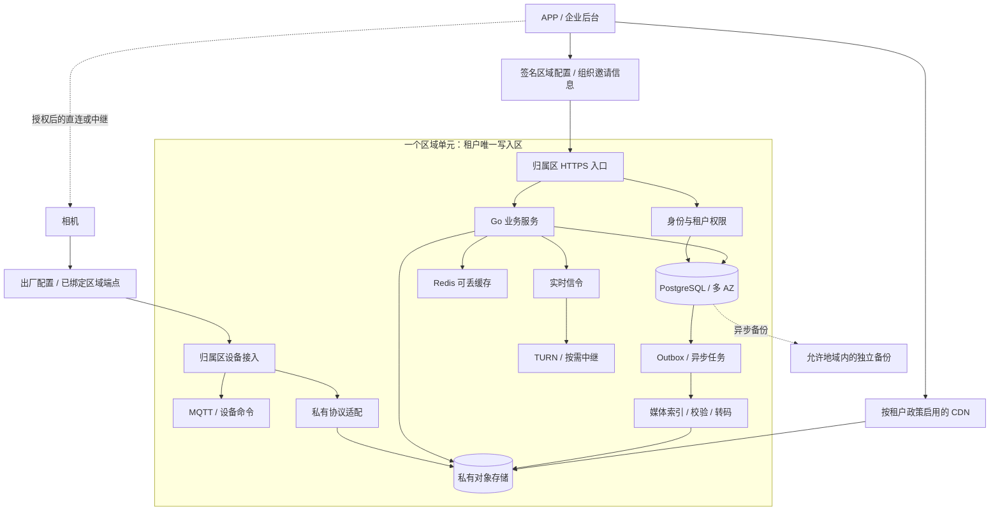

# 03 概要设计

## 1. 系统边界

每个区域单元负责自己租户的认证、设备、权限、媒体索引和原始媒体。租户的所有权决定数据写入区，客户端所在位置只影响网络路径。

一期基线部署候选为美国 `us-east-1`、法国 `eu-west-3`、新加坡 `ap-southeast-1`，复用一套基础设施模板，按首发市场逐区开通。非洲以法国、新加坡、开普敦和中东候选点做运营商探测，再决定落点；不宣称南非可以代表整个非洲。采购前核对所选区域的产品、配额和合同。AWS 的区域和 AZ 是不同故障域，跨 AZ 部署不能替代跨区域灾备。[AWS 基础设施说明](https://aws.amazon.com/about-aws/global-infrastructure/regions_az/)

媒体传输、实时中继、业务 API 是独立的数据路径，不让全部媒体穿过 API 网关。

## 2. 组件选择和部署职责

| 组件 | 一期选择 | 边界 |
|---|---|---|
| 应用 | 现有 Go 服务，EKS 区域集群，多 AZ 工作节点 | 不建立跨洲 k8s 集群；副本分散、连接池和重试均做故障测试 |
| 关系数据 | RDS PostgreSQL Multi-AZ 单主/备用部署 | 权限、绑定、配额及媒体索引的事实来源；备用不当读副本使用 |
| 媒体 | 区域 S3 私有桶，服务端加密，生命周期和版本策略 | 海外新增媒体不落自管 MinIO；旧 MinIO 通过适配层渐进迁移 |
| 分发 | CloudFront 私有内容分发，按租户策略启用 | 驻留/处理限制不满足时绕过全球 CDN，走允许端点 |
| Redis | 区内缓存，优先托管 | 缓存丢失可重建；关键授权不只依赖缓存 |
| MQTT | 复用现有实现，部署在本区并验证持久化/集群语义 | 客户端身份与 topic ACL 绑定到租户/设备；不跨洲拉一个集群 |
| RocketMQ | 仅在已有服务真实依赖时保留区内集群 | 新增少量异步工作用数据库 outbox+worker；不为了“全球化”再引入一种队列 |
| 私有协议接入 | Go 适配服务，按机型解析、鉴权、限流 | 接入缓冲不是默认永久存储 |
| 实时通信 | 现有信令和 TURN 实现；必要时在测得有收益的点增加中继 | 新增 TURN 只改善中继路径，不生成完整业务区 |
| 运维 | IaC、区域密钥、监控、发布流水线 | 全球仅聚合经许可的统计；日志不默认跨境汇总 |

RDS 此类 Multi-AZ 部署使用跨 AZ 同步备用，提供故障切换；这是区内数据库机制，不是全系统 RPO 的证明。[RDS 文档](https://docs.aws.amazon.com/AmazonRDS/latest/UserGuide/Concepts.MultiAZSingleStandby.html)

MQTT、TURN、RocketMQ 的现有具体项目与版本未知。实施前必须登记版本、支持状态、持久化设置和故障机制；本文没有假装完成源码审查。

## 3. 数据模型与不变量

| 实体 | 关键字段/约束 | 写入责任 |
|---|---|---|
| Tenant | `tenant_id, home_region, residency_policy, status, route_epoch` | 租户归属区；全局随机 ID，不以邮箱作 ID |
| Principal | `principal_id, issuer_region, credential_ref, status` | 身份发行区；一期与所属租户同区 |
| Membership | `tenant_id, principal_id, role, authz_version` | 租户归属区；撤权提交后敏感操作读取主库 |
| Device | `device_id, tenant_id, credential_ref, binding_version` | 绑定有唯一约束；生产库存的预分配避免跨区并发认领 |
| Media | `media_id, tenant_id, device_id, object_key, checksum, size, state` | 归属区；状态 `PENDING→READY→DELETING→DELETED` |
| Upload | `upload_id, idempotency_key, expires_at, expected_size` | 归属区；一个业务上传可有多个失败的传输尝试 |
| Command | `command_id, device_id, expires_at, state` | 归属区；投递成功不等于设备执行成功 |
| Outbox | `event_id, aggregate_id, version, payload, state` | 与业务修改同一数据库事务写入 |

必须始终成立：一个设备只有一个有效绑定；一个租户只有一个有效写入归属；跨租户资源访问被拒绝；READY 媒体能定位到经校验的对象；同一幂等请求不重复产生计费效果。数据库约束与事务负责本区不变量，不靠客户端或消息“恰好只发一次”。

一期邮箱唯一性限定在租户/身份域内，不承诺全球邮箱唯一。企业用户在外地访问同一身份域不需要重新注册；同一个人在不同企业拥有多个成员身份是另一项产品行为。

设备首次归属由企业交付清单或含区域信息的激活凭据确定。若库存允许任意地区自由认领，应增加有唯一权威的设备认领服务及数据政策评审；不能让各区分别判断同一序列号“尚未绑定”。一期不支持这种无预分配的全球自由认领。

## 4. 登录和跨区访问

1. 企业开通时选定数据区域，系统生成组织码/邀请链接；IP 位置只提供建议，不能覆盖已签约的区域。
2. APP 读取组织信息和签名端点表，连接该区身份服务。端点表只含区域、域名、公钥和配置版本，不含全量用户数据。
3. 身份服务读取本区凭据与成员关系，签发短时 token，含 `issuer、subject、tenant_id、audience、expiry`。资源服务验证签名、发行者、用途和租户；路由字段不是授权证明。
4. APP 缓存归属区。手机从北美到非洲后仍连接美国租户 API；换网络、换 DNS、刷新 token 都不创建非洲账号。
5. 新手机通过组织码、企业域名或邀请链接找回区域，再认证。组织码不是密码，发现接口仍限流并避免泄漏成员存在性。
6. 旧 APP 若只能使用统一 API 域名，兼容网关依据经过校验的归属信息转发；新 APP 直接连接区域域名，减少一跳。敏感登录不对任意 URL 重定向，目标受签名配置与域名白名单限制。

GeoDNS 可用于公共配置和就近无状态入口，不用于为每次写请求重新选择数据库。HTTPS、MQTT、TURN 是不同协议；DNS 更新不会自动迁移已建立的 TCP/UDP 会话。重连使用缓存端点、退避和抖动，在原归属区内部找可用入口。

一期 access token 建议 5 分钟，refresh token 仅回发行区；敏感操作读取权威权限状态。普通缓存授权若允许延迟撤权，应明确上界，不能只写“最终一致”。设备凭据吊销还要主动断开长连接。

## 5. 上传：什么时候可以告诉用户“已保存”

### 标准 HTTPS 上传

1. 客户端请求 `POST /v1/uploads`，携带幂等键。API 读取权限、设备绑定和剩余额度；事务写入 PENDING 上传，预留容量。
2. API 返回限定对象、操作和有效期的上传凭据。客户端把字节直接写入 S3，不经普通业务网关。
3. 上传后调用 `POST /v1/uploads/{id}/complete`。服务端检查对象存在、大小和校验值；不能相信客户端报的“完成”。
4. 对象有效后，在本区事务中将媒体改为 READY、结算配额并写 outbox；此时才返回“云端已保存”。超时重试读同一结果，不重复扣费。
5. worker 读取 outbox，异步做缩略图或转码。任务按事件 ID 去重；失败可重试，不把中间产物误当原件。

存储写入和数据库提交不是同一个事务。对象成功、数据库失败会留下孤儿对象；由补偿扫描清理。数据库存在 PENDING、对象不存在则过期释放配额。扫描需留出传输宽限期，避免删除仍在进行的上传。

预签名 URL 在有效期内可能重复使用，不能称为一次性凭据。同名覆盖风险由唯一上传 key、桶版本和固定最终版本处理：READY 索引绑定校验通过的对象版本，或服务端复制到客户端不可写的最终 key；不把一个仍可覆盖的临时 key 当最终媒体。[S3 预签名 URL 文档](https://docs.aws.amazon.com/AmazonS3/latest/userguide/using-presigned-url.html)

### 非标准传图设备

适配层读取设备帧，校验设备凭据、长度、序号和校验码；组装对象后复用上述提交流程。先提供协议 ACK 还是存储 ACK 必须区分：协议接收不代表永久保存。只有 RAM 缓冲时，进程崩溃会丢帧，不能承诺零丢失。

机型若支持重传，云端按 `device_id + boot/session_id + frame_seq` 去重；序号重启归零不能导致新图片被误丢。若设备只能单次发送，需在需求中接受损失，或增加可持久化接入缓冲并重新定义 ACK；不能用 MQTT QoS 的名字掩盖固件限制。

对象存储接受字节，不直接承担私有流协议解析。连续流需按时间或大小切片并保存索引；图像机型不强行转成直播系统。

## 6. 回放与实时观看

回放时，API 先读取本区成员权限和 READY 索引，再发短时播放授权。CDN 命中则分发已缓存对象，未命中才回区域桶取数据；跨国观看不要求提前复制全部录像。私有桶只允许规定的源站访问，不能靠隐藏 URL 保护隐私。[CloudFront 私有内容授权](https://docs.aws.amazon.com/AmazonCloudFront/latest/DeveloperGuide/private-content-signed-urls.html)

按租户策略选择可用分发路径。若不能在全球边缘处理或缓存，直接访问允许区域端点；首次跨洋读取会慢，明确接受这一代价。缓存提高访问效率，不是备份，也不是数据驻留证明。

实时观看先由信令服务校验权限，再尝试设备与 APP 直连；无法直连时使用授权中继。TURN 负责 NAT 环境中的转发，不负责录像存储。[RFC 8656](https://www.rfc-editor.org/rfc/rfc8656.html) 不支持该实时协议的低端机型只提供适配后的图片/片段能力，不能承诺 WebRTC 全兼容。

TURN 使用短期凭据、租户速率/会话配额，禁止开放匿名中继。选点考虑设备到中继和 APP 到中继两段总路径，不能只测手机到节点的 ping。

## 7. 接口和异步契约

| 接口/事件 | 输入与读取 | 写入或返回 |
|---|---|---|
| `GET /v1/regions` | 当前签名配置版本 | 区域端点、公钥、有效期；离线缓存可用 |
| 区域登录/刷新 | 组织信息、凭据；读区域身份库 | 短期 token；不全球复制凭据 |
| `POST /v1/device-bindings` | 激活凭据、用户权限、绑定版本 | 本区事务唯一绑定；重复请求返回原结果 |
| `POST /v1/uploads` | 设备、大小、幂等键 | PENDING 与受限上传凭据 |
| `POST /v1/uploads/{id}/complete` | 对象实际状态 | READY 或可重试状态 |
| `GET /v1/media/{id}/playback` | 最新权限、媒体状态、地区策略 | 受限播放 URL/清单 |
| `POST /v1/devices/{id}/commands` | 操作权限、命令 ID、过期时间 | 持久化命令再投递；明确 ACCEPTED/EXECUTED/FAILED |
| `DELETE /v1/media/{id}` | 所有权、保留要求 | 撤销可见性并排队删除对象、派生物、缓存 |
| outbox 事件 | `event_id, schema_version, aggregate_version` | 至少一次处理；消费者幂等；死信告警与人工回放 |

错误分清：401 身份无效、403 权限不足、409 状态/绑定冲突、429 配额或限流、503 暂不可用。超时表示结果未知，不代表服务端未执行；客户端使用原幂等键查询/重试。命令过期禁止补执行，尤其不能在设备离线数天后执行过时的控制动作。

## 8. 故障、灾备与迁移

| 故障 | 行为 | 不承诺什么 |
|---|---|---|
| 单 Pod/节点 | 负载转到其他副本；客户端退避重试；上传按状态恢复 | 内存中的帧自动保全 |
| Redis 丢失 | 回读数据库、限制回源洪峰、逐步重建 | 缓存即事实来源 |
| 队列/worker 故障 | 事务 outbox 留存，恢复后续做；限制积压 | 后处理实时完成 |
| 数据库/AZ 故障 | 托管切换，连接重建，未知提交按幂等键确认 | 切换期间每个请求都成功 |
| 区域隔离 | 本区无法确认的写入失败/等待；其他租户区域继续 | 用异地旧副本无损续写 |
| CDN 故障 | 策略允许时回允许的区域源站，限流防击穿 | 绕过权限或驻留政策的任意回源 |
| 配置中心不可用 | 已绑定客户端使用签名缓存与固定区域端点 | 所有新设备都能完成首次发现 |

区内多 AZ、数据库备份、媒体保留分别配置。关键数据库自动备份/PITR 加独立权限域备份；允许时每日复制到指定灾备区域。媒体跨区副本按合同和套餐开启并计费，不是给五个在线区各放一份。S3 跨区域复制本身是异步的，不能据此宣称零 RPO。[S3 复制说明](https://docs.aws.amazon.com/AmazonS3/latest/userguide/replication.html)

租户迁移一期只走维护流程：预复制并校验 → 冻结写入并排空任务 → 补齐增量 → 撤销旧区写权限/停止旧服务 → 新区核对完成 → 更新路由版本并启用写入。旧区未能被可靠隔离时不得提升新写者。`route_epoch` 是校验信息，单靠递增一个数不能阻止孤立旧节点写入。

一旦新区开始写入，不能简单把 DNS 切回旧区；必须冻结、对账并回迁新增数据。该限制同样适用于灾备恢复。

## 9. 安全与数据生命周期

每设备独立凭据，禁用通用出厂密码；低端机至少需要不可猜测的逐设备密钥、认证和重放保护。若机型不支持安全传输，先明确受控接入网关或固件补救，不直接暴露未经鉴权的公网上传。

权限隔离落到每条查询和对象授权；对象路径含租户 ID 只是命名，不是访问控制。数据库、对象桶、备份、签名密钥分权；生产媒体访问需限时授权并记录审计。日志不记录密码、完整 token、预签名 URL 或原始媒体。

删除先撤销可见性，停止签发新 URL，再删原件、版本与派生物，并按能力清缓存。已经发出的播放 URL 在到期前可能仍可用；一期建议最长 60 秒授权，若要求即时撤销，必须增加每次访问的在线授权，不能靠“短时”冒充即时。备份按保留期淘汰，恢复时重放删除清单，避免把已删数据重新上线。客户要求法定保留与删除冲突时采用经核准的策略。
