# 缤纷云+Piclist

#### 一. 在缤纷云创建桶

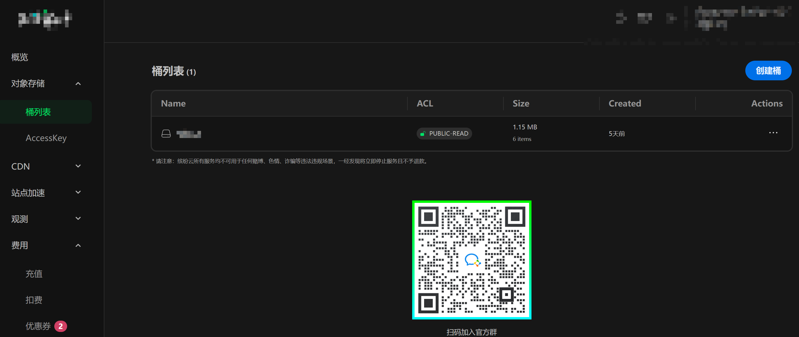

创建完成后进入访问管理。

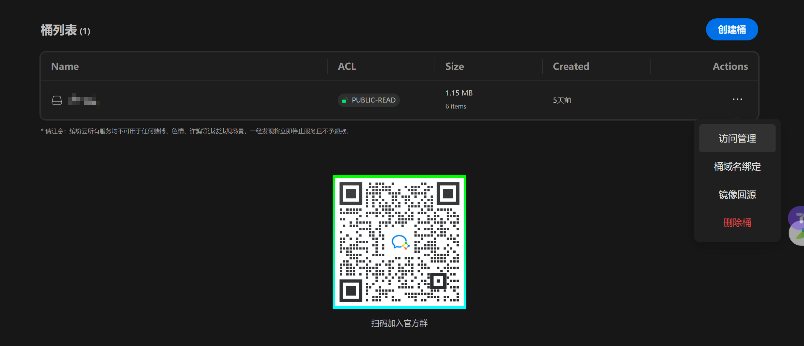

主要关注如下两个：“桶信息”和“访问管理”这两块儿。

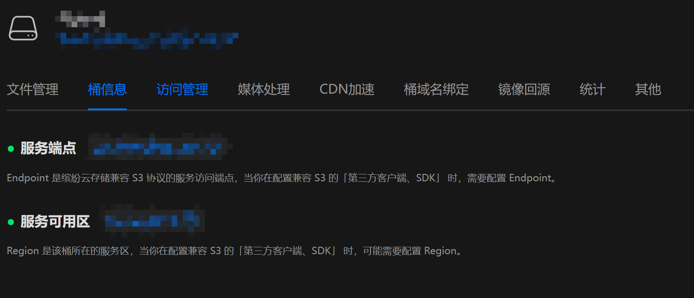

- “桶信息”用于后续的Piclist的配置。
- “访问管理”里面：
  - 这个应该是比较必要，白名单里面配置的是自己的博客的地址。  
    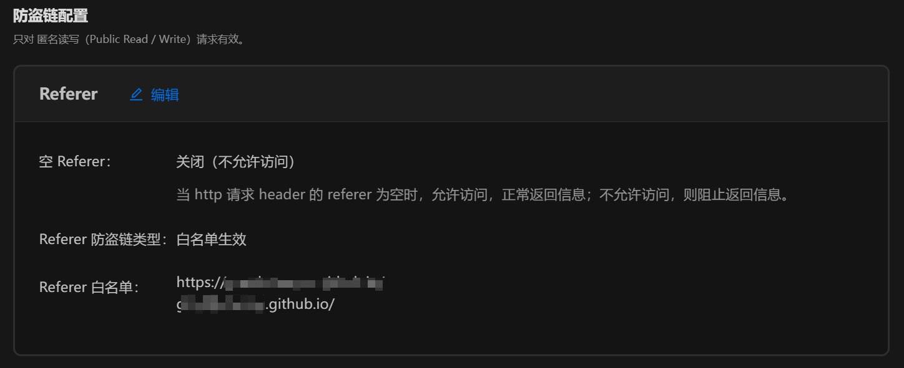

#### 二. 配置Piclist的npm镜像源并安装Amazon S3插件并配置

1.  下载地址：<a href="https://piclist.cn/" rel="noopener" target="_blank">PicList</a>。
2.  设置npm镜像  
    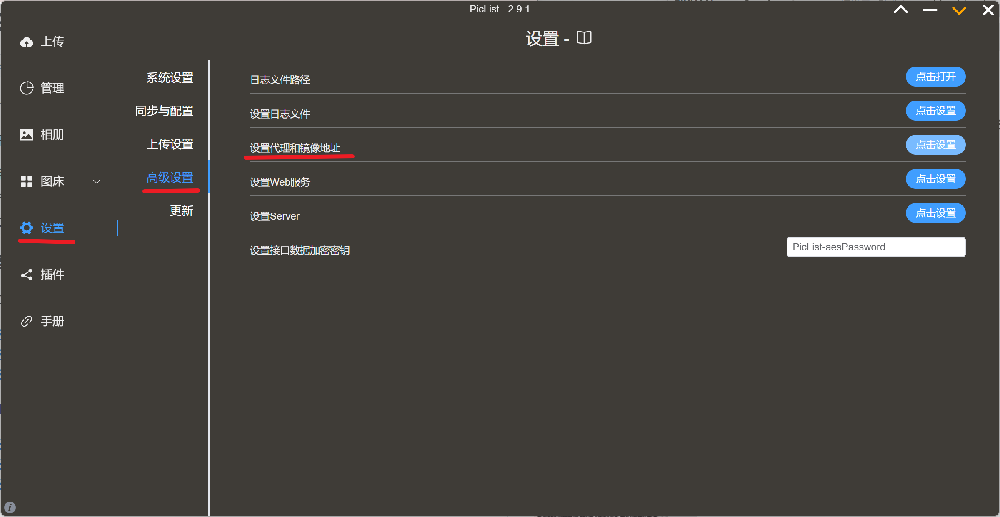  
    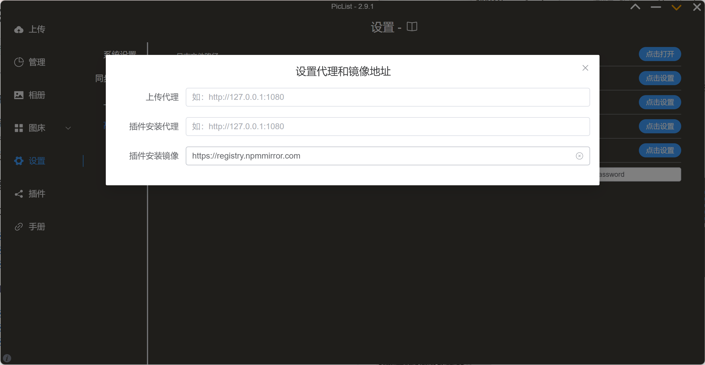  
    就是插件安装镜像那边：<a href="https://registry.npmmirror.com/" rel="noopener" target="_blank">https://registry.npmmirror.com</a>
3.  搜索s3插件并安装  
    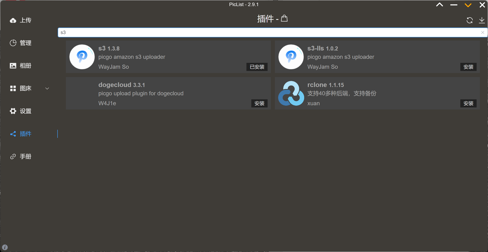
4.  创建配置：  
    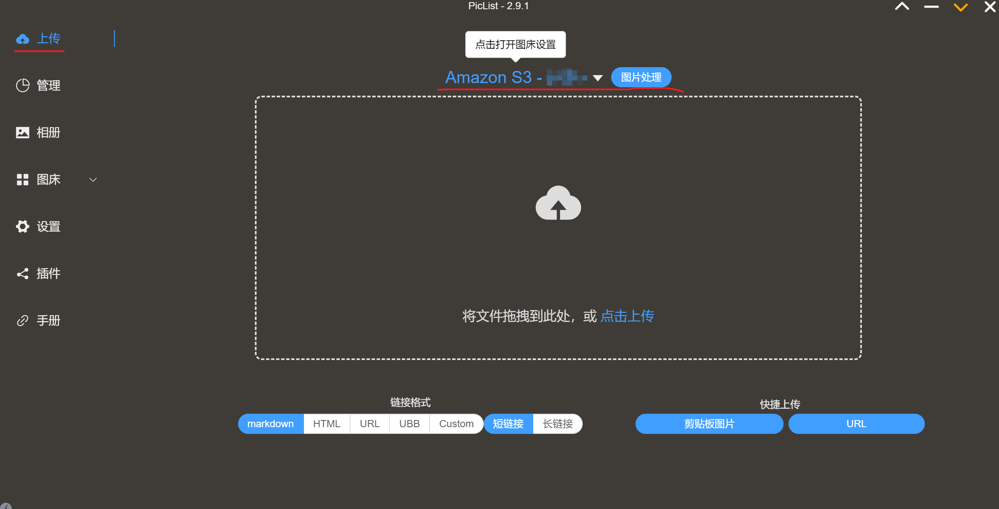
5.  打开配置并配置：  
    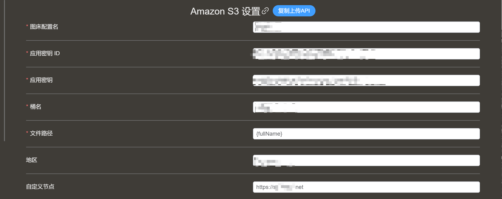
    - 主要是这7个配置。
    - 应用密钥ID和应用密钥是缤纷云创建桶的时候出来的，记住。
    - 自定义结点和地区，就是缤纷云桶信息那块儿。  
      自定义节点这个记得加上https就行。
6.  确定  
    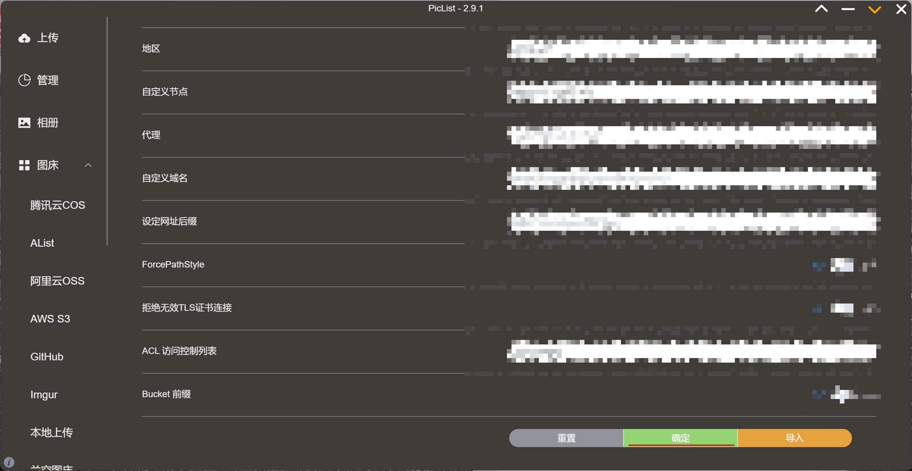

#### 三. 上传图片

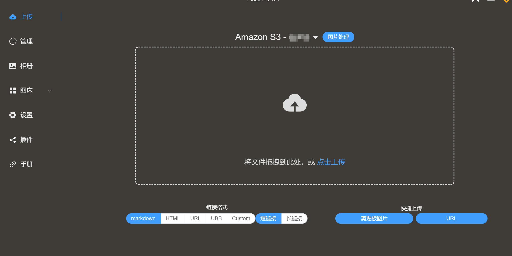  
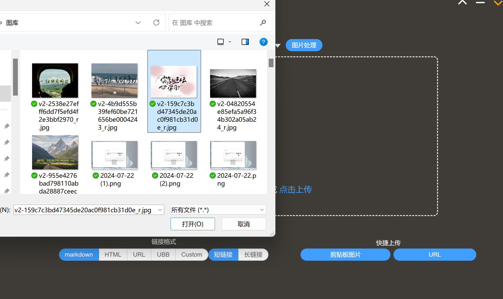  
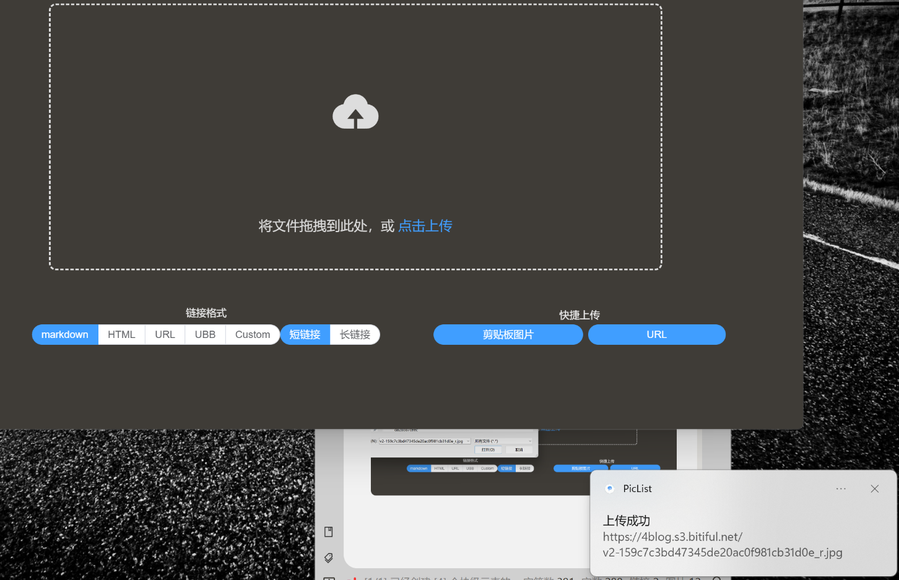

#### 四. 贴到博客里面

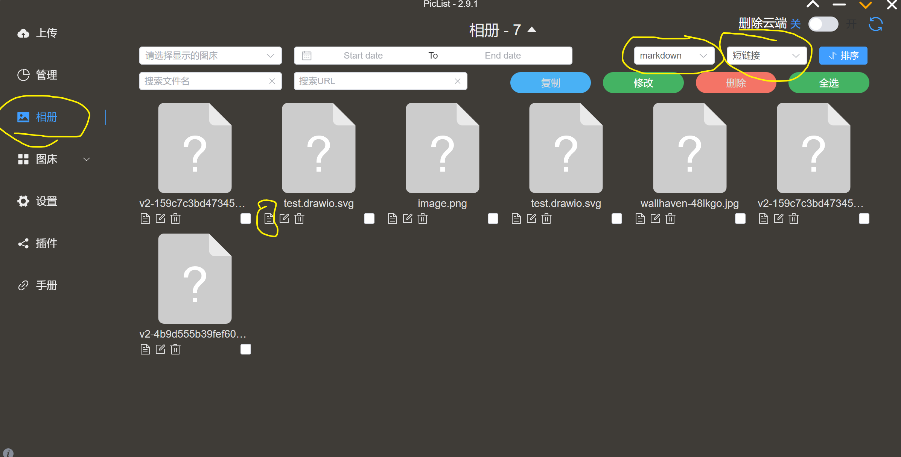  
`""`

下面就是呈现：  

#### 附录: 参考连接

1.  <a href="https://www.yvii.cn/archives/2014.html" rel="noopener" target="_blank">https://www.yvii.cn/archives/2014.html</a>
2.  <a href="https://piclist.cn/manage#s3s" rel="noopener" target="_blank">https://piclist.cn/manage#s3s</a>
3.  <a href="https://www.bayyys.cn/posts/914acd72.html#%E9%85%8D%E7%BD%AE-picgo" rel="noopener" target="_blank">https://www.bayyys.cn/posts/914acd72.html#%E9%85%8D%E7%BD%AE-picgo</a>
