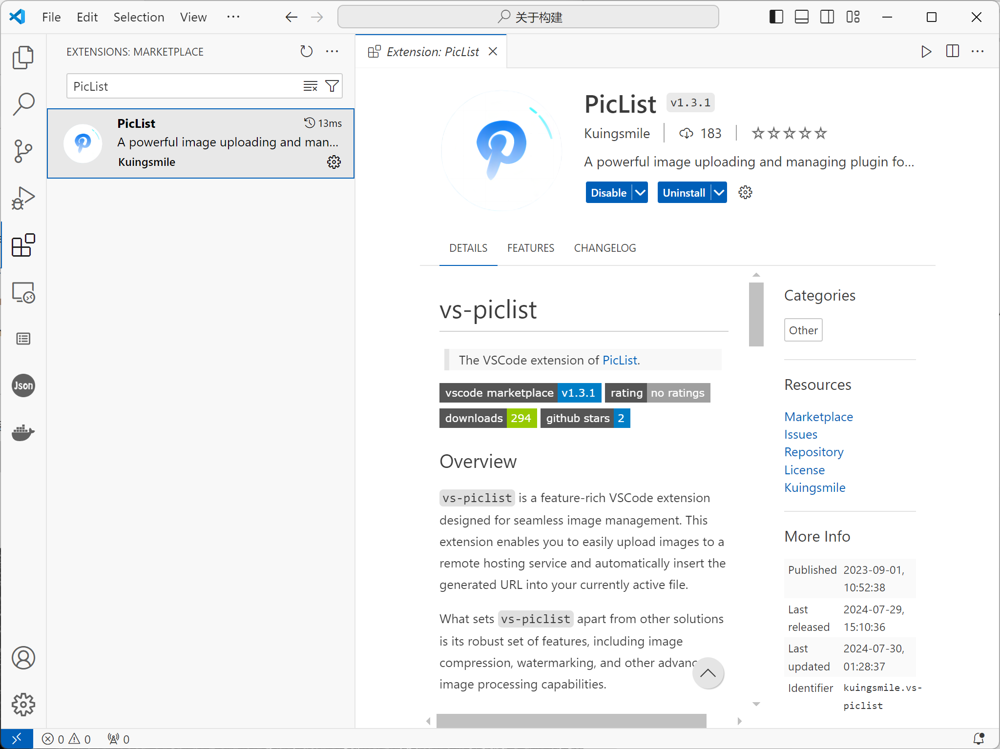
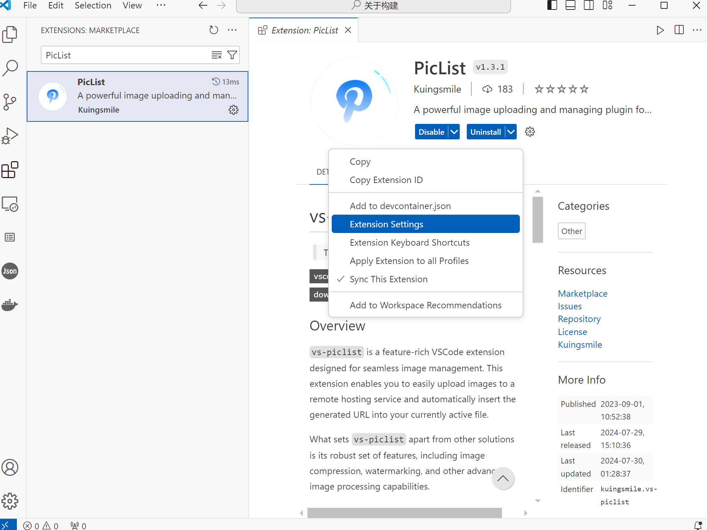
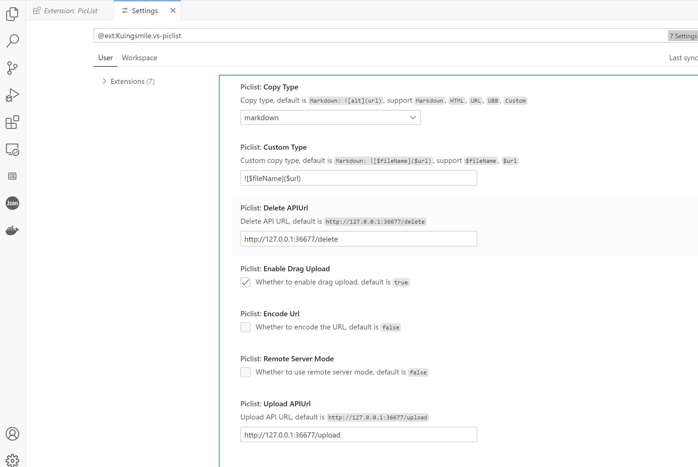
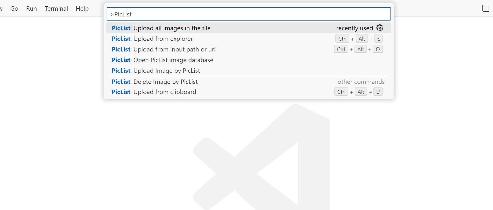
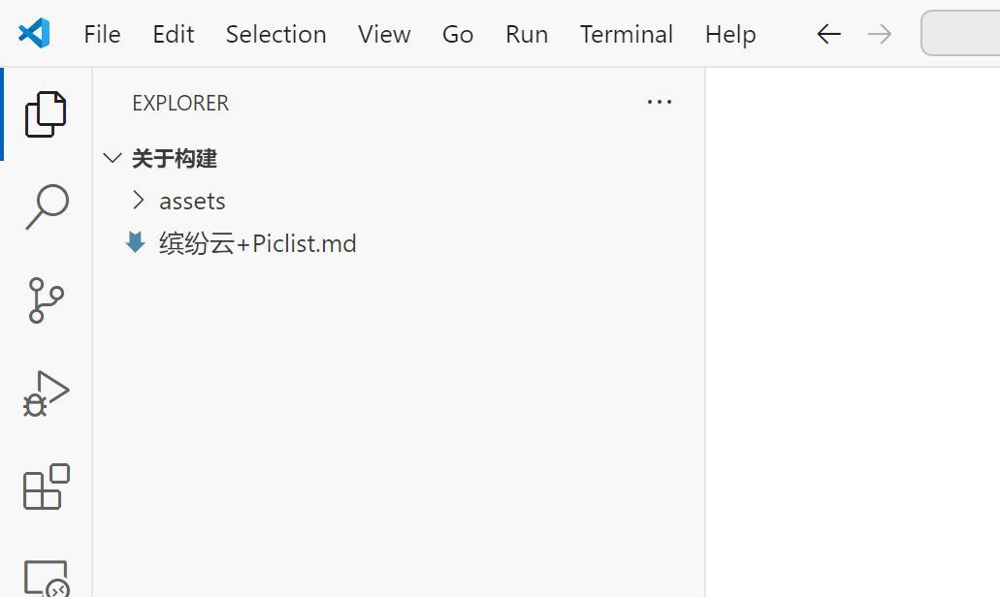

## 〇. 前置步骤

这个的前置步骤是这个：[Piclist+缤纷云=个人图床](/posts/0009/ "Piclist+缤纷云=个人图床")  
使得Piclist软件可用。

- 目前的实践是基于win11的平台。
- 之前尝试是BLOG这些hexo等放在WSL2平台，vscode、piclist安装在win11。vscode打开博客编写markdown.  
  piclist在win平台打开。  
  问题出现：vs-piclist插件无法上传或者操作WSL2内部的图片，因为vs-piclist默认的路径格式是Win11下的。  
  在WSL2中的图片路径在上传的时候都会加上一个C盘的前缀。
- 为了简单，没有尝试其他修改或者探索，直接把hexo那一套迁移到Win11中的OneDrive同步文件夹中。  
  也没啥问题。
- 同样的，npm不要忘了配置淘宝镜像。最新版的那个，不要老的。

## 一. 一般配置

### 下载

### 配置 vs-piclist

配置项很少，就这7个，一般来说不要动。Delete APIUrl和Upload APIUrl是在你本地的Piclist没有启动的时候，它就会尝试用调用这个API URL。

按我理解，这个是部署了一个piclist服务，但是我没搞，无所了，先不管。

### vs-piclist 命令

`F1`或者`Ctrl + Shift + P`，主要是下面7个命令：

#### PicList: Upload all images in the file

这个命令很有价值，最佳实践就是：

- 你先在本地markdown中编辑好文档，图片啥的都按照本地路径写好。

- 然后你执行这个命令。

- 它首先把你文章中的所有图片上传到你的图床。

- 然后把markdown中的图片URL都替换成图床中的。

#### Upload from explorer

- 就是很基础从文件夹中选图片上传。

- 可以按住ctrl多选。

- 这个功能不太适合流程化操作，适合用于“修修补补”。

#### PicList: Upload from input path or URL

- 没怎么使用，估计如其描述所述吧。

#### PicList: Open PicList image database

- 没怎么使用，不太清楚。

#### PicList: Upload Image by PicList

- 不清楚

#### PicList: Delete Image by PicList

- 还没用

#### PicList: Upload from clipboard

- 还没用

#### 注意

还有几个好用的功能没有用到，但是作者在README中有gif的展示。

不要忘了时刻学习。

## 二. SiYuan 笔记 + VS Code 实践

这个主要是起一个草稿+发布的搭配。当然了，SiYuan笔记还可以起到一个备份的作用。

流程就是：

> - 在思源中撰写笔记，主要粘贴普通的截图方便，直接贴到思源里面就可以了。
>
>   - 但是基于vs-piclist其实可以做到“复制图片”——\>“markdown中粘贴”——\>“直接生成URL的操作的”。
>   - 但是SiYuan主要还有一个备份的作用。先这样吧。
>
> - 然后把SiYuan的该文档导出为markdown。
>
>   - SiYuan的导出文件有两个：
>
>     - markdown文件
>     - asset文件夹：里面就是用到的图片
>
>   - 以如下的格式打开：  
>     
>
>   - 然后F1——\>PicList: Upload all images in the file  
>     就可以进行文档中图片的上传和URL替换。

## 三. draw.io + VS Code 实践

- 上面的SiYuan操作主要是由于普通的截图+贴图然后可以先很顺畅的完成整个文章的撰写，然后再利用vs-piclist统一的上传转换，这个感受上是比较完整和顺的，不会太碎。

- 但是如果这个图是我们上个博文中提到的是用drawio的vscode插件绘制的话。

  就会没有那么顺畅了。因为这些图片不能用“复制+粘贴”或者拖动来插入到SiYuan的文档中。必须要”/图片“ 符号触发菜单——\>“插入图片和文件”——\>“浏览选中”这样。这个流程就不顺滑了。

- 或者就是上面菜单中选择”插入图片连接”，然后在vscode中复制图片的连接地址来插入，这个稍微顺滑一点。

- 或者就是打开drawio图片的文件夹，然后拖拽进来，也可以。

- 但是最顺畅的就是“复制+粘贴”，然后本地所见即所得。

所以可以进行如下流程：

> - 直接在vscode中撰写markdown
> - 直接在vscode中绘制drawio图片
> - 直接复制画好的图片本身
> - 直接往markdown的光标的地方粘贴，不出问题会变成markdown的url的形势。
> - 最后文章结束后：PicList: Upload all images in the file.

上面这个流程的问题是，在SiYuan本地中没有备份了。但是也可以用SiYuan的导入功能，也还好其实。

## 四. 关于 vs-piclist 插件

- 这个插件的演示gif里面有很好的功能，但是好像总是报错。等后续搞明白了再补充吧。

- 譬如很好用的在vscode中直接复制粘贴图片，它会立刻上传然后转成图床的url粘贴到markdown中，相当于不用在SiYuan中实现这个复制粘贴的功能了。

- 但是对于我个人来说，更倾向于SiYuan先在本地写好同步到云(本人用的SiYuan的官方云存储)，然后再发布到博客这个流程。

- 后面搞明白了为啥vs-piclist会报错再说吧。并且这个报错是在其他功能能用的时候报的。
