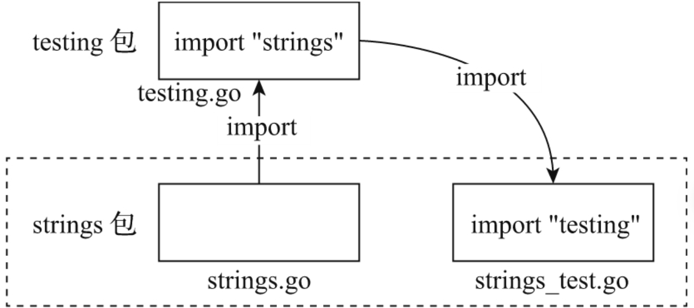
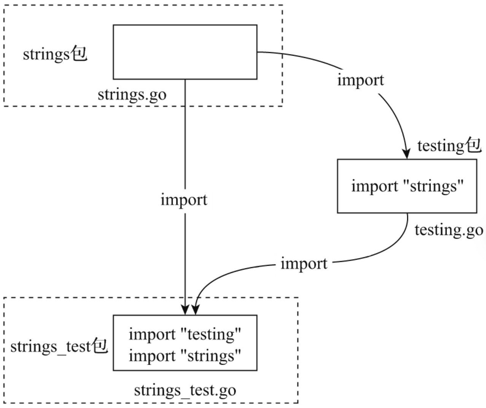

## go test 执行测试的基本原理

由于Go构建工具链在编译包时会自动根据文件名是否具有_test.go后缀将包源文件和包的测试源文件分开，测试代码不会进入包正常构建的范畴，因此测试代码使用与被测包名相同的包内测试方法是一个很自然的选择。

## 包内测试的优点

包内测试可以测的对象包括：

- 由于测试代码与被测包源码在同一包下，包下的所有符号，包括导出符号和未导出符号都是包内测试的对象。

包内测试可以更为直接地构造测试数据和实施测试逻辑，可以很容易地达到较高的测试覆盖率。因此对于追求高测试覆盖率的项目而言，包内测试是不二之选。

## 包内测试的不足

包内测试-白盒测试的问题一：

- 包内测试的白盒测试本质意味着它是一种**面向实现**的测试——即和具体的实现紧耦合。

- 测试代码的测试数据结构和测试逻辑通常与被测包的特定数据结构设计和函数/方法的具体实现逻辑仅耦合。

  - 紧耦合具体体现在：一旦被测包的数据结构设计出现调整或函数/方法的实现逻辑出现变动，那么对应的测试代码也要随之同步调整，否则整个包将无法通过测试甚至测试代码本身的构建都会失败。
  - 而包的内部实现逻辑又是易变的，其优化调整是一种经常性行为，这就意味着采用包内测试的测试代码也需要经常性的维护。

除此以外：

包内测试-白盒测试的问题二：—— 包循环引用

> 在 Go 语言中，包循环引用是指两个或多个包之间相互引用，形成环状结构的情况。
>
> 例如，包 a 中的代码依赖了包 b，而包 b 中的代码又依赖了包 a，这样就导致了包循环引用。

- Go编译器不允许包循环引用

  - 经典的就是`strings`包和`testing`包的两包循环引用。

  - 

    图解：

    - 图里面俩包：testing包的testing.go文件 以及 strings包的strings.go文件和strings_test.go文件。
    - 那么根据具体文件的引用情况，就是两个包在互相引用。

## 包外测试的优点

包外测试的好处：

- 包外测试：包外测试的本质是一种面向接口的黑盒测试。

  - 接口是指被测试包对外导出的AIP。
  - 这些API是被测包与外部交互的契约。契约一旦确定就会长期保持稳定，无论被测包的内部实现逻辑和数据结构设计如何调整与优化，一般都不会影响这些契约。
  - 包外测试代码和被测试包充分解耦，包外测试代码很健壮。

- 包内测试不存在“包循环引用”的硬伤，直观来讲就是，两个包拆成三个包了。

  

- 包外测试这种纯黑盒的测试还有一个功能域之外的好处，那就是可以更加聚焦地从用户视角验证被测试包导出API的设计的合理性和易用性。

## 包外测试的不足

包外测试的局限：

- 存在测试盲区
- 仅有权限访问被测包的导出符号和导出API。
- 基于以上约束，容易出现对被测试包的测试覆盖不足的情况。

这个是包外测试的局限性


## 通过 export_test.go 为包外测试增加测试覆盖

如何解决包外测试覆盖不足的问题 —— 安插后门：

- 方法一：

  创建一个export_test.go文件到被测包下

  - 该文件的特点一：它属于_test.go文件, 由于Go构建工具链在编译包时会自动根据文件名是否具有_test.go后缀将包源文件和包的测试源文件分开。因此它不会被构建入正式代码中。

  - 但是它本身不包含任何测试代码，而仅用于将被测试包的内部符号在测试阶段暴露给包外测试代码。

  - 示例如下：

    ```go
    package fmt

    var IsSpace = isSpace
    var Parsenum = parsenum
    ```

    这个上面就是变量的赋值实现的。

    函数在go语言中是一等公民，那么也可以通过变量赋值的形式来使得其可导出吧。应该是吧。到时候试一试。

- 方法二：

  - 方法二这边白明说的不是很清晰：
    **定义辅助包外测试的代码，比如扩展被测包的方法集合。**

  - 书里给了一点代码：

    ```go
    // $GOROOT/src/strings/export_test.go
    package strings

    func (r *Replacer) Replacer() interface{} {
        r.once.Do(r.buildOnce)
        return r.r
    }

    func (r *Replacer) PrintTrie() string {
        r.once.Do(r.buildOnce)
        gen := r.r.(*genericReplacer)
        return gen.printNode(&gen.root, 0)
    }
    ...
    ```

    这个代码的具体功能和作用我没有理解，但是，有一点是可以理解的。

    那就是，它实际上是对对象Replacer补充了两个指针类型的方法。

## 优先使用包外测试

白明倾向于优先使用包外测试，理由，包外测试可以：

- 优先保证被测试包导出API的正确性。—— 毕竟是要提供服务的嘛。
- 可从用户角度验证导出API的有效性。—— 还是要有限保证服务的可用。
- 保持测试代码的健壮性，尽可能地降低对测试代码维护的投入
- 不失灵活！可通过export_test.go这个“后门”来导出我们需要的内部符号，满足窥探包内实现逻辑的需求。

## 同时使用包内测试和包外测试

同时利用包内测试和包外测试：

- 以`net/http`为例：

  - 包外测试由于将测试代码放入独立的包中，它更适合编写偏向集成测试的用例，它可以任意导入外部包，并测试与外部多个组件的交互。

  - 而包内测试更聚焦于内部逻辑的测试，通过给函数/方法传入一些特意构造的数据的方式来验证内部逻辑的正确性

  - 最好能通过测试代码的文件名来区分所属测试类别：

    - net/http包使用transport_internal_test.go来明确包内测试
    - 对应的transport_test.go为包外测试

## 参考文献

- <a href="https://weread.qq.com/web/reader/b8f32d2072895edbb8fbb04" rel="noopener" target="_blank">Go语言精进之路：从新手到高手的编程思想、方法和技巧2</a>
