> **原文信息 / Attribution**
>
> Aeree Cho, Grace C. Kim, Alexander Karpekov, Seongmin Lee, Alec Helbling, Benjamin Hoover, Zijie J. Wang, Minsuk Kahng, and Duen Horng (Polo) Chau. 2026. Transformer Explainer: Learning LLM Transformers with Interactive Visual Explanation and Experimentation. In Proceedings of the 2026 CHI Conference on Human Factors in Computing Systems (CHI '26), April 13–17, 2026, Barcelona, Spain. ACM, New York, NY, USA, 21 pages. <https://doi.org/10.1145/3772318.3791725>
>
> 原文采用 [CC BY 4.0](https://creativecommons.org/licenses/by/4.0/) 许可，本文在署名前提下转载并逐段附中文翻译。工具在线体验：<https://poloclub.github.io/transformer-explainer/>

---

**Transformer Explainer: Learning LLM Transformers with Interactive Visual Explanation and Experimentation**

**Transformer Explainer：通过交互式可视化讲解与实验学习 LLM Transformer**

**Aeree Cho**¹, **Grace C. Kim**¹, **Alexander Karpekov**¹, **Seongmin Lee**¹, **Alec Helbling**¹, **Benjamin Hoover**², **Zijie J. Wang**¹, **Minsuk Kahng**³\*, **Duen Horng (Polo) Chau**¹\*

- **Aeree Cho** — Georgia Tech, Atlanta, USA — aeree@gatech.edu
- **Grace C. Kim** — Georgia Tech, Atlanta, USA — gracekim3@gatech.edu
- **Alexander Karpekov** — Georgia Tech, Atlanta, USA — akarpekov3@gatech.edu
- **Seongmin Lee** — Georgia Tech, Atlanta, USA — seongmin@gatech.edu
- **Alec Helbling** — Georgia Tech, Atlanta, USA — alechelbling@gatech.edu
- **Benjamin Hoover** — IBM Research AI, Cambridge, USA — benjamin.hoover@ibm.com
- **Zijie J. Wang** — Georgia Tech, Atlanta, USA — jay@zijie.wang
- **Minsuk Kahng**∗ — Yonsei University, Seoul, Republic of Korea — minsuk@yonsei.ac.kr
- **Duen Horng (Polo) Chau**∗ — Georgia Tech, Atlanta, USA — polo@gatech.edu

∗ Corresponding author / 通讯作者

**License / 原文许可声明（逐字保留）：**

> This work is licensed under a Creative Commons Attribution 4.0 International License.
> CHI ’26, Barcelona, Spain
> © 2026 Copyright held by the owner/author(s).
> ACM ISBN 979-8-4007-2278-3/26/04
> https://doi.org/10.1145/3772318.3791725

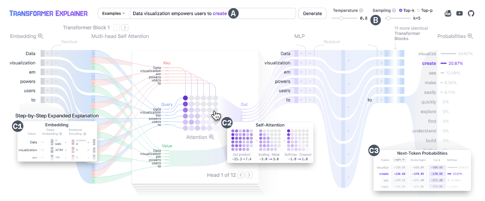

**Figure 1:** Transformer Explainer helps users (A) visually explore how a Transformer text-generation model (GPT-2) processes input text into a prediction for the next token, (B) interactively manipulate often-confused hyperparameters, such as temperature and sampling strategies, to understand their effects on prediction determinism; and (C) seamlessly transition between abstraction levels to visualize the interplay between high-level model structures and low-level mathematical operations for (C1) embedding, (C2) self-attention, and (C3) next-token probabilities.

> **图 1：** Transformer Explainer 帮助用户：(A) 直观地探索 Transformer 文本生成模型（GPT-2）如何将输入文本处理为对下一 token 的预测；(B) 交互式地操纵常被混淆的超参数（如温度和采样策略），以理解它们对预测确定性的影响；(C) 在不同抽象层级之间无缝切换，可视化高层模型结构与底层数学运算之间的相互作用，包括 (C1) 嵌入、(C2) 自注意力和 (C3) 下一 token 概率。

## Abstract

The Transformer architecture underpins modern large language models powering state-of-the-art text generation and AI applications. However, its complexity makes it difficult for non-experts to learn. Existing resources often lack interactivity, rely on static descriptions of simplified architectures, or fail to reflect models’ behavior with real data. To address this gap, we introduce Transformer Explainer, an interactive visualization tool for non-experts to learn Transformers. The tool integrates an overview illustrating the Transformer’s data flow with on-demand explanations that gradually reveal mathematical details. Smooth transitions across abstraction levels highlight the interplay between high-level structures and low-level operations. Running a live GPT-2 instance directly in the browser, Transformer Explainer empowers learners to experiment with custom input and hyperparameters without setup, observing next-token predictions in real time. A 90-participant user study showed that our tool offered significant advantages in improving user understanding and engagement. Transformer Explainer has attracted over 490,000 users.

> **摘要：** Transformer 架构支撑着现代大语言模型，驱动着最先进的文本生成与 AI 应用。然而，其复杂性使非专业用户难以学习。现有学习资源往往缺乏交互性，依赖对简化架构的静态描述，或无法反映模型在真实数据上的行为。为弥补这一缺口，我们推出了 Transformer Explainer——一个供非专业用户学习 Transformer 的交互式可视化工具。该工具将展示 Transformer 数据流的总览视图与按需展开、逐步揭示数学细节的讲解相结合。跨抽象层级的平滑过渡凸显了高层结构与底层运算之间的相互作用。Transformer Explainer 直接在浏览器中运行一个实时 GPT-2 实例，使学习者无需任何配置即可用自定义输入和超参数做实验，实时观察下一 token 的预测结果。一项 90 名参与者的用户研究表明，我们的工具在提升用户理解度和参与度方面具有显著优势。Transformer Explainer 已吸引超过 49 万用户。

## CCS Concepts

• Human-centered computing → Information visualization.

> **CCS 概念：** 以人为中心的计算 → 信息可视化。

## Keywords

Deep Learning, Transformers, Visual Explanations, Interactive Experimentation, Visual Analytics, AI Education

> **关键词：** 深度学习、Transformer、可视化解释、交互式实验、可视分析、AI 教育

## ACM Reference Format

Aeree Cho, Grace C. Kim, Alexander Karpekov, Seongmin Lee, Alec Helbling, Benjamin Hoover, Zijie J. Wang, Minsuk Kahng, and Duen Horng (Polo) Chau. 2026. Transformer Explainer: Learning LLM Transformers with Interactive Visual Explanation and Experimentation. In Proceedings of the 2026 CHI Conference on Human Factors in Computing Systems (CHI ’26), April 13–17, 2026, Barcelona, Spain. ACM, New York, NY, USA, 21 pages. https://doi.org/10.1145/3772318.3791725

> **ACM 引用格式（译文）：** Aeree Cho、Grace C. Kim、Alexander Karpekov、Seongmin Lee、Alec Helbling、Benjamin Hoover、Zijie J. Wang、Minsuk Kahng、Duen Horng (Polo) Chau。2026 年。《Transformer Explainer：通过交互式可视化讲解与实验学习 LLM Transformer》。载于《2026 年 CHI 人机交互计算系统会议论文集》（CHI '26，2026 年 4 月 13–17 日，西班牙巴塞罗那）。ACM，美国纽约州纽约市，共 21 页。https://doi.org/10.1145/3772318.3791725

## 1 Introduction / 引言

The Transformer [81] has become the state-of-the-art neural network architecture across diverse domains, including natural language processing and computer vision, and forms the backbone of large language models (LLMs) such as ChatGPT, DeepSeek, and Gemini. However, its complex internal structure poses significant learning challenges for non-experts, hindering their understanding and engagement [66]. Existing resources typically rely on static or non-interactive explanations that do not support experiential learning [1, 3] and may not fully reflect the model’s behavior with real data [12]. Research from our HCI community has demonstrated the significant benefits of interactive visual explanations in empowering learners to more easily engage with and learn complex concepts [25, 41, 45, 73, 85]. For non-experts wishing to take their first steps toward understanding this technology, engaging and interactive explanations may be crucial for supporting such learning.

> Transformer [81] 已成为自然语言处理、计算机视觉等多个领域中最先进的神经网络架构，并构成了 ChatGPT、DeepSeek、Gemini 等大语言模型（LLM）的骨干。然而，其复杂的内部结构给非专业用户带来了巨大的学习挑战，阻碍了他们的理解与投入 [66]。现有学习资源通常依赖静态或非交互式的讲解，不支持体验式学习 [1, 3]，也可能无法完整反映模型在真实数据上的行为 [12]。我们 HCI 社区的研究已经证明，交互式可视化讲解在帮助学习者更轻松地接触和掌握复杂概念方面具有显著优势 [25, 41, 45, 73, 85]。对于希望迈出第一步去理解这项技术的非专业用户来说，引人入胜的交互式讲解可能是支撑这种学习的关键。

**Key challenges in designing learning tools for Transformers.** An increasing body of research is leveraging interactive visualizations to explain deep learning concepts. However, Transformers introduce unique challenges that require novel visual designs. For example, unlike earlier models such as Convolutional Neural Networks (CNNs), where operations can be made easier to understand through visualizations (e.g., filters sliding over input images [85]), Transformers operate on high-dimensional numerical representations of text that may be harder to understand. The mathematical operations performed on these representations add further complexity: Transformers consist of many repeating blocks, each containing many interacting operations (Fig. 2)—requiring learners to develop a mental model of not only how individual components work but also how they interact [23, 51]. Notably, the multi-head self-attention mechanism, unique to Transformers and present in every block [81], is significantly more complex than other model operations like CNN convolutions [66], as it involves multiple matrix operations that enable every input text token (typically a word, subword, or character; § 2) to simultaneously interact with every other token. Furthermore, Transformer prediction is autoregressive [54], which introduces additional challenges—each output token depends on all previously generated tokens, with key sampling hyperparameters influencing every step of the generation process. Therefore, the difficulty in learning about Transformers originates not only in the complexity of each component, but also in understanding the dynamic, high-dimensional, iterative, and probabilistic interplay between the large number of components. Existing learning resources have not adequately addressed such crucial learning needs, as they often rely on static descriptions of simplified architectures, lack real-time interactivity, or may not fully reflect the models’ behavior with real data. We aim to bridge this critical gap.

> **设计 Transformer 学习工具的关键挑战。** 越来越多的研究正利用交互式可视化来讲解深度学习概念。然而，Transformer 带来了独特的挑战，需要全新的视觉设计。例如，不同于卷积神经网络（CNN）等早期模型——其运算可以通过可视化变得易于理解（如滤波器在输入图像上滑动 [85]）——Transformer 处理的是文本的高维数值表示，可能更难理解。作用于这些表示之上的数学运算进一步增加了复杂性：Transformer 由许多重复的模块（block）组成，每个模块又包含众多相互作用的运算（图 2）——学习者不仅要建立对各个组件如何工作的心智模型，还要理解它们之间如何相互作用 [23, 51]。值得注意的是，多头自注意力机制是 Transformer 独有且存在于每个模块中的机制 [81]，它比 CNN 卷积等其他模型运算复杂得多 [66]，因为它涉及多步矩阵运算，使每个输入文本 token（通常是一个词、子词或字符；见 §2）能够同时与其他所有 token 交互。此外，Transformer 的预测是自回归的 [54]，这带来了额外的挑战——每个输出 token 都依赖于此前生成的所有 token，而关键的采样超参数影响着生成过程的每一步。因此，学习 Transformer 的困难不仅源于每个组件本身的复杂性，还源于要理解大量组件之间那种动态的、高维的、迭代的、概率性的相互作用。现有学习资源未能充分满足这些关键的学习需求：它们往往依赖对简化架构的静态描述、缺乏实时交互性，或无法完整反映模型在真实数据上的行为。我们旨在弥合这一关键缺口。

In this work, we contribute:

> 本工作的贡献如下：

**(1) Transformer Explainer, an interactive tool for non-experts to learn and experiment with Transformers for text generation (Fig. 1).** Transformer Explainer overcomes unique challenges in developing interactive learning tools for Transformers (§ 4), distilled through a literature review of visual learning resources and analytics tools for Transformers, and more broadly, deep learning (§ 3). Through iterative design and consultation with machine learning instructors (§ 7), Transformer Explainer offers statistically significant advantages over conventional learning resources (blog and video) in improving non-experts’ understanding of Transformer concepts (§ 9).

> **（1）Transformer Explainer：一个供非专业用户学习和实验文本生成 Transformer 的交互式工具（图 1）。** Transformer Explainer 克服了开发 Transformer 交互式学习工具的独特挑战（§4），这些挑战是通过对 Transformer 乃至更广义的深度学习可视化学习资源与分析工具的文献综述提炼出来的（§3）。经过迭代式设计并与机器学习授课教师深入交流（§7），Transformer Explainer 在提升非专业用户对 Transformer 概念的理解方面，相比传统学习资源（博客和视频）展现出统计上显著的优势（§9）。

**(2) Novel techniques and interactive system designs to improve non-expert users’ understanding of complex Transformer concepts.**

> **（2）用于提升非专业用户理解复杂 Transformer 概念的新技术与交互式系统设计。**

• Transformer Explainer adopts a token-centric flow-based visual design, which is supported by recent studies that highlight the importance of tracing information flow through a Transformer model to understand its behavior [23, 51]. The flow-based design offers an overview that visually communicates the token embedding data flow across the model components, illustrating how inputs are processed and transformed across model components to reach the final output: the next token (§ 6.1).

> • Transformer Explainer 采用以 token 为中心的流式视觉设计，近期研究强调了追踪信息在 Transformer 模型中的流动对于理解其行为的重要性 [23, 51]，本设计正得益于此。流式设计提供了一个总览视图，以视觉方式传达 token 嵌入在模型各组件之间的数据流，展示输入如何被逐组件处理和转换、直至最终输出：下一个 token（§6.1）。

• Our tool enables users to interactively expand the model components through animated transitions that preserve context and data flow, to explore step-by-step explanations of mathematical details (Fig. 1: C2). By smoothly transitioning between abstraction levels, users can see the interplay between low-level, detailed mathematical operations and high-level model structures, gaining a comprehensive understanding of Transformers (§ 6.2).

> • 我们的工具允许用户通过保持上下文和数据流的动画过渡来交互式地展开模型组件，逐步探索数学细节的讲解（图 1: C2）。通过在抽象层级之间平滑切换，用户可以看到底层细粒度数学运算与高层模型结构之间的相互作用，从而全面理解 Transformer（§6.2）。

• Our tool allows users to input their own text (Fig. 1A) and directly manipulate sampling hyperparameters (Fig. 1B), enabling them to observe model behavior under different conditions in real time. Unlike existing educational resources—which often overlook how the generated probability distribution determines next-token predictions and how hyperparameters shape output variability [3, 12]—our interface visualizes these effects (Fig. 1: C3). For instance, while temperature is frequently anthropomorphized as a “creativity” control, users can experiment to see how it actually modifies the probability distribution and randomness of next-token predictions (§ 6.3).

> • 我们的工具允许用户输入自己的文本（图 1A）并直接操纵采样超参数（图 1B），从而实时观察模型在不同条件下的行为。现有学习资源往往忽视生成的概率分布如何决定下一 token 预测、超参数如何塑造输出的可变性 [3, 12]——与它们不同，我们的界面将这些影响可视化（图 1: C3）。例如，温度常被拟人化地描述为"创造力"控制器，而用户可以通过实验亲眼看到它实际上如何修改下一 token 预测的概率分布与随机性（§6.3）。

• We introduce a guided learning feature—an interactive, step-by-step text explanation card embedded within the tool (§ 6.6). Users can progressively learn Transformer concepts while linking them to visual components and interactive actions (e.g., adjusting hyperparameters and highlighting the resulting changes). Unlike conventional onboarding tutorials [75], guided learning supports both conceptual understanding and tool usage, serving as an in-situ explanation that can be accessed whenever additional clarification is needed.

> • 我们引入了引导式学习功能——一张嵌入在工具内部的交互式逐步文字讲解卡片（§6.6）。用户可以循序渐进地学习 Transformer 概念，并将其与视觉组件和交互操作关联起来（例如调整超参数并高亮显示由此产生的变化）。与常规的新手引导教程 [75] 不同，引导式学习同时支持概念理解与工具使用，是一种就地（in-situ）讲解，在需要额外说明时随时可用。

**(3) Design lessons derived from a user study on interactive visual explanation and experimentation.** To evaluate Transformer Explainer’s usability and effectiveness, we conducted a 90-participant between-subjects user study, which identified key advantages of the tool and confirmed its effectiveness in helping non-experts better understand complex model architectures and underlying operations (§ 8). Our findings highlight important lessons for future AI education tools, showing how interactivity enhances understanding, flow-based visualization clarifies complex architectures, and guided learning reduces entry barriers.

> **（3）从交互式可视化讲解与实验的用户研究中提炼出的设计经验。** 为评估 Transformer Explainer 的可用性与有效性，我们开展了一项 90 名参与者的被试间用户研究，识别出该工具的关键优势，并确认了它在帮助非专业用户更好地理解复杂模型架构及其底层运算方面的有效性（§8）。我们的发现为未来的 AI 教育工具提供了重要经验：交互性如何增强理解、流式可视化如何厘清复杂架构、引导式学习如何降低入门门槛。

**(4) Open-sourced, web-based implementation powered by a live model that broadens public access to our tool.** Unlike many existing tools that require specialized software setups or lack inference functionality [10], Transformer Explainer hosts a live, fully-functional Transformer model that runs directly in the user’s web browser. We selected the GPT-2 model for its widespread recognition, fast inference speed, and architectural similarities to more advanced models such as GPT-4 or later, making it suitable for educational use. Anyone can access Transformer Explainer directly in their browser without the need for installation or specialized hardware, allowing a large number of users to explore and learn from the tool simultaneously on their own devices. Our tool is open-source; a demo video, source code, and a live demo are included as supplementary material. Since its launch, Transformer Explainer has reached over 490,000 users across more than 200 countries and continues to contribute to the democratization of modern generative AI education.

> **（4）基于实时模型的开源 Web 实现，让更多人能用上我们的工具。** 与许多需要专门软件环境或缺乏推理功能的现有工具 [10] 不同，Transformer Explainer 托管了一个实时的、功能完整的 Transformer 模型，直接在用户的浏览器中运行。我们选择 GPT-2 模型，是因为它广为人知、推理速度快，且与 GPT-4 及更新的模型在架构上相似，适合教学用途。任何人都可以直接在浏览器中访问 Transformer Explainer，无需安装或专用硬件，大量用户可以在各自的设备上同时探索和学习。我们的工具是开源的；演示视频、源代码和在线演示均作为补充材料提供。自发布以来，Transformer Explainer 已覆盖 200 多个国家、超过 49 万用户，并持续为现代生成式 AI 教育的普及化做出贡献。

## 2 Background for Transformers / Transformer 背景

In this section, we provide a high-level overview of a Transformer model architecture [81] (Fig. 2) in the context of text generation, which will help ground our discussion in the paper. Transformers like GPT-2 that are used to purely generate text are known as decoder-only Transformers, and they contain all the core components of the original Transformer [81]. Because Transformer Explainer focuses on explaining decoder-only Transformers, we use the term Transformer to specifically refer to decoder-only variants throughout this work.

> 本节我们以文本生成为背景，对 Transformer 模型架构 [81] 做一个高层概览（图 2），为后文讨论奠定基础。像 GPT-2 这样纯粹用于生成文本的 Transformer 被称为仅解码器（decoder-only）Transformer，它们包含了原始 Transformer [81] 的全部核心组件。由于 Transformer Explainer 专注于讲解仅解码器 Transformer，本文中"Transformer"一词特指仅解码器变体。

To generate text, a Transformer performs the following processes: First, the input text is split into tokens: units of text that are typically words, subwords, or characters (e.g., “Data visualization empowers” → [“Data”, “ visualization”, “ em”, “powers”]). Each token is converted to a token embedding (i.e., its numerical vector representation), and positional encoding is added to preserve the order of tokens. This embedding passes through multiple Transformer blocks, each containing a self-attention mechanism with causal masking to prevent tokens from attending to future tokens in the sequence. Self-attention transforms each token embedding in a sequence of embeddings into a “query”, “key”, and “value”, and the relationship between these three representations is best understood through an intuitive analogy: to predict the next token, the current token’s query identifies which of the preceding tokens hold the most relevant information—specifically, the values associated with the most similar keys. The degree of similarity between a query and a key is quantified as the attention score. A single self-attention mechanism is known as an attention head. Stacking individual heads in parallel forms multi-head self-attention,[^1] which enables the model to form a richer contextual understanding of the input, where each head can focus on different aspects of the input.

> 生成文本时，Transformer 执行以下过程：首先，输入文本被切分为 token——通常是词、子词或字符的文本单元（例如 "Data visualization empowers" → ["Data", " visualization", " em", "powers"]）。每个 token 被转换为 token 嵌入（即其数值向量表示），并加上位置编码以保留 token 的顺序。该嵌入随后经过多个 Transformer 模块，每个模块包含带因果掩码的自注意力机制，以阻止 token 关注到序列中位于其后的未来 token。自注意力将嵌入序列中的每个 token 嵌入变换为"查询（query）"、"键（key）"和"值（value）"，这三种表示之间的关系最好通过一个直观的类比来理解：为了预测下一个 token，当前 token 的查询会找出哪些先前的 token 持有最相关的信息——具体来说，就是与最相似的键相关联的那些值。查询与键之间的相似程度被量化为注意力分数。单个自注意力机制称为一个注意力头。将多个注意力头并行堆叠即构成多头自注意力，[^1] 这使模型能够对输入形成更丰富的上下文理解，每个头可以关注输入的不同方面。

After the self-attention mechanism, the transformed embedding passes through an MLP, or multi-layer perceptron, which further increases the representational capacity of the Transformer. Across the multiple Transformer blocks, earlier blocks tend to capture low-level features, while later blocks represent more abstract semantic features. Finally, the model projects the transformed embedding into a probability distribution over all possible tokens, determining the likelihood of each token being the next in the sequence. During inference, sampling hyperparameters such as temperature control the sharpness or smoothness of the probability distribution, while sampling strategies such as top-k or top-p are used to select the next-token candidates. This process continues iteratively until the model fully generates a sequence of text.

> 经过自注意力机制后，变换后的嵌入会经过 MLP（多层感知机），进一步提升 Transformer 的表示能力。在多个 Transformer 模块中，靠前的模块倾向于捕获低层特征，靠后的模块则表示更抽象的语义特征。最后，模型将变换后的嵌入投影为覆盖所有可能 token 的概率分布，确定每个 token 成为序列中下一个 token 的可能性。推理时，温度等采样超参数控制概率分布的尖锐或平滑程度，而 top-k、top-p 等采样策略用于筛选下一 token 的候选集。这一过程迭代进行，直到模型完整生成一段文本。

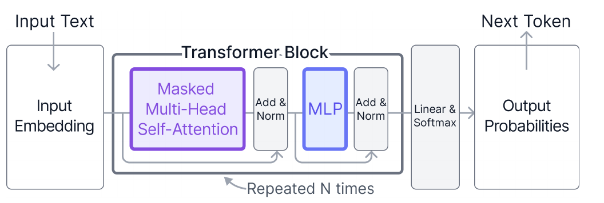

**Figure 2:** Diagram illustrating the data flow of the Transformer architecture (decoder-only), which consists of many components: input text is converted to input embeddings that pass through repeated identical Transformer blocks, each containing masked multi-head self-attention mechanisms, followed by multi-layer perceptron (MLP) layers with residual connections (Add) and normalization (Norm). The final linear and softmax layers output probabilities for the next-token prediction.

> **图 2：** Transformer 架构（仅解码器）数据流示意图。该架构由许多组件构成：输入文本被转换为输入嵌入，依次经过多个重复的相同 Transformer 模块，每个模块包含带掩码的多头自注意力机制，随后是带残差连接（Add）和归一化（Norm）的多层感知机（MLP）层。最后的线性层和 softmax 层输出下一 token 预测的概率。

## 3 Related Work / 相关工作

### 3.1 Traditional Visual Learning Resources for Transformers / 传统的 Transformer 可视化学习资源

Most introductory resources for Transformer-based models have been offered as blog posts or video tutorials. A well-known example is The Illustrated Transformer by Jay Alammar [3], which provides static illustrations with explanatory text. Video tutorials are also popular, with some focusing on theoretical concepts [1] and others on code implementation [44]. While these resources reach a large audience, their static and linear formats often struggle to convey the input-dependent dynamic processes in Transformers, making it difficult for learners to understand them in detail and stay engaged in the learning process [25]. This challenge suggests a need for learning materials that support interactivity and real-time feedback.

> 大多数基于 Transformer 的模型的入门资源都是博客文章或视频教程。一个著名的例子是 Jay Alammar 的《The Illustrated Transformer》[3]，它提供静态插图配讲解文字。视频教程也很流行，有的侧重理论概念 [1]，有的侧重代码实现 [44]。这些资源虽然受众广泛，但其静态、线性的形式往往难以传达 Transformer 中依赖输入的动态过程，使学习者难以深入理解并在学习过程中保持投入 [25]。这一挑战表明，我们需要支持交互性和实时反馈的学习材料。

### 3.2 Interactive Articles for Deep Learning Education / 面向深度学习教育的交互式文章

Beyond static blogs, interactive “explorable explanations” [82] emerged as a new medium for deep learning education. Following Chris Olah’s interactive blog posts in 2014 [60], interactive articles with visualizations [13, 14, 62, 90] began gaining traction [85]. Distill, a scientific journal for machine learning, was also established to publish articles featuring interactive graphics and explorable explanations [29, 31]. While such articles provide more engaging learning experiences than static blogs, their interactivity remains limited: users typically follow predefined storylines and cannot freely manipulate inputs or explore alternative scenarios. Learners often need to scroll back and forth between overviews and detailed explanations, which disrupts continuity and makes it difficult to connect concepts across levels of detail.

> 在静态博客之外，交互式"可探索解释（explorable explanations）"[82] 作为深度学习教育的新媒介应运而生。自 Chris Olah 2014 年的交互式博客文章 [60] 之后，带可视化的交互式文章 [13, 14, 62, 90] 开始流行 [85]。机器学习科学期刊 Distill 也应运而生，专门发表带有交互式图表和可探索解释的文章 [29, 31]。虽然这类文章比静态博客提供了更吸引人的学习体验，但其交互性仍然有限：用户通常只能跟随预设的叙事线，无法自由操纵输入或探索其他场景。学习者往往需要在总览和详细讲解之间来回滚动，这会破坏连续性，使人难以跨细节层级串联概念。

### 3.3 Interactive Visual Tools for Deep Learning Education / 面向深度学习教育的交互式可视化工具

More recently, to address the limitations of the traditional educational mediums mentioned above, fully interactive visualization tools have been developed for deep learning education. Early systems like ConvNetJS MNIST Demo and TensorFlow Playground offered intuitive parameter tweaking at the level of small models [42, 73]. Later, tools such as GAN Lab and CNN Explainer advanced the genre by introducing interactive graphics on real or synthetic data, bridging low-level mathematical details with high-level conceptual explanations [41, 85].

> 更近期地，为解决上述传统教育媒介的局限，完全交互式的可视化工具被开发出来用于深度学习教育。早期系统如 ConvNetJS MNIST Demo 和 TensorFlow Playground 在小模型层面提供了直观的参数调节 [42, 73]。随后，GAN Lab 和 CNN Explainer 等工具通过在真实或合成数据上引入交互式图形推动了这一品类的发展，将底层数学细节与高层概念讲解联系起来 [41, 85]。

Recent work has proposed diverse “explainer” systems, but these do not converge on a single, settled design pattern. Instead, different model families and application contexts demand distinct visualization and interaction techniques. For example, to explain diffusion models, Diffusion Explainer lets users change various model parameters and observe their effects through timestep-based animations [47] and Patch Explorer visualizes internal representations as an interactive 3D heatmap [30]. GNN101 overlays a graph neural network as stacked visual layers and connects nodes across layers to depict layer-wise message passing [52]. Raise Playground uses a block-based programming interface to let learners practice and learn AI concepts hands-on [56]. PromptAid helps non-experts and practitioners explore, perturb, and test prompts for large language models with dashboard-style collection of visualizations [55].

> 近期工作提出了各式各样的"讲解器（explainer）"系统，但它们并未收敛到单一、定型的设计模式。相反，不同的模型家族和应用场景需要不同的可视化与交互技术。例如，为讲解扩散模型，Diffusion Explainer 让用户修改各种模型参数并通过基于时间步的动画观察其影响 [47]；Patch Explorer 则将内部表示可视化为可交互的 3D 热力图 [30]。GNN101 将图神经网络叠加为多层可视化图层，并跨层连接节点以描绘逐层的消息传递 [52]。Raise Playground 使用基于积木块的编程界面，让学习者动手练习和学习 AI 概念 [56]。PromptAid 以仪表盘式可视化集合，帮助非专业用户和实践者探索、扰动和测试大语言模型的提示词 [55]。

To our knowledge, the only existing interactive visualization tools designed for learning about Transformers are LLM Visualization [12] and TransforLearn [28]. LLM Visualization offers a step-by-step guide through the Transformer architecture visualized in 3D, but it lacks support for custom user inputs and focuses on presenting mathematical details without abstraction levels, which may overwhelm beginners. TransforLearn supports interactive model exploration for machine translation but has key limitations that affect its educational impact. Its high-level overview displays heatmaps of embedding vectors, but otherwise relies on static text and diagrams that do not adapt to input changes, hindering user understanding [25]. Users can click on individual components to view separate visualizations, but the absence of continuous data flow makes it difficult to track how data transforms across the architecture. Moreover, the emphasis on embeddings in the overview may detract from learning self-attention, the core Transformer component [58, 81]. Finally, TransforLearn requires a server for machine translation tasks and is not deployed online. Transformer Explainer overcomes all the above limitations as the only online interactive visualization tool for learning Transformers, offering real-time inference with custom user input.

> 据我们所知，目前专为学习 Transformer 而设计的交互式可视化工具仅有 LLM Visualization [12] 和 TransforLearn [28]。LLM Visualization 以 3D 可视化逐步引导用户游览 Transformer 架构，但它不支持自定义用户输入，且专注于不加抽象层级地呈现数学细节，可能令初学者不堪重负。TransforLearn 支持面向机器翻译的交互式模型探索，但存在影响其教学效果的关键局限。它的高层总览显示嵌入向量的热力图，但其余部分依赖不随输入变化而调整的静态文字和图表，妨碍用户理解 [25]。用户可以点击单个组件查看各自独立的可视化，但缺乏连续的数据流，使人难以追踪数据在架构中如何变换。此外，总览中对嵌入的强调可能会分散对学习自注意力这一 Transformer 核心组件的注意力 [58, 81]。最后，TransforLearn 的机器翻译任务需要服务器支持，且未在线部署。Transformer Explainer 克服了上述所有局限，是唯一一个支持自定义输入实时推理的 Transformer 在线交互式可视化学习工具。

### 3.4 Visual Analytics Tools for Transformer Interpretability / 面向 Transformer 可解释性的可视分析工具

While educational tools are designed to help non-experts learn about Transformer concepts, another large body of work focuses on visual analytics systems designed for researchers and practitioners to interpret and analyze the internal behaviors and computations of Transformer models. These systems typically target expert users, offering fine-grained inspection of attention patterns, hidden states, or neuron activations. A prominent line of work investigates attention mechanisms. AttentionViz provides global overviews of attention patterns across layers and heads in both language and vision Transformers [89]. Attention Flows introduces mechanisms to query, trace, and compare attention shifts during pretraining and fine-tuning [17]. Other systems extend this approach to specific domains, such as head-level analysis for Vision Transformers (ViTs) [49], cross-modal interactions in vision-language Transformers [2], and examines reasoning in Transformer-based Visual Question Answering (VQA) models [40].

> 教育类工具旨在帮助非专业用户学习 Transformer 概念，而另一大类工作则聚焦于面向研究者和实践者的可视分析系统，用于解释和分析 Transformer 模型的内部行为与计算。这些系统通常面向专家用户，提供对注意力模式、隐藏状态或神经元激活的细粒度检视。其中一条突出的研究路线是注意力机制。AttentionViz 提供跨层、跨注意力头的注意力模式全局总览，同时覆盖语言和视觉 Transformer [89]。Attention Flows 引入了在预训练和微调期间查询、追踪和比较注意力变化的机制 [17]。其他系统将该方法扩展到特定领域，如视觉 Transformer（ViT）的头级分析 [49]、视觉-语言 Transformer 的跨模态交互 [2]，以及基于 Transformer 的视觉问答（VQA）模型的推理过程考察 [40]。

Beyond attention, attribution-based systems offer complementary interpretability. VEQA analyzes open-domain QA with BERT by visualizing retrieval–reader decision flows [69]. Recent neuron-level methods further attribute knowledge in LLMs by identifying value and query neurons [91]. The family of Logit Lens approaches [6, 37, 59, 61] performs layer-wise decoding to show how next-token predictions evolve across intermediate layers, providing an alternative way to interpret the information encoded internally by Transformers. Additionally, work from Anthropic has advanced interpretability through interactive, explorable articles that enable users to analyze model components [4, 21, 50] and with tools like Circuit Tracer [32], which enables users to trace and visualize circuits formed by interactions between model components that contribute to specific model behaviors. These tools provide powerful interpretability for expert analysis but are not intended for non-experts, as they often require deep ML background knowledge to use effectively. Our goal, by contrast, is to help non-experts acquire this foundational background by introducing the core architectural concepts and data-flow processes that underlie Transformer models.

> 除注意力之外，基于归因的系统提供了互补的可解释性。VEQA 通过可视化检索-阅读器的决策流来分析基于 BERT 的开放域问答 [69]。近期的神经元级方法通过识别值神经元和查询神经元，进一步对 LLM 中的知识进行归因 [91]。Logit Lens 家族的方法 [6, 37, 59, 61] 执行逐层解码，展示下一 token 预测如何跨中间层演化，为解释 Transformer 内部编码的信息提供了另一种途径。此外，Anthropic 的工作通过让用户能够分析模型组件的交互式可探索文章 [4, 21, 50]，以及 Circuit Tracer [32] 等工具推进了可解释性——Circuit Tracer 使用户能够追踪和可视化由模型组件间相互作用形成、促成特定模型行为的"电路"。这些工具为专家分析提供了强大的可解释性，但并不面向非专业用户，因为有效使用它们通常需要深厚的 ML 背景知识。相比之下，我们的目标是通过介绍 Transformer 模型背后的核心架构概念与数据流过程，帮助非专业用户获得这些基础知识。

### 3.5 How Our Work Fills Unique Research Gaps / 本工作如何填补独特的研究空白

In summary, prior work for Deep Learning education can be grouped into (1) traditional static resources, such as blogs and videos; (2) interactive articles that guide readers through predefined narratives; (3) interactive educational visualization tools that support non-experts but do not address Transformers, while those that do are limited (§ 3.3); and (4) visual analytics systems for experts that provide in-depth interpretability but are not designed for beginners. Transformer Explainer fills a unique gap between these categories. Unlike traditional or narrative-driven media, it provides real-time, interactive feedback on custom user input. Unlike existing educational tools for Transformers, it supports fully interactive, real-time exploration and complete data flow visualization, using levels of abstraction to introduce the entire model architecture while gradually revealing details to avoid overwhelming users. And unlike expert interpretability systems, it is designed to support non-expert learners, aiming to make complex architectures comprehensible. By combining these strengths, Transformer Explainer advances the landscape of educational resources for deep learning, offering a novel, fully online interactive system for learning Transformers at scale.

> 总之，深度学习教育的已有工作可分为四类：(1) 博客、视频等传统静态资源；(2) 引导读者沿预设叙事前行的交互式文章；(3) 支持非专业用户但不涉及 Transformer 的交互式教育可视化工具，而涉及 Transformer 的又很有限（§3.3）；(4) 面向专家、提供深入可解释性但并非为初学者设计的可视分析系统。Transformer Explainer 填补了这些类别之间的独特空白。与传统或叙事驱动的媒介不同，它对自定义用户输入提供实时的交互式反馈。与现有 Transformer 教育工具不同，它支持完全交互式的实时探索和完整的数据流可视化，利用抽象层级来介绍整个模型架构，同时逐步揭示细节以避免让用户不堪重负。与专家可解释性系统不同，它专为支持非专业学习者而设计，旨在让复杂架构变得可理解。通过结合这些优势，Transformer Explainer 推进了深度学习教育资源的版图，提供了一个新颖的、完全在线的、可大规模使用的 Transformer 交互式学习系统。

## 4 Design Challenges / 设计挑战

Transformer-based LLMs introduce fundamentally different challenges across structural, visual, and computational dimensions that existing explainer systems designed for vision models or classification models [41, 42, 47, 73, 85] did not address. To design Transformer Explainer, we identified four main design challenges (C1-C4) related to Transformer models:

> 基于 Transformer 的 LLM 在结构、视觉和计算维度上带来了根本不同的挑战，而现有为视觉模型或分类模型设计的讲解器系统 [41, 42, 47, 73, 85] 并未应对这些挑战。为设计 Transformer Explainer，我们识别出与 Transformer 模型相关的四个主要设计挑战（C1–C4）：

**C1. Understanding How Input Text Is Processed Across Complex Model Structures.** Transformers are complex models composed of many components, such as multi-head self-attention and multi-layer perceptron (MLP), repeated across multiple layers [27, 81] (Fig. 2). While existing resources have attempted to provide an overview of the model [3], they either present all details at once [12], which may overwhelm beginners, or display model components in disconnected views, often using disjoint visual encodings that increase users’ cognitive load [79]. However, research shows that presenting all layer operations and their connections in a unified view has the potential to help users better follow how input data (i.e., token embedding) is transformed into final predictions. Such attempts typically use diagram-style layouts that place each layer or component as a boxed node and connect them with a line, which works reasonably well for vision models because each node can be visualized as an image [41, 42, 47, 85]. In contrast, Transformers operate on token representations and do not follow the relatively simple feedforward structure of classification models [42, 73, 85]. As token representations are interactively transformed as they go through attention, visualizing their transformations introduces unique challenges. There have been attempts to apply similar diagram-style approaches to Transformers, using component-level boxes connected by simple lines [28], but, they fail to foreground tokens as the primary and coherent visual element and cannot convey an end-to-end transformation path of how each token representation evolves throughout the model. Hence, an innovative visualization is needed to create a visual summary of the Transformer that maintains a connected view and preserves data flow. Adopting an information-flow perspective has potential to help non-experts conceptually link inputs, intermediate computations, and outputs into a coherent process [23].

> **C1. 理解输入文本如何跨复杂模型结构被处理。** Transformer 是由多头自注意力、多层感知机（MLP）等众多组件跨多层重复堆叠而成的复杂模型 [27, 81]（图 2）。现有资源虽尝试提供模型总览 [3]，但要么一次性呈现所有细节 [12]，可能令初学者不堪重负；要么以互不关联的视图展示模型组件，往往使用彼此割裂的视觉编码，增加用户的认知负荷 [79]。然而研究表明，在统一视图中呈现所有层的运算及其连接，有助于用户更好地跟踪输入数据（即 token 嵌入）如何被变换为最终预测。这类尝试通常采用图式布局：把每一层或组件画成方框节点、用线连接——这对视觉模型效果不错，因为每个节点可以可视化为图像 [41, 42, 47, 85]。相比之下，Transformer 处理的是 token 表示，且不遵循分类模型那种相对简单的前馈结构 [42, 73, 85]。token 表示在流经注意力时被交互式地变换，可视化这些变换带来了独特挑战。已有尝试将类似的图式方法应用于 Transformer，用简单线条连接组件级方框 [28]，但它们未能把 token 作为首要且连贯的视觉元素置于前景，也无法传达每个 token 表示在模型中如何演化的端到端变换路径。因此，需要一种创新的可视化来为 Transformer 创建既保持视图连贯、又保留数据流的视觉摘要。采用信息流的视角，有望帮助非专业用户在概念上把输入、中间计算和输出串联为一个连贯的过程 [23]。

**C2. Mathematical Complexity in Multi-Head Self-Attention.** Non-experts often struggle to understand the underlying operations in deep learning models [73]. In models like CNNs for images, operations can be more easily understood via visual metaphors—such as filters sliding over input images [85]. In contrast, Transformers operate on high-dimensional numerical representations of text, which are less interpretable on their own [58]. The complexity deepens with operations like self-attention, where every token interacts with every other token, and with attention-specific operations such as projecting embeddings into Q, K, and V vectors and partitioning them into multiple heads [5, 81]. This multi-head attention is foundational to how the model selects, gathers, and combines relevant information from different perspectives [81]. Understanding multi-head attention therefore helps learners understand the concrete mechanism in which words are used to predict the next token, demystifying how the model uses context. Existing resources typically explain these operations separately and in detail, but do not effectively help non-experts visually connect how the components work together to transform the token representations [3, 28]. Moreover, detailed mathematical explanations are often foregrounded, which can overwhelm non-expert learners with limited mathematical background and discourage further engagement. This gap highlights the need for more accessible explanation, motivating novel visualization and interaction techniques that can unpack and clarify these operations.

> **C2. 多头自注意力的数学复杂性。** 非专业用户往往难以理解深度学习模型的底层运算 [73]。在 CNN 等图像模型中，运算可以借助视觉隐喻更容易地理解——例如滤波器在输入图像上滑动 [85]。相比之下，Transformer 处理的是文本的高维数值表示，其本身的可解释性较差 [58]。自注意力等运算使复杂性进一步加深：每个 token 都与其他所有 token 交互，此外还有注意力特有的运算，如将嵌入投影为 Q、K、V 向量并切分为多个头 [5, 81]。这种多头注意力是模型从不同视角选择、汇聚和组合相关信息的基础 [81]。因此，理解多头注意力有助于学习者理解用词语预测下一 token 的具体机制，揭开模型利用上下文的神秘面纱。现有资源通常分别、详细地讲解这些运算，但未能有效地帮助非专业用户在视觉上把各组件如何协同变换 token 表示联系起来 [3, 28]。而且，详细的数学讲解往往被置于前景，可能令数学基础有限的非专业学习者不堪重负，打击他们继续深入的积极性。这一缺口凸显了对更易懂的讲解方式的需求，促使我们探索能够拆解并澄清这些运算的新型可视化与交互技术。

**C3. Understanding Hyperparameters’ Impact on Prediction Variability.** Transformer models generate a probability distribution over possible tokens, from which the next token is sampled during autoregressive generation. Yet many educational resources either fix the prompt and the output, or they omit how the distribution is constructed and how sampling hyperparameters (e.g., temperature, top-$k$, top-$p$) reshape both the candidate set and the final choice [12, 28]. As a result, many learners remain unaware of these underlying mechanisms, often viewing Transformers as magical or even anthropomorphizing them [7]. The key challenge is therefore not only to explain the components that produce the pre-sampling distribution, but to make the entire sampling pipeline observable and learnable as it happens: how logits are formed, how they are transformed by sampling hyperparameters, and how a next token is selected from the resulting distribution. This demands a seamless integration of live inference, probabilistic visualization, and hyperparameter manipulation, which are absent in existing Transformer tutorials or earlier explainer tools.

> **C3. 理解超参数对预测可变性的影响。** Transformer 模型生成一个覆盖可能 token 的概率分布，自回归生成时从中采样出下一个 token。然而许多学习资源要么固定提示词和输出，要么省略了分布如何构建、采样超参数（如温度、top-$k$、top-$p$）如何重塑候选集与最终选择 [12, 28]。结果，许多学习者对这些底层机制一无所知，常把 Transformer 视为魔法，甚至将其拟人化 [7]。因此，关键挑战不仅在于讲解产生采样前分布的组件，还在于让整个采样管线在发生时即可观察、可学习：logits 如何形成、如何被采样超参数变换、下一 token 如何从所得分布中选出。这需要将实时推理、概率可视化和超参数操纵无缝集成，而这在现有 Transformer 教程或早期讲解器工具中是缺失的。

**C4. Deployment for Scalable Iterative Learning.** Most educational resources for deep learning tend to rely on static content or provide limited interactivity (e.g., [3] for Transformer). This limitation stems largely from the technical challenge of hosting a live Transformer model in-browser—these models are large and computationally intensive, making it difficult to achieve the low latency required for real-time interaction [68]. As a result, existing tools tend to rely on pre-selected examples [12, 47] or offer restricted outputs [85], limiting educational opportunities for interactive hands-on learning, ultimately hindering beginners from gaining deeper understanding and engagement.

> **C4. 面向可规模化迭代学习的部署。** 大多数深度学习教育资源往往依赖静态内容或仅提供有限的交互性（例如 Transformer 领域的 [3]）。这一局限很大程度上源于在浏览器中托管实时 Transformer 模型的技术挑战——这些模型规模大、计算密集，难以实现实时交互所需的低延迟 [68]。因此，现有工具往往依赖预先选定的示例 [12, 47] 或提供受限的输出 [85]，限制了交互式动手学习的机会，最终阻碍初学者获得更深入的理解与投入。

## 5 Design Goals / 设计目标

Based on the design challenges, we distill four design goals (G1-G4) for Transformer Explainer, an interactive visualization tool to help non-experts learn and experiment with Transformer models.

> 基于上述设计挑战，我们为 Transformer Explainer——一个帮助非专业用户学习和实验 Transformer 模型的交互式可视化工具——提炼出四个设计目标（G1–G4）。

**G1. Model Overview Prioritizing Token-Centric Data Flow.** We aim to create a visual summary of the Transformer architecture as a single, input token centered flow (C1). We visualize each token embedding as a one-dimensional heatmap that serves as the primary, consistently used visual element throughout the model. We animate this embedding as it travels along a single continuous path through the architecture, branching and merging in attention, expanding in the MLP, and passing through repeated blocks. Band width is proportional to embedding dimensions, directly revealing how the input evolves. This innovative design, the first for explaining Transformers, draws inspiration from the Sankey diagram [65], which is designed to communicate flow (visually encoded via its edges) between components (via nodes); we adapt it to emphasize how information is transformed within the model, building on recent studies that view Transformers as dynamic systems [20]. Our Sankey diagram-inspired design helps users see how input information “flows” through the various components and repeated blocks of the Transformer, undergoing successive processing and transformations before reaching the final output (§ 6.1).

> **G1. 以 token 为中心的数据流优先的模型总览。** 我们旨在将 Transformer 架构的视觉摘要创建为一条单一的、以输入 token 为中心的流（C1）。我们将每个 token 嵌入可视化为一维热力图，作为贯穿整个模型的首要且始终一致的视觉元素。我们为嵌入沿单条连续路径穿越架构的过程配上动画：在注意力中分叉与汇合、在 MLP 中扩展、穿过重复的模块。带状流的宽度与嵌入维度成正比，直接揭示输入如何演化。这一创新设计是首个用于讲解 Transformer 的同类设计，其灵感来自桑基图（Sankey diagram）[65]——桑基图用边来视觉编码组件（节点）之间的流动；我们对其加以改造，强调信息在模型内部如何被变换，并借鉴了将 Transformer 视为动态系统的近期研究 [20]。我们这种受桑基图启发的设计帮助用户看到输入信息如何"流经"Transformer 的各个组件和重复模块，经过一系列处理与变换后抵达最终输出（§6.1）。

**G2. Visual Disambiguation of Multi-Head Self-Attention with Step-by-Step Visual Explanations.** Given that the multi-head self-attention mechanism is considered the most important yet complex component of the Transformer [81] (§ 2), our goal is to visually unpack how the input embedding is projected into Q, K, and V, branches across heads, participates in attention, and subsequently rejoins through the path within a token-centered animated flow (C2), allowing non-experts to form an intuitive visual mental model. At the same time, we adopt a progressive disclosure technique [77] to support learners who want deeper detail. We first present the overall model structure, while leaving detailed mathematical operations to be revealed dynamically through user interaction (§ 6.2). In the detail view, we employ step-by-step animated visualizations to explain the underlying mathematical operations, presenting intermediate, successive steps converging toward a final output, inspired by prior research on algorithm visualizations showing that such steps help learners build mental models [24]. For example, in the self-attention, we aim to gradually reveal its intermediate steps through animations and visualizations, allowing users to hover over each matrix element to view its value interactively. For mathematical operations such as matrix multiplication, we aim to animate how matrices interact, enabling users to trace the computation of each output element (§ 6.2).

> **G2. 用逐步可视化讲解来厘清多头自注意力。** 鉴于多头自注意力机制被认为是 Transformer 中最重要也最复杂的组件 [81]（§2），我们的目标是在以 token 为中心的动画流中，直观地拆解输入嵌入如何被投影为 Q、K、V、如何跨头分叉、如何参与注意力、随后又如何沿路径重新汇合（C2），让非专业用户形成直观的视觉心智模型。同时，我们采用渐进式披露（progressive disclosure）技术 [77] 来支持想要更深细节的学习者。我们先呈现整体模型结构，详细的数学运算则留待用户通过交互动态揭示（§6.2）。在细节视图中，我们采用逐步动画可视化来讲解底层数学运算，呈现趋向最终输出的连续中间步骤——其灵感来自算法可视化研究，这类研究表明这样的步骤有助于学习者建立心智模型 [24]。例如，在自注意力中，我们旨在通过动画和可视化逐步揭示其中间步骤，允许用户悬停在每个矩阵元素上交互式地查看其数值。对于矩阵乘法等数学运算，我们旨在为矩阵之间的相互作用配上动画，使用户能够追踪每个输出元素的计算过程（§6.2）。

**G3. Dynamic Experimentation Through User-Provided Text and Hyperparameter Manipulation.** To help users understand how the next token is selected from the probability distribution generated by the Transformer (C3), we aim to run a live model in browser to support an interactive interface that allows real-time adjustment of sampling hyperparameters (§ 6.4) and to visualize the entire sampling pipeline with real-time intermediate values, so their influence on the next token selection is explicit and understandable. The user-provided text input is directly applied in the model’s generation process, with their chosen hyperparameters used to predict the next token (§ 6.3). By experimenting with these settings, users can observe how the output becomes more predictable or more random. Predicted tokens are then appended to the input, allowing users to continue generating subsequent tokens and see how early sampling choices propagate through later predictions, while flow-preserving animations maintain token-level data flow across updates. This tight integration of live inference, probabilistic visualization, and hyperparameter manipulation helps users understand that the model is not magic, but rather follows a well-defined sequence of operations.

> **G3. 通过用户提供的文本与超参数操纵进行动态实验。** 为帮助用户理解下一 token 如何从 Transformer 生成的概率分布中被选出（C3），我们旨在浏览器中运行实时模型，支持可实时调整采样超参数的交互界面（§6.4），并以实时中间值可视化整个采样管线，使超参数对下一 token 选择的影响显式且可理解。用户提供的文本输入直接应用于模型的生成过程，以其选择的超参数预测下一 token（§6.3）。通过实验这些设置，用户可以观察输出如何变得更可预测或更随机。预测出的 token 随后被追加到输入中，使用户能够继续生成后续 token，并看到早期的采样选择如何传播到之后的预测中；保持流连续的动画则在更新过程中维持 token 级的数据流。这种实时推理、概率可视化与超参数操纵的紧密集成，帮助用户理解模型并非魔法，而是遵循一套定义明确的运算序列。

**G4. Web-based Tool Powered by Live Model for Interactive Learning.** To broaden the public’s education access to our tool (C4), we aim to build a web-based application that hosts a live, fully-functional Transformer model. Users would directly interact with the model in their browsers, eliminating the need for installations or specialized hardware. Additionally, to encourage future research and educational use, we open-source our code. (§ 6.7)

> **G4. 由实时模型驱动的 Web 交互式学习工具。** 为扩大公众对我们工具的教育可及性（C4），我们旨在构建一个托管实时、功能完整的 Transformer 模型的 Web 应用。用户直接在浏览器中与模型交互，无需安装或专用硬件。此外，为鼓励未来的研究与教学使用，我们将代码开源（§6.7）。

## 6 Visualization Interface of Transformer Explainer / Transformer Explainer 的可视化界面

Transformer Explainer visualizes how a trained Transformer model transforms input text into probabilities for the next-token prediction. Users can explore the model at different levels of abstraction through Overview (§ 6.1) and Step-by-Step Expanded Explanations (§ 6.2). A live GPT-2 Transformer model running in the user’s browser allows real-time experimentation with custom text inputs (§ 6.3) and sampling hyperparameters (§ 6.4), enabling users to immediately observe how these modifications influence the next-token prediction. Our system is targeted towards non-experts, visually guiding them through the mathematical operations underlying a Transformer model during text generation.

> Transformer Explainer 可视化了一个训练好的 Transformer 模型如何将输入文本变换为下一 token 预测的概率。用户可以通过总览（§6.1）和逐步展开讲解（§6.2）在不同抽象层级上探索模型。一个在用户浏览器中运行的实时 GPT-2 Transformer 模型，允许用户用自定义文本输入（§6.3）和采样超参数（§6.4）进行实时实验，使用户能立即观察这些修改如何影响下一 token 预测。我们的系统面向非专业用户，以可视化方式引导他们理解文本生成过程中 Transformer 模型背后的数学运算。

### 6.1 Overview / 总览

Transformer Explainer’s visual design draws inspiration from the Sankey diagram, effective for visualizing data flow [65], to communicate a high-level overview of how input data flows through the Transformer model (G1; Fig. 1). Gradient-colored paths illustrate transformations of token embedding vectors across model components, allowing users to understand the model’s structure from a data-flow perspective. Vectors are visualized as vertical bars scaled to their actual dimensionality, with a 1D heatmap revealed on hover. These visuals act as illustrative symbols that convey vector shape while achieving a balance between conceptual understanding and visual complexity. The color mappings are intentionally designed to reflect the role of each component. Token embeddings are rendered in grayscale to emphasize that they are the untransformed initial representations. Q, K, and V use distinct RGB-based colors to clearly differentiate their roles; for example, Q is blue and K is red, and the resulting attention scores appear in purple, visually reflecting the combination of the two. The MLP expands representations, so we preserve a consistent blue gradient to highlight continuity rather than introduce new semantic colors.

> Transformer Explainer 的视觉设计从桑基图汲取灵感——桑基图是可视化数据流的有效手段 [65]——用以传达输入数据如何流经 Transformer 模型的高层总览（G1；图 1）。渐变着色的路径展示了 token 嵌入向量跨模型组件的变换，使用户能够从数据流的视角理解模型结构。向量被可视化为按实际维度缩放的竖直条带，悬停时显示一维热力图。这些视觉元素是传达向量形状的示意性符号，在概念理解与视觉复杂度之间取得平衡。颜色映射经过刻意设计以反映每个组件的角色：token 嵌入用灰度渲染，强调它们是未经变换的初始表示；Q、K、V 使用基于 RGB 的不同颜色以清晰区分各自角色——例如 Q 为蓝色、K 为红色，由此产生的注意力分数显示为紫色，在视觉上体现两者的结合；MLP 会扩展表示，因此我们保持一致的蓝色渐变以突出连续性，而不引入新的语义颜色。

The dense Transformer architecture—consisting of many blocks, each containing multiple attention heads—is visually simplified by displaying only one selected block and one attention head at a time, reducing information overload [12]. Users can navigate between different blocks and attention heads using pagination buttons . To visually convey the presence of additional blocks and heads beyond the currently displayed one, we use visual metaphors and animated transitions. Repeated Transformer blocks are represented with gradually fading data flows between them , subtly suggesting continuity. When navigating between blocks, an animated transition smoothly folds the current block’s flow while simultaneously unfolding the next block’s flow into view (Fig. 3A). Attention heads within each block are represented as a stack of cards (Fig. 3B). Transitioning between heads triggers a looping animation, in which cards cycle through the stack. These animated transitions help keep viewers oriented and facilitate the perception of changes [80].

> 密集的 Transformer 架构——由许多模块组成、每个模块又包含多个注意力头——通过每次只显示一个选定模块和一个注意力头的方式在视觉上被简化，减少了信息过载 [12]。用户可以使用分页按钮在不同模块和注意力头之间导航。为了在视觉上传达当前显示之外还存在更多模块和头，我们使用了视觉隐喻和动画过渡。重复的 Transformer 模块之间用逐渐淡出的数据流表示，巧妙地暗示连续性。在模块间切换时，动画过渡会平滑地折叠当前模块的流，同时展开下一个模块的流（图 3A）。每个模块内的注意力头被表示为一叠卡片（图 3B）；切换头会触发循环动画，卡片在叠层中循环切换。这些动画过渡有助于观众保持方位感，并促进对变化的感知 [80]。

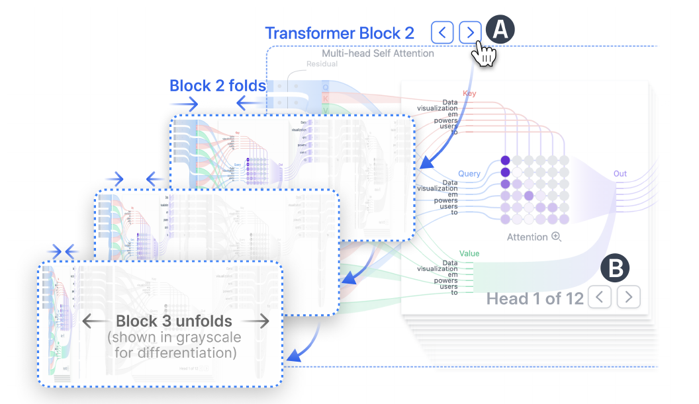

**Figure 3:** (A) Navigating between Transformer blocks triggers an animation that folds the current block’s flow while unfolding the next. (B) Attention heads are depicted as a stack of cards, with transitions cycling smoothly through the stack in a looping animation. Buttons and annotations enlarged for clarity.

> **图 3：** (A) 在 Transformer 模块间导航会触发一个动画：折叠当前模块的流，同时展开下一个模块的流。(B) 注意力头被描绘为一叠卡片，切换时以循环动画在叠层中平滑轮转。为清晰起见，按钮和标注已放大。

### 6.2 Step-by-Step Expanded Explanations / 逐步展开讲解

We design Step-by-Step Expanded Explanation Views to visualize a model component’s internal computations, which involve multiple steps with intermediate results. For brevity, we call them Expanded Views. To avoid overwhelming users with details presented all at once (G2), our tool enables users to interactively open these views by clicking a component that has a magnifying glass icon  next to its title. This triggers a smooth animated expansion of the component that preserves the high-level model structure while gradually fading out surrounding areas. This transition enables the details of the selected component to be presented, while maintaining the high-level context of data flow.

> 我们设计了逐步展开讲解视图（Step-by-Step Expanded Explanation Views），用于可视化模型组件的内部计算——这些计算包含多个带有中间结果的步骤。为简洁起见，我们称之为展开视图（Expanded Views）。为避免一次性呈现所有细节让用户不堪重负（G2），我们的工具允许用户通过点击标题旁带放大镜图标的组件来交互式地打开这些视图。这会触发组件的平滑动画展开：保留高层模型结构，同时让周围区域逐渐淡出。这种过渡既能呈现所选组件的细节，又保持数据流的高层上下文。

**Self-Attention.** The Expanded Self-Attention View animates the computation of attention scores in three sequential steps to help users understand how each mathematical operation transforms values into final attention scores, and to enable side-by-side comparison of intermediate results, which reduces cognitive load when tracking changes across steps [39]. When the user clicks  (Fig. 1: C2), the flows through the key and query come together to perform the dot product, producing an intermediate matrix. Next, we duplicate this intermediate matrix and present it next to the original one, and show the animation of how it is scaled and masked.

> **自注意力。** 展开的自注意力视图将注意力分数的计算动画化为三个连续步骤，帮助用户理解每步数学运算如何将数值变换为最终的注意力分数，并支持中间结果的并排比较，从而降低跨步骤追踪变化时的认知负荷 [39]。当用户点击后（图 1: C2），流经键（key）和查询（query）的流汇聚在一起执行点积，产生一个中间矩阵。接着，我们复制这个中间矩阵并将其并排呈现在原矩阵旁，用动画展示它如何被缩放和掩码。

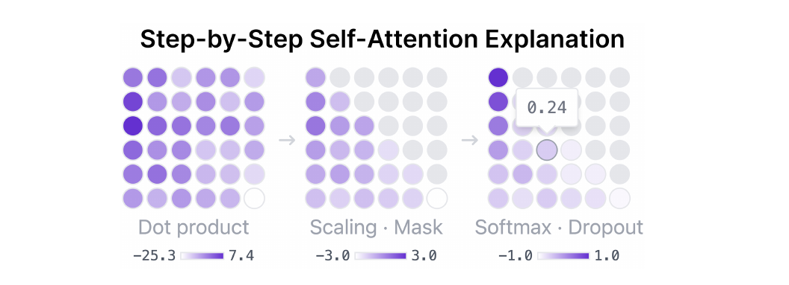

> **（原书插图，无编号）：** 逐步自注意力讲解视图——注意力分数的计算被拆解为点积、缩放与掩码、softmax 等连续步骤。

The same visual process is used to explain softmax and dropout, resulting in the final attention scores matrix. All matrix values are visualized using a heatmap with a purple color scale (e.g., ). For any matrix output by the three steps, users can hover over individual elements to inspect their numerical values via tooltips.

> 同样的视觉流程用于讲解 softmax 和 dropout，最终得到注意力分数矩阵。所有矩阵数值都使用紫色色阶的热力图可视化（例如 ）。对于这三个步骤输出的任何矩阵，用户都可以悬停单个元素，通过工具提示查看其数值。

**Probabilities.** The Expanded Probabilities View (Fig. 4A) incrementally displays each step in probability computation for next-token prediction, from left to right, following how values are transformed as the operation proceeds. When a user clicks , which initially shows the final probabilities of next-token candidates (Fig. 1: C3), the expanded view opens to show each operation and its intermediate values: first, the logits (raw prediction scores) are computed from the final embedding; next, these logits are scaled by the user-selected temperature (Fig. 7A); then, the resulting values are filtered based on the user’s selected sampling strategy (top-k or top-p) (Fig. 7B), retaining only the most probable candidate tokens—such hyperparameters are important for users to experiment with, as they often cause confusion (§ 6.4); and finally, probabilities for these tokens are computed using softmax. Tokens are listed by probability, with the most likely candidate at the top. Hovering over any intermediate value for a token reveals a formula card (Fig. 4B) showing the detailed equations used to compute the probability for that specific token at each step.

> **概率。** 展开的概率视图（图 4A）从左到右逐步展示下一 token 预测中概率计算的每一步，呈现数值随运算推进的变换过程。初始界面显示下一 token 候选的最终概率（图 1: C3）；当用户点击后，展开视图打开，展示每个运算及其中间值：首先，由最终嵌入计算出 logits（原始预测分数）；接着，这些 logits 按用户选择的温度进行缩放（图 7A）；然后，根据用户选择的采样策略（top-k 或 top-p）对结果值进行过滤，只保留概率最高的候选 token（图 7B）——这些超参数常引起混淆，很值得用户动手实验（§6.4）；最后，用 softmax 计算这些 token 的概率。token 按概率排列，最可能的候选位于顶部。悬停某个 token 的任一中间值，会弹出公式卡片（图 4B），展示每一步用于计算该特定 token 概率的详细公式。

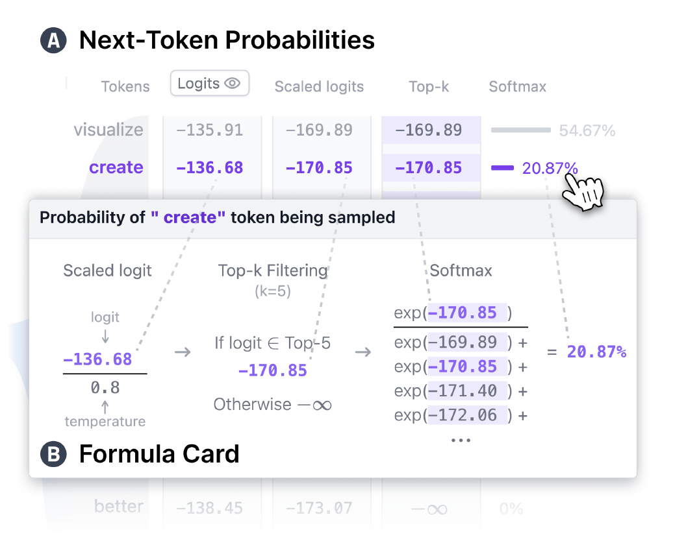

**Figure 4:** (A) A step-by-step expanded explanation view for next-token probabilities, showing the incremental steps in the probability computation. When a user hovers over a token, (B) the formula card updates to show the detailed equations used to compute the probability.

> **图 4：** (A) 下一 token 概率的逐步展开讲解视图，展示概率计算的递进步骤。(B) 当用户悬停在某个 token 上时，公式卡片会更新，显示用于计算该概率的详细公式。

**Embedding.** The Expanded Embedding View (Fig. 5) illustrates how each token from the input text is converted into its numerical embedding vector. When a user clicks , the interface displays each token’s predefined token ID and position in the sequence, along with its token embedding vector and positional encoding vector, which are summed to produce the final embedding vector that flows into the next component of the model. Users can inspect all three vectors (i.e., token embedding, positional encoding, summed embedding) as 1-dimensional heatmaps and hover over them to view their dimensions.

> **嵌入。** 展开的嵌入视图（图 5）展示输入文本中的每个 token 如何被转换为其数值嵌入向量。当用户点击后，界面显示每个 token 预定义的 token ID 及其在序列中的位置，以及它的 token 嵌入向量和位置编码向量——两者相加产生流入模型下一组件的最终嵌入向量。用户可以将全部三个向量（即 token 嵌入、位置编码、求和后的嵌入）作为一维热力图检视，并悬停查看它们的维度。

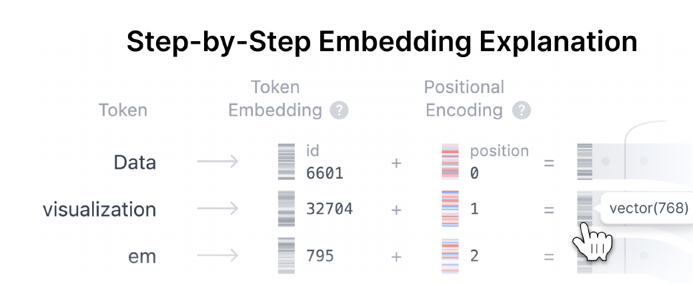

**Figure 5:** A step-by-step expanded explanation view for embedding visualizes how an input token is converted into its numerical embedding vector.

> **图 5：** 嵌入的逐步展开讲解视图，可视化输入 token 如何被转换为其数值嵌入向量。

**Animated Matrix Multiplications.** Throughout the Transformer architecture, embeddings repeatedly undergo matrix multiplications with pretrained model weights, changing their dimensions, reflected in the Sankey diagram paths. Our tool provides a consistent visualization of these frequently occurring embedding-weight multiplications through popovers (Fig. 6), helping users recognize that these operations follow the same computational pattern. Clicking a data flow path between embeddings opens a view that displays the corresponding matrix calculations, animating how input embedding vectors are multiplied by weights to form new embeddings in transformed dimensions. Due to the high dimensionality, embeddings and weights are visualized as condensed heatmaps, with exact dimensions displayed below each matrix. These heatmaps serve as illustrative symbols of vector and matrix computations, maintaining consistent orientations and aspect ratios to convey tensor shape while keeping visual complexity manageable. Hovering over a specific element in the resulting matrix highlights the contributing inputs (Fig. 6D), clarifying the calculation details.

> **动画矩阵乘法。** 在 Transformer 架构中，嵌入反复与预训练模型权重进行矩阵乘法，其维度随之改变，这反映在桑基图路径上。我们的工具通过弹出层（popover）为这些频繁出现的嵌入-权重乘法提供一致的可视化（图 6），帮助用户认识到这些运算遵循相同的计算模式。点击嵌入之间的数据流路径，会打开一个显示对应矩阵计算的视图，用动画展示输入嵌入向量如何与权重相乘、形成变换维度后的新嵌入。由于维度很高，嵌入和权重被可视化为压缩的热力图，每个矩阵下方显示精确维度。这些热力图是向量与矩阵计算的示意符号，保持一致的方向和宽高比以传达张量形状，同时将视觉复杂度控制在可管理的范围内。悬停结果矩阵中的特定元素会高亮显示参与计算的输入（图 6D），阐明计算细节。

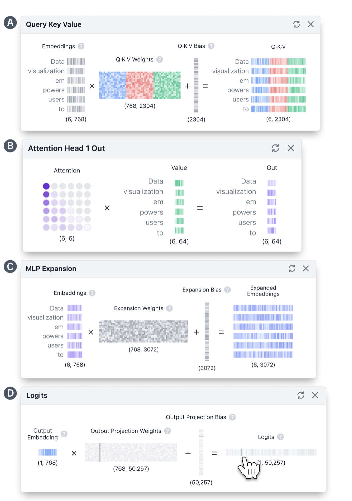

**Figure 6:** Animated Matrix Multiplication popovers provide an interactive visualization of embedding-weight multiplication operations within the Transformer architecture. (A) shows how token embeddings are linearly projected into query, key, and value vectors for attention computation. (B) visualizes the multiplication of the attention matrix with value vectors to produce the attention output. (C) shows the dimensional expansion of the embedding through a multilayer perceptron (MLP). (D) illustrates how the final embedding from the last Transformer block is multiplied by the output weight matrix to produce logits (raw prediction scores) for next-token prediction. Hovering over an element in the output vector highlights its contributing input elements, helping users understand how specific values are formed.

> **图 6：** 动画矩阵乘法弹出层为 Transformer 架构内的嵌入-权重乘法运算提供交互式可视化。(A) 展示 token 嵌入如何被线性投影为查询、键、值向量以进行注意力计算；(B) 可视化注意力矩阵与值向量相乘产生注意力输出；(C) 展示嵌入通过多层感知机（MLP）的维度扩展；(D) 展示最后一个 Transformer 模块的最终嵌入如何与输出权重矩阵相乘，产生用于下一 token 预测的 logits（原始预测分数）。悬停输出向量中的元素会高亮其参与计算的输入元素，帮助用户理解特定数值是如何形成的。

### 6.3 Real-time Inference for Next-Token Prediction / 下一 token 预测的实时推理

Users can enter custom text into the input bar and click  to observe in real-time how the next token is predicted. The input text is immediately broken into tokens and updated in the visualization; then, a smooth animation visualizes the updated data flowing through the model. The animation provides continuity between embeddings, clearly showing changes in position, size, shape, and color, helping users track data updates [35]. While this animation plays, a loading indicator appears in the input bar, and the predicted next token is appended once the data flow reaches the output.

> 用户可以在输入栏中输入自定义文本并点击按钮，实时观察下一 token 是如何被预测的。输入文本立即被切分为 token 并在可视化中更新；随后，一段平滑的动画展示更新后的数据流经模型的过程。动画在嵌入之间提供连续性，清晰显示位置、大小、形状和颜色的变化，帮助用户追踪数据更新 [35]。动画播放期间，输入栏中会出现加载指示器；当数据流到达输出端时，预测的下一 token 会被追加显示。

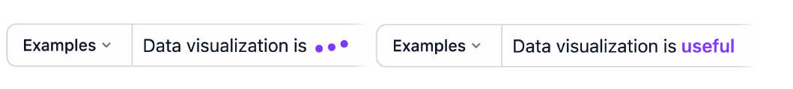

Users can repeatedly click the Generate button to continue generating tokens, visually understanding how a Transformer model builds sentences one token at a time (G3). To support installation-free access, when the user visits our tool, the GPT-2 model (including its weights) is downloaded to the user’s browser and runs entirely in it (§ 6.7). To maintain usability in high-latency or low-bandwidth environments where model loading may take time, five example prompts with pre-computed intermediate data extracted from models are provided, allowing users to explore the interface instantly.

> 用户可以反复点击 Generate 按钮持续生成 token，直观地理解 Transformer 模型如何逐 token 构建句子（G3）。为支持免安装访问，用户访问我们的工具时，GPT-2 模型（包括其权重）会下载到用户浏览器中并完全在其中运行（§6.7）。为在模型加载可能耗时的高延迟或低带宽环境中保持可用性，我们还提供了五个示例提示词，附带从模型中预先计算的中间数据，使用户能够立即探索界面。

### 6.4 Adjustable Sampling Hyperparameters Influencing Next-Token Prediction / 影响下一 token 预测的可调采样超参数

Transformer Explainer enables users to adjust inference hyperparameters and observe in real-time how these settings influence next-token prediction (G3). Users can modify temperature, sampling strategies, and their associated hyperparameters using the interactive controls located next to the Generate button (Fig. 1B). By testing their hypotheses and observing immediate feedback, users can see that Transformers select the next token based on probabilistic algorithms—not randomly or through “magic.”

> Transformer Explainer 允许用户调整推理超参数，并实时观察这些设置如何影响下一 token 预测（G3）。用户可以使用 Generate 按钮旁的交互控件修改温度、采样策略及其相关超参数（图 1B）。通过验证自己的假设并观察即时反馈，用户可以看到 Transformer 是基于概率算法选择下一 token 的——既不是纯随机，也不是"魔法"。

**Temperature (Fig. 7A).** The temperature hyperparameter shapes the generated probability distribution for the next-token prediction, making it sharper (lower temperature) or smoother (higher temperature). Users can adjust the temperature using a slider and test how it affects prediction determinism, understanding that temperature determines whether the output becomes more deterministic or random.

> **温度（图 7A）。** 温度超参数塑造下一 token 预测所生成概率分布的形态：温度越低分布越尖锐，温度越高分布越平滑。用户可以用滑块调整温度，测试它对预测确定性的影响，从而理解温度决定了输出是更确定还是更随机。

**Sampling Strategies (Fig. 7B).** We provide two widely-used sampling strategies: top-k and top-p. Users can select among sampling strategies using radio buttons and adjust the corresponding hyperparameters through sliders, observing how these hyperparameters influence which tokens are considered for the next prediction and the likelihood of each token being selected. Adjustments are reflected instantly, with the Expanded Probabilities View displaying how probabilities are computed based on the selected inference hyperparameters.

> **采样策略（图 7B）。** 我们提供两种广泛使用的采样策略：top-k 和 top-p。用户可以用单选按钮选择采样策略，并通过滑块调整相应的超参数，观察这些超参数如何影响哪些 token 被纳入下一次预测的候选、以及每个 token 被选中的可能性。调整会立即反映出来，展开的概率视图会显示基于所选推理超参数的概率计算过程。

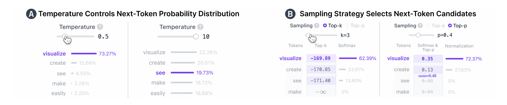

**Figure 7:** Transformer Explainer enables users to adjust inference hyperparameters and observe in real time how they affect next-token prediction. (A) The temperature slider lets users experiment with how temperature shapes the next-token probability distribution. A: left: Lower temperatures sharpen the distribution, making the output more deterministic. A: right: Higher temperatures flatten the distribution, increasing randomness and resulting in less predictable outputs. (B) The sampling strategy selector lets users choose between top-k and top-p, and adjust the corresponding $k$ or $p$ value using the slider below. B: left: top-k sampling with $k = 3$, where the model samples from the top 3 most likely tokens. B: right: top-p sampling with $p = 0.4$, where the model samples from the smallest possible set of tokens whose cumulative probability exceeds 0.4.

> **图 7：** Transformer Explainer 允许用户调整推理超参数，并实时观察它们如何影响下一 token 预测。(A) 温度滑块让用户实验温度如何塑造下一 token 概率分布。A 左：较低的温度使分布更尖锐，输出更确定；A 右：较高的温度使分布更平坦，增加随机性，输出更不可预测。(B) 采样策略选择器让用户在 top-k 和 top-p 之间选择，并用下方滑块调整相应的 $k$ 或 $p$ 值。B 左：$k = 3$ 的 top-k 采样，模型从最可能的前 3 个 token 中采样；B 右：$p = 0.4$ 的 top-p 采样，模型从累积概率超过 0.4 的最小 token 集合中采样。

### 6.5 Auxiliary Architectural Features / 辅助架构特性

We treat layer normalization, residual connections, activation functions, and dropout as supporting or conditioning mechanisms: they modulate and stabilize the primary computations (attention mixing and MLP transformations) and help preserve signal across depth, but are not the central conceptual steps we target for explaining how next-token probabilities are produced and sampled. This categorization was informed by consultations with machine learning instructors (§ 7), who noted that these mechanisms introduce additional mathematical detail that can overwhelm beginners without an ML background. To balance complexity, our tool visualizes these auxiliary features using visual scent [86]: dots represent layer normalization, dropout, and activations while lines indicate residual connections.

> 我们将层归一化、残差连接、激活函数和 dropout 视为支持性或调节性机制：它们调制并稳定主要计算（注意力混合与 MLP 变换），帮助信号跨层传递，但并不是我们讲解下一 token 概率如何产生和采样时的核心概念步骤。这一分类源自与机器学习授课教师的交流（§7），他们指出这些机制引入的额外数学细节可能令没有 ML 背景的初学者不堪重负。为平衡复杂度，我们的工具使用视觉线索（visual scent）[86] 来可视化这些辅助特性：圆点表示层归一化、dropout 和激活函数，线条表示残差连接。

On hovering, residual connections are represented as dashed flowing lines, with animations illustrating the flow direction from their origin to their destination. Hovering over a symbol displays a brief explanatory tooltip, and users can click the Read More button to access a supplementary article located below the tool.

> 悬停时，残差连接以流动的虚线表示，动画展示从其起点到终点的流动方向。悬停在符号上会显示简短的解释性工具提示，用户还可以点击"Read More"按钮阅读位于工具下方的补充文章。

### 6.6 Guided Learning / 引导式学习

Guided learning is an interactive text card (Fig. 8) that introduces Transformer concepts by following the flow of data, starting from the principle of autoregression and progressively covering the overall architecture and its main components—embedding, attention, MLP, and output probability.

> 引导式学习是一张交互式文字卡片（图 8），它沿着数据流介绍 Transformer 概念，从自回归原理开始，逐步覆盖整体架构及其主要组件——嵌入、注意力、MLP 和输出概率。

At each step, users can follow the yellow finger icon to click dynamic elements to expand the view into detailed mathematical operations (§ 6.2), manipulate input text or hyperparameters (§ 6.3, § 6.4), and navigate across blocks and heads (§ 6.1). The visual elements directly related to the current guided learning page are highlighted in yellow, helping users focus their attention and connect concepts. Through this process, users not only learn the core concepts of the Transformer progressively and contextually but also naturally become familiar with the tool’s interactive features.

> 在每一步，用户可以跟随黄色手指图标点击动态元素：展开视图查看详细的数学运算（§6.2）、操纵输入文本或超参数（§6.3、§6.4）、在模块和注意力头之间导航（§6.1）。与当前引导学习页面直接相关的视觉元素会以黄色高亮，帮助用户集中注意力并串联概念。通过这一过程，用户不仅循序渐进、结合情境地学习 Transformer 的核心概念，还自然而然地熟悉了工具的交互功能。

Guided learning can be accessed at any time via the floating button  located at the bottom right of the screen, and users can move directly to any page using the navigation buttons  or the page dropdown  at the bottom of each card. In addition, guided learning also functions as a form of in-situ text explanation: when users hover over visual elements related to Transformer concepts, a help cursor appears, and clicking it opens the corresponding guided learning page. This design prevents the context switching where users would otherwise need to scroll down to the article at the bottom to view an explanation while freely exploring the tool.

> 引导式学习可随时通过屏幕右下角的悬浮按钮打开，用户可以使用每张卡片底部的导航按钮或页面下拉菜单直接跳转到任意页面。此外，引导式学习还充当就地文字讲解：当用户悬停在与 Transformer 概念相关的视觉元素上时，会出现帮助光标，点击即可打开对应的引导学习页面。这一设计避免了上下文切换——否则用户在自由探索工具时，还需要滚动到底部的文章去查看讲解。

The guided learning feature was introduced after a preliminary usability assessment conducted in the second phase of the tool’s design iteration (§ 7.2), reflecting participants’ feedback that an onboarding tutorial and in-situ text explanations could help lower the initial learning curve.

> 引导式学习功能是在工具设计迭代第二阶段的初步可用性评估（§7.2）之后引入的，反映了参与者的反馈：新手引导教程和就地文字讲解有助于降低初始学习曲线。

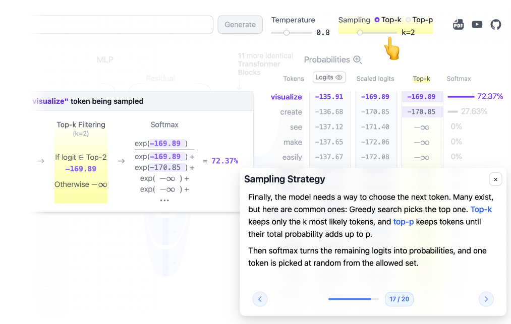

**Figure 8:** Guided learning provides an interactive, step-by-step text explanation that introduces Transformer concepts and connects relevant visual components. For example, on the sampling strategy page, it guides users to manipulate hyperparameters while simultaneously highlighting the elements that change in response on the screen.

> **图 8：** 引导式学习提供交互式的逐步文字讲解，介绍 Transformer 概念并关联相关的视觉组件。例如，在采样策略页面，它引导用户操纵超参数，同时高亮屏幕上随之变化的元素。

### 6.7 Web-Based, Open-Source Implementation / 基于 Web 的开源实现

Transformer Explainer is a web-based, open-source visualization tool designed to help non-experts understand how Transformers work (G4). Users can access our tool using only a web browser, with no installation or specialized hardware required. We use a HuggingFace Transformers’ [87] GPT-2 Small model from NanoGPT [43] to extract model data used in calculations during inference. To run the model in the browser, we converted a PyTorch model into ONNX format and used the ONNX Runtime Web API [19]. To minimize loading time, we split the model files into smaller chunks for parallel downloads and cache the model data in the browser using IndexedDB. As a result, the model only needs to be downloaded once, upon the user’s first visit. The frontend is built with Svelte [33] and D3.js [8].

> Transformer Explainer 是一个基于 Web 的开源可视化工具，旨在帮助非专业用户理解 Transformer 的工作原理（G4）。用户只需一个浏览器即可访问我们的工具，无需安装或专用硬件。我们使用来自 NanoGPT [43] 的 HuggingFace Transformers [87] GPT-2 Small 模型，提取推理计算所需的模型数据。为在浏览器中运行模型，我们将 PyTorch 模型转换为 ONNX 格式，并使用 ONNX Runtime Web API [19]。为最大限度缩短加载时间，我们将模型文件拆分为较小的分块并行下载，并使用 IndexedDB 在浏览器中缓存模型数据。因此，模型只需在用户首次访问时下载一次。前端使用 Svelte [33] 和 D3.js [8] 构建。

## 7 Informed Design Through Iterations / 通过迭代演进的设计

The current design of our tool is the result of over a year of iterative investigation and development, shaped by feedback gathered across three major phases.

> 我们工具的当前设计是一年多迭代探索与开发的成果，由三个主要阶段收集的反馈塑造而成。

• **Phase 1: Initial Prototype Feedback.** We built an early prototype and collected in-the-wild usage signals, complemented by informal feedback from instructors who regularly teach Transformer-related topics.

> • **阶段 1：初始原型反馈。** 我们构建了早期原型，收集了真实环境中的使用信号，并辅以定期讲授 Transformer 相关课程的教师的非正式反馈。

• **Phase 2: Enhanced Model Exploration.** Building on the initial feedback, we expanded the tool to support deeper exploration of model internals, enabling users to flexibly navigate the architecture (e.g., across Transformer blocks and attention heads (§ 6.1); and experiment with the output generation process through adjustable sampling hyperparameters (§ 6.4). We then conducted a preliminary usability assessment to gather early feedback on the tool’s effectiveness as a learning resource.

> • **阶段 2：增强的模型探索。** 基于初始反馈，我们扩展了工具以支持更深入地探索模型内部，使用户能够灵活地在架构中导航（例如跨 Transformer 模块和注意力头，§6.1），并通过可调采样超参数实验输出生成过程（§6.4）。随后我们开展了初步可用性评估，收集关于该工具作为学习资源有效性的早期反馈。

• **Phase 3: Guided Learning Support.** Drawing on the preliminary feedback, we refined the design into its final form by adding guided learning scaffolds (§ 6.6). We then validated the resulting tool through a summative evaluation (§ 8).

> • **阶段 3：引导式学习支持。** 基于初步反馈，我们通过加入引导式学习支架（§6.6）将设计打磨为最终形态。随后我们通过总结性评估验证了最终的工具（§8）。

### 7.1 Phase 1: Initial Prototype Feedback / 阶段 1：初始原型反馈

The first release of Transformer Explainer implemented our initial design goals (§ 5): a flow–based visualization (G1), step-by-step visual explanation (G2), and dynamic experimentation through user input and hyperparameter manipulation (G3). To manage early complexity, it rendered only the first block and first head—visually signaling repetition but not enabling traversal across blocks or heads. Following the release, we collected informal feedback from early users and three instructors who have taught graduate and undergraduate courses in machine learning and NLP topics (two instructors are co-authors). They noted that the multi-head and multi-block concepts remained abstract without the ability to systematically explore individual blocks and heads, and compare attention patterns; they also requested a more granular account of the output probabilities generation process that produces next-token distributions. These observations motivated the next iteration, emphasizing richer navigation across blocks and heads and an explicit, step-wise visualization of the final output probabilities layer.

> Transformer Explainer 的第一个发布版本实现了我们最初的设计目标（§5）：流式可视化（G1）、逐步可视化讲解（G2）、通过用户输入和超参数操纵进行动态实验（G3）。为控制早期的复杂度，它只渲染第一个模块和第一个头——在视觉上暗示了重复性，但不支持跨模块或跨头遍历。发布后，我们收集了早期用户和三位讲授过机器学习与 NLP 研究生及本科课程的教师的非正式反馈（其中两位教师是合著者）。他们指出，如果无法系统地探索各个模块和头、比较注意力模式，多头和多模块的概念就仍然抽象；他们还要求对产生下一 token 分布的输出概率生成过程做更细粒度的讲解。这些意见推动了下一轮迭代，重点是更丰富的跨模块、跨头导航，以及对最终输出概率层的显式逐步可视化。

### 7.2 Phase 2: Enhanced Model Exploration / 阶段 2：增强的模型探索

We extended the tool to support navigation across attention heads and Transformer blocks (§ 6.1), and introduced a step-by-step output probabilities formula card (§ 6.2), including controls for sampling hyperparameters (§ 6.4). With these features in place, our tool was ready for a preliminary usability assessment to collect feedback on how its interactivity would benefit non-expert learners. We used a within-subjects design to compare against a blog post baseline, which was static and non-interactive.

> 我们扩展了工具以支持跨注意力头和 Transformer 模块的导航（§6.1），并引入了逐步输出概率公式卡片（§6.2）以及采样超参数控件（§6.4）。具备这些功能后，我们的工具准备好接受初步可用性评估，以收集关于其交互性如何惠及非专业学习者的反馈。我们采用被试内设计，与一个静态、非交互的博客文章基线进行对比。

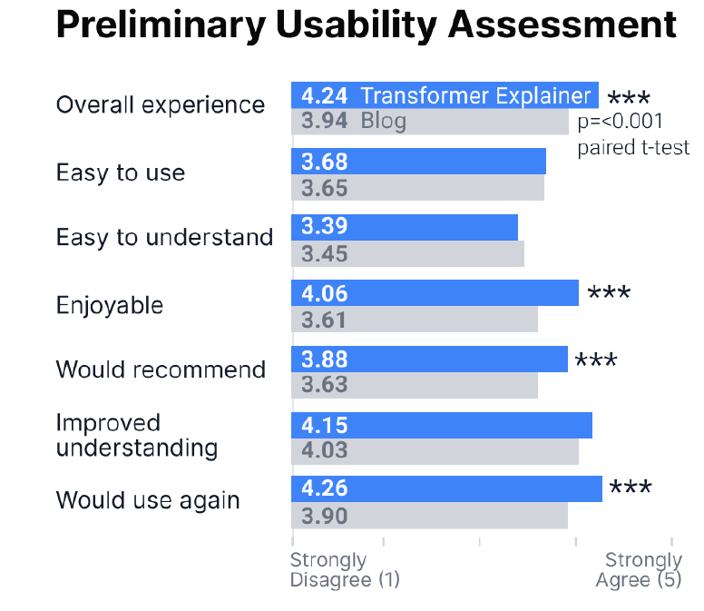

> **（原书插图，无编号）：** 阶段 2 初步可用性评估结果——145 名参与者对 Transformer Explainer 与博客在多项可用性指标上的评分对比。

A large majority of the 145 study participants (74%) preferred Transformer Explainer over the blog, and rated our tool significantly higher on most usability items (as shown in the right figure), including overall experience, enjoyment, and likelihood to recommend or use again. These findings provided early evidence that interactive visual exploration and experimentation can better support non-expert learners than static materials.

> 145 名研究参与者中的绝大多数（74%）相比博客更偏好 Transformer Explainer，并在大多数可用性条目上给我们的工具打出了显著更高的评分（如右图所示），包括整体体验、愉悦感、推荐或再次使用的意愿。这些发现提供了早期证据：交互式可视化探索与实验比静态材料更能支持非专业学习者。

### 7.3 Phase 3: Guided Learning Support / 阶段 3：引导式学习支持

Through the preliminary usability assessment, we also identified opportunities to improve the tool. Transformer Explainer offers rich interactivity and dynamic visualizations; however, these same features sometimes created usability challenges. Some participants noted that the initial learning curve could be eased with a more guided onboarding experience. These observations align with usability survey responses, which indicated room for improvement on “easy to use” and “easy to understand.”

> 通过初步可用性评估，我们也发现了改进工具的机会。Transformer Explainer 提供了丰富的交互性和动态可视化；然而，正是这些特性有时带来了可用性挑战。一些参与者指出，更有引导性的入门体验可以缓解初始学习曲线。这些观察与可用性问卷的回答一致——"易用"和"易懂"两项仍有改进空间。

Therefore, we introduced the guided learning (Fig. 8, § 6.6), an interactive, step-by-step text card that explains Transformer concepts while linking them to visual components and interactive actions. With these updates in place, we conducted a summative between-subjects evaluation to assess the tool’s usability and usefulness, and to examine whether Transformer Explainer improves non-expert learners’ understanding of Transformer concepts compared to blogs and videos, which are popular means of learning.

> 因此，我们引入了引导式学习（图 8，§6.6）——一张交互式的逐步文字卡片，在讲解 Transformer 概念的同时将其与视觉组件和交互操作关联起来。完成这些更新后，我们开展了一项总结性的被试间评估，以评估工具的可用性和有用性，并考察相比博客和视频等流行学习方式，Transformer Explainer 是否能提升非专业学习者对 Transformer 概念的理解。

## 8 Evaluation: User Study / 评估：用户研究

We conducted a user study to evaluate how effectively Transformer Explainer meets the design goals identified in § 5 and supports our high-level research contributions (§ 1). Specifically, we address three research questions (RQ1-3):

> 我们开展了一项用户研究，评估 Transformer Explainer 在多大程度上实现了 §5 中确定的设计目标，并支撑了我们高层的研究贡献（§1）。具体而言，我们回答三个研究问题（RQ1–3）：

**RQ1.** How does Transformer Explainer improve non-expert learners’ understanding of Transformer concepts compared to blog posts and videos, which are popular means of learning?

> **RQ1.** 相比博客文章和视频等流行学习方式，Transformer Explainer 如何提升非专业学习者对 Transformer 概念的理解？

**RQ2.** How is learners’ personal experience enhanced when learning Transformer concepts?

> **RQ2.** 学习 Transformer 概念时，学习者的个人体验如何得到增强？

**RQ3.** How do the features of Transformer Explainer support effective learning?

> **RQ3.** Transformer Explainer 的各项功能如何支持有效学习？

In addition, we examined differences in usability, engagement, and perceived learning experience across educational resources.

> 此外，我们还考察了不同学习资源在可用性、参与度和感知学习体验上的差异。

### 8.1 Study Design / 研究设计

We conducted a controlled between-subject experiment to evaluate the learning effectiveness of Transformer Explainer in comparison to existing educational resources. Participants were randomly assigned to one of three conditions: Transformer Explainer, a blog post, or an educational video. A between-subjects design was chosen to minimize knowledge transfer effects across conditions that participants would otherwise experience if they were to go through the conditions in sequence. This study was approved by our institution’s IRB.

> 我们开展了一项受控的被试间实验，评估 Transformer Explainer 相比现有学习资源的学习效果。参与者被随机分配到三种条件之一：Transformer Explainer、博客文章或教学视频。选择被试间设计是为了最大限度减少知识迁移效应——如果参与者依次经历所有条件，这种效应就会出现。本研究已获我们机构的 IRB（机构审查委员会）批准。

The blog and video baselines were selected because they represent two popular modes of learning resources [16, 57, 70, 76]. Blogs are static narrative media, composed of text and figures that learners interpret at their own pace; whereas videos are multimodal media that integrate narration, animations, and other elements in a fixed sequence. Comparing our tool against these two formats allowed us to examine the added contribution of interactivity and dynamic visualization beyond static or multimodal presentation. For a fair comparison, we ensured that all three learning modes convey the same information. Specifically, we selected the blog post on decoder-only Transformer (GPT-2),[^2] which is part of the blog returned as the top-ranked Google search result.[^3] Similarly, we selected the Transformers video series by 3Blue1Brown[^4] which has been viewed over 7.5 million times.

> 选择博客和视频作为基线，是因为它们代表了两种流行的学习资源形式 [16, 57, 70, 76]。博客是静态叙事媒介，由文字和图表组成，学习者按自己的节奏解读；视频则是多模态媒介，按固定顺序整合旁白、动画等元素。将我们的工具与这两种形式对比，使我们能够考察交互性和动态可视化在静态或多模态呈现之外的增量贡献。为公平比较，我们确保三种学习方式传达相同的信息。具体来说，我们选择了关于仅解码器 Transformer（GPT-2）的博客文章，[^2] 它是 Google 搜索结果排名最前的博客的一部分；[^3] 类似地，我们选择了 3Blue1Brown 的 Transformer 视频系列，[^4] 其播放量已超过 750 万次。

As the blog post and video contained content irrelevant to Transformer learning in our context (e.g., image generation model rather than text-based model), we consulted with the three instructors (§ 7.1) to identify six key learning objectives (Table 1) important for resources helping non-experts gain a conceptual understanding of Transformers. After removing irrelevant content, the learning resources could be fully explored in about 30 minutes by a learner.

> 由于博客文章和视频中包含与本研究场景下 Transformer 学习无关的内容（例如图像生成模型而非文本模型），我们与三位教师（§7.1）商议，确定了六个关键学习目标（表 1）——这些目标对于帮助非专业用户获得 Transformer 概念理解的学习资源至关重要。剔除无关内容后，学习者大约 30 分钟即可完整学习这些材料。

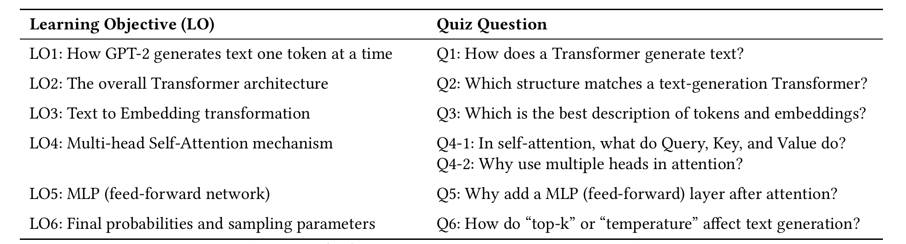

> **表 1 原表（PDF 裁剪图）；下方为便于阅读重排的双语表格，内容一致。**

| Learning Objective (LO) 学习目标                                                      | Quiz Question 测验问题                                                                                                                                                                       |
| ------------------------------------------------------------------------------------- | -------------------------------------------------------------------------------------------------------------------------------------------------------------------------------------------- |
| LO1: How GPT-2 generates text one token at a time LO1：GPT-2 如何逐 token 生成文本 | Q1: How does a Transformer generate text? Q1：Transformer 如何生成文本？                                                                                                                  |
| LO2: The overall Transformer architecture LO2：Transformer 整体架构                | Q2: Which structure matches a text-generation Transformer? Q2：哪种结构符合文本生成 Transformer？                                                                                         |
| LO3: Text to Embedding transformation LO3：文本到嵌入的转换                        | Q3: Which is the best description of tokens and embeddings? Q3：哪一项最准确地描述了 token 和嵌入？                                                                                       |
| LO4: Multi-head Self-Attention mechanism LO4：多头自注意力机制                     | Q4-1: In self-attention, what do Query, Key, and Value do? Q4-1：在自注意力中，查询、键、值分别做什么？ Q4-2: Why use multiple heads in attention? Q4-2：为什么注意力要使用多个头？ |
| LO5: MLP (feed-forward network) LO5：MLP（前馈网络）                               | Q5: Why add a MLP (feed-forward) layer after attention? Q5：为什么在注意力之后加 MLP（前馈）层？                                                                                          |
| LO6: Final probabilities and sampling parameters LO6：最终概率与采样参数           | Q6: How do "top-k" or "temperature" affect text generation? Q6："top-k"或"温度"如何影响文本生成？                                                                                         |

**Table 1:** Learning objectives (LO) and their corresponding multiple-choice quiz questions.

> **表 1：** 学习目标（LO）及其对应的选择测验问题。

### 8.2 Participants / 参与者

We recruited participants from Prolific,[^5] an online user study platform, for a 1-hour study. The average completion time for the study was 43 minutes, and each participant received compensation of $12. To ensure the study targeted non-expert learners, we asked prospective participants to self-rate their familiarity with generative AI on a 5-point scale and to indicate whether they were interested in learning how text-based generative AI works. Only individuals who both expressed interest and reported low familiarity levels were eligible to participate (i.e., either 1: Don’t know what it is; 2: Heard of it only; or 3: Aware but don’t understand). 90 of them completed the study, balanced across the three experimental conditions. (§ 8.3.1 describes the approach for checking participant engagement.)

> 我们在在线用户研究平台 Prolific [^5] 上招募参与者，研究时长 1 小时。研究的平均完成时间为 43 分钟，每位参与者获得 12 美元报酬。为确保研究面向非专业学习者，我们要求候选参与者按 5 级量表自评对生成式 AI 的熟悉程度，并表明是否有兴趣了解基于文本的生成式 AI 的工作原理。只有既表达了兴趣又报告低熟悉度的人才有资格参与（即 1：不知道它是什么；2：仅听说过；3：知道但不理解）。最终 90 人完成了研究，在三种实验条件间均衡分配。（§8.3.1 描述了检查参与者投入度的方法。）

Overall, the participants spanned a wide range of educational backgrounds, disciplines and industries. In detail, their educational backgrounds included bachelor’s degree (35.6%), master’s degree (18.9%), high school (16.7%), and some college (13.3%). Participants also spanned diverse disciplines, including computer science and information technology (30.0%) and business/management (23.3%), as well as social sciences, arts and humanities, and health sciences. Industry backgrounds were varied, with notable representation from health care (14.4%), information services (13.3%), technical services (7.8%), and finance (7.8%).

> 总体而言，参与者涵盖了广泛的教育背景、学科和行业。具体来说，教育背景包括本科（35.6%）、硕士（18.9%）、高中（16.7%）和部分大学教育（13.3%）。参与者的学科也多种多样，包括计算机科学与信息技术（30.0%）、商业/管理（23.3%），以及社会科学、人文艺术和健康科学。行业背景各异，较突出的有医疗保健（14.4%）、信息服务（13.3%）、技术服务（7.8%）和金融（7.8%）。

### 8.3 Procedure / 研究流程

After providing informed consent, participants first completed a demographic and background survey, which included self-ratings of mathematical proficiency and generative AI familiarity. They were then randomly assigned to one of three experimental conditions: interactive tool, blog, or video (referred to as Transformer Explainer, Blog, and Video, respectively). Participants studied their assigned resource freely for up to 45 minutes, enough time to fully explore the material (§ 8.1) and pace their learning while keeping exposure timing comparable across conditions.

> 在签署知情同意书后，参与者首先完成人口统计与背景调查，包括对数学能力和生成式 AI 熟悉度的自评。随后他们被随机分配到三种实验条件之一：交互式工具、博客或视频（分别称为 Transformer Explainer、Blog、Video）。参与者自由学习分配到的资源，最长 45 分钟——这足以完整探索材料（§8.1）并按自己的节奏学习，同时使各条件的接触时长保持可比。

Next, participants completed the post-study evaluation, which included both objective and subjective measures.

> 接着，参与者完成学习后评估，包括客观和主观两类测量。

• **For objective assessment,** participants took a closed-book multiple-choice quiz with 7 questions (Table 1) closely aligned with the learning objectives identified by instructors (§ 7.1), who also helped review the questions. The quiz questions focused only on concepts shared across all three resources, and the quiz items and answer choices were identical for all conditions.

> • **客观评估方面，** 参与者完成一份闭卷选择测验，共 7 题（表 1），与教师们确定的学习目标紧密对应（§7.1），教师也协助审阅了题目。测验题目只涉及三种资源共有的概念，且所有条件的题目和选项完全相同。

• **For subjective assessment,** participants (1) reported their self-perceived understanding of Transformer concepts on a 5-point Likert scale and rated the learning experience of their assigned material; and (2) answered three open-ended reflection questions (“most helpful aspects,” “most confusing aspects,” and “suggested improvements”) to capture qualitative feedback. Participants in the Transformer Explainer condition also provided tool-specific evaluations of individual features.

> • **主观评估方面，** 参与者 (1) 按 5 级李克特量表报告自己对 Transformer 概念的主观理解程度，并对所分配材料的学习体验评分；(2) 回答三个开放式反思问题（"最有帮助的方面"、"最困惑的方面"、"改进建议"），以收集定性反馈。Transformer Explainer 条件的参与者还对工具的各项功能逐一进行了评价。

**8.3.1 Checking for participant engagement.** To safeguard the integrity of the study results, we employed a two-pronged verification to ensure participants had used the tools and engaged both meaningfully and honestly. First, participants were required to answer three simple resource-specific questions that anyone who had studied the resource could easily answer (e.g., “What is the temperature range that can be adjusted with the slider in the tool?”). Only those with at least two correct responses were included, serving as both an engagement check and a verification of minimal attention. Second, we excluded participants showing signs of inattention or dishonesty, such as unrealistically short quiz times (≤ 7.1 seconds per question, below the 5th percentile) or insufficient effective tool-use time (≤ 5 minutes of focused engagement, discounting tab-outs or early exits). Using this two-pronged process, we excluded 38 of 128 initial participants, resulting in a final sample of 90 motivated non-experts.

> **8.3.1 参与者投入度检查。** 为保障研究结果的可靠性，我们采用双管齐下的验证，确保参与者确实使用了工具并认真、诚实地投入。首先，参与者必须回答三个与资源相关的简单问题——任何认真学习过该资源的人都能轻松答对（例如"工具中滑块可调的温度范围是多少？"）。只有至少答对两题者才被纳入，这既检查投入度，也验证了基本的注意力。其次，我们剔除了表现出不专注或不诚实迹象的参与者，例如测验耗时短得不现实（每题 ≤ 7.1 秒，低于第 5 百分位）或有效工具使用时间不足（专注使用 ≤ 5 分钟，切换标签页或提前退出的时间不计入）。通过这一双管齐下的流程，我们从 128 名初始参与者中剔除了 38 人，最终样本为 90 名有学习动机的非专业用户。

### 8.4 Data Analysis / 数据分析

We employed a mixed-methods approach to analyze the study data, combining quantitative and qualitative techniques to address our research questions. The quantitative analyses (§ 8.4.1) examined participants’ objective quiz performance and subjective ratings for achieving the learning objectives (Table 1) to evaluate the effectiveness of each learning resource in supporting Transformer concept understanding (RQ1). We also asked participants to rate their personal experience using each material (RQ2). In addition, Transformer Explainer participants provided feature-usefulness ratings, allowing us to investigate how they engaged with the tool and to uncover usage patterns associated with successful learning (RQ3). To complement these measures, we conducted a qualitative thematic analysis (§ 8.4.2) of participants’ open-ended responses to capture deeper insights into their experiences, sources of confusion, and suggestions for improvement.

> 我们采用混合研究方法分析研究数据，结合定量与定性技术来回答研究问题。定量分析（§8.4.1）考察参与者的客观测验成绩，以及他们对达成学习目标（表 1）的主观评分，以评估每种学习资源在支持 Transformer 概念理解方面的有效性（RQ1）。我们还让参与者评价自己使用每种材料的个人体验（RQ2）。此外，Transformer Explainer 条件的参与者提供了功能有用性评分，使我们能够研究他们如何使用工具，并发掘与成功学习相关的使用模式（RQ3）。作为这些测量的补充，我们对参与者的开放式回答进行了定性主题分析（§8.4.2），以深入洞察他们的体验、困惑来源和改进建议。

**8.4.1 Quantitative Analysis.**

> **8.4.1 定量分析。**

**Quiz Accuracy.** Quiz accuracy was measured with a 7-question multiple-choice quiz aligned with six learning objectives (Table 1). We analyzed quiz accuracy using generalized linear mixed models (GLMMs) [11] with a binomial logit link. Condition (Transformer Explainer, Blog, Video) was entered as a fixed effect, and participant was modeled as a random intercept to account for repeated responses per participant. Participants’ self-reported math proficiency and generative AI familiarity were included as covariates to control for prior knowledge, but neither showed reliable effects ($p$ > 0.20). Quiz question was initially included as an additional fixed effect, but since its effect was not significant ($p$ > 0.30), we report models focusing on condition-level differences. For significant condition effects, we conducted planned one-sided contrasts (Transformer Explainer > Blog, Transformer Explainer > Video), applying Holm correction across the two comparisons [38].

> **测验正确率。** 测验正确率通过与六个学习目标对应的 7 题选择测验（表 1）测量。我们使用带二项 logit 链接的广义线性混合模型（GLMM）[11] 分析测验正确率。条件（Transformer Explainer、Blog、Video）作为固定效应纳入，参与者建模为随机截距以处理每位参与者的重复作答。参与者自报的数学能力和生成式 AI 熟悉度作为协变量纳入以控制先验知识，但两者均未显示可靠影响（$p$ > 0.20）。测验题目最初作为额外固定效应纳入，但由于其效应不显著（$p$ > 0.30），我们报告聚焦条件间差异的模型。对于显著的条件效应，我们进行了计划中的单侧对比（Transformer Explainer > Blog、Transformer Explainer > Video），并对两次比较应用 Holm 校正 [38]。

**Subjective Ratings.** Participants reported their self-perceived understanding of each learning objective (Table 1) on a 5-point Likert scale, as well as overall learning experience including usability, engagement, clarity, and self-efficacy. Cognitive load was measured on a 0–10 scale. Because the data were ordinal and Shapiro-Wilk tests [71] indicated violations of normality, we used non-parametric Kruskal-Wallis tests [46] to examine group differences. Planned one-sided contrasts (Transformer Explainer > Blog, Transformer Explainer > Video) were tested with Holm correction across the two comparisons [38]. Usability was measured with the UMUX-Lite scale for ease of understanding, and usefulness [48]; engagement with measures adapted from the Intrinsic Motivation Inventory for enjoyment, interestingness, attention-holding [48]; and mental demand with a measure from NASA-TLX [34]. We also measured clarity (“I could follow the explanations without much confusion”) and self-efficacy (“I feel confident that I can explain the basics of a Transformer”). Internal consistency for the two usability measures and the three engagement measures was high, with Cronbach’s $\alpha$ = 0.82 and $\alpha$ = 0.88 respectively [15], supporting the use of averaged scores across measures.

> **主观评分。** 参与者按 5 级李克特量表报告自己对每个学习目标（表 1）的主观理解程度，以及包括可用性、参与度、清晰度和自我效能在内的整体学习体验。认知负荷按 0–10 量表测量。由于数据为定序数据，且 Shapiro-Wilk 检验 [71] 表明其违反正态性，我们使用非参数 Kruskal-Wallis 检验 [46] 考察组间差异。计划中的单侧对比（Transformer Explainer > Blog、Transformer Explainer > Video）经 Holm 校正检验 [38]。可用性采用 UMUX-Lite 量表测量易懂性和有用性 [48]；参与度采用改编自内在动机量表（Intrinsic Motivation Inventory）的愉悦感、趣味性、注意力保持测量 [48]；心智负担采用 NASA-TLX 的测量项 [34]。我们还测量了清晰度（"我能不太费力地跟上讲解"）和自我效能（"我有信心能讲清楚 Transformer 的基本原理"）。两个可用性测量项和三个参与度测量项的内部一致性很高，Cronbach's $\alpha$ 分别为 0.82 和 0.88 [15]，支持对各项取平均分。

**8.4.2 Qualitative Analysis.** Participants also responded to three open-ended questions: (1) what aspects of the material were most helpful, (2) what aspects were confusing, and (3) what improvements they would suggest. We analyzed these responses using thematic analysis following Braun and Clarke’s six-phase approach [9]. We conducted open coding to identify meaningful units of text, then iteratively grouped codes into candidate themes. Through refinement, we developed a final codebook that captured recurring patterns across responses. Representative quotes for each theme were selected to illustrate the findings.

> **8.4.2 定性分析。** 参与者还回答了三个开放式问题：(1) 材料的哪些方面最有帮助；(2) 哪些方面令人困惑；(3) 有什么改进建议。我们遵循 Braun 和 Clarke 的六阶段方法 [9] 对这些回答进行主题分析。我们先进行开放式编码以识别有意义的文本单元，然后迭代地将编码归并为候选主题。经过提炼，我们形成了最终编码手册，捕捉回答中反复出现的模式。每个主题选取代表性引文来说明研究发现。

## 9 Findings and Reflections / 发现与反思

Here, we present the findings for our three research questions: § 9.1 discusses how our tool improves non-expert learners’ understanding (RQ1); § 9.2 describes how learners’ personal experience is enhanced (RQ2); and § 9.3 discusses how our tool’s specific features support effective learning (RQ3). Finally, § 9.4 reflected on our lessons learned on user needs, explanation effectiveness, and learning outcomes.

> 本节呈现三个研究问题的发现：§9.1 讨论我们的工具如何提升非专业学习者的理解（RQ1）；§9.2 描述学习者的个人体验如何得到增强（RQ2）；§9.3 讨论工具的具体功能如何支持有效学习（RQ3）。最后，§9.4 反思我们在用户需求、讲解有效性和学习成果方面获得的经验。

### 9.1 How does Transformer Explainer improve non-expert learners’ understanding of Transformer concepts compared to blog posts and videos, which are popular means of learning? (RQ1) / 相比博客文章和视频等流行学习方式，Transformer Explainer 如何提升非专业学习者对 Transformer 概念的理解？（RQ1）

**9.1.1 Summary.** Our analyses present converging evidence that our tool improves non-experts’ understanding of Transformer concepts more effectively than Blog and Video (Fig. 9), showing statistically significant advantages in both objective quiz accuracy and subjective ratings in achieving learning objectives. Fig. 9A shows Transformer Explainer participants answered statistically significantly more quiz questions correctly (73.3% correct on average across 7 questions) than those in Blog ($p$ = 0.021) and Video ($p$ = 0.021). They also self-rated their understanding as significantly higher than Blog ($p$ = 0.006), and comparable to Video (Fig. 9B).

> **9.1.1 概要。** 我们的分析提供了趋同的证据：相比 Blog 和 Video，我们的工具更有效地提升了非专业用户对 Transformer 概念的理解（图 9），在客观测验正确率和达成学习目标的主观评分两方面都显示出统计上显著的优势。图 9A 显示，Transformer Explainer 组参与者答对的测验题显著更多（7 题平均正确率 73.3%），高于 Blog 组（$p$ = 0.021）和 Video 组（$p$ = 0.021）。他们自评的理解程度也显著高于 Blog 组（$p$ = 0.006），与 Video 组相当（图 9B）。

**9.1.2 Question and learning objective level analysis.** Transformer Explainer’s benefits are further highlighted by analyses at the quiz question and learning objective level. Fig. 10A shows that participants using Transformer Explainer achieved significantly higher quiz accuracy than Blog on the output probability (LO6), and marginally higher than both Blog and Video on the attention mechanism (LO4)—concepts often regarded as the main reasons of difficulty when learning Transformers. They also outperformed Video on the architecture overview (LO2), a topic that requires a clear understanding of the model’s overall structure.

> **9.1.2 题目与学习目标层面的分析。** 测验题目和学习目标层面的分析进一步凸显了 Transformer Explainer 的优势。图 10A 显示，使用 Transformer Explainer 的参与者在输出概率（LO6）上的测验正确率显著高于 Blog 组，在注意力机制（LO4）上边缘显著地高于 Blog 和 Video 两组——这些概念通常被认为是学习 Transformer 的主要难点。他们在架构总览（LO2）上也优于 Video 组，该主题要求对模型整体结构有清晰的理解。

Transformer Explainer participants self-rated significantly higher in achieving all learning objectives (Fig. 10B) compared to Blog, except for the attention mechanism (LO4) where the difference was marginally significant. While participants in the Video condition reported understanding levels comparable to Transformer Explainer, their overall quiz accuracy, averaged across questions, was as low as Blog’s, and significantly lower than Transformer Explainer’s (Fig. 9A). This pattern may reflect an “illusory understanding” effect [67], where prior research suggests that watching a seemingly coherent narrative (e.g., a video) can create the impression of understanding without supporting recall [18]. Indeed, one Video participant rated their understanding 4 out of 5, but admitted: “When I got to the quiz, I didn’t really remember the details. I think maybe short quizzes along the way [would help]” Another noted, “it was not confusing, but hard to retain. I am a visual person and remembering without the video is difficult for me.” Several others ($n$ = 3) explicitly suggested adding quizzes or interactive activities during video viewing to improve retention.

> 相比 Blog 组，Transformer Explainer 组参与者在所有学习目标上的自评达成度都显著更高（图 10B），只有注意力机制（LO4）的差异为边缘显著。虽然 Video 组参与者报告的理解程度与 Transformer Explainer 组相当，但他们跨题目平均的总体测验正确率却和 Blog 组一样低，显著低于 Transformer Explainer 组（图 9A）。这种模式可能反映了"理解错觉"效应 [67]——先前研究表明，观看看似连贯的叙事（如视频）可以营造理解的印象，却不能支撑回忆 [18]。事实上，一位 Video 组参与者给自己的理解打了 4 分（满分 5 分），但承认："到了测验时，我其实没记住那些细节。我想也许在学习过程中穿插小测验会有帮助。"另一位说："内容并不费解，但很难记住。我是视觉型学习者，没有视频就很难回忆起来。"另有数位（$n$ = 3）明确建议在观看视频时加入测验或互动活动以改善记忆保持。

Interestingly, Transformer Explainer participants commented on how the tools provide the type of interactive elements that are “missing” from Video. One participant explained, “I like how it is interactive and allowed me to change certain settings. I find interactive learning helps me better understand and retain compared to only reading.” Another noted, “I really found the interactive visuals useful in aiding comprehension while I was doing the quiz.”

> 有趣的是，Transformer Explainer 组参与者评论说，工具提供了 Video 所"缺失"的那类交互元素。一位参与者解释："我喜欢它的交互性，可以修改某些设置。我发现相比只阅读，交互式学习帮助我更好地理解和记忆。"另一位说："我在做测验时真的觉得交互式可视化对理解很有帮助。"

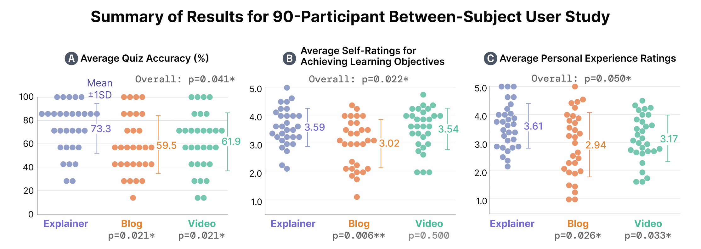

**Figure 9:** Transformer Explainer was significantly more effective than both Blog and Video in understanding Transformer concepts and learning experience. (A) Transformer Explainer participants achieved higher quiz accuracy than Blog ($p$ = 0.021) and Video ($p$ = 0.021), as confirmed by pairwise tests from a GLMM controlling for participants’ prior math and AI knowledge. (B) They also reported higher achievement of learning objectives than Blog ($p$ = 0.006), and (C) higher learning experience ratings than Blog ($p$ = 0.026) and Video ($p$ = 0.033), on follow-up pairwise comparisons after Kruskal–Wallis tests.

> **图 9：** 在理解 Transformer 概念和学习体验方面，Transformer Explainer 显著优于 Blog 和 Video。(A) 控制了参与者先验数学与 AI 知识的 GLMM 成对检验确认，Transformer Explainer 组的测验正确率高于 Blog（$p$ = 0.021）和 Video（$p$ = 0.021）。(B) 他们报告的学习目标达成度也高于 Blog（$p$ = 0.006）；(C) Kruskal–Wallis 检验后的成对比较显示，其学习体验评分高于 Blog（$p$ = 0.026）和 Video（$p$ = 0.033）。

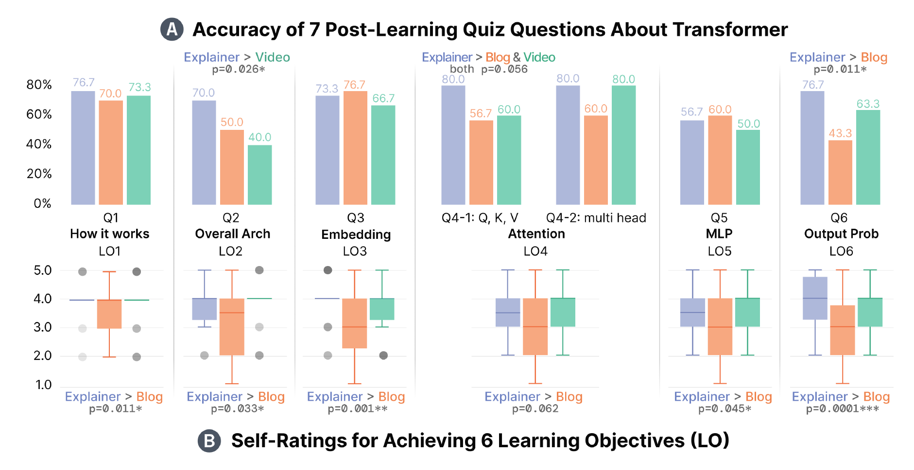

**Figure 10:** Across all learning objectives, Transformer Explainer led to significantly higher understanding scores than both Blog and Video. (A) Across the seven quiz questions aligned with six learning objectives, Transformer Explainer participants scored higher on architecture overview (LO2) than Video ($p$ = 0.026); marginally higher on attention mechanism (LO4) than both Blog and Video (both $p$ = 0.056); and significantly higher on output probability (LO6) than Blog ($p$ = 0.011). (B) For self-reported achievement of the learning objectives, Transformer Explainer participants rated themselves significantly higher than those in Blog across all items.

> **图 10：** 在所有学习目标上，Transformer Explainer 带来的理解评分都显著高于 Blog 和 Video。(A) 在与六个学习目标对应的七道测验题中，Transformer Explainer 组在架构总览（LO2）上得分高于 Video（$p$ = 0.026）；在注意力机制（LO4）上边缘显著高于 Blog 和 Video（均为 $p$ = 0.056）；在输出概率（LO6）上显著高于 Blog（$p$ = 0.011）。(B) 在学习目标达成度的自评上，Transformer Explainer 组在所有条目上都显著高于 Blog 组。

### 9.2 How is learners’ personalized experience enhanced when learning Transformer concepts? (RQ2) / 学习 Transformer 概念时，学习者的个性化体验如何得到增强？（RQ2）

Fig. 9C shows that Transformer Explainer participants rated their overall personal experience statistically significantly higher than both Blog ($p$ = 0.026) and Video ($p$ = 0.033). Breaking this down by measures (Fig. 11), Transformer Explainer consistently outperformed the baselines across multiple measures. Specifically, on usability (ease of understanding, usefulness) and engagement (enjoyment, interestingness, attention-holding), our tool scored significantly higher than both Blog and Video. Self-efficacy ratings were also significantly higher than Video ($p$ = 0.047), suggesting that learners felt more confident in explaining Transformer basics after using Transformer Explainer. As one participant noted: “I feel that I could map out the process [...] the equivalent of a children’s drawing of the solar system in crayon. I understand that everything moves about one another.” On mental demand, Transformer Explainer was rated statistically significantly lower than Blog ($p$ = 0.044), while being comparable to Video. This result is noteworthy because interactive tools are sometimes associated with higher cognitive load due to user actions [72, 74], whereas videos are typically regarded as cognitively lightweight since learners only need to follow the narrative [22]. We attribute this outcome to two design features: a flow-based visualization with visual consistency (G1), and step-by-step guided explanations (G2) that scaffolded learners through abstraction levels appropriate for non-experts (§ 9.3).

> 图 9C 显示，Transformer Explainer 组参与者对整体个人体验的评分在统计上显著高于 Blog（$p$ = 0.026）和 Video（$p$ = 0.033）。按测量项细分（图 11），Transformer Explainer 在多项指标上持续优于基线。具体来说，在可用性（易懂性、有用性）和参与度（愉悦感、趣味性、注意力保持）上，我们的工具得分显著高于 Blog 和 Video 两组。自我效能评分也显著高于 Video（$p$ = 0.047），表明学习者在使用 Transformer Explainer 后更有信心讲解 Transformer 的基本原理。正如一位参与者所说："我觉得我能描绘出整个过程……相当于用蜡笔画的儿童版太阳系。我理解万物如何相互关联、运动。"在心智负担上，Transformer Explainer 的评分在统计上显著低于 Blog（$p$ = 0.044），与 Video 相当。这一结果值得关注，因为交互式工具有时被认为会因用户操作而带来更高的认知负荷 [72, 74]，而视频通常被认为认知上更轻松，因为学习者只需跟随叙事 [22]。我们将这一结果归因于两个设计特性：具有视觉一致性的流式可视化（G1），以及逐步引导的讲解（G2）——它们以适合非专业用户的抽象层级为学习者搭建支架（§9.3）。

For clarity, all three tools’ scores were modest, reflecting the inherent challenge of the Transformer topic for non-experts with little prior background knowledge. Nonetheless, Transformer Explainer participants experienced the highest average clarity (at 3.07), while reported the best ratings across all other measures. Taken together, these findings demonstrate the viability of interactive visualization approaches in enhancing participants’ personal experience when learning Transformer concepts.

> 需要说明的是，三种工具的评分都不算高，这反映了 Transformer 主题对几乎毫无背景知识的非专业用户固有的挑战性。尽管如此，Transformer Explainer 组参与者的平均清晰度最高（3.07），其余各项指标的评分也都是最好的。综合来看，这些发现证明了交互式可视化方法在增强学习者个人体验方面的可行性。

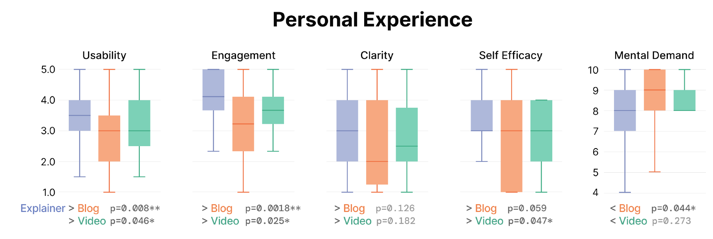

**Figure 11:** For participants’ personal experience using the three tools, Transformer Explainer outperformed both Blog and Video on all measures. Usability and engagement were significantly higher than both baselines, self-efficacy was significantly higher than Video ($p$ = 0.047), and mental demand was substantially lower than Blog ($p$ = 0.044).

> **图 11：** 在使用三种工具的个人体验方面，Transformer Explainer 在所有指标上都优于 Blog 和 Video。可用性和参与度显著高于两个基线，自我效能显著高于 Video（$p$ = 0.047），心智负担显著低于 Blog（$p$ = 0.044）。

### 9.3 How do the features of Transformer Explainer support effective learning? (RQ3) / Transformer Explainer 的各项功能如何支持有效学习？（RQ3）

Our results suggest that the effectiveness of Transformer Explainer may be attributed to its success in achieving three design goals that we identified (§ 5): enabling dynamic experimentation with live models through user input and hyperparameter manipulation (G3), maintaining coherence with flow-based visualizations (G1), and providing step-by-step guided explanation (G2). Each of these features contributed to higher engagement and lower mental demand, and together they led Transformer Explainer to achieve stronger overall usability evaluations (Fig. 9C).

> 我们的结果表明，Transformer Explainer 的有效性可归因于它成功实现了我们确定的三个设计目标（§5）：通过用户输入和超参数操纵实现与实时模型的动态实验（G3）、以流式可视化保持连贯性（G1）、提供逐步引导讲解（G2）。这些功能各自贡献了更高的参与度和更低的心智负担，共同使 Transformer Explainer 获得了更强的整体可用性评价（图 9C）。

**9.3.1 Interactivity Enhances Understanding of Transformer Concepts.** Unlike the Blog and Video, only Transformer Explainer allowed participants to directly manipulate inputs and model hyperparameters while observing immediate system feedback (G3, § 6.3, § 6.4). In addition, the step-by-step expanded view enabled learners to transition between overview and detail at their own learning pace (G2, § 6.2). These features not only contributed to an enhanced personal experience (Fig. 11) but were also strongly associated with improved participants’ understanding. In open-ended responses, 26 of 30 participants explicitly identified interactivity as one of the most helpful features for achieving the learning objectives. Many specifically highlighted entering their own text and adjusting sampling parameters as particularly impactful. One participant noted, “The most helpful part to learn is the interactiveness with the generate button, being able to add my own words to play around, as well as the probabilities of the words coming next being able to play with the sample parameters.” Another remarked, “The material that helped me the most was the interaction piece, looking at how temperature, p and k change with the different words and how much creativity I want it to have.”

> **9.3.1 交互性增强对 Transformer 概念的理解。** 与 Blog 和 Video 不同，只有 Transformer Explainer 允许参与者直接操纵输入和模型超参数，同时观察系统的即时反馈（G3，§6.3、§6.4）。此外，逐步展开视图使学习者能按自己的学习节奏在总览和细节之间切换（G2，§6.2）。这些功能不仅增强了个人体验（图 11），还与参与者理解的提升密切相关。在开放式回答中，30 名参与者中有 26 人明确认为交互性是对达成学习目标最有帮助的功能之一。许多人特别强调输入自己的文本和调整采样参数影响最大。一位参与者说："对学习最有帮助的是 Generate 按钮的交互性——可以加入我自己的文字来玩，还能一边看接下来各词的概率一边摆弄采样参数。"另一位说："对我帮助最大的是交互部分——看温度、p 和 k 如何随不同的词变化，以及我希望它有多少'创造力'。"

**9.3.2 Token-centric Flow-based Visualization Clarifies Complex Model Architecture.** Although all three learning materials relied heavily on visual explanations, the flow-based visual design of Transformer Explainer offered participants a clearer and more coherent experience. As shown in Fig. 12, flow visualization was rated as the second most helpful feature, and in open-ended responses, participants praised its clarity in mapping data trajectories onto the actual model structure ($n$ = 12). One noted, “I really liked seeing the flow visuals of the transformer. I finally have a clear mental image for how it all works.” and another, “The graphic was very efficient, and made me understand more clearly what was happening at each step.” Such comments highlight how this design translated abstract operations into tractable narratives, helping users build a clearer mental model of the Transformer’s internal architecture.

> **9.3.2 以 token 为中心的流式可视化厘清复杂模型架构。** 虽然三种学习材料都大量依赖视觉讲解，但 Transformer Explainer 的流式视觉设计为参与者提供了更清晰、更连贯的体验。如图 12 所示，流式可视化被评为第二有帮助的功能；在开放式回答中，参与者称赞它将数据轨迹映射到真实模型结构的清晰度（$n$ = 12）。一位说："我真的很喜欢看 Transformer 的流式可视化。我终于对它的工作原理有了清晰的心智图景。"另一位说："图形非常高效，让我更清楚地理解每一步发生了什么。"这类评论凸显了该设计如何将抽象运算转化为可循的叙事，帮助用户建立更清晰的 Transformer 内部架构心智模型。

In contrast, Blog and Video participants described visual overload. One participant commented, “The visuals were somewhat helpful, but they could be confusing as well. Too much information at once, including technical terms and graphics.” while another noted, “Have it be less columns and charts. My eyes just glaze over and attention drifts after the first ten to fifteen minutes of that.” This suggests that Transformer Explainer reduced participants’ mental demand by maintaining a consistent Sankey-style flow across components and integrating overview and detail within a single framing (G1, § 6.1), thereby avoiding the introduction of new charts or diagrams for each subtopic as in the Blog and Video—as reflected in the lower mental demand scores compared to the baselines (Fig. 11).

> 相比之下，Blog 和 Video 组参与者描述了视觉过载。一位评论道："可视化有些帮助，但也可能让人困惑。一次性信息太多，包括术语和图表。"另一位说："少一些栏和图表吧。看那种东西十到十五分钟后，我眼睛就发直、注意力就飘了。"这表明，Transformer Explainer 通过在组件间维持一致的桑基图式流、将总览与细节整合在单一框架内（G1，§6.1），降低了参与者的心智负担——避免了像 Blog 和 Video 那样为每个子主题引入新的图表——这也反映在其低于基线的心智负担评分上（图 11）。

These findings demonstrate the importance of a consistent visual narrative that spans the entire learning process. Rather than offering many disparate visual elements, representing complex concepts through a unified visual language reduces learners’ cognitive burden and facilitates deeper understanding.

> 这些发现证明了贯穿整个学习过程的一致视觉叙事的重要性。与其提供许多互不关联的视觉元素，不如用统一的视觉语言表达复杂概念，这样能减轻学习者的认知负担并促进更深入的理解。

**9.3.3 Guided Learning Reduces Entry Barriers and Improves Clarity.** As shown in Fig. 12, the guided learning feature of Transformer Explainer (§ 6.6) was rated the highest among all features, as “extremely” or “very” helpful by most participants. Several participants emphasized how the structured walkthrough supported their learning. One noted, “I relied a lot on the guided tour so that I could track the progress from start to finish. The interactive design was pretty effective with keeping things moving left→right, and the 1–20 stepped process was essential for tracking over the loops.” and another, “The part that helped most was the box on the bottom right corner. It broke down each concept one by one and had helpful navigation on the site.” These scaffolds directly addressed issues observed in the preliminary usability assessment (§ 7.2), where some participants reported not knowing “what to look at first.” Now, such comments have virtually disappeared.

> **9.3.3 引导式学习降低入门门槛、提升清晰度。** 如图 12 所示，Transformer Explainer 的引导式学习功能（§6.6）在所有功能中评分最高，大多数参与者认为它"极其"或"非常"有帮助。几位参与者强调了结构化导览对他们学习的支持。一位说："我很依赖引导导览，这样我能从头到尾跟踪进度。保持内容从左到右推进的交互设计很有效，1–20 的分步过程对跨模块循环追踪至关重要。"另一位说："帮助最大的是右下角的卡片。它把每个概念逐一拆解，还在网站上提供了好用的导航。"这些支架直接解决了初步可用性评估（§7.2）中观察到的问题——当时一些参与者报告不知道"先看什么"。现在，这类评论几乎消失了。

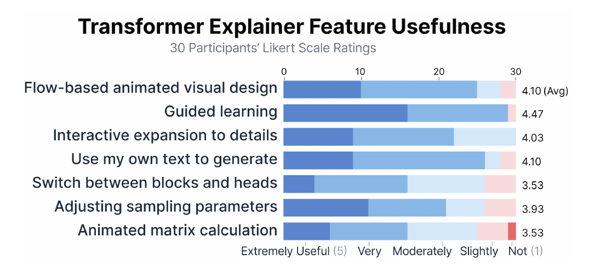

**Figure 12:** Participants rated most features of Transformer Explainer as useful for learning. The highest ratings were given to guided learning, flow-based animated visual design, and use my own text, with a majority of participants rating them as “extremely useful” or “very useful.” Other features also received generally positive responses.

> **图 12：** 参与者认为 Transformer Explainer 的大多数功能对学习有用。评分最高的是引导式学习、流式动画视觉设计和"使用我自己的文本"，大多数参与者将它们评为"极其有用"或"非常有用"。其他功能也普遍获得积极评价。

### 9.4 Reflections on User Needs, Explanation Effectiveness, and Learning Outcomes / 对用户需求、讲解有效性与学习成果的反思

**9.4.1 [User Needs] Transformer Explainer promotes active learning by combining visual narrative with interactive exploration.** Reflecting on our design process and study results, we identify several needs of non-expert learners trying to understand Transformers: the need to work with personally meaningful inputs, to experiment with model behavior in a low-stakes way, and to receive immediate feedback that makes abstract mechanisms concrete. Active learning research suggests that when learners work with inputs they have personally chosen, they develop a stronger sense of stake in the outcome, leading the brain to treat the information as more valuable and thus increasing their readiness to learn and retain [18, 26]. Transformer Explainer directly supports these needs by allowing participants to (1) choose their own prompts and settings and immediately observe the resulting attention patterns; (2) interactively modify temperature and sampling hyperparameters while seeing how such changes alter the next-token distribution. This tight experiment–feedback loop turns parameters that are often discussed only in the abstract into manipulable objects, in ways that passive media such as Video or Blog cannot easily provide.

> **9.4.1【用户需求】Transformer Explainer 通过将视觉叙事与交互式探索相结合来促进主动学习。** 反思我们的设计过程和研究结果，我们识别出试图理解 Transformer 的非专业学习者的若干需求：需要处理对个人有意义的输入、需要以低成本无压力的方式实验模型行为、需要获得让抽象机制变具体的即时反馈。主动学习研究表明，当学习者使用自己选择的输入时，他们会对结果产生更强的参与感，使大脑将这些信息视为更有价值，从而提高学习和记忆的意愿 [18, 26]。Transformer Explainer 直接支持这些需求：允许参与者 (1) 选择自己的提示词和设置，并立即观察由此产生的注意力模式；(2) 交互式地修改温度和采样超参数，同时看到这些变化如何改变下一 token 分布。这种紧密的实验-反馈循环，把那些通常只在抽象层面讨论的参数变成了可操纵的对象，这是 Video 或 Blog 等被动媒介难以提供的。

Transformer Explainer’s higher quiz accuracy (§ 9.1) on the more challenging topics such as attention mechanism (LO4) and output probability (LO6), both of which supported by rich interaction, suggests that addressing these needs for hands-on experimentation and immediate feedback can translate into better understanding of model internals. At the same time, participants in the Video condition frequently reported difficulty retaining material and expressed a desire for additional mid-lesson activities to reinforce key concepts, underscoring that learners may need more than continuous exposition as they learn. Transformer Explainer addresses this need in part through interactive exploration and guided learning, and future work could explore adding more structured practice activities. Overall, our findings highlight the value of tools that blend visual explanations with opportunities for active engagement and experimentation, and point to user needs (e.g., personal relevance, controllable pacing, and concrete feedback) that future AI education tools should explicitly support.

> Transformer Explainer 在注意力机制（LO4）和输出概率（LO6）等更具挑战性的主题上取得了更高的测验正确率（§9.1），而这两个主题都有丰富的交互支持——这表明，满足动手实验和即时反馈的需求可以转化为对模型内部机制更好的理解。与此同时，Video 组参与者频繁报告难以记住材料，并表示希望在课程中间增加活动来强化关键概念，这凸显了学习者在学习过程中需要的不仅仅是连续的讲解。Transformer Explainer 通过交互式探索和引导式学习部分满足了这一需求，未来工作可以探索加入更多结构化的练习活动。总体而言，我们的发现凸显了将视觉讲解与主动参与和实验机会相结合的工具的价值，并指出了未来 AI 教育工具应明确支持的用户需求（如个人相关性、可控节奏、具体反馈）。

**9.4.2 [Explanation Effectiveness] Transformer Explainer eases non-experts’ interpretation of complex Transformer mechanisms.** Participants using our tool rated usability (ease of understanding and perceived usefulness) significantly higher than Blog and Video, and reported higher self-efficacy, indicating greater confidence in their ability to explain core Transformer mechanisms after interacting with the system. At the same time, mental demand was rated lower than in both baselines, counter to the common assumption that interactivity necessarily increases cognitive load. This finding suggests that our interactive explanations helped participants make sense of the model’s internal processes without feeling overwhelmed, rather than burdening participants with interface complexity. Taken together, these three self-reported measures indicate that participants experienced the explanations as both accessible and empowering. This subjective picture is echoed by the objective quantitative results (§ 9.1). Specifically, quiz accuracy averaged 73.3% across seven learning-objective-aligned questions (Fig. 9), a statistically significant improvement over Blog and Video. In other words, participants did not only feel that the explanations were clear; they were also better able to answer mechanism-focused questions correctly. In the next section, we examine these learning outcomes in more detail and discuss how they may be attributed to specific design choices in our tool’s explanatory features.

> **9.4.2【讲解有效性】Transformer Explainer 降低了非专业用户理解复杂 Transformer 机制的难度。** 使用我们工具的参与者对可用性（易懂性和感知有用性）的评分显著高于 Blog 和 Video，并报告了更高的自我效能，表明他们在与系统交互后更有信心讲解 Transformer 的核心机制。同时，心智负担评分低于两个基线——这与"交互性必然增加认知负荷"的常见假设相反。这一发现表明，我们的交互式讲解帮助参与者在不感到不堪重负的情况下理解模型的内部过程，而非用界面复杂性增加负担。综合来看，这三项自报指标表明参与者认为讲解既易懂又赋能。这一主观图景与客观定量结果相呼应（§9.1）：七道与学习目标对应的题目平均正确率达 73.3%（图 9），相比 Blog 和 Video 有统计上显著的提升。换言之，参与者不仅感觉讲解清晰，也确实能更准确地回答聚焦机制的问题。下一节我们将更详细地考察这些学习成果，并讨论它们可归因于工具讲解功能中的哪些具体设计选择。

**9.4.3 [Learning Outcomes] From Design Features to Learning Gains.** Our evaluation suggests that Transformer Explainer not only improves overall quiz performance and self-rated understanding, but does so in a way that varies across learning objectives in informative ways. Across the seven quiz questions aligned with six learning objectives, participants using Transformer Explainer achieved statistically significant gains on architecture overview (LO2, $p$ = 0.026), and output probabilities (LO6, $p$ = 0.011), and a marginally higher performance on attention mechanism (LO4, $p$ = 0.056), outperforming Blog and often Video on these challenging concepts. These patterns indicate that our tool is particularly effective at helping learners construct a coherent mental model of the model’s global structure and the probabilistic nature of text generation, areas where non-experts often default to a “black box” view of Transformers.

> **9.4.3【学习成果】从设计特性到学习收益。** 我们的评估表明，Transformer Explainer 不仅提升了整体测验成绩和自评理解度，而且这种提升在不同学习目标上的分布富有信息量。在与六个学习目标对应的七道测验题中，使用 Transformer Explainer 的参与者在架构总览（LO2，$p$ = 0.026）和输出概率（LO6，$p$ = 0.011）上取得统计上显著的提升，在注意力机制（LO4，$p$ = 0.056）上边缘显著更高，在这些有挑战性的概念上优于 Blog 且常常优于 Video。这些模式表明，我们的工具在帮助学习者构建关于模型全局结构和文本生成概率本质的连贯心智模型方面尤为有效——而在这些方面，非专业用户往往默认把 Transformer 当作"黑箱"。

These outcome differences closely track where our design offers the richest interactive support. Architecture overview (LO2) is reinforced by the flow-based visualization and block navigation (§ 6.1), which let learners move between overview and detail on demand; attention mechanism (LO4) is supported through head-level navigation (§ 6.1) and step-by-step animated explanations (§ 6.2); and output probabilities (LO6) are made tangible through direct experimentation with temperature, top-k, and top-p (§ 6.4). In contrast, MLP (LO5)—the only objective without dedicated interactive elements—shows comparatively lower quiz accuracy and self-rated understanding (Fig. 10). This divergence suggests our interactive visual scaffolds are not merely engaging add-ons but are tightly coupled to conceptual learning, and it highlights MLP as a concrete target for future work (e.g., by adding analogous visual and experimental affordances).

> 这些成果差异与我们设计提供最强交互支持的位置高度吻合。架构总览（LO2）由流式可视化和模块导航（§6.1）强化，学习者可以按需在大图与细节之间切换；注意力机制（LO4）由头级导航（§6.1）和逐步动画讲解（§6.2）支持；输出概率（LO6）则通过对温度、top-k、top-p 的直接实验变得可感可知（§6.4）。相比之下，MLP（LO5）——唯一没有专门交互元素的学习目标——的测验正确率和自评理解度相对较低（图 10）。这一分化表明，我们的交互式视觉支架并非只是增加趣味性的点缀，而是与概念学习紧密耦合的；同时也将 MLP 凸显为未来工作的具体目标（例如添加类似的视觉与实验支持）。

Finally, comparing subjective and objective outcomes reveals how different resource formats shape learners’ sense of understanding. As noted in § 9.1, participants in the Video condition reported understanding comparable to Transformer Explainer, despite substantially lower quiz accuracy. Prior work characterizes this kind of divergence as possible “illusory understanding” effect, where coherent narrative can foster confidence without supporting recall [18]. Building on this, our results suggest that Transformer Explainer’s interactive manipulation of inputs and parameters may help learners calibrate their understanding more accurately: by actively testing how changes in inputs, attention, or sampling parameters affect model behavior, participants receive immediate feedback about what they do and do not yet understand. For a learning-outcomes perspective, this calibration is itself valuable, even though our current measures focus on short-term conceptual gains rather than long-term retention or transfer.

> 最后，主观与客观结果的对比揭示了不同资源形式如何塑造学习者的理解感。如 §9.1 所述，Video 组参与者报告的理解程度与 Transformer Explainer 组相当，尽管他们的测验正确率低得多。先前工作将这类分化称为可能的"理解错觉"效应：连贯的叙事可以培养信心却不能支撑回忆 [18]。在此基础上，我们的结果表明，Transformer Explainer 对输入和参数的交互式操纵可能帮助学习者更准确地校准自己的理解：通过主动测试输入、注意力或采样参数的变化如何影响模型行为，参与者能立即获得关于"自己懂了什么、还没懂什么"的反馈。从学习成果的角度看，这种校准本身就有价值——尽管我们目前的测量聚焦短期概念收益，而非长期保持或迁移。

## 10 Discussion, Limitations, and Future Work / 讨论、局限与未来工作

Our user studies provide promising evidence of the effectiveness of interactive visualizations for helping non-expert learners understand Transformer models. At the same time, our evaluations surfaced important challenges and opportunities for further refinement. In this section, we discuss current limitations of our tool and outline future directions for broadening and deepening interactive visual explanations for AI education.

> 我们的用户研究为交互式可视化在帮助非专业学习者理解 Transformer 模型方面的有效性提供了可喜的证据。同时，评估也揭示了进一步完善的重要挑战与机遇。本节讨论工具目前的局限，并勾勒拓展与深化 AI 教育交互式可视化讲解的未来方向。

### 10.1 Extending Support for Other Transformer Modalities / 扩展对其他 Transformer 模态的支持

While Transformer Explainer currently focuses on text-based Transformers, we observed from our user study that participants showed significant interest in seeing the tool expanded to domains beyond language (e.g, “I would like to learn about how the model behaves when its used for generating images. How does it differ from this one?”). Many participants expressed curiosity about how the same architectural principles manifest in other domains, particularly multimodal and non-linguistic applications. Extending support to models such as Vision Transformers (ViT) for vision [92], Whisper for speech [64], or vision-and-language models like CLIP and SigLIP [63, 78] would highlight that Transformers are not limited to text, but operate as a general-purpose architecture across diverse modalities [88]. Our flow-based visual design (§ 6.1) and step-by-step explanations (§ 6.2) could naturally generalize to these architectures, though they would also introduce new challenges. For instance, tasks such as image generation may require specialized visualization techniques from prior work on diffusion models and visual interpretability [47, 53], including dimensionality-reduced visual summaries of generation trajectories or saliency-based overlays for visual attention. Exploring how these methods might be integrated into our framework presents an exciting direction for future development.

> 虽然 Transformer Explainer 目前聚焦基于文本的 Transformer，但我们从用户研究中观察到，参与者对将工具扩展到语言之外的领域表现出浓厚兴趣（例如"我想了解模型用于生成图像时是怎样的，和这个有什么区别？"）。许多参与者对同样的架构原理如何在其他领域——特别是多模态和非语言应用——中体现感到好奇。扩展支持视觉领域的 Vision Transformer（ViT）[92]、语音领域的 Whisper [64]、或 CLIP、SigLIP 等视觉-语言模型 [63, 78]，将凸显 Transformer 并不局限于文本，而是跨多种模态的通用架构 [88]。我们的流式视觉设计（§6.1）和逐步讲解（§6.2）可以自然地推广到这些架构，尽管也会带来新的挑战。例如，图像生成等任务可能需要扩散模型和视觉可解释性领域的专门可视化技术 [47, 53]，包括生成轨迹的降维视觉摘要或基于显著性的视觉注意力叠加层。探索如何将这些方法整合进我们的框架，是一个令人兴奋的未来发展方向。

At the same time, expanding the conceptual framing beyond the current word = token representation offers another avenue for broadening the tool’s reach. Our current walkthrough primarily employs text-generative Transformers—the domain most familiar to general audiences—to explain tokenization and embedding using user-provided sentences (§ 6.3). However, Transformers fundamentally operate on discrete token representations, which need not correspond to linguistic words. Protein sequences, gameplay logs, and other forms of structured data can all be represented as tokens and processed in the same way as text. Making this abstraction explicit, and offering interactive examples that illustrate how nonlinguistic token streams are embedded, transformed, and attended to, could help learners more deeply appreciate the universality of the architecture.

> 与此同时，将概念框架扩展到当前"词 = token"表示之外，是扩大工具覆盖面的另一条途径。我们目前的导览主要使用文本生成 Transformer——普通受众最熟悉的领域——用用户提供的句子来讲解分词和嵌入（§6.3）。然而，Transformer 从根本上处理的是离散的 token 表示，它们未必对应语言中的词。蛋白质序列、游戏对局日志以及其他形式的结构化数据都可以表示为 token，并以与文本相同的方式处理。明确这一抽象，并提供展示非语言 token 流如何被嵌入、变换和施加注意力的交互式示例，可以帮助学习者更深刻地领会该架构的普适性。

Taken together, these directions suggest that Transformer Explainer could evolve into a cross-domain explainer of Transformer architectures. By combining modality-specific visualization techniques with a token-centric framing, the tool could transcend its role as a text-model explainer and become a platform that communicates the generality of Transformers across a wide range of applications. Such an expansion would not only benefit researchers and practitioners in various domains, but also help non-experts recognize that systems capable of generating text, interpreting images, recognizing speech, or even modeling biological sequences all rely on the same architectural building blocks. We see this as an opportunity to move from “explaining GPT-2” toward “explaining the Transformer paradigm” more holistically.

> 综合来看，这些方向表明 Transformer Explainer 可以演进为跨领域的 Transformer 架构讲解器。通过将特定模态的可视化技术与以 token 为中心的框架相结合，该工具可以超越其文本模型讲解器的角色，成为一个向广泛应用领域传达 Transformer 普适性的平台。这种扩展不仅有益于各领域的研究者和实践者，也能帮助非专业用户认识到：能够生成文本、理解图像、识别语音甚至建模生物序列的系统，都依赖于相同的架构构件。我们认为这是一个契机——从"讲解 GPT-2"走向更整体地"讲解 Transformer 范式"。

### 10.2 Deepening and Scaling Up Transformer Explanations / 深化与扩展 Transformer 讲解

In our study, participants expressed interest not only in exploring larger models and extended contexts (e.g., GPT-4), but also in obtaining deeper insights into core mechanisms like attention. Supporting these interests requires tackling complementary challenges: enriching interpretive depth while simultaneously scaling visualization strategies for larger and more complex models.

> 在我们的研究中，参与者不仅希望探索更大的模型和更长的上下文（如 GPT-4），也希望更深入地理解注意力等核心机制。支持这些兴趣需要应对互补的挑战：在丰富解释深度的同时，将可视化策略扩展到更大、更复杂的模型。

**10.2.1 Deepening Attention Interpretation and Visualization.** Non-expert learners in particular expressed strong interest in understanding the meaning and role of attention, indicating that deeper interpretation could support more comprehensive conceptual understanding. As one participant noted, “I’d love to see how multiple heads collaborate in making predictions. Do some heads agree on key words, or do they specialize and work independently?” Designing visualizations that make the functions of multi-head attention clearer—how different heads capture varying complexities or attend to distinct aspects of the input—could enhance learning outcomes. A fruitful direction is to reflect that attention has no privileged basis in query–key (or value–projection) space [4] by finding a rotation that best groups high-activation neurons, making visual patterns easier to interpret.

> **10.2.1 深化注意力的解释与可视化。** 非专业学习者尤其表现出对理解注意力的含义和作用的强烈兴趣，这表明更深层的解释可以支持更全面的概念理解。正如一位参与者所说："我很想看看多个头是如何协作做出预测的。有些头会对关键词达成一致吗？还是各自专精、独立工作？"设计能更清晰地呈现多头注意力功能的可视化——不同的头如何捕获不同复杂度、关注输入的不同方面——可以提升学习效果。一个富有成果的方向是：鉴于注意力在查询-键（或值投影）空间中并没有特权基（privileged basis）[4]，可以寻找一种能最好地将高激活神经元分组的旋转变换，使视觉模式更易解释。

While existing attention visualization tools [49, 83, 84, 89] have largely been designed for researchers, future works could carefully adapt such ideas for non-experts, enabling users to interactively explore head relationships and block-level behaviors while preserving ease of use. Beyond attention, additional opportunities lie in visualizing advanced behaviors such as in-context learning, showing how prepending a few examples changes attention patterns and alters predictions on a new task. These expansions could help learners move beyond introductory explanations and explore both the fundamental mechanisms and higher-level capabilities of modern Transformers.

> 虽然现有的注意力可视化工具 [49, 83, 84, 89] 大多为研究者设计，未来工作可以精心地将这些想法改造给非专业用户，使用户能够在保持易用性的同时，交互式地探索头间关系和模块级行为。除注意力外，可视化上下文学习（in-context learning）等高级行为是更多机会——展示在输入前添加几个示例如何改变注意力模式、如何改变新任务上的预测。这些扩展可以帮助学习者超越入门讲解，探索现代 Transformer 的基础机制和更高层能力。

**10.2.2 Supporting Larger Models and Extended Contexts.** Recent Transformer models increasingly handle longer inputs and richer contextual information. Our user study echoed this interest in educational tools for exploring large-scale models, such as GPT-4. However, a long input prompt with many tokens could quickly increase visual complexity, even at the overview abstraction level. Additionally, running such large models directly in web browsers remains technically challenging [47]. Future research may therefore explore specialized visualization strategies alongside efficient browser-based implementations (e.g., WebAssembly optimization [68], model compression), making large-scale Transformer models accessible to broader audiences.

> **10.2.2 支持更大的模型和更长的上下文。** 近期的 Transformer 模型越来越多地处理更长的输入和更丰富的上下文信息。我们的用户研究也呼应了这种对探索 GPT-4 等大规模模型的教学工具的兴趣。然而，包含大量 token 的长输入提示会迅速增加视觉复杂度，即使在总览抽象层级也是如此。此外，直接在浏览器中运行这样的大模型在技术上仍具挑战性 [47]。因此，未来研究可以探索专门的可视化策略，并结合高效的浏览器端实现（如 WebAssembly 优化 [68]、模型压缩），让大规模 Transformer 模型惠及更广泛的受众。

### 10.3 Limitations of Study Design / 研究设计的局限

While our study highlights the potential of interactive visualization tools for teaching complex AI concepts, it also carries several limitations. First, we conducted a one-hour user study and capped participants’ tool usage at 45 minutes (§ 8.1). This controlled environment allowed fair comparisons across conditions, but may not fully reflect the most natural learning contexts for all participants. In practice, learners might spend more than an hour exploring, revisit concepts after a break, or adopt other study rhythms. Such interaction patterns may only emerge over extended periods of use.

> 虽然我们的研究展示了交互式可视化工具在教授复杂 AI 概念方面的潜力，但也存在若干局限。首先，我们开展的是一小时的用户研究，参与者的工具使用上限为 45 分钟（§8.1）。这种受控环境保证了条件间的公平比较，但可能无法完整反映所有参与者最自然的学习情境。实践中，学习者可能会花一个多小时探索、在休息后重温概念，或采用其他学习节奏。这类交互模式可能只有在更长时间的使用中才会显现。

Second, our evaluation measured learning outcomes immediately after the session using quizzes and surveys (§ 8.3). While this design captures short-term comprehension, it does not assess longterm retention or transfer. In this study, we intentionally focused on whether the tool improves non-expert learners’ understanding of high-level Transformer concepts, and therefore excluded detailed assessment of mathematical mechanisms. However, such fine-grained understanding may only be measurable after learners have had time to consolidate and re-apply the knowledge. Future research may investigate longitudinal effects, evaluating retention and application weeks or even months later.

> 其次，我们的评估在学习环节结束后立即用测验和问卷测量学习成果（§8.3）。这种设计捕捉的是短期理解，无法评估长期保持或迁移。本研究有意聚焦于工具是否提升非专业学习者对 Transformer 高层概念的理解，因此未包含对数学机制的细粒度评估。然而，这种细粒度的理解可能只有在学习者有时间为巩固和再应用知识之后才可测量。未来研究可以考察纵向效应，在数周甚至数月后评估保持与应用情况。

Third, our participant pool primarily consisted of non-expert learners with limited prior exposure to Transformers (§ 8.2). This choice was appropriate for studying how the tool supports beginners who are interested in AI but lack formal ML expertise. Nonetheless, perspectives from advanced learners, instructors, and practitioners remain important for future work. Experts and educators might use the tool differently—for example, as a teaching aid, a debugging resource, or a way to illustrate abstract concepts in the classroom. Their feedback would provide valuable insights into how the tool can extend to broader educational contexts. Moreover, studies with ML students could compare the tool against lecture materials or textbooks to evaluate whether interactive visualization also aids in understanding finer-grained mathematical mechanisms.

> 第三，我们的参与者池主要由先前接触 Transformer 有限的非专业学习者组成（§8.2）。这一选择适合研究工具如何支持对 AI 感兴趣但缺乏正规 ML 训练的初学者。尽管如此，进阶学习者、教师和实践者的视角对未来工作仍然重要。专家和教育者可能以不同方式使用该工具——例如作为教学辅助、调试资源，或在课堂上阐释抽象概念的手段。他们的反馈将为工具如何扩展到更广泛的教育场景提供宝贵洞见。此外，面向 ML 学生的研究可以将该工具与讲义或教科书对比，评估交互式可视化是否也有助于理解更细粒度的数学机制。

Finally, we compared Transformer Explainer against some of the most popular baseline resources—a widely-read blog post and a highly-viewed YouTube video (§ 8.1). Even against these well-known materials, our tool demonstrated clear advantages. Still, the variety of existing blogs and videos is much broader. Expanding the range of baselines in future comparisons would help further validate and contextualize our findings.

> 最后，我们将 Transformer Explainer 与一些最流行的基线资源进行了比较——一篇阅读量很高的博客文章和一个播放量很高的 YouTube 视频（§8.1）。即使面对这些知名材料，我们的工具也展现出明显优势。不过，现有博客和视频的种类要丰富得多。在未来的比较中扩大基线范围，将有助于进一步验证我们的发现并将其置于更恰当的语境中。

### 10.4 Positioning Our Work in the AI Education Tool Landscape / 在 AI 教育工具版图中定位本工作

We are the first to visualize all blocks and components of a Transformer as a token-centric data flow (G1), showing that multi-head self-attention, often viewed as the steepest learning hurdle, can be visually unpacked within a unified graphical language (G2). We further address a core Transformer characteristic that many prior educational tools overlook: its autoregressive and probabilistic behavior. To do this, we run a live Transformer model directly in the browser, extract intermediate attention values and output probabilities in real time, and integrate them seamlessly into the visualization. Coupled with animations that reveal the model’s internal computation flow, our system enables an immediate experiment–feedback loop that responds to user edits of the input and sampling hyperparameters (G3). We validate the effectiveness of this approach through a user study, showing meaningful learning benefits for non-experts without an ML background (§ 8).

> 我们首次将 Transformer 的所有模块和组件可视化为以 token 为中心的数据流（G1），证明了常被视为最陡峭学习障碍的多头自注意力，可以在统一的图形语言中被直观地拆解（G2）。我们还应对了许多先前教育工具忽视的一个 Transformer 核心特性：其自回归与概率性行为。为此，我们直接在浏览器中运行实时 Transformer 模型，实时提取中间注意力值和输出概率，并将其无缝整合进可视化。配合揭示模型内部计算流的动画，我们的系统实现了即时的实验-反馈循环，响应用户对输入和采样超参数的编辑（G3）。我们通过用户研究验证了这种方法的有效性，表明它对没有 ML 背景的非专业用户有切实的学习收益（§8）。

Beyond the formal study, we observe substantial educational impact in real-world use. Since releasing the initial prototype, the tool has been used by over 490,000 users across over 200 countries and adopted as course material in undergraduate and graduate ML-related courses at leading universities worldwide. Some instructors report appreciating the ability to use the tool with large classes without server constraints, and both instructors and students value being able to run models live and explore how different hyperparameters shape model behavior. In addition, we open-sourced the system to broaden accessibility and extensibility. As a result, the community has released versions of Transformer Explainer in multiple languages and begun adapting it to additional models.

> 在正式研究之外，我们还观察到该工具在真实使用中的可观教育影响。自发布初始原型以来，该工具已被 200 多个国家超过 49 万用户使用，并被全球多所一流大学的 ML 相关本科和研究生课程采纳为课程材料。一些教师表示很欣赏该工具可用于大班教学而不受服务器限制；教师和学生都看重能够实时运行模型、探索不同超参数如何塑造模型行为。此外，我们将系统开源，以扩大可及性和可扩展性。作为成果，社区已经发布了多语言版本的 Transformer Explainer，并开始将其适配到更多模型。

Taken together, our work contributes a novel design that combines token-centric flow visualization with interactive, in-browser model experimentation, and demonstrating both its educational effectiveness and its potential for broad adoption and extension.

> 总而言之，本工作贡献了一种将以 token 为中心的流式可视化与浏览器内交互式模型实验相结合的新颖设计，并证明了它的教学有效性以及被广泛采纳和扩展的潜力。

### 10.5 The Role of Interactive Visualization in Advancing AI Education / 交互式可视化在推进 AI 教育中的作用

Our study demonstrates that interactive visualization tools can provide significant benefits for AI education (§ 9). By allowing learners to directly engage with model components and observe the effects of their interactions, such tools transform learning from passive knowledge acquisition into active, exploratory engagement. In designing our tool, we drew inspiration from earlier examples [41, 42, 73, 85], which pioneered visual experimentation with machine learning concepts. At the same time, we acknowledge that developing high-quality educational visualizations can require substantial time and effort. For example, our iterative design process (§ 7) extended over a year of refinement and evaluation.

> 我们的研究表明，交互式可视化工具能为 AI 教育带来显著收益（§9）。通过让学习者直接与模型组件交互并观察其操作的效果，这类工具把学习从被动接收知识转变为主动的探索式参与。在设计工具时，我们从开创了机器学习概念可视化实验的先驱案例 [41, 42, 73, 85] 中汲取了灵感。同时我们也承认，开发高质量的教学可视化可能需要大量时间和精力——例如，我们的迭代设计过程（§7）历时一年多的打磨与评估。

To mitigate these challenges, recent efforts have explored modularizing visualization components to reduce development effort and accelerate the creation of educational tools for emerging AI architectures (e.g., ManimML [36]). We view this approach as a promising direction: by lowering barriers to tool development, the community can expand the availability of interactive learning resources and better align educational tools with the rapid pace of advances in AI models. We are excited to see how the HCI, visualization, and AI education communities will continue contributing to this effort, building on our work to make AI concepts more accessible and understandable to diverse learners.

> 为缓解这些挑战，近期的工作探索了将可视化组件模块化，以减少开发投入、加速面向新兴 AI 架构的教育工具的构建（如 ManimML [36]）。我们认为这是一个有前景的方向：通过降低工具开发门槛，社区可以扩大交互式学习资源的供给，让教育工具更好地跟上 AI 模型的快速发展步伐。我们期待看到 HCI、可视化和 AI 教育社区在这一方向上继续贡献，在我们的工作基础上让 AI 概念对各类学习者都更加可及、易懂。

## 11 Conclusion / 结论

We presented Transformer Explainer, an interactive visualization tool aimed at helping non-experts understand a text-generative Transformer model. Our tool provides a seamless transition between a data flow-based overview visualization and detailed step-by-step explanations. Users can directly interact with a live GPT-2 model in the browser, experimenting with custom input text and hyperparameters. Results from a user study indicate improved understanding in Transformers and user engagement.

> 我们提出了 Transformer Explainer——一个旨在帮助非专业用户理解文本生成 Transformer 模型的交互式可视化工具。我们的工具在基于数据流的总览可视化与详细的逐步讲解之间提供无缝过渡。用户可以直接在浏览器中与实时 GPT-2 模型交互，用自定义输入文本和超参数做实验。用户研究的结果表明，该工具提升了用户对 Transformer 的理解和学习参与度。

## Acknowledgments / 致谢

This work was supported in part by NSF awards 2403297 and 2502793, the IITP (MSIT, Korea) grant RS-2024-00353131, and gifts from Google, Amazon, Meta, NVIDIA, Avast, Fiddler Labs, Bosch. Alec Helbling is supported by NSF GRFP.

> 本工作部分由 NSF 奖项 2403297 和 2502793、IITP（韩国科学技术信息通信部）资助项目 RS-2024-00353131，以及 Google、Amazon、Meta、NVIDIA、Avast、Fiddler Labs、Bosch 的捐赠支持。Alec Helbling 由 NSF GRFP 资助。

[^1]: Original architecture [81] proposed 6 Transformer blocks, and 8 heads.

    原始架构 [81] 提出 6 个 Transformer 模块和 8 个头。

[^2]: https://jalammar.github.io/illustrated-gpt2/

[^3]: For search terms such as “Transformer explained” and variations

    针对“Transformer explained”及其变体等搜索词

[^4]: https://youtu.be/wjZofJX0v4M

[^5]: https://www.prolific.com

## References / 参考文献

> 参考文献按学术惯例保留英文原文，共 92 条，与论文原文逐条一致。

[1] 3Blue1Brown. 2024. But what is a GPT? Visual intro to transformers. https://youtu.be/wjZofJX0v4M.

[2] Estelle Aflalo, Meng Du, Shao-Yen Tseng, Yongfei Liu, Chenfei Wu, Nan Duan, and Vasudev Lal. 2022. Vl-interpret: An interactive visualization tool for interpreting vision-language transformers. In Proceedings of the IEEE/CVF Conference on computer vision and pattern recognition. 21406–21415.

[3] Jay Alammar. 2018. The Illustrated Transformer. https://jalammar.github.io/illustrated-transformer/.

[4] Emmanuel Ameisen, Jack Lindsey, Adam Pearce, Wes Gurnee, Nicholas L. Turner, Brian Chen, Craig Citro, David Abrahams, Shan Carter, Basil Hosmer, Jonathan Marcus, Michael Sklar, Adly Templeton, Trenton Bricken, Callum McDougall, Hoagy Cunningham, Thomas Henighan, Adam Jermyn, Andy Jones, Andrew Persic, Zhenyi Qi, T. Ben Thompson, Sam Zimmerman, Kelley Rivoire, Thomas Conerly, Chris Olah, and Joshua Batson. 2025. Circuit Tracing: Revealing Computational Graphs in Language Models. Transformer Circuits Thread (2025). https://transformer-circuits.pub/2025/attribution-graphs/methods.html

[5] Joris Baan, Maartje ter Hoeve, Marlies van der Wees, Anne Schuth, and M. de Rijke. 2019. Understanding Multi-Head Attention in Abstractive Summarization. ArXiv abs/1911.03898 (2019). https://api.semanticscholar.org/CorpusID:207853291

[6] Nora Belrose, Zach Furman, Logan Smith, Danny Halawi, Igor Ostrovsky, Lev McKinney, Stella Biderman, and Jacob Steinhardt. 2023. Eliciting latent predictions from transformers with the tuned lens. arXiv preprint arXiv:2303.08112 (2023).

[7] Emily M. Bender, Timnit Gebru, Angelina McMillan-Major, and Shmargaret Shmitchell. 2021. On the Dangers of Stochastic Parrots: Can Language Models Be Too Big?. In Proceedings of the 2021 ACM Conference on Fairness, Accountability, and Transparency (FAccT). ACM, 610–623. doi:10.1145/3442188.3445922

[8] Michael Bostock, Vadim Ogievetsky, and Jeffrey Heer. 2011. D3 data-driven documents. IEEE transactions on visualization and computer graphics 17, 12 (2011), 2301–2309.

[9] Virginia Braun and Victoria Clarke. 2006. Using thematic analysis in psychology. Qualitative Research in Psychology 3, 2 (2006), 77–101. doi:10.1191/1478088706qp063oa

[10] Adrian M. P. Braşoveanu and Răzvan Andonie. 2020. Visualizing Transformers for NLP: A Brief Survey. In 24th International Conference Information Visualisation (IV). 270–279.

[11] N. E. Breslow and D. G. Clayton. 1993. Approximate Inference in Generalized Linear Mixed Models. J. Amer. Statist. Assoc. 88, 421 (1993), 9–25. http://www.jstor.org/stable/2290687

[12] Brendan Bycroft. [n. d.]. LLM Visualization. https://bbycroft.net/llm.

[13] Chen Chen, Jinbin Huang, Ethan Remsberg, and Zhicheng Liu. 2024. A Visual Tour to Empirical Neural Network Robustness. https://cchen-vis.github.io/Narrative-Viz-for-Neural-Network-Robustness/.

[14] Matthew Conlen and Fred Hohman. 2018. The Beginner’s Guide to Dimensionality Reduction. https://visxai-dimensionality-reduction-1dbad0a67a092b007c526a45.vercel.app/. In 1st Workshop on Visualization for AI Explainability (VISxAI).

[15] Lee J. Cronbach. 1951. Coefficient Alpha and the Internal Structure of Tests. Psychometrika 16, 3 (1951), 297–334. doi:10.1007/BF02310555

[16] Carol Azumah Dennis. 2015. Blogging as public pedagogy: Creating alternative educational futures. International journal of lifelong education 34, 3 (2015), 284–299.

[17] Joseph F DeRose, Jiayao Wang, and Matthew Berger. 2020. Attention flows: Analyzing and comparing attention mechanisms in language models. IEEE Transactions on Visualization and Computer Graphics 27, 2 (2020), 1160–1170.

[18] Louis Deslauriers, Logan S McCarty, Kelly Miller, Kristina Callaghan, and Greg Kestin. 2019. Measuring actual learning versus feeling of learning in response to being actively engaged in the classroom. Proceedings of the National Academy of Sciences 116, 39 (2019), 19251–19257.

[19] ONNX Runtime developers. 2021. ONNX Runtime. https://onnxruntime.ai/. Version: x.y.z.

[20] Subhabrata Dutta, Tanya Gautam, Soumen Chakrabarti, and Tanmoy Chakraborty. 2021. Redesigning the Transformer Architecture with Insights from Multi-particle Dynamical Systems. In NeurIPS. https://proceedings.neurips.cc/paper/2021/file/2bd388f731f26312bfc0fe30da009595-Paper.pdf

[21] Nelson Elhage et al. 2021. A Mathematical Framework for Transformer Circuits. Transformer Circuits Thread (2021).

[22] Enqi Fan, Matt Bower, and Jens Siemon. 2024. Video Tutorials in the Traditional Classroom: The Effects on Different Types of Cognitive Load. Technology, Knowledge and Learning 29, 4 (Dec. 2024), 2017–2036. doi:10.1007/s10758-024-09754-1

[23] Javier Ferrando and Elena Voita. 2024. Information Flow Routes: Automatically Interpreting Language Models at Scale. In Proceedings of the 2024 Conference on Empirical Methods in Natural Language Processing, Yaser Al-Onaizan, Mohit Bansal, and Yun-Nung Chen (Eds.). Association for Computational Linguistics, Miami, Florida, USA, 17432–17445. doi:10.18653/v1/2024.emnlp-main.965

[24] Eric Fouh, Monika Akbar, and Clifford A. Shaffer and. 2012. The Role of Visualization in Computer Science Education. Computers in the Schools 29, 1-2 (2012), 95–117. arXiv:https://doi.org/10.1080/07380569.2012.651422 doi:10.1080/07380569.2012.651422

[25] Eric Fouh, Monika Akbar, and Clifford A Shaffer. 2012. The role of visualization in computer science education. Computers in the Schools 29, 1-2 (2012), 95–117.

[26] Scott Freeman, Sarah L Eddy, Miles McDonough, Michelle K Smith, Nnadozie Okoroafor, Hannah Jordt, and Mary Pat Wenderoth. 2014. Active learning increases student performance in science, engineering, and mathematics. Proceedings of the national academy of sciences 111, 23 (2014), 8410–8415.

[27] Prakhar Ganesh, Yao Chen, Xin Lou, Mohammad Ali Khan, Yin Yang, Hassan Sajjad, Preslav Nakov, Deming Chen, and Marianne Winslett. 2021. Compressing large-scale transformer-based models: A case study on bert. Transactions of the Association for Computational Linguistics 9 (2021), 1061–1080.

[28] Lin Gao, Zekai Shao, Ziqin Luo, Haibo Hu, Cagatay Turkay, and Siming Chen. 2023. Transforlearn: Interactive visual tutorial for the transformer model. IEEE Transactions on Visualization and Computer Graphics 30, 1 (2023), 891–901.

[29] Gabriel Goh. 2017. Why Momentum Really Works. Distill (2017). doi:10.23915/distill.00006

[30] Imke Grabe, Jaden Fiotto Kaufman, Rohit Gandikota, and David Bau. 2025. Patch Explorer: Interpreting Diffusion Models through Interaction. In Mechanistic Interpretability for Vision at CVPR 2025 (Non-proceedings Track).

[31] Jochen Görtler, Rebecca Kehlbeck, and Oliver Deussen. 2019. A Visual Exploration of Gaussian Processes. Distill (2019). doi:10.23915/distill.00017

[32] Michael Hanna, Mateusz Piotrowski, Jack Lindsey, and Emmanuel Ameisen. 2025. circuit-tracer. https://github.com/safety-research/circuit-tracer. The first two authors contributed equally and are listed alphabetically..

[33] Rich Harris and Svelte Contributors. 2016. Svelte: Cybernetically enhanced web apps. https://svelte.dev/

[34] Sandra G Hart and Lowell E Staveland. 1988. Development of NASA-TLX (Task Load Index): Results of empirical and theoretical research. In Advances in psychology. Vol. 52. Elsevier, 139–183.

[35] Jeffrey Heer and George Robertson. 2007. Animated transitions in statistical data graphics. IEEE Transactions on Visualization and Computer Graphics 13, 6 (2007), 1240–1247.

[36] Alec Helbling and Duen Horng Chau. 2023. ManimML: Communicating Machine Learning Architectures with Animation. arXiv preprint arXiv:2306.17108 (2023).

[37] Evan Hernandez, Arnab Sen Sharma, Tal Haklay, Kevin Meng, Martin Wattenberg, Jacob Andreas, Yonatan Belinkov, and David Bau. 2023. Linearity of relation decoding in transformer language models. arXiv preprint arXiv:2308.09124 (2023).

[38] Sture Holm. 1979. A simple sequentially rejective multiple test procedure. Scand. J. Statist. 6, 2 (1979), 65–70.

[39] Jooyoung Jang, Christian D Schunn, and Timothy J Nokes. 2011. Spatially distributed instructions improve learning outcomes and efficiency. Journal of educational psychology 103, 1 (2011), 60.

[40] Theo Jaunet, Corentin Kervadec, Romain Vuillemot, Grigory Antipov, Moez Baccouche, and Christian Wolf. 2021. Visqa: X-raying vision and language reasoning in transformers. IEEE Transactions on Visualization and Computer Graphics 28, 1 (2021), 976–986.

[41] Minsuk Kahng, Nikhil Thorat, Duen Horng (Polo) Chau, Fernanda B. Viégas, and Martin Wattenberg. 2019. GAN Lab: Understanding Complex Deep Generative Models using Interactive Visual Experimentation. IEEE Transactions on Visualization and Computer Graphics (2019).

[42] Andrej Karpathy. 2016. ConvNetJS MNIST Demo. https://cs.stanford.edu/people/karpathy/convnetjs/demo/mnist.html.

[43] Andrej Karpathy. 2023. nanoGPT: The simplest, fastest repository for training/finetuning medium-sized GPTs. https://github.com/karpathy/nanoGPT.

[44] Andrej Karpathy. 2024. Let’s build GPT: from scratch, in code, spelled out. https://youtu.be/kCc8FmEb1nY.

[45] Colleen Kehoe, John Stasko, and Ashley Taylor. 2001. Rethinking the evaluation of algorithm animations as learning aids: an observational study. International Journal of Human-Computer Studies 54, 2 (2001), 265–284. doi:10.1006/ijhc.2000.0409

[46] William H Kruskal and W Allen Wallis. 1952. Use of ranks in one-criterion variance analysis. Journal of the American statistical Association 47, 260 (1952), 583–621.

[47] Seongmin Lee, Benjamin Hoover, Hendrik Strobelt, Zijie J. Wang, ShengYun Peng, Austin Wright, Kevin Li, Haekyu Park, Haoyang Yang, and Duen Horng Polo Chau. 2024. Diffusion Explainer: Visual Explanation for Text-to-image Stable Diffusion. In 2024 IEEE Visualization and Visual Analytics (VIS).

[48] James R. Lewis, Brian S. Utesch, and Deborah E. Maher. 2013. UMUX-LITE: when there’s no time for the SUS. In Proceedings of the SIGCHI Conference on Human Factors in Computing Systems (Paris, France) (CHI ’13). Association for Computing Machinery, New York, NY, USA, 2099–2102. doi:10.1145/2470654.2481287

[49] Yiran Li, Junpeng Wang, Xin Dai, Liang Wang, Chin-Chia Michael Yeh, Yan Zheng, Wei Zhang, and Kwan-Liu Ma. 2023. How does attention work in vision transformers? A visual analytics attempt. IEEE Transactions on Visualization and Computer Graphics 29, 6 (2023), 2888–2900.

[50] Jack Lindsey, Wes Gurnee, Emmanuel Ameisen, Brian Chen, Adam Pearce, Nicholas L. Turner, Craig Citro, David Abrahams, Shan Carter, Basil Hosmer, Jonathan Marcus, Michael Sklar, Adly Templeton, Trenton Bricken, Callum McDougall, Hoagy Cunningham, Thomas Henighan, Adam Jermyn, Andy Jones, Andrew Persic, Zhenyi Qi, T. Ben Thompson, Sam Zimmerman, Kelley Rivoire, Thomas Conerly, Chris Olah, and Joshua Batson. 2025. On the Biology of a Large Language Model. Transformer Circuits Thread (2025). https://transformer-circuits.pub/2025/attribution-graphs/biology.html

[51] Kaiji Lu, Zifan Wang, Piotr Mardziel, and Anupam Datta. 2021. Influence patterns for explaining information flow in BERT. In Proceedings of the 35th International Conference on Neural Information Processing Systems (NIPS ’21). Curran Associates Inc., Red Hook, NY, USA, Article 341, 14 pages.

[52] Yilin Lu, Chongwei Chen, Yuxin Chen, Kexin Huang, Marinka Zitnik, and Qianwen Wang. 2024. GNN 101: Visual Learning of Graph Neural Networks in Your Web Browser. arXiv preprint arXiv:2411.17849 (2024).

[53] Jie Ma, Yalong Bai, Bineng Zhong, Wei Zhang, Ting Yao, and Tao Mei. 2023. Visualizing and understanding patch interactions in vision transformer. IEEE Transactions on Neural Networks and Learning Systems (2023).

[54] Ben Mann, N Ryder, M Subbiah, J Kaplan, P Dhariwal, A Neelakantan, P Shyam, G Sastry, A Askell, S Agarwal, et al. 2020. Language models are few-shot learners. arXiv preprint arXiv:2005.14165 1 (2020), 3.

[55] Aditi Mishra, Bretho Danzy, Utkarsh Soni, Anjana Arunkumar, Jinbin Huang, Bum Chul Kwon, and Chris Bryan. 2025. PromptAid: Visual prompt exploration, perturbation, testing and iteration for large language models. IEEE Transactions on Visualization and Computer Graphics (2025).

[56] MIT RAISE Initiative and Personal Robots Group, MIT Media Lab. 2025. RAISE Playground. https://playground.raise.mit.edu/

[57] Evelyn Navarrete, Andreas Nehring, Sascha Schanze, Ralph Ewerth, and Anett Hoppe. 2025. A closer look into recent video-based learning research: A comprehensive review of video characteristics, tools, technologies, and learning effectiveness. International Journal of Artificial Intelligence in Education (2025), 1–64.

[58] Zhaoyang Niu, Guoqiang Zhong, and Hui Yu. 2021. A review on the attention mechanism of deep learning. Neurocomputing 452 (2021), 48–62. doi:10.1016/j.neucom.2021.03.091

[59] nostalgebraist. 2020. Interpreting GPT: The Logit Lens. https://www.lesswrong.com/posts/AcKRB8wDpdaN6v6ru/interpreting-gpt-the-logit-lens.

[60] Chris Olah. 2014. Neural Networks, Manifolds, and Topology. https://colah.github.io/posts/2014-03-NN-Manifolds-Topology/.

[61] Koyena Pal, Jiuding Sun, Andrew Yuan, Byron C Wallace, and David Bau. 2023. Future lens: Anticipating subsequent tokens from a single hidden state. arXiv preprint arXiv:2311.04897 (2023).

[62] R2D3. [n. d.]. A Visual Introduction to Machine Learning. http://www.r2d3.us/visual-intro-to-machine-learning-part-1/.

[63] Alec Radford, Jong Wook Kim, Chris Hallacy, Aditya Ramesh, Gabriel Goh, Sandhini Agarwal, Girish Sastry, Amanda Askell, Pamela Mishkin, Jack Clark, et al. 2021. Learning transferable visual models from natural language supervision. In International conference on machine learning. PmLR, 8748–8763.

[64] Alec Radford, Jong Wook Kim, Tao Xu, Greg Brockman, Christine McLeavey, and Ilya Sutskever. 2023. Robust speech recognition via large-scale weak supervision. In International conference on machine learning. PMLR, 28492–28518.

[65] Patrick Riehmann, Manfred Hanfler, and Bernd Froehlich. 2005. Interactive sankey diagrams. In IEEE Symposium on Information Visualization, 2005. INFOVIS 2005. IEEE, 233–240.

[66] Anna Rogers, Olga Kovaleva, and Anna Rumshisky. 2020. A Primer in BERTology: What We Know About How BERT Works. Transactions of the Association for Computational Linguistics 8 (2020), 842–866. doi:10.1162/tacl_a_00349

[67] Leonid Rozenblit and Frank Keil. 2002. The misunderstood limits of folk science: An illusion of explanatory depth. Cognitive science 26, 5 (2002), 521–562.

[68] Charlie F Ruan, Yucheng Qin, Xun Zhou, Ruihang Lai, Hongyi Jin, Yixin Dong, Bohan Hou, Meng-Shiun Yu, Yiyan Zhai, Sudeep Agarwal, et al. 2024. WebLLM: A High-Performance In-Browser LLM Inference Engine. arXiv preprint arXiv:2412.15803 (2024).

[69] Zekai Shao, Shuran Sun, Yuheng Zhao, Siyuan Wang, Zhongyu Wei, Tao Gui, Cagatay Turkay, and Siming Chen. 2023. Visual explanation for open-domain question answering with bert. IEEE Transactions on Visualization and Computer Graphics 30, 7 (2023), 3779–3797.

[70] Wang Shaohui and Ma Lihua. 2008. The application of blog in modern education. In 2008 International Conference on Computer Science and Software Engineering, Vol. 4. IEEE, 1083–1085.

[71] Samuel Sanford Shapiro and Martin B Wilk. 1965. An analysis of variance test for normality (complete samples). Biometrika 52, 3-4 (1965), 591–611.

[72] Alexander Skulmowski and M. Xu. 2022. Understanding Cognitive Load in Digital and Online Learning: a New Perspective on Extraneous Cognitive Load. Educational Psychology Review 34, 1 (March 2022), 171–196. doi:10.1007/s10648-021-09624-7

[73] Daniel Smilkov, Shan Carter, D. Sculley, Fernanda B. Viégas, and Martin Wattenberg. 2017. Direct-Manipulation Visualization of Deep Networks. CoRR abs/1708.03788 (2017). arXiv:1708.03788 http://arxiv.org/abs/1708.03788

[74] Hyuksoon S. Song, Martin Pusic, Michael W. Nick, Umut Sarpel, Jan L. Plass, and Adina L. Kalet. 2014. The cognitive impact of interactive design features for learning complex materials in medical education. Comput. Educ. 71 (Feb. 2014), 198–205. doi:10.1016/j.compedu.2013.09.017

[75] Christina Stoiber, Markus Wagner, Florian Grassinger, Margit Pohl, Holger Stitz, Marc Streit, Benjamin Potzmann, and Wolfgang Aigner. 2023. Visualization onboarding grounded in educational theories. In Visualization psychology. Springer, 139–164.

[76] Petra Ten Hove and Hans van der Meij. 2015. Like it or not. What characterizes YouTube’s more popular instructional videos? Technical communication 62, 1 (2015), 48–62.

[77] Jenifer Tidwell. 2010. Designing interfaces: Patterns for effective interaction design. " O’Reilly Media, Inc.".

[78] Michael Tschannen, Alexey Gritsenko, Xiao Wang, Muhammad Ferjad Naeem, Ibrahim Alabdulmohsin, Nikhil Parthasarathy, Talfan Evans, Lucas Beyer, Ye Xia, Basil Mustafa, et al. 2025. Siglip 2: Multilingual vision-language encoders with improved semantic understanding, localization, and dense features. arXiv preprint arXiv:2502.14786 (2025).

[79] Edward R Tufte and Peter R Graves-Morris. 1983. The visual display of quantitative information. Vol. 2. Graphics press Cheshire, CT.

[80] Barbara Tversky, Julie Bauer Morrison, and Mireille Betrancourt. 2002. Animation: can it facilitate? International journal of human-computer studies 57, 4 (2002), 247–262.

[81] Ashish Vaswani, Noam Shazeer, Niki Parmar, Jakob Uszkoreit, Llion Jones, Aidan N. Gomez, Łukasz Kaiser, and Illia Polosukhin. 2017. Attention is all you need (NIPS’17). Curran Associates Inc., 6000–6010.

[82] Bret Victor. 2011. Explorable Explanations. https://worrydream.com/ExplorableExplanations/.

[83] Jesse Vig. 2019. BertViz: A tool for visualizing multihead self-attention in the BERT model. In ICLR workshop: Debugging machine learning models, Vol. 3.

[84] Zijie J Wang, Robert Turko, and Duen Horng Chau. 2021. Dodrio: Exploring transformer models with interactive visualization. In Proceedings of the 59th Annual Meeting of the Association for Computational Linguistics and the 11th International Joint Conference on Natural Language Processing: System Demonstrations.

[85] Zijie J. Wang, Robert Turko, Omar Shaikh, Haekyu Park, Nilaksh Das, Fred Hohman, Minsuk Kahng, and Duen Horng Chau. 2021. CNN Explainer: Learning Convolutional Neural Networks with Interactive Visualization. IEEE Transactions on Visualization and Computer Graphics (2021). doi:10.1109/TVCG.2020.3030418

[86] Wesley Willett, Jeffrey Heer, and Maneesh Agrawala. 2007. Scented widgets: Improving navigation cues with embedded visualizations. IEEE Transactions on Visualization and Computer Graphics 13, 6 (2007), 1129–1136.

[87] Thomas Wolf, Lysandre Debut, Victor Sanh, Julien Chaumond, Clement Delangue, Anthony Moi, Pierric Cistac, Tim Rault, Rémi Louf, Morgan Funtowicz, et al. 2020. Transformers: State-of-the-art natural language processing. In Proceedings of the 2020 conference on empirical methods in natural language processing: system demonstrations. 38–45.

[88] Mengwei Xu, Wangsong Yin, Dongqi Cai, Rongjie Yi, Daliang Xu, Qipeng Wang, Bingyang Wu, Yihao Zhao, Chen Yang, Shihe Wang, et al. 2024. A survey of resource-efficient llm and multimodal foundation models. arXiv preprint arXiv:2401.08092 (2024).

[89] Catherine Yeh, Yida Chen, Aoyu Wu, Cynthia Chen, Fernanda Viégas, and Martin Wattenberg. 2024. Attentionviz: A global view of transformer attention. IEEE Transactions on Visualization and Computer Graphics (2024). doi:10.1109/TVCG.2023.3327163

[90] Yuzhe You, Jarvis Tse, and Jian Zhao. 2025. Panda or not Panda? Understanding Adversarial Attacks with Interactive Visualization. ACM Transactions on Interactive Intelligent Systems (2025). arXiv:2311.13656 [cs.HC] doi:10.1145/3725739

[91] Zeping Yu and Sophia Ananiadou. 2023. Neuron-level knowledge attribution in large language models. arXiv preprint arXiv:2312.12141 (2023).

[92] Li Yuan, Yunpeng Chen, Tao Wang, Weihao Yu, Yujun Shi, Zi-Hang Jiang, Francis EH Tay, Jiashi Feng, and Shuicheng Yan. 2021. Tokens-to-token vit: Training vision transformers from scratch on imagenet. In Proceedings of the IEEE/CVF international conference on computer vision. 558–567.
