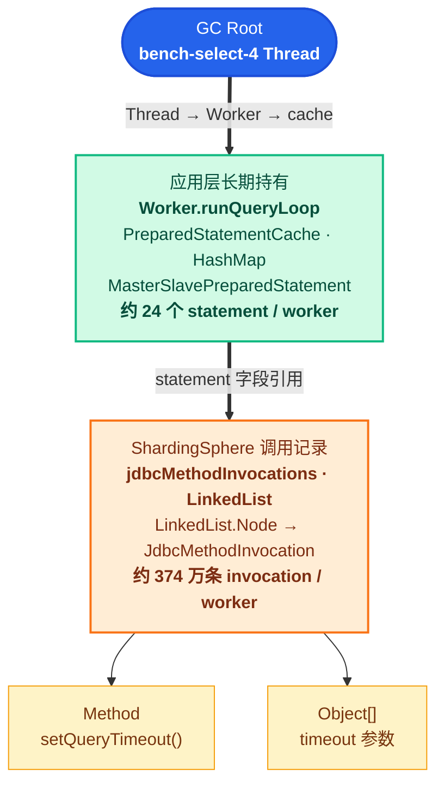

## 〇. TL;DR

问题产生后，基于本地虚拟机环境，在 2 GiB 堆下做受控复现，在运行过程中持续采集 `jmap -histo:live` 和 heap dump，让持续增长的对象更快占满堆，缩短复现时间。本地运行接近 1 小时后，GC 后 OldGen 占用从 115 MiB 涨到 2046 MiB，tps 从 4242 跌到 4.5，程序最终 OOM。OOM 前的对象直方图中，`JdbcMethodInvocation` 活跃对象达到 14,209,754 个。对象数量只能锁定可疑类型，还不能直接指向业务代码。于是用 MAT 沿 `JdbcMethodInvocation` 的 GC Root 引用链继续追踪，得到下面这条路径：

```
Worker 线程
  → PreparedStatementCache
  → MasterSlavePreparedStatement
  → jdbcMethodInvocations
  → JdbcMethodInvocation
  → Method = java.sql.Statement.setQueryTimeout
```

这条引用链给出了两个关键信息：这些对象由 worker 缓存的 ShardingSphere 逻辑 `PreparedStatement` 持有；每个对象保存的方法都是 `setQueryTimeout`。接着反编译 ShardingSphere 4.1.1，确认该方法的内部调用链为：

```
setQueryTimeout
  → recordMethodInvocation
  → new JdbcMethodInvocation
  → jdbcMethodInvocations.add
```

也就是说，每调用一次 `setQueryTimeout`，ShardingSphere 都会新建一个 `JdbcMethodInvocation` 并追加到列表中。再回到应用代码中，发现每次操作都会执行：

```java
ps.setQueryTimeout(30);
```

至此，对象与代码之间的关系完整串了起来：应用每执行一次操作，就重复调用一次 `setQueryTimeout`；ShardingSphere 随即追加一条调用记录；逻辑 `PreparedStatement` 又被 worker 长期缓存，列表中的对象无法被 GC 回收，最终累积到 1400 多万个。

为了验证这个触发点，进一步设置了 A、B 两个实验。两者使用相同的 ShardingSphere 单集群场景，JVM 均设置为 `-Xms256m -Xmx256m`，关键负载参数均为 `simulate-speed=5`、4 个 INSERT 线程、4 个 READ 线程、0 个 UPDATE 线程、20,000 台设备、`batch-size=500`、`query-timeout=30` 秒和 `insert-timeout=600` 秒。实验 A 保留旧代码，原计划运行 1800 秒，但约 795 秒后便 OOM；实验 B 计划运行 1200 秒，只在缓存命中时跳过重复的 `setQueryTimeout`，最终跑满约 1195 秒，GC 后 OldGen 占用全程为 0，也没有 OOM。B 的运行时间已经超过 A 的 OOM 时间点，因此这个对照能够证明：去掉重复 setter 后，堆持续增长和 OOM 现象消失。结合前面的 MAT 引用链和 ShardingSphere 反编译结果，可以确认重复 `setQueryTimeout` 是必要触发条件。

最终修复方案是删除了 worker 层的 `PreparedStatementCache`。INSERT、SELECT、UPDATE 都改为每次操作创建逻辑 `PreparedStatement`，执行结束后立即关闭。这样即使ShardingSphere 在操作期间记录了 setter，相关的调用列表也会随 statement 一起释放，不会再跟随 worker 持续增长。

正式修复后使用与实验A相同的参数再次验证：基线在 256 MiB 堆下约 795 秒 OOM；修复版跑满约 1195 秒，GC 后 OldGen 占用全程为 0，没有 OOM，tps 仅下降约 0.24%。删除 statement 缓存后的验证则证明最终生命周期修复有效。

把修复后的工具重新应用于测试服务器跑长稳测试，没有发生OOM问题。

`setQueryTimeout` 本身不会必然导致泄漏。第一轮的问题来自 statement 的长期缓存，以及 ShardingSphere 对重复调用只追加、不去重的记录方式。

## 一、错误缓存是如何引入的

项目是年前突发，仅给一周时间交付的 Java 时序数据库压测工具。开发者定架构，coding agent 写 Java，基于SDD开发完成，最终首版共有 53 个 Java 文件、10,144 个物理行，其中 `src/main/java` 有 47 个文件、9,418 行，`src/test/java` 有 6 个文件、726 行。这里统计的是包含注释和空行的文件总行数。

开发完成后，项目利用春节假期安排了长稳压测。关于“连续运行 10 天”，这个首个实际投入压测的版本已经给每个 worker 加了 SQL 级 `PreparedStatement` cache，为什么这轮长测没有触发问题？运行报告记录的 `JDBC query timeout` 是 `0s`；而该版本的 `RunCommand` 把 `--query-timeout` 默认值设为 `0`。而 worker 只有在 timeout 大于 0 时才会调用 `setQueryTimeout`：

```java
PreparedStatement ps = cache.getOrPrepare(connection, sql);
if (timeoutSeconds > 0) {
    ps.setQueryTimeout(timeoutSeconds);
}
ps.execute();
// worker 退出时才关闭
```

因此，那轮长测虽然使用了长期 statement cache，但没有执行重复 setter，也就没有向 ShardingSphere 的 `jdbcMethodInvocations` 列表持续追加 `setQueryTimeout` 记录。后来压测配置启用了非零 timeout，长期缓存与重复 setter 两个条件同时成立，原先潜伏的泄漏路径才真正被触发。

给每个 worker 加了 SQL 级 `PreparedStatement` cache这一行为，是在人类开发者下达了“极致性能优化“的prompt指令之后，llm大模型自行决策的“顾头不顾腚“的方案选择，该优化只关注调用次数，没有核对对象身份：

| 维度 | 以为缓存的是 | 实际缓存的是 |
| --- | --- | --- |
| 对象 | 物理 JDBC statement | ShardingSphere 逻辑代理 |
| 状态 | 可覆盖的 JDBC 状态 | 路由状态 + JDBC 调用记录 |
| 持有者 | 物理连接 | worker cache |
| 生命周期 | 单次操作 | 整场压测 |

调用链：

```
Worker
  → PreparedStatementCache
  → ShardingSphere 4.1.1 logical PreparedStatement
  → Hikari physical connection
  → PostgreSQL
```

cache 以 SQL 为键，由 worker 持有，生命周期覆盖整场压测。这个生命周期设计是错误的。

更隐蔽的是 setter 语义：

```
应用：timeout = 30
代理：jdbcMethodInvocations.append(setQueryTimeout, 30)
```

值没变，事件却多了一条。接口层幂等，不代表代理层零分配。

## 二、现场信号与证据边界

真正触发排查的是正式修复前的两次服务器长跑。两次都使用 ShardingSphere 4.1.1，JVM 最大堆为 90 GiB，并启用了非零 `query-timeout`。它们是两次独立运行，但故障过程基本一致：开始阶段吞吐正常，运行十小时左右后 GC 开始明显变慢，随后 worker 大量停顿，吞吐持续下降，程序最终无法继续运行。

### 2.1 第一次服务器长跑

这次测试原计划运行 72 小时，核心配置如下：

- `Xms90g -Xmx90g`，使用 G1；
- 10 个 INSERT 线程、20 个 SELECT 线程；
- 100,000 台设备，`batch-size=500`，`queue-capacity=7000`；
- `query-timeout=30` 秒，`insert-timeout=600` 秒；
- ShardingSphere 单集群读写分离，主库和副本的 Hikari 连接池上限均为 40。

应用日志最醒目的现象是大量 worker 卡顿。日志中共有 33,112 条 INSERT worker 的 `STUCK` 告警，堆栈主要停在 `SocketInputStream.socketRead0`。运行末尾还出现了 Hikari 告警：

```
HikariPool-1 - Thread starvation or clock leap detected
(housekeeper delta=1m2s...)
```

只看这两类日志，很容易先怀疑数据库响应慢或 Hikari 连接池异常。但同一轮的 GC 日志显示，真正的问题发生在 JVM 堆内：

| 运行时长 | GC 前堆占用 | GC 后堆占用 | 说明 |
| --- | --- | --- | --- |
| 约 1 秒 | 464 MiB | 24 MiB | GC 可以正常回收 |
| 约 3.9 小时 | 81,931 MiB | 40,173 MiB | 仍能回收大量对象 |
| 约 8.1 小时 | 82,731 MiB | 74,268 MiB | 存活对象明显增加 |
| 约 12.1 小时 | 91,735 MiB | 91,735 MiB | 已经无法回收 |
| 约 18.4 小时 | 91,764 MiB | 91,764 MiB | 90 GiB 堆基本被存活对象占满 |

第一次 Full GC 出现在运行约 10 小时后，单次耗时约 10.9 秒。整轮累计发生约 2700 次 Full GC，平均每次约 8.9 秒，累计暂停约 24,424 秒，占实际运行时间的 36.8%。到日志结束前，综合吞吐只剩约 8 次每秒，原计划 72 小时的测试在约 18.4 小时时已经无法继续。

这说明 Hikari 的 `Thread starvation` 不是根因。连续的长时间 STW 暂停冻结了 worker 和 Hikari housekeeper 线程，连接池告警只是 GC 死亡螺旋的外部表现。

### 2.2 第二次服务器长跑

后续又进行了一次计划 24 小时的长跑。JVM 仍为 `-Xms90g -Xmx90g`，负载调整为 10 个 INSERT 线程、25 个 SELECT 线程，其他关键参数保持为 100,000 台设备、`batch-size=500`、`queue-capacity=7000` 和 `query-timeout=30` 秒。

这次运行再次出现了相同的过程：

| 运行阶段 | INSERT 尝试次数/秒 | DB execute p95 | 单个 tick 实际耗时 | 每个报告区间的 GC 耗时 |
| --- | --- | --- | --- | --- |
| 前 10.5 小时 | 约 10,000 | 6～7 ms | 约 10 秒 | 0～160 ms |
| 约 11.7 小时 | 7,383 | 12 ms | 约 10 秒 | 6,669 ms |
| 约 12.8 小时 | 2,832 | 12 ms | 24.1 秒 | 6,725 ms |
| 约 14 小时 | 1,945 | 12 ms | 38.0 秒 | 6,984 ms |
| 约 17.5 小时后 | 319～670 | 已受 GC 停顿影响 | 超过 108 秒 | 约 13,900 ms |

这里最关键的是 `DB execute p95`。在吞吐开始下降、GC 每个区间已经耗时六七秒时，数据库执行一个批次仍只需要约 12 ms。也就是说，数据库并没有先变慢，真正停住的是被 STW 暂停的客户端 worker。

同一现场还存在一个独立的数据库配置问题：PostgreSQL 开启了 `log_statement=all`，最终产生约 408 GB 服务端日志，磁盘使用率接近上限。这个问题确实需要处理，但压测日志显示，吞吐塌缩前 14 小时的数据库执行耗时一直维持在 6～12 ms，因此磁盘问题不是这次吞吐塌缩的直接原因。

这次运行最终持续约 18.5 小时，shell 只留下了一行：

```
run_bench.sh: line 301: 3143380 Killed java ...
```

事后检查没有发现内核 OOM killer 记录，也没有生成 `OutOfMemoryError` 或 heap dump，因此只能确认 Java 进程收到了外部 `SIGKILL`，不能确定是谁终止了进程。

### 2.3 现场日志能确定到哪一步

两次服务器长跑已经能够确认同一条故障链：GC 后存活对象持续增加，90 GiB 堆逐渐失去回收空间，Full GC 越来越频繁，STW 暂停冻结 worker，最终导致 Hikari 告警、任务积压和吞吐塌缩。

但这些现场日志仍然没有回答一个关键问题：堆里到底是什么对象在增长。第一次运行没有采集到可用的对象直方图，第二次运行又因外部 `SIGKILL` 没有留下 heap dump。因此，现场阶段只能把问题定位到 JVM 堆中的长期对象滞留，不能直接点名 `JdbcMethodInvocation`。要继续定位，只能缩小堆并做受控复现。

## 三、从对象增长定位根因

慢 SQL、锁等待、读路由、Hikari 泄漏、断连和 G1 晋升都被列为候选原因，但都不能解释哪类对象在单调增长。

代码路径先给出一个可验证组合：

```
cache.get(logical statement)
  → setQueryTimeout
  → execute
  → statement 未关闭
```

```
suspect = long-lived logical statement × repeated setter
```

### 3.1 实验一：2 GiB 小堆复现

这是一次本地受控实验。实验使用全新数据卷的 stock TimescaleDB 一主一从环境，压测程序为 `tsdb-bench 1.1.3`，仍使用 ShardingSphere 4.1.1。核心参数如下：

- JVM：`Xms2g -Xmx2g`，使用 G1；
- 线程：4 个 INSERT worker、4 个 SELECT worker、0 个 UPDATE worker；
- 负载：20,000 台设备、`simulate-speed=5`、`tick-interval=10`、`batch-size=500`、`queue-capacity=7000`；
- 查询：`min-query-span=300`、`max-query-span=900`、`query-timeout=30` 秒、`insert-timeout=600` 秒；
- 时长：计划运行 3600 秒，每 5 秒输出一次报告，并约每 180 秒采集一次 `jmap -histo:live`。

| 快照 | 活跃 `JdbcMethodInvocation` | 总 live 集 |
| --- | --- | --- |
| 约 54 秒 | 888 | 13.3 MiB |
| 第 5 个 | 3,178,451 | 75.0 MiB |
| 第 10 个 | 7,223,365 | 165.0 MiB |
| 第 15 个 | 10,640,642 | 245.0 MiB |
| OOM 前第 20 个 | 14,209,754 | 2052.9 MiB |

OOM 前的对象配比近似 1:1:1：

```
Method                约 1421 万   ≈ 1.25 GiB
Object[]              约 1423 万   ≈ 408 MiB
JdbcMethodInvocation  约 1421 万   ≈ 341 MiB
```

同一阶段，OldGen after GC 从 115 MiB 涨到 2046 MiB，tps 从 4242 跌到 4.5；某个 5 秒窗口内，GC 耗时达到 12499 ms。随后 OOM。

增长对象由此确定。

### 3.2 实验二：A/B/E 单变量对照

| 实验组 | 唯一关键变量 | 结果 | OldGen after GC |
| --- | --- | --- | --- |
| A：基线 | SS 4.1.1 + 长 cache + 重复 setter | 约 795 秒 OOM | 持续涨满 |
| E：直连 | 移除 ShardingSphere | 跑满约 1195 秒 | 全程 0 |
| B：守卫 | cache hit 后跳过 setter | 跑满约 1195 秒 | 全程 0 |

实验 B 只有一处改动：

```java
if (queryTimeoutSeconds > 0 && !psCache.wasLastHit()) {
    ps.setQueryTimeout(queryTimeoutSeconds);
}
```

A 组发生泄漏，E、B 组保持稳定。必要条件收敛为三项：ShardingSphere 4.1.1 代理、长生命周期逻辑 statement、重复 setter。

B 组只验证了触发条件，不代表 cache 设计合理。

### 3.3 MAT：GC Root 闭环

下面的 MAT 数据来自上述本地 2 GiB 实验产生的 3.6 GB OOM heap dump。在这组参数下，共有 4 个 SELECT worker。它们的 cache 合计保留了接近整个 2 GiB 堆；以其中一个 worker 为例，cache 只保存了约 24 个 statement，但这些 statement 内部的调用记录合计达到约 374 万条。



图从上到下展示完整强引用路径：SELECT worker 线程是 GC Root；worker 持有 `PreparedStatementCache`，cache 通过 `HashMap` 持有 `MasterSlavePreparedStatement`；逻辑 statement 的 `jdbcMethodInvocations` 列表继续持有每条 `JdbcMethodInvocation` 及其 `Method` 和参数数组。整条路径可达时，这些对象无法被 GC 回收。

关键不在 cache 条目数量。单个 worker 只有约 24 个 statement，但这些 statement 内部累计了约 374 万条调用记录；内存随 invocation list 增长，而不是随 SQL 数量增长。

## 四、根因和解决

应用调用 `setQueryTimeout(30)` 时，设置的是 ShardingSphere 的逻辑 statement。真正执行 SQL 时，ShardingSphere 才根据路由结果创建物理 statement。为了让物理 statement 使用相同的超时值，ShardingSphere 会先记录这次 setter 调用：

```
setQueryTimeout(30)
  → recordMethodInvocation(...)
  → new JdbcMethodInvocation(Method, Object[])
  → jdbcMethodInvocations.add(...)
```

物理 statement 创建后，ShardingSphere 再把记录中的 setter 应用到物理 statement 上。按照 JDBC 的正常用法，应用应在一次操作结束后关闭逻辑 statement，这些记录也会随之释放。

旧代码却把逻辑 statement 缓存在 worker 中，生命周期覆盖整场压测；每次操作又会重复调用相同的 `setQueryTimeout`。ShardingSphere 4.1.1 的 `jdbcMethodInvocations` 是只追加、不去重的 `LinkedList`，因此每次调用都会增加一组 `JdbcMethodInvocation`、`Method` 和参数数组，并一直被缓存的 statement 持有。

根因可以归纳为：

```
长期缓存逻辑 statement
  × 每次操作重复调用 setter
  × ShardingSphere 只追加、不去重
  = 调用记录无界增长
```

### 4.1 为什么先出现连接池告警

泄漏发生在压测客户端。对象持续进入 OldGen 后，Full GC 引发的 STW 暂停越来越严重，worker 无法及时执行和归还连接，随后才出现 Hikari 告警、超时、重连和吞吐下降：

```
调用记录增长
  → OldGen 升高
  → Full GC / STW
  → worker 停顿、连接占用变长
  → Hikari 告警和超时
  → 吞吐下降
```

因此，现场的 Hikari `Thread starvation` 和吞吐下降是这次泄漏造成的次生现象。真正持有堆中 1400 多万个对象的是 worker 缓存的逻辑 statement，不是 Hikari 连接池。PostgreSQL 日志配置等数据库问题属于并行故障，需要单独处理。

### 4.2 正式修复

实验 B 通过“缓存命中后不再重复设置 timeout”证明了触发点，但它仍然保留了生命周期过长的逻辑 statement。正式修复直接删除 `PreparedStatementCache`，让 INSERT、SELECT、UPDATE 等操作每次创建并关闭自己的逻辑 statement：

```java
try (PreparedStatement ps = connection.prepareStatement(sql)) {
    ps.setQueryTimeout(timeoutSeconds);
    ps.execute();
}
```

这样，每个 statement 内的调用记录最多存活一次操作，执行结束后即可回收。
