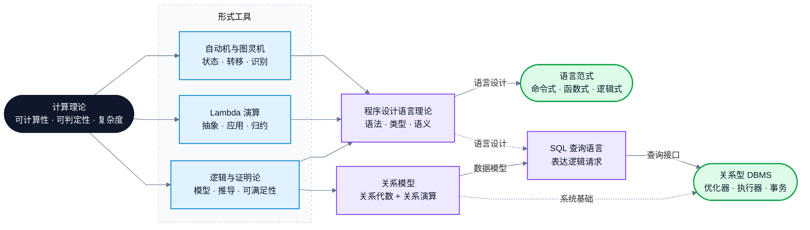
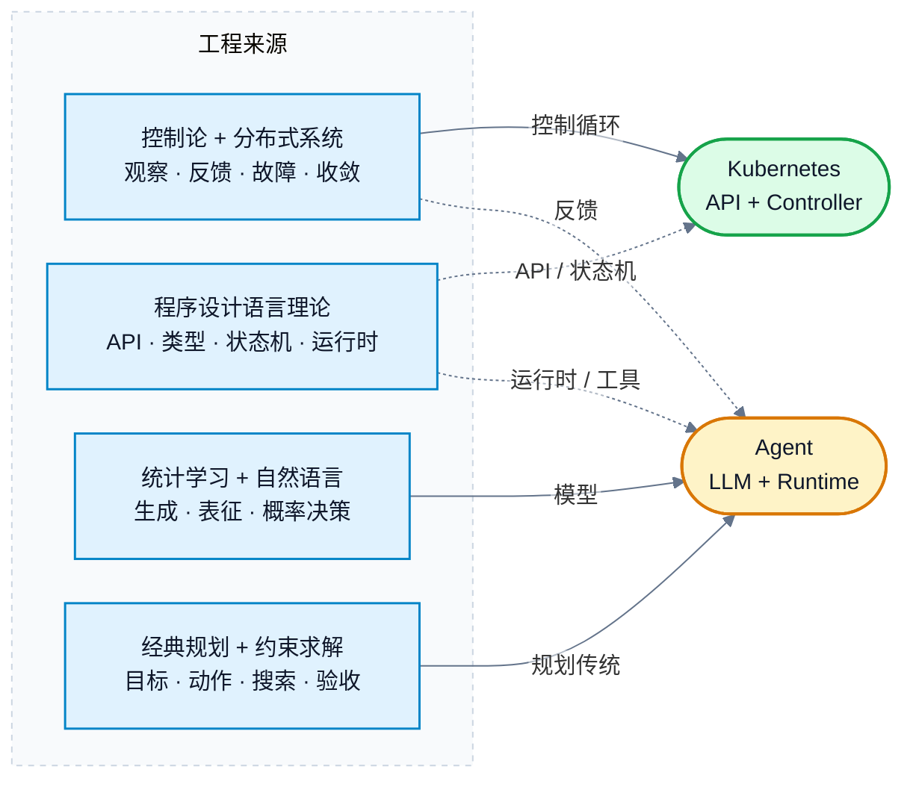
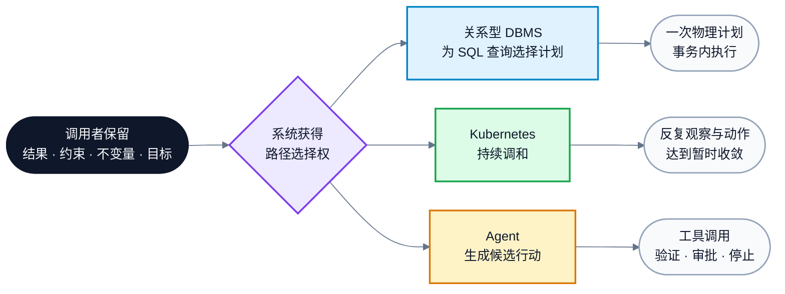
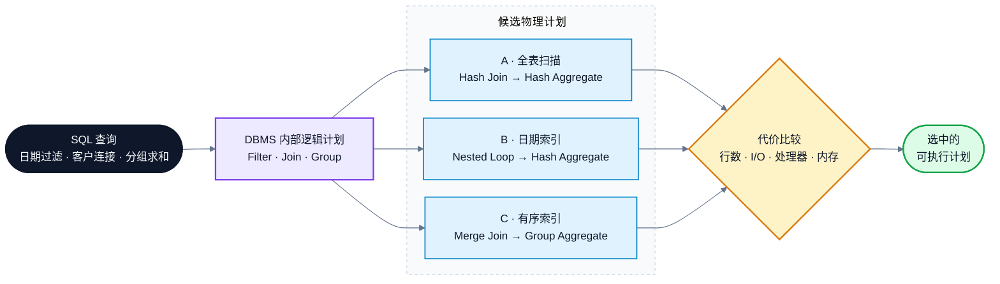
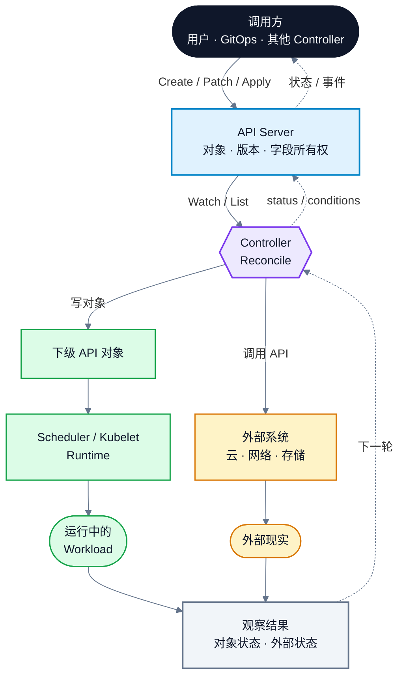
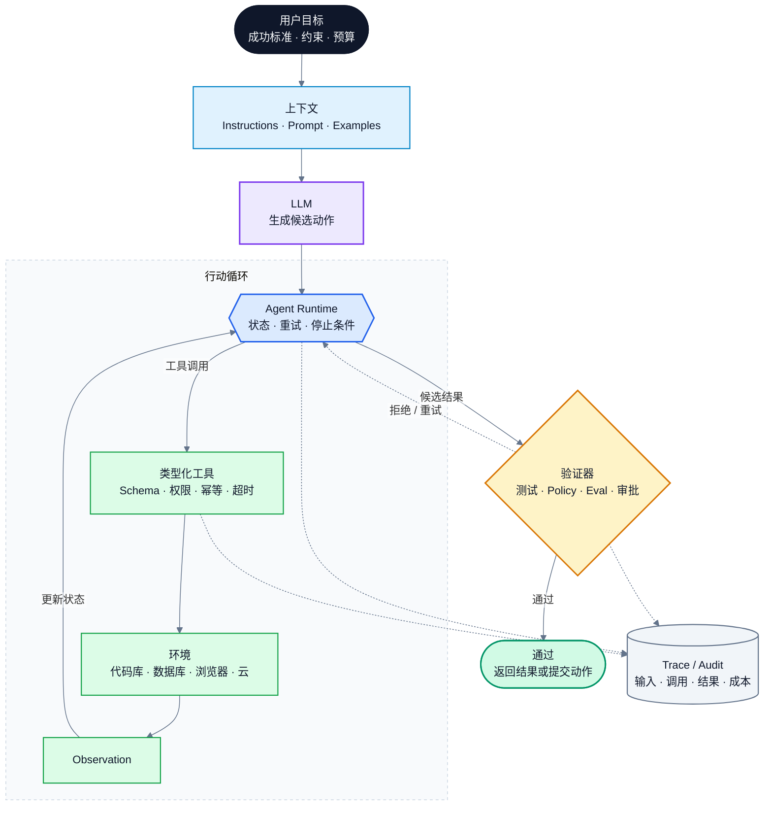

> 声明式接口把一部分控制权交给执行系统：调用者说明结果和约束，系统选择执行路径。关系型 DBMS（Database Management System，数据库管理系统）接收 SQL（Structured Query Language，结构化查询语言）查询，由内部优化器搜索物理计划；Kubernetes Controller 持续调和；Agent Runtime 组织 LLM（Large Language Model，大语言模型）、上下文和工具，由 LLM 理解意图并提出候选行动。判断一个接口有多“声明式”，要看调用者交出了哪些决定；判断它是否好用，还要看这些决定能否观察、检查和撤销。
>

声明式的接口就是，调用者说“要什么”，执行层决定“怎么做”。搞懂一个真实系统中的声明式接口，需要梳理清楚如下三个问题：

| 调用者提交什么 | 谁接收并执行 | 执行层替调用者决定什么 |
| --- | --- | --- |
| SQL 查询 | 关系型 DBMS | 访问路径、连接顺序和物理算子 |
| Kubernetes API（Application Programming Interface，应用程序编程接口）对象 | Kubernetes 控制面 | 每轮需要创建、修改或删除哪些资源 |
| 目标、约束与上下文 | LLM + Agent Runtime | LLM 生成和选择候选动作；Runtime 按规则执行、重试或停止 |

继续追问下去就是**调用者交出了哪些决定？谁来做这些决定？系统怎样说明自己做了什么，结果是否可信？**

本文使用“声明式接口”，不用“声明式计算”：SQL 查询、Controller Loop 和 Agent 并不共享同一种计算模型，它们的共同点只是**接口如何分配控制权**。一个系统可以对外提供声明式接口，内部仍由命令式程序执行。

本文的核心判断是：

1. 声明式和命令式不是互斥的，关键在于调用者保留多少控制，交出多少控制。
2. 共享数据要长期存在，索引和数据分布却会变化，所以逻辑查询必须与物理访问路径分开。
3. 序列化格式、配置语言和 Prompt 都只是表达载体，本身不决定接口是否具有声明性。Kubernetes 的声明性来自 API 对象保存期望状态，并由 Controller Loop 持续比较和修正实际状态；Terraform 的声明性来自 Configuration 描述目标、State 记录资源身份与当前快照、Plan/Apply 计算并执行变更；Agent 接口则由 LLM 和 Agent Runtime 共同实现：调用者在 Prompt 中给出目标、约束和验收标准，LLM 理解上下文、生成候选步骤并选择下一动作，Runtime 提供工具和状态，负责执行、循环、权限与验证。
4. 自然语言不等于声明式。Prompt 可以只写目标，也可以写死步骤；它更像一种语义不稳定、难组合、难证明的编程接口。
5. 本文讨论的 Agent 以 LLM 为语义理解和候选决策核心，但完整系统仍是 **LLM + 上下文 + 工具 + 状态 + 循环 + 权限 + 验证器 + 人工检查点**。
6. 在 Agent 系统里，LLM 适合理解开放目标、提出候选计划和选择下一动作；确定性程序负责执行副作用，测试、环境反馈和权限规则决定能否继续。
7. 声明式接口反复出现，通常因为三件事同时成立：目标比实现活得久；执行层可以复用专业知识；检查结果比长期维护全部步骤便宜。
8. “给出目标，让系统找步骤”早于大语言模型。经典自动规划直接搜索动作序列；布尔与带背景理论的可满足性求解则搜索满足约束的模型，规划问题也可以编码给它们求解。大语言模型降低了开放任务中生成候选步骤的成本，但给出的保证更弱。

为避免把“必须如此”和“历史上这样选择”混为一谈，本文会在每个案例中直接说明四件事：现实约束逼出了什么绕不过去的问题，当时有哪些可行方案，具体系统为什么选择了其中一种，以及这个选择带来了什么后果、系统又怎样补偿。关键语义会写在相关段落和表头里，不要求读者记忆额外符号。

---

先定义后文会反复出现的概念。表中的“关系”只表示影响或借用，不表示两者相等，也不表示只有这一条发展路线。正文中的英文缩写在首次出现时统一写成“缩写（English Full Name，规范中文名）”；后文不再重复展开。代码标识符、命令名和产品正式名称保持原样。

| 概念 | 所在层次 | 定义（人话） | 与相邻概念的准确关系 | 权威参考 |
| --- | --- | --- | --- | --- |
| 计算理论、可计算性、可判定性与复杂度 | 理论领域与问题性质 | 计算理论研究哪些问题能被计算；可计算性问“是否存在算法”，可判定性问“算法能否对所有输入停机并给出是/否答案”，复杂度再问需要多少时间和空间。 | 三者约束所有计算系统，但不直接规定一种语言或工程架构应怎样设计。 | [Stanford Encyclopedia of Philosophy：Computability and Complexity](https://plato.stanford.edu/entries/computability/) |
| 自动机 | 形式计算模型 | 用状态、输入和转移规则描述计算。有限自动机至少包含状态集合、初始状态、输入字母表和转移函数。 | 自动机提供了描述状态变化的工具。但通用程序还需要存储等能力，不能把命令式语言简单说成“自动机的产物”。 | [NIST（National Institute of Standards and Technology，美国国家标准与技术研究院）：Finite State Machine](https://xlinux.nist.gov/dads/HTML/finiteStateMachine.html) |
| 图灵机 | 通用形式计算模型 | 用读写头按规则在一条抽象纸带上读、写和移动，以此描述算法步骤。 | 它比有限自动机多了无界存储能力，是研究一般可计算性的模型；它不是现实计算机的硬件设计图。 | [Turing 1936/1937](https://doi.org/10.1112/plms/s2-42.1.230) |
| 命令式语言 | 程序设计范式 | 程序由命令或语句组成；执行会改变存储状态，语句次序和控制流会影响结果。 | 它使用状态转移的思路，也更直接地继承了冯·诺依曼机器模型：程序通过顺序指令读写可变存储。 | [Backus 1978](https://research.ibm.com/publications/can-programming-be-liberated-from-the-von-neumann-style-a-functional-style-and-its-algebra-of-programs) |
| Lambda 演算 | 形式演算 | 用变量、函数抽象和函数应用表示计算，并通过替换与归约求值。 | 它为许多函数式语言提供核心模型，但不是包含类型、数据结构、模块和 I/O（Input/Output，输入/输出）的完整语言。 | [Stanford Encyclopedia of Philosophy：The Lambda Calculus](https://plato.stanford.edu/entries/lambda-calculus/) |
| 函数式语言 | 程序设计范式 | 主要用函数求值和函数组合来组织程序；纯函数式编程还会限制可变赋值和其他副作用。 | 它源自 Lambda 演算的思想，但实际语言还要处理类型、数据、I/O 和运行时。 | [Hudak 1989](https://doi.org/10.1145/72551.72554)、[Software Foundations：Functional Programming](https://www.cs.yale.edu/flint/cs430/coq/sf/Preface.html#lab6) |
| 逻辑、证明论与模型论 | 形式系统与研究视角 | 逻辑用形式语言和规则说明哪些表达与推导有效；证明论研究形式推导本身，模型论研究表达式在不同解释下何时为真。 | 它们可以规定“什么结论成立”，但不一定规定机器怎样找到证明。 | [Stanford Encyclopedia of Philosophy：Classical Logic](https://plato.stanford.edu/entries/logic-classical/) |
| 逻辑式语言 | 程序设计范式 | 把事实、规则或公理当作程序，把查询当作待证明的目标，由系统完成推导和搜索。 | 逻辑规定程序的含义，执行器仍要选择搜索策略；所以 Kowalski 把算法写成“逻辑 + 控制”。 | [Kowalski 1974](https://www.doc.ic.ac.uk/~rak/papers/IFIP74.pdf)、[Kowalski 1979](https://doi.org/10.1145/359131.359136) |
| 声明式编程 | 程序设计范式 | 程序主要描述要成立的关系或要得到的结果，不逐条规定完整执行过程。 | 它说的是程序表达方式。逻辑式、函数式、关系查询和约束求解都可具有声明性，但机制并不相同。 | [Lloyd 1994](https://research-information.bris.ac.uk/en/publications/practical-advantages-of-declarative-programming)、[Lampson 2010](https://www.microsoft.com/en-us/research/publication/declarative-programming-light-end-tunnel/) |
| 声明式接口 | 接口属性 | 调用者提交可接受的结果、约束或不变量，执行层保留选择具体步骤的权力。 | 这是本文的主概念。它不要求整个系统都“声明式”；同一系统可以对外声明、对内命令执行。可观察和可验证是实用要求，不是定义本身。 | 本文基于上述声明式编程文献给出的操作定义 |
| 关系模型、关系代数与关系演算 | 数据模型与查询形式 | 关系模型用关系表示数据；关系代数用选择、投影、连接等算子计算新关系；关系演算用谓词描述结果应满足什么条件。 | 三者不是 SQL 的别名。它们为关系查询提供语义基础，也给 DBMS 的等价重写留下空间。 | [Codd 1970](https://research.ibm.com/publications/a-relational-model-of-data-for-large-shared-data-banks)、[Codd 1971](https://doi.org/10.1145/1734714.1734718) |
| SQL（Structured Query Language，结构化查询语言） | 数据库语言 | 用来定义、查询和修改关系数据的一族标准化语言。本文主要讨论其中不指定页面、索引和连接算法的查询表达式与集合式 DML（Data Manipulation Language，数据操纵语言）。 | SQL 负责表达逻辑请求，不负责自己优化或执行。具体 DBMS 解析 SQL，并决定支持哪些方言、事务语义和执行能力。 | [Chamberlin 与 Boyce 1974](https://research.ibm.com/publications/sequel-a-struciured-english-query-language)、[PostgreSQL SQL Language](https://www.postgresql.org/docs/18/sql.html) |
| 关系型 DBMS（Database Management System，数据库管理系统） | 数据管理系统 | 保存和管理关系数据，并负责 SQL 解析、查询重写、计划选择、执行、并发控制、恢复和权限等工作。 | SQL 是它可以提供的外部语言；查询优化器和执行器是它的内部部件。并非所有 DBMS 都使用 SQL，也不能把 SQL 写成会“选计划”的系统。 | [Codd 1970](https://research.ibm.com/publications/a-relational-model-of-data-for-large-shared-data-banks)、[PostgreSQL Internals](https://www.postgresql.org/docs/18/overview.html) |
| PostgreSQL、MySQL Server / InnoDB 与 SQLite | 具体数据管理软件 | PostgreSQL 是服务器式关系型 DBMS；MySQL Server 提供 SQL、连接和执行等服务器层，InnoDB 是它可使用的一种存储引擎；SQLite 是嵌入应用进程的数据库库。 | 三者都能执行 SQL，但部署边界和内部分层不同。不能把 InnoDB 写成整个 MySQL，也不能把 SQLite 强行套进独立服务器进程模型。 | [PostgreSQL 18 Internals](https://www.postgresql.org/docs/18/overview.html)、[MySQL 8.4 Pluggable Storage Engine Architecture](https://dev.mysql.com/doc/refman/8.4/en/pluggable-storage-overview.html)、[About SQLite](https://www.sqlite.org/about.html) |
| 查询优化器 | DBMS 内部部件 | 把逻辑查询映射为可执行计划，在可行候选中选择预计成本较低的一条。 | 它利用 SQL/关系语义、统计、索引和成本模型，但不属于 SQL 语言本身；它通常只求合理的好计划，不保证全局最优。 | [Selinger 等 1979](https://research.ibm.com/publications/access-path-selection-in-a-relational-database-management-system)、[PostgreSQL Planner/Optimizer](https://www.postgresql.org/docs/18/planner-optimizer.html) |
| 查询计划与 `EXPLAIN` | DBMS 内部表示与诊断接口 | 查询计划是执行器将要运行的算子树。逻辑计划表示关系运算，物理计划进一步选定扫描、连接、排序等算法。`EXPLAIN` 展示所选计划和估计值；加入 `ANALYZE` 后还会实际执行并记录现场数据。 | 计划说明 DBMS 准备怎样执行，不等于计划最优，也不单独证明业务结果正确。 | [PostgreSQL：Using EXPLAIN](https://www.postgresql.org/docs/18/using-explain.html) |
| API（Application Programming Interface，应用程序编程接口） | 软件接口 | 一组供其他程序调用的操作、数据结构和约定。 | API 可以是命令式，也可以具有声明性；关键仍是调用者提交步骤，还是提交结果与约束。 | [NIST：Application Programming Interface](https://csrc.nist.gov/glossary/term/application_programming_interface) |
| Schema（模式） | 接口数据约束 | 规定对象或消息可以有哪些字段、字段类型、必填项和结构关系。 | 本文说的 API/Tool Schema 是接口数据结构，不是关系型 DBMS 中由表、视图等组成的数据库 Schema。Schema 能检查形状，不能单独证明业务结果正确。 | [JSON Schema Core 2020-12](https://json-schema.org/draft/2020-12/json-schema-core.html) |
| 幂等性 | 操作性质 | 同一个请求成功执行一次后，再重复执行不会继续改变目标状态。 | 幂等不表示每次调用都没有成本、日志或错误；它使超时后的安全重试更容易，是调和循环和 Agent 工具的重要属性。 | [RFC 9110：Idempotent Methods](https://www.rfc-editor.org/rfc/rfc9110#section-9.2.2) |
| IaC（Infrastructure as Code，基础设施即代码） | 工程实践与工具类别 | 用可版本化的配置文件管理基础设施，而不是主要靠控制台点击或人工命令。 | IaC 不是形式演算，也不是单个系统。Terraform 用 Configuration、State 和 Plan/Apply 实现这种工作方式。 | [HashiCorp：What is infrastructure as code](https://developer.hashicorp.com/well-architected-framework/define-and-automate-processes/define/as-code/infrastructure) |
| YAML（YAML Ain’t Markup Language，YAML 不是标记语言） | 数据序列化语言 | 用缩进等语法表示标量、序列和映射。 | 它只负责编码数据，不决定 Kubernetes 对象采用 Create、Replace、Apply 还是 Controller 调和。 | [YAML 1.2.2 Specification](https://yaml.org/spec/1.2.2/) |
| JSON（JavaScript Object Notation，JavaScript 对象表示法） | 数据交换格式 | 用对象、数组和基本值表示结构化数据。 | 它和 YAML 一样只是载体；同一个 Kubernetes 对象可以用两者表达。 | [RFC（Request for Comments，请求评议）8259](https://www.rfc-editor.org/rfc/rfc8259) |
| HCL（HashiCorp Configuration Language，HashiCorp 配置语言） | 配置语言 | 用块、属性和表达式描述供工具读取的配置。 | Terraform 主要用 HCL 表达配置，但其声明性来自 Configuration、State 与 Plan/Apply 的整体语义，不只来自语法。 | [HCL Native Syntax Specification](https://github.com/hashicorp/hcl/blob/main/hclsyntax/spec.md) |
| Kubernetes | 分布式工程系统 | API 对象记录期望状态，控制面持续观察实际状态，Controller 负责缩小两者的差距。 | 声明性来自 API 对象、`spec/status` 和控制循环，不来自 YAML。 | [Kubernetes：Objects](https://kubernetes.io/docs/concepts/overview/working-with-objects/)、[Kubernetes：Controllers](https://kubernetes.io/docs/concepts/architecture/controller/) |
| Kubernetes API Object、`spec`、`status` 与 Condition | Kubernetes 状态模型 | API Object 是保存在控制面中的资源记录；`spec` 保存调用者期望，`status` 保存系统观察；Condition 用带原因和时间的状态项表达 Ready（就绪）、Available（可用）等关键判断。 | 对象被 API 接受不表示现实已经达到目标，要结合 `status`、Condition 和实际资源判断。 | [Kubernetes：Objects](https://kubernetes.io/docs/concepts/overview/working-with-objects/)、[API Conventions](https://github.com/kubernetes/community/blob/main/contributors/devel/sig-architecture/api-conventions.md) |
| Controller、Reconcile 与 Controller Loop | Kubernetes 控制机制 | Controller 是持续观察资源并发起修正的控制器；Reconcile 是读取期望状态与当前状态、执行一次调和；Controller Loop（控制循环）就是反复触发这个过程。 | Controller 最终仍调用命令式 API；声明性来自它按状态差异反复工作，而不是把一次事件脚本永久执行下去。 | [Kubernetes：Controllers](https://kubernetes.io/docs/concepts/architecture/controller/)、[API Conventions](https://github.com/kubernetes/community/blob/main/contributors/devel/sig-architecture/api-conventions.md) |
| Terraform | 基础设施管理工具 | 读取配置、State 和远端资源，生成 Plan，并在 Apply 时执行变更。 | 它只在运行 Plan/Apply 时检查和修正漂移，不像 Kubernetes Controller 那样常驻调和。 | [Terraform Language](https://developer.hashicorp.com/terraform/language)、[Terraform State](https://developer.hashicorp.com/terraform/language/state) |
| Terraform Configuration、Provider、State、Plan 与 Apply | Terraform 核心机制 | Configuration（配置）描述目标资源；Provider 是把 Terraform 资源模型接到云或其他远端 API 的插件；State 保存配置地址与远端对象身份及属性的对应；Plan 给出拟执行的变更；Apply 执行获准的 Plan。 | Configuration 只描述目标，Provider、State 与 Plan/Apply 共同决定 Terraform 实际认识和修改哪些对象。 | [Terraform Configuration Language](https://developer.hashicorp.com/terraform/language)、[Terraform Providers](https://developer.hashicorp.com/terraform/language/providers)、[Terraform State](https://developer.hashicorp.com/terraform/language/state)、[`terraform plan`](https://developer.hashicorp.com/terraform/cli/commands/plan) |
| LLM（Large Language Model，大语言模型） | 统计学习模型 | 根据上下文对后续词元（Token）的概率分布建模，并据此生成文本或结构化输出。 | LLM 可以提出候选步骤，但不天然拥有当前环境状态，也不保证目标、动作和结果正确。 | [Brown 等 2020](https://proceedings.neurips.cc/paper/2020/hash/1457c0d6bfcb4967418bfb8ac142f64a-Abstract.html) |
| Prompt | 模型输入与应用接口 | 提供给模型的指令、上下文、示例和约束。 | Prompt 可以写目标，也可以写死步骤；是否声明式取决于控制权分配，不取决于是否使用自然语言。 | [Reynolds 与 McDonell 2021](https://arxiv.org/abs/2102.07350) |
| Agent（智能体） | 软件系统 | 围绕目标反复获取观察、选择动作并作用于环境的系统；本文特指由大语言模型参与决策、能够调用工具的 Agent。 | 本文所说的 Agent 以 LLM 为语义理解和候选决策核心，但完整系统还需要运行时、工具、状态、权限和验证。 | [Anthropic：Building Effective Agents](https://www.anthropic.com/engineering/building-effective-agents) |
| Agent Runtime（智能体运行时） | 运行系统 | 把 LLM、上下文、工具、状态、循环、权限和验证器组织起来，推进多轮行动。 | LLM 负责理解意图、提出候选动作并选择下一步；Runtime 负责提供上下文和工具、执行动作、维护状态、重试与停止。 | [OpenAI Agents SDK（Software Development Kit，软件开发工具包）](https://openai.github.io/openai-agents-python/) |
| Tool、Observation、Retrieval 与 Grounding | Agent 获取和作用于环境的机制 | Tool 是模型可请求调用的类型化操作；Observation 是工具或环境返回的结果；Retrieval（检索）从外部来源取回上下文；Grounding（事实锚定）用这些外部事实约束模型判断。 | LLM 的参数不等于当前环境状态。Agent 必须通过这些机制读取现实并执行动作。 | [ReAct](https://arxiv.org/abs/2210.03629)、[Toolformer](https://ai.meta.com/research/publications/toolformer-language-models-can-teach-themselves-to-use-tools/) |
| Trace、Validator、Evaluator 与 Eval（Evaluation，评测） | Agent 证据与验收机制 | Trace（轨迹）记录上下文、模型输出、工具调用和结果；Validator（验证器）用确定性规则检查可形式化条件；Evaluator（评测器）按测试、评分规则或人工标准给结果打分；Eval 是反复运行并分析这些评测的过程。 | Trace 说明发生了什么，Validator 和 Eval 才分别检查规则与结果；它们都不能自动覆盖未知风险。 | [OpenAI Agents SDK](https://openai.github.io/openai-agents-python/)、[Anthropic：Building Effective Agents](https://www.anthropic.com/engineering/building-effective-agents) |
| STRIPS（Stanford Research Institute Problem Solver，斯坦福研究所问题求解器） | 经典自动规划系统与表示方法 | 把初始状态、目标以及动作的前提和效果分开表示，由规划器搜索能使目标成立的动作序列。 | 名称最初指规划器，后来也指其状态—动作表示方法。它依赖人工给出相对封闭、准确的世界模型。 | [Fikes 与 Nilsson 1971](https://doi.org/10.1016/0004-3702(71)90010-5) |
| PDDL（Planning Domain Definition Language，规划领域定义语言） | 自动规划输入语言 | 分开描述领域（Domain）中的谓词与动作，以及问题（Problem）中的对象、初始状态和目标，供规划器读取。 | PDDL 是问题描述语言，不是规划算法；不同规划器可以读取同一类 PDDL 问题并搜索计划。 | [PDDL 1.2](https://www.isi.edu/results/publications/19837/pddl-the-planning-domain-definition-language-version-1-2/) |
| HTN（Hierarchical Task Network，分层任务网络） | 经典自动规划方法 | 用分解方法（Method）把抽象任务逐层分解为更具体的子任务，直到得到可以执行的原子任务。 | 它用领域分解知识缩小搜索空间；得到的计划不仅要达到目标，还要符合允许的分解方法。 | [Erol、Nau 与 Hendler 1993](https://cdn.aaai.org/Symposia/Spring/1993/SS-93-03/SS93-03-005.pdf) |
| SAT（Boolean Satisfiability Problem，布尔可满足性问题） | 逻辑判定问题 | 判断是否存在一组真假赋值，使给定布尔公式成立；求解器还可以返回一组满足赋值。 | SAT 不直接理解“动作”；要用它做规划，必须先把时间步、动作和目标编码成布尔约束。 | [Cook 1971](https://doi.org/10.1145/800157.805047) |
| SMT（Satisfiability Modulo Theories，可满足性模理论） | 带背景理论的可满足性问题 | 判断公式在整数、实数、数组、位向量等背景理论约束下是否存在模型。 | SMT 扩展了纯布尔 SAT 的表达范围，但仍依赖明确建模；它返回可满足性与模型，不会自动理解开放世界任务。 | [SMT-LIB（Satisfiability Modulo Theories Library，可满足性模理论标准库）](https://smt-lib.org/) |

## 一、计算理论、语言范式与工程系统的关系

上表先把层次分开：自动机、Lambda 演算和逻辑是形式工具；命令式、函数式和逻辑式是语言范式；SQL 是数据库语言，DBMS 是执行它的数据管理系统；Kubernetes、Terraform 和 Agent 是工程系统；STRIPS、PDDL、HTN、SAT 与 SMT 属于规划或求解传统。下面的图只画影响关系，不画唯一的历史路线。

先看形式基础：



再看 Kubernetes 与 Agent 使用的工程来源。这里的控制论研究系统怎样根据观察和反馈维持目标；分布式系统研究多个独立计算节点在通信延迟和局部故障下怎样协作。这些是工程影响，不是 Kubernetes 或 Agent 的单一形式基础：



实线表示较直接的基础或机制，虚线表示借用了某些工具。连线表示影响，不表示严格的历史传承。

图灵机用状态转移描述计算，Lambda 演算用函数归约描述计算；两者能表示同一类可计算函数。写法不同，不代表计算能力有高低。[Turing 1936/1937](https://doi.org/10.1112/plms/s2-42.1.230)、[Church 1936](https://doi.org/10.2307/2371045)

这些范式可以混在同一个系统里。Haskell 是以纯函数和类型系统见长的函数式语言；Prolog 是以事实、规则和查询组织程序的逻辑式语言；Cut 是 Prolog 用来截断后续搜索分支的控制操作：

- Haskell 程序可以显式安排 I/O 顺序。
- Prolog 的子句顺序、目标顺序和 Cut 会影响搜索。
- SQL 及其产品方言可以包含递归、窗口、过程函数和有副作用的表达式。
- Kubernetes Manifest（资源清单，即 API 对象的配置文件）中可以写滚动更新策略等相当具体的执行约束。
- C 函数调用会隐藏函数内部实现，但调用者通常仍显式安排各次调用的控制顺序；这首先是封装，不足以单独证明整个接口是声明式的。

所以，**声明性不是语言标签，而是接口把多少实现选择交给系统。** 文件格式不能决定这一点；同一系统也可以上层声明、下层命令执行。

### 1. 声明性的操作定义

常见说法是“声明式写做什么，命令式写怎么做”。这还不够精确，还要看调用者写死了哪些选择，又把哪些选择留给系统。

一条 SQL 查询：

```sql
SELECT c.name, SUM(o.amount)
FROM customer AS c
JOIN orders AS o ON o.customer_id = c.id
WHERE o.created_at >= DATE '2026-01-01'
GROUP BY c.id, c.name;
```

已经指定了使用哪些关系、连接条件和分组方式，同时把以下选择留给了关系型 DBMS 的查询优化器和执行器：

- 先扫 `customer` 还是 `orders`；
- 使用顺序扫描还是哪个索引；
- 用 Nested Loop（嵌套循环连接）、Hash Join（哈希连接）还是 Merge Join（归并连接）；
- 聚合时利用有序输入逐组处理（Group Aggregate），还是为各组建立哈希表（Hash Aggregate）；
- 先过滤、先聚合还是先连接；
- 是否并行、是否物化中间结果、内存不够时怎样落盘。

本文采用下面这个定义：

> 调用者描述可接受的结果、约束或不变量，不绑定具体物理步骤；执行系统自己选择满足要求的动作。只要要求不变，系统可以换实现，调用者不用跟着改。
>

这个定义不保证系统总能判断目标能否完成，也不保证执行一定终止。一阶逻辑（可以量化个体及其关系的形式逻辑）整体不可判定，Prolog 的搜索也可能不终止；Kubernetes 和 Agent 的业务目标同样未必有自动判定方法。工程系统通常只能检查局部规则，例如 SQL 类型、Kubernetes Schema 与 Condition（状态条件），或 Agent 工具参数。

还要区分声明式与普通封装，否则函数调用、RPC（Remote Procedure Call，远程过程调用）和编译都能被算成声明式：

| 层次 | 调用者仍固定什么 | 系统自己决定什么 | 例子 |
| --- | --- | --- | --- |
| 封装 | 操作及其先后顺序 | 单个操作内部的实现 | C 函数、普通 RPC |
| 声明式契约 | 结果、约束、模型或不变量 | 满足契约的控制流与物理路径 | SQL 查询接口、约束求解、Terraform Configuration |
| 自适应声明式控制 | 持久目标与风险边界 | 随统计、现实状态或新观察反复重选路径 | DBMS 的重新规划、Kubernetes、Agent Runtime |

编译器也会选择指令、分配寄存器，但源程序通常已经写定了主要算法和控制流。编译器是否反复优化、是否提供诊断信息，都不是关键。关键是：**上层交付的是一套步骤，还是一个允许下层自行选步骤的结果范围。**

不同系统替调用者做的决定不同，需要提供的证据也不同：

| 调用者不再决定什么 | 系统怎样接手 | 典型接口与执行系统 |
| --- | --- | --- |
| 不固定等价查询的物理路径 | 语义保持的重写、候选计划与成本比较 | SQL 查询 / 关系型 DBMS |
| 不亲自追踪现实漂移 | 持久状态、观察、幂等调和和重试 | Kubernetes |
| 不预先穷举开放任务的步骤 | 概率规划、类型化工具、验证器、预算与审批 | Agent |

没有 `EXPLAIN`、Trace 或状态页，接口仍可能是声明式的，只是很难运维。实用的声明式系统必须按风险提供解释、监控、验收和恢复手段。

---

## 二、为什么不同接口都会把“怎么做”交给执行层

关系型 DBMS 的 SQL 查询接口、Kubernetes API 和 Agent 目标接口，都在调用者与执行层之间重新分配控制权：上层说明必须满足什么，下层决定具体怎么做。DBMS 用查询优化器选择计划，Kubernetes 用 Controller 持续调和，Agent Runtime 用模型提出候选行动。



先比较它们各自保留什么、选择什么、承诺什么：

| 接口与执行系统 | 调用者主要保留什么 | 执行层实际选择什么 | 系统承诺 | 主要证据 |
| --- | --- | --- | --- | --- |
| SQL 查询 / 关系型 DBMS | 查询结果语义与事务要求 | 访问路径、连接顺序、物理算子 | 在 SQL 语义和 DBMS 事务语义内，通常规划并执行一次请求 | Plan、实际行数、Buffer（缓冲区访问计数）、提交状态 |
| Kubernetes API / 控制面 | API 对象中的期望特征 | 每轮需要创建、更新或删除的资源 | 通过异步循环达到暂时收敛 | `status`、Condition、Event（事件记录）、实际资源 |
| Prompt / LLM | 当前上下文中的任务说明 | 下一段 Token 的生成分布 | 输出不稳定，能否执行要靠外部检查 | 输出文本与统计 Eval |
| 目标与上下文 / Agent Runtime | 目标、权限、预算和停止条件 | 多轮工具调用和候选路径 | 正确性与停止条件依赖外部验收、策略和验证器 | Tool Result（工具结果）、测试、Trace、审批 |

真正的区别有三项：何时决策、根据什么决策、能保证到什么程度。

| 接口与执行系统 | 决策时机 | 决策依据 | 保证强度 |
| --- | --- | --- | --- |
| SQL 查询 / 关系型 DBMS | 请求规划时；计划也可能被缓存复用 | SQL/关系语义、统计、索引、代价与资源参数 | 候选计划必须保持查询语义；不保证全局最优 |
| Kubernetes API / 控制面 | 对象存续期间持续执行 | 持久 `spec`、最新观察状态和控制器规则 | 异步逼近期望状态；不保证世界永久收敛 |
| 目标与上下文 / Agent Runtime | 每轮或收到工具结果后 | 模型、上下文、工具观察、策略和预算 | 只提出候选行动；正确性和停止依赖外部验收 |

第四节会用 Terraform 对比“一次规划”和“持续控制”。再次强调：文件格式不决定声明性；执行层能决定什么、何时决定、承诺什么，才是关键。

### 1. 什么时候值得用声明式接口

满足下面几项时，声明式接口通常更划算：

- 意图比执行路径更稳定；
- 同一意图存在多个可替换实现；
- 执行系统能复用专业知识和搜索成本，或统一维护实时状态；
- 结果能按风险需要被观察和检查。

这些条件大体成立时，把路径选择权交给执行系统通常比调用者长期维护具体步骤更划算。

反过来，如果动作顺序就是业务规则，副作用不可逆，结果无法可靠检查，或者执行系统并不比调用者更懂问题，就应该把更多控制留给调用者。

Agent 正好暴露了这条限制。DBMS 的目录和统计系统记录关系、索引及数据分布，查询优化器可以直接使用；Kubernetes Controller 能读取集群状态；基础 LLM 对当前环境的了解往往过时且不完整。它的优势不是“更懂现场”，而是能低成本生成和修改候选步骤。因此 Tool、Retrieval 和 Grounding 不是附加功能，而是模型获取当前事实的必要组件。

### 2. 为什么它会一再出现

一个领域满足下面三个条件后，往往会出现声明式接口：

1. **目标比实现活得久**：查询结果可以不随索引变化，副本数可以不随节点变化，任务目标也可以不随候选步骤变化。环境变得越快，越应该晚一点再决定具体做法。
2. **专业知识可以复用**：一套统计估计、调度规则或规划能力可以服务许多调用者，不必让每个人重复实现。
3. **检查比重写便宜**：看 Plan、Diff（差异）、状态和验收结果，通常比长期编写并维护每一个物理步骤便宜。

所以，后来的系统不是在模仿 SQL 语法。关系数据管理、基础设施管理和开放任务只是先后遇到了相似的分工问题。它们采用不同机制，是因为运行环境、决策时机和验收手段不同。

### 3. 证据不等于验证

“看见系统做了什么”和“证明它做对了”是两件事。下面四类证据各有用途，不能互相替代：

| 层次 | 例子 | 能回答什么 | 不能单独证明什么 |
| --- | --- | --- | --- |
| 计划或提议 | DBMS 的 `EXPLAIN`、Terraform Plan | 执行层准备做什么 | 动作已经发生、结果正确或计划最优 |
| 运行记录 | Buffer（缓冲区访问计数）、Kubernetes `status`、Agent Tool Trace | 实际看到了哪些状态和动作 | 业务目标已经满足 |
| 规则检查 | 类型、Schema、Policy（策略规则）、Condition | 写进规则的局部条件是否成立 | 没写进规则的性质 |
| 结果验收 | 数据不变量、测试、统计 Eval、人工审批 | 在测试和样本范围内是否可接受 | 未覆盖输入、未来变化或审批者不知道的事实 |

DBMS 提供的 `EXPLAIN ANALYZE` 和 Agent Trace 都只能帮助诊断，不能自动证明结果正确。Agent 更难，因为开放任务往往没有能自动判断对错的标准：Trace 可以完整记录一条错误路径，错误答案也可以符合 Schema。系统自由度越高，越要把计划、运行记录、规则检查和结果验收分开设计。

---

## 三、关系型 DBMS 为什么采用声明式 SQL 查询接口

### 1. 起点：共享数据需要逻辑独立性

早期 DBMS 的应用接口常常不只要求程序说明“要哪些记录”，还要求它按存储结构导航。以 CODASYL（Conference on Data Systems Languages，数据系统语言会议）网络模型为例，Owner/Member Set（所有者/成员集合）用一条 Owner 记录组织多条 Member 记录；程序先找到 Owner，再沿集合定位第一条 Member，随后逐条移动，直到集合结束。

这类网络模型式 DML 给熟悉布局的程序员很强的局部控制力，同时也使程序依赖：

- 记录之间怎样链接；
- 应该沿哪条路径导航；
- 当前游标或 currency（运行时保存的当前位置）在哪里；
- 哪种访问路径在当时最快。

DBMS 管理的数据通常比某一版应用活得久，还会被多个团队共同使用。索引、分区、数据分布和硬件却一直在变。只要共享数据需要长期存在、物理组织又必须持续演化，**用户请求就不能永久绑定内部表示和物理访问路径**。这是关系型数据系统绕不过去的问题，不是 SQL 某种语法偶然造成的。

Codd 1970 年论文开篇关注的正是这件事：未来的大型共享数据银行不应迫使用户了解机器内部怎样组织数据，内部表示变化时应用也应尽量不受影响。[Codd 1970](https://research.ibm.com/publications/a-relational-model-of-data-for-large-shared-data-banks)

关系模型提供了关键的逻辑抽象层：

- **关系**给数据一个不依赖指针导航的逻辑形态。
- **关系演算**允许描述“满足什么谓词的元组”；元组就是关系中的一行。
- **关系代数**提供可组合、可重写的逻辑算子。
- 代数等价规则给优化器留下变换空间。

Codd 1971 年已经明确比较低层过程化 DML、代数式语言和关系演算式高层子语言，并把兼容性与标准化作为重要理由。[Codd 1971](https://doi.org/10.1145/1734714.1734718)

SEQUEL（Structured English Query Language，结构化英语查询语言）随后用接近表格操作习惯的关键词表达查询，既面向程序员，也面向不常使用数据库的人。论文同时说明它与一阶谓词演算有相应的表达能力。[Chamberlin 与 Boyce 1974](https://research.ibm.com/publications/sequel-a-struciured-english-query-language)

SQL 的类英语写法提高了可读性，但真正重要的是接口变了：

> 用户不再提交一条物理导航程序，而是用 SQL 提交逻辑问题；关系型 DBMS 因此可以根据当前数据、索引和资源重新选择物理计划。
>

### 2. 声明式 SQL 查询接口为何需要 DBMS 优化器

SQL 是语言，不包含一个会自行运行的优化器。只要查询没有指定页面、索引和连接算法，它在语言层已经是声明式的；DBMS 即使机械地套用固定计划，也没有改变这一点。但要让物理数据独立性在真实负载下可用，DBMS 必须在多个合法计划中做出足够好的选择。查询优化器承担的正是这项系统责任。

同一个逻辑查询可能对应大量物理计划：



IBM 的 System R 是 20 世纪 70 年代研制的实验性关系型 DBMS，用来验证关系模型、SQL、事务处理和查询优化能否组成一个可运行的数据系统。它不是一种理论模型，也不是关系型 DBMS 的统称。System R 的经典优化器论文明确把 SQL 请求描述为不引用访问路径的非过程式请求，再由优化器选择表访问路径和连接顺序。[Selinger 等 1979](https://research.ibm.com/publications/access-path-selection-in-a-relational-database-management-system)

SQL 负责留下物理选择空间，DBMS 的优化器负责利用这块空间。前者定义接口语义，后者让这种接口在性能上可行，二者不能混为一层。

计划 C 有两个前提：`customer.id` 一侧按连接键输出，Merge Join 的输出顺序又能满足分组要求。否则 `Group Aggregate` 前还要 `Sort`。每个物理算子都有输入顺序、唯一性或内存要求，满足这些条件的计划才能执行。

SQL 查询不固定物理路径后，DBMS 获得了计划选择权，也承担了选择责任。这个选择直接带来两个后果：查询性能开始依赖统计信息、基数估计（估算每个计划节点会产生多少行）和代价模型；同一条 SQL 查询也可能随数据分布、参数和 DBMS 版本改变计划。系统通常用 `ANALYZE`、多列等扩展统计、`EXPLAIN`、Plan Cache（执行计划缓存）策略和索引设计补偿这些风险；提供 Hint（优化提示）或 Plan Guide（计划指南）的厂商系统还允许调用者添加局部物理约束。

PostgreSQL 官方文档也明确说明：同一个查询可以有多种产生相同结果的执行方式；搜索全部组合可能过于昂贵，因此优化器只能在合理时间内寻找一个预计较快、未必全局最优的计划。[PostgreSQL Planner/Optimizer](https://www.postgresql.org/docs/18/planner-optimizer.html)

Hint 要按产品讨论。以关系型 DBMS PostgreSQL 18.4 为例，其核心没有通用查询 Hint，主要通过规划器配置参数、显式 `JOIN`、统计和索引来影响计划；其他 DBMS 可能提供 Hint 或 Plan Guide。[PostgreSQL Planner Method Configuration](https://www.postgresql.org/docs/18/runtime-config-query.html)、[Controlling the Planner with Explicit JOIN Clauses](https://www.postgresql.org/docs/18/explicit-joins.html)

这套分工没有消灭复杂度，而是把复杂度从每个调用者集中到 DBMS 的优化器、统计系统和诊断工具中。

### 3. SQL 不是唯一的逻辑查询接口，但规划边界很难绕过

要分清两件事：哪些要求逼出了今天的分工，哪些只是 SQL 的历史选择。

#### 应用不经 SQL 也能访问数据

应用可以通过 C、Java 或 Rust API 直接驱动存储引擎，遍历 B+ 树（保持有序并支持范围访问的平衡索引树）、哈希表、页面和记录。只要底层接口足够强，它同样可以计算查询结果，并不必然需要 SQL。

#### 历史上也有其他语言

QUEL（QUEry Language，查询语言）是为 Berkeley 的 Ingres 关系型 DBMS 设计的关系查询语言；QBE（Query by Example，示例查询）让用户在二维表格骨架中填写示例和条件来构造查询；Datalog 则用事实和规则表达查询。它们以及各种语言集成查询都说明逻辑查询接口不只有 SQL 一种写法。[Allman、Stonebraker、Held 1976](https://doi.org/10.1145/800237.807115)、[Zloof 1975](https://research.ibm.com/publications/query-by-example)

SQL 今天的关键词、表示不存在已知值的 `NULL` 标记、多重集（Bag）语义和方言边界，来自具体的语言设计与兼容历史。

#### 但逻辑请求必须和物理访问分开

如果同时要求：

- 数据由多个应用共享；
- 逻辑数据契约可能跨越多代应用，而物理结构需要独立变化；
- 同一逻辑问题有许多物理实现；
- 数据分布与硬件持续变化；
- 需要临时提出未预编程的查询；
- 权限、事务和恢复最好由数据系统统一管理；

这些条件共同逼出一个很难绕过的要求：

```
逻辑请求与物理访问路径之间必须有一层负责选计划。
```

不可绕过的是“逻辑请求和物理执行分开”，不是 SQL 语法本身。上层可以写关系代数流水线，也可以使用其他查询语言；DBMS 内部的规划器可以依靠规则、代价、分布式搜索或运行时反馈，也可以允许调用者固定部分路径。共同点只有两个：逻辑请求不绑定页面和索引，执行系统负责选择计划。

SQL 成为主流还有历史原因。System R 不仅把 SQL 和代价优化器做进了可运行的原型，也证明了关系数据库可以达到实际产品所需的功能和性能。随后，IBM 的 SQL/DS（Structured Query Language/Data System，结构化查询语言/数据系统）和商用关系型 DBMS 产品 DB2，以及其他厂商产品共同形成生态；标准化和兼容成本进一步巩固了 SQL。QUEL、QBE 和 Datalog 说明别的形式也可行，但应用、驱动、人才和产品都围绕 SQL 建好后，迁移成本已经很高。[Chamberlin、Gilbert、Yost 1981](https://sigmod.org/publications/dblp/db/conf/vldb/ChamberlinGY81.html)、[Chamberlin 2012](https://doi.org/10.1109/MAHC.2012.61)

因此，**只要共享数据需要长期存在，而物理结构和运行条件仍会变化，逻辑请求与物理执行之间的规划边界就很难绕过**。至于怎样实现这条边界，并没有唯一答案。SQL 作为外部查询语言、DBMS 在内部使用代价优化器，是关系数据库历史上最成功的一种选择；生态和兼容成本又让它延续至今，但 QUEL、关系代数流水线、规则式规划和自适应规划都说明别的选择同样存在。

### 4. 数据管理系统的命令式接口有多个层次

数据管理领域一直有命令式接口，但下面的例子横跨关系型 DBMS、键值存储和嵌入式存储引擎。Berkeley DB 和 RocksDB 是由应用直接调用的嵌入式存储引擎；Redis 是通过网络命令操作键和数据结构的数据系统。尾延迟指最慢的一小部分请求所经历的延迟。比较时要先说清楚：调用者控制的是物理导航、逻辑算子、事务过程，还是系统内部执行：

| 控制权层次 | 例子 | 调用者固定什么 | 适合什么情况 | 调用者失去什么 |
| --- | --- | --- | --- | --- |
| 物理/记录导航 | CODASYL DML、Berkeley DB Cursor（游标，即保存扫描当前位置的对象） | 路径、当前位置、扫描方向 | 固定访问模式、嵌入式边界、低框架开销 | 物理数据独立性与跨查询优化 |
| 逻辑算子流水线 | 聚合 Pipeline（处理流水线）、关系算子 API | 阶段与部分算子顺序 | 数据流天然分阶段、需要局部控制 | 优化器的重排空间 |
| 键/数据结构命令 | RocksDB `Get/Put/Iterator`、Redis 命令 | 键、数据结构操作及命令顺序 | 已知主键访问、低尾延迟、简单事务 | 跨键的声明查询与全局计划 |
| 过程式事务程序 | PL/pgSQL（Procedural Language/PostgreSQL，PostgreSQL 过程式语言）、PL/SQL（Procedural Language/SQL，SQL 过程式语言）、T-SQL（Transact-SQL，事务 SQL） | 分支、循环、异常和副作用顺序 | 顺序本身就是业务语义 | 代数重写与可移植性 |
| 声明查询 + 物理约束 | 厂商 Hint、Plan Guide | 结果语义外再固定部分访问/连接策略 | 需要保留 SQL 又要避免极端慢计划 | 版本适应性与跨厂商移植 |
| 关系型 DBMS 内部物理计划 | Scan（扫描）、Join（连接）、Sort（排序）、Aggregate（聚合）节点 | 由优化器或内部规则产生 | 执行实现 | 属于系统内部实现层 |

Berkeley DB 的 C API 直接暴露 `DB->get/put`、游标和 B 树比较器；RocksDB 官方概览把 `Get`、`Put`、`Delete`、`NewIterator` 列为常用操作，并说明迭代器可以从指定键开始正向或反向扫描；Redis 客户端则发送一串针对键和数据类型的命令。[Berkeley DB C API 18.1](https://docs.oracle.com/database/bdb181/html/api_reference/C/index.html)、[RocksDB Overview](https://github.com/facebook/rocksdb/wiki/RocksDB-Overview)、[Using Redis Commands](https://redis.io/docs/latest/develop/use/)

当访问模式固定、尾延迟比临时查询更重要、数据引擎要嵌入进程，或操作顺序就是事务规则时，这些接口更可预测。代价是应用必须了解更多存储细节，底层布局一变，上层更容易受影响。

JDBC（Java Database Connectivity，Java 数据库连接）与 ODBC（Open Database Connectivity，开放数据库互连）的 `ResultSet` 只是用命令式循环读取结果；只要结果仍由 SQL 查询定义，关系型 DBMS 仍可选择查询计划。外部查询接口可以是声明式的，内部执行计划仍然是一串命令。第八节会结合服务器式 DBMS PostgreSQL 和 MySQL，以及嵌入式数据库库 SQLite 的固定版本源码核对这一点。

支持 SQL 的关系型 DBMS 仍然执行具体步骤，其分层关系可以概括为：

> 人写逻辑程序，优化器生成物理程序，执行器运行物理程序。
>

### 5. SQL 不是一块均匀的“纯声明式语言”

说“SQL 是声明式的”必须限定范围。`SELECT` 和集合式 DML 通常说明结果或状态变化，不指定页面、索引和物理算法，这是本文所说的声明性。

Bag 语义、NULL、`ORDER BY`、`LIMIT`、窗口和递归会改变结果语义并约束合法计划，但它们本身仍是在说明“结果应满足什么”，不能据此判定 SQL 变成了命令式。真正引入明显操作顺序或物理约束的是另一类机制：

- Cursor 的 `OPEN/FETCH/CLOSE` 与逐行当前位置；
- `BEGIN/COMMIT/ROLLBACK` 等事务控制顺序；
- PL/SQL、PL/pgSQL、T-SQL 中的循环、分支和异常处理；
- 易变函数、触发器与其他副作用；
- 厂商 Hint、Plan Guide 和显式物理约束。

因此，准确说法不是“SQL 整体纯声明式”，而是：**SQL 的查询表达式和集合式 DML 通常不绑定物理访问路径；同一语言与产品生态也包含过程式和物理约束机制。**

---

## 四、DBMS 为 SQL 查询选计划，Kubernetes 持续纠偏

关系型 DBMS 的优化器在多个物理计划之间选择一条 SQL 查询的执行方式；Kubernetes 则要在持续变化的分布式环境中维持期望状态：

- 集群状态随时变化；
- 进程、节点、网络和外部云资源会独立失败；
- 创建、启动、挂载和负载均衡都不是原子动作；
- 控制组件自己也会重启并丢失内存状态；
- 一次部署成功不代表五分钟后仍然成立。

这些约束逼出了一个绕不过去的问题：现实会持续偏离目标，分布式动作又不能一次原子完成，控制组件本身也会失败，因此“按顺序运行一次”的部署脚本无法长期维持系统承诺。

一次性命令式脚本可以依次创建 3 个实例、等待启动、配置负载均衡，并在失败时重试。

这段脚本只管这一次执行。节点后来坏了怎么办？脚本中断后从哪里继续？重复运行会不会多建资源？要长期处理这些问题，系统就必须反复调和：每轮先观察当前状态，计算它与期望状态的差异，再执行一小步幂等动作并记录结果，最后等待新事件或再次入队。

### 1. Kubernetes 声明性的三个组成层次

Deployment 是 Kubernetes 中声明应用副本数和 Pod 模板、再由 Deployment Controller 持续维护的一类 API 对象；Pod 是 Kubernetes 调度和运行一组容器的基本单元。下面两份配置表示同一个 Deployment 对象：

```yaml
apiVersion: apps/v1
kind: Deployment
metadata:
name: checkout
spec:
replicas:3
selector:
matchLabels:
app: checkout
template:
metadata:
labels:
app: checkout
spec:
containers:
-name: app
image: example/checkout:1.4.2
```

```json
{
  "apiVersion": "apps/v1",
  "kind": "Deployment",
  "metadata": {"name": "checkout"},
  "spec": {
    "replicas": 3,
    "selector": {"matchLabels": {"app": "checkout"}},
    "template": {
      "metadata": {"labels": {"app": "checkout"}},
      "spec": {
        "containers": [
          {"name": "app", "image": "example/checkout:1.4.2"}
        ]
      }
    }
  }
}
```

YAML/JSON 只负责把对象写成文本。对同一份对象，官方文档区分三种管理方式：

- 命令式命令（Imperative Commands）；
- 命令式配置文件管理（Imperative Management）；
- 使用 `apply`（按声明合并对象字段）的声明式对象配置（Declarative Object Configuration，声明式对象配置）。

同一份 YAML 可以交给 `kubectl create -f`、`replace -f` 或 `apply -f`，管理语义并不相同。[Kubernetes Declarative Management](https://kubernetes.io/docs/tasks/manage-kubernetes-objects/declarative-config/)、[Imperative Management with Configuration Files](https://kubernetes.io/docs/tasks/manage-kubernetes-objects/imperative-config/)

Server-Side Apply（服务端应用）在 Kubernetes API 的统一读写入口 API Server 端完成字段合并；Field Manager（字段管理者）标识哪个客户端或控制器负责哪些字段。这里其实有三层机制：

| 层 | 负责什么 | 不负责什么 |
| --- | --- | --- |
| YAML / JSON 序列化 | 把 API Object 编码成可传输文本 | 不决定创建、替换、合并或调和语义 |
| `apply` / Server-Side Apply | 合并字段、记录 Field Manager、检测字段所有权冲突 | 不替代具体资源的 Controller Loop |
| Resource Controller | 解释该 Kind（资源类型）的 `spec`，观察现实并更新下级资源与 `status` | 不要求对象必须由 `apply` 创建 |

`apply` 处理字段合并，Controller 处理运行状态，两者不是一回事。Deployment 即使用命令式客户端创建，之后仍会被 Controller 调和；反过来，用 `apply` 管理的对象也未必有 Controller 负责它的业务状态。

以 Deployment 这类带 `spec/status` 的资源为例，声明式行为来自：

1. API Schema 规定对象可表达什么。
2. `spec` 保存调用者期望的特征。
3. `status` 和 Condition 保存系统观察到的进展与结果。
4. Controller 持续缩小现实与 `spec` 的差距。
5. 下级对象、外部资源和实际容器提供物理效果。

[Kubernetes Objects](https://kubernetes.io/docs/concepts/overview/working-with-objects/)、[Controllers](https://kubernetes.io/docs/concepts/architecture/controller/)

图中的 GitOps 是以 Git 中的版本化配置作为期望状态来源的运维方式；Scheduler（调度器）为 Pod 选择节点；Kubelet（节点代理）在节点上驱动 Pod 运行；Workload（工作负载）泛指实际运行的应用。Create、Patch 和 Apply 分别表示创建对象、局部修改字段和按声明合并字段；List/Watch 分别读取对象列表和持续接收变化。



### 2. Controller Loop 作为受约束的状态机

一个简化的 Reconcile 可以写成：

```go
func Reconcile(key ObjectKey) (Result, error) {
    desired := readSpec(key)
    observed := observeChildrenAndExternalState(key)
    delta := compare(desired, observed)

    if delta.isZero() {
        writeStatusReady(key)
        return waitForChange(), nil
    }

    err := performOneIdempotentStep(delta)
    writeStatus(key, observed, err)
    return requeueWithBackoff(err), err
}
```

Controller 最终仍要调用一串命令式 API。声明性体现在 Reconcile 只依赖目标与当前观察，而且可以安全地重复执行。

Kubernetes 官方 API 约定要求 Controller 按当前状态工作（level-based，即根据当前状态而不是依赖每个事件增量），不能假设自己收到了每一个中间事件。这样即使 Watch 断开或 Controller 重启，也能重新读取当前状态并继续。[Kubernetes API Conventions](https://github.com/kubernetes/community/blob/main/contributors/devel/sig-architecture/api-conventions.md)

### 3. 选择持续调和后，必须接受什么

先说明本节使用的状态与恢复术语：

- `metadata.generation` 是期望状态被修改后的版本号；`observedGeneration` 表示控制器处理到了哪个版本。两者相等也只说明控制器看过当前期望，是否就绪仍要看 `status` 和 Condition。
- `managedFields` 记录字段由哪些 Field Manager 管理；Apply Conflict（应用冲突）表示写入会改动其他管理者拥有的字段。
- Watch（监听）按 Resource Version（资源版本）接收变化；连接中断后，客户端可以 Relist（重新列取）当前对象，再把任务 Requeue（重新入队）。
- OwnerReference（所有者引用）记录对象间的归属关系，供级联回收等机制使用；删除请求先写入 `deletionTimestamp`（删除请求时间），对象在清理期间处于 `Terminating`（正在终止）状态；Finalizer（终结器）是在真正删除前必须完成的责任标记。
- Work Queue（工作队列）保存待调和对象；Backoff（退避）拉长连续失败后的重试间隔，Rate Limit（速率限制）限制处理或请求速度。

[Kubernetes API Conventions](https://github.com/kubernetes/community/blob/main/contributors/devel/sig-architecture/api-conventions.md)、[Server-Side Apply](https://kubernetes.io/docs/reference/using-api/server-side-apply/)、[Kubernetes Owners and Dependents](https://kubernetes.io/docs/concepts/overview/working-with-objects/owners-dependents/)、[Kubernetes Finalizers](https://kubernetes.io/docs/concepts/overview/working-with-objects/finalizers/)

分布式现实会持续漂移，因此系统必须反复观察并修复偏差，这是绕不过去的问题。Kubernetes 选择用持久 API Object、`spec/status` 和多个 Controller 实现持续调和；这是一种具体工程选择，不是分布式系统唯一可能的结构。

这个选择带来的后果是：结果只能异步收敛，状态可能滞后，多写者可能冲突，删除也可能跨越很长时间。Kubernetes 再用 Condition、Generation、字段所有权、OwnerReference、Finalizer、重试与限流等机制补偿这些问题。

| 必须接受的后果 | 可见证据 | 补偿机制 |
| --- | --- | --- |
| 提交 Manifest 不等于 Workload 已经 Ready（就绪） | `metadata.generation`、`status`、Condition | `observedGeneration`、Readiness（就绪检查）、Rollout Status（发布状态） |
| 多个写入者会修改同一对象 | `managedFields`、Apply Conflict | Server-Side Apply 的字段所有权 |
| Watch 可能断开、事件可能合并 | Resource Version、Relist、Requeue | 按当前 Level 重建，而非依赖完整事件历史 |
| 创建外部资源后 Controller 可能崩溃 | 云端残留资源、重复调用日志 | 幂等 API、稳定外部标识符、状态重读 |
| 删除不是瞬时动作 | `deletionTimestamp`、对象长期 `Terminating` | Finalizer 先清理再移除 |
| 多个循环可能振荡或形成热点 | Work Queue、重试次数、API 每秒请求数、事件风暴 | Backoff、Rate Limit、职责边界和稳定判定 |

Server-Side Apply 记录每个字段由哪个 Manager 管理，用来协调多个写入者。[Server-Side Apply](https://kubernetes.io/docs/reference/using-api/server-side-apply/)

Finalizer 表达的是待完成的删除责任，而非“删除前执行此函数”的回调。删除请求先写入 `deletionTimestamp`，负责该键的控制器完成外部清理后再移除它；最后一个 Finalizer 消失，对象才真正删除。[Kubernetes Finalizers](https://kubernetes.io/docs/concepts/overview/working-with-objects/finalizers/)

### 4. SQL 查询接口与 Kubernetes API 的共同结构和机制差异

| 维度 | SQL 查询 / 关系型 DBMS | Kubernetes API / 控制面 |
| --- | --- | --- |
| 声明对象 | 结果关系或一次状态变换 | 应长期维持的资源状态 |
| 中间表示 | DBMS 内部的查询树、逻辑计划和物理计划 | API 对象、下级资源图和工作队列项 |
| 执行系统 | DBMS 的查询优化器与执行器 | 多个控制器、调度器与 Kubelet |
| 世界是否封闭 | 事务与 DBMS 管理的数据边界相对封闭 | 外部云、网络、进程持续变化 |
| 语义等价 | 计划必须保持查询结果语义 | 多种动作只需逐步接近目标，不一定瞬时等价 |
| 完成条件 | 查询结束或事务提交 | 通常没有永久完成，只有暂时收敛 |
| 主要不确定性 | 数据分布与代价估计 | 故障、延迟、多写者与外部状态 |

两类接口都让执行系统选择做法，但运行方式不同：

> 关系型 DBMS 把 SQL 逻辑查询编译成一次物理计划；Kubernetes 控制面则不断观察现实、修正偏差，从不假设环境会保持不变。
>

### 5. Terraform：只在 Plan/Apply 时纠偏

Terraform 正好处于 DBMS 的请求时规划和 Kubernetes 的持续调和之间，所以这里只作对照，不另开主线。配置描述受管资源，State 保存配置地址与远端对象的对应关系；远端现实与两者不一致时就出现 Drift（漂移）。普通 `plan` 读取远端对象、刷新内存状态，再比较配置和已有状态，提出变更；`apply` 才真正执行。[Terraform Language](https://developer.hashicorp.com/terraform/language)、[Terraform State](https://developer.hashicorp.com/terraform/language/state)、[`terraform plan`](https://developer.hashicorp.com/terraform/cli/commands/plan)

一次 Terraform Run（运行周期）会读取配置、上次 State 和刚获取的远端对象，据此建立依赖图并生成 Plan；Plan 经过审查、Policy（策略检查）或人工审批后才能 Apply，执行结果再写入新的 State。Saved Plan（保存的计划）是写入文件、供后续原样 Apply 的 Plan；Diff（差异）展示前后变化，Dry-run（试运行）只预演而不提交副作用。

三者的差别如下：

| 维度 | SQL 查询 / 关系型 DBMS | Terraform | Kubernetes |
| --- | --- | --- | --- |
| 触发 | 每次查询或计划缓存边界 | 人或自动化触发一次 Run | Watch、重入队与周期性重同步 |
| 比较对象 | 逻辑查询与候选物理计划 | 配置、State 与远端观察 | 持久 `spec` 与持续变化的现实 |
| 执行前证据 | `EXPLAIN` | Plan / Saved Plan | Diff、Dry-run、对象版本 |
| 发现和修复漂移 | 重新规划下一次请求 | 下次 Plan 或独立健康评估才发现 | Controller 持续观察并修复 |

Terraform 不是常驻 Controller：`apply` 结束后，CLI（Command-Line Interface，命令行界面）不会在后台继续纠正漂移。它也不能只靠“配置与现实做差”。仅靠配置和云 API，往往无法确定配置地址对应哪个远端对象，因此**逻辑地址与物理身份的绑定必须被持久保存**。

Terraform 对这个问题的具体选择是 State、Provider Schema（Provider 可读取和写入的资源字段定义）和 Plan/Apply。这个选择也让 State 成为关键依赖：State 丢失、泄露、并发写，或者 Provider 语义变化，都会直接影响计划。Remote Backend（远端后端）集中保存 State，Lock（锁）阻止并发写入，Plan Review（计划审查）在执行前检查变化；Saved Plan、Refresh-only（仅刷新 State）和版本约束也用来控制风险。

Plan 只表示“根据刚才读到的状态，Terraform 准备做什么”，不表示动作已经成功，更不表示业务正常。`refresh-only` 只展示远端变化将怎样写回 State，不会把远端对象改回配置；普通 Plan/Apply 才会提出或执行修正动作。[Terraform State Purpose](https://developer.hashicorp.com/terraform/language/state/purpose)、[Manage Resource Drift](https://developer.hashicorp.com/terraform/tutorials/state/resource-drift)

---

## 五、Prompt 在什么意义上是 LLM 的编程接口

> Prompt 可以看作 LLM 的编程接口：它用文本说明目标、输入、约束和示例。与传统程序不同，同一个 Prompt 未必每次得到相同结果，换模型或版本后行为也可能明显变化。
>

Prompt 是否声明式，取决于它把多少步骤选择权交给模型，与是否使用自然语言无关。

### 1. 这个类比为什么成立

Prompt 可以包含传统程序中的许多成分：

- 目标：“把以下合同归纳为风险清单”。
- 输入：“合同正文是……”。
- 类型期待：“输出 JSON，字段为 `risk`、`evidence`、`severity`”。
- 约束：“不得引入正文之外的事实”。
- 示例：少量输入/输出样例。
- 控制提示：“先检索，再比较，再生成”。
- 角色、工具说明、停止条件和错误处理策略。

GPT-3（Generative Pre-trained Transformer 3，第三代生成式预训练变换器）证明了：不更新模型参数，只靠任务说明和少量示例，也能让模型执行不同任务。[Brown 等 2020](https://proceedings.neurips.cc/paper/2020/hash/1457c0d6bfcb4967418bfb8ac142f64a-Abstract.html) Prompt Programming（提示编程）描述的正是这种做法。[Reynolds 与 McDonell 2021](https://arxiv.org/abs/2102.07350)

Prompt 也可以很命令式。“产出包含证据的比较报告”主要规定结果；“先检索、再逐项比较、最后按模板生成”则规定步骤。实际 Prompt 往往混合两者：

| Prompt 内容 | 更接近哪一侧 | Runtime/模型仍保留什么 |
| --- | --- | --- |
| 目标、约束、验收标准、禁止事项 | 声明式 | 分解、顺序、工具与重试路径 |
| 明确步骤、循环次数、工具顺序 | 命令式 | 每一步内部的语言理解与生成 |
| Few-shot（少样本）示例 | 示范式约束 | 从示例归纳何种规则并不稳定 |

只有当 Prompt 主要写目标、约束和验收标准，而模型或 Runtime 自己选步骤时，它才和 SQL 查询接口、Kubernetes API 有可比性。自然语言只是载体，控制权怎么分才是关键。

从使用者看，Prompt 已经有“输入—执行—输出”的接口形态：使用者提交 Prompt 和输入，模型完成无法直接观察的内部计算，再返回输出。

### 2. 它和传统程序语言差在哪

一个传统程序通常可以近似写成：

```
output = ProgramSemantics(program, input, runtime)
```

LLM 生成更接近：

```
y ~ p_{θ,runtime}(
    y |
    messages,
    retrieved context,
    tool trace
)
```

其中 `θ` 表示模型参数；模型版本、解码设置（例如温度和采样方式）、上下文裁剪（超长时保留或舍弃哪些内容）、工具策略和供应商实现都属于 `runtime`。用户写的 Prompt 也只是 `messages` 的一部分。

| 检验维度 | 传统程序语言 | 自然语言 Prompt |
| --- | --- | --- |
| 语法 | 有明确 Grammar（语法规则），错误通常可判定 | 大多数文本都能输入，错误难在输入时判断 |
| 静态语义（运行前可检查的规则） | 类型、名字绑定、作用域可检查 | 约束常靠模型解释 |
| 动态语义（程序运行时的含义） | 实现规范相对稳定 | 依赖模型、版本、上下文和采样 |
| 组合性（局部组合能否推导整体行为） | 局部构件通常有可推理的组合规则 | 加一句话可能非局部改变行为 |
| 等价性（改写是否保持行为） | 可以严格定义两个程序是否等价 | Prompt 改写通常没有等价保证 |
| 错误模型 | Exception（异常）、Error Code（错误码）和 Undefined Behavior（未定义行为）有边界 | 可能流畅地产生错误结果 |
| 可移植性 | 受标准和 Runtime 约束 | 跨模型、跨版本表现可能显著漂移 |
| 验证 | 编译器、类型、测试、证明、监控 | 主要依赖统计 Eval、Schema、外部验证 |

分层来看：

1. **基础 LLM**：Prompt 是模型生成下一段内容的上下文。
2. **LLM 应用**：Prompt Template（提示模板）是一种约束较弱、结果不稳定的程序片段。
3. **Agent 系统**：Prompt 只是其中一部分；完整系统还包括宿主代码、循环、工具、权限、状态机和验证器。

### 3. Agent 之前：经典规划与约束求解的声明传统

“给出目标，让系统搜索步骤”早在 LLM 之前就存在。STRIPS 在 1971 年把初始状态、目标和操作规则分开：规划器搜索一串操作，让结果状态满足目标；论文还区分了规划模型中的算子（Operator）与真实执行动作（Action Routine）。[Fikes 与 Nilsson 1971](https://doi.org/10.1016/0004-3702(71)90010-5)

PDDL 在 1998 年标准化了领域和问题的写法，让不同规划器能读取同类问题并输出可检查的计划。HTN 则用分解方法把大任务逐层拆成小任务，以领域知识缩小搜索范围。[PDDL 1.2](https://www.isi.edu/results/publications/19837/pddl-the-planning-domain-definition-language-version-1-2/)、[Erol、Nau 与 Hendler 1993](https://cdn.aaai.org/Symposia/Spring/1993/SS-93-03/SS93-03-005.pdf)

| 机制 | 调用者声明 | 求解器或运行系统搜索 | 怎样检查 |
| --- | --- | --- | --- |
| STRIPS / PDDL | 初始状态、目标、动作前提与效果 | 满足目标的动作序列 | 在给定符号模型内检查计划 |
| HTN | 初始任务网络、算子与分解方法 | 合法的任务分解 | 是否符合分解方法与任务约束 |
| SAT / SMT | 布尔公式，或带背景理论的公式 | 满足公式的赋值或模型 | 把返回模型代入约束检查 |
| LLM Agent | 自然语言目标、工具契约、权限与观察 | 下一步候选动作和动态修订 | 外部测试、策略规则、评测器或人 |

不能简单地说“经典规划失败了，LLM 接班”。经典规划要求人先写清状态变量、动作前提和动作效果，建模成本高，但计划可以在模型内自动检查。LLM 通过预训练（先在大规模语料上学习）获得语言和常识，生成候选步骤更便宜，却不天然掌握当前状态，也不保证动作模型和结果正确。

因此，Agent 必须通过工具和外部事实（Grounding）了解当前环境，并把动作限制在类型化接口内；Validator 再检查目标中能够形式化的部分。LLM 不是经典规划器的升级版，而是输入更宽、保证更弱的候选计划生成器。

SAT、SMT 和约束编程属于相邻的声明式求解传统。约束编程用变量、取值范围和约束描述问题，再由求解器寻找满足条件的取值。它们并不直接理解“目标—动作—计划”：调用者要先提交公式和约束，求解器再自行选择传播、分支和理论组合策略，返回是否有解以及一个满足模型。若要用它们做规划，还要先把时间步、动作选择、前提、效果和目标编码为约束，再从满足模型中还原计划。它们通常一次求解，说明声明式接口不一定要持续重做决策；但等价约束的不同写法仍可能让性能相差很大。[SMT-LIB 标准](https://smt-lib.org/)

### 4. Agent：Prompt 之外的运行系统

ReAct（Reasoning and Acting，推理与行动）把推理轨迹、动作和环境观察交错起来，展示了“模型提出动作—环境返回证据—模型更新计划”的基本环路。[Yao 等 2022/2023](https://arxiv.org/abs/2210.03629) Toolformer 则研究模型何时调用 API、传什么参数，以及怎样把工具结果纳入后续预测。[Schick 等 2023](https://ai.meta.com/research/publications/toolformer-language-models-can-teach-themselves-to-use-tools/)

一个完整的 Agent 包括模型、运行时、工具、环境和验证环节。图中的 Instructions 是指令，Examples 是示例，Schema 是工具参数与结果的结构约束，Policy 是不能由模型自行绕过的策略规则，Audit 是用于追责的审计记录：



OpenAI Agents SDK Python 文档把 Agent 定义为配置了 Instructions（指令）和 Tools（工具）的模型，还可加入 Handoff（转交另一 Agent）、Guardrail（输入输出约束）和 Structured Output（结构化输出）。Runner（运行循环）在 Final Output（最终输出）、Handoff 和 Tool Call（工具调用）之间推进，并用 `max_turns` 等参数限制轮数。[OpenAI Agents SDK](https://openai.github.io/openai-agents-python/agents/)、[Running Agents](https://openai.github.io/openai-agents-python/running_agents/)

Anthropic 则区分两类系统：Workflow（工作流）的执行路径由代码预先写定，Agent 的路径和工具由模型动态选择。Agent 常见的核心就是“模型调用工具、读取反馈、再决定下一步”的循环；代价是更高的延迟、成本和错误累积。[Building Effective Agents](https://www.anthropic.com/engineering/building-effective-agents)

### 5. 三类接口哪里像、哪里不同

把用户目标交给 Agent Runtime，与把 SQL 查询交给关系型 DBMS，具有相似的三层结构：调用者先提交高层意图，执行系统再选择具体步骤，最后由底层部件完成物理执行。

SQL 查询语言与关系型 DBMS 合在一起，能提供一些 Prompt 通常不具备的保证：

- SQL 查询语言规定较明确的结果语义；
- DBMS 优化器掌握大量保持语义的代数重写；
- DBMS 提供事务保护的数据边界；
- 优化器可以生成并比较候选计划；
- 具体 DBMS 提供成熟的 `EXPLAIN` 与运行指标。

Agent 和 Kubernetes Controller 都会围绕目标反复执行“观察—行动—再观察”的循环。

Kubernetes 的 Reconcile 逻辑由程序员预先写好，Schema 和状态范围较窄；Agent 的下一步可能由模型临时生成。Agent 的目标又常写成“把这件事做好”，必须另加 Evaluator，才能得到可计算的验收信号。

三者能确定到什么程度，也很不一样：

```
SQL 查询 + 关系型 DBMS
  明确结果语义 ─────────────── 强
  计划自由度   ─────────────── 中到高
  执行不确定性 ─────────────── 相对低

Kubernetes
  目标 Schema  ─────────────── 中到强
  动作自由度   ─────────────── 由 Controller 固定
  环境不确定性 ─────────────── 高

Agent
  自然语言目标 ─────────────── 经常不完备
  动作自由度   ─────────────── 很高
  模型与环境不确定性 ───────── 很高
```

因此，**Agent 能处理更宽泛的目标，也拥有更大的行动空间；代价是必须增加外部证据、权限限制和结果验证。**

### 6. 把 Prompt 变成可维护的工程资产

手工写 Prompt 往往变成反复改字符串。DSPy（Declarative Self-improving Python，声明式自改进 Python）用程序定义处理流程，用 Module（模型调用组件）表示模型调用，再根据 Metric（评测指标）自动调整 Prompt 和示例。[DSPy](https://arxiv.org/abs/2310.03714)

当任务需要版本管理、回归测试和模型迁移时，只保存最终 Prompt 远远不够。至少要分开维护：

| 层 | 负责什么 |
| --- | --- |
| 任务规格 | 目标、输入输出契约、不变量、风险边界 |
| 上下文策略 | 检索什么、保留什么、信息优先级与生命周期 |
| Agent 策略 | 何时规划、调用工具、并行、停止、转交人工 |
| 工具契约 | 类型、前置条件、副作用、幂等性、权限和错误 |
| 验收器 | 什么结果算正确，怎样抽样、回归和在线监控 |
| Prompt | 把上述部分编排成当前模型可有效解释的上下文 |

可维护的 Agent 资产更接近：

```
规格 + 数据 + 工具契约 + Eval + Trace + Prompt/模型版本
```

---

## 六、Agent/LLM 会怎样改变软件工程

关系型 DBMS 的 SQL 查询接口、Terraform 和 Kubernetes 已经展示了同一规律：上层接口越抽象，底层越需要可靠的执行、证据和约束。Agent/LLM 也会沿这个方向发展。

### 1. 上层写目标，底层仍靠确定性程序

SQL 让用户表达逻辑查询，但关系型 DBMS 底层仍需要 B+ 树、锁、WAL（Write-Ahead Logging，预写日志）和执行器；Kubernetes 让用户写期望状态，但底层仍需要 Controller、Scheduler 和 Runtime。

LLM 也不会取代这些确定性部件。自然语言负责表达更宽泛的目标，代码继续负责精确执行和副作用控制。变化在于：具体程序可能由 Agent 在运行时生成。

过去，通常由人编写具体程序，编译器机械翻译，再交给机器执行。现在正在形成另一条路径：人先写目标与约束，Agent 生成或修改具体程序和操作计划，编译器、类型系统、测试、Policy 与人类再复核，最后才受控执行。

Agent 把一部分原本在设计阶段完成的编程推迟到运行时。这样更灵活，但错误也更晚暴露，所以必须加强 Sandbox（沙箱，即隔离代码、文件、网络和其他权限的受限环境）、预算、权限和验证。

字符串过滤挡不住所有 Prompt Injection（提示注入，即不可信内容诱导模型偏离原指令）。OpenAI 2026 年的安全总结把这类攻击类比为社会工程，并强调：即使模型被诱导，确定性系统仍要限制它能读取的数据、能执行的危险动作和能向外发送的内容。因此，最小权限、Source/Sink（信息来源/外传出口）隔离、敏感动作确认和 Sandbox 都是 Runtime 的责任。[Designing AI agents to resist prompt injection](https://openai.com/index/designing-agents-to-resist-prompt-injection/)

该文还给出一个具体测试：外部研究者在 2025 年报告的一种 ChatGPT Prompt Injection，在文中所示的 Deep Research（深度研究功能）邮件任务里成功率为 50%。这个数字只适用于那项攻击和设置，**不能当作所有 Agent 的通用基线**。它说明的只是：不能把安全全部押在模型“拒绝恶意文本”上，副作用仍要由确定性系统限制。

### 2. 工程重点转向可检查的目标和权限

工程工作会更多集中在：

- 把含糊目标变成可验收规格；
- 设计小而清晰的 Tool/API；
- 让副作用可预览、幂等、可撤销或可补偿；
- 给 Agent 最小权限和明确资源预算；
- 建立自动测试、Eval、审计和人工升级点；
- 判断哪些环节必须保持确定性。

重点会从“写 Prompt、记 API”转向领域建模、系统边界和正确性证据。

### 3. 声明式 API 适合作为 Agent 的下层接口

下面这类系统更适合交给 Agent 操作：

- 能读取当前状态；
- 能提交结构化目标或 Patch；
- 能先 `plan/diff/dry-run`；
- 支持 Idempotency Key（幂等键），让同一请求重复提交时不会重复产生副作用；
- 支持事务、版本前置条件或 Optimistic Concurrency Control（乐观并发控制，即按版本检测并拒绝冲突写入）；
- 返回结构化错误和可查询进度；
- 能回滚或执行补偿动作；
- 有完整审计轨迹。

关系型 DBMS 的 SQL 接口、Terraform Plan/Apply 和 Kubernetes API，都比“模拟人敲一串容易失效的终端命令”更适合 Agent。Agent 的普及也会推动更多软件提供可读状态、类型化操作和可安全重试的 API。

### 4. 自主权限应逐级开放

Agent 不应一上来就获得完全自治，而应逐级开放：


级别越高，要求越严：

- 可机器判定的成功标准；
- 更小的故障影响范围；
- 更成熟的身份、权限与密钥隔离；
- 完整 Trace 和状态持久化；
- 超时、最大轮次、费用与速率上限；
- 人类能够中断、复核和恢复。

### 5. 由确定性程序主导的场景

以下条件会使传统命令式或形式化程序成为更合适的主导机制：

- 每一步顺序本身就是法规或业务语义；
- 延迟预算极严，不能容忍多轮推理；
- 输入空间明确，算法可以直接编码；
- 副作用高风险且无法补偿；
- 正确性需要证明，而不是统计成功率；
- 环境中存在恶意内容，模型又必须读取并执行外部指令；
- 任务没有可靠的验收标准。

更可靠的分工是：

> Agent 负责理解含糊目标并提出候选计划；传统程序负责精确执行、强制规则和控制权限。
>

---

## 七、用八个问题比较三种系统

全文最后用八个问题收束：

1. 人最初要解决什么现实问题？
2. 物理世界和当前部署边界不允许什么？
3. 因此，什么问题无论如何都绕不过去？
4. 有哪些可行解法，各自要放弃什么？
5. 具体系统为什么从中选择这一种实现？
6. 这个选择必然带来哪些后果？
7. 系统怎样补偿这些后果？
8. 代价怎样在文件、页面、日志、锁、计划、指标和故障行为中被验证？

第一张表回答前五问，其中“现实问题与边界”同时回答第 1、2 问。第二张表回答后三问。

| 接口与执行系统 | 现实问题与边界 | 绕不过去的问题 | 可选方案与取舍 | 本文讨论的具体选择 |
| --- | --- | --- | --- | --- |
| SQL 查询 / 关系型 DBMS | 多应用共享长期数据；索引、分布、内存与硬件变化 | 逻辑请求不能永久绑定物理导航路径 | 导航 API 最可控但耦合布局；逻辑处理流水线保留部分顺序；规则式、代价式、自适应规划逐步增加自由度与模型风险 | 关系模型 + SQL 查询接口 + DBMS 内部代价优化器；具体 PostgreSQL 选择见下一节实验 |
| Kubernetes API / 控制面 | 分布式动作非原子，观察滞后，节点、控制器与外部系统会失败 | 部署必须可安全重试，未来漂移后仍能修复 | 一次性脚本简单但不持续；中心编排器控制强但故障风险集中；分布式 Controller 可扩展但异步且可能冲突 | 持久 API Object + `spec/status` + Controller Loop |
| 目标与上下文 / Agent Runtime | 开放任务难以预先穷举，目标含糊，工具有真实副作用 | 含糊意图必须逐步落到可授权、可检查动作 | 固定 Workflow 可预测但覆盖窄；模型动态规划适应性高但不稳定；人工介入降低风险但增加延迟 | Instructions + LLM + 类型化工具 + Runtime + 验收器 + 人工检查点 |

第二张表回答这个选择带来什么、怎样补偿、去哪里看证据：

| 接口与执行系统 | 选择带来的后果 | 补偿机制 | 可核验的物理证据 |
| --- | --- | --- | --- |
| SQL 查询 / 关系型 DBMS | 调用者不直接指定物理性能路径，统计误差会引起计划漂移 | `ANALYZE`、扩展统计、索引、`EXPLAIN`、计划回归检查 | 查询计划、估计/实际行数、Buffer、I/O、临时文件、WAL、锁等待、提交状态 |
| Kubernetes API / 控制面 | 异步收敛、多写者冲突、状态滞后、删除清理复杂 | Condition、Generation、字段所有权、OwnerReference、Finalizer、Backoff | Live Object（当前对象）、`managedFields`、Event（事件记录）、Queue（队列）、Audit Log（审计日志）、实际 Pod/云资源 |
| 目标与上下文 / Agent Runtime | 行为漂移、Prompt Injection、不收敛、成本与错误累积 | Schema、Sandbox、最小权限、Approval（人工审批）、预算、Trace、Eval、确定性验证器 | 完整上下文版本、Tool Call/Result（工具调用/结果）、状态快照、测试、Eval 分布、人工决策和副作用审计 |

这些具体选择都不是现实约束唯一允许的答案。现实会缩小可选范围，但关系型 DBMS 的 SQL 接口、Kubernetes 控制面和各类 Agent Runtime，仍然是各自时代在多种可行方案中形成的工程选择。

### 声明式为何反复出现：收益与代价

第二节的三个条件，在三个案例中都能看到：

- SQL 查询表达的结果通常比索引保持得久；DBMS 优化器又能为大量查询复用统计和搜索能力。看 Plan 和运行指标，比手写物理导航便宜。
- Kubernetes 的期望状态活过节点和进程，Controller 共享最新对象状态，Condition 与实际资源使人不必维护一次性恢复脚本。
- Agent 的目标可能比候选步骤稳定，预训练又降低了生成步骤的成本；但当前事实要靠 Tool/Grounding 获取，正确性仍要靠测试、规则或人工验收。

因此：

> 系统获得的选择权越多，就越要提供观察、验证和撤销手段。
>

可以粗略比较这笔交易的收益和成本：

```
声明式收益
≈ 复用的领域知识
 + 规划或模型复用机会
 + 对环境变化的适应
 + 推迟具体决策的好处
 + 可移植性与协作性

声明式成本
≈ 隐藏控制流
 + 模型/统计误差
 + 问题离调用者更远
 + 观察与验收成本
 + 收敛延迟
 + 引擎版本与默认值带来的行为漂移
```

只有当实现变化快、专业知识可复用，而且检查结果比重写步骤便宜时，声明式接口才真正划算。三类执行系统还要提供不同证据：DBMS 解释并度量 SQL 查询的执行计划，Kubernetes 展示收敛状态，Agent 还必须额外建立验收标准。这就是声明式接口反复出现的原因，而不只是它的适用条件。

---

## 八、用实际证据验证这些判断

观点最终要由实际行为支持。下面先给出运行过的 PostgreSQL 18.4 实验，再说明 Terraform、Kubernetes 和 Agent 应保存哪些证据。后三项只是采集清单，尚无真实现场数据。

### 1. PostgreSQL 18.4：同一条 SQL 查询为什么会变成不同物理计划

先说明实验中会反复出现的 PostgreSQL 术语：

| 术语 | 本文中的含义 | 官方参考 |
| --- | --- | --- |
| Page / Block / Buffer | Page（页）是 PostgreSQL 存储数据的固定大小单位，Block（块）在本实验中指 8 KiB 数据页；`EXPLAIN` 的 Buffer 计数记录共享缓冲区或本地缓冲区中的块访问，不是去重后的文件页数量。 | [Database Page Layout](https://www.postgresql.org/docs/18/storage-page-layout.html)、[`EXPLAIN`](https://www.postgresql.org/docs/18/sql-explain.html) |
| Heap | 表数据本体所在的堆文件，不表示“堆数据结构”。索引项通常仍指向 Heap 中的行版本。 | [Database Page Layout](https://www.postgresql.org/docs/18/storage-page-layout.html) |
| Seq Scan、Index Scan 与 Index Only Scan | Seq Scan（顺序扫描）逐页读表；Index Scan（索引扫描）先读索引，再按需访问 Heap；Index Only Scan（仅索引扫描）在索引含有所需列且可见性条件满足时，可以不读 Heap。 | [Index-Only Scans and Covering Indexes](https://www.postgresql.org/docs/18/indexes-index-only-scans.html) |
| Heap Fetch | Index Only Scan 仍需回到 Heap 检查或取行的次数。数值为 0 才表示这次执行没有为这些索引项读取 Heap 行。 | [Index-Only Scans and Covering Indexes](https://www.postgresql.org/docs/18/indexes-index-only-scans.html) |
| GroupAggregate 与 HashAggregate | GroupAggregate（有序分组聚合）利用已按分组键排列的输入；HashAggregate（哈希聚合）用哈希表维护各组状态。它们是 DBMS 选出的物理算子，不是 SQL 语法。 | [Using `EXPLAIN`](https://www.postgresql.org/docs/18/using-explain.html) |
| `ANALYZE`、`VACUUM` 与 Autovacuum | `ANALYZE` 采集规划器统计；`VACUUM` 回收或标记可复用空间并维护可见性信息；Autovacuum（自动清理）在后台按阈值自动执行 Vacuum/Analyze 工作。 | [Routine Vacuuming](https://www.postgresql.org/docs/18/routine-vacuuming.html) |
| Visibility Map / All-Visible | Visibility Map（可见性映射）记录哪些 Heap Page 对所有事务都可见；All-Visible 是其中的全可见标记，Index Only Scan 据此判断能否跳过 Heap。 | [Visibility Map](https://www.postgresql.org/docs/18/storage-vm.html)、[Index-Only Scans](https://www.postgresql.org/docs/18/indexes-index-only-scans.html) |
| Estimated / Actual Rows 与 Execution Time | Estimated Rows 是优化器估计的行数，Actual Rows 是实际执行得到的行数；Execution Time 是本次执行耗时，容易受缓存、硬件和运行顺序影响。 | [Using `EXPLAIN`](https://www.postgresql.org/docs/18/using-explain.html) |

实验使用本地官方源码标签 `REL_18_4`、提交 `f5cc81719e6da4cbdb1f797c48b693e91018153a` 临时构建，运行于 64 位 Arm Linux。除关闭并行以让计划易读外，使用默认成本常量：8 KiB（kibibyte，二进制千字节）Page、`shared_buffers=128MB`、`work_mem=4MB`、`seq_page_cost=1`、`random_page_cost=4`；配置中的 MB（megabyte，兆字节）是 PostgreSQL 接受的内存单位。

#### 数据、查询和实验条件

```sql
SET max_parallel_workers_per_gather = 0;

CREATE TABLE customer (
    id   integer PRIMARY KEY,
    name text NOT NULL
);

CREATE TABLE orders (
    id          bigint PRIMARY KEY,
    customer_id integer NOT NULL,
    created_at  date NOT NULL,
    amount      numeric(10,2) NOT NULL
);

INSERT INTO customer
SELECT g, 'customer-' || g
FROM generate_series(1, 1000) AS g;

INSERT INTO orders
SELECT ((d - 1) * 1000 + c)::bigint,
       c,
       DATE '2026-01-01' + (d - 1),
       (1 + c % 100)::numeric(10,2)
FROM generate_series(1, 365) AS d
CROSS JOIN generate_series(1, 1000) AS c;

ANALYZE customer;
ANALYZE orders;
```

`orders` 共 365,000 行，Heap 为 18 MiB（mebibyte，二进制兆字节）；每天恰有 1,000 笔订单。查询固定为：

```sql
EXPLAIN (ANALYZE, BUFFERS, SETTINGS, TIMING OFF)
SELECT c.id, c.name, sum(o.amount) AS revenue
FROM customer AS c
JOIN orders AS o ON o.customer_id = c.id
WHERE o.created_at = DATE '2026-12-31'
GROUP BY c.id, c.name
ORDER BY c.id;
```

正文用文本格式便于阅读。正式复现时，还应一起保存建表脚本、查询、服务器版本和 `EXPLAIN (ANALYZE, BUFFERS, SETTINGS, TIMING OFF, FORMAT JSON)` 输出。JSON 便于比较计划，但跨版本时要区分节点改名、成本参数变化和真正的性能回退。

没有日期索引时，18.4 的实际计划骨架是：

```
GroupAggregate
└─ Sort(customer.id)
   └─ Hash Join
      ├─ Seq Scan orders
      │  Filter: created_at = '2026-12-31'
      │  estimated rows=997, actual rows=1000
      │  rows removed=364000, buffers=2325
      └─ Seq Scan customer

总 Buffers: 2335
```

此时没有可用于日期过滤的索引，PostgreSQL 优化器选择顺序扫描，因此执行器要读取大量 `orders` 页面。接着只增加一个索引：

```sql
CREATE INDEX orders_created_customer_cover
    ON orders(created_at, customer_id)
    INCLUDE (amount);

VACUUM (ANALYZE) orders;
```

覆盖索引为 11 MiB。逻辑查询一个字符未改，计划却变为：

```
GroupAggregate
└─ Merge Join on customer_id
   ├─ Index Scan customer_pkey
   └─ Index Only Scan orders_created_customer_cover
      Index Cond: created_at = '2026-12-31'
      estimated rows=995, actual rows=1000
      Heap Fetches: 0

总 Buffers: 19
```

计划变化的原因很直接。这个查询既按日期等值过滤，又按 `customer_id` 连接和分组，因此实验选择了 `(created_at, customer_id) INCLUDE (amount)` 覆盖索引。该索引同时提供过滤条件、连接与分组所需的顺序，以及查询需要的列，于是 Index Only Scan、Merge Join 和 GroupAggregate 组合成了低成本候选。是否真的达到预期，要用 `EXPLAIN (ANALYZE, BUFFERS)` 检查实际行数、页面访问和 Heap Fetch，而不能只看索引定义。

收益不是免费的：11 MiB 索引会增加磁盘占用、写放大（一次数据写入引发额外索引或存储写入）、Vacuum 工作和缓存竞争。SQL 查询没有绑定访问路径，因此 PostgreSQL 优化器可以自动换计划；但要不要建索引，仍取决于实际负载和资源预算。

#### 数据变化怎样改变计划和页面访问

为了可重复制造过期统计，实验暂时关闭表级 Autovacuum，并在统计信息尚未更新时插入 50,000 笔新日期订单：

```sql
ALTER TABLE orders SET (autovacuum_enabled = false);

INSERT INTO orders
SELECT 365000 + g,
       1 + ((g - 1) % 1000),
       DATE '2027-01-01',
       (1 + g % 100)::numeric(10,2)
FROM generate_series(1, 50000) AS g;
```

把两个基线和三个变化阶段放在一起，共有五次运行。Buffer 列是 `EXPLAIN` 汇总的 Buffer Usage，单位是 8 KiB Block 的访问次数，不是去重后的页面数；Estimated/Actual Rows 取过滤后的 `orders` 路径；ms（millisecond，毫秒）是执行时间单位。

| 编号 | 过滤日期 | 物理/统计现场 | Estimated / Actual Rows | Join / Aggregate | Heap Fetches | 总 Buffers | Execution Time |
| --- | --- | --- | --- | --- | --- | --- | --- |
| S1 | 2026-12-31 | 无日期索引 | 997 / 1,000 | Hash Join / GroupAggregate | — | 2,335 | 11.670 ms |
| S2 | 2026-12-31 | 覆盖索引 + `VACUUM (ANALYZE)` | 995 / 1,000 | Merge Join / GroupAggregate | 0 | 19 | 0.581 ms |
| S3 | 2027-01-01 | 插入后、统计过期 | 1,131 / 50,000 | Merge Join / GroupAggregate | 50,000 | 50,260 | 10.806 ms |
| S4 | 2027-01-01 | `ANALYZE orders` 后 | 50,672 / 50,000 | Hash Join / HashAggregate | 50,000 | 50,259 | 12.975 ms |
| S5 | 2027-01-01 | `VACUUM (ANALYZE) orders` 后 | 48,721 / 50,000 | Hash Join / HashAggregate | 0 | 259 | 7.032 ms |

`ANALYZE` 更新选择率估计后，计划从 Merge/Group 改为 Hash/Hash。新 Heap Page 还不是 All-Visible，所以 Index Only Scan 仍做了 50,000 次 Heap Fetch。`VACUUM` 更新 Visibility Map 后，Heap Fetch 归零，Buffer 从五万级降到 259。三种手段解决不同问题：统计影响行数估计，索引提供访问路径，Visibility Map 决定能否跳过 Heap。

S3 与 S4 的 50,260/50,259 只相差一次 Block 访问事件。现有记录没有保留足以把这一事件归因到某个节点的 JSON/节点级明细，因此本文不把它猜成元组头中的提交状态提示位（Hint Bit）或某个额外页面；结论依赖的是 Heap Fetch 的 50,000→0 和总 Buffer 的五万级→259，而不是差 1。

Execution Time 会受缓存、处理器和实验顺序影响，只代表这次运行，不能当作普遍倍数。更稳定的证据是 Plan、行数、Heap Fetch 和 Buffer。这个只读查询没有产生 WAL；验证 DML 时还应增加 `WAL` 选项，并检查锁等待和提交行为。实验结束后，应执行 `ALTER TABLE orders RESET (autovacuum_enabled)`，恢复正常配置。

这条执行链也能从 PostgreSQL 18.4 源码中直接追踪。这里的 Simple Query（简单查询）指 `exec_simple_query()` 处理一段 SQL 文本的协议路径；Utility Statement（实用命令）指建表、维护等不走常规查询优化器的语句类别。对于**可优化的非 Utility 语句**，Simple Query 依次经过：

```sql
query string
⟶ pg_parse_query()
⟶ pg_analyze_and_rewrite_fixedparams()
⟶ pg_plan_queries()
⟶ standard_planner()
⟶ get_cheapest_fractional_path(final_rel, tuple_fraction)
⟶ Plan
⟶ ExecutorStart / ExecutorRun / ExecutorFinish / ExecutorEnd

src/backend/tcop/postgres.c
  exec_simple_query() / pg_plan_queries()
src/backend/optimizer/plan/planner.c
  standard_planner() / get_cheapest_fractional_path()
src/backend/executor/execMain.c
  ExecutorStart / Run / Finish / End
```

`pg_plan_queries()` 对 Utility Statement 只包装成 `PlannedStmt`（计划语句结构），不会进入 `standard_planner()`；`tuple_fraction` 表示规划器预计调用方会消费多少比例的结果，Total Cost（总成本）则估算取完全部结果的代价。`standard_planner()` 据此选择 `get_cheapest_fractional_path()` 的结果，不是无条件选择 Total Cost 最低的路径。

另外两个本地官方版本也能看到逻辑请求与物理程序之间的分层：

- MySQL 8.4.10 的 MySQL Server 层负责与具体存储引擎无关的 SQL 优化和执行编排，InnoDB 则是其中一种具体存储引擎。`sql/sql_optimizer.cc` 中的 `JOIN::optimize()` 建立访问路径，再通过存储引擎接口执行；因此不能把 InnoDB 的事务与物理行为写成整个 MySQL Server 或所有存储引擎的无条件语义。
- SQLite 3.53.3 的 `src/where.c` 中，`sqlite3WhereBegin()` 可以改变 `FROM` 项的循环次序以利用索引，并生成 VDBE（Virtual Database Engine，虚拟数据库引擎）的 Cursor（游标）和 Opcode（操作码）；`src/select.c` 的 `sqlite3Select()` 使用该结果。SQLite 是嵌入式库，不能套入 PostgreSQL/MySQL 的独立服务器进程模型。

至此，源码和实际运行共同证明了完整链条：负载和边界条件影响物理选择；选择带来成本；统计、索引、Vacuum 和诊断工具负责修正或解释这些成本。

### 2. 其他系统需要保存哪些证据

本文没有实际连接 Terraform Workspace（同一配置的一份独立 State 上下文）、Kubernetes 集群或线上 Agent。下面只列复现时必须采集的材料。

#### Terraform

```bash
terraform plan -out=tfplan
terraform show -json tfplan
terraform plan -refresh-only
```

同时保存 Terraform/Provider 版本、`.terraform.lock.hcl`、配置提交、State 版本、Plan 和审批结果。普通 Plan 回答“准备做什么”，Refresh-only 回答“远端状态与记录有何不同”，Apply 结果和云 API/业务探针才回答“动作是否完成、服务是否可用”。State、Saved Plan 和 `show -json` 可能含有敏感值，归档时还要设置访问控制、加密和保留期限。

#### Kubernetes

```bash
kubectl get deployment checkout -o yaml
kubectl describe deployment checkout
kubectl get events --sort-by=.metadata.creationTimestamp
kubectl diff -f deployment.yaml
```

检查 `generation`、`status`、Condition、`managedFields`、OwnerReference、Finalizer 和实际 Pod。`kubectl apply` 返回成功表示请求已被 API 接受，Workload 的收敛情况则由上述状态和实际资源共同证明。

#### Agent

至少保存并回放：

- 模型与 Prompt/Instruction 版本；
- 实际送入模型的上下文；
- Tool Schema、调用参数、结果和错误；
- 每轮状态、费用、延迟和停止原因；
- Approval 与权限决策；
- 确定性测试和统计 Eval；
- 最终产生的外部副作用。

Trace 和环境观察用于诊断，作用类似 DBMS 的 `EXPLAIN` 和 Kubernetes 的 `status`；可重复 Eval 和确定性测试负责验收。最终自然语言答案只是其中一个输出，不能代替整条证据链。

---

## 结语：系统获得选择权，就必须提供证据

关系型 DBMS、Kubernetes 和 Agent Runtime 的机制不同，但都通过各自的外部接口重新分配控制权：调用者保留更稳定的目标和约束，把变化更快的实现选择交给执行层；执行层则必须返回计划、状态和验收结果。

关系型 DBMS 用 Plan 和运行指标解释 SQL 查询的物理选择，Kubernetes 用状态和 Condition 展示调和进度，Agent 则要分别记录工具 Trace、副作用和验收结果。任何一份 Plan 或 Trace 都不能单独证明业务结果正确。

声明式接口反复出现，不是因为某种文本格式流行，而是因为同一笔交换在不同领域都划算：目标比实现活得久，执行层能复用知识和搜索能力，而检查结果又比长期维护全部步骤便宜。

LLM/Agent 把这种分工扩展到自然语言和开放任务。工程上必须先把模糊目标收紧为明确规格，再把规格落实为可授权的动作；动作执行后还要留下可观察的状态和可检查的结果，并为失败设计恢复或补偿路径。

成熟的 Agent 系统仍会采用熟悉的分层：高层声明目标，底层用确定性程序执行，中间用计划、日志、状态、测试和反馈连接两者。

---

## 参考文献

### 计算、关系模型、SQL 与 DBMS

- A. M. Turing, [On Computable Numbers, with an Application to the Entscheidungsproblem](https://doi.org/10.1112/plms/s2-42.1.230), 1936/1937.
- Alonzo Church, [An Unsolvable Problem of Elementary Number Theory](https://doi.org/10.2307/2371045), 1936.
- E. F. Codd, [A Relational Model of Data for Large Shared Data Banks](https://research.ibm.com/publications/a-relational-model-of-data-for-large-shared-data-banks), 1970.
- E. F. Codd, [A Data Base Sublanguage Founded on the Relational Calculus](https://doi.org/10.1145/1734714.1734718), 1971.
- Donald D. Chamberlin, Raymond F. Boyce, [SEQUEL: A Structured English Query Language](https://research.ibm.com/publications/sequel-a-struciured-english-query-language), 1974.
- Moshé M. Zloof, [Query by Example](https://research.ibm.com/publications/query-by-example), 1975.
- Eric Allman, Michael Stonebraker, Gerald Held, [Embedding a Relational Data Sublanguage in a General Purpose Programming Language](https://doi.org/10.1145/800237.807115), 1976.
- P. G. Selinger et al., [Access Path Selection in a Relational Database Management System](https://research.ibm.com/publications/access-path-selection-in-a-relational-database-management-system), 1979.
- Donald D. Chamberlin, A. M. Gilbert, Robert A. Yost, [A History of System R and SQL/Data System](https://sigmod.org/publications/dblp/db/conf/vldb/ChamberlinGY81.html), 1981.
- Donald D. Chamberlin, [Early History of SQL](https://doi.org/10.1109/MAHC.2012.61), 2012.
- [PostgreSQL 18 Planner/Optimizer](https://www.postgresql.org/docs/18/planner-optimizer.html).
- [PostgreSQL 18 Planner Method Configuration](https://www.postgresql.org/docs/18/runtime-config-query.html) 与 [Explicit JOIN Clauses](https://www.postgresql.org/docs/18/explicit-joins.html).
- [Berkeley DB 18.1 C API](https://docs.oracle.com/database/bdb181/html/api_reference/C/index.html)、[RocksDB Overview](https://github.com/facebook/rocksdb/wiki/RocksDB-Overview)、[Redis Commands](https://redis.io/docs/latest/develop/use/).
- 本地官方源码：PostgreSQL `REL_18_4`、MySQL `mysql-8.4.10`、SQLite `3.53.3`；版本和来源见本目录 `AGENTS.md`。

### 经典规划与约束求解

- Richard E. Fikes, Nils J. Nilsson, [STRIPS: A New Approach to the Application of Theorem Proving to Problem Solving](https://doi.org/10.1016/0004-3702(71)90010-5), 1971.
- Drew McDermott et al., [PDDL — The Planning Domain Definition Language, Version 1.2](https://www.isi.edu/results/publications/19837/pddl-the-planning-domain-definition-language-version-1-2/), 1998.
- Kutluhan Erol, Dana Nau, James Hendler, [Toward a General Framework for Hierarchical Task-Network Planning](https://cdn.aaai.org/Symposia/Spring/1993/SS-93-03/SS93-03-005.pdf), 1993.
- Stephen A. Cook, [The Complexity of Theorem-Proving Procedures](https://doi.org/10.1145/800157.805047), 1971.
- [SMT-LIB: The Satisfiability Modulo Theories Library](https://smt-lib.org/).

### Kubernetes

以下为 Kubernetes v1.36 相关官方文档：

- [Objects in Kubernetes](https://kubernetes.io/docs/concepts/overview/working-with-objects/).
- [Kubernetes Controllers](https://kubernetes.io/docs/concepts/architecture/controller/).
- [Declarative Management Using Configuration Files](https://kubernetes.io/docs/tasks/manage-kubernetes-objects/declarative-config/).
- [Server-Side Apply](https://kubernetes.io/docs/reference/using-api/server-side-apply/).
- [Kubernetes API Conventions](https://github.com/kubernetes/community/blob/main/contributors/devel/sig-architecture/api-conventions.md).
- [Kubernetes Finalizers](https://kubernetes.io/docs/concepts/overview/working-with-objects/finalizers/).

### Terraform

以下为 Terraform 官方文档：

- [Terraform Language](https://developer.hashicorp.com/terraform/language).
- [Terraform State](https://developer.hashicorp.com/terraform/language/state) 与 [Purpose of Terraform State](https://developer.hashicorp.com/terraform/language/state/purpose).
- [`terraform plan`](https://developer.hashicorp.com/terraform/cli/commands/plan) 与 [Manage Resource Drift](https://developer.hashicorp.com/terraform/tutorials/state/resource-drift).

### LLM 与 Agent

- Tom B. Brown et al., [Language Models are Few-Shot Learners](https://proceedings.neurips.cc/paper/2020/hash/1457c0d6bfcb4967418bfb8ac142f64a-Abstract.html), 2020.
- Laria Reynolds, Kyle McDonell, [Prompt Programming for Large Language Models](https://arxiv.org/abs/2102.07350), 2021.
- Shunyu Yao et al., [ReAct: Synergizing Reasoning and Acting in Language Models](https://arxiv.org/abs/2210.03629), 2022/2023.
- Timo Schick et al., [Toolformer: Language Models Can Teach Themselves to Use Tools](https://ai.meta.com/research/publications/toolformer-language-models-can-teach-themselves-to-use-tools/), 2023.
- Omar Khattab et al., [DSPy: Compiling Declarative Language Model Calls into Self-Improving Pipelines](https://arxiv.org/abs/2310.03714), 2023.
- OpenAI, [Designing AI agents to resist prompt injection](https://openai.com/index/designing-agents-to-resist-prompt-injection/), 2026.
- [OpenAI Agents SDK: Agents](https://openai.github.io/openai-agents-python/agents/) 与 [Running Agents](https://openai.github.io/openai-agents-python/running_agents/)。
- Anthropic, [Building Effective Agents](https://www.anthropic.com/engineering/building-effective-agents), 2024.
