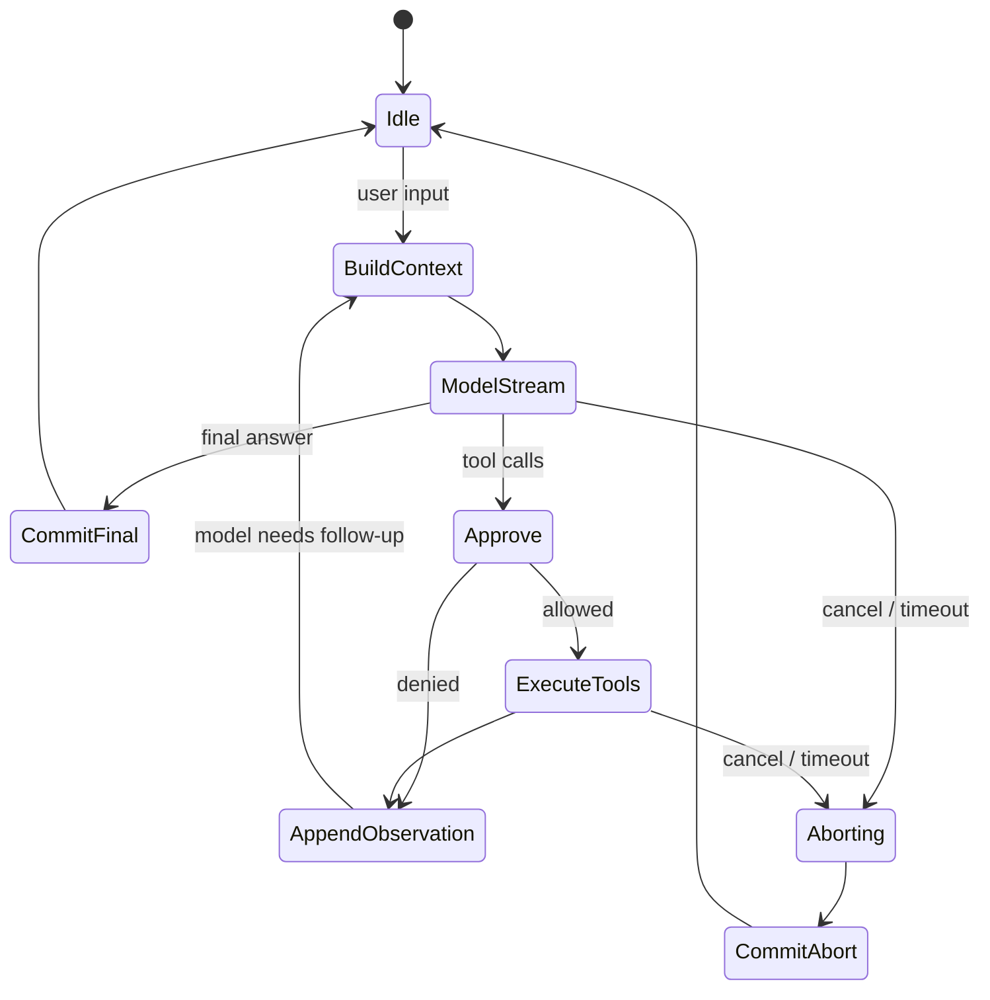

> 这是一篇跨实现的总览。它讨论的不是某个产品的 UI，而是 coding agent 为什么必然需要一个模型之外的运行时，以及这个运行时如何管理状态、网络流、工具副作用、中断和恢复。
>
> 对照源码快照：Claude Code `2.1.88`、Pi `0.83.0`、Codex `0.130.0`、OpenCode `1.14.35`、mini-SWE-agent `2.4.6`、Hermes Agent `0.12.0`、HiClaw `1.1.1`。
>
> **Claude Code 资料边界**：本仓版本是从发布的 npm bundle 解包、还原的研究副本，不是 Anthropic 原始 monorepo；部分 feature-gated 模块没有进入发布制品。因此本文只把可恢复代码中的控制流当作证据，不由缺失代码反推功能不存在。

---

## 0. 先给结论

本文校准的是三个彼此关联、但属于不同层次的原始判断：

1. LLM 受自回归生成限制，一次推进一个 token；模型本身不保存任务上下文，任务进程必须管理状态。
2. Agent 的主流网络传输是 SSE 与 WebSocket，需要解释两者为何出现、分别适合哪条链路。
3. Agent 的基本内核是 ReAct 循环；生产实现必须能中断、继续和并发等待，因此需要语言运行时的异步机制。

这三个判断方向正确，但“模型、推理服务、Agent runtime、网络链路和持久化”不能混成同一层。“Agent 的核心是 ReAct”抓住了内核，却还不够完整。更准确的表达是：

> **生产级 coding agent 是一个持有任务状态、调用概率模型决定下一步、解释并约束外部副作用、且可以被观察和取消的状态机式运行时。ReAct 是其中最常见的模型—工具反馈回路。**

可以把它写成两个交替发生的状态转移：

```text
decision = Model(render(agent_state))
agent_state', effects = reduce(agent_state, decision)
environment', observations = execute(effects, environment)
agent_state'' = append(agent_state', observations)
```

因此，一个实用 Agent 至少包含五部分：

1. **模型调用**：从当前上下文产生下一个文本片段、结构化工具调用或结束信号。
2. **任务状态**：消息、工具结果、预算、权限、模式、待处理输入和生命周期。
3. **调度循环**：决定何时请求模型、执行工具、重试、压缩上下文或结束。
4. **副作用边界**：真正修改文件、启动进程、访问网络，并处理审批、超时和取消。
5. **事件与持久化**：把增量输出送给 UI，把关键事实写入可恢复的存储。

如果只保留模型和 `while true`，可以得到一个 demo；如果缺少状态所有权、取消传播和副作用治理，就很难得到可长期运行的 coding agent。

---

## 1. “模型一次生成一个 token，而且无状态”哪里对，哪里需要校准

### 1.1 自回归依赖是串行的，但 token 不是字符

经典 decoder-only 生成满足：第 `t+1` 个输出依赖已经接受的 `1..t` 个 token。这个**因果依赖链**不能随意打散，否则后一个 token 不知道前一个实际采样结果是什么。[Transformer](https://arxiv.org/abs/1706.03762) 的 decoder 就是自回归地逐步产生输出。

但应避免把它说成“物理上每次只能吐一个字符”：

- token 通常是子词、字节片段、标点或多个字符，不等于字符；[SentencePiece](https://arxiv.org/abs/1808.06226) 是典型的子词 tokenizer。
- 输入侧的 prefill 可以并行计算大量位置。
- 服务端会把多个用户/序列组成 batch 并行计算。
- [Speculative Decoding](https://arxiv.org/abs/2211.17192) 可以先由小模型草拟多个 token，再由目标模型一次验证一段候选；它没有消除逻辑上的自回归顺序，但改变了“每接受一个 token 必做一次完整目标模型前向”的工程事实。

所以最稳妥的表述是：

> **输出 token 之间存在串行的因果依赖；服务系统仍可在 prefill、batching、候选验证和硬件算子层并行。**

这项物理约束使服务端可以按 decode step **增量暴露**结果，但 API 是否立即把这些增量送给客户端仍是协议与产品选择，并非模型物理规律。如果选择流式返回，用户便不必等待整轮生成结束，runtime 也能更早展示文本、统计用量、发现完整工具调用或响应取消。

### 1.2 “无状态”必须说明是哪一层状态

把模型类比成 CPU 里的计算单元很有启发，但“模型完全无状态”容易掩盖五种不同状态：

| 层 | 典型内容 | 谁持有 | 是否跨调用自然保留 |
|---|---|---|---|
| 参数状态 | 模型权重、词表、架构 | 模型服务 | 保留，但推理时通常只读 |
| 推理状态 | 当前 token、位置、KV cache、采样器状态 | 推理引擎 | 通常只在一次流式生成或可复用推理会话内 |
| Provider 状态 | response ID、服务端缓存、sticky routing、可能保存的响应链 | API 服务 | 取决于协议与配置 |
| Agent 会话状态 | 历史消息、工具调用/结果、审批、预算、队列、当前 phase | Agent runtime | 必须由 runtime 明确管理 |
| 外部持久状态 | 文件、Git、数据库、事件日志、子进程、远端资源 | 环境与存储 | 独立于模型调用 |

因此，更精确的结论是：

> **模型权重不是会话记忆；一次普通模型调用不会自行理解“这是同一个任务”。KV cache 是推理优化状态，也不是可靠的任务存档。任务连续性来自 Agent/runtime 或 provider 显式保存并重新呈现的状态。**

Claude Code 和 Codex 都能说明这一区别。Claude Code 的 `QueryEngine` 明确“一次 conversation 一个实例”，由它跨 turn 保存 messages、file cache、usage 和 `AbortController`；不过该类 docstring 也注明，当前主要承载 headless/SDK 路径，REPL 接入仍属 future phase。Codex 可以复用 WebSocket 和 `previous_response_id`，但每轮的工具调度、待处理输入和退出条件仍由本地 session/turn 代码控制；Pi 则更直接地由 `Agent` 对象持有 transcript、队列、工具和生命周期。

### 1.3 OS 类比有用，但 runtime 更像“用户态内核”

[MemGPT](https://arxiv.org/abs/2310.08560) 明确采用操作系统式的虚拟内存、层级存储与中断类比。这个类比适合解释“有限上下文如何服务长任务”：

| 操作系统概念 | Agent 中的对应物 |
|---|---|
| 进程控制块 | session / run state |
| 虚拟内存与换页 | 上下文选择、摘要、检索、prompt cache |
| 系统调用 | 结构化 tool call |
| 调度器 | turn loop / task runner |
| 中断与信号 | cancel、steer、timeout、shutdown |
| 权限边界 | approval、sandbox、tool policy |
| 日志与文件系统 | event log、checkpoint、Git、数据库 |

但它不是严格同构：

- LLM 不是确定性的指令执行器，更接近**昂贵且有噪声的决策策略/协处理器**。
- tool call 只是模型提出的意图；真正的校验和副作用必须由可信 runtime 完成。
- runtime 通常运行在普通用户进程里，没有 OS 内核那样的硬件特权。
- prompt 中的角色与规则是软约束；文件权限、容器和审批才是硬边界。

所以可把 Agent harness 称为“任务的用户态内核”或“控制平面”，但不应把模型本身直接等同于 CPU。

---

## 2. 网络传输：不是简单的 “SSE vs WebSocket”

### 2.1 先把三条链路拆开

讨论协议前，必须先问数据在哪两个组件之间流动：

```text
用户界面  <---- A ---->  Agent runtime  <---- B ---->  模型 provider
                              |
                              +---- C ----> tools / MCP / subagents
```

- **A：UI ↔ runtime**：既有 token/event 下行，也有取消、审批、steering 上行。
- **B：runtime ↔ provider**：通常是一次请求对应一段很长的增量响应；tool 结果往往在下一次请求提交。
- **C：runtime ↔ tools**：可能是本地函数、stdio JSON-RPC、HTTP、WebSocket 或消息总线。

“主流 Agent 用 SSE 和 WebSocket”大体成立，但不能推出每条链路都必须二选一。CLI 和 runtime 在同一进程时，A 根本不需要网络；MCP 常用 stdio；provider 也可能提供普通 HTTP、gRPC 或自定义流协议。

### 2.2 为什么 SSE/流式 HTTP 很常见

[WHATWG Server-Sent Events](https://html.spec.whatwg.org/dev/server-sent-events.html) 定义了 `text/event-stream` 的事件格式和浏览器 `EventSource`。LLM API 里说的“SSE”经常只是借用这一**响应体 framing**：客户端用 `fetch` 发 `POST`，然后逐块解析返回的 `text/event-stream`，并不一定使用只能发 `GET` 的浏览器 `EventSource` API。

它适合 B 链路的典型形状：

```text
runtime -- 一次完整 POST（prompt/tools/options） --> provider
runtime <-- 很长的单向增量事件流 ------------ provider
```

优势是：

- 延续普通 HTTP 的认证、状态码、代理、负载均衡和可观测性模型。
- 请求与响应边界清楚，失败和重试容易归因到某一轮模型调用。
- 文本事件边界简单，适合 token delta、usage、tool-call delta、done/error。
- 如果上行控制很少，取消可关闭请求；tool result 或新消息可通过下一次 HTTP 请求发送。

Pi 的 `pi-messages` provider adapter 就是一个清晰例子：它用 `POST` 提交上下文，设置 `Accept: text/event-stream`，再异步解析响应；Claude Code 对主模型调用设置 `stream: true`，以 async iterator 消费 Anthropic Messages 事件，并显式检测代理返回的非 SSE/残缺 SSE；OpenCode 面向客户端的 `/event` 路由也以 SSE 持续推送总线事件。

### 2.3 为什么 WebSocket 也有价值

[RFC 6455](https://www.rfc-editor.org/rfc/rfc6455.html) 提供握手后持续存在的双向消息通道。它适合两边都频繁发消息、且这些消息属于同一个低延迟会话的场景：

- 用户在生成过程中不断 steering，而非仅仅点一次 cancel。
- realtime 音频/语音同时上下行。
- tool result、ack、客户端状态和模型事件需要在同一应用通道中频繁交错，同时希望减少每轮请求头和重新路由成本。
- provider 的增量协议本身维护连接级 response chain。

这里不能把 WebSocket 的收益夸成“每轮都省一次 TCP/TLS 握手”：HTTP keep-alive 已能复用连接，[HTTP/2](https://www.rfc-editor.org/rfc/rfc9113.html) 还允许同一连接承载多个并发 stream，并压缩重复 header。WebSocket 的增益取决于现有 HTTP 栈、消息频率和服务端的连接级协议，必须实测。

代价也更明显：

- 连接断开后的重连、事件去重和幂等需要应用层定义。
- 长连接会引入心跳、背压、sticky routing、资源配额和滚动发布问题。
- “连接还活着”不等于“任务已经持久化”；进程崩溃后能否恢复仍取决于事件日志/checkpoint。

Codex `0.130.0` 会在 provider 支持时优先建立 Responses WebSocket，并在可安全回退的阶段转到 HTTP/SSE。Pi `0.83.0` 也把 transport 暴露成 `sse | websocket | websocket-cached | auto`。这说明 WebSocket 是性能与交互控制选择，不是 Agent 成立的前提。

Claude Code 更能说明“按链路选协议”：本文观察到的 Anthropic Messages 主路径使用 streaming/SSE；远程 CCR session 则用 WebSocket 订阅下行消息、用普通 HTTP POST 发送用户消息，并在 WebSocket 上处理权限控制事件。也就是说，同一个产品完全可以在 A 链路采用 WebSocket/HTTP 组合，在 B 链路采用 SSE。Bedrock、Vertex 等替代 provider 的底层传输应按各自 adapter 另行判断。

### 2.4 实际选型

| 条件 | 更自然的选择 |
|---|---|
| 单次 POST，主要是服务器持续下行 | streaming HTTP / SSE framing |
| 浏览器只需订阅 runtime 事件 | SSE，命令另走 HTTP POST |
| 双向消息高频交错、realtime 音频 | WebSocket |
| 极度依赖普通 HTTP 基础设施与可重放请求 | SSE/streaming HTTP |
| 连接级增量缓存和 response chain 是协议核心 | WebSocket 可能更省开销 |
| 本地 CLI 内部模块通信 | 内存队列/channel，通常无需网络协议 |

一个稳健的经验法则是：

> **先从消息方向、会话寿命和故障恢复语义选协议，不要因为“Agent 很实时”就默认 WebSocket。**

还要特别注意：SSE 的 `Last-Event-ID` 或 WebSocket 重连都不会自动恢复 Agent。只有 runtime 为事件编号、保存已提交状态，并能把新连接映射回同一个 session，才存在真正的应用级 resume。

---

## 3. ReAct 是内核，但生产 Agent 更像可取消状态机

### 3.1 原始 ReAct 与现代 coding agent

[ReAct](https://arxiv.org/abs/2210.03629) 的关键是交错产生 reasoning trace 与 action，并把环境 observation 放回后续推理。现代 coding agent 继承了这个反馈结构：

```text
model -> tool call -> tool execution -> tool result -> model -> ... -> final answer
```

但现代实现不一定公开 `Thought / Action / Observation` 文本：

- reasoning 可能隐藏或加密。
- action 通常是结构化 function/tool call。
- observation 是带 call ID 的结构化 tool result。
- 外层还可能有 planner、subagent、compaction、approval、hook 和 background task。

所以把整个 Agent 架构叫 ReAct 会漏掉最难的工程部分。更准确的核心抽象是**turn engine + effect interpreter**。

Claude Code 还有一个很实用的防御性选择：源码注释明确说 `stop_reason === "tool_use"` 并不可靠，所以它在流中实际收集结构化 `tool_use` block，并以 `needsFollowUp` 决定是否执行工具和继续循环。也就是说，状态机转换依赖已解析的事件事实，而不是只信一个汇总枚举值。

### 3.2 最小状态机



这张图把 §0 的函数式写法展开成了运行时阶段：`BuildContext/ModelStream` 对应 `render(agent_state)` 与 `Model(...)`；解析模型决策并选择后续分支对应 `reduce(agent_state, decision)`；`Approve/ExecuteTools` 校验并执行 `effects`；`AppendObservation` 把执行结果提交回 `agent_state`，随后再进入下一轮 `BuildContext`。

steering 通常不应该在任意机器指令处“闯入”并修改历史。更安全的做法是进入队列，在模型流结束、工具批次结束或下一轮构造上下文之前这样的**一致性边界**被消费。Pi 的 loop 正是在内外层循环边界读取 steering/follow-up；Codex 有独立 mailbox/pending-input 路径；Claude Code 则在工具完成后截取队列快照，把合适优先级的 command 转成下一次模型调用的 attachment，同时避免把 slash command 错当普通文本插入半轮历史。

### 3.3 六个经常被混为一谈的动作

| 动作 | 真正语义 | 典型机制 |
|---|---|---|
| cancel | 停止当前请求/任务，进入已知终止态 | cancellation token / AbortSignal / task cancel |
| steer | 给仍在运行的任务增加新输入 | mailbox / channel / queue，在安全边界消费 |
| pause | 暂停一个仍在内存中的 continuation | suspended Future/Promise/task；进程退出即丢失 |
| resume | 从已提交事实重建并继续 | checkpoint/event log + reducer + 新任务 |
| retry | 再执行一次失败步骤 | retry policy + 幂等键 + 去重/对账 |
| interrupt | 上述动作的用户界面统称 | 具体语义必须由 runtime 定义 |

其中最重要的一句话是：

> **异步提供“等待时不占住线程”和协作式取消；异步本身不提供崩溃后的持久恢复。**

goroutine、Tokio task、Promise 和 `asyncio.Task` 都是内存里的 continuation。要跨进程恢复，应保存“已经确认的消息、事件、tool call ID、tool result、环境版本和 phase”，然后重新构造任务，而不是尝试序列化调用栈。

### 3.4 取消必须沿调用树传播

一个 turn 的取消至少应传播到：

```text
session turn
├── provider streaming request
├── tool batch
│   ├── shell process
│   ├── filesystem/network tool
│   └── subagent
└── UI/event forwarder
```

Codex 为 turn 创建 `CancellationToken`，派生 child token 给子任务；收到取消后先协作式等待，再对未退出的 task 强制 abort，并在结束事件前写入中断标记。Pi 把 `AbortSignal` 从 Agent 传到模型 stream 和 tool execution。Claude Code 同样把 `AbortController.signal` 交给 provider 和 tool context，还实现了 parent → child controller 的单向传播；如果中断发生在流或工具执行中，它会生成配对的合成 `tool_result`，避免 transcript 留下孤立 `tool_use`。三者都体现了同一个原则：取消是沿资源所有权树传播的协议，不是一处全局布尔值。

还要区分“发出取消信号”和“资源已经停止”。`CancellationToken`、`Context` 与 `AbortSignal` 都要求下游协作观察；[DOM 标准](https://dom.spec.whatwg.org/#interface-abortcontroller)也明确指出 Promise 没有内建 abort 机制，API 必须接收 signal 并实现停止与拒绝逻辑。对不响应信号的子进程或 task，runtime 仍需要超时、kill/abort 和最终资源收割。

### 3.5 并行执行工具不是免费的

多个只读工具可以并发，但两个写文件工具、一个写文件和一个 shell build、或共享同一终端的命令可能互相干扰。runtime 必须把“语言能并发”与“副作用允许并发”分开。

Pi 支持顺序或 `Promise.all` 并行执行工具，并保持结果顺序；Codex 用读写锁区分声明为可并行的工具和需要独占的工具；Claude Code 根据每个工具的 `isConcurrencySafe(input)` 把连续安全调用分批并发，其余调用串行执行，并限制并发批次大小。这类调度策略比“全部并行”更接近正确的 effect system。

Claude Code 还支持把模型流和工具执行做成流水线：一个完整 `tool_use` block 一出现，`StreamingToolExecutor` 就可以立即把它入队，而 provider 的后续事件仍在流入；已完成的工具结果会被非阻塞地取出。这个优化同时需要补偿路径：若 streaming fallback 发生，旧 executor 会被标记为 discarded，部分 assistant 消息被 tombstone，旧 call ID 的结果不能进入重试后的历史。它展示了异步带来的真实收益，也展示了为什么事件身份和提交边界不可省略。

---

## 4. 各语言通常用什么实现

它们实现的是同一组抽象：**task、stream、queue、select/race、cancellation、scope/finalizer、durable store**。语言语法只是不同外壳。

### 4.1 Go：goroutine + channel + select + context

用户的判断基本正确：

- `goroutine`：承载模型流、工具、事件转发或 session worker。
- `channel`：传递 token/event、tool result、用户输入和错误。
- `select`：在模型事件、steering、timer、`ctx.Done()` 之间等待。
- `context.Context`：把 deadline/cancel 沿调用链传递给 HTTP 和 `exec.CommandContext`。
- [`errgroup`](https://pkg.go.dev/golang.org/x/sync/errgroup)：Go `x/sync` 中的通用结构化并发辅助，用于一组子 goroutine 的同步、错误传播和 `Context` 取消；本仓 HiClaw 样例没有使用它。

一个典型骨架是：

```go
for {
    select {
    case <-ctx.Done():
        return ctx.Err()
    case input := <-steering:
        pending = append(pending, input)
    case event := <-modelEvents:
        state = reduce(state, event)
    case result := <-toolResults:
        state = appendObservation(state, result)
    }
}
```

本仓 Go 样例 HiClaw 明确不是 LLM Agent loop，而是容器/worker 编排控制面；不过它展示了 Go 侧完全相同的运行时原语：goroutine 启服务、`select` 监听 `ctx.Done()`/文件事件/定时器，controller 用 requeue 表达后续工作，shell 用 `context.WithTimeout` 与 `exec.CommandContext` 取消子进程。

### 4.2 Rust：Tokio + Future/Stream + channel + CancellationToken

用户的判断同样正确，但 “Tokio” 只是入口：

- Tokio runtime 调度 async `Future` 和 task。
- `tokio::select!` 在流事件、mailbox、timeout、cancel 之间竞争。
- `mpsc` / `broadcast` / `watch` / `oneshot` 表达不同消息关系。
- `tokio_util::sync::CancellationToken` 形成父子取消树。
- `JoinHandle` / `JoinSet` 或 futures 集合负责等待和收割子任务。
- `Drop`、scope 和 guard 帮助保证退出时释放资源。

Codex 的实现是直接证据：session 同时只拥有一个 running task；turn loop 用 token 取消 provider stream；每个 tool dispatch 被 `tokio::spawn`；并行安全性由 `RwLock` 控制；结束时先 graceful cancel，再 `handle.abort()` 强制终止残留任务。

Rust 的 ownership/`Send` 约束能减少并发状态的模糊共享，但它不会自动解决业务一致性或持久恢复——这些仍然要靠 session state、事件记录和显式协议。

### 4.3 TypeScript：event loop + Promise + AsyncIterable + AbortSignal

TypeScript/Node/Bun 的基础组合是：

- 单线程 JavaScript event loop 调度 callback 和 Promise continuation。
- `async/await` 表达顺序控制流。
- `AsyncIterable` / async generator / `ReadableStream` 表达增量事件。
- `AbortController` / `AbortSignal` 传播协作式取消；signal 只是通知，不能自动终止任意 Promise。
- `Promise.all` / `Promise.race` 表达并发等待或竞争。
- queue/EventEmitter 保存跨阶段事件；CPU 密集或阻塞工作需要 worker thread/child process，不能直接堵住 event loop。

Pi 是这个模型的简洁范本：`EventStream` 自己维护 queue 和等待中的 resolver，并实现 `AsyncIterable`；agent loop 使用 `for await` 消费模型流，以 `AbortController` 管理一轮运行，通过 steering/follow-up queue 在安全边界注入消息，工具批次可用 `Promise.all` 并发。

Claude Code 是更偏生产运行时的原生 TypeScript 范本：在当前 headless/SDK 路径中，`QueryEngine` 是跨 turn 的状态所有者，`queryLoop` 是返回事件的 `AsyncGenerator`，内部显式 `while (true)`；模型事件和工具结果都通过 `for await` 逐步向外产出。它在进入模型循环前先记录已接受的用户消息，模型和工具事件随后增量写 transcript，因此“进程被杀后 resume”依赖的是持久 transcript，而不是恢复某个 Promise。其 `AbortController`、async generator、command queue、定时 watchdog 和串并行工具编排，基本覆盖了 TypeScript Agent runtime 的核心原语。

OpenCode 在这些原语上又加了 Effect runtime：fiber 表示可中断任务，`Stream` 处理增量输出，`Scope`/finalizer 清理资源，`Deferred` 表示完成信号，`SynchronizedRef` 保护状态。它最终仍把 `AbortSignal` 交给底层模型 SDK。也就是说，Effect 提供的是比裸 Promise 更明确的结构化并发和资源生命周期，而不是另一种网络协议。

### 4.4 Python：同步循环也成立，asyncio 用于规模化并发

mini-SWE-agent 是一个重要反例：它的核心就是同步 `while True`，模型调用后同步执行命令，交互版用 `KeyboardInterrupt` 转成新消息。它仍然是 Agent。这证明：

> **异步不是 ReAct 的定义条件；异步是同时处理流、取消、多个会话和后台任务时的工程需要。**

当 Python 实现需要这些能力时，常见组合是：

- `asyncio.Task` / `TaskGroup`：运行和收割任务。
- `asyncio.Queue`：session/event mailbox。
- async generator / async iterator：模型与 UI 事件流。
- `asyncio.Event`、task cancellation、timeout：控制生命周期。
- `asyncio.to_thread`：把不得不调用的同步 SDK/阻塞迭代器移出 event loop。

Hermes 的 Gemini adapter 就用 `asyncio.to_thread` 包装同步请求及同步流迭代器，再向上暴露 async generator；它的主 agent loop 则显式检查 interrupt flag 和 iteration budget。

### 4.5 对照表

| 运行时概念 | Go | Rust/Tokio | TypeScript | Python/asyncio |
|---|---|---|---|---|
| 轻量任务 | goroutine | task / Future | Promise continuation | Task / coroutine |
| 增量流 | channel | Stream / mpsc | AsyncIterable / ReadableStream | async generator / Queue |
| 多路等待 | `select` | `tokio::select!` | `Promise.race` + queue/event | `asyncio.wait` / Queue |
| 取消 | `context.Context` | CancellationToken / abort handle | AbortSignal | task cancel / Event |
| 生命周期 | errgroup + context | JoinSet/scope/guards | structured-concurrency library / `finally` | TaskGroup / async context manager |
| 持久恢复 | 显式事件/checkpoint | 显式事件/checkpoint | 显式事件/checkpoint | 显式事件/checkpoint |

---

## 5. 真正困难的第四个核心：副作用与一致性

物理生成、网络传输和可中断循环之外，还有一个常被低估的核心：**模型提出动作，但 runtime 必须对现实世界负责。**

一旦工具可以写文件、运行命令、发消息或改远端资源，runtime 至少要回答：

1. 谁有权执行这个动作，是否需要 approval/sandbox？
2. 参数流式输出到一半或 JSON 截断时，能否执行？Pi 会直接拒绝执行因长度上限而可能被截断的 tool call。
3. 取消发生时，子进程是否真的退出，还是只停止等待它？
4. 网络重试后，同一个 tool call 会不会执行两次？
5. 多个工具能否并行，读写集合是否冲突？
6. crash 发生在“外部动作成功、结果尚未落盘”之间时，如何对账？

这使 Agent runtime 很像一个弱事务协调器。它通常无法原子回滚 shell/filesystem/远端 API，因此需要用 approval、幂等键、call ID、事件日志、超时、补偿动作、Git/checkpoint 和重启后的 reconciliation 降低风险。

### 推荐的不变量

- **单 session 单写者**：同一 transcript 的状态转移由一个 runner 串行提交。
- **事件有身份**：turn ID、tool call ID、event sequence 贯穿 provider、runtime、UI 与存储。
- **只在一致性边界注入 steering**：不要在半个 tool result 或半次状态提交中修改历史。
- **取消沿资源树传播**：模型 HTTP/WS、tool task、子进程和 subagent 都要收到信号。
- **队列有界并定义背压**：慢 UI 不应无限吃内存；关键事件不能被 token delta 淹没。
- **并发由 effect 决定**：语言支持并发不代表两个工具语义上可并发。
- **先保存事实，再重建 continuation**：持久化消息、结果和 phase，不幻想持久化 goroutine/Future/Promise。
- **重试必须可识别重复**：外部副作用优先使用幂等键；不能幂等时要能查询和对账。
- **上下文窗口不是数据库**：prompt 是某时刻投影；权威状态仍在 event log、DB、文件和环境中。

---

## 6. 最终修正版心智模型

原来的三点可以升级为下面四点：

1. **物理约束**：LLM 输出 token 具有自回归因果顺序，token 不等于字符；模型权重不是会话记忆，KV cache 也不是任务存档。
2. **状态所有权**：Agent runtime 像任务的用户态内核，负责把持久状态投影成 prompt，并接管 session、预算、权限和生命周期。
3. **流与调度**：ReAct 是内层反馈回路，生产实现是可取消、可观测的状态机；异步负责并发等待，checkpoint/event log 才负责跨进程恢复。
4. **副作用治理**：工具执行、审批、隔离、幂等、回滚/对账和并发冲突，决定 Agent 是否只是 demo，还是可信运行时。

最短的一句话则是：

> **LLM 负责提出下一步，Agent runtime 负责让“下一步”在时间、状态和现实世界里安全地发生。**

---

## 7. 一手资料与源码锚点

论文与协议：

- Vaswani et al., [Attention Is All You Need](https://arxiv.org/abs/1706.03762)
- Yao et al., [ReAct: Synergizing Reasoning and Acting in Language Models](https://arxiv.org/abs/2210.03629)
- Leviathan et al., [Fast Inference from Transformers via Speculative Decoding](https://arxiv.org/abs/2211.17192)
- Kwon et al., [MemGPT: Towards LLMs as Operating Systems](https://arxiv.org/abs/2310.08560)
- [WHATWG Server-Sent Events](https://html.spec.whatwg.org/dev/server-sent-events.html)
- [RFC 6455: The WebSocket Protocol](https://www.rfc-editor.org/rfc/rfc6455.html)
- [RFC 9113: HTTP/2](https://www.rfc-editor.org/rfc/rfc9113.html)
- [Go `context` package](https://pkg.go.dev/context)
- [Go `errgroup` package](https://pkg.go.dev/golang.org/x/sync/errgroup)
- [Tokio `CancellationToken`](https://docs.rs/tokio-util/latest/tokio_util/sync/struct.CancellationToken.html)
- [DOM `AbortController`](https://dom.spec.whatwg.org/#interface-abortcontroller)
- [Python `asyncio` tasks](https://docs.python.org/3/library/asyncio-task.html)

本仓源码：

- `sources/claude-code/2.1.88/claude-code-source-code/README_CN.md:1-23`
- `sources/claude-code/2.1.88/claude-code-source-code/package.json:1-18`
- `sources/claude-code/2.1.88/claude-code-source-code/src/QueryEngine.ts:175-207`
- `sources/claude-code/2.1.88/claude-code-source-code/src/QueryEngine.ts:410-463`
- `sources/claude-code/2.1.88/claude-code-source-code/src/QueryEngine.ts:675-834`
- `sources/claude-code/2.1.88/claude-code-source-code/src/QueryEngine.ts:1158-1163`
- `sources/claude-code/2.1.88/claude-code-source-code/src/query.ts:201-339`
- `sources/claude-code/2.1.88/claude-code-source-code/src/query.ts:551-708`
- `sources/claude-code/2.1.88/claude-code-source-code/src/query.ts:826-863`
- `sources/claude-code/2.1.88/claude-code-source-code/src/query.ts:1011-1063`
- `sources/claude-code/2.1.88/claude-code-source-code/src/query.ts:1357-1409`
- `sources/claude-code/2.1.88/claude-code-source-code/src/query.ts:1484-1588`
- `sources/claude-code/2.1.88/claude-code-source-code/src/query.ts:1630-1728`
- `sources/claude-code/2.1.88/claude-code-source-code/src/services/api/claude.ts:1818-1857`
- `sources/claude-code/2.1.88/claude-code-source-code/src/services/api/claude.ts:1868-1942`
- `sources/claude-code/2.1.88/claude-code-source-code/src/services/api/claude.ts:2229-2364`
- `sources/claude-code/2.1.88/claude-code-source-code/src/services/api/dumpPrompts.ts:151-204`
- `sources/claude-code/2.1.88/claude-code-source-code/src/services/tools/toolOrchestration.ts:19-116`
- `sources/claude-code/2.1.88/claude-code-source-code/src/services/tools/toolOrchestration.ts:118-177`
- `sources/claude-code/2.1.88/claude-code-source-code/src/services/tools/StreamingToolExecutor.ts:34-150`
- `sources/claude-code/2.1.88/claude-code-source-code/src/services/tools/StreamingToolExecutor.ts:153-239`
- `sources/claude-code/2.1.88/claude-code-source-code/src/services/tools/StreamingToolExecutor.ts:262-405`
- `sources/claude-code/2.1.88/claude-code-source-code/src/services/tools/StreamingToolExecutor.ts:407-470`
- `sources/claude-code/2.1.88/claude-code-source-code/src/utils/abortController.ts:8-98`
- `sources/claude-code/2.1.88/claude-code-source-code/src/remote/RemoteSessionManager.ts:87-180`
- `sources/claude-code/2.1.88/claude-code-source-code/src/remote/SessionsWebSocket.ts:74-145`
- `sources/pi/0.83.0/packages/agent/src/agent-loop.ts:155-275`
- `sources/pi/0.83.0/packages/agent/src/agent-loop.ts:281-371`
- `sources/pi/0.83.0/packages/agent/src/agent-loop.ts:411-554`
- `sources/pi/0.83.0/packages/agent/src/agent.ts:159-230`
- `sources/pi/0.83.0/packages/agent/src/agent.ts:275-314`
- `sources/pi/0.83.0/packages/agent/src/agent.ts:471-520`
- `sources/pi/0.83.0/packages/ai/src/utils/event-stream.ts:3-67`
- `sources/pi/0.83.0/packages/ai/src/types.ts:103-172`
- `sources/pi/0.83.0/packages/ai/src/api/openai-codex-responses.ts:270-430`
- `sources/pi/0.83.0/packages/ai/src/api/openai-codex-responses.ts:759-820`
- `sources/pi/0.83.0/packages/ai/src/api/pi-messages.ts:360-410`
- `sources/codex/0.130.0/codex-rs/core/src/session/turn.rs:121-144`
- `sources/codex/0.130.0/codex-rs/core/src/session/turn.rs:383-665`
- `sources/codex/0.130.0/codex-rs/core/src/session/turn.rs:1829-1905`
- `sources/codex/0.130.0/codex-rs/core/src/tools/parallel.rs:27-143`
- `sources/codex/0.130.0/codex-rs/core/src/tasks/mod.rs:291-430`
- `sources/codex/0.130.0/codex-rs/core/src/tasks/mod.rs:798-853`
- `sources/codex/0.130.0/codex-rs/core/src/client.rs:1-24`
- `sources/codex/0.130.0/codex-rs/core/src/client.rs:949-1023`
- `sources/codex/0.130.0/codex-rs/core/src/client.rs:1509-1586`
- `sources/opencode/1.14.35/packages/opencode/src/session/prompt.ts:1400-1627`
- `sources/opencode/1.14.35/packages/opencode/src/session/processor.ts:673-733`
- `sources/opencode/1.14.35/packages/opencode/src/session/llm.ts:336-432`
- `sources/opencode/1.14.35/packages/opencode/src/effect/runner.ts:3-138`
- `sources/opencode/1.14.35/packages/opencode/src/effect/runner.ts:176-207`
- `sources/opencode/1.14.35/packages/opencode/src/server/routes/instance/event.ts:12-88`
- `sources/mini-swe-agent/2.4.6/src/minisweagent/agents/default.py:88-157`
- `sources/mini-swe-agent/2.4.6/src/minisweagent/agents/interactive.py:109-139`
- `sources/hermes-agent/0.12.0/run_agent.py:10811-10836`
- `sources/hermes-agent/0.12.0/agent/gemini_native_adapter.py:920-962`
- `sources/hiclaw/1.1.1/README.md:13-29`
- `sources/hiclaw/1.1.1/hiclaw-controller/internal/app/app.go:110-145`
- `sources/hiclaw/1.1.1/hiclaw-controller/internal/watcher/file_watcher.go:102-135`
- `sources/hiclaw/1.1.1/hiclaw-controller/internal/controller/worker_controller.go:57-150`
- `sources/hiclaw/1.1.1/hiclaw-controller/internal/executor/shell.go:34-47`
