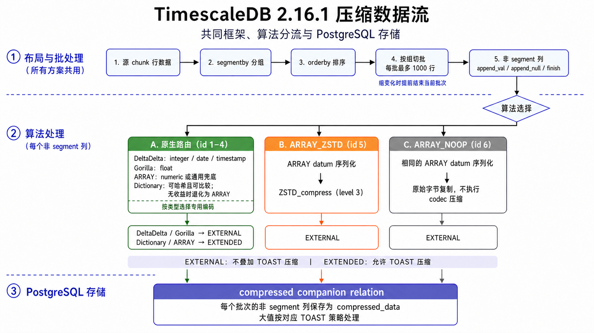
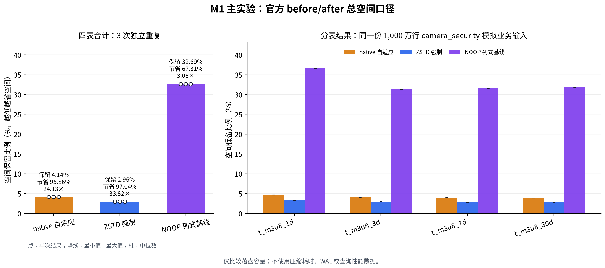
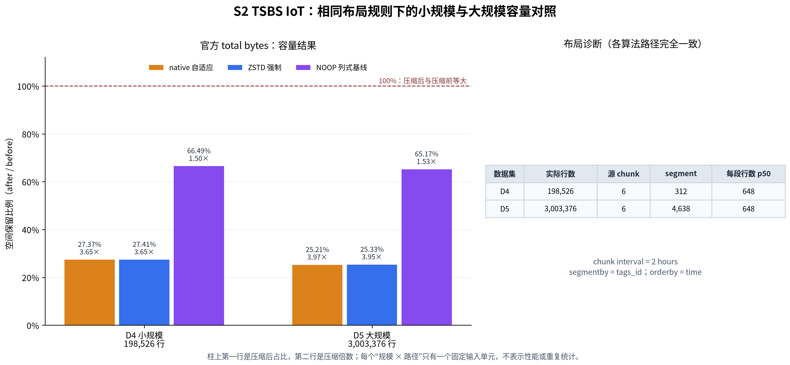
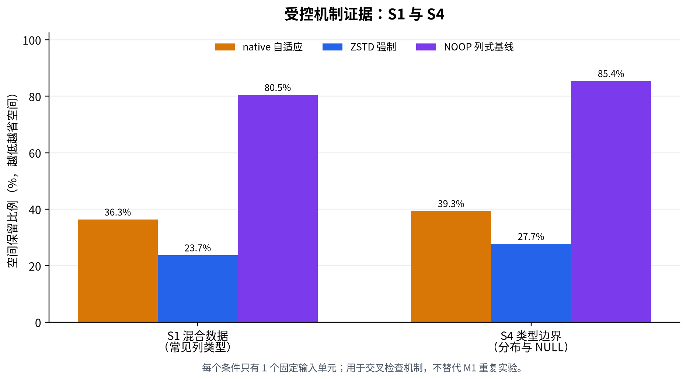
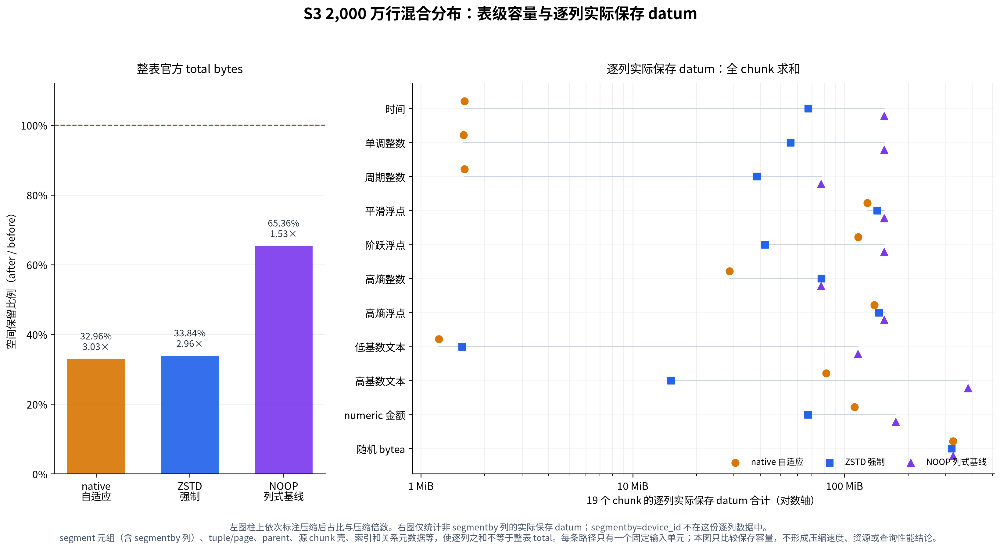
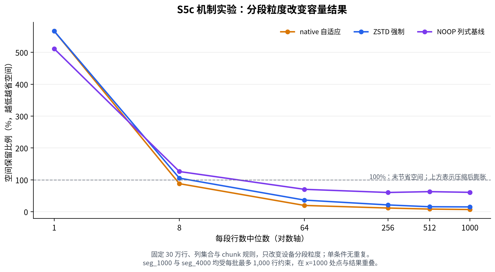

## 摘要

TimescaleDB 的压缩结果并不单是由数据列的压缩算法决定。从流程上看，数据先被切成 chunk，再按 `segmentby` 分组、按 `orderby` 排序，之后才进入逐列压缩；最终落盘大小还包含关系、索引、TOAST 和压缩元数据。

本文在 PostgreSQL 15.5、TimescaleDB 2.16.1 和 Linux aarch64 环境中：

1. 对TSDB的原生逻辑
   2.改造接入的第三方ZSTD压缩算法
2. 改造接入的无压缩算法基线
   基于上述三条完整存储路径进行比较。主实验使用1,000 万行的客户模拟业务数据，三种路径各从同一物理快照独立执行三次。四张表合计的实验结果为：native 保留 `4.144%`、节省 `95.856%`；ZSTD 保留 `2.957%`、节省 `97.043%`；NOOP 保留 `32.687%`、节省 `67.313%`。

---

## 第 1 章 引言

### 1.1 “压缩率”是多层作用的结果

先看一下TimeScaleDB的基本压缩执行流。

```text
数据分布
→ chunk 切分
→ segmentby 分组
→ orderby 排序
→ 列式 batch
→ codec(基于列类型路由的压缩算法)
→ PostgreSQL 关系、索引与 TOAST
```

如果只看 codec 输出，就会漏掉索引、页和关系固定成本；如果只看整表总量，又无法解释差异来自哪一列、哪种分布或哪层结构。

### 1.2 要回答的三个问题

本文围绕三个可验证问题展开：

1. 在同一份模拟业务数据上，native、ZSTD 和 NOOP 三条路径的实际落盘空间分别是多少？
2. 当数据来源、类型、分布和规模发生变化时，三条路径的压缩效率又会如何？
3. chunk、`segmentby`、`orderby` 和每段行数如何改变表级容量结果？

第一个问题由模拟业务负载主实验回答；第二个问题由 TSBS、混合分布和类型矩阵交叉检查；第三个问题由压缩参数网格和分段深度扫描回答。

### 1.3 术语速查

| 术语        | 本文含义                                                                             |
| ----------- | ------------------------------------------------------------------------------------ |
| codec       | 对一批单列数据执行编码和解码的算法实现，例如 DeltaDelta、Gorilla 或 ZSTD             |
| chunk       | hypertable 按时间自动切出的物理分区；压缩以 chunk 为处理单位                         |
| `segmentby` | 压缩前的分组键；键值相同的行进入同一 segment                                         |
| `orderby`   | segment 内的排序键；它决定相邻值以什么顺序进入 codec                                 |
| batch       | codec 的实际输入批次；本实验版本的目标上限约为 1,000 行                              |
| TOAST       | PostgreSQL 保存超长字段的行外存储机制，也可以对部分数据再做一层压缩                  |
| datum       | PostgreSQL 对一个字段值的内部表示；本文的逐列诊断统计压缩 batch 对应的 datum         |
| GUC         | PostgreSQL 配置参数；本实验用数据库级 GUC 选择 native、ZSTD 或 NOOP 路径             |
| PGDATA      | 一个 PostgreSQL 实例的数据目录，包含关系文件、WAL 和实例配置；主实验用其冻结输入快照 |

---

## 第 2 章 被测框架与三条压缩路径

### 2.1 从 hypertable 到落盘关系

TimescaleDB 2.16.1 不会把整张 hypertable 当成一段连续字节直接交给 codec。数据流可以概括为：

```text
hypertable
  └─ time chunk
      └─ segmentby 分组
          └─ orderby 排序
              └─ 最多约 1000 行的列式 batch
                  └─ 每列 codec
                      └─ compressed companion relation
                          └─ PostgreSQL TOAST / 索引 / 页结构
```



_图 1　TimescaleDB 2.16.1 的压缩数据流。chunk 和 segment 决定哪些行有机会进入同一批次；codec 只处理已经形成的单列 batch。算法 id 1–4 为原生路径，id 5 和 6 为本实验加入的 ARRAY_ZSTD 与 ARRAY_NOOP。连接关系依据 `compression.c`、`compression.h`、`array_zstd.c` 和 `array_noop.c` 绘制。_

这条链路包含三个需要分开的因素：

1. 布局决定关系数量和每个批次能积累多少行；
2. codec 决定单列 batch 的编码结果；
3. PostgreSQL 存储层决定 datum 是否进入 TOAST、是否允许二次压缩，以及关系、页和索引需要多少固定空间。

因此，“某个 codec 压成多少字节”和“整张表最终占多少磁盘”是两个问题。本文以整表落盘空间作为主指标，逐列 datum 只用于解释原因。

### 2.2 三条被测路径

| 路径          | 算法 id | 数据处理                                                                                | `compressed_data` 存储策略                        |
| ------------- | ------: | --------------------------------------------------------------------------------------- | ------------------------------------------------- |
| native 自适应 |     1–4 | 整数/时间常走 DeltaDelta，浮点常走 Gorilla，低基数值尝试 Dictionary，其他情况回退 ARRAY | ARRAY/Dictionary 通常为 EXTENDED，其余为 EXTERNAL |
| ZSTD 强制     |       5 | ARRAY 序列化后执行 `ZSTD_compress(level=3)`                                             | EXTERNAL                                          |
| NOOP 列式基线 |       6 | ARRAY 序列化后直接保存，不做 codec 压缩                                                 | EXTERNAL                                          |

EXTERNAL 和 EXTENDED 都是把 compressed_data 放到 TOAST 行外存储。其中，EXTENDED会把同一份数据再经过一次PostgreSQL的TOAST压缩，表示一种“more“的含义，而EXTERNAL则只保留上层codec的结果，不再叠加PG级压缩。

ZSTD 与 NOOP 共用 ARRAY 的 datum 序列化、NULL bitmap、批次组织和头部结构，差别是序列化之后是否执行 ZSTD。因此，两者之间的差异可以用于观察 ZSTD codec 对同一输入表示的作用。

native 与 ZSTD 比较的是两条完整存储路径，不只是两个孤立函数。native 包含类型路由、算法退化和不同 TOAST 策略；ZSTD 则把非 segment 列统一送入 ARRAY_ZSTD。

### 2.3 NOOP 不代表是“未压缩表”

NOOP 已经经历了：

- chunk 到 compressed companion 的转换；
- `segmentby` 与 `orderby`；
- 行式数据到列式 batch 的重排；
- ARRAY 序列化；
- 压缩块的元数据与索引结构变化。

它只跳过最后的 codec 压缩。因此：

```text
ZSTD 与 NOOP 的差值
≈ 同一 ARRAY 字节表示上增加 ZSTD 后的收益
```

NOOP 相对未压缩源表的变化还包含列式化、元组结构、索引和关系布局，不能称为 codec 压缩率。主实验中 NOOP 仍节省 `67.313%`，正说明表级“压缩”包含大量算法之外的结构性因素。

---

## 第 3 章 实验设计与正确性

### 3.1 主实验与辅助实验的分工

| 编号 | 角色     | 数据与规模                                          |  正式测试单元 | 回答的问题                   |
| ---- | -------- | --------------------------------------------------- | ------------: | ---------------------------- |
| M1   | 主实验   | 摄像头安防场景的模拟业务数据，1,000 万行            | 3 路径 × 3 次 | 固定业务形态下的主要容量排名 |
| S2   | 广度证据 | TSBS IoT：D4 小规模约 20 万行、D5 大规模约 300 万行 |             6 | 换数据来源并扩大规模后的结果 |
| S1   | 广度证据 | 常见类型混合数据，30 万行                           |             3 | 常见类型与分布的交叉检查     |
| S4   | 广度证据 | 类型、分布、NULL 边界，30 万行                      |             3 | 类型支持和边界行为           |
| S3   | 深度证据 | 混合分布数据，2,000 万行                            |             3 | 大规模表级容量与逐列归因     |
| S5   | 深度证据 | 固定 30 万行，布局与分段深度矩阵                    |            51 | chunk、分段、排序和批次深度  |

M1 是主要工程证据。辅助实验用于检验结论能否跨数据来源、类型、分布、规模和布局成立，并解释结果为什么变化。

### 3.2 指标定义

本文统一使用以下定义：

```text
空间保留比例 = after_total_bytes / before_total_bytes
空间节省比例 = 1 - after_total_bytes / before_total_bytes
压缩倍数     = before_total_bytes / after_total_bytes
```

例如保留比例为 `4%`，表示压缩后留下原空间的 `4%`；等价地，节省比例为 `96%`，压缩倍数为 `25×`。同一结果只能按同一公式比较。

### 3.3 表级主口径、完整关系树与逐列诊断

表级主指标来自 TimescaleDB 的官方压缩统计，使用 `before_compression_total_bytes` 和 `after_compression_total_bytes`。total 包含 heap、index 和 TOAST，回答的是：

> 对同一张 hypertable 执行完整压缩流程后，数据库报告的总空间从多少变成多少？

所有容量排名先以这个口径给出。随后再枚举完整物理关系树：

```text
hypertable parent
+ source chunks
+ compressed companion chunks
+ 各自索引
+ 各自 TOAST
```

源 chunk 压缩后，真正的列式数据位于 compressed companion relation；源 chunk 仍保留一个很小的关系壳。官方统计提供统一主指标，完整关系树用于检查是否漏算 companion、源 chunk 壳或索引。

逐列结果只用于回答“哪一列导致差异”，不替代整表容量：

- codec 内部 datum 适合观察算法本体；
- 实际保存的 datum 还可能包含 PostgreSQL TOAST 的作用；
- 二者都不包含整表 tuple、segment 列、关系页、索引和元数据。

对于时序数据而言，跨 chunk 的逐列数据必须先对全部 chunk 求和，再比较不同路径。

### 3.4 环境与可复现对象

| 项目               | 配置                               |
| ------------------ | ---------------------------------- |
| 操作系统           | Linux 6.12，aarch64，little-endian |
| CPU / 内存         | 7 vCPU / 15 GiB                    |
| PostgreSQL         | 15.5                               |
| TimescaleDB        | 2.16.1                             |
| 构建               | Release                            |
| libzstd            | 1.5.7                              |
| ZSTD level         | 3，固定不调                        |
| 模拟业务负载生成器 | 1.1.5                              |
| 正式运行编号       | `20260728T173852Z`                 |

主实验使用的 1.1.5 数据生成器内部采用 `ThreadLocalRandom`，没有可注入的统一随机种子。可复现对象是生成一次后冻结的未压缩数据库物理快照，以及配套的逐表行数、双指纹、关系大小和 SHA-256。

其他数据集也遵循相同原则：生成器只运行一次，输出冻结为数据库快照或 PostgreSQL binary COPY 文件，三条实验的压缩路径逐字节复用同一输入。

### 3.5 公平性控制

所有容量对比遵守以下共同约束：

- 同一数据集的三条路径使用相同输入、schema、chunk、`segmentby` 和 `orderby`；
- 每个测试单元使用独立数据库或独立 PGDATA，不复用压缩后的状态；
- 除选择压缩路径的数据库级 GUC 外，其余关键配置一致；
- 按固定 chunk 顺序串行执行 `compress_chunk`；
- 不使用 retention job 或后台压缩策略改变实验过程；
- 同时保存原始字节和派生比例，不从 `pg_size_pretty()` 文本反推结果。

### 3.6 正确性与证据闭包

空间更小的前提是数据完全一致。正式实验不把“行数相同”当成充分条件，主要检查包括：

- 分时间窗口执行双向 `EXCEPT ALL`，保留重复行语义；
- 对全部行计算两个不同 seed 的顺序无关指纹；
- 核对每张表行数、时间范围、NULL 和列级聚合；
- 检查实际算法 id：ZSTD 为 5，NOOP 为 6，native 为 1–4；
- 比较重启前后的精确结果和持久化状态；
- 扫描 PostgreSQL 关键日志；
- 为输入、脚本、二进制和结果生成 SHA-256 清单。

主实验的 9 个正式单元均通过双向 `EXCEPT ALL`、行数、双指纹和重启后空间复核。三种路径的压缩前输入都对应同一个基线快照 SHA-256：

```text
fc54ab2ace19f5041a820ffd8734ea577b386e74b5250532169a3c5423bb4ba7
```

只有通过自动校验脚本（validator）、根清单和统一复算的数据才进入正文。资格阶段还对 TimescaleDB 的压缩扩展代码、多个算法共用的底层压缩代码以及多会话并发隔离进行了回归检查。这些检查用于确认新增算法没有破坏既有压缩格式或会话隔离，不参与容量排名；资格摘要中的精确差异为 0。

---

## 第 4 章 主实验：模拟业务负载

### 4.1 数据形态

主实验使用版本 1.1.5 的模拟业务负载生成器，构造摄像头切片记录场景。它用于复现字段、索引和写入形态，不代表真实生产数据。正式输入包含四张活跃 hypertable：

| 表           |      行数 | 典型用途              |
| ------------ | --------: | --------------------- |
| `t_m3u8_1d`  | 2,500,000 | 1 天保留周期的切片表  |
| `t_m3u8_3d`  | 2,500,000 | 3 天保留周期的切片表  |
| `t_m3u8_7d`  | 2,500,000 | 7 天保留周期的切片表  |
| `t_m3u8_30d` | 2,500,000 | 30 天保留周期的切片表 |

四表合计 1,000 万行。字段包括设备标识、开始/结束时间、切片路径、对象存储桶、大小、时长、状态位和过期时间等；表上还存在围绕 `mac_id` 和时间范围的主键与查询索引。

数据中同时存在几类不同分布：

- `start_ts`、`end_ts` 等时间列具有顺序性；
- 状态位和部分数值列低基数或接近常量；
- `mac_id` 重复但基数较高；
- `ts_path` 含公共结构，同时每行带有变化部分；
- 多个宽索引在压缩前占据较大空间。

这是一种文本、时间、整数和索引共同参与的业务形态，不能代表所有时序表。

### 4.2 布局与独立执行

三条路径使用完全相同的冻结输入和布局：

- `segmentby = oss_bucket_id`；
- `orderby = start_ts`；
- 不创建 retention job；
- 不创建后台压缩策略；
- 按固定 chunk 顺序串行执行 `compress_chunk`；
- 除数据库级强制算法 GUC 外，其余设置一致。

每个正式单元都从同一未压缩 PGDATA 快照恢复到独立目录。启动前核对物理快照 SHA-256，启动后核对行数、双指纹、关系大小和源 chunk 清单。三轮使用拉丁方顺序：

| 轮次 | 第 1 个单元 | 第 2 个单元 | 第 3 个单元 |
| ---- | ----------- | ----------- | ----------- |
| 1    | native      | ZSTD        | NOOP        |
| 2    | ZSTD        | NOOP        | native      |
| 3    | NOOP        | native      | ZSTD        |

这套顺序用于降低持续运行过程中的顺序偏差。容量结果由固定输入和确定性物理布局决定；三轮值全部保留，不只保存均值。

### 4.3 四表合计结果

| 路径          | 独立执行次数 | 压缩前中位数 | 压缩后中位数 | 保留比例 | 节省比例 | 压缩倍数 |
| ------------- | -----------: | -----------: | -----------: | -------: | -------: | -------: |
| native 自适应 |            3 |    4.097 GiB |   173.88 MiB |   4.144% |  95.856% |  24.131× |
| ZSTD 强制     |            3 |    4.097 GiB |   124.05 MiB |   2.957% |  97.043% |  33.822× |
| NOOP 列式基线 |            3 |    4.097 GiB | 1,371.48 MiB |  32.687% |  67.313% |   3.059× |

三次执行的空间结果逐字节一致，因此最小值、中位数和最大值重合。这说明同一冻结输入、同一布局和同一二进制下的容量结果稳定；它不提供性能离散度信息。



_图 2　模拟业务负载主实验的官方 before/after total 结果。左图是四表合计的空间保留比例，点表示三次独立执行；右图按表展示同一冻结输入的结果。_

在这份输入上：

```text
ZSTD after / native after = 71.35%
```

即 ZSTD 压缩后的空间比 native 少 `28.65%`。若用节省比例表示，两者相差 `1.187` 个百分点：`97.043% - 95.856%`。百分点差看起来不大，是因为两者都已经把 4.097 GiB 压到 200 MiB 以下；比较压缩后绝对空间更直观。

NOOP 的 `67.313%` 节省不能解释为“零压缩算法也能压掉三分之二”。它反映了列式转换、tuple 结构、二级索引变化和压缩关系布局的合计作用。真正由 ZSTD codec 增加的收益，应优先观察 ZSTD 与共享同一 ARRAY 序列化和 EXTERNAL 策略的 NOOP 之间的差异。

### 4.4 分表结果

| 表           | native 保留比例 | ZSTD 保留比例 | NOOP 保留比例 |
| ------------ | --------------: | ------------: | ------------: |
| `t_m3u8_1d`  |          4.684% |        3.310% |       36.582% |
| `t_m3u8_3d`  |          4.091% |        2.987% |       31.349% |
| `t_m3u8_7d`  |          3.975% |        2.785% |       31.527% |
| `t_m3u8_30d` |          3.910% |        2.800% |       31.861% |

四张表的方向一致：ZSTD 保留空间最少，native 次之，NOOP 最多。`t_m3u8_1d` 的 NOOP 保留比例较高，说明即使数据生成逻辑相同，chunk 边界、索引和每批行数仍会改变固定开销。

### 4.5 主实验支持的结论

主实验可以支持：

- 对这份冻结的摄像头切片模拟业务数据，ZSTD 路径比 native 路径占用更少空间；
- 结果在三次从同一物理快照恢复的独立执行中逐字节一致；
- NOOP 的压缩后空间分别是 native 的 `7.89×`、ZSTD 的 `11.06×`，说明数据 payload 本身具有较高可压性。

主实验不能单独支持：

- ZSTD 对所有时序数据都优于 native；
- ZSTD 的压缩速度、在线吞吐或查询速度更好；
- 模拟业务数据等同于真实生产数据；
- aarch64 上的结果可以直接外推到其他 PostgreSQL、TimescaleDB 或硬件版本。

---

## 第 5 章 辅助实验：数据来源、规模与类型广度

### 5.1 TSBS IoT：D4 小规模与 D5 大规模

主实验中有较多结构化文本和宽索引。为了避免一种业务形态决定全部结论，这组实验使用 TSBS IoT 生成器构造另一套数据。

输入配置如下：

| 项目                    |                  D4 小规模 | D5 大规模 |
| ----------------------- | -------------------------: | --------: |
| seed                    |                        123 |       123 |
| 时间范围                | 2024-01-01 00:00–12:00 UTC |      同左 |
| 采样间隔                |                      10 秒 |     10 秒 |
| scale                   |                         51 |       772 |
| `readings` 目标行数     |                   约 20 万 | 约 300 万 |
| chunk interval          |                     2 小时 |    2 小时 |
| `segmentby` / `orderby` |         `tags_id` / `time` |      同左 |

生成器原始输出只运行一次，随后冻结为 PostgreSQL binary COPY 输入。三条路径读取同一文件，不各自重新生成数据。这里要回答的是：

> 数据源换成 TSBS IoT 后，native、ZSTD、NOOP 的容量次序如何；从约 20 万行扩大到约 300 万行后，次序和差距是否改变？

| 规模      | 路径   |  实际行数 | before（MiB） | after（MiB） | 保留比例 | 节省比例 | 压缩倍数 | chunk | segment | 每段行数 p50 |
| --------- | ------ | --------: | ------------: | -----------: | -------: | -------: | -------: | ----: | ------: | -----------: |
| D4 小规模 | native |   198,526 |        21.891 |        5.992 |  27.373% |  72.627% |   3.653× |     6 |     312 |          648 |
| D4 小规模 | ZSTD   |   198,526 |        21.891 |        6.000 |  27.409% |  72.591% |   3.648× |     6 |     312 |          648 |
| D4 小规模 | NOOP   |   198,526 |        21.891 |       14.555 |  66.488% |  33.512% |   1.504× |     6 |     312 |          648 |
| D5 大规模 | native | 3,003,376 |       323.867 |       81.656 |  25.213% |  74.787% |   3.966× |     6 |   4,638 |          648 |
| D5 大规模 | ZSTD   | 3,003,376 |       323.867 |       82.023 |  25.326% |  74.674% |   3.948× |     6 |   4,638 |          648 |
| D5 大规模 | NOOP   | 3,003,376 |       323.867 |      211.078 |  65.174% |  34.826% |   1.534× |     6 |   4,638 |          648 |



_图 3　TSBS IoT 在相同 chunk、分组和排序规则下的小—大规模容量对照。左图给出官方 total 的保留比例与压缩倍数，右表给出实际行数和布局诊断。每个 “规模 × 路径”只有一个固定输入单元，图中没有误差线，也不表示性能结果。_

在这套 TSBS 数据中，native 与 ZSTD 的容量非常接近，且 native 略小：

- D4 中 ZSTD 比 native 多 8,192 字节，即 0.008 MiB；保留比例高 `0.036` 个百分点。
- D5 中 ZSTD 比 native 多 385,024 字节，即 0.367 MiB；保留比例高 `0.113` 个百分点。
- NOOP 的 after 分别是 native 的 `2.429×` 和 `2.585×`，说明两种规模下 codec 都贡献了主要的 payload 节省。

从 D4 扩大到 D5 后，native、ZSTD、NOOP 的保留比例分别下降 `2.160`、`2.083`、`1.314` 个百分点。两个规模都有 6 个 chunk，每段行数 p50 都是 648；变化主要体现在实际行数和 segment 数。这个方向与固定关系成本在更大数据量中被进一步摊薄相符，但这里只有两个规模点、每个条件一个单元，不能据此拟合规模规律或把变化归因于单一因素。更稳妥的结论是：换成 TSBS IoT 分布后，主实验中 ZSTD 小于 native 的次序没有保持，codec 选择必须回到具体数据。

每个“规模 × 路径”只有一个固定输入单元。它可以做确定性容量对照，但不提供重复统计；规模结论必须同时报告实际行数、before bytes、chunk 数和每段行数，避免把固定关系开销误认成随规模变化的 codec 效率。

### 5.2 常见类型与边界类型

S1 是 30 万行常见类型混合数据，包含时间、单调与随机整数、平滑与噪声浮点、`numeric`、低基数与高基数文本、可变长文本、布尔和 NULL。S4 也是 30 万行，但把重点放在基础类型、高风险边界类型、NULL 模式和不同值分布上。

| 数据集      | native 保留比例 | ZSTD 保留比例 | NOOP 保留比例 |
| ----------- | --------------: | ------------: | ------------: |
| S1 混合数据 |         36.329% |       23.681% |       80.456% |
| S4 类型边界 |         39.341% |       27.699% |       85.381% |



_图 4　常见类型混合数据与类型边界数据的官方空间保留比例。每个条件只有一个固定输入单元，用于交叉检查机制，不替代主实验的三次独立执行。_

两组数据中 ZSTD 都比 native 保留更少空间：

- S1 相差 `12.647` 个保留比例百分点；
- S4 相差 `11.642` 个保留比例百分点。

这说明主实验中 ZSTD 空间较小的方向也出现在两套受控数据中。但它们的每个条件只有一个单元，且列权重和生成分布由实验控制；结论只能限定为“这些分布下结果如此”，不能给出所有类型的统一排序。

---

## 第 6 章 辅助实验：大规模逐列与布局深度

### 6.1 2,000 万行混合分布与逐列拆解

S3 使用版本化 SQL 生成器构造 2,000 万行、500 个设备的确定性数据。每行同时包含：

- 单调时间和设备内单调整数；
- 周期整数；
- 平滑浮点和带阶跃浮点；
- 确定性高熵整数与浮点；
- 低基数和高基数文本；
- `numeric(12,2)`；
- 确定性随机 `bytea`。

布局固定为 6 小时 chunk、`segmentby=device_id`、`orderby=time`。三条路径逐字节复用同一个 binary COPY 输入。表级空间用于判断完整路径，逐列 datum 用于解释哪个类型和分布产生差异；逐列结果必须对全部 chunk 求和。

| 路径   |   实际行数 | chunk | segment | 每段行数 p50 | before（MiB） | after（MiB） | 完整关系树（MiB） | 保留比例 | 节省比例 | 压缩倍数 |
| ------ | ---------: | ----: | ------: | -----------: | ------------: | -----------: | ----------------: | -------: | -------: | -------: |
| native | 20,000,000 |    19 |  28,000 |        1,000 |     3,156.414 |    1,040.430 |         1,040.742 |  32.962% |  67.038% |   3.034× |
| ZSTD   | 20,000,000 |    19 |  28,000 |        1,000 |     3,156.414 |    1,068.156 |         1,068.469 |  33.841% |  66.159% |   2.955× |
| NOOP   | 20,000,000 |    19 |  28,000 |        1,000 |     3,156.414 |    2,062.898 |         2,063.211 |  65.356% |  34.644% |   1.530× |



_图 5　2,000 万行混合分布的表级容量与逐列实际保存 datum。左图使用官方 before/after total；右图在对数轴上汇总每条路径全部 19 个 chunk 的非 `segmentby` 列。每条路径只有一个固定输入单元。_

表级结果中，native 的 after 比 ZSTD 少 27.73 MiB，按 native after 计算相差 `2.665%`；NOOP 的 after 是 native 的 `1.983×`。逐列数据说明，这个总差异并不是每一列都朝同一方向变化：

| 列               | 分布               | native（MiB） | ZSTD（MiB） | NOOP（MiB） | ZSTD − native（MiB） |
| ---------------- | ------------------ | ------------: | ----------: | ----------: | -------------------: |
| `time`           | 单调时间           |          1.60 |       67.34 |      153.66 |               +65.74 |
| `monotonic_i64`  | 单调整数           |          1.59 |       55.64 |      153.66 |               +54.05 |
| `periodic_i32`   | 周期整数           |          1.60 |       38.57 |       77.36 |               +36.96 |
| `random_i32`     | 高熵整数           |         28.61 |       77.63 |       77.36 |               +49.02 |
| `smooth_f64`     | 平滑浮点           |        128.30 |      142.58 |      153.66 |               +14.28 |
| `jump_f64`       | 阶跃浮点           |        115.81 |       42.08 |      153.66 |               −73.73 |
| `random_f64`     | 高熵浮点           |        138.12 |      145.16 |      153.66 |                +7.04 |
| `amount`         | `numeric(12,2)`    |        111.56 |       67.21 |      174.47 |               −44.36 |
| `low_card_text`  | 低基数文本         |          1.21 |        1.56 |      115.51 |                +0.35 |
| `high_card_text` | 高基数文本         |         81.94 |       15.12 |      382.54 |               −66.82 |
| `random_bytes`   | 确定性随机 `bytea` |        325.21 |      320.17 |      325.32 |                −5.04 |

native 的 DeltaDelta 等专用编码把时间、单调整数和周期整数压到很小；ZSTD 则在高基数文本、`numeric` 和阶跃浮点上占用更少。各列差异抵消后，native 的逐列 datum 合计为 935.56 MiB，ZSTD 为 973.06 MiB，NOOP 为 1,920.84 MiB。

这些数字来自封存的逐 chunk 表：每个“路径 × 列”都有 19 条 chunk 记录，共 627 条，求和后与逐列汇总逐字节一致。`device_id` 是 `segmentby` 列，保存在 segment 元组中，不作为压缩数组出现在逐列 datum 表里。逐列 datum 也不包含 segment 元组、tuple/page、parent、源 chunk 壳、索引、关系元数据等结构，因此三条路径的逐列合计分别比官方 after 少 104.87、95.10 和 142.06 MiB。逐列之和用于归因，不能替代整表 total。

这组实验只执行 2,000 万行数据，不使用同一生成器的小规模对照。因此它可以回答“大规模混合分布中，表级差异由哪些列构成”，但不能证明该差异随规模保持不变。本文的跨规模证据来自前一章的 TSBS 小—大规模配对。

### 6.2 布局与分段深度矩阵

S5 固定同一份 30 万行数据，共执行 51 个测试单元：

- S5-a：`chunk interval × segmentby` 的 2×2 组合，每种布局运行三条路径；
- S5-b：低基数、高基数或无 `segmentby`，再与两种 `orderby` 组合；
- S5-c：把每个 segment 的目标行数从约 1 扫描到约 4,000，TimescaleDB 每个 batch 最多约 1,000 行。

S5-c 的结果最直接：



_图 6　固定 30 万行、列集合和 chunk 规则，只改变分段粒度。纵轴为官方空间保留比例；`100%` 以上表示压缩后比压缩前更大。目标 1,000 行和 4,000 行都会受单批约 1,000 行上限约束，因此在图中重合。_

| 每段行数中位数 | native 保留比例 | ZSTD 保留比例 | NOOP 保留比例 | 结果                                 |
| -------------: | --------------: | ------------: | ------------: | ------------------------------------ |
|              1 |         566.62% |       566.62% |       511.31% | 压缩后为压缩前的 5.11–5.67×          |
|              8 |          88.13% |       105.47% |       126.20% | native 开始节省，ZSTD 与 NOOP 仍膨胀 |
|             64 |          19.76% |        36.54% |        70.35% | 三条路径均低于压缩前空间             |
|            256 |          11.69% |        21.39% |        60.47% | 固定开销继续被摊薄                   |
|            512 |           8.42% |        15.70% |        63.11% | codec 差异趋于稳定                   |
|          1,000 |           6.98% |        15.19% |        60.90% | native 在这份分布上保留空间最少      |

当每段只有一行时，DeltaDelta、Gorilla、Dictionary 和 ZSTD 都没有足够的相邻值可利用，关系、元组、段键和元数据反而占据主导。增加 codec 强度无法消除这些固定成本。

当每段达到数百行后，三条路径才进入可以比较 codec 的区域。此时 native 在这份固定分布上的空间小于 ZSTD，而主实验和前述类型覆盖实验中 ZSTD 的空间小于 native。变化的不是实现版本，而是列分布和排序后相邻值的规律。

S5-a 和 S5-b 还表明，chunk 数量、分段键基数和排序键需要拆开验证。只把 “5 分钟 chunk”称为差布局并不严谨：如果 5 分钟内每个 segment 能积累数千行，它仍可能有效。真正应检查的是：

```text
每个 chunk 有多少行
→ 每个 chunk 有多少 segment
→ 每个 segment 的 p50 / p95 行数
→ 实际形成多少完整 batch
```

---

## 第 7 章 机制：为什么结果会变化

### 7.1 先看布局，再看 codec

布局扫描明确了一个先决条件：每段一行时，三条路径的压缩后空间均为压缩前的 `5.11–5.67×`。此时批次深度不足，不能据此比较 ZSTD 与 DeltaDelta 对长序列的编码能力。

实际评估顺序应是：

```text
完整统计物理对象
→ 检查 chunk 数与每段行数
→ 确认能形成足够深的 batch
→ 比较 native / ZSTD / NOOP
→ 用逐列结果解释差异
→ 用精确一致性与重启检查兜底
```

### 7.2 数据分布决定 native 与 ZSTD 的相对位置

同一版本的实验已经出现两种方向：

- 结构化文本和部分混合类型数据中，ZSTD 的表级空间小于 native；
- 规则时间、单调数值占较大权重且 segment 足够深时，native 的专用编码可以小于 ZSTD。

这并不矛盾。native 路由在单调整数、规则时间和低基数列上可以使用专用编码；ZSTD 更擅长从序列化字节中寻找跨值重复和公共结构。表内各列的体积权重不同，最终排名就会变化。

SQL 类型只适合决定候选集合：

| 数据特征                                   | 首选检查方向           |
| ------------------------------------------ | ---------------------- |
| 单调或近等步长整数、时间                   | DeltaDelta             |
| 平滑浮点                                   | Gorilla                |
| 低基数重复值                               | Dictionary             |
| 结构化文本、`numeric`、通用 ARRAY fallback | ZSTD 与原生 ARRAY 实测 |
| 高熵整数、UUID、随机 `bytea`               | 先确认是否值得压缩     |

任何一行都不是静态规则。相同 `integer` 类型可以是单调计数器，也可以是高熵随机数；二者不应强制使用同一答案。

### 7.3 表级收益必须拆成结构层和 codec 层

主实验中 NOOP 节省 `67.313%`，但 NOOP 没有执行 codec 压缩。这部分变化来自 TimescaleDB 列式压缩框架和物理存储结构，至少包含：

- 行式 tuple 转换为列式 batch；
- 压缩块不再保留同样的行级二级索引结构；
- segment 键、min/max 元数据和 compressed companion；
- 源 chunk 壳、页和 TOAST 布局。

因此，一个完整容量报告至少应同时给出：

1. 官方 before/after total；
2. 完整物理关系树；
3. 逐列 codec datum 与实际 datum；
4. NOOP 基线。

只给表级总量无法解释来源，只给逐列 payload 又会漏掉索引和关系固定成本。

---
