> **译者说明：** 本文按照论文阅读顺序完整保留英文原文，并按完整语义单元集中排列英文原文及对应中文译文。图表的“中文解读”是为帮助读者理解而增加的辅助说明，不属于论文原文；原文中疑似存在的笔误会予以保留，并另加译注说明。

> **原文出处：** Alexandre Verbitski et al., SIGMOD 2017, DOI: [10.1145/3035918.3056101](https://doi.org/10.1145/3035918.3056101)。

**Amazon Aurora: Design Considerations for High Throughput Cloud-Native Relational Databases｜Amazon Aurora：高吞吐云原生关系数据库的设计考量**

Alexandre Verbitski, Anurag Gupta, Debanjan Saha, Murali Brahmadesam, Kamal Gupta, Raman Mittal, Sailesh Krishnamurthy, Sandor Maurice, Tengiz Kharatishvili, Xiaofeng Bao

> Alexandre Verbitski、Anurag Gupta、Debanjan Saha、Murali Brahmadesam、Kamal Gupta、Raman Mittal、Sailesh Krishnamurthy、Sandor Maurice、Tengiz Kharatishvili、Xiaofeng Bao

Amazon Web Services

> 亚马逊云服务（Amazon Web Services）

## ABSTRACT｜摘要

Amazon Aurora is a relational database service for OLTP workloads offered as part of Amazon Web Services (AWS). In this paper, we describe the architecture of Aurora and the design considerations leading to that architecture. We believe the central constraint in high throughput data processing has moved from compute and storage to the network. Aurora brings a novel architecture to the relational database to address this constraint, most notably by pushing redo processing to a multi-tenant scale-out storage service, purpose-built for Aurora. We describe how doing so not only reduces network traffic, but also allows for fast crash recovery, failovers to replicas without loss of data, and fault-tolerant, self-healing storage. We then describe how Aurora achieves consensus on durable state across numerous storage nodes using an efficient asynchronous scheme, avoiding expensive and chatty recovery protocols. Finally, having operated Aurora as a production service for over 18 months, we share lessons we have learned from our customers on what modern cloud applications expect from their database tier.

> Amazon Aurora 是亚马逊云服务（AWS）面向 OLTP 工作负载提供的一项关系数据库服务。本文介绍 Aurora 的体系结构，以及促成这一架构的设计考量。我们认为，高吞吐数据处理的核心制约因素已经从计算与存储转移到网络。为应对这一制约，Aurora 为关系数据库引入了一种新颖的架构，其中最显著的一点，是将重做处理下推到专为 Aurora 构建的多租户横向扩展存储服务。我们将说明，这一做法不仅能减少网络流量，还可实现快速崩溃恢复、无数据丢失地故障转移至副本，以及具备容错和自愈能力的存储。随后，我们将介绍 Aurora 如何通过一种高效的异步方案，在众多存储节点之间就持久状态达成共识，从而避免代价高昂且通信繁复的恢复协议。最后，基于 Aurora 作为生产服务运行逾 18 个月的经验，我们将分享从客户那里获得的启示：现代云应用对其数据库层究竟有何期待。

## Keywords｜关键词

Databases; Distributed Systems; Log Processing; Quorum Models; Replication; Recovery; Performance; OLTP

> 数据库；分布式系统；日志处理；法定人数模型；复制；恢复；性能；OLTP

## 1. INTRODUCTION｜引言

IT workloads are increasingly moving to public cloud providers. Significant reasons for this industry-wide transition include the ability to provision capacity on a flexible on-demand basis and to pay for this capacity using an operational expense as opposed to capital expense model. Many IT workloads require a relational OLTP database; providing equivalent or superior capabilities to on-premise databases is critical to support this secular transition.

In modern distributed cloud services, resilience and scalability are increasingly achieved by decoupling compute from storage [10][24][36][38][39] and by replicating storage across multiple nodes. Doing so lets us handle operations such as replacing misbehaving or unreachable hosts, adding replicas, failing over from a writer to a replica, scaling the size of a database instance up or down, etc.

> IT 工作负载正日益迁移到公有云提供商。推动这一全行业转型的重要原因，包括能够灵活地按需配置容量，以及以运营支出而非资本支出的模式为容量付费。许多 IT 工作负载需要关系型 OLTP 数据库；要支撑这一长期趋势，提供不逊于乃至优于本地部署数据库的能力至关重要。
>
> 在现代分布式云服务中，系统越来越多地通过计算与存储解耦 [10][24][36][38][39]，以及跨多个节点复制存储来获得韧性与可扩展性。这样便能处理诸如替换行为异常或不可达的主机、增加副本、从写入节点故障转移到副本，以及向上或向下调整数据库实例规格等操作。

Permission to make digital or hard copies of all or part of this work for personal or classroom use is granted without fee provided that copies are not made or distributed for profit or commercial advantage and that copies bear this notice and the full citation on the first page. Copyrights for components of this work owned by others than the author(s) must be honored. Abstracting with credit is permitted. To copy otherwise, or republish, to post on servers or to redistribute to lists, require prior specific permission and/or a fee. Request permissions from <u>[Permissions@acm.org](mailto:Permissions@acm.org)</u>. _SIGMOD’17, May 14–19, 2017, Chicago, IL, USA._ Copyright is held by the owner/author(s). Publication rights licensed to ACM. ACM 978-1-4503-4197-4/17/05…$15.00. DOI: <http://dx.doi.org/10.1145/3035918.3056101>

> 允许免费制作本作品全部或部分内容的数字或纸质副本，供个人或课堂使用，前提是这些副本不得以营利或商业利益为目的制作或传播，并须在首页载明本声明及完整引文。对于本作品中版权归作者以外主体所有的部分，必须尊重其版权。允许在注明出处的情况下制作摘要。如需以其他方式复制或再版、发布到服务器或分发至邮件列表，须事先取得明确许可并且／或者支付费用。许可申请请联系 <u>[Permissions@acm.org](mailto:Permissions@acm.org)</u>。_SIGMOD’17，2017 年 5 月 14–19 日，美国伊利诺伊州芝加哥。_ 版权归所有者／作者所有；出版权已授权给 ACM。ACM 978-1-4503-4197-4/17/05…$15.00。DOI：<http://dx.doi.org/10.1145/3035918.3056101>

The I/O bottleneck faced by traditional database systems changes in this environment. Since I/Os can be spread across many nodes and many disks in a multi-tenant fleet, the individual disks and nodes are no longer hot. Instead, the bottleneck moves to the network between the database tier requesting I/Os and the storage tier that performs these I/Os. Beyond the basic bottlenecks of packets per second (PPS) and bandwidth, there is amplification of traffic since a performant database will issue writes out to the storage fleet in parallel. The performance of the outlier storage node, disk or network path can dominate response time.

Although most operations in a database can overlap with each other, there are several situations that require synchronous operations. These result in stalls and context switches. One such situation is a disk read due to a miss in the database buffer cache. A reading thread cannot continue until its read completes. A cache miss may also incur the extra penalty of evicting and flushing a dirty cache page to accommodate the new page. Background processing such as checkpointing and dirty page writing can reduce the occurrence of this penalty, but can also cause stalls, context switches and resource contention.

> 在这种环境下，传统数据库系统所面对的 I/O 瓶颈发生了变化。由于 I/O 可以分散到多租户集群中的众多节点与磁盘上，单个磁盘和节点不再是热点。取而代之的是，瓶颈转移到了发起 I/O 请求的数据库层与执行这些 I/O 的存储层之间的网络。除了每秒数据包数（PPS）和带宽这两项基本瓶颈之外，流量还会被放大，因为高性能数据库会并行地向存储集群发出写操作。表现异常的存储节点、磁盘或网络路径可能主导整体响应时间。
>
> 尽管数据库中的大多数操作可以彼此重叠执行，但仍有若干情形要求同步操作，从而造成停顿与上下文切换。其中一种情形，是数据库缓冲区缓存未命中所触发的磁盘读取；读取线程必须等待读取完成后才能继续。缓存未命中还可能带来额外代价：为了容纳新页面，系统需要淘汰并刷写一个脏缓存页。检查点和脏页写入等后台处理虽能减少这种代价的发生，却也可能造成停顿、上下文切换和资源争用。

Transaction commits are another source of interference; a stall in committing one transaction can inhibit others from progressing. Handling commits with multi-phase synchronization protocols such as 2-phase commit (2PC) [3][4][5] is challenging in a cloud-scale distributed system. These protocols are intolerant of failure and high-scale distributed systems have a continual “background noise” of hard and soft failures. They are also high latency, as high scale systems are distributed across multiple data centers.

> 事务提交是另一种干扰来源；一个事务在提交时停顿，可能阻碍其他事务向前推进。在云规模分布式系统中，使用两阶段提交（2PC）[3][4][5] 等多阶段同步协议来处理提交颇具挑战。这些协议难以容忍故障，而大规模分布式系统始终存在由硬故障与软故障构成的持续“背景噪声”。这类协议的延迟也很高，因为大规模系统分布在多个数据中心之中。

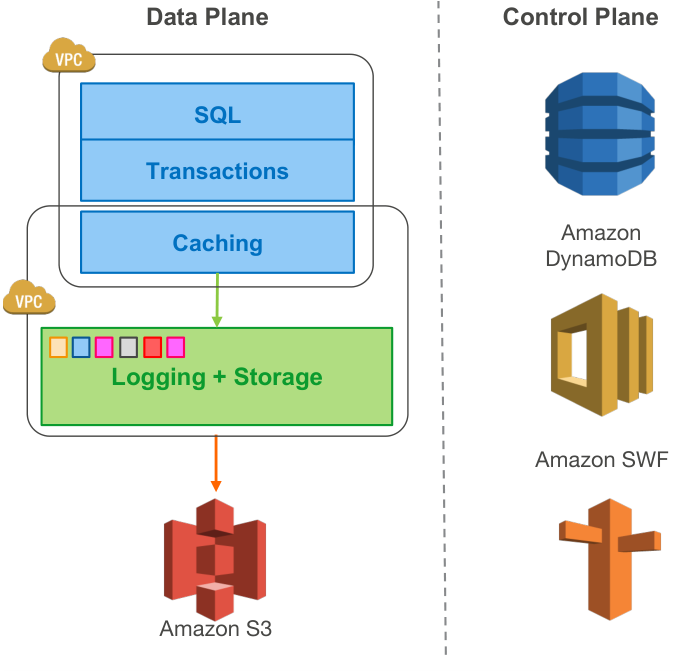

**Figure 1: Move logging and storage off the database engine｜图：将日志记录与存储移出数据库引擎**

> **图表中文解读：** 数据平面保留 SQL、事务处理与缓存，并将日志记录与存储拆分为独立服务；该存储服务向同属数据平面的 Amazon S3 写入备份。控制平面一侧显示 Amazon DynamoDB、Amazon SWF 及一个未标注服务。图的核心关系是数据库计算与日志／存储解耦。

In this paper, we describe Amazon Aurora, a new database service that addresses the above issues by more aggressively leveraging the redo log across a highly-distributed cloud environment. We use a novel service-oriented architecture (see Figure 1) with a multi-tenant scale-out storage service that abstracts a virtualized segmented redo log and is loosely coupled to a fleet of database instances. Although each instance still includes most of the components of a traditional kernel (query processor, transactions, locking, buffer cache, access methods and undo management) several functions (redo logging, durable storage, crash recovery, and backup/restore) are off-loaded to the storage service.

Our architecture has three significant advantages over traditional approaches. First, by building storage as an independent fault-tolerant and self-healing service across multiple data-centers, we protect the database from performance variance and transient or permanent failures at either the networking or storage tiers. We observe that a failure in durability can be modeled as a long-lasting availability event, and an availability event can be modeled as a long-lasting performance variation—a well-designed system can treat each of these uniformly [42]. Second, by only writing redo log records to storage, we are able to reduce network IOPS by an order of magnitude. Once we removed this bottleneck, we were able to aggressively optimize numerous other points of contention, obtaining significant throughput improvements over the base MySQL code base from which we started. Third, we move some of the most complex and critical functions (backup and redo recovery) from one-time expensive operations in the database engine to continuous asynchronous operations amortized across a large distributed fleet. This yields near-instant crash recovery without checkpointing as well as inexpensive backups that do not interfere with foreground processing.

> 本文介绍 Amazon Aurora，这是一项新的数据库服务，它通过在高度分布式的云环境中更充分地利用重做日志来解决上述问题。我们采用一种新颖的面向服务架构（见图 1）：其中，多租户横向扩展存储服务将分段式虚拟重做日志抽象出来，并与数据库实例集群松耦合。尽管每个实例仍包含传统数据库内核的大多数组件（查询处理器、事务、锁、缓冲区缓存、访问方法和撤销管理），若干功能（重做日志记录、持久化存储、崩溃恢复以及备份／还原）则被卸载到存储服务。
>
> 与传统方法相比，我们的架构具有三项显著优势。第一，通过将存储构建为跨多个数据中心、独立运行且具备容错与自愈能力的服务，我们保护数据库免受网络层或存储层性能波动以及暂时性或永久性故障的影响。我们观察到，持久性故障可建模为持续时间很长的可用性事件，而可用性事件又可建模为持续时间很长的性能波动——设计良好的系统可以统一处理三者 [42]。第二，由于只向存储写入重做日志记录，我们得以将网络 IOPS 降低一个数量级。消除这一瓶颈后，我们便能大力优化其他众多争用点，相对于起步时所基于的 MySQL 代码库取得显著的吞吐量提升。第三，我们将一些最复杂且最关键的功能（备份与重做恢复），从数据库引擎中一次性、代价高昂的操作，转变为在大型分布式集群中摊销的持续异步操作。由此，无需检查点即可实现近乎即时的崩溃恢复，同时还能获得不干扰前台处理的低成本备份。

In this paper, we describe three contributions:

> 本文阐述三项贡献：

1. How to reason about durability at cloud scale and how to design quorum systems that are resilient to correlated failures. (Section 2).

   > 如何在云规模下分析持久性，以及如何设计能够抵御相关性故障的法定人数系统。（第 2 节）

2. How to leverage smart storage by offloading the lower quarter of a traditional database to this tier. (Section 3).

   > 如何通过将传统数据库底部约四分之一的功能卸载至存储层来利用智能存储。（第 3 节）

3. How to eliminate multi-phase synchronization, crash recovery and checkpointing in distributed storage (Section 4).

   > 如何在分布式存储中消除多阶段同步、崩溃恢复与检查点机制。（第 4 节）

We then show how we bring these three ideas together to design the overall architecture of Aurora in Section 5, followed by a review of our performance results in Section 6 and the lessons we have learned in Section 7. Finally, we briefly survey related work in Section 8 and present concluding remarks in Section 9.

> 随后，我们将在第 5 节说明如何将这三项思想融为一体，以设计 Aurora 的整体架构；接着在第 6 节回顾性能结果，并在第 7 节介绍我们获得的经验。最后，第 8 节将简要评述相关工作，第 9 节给出结语。

## 2. DURABILITY AT SCALE｜云规模下的持久性

If a database system does nothing else, it must satisfy the contract that data, once written, can be read. Not all systems do. In this section, we discuss the rationale behind our quorum model, why we segment storage, and how the two, in combination, provide not only durability, availability and reduction of jitter, but also help us solve the operational issues of managing a storage fleet at scale.

> 即便数据库系统其他事情一概不做，它也必须履行这样一项基本承诺：数据一经写入，便能够被读出。然而，并非所有系统都能做到。本节将讨论我们采用这一法定人数模型的依据、为何要对存储进行分段，以及二者结合后如何不仅提供持久性、可用性并降低抖动，还帮助我们解决大规模管理存储集群时的运维问题。

### 2.1 Replication and Correlated Failures｜复制与相关性故障

Instance lifetime does not correlate well with storage lifetime. Instances fail. Customers shut them down. They resize them up and down based on load. For these reasons, it helps to decouple the storage tier from the compute tier.

Once you do so, those storage nodes and disks can also fail. They therefore must be replicated in some form to provide resiliency to failure. In a large-scale cloud environment, there is a continuous low level background noise of node, disk and network path failures. Each failure can have a different duration and a different blast radius. For example, one can have a transient lack of network availability to a node, temporary downtime on a reboot, or a permanent failure of a disk, a node, a rack, a leaf or a spine network switch, or even a data center.

One approach to tolerate failures in a replicated system is to use a quorum-based voting protocol as described in [6]. If each of the $V$ copies of a replicated data item is assigned a vote, a read or write operation must respectively obtain a read quorum of $V_r$ votes or a write quorum of $V_w$ votes. To achieve consistency, the quorums must obey two rules. First, each read must be aware of the most recent write, formulated as $V_r + V_w > V$. This rule ensures the set of nodes used for a read intersects with the set of nodes used for a write and the read quorum contains at least one location with the newest version. Second, each write must be aware of the most recent write to avoid conflicting writes, formulated as $V_w > V/2$.

> 实例的生命周期与存储的生命周期并无强相关性。实例会发生故障，客户会将其关闭，也会根据负载调高或调低实例规格。因此，将存储层与计算层解耦大有裨益。
>
> 计算与存储一旦解耦，还必须考虑存储节点和磁盘本身也会发生故障。因此，必须以某种形式复制它们，以提供抵御故障的韧性。在大规模云环境中，节点、磁盘和网络路径故障会形成持续存在的低水平背景噪声。每种故障的持续时间与影响范围各不相同。例如，某节点可能暂时无法通过网络访问，重启时可能短暂宕机；磁盘、节点、机架、叶交换机或脊交换机，乃至整个数据中心，也可能发生永久性故障。
>
> 在复制系统中容忍故障的一种方法，是采用文献 [6] 所述的基于法定人数的投票协议。若为某个复制数据项的 $V$ 份副本各分配一票，则读操作和写操作必须分别取得由 $V_r$ 票构成的读法定人数，以及由 $V_w$ 票构成的写法定人数。为实现一致性，法定人数必须遵循两条规则。第一，每次读取都必须获知最近一次写入，可表示为 $V_r + V_w > V$。该规则保证用于读取的节点集合与用于写入的节点集合相交，且读法定人数中至少有一个位置保存着最新版本。第二，为避免写入冲突，每次写入都必须获知最近一次写入，可表示为 $V_w > V/2$。

A common approach to tolerate the loss of a single node is to replicate data to ($V = 3$) nodes and rely on a write quorum of 2/3 ($V_w = 2$) and a read quorum of 2/3 ($V_r = 2$).

We believe 2/3 quorums are inadequate. To understand why, let’s first understand the concept of an Availability Zone (AZ) in AWS. An AZ is a subset of a Region that is connected to other AZs in the region through low latency links but is isolated for most faults, including power, networking, software deployments, flooding, etc. Distributing data replicas across AZs ensures that typical failure modalities at scale only impact one data replica. This implies that one can simply place each of the three replicas in a different AZ, and be tolerant to large-scale events in addition to the smaller individual failures.

However, in a large storage fleet, the background noise of failures implies that, at any given moment in time, some subset of disks or nodes may have failed and are being repaired. These failures may be spread independently across nodes in each of AZ A, B and C. However, the failure of AZ C, due to a fire, roof failure, flood, etc, will break quorum for any of the replicas that concurrently have failures in AZ A or AZ B. At that point, in a 2/3 read quorum model, we will have lost two copies and will be unable to determine if the third is up to date. In other words, while the individual failures of replicas in each of the AZs are uncorrelated, the failure of an AZ is a correlated failure of all disks and nodes in that AZ. Quorums need to tolerate an AZ failure as well as concurrently occuring background noise failures.

> 为容忍单个节点丢失，常见做法是将数据复制到三个节点（$V = 3$），并采用 2/3 的写法定人数（$V_w = 2$）和 2/3 的读法定人数（$V_r = 2$）。
>
> 我们认为，2/3 法定人数并不足够。要理解其中缘由，首先需要了解 AWS 中可用区（Availability Zone，AZ）的概念。一个可用区是某个区域（Region）的一个子集，它通过低延迟链路与该区域内其他可用区相连，但与其他可用区在电力、网络、软件部署、洪水等大多数故障模式上相互隔离。将数据副本分布到多个可用区，可以保证规模化环境中的典型故障模式只影响一份数据副本。这意味着，只需把三份副本分别放在不同的可用区中，系统除了能容忍较小的单点故障外，还能容忍大规模事件。
>
> 然而，在大型存储集群中，持续存在的故障背景噪声意味着：任意时刻都可能有一部分磁盘或节点已经故障并正在修复。这些故障可能独立地散布在可用区 A、B、C 的不同节点上。但如果可用区 C 因火灾、屋顶损坏或洪水等原因发生故障，那么，对于那些在可用区 A 或 B 中恰好同时存在故障的副本组，法定人数便会被破坏。此时，在 2/3 读法定人数模型下，我们已经丢失两份副本，因而无法判断第三份是否为最新。换言之，尽管各可用区内单个副本的故障彼此不相关，但一个可用区故障却是该可用区内所有磁盘与节点的相关性故障。法定人数必须既能容忍可用区故障，又能容忍与其同时发生的背景噪声故障。

In Aurora, we have chosen a design point of tolerating (a) losing an entire AZ and one additional node (AZ+1) without losing data, and (b) losing an entire AZ without impacting the ability to write data. We achieve this by replicating each data item 6 ways across 3 AZs with 2 copies of each item in each AZ. We use a quorum model with 6 votes ($V = 6$), a write quorum of 4/6 ($V_w = 4$), and a read quorum of 3/6 ($V_r = 3$). With such a model, we can (a) lose a single AZ and one additional node (a failure of 3 nodes) without losing read availability, and (b) lose any two nodes, including a single AZ failure and maintain write availability. Ensuring read quorum enables us to rebuild write quorum by adding additional replica copies.

> Aurora 选择的设计目标是：（a）即使丢失整个可用区外加一个节点（AZ+1），也不丢失数据；（b）即使丢失整个可用区，也不影响数据写入能力。为此，我们将每个数据项复制为六份，分布在三个可用区，每个可用区存放两份。我们采用六票法定人数模型（$V = 6$），写法定人数为 4/6（$V_w = 4$），读法定人数为 3/6（$V_r = 3$）。在这一模型下，我们可以：（a）在丢失一个可用区和另一个额外节点（共三个节点故障）时，仍保持读取可用性；（b）在任意两个节点丢失时——包括整个可用区发生故障——仍保持写入可用性。只要能够保证读法定人数，我们便可通过增加副本来重建写法定人数。

### 2.2 Segmented Storage｜分段式存储

Let’s consider the question of whether AZ+1 provides sufficient durability. To provide sufficient durability in this model, one must ensure the probability of a double fault on uncorrelated failures (Mean Time to Failure—MTTF) is sufficiently low over the time it takes to repair one of these failures (Mean Time to Repair—MTTR). If the probability of a double fault is sufficiently high, we may see these on an AZ failure, breaking quorum. It is difficult, past a point, to reduce the probability of MTTF on independent failures. We instead focus on reducing MTTR to shrink the window of vulnerability to a double fault. We do so by partitioning the database volume into small fixed size segments, currently 10GB in size. These are each replicated 6 ways into Protection Groups (PGs) so that each PG consists of six 10GB segments, organized across three AZs, with two segments in each AZ. A storage volume is a concatenated set of PGs, physically implemented using a large fleet of storage nodes that are provisioned as virtual hosts with attached SSDs using Amazon Elastic Compute Cloud (EC2). The PGs that constitute a volume are allocated as the volume grows. We currently support volumes that can grow up to 64 TB on an unreplicated basis.

> 下面考虑 AZ+1 是否能提供足够的持久性。要让这一模型具备充分的持久性，就必须保证：在修复其中一次故障所需的时间（平均修复时间，MTTR）内，由互不相关的故障引发双重故障的概率（对应平均故障间隔时间，MTTF）足够低。如果双重故障的概率较高，它就可能恰逢某个可用区发生故障，从而破坏法定人数。独立故障本身的发生概率降低到一定程度后，再继续降低就十分困难。因此，我们转而着力缩短 MTTR，以压缩系统暴露于双重故障风险之下的时间窗口。具体做法是把数据库卷划分为较小的固定大小分段，目前每段为 10 GB。每个分段复制六份，组成保护组（Protection Group，PG）；每个 PG 因而包含六个 10 GB 分段，分布在三个可用区，每个可用区两个分段。一个存储卷由多个 PG 串接而成，其物理实现依托大规模存储节点集群：这些节点使用 Amazon Elastic Compute Cloud（EC2）配置为挂载 SSD 的虚拟主机。构成卷的 PG 会随卷的增长而分配。目前，我们支持未计复制开销时最高可增长至 64 TB 的卷。

Segments are now our unit of independent background noise failure and repair. We monitor and automatically repair faults as part of our service. A 10GB segment can be repaired in 10 seconds on a 10Gbps network link. We would need to see two such failures in the same 10 second window plus a failure of an AZ not containing either of these two independent failures to lose quorum. At our observed failure rates, that’s sufficiently unlikely, even for the number of databases we manage for our customers.

> 这样一来，分段便成为背景噪声中独立故障与修复的基本单位。作为服务的一部分，我们会监控故障并自动加以修复。在 10 Gbps 网络链路上，一个 10 GB 分段可在 10 秒内修复。只有在同一个 10 秒窗口内发生两个此类故障，并且不包含这两个独立故障中任一个的可用区同时失效，我们才会丧失法定人数。按照我们观察到的故障率，即便考虑到我们为客户管理的数据库数量，这种情况也足够罕见。

### 2.3 Operational Advantages of Resilience｜韧性带来的运维优势

Once one has designed a system that is naturally resilient to long failures, it is naturally also resilient to shorter ones. A storage system that can handle the long-term loss of an AZ can also handle a brief outage due to a power event or bad software deployment requiring rollback. One that can handle a multi-second loss of availability of a member of a quorum can handle a brief period of network congestion or load on a storage node.

Since our system has a high tolerance to failures, we can leverage this for maintenance operations that cause segment unavailability. For example, **heat management** is straightforward. We can mark one of the segments on a hot disk or node as bad, and the quorum will be quickly repaired by migration to some other colder node in the fleet. **OS and security patching** is a brief unavailability event for that storage node as it is being patched. Even **software upgrades** to our storage fleet are managed this way. We execute them one AZ at a time and ensure no more than one member of a PG is being patched simultaneously. This allows us to use agile methodologies and rapid deployments in our storage service.

> 一旦系统在设计上天然能够抵御长期故障，它自然也能抵御更短暂的故障。能够应对某个可用区长期丢失的存储系统，同样可以应对因电力事件或需要回滚的错误软件部署所造成的短时中断。能够应对某个法定人数成员数秒不可用的系统，也就能应对短暂的网络拥塞或存储节点负载升高。
>
> 由于系统对故障具有很高的容忍度，我们可以利用这一特性来执行会造成分段不可用的维护操作。例如，**热点管理**非常直接：可以将热点磁盘或节点上的某个分段标记为故障，随后通过迁移到集群中另一个负载较低的节点迅速恢复法定人数。进行 **操作系统与安全补丁** 更新时，只会让正在打补丁的存储节点短暂不可用。甚至存储集群的 **软件升级** 也以这种方式管理：我们一次只升级一个可用区，并保证同一时刻一个 PG 中接受补丁更新的成员不超过一个。这使我们的存储服务能够采用敏捷方法并进行快速部署。

## 3. THE LOG IS THE DATABASE｜日志即数据库

In this section, we explain why using a traditional database on a segmented replicated storage system as described in Section 2 imposes an untenable performance burden in terms of network IOs and synchronous stalls. We then explain our approach where we offload log processing to the storage service and experimentally demonstrate how our approach can dramatically reduce network IOs. Finally, we describe various techniques we use in the storage service to minimize synchronous stalls and unnecessary writes.

> 本节首先说明，为何在第 2 节所述的分段式复制存储系统上运行传统数据库，会在网络 I/O 和同步停顿方面造成难以承受的性能负担。随后，我们将介绍把日志处理卸载到存储服务的方法，并通过实验说明该方法如何大幅减少网络 I/O。最后，我们会介绍存储服务用来尽量减少同步停顿和不必要写入的多种技术。

### 3.1 The Burden of Amplified Writes｜写放大的负担

Our model of segmenting a storage volume and replicating each segment 6 ways with a 4/6 write quorum gives us high resilience. Unfortunately, this model results in untenable performance for a traditional database like MySQL that generates many different actual I/Os for each application write. The high I/O volume is amplified by replication, imposing a heavy packets per second (PPS) burden. Also, the I/Os result in points of synchronization that stall pipelines and dilate latencies. While chain replication [8] and its alternatives can reduce network cost, they still suffer from synchronous stalls and additive latencies.

Let’s examine how writes work in a traditional database. A system like MySQL writes data pages to objects it exposes (e.g., heap files, b-trees etc.) as well as redo log records to a write-ahead log (WAL). Each redo log record consists of the difference between the after-image and the before-image of the page that was modified. A log record can be applied to the before-image of the page to produce its after-image.

> 我们将存储卷分段、把每个分段复制六份并采用 4/6 写法定人数，这一模型带来了很高的韧性。然而，对于 MySQL 这样的传统数据库而言，每次应用写入都会产生多种实际 I/O，导致该模型的性能代价难以承受。大量 I/O 又被复制进一步放大，给每秒数据包数（PPS）带来沉重压力。此外，这些 I/O 还会形成同步点，使处理流水线停顿并拉长延迟。链式复制 [8] 及其替代方案虽能降低网络成本，却依然受到同步停顿和延迟累加的困扰。
>
> 下面考察传统数据库的写入方式。MySQL 之类的系统既会把数据页写入其所管理的数据结构（例如堆文件、B 树等），也会把重做日志记录写入预写日志（WAL）。每条重做日志记录由被修改页面的后映像与前映像之差构成。将日志记录应用于页面的前映像，便可得到其后映像。

In practice, other data must also be written. For instance, consider a synchronous mirrored MySQL configuration that achieves high availability across data-centers and operates in an active-standby configuration as shown in Figure 2. There is an active MySQL instance in AZ1 with networked storage on Amazon Elastic Block Store (EBS). There is also a standby MySQL instance in AZ2, also with networked storage on EBS. The writes made to the primary EBS volume are synchronized with the standby EBS volume using software mirroring.

> 实际上，系统还必须写入其他数据。以图 2 所示的同步镜像 MySQL 配置为例：它采用主备模式运行，以实现跨数据中心的高可用。可用区 AZ1 中有一个活动 MySQL 实例，其网络存储位于 Amazon Elastic Block Store（EBS）上；可用区 AZ2 中另有一个备用 MySQL 实例，同样使用 EBS 网络存储。写入主 EBS 卷的数据通过软件镜像与备用 EBS 卷同步。

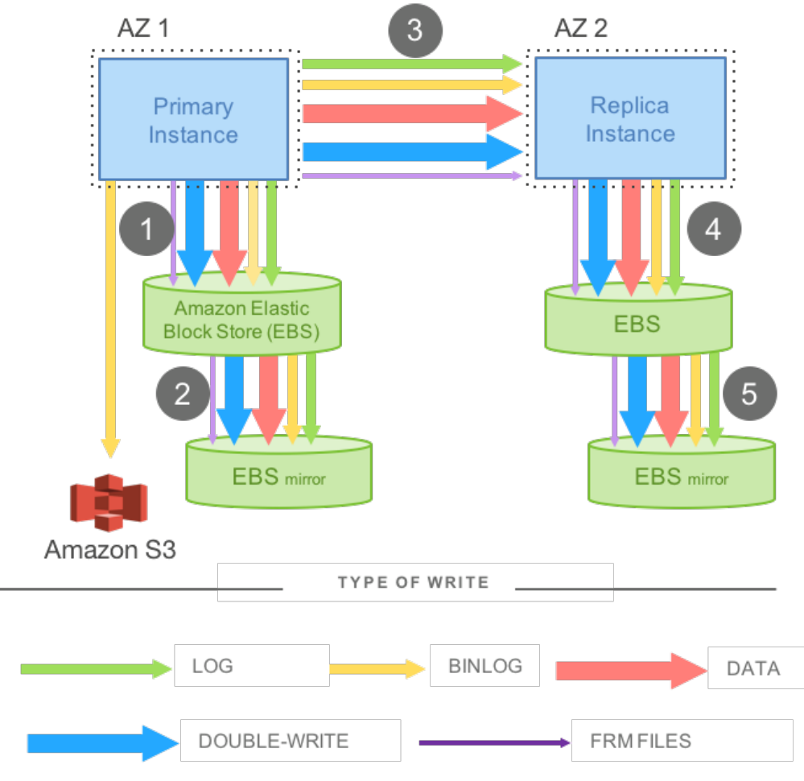

**Figure 2: Network IO in mirrored MySQL｜图：镜像 MySQL 中的网络 I/O**

> **图表中文解读：** 活动实例把重做日志、数据页、双写页和元数据等写入本可用区的 EBS 及其镜像，再通过跨可用区的软件镜像同步到备用实例，并由备用端写入另一组 EBS 及镜像；二进制日志则直接归档到 S3。一次逻辑写入因数据种类、主备复制与底层镜像而被多次放大，其中第 1、3、5 步依次执行且均为同步操作。

Figure 2 shows the various types of data that the engine needs to write: the redo log, the binary (statement) log that is archived to Amazon Simple Storage Service (S3) in order to support point-in-time restores, the modified data pages, a second temporary write of the data page (double-write) to prevent torn pages, and finally the metadata (FRM) files. The figure also shows the order of the actual IO flow as follows. In Steps 1 and 2, writes are issued to EBS, which in turn issues it to an AZ-local mirror, and the acknowledgement is received when both are done. Next, in Step 3, the write is staged to the standby instance using synchronous block-level software mirroring. Finally, in steps 4 and 5, writes are written to the standby EBS volume and associated mirror.

The mirrored MySQL model described above is undesirable not only because of how data is written but also because of what data is written. First, steps 1, 3, and 5 are sequential and synchronous. Latency is additive because many writes are sequential. Jitter is amplified because, even on asynchronous writes, one must wait for the slowest operation, leaving the system at the mercy of outliers. From a distributed system perspective, this model can be viewed as having a 4/4 write quorum, and is vulnerable to failures and outlier performance. Second, user operations that are a result of OLTP applications cause many different types of writes often representing the same information in multiple ways—for example, the writes to the double write buffer in order to prevent torn pages in the storage infrastructure.

> 图 2 展示了引擎需要写入的各种数据：重做日志；为支持时间点还原而归档到 Amazon Simple Storage Service（S3）的二进制（语句）日志；修改后的数据页；为防止页面撕裂而对数据页执行的第二次临时写入（双写）；以及最后的元数据（FRM）文件。该图还给出了实际 I/O 流程的顺序。第 1、2 步中，写入先发往 EBS，EBS 再将其发往同一可用区内的镜像，两处都完成后才返回确认。接着在第 3 步，使用同步的块级软件镜像把写入传送到备用实例。最后在第 4、5 步，写入备用 EBS 卷及其相应镜像。
>
> 上述镜像 MySQL 模型的问题，不仅在于数据如何写入，也在于写入了什么数据。第一，第 1、3、5 步依次执行且均为同步操作。大量写入串行执行，延迟因而层层累加；即使采用异步写入，也必须等待最慢的操作，抖动遂被放大，使系统受制于离群节点的表现。从分布式系统角度看，该模型相当于采用 4/4 写法定人数，因此很容易受到故障和离群性能的影响。第二，OLTP 应用所触发的用户操作会产生多种不同写入，其中常常以不同形式重复表达同一信息；例如，为避免存储基础设施中的页面撕裂而写入双写缓冲区。

### 3.2 Offloading Redo Processing to Storage｜将重做处理卸载到存储层

When a traditional database modifies a data page, it generates a redo log record and invokes a log applicator that applies the redo log record to the in-memory before-image of the page to produce its after-image. Transaction commit requires the log to be written, but the data page write may be deferred.

> 传统数据库修改数据页时，会生成一条重做日志记录，并调用日志应用器，把该重做日志记录应用于页面驻留内存的前映像，从而生成其后映像。事务提交要求日志已经写入，但数据页本身可以延后写入。

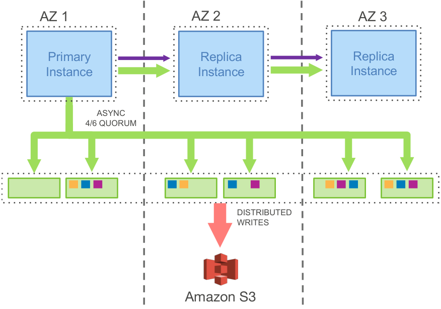

**Figure 3: Network IO in Amazon Aurora｜图：Amazon Aurora 中的网络 I/O**

> **图表中文解读：** 主实例不再跨网络写数据页，只把重做日志并行发送至分布在三个可用区的六份存储副本，收到其中四份确认即满足 4/6 写法定人数。主实例还将日志与元数据更新异步流式传给只读副本；备份则由存储层直接写入 S3，从而缩短数据库前台写路径。

In Aurora, the only writes that cross the network are redo log records. No pages are ever written from the database tier, not for background writes, not for checkpointing, and not for cache eviction. Instead, the log applicator is pushed to the storage tier where it can be used to generate database pages in background or on demand. Of course, generating each page from the complete chain of its modifications from the beginning of time is prohibitively expensive. We therefore continually materialize database pages in the background to avoid regenerating them from scratch on demand every time. Note that background materialization is entirely optional from the perspective of correctness: as far as the engine is concerned, _the log is the database_, and any pages that the storage system materializes are simply a cache of log applications. Note also that, unlike checkpointing, only pages with a long chain of modifications need to be rematerialized. Checkpointing is governed by the length of the entire redo log chain. Aurora page materialization is governed by the length of the chain for a given page.

> 在 Aurora 中，唯一跨网络写入的是重做日志记录。数据库层从不写出页面——无论是后台写入、建立检查点，还是缓存淘汰时都不会。取而代之的是，日志应用器被下推到存储层，可在后台或按需生成数据库页面。当然，如果每次都从最初开始，依据页面完整的修改链来生成页面，代价将高得难以接受。因此，我们在后台持续物化数据库页面，避免每次按需读取时都从头重新生成。需要指出的是，从正确性角度看，后台物化完全是可选的：对引擎而言，_日志即数据库_，存储系统所物化的任何页面，都不过是日志应用结果的缓存。还应注意，与检查点不同，只有修改链很长的页面才需要重新物化。检查点受整个重做日志链长度制约，而 Aurora 的页面物化只受特定页面自身修改链长度制约。

Our approach dramatically reduces network load despite amplifying writes for replication and provides performance as well as durability. The storage service can scale out I/Os in an embarrassingly parallel fashion without impacting write throughput of the database engine. For instance, Figure 3 shows an Aurora cluster with one primary instance and multiple replicas instances deployed across multiple AZs. In this model, the primary only writes log records to the storage service and streams those log records as well as metadata updates to the replica instances. The IO flow batches fully ordered log records based on a common destination (a logical segment, i.e., a PG) and delivers each batch to all 6 replicas where the batch is persisted on disk and the database engine waits for acknowledgements from 4 out of 6 replicas in order to satisfy the write quorum and consider the log records in question durable or _hardened_. The replicas use the redo log records to apply changes to their buffer caches.

> 尽管复制会放大写入，我们的方法仍能大幅降低网络负载，同时兼顾性能与持久性。存储服务可以一种高度并行、近乎天然可拆分的方式横向扩展 I/O，而不影响数据库引擎的写入吞吐量。例如，图 3 展示了一个跨多个可用区部署的 Aurora 集群，其中包含一个主实例和多个副本实例。在该模型中，主实例只向存储服务写入日志记录，同时把这些日志记录及元数据更新以流式方式发送给副本实例。I/O 流根据共同目标位置（即一个逻辑分段，也就是一个 PG），把完全有序的日志记录组成批次，并将每一批发送给全部六份副本，日志批次在各副本上持久化到磁盘。数据库引擎等待六份副本中任意四份返回确认，以满足写法定人数，并将相应日志记录视为已经持久化（即 _hardened_）。副本则使用重做日志记录，把变更应用到各自的缓冲区缓存。

To measure network I/O, we ran a test using the SysBench [9] write-only workload with a 100GB data set for both configurations described above: one with a synchronous mirrored MySQL configuration across multiple AZs and the other with RDS Aurora (with replicas across multiple AZs). In both instances, the test ran for 30 minutes against database engines running on an r3.8xlarge EC2 instance.

> 为测量网络 I/O，我们使用 SysBench [9] 的纯写工作负载和一个 100 GB 数据集，分别测试上述两种配置：一种是跨多个可用区的同步镜像 MySQL，另一种是 RDS Aurora（其副本同样跨多个可用区）。两项测试均持续 30 分钟，数据库引擎都运行在 r3.8xlarge EC2 实例上。

**Table 1: Network IOs for Aurora vs MySQL｜表：Aurora 与 MySQL 的网络 I/O 对比**

| Configuration / 配置                   | Transactions / 事务数 | IOs/Transaction / 每事务 I/O 数 |
| -------------------------------------- | --------------------: | ------------------------------: |
| Mirrored MySQL / 镜像 MySQL            |               780,000 |                             7.4 |
| Aurora with Replicas / 带副本的 Aurora |            27,378,000 |                            0.95 |

> **图表中文解读：** 在同为 30 分钟的测试中，Aurora 完成 27,378,000 个事务，约为镜像 MySQL 的 35 倍；每事务网络 I/O 从 7.4 降至 0.95，即降至约 1/7.8（减少约 87%）。这说明只传输重做日志足以抵消六路复制带来的放大，并显著释放数据库节点与存储节点的 I/O 处理能力。

The results of our experiment are summarized in Table 1. Over the 30-minute period, Aurora was able to sustain 35 times more transactions than mirrored MySQL. The number of I/Os per transaction on the database node in Aurora was 7.7 times fewer than in mirrored MySQL despite amplifying writes six times with Aurora and not counting the chained replication within EBS nor the cross-AZ writes in MySQL. Each storage node sees unamplified writes, since it is only one of the six copies, resulting in 46 times fewer I/Os requiring processing at this tier. The savings we obtain by writing less data to the network allow us to aggressively replicate data for durability and availability and issue requests in parallel to minimize the impact of jitter.

Moving processing to a storage service also improves availability by minimizing crash recovery time and eliminates jitter caused by background processes such as checkpointing, background data page writing and backups.

> 表 1 汇总了实验结果。在 30 分钟内，Aurora 所能持续处理的事务数是镜像 MySQL 的 35 倍。尽管 Aurora 通过六路复制将写入放大六倍，而且对 MySQL 的统计还未计入 EBS 内部的链式复制和跨可用区写入，Aurora 数据库节点上每事务的 I/O 数仅为镜像 MySQL 的约 1/7.7。由于每个存储节点只是六份副本中的一份，它看到的写入并未放大，因此该层需要处理的 I/O 数仅为相应比较值的约 1/46。减少经由网络写入的数据量所节省的资源，使我们能够为持久性与可用性而积极复制数据，并并行发出请求以尽量降低抖动的影响。
>
> 将处理工作移至存储服务，还能通过最大限度缩短崩溃恢复时间来提升可用性，并消除检查点、后台数据页写入和备份等后台过程引起的抖动。

Let’s examine crash recovery. In a traditional database, after a crash the system must start from the most recent checkpoint and replay the log to ensure that all persisted redo records have been applied. In Aurora, durable redo record application happens at the storage tier, continuously, asynchronously, and distributed across the fleet. Any read request for a data page may require some redo records to be applied if the page is not current. As a result, the process of crash recovery is spread across all normal foreground processing. Nothing is required at database startup.

> 下面考察崩溃恢复。传统数据库崩溃后，系统必须从最近的检查点开始重放日志，以确保所有已持久化的重做记录都得到应用。在 Aurora 中，已持久化重做记录的应用发生在存储层，并以持续、异步且分布于整个存储集群的方式进行。如果某个数据页不是最新版本，对该页的读取请求可能需要先应用若干重做记录。因此，崩溃恢复过程被摊入所有正常的前台处理中；数据库启动时无需执行任何恢复工作。

### 3.3 Storage Service Design Points｜存储服务的设计要点

A core design tenet for our storage service is to minimize the latency of the foreground write request. We move the majority of storage processing to the background. Given the natural variability between peak to average foreground requests from the storage tier, we have ample time to perform these tasks outside the foreground path. We also have the opportunity to trade CPU for disk. For example, it isn’t necessary to run garbage collection (GC) of old page versions when the storage node is busy processing foreground write requests unless the disk is approaching capacity. In Aurora, background processing has negative correlation with foreground processing. This is unlike a traditional database, where background writes of pages and checkpointing have positive correlation with the foreground load on the system. If we build up a backlog on the system, we will throttle foreground activity to prevent a long queue buildup. Since segments are placed with high entropy across the various storage nodes in our system, throttling at one storage node is readily handled by our 4/6 quorum writes, appearing as a slow node.

> 我们存储服务的一项核心设计原则，是尽量降低前台写请求的延迟。为此，我们把绝大多数存储处理移到后台。由于存储层前台请求的峰值与平均值之间天然存在波动，系统有充足时间在前台路径之外完成这些任务。我们也有机会以 CPU 换取磁盘资源。例如，当存储节点正忙于处理前台写请求时，除非磁盘容量已接近上限，否则没有必要对旧页面版本执行垃圾回收（GC）。在 Aurora 中，后台处理与前台处理负相关；这不同于传统数据库，后者的后台页面写入和检查点操作与系统前台负载正相关。如果系统积累了待处理任务，我们会节流前台活动，防止形成过长队列。由于分段以高熵方式分散放置在系统的各个存储节点上，单个存储节点上的节流只会表现为一个慢节点，4/6 法定人数写入可以轻松应对。

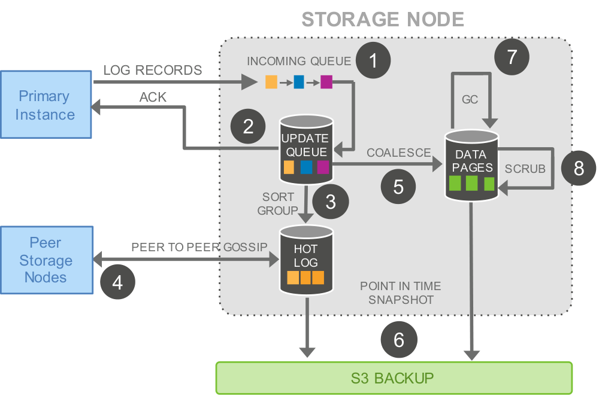

**Figure 4: IO Traffic in Aurora Storage Nodes｜图：Aurora 存储节点中的 I/O 流量**

> **图表中文解读：** 图中编号 1–8 对应正文列出的完整处理流水线，所有步骤均异步执行；其中只有第 1 步“加入内存队列”和第 2 步“落盘并确认”位于可能影响延迟的前台路径。缺口检测、节点间 gossip 补全、日志合并成数据页、S3 备份、旧版本回收和页面校验均在后台进行。

Let’s examine the various activities on the storage node in more detail. As seen in Figure 4, it involves the following steps: (1) receive log record and add to an in-memory queue, (2) persist record on disk and acknowledge, (3) organize records and identify gaps in the log since some batches may be lost, (4) gossip with peers to fill in gaps, (5) coalesce log records into new data pages, (6) periodically stage log and new pages to S3, (7) periodically garbage collect old versions, and finally (8) periodically validate CRC codes on pages.

Note that not only are each of the steps above asynchronous, only steps (1) and (2) are in the foreground path potentially impacting latency.

> 下面更细致地考察存储节点上的各项活动。如图 4 所示，其中包括以下步骤：（1）接收日志记录并加入内存队列；（2）将记录持久化到磁盘并返回确认；（3）整理记录并识别日志中的缺口，因为某些批次可能丢失；（4）通过与对等节点进行 gossip 来填补缺口；（5）将日志记录合并为新的数据页；（6）定期把日志和新页面暂存到 S3；（7）定期回收旧版本；最后，（8）定期验证页面的 CRC 校验码。
>
> 需要注意的是，上述各个步骤不仅都是异步的，而且只有第（1）和第（2）步位于可能影响延迟的前台路径上。

## 4. THE LOG MARCHES FORWARD｜日志不断向前推进

In this section, we describe how the log is generated from the database engine so that the durable state, the runtime state, and the replica state are always consistent. In particular, we will describe how consistency is implemented efficiently without an expensive 2PC protocol. First, we show how we avoid expensive redo processing on crash recovery. Next, we explain normal operation and how we maintain runtime and replica state. Finally, we provide details of our recovery process.

> 本节说明数据库引擎如何生成日志，从而使持久状态、运行时状态与副本状态始终保持一致。具体而言，我们将阐述如何在不采用昂贵的两阶段提交（2PC）协议的情况下高效实现一致性。首先，我们说明如何避免在崩溃恢复期间执行代价高昂的重做处理；随后解释系统的正常运行过程，以及如何维护运行时状态和副本状态；最后给出恢复流程的具体细节。

### 4.1 Solution sketch: Asynchronous Processing｜方案概述：异步处理

Since we model the database as a redo log stream (as described in Section 3), we can exploit the fact that the log advances as an ordered sequence of changes. In practice, each log record has an associated Log Sequence Number (LSN) that is a monotonically increasing value generated by the database.

This lets us simplify a consensus protocol for maintaining state by approaching the problem in an asynchronous fashion instead of using a protocol like 2PC which is chatty and intolerant of failures. At a high level, we maintain points of consistency and durability, and continually advance these points as we receive acknowledgements for outstanding storage requests. Since any individual storage node might have missed one or more log records, they gossip with the other members of their PG, looking for gaps and fill in the holes. The runtime state maintained by the database lets us use single segment reads rather than quorum reads except on recovery when the state is lost and has to be rebuilt.

> 由于我们把数据库建模为一条重做日志流（如第 3 节所述），因而可以利用这样一个事实：日志会以有序的变更序列不断向前推进。在实际系统中，每条日志记录都带有一个由数据库生成、单调递增的日志序列号（Log Sequence Number，LSN）。
>
> 这使我们得以用异步方式处理状态维护问题，从而简化共识协议，而无须采用 2PC 这类通信频繁且难以容忍故障的协议。从整体上看，我们维护若干一致性点和持久性点；每当收到尚未完成的存储请求的确认，就不断推进这些点。任何一个存储节点都可能漏收一条或多条日志记录，因此它会与所属保护组（PG）的其他成员通过 gossip 通信，查找日志缺口并补齐缺失记录。数据库所维护的运行时状态，使正常情况下可以只读取单个分段，而不必执行法定人数读取；只有在恢复时，原有状态已经丢失并需要重建，才会使用法定人数读取。

The database may have multiple outstanding isolated transactions, which can complete (reach a finished and durable state) in a different order than initiated. Supposing the database crashes or reboots, the determination of whether to roll back is separate for each of these individual transactions. The logic for tracking partially completed transactions and undoing them is kept in the database engine, just as if it were writing to simple disks. However, upon restart, before the database is allowed to access the storage volume, the storage service does its own recovery which is focused not on user-level transactions, but on making sure that the database sees a uniform view of storage despite its distributed nature.

The storage service determines the highest LSN for which it can guarantee availability of all prior log records (this is known as the VCL or Volume Complete LSN). During storage recovery, every log record with an LSN larger than the VCL must be truncated. The database can, however, further constrain a subset of points that are allowable for truncation by tagging log records and identifying them as CPLs or Consistency Point LSNs. We therefore define VDL or the Volume Durable LSN as the highest CPL that is smaller than or equal to VCL and truncate all log records with LSN greater than the VDL. For example, even if we have the complete data up to LSN 1007, the database may have declared that only 900, 1000, and 1100 are CPLs, in which case, we must truncate at 1000. We are _complete_ to 1007, but only _durable_ to 1000.

> 数据库中可能同时存在多个尚未完成、彼此隔离的事务，它们完成——即到达结束且持久的状态——的顺序可以不同于启动顺序。假设数据库发生崩溃或重启，是否回滚需要针对每个事务分别判断。跟踪部分完成的事务并撤销其操作的逻辑仍保留在数据库引擎中，就像数据库面对普通磁盘写入时一样。不过，系统重新启动后，在允许数据库访问存储卷之前，存储服务会先执行自身的恢复。该恢复并不关注用户级事务，而是要确保即便底层存储是分布式的，数据库看到的仍是统一一致的存储视图。
>
> 存储服务会确定这样一个最高 LSN：它能够保证截至该 LSN（含）之前的所有日志记录均可获得。这个点称为 VCL，即卷完整 LSN（Volume Complete LSN）。存储恢复期间，凡是 LSN 大于 VCL 的日志记录都必须截断。不过，数据库还可以给日志记录加上标记，把其中一部分标识为 CPL，即一致性点 LSN（Consistency Point LSN），从而进一步限制允许执行截断的位置。因此，我们把 VDL，即卷持久 LSN（Volume Durable LSN），定义为小于或等于 VCL 的最高 CPL，并截断所有 LSN 大于 VDL 的日志记录。例如，即使数据已经完整到 LSN 1007，数据库也可能声明只有 900、1000 和 1100 是 CPL；此时必须截去所有 LSN 大于 1000 的记录。换言之，系统完整到 LSN 1007，但只持久到 LSN 1000。

Completeness and durability are therefore different and a CPL can be thought of as delineating some limited form of storage system transaction that must be accepted in order. If the client has no use for such distinctions, it can simply mark every log record as a CPL. In practice, the database and storage interact as follows:

> 因而，完整性与持久性是两个不同的概念；可以把 CPL 理解为某种有限形式的存储系统事务边界，这类事务必须按顺序接受。如果客户端不需要区分二者，只需把每条日志记录都标记为 CPL。实际系统中，数据库与存储按如下方式交互：

1. Each database-level transaction is broken up into multiple mini-transactions (MTRs) that are ordered and must be performed atomically.

   > 每个数据库级事务都会拆分成多个有序且必须原子执行的迷你事务（mini-transaction，MTR）。

2. Each mini-transaction is composed of multiple contiguous log records (as many as needed).

   > 每个迷你事务由多条连续的日志记录组成，数量以实际需要为准。

3. The final log record in a mini-transaction is a CPL.

   > 迷你事务的最后一条日志记录是一个 CPL。

On recovery, the database talks to the storage service to establish the durable point of each PG and uses that to establish the VDL and then issue commands to truncate the log records above VDL.

> 恢复时，数据库与存储服务通信，确定每个 PG 的持久点，据此确定 VDL，随后发出命令，截断 VDL 之后的日志记录。

### 4.2 Normal Operation｜正常运行

We now describe the “normal operation” of the database engine and focus in turn on writes, reads, commits, and replicas.

> 下面介绍数据库引擎的“正常运行”过程，并依次讨论写入、读取、提交和副本。

> **译注：** 本句原文依次列出 writes、reads、commits、replicas，但随后小节的实际顺序是 Writes、Commits、Reads、Replicas；英文按 PDF 保留。

#### 4.2.1 Writes｜写入

In Aurora, the database continuously interacts with the storage service and maintains state to establish quorum, advance volume durability, and register transactions as committed. For instance, in the normal/forward path, as the database receives acknowledgements to establish the write quorum for each batch of log records, it advances the current VDL. At any given moment, there can be a large number of concurrent transactions active in the database, each generating their own redo log records. The database allocates a unique ordered LSN for each log record subject to a constraint that no LSN is allocated with a value that is greater than the sum of the current VDL and a constant called the LSN Allocation Limit (LAL) (currently set to 10 million). This limit ensures that the database does not get too far ahead of the storage system and introduces back-pressure that can throttle the incoming writes if the storage or network cannot keep up.

> 在 Aurora 中，数据库持续与存储服务交互并维护相应状态，以形成法定人数、推进卷的持久位置，并把事务登记为已提交。例如，在正常的前向处理路径中，数据库每收到一批日志记录达到写法定人数所需的确认，就会推进当前 VDL。任一时刻，数据库中都可能活跃着大量并发事务，各自生成自己的重做日志记录。数据库为每条日志记录分配唯一且有序的 LSN，但要满足一项约束：所分配的 LSN 不得大于当前 VDL 与一个名为 LSN 分配上限（LSN Allocation Limit，LAL）的常量之和；该常量目前设为一千万。这个上限可防止数据库领先存储系统过多，并形成反压机制：如果存储或网络跟不上，就会限制进入系统的写入。

Note that each segment of each PG only sees a subset of log records in the volume that affect the pages residing on that segment. Each log record contains a backlink that identifies the previous log record for that PG. These backlinks can be used to track the point of completeness of the log records that have reached each segment to establish a Segment Complete LSN (SCL) that identifies the greatest LSN below which all log records of the PG have been received. The SCL is used by the storage nodes when they gossip with each other in order to find and exchange log records that they are missing.

> 需要注意，每个 PG 的各个分段只能看到卷内会影响该分段所驻留页面的那部分日志记录。每条日志记录都包含一个反向链接，用来标识该 PG 的上一条日志记录。利用这些反向链接，可以追踪到达各分段的日志记录已经完整到什么位置，进而建立分段完整 LSN（Segment Complete LSN，SCL）。SCL 所标识的是这样一个最大 LSN：在它之前，该 PG 的所有日志记录都已收到。存储节点彼此进行 gossip 通信时，会利用 SCL 查找并交换各自缺失的日志记录。

#### 4.2.2 Commits｜提交

In Aurora, transaction commits are completed asynchronously. When a client commits a transaction, the thread handling the commit request sets the transaction aside by recording its “commit LSN” as part of a separate list of transactions waiting on commit and moves on to perform other work. The equivalent to the WAL protocol is based on completing a commit, if and only if, the latest VDL is greater than or equal to the transaction’s commit LSN. As the VDL advances, the database identifies qualifying transactions that are waiting to be committed and uses a dedicated thread to send commit acknowledgements to waiting clients. Worker threads do not pause for commits, they simply pull other pending requests and continue processing.

> 在 Aurora 中，事务提交以异步方式完成。当客户端提交事务时，处理提交请求的线程会记录该事务的“提交 LSN”，把事务放入一份单独的待提交事务列表，随后转去执行其他工作。与 WAL 协议等价的规则是：当且仅当最新 VDL 大于或等于事务的提交 LSN 时，提交才算完成。随着 VDL 向前推进，数据库会找出列表中已经满足提交条件的事务，并由专用线程向等待中的客户端发送提交确认。工作线程不会因为提交而停顿；它们只需取出其他待处理请求，继续工作。

#### 4.2.3 Reads｜读取

In Aurora, as with most databases, pages are served from the buffer cache and only result in a storage IO request if the page in question is not present in the cache.

If the buffer cache is full, the system finds a victim page to evict from the cache. In a traditional system, if the victim is a “dirty page” then it is flushed to disk before replacement. This is to ensure that a subsequent fetch of the page always results in the latest data. While the Aurora database does not write out pages on eviction (or anywhere else), it enforces a similar guarantee: a page in the buffer cache must always be of the latest version. The guarantee is implemented by evicting a page from the cache only if its “page LSN” (identifying the log record associated with the latest change to the page) is greater than or equal to the VDL. This protocol ensures that: (a) all changes in the page have been hardened in the log, and (b) on a cache miss, it is sufficient to request a version of the page as of the current VDL to get its latest durable version.

> 与大多数数据库一样，Aurora 优先从缓冲池提供页面；只有所需页面不在缓存中时，才会产生存储 I/O 请求。
>
> 如果缓冲池已满，系统会选择一个牺牲页并将其逐出缓存。在传统系统中，若牺牲页是“脏页”，就必须先把它刷写到磁盘再予以替换，以确保日后再次读取该页时总能得到最新数据。Aurora 数据库在逐出页面时——事实上在任何时候——都不会把页面写回存储，但它实施了类似的保证：缓冲池中的页面必须始终是最新版本。具体做法是，只有当某个页面的“页面 LSN”（标识与该页面最近一次变更对应的日志记录）大于或等于 VDL 时，才允许把它逐出缓存。该协议保证：(a) 页面中的所有变更都已固化到日志中；(b) 缓存未命中时，只需请求截至当前 VDL 的页面版本，就能得到该页面最新的持久版本。

> **译注：** 原文写作 page LSN “greater than or equal to” VDL，但这与随后“页面全部变更已经在日志中固化”的解释存在表面矛盾；从定义看疑似应为“小于或等于”。英文与直译均按 PDF 保留。

The database does not need to establish consensus using a read quorum under normal circumstances. When reading a page from disk, the database establishes a _read-point_, representing the VDL at the time the request was issued. The database can then select a storage node that is _complete_ with respect to the read point, knowing that it will therefore receive an up to date version. A page that is returned by the storage node must be consistent with the expected semantics of a mini-transaction (MTR) in the database. Since the database directly manages feeding log records to storage nodes and tracking progress (i.e., the SCL of each segment), it normally knows which segment is capable of satisfying a read (the segments whose SCL is greater than the read-point) and thus can issue a read request directly to a segment that has sufficient data.

Given that the database is aware of all outstanding reads, it can compute at any time the Minimum Read Point LSN on a per-PG basis. If there are read replicas the writer gossips with them to establish the per-PG Minimum Read Point LSN across all nodes. This value is called the Protection Group Min Read Point LSN (PGMRPL) and represents the “low water mark” below which all the log records of the PG are unnecessary. In other words, a storage node segment is guaranteed that there will be no read page requests with a read-point that is lower than the PGMRPL. Each storage node is aware of the PGMRPL from the database and can, therefore, advance the materialized pages on disk by coalescing the older log records and then safely garbage collecting them.

> 正常情况下，数据库不需要通过读法定人数来建立共识。从磁盘读取页面时，数据库会建立一个“读取点”，表示请求发出时的 VDL。随后，数据库可以选择一个相对于该读取点已经“完整”的存储节点，因为它知道该节点能够返回最新版本。存储节点返回的页面必须符合数据库对迷你事务（MTR）语义的预期。由于数据库直接负责向存储节点发送日志记录并追踪进度——也就是每个分段的 SCL——因此通常知道哪些分段能够满足此次读取，即 SCL 大于读取点的分段；于是可以把读取请求直接发给数据已经足够完整的某个分段。
>
> 由于数据库掌握所有尚未完成的读取，它可以随时按 PG 计算最小读取点 LSN。若存在只读副本，写入节点会与这些副本进行 gossip 通信，确定所有节点在每个 PG 上的最小读取点 LSN。该值称为保护组最小读取点 LSN（Protection Group Min Read Point LSN，PGMRPL），它代表一个“低水位线”：低于该位置的 PG 日志记录都已不再需要。换言之，存储节点上的某个分段可以确信，不会再有读取点低于 PGMRPL 的页面读取请求。各存储节点会从数据库获知 PGMRPL，因而能够通过合并较旧的日志记录来推进磁盘上已物化的页面，随后安全地对旧日志执行垃圾回收。

The actual concurrency control protocols are executed in the database engine exactly as though the database pages and undo segments are organized in local storage as with traditional MySQL.

> 实际的并发控制协议完全在数据库引擎中执行，其方式与传统 MySQL 无异，仿佛数据库页面和撤销分段仍组织在本地存储中。

#### 4.2.4 Replicas｜副本

In Aurora, a single writer and up to 15 read replicas can all mount a single shared storage volume. As a result, read replicas add no additional costs in terms of consumed storage or disk write operations. To minimize lag, the log stream generated by the writer and sent to the storage nodes is also sent to all read replicas. In the reader, the database consumes this log stream by considering each log record in turn. If the log record refers to a page in the reader's buffer cache, it uses the log applicator to apply the specified redo operation to the page in the cache. Otherwise it simply discards the log record. Note that the replicas consume log records asynchronously from the perspective of the writer, which acknowledges user commits independent of the replica. The replica obeys the following two important rules while applying log records: (a) the only log records that will be applied are those whose LSN is less than or equal to the VDL, and (b) the log records that are part of a single mini-transaction are applied atomically in the replica's cache to ensure that the replica sees a consistent view of all database objects. In practice, each replica typically lags behind the writer by a short interval (20 ms or less).

> 在 Aurora 中，一个写入节点与最多 15 个只读副本可以共同挂载同一个共享存储卷。因此，从存储占用和磁盘写操作来看，只读副本不会带来额外成本。为了尽量缩小延迟，写入节点生成并发送给存储节点的日志流，也会同时发送给所有只读副本。在只读副本上，数据库依次检查并消费日志流中的每条日志记录。如果日志记录涉及只读副本缓冲池中的某个页面，就由日志应用器把指定的重做操作施加到缓存页面；否则直接丢弃这条日志记录。需要注意的是，从写入节点的角度看，副本是异步消费日志记录的；写入节点确认用户提交时并不依赖副本。副本应用日志记录时遵守两条重要规则：(a) 只有 LSN 小于或等于 VDL 的日志记录才会被应用；(b) 属于同一迷你事务的日志记录必须原子地应用到副本缓存中，以保证副本看到所有数据库对象的一致视图。实际运行中，每个副本通常只比写入节点落后很短的时间，一般不超过 20 毫秒。

### 4.3 Recovery｜恢复

Most traditional databases use a recovery protocol such as ARIES [7] that depends on the presence of a write-ahead log (WAL) that can represent the precise contents of all committed transactions. These systems also periodically checkpoint the database to establish points of durability in a coarse-grained fashion by flushing dirty pages to disk and writing a checkpoint record to the log. On restart, any given page can either miss some committed data or contain uncommitted data. Therefore, on crash recovery the system processes the redo log records since the last checkpoint by using the log applicator to apply each log record to the relevant database page. This process brings the database pages to a consistent state at the point of failure after which the in-flight transactions during the crash can be rolled back by executing the relevant undo log records. Crash recovery can be an expensive operation. Reducing the checkpoint interval helps, but at the expense of interference with foreground transactions. No such tradeoff is required with Aurora.

> 大多数传统数据库采用 ARIES [7] 一类恢复协议，它依赖预写日志（write-ahead log，WAL）来精确表示所有已提交事务的内容。这类系统还会周期性地为数据库建立检查点：把脏页刷写到磁盘，并在日志中写入一条检查点记录，以较粗的粒度建立持久点。系统重新启动时，任意页面都可能缺少某些已经提交的数据，也可能包含尚未提交的数据。因此，崩溃恢复期间，系统要处理上一个检查点之后的重做日志记录，通过日志应用器把每条记录施加到相应的数据库页面。该过程先把数据库页面恢复到故障发生时的一致状态，随后再执行相应的撤销日志记录，回滚崩溃时仍在进行的事务。崩溃恢复可能代价高昂。缩短检查点间隔虽有帮助，却会加剧对前台事务的干扰；Aurora 不需要作出这种取舍。

A great simplifying principle of a traditional database is that the same redo log applicator is used in the forward processing path as well as on recovery where it operates synchronously and in the foreground while the database is offline. We rely on the same principle in Aurora as well, except that the redo log applicator is decoupled from the database and operates on storage nodes, in parallel, and all the time in the background. Once the database starts up it performs volume recovery in collaboration with the storage service and as a result, an Aurora database can recover very quickly (generally under 10 seconds) even if it crashed while processing over 100,000 write statements per second.

The database does need to reestablish its runtime state after a crash. In this case, it contacts for each PG, a read quorum of segments which is sufficient to guarantee discovery of any data that could have reached a write quorum. Once the database has established a read quorum for every PG it can recalculate the VDL above which data is truncated by generating a truncation range that annuls every log record after the new VDL, up to and including an end LSN which the database can prove is at least as high as the highest possible outstanding log record that could ever have been seen. The database infers this upper bound because it allocates LSNs, and limits how far allocation can occur above VDL (the 10 million limit described earlier). The truncation ranges are versioned with epoch numbers, and written durably to the storage service so that there is no confusion over the durability of truncations in case recovery is interrupted and restarted.

> 传统数据库有一项极具简化作用的原则：前向处理和恢复使用同一个重做日志应用器；恢复时数据库处于离线状态，日志应用器在前台同步运行。Aurora 也遵循同一原则，区别在于重做日志应用器已经与数据库解耦，部署在存储节点上，以并行方式持续在后台运行。数据库启动后，会与存储服务协同执行卷恢复。因此，即使 Aurora 数据库是在每秒处理超过十万条写语句时发生崩溃，通常也能在 10 秒以内迅速恢复。
>
> 不过，数据库在崩溃后确实需要重新建立运行时状态。为此，它会针对每个 PG 联系构成读法定人数的一组分段；这足以保证发现任何可能已经达到写法定人数的数据。数据库为每个 PG 建立读法定人数后，就能重新计算 VDL，并截断该位置之后的数据。具体做法是生成一个截断区间，使新 VDL 之后、直至并包括某个结束 LSN 的所有日志记录失效；数据库能够证明，这个结束 LSN 至少不低于任何可能出现过的、尚未完成的最高日志记录。数据库之所以能推导出该上界，是因为 LSN 由它分配，而且 VDL 之上的分配距离受到限制——即前述一千万的上限。截断区间带有纪元编号作为版本，并被持久写入存储服务；这样，即便恢复过程被打断后重新启动，也不会对截断操作是否持久产生歧义。

The database still needs to perform undo recovery to unwind the operations of in-flight transactions at the time of the crash. However, undo recovery can happen when the database is online after the system builds the list of these in-flight transactions from the undo segments.

> 数据库仍需执行撤销恢复，以回退崩溃时尚在进行的事务所做的操作。不过，系统从撤销分段中建立这些进行中事务的列表之后，撤销恢复可以在数据库已经上线的情况下进行。

## 5. PUTTING IT ALL TOGETHER｜汇总全貌

In this section, we describe the building blocks of Aurora as shown with a bird’s eye view in Figure 5.

> 本节结合图 5 的全景视图，介绍构成 Aurora 的各个基本模块。

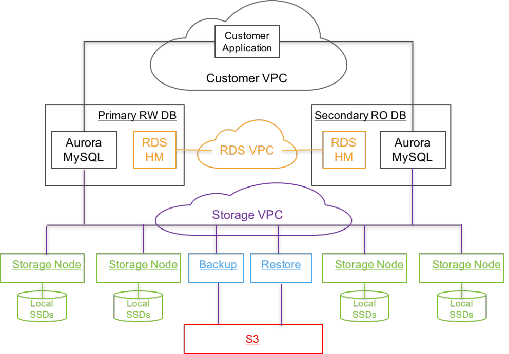

**Figure 5: Aurora Architecture: A Bird's Eye View｜图：Aurora 架构鸟瞰图。**

> **图表中文解读：** 图中自上而下呈现 Aurora 的三层协作关系。客户应用通过客户 VPC 连接主读写数据库或辅助只读数据库；数据库实例内部仍运行 Aurora MySQL 和 RDS Host Manager，并通过 RDS VPC 接受控制面的管理。数据库实例经独立的 Storage VPC 访问跨节点部署的存储服务；每个存储节点使用本地 SSD，备份服务持续把变更写入 Amazon S3，恢复服务则按需从 S3 取回数据。图中的网络隔离也说明：客户流量、RDS 管理流量和数据库—存储流量分别位于不同 VPC 中。

The database engine is a fork of “community” MySQL/InnoDB and diverges primarily in how InnoDB reads and writes data to disk. In community InnoDB, a write operation results in data being modified in buffer pages, and the associated redo log records written to buffers of the WAL in LSN order. On transaction commit, the WAL protocol requires only that the redo log records of the transaction are durably written to disk. The actual modified buffer pages are also written to disk eventually through a double-write technique to avoid partial page writes. These page writes take place in the background, or during eviction from the cache, or while taking a checkpoint. In addition to the IO Subsystem, InnoDB also includes the transaction subsystem, the lock manager, a B+-Tree implementation and the associated notion of a “mini transaction” (MTR). An MTR is a construct only used inside InnoDB and models groups of operations that must be executed atomically (e.g., split/merge of B+-Tree pages).

> Aurora 的数据库引擎派生自“社区版”MySQL/InnoDB，二者最主要的差异在于 InnoDB 读写磁盘数据的方式。在社区版 InnoDB 中，一次写操作会修改缓冲页，同时按照 LSN 顺序把相应的重做日志记录写入 WAL 缓冲区。事务提交时，WAL 协议只要求该事务的重做日志记录已经持久写盘。实际修改过的缓冲页最终也会写入磁盘，并通过双写技术避免页面只写入一部分。这些页面写入可能发生在后台，也可能发生在缓存逐出或创建检查点时。除 I/O 子系统外，InnoDB 还包括事务子系统、锁管理器、B+ 树实现，以及与之相关的“迷你事务”（MTR）概念。MTR 是 InnoDB 内部专用的结构，用来表示必须原子执行的一组操作，例如 B+ 树页面的分裂或合并。

In the Aurora InnoDB variant, the redo log records representing the changes that must be executed atomically in each MTR are organized into batches that are sharded by the PGs each log record belongs to, and these batches are written to the storage service. The final log record of each MTR is tagged as a consistency point. Aurora supports exactly the same isolation levels that are supported by community MySQL in the writer (the standard ANSI levels and Snapshot Isolation or consistent reads). Aurora read replicas get continuous information on transaction starts and commits in the writer and use this information to support snapshot isolation for local transactions that are of course read-only. Note that concurrency control is implemented entirely in the database engine without impacting the storage service. The storage service presents a unified view of the underlying data that is logically identical to what you would get by writing the data to local storage in community InnoDB.

> 在 Aurora 的 InnoDB 变体中，表示每个 MTR 内必须原子执行之变更的重做日志记录会被组织成批次，并按照每条日志记录所属的 PG 分片，然后把这些批次写入存储服务。每个 MTR 的最后一条日志记录都会标记为一致性点。对于写入节点，Aurora 支持与社区版 MySQL 完全相同的隔离级别，包括标准 ANSI 隔离级别，以及快照隔离或一致性读。Aurora 只读副本会持续获得写入节点上事务开始与提交的信息，并以此为本地事务——当然只能是只读事务——提供快照隔离。需要注意，并发控制完全由数据库引擎实现，不会影响存储服务。存储服务提供统一的底层数据视图；从逻辑上说，这与社区版 InnoDB 把数据写入本地存储后所得到的视图完全相同。

Aurora leverages Amazon Relational Database Service (RDS) for its control plane. RDS includes an agent on the database instance called the Host Manager (HM) that monitors a cluster’s health and determines if it needs to fail over, or if an instance needs to be replaced. Each database instance is part of a cluster that consists of a single writer and zero or more read replicas. The instances of a cluster are in a single geographical region (e.g., us-east-1, us-west-1 etc.), are typically placed in different AZs, and connect to a storage fleet in the same region. For security, we isolate the communication between the database, applications and storage. In practice, each database instance can communicate on three Amazon Virtual Private Cloud (VPC) networks: the customer VPC through which customer applications interact with the engine, the RDS VPC through which the database engine and control plane interact with each other, and the Storage VPC through which the database interacts with storage services.

> Aurora 使用 Amazon Relational Database Service（RDS）作为控制面。RDS 在数据库实例上运行一个称为 Host Manager（HM）的代理，用来监控集群健康状态，并判断是否需要执行故障转移或更换实例。每个数据库实例都属于某个集群；一个集群由单个写入节点和零个或多个只读副本组成。集群内的实例位于同一地理区域（例如 us-east-1、us-west-1 等），通常分布在不同的可用区，并连接到同一区域内的存储节点集群。出于安全考虑，我们隔离数据库、应用程序和存储之间的通信。实践中，每个数据库实例可通过三个 Amazon Virtual Private Cloud（VPC）网络进行通信：客户应用与数据库引擎交互所用的客户 VPC，数据库引擎与控制面交互所用的 RDS VPC，以及数据库与存储服务交互所用的 Storage VPC。

The storage service is deployed on a cluster of EC2 VMs that are provisioned across at least 3 AZs in each region and is collectively responsible for provisioning multiple customer storage volumes, reading and writing data to and from those volumes, and backing up and restoring data from and to those volumes. The storage nodes manipulate local SSDs and interact with database engine instances, other peer storage nodes, and the backup/restore services that continuously backup changed data to S3 and restore data from S3 as needed. The storage control plane uses the Amazon DynamoDB database service for persistent storage of cluster and storage volume configuration, volume metadata, and a detailed description of data backed up to S3. For orchestrating long-running operations, e.g. a database volume restore operation or a repair (re-replication) operation following a storage node failure, the storage control plane uses the Amazon Simple Workflow Service. Maintaining a high level of availability requires pro-active, automated, and early detection of real and potential problems, before end users are impacted. All critical aspects of storage operations are constantly monitored using metric collection services that raise alarms if key performance or availability metrics indicate a cause for concern.

> 存储服务部署在 EC2 虚拟机集群上；每个区域中的这些虚拟机横跨至少 3 个可用区，共同负责为多个客户配置存储卷、读写卷中的数据，以及备份和恢复这些数据。存储节点操作本地 SSD，并与数据库引擎实例、其他对等存储节点以及备份/恢复服务交互；备份/恢复服务会持续把发生变更的数据备份到 S3，并在需要时从 S3 恢复数据。存储控制面使用 Amazon DynamoDB 数据库服务，持久保存集群与存储卷配置、卷元数据，以及已经备份到 S3 的数据的详细描述。对于数据库卷恢复，或存储节点故障后的修复（重新复制）等长时间运行的操作，存储控制面使用 Amazon Simple Workflow Service 进行编排。维持高可用性，需要在最终用户受到影响之前，主动、自动、尽早地发现现实问题和潜在问题。系统持续使用指标收集服务监控存储操作的所有关键环节；一旦关键性能或可用性指标显露隐患，就会触发告警。

## 6. PERFORMANCE RESULTS｜性能结果

In this section, we will share our experiences in running Aurora as a production service that was made “Generally Available” in July 2015. We begin with a summary of results running industry standard benchmarks and then present some performance results from our customers.

> 本节分享 Aurora 作为生产服务运行以来的实践经验。Aurora 于 2015 年 7 月达到“正式可用”（Generally Available，GA）状态。我们先汇总业界标准基准测试的结果，再介绍部分客户工作负载取得的性能结果。

### 6.1 Results with Standard Benchmarks｜标准基准测试结果

Here we present results of different experiments that compare the performance of Aurora and MySQL using industry standard benchmarks such as SysBench and TPC-C variants. We ran MySQL on instances that are attached to an EBS volume with 30K provisioned IOPS. Except when stated otherwise, these are r3.8xlarge EC2 instances with 32 vCPUs and 244GB of memory and features the Intel Xeon E5-2670 v2 (Ivy Bridge) processors. The buffer cache on the r3.8xlarge is set to 170GB.

> 下面给出多组实验结果，使用 SysBench 和 TPC-C 变体等业界标准基准，对 Aurora 与 MySQL 的性能进行比较。运行 MySQL 的实例连接到配置了 30K 预置 IOPS 的 EBS 卷。除非另有说明，实验均使用 r3.8xlarge EC2 实例：32 个 vCPU、244GB 内存，并配备 Intel Xeon E5-2670 v2（Ivy Bridge）处理器。r3.8xlarge 上的缓冲池设置为 170GB。

#### 6.1.1 Scaling with instance sizes｜随实例规格扩展

In this experiment, we report that throughput in Aurora can scale linearly with instance sizes, and with the highest instance size can be 5x that of MySQL 5.6 and MySQL 5.7. Note that Aurora is currently based on the MySQL 5.6 code base. We ran the SysBench read-only and write-only benchmarks for a 1GB data set (250 tables) on 5 EC2 instances of the r3 family (large, xlarge, 2xlarge, 4xlarge, 8xlarge). Each instance size has exactly half the vCPUs and memory of the immediately larger instance.

> 该实验表明，Aurora 的吞吐量能够随实例规格近似线性扩展；在最高规格实例上，其吞吐量可达到 MySQL 5.6 和 MySQL 5.7 的 5 倍。需要注意，当时的 Aurora 基于 MySQL 5.6 代码库。我们在 r3 系列的 5 种 EC2 实例（large、xlarge、2xlarge、4xlarge、8xlarge）上，对一个 1GB、包含 250 张表的数据集运行 SysBench 只读和只写基准测试。每种规格的 vCPU 数和内存容量恰好是相邻更大规格的一半。

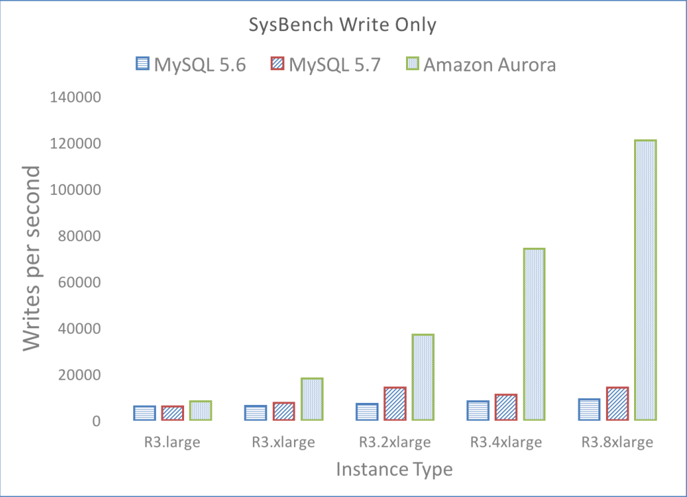

**Figure 7: Aurora scales linearly for write-only workload｜图：Aurora 在只写工作负载下呈线性扩展。**

> **图表中文解读：** 横轴为 r3.large 至 r3.8xlarge 五种实例规格，纵轴为每秒写语句数；三组柱分别表示 MySQL 5.6、MySQL 5.7 和 Amazon Aurora。随着计算资源翻倍，Aurora 的写吞吐量近似成比例增长，在 r3.8xlarge 上约达 121,000 次写入/秒；两个 MySQL 版本的增长幅度明显较小。

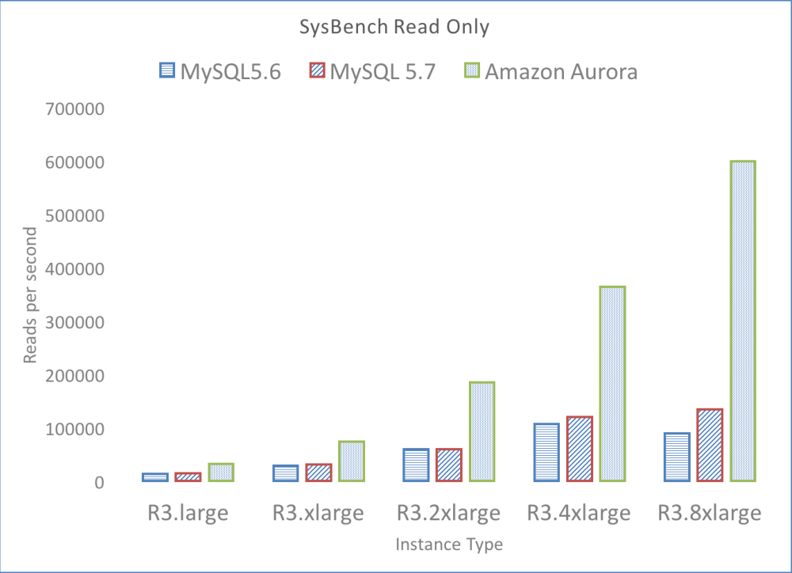

**Figure 6: Aurora scales linearly for read-only workload｜图：Aurora 在只读工作负载下呈线性扩展。**

> **图表中文解读：** 横轴同样是五种 r3 实例规格，纵轴为每秒读语句数。Aurora 的只读吞吐量随实例增大持续提升，在 r3.8xlarge 上约为 600,000 次读取/秒；MySQL 5.6 与 5.7 的对应结果约在 10 万至 12.5 万次读取/秒量级。

The results are shown in Figure 7 and Figure 6, and measure the performance in terms of write and read statements per second respectively. Aurora’s performance doubles for each higher instance size and for the r3.8xlarge achieves 121,000 writes/sec and 600,000 reads/sec which is 5x that of MySQL 5.7 which tops out at 20,000 reads/sec and 125,000 writes/sec.

> 图 7 和图 6 分别以每秒写语句数和每秒读语句数衡量性能。Aurora 的性能在实例规格每升高一级时都约增一倍；在 r3.8xlarge 上可达到每秒 121,000 次写入和 600,000 次读取，约为 MySQL 5.7 的 5 倍。原文称 MySQL 5.7 的峰值为每秒 20,000 次读取和 125,000 次写入。

> **译注：** 上一句严格保留了论文原文的 read/write 数值次序；结合图 6、图 7 可见，20,000 对应写吞吐量，125,000 对应读吞吐量，原文疑似将二者写反。

#### 6.1.2 Throughput with varying data sizes｜不同数据规模下的吞吐量

In this experiment, we report that throughput in Aurora significantly exceeds that of MySQL even with larger data sizes including workloads with out-of-cache working sets. Table 2 shows that for the SysBench write-only workload, Aurora can be up to 67x faster than MySQL with a database size of 100GB. Even for a database size of 1TB with an out-of-cache workload, Aurora is still 34x faster than MySQL.

> 该实验表明，即便数据规模增大，乃至工作集无法完全容纳于缓存，Aurora 的吞吐量仍显著高于 MySQL。表 2 显示，在 SysBench 只写工作负载中，数据库大小为 100GB 时，Aurora 的速度最高可达 MySQL 的 67 倍；即使数据库达到 1TB、工作负载超出缓存容量，Aurora 仍快 34 倍。

**Table 2: SysBench Write-Only (writes/sec)｜表：SysBench 只写测试（写入/秒）。**

| DB Size | Amazon Aurora | MySQL |
| ------- | ------------: | ----: |
| 1 GB    |       107,000 | 8,400 |
| 10 GB   |       107,000 | 2,400 |
| 100 GB  |       101,000 | 1,500 |
| 1 TB    |        41,000 | 1,200 |

> **图表中文解读：** 表中第一列为数据库大小，后两列为每秒写入数。Aurora 在 1GB 至 100GB 范围内维持约 10 万次写入/秒；到 1TB 时降至 41,000。MySQL 则随数据集增大从 8,400 降至 1,200，因而两者差距在 100GB 时达到约 67 倍，在 1TB 时仍约为 34 倍。

#### 6.1.3 Scaling with user connections｜随用户连接数扩展

In this experiment, we report that throughput in Aurora can scale with the number of client connections. Table 3 shows the results of running the SysBench OLTP benchmark in terms of writes/sec as the number of connections grows from 50 to 500 to 5000. While Aurora scales from 40,000 writes/sec to 110,000 writes/sec, the throughput in MySQL peaks at around 500 connections and then drops sharply as the number of connections grows to 5000.

> 该实验表明，Aurora 的吞吐量可以随客户端连接数增加而扩展。表 3 给出了 SysBench OLTP 基准测试的每秒写入结果，连接数依次从 50 增至 500、再增至 5000。Aurora 从每秒 40,000 次写入扩展到 110,000 次；MySQL 的吞吐量则在约 500 个连接时达到峰值，连接数增至 5000 后急剧下降。

**Table 3: SysBench OLTP (writes/sec)｜表：SysBench OLTP 测试（写入/秒）。**

| Connections | Amazon Aurora |  MySQL |
| ----------: | ------------: | -----: |
|          50 |        40,000 | 10,000 |
|         500 |        71,000 | 21,000 |
|       5,000 |       110,000 | 13,000 |

> **图表中文解读：** Aurora 的写吞吐量随连接数从 50 增至 5,000 而持续上升；MySQL 从 50 到 500 个连接时有所增长，但到 5,000 个连接时回落至 13,000 次写入/秒。这组数据体现了两者在高并发连接下不同的扩展趋势。

#### 6.1.4 Scaling with Replicas｜随副本扩展

In this experiment, we report that the lag in an Aurora read replica is significantly lower than that of a MySQL replica even with more intense workloads. Table 4 shows that as the workload varies from 1,000 to 10,000 writes/second, the replica lag in Aurora grows from 2.62 milliseconds to 5.38 milliseconds. In contrast, the replica lag in MySQL grows from under a second to 300 seconds. At 10,000 writes/second Aurora has a replica lag that is several orders of magnitude smaller than that of MySQL. Replica lag is measured in terms of the time it takes for a committed transaction to be visible in the replica.

> 该实验表明，即使工作负载增强，Aurora 只读副本的延迟也显著低于 MySQL 副本。表 4 显示，当工作负载从每秒 1,000 次写入增至 10,000 次时，Aurora 的副本延迟仅从 2.62 毫秒增至 5.38 毫秒；MySQL 的副本延迟却从不足 1 秒增至 300 秒。在每秒 10,000 次写入时，Aurora 的副本延迟比 MySQL 低若干个数量级。这里的副本延迟，是指一个已提交事务经过多长时间才会在副本上可见。

**Table 4: Replica Lag for SysBench Write-Only (msec)｜表：SysBench 只写测试的副本延迟（毫秒）。**

| Writes/sec | Amazon Aurora |   MySQL |
| ---------: | ------------: | ------: |
|      1,000 |          2.62 |  < 1000 |
|      2,000 |          3.42 |    1000 |
|      5,000 |          3.94 |  60,000 |
|     10,000 |          5.38 | 300,000 |

> **图表中文解读：** 第一列为每秒写入数，后两列均为副本延迟（毫秒）。Aurora 在负载提高十倍后仍维持个位数毫秒延迟；MySQL 则由不足 1,000 毫秒上升至 300,000 毫秒，即 300 秒。

#### 6.1.5 Throughput with hot row contention｜热点行竞争下的吞吐量

In this experiment, we report that Aurora performs very well relative to MySQL on workloads with hot row contention, such as those based on the TPC-C benchmark. We ran the Percona TPC-C variant [37] against Amazon Aurora and MySQL 5.6 and 5.7 on an r3.8xlarge where MySQL uses an EBS volume with 30K provisioned IOPS. Table 5 shows that Aurora can sustain between 2.3x to 16.3x the throughput of MySQL 5.7 as the workload varies from 500 connections and a 10GB data size to 5000 connections and a 100GB data size.

> 该实验表明，对于基于 TPC-C 等存在热点行竞争的工作负载，Aurora 相较 MySQL 表现优异。我们在 r3.8xlarge 实例上，以 Amazon Aurora、MySQL 5.6 和 MySQL 5.7 运行 Percona TPC-C 变体 [37]；其中 MySQL 使用配置了 30K 预置 IOPS 的 EBS 卷。表 5 显示，当工作负载从 500 个连接、10GB 数据，变化到 5000 个连接、100GB 数据时，Aurora 能够维持 MySQL 5.7 的 2.3 至 16.3 倍吞吐量。

**Table 5: Percona TPC-C Variant (tpmC)｜表：Percona TPC-C 变体（tpmC）。**

| Connections/Size/Warehouses | Amazon Aurora | MySQL 5.6 | MySQL 5.7 |
| --------------------------- | ------------: | --------: | --------: |
| 500/10GB/100                |        73,955 |     6,093 |    25,289 |
| 5000/10GB/100               |        42,181 |     1,671 |     2,592 |
| 500/100GB/1000              |        70,663 |     3,231 |    11,868 |
| 5000/100GB/1000             |        30,221 |     5,575 |    13,005 |

> **图表中文解读：** 第一列依次组合连接数、数据规模与仓库数，后三列为三种数据库的 tpmC。四组配置下 Aurora 均领先；相对 MySQL 5.7 的精确比值依次约为 2.92、16.27、5.95 和 2.32 倍。

### 6.2 Results with Real Customer Workloads｜真实客户工作负载的结果

In this section, we share results reported by some of our customers who migrated production workloads from MySQL to Aurora.

> 本节介绍部分客户把生产工作负载从 MySQL 迁移到 Aurora 后报告的结果。

#### 6.2.1 Application response time with Aurora｜使用 Aurora 后的应用响应时间

An internet gaming company migrated their production service from MySQL to Aurora on an r3.4xlarge instance. The average response time that their web transactions experienced prior to the migration was 15 ms. In contrast, after the migration the average response time 5.5 ms, a 3x improvement as shown in Figure 8.

> 一家互联网游戏公司把生产服务从 MySQL 迁移到运行于 r3.4xlarge 实例的 Aurora。迁移前，其 Web 事务的平均响应时间为 15 毫秒；迁移后则为 5.5 毫秒，性能提升约 3 倍，如图 8 所示。

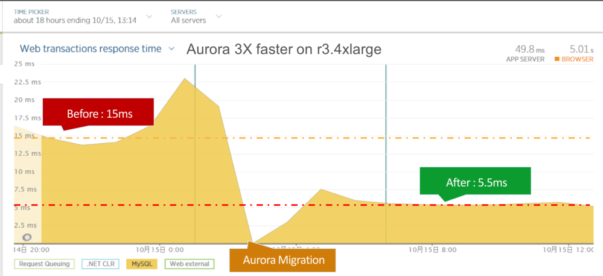

**Figure 8: Web application response time｜图：Web 应用响应时间。**

> **图表中文解读：** 时间序列以“Aurora Migration”为分界点。迁移前，响应时间大多处于 15 毫秒以上，并一度接近 25 毫秒；迁移后迅速降至约 5.5 毫秒且保持较低水平。图中标注称 Aurora 在 r3.4xlarge 上带来约 3 倍改善。

#### 6.2.2 Statement Latencies with Aurora｜使用 Aurora 后的语句延迟

An education technology company whose service helps schools manage student laptops migrated their production workload from MySQL to Aurora. The median (P50) and 95th percentile (P99) latencies for select and per-record insert operations before and after the migration (at 14:00 hours) are shown in Figure 9 and Figure 10.

> 一家为学校提供学生笔记本电脑管理服务的教育科技公司，把生产工作负载从 MySQL 迁移到 Aurora。图 9 和图 10 给出了迁移前后（迁移发生在 14:00）SELECT 操作与逐记录 INSERT 操作的中位数（P50）延迟和第 95 百分位（原文写作 P99）延迟。

> **译注：** 原文同时写有“95th percentile”和“P99”，二者并不一致；图题与后续正文使用 P95。此处保留原文，并明确标示这一处疑似笔误。

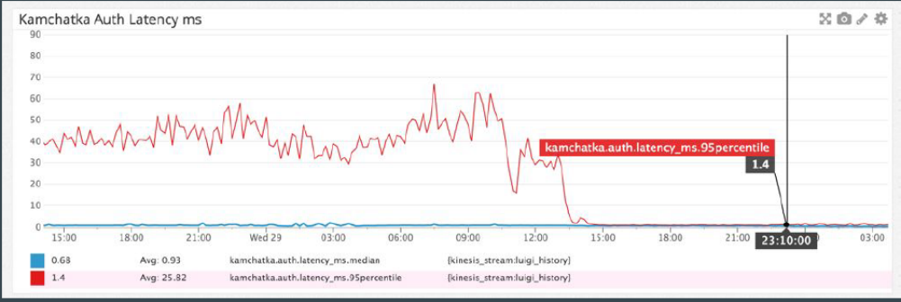

**Figure 9: SELECT latency (P50 vs P95)｜图：SELECT 延迟（P50 与 P95 对比）。**

> **图表中文解读：** 图中两条序列分别表示中位数和 P95 延迟。迁移前 P95 大致在 40–80 毫秒间波动，而 P50 约为 1 毫秒；14:00 左右迁移后，P95 快速降至接近 P50 的水平。

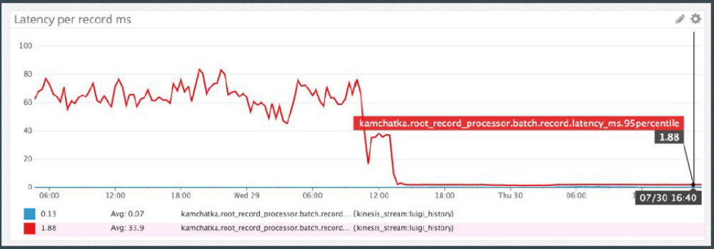

**Figure 10: INSERT per-record latency (P50 vs P95)｜图：逐记录 INSERT 延迟（P50 与 P95 对比）。**

> **图表中文解读：** 这张图展示逐记录插入的 P50 与 P95 延迟随时间变化。迁移前 P95 明显高于 P50，并存在较大波动；迁移发生后，P95 降至约 1.88 毫秒附近，与中位数之间的差距显著收窄。

Before the migration, the P95 latencies ranged between 40ms to 80ms and were much worse than the P50 latencies of about 1ms. The application was experiencing the kinds of poor outlier performance that we described earlier in this paper. After the migration, however, the P95 latencies for both operations improved dramatically and approximated the P50 latencies.

> 迁移前，P95 延迟介于 40 至 80 毫秒之间，远差于约 1 毫秒的 P50 延迟；应用程序正在遭遇本文前面所述的严重长尾性能问题。迁移后，两种操作的 P95 延迟都得到显著改善，并接近 P50 延迟。

#### 6.2.3 Replica Lag with Multiple Replicas｜多副本场景下的副本延迟

MySQL replicas often lag significantly behind their writers and can “can cause strange bugs” as reported by Weiner at Pinterest [40]. For the education technology company described earlier, the replica lag often spiked to 12 minutes and impacted application correctness and so the replica was only useful as a stand by. In contrast, after migrating to Aurora, the maximum replica lag across 4 replicas never exceeded 20ms as shown in Figure 11. The improved replica lag provided by Aurora let the company divert a significant portion of their application load to the replicas saving costs and increasing availability.

> MySQL 副本常常明显落后于写入节点；正如 Pinterest 的 Weiner 所报告，这“可能会引发奇怪的 bug”[40]。对于前述教育科技公司，副本延迟经常飙升至 12 分钟，并影响应用正确性，因此副本只能用作备用节点。与之相反，迁移到 Aurora 后，4 个副本中的最大延迟从未超过 20 毫秒，如图 11 所示。Aurora 带来的副本延迟改善，使该公司能够把相当一部分应用负载转移到副本上，从而节省成本并提高可用性。

> **译注：** 英文原文中引语前重复了两个 “can”；这里保留原文，并按其实际语义翻译。

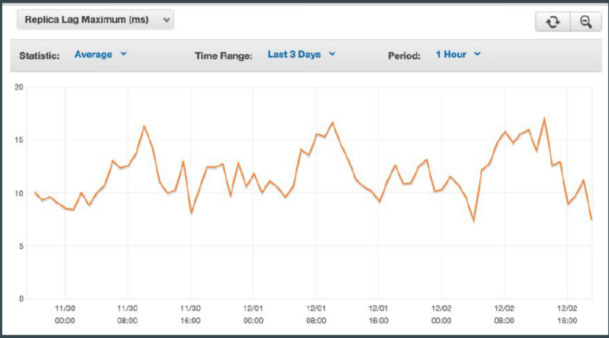

**Figure 11: Maximum Replica Lag (averaged hourly)｜图：最大副本延迟（每小时取平均值）。**

> **图表中文解读：** 横轴覆盖约三天，纵轴单位为毫秒。最大副本延迟的小时平均值大多位于约 8–17 毫秒之间，峰值仍低于 20 毫秒，与正文所述的四副本结果一致。

## 7. LESSONS LEARNED｜经验总结

We have now seen a large variety of applications run by customers ranging from small internet companies all the way to highly sophisticated organizations operating large numbers of Aurora clusters. While many of their use cases are standard, we focus on scenarios and expectations that are common in the cloud and are leading us to new directions.

> 我们已经见到客户运行的各种应用；这些客户既包括小型互联网公司，也包括运营大量 Aurora 集群、技术体系高度复杂的组织。虽然其中许多使用场景并无特殊之处，本节仍将聚焦云环境中普遍存在、并推动我们探索新方向的场景与期望。

### 7.1 Multi-tenancy and database consolidation｜多租户与数据库整合

Many of our customers operate Software-as-a-Service (SaaS) businesses, either exclusively or with some residual on-premise customers they are trying to move to their SaaS model. We find that these customers often rely on an application they cannot easily change. Therefore, they typically consolidate their different customers on a single instance by using a schema/database as a unit of tenancy. This idiom reduces costs: they avoid paying for a dedicated instance per customer when it is unlikely that all of their customers active at once. For instance, some of our SaaS customers report having more than 50,000 customers of their own.

This model is markedly different from well-known multi-tenant applications like Salesforce.com [14] which use a multi-tenant data model and pack the data of multiple customers into unified tables of a single schema with tenancy identified on a per-row basis. As a result, we see many customers with consolidated databases containing a large number of tables. Production instances of over 150,000 tables for small database are quite common. This puts pressure on components that manage metadata like the dictionary cache. More importantly, such customers need (a) to sustain a high level of throughput and many concurrent user connections, (b) a model where data is only provisioned and paid for as it is used since it is hard to anticipate in advance how much storage space is needed, and (c) reduced jitter so that spikes for a single tenant have minimal impact on other tenants. Aurora supports these attributes and fits such SaaS applications very well.

> 许多客户经营软件即服务（SaaS）业务：有些完全采用 SaaS 模式，有些仍保留少量本地部署客户，并试图把他们迁移到 SaaS 模式。我们发现，这些客户往往依赖难以轻易修改的应用程序。因此，他们通常以 schema/database 作为租户单位，把不同客户整合到同一个实例上。这种惯用模式可以降低成本：既然所有客户不太可能同时活跃，就不必为每位客户单独支付一个专用实例的费用。例如，一些 SaaS 客户报告称，他们自身拥有超过 50,000 个客户。
>
> 这种模式与 Salesforce.com [14] 等著名多租户应用显著不同。后者采用多租户数据模型，把多个客户的数据装入同一个 schema 的统一表中，并在每一行上标识租户。因此，我们看到不少客户的整合数据库包含海量表；在小型数据库中，生产实例拥有超过 150,000 张表相当常见。这会给字典缓存等元数据管理组件带来压力。更重要的是，这类客户需要：(a) 维持高吞吐量和大量并发用户连接；(b) 由于难以预先判断所需存储空间，只在数据实际使用时才配置并付费；(c) 降低抖动，使单个租户的负载尖峰尽量少影响其他租户。Aurora 支持这些特性，非常适合此类 SaaS 应用。

### 7.2 Highly concurrent auto-scaling workloads｜高并发自动扩展工作负载

Internet workloads often need to deal with spikes in traffic based on sudden unexpected events. One of our major customers had a special appearance in a highly popular nationally televised show and experienced one such spike that greatly surpassed their normal peak throughput without stressing the database. To support such spikes, it is important for a database to handle many concurrent connections. This approach is feasible in Aurora since the underlying storage system scales so well. We have several customers that run at over 8000 connections per second.

> 互联网工作负载经常需要应对突发事件引起的流量尖峰。我们的一位大型客户曾在一档全国热播电视节目中获得特别曝光，随之经历了一次远超平时峰值吞吐量的流量暴增，而数据库并未承受明显压力。要支撑这类尖峰，数据库必须能够处理大量并发连接。Aurora 的底层存储系统具有出色的扩展能力，因此这种方式切实可行。我们有多位客户的系统每秒处理超过 8,000 个连接。

### 7.3 Schema evolution｜Schema 演进

Modern web application frameworks such as Ruby on Rails deeply integrate object-relational mapping tools. As a result, it is easy for application developers to make many schema changes to their database making it challenging for DBAs to manage how the schema evolves. In Rails applications, these are called “DB Migrations” and we have heard first-hand accounts of DBAs that have to either deal with a “few dozen migrations a week”, or put in place hedging strategies to ensure that future migrations take place without pain. The situation is exacerbated with MySQL offering liberal schema evolution semantics and implementing most changes using a full table copy. Since frequent DDL is a pragmatic reality, we have implemented an efficient online DDL implementation that (a) versions schemas on a per-page basis and decodes individual pages on demand using their schema history, and (b) lazily upgrades individual pages to the latest schema using a modify-on-write primitive.

> Ruby on Rails 等现代 Web 应用框架深度集成了对象关系映射工具。这使应用开发者很容易对数据库 schema 作出大量变更，却给 DBA 管理 schema 的演进带来挑战。在 Rails 应用中，这类变更称为“数据库迁移”（DB Migrations）。我们从 DBA 的亲身经历中了解到，他们要么每周应付“几十次迁移”，要么不得不预先设置防范策略，以确保未来迁移能够顺利进行。MySQL 提供较为宽松的 schema 演进语义，却以全表复制实现大多数变更，使问题更为严重。既然频繁执行 DDL 是无法回避的现实，我们便实现了一套高效的在线 DDL：(a) 以页面为单位为 schema 建立版本，并在需要时依据页面的 schema 历史解码单个页面；(b) 使用写时修改原语，把各个页面惰性升级到最新 schema。

### 7.4 Availability and Software Upgrades｜可用性与软件升级

Our customers have demanding expectations of cloud-native databases that can conflict with how we operate the fleet and how often we patch servers. Since our customers use Aurora primarily as an OLTP service backing production applications, any disruption can be traumatic. As a result, many of our customers have a very low tolerance to our updates of database software, even if this amounts to a planned downtime of 30 seconds every 6 weeks or so. Therefore, we recently released a new Zero-Downtime Patch (ZDP) feature that allows us to patch a customer while in-flight database connections are unaffected.

As shown in Figure 12, ZDP works by looking for an instant where there are no active transactions, and in that instant spooling the application state to local ephemeral storage, patching the engine and then reloading the application state. In the process, user sessions remain active and oblivious that the engine changed under the covers.

> 客户对云原生数据库抱有极高期望，而这些期望有时会与我们运营节点集群、定期修补服务器的方式发生冲突。客户主要把 Aurora 用作支撑生产应用的 OLTP 服务，任何中断都可能造成严重影响。因此，许多客户对数据库软件更新的容忍度极低，即使只是大约每 6 周安排一次、持续 30 秒的计划停机也难以接受。为此，我们新近发布了零停机补丁（Zero-Downtime Patch，ZDP）功能，使我们能够在不影响现有数据库连接的情况下为客户的数据库打补丁。
>
> 如图 12 所示，ZDP 会寻找一个没有活跃事务的瞬间；在这一瞬间，把应用状态暂存到本地临时存储，修补数据库引擎，再重新载入应用状态。整个过程中，用户会话始终保持活跃，并不会察觉底层引擎已经发生替换。

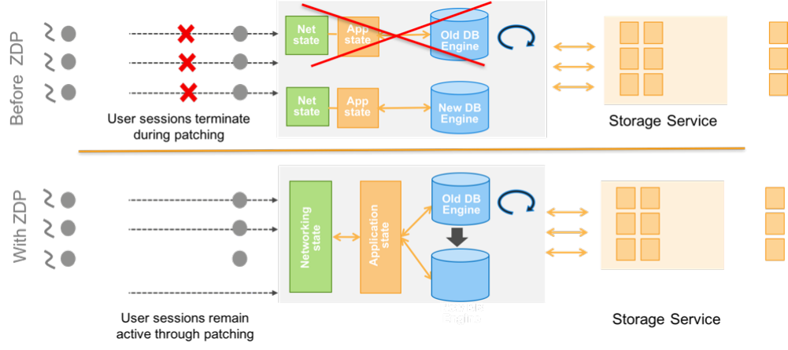

**Figure 12: Zero-Downtime Patching｜图：零停机补丁。**

> **图表中文解读：** 上半部分“Before ZDP”展示传统修补：用户会话在补丁期间终止，网络状态和应用状态被丢弃，旧数据库引擎替换为新引擎后，用户必须重新连接。下半部分“With ZDP”展示零停机流程：网络状态始终保留，应用状态先暂存、待新引擎启动后恢复，因此用户会话在整个修补过程中保持活跃。

## 8. RELATED WORK｜相关工作

In this section, we discuss other contributions and how they relate to the approaches taken in Aurora.

**Decoupling storage from compute.** Although traditional systems have usually been built as monolithic daemons [27], there has been recent work on databases that decompose the kernel into different components. For instance, Deuteronomy [10] is one such system that separates a Transaction Component (TC) that provides concurrency control and recovery from a Data Component (DC) that provides access methods on top of LLAMA [34], a latch-free log-structured cache and storage manager. Sinfonia [39] and Hyder [38] are systems that abstract transactional access methods over a scale out service and database systems can be implemented using these abstractions. The Yesquel [36] system implements a multi-version distributed balanced tree and separates concurrency control from the query processor. Aurora decouples storage at a level lower than that of Deuteronomy, Hyder, Sinfonia, and Yesquel. In Aurora, query processing, transactions, concurrency, buffer cache, and access methods are decoupled from logging, storage, and recovery that are implemented as a scale out service.

> 本节讨论其他研究成果，以及它们与 Aurora 所采用方法之间的关系。
>
> **存储与计算解耦。** 传统系统通常构建为单体守护进程 [27]，但近年来已有研究尝试把数据库内核拆分为不同组件。例如，Deuteronomy [10] 把提供并发控制与恢复的事务组件（TC），同提供访问方法的数据组件（DC）分离；后者构建在 LLAMA [34] 之上，而 LLAMA 是一种无闩锁的日志结构化缓存与存储管理器。Sinfonia [39] 和 Hyder [38] 在横向扩展服务之上抽象事务访问方法，数据库系统可以基于这些抽象实现。Yesquel [36] 实现了一种多版本分布式平衡树，把并发控制与查询处理器分离。Aurora 在比 Deuteronomy、Hyder、Sinfonia 和 Yesquel 更低的层次上解耦存储：查询处理、事务、并发控制、缓冲池和访问方法，与由横向扩展服务实现的日志、存储和恢复相分离。

**Distributed Systems.** The trade-offs between correctness and availability in the face of partitions have long been known with the major result that one-copy serializability is not possible in the face of network partitions [15]. More recently Brewer’s CAP Theorem as proved in [16] stated that a highly available system cannot provide “strong” consistency guarantees in the presence of network partitions. These results and our experience with cloud-scale complex and correlated failures motivated our consistency goals even in the presence of partitions caused by an AZ failure.

Bailis et al [12] study the problem of providing Highly Available Transactions (HATs) that neither suffer unavailability during partitions nor incur high network latency. They show that Serializability, Snapshot Isolation and Repeatable Read isolation are not HAT-compliant, while most other isolation levels are achievable with high availability. Aurora provides all these isolation levels by making a simplifying assumption that at any time there is only a single writer generating log updates with LSNs allocated from a single ordered domain.

> **分布式系统。** 人们早已认识到网络分区条件下正确性与可用性之间的取舍，其中一项重要结论是：存在网络分区时，无法实现单副本可串行化 [15]。后来，由文献 [16] 证明的 Brewer CAP 定理指出，发生网络分区时，高可用系统无法提供“强”一致性保证。这些研究成果，加上我们处理云规模环境中复杂且相关联故障的经验，共同塑造了 Aurora 的一致性目标——即便可用区故障造成分区，系统也要满足这些目标。
>
> Bailis 等人 [12] 研究了如何提供高可用事务（Highly Available Transactions，HAT）：既不因网络分区而失去可用性，也不引入很高的网络延迟。他们证明，可串行化、快照隔离和可重复读隔离不符合 HAT 要求，而其他大多数隔离级别都可以在高可用条件下实现。Aurora 通过一项简化假设提供所有这些隔离级别：任一时刻只有一个写入节点生成日志更新，并从单一有序域中分配 LSN。

Google’s Spanner [24] provides externally consistent [25] reads and writes, and globally-consistent reads across the database at a timestamp. These features enable Spanner to support consistent backups, consistent distributed query processing [26], and atomic schema updates, all at global scale, and even in the presence of ongoing transactions. As explained by Bailis [12], Spanner is highly specialized for Google’s read-heavy workload and relies on two-phase commit and two-phase locking for read/write transactions.

**Concurrency Control.** Weaker consistency (PACELC [17]) and isolation models [18][20] are well known in distributed databases and have led to optimistic replication techniques [19] as well as eventually consistent systems [21][22][23]. Other approaches in centralized systems range from classic pessimistic schemes based on locking [28], optimistic schemes like multi-versioned concurrency control in Hekaton [29], sharded approaches such as VoltDB [30] and Timestamp ordering in HyPer [31][32] and Deuteronomy. Aurora’s storage service provides the database engine the abstraction of a local disk that is durably persisted, and allows the engine to determine isolation and concurrency control.

> Google Spanner [24] 提供外部一致 [25] 的读写操作，以及在某一时间戳上跨数据库的全局一致读取。这些特性使 Spanner 即使在仍有事务运行时，也能在全球规模上支持一致性备份、一致性分布式查询处理 [26] 和原子 schema 更新。正如 Bailis [12] 所述，Spanner 针对 Google 以读取为主的工作负载进行了高度专门化，并在读写事务中依赖两阶段提交和两阶段锁。
>
> **并发控制。** 较弱的一致性模型（PACELC [17]）与隔离模型 [18][20] 在分布式数据库中早已广为人知，并催生了乐观复制技术 [19] 和最终一致系统 [21][22][23]。集中式系统的其他方法包括：基于锁的经典悲观方案 [28]，Hekaton 多版本并发控制 [29] 一类乐观方案，VoltDB [30] 等分片方法，以及 HyPer [31][32] 和 Deuteronomy 中的时间戳排序。Aurora 存储服务向数据库引擎提供一种持久化本地磁盘的抽象，并允许引擎自行决定隔离与并发控制方式。

**Log-structured storage.** Log-structured storage systems were introduced by LFS [33] in 1992. More recently Deuteronomy and the associated work in LLAMA [34] and Bw-Tree [35] use log-structured techniques in multiple ways across the storage engine stack and, like Aurora, reduce write amplification by writing deltas instead of whole pages. Both Deuteronomy and Aurora implement pure redo logging, and keep track of the highest stable LSN for acknowledging commits.

**Recovery.** While traditional databases rely on a recovery protocol based on ARIES [5], some recent systems have chosen other paths for performance. For example, Hekaton and VoltDB rebuild their in-memory state after a crash using some form of an update log. Systems like Sinfonia [39] avoid recovery by using techniques like process pairs and state machine replication. Graefe [41] describes a system with per-page log record chains that enables on-demand page-by-page redo that can make recovery fast. Like Aurora, Deuteronomy does not require redo recovery. This is because Deuteronomy delays transactions so that only committed updates are posted to durable storage. As a result, unlike Aurora, the size of transactions can be constrained in Deuteronomy.

> **日志结构化存储。** LFS [33] 于 1992 年引入了日志结构化存储系统。近年的 Deuteronomy 及相关的 LLAMA [34]、Bw-Tree [35] 工作，在存储引擎栈的多个层面运用日志结构化技术，并和 Aurora 一样，通过写入增量而非完整页面来降低写放大。Deuteronomy 与 Aurora 都实现纯重做日志，并追踪最高稳定 LSN，用于确认提交。
>
> **恢复。** 传统数据库依赖基于 ARIES [5] 的恢复协议，而一些较新的系统为了性能选择了其他路径。例如，Hekaton 和 VoltDB 在崩溃后使用某种更新日志重建内存状态；Sinfonia [39] 等系统则通过进程对和状态机复制等技术来避免恢复。Graefe [41] 描述了一种为每个页面维护日志记录链的系统，可以按需逐页执行重做，从而加快恢复。与 Aurora 相同，Deuteronomy 也不需要重做恢复；这是因为 Deuteronomy 会延迟事务，只把已提交的更新写入持久存储。其结果是，与 Aurora 不同，Deuteronomy 中事务的大小可能受到限制。

> **译注：** 本段原文把 ARIES 引为 [5]，但本文 Section 4.3 及参考文献表均表明 ARIES 对应 [7]；英文引文编号按 PDF 保留。

## 9. CONCLUSION｜结论

We designed Aurora as a high throughput OLTP database that compromises neither availability nor durability in a cloud-scale environment. The big idea was to move away from the monolithic architecture of traditional databases and decouple storage from compute. In particular, we moved the lower quarter of the database kernel to an independent scalable and distributed service that managed logging and storage. With all I/Os written over the network, our fundamental constraint is now the network. As a result we need to focus on techniques that relieve the network and improve throughput. We rely on quorum models that can handle the complex and correlated failures that occur in large-scale cloud environments and avoid outlier performance penalties, log processing to reduce the aggregate I/O burden, and asynchronous consensus to eliminate chatty and expensive multi-phase synchronization protocols, offline crash recovery, and checkpointing in distributed storage. Our approach has led to a simplified architecture with reduced complexity that is easy to scale as well as a foundation for future advances.

> 我们把 Aurora 设计成一款高吞吐量 OLTP 数据库，使它在云规模环境中既不牺牲可用性，也不牺牲持久性。核心思想是摆脱传统数据库的单体架构，让存储与计算解耦。具体来说，我们把数据库内核底部约四分之一的功能迁移到一个独立、可扩展的分布式服务中，由它管理日志与存储。当所有 I/O 都经由网络写入后，网络便成为根本约束。因此，我们必须专注于缓解网络压力、提高吞吐量的技术：采用能够应对大型云环境中复杂相关故障并避免长尾性能惩罚的法定人数模型；通过日志处理降低总体 I/O 负担；利用异步共识消除通信频繁、代价高昂的多阶段同步协议，以及分布式存储中的离线崩溃恢复和检查点。该方法形成了一种复杂度更低、易于扩展的简化架构，也为未来演进奠定了基础。

## 10. ACKNOWLEDGMENTS｜致谢

We thank the entire Aurora development team for their efforts on the project including our current members as well as our distinguished alumni (James Corey, Sam McKelvie, Yan Leshinsky, Lon Lundgren, Pradeep Madhavarapu, and Stefano Stefani). We are particularly grateful to our customers who operate production workloads using our service and have been generous in sharing their experiences and expectations with us. We also thank the shepherds for their invaluable comments in shaping this paper.

> 我们感谢整个 Aurora 开发团队为本项目作出的努力，其中既包括现任成员，也包括杰出的昔日成员（James Corey、Sam McKelvie、Yan Leshinsky、Lon Lundgren、Pradeep Madhavarapu 和 Stefano Stefani）。我们尤其感谢那些使用本服务运行生产工作负载，并慷慨分享经验与期望的客户。我们也感谢论文指导委员提出的宝贵意见，正是这些意见帮助塑造了本文。

## 11. REFERENCES｜参考文献

[1] B. Calder, J. Wang, et al. Windows Azure storage: A highly available cloud storage service with strong consistency. In _SOSP 2011._

> [1] B. Calder, J. Wang, et al. Windows Azure 存储：具备强一致性的高可用云存储服务。收录于 _SOSP 2011._

[2] O. Khan, R. Burns, J. Plank, W. Pierce, and C. Huang. Rethinking erasure codes for cloud file systems: Minimizing I/O for recovery and degraded reads. In _FAST 2012._

> [2] O. Khan, R. Burns, J. Plank, W. Pierce, and C. Huang. 重新思考云文件系统的纠删码：最小化恢复和降级读取的 I/O。收录于 _FAST 2012._

[3] P.A. Bernstein, V. Hadzilacos, and N. Goodman. Concurrency control and recovery in database systems, Chapter 7, Addison Wesley Publishing Company, ISBN 0-201-10715-5, 1997.

> [3] P.A. Bernstein, V. Hadzilacos, and N. Goodman. 数据库系统中的并发控制与恢复，第 7 章，Addison Wesley Publishing Company, ISBN 0-201-10715-5, 1997.

> **译注：** 该书 ISBN 0-201-10715-5 的实际出版年份为 1987；论文原文误作 1997，英文按原文保留。

[4] C. Mohan, B. Lindsay, and R. Obermarck. Transaction management in the R* distributed database management system”. _ACM TODS,_ 11(4):378-396, 1986.

> [4] C. Mohan, B. Lindsay, and R. Obermarck. R* 分布式数据库管理系统中的事务管理。_ACM TODS,_ 11(4):378-396, 1986.

> **译注：** 原文题名末尾多出一个右双引号，英文按原文保留。

[5] C. Mohan and B. Lindsay. Efficient commit protocols for the tree of processes model of distributed transactions. _ACM SIGOPS Operating Systems Review,_ 19(2):40-52, 1985.

> [5] C. Mohan and B. Lindsay. 分布式事务进程树模型的高效提交协议。_ACM SIGOPS Operating Systems Review,_ 19(2):40-52, 1985.

[6] D.K. Gifford. Weighted voting for replicated data. In _SOSP 1979._

> [6] D.K. Gifford. 复制数据的加权投票。收录于 _SOSP 1979._

[7] C. Mohan, D.L. Haderle, B. Lindsay, H. Pirahesh, and P. Schwarz. ARIES: A transaction recovery method supporting fine-granularity locking and partial rollbacks using write-ahead logging. _ACM TODS,_ 17 (1): 94–162, 1992.

> [7] C. Mohan, D.L. Haderle, B. Lindsay, H. Pirahesh, and P. Schwarz. ARIES：一种支持细粒度锁和使用预写日志进行部分回滚的事务恢复方法。_ACM TODS,_ 17 (1): 94–162, 1992.

[8] R. van Renesse and F. Schneider. Chain replication for supporting high throughput and availability. In _OSDI 2004._

> [8] R. van Renesse and F. Schneider. 支持高吞吐量和高可用性的链式复制。收录于 _OSDI 2004._

[9] A. Kopytov. Sysbench Manual. Available at <http://imysql.com/wp-content/uploads/2014/10/sysbench-manual.pdf>

> [9] A. Kopytov. Sysbench 手册。获取地址：<http://imysql.com/wp-content/uploads/2014/10/sysbench-manual.pdf>

[10] J. Levandoski, D. Lomet, S. Sengupta, R. Stutsman, and R. Wang. High performance transactions in deuteronomy. In _CIDR 2015._

> [10] J. Levandoski, D. Lomet, S. Sengupta, R. Stutsman, and R. Wang. Deuteronomy 中的高性能事务。收录于 _CIDR 2015._

[11] P. Bailis, A. Fekete, A. Ghodsi, J.M. Hellerstein, and I. Stoica. Scalable atomic visibility with RAMP Transactions. In _SIGMOD 2014._

> [11] P. Bailis, A. Fekete, A. Ghodsi, J.M. Hellerstein, and I. Stoica. 使用 RAMP 事务实现可扩展的原子可见性。收录于 _SIGMOD 2014._

[12] P. Bailis, A. Davidson, A. Fekete, A. Ghodsi, J.M. Hellerstein, and I. Stoica. Highly available transactions: virtues and limitations. In _VLDB_ 2014.

> [12] P. Bailis, A. Davidson, A. Fekete, A. Ghodsi, J.M. Hellerstein, and I. Stoica. 高可用事务：优点与局限。收录于 _VLDB_ 2014.

[13] R. Taft, E. Mansour, M. Serafini, J. Duggan, A.J. Elmore, A. Aboulnaga, A. Pavlo, and M. Stonebraker. E-Store: fine-grained elastic partitioning for distributed transaction processing systems. In _VLDB 2015._

> [13] R. Taft, E. Mansour, M. Serafini, J. Duggan, A.J. Elmore, A. Aboulnaga, A. Pavlo, and M. Stonebraker. E-Store：面向分布式事务处理系统的细粒度弹性分区。收录于 _VLDB 2015._

[14] R. Woollen. The internal design of salesforce.com’s multi-tenant architecture. In _SoCC 2010._

> [14] R. Woollen. salesforce.com 多租户架构的内部设计。收录于 _SoCC 2010._

[15] S. Davidson, H. Garcia-Molina, and D. Skeen. Consistency in partitioned networks. _ACM CSUR,_ 17(3):341–370, 1985.

> [15] S. Davidson, H. Garcia-Molina, and D. Skeen. 分区网络中的一致性。_ACM CSUR,_ 17(3):341–370, 1985.

[16] S. Gilbert and N. Lynch. Brewer’s conjecture and the feasibility of consistent, available, partition-tolerant web services. _SIGACT News,_ 33(2):51–59, 2002.

> [16] S. Gilbert and N. Lynch. Brewer 猜想与一致、可用、分区容错 Web 服务的可行性。_SIGACT News,_ 33(2):51–59, 2002.

[17] D.J. Abadi. Consistency tradeoffs in modern distributed database system design: CAP is only part of the story. _IEEE Computer,_ 45(2), 2012.

> [17] D.J. Abadi. 现代分布式数据库系统设计中的一致性权衡：CAP 只是故事的一部分。_IEEE Computer,_ 45(2), 2012.

[18] A. Adya. Weak consistency: a generalized theory and optimistic implementations for distributed transactions. PhD Thesis, MIT, 1999.

> [18] A. Adya. 弱一致性：分布式事务的广义理论与乐观实现。博士学位论文，MIT, 1999.

[19] Y. Saito and M. Shapiro. Optimistic replication. _ACM Comput. Surv.,_ 37(1), Mar. 2005.

> [19] Y. Saito and M. Shapiro. 乐观复制。_ACM Comput. Surv.,_ 37(1), Mar. 2005.

[20] H. Berenson, P. Bernstein, J. Gray, J. Melton, E. O’Neil, and P. O’Neil. A critique of ANSI SQL isolation levels. In _SIGMOD 1995._

> [20] H. Berenson, P. Bernstein, J. Gray, J. Melton, E. O’Neil, and P. O’Neil. 对 ANSI SQL 隔离级别的评析。收录于 _SIGMOD 1995._

[21] P. Bailis and A. Ghodsi. Eventual consistency today: limitations, extensions, and beyond. _ACM Queue,_ 11(3), March 2013.

> [21] P. Bailis and A. Ghodsi. 当今的最终一致性：局限、扩展及未来。_ACM Queue,_ 11(3), March 2013.

[22] P. Bernstein and S. Das. Rethinking eventual consistency. In _SIGMOD,_ 2013.

> [22] P. Bernstein and S. Das. 重新思考最终一致性。收录于 _SIGMOD,_ 2013.

[23] B. Cooper et al. PNUTS: Yahoo!’s hosted data serving platform. In _VLDB 2008._

> [23] B. Cooper et al. PNUTS：Yahoo! 的托管数据服务平台。收录于 _VLDB 2008._

[24] J. C. Corbett, J. Dean, et al. Spanner: Google’s globally-distributed database. In _OSDI 2012._

> [24] J. C. Corbett, J. Dean, et al. Spanner：Google 的全球分布式数据库。收录于 _OSDI 2012._

[25] David K. Gifford. Information Storage in a Decentralized Computer System. _Tech. rep. CSL-81-8._ PhD dissertation. Xerox PARC, July 1982.

> [25] David K. Gifford. 分散式计算机系统中的信息存储。技术报告 CSL-81-8。博士学位论文。Xerox PARC, July 1982.

[26] Jeffrey Dean and Sanjay Ghemawat. MapReduce: a flexible data processing tool”. _CACM_ 53 (1):72-77, 2010.

> [26] Jeffrey Dean and Sanjay Ghemawat. MapReduce：一种灵活的数据处理工具。_CACM_ 53 (1):72-77, 2010.

> **译注：** 原文题名末尾多出一个右双引号，英文按原文保留。

[27] J. M. Hellerstein, M. Stonebraker, and J. R. Hamilton. Architecture of a database system. _Foundations and Trends in Databases._ 1(2) pp. 141-259, 2007.

> [27] J. M. Hellerstein, M. Stonebraker, and J. R. Hamilton. 数据库系统架构。_Foundations and Trends in Databases._ 1(2) pp. 141-259, 2007.

[28] J. Gray, R. A. Lorie, G. R. Putzolu, I. L. Traiger. Granularity of locks in a shared data base. In _VLDB 1975._

> [28] J. Gray, R. A. Lorie, G. R. Putzolu, I. L. Traiger. 共享数据库中的锁粒度。收录于 _VLDB 1975._

[29] P-A Larson, et al. High-Performance Concurrency control mechanisms for main-memory databases. _PVLDB,_ 5(4): 298-309, 2011.

> [29] P-A Larson, et al. 面向内存数据库的高性能并发控制机制。_PVLDB,_ 5(4): 298-309, 2011.

[30] M. Stonebraker and A. Weisberg. The VoltDB main memory DBMS. _IEEE Data Eng. Bull.,_ 36(2): 21-27, 2013.

> [30] M. Stonebraker and A. Weisberg. VoltDB 内存数据库管理系统。_IEEE Data Eng. Bull.,_ 36(2): 21-27, 2013.

[31] V. Leis, A. Kemper, et al. Exploiting hardware transactional memory in main-memory databases. In _ICDE 2014._

> [31] V. Leis, A. Kemper, et al. 在内存数据库中利用硬件事务内存。收录于 _ICDE 2014._

[32] H. Mühe, S. Wolf, A. Kemper, and T. Neumann: An evaluation of strict timestamp ordering concurrency control for main-memory database systems. _In IMDM 2013._

> [32] H. Mühe, S. Wolf, A. Kemper, and T. Neumann: 面向内存数据库系统的严格时间戳排序并发控制评估。_收录于 IMDM 2013._

[33] M. Rosenblum and J. Ousterhout. The design and implementation of a log-structured file system. _ACM TOCS_ 10(1): 26–52, 1992.

> [33] M. Rosenblum and J. Ousterhout. 日志结构文件系统的设计与实现。_ACM TOCS_ 10(1): 26–52, 1992.

[34] J. Levandoski, D. Lomet, S. Sengupta. LLAMA: A cache/storage subsystem for modern hardware. PVLDB 6(10): 877-888, 2013.

> [34] J. Levandoski, D. Lomet, S. Sengupta. LLAMA：面向现代硬件的缓存/存储子系统。PVLDB 6(10): 877-888, 2013.

[35] J. Levandoski, D. Lomet, and S. Sengupta. The Bw-Tree: A B-tree for new hardware platforms. In _ICDE 2013._

> [35] J. Levandoski, D. Lomet, and S. Sengupta. Bw-Tree：面向新型硬件平台的 B 树。收录于 _ICDE 2013._

[36] M. Aguilera, J. Leners, and M. Walfish. Yesquel: scalable SQL storage for web applications. In _SOSP 2015._

> [36] M. Aguilera, J. Leners, and M. Walfish. Yesquel：面向 Web 应用的可扩展 SQL 存储。收录于 _SOSP 2015._

[37] Percona Lab. TPC-C Benchmark over MySQL. Available at <https://github.com/Percona-Lab/tpcc-mysql>

> [37] Percona Lab. 基于 MySQL 的 TPC-C 基准测试。获取地址：<https://github.com/Percona-Lab/tpcc-mysql>

[38] P. Bernstein, C. Reid, and S. Das. Hyder – A transactional record manager for shared flash. In _CIDR 2011._

> [38] P. Bernstein, C. Reid, and S. Das. Hyder——面向共享闪存的事务记录管理器。收录于 _CIDR 2011._

[39] M. Aguilera, A. Merchant, M. Shah, A. Veitch, and C. Karamanolis. Sinfonia: A new paradigm for building scalable distributed systems. ACM Trans. Comput. Syst. 27(3): 2009.

> [39] M. Aguilera, A. Merchant, M. Shah, A. Veitch, and C. Karamanolis. Sinfonia：构建可扩展分布式系统的新范式。ACM Trans. Comput. Syst. 27(3): 2009.

[40] M. Weiner. Sharding Pinterest: How we scaled our MySQL fleet. Pinterest Engineering Blog. Available at: <https://engineering.pinterest.com/blog/sharding-pinterest-how-we-scaled-our-mysql-fleet>

> [40] M. Weiner. Pinterest 分片：我们如何扩展 MySQL 集群。Pinterest Engineering Blog. 获取地址：<https://engineering.pinterest.com/blog/sharding-pinterest-how-we-scaled-our-mysql-fleet>

[41] G. Graefe. Instant recovery for data center savings. _ACM SIGMOD Record._ 44(2):29-34, 2015.

> [41] G. Graefe. 为数据中心节省成本的即时恢复。_ACM SIGMOD Record._ 44(2):29-34, 2015.

[42] J. Dean and L. Barroso. The tail at scale. CACM 56(2):74-80, 2013.

> [42] J. Dean and L. Barroso. 规模化系统中的尾延迟。CACM 56(2):74-80, 2013.
