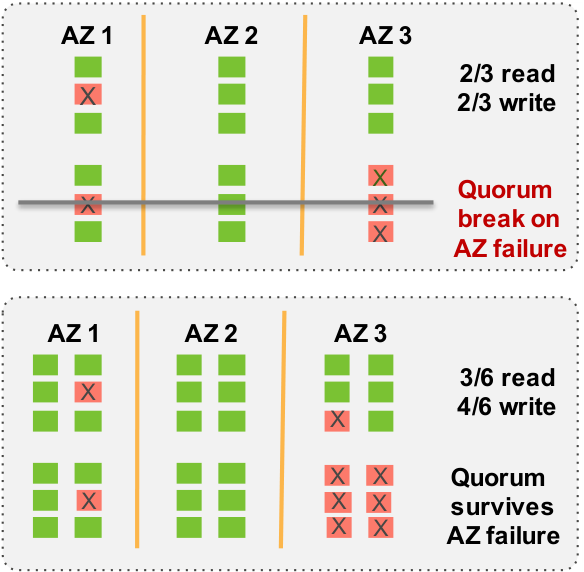
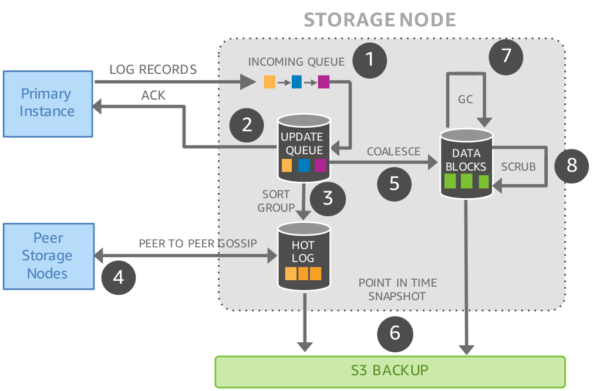
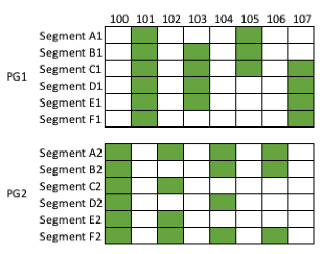
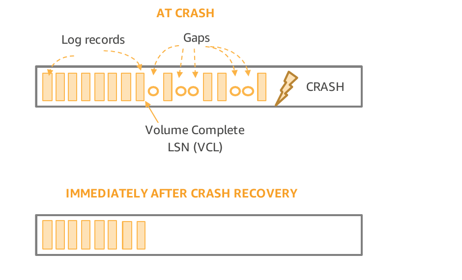
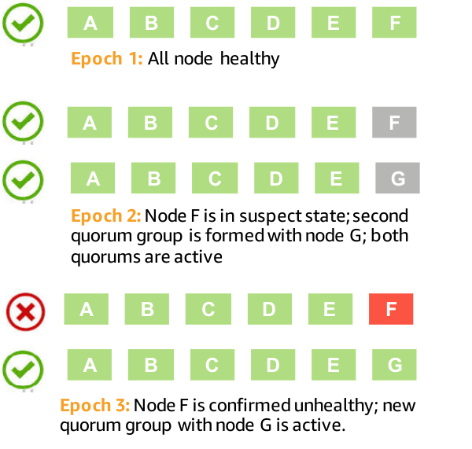

> **译者说明：** 本文按照论文阅读顺序完整保留英文原文，并按完整语义单元集中排列英文原文及对应中文译文。图表的“中文解读”是为帮助读者理解而增加的辅助说明，不属于论文原文；原文中疑似存在的语病会予以保留，并在必要处说明。

> **原文出处：** Alexandre Verbitski et al., SIGMOD 2018, DOI: [10.1145/3183713.3196937](https://doi.org/10.1145/3183713.3196937)。

**Amazon Aurora: On Avoiding Distributed Consensus for I/Os, Commits, and Membership Changes｜Amazon Aurora：如何在 I/O、提交与成员变更中避免分布式共识**

Alexandre Verbitski, Anurag Gupta, Debanjan Saha, James Corey, Kamal Gupta, Murali Brahmadesam, Raman Mittal, Sailesh Krishnamurthy, Sandor Maurice, Tengiz Kharatishvilli, Xiaofeng Bao

Amazon Web Services

> 作者：Alexandre Verbitski、Anurag Gupta、Debanjan Saha、James Corey、Kamal Gupta、Murali Brahmadesam、Raman Mittal、Sailesh Krishnamurthy、Sandor Maurice、Tengiz Kharatishvilli、Xiaofeng Bao
>
> 亚马逊云科技（Amazon Web Services）

## ABSTRACT｜摘要

Amazon Aurora is a high-throughput cloud-native relational database offered as part of Amazon Web Services (AWS). One of the more novel differences between Aurora and other relational databases is how it pushes redo processing to a multi-tenant scale-out storage service, purpose-built for Aurora. Doing so reduces networking traffic, avoids checkpoints and crash recovery, enables failovers to replicas without loss of data, and enables fault-tolerant storage that heals without database involvement. Traditional implementations that leverage distributed storage would use distributed consensus algorithms for commits, reads, replication, and membership changes and amplify cost of underlying storage. In this paper, we describe how Aurora avoids distributed consensus under most circumstances by establishing invariants and leveraging local transient state. Doing so improves performance, reduces variability, and lowers costs.

> Amazon Aurora 是 Amazon Web Services（AWS）提供的一款高吞吐量、云原生关系数据库。Aurora 与其他关系数据库相比，一个颇具新意的差异在于：它将重做处理下推到一个专为 Aurora 构建、支持多租户且可横向扩展的存储服务中。这样做减少了网络流量，无须设置检查点和执行崩溃恢复，使系统能够无数据丢失地故障转移至副本，并让具备容错能力的存储在无需数据库介入的情况下自行修复。采用分布式存储的传统实现通常会在提交、读取、复制和成员变更中使用分布式共识算法，从而放大底层存储成本。本文介绍 Aurora 如何通过建立不变量并利用局部的瞬态状态，在大多数情况下避免分布式共识。由此既提升了性能、降低了波动，也减少了成本。

## KEYWORDS｜关键词

Databases; Distributed Systems; Log Processing; Quorum Models; Fault tolerance; Quorum Sets; Replication; Recovery; Performance

> 数据库；分布式系统；日志处理；法定人数模型；容错；法定人数集合；复制；恢复；性能

### ACM Reference Format:｜ACM 参考文献格式：

Alexandre Verbitski, Anurag Gupta, Debanjan Saha, James Corey, Kamal Gupta, Murali Brahmadesam, Raman Mittal, Sailesh Krishnamurthy, Sandor Maurice, and Tengiz Kharatishvilli, Xiaofeng Bao. 2018. Amazon Aurora: On Avoiding Distributed Consensus for I/Os, Commits, and Membership Changes. In _SIGMOD’18: 2018 International Conference on Management of Data, June 10–15, 2018, Houston, TX, USA._ ACM, New York, NY, USA, 8 pages. https://doi.org/10.1145/3183713.3196937

> Alexandre Verbitski、Anurag Gupta、Debanjan Saha、James Corey、Kamal Gupta、Murali Brahmadesam、Raman Mittal、Sailesh Krishnamurthy、Sandor Maurice、Tengiz Kharatishvilli、Xiaofeng Bao。2018。《Amazon Aurora：如何在 I/O、提交与成员变更中避免分布式共识》。收录于 _SIGMOD’18：2018 年国际数据管理会议，2018 年 6 月 10–15 日，美国得克萨斯州休斯敦_。美国纽约州纽约市：ACM，共 8 页。https://doi.org/10.1145/3183713.3196937

## 1 INTRODUCTION｜引言

IT workloads are increasingly moving to public cloud providers such as AWS. Many of these workloads require a relational database. Amazon Relational Database Service (RDS) provides a managed service that automates database provisioning, operating system and database patching, backup, point-in-time restore, storage and compute scaling, instance health monitoring, failover, and other capabilities. Our experience managing hundreds of thousands of database instances in RDS led to the design requirements for Aurora, a high-throughput cloud-native relational database.

> IT 工作负载正越来越多地迁移到 AWS 等公有云提供商，其中许多工作负载需要关系数据库。Amazon Relational Database Service（RDS）是一项托管服务，可自动完成数据库预置、操作系统与数据库补丁更新、备份、时间点恢复、存储与计算扩缩容、实例健康监控、故障转移以及其他工作。我们在 RDS 中管理数十万个数据库实例的经验，促成了高吞吐量云原生关系数据库 Aurora 的设计需求。

Permission to make digital or hard copies of all or part of this work for personal or classroom use is granted without fee provided that copies are not made or distributed for profit or commercial advantage and that copies bear this notice and the full citation on the first page. Copyrights for components of this work owned by others than the author(s) must be honored. Abstracting with credit is permitted. To copy otherwise, or republish, to post on servers or to redistribute to lists, requires prior specific permission and/or a fee. Request permissions from permissions@acm.org. _SIGMOD’18, June 10–15, 2018, Houston, TX, USA_

> 在副本并非为牟利或商业利益而制作或传播，且副本首页载有本声明及完整引文的前提下，可免费制作本文全部或部分内容的数字版或纸质版，用于个人或课堂用途。本文中版权归作者以外主体所有的部分，其版权必须得到尊重。允许在注明出处的情况下制作摘要。以其他方式复制、再版、发布到服务器或重新分发至邮件列表，须事先获得明确许可和/或支付费用。许可申请请联系 permissions@acm.org。_SIGMOD’18，2018 年 6 月 10–15 日，美国得克萨斯州休斯敦。_

© 2018 Copyright held by the owner/author(s). Publication rights licensed to the Association for Computing Machinery. ACM ISBN 978-1-4503-4703-7/18/06. . . $15.00 https://doi.org/10.1145/3183713.3196937

> © 2018，版权归所有者/作者所有。出版权授予美国计算机协会（ACM）。ACM ISBN 978-1-4503-4703-7/18/06……15.00 美元。https://doi.org/10.1145/3183713.3196937

In our earlier paper [12], we provided an overview of the design considerations behind Aurora. A key contribution of that paper is to show that, on a fleet-wide basis, it is insufficient to treat failures as independent. At a minimum, it is necessary to consider the correlated impact of the largest unit of failure in addition to the background noise of on-going independent failures. In AWS, the largest unit of failure a system may need to tolerate is an Availability Zone (AZ). An AZ is a subset of a Region that is connected to other AZs through low-latency networking links, but is isolated for most faults, including power, networking, software deployments, flooding, and other phenomena. Aurora supports “AZ+1” failures, resulting in six copies of data, spread across three AZs, a 4/6 write quorum, and a 3/6 read quorum as illustrated in Figure 1. Aurora implements quorum membership changes to handle unexpected failures, heat management, as well as planned software upgrades.

> 在我们此前的论文 [12] 中，我们概述了 Aurora 背后的设计考量。该论文的一项重要贡献，是说明从整个机群的尺度来看，把故障视为彼此独立是不够的。除了持续发生的独立故障这一背景噪声外，至少还必须考虑最大故障单元所造成的相关性影响。在 AWS 中，系统可能需要容忍的最大故障单元是可用区（Availability Zone，AZ）。可用区是一个区域（Region）的子集，通过低延迟网络链路与其他可用区相连，但在电力、网络、软件部署、洪水等大多数故障面前彼此隔离。Aurora 支持“AZ+1”故障，因此需要六份数据副本，分布在三个可用区中，并采用 4/6 写法定人数和 3/6 读法定人数，如图 1 所示。Aurora 通过法定人数成员变更来应对意外故障、热点（负载）管理以及计划内的软件升级。

**Figure 1: Why are 6 copies necessary ?｜图：为什么需要 6 份副本？**

> **图表中文解读：** 上半部分表明，若每个保护组仅有 3 份副本并采用 2/3 读写法定人数，一次可用区故障再叠加任意一份独立副本故障，就可能使某个保护组只剩 1 份可用副本，从而破坏法定人数。下半部分表明，将 6 份副本按每个可用区 2 份分布到 3 个可用区后，单个可用区故障仍留下 4 份副本，可满足 4/6 写法定人数；即使再叠加一份副本故障，剩余 3 份仍能满足 3/6 读法定人数并用于修复。

Quorum models, such as the one used by Aurora, are rarely used in high-performance relational databases, despite the benefits they provide for availability, durability, and the reduction of latency jitter. We believe this is because the underlying distributed algorithms typically used in these systems – two-phase commit (2PC), Paxos commit, Paxos membership changes, and their variants – can be expensive and incur additional network overheads. The commercial systems we have seen built on these algorithms may scale well but have order-of-magnitude worse cost, performance, and peak to average latency than a traditional relational database running on a single node against local disk.

In this paper, we show how Aurora leverages only quorum I/Os, locally observable state, and monotonically increasing log ordering to provide high performance, non-blocking, fault-tolerant I/O, commits, and membership changes. We limit our discussion to single-writer databases with read replicas. The approach described below is extensible to multi-writer databases by ordering writes at database nodes, storage nodes, and using a journal to order operations that span multiple database instances and multiple storage nodes. We describe the following contributions:

> 尽管法定人数模型能够提升可用性、持久性并减少延迟抖动，但像 Aurora 这样采用法定人数模型的高性能关系数据库仍很少见。我们认为，这是因为此类系统通常使用的底层分布式算法——两阶段提交（2PC）、Paxos 提交、Paxos 成员变更及其变体——成本高昂，还会带来额外的网络开销。我们所见过基于这些算法构建的商业系统或许扩展性很好，但与在单节点上使用本地磁盘的传统关系数据库相比，其成本更高、性能更低，峰值延迟与平均延迟之比也更差，幅度可达一个数量级。
>
> 本文说明 Aurora 如何仅凭法定人数 I/O、局部可观测状态和单调递增的日志次序，实现高性能、非阻塞、容错的 I/O、提交与成员变更。我们的讨论仅限于带有只读副本的单写入者数据库。下述方法可扩展至多写入者数据库：在数据库节点和存储节点上对写入排序，并使用操作日志（journal）对跨越多个数据库实例和多个存储节点的操作排序。本文的贡献如下：

- (1) How Aurora performs writes using asynchronous flows, establishes local consistency points, uses consistency points for commit processing, and re-establishes them upon crash recovery. (Section 2)

> Aurora 如何通过异步流程执行写入、建立局部一致性点、利用一致性点处理提交，并在崩溃恢复期间重新建立这些一致性点。（第 2 节）

- (2) How Aurora avoids quorum reads and how reads are scaled across replicas. (Section 3)

> Aurora 如何避免法定人数读取，以及如何通过副本扩展读取能力。（第 3 节）

- (3) How Aurora uses quorum sets and epochs to make non-blocking reversible membership changes to process failures, grow storage, and reduce costs. (Section 4)

> Aurora 如何利用法定人数集合与纪元（epoch），以非阻塞、可逆的方式变更成员，从而处理故障、扩展存储并降低成本。（第 4 节）

Finally, we briefly survey related work in Section 5 and present concluding remarks in Section 6.

> 最后，我们将在第 5 节简要回顾相关工作，并在第 6 节给出结论。

## 2 MAKING WRITES EFFICIENT｜提高写入效率

In this section, we review the Aurora storage architecture, how storage is distributed, and our quorum model. We next describe the writes performed by Aurora database instances, and how writes are batched to storage nodes. We then describe how we maintain and advance consistency points across distributed storage and how we re-establish consistency upon crash recovery.

> 本节首先回顾 Aurora 的存储架构、存储的分布方式以及法定人数模型；接着介绍 Aurora 数据库实例所执行的写入，以及如何将写入成批发送给存储节点；然后说明如何在分布式存储中维护并推进一致性点，以及如何在崩溃恢复期间重新建立一致性。

### 2.1 Aurora System Architecture｜Aurora 系统架构

Aurora uses a service-oriented architecture where database instances are loosely coupled with a multi-tenant scale-out storage service that abstracts a segmented redo log. Each database instance acts as a SQL endpoint and includes most of the components of a traditional database kernel (query processing, access methods, transactions, locking, buffer caching, and undo management). Some database functions, including redo logging, materialization of data blocks, garbage collection, and backup/restore, are offloaded to our storage fleet.

Aurora uses a quorum model, where the database reads from and writes to a subset of copies of data. Formally, a quorum system that employs _V_ copies must obey two rules. First, the read set, _Vr_, and the write set, _Vw_, must overlap on at least one copy. This ensures a data item is not read and written by two transactions concurrently and the read quorum contains at least one site with the newest version of the data item. Second, the write set must overlap with prior write sets, which can be done by ensuring that _Vw_ > _V_/2. This ensures two write operations from two transactions cannot occur concurrently on the same data item.

> Aurora 采用面向服务的架构：数据库实例与一个多租户、可横向扩展的存储服务松耦合，而该存储服务对分段式重做日志提供抽象。每个数据库实例充当 SQL 端点，包含传统数据库内核的大多数组件（查询处理、访问方法、事务、锁、缓冲区缓存和撤销管理）。重做日志记录、数据块物化、垃圾回收以及备份/恢复等部分数据库功能，则被卸载到我们的存储机群中。
>
> Aurora 采用法定人数模型，数据库只从数据副本的一个子集中读取，也只向其中一个子集写入。形式化地说，使用 _V_ 份副本的法定人数系统必须遵守两条规则。第一，读集合 _Vr_ 与写集合 _Vw_ 必须至少在一份副本上重叠。这样既能确保两个事务不会同时对同一数据项进行读写，也能确保读法定人数中至少有一个站点持有该数据项的最新版本。第二，当前写集合必须与此前的写集合重叠；只要保证 _Vw_ > _V_/2 即可做到这一点。这样可以确保来自两个事务的两次写操作不会同时作用于同一数据项。

Aurora storage is partitioned into segments that individually store the redo log for their portion of the database volume as well as coalesced data blocks. The activities on the storage node are shown in more detail in Figure 2. Foreground activity in a storage node consists of (1) receiving redo records, (2) writing them to an update queue, and acknowledging them back. In background, the storage node (3) sorts and groups records, (4) gossips with peers to fill in missing records, (5) coalesces them into data blocks, (6) backs them up to Amazon Simple Storage Service (S3), (7) garbage collects backed-up data that will no longer be referenced by an instance, and (8) periodically scrubs data to ensure checksums continue to match the data on disk.

> Aurora 存储被划分成若干分段（segment）；每个分段既保存其所对应数据库卷部分的重做日志，也保存合并生成的数据块。存储节点上的活动如图 2 所示。其前台活动包括：（1）接收重做记录；（2）将记录写入更新队列，并返回确认。后台则由存储节点执行以下工作：（3）对记录排序并分组；（4）通过与对等节点进行 gossip 通信来补齐缺失记录；（5）将记录合并成数据块；（6）将数据备份到 Amazon Simple Storage Service（S3）；（7）对已经备份、且以后不会再被任何实例引用的数据执行垃圾回收；（8）定期巡检数据，确保校验和始终与磁盘上的数据相符。

**Figure 2: Activity in Aurora Storage Nodes｜图：Aurora 存储节点中的活动**

> **图表中文解读：** 主实例将重做日志记录送入存储节点的入站队列；节点把记录写入更新队列后返回确认。后台流程对记录排序、分组并形成热日志，通过点对点 gossip 补齐缺口，再把日志合并为数据块。热日志可用于形成时间点快照，热日志与合并生成的数据块都可进入 S3 备份路径；已备份且不再被引用的数据随后可被垃圾回收，数据块还会接受周期性巡检。前台确认与这些后台处理彼此解耦。

Segments in Aurora are the minimum unit of failure, with faults monitored and repaired automatically as part of the service. Segments are small, currently representing no more than 10GB of addressable data blocks in the database volume. Segments are replicated into protection groups, using _V_ = 6, _Vw_ = 4, and _Vr_ = 3. These six copies are spread across three AZs, with two copies in each of the three AZs. Assuming a 10 second window to detect and repair a segment failure, it would require two independent segment failures as well as an AZ failure in the same 10 second period to lose the ability to repair a quorum. This may seem overly conservative. We don’t think so. AZ failures are a correlated failure of two members in each and every quorum. Across a large fleet, some small number of quorums will be degraded, with some quorum member already failed at the time of an AZ failure. The time it takes to repair the failure of this quorum member is the time a database is vulnerable to loss of data with one additional fault.

> 分段是 Aurora 中最小的故障单元；作为服务的一部分，系统会自动监控并修复分段故障。分段很小，目前每个分段承载的数据库卷可寻址数据块不超过 10 GB。分段以保护组（protection group）为单位复制，采用 _V_ = 6、_Vw_ = 4、_Vr_ = 3 的配置。六份副本分布在三个可用区中，每个可用区各两份。假设检测并修复一个分段故障的时间窗口为 10 秒，那么只有在同一个 10 秒内同时发生两个相互独立的分段故障和一个可用区故障，系统才会失去依靠现有法定人数完成修复的能力。这看上去或许过于保守，但我们并不这么认为。可用区故障会让每个保护组同时损失两个成员，这是一种相关故障。在大型机群中，少量法定人数必然会处于降级状态；可用区发生故障时，其中某个法定人数成员可能早已失效。修复这个成员所需的时间，也正是数据库只要再遇到一个故障便可能丢失数据的脆弱窗口。

Protection groups are concatenated together to form a storage volume, which has a one to one relationship with the database instance. While the redo log is segmented and spread across storage nodes, the Log Sequence Number (LSN) space is common across the database volume, monotonically increasing, and allocated by the database instance. This is the key invariant that allows Aurora to avoid distributed consensus for most operations.

> 多个保护组首尾连接，组成一个存储卷；存储卷与数据库实例之间是一一对应的关系。尽管重做日志被分段并分散到各个存储节点上，但日志序列号（Log Sequence Number，LSN）空间为整个数据库卷所共享，单调递增，并由数据库实例分配。这正是 Aurora 能够在大多数操作中避免分布式共识的关键不变量。

### 2.2 Writes in Aurora｜Aurora 中的写入

In Aurora, the only writes that cross the network from the database instance to the storage node are redo log records. No data blocks are written from the database instance, not for background writes, not for checkpointing, and not for cache eviction. Instead, redo log application code is run within the storage nodes, materializing blocks in background or on-demand to satisfy a read request.

Changes to data blocks modify the image in the Aurora buffer cache and add the corresponding redo record to a log buffer. These are periodically flushed to a storage driver to be made durable. Inside the driver, they are shuffled to individual write buffers for each storage node storing segments for the data volume. The driver asynchronously issues writes, receives acknowledgments, and establishes consistency points.

Each log record stores the LSN of the preceding log record in the volume, the previous LSN for the segment, and the previous LSN for the block being modified. The block chain is used by the storage node to materialize individual blocks on demand. The segment chain is used by each storage node to identify records that it has not received and fill in these holes by gossiping with other storage nodes. The full log chain is not needed by an individual storage node but provides a fallback path to regenerate storage volume metadata in case of a disastrous loss of metadata state.

> 在 Aurora 中，从数据库实例跨网络传到存储节点的写入内容只有重做日志记录。数据库实例不会写出任何数据块——无论是后台写入、检查点，还是缓存淘汰，都不会这样做。重做日志应用代码改为在存储节点内部运行，在后台物化数据块，或在需要满足读取请求时按需物化。
>
> 对数据块的更改会修改 Aurora 缓冲区缓存中的块映像，并将相应的重做记录加入日志缓冲区。这些记录会定期刷入存储驱动程序，以实现持久化。在驱动程序内部，记录会被重新分派到各个写缓冲区；数据库卷的分段由哪些存储节点承载，就分别送往哪些节点的写缓冲区。驱动程序异步发出写入、接收确认，并建立一致性点。
>
> 每条日志记录都会保存三类前驱 LSN：数据库卷中前一条日志记录的 LSN、该分段中前一条日志记录的 LSN，以及被修改数据块的前一条日志记录的 LSN。存储节点利用块链按需物化单个数据块；每个存储节点则利用分段链识别自己未收到的记录，并通过与其他存储节点进行 gossip 通信来填补这些空洞。单个存储节点并不需要完整的日志链，但若元数据状态遭遇灾难性丢失，完整日志链可以作为重新生成存储卷元数据的后备路径。

Many database systems boxcar redo log writes to improve throughput. There is a challenge in deciding, with each record, whether to issue the write, to improve latency, or to wait for subsequent records, to improve write efficiency and throughput. Waiting creates performance jitter since early requests entering the boxcar have to wait for later requests or a timeout to fill the request. Jitter is greatest under low load when the boxcar times out.

In Aurora, there are many segments partitioning the redo log and the opportunity to boxcar are lower than with a single unsegmented redo log. Aurora handles this by submitting the asynchronous network operation when it receives the first redo log record in the boxcar but continuing to fill the buffer until the network operation executes. This ensures requests are sent without boxcar latency and jitter while packing records together to minimize network packets.

> 许多数据库系统会把重做日志写入拼批（boxcar），以提高吞吐量。难点在于：对每条记录而言，究竟应该立即发出写入以降低延迟，还是等待后续记录以提升写入效率和吞吐量。等待会造成性能抖动，因为较早进入批次的请求必须等待后续请求到来，或等待超时后才会凑成并发出该批请求。在低负载下，批次往往因超时才被发出，此时抖动最为严重。
>
> 在 Aurora 中，重做日志被划分到许多分段，因此相较于单一、未分段的重做日志，拼批的机会更少。Aurora 的处理方式是：批次收到第一条重做日志记录时便提交异步网络操作，但在网络操作真正执行之前仍继续填充缓冲区。这样既能避免因拼批导致的延迟与抖动，又能把多条记录打包在一起，尽量减少网络数据包数量。

In Aurora, all log writes, including those for commit redo log records, are sent asynchronously to storage nodes, processed asynchronously at the storage node, and asynchronously acknowledged back to the database instance.

> 在 Aurora 中，所有日志写入——包括提交重做日志记录——都会被异步发送到存储节点，由存储节点异步处理，再异步向数据库实例返回确认。

### 2.3 Storage Consistency Points and Commits｜存储一致性点与提交

A traditional relational database working with local disk would write a commit redo log record, boxcar commits together using group commit, and flush the log to ensure that it has been made durable. When working with remote storage, it might use a two-phase commit, or a Paxos commit, or variant, to establish a consistency point since there is no individual flush operation across all storage nodes. This is heavyweight and introduces stalls and jitter into the write path. Distributed commit protocols also have failure modalities different from those of quorum writes, making it complex to reason about availability and durability.

As a storage node receives new log records, it may locally advance a Segment Complete LSN (SCL), representing the latest point in time for which it knows it has received all log records. More precisely, SCL is the inclusive upper bound on log records continuously linked through the segment chain without gaps. SCL is used by storage nodes as a compact way to identify missing writes when gossiping with their peers in a protection group. Note since any given write may be lost for any reason we need to tolerate missing writes in the storage nodes.

> 使用本地磁盘的传统关系数据库会写入一条提交重做日志记录，通过组提交将多个提交拼成一批，然后刷写日志以确保其持久化。使用远程存储时，由于不存在一个能跨所有存储节点执行的单一刷写操作，数据库可能会借助两阶段提交、Paxos 提交或其变体来建立一致性点。这些机制十分繁重，会在写入路径中引入停顿和抖动。分布式提交协议的故障模式也与法定人数写入不同，使可用性与持久性的推理更加复杂。
>
> 存储节点收到新的日志记录时，可以在本地推进分段完整 LSN（Segment Complete LSN，SCL）；它表示该节点确信自己已经收到全部日志记录的最新时间点。更准确地说，SCL 是沿分段链连续、无缺口相连的日志记录所达到的包含性上界，即该上界对应的记录也已收到。保护组内的存储节点彼此进行 gossip 通信时，会用 SCL 以紧凑的方式识别缺失写入。需要注意的是，任意一次写入都可能因任意原因丢失，因此我们必须容忍存储节点中存在缺失写入。

SCL is sent by the storage node as part of acknowledging a write. Once the database instance observes SCL advance at four of six members of the protection group, it is able to locally advance the Protection Group Complete LSN (PGCL), representing the point at which the protection group has made all writes durable. For example, Figure 3 shows a database with two protection groups, PG1 and PG2, consisting of segments A1-F1 and A2-F2 respectively. In the figure, each solid cell represents a log record acknowledged by a segment, with the odd numbered log records going to PG1 and the even numbered log records going to PG2. Here, PG1’s PGCL is 103 because 105 has not met quorum, PG2’s PGCL is 104 because 106 has not met quorum, and the database’s VCL is 104 which is the highest point at which all previous log records have met quorum.

> 存储节点在确认写入时，会将 SCL 作为确认的一部分发回。当数据库实例观察到保护组六个成员中的四个都推进了 SCL，便可在本地推进保护组完整 LSN（Protection Group Complete LSN，PGCL）；PGCL 表示该保护组已经将所有写入持久化到哪个位置。例如，图 3 所示数据库包含两个保护组 PG1 和 PG2，分别由分段 A1–F1 与 A2–F2 组成。图中每个实心单元格表示某分段已确认一条日志记录；奇数编号的日志记录进入 PG1，偶数编号的日志记录进入 PG2。此时 PG1 的 PGCL 为 103，因为 105 尚未达到法定人数；PG2 的 PGCL 为 104，因为 106 尚未达到法定人数；数据库的 VCL 则为 104，因为 104 是此前所有日志记录都已达到法定人数的最高位置。

**Figure 3: Storage Consistency Points｜图：存储一致性点**

> **图表中文解读：** 横轴是 LSN 100–107，实心格表示相应分段已经确认该日志记录。奇数 LSN 写入 PG1，偶数 LSN 写入 PG2。PG1 中 101 和 103 达到 4/6，但 105 只有 3/6，因此 PGCL 停在 103；PG2 中 100、102、104 达到 4/6，而 106 只有 3/6，因此 PGCL 停在 104。把两个保护组的连续持久化进度合并后，整个卷的 VCL 可推进至 104。

For a database, it is not enough for individual writes to be made durable, the entire log chain must be complete to ensure recoverability. The database instance also locally advances a Volume Complete LSN (VCL) once there are no pending writes preventing PGCL from advancing for one of its protection groups. No consensus is required to advance SCL, PGCL, or VCL – all that is required is bookkeeping by each individual storage node and local ephemeral state on the database instance based on the communication between the database and storage nodes.

This is possible because storage nodes do not have a vote in determining whether to accept a write, they must do so. Locking, transaction management, deadlocks, constraints, and other conditions that influence whether an operation may proceed are all resolved at the database tier. Processing offloaded to the Aurora storage nodes can progress by executing idempotent operations using local state. This also ensures that failed storage nodes can transparently be repaired without involving the database instance.

> 对数据库而言，仅让单次写入持久化还不够；要保证可恢复性，整条日志链都必须完整。一旦不再有待处理写入阻碍某个保护组的 PGCL 前进，数据库实例也会在本地推进卷完整 LSN（Volume Complete LSN，VCL）。推进 SCL、PGCL 或 VCL 均不需要共识——所需的只有各存储节点各自维护的状态记录，以及数据库实例根据其与存储节点的通信而保存的局部瞬态状态。
>
> 之所以能做到这一点，是因为存储节点无权投票决定是否接受写入；它们必须接受。锁、事务管理、死锁、约束以及其他影响操作能否继续执行的条件，全都在数据库层解决。卸载到 Aurora 存储节点的处理只需利用局部状态执行幂等操作，便可持续推进。这也确保了发生故障的存储节点能够透明修复，无须数据库实例参与。

A commit is acknowledged by the database to its caller once it is able to affirm that all data modified by the transaction has been durably recorded. A simple way to do so is to ensure that the commit redo record for the transaction, or System Commit Number (SCN), is below VCL. No flush, consensus, or grouping is required.

Aurora must wait to acknowledge commits until it is able to advance VCL beyond the requesting SCN. Typically, this would require stalling the worker thread acting upon the user request. In Aurora, user sessions are multiplexed to worker threads as requests are received. When a commit is received, the worker thread writes the commit record, puts the transaction on a commit queue, and returns to a common task queue to find the next request to be processed. When a driver thread advances VCL, it wakes up a dedicated commit thread that scans the commit queue for SCNs below the new VCL and sends acknowledgements to the clients waiting for commit. There is no induced latency from group commits and no idle time for worker threads.

> 一旦数据库能够确认事务修改的所有数据都已被持久记录，就会向调用方确认提交。一种简单的判定方法，是确保该事务的提交重做记录——即系统提交号（System Commit Number，SCN）——低于 VCL。整个过程不需要刷写、共识，也不需要对提交进行拼批。
>
> 在 VCL 推进到超过请求提交的 SCN 之前，Aurora 必须等待，不能确认该提交。通常，这会迫使处理用户请求的工作线程停顿。Aurora 则在收到请求时，将用户会话多路复用到工作线程。收到提交请求后，工作线程写入提交记录，把事务放入提交队列，随后返回公共任务队列，寻找下一个待处理请求。当驱动线程推进 VCL 时，它会唤醒专用提交线程；该线程扫描提交队列，找出 SCN 低于新 VCL 的事务，并向等待提交的客户端发送确认。这样既不会引入组提交造成的额外延迟，工作线程也不会空闲等待。

### 2.4 Crash Recovery in Aurora｜Aurora 中的崩溃恢复

Aurora is able to avoid distributed consensus during writes and commits by managing consistency points in the database instance rather than establishing consistency across multiple storage nodes. But, instances fail. Customers shut them down, resize them, and restore them to older points in time. The time we save in the normal forward processing of commits using local transient state must be paid back by re-establishing consistency upon crash recovery. This is a trade worth making since commits are many orders of magnitude more common than crashes. Since instance state is ephemeral, the Aurora database instance must be able to construct PGCLs and VCL from local SCL state at storage nodes.

> Aurora 把一致性点管理放在数据库实例中，而不是跨多个存储节点建立一致性，因此能够在写入与提交期间避免分布式共识。然而，实例终究会发生故障。客户会关闭实例、调整实例大小，也会把实例恢复到较早的时间点。利用局部瞬态状态在正常前向提交处理中节省下来的时间，必须在崩溃恢复时通过重建一致性偿还。由于提交发生的频率比崩溃高出许多个数量级，这笔取舍是值得的。实例状态是瞬态的，因此 Aurora 数据库实例必须能够根据各存储节点的局部 SCL 状态，重新构建 PGCL 和 VCL。

**Figure 4: Log truncation during crash recovery｜图：崩溃恢复期间的日志截断**

> **图表中文解读：** 崩溃发生时，VCL 之后的日志边缘可能参差不齐：其中既有已到达部分分段的日志记录，也夹杂尚未补齐的缺口。恢复过程重新计算 VCL，并用截断区间宣布 VCL 之后的旧日志无效；即使此前在途的异步写入稍后抵达，也会被忽略。恢复后的新日志从截断区间之上的 LSN 重新开始分配。

When opening a database volume, either for crash recovery or for a normal startup, the database instance must be able to reach at least a read quorum for each protection group comprising the volume. The database instance can then locally re-compute PGCLs and VCL for the database by finding read quorum consistency points across SCLs. There may be a ragged edge of updates in particular segments past this point that did not yet meet quorum. These represent partial writes that did not complete and would not have been acknowledged to clients of the database. The database snips off the ragged edge of the log by recording a truncation range that annuls any log records beyond the newly computed VCL (Figure 4). This ensures that, even if in-flight asynchronous operations complete during the process of crash recovery, they are ignored. New redo records after crash recovery are allocated LSNs above the truncation range.

> 无论是为了崩溃恢复还是正常启动，在打开数据库卷时，数据库实例都必须至少能够联系到构成该卷的每个保护组中的一个读法定人数。随后，数据库实例可在各 SCL 之间找出满足读法定人数的一致性点，并据此在本地重新计算数据库的 PGCL 与 VCL。超过这一位置后，某些分段上可能存在尚未达到法定人数、边缘参差不齐的更新。这些更新代表部分完成的写入，数据库也不可能曾向客户端确认它们。数据库通过记录一个截断区间，使新计算出的 VCL 之后的所有日志记录失效，从而剪除这段参差不齐的日志边缘（图 4）。如此一来，即使在途异步操作在崩溃恢复过程中完成，也会被忽略。崩溃恢复之后的新重做记录，其 LSN 将从截断区间之上开始分配。

If Aurora is unable to establish write quorum for one of its protection groups, it initiates repair from the available read quorum to rebuild the failed segments. Once the volume is available for reads and writes, Aurora increments an epoch in its storage metadata service and records this volume epoch in a write quorum of each protection group comprising the volume. The volume epoch is provided as part of every read or write request to a storage node. Storage nodes will not accept requests at stale volume epochs. This boxes out old instances with previously open connections from accessing the storage volume after crash recovery has occurred. Some systems use leases to establish short term entitlements to access the system, but leases introduce latency when one needs to wait for expiry. Aurora, rather than waiting for a lease to expire, just changes the locks on the door.

No redo replay is required as part of crash recovery since segments are able to generate data blocks on their own. Undo of previously active transactions is required but can occur after the database has been opened in parallel with user activity.

> 如果 Aurora 无法为某个保护组建立写法定人数，就会利用当前可用的读法定人数启动修复，重建发生故障的分段。存储卷恢复为可读写状态后，Aurora 会在存储元数据服务中递增一个纪元（epoch），并把该卷纪元记录到组成此卷的每个保护组的写法定人数中。发往存储节点的每个读写请求都会携带卷纪元；存储节点不会接受使用陈旧卷纪元的请求。这样便能将那些仍持有先前已打开连接的旧实例拒之门外，防止它们在崩溃恢复完成后访问存储卷。有些系统使用租约授予短期系统访问权，但如果必须等待租约到期，租约就会引入延迟。Aurora 不等待租约到期，而是直接“换掉门锁”。
>
> 崩溃恢复无需重放重做日志，因为分段能够自行生成数据块。此前活跃事务的更改需要撤销，但这项工作可以在数据库打开之后，与用户活动并行进行。

## 3 MAKING READS EFFICIENT｜提高读取效率

Reads are one of the few operations in Aurora where threads have to wait. Unlike writes, which can stream asynchronously to storage nodes, or commits, where a worker can move on to other work while waiting for storage to acknowledge, a thread needing a block not in cache typically must wait for the read I/O to complete before it can progress.

In a quorum system, the I/O required for a read is amplified by the size of the read quorum. Network traffic is far higher since one is reading full data blocks, unlike writes, where Aurora only ships log records. A buffer cache miss in Aurora’s quorum model would seem to require a minimum of three read I/Os, and likely five, to mask outlier latency and intermittent unavailability. Read performance in quorum systems compares poorly to traditional replication models where one writes to all copies, enabling a read from just one, though those models have worse write availability.

> 读取是 Aurora 中少数几类会迫使线程等待的操作之一。写入可以异步流式发送至存储节点；提交在等待存储端确认期间，工作线程也可以转去处理其他任务。与之不同的是，当线程需要的块不在缓存中时，通常必须等待读取 I/O 完成后才能继续执行。
>
> 在法定人数系统中，一次读取所需的 I/O 会按读法定人数的规模被放大。由于读取的是完整数据块，而不像 Aurora 写入时只传输日志记录，因此网络流量要高得多。按照 Aurora 的法定人数模型，一次缓冲区缓存未命中看起来至少需要三次读取 I/O；为了屏蔽异常尾延迟和间歇性不可用，实际很可能要发出五次。相比传统复制模型，法定人数系统的读取性能并不占优：传统模型把数据写入所有副本，因此读取时只需访问一个副本，不过其写入可用性更差。

### 3.1 Avoiding quorum reads｜避免法定人数读取

Aurora uses read views to support snapshot isolation using Multi-Version Concurrency Control (MVCC). A read view establishes a logical point in time before which a SQL statement must see all changes and after which it may not see any changes other than its own. Aurora MySQL does this by establishing the most recent SCN and a list of transactions active as of that LSN. Data blocks seen by a read request must be at or after the read view LSN and back out any transactions either active as of that LSN or started after that LSN. Aurora PostgreSQL also uses MVCC, though writes records out of place, recording the transaction id with each record, and vacuuming old versions periodically. Snapshot isolation is straightforward in a single-node database instance by having a transaction read the last durable version of a database block and apply undo to rollback any changes. One must apply an invariant that undo records may not be purged until all read views have advanced.

> Aurora 通过多版本并发控制（Multi-Version Concurrency Control，MVCC）下的读取视图来支持快照隔离。读取视图确定了一个逻辑时间点：SQL 语句必须看到该点之前的全部更改，而除自身更改外，不得看到该点之后的任何更改。Aurora MySQL 的做法是确定最新的 SCN，并列出在相应 LSN 时仍处于活动状态的事务。读取请求所见的数据块版本必须位于读取视图 LSN 或其后，同时还要撤销那些在该 LSN 时仍活动、或在该 LSN 之后才启动的事务所作的更改。Aurora PostgreSQL 同样使用 MVCC，但它采用非原地写入，在每条记录中保存事务 ID，并定期清理旧版本。对单节点数据库实例而言，实现快照隔离较为直接：事务读取数据库块最新的持久版本，再应用撤销记录来回滚相应更改。这里必须遵守一条不变量：在所有读取视图都向前推进之前，不得清除撤销记录。

Even though Aurora does not write blocks to storage from the database instance, it must support write-ahead logging by ensuring redo log records for dirty blocks have been made durable before discarding the block from cache. This ensures that the latest version of a data block can always be found either in cache or by finding the latest durable version of the block in one of the segments of the protection group that it belongs to.

Aurora does not do quorum reads. Through its bookkeeping of writes and consistency points, the database instance knows which segments have the last durable version of a data block and can request it directly from any of those segments. Avoiding the amplification of read quorums does make Aurora subject to latency when storage nodes are down or jitter when they are busy. We manage this by tracking response time from storage nodes for read requests. The database instance will usually issue a request to the segment with the lowest measured latency, but occasionally also query one of the others in parallel to ensure up to date read latency response times. If a request is taking longer than expected, will issue a read to another storage node and accept whichever one returns first. This caps the latency due to slow or unavailable segments. In an active system, this can be done without request timeouts by inspecting the list of outstanding requests when performing other I/Os.

> 虽然 Aurora 的数据库实例不会把数据块写入存储层，但它仍必须支持预写日志：从缓存中丢弃脏块之前，必须确保该块对应的重做日志记录已经持久化。这样便能保证，数据块的最新版本始终可以在缓存中找到；若缓存中不存在，也能在该块所属保护组的某个分段中找到其最新的持久版本。
>
> Aurora 不执行法定人数读取。数据库实例通过记录写入情况和一致性点，能够知道哪些分段拥有某个数据块最新的持久版本，并可直接向其中任一分段请求该版本。避免读法定人数的放大效应，也意味着当存储节点宕机、或繁忙而出现抖动时，Aurora 会受到延迟影响。我们的应对方式是跟踪存储节点处理读取请求的响应时间。数据库实例通常会向测得延迟最低的分段发出请求，但也会偶尔并行查询其他分段，以确保掌握最新的读取响应时间。如果某个请求耗时超出预期，实例就会向另一存储节点发起读取，并采用最先返回的结果。这样便能限制缓慢或不可用分段带来的延迟。在活跃系统中，执行其他 I/O 时检查未完成请求列表即可做到这一点，无需等待请求超时。

### 3.2 Scaling Reads Using Read Replicas｜使用只读副本扩展读取能力

Many database systems scale reads by replicating updates from a writer instance to a set of read replica instances. Typically, this involves transporting either logical statement updates or physical redo log records from the writer to the readers. Replication is done synchronously if the replicas are intended as failover targets without data loss and asynchronously if replica lag or data loss during failover is acceptable.

Both synchronous and asynchronous replication have undesirable characteristics. Synchronous replication introduces performance jitter and failure modalities in the write path. Asynchronous replication introduces data loss on failure of the writer. In both cases, replication takes time to set up, requiring copying the underlying database volume and catching up on active changes. It is also expensive, since it doubles not only the instance costs, but also storage costs. Much of the throughput of the replica instance goes to replicate write activity, not to scaling reads.

> 许多数据库系统通过把写实例上的更新复制到一组只读副本实例来扩展读取能力。通常，这需要将逻辑语句更新或物理重做日志记录从写端传送至读端。如果副本要作为故障转移目标且不能丢失数据，复制就以同步方式进行；如果可以接受副本延迟，或故障转移时的数据丢失，则采用异步复制。
>
> 同步复制和异步复制各有令人不满意之处。同步复制会在写入路径中引入性能抖动和新的故障模式；异步复制则会在写实例发生故障时造成数据丢失。无论哪种方式，建立复制关系都需要时间，因为必须复制底层数据库卷，并追赶建立期间持续发生的更改。其成本也很高：不仅实例成本翻倍，存储成本同样翻倍。副本实例的大量吞吐能力被用于复制写入活动，而非扩展读取能力。

Aurora supports logical replication to communicate with non-Aurora systems and in cases where the application does not want physical consistency – for example, when schemas differ. Internally, within an Aurora cluster, we use physical replication. Aurora read replicas attach to the same storage volume as the writer instance. They receive a physical redo log stream from the writer instance and use this to update only data blocks present in their local caches. Redo records for uncached blocks can be discarded, as they can be read from the shared storage volume.

This approach allows Aurora customers to quickly set up and tear down replicas in response to sharp demand spikes, since durable state is shared. Adding replicas does not change availability or durability characteristics, since durable state is independent from the number of instances accessing that state. There is little latency added to the write path on the writer instance since replication is asynchronous. Since we only update cached data blocks on the replicas, most resources on the replica remain available for read requests. And most importantly, if a commit has been marked durable and acknowledged to the client, there is no data loss when a replica is promoted to a write instance – it only needs to run a local crash recovery to align its in-memory state.

> 为了与非 Aurora 系统通信，以及满足应用不需要物理一致性的场景——例如各端的数据库模式（schema）不同——Aurora 支持逻辑复制。而在 Aurora 集群内部，我们采用物理复制。Aurora 只读副本与写实例挂载同一个存储卷。它们接收写实例发来的物理重做日志流，并只用这些日志更新本地缓存中已有的数据块。未缓存块的重做记录可以直接丢弃，因为需要这些块时可以从共享存储卷中读取。
>
> 由于持久状态由各实例共享，这种方法使 Aurora 客户能够快速创建和移除副本，以应对需求的陡增。添加副本不会改变系统的可用性或持久性特征，因为持久状态与访问它的实例数量无关。复制以异步方式进行，因此写实例的写入路径几乎不会增加延迟。副本只更新本地缓存中的数据块，所以副本上的大部分资源仍可用于处理读取请求。最重要的是，只要一次提交已被标记为持久并已向客户端确认，那么将某个副本提升为写实例时就不会丢失数据——它只需执行一次本地崩溃恢复，使内存状态与持久状态对齐。

### 3.3 Structural Consistency in Aurora Replicas｜Aurora 副本中的结构一致性

Managing structural consistency with asynchronous operations against shared durable state requires care. A single writer has local state for all writes and can easily coordinate snapshot isolation, consistency points for storage, transaction ordering, and structural atomicity. It is more complex for replicas.

Aurora uses three invariants to manage replicas. First, replica read views must lag durability consistency points at the writer instance. This ensures that the writer and reader need not coordinate cache eviction. Second, structural changes to the database, for example B-Tree splits and merges, must be made visible to the replica atomically. This ensures consistency during block traversals. Third, read views on replicas must be anchorable to equivalent points in time on the writer instance. This ensures that snapshot isolation is preserved across the system.

> 当多个异步操作作用于共享的持久状态时，管理结构一致性必须格外谨慎。单一写实例掌握所有写入的本地状态，因而可以轻松协调快照隔离、存储一致性点、事务顺序和结构原子性；对副本而言，情况则更为复杂。
>
> Aurora 以三条不变量来管理副本。第一，副本的读取视图必须落后于写实例上的持久性一致性点，从而使写端和读端无需协调缓存淘汰。第二，数据库的结构变更——例如 B-Tree 的分裂与合并——必须以原子方式对副本可见，从而保证遍历数据块时的一致性。第三，副本上的读取视图必须能够锚定到写实例上等价的时间点，从而保证整个系统中的快照隔离。

To understand structural consistency on the replica, let us first examine structural consistency on the writer instance, using Aurora MySQL as an example. Each database transaction in Aurora MySQL is a sequence of ordered mini-transactions (MTRs) that are performed atomically. Each MTR is composed of changes to one or more data blocks, represented as a batch of sequenced redo log records to provide consistency of structural changes, such as those involving B-Tree splits. The database instance acquires latches for each data block, allocates a batch of contiguously ordered LSNs, generates the log records, issues a write, shards then into write buffers for each protection group associated with the blocks, and writes them to the various storage nodes for the segments in the protection group. We use an additional consistency point, the Volume Durable LSN (VDL), to represent the last LSN below VCL representing an MTR completion.

> 为了理解副本上的结构一致性，我们先以 Aurora MySQL 为例考察写实例上的结构一致性。Aurora MySQL 中的每个数据库事务都是由一系列有序、原子执行的微事务（mini-transaction，MTR）构成的。每个 MTR 包含对一个或多个数据块的更改，这些更改表示为一批有顺序的重做日志记录，用以保证 B-Tree 分裂等结构变更的一致性。数据库实例会获取各数据块的闩锁，分配一批连续有序的 LSN，生成日志记录并发起写入；随后按数据块所属的保护组，将日志记录分片放入相应写缓冲区，再写到保护组各分段所在的不同存储节点。我们还引入一个一致性点——卷持久 LSN（Volume Durable LSN，VDL），它表示 VCL 以下、对应某个 MTR 完成位置的最后一个 LSN。

Replicas do not have the benefit of the latching used at the writer instance to prevent read requests from seeing non-atomic structural updates. To create equivalent ordering, we ensure that log records are only shipped from the writer instance in MTR chunks. At the replica, they must be applied in LSN order, applied only if above the VDL in the writer as seen in the replica, and applied atomically in MTR chunks to the subset of blocks in the cache. Read requests are made relative to VDL points to avoid seeing structurally inconsistent data.

> 副本无法借助写实例上的闩锁来阻止读取请求看到非原子的结构更新。为了建立等价的顺序，我们确保写实例只按完整的 MTR 批次发送日志记录。在副本端，这些记录必须按 LSN 顺序应用；只有高于副本所见写实例 VDL 的记录才会被应用；并且必须以完整 MTR 为单位，原子地应用到缓存中的相关数据块子集。读取请求以 VDL 点为基准发起，以免看到结构不一致的数据。

### 3.4 Snapshot Isolation and Read View Anchors in Aurora Replicas｜Aurora 副本中的快照隔离与读取视图锚点

Once we have ensured that cached replica state is structurally consistent, allowing traversal of physical data structures, we must also ensure it is also logically consistent using snapshot isolation.

The redo log seen by a read replica does not carry the state needed to establish SCL, PGCL, VCL, or VDL consistency points. Nor is the read replica in the communication path between the writer and storage nodes to establish this state on its own. Note that VDL advances based on acknowledgements from storage nodes, not redo issuance from the writer. The writer instance sends VDL update control records as part of its replication stream. Although the active transaction list can be reconstructed at the replica using redo records and VDL advancement, for efficiency reasons we ship commit notifications and maintain transaction commit history. Read views at the replica are built based on these VDL points and transaction commit history. Replicas revert active transactions for MVCC using undo, just as on the writer instance.

> 在确保副本缓存状态具有结构一致性、因而可以遍历物理数据结构之后，我们还必须借助快照隔离来保证其逻辑一致性。
>
> 只读副本接收到的重做日志并不携带建立 SCL、PGCL、VCL 或 VDL 一致性点所需的状态；而只读副本又不位于写实例与存储节点之间的通信路径上，无法自行建立这些状态。需要注意的是，VDL 根据存储节点的确认而推进，而不是根据写实例发出重做记录的进度推进。写实例会把 VDL 更新控制记录作为复制流的一部分发送出去。虽然副本可以利用重做记录和 VDL 的推进重建活动事务列表，但出于效率考虑，我们会直接发送提交通知并维护事务提交历史。副本上的读取视图以这些 VDL 点和事务提交历史为基础建立。为了实现 MVCC，副本与写实例一样使用撤销记录回退活动事务。

Since VDL on the replica may lag the writer, Aurora storage nodes must ensure that past values are available to be read. Aurora blocks are written out-of-place and non-destructively. Older versions are not garbage collected until we can assure neither the writer instance or any replica might need to access it. We do this by maintaining a Protection Group Minimum Read Point LSN (PGMRPL), representing the lowest LSN read point for any active request on that database instance. A storage node may only advance its garbage collection point once PGMRPL has advanced for all instances that have opened the volume. The storage nodes will only accept read requests between PGMRPL and SCL.

> 由于副本上的 VDL 可能落后于写实例，Aurora 存储节点必须保证过去的值仍可读取。Aurora 以非原地、非破坏性的方式写入数据块。在能够确定写实例和所有副本都不再需要访问旧版本之前，不会对这些版本执行垃圾回收。为此，我们维护保护组最小读取点 LSN（Protection Group Minimum Read Point LSN，PGMRPL），表示该数据库实例上所有活动请求所对应的最低 LSN 读取点。只有打开该卷的所有实例都已推进其 PGMRPL 后，存储节点才能推进垃圾回收点。存储节点只接受读取点介于 PGMRPL 与 SCL 之间的请求。

## 4 FAILURES AND QUORUM MEMBERSHIP｜故障与法定人数成员关系

Managing quorum failures is complex. Traditional mechanisms cause I/O stalls while membership is being changed. They are generally intolerant of additional failures during the membership change process. Most membership change protocols are intolerant of readmitting previously fenced-out members which is particularly challenging – there is considerable state on storage nodes using modern disks and repair takes time. For these reasons, systems tend to be conservative about changing membership, increasing latency and risking multiple faults that break quorum.

The probability of failures grows with the number of segments. In Aurora, with six segments spread across three AZs for every 10GB of user data, a 64TB volume has 38,400 segments. Failures of storage nodes, top of rack switches, network paths, or entire AZs can impact many database volumes at the same time and require several repairs. In this section, we describe how Aurora supports I/O processing, multiple faults, and member re-introduction while performing membership changes.

> 管理法定人数故障十分复杂。传统机制会在变更成员关系期间造成 I/O 停顿，并且通常无法容忍变更过程中再发生故障。大多数成员变更协议也无法容忍重新接纳先前已被隔离的成员，这一点尤其棘手——现代磁盘上的存储节点保存着大量状态，修复需要时间。因此，系统往往对成员变更采取保守策略，由此增加延迟，也提高了多个故障叠加并破坏法定人数的风险。
>
> 故障概率会随分段数量增加而上升。在 Aurora 中，每 10GB 用户数据对应六个分布在三个可用区（AZ）的分段，因此一个 64TB 卷包含 38,400 个分段。存储节点、机架顶部交换机、网络路径乃至整个 AZ 的故障，都可能同时影响许多数据库卷，并触发多项修复工作。本节将说明 Aurora 如何在执行成员变更的同时，继续支持 I/O 处理、容忍多个故障并重新引入成员。

### 4.1 Using Quorum Sets to Change Membership｜使用法定人数集合变更成员关系

Consider a protection group with the six segments A, B, C, D, E, and F. In Aurora, the write quorum is any four members out of this set of six, and the read quorum is any three members. Let us assume that a database instance or monitoring agent stops receiving timely acknowledgements for segment F and wants to consider replacing it with a new segment G. However, F may be encountering a temporary failure and may come back quickly. It may be processing requests, but not be observable to this monitor. It may just be busy. At the same time, we do not want to wait to see if F comes back. It may be permanently down. Waiting extends the duration of impairment, during which we may see additional faults and increased latency.

Aurora uses the abstraction of quorum sets to quickly transition membership changes, using Boolean logic to ensure more sophisticated read quorum and write quorums that are guaranteed to overlap. We make at least two transitions per membership change, ensuring each transition is reversible. Each membership change to a protection group is associated with a membership epoch, which is monotonically incremented with each change. Membership changes do not block either reads or writes.

> 设有一个由 A、B、C、D、E、F 六个分段组成的保护组。在 Aurora 中，写法定人数是六个成员中的任意四个，读法定人数则是任意三个。假设数据库实例或监控代理无法及时收到分段 F 的确认，因而考虑用新分段 G 替换它。然而，F 可能只是遇到临时故障，很快就会恢复；它也许仍在处理请求，只是该监控端观察不到；它甚至可能仅仅是过于繁忙。与此同时，我们又不愿等待 F 是否恢复，因为它也可能已经永久宕机。等待会延长受损状态的持续时间，在此期间还可能出现更多故障和更高延迟。
>
> Aurora 使用法定人数集合这一抽象来快速完成成员变更，并利用布尔逻辑构造更复杂、且保证彼此相交的读写法定人数。每次成员变更至少分两步转换，以确保每一步都可逆。保护组的每次成员变更都对应一个成员纪元（epoch）；每次变更时，该纪元都单调递增。成员变更不会阻塞读取或写入。

Each read or write request from an instance and each gossip request from a peer segment passes in the epoch based on their current understanding of quorum membership. As with volume epochs, clients with stale membership epochs have their requests rejected and must update membership information. An epoch increment requires a write quorum to be met, just as any other write does. The request to increment membership epoch must pass in the correct membership epoch, just as any other request does. As with our other epochs, membership epochs ensure we can update membership without complex consensus, fence out others without waiting for lease expiry, and operate using the same failure tolerance as quorum reads and writes themselves.

> 实例发出的每个读写请求，以及对等分段发出的每个 gossip 请求，都会根据发送方当前对法定人数成员关系的理解携带相应纪元。与卷纪元一样，持有过期成员纪元的客户端会被拒绝请求，必须先更新成员信息。纪元递增与任何其他写入相同，必须满足写法定人数；请求递增成员纪元时，也与其他请求一样，必须携带正确的当前成员纪元。成员纪元和其他纪元一样，使我们无需复杂的共识即可更新成员关系，无需等待租约到期即可隔离其他参与者，并以法定人数读写本身相同的故障容忍能力运行。

**Figure 5: Quorum Membership Changes｜图：法定人数成员关系变更**

> **图表中文解读：** 纪元 1 中，A—F 六个节点均健康。怀疑 F 异常后，纪元 2 在保留原集合 ABCDEF 的同时引入 G，形成 ABCDEG；两个法定人数集合同时有效，因此转换可逆且不中断 I/O。待 G 从对等节点处补齐状态、且系统确认 F 不健康后，纪元 3 才退役旧集合，仅保留 ABCDEG。若 F 恢复，也可以反向撤销这次转换。

Figure 5 illustrates how we replace segment F with segment G. Rather than attempting to directly transition from ABCDEF to ABCDEG, we make our transition in two steps. First, we add G to our quorum, moving the write set to 4/6 of ABCDEF AND 4/6 of ABCDEG. The read set is therefore 3/6 of ABCDEF OR 3/6 of ABCDEG. If F comes back, we can make a second membership change back to ABCDEF. That quorum subset met our write quorum and is an available next step. If F continues to be down once G has completed hydrating from its peers, we can make a membership change to ABCDEG. That quorum subset also met our write quorum and is an available next step. We do not discard any durable state until back to a fully repaired quorum.

Let us now consider what happens if E also fails while we are replacing F with G, and we wish to replace it with H. In this case, we would move from a write quorum set of ((4/6 of ABCDEF AND 4/6 of ABCDEG) AND (4/6 of ABCDFH AND 4/6 of ABCDGH)). As with a single failure, I/Os can proceed, the operation is reversible, and the membership change can occur with an epoch increment. Note that, both with a single failure and with multiple failures, simply writing to the four members ABCD meets quorum.

> 图 5 展示了如何用分段 G 替换分段 F。我们不会尝试从 ABCDEF 直接转换到 ABCDEG，而是分两步完成。首先把 G 加入法定人数，使写集合变为“ABCDEF 的 4/6”**且**“ABCDEG 的 4/6”；相应地，读集合变为“ABCDEF 的 3/6”**或**“ABCDEG 的 3/6”。如果 F 恢复，我们可以再次变更成员关系，退回 ABCDEF；这个法定人数子集满足写法定人数，因此是可选的下一步。如果 G 已从对等节点处补齐状态后 F 仍然宕机，我们就可以把成员关系变更为 ABCDEG；该法定人数子集同样满足写法定人数，也是可选的下一步。在保护组恢复到成员完整、修复完毕的状态之前，我们不会丢弃任何持久状态。
>
> 再考虑另一种情况：用 G 替换 F 的过程中，E 也发生故障，而我们希望用 H 替换 E。此时，写法定人数集合将变为：((ABCDEF 的 4/6 **且** ABCDEG 的 4/6) **且** (ABCDFH 的 4/6 **且** ABCDGH 的 4/6))。与单一故障时一样，I/O 可以继续，操作可逆，成员变更只需递增纪元即可完成。请注意，无论发生一个故障还是多个故障，只要向 A、B、C、D 四个成员写入，就能满足法定人数。

Quorum membership changes have the same failure characteristics as read and write I/Os. Using Boolean logic, we can prove that each transition is correct, safe, and reversible, whatever the sequence of errors and repairs may be. Transitions require only the single epoch update to the write quorum of a protection group. Updates of stale state are similarly simple, requiring just one additional request past the one rejected.

We also use epochs to manage volume growth, using a volume geometry epoch that increments with each protection group added to the volume. This can also be used to change the quorum model itself, for example, when moving from a 4/6 write quorum to 3/4 to handle the extended loss of an AZ.

> 法定人数成员变更与读写 I/O 具有相同的故障特征。借助布尔逻辑，无论故障与修复以何种顺序发生，我们都能证明每次转换都是正确、安全且可逆的。完成转换只需对保护组的写法定人数执行一次纪元更新。更新过期状态也同样简单：请求被拒绝后，只需再发出一个请求即可。
>
> 我们还使用纪元管理卷扩容：每当卷中加入一个保护组，卷几何结构纪元就会递增。它也可以用来改变法定人数模型本身，例如从 4/6 写法定人数切换到 3/4，以应对某个可用区长时间不可用的情况。

### 4.2 Using Quorum Sets to Reduce Costs｜使用法定人数集合降低成本

Quorums are generally thought of as a collection of like members, grouped together to transparently handle failures. However, there is nothing in the quorum model to prevent unlike members with differing latency, cost, or durability characteristics.

In Aurora, a protection group is composed of three full segments, which store both redo log records and materialized data blocks, and three tail segments, which contain redo log records alone. Since most databases use much more space for data blocks than for redo logs, this yields a cost amplification closer to three copies of the data rather than a full six while satisfying our requirement to support AZ+1 failures.

The use of full and tail segments changes how we construct our read and write sets. Our write quorum is 4/6 of any segment OR 3/3 of full segments. Our read quorum is therefore 3/6 of any segment AND 1/3 of full segments. In practice, this means that we write log records to the same 4/6 quorum as we did previously. At least one of these log records arrives at a full segment and generates a data block. We read data from our full segments, using the optimization described earlier to avoid quorum reads.

> 人们通常把法定人数视为一组同质成员，这些成员组合在一起，以透明方式应对故障。然而，法定人数模型本身并不排斥异质成员；各成员完全可以具有不同的延迟、成本或持久性特征。
>
> 在 Aurora 中，一个保护组由三个完整分段和三个尾分段组成：完整分段同时存储重做日志记录和物化数据块，尾分段则只保存重做日志记录。大多数数据库的数据块占用空间远大于重做日志，因此在满足 AZ+1 故障容忍要求的同时，这种设计的成本放大更接近三份数据，而不是完整的六份。
>
> 采用完整分段与尾分段后，读写集合的构造方式也随之改变。写法定人数是“任意分段中的 4/6”**或**“完整分段中的 3/3”；因此，读法定人数是“任意分段中的 3/6”**且**“完整分段中的 1/3”。实践中，这意味着我们仍像以前一样把日志记录写入 4/6 法定人数。至少有一份日志记录会到达完整分段并生成数据块。读取数据时则访问完整分段，并采用前文所述的优化来避免法定人数读取。

Repairing a tail segment simply requires reading from the other members of the protection group, using our SCL to determine and fill in the gaps from other quorum members with SCLs higher than our own. Repairing a full segment is a bit more complex since the segment being repaired may have been the only full segment that saw the last write to the protection group.

Even so, we must have at least one other full segment from which we can read data blocks even if it has not seen the most recent write. We have enough copies of the redo log record so that we can rebuild a full segment and be up to date. We also gossip between the segments of a quorum to ensure that any missing writes are quickly filled in. This reduces the probability we need to rebuild a full segment without adding a performance burden to our write path. Once we have our full segment baseline, we can obtain redo log records from other segments using our SCL in the same manner as tail segments.

> 修复尾分段较为简单：只需从保护组的其他成员读取数据，使用本分段的 SCL 确定缺口，再从 SCL 高于本分段的其他法定人数成员处补齐即可。修复完整分段则稍复杂一些，因为待修复分段可能是唯一见到保护组最近一次写入的完整分段。
>
> 即便如此，我们仍必定拥有至少另一个可供读取数据块的完整分段，哪怕它没有见到最近一次写入。重做日志记录拥有足够多的副本，使我们能够重建完整分段并将其更新到最新状态。法定人数内各分段之间还会通过 gossip 通信快速补齐所有缺失的写入。这样既降低了必须重建完整分段的概率，又不会给写入路径增加性能负担。一旦建立了完整分段的基线，就可以像修复尾分段那样，利用 SCL 从其他分段获取重做日志记录。

There are many options available once one moves to quorum sets of unlike members. One can combine local disks to reduce latency and remote disks for durability and availability. One can combine SSDs for performance and HDDs for cost. One can span quorums across regions to improve disaster recovery. There are numerous moving parts that one needs to get right, but the payoffs can be significant. For Aurora, the quorum set model described earlier lets us achieve storage prices comparable to low-cost alternatives, while providing high durability, availability, and performance.

> 一旦采用由异质成员构成的法定人数集合，便会出现许多设计选择：可以结合本地磁盘与远程磁盘，前者降低延迟，后者提供持久性和可用性；可以结合 SSD 与 HDD，分别兼顾性能与成本；还可以让法定人数跨越多个区域，以改进灾难恢复。这里有许多必须妥善处理的动态环节，但回报也可能十分可观。对 Aurora 而言，前述法定人数集合模型使我们在提供高持久性、高可用性和高性能的同时，把存储价格降至可与低成本替代方案相媲美的水平。

## 5 RELATED WORK｜相关工作

In this section we discuss other contributions and how they relate to the techniques used in Aurora and discussed in this paper.

**Consensus and Distributed Transactions.** Distributed systems rely on consensus to allow a group of processes to agree on a single value and tolerate faults in one or more of its members. Some notable consensus algorithms include Paxos and variants [4, 5], Raft [9], and Viewstamped Replication [8]. A distributed database requires a commit protocol that enforces that all processes start out in a “working” state and all either end in an “aborted” or “committed” state. Distributed commit may be implemented using consensus protocols such as Paxos or other approaches like 2-phase commit and can incur considerable network overheads. Another recent system that avoids the use of distributed commit is Calvin [11] which implements a transaction scheduling and data replication layer that uses a deterministic ordering guarantee. Since all nodes reach an agreement regarding what transactions to attempt and in what order, Calvin is able to completely avoid distributed commit protocols, reducing the contention footprints of distributed transactions.

> 本节讨论其他相关研究成果，以及它们与本文所述 Aurora 技术之间的关系。
>
> **共识与分布式事务。** 分布式系统依赖共识，使一组进程能够就单一值达成一致，并容忍一个或多个成员发生故障。著名的共识算法包括 Paxos 及其变体 [4, 5]、Raft [9] 和视图戳复制（Viewstamped Replication）[8]。分布式数据库需要一种提交协议，确保所有进程起初均处于“工作”状态，最终则全部进入“中止”或“已提交”状态。分布式提交可以使用 Paxos 等共识协议实现，也可以采用两阶段提交等其他方法，但可能产生可观的网络开销。另一个避免使用分布式提交的较新系统是 Calvin [11]；它实现了一个采用确定性顺序保证的事务调度与数据复制层。由于所有节点都能就尝试哪些事务、以及按何种顺序尝试达成一致，Calvin 得以完全避开分布式提交协议，从而缩小分布式事务的争用范围。

**Quorums.** Quorum-based approaches have been used for distributed commit protocols [10] as well as for replicating data [3].

**Distributed SQL Databases.** Google Cloud Spanner [1] is a SQL database on a quorum replicated system, using Multi-Paxos to establish consensus for every write providing strong consistency guarantees. Cloud Spanner enables clustering of tables to reduce the participants in distributed transactions.

**Replication.** Traditional database replication techniques consume a physical or logical log that represents changes made in the database and replicates these changes in a completely independent database. For example, Liu et al [6] describe how DB2 implements transactional replication from a partitioned database system by combining the physical write-ahead log from each node. Oracle uses physical replication via Data Guard [2] to provide high availability and disaster recovery. Some database systems like MySQL support logical replication [7] using command/statement logging [13].

> **法定人数。** 基于法定人数的方法既已用于分布式提交协议 [10]，也已用于数据复制 [3]。
>
> **分布式 SQL 数据库。** Google Cloud Spanner [1] 是构建在法定人数复制系统之上的 SQL 数据库，它使用 Multi-Paxos 为每次写入建立共识，从而提供强一致性保证。Cloud Spanner 支持对表进行聚簇，以减少分布式事务中的参与者数量。
>
> **复制。** 传统数据库复制技术读取表示数据库更改的物理日志或逻辑日志，并在一个完全独立的数据库中复制这些更改。例如，Liu 等人 [6] 介绍了 DB2 如何合并各节点的物理预写日志，从分区数据库系统中实现事务复制。Oracle 通过 Data Guard [2] 进行物理复制，以提供高可用性和灾难恢复。一些数据库系统（如 MySQL）则支持使用命令／语句日志 [13] 的逻辑复制 [7]。

## 6 CONCLUSIONS｜结论

Aurora avoids considerable network, storage, and database processing by leveraging a few simple techniques to avoid complex, brittle, and expensive consensus protocols. Most distributed consensus algorithms abhor state and establish their baseline from first principles. But, databases are all about the management of state. Why not use it for our own benefit?

Aurora is able to avoid much of the work of consensus by recognizing that, during normal forward processing of a system, there are local oases of consistency. Using backward chaining of redo records, a storage node can tell if it is missing data and gossip with its peers to fill in gaps. Using the advancement of segment chains, a database instance can determine whether it can advance durable points and reply to clients requesting commits. Coordination and consensus is rarely required. While this state is ephemeral, it can be re-established when recovering from failure.

> Aurora 借助几项简单技术避开复杂、脆弱且昂贵的共识协议，从而省去了大量网络、存储和数据库处理开销。大多数分布式共识算法都排斥状态，试图从第一性原理建立基线。然而，数据库的核心恰恰是状态管理。为什么不让状态为我们所用？
>
> Aurora 认识到，在系统正常向前处理的过程中，存在着一处处局部的“一致性绿洲”，因而能够省去大量共识工作。存储节点可以沿重做记录反向链接，判断自身是否缺失数据，并通过与对等节点进行 gossip 通信来补齐缺口。数据库实例则可根据分段链的推进情况，判断能否推进持久点，并向请求提交的客户端作出响应。协调与共识很少成为必需。尽管这些状态是短暂的，但在故障恢复时可以重新建立。

The use of monotonically increasing consistency points – SCLs, PGCLs, PGMRPLs, VCLs, and VDLs – ensures the representation of consistency points is compact and comparable. These may seem like complex concepts but are just the extension of familiar database notions of LSNs and SCNs. The key invariant is that the log only ever marches forward. This also simplifies the process of coordinating multiple request processors, as shown here for replicas operating against common storage.

Epochs provide a simple way to make changes to a distributed system, only relying on the basic notions of reading and writing to the relevant quorums. This ensures there is a consistent way to reason about availability and durability, and that there are no sharp edges when recovering from failures or changing how one must interact with a quorum. The combination of epochs and quorum sets make changes reversible and non-blocking, making membership change decisions inconsequential. Quorum sets also open up system design to more sophisticated architectures to reduce latency and cost while improving availability and durability.

> 采用单调递增的一致性点——SCL、PGCL、PGMRPL、VCL 和 VDL——可确保一致性点的表示既紧凑又可比较。这些概念看似复杂，其实只是对数据库中熟悉的 LSN 与 SCN 概念的扩展。关键不变量在于：日志永远只向前推进。这也简化了多个请求处理器之间的协调过程，本文所示多个副本访问共同存储的场景便是一例。
>
> 纪元为变更分布式系统提供了一种简单方法，它只依赖对相关法定人数进行读写这一基本机制。这样一来，我们便能以统一方式推理可用性与持久性；无论从故障中恢复，还是改变与法定人数交互的方式，都不会遇到突兀的边界条件。纪元与法定人数集合相结合，使变更既可逆又不阻塞，从而让成员变更决策不再需要承担沉重后果。法定人数集合还为更精巧的系统架构打开了空间，可以在提高可用性和持久性的同时降低延迟与成本。

We believe these techniques are broadly applicable beyond systems like Aurora to other systems coordinating multiple actors or involving shared state.

> 我们相信，这些技术不仅适用于 Aurora 一类系统，也能广泛应用于需要协调多个参与者或涉及共享状态的其他系统。

## ACKNOWLEDGMENTS｜致谢

We thank the entire Aurora MySQL and Aurora PostgreSQL development teams for their efforts on the project, including our current members as well as our distinguished alumni (Sam McKelvie, Yan Leshinsky, Lon Lundgren, Pradeep Madhavarapu, Hyungsoo Jung, and Stefano Stefani). We are especially grateful to Mehul Shah for his help revising the paper.

> 感谢 Aurora MySQL 与 Aurora PostgreSQL 全体开发团队为本项目付出的努力，其中既包括现任成员，也包括杰出的往届成员（Sam McKelvie、Yan Leshinsky、Lon Lundgren、Pradeep Madhavarapu、Hyungsoo Jung 和 Stefano Stefani）。特别感谢 Mehul Shah 对本文修订工作的帮助。

## REFERENCES｜参考文献

- [1] David F. Bacon, Nathan Bales, Nico Bruno, Brian F. Cooper, Adam Dickinson, Andrew Fikes, Campbell Fraser, Andrey Gubarev, Milind Joshi, Eugene Kogan, Alexander Lloyd, Sergey Melnik, Rajesh Rao, David Shue, Christopher Taylor, Marcel van der Holst, and Dale Woodford. 2017. Spanner: Becoming a SQL System. In _Proceedings of the 2017 ACM International Conference on Management of Data (SIGMOD ’17)_. ACM, New York, NY, USA, 331–343. https://doi.org/10.1145/3035918.3056103

> David F. Bacon, Nathan Bales, Nico Bruno, Brian F. Cooper, Adam Dickinson, Andrew Fikes, Campbell Fraser, Andrey Gubarev, Milind Joshi, Eugene Kogan, Alexander Lloyd, Sergey Melnik, Rajesh Rao, David Shue, Christopher Taylor, Marcel van der Holst, and Dale Woodford. 2017. 《Spanner：向 SQL 系统演进》. In _Proceedings of the 2017 ACM International Conference on Management of Data (SIGMOD ’17)_. ACM, New York, NY, USA, 331–343. https://doi.org/10.1145/3035918.3056103

- [2] Larry Carpenter, Joseph Meeks, Charles Kim, Bill Burke, Sonya Carothers, Joydip Kundu, Michael Smith, and Nitin Vengurlekar. 2009. _Oracle Data Guard 11G Handbook_ (1 ed.). McGraw-Hill, Inc., New York, NY, USA.

> Larry Carpenter, Joseph Meeks, Charles Kim, Bill Burke, Sonya Carothers, Joydip Kundu, Michael Smith, and Nitin Vengurlekar. 2009. 《Oracle Data Guard 11G 手册》 (1 ed.). McGraw-Hill, Inc., New York, NY, USA.

- [3] David K. Gifford. 1979. Weighted Voting for Replicated Data. In _Proceedings of the Seventh ACM Symposium on Operating Systems Principles (SOSP ’79)_. ACM, New York, NY, USA, 150–162. https://doi.org/10.1145/800215.806583

> David K. Gifford. 1979. 《复制数据的加权投票》. In _Proceedings of the Seventh ACM Symposium on Operating Systems Principles (SOSP ’79)_. ACM, New York, NY, USA, 150–162. https://doi.org/10.1145/800215.806583

- [4] Leslie Lamport. 1998. The Part-time Parliament. _ACM Trans. Comput. Syst._ 16, 2 (May 1998), 133–169. https://doi.org/10.1145/279227.279229

> Leslie Lamport. 1998. 《兼职议会》. _ACM Trans. Comput. Syst._ 16, 2 (May 1998), 133–169. https://doi.org/10.1145/279227.279229

- [5] L. Lamport. 2001. Paxos made simple. _ACM SIGACT News_ 32, 4 (2001), 18–25.

> L. Lamport. 2001. 《Paxos 深入浅出》. _ACM SIGACT News_ 32, 4 (2001), 18–25.

- [6] Chengfei Liu, Bruce G. Lindsay, Serge Bourbonnais, Elizabeth B. Hamel, Tuong C. Truong, and Jens Stankiewitz. 2003. Capturing Global Transactions from Multiple Recovery Log Files in a Partitioned Database System. In _Proceedings of the 29th International Conference on Very Large Data Bases - Volume 29 (VLDB ’03)_. VLDB Endowment, 987–996. http://dl.acm.org/citation.cfm?id=1315451.1315536

> Chengfei Liu, Bruce G. Lindsay, Serge Bourbonnais, Elizabeth B. Hamel, Tuong C. Truong, and Jens Stankiewitz. 2003. 《从分区数据库系统的多个恢复日志文件中捕获全局事务》. In _Proceedings of the 29th International Conference on Very Large Data Bases - Volume 29 (VLDB ’03)_. VLDB Endowment, 987–996. http://dl.acm.org/citation.cfm?id=1315451.1315536

- [7] Mike Nugent. 2010. MySQL Replication. _Linux J._ 2010, 195, Article 2 (July 2010). http://dl.acm.org/citation.cfm?id=1883478.1883480

> Mike Nugent. 2010. 《MySQL 复制》. _Linux J._ 2010, 195, Article 2 (July 2010). http://dl.acm.org/citation.cfm?id=1883478.1883480

- [8] Brian M. Oki and Barbara H. Liskov. 1988. Viewstamped Replication: A New Primary Copy Method to Support Highly-Available Distributed Systems. In _Proceedings of the Seventh Annual ACM Symposium on Principles of Distributed Computing (PODC ’88)_. ACM, New York, NY, USA, 8–17. https://doi.org/10.1145/62546.62549

> Brian M. Oki and Barbara H. Liskov. 1988. 《视图戳复制：一种支持高可用分布式系统的新主副本方法》. In _Proceedings of the Seventh Annual ACM Symposium on Principles of Distributed Computing (PODC ’88)_. ACM, New York, NY, USA, 8–17. https://doi.org/10.1145/62546.62549

- [9] Diego Ongaro and John Ousterhout. 2014. In Search of an Understandable Consensus Algorithm. In _Proceedings of the 2014 USENIX Conference on USENIX Annual Technical Conference (USENIX ATC’14)_. USENIX Association, Berkeley, CA, USA, 305–320. http://dl.acm.org/citation.cfm?id=2643634.2643666

> Diego Ongaro and John Ousterhout. 2014. 《寻找一种易于理解的共识算法》. In _Proceedings of the 2014 USENIX Conference on USENIX Annual Technical Conference (USENIX ATC’14)_. USENIX Association, Berkeley, CA, USA, 305–320. http://dl.acm.org/citation.cfm?id=2643634.2643666

- [10] Dale Skeen. 1982. _A Quorum-Based Commit Protocol_. Technical Report TR 82-483. Cornell University, Ithaca, NY.

> Dale Skeen. 1982. 《一种基于法定人数的提交协议》. Technical Report TR 82-483. Cornell University, Ithaca, NY.

- [11] Alexander Thomson, Thaddeus Diamond, Shu-Chun Weng, Kun Ren, Philip Shao, and Daniel J. Abadi. 2012. Calvin: Fast Distributed Transactions for Partitioned Database Systems. In _Proceedings of the 2012 ACM SIGMOD International Conference on Management of Data (SIGMOD ’12)_. ACM, New York, NY, USA, 1–12. https://doi.org/10.1145/2213836.2213838

> Alexander Thomson, Thaddeus Diamond, Shu-Chun Weng, Kun Ren, Philip Shao, and Daniel J. Abadi. 2012. 《Calvin：面向分区数据库系统的快速分布式事务》. In _Proceedings of the 2012 ACM SIGMOD International Conference on Management of Data (SIGMOD ’12)_. ACM, New York, NY, USA, 1–12. https://doi.org/10.1145/2213836.2213838

- [12] Alexandre Verbitski, Anurag Gupta, Debanjan Saha, Murali Brahmadesam, Kamal Gupta, Raman Mittal, Sailesh Krishnamurthy, Sandor Maurice, Tengiz Kharatishvili, and Xiaofeng Bao. 2017. Amazon Aurora: Design Considerations for High Throughput Cloud-Native Relational Databases. In _Proceedings of the 2017 ACM International Conference on Management of Data (SIGMOD ’17)_. ACM, New York, NY, USA, 1041–1052. https://doi.org/10.1145/3035918.3056101

> Alexandre Verbitski, Anurag Gupta, Debanjan Saha, Murali Brahmadesam, Kamal Gupta, Raman Mittal, Sailesh Krishnamurthy, Sandor Maurice, Tengiz Kharatishvili, and Xiaofeng Bao. 2017. 《Amazon Aurora：高吞吐云原生关系数据库的设计考量》. In _Proceedings of the 2017 ACM International Conference on Management of Data (SIGMOD ’17)_. ACM, New York, NY, USA, 1041–1052. https://doi.org/10.1145/3035918.3056101

- [13] Chang Yao, Divyakant Agrawal, Gang Chen, Beng Chin Ooi, and Sai Wu. 2016. Adaptive Logging: Optimizing Logging and Recovery Costs in Distributed In-memory Databases. In _Proceedings of the 2016 International Conference on Management of Data (SIGMOD ’16)_. ACM, New York, NY, USA, 1119–1134. https://doi.org/10.1145/2882903.2915208

> Chang Yao, Divyakant Agrawal, Gang Chen, Beng Chin Ooi, and Sai Wu. 2016. 《自适应日志：优化分布式内存数据库的日志与恢复成本》. In _Proceedings of the 2016 International Conference on Management of Data (SIGMOD ’16)_. ACM, New York, NY, USA, 1119–1134. https://doi.org/10.1145/2882903.2915208
