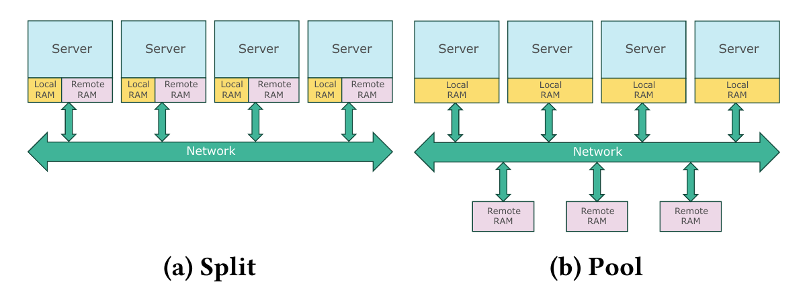
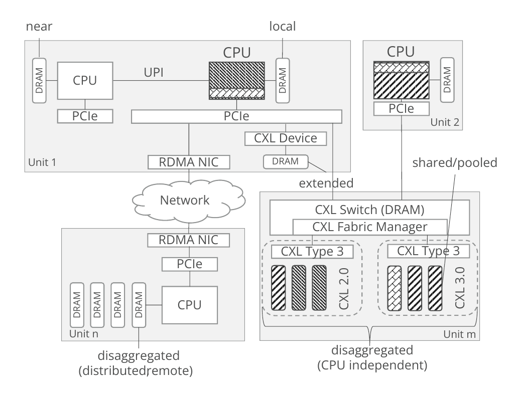

**Disaggregated Data Systems – State-of-the-Art and Open Challenges｜解耦式数据系统——研究现状与开放挑战**

**Alexander Krause** 
alexander.krause@tu-dresden.de 
Technische Universität Dresden 
Dresden, Germany

**Johannes Pietrzyk** 
johannes.pietrzyk@tu-dresden.de 
Technische Universität Dresden 
Dresden, Germany

**Alexander Boehm** 
alexander.boehm@sap.com 
SAP SE 
Walldorf, Germany

> **Alexander Krause** 
> alexander.krause@tu-dresden.de 
> 德累斯顿工业大学 
> 德国德累斯顿
>
> **Johannes Pietrzyk** 
> johannes.pietrzyk@tu-dresden.de 
> 德累斯顿工业大学 
> 德国德累斯顿
>
> **Alexander Boehm** 
> alexander.boehm@sap.com 
> SAP SE 
> 德国瓦尔多夫

**Tutorial Paper**

**EDBT ’26, 24-27 March 2026, Tampere (Finland)**

> **教程论文**
>
> **EDBT ’26，2026 年 3 月 24–27 日，芬兰坦佩雷**

© 2026 Copyright held by the owner/author(s). Published on OpenProceedings.org under ISBN 978-3-89318-104-9, series ISSN 2367-2005. Distribution of this paper is permitted under the terms of the Creative Commons license CC-by-nc-nd 4.0.

> © 2026 版权归所有者/作者所有。本文发表于 OpenProceedings.org，ISBN 978-3-89318-104-9，丛刊 ISSN 2367-2005。本文可依照知识共享许可协议 CC BY-NC-ND 4.0 的条款传播。

**DOI:** 10.48786/edbt.2026.77 
**Pages:** 772–775

> **DOI：** 10.48786/edbt.2026.77 
> **页码：** 772–775

## Abstract｜摘要

This tutorial aims to review disaggregated systems research in the context of database systems. We cover the exploitation of disaggregated storage in the industry landscape, contemporary research aimed towards database applications, and the current trend of data path computing. Our journey through disaggregated systems is concluded with a statement about open challenges in all three categories.

> 本教程旨在从数据库系统的语境出发，回顾解耦式系统研究。我们将介绍产业界对解耦式存储的运用、面向数据库应用的当代研究，以及当前的数据路径计算趋势。最后，我们将陈述这三类方向各自面临的开放挑战，为解耦式系统之旅作结。

## Keywords｜关键词

Disaggregated Systems, Disaggregated Memory, CXL, RDMA, Near Data Processing

> 解耦式系统，解耦式内存，计算快速链路（CXL），远程直接内存访问（RDMA），近数据处理

## 1 Motivation and Relevance｜动机与意义

Disaggregated systems promise to break the fixed resource ratios of server form factors and expose compute, storage, and memory as independently and thus elastically scalable building blocks. While not yet fully implemented, this vision is already visible in production cloud deployments: durable storage is routinely provisioned and managed separately from compute, while traditionally "local" resources (notably DRAM and NVMe SSDs) are increasingly targeted for pooling and remote access. For data management systems, the consequence is an even stronger emphasis of managing data movement and control-path overhead—bytes on the fabric, CPU cycles in protocol/I/O stacks, and extra round-trips on critical access paths.

> 解耦式系统意在打破服务器形态中固定的资源配比，将计算、存储与内存呈现为彼此独立、因而可弹性伸缩的构件。虽然这一愿景尚未完全实现，但在生产级云部署中已清晰可见：持久化存储通常与计算资源分开供应和管理，而传统上属于“本地”的资源（尤其是 DRAM 与 NVMe SSD）也越来越多地被纳入池化和远程访问的目标。对数据管理系统而言，这意味着必须更加重视数据移动和控制路径的开销——包括互连结构上传输的字节、协议/I/O 栈消耗的 CPU 周期，以及关键访问路径上额外的往返通信。译注：原文“an even stronger emphasis of managing”搭配不自然，英文照录，译文按“更加重视……”处理。

Disaggregation opens novel operating points for data systems - or more generally - data-intensive platforms: elastic scaling and rapid reconfiguration, reduced resource stranding through better demand matching, and new recovery/migration strategies enabled by decoupling state from specific machines. Yet, nothing comes for free: remote access amplifies latency sensitivity, stresses caching and concurrency control, and forces explicit placement decisions: what stays close to compute, what can reside in a remote tier, and which parts of the processing pipeline should move toward the data.

**Tutorial Scope:** This tutorial is motivated by how recent research connects these infrastructure capabilities to data system-specific design questions. RDMA-style Split architectures and CXL-style Pool architectures provide different performance envelopes for memory disaggregation, and their implications propagate upward from OS-level mechanisms through buffer management, access paths, and query execution. In parallel, a renewed push toward data-path computing (near-storage and near-network processing) aims to mitigate the "disaggregation tax" by reducing the number of transferred bytes and host-side overhead. Our goal is to provide a structured overview of this evolving design space, summarize state-of-the-art approaches, and highlight the open challenges that must be addressed to make disaggregation a foundation for future data systems. To achieve that, our tutorial is divided into three parts: (i) a brief review of disaggregated systems history in the industry landscape, (ii) contemporary research, and (iii) current research directions.

> 解耦为数据系统——更一般地说，也为数据密集型平台——开辟了新的运行点：弹性扩缩与快速重配置；通过更好地匹配需求来减少资源搁浅；以及借助状态与特定机器的分离而实现新的恢复与迁移策略。然而，天下没有免费的午餐：远程访问会放大系统对延迟的敏感性，给缓存和并发控制带来压力，并迫使系统显式作出放置决策：哪些应留在计算侧附近，哪些可以驻留在远程层，以及处理流水线的哪些部分应移向数据。
>
> **教程范围：** 本教程的出发点，是考察近期研究如何把这些基础设施能力与数据系统特有的设计问题联系起来。RDMA 式的分离（Split）架构与 CXL 式的资源池（Pool）架构为内存解耦提供了不同的性能包络，其影响从操作系统层机制一路向上传导至缓冲区管理、访问路径和查询执行。与此同时，数据路径计算（近存储处理与近网络处理）再度受到关注，目标是通过减少传输字节数和主机侧开销来缓解“解耦税”（即资源解耦后因远程数据移动和控制路径而新增的成本）。我们的目标是对这一不断演进的设计空间给出结构化概览，总结最先进的方法，并指出要使解耦成为未来数据系统基础仍须解决的开放挑战。为此，本教程分为三部分：(i) 简要回顾产业界解耦式系统的历史；(ii) 当代研究；(iii) 当前研究方向。

**Intended Audience:** This tutorial is aimed at researchers and practitioners alike, and at anyone interested in working with hardware disaggregation. This tutorial should help (i) to make disaggregated system research accessible to a wider audience and (ii) to understand the current rise of and hype around CXL and memory sharing.

> **目标受众：** 本教程既面向研究人员与从业者，也面向任何有兴趣从事硬件解耦工作的人。它应有助于：(i) 让更广泛的受众能够理解解耦式系统研究；(ii) 理解 CXL 与内存共享眼下的兴起及其热潮。

## 2 Disaggregated Infrastructure｜解耦式基础设施

In the first part of our tutorial, we give a brief historical perspective on the evolution of the hardware ecosystem. With the advent of cloud computing, infrastructure deployments are increasingly moving away from static, on-premise setups and towards infrastructure-as-a-service (IAAS) offerings in the cloud. A key characteristic of cloud-based offerings is the separation of compute and storage. This means that customers pick a certain shape of virtual machine, which defines the CPUs and memory resources available. Durable storage is added separately, e.g., in the form of block devices that are mounted into the VMs, or by leveraging object storage offering large storage volumes with GET/PUT semantics at a comparatively low price. The separation of compute and storage virtually allows arbitrary combinations of CPU/DRAM and disk space, e.g., it is possible to create a small, virtual server with only one virtual CPU (vCPU), but to attach terabytes of persistent storage to it.

> 在教程的第一部分，我们从简要的历史视角考察硬件生态系统的演进。随着云计算兴起，基础设施部署正日益从静态的本地配置转向云端的基础设施即服务（原文写作“IAAS”，通常写作“IaaS”）产品。云服务的一项关键特征是计算与存储相分离。这意味着客户选择某种虚拟机规格，由该规格确定可用的 CPU 和内存资源；持久化存储则单独添加，例如以挂载到虚拟机中的块设备形式提供，或利用对象存储，以相对较低的价格提供采用 GET/PUT 语义的大容量存储。计算与存储分离后，CPU/DRAM 与磁盘空间实际上可以任意组合：例如，可以创建一台只有一个虚拟 CPU（vCPU）的小型虚拟服务器，却为它挂载数 TB 的持久化存储。

### 2.1 Implications for Data Systems｜对数据系统的影响

For many years, the database and distributed systems communities have researched the novel opportunities of disaggregated infrastructure. This effort has resulted in both novel system architectures and proposals for the incremental evolution of existing designs. Using some representative examples, we discuss three exemplary classes of data management designs and how they benefit from large-scale, disaggregated infrastructure.

> 多年来，数据库与分布式系统社区一直在研究解耦式基础设施带来的新机遇。这些努力既催生了新型系统架构，也产生了让现有设计逐步演进的方案。下面以若干代表性实例为基础，讨论三类典型的数据管理设计，以及它们如何受益于大规模解耦式基础设施。

Novel data management systems such as Map/Reduce [6], BigQuery [21, 22] and others [5, 7, 25, 33]. We highlight key elements of their designs and discuss the differences from traditional database systems, as well as their reception by the database community [8]. Recently, the idea of serverless computing and serverless data processing platforms gained attention. These solutions focus on offering a Software-as-a-Service (SaaS) data management solution to customers and hide the existence of underlying virtual machines and their shapes from the customer. Thus, we consider both industry and academia systems, such as AWS Athena [30], Lambada [23] or Skyrise [4].

> 新型数据管理系统包括 Map/Reduce [6]、BigQuery [21, 22] 及其他系统 [5, 7, 25, 33]。我们将重点介绍其设计中的关键元素，讨论它们与传统数据库系统的差异，以及数据库社区对它们的反响 [8]。近来，无服务器计算和无服务器数据处理平台的理念受到关注。这些方案着重向客户提供软件即服务（SaaS）式的数据管理解决方案，并向客户隐藏底层虚拟机及其规格的存在。因此，我们既考察产业界系统，也考察学术界系统，例如 AWS Athena [30]、Lambada [23] 和 Skyrise [4]。译注：本段英文首句在原文中是一个缺少谓语的句子片段，此处照录，译文按上下文补足语义。

Another popular approach for building cloud-native, disaggregated systems is the incremental evolution of existing data system architectures. One of the pioneers in this space is the Aurora system [27, 28], which introduced the idea of componentizing the MySQL and PostgreSQL systems by separating their query processing frontends from their storage backends. A similar approach is found in several other industry systems, such as AlloyDB [24] or Socrates [1]. We highlight the key design aspects of these evolved, traditional DBMS and discuss their key advantages and challenges in these architectures.

> 构建云原生解耦式系统的另一种常见方法，是让现有数据系统架构渐进演进。该领域的先驱之一是 Aurora 系统 [27, 28]；它把查询处理前端与存储后端分开，由此提出了将 MySQL 和 PostgreSQL 系统组件化的思路。AlloyDB [24]、Socrates [1] 等其他产业系统也采用了类似方法。我们将重点介绍这些演进而来的传统 DBMS 的关键设计，并讨论它们在此类架构中的主要优势与挑战。

**Figure 1: High-level system architectures for memory disaggregation (cf. Figure 2 of [9])｜图：内存解耦的高层系统架构（参见文献 [9] 的图 2）**

> **图表中文解读：** 左侧 Split 架构把远程内存分散在各服务器内部，各服务器通过网络直接访问别的服务器上的 DRAM；右侧 Pool 架构则把远程 DRAM 从计算服务器中抽离，形成可由多台服务器共享的独立内存池。二者分别对应后文讨论的 RDMA 式“分离”与 CXL 式“资源池”性能边界。

### 2.2 Remaining Challenges｜尚存挑战

While the separation of compute and storage is a key building block to engineer the next generation data systems architectures, still, the availability and capacity of several other important hardware resources are tied to the virtual machine. This includes both local solid-state drives (SSDs) that are key for low-latency, persistent data storage, as well as main memory (DRAM).

> 尽管计算与存储分离是构建下一代数据系统架构的关键基础，但其他若干重要硬件资源的可用性和容量仍与虚拟机绑定，其中既包括承担低延迟持久化数据存储任务的本地固态硬盘（SSD），也包括主存（DRAM）。

The challenge with these local resources is that they are usually not fully utilized, as the available ratio in the server typically does not match the expected ratio needed by consuming applications (i.e., a in-memory database management system has higher DRAM requirements than a web server). This leads to the problem of resource stranding, either on the customer side, or for the cloud service provider.

> 这些本地资源面临的挑战在于，它们通常无法得到充分利用，因为服务器中的既有资源配比往往与应用所需的预期配比不一致（例如，内存数据库管理系统对 DRAM 的需求高于 Web 服务器）。这会在客户侧或云服务提供商侧造成资源搁浅。译注：原文写作“a in-memory database management system”，冠词使用有误；英文照录，译文按其本意处理。

Particularly, DRAM stranding is a very relevant problem due to the high DRAM price, and we highlight several different proposals how to address DRAM stranding proposed in the literature [17, 18]. For local SSDs, new network-based access protocols such as NVMe-over-TCP might be a way to also enable their disaggregation, as long as the consumers can tolerate the additional latency induced by remote communication.

> 尤其是，鉴于 DRAM 价格高昂，DRAM 搁浅是一个非常现实的问题；我们将重点介绍文献中为解决这一问题提出的若干不同方案 [17, 18]。对于本地 SSD，NVMe-over-TCP 等新型网络访问协议也可能使其实现解耦，前提是使用方能够容忍远程通信引入的额外延迟。译注：原文“highlight several different proposals how to address ... proposed”存在重复且句法生硬，英文照录，译文按其本意处理。

## 3 Disambiguating Disaggregation｜辨析“解耦”

Memory disaggregation is sometimes confused with storage disaggregation. Both approaches separate hardware resources from the host machine on which they are ultimately used. Following up on the discussion about storage disaggregation from the first part of the tutorial, we will introduce the concept of disaggregated memory in the second part. Moving from the constraint of physically attached resources towards rack-organized hardware components is a key enabler for true software-defined systems, also known as disaggregated systems.

> 内存解耦有时会与存储解耦混为一谈。两种方法都会把硬件资源与最终使用它们的主机分开。承接教程第一部分对存储解耦的讨论，我们将在第二部分介绍解耦式内存的概念。从受限于物理直连资源，转向按机架组织硬件组件，是实现真正的软件定义系统——亦即解耦式系统——的关键推动因素。

Memory disaggregation can be achieved in several ways, but typically through a network interconnect such as Ethernet or InfiniBand. A recent survey drafts disaggregated memory architecture as shown in Figure 1. Main memory can be shared among multiple machines, where the Split architecture allows servers to leverage Remote Direct Memory Access (RDMA) to directly access the DRAM that is located inside one discrete other server. Contrary, Compute Express Link (CXL) enables the attachment of byte-addressable main memory via PCIe, following the Pool architectural approach. The most recent CXL specification version 4 was published in 2025, but until now, only CXL specification 2.0 conforming hardware is commercially available. With the CXL 2.0 specification, memory pools can be shared via a dedicated CXL switch, which enables main memory access over fabric. Figure 2 illustrates a disaggregated setup with three units: Unit 1 connects to Unit n through RDMA and to (memory-)Unit m via CXL. Once CXL 3.0 devices are generally available, multiple CPUs can even share the same DIMM.

> 内存解耦可以通过多种方式实现，但通常依赖以太网或 InfiniBand 等网络互连。近期一篇综述把解耦式内存架构概括为图 1 所示的形式。主存可以由多台机器共享：在 Split 架构中，服务器可利用远程直接内存访问（RDMA），直接访问位于另一台独立服务器内部的 DRAM。相较之下，计算快速链路（Compute Express Link，CXL）遵循 Pool 架构，通过 PCIe 挂接按字节寻址的主存。最新的 CXL 规范第 4 版发布于 2025 年，但截至原文所述时间，商用硬件仅符合 CXL 2.0 规范。在 CXL 2.0 规范下，内存池可通过专用 CXL 交换机共享，从而支持经由互连结构访问主存。图 2 展示了一个包含三个单元的解耦配置：单元 1 通过 RDMA 连接单元 n，并通过 CXL 连接（内存）单元 m。当 CXL 3.0 设备普遍可用后，多个 CPU 甚至可以共享同一个 DIMM。译注：原文“drafts disaggregated memory architecture”缺少冠词且搭配生硬，译文按“综述概括该架构”处理；短语“inside one discrete other server”和句首“Contrary”同样表达生硬，英文均照录，译文依上下文分别处理为“另一台独立服务器内部”和“相较之下”。

**Figure 2: CXL-enabled memory disaggregation｜图：由 CXL 支持的内存解耦**

> **图表中文解读：** 单元 1 展示了多层内存：标为 local 的 DRAM 与右侧 CPU 直接相连；标为 near 的 DRAM 连接左侧 CPU，而两个 CPU 通过 UPI 相连；extended DRAM 则经 PCIe/CXL 设备连接。单元 1 还能通过 RDMA 网卡和网络访问单元 n 的分布式远程内存。右侧的单元 m 是与 CPU 无关的解耦式内存资源：CXL 2.0 区域表示经 CXL 交换机和 Fabric Manager 管理的池化内存，CXL 3.0 区域则示意与单元 2 等多个 CPU 共享同一内存设备。

### 3.1 Working up the Database Stack｜沿数据库栈逐层向上

This second part of the tutorial will present the general overview of a data system’s software stack and with it, we will highlight memory disaggregation research throughout its layers. We first sketch operating system level techniques with Infiniswap [12] and Software-defined far memory [14]. Such techniques enable systems to use far memory as an extension for the local swap memory or to move cold, stale data to external memory.

> 教程的第二部分将概览数据系统的软件栈，并据此重点介绍贯穿各层的内存解耦研究。我们首先以 Infiniswap [12] 和软件定义远端内存 [14] 为例，勾勒操作系统层面的技术。这些技术使系统能够用远端内存扩展本地交换空间，或把冷的、陈旧的数据迁往外部内存。

We cover different research directions across the software stack, spanning from the buffer layer through the storage and access system up to the query processing layer. A first-class issue is data movement and near-data processing since the dawn of NUMA. PolarDBCXL [32] combats the asynchronicity and integration overhead, that is inherent to RDMA, by placing the database content into the far memory. Other approaches like Pipeline Grouping [10] show that naïve application of load/store can be outperformed by intelligent read/write operations, given enough base data overlap in concurrent query execution. Naturally, we cover holistic reviews of in-memory processing on genuine CXL hardware [31].

> 我们将介绍跨越软件栈的不同研究方向：从缓冲层，经由存储与访问系统，直至查询处理层。自 NUMA 出现以来，数据移动与近数据处理一直是首要问题。PolarDBCXL [32] 把数据库内容放入远端内存，以应对 RDMA 固有的异步性与集成开销。Pipeline Grouping [10] 等其他方法表明，当并发查询执行所用的基础数据具有足够重叠时，智能读写操作可以胜过朴素地使用 load/store。自然地，我们也会涵盖在真实 CXL 硬件上对内存数据处理开展的整体性评测 [31]。译注：原文在“the asynchronicity and integration overhead”之后使用“that is inherent”，存在数的一致性和逗号使用问题；英文照录，译文按并列含义处理。

### 3.2 Open Challenges｜开放挑战

CXL is a key enabler for true hardware disaggregation, but its cost may not offset its usability. Even major players like Google do not share a harmonic vision on the cost-benefit tradeoff for CXL, ranging from it being a godsend[^1],[^2] or straight up way too expensive to become a true savior for cloud providers [16]. The latency penalty for CXL-attached memory varies greatly between directly attaching an add-in card to the PCIe socket or coupling multiple memory expansion devices behind a CXL switch. This poses a crucial memory access and data placement optimization criterion, especially for tiered memory setups.

> CXL 是实现真正硬件解耦的关键推动因素，但其易用性带来的收益未必足以抵消成本。即使是 Google 这样的主要参与者，对 CXL 的成本—收益权衡也没有形成一致看法：有人视其为天赐良机[^1],[^2]，也有人直言它成本过高，难以成为云服务提供商真正的救星 [16]。对于 CXL 挂接内存，附加卡直接插入 PCIe 插槽，与把多个内存扩展设备接在 CXL 交换机之后，二者带来的延迟惩罚差异很大。这构成一项关键的内存访问与数据放置优化准则，对分层内存配置尤其如此。译注：原文“its cost may not offset its usability”的主客体及否定关系与上下文疑似倒置；本句按疑似本意翻译，英文照录。原文“do not share a harmonic vision”亦非自然英语搭配，译为“没有形成一致看法”。

[^1]:
    https://www.linkedin.com/posts/laurie-kirk_prediction-2026-is-going-to-be-the-year-activity-7412947514267598848-_PEf [accessed 03-Mar-2026]

    > https://www.linkedin.com/posts/laurie-kirk_prediction-2026-is-going-to-be-the-year-activity-7412947514267598848-_PEf [访问于 2026-03-03]

[^2]:
    https://www.linkedin.com/posts/laurie-kirk_outside-of-the-datacenter-world-no-one-realizes-activity-7413329701861154816-QVwe [accessed 03-Mar-2026]

    > https://www.linkedin.com/posts/laurie-kirk_outside-of-the-datacenter-world-no-one-realizes-activity-7413329701861154816-QVwe [访问于 2026-03-03]

## 4 Computing on the Data Path｜数据路径上的计算

Disaggregation shifts the dominant cost from arithmetic to data movement and control-path overhead: bytes on the fabric, CPU cycles in protocol or I/O stacks, and extra round-trips. Near-Data Processing (NDP) addresses this "disaggregation tax" by executing selected computation on the data path—near storage, inside network devices (DPUs/SmartNICs), or near memory, so that less data (or fewer expensive control actions) must traverse remote boundaries. Recent research shows a consistent pattern: the largest and reliable gains come from (i) pushing down high-data-reduction work, (ii) using low-overhead interfaces, and (iii) ensuring correctness once updates cross the host-device boundary [2, 3, 15, 19, 29, 34]. Building on the disaggregated storage and memory models discussed in the previous tutorial parts, NDP can be viewed as "data-path computing": inserting computation along remote-access paths to reduce the number of transferred bytes and/or host CPU overhead. Storage-side NDP ranges from operator pushdown into storage servers to computational storage devices that run restricted kernels inside SSD/FPGA/SoC controllers. Network-side NDP leverages DPUs on the fast path to offload copying and request handling (and sometimes co-process data-parallel primitives), reducing the CPU load for remote I/O. Memory-side NDP (often implicit) redesigns access paths and data structures so that remote-memory latency/bandwidth constraints do not dominate performance. Hence, the third part of the tutorial sways the focus towards the question of how to exploit compute capabilites during data movement.

> 解耦把主导成本从算术运算转移到了数据移动和控制路径开销：互连结构上传输的字节、协议栈或 I/O 栈消耗的 CPU 周期，以及额外的往返通信。近数据处理（NDP）通过在数据路径上——存储附近、网络设备（DPU/SmartNIC）内部或内存附近——执行选定计算，使更少的数据（或更少代价高昂的控制操作）跨越远程边界，以此应对这种“解耦税”。近期研究呈现出一致规律：最大且可靠的收益来自：(i) 下推能大幅缩减数据量的工作；(ii) 使用低开销接口；(iii) 在更新跨越主机—设备边界后确保正确性 [2, 3, 15, 19, 29, 34]。基于教程前几部分讨论的解耦式存储与内存模型，可以把 NDP 看成“数据路径计算”：沿远程访问路径插入计算，以减少传输字节数和/或主机 CPU 开销。存储侧 NDP 的范围，从把算子下推到存储服务器，延伸至在 SSD/FPGA/SoC 控制器内部运行受限内核的计算存储设备。网络侧 NDP 利用快速路径上的 DPU 卸载复制和请求处理（有时还协同处理数据并行原语），从而降低远程 I/O 的 CPU 负载。内存侧 NDP（往往是隐式的）重新设计访问路径和数据结构，避免远程内存的延迟/带宽约束主导性能。因此，教程第三部分把重点转向如何在数据移动期间利用计算能力。译注：原文“the largest and reliable gains”并列形式不一致，末句还将“capabilities”误拼为“capabilites”；英文均照录，译文按原意处理。

### 4.1 NDP Placement Along the Access Paths｜沿访问路径放置 NDP

At the storage side (operator pushdown into storage servers and computational storage devices), the state of the art focuses on byte reduction first: FPGA/SoC engines execute scan-centric kernels (filter/projection/lightweight aggregation) close to storage so that only reduced results traverse the fabric, with the host orchestrating transfers via DMA-friendly, streaming interfaces [26, 29].

Moving up the stack to the storage-engine / format boundary, the key shift is from "run code near data" to "run DBMS-aware code near data": systems must bridge engine-specific layouts and MVCC visibility into device-friendly streams and compact coordination metadata, and explicitly manage where version/visibility work is performed to avoid random-access amplification across the host–device boundary [15, 29]. At the query/operator layer on compute frontends, practical designs therefore push down primarily high–data-reduction operators (filters, partial aggregates, early projections) to cut shipped bytes [19, 29].

> 在存储侧（把算子下推到存储服务器和计算存储设备），当前最先进的方法首先关注减少字节量：FPGA/SoC 引擎在靠近存储的位置执行以扫描为中心的内核（过滤、投影、轻量聚合），使互连结构上只传输缩减后的结果；主机则通过适合 DMA 的流式接口编排传输 [26, 29]。
>
> 沿软件栈向上来到存储引擎/格式边界，关键变化是从“在数据附近运行代码”转向“在数据附近运行理解 DBMS 的代码”：系统必须把引擎特有的布局和 MVCC 可见性转换为设备友好的数据流及紧凑协调元数据，并显式管理版本/可见性工作的执行位置，以免跨主机—设备边界的随机访问被放大 [15, 29]。因此，在计算前端的查询/算子层，实用设计主要下推数据缩减率高的算子（过滤、部分聚合、早期投影），以减少传输字节数 [19, 29]。

Beyond read-mostly pipelines, recent work begins to offload stateful modifications under explicit transactional contracts, using cache-coherent shared locking or coordination metadata paths to preserve correctness while bounding interference with foreground work [2, 3]. For memory-side NDP in memory - disaggregated Split (RDMA) and Pool (CXL fabric) settings, the dominant mechanism is often structural rather than "kernel offload": index and access-path designs reshape concurrency control, caching, and validation to reduce round-trips and remote synchronization, preventing pointer-heavy traversals from turning into control-path stalls dominated by remote latency [20].

> 除了以读为主的流水线，近期工作也开始在显式事务契约下卸载有状态修改：利用缓存一致的共享锁，或协调元数据路径，在保持正确性的同时限制对前台工作的干扰 [2, 3]。对于内存侧 NDP，在内存解耦的 Split（RDMA）和 Pool（CXL 互连结构）配置中，主导机制往往是结构性的，而不是“内核卸载”：索引与访问路径的设计会重塑并发控制、缓存和验证，以减少往返通信与远程同步，避免大量指针遍历演变成由远程延迟主导的控制路径停顿 [20]。译注：原文短语“in memory - disaggregated Split ... settings”中的空格与连字符搭配异常，英文照录，译文依上下文处理为“在内存解耦的……配置中”。

Finally, at the network/DPU datapath inside storage backends, DPUs can remove protocol and copying overhead (e.g., zero-copy request handling and lightweight parsing/dispatch), but recent evidence emphasizes that the real frontier is co-processing and placement: benefits depend on configuration, input characteristics, and DPU resource limits, so static offload policies can underperform without adaptive split decisions [11, 34]. Overall, these results reinforce the tutorial’s framing of NDP as data-path computing: dependable gains come from reducing transferred bytes and control-path work, and the open research problem is increasingly how to place and coordinate these fragments under contention and correctness constraints rather than merely identifying offloadable kernels [11, 13].

> 最后，在存储后端内部的网络/DPU 数据路径上，DPU 可以消除协议与复制开销（例如，实现零拷贝请求处理和轻量解析/分派），但近期证据强调，真正的前沿在于协同处理与放置：收益取决于配置、输入特征和 DPU 资源上限；如果缺少自适应的拆分决策，静态卸载策略的表现可能不佳 [11, 34]。总体而言，这些结果进一步印证了本教程把 NDP 定义为数据路径计算的框架：可靠收益来自减少传输字节数和控制路径工作；开放研究问题正日益从“识别可卸载的内核”，转向“在资源争用与正确性约束下如何放置并协调这些计算片段”[11, 13]。

### 4.2 Open Challenges｜开放挑战

A first research direction is end-to-end, adaptive placement: optimizers and runtimes should jointly model selectivity (data reduction), device saturation, reconfiguration cost, and contention and interference under shared devices [11, 13, 20, 34]. A second is portable correctness for update-capable NDP—minimal, reusable abstractions for MVCC visibility, locking, logging/recovery, and failure handling that can span heterogeneous near-data engines and varying fabrics (RDMA versus coherent CXL-class links) without per-platform redesign [2, 3, 15, 29]. A third is reusable representations and observability: canonical data formats, layout-aware transformations, and profiling/debugging support so that split execution remains understandable and verifiable as computation migrates into devices [11, 15, 34].

> 第一项研究方向是端到端自适应放置：优化器与运行时应联合建模选择率（数据缩减）、设备饱和度、重配置成本，以及共享设备上的资源争用与相互干扰 [11, 13, 20, 34]。第二项是为支持更新的 NDP 提供可移植的正确性保障：为 MVCC 可见性、加锁、日志/恢复和故障处理设计最小且可复用的抽象，使其无需针对每个平台重新设计，便能跨越异构近数据引擎和不同互连结构（RDMA 与缓存一致的 CXL 类链路）[2, 3, 15, 29]。第三项是可复用表示与可观测性：提供规范数据格式、感知布局的转换，以及剖析/调试支持，使计算迁移到设备中之后，拆分执行仍然可理解、可验证 [11, 15, 34]。

## 5 Biography｜作者简介

This is a joint tutorial, held by TU Dresden and SAP SE.

**Alexander Krause** is a PostDoc at TU Dresden’s Database Research Group, chaired by Wolfgang Lehner. He is currently participating in the Reinhart Koselleck-Project of the German Research Foundation, which focuses on serverless data management principles. His research focuses on databases in the context of disaggregated systems by leveraging RDMA and CXL and he currently serves as an active member of the PVLDB Vol. 19 and SIGMOD 2027 review boards as well as a Proceedings Chair for the EDBT/ICDT 2026.

**Johannes Pietrzyk** is a PostDoc with the Database Research Group at TU Dresden. He currently works on CHORYS, a Horizon Europe project on open and programmable accelerators for data-intensive applications, with a particular focus on near-data processing, asynchronous data services, and RISC-V-based system design. His research interests include data-intensive systems, database architectures, hardware/software co-design, and high-performance data processing. Within CHORYS, he works on designing and evaluating system abstractions and mechanisms to enhance the performance of modern cloud and data platforms.

> 本教程由德累斯顿工业大学与 SAP SE 联合举办。
>
> **Alexander Krause** 是德累斯顿工业大学数据库研究组的博士后，该研究组由 Wolfgang Lehner 领导。他目前参与德国科学基金会的 Reinhart Koselleck 项目，研究重点是无服务器数据管理原理。他的研究聚焦于借助 RDMA 和 CXL 探索解耦式系统语境下的数据库；目前，他是 PVLDB 第 19 卷和 SIGMOD 2027 评审委员会的活跃成员，并担任 EDBT/ICDT 2026 论文集主席。
>
> **Johannes Pietrzyk** 是德累斯顿工业大学数据库研究组的博士后。他目前参与“地平线欧洲”的 CHORYS 项目，该项目研究面向数据密集型应用的开放、可编程加速器，尤其关注近数据处理、异步数据服务以及基于 RISC-V 的系统设计。他的研究兴趣包括数据密集型系统、数据库架构、软硬件协同设计与高性能数据处理。在 CHORYS 项目中，他致力于设计和评估系统抽象与机制，以提升现代云平台和数据平台的性能。

**Alexander Boehm** is a Distinguished Engineer at SAP and one of the chief architects for the SAP HANA Cloud database management system. His specific focus is on system performance and core database topics. Additionally, he is working on the evolution of the HANA system, including novel hardware and cloud-based system deployments. Before re-joining SAP in 2024, Alexander was a Principal Engineer at Google Cloud and an Uber-Techlead for Google’s AlloyDB for PostgreSQL system.

> **Alexander Boehm** 是 SAP 杰出工程师，也是 SAP HANA Cloud 数据库管理系统的首席架构师之一。他主要关注系统性能与数据库核心议题。此外，他也致力于 HANA 系统的演进，包括新型硬件和云端系统部署。在 2024 年重新加入 SAP 之前，Alexander 曾任 Google Cloud 首席工程师，并担任 Google AlloyDB for PostgreSQL 系统的跨团队技术负责人（Uber-Techlead）。

## Acknowledgments｜致谢

This work was partly funded by (1) by the German Research Foundation (DFG) under grant LE-1416/28-1 and (2) the European Union’s Horizon research and innovation program under grant agreement no. 101189551. Views and opinions expressed are however those of the author(s) only and do not necessarily reflect those of the European Union or the European Health and Digital Executive Agency. Neither the European Union nor the granting authority can be held responsible for them.

> 本工作部分由以下项目资助：(1) 德国科学基金会（DFG）的 LE-1416/28-1 号基金；(2) 欧盟“地平线”研究与创新计划的 101189551 号资助协议。然而，文中表达的观点和意见仅代表作者本人，并不一定反映欧盟或欧洲卫生与数字执行局的立场。欧盟及资助机构均不对此承担责任。译注：原文“funded by (1) by”重复使用了“by”，英文照录，译文去除重复。

## References｜参考文献

[1] Panagiotis Antonopoulos, Alex Budovski, Cristian Diaconu, Alejandro Hernandez Saenz, Jack Hu, Hanuma Kodavalla, Donald Kossmann, Sandeep Lingam, Umar Farooq Minhas, Naveen Prakash, Vijendra Purohit, Hugh Qu, Chaitanya Sreenivas Ravella, Krystyna Reisteter, Sheetal Shrotri, Dixin Tang, and Vikram Wakade. 2019. Socrates: The New SQL Server in the Cloud. In Proceedings of the 2019 International Conference on Management of Data, SIGMOD Conference 2019, Amsterdam, The Netherlands, June 30 - July 5, 2019. ACM, 1743–1756. doi:10.1145/3299869.3314047

> [1] Panagiotis Antonopoulos、Alex Budovski、Cristian Diaconu、Alejandro Hernandez Saenz、Jack Hu、Hanuma Kodavalla、Donald Kossmann、Sandeep Lingam、Umar Farooq Minhas、Naveen Prakash、Vijendra Purohit、Hugh Qu、Chaitanya Sreenivas Ravella、Krystyna Reisteter、Sheetal Shrotri、Dixin Tang 和 Vikram Wakade。2019。Socrates：云端的新型 SQL Server。载于《2019 年数据管理国际会议论文集》（SIGMOD Conference 2019），荷兰阿姆斯特丹，2019 年 6 月 30 日至 7 月 5 日。ACM，1743–1756。doi:10.1145/3299869.3314047

[2] Arthur Bernhardt, Sajjad Tamimi, Florian Stock, Andreas Koch, and Ilia Petrov. 2025. Update NDP: On Offloading Modifications to Smart Storage with Transactional Guarantees in Near-Data Processing DBMS. ACM Transactions on Database Systems (2025). doi:10.1145/3774753

> [2] Arthur Bernhardt、Sajjad Tamimi、Florian Stock、Andreas Koch 和 Ilia Petrov。2025。Update NDP：在近数据处理 DBMS 中，以事务保证把修改操作卸载到智能存储。ACM Transactions on Database Systems（2025）。doi:10.1145/3774753

[3] Arthur Bernhardt, Sajjad Tamimi, Florian Stock, Tobias Vinçon, Andreas Koch, and Ilia Petrov. 2022. Cache-Coherent Shared Locking for Transactionally Consistent Updates in Near-Data Processing DBMS on Smart Storage. In Proceedings of the 25th International Conference on Extending Database Technology, EDBT 2022, Edinburgh, UK, March 29 - April 1, 2022. OpenProceedings.org, 2:424–2:428. doi:10.48786/EDBT.2022.34

> [3] Arthur Bernhardt、Sajjad Tamimi、Florian Stock、Tobias Vinçon、Andreas Koch 和 Ilia Petrov。2022。面向智能存储上近数据处理 DBMS 事务一致更新的缓存一致共享锁。载于《第 25 届扩展数据库技术国际会议论文集》（EDBT 2022），英国爱丁堡，2022 年 3 月 29 日至 4 月 1 日。OpenProceedings.org，2:424–2:428。doi:10.48786/EDBT.2022.34

[4] Thomas Bodner, Daniel Ritter, Martin Boissier, and Tilmann Rabl. 2025. Skyrise: Exploiting Serverless Cloud Infrastructure for Elastic Data Processing. Datenbank-Spektrum 25, 1 (2025), 29–38. doi:10.1007/S13222-025-00496-7

> [4] Thomas Bodner、Daniel Ritter、Martin Boissier 和 Tilmann Rabl。2025。Skyrise：利用无服务器云基础设施进行弹性数据处理。Datenbank-Spektrum 25，1（2025），29–38。doi:10.1007/S13222-025-00496-7

[5] Matthias Brantner, Daniela Florescu, David A. Graf, Donald Kossmann, and Tim Kraska. 2008. Building a database on S3. In Proceedings of the ACM SIGMOD International Conference on Management of Data, SIGMOD 2008, Vancouver, BC, Canada, June 10-12, 2008. ACM, 251–264. doi:10.1145/1376616.1376645

> [5] Matthias Brantner、Daniela Florescu、David A. Graf、Donald Kossmann 和 Tim Kraska。2008。在 S3 上构建数据库。载于《ACM SIGMOD 数据管理国际会议论文集》（SIGMOD 2008），加拿大不列颠哥伦比亚省温哥华，2008 年 6 月 10–12 日。ACM，251–264。doi:10.1145/1376616.1376645

[6] Jeffrey Dean and Sanjay Ghemawat. 2004. MapReduce: Simplified Data Processing on Large Clusters. In 6th Symposium on Operating System Design and Implementation (OSDI 2004), San Francisco, California, USA, December 6-8, 2004. USENIX Association, 137–150.

> [6] Jeffrey Dean 和 Sanjay Ghemawat。2004。MapReduce：大型集群上的简化数据处理。载于第 6 届操作系统设计与实现研讨会（OSDI 2004），美国加利福尼亚州旧金山，2004 年 12 月 6–8 日。USENIX Association，137–150。

[7] Giuseppe DeCandia, Deniz Hastorun, Madan Jampani, Gunavardhan Kakulapati, Avinash Lakshman, Alex Pilchin, Swaminathan Sivasubramanian, Peter Vosshall, and Werner Vogels. 2007. Dynamo: amazon’s highly available key-value store. In Proceedings of the 21st ACM Symposium on Operating Systems Principles 2007, SOSP 2007, Stevenson, Washington, USA, October 14-17, 2007. ACM, 205–220. doi:10.1145/1294261.1294281

> [7] Giuseppe DeCandia、Deniz Hastorun、Madan Jampani、Gunavardhan Kakulapati、Avinash Lakshman、Alex Pilchin、Swaminathan Sivasubramanian、Peter Vosshall 和 Werner Vogels。2007。Dynamo：Amazon 的高可用键值存储。载于《第 21 届 ACM 操作系统原理研讨会论文集》（SOSP 2007），美国华盛顿州史蒂文森，2007 年 10 月 14–17 日。ACM，205–220。doi:10.1145/1294261.1294281

[8] David J. DeWitt. 2014. MapReduce: A major step backwards. https://api.semanticscholar.org/CorpusID:12492635

> [8] David J. DeWitt。2014。MapReduce：一次重大的倒退。https://api.semanticscholar.org/CorpusID:12492635

[9] Mohammad Ewais and Paul Chow. 2023. Disaggregated Memory in the Datacenter: A Survey. IEEE Access 11 (2023), 20688–20712. doi:10.1109/ACCESS.2023.3250407

> [9] Mohammad Ewais 和 Paul Chow。2023。数据中心中的解耦式内存：综述。IEEE Access 11（2023），20688–20712。doi:10.1109/ACCESS.2023.3250407

[10] Andreas Geyer, Alexander Krause, Dirk Habich, and Wolfgang Lehner. 2023. Pipeline Group Optimization on Disaggregated Systems. In 13th Conference on Innovative Data Systems Research, CIDR 2023, Amsterdam, The Netherlands, January 8-11, 2023. www.cidrdb.org.

> [10] Andreas Geyer、Alexander Krause、Dirk Habich 和 Wolfgang Lehner。2023。解耦式系统上的流水线组优化。载于第 13 届创新数据系统研究会议（CIDR 2023），荷兰阿姆斯特丹，2023 年 1 月 8–11 日。www.cidrdb.org。

[11] Dimitrios Giouroukis, Dwi P. A. Nugroho, Varun Pandey, Steffen Zeuch, and Volker Markl. 2025. Analyzing Near-Network Hardware Acceleration with Co-Processing on DPUs. Proc. VLDB Endow. 18, 13 (2025), 5689–5702.

> [11] Dimitrios Giouroukis、Dwi P. A. Nugroho、Varun Pandey、Steffen Zeuch 和 Volker Markl。2025。分析 DPU 上采用协同处理的近网络硬件加速。Proc. VLDB Endow. 18，13（2025），5689–5702。

[12] Juncheng Gu, Youngmoon Lee, Yiwen Zhang, Mosharaf Chowdhury, and Kang G. Shin. 2017. Efficient Memory Disaggregation with Infiniswap. In 14th USENIX Symposium on Networked Systems Design and Implementation, NSDI 2017, Boston, MA, USA, March 27-29, 2017. USENIX Association, 649–667.

> [12] Juncheng Gu、Youngmoon Lee、Yiwen Zhang、Mosharaf Chowdhury 和 Kang G. Shin。2017。利用 Infiniswap 实现高效内存解耦。载于第 14 届 USENIX 网络系统设计与实现研讨会（NSDI 2017），美国马萨诸塞州波士顿，2017 年 3 月 27–29 日。USENIX Association，649–667。

[13] Christian Knödler, Naeem Ramzan, and Ilia Petrov. 2025. hybridNDP: Dynamic Operation Offloading and Cooperative Query Execution in Smart Storage Settings. In Proceedings 28th International Conference on Extending Database Technology, EDBT 2025, Barcelona, Spain, March 25-28, 2025. OpenProceedings.org, 769–782. doi:10.48786/EDBT.2025.62

> [13] Christian Knödler、Naeem Ramzan 和 Ilia Petrov。2025。hybridNDP：智能存储环境中的动态操作卸载与协同查询执行。载于《第 28 届扩展数据库技术国际会议论文集》（EDBT 2025），西班牙巴塞罗那，2025 年 3 月 25–28 日。OpenProceedings.org，769–782。doi:10.48786/EDBT.2025.62

[14] H. Andrés Lagar-Cavilla, Junwhan Ahn, Suleiman Souhlal, Neha Agarwal, Radoslaw Burny, Shakeel Butt, Jichuan Chang, Ashwin Chaugule, Nan Deng, Junaid Shahid, Greg Thelen, Kamil Adam Yurtsever, Yu Zhao, and Parthasarathy Ranganathan. 2019. Software-Defined Far Memory in Warehouse-Scale Computers. In Proceedings of the Twenty-Fourth International Conference on Architectural Support for Programming Languages and Operating Systems, ASPLOS 2019, Providence, RI, USA, April 13-17, 2019. ACM, 317–330. doi:10.1145/3297858.3304053

> [14] H. Andrés Lagar-Cavilla、Junwhan Ahn、Suleiman Souhlal、Neha Agarwal、Radoslaw Burny、Shakeel Butt、Jichuan Chang、Ashwin Chaugule、Nan Deng、Junaid Shahid、Greg Thelen、Kamil Adam Yurtsever、Yu Zhao 和 Parthasarathy Ranganathan。2019。仓库级计算机中的软件定义远端内存。载于《第 24 届编程语言与操作系统体系结构支持国际会议论文集》（ASPLOS 2019），美国罗得岛州普罗维登斯，2019 年 4 月 13–17 日。ACM，317–330。doi:10.1145/3297858.3304053

[15] Kitaek Lee, Insoon Jo, Jaechan Ahn, Hyuk Lee, Hwang Lee, Woong Sul, and Hyungsoo Jung. 2023. Deploying Computational Storage for HTAP DBMSs Takes More Than Just Computation Offloading. Proc. VLDB Endow. 16, 6 (2023), 1480–1493. doi:10.14778/3583140.3583161

> [15] Kitaek Lee、Insoon Jo、Jaechan Ahn、Hyuk Lee、Hwang Lee、Woong Sul 和 Hyungsoo Jung。2023。为 HTAP DBMS 部署计算存储，不能只做计算卸载。Proc. VLDB Endow. 16，6（2023），1480–1493。doi:10.14778/3583140.3583161

[16] Philip Levis, Kun Lin, and Amy Tai. 2023. A Case Against CXL Memory Pooling. In Proceedings of the 22nd ACM Workshop on Hot Topics in Networks, HotNets 2023, Cambridge, MA, USA, November 28-29, 2023. ACM, 18–24. doi:10.1145/3626111.3628195

> [16] Philip Levis、Kun Lin 和 Amy Tai。2023。反对 CXL 内存池化的论证。载于《第 22 届 ACM 网络热点研讨会论文集》（HotNets 2023），美国马萨诸塞州剑桥，2023 年 11 月 28–29 日。ACM，18–24。doi:10.1145/3626111.3628195

[17] Feng Li, Sudipto Das, Manoj Syamala, and Vivek R. Narasayya. 2016. Accelerating Relational Databases by Leveraging Remote Memory and RDMA. In Proceedings of the 2016 International Conference on Management of Data, SIGMOD Conference 2016, San Francisco, CA, USA, June 26 - July 01, 2016. ACM, 355–370. doi:10.1145/2882903.2882949

> [17] Feng Li、Sudipto Das、Manoj Syamala 和 Vivek R. Narasayya。2016。利用远程内存与 RDMA 加速关系数据库。载于《2016 年数据管理国际会议论文集》（SIGMOD Conference 2016），美国加利福尼亚州旧金山，2016 年 6 月 26 日至 7 月 1 日。ACM，355–370。doi:10.1145/2882903.2882949

[18] Huaicheng Li, Daniel S. Berger, Lisa Hsu, Daniel Ernst, Pantea Zardoshti, Stanko Novakovic, Monish Shah, Samir Rajadnya, Scott Lee, Ishwar Agarwal, Mark D. Hill, Marcus Fontoura, and Ricardo Bianchini. 2023. Pond: CXL-Based Memory Pooling Systems for Cloud Platforms. In Proceedings of the 28th ACM International Conference on Architectural Support for Programming Languages and Operating Systems, Volume 2, ASPLOS 2023, Vancouver, BC, Canada, March 25-29, 2023. ACM, 574–587. doi:10.1145/3575693.3578835

> [18] Huaicheng Li、Daniel S. Berger、Lisa Hsu、Daniel Ernst、Pantea Zardoshti、Stanko Novakovic、Monish Shah、Samir Rajadnya、Scott Lee、Ishwar Agarwal、Mark D. Hill、Marcus Fontoura 和 Ricardo Bianchini。2023。Pond：面向云平台的 CXL 内存池化系统。载于《第 28 届 ACM 编程语言与操作系统体系结构支持国际会议论文集》第 2 卷（ASPLOS 2023），加拿大不列颠哥伦比亚省温哥华，2023 年 3 月 25–29 日。ACM，574–587。doi:10.1145/3575693.3578835

[19] Shu Lin, Arunprasad P. Marathe, Per-Åke Larson, Chong Chen, Calvin Sun, Paul Lee, Weidong Yu, Jianwei Li, Juncai Meng, Roulin Lin, Xiaoyang Chen, and Qingping Zhu. 2022. Near Data Processing in Taurus Database. In 38th IEEE International Conference on Data Engineering, ICDE 2022, Kuala Lumpur, Malaysia, May 9-12, 2022. IEEE, 1662–1674. doi:10.1109/ICDE53745.2022.00170

> [19] Shu Lin、Arunprasad P. Marathe、Per-Åke Larson、Chong Chen、Calvin Sun、Paul Lee、Weidong Yu、Jianwei Li、Juncai Meng、Roulin Lin、Xiaoyang Chen 和 Qingping Zhu。2022。Taurus 数据库中的近数据处理。载于第 38 届 IEEE 数据工程国际会议（ICDE 2022），马来西亚吉隆坡，2022 年 5 月 9–12 日。IEEE，1662–1674。doi:10.1109/ICDE53745.2022.00170

[20] Xuchuan Luo, Pengfei Zuo, Jiacheng Shen, Jiazhen Gu, Xin Wang, Michael R. Lyu, and Yangfan Zhou. 2023. SMART: A High-Performance Adaptive Radix Tree for Disaggregated Memory. In 17th USENIX Symposium on Operating Systems Design and Implementation, OSDI 2023, Boston, MA, USA, July 10-12, 2023. USENIX Association, 553–571.

> [20] Xuchuan Luo、Pengfei Zuo、Jiacheng Shen、Jiazhen Gu、Xin Wang、Michael R. Lyu 和 Yangfan Zhou。2023。SMART：面向解耦式内存的高性能自适应基数树。载于第 17 届 USENIX 操作系统设计与实现研讨会（OSDI 2023），美国马萨诸塞州波士顿，2023 年 7 月 10–12 日。USENIX Association，553–571。

[21] Sergey Melnik, Andrey Gubarev, Jing Jing Long, Geoffrey Romer, Shiva Shivakumar, Matt Tolton, and Theo Vassilakis. 2010. Dremel: Interactive Analysis of Web-Scale Datasets. Proc. VLDB Endow. 3, 1 (2010), 330–339. doi:10.14778/1920841.1920886

> [21] Sergey Melnik、Andrey Gubarev、Jing Jing Long、Geoffrey Romer、Shiva Shivakumar、Matt Tolton 和 Theo Vassilakis。2010。Dremel：Web 规模数据集的交互式分析。Proc. VLDB Endow. 3，1（2010），330–339。doi:10.14778/1920841.1920886

[22] Sergey Melnik, Andrey Gubarev, Jing Jing Long, Geoffrey Romer, Shiva Shivakumar, Matt Tolton, Theo Vassilakis, Hossein Ahmadi, Dan Delorey, Slava Min, Mosha Pasumansky, and Jeff Shute. 2020. Dremel: A Decade of Interactive SQL Analysis at Web Scale. Proc. VLDB Endow. 13, 12 (2020), 3461–3472. doi:10.14778/3415478.3415568

> [22] Sergey Melnik、Andrey Gubarev、Jing Jing Long、Geoffrey Romer、Shiva Shivakumar、Matt Tolton、Theo Vassilakis、Hossein Ahmadi、Dan Delorey、Slava Min、Mosha Pasumansky 和 Jeff Shute。2020。Dremel：Web 规模交互式 SQL 分析的十年。Proc. VLDB Endow. 13，12（2020），3461–3472。doi:10.14778/3415478.3415568

[23] Ingo Müller, Renato Marroquín, and Gustavo Alonso. 2020. Lambada: Interactive Data Analytics on Cold Data Using Serverless Cloud Infrastructure. In Proceedings of the 2020 International Conference on Management of Data, SIGMOD Conference 2020, online conference [Portland, OR, USA], June 14-19, 2020. ACM, 115–130. doi:10.1145/3318464.3389758

> [23] Ingo Müller、Renato Marroquín 和 Gustavo Alonso。2020。Lambada：利用无服务器云基础设施对冷数据进行交互式数据分析。载于《2020 年数据管理国际会议论文集》（SIGMOD Conference 2020），在线会议［美国俄勒冈州波特兰］，2020 年 6 月 14–19 日。ACM，115–130。doi:10.1145/3318464.3389758

[24] Ravi Murthy and Gurmeet (GG) Goindi. [n. d.]. AlloyDB for PostgreSQL under the hood: Intelligent, database-aware storage. https://cloud.google.com/blog/products/databases/alloydb-for-postgresql-intelligent-scalable-storage. Accessed: 2026-02-23.

> [24] Ravi Murthy 和 Gurmeet (GG) Goindi。［无日期］。深入 AlloyDB for PostgreSQL：智能的数据库感知型存储。https://cloud.google.com/blog/products/databases/alloydb-for-postgresql-intelligent-scalable-storage。访问于：2026-02-23。

[25] Conor Power, Hiren Patel, Alekh Jindal, Jyoti Leeka, Bob Jenkins, Michael Rys, Ed Triou, Dexin Zhu, Lucky Katahanas, Chakrapani Bhat Talapady, Josh Rowe, Fan Zhang, Rich Draves, Ivan Santa, and Amrish Kumar. 2021. The Cosmos Big Data Platform at Microsoft: Over a Decade of Progress and a Decade to Look Forward. Proc. VLDB Endow. 14, 12 (2021), 3148–3161. doi:10.14778/3476311.3476390

> [25] Conor Power、Hiren Patel、Alekh Jindal、Jyoti Leeka、Bob Jenkins、Michael Rys、Ed Triou、Dexin Zhu、Lucky Katahanas、Chakrapani Bhat Talapady、Josh Rowe、Fan Zhang、Rich Draves、Ivan Santa 和 Amrish Kumar。2021。Microsoft Cosmos 大数据平台：十余年进展与未来十年展望。Proc. VLDB Endow. 14，12（2021），3148–3161。doi:10.14778/3476311.3476390

[26] Sajjad Tamimi, Arthur Bernhardt, Florian Stock, Ilia Petrov, and Andreas Koch. 2025. DANSEN: Database Acceleration on Native Computational Storage by Exploiting NDP. ACM Trans. Reconfigurable Technol. Syst. 18, 1 (2025), 4:1–4:33. doi:10.1145/3655625

> [26] Sajjad Tamimi、Arthur Bernhardt、Florian Stock、Ilia Petrov 和 Andreas Koch。2025。DANSEN：利用 NDP 在原生计算存储上加速数据库。ACM Trans. Reconfigurable Technol. Syst. 18，1（2025），4:1–4:33。doi:10.1145/3655625

[27] Alexandre Verbitski, Anurag Gupta, Debanjan Saha, Murali Brahmadesam, Kamal Gupta, Raman Mittal, Sailesh Krishnamurthy, Sandor Maurice, Tengiz Kharatishvili, and Xiaofeng Bao. 2017. Amazon Aurora: Design Considerations for High Throughput Cloud-Native Relational Databases. In Proceedings of the 2017 ACM International Conference on Management of Data, SIGMOD Conference 2017, Chicago, IL, USA, May 14-19, 2017. ACM, 1041–1052. doi:10.1145/3035918.3056101

> [27] Alexandre Verbitski、Anurag Gupta、Debanjan Saha、Murali Brahmadesam、Kamal Gupta、Raman Mittal、Sailesh Krishnamurthy、Sandor Maurice、Tengiz Kharatishvili 和 Xiaofeng Bao。2017。Amazon Aurora：高吞吐云原生关系数据库的设计考量。载于《2017 年 ACM 数据管理国际会议论文集》（SIGMOD Conference 2017），美国伊利诺伊州芝加哥，2017 年 5 月 14–19 日。ACM，1041–1052。doi:10.1145/3035918.3056101

[28] Alexandre Verbitski, Anurag Gupta, Debanjan Saha, James Corey, Kamal Gupta, Murali Brahmadesam, Raman Mittal, Sailesh Krishnamurthy, Sandor Maurice, Tengiz Kharatishvili, and Xiaofeng Bao. 2018. Amazon Aurora: On Avoiding Distributed Consensus for I/Os, Commits, and Membership Changes. In Proceedings of the 2018 International Conference on Management of Data, SIGMOD Conference 2018, Houston, TX, USA, June 10-15, 2018. ACM, 789–796. doi:10.1145/3183713.3196937

> [28] Alexandre Verbitski、Anurag Gupta、Debanjan Saha、James Corey、Kamal Gupta、Murali Brahmadesam、Raman Mittal、Sailesh Krishnamurthy、Sandor Maurice、Tengiz Kharatishvili 和 Xiaofeng Bao。2018。Amazon Aurora：为 I/O、提交与成员变更避免分布式共识。载于《2018 年数据管理国际会议论文集》（SIGMOD Conference 2018），美国得克萨斯州休斯敦，2018 年 6 月 10–15 日。ACM，789–796。doi:10.1145/3183713.3196937

[29] Tobias Vinçon, Christian Knödler, Leonardo Solis-Vasquez, Arthur Bernhardt, Sajjad Tamimi, Lukas Weber, Florian Stock, Andreas Koch, and Ilia Petrov. 2022. Near-Data Processing in Database Systems on Native Computational Storage under HTAP Workloads. Proc. VLDB Endow. 15, 10 (2022), 1991–2004. doi:10.14778/3547305.3547307

> [29] Tobias Vinçon、Christian Knödler、Leonardo Solis-Vasquez、Arthur Bernhardt、Sajjad Tamimi、Lukas Weber、Florian Stock、Andreas Koch 和 Ilia Petrov。2022。HTAP 工作负载下原生计算存储之上的数据库系统近数据处理。Proc. VLDB Endow. 15，10（2022），1991–2004。doi:10.14778/3547305.3547307

[30] AWS Webservices. [n. d.]. Amazon Athena. https://docs.aws.amazon.com/whitepapers/latest/big-data-analytics-options/amazon-athena.html. Accessed: 2026-02-23.

> [30] AWS Webservices。［无日期］。Amazon Athena。https://docs.aws.amazon.com/whitepapers/latest/big-data-analytics-options/amazon-athena.html。访问于：2026-02-23。

[31] Marcel Weisgut, Daniel Ritter, Pinar Tözün, Lawrence Benson, and Tilmann Rabl. 2025. CXL Memory Performance for In-Memory Data Processing. Proc. VLDB Endow. 18, 9 (2025), 3119–3133. doi:10.14778/3746405.3746432

> [31] Marcel Weisgut、Daniel Ritter、Pinar Tözün、Lawrence Benson 和 Tilmann Rabl。2025。面向内存数据处理的 CXL 内存性能。Proc. VLDB Endow. 18，9（2025），3119–3133。doi:10.14778/3746405.3746432

[32] Xinjun Yang, Yingqiang Zhang, Hao Chen, Feifei Li, Gerry Fan, Yang Kong, Bo Wang, Jing Fang, Yuhui Wang, Tao Huang, Wenpu Hu, Jim Kao, and Jianping Jiang. 2025. Unlocking the Potential of CXL for Disaggregated Memory in Cloud-Native Databases. In Companion of the 2025 International Conference on Management of Data, SIGMOD/PODS 2025, Berlin, Germany, June 22-27, 2025. ACM, 689–702. doi:10.1145/3722212.3724460

> [32] Xinjun Yang、Yingqiang Zhang、Hao Chen、Feifei Li、Gerry Fan、Yang Kong、Bo Wang、Jing Fang、Yuhui Wang、Tao Huang、Wenpu Hu、Jim Kao 和 Jianping Jiang。2025。释放 CXL 在云原生数据库解耦式内存中的潜力。载于《2025 年数据管理国际会议配套论文集》（SIGMOD/PODS 2025），德国柏林，2025 年 6 月 22–27 日。ACM，689–702。doi:10.1145/3722212.3724460

[33] Matei Zaharia, Reynold S. Xin, Patrick Wendell, Tathagata Das, Michael Armbrust, Ankur Dave, Xiangrui Meng, Josh Rosen, Shivaram Venkataraman, Michael J. Franklin, Ali Ghodsi, Joseph Gonzalez, Scott Shenker, and Ion Stoica. 2016. Apache Spark: a unified engine for big data processing. Commun. ACM 59, 11 (2016), 56–65. doi:10.1145/2934664

> [33] Matei Zaharia、Reynold S. Xin、Patrick Wendell、Tathagata Das、Michael Armbrust、Ankur Dave、Xiangrui Meng、Josh Rosen、Shivaram Venkataraman、Michael J. Franklin、Ali Ghodsi、Joseph Gonzalez、Scott Shenker 和 Ion Stoica。2016。Apache Spark：统一的大数据处理引擎。Commun. ACM 59，11（2016），56–65。doi:10.1145/2934664

[34] Qizhen Zhang, Philip A. Bernstein, Badrish Chandramouli, Jason Hu, and Yiming Zheng. 2024. DDS: DPU-optimized Disaggregated Storage. Proc. VLDB Endow. 17, 11 (2024), 3304–3317. doi:10.14778/3681954.3682002

> [34] Qizhen Zhang、Philip A. Bernstein、Badrish Chandramouli、Jason Hu 和 Yiming Zheng。2024。DDS：面向 DPU 优化的解耦式存储。Proc. VLDB Endow. 17，11（2024），3304–3317。doi:10.14778/3681954.3682002
