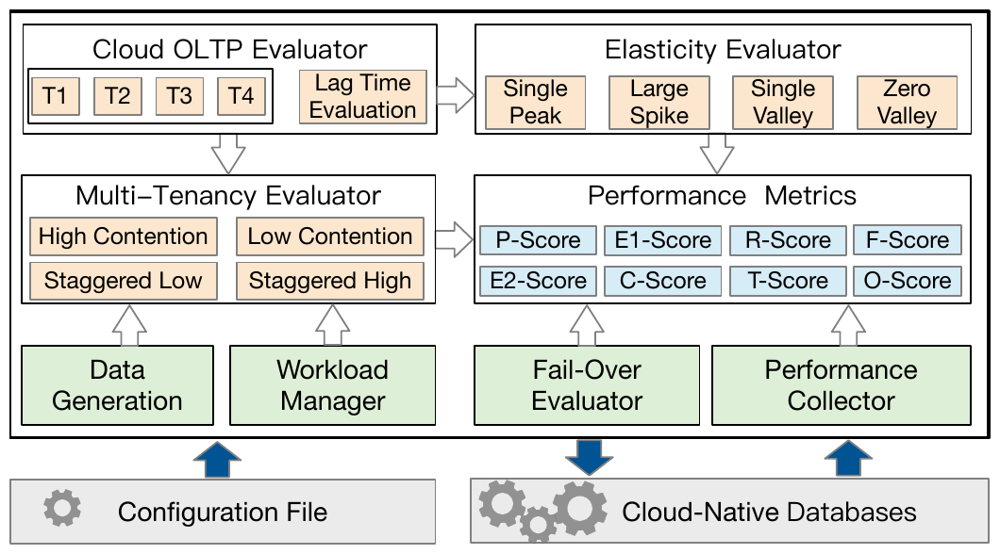
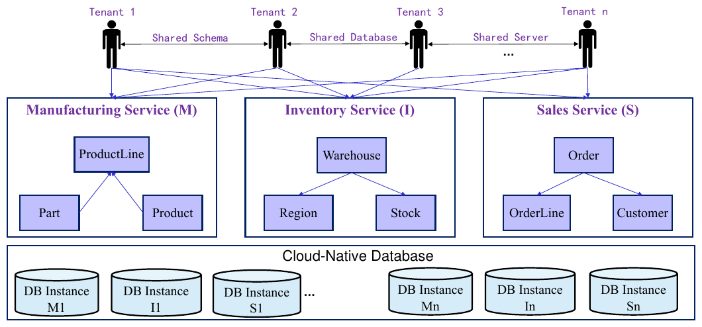
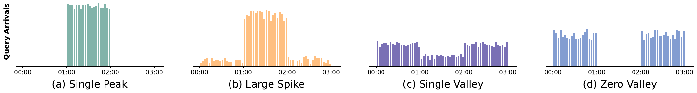
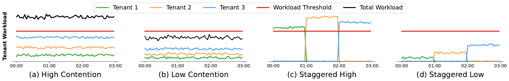
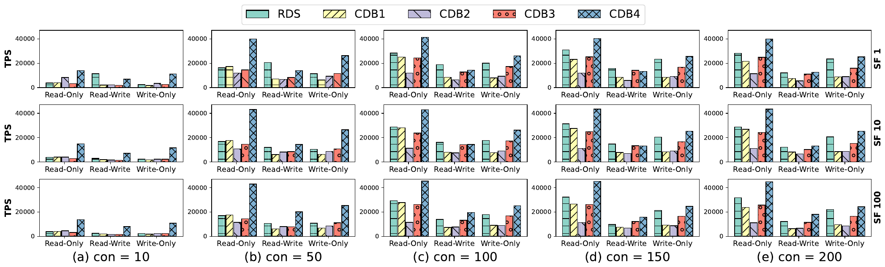
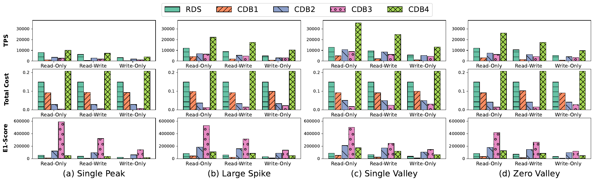
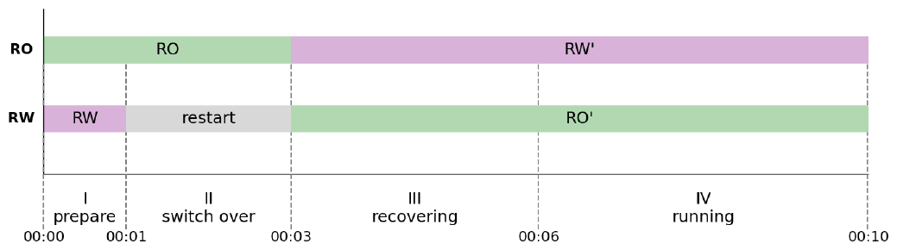
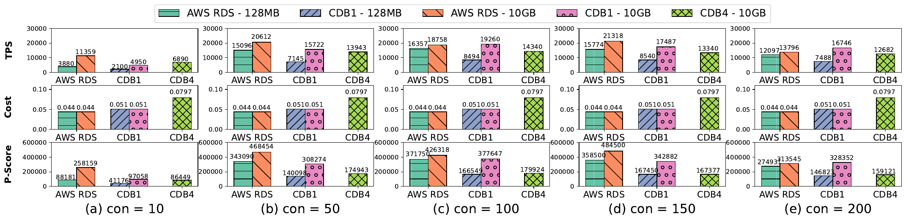
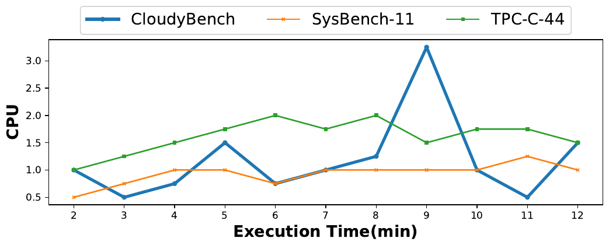

**CloudyBench: A Testbed for A Comprehensive Evaluation of Cloud-Native Databases｜CloudyBench：用于全面评估云原生数据库的测试平台**

Chao Zhang§, Guoliang Li∗, Leyao Liu†, Tao Lv‡, Ju Fan§

> Chao Zhang§、Guoliang Li∗、Leyao Liu†、Tao Lv‡、Ju Fan§

∗Tsinghua University, §Renmin University of China, †Imperial College London, ‡China Software Testing Center

> ∗清华大学，§中国人民大学，†伦敦帝国理工学院，‡中国软件评测中心

cycchao@ruc.edu.cn, liguoliang@tsinghua.edu.cn, leyao.liu24@imperial.ac.uk, lvtao@cstc.org.cn, fanj@ruc.edu.cn

> cycchao@ruc.edu.cn、liguoliang@tsinghua.edu.cn、leyao.liu24@imperial.ac.uk、lvtao@cstc.org.cn、fanj@ruc.edu.cn

> **译者说明（非原文）：** 本文英文原文取自[作者公开的 PDF](https://dbgroup.cs.tsinghua.edu.cn/ligl/papers/ICDE25-CloudyBench.pdf)。IEEE ICDE 2025 [官方获奖页面](https://ieee-icde.org/2025/2025/05/13/awards/)将本文列为 “Best Paper Runner Up Award”。本说明不属于论文正文。

**Abstract—**As more and more on-premise databases are moving towards the cloud service, it is crucial to have a benchmark to holistically evaluate the performance of their core features including elasticity, multi-tenancy, and cost-efficiency. However, existing benchmarks lack specific workload patterns and metrics for evaluating cloud-native databases, and the real workload is often unavailable due to privacy requirements.

In this paper, we propose a new testbed for cloud-native databases, named CloudyBench. Its core contribution is to provide tailored workloads and metrics to evaluate the service quality of cloud-native databases in various dimensions. First, we design cloud-native workload patterns with peaks and valleys for elasticity evaluation. Second, we devise new multi-tenancy patterns by posing varied resource contention to evaluate the resource scheduling among tenants. Third, we propose a unified metric that considers performance, cost, elasticity, multi-tenancy, replication lag time, and fail-over. Fourth, we provide an evaluation testbed for evaluating cloud-native databases. To verify the effectiveness of CloudyBench, extensive experiments have been conducted over five commercial representatives from multiple cloud providers. We also obtain a number of insights for the performance implications of cloud-native databases from the architectural perspective.

> **摘要——**随着越来越多的本地部署数据库向云服务迁移，迫切需要一种基准，能够从整体上评估其弹性、多租户和成本效率等核心特性的表现。然而，现有基准缺少面向云原生数据库的专门工作负载模式与指标，而真实工作负载又常因隐私要求而无法获得。
>
> 本文提出了一套名为 CloudyBench 的新型云原生数据库测试平台。其核心贡献在于提供量身定制的工作负载和指标，从多个维度评估云原生数据库的服务质量。第一，我们设计了具有峰谷变化的云原生工作负载模式，用于弹性评估。第二，我们通过施加不同程度的资源争用，设计了新的多租户模式，以评估租户之间的资源调度。第三，我们提出了一项统一指标，综合考虑性能、成本、弹性、多租户、复制延迟时间和故障转移。第四，我们提供了一套用于评估云原生数据库的测试平台。为验证 CloudyBench 的有效性，我们在来自多家云提供商的五种商业代表性产品上开展了大量实验。我们还从架构视角获得了若干有关云原生数据库性能影响的洞见。

## I. INTRODUCTION｜引言

Recently, we have witnessed a proliferation of cloud-native databases (CDB) that seek for higher elasticity and lower cost by developing new database techniques in the cloud [8], [45]. CDBs own the _disaggregation of compute and storage_ architecture [38], [39], [16], [41], [18], which decouples the storage from the compute nodes, and then connects the compute nodes to the shared storage through a high-speed network. The compute layer consists of a primary read-write (RW) node and multiple secondary read-only (RO) nodes, where each node has a local cache. Further, the disaggregated memory architecture decouples the memory from the local instance to a remote buffer pool. Consequently, CDB claims to provide better elasticity and multi-tenancy service, higher cost-efficiency, and superior transaction processing performance.

However, it is not clear under what circumstances there is a significant benefit of using a CDB compared with the AWS Relational Database Service (RDS). To answer such a question, we, in this work, make the first comprehensive investigation of CDB’s key features by proposing a new end-to-end benchmark, named CloudyBench.

> 近年来，云原生数据库（CDB）大量涌现；它们通过在云上发展新的数据库技术，追求更高的弹性和更低的成本 [8], [45]。CDB 采用*存算分离*架构 [38], [39], [16], [41], [18]，将存储与计算节点解耦，再通过高速网络把计算节点连接到共享存储。计算层由一个主读写（RW）节点和多个从只读（RO）节点组成，每个节点均配有本地缓存。进一步地，内存解耦架构把内存从本地实例中分离出来，形成远程缓冲池。因此，CDB 宣称可以提供更好的弹性与多租户服务、更高的成本效率，以及更优的事务处理性能。
>
> 然而，与 AWS Relational Database Service（RDS）相比，究竟在什么情况下采用 CDB 能够带来显著收益，目前尚不明确。为回答这一问题，本文提出一项名为 CloudyBench 的新型端到端基准，并借此首次对 CDB 的关键特性展开全面研究。

Guoliang Li is the corresponding author. This paper was supported by National Key R&D Program of China (2023YFB4503600), NSF of China (62232009, 62436010, 62441230, 62436010). Thank database teams of GaussDB, PolarDB, TDSQL-C, Dameng, OceanBase, and GoldenDB for the help of benchmark design and evaluation.

Database benchmarking [12], [35], [36], [5], [9], [22], [44], [47], [46], [4], [17] is a common practice for evaluating the database performance. Since the real workload is unavailable and there is a dearth of benchmarks for cloud-native databases, many practitioners tried to utilize established database benchmarks such as TPC-C [35], YCSB [5], and SysBench [15] to evaluate the cloud-native databases. Unfortunately, existing benchmarks are unsuitable for benchmarking CDBs as follows:

**Motivation 1: Elasticity Evaluation.** The real-world workloads of many applications usually fluctuate unexpectedly (e.g., peaks and valleys), and the cloud vendors have rolled out the elastic data service that can dynamically schedule the resources to the varied workloads on demand. Existing benchmarks lack the elasticity evaluation and they can not readily vary the workload patterns at runtime. To address such a problem, we develop an elasticity evaluator that can generate customized patterns with peaks and valleys to evaluate the elasticity of the cloud data services.

> Guoliang Li 为通讯作者。本文得到国家重点研发计划（2023YFB4503600）及中国国家自然科学基金（62232009、62436010、62441230、62436010）资助。感谢 GaussDB、PolarDB、TDSQL-C、达梦、OceanBase 和 GoldenDB 数据库团队在基准设计与评估方面提供的帮助。
>
> 数据库基准测试 [12], [35], [36], [5], [9], [22], [44], [47], [46], [4], [17] 是评估数据库性能的常见做法。由于真实工作负载无法获得，且面向云原生数据库的基准十分匮乏，许多从业者尝试使用 TPC-C [35]、YCSB [5] 和 SysBench [15] 等成熟数据库基准来评估云原生数据库。遗憾的是，现有基准并不适合对 CDB 进行基准测试，原因如下：
>
> **动机 1：弹性评估。**许多应用的真实工作负载通常会出现难以预料的波动（例如峰值与谷值），云厂商因而推出了弹性数据服务，可按需为变化的工作负载动态调度资源。现有基准缺少弹性评估，也无法在运行时便捷地改变工作负载模式。为解决这一问题，我们开发了弹性评估器，它能够生成带有峰谷的定制模式，用于评估云数据服务的弹性。

**Motivation 2: Multi-Tenancy Evaluation.** When deploying on-premise databases, the hardware resources are bound to the fixed customers, leading to a waste of idle resources. With multi-tenancy [24], the cloud data service could dynamically schedule resources to different tenants based on their needs and priorities so as to achieve better resource utilization. Existing benchmarks do not support multi-tenancy evaluation, failing to simulate various degree of resource contention among multiple tenants. Consequently, we develop a multi-tenancy evaluator to quantify the CDB’s performance with interweaving workloads from multiple tenants.

**Motivation 3: Holistic Metric.** Existing benchmarks fall short of metrics in two aspects. First, they pay most attention to performance such as latency and throughput but lack tailored metrics to quantify the resource cost in the cloud including CPU, memory, I/O, and network. Second, they lack a unified metric that can make a horizontal comparison among the CDBs in a holistic way. To this end, we design a unified metric, taking into account performance, elasticity, multi-tenancy, resource cost, data replication and fail-over. These factors are chosen because they reflect the most important aspects of service quality of CDBs.

> **动机 2：多租户评估。**部署本地数据库时，硬件资源绑定于固定客户，闲置资源因而被浪费。借助多租户 [24]，云数据服务可以根据不同租户的需求和优先级动态调度资源，从而实现更高的资源利用率。现有基准不支持多租户评估，无法模拟多个租户之间不同程度的资源争用。因此，我们开发了多租户评估器，用于量化多个租户的工作负载交织运行时 CDB 的表现。
>
> **动机 3：整体性指标。**现有基准在指标方面存在两点不足。第一，它们主要关注延迟、吞吐等性能，却缺少专门的指标来量化云中的 CPU、内存、I/O 和网络等资源成本。第二，它们缺少能够对不同 CDB 进行整体横向比较的统一指标。为此，我们设计了一项统一指标，将性能、弹性、多租户、资源成本、数据复制和故障转移纳入考量。之所以选择这些因素，是因为它们反映了 CDB 服务质量中最重要的方面。

**Challenges.** There are three main challenges for benchmarking CDBs. First, elasticity and multi-tenancy are two critical features of CDBs, but it is non-trivial to design representative workloads that can quantify the performance of elasticity and multi-tenancy of existing CDBs effectively (C1). Second, different cloud vendors have different hardware environments and pricing models, and it is challenging to compare the performance and cost-efficiency of different vendors simultaneously (C2). Third, different CDBs have their pros and cons, and it is challenging to design a unified metric for a horizontal comparison (C3). To address C1, we design foundation deterministic patterns and assemble them to cover representative patterns with peaks and valleys, allowing users to evaluate the elasticity and multi-tenancy in an effective and economic way. To address C2, we calculate the cost from the resource perspective by defining the standard price based on the resource unit cost of CPU, memory, I/O, and network, allowing us to evaluate the CDB’s performance and cost-efficiency in a unified framework. To address C3, we devise a unified metric to quantify the CDBs’ performance from seven dimensions considering performance, cost, elasticity, multi-tenancy, fail-over, and replication lag time.

> **挑战。**对 CDB 进行基准测试面临三项主要挑战。第一，弹性和多租户是 CDB 的两项关键特性，但要设计出具有代表性的工作负载，从而有效量化现有 CDB 的弹性与多租户表现，并非易事（C1）。第二，不同云厂商的硬件环境和定价模型各不相同，因而难以同时比较不同厂商的性能和成本效率（C2）。第三，各种 CDB 各有所长，要设计一项统一指标进行横向比较并不容易（C3）。为应对 C1，我们设计基础确定性模式，并将其组合成具有代表性的峰谷模式，使用户能够高效、经济地评估弹性和多租户能力。为应对 C2，我们从资源视角计算成本：依据 CPU、内存、I/O 和网络的资源单位成本定义标准价格，从而在统一框架中评估 CDB 的性能和成本效率。为应对 C3，我们设计了一项统一指标，从性能、成本、弹性、多租户、故障转移和复制延迟时间等七个维度量化 CDB 的表现。

**TABLE I** 
**A COMPARISON BETWEEN CLOUDYBENCH AND EXISTING OLTP BENCHMARKS**

> **表 I** 
> **CLOUDYBENCH 与现有 OLTP 基准的比较**

| Features / 特性                                                              | SysBench | YCSB | TPC-C | CDSBen[48] | Stitcher[40] | CloudyBench |
| ---------------------------------------------------------------------------- | :------: | :--: | :---: | :--------: | :----------: | :---------: |
| Domain-Specific Cloud-Native Application / 面向特定领域的云原生应用          |    ×     |  ×   |   ×   |     ×      |      ×       |      √      |
| OLTP Evaluation with ACID / 支持 ACID 的 OLTP 评估                           |    √     |  √   |   √   |     ×      |      ×       |      √      |
| Elasticity Evaluation with Peaks and Valleys / 采用峰谷模式的弹性评估        |    ×     |  ×   |   ×   |     √      |      √       |      √      |
| Multi-Tenancy Evaluation with Contention Patterns / 采用争用模式的多租户评估 |    ×     |  ×   |   ×   |     ×      |      ×       |      √      |
| Fail-Over Evaluation with Built-in Module / 采用内置模块的故障转移评估       |    ×     |  ×   |   ×   |     ×      |      ×       |      √      |
| Replication Lag Time Evaluation / 复制延迟时间评估                           |    ×     |  ×   |   ×   |     ×      |      ×       |      √      |
| Cloud-Native Metrics with Performance and Cost / 综合性能与成本的云原生指标  |    ×     |  ×   |   ×   |     ×      |      ×       |      √      |

**图表中文解读：** 表 I 按七项能力比较 CloudyBench 与五种既有 OLTP 或云工作负载基准。SysBench、YCSB 和 TPC-C 能够评估符合 ACID 的 OLTP，却不覆盖弹性、多租户、故障转移和复制延迟；CDSBen 与 Stitcher 能生成峰谷型弹性负载，但不具备事务、多租户及故障评估能力。CloudyBench 是表中唯一覆盖全部七项能力的基准。

In this paper, we propose an end-to-end benchmark for cloud-native databases, named CloudyBench. As shown in Table I, it is the only one covering all the seven salient features. First, we design a SaaS scenario of sales microservice that contains typical read/write transactions in a cloud application. The access distribution and pattern of transactions can be controlled to evaluate the cloud-based OLTP performance and replication lag time. Second, we design basic elastic workload patterns to evaluate the elasticity with specialized peaks and valleys. Third, we design basic multi-tenancy patterns to measure the capacity of resource scheduling among multiple tenants. Fourth, we develop a fail-over evaluator that can inject the node failure and report the fail-over performance automatically. To the best of our knowledge, this is the first benchmark that can evaluate the performance of throughput, elasticity, multi-tenancy, cost-efficiency, and fail-over with tailored workloads and metrics for CDBs.

> 本文提出了一项名为 CloudyBench 的云原生数据库端到端基准。如表 I 所示，它是唯一覆盖全部七项突出特性的基准。第一，我们设计了一个销售微服务的 SaaS 场景，其中包含云应用中的典型读写事务。事务的访问分布和模式均可控制，以评估云端 OLTP 性能和复制延迟时间。第二，我们设计了基础弹性工作负载模式，通过特定的峰谷评估弹性。第三，我们设计了基础多租户模式，衡量多个租户之间的资源调度能力。第四，我们开发了故障转移评估器，它能够注入节点故障，并自动报告故障转移表现。据我们所知，这是首个能够借助面向 CDB 定制的工作负载和指标，评估吞吐性能、弹性、多租户、成本效率和故障转移的基准。

The main contributions are summarised as follows:

> 主要贡献总结如下：

1. We made an in-depth investigation on the key features of various state-of-the-art cloud-native databases.

> 1. 我们深入研究了多种先进云原生数据库的关键特性。

2. We designed an end-to-end benchmark and a testbed to evaluate the key features of cloud-native databases, including elasticity, multi-tenancy, and cost-efficiency. The code is open-sourced at Github.

> 2. 我们设计了一项端到端基准和一套测试平台，用于评估云原生数据库的弹性、多租户和成本效率等关键特性。代码已在 Github 上开源。

3. We proposed a unified metric to quantify the service quality of cloud-native databases by considering the performance, cost, elasticity, multi-tenancy, lag time, and fail-over.

> 3. 我们提出了一项统一指标，综合性能、成本、弹性、多租户、延迟时间和故障转移，量化云原生数据库的服务质量。

4. We obtained a number of insights by leveraging CloudyBench to evaluate five cloud data services.

> 4. 我们使用 CloudyBench 评估五种云数据服务，并由此获得了若干洞见。

## II. CLOUDYBENCH BENCHMARK｜CLOUDYBENCH 基准

To evaluate the core features of CDB, we develop a new testbed based on a scenario of cloud-based microservice. First, we design typical operations to evaluate the disaggregated transaction processing with controllable access distribution. It also enables to evaluate the replication time independently. Second, we design basic deterministic elasticity patterns with peaks and valleys. Third, we also devise basic representative multi-tenancy patterns to evaluate the resource scheduling with the multi-tenancy deployment. Fourth, we develop a fail-over evaluator to test the recovery speed concerning node failure. Finally, we define seven metrics to quantify the CDBs’ service quality, we also design a unified metric to enable a horizontal comparison. In order to simulate the real workload, the designed workloads have referenced the workload characteristics in real cloud OLTP applications (such as ERP microservice [19] and E-Commerce application) [43].

> 为评估 CDB 的核心特性，我们基于云端微服务场景开发了一套新测试平台。第一，我们设计了典型操作，以可控的访问分布评估解耦式事务处理；它还能独立评估复制时间。第二，我们设计了具有峰谷的基础确定性弹性模式。第三，我们还设计了具有代表性的基础多租户模式，用于评估多租户部署中的资源调度。第四，我们开发了故障转移评估器，以测试节点故障时的恢复速度。最后，我们定义了七项指标来量化 CDB 的服务质量，还设计了一项统一指标以支持横向比较。为了模拟真实工作负载，所设计的负载参考了真实云端 OLTP 应用（如 ERP 微服务 [19] 和电子商务应用）的工作负载特征 [43]。

Figure 1 depicts an overview of CloudyBench, including the data generation, workload manager, elasticity evaluator, multi-tenancy evaluator, OLTP evaluator, fail-over evaluator, performance collector, and metrics. Given a configuration file, data is generated based on the scale factor and the workload manager spawns the workers based on the concurrency and access distribution. The workload consists of basic CRUD transactions (T1-T4), which are used to evaluate the throughput and replication lag time. They also serve as the base for generating the elasticity and multi-tenancy patterns with read and write operations. Lag time evaluation measures the replication latency. Elasticity generator will produce an elastic workload for each tenant. Multi-tenancy evaluator concurrently runs the workloads from multiple tenants. Fail-over evaluator tests the recovery speed by injecting node failures. Performance collector accumulates the performance metrics and corresponding cost.

> 图 1 给出了 CloudyBench 的概览，包括数据生成器、工作负载管理器、弹性评估器、多租户评估器、OLTP 评估器、故障转移评估器、性能收集器和各项指标。给定配置文件后，系统根据缩放因子生成数据；工作负载管理器则依据并发度和访问分布启动工作线程。工作负载由基础 CRUD 事务（T1–T4）组成，用于评估吞吐量与复制延迟时间；它们也构成了生成读写型弹性和多租户模式的基础。延迟时间评估用于测量复制延迟。弹性生成器为每个租户生成弹性工作负载；多租户评估器并发运行多个租户的负载；故障转移评估器通过注入节点故障测试恢复速度；性能收集器汇总性能指标及对应成本。

**Fig. 1. CloudyBench Overview｜图. CloudyBench 概览**

**图表中文解读：** 配置文件驱动数据生成和工作负载管理。T1–T4 与延迟评估构成云 OLTP 评估器，并进一步派生四种弹性模式和四种多租户模式。故障转移评估器、性能收集器和数据库共同向指标层提供数据，最终计算 P、E1、E2、R、F、C、T 与 O 八种分数，其中 O-Score 是七个分项的统一汇总指标。

CloudyBench is extensible for adding new patterns and OLTP workloads. To extend elasticity and multi-tenancy patterns, users can simply modify the length of _elastic_testTime_ (e.g., 4) and add corresponding concurrency in the _props_ file. (e.g., _fourth_con_), then modify the _CloudyBench_ class to launch the new patterns. For fail-over pattern, it supports to add more replicas in the _props_ file, then it can pose fail-over test on any node. Since the framework has decoupled the SQL statements, new workload can also be readily incorporated by adding the statements in _stmt_db.toml_ and modifying the classes of _SqlReader_ and _Sqlstmts_.

> CloudyBench 具有可扩展性，可以添加新的模式和 OLTP 工作负载。要扩展弹性与多租户模式，用户只需修改 _elastic_testTime_ 的长度（例如 4），并在 _props_ 文件中加入相应的并发度（例如 _fourth_con_），随后修改 _CloudyBench_ 类以启动新模式。对于故障转移模式，可以在 _props_ 文件中增加更多副本，继而对任意节点进行故障转移测试。由于该框架已将 SQL 语句解耦，只需向 _stmt_db.toml_ 添加语句并修改 _SqlReader_ 与 _Sqlstmts_ 类，即可便捷地纳入新的工作负载。

### A. MicroService Schema and Data Generation｜微服务模式与数据生成

Software as a service (SaaS) applications are prominent in the cloud. Common examples are Salesforce [33], Microsoft 365 [31], and Shopify [32]. SaaS applications normally adopt the microservice architecture. However, microbenchmarks such as SysBench [15] and YCSB [5] contain simple read/write operations on single table, and lack specific transaction logic for evaluating CDB. Consequently, we design a cloud-native application, simulating modern SaaS ERP applications like Salesforce [33] and ODOO [11]. As shown in Figure 2, it contains three microservices, manufacturing service, inventory service, and sales service. Tenants can share schema/database/server among the services. It has two advantages. First, the schema mimics the real cloud-native sales application. Second, it contains realistic transaction logic that involves multiple tables, posing a larger challenge than microbenchmark on OLTP. In this work, we focus on the sales service, we will add the microservicse of ”Manufacturing” and ”Inventory” in the future. Specifically, the sales schema contains three tables (CUSTOMER, ORDER and ORDERLINE), and the workload simulates the typical operations in the cloud (e.g., make online orders and payments, check the status). The scaling model makes the ORDERLINE table being an order of magnitude larger than the CUSTOMER table and ORDER table, with a same size of 300,000. Upon sales service, we assemble the basic elasticity and multi-tenancy patterns to evaluate the core features.

> 软件即服务（SaaS）应用在云中占据重要地位，常见例子包括 Salesforce [33]、Microsoft 365 [31] 和 Shopify [32]。SaaS 应用通常采用微服务架构。然而，SysBench [15]、YCSB [5] 等微基准只包含针对单表的简单读写操作，缺少评估 CDB 所需的特定事务逻辑。因此，我们设计了一个云原生应用，用以模拟 Salesforce [33] 和 ODOO [11] 等现代 SaaS ERP 应用。如图 2 所示，它包含制造服务、库存服务和销售服务三个微服务。不同服务之间的租户可以共享模式、数据库或服务器。这种设计有两个优点：第一，其模式仿照真实的云原生销售应用；第二，它包含涉及多张表的真实事务逻辑，相比 OLTP 微基准更具挑战性。本文聚焦销售服务，未来将加入“制造”和“库存”微服务。具体而言，销售模式包含 CUSTOMER、ORDER 和 ORDERLINE 三张表；工作负载模拟云中的典型操作（例如在线下单、付款和查询状态）。缩放模型使 ORDERLINE 表的规模比 CUSTOMER 表和 ORDER 表高一个数量级，后两张表的大小均为 300,000。在销售服务之上，我们组合基础弹性模式和多租户模式，以评估核心特性。

**Fig. 2. MicroService in CloudyBench｜图. CloudyBench 中的微服务**

**图表中文解读：** 图中展示了从租户共享方式到微服务数据库实例的层次结构。Tenant 1–n 可按共享模式、共享数据库或共享服务器部署；业务层包含制造、库存和销售三个微服务及其核心表；底层云原生数据库为各服务提供一个或多个实例。本文实验实际聚焦右侧的销售服务（Order、OrderLine、Customer）。

### B. Cloud OLTP Patterns｜云 OLTP 模式

Existing benchmarks [35], [15] generate the transactions based on the uniform or independent assumption, thus they are insufficient to simulate a cloud OLTP workload. First, realistic access distribution is skewed [48], [9], but macrobenchmarks like TPC-C generate the transactions with uniformly sampled parameters. Second, the workload should simulate the common operations, but microbenchmarks like SysBench can only generate the read/write operations on single table without any correlation between operations. Third, data replication is a crucial aspect in a disaggregated architecture, but existing benchmarks cannot evaluate the replication time. To address these issues, we design a new cloud-native workload.

> 现有基准 [35], [15] 基于均匀或独立假设生成事务，因此不足以模拟云 OLTP 工作负载。第一，真实访问分布具有偏斜性 [48], [9]，而 TPC-C 等宏基准却使用均匀采样的参数生成事务。第二，工作负载应当模拟常见操作，但 SysBench 等微基准只能生成针对单表的读写操作，操作之间不存在任何关联。第三，数据复制是解耦架构中的关键方面，但现有基准无法评估复制时间。为解决这些问题，我们设计了一种新的云原生工作负载。

#### 1) Throughput Evaluation.｜吞吐量评估。

The workload covers the most common transactions in a sales microservice of ODOO [11]. As shown in Table II, T1 (New Orderline) is a write-only transaction that inserts a new orderline; T2 (Order Payment) is a read-write transaction that finds a target order, and then it updates the customer’s credit and order’s status. T3 (Order Status) is a read-only transaction that checks the status of a given order; T4 (Orderline Deletion) is to delete a given orderline. The workload manager will launch a worker for each transaction based on the concurrency number and transaction ratio. We support two types of distributions, _uniform_ and _latest_. For the former one, the substitution parameters are chosen uniformly. For the latter one, we generate the skewed access distribution by controlling the access range of O_ID. For instance, concerning the _latest-10_ distribution, T2 will update 10 specific items, and T3 will read these items randomly. As a result, the more skewed the distribution is, the more likely the fresh data is read.

> 该工作负载涵盖 ODOO 销售微服务中最常见的事务 [11]。如表 II 所示，T1（新建订单行）是插入新订单行的只写事务；T2（订单支付）是读写事务，它先查找目标订单，随后更新客户信用额与订单状态；T3（订单状态）是查询给定订单状态的只读事务；T4（删除订单行）用于删除给定订单行。工作负载管理器根据并发数与事务比例，为每类事务启动工作线程。我们支持 _uniform_ 和 _latest_ 两种分布：前者均匀选择替换参数；后者通过控制 O_ID 的访问范围生成偏斜访问分布。例如，在 _latest-10_ 分布下，T2 会更新 10 个特定条目，T3 则随机读取这些条目。因此，分布越偏斜，读到新鲜数据的可能性就越高。

**TABLE II** 
**CLOUDYBENCH’S OLTP WORKLOAD**

> **表 II** 
> **CLOUDYBENCH 的 OLTP 工作负载**

<table>
  <thead>
    <tr><th>Task 任务</th><th>Transaction Name 事务名称</th><th>SQL Statement Reference SQL 语句参考</th><th>Pattern 模式</th></tr>
  </thead>
  <tbody>
    <tr><td>T1</td><td>New Orderline 新建订单行</td><td><code>INSERT INTO orderline VALUES (DEFAULT, ?,?,?,?,?)</code></td><td>Write-Only 只写</td></tr>
    <tr><td>T2</td><td>Order Payment 订单支付</td><td>(1) <code>SELECT O_ID, O_C_ID, O_TOTALAMOUNT, O_UPDATEDDATE FROM orders WHERE O_ID=?</code> (2) <code>UPDATE orders SET O_UPDATEDDATE=?, O_STATUS=’PAID’ WHERE O_ID=?</code> (3) <code>UPDATE customer SET C_CREDIT=C_CREDIT+?, C_UPDATEDDATE=? WHERE C_ID=?</code></td><td>Read-Write 读写</td></tr>
    <tr><td>T3</td><td>Order Status 订单状态</td><td><code>SELECT O_ID, O_DATE, O_STATUS FROM orders WHERE O_ID = ?</code></td><td>Read-Only 只读</td></tr>
    <tr><td>T4</td><td>Orderline Deletion 删除订单行</td><td><code>DELETE FROM orderline WHERE OL_ID=?</code></td><td>Deletion 删除</td></tr>
  </tbody>
</table>

**图表中文解读：** 表 II 把销售微服务的事务逻辑归纳为四类：T1 插入订单行，T2 依次读取订单并更新订单与客户，T3 查询订单状态，T4 删除订单行。它们分别覆盖只写、读写、只读和删除模式，并成为后续吞吐量、复制延迟、弹性与多租户实验的基本事务单元。

#### 2) Lag Time Evaluation.｜延迟时间评估。

To evaluate the log-replaying efficiency, we design three patterns to evaluate the replication lag time. Namely, (a) insert lag time; (b) update lag time; (c) delete lag time. The basic idea is to measure the lag time synchronizing the data changes from the RW node to the RO node with varied concurrency. Specifically, we run T1, T2, T4 with varied ratio to measure the latency that a replica has synchronized the data changes. For each pattern, once the primary RW node commits the transaction, the client will try to read the data change from the replica until the data is consistent between the RW node and RO nodes.

> 为评估日志重放效率，我们设计了三种复制延迟时间评估模式，即：（a）插入延迟时间；（b）更新延迟时间；（c）删除延迟时间。其基本思路是在不同并发度下，测量数据变更从 RW 节点同步至 RO 节点所需的延迟时间。具体而言，我们以不同比例运行 T1、T2 和 T4，测量副本同步数据变更的延迟。对于每一种模式，一旦主 RW 节点提交事务，客户端便会持续尝试从副本读取该数据变更，直至 RW 节点与各 RO 节点的数据一致。

### C. Elasticity Patterns｜弹性模式

Realistic cloud applications often exhibit intermittency and therefore stressing the elasticity [37], [39]. However, existing benchmarks can not vary the workload patterns at runtime. To address such a problem, we design basic elastic patterns and assemble them to simulate the realistic arrival patterns in a sales microservice.

As shown in Figure 3, pattern (a) launches a single peak to test if the CDB can handle the spike (e.g., an ETL maintenance job); pattern (b) has two small spikes and a large spike which starts from a small concurrency, then gradually increases to a spike, and finally decreases to a small concurrency (e.g., ordering a hot-selling product); pattern (c) has a reverse pattern to (b) that starts from a large concurrency, then decreases to small concurrency, and finally increases to a large concurrency (e.g., declined sales due to price variation); pattern (d) aims to evaluate the pause-and-resume mechanism, which starts from a large spike, then decreases to a zero valley, finally increases to a large spike again (e.g., out of stock shortly). The concurrency will be changed in each time slot, and we specify a minute as a time slot. To determine the specific concurrency number in each time slot, we obtain the concurrency number τ where a tested database reaches the resource limit, then we generate the patterns proportionally. For instance, given a configured CDB and the concurrency τ=110, we generate the basic patterns in the following typical proportions: pattern (a): (0%, 100%*τ, 0%)=(0, 110, 0); pattern (b): (10%*τ, 80%*τ, 10%*τ)=(11,88,11); pattern (c): (40%*τ, 20%*τ, 40%*τ)=(44,22,44); pattern (d): (50%*τ, 0%, 50%*τ)=(55,0,55). Note that when evaluating multiple databases, we set τ to the maximum concurrency among all databases so as to evaluate the elasticity for each one. Additionally, the default proportion is set by the Pareto distribution.

> 真实云应用往往呈现间歇性，因而会考验弹性能力 [37], [39]。然而，现有基准无法在运行时改变工作负载模式。为解决这一问题，我们设计了基础弹性模式，并将其组合起来，以模拟销售微服务中的真实到达模式。
>
> 如图 3 所示，模式（a）制造单个峰值，用于测试 CDB 能否应对突发负载（例如 ETL 维护作业）；模式（b）包含两个小峰和一个大峰，从低并发开始，逐渐升至峰值，最后再降至低并发（例如抢购热销商品）；模式（c）与（b）相反，从高并发开始，随后降至低并发，最后再次升至高并发（例如价格变化导致销量下降）；模式（d）用于评估暂停—恢复机制，它从大峰值开始，随后降至零谷值，最后再次升至大峰值（例如短时间缺货）。每个时间槽都会改变并发度，我们把一分钟规定为一个时间槽。为确定每个时间槽中的具体并发数，我们先得到被测数据库达到资源上限时的并发数 τ，再按比例生成模式。例如，对于配置既定且 τ=110 的 CDB，按如下典型比例生成基础模式：模式（a）：(0%, 100%*τ, 0%)=(0, 110, 0)；模式（b）：(10%*τ, 80%*τ, 10%*τ)=(11,88,11)；模式（c）：(40%*τ, 20%*τ, 40%*τ)=(44,22,44)；模式（d）：(50%*τ, 0%, 50%*τ)=(55,0,55)。需要注意的是，在评估多个数据库时，我们把 τ 设为所有数据库中的最大并发数，以评估每个数据库的弹性。此外，默认比例由帕累托分布设定。

**Fig. 3. Elasticity Patterns in CloudyBench｜图. CloudyBench 中的弹性模式**

**图表中文解读：** 横轴为 00:00–03:00 的三个一分钟时间槽，纵轴为查询到达量。（a）仅中间时段形成单峰；（b）由低负载升至大峰后再回落；（c）由高负载降至谷值再恢复；（d）中间时段降为零，用于专门测试暂停—恢复。四类模式分别施加突发上升、渐进峰值、非零谷值和零谷值压力。

### D. Multi-Tenancy Patterns｜多租户模式

Multi-tenancy is a core feature of CDBs for improving the resource utilization by sharing and scheduling the resources among tenants. However, existing method can not pose various resource contention to evaluate how well CDB can schedule the resources among tenants, we thus design new multi-tenancy patterns.

We design basic multi-tenancy patterns, covering the most common contention cases. Namely, (a) high contention, (b) low contention, (c) staggered high and (d) staggered low. As shown in Figure 4, multiple tenants’ workloads arrive with varied demand. The red line depicts the workload threshold and the black line illustrates the actual total workload. Pattern (a) and (b) pose resource contention among tenants. Such patterns evaluate if the CDB can schedule the resources from the low-demand tenants to the high-demand tenants so that the overall resource utilization is improved. In pattern (c) and (d), tenants’ workloads arrive and stop at different time slots. Such patterns evaluate if the CDB can schedule the resources to the tenants on demand in the contention-free case so that the allocated resource is reduced. The tenants’ total workload is higher than the workload threshold in pattern (a) and pattern (c), but it is lower than the threshold in pattern (b) and (d). To generate the specific patterns, we create the tenants’ concurrency with the defined ratio, then we adjust the concurrency and execution mode based on the multi-tenancy patterns. For instance, we define the concurrency of three tenants with three time slots as follows: tenant 1: (10%*τ, 10%*τ, 10%*τ), tenant 2: (30%*τ, 30%*τ, 30%*τ), tenant 3: (60%*τ, 60%*τ, 60%*τ). By adding/subtracting the concurrency of the tenants with a concurrency of δ and running three tenants’ workloads in parallel, we manage to generate pattern (a) and (b) respectively. For pattern (d), we define the concurrency of tenants as follows: tenant 1: (10%*τ, 0, 0), tenant 2: (0, 20%*τ, 0), tenant 3: (0, 0, 30%*τ), then we run the tenants’ workload in sequence. By adding 100%*τ to the tenants, we are able to generate pattern (c). Concerning multiple databases, we set τ to maximum concurrency for pattern (a) and (c) and set τ to minimum concurrency for pattern (b) and (d). This allows us to evaluate the impact of resource contention and sharing for multiple databases. Note that by configuring the parameter file, CloudyBench supports arbitrary numbers of tenants and time slots, and the generation method remains the same. Additionally, CloudyBench has an extensible framework that can easily incorporate new multi-tenancy patterns.

> 多租户是 CDB 的一项核心特性，它通过在租户之间共享和调度资源来提高资源利用率。然而，现有方法无法施加不同程度的资源争用，因而不能评估 CDB 在租户之间调度资源的能力；为此，我们设计了新的多租户模式。
>
> 我们设计了基础多租户模式，覆盖最常见的争用情形，即：（a）高争用；（b）低争用；（c）错峰高负载；（d）错峰低负载。如图 4 所示，多个租户的工作负载以不同需求到达。红线表示工作负载阈值，黑线表示实际总工作负载。模式（a）和（b）在租户之间制造资源争用，用于评估 CDB 能否把资源从低需求租户调度给高需求租户，从而提高总体资源利用率。在模式（c）和（d）中，各租户的工作负载在不同时间槽到达并停止；这些模式评估 CDB 能否在无争用情况下按需为租户调度资源，从而减少已分配资源。模式（a）和（c）中的租户总负载高于工作负载阈值，而模式（b）和（d）中的总负载低于阈值。为生成具体模式，我们先按既定比例创建各租户的并发度，再根据多租户模式调整并发度与执行方式。例如，我们将三个租户在三个时间槽中的并发度定义如下：租户 1：(10%*τ, 10%*τ, 10%*τ)；租户 2：(30%*τ, 30%*τ, 30%*τ)；租户 3：(60%*τ, 60%*τ, 60%*τ)。在各租户并发度上增加或减去 δ，并并行运行三个租户的工作负载，便可分别生成模式（a）和（b）。对于模式（d），我们将租户并发度定义为：租户 1：(10%*τ, 0, 0)；租户 2：(0, 20%*τ, 0)；租户 3：(0, 0, 30%*τ)，随后依次运行各租户的工作负载。在各租户上增加 100%*τ，即可生成模式（c）。评估多个数据库时，模式（a）和（c）中的 τ 取最大并发度，模式（b）和（d）中的 τ 取最小并发度。这样即可评估资源争用与共享对多个数据库的影响。需要注意的是，通过配置参数文件，CloudyBench 支持任意数量的租户和时间槽，生成方法保持不变。此外，CloudyBench 采用可扩展框架，可以轻松纳入新的多租户模式。

**Fig. 4. Multi-Tenancy Patterns in CloudyBench｜图. CloudyBench 中的多租户模式**

**图表中文解读：** 绿色、橙色和蓝色曲线分别表示三个租户，红线是工作负载阈值，黑线是总负载。（a）三个租户持续叠加并超过阈值，形成高争用；（b）同样持续叠加但低于阈值；（c）租户依次接力且单租户负载高于阈值；（d）同样错峰到达但负载低于阈值。前两种重点测试争用下的资源重分配，后两种重点测试按需调度与资源回收。

### E. Fail-Over Patterns｜故障转移模式

Existing benchmarks do not support automatic fail-over evaluation and DBAs have to manually craft the failure and analyze the performance [3], [6]. To enable the fail-over evaluation, we develop a module in the testbed that can inject the node failure and report the fail-over performance automatically.

We design basic fail-over patterns to evaluate the recovery performance of various CDBs, namely, (a) RO failure; (b) RW failure. The basic idea is to inject the node failure during workload processing, then evaluate how fast the CDB can recover the service and throughput, respectively. By investigating the existing APIs of CDBs, we develop a _restart model_ [20] to simulate the node failure and evaluate the fail-over performance. This is because the kill or stop API will lead to the unavailable service, and we have to start the service manually. To evaluate the recovery time, we invoke the _restart_ API and record the TPS before the failure, then calculate the duration in two phases. In phase one, we measure how long the TPS is greater than zero after the node failure. In phase two, we continually check if the current TPS is recovered to the original TPS in a given interval.

> 现有基准不支持自动故障转移评估，数据库管理员必须手动制造故障并分析性能 [3], [6]。为支持故障转移评估，我们在测试平台中开发了一个模块，它能够注入节点故障，并自动报告故障转移表现。
>
> 我们设计了两种基础故障转移模式来评估不同 CDB 的恢复性能，即：（a）RO 故障；（b）RW 故障。其基本思路是在处理工作负载期间注入节点故障，然后分别评估 CDB 恢复服务和吞吐量的速度。通过研究现有 CDB API，我们开发了一个 _restart model_ [20]，用于模拟节点故障并评估故障转移表现。之所以采用这种方式，是因为 kill 或 stop API 会使服务不可用，之后还必须手动启动服务。为评估恢复时间，我们调用 _restart_ API，记录故障前的 TPS，再分两个阶段计算持续时间。第一阶段测量节点故障发生后，TPS 恢复为大于零需要多长时间；第二阶段在给定间隔内持续检查当前 TPS 是否已恢复至原始 TPS。

### F. Resource Unit Cost｜资源单位成本

As CDBs have disparate hardware configurations and pricing models, it is challenging to quantitatively measure the cost-efficiency. For instance, the ratio between CPU and Memory and the pricing of CDBs are totally different; Aurora will charge the IOPS but PolarDB does not; their storage services employ different number of replicas. We define the resource unit cost (RUC) to address such a challenge. The basic idea is to define the standard unit price to measure the resource cost, then we can normalize the cost across different providers from the perspective of basic resource unit.

According to the existing settings, we set the resource unit separately for resource package calculation. Namely, 1 vCore for CPU, 1 GB for RAM, 1 GB for Storage, 100 for IOPS, 1 Gbps for TCP/IP or RDMA network. Such a method allows us to quantify any combinations of resource package. For instance, concerning the case that Aurora defines the ACU with 1 vCPU, 2GB while PolarDB defines the instance with 4 vCPU, 32 GB, we can calculate the resource cost based on the unit price. Since the cloud vendors may define the cost in hour or in month, we unify the unit price in hour. To calculate the hourly cost more accurately, we propose a new method to have the standardized costs closer to the real costs. The calculation performs in three steps. First, we finalize the relative ratio between the resource units in the package by referencing the hardware price. Second, we normalize the unit price based on their real cost. Third, we obtain each resource unit by averaging the price of the systems. For instance, by referencing the CPU price of referenced Intel Xeon Platinum 8562Y+ Processor and compatible RAM price of Micron DDR5, we define the ratio of CPU and Memory is 0.95 and 0.05. Since Aurora defines the ACU cost is &#36;0.2 per hour, we have the CPU price is &#36;0.1809/vCore/hour and the RAM price is &#36;0.0095/GB/hour. Finally, we calculate the unit price for each cloud-native database and average the unit costs. That is, we obtain the CPU cost and Memory cost as &#36;0.1847/vCore/hour and &#36;0.0095/GB/hour by averaging the unit costs of Aurora, PolarDB, HyperScale, and Neon. Since the RDMA network is an emerging resource only supported in PolarDB, we leverage the same way to calculate the network cost for a fair comparison.

> 由于 CDB 的硬件配置和定价模型各不相同，要定量衡量成本效率颇具挑战。例如，不同 CDB 的 CPU 与内存比例以及定价完全不同；Aurora 对 IOPS 收费，而 PolarDB 不收费；它们的存储服务还采用不同数量的副本。为应对这一挑战，我们定义了资源单位成本（RUC）。基本思路是定义用于衡量资源成本的标准单位价格，继而从基础资源单位的视角，对不同提供商的成本进行归一化。
>
> 根据现有设置，我们分别规定各种资源单位，以计算资源包：CPU 为 1 vCore，RAM 为 1 GB，存储为 1 GB，IOPS 为 100，TCP/IP 或 RDMA 网络为 1 Gbps。采用这种方法，可以量化任意资源组合。例如，Aurora 把一个 ACU 定义为 1 vCPU、2GB，而 PolarDB 把一个实例定义为 4 vCPU、32 GB；我们便可依据单位价格计算资源成本。云厂商可能按小时或按月定义成本，因此我们统一采用小时单位价格。为更准确地计算每小时成本，我们提出了一种新方法，使标准化成本更贴近真实成本。计算分三步进行：首先参考硬件价格，确定资源包内不同资源单位之间的相对比例；其次依据实际成本对单位价格进行归一化；最后对各系统的价格取平均，得到每种资源的单位价格。例如，通过参考 Intel Xeon Platinum 8562Y+ 处理器的 CPU 价格及兼容的 Micron DDR5 内存价格，我们把 CPU 与内存的比例分别定义为 0.95 和 0.05。由于 Aurora 将 ACU 成本定义为每小时 &#36;0.2，因此 CPU 价格为 &#36;0.1809/vCore/hour，RAM 价格为 &#36;0.0095/GB/hour。最后，我们计算每种云原生数据库的单位价格，并对单位成本取平均。也就是说，通过对 Aurora、PolarDB、HyperScale 和 Neon 的单位成本取平均，我们得到 CPU 成本 &#36;0.1847/vCore/hour 与内存成本 &#36;0.0095/GB/hour。由于 RDMA 网络是一种仅 PolarDB 支持的新兴资源，我们以相同方法计算网络成本，以便公平比较。

**TABLE III** 
**RESOURCE UNIT COST PER HOUR**

> **表 III** 
> **每小时资源单位成本**

| Resource Unit / 资源单位 |     Cost / 成本 | Reference / 参考依据                     |
| ------------------------ | --------------: | ---------------------------------------- |
| CPU (vCore)              |   &#36;0.1847/h | Aurora/PolarDB/HyperScale/Neon           |
| Memory (GB)              |   &#36;0.0095/h | Aurora/PolarDB/HyperScale/Neon           |
| Storage (GB)             | &#36;0.000853/h | Aurora/PolarDB/HyperScale/Neon           |
| IOPS (100)               |  &#36;0.00015/h | AWS RDS IOPS Pricing / AWS RDS IOPS 定价 |
| TCP/IP Network (Gbps)    |  &#36;0.07696/h | Huawei S1730S-S24T4X-QA2 10G             |
| RDMA Network (Gbps)      |  &#36;0.23088/h | MELLANOX MSB7890-ES2F 100G               |

**图表中文解读：** 表 III 给出统一 RUC 模型中六类资源的每小时单位成本及定价参考。CPU、内存、存储和 IOPS 分别按 1 vCore、1 GB、1 GB 和 100 IOPS 计量，网络按 1 Gbps 计量。表中 RDMA 单位成本 &#36;0.23088/h，约为 TCP/IP 的三倍，这一差异会直接影响后文 CDB4 的成本分数。

Consequently, we are able to make a horizontal comparison with the normalized resource cost. Note that for the cases that CDBs have the different hardware, we can calibrate the price with the actual cost. We have also discussed the difference between resource cost and actual cost in Section III-G.

> 因此，我们能够使用归一化后的资源成本进行横向比较。需要注意的是，当 CDB 采用不同硬件时，可以使用实际成本校准价格。我们还在第 III-G 节讨论了资源成本与实际成本之间的差异。

### G. Performance Metrics｜性能指标

To measure CDB’s performance holistically, we propose a framework of ”PERFECT”. The basic idea is to reflect the most important aspects with the consideration of performance and cost. In specific, ’P’ refers to productivity that measures the ratio of throughput and RUC; the first ’E’ (i.e., E1) refers to scaling up/down elasticity and the second ’E’ (i.e., E2) refers to scaling out/in elasticity; ’R’ refers to throughput recovery efficiency; ’F’ refers to fail-over speed; ’C’ refers to replication lag time for consistency; ’T’ refers to tenants’ performance. Finally, we combine seven metrics into a unified metric that reflects the overall performance, called O-Score. In the following, we introduce each cloud metric in detail:

_**P-Score.**_ To consider the performance and cost together, we define the Productivity (P-Score) as the average transaction performance per RUC as follows:

> 为整体衡量 CDB 的表现，我们提出了“PERFECT”框架。其基本思想是在兼顾性能与成本的前提下，反映最重要的几个方面。具体而言，“P”表示生产力，衡量吞吐量与 RUC 之比；第一个“E”（即 E1）表示纵向扩缩容弹性，第二个“E”（即 E2）表示横向扩缩容弹性；“R”表示吞吐量恢复效率；“F”表示故障转移速度；“C”表示一致性相关的复制延迟时间；“T”表示租户性能。最后，我们将七项指标合并为一项反映整体性能的统一指标，称为 O-Score。下面详细介绍每一项云指标：
>
> ***P-Score。***为同时考虑性能与成本，我们将生产力（P-Score）定义为每单位 RUC 对应的平均事务性能：

$$
\text{P-Score}=\frac{\overline{TPS}}{Cost_{cpu}+Cost_{mem}+Cost_s+Cost_{io}+Cost_{net}}
\tag{1}
$$

where $\overline{TPS}$ is the average TPS and we consider the average resource cost of CPU, memory, storage, IOPS, and network per minute.

_**E1-Score.**_ To quantify the scaling up/down elasticity, we define E1-Score as follows:

> 其中，$\overline{TPS}$ 为平均 TPS；我们计入 CPU、内存、存储、IOPS 和网络每分钟的平均资源成本。
>
> ***E1-Score。***为量化纵向扩缩容弹性，我们将 E1-Score 定义如下：

$$
\text{E1-Score}=\frac{\overline{TPS}}{\widehat{Cost}_{cpu}+\widehat{Cost}_{mem}+\widehat{Cost}_{io}}
\tag{2}
$$

where $\overline{TPS}$ is the average TPS and we consider the resource cost of CPU, memory, and IOPS that are mostly relevant to the elasticity.

_**F-Score.**_ Concerning node failure, we calculate the time range starting from failure injection to the point where databases resume the throughput. The definition is as follows:

> 其中，$\overline{TPS}$ 为平均 TPS；我们计入与弹性最为相关的 CPU、内存和 IOPS 资源成本。
>
> ***F-Score。***对于节点故障，我们计算从注入故障开始，到数据库恢复吞吐量为止的时间范围。定义如下：

$$
\text{F-Score}=\frac{1}{k}\sum_{i=1}^{k}(t_s^i-t_f^i)
\tag{3}
$$

where $t_f^i$ and $t_s^i$ is the timing of injecting node failure and the timing of service recovery in the $i$-th recovering phase.

_**R-Score.**_ We evaluate the CDB’s recovery speed for recovering the TPS after the service recovery with R-Score. Since CDBs have different TPS for a given concurrency, we set the same target TPS for recovery. The definition is as follows:

> 其中，$t_f^i$ 和 $t_s^i$ 分别为第 $i$ 个恢复阶段中注入节点故障的时刻与服务恢复的时刻。
>
> ***R-Score。***我们使用 R-Score 评估 CDB 在服务恢复之后恢复 TPS 的速度。由于不同 CDB 在给定并发度下具有不同 TPS，我们为恢复过程设定相同的目标 TPS。定义如下：

$$
\text{R-Score}=\frac{1}{k}\sum_{i=1}^{k}(t_r^i-t_s^i)
\tag{4}
$$

where $t_s^i$ and $t_r^i$ is the epoch timestamp of service recovery and the epoch timestamp of recovering the TPS before the failure in the $i$-th recovering phase.

_**E2-Score.**_ To evaluate the scalability, we add RO nodes and quantify the CDB’s improved performance per node. The definition of E2-Score is as follows:

> 其中，$t_s^i$ 和 $t_r^i$ 分别是第 $i$ 个恢复阶段中服务恢复的纪元时间戳，以及 TPS 恢复到故障前水平的纪元时间戳。
>
> ***E2-Score。***为评估可扩展性，我们增加 RO 节点，并量化 CDB 每增加一个节点所获得的性能提升。E2-Score 定义如下：

$$
\text{E2-Score}=\frac{1}{\lambda}\sum_{i=1}^{\lambda}(TPS_i-TPS_{i-1})/\delta
\tag{5}
$$

where $\lambda$ is the number of RO node and $\delta$ is the scaling factor; $TPS_i$ is the throughput with $i$ nodes.

_**C-Score.**_ To evaluate the replication lag time with DML operations, we define C-Score as follows:

> 其中，$\lambda$ 为 RO 节点数，$\delta$ 为缩放因子；$TPS_i$ 是使用 $i$ 个节点时的吞吐量。
>
> ***C-Score。***为评估 DML 操作的复制延迟时间，我们将 C-Score 定义如下：

$$
\text{C-Score}=(\overline{T}_{insert}+\overline{T}_{update}+\overline{T}_{delete})/\lambda
\tag{6}
$$

where $|\lambda|$ is the number of replicas; $T_i$, $T_u$, and $T_d$ is the average lag time for insertion, update, and deletion, respectively. Note that the smaller the C-Score is, the faster the data replication is.

_**T-Score.**_ We define T-Score as follows:

> 其中，$|\lambda|$ 为副本数量；$T_i$、$T_u$ 和 $T_d$ 分别为插入、更新和删除的平均延迟时间。需要注意的是，C-Score 越小，数据复制越快。
>
> ***T-Score。***我们将 T-Score 定义如下：

$$
\text{T-Score}=\sqrt[m]{\prod_{i=1}^{m}TPS_i}\Big/\sum_{i=1}^{m}Cost_i
\tag{7}
$$

where the numerator calculates the geometric mean of the overall TPS and $TPS_i$ is the average TPS of $i$-th tenant; $Cost_i$ is the consumed resource unit cost of $i$-th tenant;

_**O-Score.**_ Having a unified metric is beneficial for comparing the performance of cloud databases holistically. Solely relying on one aspect cannot reflect the overall performance. Given that the serven components (cost-aware performance (P-Score), multi-tenancy (T-Score), scale-up elasticity (E1-Score), scale-out elasticity (E2-Score), fail-over time (F-Score), recovery time (R-Score) and replication latency (C-Score) are widely recognized as the most important factors for quantifying the service quality of cloud-native databases, we design a unified metric to quantify the overall performance. By multiplying all the seven scores and adding the logarithm, we propose O-Score defined as follows:

> 其中，分子计算总体 TPS 的几何平均值，$TPS_i$ 是第 $i$ 个租户的平均 TPS；$Cost_i$ 是第 $i$ 个租户消耗的资源单位成本；
>
> ***O-Score。***统一指标有助于从整体上比较云数据库的表现，单凭某一方面无法反映整体性能。鉴于七个组成部分——成本感知性能（P-Score）、多租户（T-Score）、纵向扩展弹性（E1-Score）、横向扩展弹性（E2-Score）、故障转移时间（F-Score）、恢复时间（R-Score）和复制延迟（C-Score）——被广泛认为是量化云原生数据库服务质量最重要的因素，我们设计了一项统一指标来量化整体性能。通过将七项分数相乘并取对数，我们提出 O-Score，定义如下：

$$
\text{O-Score}=SF*\lg\left(\frac{P*T*E1*E2}{R*F*C}\right)
\tag{8}
$$

where SF is the scale factor; the numerator computes the multiplication of P-Score, T-Score and two elasticity scores; the denominator calculates the multiplication of R-Score, F-Score, and C-Score. The logarithm is for an accurate horizontal comparison. Note that O-Score has an equal weight to each aspect, and cloud vendors can adjust the weight to emphasize the individual part, e.g., add more weight to elasticity.

> 其中，SF 为缩放因子；分子计算 P-Score、T-Score 和两项弹性分数的乘积，分母计算 R-Score、F-Score 和 C-Score 的乘积。取对数是为了进行准确的横向比较。需要注意的是，O-Score 对各方面赋予相同权重，云厂商可以调整权重以突出某一部分，例如提高弹性的权重。

## III. EXPERIMENTS｜实验

### A. Experimental Settings｜实验设置

**Systems Under Test (SUTs).** We evaluate CloudyBench over four state-of-the-art cloud-native databases. We use anonymization names of all cloud-native databases because they are commercial databases and have the ”Dewitt Clause” [42] that forbids the publication of database benchmarks when the database vendor has not sanctioned. AWS RDS [1] is chosen as a representative of RDS. In the following, we briefly introduce their core features.

(1) CDB1 separates the compute and storage, where the compute layer processes the transactions with the local cache, and the storage layer maintains the data’s durability and availability. To reduce the I/O overhead, it offloads the redo processing to the storage tier. Concerning elasticity, it supports to scale the unit of CPU and memory. For scaling up, it will increase the resource immediately when the usage hits a built-in threshold. For scaling down, it will gradually decrease the resource to avoid performance fluctuation. On multi-tenancy, it supports to deploy the instances/clusters of different tenants into different regions, thus the resources of tenants are fully isolated in different nodes. Compared with the traditional ARIES recovery mechanism [23], it pushes down the redo process to the storage layer, and the compute layer does not need to write back the dirty pages.

> **被测系统（SUT）。**我们在四种先进的云原生数据库上评估 CloudyBench。由于它们都是商业数据库，并受“Dewitt Clause”[42] 约束——该条款禁止在未经数据库厂商批准的情况下发布数据库基准结果——因此我们对所有云原生数据库均使用匿名名称。AWS RDS [1] 被选作 RDS 的代表。下面简要介绍它们的核心特性。
>
> (1) CDB1 将计算与存储分离：计算层利用本地缓存处理事务，存储层维护数据的持久性与可用性。为降低 I/O 开销，它把重做处理下推至存储层。在弹性方面，它支持以 CPU 和内存为单位进行扩缩容。纵向扩容时，一旦使用量达到内置阈值，它就立即增加资源；纵向缩容时，则逐步减少资源，以避免性能波动。在多租户方面，它支持把不同租户的实例或集群部署到不同区域，因此不同租户的资源在不同节点上完全隔离。与传统 ARIES 恢复机制 [23] 相比，它将重做过程下推至存储层，计算层无需写回脏页。

(2) CDB2 separates the storage into two parts: the log service for log management and page service for page management. The log service employs fast storage device and the page service leverages general storage device. On elasticity, it can automatically scale the CPU and memory resources independently based on the workload demand and load prediction [28]. It enables multiple tenants to share the compute and log service by developing an elastic pool for multi-tenancy where the tenants’ instances within the pool can share vCores, memory, SSD cache, as well as the log service.

(3) CDB3 develops a disaggregated compute-log-storage architecture based on PostgreSQL codebase. Its compute nodes are scheduled by Kubernetes [21] ; WAL is handled by the SafeKeeper procedures; the page servers replay the logs to serve the materialized pages; the hot data is cached in the compute nodes and the cold data is persisted to the cloud object storage. On elasticity, CDB3 defines that a capacity unit (CU) is 1 vCore and 2 GB, where the minimum setting could be 0.25*CU. For both scaling up and scaling down, it will immediately adapt the CU usage to the workload pattern. It implements a _git-style_ multi-tenancy model, where each project has a primary branch and each child branch is a copy-on-write clone of the parent branch. In this case, each branch is regarded as a tenant with a pre-allocated and isolated resource configuration. It supports the pause-and-resume mechanism, meaning that it can scale to zero and resume the service once a workload comes in.

> (2) CDB2 将存储分为两部分：用于日志管理的日志服务，以及用于页面管理的页面服务。日志服务采用高速存储设备，页面服务采用通用存储设备。在弹性方面，它可以依据工作负载需求和负载预测 [28]，分别自动扩缩 CPU 与内存资源。它为多租户开发了弹性池，使多个租户能够共享计算和日志服务；池内各租户实例可以共享 vCore、内存、SSD 缓存以及日志服务。
>
> (3) CDB3 基于 PostgreSQL 代码库开发了计算—日志—存储解耦架构。其计算节点由 Kubernetes [21] 调度；WAL 由 SafeKeeper 进程处理；页面服务器通过重放日志提供物化页面；热数据缓存在计算节点中，冷数据持久化到云对象存储。在弹性方面，CDB3 把一个容量单位（CU）定义为 1 vCore 和 2 GB，最小配置可为 0.25*CU。无论扩容还是缩容，它都会立即根据工作负载模式调整 CU 用量。它实现了 _git-style_ 多租户模型：每个项目都有一个主分支，每个子分支都是父分支的写时复制克隆。在这种情况下，每个分支被视为一个租户，并具有预先分配且彼此隔离的资源配置。它支持暂停—恢复机制，即可以缩容到零，并在工作负载到来时恢复服务。

(4) CDB4 develops a memory disaggregation architecture which relies a distributed storage service, and employs a shared remote buffer pool with a high-speed RDMA network. To ensure cache coherency, it utilizes cache invalidation to synchronize the updates between the local cache and the remote cache. It adopts an ARIES-style recovery algorithm with a remote buffer pool [49]. When a node failure occurs, the cluster manager initiates an auto switch-over process by promoting a RO node to a RW node. Then the new RW node distributes the redo logs with the checkpoint version from the storage service to the page server for log replaying.

**Experiment Environment.** For each SUT in different cloud vendors, we deploy the database service in the same region. The setting is summarized in Table IV, which presents the databases, engine, CPU, Memory, Storage, Network, Serverless, and Buffer Size.

**TABLE IV** 
**THE EXPERIMENTAL SETTING OF CLOUD-NATIVE DATABASES**

> (4) CDB4 开发了依赖分布式存储服务的内存解耦架构，并通过高速 RDMA 网络使用共享远程缓冲池。为确保缓存一致性，它利用缓存失效机制同步本地缓存与远程缓存之间的更新。它采用结合远程缓冲池的 ARIES 风格恢复算法 [49]。发生节点故障时，集群管理器把一个 RO 节点提升为 RW 节点，从而启动自动切换过程。随后，新 RW 节点把来自存储服务、带检查点版本的重做日志分发到页面服务器进行日志重放。
>
> **实验环境。**对于不同云厂商的每个 SUT，我们都把数据库服务部署在同一区域。表 IV 汇总了实验设置，列出数据库、引擎、CPU、内存、存储、网络、Serverless 和缓冲区大小。
>
> **表 IV** 
> **云原生数据库的实验设置**

| Databases / 数据库 | Engine / 引擎 | CPU & Memory & Storage / CPU、内存与存储     | Network / 网络 | Serverless | Buffer Size / 缓冲区大小 |
| ------------------ | ------------- | -------------------------------------------- | -------------- | :--------: | -----------------------: |
| AWS RDS            | PostgreSQL 15 | 4 vCores, 16GB RAM, 150GB NVMe SSD           | 10 Gbps TCP/IP |     ×      |                    128MB |
| CDB1               | PostgreSQL 15 | 1 vCore, 2GB RAM – 4 vCores, 8GB RAM         | 10 Gbps TCP/IP |     √      |                    128MB |
| CDB2               | SQL Server 12 | 0.5 vCores, 2GB RAM – 4 vCores, 12GB RAM     | 10 Gbps TCP/IP |     √      |                     44MB |
| CDB3               | PostgreSQL 15 | 1 vCore, 2GB RAM – 4 vCores, 16GB RAM        | 10 Gbps TCP/IP |     √      |                    128MB |
| CDB4               | MySQL 8       | 4 vCores, 16GB local RAM and 24GB remote RAM | 10 Gbps RDMA   |     ×      |                     10GB |

**图表中文解读：** 五个 SUT 的引擎、资源形态和弹性能力并不相同。AWS RDS 与 CDB4 采用固定配置且不支持 Serverless；CDB1–3 支持 Serverless 并具有资源范围。CDB4 还同时拥有 16GB 本地内存、24GB 远程内存、10GB 缓冲区和 RDMA 网络，这些差异是后续性能与成本结果的重要背景。

**Benchmark Configuration.** To avoid the impact of network latency, we deploy the client in the virtual machine in the same VPC (Virtual Private Cloud) of the tested CDB. We produce testing datasets with three scale factors, SF1, SF10, and SF100, with raw data of sizes 194MB, 1.99GB, and 20.8GB respectively. In order to evaluate different workload patterns, e.g., read-only, read-write, and write-only, we vary the transaction ratios. Namely, $(t1 : t2 : t3) \in \{(0 : 0 : 100), (15 : 5 : 80), (100 : 0 : 0)\}$.

> **基准配置。**为避免网络延迟的影响，我们把客户端部署在与被测 CDB 位于同一 VPC（Virtual Private Cloud，虚拟私有云）的虚拟机中。我们采用 SF1、SF10 和 SF100 三种缩放因子生成测试数据集，对应的原始数据大小分别为 194MB、1.99GB 和 20.8GB。为了评估只读、读写和只写等不同工作负载模式，我们改变事务比例，即 $(t1 : t2 : t3) \in \{(0 : 0 : 100), (15 : 5 : 80), (100 : 0 : 0)\}$。

### B. Transaction Processing Evaluation｜事务处理评估

Figure 5 illustrates the overall throughput of all SUTs with varied scale factors, transaction patterns and concurrency numbers. The three groups of bars are the TPS of read-only (RO), read-write (RW), write-only (WO) patterns, respectively. We deploy one RW node and one RO node for each SUT.

We have four major observations. First, it clearly indicates that CDB4 has the highest performance, which has an average throughput of 24502 for all workload patterns and scale factors. For the RO and WO patterns, CDB4 is the best because its 10G local buffer greatly promotes the performance (Note that we will also evaluate the impact of buffer size in Section III-I). As for the RW pattern, CDB4 outperforms others because it has a 24GB remote buffer with a high-speed RDMA network. Overall, the throughput of CDB4 is 3x higher than CDB2. Second, CDB3 has higher throughput than CDB1 and CDB2 because of its Local File Cache [25] and parallel log replaying [26]. Particularly, it has comparable read-write performance to AWS RDS for large dataset (i.e., SF100) and high concurrency (100-200). Third, the throughput of CDB2 is bounded when the concurrency increases: its TPS is no more than 11863, 8140, 9291 on RO, RW, and WO patterns, respectively. We believe the buffer has become its performance bottleneck due to the small size. Fourth, AWS RDS has the highest throughput on RW patterns regarding small dataset (i.e., SF1) and low concurrency (< 150) because the majority of data is cached in the buffer, and reading/writing the local storage is faster than the disaggregated storage that requires to access the network. While the performance decreases as the data grows (i.e., SF10 and SF100) and concurrency increases (> 150). The reason is that the dirty page flushing and checkpointing incur larger overhead. Such a finding verifies that CDB can benefit from disaggregated storage architecture via asynchronous log replaying.

> 图 5 展示了不同缩放因子、事务模式和并发数下所有 SUT 的总体吞吐量。三组柱分别表示只读（RO）、读写（RW）和只写（WO）模式的 TPS。每个 SUT 均部署一个 RW 节点和一个 RO 节点。
>
> 我们有四项主要观察。第一，结果清楚表明 CDB4 性能最高：在所有工作负载模式和缩放因子下，其平均吞吐量为 24502。对于 RO 和 WO 模式，CDB4 表现最佳，因为其 10G 本地缓冲区极大提升了性能（需要注意的是，我们还将在第 III-I 节评估缓冲区大小的影响）。对于 RW 模式，CDB4 凭借 24GB 远程缓冲区和高速 RDMA 网络胜过其他系统。总体而言，CDB4 的吞吐量是 CDB2 的 3 倍。第二，CDB3 凭借 Local File Cache [25] 和并行日志重放 [26]，吞吐量高于 CDB1 与 CDB2。特别是在大数据集（即 SF100）和高并发（100–200）条件下，它的读写性能可与 AWS RDS 相媲美。第三，随着并发度上升，CDB2 的吞吐量受到上限约束：在 RO、RW 和 WO 模式下，其 TPS 分别不超过 11863、8140 和 9291。我们认为，缓冲区太小使其成为性能瓶颈。第四，对于小数据集（即 SF1）和低并发（< 150），AWS RDS 在 RW 模式下吞吐量最高，因为大部分数据缓存在缓冲区中，读写本地存储也比需要访问网络的解耦存储更快。然而，随着数据量增大（即 SF10 和 SF100）以及并发度提高（> 150），其性能会下降；原因在于脏页刷写和检查点会产生更大开销。这一发现验证了 CDB 能够通过异步日志重放从存储解耦架构中获益。

**Fig. 5. Transaction Processing Performance of Different Cloud Databases; con denotes the concurrency number and y-axis denotes the TPS.｜图. 不同云数据库的事务处理性能；con 表示并发数，纵轴表示 TPS。**

**图表中文解读：** 图按行区分 SF1、SF10、SF100，按列区分并发数 10、50、100、150、200；每个子图再比较只读、读写、只写三类负载以及 RDS、CDB1–4 五个系统。CDB4（交叉网纹柱）总体最高，尤其在高并发下优势明显；AWS RDS 在 SF1 的低并发读写负载中占优，但数据集和并发度增大后优势减弱；CDB2 的柱高较早趋于上限。

Table V depicts the P-Score on different patterns of all SUTs, considering the average TPS and resource cost of CPU, memory, storage, IOPS, and network simultaneously.

**TABLE V** 
**P-SCORE OF DIFFERENT CLOUD DATABASES WITH DETAILED RESOURCE COST**

> 表 V 给出所有 SUT 在不同模式下的 P-Score，同时考虑平均 TPS 以及 CPU、内存、存储、IOPS 和网络的资源成本。
>
> **表 V** 
> **不同云数据库的 P-SCORE 及详细资源成本**

<table>
  <thead>
    <tr><th rowspan="2">System 系统</th><th colspan="2">CPU/vCore</th><th colspan="2">Memory/GB 内存/GB</th><th colspan="2">Storage/GB 存储/GB</th><th colspan="2">IOPS</th><th colspan="2">Network/Gbps 网络/Gbps</th><th rowspan="2">Resource Cost 资源成本</th><th colspan="4">P-Score</th></tr>
    <tr><th>Value 值</th><th>Cost 成本</th><th>Value 值</th><th>Cost 成本</th><th>Value 值</th><th>Cost 成本</th><th>Value 值</th><th>Cost 成本</th><th>Value 值</th><th>Cost 成本</th><th>RO</th><th>RW</th><th>WO</th><th>AVG 平均</th></tr>
  </thead>
  <tbody>
    <tr><td>AWS RDS</td><td>4</td><td>0.0123</td><td>16</td><td>0.0025</td><td>42</td><td>0.0006</td><td>1000</td><td>0.000025</td><td>10</td><td>0.0128</td><td>&#36;0.0437</td><td><strong>505538</strong></td><td><strong>283350</strong></td><td><strong>346174</strong></td><td><strong>378354</strong></td></tr>
    <tr><td>CDB1</td><td>4</td><td>0.0123</td><td>32</td><td>0.0051</td><td>126</td><td>0.0018</td><td>1000</td><td>0.000025</td><td>10</td><td>0.0128</td><td>&#36;0.0512</td><td>383837</td><td>123620</td><td>174070</td><td>227176</td></tr>
    <tr><td>CDB2</td><td>4</td><td>0.0123</td><td>20</td><td>0.0032</td><td>63</td><td>0.0009</td><td>327680</td><td>0.008192</td><td>10</td><td>0.0128</td><td>&#36;0.0538</td><td>189939</td><td>109292</td><td>142282</td><td>147238</td></tr>
    <tr><td>CDB3</td><td>4</td><td>0.0123</td><td>16</td><td>0.0025</td><td>63</td><td>0.0009</td><td>1000</td><td>0.000025</td><td>10</td><td>0.0128</td><td>&#36;0.0443</td><td>403273</td><td>213922</td><td>285425</td><td>300873</td></tr>
    <tr><td>CDB4</td><td>4</td><td>0.0123</td><td>40</td><td>0.0063</td><td>63</td><td>0.0009</td><td>84000</td><td>0.0021</td><td>10</td><td>0.0385</td><td><strong>&#36;0.0797</strong></td><td>464181</td><td>173773</td><td>284335</td><td>307429</td></tr>
  </tbody>
</table>

**图表中文解读：** P-Score 以吞吐量除以五类资源成本。AWS RDS 的资源成本最低（&#36;0.0437），且 RO、RW、WO 及平均 P-Score 均为表中最高（原表以粗体标出）；CDB4 虽有最高吞吐潜力，但其资源成本 &#36;0.0797 也被原表加粗，尤其受到 RDMA 网络和远程内存成本影响。CDB2 的 IOPS 值与成本显著高于其余系统，拉低了 P-Score。

By considering both throughput and resource cost, we observe that AWS RDS has the highest P-Score across all workloads as it has a relatively high throughput and incurs a relatively low cost. For instance, it has a high TPS of 12382 on RW patterns and its cost is the lowest, i.e., &#36;0.0437. CDB4 ranks the second because its remote buffer pool delivers the highest TPS of 36995. However, despite having 1.5x higher throughput than AWS RDS, CDB4 has the lower average P-Score due to its highest cost, especially for the RDMA network that is 3x more expensive than TCP/IP network. CDB3’s P-Score on RW pattern is higher than CDB4, indicating that it also strikes a good balance between performance and resource cost. For instance, its cost is only 57.7% of CDB4’s but its TPS is close. The P-Score of CDB2 is the lowest due to its low TPS. CDB1 has a higher cost than CDB2 due to two folds. First, its instance has a higher ratio of CPU and Memory, e.g. (1:8). Second, it has a higher storage cost as it adopts the six-way replication [38] while others employ the three-way replication [26]. We also observe that IOPS has a large impact on the cost. For instance, CDB2 has 327x higher IOPS cost than AWS RDS.

> 同时考虑吞吐量与资源成本后，我们观察到 AWS RDS 在所有工作负载下的 P-Score 最高，因为它的吞吐量相对较高，而成本相对较低。例如，它在 RW 模式下的 TPS 高达 12382，成本则是最低的 &#36;0.0437。CDB4 位居第二，其远程缓冲池带来了最高的 TPS 36995。然而，尽管 CDB4 的吞吐量比 AWS RDS 高 1.5 倍，但由于成本最高，尤其是 RDMA 网络的成本为 TCP/IP 网络的 3 倍，其平均 P-Score 反而更低。CDB3 在 RW 模式下的 P-Score 高于 CDB4，说明它也在性能与资源成本之间取得了良好平衡。例如，它的成本仅为 CDB4 的 57.7%，TPS 却与之接近。CDB2 因 TPS 较低而拥有最低的 P-Score。CDB1 的成本高于 CDB2，原因有二：第一，其实例的 CPU 与内存比例更高，例如 1:8；第二，它采用六副本 [38]，而其他系统采用三副本 [26]，因而存储成本更高。我们还观察到 IOPS 对成本影响很大，例如 CDB2 的 IOPS 成本比 AWS RDS 高 327 倍。

### C. Elasticity Evaluation｜弹性评估

We combine elastic workload patterns to evaluate elasticity of all the SUTs. we use SF1 and vary the transaction ratio to produce three workload modes. The concurrency number of each time slot in four patterns is: single peak: (0, 110, 0); large spike: (11, 88, 11); single valley: (44, 22, 44); zero valley: (55, 0, 55). We choose to calculate the cost in a ten-minute range starting from the beginning of each workload pattern.

Figure 6 illustrates the results of elasticity evaluation, including average throughput, total cost (including execution cost and scaling cost) and E1-Score. Notably, we found that enabling serverless will largely impact the performance. For instance, CDB3 and CDB1 has degraded the performance with 32% and 82% compared with the fixed configuration. Moreover, it is visible that the write ratio will also impact the throughput, i.e., from Read-Only, to Read-Write and Write-Only. Especially for CDB4 and AWS RDS, the higher write ratio incurs larger overhead of dirty page flushing, leading to lower throughput. Overall, the performance rank is CDB4 >AWS RDS>CDB2 >CDB3 >CDB1. Since CDB4 and AWS RDS have the fixed configuration, their TPS are 3x and 1.5x higher than CDB2. Nevertheless, the sub-figure of total cost demonstrates that their cost is also much higher, which is 12x and 9x higher than CDB3’s. Besides, CDB2’s total cost is higher than that of CDB3 due to its minimum 0.5 vCore usage and higher scaling resources. We attribute CDB3’s low cost to its on-demand scaling and pause/resume strategy. For instance, its superiority becomes evident concerning pattern (a) that contains two idle time slots. As a result, the E1-Score rank is CDB3 >CDB2 >CDB4 >AWS RDS>CDB1.

> 我们组合弹性工作负载模式，以评估所有 SUT 的弹性。我们采用 SF1，并通过改变事务比例生成三种工作负载模式。四种模式在各时间槽中的并发数分别为：单峰：(0, 110, 0)；大尖峰：(11, 88, 11)；单谷：(44, 22, 44)；零谷：(55, 0, 55)。我们选择从每种工作负载模式开始起，在十分钟范围内计算成本。
>
> 图 6 展示了弹性评估结果，包括平均吞吐量、总成本（含执行成本和扩缩容成本）以及 E1-Score。值得注意的是，我们发现启用 serverless 会显著影响性能。例如，与固定配置相比，CDB3 和 CDB1 的性能分别下降了 32% 和 82%。此外，写入比例也会影响吞吐量，即从只读到读写，再到只写时都能观察到变化。尤其对于 CDB4 和 AWS RDS，更高的写入比例会带来更大的脏页刷写开销，从而降低吞吐量。总体性能排名为 CDB4 >AWS RDS>CDB2 >CDB3 >CDB1。由于 CDB4 和 AWS RDS 采用固定配置，它们的 TPS 分别是 CDB2 的 3 倍和 1.5 倍。然而，总成本子图表明，它们的成本也高得多，分别是 CDB3 的 12 倍和 9 倍。此外，由于 CDB2 的最低用量为 0.5 vCore，且扩缩容资源更多，其总成本高于 CDB3。我们把 CDB3 的低成本归因于按需扩缩容和暂停/恢复策略。例如，在包含两个空闲时间槽的模式（a）中，它的优势十分明显。因此，E1-Score 排名为 CDB3 >CDB2 >CDB4 >AWS RDS>CDB1。

**Fig. 6. Elasticity Evaluation of Different Cloud Databases with TPS, Total Cost, and E1-Score｜图. 采用 TPS、总成本和 E1-Score 对不同云数据库进行弹性评估**

**图表中文解读：** 四列分别对应单峰、大尖峰、单谷和零谷模式；三行依次为 TPS、总成本和 E1-Score，每个子图比较 RO、RW、WO。CDB4 的 TPS 最高但总成本也最高；CDB3 的 TPS 并非最高，却因按需缩放和暂停/恢复而将成本压得最低，因而多数模式下 E1-Score 最高。写比例上升时，固定配置的 CDB4 与 RDS 吞吐量明显下降。

Table VI presents the detailed scaling time, scaling cost, and consumed resources within each time slot. We compare three CDBs with autoscaling feature, including CDB3, CDB2, and CDB1. We measure the scaling time in each time slot by calculating the duration from workload’s changing to the scaling completion. Then we calculate the cost and average consumed resource per second.

**TABLE VI** 
**TIME INTERVAL AND SCALING COST DURING AUTOSCALING OF CLOUD-NATIVE DATABASES**

> 表 VI 给出了每个时间槽内详细的扩缩容时间、扩缩容成本和资源消耗。我们比较了 CDB3、CDB2 和 CDB1 三种具有自动扩缩容功能的 CDB。对于每个时间槽，我们计算从工作负载发生变化到扩缩容完成的时长，以此测量扩缩容时间；随后计算成本和每秒平均资源消耗。
>
> **表 VI** 
> **云原生数据库自动扩缩容期间的时间间隔与扩缩容成本**

<table>
  <thead>
    <tr><th rowspan="2">System 系统</th><th colspan="2">Single Peak 单峰</th><th colspan="4">Large Spike 大尖峰</th><th colspan="4">Single Valley 单谷</th><th colspan="4">Zero Valley 零谷</th></tr>
    <tr><th>0→110</th><th>110→0</th><th>0→11</th><th>11→88</th><th>88→11</th><th>11→0</th><th>0→44</th><th>44→22</th><th>22→44</th><th>44→0</th><th>0→55</th><th>55→0</th><th>0→55</th><th>55→0</th></tr>
  </thead>
  <tbody>
    <tr><td>CDB1</td><td>14s</td><td>479s</td><td colspan="2">17s</td><td colspan="2">501s</td><td>11s</td><td colspan="3">536s</td><td>11s</td><td colspan="3">535s</td></tr>
    <tr><td>CDB2</td><td>30s</td><td>25s</td><td>30s</td><td>30s</td><td>30s</td><td>30s</td><td>25s</td><td>20s</td><td>15s</td><td>25s</td><td>30s</td><td>30s</td><td>30s</td><td>30s</td></tr>
    <tr><td>CDB3</td><td>60s</td><td>60s</td><td>60s</td><td>60s</td><td>80s</td><td>60s</td><td>60s</td><td colspan="3">180s</td><td>60s</td><td>60s</td><td>60s</td><td>80s</td></tr>
    <tr><td>CDB1</td><td>&#36;0.0018</td><td>&#36;0.0789</td><td colspan="2">&#36;0.0035</td><td colspan="2">&#36;0.0756</td><td>&#36;0.0019</td><td colspan="3">&#36;0.0827</td><td>&#36;0.0019</td><td colspan="3">&#36;0.0827</td></tr>
    <tr><td>CDB2</td><td>&#36;0.0071</td><td>&#36;0.0017</td><td>&#36;0.0027</td><td>&#36;0.0082</td><td>&#36;0.005</td><td>&#36;0.0018</td><td>&#36;0.0058</td><td>&#36;0.0051</td><td>&#36;0.0042</td><td>&#36;0.0037</td><td>&#36;0.0081</td><td>&#36;0.0026</td><td>&#36;0.0077</td><td>&#36;0.0042</td></tr>
    <tr><td>CDB3</td><td>&#36;0.0037</td><td>&#36;0.0022</td><td>&#36;0.0022</td><td>&#36;0.0065</td><td>&#36;0.0059</td><td>&#36;0.0019</td><td>&#36;0.004</td><td colspan="3">&#36;0.0205</td><td>&#36;0.0053</td><td>&#36;0.0028</td><td>&#36;0.0071</td><td>&#36;0.0043</td></tr>
  </tbody>
</table>

**图表中文解读：** 上三行是扩缩容耗时，下三行是相同转换对应的成本。CDB1 扩容只需 11–17 秒，但缩容跨越多个阶段，耗时 479–536 秒，并产生 &#36;0.0756–&#36;0.0827 的较高成本；CDB2 的每次转换多在 15–30 秒内完成；CDB3 通常按 60 秒粒度响应，单谷中间阶段达到 180 秒，但借助按需缩放与暂停/恢复保持了较低成本。原表将 CDB1/CDB3 某些连续时间槽合并显示，本文用合并单元格忠实保留。

Our first observation is that CDB1 has a good elasticity on scaling up but its scaling down is much slower due to the gradual scaling strategy. For instance, it takes 14s to scale up in Single Peak, but it spends 479s scaling down to zero. Obviously, gradual scaling down incurs high cost because CDBs will also charge during scaling. The second observation is that CDB2 has better elasticity than CDB1 because it achieves on-demand scaling up/down. Particularly, it is capable of scaling the resources in each period. However, we do not observe any proactive autoscaling [29]. The third observation is that CDB3 has the best elasticity as it combines on-demand scaling up/down and pause/resume approach to minimize the cost. Nevertheless, it could not be sensible to instant workload change. For instance, it fails to scale down for the Single Valley (44, 22, 44) and Zero Valley (55, 0, 55). Finally, we observe that CDB3 consumes less resource than others. On average, CDB3 saves 56% vCores and 11% memory than CDB1.

> 第一项观察是，CDB1 的扩容弹性良好，但由于采用渐进式缩容策略，其缩容速度慢得多。例如，在单峰模式中，它扩容耗时 14 秒，却要花 479 秒才能缩容至零。显然，渐进式缩容会产生高成本，因为扩缩容期间 CDB 同样计费。第二项观察是，CDB2 的弹性优于 CDB1，因为它实现了按需扩容和缩容；特别是，它能够在每个时段调整资源。不过，我们没有观察到任何主动自动扩缩容 [29]。第三项观察是，CDB3 结合按需扩缩容与暂停/恢复方法以最小化成本，因此弹性最佳。然而，它对瞬时工作负载变化可能并不敏感。例如，它未能在单谷 (44, 22, 44) 和零谷 (55, 0, 55) 模式中缩容。最后，我们观察到 CDB3 消耗的资源少于其他系统：平均而言，相比 CDB1，CDB3 节省 56% 的 vCore 和 11% 的内存。

### D. Multi-Tenancy Evaluation｜多租户评估

In this section, we evaluate CDB’s multi-tenancy. We set up CDB2 with an elastic pool including 12 vCores and 36 GB memory shared by 3 tenants. Hence, each tenant has 4 vCores and 12 GB memory on average. As for CDB3, we create three branches that share the storage and each branch has 4 vCores and 16 GB of RAM, resulting in a total compute resources of 12 vCores and 48 GB memory. For CDB1, CDB4 and AWS RDS, we create a separate instance for each tenant. Since their instances are isolated, the cost of the network and IOPS is tripled. The detailed resource and cost are given in Table VII. Following the multi-tenancy patterns introduced in Section II-D, we generate four patterns for 3 tenants as follows: pattern (a): {(264, 264, 264), (99, 99, 99), (33, 33, 33)}; pattern (b): {(40, 40, 40), (30, 30, 30), (10, 10, 10)}; pattern (c): {(363, 0, 0), (0, 429, 0), (0, 0, 396)}; pattern (d): {(10, 0, 0), (0, 20, 0), (0, 0, 30)}.

> 本节评估 CDB 的多租户能力。我们为 CDB2 配置了一个由 3 个租户共享的弹性池，池中包含 12 vCore 和 36 GB 内存；因此，每个租户平均拥有 4 vCore 和 12 GB 内存。对于 CDB3，我们创建三个共享存储的分支，每个分支拥有 4 vCore 和 16 GB RAM，合计计算资源为 12 vCore 和 48 GB 内存。对于 CDB1、CDB4 和 AWS RDS，我们为每个租户创建单独实例。由于实例相互隔离，网络和 IOPS 成本增至三倍。详细资源与成本见表 VII。按照第 II-D 节介绍的多租户模式，我们为 3 个租户生成四种模式：模式（a）：{(264, 264, 264), (99, 99, 99), (33, 33, 33)}；模式（b）：{(40, 40, 40), (30, 30, 30), (10, 10, 10)}；模式（c）：{(363, 0, 0), (0, 429, 0), (0, 0, 396)}；模式（d）：{(10, 0, 0), (0, 20, 0), (0, 0, 30)}。

**TABLE VII** 
**MULTI-TENANCY EVALUATION RESULTS OF DIFFERENT CLOUD DATABASES**

> **表 VII** 
> **不同云数据库的多租户评估结果**

<table>
  <thead>
    <tr><th rowspan="2">System 系统</th><th colspan="4">TPS</th><th rowspan="2">Total Resources CPU, Memory, Storage, IOPS, Network 总资源：CPU、内存、存储、IOPS、网络</th><th rowspan="2">Cost 成本</th><th colspan="5">T-Score</th></tr>
    <tr><th>(a)</th><th>(b)</th><th>(c)</th><th>(d)</th><th>(a)</th><th>(b)</th><th>(c)</th><th>(d)</th><th>AVG 平均</th></tr>
  </thead>
  <tbody>
    <tr><td>CDB2</td><td>4000</td><td>6467</td><td>4948</td><td>3458</td><td>12 vCores, 36GB RAM, 189 GB, 54000 IOPS, 10Gbps TCP/IP</td><td>&#36;0.06</td><td>70008</td><td>107799</td><td>82483</td><td><strong>57647</strong></td><td>79484</td></tr>
    <tr><td>CDB3</td><td>5633</td><td>5389</td><td>5494</td><td>1237</td><td>12 vCores, 48GB RAM, 63 GB, 3000 IOPS, 10Gbps TCP/IP</td><td>&#36;0.058</td><td>92524</td><td>92917</td><td><strong>94724</strong></td><td>21344</td><td>75377</td></tr>
    <tr><td>AWS RDS</td><td>13489</td><td>6772</td><td>5321</td><td>1826</td><td>12 vCores, 48GB RAM, 126 GB, 3000 IOPS, 30Gbps TCP/IP</td><td>&#36;0.085</td><td><strong>158702</strong></td><td>79673</td><td>62611</td><td>21488</td><td><strong>80619</strong></td></tr>
    <tr><td>CDB1</td><td>9791</td><td>5607</td><td>3217</td><td>1622</td><td>12 vCores, 96GB RAM, 378 GB, 3000 IOPS, 30Gbps TCP/IP</td><td>&#36;0.096</td><td>101991</td><td>58412</td><td>33515</td><td>16903</td><td>52705</td></tr>
    <tr><td>CDB4</td><td><strong>20480</strong></td><td><strong>19319</strong></td><td><strong>7084</strong></td><td><strong>6130</strong></td><td>12 vCores, 120GB RAM, 189 GB, 84000 IOPS, 30Gbps RDMA</td><td><strong>&#36;0.176</strong></td><td>116365</td><td><strong>109770</strong></td><td>40253</td><td>34831</td><td>75305</td></tr>
  </tbody>
</table>

**图表中文解读：** （a）至（d）依次对应高争用、低争用、错峰高负载、错峰低负载。原表粗体显示：CDB4 在四种模式下 TPS 均最高，但成本也是最高的 &#36;0.176；AWS RDS 在（a）及平均 T-Score 上最高；CDB2 在错峰低负载（d）中得分最高，CDB3 在错峰高负载（c）中得分最高。结果揭示了“隔离实例的高吞吐”和“共享资源的高利用率”之间的权衡。

Table VII summarizes the evaluation results of all SUTs with the multi-tenancy patterns. We have four observations. First, multi-tenancy with isolated instances can achieve high performance, but such a model has a rather high cost and can not share and schedule the resources effectively. For instance, CDB4 has the highest throughput with the isolated instances, remote buffer pool, and high-speed RDMA network. However, this is achieved at the highest cost of &#36;0.176. Currently its multi-tenancy capacity has not been fully released, thus the resources can not be shared and scheduled. Following CDB4, AWS RDS also excels at transaction processing with an average TPS of 6852, but it is also unable to share the resources among tenants. CDB3 can deploy multiple tenants in a unified cluster, and its cost is low (i.e., &#36;0.058). Nevertheless, the tenants’ compute and I/O resources are stringently isolated, thus its average resource utilization is low concerning staggered patterns, leading to a lowest TPS of 1237 at pattern (d). Second, multi-tenancy with shared resources has the best cost efficiency. For instance, CDB2 has the highest T-Score of 57647 at pattern (d) with a shared elastic pool where multiple tenants can share compute and I/O resources. Third, we found there is no silver bullet regarding different multi-tenancy patterns. We make a comparison of CDB2 and CDB1 as they have similar read-write TPS in P-Score evaluation. On pattern (a), CDB1’s TPS is 2.45x higher than CDB2 because of its fixed and isolated configuration, which prevents the tenants from being affected by others’ heavy workload and high resource demand. On the contrary, the tenants of CDB2 suffer from high resource contention, resulting in the lowest TPS of 4000. On pattern (b), when total workload is lower than the threshold, CDB2 outperforms CDB1 since its elastic pool could allocate the resources to each tenant as needed, achieving better overall performance because high-demand tenant acquires more resources. Regarding pattern (c) and (d), CDB2’s TPS is 2.13x higher than Aurora. This is because all the available resources in elastic pool could be scheduled to the only tenant that currently has resource demand, which can greatly increase the throughput. In contrast, Aurora is unable to schedule the resources, leading to a low resource utilization.

> 表 VII 汇总了所有 SUT 在多租户模式下的评估结果。我们有四项观察。第一，采用隔离实例的多租户可以取得高性能，但这种模型成本相当高，而且无法有效共享和调度资源。例如，CDB4 依靠隔离实例、远程缓冲池和高速 RDMA 网络取得最高吞吐量，但代价也是最高的 &#36;0.176。目前其多租户能力尚未完全释放，因此资源无法共享和调度。紧随 CDB4 之后，AWS RDS 也以平均 TPS 6852 在事务处理方面表现出色，但同样无法在租户之间共享资源。CDB3 可以在统一集群中部署多个租户，且成本较低（即 &#36;0.058）；然而，各租户的计算与 I/O 资源严格隔离，因此在错峰模式下平均资源利用率较低，导致模式（d）的 TPS 最低，仅为 1237。第二，采用共享资源的多租户具有最佳成本效率。例如，在模式（d）中，CDB2 的共享弹性池允许多个租户共享计算和 I/O 资源，因而取得最高的 T-Score 57647。第三，我们发现，不同多租户模式不存在“一招鲜”的万能方案。由于 CDB2 和 CDB1 在 P-Score 评估中的读写 TPS 相近，我们对二者进行比较。在模式（a）中，CDB1 的 TPS 是 CDB2 的 2.45 倍，因为其固定且隔离的配置可避免租户受到其他租户重负载和高资源需求的影响。相比之下，CDB2 的租户遭受严重资源争用，TPS 因而最低，仅为 4000。在模式（b）中，当总负载低于阈值时，CDB2 胜过 CDB1；这是因为它的弹性池能够按需向每个租户分配资源，高需求租户可获得更多资源，整体性能因而更好。对于模式（c）和（d），CDB2 的 TPS 是 Aurora 的 2.13 倍。这是因为弹性池中的所有可用资源都能调度给当下唯一存在资源需求的租户，从而大幅提高吞吐量；相比之下，Aurora 无法调度资源，导致资源利用率偏低。

### E. Fail-Over Evaluation｜故障转移评估

Table VIII presents the fail-over evaluation results, including the F-Score and R-Score that measure the recovery efficiency regarding node failure of RW and RO. We perform a constant read-write workload with a concurrency of 150 and inject the node failure with the restart model.

**TABLE VIII** 
**F-SCORE AND R-SCORE OF DIFFERENT CLOUD DATABASES**

> 表 VIII 给出了故障转移评估结果，其中 F-Score 和 R-Score 用于衡量 RW 与 RO 节点发生故障时的恢复效率。我们运行并发度为 150 的恒定读写工作负载，并使用 restart 模型注入节点故障。
>
> **表 VIII** 
> **不同云数据库的 F-SCORE 与 R-SCORE**

<table>
  <thead>
    <tr><th rowspan="2">System 系统</th><th colspan="3">F-Score</th><th colspan="3">R-Score</th><th rowspan="2">Total Time(s) 总时间（秒）</th></tr>
    <tr><th>RW</th><th>RO</th><th>AVG 平均</th><th>RW</th><th>RO</th><th>AVG 平均</th></tr>
  </thead>
  <tbody>
    <tr><td>AWS RDS</td><td>24</td><td>6</td><td>15</td><td>18</td><td>30</td><td>24</td><td>78</td></tr>
    <tr><td>CDB2</td><td>6</td><td>6</td><td>6</td><td>36</td><td>18</td><td>27</td><td>66</td></tr>
    <tr><td>CDB3</td><td>12</td><td>6</td><td>9</td><td>30</td><td>6</td><td>18</td><td>54</td></tr>
    <tr><td>CDB1</td><td>6</td><td>6</td><td>6</td><td>18</td><td>0</td><td>9</td><td>30</td></tr>
    <tr><td>CDB4</td><td><strong>3</strong></td><td><strong>2</strong></td><td><strong>2.5</strong></td><td><strong>3</strong></td><td>4</td><td><strong>3.5</strong></td><td><strong>12</strong></td></tr>
  </tbody>
</table>

**图表中文解读：** F-Score 衡量故障后恢复服务所需时间，R-Score 衡量服务恢复后 TPS 恢复所需时间，二者都是越小越好。AWS RDS 总恢复时间最长，为 78 秒。CDB4 的 RW/RO/平均 F-Score 分别为 3、2、2.5 秒，RW/平均 R-Score 分别为 3、3.5 秒，总时间仅 12 秒，这些最佳值均按原表以粗体标出；其 RO R-Score 为 4 秒，并非该列最低值，因此原表没有加粗。

The results clearly show that AWS RDS has the highest recovering time across all failure patterns. Particularly, it takes an average time of 15s to resume service and 24s to recover the TPS, which are 2.5x and 2.6x longer than the recovering time of CDB1. The results indicate that the log-based replaying recovery mechanisms adopted by CDBs produce less overhead compared to ARIES recovery mechanism. Specifically, CDBs such as CDB1 and CDB3 can utilize asynchronous log replaying and the materialized pages in the page server to quickly recover the transaction data. A side observation is that although recovering from page server could mitigate the overhead of log replaying, the separation of log store and page store adds more network latency to the recovery process. For instance, CDB3’s and CDB2’s total recovering time is 1.8x and 2.2x higher than CDB1 due to the longer recovery route. CDB4 has the best fail-over ability, requiring 2.5s to resume and another 3.5s to recover the TPS. We attribute its superiority to its remote buffer pool that can quickly recover the data.

> 结果清楚表明，AWS RDS 在所有故障模式下的恢复时间最长。具体而言，它恢复服务平均需要 15 秒，恢复 TPS 需要 24 秒，分别是 CDB1 恢复时间的 2.5 倍和 2.6 倍。结果说明，与 ARIES 恢复机制相比，CDB 采用的基于日志重放的恢复机制开销更小。具体来说，CDB1 和 CDB3 等 CDB 可以利用异步日志重放以及页面服务器中的物化页面，快速恢复事务数据。另一个观察是，虽然从页面服务器恢复能够减轻日志重放开销，但日志存储与页面存储分离会给恢复过程带来更多网络延迟。例如，由于恢复路径更长，CDB3 和 CDB2 的总恢复时间分别比 CDB1 高 1.8 倍和 2.2 倍。CDB4 的故障转移能力最佳，恢复服务需要 2.5 秒，再用 3.5 秒恢复 TPS。我们把它的优势归因于能够快速恢复数据的远程缓冲池。

Figure 7 depicts a recovery process of CDB4. In the prepare phase, when a failure is detected via heartbeat signals, its cluster manager takes 1s to notify all nodes to refuse subsequent requests, then it collects the latest sequence number (LSN) of page and checkpoint. In the switch over phase, it takes 2s to promote a RO node to the new RW′ node. Meanwhile, the original RW node performs a cleanup with the remote buffer pool, then it transforms to a RO′ node via restarting. In the recovering phase, the RW′ node takes 3s to construct the active transactions and rollback the uncommitted transactions by scanning the undo logs. After 6s, the recovered cluster can proceed to handle the subsequent requests.

> 图 7 展示了 CDB4 的一次恢复过程。在准备阶段，通过心跳信号检测到故障后，集群管理器用 1 秒通知所有节点拒绝后续请求，随后收集页面与检查点的最新序列号（LSN）。在切换阶段，将一个 RO 节点提升为新的 RW′ 节点耗时 2 秒；与此同时，原 RW 节点清理远程缓冲池，随后通过重启转变为 RO′ 节点。在恢复阶段，RW′ 节点扫描撤销日志，用 3 秒重建活跃事务并回滚未提交事务。6 秒后，恢复后的集群即可继续处理后续请求。

**Fig. 7. Timeline of CDB4’s Failover Process; x-axis denotes the different phase and y-axis shows the status of RO and RW.｜图. CDB4 故障转移过程的时间线；横轴表示不同阶段，纵轴显示 RO 与 RW 的状态。**

**图表中文解读：** 时间线分为 I 准备、II 切换、III 恢复和 IV 运行四阶段。0–1 秒内原 RW 仍为 RW、原 RO 仍为 RO；1–3 秒原 RW 重启，原 RO 转为 RW′；3–6 秒 RW′ 保持服务角色并执行恢复，原 RW 重启后成为 RO′；6 秒后进入正常运行。图中角色变化解释了 CDB4 为何能在极短时间内恢复服务。

### F. Lag Time Evaluation between RW and RO｜RW 与 RO 之间的延迟时间评估

To evaluate the lagtime between primary and replica node, we vary the ratio of Insert, Update and Delete (IUD) in four patterns as follows: (I, U, D) ∈ {(60%, 30%, 10%), (100%, 0%, 0%), (0%, 100%, 0%), (0%, 0%, 100%)}. In AWS RDS, checkpoint_timeout is set to 30s, and max_wal_size is 128MB.

Through the lag time evaluation, We have four main insights. First, CDB4 achieves the lowest latency of 1.5ms with the memory disaggregation. This is mainly because it utilizes the high-speed RDMA network to ship logs and fetch the global timestamps [43]. Additionally, it employs several optimizations such as local ordered timestamps and on-demand log replaying to further reduce the latency. Second, CDBs with storage disaggregation have disparate lag time. For instance, CDB3 has a relatively low lag time of 14ms because it also replays the relevant logs in parallel [26] which largely speeds up the replication process. By replaying the logs in sequence, CDB1 and CDB2’s lag time is higher with an order (177ms) and two orders of magnitude (1082ms), respectively. CDB2’s separation of log and storage leads to the highest lag time due to the longer replication path. Third, AWS RDS has a relatively small lag time because of its coupled compute and storage. Fourth, we found the combination of IUD has an impact on the lag time because different CDBs have disparate handling logic. For instance, all the SUTs have less lag time with higher delete ratio, the main reason is that most CDBs perform the deletion via the logical deletion. We also found that CDB1 is more sensitive to a higher insert ratio while CDB3 is affected by the higher update ratio.

> 为评估主节点与副本节点之间的延迟时间，我们在四种模式中改变插入、更新和删除（IUD）的比例：(I, U, D) ∈ {(60%, 30%, 10%), (100%, 0%, 0%), (0%, 100%, 0%), (0%, 0%, 100%)}。在 AWS RDS 中，checkpoint_timeout 设为 30s，max_wal_size 设为 128MB。
>
> 通过延迟时间评估，我们得到四项主要洞见。第一，采用内存解耦的 CDB4 实现了最低的 1.5ms 延迟。这主要是因为它利用高速 RDMA 网络传输日志并获取全局时间戳 [43]；此外，它还采用本地有序时间戳和按需日志重放等多项优化，进一步降低延迟。第二，采用存储解耦的 CDB 具有不同的延迟时间。例如，CDB3 的延迟时间相对较低，为 14ms，因为它还会并行重放相关日志 [26]，从而显著加快复制过程。CDB1 和 CDB2 顺序重放日志，延迟时间分别高出一个数量级（177ms）和两个数量级（1082ms）。CDB2 将日志与存储分离，复制路径更长，因而延迟时间最高。第三，AWS RDS 的计算与存储耦合，因此延迟时间相对较小。第四，我们发现 IUD 的组合会影响延迟时间，因为不同 CDB 的处理逻辑各不相同。例如，所有 SUT 在删除比例更高时延迟时间都更短，主要原因是大多数 CDB 通过逻辑删除执行删除操作。我们还发现，CDB1 对较高的插入比例更敏感，而 CDB3 受较高更新比例的影响更大。

### G. Overall Performance｜整体性能

In this part, we quantify the CDB’s overall performance with the proposed unified metric that contains seven scores, namely, ”PERFECT” framework. We also compare an alternative method that computes the score based on the actual cost charged by the cloud vendors, i.e., P-Score*, E1-Score*, T-Score*, and O-Score*.

As presented in Table IX, different cloud databases have their pros and cons. Firstly, AWS RDS has the highest P-Score that is 3.6x higher than CDB2’s. Furthermore, it has the highest T-Score and E2-Score after adding a RO node, and its TPS increases from 17003 to 36198 with the local SSD storage. However, its recovery speed is the lowest due to the dirty page flushing. Secondly, CDB3 has the highest E1-Score that is an order of magnitude higher than CDB1, and its other score is relatively balanced. Thirdly, CDB4 excels at the recovery speed with R-Score and F-Score of 3.5s and 2.5s, and it has the minimum C-Score of 1.5ms with the RDMA-enabled memory disaggregation. CDB2 performs the best among CDBs on the multi-tenancy patterns via its shared elastic pool, resulting in the highest T-score of 79484. By combining all the scores into a unified metric, we can see that CDB4 is the winner that has the highest O-Score of 17.7.

> 本部分使用所提出的统一指标量化 CDB 的整体表现；该指标包含七项分数，即“PERFECT”框架。我们还比较了另一种依据云厂商实际收费计算分数的方法，即 P-Score*、E1-Score*、T-Score* 和 O-Score*。
>
> 如表 IX 所示，不同云数据库各有所长。第一，AWS RDS 的 P-Score 最高，是 CDB2 的 3.6 倍。此外，增加一个 RO 节点后，它具有最高的 T-Score 和 E2-Score；借助本地 SSD 存储，其 TPS 从 17003 提高到 36198。然而，由于脏页刷写，它的恢复速度最慢。第二，CDB3 的 E1-Score 最高，比 CDB1 高一个数量级，其他分数也相对均衡。第三，CDB4 在恢复速度方面表现出色，R-Score 和 F-Score 分别为 3.5s 和 2.5s；借助支持 RDMA 的内存解耦，它还取得最低的 C-Score 1.5ms。CDB2 依靠共享弹性池，在 CDB 的多租户模式中表现最佳，得到最高的 T-score 79484。将所有分数合并为统一指标后，可以看到 CDB4 最终胜出，拥有最高的 O-Score 17.7。

**TABLE IX** 
_*OVERALL PERFORMANCE OF CLOUD-NATIVE DATABASES. (X-SCORE)* DENOTES THE SCORE IS CALCULATED WITH THE ACTUAL COST_*

> **表 IX** 
> _*云原生数据库的整体性能。（X-SCORE）* 表示该分数按实际成本计算_*

| System / 系统 |    P-Score |   P-Score* |   E1-Score |  E1-Score* | R-Score | F-Score | E2-Score | C-Score |   T-Score |  T-Score* |  O-Score |  O-Score* |
| ------------- | ---------: | ---------: | ---------: | ---------: | ------: | ------: | -------: | ------: | --------: | --------: | -------: | --------: |
| AWS RDS       | **359735** |        359 |      59430 |       1052 |      24 |      15 |   **20** |      14 | **80619** |       104 |    15.82 |      8.18 |
| CDB1          |     131906 |      14369 |      16024 |      16311 |       9 |       6 |        3 |     178 |     52705 |      5326 |    13.48 |     11.53 |
| CDB2          |      99212 |       2737 |     139933 |      70241 |      27 |       6 |        7 |    1082 |     79484 |      1923 |    13.64 |     10.17 |
| CDB3          |     217002 | **480660** | **286643** | **401643** |      18 |       9 |        4 |      14 |     75377 | **45540** |    15.92 | **16.19** |
| CDB4          |     153566 |      19124 |      80565 |      52241 | **3.5** | **2.5** |       10 | **1.5** |     75305 |     13806 | **17.7** |     15.87 |

**图表中文解读：** 不带星号的列使用统一 RUC，带星号的列使用厂商实际收费。原表粗体保留各维度突出值：AWS RDS 的 P、E2、T 分数最高；CDB3 在实际价格下的 P*、E1*、T* 和 O* 最具优势，且统一成本下 E1 最高；CDB4 的恢复、故障转移和复制延迟最低，最终统一成本 O-Score 最高（17.7）。实际价格会显著改变排名，因此论文主张统一资源成本更适合横向比较。

Interestingly, the actual cost leads to different ranks of the designed metrics due to the impact of pricing model. For instance, AWS RDS has the lowest P-Score* because its pricing model charges for at least 10 minutes. The T-Score of CDB2 has changed the second worst as the elastic pool is charged at least one hour. Since CDB3 is a startup, its pricing model tends to be cheaper than others, e.g., it has 3x lower price on CPU (&#36;0.16 per vCore compared with &#36;0.42 per vCore by CDB2). Hence, its P-Score*, E1-Score*, T-Score* are much higher, resulting in a highest O-Score*. We also observe that all CDBs outperform AWS RDS with the actual cost and defined metrics. Nevertheless, this is mainly affected by the pricing strategies. Hence, it is more fair to compare the service quality under a unified resource unit cost.

Overall, our metrics have three advantages. First, our metrics give a quantitative way to measure the cost from the resource perspective, but the actual cost is largely affected by the pricing model. Particularly, the vendors may have different pricing on the instance configuration, and it is hard to make a fair comparison. Second, our metrics are more accurate with a standard normalization while the actual cost ends up with different ranks. Third, our metrics can be computed individually and combined into a unified metric.

> 有趣的是，在定价模型的影响下，采用实际成本会使所设计指标呈现不同排名。例如，AWS RDS 的 P-Score* 最低，因为其定价模型至少按 10 分钟计费。CDB2 的 T-Score 变成倒数第二，因为弹性池至少按一小时计费。由于 CDB3 是一家初创公司的产品，其定价模型往往比其他系统更便宜，例如 CPU 价格低 3 倍（每 vCore &#36;0.16，而 CDB2 为每 vCore &#36;0.42）。因此，它的 P-Score*、E1-Score* 和 T-Score* 高得多，最终取得最高的 O-Score*。我们还观察到，在实际成本和所定义指标下，所有 CDB 都优于 AWS RDS。然而，这主要受定价策略影响。因此，在统一资源单位成本下比较服务质量更为公平。
>
> 总体而言，我们的指标有三项优势。第一，它从资源视角提供了量化成本的方法，而实际成本很大程度上受定价模型影响；特别是，不同厂商可能对实例配置采用不同定价，难以公平比较。第二，我们的指标采用标准归一化，因而更加准确，而实际成本会导致不同排名。第三，各项指标既可单独计算，也可合并为统一指标。

### H. Varying the Buffer Size｜改变缓冲区大小

As discussed in Section III-B, CDB4 has high performance because of its 10 GB local buffer size that is unmodified by users. Hence, it is crucial to investigate if the buffer size has an impact on performance and cost. To this end, we contrast it against AWS RDS and CDB1 by increasing their buffer size from 128 MB to 10 GB. CDB3 and CDB2 are excluded due to the unmodified buffer setting for the users. We run the RW pattern on SF1.

Figure 8 depicts the evaluation results, including TPS, Cost, and P-Score. The results indicate that buffer size has a significant impact on the performance with the same cost, leading to the different ranks of CDBs. For instance, the average TPS of CDB1 increases from 6753 to 14833, which outperforms CDB4 that has an average TPS of 12239. Consequently, CDB1 improves 21% TPS and reduces 34% cost of CDB4, resulting in 1.8x higher P-Score. We also observe that CDB1 outperforms RDS on the concurrency of 100. Nevertheless, AWS RDS still has 16% higher average TPS and 12% lower cost than that of CDB1.

> 如第 III-B 节所述，CDB4 性能较高，是因为它拥有用户无法修改的 10 GB 本地缓冲区。因此，有必要研究缓冲区大小是否会影响性能与成本。为此，我们把 AWS RDS 和 CDB1 的缓冲区从 128 MB 增大至 10 GB，并将它们与 CDB4 对比。由于 CDB3 和 CDB2 的缓冲区设置对用户不可修改，因此不纳入本项实验。我们在 SF1 上运行 RW 模式。
>
> 图 8 给出了包括 TPS、成本和 P-Score 在内的评估结果。结果表明，在成本不变时，缓冲区大小会显著影响性能，进而改变 CDB 的排名。例如，CDB1 的平均 TPS 从 6753 增至 14833，超过平均 TPS 为 12239 的 CDB4。因此，相比 CDB4，CDB1 的 TPS 提高 21%、成本降低 34%，P-Score 高出 1.8 倍。我们还观察到，在并发度 100 时，CDB1 胜过 RDS。不过，AWS RDS 的平均 TPS 仍比 CDB1 高 16%，成本则低 12%。

**Fig. 8. Performance Evaluation on AWS RDS, CDB1, and CDB4 by Varying the Buffer Size from 128MB to 10GB.｜图. 将缓冲区大小从 128MB 改为 10GB，对 AWS RDS、CDB1 和 CDB4 进行性能评估。**

**图表中文解读：** 五列对应并发度 10、50、100、150、200；三行分别为 TPS、成本和 P-Score。AWS RDS 与 CDB1 各比较 128MB 和 10GB 缓冲区，CDB4 固定为 10GB。扩大缓冲区不会改变图中资源成本柱，却显著抬高 TPS 与 P-Score；CDB1-10GB 在并发 100 时甚至超过 AWS RDS-10GB，而 CDB4 因成本更高，其 P-Score 并不占优。

### I. Comparison with Existing Benchmarks｜与现有基准比较

To verify CloudyBench’s effectiveness, we compare it with two widely-used benchmarks in the cloud, SysBench and TPC-C. We concentrate on the elasticity evaluation by conducting a 12-minute experiment on CDB3 and collecting the allocated CPU resources accordingly. We run CloudyBench’s four elasticity patterns on CDB3 sequentially. We produce a 226MB dataset with 3 tables for SysBench, and each table has size of 300000. We employ OLTP-Bench [7] to run TPC-C with a scale factor of 1. To make a fair comparison, we launch 11 threads on SysBench and 44 threads on TPC-C, respectively. These two numbers lead to the peak and valley points in CloudyBench. As shown in Figure 9, CloudyBench’s elasticity patterns lead to notable resource scaling while SysBench’s and TPC-C’s constant workloads produce the relatively flat resource usage. We observe that the scaling range of CDB3 is quite limited on SysBench’s or TPC-C’s workload. For instance, CDB3’s CPU size scales between 0.5 vCore and 1.25 vCores on SysBench and it scales between 1 vCores and 2 vCores on TPC-C workload. The maximum change between time slots is just 1 vCore. In contrast, CDB3 scales up to 3.25 vCores and scales down to 0.5 vCore during processing CloudyBench’s elasticity patterns with peaks and valleys. Particularly, CDB3 scales down from 3.25 vCores to 1 vCore from 9th to 10th minute, experiencing the largest drop of 2.25 vCores, posing more benchmarking challenges.

> 为验证 CloudyBench 的有效性，我们将其与云中广泛使用的 SysBench 和 TPC-C 两种基准进行比较。我们聚焦弹性评估，在 CDB3 上进行 12 分钟实验，并相应收集已分配 CPU 资源。我们在 CDB3 上依次运行 CloudyBench 的四种弹性模式。对于 SysBench，我们生成一个含 3 张表的 226MB 数据集，每张表的大小均为 300000。我们使用 OLTP-Bench [7] 运行缩放因子为 1 的 TPC-C。为公平比较，我们分别为 SysBench 启动 11 个线程，为 TPC-C 启动 44 个线程；这两个数值对应 CloudyBench 中的峰值点和谷值点。如图 9 所示，CloudyBench 的弹性模式引发显著的资源扩缩，而 SysBench 和 TPC-C 的恒定工作负载产生的资源使用相对平坦。我们观察到，在 SysBench 或 TPC-C 工作负载下，CDB3 的扩缩范围十分有限。例如，在 SysBench 上，CDB3 的 CPU 大小在 0.5 vCore 至 1.25 vCore 之间变化；在 TPC-C 工作负载上，则在 1 vCore 至 2 vCore 之间变化。相邻时间槽之间的最大变化仅为 1 vCore。相比之下，在处理具有峰谷的 CloudyBench 弹性模式时，CDB3 可扩容至 3.25 vCore，也可缩容至 0.5 vCore。尤其从第 9 分钟到第 10 分钟，CDB3 从 3.25 vCore 缩减至 1 vCore，经历了最大 2.25 vCore 的降幅，因而对基准测试提出更大挑战。

**Fig. 9. A Comparison of CPU Fluctuation between CloudyBench and Two Existing Benchmarks (i.e., SysBench and TPC-C).｜图. CloudyBench 与两个现有基准（即 SysBench 和 TPC-C）的 CPU 波动比较。**

**图表中文解读：** 横轴为实验第 2–12 分钟，纵轴为已分配 CPU。SysBench-11 在约 0.5–1.25 vCore 间小幅波动，TPC-C-44 在约 1–2 vCore 间变化；CloudyBench 则从 0.5 vCore 拉升至 3.25 vCore，又快速回落，动态范围和相邻时间槽变化都更大。因此，它能比恒定负载更充分地触发并检验弹性机制。

### J. Takeaways and Discussions｜主要结论与讨论

Through detailed experiments, we have the following takeaways for both researchers and cloud providers:

(1) Concerning performance, AWS RDS [1] has better cost-efficiency because it achieves higher throughput via its local SSD storage and its resource cost is lower. Under heavy workloads, CDBs can have the comparable performance via asynchronous log replaying. Concerning various architectures of CDBs, disaggregated memory architecture performs the best on transaction processing because of the larger local buffer and remote shared buffer. The local buffer size has also a large impact on the performance. If the buffer size could be tuned for CDB2 and CDB3, they could achieve higher performance.

(2) Concerning elasticity, CDBs significantly outperform AWS RDS by scaling the resources on demand for the elastic patterns. On the one hand, the on-demand scaling up/down can respond to the varied workload in the second level, resulting in a higher resource utilization. On the other hand, the pause-and-resume technique can largely reduce the resource consumption. If scaling down of CDB1 is improved with on-demand scaling, it would be the clear winner. Moreover, implementing auto-scaling in CDB4 has also a large potential to achieve the best elasticity because of its memory disaggregation architecture.

> 通过详尽实验，我们为研究人员和云提供商总结出以下结论：
>
> (1) 在性能方面，AWS RDS [1] 具有更好的成本效率，因为它借助本地 SSD 存储实现了更高吞吐量，资源成本也更低。在重负载下，CDB 可以通过异步日志重放取得可比的性能。比较不同 CDB 架构，内存解耦架构凭借更大的本地缓冲区和远程共享缓冲区，在事务处理方面表现最佳。本地缓冲区大小同样对性能影响很大；如果 CDB2 和 CDB3 的缓冲区大小可以调优，它们有望获得更高性能。
>
> (2) 在弹性方面，面对弹性模式，CDB 通过按需扩缩资源显著胜过 AWS RDS。一方面，按需扩缩容能够在秒级响应变化的工作负载，从而提高资源利用率；另一方面，暂停—恢复技术可以大幅减少资源消耗。如果使用按需扩缩改进 CDB1 的缩容，它将成为明显的胜者。此外，凭借内存解耦架构，CDB4 若实现自动扩缩容，也极有潜力取得最佳弹性。

(3) Regarding multi-tenancy, AWS RDS achieves the highest T-Score because its high performance with isolated instances. Nevertheless, by scheduling the resources to multiple tenants on demand, CDB2 and CDB3 have a better performance and higher resource utilization on the staggered patterns. If they can address the performance drop concerning the contention patterns, we believe CDBs could have more advantages than AWS RDS.

(4) Concerning fail-over, memory disaggregation architecture has the highest recovery and replication speed. As for the recovery, it utilizes the remote buffer pool to enable the fast fail-over. Concerning replication, it leverages the RDMA-based network to quickly ship the logs for page materialization. We recommend all CDBS apply this schema to improve the recovery speed.

(5) Regarding cost-efficiency, we advocate that all CDBs should make more efforts to define the unit cost for each resource clearly and fairly, such that the users can make a clear comparison based on their own applications.

> (3) 在多租户方面，AWS RDS 凭借隔离实例的高性能取得最高 T-Score。不过，通过按需为多个租户调度资源，CDB2 和 CDB3 在错峰模式中具有更好的表现和更高的资源利用率。如果它们能够解决争用模式下的性能下降问题，我们认为 CDB 会比 AWS RDS 更具优势。
>
> (4) 在故障转移方面，内存解耦架构具有最快的恢复和复制速度。在恢复方面，它利用远程缓冲池实现快速故障转移；在复制方面，它利用基于 RDMA 的网络快速传输日志，以完成页面物化。我们建议所有 CDBS 采用这种方案来提升恢复速度。
>
> (5) 在成本效率方面，我们主张所有 CDB 都应投入更多努力，清晰、公平地定义每种资源的单位成本，使用户能够依据自身应用进行明确比较。

## IV. RELATED WORK｜相关工作

Traditional database benchmarks including TPC-C [35] and SysBench [15], have been adopted to benchmark cloud-native OLTP databases [38], [6], [26], but they were merely used to evaluate the read/write performance. YCSB [5] and its variant [27] were proposed for benchmarking cloud systems, but mainly focus on NoSQL data stores. Binnig et al. [2] once pointed out transactional TPC benchmarks like TPC-W are not sufficient for the cloud as they fall short of tailored metrics for scalability, cost, elasticity, and fault tolerance. OLTP-Bench (a.k.a BenchBase) [7] is a relevant work which has integrated many database benchmarks, including OLTP benchmarks (e.g., TPC-C, SmallBank, TATP), OLAP benchmarks (e.g., TPC-H and TPC-DS) and even an HTAP benchmark (i.e., hyadapt). Despite its diversity, it has no specific component for evaluating elasticity, multi-tenancy, and fail-over of the cloud-native databases. Moreover, it contains no tailored metrics for quantifying the performance and cost of existing cloud-native databases. Pang et al. [26] recently utilized TPC-C and SysBench to investigate the performance of various disaggregated architectures by developing an open-sourced CDB, called openAurora. However, it did not evaluate the elasticity, multi-tenancy, and fail-over. Moreover, it did not evaluate the memory disaggregation architecture.

> TPC-C [35] 和 SysBench [15] 等传统数据库基准已被用于测试云原生 OLTP 数据库 [38], [6], [26]，但仅用于评估读写性能。YCSB [5] 及其变体 [27] 是为云系统基准测试而提出的，但主要关注 NoSQL 数据存储。Binnig 等人 [2] 曾指出，TPC-W 之类的事务型 TPC 基准并不足以评估云，因为它们缺少可扩展性、成本、弹性和容错方面的专门指标。OLTP-Bench（亦称 BenchBase）[7] 是一项相关工作，它集成了许多数据库基准，包括 OLTP 基准（如 TPC-C、SmallBank、TATP）、OLAP 基准（如 TPC-H 和 TPC-DS），甚至还有 HTAP 基准（即 hyadapt）。尽管种类丰富，它却没有专门组件来评估云原生数据库的弹性、多租户和故障转移；此外，也没有专门指标来量化现有云原生数据库的性能与成本。Pang 等人 [26] 最近开发了名为 openAurora 的开源 CDB，并使用 TPC-C 和 SysBench 研究多种解耦架构的性能。然而，该工作没有评估弹性、多租户和故障转移，也没有评估内存解耦架构。

Existing cloud-oriented database benchmarks mainly retrofit established analytical benchmarks [34]. However, they cannot be used to evaluate cloud-native OLTP databases. For instance, CAB [37] creates a cloud analytic benchmark by incorporating workload patterns and multi-tenancy into TPC-H. Particularly, it generates multiple databases with varying scale factors to simulate multi-tenancy, the workload arrival patterns are randomly generated based on the defined patterns. Unfortunately, CAB contains no transactional workload. Other than domain-specific benchmarks, there exists microbenchmarks aiming to synthesize the specific workload characteristics in production. For instance, given an I/O trace in production, CDSBen [48] and Stitcher [40] developed a learning-based I/O workload benchmark for evaluating the performance of cloud-based storage. However, the major limitation of them is that the real I/O trace or query logs are often inaccessible due to privacy requirement and different applications may have disparate traces and metrics.

> 现有面向云的数据库基准，主要是在成熟分析型基准上加以改造 [34]，但它们无法用于评估云原生 OLTP 数据库。例如，CAB [37] 把工作负载模式与多租户引入 TPC-H，从而创建云分析基准。具体而言，它生成多个具有不同缩放因子的数据库来模拟多租户，并依据既定模式随机生成工作负载到达模式。遗憾的是，CAB 不包含事务型工作负载。除面向特定领域的基准外，还有一些微基准旨在合成生产环境中的特定工作负载特征。例如，在给定生产 I/O 跟踪的情况下，CDSBen [48] 和 Stitcher [40] 开发了基于学习的 I/O 工作负载基准，用于评估云存储性能。然而，它们的主要局限在于：真实 I/O 跟踪或查询日志常因隐私要求而无法访问，而且不同应用可能具有不同的跟踪和指标。

There exist numerous works [10], [30], [13], [14] studying the cloud service performance and elasticity in cloud computing. For instance, Garg et al [10] defines a framework to quantify cloud computing services, considering how to define the metrics such as agility, cost and usability as well as their weights. Bertino et al [30] studied the performance variance in the cloud using AWS EC2. Islam et al [14] and Hwang et al [13] evaluated the elasticity of cloud platforms mainly using TPC-W. Unfortunately, these works were published over ten years and solely studied the cloud performance in the virtual machine level. They also did not consider new cloud service features such as multi-tenancy and fail-over. In contrast, our work evaluated the performance of the state-of-the-art cloud-native databases. Moreover, we defined new metrics to quantify the overall performance of CDBs.

> 已有大量工作 [10], [30], [13], [14] 研究云计算中的云服务性能与弹性。例如，Garg 等人 [10] 定义了量化云计算服务的框架，讨论如何定义敏捷性、成本和可用性等指标及其权重。Bertino 等人 [30] 使用 AWS EC2 研究了云中的性能方差。Islam 等人 [14] 和 Hwang 等人 [13] 主要使用 TPC-W 评估云平台的弹性。遗憾的是，这些工作发表于十多年前，且只研究虚拟机层面的云性能，也未考虑多租户和故障转移等新型云服务特性。相比之下，本文评估了先进云原生数据库的性能，并定义了新指标来量化 CDB 的整体表现。

## V. CONCLUSION｜结论

In this work, we propose a new benchmark CloudyBench, for evaluating the key features of cloud-native databases, including elasticity, multi-tenancy, and cost-efficiency. We design tailored workloads for benchmarking cloud-native databases. Furthermore, we propose new metrics to quantify their performance considering throughput, cost, elasticity, multi-tenancy, replication speed, fail-over efficiency. Experimental results over five representatives offer a number of key findings and verify the effectiveness of CloudyBench.

> 本文提出了一项新基准 CloudyBench，用于评估云原生数据库的弹性、多租户和成本效率等关键特性。我们设计了专门的工作负载，对云原生数据库进行基准测试；还提出了新的指标，综合吞吐量、成本、弹性、多租户、复制速度和故障转移效率，量化其表现。在五种代表性系统上取得的实验结果给出了若干关键发现，并验证了 CloudyBench 的有效性。

## REFERENCES｜参考文献

[1] Amazon Web Service. Relational Database Service. https://aws.amazon.com/rds/, 2024.

> [1] Amazon Web Service。关系数据库服务。https://aws.amazon.com/rds/，2024。

[2] C. Binnig, D. Kossmann, T. Kraska, and S. Loesing. How is the weather tomorrow? towards a benchmark for the cloud. In _Proceedings of the Second International Workshop on Testing Database Systems_, pages 1–6, 2009.

> [2] C. Binnig、D. Kossmann、T. Kraska 和 S. Loesing。明天天气如何？迈向云基准。载于 _Proceedings of the Second International Workshop on Testing Database Systems_，第 1–6 页，2009。

[3] W. Cao, Y. Zhang, X. Yang, et al. PolarDB Serverless: A Cloud Native Database for Disaggregated Data Centers. In _SIGMOD_, pages 2477–2489, 2021.

> [3] W. Cao、Y. Zhang、X. Yang 等。PolarDB Serverless：面向解耦数据中心的云原生数据库。载于 _SIGMOD_，第 2477–2489 页，2021。

[4] Y. Chen, A. Pan, H. Lei, A. Ye, S. Han, Y. Tang, W. Lu, Y. Chai, F. Zhang, and X. Du. Tdsql: Tencent distributed database system. _Proceedings of the VLDB Endowment_, 17(12):3869–3882, 2024.

> [4] Y. Chen、A. Pan、H. Lei、A. Ye、S. Han、Y. Tang、W. Lu、Y. Chai、F. Zhang 和 X. Du。Tdsql：腾讯分布式数据库系统。_Proceedings of the VLDB Endowment_，17(12):3869–3882，2024。

[5] B. F. Cooper, A. Silberstein, E. Tam, R. Ramakrishnan, and R. Sears. Benchmarking cloud serving systems with ycsb. In _Proceedings of the 1st ACM symposium on Cloud computing_, pages 143–154, 2010.

> [5] B. F. Cooper、A. Silberstein、E. Tam、R. Ramakrishnan 和 R. Sears。使用 ycsb 对云服务系统进行基准测试。载于 _Proceedings of the 1st ACM symposium on Cloud computing_，第 143–154 页，2010。

[6] A. Depoutovitch, C. Chen, J. Chen, et al. Taurus Database: How to be Fast, Available, and Frugal in the Cloud. In _SIGMOD_, pages 1463–1478, 2020.

> [6] A. Depoutovitch、C. Chen、J. Chen 等。Taurus 数据库：如何在云中做到快速、可用且节俭。载于 _SIGMOD_，第 1463–1478 页，2020。

[7] D. E. Difallah, A. Pavlo, C. Curino, and P. Cudre-Mauroux. Oltp-bench: An extensible testbed for benchmarking relational databases. _Proceedings of the VLDB Endowment_, 7(4):277–288, 2013.

> [7] D. E. Difallah、A. Pavlo、C. Curino 和 P. Cudre-Mauroux。Oltp-bench：用于关系数据库基准测试的可扩展测试平台。_Proceedings of the VLDB Endowment_，7(4):277–288，2013。

[8] H. Dong, C. Zhang, G. Li, and H. Zhang. Cloud-native databases: A survey. _IEEE Transactions on Knowledge and Data Engineering_, 2024.

> [8] H. Dong、C. Zhang、G. Li 和 H. Zhang。云原生数据库：综述。_IEEE Transactions on Knowledge and Data Engineering_，2024。

[9] O. Erling, A. Averbuch, J. Larriba-Pey, H. Chafi, A. Gubichev, A. Prat, M.-D. Pham, and P. Boncz. The LDBC social network benchmark: Interactive workload. In _SIGMOD_, pages 619–630, 2015.

> [9] O. Erling、A. Averbuch、J. Larriba-Pey、H. Chafi、A. Gubichev、A. Prat、M.-D. Pham 和 P. Boncz。LDBC 社交网络基准：交互式工作负载。载于 _SIGMOD_，第 619–630 页，2015。

[10] S. K. Garg, S. Versteeg, and R. Buyya. A framework for ranking of cloud computing services. _Future Generation Computer Systems_, 29(4):1012–1023, 2013.

> [10] S. K. Garg、S. Versteeg 和 R. Buyya。云计算服务排名框架。_Future Generation Computer Systems_，29(4):1012–1023，2013。

[11] C. Y. Gómez-Llanez, N. R. Diaz-Leal, and C. R. Angarita Sanguino. A comparative analysis of the ERP tools, ODOO and Openbravo, for business management. _Aibi Revista de Investigación_, 8(3 (2020)):145–153, 2020.

> [11] C. Y. Gómez-Llanez、N. R. Diaz-Leal 和 C. R. Angarita Sanguino。用于企业管理的 ERP 工具 ODOO 与 Openbravo 的比较分析。_Aibi Revista de Investigación_，8(3 (2020)):145–153，2020。

[12] J. Gray. Database and transaction processing performance handbook., 1993.

> [12] J. Gray。数据库与事务处理性能手册。，1993。

[13] K. Hwang, X. Bai, Y. Shi, M. Li, W.-G. Chen, and Y. Wu. Cloud performance modeling with benchmark evaluation of elastic scaling strategies. _IEEE Transactions on parallel and distributed systems_, 27(1):130–143, 2015.

> [13] K. Hwang、X. Bai、Y. Shi、M. Li、W.-G. Chen 和 Y. Wu。通过弹性扩缩策略的基准评估进行云性能建模。_IEEE Transactions on parallel and distributed systems_，27(1):130–143，2015。

[14] S. Islam, K. Lee, A. Fekete, and A. Liu. How a consumer can measure elasticity for cloud platforms. In _Proceedings of the 3rd ACM/SPEC International Conference on Performance Engineering_, pages 85–96, 2012.

> [14] S. Islam、K. Lee、A. Fekete 和 A. Liu。消费者如何衡量云平台的弹性。载于 _Proceedings of the 3rd ACM/SPEC International Conference on Performance Engineering_，第 85–96 页，2012。

[15] A. Kopytov. SysBench: a system performance benchmark. http://sysbench. sourceforge. net/, 2004.

> [15] A. Kopytov。SysBench：系统性能基准。http://sysbench. sourceforge. net/，2004。

[16] G. Li, H. Dong, and C. Zhang. Cloud databases: New techniques, challenges, and opportunities. _Proc. VLDB Endow._, 15(12):3758–3761, 2022.

> [16] G. Li、H. Dong 和 C. Zhang。云数据库：新技术、挑战与机遇。_Proc. VLDB Endow._，15(12):3758–3761，2022。

[17] G. Li, H. Dong, and C. Zhang. Cloud databases: New techniques, challenges, and opportunities. _Proceedings of the VLDB Endowment_, 15(12):3758–3761, 2022.

> [17] G. Li、H. Dong 和 C. Zhang。云数据库：新技术、挑战与机遇。_Proceedings of the VLDB Endowment_，15(12):3758–3761，2022。

[18] G. Li, W. Tian, J. Zhang, R. Grosman, Z. Liu, and S. Li. Gaussdb: A cloud-native multi-primary database with compute-memory-storage disaggregation. _Proc. VLDB Endow._, 17, 2024.

> [18] G. Li、W. Tian、J. Zhang、R. Grosman、Z. Liu 和 S. Li。Gaussdb：采用计算—内存—存储解耦的云原生多主数据库。_Proc. VLDB Endow._，17，2024。

[19] G. Li, W. Tian, J. Zhang, R. Grosman, Z. Liu, and L. Sihao. GaussDB: A Cloud-Native Multi-Primary Database with Compute-Memory-Storage Disaggregation. _Proceedings of the VLDB Endowment_, 17(5):1–12, 2024.

> [19] G. Li、W. Tian、J. Zhang、R. Grosman、Z. Liu 和 L. Sihao。GaussDB：采用计算—内存—存储解耦的云原生多主数据库。_Proceedings of the VLDB Endowment_，17(5):1–12，2024。

[20] T. Li, B. Chandramouli, S. Burckhardt, and S. Madden. Darq matter binds everything: Performant and composable cloud programming via resilient steps. _Proceedings of the ACM on Management of Data_, 1(2):1–27, 2023.

> [20] T. Li、B. Chandramouli、S. Burckhardt 和 S. Madden。Darq 物质连接一切：通过弹性步骤实现高性能且可组合的云编程。_Proceedings of the ACM on Management of Data_，1(2):1–27，2023。

[21] M. Luksa. _Kubernetes in action_. Simon and Schuster, 2017.

> [21] M. Luksa。_Kubernetes 实战_。Simon and Schuster，2017。

[22] E. Milkai, Y. Chronis, K. P. Gaffney, Z. Guo, J. M. Patel, and X. Yu. How good is my HTAP system? In _SIGMOD_, pages 1810–1824. ACM, 2022.

> [22] E. Milkai、Y. Chronis、K. P. Gaffney、Z. Guo、J. M. Patel 和 X. Yu。我的 HTAP 系统有多好？载于 _SIGMOD_，第 1810–1824 页。ACM，2022。

[23] C. Mohan, D. Haderle, B. Lindsay, H. Pirahesh, and P. Schwarz. Aries: A transaction recovery method supporting fine-granularity locking and partial rollbacks using write-ahead logging. _ACM Transactions on Database Systems (TODS)_, 17(1):94–162, 1992.

> [23] C. Mohan、D. Haderle、B. Lindsay、H. Pirahesh 和 P. Schwarz。Aries：一种利用预写日志、支持细粒度锁与部分回滚的事务恢复方法。_ACM Transactions on Database Systems (TODS)_，17(1):94–162，1992。

[24] V. Narasayya, S. Chaudhuri, et al. Cloud data services: Workloads, architectures and multi-tenancy. _Foundations and Trends® in Databases_, 10(1):1–107, 2021.

> [24] V. Narasayya、S. Chaudhuri 等。云数据服务：工作负载、架构与多租户。_Foundations and Trends® in Databases_，10(1):1–107，2021。

[25] Neon. Local File Cache (LFC). https://neon.tech/docs/extensions/neon/, 2024.

> [25] Neon。本地文件缓存（LFC）。https://neon.tech/docs/extensions/neon/，2024。

[26] X. Pang and J. Wang. Understanding the performance implications of the design principles in storage-disaggregated databases. In _SIGMOD_, pages 1–26, 2024.

> [26] X. Pang 和 J. Wang。理解存储解耦数据库设计原则的性能影响。载于 _SIGMOD_，第 1–26 页，2024。

[27] S. Patil, M. Polte, K. Ren, W. Tantisiriroj, L. Xiao, J. López, G. Gibson, A. Fuchs, and B. Rinaldi. Ycsb++ benchmarking and performance debugging advanced features in scalable table stores. In _Proceedings of the 2nd ACM Symposium on Cloud Computing_, pages 1–14, 2011.

> [27] S. Patil、M. Polte、K. Ren、W. Tantisiriroj、L. Xiao、J. López、G. Gibson、A. Fuchs 和 B. Rinaldi。Ycsb++：对可扩展表存储中的高级功能进行基准测试与性能调试。载于 _Proceedings of the 2nd ACM Symposium on Cloud Computing_，第 1–14 页，2011。

[28] O. Poppe, T. Amuneke, D. Banda, A. De, A. Green, M. Knoertzer, E. Nosakhare, K. Rajendran, D. Shankargouda, M. Wang, et al. Seagull: An infrastructure for load prediction and optimized resource allocation. _arXiv preprint arXiv:2009.12922_, 2020.

> [28] O. Poppe、T. Amuneke、D. Banda、A. De、A. Green、M. Knoertzer、E. Nosakhare、K. Rajendran、D. Shankargouda、M. Wang 等。Seagull：用于负载预测与优化资源分配的基础设施。_arXiv preprint arXiv:2009.12922_，2020。

[29] O. Poppe, Q. Guo, W. Lang, P. Arora, M. Oslake, S. Xu, and A. Kalhan. Moneyball: proactive auto-scaling in Microsoft Azure SQL database serverless. _Proceedings of the VLDB Endowment_, 15(6):1279–1287, 2022.

> [29] O. Poppe、Q. Guo、W. Lang、P. Arora、M. Oslake、S. Xu 和 A. Kalhan。Moneyball：Microsoft Azure SQL database serverless 中的主动自动扩缩容。_Proceedings of the VLDB Endowment_，15(6):1279–1287，2022。

[30] J. Schad, J. Dittrich, and J.-A. Quiané-Ruiz. Runtime measurements in the cloud: observing, analyzing, and reducing variance. _Proceedings of the VLDB Endowment_, 3(1-2):460–471, 2010.

> [30] J. Schad、J. Dittrich 和 J.-A. Quiané-Ruiz。云中的运行时测量：观察、分析并降低方差。_Proceedings of the VLDB Endowment_，3(1-2):460–471，2010。

[31] A. Skendzic and B. Kovacic. Microsoft office 365-cloud in business environment. In _2012 Proceedings of the 35th International Convention MIPRO_, pages 1434–1439. IEEE, 2012.

> [31] A. Skendzic 和 B. Kovacic。商业环境中的 Microsoft office 365-cloud。载于 _2012 Proceedings of the 35th International Convention MIPRO_，第 1434–1439 页。IEEE，2012。

[32] R. Su and X. Li. Modular monolith: Is this the trend in software architecture? _arXiv preprint arXiv:2401.11867_, 2024.

> [32] R. Su 和 X. Li。模块化单体：这是软件架构的趋势吗？_arXiv preprint arXiv:2401.11867_，2024。

[33] S. Sunkari. A brief review on crm, salesforce and reasons stating salesforce as one of the top crm’s. _Salesforce and Reasons Stating Salesforce as One of the Top CRM’s (June 18, 2022)_, 2022.

> [33] S. Sunkari。对 crm、salesforce 以及 salesforce 成为顶级 crm 之一的原因作简要回顾。_Salesforce and Reasons Stating Salesforce as One of the Top CRM’s (June 18, 2022)_，2022。

[34] J. Tan, T. Ghanem, M. Perron, X. Yu, M. Stonebraker, D. DeWitt, M. Serafini, A. Aboulnaga, and T. Kraska. Choosing a cloud DBMS: architectures and tradeoffs. _Proceedings of the VLDB Endowment_, 12(12):2170–2182, 2019.

> [34] J. Tan、T. Ghanem、M. Perron、X. Yu、M. Stonebraker、D. DeWitt、M. Serafini、A. Aboulnaga 和 T. Kraska。选择云 DBMS：架构与权衡。_Proceedings of the VLDB Endowment_，12(12):2170–2182，2019。

[35] Transaction Processing Performance Council. TPC-C, 2021.

> [35] Transaction Processing Performance Council。TPC-C，2021。

[36] Transaction Processing Performance Council. TPC-H, 2021.

> [36] Transaction Processing Performance Council。TPC-H，2021。

[37] A. Van Renen and V. Leis. Cloud Analytics Benchmark. _Proceedings of the VLDB Endowment_, 16(6):1413–1425, 2023.

> [37] A. Van Renen 和 V. Leis。云分析基准。_Proceedings of the VLDB Endowment_，16(6):1413–1425，2023。

[38] A. Verbitski, A. Gupta, D. Saha, et al. Amazon Aurora: Design Considerations for High Throughput Cloud-Native Relational Databases. In _SIGMOD_, pages 1041–1052, 2017.

> [38] A. Verbitski、A. Gupta、D. Saha 等。Amazon Aurora：高吞吐云原生关系数据库的设计考量。载于 _SIGMOD_，第 1041–1052 页，2017。

[39] M. Vuppalapati, J. Miron, R. Agarwal, et al. Building An Elastic Query Engine on Disaggregated Storage. In _NSDI_, pages 449–462, 2020.

> [39] M. Vuppalapati、J. Miron、R. Agarwal 等。在解耦存储上构建弹性查询引擎。载于 _NSDI_，第 449–462 页，2020。

[40] C. Wan, Y. Zhu, J. Cahoon, W. Wang, K. Lin, S. Liu, R. Truong, N. Singh, A. M. Ciortea, K. Karanasos, et al. Stitcher: Learned workload synthesis from historical performance footprints. In _EDBT_, pages 417–423, 2023.

> [40] C. Wan、Y. Zhu、J. Cahoon、W. Wang、K. Lin、S. Liu、R. Truong、N. Singh、A. M. Ciortea、K. Karanasos 等。Stitcher：从历史性能足迹中学习工作负载合成。载于 _EDBT_，第 417–423 页，2023。

[41] J. Wang and Q. Zhang. Disaggregated database systems. In _Companion of the 2023 International Conference on Management of Data_, pages 37–44, 2023.

> [41] J. Wang 和 Q. Zhang。解耦数据库系统。载于 _Companion of the 2023 International Conference on Management of Data_，第 37–44 页，2023。

[42] Wikipedia. David dewitt, 2023.

> [42] Wikipedia。David dewitt，2023。

[43] X. Yang, Y. Zhang, H. Chen, C. Sun, F. Li, and W. Zhou. Polardb-scc: A cloud-native database ensuring low latency for strongly consistent reads. _Proceedings of the VLDB Endowment_, 16(12):3754–3767, 2023.

> [43] X. Yang、Y. Zhang、H. Chen、C. Sun、F. Li 和 W. Zhou。Polardb-scc：保障强一致读取低延迟的云原生数据库。_Proceedings of the VLDB Endowment_，16(12):3754–3767，2023。

[44] C. Zhang, G. Li, and T. Lv. HyBench: A New Benchmark for HTAP Databases. _Proceedings of the VLDB Endowment_, 17(5):939–951, 2024.

> [44] C. Zhang、G. Li 和 T. Lv。HyBench：面向 HTAP 数据库的新基准。_Proceedings of the VLDB Endowment_，17(5):939–951，2024。

[45] C. Zhang, G. Li, J. Zhang, X. Zhang, and J. Feng. HTAP Databases: A Survey. _IEEE Transactions on Knowledge and Data Engineering_, pages 1–20, 2024.

> [45] C. Zhang、G. Li、J. Zhang、X. Zhang 和 J. Feng。HTAP 数据库：综述。_IEEE Transactions on Knowledge and Data Engineering_，第 1–20 页，2024。

[46] C. Zhang and J. Lu. Holistic evaluation in multi-model databases benchmarking. _Distributed and Parallel Databases_, 39(1):1–33, 2021.

> [46] C. Zhang 和 J. Lu。多模型数据库基准测试中的整体评估。_Distributed and Parallel Databases_，39(1):1–33，2021。

[47] C. Zhang, J. Lu, P. Xu, and Y. Chen. Unibench: a benchmark for multi-model database management systems. In _Performance Evaluation and Benchmarking for the Era of Artificial Intelligence: 10th TPC Technology Conference, TPCTC 2018, Rio de Janeiro, Brazil, August 27–31, 2018, Revised Selected Papers 10_, pages 7–23. Springer, 2019.

> [47] C. Zhang、J. Lu、P. Xu 和 Y. Chen。Unibench：多模型数据库管理系统基准。载于 _Performance Evaluation and Benchmarking for the Era of Artificial Intelligence: 10th TPC Technology Conference, TPCTC 2018, Rio de Janeiro, Brazil, August 27–31, 2018, Revised Selected Papers 10_，第 7–23 页。Springer，2019。

[48] J. Zhang, W. Jiang, B. Tang, H. Ma, L. Cao, Z. Jiang, Y. Nie, F. Wang, L. Zhang, and Y. Liang. CDSBen: Benchmarking the Performance of Storage Services in Cloud-Native Database System at ByteDance. _Proceedings of the VLDB Endowment_, 16(12):3584–3596, 2023.

> [48] J. Zhang、W. Jiang、B. Tang、H. Ma、L. Cao、Z. Jiang、Y. Nie、F. Wang、L. Zhang 和 Y. Liang。CDSBen：对字节跳动云原生数据库系统中的存储服务性能进行基准测试。_Proceedings of the VLDB Endowment_，16(12):3584–3596，2023。

[49] Y. Zhang, C. Ruan, C. Li, X. Yang, W. Cao, F. Li, B. Wang, J. Fang, Y. Wang, J. Huo, et al. Towards cost-effective and elastic cloud database deployment via memory disaggregation. _Proceedings of the VLDB Endowment_, 14(10):1900–1912, 2021.

> [49] Y. Zhang、C. Ruan、C. Li、X. Yang、W. Cao、F. Li、B. Wang、J. Fang、Y. Wang、J. Huo 等。通过内存解耦实现成本高效且富有弹性的云数据库部署。_Proceedings of the VLDB Endowment_，14(10):1900–1912，2021。
