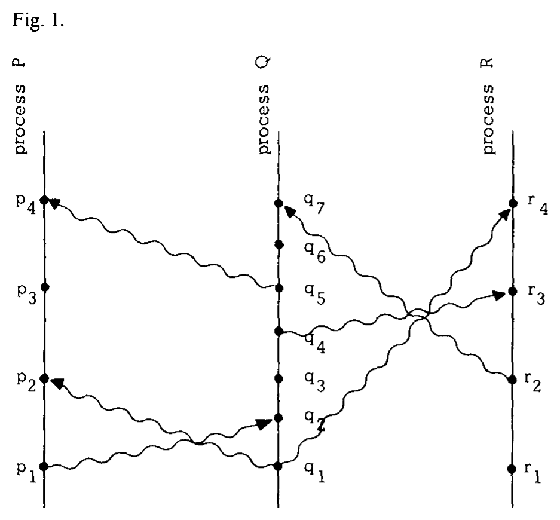
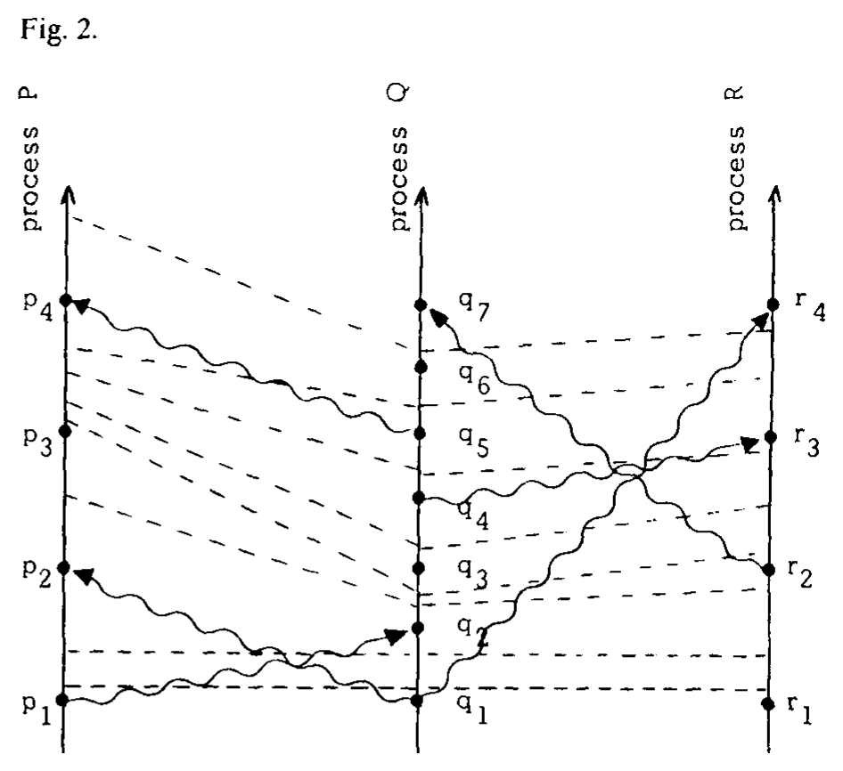
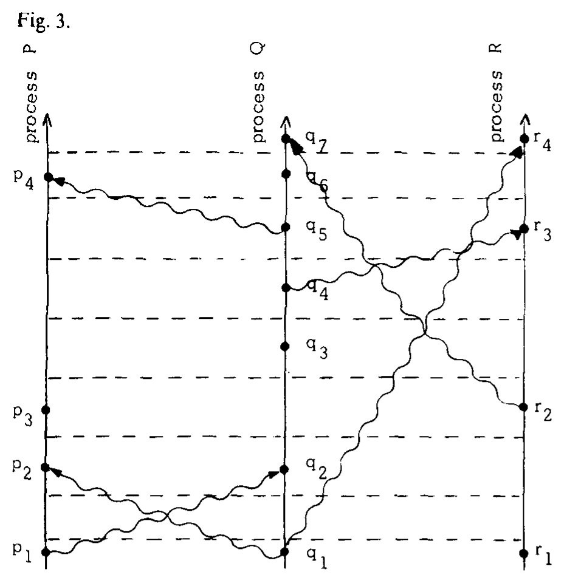

> 时间、时钟与分布式系统中的事件排序

**Operating Systems** 
**R. Stockton Gaines, Editor**

> **操作系统** 
> **编辑：R. Stockton Gaines**

**Leslie Lamport** 
Massachusetts Computer Associates, Inc.

> **Leslie Lamport** 
> Massachusetts Computer Associates, Inc.

The concept of one event happening before another in a distributed system is examined, and is shown to define a partial ordering of the events. A distributed algorithm is given for synchronizing a system of logical clocks which can be used to totally order the events. The use of the total ordering is illustrated with a method for solving synchronization problems. The algorithm is then specialized for synchronizing physical clocks, and a bound is derived on how far out of synchrony the clocks can become.

> 本文考察分布式系统中一个事件发生在另一个事件之前这一概念，并说明它定义了事件的偏序。文中给出一种分布式算法，用于同步一组可以为事件建立全序的逻辑时钟；又以一种求解同步问题的方法说明全序的用途。随后，算法被特化为物理时钟同步算法，并推导出各时钟可能失同步到何种程度的上界。

**Key Words and Phrases:** distributed systems, computer networks, clock synchronization, multiprocess systems

> **关键词与短语：** 分布式系统，计算机网络，时钟同步，多进程系统

**CR Categories:** 4.32, 5.29

> **CR 分类：** 4.32，5.29

## Introduction

> 引言

The concept of time is fundamental to our way of thinking. It is derived from the more basic concept of the order in which events occur. We say that something happened at 3:15 if it occurred *after* our clock read 3:15 and *before* it read 3:16. The concept of the temporal ordering of events pervades our thinking about systems. For example, in an airline reservation system we specify that a request for a reservation should be granted if it is made *before* the flight is filled. However, we will see that this concept must be carefully reexamined when considering events in a distributed system.

> 时间概念是我们思维方式的基础。它源自一个更基本的概念，即事件发生的先后次序。所谓某件事发生在 3:15，是指它发生于时钟读数为 3:15 *之后*、读数为 3:16 *之前*。事件的时间次序这一概念贯穿我们对系统的思考。例如，在航空订票系统中，我们规定：如果订票请求是在航班满员*之前*提出的，就应批准该请求。然而，我们将会看到，在考虑分布式系统中的事件时，必须仔细重新审视这一概念。

A distributed system consists of a collection of distinct processes which are spatially separated, and which communicate with one another by exchanging messages. A network of interconnected computers, such as the ARPA net, is a distributed system. A single computer can also be viewed as a distributed system in which the central control unit, the memory units, and the input-output channels are separate processes. A system is distributed if the message transmission delay is not negligible compared to the time between events in a single process.

> 分布式系统由一组空间上彼此分离的不同进程构成，这些进程通过交换消息相互通信。由计算机互连而成的网络——例如 ARPA 网——就是分布式系统。单台计算机也可以视为分布式系统，其中中央控制单元、存储单元和输入输出通道都是独立进程。如果消息传输延迟与单个进程内两事件之间的时间相比不可忽略，该系统就是分布式的。

We will concern ourselves primarily with systems of spatially separated computers. However, many of our remarks will apply more generally. In particular, a multiprocessing system on a single computer involves problems similar to those of a distributed system because of the unpredictable order in which certain events can occur.

> 我们主要关注由空间上彼此分离的计算机构成的系统。不过，本文许多论述具有更广泛的适用性。特别是，单台计算机上的多进程系统也会遇到与分布式系统类似的问题，因为某些事件的发生次序不可预测。

In a distributed system, it is sometimes impossible to say that one of two events occurred first. The relation “happened before” is therefore only a partial ordering of the events in the system. We have found that problems often arise because people are not fully aware of this fact and its implications.

> 在分布式系统中，有时无法断言两个事件中的哪一个先发生。因此，“先发生于”（happened before）关系只构成系统事件的一个偏序。我们发现，问题往往源于人们没有充分认识到这一事实及其含义。

In this paper, we discuss the partial ordering defined by the “happened before” relation, and give a distributed algorithm for extending it to a consistent total ordering of all the events. This algorithm can provide a useful mechanism for implementing a distributed system. We illustrate its use with a simple method for solving synchronization problems. Unexpected, anomalous behavior can occur if the ordering obtained by this algorithm differs from that perceived by the user. This can be avoided by introducing real, physical clocks. We describe a simple method for synchronizing these clocks, and derive an upper bound on how far out of synchrony they can drift.

> 本文讨论由“先发生于”关系定义的偏序，并给出一种分布式算法，将它扩展为所有事件的一致全序。该算法可以为实现分布式系统提供一种有用机制。我们用一种求解同步问题的简单方法来说明其用途。如果该算法得到的次序与用户感知的次序不同，系统可能出现出乎意料的异常行为。引入真实的物理时钟可以避免这种情况。我们将介绍一种同步这些时钟的简单方法，并推导它们可能偏离同步状态的上界。

General permission to make fair use in teaching or research of all or part of this material is granted to individual readers and to nonprofit libraries acting for them provided that ACM’s copyright notice is given and that reference is made to the publication, to its date of issue, and to the fact that reprinting privileges were granted by permission of the Association for Computing Machinery. To otherwise reprint a figure, table, other substantial excerpt, or the entire work requires specific permission as does republication, or systematic or multiple reproduction.

> 允许个人读者以及代表读者的非营利图书馆在教学或研究中合理使用本材料的全部或部分内容，条件是注明 ACM 的版权声明，并引用本出版物、出版日期以及重印权由 Association for Computing Machinery 授权这一事实。除此之外，重印图、表、其他大段摘录或全文，以及再版、系统性复制或多份复制，均须获得特别许可。

This work was supported by the Advanced Research Projects Agency of the Department of Defense and Rome Air Development Center. It was monitored by Rome Air Development Center under contract number F 30602-76-C-0094.

> 本工作得到美国国防部高级研究计划局和 Rome Air Development Center 的支持，并由 Rome Air Development Center 依据合同 F 30602-76-C-0094 负责监督。

Author’s address: Computer Science Laboratory, SRI International, 333 Ravenswood Ave., Menlo Park CA 94025.

> 作者地址：Computer Science Laboratory, SRI International, 333 Ravenswood Ave., Menlo Park CA 94025。

© 1978 ACM 0001-0782/78/0700-0558 &#36;00.75

> © 1978 ACM 0001-0782/78/0700-0558 &#36;00.75

Communications of the ACM, July 1978, Volume 21, Number 7, pp. 558–565.

> 《Communications of the ACM》，1978 年 7 月，第 21 卷，第 7 期，第 558–565 页。

## The Partial Ordering

> 偏序

Most people would probably say that an event *a* happened before an event *b* if *a* happened at an earlier time than *b*. They might justify this definition in terms of physical theories of time. However, if a system is to meet a specification correctly, then that specification must be given in terms of events observable within the system. If the specification is in terms of physical time, then the system must contain real clocks. Even if it does contain real clocks, there is still the problem that such clocks are not perfectly accurate and do not keep precise physical time. We will therefore define the “happened before” relation without using physical clocks.

> 多数人或许会说，如果事件 *a* 发生的时间早于事件 *b*，那么 *a* 就发生在 *b* 之前。他们可能会用关于时间的物理理论来论证这一定义。然而，若要让系统正确满足某项规范，该规范就必须用系统内部可观察的事件来表述。如果规范以物理时间表述，系统便必须包含真实时钟。即便确有真实时钟，仍存在这些时钟并非完全准确、无法保持精确物理时间的问题。因此，我们将在不使用物理时钟的情况下定义“先发生于”关系。

We begin by defining our system more precisely. We assume that the system is composed of a collection of processes. Each process consists of a sequence of events. Depending upon the application, the execution of a subprogram on a computer could be one event, or the execution of a single machine instruction could be one event. We are assuming that the events of a process form a sequence, where *a* occurs before *b* in this sequence if *a* happens before *b*. In other words, a single process is defined to be a set of events with an *a priori* total ordering. This seems to be what is generally meant by a process.[^1] It would be trivial to extend our definition to allow a process to split into distinct subprocesses, but we will not bother to do so.

> 我们先更精确地定义系统。假定系统由一组进程构成，每个进程包含一个事件序列。视具体应用而定，计算机上一次子程序执行可以算作一个事件，一条机器指令的执行也可以算作一个事件。我们假定一个进程的事件构成序列；如果 *a* 先发生于 *b*，则 *a* 在该序列中位于 *b* 之前。换言之，单个进程被定义为一组具有*先验*全序的事件。这似乎正是人们通常所说的进程。[^1] 把定义扩展为允许一个进程分裂成不同子进程并不困难，但我们不打算这样做。

[^1]: The choice of what constitutes an event affects the ordering of events in a process. For example, the receipt of a message might denote the setting of an interrupt bit in a computer, or the execution of a subprogram to handle that interrupt. Since interrupts need not be handled in the order that they occur, this choice will affect the ordering of a process’ message-receiving events.

    > 如何选择构成“事件”的动作，会影响一个进程内事件的次序。例如，消息的接收可以指计算机中某个中断位被置位，也可以指处理该中断的子程序得到执行。由于中断不必按照发生顺序处理，这一选择会影响进程中消息接收事件的次序。

We assume that sending or receiving a message is an event in a process. We can then define the “happened before” relation, denoted by “→”, as follows.

> 我们假定，发送或接收消息都是进程中的一个事件。于是，可以如下定义以“→”表示的“先发生于”关系。

**Definition.** The relation “→” on the set of events of a system is the smallest relation satisfying the following three conditions: (1) If *a* and *b* are events in the same process, and *a* comes before *b*, then *a* → *b*. (2) If *a* is the sending of a message by one process and *b* is the receipt of the same message by another process, then *a* → *b*. (3) If *a* → *b* and *b* → *c* then *a* → *c*. Two distinct events *a* and *b* are said to be *concurrent* if *a* ↛ *b* and *b* ↛ *a*.

> **定义。** 系统事件集合上的关系“→”是满足以下三个条件的最小关系：(1) 如果 *a* 和 *b* 是同一进程中的事件，且 *a* 位于 *b* 之前，则 *a* → *b*；(2) 如果 *a* 是一个进程发送某条消息的事件，而 *b* 是另一个进程接收同一消息的事件，则 *a* → *b*；(3) 如果 *a* → *b* 且 *b* → *c*，则 *a* → *c*。若两个不同事件 *a* 和 *b* 满足 *a* ↛ *b* 且 *b* ↛ *a*，则称二者*并发*。

We assume that *a* ↛ *a* for any event *a*. (Systems in which an event can happen before itself do not seem to be physically meaningful.) This implies that → is an irreflexive partial ordering on the set of all events in the system.

> 我们假定任意事件 *a* 都满足 *a* ↛ *a*。（一个事件可以发生在自身之前的系统似乎不具有物理意义。）这意味着，→ 是系统全部事件集合上的非自反偏序。

It is helpful to view this definition in terms of a “space-time diagram” such as Figure 1. The horizontal direction represents space, and the vertical direction represents time—later times being higher than earlier ones. The dots denote events, the vertical lines denote processes, and the wavy lines denote messages.[^2] It is easy to see that *a* → *b* means that one can go from *a* to *b* in the diagram by moving forward in time along process and message lines. For example, we have *p*₁ → *r*₄ in Figure 1.

> 借助图 1 所示的“时空图”来理解这一定义很有帮助。水平方向表示空间，竖直方向表示时间——越靠上表示时间越晚。圆点表示事件，竖线表示进程，波浪线表示消息。[^2] 不难看出，*a* → *b* 意味着可以沿进程线和消息线朝时间前进的方向，在图中从 *a* 到达 *b*。例如，图 1 中有 *p*₁ → *r*₄。

[^2]: Observe that messages may be received out of order. We allow the sending of several messages to be a single event, but for convenience we will assume that the receipt of a single message does not coincide with the sending or receipt of any other message.

    > 请注意，消息可能不按顺序到达。我们允许发送多条消息构成一个事件；但为方便起见，假定接收单条消息的事件不与任何其他消息的发送或接收事件重合。

**Fig. 1.**

> **图 1。**

> **图表中文解读：** 三条竖线分别表示进程 P、Q、R，越向上时间越晚；圆点是各进程中的事件，波浪箭头是实际发送并被接收的消息。若能沿进程线向上并顺着消息箭头从事件 *a* 走到事件 *b*，则 *a* → *b*。例如 *p*₁ → *r*₄；而 *p*₃ 与 *q*₃ 之间不存在任一方向的这种路径，因此二者并发。

Another way of viewing the definition is to say that *a* → *b* means that it is possible for event *a* to causally affect event *b*. Two events are concurrent if neither can causally affect the other. For example, events *p*₃ and *q*₃ of Figure 1 are concurrent. Even though we have drawn the diagram to imply that *q*₃ occurs at an earlier physical time than *p*₃, process P cannot know what process Q did at *q*₃ until it receives the message at *p*₄. (Before event *p*₄, P could at most know what Q was *planning* to do at *q*₃.)

> 也可以这样理解该定义：*a* → *b* 表示事件 *a* 有可能在因果上影响事件 *b*。如果两个事件谁都无法在因果上影响对方，它们就是并发的。例如，图 1 中的 *p*₃ 和 *q*₃ 是并发事件。尽管图中画成 *q*₃ 的物理发生时间早于 *p*₃，但在进程 P 于 *p*₄ 收到消息之前，它不可能知道进程 Q 在 *q*₃ 做了什么。（在事件 *p*₄ 之前，P 至多只能知道 Q 在 *q*₃ *计划*做什么。）

This definition will appear quite natural to the reader familiar with the invariant space-time formulation of special relativity, as described for example in [1] or the first chapter of [2]. In relativity, the ordering of events is defined in terms of messages that *could* be sent. However, we have taken the more pragmatic approach of only considering messages that actually *are* sent. We should be able to determine if a system performed correctly by knowing only those events which *did* occur, without knowing which events *could have* occurred.

> 熟悉狭义相对论不变时空表述的读者会觉得这一定义十分自然，相关表述可见 [1] 或 [2] 第一章。在相对论中，事件次序由那些*可能*发送的消息定义；而我们采取了更务实的做法，只考虑实际*确实*发送的消息。我们应当只凭那些*确实*发生的事件，就能判断系统执行是否正确，而无须知道哪些事件*原本可能*发生。

## Logical Clocks

> 逻辑时钟

We now introduce clocks into the system. We begin with an abstract point of view in which a clock is just a way of assigning a number to an event, where the number is thought of as the time at which the event occurred. More precisely, we define a clock *Cᵢ* for each process *Pᵢ* to be a function which assigns a number *Cᵢ(a)* to any event *a* in that process. The entire system of clocks is represented by the function *C* which assigns to any event *b* the number *C(b)*, where *C(b) = Cⱼ(b)* if *b* is an event in process *Pⱼ*. For now, we make no assumption about the relation of the numbers *Cᵢ(a)* to physical time, so we can think of the clocks *Cᵢ* as logical rather than physical clocks. They may be implemented by counters with no actual timing mechanism.

> 现在，我们把时钟引入系统。先从一个抽象视角出发：时钟只是一种给事件赋值的方法，所赋数字被视为该事件发生的时间。更精确地说，我们为每个进程 *Pᵢ* 定义一个时钟 *Cᵢ*；它是一个函数，为该进程中的任意事件 *a* 赋予数值 *Cᵢ(a)*。整个时钟系统由函数 *C* 表示，它为任意事件 *b* 赋予数值 *C(b)*；如果 *b* 是进程 *Pⱼ* 中的事件，则 *C(b) = Cⱼ(b)*。目前我们不对 *Cᵢ(a)* 与物理时间的关系作任何假设，因此可以把 *Cᵢ* 看作逻辑时钟而非物理时钟。它们可以用不含实际计时机制的计数器实现。

We now consider what it means for such a system of clocks to be correct. We cannot base our definition of correctness on physical time, since that would require introducing clocks which keep physical time. Our definition must be based on the order in which events occur. The strongest reasonable condition is that if an event *a* occurs before another event *b*, then *a* should happen at an earlier time than *b*. We state this condition more formally as follows.

> 现在来考虑这样一套时钟系统何谓正确。我们不能把正确性的定义建立在物理时间之上，因为那样就需要引入保持物理时间的时钟。我们的定义必须以事件发生的次序为基础。最强且合理的条件是：若事件 *a* 发生在另一事件 *b* 之前，则 *a* 的时刻应早于 *b*。更形式化地说：

**Clock Condition.** For any events *a*, *b*:

> **时钟条件。** 对任意事件 *a*、*b*：

$$
\text{if } a \to b \text{ then } C(a) < C(b).
$$

> $$
> \text{若 } a \to b\text{，则 }C(a)<C(b)
> $$

Note that we cannot expect the converse condition to hold as well, since that would imply that any two concurrent events must occur at the same time. In Figure 1, *p*₂ and *p*₃ are both concurrent with *q*₃, so this would mean that they both must occur at the same time as *q*₃, which would contradict the Clock Condition because *p*₂ → *p*₃.

> 请注意，我们不能期望逆命题也成立，因为那将意味着任意两个并发事件都必须同时发生。在图 1 中，*p*₂ 和 *p*₃ 都与 *q*₃ 并发，因此这会意味着二者都必须与 *q*₃ 同时发生；然而 *p*₂ → *p*₃，这与时钟条件矛盾。

It is easy to see from our definition of the relation “→” that the Clock Condition is satisfied if the following two conditions hold.

> 根据我们对关系“→”的定义，不难看出，只要下列两个条件成立，时钟条件就会得到满足。

**C1.** If *a* and *b* are events in process *Pᵢ*, and *a* comes before *b*, then *Cᵢ(a) < Cᵢ(b)*.

> **C1。** 若 *a* 和 *b* 是进程 *Pᵢ* 中的事件，且 *a* 位于 *b* 之前，则 *Cᵢ(a) < Cᵢ(b)*。

**C2.** If *a* is the sending of a message by process *Pᵢ* and *b* is the receipt of that message by process *Pⱼ*, then *Cᵢ(a) < Cⱼ(b)*.

> **C2。** 若 *a* 是进程 *Pᵢ* 发送一条消息的事件，而 *b* 是进程 *Pⱼ* 接收该消息的事件，则 *Cᵢ(a) < Cⱼ(b)*。

Let us consider the clocks in terms of a space-time diagram. We imagine that a process’ clock “ticks” through every number, with the ticks occurring between the process’ events. For example, if *a* and *b* are consecutive events in process *Pᵢ* with *Cᵢ(a) = 4* and *Cᵢ(b) = 7*, then clock ticks 5, 6, and 7 occur between the two events. We draw a dashed “tick line” through all the like-numbered ticks of the different processes. The space-time diagram of Figure 1 might then yield the picture in Figure 2. Condition C1 means that there must be a tick line between any two events on a process line, and condition C2 means that every message line must cross a tick line. From the pictorial meaning of →, it is easy to see why these two conditions imply the Clock Condition.

> 下面从时空图的角度考察这些时钟。设想进程的时钟“滴答”经过每一个数值，滴答发生在该进程的各个事件之间。例如，若 *a* 和 *b* 是进程 *Pᵢ* 中相邻的两个事件，且 *Cᵢ(a) = 4*、*Cᵢ(b) = 7*，那么时钟滴答 5、6、7 就发生在这两个事件之间。我们画一条虚线“滴答线”，穿过不同进程中编号相同的滴答。这样，图 1 的时空图可能得到图 2 所示的图形。条件 C1 意味着进程线上的任意两个事件之间都必须有一条滴答线；条件 C2 意味着每条消息线都必须穿过一条滴答线。由 → 的图形含义，很容易看出这两个条件为何蕴含时钟条件。

**Fig. 2.**

> **图 2。**

> **图表中文解读：** 图中仍是进程 P、Q、R 及其事件和消息；虚线连接各进程逻辑时钟中编号相同的滴答。由于各进程时钟推进不同，这些线在图上可以倾斜。C1 要求同一进程的相邻事件之间至少有一条滴答线，C2 要求每条消息线至少穿过一条滴答线，因此消息的接收时刻一定大于发送时刻。

We can consider the tick lines to be the time coordinate lines of some Cartesian coordinate system on space-time. We can redraw Figure 2 to straighten these coordinate lines, thus obtaining Figure 3. Figure 3 is a valid alternate way of representing the same system of events as Figure 2. Without introducing the concept of physical time into the system (which requires introducing physical clocks), there is no way to decide which of these pictures is a better representation.

> 可以把滴答线看成时空上某个笛卡尔坐标系的时间坐标线。将图 2 重画，使这些坐标线变直，便得到图 3。图 3 是对图 2 中同一事件系统的另一种有效表示。若不在系统中引入物理时间概念——这又需要引入物理时钟——就无法判定哪幅图是更好的表示。

**Fig. 3.**

> **图 3。**

> **图表中文解读：** 图 3 保留图 2 的同一组进程、事件和消息，只把逻辑时钟的等值滴答线拉直为水平线；事件的竖直间距和消息线形状也随这种重画而改变。这是一种坐标变换后的等价表示，并不表示图 3 比图 2 更接近物理时间。

The reader may find it helpful to visualize a two-dimensional spatial network of processes, which yields a three-dimensional space-time diagram. Processes and messages are still represented by lines, but tick lines become two-dimensional surfaces.

> 读者也许会发现，把进程网络想象成二维空间会有所帮助，这会产生一个三维时空图。进程和消息仍由线表示，但滴答线会变成二维曲面。

Let us now assume that the processes are algorithms, and the events represent certain actions during their execution. We will show how to introduce clocks into the processes which satisfy the Clock Condition. Process *Pᵢ*’s clock is represented by a register *Cᵢ*, so that *Cᵢ(a)* is the value contained by *Cᵢ* during the event *a*. The value of *Cᵢ* will change between events, so changing *Cᵢ* does not itself constitute an event.

> 现在假定各进程都是算法，而事件表示这些算法执行期间的某些动作。我们将说明如何把满足时钟条件的时钟引入进程。进程 *Pᵢ* 的时钟用寄存器 *Cᵢ* 表示，因此 *Cᵢ(a)* 是事件 *a* 发生期间 *Cᵢ* 所含的值。*Cᵢ* 的值会在事件之间改变，所以改变 *Cᵢ* 本身并不构成事件。

To guarantee that the system of clocks satisfies the Clock Condition, we will insure that it satisfies conditions C1 and C2. Condition C1 is simple; the processes need only obey the following implementation rule:

> 为保证时钟系统满足时钟条件，我们将保证它满足条件 C1 和 C2。条件 C1 很简单；进程只须遵守下列实现规则：

**IR1.** Each process *Pᵢ* increments *Cᵢ* between any two successive events.

> **IR1。** 每个进程 *Pᵢ* 都在任意两个相继事件之间递增 *Cᵢ*。

To meet condition C2, we require that each message *m* contain a timestamp *Tₘ* which equals the time at which the message was sent. Upon receiving a message timestamped *Tₘ*, a process must advance its clock to be later than *Tₘ*. More precisely, we have the following rule.

> 为满足条件 C2，我们要求每条消息 *m* 都包含时间戳 *Tₘ*，其值等于消息发送时的时间。收到带有时间戳 *Tₘ* 的消息后，进程必须把自己的时钟推进到晚于 *Tₘ*。更精确地说，有如下规则。

**IR2.** (a) If event *a* is the sending of a message *m* by process *Pᵢ*, then the message *m* contains a timestamp *Tₘ = Cᵢ(a)*. (b) Upon receiving a message *m*, process *Pⱼ* sets *Cⱼ* greater than or equal to its present value and greater than *Tₘ*.

> **IR2。** (a) 若事件 *a* 是进程 *Pᵢ* 发送消息 *m*，则消息 *m* 包含时间戳 *Tₘ = Cᵢ(a)*；(b) 进程 *Pⱼ* 收到消息 *m* 后，把 *Cⱼ* 设置为不小于其当前值且大于 *Tₘ* 的值。

In IR2(b) we consider the event which represents the receipt of the message *m* to occur after the setting of *Cⱼ*. (This is just a notational nuisance, and is irrelevant in any actual implementation.) Obviously, IR2 insures that C2 is satisfied. Hence, the simple implementation rules IR1 and IR2 imply that the Clock Condition is satisfied, so they guarantee a correct system of logical clocks.

> 在 IR2(b) 中，我们把表示接收消息 *m* 的事件视为发生在设置 *Cⱼ* 之后。（这只是一点记号上的麻烦，对任何实际实现都无关紧要。）显然，IR2 保证 C2 成立。因此，简单的实现规则 IR1 和 IR2 蕴含时钟条件成立，从而保证得到一套正确的逻辑时钟。

## Ordering the Events Totally

> 对事件作全序排列

We can use a system of clocks satisfying the Clock Condition to place a total ordering on the set of all system events. We simply order the events by the times at which they occur. To break ties, we use any arbitrary total ordering < of the processes. More precisely, we define a relation ⇒ as follows: if *a* is an event in process *Pᵢ* and *b* is an event in process *Pⱼ*, then *a* ⇒ *b* if and only if either (i) *Cᵢ(a) < Cⱼ(b)* or (ii) *Cᵢ(a) = Cⱼ(b)* and *Pᵢ < Pⱼ*. It is easy to see that this defines a total ordering, and that the Clock Condition implies that if *a* → *b* then *a* ⇒ *b*. In other words, the relation ⇒ is a way of completing the “happened before” partial ordering to a total ordering.[^3]

> 我们可以用满足时钟条件的一套时钟，在系统全部事件的集合上建立全序。只须按事件发生的时刻对其排序；若时刻相同，就用进程上的任意一个全序 < 来打破平局。更精确地，关系 ⇒ 定义如下：若 *a* 是进程 *Pᵢ* 中的事件，*b* 是进程 *Pⱼ* 中的事件，则 *a* ⇒ *b* 当且仅当 (i) *Cᵢ(a) < Cⱼ(b)*，或 (ii) *Cᵢ(a) = Cⱼ(b)* 且 *Pᵢ < Pⱼ*。不难看出，这一定义给出了一个全序，而且时钟条件意味着，若 *a* → *b*，则 *a* ⇒ *b*。换言之，关系 ⇒ 是把“先发生于”偏序补全为全序的一种方式。[^3]

[^3]: The ordering < establishes a priority among the processes. If a “fairer” method is desired, then < can be made a function of the clock value. For example, if *Cᵢ(a) = Cⱼ(b)* and *j < i*, then we can let *a* ⇒ *b* if *j < Cᵢ(a) mod N ≤ i*, and *b* ⇒ *a* otherwise; where *N* is the total number of processes.

    > 排序 < 在各进程之间确立了优先级。如果希望采用一种“更公平”的方法，可以让 < 成为时钟值的函数。例如，若 *Cᵢ(a) = Cⱼ(b)* 且 *j < i*，那么当 *j < Cᵢ(a) mod N ≤ i* 时可令 *a* ⇒ *b*，否则令 *b* ⇒ *a*；其中 *N* 是进程总数。

The ordering ⇒ depends upon the system of clocks *Cᵢ*, and is not unique. Different choices of clocks which satisfy the Clock Condition yield different relations ⇒. Given any total ordering relation ⇒ which extends →, there is a system of clocks satisfying the Clock Condition which yields that relation. It is only the partial ordering → which is uniquely determined by the system of events.

> 全序 ⇒ 取决于时钟系统 *Cᵢ*，并不唯一。选择不同的、满足时钟条件的时钟，会得到不同的关系 ⇒。给定任意扩展 → 的全序关系 ⇒，都存在一套满足时钟条件并产生该关系的时钟。唯有偏序 → 是由事件系统唯一确定的。

Being able to totally order the events can be very useful in implementing a distributed system. In fact, the reason for implementing a correct system of logical clocks is to obtain such a total ordering. We will illustrate the use of this total ordering of events by solving the following version of the mutual exclusion problem. Consider a system composed of a fixed collection of processes which share a single resource. Only one process can use the resource at a time, so the processes must synchronize themselves to avoid conflict. We wish to find an algorithm for granting the resource to a process which satisfies the following three conditions: (I) A process which has been granted the resource must release it before it can be granted to another process. (II) Different requests for the resource must be granted in the order in which they are made. (III) If every process which is granted the resource eventually releases it, then every request is eventually granted.

> 能够对事件作全序排列，对实现分布式系统会很有用。事实上，实现一套正确逻辑时钟的目的正是获得这种全序。我们将求解下述版本的互斥问题，以说明如何运用事件全序。考虑一个由固定进程集合组成的系统，它们共享单一资源。任一时刻只能有一个进程使用该资源，因此各进程必须彼此同步以避免冲突。我们希望找到一个把资源授予进程的算法，并满足以下三个条件：(I) 已获得资源的进程必须先释放资源，资源才能授予另一进程；(II) 不同的资源请求必须按其提出的先后次序获得满足；(III) 若每个获得资源的进程最终都会释放资源，则每个请求最终都会获得满足。

We assume that the resource is initially granted to exactly one process.

> 我们假定，初始时资源恰好授予一个进程。

These are perfectly natural requirements. They precisely specify what it means for a solution to be correct.[^4] Observe how the conditions involve the ordering of events. Condition II says nothing about which of two concurrently issued requests should be granted first.

> 这些要求十分自然，它们精确规定了解法何谓正确。[^4] 请注意这些条件如何涉及事件的次序。条件 II 并未规定同时发出的两个请求中哪一个应先获满足。

[^4]: The term “eventually” should be made precise, but that would require too long a diversion from our main topic.

    > “最终”一词本应作精确定义，但那会使我们离题太远。

It is important to realize that this is a nontrivial problem. Using a central scheduling process which grants requests in the order they are received will not work, unless additional assumptions are made. To see this, let *P₀* be the scheduling process. Suppose *P₁* sends a request to *P₀* and then sends a message to *P₂*. Upon receiving the latter message, *P₂* sends a request to *P₀*. It is possible for *P₂*’s request to reach *P₀* before *P₁*’s request does. Condition II is then violated if *P₂*’s request is granted first.

> 必须认识到，这并不是一个平凡问题。除非增加额外假设，否则用一个中央调度进程按收到请求的顺序予以满足并不可行。为说明这一点，设 *P₀* 为调度进程。假定 *P₁* 向 *P₀* 发送请求，随后又向 *P₂* 发送一条消息；*P₂* 收到后一条消息时，向 *P₀* 发送请求。*P₂* 的请求可能先于 *P₁* 的请求到达 *P₀*。若先满足 *P₂* 的请求，就会违反条件 II。

To solve the problem, we implement a system of clocks with rules IR1 and IR2, and use them to define a total ordering ⇒ of all events. This provides a total ordering of all request and release operations. With this ordering, finding a solution becomes a straightforward exercise. It just involves making sure that each process learns about all other processes’ operations.

> 为解决该问题，我们用规则 IR1 和 IR2 实现一套时钟系统，并用它定义全部事件的全序 ⇒。这样便得到全部请求和释放操作的全序。有了这一排序，寻找解法便成为一项直接的工作，只需保证每个进程都获知所有其他进程的操作。

To simplify the problem, we make some assumptions. They are not essential, but they are introduced to avoid distracting implementation details. We assume first of all that for any two processes *Pᵢ* and *Pⱼ*, the messages sent from *Pᵢ* to *Pⱼ* are received in the same order as they are sent. Moreover, we assume that every message is eventually received. (These assumptions can be avoided by introducing message numbers and message acknowledgment protocols.) We also assume that a process can send messages directly to every other process.

> 为简化问题，我们作出若干假设。它们并非本质要求，引入它们只是为了避免无关紧要的实现细节。首先假定，对于任意两个进程 *Pᵢ* 和 *Pⱼ*，从 *Pᵢ* 发往 *Pⱼ* 的消息按发送顺序被接收。还假定每条消息最终都会被接收。（通过引入消息编号和消息确认协议，可以不作这些假设。）此外还假定，一个进程能够直接向其他每个进程发送消息。

Each process maintains its own request queue which is never seen by any other process. We assume that the request queues initially contain the single message *T₀:P₀ requests resource*, where *P₀* is the process initially granted the resource and *T₀* is less than the initial value of any clock.

> 每个进程维护自己的请求队列，其他进程永远看不到这个队列。假定各请求队列初始时只含一条消息 *T₀:P₀ requests resource*（*T₀:P₀ 请求资源*），其中 *P₀* 是初始获得资源的进程，且 *T₀* 小于任一时钟的初始值。

The algorithm is then defined by the following five rules. For convenience, the actions defined by each rule are assumed to form a single event.

> 于是，该算法由以下五条规则定义。为方便起见，假定每条规则所定义的动作构成单个事件。

1. To request the resource, process *Pᵢ* sends the message *Tₘ:Pᵢ requests resource* to every other process, and puts that message on its request queue, where *Tₘ* is the timestamp of the message.

> 1. 为请求资源，进程 *Pᵢ* 向其他每个进程发送消息 *Tₘ:Pᵢ requests resource*（*Tₘ:Pᵢ 请求资源*），并把该消息放入自己的请求队列，其中 *Tₘ* 是消息的时间戳。

2. When process *Pⱼ* receives the message *Tₘ:Pᵢ requests resource*, it places it on its request queue and sends a (timestamped) acknowledgment message to *Pᵢ*.[^5]

> 2. 当进程 *Pⱼ* 收到消息 *Tₘ:Pᵢ requests resource*（*Tₘ:Pᵢ 请求资源*）时，将它放入自己的请求队列，并向 *Pᵢ* 发送一条（带时间戳的）确认消息。[^5]

[^5]: This acknowledgment message need not be sent if *Pⱼ* has already sent a message to *Pᵢ* timestamped later than *Tₘ*.

    > 如果 *Pⱼ* 已向 *Pᵢ* 发送过时间戳晚于 *Tₘ* 的消息，就无须发送这条确认消息。

3. To release the resource, process *Pᵢ* removes any *Tₘ:Pᵢ requests resource* message from its request queue and sends a (timestamped) *Pᵢ releases resource* message to every other process.

> 3. 为释放资源，进程 *Pᵢ* 从自己的请求队列中删除所有 *Tₘ:Pᵢ requests resource*（*Tₘ:Pᵢ 请求资源*）消息，并向其他每个进程发送一条（带时间戳的）*Pᵢ releases resource*（*Pᵢ 释放资源*）消息。

4. When process *Pⱼ* receives a *Pᵢ releases resource* message, it removes any *Tₘ:Pᵢ requests resource* message from its request queue.

> 4. 当进程 *Pⱼ* 收到一条 *Pᵢ releases resource*（*Pᵢ 释放资源*）消息时，就从自己的请求队列中删除所有 *Tₘ:Pᵢ requests resource*（*Tₘ:Pᵢ 请求资源*）消息。

5. Process *Pᵢ* is granted the resource when the following two conditions are satisfied: (i) There is a *Tₘ:Pᵢ requests resource* message in its request queue which is ordered before any other request in its queue by the relation ⇒. (To define the relation “⇒” for messages, we identify a message with the event of sending it.) (ii) *Pᵢ* has received a message from every other process timestamped later than *Tₘ*.[^6]

> 5. 满足以下两个条件时，进程 *Pᵢ* 获得资源：(i) 它的请求队列中有一条 *Tₘ:Pᵢ requests resource*（*Tₘ:Pᵢ 请求资源*）消息，且按关系 ⇒ 排在队列中其他所有请求之前。（为定义消息之间的关系“⇒”，我们把消息与其发送事件等同起来。）(ii) *Pᵢ* 已从其他每个进程收到一条时间戳晚于 *Tₘ* 的消息。[^6]

[^6]: If *Pⱼ < Pᵢ*, then *Pᵢ* need only have received a message timestamped ≥ *Tₘ* from *Pⱼ*.

    > 若 *Pⱼ < Pᵢ*，则 *Pᵢ* 只需从 *Pⱼ* 收到一条时间戳 ≥ *Tₘ* 的消息。

Note that conditions (i) and (ii) of rule 5 are tested locally by *Pᵢ*.

> 请注意，规则 5 的条件 (i) 和 (ii) 均由 *Pᵢ* 在本地检验。

It is easy to verify that the algorithm defined by these rules satisfies conditions I–III. First of all, observe that condition (ii) of rule 5, together with the assumption that messages are received in order, guarantees that *Pᵢ* has learned about all requests which preceded its current request. Since rules 3 and 4 are the only ones which delete messages from the request queue, it is then easy to see that condition I holds. Condition II follows from the fact that the total ordering ⇒ extends the partial ordering →. Rule 2 guarantees that after *Pᵢ* requests the resource, condition (ii) of rule 5 will eventually hold. Rules 3 and 4 imply that if each process which is granted the resource eventually releases it, then condition (i) of rule 5 will eventually hold, thus proving condition III.

> 不难验证，由这些规则定义的算法满足条件 I–III。首先，规则 5 的条件 (ii) 与消息按序接收这一假设共同保证，*Pᵢ* 已经获知所有先于其当前请求的请求。由于只有规则 3 和 4 会从请求队列删除消息，很容易看出条件 I 成立。全序 ⇒ 扩展了偏序 →，故条件 II 成立。规则 2 保证 *Pᵢ* 请求资源后，规则 5 的条件 (ii) 最终会成立。规则 3 和 4 表明，若每个获得资源的进程最终都释放资源，规则 5 的条件 (i) 最终就会成立，从而证明条件 III。

This is a distributed algorithm. Each process independently follows these rules, and there is no central synchronizing process or central storage. This approach can be generalized to implement any desired synchronization for such a distributed multiprocess system. The synchronization is specified in terms of a State Machine, consisting of a set *C* of possible commands, a set *S* of possible states, and a function *e: C × S → S*. The relation *e(C, S) = S′* means that executing the command *C* with the machine in state *S* causes the machine state to change to *S′*. In our example, the set *C* consists of all the commands *Pᵢ requests resource* and *Pᵢ releases resource*, and the state consists of a queue of waiting request commands, where the request at the head of the queue is the currently granted one. Executing a request command adds the request to the tail of the queue, and executing a release command removes a command from the queue.[^7]

> 这是一个分布式算法。每个进程都独立遵循这些规则，不存在中央同步进程或中央存储。这一方法可以推广，用于实现这种分布式多进程系统中任何所需的同步。同步以状态机来规定；状态机由可能命令的集合 *C*、可能状态的集合 *S*，以及函数 *e: C × S → S* 构成。关系 *e(C, S) = S′* 表示：机器处于状态 *S* 时执行命令 *C*，会使机器状态变为 *S′*。在本例中，集合 *C* 由所有命令 *Pᵢ requests resource*（*Pᵢ 请求资源*）和 *Pᵢ releases resource*（*Pᵢ 释放资源*）构成；状态则由等待中的请求命令队列构成，队首请求就是当前获准的请求。执行请求命令会把请求加到队尾，执行释放命令会从队列中删除一条命令。[^7]

[^7]: If each process does not strictly alternate request and release commands, then executing a release command could delete zero, one, or more than one request from the queue.

    > 若每个进程不严格交替发出请求命令和释放命令，那么执行一次释放命令可能从队列中删除零个、一个或多个请求。

Each process independently simulates the execution of the State Machine, using the commands issued by all the processes. Synchronization is achieved because all processes order the commands according to their timestamps (using the relation ⇒), so each process uses the same sequence of commands. A process can execute a command timestamped *T* when it has learned of all commands issued by all other processes with timestamps less than or equal to *T*. The precise algorithm is straightforward, and we will not bother to describe it.

> 每个进程都使用所有进程发出的命令，独立模拟状态机的执行。之所以能够实现同步，是因为所有进程都按命令的时间戳排序（使用关系 ⇒），所以各进程采用同一命令序列。当一个进程已经获知其他所有进程发出的、时间戳小于或等于 *T* 的全部命令时，它就可以执行时间戳为 *T* 的命令。精确算法十分直接，这里不再赘述。

This method allows one to implement any desired form of multiprocess synchronization in a distributed system. However, the resulting algorithm requires the active participation of all the processes. A process must know all the commands issued by other processes, so that the failure of a single process will make it impossible for any other process to execute State Machine commands, thereby halting the system.

> 这种方法可以在分布式系统中实现任何所需形式的多进程同步。然而，由此得到的算法要求所有进程都积极参与。一个进程必须知道其他进程发出的全部命令，所以只要有一个进程失效，其他进程就无法执行状态机命令，从而使系统停顿。

The problem of failure is a difficult one, and it is beyond the scope of this paper to discuss it in any detail. We will just observe that the entire concept of failure is only meaningful in the context of physical time. Without physical time, there is no way to distinguish a failed process from one which is just pausing between events. A user can tell that a system has “crashed” only because he has been waiting too long for a response. A method which works despite the failure of individual processes or communication lines is described in [3].

> 失效问题很困难，详细讨论它超出了本文范围。这里只指出：整个失效概念只有在物理时间的语境中才有意义。没有物理时间，就无法区分失效进程与仅仅在两个事件之间暂停的进程。用户之所以能判断系统已经“崩溃”，只是因为等待响应的时间过长。[3] 描述了一种即使个别进程或通信线路失效也能工作的方案。

## Anomalous Behavior

> 异常行为

Our resource scheduling algorithm ordered the requests according to the total ordering ⇒. This permits the following type of “anomalous behavior.” Consider a nationwide system of interconnected computers. Suppose a person issues a request *A* on a computer *A*, and then telephones a friend in another city to have him issue a request *B* on a different computer *B*. It is quite possible for request *B* to receive a lower timestamp and be ordered before request *A*. This can happen because the system has no way of knowing that *A* actually preceded *B*, since that precedence information is based on messages external to the system.

> 我们的资源调度算法按照全序 ⇒ 对请求排序。这会允许出现下面这种“异常行为”。考虑一个由互连计算机构成的全国性系统。假定某人在计算机 *A* 上发出请求 *A*，随后打电话给另一个城市的朋友，请他在另一台计算机 *B* 上发出请求 *B*。请求 *B* 很可能获得更小的时间戳，从而排在请求 *A* 之前。这之所以可能发生，是因为系统无法知道 *A* 实际上先于 *B*；这种先后信息来自系统外部的消息。

Let us examine the source of the problem more closely. Let \(\mathcal{S}\) be the set of all system events. Let us introduce a set \(\underline{\mathcal{S}}\) of events which contains the events in \(\mathcal{S}\) together with all other relevant external events, such as the phone calls in our example. Let \(\underline{\rightarrow}\) denote the “happened before” relation for \(\underline{\mathcal{S}}\). In our example, we had *A* \(\underline{\rightarrow}\) *B*, but *A* ↛ *B*. It is obvious that no algorithm based entirely upon events in \(\mathcal{S}\), and which does not relate those events in any way with the other events in \(\underline{\mathcal{S}}\), can guarantee that request *A* is ordered before request *B*.

> 进一步考察问题的根源。令 \(\mathcal{S}\) 为全部系统事件的集合。再引入事件集合 \(\underline{\mathcal{S}}\)，它包含 \(\mathcal{S}\) 中的事件以及所有其他相关的外部事件，例如本例中的电话通话。用 \(\underline{\rightarrow}\) 表示 \(\underline{\mathcal{S}}\) 上的“先发生于”关系。在本例中，*A* \(\underline{\rightarrow}\) *B*，但 *A* ↛ *B*。显然，若一个算法完全以 \(\mathcal{S}\) 中的事件为基础，而且不以任何方式把这些事件同 \(\underline{\mathcal{S}}\) 中的其他事件关联起来，就不可能保证请求 *A* 排在请求 *B* 之前。

There are two possible ways to avoid such anomalous behavior. The first way is to explicitly introduce into the system the necessary information about the ordering \(\underline{\rightarrow}\). In our example, the person issuing request *A* could receive the timestamp \(T_A\) of that request from the system. When issuing request *B*, his friend could specify that *B* be given a timestamp later than \(T_A\). This gives the user the responsibility for avoiding anomalous behavior.

> 有两种可能的办法可避免这种异常行为。第一种办法，是把关于次序 \(\underline{\rightarrow}\) 的必要信息显式引入系统。在本例中，发出请求 *A* 的人可以从系统取得该请求的时间戳 \(T_A\)；他的朋友发出请求 *B* 时，可以指定给 *B* 一个晚于 \(T_A\) 的时间戳。这就把避免异常行为的责任交给了用户。

The second approach is to construct a system of clocks which satisfies the following condition.

> 第二种办法，是构造一套满足下列条件的时钟。

**Strong Clock Condition.** For any events *a*, *b* in \(\mathcal{S}\):

> **强时钟条件。** 对 \(\mathcal{S}\) 中任意事件 *a*、*b*：

$$
\text{if } a\;\underline{\rightarrow}\;b \text{ then } C(a) < C(b).
$$

> $$
> \text{若 }a\;\underline{\rightarrow}\;b\text{，则 }C(a)<C(b)
> $$

This is stronger than the ordinary Clock Condition because \(\underline{\rightarrow}\) is a stronger relation than →. It is not in general satisfied by our logical clocks.

> 这比普通时钟条件更强，因为 \(\underline{\rightarrow}\) 是比 → 更强的关系。一般而言，我们的逻辑时钟并不满足这一条件。

Let us identify \(\underline{\mathcal{S}}\) with some set of “real” events in physical space-time, and let \(\underline{\rightarrow}\) be the partial ordering of events defined by special relativity. One of the mysteries of the universe is that it is possible to construct a system of physical clocks which, running quite independently of one another, will satisfy the Strong Clock Condition. We can therefore use physical clocks to eliminate anomalous behavior. We now turn our attention to such clocks.

> 现在把 \(\underline{\mathcal{S}}\) 等同于物理时空中某组“真实”事件，并令 \(\underline{\rightarrow}\) 为狭义相对论所定义的事件偏序。宇宙的奥妙之一就在于：可以构造一套物理时钟，它们虽各自相当独立地运行，却能满足强时钟条件。因此，我们可以用物理时钟消除异常行为。下面转而讨论这种时钟。

## Physical Clocks

> 物理时钟

Let us introduce a physical time coordinate into our space-time picture, and let *Cᵢ(t)* denote the reading of the clock *Cᵢ* at physical time *t*.[^8] For mathematical convenience, we assume that the clocks run continuously rather than in discrete “ticks.” (A discrete clock can be thought of as a continuous one in which there is an error of up to ½ “tick” in reading it.) More precisely, we assume that *Cᵢ(t)* is a continuous, differentiable function of *t* except for isolated jump discontinuities where the clock is reset. Then *dCᵢ(t)/dt* represents the rate at which the clock is running at time *t*.

> 在时空图中引入物理时间坐标，并令 *Cᵢ(t)* 表示物理时刻 *t* 时钟 *Cᵢ* 的读数。[^8] 为便于数学处理，假定时钟连续运行，而不是以离散“滴答”运行。（离散时钟可以看作连续时钟，只是在读取时存在最多 ½ 个“滴答”的误差。）更精确地说，假定 *Cᵢ(t)* 是 *t* 的连续可微函数，只有在时钟复位处存在孤立的跳跃不连续点。于是，*dCᵢ(t)/dt* 表示时钟在时刻 *t* 的运行速率。

[^8]: We will assume a Newtonian space-time. If the relative motion of the clocks or gravitational effects are not negligible, then *Cᵢ(t)* must be deduced from the actual clock reading by transforming from proper time to the arbitrarily chosen time coordinate.

    > 我们将假定牛顿时空。如果时钟之间的相对运动或引力效应不可忽略，就必须把固有时变换到任意选定的时间坐标，据此从实际时钟读数推导 *Cᵢ(t)*。

In order for the clock *Cᵢ* to be a true physical clock, it must run at approximately the correct rate. That is, we must have *dCᵢ(t)/dt ≈ 1* for all *t*. More precisely, we will assume that the following condition is satisfied:

> 时钟 *Cᵢ* 要成为真正的物理时钟，就必须以近似正确的速率运行。也就是说，对所有 *t* 都必须有 *dCᵢ(t)/dt ≈ 1*。更精确地，我们假定满足下列条件：

**PC1.** There exists a constant \(\kappa \ll 1\) such that for all *i*:

> **PC1。** 存在常数 \(\kappa \ll 1\)，使得对所有 *i*：

$$
\left|dC_i(t)/dt-1\right|<\kappa.
$$

> $$
> \left|dC_i(t)/dt-1\right|<\kappa
> $$

For typical crystal controlled clocks, \(\kappa \le 10^{-6}\).

> 对典型的晶体控制时钟，\(\kappa \le 10^{-6}\)。

It is not enough for the clocks individually to run at approximately the correct rate. They must be synchronized so that *Cᵢ(t) ≈ Cⱼ(t)* for all *i*, *j*, and *t*. More precisely, there must be a sufficiently small constant \(\epsilon\) so that the following condition holds:

> 各时钟分别以近似正确的速率运行还不够。它们必须同步，使所有 *i*、*j* 和 *t* 都满足 *Cᵢ(t) ≈ Cⱼ(t)*。更精确地，必须存在充分小的常数 \(\epsilon\)，使下列条件成立：

**PC2.** For all *i*, *j*: \(\left|C_i(t)-C_j(t)\right|<\epsilon\).

> **PC2。** 对所有 *i*、*j*：\(\left|C_i(t)-C_j(t)\right|<\epsilon\)。

If we consider vertical distance in Figure 2 to represent physical time, then PC2 states that the variation in height of a single tick line is less than \(\epsilon\).

> 若把图 2 中的竖直距离视为物理时间，则 PC2 表示一条滴答线的高度变化小于 \(\epsilon\)。

Since two different clocks will never run at exactly the same rate, they will tend to drift further and further apart. We must therefore devise an algorithm to insure that PC2 always holds. First, however, let us examine how small \(\kappa\) and \(\epsilon\) must be to prevent anomalous behavior. We must insure that the system \(\underline{\mathcal{S}}\) of relevant physical events satisfies the Strong Clock Condition. We assume that our clocks satisfy the ordinary Clock Condition, so we need only require that the Strong Clock Condition holds when *a* and *b* are events in \(\mathcal{S}\) with *a* ↛ *b*. Hence, we need only consider events occurring in different processes.

> 由于两个不同的时钟绝不会以完全相同的速率运行，它们往往会漂移得越来越远。因此，必须设计一种算法来保证 PC2 始终成立。不过，首先来考察 \(\kappa\) 和 \(\epsilon\) 必须小到什么程度才能防止异常行为。必须保证相关物理事件系统 \(\underline{\mathcal{S}}\) 满足强时钟条件。我们假定时钟满足普通时钟条件，因此只需在 *a* 和 *b* 是 \(\mathcal{S}\) 中的事件且 *a* ↛ *b* 时要求强时钟条件成立。于是，只须考虑发生在不同进程中的事件。

Let \(\mu\) be a number such that if event *a* occurs at physical time *t* and event *b* in another process satisfies *a* \(\underline{\rightarrow}\) *b*, then *b* occurs later than physical time \(t+\mu\). In other words, \(\mu\) is less than the shortest transmission time for interprocess messages. We can always choose \(\mu\) equal to the shortest distance between processes divided by the speed of light. However, depending upon how messages in \(\underline{\mathcal{S}}\) are transmitted, \(\mu\) could be significantly larger.

> 令 \(\mu\) 为满足下述性质的数：若事件 *a* 发生在物理时刻 *t*，而另一进程中的事件 *b* 满足 *a* \(\underline{\rightarrow}\) *b*，则 *b* 发生在物理时刻 \(t+\mu\) 之后。换言之，\(\mu\) 小于进程间消息的最短传输时间。始终可以把 \(\mu\) 取为进程间最短距离除以光速。不过，根据 \(\underline{\mathcal{S}}\) 中消息的传输方式，\(\mu\) 可能大得多。

To avoid anomalous behavior, we must make sure that for any *i*, *j*, and *t*: \(C_i(t+\mu)-C_j(t)>0\). Combining this with PC1 and 2 allows us to relate the required smallness of \(\kappa\) and \(\epsilon\) to the value of \(\mu\) as follows. We assume that when a clock is reset, it is always set forward and never back. (Setting it back could cause C1 to be violated.) PC1 then implies that \(C_i(t+\mu)-C_i(t)>(1-\kappa)\mu\). Using PC2, it is then easy to deduce that \(C_i(t+\mu)-C_j(t)>0\) if the following inequality holds:

> 为避免异常行为，必须保证任意 *i*、*j*、*t* 都满足 \(C_i(t+\mu)-C_j(t)>0\)。把这一要求同 PC1 和 PC2 结合，可以如下把 \(\kappa\)、\(\epsilon\) 所需的小量级与 \(\mu\) 的值联系起来。假定时钟复位时总是向前设置而绝不向后设置。（向后设置可能违反 C1。）于是 PC1 蕴含 \(C_i(t+\mu)-C_i(t)>(1-\kappa)\mu\)。利用 PC2，不难推出，只要下列不等式成立，就有 \(C_i(t+\mu)-C_j(t)>0\)：

$$
\epsilon/(1-\kappa)\le\mu.
$$

> $$
> \epsilon/(1-\kappa)\le\mu
> $$

This inequality together with PC1 and PC2 implies that anomalous behavior is impossible.

> 该不等式与 PC1、PC2 共同蕴含异常行为不可能发生。

We now describe our algorithm for insuring that PC2 holds. Let *m* be a message which is sent at physical time *t* and received at time *t′*. We define \(\nu_m=t'-t\) to be the *total delay* of the message *m*. This delay will, of course, not be known to the process which receives *m*. However, we assume that the receiving process knows some *minimum delay* \(\mu_m\ge0\) such that \(\mu_m\le\nu_m\). We call \(\xi_m=\nu_m-\mu_m\) the *unpredictable delay* of the message.

> 下面说明保证 PC2 成立的算法。设消息 *m* 在物理时刻 *t* 发送，在时刻 *t′* 被接收。定义 \(\nu_m=t'-t\) 为消息 *m* 的*总延迟*。接收 *m* 的进程当然并不知道这个延迟。不过，我们假定接收进程知道某个*最小延迟* \(\mu_m\ge0\)，并有 \(\mu_m\le\nu_m\)。把 \(\xi_m=\nu_m-\mu_m\) 称为该消息的*不可预测延迟*。

We now specialize rules IR1 and 2 for our physical clocks as follows:

> 现在把规则 IR1 和 2 针对物理时钟具体化如下：

**IR1′.** For each *i*, if *Pᵢ* does not receive a message at physical time *t*, then *Cᵢ* is differentiable at *t* and \(dC_i(t)/dt>0\).

> **IR1′。** 对每个 *i*，如果 *Pᵢ* 在物理时刻 *t* 没有接收消息，则 *Cᵢ* 在 *t* 处可微，且 \(dC_i(t)/dt>0\)。

**IR2′.** (a) If *Pᵢ* sends a message *m* at physical time *t*, then *m* contains a timestamp \(T_m=C_i(t)\). (b) Upon receiving a message *m* at time *t′*, process *Pⱼ* sets \(C_j(t')\) equal to maximum \((C_j(t'-0),T_m+\mu_m)\).[^9]

> **IR2′。** (a) 若 *Pᵢ* 在物理时刻 *t* 发送消息 *m*，则 *m* 含有时间戳 \(T_m=C_i(t)\)；(b) 进程 *Pⱼ* 在时刻 *t′* 收到消息 *m* 时，把 \(C_j(t')\) 设置为 \((C_j(t'-0),T_m+\mu_m)\) 两者中的最大值。[^9]

[^9]: \(C_j(t'-0)=\lim_{\delta\to0} C_j(t'-|\delta|)\).

    > \(C_j(t'-0)=\lim_{\delta\to0} C_j(t'-|\delta|)\)。

Although the rules are formally specified in terms of the physical time parameter, a process only needs to know its own clock reading and the timestamps of messages it receives. For mathematical convenience, we are assuming that each event occurs at a precise instant of physical time, and different events in the same process occur at different times. These rules are then specializations of rules IR1 and IR2, so our system of clocks satisfies the Clock Condition. The fact that real events have a finite duration causes no difficulty in implementing the algorithm. The only real concern in the implementation is making sure that the discrete clock ticks are frequent enough so C1 is maintained.

> 尽管这些规则在形式上以物理时间参数规定，进程实际上只须知道自己的时钟读数以及所收消息的时间戳。为便于数学处理，我们假定每个事件都发生在精确的物理时刻，同一进程中的不同事件发生于不同时刻。这些规则是 IR1 和 IR2 的具体形式，所以时钟系统满足时钟条件。真实事件持续有限时间这一事实，不会给算法实现造成困难。实现中唯一真正需要注意的是，离散时钟的滴答必须足够频繁，以维持 C1。

We now show that this clock synchronizing algorithm can be used to satisfy condition PC2. We assume that the system of processes is described by a directed graph in which an arc from process *Pᵢ* to process *Pⱼ* represents a communication line over which messages are sent directly from *Pᵢ* to *Pⱼ*. We say that a message is sent over this arc every \(\tau\) seconds if for any *t*, *Pᵢ* sends at least one message to *Pⱼ* between physical times *t* and \(t+\tau\). The *diameter* of the directed graph is the smallest number *d* such that for any pair of distinct processes *Pⱼ*, *Pₖ*, there is a path from *Pⱼ* to *Pₖ* having at most *d* arcs.

> 下面说明该时钟同步算法可用于满足条件 PC2。假定进程系统由一个有向图描述，其中从进程 *Pᵢ* 指向进程 *Pⱼ* 的弧表示一条通信线路，消息经它直接从 *Pᵢ* 发往 *Pⱼ*。若对任意 *t*，*Pᵢ* 都会在物理时刻 *t* 与 \(t+\tau\) 之间至少向 *Pⱼ* 发送一条消息，就称每 \(\tau\) 秒在该弧上发送一条消息。有向图的*直径*是满足下述性质的最小数 *d*：对任意一对不同进程 *Pⱼ*、*Pₖ*，都存在一条从 *Pⱼ* 到 *Pₖ* 且至多含 *d* 条弧的路径。

In addition to establishing PC2, the following theorem bounds the length of time it can take the clocks to become synchronized when the system is first started.

> 除了确立 PC2，下述定理还给出了系统首次启动时各时钟达到同步所需时间的上界。

**THEOREM.** Assume a strongly connected graph of processes with diameter *d* which always obeys rules IR1′ and IR2′. Assume that for any message *m*, \(\mu_m\le\mu\) for some constant \(\mu\), and that for all \(t\ge t_0\): (a) PC1 holds. (b) There are constants \(\tau\) and \(\xi\) such that every \(\tau\) seconds a message with an unpredictable delay less than \(\xi\) is sent over every arc. Then PC2 is satisfied with \(\epsilon\approx d(2\kappa\tau+\xi)\) for all \(t\ge t_0+\tau d\), where the approximations assume \(\mu+\xi\ll\tau\).

> **定理。** 假定一个直径为 *d* 的强连通进程图始终遵守规则 IR1′ 和 IR2′。假定对任意消息 *m*，存在常数 \(\mu\) 使 \(\mu_m\le\mu\)；并且对所有 \(t\ge t_0\)：(a) PC1 成立；(b) 存在常数 \(\tau\) 和 \(\xi\)，使得每 \(\tau\) 秒都会在每条弧上发送一条不可预测延迟小于 \(\xi\) 的消息。那么，对所有 \(t\ge t_0+\tau d\)，PC2 以 \(\epsilon\approx d(2\kappa\tau+\xi)\) 成立；其中的近似假定 \(\mu+\xi\ll\tau\)。

The proof of this theorem is surprisingly difficult, and is given in the Appendix. There has been a great deal of work done on the problem of synchronizing physical clocks. We refer the reader to [4] for an introduction to the subject. The methods described in the literature are useful for estimating the message delays \(\mu_m\) and for adjusting the clock frequencies \(dC_i/dt\) (for clocks which permit such an adjustment). However, the requirement that clocks are never set backwards seems to distinguish our situation from ones previously studied, and we believe this theorem to be a new result.

> 这一定理的证明出人意料地困难，见附录。物理时钟同步问题已有大量研究，可参阅 [4] 的入门介绍。文献所述方法有助于估计消息延迟 \(\mu_m\)，也可用于调整时钟频率 \(dC_i/dt\)（对允许此类调整的时钟而言）。然而，时钟绝不向后设置这一要求，似乎把本文情形同以往研究的情形区分开来；我们认为这一定理是一项新结果。

## Conclusion

> 结论

We have seen that the concept of “happening before” defines an invariant partial ordering of the events in a distributed multiprocess system. We described an algorithm for extending that partial ordering to a somewhat arbitrary total ordering, and showed how this total ordering can be used to solve a simple synchronization problem. A future paper will show how this approach can be extended to solve any synchronization problem.

> 我们已经看到，“先发生于”概念为分布式多进程系统中的事件定义了一种不变的偏序。我们描述了一种把该偏序扩展为某种带有任意性的全序的算法，并说明了如何用这种全序解决一个简单的同步问题。后续论文将说明如何扩展这一方法来解决任意同步问题。

The total ordering defined by the algorithm is somewhat arbitrary. It can produce anomalous behavior if it disagrees with the ordering perceived by the system’s users. This can be prevented by the use of properly synchronized physical clocks. Our theorem showed how closely the clocks can be synchronized.

> 该算法定义的全序具有一定任意性。若它与系统用户所感知的次序不一致，就可能产生异常行为。使用正确同步的物理时钟可以防止这种情况。我们的定理给出了时钟能够达到的同步精度。

In a distributed system, it is important to realize that the order in which events occur is only a partial ordering. We believe that this idea is useful in understanding any multiprocess system. It should help one to understand the basic problems of multiprocessing independently of the mechanisms used to solve them.

> 在分布式系统中，认识到事件发生次序仅仅是偏序非常重要。我们相信，这一思想有助于理解任何多进程系统；它应当帮助人们摆脱具体求解机制，独立把握多进程处理的基本问题。

## Appendix

> 附录

### Proof of the Theorem

> 定理的证明

For any *i* and *t*, let us define \(C_i^t\) to be a clock which is set equal to \(C_i\) at time *t* and runs at the same rate as \(C_i\), but is never reset. In other words,

> 对任意 *i* 和 *t*，定义时钟 \(C_i^t\)：它在时刻 *t* 被设置为与 \(C_i\) 相等，随后以与 \(C_i\) 相同的速率运行，但永不复位。换言之，

$$
C_i^t(t')=C_i(t)+\int_t^{t'}[dC_i(t)/dt]dt. \tag{1}
$$

> $$
> C_i^t(t')=C_i(t)+\int_t^{t'}[dC_i(t)/dt]dt\tag{1}
> $$
>
> 译注：原文公式 (1) 在积分上下限、被积函数和微分中重复使用了变量 \(t\)，此处按可见原文保留。

for all \(t'\ge t\). Note that

> 对所有 \(t'\ge t\) 成立。请注意，

$$
C_i(t')\ge C_i^t(t')\quad\text{for all }t'\ge t. \tag{2}
$$

> $$
> C_i(t')\ge C_i^t(t')\quad\text{对所有 }t'\ge t\tag{2}
> $$

Suppose process *P₁* at time *t₁* sends a message to process *P₂* which is received at time *t₂* with an unpredictable delay \(\le\xi\), where \(t_0\le t_1\le t_2\). Then for all \(t\ge t_2\) we have:

> 假定进程 *P₁* 在时刻 *t₁* 向进程 *P₂* 发送一条消息，该消息在时刻 *t₂* 被接收，不可预测延迟 \(\le\xi\)，其中 \(t_0\le t_1\le t_2\)。于是，对所有 \(t\ge t_2\) 有：

$$
\begin{aligned}
C_2^{t_2}(t)&\ge C_2^{t_2}(t_2)+(1-\kappa)(t-t_2) &&\text{[by (1) and PC1]}\\
&\ge C_1(t_1)+\mu_m+(1-\kappa)(t-t_2) &&\text{[by IR2}^{\prime}\text{(b)]}\\
&=C_1(t_1)+(1-\kappa)(t-t_1)-[(t_2-t_1)-\mu_m]+\kappa(t_2-t_1)\\
&\ge C_1(t_1)+(1-\kappa)(t-t_1)-\xi.
\end{aligned}
$$

> $$
> \begin{aligned}
> C_2^{t_2}(t)&\ge C_2^{t_2}(t_2)+(1-\kappa)(t-t_2) &&\text{[由 (1) 和 PC1]}\\
> &\ge C_1(t_1)+\mu_m+(1-\kappa)(t-t_2) &&\text{[由 IR2}^{\prime}\text{(b)]}\\
> &=C_1(t_1)+(1-\kappa)(t-t_1)-[(t_2-t_1)-\mu_m]+\kappa(t_2-t_1)\\
> &\ge C_1(t_1)+(1-\kappa)(t-t_1)-\xi
> \end{aligned}
> $$

Hence, with these assumptions, for all \(t\ge t_2\) we have:

> 因此，在这些假设下，对所有 \(t\ge t_2\) 有：

$$
C_2^{t_2}(t)\ge C_1(t_1)+(1-\kappa)(t-t_1)-\xi. \tag{3}
$$

> $$
> C_2^{t_2}(t)\ge C_1(t_1)+(1-\kappa)(t-t_1)-\xi\tag{3}
> $$

Now suppose that for \(i=1,\ldots,n\) we have \(t_i\le t_i'<t_{i+1}\), \(t_0\le t_1\), and that at time \(t_i'\) process *Pᵢ* sends a message to process *Pᵢ₊₁* which is received at time \(t_{i+1}\) with an unpredictable delay less than \(\xi\). Then repeated application of the inequality (3) yields the following result for \(t\ge t_{n+1}\).

> 现在假定，对 \(i=1,\ldots,n\)，有 \(t_i\le t_i'<t_{i+1}\)、\(t_0\le t_1\)，并且进程 *Pᵢ* 在时刻 \(t_i'\) 向进程 *Pᵢ₊₁* 发送一条消息，该消息在时刻 \(t_{i+1}\) 被接收，不可预测延迟小于 \(\xi\)。于是，反复应用不等式 (3)，可对 \(t\ge t_{n+1}\) 得到：

$$
C_{n+1}^{t_{n+1}}(t)\ge C_1(t_1')+(1-\kappa)(t-t_1')-n\xi. \tag{4}
$$

> $$
> C_{n+1}^{t_{n+1}}(t)\ge C_1(t_1')+(1-\kappa)(t-t_1')-n\xi\tag{4}
> $$

From PC1, IR1′ and 2′ we deduce that

> 由 PC1、IR1′ 和 2′ 可推出

$$
C_1(t_1')\ge C_1(t_1)+(1-\kappa)(t_1'-t_1).
$$

> $$
> C_1(t_1')\ge C_1(t_1)+(1-\kappa)(t_1'-t_1)
> $$

Combining this with (4) and using (2), we get

> 将其与 (4) 结合并利用 (2)，得到

$$
C_{n+1}(t)\ge C_1(t_1)+(1-\kappa)(t-t_1)-n\xi \tag{5}
$$
for \(t\ge t_{n+1}\).

> $$
> C_{n+1}(t)\ge C_1(t_1)+(1-\kappa)(t-t_1)-n\xi\tag{5}
> $$
> 对 \(t\ge t_{n+1}\) 成立。

For any two processes *P* and *P′*, we can find a sequence of processes \(P=P_0,P_1,\ldots,P_{n+1}=P'\), \(n\le d\), with communication arcs from each *Pᵢ* to *Pᵢ₊₁*. By hypothesis (b) we can find times \(t_i,t_i'\) with \(t_i'-t_i\le\tau\) and \(t_{i+1}-t_i'\le\nu\), where \(\nu=\mu+\xi\). Hence, an inequality of the form (5) holds with \(n\le d\) whenever \(t\ge t_1+d(\tau+\nu)\). For any *i*, *j* and any *t*, *t₁* with \(t_1\ge t_0\) and \(t\ge t_1+d(\tau+\nu)\) we therefore have:

> 对任意两个进程 *P* 和 *P′*，都能找到进程序列 \(P=P_0,P_1,\ldots,P_{n+1}=P'\)、\(n\le d\)，其中每个 *Pᵢ* 到 *Pᵢ₊₁* 都有一条通信弧。根据假设 (b)，可以找到时刻 \(t_i,t_i'\)，使 \(t_i'-t_i\le\tau\)、\(t_{i+1}-t_i'\le\nu\)，其中 \(\nu=\mu+\xi\)。因此，只要 \(t\ge t_1+d(\tau+\nu)\)，就有一个形如 (5) 且 \(n\le d\) 的不等式成立。于是，对任意 *i*、*j* 以及满足 \(t_1\ge t_0\)、\(t\ge t_1+d(\tau+\nu)\) 的任意 *t*、*t₁*，有：

$$
C_i(t)\ge C_j(t_1)+(1-\kappa)(t-t_1)-d\xi. \tag{6}
$$

> $$
> C_i(t)\ge C_j(t_1)+(1-\kappa)(t-t_1)-d\xi\tag{6}
> $$

Now let *m* be any message timestamped *Tₘ*, and suppose it is sent at time *t* and received at time *t′*. We pretend that *m* has a clock *Cₘ* which runs at a constant rate such that \(C_m(t)=T_m\) and \(C_m(t')=T_m+\mu_m\). Then \(\mu_m\le t'-t\) implies that \(dC_m/dt\le1\). Rule IR2′(b) simply sets \(C_j(t')\) to maximum \((C_j(t'-0),C_m(t'))\). Hence, clocks are reset only by setting them equal to other clocks.

> 现在取任意一条时间戳为 *Tₘ* 的消息 *m*，假定它在时刻 *t* 发送、时刻 *t′* 接收。设想 *m* 有一个以恒定速率运行的时钟 *Cₘ*，使得 \(C_m(t)=T_m\)、\(C_m(t')=T_m+\mu_m\)。于是，\(\mu_m\le t'-t\) 蕴含 \(dC_m/dt\le1\)。规则 IR2′(b) 只是把 \(C_j(t')\) 设置为 \((C_j(t'-0),C_m(t'))\) 两者中的最大值。因此，时钟复位只会把它们设置为等于其他时钟。

For any time \(t_x\ge t_0+\mu/(1-\kappa)\), let *Cₓ* be the clock having the largest value at time *tₓ*. Since all clocks run at a rate less than \(1+\kappa\), we have for all *i* and all \(t\ge t_x\):

> 对任意时刻 \(t_x\ge t_0+\mu/(1-\kappa)\)，令 *Cₓ* 为时刻 *tₓ* 取值最大的时钟。由于所有时钟都以小于 \(1+\kappa\) 的速率运行，对所有 *i* 及所有 \(t\ge t_x\)，有：

$$
C_i(t)\le C_x(t_x)+(1+\kappa)(t-t_x). \tag{7}
$$

> $$
> C_i(t)\le C_x(t_x)+(1+\kappa)(t-t_x)\tag{7}
> $$

We now consider the following two cases: (i) *Cₓ* is the clock *C_q* of process *P_q*. (ii) *Cₓ* is the clock *Cₘ* of a message sent at time *t₁* by process *P_q*. In case (i), (7) simply becomes

> 现在考虑以下两种情况：(i) *Cₓ* 是进程 *P_q* 的时钟 *C_q*；(ii) *Cₓ* 是进程 *P_q* 在时刻 *t₁* 发送的一条消息的时钟 *Cₘ*。在情况 (i) 中，(7) 直接变为

$$
C_i(t)\le C_q(t_x)+(1+\kappa)(t-t_x). \tag{8i}
$$

> $$
> C_i(t)\le C_q(t_x)+(1+\kappa)(t-t_x)\tag{8i}
> $$

In case (ii), since \(C_m(t_1)=C_q(t_1)\) and \(dC_m/dt\le1\), we have

> 在情况 (ii) 中，由于 \(C_m(t_1)=C_q(t_1)\) 且 \(dC_m/dt\le1\)，有

$$
C_x(t_x)\le C_q(t_1)+(t_x-t_1).
$$

> $$
> C_x(t_x)\le C_q(t_1)+(t_x-t_1)
> $$

Hence, (7) yields

> 因而，由 (7) 得到

$$
C_i(t)\le C_q(t_1)+(1+\kappa)(t-t_1). \tag{8ii}
$$

> $$
> C_i(t)\le C_q(t_1)+(1+\kappa)(t-t_1)\tag{8ii}
> $$

Since \(t_x\ge t_0+\mu/(1-\kappa)\), we get

> 由于 \(t_x\ge t_0+\mu/(1-\kappa)\)，得到

$$
\begin{aligned}
C_q(t_x-\mu/(1-\kappa))&\le C_q(t_x)-\mu &&\text{[by PC1]}\\
&\le C_m(t_x)-\mu &&\text{[by choice of }m\text{]}\\
&\le C_m(t_x)-(t_x-t_1)\mu_m/\nu_m &&[\mu_m\le\mu,\ t_x-t_1\le\nu_m]\\
&=T_m &&\text{[by definition of }C_m\text{]}\\
&=C_q(t_1) &&\text{[by IR2}^{\prime}\text{(a)].}
\end{aligned}
$$

> $$
> \begin{aligned}
> C_q(t_x-\mu/(1-\kappa))&\le C_q(t_x)-\mu &&\text{[由 PC1]}\\
> &\le C_m(t_x)-\mu &&\text{[由 }m\text{ 的选择]}\\
> &\le C_m(t_x)-(t_x-t_1)\mu_m/\nu_m &&[\mu_m\le\mu,\ t_x-t_1\le\nu_m]\\
> &=T_m &&\text{[由 }C_m\text{ 的定义]}\\
> &=C_q(t_1) &&\text{[由 IR2}^{\prime}\text{(a)]}
> \end{aligned}
> $$

Hence, \(C_q(t_x-\mu/(1-\kappa))\le C_q(t_1)\), so \(t_x-t_1\le\mu/(1-\kappa)\) and thus \(t_1\ge t_0\).

> 因此，\(C_q(t_x-\mu/(1-\kappa))\le C_q(t_1)\)，故 \(t_x-t_1\le\mu/(1-\kappa)\)，从而 \(t_1\ge t_0\)。

Letting \(t_1=t_x\) in case (i), we can combine (8i) and (8ii) to deduce that for any *t*, *tₓ* with \(t\ge t_x\ge t_0+\mu/(1-\kappa)\) there is a process *P_q* and a time *t₁* with \(t_x-\mu/(1-\kappa)\le t_1\le t_x\) such that for all *i*:

> 在情况 (i) 中令 \(t_1=t_x\)，便可结合 (8i) 和 (8ii) 推出：对于满足 \(t\ge t_x\ge t_0+\mu/(1-\kappa)\) 的任意 *t*、*tₓ*，存在进程 *P_q* 和时刻 *t₁*，其中 \(t_x-\mu/(1-\kappa)\le t_1\le t_x\)，使得对所有 *i*：

$$
C_i(t)\le C_q(t_1)+(1+\kappa)(t-t_1). \tag{9}
$$

> $$
> C_i(t)\le C_q(t_1)+(1+\kappa)(t-t_1)\tag{9}
> $$

Choosing *t* and *tₓ* with \(t\ge t_x+d(\tau+\nu)\), we can combine (6) and (9) to conclude that there exists a *t₁* and a process *P_q* such that for all *i*:

> 选择满足 \(t\ge t_x+d(\tau+\nu)\) 的 *t* 和 *tₓ*，可将 (6) 与 (9) 结合，得出存在某个 *t₁* 和进程 *P_q*，使得对所有 *i*：

$$
C_q(t_1)+(1-\kappa)(t-t_1)-d\xi\le C_i(t)\le C_q(t_1)+(1+\kappa)(t-t_1). \tag{10}
$$

> $$
> C_q(t_1)+(1-\kappa)(t-t_1)-d\xi\le C_i(t)\le C_q(t_1)+(1+\kappa)(t-t_1)\tag{10}
> $$

Letting \(t=t_x+d(\tau+\nu)\), we get

> 令 \(t=t_x+d(\tau+\nu)\)，得到

$$
d(\tau+\nu)\le t-t_1\le d(\tau+\nu)+\mu/(1-\kappa).
$$

> $$
> d(\tau+\nu)\le t-t_1\le d(\tau+\nu)+\mu/(1-\kappa)
> $$

Combining this with (10), we get

> 将其与 (10) 结合，得到

$$
\begin{aligned}
C_q(t_1)+(t-t_1)-\kappa d(\tau+\nu)-d\xi
&\le C_i(t)\le C_q(t_1)\\
&\quad +(t-t_1)+\kappa[d(\tau+\nu)+\mu/(1-\kappa)].
\end{aligned}\tag{11}
$$

> $$
> \begin{aligned}
> C_q(t_1)+(t-t_1)-\kappa d(\tau+\nu)-d\xi
> &\le C_i(t)\le C_q(t_1)\\
> &\quad +(t-t_1)+\kappa[d(\tau+\nu)+\mu/(1-\kappa)]
> \end{aligned}\tag{11}
> $$

Using the hypotheses that \(\kappa\ll1\) and \(\mu\le\nu\ll\tau\), we can rewrite (11) as the following approximate inequality.

> 利用假设 \(\kappa\ll1\) 和 \(\mu\le\nu\ll\tau\)，可将 (11) 改写为下列近似不等式。

$$
C_q(t_1)+(t-t_1)-d(\kappa\tau+\xi)\lesssim C_i(t)\lesssim C_q(t_1)+(t-t_1)+d\kappa\tau. \tag{12}
$$

> $$
> C_q(t_1)+(t-t_1)-d(\kappa\tau+\xi)\lesssim C_i(t)\lesssim C_q(t_1)+(t-t_1)+d\kappa\tau\tag{12}
> $$

Since this holds for all *i*, we get

> 由于这对所有 *i* 都成立，得到

$$
|C_i(t)-C_j(t)|\lesssim d(2\kappa\tau+\xi),
$$

> $$
> |C_i(t)-C_j(t)|\lesssim d(2\kappa\tau+\xi),
> $$

and this holds for all \(t\ge t_0+d\tau\). □

> 且这对所有 \(t\ge t_0+d\tau\) 成立。□

Note that relation (11) of the proof yields an exact upper bound for \(|C_i(t)-C_j(t)|\) in case the assumption \(\mu+\xi\ll\tau\) is invalid. An examination of the proof suggests a simple method for rapidly initializing the clocks, or resynchronizing them if they should go out of synchrony for any reason. Each process sends a message which is relayed to every other process. The procedure can be initiated by any process, and requires less than \(2d(\mu+\xi)\) seconds to effect the synchronization, assuming each of the messages has an unpredictable delay less than \(\xi\).

> 请注意，如果假设 \(\mu+\xi\ll\tau\) 不成立，证明中的关系 (11) 会给出 \(|C_i(t)-C_j(t)|\) 的精确上界。审视该证明还能得到一种简单方法，用于快速初始化时钟，或在时钟因任何原因失去同步时重新同步。每个进程发送一条由其他各进程中继的消息。任一进程都可以发起该过程；若假定每条消息的不可预测延迟都小于 \(\xi\)，完成同步所需时间少于 \(2d(\mu+\xi)\) 秒。

**Acknowledgment.** The use of timestamps to order operations, and the concept of anomalous behavior are due to Paul Johnson and Robert Thomas.

> **致谢。** 使用时间戳对操作排序的方法，以及异常行为这一概念，源自 Paul Johnson 和 Robert Thomas。

Received March 1976; revised October 1977

> 1976 年 3 月收到；1977 年 10 月修订

## References

> 参考文献

1. Schwartz, J.T. *Relativity in Illustrations*. New York U. Press, New York, 1962.

> 1. Schwartz, J.T.，《Relativity in Illustrations》（《图解相对论》）。New York U. Press，纽约，1962 年。

2. Taylor, E.F., and Wheeler, J.A. *Space-Time Physics*, W.H. Freeman, San Francisco, 1966.

> 2. Taylor, E.F.、Wheeler, J.A.，《Space-Time Physics》（《时空物理学》），W.H. Freeman，旧金山，1966 年。

3. Lamport, L. The implementation of reliable distributed multiprocess systems. To appear in *Computer Networks*.

> 3. Lamport, L.，“可靠分布式多进程系统的实现”。拟发表于 *Computer Networks*。

4. Ellingson, C., and Kulpinski, R.J. Dissemination of system-time. *IEEE Trans. Comm. Com-23*, 5 (May 1973), 605–624.

> 4. Ellingson, C.、Kulpinski, R.J.，“系统时间的传播”。*IEEE Trans. Comm. Com-23*，第 5 期（1973 年 5 月），第 605–624 页。（译注：此处年份“1973”按扫描页可见原文保留，可能存在原文书目信息疑误。）
