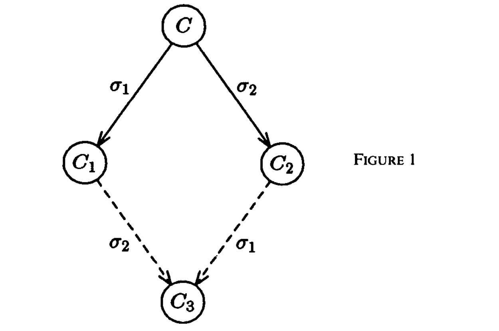
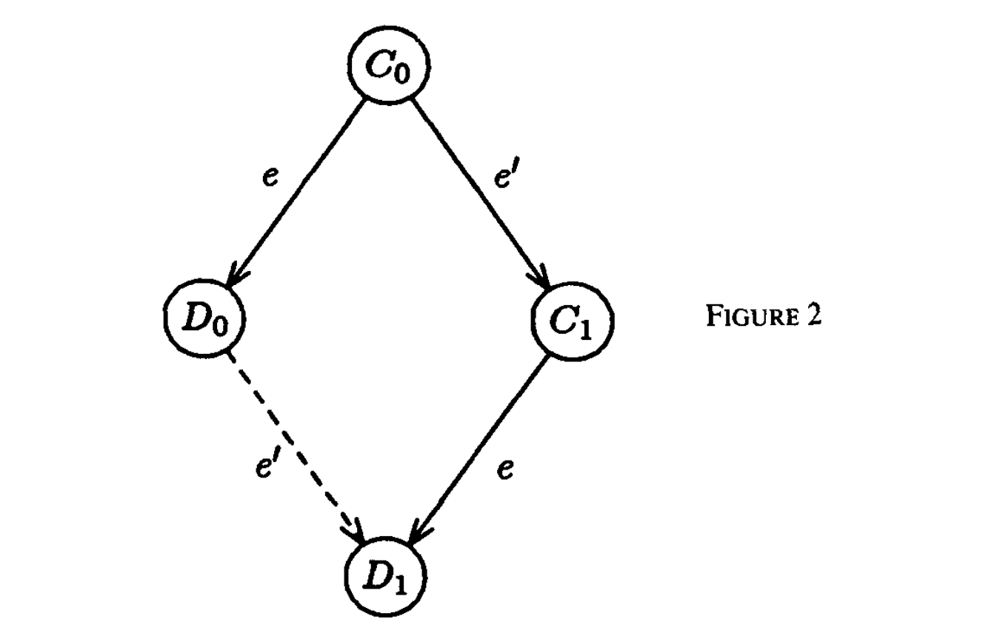
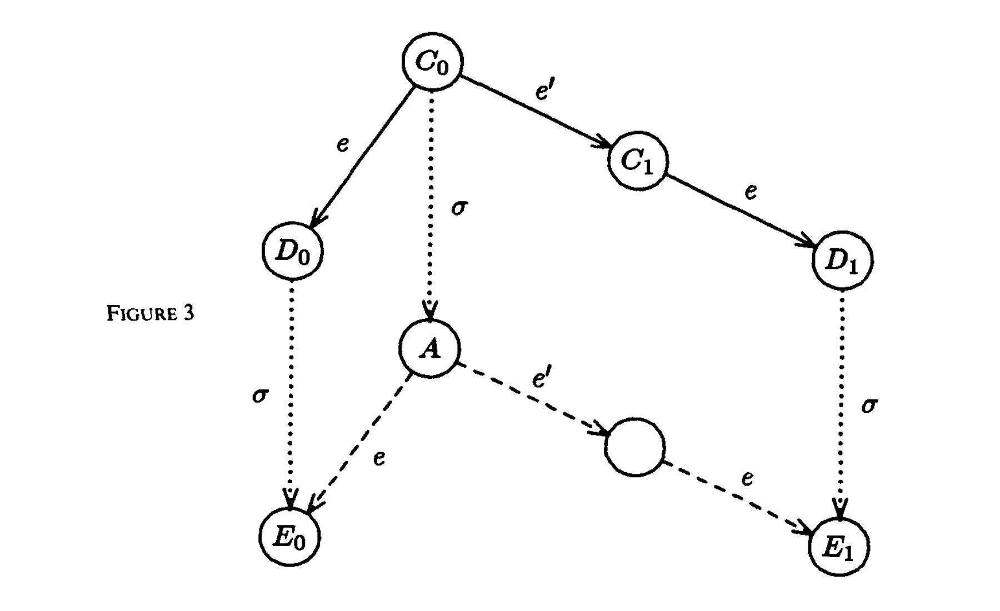

> 单个故障进程下分布式共识的不可能性

**MICHAEL J. FISCHER** 
*Yale University, New Haven, Connecticut*

> **MICHAEL J. FISCHER** 
> *耶鲁大学，康涅狄格州纽黑文*

**NANCY A. LYNCH** 
*Massachusetts Institute of Technology, Cambridge, Massachusetts*

> **NANCY A. LYNCH** 
> *麻省理工学院，马萨诸塞州剑桥*

**AND**

> **以及**

**MICHAEL S. PATERSON** 
*University of Warwick, Coventry, England*

> **MICHAEL S. PATERSON** 
> *华威大学，英格兰考文垂*

**Abstract.** The consensus problem involves an asynchronous system of processes, some of which may be unreliable. The problem is for the reliable processes to agree on a binary value. In this paper, it is shown that every protocol for this problem has the possibility of nontermination, even with only one faulty process. By way of contrast, solutions are known for the synchronous case, the “Byzantine Generals” problem.

> **摘要。** 共识（consensus）问题涉及一个异步进程系统，其中一些进程可能不可靠。问题要求可靠进程就一个二进制值达成一致。本文证明，即使只有一个故障进程，解决该问题的每一种协议也都有可能不终止。作为对照，同步情形下的“拜占庭将军”问题已有解法。

**Categories and Subject Descriptors:** C.2.2 [Computer-Communication Networks]: Network Protocols—*protocol architecture*; C.2.4 [Computer-Communication Networks]: Distributed Systems—*distributed applications; distributed databases; network operating systems*; C.4 [Performance of Systems]: Reliability, Availability, and Serviceability; F.1.2 [Computation by Abstract Devices]: Modes of Computation—*parallelism*; H.2.4 [Database Management]: Systems—*distributed systems; transaction processing*

> **类别与主题描述符：** C.2.2 [计算机通信网络]：网络协议——*协议体系结构*；C.2.4 [计算机通信网络]：分布式系统——*分布式应用；分布式数据库；网络操作系统*；C.4 [系统性能]：可靠性、可用性与可维护性；F.1.2 [抽象设备计算]：计算模式——*并行性*；H.2.4 [数据库管理]：系统——*分布式系统；事务处理*

**General Terms:** Algorithms, Reliability, Theory

> **一般术语：** 算法，可靠性，理论

**Additional Key Words and Phrases:** Agreement problem, asynchronous system, Byzantine Generals problem, commit problem, consensus problem, distributed computing, fault tolerance, impossibility proof, reliability

> **附加关键词与短语：** 一致问题，异步系统，拜占庭将军问题，提交问题，共识问题，分布式计算，容错，不可能性证明，可靠性

Editing of this paper was performed by guest editor S. L. Graham. The Editor-in-Chief of JACM did not participate in the processing of the paper.

> 本文由客座编辑 S. L. Graham 负责编辑。《JACM》主编未参与本文的处理工作。

This work was supported in part by the Office of Naval Research under Contract N00014-82-K-0154, by the Office of Army Research under Contract DAAG29-79-C-0155, and by the National Science Foundation under Grants MCS-7924370 and MCS-8116678.

> 本工作部分得到美国海军研究办公室合同 N00014-82-K-0154、美国陆军研究办公室合同 DAAG29-79-C-0155，以及美国国家科学基金会项目 MCS-7924370 和 MCS-8116678 的支持。

This work was originally presented at the 2nd ACM Symposium on Principles of Database Systems, March 1983.

> 本工作最初发表于 1983 年 3 月举行的第二届 ACM 数据库系统原理研讨会。

Authors’ present addresses: M. J. Fischer, Department of Computer Science, Yale University, P.O. Box 2158, Yale Station, New Haven, CT 06520; N. A. Lynch, Laboratory for Computer Science, Massachusetts Institute of Technology, 545 Technology Square, Cambridge, MA 02139; M. S. Paterson, Department of Computer Science, University of Warwick, Coventry CV4 7AL, England

> 作者现址：M. J. Fischer，耶鲁大学计算机科学系，P.O. Box 2158, Yale Station, New Haven, CT 06520；N. A. Lynch，麻省理工学院计算机科学实验室，545 Technology Square, Cambridge, MA 02139；M. S. Paterson，华威大学计算机科学系，Coventry CV4 7AL, England。

Permission to copy without fee all or part of this material is granted provided that the copies are not made or distributed for direct commercial advantage, the ACM copyright notice and the title of the publication and its date appear, and notice is given that copying is by permission of the Association for Computing Machinery. To copy otherwise, or to republish, requires a fee and/or specific permission.

> 允许免费复制本材料的全部或部分内容，条件是复制件并非为了直接商业利益而制作或传播，须列出 ACM 版权声明、本出版物题名及其日期，并注明复制经 Association for Computing Machinery 许可。以其他方式复制或再版，须付费和/或取得特别许可。

© 1985 ACM 0004-5411/85/0400-0374 &#36;00.75

> © 1985 ACM 0004-5411/85/0400-0374 &#36;00.75

*Journal of the Association for Computing Machinery*, Vol. 32, No. 2, April 1985, pp. 374–382.

> *《Journal of the Association for Computing Machinery》*，第 32 卷，第 2 期，1985 年 4 月，第 374–382 页。

## 1. Introduction

> 1. 引言

The problem of reaching agreement among remote processes is one of the most fundamental problems in distributed computing and is at the core of many algorithms for distributed data processing, distributed file management, and fault-tolerant distributed applications.

> 在远程进程之间达成一致，是分布式计算中最基本的问题之一，也是许多分布式数据处理、分布式文件管理和容错分布式应用算法的核心。

A well-known form of the problem is the “transaction commit problem,” which arises in distributed database systems [6, 13, 15–17, 21–24] (see also G. LeLann, private communication, quoted in [15]). The problem is for all the data manager processes that have participated in the processing of a particular transaction to agree on whether to install the transaction’s results in the database or to discard them. The latter action might be necessary, for example, if some data managers were, for any reason, unable to carry out the required transaction processing. Whatever decision is made, all data managers must make the same decision in order to preserve the consistency of the database.

> 该问题的一种著名形式是分布式数据库系统中的“事务提交问题”[6, 13, 15–17, 21–24]（另见 [15] 所引 G. LeLann 的私人通信）。问题要求参与处理某一事务的所有数据管理器进程达成一致：是把该事务的结果写入数据库，还是将其丢弃。例如，如果某些数据管理器由于任何原因无法完成所需的事务处理，就可能必须采取后一种做法。无论作出何种决定，为保持数据库一致性，所有数据管理器都必须作出相同决定。

Reaching the type of agreement needed for the “commit” problem is straightforward if the participating processes and the network are completely reliable. However, real systems are subject to a number of possible faults, such as process crashes, network partitioning, and lost, distorted, or duplicated messages. One can even consider more Byzantine types of failure [5, 7, 8, 11, 14, 18, 19] in which faulty processes might go completely haywire, perhaps even sending messages according to some malevolent plan. One therefore wants an agreement protocol that is as reliable as possible in the presence of such faults. Of course, any protocol can be overwhelmed by faults that are too frequent or too severe, so the best that one can hope for is a protocol that is tolerant to a prescribed number of “expected” faults.

> 如果参与进程和网络完全可靠，实现“提交”问题所需的一致非常直接。然而，真实系统可能遭遇多种故障，例如进程崩溃、网络分区，以及消息丢失、失真或重复。还可以考虑更具拜占庭性质的故障 [5, 7, 8, 11, 14, 18, 19]：故障进程可能完全失控，甚至可能按照某种恶意计划发送消息。因此，人们希望一致协议在这些故障存在时尽可能可靠。当然，过于频繁或严重的故障可以压垮任何协议，所以最多只能期望协议容忍预先规定数量的“预期”故障。

In this paper, we show the surprising result that no completely asynchronous consensus protocol can tolerate even a single unannounced process death. We do not consider Byzantine failures, and we assume that the message system is reliable—it delivers all messages correctly and exactly once. Nevertheless, even with these assumptions, the stopping of a single process at an inopportune time can cause any distributed commit protocol to fail to reach agreement. Thus, this important problem has no robust solution without further assumptions about the computing environment or still greater restrictions on the kind of failures to be tolerated!

> 本文给出一个出人意料的结果：任何完全异步的共识协议都不能容忍哪怕一个未预先宣告的进程死亡。我们不考虑拜占庭故障，并假定消息系统可靠——所有消息都被正确且恰好一次地投递。尽管如此，即使在这些假设下，单个进程在不利时机停止，也会使任意分布式提交协议无法达成一致。因此，如果不对计算环境增加假设，或不进一步限制所容忍的故障类型，这个重要问题就不存在稳健解！

Crucial to our proof is that processing is completely asynchronous; that is, we make no assumptions about the relative speeds of processes or about the delay time in delivering a message. We also assume that processes do not have access to synchronized clocks, so algorithms based on time-outs, for example, cannot be used. (In particular, the solutions in [6] are not applicable.) Finally, we do not postulate the ability to detect the death of a process, so it is impossible for one process to tell whether another has died (stopped entirely) or is just running very slowly.

> 对证明至关重要的是，处理完全异步；也就是说，我们不对进程的相对速度或消息投递延迟作任何假设。我们还假定进程无法访问同步时钟，所以不能使用例如基于超时的算法。（特别地，[6] 中的解法不适用。）最后，我们不假定系统具备检测进程死亡的能力，因此一个进程无法判断另一个进程究竟已经死亡（完全停止），还是仅仅运行得很慢。

Our impossibility result applies to even a very weak form of the consensus problem. Assume that every process starts with an initial value in {0, 1}. A nonfaulty process decides on a value in {0, 1} by entering an appropriate decision state. All nonfaulty processes that make a decision are required to choose the same value. For the purpose of the impossibility proof, we require only that *some* process eventually make a decision. (Of course, any algorithm of interest would require that all nonfaulty processes make a decision.) The trivial solution in which, say, 0 is always chosen is ruled out by stipulating that both 0 and 1 are possible decision values, although perhaps for different initial configurations.

> 我们的不可能性结果甚至适用于共识问题的一种很弱形式。假定每个进程都以 {0, 1} 中的一个初值启动。非故障进程通过进入适当的决定状态，决定取 {0, 1} 中的某个值。所有作出决定的非故障进程必须选择相同的值。为证明不可能性，我们只要求*某个*进程最终作出决定。（当然，任何有实际意义的算法都会要求所有非故障进程作出决定。）我们规定 0 和 1 都必须是可能的决定值——尽管可能对应不同的初始配置——从而排除例如始终选择 0 的平凡解。

Our system model is rather strong so as to make our impossibility proof as widely applicable as possible. Processes are modeled as automata (with possibly infinitely many states) that communicate by means of messages. In one atomic step, a process can attempt to receive a message, perform local computation on the basis of whether or not a message was delivered to it (and if so, which one), and send an arbitrary but finite set of messages to other processes. In particular, an “atomic broadcast” capability is assumed, so a process can send the same message in one step to all other processes with the knowledge that if any nonfaulty process receives the message, then all the nonfaulty processes will. Every message is eventually delivered as long as the destination process makes infinitely many attempts to receive, but messages can be delayed, arbitrarily long, and delivered out of order.

> 为使不可能性证明尽可能广泛适用，我们采用了相当强的系统模型。进程被建模为通过消息通信的自动机（状态数可能无限）。在一个原子步骤中，进程可以尝试接收消息，根据消息是否投递给它（若已投递，则根据是哪一条消息）执行本地计算，并向其他进程发送任意但有限的一组消息。特别地，我们假定系统具备“原子广播”能力，因此一个进程可以在一个步骤中向所有其他进程发送同一消息，并且知道：只要任一非故障进程收到该消息，所有非故障进程就都会收到。只要目标进程无限多次尝试接收，每条消息最终都会被投递；但消息可以被任意长时间地延迟，也可以乱序投递。

The asynchronous commit protocols in current use all seem to have a “window of vulnerability”—an interval of time during the execution of the algorithm in which the delay or inaccessibility of a single process can cause the entire algorithm to wait indefinitely. It follows from our impossibility result that every commit protocol has such a “window,” confirming a widely believed tenet in the folklore.

> 当前使用的异步提交协议似乎都有一个“脆弱窗口”——算法执行期间的一段时间，在此期间，单个进程的延迟或不可访问会使整个算法无限期等待。由我们的不可能性结果可知，每种提交协议都有这样的“窗口”；这证实了业界长期广泛相信的一条经验性认识。

## 2. Consensus Protocols

> 2. 共识协议

A *consensus protocol* *P* is an asynchronous system of *N* processes (*N* ≥ 2). Each process *p* has a one-bit *input register* *xₚ*, an *output register* *yₚ* with values in {*b*, 0, 1}, and an unbounded amount of internal storage. The values in the input and output registers, together with the program counter and internal storage, comprise the *internal state*. *Initial states* prescribe fixed starting values for all but the input register; in particular, the output register starts with value *b*. The states in which the output register has value 0 or 1 are distinguished as being *decision states*. *p* acts deterministically according to a *transition function*. The transition function cannot change the value of the output register once the process has reached a decision state; that is, the output register is “write-once.” The entire system *P* is specified by the transition functions associated with each of the processes and the initial values of the input registers.

> *共识协议* *P* 是由 *N* 个进程（*N* ≥ 2）构成的异步系统。每个进程 *p* 都有一个一位*输入寄存器* *xₚ*、一个取值于 {*b*, 0, 1} 的*输出寄存器* *yₚ*，以及无限量的内部存储。输入和输出寄存器的值，连同程序计数器和内部存储，共同构成*内部状态*。*初始状态*为输入寄存器之外的全部状态分量规定固定初值；特别地，输出寄存器以值 *b* 开始。输出寄存器取值为 0 或 1 的状态被特别称为*决定状态*。*p* 按某个*转移函数*确定性地行动。进程一旦到达决定状态，转移函数便不能再改变输出寄存器的值；也就是说，输出寄存器是“一次写入”的。整个系统 *P* 由各进程对应的转移函数和输入寄存器的初值规定。

Processes communicate by sending each other messages. A *message* is a pair (*p*, *m*), where *p* is the name of the destination process and *m* is a “message value” from a fixed universe *M*. The *message system* maintains a multiset, called the *message buffer*, of messages that have been sent but not yet delivered. It supports two abstract operations:

> 进程通过相互发送消息进行通信。一条*消息*是一个二元组 (*p*, *m*)，其中 *p* 是目标进程的名称，*m* 是来自固定全集 *M* 的“消息值”。*消息系统*维护一个多重集，称为*消息缓冲区*（message buffer），其中存放已经发送但尚未投递的消息。它支持两个抽象操作：

**send(*p*, *m*):** Places (*p*, *m*) in the message buffer;

> **send(*p*, *m*)：** 将 (*p*, *m*) 放入消息缓冲区；

**receive(*p*):** Deletes some message (*p*, *m*) from the buffer and returns *m*, in which case we say (*p*, *m*) is *delivered*, or returns the special null marker ∅ and leaves the buffer unchanged.

> **receive(*p*)：** 从缓冲区中删除某条消息 (*p*, *m*) 并返回 *m*，此时称 (*p*, *m*) 已被*投递*；或者返回特殊空标记 ∅，并使缓冲区保持不变。

Thus, the message system acts nondeterministically, subject only to the condition that if receive(*p*) is performed infinitely many times, then every message (*p*, *m*) in the message buffer is eventually delivered. In particular, the message system is allowed to return ∅ a finite number of times in response to receive(*p*), even though a message (*p*, *m*) is present in the buffer.

> 因此，消息系统以非确定方式行动，唯一约束是：如果 receive(*p*) 被执行无限多次，那么消息缓冲区中的每条消息 (*p*, *m*) 最终都会被投递。特别地，即使缓冲区中已有消息 (*p*, *m*)，消息系统也可以对 receive(*p*) 返回有限次 ∅。

A *configuration* of the system consists of the internal state of each process, together with the contents of the message buffer. An *initial configuration* is one in which each process starts at an initial state and the message buffer is empty.

> 系统的一个*配置*（configuration）由每个进程的内部状态和消息缓冲区的内容共同组成。*初始配置*是指每个进程均处于初始状态且消息缓冲区为空的配置。

A *step* takes one configuration to another and consists of a primitive step by a single process *p*. Let *C* be a configuration. The step occurs in two phases. First, receive(*p*) is performed on the message buffer in *C* to obtain a value $m\in M\cup\{\varnothing\}$. Then, depending on *p*’s internal state in *C* and on *m*, *p* enters a new internal state and sends a finite set of messages to other processes. Since processes are deterministic, the step is completely determined by the pair *e* = (*p*, *m*), which we call an *event*. (This “event” should be thought of as the receipt of *m* by *p*.) *e(C)* denotes the resulting configuration, and we say that *e* can be *applied* to *C*. Note that the event (*p*, ∅) can always be applied to *C*, so it is always possible for a process to take another step.

> 一个*步骤*把一个配置变为另一个配置，它由单个进程 *p* 的一个原语步骤构成。令 *C* 为某个配置。该步骤分两个阶段发生。首先，在 *C* 的消息缓冲区上执行 receive(*p*)，得到值 $m\in M\cup\{\varnothing\}$。随后，根据 *p* 在 *C* 中的内部状态和 *m*，*p* 进入一个新的内部状态，并向其他进程发送有限的一组消息。由于进程是确定性的，该步骤完全由二元组 *e* = (*p*, *m*) 决定，我们称其为一个*事件*（event）。（这个“事件”应理解为 *p* 对 *m* 的接收。）*e(C)* 表示由此得到的配置，并称 *e* 可以*应用*于 *C*。请注意，事件 (*p*, ∅) 总能应用于 *C*，所以进程总是可以再执行一个步骤。

A *schedule* from *C* is a finite or infinite sequence σ of events that can be applied, in turn, starting from *C*. The associated sequence of steps is called a *run*. If σ is finite, we let σ(*C*) denote the resulting configuration, which is said to be *reachable* from *C*. A configuration reachable from some initial configuration is said to be *accessible*. Hereafter, all configurations mentioned are assumed to be accessible.

> 从 *C* 出发的一个*调度*是一个有限或无限的事件序列 σ，其中各事件可从 *C* 开始依次应用。与之对应的步骤序列称为一次*运行*。若 σ 有限，则用 σ(*C*) 表示所得配置，并称该配置从 *C* *可达*。若一个配置从某个初始配置可达，就称它是*可访问的*。下文提到的所有配置都假定为可访问配置。

The following lemma expresses a “commutativity” property of schedules.

> 下述引理表达了调度的一种“交换性”性质。

**LEMMA 1.** *Suppose that from some configuration C, the schedules σ₁, σ₂ lead to configurations C₁, C₂, respectively. If the sets of processes taking steps in σ₁ and σ₂, respectively, are disjoint, then σ₂ can be applied to C₁ and σ₁ can be applied to C₂, and both lead to the same configuration C₃. (See Figure 1.)*

> **引理 1。** *假定从某个配置 C 出发，调度 σ₁、σ₂ 分别到达配置 C₁、C₂。若在 σ₁ 与 σ₂ 中执行步骤的进程集合互不相交，则 σ₂ 可以应用于 C₁，σ₁ 可以应用于 C₂，并且二者都到达同一个配置 C₃。（见图 1。）*

**FIGURE 1**

> **图 1**

> **图表中文解读：** 从配置 *C* 分别执行调度 σ₁、σ₂ 得到 *C₁*、*C₂*。由于两组调度涉及的进程集合不相交，它们可以交换执行次序：在 *C₁* 上再执行 σ₂，或在 *C₂* 上再执行 σ₁，都会到达 *C₃*。实线表示先执行的调度，虚线表示交换后补执行的调度。

**PROOF.** The result follows at once from the system definition, since σ₁ and σ₂ do not interact. □

> **证明。** 该结论直接由系统定义得到，因为 σ₁ 与 σ₂ 不发生相互作用。□

A configuration *C* has *decision value* *v* if some process *p* is in a decision state with *yₚ* = *v*. A consensus protocol is *partially correct* if it satisfies two conditions:

> 若某个进程 *p* 处于决定状态且 *yₚ* = *v*，则称配置 *C* 具有*决定值* *v*。若共识协议满足以下两个条件，就称它是*部分正确的*：

1. No accessible configuration has more than one decision value.

> 1. 任何可访问配置都不具有一个以上的决定值。

2. For each $v\in\{0,1\}$, some accessible configuration has decision value *v*.

> 2. 对每个 $v\in\{0,1\}$，都存在某个决定值为 *v* 的可访问配置。

A process *p* is *nonfaulty* in a run provided that it takes infinitely many steps, and it is *faulty* otherwise. A run is *admissible* provided that at most one process is faulty and that all messages sent to nonfaulty processes are eventually received.

> 若进程 *p* 在一次运行中执行无限多个步骤，就称它在该运行中是*非故障的*；否则称它是*故障的*。若至多有一个进程故障，并且发送给非故障进程的所有消息最终都被接收，就称该运行是*可容许运行*（admissible run）。

A run is a *deciding run* provided that some process reaches a decision state in that run. A consensus protocol *P* is *totally correct in spite of one fault* if it is partially correct, and every admissible run is a deciding run. Our main theorem shows that every partially correct protocol for the consensus problem has some admissible run that is not a deciding run.

> 若某个进程在一次运行中到达决定状态，就称该运行是*作出决定的运行*（deciding run）。如果共识协议 *P* 部分正确，并且每次可容许运行都是作出决定的运行，就称 *P* *在一个故障下完全正确*。我们的主定理表明，共识问题的每一种部分正确协议，都存在一次可容许但不作出决定的运行。

## 3. Main Result

> 3. 主要结果

**THEOREM 1.** *No consensus protocol is totally correct in spite of one fault.*

> **定理 1。** *不存在能够在一个故障下完全正确的共识协议。*

**PROOF.** Assume to the contrary that *P* is a consensus protocol that is totally correct in spite of one fault. We prove a sequence of lemmas which eventually lead to a contradiction.

> **证明。** 反设 *P* 是一个在一个故障下完全正确的共识协议。我们将证明一系列最终导出矛盾的引理。

The basic idea is to show circumstances under which the protocol remains forever indecisive. This involves two steps. First, we argue that there is some initial configuration in which the decision is not already predetermined. Second, we construct an admissible run that avoids ever taking a step that would commit the system to a particular decision.

> 基本思想是给出协议永远无法作出决定的情形。这包括两个步骤。首先，论证存在某个初始配置，其中决定尚未预先确定。其次，构造一次可容许运行，使系统始终避免执行任何会令其承诺某个特定决定的步骤。

Let *C* be a configuration and let *V* be the set of decision values of configurations reachable from *C*. *C* is *bivalent* if $|V|=2$. *C* is *univalent* if $|V|=1$, let us say *0-valent* or *1-valent* according to the corresponding decision value. By the total correctness of *P*, and the fact that there are always admissible runs, $V\ne\varnothing$. □

> 令 *C* 为一个配置，*V* 为从 *C* 可达的各配置之决定值所组成的集合。若 $|V|=2$，则 *C* 是*二价的*（bivalent）。若 $|V|=1$，则 *C* 是*单价的*（univalent）；根据相应的决定值，分别称为 *0 价*或 *1 价*。由 *P* 的完全正确性以及可容许运行总是存在这一事实，$V\ne\varnothing$。□

**LEMMA 2.** *P has a bivalent initial configuration.*

> **引理 2。** *P 存在一个二价初始配置。*

**PROOF.** Assume not. Then *P* must have both 0-valent and 1-valent initial configurations by the assumed partial correctness. Let us call two initial configurations *adjacent* if they differ only in the initial value *xₚ* of a single process *p*. Any two initial configurations are joined by a chain of initial configurations, each adjacent to the next. Hence, there must exist a 0-valent initial configuration *C₀* adjacent to a 1-valent initial configuration *C₁*. Let *p* be the process in whose initial value they differ.

> **证明。** 假定不存在。由所假定的部分正确性，*P* 必须同时具有 0 价和 1 价初始配置。若两个初始配置仅在单个进程 *p* 的初值 *xₚ* 上不同，就称它们*相邻*。任意两个初始配置之间都可以用一条初始配置链连接，其中每个配置都与下一个相邻。因此，必然存在一个 0 价初始配置 *C₀*，与一个 1 价初始配置 *C₁* 相邻。令 *p* 为二者初值不同的那个进程。

Now consider some admissible deciding run from *C₀* in which process *p* takes no steps, and let σ be the associated schedule. Then σ can be applied to *C₁* also, and corresponding configurations in the two runs are identical except for the internal state of process *p*. It is easily shown that both runs eventually reach the same decision value. If the value is 1, then *C₀* is bivalent; otherwise, *C₁* is bivalent. Either case contradicts the assumed nonexistence of a bivalent initial configuration. □

> 现在考虑从 *C₀* 出发的某次可容许且作出决定的运行，其中进程 *p* 不执行任何步骤；令 σ 为相应调度。σ 同样可以应用于 *C₁*，并且两次运行中对应的配置除进程 *p* 的内部状态外完全相同。不难证明，两次运行最终到达同一个决定值。如果该值为 1，则 *C₀* 是二价的；否则，*C₁* 是二价的。两种情况都与假定不存在二价初始配置相矛盾。□

**LEMMA 3.** *Let C be a bivalent configuration of P, and let e = (p, m) be an event that is applicable to C. Let* $\mathcal{C}$ *be the set of configurations reachable from C without applying e, and let* $\mathcal{D}=e(\mathcal{C})=\{e(E)\mid E\in\mathcal{C}\text{ and }e\text{ is applicable to }E\}$. *Then,* $\mathcal{D}$ *contains a bivalent configuration.*

> **引理 3。** *令 C 为 P 的一个二价配置，e = (p, m) 为可应用于 C 的事件。令* $\mathcal{C}$ *为不应用 e 而从 C 可达的配置集合，并令* $\mathcal{D}=e(\mathcal{C})=\{e(E)\mid E\in\mathcal{C}\text{ 且 }e\text{ 可应用于 }E\}$。*那么，*$\mathcal{D}$* 包含一个二价配置。*

**PROOF.** Since *e* is applicable to *C*, then by definition of $\mathcal{C}$ and the fact that messages can be delayed arbitrarily, *e* is applicable to every $E\in\mathcal{C}$.

> **证明。** 由于 *e* 可应用于 *C*，根据 $\mathcal{C}$ 的定义以及消息可以任意延迟这一事实，*e* 可应用于每个 $E\in\mathcal{C}$。

Now assume that $\mathcal{D}$ contains no bivalent configurations, so every configuration $D\in\mathcal{D}$ is univalent. We proceed to derive a contradiction.

> 现在假定 $\mathcal{D}$ 不包含二价配置，因而每个配置 $D\in\mathcal{D}$ 都是单价的。下面导出矛盾。

Let *Eᵢ* be an *i*-valent configuration reachable from *C*, *i* = 0, 1. (*Eᵢ* exists since *C* is bivalent.) If $E_i\in\mathcal{C}$, let $F_i=e(E_i)\in\mathcal{D}$. Otherwise, *e* was applied in reaching *Eᵢ*, and so there exists $F_i\in\mathcal{D}$ from which *Eᵢ* is reachable. In either case, *Fᵢ* is *i*-valent since *Fᵢ* is not bivalent (since $F_i\in\mathcal{D}$ and $\mathcal{D}$ contains no bivalent configurations) and one of *Eᵢ* and *Fᵢ* is reachable from the other. Since $F_i\in\mathcal{D}$, *i* = 0, 1, $\mathcal{D}$ contains both 0-valent and 1-valent configurations.

> 令 *Eᵢ* 为从 *C* 可达的一个 *i* 价配置，*i* = 0, 1。（因为 *C* 是二价的，所以 *Eᵢ* 存在。）若 $E_i\in\mathcal{C}$，令 $F_i=e(E_i)\in\mathcal{D}$。否则，在到达 *Eᵢ* 的过程中已经应用了 *e*，因而存在某个 $F_i\in\mathcal{D}$，使 *Eᵢ* 从中可达。无论哪种情况，*Fᵢ* 都是 *i* 价的：*Fᵢ* 不是二价的（因为 $F_i\in\mathcal{D}$，且 $\mathcal{D}$ 不含二价配置），而且 *Eᵢ* 与 *Fᵢ* 中的一个从另一个可达。由于对 *i* = 0, 1 都有 $F_i\in\mathcal{D}$，所以 $\mathcal{D}$ 同时包含 0 价和 1 价配置。

Call two configurations *neighbors* if one results from the other in a single step. By an easy induction, there exist neighbors $C_0,C_1\in\mathcal{C}$ such that $D_i=e(C_i)$ is *i*-valent, *i* = 0, 1. Without loss of generality, $C_1=e'(C_0)$ where $e'=(p',m')$.

> 若两个配置中的一个经单个步骤得到另一个，就称二者为*邻居*。通过简单归纳可知，存在相邻配置 $C_0,C_1\in\mathcal{C}$，使得 $D_i=e(C_i)$ 是 *i* 价的，*i* = 0, 1。不失一般性，设 $C_1=e'(C_0)$，其中 $e'=(p',m')$。

***Case 1.*** If $p'\ne p$, then $D_1=e'(D_0)$ by Lemma 1. This is impossible, since any successor of a 0-valent configuration is 0-valent. (See Figure 2.)

> ***情形 1。*** 若 $p'\ne p$，则由引理 1 有 $D_1=e'(D_0)$。这是不可能的，因为 0 价配置的任意后继都是 0 价的。（见图 2。）

**FIGURE 2**

> **图 2**

> **图表中文解读：** 从 *C₀* 应用 *e* 得到 0 价配置 *D₀*，应用 *e′* 得到 *C₁*；从 *C₁* 应用 *e* 得到 1 价配置 *D₁*。若 *e* 与 *e′* 属于不同进程，引理 1 允许交换其顺序，于是从 *D₀* 应用 *e′* 也应到达 *D₁*，这与 0 价配置的后继仍须为 0 价相矛盾。

***Case 2.*** If $p'=p$, then consider any finite deciding run from *C₀* in which *p* takes no steps.

> ***情形 2。*** 若 $p'=p$，则考虑从 *C₀* 出发、进程 *p* 不执行任何步骤的任意一次有限的作出决定的运行。

Let σ be the corresponding schedule, and let $A=\sigma(C_0)$. By Lemma 1, σ is applicable to *Dᵢ*, and it leads to an *i*-valent configuration $E_i=\sigma(D_i)$, *i* = 0, 1. Also by Lemma 1, $e(A)=E_0$ and $e(e'(A))=E_1$. (See Figure 3.) Hence, *A* is bivalent. But this is impossible since the run to *A* is deciding (by assumption), so *A* must be univalent.

> 令 σ 为相应调度，并令 $A=\sigma(C_0)$。由引理 1，σ 可应用于 *Dᵢ*，并到达 *i* 价配置 $E_i=\sigma(D_i)$，*i* = 0, 1。同样由引理 1，$e(A)=E_0$，且 $e(e'(A))=E_1$。（见图 3。）因此，*A* 是二价的。然而这是不可能的，因为到达 *A* 的运行按假定已经作出决定，所以 *A* 必须是单价的。

**FIGURE 3**

> **图 3**

> **图表中文解读：** 实线路径给出 *C₀* 经 *e* 到 *D₀*，以及经 *e′*、*e* 到 *D₁*；点线路径 σ 分别把 *C₀*、*D₀*、*D₁* 带到 *A*、*E₀*、*E₁*。虚线路径展示交换性：从 *A* 应用 *e* 可达 0 价的 *E₀*，而先应用 *e′* 再应用 *e* 可达 1 价的 *E₁*，故 *A* 必须二价，与到达 *A* 的运行已经作出决定相矛盾。

In each case, we reached a contradiction, so $\mathcal{D}$ contains a bivalent configuration. □

> 两种情形都导出了矛盾，因此 $\mathcal{D}$ 包含一个二价配置。□

Any deciding run from a bivalent initial configuration goes to a univalent configuration, so there must be some single step that goes from a bivalent to a univalent configuration. Such a step determines the eventual decision value. We now show that it is always possible to run the system in a way that avoids such steps, leading to an admissible nondeciding run.

> 从二价初始配置出发的任何作出决定的运行都会到达单价配置，因此其中必然有某个单独步骤从二价配置进入单价配置。这样的步骤确定了最终的决定值。现在我们说明，总能以某种方式运行系统以避开这类步骤，从而得到一次可容许但不作出决定的运行。

The run is constructed in stages, starting from an initial configuration. We ensure that the run is admissible in the following way. A queue of processes is maintained, initially in an arbitrary order, and the message buffer in a configuration is ordered according to the time the messages were sent, earliest first. Each stage consists of one or more process steps. The stage ends with the first process in the process queue taking a step in which, if its message queue was not empty at the start of the stage, its earliest message is received. This process is then moved to the back of the process queue. In any infinite sequence of such stages every process takes infinitely many steps and receives every message sent to it. The run is therefore admissible. Our problem, of course, is to do this in such a way as to avoid a decision ever being reached.

> 该运行从一个初始配置开始，分阶段构造。我们用如下方式保证运行是可容许的。维护一个进程队列，初始次序任意；并把配置中的消息缓冲区按消息发送时间排序，最早者在前。每个阶段由一个或多个进程步骤构成。阶段结束于进程队首的进程执行一个步骤：如果它的消息队列在阶段开始时非空，就在该步骤中接收其中最早的消息。随后把该进程移到进程队列末尾。在任意这样的无限阶段序列中，每个进程都执行无限多个步骤，并接收发送给它的每条消息。因此，该运行是可容许的。当然，我们的问题在于如何做到这一点，同时永远避免作出决定。

Let *C₀* be a bivalent initial configuration whose existence is assured by Lemma 2. Execution begins in *C₀*, and we ensure that every stage begins from a bivalent configuration. Suppose then that configuration *C* is bivalent and that process *p* heads the priority queue. Let *m* be the earliest message to *p* in *C*’s message buffer, if any, and ∅ otherwise. Let $e=(p,m)$. By Lemma 3, there is a bivalent configuration *C′* reachable from *C* by a schedule in which *e* is the last event applied. The corresponding sequence of steps defines the stage.

> 令 *C₀* 为引理 2 保证存在的一个二价初始配置。执行从 *C₀* 开始，并保证每个阶段都从二价配置开始。因此，设配置 *C* 是二价的，且进程 *p* 位于优先队列队首。若 *C* 的消息缓冲区中有发给 *p* 的消息，令 *m* 为其中最早的一条；否则令 *m* 为 ∅。令 $e=(p,m)$。由引理 3，存在从 *C* 经某个调度可达的二价配置 *C′*，并且 *e* 是该调度中最后应用的事件。相应的步骤序列就定义了这个阶段。

Since each stage ends in a bivalent configuration, every stage in the construction of the infinite schedule succeeds. The resulting run is admissible, and no decision is ever reached. It follows that *P* is not totally correct. □

> 由于每个阶段都结束于二价配置，无限调度构造中的每个阶段都能成功完成。所得运行是可容许的，而且永远不会作出决定。因此，*P* 并非完全正确。□

## 4. Initially Dead Processes

> 4. 初始即死亡的进程

In this section, we exhibit a protocol that solves the consensus problem for *N* processes as long as a majority of the processes are nonfaulty and no process dies during the execution of the protocol. No process knows in advance, however, which of the processes are initially dead and which are not.

> 本节给出一种解决 *N* 个进程共识问题的协议，其条件是多数进程非故障，且协议执行期间没有进程死亡。不过，没有任何进程预先知道哪些进程初始即死亡、哪些不是。

The protocol works in two stages. During the first stage, the processes construct a directed graph *G* with a node corresponding to each process. Every process broadcasts a message containing its process number and then listens for messages from *L* − 1 other processes, where $L=\lceil(N+1)/2\rceil$. *G* has an edge from *i* to *j* iff *j* receives a message from *i*. Thus, *G* has indegree *L* − 1.

> 该协议分两个阶段运行。在第一阶段，各进程构造一个有向图 *G*，其中每个节点对应一个进程。每个进程广播一条包含自身进程编号的消息，随后等待来自另外 *L* − 1 个进程的消息，其中 $L=\lceil(N+1)/2\rceil$。当且仅当 *j* 收到来自 *i* 的消息时，*G* 中存在从 *i* 到 *j* 的边。因此，*G* 中每个节点的入度都是 *L* − 1。

In the second stage, the processes construct *G⁺* (the transitive closure of *G*) in the sense that upon completion of this stage, each process *k* knows about all of the edges (*j*, *k*) incident on *k* in *G⁺* as well as the initial values of all such *j*.

> 在第二阶段，各进程构造 *G⁺*（*G* 的传递闭包）；其含义是，当该阶段完成时，每个进程 *k* 都知道 *G⁺* 中所有以 *k* 为终点的边 (*j*, *k*)，以及所有这类 *j* 的初值。

To carry out this stage, each process broadcasts to all other processes its process number and initial value together with the names of the *L* − 1 processes it heard from during the first stage. It then waits until it has received a stage 2 message from every ancestor in *G* that it knows about. Initially, it knows only about the *L* − 1 processes from which it heard directly during the first stage, but it learns about additional ancestors from the stage 2 messages that it receives. Waiting continues until such time as all currently known-about processes have been heard from.

> 为执行该阶段，每个进程向其他所有进程广播自己的进程编号和初值，以及第一阶段中它收到消息的那 *L* − 1 个进程的名称。随后，它一直等待，直到收到它所知道的 *G* 中每个祖先发来的第二阶段消息。起初，它只知道第一阶段中直接收到其消息的 *L* − 1 个进程；但会从收到的第二阶段消息中获知更多祖先。等待会持续到当前已知的所有进程都已发来消息为止。

At this point, each process knows all of its own ancestors and the edges of *G* incident on them. Using this information, it computes all of the edges of *G⁺* incident on each of its ancestors. It then determines which of its ancestors belong to an initial clique of *G⁺*, that is, a clique with no incoming edges. To do this, it uses the fact that a node *k* is in an initial clique iff *k* is itself an ancestor of every node *j* that is an ancestor of *k*. Since every node in *G⁺* has at least *L* − 1 predecessors, there can be only one initial clique; it has cardinality at least *L*, and every process that completes the second stage knows exactly the set of processes comprising it.

> 此时，每个进程都知道自己的全部祖先，以及 *G* 中以这些祖先为终点的边。利用这些信息，它计算 *G⁺* 中以每个祖先为终点的全部边。然后，它确定自己的哪些祖先属于 *G⁺* 的一个初始团，也就是没有入边的团。为此，它利用以下事实：节点 *k* 属于初始团，当且仅当对于 *k* 的每个祖先节点 *j*，*k* 本身也是 *j* 的祖先。由于 *G⁺* 中每个节点至少有 *L* − 1 个前驱，所以只可能有一个初始团；其基数至少为 *L*，而且每个完成第二阶段的进程都准确知道构成该团的进程集合。

Finally, each process makes a decision based on the initial values of the processes in the initial clique using any agreed-upon rule. Since all processes know the initial values of all members of the initial clique, they all reach the same decision.

> 最后，每个进程根据初始团内各进程的初值，使用任意事先约定的规则作出决定。由于所有进程都知道初始团全部成员的初值，它们会作出相同决定。

The correctness of this protocol proves the following theorem.

> 该协议的正确性证明了下述定理。

**THEOREM 2.** *There is a partially correct consensus protocol in which all nonfaulty processes always reach a decision, provided no processes die during its execution and a strict majority of the processes are alive initially.*

> **定理 2。** *存在一种部分正确的共识协议；只要其执行期间没有进程死亡，且初始时严格多数的进程存活，所有非故障进程就总能作出决定。*

## 5. Conclusion

> 5. 结论

We have shown that a natural and important problem of fault-tolerant cooperative computing cannot be solved in a totally asynchronous model of computation. These results do not show that such problems cannot be “solved” in practice; rather, they point up the need for more refined models of distributed computing that better reflect realistic assumptions about processor and communication timings, and for less stringent requirements on the solution to such problems. (For example, termination might be required only with probability 1.) Subsequent to the original announcement of these results [12], progress has been made along both of these lines [1–4, 9, 10, 20, 25].

> 我们已经证明，容错协作计算中一个自然且重要的问题，在完全异步的计算模型中无法解决。这些结果并不表明此类问题不能在实践中得到“解决”；相反，它们说明我们需要更精细的分布式计算模型，以更好地反映关于处理器和通信时序的现实假设，也需要降低对此类问题之解法的严格要求。（例如，可以只要求以概率 1 终止。）在这些结果最初公布 [12] 之后，沿这两个方向都已取得进展 [1–4, 9, 10, 20, 25]。

**ACKNOWLEDGMENT.** The authors would like to thank John Guttag for helpful discussions during the initial phase of this work, and Gene Stark for discussion of the results and a careful reading of the text. They also thank the referees for pointing out several places where the presentation needed improvement.

> **致谢。** 作者感谢 John Guttag 在本工作初期开展的有益讨论，并感谢 Gene Stark 对结果的讨论和对本文的细致审阅。作者还感谢审稿人指出文中若干需要改进表述之处。

## REFERENCES

> 参考文献

1. ATTIYA, C., DOLEV, D., AND GIL, J. Asynchronous Byzantine consensus. In *Proceedings of the 3rd Annual ACM Symposium on Principles of Distributed Computing* (Vancouver, B.C., Canada, Aug. 27–29). ACM, New York, 1984, pp. 119–133.

> 1. ATTIYA, C.、DOLEV, D.、GIL, J.，“异步拜占庭共识”。载第三届 ACM 分布式计算原理年度研讨会论文集（加拿大不列颠哥伦比亚省温哥华，8 月 27–29 日）。ACM，纽约，1984 年，第 119–133 页。

2. BEN-OR, M. Another advantage of free choice: Completely asynchronous agreement protocols. In *Proceedings of the 2nd Annual ACM Symposium on Principles of Distributed Computing* (Montreal, Quebec, Canada, Aug. 17–19). ACM, New York, 1983, pp. 27–30.

> 2. BEN-OR, M.，“自由选择的另一项优势：完全异步的一致协议”。载第二届 ACM 分布式计算原理年度研讨会论文集（加拿大魁北克省蒙特利尔，8 月 17–19 日）。ACM，纽约，1983 年，第 27–30 页。

3. BRACHA, G. An asynchronous $\lfloor(n-1)/3\rfloor$-resilient consensus protocol. In *Proceedings of the 3rd Annual ACM Symposium on Principles of Distributed Computing* (Vancouver, B.C., Canada, Aug. 27–29). ACM, New York, 1984, pp. 154–162.

> 3. BRACHA, G.，“一种可容忍 $\lfloor(n-1)/3\rfloor$ 个故障的异步共识协议”。载第三届 ACM 分布式计算原理年度研讨会论文集（加拿大不列颠哥伦比亚省温哥华，8 月 27–29 日）。ACM，纽约，1984 年，第 154–162 页。

4. BRACHA, G., AND TOUEG, S. Resilient consensus protocols. In *Proceedings of the 2nd Annual ACM Symposium on Principles of Distributed Computing* (Montreal, Quebec, Canada, Aug. 17–19). ACM, New York, 1983, pp. 12–26.

> 4. BRACHA, G.、TOUEG, S.，“容错共识协议”。载第二届 ACM 分布式计算原理年度研讨会论文集（加拿大魁北克省蒙特利尔，8 月 17–19 日）。ACM，纽约，1983 年，第 12–26 页。

5. DEMILLO, R. A., LYNCH, N. A., AND MERRITT, M. J. Cryptographic protocols. In *Proceedings of the 14th Annual ACM Symposium on Theory of Computing* (San Francisco, Calif., May 5–7). ACM, New York, 1982, pp. 383–400.

> 5. DEMILLO, R. A.、LYNCH, N. A.、MERRITT, M. J.，“密码协议”。载第十四届 ACM 计算理论年度研讨会论文集（加利福尼亚州旧金山，5 月 5–7 日）。ACM，纽约，1982 年，第 383–400 页。

6. DOLEV, D., AND STRONG, H. R. Distributed commit with bounded waiting. In *Proceedings of the 2nd Annual IEEE Symposium on Reliability in Distributed Software and Database Systems*. IEEE, New York, 1982, pp. 53–60.

> 6. DOLEV, D.、STRONG, H. R.，“具有有界等待的分布式提交”。载第二届 IEEE 分布式软件与数据库系统可靠性年度研讨会论文集。IEEE，纽约，1982 年，第 53–60 页。

7. DOLEV, D., AND STRONG, H. R. Polynomial algorithms for multiple processor agreement. In *Proceedings of the 14th Annual ACM Symposium on Theory of Computing* (San Francisco, Calif., May 5–7). ACM, New York, 1982, pp. 401–407.

> 7. DOLEV, D.、STRONG, H. R.，“多处理器一致的多项式算法”。载第十四届 ACM 计算理论年度研讨会论文集（加利福尼亚州旧金山，5 月 5–7 日）。ACM，纽约，1982 年，第 401–407 页。

8. DOLEV, D., FISCHER, M., FOWLER, R., LYNCH, N., AND STRONG, H. R. An efficient algorithm for Byzantine agreement without authentication. *Inf. Control* 52, 3 (1983), 257–274.

> 8. DOLEV, D.、FISCHER, M.、FOWLER, R.、LYNCH, N.、STRONG, H. R.，“无认证拜占庭一致的高效算法”。*Inf. Control* 52，第 3 期（1983 年），第 257–274 页。

9. DOLEV, D., LYNCH, N., PINTER, S., STARK, E., AND WEIHL, W. Reaching approximate agreement in the presence of faults. In *Proceedings of the 3rd Annual IEEE Symposium on Reliability in Distributed Software and Database Systems*. IEEE, New York, 1983, pp. 145–154.

> 9. DOLEV, D.、LYNCH, N.、PINTER, S.、STARK, E.、WEIHL, W.，“故障存在时达成近似一致”。载第三届 IEEE 分布式软件与数据库系统可靠性年度研讨会论文集。IEEE，纽约，1983 年，第 145–154 页。

10. DWORK, C., LYNCH, N., AND STOCKMEYER, L. Consensus in the presence of partial synchrony. In *Proceedings of the 3rd Annual ACM Symposium on Principles of Distributed Computing* (Vancouver, B.C., Canada, Aug. 27–29). ACM, New York, 1984, pp. 103–118.

> 10. DWORK, C.、LYNCH, N.、STOCKMEYER, L.，“部分同步条件下的共识”。载第三届 ACM 分布式计算原理年度研讨会论文集（加拿大不列颠哥伦比亚省温哥华，8 月 27–29 日）。ACM，纽约，1984 年，第 103–118 页。

11. FISCHER, M., AND LYNCH. N. A lower bound for the time to assure interactive consistency. *Inf. Proc. Lett.* 14, 4 (1982), 183–186.

> 11. FISCHER, M.、LYNCH, N.，“保证交互一致性所需时间的下界”。*Inf. Proc. Lett.* 14，第 4 期（1982 年），第 183–186 页。（译注：英文作者名之间可见原文印作 `LYNCH. N.`，此处未静默改写。）

12. FISCHER, M., LYNCH, N., AND PATERSON, M. Impossibility of distributed consensus with one faulty process. In *Proceedings of the 2nd Annual ACM SIGACT-SIGMOD Symposium on Principles of Database Systems* (Atlanta, Ga., Mar. 21–23). ACM, New York, 1983, pp. 1–7.

> 12. FISCHER, M.、LYNCH, N.、PATERSON, M.，“单个故障进程下分布式共识的不可能性”。载第二届 ACM SIGACT-SIGMOD 数据库系统原理年度研讨会论文集（佐治亚州亚特兰大，3 月 21–23 日）。ACM，纽约，1983 年，第 1–7 页。

13. GARCIA-MOLINA, H. Elections in a distributed computing system. *IEEE Trans. Comput.* C-31, 1 (1982), 48–59.

> 13. GARCIA-MOLINA, H.，“分布式计算系统中的选举”。*IEEE Trans. Comput.* C-31，第 1 期（1982 年），第 48–59 页。

14. LAMPORT, L., SHOSTAK, R., AND PEASE, M. The Byzantine Generals problem. *ACM Trans. Prog. Lang. Syst.* 4, 3 (July 1982), 382–401.

> 14. LAMPORT, L.、SHOSTAK, R.、PEASE, M.，“拜占庭将军问题”。*ACM Trans. Prog. Lang. Syst.* 4，第 3 期（1982 年 7 月），第 382–401 页。

15. LAMPSON, B. Replicated Commit. CSL Notebook Entry, Xerox Palo Alto Research Center, Palo Alto, Calif., 1981.

> 15. LAMPSON, B.，“复制式提交”。CSL Notebook Entry，Xerox Palo Alto Research Center，加利福尼亚州帕洛阿尔托，1981 年。

16. LAMPSON, B., AND STURGIS, H. Crash recovery in a distributed data storage system. Manuscript, Xerox Palo Alto Research Center, Palo Alto, Calif., 1979.

> 16. LAMPSON, B.、STURGIS, H.，“分布式数据存储系统中的崩溃恢复”。手稿，Xerox Palo Alto Research Center，加利福尼亚州帕洛阿尔托，1979 年。

17. LINDSAY, B. G., SELINGER, P. G., GALTIERI, C., GRAY, J. N., LORIE, R. A., PRICE, T. G., PUTZOLU, F., TRAIGER, I. L., AND WADE, B. W. Notes on distributed databases. IBM Res. Rep. RJ2571, IBM Research Division, San Jose, Calif., 1979.

> 17. LINDSAY, B. G.、SELINGER, P. G.、GALTIERI, C.、GRAY, J. N.、LORIE, R. A.、PRICE, T. G.、PUTZOLU, F.、TRAIGER, I. L.、WADE, B. W.，“分布式数据库札记”。IBM Res. Rep. RJ2571，IBM Research Division，加利福尼亚州圣何塞，1979 年。

18. LYNCH, N., FISCHER, M., AND FOWLER, R. A simple and efficient Byzantine Generals algorithm. In *Proceedings of the 2nd Annual IEEE Symposium on Reliability in Distributed Software and Database Systems*. IEEE, New York, 1982, pp. 46–52.

> 18. LYNCH, N.、FISCHER, M.、FOWLER, R.，“一种简单高效的拜占庭将军算法”。载第二届 IEEE 分布式软件与数据库系统可靠性年度研讨会论文集。IEEE，纽约，1982 年，第 46–52 页。

19. PEASE, M., SHOSTAK, R., AND LAMPORT, L. Reaching agreement in the presence of faults. *J. ACM* 27, 2 (Apr. 1980), 228–234.

> 19. PEASE, M.、SHOSTAK, R.、LAMPORT, L.，“故障存在时达成一致”。*J. ACM* 27，第 2 期（1980 年 4 月），第 228–234 页。

20. RABIN, M. Randomized Byzantine Generals. In *Proceedings of the 24th Annual IEEE Symposium on Foundations of Computer Science*. IEEE, New York, 1983, pp. 403–409.

> 20. RABIN, M.，“随机化拜占庭将军”。载第二十四届 IEEE 计算机科学基础年度研讨会论文集。IEEE，纽约，1983 年，第 403–409 页。

21. REED, D. Naming and synchronization in a decentralized computer system. Ph.D. dissertation, Technical Report MIT/LCS/TR-205, Massachusetts Institute of Technology, Cambridge, Mass., 1978.

> 21. REED, D.，“去中心化计算机系统中的命名与同步”。博士学位论文，技术报告 MIT/LCS/TR-205，麻省理工学院，马萨诸塞州剑桥，1978 年。

22. ROSENKRANTZ, D. J., STEARNS, R. E., AND LEWIS, P. M., II. System level concurrency control for distributed database systems. *ACM Trans. Database Syst.* 3, 2 (June 1978), 178–198.

> 22. ROSENKRANTZ, D. J.、STEARNS, R. E.、LEWIS, P. M., II.，“分布式数据库系统的系统级并发控制”。*ACM Trans. Database Syst.* 3，第 2 期（1978 年 6 月），第 178–198 页。

23. SKEEN, D. A decentralized termination protocol. In *Proceedings of the 2nd Annual IEEE Symposium on Reliability in Distributed Software and Database Systems*. IEEE, New York, 1982, pp. 27–32.

> 23. SKEEN, D.，“一种去中心化终止协议”。载第二届 IEEE 分布式软件与数据库系统可靠性年度研讨会论文集。IEEE，纽约，1982 年，第 27–32 页。

24. SKEEN, D., AND STONEBRAKER, M. A formal model of crash recovery in a distributed system. *IEEE Trans. Softw. Engineering* SE-9, 3 (May 1983), 219–228.

> 24. SKEEN, D.、STONEBRAKER, M.，“分布式系统中崩溃恢复的形式模型”。*IEEE Trans. Softw. Engineering* SE-9，第 3 期（1983 年 5 月），第 219–228 页。

25. TOUEG, S. Randomized Byzantine Agreements. In *Proceedings of the 3rd Annual ACM Symposium on Principles of Distributed Computing* (Vancouver, B.C., Canada, Aug. 27–29). ACM, New York, 1984, pp. 163–178.

> 25. TOUEG, S.，“随机化拜占庭一致”。载第三届 ACM 分布式计算原理年度研讨会论文集（加拿大不列颠哥伦比亚省温哥华，8 月 27–29 日）。ACM，纽约，1984 年，第 163–178 页。

RECEIVED SEPTEMBER 1983; REVISED OCTOBER 1984; ACCEPTED OCTOBER 1984

> 1983 年 9 月收到；1984 年 10 月修订；1984 年 10 月接受
