> 云原生数据库：综述

Haowen Dong, Chao Zhang, Guoliang Li, Fellow, IEEE, and Huanchen Zhang

> 董浩文、张超、李国良（IEEE Fellow）和张焕晨

(Survey Paper)

> （综述论文）

Abstract—Cloud databases have been widely accepted and deployed due to their unique advantages, such as high elasticity, high availability, and low cost. Many new techniques, such as compute-storage disaggregation and the log is the database, have been proposed recently to seek for higher elasticity and lower cost. To better harness the power of cloud databases, it is crucial to study and compare the pros and cons of their key techniques. In this paper, we offer a comprehensive survey of cloud-native databases. Particularly, we investigate and summarize the state-of-the-art cloud-native OLTP and OLAP databases, respectively. In the first part, we discuss three types of architectures of cloud-native OLTP database. Then we introduce their key techniques including data placement strategy, storage layer consistency, compute layer consistency, multi-layer recovery, and HTAP optimization. In the second part, we present two kinds of architectures of cloud-native OLAP databases. Then we take a deep dive into their key techniques regarding storage management, query processing, serverless computing, data protection, and machine learning in databases. Finally, we discuss the research challenges and opportunities.

> 摘要——云数据库凭借高弹性、高可用性和低成本等独特优势，已得到广泛采用和部署。近年来，为追求更高弹性与更低成本，研究者提出了计算与存储分离、“日志即数据库”等许多新技术。为了更充分地发挥云数据库的能力，有必要研究并比较其关键技术的优缺点。本文对云原生数据库作全面综述，分别考察并总结最新的云原生 OLTP 与 OLAP 数据库。第一部分讨论云原生 OLTP 数据库的三类架构，并介绍其数据放置策略、存储层一致性、计算层一致性、多层恢复和 HTAP 优化等关键技术。第二部分介绍云原生 OLAP 数据库的两类架构，再深入分析存储管理、查询处理、无服务器计算、数据保护和数据库机器学习等关键技术。最后，本文讨论相关研究挑战与机遇。

Index Terms—Cloud-native databases, database architecture, disaggregation, log is data, serverless.

> 索引术语——云原生数据库、数据库架构、解耦、日志即数据、无服务器。

Manuscript received 28 February 2023; revised 26 April 2024; accepted 29 April 2024. Date of publication 27 June 2024; date of current version 13 November 2024. This paper was supported in part by the National Key R&D Program of China under Grant 2023YFB4503600, in part by the NSF of China under Grant 61925205, under Grant 62232009, and under Grant 62102215, in part by Zhongguancun Lab, CCF-Huawei Populus Grove Challenge Fund under Grant CCF-HuaweiDBC202309. Recommended for acceptance by A. Bonifati. (Corresponding author: Haowen Dong.)

> 稿件于 2023 年 2 月 28 日收到，2024 年 4 月 26 日修订，2024 年 4 月 29 日录用；2024 年 6 月 27 日在线发表，当前版本日期为 2024 年 11 月 13 日。本文部分受国家重点研发计划（2023YFB4503600）、国家自然科学基金（61925205、62232009、62102215）、中关村实验室以及 CCF—华为胡杨林挑战基金（CCF-HuaweiDBC202309）资助。A. Bonifati 推荐录用。（通讯作者：Haowen Dong。）

The authors are with Tsinghua University, Beijing 100084, China (e-mail: dt.dtech.dhw@gmail.com).

> 作者来自清华大学，北京 100084（电子邮件：dt.dtech.dhw@gmail.com）。

Digital Object Identifier 10.1109/TKDE.2024.3397508

> 数字对象标识符 10.1109/TKDE.2024.3397508

1041-4347 © 2024 IEEE. Personal use is permitted, but republication/redistribution requires IEEE permission. See https://www.ieee.org/publications/rights/index.html for more information.

> 1041-4347 © 2024 IEEE。允许个人使用，但重新发布/重新分发需要 IEEE 许可。请参阅 https://www.ieee.org/publications/rights/index.html 了解更多信息。

## I. INTRODUCTION

> 一、引言

Traditional database vendors provide service-level objective (SLO), e.g., 99.99% high availability, and signs Service Level Agreement (SLA) with database customers. Nowadays, cloud database vendors [12], [22], [25], [27], [94] are increasingly proliferating because of their better SLOs, such as high elasticity, high availability, and cost-efficient services [1], [50], [75]. As a result, many on-premise databases are moving toward cloud data service.

> 传统数据库厂商会给出服务级别目标（SLO），例如 99.99% 的高可用性，并与数据库客户签订服务级别协议（SLA）。如今，能够提供更优 SLO——例如高弹性、高可用性和高性价比服务 [1], [50], [75]——的云数据库供应商 [12], [22], [25], [27], [94] 日益增多。因此，许多本地部署数据库正在迁移到云数据服务。

Both customers and cloud vendors can benefit from cloud databases. From the perspective of customers, cloud databases own four main advantages as follows.

> 客户和云供应商都能从云数据库中受益。对客户而言，云数据库主要有以下四项优势。

1) Elasticity: The workloads of the cloud customers usually change periodically (e.g., peaks and valleys), and the cloud customers do not need to worry about the computing resources and the cloud databases can dynamically schedule the resources by benefiting from the underlying cloud services.

> 1）弹性：云客户的工作负载通常呈周期性波动。借助底层云服务，云数据库可动态调度资源，客户无须自行操心计算资源。

2) Availability: The cloud customers have high-availability requirements to tolerate computing-server failures and data-center failures. Cloud databases maintain multiple replicas to guarantee high availability. Besides, the cross-region deployment of the data center ensures quick recovery from extreme disasters such as earthquakes and power outages.

> 2）可用性：云客户要求系统即使面对计算服务器或数据中心故障也能保持高可用。云数据库通过维护多个副本提供高可用，并以数据中心跨区域部署，在地震、停电等极端灾害后快速恢复。

3) Flexibility: The cloud customers do not want to maintain the hardware and software, and the out-of-box feature of the cloud databases eases the burden of the complicated deployment process. Moreover, the automated management service reduces customers’ operation and maintenance costs.

> 3）灵活性：云客户不必自行维护软硬件；云数据库开箱即用，可减轻复杂部署流程带来的负担。自动化管理服务还能降低客户的运维成本。

4) Low Price: The customers only want to pay for the on-demand resources and service costs rather than the provisioned cost in a fixed period. Cloud databases adopt the pay-as-you-go pricing model to enable this.

> 4）价格低廉：客户希望只为按需使用的资源和服务付费，而非承担固定周期内的预配置成本。云数据库以按使用量付费的定价模式满足这一需求。

In terms of cloud vendors, cloud databases also bring three merits as follows.

> 对于云厂商而言，云数据库还带来了以下三个优点。

1) Expanded Market Scale: Due to high maintenance cost of on-premise databases, many small businesses and individuals who lack professional maintenance skills or teams cannot use databases. Due to the out-of-the-box flexibility of cloud databases, small companies can use cloud databases, and thus expand the market scale.

> 1）扩大市场规模：本地部署数据库维护成本高，许多缺乏专业维护能力或团队的小型企业与个人因而无力使用。云数据库开箱即用，降低了小型企业的使用门槛，从而扩大数据库市场。

2) Reduced Unit Cost: Thanks to the large-scale data centers, it realizes the scale effect and reduces the unit cost by sharing the resources among the users. The operation and maintenance cost is reduced by benefiting from the scale effect.

> 2）降低单位成本：大规模数据中心通过在用户之间共享资源形成规模效应，既降低单位成本，也降低运维成本。

3) Improved Resource Utilization: When using on-premise databases, the hardware resources are bounded to their customers, leaving the resources to be idle when it comes to a fluctuating workload. With cloud databases, the systems will dynamically allocate resources to different users according to their workload status, which improves resource utilization.

> 3）提高资源利用率：使用本地部署数据库时，硬件资源专属于各个客户，工作负载波动时容易闲置。云数据库则可根据不同用户的工作负载状态动态分配资源，从而提高资源利用率。

The development of cloud databases can be divided into two stages: 1) the stage of cloud-hosting databases and 2) the stage of the cloud-native databases.

> 云数据库的发展可分为两个阶段：1）云托管数据库阶段；2）云原生数据库阶段。

At the stage of cloud-hosting databases, customers can choose the offered data service by the cloud vendors (i.e., databases as a service (DBaaS)), then pay for the on-demand resource fee based on the service level agreement (SLA) [65], [67]. However, those providers regard the deployed databases as a general kind of software without any underlying optimizations, and customers must provision the resources and tune the database performance on their own. Moreover, the elastic scheduling capability of cloud services cannot be fully utilized as the resources are scheduled at an instance level.

> 在云托管数据库阶段，客户选择云厂商提供的数据服务，即数据库即服务（DBaaS），再根据服务级别协议（SLA）[65], [67] 按需支付资源费用。不过，服务商只是把部署的数据库当作通用软件，并未针对底层环境作优化；客户仍须自行预配资源并调优数据库性能。资源又只在实例级调度，云服务的弹性调度能力无法充分发挥。

Cloud-native databases are proposed to improve the elasticity and reduce the cost of cloud-hosting databases. The foremost innovation is the disaggregation of compute and storage architecture [94], [96], which decouples the storage from the compute nodes, then connects the compute nodes to shared cloud storage through a high-speed network. On the one hand, the disaggregation architecture enables customers to scale the compute and storage resources independently, thereby bringing more elasticity for the customers. On the other hand, providers can alleviate the write amplification problem by only writing the log (without writing dirty pages) to the storage layer and the dirty pages are replayed based on the log in the storage layer (i.e., the log is the database).

> 云原生数据库旨在提高云托管数据库的弹性并降低成本。其首要创新是计算与存储分离式架构 [94], [96]：存储与计算节点解耦，计算节点再通过高速网络连接共享云存储。一方面，客户可以独立扩展计算与存储资源，获得更强弹性；另一方面，云提供商只需把日志而非脏页写入存储层，再由存储层依据日志重放页面（即“日志就是数据库”），从而缓解写放大。

As shown in Fig. 1, compared with cloud-hosting architectures, the computing and storage resources coupled in the virtual machine can be split to achieve independent expansion, which improves the elasticity, availability, and efficiency of the system.

> 如图 1 所示，相比云托管架构，云原生架构拆分虚拟机中原本耦合的计算与存储资源，使二者能够独立扩展，从而提高系统弹性、可用性与效率。

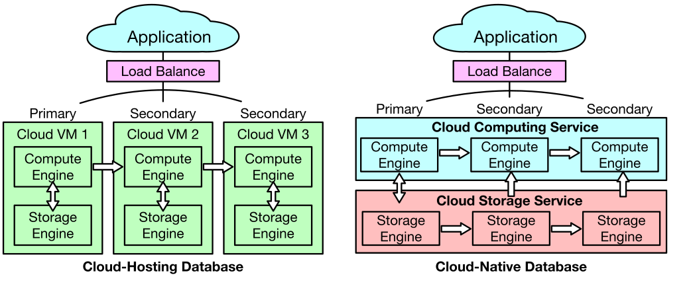

*Fig. 1. A comparison of cloud-hosting architecture and cloud-native architecture.*

> *图 1。云托管架构与云原生架构的比较。*

> **图表中文解读：** 左侧云托管数据库把计算引擎与存储引擎绑定在三台 Cloud VM 内，主节点向两个备节点复制；右侧云原生数据库把计算服务与存储服务拆成两个资源池。横向箭头表示副本/更新传播，纵向箭头表示应用经负载均衡器访问计算层以及计算层访问共享存储层。结论是资源解耦后，计算和存储可独立扩缩容。

Since cloud applications have different types of workloads, e.g., write-heavy or read-heavy, there has emerged two types of cloud-native databases: 1) cloud-native online transaction processing (OLTP) databases, and 2) cloud-native online analytical processing (OLAP) databases. Both types of databases adopt the disaggregation architecture, but they own disparate techniques and face different challenges. In summary, there are five main challenges that need to address, including log-based transaction processing, multi-layer data consistency, failure recovery, cache-based query processing, and serverless computing.

> 云应用的工作负载各不相同，例如写密集型或读密集型，由此催生了两类云原生数据库：1）云原生在线事务处理（OLTP）数据库；2）云原生在线分析处理（OLAP）数据库。两者都采用解耦架构，但使用的技术不同，面临的挑战也不同。总体上需要应对五项主要挑战：基于日志的事务处理、多层数据一致性、故障恢复、基于缓存的查询处理和无服务器计算。

Challenge 1. Log-based Transaction Processing: Since the storage is disaggregated, it is challenging to support efficient transaction processing based on the cloud storage. As the log becomes the first-citizen, it is rather hard to handle the cache miss when the log has yet to be replayed.

> 挑战 1：基于日志的事务处理。存储解耦后，如何基于云存储高效处理事务成为难题。日志成为一等公民，而日志尚未重放时发生的缓存未命中尤其难以处理。

Challenge 2. Multi-Layer Data Consistency: Cloud-native OLTP databases focus on processing transactions in the cloud. However, the main challenge is to ensure the data consistency in the multiple layers, e.g., the compute layer, the storage layer, or even the memory layer.

> 挑战 2：多层数据一致性。云原生 OLTP 数据库面向云端事务处理，其主要挑战是保证计算层、存储层乃至内存层之间的数据一致性。

Challenge 3. Failure Recovery: For the cloud-native databases, it is more complex to provide high availability as each layer may occur exceptions. Thus, a major concern is how to quickly recover the databases when facing compute/storage node failures.

> 挑战 3：故障恢复。云原生数据库的每一层都可能发生异常，因而高可用机制更为复杂。计算节点或存储节点故障后如何快速恢复数据库，是其中的核心问题。

Challenge 4. Cache-based Query Processing: Cloud-native OLAP databases target at scalable query processing with a remote cloud storage. To reduce the network traffic, they need to design effective caching strategies and computational pushdown on the storage side. However, finding an optimal yet cost-efficient query plan is challenging due to the trade-off between performance and cost.

> 挑战 4：基于缓存的查询处理。云原生 OLAP 数据库利用远程云存储实现可扩展查询处理。为减少网络流量，系统需要设计有效的缓存策略，并把计算下推到存储端；但性能与成本相互制约，难以找到既最优又经济的查询计划。

Challenge 5. Serverless Computing: Many cloud databases have supported serverless computing that can dynamically schedule resources for users’ workloads with the pause-and-resume policy, but it is still challenging to adaptively schedule the resources for the workloads in a query granularity [83] as the resources are provisioned in the instance level.

> 挑战 5：无服务器计算。许多云数据库已经支持无服务器计算，可借助暂停—恢复策略为用户工作负载动态调度资源；然而资源仍按实例配置，如何在查询粒度 [83] 上自适应调度仍是一项挑战。

Fig. 2 presents an overview of key techniques of cloud-native databases. In this survey, we introduce the state-of-the-art techniques of cloud-native OLTP and OLAP databases, respectively. We introduce each type of cloud-native database from two aspects. First, we introduce a taxonomy of their disaggregated architectures. Then we present the representatives for each category. Second, we take a deep dive into their key techniques regarding OLTP and OLAP workloads. We summarize how existing approaches address the above-mentioned challenges.

> 图 2 概览了云原生数据库的关键技术。本文分别介绍云原生 OLTP 与 OLAP 数据库的最新技术，并从两个方面讨论每一类数据库：首先对其分离式架构建立分类体系并列举各类代表系统；其次深入分析面向 OLTP 与 OLAP 工作负载的关键技术，总结现有方法如何应对上述挑战。

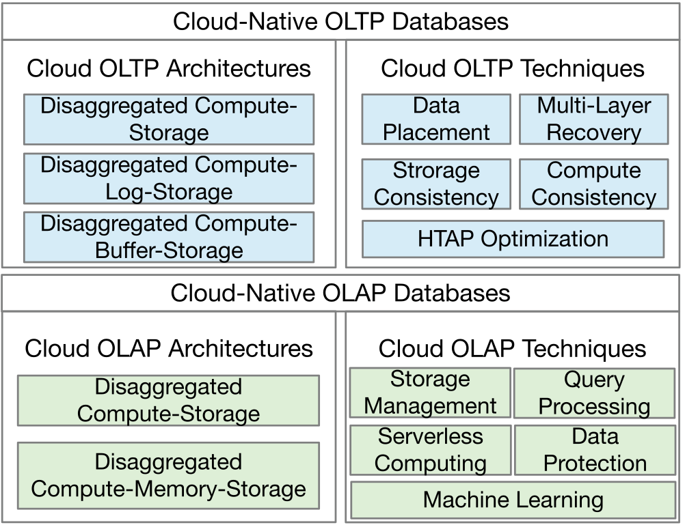

*Fig. 2. An overview of cloud-native databases.*

> *图 2。云原生数据库概览。*

> **图表中文解读：** 图按 OLTP 与 OLAP 分成上下两部分；每部分左列给出架构分类，右列给出技术分类。OLTP 的三类架构围绕计算、日志/缓冲与存储的拆分，技术链覆盖数据放置、一致性、恢复和 HTAP；OLAP 的两类架构围绕是否独立出内存层，技术链覆盖存储、查询、无服务器、保护与机器学习。该图是全文分类体系的导航图。

### A. Cloud-Native OLTP Databases

> A. 云原生 OLTP 数据库

1) Cloud-Native OLTP Architectures: Cloud-native OLTP databases emphasize concurrency and low latency in transaction processing. The architecture design needs to consider the consistency of the primary and secondary nodes, the durability and availability of the storage layer, and the efficiency of query processing. We classify the architectures of cloud-native OLTP databases into three categories as follows:

> 1）云原生 OLTP 架构：云原生 OLTP 数据库强调事务处理的并发性和低延迟。架构设计需要考虑主备节点的一致性、存储层的持久性和可用性以及查询处理的效率。我们将云原生 OLTP 数据库的架构分为以下三类：

1) Disaggregated Compute-Storage OLTP Architecture: The first category has a two-layer architecture, where the compute layer processes the transactions on volatile devices, and the storage layer maintains the data’s durability and availability based on the cloud storage service.

> 1）计算存储分离式 OLTP 架构：第一类采用两层架构，计算层在易失性设备上处理事务，存储层依托云存储服务保证数据的持久性与可用性。

2) Disaggregated Compute-Log-Storage OLTP Architecture: The second category separates the data durability and availability management by physically splitting the log storage and page storage.

> 2）计算—日志—存储分离式 OLTP 架构：第二类从物理上拆分日志存储与页面存储，从而把数据持久性和可用性的管理分离开来。

3) Disaggregated Compute-Buffer-Storage OLTP Architecture: The third category adds a shared buffer layer, which aims to improve the efficiency of data synchronization among computing nodes and reduce the average latency of reading data from the storage layer.

> 3）计算—缓冲—存储分离式 OLTP 架构：第三类增加了共享缓冲层，旨在提高计算节点间数据同步的效率，降低从存储层读取数据的平均延迟。

2) Cloud-Native OLTP Techniques: According to the functional modules of the OLTP techniques, we categorize them into five types:

> 2）云原生 OLTP 技术：根据 OLTP 技术的功能模块，我们将其分为五类：

1) Data Placement Strategy: Data placement strategy considers organization of logs and data in the disaggregated architecture. We introduce two types of data placement strategies that organize the logs and pages in the cloud. The first type is i) coupled log-page strategy [94]. The second type is ii) disaggregated log-page strategy [12].

> 1）数据放置策略：该策略关注解耦架构中日志与数据的组织方式。本文介绍两种在云端组织日志和页面的方案：i）日志—页面耦合策略 [94]；ii）日志—页面分离策略 [12]。

2) Storage Layer Consistency: The storage layer needs to maintain multiple data replicas to ensure high availability, which requires the consistency of these replicas. We introduce two types of storage layer consistency. The first type is i) quorum-based consistency protocol [94]. The second type is ii) Paxos-based consistency protocol [22].

> 2）存储层一致性：存储层通过维护多个数据副本保证高可用，因此必须维持副本一致。本文介绍两类方案：i）基于 Quorum 的一致性协议 [94]；ii）基于 Paxos 的一致性协议 [22]。

3) Compute Layer Consistency: Computing layer consistency refers to the method of updates synchronization from the primary nodes to secondary nodes. We introduce three ways to maintain consistency among all compute nodes. The first type is i) sync based on persistent storage [94]. The second type is ii) sync based on local cache status [27]. The third type is iii) sync based on the shared remote buffer [22].

> 3）计算层一致性：计算层一致性是指把主节点更新同步到从节点的方法。本文介绍三类方案：i）基于持久存储的同步 [94]；ii）基于本地缓存状态的同步 [27]；iii）基于远程共享缓冲区的同步 [22]。

4) Multi-layer Recovery: According to the hierarchical division in the architecture, fault recovery techniques can be divided into three levels. The first level is i) No-Redo Recovery in the Compute Layer [94]. The second type is ii) Two-Tier ARIES based on Buffer Layer [115]. The third type is iii) Optimizations in the Storage Layer [95].

> 4）多层恢复：按照架构层次，故障恢复技术可分为三类：i）计算层的 No-Redo 恢复 [94]；ii）缓冲层的两级 ARIES [115]；iii）存储层优化 [95]。

5) HTAP Optimization: We discuss HTAP optimizations in cloud-native databases, which include three types. The first type is i) dynamic storage format transformation [35]. The second type is ii) heterogeneous data replicas [38]. The third type is iii) unified table storage design [78].

> 5）HTAP 优化：本文讨论三类云原生 HTAP 优化：i）动态存储格式转换 [35]；ii）异构数据副本 [38]；iii）统一表存储设计 [78]。

### B. Cloud-Native OLAP Databases

> B. 云原生 OLAP 数据库

1) Cloud-Native OLAP Architectures: Cloud-native OLAP databases emphasize efficiency and throughput in analytical query processing. The architecture design needs to consider the elasticity of computation to support fluctuating workloads, as well as the local cache and shared memory for efficient query processing. The architectures of cloud-native OLAP databases are classified into two categories as follows:

> 1）云原生 OLAP 架构：云原生 OLAP 数据库重视分析查询的处理效率与吞吐量。架构既要提供计算弹性，以适应波动的工作负载，也要利用本地缓存与共享内存高效处理查询。其架构可分为以下两类：

1) Disaggregated Compute-Storage OLAP Architecture: The first category has a two-layer architecture, where the compute layer executes the queries with the local SSDs, and the storage layer persists the entire data with the computational pushdown.

> 1）计算存储分离式 OLAP 架构：第一类采用两层架构；计算层借助本地 SSD 执行查询，存储层负责持久化全部数据并支持计算下推。

2) Disaggregated Compute-Memory-Storage OLAP Architecture: The second category owns a three-layer architecture, where a shuffle memory pool is disaggregated to process the distributed joins more efficiently.

> 2）计算—内存—存储分离式 OLAP 架构：第二类采用三层架构，独立的 Shuffle 内存池可更高效地处理分布式连接。

2) Cloud-Native OLAP Techniques: We present five types of cloud-native OLAP techniques.

> 2）云原生 OLAP 技术：本文介绍五类云原生 OLAP 技术。

1) Storage Management: The disaggregation of functional modules in the cloud-native environment results in differences in data management methods. We introduce three types of storage management techniques. The first type is i) Metadata storage management [25], the second type is ii) Data partitioning [15], [37], and the third type is iii) Semi-structured data management [25], [59], [111].

> 1）存储管理：云原生环境把功能模块相互解耦，数据管理方式也随之改变。本文介绍三类存储管理技术：i）元数据存储管理 [25]；ii）数据分区 [15], [37]；iii）半结构化数据管理 [25], [59], [111]。

2) Query Processing: Compute nodes read data from remote storage services, which drives the query processing optimizations to reduce network transmission. We introduce three types of query processing techniques. The first type is i) Columnar scan with pushdown [70], [96], [103], which aims to push the computation into the storage side. The second type is ii) Columnar scan with caching and pushdown [102]. The third type is iii) Columnar scan with the shuffle memory pool [59].

> 2）查询处理：计算节点从远程存储服务读取数据，因此查询处理优化必须尽量减少网络传输。本文介绍三类技术：i）带下推的列式扫描 [70], [96], [103]，把计算推到存储端；ii）带缓存和下推的列式扫描 [102]；iii）使用 Shuffle 内存池的列式扫描 [59]。

3) Serverless Computing: Serverless computing intends to make customers use the data analytical services without considering the server deployment and configuration. We introduce two types of serverless computing methods in cloud databases. The first type is i) Serverless with functions as a service [73], where queries are adaptively executed based on the cloud function services. The second type is ii) Serverless with the elastic query engine [16], which enables to perform the queries by dynamically provisioning the query engine.

> 3）无服务器计算：无服务器计算让客户无需关心服务器部署与配置即可使用数据分析服务。本文介绍两类方法：i）基于函数即服务（FaaS）的无服务器方案 [73]，借助云函数自适应执行查询；ii）采用弹性查询引擎的无服务器方案 [16]，通过动态预配查询引擎执行查询。

4) Data Protection: Protecting user data privacy and security is the basis for customers to use cloud services. We present two types of techniques: i) Software-based data protection [25] and ii) Hardware-based data protection, e.g., the enclave in Intel SGX [11].

> 4）数据保护：保护用户数据的隐私与安全，是客户使用云服务的基础。本文介绍两类技术：i）基于软件的数据保护 [25]；ii）基于硬件的数据保护，例如 Intel SGX 的安全飞地（Enclave）[11]。

5) Machine Learning: We will look at emerging cloud database techniques for machine learning, such as Sagemaker [55]. Moreover, we will introduce how cloud databases can benefit from machine learning techniques [52], [53], [93].

> 5）机器学习：本文考察 SageMaker [55] 等面向机器学习的新兴云数据库技术，也介绍机器学习技术 [52], [53], [93] 如何反过来优化云数据库。

### C. Contributions

> C. 本文贡献

Differences with existing surveys: In this paper, we focus on the fundamental techniques of cloud-native databases [50]. We also summarize the pros and cons of various architectures and techniques. Before the emergence of cloud-native databases, Sakr [81] reviewed cloud-hosting databases. Mansouri et al. [58] surveyed the key techniques of cloud storage management. Narasayya et al. [65], [66] discussed various cloud data services. Unfortunately, existing works neglected many fundamental techniques of cloud-native databases, such as data consistency, data synchronization, and failure recovery. Last but not least, we review newly-emerged techniques, such as the cloud-native HTAP techniques, pushdown-based query processing, and machine learning-based optimization.

> 与现有综述的区别：本文聚焦云原生数据库的基础技术 [50]，并总结各类架构与技术的优缺点。在云原生数据库出现之前，Sakr [81] 综述了云托管数据库，Mansouri 等人 [58] 综述了云存储管理的关键技术，Narasayya 等人 [65], [66] 则讨论了多种云数据服务。遗憾的是，已有工作忽略了数据一致性、数据同步和故障恢复等许多云原生数据库基础技术。此外，本文还综述云原生 HTAP、基于下推的查询处理和基于机器学习的优化等新兴技术。

To summarize, we make the following contributions:

> 总体而言，本文作出以下贡献：

1) We survey cloud-native databases from the perspective of system architectures. We introduce a taxonomy of cloud-native OLTP and OLAP databases, respectively. We also discuss their pros and cons.

> 1）从系统架构角度综述云原生数据库，分别建立云原生 OLTP 与 OLAP 数据库的分类体系，并讨论各类架构的优缺点。

2) We summarize the key techniques of cloud-native databases concerning the OLTP and OLAP workload. We take a deep dive into the key techniques concerning transaction processing, data replication, database recovery, storage management, query processing, serverless computing, data protection, and machine learning.

> 2）我们总结面向 OLTP 与 OLAP 工作负载的云原生数据库关键技术，并深入讨论事务处理、数据复制、数据库恢复、存储管理、查询处理、无服务器计算、数据保护和机器学习。

3) We provide new research challenges and discuss future directions, including multi-writer architecture, fine-grained serverless, SLA-aware cloud-native HTAP techniques, and multi-cloud data service.

> 3）提出新的研究挑战并讨论未来方向，包括多写者架构、细粒度无服务器、SLA 感知的云原生 HTAP 技术与多云数据服务。

## II. CLOUD-NATIVE OLTP ARCHITECTURES

> 二、云原生 OLTP 架构

OLTP database systems are designed for transaction processing scenarios, which means they should guarantee ACID properties during query processing [36]. However, the coupled compute-storage architecture in cloud-hosting databases suffers from write amplification due to coupled resource scheduling [48], [94]. The disaggregated architecture designs in cloud-native databases are introduced to solve the above problems. According to the degree of separation management of storage services and the use of remote memory services, the architectures of cloud-native OLTP databases can be classified into three categories (shown in Fig. 3): 1) Disaggregated Compute-Storage OLTP Architecture, 2) Disaggregated Compute-Log-Storage OLTP Architecture and 3) Disaggregated Compute-Buffer-Storage OLTP Architecture.

> OLTP 数据库系统面向事务处理场景，必须在查询处理过程中保证 ACID 属性 [36]。然而，云托管数据库的计算存储耦合架构需要联动调度资源，因而面临写放大问题 [48], [94]。云原生数据库以解耦架构应对这些问题。按照存储服务的拆分程度以及是否使用远程内存服务，云原生 OLTP 数据库可分为三类（见图 3）：1）计算存储分离式 OLTP；2）计算—日志—存储分离式 OLTP；3）计算—缓冲—存储分离式 OLTP。

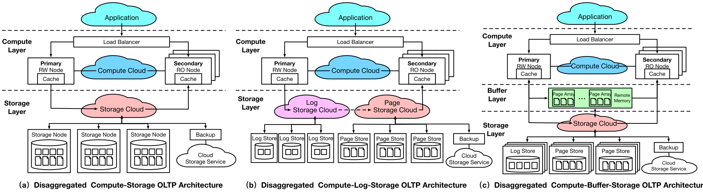

*Fig. 3. Architectures of cloud-native OLTP databases.*

> *图 3。云原生 OLTP 数据库架构。*

> **图表中文解读：** 三幅子图从左到右逐步增加分离程度：a) 计算云直接连接存储云；b) 存储层再拆为日志存储云与页面存储云；c) 计算与持久存储之间加入远程内存支持的共享缓冲层。虚线是层边界，云形框是弹性服务，节点堆叠表示主/从计算副本，底部箭头表示存储节点或备份之间的数据流。

### A. Disaggregated Compute-Storage OLTP

> A. 计算存储分离式 OLTP

1) Design Motivation: This category of databases adopts a disaggregation architecture that separates the compute and storage modules in the cloud. The design motivation of this architecture can be concluded as the following three aspects. i) Elasticity. it aims to schedule the computing and storage resources independently, which could avoid the waste of resources caused by resource coupling in cloud-hosting databases. ii) Efficiency. Dirty page flushing is eliminated under this architecture, which significantly reduces the write amplification. iii) Availability. Because of the multiple disaggregated modules, it must provides a multi-level failure tolerance to reduce the average recovery time compared to instance-level recovery.

> 1）设计动机：此类数据库采用解耦架构，把云端计算模块与存储模块分开。动机有三点：i）弹性。独立调度计算和存储资源，避免云托管数据库因资源耦合造成浪费。ii）效率。消除脏页回刷，显著降低写放大。iii）可用性。多个独立模块需要多层容错，与实例级恢复相比可缩短平均恢复时间。（译注：原文使用“must provides”，语法疑误；此处未改动英文。）

2) Data Access Path: The data access path is different from the cloud-hosting databases. The primary node will only transfer redo logs and metadata to the storage layer during the data writing process. The storage nodes will asynchronously replay the logs in the background to update records, avoid dirty page transmission, and relieve the network bottleneck in the cloud environment. Nevertheless, reading data from pages without the dirty page flush-back may suffer from the update delay caused by the asynchronous log replaying. Therefore, the databases organize the redo logs into the linked list structure in the order of log serial number (LSN), which allows the storage nodes to read the records by directly analyzing the redo logs.

> 2）数据访问路径：其访问路径不同于云托管数据库。写入时，主节点只把重做日志和元数据传到存储层；存储节点在后台异步重放日志以更新记录，由此避免传输脏页并缓解云环境的网络瓶颈。然而，读取尚未回刷的页面时，会受到异步日志重放所致更新延迟的影响。因此，数据库按日志序列号（LSN）把重做日志组织成链表，使存储节点能够直接分析日志并还原记录。

3) Pros and Cons: Compared with cloud-hosting databases, cloud-native databases have the following advantages. i) Low Write Latency. The write operation can commit once the redo logs are persistent without waiting for the updates of record pages. ii) Reduced Write Amplification. Since the data update is pushed down to the storage layer, which avoids the dirty page transmission and relieves the network pressure. iii) Improved Elasticity. Computing and storage are supported by different cloud services. The independent scheduling process improves the system’s elasticity. The limitation of this architecture is the read latency. The compute nodes send read requests to the storage layer when the cache misses, which may suffer extra log chain analyzing latency.

> 3）优缺点：与云托管数据库相比，这类架构有三项优势：i）写入延迟低。重做日志一经持久化即可提交写操作，无须等待记录页更新。ii）写放大更小。数据更新下推到存储层，避免传输脏页并减轻网络压力。iii）弹性更强。计算与存储由不同云服务承载，可以独立调度。其局限在于读取延迟：缓存未命中时，计算节点必须向存储层发起读取，还会增加分析日志链的时间。

4) Representatives: The representative databases with the disaggregated compute-storage architecture include Aurora [94] and AlloyDB [35]. These two systems use a similar system architecture design but with different technique implementations. For the common part, they implement the same log processing techniques, like “the log is the database” in Aurora and “Log Processing Service” in AlloyDB. For the difference, Aurora optimizes storage management based on Quorum mechanisms by extending data replicas; it also implements non-blocking failure recovery. While AlloyDB optimizes the HTAP workload via dynamic data format transformation in the compute nodes.

> 4）代表系统：计算存储分离式数据库的代表包括 Aurora [94] 和 AlloyDB [35]。二者架构相似，也都采用日志处理技术，例如 Aurora 的“日志就是数据库”和 AlloyDB 的 Log Processing Service；具体实现则有所不同。Aurora 增加数据副本并以 Quorum 机制优化存储管理，同时实现非阻塞故障恢复；AlloyDB 则在计算节点动态转换数据格式，以优化 HTAP 工作负载。

### B. Disaggregated Compute-Log-Storage OLTP

> B. 计算—日志—存储分离式 OLTP

1) Design Motivation: This category of databases extra separates the storage service for logs and pages based on the first category of databases. Logs guarantee the persistence of updates, while pages provide high-efficiency query processing. The design motivations can be concluded as two aspects. i) Efficiency. First, a fast cloud storage service for logs can significantly reduce the write commit latency. Second, standard cloud storage service for pages can avoid high costs. ii) Elasticity. It can improve the systems’ elasticity if these two storage services are scheduled independently.

> 1）设计动机：此类数据库在第一类架构基础上，进一步拆分日志存储与页面存储。日志保证更新持久性，页面则支持高效查询。动机有两点：i）效率。快速日志存储可显著降低写提交延迟，标准页面存储则可控制成本。ii）弹性。两类存储服务可以独立调度，进一步提高系统弹性。

2) Data Access Path: The disaggregation of log and page storage influences the data access path. This architecture separates the data read and write path. Compute nodes only write to log storage and read from page storage. The storage layer handles the synchronizations of log and page storage internally. However, due to the asynchronous updates and the network latency across different storage services, the page updates could lag in storage nodes.

> 2）数据访问路径：日志与页面存储分离后，数据读写路径也随之分开：计算节点只向日志存储写入，只从页面存储读取；存储层在内部同步日志与页面。由于跨存储服务的更新是异步的且存在网络延迟，存储节点上的页面更新可能滞后。

3) Pros and Cons: Compared with the first category of databases, the disaggregated compute-log-storage architecture has the following advantages. i) Low Write Latency. The write commits latency further declines with the help of the fast cloud storage service for logs. ii) Improved Elasticity. The databases’ elasticity is improved with the disaggregation of different storage services. Standard storage for pages has a relatively-low cost, and fast storage for logs improves the transaction processing performance. The limitation of this architecture is the synchronize latency. The compute nodes could be blocked and continue to wait for the synchronization in storage nodes when data lags.

> 3）优缺点：与第一类架构相比，它有两项优势：i）写入延迟更低。快速日志存储进一步缩短写提交时间。ii）弹性更强。日志与页面存储可以独立调度；标准页面存储成本较低，快速日志存储又能提升事务处理性能。其局限是同步延迟：数据滞后时，计算节点可能阻塞并持续等待存储节点完成同步。（译注：原文使用“synchronize latency”，疑应为“synchronization latency”；此处保留。）

4) Representatives: The representative databases with the disaggregated compute-log-storage architecture include Azure HyperScale [12] and Huawei Taurus Database [27]. The main differences between these two systems are the storage management method. Taurus adds Storage Abstract Layer (SAL) [27] in each compute node to handle the data access on the storage layer. While HyperScale implements XLOG [12] service to take responsibility for similar functions. The difference is that the XLOG service is separated from compute layer as an independent layer, which achieves further independence on manageability and fault tolerance.

> 4）代表系统：计算—日志—存储分离式架构的代表是 Azure HyperScale [12] 和华为 Taurus Database [27]，二者主要区别在存储管理方式。Taurus 在每个计算节点加入存储抽象层（SAL）[27]，负责访问存储层；HyperScale 的 XLOG 服务 [12] 承担类似职责，但 XLOG 作为独立层与计算层分开，因而在可管理性和容错方面解耦得更彻底。

### C. Disaggregated Compute-Buffer-Storage OLTP

> C. 计算—缓冲—存储分离式 OLTP

1) Design Motivation: This category of databases expands the shared buffer for databases. The buffer is supported by remote shared memory service [98], which provides much lower latency data access than the persistent storage service. The design motivation can be concluded in three aspects. i) Efficiency. The read latency can be significantly reduced with the remote memory. ii) Throughput. If all the compute nodes share the remote buffer, it could reduce the duplicate read requests from different compute nodes. iii) Elasticity. Since the memory resource allocation is independent of persistent storage service, it could further improve the elasticity of databases.

> 1）设计动机：此类数据库扩展出共享缓冲区，由远程共享内存服务 [98] 承载，访问延迟远低于持久存储。动机有三点：i）效率。远程内存可显著降低读取延迟。ii）吞吐量。所有计算节点共享远程缓冲区，可减少不同节点发出的重复读取。iii）弹性。内存资源不再依附于持久存储服务，可以独立分配，从而进一步提高数据库弹性。

2) Date Access Path: The shared buffer provides an additional layer of buffer on top of the local cache in each compute node. Unlike the local cache, the buffer is shared by all compute nodes, which allows the primary node to transfer the updates to secondary nodes. Besides, since the buffer is shared by multiple nodes, it could become the bottleneck of the network. Hence, the shared buffer will not flush back dirty pages, and the redo logs still guarantee the update’s durability.

> 2）数据访问路径：共享缓冲区是在各计算节点本地缓存之上增加的一层缓冲。它由所有计算节点共同访问，使主节点能够把更新传播到从节点；但多节点共享也可能令其成为网络瓶颈。因此，共享缓冲区不负责把脏页回刷到持久存储，更新持久性仍由重做日志保证。（译注：原文标题写作“Date Access Path”，按上下文疑为“Data Access Path”；此处保留原文。）

3) Pros and Cons: Compared with the first two categories of databases, the disaggregated compute-buffer-storage architecture has the following advantages. i) Low Read Latency. The read latency is significantly reduced when data is cached in the remote buffer. ii) Improved Read Throughput. The number of duplicate read from different compute nodes is reduced since all nodes share the buffer. iii) Improved Elasticity. Memory disaggregation enables the elastic scheduling of memory resources, hence the higher elasticity. The limitation of this architecture is the high network cost. Fully utilizing the performance of remote memory requires an expensive RDMA network for low network latency. Besides, it has a high requirement of network bandwidth since all the compute nodes need to share the same buffer.

> 3）优缺点：与前两类架构相比，它有三项优势：i）读取延迟低。数据命中远程缓冲区时，读取明显加快。ii）读取吞吐量高。节点共享缓冲区，减少重复读取。iii）弹性更强。内存解耦后可以弹性调度。其局限是网络成本高：要充分发挥远程内存性能，需要昂贵的低延迟 RDMA 网络；所有计算节点共享同一缓冲区，也对网络带宽提出很高要求。

4) Representatives: The representative databases with the disaggregated compute-buffer architecture include Alibaba PolarDB Serverless [22], which builds a shared buffer for all compute nodes based on the remote memory service. The data updates from the primary node can be written to the shared buffer layer and can be synchronized to secondary nodes, which improves data synchronization performance. The main challenge is to keep the data consistent between the primary node and shared buffer, which will be discussed in the next section.

> 4）代表系统：阿里巴巴 PolarDB Serverless [22] 是计算—缓冲—存储分离式架构的代表。它基于远程内存服务为全部计算节点建立共享缓冲区；主节点可把更新写入该层并同步给从节点，从而提高数据同步性能。主要挑战是维持主节点与共享缓冲区之间的一致性，下一节将作讨论。

### D. Summary of the Cloud-Native OLTP Architectures

> D. 云原生 OLTP 架构小结

Table I presents a comparison of the cloud-native OLTP architectures concerning read and write performance, availability, elasticity, and cost.

> 表 I 从读写性能、可用性、弹性和成本方面比较云原生 OLTP 架构。

**Table I. A classification of cloud-native OLTP databases based on the architecture.**

> **表 I。按架构对云原生 OLTP 数据库分类。**

| OLTP Architecture OLTP 架构 | Representatives 代表系统 | Write 写性能 | Read 读性能 | Availability 可用性 | Elasticity 弹性 | Cost 成本 |
| --- | --- | --- | --- | --- | --- | --- |
| Disaggregated Compute-Storage 计算存储分离 | Aurora | Medium 中 | Medium 中 | High 高 | High 高 | Low 低 |
| Disaggregated Compute-Log-Storage 计算—日志—存储分离 | HyperScale | High 高 | Medium 中 | Excellent 优 | Excellent 优 | Medium 中 |
| Disaggregated Compute-Buffer-Storage 计算—缓冲—存储分离 | PolarDB Serverless | High 高 | High 高 | Excellent 优 | Excellent 优 | High 高 |

> **图表中文解读：** 三行架构的分离程度从计算—存储两层，增加到独立日志层，再增加共享缓冲层。写性能从中升至高；读性能只有引入共享缓冲后升至高；可用性与弹性由高升至优，但成本也由低经中升至高，体现性能/弹性与基础设施成本的直接交换。

1) Disaggregated compute-storage: These databases don’t require fast storage and remote memory service, which have the lowest cost. Particularly, the primary node only writes the log to the storage layer, which is more efficient than the cloud-hosting architecture. Reading records requires additional log replay, which affects read efficiency.

> 1）分离式计算存储：这些数据库不需要快速存储和远程内存服务，成本最低。特别是主节点只将日志写入存储层，比云托管架构效率更高。读取记录需要额外的日志重放，影响读取效率。

2) Disaggregated compute-log-storage: These databases require fast storage service to reduce log write latency, increasing costs but improving write performance. Databases’ elasticity and availability are higher than the first category because of the further separation of storage services.

> 2）分离式计算日志存储：这些数据库需要快速存储服务来减少日志写入延迟，增加成本但提高写入性能。由于存储服务进一步分离，数据库的弹性和可用性高于第一类。

3) Disaggregated compute-buffer-storage: These databases require remote memory service with low network latency, which demands an expensive RDMA network. Hence, they have a high cost. Nevertheless, they provide a better read performance with the shared remote buffer. Since the remote memory service is independent of computing and storage, it enhances the system’s elasticity. Besides, the remote buffer can accelerate the recovery of the compute layer, which improves the availability as well.

> 3）计算—缓冲—存储分离式：这类数据库依赖低网络延迟的远程内存服务，因而需要昂贵的 RDMA 网络，整体成本较高。作为回报，共享远程缓冲区能改善读取性能；远程内存服务独立于计算与存储，可增强系统弹性；远程缓冲区还能加速计算层恢复，提高可用性。

## III. CLOUD-NATIVE OLTP TECHNIQUES

> 三、云原生 OLTP 技术

This section will introduce the fundamental techniques in cloud-native OLTP databases. We classify them into five groups: data placement strategy, storage layer consistency, compute layer consistency, multi-layer recovery, and HTAP optimization. The relationship between these five parts is depicted in Fig. 4. Data placement strategy refers to the data organization and placement methods in the cloud. As there are multiple instances in both the storage layer and compute layer to ensure high availability, storage layer consistency and compute layer consistency care about the consistent protocols in the cloud. Multi-layer recovery mechanisms are designed to provide a fine-grained method to recover the failure in multiple layers. Finally, HTAP optimizations add the OLAP support based on the original OLTP mechanism. Table II summarizes the main approaches in each group, as well as their advantages and limitations.

> 本节介绍云原生 OLTP 数据库的五组基础技术：数据放置策略、存储层一致性、计算层一致性、多层恢复和 HTAP 优化，其关系见图 4。数据放置策略决定云端数据如何组织和部署；存储层与计算层都以多实例保证高可用，因此各自需要一致性协议；多层恢复机制负责对不同层次的故障作细粒度恢复；HTAP 优化则在原有 OLTP 机制上增加 OLAP 能力。表 II 汇总各组主要方法及其优缺点。

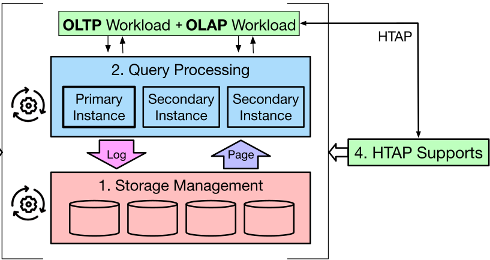

*Fig. 4. An overview of cloud-native OLTP techniques.*

> *图 4。云原生 OLTP 技术概览。*

> **图表中文解读：** 纵向主链由存储管理、查询处理和混合工作负载组成：日志向下写入存储，页面向上供查询读取；左侧“Recovery”箭头表示恢复横跨存储与查询层；右侧“HTAP Supports”把 OLAP 能力接入；顶部 HTAP 箭头把 OLTP 与 OLAP 工作负载统一起来。主实例和两个从实例体现单写多读。

**Table II. An overview of key techniques of cloud-native OLTP databases.**

> **表 II。云原生 OLTP 数据库关键技术概览。**

| Technique Type 技术类型 | Main Approaches 主要方法 | Cloud Databases 云数据库 | Pros. 优点 | Cons. 缺点 |
| --- | --- | --- | --- | --- |
| Data Placement Strategy 数据放置策略 | Coupled Page-Log 页面—日志耦合 | Aurora [94] | Low Sync Latency 同步延迟低 | Extra Log Analysis 额外日志分析 |
| Data Placement Strategy 数据放置策略 | Disaggregated Page-Log 页面—日志分离 | HyperScale [12] | More Elasticity 弹性更强 | Long Sync Latency 同步延迟长 |
| Storage Layer Consistency 存储层一致性 | Quorum-based Protocol 基于 Quorum 的协议 | Aurora [95] | Strong Concurrency 并发能力强 | Extra Sync Phase 额外同步阶段 |
| Storage Layer Consistency 存储层一致性 | Paxos-based Protocol 基于 Paxos 的协议 | PolarDB [22] | Strong Consistency 强一致性 | Complex Procedure 流程复杂 |
| Compute Layer Consistency 计算层一致性 | Persistent Storage based 基于持久存储 | Aurora [94] | High Availability 高可用 | Long Sync Delay 同步延迟长 |
| Compute Layer Consistency 计算层一致性 | Local Cache based 基于本地缓存 | Taurus [27] | Low Sync Latency 同步延迟低 | Cache misses 缓存未命中 |
| Compute Layer Consistency 计算层一致性 | Remote Shared Buffer based 基于远程共享缓冲区 | PolarDB [22] | Low Read Latency 读取延迟低 | Cache Inconsistent 缓存不一致 |
| Multi-layer Recovery 多层恢复 | No-Redo in Compute Layer 计算层免 Redo | Aurora [94] | Fast Recovery 恢复快 | Redo in Storage Node 存储节点执行 Redo |
| Multi-layer Recovery 多层恢复 | Two-Tier ARIES in Buffer Layer 缓冲层两级 ARIES | LegoBase [115] | Reduced Recovery Time 缩短恢复时间 | High Cost 成本高 |
| Multi-layer Recovery 多层恢复 | Optimizations in Storage Layer 存储层优化 | Aurora [95] | Improved Storage Availability 提高存储可用性 | More Data Replicas 更多数据副本 |
| HTAP Optimization HTAP 优化 | Storage Format Transformation 存储格式转换 | AlloyDB [35] | Reduced Storage Space 减少存储空间 | Large Search Space 搜索空间大 |
| HTAP Optimization HTAP 优化 | Heterogeneous Data Replicas 异构数据副本 | TiDB [38] | Strong Isolation 隔离性强 | Reduced Freshness 新鲜度降低 |
| HTAP Optimization HTAP 优化 | Unified Table Storage 统一表存储 | SinglestoreDB [78] | Low Read Latency 读取延迟低 | High Memory Cost 内存成本高 |

> **图表中文解读：** 表按数据放置、两层一致性、多层恢复和 HTAP 五组列出 13 种方法。没有单一方案同时占优：低同步/读取延迟通常引入缓存一致性或额外分析，强一致性牺牲流程简洁度，快速恢复依赖更多层级/副本，HTAP 则在空间、搜索、新鲜度和内存成本间权衡。

### A. Data Placement Strategy

> A. 数据放置策略

In cloud-native databases, the data placement strategy refers to organizing different data types in databases, mainly focusing on the logs and pages. The data placement strategy determines the transaction processing workflow. They are influenced by the architecture design, which can be categorized as 1) Coupled Page-Log Placement Strategy and 2) Disaggregated Page-Log Placement Strategy. For the former type, a unified cloud storage service supports log and page storage, which can provide physical correlation to reduce network pressure. The coupled placement strategy is used in disaggregated compute-storage architecture. For the latter one, the disaggregated placement strategy is used in disaggregated compute-log-storage architecture. Isolated cloud storage services support log and page storage, which separates the read and write process of transactions to achieve both low write latency and high read throughput.

> 在云原生数据库中，数据放置策略决定不同类型的数据如何组织，重点是日志与页面，并由此决定事务处理流程。受架构设计影响，放置策略可分为：1）页面—日志耦合；2）页面—日志分离。前者使用统一云存储同时保存日志和页面，利用二者的物理邻近性减轻网络压力，适用于计算存储分离式架构；后者分别用独立云存储承载日志与页面，把事务写路径和读路径分开，以兼得低写入延迟和高读取吞吐量，适用于计算—日志—存储分离式架构。

1) Coupled Page-Log Placement Strategy: In the cloud-native OLTP databases, redo logs keeps the updating history, which means any record at any database version can be analyzed from the redo logs. Hence, databases can directly load records from redo logs. Unlike traditional databases that read records through data pages, the coupled page-log placement strategy uses the same cloud storage service to store the log and page data. The fundamental difference lies in the data processing process within the storage layer, summarized as “the log is the database.”

> 1）页面—日志耦合放置策略：云原生 OLTP 数据库的重做日志保留完整更新历史，因此可以从日志中还原任意数据库版本的记录，数据库也就能够直接由重做日志装载记录。不同于通过数据页读取记录的传统数据库，页面—日志耦合策略使用同一云存储服务保存日志和页面；其存储层处理方式的根本差异可概括为“日志就是数据库”。

As shown in Fig. 5, the same storage node saves pages and redo logs simultaneously. The data update from the compute layer only requires the storage node to complete the persistence of the redo log. Thus, the dirty pages will not flush back to the storage layer, which significantly reduces the write amplification in cloud-hosting architectures due to the updates of multiple replicas. A read operation from compute layer requires the storage node to load the record with a specific version from the redo logs. However, the overhead of loading records will increase with the growth of historical data, most of which has already expired. Therefore, the page materialization controls the storage capacity and the read time by discarding expired redo logs. This process is done asynchronously in the background of the storage node, which avoids the update delay of direct page updating. As shown in Fig. 5, update requests on value X will not be directly written into the page (Page k) to which it belongs. Instead, the database will generate the redo log (L9010) and append it to the storage node. During the read requests, the storage node will ignore the redo logs later than the transaction (version T). The page materialization will consume the redo logs and update the page, which reduces the length of log chains and accelerate the read operations.

> 如图 5 所示，同一存储节点同时保存页面和重做日志。计算层发来的更新只需令存储节点持久化重做日志，无须把脏页回刷到存储层，因而显著减少多副本更新造成的写放大。读取时，存储节点需要从重做日志还原特定版本的记录；历史日志不断累积后，其中大部分已经失效，还原开销也会增长。页面物化通过丢弃过期日志来控制存储占用与读取时间，并在存储节点后台异步执行，避免同步更新页面所带来的延迟。图中对值 X 的更新不会直接写入所属页面 Page k，而是生成重做日志 L9010 并追加到存储节点；读取版本 T 时，存储节点忽略晚于 T 的日志；后台页面物化再把日志合并进页面，缩短日志链并加速读取。

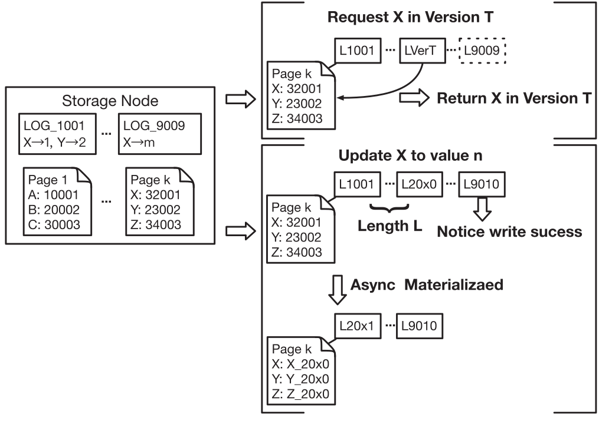

*Fig. 5. The coupled data placement strategy.*

> *图 5。耦合式数据放置策略。*

> **图表中文解读：** 左侧存储节点同时保存页面与按 LSN 排列的日志。右上读取路径以版本 T 为截止点：只重放不晚于 T 的日志并返回版本 T 的 X；右中写入路径把 X 更新为 n，追加 L9010 后即可确认；右下异步物化把日志链消费进 Page k。变量 L 表示日志链长度，虚线框中的 L9009 表示读取时应忽略的较新日志。

In summary, this strategy has the following advantages: 1) Reduced write amplification. Dirty pages do not flush to the storage layer, significantly reducing network pressure. 2) Reduced update delay. Storage nodes can directly load records from log data, which avoids the update delay of page data. The main limitation of this strategy is the extra process of redo log analysis during the reading process.

> 综上，该策略有两项优势：1）减轻写放大。脏页不回刷至存储层，可显著降低网络压力。2）缩短更新延迟。存储节点能直接从日志装载记录，避免等待页面数据更新。其主要局限是在读取过程中还要额外分析重做日志。

2) Disaggregated Page-Log Placement Strategy: Pages and logs stored in persistent storage have different responsibilities in the database system. Pages can directly read a specific version of the record, which is mainly used in the reading process. Besides, it guarantees the availability of the database. In contrast, logs can be written to disk sequentially, which is mainly used in the reading process and guarantees the durability of the transactions. The disaggregated page-log storage placement strategy places the pages and logs based on their different features. The fundamental difference between this strategy and coupled one can be summarized as “the disaggregation of availability and durability.”

> 2）页面—日志分离放置策略：持久存储中的页面与日志承担不同职责。页面可直接读取特定版本的记录，主要服务读路径并保证数据库可用性；日志适合顺序写盘，并保证事务持久性。页面—日志分离策略依据二者特性分别放置，其与耦合策略的根本差异可概括为“可用性与持久性解耦”。（译注：原文称日志“mainly used in the reading process”，按上下文疑应为 writing process；此处保留。）

As shown in Fig. 6, logs and pages are persisted in separated storage using the cloud storage service. Since the data update from compute layer only requires the persistence of the logs, the compute layer only needs to write the redo logs to the log storage, which is supported by fast storage services and gets lower write latency. At the same time, pages will be stored in standard cloud storage services to reduce the cost. The update logs will be batched asynchronously to page storage. Considering the possible unavailability of page storage nodes, the log transferring does not require all page storage nodes to complete the sync. The nodes inside the page store supplement these missing logs from other nodes through the Gossip protocol [24].

> 如图 6 所示，日志与页面分别持久化到不同的云存储。计算层更新只要求日志持久化，因此仅把重做日志写入由高速存储服务承载的日志存储，以取得较低写入延迟；页面则放在标准云存储中以降低成本。更新日志成批、异步地传送到页面存储。考虑到某些页面存储节点可能不可用，日志传输不要求全部节点同步完成；页面存储内部各节点再通过 Gossip 协议 [24] 从其他节点补齐自身缺失的日志。

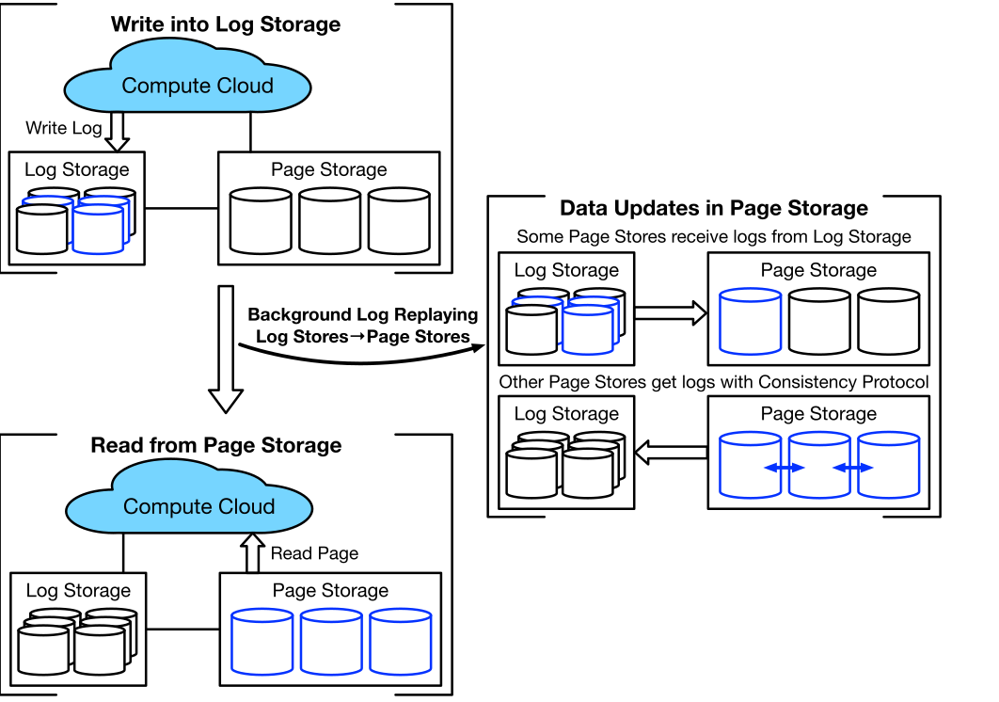

*Fig. 6. The disaggregated data placement strategy.*

> *图 6。分离式数据放置策略。*

> **图表中文解读：** 左上写路径只把日志从计算云写到低延迟日志存储；左下读路径由计算云从页面存储读取。中间向下箭头表示后台日志重放把更新异步推进页面存储。右侧上半展示同一日志存储向某个页面存储补日志，下半展示其他页面存储通过一致性协议互补缺失日志；蓝色圆柱与箭头突出正在同步的数据副本。

Compared with the coupled strategy, this method has the following advantages: 1) Reduced data write latency. The log persistence is backed by fast cloud storage, which improves the write performance. 2) Better elasticity. The scheduling of storage services is independent, enhancing the system’s elasticity. The main limitation of this strategy is the larger read latency caused by synchronization across storage services when the cache misses.

> 与耦合策略相比，该方法具有以下优点： 1）减少数据写入延迟。日志持久化有快速的云存储支持，提高了写入性能。 2）更强的弹性。存储服务的调度是独立的，增强了系统的弹性。该策略的主要限制是当缓存未命中时，跨存储服务的同步会导致较大的读取延迟。

### B. Storage Layer Consistency

> B. 存储层一致性

In cloud-native databases, storage layer consistency techniques are used to maintain the consistency among multiple data replicas in the storage layer. These techniques are based on original distributed systems protocols with specific optimization for cloud environments, which can be categorized as 1) Quorum-based Protocol and 2) Paxos-based Protocol. The quorum-based protocol is derived from the quorum algorithm [89] with some mechanisms to enhance consistency. In comparison, the Paxos-based protocol is derived from the Paxos-like algorithm (including Paxos [47] & Raft [68]) with customized mechanisms to improve the concurrency.

> 云原生数据库依靠存储层一致性技术，维持多个存储副本的一致。这些技术以经典分布式协议为基础，再针对云环境作专门优化，可分为两类：1）基于 Quorum 的协议；2）基于 Paxos 的协议。前者源自 Quorum 算法 [89]，并加入增强一致性的机制；后者派生自 Paxos [47]、Raft [68] 等类 Paxos 算法，再以定制机制提高并发性。

1) Quorum-Based Protocol: Quorum-based voting [89] is a classic method to guarantee the consistency in the distributed systems. The quorum algorithm sets the minimum voting number that a distributed transaction has to obtain, which is then used to solve the read-write and write-write conflicts among storage nodes. Migrating the quorum algorithm to the cloud environment mainly faces two challenges: 1) high availability requirement and 2) low recovery latency.

> 1）基于 Quorum 的协议：基于 Quorum 的投票 [89] 是保证分布式系统一致性的经典方法。仲裁算法设定分布式事务必须获得的最小投票数，用于解决存储节点之间的读写冲突。将仲裁算法迁移到云环境主要面临两个挑战：1）高可用性要求和 2）低恢复延迟。

For the first challenge, most distributed systems implement the quorum algorithm with three data replicas, which provide single-node fault tolerance. However, data centers for cloud service are deployed geographically isolated and require extreme availability [34]. Therefore, Aurora increases the number of replicas for improving the system’s reliability [94]. Cloud services can be divided into multiple fault-tolerant independent regions through the isolated physical deployment. Hence, the probability of simultaneous failure in different regions is extremely small. Based on the above facts, the cloud databases can maintain two replicas in three regions to achieve “region + 1”-level fault tolerance. Even if a single region fails, at least four replicas still run normally to ensure high availability.

> 对于第一项挑战，多数分布式系统以三个数据副本运行 Quorum 算法，只能容忍单节点故障。云服务的数据中心在地理上彼此隔离，同时又要求极高可用性 [34]，因此 Aurora 通过增加副本数来提高可靠性 [94]。物理隔离使云服务可以划分为多个相互独立的容错区域，不同区域同时故障的概率很低。据此，云数据库可在三个区域各维护两个副本，获得“区域 + 1”级容错；即使一个 Region 整体故障，仍有至少四个副本正常运行，足以保证高可用。

For the second challenge, a possible solution of reducing failure recovery time is to prepare a new replica before the system breakdowns. In the case of multiple replicas, the database can migrate data in advance and can generate a backup instance after a single replica is abnormal. Since the data migration is performed asynchronously, the backup instance will not replace the abnormal one immediately due to the high migration cost. Instead, they will run simultaneously and be controlled by the quorum set mechanism [95]. Backup and abnormal instances and the rest of the normal replicas form two quorum sets. Multiple sets are managed in a logical “or” manner. Query processing only requires at least one set to complete. Instances with long-term exceptions will be removed, and the database will discard the quorum sets containing such instances.

> 对于第二项挑战，一种缩短恢复时间的办法是在系统彻底故障前预备新副本。数据库可在发现单个副本异常后提前迁移数据并生成备用实例。迁移异步进行且代价较高，因此备用实例不会立刻替换异常实例；二者会暂时并行运行，并由 Quorum Set 机制 [95] 管理。备用实例、异常实例与其余正常副本构成两个 Quorum Set，多个集合按逻辑“或”管理，查询只需其中至少一个集合完成即可。长期异常的实例最终会被移除，包含它的 Quorum Set 也随之丢弃。

The advantage of quorum-based protocol is the high concurrency supported by the simple algorithm workflow. The limitation is that quorum-based protocols do not guarantee linearizability. Replicas implement extra gossip protocols to fill up the missing updates caused by temporary exceptions in certain replicas.

> 基于 Quorum 的协议流程简单，因而能够支持较高并发；但它不能保证线性化，还需要额外的 Gossip 协议，为暂时异常的副本补齐缺失更新。

2) Paxos-Based Protocol: Paxos [46], [47] is a family of protocols to reach the consensus in a network of unreliable or fallible participants. Since the Raft protocol [68] can be regarded as the simplified Paxos with stronger assumptions, we categorize all methods derived from Paxos and Raft as Paxos-like protocols. Classical Paxos-like algorithms strictly follow the linearization process, which limits the concurrency of transaction processing. Therefore, how to improve the concurrency is the most important problem in applying the Paxos-like algorithms to the cloud-native databases.

> 2）基于 Paxos 的协议：Paxos [46], [47] 是一组共识协议，用于让不可靠网络中可能故障的参与者达成一致。Raft [68] 可视为建立在更强假设之上的简化 Paxos，因此本文把由 Paxos 和 Raft 派生的方法统称为类 Paxos 协议。经典类 Paxos 算法严格遵循线性化过程，会限制事务处理并发度；因此，如何提高并发性，是把这类算法用于云原生数据库时最重要的问题。

Traditional databases require logs to be committed in a strict order, which means the previous logs must be committed successfully. Such a mechanism limits the concurrency due to the strict committing order. ParallelRaft [21] makes two optimizations to improve the performance. Out-of-order acknowledging and committing are allowed in ParallelRaft when the writing ranges of log entries are not overlapping, which is considered not conflicted. Besides, ParallelRaft optimizes the catch-up processes for lagging followers to re-synchronize with the leader.

> 传统数据库严格按序提交日志，后一条日志只有在前一条提交成功后才能提交，因而限制了并发性。ParallelRaft [21] 通过两项优化提高性能：如果日志条目的写入范围互不重叠，即彼此不冲突，便允许乱序确认与提交；同时优化落后从节点的追赶过程，使其更快地与主节点重新同步。

The advantage of paxos-based protocol is the linearizable features supported by the Paxos-like algorithms. The limitation is that Paxos-based protocols limit the system’s concurrent processing efficiency, which requires customized optimizations such as out-of-order committing.

> 基于 Paxos 的协议借助类 Paxos 算法提供线性化保证；其局限是会抑制系统的并发处理能力，因此需要乱序提交等定制优化。

### C. Compute Layer Consistency

> C. 计算层一致性

In cloud-native databases, compute layer adopts the “single-writer, multi-reader” architecture. That is, the primary node handles update queries and syncs the data to secondary nodes. All the secondary nodes are read-only and just update their status to the primary node. The synchronization process requires it to be low-latency and high-reliable, which can be categorized into three types: 1) Persistent storage based, 2) Local cache based, and 3) Remote shared buffer based. Notice that metadata synchronization always adopts direct transmission, and the data size is much smaller than log and page data. Therefore, this part mainly focuses on the synchronization of log and page data.

> 云原生数据库的计算层采用“单写者、多读者”架构：主节点处理更新查询并把数据同步至从节点；从节点全部只读，只将自身状态上报主节点。同步既要低延迟，也要高可靠，可分为三类：1）基于持久存储；2）基于本地缓存；3）基于远程共享缓冲区。元数据始终直接传输，且规模远小于日志和页面数据，因此本节主要讨论日志与页面数据的同步。

1) Persistent Storage Based Synchronization: The first synchronization method is based on the persistent storage. As shown in Fig. 7(a), the primary node transfers the redo logs to the storage layer. Combining the data placement strategy, the dirty pages in the primary node never flush back to the storage layer. The storage layer internally replays the redo logs to update the data pages. Since all the compute nodes share the storage service, the secondary nodes receive the updates once the corresponding logs have been replayed in the storage layer. The single-writer architecture only allows one primary node to update data at any time, thereby eliminating the possibility of write-write conflicts and guaranteeing strong data consistency. However, the network transmission that crosses different services suffers from long network latency. Besides, as the logs are replayed asynchronously, it significantly increases the update delay of secondary nodes.

> 1）基于持久存储的同步：如图 7（a）所示，主节点把重做日志传到存储层；配合相应的数据放置策略，主节点的脏页从不回刷至存储层，而由存储层重放日志来更新数据页。所有计算节点共享存储服务，因此存储层一旦重放相应日志，从节点便能看到更新。单写者架构在任一时刻只允许一个主节点更新数据，消除了写—写冲突，保证强一致性。不过，跨云服务传输的网络延迟较高，日志又是异步重放，从节点看到更新的时间会明显推迟。

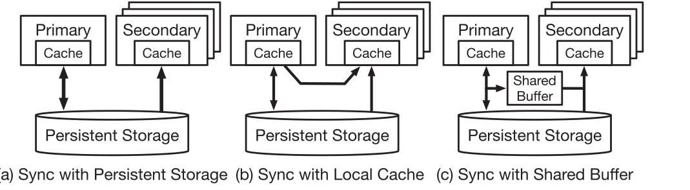

*Fig. 7. Compute layer synchronization.*

> *图 7。计算层同步。*

> **图表中文解读：** a) 主节点和从节点通过共享持久存储间接同步；b) 主节点把更新直接送入各从节点本地缓存，同时仍连接持久存储；c) 主从节点共同访问持久存储之上的共享缓冲区。双向箭头表示读写或状态传播方向，叠放的从节点表示多个只读副本。三种方案依次用更短的数据路径换取更高的网络与一致性管理成本。

2) Local Cache Based Synchronization: The second synchronization method is based on the local cache status in secondary nodes. This method aims to directly update the cache data of the secondary node and clear its dirty pages. As shown in Fig. 7(b), the primary node directly transfers redo logs to secondary nodes. The secondary nodes will update the dirty pages in the local cache based on these logs, achieving cache consistency with the primary node. The main challenge of this method lies in network transmission, which mainly includes two aspects: 1) Bandwidth. The network bandwidth of the primary node is limited, and simultaneous transmission to multiple secondary nodes may become the bottleneck. 2) Latency. All the replicas need to obtain the logs, which may lead to stragglers that affect the overall performance, namely, “the bucket effect”. For bandwidth issues, the compute layer can push down the transmission task to the fast storage service (e.g., the log storage) to reduce the pressure on the network bandwidth [27]. In this way, the computing layer distributes the transmission tasks to multiple nodes of the fast storage service, which significantly reduces the transmission pressure of a single node. For latency issues, the step of receiving logs in secondary nodes is controlled by a loose protocol [12]. The primary node does not require the secondary node to confirm the receiving process. The secondary nodes allow transmission failure. Moreover, they only need to read the missing part through the storage layer without affecting the correctness of the system.

> 2）基于本地缓存的同步：第二种同步方法依据从节点的本地缓存状态，目标是直接更新从节点的缓存数据并清理其脏页。如图 7(b) 所示，主节点把重做日志直接传输给从节点；从节点依据这些日志更新本地缓存中的脏页，从而与主节点保持缓存一致。该方法的主要挑战在于网络传输，包括两方面：1）带宽。主节点网络带宽有限，同时向多个从节点传输可能形成瓶颈。2）延迟。所有副本都要取得日志，慢节点可能拖累整体性能，即“木桶效应”。对于带宽问题，计算层可把传输任务下推给日志存储等快速存储服务，以减轻网络带宽压力 [27]；这样可把传输任务分散到快速存储服务的多个节点，显著降低单节点传输压力。对于延迟问题，从节点接收日志由宽松协议 [12] 控制：主节点无需等待从节点确认接收，允许从节点传输失败；从节点只需从存储层补读缺失部分，不会影响系统正确性。

3) Remote Shared Buffer Based Synchronization: The third synchronization method is based on the remote shared buffer. The primary and secondary nodes share the same remote buffer, which makes it possible to transfer the data updates. As shown in Fig. 7(c), the update requests in the primary node must update data in the local cache and remote buffer simultaneously. Secondary nodes can directly load the record from the remote buffer. This method has two following challenges: 1) Consistency. Updates in the primary node’s local cache and remote buffer do not satisfy strict atomicity. 2) Network. The shared buffer is accessed by multiple nodes simultaneously and has a high requirement on the network access.

> 3）基于远程共享缓冲区的同步：主节点和从节点共享同一远程缓冲区，可借此传播数据更新。如图 7(c) 所示，主节点处理更新时必须同时修改本地缓存和远程缓冲区，从节点则可直接从远程缓冲区装载记录。该方法面临两项挑战：1）一致性。本地缓存与远程缓冲区的更新并不具备严格原子性。2）网络。多个节点并发访问共享缓冲区，对网络带宽和延迟要求很高。

For the consistency issue, PolarDB serverless [22] proposes a cache invalidation mechanism to ensure the consistency between the primary node and shared buffer. A specific table in the shared cache records the consistency relationship. Then the secondary nodes will ignore the invalid pages. The update of the table and data satisfies atomicity, whose delay is much lower than directly udate the corresponding pages in the remote shared buffer. For the network issue, the RDMA network can support both high-bandwidth and low-latency network requirements. Therefore, the system requires a high-speed RDMA network deployed in the hardware layer.

> 为解决一致性问题，PolarDB Serverless [22] 提出缓存失效机制，以保证主节点与共享缓冲区一致。共享缓存中的专用表记录一致性关系，从节点据此忽略已失效的页面；该表与数据的更新具有原子性，其延迟远低于直接更新远程共享缓冲区中的对应页面。网络方面，RDMA 可同时提供高带宽和低延迟，因此系统需要在硬件层部署高速 RDMA 网络。（译注：原文将 update 拼作“udate”；此处保留。）

### D. Mutli-Layer Recovery

> D. 多层恢复（原文将 Multi 拼作 Mutli）

In cloud-native databases, different cloud services support various functional modules, resulting in the fault-tolerant independence between the modules. On the one hand, independent fault tolerance produces high availability. On the other hand, the physical isolation of different cloud services significantly increases network latency for failure recovery, which demands specific treatment in the failure recovery phase. According to the architecture design of the cloud-native databases, the recovery optimization can be performed at different layers, which can be classified into the following three categories: 1) No-Redo Recovery in Compute Layer, 2) Two-Tier ARIES in Buffer Layer, and 3) Optimization in Storage Layer.

> 在云原生数据库中，不同云服务承载不同功能模块，使各模块可以独立容错，从而提高可用性；但服务间的物理隔离也会显著增加恢复期间的网络延迟，需要专门优化。按照架构层次，恢复优化可分为三类：1）计算层 No-Redo 恢复；2）缓冲层两级 ARIES；3）存储层优化。

1) No-Redo Recovery in Compute Layer: Failure recovery of the computing layer requires restarting the computing nodes. As shown in Fig. 8, traditional database systems use a monolithic architecture. The write-back policy postpones the flush process of dirty pages and causes some page updates to be lost under abnormal circumstances. Therefore, databases need to write redo logs to the persistent storage before committing the transactions to avoid the loss of page updates. ARIES algorithm [63] is a classic recovery algorithm in database systems, which contains three main stages: analysis, redo, and undo. During the redo stage, the database will scan the required logs sequentially based on the analysis results to restore the dirty page status. However, as cloud-native databases use a disaggregated architecture and follow the philosophy of “the log is the database”, the compute layer does not need to sync the dirty page status to the storage layer for the durability of transactions, and the storage layer can directly load data from the redo logs without sending it to the compute nodes. Therefore, the redo process is pushed down to the storage layer, which reduces data transmission between layers and the recovery latency of the compute nodes.

> 1）计算层 No-Redo 恢复：计算层故障恢复需要重启计算节点。如图 8 所示，传统数据库采用单体架构；回写策略会延后脏页刷新，异常发生时部分页面更新可能丢失。因此，数据库必须在提交事务前把重做日志写入持久存储，以免丢失页面更新。经典恢复算法 ARIES [63] 包含分析、重做和撤销三个主要阶段。重做阶段根据分析结果依次扫描所需日志，恢复脏页状态。云原生数据库则采用解耦架构并遵循“日志就是数据库”的理念：计算层无须把脏页状态同步至存储层来保证事务持久性，存储层也能直接从重做日志加载数据，无须把日志发回计算节点。因此，重做过程可以下推至存储层，减少层间数据传输，并缩短计算节点的恢复延迟。

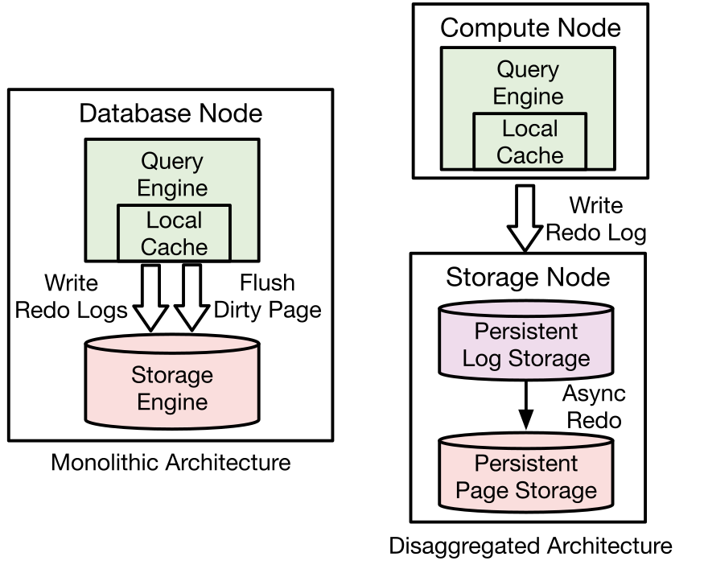

*Fig. 8. The comparison of monolithic architecture and disaggregation architecture on failure recovery.*

> *图 8。单体架构与分离式架构在故障恢复上的比较。*

> **图表中文解读：** 左侧单体数据库中，查询引擎、本地缓存和存储引擎位于同一节点；写入时重做日志和脏页都向下进入存储引擎。右侧分离架构把计算节点与存储节点解耦：计算节点只下发重做日志，存储节点先持久化日志，再异步重做到持久页面存储。箭头显示 redo 下推，因此计算节点恢复时无需重放全部页面。

2) Two-Tier ARIES in Buffer Layer: The exceptions in the buffer layer will not affect the durability and availability of the system. However, the disaggregation of cloud computation and memory services produces independent fault tolerance, which means the compute nodes and remote buffer are unlikely to fail simultaneously. Based on the above assumption, LegoBase [115] proposes the two-tier ARIES protocol to handle the failure of the compute node and the remote buffer. Such a protocol extends the traditional ARIES algorithm by creating checkpoints into two layers: 1) the remote buffer layer and 2) the persistent storage layer. The compute nodes and the remote buffer forms the first-tier ARIES. The network transmission cost of this part is small, and checkpoints can be recorded more frequently to reduce the failure recovery time. The first-tier protocol can deal with failure recovery in most cases, except for the case that the computing nodes and remote memory are abnormal simultaneously. In this case, the persistent storage in the second-tier ARIES will guarantee the worst-case failure recovery.

> 2）缓冲层两级 ARIES：缓冲层异常不会损害系统持久性和可用性。计算服务与内存服务解耦后能够独立容错，因此计算节点与远程缓冲区不太可能同时故障。基于这一假设，LegoBase [115] 提出两级 ARIES，分别处理计算节点和远程缓冲区故障。它把传统 ARIES 的检查点扩展到两层：1）远程缓冲层；2）持久存储层。计算节点与远程缓冲区组成第一级 ARIES，网络传输成本较小，可以更频繁地记录检查点以缩短恢复时间；它能处理绝大多数故障。只有计算节点与远程内存同时异常时，才由第二级 ARIES 的持久存储保证最坏情况下的恢复。

In summary, this algorithm is similar to the traditional ARIES one in the worst case. Nevertheless, it significantly reduces the recovery time in most cases with the help of remote shared buffer.

> 总体而言，该算法最坏情况下与传统 ARIES 相当，但借助远程共享缓冲区，能显著缩短大多数故障的恢复时间。

3) Recovery Optimization in Storage Layer: The storage layer is the foundation of the system’s durability and availability in cloud-native databases, which maintains multiple replicas simultaneously to ensure the extremely high-reliability requirements. Particularly, the storage layer has two types of optimization in failure recovery: 1) More replicas; and 2) Pre-failure recovery preparation.

> 3）存储层恢复优化：云原生数据库中，存储层是系统持久性和可用性的基础，同时维护多个副本，保证极高的可靠性要求。特别是，存储层在故障恢复方面有两类优化：1）更多的副本； 2) 故障前恢复准备。

The most basic way of improving fault tolerance is to increase the number of redundant replicas, e.g., doubling replicas in each available zone [95]. Moreover, it could expand the number of nodes in the log storage [27]. The main limitation of this method is that it introduces additional storage overhead. The second approach requires pre-preparing new standby nodes when partial replica anomalies are detected, e.g., the quorum set mechanism in Aurora [95]. Such a method has a smaller storage overhead but will occupy network bandwidth while generating backup nodes.

> 提高容错能力最直接的办法是增加冗余副本，例如把每个可用区中的副本数加倍 [95]，或扩充日志存储节点 [27]；其主要局限是额外的存储开销。第二种办法是在发现部分副本异常后，预先准备新的备用节点，Aurora 的 Quorum Set 机制 [95] 即属此类。它的存储开销较小，但创建备用节点时会占用网络带宽。

### E. HTAP

> E. HTAP

Traditional OLTP database systems are generally used for transactional workloads, so they have implemented many techniques to optimize the efficiency of transactional processing, e.g., row-format page organization and index structures. However, with the further development of data-intensive applications in recent years, it calls for real-time analysis requirements for the transactional databases, e.g., real-time fraud detection [79]. These demands drive the OLTP databases to add support for real-time analytical workloads [51], [74], [107], [108]. Regarding the cloud-native OLTP databases, there exists three types of HTAP optimization (shown in Fig. 9): 1) Dynamic storage format transformation in the compute layer; 2) Heterogeneous data replicas in the storage layer; and 3) Unified Table Storage. These techniques add particular optimizations for analytical workloads based on the original OLTP databases. Therefore, the ACID properties of the databases will not be affected.

> 传统 OLTP 数据库主要服务事务型工作负载，因而采用了行式页面组织、索引结构等大量技术来提高事务处理效率。但随着数据密集型应用不断发展，事务数据库也开始承担实时分析需求，例如实时欺诈检测 [79]。这些需求推动 OLTP 数据库支持实时分析工作负载 [51], [74], [107], [108]。云原生 OLTP 数据库主要有三类 HTAP 优化（见图 9）：1）在计算层动态转换存储格式；2）在存储层维护异构数据副本；3）采用统一表存储。它们是在原有 OLTP 数据库之上为分析工作负载增加专项优化，因此不会改变数据库的 ACID 属性。

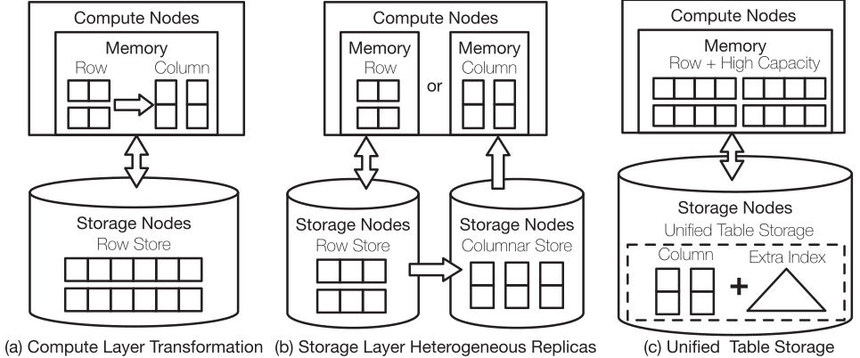

*Fig. 9. HTAP optimization.*

> *图 9。HTAP 优化。*

> **图表中文解读：** a) 在计算层把内存中的行格式转换为列格式；b) 在存储层保留行式副本和列式副本，并在二者之间复制；c) 统一表存储在计算层使用大容量行缓存，在存储节点内同时提供列存与额外索引。上下双箭头表示计算—存储访问，横向箭头表示异构副本同步。三者分别权衡转换开销、副本新鲜度和内存成本。

1) Storage Format Transformation: The first type is the dynamic storage format transformation in the compute layer. Conventionally, the pages of the storage layer in the OLTP databases organize records in row format. Such an organization method has obvious performance advantages in dealing with transactions and point queries. However, it is not suitable for analytical queries, which are mainly composed of large-scale aggregation and scan queries. AlloyDB [87] proposes a method to transform the row-format data to the columnar data in the compute nodes dynamically. Particularly, the optimizer analyzes the characteristics of the workload and predicts data that is likely to be frequently accessed in analytical workloads. Then, in the process of reading records from the storage layer, this part of the data is directly converted into the columnar format and kept in the cache. As a result, the analytical queries can directly use the data in the columnar format in the cache to speed up the query.

> 1）存储格式转换：第一类方法在计算层动态转换存储格式。传统 OLTP 数据库的存储层页面以行式格式组织记录，这种组织方式处理事务和点查询时性能出色，却不适合以大规模聚合和扫描为主的分析查询。AlloyDB [87] 提出在计算节点中动态地把行式数据转换为列式数据：优化器先分析工作负载特征，预测分析任务可能频繁访问的数据；从存储层读取记录时，再直接把这部分数据转成列式格式并留在缓存中。分析查询随后便可直接读取缓存中的列式数据，从而加快查询。

The above approach has two main challenges: 1) Storage format transformation will yield additional computing and storage overhead, so selecting which data to be converted is critical to the system performance. AlloyDB adopts the method of machine learning to assist in the work of data selection. However, few details have been revealed. 2) Storage format conversion should minimize the impact on the efficiency of transaction processing. Therefore, AlloyDB can keep data in both storage formats in the cache at the same time [87]. The optimizer chooses which type of data to scan based on workload type. However, it is challenging to select an optimal execution plan due to the exponential growth of the planning space.

> 上述方法面临两项主要挑战。1）格式转换会增加计算和存储开销，因此选择转换哪些数据对系统性能至关重要。AlloyDB 借助机器学习选择数据，但公开资料很少披露具体细节。2）格式转换必须尽量减小对事务处理效率的影响。为此，AlloyDB 可在缓存中同时保留两种格式的数据 [87]，再由优化器根据工作负载类型决定扫描哪一种。不过，计划空间会呈指数增长，选择最优执行计划并不容易。

2) Heterogeneous Data Replicas: The second type of method [20], [38] maintains heterogeneous data replicas in the storage layer. The main difference from the first method is that it persists the row-wise and columnar replicas in the storage layer rather than the compute layer. Particularly, when handling the transaction requests, the master node asynchronously replicates the logs to the secondary nodes for data synchronization.

> 2）异构数据副本：第二类方法 [20], [38] 在存储层维护异构数据副本。它与第一类方法的主要区别是：行式副本和列式副本持久化在存储层，而不是留在计算层。主节点处理事务请求时，会把日志异步复制到从节点以同步数据。

From the implementation perspective, the overall architecture do not need to be modified. The columnar format replicas are stored in read-only nodes, which are the learners of the row format replicas in the consensus protocol. Hence, it ensures the consistency of the heterogeneous replicas without influencing the origin OLTP system. Analytical workloads will be allocated with extra computing resources on demand according to the workload’s intensity, benefiting from cloud services’ elastic scheduling capability. Therefore, handling analytical workloads will not influence the computing resources for transaction processing.

> 从实现角度看，系统无须改动整体架构。列式副本存放在只读节点上，这些节点在共识协议中充当行式副本的学习者，因而可以在不影响原有 OLTP 系统的情况下保证异构副本一致。得益于云服务的弹性调度能力，系统可按分析负载强度另行分配计算资源，使分析处理不占用事务处理所需的计算资源。

From performance perspective, this method’s advantage is that it isolates the performance of transactional and analytical processing, meaning that both transactions and queries can be efficiently processed at the same time. Moreover, the excellent isolation facilitates the flexible scheduling of the heterogeneous workloads. However, since the columnar format replicas are the learners of row format ones, it must face the problem of data freshness due to the data transmission and transformation. That is, recent updates on the primary node must take certain time to be transferred and transformed to the columnar replica, causing analytical workloads to have a version lag compared to transactional workloads. Furthermore, this method adds additional computation and storage resources for the OLAP workload.

> 从性能角度看，这种方法隔离了事务处理与分析处理，使事务和查询能够同时高效执行；良好的隔离性也便于灵活调度异构工作负载。不过，列式副本作为行式副本的学习者，必须经过数据传输与格式转换，因此存在数据新鲜度问题：主节点的最新更新需要一段时间才能传至列式副本并完成转换，导致分析工作负载所见版本落后于事务工作负载。此外，该方法还要为 OLAP 工作负载投入额外的计算与存储资源。

3) Unified Table Storage: The third type of method is a unified table storage design for both OLTP and OLAP workloads, which is employed in the SingleStoreDB (S2DB) [78]. The main difference is that S2DB does not persist data into different layouts, which is often adopted in other HTAP systems. The unified table storage contains two parts: 1) In-memory row store. The in-memory storage is developed from its predecessor MemSQL [86], which implements a lock-free skiplist to index the rows and use the pessimistic concurrency control to avoid conflicts. This part is mainly used to improve the OLTP performance. 2) On-disk column store. WAL logs on the disk supports durability, which are written to the storage sequentially. Other data pages are organized in columnar format to optimize the aggregation and scan operations in analytical queries. Besides, it constructs the secondary and unique indexes on the column store, which provides the optimization on point-queries on the columnar store. In addition to the extra indexes on the disk, the key to maintain the high performance of S2DB is that the in-memory row store needs to cover most of the search requirements. Otherwise, on-disk column storage will degrade the performance in transaction processing compared with on-disk row store.

> 3）统一表存储：第三类方法为 OLTP 与 OLAP 工作负载设计统一的表存储，SingleStoreDB（S2DB）[78] 采用了这一方案。其他 HTAP 系统往往把数据持久化为多种布局，而 S2DB 并不这样做。其统一表存储由两部分组成。1）内存行存：该设计源于其前身 MemSQL [86]，使用无锁跳表为行建立索引，并以悲观并发控制避免冲突，主要用于提升 OLTP 性能。2）磁盘列存：WAL 按顺序写入磁盘以保证持久性，其余数据页则按列式格式组织，以优化分析查询中的聚合与扫描。系统还在列存之上建立二级索引和唯一索引，以加速点查询。除这些磁盘索引外，S2DB 保持高性能的关键还在于内存行存必须覆盖大多数查找请求；否则，相比磁盘行存，磁盘列存会拖慢事务处理。

Overall, this method does not need to copy data into different layouts, which saves the computation and I/O overhead caused by the data conversion. The limitation of this method is that maintaining the high cache hit rate is necessary for the high seeking performance which requires more memory resources.

> 总体而言，该方法不需要将数据复制到不同的布局中，从而节省了数据转换带来的计算和 I/O 开销。该方法的局限性在于，为了获得较高的查找性能，需要保持较高的缓存命中率，而这需要更多的内存资源。

## IV. CLOUD-NATIVE OLAP ARCHITECTURES

> 四、云原生 OLAP 架构

Cloud-native OLAP databases target at large-scale data analytics with elastic and scalable cloud services. Compared to share-nothing MPP data warehouses, cloud-native OLAP databases increase the elasticity with the disaggregation architecture and achieve high availability with the cloud storage and cross-region availability zones. We classify the cloud-native OLAP architectures into two categories: 1) disaggregated compute-storage OLAP architecture and 2) disaggregated compute-memory-storage OLAP architecture.

> 云原生 OLAP 数据库利用弹性、可扩展的云服务处理大规模数据分析。与无共享 MPP 数据仓库相比，它通过解耦架构增强弹性，并借助云存储和跨区域可用区实现高可用。本文把云原生 OLAP 架构分为两类：1）计算—存储分离式 OLAP 架构；2）计算—内存—存储分离式 OLAP 架构。

### A. Disaggregated Compute-Storage OLAP

> A. 计算存储分离式 OLAP

This category of databases [3], [15], [96] adopts a disaggregated compute-storage architecture, and the compute layer and the storage layer are connected to a high-speed network. As shown in Fig. 10(a), the compute layer consists of a service manager and compute clusters, the service manager provides a collection of services that manage the metadata, resources, queries, and security. The compute clusters perform the queries with elastic compute resources, and each worker node has the local SSD for caching.

> 此类数据库 [3], [15], [96] 采用计算与存储分离式架构，两层之间通过高速网络连接。如图 10（a）所示，计算层由服务管理器和计算集群组成：服务管理器提供元数据、资源、查询与安全管理等一组服务；计算集群利用弹性计算资源执行查询，每个工作节点都配有本地 SSD 作为缓存。

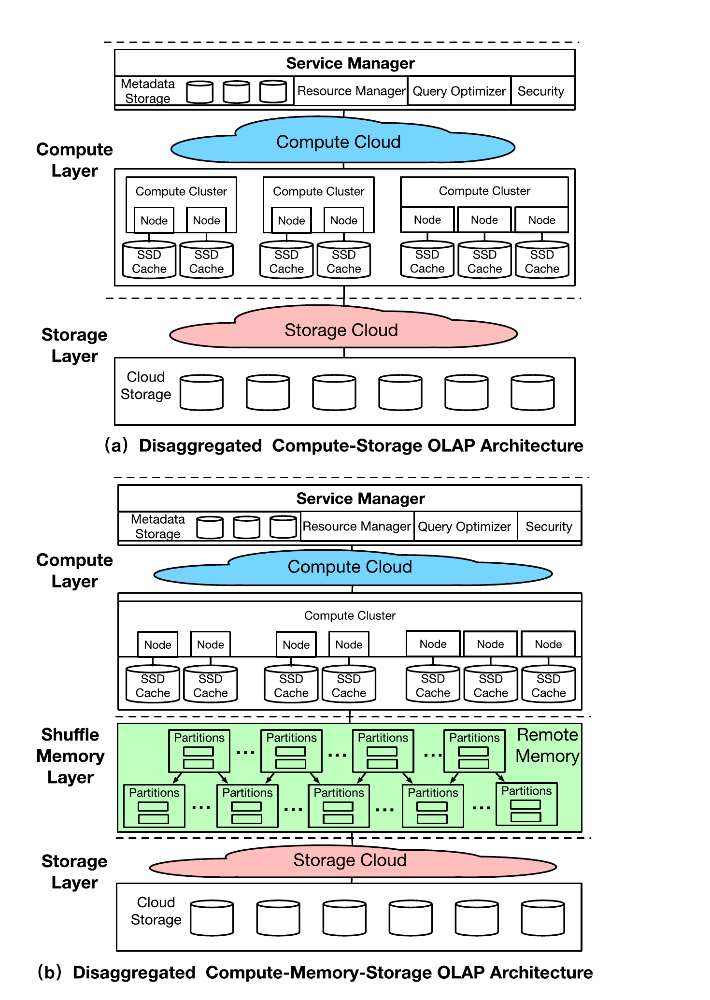

*Fig. 10. Architectures of cloud-native OLAP databases.*

> *图 10。云原生 OLAP 数据库架构。*

> **图表中文解读：** a) 两层架构：服务管理器负责元数据、资源、优化与安全，计算云内含多个带 SSD 缓存的计算集群，底部云存储持久化数据。b) 三层架构在相同计算层与存储层之间加入绿色 Shuffle 内存层，多个分区块承接阶段间数据交换。虚线划分层边界，省略号表示可横向扩展的节点/分区。

1) Motivation and Key Features: There are three motivations for such an architectural design. First, the traditional coupled architectures can only manage the resources at the instance level, and storage and compute resources need to be scaled independently for high elasticity. Second, the cloud service should tolerate cluster and node failures for high availability. Thus a disaggregated architecture can have smaller downtime as it can handle the failures of compute and storage nodes separately. Lastly, since the workloads are heterogeneous (either high I/O bandwidth or heavy computation), different hardware configurations could be used to compute the storage nodes. In summary, this architecture features i) disaggregation of compute and storage, ii) multi-tenancy and serverless, iii) elastic data warehouses, iv) local SSD caching, and v) cloud storage service, such as AWS S3 [80].

> 1）动机与主要特征：这种架构设计有三个动机。第一，传统耦合架构只能在实例级管理资源；为获得高弹性，存储资源和计算资源需要独立扩缩。第二，为实现高可用，云服务应能容忍集群和节点故障。分离式架构可分别处理计算节点与存储节点的故障，因而缩短停机时间。最后，工作负载具有异构性（或需要高 I/O 带宽，或需要密集计算），可为计算节点与存储节点采用不同的硬件配置。总之，该架构具有以下特征：i）计算与存储分离；ii）多租户与无服务器；iii）弹性数据仓库；iv）本地 SSD 缓存；v）AWS S3 [80] 等云存储服务。（译注：原文写作“different hardware configurations could be used to compute the storage nodes”，措辞疑误；译文按上下文理解为 compute and storage nodes。）

2) OLAP Workflow: Processing the queries in the cloud mainly involves three steps. First, the queries are parsed, rewritten, and optimized with the catalog statistics in the metadata storage. Second, the query plans are compiled and sent to the computer clusters for execution. The computer nodes perform the tasks with the local attached SSDs that can be treated as the local cache. Third, if the local cache is not hit, the data will be loaded from the cloud storage with the optional computation pushdown.

> 2）OLAP 工作流程：云端查询处理主要分为三步。首先，利用元数据存储中的目录统计信息解析、重写并优化查询。其次，编译查询计划并发送到计算集群执行；计算节点执行任务时，把本地直连 SSD 用作缓存。第三，本地缓存未命中时，从云存储加载数据，并可选择把计算下推至存储侧。

3) Pros and Cons: Compared to on-premise share-nothing OLAP architectures, the disaggregated compute-storage architecture has higher availability, where cluster and node failures can be recovered quickly because of the data replication across many availability zones and the scalable cloud service. It is more cost-efficient in two-fold. First, resources are virtualized and shared by multiple tenants. Second, serverless computing provides the pay-as-you-go model in a query-level granularity. Finally, since the compute and storage resources can be scheduled on demand individually, it provides better elasticity. However, the major limitation of the first architecture is that network traffic becomes the bottleneck when the local cache misses. Therefore, it needs to design efficient and effective caching and computation pushdown strategies.

> 3）优缺点：与本地部署的无共享 OLAP 架构相比，计算存储分离式架构可用性更高。数据跨多个可用区复制，加之云服务可扩展，因而能够快速恢复集群与节点故障。它从两方面提升成本效率：第一，资源经过虚拟化，可由多个租户共享；第二，无服务器计算可按查询粒度提供按使用量付费模式。计算资源与存储资源还能分别按需调度，因此弹性更强。不过，这类架构的主要局限是本地缓存未命中时网络流量会成为瓶颈，所以需要设计高效且有效的缓存与计算下推策略。

4) Representatives: Two representatives are Snowflake [25], [96] and Redshift [70]. Snowflake relies on cloud services to manage multiple virtual warehouses, workloads, security, and metadata. In the compute layer, it provides multiple VWs(Virtual Warehouse), where each VW is a cluster and consists of multiple EC2 instances. Normally, one query is executed in one VW for one tenant, and each VW can be started or shut down at any point. For data storage, it combines local ephemeral storage and cloud storage(e.g., AWS S3) to store data. Another representative is Redshift [15], [70], which was initially an MPP data warehouse and then transformed into a cloud-native database. It also contains multiple compute clusters, each with a leader node as the coordinator, with multiple compute nodes. Particularly, it has an acceleration layer with various components. First, the spectrum nodes are customized for querying semi-structured data using partiQL [5]. The advanced query accelerator (AQUA) [70] service leverages FPGAs [72] to accelerate query processing. The compilation as a service (CaaS) [15] service is for caching the code generation. The data of each cluster is managed in the Redshift managed storage (RMS) backed by the Amazon S3.

> 4）代表系统：Snowflake [25], [96] 和 Redshift [70] 是这一架构的两个代表。Snowflake 依靠云服务管理多个虚拟仓库、工作负载、安全与元数据。计算层提供多个虚拟仓库（VW），每个 VW 都是由多个 EC2 实例组成的集群。通常，单个租户的一条查询在一个 VW 中执行，而 VW 可随时启停。存储方面，Snowflake 结合本地临时存储与 AWS S3 等云存储保存数据。Redshift [15], [70] 最初是 MPP 数据仓库，后来演进为云原生数据库。它同样包含多个计算集群，每个集群由一个充当协调器的领导节点和多个计算节点组成，并设有包含多种组件的加速层：Spectrum 节点经过定制，可使用 PartiQL [5] 查询半结构化数据；高级查询加速器 AQUA [70] 利用 FPGA [72] 加速查询处理；编译即服务 CaaS [15] 则缓存代码生成结果。每个集群的数据由以 Amazon S3 为后端的 Redshift 托管存储（RMS）管理。

### B. Disaggregated Compute-Memory-Storage OLAP

> B. 计算—内存—存储分离式 OLAP

As shown in Fig. 10(b), the second architecture consists of three layers, a compute layer, a shuffle memory layer, and a storage layer. Similar to the first architecture, the compute layer has a service manager and a compute cluster. The main difference is that the compute cluster schedules the jobs for the workers in a centralized fashion. Moreover, it contains a shared memory pool to accelerate the shuffle process of complex operations such as aggregations and joins.

> 如图 10（b）所示，第二种架构由计算层、Shuffle 内存层和存储层三部分组成。与第一种架构类似，计算层也包含服务管理器和计算集群；不同之处在于，计算集群以集中方式向工作节点调度作业。系统还设有共享内存池，用于加速聚合、连接等复杂操作中的 Shuffle 过程。

1) Motivation and Key features: There are three motivations. First, as memory is an expensive resource, it needs to be disaggregated and scaled independently for high elasticity. Second, it is preferable to achieve centralized scheduling, enabling better resource utilization for query processing. Third, when it comes to complex and costly workloads, it is challenging to cope with large intermediate results as the high I/O overhead is the bottleneck. In summary, this architecture features i) disaggregation of compute, memory, and storage, ii) shuffle memory layer for speeding up complex operations such as joins and aggregations, iii) multi-tenancy and serverless computing, iv) local SSD caching, and v) cloud storage service.

> 1）动机与主要特征：这一设计有三个动机。首先，内存资源昂贵，需要将其解耦并独立扩缩，才能获得高弹性。其次，集中式调度有助于提高查询处理的资源利用率。第三，复杂且代价高昂的工作负载会产生大量中间结果，高昂的 I/O 开销因而成为瓶颈。概括而言，该架构具有五项特征：i）计算、内存与存储相互分离；ii）以 Shuffle 内存层加速连接、聚合等复杂操作；iii）多租户和无服务器计算；iv）本地 SSD 缓存；v）云存储服务。

2) OLAP Workflow: For query processing, this architecture processes the data in parallel with multiple stages. Specifically, the worker nodes load the columnar data (e.g., ORC and Parquet files) from the shared storage, apply the filters locally, and send the data to the next stage. Then the system performs multiple shuffle operations to aggregate and sort the partial data by keys.

> 2）OLAP 工作流程：查询被划分为多个阶段并行处理。工作节点从共享存储加载 ORC、Parquet 等列式数据，在本地执行过滤，再把数据发送到下一阶段。随后，系统通过多次 Shuffle，按键聚合并排序各部分数据。

3) Pros and Cons: Compared to the on-premise share-nothing OLAP architectures, the disaggregated compute-memory-storage architecture has higher throughput, where the shuffle memory tier can significantly reduce I/O overhead by avoiding writing intermediate results to the disks. It has higher resource utilization as compute resources are virtualized and scheduled in a centralized way. Finally, since the compute, memory, and storage resources can be scheduled individually, it provides better elasticity. However, the major limitation of the second architecture is that shuffle memory tier could incur a high cost, so it needs to design efficient and effective pushdown and scheduling algorithms to reduce the data loaded to memory.

> 3）优缺点：与本地部署的无共享 OLAP 架构相比，计算—内存—存储分离式架构吞吐量更高，因为 Shuffle 内存层避免把中间结果写入磁盘，能显著降低 I/O 开销。计算资源经过虚拟化并接受集中调度，资源利用率也更高。计算、内存与存储资源还可分别调度，因此弹性更强。不过，Shuffle 内存层可能带来高昂成本，需要用高效的下推与调度算法减少载入内存的数据量。

4) Representatives: A representative that adopts the three-tier architecture is BigQuery [59] which is built on the Dremel query engine [60]. It introduces a shared memory tier to accelerate the shuffle processing of the distributed joins, which significantly reduces the latency by avoiding writing and reading the intermediate results from disks. Moreover, it supports semi-structured data querying based on the Dremel query engine. Regarding storage management, it relies on the colossus file system [31] with the capacitor format [59] that is similar to Parquet and ORC. For query processing, it adopts the producer-consumer model, where the producers in each worker generate partitions and send them to the in-memory nodes for shuffling, then the consumers combine the received partitions and do the operations locally. Another representative is Databricks Lakehouse [104], which support data analytic over the data lakes with Spark SQL [14] directly. It has also developed an ACID table storage layer over the cloud object store, called Delta lake [13], and a vectorized query engine, called Photon [18], which can integrate with the Spark SQL runtime.

> 4）代表系统：采用三层架构的代表系统是构建在 Dremel 查询引擎 [60] 之上的 BigQuery [59]。它引入共享内存层来加速分布式连接的 Shuffle 处理，避免把中间结果写入磁盘后再读出，从而显著降低延迟；Dremel 查询引擎还支持半结构化数据查询。存储管理方面，BigQuery 依赖 Colossus 文件系统 [31]，并采用与 Parquet、ORC 类似的 Capacitor 格式 [59]。查询处理方面，它使用生产者—消费者模型：每个工作节点中的生产者生成分区并发送至内存节点执行 Shuffle，消费者再合并收到的分区并在本地执行操作。另一个代表系统是 Databricks Lakehouse [104]，它支持直接使用 Spark SQL [14] 分析数据湖；此外还在云对象存储之上开发了名为 Delta Lake [13] 的 ACID 表存储层，以及可与 Spark SQL 运行时集成的向量化查询引擎 Photon [18]。

### C. Summary of the Cloud-Native OLAP Architectures

> C. 云原生 OLAP 架构小结

Table III presents a comparison of the cloud-native OLAP architectures concerning computation, storage, throughput, elasticity, isolation, and cost. The first category has the disaggregated compute-storage architecture. For the computation, it employs multiple clusters with various worker nodes. For the storage, it relies on local SSD caching and cloud storage. It has a high throughput based on scalable cloud computing. Its elasticity is also high because of the disaggregated architecture. Since the clusters are isolated and a query is typically only executed in one cluster, it has excellent performance isolation. By embracing the multi-tenancy with the elastic cloud service, it saves a large amount of cost for the cloud provider. The second category adopts the disaggregated compute-memory-storage architecture. For the computation, it employs multiple worker nodes with a shuffle memory layer. For the storage, it leverages the shared memory pool and the cloud storage. As the memory layer is disaggregated for shuffling, it has excellent throughput and elasticity. However, it leads to high costs due to the high price of in-memory computing. In addition, compared to the first category, it has lower performance isolation due to the shared memory pool.

> 表 III 从计算、存储、吞吐量、弹性、隔离性和成本几个方面比较云原生 OLAP 架构。第一类采用计算存储分离式架构：计算侧由多个集群及其中的多个工作节点组成；存储侧依赖本地 SSD 缓存与云存储。可扩展云计算使其具备高吞吐量，分离式架构也带来高弹性。集群彼此隔离，且一条查询通常只在一个集群中执行，因此性能隔离性优异。多租户与弹性云服务相结合，还能为云提供商节省大量成本。第二类采用计算—内存—存储分离式架构：计算侧由多个工作节点和 Shuffle 内存层组成，存储侧利用共享内存池与云存储。独立的 Shuffle 内存层带来优异的吞吐量和弹性，但内存计算价格较高，成本也随之上升；与第一类相比，共享内存池还会降低性能隔离性。

**Table III. A comparison of two cloud-native OLAP architectures.**

> **表 III。两种云原生 OLAP 架构的比较。**

| OLAP Architecture OLAP 架构 | Computation 计算 | Storage 存储 | Throughput 吞吐量 | Elasticity 弹性 | Isolation 隔离性 | Cost 成本 |
| --- | --- | --- | --- | --- | --- | --- |
| Disaggregated Compute-Storage 计算存储分离 | Multiple Clusters with Worker Nodes 含工作节点的多集群 | Local SSD Caching + Cloud Storage 本地 SSD 缓存 + 云存储 | High 高 | High 高 | Excellent 优 | Medium 中 |
| Disaggregated Compute-Memory-Storage 计算—内存—存储分离 | Multiple Worker Nodes with Shuffle Layer 含 Shuffle 层的多工作节点 | Shared Memory Pool + Cloud Storage 共享内存池 + 云存储 | Excellent 优 | Excellent 优 | High 高 | High 高 |

> **图表中文解读：** 独立 Shuffle 内存层把吞吐量与弹性从高推到优，但隔离性从优降到高、成本从中升到高。换言之，共享内存池减少中间结果 I/O，却引入资源共享和昂贵内存的代价。

## V. CLOUD-NATIVE OLAP TECHNIQUES

> 五、云原生 OLAP 技术

This section introduces the key techniques of cloud-native OLAP databases in detail. Table IV summarizes five types of key techniques, including storage management, query processing, serverless computing, data protection, and machine learning. It also summarizes their pros and cons.

> 本节详细介绍云原生 OLAP 数据库的关键技术。表 IV 汇总了存储管理、查询处理、无服务器计算、数据保护和机器学习五类技术及其优缺点。

**Table IV. An overview of key techniques of cloud-native OLAP databases.**

> **表 IV。云原生 OLAP 数据库关键技术概览。**

| Technique Type 技术类型 | Main Approach 主要方法 | Cloud Database 云数据库 | Pros 优点 | Cons 缺点 |
| --- | --- | --- | --- | --- |
| Storage Management 存储管理 | Metadata Store Based Optimization 基于元数据存储的优化 | Snowflake [25] | High Throughput 高吞吐 | Extra Cost 额外成本 |
| Storage Management 存储管理 | Join Key-based Data Partitioning 基于连接键的数据分区 | Redshift [70] | High Efficiency 高效率 | Cost Oblivious 成本不敏感 |
| Storage Management 存储管理 | Columnar Format for Semi-Structured Data 半结构化数据的列式格式 | BigQuery [59] | High Throughput 高吞吐 | Storage Overhead 存储开销 |
| Query Processing 查询处理 | Columnar Scan with Pushdown 带下推的列式扫描 | PushdownDB [103] | Low Cost 低成本 | No Cache 无缓存 |
| Query Processing 查询处理 | Scan with Caching and Pushdown 缓存与下推扫描 | FlexPushdownDB [102] | High Throughput 高吞吐 | Low Scalability 可扩展性低 |
| Query Processing 查询处理 | Scan with Shuffle Memory Tier Shuffle 内存层扫描 | BigQuery [59] | High Throughput 高吞吐 | High Cost 成本高 |
| Serverless Computing 无服务器计算 | Functions as a Service 函数即服务 | Starling [73] | High Elasticity 高弹性 | Stateless Functions 函数无状态 |
| Serverless Computing 无服务器计算 | Serverless Databases 无服务器数据库 | Athena [16] | High Throughput 高吞吐 | High Cost 成本高 |
| Data Protection 数据保护 | Key-based Data Protection 基于密钥的数据保护 | Snowflake [96] | High Scalability 高可扩展性 | Decrypted Access 解密访问 |
| Data Protection 数据保护 | Enclave-based Data Protection 基于安全飞地（Enclave）的数据保护 | Azure [11] | High Security 高安全性 | Low Efficiency 效率低 |
| Machine Learning 机器学习 | ML-enabled Cloud Data Service ML 赋能的云数据服务 | Redshift [70] | High Quality 高质量 | Low Adaptation 适应性低 |
| Machine Learning 机器学习 | SQL-based ML Pipeline 基于 SQL 的 ML 流水线 | SageMaker [55] | High Elasticity 高弹性 | Training Overhead 训练开销 |

> **图表中文解读：** 五大类 12 种方案覆盖存储、查询、无服务器、安全与机器学习。总体规律是以云端弹性和吞吐量换取额外成本或状态管理复杂度：下推成本低却不利用缓存；缓存提高吞吐量，却受容量约束；Shuffle 内存吞吐量高，但价格昂贵；密钥方案扩展性好，却要在处理时解密数据；安全飞地（Enclave）保护更强，效率则相对受限。

As shown in Fig. 12, storage management is the cornerstone of the cloud data service, which focuses on organizing and partitioning the data for optimizing the queries in the cloud. Query processing aims to handle queries with the local cache and the elastic cloud storage. By taking as input the SQL requests, serverless computing responds to each query by provisioning and scaling the resources on demand. Data protection relies on software-based or hardware-enabled techniques to protect data from stealing and tampering throughout the cloud service. Machine learning techniques include two parts: employing AI techniques to optimize the service quality of cloud-native DBMS (AI4DB) and harnessing the power of cloud-native DBMS to support AI.

> 如图 12 所示，存储管理是云数据服务的基石，负责组织和划分数据，以优化云端查询；查询处理结合本地缓存与弹性云存储执行查询；无服务器计算接收 SQL 请求，为每条查询按需预配并扩缩资源；数据保护依靠软件或硬件技术，在整个云服务链路中防止数据遭窃取或篡改。机器学习相关技术则有两个方向：用 AI 优化云原生 DBMS 的服务质量（AI4DB），以及借助云原生 DBMS 支持 AI 工作负载。

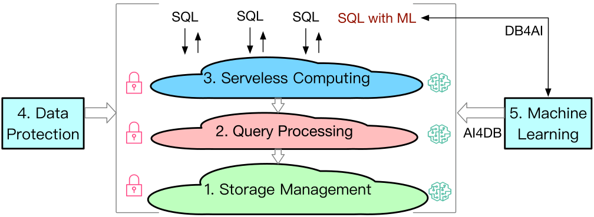

*Fig. 12. An overview of cloud-native OLAP techniques.*

> *图 12。云原生 OLAP 技术概览。*

> **图表中文解读：** 核心纵向链是存储管理→查询处理→无服务器计算；顶部 SQL 箭头表示查询进入/返回，SQL with ML 经 DB4AI 路径把数据库用于 AI。右侧 Machine Learning 通过 AI4DB 反向优化三层，左侧 Data Protection 的箭头覆盖整条链；锁图标表示各层都需安全保护。

### A. Storage Management

> A. 存储管理

We introduce three techniques of storage management: 1) metadata store based optimization; 2) join key based data partitioning; and 3) column store for semi-structured data.

> 本节介绍三种存储管理技术：1）基于元数据存储的优化；2）基于连接键的数据分区；3）面向半结构化数据的列式存储。

1) Optimization With Metadata Store: For cloud-native OLAP databases, metadata is managed in the layer of cloud service separately, which contains information for schema, data version, location, statistics, logs, etc. With metadata, the cloud databases can enable three optimizations: pruning, zero-copy cloning, and time traveling. Particularly, pruning means that the scanning data can be pruned without touching the underlying cloud storage; zero-copy cloning refers to cloning data without creating new copies; time traveling enables querying the historical data based on MVCC, which is similar to the flashback query in RDBMS. Fig. 11 depicts an example of each technique. Consider a customer table T, which is partitioned into two files and saved in the storage. The metadata file stores the range of uid and name for each file. Suppose a SQL query that requests the customer data with uid = 2. The metadata can be used to prune the data of file 2 because only file 1 covers the range of uid of 2. For the DDL operation that creates table T2 cloning from table T, the cloud database simply creates a new metadata file M2 from M1 without making physical copies of table files, namely, the zero-copy cloning technique (Note that at the time of cloning, file 2 has been deleted). Time-traveling technique utilizes timestamp information in the metadata. As shown in Fig. 11(c), the first two SQL queries find the data with an absolute and relative timestamp, respectively; the third query scans a versioned table with a specified statement ID.

> 1）基于元数据存储的优化：对于云原生 OLAP 数据库，元数据由云服务层独立管理，包含模式、数据版本、位置、统计信息和日志等。借助元数据，云数据库可实现三种优化：剪枝、零复制克隆和时间旅行。具体而言，剪枝可在不访问底层云存储的情况下排除无需扫描的数据；零复制克隆是在不创建新物理副本的情况下克隆数据；时间旅行则基于 MVCC 查询历史数据，类似 RDBMS 的闪回查询。图 11 分别给出了三种技术的示例。设客户表 T 被划分为两个文件并保存在存储中，元数据文件记录每个文件的 uid 与 name 取值范围。若 SQL 查询请求 uid = 2 的客户数据，由于只有文件 1 覆盖 uid = 2，元数据可将文件 2 剪除。对于从表 T 克隆创建表 T2 的 DDL 操作，云数据库只需根据 M1 创建新的元数据文件 M2，无需复制表文件，这就是零复制克隆（注意：执行克隆时，文件 2 已被删除）。时间旅行技术使用元数据中的时间戳信息。如图 11(c) 所示，前两个 SQL 查询分别按绝对时间戳和相对时间戳查找数据；第三个查询则按指定语句 ID 扫描表的某一历史版本。

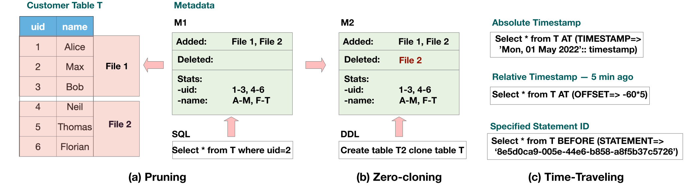

*Fig. 11. Three key techniques based on metadata store.*

> *图 11。基于元数据存储的三项关键技术。*

> **图表中文解读：** a) 剪枝：Customer Table T 被分为 File 1/2，元数据 M1 的 uid/name 范围让 uid=2 查询只扫描 File 1；b) 零复制克隆：DDL 只从 M1 生成 M2，并把 File 2 标为删除，不复制底层文件；c) 时间旅行：绝对时间戳、相对偏移和语句 ID 三种查询都由版本元数据定位历史快照。箭头表示 SQL/DDL 对元数据而非数据文件的操作。

For the pros, metadata-based optimization can largely improve query performance. However, the main challenge of metadata management are 1) how to serve the metadata request with super low latency; 2) how to provide the scalability of the metadata service.

> 基于元数据的优化能大幅提升查询性能，但元数据管理也面临两项主要挑战：1）如何以极低延迟响应元数据请求；2）如何提高元数据服务的可扩展性。

2) Data Partitioning With Key Selection: Although cloud databases can always read persisted data from the cloud storage, the network traffic could become the bottleneck. Hence, how to organize the ephemeral data in the local cluster is also essential. To improve the query performance, one of the most important issues is to select the partition keys for large tables to distribute the data shards across the compute nodes. Take a schema in Fig. 13(a) as an example, it has a customer table and an order table, and these two tables can be joined on the country field. By partitioning both tables on the country field and placing the data partitions with the same hash value to the same node, it enables the join operation locally and can minimize network communication. However, selecting an optimal partition key set for the cloud databases is a non-trivial problem. First, existing partitioning solutions in distributed databases rely on tailored cost models [37] to which the customers have no access. Second, the cost models are inaccurate due to the uniform and independent assumption. There exist two solutions for cloud-native databases. The first one is the join graph approach [71] proposed by Redshift. Its basic idea is to build a multi-join graph based on a query workload. Then it performs random walks over the graph to select partition keys. In a join graph, each node represents a table; each edge denotes a join between two tables; the join weight on the edges denotes the join number from the queries. By randomly walking the join graph, it greedily selects the partition keys with the largest weight to collocate the joins in the same nodes. For the pros, it has high efficiency as it can efficiently build the join graph and can search for a solution in the graph. For the cons, it neglects the cost of different types of joins, leading to a suboptimal solution. The second method is to leverage deep reinforcement learning (DRL) [37] for selecting the partition keys. DRL can explore column combinations as partition keys and learns from the partitioning feedback, e.g., the reward. Such a method extracts partition features as a vector of tables, query frequencies, and foreign keys. Then it uses DQN models to partition the tables for a workload. To migrate the learned models to new workloads, it trains a cluster of Deep Q-Network models on typical workloads. Then it picks one with the most similar features for a new workload.

> 2）通过键选择进行数据分区：云数据库虽然随时可以从云存储读取持久化数据，但网络流量可能成为瓶颈，因此如何组织本地集群中的临时数据同样重要。要提高查询性能，一个关键问题是为大表选择分区键，把数据分片分布到各计算节点。以图 13（a）的模式为例，客户表与订单表可按 country 字段连接；如果两张表都按 country 分区，并把哈希值相同的分区放在同一节点，连接便可在本地完成，从而尽量减少网络通信。不过，为云数据库选择最优分区键集合并非易事。首先，分布式数据库的既有分区方案依赖专门定制的成本模型 [37]，客户无法访问这些模型；其次，成本模型往往假设数据均匀且相互独立，估算并不准确。云原生数据库有两类解决方案。第一类是 Redshift 提出的连接图方法 [71]：它根据查询工作负载构建多重连接图，再在图上随机游走以选择分区键。图中每个节点代表一张表，每条边代表两表之间的一种连接，边权表示查询中的连接次数。算法通过随机游走，贪心选择权重最大的分区键，让相关连接同置于同一节点。它能高效构图并在图上搜索方案，但忽略了不同连接类型的成本，所得方案可能并非最优。第二类方法使用深度强化学习（DRL）[37] 选择分区键。DRL 探索可作为分区键的列组合，并从奖励等分区反馈中学习；它把表、查询频率和外键等分区特征编码为向量，再用 DQN 模型为给定工作负载划分表。为把已学模型迁移到新工作负载，系统先在典型工作负载上训练一组深度 Q 网络，再为新工作负载选择特征最相近的模型。

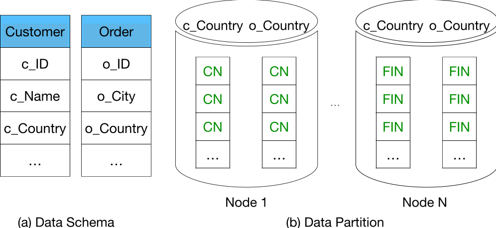

*Fig. 13. An example of data partition.*

> *图 13。数据分区示例。*

> **图表中文解读：** 左侧模式图给出 Customer 与 Order 两表，公共连接键是 c_Country/o_Country。右侧按 country 哈希后，CN 行被同置到 Node 1，FIN 行被同置到 Node N；圆柱表示节点内分区，竖向单元格表示记录。结论是选择连接键作分区键可把连接局部化并减少网络 Shuffle。

The major problem of the DRL-based method is the high training overhead. Since it needs to train the agent in an online fashion, it still consumes a large amount of time to make the learning process converge.

> DRL 方法的主要问题是训练开销高。智能体需要在线训练，学习过程仍要耗费大量时间才能收敛。

3) Columnar Format for Semi-Structured Data: Representing semi-structured data in a columnar format can speed up the query processing over the nested data [109], [110]. As semi-structured data such as HTML and JSON files are growing rapidly, it is crucial to manage a large amount of nested data in the cloud. There exist two major methods for encoding semi-structured data. The first method encodes the documents with lengths and presences of the fields, where the length implies the number of occurrences of each repeated field and the presence uses a boolean value to indicate whether or not an optional field is null. Two columnar formats, ORC and Apache Arrow [59], adopt such a representation. The second method encodes the documents with repetition levels and definition levels. Particularly, the repetition level tells which repeated field is changed compared to the previous record and the definition level indicates the length of the repeated or optional fields. Two columnar formats, Parquet and Capacitor [59], adopt such a representation.

> 3）半结构化数据的列式格式：用列式格式表示半结构化数据，可以加快嵌套数据的查询处理 [109], [110]。HTML、JSON 文件等半结构化数据快速增长，使云端管理海量嵌套数据变得至关重要。半结构化数据主要有两种编码方式。第一种以字段长度和存在性编码文档：长度表示各重复字段的出现次数，存在性则用布尔值表示可选字段是否为空；ORC 和 Apache Arrow [59] 采用这种表示。第二种以重复级别和定义级别编码文档：重复级别指出相比上一条记录哪个重复字段发生了变化，定义级别则表示重复字段或可选字段的长度；Parquet 和 Capacitor [59] 采用这种表示。

There is a trade-off between the file size and query performance. To read a nested field, the first method requires access to its ancestor information, as only the ancestor field tracks the nested information. Nevertheless, it has a smaller file size as the information is denormalized in the separated tables. The second method can directly access the child fields without reading other tables as it repeates the ancestor information for each field. However, it has a larger file size due to the redundant information about the common ancestors. Besides the schema-based encoding method, there is a schema-less method [25] that can infer the data type and cluster the frequently-accessed paths automatically.

> 文件大小与查询性能之间存在权衡。第一种方法只有祖先字段记录嵌套信息，因此读取嵌套字段时必须访问其祖先信息；不过，信息被反规范化到彼此分离的表中，文件更小。第二种方法为每个字段重复记录祖先信息，无须读取其他表即可直接访问子字段；代价是共同祖先信息存在冗余，文件更大。除基于模式的编码外，还有一种无模式方法 [25]，能够推断数据类型，并自动聚类频繁访问的路径。（译注：原文将 repeats 拼作“repeates”；此处保留。）

### B. Query Processing

> B. 查询处理

We introduce three types of query processing, including 1) columnar scan with pushdown [70], [96], [103], 2) columnar scan with caching and pushdown [102], and 3) columnar scan with shuffle memory pool [59]. As shown in Fig. 14, the first type loads the pushdown results from the cloud storage. The second one merges the results from both the pushdown results and the local cache. The third one loads the pushdown results from the cloud storage, then performs the queries using the shuffle memory tier.

> 本节介绍三类查询处理方法：1）带下推的列式扫描 [70], [96], [103]；2）带缓存与下推的列式扫描 [102]；3）使用 Shuffle 内存池的列式扫描 [59]。如图 14 所示，第一类从云存储加载下推结果；第二类合并下推结果与本地缓存中的结果；第三类先从云存储加载下推结果，再借助 Shuffle 内存层执行查询。

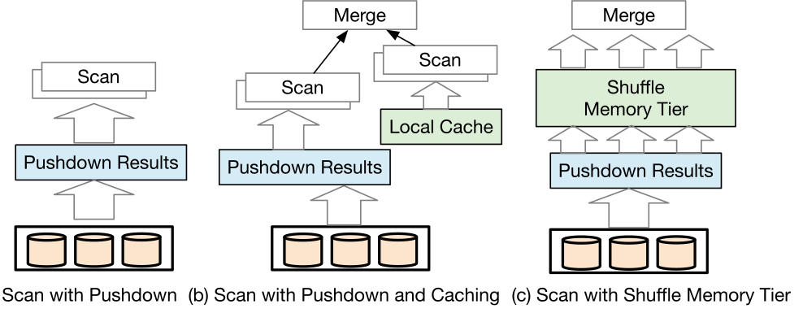

*Fig. 14. Three key techniques for query processing.*

> *图 14。三种查询处理关键技术。*

> **图表中文解读：** a) 仅下推：云存储先算出 Pushdown Results，再由计算节点扫描；b) 下推加缓存：扫描同时读取下推结果和 Local Cache，最后 Merge；c) Shuffle 内存层：下推结果进入绿色内存层做分布式交换后再 Merge。箭头向上表示数据从存储到算子的流动，三个方案依次增加缓存/内存复用能力与成本。

1) Columnar Scan With Pushdown: This type of query processing [20], [103], [106] aims to reduce network traffic by pushing down the computation to the storage side. A representative is Amazon Simple Storage Service (S3), which has exposed the Select API, by which users can specify the bucket and key of the S3 objects, then the unwanted data can be filtered with simple computations, such as selection and projection. When it comes to highly-selective operators, S3 Select can reduce a large amount of data in the storage side, thereby saving the computation cost on the compute layer. However, S3 Select does not mean that it is always cheaper than computing on normal EC2 nodes due to the more expensive pricing model for scanning (\$0.002/GB) and returning data (\$0.0007/GB).

> 1）带下推的列式扫描：这类查询处理 [20], [103], [106] 把计算下推到存储侧，以减少网络流量。Amazon Simple Storage Service（S3）是一个代表：它公开 Select API，用户可指定 S3 对象的 bucket 与 key，再用选择、投影等简单计算过滤无关数据。面对高选择性算子时，S3 Select 能在存储侧大幅削减数据量，从而节省计算层成本。不过，由于扫描（0.002 美元/GB）和返回数据（0.0007 美元/GB）的单价更高，S3 Select 并不总比普通 EC2 节点上的计算便宜。

PushdownDB [103] has studied the relation between the pushdown performance and its price. It particularly extended the S3 Select API to support more operations, including index scan, hash-join, group by, and top-k. For instance, it designed an offset index table based on S3 Select, which has the form of |indexed value | first_byte_offset | last_byte_offset|. Finding the objects involves two phases. First, the S3 objects are filtered using the index table and the offset of the target data is returned. Second, the data is fetched using the cheaper HTTP API instead of the S3 Select API. To push down the join, it builds a bloom filter for the join key of the small table, then adopts a substring-based matching strategy to perform the join using S3 Select.

> PushdownDB [103] 研究了下推性能与价格之间的关系，并扩展 S3 Select API，使其支持索引扫描、哈希连接、group by 和 top-k 等更多操作。例如，它基于 S3 Select 设计了形如 `| indexed value | first_byte_offset | last_byte_offset |` 的偏移量索引表。查找对象分为两步：先用索引表过滤 S3 对象并返回目标数据的偏移量，再改用价格更低的 HTTP API 获取数据，而不再调用 S3 Select API。下推连接时，系统先为小表的连接键构建布隆过滤器，再用基于子字符串的匹配策略通过 S3 Select 完成连接。

Overall, these pushdown operations can have a lower cost and higher throughput regarding highly selective operators. Otherwise, it could have no payoffs due to the pushdown cost. Another drawback of the pushdown-only methods is that they make no use of the cache data.

> 总体而言，对高选择性算子进行下推，可以降低成本并提高吞吐量；选择性不高时，下推本身的成本却可能使其得不偿失。纯下推方法的另一项缺点是没有利用缓存数据。

2) Columnar Scan With Caching Pushdown: The second type of query processing is to scan the data with both caching and pushdown. The main idea is that since the local cache is more efficient than pushdown, it can be combined to further speed up the queries. FlexPushdown [102] is a representative of such a technique. Specifically, it consists of two parts: hybrid execution and cache replacement. For hybrid execution, it organizes the columnar data with segments and transforms the original query plan to a separable query plan with the consideration of the local cache and computation pushdown. For instance, suppose a scan query retrieves two attributes A and B, if all the segments of A are cached, these data can be scanned using local cache while the filters on segments of B are pushed down to the cloud storage, and finally the segments are merged at the compute nodes. Regarding cache replacement, it employs a weighted LFU strategy to manage the cache data. Intuitively, the larger the pushdown computation cost is, the larger weight the related data has for caching. As a result, it relies on a benefit-based caching framework by calculating a segment’s weight w(s) = (tnet (s) + tscan (s) + tcompute (s))/size(s), where tnet (s) is the time of network transfer, tscan (s) is the time of data scanning, and tcompute (s)) is the time of computation from the query. For the pros, it has high throughput as it can utilize local cache. However, it has low scalability due to the limited capacity of local cache.

> 2）带缓存与下推的列式扫描：第二类查询处理同时使用缓存和下推扫描数据。其核心思想是：本地缓存比下推更高效，把二者结合起来可进一步加速查询。FlexPushdown [102] 是这类技术的代表，由混合执行与缓存替换两部分组成。混合执行把列式数据组织为多个段，并综合考虑本地缓存与计算下推，把原始查询计划转换为可拆分的查询计划。例如，假设一次扫描要读取属性 A 和 B，且 A 的所有数据段都已缓存，那么系统可从本地缓存扫描 A，同时把 B 各数据段上的过滤操作下推至云存储，最后在计算节点合并两部分结果。缓存替换方面，系统用加权 LFU 策略管理缓存；直观地说，下推某段数据的计算成本越高，这段数据越值得缓存，权重也就越大。为此，它用收益驱动的缓存框架计算数据段权重：w(s) = (tnet(s) + tscan(s) + tcompute(s))/size(s)，其中 tnet(s) 为网络传输时间，tscan(s) 为数据扫描时间，tcompute(s) 为查询计算时间。该方法能利用本地缓存，因而吞吐量高；但本地缓存容量有限，可扩展性较低。（译注：原文在 `tcompute (s))` 处多了一个右括号，译文按公式含义表述。）

3) Columnar Scan With Shuffle Memory Tier: The third category uses a shuffle memory to perform queries. This technique is associated with the second disaggregated OLAP architecture. BigQuery [59] is a representative, which follows the map-reduce-style processing paradigm that partitions and processes the data with multiple phases. It adopts the producer-consumer execution model, where producers in each worker generate partitions and send them to the in-memory nodes for shuffling. Consumers in the next stage asynchronously combine the partitions and do the operations locally. For the shuffle phase of (n-1), workers use the consumers to receive partitions and use producers to generate new partitions. Then the distributed in-memory nodes conduct the shuffling. Regarding the shuffle phase of (n+1), the workers do the same operations with new consumers and producers. Finally, a single worker merges the results and returns to the coordinator. For the pros, it has high throughput as the shuffle phase is conducted using the shared memory. For the cons, it incurs high costs due to high pricing of in-memory computing.

> 3）使用 Shuffle 内存层的列式扫描：第三类方法使用 Shuffle 内存执行查询，与第二种计算—内存—存储分离式 OLAP 架构相对应。代表系统 BigQuery [59] 遵循 MapReduce 风格的处理范式，分多个阶段划分并处理数据。它采用生产者—消费者执行模型：每个工作节点中的生产者生成分区，并将其发送到内存节点进行 Shuffle；下一阶段的消费者异步合并这些分区，并在本地执行操作。在第 n−1 个 Shuffle 阶段，工作节点由消费者接收分区，再由生产者生成新分区，随后由分布式内存节点执行 Shuffle；在第 n+1 个 Shuffle 阶段，工作节点使用新的消费者和生产者执行同样的操作。最后，单个工作节点合并结果并返回协调器。其优点是共享内存执行 Shuffle，吞吐量高；缺点是内存计算定价较高，成本也高。

### C. Serverless Computing in Cloud Databases

> C. 云数据库中的无服务器计算

Serverless computing is expected to be the next generation of cloud computing [84], which allows the programmers to write functions and code in the cloud without caring about server management, including resource provision and scaling, fault tolerance, and system monitoring. By combining cloud databases with serverless computing, users can enjoy the auto-scaling feature and pay for the used resources in a query granularity. Generally speaking, there are two implementations of serverless computing in cloud databases (see Fig. 15). The first type is i) serverless with functions as a service (FaaS) [64], [73], [91], where queries are adaptively executed by invoking the cloud function services. The second type is ii) serverless databases [16], [77], which automate the process of provisioning and scaling for the queries at the level of the database instance.

> 无服务器计算有望成为下一代云计算 [84]。程序员只需在云端编写函数和代码，无须操心资源预配与扩缩、容错、系统监控等服务器管理事务。把云数据库与无服务器计算结合后，用户既能获得自动扩缩能力，也能按查询粒度为实际使用的资源付费。云数据库中的无服务器计算通常有两种实现（见图 15）：i）函数即服务（FaaS）[64], [73], [91]，通过调用云函数服务自适应地执行查询；ii）无服务器数据库 [16], [77]，在数据库实例层自动完成查询所需资源的预配与扩缩。

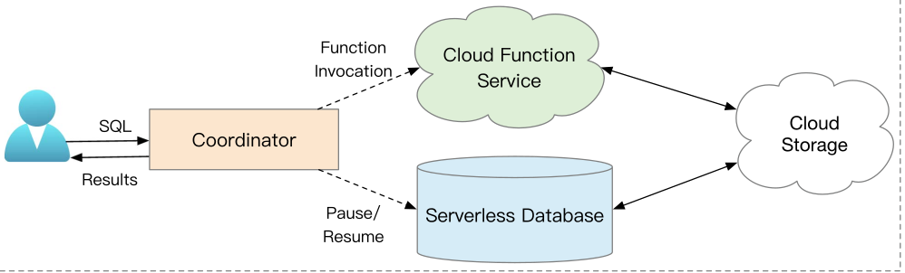

*Fig. 15. An overview of serverless computing.*

> *图 15。无服务器计算概览。*

> **图表中文解读：** 用户以 SQL 请求协调器并接收结果。协调器沿上方实线调用 Cloud Function Service，或沿下方虚线对 Serverless Database 执行暂停/恢复；两种执行载体都与 Cloud Storage 双向交换数据。实线/虚线区分函数调用与实例生命周期控制，说明两类无服务器实现共享同一存储底座。

1) Functions as a Service: The first type of serverless computing technique [64], [73], [91] relies on serverless functions to process the queries. Particularly, the function as a service (FaaS) such as AWS Lambda [9], Azure Functions [62], Google Cloud Functions [33], allows to invoke multiple functions in a few milliseconds, and users are charged only for used resources. With FaaS, users could invoke many parallel jobs to scan, join, and aggregate tables in the cloud storage. As shown in Fig. 15, the workflow is as follows: users submit the SQL queries to a coordinator, which compiles the query and uploads the code to a cloud function service. Then, the coordinator schedules the tasks by provisioning resources and invoking them through the function service. Afterward, the function service executes the tasks in the cloud.

> 1）函数即服务：第一类无服务器计算技术 [64], [73], [91] 依靠无服务器函数处理查询。AWS Lambda [9]、Azure Functions [62] 和 Google Cloud Functions [33] 等函数即服务（FaaS）可在数毫秒内调用多个函数，用户只需为实际使用的资源付费。借助 FaaS，用户可调用大量并行作业，对云存储中的表执行扫描、连接与聚合。如图 15 所示，流程如下：用户向协调器提交 SQL 查询；协调器编译查询并把代码上传至云函数服务，随后预配资源并通过函数服务调用任务；最后由函数服务在云端执行任务。

This line of work is mainly driven by the research community. Two representatives are Starling [73] and Lambada [64], both of which build a query engine on top of the cloud function and storage service. Starling [73] implements the coordinator, which generates the C++ code for the specified query plan and invokes the AWS Lambda functions. The intermediate results are exchanged with the AWS cloud storage, i.e., S3. It makes two optimizations. First, it uses tuned models to detect stragglers, which increase the overall latency of parallel query processing. Then it invokes functions with duplicate computation. Second, it employs function-based combiners to reduce the overhead of large shuffling. Lambada [64] implements a part of TPC-H queries [29] using a Python front-end, and the code is generated based on its own compilation and execution framework. It uses three types of cloud storage service to exchange states: i) Amazon S3 for a large amount of data, ii) DynamoDB [88] for a small portion of data, and iii) Amazon Simple Queuing System (SQS) [5] for passing messages such as query results. To address the limitations of slow invocations of multiple tasks, it uses the two-level invocations that enable the first-level workers to invoke the second-level workers internally. Apart from the query processing, there exist works that focus on FaaS-based data analytics with specific programming languages (e.g., Python), such as Cloudburst [91] and general serverless computing runtime like NightCore [41].

> 这一研究路线主要由学术界推动，代表系统 Starling [73] 和 Lambada [64] 都在云函数与存储服务之上构建查询引擎。Starling [73] 实现了协调器，为指定查询计划生成 C++ 代码并调用 AWS Lambda 函数；中间结果通过 AWS 云存储 S3 交换。它有两项优化：第一，使用调优后的模型检测会增加并行查询总体延迟的慢任务，再调用函数执行冗余计算；第二，使用基于函数的合并器，降低大规模 Shuffle 的开销。Lambada [64] 通过 Python 前端实现部分 TPC-H 查询 [29]，并基于自有编译执行框架生成代码。它使用三类云存储服务交换状态：i）Amazon S3 保存大量数据；ii）DynamoDB [88] 保存少量数据；iii）Amazon Simple Queuing System（SQS）[5] 传递查询结果等消息。为缓解批量任务调用缓慢的问题，它采用两级调用，让第一级工作节点在内部调用第二级工作节点。除查询处理外，还有 Cloudburst [91] 等面向特定编程语言（如 Python）的 FaaS 数据分析工作，以及 NightCore [41] 等通用无服务器计算运行时。

There are two main challenges for FaaS-based query processing, First, since functions are stateless and cannot communicate with each other, their states are hard to keep and exchange. Simply using cloud storage often incurs large latency. Thus it calls for new methods for stateful serverless computing. There exists a number of works focusing on developing a unified storage service, including Pocket [45], Boki [40], Anna [99], and Jiffy [44]. However, they target general programming languages, and it is unclear how they can be applied and optimized for query processing. Second, it is challenging for users to decide how many resources (e.g., the number and size of the functions) should be obtained before performing the task [64], [73]. Therefore, how to balance the trade-off between cost and performance remains critical [43].

> 基于 FaaS 的查询处理面临两项主要挑战。第一，函数无状态且无法相互通信，状态难以保存和交换；简单借助云存储往往延迟很高，因此需要新的有状态无服务器计算方法。Pocket [45]、Boki [40]、Anna [99] 和 Jiffy [44] 等工作致力于开发统一存储服务，但它们面向通用编程语言，尚不清楚如何用于查询处理并针对它优化。第二，用户很难在执行任务前确定应申请多少资源（例如函数数量与规模）[64], [73]。因此，如何权衡成本与性能仍是关键问题 [43]。

2) Serverless Databases: The second type of approach [76], [77], [85] supports serverless computing with database instances by dynamically scheduling the resources. This line of work is mainly led by commercial cloud data services, such as Aurora Serverless [6], Athena Serverless [16], and Azure Serverless [61]. These services have a tailored resource unit for scheduling. For instance, Aurora Serverless V2 [7] defines Aurora Capacity Unit (ACU), where the minimum unit is 0.5*ACU, and each ACU has 2 GiB memory (the CPU and network is the same as an instance’s). Depending on the input size and the predicated resources, BigQuery [59] and AutoExecutor [85] can vary the number of executors for performing the tasks from multiple tenants. Four key operations in serverless computing are provisioning, pausing, resuming, and scaling, where provisioning aims to allocate the resources based on the issued queries; pausing stops the service tentatively and charges no fee for users; resuming starts the service again with the provisioned resources; scaling allows for smoothly scaling up/down when the access pattern of workloads change. For provisioning and scaling, the main problem is to predict the required resources for a query workload. However, it is a challenging problem as even an expert can hardly estimate the resources needed for a given query [85]. For pausing and resuming, the main problem is to predict the arrival pattern of the workload. The main challenge is starting a database is expensive after a pause period, and resources could be wasted for a proactive resume period. Therefore, an adaptive model that can predict the pause/resume patterns is needed [76], [77].

> 2）无服务器数据库：第二类方法 [76], [77], [85] 通过动态调度资源，以数据库实例支持无服务器计算。这一路线主要由 Aurora Serverless [6]、Athena Serverless [16] 和 Azure Serverless [61] 等商业云数据服务推动。这些服务定义了专用的资源调度单位。例如，Aurora Serverless V2 [7] 定义 Aurora Capacity Unit（ACU），最小调度单位为 0.5 ACU；每个 ACU 配有 2 GiB 内存，CPU 和网络资源与一个实例相同。BigQuery [59] 和 AutoExecutor [85] 可根据输入规模和预测的资源需求，改变执行多租户任务的执行器数量。无服务器计算有四项关键操作：预配、暂停、恢复和扩缩容。预配根据提交的查询分配资源；暂停暂时停止服务且不向用户收费；恢复以已预配资源重新启动服务；扩缩容则在工作负载访问模式变化时平滑增减资源。预配与扩缩容的核心问题是预测查询工作负载所需资源，而即使专家也难以准确估计某个查询的资源需求 [85]。暂停与恢复的核心问题是预测工作负载到达模式：暂停后启动数据库代价高，过早恢复又会浪费资源。因此，需要能预测暂停/恢复模式的自适应模型 [76], [77]。（译注：原文使用“predicated resources”，按上下文疑为 predicted resources；此处保留英文原貌。）

### D. Data Protection

> D. 数据保护

Security is one of the most important issues in cloud databases. There are two main types of data protection techniques: software-based data protection [25] and hardware-based data protection [11].

> 安全性是云数据库中最重要的问题之一。数据保护技术主要有两种类型：基于软件的数据保护 [25] 和基于硬件的数据保护 [11]。

1) Key-Based Data Protection: The first type of security method relies on key management services such as AWS CloudHSM [8] to manage the encryption keys for users. A representative is Snowflake [25], which utilizes an encryption key hierarchy that has four levels: root keys, account keys, table keys, and file keys. The keys are managed with life cycles and would be rotated and re-keyed periodically to ensure security. For instance, each key is rotated once per month, and data is re-keyed once per year in Snowflake. There are two main challenges for software-based data protection. First, data is decrypted for query processing. Second, the cloud vendors may be untrusted, so the keys may be stolen.

> 1）基于密钥的数据保护：第一类安全方法依靠 AWS CloudHSM [8] 等密钥管理服务，为用户管理加密密钥。Snowflake [25] 是代表系统，其加密密钥层次分为根密钥、账户密钥、表密钥和文件密钥四级。系统按生命周期管理密钥，定期轮换密钥并使用新密钥重新加密数据，以保证安全。例如，Snowflake 每月轮换一次密钥，每年为数据更换一次密钥。基于软件的数据保护面临两项主要挑战：第一，查询处理时仍须解密数据；第二，云供应商可能不可信，密钥有遭窃取的风险。

2) Enclave-Based Data Protection: The hardware-based data protection utilizes customized hardware, e.g., Enclave [10], for data protection. An enclave is a kind of Trusted Execution Environment(TEE), which has a virtual address space of a process that cannot be accessed by other processes, including operating system. Moreover, it assumes both database systems and cloud providers are untrusted, so it adopts a bring-your-own-key model, where only the data owners have the keys to access the encrypted data. Fig. 16 shows the design of enclave-based query processing: 1) the user requests a key from the key provider for the protected data (e.g., at a column granularity); 2) then the user issues a query “select * from T where value = @v” with the obtained key; 3) the attestation service verifies the key; 4) notifies the result to the encrypted database; 5) the DBMS fetches the data and invokes the enclave for evaluation, and enclave will decrypt the data to plaintext and evaluates the filter; and 6) finally the query results are sent back to the user. There are two main challenges for hardware-based data protection. The first challenge is how to perform the computation over ciphertext directly, particularly for the range queries [2]. The second challenge is how to improve the efficiency and the scalability of the enclave due to its limited computing resources and space.

> 2）基于安全飞地（Enclave）的数据保护：基于硬件的数据保护使用安全飞地（Enclave）[10] 等定制硬件。安全飞地是一种可信执行环境（TEE），它为进程提供连操作系统在内的其他进程均无法访问的虚拟地址空间。这种方法同时假设数据库系统与云提供商都不可信，因而采用用户自带密钥模型：只有数据所有者持有访问加密数据的密钥。图 16 展示了基于安全飞地的查询处理流程：1）用户向密钥提供方申请受保护数据的密钥，例如列粒度密钥；2）用户携带所得密钥发出查询“select * from T where value = @v”；3）证明服务验证密钥；4）把验证结果通知加密数据库；5）DBMS 读取数据并调用安全飞地求值，飞地将数据解密成明文并计算过滤条件；6）最后把查询结果返回用户。基于硬件的数据保护面临两项主要挑战：第一，如何直接在密文上计算，尤其是处理范围查询 [2]；第二，安全飞地的计算资源与空间有限，如何提高其效率和可扩展性。

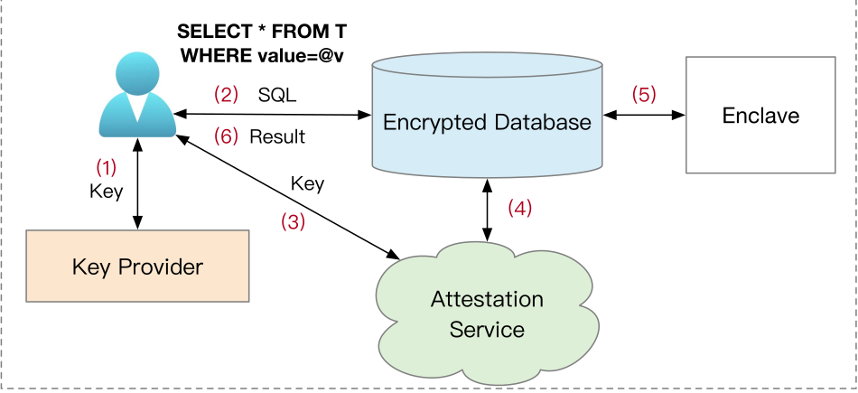

*Fig. 16. Enclave-based query processing.*

> *图 16。基于安全飞地（Enclave）的查询处理。*

> **图表中文解读：** 编号箭头给出完整协议：①用户向密钥提供方取得密钥；②携带密钥发出 SQL；③把密钥送至证明服务验证；④将验证结果通知加密数据库；⑤数据库把受保护的计算交给安全飞地；⑥结果返回用户。圆柱表示加密数据库，安全飞地矩形框表示受信执行边界，云形证明服务在密钥与执行环境之间建立信任。

### E. Machine Learning

> E. 机器学习

Intersecting cloud-native databases with machine learning (ML) is another major trend for modern data-intensive applications. On the one hand, machine learning can benefit cloud-native databases by optimizing various database tasks [4], [15], [28], [37], [54], [100], [113], [114]. On the other hand, cloud-native databases can facilitate machine learning techniques with SQL-enabled ML pipelines [26], [30], [55].

> 云原生数据库与机器学习（ML）的结合，是现代数据密集型应用的另一项重要趋势。一方面，机器学习可优化多种数据库任务 [4], [15], [28], [37], [54], [100], [113], [114]，提升云原生数据库的能力；另一方面，云原生数据库也可通过支持 SQL 的机器学习流水线 [26], [30], [55] 为机器学习提供基础设施。

1) ML-Enabled Cloud Data Service: Advanced ML techniques have been widely studied in the setting of cloud database tasks such as workload management [15], partition-key selection [37], knob tuning [4], [19], [54], [112], buffer size tuning [49], and index tuning [100]. For instance, AutoWLM [15] tunes the workload concurrency by predicting the memory consumption and execution time for the workload. It featurizes the query plans and trains an XGBoost [23] model for each cluster to predict the query performance. Ottertune [4] is an automatic knob tuning service that leverages Gaussian Process (GP) to tune the database configurations interactively. Further, CDBTune [112] and Qtune [54] employ the deep reinforcement learning (DRL) [56] to search for the optimal knobs in the large exponential space. Further, Hunter [19] combines the traditional ML techniques such as Genetic algorithm (GA) with DRL to address the cold-start problem, then it improves the performance based on multiple cloned database instances. Wu et al. [100] employs Monte Carlo Search Tree (MCTS) to build the indexes with the given budget of what-if calls. There are two main challenges for the ML-based cloud data service. First, most of the services are optimized independently. Thus it is hard to optimize the overall performance due to the interaction of the tuned components. Second, the machine learning models will become inaccurate due to the data drift or workload drift, and it is challenging to migrate a trained model to a new workload and dataset effectively and efficiently.

> 1）机器学习赋能的云数据服务：先进机器学习技术已广泛用于工作负载管理 [15]、分区键选择 [37]、数据库参数调优 [4], [19], [54], [112]、缓冲区大小调优 [49] 和索引调优 [100] 等云数据库任务。例如，AutoWLM [15] 通过预测工作负载的内存消耗和执行时间来调节工作负载并发度；它将查询计划特征化，并为每个集群训练一个 XGBoost [23] 模型来预测查询性能。Ottertune [4] 是自动参数调优服务，利用高斯过程（GP）交互式调整数据库配置。CDBTune [112] 和 Qtune [54] 使用深度强化学习（DRL）[56]，在指数级的巨大空间中搜索最优参数。Hunter [19] 把遗传算法（GA）等传统机器学习技术与 DRL 结合起来解决冷启动问题，再借助多个克隆数据库实例提升性能。Wu 等人 [100] 使用蒙特卡洛树搜索（MCTS），在给定 what-if 调用预算下构建索引。基于机器学习的云数据服务有两项主要挑战：第一，多数服务各自独立优化，已调组件之间又会相互影响，因此难以优化整体性能；第二，数据漂移或工作负载漂移会使模型失准，如何有效且高效地把已训练模型迁移到新的工作负载与数据集仍很困难。

2) SQL-Based ML Pipeline: Using cloud-native databases for machine learning brings many benefits. First, it supports an SQL-enabled machine-learning pipeline backed with high elasticity and availability. Second, it brings the model to the data without additional data transferring overhead. Third, it supports AutoML [42], [82], [101] for the users, such as automatic model selection, training, and hyper-parameter tuning. For instance, Sagemaker [26], [55] supports the syntax of “Create Model” to train a model automatically, then it can make predictions with the SQL function. In order to perform ML inference locally, it invokes the Neo service to compile the model, and Neo transforms the machine learning models into inference code and brings the models to the databases. BigQueryML [30] also enables a similar functionality, where users can leverage SQL tools to import, build and invoke advanced ML models based on TensorFlow [57].

> 2）基于 SQL 的机器学习流水线：使用云原生数据库开展机器学习有多项好处。第一，它提供由高弹性和高可用性支撑、支持 SQL 的机器学习流水线。第二，它把模型带到数据侧，无需额外传输数据。第三，它为用户提供 AutoML [42], [82], [101] 能力，例如自动模型选择、训练和超参数调优。SageMaker [26], [55] 例如支持以“Create Model”语法自动训练模型，再通过 SQL 函数进行预测。为在数据库本地执行机器学习推理，它调用 Neo 服务编译模型；Neo 把机器学习模型转换为推理代码，并将模型带到数据库侧。BigQueryML [30] 提供类似能力，用户可通过 SQL 工具导入、构建和调用基于 TensorFlow [57] 的先进机器学习模型。

## VI. RELATED WORK

> 六、相关工作

There is a general lack of a comprehensive survey on the cloud-native database as it is a relatively new field for both industry and academia. Particularly, Sakr [81] reviewed cloud-hosting databases. The survey discussed several topics, such as NoSQL databases, Database-as-a-Service (DaaS), and virtualized database servers. It also presented several future directions, including true elasticity, data consistency, live migration, SLA management, transaction support, and benchmarking. Mansouri [58] surveyed the storage management techniques in the cloud, namely, Storage as a Service (StaaS). The survey introduced cloud storage based on the intra-cloud and inter-cloud storage architectures. It also covered the topics of the data model, data replication, data consistency, transaction, and data management cost. Gartner [75] compared different cloud database systems from the business perspective. By weighing the business value with a set of evaluation criteria such as service quality and market record, the report classified the cloud DBMSs or cloud vendors into four roles in a Magic Quadrant, including niche players, visionaries, challengers, and leaders. It also discussed the strengths and weaknesses of each cloud DBMS. Narasayya et al. [65], [66] reviewed the cloud data services. The survey discussed various topics, including workloads and architectures, multi-tenancy and virtualization technologies, SLAs and pricing models, resource management, efficiency, and cost, as well as serverless databases.

> 云原生数据库对工业界和学术界而言都是相对较新的领域，目前普遍缺少全面综述。Sakr [81] 综述了云托管数据库，讨论 NoSQL 数据库、数据库即服务（DaaS）、虚拟化数据库服务器等主题，并提出真正的弹性、数据一致性、在线迁移、SLA 管理、事务支持和基准测试等未来方向。Mansouri [58] 综述了云端存储管理技术，即存储即服务（StaaS），从云内与跨云存储架构出发介绍云存储，并覆盖数据模型、数据复制、数据一致性、事务和数据管理成本。Gartner [75] 从商业视角比较不同云数据库系统，使用服务质量、市场表现等评价标准权衡商业价值，在魔力象限中把云 DBMS 或云供应商分为利基参与者、远见者、挑战者和领导者四类，并讨论各云 DBMS 的优势与不足。Narasayya 等人 [65], [66] 综述了云数据服务，讨论工作负载与架构、多租户与虚拟化技术、SLA 与定价模型、资源管理、效率与成本，以及无服务器数据库。

Our work is different from existing surveys in three aspects. First, we classify the cloud-native databases into two types, OLTP-oriented and OLAP-oriented. We give a taxonomy for each type based on their disaggregation architecture and summarize their pros and cons. Therefore, our taxonomy is based on the architectures rather than the specific product. Second, our work covers a wide spectrum of advanced techniques developed by state-of-the-art cloud-native databases, including HTAP techniques, serverless computing, and machine learning. These update-to-date techniques are rarely reviewed and summarized in the previous work. Third, we give new future directions that existing works have not been discussed.

> 本文与现有综述有三方面不同。第一，我们把云原生数据库分为 OLTP 型和 OLAP 型，并依据各自的分离式架构建立分类体系、总结优缺点；因此，分类依据是架构，而不是具体产品。第二，本文覆盖先进云原生数据库发展出的广泛前沿技术，包括 HTAP、无服务器计算和机器学习；以往工作很少综述并总结这些最新技术。第三，本文提出了现有工作尚未讨论的新未来方向。（译注：原文写作“update-to-date techniques”，疑为 up-to-date techniques；此处保留英文原貌。）

## VII. OPEN PROBLEMS AND OPPORTUNITIES

> 七、开放问题与机遇

Multi-Writer Architecture: Existing cloud databases only support a single writer and multiple readers, which may cause a large Recovery Time Objective (RTO) if the primary node has any failure. Besides, such an architecture has a limited capacity for highly-concurrent write transactions due to the single read-write (RW) node. Thus, it calls for cloud-native multi-writer techniques that can scale out write capabilities. Two promising architectures are 1) the share-storage architecture [97], [105] and 2) coherent cache architecture [69], where the former supports multiple RW nodes accessing the same storage with an RDMA network, and the latter enables the multi-writer with a coherent cache layer. The challenge is to handle skewed write as the storage layer will accept write requests from multiple RW nodes [116].

> 多写者架构：现有云数据库只支持单写者、多读者；一旦主节点故障，恢复时间目标（RTO）可能很长。此外，单个读写（RW）节点也限制了系统处理高并发写事务的能力，因此需要可横向扩展写能力的云原生多写者技术。两种有前景的架构是：1）共享存储架构 [97], [105]，支持多个 RW 节点通过 RDMA 网络访问同一存储；2）一致性缓存架构 [69]，通过一致性缓存层支持多写者。其挑战在于处理写倾斜，因为存储层将同时接收多个 RW 节点的写请求 [116]。

Fine-Grained Serverless: Existing elastic databases mainly support provisioning the resources for a query with coarse-grained serverless (VMs or specific units, e.g., Aurora Capacity Unit). However, they are not cost-efficient and may suffer from the high latency of elastic scaling. One promising direction is to combine the advantage of FaaS-based Serverless and databases, where the former has a lower starting cost that can be used to address the cold-start problem, and the latter has a better performance. The challenge is to balance the trade-off between cost and performance.

> 细粒度无服务器：现有弹性数据库主要以粗粒度无服务器资源（VM 或 Aurora Capacity Unit 等特定单位）为查询预配资源，但成本效率不高，还可能承受弹性扩缩容的高延迟。一个有前景的方向是结合基于 FaaS 的无服务器计算与数据库：前者启动成本更低，可用来缓解冷启动问题；后者性能更好。挑战在于权衡成本与性能。

SLA-Aware Cloud-Native HTAP: Existing cloud-native HTAP solutions only care about how to improve the HTAP performance, which may not be cost-efficient. For instance, transforming the row data to column data may accelerate query processing, but it also brings the higher dollar cost of memory computing. Two main challenges are 1) how to organize the data storage to achieve the best performance with the satisfied SLA [66], [81], and 2) how to judiciously schedule the resources for OLTP and OLAP workloads with SLA-aware optimization.

> SLA 感知的云原生 HTAP：现有云原生 HTAP 方案只关注提升 HTAP 性能，未必具备成本效率。例如，把行式数据转换为列式数据可能加速查询处理，却也会增加内存计算的费用。两项主要挑战是：1）如何组织数据存储，在满足 SLA [66], [81] 的前提下取得最佳性能；2）如何通过 SLA 感知优化，审慎调度 OLTP 与 OLAP 工作负载的资源。

Multi-Cloud Data Service: As multi-cloud has become available, more and more data-intensive applications can benefit from using multi-cloud data services. However, it also poses new challenges to cloud-native databases with higher complexity. First, it is challenging to provide high availability as the data is stored across the cloud vendor. Thus, data migration in real time can largely affect availability [39]. Second, it is hard to maintain data consistency between the cloud vendors when the data is updated frequently. Third, it is challenging to have a cost-efficient execution plan for query processing as different cloud vendors have different pricing models. Even for the different regions in the same cloud vendor, the offering resources are disparate. A promising direction is sky computing [92], which aims to build an abstraction on top of inter-cloud services. For example, Skyplane [39] has been developed to facilitate data migration across clouds, and the SkyPilot [90] framework has supported the ML workload using multiple cloud providers such as AWS [5], Google Cloud [32], and Azure Cloud [17] simultaneously.

> 多云数据服务：随着多云环境逐渐普及，越来越多的数据密集型应用可从多云数据服务中受益，但这也给云原生数据库带来更复杂的新挑战。第一，数据分布在不同云供应商之间，高可用难以保证，实时数据迁移会显著影响可用性 [39]。第二，数据频繁更新时，难以维持不同云供应商之间的数据一致性。第三，不同云供应商采用不同定价模型，即便同一供应商的不同区域所提供资源也不相同，因此很难为查询处理制定兼具成本效率的执行计划。一个有前景的方向是 Sky computing（天空计算）[92]，旨在跨云服务之上建立统一抽象。例如，Skyplane [39] 用于促进跨云数据迁移；SkyPilot [90] 框架已支持同时使用 AWS [5]、Google Cloud [32] 和 Azure Cloud [17] 等多个云提供商来运行机器学习工作负载。

## VIII. CONCLUSION

> 八、结论

This paper offers a comprehensive survey of cloud-native databases. We summarize the state-of-the-art cloud-native architectures and techniques. We introduce three types of cloud-native OLTP architectures including 1) disaggregated compute-storage OLTP architecture, 2) disaggregated compute-log-storage OLTP Architecture, and 3) disaggregated compute-buffer-storage OLTP architecture. We also introduced their key techniques including data placement, storage layer consistency, compute layer consistency, multi-layer recovery, and HTAP optimization. Furthermore, we present two types of cloud-native OLAP architectures, including two-layered compute-storage OLAP architecture and three-layered compute-memory-storage OLAP architecture. We also summarize their key techniques regarding storage management, query processing, serverless computing, data protection, and machine learning. Finally, we discuss the research challenges and opportunities for cloud-native databases, including multiple write architecture, fine-grained serverless, SLA-aware cloud-native HTAP techniques, and multi-cloud data service.

> 本文对云原生数据库进行了全面综述，总结了最新的云原生架构与技术。本文介绍三类云原生 OLTP 架构：1）计算存储分离式 OLTP 架构；2）计算—日志—存储分离式 OLTP 架构；3）计算—缓冲—存储分离式 OLTP 架构，并讨论其数据放置、存储层一致性、计算层一致性、多层恢复和 HTAP 优化等关键技术。本文还介绍两类云原生 OLAP 架构，即两层计算存储分离式 OLAP 架构和三层计算—内存—存储分离式 OLAP 架构，并总结其存储管理、查询处理、无服务器计算、数据保护和机器学习技术。最后，本文讨论云原生数据库的研究挑战与机遇，包括多写者架构、细粒度无服务器、SLA 感知的云原生 HTAP 技术和多云数据服务。（译注：原文结论使用“multiple write architecture”，与前文 multi-writer architecture 表述不一致；此处保留英文原貌。）

## REFERENCES

> 参考文献

[1] D. Abadi et al., “The seattle report on database research,” Commun. ACM, vol. 65, no. 8, pp. 72–79, 2022.

> [1] D. Abadi et al.，“西雅图数据库研究报告”，Commun. ACM，第 65 卷，第 8 期，页 72–79，2022 年。

[2] D. Agrawal, A. E. Abbadi, F. Emekçi, and A. Metwally, “Database management as a service: Challenges and opportunities,” in Proc. IEEE 25th Int. Conf. Data Eng., 2009, pp. 1709–1716.

> [2] D. Agrawal, A. E. Abbadi, F. Emekçi, and A. Metwally，“数据库管理即服务：挑战与机遇”，载于 Proc. IEEE 25th Int. Conf. Data Eng.，2009 年，页 1709–1716。

[3] J. Aguilar-Saborit et al., “POLARIS: The distributed SQL engine in azure synapse,” Proc. VLDB Endowment, vol. 13, no. 12, pp. 3204–3216, 2020.

> [3] J. Aguilar-Saborit et al.，“POLARIS：Azure Synapse 中的分布式 SQL 引擎”，Proc. VLDB Endowment，第 13 卷，第 12 期，页 3204–3216，2020 年。

[4] D. V. Aken, A. Pavlo, G. J. Gordon, and B. Zhang, “Automatic database management system tuning through large-scale machine learning,” in Proc. ACM Int. Conf. Manage. Data, 2017, pp. 1009–1024.

> [4] D. V. Aken, A. Pavlo, G. J. Gordon, and B. Zhang，“通过大规模机器学习自动调优数据库管理系统”，载于 Proc. ACM Int. Conf. Manage. Data，2017 年，页 1009–1024。

[5] Amazon Web Service, “Amazon Web Services,” 2023. [Online]. Available: https://aws.amazon.com/

> [5] Amazon Web Service，“Amazon Web Services”，2023 年。[在线]，地址： https://aws.amazon.com/

[6] Amazon Web Service, “Aurora Serverless,” 2023. [Online]. Available: https://aws.amazon.com/rds/aurora/serverless/

> [6] Amazon Web Service，“Aurora Serverless”，2023 年。[在线]，地址： https://aws.amazon.com/rds/aurora/serverless/

[7] Amazon Web Service, “Aurora Serverless V2,” 2023. [Online]. Available: https://docs.aws.amazon.com/AmazonRDS/latest/AuroraUserGuide/aurora-serverless-v2.html

> [7] Amazon Web Service，“Aurora Serverless V2”，2023 年。[在线]，地址： https://docs.aws.amazon.com/AmazonRDS/latest/AuroraUserGuide/aurora-serverless-v2.html

[8] Amazon Web Service, “AWS CloudHSM,” 2023. [Online]. Available: https://aws.amazon.com/cloudhsm/

> [8] Amazon Web Service，“AWS CloudHSM”，2023 年。[在线]，地址： https://aws.amazon.com/cloudhsm/

[9] Amazon Web Service, “AWS Lambda,” 2023. [Online]. Available: https://aws.amazon.com/lambda/

> [9] Amazon Web Service，“AWS Lambda”，2023 年。[在线]，地址： https://aws.amazon.com/lambda/

[10] P. Antonopoulos et al., “Azure SQL database always encrypted,” in Proc. ACM Int. Conf. Manage. Data, 2020, pp. 1511–1525.

> [10] P. Antonopoulos et al.，“Azure SQL 数据库始终加密”，载于 Proc. ACM Int. Conf. Manage. Data，2020 年，页 1511–1525。

[11] P. Antonopoulos et al., “Azure SQL database always encrypted,” in Proc. ACM Int. Conf. Manage. Data, 2020, pp. 1511–1525.

> [11] P. Antonopoulos et al.，“Azure SQL 数据库始终加密”，载于 Proc. ACM Int. Conf. Manage. Data，2020 年，页 1511–1525。

[12] P. Antonopoulos et al., “Socrates: The new SQL server in the cloud,” in Proc. ACM Int. Conf. Manage. Data, 2019, pp. 1743–1756.

> [12] P. Antonopoulos et al.，“Socrates：云中的新 SQL 服务器”，载于 Proc. ACM Int. Conf. Manage. Data，2019 年，页 1743–1756。

[13] M. Armbrust et al., “Delta lake: High-performance ACID table storage over cloud object stores,” Proc. VLDB Endowment, vol. 13, no. 12, pp. 3411–3424, 2020.

> [13] M. Armbrust et al.，“Delta Lake：云对象存储之上的高性能 ACID 表存储”，Proc. VLDB Endowment，第 13 卷，第 12 期，页 3411–3424，2020 年。

[14] M. Armbrust et al., “Spark SQL: Relational data processing in spark,” in Proc. ACM Int. Conf. Manage. Data, 2015, pp. 1383–1394.

> [14] M. Armbrust et al.，“Spark SQL：Spark 中的关系数据处理”，载于 Proc. ACM Int. Conf. Manage. Data，2015 年，页 1383–1394。

[15] N. Armenatzoglou et al., “Amazon redshift re-invented,” in Proc. ACM Int. Conf. Manage. Data, 2022, pp. 2205–2217.

> [15] N. Armenatzoglou et al.，“Amazon Redshift 重塑”，载于 Proc. ACM Int. Conf. Manage. Data，2022 年，页 2205–2217。

[16] AWS, “Severless interactive query service,” 2023. [Online]. Available: https://aws.amazon.com/athena/

> [16] AWS，“无服务器交互式查询服务”，2023 年。[在线]，地址： https://aws.amazon.com/athena/；（译注：参考文献原题将 Serverless 拼作“Severless”；此处保留英文原貌。）

[17] Azure, “Azure cloud,” 2023. [Online]. Available: https://azure.microsoft.com/en-us

> [17] Azure，“Azure Cloud”，2023 年。[在线]，地址： https://azure.microsoft.com/en-us

[18] A. Behm et al., “Photon: A fast query engine for lakehouse systems,” in Proc. ACM Int. Conf. Manage. Data, 2022, pp. 2326–2339.

> [18] A. Behm et al.，“Photon：面向 Lakehouse 系统的高速查询引擎”，载于 Proc. ACM Int. Conf. Manage. Data，2022 年，页 2326–2339。

[19] B. Cai et al., “HUNTER: An online cloud database hybrid tuning system for personalized requirements,” in Proc. ACM Int. Conf. Manage. Data, 2022, pp. 646–659.

> [19] B. Cai et al.，“HUNTER：满足个性化需求的在线云数据库混合调优系统”，载于 Proc. ACM Int. Conf. Manage. Data，2022 年，页 646–659。

[20] W. Cao et al., “POLARDB meets computational storage: Efficiently support analytical workloads in cloud-native relational database,” in Proc. 18th USENIX Conf. File Storage Technol., 2020, pp. 29–41.

> [20] W. Cao et al.，“PolarDB 融合计算存储：高效支持云原生关系数据库的分析工作负载”，载于 Proc. 18th USENIX Conf. File Storage Technol.，2020 年，页 29–41。

[21] W. Cao et al., “PolarFS: An ultra-low latency and failure resilient distributed file system for shared storage cloud database,” Proc. VLDB Endowment, vol. 11, no. 12, pp. 1849–1862, 2018.

> [21] W. Cao et al.，“PolarFS：面向共享存储云数据库的超低延迟容错分布式文件系统”，Proc. VLDB Endowment，第 11 卷，第 12 期，页 1849–1862，2018 年。

[22] W. Cao et al., “PolarDB serverless: A cloud native database for disaggregated data centers,” in Proc. ACM Int. Conf. Manage. Data, 2021, pp. 2477–2489.

> [22] W. Cao et al.，“PolarDB Serverless：面向分离式数据中心的云原生数据库”，载于 Proc. ACM Int. Conf. Manage. Data，2021 年，页 2477–2489。

[23] T. Chen and C. Guestrin, “XGBoost: A scalable tree boosting system,” in Proc. 22nd ACM SIGKDD Int. Conf. Knowl. Discov. Data Mining, B. Krishnapuram, M. Shah, A. J. Smola, C. C. Aggarwal, D. Shen, and R. Rastogi, Eds., 2016, pp. 785–794.

> [23] T. Chen and C. Guestrin，“XGBoost：可扩展的树提升系统”，载于 Proc. 22nd ACM SIGKDD Int. Conf. Knowl. Discov. Data Mining，B. Krishnapuram，M. Shah，A. J. Smola，C. C. Aggarwal，D. Shen 与 R. Rastogi，编，2016 年，页 785–794。

[24] T. Clarkson, D. Gorse, J. Taylor, and C. Ng, “Epidemic algorithms for replicated database management,” IEEE Trans. Comput., vol. 1, pp. 1552–1561, 1992.

> [24] T. Clarkson, D. Gorse, J. Taylor, and C. Ng，“用于副本数据库管理的流行病式算法”，IEEE Trans. Comput.，第 1 卷，页 1552–1561，1992 年。

[25] B. Dageville et al., “The snowflake elastic data warehouse,” in Proc. ACM Int. Conf. Manage. Data, 2016, pp. 215–226.

> [25] B. Dageville et al.，“Snowflake 弹性数据仓库”，载于 Proc. ACM Int. Conf. Manage. Data，2016 年，页 215–226。

[26] P. Das et al., “Amazon SageMaker autopilot: A white box AutoML solution at scale,” in Proc. 4th Int. Workshop Data Manage. End-to-End Mach. Learn., 2020, pp. 2:1–2:7.

> [26] P. Das et al.，“Amazon SageMaker Autopilot：大规模白盒 AutoML 解决方案”，载于 Proc. 4th Int. Workshop Data Manage. End-to-End Mach. Learn.，2020 年，页 2:1–2:7。

[27] A. Depoutovitch et al., “Taurus database: How to be fast, available, and frugal in the cloud,” in Proc. ACM Int. Conf. Manage. Data, 2020, pp. 1463–1478.

> [27] A. Depoutovitch et al.，“Taurus 数据库：如何在云端兼顾速度、可用性与成本”，载于 Proc. ACM Int. Conf. Manage. Data，2020 年，页 1463–1478。

[28] B. Ding, S. Das, R. Marcus, W. Wu, S. Chaudhuri, and V. R. Narasayya, “AI meets AI: Leveraging query executions to improve index recommendations,” in Proc. ACM Int. Conf. Manage. Data, 2019, pp. 1241–1258.

> [28] B. Ding, S. Das, R. Marcus, W. Wu, S. Chaudhuri, and V. R. Narasayya，“AI 遇见 AI：利用查询执行改进索引推荐”，载于 Proc. ACM Int. Conf. Manage. Data，2019 年，页 1241–1258。

[29] M. Dreseler, M. Boissier, T. Rabl, and M. Uflacker, “Quantifying TPC-H choke points and their optimizations,” Proc. VLDB Endowment, vol. 13, no. 8, pp. 1206–1220, 2020.

> [29] M. Dreseler, M. Boissier, T. Rabl, and M. Uflacker，“量化 TPC-H 瓶颈及其优化”，Proc. VLDB Endowment，第 13 卷，第 8 期，页 1206–1220，2020 年。

[30] Google, “What is BigQuery ML?” 2020. [Online]. Available: https://cloud.google.com/bigquery-ml/docs/introduction

> [30] Google，“什么是 BigQuery ML？”，2020 年。[在线]，地址： https://cloud.google.com/bigquery-ml/docs/introduction

[31] Google, “A peek behind colossus,” 2021. [Online]. Available: https://cloud.google.com/blog/products/storage-data-transfer/a-peek-behind-colossus-googles-file-system

> [31] Google，“揭秘 Colossus”，2021 年。[在线]，地址： https://cloud.google.com/blog/products/storage-data-transfer/a-peek-behind-colossus-googles-file-system

[32] Google, “Google cloud,” 2023. [Online]. Available: https://cloud.google.com/

> [32] Google，“Google Cloud”，2023 年。[在线]，地址： https://cloud.google.com/

[33] Google, “Google function,” 2023. [Online]. Available: https://cloud.google.com/functions/

> [33] Google，“Google Cloud Functions”，2023 年。[在线]，地址： https://cloud.google.com/functions/

[34] A. Greenberg, J. Hamilton, D. A. Maltz, and P. Patel, “The cost of a cloud Research problems in data center networks,” ACM SIGCOMM Comput. Commun. Rev., vol. 39, pp. 68–73, 2008.

> [34] A. Greenberg, J. Hamilton, D. A. Maltz, and P. Patel，“云的成本：数据中心网络研究问题”，ACM SIGCOMM Comput. Commun. Rev.，第 39 卷，页 68–73，2008 年。

[35] A. Gutmans, “Introducing AlloyDB for PostgreSQL: Free yourself from expensive, legacy databases,” 2022. [Online]. Available: https://cloud.google.com/blog/products/databases/introducing-alloydb-for-postgresql

> [35] A. Gutmans，“推出 AlloyDB for PostgreSQL：摆脱昂贵的传统数据库”，2022 年。[在线]，地址： https://cloud.google.com/blog/products/databases/introducing-alloydb-for-postgresql

[36] T. Haerder and A. Reuter, “Principles of transaction-oriented database recovery,” ACM Comput. Surv., vol. 15, no. 4, pp. 287–317, 1983.

> [36] T. Haerder and A. Reuter，“面向事务的数据库恢复原理”，ACM Comput. Surv.，第 15 卷，第 4 期，页 287–317，1983 年。

[37] B. Hilprecht, C. Binnig, and U. Röhm, “Learning a partitioning advisor for cloud databases,” in Proc. ACM Int. Conf. Manage. Data, D. Maier, R. Pottinger, A. Doan, W. Tan, A. Alawini, and H. Q. Ngo, Eds., 2020, pp. 143–157.

> [37] B. Hilprecht, C. Binnig, and U. Röhm，“学习型云数据库分区顾问”，载于 Proc. ACM Int. Conf. Manage. Data，D. Maier，R. Pottinger，A. Doan，W. Tan，A. Alawini 与 H. Q. Ngo，编，2020 年，页 143–157。

[38] D. Huang et al., “TiDB: A raft-based HTAP database,” Proc. VLDB Endowment, vol. 13, no. 12, pp. 3072–3084, 2020.

> [38] D. Huang et al.，“TiDB：基于 Raft 的 HTAP 数据库”，Proc. VLDB Endowment，第 13 卷，第 12 期，页 3072–3084，2020 年。

[39] P. Jain, S. Kumar, S. Wooders, S. G. Patil, J. E. Gonzalez, and I. Stoica, “Skyplane: Optimizing transfer cost and throughput using cloud-aware overlays,” 2022, arXiv:2210.07259.

> [39] P. Jain, S. Kumar, S. Wooders, S. G. Patil, J. E. Gonzalez, and I. Stoica，“Skyplane：利用云感知覆盖网络优化传输成本与吞吐量”，2022 年，arXiv:2210.07259。

[40] Z. Jia and E. Witchel, “Boki: Stateful serverless computing with shared logs,” in Proc. ACM SIGOPS 28th Symp. Operating Syst. Princ., R. van Renesse and N. Zeldovich, Eds., 2021, pp. 691–707.

> [40] Z. Jia and E. Witchel，“Boki：基于共享日志的有状态无服务器计算”，载于 Proc. ACM SIGOPS 28th Symp. Operating Syst. Princ.，R. van Renesse 与 N. Zeldovich，编，2021 年，页 691–707。

[41] Z. Jia and E. Witchel, “Nightcore: Efficient and scalable serverless computing for latency-sensitive, interactive microservices,” in Proc. 26th ACM Int. Conf. Architectural Support Program. Lang. Operating Syst., 2021, pp. 152–166.

> [41] Z. Jia and E. Witchel，“Nightcore：针对延迟敏感的交互式微服务的高效且可扩展的无服务器计算”，载于 Proc. 26th ACM Int. Conf. Architectural Support Program. Lang. Operating Syst.，2021 年，页 152–166。

[42] A. V. Joshi, “Amazon’s machine learning toolkit: Sagemaker,” in Machine Learning and Artificial Intelligence, Berlin, Germany: Springer, 2020, pp. 233–243.

> [42] A. V. Joshi，“Amazon 的机器学习工具包：SageMaker”，载于 Machine Learning 与 Artificial Intelligence，Berlin，Germany: Springer，2020 年，页 233–243。

[43] S. Kassing, I. Müller, and G. Alonso, “Resource allocation in serverless query processing,” 2022, arXiv:2208.09519.

> [43] S. Kassing, I. Müller, and G. Alonso，“无服务器查询处理中的资源分配”，2022 年，arXiv:2208.09519。

[44] A. Khandelwal, Y. Tang, R. Agarwal, A. Akella, and I. Stoica, “Jiffy: Elastic far-memory for stateful serverless analytics,” in Proc. 17th Eur. Conf. Comput. Syst., 2022, pp. 697–713.

> [44] A. Khandelwal, Y. Tang, R. Agarwal, A. Akella, and I. Stoica，“Jiffy：面向有状态无服务器分析的弹性远端内存”，载于 Proc. 17th Eur. Conf. Comput. Syst.，2022 年，页 697–713。

[45] A. Klimovic, Y. Wang, P. Stuedi, A. Trivedi, J. Pfefferle, and C. Kozyrakis, “Pocket: Elastic ephemeral storage for serverless analytics,” in Proc. 13th USENIX Conf. Operating Syst. Des. Implementation, 2018, pp. 427–444.

> [45] A. Klimovic, Y. Wang, P. Stuedi, A. Trivedi, J. Pfefferle, and C. Kozyrakis，“Pocket：用于无服务器分析的弹性临时存储”，载于 Proc. 13th USENIX Conf. Operating Syst. Des. Implementation，2018 年，页 427–444。

[46] L. Lamport, “The part-time parliament,” ACM Trans. Comput. Syst., vol. 16, no. 2, pp. 133–169, 1998.

> [46] L. Lamport，“兼职议会”，ACM Trans. Comput. Syst.，第 16 卷，第 2 期，页 133–169，1998 年。

[47] L. Lamport et al., “Paxos made simple,” ACM SIGACT News, vol. 32, no. 4, pp. 18–25, 2001.

> [47] L. Lamport et al.，“简明 Paxos”，ACM SIGACT News，第 32 卷，第 4 期，页 18–25，2001 年。

[48] J. Levandoski, D. Lomet, S. Sengupta, R. Stutsman, and R. Wang, “High performance transactions in deuteronomy,” in Proc. Conf. Innov. Data Syst. Res., 2015.

> [48] J. Levandoski, D. Lomet, S. Sengupta, R. Stutsman, and R. Wang，“Deuteronomy 中的高性能事务”，载于 Proc. Conf. Innov. Data Syst. Res.，2015 年。

[49] F. Li, “Cloud native database systems at alibaba: Opportunities and challenges,” Proc. VLDB Endowment, vol. 12, no. 12, pp. 2263–2272, 2019.

> [49] F. Li，“Alibaba 的云原生数据库系统：机遇与挑战”，Proc. VLDB Endowment，第 12 卷，第 12 期，页 2263–2272，2019 年。

[50] G. Li, H. Dong, and C. Zhang, “Cloud databases: New techniques, challenges, and opportunities,” Proc. VLDB Endowment, vol. 15, no. 12, pp. 3758–3761, 2022.

> [50] G. Li, H. Dong, and C. Zhang，“云数据库：新技术、挑战和机遇”，Proc. VLDB Endowment，第 15 卷，第 12 期，页 3758–3761，2022 年。

[51] G. Li and C. Zhang, “HTAP databases: What is new and what is next,” in Proc. ACM Int. Conf. Manage. Data, 2022, pp. 2483–2488.

> [51] G. Li and C. Zhang，“HTAP 数据库：新在何处，下一步何方”，载于 Proc. ACM Int. Conf. Manage. Data，2022 年，页 2483–2488。

[52] G. Li, X. Zhou, and L. Cao, “AI meets database: AI4DB and DB4AI,” in Proc. ACM Int. Conf. Manage. Data, 2021, pp. 2859–2866.

> [52] G. Li, X. Zhou, and L. Cao，“AI 遇上数据库：AI4DB 和 DB4AI”，载于 Proc. ACM Int. Conf. Manage. Data，2021 年，页 2859–2866。

[53] G. Li, X. Zhou, and L. Cao, “Machine learning for databases,” Proc. VLDB Endowment, vol. 14, no. 12, pp. 3190–3193, 2021.

> [53] G. Li, X. Zhou, and L. Cao，“面向数据库的机器学习”，Proc. VLDB Endowment，第 14 卷，第 12 期，页 3190–3193，2021 年。

[54] G. Li, X. Zhou, S. Li, and B. Gao, “QTune: A query-aware database tuning system with deep reinforcement learning,” Proc. VLDB Endowment, vol. 12, no. 12, pp. 2118–2130, 2019.

> [54] G. Li, X. Zhou, S. Li, and B. Gao，“QTune：基于深度强化学习的查询感知数据库调优系统”，Proc. VLDB Endowment，第 12 卷，第 12 期，页 2118–2130，2019 年。

[55] E. Liberty et al., “Elastic machine learning algorithms in Amazon SageMaker,” in Proc. ACM Int. Conf. Manage. Data, 2020, pp. 731–737.

> [55] E. Liberty et al.，“Amazon SageMaker 中的弹性机器学习算法”，载于 Proc. ACM Int. Conf. Manage. Data，2020 年，页 731–737。

[56] T. P. Lillicrap et al., “Continuous control with deep reinforcement learning,” in Proc. Int. Conf. Learn. Representations, 2016.

> [56] T. P. Lillicrap et al.，“通过深度强化学习进行连续控制”，载于 Proc. Int. Conf. Learn. Representations，2016 年。

[57] N. Makrynioti, R. Ley-Wild, and V. Vassalos, “Machine learning in SQL by translation to tensorflow,” in Proc. ACM Int. Conf. Manage. Data, 2021, pp. 2:1–2:11.

> [57] N. Makrynioti, R. Ley-Wild, and V. Vassalos，“通过转换为 TensorFlow 在 SQL 中实现机器学习”，载于 Proc. ACM Int. Conf. Manage. Data，2021 年，页 2:1–2:11。

[58] Y. Mansouri, A. N. Toosi, and R. Buyya, “Data storage management in cloud environments: Taxonomy, survey, and future directions,” ACM Comput. Surveys, vol. 50, no. 6, pp. 91:1–91:51, 2018.

> [58] Y. Mansouri, A. N. Toosi, and R. Buyya，“云环境中的数据存储管理：分类、综述与未来方向”，ACM Comput. Surveys，第 50 卷，第 6 期，页 91:1–91:51，2018 年。

[59] S. Melnik et al., “Dremel: A decade of interactive SQL analysis at web scale,” Proc. VLDB Endowment, vol. 13, no. 12, pp. 3461–3472, 2020.

> [59] S. Melnik et al.，“Dremel：Web 规模交互式 SQL 分析的十年”，Proc. VLDB Endowment，第 13 卷，第 12 期，页 3461–3472，2020 年。

[60] S. Melnik et al., “Dremel: Interactive analysis of web-scale datasets,” Proc. VLDB Endowment, vol. 3, no. 1, pp. 330–339, 2010.

> [60] S. Melnik et al.，“Dremel：Web 规模数据集的交互式分析”，Proc. VLDB Endowment，第 3 卷，第 1 期，页 330–339，2010 年。

[61] Microsoft, “Azure Cosmos DB Serverless,” 2023. [Online]. Available: https://azure.microsoft.com/en-us/blog/build-apps-of-any-size-or-scale-with-azure-cosmos-db/

> [61] Microsoft，“Azure Cosmos DB Serverless”，2023 年。[在线]，地址： https://azure.microsoft.com/en-us/blog/build-apps-of-any-size-or-scale-with-azure-cosmos-db/

[62] Microsoft, “Azure function,” 2023. [Online]. Available: https://learn.microsoft.com/en-us/azure/azure-functions/functions-overview

> [62] Microsoft，“Azure Functions”，2023 年。[在线]，地址： https://learn.microsoft.com/en-us/azure/azure-functions/functions-overview

[63] C. Mohan, D. Haderle, B. Lindsay, H. Pirahesh, and P. Schwarz, “ARIES: A transaction recovery method supporting fine-granularity locking and partial rollbacks using write-ahead logging,” ACM Trans. Database Syst., vol. 17, no. 1, pp. 94–162, 1992.

> [63] C. Mohan, D. Haderle, B. Lindsay, H. Pirahesh, and P. Schwarz，“ARIES：一种利用预写日志支持细粒度锁和部分回滚的事务恢复方法”，ACM Trans. Database Syst.，第 17 卷，第 1 期，页 94–162，1992 年。

[64] I. Müller, R. Marroquín, and G. Alonso, “Lambada: Interactive data analytics on cold data using serverless cloud infrastructure,” in Proc. ACM Int. Conf. Manage. Data, 2020, pp. 115–130.

> [64] I. Müller, R. Marroquín, and G. Alonso，“Lambada：使用无服务器云基础设施对冷数据进行交互式数据分析”，载于 Proc. ACM Int. Conf. Manage. Data，2020 年，页 115–130。

[65] V. R. Narasayya and S. Chaudhuri, “Cloud data services: Workloads, architectures and multi-tenancy,” Found. Trends Databases, vol. 10, no. 1, pp. 1–107, 2021.

> [65] V. R. Narasayya and S. Chaudhuri，“云数据服务：工作负载、架构和多租户”，Found. Trends Databases，第 10 卷，第 1 期，页 1–107，2021 年。

[66] V. R. Narasayya and S. Chaudhuri, “Multi-tenant cloud data services: State-of-the-art, challenges and opportunities,” in Proc. ACM Int. Conf. Manage. Data, 2022, pp. 2465–2473.

> [66] V. R. Narasayya and S. Chaudhuri，“多租户云数据服务：最新技术、挑战和机遇”，载于 Proc. ACM Int. Conf. Manage. Data，2022 年，页 2465–2473。

[67] V. R. Narasayya et al., “Sharing buffer pool memory in multi-tenant relational database-as-a-service,” Proc. VLDB Endowment, vol. 8, no. 7, pp. 726–737, 2015.

> [67] V. R. Narasayya et al.，“在多租户关系数据库即服务中共享缓冲池内存”，Proc. VLDB Endowment，第 8 卷，第 7 期，页 726–737，2015 年。

[68] D. Ongaro and J. Ousterhout, “In search of an understandable consensus algorithm,” in Proc. USENIX Conf. USENIX Annu. Tech. Conf., 2014, pp. 305–319.

> [68] D. Ongaro and J. Ousterhout，“寻找易于理解的共识算法”，载于 Proc. USENIX Conf. USENIX Annu. Tech. Conf.，2014 年，页 305–319。

[69] Oracle, “Oracle RAC,” 2021. [Online]. Available: https://www.oracle.com/de/database/real-application-clusters/

> [69] Oracle，“Oracle RAC”，2021 年。[在线]，地址： https://www.oracle.com/de/database/real-application-clusters/

[70] I. Pandis, “The evolution of Amazon redshift,” Proc. VLDB Endowment, vol. 14, no. 12, pp. 3162–3163, 2021.

> [70] I. Pandis，“Amazon Redshift 的演变”，Proc. VLDB Endowment，第 14 卷，第 12 期，页 3162–3163，2021 年。

[71] P. Parchas, Y. Naamad, P. V. Bouwel, C. Faloutsos, and M. Petropoulos, “Fast and effective distribution-key recommendation for Amazon redshift,” Proc. VLDB Endowment, vol. 13, no. 11, pp. 2411–2423, 2020.

> [71] P. Parchas, Y. Naamad, P. V. Bouwel, C. Faloutsos, and M. Petropoulos，“面向 Amazon Redshift 的快速高效分布键推荐”，Proc. VLDB Endowment，第 13 卷，第 11 期，页 2411–2423，2020 年。

[72] J. Paul, B. He, and C. T. Lau, “Query processing on OpenCL-based FPGAs: Challenges and opportunities,” in Proc. IEEE 24th Int. Conf. Parallel Distrib. Syst., 2018, pp. 937–945.

> [72] J. Paul, B. He, and C. T. Lau，“基于 OpenCL 的 FPGA 上的查询处理：挑战与机遇”，载于 Proc. IEEE 24th Int. Conf. Parallel Distrib. Syst.，2018 年，页 937–945。

[73] M. Perron, R. C. Fernandez, D. J. DeWitt, and S. Madden, “Starling: A scalable query engine on cloud functions,” in Proc. ACM Int. Conf. Manage. Data, 2020, pp. 131–141.

> [73] M. Perron, R. C. Fernandez, D. J. DeWitt, and S. Madden，“Starling：云函数上的可扩展查询引擎”，载于 Proc. ACM Int. Conf. Manage. Data，2020 年，页 131–141。

[74] M. Pezzini, D. Feinberg, N. Rayner, and R. Edjlali, “Hybrid transaction/analytical processing will foster opportunities for dramatic business innovation,” Gartner, pp. 4–20, 2014.

> [74] M. Pezzini, D. Feinberg, N. Rayner, and R. Edjlali，“混合事务/分析处理将催生重大业务创新机遇”，Gartner，页 4–20，2014 年。

[75] M. Pezzini, D. Feinberg, N. Rayner, and R. Edjlali, “Magic quadrant for cloud database management systems,” Gartner, pp. 1–37, 2021.

> [75] M. Pezzini, D. Feinberg, N. Rayner, and R. Edjlali，“云数据库管理系统的魔力象限”，Gartner，页 1–37，2021 年。

[76] O. Poppe et al., “Seagull: An infrastructure for load prediction and optimized resource allocation,” Proc. VLDB Endowment, vol. 14, no. 2, pp. 154–162, 2020.

> [76] O. Poppe et al.，“Seagull：用于负载预测与优化资源分配的基础设施”，Proc. VLDB Endowment，第 14 卷，第 2 期，页 154–162，2020 年。

[77] O. Poppe et al., “Moneyball: Proactive auto-scaling in Microsoft azure SQL database serverless,” Proc. VLDB Endowment, vol. 15, no. 6, pp. 1279–1287, 2022.

> [77] O. Poppe et al.，“Moneyball：Microsoft Azure SQL Database Serverless 的主动自动扩缩容”，Proc. VLDB Endowment，第 15 卷，第 6 期，页 1279–1287，2022 年。

[78] A. Prout et al., “Cloud-native transactions and analytics in singlestore,” in Proc. ACM Int. Conf. Manage. Data, 2022, pp. 2340–2352.

> [78] A. Prout et al.，“SingleStore 中的云原生事务与分析”，载于 Proc. ACM Int. Conf. Manage. Data，2022 年，页 2340–2352。

[79] X. Qiu et al., “Real-time constrained cycle detection in large dynamic graphs,” Proc. VLDB Endowment, vol. 11, no. 12, pp. 1876–1888, 2018.

> [79] X. Qiu et al.，“大型动态图中的实时约束环检测”，Proc. VLDB Endowment，第 11 卷，第 12 期，页 1876–1888，2018 年。

[80] Randall Hunt, “S3 select and glacier select retrieving subsets of objects,” 2018. [Online]. Available: https://aws.amazon.com/blogs/aws/s3-glacier-select/

> [80] Randall Hunt，“S3 Select 与 Glacier Select：检索对象子集”，2018 年。[在线]，地址： https://aws.amazon.com/blogs/aws/s3-glacier-select/

[81] S. Sakr, “Cloud-hosted databases: Technologies, challenges and opportunities,” Clust. Comput., vol. 17, no. 2, pp. 487–502, 2014.

> [81] S. Sakr，“云托管数据库：技术、挑战和机遇”，Clust. Comput.，第 17 卷，第 2 期，页 487–502，2014 年。

[82] S. K. K. Santu, M. M. Hassan, M. J. Smith, L. Xu, C. Zhai, and K. Veeramachaneni, “AutoML to date and beyond: Challenges and opportunities,” ACM Comput. Surv., vol. 54, no. 8, pp. 175:1–175:36, 2022.

> [82] S. K. K. Santu, M. M. Hassan, M. J. Smith, L. Xu, C. Zhai, and K. Veeramachaneni，“AutoML 迄今为止及未来：挑战和机遇”，ACM Comput. Surv.，第 54 卷，第 8 期，页 175:1–175:36，2022 年。

[83] J. Schleier-Smith, “Serverless foundations for elastic database systems,” in Proc. Conf. Innov. Data Syst. Res., 2019.

> [83] J. Schleier-Smith，“弹性数据库系统的无服务器基础”，载于 Proc. Conf. Innov. Data Syst. Res.，2019 年。

[84] J. Schleier-Smith et al., “What serverless computing is and should become: The next phase of cloud computing,” Commun. ACM, vol. 64, no. 5, pp. 76–84, 2021.

> [84] J. Schleier-Smith et al.，“无服务器计算是什么、将走向何方：云计算的下一阶段”，Commun. ACM，第 64 卷，第 5 期，页 76–84，2021 年。

[85] R. Sen, A. Roy, and A. Jindal, “Predictive price-performance optimization for serverless query processing,” in Proc. Int. Conf. Extending Database Technol., 2023, pp. 118–130.

> [85] R. Sen, A. Roy, and A. Jindal，“无服务器查询处理的预测式性价比优化”，载于 Proc. Int. Conf. Extending Database Technol.，2023 年，页 118–130。

[86] N. Shamgunov, “The MemSQL in-memory database system,” in Proc. IMDM, VLDB, 2014, pp. 106.

> [86] N. Shamgunov，“MemSQL 内存数据库系统”，载于 Proc. IMDM，VLDB，2014 年，页 106。

[87] R. M. Sheshadri Ranganath, “AlloyDB for PostgreSQL under the hood: Columnar engine,” 2022. [Online]. Available: https://cloud.google.com/blog/products/databases/alloydb-for-postgresql-columnar-engine

> [87] R. M. Sheshadri Ranganath，“AlloyDB for PostgreSQL 幕后：列式引擎”，2022 年。[在线]，地址： https://cloud.google.com/blog/products/databases/alloydb-for-postgresql-columnar-engine

[88] S. Sivasubramanian, “Amazon dynamoDB: A seamlessly scalable non-relational database service,” in Proc. ACM Int. Conf. Manage. Data, 2012, pp. 729–730.

> [88] S. Sivasubramanian，“Amazon DynamoDB：无缝扩展的非关系型数据库服务”，载于 Proc. ACM Int. Conf. Manage. Data，2012 年，页 729–730。

[89] D. Skeen, “A quorum-based commit protocol,” Tech. Rep., Cornell Univ., Ithaca, NY, 1982.

> [89] D. Skeen，“基于仲裁的提交协议”，技术报告，Cornell Univ.，Ithaca，NY，1982 年。

[90] SkyPilot Team, “SkyPilot: Run jobs on any cloud, easily and cost effectively,” 2023. [Online]. Available: https://skypilot.readthedocs.io/en/latest/

> [90] SkyPilot Team，“SkyPilot：在任何云上轻松且经济高效地运行作业”，2023 年。[在线]，地址： https://skypilot.readthedocs.io/en/latest/

[91] V. Sreekanti et al., “Cloudburst: Stateful functions-as-a-service,” Proc. VLDB Endowment, vol. 13, no. 11, pp. 2438–2452, 2020.

> [91] V. Sreekanti et al.，“Cloudburst：有状态函数即服务”，Proc. VLDB Endowment，第 13 卷，第 11 期，页 2438–2452，2020 年。

[92] I. Stoica and S. Shenker, “From cloud computing to sky computing,” in Proc. Workshop Hot Topics Operating Syst., 2021, pp. 26–32.

> [92] I. Stoica and S. Shenker，“从云计算到天空计算”，载于 Proc. Workshop Hot Topics Operating Syst.，2021 年，页 26–32。

[93] J. Sun, J. Zhang, Z. Sun, G. Li, and N. Tang, “Learned cardinality estimation: A design space exploration and A comparative evaluation,” Proc. VLDB Endowment, vol. 15, no. 1, pp. 85–97, 2021.

> [93] J. Sun, J. Zhang, Z. Sun, G. Li, and N. Tang，“学习型基数估计：设计空间探索与比较评估”，Proc. VLDB Endowment，第 15 卷，第 1 期，页 85–97，2021 年。

[94] A. Verbitski et al., “Amazon aurora: Design considerations for high throughput cloud-native relational databases,” in Proc. ACM Int. Conf. Manage. Data, 2017, pp. 1041–1052.

> [94] A. Verbitski et al.，“Amazon Aurora：高吞吐量云原生关系数据库的设计考量”，载于 Proc. ACM Int. Conf. Manage. Data，2017 年，页 1041–1052。

[95] A. Verbitski et al., “Amazon aurora: On avoiding distributed consensus for I/OS, commits, and membership changes,” in Proc. ACM Int. Conf. Manage. Data, 2018, pp. 789–796.

> [95] A. Verbitski et al.，“Amazon Aurora：避免对 I/O、提交和成员变更使用分布式共识”，载于 Proc. ACM Int. Conf. Manage. Data，2018 年，页 789–796。

[96] M. Vuppalapati et al., “Building an elastic query engine on disaggregated storage,” in Proc. 17th Usenix Conf. Netw. Syst. Des. Implementation, 2020, pp. 449–462.

> [96] M. Vuppalapati et al.，“在分离式存储之上构建弹性查询引擎”，载于 Proc. 17th Usenix Conf. Netw. Syst. Des. Implementation，2020 年，页 449–462。

[97] Q. Wang, Y. Lu, and J. Shu, “Sherman: A write-optimized distributed b tree index on disaggregated memory,” in Proc. ACM Int. Conf. Manage. Data, 2022, pp. 1033–1048.

> [97] Q. Wang, Y. Lu, and J. Shu，“Sherman：分离式内存上的写优化分布式 B 树索引”，载于 Proc. ACM Int. Conf. Manage. Data，2022 年，页 1033–1048。

[98] R. Wang, J. Wang, S. Idreos, M. T. Özsu, and W. G. Aref, “The case for distributed shared-memory databases with RDMA-enabled memory disaggregation,” 2022, arXiv:2207.03027.

> [98] R. Wang, J. Wang, S. Idreos, M. T. Özsu, and W. G. Aref，“关于以 RDMA 内存分离支持分布式共享内存数据库的论证”，2022 年，arXiv:2207.03027。

[99] C. Wu, V. Sreekanti, and J. M. Hellerstein, “Autoscaling tiered cloud storage in anna,” Proc. VLDB Endowment, vol. 12, no. 6, pp. 624–638, 2019.

> [99] C. Wu, V. Sreekanti, and J. M. Hellerstein，“Anna 中分层云存储的自动扩缩容”，Proc. VLDB Endowment，第 12 卷，第 6 期，页 624–638，2019 年。

[100] W. Wu et al., “Budget-aware index tuning with reinforcement learning,” in Proc. ACM Int. Conf. Manage. Data, Z. Ives, A. Bonifati, and A. E. Abbadi, Eds., 2022, pp. 1528–1541.

> [100] W. Wu et al.，“基于强化学习的预算感知索引调优”，载于 Proc. ACM Int. Conf. Manage. Data，Z. Ives，A. Bonifati 与 A. E. Abbadi，编，2022 年，页 1528–1541。

[101] A. Yakovlev et al., “Oracle AutoML: A fast and predictive automl pipeline,” Proc. VLDB Endowment, vol. 13, no. 12, pp. 3166–3180, 2020.

> [101] A. Yakovlev et al.，“Oracle AutoML：快速且具备预测能力的 AutoML 流水线”，Proc. VLDB Endowment，第 13 卷，第 12 期，页 3166–3180，2020 年。

[102] Y. Yang et al., “FlexPushdownDB: Hybrid pushdown and caching in a cloud DBMS,” Proc. VLDB Endowment, vol. 14, no. 11, pp. 2101–2113, 2021.

> [102] Y. Yang et al.，“FlexPushdownDB：云中的混合下推和缓存 DBMS”，Proc. VLDB Endowment，第 14 卷，第 11 期，页 2101–2113，2021 年。

[103] X. Yu et al., “PushdownDB: Accelerating a DBMS using S3 computation,” in Proc. IEEE Int. Conf. Data Eng., 2020, pp. 1802–1805.

> [103] X. Yu et al.，“PushdownDB：使用 S3 计算加速 DBMS”，载于 Proc. IEEE Int. Conf. Data Eng.，2020 年，页 1802–1805。

[104] M. Zaharia, A. Ghodsi, R. Xin, and M. Armbrust, “Lakehouse: A new generation of open platforms that unify data warehousing and advanced analytics,” in Proc. Conf. Innov. Data Syst. Res., 2021.

> [104] M. Zaharia, A. Ghodsi, R. Xin, and M. Armbrust，“Lakehouse：统一数据仓库与先进分析的新一代开放平台”，载于 Proc. Conf. Innov. Data Syst. Res.，2021 年。

[105] E. Zamanian, C. Binnig, T. Kraska, and T. Harris, “The end of a myth: Distributed transaction can scale,” Proc. VLDB Endowment, vol. 10, no. 6, pp. 685–696, 2017.

> [105] E. Zamanian, C. Binnig, T. Kraska, and T. Harris，“神话的终结：分布式事务可以横向扩展”，Proc. VLDB Endowment，第 10 卷，第 6 期，页 685–696，2017 年。

[106] C. Zhan et al., “AnalyticDB: Real-time OLAP database system at alibaba cloud,” Proc. VLDB Endowment, vol. 12, no. 12, pp. 2059–2070, 2019.

> [106] C. Zhan et al.，“AnalyticDB：Alibaba Cloud 的实时 OLAP 数据库系统”，Proc. VLDB Endowment，第 12 卷，第 12 期，页 2059–2070，2019 年。

[107] C. Zhang, G. Li, and T. Lv, “HyBench: A new benchmark for HTAP databases,” Proc. VLDB Endowment, vol. 17, no. 5, pp. 939–951, 2024.

> [107] C. Zhang, G. Li, and T. Lv，“HyBench：HTAP 数据库的新基准”，Proc. VLDB Endowment，第 17 卷，第 5 期，页 939–951，2024 年。

[108] C. Zhang, G. Li, J. Zhang, X. Zhang, and J. Feng, “HTAP databases: A survey,” IEEE Trans. Knowl. Data Eng., early access, Apr. 19, 2024, doi: 10.1109/TKDE.2024.3389693.

> [108] C. Zhang, G. Li, J. Zhang, X. Zhang, and J. Feng，“HTAP 数据库：综述”，IEEE Trans. Knowl. Data Eng.，提前在线，2024 年 4 月 19 日，doi: 10.1109/TKDE.2024.3389693。

[109] C. Zhang and J. Lu, “Selectivity estimation for relation-tree joins,” in Proc. 32nd Int. Conf. Sci. Stat. Database Manage., 2020, pp. 1–12.

> [109] C. Zhang and J. Lu，“关系树连接的选择性估计”，载于 Proc. 32nd Int. Conf. Sci. Stat. Database Manage.，2020 年，页 1–12。

[110] C. Zhang and J. Lu, “Holistic evaluation in multi-model databases benchmarking,” Distrib. Parallel Databases, vol. 39, no. 1, pp. 1–33, 2021.

> [110] C. Zhang and J. Lu，“多模型数据库基准测试中的整体评估”，Distrib. Parallel Databases，第 39 卷，第 1 期，页 1–33，2021 年。

[111] C. Zhang, J. Lu, P. Xu, and Y. Chen, “UniBench: A benchmark for multi-model database management systems,” in Proc. Technol. Conf. Perform. Eval. Benchmarking, Springer, 2018, pp. 7–23.

> [111] C. Zhang, J. Lu, P. Xu, and Y. Chen，“UniBench：多模型数据库管理系统的基准”，载于 Proc. Technol. Conf. Perform. Eval. Benchmarking，Springer，2018 年，页 7–23。

[112] J. Zhang et al., “An end-to-end automatic cloud database tuning system using deep reinforcement learning,” in Proc. ACM Int. Conf. Manage. Data, 2019, pp. 415–432.

> [112] J. Zhang et al.，“使用深度强化学习的端到端自动云数据库调优系统”，载于 Proc. ACM Int. Conf. Manage. Data，2019 年，页 415–432。

[113] J. Zhang, C. Zhang, G. Li, and C. Chai, “AutoCE: An accurate and efficient model advisor for learned cardinality estimation,” in Proc. IEEE 39th Int. Conf. Data Eng., 2023, pp. 2621–2633.

> [113] J. Zhang, C. Zhang, G. Li, and C. Chai，“AutoCE：面向学习型基数估计的准确高效模型顾问”，载于 Proc. IEEE 39th Int. Conf. Data Eng.，2023 年，页 2621–2633。

[114] J. Zhang, C. Zhang, G. Li, and C. Chai, “PACE: Poisoning attacks on learned cardinality estimation,” Proc. ACM Manage. Data, vol. 2, no. 1, pp. 1–27, 2024.

> [114] J. Zhang, C. Zhang, G. Li, and C. Chai，“PACE：针对学习型基数估计的投毒攻击”，Proc. ACM Manage. Data，第 2 卷，第 1 期，页 1–27，2024 年。

[115] Y. Zhang et al., “Towards cost-effective and elastic cloud database deployment via memory disaggregation,” Proc. VLDB Endowment, vol. 14, no. 10, pp. 1900–1912, 2021.

> [115] Y. Zhang et al.，“通过内存分离实现经济高效且弹性的云数据库部署”，Proc. VLDB Endowment，第 14 卷，第 10 期，页 1900–1912，2021 年。

[116] T. Ziegler, P. A. Bernstein, V. Leis, and C. Binnig, “Is scalable OLTP in the cloud a solved problem?,” in Proc. Conf. Innov. Data Syst. Res., 2023.

> [116] T. Ziegler, P. A. Bernstein, V. Leis, and C. Binnig，“云中的可扩展 OLTP 问题已解决吗？”，载于 Proc. Conf. Innov. Data Syst. Res.，2023 年。

## AUTHOR BIOGRAPHIES

> 作者简介

Haowen Dong received the bachelor’s degree in computer science from Tsinghua University. He is currently working toward the PhD degree with Tsinghua University. His research interests focus on cloud-native databases.

> 董浩文获清华大学计算机科学学士学位，目前正在清华大学攻读博士学位，研究兴趣聚焦于云原生数据库。

Chao Zhang received the PhD degree in computer science from the University of Helsinki, Finland. He is a postdoctoral researcher with Tsinghua University. He has given a tutorial on HTAP databases in SIGMOD 2022 and gave a tutorial on cloud databases in VLDB 2022. He serves as a PC member of SIGMOD 2024-2025, VLDB 2023-2024 Tutorial, and ICDE 2023. His research interests focus on heterogeneous database management systems.

> 张超获芬兰赫尔辛基大学计算机科学博士学位，现为清华大学博士后研究员。他曾在 SIGMOD 2022 作 HTAP 数据库教程，并在 VLDB 2022 作云数据库教程；曾任 SIGMOD 2024–2025、VLDB 2023–2024 Tutorial 和 ICDE 2023 程序委员会委员。其研究兴趣聚焦于异构数据库管理系统。

Guoliang Li (Fellow, IEEE) is a full professor with the Department of Computer Science, Tsinghua University. His research interests include database systems, large-scale data cleaning and integration. He received VLDB 2017 early research contribution award, TCDE 2014 early career award, Best of SIGMOD 2023, SIGMOD Research Highlight Award, VLDB 2023 Industry Best Paper Runner-up, DASFAA 2023 Best Paper Award, CIKM 2017 best paper award, and ICDE 2018 best papers. He served as a general chair of SIGMOD 2021, a demo chair of VLDB 2021, and an industry chair of ICDE 2022.

> 李国良（IEEE Fellow）是清华大学计算机科学系教授，研究兴趣包括数据库系统、大规模数据清洗与集成。他曾获 VLDB 2017 早期研究贡献奖、TCDE 2014 青年学者奖、Best of SIGMOD 2023、SIGMOD Research Highlight Award、VLDB 2023 工业最佳论文亚军、DASFAA 2023 最佳论文奖、CIKM 2017 最佳论文奖和 ICDE 2018 最佳论文奖；曾任 SIGMOD 2021 大会主席、VLDB 2021 演示主席和 ICDE 2022 工业主席。

Huanchen Zhang received the PhD degree from Computer Science Department, Carnegie Mellon University. He is an assistant professor in the IIIS (Yao Class) with Tsinghua University. His research interest is in database management systems with particular interests in indexing data structures, data compression, and cloud databases. He is the recipient of the 2021 SIGMOD Jim Gray Dissertation Award.

> 张焕晨获卡内基梅隆大学计算机科学系博士学位，现为清华大学交叉信息研究院（姚班）助理教授。他的研究方向是数据库管理系统，尤其关注索引数据结构、数据压缩和云数据库；曾获 2021 年 SIGMOD Jim Gray 博士论文奖。
