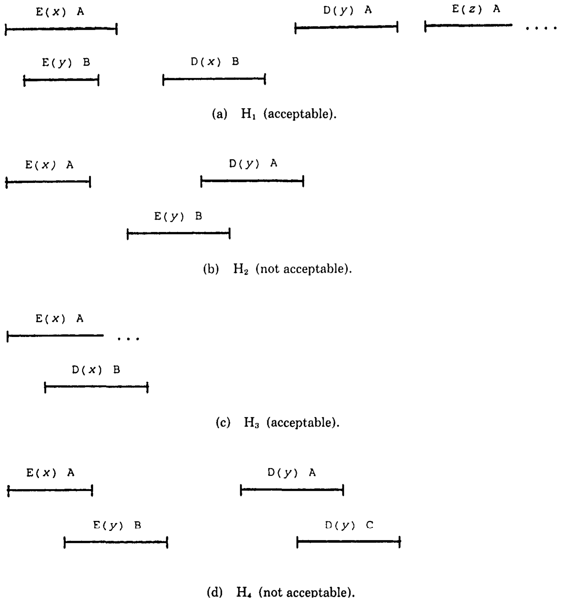
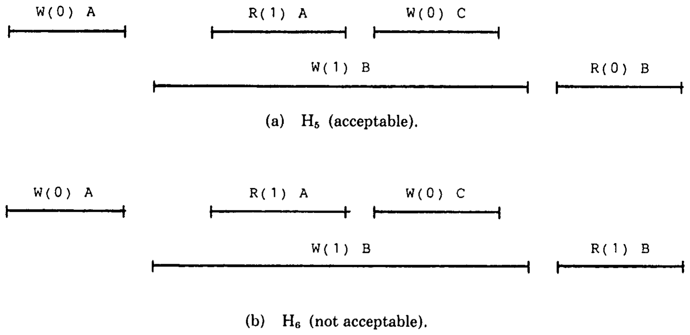
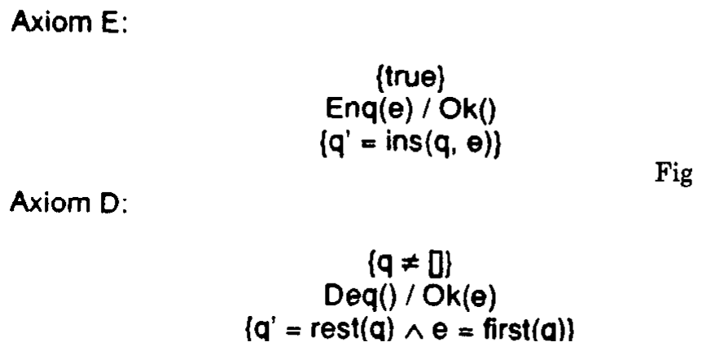
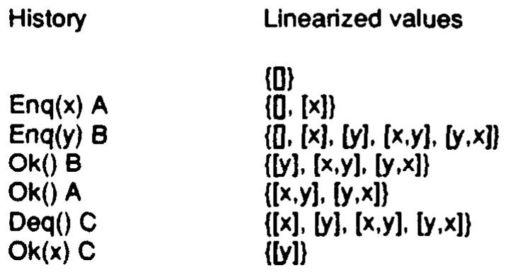
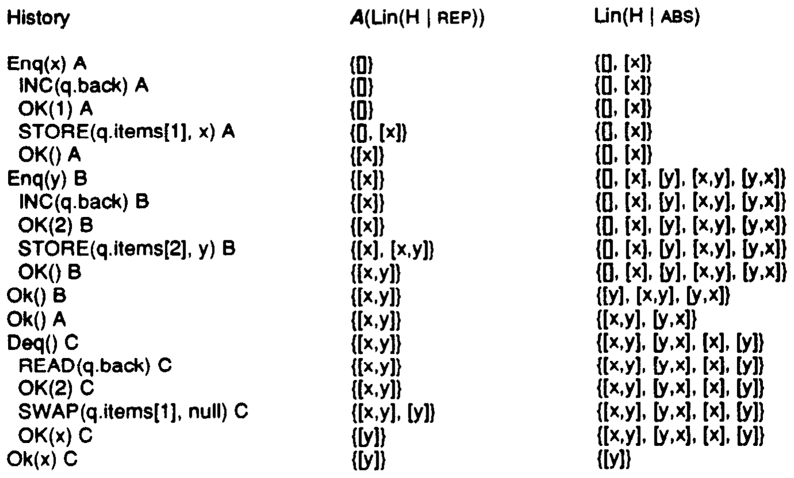
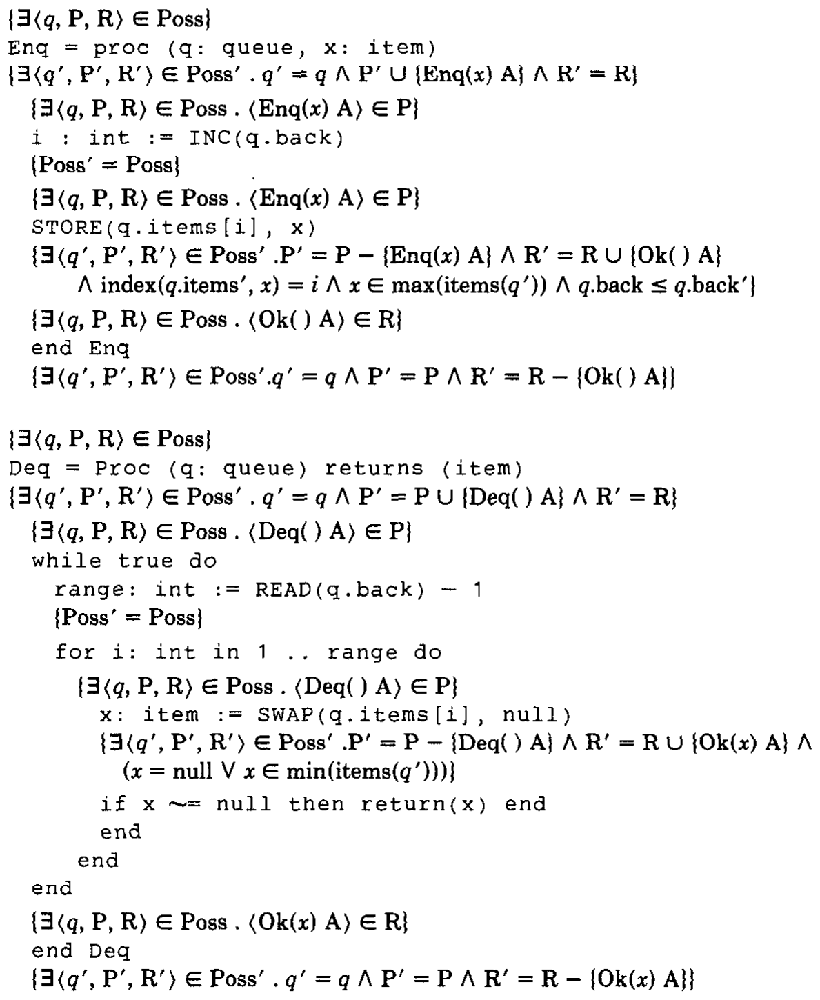

> 线性一致性：并发对象的正确性条件

MAURICE P. HERLIHY and JEANNETTE M. WING

> MAURICE P. HERLIHY 与 JEANNETTE M. WING

Carnegie Mellon University

> 卡内基梅隆大学

A concurrent object is a data object shared by concurrent processes. Linearizability is a correctness condition for concurrent objects that exploits the semantics of abstract data types. It permits a high degree of concurrency, yet it permits programmers to specify and reason about concurrent objects using known techniques from the sequential domain. Linearizability provides the illusion that each operation applied by concurrent processes takes effect instantaneously at some point between its invocation and its response, implying that the meaning of a concurrent object’s operations can be given by pre- and post-conditions. This paper defines linearizability, compares it to other correctness conditions, presents and demonstrates a method for proving the correctness of implementations, and shows how to reason about concurrent objects, given they are linearizable.

> 并发对象是由并发进程共享的数据对象。线性一致性是一种利用抽象数据类型语义来判定并发对象正确性的条件。它既允许高度并发，又使程序员可以沿用顺序领域的成熟技术来规约并推理并发对象。线性一致性营造出这样一种假象：并发进程施加的每个操作，都在其调用与响应之间的某个时刻瞬间生效；这意味着并发对象各项操作的含义可以用前置条件和后置条件给出。本文定义线性一致性，将它与其他正确性条件比较，提出并演示一种证明实现正确性的方法，并说明在对象满足线性一致性的前提下如何对并发对象进行推理。

Categories and Subject Descriptors: D.1.3 [Programming Techniques]: Concurrent Programming; D.2.1 [Software Engineering]: Requirements/Specifications; D.3.3 [Programming Languages]: Language Constructs—*abstract data types, concurrent programming structures, data types and structures*; F.1.2 [Computation by Abstract Devices]: Modes of Computation—*parallelism*; F.3.1 [Logics and Meanings of Programs]: Specifying and Verifying and Reasoning about Programs—*pre- and post-conditions, specification techniques*

> 分类与主题描述：D.1.3［编程技术］：并发编程；D.2.1［软件工程］：需求/规约；D.3.3［编程语言］：语言构造——*抽象数据类型、并发编程结构、数据类型与结构*；F.1.2［抽象设备计算］：计算模式——*并行性*；F.3.1［程序的逻辑与含义］：程序的规约、验证与推理——*前置条件与后置条件、规约技术*。

General Terms: Theory, Verification

> 一般术语：理论、验证

Additional Key Words and Phrases: Concurrency, correctness, Larch, linearizability, multiprocessing, serializability, shared memory, specification

> 其他关键词与短语：并发、正确性、Larch、线性一致性、多处理、可串行化、共享内存、规约

## 1. INTRODUCTION

> 1. 引言

### 1.1 Overview

> 1.1 概述

Informally, a concurrent system consists of a collection of sequential processes that communicate through shared typed objects. This model encompasses both message-passing architectures in which the shared objects are message queues, and shared-memory architectures in which the shared objects are data structures in memory. Each object has a type, which defines a set of possible values and a set of primitive operations that provide the only means to create and manipulate that object. In a sequential system, where an object’s operations are invoked one at a time by a single process, the meaning of the operations can be given by pre- and postconditions. In a concurrent system, however, an object’s operations can be invoked by concurrent processes, and it is necessary to give a meaning to possible interleavings of operation invocations.

> 非形式地说，并发系统由一组顺序进程构成，这些进程通过带类型的共享对象通信。这个模型既涵盖共享对象为消息队列的消息传递架构，也涵盖共享对象为内存中数据结构的共享内存架构。每个对象都有一种类型，该类型定义一组可能值以及一组原语操作；这些操作是创建和操纵该对象的唯一手段。在顺序系统中，单个进程逐次调用对象的操作，可以用前置条件与后置条件说明操作的含义。然而在并发系统中，对象的操作可能由并发进程调用，因此必须赋予操作调用各种可能交错以明确的含义。

A concurrent computation is linearizable if it is “equivalent,” in a sense formally defined in Section 2, to a legal sequential computation. We interpret a data type’s (sequential) axiomatic specification as permitting only linearizable interleavings. Instead of leaving data uninterpreted, linearizability exploits the semantics of abstract data types; it permits a high degree of concurrency, yet it permits programmers to specify and reason about concurrent objects using standard verification techniques. Unlike alternative correctness conditions such as sequential consistency [31] or serializability [40], linearizability is a local property: a system is linearizable if each individual object is linearizable. Locality enhances modularity and concurrency, since objects can be implemented and verified independently, and run-time scheduling can be completely decentralized. Linearizability is also a nonblocking property: processes invoking totally-defined operations are never forced to wait. Nonblocking enhances concurrency and implies that linearizability is an appropriate condition for systems for which real-time response is critical. Linearizability is a simple and intuitively appealing correctness condition that generalizes and unifies a number of correctness conditions both implicit and explicit in the literature.

> 若一个并发计算与某个合法顺序计算“等价”（其严格含义将在第 2 节定义），它便具有线性一致性。我们把数据类型的（顺序）公理规约解释为只允许线性一致的交错。线性一致性并不把数据留作无解释符号，而是利用抽象数据类型的语义；它允许高度并发，同时允许程序员使用标准验证技术来规约并推理并发对象。与顺序一致性 [31]、可串行化 [40] 等其他正确性条件不同，线性一致性是一种局部性质：只要系统中的每个对象分别具有线性一致性，整个系统就具有线性一致性。局部性增强了模块化与并发性，因为对象可以独立实现和验证，运行时调度也可以完全去中心化。线性一致性还是一种非阻塞性质：调用全定义操作的进程绝不会被迫等待。非阻塞性增强并发性，也表明线性一致性适用于实时响应至关重要的系统。线性一致性简单而符合直觉，并且概括、统一了文献中多种隐含或显式的正确性条件。

Using axiomatic specifications and our notion of linearizability, we can reason about two kinds of problems:

> 借助公理规约和我们的线性一致性概念，可以推理两类问题：

(1) We reason about the correctness of linearizable object implementations using new techniques that generalize the notions of representation invariant and abstraction function [18, 25] to the concurrent domain.

> (1) 我们采用新的技术推理线性一致对象实现的正确性；这些技术把表示不变式和抽象函数 [18, 25] 的概念推广到并发领域。

(2) We reason about computations that use linearizable objects by transforming assertions about concurrent computations into simpler assertions about their sequential counterparts.

> (2) 我们把关于并发计算的断言转换为关于相应顺序计算的更简单断言，从而推理使用线性一致对象的计算。

Section 2 presents our model of a concurrent system and the formal definition of linearizability. Section 3 discusses linearizability’s locality and nonblocking properties and compares it to other correctness conditions. Section 4 presents our proof technique for reasoning about implementations of linearizable objects, and illustrates this technique on two novel implementations of a highly concurrent queue. Section 5 presents examples of reasoning about concurrent registers and queues, given that they are linearizable. Section 6 surveys some related work and discusses the significance of linearizability as a correctness condition.

> 第 2 节给出并发系统模型和线性一致性的形式定义。第 3 节讨论线性一致性的局部性与非阻塞性质，并将其与其他正确性条件比较。第 4 节提出用于推理线性一致对象实现的证明技术，并用一个高并发队列的两种新颖实现演示该技术。第 5 节举例说明在并发寄存器和队列具有线性一致性时如何对它们进行推理。第 6 节回顾相关工作，并讨论线性一致性作为正确性条件的意义。

A preliminary version of this paper appeared in the Proceedings of the 14th ACM Symposium on Principles of Programming Languages, January 1987 [21].

> 本文的初步版本曾发表于 1987 年 1 月第 14 届 ACM 编程语言原理研讨会论文集 [21]。

This research was sponsored by IBM and the Defense Advanced Research Projects Agents (DOD), ARPA order 4976 (Amendment 20), under contract F33615-87-C-1499, monitored by the Avionics Laboratory, Air Force Wright Aeronautical Laboratories, Wright-Patterson AFB. Additional spport for J. M. Wing was provided in part by the National Science Foundation under grant CCR-8620027. The views and conclusions contained in this document are those of the authors and should not be interpreted as representing the official policies, either expressed or implied, of the Defense Advanced Research Projects Agency or the US Government.

> 本研究由 IBM 和国防高级研究计划局（DOD）资助，ARPA 指令 4976（修正案 20），合同号 F33615-87-C-1499，由赖特空军航空实验室航空电子实验室监督。J. M. Wing 还得到美国国家科学基金会 CCR-8620027 项目的部分资助。本文所载观点和结论仅代表作者，不应解释为国防高级研究计划局或美国政府明示或默示的官方政策。

Authors’ address: Department of Computer Science, Carnegie Mellon University, Pittsburgh, PA 15213-3890.

> 作者地址：卡内基梅隆大学计算机科学系，宾夕法尼亚州匹兹堡，PA 15213-3890。

Permission to copy without fee all or part of this material is granted provided that the copies are not made or distributed for direct commercial advantage, the ACM copyright notice and the title of the publication and its date appear, and notice is given that copying is by permission of the Association for Computing Machinery. To copy otherwise, or to republish, requires a fee and/or specific permission.

> 在副本并非为直接商业利益而制作或分发、载有 ACM 版权声明及出版物标题和日期，并注明复制已获美国计算机协会许可的前提下，准许免费复制本文全部或部分内容。其他形式的复制或再版须缴费和/或取得明确许可。

© 1990 ACM 0164-0925/90/0700-0463 \$01.50

> © 1990 ACM 0164-0925/90/0700-0463 \$01.50

ACM Transactions on Programming Languages and Systems, Vol. 12, No. 3, July 1990, Pages 463-492.

> 《ACM Transactions on Programming Languages and Systems》，第 12 卷第 3 期，1990 年 7 月，第 463–492 页。

### 1.2 Motivation

> 1.2 动机

When defining a correctness condition for concurrent objects, two requirements seem to make intuitive sense: First, each operation should appear to “take effect” instantaneously, and second, the order of nonconcurrent operations should be preserved. These requirements allow us to describe acceptable concurrent behavior directly in terms of acceptable sequential behavior, an approach that simplifies both formal and informal reasoning about concurrent programs. We capture these notions formally in the next section; here we informally review some examples to illustrate what we do and do not consider intuitively acceptable concurrent behavior. Our examples employ a first in, first out (FIFO) queue, a simple data type that provides two operations: Enq inserts an item in the queue, and Deq returns and removes the oldest item from the queue. Figure 1 shows four different ways in which a FIFO queue might behave when manipulated by concurrent processes. Here, a time axis runs from left to right, and each operation is associated with an interval. Overlapping intervals indicate concurrent operations. We use “E(x) A” (“D(x) A”) to stand for the enqueue (dequeue) operation of item x by process A.

> 为并发对象定义正确性条件时，两项要求直觉上很自然：第一，每个操作看起来都应当瞬间“生效”；第二，非并发操作的顺序应予保持。这两项要求使我们能够直接以可接受的顺序行为描述可接受的并发行为，从而简化对并发程序的形式与非形式推理。下一节将形式化这些概念；这里先非形式地考察若干例子，以说明哪些并发行为在我们看来符合直觉，哪些不符合。例子采用先进先出（FIFO）队列，这是一种只提供两项操作的简单数据类型：Enq 把条目插入队列，Deq 返回并移除队列中最旧的条目。图 1 展示并发进程操纵 FIFO 队列时可能出现的四种行为。时间轴从左向右，每个操作对应一个区间；区间重叠表示操作并发。我们用“E(x) A”（“D(x) A”）表示进程 A 对条目 x 执行入队（出队）操作。



**Fig. 1. FIFO queue histories.**

> **图 1。FIFO 队列历史。**

> **图表中文解读：** 横向线段是操作从调用到响应的持续区间，重叠表示并发。H₁ 中 x、y 的入队并发，随后按 x、y 顺序出队，因而可接受；H₂ 明确先完成 x 入队，却先取出 y，不可接受；H₃ 在 x 的入队响应返回前取出 x，但可把入队的生效点放在出队之前，因而可接受；H₄ 只入队一次 y 却出队两次，不可接受。

The behavior shown in H₁ (Figure 1a) corresponds to our intuitive notion of how a concurrent FIFO queue should behave. In this scenario, processes A and B concurrently enqueue x and y. Later, B dequeues x, and then A dequeues y and begins enqueuing z. Since the dequeue for x precedes the dequeue for y, the FIFO property implies that their enqueues must have taken effect in the same order. In fact, their enqueues were concurrent, thus they could indeed have taken effect in that order. The uncompleted enqueue of z by A illustrates that we are interested in behaviors in which processes are continually executing operations, perhaps forever.

> H₁（图 1a）所示行为符合我们对并发 FIFO 队列应有行为的直觉。在这一场景中，进程 A 与 B 并发地将 x 和 y 入队。之后，B 将 x 出队；随后 A 将 y 出队，并开始把 z 入队。由于 x 的出队先于 y 的出队，FIFO 性质意味着二者的入队必须按相同顺序生效。事实上，它们的入队彼此并发，确实可以按这一顺序生效。A 尚未完成的 z 入队说明，我们关心的是进程持续执行操作、甚至可能永远执行下去的行为。

The behavior shown in H₂, however, is not intuitively acceptable. Here, it is clear to an external observer that x was enqueued before y, yet y is dequeued without x having been dequeued. To be consistent with our informal requirements, A should have dequeued x. We consider the behavior shown in H₃ to be acceptable, even though x is dequeued before its enqueuing operation has returned. Intuitively, the enqueue of x took effect before it completed. Finally, H₄ is clearly unacceptable because y is dequeued twice.

> 然而，H₂ 所示行为直觉上不可接受。外部观察者可以清楚看到 x 先于 y 入队，但 x 尚未出队，y 却已经出队。要满足我们的非形式要求，A 应当取出 x。H₃ 所示行为则可接受，虽然 x 在其入队操作返回之前便已出队；直觉上，x 的入队在操作完成前就已生效。最后，H₄ 显然不可接受，因为 y 被出队了两次。

To decide whether a concurrent history is acceptable, it is necessary to take into account the object’s intended semantics. For example, acceptable concurrent behaviors for FIFO queues would not be acceptable for stacks, sets, directories, etc. When restricted to register objects providing read and write operations, our intuitive notion of acceptability corresponds exactly to the notion used in Misra’s careful axiomatization of concurrent registers [35]. Our approach can be thought of as generalizing Misra’s approach to objects with richer sets of operations. For example, H₅ in Figure 2a is acceptable, but H₆ is not (examples are taken from [35]). These two behaviors differ at one point: In H₅, B reads a 0, and in H₆, B reads a 1. The latter is intuitively unacceptable because A did a previous read of a 1, implying that B’s write of 1 must have occurred before A’s read. C’s subsequent write of 0, though concurrent with B’s write of 1, strictly follows A’s read of 1.

> 判断并发历史是否可接受，必须考虑对象的预期语义。例如，对 FIFO 队列可接受的并发行为，对栈、集合、目录等未必可接受。若只考虑提供读写操作的寄存器对象，我们对可接受性的直觉恰好对应 Misra 对并发寄存器所作严谨公理化中采用的概念 [35]。可以把我们的方法看作把 Misra 的方法推广到操作集合更丰富的对象。例如，图 2a 中的 H₅ 可接受，而 H₆ 不可接受（例子取自 [35]）。两种行为只有一点不同：在 H₅ 中 B 读到 0，在 H₆ 中 B 读到 1。后者直觉上不可接受，因为 A 此前读到 1，意味着 B 写入 1 必须发生在 A 读取之前；C 随后写入 0，虽与 B 写入 1 并发，却严格晚于 A 读取 1。



**Fig. 2. Register histories.**

> **图 2。寄存器历史。**

> **图表中文解读：** H₅ 与 H₆ 的前三个操作相同：A 写 0、B 写 1 与 A 读 1 发生重叠，随后 C 写 0。H₅ 中 B 最后读到 0，可由 C 的写解释；H₆ 中 B 最后读到 1，则与 A 已先读到 1、而 C 的写又严格晚于该读取的实时顺序冲突。

In the next section, we formalize the intuition presented here by defining the notion of linearizability to encompass those histories we have argued are intuitively acceptable.

> 下一节将定义线性一致性，把上述直觉形式化，使该概念恰好涵盖我们论证为直觉上可接受的那些历史。

## 2. SYSTEM MODEL AND DEFINITION OF LINEARIZABILITY

> 2. 系统模型与线性一致性的定义

### 2.1 Histories

> 2.1 历史

Informally, a concurrent system consists of a collection of sequential threads of control called processes that communicate through shared data structures called objects. Each object has a unique name and a type. The type defines a set of possible values, and a set of primitive operations that provide the only means to manipulate that object. Processes are sequential: each process applies a sequence of operations to objects, alternately issuing an invocation and then receiving the associated response. (Dynamic process creation can be modeled simply by treating each child process as an additional process that executes no operations before the fork or after the join.)

> 非形式地说，并发系统由一组称为进程的顺序控制线程组成；它们通过称为对象的共享数据结构通信。每个对象都有唯一名称和一种类型。类型定义一组可能值以及一组原语操作；这些操作是操纵对象的唯一手段。进程是顺序的：每个进程向对象施加一系列操作，交替发出调用并接收相应响应。（动态进程创建可以简单地建模为：把每个子进程视为一个附加进程，它在 fork 之前和 join 之后不执行任何操作。）

Formally, an execution of a concurrent system is modeled by a history, which is a finite sequence of operation invocation and response events. A subhistory of a history H is a subsequence of the events of H. An operation invocation is written as ⟨x op(args*) A⟩, where x is an object name, op is an operation name, args* denotes a sequence of argument values, and A is a process name. The response to an operation invocation is written as ⟨x term(res*) A⟩, where term is a termination condition, and res* is a sequence of results. We use “Ok” for normal termination. A response matches an invocation if their object names agree and their process names agree. An invocation is pending in a history if no matching response follows the invocation. If H is a history, complete(H) is the maximal subsequence of H consisting only of invocations and matching responses.

> 形式地说，并发系统的一次执行由一个历史建模；历史是操作调用事件与响应事件的有限序列。历史 H 的子历史是 H 中事件的一个子序列。操作调用写作 ⟨x op(args*) A⟩，其中 x 是对象名，op 是操作名，args* 表示参数值序列，A 是进程名。操作调用的响应写作 ⟨x term(res*) A⟩，其中 term 是终止条件，res* 是结果序列。我们用“Ok”表示正常终止。若响应与调用的对象名和进程名均相同，则二者匹配。若一个调用之后没有匹配响应，该调用在历史中是待决调用。若 H 是历史，complete(H) 是 H 中只由调用及其匹配响应构成的最大子序列。

A history H is sequential if:

> 历史 H 在满足以下条件时是顺序历史：

(1) The first event of H is an invocation.

> (1) H 的第一个事件是调用。

(2) Each invocation, except possibly the last, is immediately followed by a matching response. Each response is immediately followed by a matching invocation.

> (2) 除最后一个调用可能例外，每个调用后都立即跟随匹配响应；每个响应后都立即跟随匹配调用。

A history that is not sequential is concurrent.

> 非顺序历史即为并发历史。

A process subhistory, H|P (H at P), of a history H is the subsequence of all events in H whose process names are P. An object subhistory H|x is similarly defined for an object x. Two histories H and H′ are equivalent if for every process P, H|P = H′|P. A history H is well-formed if each process subhistory H|P of H is sequential. All histories considered in this paper are assumed to be well-formed. Notice that whereas process subhistories of a well-formed history are necessarily sequential, object subhistories are not.

> 历史 H 的进程子历史 H|P（H at P）是 H 中进程名为 P 的所有事件所构成的子序列；对象 x 的对象子历史 H|x 定义类似。若对每个进程 P 都有 H|P = H′|P，则两个历史 H 与 H′ 等价。若 H 的每个进程子历史 H|P 都是顺序历史，则 H 是良构的。本文考虑的所有历史均假定为良构。请注意，良构历史的进程子历史必然是顺序的，但对象子历史未必如此。

An operation, e, in a history is a pair consisting of an invocation, inv(e), and the next matching response, res(e). We denote an operation by [q inv/res A], where q is an object and A a process. An operation e₀ lies within another operation e₁ in H if inv(e₁) precedes inv(e₀) and res(e₀) precedes res(e₁) in H. Angle brackets for events and square brackets for operations are omitted where they would otherwise be unnecessarily confusing; object and process names are omitted where they are clear from context.

> 历史中的操作 e 是由一个调用 inv(e) 及其后第一个匹配响应 res(e) 组成的二元组。我们用 [q inv/res A] 表示操作，其中 q 为对象、A 为进程。若在 H 中 inv(e₁) 先于 inv(e₀)，且 res(e₀) 先于 res(e₁)，则操作 e₀ 位于另一操作 e₁ 之内。若事件的尖括号和操作的方括号会造成不必要的混乱，则予以省略；对象名和进程名可由上下文明确时也予以省略。

For example, H₁ of Figure 1 is the following well-formed history for a FIFO queue q.

> 例如，图 1 中的 H₁ 是 FIFO 队列 q 的如下良构历史。

```text
q Enq(x) A
q Enq(y) B
q Ok( ) B
q Ok( ) A
q Deq( ) B
q Ok(x) B
q Deq( ) A
q Ok(y) A
q Enq(z) A
```

> 该序列依次记录：A 调用 x 入队，B 调用 y 入队，B 和 A 的入队先后返回；B 调用出队并得到 x，A 调用出队并得到 y；最后 A 调用 z 入队但尚未收到响应。

The first event in H₁ is an invocation of Enq with argument x by process A, and the fourth event is the matching response with termination condition Ok and no results. The [q Enq(y)/Ok( ) B] operation lies within the [q Enq(x)/Ok( ) A] operation. The subhistory, complete(H₁), is H₁ with the last (pending) invocation of Enq removed. Reordering the first two events yields one of many histories equivalent to H₁.

> H₁ 的第一个事件是进程 A 以参数 x 调用 Enq；第四个事件是其匹配响应，终止条件为 Ok 且没有结果。[q Enq(y)/Ok( ) B] 操作位于 [q Enq(x)/Ok( ) A] 操作之内。子历史 complete(H₁) 等于从 H₁ 中移除最后一个（待决的）Enq 调用。交换前两个事件的顺序，便得到与 H₁ 等价的众多历史之一。

A set S of histories is prefix-closed if, whenever H is in S, every prefix of H is also in S. A single-object history is one in which all events are associated with the same object. A sequential specification for an object is a prefix-closed set of single-object sequential histories for that object. A sequential history H is legal if each object subhistory H|x belongs to the sequential specification for x. Many conventional techniques exist for defining sequential specifications. In this paper, we use the axiomatic style of Larch [19], in which an object’s sequential history is summarized by a value, which (informally speaking) reflects the object’s state at the end of the history. These values are used in axioms giving the pre- and postconditions on the object’s operations. For example, axioms for the Enq and Deq operations for FIFO queues are shown in Figure 3. The post-condition for Enq states that on termination, the new queue value is the old queue value with e inserted. The specification for Deq states that applying that operation to a non-empty queue removes the first item from the queue. An operation is total if, like Enq, it is defined for every object value, otherwise it is partial, like Deq which is left undefined for the empty queue.

> 若历史集合 S 中每个历史 H 的每个前缀也都属于 S，则 S 是前缀闭合的。单对象历史是所有事件都与同一对象关联的历史。对象的顺序规约，是该对象的单对象顺序历史所组成的前缀闭合集合。若顺序历史 H 的每个对象子历史 H|x 都属于 x 的顺序规约，则 H 是合法的。定义顺序规约有许多传统技术。本文采用 Larch [19] 的公理风格：用一个值概括对象的顺序历史；非形式地说，该值反映历史结束时对象的状态。公理使用这些值给出对象操作的前置条件和后置条件。例如，图 3 给出 FIFO 队列 Enq 与 Deq 操作的公理。Enq 的后置条件说明，操作终止时的新队列值，是把 e 插入旧队列值所得的结果。Deq 的规约说明，对非空队列施加该操作会移除队首条目。若操作像 Enq 一样对每个对象值都有定义，它就是全操作；否则便是偏操作，如 Deq 对空队列没有定义。



**Fig. 3. Axioms for queue operations.**

> **图 3。队列操作的公理。**

> **图表中文解读：** 公理 E 规定 Enq(e)/Ok( ) 无前置限制，后置状态为 q′ = ins(q,e)；公理 D 规定 Deq( )/Ok(e) 的前置条件是 q ≠ [ ]，后置条件为 q′ = rest(q) 且 e = first(q)。这两条公理把合法顺序队列历史归结为队列值的状态转移。

### 2.2 Definition of Linearizability

> 2.2 线性一致性的定义

A history H induces an irreflexive partial order &lt;<sub>H</sub> on operations:

> 历史 H 在操作上诱导出一个非自反偏序 &lt;<sub>H</sub>：

$$
e_0 <_H e_1 \quad \text{if } res(e_0) \text{ precedes } inv(e_1) \text{ in } H.
$$

> 若在 H 中 res(e₀) 先于 inv(e₁)，则 e₀ &lt;<sub>H</sub> e₁。

(Where appropriate, subscripts on partial orders are omitted.) Informally, &lt;<sub>H</sub> captures the “real-time” precedence ordering of operations in H. Operations unrelated by &lt;<sub>H</sub> are said to be concurrent. If H is sequential, &lt;<sub>H</sub> is a total order.

> （适当时省略偏序的下标。）非形式地说，&lt;<sub>H</sub> 捕捉 H 中操作的“实时”先后次序。若两个操作在 &lt;<sub>H</sub> 下无关，则称它们并发。若 H 是顺序历史，&lt;<sub>H</sub> 是全序。

A history H is *linearizable* if it can be extended (by appending zero or more response events) to some history H′ such that:

> 若历史 H 可以通过追加零个或多个响应事件扩展为某个历史 H′，且满足以下条件，则 H 是*线性一致的*：

**L1:** complete(H′) is equivalent to some legal sequential history S, and

> **L1：** complete(H′) 与某个合法顺序历史 S 等价；并且

**L2:** &lt;<sub>H</sub> ⊆ &lt;<sub>S</sub>.

> **L2：** &lt;<sub>H</sub> ⊆ &lt;<sub>S</sub>。

Informally, extending H to H′ captures the notion that some pending invocations may have taken effect even though their responses have not yet been returned to the caller (as in the pending Enq in history H₃ in Figure 1). Restricting attention to complete(H′) captures the notion that the remaining pending invocations have not yet had an effect. L1 states that processes act as if they were interleaved at the granularity of complete operations. L2 states that this apparent sequential interleaving respects the real-time precedence ordering of operations.

> 非形式地说，把 H 扩展为 H′，表达的是某些待决调用虽然尚未向调用者返回响应，却可能已经生效（如图 1 的历史 H₃ 中待决的 Enq）。只考察 complete(H′)，表达的是其余待决调用尚未生效。L1 表明，各进程仿佛以完整操作为粒度交错执行；L2 表明，这一表观顺序交错尊重操作的实时先后次序。

We call S a *linearization* of H. Nondeterminism is inherent in the notion of linearizability: (1) For each H, there may be more than one extension H′ satisfying the two conditions, L1 and L2, and (2) for each extension H′, there may be more than one linearization S. A *linearizable object* is one whose concurrent histories are linearizable with respect to some sequential specification.

> 我们称 S 为 H 的一个*线性化*。线性一致性概念内在地包含非确定性：(1) 对每个 H，满足 L1、L2 两项条件的扩展 H′ 可能不止一个；(2) 对每个扩展 H′，线性化 S 也可能不止一个。若一个对象的并发历史相对于某个顺序规约都是线性一致的，则称它为*线性一致对象*。

### 2.3 Queue Examples Revisited

> 2.3 重访队列示例

Let “·” denote concatenation of events. The history H₁ shown in Figure 1 is linearizable, because H₁ · ⟨q Ok( ) A⟩ is equivalent to the following sequential history:

> 令“·”表示事件串接。图 1 所示历史 H₁ 具有线性一致性，因为 H₁ · ⟨q Ok( ) A⟩ 与如下顺序历史等价：

```text
q Enq(x) A       (History H₁′)
q Ok( ) A
q Enq(y) B
q Ok( ) B
q Deq( ) B
q Ok(x) B
q Deq( ) A
q Ok(y) A
q Enq(z) A
q Ok( ) A
```

> 在顺序历史 H₁′ 中，x 先入队并完成，随后 y 入队并完成；之后 B、A 依次取出 x、y，最后 z 入队并完成。

H₂ is not linearizable:

> H₂ 不具有线性一致性：

```text
q Enq(x) A
q Ok( ) A
q Enq(y) B
q Deq( ) A
q Ok( ) B
q Ok(y) A       (History H₂)
```

> 以上是历史 H₂ 的事件序列。

because the complete Enq operation of x precedes the Enq of y, but y is dequeued before x.

> 因为 x 的完整 Enq 操作先于 y 的 Enq，y 却先于 x 出队。

Linearizability does not rule out histories such as H₃, in which an operation “takes effect” before its return event occurs:

> 线性一致性并不排除 H₃ 这类历史；其中操作在返回事件发生之前就已“生效”：

```text
q Enq(x) A
q Deq( ) B
q Ok(x) B       (History H₃)
```

> 以上是历史 H₃ 的事件序列。

H₃ can be extended to H₃′ = H₃ · ⟨q Ok( ) A⟩, which is equivalent to the sequential history in which the enqueue operation occurs before the dequeue.

> H₃ 可以扩展为 H₃′ = H₃ · ⟨q Ok( ) A⟩；它等价于入队操作先于出队操作的顺序历史。

Finally, H₄,

> 最后，H₄：

```text
q Enq(x) A
q Enq(y) B
q Ok( ) A
q Ok( ) B
q Deq( ) A
q Deq( ) C
q Ok(y) A
q Ok(y) C       (History H₄)
```

> 以上是历史 H₄ 的事件序列。

is not linearizable because y is enqueued once but dequeued twice, and hence H₄ is not equivalent to any sequential FIFO queue history.

> 不具有线性一致性，因为 y 只入队一次却出队两次；因此 H₄ 不等价于任何顺序 FIFO 队列历史。

## 3. PROPERTIES OF LINEARIZABILITY

> 3. 线性一致性的性质

This section proves that linearizability is a *local* and *nonblocking* property, and discusses the differences between it and other correctness conditions.

> 本节证明线性一致性是一种*局部*且*非阻塞*的性质，并讨论它与其他正确性条件之间的差异。

### 3.1 Locality

> 3.1 局部性

A property P of a concurrent system is said to be *local* if the system as a whole satisfies P whenever each individual object satisfies P. Linearizability is a local property:

> 若并发系统中的每个对象分别满足性质 P 时，整个系统也满足 P，则称 P 是*局部*性质。线性一致性是一种局部性质：

**THEOREM 1.** *H is linearizable if and only if, for each object x, H|x is linearizable.*

> **定理 1.** *H 具有线性一致性，当且仅当对每个对象 x，H|x 都具有线性一致性。*

**PROOF.** The “only if” part is obvious.

> **证明。** “仅当”部分显然成立。

For each x, pick a linearization of H|x. Let R<sub>x</sub> be the set of responses appended to H|x to construct that linearization, and let &lt;<sub>x</sub> be the corresponding linearization order. Let H′ be the history constructed by appending to H each response in R<sub>x</sub>. We will construct a partial order < on the operations of complete(H′) such that: (1) For each x, &lt;<sub>x</sub> ⊆ <, and (2) &lt;<sub>H</sub> ⊆ <. Let S be the sequential history constructed by ordering the operations of complete(H′) in any total order that extends <. Condition (1) implies that S is legal, hence that L1 is satisfied, and Condition (2) implies that L2 is satisfied.

> 对每个 x，选取 H|x 的一个线性化。令 R<sub>x</sub> 为构造该线性化时追加到 H|x 的响应集合，令 &lt;<sub>x</sub> 为相应的线性化次序。将每个 R<sub>x</sub> 中的响应追加到 H，构造历史 H′。我们将在 complete(H′) 的操作上构造一个偏序 <，使得：(1) 对每个 x，&lt;<sub>x</sub> ⊆ <；(2) &lt;<sub>H</sub> ⊆ <。把 complete(H′) 中的操作按任意扩展 < 的全序排列，构造顺序历史 S。条件 (1) 蕴含 S 合法，因而满足 L1；条件 (2) 蕴含满足 L2。

Let < be the transitive closure of the union of all &lt;<sub>x</sub> with &lt;<sub>H</sub>. It is immediate from the construction that < satisfies Conditions (1) and (2), but it remains to be shown that < is a partial order. We argue by contradiction. If not, then there exists a set of operations e₁, . . . , e<sub>n</sub>, such that e₁ < e₂ < ··· < e<sub>n</sub>, e<sub>n</sub> < e₁, and each pair is directly related by some &lt;<sub>x</sub> or by &lt;<sub>H</sub>. Choose a cycle whose length is minimal.

> 令 < 为所有 &lt;<sub>x</sub> 与 &lt;<sub>H</sub> 之并的传递闭包。由构造可立即看出，< 满足条件 (1) 和 (2)，但还须证明 < 是偏序。用反证法。若它不是偏序，则存在一组操作 e₁, . . . , e<sub>n</sub>，使得 e₁ < e₂ < ··· < e<sub>n</sub>、e<sub>n</sub> < e₁，且每一对相邻操作都由某个 &lt;<sub>x</sub> 或 &lt;<sub>H</sub> 直接关联。选取长度最短的这样一个环。

Suppose all operations are associated with the same object x. Since &lt;<sub>x</sub> is a total order, there must exist two operations e<sub>i−1</sub> and e<sub>i</sub> such that e<sub>i−1</sub> &lt;<sub>H</sub> e<sub>i</sub> and e<sub>i</sub> &lt;<sub>x</sub> e<sub>i−1</sub>, contradicting the linearizability of x.

> 假设所有操作都与同一对象 x 关联。由于 &lt;<sub>x</sub> 是全序，必有两个操作 e<sub>i−1</sub> 与 e<sub>i</sub>，满足 e<sub>i−1</sub> &lt;<sub>H</sub> e<sub>i</sub> 且 e<sub>i</sub> &lt;<sub>x</sub> e<sub>i−1</sub>，这与 x 的线性一致性矛盾。

The cycle must therefore include operations of at least two objects. By reindexing if necessary, let e₁ and e₂ be operations of distinct objects. Let x be the object associated with e₁. We claim that none of e₂, . . . , e<sub>n</sub> can be an operation of x. The claim holds for e₂ by construction. Let e<sub>i</sub> be the first operation in e₃, . . . , e<sub>n</sub> associated with x. Since e<sub>i−1</sub> and e<sub>i</sub> are unrelated by &lt;<sub>x</sub>, they must be related by &lt;<sub>H</sub>; hence the response of e<sub>i−1</sub> precedes the invocation of e<sub>i</sub>. The invocation of e₂ precedes the response of e<sub>i−1</sub>, since otherwise e<sub>i−1</sub> &lt;<sub>H</sub> e₂, yielding the shorter cycle e₂, . . . , e<sub>i−1</sub>. Finally, the response of e₁ precedes the invocation of e₂, since e₁ &lt;<sub>H</sub> e₂ by construction. It follows that the response to e₁ precedes the invocation of e<sub>i</sub>, hence e₁ &lt;<sub>H</sub> e<sub>i</sub>, yielding the shorter cycle e₁, e<sub>i</sub>, . . . , e<sub>n</sub>.

> 因此，该环必然包含至少两个对象的操作。必要时重新编号，令 e₁ 与 e₂ 是不同对象的操作，并令 x 为 e₁ 所关联的对象。我们断言 e₂, . . . , e<sub>n</sub> 中没有一个是 x 的操作。由构造，该断言对 e₂ 成立。假设 e<sub>i</sub> 是 e₃, . . . , e<sub>n</sub> 中第一个与 x 关联的操作。由于 e<sub>i−1</sub> 与 e<sub>i</sub> 不受 &lt;<sub>x</sub> 关联，它们必受 &lt;<sub>H</sub> 关联；所以 e<sub>i−1</sub> 的响应先于 e<sub>i</sub> 的调用。e₂ 的调用先于 e<sub>i−1</sub> 的响应，否则 e<sub>i−1</sub> &lt;<sub>H</sub> e₂，便会得到更短的环 e₂, . . . , e<sub>i−1</sub>。最后，由构造 e₁ &lt;<sub>H</sub> e₂，所以 e₁ 的响应先于 e₂ 的调用。由此，e₁ 的响应先于 e<sub>i</sub> 的调用，即 e₁ &lt;<sub>H</sub> e<sub>i</sub>，从而得到更短的环 e₁, e<sub>i</sub>, . . . , e<sub>n</sub>。

Since e<sub>n</sub> is not an operation of x, but e<sub>n</sub> < e₁, it follows that e<sub>n</sub> &lt;<sub>H</sub> e₁. But e₁ &lt;<sub>H</sub> e₂ by construction, and because &lt;<sub>H</sub> is transitive, e<sub>n</sub> &lt;<sub>H</sub> e₂, yielding the shorter cycle e₂, . . . , e<sub>n</sub>, the final contradiction. □

> 由于 e<sub>n</sub> 不是 x 的操作，而 e<sub>n</sub> < e₁，因此 e<sub>n</sub> &lt;<sub>H</sub> e₁。又因构造可知 e₁ &lt;<sub>H</sub> e₂，并且 &lt;<sub>H</sub> 具有传递性，所以 e<sub>n</sub> &lt;<sub>H</sub> e₂，得到更短的环 e₂, . . . , e<sub>n</sub>，构成最终矛盾。□

Henceforth, we need consider only single-object histories.

> 此后，我们只需考虑单对象历史。

Locality is important because it allows concurrent systems to be designed and constructed in a modular fashion; linearizable objects can be implemented, verified, and executed independently. A concurrent system based on a nonlocal correctness property must either rely on a centralized scheduler for all objects, or else satisfy additional constraints placed on objects to ensure that they follow compatible scheduling protocols. Locality should not be taken for granted; as discussed below, the literature includes proposals for alternative correctness properties that are not local.

> 局部性很重要，因为它使并发系统能够以模块化方式设计和构造；线性一致对象可以独立实现、验证和执行。若并发系统建立在非局部的正确性性质之上，就必须依赖一个面向全部对象的集中式调度器，或者满足施加于对象的附加约束，以确保各对象遵循相互兼容的调度协议。不能把局部性视为理所当然；如下文所述，文献中也提出过并不具备局部性的其他正确性性质。

### 3.2 Blocking versus Nonblocking

> 3.2 阻塞与非阻塞

Linearizability is a *nonblocking* property: a pending invocation of a totally-defined operation is never required to wait for another pending invocation to complete.

> 线性一致性是一种*非阻塞*性质：全定义操作的待决调用绝不需要等待另一个待决调用完成。

**THEOREM 2.** *Let inv be an invocation of a total operation. If ⟨x inv P⟩ is a pending invocation in a linearizable history H, then there exists a response ⟨x res P⟩ such that H · ⟨x res P⟩ is linearizable.*

> **定理 2.** *令 inv 为一个全操作的调用。若 ⟨x inv P⟩ 是线性一致历史 H 中的待决调用，则存在响应 ⟨x res P⟩，使 H · ⟨x res P⟩ 具有线性一致性。*

**PROOF.** Let S be any linearization of H. If S includes a response ⟨x res P⟩ to ⟨x inv P⟩, we are done, since S is also a linearization of H · ⟨x res P⟩. Otherwise, ⟨x inv P⟩ does not appear in S either, since linearizations, by definition, include no pending invocations. Because the operation is total, there exists a response ⟨x res P⟩ such that

> **证明。** 令 S 为 H 的任意一个线性化。若 S 包含对 ⟨x inv P⟩ 的响应 ⟨x res P⟩，则证明完成，因为 S 也是 H · ⟨x res P⟩ 的线性化。否则，⟨x inv P⟩ 也不会出现在 S 中，因为按定义，线性化不包含待决调用。由于该操作是全操作，存在响应 ⟨x res P⟩，使得

$$
S' = S \cdot \langle x\ \mathrm{inv}\ P\rangle \cdot \langle x\ \mathrm{res}\ P\rangle
$$

> 即把调用 ⟨x inv P⟩ 及其响应 ⟨x res P⟩ 依次追加到 S，得到 S′。

is legal. S′, however, is a linearization of H · ⟨x res P⟩, and hence is also a linearization of H. □

> 是合法的。然而，S′ 是 H · ⟨x res P⟩ 的线性化，因而也是 H 的线性化。□

This theorem implies that linearizability *per se* never forces a process with a pending invocation of a total operation to block. Of course, blocking (or even deadlock) may occur as artifacts of particular implementations of linearizability, but is is not inherent to the correctness property itself. (Techniques for constructing nonblocking implementations of linearizable objects are discussed elsewhere [23].) This theorem suggests that linearizability is an appropriate correctness condition for systems where concurrency and real-time response are important. We shall see that alternative correctness conditions, such as serializability, do not share this nonblocking property.

> 该定理表明，线性一致性本身绝不会迫使一个具有全操作待决调用的进程阻塞。当然，阻塞（甚至死锁）可能作为某些具体线性一致性实现的产物出现，但它并非正确性性质本身所固有。（构造线性一致对象非阻塞实现的技术见另文 [23]。）这一结果说明，对于重视并发性与实时响应的系统，线性一致性是一种恰当的正确性条件。下文将看到，可串行化等其他正确性条件并不具备这种非阻塞性质。

The nonblocking property does not rule out blocking in situations where it is explicitly intended. For example, it may be sensible for a process attempting to dequeue from an empty queue to block, waiting until another process enqueues an item. Our queue specification captures this intention by making Deq’s specification partial, leaving it undefined for the empty queue. The most natural concurrent interpretation of a partial sequential specification is simply to wait until the object reaches a state in which the operation is defined.

> 非阻塞性质并不排除明确有意安排的阻塞。例如，一个进程试图从空队列出队时，让它阻塞并等待另一进程将条目入队，可能是合理的。我们的队列规约把 Deq 定义为偏操作、令其在空队列上无定义，从而表达这一意图。对偏顺序规约最自然的并发解释，就是等待对象到达该操作有定义的状态。

### 3.3 Comparison to Other Correctness Conditions

> 3.3 与其他正确性条件的比较

Lamport’s notion of *sequential consistency* [31] requires that a history be equivalent to a legal sequential history. Sequential consistency is weaker than linearizability, because it does not require the original history’s precedence ordering to be preserved. For example, history H₇ is sequentially consistent, but not linearizable:

> Lamport 的*顺序一致性*概念 [31] 要求历史等价于某个合法顺序历史。顺序一致性弱于线性一致性，因为它不要求保留原历史中的先后次序。例如，历史 H₇ 具有顺序一致性，却不具有线性一致性：

```text
q Enq(x) A       (History H₇)
q Ok( ) A
q Enq(y) B
q Ok( ) B
q Deq( ) B
q Ok(y) B
```

> H₇ 中，A 先完整地将 x 入队，B 随后将 y 入队并取出 y；若忽略实时先后关系，它可排列成合法顺序历史，但该排列不能保持 A 的入队先于 B 操作这一事实。

Sequential consistency is not a local property. Consider the following history H₈, in which processes A and B operate on queue objects p and q.

> 顺序一致性不是局部性质。考察如下历史 H₈，其中进程 A、B 操作队列对象 p、q。

```text
p Enq(x) A       (History H₈)
p Ok( ) A
q Enq(y) B
q Ok( ) B
q Enq(x) A
q Ok( ) A
p Enq(y) B
p Ok( ) B
p Deq( ) A
p Ok(y) A
q Deq( ) B
q Ok(x) B
```

> 在 H₈ 中，A、B 分别跨队列 p、q 入队并出队；下面的文字说明其两个对象子历史各自顺序一致，但合并后的进程次序无法由同一个合法顺序历史同时满足。

It is easily checked that H₈|p and H₈|q are sequentially consistent, but H₈ itself it not.

> 容易验证，H₈|p 与 H₈|q 各自都具有顺序一致性，但 H₈ 本身不具有顺序一致性。

Much work on databases and distributed systems uses *serializability* [40] as the basic correctness condition for concurrent computations.¹ In this model, a *transaction* is a thread of control that applies a finite sequence of primitive operations to a set of objects shared with other transactions.² A history is *serializable* if it is equivalent to one in which transactions appear to execute sequentially, i.e., without interleaving. A (partial) precedence order can be defined on non-overlapping pairs of transactions in the obvious way. A history is *strictly serializable* if the transactions’ order in the sequential history is compatible with their precedence order. Strict serializability is ensured by some synchronization mechanisms, such as two-phase locking [12], but not by others, such as multiversion timestamp schemes [41], or schemes that provide high levels of availability in the presence of network partitions [22].

> 数据库和分布式系统的许多研究都以*可串行化* [40] 作为并发计算的基本正确性条件。¹ 在这一模型中，*事务*是一条控制线程，它向一组与其他事务共享的对象施加有限的原语操作序列。² 若一个历史等价于某个事务看似顺序执行、即彼此不交错的历史，则该历史*可串行化*。可以自然地在不重叠的事务对上定义一个（偏）先后次序。若顺序历史中的事务次序与其先后次序兼容，则该历史*严格可串行化*。某些同步机制（如两阶段锁 [12]）可保证严格可串行化，而另一些机制（如多版本时间戳方案 [41]，或在网络分区存在时提供高可用性的方案 [22]）则不能。

¹ In practice, serializability is almost always provided in conjunction with *failure atomicity*, ensuring that a transaction unable to execute to completion will be automatically rolled back. There is no counterpart to failure atomicity for linearizability.

> ¹ 实践中，可串行化几乎总是与*故障原子性*结合提供，以确保无法执行完毕的事务会自动回滚。在线性一致性中没有与故障原子性对应的概念。

² Some models permit transactions to be nested, or to encompass concurrent threads of control. Our remarks about locality and nonblocking hold for these more elaborate models as well.

> ² 某些模型允许事务嵌套，或允许事务包含并发控制线程。我们关于局部性与非阻塞性的论述对这些更复杂的模型同样成立。

Linearizability can be viewed as a special case of strict serializability where transactions are restricted to consist of a single operation applied to a single object. Nevertheless, this single-operation restriction has far-reaching practical and formal consequences, giving linearizable computations a different flavor from their serializable counterparts. An immediate practical consequence is that concurrency control mechanisms appropriate for serializability are typically inappropriate for linearizability because they introduce unnecessary overhead and place unnecessary restrictions on concurrency. For example, the queue implementation given below in Section 4 is much more efficient and much more concurrent than an analogous implementation using conventional serializability-oriented techniques such as two-phase locking or multiversion timestamping.

> 可以把线性一致性看成严格可串行化的一种特例，其中每个事务被限制为只包含施加于单个对象的单个操作。然而，这一单操作限制在实践和形式上都有深远影响，使线性一致计算与其可串行化对应物呈现出不同特征。一个直接的实践后果是：适用于可串行化的并发控制机制通常不适用于线性一致性，因为它们会引入不必要的开销，并对并发施加不必要的限制。例如，下文第 4 节给出的队列实现，比采用两阶段锁或多版本时间戳等传统面向可串行化技术的相似实现高效得多，并发程度也高得多。

One important formal difference between linearizability and serializability is that neither serializability nor strict serializability is a local property. For example, in history H₈ shown above, if we interpret A and B as transactions instead of processes, then it is easily seen that both H₈|p and H₈|q are strictly serializable but H₈ is not. (Because A and B overlap at each object, they are unrelated by transaction precedence in either subhistory.) Moreover, since A and B each dequeues an item enqueued by the other, H₈ is not even serializable. A practical consequence of this observation is that implementors of objects in serializable systems must rely on global conventions to ensure that all objects’ concurrency control mechanisms are compatible with one another. For example, it is well known that two-phase locking is incompatible with multiversion timestamping [46].

> 线性一致性与可串行化之间一个重要的形式差异是：无论可串行化还是严格可串行化，都不是局部性质。例如，在上面的历史 H₈ 中，若把 A、B 解释为事务而非进程，容易看出 H₈|p 和 H₈|q 都严格可串行化，但 H₈ 并非如此。（由于 A、B 在每个对象上的操作都重叠，两个子历史中事务先后关系都无法关联二者。）此外，A、B 各自取出了由对方入队的条目，所以 H₈ 甚至不可串行化。这一观察的实践后果是：可串行化系统中的对象实现者必须依赖全局约定，确保所有对象的并发控制机制相互兼容。例如，众所周知，两阶段锁与多版本时间戳彼此不兼容 [46]。

Another important formal difference is that serializability places more rigorous restrictions on concurrency. Serializability is inherently a *blocking* property: under certain circumstances, a transaction may be unable to complete a pending operation without violating serializability, even if the operation is total. Such a transaction must be rolled back and restarted, implying that additional mechanisms must be provided for that purpose. For example, consider the following history involving two register objects: x and y, and two transactions: A and B.

> 另一个重要的形式差异在于，可串行化对并发施加了更严格的限制。可串行化内在地是一种*阻塞*性质：在某些情况下，即使操作是全操作，事务也可能无法在不破坏可串行化的前提下完成待决操作。这样的事务必须回滚并重启，这意味着还须提供相应的附加机制。例如，考察下面这个涉及两个寄存器对象 x、y 和两个事务 A、B 的历史。

```text
x Read( ) A       (History H₉)
y Read( ) B
x Ok(0) A
y Ok(0) B
x Write(1) B
y Write(1) A
```

> H₉ 中，A 读取 x 后待写 y，B 读取 y 后待写 x；两次读取都返回 0，随后两个写调用均处于待决状态。

Here, A and B respectively read x and y and then attempt to write new values to y and x. It is easy to see that both pending invocations cannot be completed without violating serializability. Although different concurrency control mechanisms would resolve this conflict in different ways, such deadlocks are not an artifact of any particular mechanism; they are inherent to the notion of serializability itself. By contrast, we have seen that linearizability never forces processes executing total operations to wait for one another.

> 这里，A、B 分别读取 x、y，随后尝试向 y、x 写入新值。容易看出，不可能在不违反可串行化的情况下同时完成两个待决调用。不同并发控制机制会以不同方式解决这一冲突，但这种死锁并非任何具体机制的偶然产物；它是可串行化概念本身所固有的。相比之下，我们已经看到，线性一致性绝不会迫使执行全操作的进程相互等待。

Perhaps the major practical distinction between serializability and linearizability is that the two notions are appropriate for different problem domains. Serializability is appropriate for systems such as databases in which it must be easy for application programmers to preserve complex application-specific invariants spanning multiple objects. A general-purpose serialization protocol, such as two-phase locking, enables programmers to reason about transactions as if they were sequential programs (setting aside questions of deadlock or performance). Linearizability, by contrast, is intended for applications such as multiprocessor operating systems in which concurrency is of primary interest, and where programmers are willing to apply special-purpose synchronization protocols, and to reason explicitly about the effects of concurrency.

> 可串行化与线性一致性在实践上的主要区别或许在于，两者适用于不同的问题领域。可串行化适合数据库等系统；在这类系统中，应用程序员必须能够方便地维持跨越多个对象的复杂、应用特定不变式。两阶段锁等通用串行化协议，使程序员可以像推理顺序程序那样推理事务（暂且不论死锁或性能问题）。相比之下，线性一致性面向多处理器操作系统等以并发为首要关注点的应用；在这些应用中，程序员愿意采用专用同步协议，并显式推理并发的影响。

## 4. VERIFYING THAT IMPLEMENTATIONS ARE LINEARIZABLE

> 4. 验证实现具有线性一致性

In this section, we motivate and describe our method for verifying implementations of linearizable objects. We begin with our definition of when an implementation is correct. In order to prove correctness, we reexamine the notions of representation invariant and abstraction function (Section 4.2), and use their new interpretation in our proof method (Section 4.3).

> 本节阐明并描述一种验证线性一致对象实现的方法。我们先定义实现何时正确。为了证明正确性，我们重新审视表示不变式与抽象函数的概念（第 4.2 节），并在证明方法中采用它们的新解释（第 4.3 节）。

### 4.1 Definition of Correctness

> 4.1 正确性的定义

An *implementation* is a set of histories in which events of two objects, a *representation* (or *rep*) object REP of type REP and an *abstract* object ABS of type ABS, are interleaved in a constrained way: for each history H in the implementation, (1) the subhistories H|REP and H|ABS satisfy the usual well-formedness conditions; and (2) for each process P, each rep operation in H|P lies within an abstract operation in H|P. Informally, an abstract operation is implemented by the sequence of rep operations that occur within it.

> 一个*实现*是一组历史，其中两个对象的事件以受约束的方式交错：一个是类型为 REP 的*表示*（简称 *rep*）对象 REP，另一个是类型为 ABS 的*抽象*对象 ABS。对实现中的每个历史 H：(1) 子历史 H|REP 与 H|ABS 满足通常的良构条件；(2) 对每个进程 P，H|P 中的每个表示操作都位于 H|P 中某个抽象操作之内。非形式地说，一个抽象操作由发生在其内部的表示操作序列实现。

An implementation is *correct* with respect to the specification of ABS if for every history H in the implementation, H|ABS is linearizable.

> 若对实现中的每个历史 H，H|ABS 都具有线性一致性，则该实现相对于 ABS 的规约是*正确的*。

### 4.2 Representation Invariant and Abstraction Function

> 4.2 表示不变式与抽象函数

We first review how to verify the correctness of sequential objects [18, 25]. In the sequential domain, an implementation consists of an *abstract* type ABS, the type being implemented, and a *representation* type REP, the type used to implement ABS. The subset of REP values that are legal representations is characterized by a predicate called the *rep invariant*, I: REP → BOOL. The meaning of a legal representation is given by an *abstraction function*, A: REP → ABS, defined for representation values that satisfy the invariant.

> 我们先回顾如何验证顺序对象的正确性 [18, 25]。在顺序领域，实现由一个*抽象*类型 ABS（被实现的类型）和一个*表示*类型 REP（用于实现 ABS 的类型）组成。REP 值中构成合法表示的子集，由一个称为*表示不变式*的谓词刻画，即 I: REP → BOOL。合法表示的含义由*抽象函数* A: REP → ABS 给出；该函数定义在满足不变式的表示值上。

An abstract operation α is implemented by a sequence, ρ, of rep operations that carries the rep from one legal value to another, perhaps passing through intermediate values where the abstraction function is undefined. The rep invariant is thus part of both the precondition and postcondition for each operation’s implementation; it must be satisfied between abstract operations, although it may be temporarily violated while an operation is in progress. An implementation, ρ, of an abstract operation, α, is *correct* if there exists a rep invariant, I, and abstraction function, A, such that whenever ρ carries one legal rep value r to another r′, α carries the abstract value from A(r) to A(r′).

> 抽象操作 α 由表示操作序列 ρ 实现；该序列把表示从一个合法值带到另一个合法值，途中可能经过抽象函数无定义的中间值。因此，表示不变式既是每个操作实现的前置条件，也是其后置条件；它必须在抽象操作之间成立，但在操作进行期间可以暂时被破坏。若存在表示不变式 I 和抽象函数 A，使得每当 ρ 把一个合法表示值 r 带到另一个合法表示值 r′ 时，α 都把抽象值从 A(r) 带到 A(r′)，则抽象操作 α 的实现 ρ 是*正确的*。

This verification technique must be substantially modified before it can be applied to concurrent objects: we change both the meaning of the rep invariant and the signature of the abstraction function. To help motivate these changes and to make our discussion as concrete as possible, consider the following highly concurrent implementation of a linearizable FIFO queue. The queue’s representation is a record with two components: *items* is an array having a low bound of 1 and a (conceptually) infinite high bound, and *back* is the (integer) index of the next unused position in *items*.

> 这种验证技术必须经过大幅修改才能用于并发对象：我们既要改变表示不变式的含义，也要改变抽象函数的签名。为了说明这些改变的缘由，并使讨论尽可能具体，考察下面这个线性一致 FIFO 队列的高并发实现。队列的表示是一个含两个分量的记录：*items* 是下界为 1、上界（概念上）无穷大的数组；*back* 是 *items* 中下一个未使用位置的（整数）下标。

```text
rep = record [back: int, items: array [item]]
```

> 表示记录包含整数 back 和条目数组 items。

Each element of *items* is initialized to a special *null* value, and *back* is initialized to 1. Enq and Deq are implemented as follows:

> *items* 的每个元素初始化为特殊值 *null*，*back* 初始化为 1。Enq 与 Deq 的实现如下：

```text
Enq = proc (q: queue, x: item)
   i: int := INC(q.back)      % Allocate a new slot.
   STORE(q.items[i], x)       % Fill it.
   end Enq

Deq = proc (q: queue) returns (item)
   while true do
      range: int := READ(q.back) − 1
      for i: int in 1 .. range do
         x: item := SWAP(q.items[i], null)
         if x ~= null then return(x) end
         end
      end
   end Deq
```

> Enq 先用原子 INC 取得并保留一个新槽位，再把 x 写入该槽位。Deq 读取搜索上界，自下标 1 起逐项用 null 原子交换；一旦交换所得 x 非 null，便返回 x，否则重新开始扫描。

An Enq execution occurs in two distinct steps, which may be interleaved with steps of other concurrent operations: an array slot is reserved by atomically incrementing *back*, and the new item is stored in *items*.³ Deq traverses the array in ascending order, starting at index 1. For each element, it atomically swaps *null* with the current contents. If the value returned is not equal to *null*, Deq returns that value, otherwise it tries the next slot. If the index reaches q.back − 1 without encountering a nonnull element, the operation is restarted. (Note that there is a small chance that a dequeuing process may starve if it is continually overtaken by other dequeuing processes. Any queue item, however, will eventually be dequeued as long as there are active dequeuers.) All atomic steps can be interleaved with steps of other operations. An interesting aspect of this implementation is that there is no mutual exclusion: no process can delay other processes by halting in a critical section. As an aside, we note that this implementation could be rendered more efficient by reclaiming slots from which items have been dequeued, reducing both the overall size of the rep of the queue and the cost of dequeuing an item. Such optimizations, however, would add nothing to our discussion of verification, so we ignore them in this paper.

> 一次 Enq 执行包含两个不同步骤，它们可以与其他并发操作的步骤交错：先原子递增 *back* 以保留一个数组槽位，再把新条目存入 *items*。³ Deq 从下标 1 开始按升序遍历数组。对每个元素，它都把 *null* 与当前内容原子交换。若返回值不等于 *null*，Deq 就返回该值，否则尝试下一个槽位。若下标到达 q.back − 1 仍未遇到非 null 元素，便重新开始该操作。（请注意，若一个出队进程不断被其他出队进程抢先，它有很小的概率会饥饿。不过，只要存在活跃的出队进程，任一队列条目最终都会被取出。）所有原子步骤都可与其他操作的步骤交错。该实现一个值得注意的方面是没有互斥：任何进程都不能通过停在临界区中而延误其他进程。顺便指出，可以回收已出队条目占用的槽位，以减小队列表示的总体大小和条目出队成本，使实现更高效。然而，这类优化对我们的验证讨论没有帮助，本文不予考虑。

³ Like the FETCH-AND-ADD operation [30], INC returns the value of its argument from before the invocation, not the newly incremented value.

> ³ 与 FETCH-AND-ADD 操作 [30] 相同，INC 返回的是其参数在调用之前的值，而不是递增后的新值。

The first difficulty arises when trying to define a rep invariant for this implementation. For sequential objects, the rep invariant must be satisfied at the start and finish of each abstract operation, but it may be violated temporarily while an operation is in progress. For concurrent objects, however, it no longer makes sense to view the object’s representation as assuming meaningful values only between abstract operations. For example, our queue implementation permits operations to be in progress at every instant, thus the object may never be “between operations.” When implementing a queue operation, one must be prepared to encounter a rep value that reflects the incomplete effects of concurrent operations, a problem that has no analog in the sequential domain. To assign a meaning to such transient values, the abstraction function must be defined continually, not just between abstract operations. As a consequence, the rep invariant must be preserved by each rep operation in the sequence implementing each abstract operation.

> 第一个困难出现在为该实现定义表示不变式时。对顺序对象而言，表示不变式必须在每个抽象操作开始和结束时成立，但操作进行期间可以暂时被破坏。然而对并发对象而言，若认为对象表示只有在抽象操作之间才取有意义的值，就不再合理。例如，我们的队列实现允许每一时刻都有操作正在进行，因此对象可能永远不处于“操作之间”。实现队列操作时，必须准备面对反映并发操作未完成效果的表示值；顺序领域没有与此对应的问题。为了赋予这些瞬态值以含义，抽象函数必须持续有定义，而不只是在抽象操作之间有定义。相应地，实现每个抽象操作的序列中的每一个表示操作，都必须保持表示不变式。

Another, more subtle difficulty arises when attempting to define an abstraction function. One natural approach is the following, proposed by Lamport [32]. A (continually defined) abstraction function A is chosen so that each abstract operation “takes effect” instantaneously at some step in its execution. In our queue example, when a process enqueues an item x, exactly one of the operations implementing the Enq would carry the rep from r to r′, where A(r′) = ins(A(r), x). Surprisingly, perhaps, this technique fails to work for our queue implementation. To see why, we assume that such a function A exists, and we derive a contradiction. Consider the following scenario. Processes A and B invoke concurrent Enq operations, respectively enqueuing x and y. By incrementing the *back* counter, A reserves array position 1 and B reserves array position 2. B stores y in the array and returns. This computation is represented by the following history, where rep operations are indented and shown in upper-case.

> 另一个更微妙的困难出现在定义抽象函数时。Lamport [32] 提出过一种自然做法：选择一个（持续有定义的）抽象函数 A，使每个抽象操作都在其执行过程的某一步瞬间“生效”。在队列示例中，当一个进程将条目 x 入队时，实现 Enq 的操作中应恰有一个把表示从 r 带到 r′，其中 A(r′) = ins(A(r), x)。也许令人意外，这种技术不适用于我们的队列实现。为说明原因，假设这样的函数 A 存在，并导出矛盾。考察如下场景：进程 A、B 并发调用 Enq，分别将 x、y 入队。A 递增 *back* 计数器，保留数组位置 1；B 保留数组位置 2。B 把 y 存入数组并返回。该计算由下面的历史表示，其中表示操作缩进并以大写字母显示。

```text
Enq(x) A
Enq(y) B
   INC(q.back) A
   OK(1) A
   INC(q.back) B
   OK(2) B
   STORE(q.items[2], y) B
   OK( ) B
Ok( ) B
```

> A、B 分别开始入队；A 保留槽位 1，B 保留槽位 2 并把 y 写入，然后 B 的抽象 Enq 返回，而 A 尚未写入 x。

Let r be the rep value after this history. Because B’s Enq operation has returned, A(r) must reflect B’s Enq. Because A’s Enq operation is still in progress, A(r) may or may not reflect A’s Enq, depending on how A is defined. Thus, since no other operations have occurred, A(r) must be one of [y], [y, x], or [x, y], where the leftmost item is at the head of the queue.

> 令 r 为该历史结束后的表示值。由于 B 的 Enq 已返回，A(r) 必须反映 B 的 Enq。由于 A 的 Enq 仍在进行，A(r) 是否反映 A 的 Enq 取决于 A 的定义。因此，在没有发生其他操作的情况下，A(r) 必为 [y]、[y, x] 或 [x, y] 之一，其中最左边的条目位于队首。

We now derive a contradiction by showing that each of these values is contradicted by some future computation. First, assume A(r) is [x, y]. If we now suspend A and allow a third process C to execute a Deq, C’s Deq will return y, contradicting our assumption.

> 下面证明每个候选值都会被某种后续计算否定，从而导出矛盾。先假设 A(r) 为 [x, y]。若此时暂停 A，让第三个进程 C 执行 Deq，C 的 Deq 会返回 y，与该假设矛盾。

```text
Deq( ) C
   READ(q.back) C
   OK(2) C
   SWAP(q.items[1], y) C
   OK(null) C
   SWAP(q.items[2], y) C
   OK(y) C
Ok(y) C
```

> C 读到搜索上界 2；位置 1 仍为 null，位置 2 含 y，所以 C 最终返回 y。

Second, assume A(r) is [y] or [y, x]. Allow A to complete its Enq, leaving a rep value r′. Now x must be in the queue, since its Enq is complete, and moreover it must follow y in the queue since, by hypothesis, A’s enqueue appears to take effect after B’s. It follows that A(r′) must be [y, x]. If C then executes a Deq, however, it will return x, a contradiction.

> 再假设 A(r) 为 [y] 或 [y, x]。让 A 完成 Enq，留下表示值 r′。此时 x 必须在队列中，因为其 Enq 已完成；而且按假设，A 的入队看似在 B 的入队之后生效，所以 x 必须排在 y 之后。于是 A(r′) 必为 [y, x]。然而，若 C 随后执行 Deq，它将返回 x，仍然产生矛盾。

```text
   STORE(q.items[1], x) A
   OK( ) A
Ok( ) A
Deq( ) C
   READ(q.back) C
   OK(2) C
   SWAP(q.items[1], y) C
   OK(x) C
Ok(x) C
```

> A 把 x 写入位置 1 并完成；C 随后先扫描位置 1，因而返回 x，而不是抽象队列 [y, x] 的队首 y。

The problem here is that the linearization order depends on a race condition: A’s Enq will appear to occur before B’s if A stores into location 1 before C reads from it, otherwise the order is reversed. Such nondeterminism is perfectly acceptable, however, because all resulting histories are linearizable. We circumvent this difficulty by redefining the abstraction function to map a rep value to a set of abstract values. This set represents the possible set of linearizations permitted by the current value of the rep. For objects that permit low levels of concurrency, the value of the abstraction function might be a singleton set.

> 这里的问题在于，线性化次序取决于竞态条件：若 A 在 C 读取位置 1 之前写入该位置，则 A 的 Enq 看似先于 B 的 Enq；否则次序相反。不过，这种非确定性完全可以接受，因为产生的所有历史都具有线性一致性。我们重新定义抽象函数，使其把一个表示值映射到一组抽象值，从而绕过这一困难。该集合表示当前表示值所允许的可能线性化集合。对只允许较低并发程度的对象，抽象函数值可能是单元素集合。

In conclusion, the rep invariant I must be continually satisfied and the abstraction function continually defined, not only between abstract operations, but also between rep operations implementing abstract operations. The abstraction function maps each rep value to a nonempty set of abstract values:

> 总之，表示不变式 I 必须持续成立，抽象函数也必须持续有定义；不仅在抽象操作之间如此，在实现抽象操作的表示操作之间也如此。抽象函数把每个表示值映射到一个非空的抽象值集合：

$$
A: \mathrm{REP} \rightarrow 2^{\mathrm{ABS}}
$$

> 即 A 的值域是 ABS 的幂集，并且实际映射结果非空。

The nondeterminism inherent in a concurrent computation thus gives our notions of abstraction function and rep invariant a different flavor from their sequential counterparts.

> 因此，并发计算内在的非确定性，使我们所说的抽象函数与表示不变式呈现出不同于其顺序对应物的特征。

### 4.3 Verification Method

> 4.3 验证方法

In the next three sections we show how we use our new interpretation of representation invariant and abstraction function for proofs of correctness. We illustrate these ideas on the queue example presented in the previous section, as well as for an alternative implementation that uses critical sections.

> 在接下来的三节中，我们说明如何利用对表示不变式和抽象函数的新解释来证明正确性。我们既以此前给出的队列为例，也考察另一种使用临界区的实现，以阐明这些思想。

#### 4.3.1 Linearized Values

> 4.3.1 线性化值

So far, linearizability is discussed in terms of histories. This characterization is useful for motivating the property, and for demonstrating properties such as locality, but it is awkward for verification. For linearizable histories, however, assertions about interleaved histories can be transformed into assertions about sets of sequential histories, and thus, sets of values. The transformed assertions can be stated and proved with the help of familiar axiomatic methods developed for sequential programs.

> 到目前为止，我们一直用历史来讨论线性一致性。这种刻画便于说明该性质的动机，也便于证明局部性等性质，却不适合验证。然而，对线性一致历史而言，关于交错历史的断言可以转换为关于顺序历史集合、进而关于值集合的断言。转换后的断言可以借助为顺序程序发展出来的熟悉公理方法来陈述和证明。

For a given history H, we call the value of an object at the end of a linearization of H a *linearized value*. Since a given history may have more than one linearization, an object may have more than one linearized value at the end of a history. We let Lin(H) denote the set of all linearized values of H. Informally, a history’s linearized values represent the object’s possible values from the point of view of an external observer. Figure 4 shows a queue history with its set of linearized values after each event. Initially, only the empty queue is associated with the empty history. After the invocation of Enq(x), there are two linearized values, since the enqueue may or may not have taken effect. After the invocation of Enq(y), there are five linearized values: either Enq may or may not have occurred, and if both have occurred, either ordering is possible. After the response to Enq(y), y is known to have been enqueued, and after the response to Enq(x), both x and y must have been enqueued, although their order remains ambiguous until x is dequeued.

> 对给定历史 H，我们把 H 的某个线性化结束时对象的值称为*线性化值*。由于一个历史可能有多个线性化，对象在历史结束时也可能有多个线性化值。用 Lin(H) 表示 H 的全部线性化值集合。非形式地说，一个历史的线性化值表示从外部观察者视角看对象可能具有的值。图 4 给出一个队列历史，以及每个事件之后的线性化值集合。起初，空历史只与空队列关联。调用 Enq(x) 后有两个线性化值，因为入队可能已经生效，也可能尚未生效。调用 Enq(y) 后有五个线性化值：任一 Enq 都可能已经或尚未发生；若两者都已发生，则两种次序均有可能。Enq(y) 响应后，已知 y 必然入队；Enq(x) 响应后，x、y 必然都已入队，但在 x 出队前，二者次序仍不确定。



**Fig. 4. Linearized values.**

> **图 4。线性化值。**

> **图表中文解读：** 左列按时间列出 Enq(x)、Enq(y)、响应与 Deq 的事件；右列逐事件给出外部观察者允许的队列值集合。调用尚未响应时，操作可以已线性化也可以未线性化；响应会排除“尚未发生”的候选值；Deq(x) 完成后只剩 `[y]`。

#### 4.3.2 Proof Method

> 4.3.2 证明方法

To show correctness, the verification technique for sequential implementations is generalized as follows. Assume that the implementation of r is correct, hence H|REP is linearizable for all H in the implementation. Our verification technique focuses on showing the following property:

> 为证明正确性，把顺序实现的验证技术推广如下。假定 r 的实现正确，因而对实现中的所有 H，H|REP 都具有线性一致性。我们的验证技术着重证明如下性质：

$$
\text{For all } r \text{ in } \operatorname{Lin}(H|\mathrm{REP}),\ I(r) \text{ holds and } A(r) \subseteq \operatorname{Lin}(H|\mathrm{ABS})
$$

> 对 Lin(H|REP) 中的每个 r，I(r) 成立，并且 A(r) ⊆ Lin(H|ABS)。

This condition implies that Lin(H|ABS) is nonempty, hence that H|ABS is linearizable. Note that the set inclusion is necessary in one direction only; there may be linearized abstract values that have no corresponding representation values. Such a situation arises when the representation “chooses” to linearize concurrent operations in one of several permissible ways.

> 该条件蕴含 Lin(H|ABS) 非空，因而 H|ABS 具有线性一致性。注意，只须证明一个方向的集合包含关系；可能存在没有对应表示值的线性化抽象值。当表示从若干允许方式中“选择”一种来线性化并发操作时，就会出现这种情形。

#### 4.3.3 The Queue Example

> 4.3.3 队列示例

Returning to our queue example, our verification method is applied as follows. Let H|REP be a complete history for a queue representation, REP. If r is a linearized value for H|REP, define *items(r)* to be the set of non-null items in the array r.items. Let &lt;<sub>r</sub> be the partial order such that x &lt;<sub>r</sub> y if the STORE operation for x precedes the INC operation for y in H|REP. We can encode the partial order &lt;<sub>r</sub> as auxiliary data. For a queue q, let &lt;<sub>q</sub> denote the total order on its items, and *items(q)*, the set of its items.

> 回到队列示例，验证方法应用如下。令 H|REP 为队列表示 REP 的一个完整历史。若 r 是 H|REP 的线性化值，定义 *items(r)* 为数组 r.items 中非 null 条目的集合。定义偏序 &lt;<sub>r</sub>：若在 H|REP 中，x 的 STORE 操作先于 y 的 INC 操作，则 x &lt;<sub>r</sub> y。可以把偏序 &lt;<sub>r</sub> 编码为辅助数据。对队列 q，令 &lt;<sub>q</sub> 表示其条目上的全序，*items(q)* 表示其条目集合。

The implementation has the following rep invariant:

> 该实现具有如下表示不变式：

$$
\begin{aligned}
I(r) ={}& (r.\mathrm{back} \ge 1) \\
&\land (\forall i.\ i \ge r.\mathrm{back} \Rightarrow r.\mathrm{items}[i] = \mathrm{null}) \\
&\land (\operatorname{lbound}(r.\mathrm{items}) = 1)
\end{aligned}
$$

> 即 back 不小于 1；所有不小于 back 的数组位置均为 null；items 的最低数组下标为 1。

where *lbound* is the lowest array index, and the following abstraction function:

> 其中 *lbound* 是最低数组下标；抽象函数如下：

$$
A(r) = \{q \mid \operatorname{items}(r) = \operatorname{items}(q) \land {<}_{r} \subseteq {<}_{q}\}
$$

> A(r) 包含所有这样的队列 q：q 与表示 r 的条目集合相同，且 q 的全序扩展 r 上的偏序。

In other words, a queue representation value corresponds to the set of queues whose items are the items in the array, sorted in some order consistent with the precedence order of their Enq operations. Thus, our implementation allows for an item with a higher index to be removed from the array before an item with a lower index, but only if the items were enqueued concurrently.

> 换言之，一个队列表示值对应一组队列；这些队列的条目就是数组中的条目，并按与其 Enq 操作先后次序一致的某种顺序排列。因此，本实现允许下标较高的条目先于下标较低的条目从数组中移除，但仅当这些条目是并发入队时才允许如此。

Figure 5 shows a sequence of abstract operations of Figure 4 along with their implementing sequence of rep operations. Column two is the set of abstracted linearized rep values. Column three is the set of linearized abstract values. Our correctness criterion requires showing that each set in column two is a subset of the corresponding set in column three.

> 图 5 展示图 4 的抽象操作序列及实现它们的表示操作序列。第二列是经抽象的线性化表示值集合，第三列是线性化抽象值集合。我们的正确性准则要求证明，第二列中的每个集合都是第三列相应集合的子集。



**Fig. 5. A queue history.**

> **图 5。一个队列历史。**

> **图表中文解读：** 左列把 Enq/Deq 抽象事件与 INC、STORE、READ、SWAP 等表示事件交错列出；中列是 A(Lin(H|REP))，右列是 Lin(H|ABS)。逐行可见，中列每个候选集合都包含于右列；最终 C 的 Deq 返回 x 后，两列均只允许队列 `[y]`。

Appendix II outlines a complete formal proof of correctness (see also [45]). It relies on two key facts: (1) Enq enqueues an item x that is maximal with respect to &lt;<sub>r</sub>, and (2) Deq removes and returns an item x that is minimal with respect to &lt;<sub>r</sub>.

> 附录 II 概述完整的形式正确性证明（另见 [45]）。证明依赖两个关键事实：(1) Enq 入队的条目 x 相对于 &lt;<sub>r</sub> 是极大元；(2) Deq 移除并返回的条目 x 相对于 &lt;<sub>r</sub> 是极小元。

#### 4.3.4 Critical Sections

> 4.3.4 临界区

So far our method for proving the correctness of an implementation assumes there exists a continually defined abstraction function. If the object’s implementation includes critical sections, however, it may not always be possible to define such a function. Within the critical section, the rep invariant may be temporarily violated, leaving the abstraction function undefined. We show here how to overcome this difficulty relying on the standard trick of using (auxiliary) hidden data [37], thereby permitting us to reintroduce a continually defined abstraction function with the extended representation as its domain.

> 到目前为止，我们证明实现正确性的方法都假定存在一个持续有定义的抽象函数。然而，若对象实现包含临界区，就未必总能定义这样的函数。在临界区内，表示不变式可能暂时被破坏，使抽象函数无定义。这里说明如何借助使用（辅助）隐藏数据这一标准技巧 [37] 克服困难，从而重新引入一个以扩展表示为定义域、持续有定义的抽象函数。

Both the problem and the solution are best illustrated by a simple example. Let us replace the atomic SWAP operation with a sequence of rotations executed within a critical section. Items are represented by 32-bit quantities, and the queue representation is expanded to associate a lock with each item:

> 一个简单例子最能说明问题与解决办法。用临界区内执行的一系列旋转替换原子 SWAP 操作。条目用 32 位量表示，并扩展队列表示，为每个条目关联一把锁：

```text
rep = record[back: int, items: array[item],
             locks: array[mutex]]
```

> 该表示除 back 与 items 外，还含有互斥锁数组 locks。

ROT(x, y) atomically rotates the 64-bit quantity by one bit. The Deq operation is implemented as follows:

> ROT(x, y) 将这个 64 位量原子地旋转一位。Deq 操作实现如下：

```text
Deq = proc(q: queue) returns (item)
   while true do
      range: int := READ(q.back)−1
      x: item := null
      for i: int in 1..range do
         LOCK(q.locks[i])    % start critical section
         for k: int in 1..32 do
            ROT(q.items[i], x)
            end
         UNLOCK(q.items[i])  % end critical section
         if x ~= null then return(x) end
         end
      end
   end Deq
```

> Deq 锁定对应位置后，通过 32 次单比特旋转把条目移入局部变量 x，再解锁；若 x 非 null 则返回。英文代码按原论文保留了 `UNLOCK(q.items[i])`。

Although it is clear that this implementation is linearizable, its correctness cannot be proved directly using the method outlined so far. While the rotation is in progress, the abstraction function is undefined because necessary state information is encoded in the process’s program counter and local variables, not in the representation itself. Thus, we introduce an auxiliary array of items to hold the value being shifted out of the queue, shown here as an additional field in the representation. Auxiliary data and statements are shown in italics. Statements enclosed in angle brackets are executed atomically.

> 虽然该实现显然具有线性一致性，但不能用迄今所述方法直接证明其正确性。旋转进行期间，必要的状态信息编码在进程的程序计数器和局部变量中，而不在表示本身，因此抽象函数无定义。于是引入一个辅助条目数组，保存正在移出队列的值；下面把它作为表示中的附加字段。辅助数据与语句在原文中以斜体显示；尖括号内的语句以原子方式执行。

```text
rep = record{back: int
             items: array[item],
             aux: array[item],
             locks: array[mutex]
             }

Enq = proc(q: queue, x: item)
   i: int := INC(q.back)
   ⟨STORE(q.items[i], x)
    STORE(q.aux[i], x)⟩    % Make a redundant copy.
   end Enq

Deq = proc(q: queue) returns (item)
   while true do
      range: int := READ(q.back)−1
      x: item := null
      for i: int in 1..range do
         LOCK(q.locks[i])        % start critical section
         for k: int in 1..32 do
            ROT(q.items[i], x)
            end
         STORE(q.aux[i], null)   % Update auxiliary array.
         UNLOCK(q.items[i])      % end critical section
         if x ~= null then return(x) end
         end
      end
   end Deq
```

> 扩展实现让 Enq 原子地同时写入真实数组与辅助数组；Deq 完成旋转后把相应辅助槽置为 null。辅助数组因此在真实数组因旋转而处于瞬态时，仍保留可用于抽象的稳定信息。

By embedding the representation object in an extended representation, we can give a continually defined abstraction function, one that agrees with the original abstraction function when the object is quiescent. We can use our proof method to show the correctness of the extended representation, which then implies the correctness of the original.

> 通过把表示对象嵌入扩展表示，可以给出一个持续有定义的抽象函数；当对象静止时，它与原抽象函数一致。我们可以用证明方法证明扩展表示正确，进而推出原表示正确。

The implementation has the following rep invariant:

> 该实现具有如下表示不变式：

$$
\begin{aligned}
I(r) ={}& (r.\mathrm{back} \ge 1) \\
&\land (\forall i.\ i \ge r.\mathrm{back} \Rightarrow (r.\mathrm{items}[i] = \mathrm{null} \land r.\mathrm{aux}[i] = \mathrm{null})) \\
&\land (\forall i.\ (i < r.\mathrm{back} \land r.\mathrm{locks}[i] = \mathrm{FREE}) \Rightarrow r.\mathrm{items}[i] = r.\mathrm{aux}[i]) \\
&\land (\operatorname{lbound}(r.\mathrm{items}) = 1 \land \operatorname{lbound}(r.\mathrm{aux}) = 1)
\end{aligned}
$$

> 即 back 至少为 1；back 之后的真实与辅助槽均为 null；back 之前凡锁为 FREE 的位置，真实数组与辅助数组必须一致；两个数组的最低下标都为 1。

The third conjunct is the most interesting since it states that the auxiliary array and the “real” array agree on all unlocked items.

> 第三个合取项最值得注意，因为它规定辅助数组与“真实”数组在所有未锁定条目上都一致。

Below, let A′ be the extended abstraction function defined on the object r of the original rep type, and z, the auxiliary data. As before, we define &lt;<sub>r</sub> to be the partial order on items in the r.items array, and similarly define &lt;<sub>z</sub> to be the partial order on items in the r.aux array. The abstraction function is:

> 下面令 A′ 为扩展抽象函数，其定义域由原表示类型的对象 r 与辅助数据 z 构成。与此前一样，定义 &lt;<sub>r</sub> 为 r.items 数组条目上的偏序，并类似地定义 &lt;<sub>z</sub> 为 r.aux 数组条目上的偏序。抽象函数为：

$$
\begin{aligned}
A'(r,z)=\{q\mid{}& (\exists i.\ (i<r.\mathrm{back}\land r.\mathrm{locks}[i]\ne\mathrm{FREE})) \\
&\Rightarrow (\operatorname{items}(q)=\operatorname{items}(z)\land {<}_{z}\subseteq {<}_{q}) \\
&\land (\forall i.\ (i<r.\mathrm{back}\land r.\mathrm{locks}[i]=\mathrm{FREE})) \\
&\Rightarrow (\operatorname{items}(q)=\operatorname{items}(r)\land {<}_{r}\subseteq {<}_{q})\}
\end{aligned}
$$

> 若存在 back 之前的槽位尚未解锁，A′ 依据辅助数据 z 的条目与偏序抽象；若 back 之前的所有槽位均为 FREE，则依据真实表示 r 的条目与偏序抽象。

If a rotation is in progress the extended abstraction function simply uses the auxiliary value. When the object is quiescent, each lock is free, and A′ agrees with the original A.

> 若旋转正在进行，扩展抽象函数直接使用辅助值。当对象静止时，每把锁都处于空闲状态，A′ 与原来的 A 一致。

## 5. REASONING ABOUT LINEARIZABLE OBJECTS

> 5. 推理线性一致对象

In the previous section we showed how to reason about the correctness of an implementation, given that linearizability is our correctness condition. In this section we show how we reason about properties of concurrent objects given just their (sequential) specifications and the assumption that they are implemented correctly, i.e., that they are linearizable.

> 上一节说明了在线性一致性作为正确性条件时，如何推理一个实现的正确性。本节说明仅给定并发对象的（顺序）规约，并假定它们已被正确实现、即具有线性一致性时，如何推理其性质。

### 5.1 Concurrent Registers

> 5.1 并发寄存器

Here are axioms for Read and Write operations for all concurrent register objects, r:

> 下面给出所有并发寄存器对象 r 的 Read 与 Write 操作公理：

$$
\begin{array}{c}
\{\mathrm{true}\}\\
\mathrm{Read}()/\mathrm{Ok}(v)\\
\{r.\mathrm{val}=r'.\mathrm{val}=v\}
\end{array}
\qquad
\begin{array}{c}
\{\mathrm{true}\}\\
\mathrm{Write}(v)/\mathrm{Ok}()\\
\{r'.\mathrm{val}=v\}
\end{array}
$$

> Read 没有前置限制，返回当前值 v 且不改变寄存器；Write 也没有前置限制，并把新寄存器值设为 v。

These sequential axioms can be combined with our linearizability condition to prove assertions about the interleavings permitted by concurrent registers. Below, in a linearization H of a register history, let v<sub>i</sub> denote the value of the register after the ith (complete) operation of H.

> 这些顺序公理可以与线性一致性条件结合，用于证明关于并发寄存器所允许交错的断言。下文中，在寄存器历史的一个线性化 H 里，令 v<sub>i</sub> 表示 H 的第 i 个（完整）操作之后的寄存器值。

Every value read was written, but not overwritten.

> 每个被读取的值都曾被写入，并且尚未被覆盖。

**THEOREM 3.** *If r is a Read( )/Ok(v) operation in H, then there exists a Write(v)/Ok( ) operation w such that r does not precede w, and there is no other Write operation w′ such that w precedes w′ and w′ precedes r.*

> **定理 3.** *若 r 是 H 中的 Read( )/Ok(v) 操作，则存在 Write(v)/Ok( ) 操作 w，使 r 不先于 w；并且不存在另一个 Write 操作 w′，使 w 先于 w′ 且 w′ 先于 r。*

**PROOF.** Let r be the kth operation in a linearization of H, and let i < k be the greatest index such that v<sub>i</sub> = v. By construction, the ith operation in H is the Write(v) operation. If w′ exists, then there exists j such that i < j < k and v<sub>j</sub> ≠ v, a contradiction. □

> **证明。** 令 r 为 H 某个线性化中的第 k 个操作，并令 i < k 是满足 v<sub>i</sub> = v 的最大下标。由构造可知，H 中第 i 个操作就是 Write(v)。若 w′ 存在，则存在 j，使 i < j < k 且 v<sub>j</sub> ≠ v，产生矛盾。□

Register values are persistent in the absence of Write operations.

> 在没有 Write 操作时，寄存器值保持不变。

**THEOREM 4.** *An interval in a history is a sequence of contiguous events. If I is an interval that does not overlap any Write operations, then all Read operations that lie within I return the same value.*

> **定理 4.** *历史中的区间是一段连续事件序列。若区间 I 不与任何 Write 操作重叠，则位于 I 内的所有 Read 操作都返回相同的值。*

**PROOF.** Pick two Read operations e<sub>i</sub> and e<sub>j</sub>, i < j, that lie within the interval I. If v<sub>i</sub> ≠ v<sub>j</sub>, then a Write operation must be linearized after e<sub>i</sub> and before e<sub>j</sub>, contradicting the assumption that no Writes overlap I. □

> **证明。** 选取位于区间 I 内的两个 Read 操作 e<sub>i</sub> 与 e<sub>j</sub>，其中 i < j。若 v<sub>i</sub> ≠ v<sub>j</sub>，则必有一个 Write 操作在线性化中位于 e<sub>i</sub> 之后、e<sub>j</sub> 之前，这与没有 Write 和 I 重叠的假设矛盾。□

### 5.2 Concurrent Queues

> 5.2 并发队列

The proofs of the following properties of concurrent queues use the following fact, which follows from Axioms E and D in Figure 3. For simplicity, we assume all values of items in a queue are unique.

> 下面证明并发队列的若干性质时，要用到一个由图 3 中公理 E、D 推出的事实。为简单起见，假定队列中所有条目的值互不相同。

**LEMMA 5.** *In any sequential queue history where x is enqueued before y, x is not dequeued after y.*

> **引理 5.** *在任何顺序队列历史中，若 x 先于 y 入队，则 x 不会晚于 y 出队。*

**THEOREM 6.** *If the Enq of x, Enq of y, Deq of x, and Deq of y are complete operations of H such that x’s Enq precedes y’s Enq, then y’s Deq does not precede x’s Deq (i.e., either x’s Deq precedes y’s, or they are concurrent).*

> **定理 6.** *若 x 的 Enq、y 的 Enq、x 的 Deq 与 y 的 Deq 都是 H 中的完整操作，并且 x 的 Enq 先于 y 的 Enq，则 y 的 Deq 不先于 x 的 Deq（即要么 x 的 Deq 先于 y 的 Deq，要么二者并发）。*

**PROOF.** Suppose not, i.e., y’s Deq precedes x’s Deq. Pick a linearization, and let q<sub>i</sub> and q<sub>j</sub> be queue values following the Deq operations of x and y respectively. From the assumption that j < i, q<sub>j−1</sub> = [y, . . . , x, . . .], which implies that y is enqueued before x, a contradiction. □

> **证明。** 假设不然，即 y 的 Deq 先于 x 的 Deq。选取一个线性化，令 q<sub>i</sub>、q<sub>j</sub> 分别为 x、y 的 Deq 操作之后的队列值。由 j < i 的假设可得 q<sub>j−1</sub> = [y, . . . , x, . . .]，这意味着 y 先于 x 入队，产生矛盾。□

Gottlieb, Lubachevsky, and Rudolph [15] adopt the property proved in Theorem 6 as the (informal) correctness property for a linearizable queue implementation. The difficulty of reasoning informally about concurrent histories is illustrated by observing that Theorem 6 by itself is incomplete as a concurrent queue specification, since it does not prohibit implementations in which enqueued items spontaneously disappear from the queue, or new items spontaneously appear. Such behavior is easily ruled out by the following two theorems:

> Gottlieb、Lubachevsky 与 Rudolph [15] 把定理 6 所证性质作为线性一致队列实现的（非形式）正确性性质。然而，仅凭定理 6 作为并发队列规约并不完整，因为它没有禁止已入队条目自发消失，或新条目自发出现的实现；这说明对并发历史作非形式推理十分困难。下面两个定理很容易排除这种行为：

Items do not spontaneously vanish from the queue.

> 条目不会从队列中自发消失。

**THEOREM 7.** *If the Enq of x precedes the Enq of y, and if y has been dequeued, then either x has been dequeued or there is a pending Deq concurrent with the Deq of y.*

> **定理 7.** *若 x 的 Enq 先于 y 的 Enq，并且 y 已经出队，那么要么 x 已经出队，要么存在一个与 y 的 Deq 并发的待决 Deq。*

**PROOF.** Pick a linearization. Suppose x has not been dequeued. Let q<sub>j</sub> be the value of the queue following the Deq of y. If y has been dequeued, but x has not, q<sub>j−1</sub> = [y, . . . , x, . . .], contradicting the assumption that the Enq of x precedes the Enq of y. □

> **证明。** 选取一个线性化。假设 x 尚未出队。令 q<sub>j</sub> 为 y 的 Deq 之后的队列值。若 y 已出队而 x 尚未出队，则 q<sub>j−1</sub> = [y, . . . , x, . . .]，这与 x 的 Enq 先于 y 的 Enq 的假设矛盾。□

Items do not spontaneously appear in the queue.

> 条目不会在队列中自发出现。

**THEOREM 8.** *If x has been dequeued, then it was enqueued, and the Deq operation does not precede the Enq.*

> **定理 8.** *若 x 已经出队，则它此前必已入队，而且该 Deq 操作不先于 Enq。*

**PROOF.** Suppose not. Pick a linearization, and let q<sub>i</sub> and q<sub>j</sub> be the queue values after the Enq and Deq operations respectively. From our assumption, j < i. Then q<sub>j−1</sub> = [x, . . .] and q<sub>i</sub> = [. . . , x], implying by the uniqueness of the values of the items, that i ≤ j − 1 < j, a contradiction. □

> **证明。** 假设不然。选取一个线性化，令 q<sub>i</sub>、q<sub>j</sub> 分别为 Enq、Deq 操作之后的队列值。由假设可知 j < i。于是 q<sub>j−1</sub> = [x, . . .] 且 q<sub>i</sub> = [. . . , x]；由条目值的唯一性推出 i ≤ j − 1 < j，产生矛盾。□

## 6. DISCUSSION

> 6. 讨论

### 6.1 Related Work

> 6.1 相关工作

The axiomatic approach to specifying sequential programs has its origins in Hoare’s early work on verification [24]. Owicki and Gries extended Hoare’s work to handle concurrent programs [37] by including axioms for general concurrent programming language constructs such as the parallel operator. Apt et al. [3] use an axiomatic approach for CSP [27]. Many researchers have also developed proof techniques for concurrent programs using conditional critical regions and monitors [7, 14, 28, 44]. We appeal to this past work when we perform syntax-directed reasoning about our implementations. In particular, we rely on standard techniques to deal with noninterference, using auxiliary data to encode both the program counters of other processes (e.g., the auxiliary array of Section 4.3.4) and history information (e.g., the &lt;<sub>r</sub> partial order on items). All of this work, however, differs from ours by focusing on control structures. Data are either left completely uninterpreted or assumed to be of simple primitive types like booleans and integers. In contrast, our work on specifying and verifying concurrent objects focuses on data entirely, exploiting the semantics of the data type to increase the degree of concurrency. Our work builds upon, not replaces, older verification technology.

> 用公理方法规约顺序程序，源自 Hoare 早期的验证研究 [24]。Owicki 与 Gries 把 Hoare 的工作扩展到并发程序 [37]，为并行算子等通用并发程序设计语言构造加入公理。Apt 等人 [3] 对 CSP [27] 采用公理方法。许多研究者还为使用条件临界区和监视器的并发程序发展了证明技术 [7, 14, 28, 44]。我们对实现进行语法导向推理时借鉴这些既有工作。具体而言，我们依赖处理无干扰性的标准技术，以辅助数据同时编码其他进程的程序计数器（如第 4.3.4 节的辅助数组）和历史信息（如条目上的 &lt;<sub>r</sub> 偏序）。不过，所有这些工作与我们不同，都聚焦于控制结构；数据要么完全不作解释，要么假定为布尔值、整数等简单原语类型。相比之下，我们对并发对象的规约与验证完全聚焦于数据，利用数据类型的语义提升并发程度。我们的工作建立在旧有验证技术之上，而非取而代之。

Related axiomatic work in abstract data types deals with proofs of correctness of their implementations [25], where, typically, first-order predicate logic pre- and postconditions are used for the specification of each operation of the type. Standish [43] and Nakajima [36] use a similar approach. The algebraic approach, which defines data types to be heterogeneous algebras [5], uses axioms to specify properties of programs and abstract data types, but the axioms are restricted to equations. Much work has been done on algebraic specifications for abstract data types [2, 8, 10, 17]. Any one of these approaches would be adequate for specifying the sequential behavior of a data type as required by our definition of when a sequential history is legal. In practice, we use Larch [19, 20]. Our contribution to the area of specifying abstract data types is that we can work with data in a concurrent, not just sequential, domain.

> 抽象数据类型方面相关的公理研究关注其实现的正确性证明 [25]，通常使用一阶谓词逻辑的前置条件和后置条件规约该类型的每项操作。Standish [43] 与 Nakajima [36] 采用类似方法。代数方法把数据类型定义为异构代数 [5]，用公理规约程序与抽象数据类型的性质，但这些公理限于等式。抽象数据类型的代数规约已有大量研究 [2, 8, 10, 17]。按照我们对顺序历史何时合法的定义，上述任何方法都足以规约数据类型的顺序行为。实践中，我们使用 Larch [19, 20]。我们对抽象数据类型规约领域的贡献在于：不仅可以在顺序领域处理数据，也可以在并发领域处理数据。

In short, whereas verification of concurrent programs focused on control, we focus on data; whereas past verification of abstract data types is applicable for sequential programs, ours is applicable for concurrent ones.

> 简言之，以往并发程序验证聚焦于控制，而我们聚焦于数据；以往抽象数据类型验证适用于顺序程序，而我们的方法适用于并发程序。

One notable exception is Lamport’s work [32] in which he proposed a model and assertion language for specifying safety and liveness properties of concurrent objects. His approach is more general than ours, as it addresses liveness as well as safety properties, and nonlinearizable as well as linearizable behavior. Our approach, however, focuses exclusively on a subset of concurrent computations that we believe to be the most interesting and useful. In place of a specification language powerful enough to specify all conceivable concurrent behaviors, we reinterpret assertions about “well-behaved” concurrent computations as assertions about their equivalent sequential computations.

> 一个显著例外是 Lamport 的工作 [32]；他提出一个模型和一种断言语言，用于规约并发对象的安全性与活性性质。他的方法比我们更一般，因为它既处理活性又处理安全性，既处理非线性一致行为又处理线性一致行为。不过，我们的方法专门聚焦于我们认为最有意义、最有用的一类并发计算。我们不采用强大到足以规约一切可设想并发行为的规约语言，而是把关于“行为良好”的并发计算的断言，重新解释为关于其等价顺序计算的断言。

Moreover, Lamport’s technique is based on a continually defined abstraction function (called a state function) that maps the representation to a single abstract value. This abstraction function defines the instant at which each operation appears to take effect: each primitive step of each operation either leaves the function’s value unchanged, or it instantaneously causes the operation to take effect. This technique is not powerful enough to verify highly concurrent objects such as the queue implementation given in Section 4. Indeed, our linearizable queue example has since inspired Abadi and Lamport to extend Lamport’s original technique to include not only history variables, but *prophecy* variables [1]. Prophecy variables are related to hidden variables called *possibilities* which we use in our proofs in the Appendices.

> 此外，Lamport 的技术基于一个持续有定义的抽象函数（称为状态函数），它把表示映射到单个抽象值。该抽象函数定义每项操作看似生效的瞬间：操作的每个原语步骤要么不改变函数值，要么使该操作瞬间生效。这种技术不足以验证第 4 节队列实现那样的高并发对象。事实上，我们的线性一致队列示例后来启发 Abadi 与 Lamport 扩展 Lamport 的原始技术，使之不仅包含历史变量，还包含*预言*变量 [1]。预言变量与我们在附录证明中使用、称为*可能性*的隐藏变量有关。

Our notion of linearizability generalizes and unifies similar notions found in specific examples in the literature. The use of concurrency control mechanisms such as monitors [26] or Ada tasks [9] is usually illustrated by simple implementations of linearizable objects such as bounded FIFO queues. These implementations permit very little concurrency, since operations execute one at a time. A more interesting example is due to Lamport [32], who verifies linearizability and liveness for a queue implementation that permits one enqueuing process to execute concurrently with one dequeuing process. There exists extensive literature on concurrent B-trees [4, 33, 42] and related search structures [6, 11, 13, 16, 29]. Although the correctness properties for these data structures are often stated in ad hoc terms, it is clear that they are meant to be linearizable. The algorithms cited above provide excellent additional examples of nontrivial techniques for implementing linearizable objects.

> 我们的线性一致性概念概括并统一了文献中特定示例里的相似概念。监视器 [26]、Ada 任务 [9] 等并发控制机制，通常用有界 FIFO 队列等线性一致对象的简单实现来说明。这些实现一次只执行一个操作，因而允许的并发很少。Lamport [32] 给出了一个更有意思的例子：他验证了一个队列实现的线性一致性和活性，该实现允许一个入队进程与一个出队进程并发执行。关于并发 B 树 [4, 33, 42] 及相关搜索结构 [6, 11, 13, 16, 29]，已有大量文献。尽管这些数据结构的正确性性质常以特设术语陈述，但显然其本意是要求线性一致。上述算法还提供了利用非平凡技术实现线性一致对象的优秀例子。

Misra [35] has proposed an axiomatic treatment of concurrent hardware registers in which the register’s value is expressed as a function of time. Restricted to registers, our axiomatic treatment is equivalent to his in the sense that both characterize the full set of linearizable register histories. Theorems 3 and 4 capture two properties of Misra’s registers. Misra’s explicit use of time in axioms is appropriate for hardware, where reasoning in terms of the register’s hypothetical value is useful as a guide to hardware designers. Our approach, however, is also appropriate for objects implemented in software, as we have found that reasoning directly in terms of partial orders generalizes more effectively to data types having a richer set of operations.

> Misra [35] 提出了并发硬件寄存器的公理处理方法，其中寄存器值表示为时间的函数。若仅限于寄存器，我们的公理处理与他的方法等价，因为二者都刻画了线性一致寄存器历史的全集。定理 3、4 捕捉了 Misra 寄存器的两个性质。Misra 在公理中显式使用时间很适合硬件，因为以寄存器的假想值进行推理，可为硬件设计者提供有用指导。不过，我们的方法也适合用软件实现的对象；我们发现，直接用偏序推理，能更有效地推广到操作集合更丰富的数据类型。

Gottlieb et al. [15] have investigated architectural support for implementing concurrent objects without critical sections, an approach illustrated by our linearizable implementation of a FIFO queue. They present a linearizable implementation of a concurrent queue (different from ours). The correctness condition asserted for their queue, however, is the property stated in Theorem 6, which by itself is incomplete as a concurrent queue specification since it does not prohibit implementations in which enqueued items spontaneously disappear from the queue, or new items spontaneously appear. As shown by Theorems 7 and 8, such anomalous behavior is easily ruled out by our queue axioms and the assumption of linearizability.

> Gottlieb 等人 [15] 研究了无需临界区即可实现并发对象的架构支持；我们的线性一致 FIFO 队列实现正说明了这种方法。他们给出一个并发队列的线性一致实现（与我们的实现不同）。然而，他们为队列断言的正确性条件是定理 6 所述性质；仅凭该性质作为并发队列规约并不完整，因为它没有禁止已入队条目自发消失或新条目自发出现的实现。正如定理 7、8 所示，我们的队列公理与线性一致性假设很容易排除这种异常行为。

### 6.2 Final Remarks

> 6.2 结束语

Without linearizability, the meaning of an operation may depend on how it is interleaved with concurrent operations. Specifying such behavior would require a more complex specification language, as well as producing more complex specifications. Linearizability provides the illusion that each operation takes effect instantaneously at some point between its invocation and its response, implying that the meaning of a concurrent object’s operations can still be given by pre- and postconditions.

> 若没有线性一致性，操作的含义可能取决于它与并发操作如何交错。规约这种行为既需要更复杂的规约语言，也会产生更复杂的规约。线性一致性营造出每个操作都在其调用与响应之间某一点瞬间生效的假象，意味着仍然可以用前置条件与后置条件给出并发对象操作的含义。

The role of linearizability for concurrent objects is analogous to the role of linearizability for database theory: it facilitates certain kinds of formal (and informal) reasoning by transforming assertions about complex concurrent behavior into assertions about simpler sequential behavior. Like serializability, linearizability is a safety property; it states that certain interleavings cannot occur, but makes no guarantees about what must occur. Other techniques, such as temporal logic [32, 34, 39], must be used to reason about liveness properties such as fairness or priority.

> 线性一致性对于并发对象的作用，类似于线性一致性对于数据库理论的作用：它把关于复杂并发行为的断言转换为关于较简单顺序行为的断言，从而便利某些形式（及非形式）推理。与可串行化一样，线性一致性是一种安全性性质；它规定某些交错不能发生，却不保证哪些事情必须发生。要推理公平性、优先级等活性性质，必须使用时序逻辑 [32, 34, 39] 等其他技术。

An implementation of a concurrent object need not realize all interleavings permitted by linearizability, but all interleavings it does realize must be linearizable. The actual set of interleavings permitted by a particular implementation may be quite difficult to specify at the abstract level, being the result of engineering trade-offs at lower levels. As long as the object’s client relies only on linearizability to reason about safety properties, the object’s implementor is free to support any level of concurrency that appears to be cost-effective.

> 并发对象的实现不必实现线性一致性允许的全部交错，但它实际实现的每种交错都必须具有线性一致性。某个具体实现实际允许的交错集合，是较低层工程权衡的结果，可能很难在抽象层次规约。只要对象的客户只依赖线性一致性来推理安全性性质，对象实现者便可自由支持任何看似具有成本效益的并发程度。

In conclusion, linearizability provides benefits for specifying, implementing, and verifying concurrent objects in multiprocessor systems. Rather than introducing complex new formalisms to reason directly about concurrent computations, we feel it is more effective to transform problems in the concurrent domain into simpler problems in the sequential domain.

> 总之，线性一致性有益于规约、实现和验证多处理器系统中的并发对象。与其引入复杂的新形式体系直接推理并发计算，我们认为，把并发领域的问题转换为顺序领域中更简单的问题更为有效。

## I. GENERAL PROOFS OF CORRECTNESS

> 附录 I. 一般正确性证明

The proofs of the lemmas in this section are given elsewhere [45].

> 本节各引理的证明见另文 [45]。

### I.1 Possibilities and Linearized Values

> I.1 可能性与线性化值

For each linearized value, it is sometimes useful to keep track of which invocations were completed in the linearization that yielded that value, and what their responses were. A *possibility* for a history H is a triple ⟨v, P, R⟩, where v is a linearized value of H, P is the subset of pending invocations in H not completed when forming the linearization that yielded v, and R is the set of responses appended to H to form v. We let Poss(H) denote the set of possibilities of a history H. The relationship between the set of possibilities and set of linearized values for a given history H is the following: for each ⟨v, P, R⟩ ∈ Poss(H), v ∈ Lin(H). For the example in Figure 4, the possibilities ⟨[ ], {Enq(x) A}, ∅⟩ and ⟨[x], ∅, {Ok( ) A}⟩ are in Poss(⟨Enq(x) A⟩). In the first case, the linearization is the empty history: the queue is empty, the pending Enq invocation was not completed, and no responses were appended. In the second case, the linearization is a single Enq operation: the queue holds x, no pending invocations were left incomplete, and A’s Enq was completed normally. Similarly, ⟨[x, y], ∅, {Ok( ) A, Ok( ) B}⟩ and ⟨[y, x], ∅, {Ok( ) A, Ok( ) B}⟩ are two of the possibilities (among many others) in Poss(⟨Enq(x) A⟩ · ⟨Enq(y) B⟩).

> 对每个线性化值，有时需要记录：在产生该值的线性化中，哪些调用被完成，以及它们的响应是什么。历史 H 的一个*可能性*是三元组 ⟨v, P, R⟩，其中 v 是 H 的线性化值；P 是 H 中的待决调用子集，这些调用在形成产生 v 的线性化时没有完成；R 是为形成 v 而追加到 H 的响应集合。用 Poss(H) 表示历史 H 的可能性集合。给定历史 H，其可能性集合与线性化值集合的关系如下：对每个 ⟨v, P, R⟩ ∈ Poss(H)，都有 v ∈ Lin(H)。在图 4 的例子中，可能性 ⟨[ ], {Enq(x) A}, ∅⟩ 与 ⟨[x], ∅, {Ok( ) A}⟩ 属于 Poss(⟨Enq(x) A⟩)。第一种情况下，线性化为空历史：队列为空，待决 Enq 调用未被完成，也没有追加响应。第二种情况下，线性化是单个 Enq 操作：队列含 x，没有留下未完成的待决调用，A 的 Enq 正常完成。类似地，⟨[x, y], ∅, {Ok( ) A, Ok( ) B}⟩ 与 ⟨[y, x], ∅, {Ok( ) A, Ok( ) B}⟩ 是 Poss(⟨Enq(x) A⟩ · ⟨Enq(y) B⟩) 中众多可能性里的两个。

### I.2 Four Generic Axioms

> I.2 四条通用公理

In order to carry out a formal proof of correctness for our queue example, it helps to appeal to the following four type-independent axioms. These axioms are used to derive a history’s set of possibilities, and hence its set of linearized values.

> 为对队列示例进行形式正确性证明，可以借助下面四条与类型无关的公理。这些公理用于导出历史的可能性集合，进而导出其线性化值集合。

Let x be the object whose operations appear in H. The following *closure axiom* states that if v is in Lin(H) and ⟨inv A⟩ is a pending invocation in H that is not completed to form v, but could be completed with a response ⟨res A⟩ to yield a legal value v′ for x, then v′ is also in Lin(H):

> 令 x 为其操作出现在 H 中的对象。下面的*闭包公理*规定：若 v ∈ Lin(H)，而 ⟨inv A⟩ 是 H 中一个未被完成以形成 v 的待决调用，但可用响应 ⟨res A⟩ 完成它，从而为 x 产生合法值 v′，则 v′ 也属于 Lin(H)：

*Axiom C:*

> *公理 C：*

$$
\begin{aligned}
&\langle v,P,R\rangle \in \operatorname{Poss}(H) \land \langle \mathrm{inv}\ A\rangle \in P \land \{x=v\}\ \mathrm{inv}/\mathrm{res}\ \{x=v'\}\\
&\qquad\Rightarrow \langle v',P-\{\mathrm{inv}\ A\},R\cup\{\mathrm{res}\ A\}\rangle \in \operatorname{Poss}(H)
\end{aligned}
$$

> 若当前可能性含待决调用 inv A，且顺序公理允许该调用/响应把 x 从 v 变为 v′，则可以从待决集合删除该调用、把响应加入响应集合，得到以 v′ 为值的新可能性。

We write “{x = v} inv/res {x = v′}” to indicate that the condition must be derivable from the sequential axioms for x.

> 我们写“{x = v} inv/res {x = v′}”，表示该条件必须能够从 x 的顺序公理导出。

The following *invocation axiom* states that any linearization of H is also a linearization of H · ⟨inv A⟩:

> 下面的*调用公理*规定，H 的任一线性化也是 H · ⟨inv A⟩ 的线性化：

*Axiom I:*

> *公理 I：*

$$
\langle v,P,R\rangle \in \operatorname{Poss}(H)
\Rightarrow \langle v,P\cup\{\mathrm{inv}\ A\},R\rangle \in \operatorname{Poss}(H\cdot\langle\mathrm{inv}\ A\rangle)
$$

> 新调用只加入待决调用集合，不改变值和响应集合。

The following *response axiom* states that any linearization of H in which the pending ⟨inv A⟩ is completed with ⟨res A⟩ is also a linearization of H · ⟨res A⟩:

> 下面的*响应公理*规定，若 H 的某个线性化以 ⟨res A⟩ 完成待决的 ⟨inv A⟩，则它也是 H · ⟨res A⟩ 的线性化：

*Axiom R:*

> *公理 R：*

$$
\langle v,P,R\rangle \in \operatorname{Poss}(H)\ \text{and}\ \langle\mathrm{res}\ A\rangle \in R
\Rightarrow \langle v,P,R-\{\mathrm{res}\ A\}\rangle \in \operatorname{Poss}(H\cdot\langle\mathrm{res}\ A\rangle)
$$

> 当响应事件实际追加到历史后，将其从“可能响应”集合中删除。

The following *initialization axiom* states that the possibility for the initial value v₀ of an object corresponds to the empty history.

> 下面的*初始化公理*规定，对象初始值 v₀ 的可能性对应空历史。

*Axiom S:*

> *公理 S：*

$$
\{\langle v_0,\varnothing,\varnothing\rangle\}=\operatorname{Poss}(\Lambda)
$$

> 空历史 Λ 唯一的可能性是初始值 v₀，且待决调用集合与响应集合均为空。

For each operation of a typed object, Axioms C, I, R, and S are instantiated to yield type-specific axioms.

> 对带类型对象的每个操作，将公理 C、I、R、S 实例化，即得到类型特定公理。

For a given history H with m events, we use Poss<sub>i</sub>(H) to denote the set of possibilities for the ith prefix of H, for 0 ≤ i ≤ m. A *derivation* that shows that ⟨v, P, R⟩ ∈ Poss<sub>m</sub>(H) is a sequence of implications of the form:

> 对含 m 个事件的给定历史 H，在 0 ≤ i ≤ m 时，用 Poss<sub>i</sub>(H) 表示 H 的第 i 个前缀的可能性集合。证明 ⟨v, P, R⟩ ∈ Poss<sub>m</sub>(H) 的一个*推导*，是如下形式的蕴含序列：

$$
\begin{aligned}
&\langle v_0,P_0,R_0\rangle \in \operatorname{Poss}_0(H)\\
&\Rightarrow \cdots\\
&\Rightarrow \langle v_j,P_j,R_j\rangle \in \operatorname{Poss}_k(H)\\
&\Rightarrow \cdots\\
&\Rightarrow \langle v_n,P_n,R_n\rangle \in \operatorname{Poss}_m(H)
\end{aligned}
$$

> 推导从空前缀的一个可能性出发，经若干中间可能性，到达完整 m 事件历史的目标可能性。

where v<sub>n</sub> = v, P<sub>n</sub> = P, R<sub>n</sub> = R, and each implication is justified by Axiom C, I, or R.

> 其中 v<sub>n</sub> = v、P<sub>n</sub> = P、R<sub>n</sub> = R，并且每个蕴含都由公理 C、I 或 R 证明。

Intuitively, a derivation is like a history. Each implication in a derivation is like a step in a proof, and each such step is justified by an axiom.

> 直觉上，推导类似历史。推导中的每个蕴含类似证明中的一个步骤，而每个步骤都由一条公理证明。

The axioms C, I, R, and S are *sound*:

> 公理 C、I、R、S 是*可靠的*：

**THEOREM 9.** *If there exists a derivation showing that ⟨v, P, R⟩ is a possibility for H, then v is a linearized value for H.*

> **定理 9.** *若存在一个推导，证明 ⟨v, P, R⟩ 是 H 的可能性，则 v 是 H 的线性化值。*

Axioms C, I, R, and S are *complete*.

> 公理 C、I、R、S 是*完备的*。

**THEOREM 10.** *If v ∈ Lin(H), then there exists a derivation that ⟨v, P, R⟩ ∈ Poss(H).*

> **定理 10.** *若 v ∈ Lin(H)，则存在一个推导，证明 ⟨v, P, R⟩ ∈ Poss(H)。*

## II. PROOF OF CORRECTNESS FOR THE QUEUE

> 附录 II. 队列的正确性证明

### II.1 Two Lemmas About Concurrent Queues

> II.1 关于并发队列的两个引理

In a derivation, an *Enq inference for x* is an instantiation of Axiom C of the form:

> 在一个推导中，*x 的 Enq 推理*是公理 C 的如下实例：

$$
\begin{aligned}
&\langle q_j,P_j,R_j\rangle \in \operatorname{Poss}_k\\
&\Rightarrow \langle \operatorname{ins}(q_j,x),P_j-\{\operatorname{Enq}(x)\ A\},R_j\cup\{\operatorname{Ok}()\ A\}\rangle \in \operatorname{Poss}_k
\end{aligned}
$$

> 若待决集合中含 A 对 x 的 Enq，则该推理把 x 插入队列，从待决集合移除 Enq，并把正常响应加入响应集合。

A *Deq inference* is defined analogously.

> *Deq 推理*的定义与此类似。

Two inferences *commute* in a derivation if their order can be reversed without invalidating the derivation. A derivation showing ⟨q, P, R⟩ ∈ Poss<sub>m</sub> is in *canonical form* if each Enq inference for an item in q occurs “as late as possible,” i.e., it does not commute with the next inference in the derivation.

> 若推导中的两个推理可以交换次序而不使推导失效，则称二者*可交换*。若一个证明 ⟨q, P, R⟩ ∈ Poss<sub>m</sub> 的推导中，q 中每个条目的 Enq 推理都“尽可能晚”发生，即它不能与推导中的下一个推理交换，则称该推导为*规范形式*。

Lemma 11 implies that if x is in q, the event following the Enq inference for x is either the return event for x, or the return event for an item that follows x in q.

> 引理 11 意味着，若 x 在 q 中，则 x 的 Enq 推理之后的事件，要么是 x 的返回事件，要么是 q 中位于 x 之后某个条目的返回事件。

**LEMMA 11.** *If δ is a canonical derivation showing that ⟨q, P, R⟩ ∈ Poss<sub>m</sub>, and x is an item in q, then the inference following the Enq inference for x is either the Enq inference for the item following x in q, or an application of Axiom R for the matching response to Enq(x).*

> **引理 11.** *若 δ 是证明 ⟨q, P, R⟩ ∈ Poss<sub>m</sub> 的规范推导，且 x 是 q 中的条目，则紧随 x 的 Enq 推理之后的推理，要么是 q 中紧随 x 的条目的 Enq 推理，要么是针对 Enq(x) 的匹配响应应用公理 R。*

Lemma 12 states that we can consider equivalence classes of queues rather than individual queues.

> 引理 12 表明，可以考虑队列的等价类，而不必逐个考虑队列。

**LEMMA 12.** *If ⟨q, P, R⟩ ∈ Poss<sub>m</sub>, and q\* is a queue value constructed by rearranging the items of q in an order consistent with the partial precedence order of their Enq operations, then ⟨q\*, P, R⟩ ∈ Poss<sub>m</sub>.*

> **引理 12.** *若 ⟨q, P, R⟩ ∈ Poss<sub>m</sub>，而 q\* 是把 q 中条目按与其 Enq 操作偏先后次序一致的次序重新排列而构成的队列值，则 ⟨q\*, P, R⟩ ∈ Poss<sub>m</sub>。*

### II.2 Main Proof

> II.2 主要证明

Figure 6 shows the Enq and Deq implementation annotated with assertions that are true before and after each abstract invocation and response and each rep operation. To avoid distraction, we assume queue values are unique. It is convenient to keep as implicit auxiliary data the partial order, &lt;<sub>r</sub>, on items in the array, defined in Section 4.3.3. The set of possibilities, Poss, referred to in the annotations can also be encoded as auxiliary data in terms of the sets, P (pending invocations) and R (possible responses), which are components of a possibility.

> 图 6 给出 Enq、Deq 实现，并以断言标注每次抽象调用、响应及每个表示操作之前和之后成立的条件。为避免枝节，假定队列值互不相同。可以把第 4.3.3 节定义的数组条目偏序 &lt;<sub>r</sub> 作为隐式辅助数据保存。标注中引用的可能性集合 Poss，也可以用可能性的两个分量——集合 P（待决调用）与 R（可能响应）——编码为辅助数据。

If I is a set of items partially ordered by <, define:

> 若 I 是由 < 偏序排列的条目集合，定义：

$$
(I,<)=\{q\mid I=\operatorname{items}(q)\ \mathrm{and}\ <\ \subseteq\ <_q\}
$$

> (I, <) 是所有条目集合为 I、且其队列全序扩展偏序 < 的队列 q 的集合。

and

> 以及

$$
[(I,<),P,R]=\{\langle q,P,R\rangle\mid q\in(I,<)\}.
$$

> `[(I, <), P, R]` 是由上述每个队列 q 与同一待决集合 P、响应集合 R 组成的可能性集合。

The partially ordered set of queue items (I, <), captures the nonquiescent abstract state of the queue, i.e., the possible values of the queue while there are concurrent Enq and Deq operations or pending invocations. Notice that we can rewrite the abstraction function as A(r) = (items(r), &lt;<sub>r</sub>). The set [(I, <), P, R] identifies each of the possible sets of queue values with a set of pending invocations and a set of possible responses, thereby forming a set of (queue) possibilities. The following two lemmas make use of Lemma 12, stated in the previous section.

> 队列条目的偏序集 (I, <) 捕捉队列的非静止抽象状态，即存在并发 Enq、Deq 操作或待决调用时队列可能具有的值。注意，抽象函数可改写为 A(r) = (items(r), &lt;<sub>r</sub>)。集合 [(I, <), P, R] 把每个可能的队列值集合与一个待决调用集合、一个可能响应集合相结合，从而形成一组（队列）可能性。下面两个引理使用上一节的引理 12。



**Fig. 6. Annotated queue implementation.**

> **图 6。带断言标注的队列实现。**

> **图表中文解读：** 图中花括号断言逐步跟踪 Poss：抽象调用把 Enq/Deq 加入待决集合 P，INC/READ 不改变 Poss；STORE 完成一个入队可能性，并要求 x 在偏序中为极大元；SWAP 若取出非 null 值，则该值为极小元；抽象响应再从可能响应集合 R 中删除相应 Ok。这样每个原子步骤前后都维持抽象值包含关系。

**LEMMA 13.** *If x is a maximal element with respect to <, x ∉ I, ⟨Enq(x) A⟩ ∉ P, ⟨Ok( ) A⟩ ∈ R, and [(I, <), P ∪ {Enq(x) A}, R − {Ok( ) A}] ⊆ Poss, then [(I ∪ {x}, <), P, R] ⊆ Poss.*

> **引理 13.** *若 x 相对于 < 是极大元，x ∉ I，⟨Enq(x) A⟩ ∉ P，⟨Ok( ) A⟩ ∈ R，且 [(I, <), P ∪ {Enq(x) A}, R − {Ok( ) A}] ⊆ Poss，则 [(I ∪ {x}, <), P, R] ⊆ Poss。*

**LEMMA 14.** *If ⟨Deq( ) A⟩ ∉ P, ⟨Ok(x) A⟩ ∈ R, and [(I, <), P ∪ {Deq( ) A}, R − {Ok(x) A}] ⊆ Poss, then for all x such that x is a minimal element of I, [(I − {x}, <), P, R] ⊆ Poss.*

> **引理 14.** *若 ⟨Deq( ) A⟩ ∉ P，⟨Ok(x) A⟩ ∈ R，且 [(I, <), P ∪ {Deq( ) A}, R − {Ok(x) A}] ⊆ Poss，则对 I 中作为极小元的所有 x，都有 [(I − {x}, <), P, R] ⊆ Poss。*

Lemma 13 will allow us to show that the set of linearized queue values does not change over a STORE operation and similarly, Lemma 14, for a SWAP operation, by using &lt;<sub>r</sub> for < and by recalling that for each ⟨v, P, R⟩ ∈ Poss, v is a linearized value. We use the next two lemmas to satisfy the conditions of the previous two lemmas.

> 取 &lt;<sub>r</sub> 作为 <，并回顾对每个 ⟨v, P, R⟩ ∈ Poss，v 都是线性化值，引理 13 便使我们能够证明线性化队列值集合在 STORE 操作前后不变；同理，引理 14 可用于 SWAP 操作。我们用接下来两个引理满足前两个引理的条件。

**LEMMA 15.** *Enq enqueues an item x that is maximal with respect to &lt;<sub>r</sub>.*

> **引理 15.** *Enq 入队的条目 x 相对于 &lt;<sub>r</sub> 是极大元。*

**LEMMA 16.** *Deq removes and returns an item x that is minimal with respect to &lt;<sub>r</sub>.*

> **引理 16.** *Deq 移除并返回的条目 x 相对于 &lt;<sub>r</sub> 是极小元。*

Here is a proof of correctness.

> 下面给出正确性证明。

**THEOREM 17.** *The queue implementation is correct.*

> **定理 17.** *该队列实现是正确的。*

**PROOF.** Assuming every rep history is linearizable, we need to show that every queue history, H|q, is linearizable. It suffices to show that the “subset” property, ⋃<sub>r∈Lin(H|r)</sub> A(r) ⊆ Lin(H|q), remains invariant over abstract invocation and responses and over complete rep operations. Thus, it can be conjoined to the pre- and postconditions of Figure 6 as justified by the Owicki-Gries proof method [38]. Axioms I and R give us the result for abstract invocation and response events. INC and READ leave the abstraction function the same. Thus, we are left with two cases, STORE and SWAP. By Lemma 15 we know that STORE adds a maximal item and thus, we can apply Lemma 13 to show that the subset property is preserved. Similarly, by Lemma 16 we know that SWAP removes a minimal item and thus, we can apply Lemma 14 to show that the subset property is preserved. □

> **证明。** 假设每个表示历史都具有线性一致性，需要证明每个队列历史 H|q 也具有线性一致性。只须证明“子集”性质 ⋃<sub>r∈Lin(H|r)</sub> A(r) ⊆ Lin(H|q) 在抽象调用与响应以及完整表示操作上保持不变。因此，依 Owicki-Gries 证明方法 [38]，可以把该性质合取到图 6 的前置条件和后置条件中。公理 I、R 给出抽象调用与响应事件的结果。INC、READ 不改变抽象函数。于是只剩 STORE、SWAP 两种情况。由引理 15 可知 STORE 加入一个极大条目，所以可应用引理 13 证明子集性质得到保持。类似地，由引理 16 可知 SWAP 移除一个极小条目，所以可应用引理 14 证明子集性质得到保持。□

## ACKNOWLEDGMENTS

> 致谢

The authors thank Jim Horning, Leslie Lamport, Larry Rudolph, and William Weihl for lively verbal and electronic discussions about our notions of linearizability and correctness. We also thank James Aspnes, Stewart Clamen, David Detlefs, Richard Lerner, and Mark Maimone for their comments on earlier versions of this paper. Finally, we would like to thank Jim Gray and the anonymous referees for their comments and suggestions.

> 作者感谢 Jim Horning、Leslie Lamport、Larry Rudolph 与 William Weihl 就我们的线性一致性和正确性概念所作的热烈口头及电子讨论；也感谢 James Aspnes、Stewart Clamen、David Detlefs、Richard Lerner 与 Mark Maimone 对本文早期版本提出的意见。最后，感谢 Jim Gray 和匿名审稿人的评论与建议。

## REFERENCES

> 参考文献

1. ABADI, M., AND LAMPORT, L. The existence of refinement mappings. Tech. Rep. 29, DEC Systems Research Center, Aug. 1988.

> 1. ABADI, M. 与 LAMPORT, L. 精化映射的存在性。DEC 系统研究中心技术报告 29，1988 年 8 月。

2. GOGUEN, J. A., THATCHER, J. W., WAGNER, E. G., AND WRIGHT, J. B. Abstract data types as initial algebras and correctness of data representations. In *Proceedings of the Conference on Computer Graphics, Pattern Recognition and Data Structures* (May 1975). ACM, New York, 1975, 89–93.

> 2. GOGUEN, J. A.、THATCHER, J. W.、WAGNER, E. G. 与 WRIGHT, J. B. 抽象数据类型作为初始代数，以及数据表示的正确性。载《计算机图形、模式识别与数据结构会议论文集》（1975 年 5 月）。ACM，纽约，1975，89–93。

3. APT, K. R., FRANCEZ, N., AND DEROEVER, W. P. A proof system for communicating sequential processes. *ACM Trans. Program. Lang. Syst.* 2, 3 (July 1980), 359–385.

> 3. APT, K. R.、FRANCEZ, N. 与 DEROEVER, W. P. 通信顺序进程的证明系统。《ACM 编程语言与系统汇刊》2 卷 3 期（1980 年 7 月），359–385。

4. BAYER, R., AND SCHKOLNICK, M. Concurrency of operations on B-trees. *Acta Inf.* 1, 1 (1977), 1–21.

> 4. BAYER, R. 与 SCHKOLNICK, M. B 树操作的并发性。《Acta Informatica》1 卷 1 期（1977），1–21。

5. BIRKHOFF, G., AND LIPSON, J. D. Heterogeneous algebras. *J. Comb. Theor.* 8 (1970), 115–133.

> 5. BIRKHOFF, G. 与 LIPSON, J. D. 异构代数。《组合理论杂志》8（1970），115–133。

6. BISWAS, J., AND BROWNE, J. C. Simultaneous update of priority structures. In *Proceedings of the 1987 International Conference on Parallel Processing* (St. Charles, Ill., 1987). 124–131.

> 6. BISWAS, J. 与 BROWNE, J. C. 优先级结构的同步更新。载《1987 年国际并行处理会议论文集》（伊利诺伊州圣查尔斯，1987），124–131。

7. BROOKES, S. D. An axiomatic treatment of a parallel language. In *Proceedings of Conference on Logics of Programs. Lecture Notes in Computer Science. Vol. 193.* Springer-Verlag, Berlin, 1985.

> 7. BROOKES, S. D. 并行语言的公理化处理。载《程序逻辑会议论文集》，计算机科学讲义第 193 卷。Springer-Verlag，柏林，1985。

8. BURSTALL, R. M., AND GOGUEN, J. A. Putting theories together to make specifications. In *Fifth International Joint Conference on Artificial Intelligence* (Cambridge, Mass., Aug. 1977). 1045–1058. Invited paper.

> 8. BURSTALL, R. M. 与 GOGUEN, J. A. 组合理论以构造规约。载《第五届国际人工智能联合会议》（马萨诸塞州剑桥，1977 年 8 月），1045–1058。特邀论文。

9. DEPARTMENT OF DEFENSE. *Reference Manual for the ADA Programming Language.* ANSI/MIL-STD-1815A-1983, 1983.

> 9. 美国国防部。《ADA 编程语言参考手册》。ANSI/MIL-STD-1815A-1983，1983。

10. EHRIG, H., AND MAHR, B. *Fundamentals of Algebraic Specification 1.* Springer-Verlag, Berlin, 1985.

> 10. EHRIG, H. 与 MAHR, B.《代数规约基础 1》。Springer-Verlag，柏林，1985。

11. ELLIS, C. S. Concurrent search and insertion in 2-3 trees. *Acta Inf.* 14 (1980), 63–86.

> 11. ELLIS, C. S. 2-3 树中的并发搜索与插入。《Acta Informatica》14（1980），63–86。

12. ESWARAN, K. P., GRAY, J. N., LORIE, R. A., AND TRAIGER, I. L. The notion of consistency and predicate locks in a database system. *Commun. ACM* 19, 11 (Nov. 1976), 624–633.

> 12. ESWARAN, K. P.、GRAY, J. N.、LORIE, R. A. 与 TRAIGER, I. L. 数据库系统中的一致性概念与谓词锁。《ACM 通讯》19 卷 11 期（1976 年 11 月），624–633。

13. FORD, R., AND CALHOUN, J. Concurrency control mechanisms and the serializability of concurrent tree algorithms. In *3rd ACM Symposium on Principles of Database Systems* (1984). ACM, New York, 1984, 51–60.

> 13. FORD, R. 与 CALHOUN, J. 并发控制机制与并发树算法的可串行化。载《第三届 ACM 数据库系统原理研讨会》（1984）。ACM，纽约，1984，51–60。

14. GERTH, R., AND DEROEVER, W. P. Proving monitors revisited: A first step towards verifying object oriented systems. *Fundamental Inf.* 9 (1986), 371–400.

> 14. GERTH, R. 与 DEROEVER, W. P. 重访监视器证明：迈向验证面向对象系统的第一步。《Fundamental Informaticae》9（1986），371–400。

15. GOTTLIEB, A., LUBACHEVSKY, B. D., AND RUDOLPH, L. Basic techniques for the efficient coordination of very large numbers of cooperating sequential processors. *ACM Trans. Program. Lang. Syst.* 5, 2 (April 1983), 164–189.

> 15. GOTTLIEB, A.、LUBACHEVSKY, B. D. 与 RUDOLPH, L. 高效协调大量协作顺序处理器的基本技术。《ACM 编程语言与系统汇刊》5 卷 2 期（1983 年 4 月），164–189。

16. GUIBAS, L., AND SEDGEWICK, R. A dichromatic framework for balanced trees. In *19th ACM Symposium on Foundations of Computer Science* (Providence, R.I., 1978). ACM, New York, 1978, 8–21.

> 16. GUIBAS, L. 与 SEDGEWICK, R. 平衡树的二色框架。载《第 19 届 ACM 计算机科学基础研讨会》（罗得岛州普罗维登斯，1978）。ACM，纽约，1978，8–21。

17. GUTTAG, J. V. The specification and application to programming of abstract data types. Ph.D. thesis, Univ. of Toronto, Toronto, Sept. 1975.

> 17. GUTTAG, J. V. 抽象数据类型的规约及其在程序设计中的应用。博士论文，多伦多大学，多伦多，1975 年 9 月。

18. GUTTAG, J. V., HOROWITZ, E., AND MUSSER, D. R. Abstract data types and software validation. *Commun. ACM* 21, 12 (Dec. 1978), 1048–1064.

> 18. GUTTAG, J. V.、HOROWITZ, E. 与 MUSSER, D. R. 抽象数据类型与软件验证。《ACM 通讯》21 卷 12 期（1978 年 12 月），1048–1064。

19. GUTTAG, J. V., HORNING, J. J., AND WING, J. M. Larch in five easy pieces. Tech. Rep. 5, DEC Systems Research Center, July 1985.

> 19. GUTTAG, J. V.、HORNING, J. J. 与 WING, J. M. 五个简单部分讲解 Larch。DEC 系统研究中心技术报告 5，1985 年 7 月。

20. GUTTAG, J. V., HORNING, J. J., AND WING, J. M. The Larch family of specification languages. *IEEE Softw.* 2, 5 (Sept. 1985), 24–36.

> 20. GUTTAG, J. V.、HORNING, J. J. 与 WING, J. M. Larch 规约语言家族。《IEEE Software》2 卷 5 期（1985 年 9 月），24–36。

21. HERLIHY, M., AND WING, J. Axioms for concurrent objects. In *14th ACM Symposium on Principles of Programming Languages* (Jan. 1987). ACM, New York, 1987, 13–26.

> 21. HERLIHY, M. 与 WING, J. 并发对象的公理。载《第 14 届 ACM 编程语言原理研讨会》（1987 年 1 月）。ACM，纽约，1987，13–26。

22. HERLIHY, M. P. Dynamic quorum adjustment for partitioned data. *ACM Trans. Database Syst.* 12, 2 (June 1987), 170–194.

> 22. HERLIHY, M. P. 分区数据的动态仲裁调整。《ACM 数据库系统汇刊》12 卷 2 期（1987 年 6 月），170–194。

23. HERLIHY, M. P. Impossibility and universality results for wait-free synchronization. In *Seventh ACM SIGACT-SIGOPS Symposium on Principles of Distributed Computing (PODC)* (Toronto, Ont., Aug. 1988). ACM, New York, 1988, 276–290.

> 23. HERLIHY, M. P. 无等待同步的不可能性与通用性结果。载《第七届 ACM SIGACT-SIGOPS 分布式计算原理研讨会（PODC）》（安大略省多伦多，1988 年 8 月）。ACM，纽约，1988，276–290。

24. HOARE, C. A. R. An axiomatic basis for computer programming. *Commun. ACM* 12, 10 (Oct. 1969), 576–583.

> 24. HOARE, C. A. R. 计算机程序设计的公理基础。《ACM 通讯》12 卷 10 期（1969 年 10 月），576–583。

25. HOARE, C. A. R. Proof of correctness of data representations. *Acta Inf.* 1, 1 (1972), 271–281.

> 25. HOARE, C. A. R. 数据表示的正确性证明。《Acta Informatica》1 卷 1 期（1972），271–281。

26. HOARE, C. A. R. Monitors: An operating system structuring concept. *Commun. ACM* 17, 10 (Oct. 1974), 549–557.

> 26. HOARE, C. A. R. 监视器：一种操作系统结构化概念。《ACM 通讯》17 卷 10 期（1974 年 10 月），549–557。

27. HOARE, C. A. R. Communicating sequential processes. *Commun. ACM* 21, 8 (Aug. 1978), 666–677.

> 27. HOARE, C. A. R. 通信顺序进程。《ACM 通讯》21 卷 8 期（1978 年 8 月），666–677。

28. HOWARD, J. H. Proving monitors. *Commun. ACM* 19, 5 (May 1976), 273–279.

> 28. HOWARD, J. H. 证明监视器。《ACM 通讯》19 卷 5 期（1976 年 5 月），273–279。

29. JONES, C. B. *Software Development: A Rigorous Approach.* Prentice-Hall, Englewood Cliffs, N.J., 1980.

> 29. JONES, C. B.《软件开发：一种严谨方法》。Prentice-Hall，新泽西州恩格尔伍德克利夫斯，1980。

30. KRUSKAL, C. P., RUDOLPH, L., AND SNIR, M. Efficient synchronization on multiprocessors with shared memory. In *Fifth ACM SIGACT-SIGOPS Symposium on Principles of Distributed Computing* (Aug. 1986). ACM, New York, 1986.

> 30. KRUSKAL, C. P.、RUDOLPH, L. 与 SNIR, M. 共享内存多处理器上的高效同步。载《第五届 ACM SIGACT-SIGOPS 分布式计算原理研讨会》（1986 年 8 月）。ACM，纽约，1986。

31. LAMPORT, L. How to make a multiprocessor computer that correctly executes multiprocess programs. *IEEE Trans. Comput.* C-28, 9 (Sept. 1979), 690–691.

> 31. LAMPORT, L. 如何构造正确执行多进程程序的多处理器计算机。《IEEE 计算机汇刊》C-28 卷 9 期（1979 年 9 月），690–691。

32. LAMPORT, L. Specifying concurrent program modules. *ACM Trans. Program. Lang. Syst.* 5, 2 (April 1983), 190–222.

> 32. LAMPORT, L. 规约并发程序模块。《ACM 编程语言与系统汇刊》5 卷 2 期（1983 年 4 月），190–222。

33. LEHMAN, P. L., AND YAO, S. B. Efficient locking for concurrent operations on B-trees. *ACM Trans. Database Syst.* 6, 4 (Dec. 1981), 650–670.

> 33. LEHMAN, P. L. 与 YAO, S. B. B 树并发操作的高效加锁。《ACM 数据库系统汇刊》6 卷 4 期（1981 年 12 月），650–670。

34. MANNA, Z., AND PNUELI, A. Verification of concurrent programs, Part I: The temporal framework. Tech. Rep. STAN-CS-81-836, Dept. of Computer Science, Stanford Univ., June 1981.

> 34. MANNA, Z. 与 PNUELI, A. 并发程序验证，第一部分：时序框架。技术报告 STAN-CS-81-836，斯坦福大学计算机科学系，1981 年 6 月。

35. MISRA, J. Axioms for memory access in asynchronous hardware systems. *ACM Trans. Program. Lang. Syst.* 8, 1 (Jan. 1986), 142–153.

> 35. MISRA, J. 异步硬件系统中内存访问的公理。《ACM 编程语言与系统汇刊》8 卷 1 期（1986 年 1 月），142–153。

36. NAKAJIMA, R., HONDA, M., AND NAKAHARA, H. Hierarchical program specification and verification—A many-sorted logical approach. *Acta Inf.* 14 (1980), 135–155.

> 36. NAKAJIMA, R.、HONDA, M. 与 NAKAHARA, H. 分层程序规约与验证——一种多类逻辑方法。《Acta Informatica》14（1980），135–155。

37. OWICKI, S., AND GRIES, D. Verifying properties of parallel programs: An axiomatic approach. *Commun. ACM* 19, 5 (May 1976), 279–285.

> 37. OWICKI, S. 与 GRIES, D. 验证并行程序的性质：一种公理方法。《ACM 通讯》19 卷 5 期（1976 年 5 月），279–285。

38. OWICKI, S., AND GRIES, D. An axiomatic proof technique for parallel programs. *Acta Inf.* 6, 4 (1976), 319–340.

> 38. OWICKI, S. 与 GRIES, D. 并行程序的公理证明技术。《Acta Informatica》6 卷 4 期（1976），319–340。

39. OWICKI, S., AND LAMPORT, L. Proving liveness properties of concurrent programs. *ACM Trans. Program. Lang. Syst.* 4, 3 (July 1982), 455–495.

> 39. OWICKI, S. 与 LAMPORT, L. 证明并发程序的活性性质。《ACM 编程语言与系统汇刊》4 卷 3 期（1982 年 7 月），455–495。

40. PAPADIMITRIOU, C. H. The serializability of concurrent database updates. *J. ACM* 26, 4 (Oct. 1979), 631–653.

> 40. PAPADIMITRIOU, C. H. 并发数据库更新的可串行化。《ACM 杂志》26 卷 4 期（1979 年 10 月），631–653。

41. REED, D. P. Implementing atomic actions on decentralized data. *ACM Trans. Comput. Syst.* 1, 1 (Feb. 1983), 3–23.

> 41. REED, D. P. 在去中心化数据上实现原子动作。《ACM 计算机系统汇刊》1 卷 1 期（1983 年 2 月），3–23。

42. SAGIV, Y. Concurrent operations on B-trees with overtaking. In *Symposium on Principles of Database Systems* (Waterloo, Ont., Jan. 1985). ACM, New York, 1985, 28–37.

> 42. SAGIV, Y. 允许超越的 B 树并发操作。载《数据库系统原理研讨会》（安大略省滑铁卢，1985 年 1 月）。ACM，纽约，1985，28–37。

43. STANDISH, T. A. Data structures: An axiomatic approach. Rep. 2639, Bolt, Beranek, and Newman, Cambridge, Mass., Aug. 1973.

> 43. STANDISH, T. A. 数据结构：一种公理方法。报告 2639，Bolt、Beranek 与 Newman，马萨诸塞州剑桥，1973 年 8 月。

44. STIRLING, C. A generalization of Owicki-Gries-Hoare logic for a concurrent while language. Tech. Rep., Edinburgh Univ., March 1987.

> 44. STIRLING, C. 面向并发 while 语言的 Owicki-Gries-Hoare 逻辑推广。技术报告，爱丁堡大学，1987 年 3 月。

45. HERLIHY, M. P., AND WING, J. M. Axioms for concurrent objects. Tech. Rep. CMU-CS-86-154, Computer Science Dept., Carnegie Mellon Univ., 1986.

> 45. HERLIHY, M. P. 与 WING, J. M. 并发对象的公理。技术报告 CMU-CS-86-154，卡内基梅隆大学计算机科学系，1986。

46. WEIHL, W. E. Local atomicity properties: Modular concurrent control for abstract data types. *ACM Trans. Program. Lang. Syst.* 11, 2 (April 1989), 249–283.

> 46. WEIHL, W. E. 局部原子性性质：抽象数据类型的模块化并发控制。《ACM 编程语言与系统汇刊》11 卷 2 期（1989 年 4 月），249–283。

Received January 1988, revised November 1988 and July 1989, accepted October 1989

> 1988 年 1 月收到；1988 年 11 月与 1989 年 7 月修订；1989 年 10 月接受。
