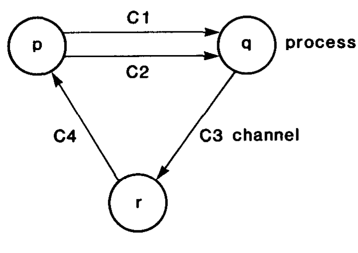
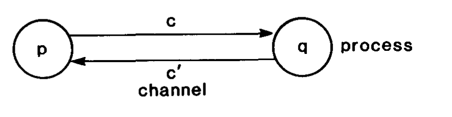
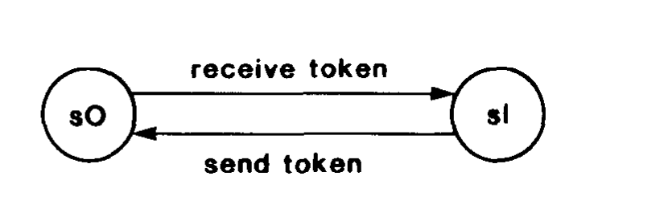
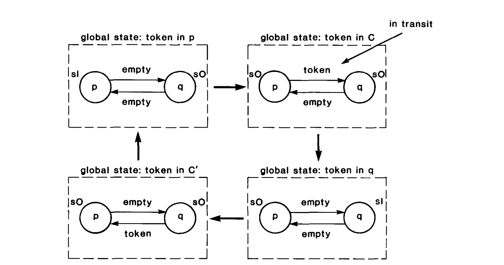
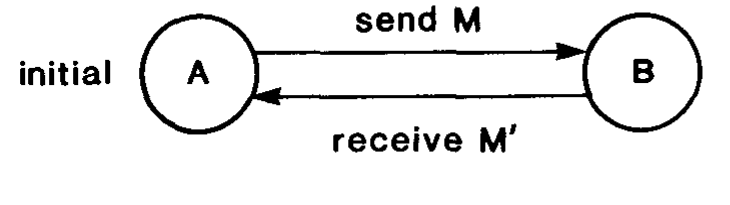
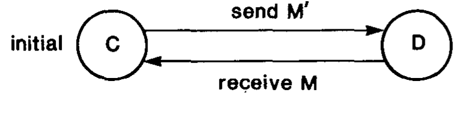
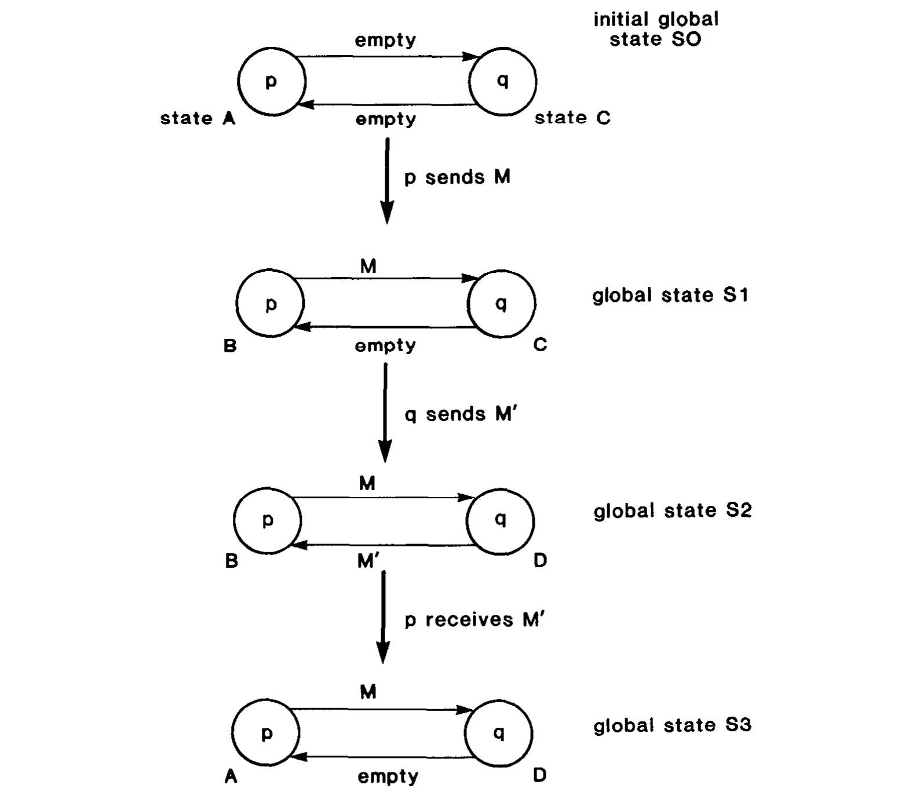

> 分布式快照：确定分布式系统的全局状态

K. MANI CHANDY<br>
University of Texas at Austin<br>
and<br>
LESLIE LAMPORT<br>
Stanford Research Institute

> K. MANI CHANDY<br>
> 得克萨斯大学奥斯汀分校<br>
> 与<br>
> LESLIE LAMPORT<br>
> 斯坦福研究所

This paper presents an algorithm by which a process in a distributed system determines a global state of the system during a computation. Many problems in distributed systems can be cast in terms of the problem of detecting global states. For instance, the global state detection algorithm helps to solve an important class of problems: stable property detection. A stable property is one that persists: once a stable property becomes true it remains true thereafter. Examples of stable properties are “computation has terminated,” “the system is deadlocked” and “all tokens in a token ring have disappeared.” The stable property detection problem is that of devising algorithms to detect a given stable property. Global state detection can also be used for checkpointing.

> 本文提出一种算法，使分布式系统中的某个进程能够在计算过程中确定系统的全局状态。分布式系统中的许多问题都可以表述为全局状态检测问题。例如，全局状态检测算法有助于解决一类重要问题：稳定性质检测。稳定性质是一种会持续保持的性质：它一旦为真，此后便始终为真。稳定性质的例子包括“计算已经终止”、“系统发生了死锁”以及“令牌环中的所有令牌都已消失”。稳定性质检测问题，就是设计出能够检测给定稳定性质的算法。全局状态检测还可用于检查点保存。

Categories and Subject Descriptors: C.2.4 [Computer-Communication Networks]: Distributed Systems—distributed applications; distributed databases; network operating systems; D.4.1 [Operating Systems]: Process Management—concurrency; deadlocks, multiprocessing/multiprogramming; mutual exclusion; scheduling; synchronization; D.4.5 [Operating Systems]: Reliability—backup procedures; checkpoint/restart; fault-tolerance; verification

> 分类与主题描述：C.2.4［计算机—通信网络］：分布式系统——分布式应用；分布式数据库；网络操作系统；D.4.1［操作系统］：进程管理——并发；死锁，多处理/多道程序设计；互斥；调度；同步；D.4.5［操作系统］：可靠性——备份过程；检查点/重启；容错；验证

General Terms: Algorithms

> 一般术语：算法

Additional Key Words and Phrases: Global States, Distributed deadlock detection, distributed systems, message communication systems

> 附加关键词与短语：全局状态，分布式死锁检测，分布式系统，消息通信系统

This work was supported in part by the Air Force Office of Scientific Research under Grant AFOSR 81-0205 and in part by the National Science Foundation under Grant MCS 81-04459.

> 本项工作部分得到美国空军科学研究办公室 AFOSR 81-0205 号资助，部分得到美国国家科学基金会 MCS 81-04459 号资助。

Authors’ addresses: K. M. Chandy, Department of Computer Sciences, University of Texas at Austin, Austin, TX 78712; L. Lamport, Stanford Research Institute, Menlo Park, CA 94025.

> 作者地址：K. M. Chandy，得克萨斯大学奥斯汀分校计算机科学系，Austin, TX 78712；L. Lamport，斯坦福研究所，Menlo Park, CA 94025。

Permission to copy without fee all or part of this material is granted provided that the copies are not made or distributed for direct commercial advantage, the ACM copyright notice and the title of the publication and its date appear, and notice is given that copying is by permission of the Association for Computing Machinery. To copy otherwise, or to republish, requires a fee and/or specific permission.

> 在满足下列条件时，允许免费复制本材料的全部或部分内容：复制件不得为直接商业利益而制作或传播；复制件须载有 ACM 版权声明、出版物标题及出版日期；并须注明复制已获美国计算机协会许可。以其他方式复制或再出版，则须付费和/或取得专门许可。

© 1985 ACM 0734-2071/85/0200-0063 \$00.75

> © 1985 ACM 0734-2071/85/0200-0063 \$00.75

_ACM Transactions on Computer Systems_, Vol. 3, No. 1, February 1985, Pages 63–75.

> _ACM Transactions on Computer Systems_，第 3 卷第 1 期，1985 年 2 月，第 63–75 页。

## 1. INTRODUCTION

> 1. 引言

This paper presents algorithms by which a process in a distributed system can determine a global state of the system during a computation. Processes in a distributed system communicate by sending and receiving messages. A process can record its own state and the messages it sends and receives; it can record nothing else. To determine a global system state, a process $p$ must enlist the cooperation of other processes that must record their own local states and send the recorded local states to $p$. All processes cannot record their local states at precisely the same instant unless they have access to a common clock. We assume that processes do not share clocks or memory. The problem is to devise algorithms by which processes record their own states and the states of communication channels so that the set of process and channel states recorded form a global system state. The global-state-detection algorithm is to be superimposed on the underlying computation: it must run concurrently with, but not alter, this underlying computation.

> 本文提出若干算法，使分布式系统中的某个进程能够在计算过程中确定系统的全局状态。分布式系统中的进程通过发送和接收消息进行通信。一个进程能够记录自身状态以及它所发送和接收的消息；除此之外，它什么也记录不了。为了确定系统的全局状态，进程 $p$ 必须取得其他进程的协作；这些进程必须记录各自的局部状态，并把记录下来的局部状态发送给 $p$。除非所有进程都能访问同一个公共时钟，否则它们不可能在完全相同的时刻记录各自的局部状态。我们假定进程既不共享时钟，也不共享内存。问题在于设计这样的算法：让各进程记录自身状态和通信信道状态，使所记录的进程状态与信道状态集合构成一个系统全局状态。全局状态检测算法要叠加在底层计算之上：它必须与底层计算并发运行，同时又不能改变底层计算。

The state-detection algorithm plays the role of a group of photographers observing a panoramic, dynamic scene, such as a sky filled with migrating birds—a scene so vast that it cannot be captured by a single photograph. The photographers must take several snapshots and piece the snapshots together to form a picture of the overall scene. The snapshots cannot all be taken at precisely the same instant because of synchronization problems. Furthermore, the photographers should not disturb the process that is being photographed; for instance, they cannot get all the birds in the heavens to remain motionless while the photographs are taken. Yet, the composite picture should be meaningful. The problem before us is to define “meaningful” and then to determine how the photographs should be taken.

> 状态检测算法扮演着一组摄影师的角色；他们观察的是一幅全景式的动态场景，比如布满迁徙鸟群的天空——这个场景如此辽阔，不可能由一张照片完整捕捉。摄影师必须拍摄多张快照，再把它们拼接起来，形成整个场景的图像。由于同步问题，这些快照不可能都在完全相同的时刻拍摄。此外，摄影师不应干扰被拍摄的过程；例如，他们不可能让天空中的所有鸟都在拍摄时静止不动。然而，拼合后的图像又必须有意义。摆在我们面前的问题，就是先定义何谓“有意义”，再确定应当如何拍摄这些照片。

We now describe an important class of problems that can be solved with the global-state-detection algorithm. Let $y$ be a predicate function defined on the global states of a distributed system $D$; that is, $y(S)$ is true or false for a global state $S$ of $D$. The predicate $y$ is said to be a _stable property_ of $D$ if $y(S)$ implies $y(S')$ for all global states $S'$ of $D$ reachable from global state $S$ of $D$. In other words, if $y$ is a stable property and $y$ is true at a point in a computation of $D$, then $y$ is true at all later points in that computation. Examples of stable properties are “computation has terminated,” “the system is deadlocked,” and “all tokens in a token ring have disappeared.”

> 下面说明一类可由全局状态检测算法解决的重要问题。设 $y$ 是定义在分布式系统 $D$ 的全局状态上的谓词函数；也就是说，对于 $D$ 的一个全局状态 $S$，$y(S)$ 的值为真或假。若对于从 $D$ 的全局状态 $S$ 可达的每一个全局状态 $S'$，$y(S)$ 都蕴含 $y(S')$，则称谓词 $y$ 是 $D$ 的一个*稳定性质*。换言之，若 $y$ 是稳定性质，而且在 $D$ 的一次计算中的某一点为真，那么在该次计算此后的所有点上，$y$ 都为真。稳定性质的例子包括“计算已经终止”、“系统发生了死锁”和“令牌环中的所有令牌都已消失”。

Several distributed-system problems can be formulated as the general problem of devising an algorithm by which a process in a distributed system can determine whether a stable property $y$ of the system holds. Deadlock detection [2, 5, 8, 9, 11] and termination detection [1, 4, 10] are special cases of the stable-property detection problem. Details of the algorithm are presented later. The basic idea of the algorithm is that a global state $S$ of the system is determined and $y(S)$ is computed to see if the stable property $y$ holds.

> 若干分布式系统问题都可以表述成这样一个一般问题：设计一种算法，使分布式系统中的某个进程能够判定系统的稳定性质 $y$ 是否成立。死锁检测［2、5、8、9、11］和终止检测［1、4、10］都是稳定性质检测问题的特例。算法细节将在后文给出。其基本思想是：先确定系统的某个全局状态 $S$，再计算 $y(S)$，以判断稳定性质 $y$ 是否成立。

Several algorithms for solving deadlock and termination problems by determining the global states of distributed systems have been published. Gligor and Shattuck [5] state that many of the published algorithms are incorrect and impractical. A reason for the incorrect or impractical algorithms may be that the relationships among local process states, global system states, and points in a distributed computation are not well understood. One of the contributions of this paper is to define these relationships.

> 已经发表了多种通过确定分布式系统全局状态来解决死锁和终止问题的算法。Gligor 与 Shattuck［5］指出，许多已发表的算法并不正确，也不实用。之所以会出现错误或不实用的算法，原因之一可能是人们尚未充分理解进程局部状态、系统全局状态以及分布式计算中的各个时点之间的关系。本文的一项贡献，就是定义这些关系。

Many distributed algorithms are structured as a sequence of phases, where each phase consists of a transient part in which useful work is done, followed by a stable part in which the system cycles endlessly and uselessly. The presence of stable behavior indicates the end of a phase. A phase is similar to a series of iterations in a sequential program, which are repeated until successive iterations produce no change, that is, stability is attained. Stability must be detected so that one phase can be terminated and the next phase initiated [10]. The termination of a computational phase is not identical to the termination of a computation. When a computation terminates, all activities cease—messages are not sent and process states do not change. There may be activity during the stable behavior that indicates the end of a computational phase—messages may be sent and received, and processes may change state, but this activity serves no purpose other than to signal the end of a phase. In this paper, we are concerned with the detection of stable system properties; the cessation of activity is only one example of a stable property.

> 许多分布式算法被组织成一系列阶段；每一阶段先有一个完成有用工作的瞬态部分，随后进入一个稳定部分，系统在其中无休止且无意义地循环。稳定行为的出现标志着一个阶段的结束。一个阶段类似于顺序程序中的一系列迭代：这些迭代不断重复，直至相邻两次迭代不再产生变化，即达到稳定。必须检测到这种稳定状态，才能终止当前阶段并启动下一阶段［10］。一个计算阶段的终止并不等同于一次计算的终止。计算终止时，一切活动都停止——不再发送消息，进程状态也不再变化。标志着计算阶段结束的稳定行为期间仍可能存在活动——消息可能继续发送和接收，进程也可能改变状态，但这些活动除了表示该阶段已经结束之外，并无其他作用。本文关注的是系统稳定性质的检测；活动停止仅仅是稳定性质的一个例子。

Strictly speaking, properties such as “the system is deadlocked” are not stable if the deadlock is “broken” and computation is reinitiated. However, to keep exposition simple, we shall partition the overall problem into the problems of (1) detecting the termination of one phase (and informing all processes that a phase has ended) and (2) initiating a new phase. The following is a stable property: “the $k$th computational phase has terminated,” $k = 1, 2, \ldots$. Hence, the methods presented in this paper are applicable to detecting the termination of the $k$th phase for a given $k$.

> 严格来说，如果死锁可以被“打破”并重新启动计算，那么“系统发生了死锁”这类性质并不稳定。不过，为使论述简洁，我们把整个问题分为两个问题：（1）检测一个阶段的终止，并通知所有进程该阶段已经结束；（2）启动一个新阶段。下面这个性质是稳定的：“第 $k$ 个计算阶段已经终止”，其中 $k = 1, 2, \ldots$。因此，对于给定的 $k$，本文提出的方法适用于检测第 $k$ 个阶段的终止。

In this paper we restrict attention to the problem of detecting stable properties. The problem of initiating the next phase of computation is not considered here because the solution to that problem varies significantly depending on the application, being different for database deadlock detection than for detecting the termination of a diffusing computation.

> 本文只讨论稳定性质检测问题。这里不考虑如何启动计算的下一阶段，因为这一问题的解法会随应用而显著不同：数据库死锁检测中的做法，与扩散计算终止检测中的做法并不相同。

We have to present our algorithms in terms of a model of a system. The model chosen is not important in itself; we could have couched our discussion in terms of other models. We shall describe our model informally and only to the level of detail necessary to make the algorithms clear.

> 我们必须借助某种系统模型来陈述算法。所选模型本身并不重要；我们完全可以用其他模型来组织讨论。下面只对模型作非形式化描述，而且仅详述到足以把算法说明清楚的程度。

## 2. MODEL OF A DISTRIBUTED SYSTEM

> 2. 分布式系统模型

A distributed system consists of a finite set of processes and a finite set of channels. It is described by a labeled, directed graph in which the vertices represent processes and the edges represent channels. Figure 1 is an example.

> 一个分布式系统由有限个进程和有限条信道组成。它可由一个带标号的有向图描述，其中顶点表示进程，边表示信道。图 1 给出了一个例子。



**Fig. 1. A distributed system with processes $p$, $q$, and $r$ and channels $c1$, $c2$, $c3$, and $c4$.**

> **图 1。一个包含进程 $p$、$q$、$r$ 以及信道 $c1$、$c2$、$c3$、$c4$ 的分布式系统。**

> **图表中文解读：** 三个圆分别表示进程 $p$、$q$、$r$；四条带箭头的边是 FIFO 通信信道。$c1$ 与 $c2$ 均从 $p$ 指向 $q$，$c3$ 从 $q$ 指向 $r$，$c4$ 从 $r$ 指向 $p$。该图也说明同一对进程之间可以存在多条信道。

Channels are assumed to have infinite buffers, to be error-free, and to deliver messages in the order sent. (The infinite buffer assumption is made for ease of exposition: bounded buffers may be assumed provided there exists a proof that no process attempts to add a message to a full buffer.) The delay experienced by a message in a channel is arbitrary but finite. The sequence of messages received along a channel is an initial subsequence of the sequence of messages sent along the channel. The state of a channel is the sequence of messages sent along the channel, excluding the messages received along the channel.

> 假定信道具有无限缓冲区、不会出错，并按发送顺序交付消息。（采用无限缓冲区假设只是为了便于论述；若能证明没有任何进程会试图向已满的缓冲区加入消息，也可以假定缓冲区有界。）消息在信道中经历的延迟可以任意长，但必须有限。沿一条信道接收到的消息序列，是沿该信道发送的消息序列的一个初始子序列。一条信道的状态，是沿该信道已发送的消息序列扣除已接收消息之后的序列。

A process is defined by a set of states, an initial state (from this set), and a set of events. An event $e$ in a process $p$ is an atomic action that may change the state of $p$ itself and the state of at most one channel $c$ incident on $p$: the state of $c$ may be changed by the sending of a message along $c$ (if $c$ is directed away from $p$) or the receipt of a message along $c$ (if $c$ is directed towards $p$). An event $e$ is defined by (1) the process $p$ in which the event occurs, (2) the state $s$ of $p$ immediately before the event, (3) the state $s'$ of $p$ immediately after the event, (4) the channel $c$ (if any) whose state is altered by the event, and (5) the message $M$, if any, sent along $c$ (if $c$ is a channel directed away from $p$) or received along $c$ (if $c$ is directed towards $p$). We define $e$ by the 5-tuple $\langle p, s, s', M, c\rangle$, where $M$ and $c$ are a special symbol, _null_, if the occurrence of $e$ does not change the state of any channel.

> 一个进程由一个状态集合、该集合中的一个初始状态以及一个事件集合来定义。进程 $p$ 中的事件 $e$ 是一个原子动作，它可以改变 $p$ 自身的状态，并且至多改变一条与 $p$ 相接的信道 $c$ 的状态：若 $c$ 的方向离开 $p$，则可通过沿 $c$ 发送消息来改变 $c$ 的状态；若 $c$ 的方向指向 $p$，则可通过沿 $c$ 接收消息来改变其状态。事件 $e$ 由以下五项定义：（1）事件发生所在的进程 $p$；（2）事件发生前一刻 $p$ 的状态 $s$；（3）事件发生后一刻 $p$ 的状态 $s'$；（4）其状态被事件改变的信道 $c$（如有）；（5）沿 $c$ 发送的消息 $M$（若 $c$ 是离开 $p$ 的信道），或沿 $c$ 接收的消息 $M$（若 $c$ 是指向 $p$ 的信道）（如有）。我们用五元组 $\langle p, s, s', M, c\rangle$ 定义 $e$；若 $e$ 的发生不改变任何信道的状态，则 $M$ 与 $c$ 均取特殊符号 _null_。

A global state of a distributed system is a set of component process and channel states: the initial global state is one in which the state of each process is its initial state and the state of each channel is the empty sequence. The occurrence of an event may change the global state. Let $e = \langle p, s, s', M, c\rangle$ we say $e$ can occur in global state $S$ if and only if (1) the state of process $p$ in global state $S$ is $s$ and (2) if $c$ is a channel directed towards $p$, then the state of $c$ in global state $S$ is a sequence of messages with $M$ at its head. We define a function _next_, where $next(S,e)$ is the global state immediately after the occurrence of event $e$ in global state $S$. The value of $next(S,e)$ is defined only if event $e$ can occur in global state $S$, in which case $next(S,e)$ is the global state identical to $S$ except that: (1) the state of $p$ in $next(S,e)$ is $s'$; (2) if $e$ is a channel directed towards $p$, then the state of $c$ in $next(S,e)$ is $c$’s state in $S$ with message $M$ deleted from its head; and (3) if $c$ is a channel directed away from $p$, then the state of $c$ in $next(S,e)$ is the same as $c$’s state in $S$ with message $M$ added to the tail.

> 分布式系统的一个全局状态，是各组成进程与信道的状态所构成的集合：在初始全局状态中，每个进程均处于其初始状态，每条信道的状态均为空序列。事件的发生可能改变全局状态。设 $e = \langle p, s, s', M, c\rangle$；当且仅当以下条件成立时，我们说 $e$ 可以在全局状态 $S$ 中发生：（1）进程 $p$ 在全局状态 $S$ 中的状态为 $s$；（2）若 $c$ 是一条指向 $p$ 的信道，则 $c$ 在全局状态 $S$ 中的状态是一个以 $M$ 为首元素的消息序列。定义函数 _next_，其中 $next(S,e)$ 表示事件 $e$ 在全局状态 $S$ 中发生后紧接着的全局状态。只有当事件 $e$ 可以在全局状态 $S$ 中发生时，$next(S,e)$ 的值才有定义；此时，$next(S,e)$ 与 $S$ 完全相同，只有以下例外：（1）$p$ 在 $next(S,e)$ 中的状态为 $s'$；（2）若 $e$ 是一条指向 $p$ 的信道，则 $c$ 在 $next(S,e)$ 中的状态，是从 $c$ 在 $S$ 中的状态头部删除消息 $M$ 后所得的状态；（3）若 $c$ 是一条离开 $p$ 的信道，则 $c$ 在 $next(S,e)$ 中的状态，是在 $c$ 于 $S$ 中的状态尾部加入消息 $M$ 后所得的状态。

Let $seq = (e_i: 0 \le i \le n)$ be a sequence of events in component processes of a distributed system. We say that $seq$ is a _computation of the system_ if and only if event $e_i$ can occur in global state $S_i$, $0 \le i \le n$, where $S_0$ is the initial global state and

$$S_{i+1} = next(S_i,e_i) \qquad \text{for}\qquad 0 \le i \le n.$$

> 设 $seq = (e_i: 0 \le i \le n)$ 是分布式系统各组成进程中的一个事件序列。当且仅当事件 $e_i$ 能在全局状态 $S_i$ 中发生（$0 \le i \le n$）时，我们称 $seq$ 是该*系统的一次计算*；其中 $S_0$ 是初始全局状态，并且
>
> $$S_{i+1} = next(S_i,e_i) \qquad \text{其中}\qquad 0 \le i \le n$$

An alternate model, based on Lamport [6], which views computations as partially ordered sets of events, is given in [7].

> 文献［7］给出了另一种以 Lamport［6］为基础的模型；该模型把计算视为事件的偏序集合。

_Example 2.1._ To illustrate the definition of a distributed system, consider a simple system consisting of two processes $p$ and $q$, and two channels $c$ and $c'$ as shown in Figure 2.

> _例 2.1。_ 为说明分布式系统的定义，考虑图 2 所示的简单系统；它由两个进程 $p$、$q$ 以及两条信道 $c$、$c'$ 组成。



**Fig. 2. The simple distributed system of Examples 2.1 and 2.2.**

> **图 2。例 2.1 和例 2.2 中的简单分布式系统。**

> **图表中文解读：** 两个进程 $p$、$q$ 由方向相反的两条信道连接：$c$ 从 $p$ 指向 $q$，$c'$ 从 $q$ 指向 $p$。

The system contains one _token_ that is passed from one process to another, and hence we call this system the “single-token conservation” system. Each process has two states, $s_0$ and $s_1$, where $s_0$ is the state in which the process does not possess the token and $s_1$ is the state in which it does. The initial state of $p$ is $s_1$ and of $q$ is $s_0$. Each process has two events: (1) a transition from $s_1$ to $s_0$ with the sending of the token, and (2) a transition from $s_0$ to $s_1$ with the receipt of the token. The state-transition diagram for a process is shown in Figure 3. The global states and transitions are shown in Figure 4.

> 系统中含有一个在进程之间传递的*令牌*，因此我们称它为“单令牌守恒”系统。每个进程都有两个状态 $s_0$ 和 $s_1$；$s_0$ 表示进程不持有令牌，$s_1$ 表示进程持有令牌。$p$ 的初始状态为 $s_1$，$q$ 的初始状态为 $s_0$。每个进程都有两个事件：（1）发送令牌时从 $s_1$ 转移到 $s_0$；（2）接收令牌时从 $s_0$ 转移到 $s_1$。进程的状态转移图见图 3；全局状态及其转移见图 4。



**Fig. 3. State-transition diagram of a process in Example 2.1.**

> **图 3。例 2.1 中一个进程的状态转移图。**

> **图表中文解读：** 进程发送令牌时由持有令牌的 $s_1$ 转到不持有令牌的 $s_0$；接收令牌时则由 $s_0$ 转回 $s_1$。



**Fig. 4. Global states and transitions of the single-token conservation system.**

> **图 4。单令牌守恒系统的全局状态及其转移。**

> **图表中文解读：** 四个虚线框依次表示令牌位于 $p$、信道 $c$ 中、$q$、信道 $c'$ 中的四个全局状态；粗箭头表示发送或接收令牌引起的全局状态转移。无论处于哪一状态，系统中的令牌总数始终为一。

A system computation corresponds to a path in the global-state-transition diagram (Figure 4) starting at the initial global state. Examples of system computations are: (1) the empty sequence and (2) $\langle p\ \text{sends token}, q\ \text{receives token}, q\ \text{sends token}\rangle$. The following sequence is not a computation of the system: $\langle p\ \text{sends token}, q\ \text{sends token}\rangle$, because the event “$q$ sends token” cannot occur while $q$ is in the state $s_0$.

> 一次系统计算对应于全局状态转移图（图 4）中从初始全局状态出发的一条路径。系统计算的例子包括：（1）空序列；（2）$\langle p\ \text{发送令牌}, q\ \text{接收令牌}, q\ \text{发送令牌}\rangle$。下面这个序列不是系统的一次计算：$\langle p\ \text{发送令牌}, q\ \text{发送令牌}\rangle$，因为当 $q$ 处于状态 $s_0$ 时，事件“$q$ 发送令牌”不可能发生。

For brevity, the four global states, in order of transition (see Figure 4), will be called (1) in-$p$, (2) in-$c$, (3) in-$q$, and (4) in-$c'$, to denote the location of the token. This example will be used later to motivate the algorithm. □

> 为简洁起见，按转移顺序（见图 4），把这四个全局状态称为（1）in-$p$、（2）in-$c$、（3）in-$q$、（4）in-$c'$，以表示令牌所在的位置。后文将用这个例子说明算法的动机。□



**Fig. 5. State-transition diagram for process $p$ in Example 2.2.**

> **图 5。例 2.2 中进程 $p$ 的状态转移图。**

> **图表中文解读：** $p$ 的初始状态为 $A$；发送 $M$ 时由 $A$ 转到 $B$，接收 $M'$ 时由 $B$ 转回 $A$。



**Fig. 6. State-transition diagram for process $q$ in Example 2.2.**

> **图 6。例 2.2 中进程 $q$ 的状态转移图。**

> **图表中文解读：** $q$ 的初始状态为 $C$；发送 $M'$ 时由 $C$ 转到 $D$，接收 $M$ 时由 $D$ 转回 $C$。



**Fig. 7. A computation for Example 2.2.**

> **图 7。例 2.2 的一次计算。**

> **图表中文解读：** 系统从 $S_0$ 开始：$p$ 为 $A$、$q$ 为 $C$，两条信道均空。随后 $p$ 发送 $M$ 得到 $S_1$；$q$ 发送 $M'$ 得到 $S_2$；最后 $p$ 接收 $M'$ 得到 $S_3$。在 $S_3$ 中，$M$ 仍在从 $p$ 到 $q$ 的信道上。

_Example 2.2._ This example illustrates nondeterministic computations. Nondeterminism plays an interesting role in the snapshot algorithm.

> _例 2.2。_ 本例说明非确定性计算。非确定性在快照算法中扮演着一个颇有意思的角色。

In Example 2.1 there is exactly one event possible in each global state. Consider a system with the same topology as Example 2.1 (see Figure 2) but where the processes $p$ and $q$ are defined by the state-transition diagrams of Figures 5 and 6.

> 在例 2.1 中，每个全局状态下恰好只有一个可能发生的事件。现在考虑一个拓扑结构与例 2.1 相同（见图 2）的系统，不过其进程 $p$ 和 $q$ 分别由图 5、图 6 中的状态转移图定义。

An example of a computation is shown in Figure 7. The reader should observe that there may be more than one transition allowable from a global state. For instance, events “$p$ sends $M$” and “$q$ sends $M'$” may occur in the initial global state, and the next states after these events are different. □

> 图 7 展示了一次计算。读者应当注意，从一个全局状态出发，可能允许不止一种转移。例如，在初始全局状态下，事件“$p$ 发送 $M$”和“$q$ 发送 $M'$”都可能发生，而且这两个事件发生后到达的下一状态并不相同。□

## 3. THE ALGORITHM

> 3. 算法

### 3.1. Motivation for the Steps of the Algorithm

> 3.1 算法步骤的动机

The global-state recording algorithm works as follows: Each process records its own state, and the two processes that a channel is incident on cooperate in recording the channel state. We cannot ensure that the states of all processes and channels will be recorded at the same instant because there is no global clock; however, we require that the recorded process and channel states form a “meaningful” global system state.

> 全局状态记录算法按如下方式工作：每个进程记录自身状态，而一条信道两端所接的两个进程协作记录该信道的状态。由于不存在全局时钟，我们无法保证所有进程和信道的状态都在同一时刻被记录；不过，我们要求所记录的进程状态和信道状态构成一个“有意义”的系统全局状态。

The global-state recording algorithm is to be superimposed on the underlying computation, that is, it must run concurrently with, but not alter, the underlying computation. The algorithm may send messages and require processes to carry out computations; however, the messages and computation required to record the global state must not interfere with the underlying computation.

> 全局状态记录算法要叠加在底层计算之上，也就是说，它必须与底层计算并发运行，却不能改变底层计算。该算法可以发送消息，也可以要求进程执行计算；但是，为记录全局状态所需的这些消息和计算不得干扰底层计算。

We now consider an example to motivate the steps of the algorithm. In the example we shall assume that we can record the state of a channel instantaneously; we postpone discussion of how the channel state is recorded. Let $c$ be a channel from $p$ to $q$. The purpose of the example is to gain an intuitive understanding of the relationship between the instant at which the state of channel $c$ is to be recorded and the instants at which the states of processes $p$ and $q$ are to be recorded.

> 下面通过一个例子说明算法各步骤的动机。在该例中，我们暂且假定可以瞬时记录一条信道的状态；如何记录信道状态的问题稍后再讨论。设 $c$ 是一条从 $p$ 到 $q$ 的信道。本例旨在直观理解：记录信道 $c$ 状态的时刻，与记录进程 $p$、$q$ 状态的时刻之间存在什么关系。

_Example 3.1._ Consider the single-token conservation system. Assume that the state of process $p$ is recorded in global state in-$p$. Then the state recorded for $p$ shows the token in $p$. Now assume that the global state transits to in-$c$ (because $p$ sends the token). Suppose the states of channels $c$ and $c'$ and of process $q$ were recorded in global state in-$c$, so the state recorded for channel $c$ shows it with the token and the states recorded for channel $c'$ and process $q$ show them not in possession of the token. The composite global state recorded in this fashion would show two tokens in the system, one in $p$ and the other in $c$. But a global state with two tokens is unreachable from the initial global state in a single-token conservation system! The inconsistency arises because the state of $p$ is recorded before $p$ sent a message along $c$ and the state of $c$ is recorded after $p$ sent the message. Let $n$ be the number of messages sent along $c$ before $p$’s state is recorded, and let $n'$ be the number of messages sent along $c$ before $c$’s state is recorded. Our example suggests that the recorded global state may be inconsistent if $n < n'$.

> _例 3.1。_ 考虑单令牌守恒系统。假定在全局状态 in-$p$ 时记录进程 $p$ 的状态，那么为 $p$ 记录的状态显示令牌位于 $p$。再假定全局状态随后转移到 in-$c$（因为 $p$ 发送了令牌）。设在全局状态 in-$c$ 时记录信道 $c$、$c'$ 和进程 $q$ 的状态；于是为信道 $c$ 记录的状态显示它持有令牌，而为信道 $c'$ 与进程 $q$ 记录的状态显示它们都不持有令牌。以这种方式拼合出的全局状态会显示系统中有两个令牌：一个在 $p$ 中，另一个在 $c$ 中。但在单令牌守恒系统里，含有两个令牌的全局状态不可能从初始全局状态到达！这种不一致之所以出现，是因为 $p$ 的状态在 $p$ 沿 $c$ 发送消息之前被记录，而 $c$ 的状态却在 $p$ 发送消息之后被记录。令 $n$ 为记录 $p$ 的状态之前沿 $c$ 发送的消息数，令 $n'$ 为记录 $c$ 的状态之前沿 $c$ 发送的消息数。本例表明，若 $n < n'$，记录所得的全局状态就可能不一致。

Now consider an alternate scenario. Suppose the state of $c$ is recorded in global state in-$p$, the system then transits to global state in-$c$, and the states of $c'$, $p$, and $q$ are recorded in global state in-$c$. The recorded global state shows no tokens in the system. This example suggests that the recorded global state may be inconsistent if the state of $c$ is recorded before $p$ sends a message along $c$ and the state of $p$ is recorded after $p$ sends a message along $c$, that is, if $n > n'$. □

> 再考虑另一种情形。假定在全局状态 in-$p$ 时记录 $c$ 的状态，随后系统转移到全局状态 in-$c$，并在全局状态 in-$c$ 时记录 $c'$、$p$ 和 $q$ 的状态。这样记录所得的全局状态显示系统中没有任何令牌。本例表明：如果 $c$ 的状态在 $p$ 沿 $c$ 发送消息之前被记录，而 $p$ 的状态却在发送该消息之后被记录，也就是说若 $n > n'$，那么所记录的全局状态可能不一致。□

We learn from these examples that (in general) a consistent global state requires

$$n = n'. \tag{1}$$

> 从这些例子可以看出，一般而言，一致的全局状态要求
>
> $$n = n'. \tag{1}$$

Let $m$ be the number of messages received along $c$ before $q$’s state is recorded. Let $m'$ be the number of messages received along $c$ before $c$’s state is recorded. We leave it up to the reader to extend the example to show that consistency requires

$$m = m'. \tag{2}$$

> 令 $m$ 为记录 $q$ 的状态之前沿 $c$ 接收的消息数；令 $m'$ 为记录 $c$ 的状态之前沿 $c$ 接收的消息数。留给读者扩展上述例子，以说明一致性要求
>
> $$m = m'. \tag{2}$$

In every state, the number of messages received along a channel cannot exceed the number of messages sent along that channel, that is,

$$n' \ge m'. \tag{3}$$

> 在任何状态下，沿一条信道接收的消息数都不能超过沿该信道发送的消息数，即
>
> $$n' \ge m'. \tag{3}$$

From the above equations,

$$n \ge m. \tag{4}$$

> 由上述等式可得
>
> $$n \ge m. \tag{4}$$

The state of channel $c$ that is recorded must be the sequence of messages sent along the channel before the sender’s state is recorded, excluding the sequence of messages received along the channel before the receiver’s state is recorded—that is, if $n' = m'$, the recorded state of $c$ must be the empty sequence, and if $n' > m'$, the recorded state of $c$ must be the $(m' + 1)$st, …, $n'$th messages sent by $p$ along $c$. This fact and eqs. (1)–(4) suggest a simple algorithm by which $q$ can record the state of channel $c$. Process $p$ sends a special message, called a _marker_, after the $n$th message it sends along $c$ (and before sending further messages along $c$). The marker has no effect on the underlying computation. The state of $c$ is the sequence of messages received by $q$ after $q$ records its own state and before $q$ receives the marker along $c$. To ensure eq. (4), $q$ must record its state, if it has not done so already, after receiving a marker along $c$ and before $q$ receives further messages along $c$.

> 所记录的信道 $c$ 状态，必须是发送者状态被记录之前沿该信道发送的消息序列，扣除接收者状态被记录之前沿该信道接收的消息序列；也就是说，若 $n' = m'$，所记录的 $c$ 状态必须为空序列；若 $n' > m'$，则所记录的 $c$ 状态必须由 $p$ 沿 $c$ 发送的第 $(m' + 1)$ 条到第 $n'$ 条消息组成。这个事实以及式（1）—（4）提示出一种让 $q$ 记录信道 $c$ 状态的简单算法。进程 $p$ 在沿 $c$ 发送第 $n$ 条消息之后（并在沿 $c$ 继续发送消息之前）发送一条称为*标记*的特殊消息。该标记不影响底层计算。$c$ 的状态，就是 $q$ 记录自身状态之后、沿 $c$ 收到标记之前所接收的消息序列。为保证式（4），$q$ 若尚未记录自身状态，就必须在沿 $c$ 收到标记之后、沿 $c$ 接收更多消息之前记录其状态。

Our example suggests the following outline for a global state detection algorithm.

> 上述例子提示了下面这个全局状态检测算法纲要。

### 3.2 Global-State-Detection Algorithm Outline

> 3.2 全局状态检测算法纲要

_Marker-Sending Rule for a Process $p$._ For each channel $c$ incident on, and directed away from $p$:

> _进程 $p$ 的标记发送规则。_ 对于每一条与 $p$ 相接且方向离开 $p$ 的信道 $c$：

> $p$ sends one marker along $c$ after $p$ records its state and before $p$ sends further messages along $c$.

> > $p$ 在记录自身状态之后、沿 $c$ 继续发送消息之前，沿 $c$ 发送一个标记。

_Marker-Receiving Rule for a Process $q$._ On receiving a marker along a channel $c$:

> _进程 $q$ 的标记接收规则。_ 当沿信道 $c$ 收到一个标记时：

```text
if q has not recorded its state then
   begin q records its state;
         q records the state c as the empty sequence
   end
else q records the state of c as the sequence of messages received along c after q’s state
     was recorded and before q received the marker along c.
```

> ```text
> 若 q 尚未记录自身状态，则
>    begin q 记录自身状态；
>          q 将状态 c 记录为空序列
>    end
> 否则，q 将 c 的状态记录为：在 q 的状态被记录之后、q 沿 c 收到标记之前，沿 c
>       接收到的消息序列。
> ```

### 3.3 Termination of the Algorithm

> 3.3 算法的终止

The marker receiving and sending rules guarantee that if a marker is received along every channel, then each process will record its state and the states of all incoming channels. To ensure that the global-state recording algorithm terminates in finite time, each process must ensure that (L1) no marker remains forever in an incident input channel and (L2) it records its state within finite time of initiation of the algorithm.

> 标记接收规则与标记发送规则保证：如果每条信道上的标记都被接收，那么每个进程都会记录自身状态以及所有入信道的状态。为保证全局状态记录算法在有限时间内终止，每个进程都必须保证：（L1）没有任何标记会永远滞留在与其相接的输入信道中；（L2）算法启动后，它会在有限时间内记录自身状态。

The algorithm can be initiated by one or more processes, each of which records its state spontaneously, without receiving markers from other processes; we postpone discussion of what may cause a process to record its state spontaneously. If process $p$ records its state and there is a channel from $p$ to a process $q$, then $q$ will record its state in finite time because $p$ will send a marker along the channel and $q$ will receive the marker in finite time (L1). Hence if $p$ records its state and there is a path (in the graph representing the system) from $p$ to a process $q$, then $q$ will record its state in finite time because, by induction, every process along the path will record its state in finite time. Termination in finite time is ensured if for every process $q$: $q$ spontaneously records its state or there is a path from a process $p$, which spontaneously records its state, to $q$.

> 算法可以由一个或多个进程启动；每个这样的进程不必从其他进程接收标记，而是自发记录自身状态。什么原因会促使进程自发记录状态，留待后文讨论。如果进程 $p$ 记录了自身状态，而且存在一条从 $p$ 到进程 $q$ 的信道，那么 $q$ 将在有限时间内记录自身状态，因为 $p$ 会沿该信道发送标记，而 $q$ 会在有限时间内收到该标记（L1）。因此，如果 $p$ 记录了自身状态，而且在表示系统的图中存在一条从 $p$ 到进程 $q$ 的路径，那么 $q$ 将在有限时间内记录自身状态；因为由归纳可知，路径上的每个进程都会在有限时间内记录自身状态。若对每个进程 $q$ 都满足下列条件，则可保证算法在有限时间内终止：$q$ 自发记录自身状态，或者存在一条从某个自发记录自身状态的进程 $p$ 到 $q$ 的路径。

In particular, if the graph is strongly connected and at least one process spontaneously records its state, then all processes will record their states in finite time (provided L1 is ensured).

> 特别地，如果该图是强连通的，并且至少有一个进程自发记录其状态，那么所有进程都会在有限时间内记录各自状态（前提是 L1 得到保证）。

The algorithm described so far allows each process to record its state and the states of incoming channels. The recorded process and channel states must be collected and assembled to form the recorded global state. We shall not describe algorithms for collecting the recorded information because such algorithms have been described elsewhere [4, 10]. A simple algorithm for collecting information in a system whose topology is strongly connected is for each process to send the information it records along all outgoing channels, and for each process receiving information for the first time to copy it and propagate it along all of its outgoing channels. All the recorded information will then get to all the processes in finite time, allowing all processes to determine the recorded global state.

> 到目前为止所述的算法，使每个进程都能记录自身状态和入信道状态。接下来必须收集并组装所记录的进程状态与信道状态，以形成记录所得的全局状态。我们不再描述收集这些记录信息的算法，因为此类算法已在其他文献中给出［4、10］。对于拓扑结构强连通的系统，一种简单的信息收集算法是：每个进程沿其所有出信道发送自己记录的信息；每个进程第一次收到某项信息时，复制该信息，并沿自己的所有出信道传播。这样，所有记录的信息都会在有限时间内到达所有进程，使每个进程都能确定记录所得的全局状态。

## 4. PROPERTIES OF THE RECORDED GLOBAL STATE

> 4. 所记录全局状态的性质

To gain an intuitive understanding of the properties of the global state recorded by the algorithm, we shall study Example 2.2. Assume that the state of $p$ is recorded in global state $S_0$ (Figure 7), so the state recorded for $p$ is $A$. After recording its state, $p$ sends a marker along channel $c$. Now assume that the system goes to global state $S_1$, then $S_2$, and then $S_3$ while the marker is still in transit, and the marker is received by $q$ when the system is in global state $S_3$. On receiving the marker, $q$ records its state, which is $D$, and records the state of $c$ to be the empty sequence. After recording its state, $q$ sends a marker along channel $c'$. On receiving the marker, $p$ records the state of $c'$ as the sequence consisting of the single message $M'$. The recorded global state $S^*$ is shown in Figure 8. The recording algorithm was initiated in global state $S_0$ and terminated in global state $S_3$.

> 为了直观理解算法所记录的全局状态具有什么性质，我们来考察例 2.2。假定在全局状态 $S_0$（图 7）时记录 $p$ 的状态，因此为 $p$ 记录的状态是 $A$。记录自身状态后，$p$ 沿信道 $c$ 发送一个标记。再假定当该标记仍在传输途中时，系统依次进入全局状态 $S_1$、$S_2$、$S_3$；系统处于全局状态 $S_3$ 时，$q$ 收到该标记。收到标记后，$q$ 记录其自身状态 $D$，并把 $c$ 的状态记录为空序列。记录自身状态后，$q$ 沿信道 $c'$ 发送一个标记。$p$ 收到该标记时，把 $c'$ 的状态记录为仅含一条消息 $M'$ 的序列。记录所得的全局状态 $S^*$ 如图 8 所示。记录算法在全局状态 $S_0$ 时启动，在全局状态 $S_3$ 时终止。


**Fig. 8. A recorded global state for Example 2.2.**

> **图 8。例 2.2 中记录所得的一个全局状态。**

> **图表中文解读：** 快照 $S^*$ 中，$p$ 的局部状态为 $A$、$q$ 的局部状态为 $D$；从 $p$ 到 $q$ 的信道为空，而从 $q$ 到 $p$ 的信道中含消息 $M'$。这个组合状态并未按原顺序实际出现，却与某个保持因果约束的事件重排相对应。

Observe that the global state $S^*$ recorded by the algorithm is not identical to any of the global states $S_0$, $S_1$, $S_2$, $S_3$ that occurred in the computation. Of what use is the algorithm if the recorded global state never occurred? We shall now answer this question.

> 请注意，算法记录的全局状态 $S^*$ 与计算中实际出现过的任何一个全局状态 $S_0$、$S_1$、$S_2$、$S_3$ 都不相同。如果所记录的全局状态从未出现过，这个算法还有什么用？下面回答这个问题。

Let $seq = (e_i, 0 \le i)$ be a distributed computation, and let $S_i$ be the global state of the system immediately before event $e_i$, $0 \le i$, in $seq$. Let the algorithm be initiated in global state $S_\iota$ and let it terminate in global state $S_\phi$, $0 \le \iota \le \phi$; in other words, the algorithm is initiated after $e_{\iota-1}$ if $\iota > 0$, and before $e_\iota$, and it terminates after $e_{\phi-1}$ if $\phi > 0$, and before $e_\phi$. We observed in Example 2.2 that the recorded global state $S^*$ may be different from all global states $S_k$, $\iota \le k \le \phi$.

> 设 $seq = (e_i, 0 \le i)$ 是一次分布式计算，并设 $S_i$ 是 $seq$ 中事件 $e_i$ 发生前一刻的系统全局状态，其中 $0 \le i$。设算法在全局状态 $S_\iota$ 时启动，在全局状态 $S_\phi$ 时终止，且 $0 \le \iota \le \phi$；换言之，若 $\iota > 0$，算法在 $e_{\iota-1}$ 之后、$e_\iota$ 之前启动；若 $\phi > 0$，算法在 $e_{\phi-1}$ 之后、$e_\phi$ 之前终止。例 2.2 已经表明，记录所得的全局状态 $S^*$ 可能不同于所有全局状态 $S_k$，其中 $\iota \le k \le \phi$。

We shall show that:

1. $S^*$ is reachable from $S_\iota$, and
2. $S_\phi$ is reachable from $S^*$.

> 我们将证明：
>
> 1. $S^*$ 可从 $S_\iota$ 到达；并且
> 2. $S_\phi$ 可从 $S^*$ 到达。

Specifically, we shall show that there exists a computation $seq'$ where

1. $seq'$ is a permutation of $seq$, such that $S_\iota$, $S^*$ and $S_\phi$ occur as global states in $seq'$,
2. $S_\iota = S^*$ or $S_\iota$ occurs earlier than $S^*$, and
3. $S_\phi = S^*$ or $S^*$ occurs earlier than $S_\phi$ in $seq'$.

> 更具体地说，我们将证明存在一次计算 $seq'$，满足：
>
> 1. $seq'$ 是 $seq$ 的一个排列，并且 $S_\iota$、$S^*$、$S_\phi$ 都作为全局状态出现在 $seq'$ 中；
> 2. $S_\iota = S^*$，或者 $S_\iota$ 先于 $S^*$ 出现；
> 3. $S_\phi = S^*$，或者在 $seq'$ 中 $S^*$ 先于 $S_\phi$ 出现。

**THEOREM 1.** _There exists a computation $seq' = (e'_i, 0 \le i)$ where_

1. _For all $i$, where $i < \iota$ or $i \ge \phi$: $e'_i = e_i$, and_
2. _the subsequence $(e'_i, \iota \le i < \phi)$ is a permutation of the subsequence $(e_i, \iota \le i < \phi)$, and_
3. _for all $i$ where $i \le \iota$ or $i \ge \phi$: $S'_i = S_i$, and_
4. _there exists some $k$, $\iota \le k \le \phi$, such that $S^* = S'_k$._

> **定理 1。** _存在一次计算 $seq' = (e'_i, 0 \le i)$，满足：_
>
> 1. _对所有满足 $i < \iota$ 或 $i \ge \phi$ 的 $i$，有 $e'_i = e_i$；_
> 2. _子序列 $(e'_i, \iota \le i < \phi)$ 是子序列 $(e_i, \iota \le i < \phi)$ 的一个排列；_
> 3. _对所有满足 $i \le \iota$ 或 $i \ge \phi$ 的 $i$，有 $S'_i = S_i$；_
> 4. _存在某个满足 $\iota \le k \le \phi$ 的 $k$，使 $S^* = S'_k$。_

**PROOF.** Event $e_i$ in $seq$ is called a _prerecording event_ if and only if $e_i$ is in a process $p$ and $p$ records its state _after_ $e_i$ in $seq$. Event $e_i$ in $seq$ is called a _postrecording event_ if and only if it is not a prerecording event—that is, if $e_i$ is in a process $p$ and $p$ records its state _before_ $e_i$ in $seq$. All events $e_i$, $i < \iota$, are prerecording events and all events $e_i$, $i \ge \phi$, are postrecording events in $seq$. There may be a postrecording event $e_{j-1}$ before a prerecording event $e_j$ for some $j$, $\iota < j < \phi$; this can occur only if $e_{j-1}$ and $e_j$ are in different processes (because if $e_{j-1}$ and $e_j$ are in the same process and $e_{j-1}$ is a postrecording event, then so is $e_j$).

> **证明。** 当且仅当 $seq$ 中的事件 $e_i$ 位于某个进程 $p$ 中，而且 $p$ 在 $seq$ 中于 $e_i$ *之后*记录自身状态时，称 $e_i$ 为*记录前事件*。当且仅当 $seq$ 中的事件 $e_i$ 不是记录前事件时，称它为*记录后事件*；也就是说，$e_i$ 位于某个进程 $p$ 中，而且 $p$ 在 $seq$ 中于 $e_i$ *之前*记录自身状态。$seq$ 中所有满足 $i < \iota$ 的事件 $e_i$ 都是记录前事件，所有满足 $i \ge \phi$ 的事件 $e_i$ 都是记录后事件。对于某个满足 $\iota < j < \phi$ 的 $j$，记录后事件 $e_{j-1}$ 可能出现在记录前事件 $e_j$ 之前；只有当 $e_{j-1}$ 和 $e_j$ 位于不同进程中时，才会出现这种情形（因为若 $e_{j-1}$ 与 $e_j$ 位于同一进程，且 $e_{j-1}$ 是记录后事件，那么 $e_j$ 也必然是记录后事件）。

We shall derive a computation $seq'$ by permuting $seq$, where all prerecording events occur before all postrecording events in $seq'$. We shall show that $S^*$ is the global state in $seq'$ after all prerecording events and before all postrecording events.

> 我们将通过重排 $seq$ 得到一次计算 $seq'$，使 $seq'$ 中所有记录前事件都发生在所有记录后事件之前。我们还将证明：在 $seq'$ 中，所有记录前事件发生之后、所有记录后事件发生之前的全局状态正是 $S^*$。

Assume that there is a postrecording event $e_{j-1}$ before a prerecording event $e_j$ in $seq$. We shall show that the sequence obtained by interchanging $e_{j-1}$ and $e_j$ must also be a computation. Events $e_{j-1}$ and $e_j$ must be on different processes. Let $p$ be the process in which $e_{j-1}$ occurs, and let $q$ be the process in which $e_j$ occurs. There cannot be a message sent at $e_{j-1}$ which is received at $e_j$ because (1) if a message is sent along a channel $c$ when event $e_{j-1}$ occurs, then a marker must have been sent along $c$ _before_ $e_{j-1}$, since $e_{j-1}$ is a postrecording event, and (2) if the message is received along channel $c$ when $e_j$ occurs, then the marker must have been received along $c$ _before_ $e_j$ occurs (since channels are first-in-first-out), in which case (by the marker-receiving rule) $e_j$ would be a postrecording event too.

> 假定 $seq$ 中存在一个位于记录前事件 $e_j$ 之前的记录后事件 $e_{j-1}$。我们将证明，交换 $e_{j-1}$ 与 $e_j$ 所得的序列也必定是一次计算。事件 $e_{j-1}$ 和 $e_j$ 必须位于不同进程。设 $e_{j-1}$ 发生在进程 $p$ 中，$e_j$ 发生在进程 $q$ 中。不可能存在一条在 $e_{j-1}$ 处发送、又在 $e_j$ 处接收的消息，原因如下：（1）若事件 $e_{j-1}$ 发生时沿信道 $c$ 发送了一条消息，则由于 $e_{j-1}$ 是记录后事件，必然已有一个标记在 $e_{j-1}$ *之前*沿 $c$ 发出；（2）若该消息在 $e_j$ 发生时沿信道 $c$ 被接收，则标记必定在 $e_j$ 发生*之前*已经沿 $c$ 被接收（因为信道是先进先出的）；这样一来，根据标记接收规则，$e_j$ 也会是记录后事件。

The state of process $q$ is not altered by the occurrence of event $e_{j-1}$ because $e_{j-1}$ is in a different process $p$. If $e_j$ is an event in which $q$ receives a message $M$ along a channel $c$, then $M$ must have been the message at the head of $c$ before event $e_{j-1}$, since a message sent at $e_{j-1}$ cannot be received at $e_j$. Hence event $e_j$ can occur in global state $S_{j-1}$.

> 进程 $q$ 的状态不会因事件 $e_{j-1}$ 的发生而改变，因为 $e_{j-1}$ 位于另一个进程 $p$ 中。如果 $e_j$ 是 $q$ 沿信道 $c$ 接收消息 $M$ 的事件，那么在事件 $e_{j-1}$ 发生之前，$M$ 必定已经是 $c$ 头部的消息，因为在 $e_{j-1}$ 处发送的消息不可能在 $e_j$ 处被接收。因此，事件 $e_j$ 可以在全局状态 $S_{j-1}$ 中发生。

The state of process $p$ is not altered by the occurrence of $e_j$. Hence $e_{j-1}$ can occur after $e_j$. Hence the sequence of events $e_\iota, \ldots, e_{j-2}, e_j, e_{j-1}$ is a computation. From the arguments in the last paragraph it follows that the global state after computation $e_\iota, \ldots, e_j$ is the same as the global state after computation $e_\iota, \ldots, e_{j-2}, e_j, e_{j-1}$.

> 进程 $p$ 的状态不会因 $e_j$ 的发生而改变。因此，$e_{j-1}$ 可以在 $e_j$ 之后发生。于是，事件序列 $e_\iota, \ldots, e_{j-2}, e_j, e_{j-1}$ 是一次计算。根据上一段的论证，计算 $e_\iota, \ldots, e_j$ 之后的全局状态，与计算 $e_\iota, \ldots, e_{j-2}, e_j, e_{j-1}$ 之后的全局状态相同。

Let $seq^*$ be a permutation of $seq$ that is identical to $seq$ except that $e_j$ and $e_{j-1}$ are interchanged. Then $seq^*$ must also be a computation. Let $\bar S_i$ be the global state immediately before the $i$th event in $seq^*$. From the arguments of the previous paragraph,

$$\bar S_i = S_i \qquad \text{for all } i \text{ where } i \ne j.$$

> 设 $seq^*$ 是 $seq$ 的一个排列，除交换 $e_j$ 与 $e_{j-1}$ 外，它与 $seq$ 完全相同。那么 $seq^*$ 也必定是一次计算。令 $\bar S_i$ 表示 $seq^*$ 中第 $i$ 个事件发生前一刻的全局状态。根据上一段的论证，
>
> $$\bar S_i = S_i \qquad \text{对所有满足 } i \ne j \text{ 的 } i$$

By repeatedly swapping postrecording events that immediately follow prerecording events, we see that there exists a permutation $seq'$ of $seq$ in which

1. all prerecording events precede all postrecording events,
2. $seq'$ is a computation,
3. for all $i$ where $i < \iota$ or $i \ge \phi$: $e'_i = e_i$, and
4. for all $i$ where $i \le \iota$ or $i \ge \phi$: $S'_i = S_i$.

> 反复交换紧跟在记录前事件之后的记录后事件，可知存在 $seq$ 的一个排列 $seq'$，其中：
>
> 1. 所有记录前事件都先于所有记录后事件；
> 2. $seq'$ 是一次计算；
> 3. 对所有满足 $i < \iota$ 或 $i \ge \phi$ 的 $i$，有 $e'_i = e_i$；
> 4. 对所有满足 $i \le \iota$ 或 $i \ge \phi$ 的 $i$，有 $S'_i = S_i$。

Now we shall show that the global state after all prerecording events and before all postrecording events in $seq'$ is $S^*$. To do this, we need to show that

1. the state of each process $p$ in $S^*$ is the same as its state after the process computation consisting of the sequence of prerecorded events on $p$, and
2. the state of each channel $c$ in $S^*$ is (sequence of messages corresponding to prerecorded sends on $c$) − (sequence of messages corresponding to prerecorded receives on $c$).

> 现在要证明，$seq'$ 中所有记录前事件发生之后、所有记录后事件发生之前的全局状态就是 $S^*$。为此，需要证明：
>
> 1. $S^*$ 中每个进程 $p$ 的状态，与由 $p$ 上记录前事件序列组成的进程计算执行后 $p$ 的状态相同；
> 2. $S^*$ 中每条信道 $c$ 的状态等于（与 $c$ 上记录前发送相对应的消息序列）减去（与 $c$ 上记录前接收相对应的消息序列）。

The proof of the first part is trivial. Now we prove part (2). Let $c$ be a channel from process $p$ to process $q$. The state of channel $c$ recorded in $S^*$ is the sequence of messages received on $c$ by $q$ _after_ $q$ records its state and _before_ $q$ receives a marker on $c$. The sequence of messages sent by $p$ along $c$ before $p$ sends a marker along $c$ is the sequence corresponding to prerecorded sends on $c$. Part (2) now follows. □

> 第一部分的证明是直接的。下面证明第（2）部分。设 $c$ 是从进程 $p$ 到进程 $q$ 的一条信道。在 $S^*$ 中记录的信道 $c$ 状态，是 $q$ 在记录自身状态*之后*、沿 $c$ 收到标记*之前*沿 $c$ 接收的消息序列。$p$ 沿 $c$ 发送标记之前沿 $c$ 发送的消息序列，正是与 $c$ 上记录前发送相对应的序列。第（2）部分由此成立。□

_Example 4.1._ The purpose of this example is to show how the computation $seq'$ is derived from the computation $seq$. Consider Example 2.2. The sequence of events shown in the computation of Figure 7 is

> _例 4.1。_ 本例说明如何从计算 $seq$ 导出计算 $seq'$。考察例 2.2。图 7 所示计算中的事件序列为：

```text
e₀:  p sends M and changes state to B (a postrecording event)
e₁:  q sends M′ and changes state to D (a prerecording event)
e₂:  p receives M′ and changes state to A (a postrecording event)
```

> ```text
> e₀：p 发送 M 并把状态改变为 B（记录后事件）
> e₁：q 发送 M′ 并把状态改变为 D（记录前事件）
> e₂：p 接收 M′ 并把状态改变为 A（记录后事件）
> ```

Since $e_0$, a postrecording event, immediately precedes $e_1$, a prerecording event, we interchange them, to get the permuted sequence $seq'$:

> 由于记录后事件 $e_0$ 紧接在记录前事件 $e_1$ 之前，我们交换二者，得到排列后的序列 $seq'$：

```text
e′₀: q sends M′ and changes state to D (a prerecording event)
e′₁: p sends M and changes state to B (a postrecording event)
e′₂: p receives M′ and changes state to A (a postrecording event)
```

> ```text
> e′₀：q 发送 M′ 并把状态改变为 D（记录前事件）
> e′₁：p 发送 M 并把状态改变为 B（记录后事件）
> e′₂：p 接收 M′ 并把状态改变为 A（记录后事件）
> ```

In $seq'$, all prerecording events precede all postrecording events. We leave it to the reader to show that the global state after $e'_0$ is the recorded global state.

> 在 $seq'$ 中，所有记录前事件都先于所有记录后事件。留给读者证明，$e'_0$ 之后的全局状态就是记录所得的全局状态。

## 5. STABILITY DETECTION

> 5. 稳定性检测

We now solve the stability-detection problem described in Section 1. We study the stability-detection problem because it is a paradigm for many practical problems, such as distributed deadlock detection.

> 现在来解决第 1 节所述的稳定性检测问题。之所以研究这个问题，是因为它是许多实际问题（例如分布式死锁检测）的范式。

A stability-detection algorithm is defined as follows:

> 稳定性检测算法定义如下：

**Input:** A stable property $y$

> **输入：** 一个稳定性质 $y$

**Output:** A Boolean value _definite_ with the property:

$$(y(S_\iota) \Rightarrow definite) \qquad \text{and} \qquad (definite \Rightarrow y(S_\phi))$$

where $S_\iota$ and $S_\phi$ are the global states of the system when the algorithm is initiated and when it terminates, respectively. (The symbol $\Rightarrow$ denotes logical implication.)

> **输出：** 一个布尔值 _definite_，它满足：
>
> $$(y(S_\iota) \Rightarrow definite) \qquad \text{且} \qquad (definite \Rightarrow y(S_\phi))$$
>
> 其中，$S_\iota$ 和 $S_\phi$ 分别是算法启动与终止时系统的全局状态。（符号 $\Rightarrow$ 表示逻辑蕴含。）

The input to the algorithm is (the definition of) function $y$. During the execution of the algorithm the value $y(S)$ for some global state $S$ may be determined by a process in the system by applying the _externally defined_ function $y$ to global state $S$. By the output of the algorithm being a Boolean value _definite_ we mean that (1) some specially designated process (say $p$) enters and thereafter remains in some special state to symbolize an output of _definite = true_, and (2) $p$ enters and remains in some other special state to symbolize an output of _definite = false_.

> 算法的输入是函数 $y$（的定义）。在算法执行期间，系统中的某个进程可以把这个*外部定义的*函数 $y$ 应用于某个全局状态 $S$，从而确定 $y(S)$ 的值。所谓算法输出布尔值 _definite_，是指：（1）某个特别指定的进程（比如 $p$）进入并从此保持在某个特殊状态，以表示输出 _definite = true_；（2）$p$ 进入并保持在另一个特殊状态，以表示输出 _definite = false_。

_Definite = true_ implies that the stable property holds when the algorithm terminates. However, _definite = false_ implies that the stable property does not hold when the algorithm is initiated. We emphasize that _definite = true_ gives us information about the state of the system at the termination of the algorithm, whereas _definite = false_ gives us information about the system state at the initiation of the algorithm. In particular, we cannot deduce from _definite = false_ that the stable property does not hold at termination of the algorithm.

> _Definite = true_ 蕴含该稳定性质在算法终止时成立；而 _definite = false_ 蕴含该稳定性质在算法启动时不成立。需要强调的是，_definite = true_ 提供的是算法终止时系统状态的信息，而 _definite = false_ 提供的是算法启动时系统状态的信息。尤其不能由 _definite = false_ 推断该稳定性质在算法终止时仍不成立。

The solution to the stability detection problem is

> 稳定性检测问题的解法是：

```text
begin
    record a global state S*;
    definite := y(S*)
end.
```

> ```text
> begin
>     记录一个全局状态 S*；
>     definite := y(S*)
> end.
> ```

The correctness of the stability detection algorithm follows from the following facts:

1. $S^*$ is reachable from $S_\iota$,
2. $S_\phi$ is reachable from $S^*$ (Theorem 1), and
3. $y(S) \Rightarrow y(S')$ for all $S'$ reachable from $S$ (definition of a stable property).

> 稳定性检测算法的正确性源于以下事实：
>
> 1. $S^*$ 可从 $S_\iota$ 到达；
> 2. $S_\phi$ 可从 $S^*$ 到达（定理 1）；
> 3. 对每一个从 $S$ 可达的 $S'$，都有 $y(S) \Rightarrow y(S')$（稳定性质的定义）。

## ACKNOWLEDGMENTS

> 致谢

J. Misra’s contributions in defining the problem of global state detection are gratefully acknowledged. We are grateful to E. W. Dijkstra and C. S. Scholten for their comments—particularly regarding the proof of Theorem 1. The outline of the current version of the proof was suggested by them. Dijkstra’s note [3] on the subject provides colorful insight into the problem of stability detection. Thanks are due to C. A. R. Hoare, F. Schneider, and G. Andrews who helped us with detailed comments. We are grateful to Anita Jones and anonymous referees for suggestions.

> 谨此感谢 J. Misra 在定义全局状态检测问题方面所作的贡献。感谢 E. W. Dijkstra 与 C. S. Scholten 提出的意见，尤其是关于定理 1 证明的意见；当前版本证明的纲要正是由他们建议的。Dijkstra 关于这一主题的札记［3］对稳定性检测问题作出了生动而富有启发性的阐释。还要感谢 C. A. R. Hoare、F. Schneider 和 G. Andrews 提供详尽意见；并感谢 Anita Jones 及匿名审稿人的建议。

## REFERENCES

> 参考文献

1. CHANDY, K. M., AND MISRA, J. Distributed computation on graphs: Shortest path algorithms. _Commun. ACM_ 25, 11 (Nov. 1982), 833–837.

   > CHANDY, K. M. 与 MISRA, J. 图上的分布式计算：最短路径算法。_Commun. ACM_，25 卷 11 期（1982 年 11 月），833–837 页。

2. CHANDY, K. M., MISRA, J., AND HAAS, L. Distributed deadlock detection. _ACM Trans. Comput. Syst._ 1, 2 (May 1983), 144–156.

   > CHANDY, K. M.、MISRA, J. 与 HAAS, L. 分布式死锁检测。_ACM Trans. Comput. Syst._，1 卷 2 期（1983 年 5 月），144–156 页。

3. DIJKSTRA, E. W. The distributed snapshot of K. M. Chandy and L. Lamport. Tech. Rep. EWD 864a, Univ. of Texas, Austin, Tex., 1984.

   > DIJKSTRA, E. W. K. M. Chandy 与 L. Lamport 的分布式快照。技术报告 EWD 864a，得克萨斯大学，美国得克萨斯州奥斯汀，1984 年。

4. DIJKSTRA, E. W., AND SCHOLTEN, C. S. Termination detection for diffusing computations. _Inf. Proc. Lett._ 11, 1 (Aug. 1980), 1–4.

   > DIJKSTRA, E. W. 与 SCHOLTEN, C. S. 扩散计算的终止检测。_Inf. Proc. Lett._，11 卷 1 期（1980 年 8 月），1–4 页。

5. GLIGOR, V. D., AND SHATTUCK, S. H. Deadlock detection in distributed systems. _IEEE Trans. Softw. Eng._ SE-6, 5 (Sep. 1980), 435–440.

   > GLIGOR, V. D. 与 SHATTUCK, S. H. 分布式系统中的死锁检测。_IEEE Trans. Softw. Eng._，SE-6 卷 5 期（1980 年 9 月），435–440 页。

6. LAMPORT, L. Time, clocks, and the ordering of events in a distributed system. _Commun. ACM_ 21, 7 (Jul. 1978), 558–565.

   > LAMPORT, L. 分布式系统中的时间、时钟和事件顺序。_Commun. ACM_，21 卷 7 期（1978 年 7 月），558–565 页。

7. LAMPORT, L., AND CHANDY, K. M. On partially-ordered event models of distributed computations. Submitted for publication.

   > LAMPORT, L. 与 CHANDY, K. M. 论分布式计算的偏序事件模型。已投稿。

8. MAHOUD, S. A., AND RIORDAN, J. S. Software controlled access to distributed databases. _INFOR_ 15, 1 (Feb. 1977), 22–36.

   > MAHOUD, S. A. 与 RIORDAN, J. S. 对分布式数据库的软件控制访问。_INFOR_，15 卷 1 期（1977 年 2 月），22–36 页。

9. MENASCE, D., AND MUNTZ, R. Locking and deadlock detection in distributed data bases. _IEEE Trans. Softw. Eng._ SE-5, 3 (May 1979), 195–202.

   > MENASCE, D. 与 MUNTZ, R. 分布式数据库中的加锁与死锁检测。_IEEE Trans. Softw. Eng._，SE-5 卷 3 期（1979 年 5 月），195–202 页。

10. MISRA, J., AND CHANDY, K. M. Termination detection of diffusing computations in communicating sequential processes. _ACM Trans. Program. Lang. Syst._ 4, 1 (Jan. 1982), 37–43.

    > MISRA, J. 与 CHANDY, K. M. 通信顺序进程中扩散计算的终止检测。_ACM Trans. Program. Lang. Syst._，4 卷 1 期（1982 年 1 月），37–43 页。

11. OBERMARCK, R. Distributed deadlock detection algorithm. _ACM Trans. Database Syst._ 7, 2 (Jun. 1982), 187–208.

    > OBERMARCK, R. 分布式死锁检测算法。_ACM Trans. Database Syst._，7 卷 2 期（1982 年 6 月），187–208 页。

Received January 1984; revised September 1984; accepted 7 December 1984

> 1984 年 1 月收稿；1984 年 9 月修订；1984 年 12 月 7 日接受。
