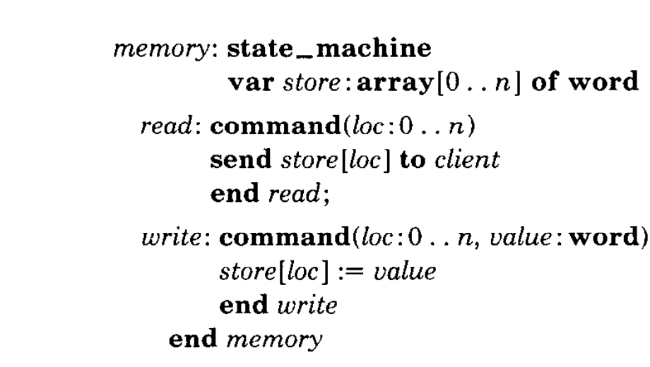
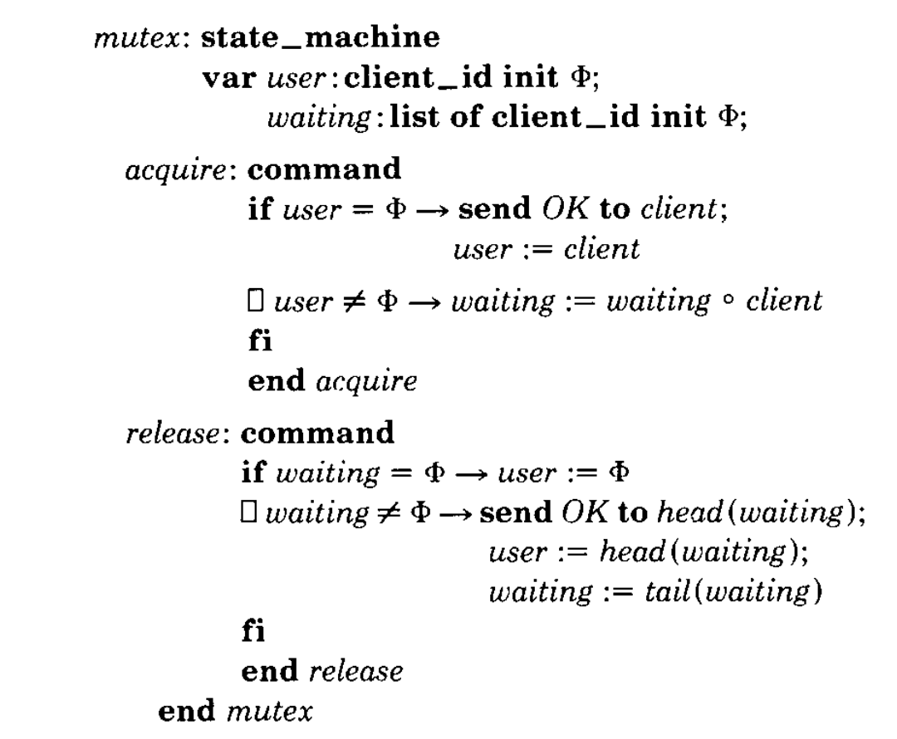
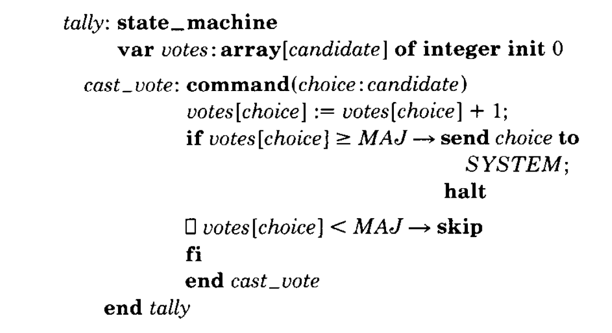
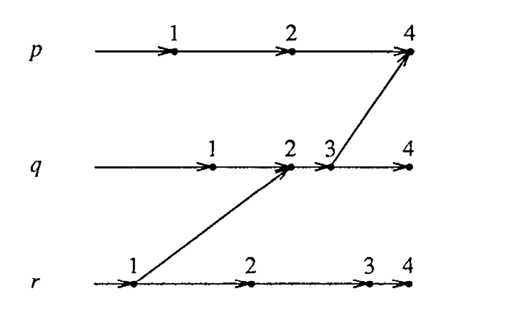

**Implementing Fault-Tolerant Services Using the State Machine Approach: A Tutorial｜使用状态机方法实现容错服务：教程**

**FRED B. SCHNEIDER**

Department of Computer Science, Cornell University, Ithaca, New York 14853

The state machine approach is a general method for implementing fault-tolerant services in distributed systems. This paper reviews the approach and describes protocols for two different failure models—Byzantine and fail stop. System reconfiguration techniques for removing faulty components and integrating repaired components are also discussed.

> **弗雷德·B. 施耐德**
>
> 康奈尔大学计算机科学系，美国纽约州伊萨卡，邮编 14853
>
> 状态机方法是在分布式系统中实现容错服务的一种通用方法。本文回顾这一方法，并针对两种不同的故障模型——拜占庭故障与失效停止故障——说明相应协议；同时还讨论用于移除故障组件和接纳已修复组件的系统重配置技术。

**Categories and Subject Descriptors:** C.2.4 [Computer-Communication Networks]: Distributed Systems—network operating systems; D.2.10 [Software Engineering]: Design—methodologies; D.4.5 [Operating Systems]: Reliability—fault tolerance; D.4.7 [Operating Systems]: Organization and Design—interactive systems, real-time systems

**General Terms:** Algorithms, Design, Reliability

**Additional Key Words and Phrases:** Client-server, distributed services, state machine approach

> **分类与主题描述符：** C.2.4［计算机—通信网络］：分布式系统——网络操作系统；D.2.10［软件工程］：设计——方法论；D.4.5［操作系统］：可靠性——容错；D.4.7［操作系统］：组织与设计——交互式系统、实时系统
>
> **通用术语：** 算法、设计、可靠性
>
> **附加关键词与短语：** 客户端—服务器、分布式服务、状态机方法

**CONTENTS**

- INTRODUCTION
- 1. STATE MACHINES
- 2. FAULT TOLERANCE
- 3. FAULT-TOLERANT STATE MACHINES
  - 3.1 Agreement
  - 3.2 Order and Stability
- 4. TOLERATING FAULTY OUTPUT DEVICES
  - 4.1 Outputs Used Outside the System
  - 4.2 Outputs Used Inside the System
- 5. TOLERATING FAULTY CLIENTS
  - 5.1 Replicating the Client
  - 5.2 Defensive Programming
- 6. USING TIME TO MAKE REQUESTS
- 7. RECONFIGURATION
  - 7.1 Managing the Configuration
  - 7.2 Integrating a Repaired Object
- 8. RELATED WORK
- ACKNOWLEDGMENTS
- REFERENCES

> **目录**
>
> - 引言
> - 1. 状态机
> - 2. 容错
> - 3. 容错状态机
>   - 3.1 一致性
>   - 3.2 顺序与稳定性
> - 4. 容忍故障输出设备
>   - 4.1 在系统外部使用的输出
>   - 4.2 在系统内部使用的输出
> - 5. 容忍故障客户端
>   - 5.1 复制客户端
>   - 5.2 防御式编程
> - 6. 用时间发出请求
> - 7. 重配置
>   - 7.1 管理配置
>   - 7.2 接纳已修复对象
> - 8. 相关工作
> - 致谢
> - 参考文献

Permission to copy without fee all or part of this material is granted provided that the copies are not made or distributed for direct commercial advantage, the ACM copyright notice and the title of the publication and its date appear, and notice is given that copying is by permission of the Association for Computing Machinery. To copy otherwise, or to republish, requires a fee and/or specific permission.

> 允许免费复制本材料的全部或部分内容，条件是副本不得为直接商业利益而制作或分发，副本中须出现 ACM 版权声明、出版物标题及出版日期，并须注明复制已获美国计算机协会许可。以其他方式复制或再版，须付费和／或另行取得明确许可。

© 1990 ACM 0360-0300/90/1200-0299 \$01.50

> © 1990 ACM 0360-0300/90/1200-0299 \$01.50

## INTRODUCTION｜引言

Distributed software is often structured in terms of clients and services. Each service comprises one or more servers and exports operations that clients invoke by making requests. Although using a single, centralized server is the simplest way to implement a service, the resulting service can only be as fault tolerant as the processor executing that server. If this level of fault tolerance is unacceptable, then multiple servers that fail independently must be used. Usually, replicas of a single server are executed on separate processors of a distributed system, and protocols are used to coordinate client interactions with these replicas. The physical and electrical isolation of processors in a distributed system ensures that server failures are independent, as required.

The state machine approach is a general method for implementing a fault-tolerant service by replicating servers and coordinating client interactions with server replicas.¹ The approach also provides a framework for understanding and designing replication management protocols. Many protocols that involve replication of data or software—be it for masking failures or simply to facilitate cooperation without centralized control—can be derived using the state machine approach. Although few of these protocols actually were obtained in this manner, viewing them in terms of state machines helps in understanding how and why they work.

> 分布式软件往往按客户端与服务来组织。每项服务由一个或多个服务器组成，并对外提供操作；客户端通过发出请求来调用这些操作。使用单台集中式服务器是实现服务最简单的办法，但所得服务的容错能力至多与运行该服务器的处理器相当。若这一容错水平不可接受，就必须使用彼此独立失效的多台服务器。通常，一个服务器的各个副本分别运行在分布式系统的不同处理器上，再由协议协调客户端与这些副本之间的交互。分布式系统中处理器在物理和电气上的隔离，保证了服务器故障能如所要求的那样彼此独立。
>
> 状态机方法通过复制服务器并协调客户端与服务器副本之间的交互，提供了一种实现容错服务的通用方法。¹ 它也为理解和设计副本管理协议提供了框架。许多涉及数据或软件复制的协议——无论复制是为了屏蔽故障，还是仅仅为了在没有集中控制的情况下促进协作——都可以由状态机方法推导出来。尽管这些协议中很少真是按这种方式得到的，但从状态机的角度观察它们，有助于理解它们如何工作以及为何有效。

¹ The term “state machine” is a poor one, but, nevertheless, is the one used in the literature.

> ¹ “状态机”这个名称并不理想，不过文献中使用的正是这个名称。

This paper is a tutorial on the state machine approach. It describes the approach and its implementation for two representative environments. Small examples suffice to illustrate the points. However, the approach has been successfully applied to larger examples; some of these are mentioned in Section 8. Section 1 describes how a system can be viewed in terms of a state machine, clients, and output devices. Coping with failures is the subject of Sections 2 to 5. An important class of optimizations—based on the use of time—is discussed in Section 6. Section 7 describes dynamic reconfiguration. The history of the approach and related work are discussed in Section 8.

> 本文是一篇关于状态机方法的教程，介绍这一方法及其在两类代表性环境中的实现。用小例子足以阐明要点，不过，这一方法也已成功应用于更大规模的实例，其中一部分将在第 8 节提及。第 1 节说明如何从状态机、客户端和输出设备的角度看待系统。第 2 至第 5 节讨论如何应对故障。第 6 节讨论一类以时间为基础的重要优化。第 7 节介绍动态重配置。第 8 节则讨论这一方法的历史与相关工作。

## 1. STATE MACHINES｜状态机

Services, servers, and most programming language structures for supporting modularity define state machines. A state machine consists of state variables, which encode its state, and commands, which transform its state. Each command is implemented by a deterministic program; execution of the command is atomic with respect to other commands and modifies the state variables and/or produces some output. A client of the state machine makes a request to execute a command. The request names a state machine, names the command to be performed, and contains any information needed by the command. Output from request processing can be to an actuator (e.g., in a process-control system), to some other peripheral device (e.g., a disk or terminal), or to clients awaiting responses from prior requests.

In this tutorial, we will describe a state machine simply by listing its state variables and commands. As an example, state machine _memory_ of Figure 1 implements a time-varying mapping from locations to values. A _read_ command permits a client to determine the value currently associated with a location, and a _write_ command associates a new value with a location.

> 服务、服务器以及大多数支持模块化的编程语言结构，都定义了状态机。状态机由编码其状态的状态变量，以及变换其状态的命令组成。每条命令都由一个确定性程序实现；相对于其他命令，命令执行是原子的，并会修改状态变量和／或产生某种输出。状态机的客户端通过请求来执行命令。请求指明状态机、要执行的命令，并包含该命令所需的任何信息。处理请求得到的输出可以发往执行器（例如过程控制系统中的执行器）、其他外围设备（例如磁盘或终端），也可以发往正在等待先前请求响应的客户端。
>
> 在本教程中，我们只需列出状态变量和命令来描述状态机。例如，图 1 中的状态机 _memory_ 实现了一个随时间变化的“位置到值”的映射。_read_ 命令让客户端能够确定某个位置当前对应的值；_write_ 命令则把一个新值与某个位置关联起来。



**Figure 1.** A memory.

> **图 1。** 存储器。

> **图表中文解读：** `memory` 状态机只有一个状态变量 `store`。`read` 不改变状态，只把 `store[loc]` 发给请求客户端；`write` 原子地把 `value` 写入 `store[loc]`。因此，在给定请求序列后，其状态与输出均被唯一确定。

For generality, our descriptions of state machines deliberately do not specify how command invocation is implemented. Commands might be implemented in any of the following ways:

- Using a collection of procedures that share data and are invoked by a call, as in a monitor.
- Using a single process that awaits messages containing requests and performs the actions they specify, as in a server.
- Using a collection of interrupt handlers, in which case a request is made by causing an interrupt, as in an operating system kernel. (Disabling interrupts permits each command to be executed to completion before the next is started.)

> 为保持一般性，我们在描述状态机时特意不规定命令调用如何实现。命令可以用下列任一种方式实现：
>
> - 使用一组共享数据、由调用触发的过程，如管程中的做法。
> - 使用一个等待包含请求的消息、再执行消息所指定动作的进程，如服务器中的做法。
> - 使用一组中断处理程序；此时，请求通过引发中断来提出，如操作系统内核中的做法。（禁用中断可以让每条命令完整执行后，下一条才开始。）

For example, the state machine of Figure 2 implements commands to ensure that at all times at most one client has been granted access to some resource. In it, `x ∘ y` denotes the result of appending `y` to the end of list `x`, `head(x)` denotes the first element of list `x`, and `tail(x)` denotes the list obtained by deleting the first element of list `x`. This state machine would probably be implemented as part of the supervisor-call handler of an operating system kernel.

> 例如，图 2 的状态机所实现的命令保证：任何时刻至多只有一个客户端获准访问某项资源。其中，`x ∘ y` 表示把 `y` 追加到列表 `x` 末尾所得的结果，`head(x)` 表示列表 `x` 的第一个元素，`tail(x)` 表示从列表 `x` 中删除第一个元素所得的列表。这个状态机很可能作为操作系统内核监督调用处理程序的一部分来实现。



**Figure 2.** A resource allocator.

> **图 2。** 资源分配器。

> **图表中文解读：** `user` 记录当前占用资源的客户端，`waiting` 保存等待队列；`Φ` 表示空值或空表，`∘` 表示尾部追加，`▯` 分隔互斥守卫分支。资源空闲时，`acquire` 立即回复 `OK` 并登记用户；否则把请求者排队。`release` 在队列为空时释放资源，否则把资源交给队首客户端。

Requests are processed by a state machine one at a time, in an order that is consistent with potential causality. Therefore, clients of a state machine can make the following assumptions about the order in which requests are processed:

**O1:** Requests issued by a single client to a given state machine `sm` are processed by `sm` in the order they were issued.

**O2:** If the fact that request `r` was made to a state machine `sm` by client `c` could have caused a request `r′` to be made by a client `c′` to `sm`, then `sm` processes `r` before `r′`.

> 状态机一次处理一个请求，并且处理顺序与潜在因果关系一致。因此，状态机客户端可以对请求的处理顺序作如下假设：
>
> **O1：** 单个客户端向给定状态机 `sm` 发出的请求，由 `sm` 按发出顺序处理。
>
> **O2：** 如果客户端 `c` 向状态机 `sm` 发出请求 `r` 这一事实，可能导致客户端 `c′` 向 `sm` 发出请求 `r′`，那么 `sm` 先处理 `r`，再处理 `r′`。

Note that due to communications network delays, O1 and O2 do not imply that a state machine will process requests in the order made or in the order received.

To keep our presentation independent of the interprocess communication mechanism used to transmit requests to state machines, we will program client requests as tuples of the form

> 注意，由于通信网络存在延迟，O1 和 O2 并不意味着状态机会按照所有请求的发出顺序或接收顺序来处理它们。
>
> 为使论述不依赖于把请求传送给状态机所用的进程间通信机制，我们把客户端请求写成如下元组：

```text
⟨state_machine.command, arguments⟩
```

> 其中依次给出目标状态机及命令，以及该命令的参数。

and postulate that any results from processing a request are returned using messages. For example, a client might execute

> 并假定处理请求所得的任何结果都通过消息返回。例如，客户端可以执行：

```text
⟨memory.write, 100, 16.2⟩;
⟨memory.read, 100⟩;
receive v from memory
```

> 这三行依次向位置 100 写入 `16.2`、请求读取位置 100，并从 `memory` 接收返回值到 `v`。

to set the value of location 100 to 16.2, request the value of location 100, and await that value, setting `v` to it upon receipt.

The defining characteristic of a state machine is not its syntax but that it specifies a deterministic computation that reads a stream of requests and processes each, occasionally producing output:

**Semantic Characterization of a State Machine.** Outputs of a state machine are completely determined by the sequence of requests it processes, independent of time and any other activity in a system.

> 这样便把位置 100 的值设为 16.2，请求位置 100 的值，然后等待该值，并在收到后把它赋给 `v`。
>
> 状态机的决定性特征不在于语法，而在于它规定了一项确定性计算：读取请求流，逐一处理请求，并不时产生输出。
>
> **状态机的语义刻画。** 状态机的输出完全由它所处理的请求序列决定，与时间以及系统中的任何其他活动无关。

Not all collections of commands necessarily satisfy this characterization. Consider the following program to solve a simple process-control problem in which an actuator is adjusted repeatedly based on the value of a sensor. Periodically, a client reads a sensor, communicates the value read to state machine `pc`, and delays approximately `D` seconds:

> 并非任意一组命令都必然满足这一刻画。考虑下面这个解决简单过程控制问题的程序：它根据传感器值反复调节执行器。客户端周期性读取传感器，把读到的值传给状态机 `pc`，再延迟约 `D` 秒：

```text
monitor:
    process
        do true → val := sensor;
                   ⟨pc.adjust, val⟩;
                   delay D
        od
    end monitor
```

> `monitor` 进程无限循环：读取传感器到 `val`，请求 `pc.adjust`，然后延迟 `D` 秒。

State machine `pc` adjusts an actuator based on past adjustments saved in state variable `q`, the sensor reading, and a control function `F`:

> 状态机 `pc` 根据状态变量 `q` 中保存的以往调节结果、当前传感器读数以及控制函数 `F` 来调节执行器：

```text
pc: state_machine
    var q: real;

    adjust:
        command(sensor_val: real)
            q := F(q, sensor_val);
            send q to actuator
        end adjust
    end pc
```

Although it is tempting to structure `pc` as a single command that loops—reading from the sensor, evaluating `F`, and writing to `actuator`—if the value of the sensor is time varying, then the result would not satisfy the semantic characterization given above and therefore would not be a state machine. This is because values sent to `actuator` (the output of the state machine) would not depend solely on the requests made to the state machine but would, in addition, depend on the execution speed of the loop. In the structure used above, this problem has been avoided by moving the loop into `monitor`.

In practice, having to structure a system in terms of state machines and clients does not constitute a real restriction. Anything that can be structured in terms of procedures and procedure calls can also be structured using state machines and clients—a state machine implements the procedure, and requests implement the procedure calls. In fact, state machines permit more flexibility in system structure than is usually available with procedure calls. With state machines, a client making a request is not delayed until that request is processed, and the output of a request can be sent someplace other than to the client making the request. We have not yet encountered an application that could not be programmed cleanly in terms of state machines and clients.

> `adjust` 原子地以旧状态 `q` 和传感器值计算新状态，再把新的 `q` 发给执行器。
>
> 人们很容易想把 `pc` 写成一条不断循环的命令——读取传感器、计算 `F`、再写入 `actuator`。然而，只要传感器值随时间变化，这样得到的程序就不满足上述语义刻画，因此也不是状态机。原因在于，发往 `actuator` 的值（即状态机输出）将不只取决于发给状态机的请求，还取决于循环的执行速度。上面的结构把循环移到 `monitor` 中，从而避开了这一问题。
>
> 实践中，必须把系统组织为状态机和客户端并不构成真正的限制。凡是能用过程和过程调用来组织的系统，也都能用状态机和客户端来组织——状态机实现过程，请求实现过程调用。事实上，状态机在系统结构上提供的灵活性往往还高于过程调用：客户端发出请求后不必一直阻塞到请求处理完毕，请求的输出也可以发往请求者之外的其他地方。我们迄今还未遇到不能以状态机和客户端清晰编程的应用。

## 2. FAULT TOLERANCE｜容错

Before turning to the implementation of fault-tolerant state machines, we must introduce some terminology concerning failures. A component is considered faulty once its behavior is no longer consistent with its specification. In this paper, we consider two representative classes of faulty behavior:

**Byzantine Failures.** The component can exhibit arbitrary and malicious behavior, perhaps involving collusion with other faulty components [Lamport et al. 1982].

**Fail-stop Failures.** In response to a failure, the component changes to a state that permits other components to detect that a failure has occurred and then stops [Schneider 1984].

> 在讨论容错状态机的实现之前，必须先引入一些有关故障的术语。一旦组件的行为不再符合其规范，就认为该组件发生了故障。本文考虑两类有代表性的故障行为：
>
> **拜占庭故障。** 组件可能表现出任意乃至恶意的行为，其中还可能包括与其他故障组件串谋［Lamport et al. 1982］。
>
> **失效停止故障。** 发生故障时，组件先转入一种能让其他组件检测到故障已发生的状态，随后停止运行［Schneider 1984］。

Byzantine failures can be the most disruptive, and there is anecdotal evidence that such failures do occur in practice. Allowing Byzantine failures is the weakest possible assumption that could be made about the effects of a failure. Since a design based on assumptions about the behavior of faulty components runs the risk of failing if these assumptions are not satisfied, it is prudent that life-critical systems tolerate Byzantine failures. For most applications, however, it suffices to assume fail-stop failures.

A system consisting of a set of distinct components is `t` fault tolerant if it satisfies its specification provided that no more than `t` of those components become faulty during some interval of interest.² Fault-tolerance traditionally has been specified in terms of mean time between failures (MTBF), probability of failure over a given interval, and other statistical measures [Siewiorek and Swarz 1982]. Although it is clear that such characterizations are important to the users of a system, there are advantages in describing fault tolerance of a system in terms of the maximum number of component failures that can be tolerated over some interval of interest. Asserting that a system is `t` fault tolerant makes explicit the assumptions required for correct operation; MTBF and other statistical measures do not. Moreover, `t` fault tolerance is unrelated to the reliability of the components that make up the system and therefore is a measure of the fault tolerance supported by the system architecture, in contrast to fault tolerance achieved simply by using reliable components. MTBF and other statistical reliability measures of a `t` fault-tolerant system can be derived from statistical reliability measures for the components used in constructing that system—in particular, the probability that there will be `t` or more failures during the operating interval of interest. Thus, `t` is typically chosen based on statistical measures of component reliability.

> 拜占庭故障可能最具破坏性，而且已有轶事性证据表明这类故障在实践中确会发生。允许拜占庭故障，相当于对故障影响作出可能最弱的假设。若设计依赖于对故障组件行为的某些假设，一旦假设不成立，系统本身也可能失败；因此，对生命攸关的系统而言，容忍拜占庭故障是审慎之举。不过，对大多数应用，假设只有失效停止故障就足够了。
>
> 一个由若干互不相同的组件构成的系统，如果在所关注的某段时间内至多有 `t` 个组件发生故障时仍能满足其规范，就称该系统具有 `t` 容错能力。² 传统上，容错常以平均故障间隔（MTBF）、给定时间段内的故障概率及其他统计量来规定［Siewiorek and Swarz 1982］。这些刻画显然对系统用户很重要，但用某个关注时段内能够容忍的组件故障最大数量来描述系统容错性，也有其优势。断言系统具有 `t` 容错能力，会明确揭示正确运行所依赖的假设；MTBF 等统计指标则不会。此外，`t` 容错与构成系统的组件本身有多可靠无关，因而衡量的是系统体系结构所提供的容错能力，而非仅靠使用高可靠组件获得的容错能力。反过来，可以由构造该系统所用组件的统计可靠性指标，推导 `t` 容错系统的 MTBF 及其他统计可靠性指标——尤其是关注的运行时段内发生 `t` 次或更多故障的概率。因此，`t` 通常依据组件可靠性的统计量来选择。

² A `t` fault-tolerant system might continue to operate correctly if more than `t` failures occur, but correct operation cannot be guaranteed.

> ² 当故障数超过 `t` 时，`t` 容错系统或许仍能继续正确运行，但此时无法保证正确运行。

## 3. FAULT-TOLERANT STATE MACHINES｜容错状态机

A `t` fault-tolerant version of a state machine can be implemented by replicating that state machine and running a replica on each of the processors in a distributed system. Provided each replica being run by a nonfaulty processor starts in the same initial state and executes the same requests in the same order, then each will do the same thing and produce the same output. Thus, if we assume that each failure can affect at most one processor, hence one state machine replica, then by combining the output of the state machine replicas of this ensemble, we can obtain the output for the `t` fault-tolerant state machine.

When processors can experience Byzantine failures, an ensemble implementing a `t` fault-tolerant state machine must have at least `2t + 1` replicas, and the output of the ensemble is the output produced by the majority of the replicas. This is because with `2t + 1` replicas, the majority of the outputs remain correct even after as many as `t` failures. If processors experience only fail-stop failures, then an ensemble containing `t + 1` replicas suffices, and the output of the ensemble can be the output produced by any of its members. This is because only correct outputs are produced by fail-stop processors, and after `t` failures one nonfaulty replica will remain among the `t + 1` replicas.

> 可以通过复制状态机、并在分布式系统的每个处理器上运行一个副本，实现该状态机的 `t` 容错版本。只要运行在非故障处理器上的每个副本都从同一初始状态出发，并以相同顺序执行相同请求，各副本就会执行同样的动作、产生同样的输出。因此，若假设每次故障至多影响一个处理器，也就是一个状态机副本，那么把这一副本集合中各状态机副本的输出组合起来，就能得到 `t` 容错状态机的输出。
>
> 如果处理器可能发生拜占庭故障，实现 `t` 容错状态机的副本集合必须至少有 `2t + 1` 个副本，集合输出取多数副本所产生的输出。这是因为即便多达 `t` 个副本发生故障，`2t + 1` 个副本的多数输出仍然正确。如果处理器只会发生失效停止故障，那么包含 `t + 1` 个副本的集合就足够，集合输出可以取其任一成员产生的输出。这是因为失效停止处理器只会产生正确输出；发生 `t` 次故障后，`t + 1` 个副本中仍有一个非故障副本。

The key, then, for implementing a `t` fault-tolerant state machine is to ensure the following:

**Replica Coordination.** All replicas receive and process the same sequence of requests.

This can be decomposed into two requirements concerning dissemination of requests to replicas in an ensemble.

> 因而，实现 `t` 容错状态机的关键，是保证下列条件：
>
> **副本协调。** 所有副本接收并处理同一请求序列。
>
> 这一条件可以分解为两项有关请求如何传播到集合内各副本的要求。

**Agreement.** Every nonfaulty state machine replica receives every request.

**Order.** Every nonfaulty state machine replica processes the requests it receives in the same relative order.

Notice that Agreement governs the behavior of a client in interacting with state machine replicas and that Order governs the behavior of a state machine replica with respect to requests from various clients. Thus, although Replica Coordination could be partitioned in other ways, the Agreement-Order partitioning is a natural choice because it corresponds to the existing separation of the client from the state machine replicas.

> **一致性。** 每个非故障状态机副本都收到每个请求。
>
> **顺序。** 每个非故障状态机副本都以相同的相对顺序处理其收到的请求。
>
> 注意，“一致性”约束的是客户端与状态机副本交互时的行为，而“顺序”约束的是状态机副本面对来自不同客户端的请求时的行为。因此，尽管“副本协调”也可以用其他方式划分，把它划分为“一致性”和“顺序”仍是自然之选，因为这正好对应于客户端与状态机副本之间已有的分离。

Implementations of Agreement and Order are discussed in Sections 3.1 and 3.2. These implementations make no assumptions about clients or commands. Although this generality is useful, knowledge of commands allows Replica Coordination, hence Agreement and Order, to be weakened and thus allows cheaper protocols to be used for managing the replicas in an ensemble. Examples of two common weakenings follow.

First, Agreement can be relaxed for read-only requests when fail-stop processors are being assumed. When processors are fail stop, a request `r` whose processing does not modify state variables need only be sent to a single nonfaulty state machine replica. This is because the response from this replica is—by definition—guaranteed to be correct and because `r` changes no state variables, the state of the replica that processes `r` will remain identical to the states of replicas that do not.

> 第 3.1 节和第 3.2 节将讨论“一致性”和“顺序”的实现。这些实现不对客户端或命令作任何假设。这种一般性固然有用，但若掌握命令的知识，就可以弱化“副本协调”，进而弱化“一致性”和“顺序”，从而用成本更低的协议来管理集合中的副本。下面给出两种常见弱化。
>
> 第一，在假设处理器只会失效停止时，可以针对只读请求放宽“一致性”。对于失效停止处理器，如果处理请求 `r` 不会修改状态变量，那么只需把 `r` 发给一个非故障状态机副本。因为按照定义，该副本的响应保证正确；又因为 `r` 不改变状态变量，处理 `r` 的副本仍会与未处理 `r` 的副本保持相同状态。

Second, Order can be relaxed for requests that commute. Two requests `r` and `r′` commute in a state machine `sm` if the sequence of outputs and final state of `sm` that would result from processing `r` followed by `r′` is the same as would result from processing `r′` followed by `r`. An example of a state machine where Order can be relaxed appears in Figure 3. State machine `tally` determines which from among a set of alternatives receives at least `MAJ` votes and sends this choice to `SYSTEM`. If clients cannot vote more than once and the number of clients `Cno` satisfies `2MAJ > Cno`, then every request commutes with every other. Thus, implementing Order would be unnecessary—different replicas of the state machine will produce the same outputs even if they process requests in different orders. On the other hand, if clients can vote more than once or `2MAJ ≤ Cno`, then reordering requests might change the outcome of the election.

> 第二，对于彼此可交换的请求，可以放宽“顺序”。如果状态机 `sm` 先处理 `r` 再处理 `r′` 所产生的输出序列和最终状态，与先处理 `r′` 再处理 `r` 所产生的结果相同，就说请求 `r` 与 `r′` 在 `sm` 中可交换。图 3 给出了一个可以放宽“顺序”的状态机。状态机 `tally` 判定一组备选项中哪一个获得了至少 `MAJ` 票，并把该选择发给 `SYSTEM`。如果客户端不能重复投票，并且客户端数量 `Cno` 满足 `2MAJ > Cno`，那么任意两个请求都可交换。因此，无须实现“顺序”——即使状态机的不同副本按不同顺序处理请求，它们也会产生相同输出。反之，如果客户端可以重复投票，或者 `2MAJ ≤ Cno`，那么请求重排就可能改变选举结果。



**Figure 3.** Election.

> **图 3。** 选举。

> **图表中文解读：** `votes[choice]` 累加某候选项的票数；达到阈值 `MAJ` 时，状态机把该候选项发给 `SYSTEM` 后停机，否则跳过。`▯` 是守卫命令的备选分支。若多数阈值严格超过客户端总数的一半且每个客户端只能投一次票，则最先达到阈值的候选项不受请求排列影响。

Theories for constructing state machine ensembles that do not satisfy Replica Coordination are proposed in Aizikowitz [1989] and Mancini and Pappalardo [1988]. Both theories are based on proving that an ensemble of state machines implements the same specification as a single replica does. The approach taken in Aizikowitz [1989] uses temporal logic descriptions of state sequences, whereas the approach in Mancini and Pappalardo [1988] uses an algebra of action sequences. A detailed description of this work is beyond the scope of this tutorial.

> Aizikowitz［1989］以及 Mancini 和 Pappalardo［1988］提出了构造不满足“副本协调”的状态机集合的理论。两种理论都以证明状态机集合实现了与单个副本相同的规范为基础。Aizikowitz［1989］的方法用时序逻辑描述状态序列，而 Mancini 和 Pappalardo［1988］的方法使用动作序列代数。对这些工作的详细介绍超出了本教程范围。

### 3.1 Agreement｜一致性

The Agreement requirement can be satisfied by using any protocol that allows a designated processor, called the transmitter, to disseminate a value to some other processors in such a way that

**IC1:** All nonfaulty processors agree on the same value.

**IC2:** If the transmitter is nonfaulty, then all nonfaulty processors use its value as the one on which they agree.

> 只要某个协议能让一个指定处理器——称为发送者——按下述方式把一个值传播给其他若干处理器，该协议就能满足“一致性”要求：
>
> **IC1：** 所有非故障处理器就同一个值达成一致。
>
> **IC2：** 如果发送者没有故障，那么所有非故障处理器都以发送者的值作为它们达成一致的值。

Protocols to establish IC1 and IC2 have received considerable attention in the literature and are sometimes called Byzantine Agreement protocols, reliable broadcast protocols, or simply agreement protocols. The hard part in designing such protocols is coping with a transmitter that fails part way through an execution. See Strong and Dolev [1983] for protocols that can tolerate Byzantine processor failures and Schneider et al. [1984] for a (significantly cheaper) protocol that can tolerate (only) fail-stop processor failures.

If requests are distributed to all state machine replicas by using a protocol that satisfies IC1 and IC2, then the Agreement requirement is satisfied. Either the client can serve as the transmitter or the client can send its request to a single state machine replica and let that replica serve as the transmitter. When the client does not itself serve as the transmitter, however, the client must ensure that its request is not lost or corrupted by the transmitter before the request is disseminated to the state machine replicas. One way to monitor for such corruption is by having the client be among the processors that receive the request from the transmitter.

> 实现 IC1 和 IC2 的协议在文献中受到广泛关注，有时称为拜占庭一致协议、可靠广播协议，或简称一致协议。设计这类协议的难点，是应对执行到一半时发生故障的发送者。可参见 Strong 和 Dolev［1983］给出的容忍拜占庭处理器故障的协议，以及 Schneider 等［1984］给出的一个成本低得多、但只能容忍失效停止处理器故障的协议。
>
> 若使用满足 IC1 和 IC2 的协议把请求分发给所有状态机副本，“一致性”要求就得到满足。客户端既可以自己充当发送者，也可以把请求发给某一个状态机副本，再由该副本充当发送者。不过，当客户端不亲自充当发送者时，它必须保证请求在传播给各状态机副本之前，未被发送者丢失或篡改。一种监测这类篡改的方法，是让客户端也成为从发送者接收该请求的处理器之一。

### 3.2 Order and Stability｜顺序与稳定性

The Order requirement can be satisfied by assigning unique identifiers to requests and having state machine replicas process requests according to a total ordering relation on these unique identifiers. This is equivalent to requiring the following, where a request is defined to be _stable_ at `sm_i` once no request from a correct client and bearing a lower unique identifier can be subsequently delivered to state machine replica `sm_i`:

**Order Implementation.** A replica next processes the stable request with the smallest unique identifier.

Further refinement of Order Implementation requires selecting a method for assigning unique identifiers to requests and devising a stability test for that assignment method. Note that any method for assigning unique identifiers is constrained by O1 and O2 of Section 1, which imply that if request `r_i` could have caused request `r_j` to be made then `uid(r_i) < uid(r_j)` holds, where `uid(r)` is the unique identifier assigned to a request `r`.

> 可以通过给请求分配唯一标识符，并让状态机副本按照这些标识符上的全序关系处理请求，来满足“顺序”要求。这等价于要求下述做法。这里，如果此后再也不可能把一个来自正确客户端、且唯一标识符更小的请求递交给状态机副本 `sm_i`，就称某请求在 `sm_i` 上已经*稳定*。
>
> **顺序实现。** 副本下一步处理唯一标识符最小的稳定请求。
>
> 要进一步细化“顺序实现”，就必须选择给请求分配唯一标识符的方法，并为该分配方法设计稳定性测试。注意，任何唯一标识符分配方法都受第 1 节 O1 和 O2 的约束：如果请求 `r_i` 可能导致请求 `r_j` 被发出，就必须有 `uid(r_i) < uid(r_j)`，其中 `uid(r)` 是分配给请求 `r` 的唯一标识符。

In the sections that follow, we give three refinements of the Order Implementation. Two are based on the use of clocks; a third uses an ordering defined by the replicas of the ensemble.

> 以下各小节给出“顺序实现”的三种细化。其中两种以时钟为基础；第三种使用由集合内副本定义的顺序。

#### 3.2.1 Using Logical Clocks｜使用逻辑时钟

A logical clock [Lamport 1978a] is a mapping `T` from events to the integers. `T(e)`, the “time” assigned to an event `e` by logical clock `T`, is an integer such that for any two distinct events `e` and `e′`, either `T(e) < T(e′)` or `T(e) > T(e′)`, and if `e` might be responsible for causing `e′` then `T(e) < T(e′)`.

It is a simple matter to implement logical clocks in a distributed system. Associated with each process `p` is a counter `T_p`. In addition, a timestamp is included in each message sent by `p`. This timestamp is the value of `T_p` when that message is sent. `T_p` is updated according to the following:

**LC1:** `T_p` is incremented after each event at `p`.

> 逻辑时钟［Lamport 1978a］是从事件到整数的映射 `T`。`T(e)` 是逻辑时钟 `T` 分配给事件 `e` 的“时间”，它是一个满足如下条件的整数：对任意两个不同事件 `e` 和 `e′`，要么 `T(e) < T(e′)`，要么 `T(e) > T(e′)`；而且，如果 `e` 可能是导致 `e′` 的原因，就有 `T(e) < T(e′)`。
>
> 在分布式系统中实现逻辑时钟并不困难。每个进程 `p` 都关联一个计数器 `T_p`。此外，`p` 发出的每条消息都带有时间戳；该时间戳等于消息发出时 `T_p` 的值。`T_p` 按以下规则更新：
>
> **LC1：** `p` 上每发生一个事件后，`T_p` 递增。

**LC2:** Upon receipt of a message with timestamp `τ`, process `p` resets `T_p`:

> **LC2：** 收到时间戳为 `τ` 的消息时，进程 `p` 重置 `T_p`：

$$
T_p := \max(T_p, \tau) + 1.
$$

> 即让本地逻辑时钟越过本地旧值和所收时间戳中较大的那个值。

The value of `T(e)` for an event `e` that occurs at processor `p` is constructed by appending a fixed-length bit string that uniquely identifies `p` to the value of `T_p` when `e` occurs.

> 对于发生在处理器 `p` 上的事件 `e`，`T(e)` 的构造方法是：在 `e` 发生时的 `T_p` 值之后，附加一个唯一标识 `p` 的定长位串。



**Figure 4.** Logical clock example.

> **图 4。** 逻辑时钟示例。

> **图表中文解读：** 三条水平线分别是进程 `p`、`q`、`r` 的本地事件序列，点上方数字是本地逻辑时钟值；斜箭头表示跨进程消息所形成的潜在因果关系。`r` 的时间 1 事件导致 `q` 的时间 2 事件，`q` 的时间 3 事件又导致 `p` 的时间 4 事件，因此时间戳严格沿潜在因果链递增。

Figure 4 illustrates the use of this scheme for implementing logical clocks in a system of three processors, `p`, `q`, and `r`. Events are depicted by dots, and an arrow is drawn between events `e` and `e′` if `e` might be responsible for causing event `e′`. For example, an arrow between events in different processes starts from the event corresponding to the sending of a message and ends at the event corresponding to the receipt of that message. The value of `T_p(e)` for each event `e` is written above that event.

If `T(e)` is used as the unique identifier associated with a request whose issuance corresponds to event `e`, the result is a total ordering on the unique identifiers that satisfies O1 and O2. Thus, a logical clock can be used as the basis of an Order Implementation if we can formulate a way to determine when a request is stable at a state machine replica.

It is pointless to implement a stability test in a system in which Byzantine failures are possible and a processor or message can be delayed for an arbitrary length of time without being considered faulty. This is because no deterministic protocol can implement agreement under these conditions [Fischer et al. 1985].³ Since it is impossible to satisfy the Agreement requirement, there is no point in satisfying the Order requirement. The case in which relative speeds of nonfaulty processors and messages is bounded is equivalent to assuming that they have synchronized real-time clocks and will be considered shortly. This leaves the case in which fail-stop failures are possible and a process or message can be delayed for an arbitrary length of time without being considered faulty. Thus, we now turn to devising a stability test for that environment.

> 图 4 说明了如何用这一方案在由三个处理器 `p`、`q`、`r` 构成的系统中实现逻辑时钟。圆点表示事件；如果事件 `e` 可能导致事件 `e′`，就在两者之间画一条箭头。例如，不同进程的事件之间若有箭头，它从发送消息所对应的事件出发，终止于接收该消息所对应的事件。每个事件 `e` 的 `T_p(e)` 值写在该事件上方。
>
> 如果把 `T(e)` 用作某请求的唯一标识符，而该请求的发出对应于事件 `e`，所得唯一标识符上就有一个满足 O1 和 O2 的全序。因此，只要能找到判定请求何时在状态机副本上稳定的方法，逻辑时钟就可以作为“顺序实现”的基础。
>
> 在这样一种系统里实现稳定性测试毫无意义：系统可能发生拜占庭故障，而且处理器或消息即使被任意长时间地延迟，也不被视为故障。原因是，在这些条件下，没有任何确定性协议能够实现一致［Fischer et al. 1985］。³ 既然“一致性”要求不可能满足，也就没有必要满足“顺序”要求。若非故障处理器与消息的相对速度有界，就等价于假设它们拥有同步的实时时钟，稍后将讨论这种情况。剩下的情况是：可能发生失效停止故障，而且进程或消息可以被任意长时间地延迟而不被视为故障。下面就为这种环境设计稳定性测试。

³ The result of Fischer et al. [1985] is actually stronger than this. It states that IC1 and IC2 cannot be achieved by a deterministic protocol in an asynchronous system with a single processor that fails in an even less restrictive manner—by simply halting.

> ³ Fischer 等［1985］的结论实际上比这里所述更强：在异步系统中，只要有一个处理器以限制更少的方式发生故障——仅仅停机——确定性协议就无法实现 IC1 和 IC2。

By attaching sequence numbers to the messages between every pair of processors, it is trivial to ensure the following property holds of communications channels:

**FIFO Channels.** Messages between a pair of processors are delivered in the order sent.

For fail-stop processors, we can also assume the following:

> 只要给每一对处理器之间的消息附加序号，就很容易保证通信信道具备以下性质：
>
> **FIFO 信道。** 一对处理器之间的消息按发送顺序递交。
>
> 对于失效停止处理器，还可以作如下假设：

**Failure Detection Assumption.** A processor `p` detects that a fail-stop processor `q` has failed only after `p` has received the last message sent to `p` by `q`.

The Failure Detection Assumption is consistent with FIFO Channels, since the failure event for a fail-stop processor necessarily happens after the last message sent by the processor and, therefore, should be received after all other messages.

Under these two assumptions, the following stability test can be used:

> **故障检测假设。** 只有在处理器 `p` 已经收到失效停止处理器 `q` 发给 `p` 的最后一条消息之后，`p` 才检测出 `q` 已经故障。
>
> “故障检测假设”与 FIFO 信道相容，因为失效停止处理器的故障事件必然发生在该处理器发出最后一条消息之后，所以故障通知应当在其他所有消息之后收到。
>
> 在这两个假设之下，可以使用如下稳定性测试：

**Logical Clock Stability Test Tolerating Fail-stop Failures.** Every client periodically makes some—possibly null—request to the state machine. A request is stable at replica `sm_i` if a request with larger timestamp has been received by `sm_i` from every client running on a nonfaulty processor.

To see why this stability test works, we show that once a request `r` is stable at `sm_i`, no request with smaller unique identifier (timestamp) will be received. First, consider clients that `sm_i` does not detect as being faulty. Because logical clocks are used to generate unique identifiers, any request made by a client `c` must have a larger unique identifier than was assigned to any previous request made by `c`. Therefore, from the FIFO Channels assumption, we conclude that once a request from a nonfaulty client `c` is received by `sm_i`, no request from `c` with a smaller unique identifier than `uid(r)` can be received by `sm_i`. This means that once requests with larger unique identifiers than `uid(r)` have been received from every nonfaulty client, it is not possible to receive a request with a smaller unique identifier than `uid(r)` from these clients. Next, for a client `c` that `sm_i` detects as faulty, the Failure Detection Assumption implies that no request from `c` will be received by `sm_i`. Thus, once a request `r` is stable at `sm_i`, no request with a smaller timestamp can be received from a client—faulty or nonfaulty.

> **容忍失效停止故障的逻辑时钟稳定性测试。** 每个客户端都周期性地向状态机发出某种请求，该请求可以是空请求。如果副本 `sm_i` 已经从运行在每个非故障处理器上的客户端那里，收到一个时间戳比某请求更大的请求，那么该请求在 `sm_i` 上稳定。
>
> 为说明这个稳定性测试为何有效，我们证明：请求 `r` 一旦在 `sm_i` 上稳定，`sm_i` 就不会再收到唯一标识符（时间戳）更小的请求。首先考虑未被 `sm_i` 检测为故障的客户端。由于用逻辑时钟生成唯一标识符，客户端 `c` 发出的任何请求，其唯一标识符都必然大于 `c` 先前任何请求的标识符。结合 FIFO 信道假设可知，一旦 `sm_i` 收到非故障客户端 `c` 的某个请求，就不会再收到 `c` 发出的、唯一标识符小于 `uid(r)` 的请求。这意味着：一旦从每个非故障客户端那里都收到唯一标识符大于 `uid(r)` 的请求，此后就不可能再从这些客户端收到标识符小于 `uid(r)` 的请求。再考虑被 `sm_i` 检测为故障的客户端 `c`；“故障检测假设”意味着 `sm_i` 不会再收到 `c` 的任何请求。因此，请求 `r` 一旦在 `sm_i` 上稳定，就不会再从任何客户端——无论故障与否——收到时间戳更小的请求。

#### 3.2.2 Synchronized Real-Time Clocks｜同步实时时钟

A second way to produce unique request identifiers satisfying O1 and O2 is by using approximately synchronized real-time clocks.⁴ Define `T_p(e)` to be the value of the real-time clock at processor `p` when event `e` occurs. We can use `T_p(e)` followed by a fixed-length bit string that uniquely identifies `p` as the unique identifier associated with a request made as event `e` by a client running on a processor `p`.

> 生成满足 O1 和 O2 的请求唯一标识符的第二种方法，是使用近似同步的实时时钟。⁴ 定义 `T_p(e)` 为事件 `e` 发生时处理器 `p` 上实时时钟的值。对于运行在处理器 `p` 上的客户端在事件 `e` 发出的请求，可以把 `T_p(e)` 后接唯一标识 `p` 的定长位串，作为该请求的唯一标识符。

⁴ A number of protocols to achieve clock synchronization while tolerating Byzantine failures have been proposed [Halpern et al. 1984; Lamport and Melliar-Smith 1984]. See Schneider [1986] for a survey. The protocols all require that known bounds exist for the execution speed and clock rates of nonfaulty processors and for message delivery delays along nonfaulty communications links. In practice, these requirements do not constitute a restriction. Clock synchronization achieved by the protocols is proportional to the variance in message delivery delay, making it possible to satisfy the restriction—necessary to ensure O2—that message delivery delay exceeds clock synchronization.

> ⁴ 已有多种在容忍拜占庭故障的同时实现时钟同步的协议［Halpern et al. 1984；Lamport and Melliar-Smith 1984］。综述见 Schneider［1986］。这些协议都要求：非故障处理器的执行速度与时钟速率，以及沿非故障通信链路传递消息的延迟，都存在已知界限。实践中，这些要求并不构成限制。协议所达到的时钟同步误差与消息传递延迟的变动量成比例，因此可以满足保证 O2 所必需的限制：消息传递延迟大于时钟同步误差。

To ensure that O1 and O2 (of Section 1) hold for unique identifiers generated in this manner, two restrictions are required. O1 follows provided no client makes two or more requests between successive clock ticks. Thus, if processor clocks have a resolution of `R` seconds, then each client can make at most one request every `R` seconds. O2 follows provided the degree of clock synchronization is better than the minimum message delivery time. In particular, if clocks on different processors are synchronized to within `δ` seconds, then it must take more than `δ` seconds for a message from one client to reach another. Otherwise, O2 would be violated because a request `r` made by the one client could have a unique identifier that was smaller than a request `r′` made by another, even though `r` was caused by a message sent after `r′` was made.

When unique request identifiers are obtained from synchronized real-time clocks, a stability test can be implemented by exploiting these clocks and the bounds on message delivery delays. Define `Δ` to be a constant such that a request `r` with unique identifier `uid(r)` will be received by every correct processor no later than time `uid(r) + Δ` according to the local clock at the receiving processor. Such a `Δ` must exist if requests are disseminated using a protocol that employs a fixed number of rounds, like the ones cited above for establishing IC1 and IC2.⁵ By definition, once the clock on a processor `p` reaches time `τ`, `p` cannot subsequently receive a request `r` such that `uid(r) < τ − Δ`. Therefore, we have the following stability test:

> 为保证按这种方式生成的唯一标识符满足第 1 节的 O1 和 O2，需要两项限制。只要任一客户端都不会在相邻两个时钟滴答之间发出两个或更多请求，O1 就成立。因此，如果处理器时钟分辨率为 `R` 秒，那么每个客户端至多每 `R` 秒发出一个请求。只要时钟同步精度优于最短消息传递时间，O2 就成立。具体而言，如果不同处理器上的时钟同步误差不超过 `δ` 秒，那么一条消息从一个客户端到达另一个客户端必须耗时超过 `δ` 秒。否则就会违反 O2：即使请求 `r` 是由请求 `r′` 发出后所发送的一条消息导致的，一个客户端发出的 `r` 仍可能拥有比另一客户端发出的 `r′` 更小的唯一标识符。
>
> 当请求唯一标识符取自同步实时时钟时，可以利用这些时钟以及消息传递延迟的界来实现稳定性测试。定义常量 `Δ`，使得唯一标识符为 `uid(r)` 的请求 `r`，按接收处理器的本地时钟计，最迟在 `uid(r) + Δ` 时刻被每个正确处理器收到。如果请求是用固定轮数的协议传播的——例如前述建立 IC1 和 IC2 的协议——这样的 `Δ` 必然存在。⁵ 根据定义，一旦处理器 `p` 的时钟到达时刻 `τ`，`p` 此后不可能再收到满足 `uid(r) < τ − Δ` 的请求 `r`。由此得到如下稳定性测试：

⁵ In general, `Δ` will be a function of the variance in message delivery delay, the maximum message delivery delay, and the degree of clock synchronization. See Cristian et al. [1985] for a detailed derivation for `Δ` in a variety of environments.

> ⁵ 一般来说，`Δ` 是消息传递延迟的变动量、最大消息传递延迟和时钟同步程度的函数。关于多种环境下 `Δ` 的详细推导，见 Cristian 等［1985］。

**Real-time Clock Stability Test Tolerating Byzantine Failures I.** A request `r` is stable at a state machine replica `sm_i` being executed by processor `p` if the local clock at `p` reads `τ` and `uid(r) < τ − Δ`.

One disadvantage of this stability test is that it forces the state machine to lag behind its clients by `Δ`, where `Δ` is proportional to the worst-case message delivery delay. This disadvantage can be avoided. Due to property O1 of the total ordering on request identifiers, if communications channels satisfy FIFO Channels, then a state machine replica that has received a request `r` from a client `c` can subsequently receive from `c` only requests with unique identifiers greater than `uid(r)`. Thus, a request `r` is also stable at a state machine replica provided a request with a larger unique identifier has been received from every client.

**Real-time Clock Stability Test Tolerating Byzantine Failures II.** A request `r` is stable at a state machine replica `sm_i` if a request with a larger unique identifier has been received from every client.

> **容忍拜占庭故障的实时时钟稳定性测试 I。** 如果处理器 `p` 的本地时钟读数为 `τ`，且 `uid(r) < τ − Δ`，那么请求 `r` 在 `p` 所运行的状态机副本 `sm_i` 上稳定。
>
> 这个稳定性测试有一个缺点：它迫使状态机比客户端滞后 `Δ`，而 `Δ` 与最坏情况下的消息传递延迟成比例。这个缺点可以避免。由请求标识符全序的 O1 性质可知，如果通信信道满足 FIFO，那么状态机副本从客户端 `c` 收到请求 `r` 之后，此后从 `c` 收到的请求，其唯一标识符只能大于 `uid(r)`。因此，只要已经从每个客户端收到一个唯一标识符更大的请求，请求 `r` 在该状态机副本上也已稳定。
>
> **容忍拜占庭故障的实时时钟稳定性测试 II。** 如果状态机副本 `sm_i` 已从每个客户端收到唯一标识符大于请求 `r` 的请求，那么 `r` 在 `sm_i` 上稳定。

This second stability test is never passed if a (faulty) processor refuses to make requests. However, by combining the first and second test so that a request is considered stable when it satisfies either test, a stability test results that lags clients by `Δ` only when faulty processors or network delays force it. Such a combined test is discussed in [Gopal et al. 1990].

> 如果某个（故障）处理器拒绝发出请求，第二个稳定性测试就永远无法通过。不过，可以把第一和第二个测试结合起来：请求只要满足其中任一个测试就视为稳定。这样，只有在故障处理器或网络延迟迫使它这样做时，所得稳定性测试才会比客户端滞后 `Δ`。Gopal 等［1990］讨论了这种组合测试。

#### 3.2.3 Using Replica-Generated Identifiers｜使用副本生成的标识符

In the previous two refinements of the Order Implementation, clients determine the order in which requests are processed—the unique identifier `uid(r)` for a request `r` is assigned by the client making that request. In the following refinement of the Order Implementation, the state machine replicas determine this order. Unique identifiers are computed in two phases. In the first phase, which can be part of the agreement protocol used to satisfy the Agreement requirement, state machine replicas propose candidate unique identifiers for a request. Then, in the second phase, one of these candidates is selected and it becomes the unique identifier for that request.

The advantage of this approach to computing unique identifiers is that communication between all processors in the system is not necessary. When logical clocks or synchronized real-time clocks are used in computing unique request identifiers, all processors hosting clients or state machine replicas must communicate. In the case of logical clocks, this communication is needed in order for requests to become stable; in the case of synchronized real-time clocks, this communication is needed in order to keep the clocks synchronized.⁶ In the replica-generated identifier approach of this section, the only communication required is among processors running the client and state machine replicas.

> 在前两种“顺序实现”细化中，请求的处理顺序由客户端决定——请求 `r` 的唯一标识符 `uid(r)` 由发出该请求的客户端分配。在下面这种细化中，处理顺序由状态机副本决定。唯一标识符分两个阶段计算。第一阶段可以成为满足“一致性”要求所用一致协议的一部分：各状态机副本为请求提出候选唯一标识符。第二阶段再从中选出一个候选值，作为该请求的唯一标识符。
>
> 这种唯一标识符计算方法的优势，是不需要系统中所有处理器彼此通信。使用逻辑时钟或同步实时时钟计算请求唯一标识符时，凡是承载客户端或状态机副本的处理器都必须通信。使用逻辑时钟时，请求要达到稳定必须依赖这种通信；使用同步实时时钟时，保持时钟同步必须依赖这种通信。⁶ 而在本节的副本生成标识符方法中，只需运行该客户端及各状态机副本的处理器相互通信。

⁶ This communications cost argument illustrates an advantage of having a client forward its request to a single state machine replica that then serves as the transmitter for disseminating the request. In effect, that state machine replica becomes the client of the state machine, and so communication need only involve those processors running state machine replicas.

> ⁶ 这项关于通信成本的论证，说明了让客户端先把请求转交给单个状态机副本，再由该副本充当发送者传播请求的一个优势。实际上，该状态机副本成为状态机的客户端，于是通信只需涉及运行状态机副本的那些处理器。

By constraining the possible candidates proposed in phase 1 for a request’s unique identifier, it is possible to obtain a simple stability test. To describe this stability test, some terminology is required. We say that a state machine replica `sm_i` has _seen_ a request `r` once `sm_i` has received `r` and proposed a candidate unique identifier for `r`. We say that `sm_i` has _accepted_ `r` once that replica knows the ultimate choice of unique identifier for `r`. Define `cuid(sm_i, r)` to be the candidate unique identifier proposed by replica `sm_i` for request `r`. Two constraints that lead to a simple stability test are:

> 通过约束第一阶段可为请求唯一标识符提出的候选值，可以得到一个简单的稳定性测试。描述该测试需要一些术语。当状态机副本 `sm_i` 已收到请求 `r` 并为 `r` 提出候选唯一标识符时，称 `sm_i` 已经*见过* `r`。当副本 `sm_i` 已经知道最终选定的 `r` 的唯一标识符时，称 `sm_i` 已经*接受* `r`。定义 `cuid(sm_i, r)` 为副本 `sm_i` 对请求 `r` 提出的候选唯一标识符。下列两个约束可导出一个简单的稳定性测试：

**UID1:** `cuid(sm_i, r) ≤ uid(r)`.

> **UID1：** `cuid(sm_i, r) ≤ uid(r)`。

**UID2:** If a request `r′` is seen by replica `sm_i` after `r` has been accepted by `sm_i`, then `uid(r) < cuid(sm_i, r′)`.

If these constraints hold throughout execution, then the following test can be used to determine whether a request is stable at a state machine replica:

**Replica-Generated Identifiers Stability Test.** A request `r` that has been accepted by `sm_i` is stable provided there is no request `r′` that has (i) been seen by `sm_i`, (ii) not been accepted by `sm_i`, and (iii) for which `cuid(sm_i, r′) ≤ uid(r)` holds.

> **UID2：** 如果 `sm_i` 接受 `r` 之后，副本 `sm_i` 才见到请求 `r′`，那么 `uid(r) < cuid(sm_i, r′)`。
>
> 如果整个执行过程中始终满足这些约束，就可以用下面的测试判断请求是否在状态机副本上稳定：
>
> **副本生成标识符稳定性测试。** 对已被 `sm_i` 接受的请求 `r`，只要不存在同时满足以下条件的请求 `r′`，`r` 就是稳定的：（i）`sm_i` 已经见过 `r′`；（ii）`sm_i` 尚未接受 `r′`；（iii）`cuid(sm_i, r′) ≤ uid(r)`。

To prove that this stability test works, we must show that once an accepted request `r` is deemed stable at `sm_i`, no request with a smaller unique identifier will be subsequently accepted at `sm_i`. Let `r` be a request that, according to the Replica-Generated Identifiers Stability Test, is stable at replica `sm_i`. Due to UID2, for any request `r′` that has not been seen by `sm_i`, `uid(r) < cuid(sm_i, r′)` holds. Thus, by transitivity using UID1, `uid(r) < uid(r′)` holds, and we conclude that `r′` cannot have a smaller unique identifier than `r`.

Now consider the case in which request `r′` has been seen but not accepted by `sm_i` and—because the stability test for `r` is satisfied—`uid(r) < cuid(sm_i, r′)` holds. Due to UID1, we conclude that `uid(r) < uid(r′)` holds and, therefore, `r′` does not have a smaller unique identifier than `r`. Thus, we have shown that once a request `r` satisfies the Replica-Generated Identifiers Stability Test at `sm_i`, any request `r′` that is accepted by `sm_i` will satisfy `uid(r) < uid(r′)`, as desired.

> 为证明这个稳定性测试有效，必须说明：一个已接受的请求 `r` 一旦被判定为在 `sm_i` 上稳定，`sm_i` 此后就不会接受唯一标识符更小的请求。设请求 `r` 按照“副本生成标识符稳定性测试”在副本 `sm_i` 上稳定。根据 UID2，对任何尚未被 `sm_i` 见到的请求 `r′`，都有 `uid(r) < cuid(sm_i, r′)`。再结合 UID1 并利用传递性，可得 `uid(r) < uid(r′)`，因而 `r′` 不可能拥有比 `r` 更小的唯一标识符。
>
> 再考虑请求 `r′` 已被 `sm_i` 见到但尚未接受的情况。因为 `r` 的稳定性测试已经满足，有 `uid(r) < cuid(sm_i, r′)`。根据 UID1，可得 `uid(r) < uid(r′)`，所以 `r′` 的唯一标识符也不小于 `r`。至此证明：请求 `r` 一旦在 `sm_i` 上满足“副本生成标识符稳定性测试”，此后 `sm_i` 接受的任何请求 `r′` 都满足所需的 `uid(r) < uid(r′)`。

Unlike clock-generated unique identifiers for requests, replica-generated ones do not necessarily satisfy O1 and O2 of Section 1. Without further restrictions, it is possible for a client to make a request `r`, send a message to another client causing request `r′` to be issued, yet have `uid(r′) < uid(r)`. However, O1 and O2 will hold provided that once a client starts disseminating a request to the state machine replicas, the client performs no other communication until every state machine replica has accepted that request. To see why this works, consider a request `r` being made by some client and suppose some request `r′` was influenced by `r`. The delay ensures that `r` is accepted by every state machine replica `sm_i` before `r′` is seen. Thus, from UID2 we conclude `uid(r) < cuid(sm_i, r′)` and, by transitivity with UID1, that `uid(r) < uid(r′)`, as required.

> 与时钟生成的请求唯一标识符不同，副本生成的标识符不一定满足第 1 节的 O1 和 O2。若不增加限制，可能出现这样的情况：某客户端发出请求 `r`，再向另一客户端发送消息并导致请求 `r′` 被发出，却有 `uid(r′) < uid(r)`。不过，只要客户端开始向状态机副本传播一个请求之后，在每个状态机副本接受该请求之前不再进行任何其他通信，O1 和 O2 就会成立。为说明原因，考虑某客户端发出的请求 `r`，并假设某个请求 `r′` 受 `r` 影响。这段等待保证每个状态机副本 `sm_i` 都在见到 `r′` 之前接受 `r`。于是根据 UID2，有 `uid(r) < cuid(sm_i, r′)`；再结合 UID1 与传递性，得到所需的 `uid(r) < uid(r′)`。

To complete this Order Implementation, we have only to devise protocols for computing unique identifiers and candidate unique identifiers such that:

- UID1 and UID2 are satisfied. (1)
- `r ≠ r′ ⇒ uid(r) ≠ uid(r′)`. (2)
- Every request that is seen eventually becomes accepted. (3)

> 要完成这个“顺序实现”，只需设计计算唯一标识符和候选唯一标识符的协议，使其满足：
>
> - UID1 和 UID2。（1）
> - `r ≠ r′ ⇒ uid(r) ≠ uid(r′)`。（2）
> - 每个被见到的请求最终都会被接受。（3）

One simple solution for a system of fail-stop processors is the following:

**Replica-generated Unique Identifiers.** In a system with `N` clients, each state machine replica `sm_i` maintains two variables: `SEEN_i` is the largest `cuid(sm_i, r)` assigned to any request `r` so far seen by `sm_i`, and `ACCEPT_i` is the largest `uid(r)` assigned to any request `r` so far accepted by `sm_i`.

Upon receipt of a request `r`, each replica `sm_i` computes

> 对由失效停止处理器构成的系统，一种简单方案如下：
>
> **副本生成的唯一标识符。** 在有 `N` 个客户端的系统中，每个状态机副本 `sm_i` 维护两个变量：`SEEN_i` 是给 `sm_i` 迄今见过的任一请求 `r` 所分配的最大 `cuid(sm_i, r)`；`ACCEPT_i` 是给 `sm_i` 迄今接受的任一请求 `r` 所分配的最大 `uid(r)`。
>
> 收到请求 `r` 时，每个副本 `sm_i` 计算：

$$
\begin{aligned}
cuid(sm_i,r) := {} & \max(\lfloor SEEN_i\rfloor,\lfloor ACCEPT_i\rfloor) \\
& {} + 1 + i/N. \tag{4}
\end{aligned}
$$

> 该式先取 `SEEN_i` 与 `ACCEPT_i` 整数部分的较大者，再进入下一个整数区间，并以 `i/N` 区分副本。

(Notice, this means that all candidate unique identifiers are themselves unique.) The replica then disseminates (using an agreement protocol) `cuid(sm_i, r)` to all other replicas and awaits receipt of a candidate unique identifier for `r` from every nonfaulty replica, participating in the agreement protocol for that value as well. Let `NF` be the set of replicas from which candidate unique identifiers were received. Finally, the replica computes

> （注意，这意味着所有候选唯一标识符本身也都唯一。）随后，该副本用一致协议把 `cuid(sm_i, r)` 传播给其他所有副本，并等待从每个非故障副本收到请求 `r` 的候选唯一标识符，同时也参与传播这些值的一致协议。令 `NF` 为已经收到其候选唯一标识符的副本集合。最后，该副本计算：

$$
uid(r) := \max_{sm_j \in NF}\bigl(cuid(sm_j,r)\bigr) \tag{5}
$$

> 即取所有 `NF` 成员所提候选值中的最大值作为 `uid(r)`。

and accepts `r`.

We prove that this protocol satisfies (1)–(3) as follows. UID1 follows from using assignment (5) to compute `uid(r)`, and UID2 follows from assignment (4) to compute `cuid(sm_i, r)`. To conclude that (2) holds, we argue as follows. Because an agreement protocol is used to disseminate candidate unique identifiers, all replicas receive the same values from the same replicas. Thus, all replicas will execute the same assignment statement (5), and all will compute the same value for `uid(r)`. To establish that these `uid(r)` values are unique for each request, it suffices to observe that maximums of disjoint subsets of a collection of unique values—the candidate unique identifiers—are also unique.

Finally, to establish (3), that every request that is seen is eventually accepted, we must prove that for each replica `sm_j`, a replica `sm_i` eventually learns `cuid(sm_j, r)` or learns that `sm_j` has failed. This follows trivially from the use of an agreement protocol to distribute the `cuid(sm_j, r)` and the definition of a fail-stop processor.

> 然后接受 `r`。
>
> 下面证明该协议满足（1）—（3）。用赋值式（5）计算 `uid(r)`，直接得到 UID1；用赋值式（4）计算 `cuid(sm_i, r)`，直接得到 UID2。为证明（2），作如下论证。由于候选唯一标识符用一致协议传播，所有副本都会从同一批副本收到相同的值。因此，所有副本执行同一个赋值式（5），并为 `uid(r)` 算出相同的值。要证明每个请求所得的 `uid(r)` 值都唯一，只需观察：从一组互异的值——即候选唯一标识符——的互不相交子集中分别取最大值，所得最大值也彼此不同。
>
> 最后，为证明（3），即每个被见到的请求最终都被接受，必须证明：对于每个副本 `sm_j`，副本 `sm_i` 最终要么得知 `cuid(sm_j, r)`，要么得知 `sm_j` 已经故障。由于用一致协议分发 `cuid(sm_j, r)`，再结合失效停止处理器的定义，这一点显然成立。

An optimization of our Replica-generated Unique Identifiers protocol is the basis for the ABCAST protocol in the ISIS Toolkit [Birman and Joseph 1987] developed at Cornell. In this optimization, candidate unique identifiers are returned to the client instead of being disseminated to the other state machine replicas. The client then executes assignment (5) to compute `uid(r)`. Finally, an agreement protocol is used by the client in disseminating `uid(r)` to the state machine replicas. Some unique replica takes over for the client if the client fails.

It is possible to modify our Replica-generated Unique Identifiers protocol for use in systems where processors can exhibit Byzantine failures, have synchronized real-time clocks, and communications channels have bounded message-delivery delays—the same environment as was assumed for using synchronized real-time clocks to generate unique identifiers. The following changes are required. First, each replica `sm_i` uses timeouts so that `sm_i` cannot be forever delayed waiting to receive and participate in the agreement protocol for disseminating a candidate unique identifier from a faulty replica `sm_j`. Second, if `sm_i` does determine that `sm_j` has timed out, `sm_i` disseminates “`sm_j` timeout” to all replicas (by using an agreement protocol). Finally, `NF` is the set of replicas in the ensemble less any `sm_j` for which “`sm_j` timeout” has been received from `t + 1` or more replicas. Notice, Byzantine failures that cause faulty replicas to propose candidate unique identifiers not produced by (4) do not cause difficulty. This is because candidate unique identifiers that are too small have no effect on the outcome of (5) at nonfaulty replicas and those that are too large will satisfy UID1 and UID2.

> 对“副本生成的唯一标识符”协议的一项优化，构成了康奈尔开发的 ISIS Toolkit 中 ABCAST 协议［Birman and Joseph 1987］的基础。在这项优化中，候选唯一标识符返回给客户端，而不是传播给其他状态机副本。客户端再执行赋值式（5）来计算 `uid(r)`。最后，客户端用一致协议把 `uid(r)` 传播给各状态机副本。如果客户端故障，则由某个唯一确定的副本接管其工作。
>
> 还可以修改“副本生成的唯一标识符”协议，使其适用于如下系统：处理器可能发生拜占庭故障，拥有同步实时时钟，而且通信信道的消息传递延迟有界。这正是先前用同步实时时钟生成唯一标识符时所假设的环境。需要作如下修改。第一，每个副本 `sm_i` 使用超时，以免它为了接收故障副本 `sm_j` 的候选唯一标识符并参与传播该值的一致协议，而永远等待下去。第二，如果 `sm_i` 确实判定 `sm_j` 已超时，`sm_i` 就用一致协议向所有副本传播“`sm_j` 超时”。最后，`NF` 定义为集合中的全部副本，减去那些已从 `t + 1` 个或更多副本收到“`sm_j` 超时”的 `sm_j`。注意，即使拜占庭故障使故障副本提出并非由（4）生成的候选唯一标识符，也不会造成困难。候选值过小不会影响非故障副本上（5）的结果；候选值过大则仍会满足 UID1 和 UID2。

## 4. TOLERATING FAULTY OUTPUT DEVICES｜容忍故障输出设备

It is not possible to implement a `t` fault-tolerant system by using a single voter to combine the outputs of an ensemble of state machine replicas into one output. This is because a single failure—of the voter—can prevent the system from producing the correct output. Solutions to this problem depend on whether the output of the state machine implemented by the ensemble is to be used within the system or outside the system.

> 不能只用一个表决器把状态机副本集合的多路输出合并为一路输出，来实现 `t` 容错系统。这是因为表决器这一处故障，就可能阻止系统产生正确输出。问题的解决办法取决于集合所实现的状态机输出究竟供系统内部使用，还是供系统外部使用。

### 4.1 Outputs Used Outside the System｜在系统外部使用的输出

If the output of the state machine is sent to an output device, then that device is already a single component whose failure cannot be tolerated. Thus, being able to tolerate a faulty voter is not sufficient—the system must also be able to tolerate a faulty output device. The usual solution to this problem is to replicate the output device and voter. Each voter combines the output of each state machine replica, producing a signal that drives one output device. Whatever reads the outputs of the system is assumed to combine the outputs of the replicated devices. This reader, which is not considered part of the computing system, implements the critical voter.

If output devices can exhibit Byzantine failures, then by taking the output produced by the majority of the devices, `2t + 1`-fold replication permits up to `t` faulty output devices to be tolerated. For example, a flap on an airplane wing might be designed so that when the `2t + 1` actuators that control it do not agree, the flap always moves in the direction of the majority (rather than twisting). If output devices exhibit only fail-stop failures, then only `t + 1`-fold replication is necessary to tolerate `t` failures because any output produced by a fail-stop output device can be assumed correct. For example, video display terminals usually present information with enough redundancy so that they can be treated as fail stop—failure detection is implemented by the viewer. With such an output device, a human user can look at one of `t + 1` devices, decide whether the output is faulty, and only if it is faulty, look at another, and so on.

> 如果状态机输出发往某个输出设备，那么该设备本身就是一个无法容忍其故障的单点组件。因此，仅能容忍表决器故障还不够——系统还必须能容忍输出设备故障。通常的解决办法是同时复制输出设备和表决器。每个表决器合并所有状态机副本的输出，产生驱动一个输出设备的信号。读取系统输出的外部对象，被假定会把各个复制设备的输出合并起来。这个读取者不被视为计算系统的一部分，却实现了关键的表决功能。
>
> 如果输出设备可能发生拜占庭故障，就取多数设备所产生的输出；采用 `2t + 1` 重复制，可以容忍至多 `t` 个故障输出设备。例如，可以把机翼襟翼设计成：当控制它的 `2t + 1` 个执行器意见不一时，襟翼总是按多数执行器指示的方向运动，而不是被扭曲。如果输出设备只会失效停止，则只需 `t + 1` 重复制便能容忍 `t` 次故障，因为失效停止输出设备产生的任何输出都可假定为正确。例如，视频显示终端通常以足够冗余的方式呈现信息，因而可以把它视为失效停止设备——故障检测由观看者完成。面对这种输出设备，人类用户可以先观察 `t + 1` 台设备中的一台，判断其输出是否有故障；只有发现故障时才转看下一台，如此继续。

### 4.2 Outputs Used Inside the System｜在系统内部使用的输出

If the output of the state machine is to a client, then the client itself can combine the outputs of state machine replicas in the ensemble. Here, the voter—a part of the client—is faulty exactly when the client is, so the fact that an incorrect output is read by the client due to a faulty voter is irrelevant. When Byzantine failures are possible, the client waits until it has received `t + 1` identical responses, each from a different member of the ensemble, and takes that as the response from the `t` fault-tolerant state machine. When only fail-stop failures are possible, the client can proceed as soon as it has received a response from any member of the ensemble, since any output produced by a replica must be correct.

When the client is executed on the same processor as one of the state machine replicas, optimization of client-implemented voting is possible.⁷ This is because correctness of the processor implies that both the state machine replica and client will be correct. Therefore, the response produced by the state machine replica running locally can be used as that client’s response from the `t` fault-tolerant state machine. And, if the processor is faulty, we are entitled to view the client as being faulty, so it does not matter what state machine responses the client receives. Summarizing, we have the following:

> 如果状态机输出是发给客户端的，那么客户端本身就可以合并集合内各状态机副本的输出。此时，表决器是客户端的一部分，恰好在客户端故障时才故障，所以客户端因表决器故障而读到错误输出并无关紧要。若可能发生拜占庭故障，客户端要等到从集合中不同成员分别收到 `t + 1` 个相同响应，再把它视为 `t` 容错状态机的响应。若只可能发生失效停止故障，客户端从集合中任一成员收到响应后就可以继续，因为副本产生的任何输出都必然正确。
>
> 当客户端与某个状态机副本运行在同一处理器上时，可以优化由客户端实现的表决。⁷ 这是因为处理器正确，就意味着状态机副本与客户端二者都正确。因此，可以直接把本地状态机副本产生的响应，当作该客户端从 `t` 容错状态机获得的响应。反之，如果处理器故障，我们有理由把客户端也视为故障，此时客户端收到什么状态机响应都无关紧要。综上，有如下优化：

⁷ Care must be exercised when analyzing the fault tolerance of such a system because a single processor failure can now cause two system components to fail. Implicit in most of our discussions is that system components fail independently. It is not always possible to transform a `t` fault-tolerant system in which clients and state machine replicas have independent failures to one in which they share processors.

> ⁷ 分析这种系统的容错能力时必须谨慎，因为一次处理器故障如今会导致两个系统组件同时故障。本文大部分讨论隐含假设系统组件彼此独立地失效。并非总能把客户端与状态机副本独立失效的 `t` 容错系统，变换成二者共享处理器的系统。

**Dependent-Failures Output Optimization.** If a client and a state machine replica run on the same processor, then even when Byzantine failures are possible, the client need not gather a majority of responses to its requests to the state machine. It can use the single response produced locally.

> **相关故障输出优化。** 如果客户端与一个状态机副本运行在同一处理器上，那么即使可能发生拜占庭故障，客户端也无须为其状态机请求收集多数响应，直接使用本地产生的单个响应即可。

## 5. TOLERATING FAULTY CLIENTS｜容忍故障客户端

Implementing a `t` fault-tolerant state machine is not sufficient for implementing a `t` fault-tolerant system. Faults might result in clients making requests that cause the state machine to produce erroneous output or that corrupt the state machine so that subsequent requests from nonfaulty clients are incorrectly processed. Therefore, in this section we discuss various methods for insulating the state machine from faults that affect clients.

> 仅仅实现 `t` 容错状态机，还不足以实现 `t` 容错系统。故障可能使客户端发出这样的请求：要么让状态机产生错误输出，要么破坏状态机，以致后来来自非故障客户端的请求也被错误处理。因此，本节讨论多种方法，用来隔离状态机，使其免受客户端故障的影响。

### 5.1 Replicating the Client｜复制客户端

One way to avoid having faults affect a client is by replicating the client and running each replica on hardware that fails independently. This replication, however, also requires changes to state machines that handle requests from that client. This is because after a client has been replicated `N`-fold, any state machine it interacts with receives `N` requests—one from each client replica—when it formerly receives a single request. Moreover, corresponding requests from different client replicas will not necessarily be identical. First, they will differ in their unique identifiers. Second, unless the original client is itself a state machine and the methods of Section 3 are used to coordinate the replicas, corresponding requests from different replicas can also differ in their content. For example, if a client makes requests based on the value of some time-varying sensor, then its replicas will each read their sensors at slightly different times and, therefore, make different requests.

> 避免故障影响客户端的一种办法，是复制客户端，并让各副本运行在彼此独立失效的硬件上。不过，这种复制也要求修改处理该客户端请求的状态机。客户端被复制 `N` 份之后，与之交互的状态机原先只收到一个请求，如今却会收到 `N` 个请求——每个客户端副本各发一个。而且，不同客户端副本的对应请求不一定相同。首先，它们的唯一标识符不同。其次，除非原客户端本身就是状态机，并用第 3 节的方法协调其副本，否则不同副本的对应请求在内容上也可能不同。例如，如果客户端依据某个随时间变化的传感器值发出请求，它的各个副本就会在略有差异的时刻读取各自传感器，从而发出不同请求。

We first consider modifications to a state machine `sm` for the case in which requests from different client replicas are known to differ only in their unique identifiers. For this case, modifications are needed for coping with receiving `N` requests instead of a single one. These modifications involve changing each command so that instead of processing every request received, requests are buffered until enough⁸ have been received; only then is the corresponding command performed (a single time). In effect, a voter is being added to `sm` to control invocation of its commands. Client replication can be made invisible to the designer of a state machine by including such a voter in the support software that receives requests, tests for stability, and orders stable requests by unique identifier.

> 先考虑这样一种情况：已知不同客户端副本的请求只在唯一标识符上有所不同。此时，需要修改状态机 `sm`，使它能够应对从接收单个请求变为接收 `N` 个请求。具体做法是修改每条命令：不再处理收到的每个请求，而是先缓冲请求，直到收到足够多⁸，才把相应命令执行一次。实质上，这是给 `sm` 加了一个表决器来控制命令调用。若把这样的表决器放入负责接收请求、测试稳定性并按唯一标识符排序稳定请求的支持软件中，客户端复制对状态机设计者就可以完全透明。

⁸ If Byzantine failures are possible, then a `t` fault-tolerant client requires `2t + 1`-fold replication and a command is performed after `t + 1` requests have been received. If failures are restricted to fail stop, then `t + 1`-fold replication will suffice, and a command can be performed after a single request has been received.

> ⁸ 如果可能发生拜占庭故障，`t` 容错客户端需要 `2t + 1` 重复制，并在收到 `t + 1` 个请求后执行命令。如果故障仅限于失效停止，`t + 1` 重复制就足够，并且收到一个请求后即可执行命令。

Modifying the state machine for the case in which requests from different client replicas can also differ in their content typically requires exploiting knowledge of the application. As before, the idea is to transform multiple requests into a single one. For example, in a `t` fault-tolerant system, if `2t + 1` different requests are received, each containing the value of a sensor, then a single request containing the median of those values might be constructed and processed by the state machine. (Given at most `t` Byzantine faults, the median of `2t + 1` values is a reasonable one to use because it is bounded from above and below by a nonfaulty value.) A general method for transforming multiple requests containing sensor values into a single request is discussed in Marzullo [1989]. That method is based on viewing a sensor value as an interval that includes the actual value being measured; a single interval (sensor) is computed from a set of intervals by using a fault-tolerant intersection algorithm.

> 如果不同客户端副本的请求在内容上也可能不同，修改状态机通常就需要利用应用知识。思路仍然是把多个请求变换成一个请求。例如，在 `t` 容错系统中，如果收到 `2t + 1` 个不同请求，每个都包含一个传感器值，就可以构造一个只含这些值之中位数的请求，再由状态机处理。（至多存在 `t` 个拜占庭故障时，使用 `2t + 1` 个值的中位数是合理的，因为它的上界和下界都由非故障值给出。）Marzullo［1989］讨论了把多个含传感器值的请求变换为单个请求的一般方法。该方法把传感器值视为包含真实被测值的区间，再用容错区间求交算法，从一组区间计算出一个区间（传感器）。

### 5.2 Defensive Programming｜防御式编程

Sometimes a client cannot be made fault tolerant by using replication. In some circumstances, due to the unavailability of sensors or processors, it simply might not be possible to replicate the client. In other circumstances, the application semantics might not afford a reasonable way to transform multiple requests from client replicas into the single request needed by the state machine. In all of these circumstances, careful design of state machines can limit the effects of requests from faulty clients.

For example, `memory` (Figure 1) permits any client to write to any location. Therefore, a faulty client can overwrite all locations, destroying information. This problem could be prevented by restricting write requests from each client to only certain memory locations—the state machine can enforce this.

Including tests in commands is another way to design a state machine that cannot be corrupted by requests from faulty clients. For example, `mutex` as specified in Figure 2 will execute a `release` command made by any client—even one that does not have access to the resource. Consequently, a faulty client could issue such a request and cause `mutex` to grant a second client access to the resource before the first has relinquished access. A better formulation of `mutex` ignores `release` commands from all but the client to which exclusive access has been granted. This is implemented by changing the `release` in `mutex` to

> 有时无法通过复制使客户端具备容错能力。在某些情形下，由于没有足够的传感器或处理器，客户端根本无法复制；在另一些情形下，应用语义可能不允许以合理方式把客户端副本的多个请求变换为状态机所需的单个请求。在这些情况下，谨慎设计状态机可以限制故障客户端请求所造成的影响。
>
> 例如，`memory`（图 1）允许任意客户端写入任意位置。因此，一个故障客户端可以覆写所有位置，毁掉其中的信息。可以把每个客户端的写请求限制在某些特定内存位置上来防止这个问题，而这一限制可由状态机强制执行。
>
> 在命令中加入检查，是设计不受故障客户端请求破坏的状态机的另一种方法。例如，图 2 定义的 `mutex` 会执行任何客户端发出的 `release` 命令——即使该客户端并未获得资源访问权。于是，故障客户端可以发出这种请求，使 `mutex` 在第一个客户端尚未放弃访问权时，就把资源访问权授予第二个客户端。更好的 `mutex` 表述，应忽略除已获独占访问权的客户端之外任何客户端发出的 `release` 命令。可把 `mutex` 中的 `release` 改成：

```text
release:
    command
        if user ≠ client → skip
        ▯ waiting = Φ ∧ user = client →
            user := Φ
        ▯ waiting ≠ Φ ∧ user = client →
            send OK to head(waiting);
            user := head(waiting);
            waiting := tail(waiting)
        fi
    end release
```

> 该版本先验证释放者就是当前 `user`；若不是则跳过。验证通过后，等待队列为空就清空 `user`，否则把资源转交给队首客户端并弹出队首。

Sometimes, a faulty client not making a request can be just as catastrophic as one making an erroneous request. For example, if a client of `mutex` failed and stopped while it had exclusive access to the resource, then no client could be granted access to the resource. Of course, unless we are prepared to bound the length of time that a correctly functioning process can retain exclusive access to the resource, there is little we can do about this problem. This is because there is no way for a state machine to distinguish between a client that has stopped executing because it has failed and one that is executing very slowly. However, given an upper bound `B` on the interval between an `acquire` and the following `release`, the `acquire` command of `mutex` can automatically schedule `release` on behalf of a client.

We use the notation

> 有时，故障客户端不发请求与发出错误请求同样具有灾难性。例如，如果 `mutex` 的某个客户端在拥有资源独占访问权时故障停机，其他任何客户端都无法再获得该资源。除非愿意限制正确进程保持资源独占访问权的最长时间，否则对此几乎无能为力。因为状态机无法区分一个因故障而停止执行的客户端和一个执行得极慢的客户端。不过，如果从一次 `acquire` 到随后一次 `release` 的间隔有上界 `B`，`mutex` 的 `acquire` 命令就可以代表客户端自动调度 `release`。
>
> 我们使用如下记法：

```text
schedule ⟨REQUEST⟩ for +τ
```

> 即把请求 `⟨REQUEST⟩` 调度到相对当前请求至少晚 `τ` 的位置。

to specify scheduling `⟨REQUEST⟩` with a unique identifier at least `τ` greater than the identifier on the request being processed. Such a request is called a _timeout request_ and becomes stable at some time in the future, according to the stability test being used for client-generated requests. Unlike requests from clients, requests that result from executing `schedule` need not be distributed to all state machine replicas of the ensemble. This is because each state machine replica will independently schedule its own (identical) copy of the request.

We can now modify `acquire` so that a `release` operation is automatically scheduled. In the code that follows, `TIME` is assumed to be a function that evaluates to the current time. Note that `mutex` might now process two `release` commands on behalf of a client that has acquired access to the resource: one command from the client itself and one generated by its `acquire` request. The new state variable `time_granted`, however, ensures that superfluous `release` commands are ignored. The code is

> 它表示：为 `⟨REQUEST⟩` 安排一个唯一标识符，该标识符至少比当前正在处理的请求标识符大 `τ`。这种请求称为*超时请求*；按照客户端生成请求所使用的稳定性测试，它将在未来某一时刻变得稳定。与客户端请求不同，执行 `schedule` 得到的请求无须分发给集合中的所有状态机副本，因为每个副本都会独立调度自己那份相同的请求副本。
>
> 现在可以修改 `acquire`，让它自动调度一次 `release` 操作。下面代码假设 `TIME` 是求值为当前时间的函数。注意，`mutex` 现在可能会代表一个已获资源访问权的客户端处理两条 `release` 命令：一条来自客户端本身，另一条由它的 `acquire` 请求生成。不过，新的状态变量 `time_granted` 保证多余的 `release` 命令会被忽略。代码如下：

```text
acquire:
    command
        if user = Φ →
            send OK to client;
            time_granted := TIME;
            schedule
                ⟨mutex.timeout, time_granted⟩
            for +B
        ▯ user ≠ Φ → waiting := waiting ∘ client
        fi
    end acquire

timeout:
    command(when_granted: integer)
        if when_granted ≠ time_granted → skip
        ▯ waiting = Φ ∧ when_granted = time_granted →
            user := Φ
        ▯ waiting ≠ Φ ∧ when_granted = time_granted →
            send OK to head(waiting);
            user := head(waiting);
            time_granted := TIME;
            waiting := tail(waiting)
        fi
    end timeout
```

> `acquire` 在授予资源时记录 `TIME`，并把带有该时间的 `mutex.timeout` 调度到 `+B`。`timeout` 首先用 `when_granted` 检验该超时是否仍对应当前授权；旧超时直接跳过。若仍对应当前授权，则在无人等待时释放资源，在有人等待时把资源转交队首并更新时间戳。

## 6. USING TIME TO MAKE REQUESTS｜用时间发出请求

A client need not explicitly send a message to make a request. Not receiving a request can trigger execution of a command—in effect, allowing the passage of time to transmit a request from client to state machine [Lamport 1984]. Transmitting a request using time instead of messages can be advantageous because protocols that implement IC1 and IC2 can be costly both in total number of messages exchanged and in delay. Unfortunately, using time to transmit requests has only limited applicability since the client cannot specify parameter values.

The use of time to transmit a request was used in Section 5 when we revised the `acquire` command of `mutex` to foil clients that failed to release the resource. There, a `release` request was automatically scheduled by `acquire` on behalf of a client being granted the resource. A client transmits a `release` request to `mutex` simply by permitting `B` (logical clock or real-time clock) time units to pass. It is only to increase utilization of the shared resource that a client might use messages to transmit a `release` request to `mutex` before `B` time units have passed.

> 客户端发出请求并不一定要显式发送消息。没有收到某个请求也可以触发命令执行——实质上，是让时间的流逝把请求从客户端传给状态机［Lamport 1984］。用时间而不是消息传送请求可能很有优势，因为实现 IC1 和 IC2 的协议，无论在消息交换总数上还是在延迟上，成本都可能很高。遗憾的是，用时间传送请求的适用范围有限，因为客户端无法借此指定参数值。
>
> 第 5 节修改 `mutex` 的 `acquire` 命令、以挫败未能释放资源的客户端时，已经用时间传送过请求。那里，`acquire` 代表获得资源的客户端自动调度 `release` 请求。客户端只要让 `B` 个时间单位——逻辑时钟或实时时钟单位——流逝，就向 `mutex` 传送了 `release` 请求。客户端之所以可能在 `B` 个时间单位过去之前用消息向 `mutex` 传送 `release`，只是为了提高共享资源的利用率。

A more dramatic example of using time to transmit a request is illustrated in connection with `tally` of Figure 3. Assume that

- all clients and state machine replicas have (logical or real-time) clocks synchronized to within `Γ`, and
- the election starts at time `Strt` and this is known to all clients and state machine replicas.

> 与图 3 的 `tally` 相关的例子，更鲜明地展示了如何用时间传送请求。假设：
>
> - 所有客户端和状态机副本都有同步误差不超过 `Γ` 的时钟（逻辑时钟或实时时钟）；
> - 选举在时刻 `Strt` 开始，而且所有客户端和状态机副本都知道这一点。

Using time, a client can cast a vote for a default by doing nothing; only when a client casts a vote different from its default do we require that it actually transmits a request message. Thus, we have:

**Transmitting a Default Vote.** If client has not made a request by time `Strt + Γ`, then a request with that client’s default vote has been made.

Notice that the default need not be fixed nor even known at the time a vote is cast. For example, the default vote could be “vote for the first client that any client casts a nondefault vote for.” In that case, the entire election can be conducted as long as one client casts a vote by using actual messages.⁹

> 借助时间，客户端什么也不做就可以投出默认票；只有投票不同于默认值时，才要求客户端实际传送请求消息。因此有：
>
> **传送默认票。** 如果客户端到时刻 `Strt + Γ` 仍未发出请求，就视为已经发出一项包含该客户端默认票的请求。
>
> 注意，默认值不必固定，甚至在投票时不必已知。例如，默认票可以是“投给第一个被任意客户端以非默认票投中的客户端”。在这种情况下，只要有一个客户端用实际消息投出一票，整场选举就能完成。⁹

⁹ Observe that if Byzantine failures are possible, then a faulty client can be elected. Such problems are always possible when voters do not have detailed knowledge about the candidates in an election.

> ⁹ 注意，如果可能发生拜占庭故障，故障客户端就可能当选。当选民对选举候选人缺乏详细了解时，这类问题总有可能发生。

## 7. RECONFIGURATION｜重配置

An ensemble of state machine replicas can tolerate more than `t` faults if it is possible to remove state machine replicas running on faulty processors from the ensemble and add replicas running on repaired processors. (A similar argument can be made for being able to add and remove copies of clients and output devices.) Let `P(τ)` be the total number of processors at time `τ` that are executing replicas of some state machine of interest, and let `F(τ)` be the number of them that are faulty. In order for the ensemble to produce the correct output, we must have

**Combining Condition:** `P(τ) − F(τ) > Enuf` for all `0 ≤ τ`, where

> 如果能够从状态机副本集合中移除运行在故障处理器上的副本，并加入运行在已修复处理器上的副本，该集合就能容忍超过 `t` 次故障。（对于能够增删客户端和输出设备副本的情况，也可以作类似论证。）令 `P(τ)` 为时刻 `τ` 正在运行某个目标状态机副本的处理器总数，令 `F(τ)` 为其中的故障处理器数。为了让集合产生正确输出，必须满足：
>
> **组合条件：** 对所有 `0 ≤ τ`，都有 `P(τ) − F(τ) > Enuf`，其中

$$
Enuf =
\begin{cases}
P(\tau)/2, & \text{if Byzantine failures are possible};\\
0, & \text{if only fail-stop failures are possible}.
\end{cases}
$$

> 若可能发生拜占庭故障，正确成员数必须严格超过全体成员的一半；若只可能发生失效停止故障，至少保留一个非故障成员即可。

A processor failure may cause the Combining Condition to be violated by increasing `F(τ)`, thereby decreasing `P(τ) − F(τ)`. When Byzantine failures are possible, if a faulty processor can be identified, then removing it from the ensemble decreases `Enuf` without further decreasing `P(τ) − F(τ)`; this can keep the Combining Condition from being violated. When only fail-stop failures are possible, increasing the number of nonfaulty processors—by adding one that has been repaired—is the only way to keep the Combining Condition from being violated because increasing `P(τ)` is the only way to ensure that `P(τ) − F(τ) > 0` holds. Therefore, provided the following conditions hold, it may be possible to maintain the Combining Condition forever and thus tolerate an unbounded total number of faults over the life of the system:

**F1:** If Byzantine failures are possible, then state machine replicas being executed by faulty processors are identified and removed from the ensemble before the Combining Condition is violated by subsequent processor failures.

> 处理器故障会增加 `F(τ)`，从而减小 `P(τ) − F(τ)`，可能导致违反“组合条件”。若可能发生拜占庭故障，而且能识别出故障处理器，那么从集合中移除它会降低 `Enuf`，却不会进一步降低 `P(τ) − F(τ)`，因而可能避免违反“组合条件”。若只可能发生失效停止故障，则只有增加非故障处理器数量——加入一台已修复处理器——才能避免违反“组合条件”，因为只有增大 `P(τ)` 才能保证 `P(τ) − F(τ) > 0`。因此，只要满足下列条件，就可能永远维持“组合条件”，进而在系统整个寿命期内容忍总数无界的故障：
>
> **F1：** 如果可能发生拜占庭故障，那么在后续处理器故障使“组合条件”遭到违反之前，识别出运行在故障处理器上的状态机副本，并将其从集合中移除。

**F2:** State machine replicas running on repaired processors are added to the ensemble before the Combining Condition is violated by subsequent processor failures.

F1 and F2 constrain the rates at which failures and repairs occur.

Removing faulty processors from an ensemble of state machines can also improve system performance. This is because the number of messages that must be sent to achieve agreement is usually proportional to the number of state machine replicas that must agree on the contents of a request. In addition, some protocols to implement agreement execute in time proportional to the number of processors that are faulty. Removing faulty processors clearly reduces both the message complexity and time complexity of such protocols.

> **F2：** 在后续处理器故障使“组合条件”遭到违反之前，把运行在已修复处理器上的状态机副本加入集合。
>
> F1 和 F2 对故障发生速率与修复速率施加了约束。
>
> 从状态机集合中移除故障处理器，还可以提升系统性能。为达成一致而必须发送的消息数，通常与必须就请求内容达成一致的状态机副本数成正比。此外，一些一致协议的执行时间与故障处理器数量成正比。因此，移除故障处理器显然会同时降低这类协议的消息复杂度和时间复杂度。

Adding or removing a client from the system is simply a matter of changing the state machine so that henceforth it responds to or ignores requests from that client. Adding an output device is also straightforward—the state machine starts sending output to that device. Removing an output device from a system is achieved by disabling the device. This is done by putting the device in a state that prevents it from affecting the environment. For example, a CRT terminal can be disabled by turning off the brightness so that the screen can no longer be read; a hydraulic actuator controlling the flap on an airplane wing can be disabled by opening a cutoff valve so that the actuator exerts no pressure on that control surface.

As suggested by these examples, however, it is not always possible to disable a faulty output device: Turning off the brightness might have no effect on the screen, and the cutoff valve might not work. Thus, there are systems in which no more than a total of `t` actuator faults can be tolerated because faulty actuators cannot be disabled.

> 在系统中加入或移除客户端，只需改变状态机，使其此后响应或忽略该客户端的请求。加入输出设备同样直接——状态机开始向该设备发送输出即可。从系统中移除输出设备，则通过禁用该设备来实现：让设备进入一种无法再影响环境的状态。例如，可以关闭 CRT 终端的亮度，使屏幕无法再被阅读；可以打开截断阀来禁用控制机翼襟翼的液压执行器，使执行器不再对控制面施加压力。
>
> 不过，正如这些例子所暗示的，故障输出设备并不总能被禁用：关闭亮度可能对屏幕毫无作用，截断阀也可能失灵。因此，有些系统至多只能容忍总计 `t` 次执行器故障，因为故障执行器无法禁用。

The configuration of a system structured in terms of a state machine and clients can be described using three sets: the clients `C`, the state machine replicas `S`, and the output devices `O`. `S` is used by the agreement protocol and therefore must be known to clients and state machine replicas. It can also be used by an output device to determine which send operations made by state machine replicas should be ignored. `C` and `O` are used by state machine replicas to determine from which clients requests should be processed and to which devices output should be sent. Therefore, `C` and `O` must be available to all state machine replicas.

Two problems must be solved to support changing the system configuration. First, the values of `C`, `S`, and `O` must be available when required. Second, whenever a client, state machine replica, or output device is added to the configuration, the state of that element must be updated to reflect the current state of the system. These problems are considered in the following two sections.

> 以状态机和客户端组织的系统，其配置可以用三个集合描述：客户端集合 `C`、状态机副本集合 `S`、输出设备集合 `O`。一致协议使用 `S`，所以客户端和状态机副本都必须知道 `S`。输出设备也可以用 `S` 判断状态机副本发出的哪些发送操作应被忽略。状态机副本使用 `C` 和 `O` 判断应处理哪些客户端的请求、应把输出发给哪些设备。因此，所有状态机副本都必须能够获得 `C` 和 `O`。
>
> 要支持系统配置变更，必须解决两个问题。第一，需要时必须能获得 `C`、`S`、`O` 的值。第二，每当客户端、状态机副本或输出设备被加入配置时，必须更新该元素的状态，使之反映系统当前状态。以下两节分别讨论这些问题。

### 7.1 Managing the Configuration｜管理配置

The configuration of a system can be managed using the state machine in that system. Sets `C`, `S`, and `O` are stored in state variables and changed by commands. Each configuration is valid for a collection of requests—those requests `r` such that `uid(r)` is in the range defined by two successive configuration-change requests. Thus, whenever a client, state machine replica, or output device performs an action connected with processing `r`, it uses the configuration that is valid for `r`. This means that a configuration-change request must schedule the new configuration for some point far enough in the future so that clients, state machine replicas, and output devices all find out about the new configuration before it actually comes into effect.

There are various ways to make configuration information available to the clients and output devices of a system. (The information is already available to the state machine.) One is for clients and output devices to query the state machine periodically for information about relevant pending configuration changes. Obviously, communication costs for this scheme are reduced if clients and output devices share processors with state machine replicas. Another way to make configuration information available is for the state machine to include information about configuration changes in messages it sends to clients and output devices in the course of normal processing. Doing this requires periodic communication between the state machine and clients and between the state machine and output devices.

> 可以用系统自身的状态机管理系统配置。集合 `C`、`S`、`O` 存放在状态变量中，并由命令修改。每项配置对一组请求有效——也就是 `uid(r)` 落在相邻两次配置变更请求所界定范围内的那些请求 `r`。因此，每当客户端、状态机副本或输出设备执行与处理 `r` 相关的动作时，都使用对 `r` 有效的配置。这意味着，配置变更请求必须把新配置安排在足够远的未来，使客户端、状态机副本和输出设备在新配置真正生效之前，都已经得知它。
>
> 有多种办法可把配置信息提供给系统的客户端和输出设备。（状态机已经拥有这些信息。）一种办法是让客户端和输出设备周期性查询状态机，获取与自己有关、尚待生效的配置变更信息。如果客户端和输出设备与状态机副本共享处理器，这种方案的通信成本显然会降低。另一种办法是，让状态机在正常处理期间发给客户端和输出设备的消息中附带配置变更信息。这要求状态机与客户端之间、状态机与输出设备之间都存在周期性通信。

Requests to change the configuration of the system are made by a failure/recovery detection mechanism. It is convenient to think of this mechanism as a collection of clients, one for each element of `C`, `S`, or `O`. Each of these _configurators_ is responsible for detecting the failure or repair of the single object it manages and, when such an event is detected, for making a request to alter the configuration. A configurator is likely to be part of an existing client or state machine replica and might be implemented in a variety of ways.

When elements are fail stop, a configurator need only check the failure-detection mechanism of that element. When elements can exhibit Byzantine failures, detecting failures is not always possible. When it is possible, a higher degree of fault tolerance can be achieved by reconfiguration. A nonfaulty configurator satisfies two safety properties:

**C1:** Only a faulty element is removed from the configuration.

> 系统配置变更请求由故障／恢复检测机制发出。可以方便地把这一机制视为一组客户端：`C`、`S` 或 `O` 中每个元素各对应一个。这些*配置器*各自负责检测所管理对象的故障或修复，并在检测到这类事件时发出变更配置的请求。配置器很可能是某个既有客户端或状态机副本的一部分，而且可以用多种方式实现。
>
> 如果元素是失效停止的，配置器只需检查该元素的故障检测机制。如果元素可能发生拜占庭故障，就不一定总能检测出故障；但在能够检测时，重配置可以实现更高程度的容错。非故障配置器满足两项安全性质：
>
> **C1：** 只有故障元素才会被移出配置。

**C2:** Only a nonfaulty element is added to the configuration.

A configurator that does nothing satisfies C1 and C2. Changing the configuration enhances fault tolerance only if F1 and F2 also hold. For F1 and F2 to hold, a configurator must also (1) detect faults and cause elements to be removed and (2) detect repairs and cause elements to be added. Thus, the degree to which a configurator enhances fault tolerance is directly related to the degree to which (1) and (2) are achieved.

Here, the semantics of the application can be helpful. For example, to infer that a client is faulty, a state machine can compare requests made by different clients or by the same client over a period of time. To determine that a processor executing a state machine replica is faulty, the state machine can monitor messages sent by other state machine replicas during execution of an agreement protocol. And, by monitoring aspects of the environment being controlled by actuators, a state machine replica might be able to determine that an output device is faulty. Some elements, such as processors, have internal failure-detection circuitry that can be read to determine whether that element is faulty or has been repaired and restarted. A configurator for such an element can be implemented by having the state machine periodically poll this circuitry.

> **C2：** 只有非故障元素才会被加入配置。
>
> 一个什么也不做的配置器也满足 C1 和 C2。只有同时满足 F1 和 F2，改变配置才能增强容错。要让 F1 和 F2 成立，配置器还必须：（1）检测故障并促使元素移除；（2）检测修复并促使元素加入。因此，配置器提升容错能力的程度，直接取决于（1）和（2）的实现程度。
>
> 此时，应用语义可以提供帮助。例如，为推断某个客户端是否故障，状态机可以比较不同客户端发出的请求，也可以比较同一客户端在一段时间内发出的请求。为判断运行状态机副本的处理器是否故障，状态机可以监测一致协议执行期间其他状态机副本发出的消息。状态机副本还可能通过监测执行器所控制环境的某些方面，判断输出设备是否故障。处理器等元素带有内部故障检测电路，可以读取该电路来判断元素是否故障，或是否已经修复并重启。对于这种元素，可以让状态机周期性轮询该电路来实现配置器。

In order to analyze the fault tolerance of a system that uses configurators, failure of a configurator can be considered equivalent to the failure of the element that the configurator manages. This is because with respect to the Combining Condition, removal of a nonfaulty element from the system or addition of a faulty one is the same as that element failing. Thus, in a `t` fault-tolerant system, the sum of the number of faulty configurators that manage nonfaulty elements and the number of faulty components with nonfaulty configurators must be bounded by `t`.

> 为分析使用配置器的系统之容错能力，可以把配置器故障视为它所管理元素的故障。因为就“组合条件”而言，从系统移除非故障元素或向系统加入故障元素，与该元素本身发生故障效果相同。因此，在 `t` 容错系统中，管理非故障元素的故障配置器数量，与由非故障配置器管理的故障组件数量之和，必须以 `t` 为上界。

### 7.2 Integrating a Repaired Object｜接纳已修复对象

Not only must an element being added to a configuration be nonfaulty, it also must have the correct state so that its actions will be consistent with those of the rest of the system. Define `e[r_i]` to be the state that a nonfaulty system element `e` should be in after processing requests `r_0` through `r_i`. An element `e` joining the configuration immediately after request `r_join` must be in state `e[r_join]` before it can participate in the running system.

An element is _self-stabilizing_ [Dijkstra 1974] if its current state is completely defined by the previous `k` inputs it has processed for some fixed `k`. Running such an element long enough to ensure that it has processed `k` inputs is all that is required to put it in state `e[r_join]`. Unfortunately, the design of self-stabilizing state machines is not always possible.

When elements are not self-stabilizing, processors are fail stop, and logical clocks are implemented, cooperation of a single state machine replica `sm_i` is sufficient to integrate a new element `e` into the system. This is because state information obtained from any state machine replica `sm_i` must be correct. In order to integrate `e` at request `r_join`, replica `sm_i` must have access to enough state information so that `e[r_join]` can be assembled and forwarded to `e`.

> 加入配置的元素不仅必须无故障，还必须具有正确状态，才能让它的动作与系统其余部分一致。定义 `e[r_i]` 为非故障系统元素 `e` 处理请求 `r_0` 至 `r_i` 后应处于的状态。元素 `e` 如果紧接请求 `r_join` 之后加入配置，就必须先进入状态 `e[r_join]`，才能参与正在运行的系统。
>
> 如果存在某个固定的 `k`，使元素当前状态完全由它此前处理的 `k` 个输入决定，就称该元素是*自稳定的*［Dijkstra 1974］。只需让这种元素运行足够久，确保它已经处理 `k` 个输入，就能使它进入状态 `e[r_join]`。遗憾的是，并非总能设计出自稳定状态机。
>
> 当元素不具备自稳定性、处理器为失效停止型、并且系统实现了逻辑时钟时，只需单个状态机副本 `sm_i` 配合，就足以把新元素 `e` 接纳进系统。这是因为从任意状态机副本 `sm_i` 获得的状态信息都必然正确。要在请求 `r_join` 处接纳 `e`，副本 `sm_i` 必须能够取得足够的状态信息，以便组装 `e[r_join]` 并转发给 `e`。

When `e` is an output device, `e[r_join]` is likely to be only a small amount of device-specific setup information—information that changes infrequently and can be stored in state variables of `sm_i`.

When `e` is a client, the information needed for `e[r_join]` is frequently based on recent sensor values read and can therefore be determined by using information provided to `sm_i` by other clients.

And, when `e` is a state machine replica, the information needed for `e[r_join]` is stored in the state variables and pending requests at `sm_i`.

> 当 `e` 是输出设备时，`e[r_join]` 很可能只包含少量设备专用的设置信息；这类信息很少变化，可以存放在 `sm_i` 的状态变量中。
>
> 当 `e` 是客户端时，`e[r_join]` 所需信息往往以最近读取的传感器值为基础，因此可以用其他客户端提供给 `sm_i` 的信息来确定。
>
> 当 `e` 是状态机副本时，`e[r_join]` 所需信息则存放在 `sm_i` 的状态变量和待处理请求中。

The protocol for integrating a client or output device `e` is simple—`e[r_join]` is sent to `e` before the output produced by processing any request with a unique identifier larger than `uid(r_join)`. The protocol for integrating a state machine replica `sm_new` is a bit more complex. It is not sufficient for replica `sm_i` simply to send the values of all its state variables and copies of any pending requests to `sm_new`. This is because some client request might be received by `sm_i` after sending `e[r_join]` but delivered to `sm_new` before its repair. Such a request would neither be reflected in the state information forwarded by `sm_i` to `sm_new` nor received by `sm_new` directly.

Thus, `sm_i` must, for a time, relay to `sm_new` requests received from clients.¹⁰ Since requests from a given client are received by `sm_new` in the order sent and in ascending order by request identifier, once `sm_new` has received a request directly (i.e., not relayed) from a client `c`, there is no need for requests from `c` with larger identifiers to be relayed to `sm_new`. If `sm_new` informs `sm_i` of the identifier on a request received directly from each client `c`, then `sm_i` can know when to stop relaying to `sm_new` requests from `c`.

> 接纳客户端或输出设备 `e` 的协议很简单：在发送任何由唯一标识符大于 `uid(r_join)` 的请求所产生的输出之前，先把 `e[r_join]` 发给 `e`。接纳状态机副本 `sm_new` 的协议稍复杂一些。副本 `sm_i` 仅仅把全部状态变量值和所有待处理请求的副本发给 `sm_new` 还不够。因为，某个客户端请求可能在 `sm_i` 发送 `e[r_join]` 之后才被 `sm_i` 收到，却在 `sm_new` 修复之前就被递交给了 `sm_new`。这样的请求既不会反映在 `sm_i` 转发给 `sm_new` 的状态信息中，也不会由 `sm_new` 直接收到。
>
> 因此，`sm_i` 必须在一段时间内把从客户端收到的请求中继给 `sm_new`。¹⁰ 来自给定客户端的请求，由 `sm_new` 按发送顺序、也就是请求标识符递增顺序接收。所以，一旦 `sm_new` 已经直接（即不是经中继）收到客户端 `c` 的某个请求，就无须再把 `c` 的更大标识符请求中继给 `sm_new`。如果 `sm_new` 把它从每个客户端 `c` 直接收到之请求的标识符告知 `sm_i`，`sm_i` 就能知道何时停止向 `sm_new` 中继 `c` 的请求。

¹⁰ Duplicate copies of some requests might be received by `sm_new`.

> ¹⁰ `sm_new` 可能收到某些请求的重复副本。

The complete integration protocol is summarized in the following:

**Integration with Fail-stop Processors and Logical Clocks.** A state machine replica `sm_i` can integrate an element `e` at request `r_join` into a running system as follows:

If `e` is a client or output device, `sm_i` sends the relevant portions of its state variables to `e` and does so before sending any output produced by requests with unique identifiers larger than the one on `r_join`.

> 完整接纳协议总结如下：
>
> **使用失效停止处理器与逻辑时钟的接纳。** 状态机副本 `sm_i` 可以按如下方式，在请求 `r_join` 处把元素 `e` 接纳进运行中的系统：
>
> 如果 `e` 是客户端或输出设备，`sm_i` 把其状态变量的相关部分发给 `e`，而且要在发送任何由唯一标识符大于 `r_join` 标识符的请求所产生的输出之前完成。

If `e` is a state machine replica `sm_new`, then `sm_i`

1. sends the values of its state variables and copies of any pending requests to `sm_new`, and then
2. sends to `sm_new` every subsequent request `r` received from each client `c` such that `uid(r) < uid(r_c)`, where `r_c` is the first request `sm_new` received directly from `c` after being restarted.

> 如果 `e` 是状态机副本 `sm_new`，那么 `sm_i`：
>
> 1. 把其状态变量值以及所有待处理请求的副本发给 `sm_new`；然后
> 2. 对每个客户端 `c`，把此后收到且满足 `uid(r) < uid(r_c)` 的每个请求 `r` 发给 `sm_new`，其中 `r_c` 是 `sm_new` 重启后直接从 `c` 收到的第一个请求。

The existence of synchronized real-time clocks permits this protocol to be simplified because `sm_i` can determine when to stop relaying messages based on the passage of time. Suppose, as in Section 3.2.2, there exists a constant `Δ` such that a request `r` with unique identifier `uid(r)` will be received by every (correct) state machine replica no later than time `uid(r) + Δ` according to the local clock at the receiving processor. Let `sm_new` join the configuration at time `τ_join`. By definition, `sm_new` is guaranteed to receive every request that was made after time `τ_join` on the requesting client’s clock.

Since unique identifiers are obtained from the real-time clock of the client making the request, `sm_new` is guaranteed to receive every request `r` such that `uid(r) ≥ τ_join`. The first such request `r` must be received by `sm_i` by time `τ_join + Δ` according to its clock. Therefore, every request received by `sm_i` after `τ_join + Δ` must also be received directly by `sm_new`. Clearly, `sm_i` need not relay such requests, and we have the following protocol:

> 同步实时时钟的存在可以简化这个协议，因为 `sm_i` 可以根据时间流逝判断何时停止中继消息。与第 3.2.2 节一样，假设存在常量 `Δ`，使得唯一标识符为 `uid(r)` 的请求 `r`，按接收处理器的本地时钟计，最迟在 `uid(r) + Δ` 时刻被每个正确状态机副本收到。令 `sm_new` 在时刻 `τ_join` 加入配置。按照定义，`sm_new` 保证会收到请求客户端时钟上 `τ_join` 之后发出的每个请求。
>
> 由于唯一标识符取自发出请求的客户端之实时时钟，`sm_new` 保证会收到所有满足 `uid(r) ≥ τ_join` 的请求 `r`。按 `sm_i` 的时钟计，第一个这样的请求 `r` 必须在 `τ_join + Δ` 之前被 `sm_i` 收到。因此，`sm_i` 在 `τ_join + Δ` 之后收到的每个请求，也必然由 `sm_new` 直接收到。显然，`sm_i` 无须中继这些请求，于是得到如下协议：

**Integration with Fail-stop Processors and Real-time Clocks.** A state machine replica `sm_i` can integrate an element `e` at request `r_join` into a running system as follows:

If `e` is a client or output device, then `sm_i` sends the relevant portions of its state variables to `e` and does so before sending any output produced by requests with unique identifiers larger than the one on `r_join`.

> **使用失效停止处理器与实时时钟的接纳。** 状态机副本 `sm_i` 可以按如下方式，在请求 `r_join` 处把元素 `e` 接纳进运行中的系统：
>
> 如果 `e` 是客户端或输出设备，`sm_i` 把其状态变量的相关部分发给 `e`，而且要在发送任何由唯一标识符大于 `r_join` 标识符的请求所产生的输出之前完成。

If `e` is a state machine replica `sm_new`, then `sm_i`

1. sends the values of its state variables and copies of any pending requests to `sm_new`, and then
2. sends to `sm_new` every request received during the next interval of duration `Δ`.

> 如果 `e` 是状态机副本 `sm_new`，那么 `sm_i`：
>
> 1. 把其状态变量值以及所有待处理请求的副本发给 `sm_new`；然后
> 2. 把随后时长为 `Δ` 的时间段内收到的每个请求都发给 `sm_new`。

When processors can exhibit Byzantine failures, a single state machine replica `sm_i` is not sufficient for integrating a new element into the system. This is because state information furnished by `sm_i` might not be correct—`sm_i` might be executing on a faulty processor. To tolerate `t` failures in a system with `2t + 1` state machine replicas, `t + 1` identical copies of the state information and `t + 1` identical copies of relayed messages must be obtained. Otherwise, the protocol is as described above for real-time clocks.

> 当处理器可能发生拜占庭故障时，单个状态机副本 `sm_i` 不足以把新元素接纳进系统。因为 `sm_i` 提供的状态信息可能不正确——`sm_i` 可能运行在故障处理器上。要在有 `2t + 1` 个状态机副本的系统中容忍 `t` 次故障，就必须获得 `t + 1` 份相同的状态信息，以及 `t + 1` 份相同的中继消息。除此以外，协议与上述实时时钟协议相同。

#### 7.2.1 Stability Revisited｜再论稳定性

The stability tests of Section 3 do not work when requests made by a client can be received from two sources—the client and via a relay. During the interval that messages are being relayed, `sm_new`, the state machine replica being integrated, might receive a request `r` directly from `c` but later receive `r′`, another request from `c`, with `uid(r) > uid(r′)`, because `r′` was relayed by `sm_i`. The solution to this problem is for `sm_new` to consider requests received directly from `c` stable only after no relayed requests from `c` can arrive. Thus, the stability test must be changed:

**Stability Test During Restart.** A request `r` received directly from a client `c` by a restarting state machine replica `sm_new` is stable only after the last request from `c` relayed by another processor has been received by `sm_new`.

An obvious way to implement this new stability test is for a message to be sent to `sm_new` when no further requests from `c` will be relayed.

> 当客户端请求可能来自两个来源——客户端直发和经由中继——时，第 3 节的稳定性测试不再适用。在中继消息的时段内，正在被接纳的状态机副本 `sm_new` 可能先直接从 `c` 收到请求 `r`，随后才收到 `c` 的另一个请求 `r′`，且 `uid(r) > uid(r′)`，因为 `r′` 是由 `sm_i` 中继的。解决办法是：只有当来自 `c` 的中继请求已不可能再到达之后，`sm_new` 才把直接从 `c` 收到的请求视为稳定。因此，必须修改稳定性测试：
>
> **重启期间的稳定性测试。** 对正在重启的状态机副本 `sm_new` 直接从客户端 `c` 收到的请求 `r`，只有在 `sm_new` 已经收到由另一处理器中继的、来自 `c` 的最后一个请求之后，`r` 才稳定。
>
> 实现这一新稳定性测试的一个显然办法，是在此后不会再中继 `c` 的请求时，向 `sm_new` 发送一条通知消息。

## 8. RELATED WORK｜相关工作

The state machine approach was first described in Lamport [1978a] for environments in which failures could not occur. It was generalized to handle fail-stop failures in Schneider [1982], a class of failures between fail-stop and Byzantine failures in Lamport [1978b], and full Byzantine failures in Lamport [1984]. These various state machine implementations were first characterized using the Agreement and Order requirements and a stability test in Schneider [1985].

The state machine approach has been used in the design of significant fault-tolerant process control applications [Wensley et al. 1978]. It has also been used in the design of distributed synchronization—including read/write locks and distributed semaphores [Schneider 1980], input/output guards for CSP and conditional Ada `SELECT` statements [Schneider 1982]—and in the design of a fail-stop processor approximation using processors that can exhibit arbitrary behavior in response to a failure [Schlichting and Schneider 1983; Schneider 1984].

> Lamport［1978a］最早针对不会发生故障的环境描述了状态机方法。Schneider［1982］把它推广到失效停止故障；Lamport［1978b］把它推广到介于失效停止与拜占庭故障之间的一类故障；Lamport［1984］又把它推广到完整的拜占庭故障。Schneider［1985］首次用“一致性”要求、“顺序”要求以及稳定性测试来刻画这些不同的状态机实现。
>
> 状态机方法已用于重要的容错过程控制应用设计［Wensley et al. 1978］。它还用于设计分布式同步机制——包括读／写锁和分布式信号量［Schneider 1980］、CSP 的输入／输出守卫以及带条件的 Ada `SELECT` 语句［Schneider 1982］——也用于以故障时可能表现出任意行为的处理器，设计失效停止处理器的近似实现［Schlichting and Schneider 1983；Schneider 1984］。

A stable storage implementation described in Bernstein [1985] exploits properties of a synchronous broadcast network to avoid explicit protocols for Agreement and Order and uses Transmitting a Default Vote (as described in Section 7). The notion of Δ-common storage, suggested in Cristian et al. [1985], is a state machine implementation of memory that uses the Real-time Clock Stability Test.

The decentralized commit protocol of Skeen [1982] can be viewed as a straightforward application of the state machine approach, whereas the two-phase commit protocol described in Gray [1978] can be obtained from decentralized commit simply by making restrictive assumptions about failures and performing optimizations based on these assumptions. The Paxon Synod commit protocol [Lamport 1989] also can be understood in terms of the state machine approach. It is similar to, but less expensive to execute, than the standard three-phase commit protocol. Finally, the method of implementing highly available distributed services in Liskov and Ladin [1986] uses the state machine approach, with clever optimizations of the stability test and agreement protocol that are possible due to the semantics of the application and the use of fail-stop processors.

> Bernstein［1985］描述的一种稳定存储实现，利用同步广播网络的性质，省去了显式的“一致性”和“顺序”协议，并使用“传送默认票”（如第 7 节所述）。Cristian 等［1985］提出的“Δ-共同存储”概念，是一种使用“实时时钟稳定性测试”的内存状态机实现。
>
> Skeen［1982］的去中心化提交协议可以看作状态机方法的直接应用；Gray［1978］描述的两阶段提交协议，则可以从去中心化提交出发，只需对故障作出更强的限制性假设，再依据这些假设进行优化便可得到。Paxon Synod 提交协议［Lamport 1989］也可以用状态机方法来理解。它与标准三阶段提交协议相似，但执行成本更低。最后，Liskov 和 Ladin［1986］实现高可用分布式服务的方法也使用了状态机方法；由于应用语义以及失效停止处理器的使用，其中对稳定性测试和一致协议作了巧妙优化。

A critique of the state machine approach for transaction management in database systems appears in Garcia-Molina et al. [1986]. Experiments evaluating the performance of various of the stability tests in a network of SUN Workstations are reported in Pittelli and Garcia-Molina [1989]. That study also reports on the performance of request batching, which is possible when requests describe database transactions, and the use of null requests in the Logical Clock Stability Test Tolerating Fail-stop Failures of Section 3.

Primitives to support the Agreement and Order requirements for Replica Coordination have been included in two operating systems toolkits. The ISIS Toolkit [Birman 1985] provides ABCAST and CBCAST for allowing an applications programmer to control the delivery order of messages to the members of a process group (i.e., collection of state machine replicas). ABCAST ensures that all state machine replicas process requests in the same order; CBCAST allows more flexibility in message ordering and ensures that causally related requests are delivered in the correct relative order. ISIS has been used to implement a number of prototype applications. One example is the RNFS (replicated NFS) file system, a network file system that is tolerant to fail-stop failures and runs on top of NFS, that was designed using the state machine approach [Marzullo and Schmuck 1988].

> Garcia-Molina 等［1986］对数据库系统事务管理中的状态机方法作了评析。Pittelli 和 Garcia-Molina［1989］报告了在 SUN 工作站网络中评估多种稳定性测试性能的实验。该研究还报告了请求批处理的性能——当请求描述数据库事务时可以进行批处理——以及在第 3 节“容忍失效停止故障的逻辑时钟稳定性测试”中使用空请求的情况。
>
> 两个操作系统工具包都纳入了支持“副本协调”之“一致性”和“顺序”要求的原语。ISIS Toolkit［Birman 1985］提供 ABCAST 和 CBCAST，让应用程序员控制消息向进程组成员（即状态机副本集合）的递交顺序。ABCAST 保证所有状态机副本按同一顺序处理请求；CBCAST 允许更灵活的消息排序，同时保证有因果关系的请求以正确的相对顺序递交。ISIS 已用于实现多个原型应用。一个例子是 RNFS（复制式 NFS）文件系统：它运行在 NFS 之上，是一个能容忍失效停止故障、使用状态机方法设计的网络文件系统［Marzullo and Schmuck 1988］。

The Psync primitive [Peterson et al. 1989], which has been implemented in the _x_-kernel [Hutchinson and Peterson 1988], is similar to the CBCAST of ISIS. Psync, however, makes available to the programmer the graph of the message “potential causality” relation, whereas CBCAST does not. Psync is intended to be a low-level protocol that can be used to implement protocols like ABCAST and CBCAST; the ISIS primitives are intended for use by applications programmers and, therefore, hide the “potential causality” relation while at the same time include support for group management and failure reporting.

> 已在 _x_-kernel［Hutchinson and Peterson 1988］中实现的 Psync 原语［Peterson et al. 1989］，与 ISIS 的 CBCAST 相似。不过，Psync 会把消息“潜在因果”关系图提供给程序员，CBCAST 则不会。Psync 定位为一种底层协议，可用于实现 ABCAST、CBCAST 之类的协议；ISIS 原语面向应用程序员，因此隐藏“潜在因果”关系，同时纳入对组管理与故障报告的支持。

## ACKNOWLEDGMENTS｜致谢

This material is based on work supported in part by the Office of Naval Research under contract N00014-86-K-0092, the National Science Foundation under Grants Nos. DCR-8320274 and CCR-8701103, and Digital Equipment Corporation. Any opinions, findings, and conclusions or recommendations expressed in this publication are those of the author and do not reflect the views of these agencies.

Discussions with O. Babaoglu, K. Birman, and L. Lamport over the past 5 years have helped me formulate the ideas in this paper. Useful comments on drafts of this paper were provided by J. Aizikowitz, O. Babaoglu, A. Bernstein, K. Birman, R. Brown, D. Gries, K. Marzullo, and B. Simons. I am very grateful to Sal March, managing editor of _ACM Computing Surveys_, for his thorough reading of this paper and many helpful comments.

> 本材料所依据的工作，部分得到美国海军研究办公室合同 N00014-86-K-0092、美国国家科学基金会项目 DCR-8320274 与 CCR-8701103，以及数字设备公司的资助。本出版物中表达的任何观点、发现、结论或建议均属于作者本人，不代表上述机构的立场。
>
> 过去五年中与 O. Babaoglu、K. Birman 和 L. Lamport 的讨论，帮助我形成了本文的思想。J. Aizikowitz、O. Babaoglu、A. Bernstein、K. Birman、R. Brown、D. Gries、K. Marzullo 和 B. Simons 对本文草稿提出了有益意见。我非常感谢 _ACM Computing Surveys_ 执行编辑 Sal March，他细致通读了本文并提出许多有帮助的意见。

## REFERENCES｜参考文献

AIZIKOWITZ, J. 1989. Designing distributed services using refinement mappings. Ph.D. dissertation, Computer Science Dept., Cornell Univ., Ithaca, New York. Also available as Tech. Rep. TR 89-1040.

> AIZIKOWITZ, J. 1989。《使用精化映射设计分布式服务》。博士学位论文，康奈尔大学计算机科学系，纽约州伊萨卡；亦作为技术报告 TR 89-1040 提供。

BERNSTEIN, A. J. 1985. A loosely coupled system for reliably storing data. _IEEE Trans. Softw. Eng._ SE-11, 5 (May), 446–454.

> BERNSTEIN, A. J. 1985。《可靠存储数据的松耦合系统》。_IEEE 软件工程汇刊_，SE-11 卷第 5 期（5 月），446–454。

BIRMAN, K. P. 1985. Replication and fault tolerance in the ISIS system. In _Proceedings of the 10th ACM Symposium on Operating Systems Principles_ (Orcas Island, Washington, Dec. 1985), ACM, pp. 79–86.

> BIRMAN, K. P. 1985。《ISIS 系统中的复制与容错》。载第 10 届 ACM 操作系统原理研讨会论文集（华盛顿州奥卡斯岛，1985 年 12 月），ACM，第 79–86 页。

BIRMAN, K. P., AND JOSEPH, T. 1987. Reliable communication in the presence of failures. _ACM TOCS_ 5, 1 (Feb. 1987), 47–76.

> BIRMAN, K. P.、JOSEPH, T. 1987。《存在故障时的可靠通信》。_ACM TOCS_，5 卷第 1 期（1987 年 2 月），47–76。

CRISTIAN, F., AGHILI, H., STRONG, H. R., AND DOLEV, D. 1985. Atomic broadcast: From simple message diffusion to Byzantine agreement. In _Proceedings of the 15th International Conference on Fault-tolerant Computing_ (Ann Arbor, Mich., June 1985), IEEE Computer Society.

> CRISTIAN, F.、AGHILI, H.、STRONG, H. R.、DOLEV, D. 1985。《原子广播：从简单消息扩散到拜占庭一致》。载第 15 届国际容错计算会议论文集（密歇根州安娜堡，1985 年 6 月），IEEE Computer Society。

DIJKSTRA, E. W. 1974. Self stabilization in spite of distributed control. _Commun. ACM_ 17, 11 (Nov.), 643–644.

> DIJKSTRA, E. W. 1974。《尽管采用分布式控制仍能自稳定》。_Communications of the ACM_，17 卷第 11 期（11 月），643–644。

FISCHER, M., LYNCH, N., AND PATERSON, M. 1985. Impossibility of distributed consensus with one faulty process. _J. ACM_ 32, 2 (Apr. 1986), 374–382.

> FISCHER, M.、LYNCH, N.、PATERSON, M. 1985。《一个进程故障时分布式一致的不可能性》。_Journal of the ACM_，32 卷第 2 期（1986 年 4 月），374–382。

GARCIA-MOLINA, H., PITTELLI, F., AND DAVIDSON, S. 1986. Application of Byzantine agreement in database systems. _ACM TODS_ 11, 1 (Mar. 1986), 27–47.

> GARCIA-MOLINA, H.、PITTELLI, F.、DAVIDSON, S. 1986。《拜占庭一致在数据库系统中的应用》。_ACM TODS_，11 卷第 1 期（1986 年 3 月），27–47。

GOPAL, A., STRONG, R., TOUEG, S., AND CRISTIAN, F., 1990. Early-delivery atomic broadcast. To appear in _Proceedings of the 9th ACM SIGACT-SIGOPS Symposium on Principles of Distributed Computing_ (Quebec City, Quebec, Aug. 1990).

> GOPAL, A.、STRONG, R.、TOUEG, S.、CRISTIAN, F.，1990。《早递交原子广播》。将刊于第 9 届 ACM SIGACT-SIGOPS 分布式计算原理研讨会论文集（魁北克省魁北克市，1990 年 8 月）。

GRAY, J. 1978. Notes on data base operating systems. In _Operating Systems: An Advanced Course_, _Lecture Notes in Computer Science_. Vol. 60. Springer-Verlag, New York, pp. 393–481.

> GRAY, J. 1978。《数据库操作系统札记》。载《操作系统：高级课程》，*计算机科学讲义*第 60 卷，Springer-Verlag，纽约，第 393–481 页。

HALPERN, J., SIMONS, B., STRONG, R., AND DOLEV, D. 1984. Fault-tolerant clock synchronization. In _Proceedings of the 3rd ACM SIGACT-SIGOPS Symposium on Principles of Distributed Computing_ (Vancouver, Canada, Aug.), pp. 89–102.

> HALPERN, J.、SIMONS, B.、STRONG, R.、DOLEV, D. 1984。《容错时钟同步》。载第 3 届 ACM SIGACT-SIGOPS 分布式计算原理研讨会论文集（加拿大温哥华，8 月），第 89–102 页。

HUTCHINSON, N., AND PETERSON, L. 1988. Design of the _x_-kernel. In _Proceedings of SIGCOMM ’88—Symposium on Communication Architectures and Protocols_ (Stanford, Calif., Aug.), pp. 65–75.

> HUTCHINSON, N.、PETERSON, L. 1988。《_x_-kernel 的设计》。载 SIGCOMM ’88——通信体系结构与协议研讨会论文集（加利福尼亚州斯坦福，8 月），第 65–75 页。

LAMPORT, L. 1978a. Time, clocks and the ordering of events in a distributed system. _Commun. ACM_ 21, 7 (July), 558–565.

> LAMPORT, L. 1978a。《分布式系统中的时间、时钟和事件顺序》。_Communications of the ACM_，21 卷第 7 期（7 月），558–565。

LAMPORT, L. 1979b. The implementation of reliable distributed multiprocess systems. _Comput. Networks_ 2, 95–114.

> LAMPORT, L. 1979b。《可靠分布式多处理系统的实现》。_Computer Networks_，第 2 卷，95–114。

LAMPORT, L. 1984. Using time instead of timeout for fault-tolerance in distributed systems. _ACM TOPLAS_ 6, 2 (Apr.), 254–280.

> LAMPORT, L. 1984。《在分布式系统容错中用时间代替超时》。_ACM TOPLAS_，6 卷第 2 期（4 月），254–280。

LAMPORT, L. 1989. The part-time parliament. Tech. Rep. 49. Digital Equipment Corporation Systems Research Center, Palo Alto, Calif.

> LAMPORT, L. 1989。《兼职议会》。技术报告 49，数字设备公司系统研究中心，加利福尼亚州帕洛阿尔托。

LAMPORT, L., AND MELLIAR-SMITH, P. M. 1984. Byzantine clock synchronization. In _Proceedings of the 3rd ACM SIGACT-SIGOPS Symposium on Principles of Distributed Computing_ (Vancouver, Canada, Aug.), 68–74.

> LAMPORT, L.、MELLIAR-SMITH, P. M. 1984。《拜占庭时钟同步》。载第 3 届 ACM SIGACT-SIGOPS 分布式计算原理研讨会论文集（加拿大温哥华，8 月），68–74。

LAMPORT, L., SHOSTAK, R., AND PEASE, M. 1982. The Byzantine generals problem. _ACM TOPLAS_ 4, 3 (July), 382–401.

> LAMPORT, L.、SHOSTAK, R.、PEASE, M. 1982。《拜占庭将军问题》。_ACM TOPLAS_，4 卷第 3 期（7 月），382–401。

LISKOV, B., AND LADIN, R. 1986. Highly available distributed services and fault-tolerant distributed garbage collection. In _Proceedings of the 5th ACM Symposium on Principles of Distributed Computing_ (Calgary, Alberta, Canada, Aug.), ACM, pp. 29–39.

> LISKOV, B.、LADIN, R. 1986。《高可用分布式服务与容错分布式垃圾收集》。载第 5 届 ACM 分布式计算原理研讨会论文集（加拿大阿尔伯塔省卡尔加里，8 月），ACM，第 29–39 页。

MANCINI, L., AND PAPPALARDO, G. 1988. Towards a theory of replicated processing. _Formal Techniques in Real-Time and Fault-Tolerant Systems_. _Lecture Notes in Computer Science_, Vol. 331. Springer-Verlag, New York, pp. 175–192.

> MANCINI, L.、PAPPALARDO, G. 1988。《走向复制处理理论》。载《实时与容错系统中的形式化技术》，*计算机科学讲义*第 331 卷，Springer-Verlag，纽约，第 175–192 页。

MARZULLO, K. 1989. Implementing fault-tolerant sensors. Tech. Rep. TR 89-997. Computer Science Dept., Cornell Univ., Ithaca, New York.

> MARZULLO, K. 1989。《实现容错传感器》。技术报告 TR 89-997，康奈尔大学计算机科学系，纽约州伊萨卡。

MARZULLO, K., AND SCHMUCK, F. 1988. Supplying high availability with a standard network file system. In _Proceedings of the 8th International Conference on Distributed Computing Systems_ (San Jose, CA, June), IEEE Computer Society, pp. 447–455.

> MARZULLO, K.、SCHMUCK, F. 1988。《用标准网络文件系统提供高可用性》。载第 8 届分布式计算系统国际会议论文集（加利福尼亚州圣何塞，6 月），IEEE Computer Society，第 447–455 页。

PETERSON, L. L., BUCHOLZ, N. C., AND SCHLICHTING, R. D. 1989. Preserving and using context information in interprocess communication. _ACM TOCS_ 7, 3 (Aug.), 217–246.

> PETERSON, L. L.、BUCHOLZ, N. C.、SCHLICHTING, R. D. 1989。《在进程间通信中保存并使用上下文信息》。_ACM TOCS_，7 卷第 3 期（8 月），217–246。

PITTELLI, F. M., AND GARCIA-MOLINA, H. 1989. Reliable scheduling in a TMR database system. _ACM TOCS_ 7, 1 (Feb.), 25–60.

> PITTELLI, F. M.、GARCIA-MOLINA, H. 1989。《TMR 数据库系统中的可靠调度》。_ACM TOCS_，7 卷第 1 期（2 月），25–60。

SCHLICHTING, R. D., AND SCHNEIDER, F. B. 1983. Fail-Stop processors: An approach to designing fault-tolerant computing systems. _ACM TOCS_ 1, 3 (Aug.), 222–238.

> SCHLICHTING, R. D.、SCHNEIDER, F. B. 1983。《失效停止处理器：设计容错计算系统的一种方法》。_ACM TOCS_，1 卷第 3 期（8 月），222–238。

SCHNEIDER, F. B. 1980. Ensuring consistency on a distributed database system by use of distributed semaphores. In _Proceedings of International Symposium on Distributed Data Bases_ (Paris, France, Mar.), INRIA, pp. 183–189.

> SCHNEIDER, F. B. 1980。《使用分布式信号量保证分布式数据库系统的一致性》。载分布式数据库国际研讨会论文集（法国巴黎，3 月），INRIA，第 183–189 页。

SCHNEIDER, F. B. 1982. Synchronization in distributed programs. _ACM TOPLAS_ 4, 2 (Apr.), 179–195.

> SCHNEIDER, F. B. 1982。《分布式程序中的同步》。_ACM TOPLAS_，4 卷第 2 期（4 月），179–195。

SCHNEIDER, F. B. 1984. Byzantine generals in action: Implementing fail-stop processors. _ACM TOCS_ 2, 2 (May), 145–154.

> SCHNEIDER, F. B. 1984。《行动中的拜占庭将军：实现失效停止处理器》。_ACM TOCS_，2 卷第 2 期（5 月），145–154。

SCHNEIDER, F. B. 1985. Paradigms for distributed programs. _Distributed Systems. Methods and Tools for Specification_. _Lecture Notes in Computer Science_, Vol. 190. Springer-Verlag, New York, pp. 343–430.

> SCHNEIDER, F. B. 1985。《分布式程序范式》。载《分布式系统：规范的方法与工具》，*计算机科学讲义*第 190 卷，Springer-Verlag，纽约，第 343–430 页。

SCHNEIDER, F. B. 1986. A paradigm for reliable clock synchronization. In _Proceedings of the Advanced Seminar on Real-Time Local Area Networks_ (Bandol, France, Apr.), INRIA, pp. 85–104.

> SCHNEIDER, F. B. 1986。《可靠时钟同步的一种范式》。载实时局域网高级研讨会论文集（法国邦多勒，4 月），INRIA，第 85–104 页。

SCHNEIDER, F. B., GRIES, D., AND SCHLICHTING, R. D. 1984. Fault-tolerant broadcasts. _Sci. Comput. Program._ 4, 1–15.

> SCHNEIDER, F. B.、GRIES, D.、SCHLICHTING, R. D. 1984。《容错广播》。_Science of Computer Programming_，第 4 卷，1–15。

SIEWIOREK, D. P., AND SWARZ, R. S. 1982. _The Theory and Practice of Reliable System Design_. Digital Press, Bedford, Mass.

> SIEWIOREK, D. P.、SWARZ, R. S. 1982。《可靠系统设计的理论与实践》。Digital Press，马萨诸塞州贝德福德。

SKEEN, D. 1982. Crash recovery in a distributed database system. Ph.D. dissertation, Univ. of California at Berkeley, May.

> SKEEN, D. 1982。《分布式数据库系统中的崩溃恢复》。博士学位论文，加利福尼亚大学伯克利分校，5 月。

STRONG, H. R., AND DOLEV, D. 1983. Byzantine agreement. _Intellectual Leverage for the Information Society, Digest of Papers_. (Compcon 83, IEEE Computer Society, Mar.), IEEE Computer Society, pp. 77–82.

> STRONG, H. R.、DOLEV, D. 1983。《拜占庭一致》。载《信息社会的智力杠杆：论文摘要集》（Compcon 83，IEEE Computer Society，3 月），IEEE Computer Society，第 77–82 页。

WENSLEY, J., WENSKY, J. H., LAMPORT, L., GOLDBERG, J., GREEN, M. W., LEVITT, K. N., MELLIAR-SMITH, P. M., SHOSTAK, R. E., and WEINSTOCK, C. B. 1978. SIFT: Design and analysis of a fault-tolerant computer for aircraft control. _Proc. IEEE_ 66, 10 (Oct.), 1240–1255.

> WENSLEY, J.、WENSKY, J. H.、LAMPORT, L.、GOLDBERG, J.、GREEN, M. W.、LEVITT, K. N.、MELLIAR-SMITH, P. M.、SHOSTAK, R. E.、WEINSTOCK, C. B. 1978。《SIFT：用于飞机控制的容错计算机之设计与分析》。_Proceedings of the IEEE_，66 卷第 10 期（10 月），1240–1255。

Received November 1987; final revision accepted January 1990.

> 1987 年 11 月收到；最终修订稿于 1990 年 1 月接受。

_ACM Computing Surveys_, Vol. 22, No. 4, December 1990, pp. 299–319.

> _ACM Computing Surveys_，第 22 卷第 4 期，1990 年 12 月，第 299–319 页。
