> 本文严格依照所给 18 页 PDF 的可见内容，按论文阅读顺序转录，并按完整语义单元集中排列英文原文及对应中文译文。英文中的拼写、标点和疑误均按原文保留；图表后的“图表中文解读”为辅助说明，不属于论文原文。

**In Search of an Understandable Consensus Algorithm｜寻找一种易于理解的共识算法**

## (Extended Version)｜（扩展版）

Diego Ongaro and John Ousterhout

> Diego Ongaro、John Ousterhout

Stanford University

> 斯坦福大学

## Abstract｜摘要

Raft is a consensus algorithm for managing a replicated log. It produces a result equivalent to (multi-)Paxos, and it is as efficient as Paxos, but its structure is different from Paxos; this makes Raft more understandable than Paxos and also provides a better foundation for building practical systems. In order to enhance understandability, Raft separates the key elements of consensus, such as leader election, log replication, and safety, and it enforces a stronger degree of coherency to reduce the number of states that must be considered. Results from a user study demonstrate that Raft is easier for students to learn than Paxos. Raft also includes a new mechanism for changing the cluster membership, which uses overlapping majorities to guarantee safety.

> Raft 是一种管理复制日志的共识算法。它产生的结果等价于（多实例）Paxos，效率也与 Paxos 相当，但结构不同；这使 Raft 比 Paxos 更易理解，也为构建实用系统提供了更好的基础。为增强可理解性，Raft 将领导者选举、日志复制和安全性等共识要素彼此分离，并强制维持更高程度的一致，以减少必须考虑的状态数量。用户研究结果表明，学生学习 Raft 比学习 Paxos 更容易。Raft 还包含一种新的集群成员变更机制，通过重叠的多数派保证安全性。

## 1 Introduction｜引言

Consensus algorithms allow a collection of machines to work as a coherent group that can survive the failures of some of its members. Because of this, they play a key role in building reliable large-scale software systems. Paxos [15, 16] has dominated the discussion of consensus algorithms over the last decade: most implementations of consensus are based on Paxos or influenced by it, and Paxos has become the primary vehicle used to teach students about consensus.

Unfortunately, Paxos is quite difficult to understand, in spite of numerous attempts to make it more approachable. Furthermore, its architecture requires complex changes to support practical systems. As a result, both system builders and students struggle with Paxos.

After struggling with Paxos ourselves, we set out to find a new consensus algorithm that could provide a better foundation for system building and education. Our approach was unusual in that our primary goal was understandability: could we define a consensus algorithm for practical systems and describe it in a way that is significantly easier to learn than Paxos? Furthermore, we wanted the algorithm to facilitate the development of intuitions that are essential for system builders. It was important not just for the algorithm to work, but for it to be obvious why it works.

> 共识算法使一组机器能够像一个协调一致的整体那样工作，并在部分成员发生故障时继续存活。因此，它们在构建可靠的大规模软件系统中发挥关键作用。过去十年里，Paxos [15, 16] 主导了关于共识算法的讨论：多数共识实现以 Paxos 为基础或受其影响，Paxos 也成为向学生讲授共识的主要载体。
>
> 遗憾的是，尽管人们多次尝试让 Paxos 更容易入门，它仍然相当难以理解。此外，要让其架构支持实用系统，还必须进行复杂改动。因此，系统构建者和学生都深受 Paxos 困扰。
>
> 在亲身苦战 Paxos 之后，我们开始寻找一种能为系统构建和教学提供更好基础的新共识算法。我们的做法不同寻常，因为首要目标是可理解性：能否为实用系统定义一种共识算法，并用一种明显比 Paxos 更容易学习的方式描述它？此外，我们希望该算法有助于形成系统构建者不可或缺的直觉。重要的不只是算法能够工作，还要让人一眼看出它为何能工作。

The result of this work is a consensus algorithm called Raft. In designing Raft we applied specific techniques to improve understandability, including decomposition (Raft separates leader election, log replication, and safety) and state space reduction (relative to Paxos, Raft reduces the degree of nondeterminism and the ways servers can be inconsistent with each other). A user study with 43 students at two universities shows that Raft is significantly easier to understand than Paxos: after learning both algorithms, 33 of these students were able to answer questions about Raft better than questions about Paxos.

This tech report is an extended version of [32]; additional material is noted with a gray bar in the margin. Published May 20, 2014.

Raft is similar in many ways to existing consensus algorithms (most notably, Oki and Liskov’s Viewstamped Replication [29, 22]), but it has several novel features:

> 这项工作的成果是一种名为 Raft 的共识算法。在设计 Raft 时，我们运用了若干专门提升可理解性的技术，包括分解（Raft 将领导者选举、日志复制与安全性分开）和状态空间缩减（与 Paxos 相比，Raft 降低了非确定性的程度，也减少了服务器彼此不一致的方式）。在两所大学对 43 名学生开展的用户研究表明，Raft 明显比 Paxos 更容易理解：学习两种算法之后，其中 33 人回答 Raft 问题的表现优于回答 Paxos 问题的表现。
>
> 本技术报告是文献 [32] 的扩展版；新增材料在页边以灰条标出。发表于 2014 年 5 月 20 日。
>
> Raft 在许多方面与既有共识算法相似（尤其是 Oki 与 Liskov 的 Viewstamped Replication [29, 22]），但也具有若干新特性：

- **Strong leader:** Raft uses a stronger form of leadership than other consensus algorithms. For example, log entries only flow from the leader to other servers. This simplifies the management of the replicated log and makes Raft easier to understand.

> **强领导者：** Raft 采用比其他共识算法更强的领导方式。例如，日志条目只从领导者流向其他服务器。这简化了复制日志的管理，也让 Raft 更容易理解。

- **Leader election:** Raft uses randomized timers to elect leaders. This adds only a small amount of mechanism to the heartbeats already required for any consensus algorithm, while resolving conflicts simply and rapidly.

> **领导者选举：** Raft 使用随机化定时器选举领导者。它只在任何共识算法本就需要的心跳之上增加少量机制，却能简单而迅速地化解冲突。

- **Membership changes:** Raft’s mechanism for changing the set of servers in the cluster uses a new joint consensus approach where the majorities of two different configurations overlap during transitions. This allows the cluster to continue operating normally during configuration changes.

> **成员变更：** Raft 的集群服务器集合变更机制采用一种新的联合共识方法，在过渡期间让两种不同配置的多数派相互重叠。这样，集群在配置变更期间仍可继续正常运行。

We believe that Raft is superior to Paxos and other consensus algorithms, both for educational purposes and as a foundation for implementation. It is simpler and more understandable than other algorithms; it is described completely enough to meet the needs of a practical system; it has several open-source implementations and is used by several companies; its safety properties have been formally specified and proven; and its efficiency is comparable to other algorithms.

The remainder of the paper introduces the replicated state machine problem (Section 2), discusses the strengths and weaknesses of Paxos (Section 3), describes our general approach to understandability (Section 4), presents the Raft consensus algorithm (Sections 5–8), evaluates Raft (Section 9), and discusses related work (Section 10).

> 我们认为，无论用于教学还是作为实现基础，Raft 都优于 Paxos 和其他共识算法。它比其他算法更简单、更易理解；其描述足够完整，能够满足实用系统的需要；它已有多个开源实现，并被多家公司采用；其安全性质已经过形式化规约和证明；其效率也与其他算法相当。
>
> 本文余下部分将介绍复制状态机问题（第 2 节），讨论 Paxos 的优缺点（第 3 节），说明我们提升可理解性的总体方法（第 4 节），给出 Raft 共识算法（第 5–8 节），评估 Raft（第 9 节），并讨论相关工作（第 10 节）。

## 2 Replicated state machines｜复制状态机

Consensus algorithms typically arise in the context of replicated state machines [37]. In this approach, state machines on a collection of servers compute identical copies of the same state and can continue operating even if some of the servers are down. Replicated state machines are used to solve a variety of fault tolerance problems in distributed systems. For example, large-scale systems that have a single cluster leader, such as GFS [8], HDFS [38], and RAMCloud [33], typically use a separate replicated state machine to manage leader election and store configuration information that must survive leader crashes. Examples of replicated state machines include Chubby [2] and ZooKeeper [11].

> 共识算法通常出现在复制状态机 [37] 的语境中。在这种方法里，一组服务器上的状态机会计算同一状态的相同副本，即使部分服务器停机也能继续运行。复制状态机用于解决分布式系统中的多种容错问题。例如，GFS [8]、HDFS [38] 和 RAMCloud [33] 等只有一个集群领导者的大规模系统，通常会另设一套复制状态机来管理领导者选举，并保存必须经受住领导者崩溃的配置信息。复制状态机的实例包括 Chubby [2] 和 ZooKeeper [11]。

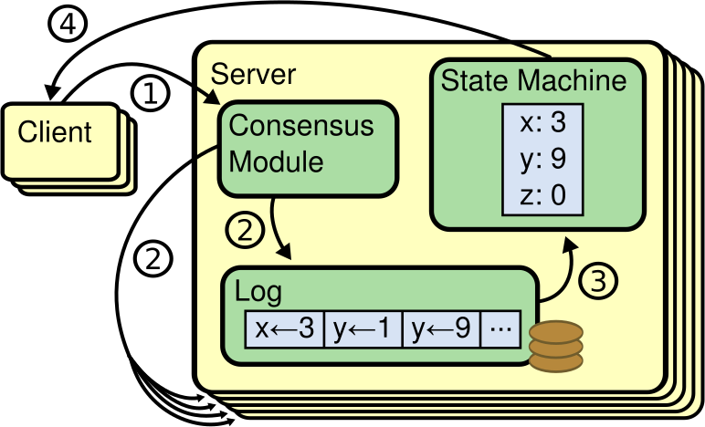

**Figure 1: Replicated state machine architecture. The consensus algorithm manages a replicated log containing state machine commands from clients. The state machines process identical sequences of commands from the logs, so they produce the same outputs.｜图：复制状态机架构。共识算法管理一份复制日志，其中包含来自客户端的状态机命令。各状态机处理日志中完全相同的命令序列，因此产生相同的输出。**

> **图表中文解读：** 客户端把命令交给服务器内的共识模块；共识模块将命令写入复制日志并在服务器间达成一致；状态机按顺序执行已提交日志，产生确定性结果；响应再返回客户端。多台服务器保存相同日志并执行相同命令，因此整体对外表现为一台可靠状态机。

**In-figure text:** ① ② ③ ④; Client; Server; Consensus Module; Log; `x←3`; `y←1`; `y←9`; `...`; State Machine; `x: 3`; `y: 9`; `z: 0`.

Replicated state machines are typically implemented using a replicated log, as shown in Figure 1. Each server stores a log containing a series of commands, which its state machine executes in order. Each log contains the same commands in the same order, so each state machine processes the same sequence of commands. Since the state machines are deterministic, each computes the same state and the same sequence of outputs.

Keeping the replicated log consistent is the job of the consensus algorithm. The consensus module on a server receives commands from clients and adds them to its log. It communicates with the consensus modules on other servers to ensure that every log eventually contains the same requests in the same order, even if some servers fail. Once commands are properly replicated, each server’s state machine processes them in log order, and the outputs are returned to clients. As a result, the servers appear to form a single, highly reliable state machine.

> **图内文字：** ① ② ③ ④；客户端；服务器；共识模块；日志；`x←3`；`y←1`；`y←9`；`...`；状态机；`x: 3`；`y: 9`；`z: 0`。
>
> 复制状态机通常用复制日志实现，如图 1 所示。每台服务器保存一份由一系列命令组成的日志，其状态机按顺序执行这些命令。每份日志以相同次序包含相同命令，因此每台状态机都处理同一命令序列。由于状态机具有确定性，它们会计算出相同状态和相同输出序列。
>
> 维持复制日志一致是共识算法的职责。服务器上的共识模块接收客户端命令并将其加入本地日志。它与其他服务器的共识模块通信，以确保即使某些服务器发生故障，每份日志最终仍会按相同次序包含相同请求。命令被正确复制后，每台服务器的状态机按日志次序处理它们，并把输出返回客户端。这样，这些服务器看起来便构成了一台高度可靠的状态机。

Consensus algorithms for practical systems typically have the following properties:

> 实用系统中的共识算法通常具备以下性质：

- They ensure safety (never returning an incorrect result) under all non-Byzantine conditions, including network delays, partitions, and packet loss, duplication, and reordering.

> 在所有非拜占庭条件下都保证安全性（绝不返回错误结果），其中包括网络延迟、分区，以及分组丢失、重复和乱序。

- They are fully functional (available) as long as any majority of the servers are operational and can communicate with each other and with clients. Thus, a typical cluster of five servers can tolerate the failure of any two servers. Servers are assumed to fail by stopping; they may later recover from state on stable storage and rejoin the cluster.

> 只要服务器中的任意多数仍可运行，并能彼此通信且能与客户端通信，系统就完全可用。因此，典型的五服务器集群可容忍任意两台服务器故障。这里假定服务器以停机方式故障；之后它们可以从稳定存储上的状态恢复并重新加入集群。

- They do not depend on timing to ensure the consistency of the logs: faulty clocks and extreme message delays can, at worst, cause availability problems.

> 它们不依赖时序来保证日志一致性：故障时钟和极端消息延迟最坏只会造成可用性问题。

- In the common case, a command can complete as soon as a majority of the cluster has responded to a single round of remote procedure calls; a minority of slow servers need not impact overall system performance.

> 在常见情形下，只要集群中的多数对一轮远程过程调用作出响应，命令便可完成；少数缓慢服务器无须影响系统整体性能。

## 3 What’s wrong with Paxos?｜Paxos 有什么问题？

Over the last ten years, Leslie Lamport’s Paxos protocol [15] has become almost synonymous with consensus: it is the protocol most commonly taught in courses, and most implementations of consensus use it as a starting point. Paxos first defines a protocol capable of reaching agreement on a single decision, such as a single replicated log entry. We refer to this subset as single-decree Paxos. Paxos then combines multiple instances of this protocol to facilitate a series of decisions such as a log (multi-Paxos). Paxos ensures both safety and liveness, and it supports changes in cluster membership. Its correctness has been proven, and it is efficient in the normal case.

Unfortunately, Paxos has two significant drawbacks. The first drawback is that Paxos is exceptionally difficult to understand. The full explanation [15] is notoriously opaque; few people succeed in understanding it, and only with great effort. As a result, there have been several attempts to explain Paxos in simpler terms [16, 20, 21]. These explanations focus on the single-decree subset, yet they are still challenging. In an informal survey of attendees at NSDI 2012, we found few people who were comfortable with Paxos, even among seasoned researchers. We struggled with Paxos ourselves; we were not able to understand the complete protocol until after reading several simplified explanations and designing our own alternative protocol, a process that took almost a year.

> 过去十年里，Leslie Lamport 的 Paxos 协议 [15] 几乎成了共识的同义词：它是课程中最常讲授的协议，多数共识实现也以它为起点。Paxos 首先定义一种能就单个决定达成一致的协议，例如决定复制日志中的一个条目。我们把这个子集称为单决议 Paxos（single-decree Paxos）。随后，Paxos 将该协议的多个实例组合起来，以完成日志这类一系列决定（multi-Paxos）。Paxos 同时保证安全性和活性，并支持集群成员变更。其正确性已经得到证明，正常情况下也很高效。
>
> 遗憾的是，Paxos 有两个显著缺点。第一个缺点是它极难理解。完整说明 [15] 以晦涩著称；很少有人能够理解，而且即便理解也要付出巨大努力。因此，人们曾多次尝试用更简单的措辞解释 Paxos [16, 20, 21]。这些解释聚焦于单决议子集，却依然颇具挑战。在对 NSDI 2012 与会者的一次非正式调查中，我们发现即使在资深研究人员中，也很少有人能从容掌握 Paxos。我们自己也曾苦战 Paxos；直到阅读多篇简化解释并设计自己的替代协议后，才理解完整协议，这一过程耗时近一年。

We hypothesize that Paxos’ opaqueness derives from its choice of the single-decree subset as its foundation. Single-decree Paxos is dense and subtle: it is divided into two stages that do not have simple intuitive explanations and cannot be understood independently. Because of this, it is difficult to develop intuitions about why the single-decree protocol works. The composition rules for multi-Paxos add significant additional complexity and subtlety. We believe that the overall problem of reaching consensus on multiple decisions (i.e., a log instead of a single entry) can be decomposed in other ways that are more direct and obvious.

The second problem with Paxos is that it does not provide a good foundation for building practical implementations. One reason is that there is no widely agreed-upon algorithm for multi-Paxos. Lamport’s descriptions are mostly about single-decree Paxos; he sketched possible approaches to multi-Paxos, but many details are missing. There have been several attempts to flesh out and optimize Paxos, such as [26], [39], and [13], but these differ from each other and from Lamport’s sketches. Systems such as Chubby [4] have implemented Paxos-like algorithms, but in most cases their details have not been published.

> 我们推测，Paxos 的晦涩源于它选择单决议子集作为基础。单决议 Paxos 内容密集而微妙：它分为两个阶段，这两个阶段既没有简单直观的解释，也无法独立理解。因此，人们很难形成关于单决议协议为何有效的直觉。multi-Paxos 的组合规则又增添了大量复杂性和微妙之处。我们认为，就多个决定达成共识这一整体问题（即针对一份日志而非单个条目）可以用其他更直接、更显然的方式分解。
>
> Paxos 的第二个问题是，它没有为构建实用实现提供良好基础。原因之一在于，multi-Paxos 并不存在一种得到广泛认同的算法。Lamport 的描述大多讨论单决议 Paxos；他勾勒过 multi-Paxos 的可能做法，却缺失许多细节。人们曾多次尝试补全并优化 Paxos，例如文献 [26]、[39] 和 [13]，但这些方案彼此不同，也与 Lamport 的草案不同。Chubby [4] 等系统实现了类 Paxos 算法，但多数情况下并未公开其细节。

Furthermore, the Paxos architecture is a poor one for building practical systems; this is another consequence of the single-decree decomposition. For example, there is little benefit to choosing a collection of log entries independently and then melding them into a sequential log; this just adds complexity. It is simpler and more efficient to design a system around a log, where new entries are appended sequentially in a constrained order. Another problem is that Paxos uses a symmetric peer-to-peer approach at its core (though it eventually suggests a weak form of leadership as a performance optimization). This makes sense in a simplified world where only one decision will be made, but few practical systems use this approach. If a series of decisions must be made, it is simpler and faster to first elect a leader, then have the leader coordinate the decisions.

As a result, practical systems bear little resemblance to Paxos. Each implementation begins with Paxos, discovers the difficulties in implementing it, and then develops a significantly different architecture. This is time-consuming and error-prone, and the difficulties of understanding Paxos exacerbate the problem. Paxos’ formulation may be a good one for proving theorems about its correctness, but real implementations are so different from Paxos that the proofs have little value. The following comment from the Chubby implementers is typical:

> 此外，Paxos 架构并不适合构建实用系统；这也是单决议分解造成的后果。例如，先独立选择一组日志条目，再将它们拼合成顺序日志，几乎没有好处，只会增加复杂性。围绕日志设计系统会更简单、高效：新条目按照受约束的次序依次追加。另一个问题是，Paxos 的核心采用对称的点对点方式（尽管它最终建议以一种弱领导形式作为性能优化）。在只作出一个决定的简化世界中，这很合理，但几乎没有实用系统采用这种方式。若必须作出一系列决定，先选举领导者，再由领导者协调这些决定，会更简单也更快。
>
> 因此，实用系统与 Paxos 几乎没有相似之处。每个实现都从 Paxos 出发，发现实现困难后再发展出显著不同的架构。这个过程既耗时又容易出错，而 Paxos 的理解困难更令问题雪上加霜。Paxos 的表述或许很适合证明其正确性定理，但实际实现与 Paxos 相差太远，以至这些证明价值有限。Chubby 实现者的下述评论很有代表性：

> There are significant gaps between the description of the Paxos algorithm and the needs of a real-world system. . . . the final system will be based on an unproven protocol [4].

> > Paxos 算法的描述与现实世界系统的需要之间存在重大鸿沟……最终系统将建立在一个未经证明的协议之上 [4]。

Because of these problems, we concluded that Paxos does not provide a good foundation either for system building or for education. Given the importance of consensus in large-scale software systems, we decided to see if we could design an alternative consensus algorithm with better properties than Paxos. Raft is the result of that experiment.

> 鉴于这些问题，我们得出结论：Paxos 无论对系统构建还是教学都不是良好基础。考虑到共识对大规模软件系统的重要性，我们决定尝试设计一种性质优于 Paxos 的替代共识算法。Raft 就是这项实验的结果。

## 4 Designing for understandability｜面向可理解性设计

We had several goals in designing Raft: it must provide a complete and practical foundation for system building, so that it significantly reduces the amount of design work required of developers; it must be safe under all conditions and available under typical operating conditions; and it must be efficient for common operations. But our most important goal—and most difficult challenge—was understandability. It must be possible for a large audience to understand the algorithm comfortably. In addition, it must be possible to develop intuitions about the algorithm, so that system builders can make the extensions that are inevitable in real-world implementations.

There were numerous points in the design of Raft where we had to choose among alternative approaches. In these situations we evaluated the alternatives based on understandability: how hard is it to explain each alternative (for example, how complex is its state space, and does it have subtle implications?), and how easy will it be for a reader to completely understand the approach and its implications?

> 设计 Raft 时，我们有几个目标：它必须为系统构建提供完整、实用的基础，从而显著减少开发者所需的设计工作；它必须在所有条件下保证安全，并在典型运行条件下可用；还必须高效执行常见操作。但我们最重要的目标——也是最艰难的挑战——是可理解性。广大读者必须能够轻松理解该算法。此外，人们必须能够形成关于算法的直觉，以便系统构建者完成现实实现中不可避免的扩展。
>
> 在 Raft 设计的许多节点上，我们必须在不同方案之间作出选择。遇到这种情况时，我们依据可理解性评估各方案：解释每个方案有多难（例如，其状态空间多复杂，是否存在微妙影响）？读者要完全理解该方案及其影响又有多容易？

We recognize that there is a high degree of subjectivity in such analysis; nonetheless, we used two techniques that are generally applicable. The first technique is the well-known approach of problem decomposition: wherever possible, we divided problems into separate pieces that could be solved, explained, and understood relatively independently. For example, in Raft we separated leader election, log replication, safety, and membership changes.

Our second approach was to simplify the state space by reducing the number of states to consider, making the system more coherent and eliminating nondeterminism where possible. Specifically, logs are not allowed to have holes, and Raft limits the ways in which logs can become inconsistent with each other. Although in most cases we tried to eliminate nondeterminism, there are some situations where nondeterminism actually improves understandability. In particular, randomized approaches introduce nondeterminism, but they tend to reduce the state space by handling all possible choices in a similar fashion (“choose any; it doesn’t matter”). We used randomization to simplify the Raft leader election algorithm.

> 我们承认，这类分析具有很强的主观性；尽管如此，我们仍采用了两项普遍适用的技术。第一项是众所周知的问题分解法：凡是可能之处，就把问题拆成能够相对独立地解决、解释和理解的部分。例如，在 Raft 中，我们将领导者选举、日志复制、安全性和成员变更彼此分离。
>
> 第二项方法是通过减少需要考虑的状态数量来简化状态空间，使系统更加一致，并尽可能消除非确定性。具体而言，日志不允许出现空洞，而且 Raft 限制了日志彼此不一致的方式。尽管多数情况下我们都试图消除非确定性，但某些情形下非确定性反而能提升可理解性。特别是，随机化方法虽会引入非确定性，却往往通过以相同方式处理所有可能选择（“任选一个；无关紧要”）来缩小状态空间。我们用随机化简化了 Raft 的领导者选举算法。

## 5 The Raft consensus algorithm｜Raft 共识算法

Raft is an algorithm for managing a replicated log of the form described in Section 2. Figure 2 summarizes the algorithm in condensed form for reference, and Figure 3 lists key properties of the algorithm; the elements of these figures are discussed piecewise over the rest of this section.

Raft implements consensus by first electing a distinguished leader, then giving the leader complete responsibility for managing the replicated log. The leader accepts log entries from clients, replicates them on other servers, and tells servers when it is safe to apply log entries to their state machines. Having a leader simplifies the management of the replicated log. For example, the leader can decide where to place new entries in the log without consulting other servers, and data flows in a simple fashion from the leader to other servers. A leader can fail or become disconnected from the other servers, in which case a new leader is elected.

> Raft 是一种管理第 2 节所述复制日志的算法。图 2 以精简形式概括算法以供查阅，图 3 列出算法的关键性质；本节余下部分将逐一讨论这两幅图中的要素。
>
> Raft 首先选举一位明确的领导者，再让领导者全权负责管理复制日志，以此实现共识。领导者接受客户端日志条目，将它们复制到其他服务器，并通知服务器何时可以安全地把日志条目应用于状态机。领导者的存在简化了复制日志的管理。例如，领导者无需征询其他服务器即可决定新条目在日志中的位置，数据也以简单方式从领导者流向其他服务器。领导者可能故障或与其他服务器失去连接，此时系统会选举新领导者。

Given the leader approach, Raft decomposes the consensus problem into three relatively independent subproblems, which are discussed in the subsections that follow:

> 基于这种领导者方法，Raft 将共识问题分解为三个相对独立的子问题，以下各小节将分别讨论：

- **Leader election:** a new leader must be chosen when an existing leader fails (Section 5.2).

> **领导者选举：** 现任领导者故障时，必须选出新领导者（第 5.2 节）。

- **Log replication:** the leader must accept log entries from clients and replicate them across the cluster, forcing the other logs to agree with its own (Section 5.3).

> **日志复制：** 领导者必须接受客户端日志条目并将其复制到整个集群，迫使其他日志与自己的日志一致（第 5.3 节）。

- **Safety:** the key safety property for Raft is the State Machine Safety Property in Figure 3: if any server has applied a particular log entry to its state machine, then no other server may apply a different command for the same log index. Section 5.4 describes how Raft ensures this property; the solution involves an additional restriction on the election mechanism described in Section 5.2.

> **安全性：** Raft 的关键安全性质是图 3 中的状态机安全性质：如果任意服务器已经把某个日志条目应用于其状态机，那么其他服务器不得为同一日志索引应用不同命令。第 5.4 节说明 Raft 如何保证这一性质；其方案对第 5.2 节所述选举机制增加了一项限制。

After presenting the consensus algorithm, this section discusses the issue of availability and the role of timing in the system.

> 介绍共识算法之后，本节还会讨论可用性问题以及时序在系统中的作用。

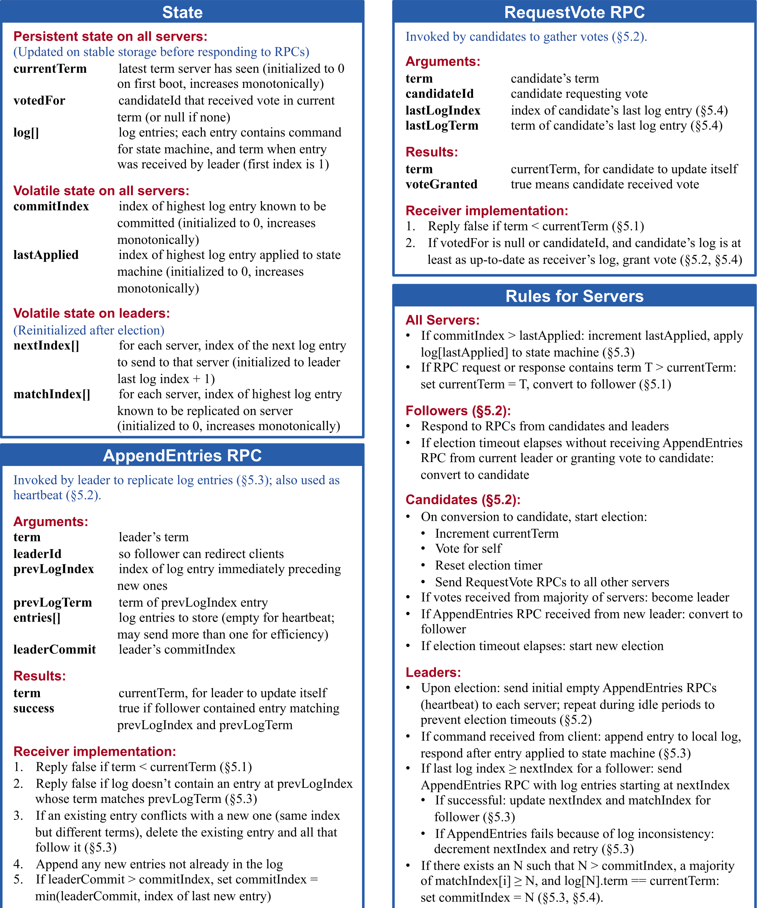

### State｜状态

**Persistent state on all servers:**

(Updated on stable storage before responding to RPCs)

> **所有服务器上的持久状态：**
>
> （响应 RPC 之前在稳定存储上更新）

| English field | English description                                                                                                       |
| ------------- | ------------------------------------------------------------------------------------------------------------------------- |
| `currentTerm` | latest term server has seen (initialized to 0 on first boot, increases monotonically)                                     |
| `votedFor`    | candidateId that received vote in current term (or null if none)                                                          |
| `log[]`       | log entries; each entry contains command for state machine, and term when entry was received by leader (first index is 1) |

> | 字段          | 说明                                                                         |
> | ------------- | ---------------------------------------------------------------------------- |
> | `currentTerm` | 服务器见过的最新任期（首次启动时初始化为 0，单调递增）                       |
> | `votedFor`    | 在当前任期内获得选票的 `candidateId`（若无则为 `null`）                      |
> | `log[]`       | 日志条目；每个条目包含状态机命令以及领导者收到该条目时的任期（首个索引为 1） |

**Volatile state on all servers:**

> **所有服务器上的易失状态：**

| English field | English description                                                                             |
| ------------- | ----------------------------------------------------------------------------------------------- |
| `commitIndex` | index of highest log entry known to be committed (initialized to 0, increases monotonically)    |
| `lastApplied` | index of highest log entry applied to state machine (initialized to 0, increases monotonically) |

> | 字段          | 说明                                                     |
> | ------------- | -------------------------------------------------------- |
> | `commitIndex` | 已知已提交的最高日志条目索引（初始化为 0，单调递增）     |
> | `lastApplied` | 已应用于状态机的最高日志条目索引（初始化为 0，单调递增） |

**Volatile state on leaders:**

(Reinitialized after election)

> **领导者上的易失状态：**
>
> （选举后重新初始化）

| English field  | English description                                                                                                      |
| -------------- | ------------------------------------------------------------------------------------------------------------------------ |
| `nextIndex[]`  | for each server, index of the next log entry to send to that server (initialized to leader last log index + 1)           |
| `matchIndex[]` | for each server, index of highest log entry known to be replicated on server (initialized to 0, increases monotonically) |

> | 字段           | 说明                                                                               |
> | -------------- | ---------------------------------------------------------------------------------- |
> | `nextIndex[]`  | 对每台服务器而言，下一条要发送给它的日志条目索引（初始化为领导者最后日志索引 + 1） |
> | `matchIndex[]` | 对每台服务器而言，已知已复制到该服务器的最高日志条目索引（初始化为 0，单调递增）   |

### RequestVote RPC｜RequestVote RPC

Invoked by candidates to gather votes (§5.2).

**Arguments:**

> 由候选者调用以收集选票（§5.2）。
>
> **参数：**

| English field  | English description                        |
| -------------- | ------------------------------------------ |
| `term`         | candidate’s term                           |
| `candidateId`  | candidate requesting vote                  |
| `lastLogIndex` | index of candidate’s last log entry (§5.4) |
| `lastLogTerm`  | term of candidate’s last log entry (§5.4)  |

> | 字段           | 说明                                 |
> | -------------- | ------------------------------------ |
> | `term`         | 候选者的任期                         |
> | `candidateId`  | 请求选票的候选者                     |
> | `lastLogIndex` | 候选者最后一条日志条目的索引（§5.4） |
> | `lastLogTerm`  | 候选者最后一条日志条目的任期（§5.4） |

**Results:**

> **结果：**

| English field | English description                         |
| ------------- | ------------------------------------------- |
| `term`        | currentTerm, for candidate to update itself |
| `voteGranted` | true means candidate received vote          |

> | 字段          | 说明                            |
> | ------------- | ------------------------------- |
> | `term`        | `currentTerm`，供候选者更新自身 |
> | `voteGranted` | `true` 表示候选者获得选票       |

**Receiver implementation:**

> **接收方实现：**

1. Reply false if `term < currentTerm` (§5.1)
2. If `votedFor` is null or `candidateId`, and candidate’s log is at least as up-to-date as receiver’s log, grant vote (§5.2, §5.4)

> 1. 若 `term < currentTerm`，回复 `false`（§5.1）。
> 2. 若 `votedFor` 为 `null` 或 `candidateId`，且候选者的日志至少与接收者的日志一样新，则投票给候选者（§5.2、§5.4）。

### AppendEntries RPC｜AppendEntries RPC

Invoked by leader to replicate log entries (§5.3); also used as heartbeat (§5.2).

**Arguments:**

> 由领导者调用以复制日志条目（§5.3）；也用作心跳（§5.2）。
>
> **参数：**

| English field  | English description                                                               |
| -------------- | --------------------------------------------------------------------------------- |
| `term`         | leader’s term                                                                     |
| `leaderId`     | so follower can redirect clients                                                  |
| `prevLogIndex` | index of log entry immediately preceding new ones                                 |
| `prevLogTerm`  | term of `prevLogIndex` entry                                                      |
| `entries[]`    | log entries to store (empty for heartbeat; may send more than one for efficiency) |
| `leaderCommit` | leader’s `commitIndex`                                                            |

> | 字段           | 说明                                                     |
> | -------------- | -------------------------------------------------------- |
> | `term`         | 领导者的任期                                             |
> | `leaderId`     | 使跟随者能够重定向客户端                                 |
> | `prevLogIndex` | 紧邻新条目之前的日志条目索引                             |
> | `prevLogTerm`  | `prevLogIndex` 条目的任期                                |
> | `entries[]`    | 要保存的日志条目（心跳时为空；为提高效率可一次发送多个） |
> | `leaderCommit` | 领导者的 `commitIndex`                                   |

**Results:**

> **结果：**

| English field | English description                                                        |
| ------------- | -------------------------------------------------------------------------- |
| `term`        | currentTerm, for leader to update itself                                   |
| `success`     | true if follower contained entry matching `prevLogIndex` and `prevLogTerm` |

> | 字段      | 说明                                                                   |
> | --------- | ---------------------------------------------------------------------- |
> | `term`    | `currentTerm`，供领导者更新自身                                        |
> | `success` | 若跟随者含有与 `prevLogIndex` 和 `prevLogTerm` 匹配的条目，则为 `true` |

**Receiver implementation:**

> **接收方实现：**

1. Reply false if `term < currentTerm` (§5.1)
2. Reply false if log doesn’t contain an entry at `prevLogIndex` whose term matches `prevLogTerm` (§5.3)
3. If an existing entry conflicts with a new one (same index but different terms), delete the existing entry and all that follow it (§5.3)
4. Append any new entries not already in the log
5. If `leaderCommit > commitIndex`, set `commitIndex = min(leaderCommit, index of last new entry)`

> 1. 若 `term < currentTerm`，回复 `false`（§5.1）。
> 2. 若日志在 `prevLogIndex` 处不存在任期与 `prevLogTerm` 匹配的条目，回复 `false`（§5.3）。
> 3. 若现有条目与新条目冲突（索引相同但任期不同），删除现有条目及其后的所有条目（§5.3）。
> 4. 追加日志中尚不存在的所有新条目。
> 5. 若 `leaderCommit > commitIndex`，令 `commitIndex = min(leaderCommit, index of last new entry)`。

### Rules for Servers｜服务器规则

**All Servers:**

> **所有服务器：**

- If `commitIndex > lastApplied`: increment `lastApplied`, apply `log[lastApplied]` to state machine (§5.3)
- If RPC request or response contains term `T > currentTerm`: set `currentTerm = T`, convert to follower (§5.1)

> - 若 `commitIndex > lastApplied`：递增 `lastApplied`，把 `log[lastApplied]` 应用于状态机（§5.3）。
> - 若 RPC 请求或响应包含任期 `T > currentTerm`：令 `currentTerm = T`，转为跟随者（§5.1）。

**Followers (§5.2):**

> **跟随者（§5.2）：**

- Respond to RPCs from candidates and leaders
- If election timeout elapses without receiving AppendEntries RPC from current leader or granting vote to candidate: convert to candidate

> - 响应候选者与领导者的 RPC。
> - 若选举超时之前既未收到当前领导者的 AppendEntries RPC，也未向候选者投票：转为候选者。

**Candidates (§5.2):**

> **候选者（§5.2）：**

- On conversion to candidate, start election:
  - Increment `currentTerm`
  - Vote for self
  - Reset election timer
  - Send RequestVote RPCs to all other servers
- If votes received from majority of servers: become leader
- If AppendEntries RPC received from new leader: convert to follower
- If election timeout elapses: start new election

> - 转为候选者时，开始选举：
>   - 递增 `currentTerm`；
>   - 投票给自己；
>   - 重置选举定时器；
>   - 向所有其他服务器发送 RequestVote RPC。
> - 若收到多数服务器的选票：成为领导者。
> - 若收到新领导者的 AppendEntries RPC：转为跟随者。
> - 若选举超时：开始新选举。

**Leaders:**

> **领导者：**

- Upon election: send initial empty AppendEntries RPCs (heartbeat) to each server; repeat during idle periods to prevent election timeouts (§5.2)
- If command received from client: append entry to local log, respond after entry applied to state machine (§5.3)
- If last log index ≥ `nextIndex` for a follower: send AppendEntries RPC with log entries starting at `nextIndex`
  - If successful: update `nextIndex` and `matchIndex` for follower (§5.3)
  - If AppendEntries fails because of log inconsistency: decrement `nextIndex` and retry (§5.3)
- If there exists an `N` such that `N > commitIndex`, a majority of `matchIndex[i] ≥ N`, and `log[N].term == currentTerm`: set `commitIndex = N` (§5.3, §5.4).

> - 当选后：向每台服务器发送初始的空 AppendEntries RPC（心跳）；空闲期间重复发送，以防选举超时（§5.2）。
> - 若收到客户端命令：把条目追加到本地日志，在条目应用于状态机后响应（§5.3）。
> - 若对某跟随者而言最后日志索引 ≥ `nextIndex`：发送 AppendEntries RPC，其中包含从 `nextIndex` 开始的日志条目。
>   - 若成功：更新该跟随者的 `nextIndex` 和 `matchIndex`（§5.3）。
>   - 若 AppendEntries 因日志不一致而失败：递减 `nextIndex` 并重试（§5.3）。
> - 若存在 `N`，使 `N > commitIndex`、多数 `matchIndex[i] ≥ N`，且 `log[N].term == currentTerm`：令 `commitIndex = N`（§5.3、§5.4）。

**Figure 2: A condensed summary of the Raft consensus algorithm (excluding membership changes and log compaction). The server behavior in the upper-left box is described as a set of rules that trigger independently and repeatedly. Section numbers such as §5.2 indicate where particular features are discussed. A formal specification [31] describes the algorithm more precisely.｜图：Raft 共识算法的精简概述（不含成员变更和日志压缩）。左上方框中的服务器行为被描述为一组独立、反复触发的规则。§5.2 之类的节号表示特定特性的讨论位置。形式化规约 [31] 对算法作出了更精确的描述。**

> **译注：** PDF 原文 caption 写作 “upper-left box”，但可见版面中规则框位于右下方；此处保留原文，不作静默修正。

> **图表中文解读：** 图 2 把 Raft 的实现契约压缩为四部分：持久/易失状态、两类核心 RPC、各角色反复执行的规则，以及领导者推进提交索引的多数条件。字段表给出每个服务器必须保存的最小状态；RequestVote 负责选举，AppendEntries 同时承担复制和心跳；规则表则把跟随者、候选者、领导者的状态转换与重试逻辑串联起来。

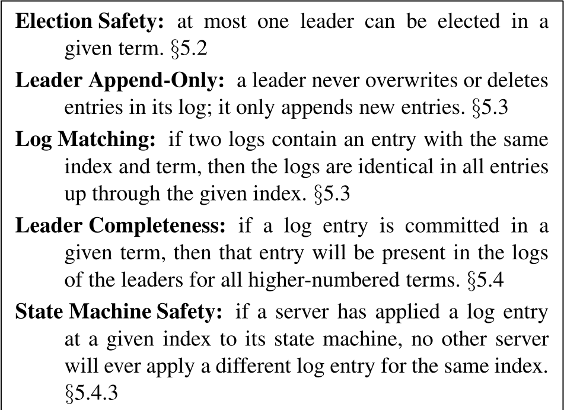

**Election Safety: at most one leader can be elected in a given term. §5.2**

**Leader Append-Only: a leader never overwrites or deletes entries in its log; it only appends new entries. §5.3**

**Log Matching: if two logs contain an entry with the same index and term, then the logs are identical in all entries up through the given index. §5.3**

> **选举安全性：给定任期内至多选出一位领导者。§5.2**
>
> **领导者只追加：领导者绝不覆盖或删除其日志中的条目；它只追加新条目。§5.3**
>
> **日志匹配：如果两份日志都含有索引和任期相同的条目，那么两份日志从开头到该索引为止的所有条目都完全相同。§5.3**

**Leader Completeness: if a log entry is committed in a given term, then that entry will be present in the logs of the leaders for all higher-numbered terms. §5.4**

**State Machine Safety: if a server has applied a log entry at a given index to its state machine, no other server will ever apply a different log entry for the same index. §5.4.3**

> **领导者完整性：如果某日志条目在给定任期内提交，那么所有更高编号任期的领导者日志中都会有该条目。§5.4**
>
> **状态机安全性：如果某服务器已把给定索引处的日志条目应用于状态机，其他服务器绝不会为同一索引应用不同的日志条目。§5.4.3**

**Figure 3: Raft guarantees that each of these properties is true at all times. The section numbers indicate where each property is discussed.｜图：Raft 保证上述每项性质始终成立。节号表示各项性质的讨论位置。**

> **图表中文解读：** 五项性质从选举唯一性、领导者日志不可逆、不同日志前缀一致、已提交条目跨任期保留，逐层推出同一索引不可能被状态机执行为不同命令；它们构成后文安全性论证的骨架。

### 5.1 Raft basics｜Raft 基础

A Raft cluster contains several servers; five is a typical number, which allows the system to tolerate two failures. At any given time each server is in one of three states: leader, follower, or candidate. In normal operation there is exactly one leader and all of the other servers are followers. Followers are passive: they issue no requests on their own but simply respond to requests from leaders and candidates. The leader handles all client requests (if a client contacts a follower, the follower redirects it to the leader). The third state, candidate, is used to elect a new leader as described in Section 5.2. Figure 4 shows the states and their transitions; the transitions are discussed below.

> 一个 Raft 集群包含若干服务器；典型数量是五台，这使系统能够容忍两台故障。任意时刻，每台服务器都处于领导者、跟随者或候选者三种状态之一。正常运行时恰有一位领导者，其余服务器都是跟随者。跟随者是被动的：它们不会自行发出请求，只响应领导者和候选者的请求。领导者处理所有客户端请求（若客户端联系跟随者，跟随者会把它重定向到领导者）。第三种状态候选者用于选举新领导者，如第 5.2 节所述。图 4 展示状态及其转换；下文将讨论这些转换。

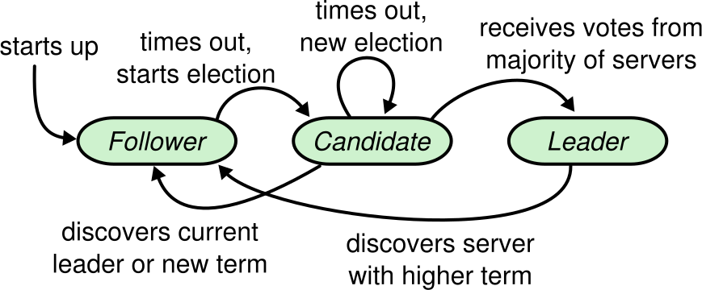

**Figure 4: Server states. Followers only respond to requests from other servers. If a follower receives no communication, it becomes a candidate and initiates an election. A candidate that receives votes from a majority of the full cluster becomes the new leader. Leaders typically operate until they fail.｜图：服务器状态。跟随者只响应其他服务器的请求。若跟随者未收到任何通信，它会成为候选者并发起选举。获得完整集群多数选票的候选者成为新领导者。领导者通常会一直运行到发生故障。**

> **图表中文解读：** 服务器启动时进入跟随者状态；跟随者超时后成为候选者；候选者若获得多数票则成为领导者，若再次超时则发起新一轮选举；候选者或领导者一旦发现当前领导者或更高任期，便退回跟随者。

**In-figure text:** starts up; Follower; times out, starts election; Candidate; times out, new election; receives votes from majority of servers; Leader; discovers current leader or new term; discovers server with higher term.

Raft divides time into terms of arbitrary length, as shown in Figure 5. Terms are numbered with consecutive integers. Each term begins with an election, in which one or more candidates attempt to become leader as described in Section 5.2. If a candidate wins the election, then it serves as leader for the rest of the term. In some situations an election will result in a split vote. In this case the term will end with no leader; a new term (with a new election) will begin shortly. Raft ensures that there is at most one leader in a given term.

> **图内文字：** 启动；跟随者；超时，开始选举；候选者；超时，开始新选举；获得多数服务器的选票；领导者；发现当前领导者或新任期；发现任期更高的服务器。
>
> 如图 5 所示，Raft 将时间划分为长度任意的任期。任期用连续整数编号。每个任期都从选举开始，一个或多个候选者按照第 5.2 节所述方式尝试成为领导者。若某候选者赢得选举，它便在该任期余下时间内担任领导者。有时选举会出现票数分裂，此时该任期无领导者而结束；新任期（伴随新选举）很快开始。Raft 保证给定任期内至多有一位领导者。

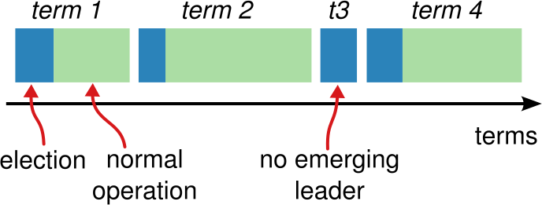

**Figure 5: Time is divided into terms, and each term begins with an election. After a successful election, a single leader manages the cluster until the end of the term. Some elections fail, in which case the term ends without choosing a leader. The transitions between terms may be observed at different times on different servers.｜图：时间被划分为多个任期，每个任期都从一次选举开始。成功选举后，一位领导者管理集群直到任期结束。有些选举会失败，此时任期结束而未选出领导者。不同服务器可能在不同时间观察到任期之间的转换。**

> **图表中文解读：** 蓝色区段表示选举，绿色区段表示选出领导者后的正常运行；第三任期只发生选举而未产生领导者。任期是逻辑时钟，不要求所有服务器同时跨入新任期。

**In-figure text:** term 1; term 2; t3; term 4; election; normal operation; no emerging leader; terms.

Different servers may observe the transitions between terms at different times, and in some situations a server may not observe an election or even entire terms. Terms act as a logical clock [14] in Raft, and they allow servers to detect obsolete information such as stale leaders. Each server stores a current term number, which increases monotonically over time. Current terms are exchanged whenever servers communicate; if one server’s current term is smaller than the other’s, then it updates its current term to the larger value. If a candidate or leader discovers that its term is out of date, it immediately reverts to follower state. If a server receives a request with a stale term number, it rejects the request.

Raft servers communicate using remote procedure calls (RPCs), and the basic consensus algorithm requires only two types of RPCs. RequestVote RPCs are initiated by candidates during elections (Section 5.2), and AppendEntries RPCs are initiated by leaders to replicate log entries and to provide a form of heartbeat (Section 5.3). Section 7 adds a third RPC for transferring snapshots between servers. Servers retry RPCs if they do not receive a response in a timely manner, and they issue RPCs in parallel for best performance.

> **图内文字：** 任期 1；任期 2；t3；任期 4；选举；正常运行；没有产生领导者；任期。
>
> 不同服务器可能在不同时间观察到任期转换；某些情况下，一台服务器甚至可能完全没有观察到一次选举乃至整个任期。任期在 Raft 中充当逻辑时钟 [14]，让服务器能够识别陈旧领导者等过时信息。每台服务器保存一个随时间单调递增的当前任期号。服务器每次通信都会交换当前任期；若一台服务器的当前任期小于另一台，它就把自己的当前任期更新为较大值。候选者或领导者一旦发现自己的任期过时，立即退回跟随者状态。服务器若收到带有过时任期号的请求，则拒绝该请求。
>
> Raft 服务器通过远程过程调用（RPC）通信，基础共识算法只需要两类 RPC。RequestVote RPC 由候选者在选举期间发起（第 5.2 节）；AppendEntries RPC 由领导者发起，用于复制日志条目并充当一种心跳（第 5.3 节）。第 7 节又增加了第三类 RPC，用于在服务器之间传输快照。服务器若未及时收到响应就会重试 RPC，并并行发出 RPC 以获得最佳性能。

### 5.2 Leader election｜领导者选举

Raft uses a heartbeat mechanism to trigger leader election. When servers start up, they begin as followers. A server remains in follower state as long as it receives valid RPCs from a leader or candidate. Leaders send periodic heartbeats (AppendEntries RPCs that carry no log entries) to all followers in order to maintain their authority. If a follower receives no communication over a period of time called the election timeout, then it assumes there is no viable leader and begins an election to choose a new leader.

To begin an election, a follower increments its current term and transitions to candidate state. It then votes for itself and issues RequestVote RPCs in parallel to each of the other servers in the cluster. A candidate continues in this state until one of three things happens: (a) it wins the election, (b) another server establishes itself as a leader, or (c) a period of time goes by with no winner. These outcomes are discussed separately in the paragraphs below.

> Raft 使用心跳机制触发领导者选举。服务器启动时都是跟随者。只要持续收到领导者或候选者的有效 RPC，服务器就保持跟随者状态。领导者定期向所有跟随者发送心跳（不携带日志条目的 AppendEntries RPC），以维持其权威。若跟随者在一段称为选举超时的时间内没有收到任何通信，它便认为当前不存在可用领导者，并开始选举新领导者。
>
> 为开始选举，跟随者递增当前任期并转入候选者状态。随后它投票给自己，并向集群中每台其他服务器并行发出 RequestVote RPC。候选者会保持这一状态，直到发生三种情况之一：（a）赢得选举；（b）另一台服务器确立为领导者；（c）经过一段时间仍无胜者。下文分别讨论这些结果。

A candidate wins an election if it receives votes from a majority of the servers in the full cluster for the same term. Each server will vote for at most one candidate in a given term, on a first-come-first-served basis (note: Section 5.4 adds an additional restriction on votes). The majority rule ensures that at most one candidate can win the election for a particular term (the Election Safety Property in Figure 3). Once a candidate wins an election, it becomes leader. It then sends heartbeat messages to all of the other servers to establish its authority and prevent new elections.

While waiting for votes, a candidate may receive an AppendEntries RPC from another server claiming to be leader. If the leader’s term (included in its RPC) is at least as large as the candidate’s current term, then the candidate recognizes the leader as legitimate and returns to follower state. If the term in the RPC is smaller than the candidate’s current term, then the candidate rejects the RPC and continues in candidate state.

> 候选者若在同一任期内获得完整集群中多数服务器的选票，就赢得选举。每台服务器在给定任期内至多投票给一位候选者，采取先到先得原则（注意：第 5.4 节还会增加一项投票限制）。多数规则保证特定任期内至多有一位候选者赢得选举（图 3 的选举安全性质）。候选者胜选后成为领导者，随即向所有其他服务器发送心跳消息，以确立权威并阻止新选举。
>
> 等待选票时，候选者可能收到另一台自称领导者的服务器发来的 AppendEntries RPC。若领导者任期（包含在 RPC 中）至少与候选者当前任期一样大，候选者便承认该领导者合法并回到跟随者状态。若 RPC 中的任期小于候选者当前任期，候选者就拒绝该 RPC，并继续保持候选者状态。

The third possible outcome is that a candidate neither wins nor loses the election: if many followers become candidates at the same time, votes could be split so that no candidate obtains a majority. When this happens, each candidate will time out and start a new election by incrementing its term and initiating another round of RequestVote RPCs. However, without extra measures split votes could repeat indefinitely.

Raft uses randomized election timeouts to ensure that split votes are rare and that they are resolved quickly. To prevent split votes in the first place, election timeouts are chosen randomly from a fixed interval (e.g., 150–300ms). This spreads out the servers so that in most cases only a single server will time out; it wins the election and sends heartbeats before any other servers time out. The same mechanism is used to handle split votes. Each candidate restarts its randomized election timeout at the start of an election, and it waits for that timeout to elapse before starting the next election; this reduces the likelihood of another split vote in the new election. Section 9.3 shows that this approach elects a leader rapidly.

> 第三种可能结果是候选者既未赢也未输：如果许多跟随者同时成为候选者，选票可能分裂，导致没有候选者获得多数。发生这种情况时，每位候选者都会超时，随后递增任期并发起另一轮 RequestVote RPC，开始新选举。然而，若没有额外措施，票数分裂可能无限重复。
>
> Raft 使用随机化选举超时，确保票数分裂很少发生，并能迅速解决。为从一开始就防止票数分裂，系统从固定区间（例如 150–300ms）中随机选择选举超时。这样会把各服务器的超时时刻错开，多数情况下只有一台服务器先超时；它会在其他服务器超时前赢得选举并发送心跳。同一机制也用于处理票数分裂。每位候选者在选举开始时重新启动随机化选举超时，并等待该超时到期后再开始下一次选举；这降低了新选举再次出现票数分裂的概率。第 9.3 节表明，这种方法能迅速选出领导者。

Elections are an example of how understandability guided our choice between design alternatives. Initially we planned to use a ranking system: each candidate was assigned a unique rank, which was used to select between competing candidates. If a candidate discovered another candidate with higher rank, it would return to follower state so that the higher ranking candidate could more easily win the next election. We found that this approach created subtle issues around availability (a lower-ranked server might need to time out and become a candidate again if a higher-ranked server fails, but if it does so too soon, it can reset progress towards electing a leader). We made adjustments to the algorithm several times, but after each adjustment new corner cases appeared. Eventually we concluded that the randomized retry approach is more obvious and understandable.

> 选举体现了可理解性如何引导我们在设计方案之间作出选择。最初我们计划使用排名系统：每位候选者都有唯一排名，用它在相互竞争的候选者之间作出选择。如果候选者发现另一位排名更高的候选者，它就回到跟随者状态，让高排名候选者更容易赢得下一次选举。我们发现，这种方法会引出微妙的可用性问题（若高排名服务器故障，低排名服务器可能需要再次超时并成为候选者；但若行动过早，又可能让选举领导者的进度归零）。我们多次调整算法，但每次调整后都会出现新的边界情况。最终，我们认定随机化重试方法更加直观、易懂。

### 5.3 Log replication｜日志复制

Once a leader has been elected, it begins servicing client requests. Each client request contains a command to be executed by the replicated state machines. The leader appends the command to its log as a new entry, then issues AppendEntries RPCs in parallel to each of the other servers to replicate the entry. When the entry has been safely replicated (as described below), the leader applies the entry to its state machine and returns the result of that execution to the client. If followers crash or run slowly, or if network packets are lost, the leader retries AppendEntries RPCs indefinitely (even after it has responded to the client) until all followers eventually store all log entries.

Logs are organized as shown in Figure 6. Each log entry stores a state machine command along with the term number when the entry was received by the leader. The term numbers in log entries are used to detect inconsistencies between logs and to ensure some of the properties in Figure 3. Each log entry also has an integer index identifying its position in the log.

> 领导者当选后便开始处理客户端请求。每个客户端请求都包含一条由复制状态机执行的命令。领导者把命令作为新条目追加到本地日志，再向其他每台服务器并行发出 AppendEntries RPC 以复制该条目。当条目被安全复制后（如下文所述），领导者将其应用于状态机，并把执行结果返回客户端。若跟随者崩溃或运行缓慢，或网络分组丢失，领导者会无限重试 AppendEntries RPC（即使已经响应客户端），直到所有跟随者最终都保存全部日志条目。
>
> 日志按图 6 所示方式组织。每个日志条目保存一条状态机命令，以及领导者收到该条目时的任期号。日志条目中的任期号用于检测日志之间的不一致，并保证图 3 中的若干性质。每个日志条目还带有一个整数索引，用来标识它在日志中的位置。

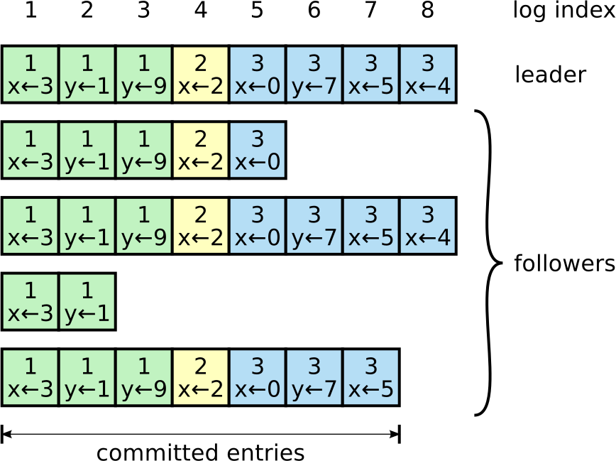

**Figure 6: Logs are composed of entries, which are numbered sequentially. Each entry contains the term in which it was created (the number in each box) and a command for the state machine. An entry is considered committed if it is safe for that entry to be applied to state machines.｜图：日志由依次编号的条目组成。每个条目包含其创建任期（方框内的数字）和一条状态机命令。当一个条目可以安全地应用于状态机时，该条目即视为已提交。**

> **图表中文解读：** 每行是一台服务器的日志；上方领导者拥有索引 1–8 的条目，跟随者复制进度不一。颜色与方框中的数字表示创建任期，方框中的命令是状态机操作；横线标出的索引 1–7 已提交，索引 8 尚未提交。

**In-figure text:** log index 1 2 3 4 5 6 7 8; leader; followers; committed entries. Leader row: `1/x←3`, `1/y←1`, `1/y←9`, `2/x←2`, `3/x←0`, `3/y←7`, `3/x←5`, `3/x←4`. Follower rows: through index 5; through index 8; through index 2; through index 7, as drawn.

The leader decides when it is safe to apply a log entry to the state machines; such an entry is called committed. Raft guarantees that committed entries are durable and will eventually be executed by all of the available state machines. A log entry is committed once the leader that created the entry has replicated it on a majority of the servers (e.g., entry 7 in Figure 6). This also commits all preceding entries in the leader’s log, including entries created by previous leaders. Section 5.4 discusses some subtleties when applying this rule after leader changes, and it also shows that this definition of commitment is safe. The leader keeps track of the highest index it knows to be committed, and it includes that index in future AppendEntries RPCs (including heartbeats) so that the other servers eventually find out. Once a follower learns that a log entry is committed, it applies the entry to its local state machine (in log order).

> **图内文字：** 日志索引 1 2 3 4 5 6 7 8；领导者；跟随者；已提交条目。领导者一行依次为 `1/x←3`、`1/y←1`、`1/y←9`、`2/x←2`、`3/x←0`、`3/y←7`、`3/x←5`、`3/x←4`；四行跟随者分别绘至索引 5、8、2、7。
>
> 领导者决定何时能够安全地把日志条目应用于状态机；这样的条目称为已提交。Raft 保证已提交条目是持久的，并最终会由所有可用状态机执行。创建某日志条目的领导者一旦把它复制到多数服务器，该条目即提交（例如图 6 中的条目 7）。这还会提交领导者日志中此前的所有条目，包括先前领导者创建的条目。第 5.4 节讨论领导者更换后应用这项规则时的一些微妙之处，并说明该提交定义是安全的。领导者跟踪已知已提交的最高索引，并把该索引放入之后的 AppendEntries RPC（包括心跳），使其他服务器最终得知。跟随者一旦知道某日志条目已提交，就按日志次序把它应用于本地状态机。

We designed the Raft log mechanism to maintain a high level of coherency between the logs on different servers. Not only does this simplify the system’s behavior and make it more predictable, but it is an important component of ensuring safety. Raft maintains the following properties, which together constitute the Log Matching Property in Figure 3:

> 我们设计 Raft 日志机制时，力求让不同服务器上的日志保持高度一致。这不仅简化系统行为、提高可预测性，还是保证安全性的重要组成部分。Raft 维持以下性质，它们共同构成图 3 中的日志匹配性质：

- If two entries in different logs have the same index and term, then they store the same command.
- If two entries in different logs have the same index and term, then the logs are identical in all preceding entries.

> - 如果不同日志中的两个条目具有相同索引和任期，那么它们保存相同命令。
> - 如果不同日志中的两个条目具有相同索引和任期，那么它们之前的所有条目都完全相同。

The first property follows from the fact that a leader creates at most one entry with a given log index in a given term, and log entries never change their position in the log. The second property is guaranteed by a simple consistency check performed by AppendEntries. When sending an AppendEntries RPC, the leader includes the index and term of the entry in its log that immediately precedes the new entries. If the follower does not find an entry in its log with the same index and term, then it refuses the new entries. The consistency check acts as an induction step: the initial empty state of the logs satisfies the Log Matching Property, and the consistency check preserves the Log Matching Property whenever logs are extended. As a result, whenever AppendEntries returns successfully, the leader knows that the follower’s log is identical to its own log up through the new entries.

During normal operation, the logs of the leader and followers stay consistent, so the AppendEntries consistency check never fails. However, leader crashes can leave the logs inconsistent (the old leader may not have fully replicated all of the entries in its log). These inconsistencies can compound over a series of leader and follower crashes. Figure 7 illustrates the ways in which followers’ logs may differ from that of a new leader. A follower may be missing entries that are present on the leader, it may have extra entries that are not present on the leader, or both. Missing and extraneous entries in a log may span multiple terms.

> 第一项性质源于以下事实：给定任期内，领导者为给定日志索引至多创建一个条目，而且日志条目绝不改变其在日志中的位置。第二项性质由 AppendEntries 执行的简单一致性检查保证。发送 AppendEntries RPC 时，领导者会带上本地日志中紧邻新条目之前那个条目的索引和任期。若跟随者在本地日志中找不到索引和任期相同的条目，就拒绝新条目。一致性检查相当于归纳步骤：日志初始为空时满足日志匹配性质；每次扩展日志时，一致性检查都会保持该性质。因此，每当 AppendEntries 成功返回，领导者就知道跟随者的日志直至新条目都与自己的日志完全相同。
>
> 正常运行时，领导者与跟随者的日志保持一致，因此 AppendEntries 一致性检查绝不会失败。然而，领导者崩溃可能留下不一致日志（旧领导者可能尚未完整复制其日志中的全部条目）。经过一连串领导者和跟随者崩溃，这些不一致还会叠加。图 7 展示跟随者日志可能以哪些方式不同于新领导者日志。跟随者可能缺少领导者已有的条目，可能多出领导者没有的条目，也可能两者兼有。日志中缺失和多余的条目可能跨越多个任期。

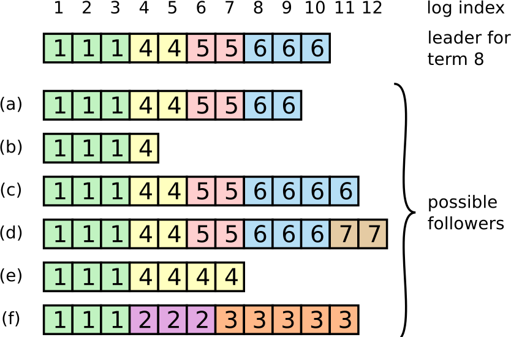

**Figure 7: When the leader at the top comes to power, it is possible that any of scenarios (a–f) could occur in follower logs. Each box represents one log entry; the number in the box is its term. A follower may be missing entries (a–b), may have extra uncommitted entries (c–d), or both (e–f). For example, scenario (f) could occur if that server was the leader for term 2, added several entries to its log, then crashed before committing any of them; it restarted quickly, became leader for term 3, and added a few more entries to its log; before any of the entries in either term 2 or term 3 were committed, the server crashed again and remained down for several terms.｜图：顶部领导者上任时，跟随者日志中可能出现情形（a–f）中的任一种。每个方框表示一个日志条目；框内数字是其任期。跟随者可能缺少条目（a–b），可能有额外的未提交条目（c–d），也可能两者兼有（e–f）。例如，情形（f）可能这样发生：该服务器曾是任期 2 的领导者，向日志加入若干条目，却在提交任何条目前崩溃；它很快重启，成为任期 3 的领导者，又向日志加入几条；任期 2 或任期 3 的任何条目尚未提交时，该服务器再次崩溃，并停机了多个任期。**

> **图表中文解读：** 新领导者日志到索引 10；六种跟随者日志分别展示缺尾、停在更早位置、多出后续任期条目、带冲突后缀，以及缺失与冲突并存。Raft 不逐类处理这些历史，而是统一回退到最后匹配前缀，再用领导者后缀覆盖。

**In-figure text:** log index 1 2 3 4 5 6 7 8 9 10 11 12; leader for term 8; possible followers; (a) (b) (c) (d) (e) (f). Leader terms: `1 1 1 4 4 5 5 6 6 6`; follower terms: (a) `1 1 1 4 4 5 5 6 6`; (b) `1 1 1 4`; (c) `1 1 1 4 4 5 5 6 6 6 6`; (d) `1 1 1 4 4 5 5 6 6 6 7 7`; (e) `1 1 1 4 4 4 4`; (f) `1 1 1 2 2 2 3 3 3 3 3`.

In Raft, the leader handles inconsistencies by forcing the followers’ logs to duplicate its own. This means that conflicting entries in follower logs will be overwritten with entries from the leader’s log. Section 5.4 will show that this is safe when coupled with one more restriction.

> **图内文字：** 日志索引 1–12；任期 8 的领导者；可能的跟随者；（a）至（f）。领导者任期序列为 `1 1 1 4 4 5 5 6 6 6`；各跟随者序列按原图逐一照录于上一英文块。
>
> 在 Raft 中，领导者通过强制跟随者日志复制自己的日志来处理不一致。这意味着跟随者日志中的冲突条目会被领导者日志中的条目覆盖。第 5.4 节将说明，再配合一项额外限制，这种做法是安全的。

To bring a follower’s log into consistency with its own, the leader must find the latest log entry where the two logs agree, delete any entries in the follower’s log after that point, and send the follower all of the leader’s entries after that point. All of these actions happen in response to the consistency check performed by AppendEntries RPCs. The leader maintains a nextIndex for each follower, which is the index of the next log entry the leader will send to that follower. When a leader first comes to power, it initializes all nextIndex values to the index just after the last one in its log (11 in Figure 7). If a follower’s log is inconsistent with the leader’s, the AppendEntries consistency check will fail in the next AppendEntries RPC. After a rejection, the leader decrements nextIndex and retries the AppendEntries RPC. Eventually nextIndex will reach a point where the leader and follower logs match. When this happens, AppendEntries will succeed, which removes any conflicting entries in the follower’s log and appends entries from the leader’s log (if any). Once AppendEntries succeeds, the follower’s log is consistent with the leader’s, and it will remain that way for the rest of the term.

> 为使跟随者日志与自己的日志一致，领导者必须找到两份日志一致的最新条目，删除跟随者日志中该点之后的所有条目，再把领导者在该点之后的全部条目发送给跟随者。这些动作都由 AppendEntries RPC 所执行的一致性检查驱动。领导者为每个跟随者维护一个 `nextIndex`，表示下一条要发给该跟随者的日志条目索引。领导者刚上任时，把所有 `nextIndex` 初始化为本地最后条目之后的索引（图 7 中为 11）。若跟随者日志与领导者不一致，下一次 AppendEntries RPC 的一致性检查会失败。请求被拒后，领导者递减 `nextIndex` 并重试 AppendEntries RPC。最终，`nextIndex` 会到达领导者和跟随者日志相匹配的位置。此时 AppendEntries 成功，删除跟随者日志中的冲突条目，并追加领导者日志中的条目（若有）。AppendEntries 一旦成功，跟随者日志就与领导者一致，并在该任期余下时间里保持一致。

If desired, the protocol can be optimized to reduce the number of rejected AppendEntries RPCs. For example, when rejecting an AppendEntries request, the follower can include the term of the conflicting entry and the first index it stores for that term. With this information, the leader can decrement nextIndex to bypass all of the conflicting entries in that term; one AppendEntries RPC will be required for each term with conflicting entries, rather than one RPC per entry. In practice, we doubt this optimization is necessary, since failures happen infrequently and it is unlikely that there will be many inconsistent entries.

With this mechanism, a leader does not need to take any special actions to restore log consistency when it comes to power. It just begins normal operation, and the logs automatically converge in response to failures of the AppendEntries consistency check. A leader never overwrites or deletes entries in its own log (the Leader Append-Only Property in Figure 3).

> 如有需要，可以优化协议以减少被拒绝的 AppendEntries RPC 数量。例如，跟随者拒绝 AppendEntries 请求时，可以返回冲突条目的任期以及它为该任期保存的首个索引。有了这些信息，领导者就能一次递减 `nextIndex`，跳过该任期内的全部冲突条目；每个存在冲突条目的任期只需一次 AppendEntries RPC，而不是每个条目一次。实践中，我们怀疑这项优化是否必要，因为故障很少发生，也不太可能存在大量不一致条目。
>
> 有了这套机制，领导者上任时无须采取特殊动作恢复日志一致性。它只需开始正常运行，日志便会在 AppendEntries 一致性检查失败的驱动下自动收敛。领导者绝不覆盖或删除自身日志中的条目（图 3 的领导者只追加性质）。

This log replication mechanism exhibits the desirable consensus properties described in Section 2: Raft can accept, replicate, and apply new log entries as long as a majority of the servers are up; in the normal case a new entry can be replicated with a single round of RPCs to a majority of the cluster; and a single slow follower will not impact performance.

> 这套日志复制机制具备第 2 节所述理想共识性质：只要多数服务器正常运行，Raft 就能接受、复制并应用新日志条目；正常情况下，只需对集群多数执行一轮 RPC 就能复制新条目；单个缓慢跟随者不会影响性能。

### 5.4 Safety｜安全性

The previous sections described how Raft elects leaders and replicates log entries. However, the mechanisms described so far are not quite sufficient to ensure that each state machine executes exactly the same commands in the same order. For example, a follower might be unavailable while the leader commits several log entries, then it could be elected leader and overwrite these entries with new ones; as a result, different state machines might execute different command sequences.

This section completes the Raft algorithm by adding a restriction on which servers may be elected leader. The restriction ensures that the leader for any given term contains all of the entries committed in previous terms (the Leader Completeness Property from Figure 3). Given the election restriction, we then make the rules for commitment more precise. Finally, we present a proof sketch for the Leader Completeness Property and show how it leads to correct behavior of the replicated state machine.

> 前几节说明了 Raft 如何选举领导者和复制日志条目。然而，目前所述机制还不足以确保每台状态机都以完全相同的次序执行完全相同的命令。例如，领导者提交若干日志条目时，某跟随者可能不可用；之后它可能当选领导者，并用新条目覆盖这些条目，结果不同状态机可能执行不同的命令序列。
>
> 本节通过限制哪些服务器可以当选领导者来补全 Raft 算法。该限制保证任意给定任期的领导者都含有此前任期中提交的所有条目（图 3 的领导者完整性性质）。在这一选举限制之上，我们进一步精确定义提交规则。最后，我们给出领导者完整性性质的证明梗概，并说明它如何导出复制状态机的正确行为。

#### 5.4.1 Election restriction｜选举限制

In any leader-based consensus algorithm, the leader must eventually store all of the committed log entries. In some consensus algorithms, such as Viewstamped Replication [22], a leader can be elected even if it doesn’t initially contain all of the committed entries. These algorithms contain additional mechanisms to identify the missing entries and transmit them to the new leader, either during the election process or shortly afterwards. Unfortunately, this results in considerable additional mechanism and complexity. Raft uses a simpler approach where it guarantees that all the committed entries from previous terms are present on each new leader from the moment of its election, without the need to transfer those entries to the leader. This means that log entries only flow in one direction, from leaders to followers, and leaders never overwrite existing entries in their logs.

Raft uses the voting process to prevent a candidate from winning an election unless its log contains all committed entries. A candidate must contact a majority of the cluster in order to be elected, which means that every committed entry must be present in at least one of those servers. If the candidate’s log is at least as up-to-date as any other log in that majority (where “up-to-date” is defined precisely below), then it will hold all the committed entries. The RequestVote RPC implements this restriction: the RPC includes information about the candidate’s log, and the voter denies its vote if its own log is more up-to-date than that of the candidate.

> 在任何基于领导者的共识算法中，领导者最终都必须保存全部已提交日志条目。Viewstamped Replication [22] 等一些共识算法允许一台最初并不含全部已提交条目的服务器当选领导者。这些算法包含额外机制，用于在选举期间或紧随其后识别缺失条目并传给新领导者。遗憾的是，这会引入大量额外机制和复杂性。Raft 采用更简单的方法：它保证每位新领导者从当选一刻起就含有此前任期中提交的全部条目，无须再把这些条目传给领导者。这意味着日志条目只沿一个方向流动——从领导者流向跟随者——而领导者绝不覆盖其日志中的现有条目。
>
> Raft 利用投票过程阻止日志中不含全部已提交条目的候选者赢得选举。候选者必须联系集群多数才能当选，这意味着每个已提交条目至少存在于这些服务器中的一台上。若候选者日志至少与该多数中的任何其他日志一样新（下文会精确定义“新”），它就会拥有全部已提交条目。RequestVote RPC 实现这项限制：RPC 包含候选者日志的信息；如果投票者自己的日志比候选者更新，就拒绝投票。

Raft determines which of two logs is more up-to-date by comparing the index and term of the last entries in the logs. If the logs have last entries with different terms, then the log with the later term is more up-to-date. If the logs end with the same term, then whichever log is longer is more up-to-date.

> Raft 通过比较两份日志最后条目的索引和任期，判断哪份更新。若最后条目的任期不同，任期较晚的日志更新；若日志以相同任期结束，较长的日志更新。

#### 5.4.2 Committing entries from previous terms｜提交先前任期的条目

As described in Section 5.3, a leader knows that an entry from its current term is committed once that entry is stored on a majority of the servers. If a leader crashes before committing an entry, future leaders will attempt to finish replicating the entry. However, a leader cannot immediately conclude that an entry from a previous term is committed once it is stored on a majority of servers. Figure 8 illustrates a situation where an old log entry is stored on a majority of servers, yet can still be overwritten by a future leader.

> 如第 5.3 节所述，当前任期的条目一旦保存在多数服务器上，领导者便知道它已经提交。如果领导者在提交条目前崩溃，未来领导者会尝试完成该条目的复制。然而，先前任期的条目保存在多数服务器上时，领导者不能立刻断定它已经提交。图 8 展示了一种旧日志条目虽已保存在多数服务器上，却仍可能被未来领导者覆盖的情形。

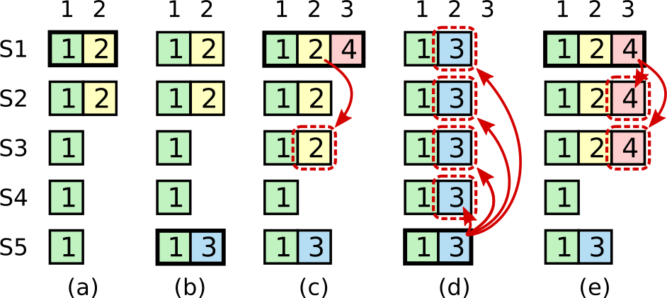

**Figure 8: A time sequence showing why a leader cannot determine commitment using log entries from older terms. In (a) S1 is leader and partially replicates the log entry at index 2. In (b) S1 crashes; S5 is elected leader for term 3 with votes from S3, S4, and itself, and accepts a different entry at log index 2. In (c) S5 crashes; S1 restarts, is elected leader, and continues replication. At this point, the log entry from term 2 has been replicated on a majority of the servers, but it is not committed. If S1 crashes as in (d), S5 could be elected leader (with votes from S2, S3, and S4) and overwrite the entry with its own entry from term 3. However, if S1 replicates an entry from its current term on a majority of the servers before crashing, as in (e), then this entry is committed (S5 cannot win an election). At this point all preceding entries in the log are committed as well.｜图：该时间序列说明领导者为何不能利用旧任期日志条目判定提交。在（a）中，S1 是领导者，并把索引 2 的日志条目复制到部分服务器。在（b）中，S1 崩溃；S5 获得 S3、S4 和自己的选票，当选任期 3 的领导者，并在日志索引 2 接受不同条目。在（c）中，S5 崩溃；S1 重启、当选领导者并继续复制。此时任期 2 的日志条目虽已复制到多数服务器，却尚未提交。若 S1 像（d）中那样崩溃，S5 可获得 S2、S3 和 S4 的选票当选领导者，并用自己任期 3 的条目覆盖该条目。然而，若 S1 像（e）中那样在崩溃前把当前任期的一个条目复制到多数服务器，该条目就已提交（S5 无法赢得选举）。此时日志中此前的所有条目也都提交。**

> **图表中文解读：** （c）证明“旧任期条目出现在多数副本”并不足以提交，因为更高任期、日志更新的 S5 仍可能获胜并覆盖它；（e）中 S1 先让本任期条目形成多数，选举限制便阻止缺少该条目的 S5 当选，同时通过日志匹配性质间接提交此前条目。

**In-figure text:** S1; S2; S3; S4; S5; (a) (b) (c) (d) (e); the term numbers `1`, `2`, `3`, and `4` shown over and inside log entries; red dashed boxes and arrows indicate entries that can be overwritten or replicated.

To eliminate problems like the one in Figure 8, Raft never commits log entries from previous terms by counting replicas. Only log entries from the leader’s current term are committed by counting replicas; once an entry from the current term has been committed in this way, then all prior entries are committed indirectly because of the Log Matching Property. There are some situations where a leader could safely conclude that an older log entry is committed (for example, if that entry is stored on every server), but Raft takes a more conservative approach for simplicity.

Raft incurs this extra complexity in the commitment rules because log entries retain their original term numbers when a leader replicates entries from previous terms. In other consensus algorithms, if a new leader re-replicates entries from prior “terms,” it must do so with its new “term number.” Raft’s approach makes it easier to reason about log entries, since they maintain the same term number over time and across logs. In addition, new leaders in Raft send fewer log entries from previous terms than in other algorithms (other algorithms must send redundant log entries to renumber them before they can be committed).

> **图内文字：** S1、S2、S3、S4、S5；（a）至（e）；日志条目上方及内部标出的任期号 `1`、`2`、`3`、`4`；红色虚线框和箭头表示可能被覆盖或复制的条目。
>
> 为消除图 8 所示问题，Raft 绝不通过副本计数来提交先前任期的日志条目。只有领导者当前任期的条目才通过副本计数提交；当前任期条目以这种方式提交后，依据日志匹配性质，此前所有条目都被间接提交。某些情况下，领导者其实可以安全断定旧日志条目已提交（例如该条目保存在每台服务器上），但为了简单，Raft 采取更保守的方法。
>
> Raft 的提交规则之所以产生这层额外复杂性，是因为领导者复制先前任期的条目时，日志条目会保留原始任期号。在其他共识算法中，如果新领导者重新复制先前“任期”的条目，必须使用新的“任期号”。Raft 的做法让日志条目更容易推理，因为它们跨时间、跨日志始终保留相同任期号。此外，Raft 新领导者发送的先前任期日志条目少于其他算法（其他算法必须发送冗余日志条目重新编号，之后才能提交）。

#### 5.4.3 Safety argument｜安全性论证

Given the complete Raft algorithm, we can now argue more precisely that the Leader Completeness Property holds (this argument is based on the safety proof; see Section 9.2). We assume that the Leader Completeness Property does not hold, then we prove a contradiction. Suppose the leader for term T (leaderT) commits a log entry from its term, but that log entry is not stored by the leader of some future term. Consider the smallest term U > T whose leader (leaderU) does not store the entry.

> 有了完整的 Raft 算法，我们现在可以更精确地论证领导者完整性性质成立（该论证以安全性证明为基础；见第 9.2 节）。我们假设领导者完整性性质不成立，再导出矛盾。假设任期 T 的领导者（leaderT）提交了其任期中的一个日志条目，但未来某任期的领导者没有保存该条目。考虑满足 U > T 且领导者（leaderU）未保存该条目的最小任期 U。

1. The committed entry must have been absent from leaderU’s log at the time of its election (leaders never delete or overwrite entries).
2. leaderT replicated the entry on a majority of the cluster, and leaderU received votes from a majority of the cluster. Thus, at least one server (“the voter”) both accepted the entry from leaderT and voted for leaderU, as shown in Figure 9. The voter is key to reaching a contradiction.
3. The voter must have accepted the committed entry from leaderT before voting for leaderU; otherwise it would have rejected the AppendEntries request from leaderT (its current term would have been higher than T).
4. The voter still stored the entry when it voted for leaderU, since every intervening leader contained the entry (by assumption), leaders never remove entries, and followers only remove entries if they conflict with the leader.
5. The voter granted its vote to leaderU, so leaderU’s log must have been as up-to-date as the voter’s. This leads to one of two contradictions.
6. First, if the voter and leaderU shared the same last log term, then leaderU’s log must have been at least as long as the voter’s, so its log contained every entry in the voter’s log. This is a contradiction, since the voter contained the committed entry and leaderU was assumed not to.
7. Otherwise, leaderU’s last log term must have been larger than the voter’s. Moreover, it was larger than T, since the voter’s last log term was at least T (it contains the committed entry from term T). The earlier leader that created leaderU’s last log entry must have contained the committed entry in its log (by assumption). Then, by the Log Matching Property, leaderU’s log must also contain the committed entry, which is a contradiction.
8. This completes the contradiction. Thus, the leaders of all terms greater than T must contain all entries from term T that are committed in term T.
9. The Log Matching Property guarantees that future leaders will also contain entries that are committed indirectly, such as index 2 in Figure 8(d).

> 1. leaderU 当选时，其日志中必定没有该已提交条目（领导者绝不删除或覆盖条目）。
> 2. leaderT 把该条目复制到集群多数，而 leaderU 获得集群多数的选票。因此至少有一台服务器（“投票者”）既接受了 leaderT 的条目，又投票给 leaderU，如图 9 所示。该投票者是导出矛盾的关键。
> 3. 投票者必定先接受 leaderT 的已提交条目，再投票给 leaderU；否则它会拒绝 leaderT 的 AppendEntries 请求（其当前任期已经高于 T）。
> 4. 投票给 leaderU 时，投票者仍保存该条目，因为其间每位领导者都含有该条目（依假设），领导者从不删除条目，而跟随者仅在条目与领导者冲突时才删除条目。
> 5. 投票者把选票投给 leaderU，所以 leaderU 的日志必定至少与投票者的日志一样新。这会导向两个矛盾之一。
> 6. 第一，如果投票者与 leaderU 的最后日志任期相同，那么 leaderU 的日志必定至少与投票者一样长，因而包含投票者日志中的每个条目。这构成矛盾，因为投票者含有已提交条目，而假设 leaderU 不含该条目。
> 7. 否则，leaderU 的最后日志任期必定大于投票者的最后日志任期。它还大于 T，因为投票者的最后日志任期至少是 T（它含有任期 T 的已提交条目）。创建 leaderU 最后一条日志条目的先前领导者，其日志中必定含有该已提交条目（依假设）。随后依据日志匹配性质，leaderU 的日志也必定含有该已提交条目，这又构成矛盾。
> 8. 至此矛盾成立。因此，所有大于 T 的任期，其领导者必定含有任期 T 中在任期 T 提交的所有条目。
> 9. 日志匹配性质保证未来领导者还会含有间接提交的条目，例如图 8(d) 中索引 2 的条目。

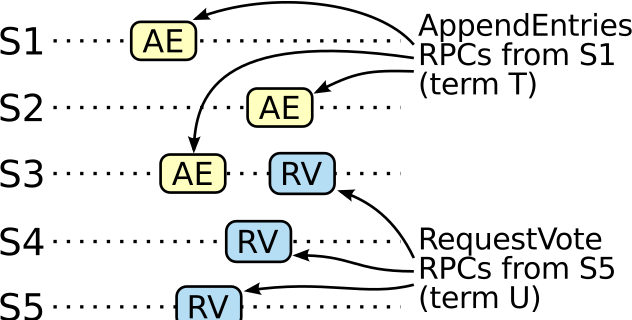

**Figure 9: If S1 (leader for term T) commits a new log entry from its term, and S5 is elected leader for a later term U, then there must be at least one server (S3) that accepted the log entry and also voted for S5.｜图：如果 S1（任期 T 的领导者）提交了其任期中的一个新日志条目，而 S5 当选为后来任期 U 的领导者，那么必定至少有一台服务器（S3）既接受了该日志条目，又投票给 S5。**

> **图表中文解读：** 提交条目的多数集合与选出未来领导者的多数集合必然相交；图中 S3 是交点。它既接受 S1 的 AppendEntries，又在之后响应 S5 的 RequestVote，从而把“候选者日志至少一样新”的投票约束与已提交条目连接起来。

**In-figure text:** S1; S2; S3; S4; S5; AE; RV; AppendEntries RPCs from S1 (term T); RequestVote RPCs from S5 (term U); time.

Given the Leader Completeness Property, we can prove the State Machine Safety Property from Figure 3, which states that if a server has applied a log entry at a given index to its state machine, no other server will ever apply a different log entry for the same index. At the time a server applies a log entry to its state machine, its log must be identical to the leader’s log up through that entry and the entry must be committed. Now consider the lowest term in which any server applies a given log index; the Log Completeness Property guarantees that the leaders for all higher terms will store that same log entry, so servers that apply the index in later terms will apply the same value. Thus, the State Machine Safety Property holds.

> **图内文字：** S1、S2、S3、S4、S5；AE；RV；来自 S1 的 AppendEntries RPC（任期 T）；来自 S5 的 RequestVote RPC（任期 U）；时间。
>
> 有了领导者完整性性质，我们就能证明图 3 的状态机安全性质：若某服务器已把给定索引处的日志条目应用于状态机，其他服务器绝不会为同一索引应用不同日志条目。服务器应用日志条目时，其日志直至该条目都必须与领导者日志相同，而且该条目必须已提交。现在考虑任意服务器首次应用给定日志索引的最低任期；日志完整性性质保证所有更高任期的领导者都会保存同一日志条目，因此后来任期中应用该索引的服务器也会应用相同值。由此，状态机安全性质成立。

> **译注：** 本段 PDF 原文写作 “Log Completeness Property”，而图 3 和本节所定义的名称是 “Leader Completeness Property”。此处保留原文措辞，译文直译为“日志完整性性质”，不静默改正。

Finally, Raft requires servers to apply entries in log index order. Combined with the State Machine Safety Property, this means that all servers will apply exactly the same set of log entries to their state machines, in the same order.

> 最后，Raft 要求服务器按日志索引次序应用条目。结合状态机安全性质，这意味着所有服务器都会以相同次序把完全相同的一组日志条目应用于各自状态机。

### 5.5 Follower and candidate crashes｜跟随者与候选者崩溃

Until this point we have focused on leader failures. Follower and candidate crashes are much simpler to handle than leader crashes, and they are both handled in the same way. If a follower or candidate crashes, then future RequestVote and AppendEntries RPCs sent to it will fail. Raft handles these failures by retrying indefinitely; if the crashed server restarts, then the RPC will complete successfully. If a server crashes after completing an RPC but before responding, then it will receive the same RPC again after it restarts. Raft RPCs are idempotent, so this causes no harm. For example, if a follower receives an AppendEntries request that includes log entries already present in its log, it ignores those entries in the new request.

> 到目前为止，我们一直聚焦于领导者故障。跟随者和候选者崩溃比领导者崩溃更容易处理，两者的处理方式相同。若跟随者或候选者崩溃，之后发给它的 RequestVote 和 AppendEntries RPC 都会失败。Raft 通过无限重试来处理这些故障；崩溃服务器重启后，RPC 即可成功完成。如果服务器完成 RPC 后、响应前崩溃，它重启后会再次收到同一 RPC。Raft RPC 是幂等的，因此不会造成危害。例如，跟随者若收到一条 AppendEntries 请求，其中包含本地日志已有的日志条目，它会忽略新请求中的这些条目。

### 5.6 Timing and availability｜时序与可用性

One of our requirements for Raft is that safety must not depend on timing: the system must not produce incorrect results just because some event happens more quickly or slowly than expected. However, availability (the ability of the system to respond to clients in a timely manner) must inevitably depend on timing. For example, if message exchanges take longer than the typical time between server crashes, candidates will not stay up long enough to win an election; without a steady leader, Raft cannot make progress.

Leader election is the aspect of Raft where timing is most critical. Raft will be able to elect and maintain a steady leader as long as the system satisfies the following timing requirement:

> 我们对 Raft 的要求之一是安全性不得依赖时序：系统不能仅仅因为某个事件发生得比预期更快或更慢，就产生错误结果。然而，可用性（系统及时响应客户端的能力）不可避免地依赖时序。例如，如果消息交换时间长于服务器崩溃的典型间隔，候选者就无法维持足够长的正常运行时间来赢得选举；没有稳定领导者，Raft 就无法推进。
>
> 领导者选举是 Raft 中对时序最敏感的部分。只要系统满足以下时序要求，Raft 就能选出并维持稳定领导者：

$$
broadcastTime \ll electionTimeout \ll MTBF
$$

> $$
> broadcastTime \ll electionTimeout \ll MTBF
> $$

In this inequality broadcastTime is the average time it takes a server to send RPCs in parallel to every server in the cluster and receive their responses; electionTimeout is the election timeout described in Section 5.2; and MTBF is the average time between failures for a single server. The broadcast time should be an order of magnitude less than the election timeout so that leaders can reliably send the heartbeat messages required to keep followers from starting elections; given the randomized approach used for election timeouts, this inequality also makes split votes unlikely. The election timeout should be a few orders of magnitude less than MTBF so that the system makes steady progress. When the leader crashes, the system will be unavailable for roughly the election timeout; we would like this to represent only a small fraction of overall time.

The broadcast time and MTBF are properties of the underlying system, while the election timeout is something we must choose. Raft’s RPCs typically require the recipient to persist information to stable storage, so the broadcast time may range from 0.5ms to 20ms, depending on storage technology. As a result, the election timeout is likely to be somewhere between 10ms and 500ms. Typical server MTBFs are several months or more, which easily satisfies the timing requirement.

> 在该不等式中，`broadcastTime` 是一台服务器并行向集群中每台服务器发送 RPC 并收到响应的平均耗时；`electionTimeout` 是第 5.2 节所述选举超时；`MTBF` 是单台服务器的平均故障间隔。广播时间应比选举超时低一个数量级，使领导者能够可靠发送所需心跳，阻止跟随者开始选举；考虑到选举超时采用随机化方法，该不等式也会降低票数分裂的可能性。选举超时应比 MTBF 低几个数量级，使系统能持续推进。领导者崩溃时，系统不可用时间大约等于选举超时；我们希望这只占总时间的一小部分。
>
> 广播时间和 MTBF 是底层系统的性质，而选举超时需要由我们选择。Raft RPC 通常要求接收方把信息持久化到稳定存储，因此广播时间可能随存储技术而在 0.5ms 到 20ms 之间。由此，选举超时很可能介于 10ms 和 500ms。典型服务器的 MTBF 为数月或更长，很容易满足该时序要求。

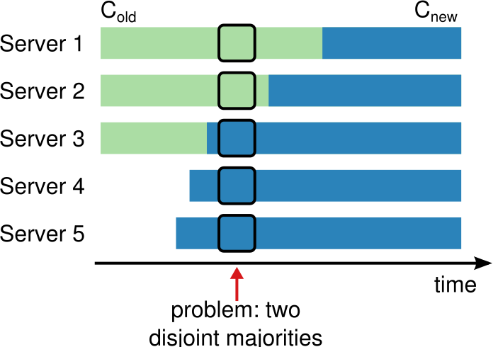

**Figure 10: Switching directly from one configuration to another is unsafe because different servers will switch at different times. In this example, the cluster grows from three servers to five. Unfortunately, there is a point in time where two different leaders can be elected for the same term, one with a majority of the old configuration (Cold) and another with a majority of the new configuration (Cnew).｜图：从一种配置直接切换到另一种配置是不安全的，因为不同服务器会在不同时间切换。本例中，集群从三台服务器扩展为五台。遗憾的是，某一时刻可以在同一任期内选出两位不同领导者：一位获得旧配置（Cold）的多数，另一位获得新配置（Cnew）的多数。**

> **图表中文解读：** 五台服务器各自在不同时间由旧配置切换到新配置；图中间时刻，服务器 1、2 可组成旧配置多数，而服务器 3、4、5 可组成新配置多数，两组完全不相交，因而可能各自选出领导者。

**In-figure text:** Cold; Cnew; Server 1; Server 2; Server 3; Server 4; Server 5; problem: two disjoint majorities; time.

> **图内文字：** Cold；Cnew；服务器 1–5；问题：两个不相交的多数派；时间。

## 6 Cluster membership changes｜集群成员变更

Up until now we have assumed that the cluster configuration (the set of servers participating in the consensus algorithm) is fixed. In practice, it will occasionally be necessary to change the configuration, for example to replace servers when they fail or to change the degree of replication. Although this can be done by taking the entire cluster off-line, updating configuration files, and then restarting the cluster, this would leave the cluster unavailable during the changeover. In addition, if there are any manual steps, they risk operator error. In order to avoid these issues, we decided to automate configuration changes and incorporate them into the Raft consensus algorithm.

For the configuration change mechanism to be safe, there must be no point during the transition where it is possible for two leaders to be elected for the same term. Unfortunately, any approach where servers switch directly from the old configuration to the new configuration is unsafe. It isn’t possible to atomically switch all of the servers at once, so the cluster can potentially split into two independent majorities during the transition (see Figure 10).

> 到目前为止，我们一直假定集群配置（参与共识算法的服务器集合）固定不变。实践中，偶尔需要变更配置，例如替换故障服务器或改变复制程度。虽然可以让整个集群离线、更新配置文件，再重启集群，但这会让集群在切换期间不可用。此外，任何手工步骤都存在操作员出错的风险。为避免这些问题，我们决定将配置变更自动化，并将其纳入 Raft 共识算法。
>
> 为使配置变更机制安全，过渡期间任何时刻都不得存在同一任期选出两位领导者的可能性。遗憾的是，让服务器从旧配置直接切换到新配置的任何方案都不安全。不可能以原子方式同时切换所有服务器，因此集群在过渡期间可能分裂成两个相互独立的多数派（见图 10）。

In order to ensure safety, configuration changes must use a two-phase approach. There are a variety of ways to implement the two phases. For example, some systems (e.g., [22]) use the first phase to disable the old configuration so it cannot process client requests; then the second phase enables the new configuration. In Raft the cluster first switches to a transitional configuration we call joint consensus; once the joint consensus has been committed, the system then transitions to the new configuration. The joint consensus combines both the old and new configurations:

> 为保证安全，配置变更必须采用两阶段方法。两阶段有多种实现方式。例如，一些系统（如 [22]）在第一阶段禁用旧配置，使其无法处理客户端请求；第二阶段再启用新配置。在 Raft 中，集群先切换到一种称为联合共识的过渡配置；联合共识提交后，系统再过渡到新配置。联合共识同时组合旧配置和新配置：

- Log entries are replicated to all servers in both configurations.
- Any server from either configuration may serve as leader.
- Agreement (for elections and entry commitment) requires separate majorities from both the old and new configurations.

> - 日志条目复制到两种配置中的所有服务器。
> - 任一配置中的任何服务器都可以担任领导者。
> - 达成一致（用于选举和条目提交）需要分别取得旧配置和新配置的多数。

The joint consensus allows individual servers to transition between configurations at different times without compromising safety. Furthermore, joint consensus allows the cluster to continue servicing client requests throughout the configuration change.

> 联合共识允许各服务器在不同时间完成配置转换而不损害安全性。此外，它使集群在整个配置变更期间都能继续处理客户端请求。

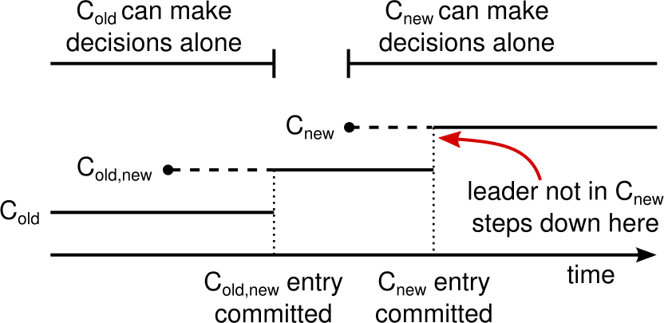

**Figure 11: Timeline for a configuration change. Dashed lines show configuration entries that have been created but not committed, and solid lines show the latest committed configuration entry. The leader first creates the Cold,new configuration entry in its log and commits it to Cold,new (a majority of Cold and a majority of Cnew). Then it creates the Cnew entry and commits it to a majority of Cnew. There is no point in time in which Cold and Cnew can both make decisions independently.｜图：配置变更时间线。虚线表示已创建但尚未提交的配置条目，实线表示最近提交的配置条目。领导者先在日志中创建 Cold,new 配置条目，并将其提交给 Cold,new（Cold 的多数和 Cnew 的多数）。随后创建 Cnew 条目，并将其提交给 Cnew 的多数。任何时刻都不存在 Cold 和 Cnew 都能独立作出决定的情形。**

> **图表中文解读：** 提交联合配置之前只有 Cold 能独立决策；联合配置提交后，决策同时需要两边多数；新配置条目提交后只有 Cnew 能独立决策。两个单独决策区间从不重叠，因而杜绝双领导者。

**In-figure text:** Cold can make decisions alone; Cnew can make decisions alone; Cold; Cold,new; Cnew; Cold,new entry committed; Cnew entry committed; leader not in Cnew steps down here; time.

Cluster configurations are stored and communicated using special entries in the replicated log; Figure 11 illustrates the configuration change process. When the leader receives a request to change the configuration from Cold to Cnew, it stores the configuration for joint consensus (Cold,new in the figure) as a log entry and replicates that entry using the mechanisms described previously. Once a given server adds the new configuration entry to its log, it uses that configuration for all future decisions (a server always uses the latest configuration in its log, regardless of whether the entry is committed). This means that the leader will use the rules of Cold,new to determine when the log entry for Cold,new is committed. If the leader crashes, a new leader may be chosen under either Cold or Cold,new, depending on whether the winning candidate has received Cold,new. In any case, Cnew cannot make unilateral decisions during this period.

> **图内文字：** Cold 可独立决策；Cnew 可独立决策；Cold；Cold,new；Cnew；Cold,new 条目提交；Cnew 条目提交；不在 Cnew 中的领导者在此退位；时间。
>
> 集群配置通过复制日志中的特殊条目保存和传播；图 11 展示配置变更过程。领导者收到从 Cold 变为 Cnew 的请求时，把联合共识配置（图中的 Cold,new）作为日志条目保存，并用前述机制复制。某台服务器一旦把新配置条目加入日志，之后所有决定都使用该配置（服务器总是使用日志中的最新配置，无论该条目是否已提交）。这意味着领导者将用 Cold,new 的规则判断 Cold,new 日志条目何时提交。若领导者崩溃，新领导者可能依据 Cold 或 Cold,new 选出，取决于获胜候选者是否收到 Cold,new。无论如何，Cnew 在此期间都无法单方面作出决定。

Once Cold,new has been committed, neither Cold nor Cnew can make decisions without approval of the other, and the Leader Completeness Property ensures that only servers with the Cold,new log entry can be elected as leader. It is now safe for the leader to create a log entry describing Cnew and replicate it to the cluster. Again, this configuration will take effect on each server as soon as it is seen. When the new configuration has been committed under the rules of Cnew, the old configuration is irrelevant and servers not in the new configuration can be shut down. As shown in Figure 11, there is no time when Cold and Cnew can both make unilateral decisions; this guarantees safety.

There are three more issues to address for reconfiguration. The first issue is that new servers may not initially store any log entries. If they are added to the cluster in this state, it could take quite a while for them to catch up, during which time it might not be possible to commit new log entries. In order to avoid availability gaps, Raft introduces an additional phase before the configuration change, in which the new servers join the cluster as non-voting members (the leader replicates log entries to them, but they are not considered for majorities). Once the new servers have caught up with the rest of the cluster, the reconfiguration can proceed as described above.

> Cold,new 提交后，Cold 与 Cnew 都无法在未获另一方同意的情况下作出决定；领导者完整性性质保证只有含 Cold,new 日志条目的服务器才能当选领导者。此时领导者可以安全创建描述 Cnew 的日志条目，并将其复制到集群。同样，每台服务器一看到该配置，它就立即生效。当新配置按 Cnew 规则提交后，旧配置不再相关，不属于新配置的服务器可以关闭。如图 11 所示，Cold 与 Cnew 绝不会同时单方面作出决定；这保证了安全性。
>
> 重配置还有三个问题需要处理。第一，新服务器起初可能没有保存任何日志条目。若以这种状态加入集群，它们可能需要很长时间才能追上进度；在此期间，新日志条目可能无法提交。为避免可用性空档，Raft 在配置变更前增加一个阶段，让新服务器以无投票权成员的身份加入集群（领导者向它们复制日志条目，但计算多数时不考虑它们）。新服务器追上集群其余成员后，重配置便可按上述方式进行。

The second issue is that the cluster leader may not be part of the new configuration. In this case, the leader steps down (returns to follower state) once it has committed the Cnew log entry. This means that there will be a period of time (while it is committing Cnew) when the leader is managing a cluster that does not include itself; it replicates log entries but does not count itself in majorities. The leader transition occurs when Cnew is committed because this is the first point when the new configuration can operate independently (it will always be possible to choose a leader from Cnew). Before this point, it may be the case that only a server from Cold can be elected leader.

The third issue is that removed servers (those not in Cnew) can disrupt the cluster. These servers will not receive heartbeats, so they will time out and start new elections. They will then send RequestVote RPCs with new term numbers, and this will cause the current leader to revert to follower state. A new leader will eventually be elected, but the removed servers will time out again and the process will repeat, resulting in poor availability.

> 第二，集群领导者可能不属于新配置。在这种情况下，领导者提交 Cnew 日志条目后便退位（回到跟随者状态）。这意味着有一段时间（提交 Cnew 期间）领导者管理的集群并不包含自己；它复制日志条目，但计算多数时不把自己计入。领导者在 Cnew 提交时完成转换，因为这是新配置首次能够独立运行的时刻（总能从 Cnew 中选出领导者）。在此之前，可能只有 Cold 中的服务器可以当选领导者。
>
> 第三，被移除的服务器（不属于 Cnew）可能扰乱集群。它们收不到心跳，因而会超时并开始新选举。随后它们发送带有新任期号的 RequestVote RPC，使当前领导者退回跟随者状态。系统最终会选出新领导者，但被移除服务器会再次超时，过程不断重复，导致可用性很差。

To prevent this problem, servers disregard RequestVote RPCs when they believe a current leader exists. Specifically, if a server receives a RequestVote RPC within the minimum election timeout of hearing from a current leader, it does not update its term or grant its vote. This does not affect normal elections, where each server waits at least a minimum election timeout before starting an election. However, it helps avoid disruptions from removed servers: if a leader is able to get heartbeats to its cluster, then it will not be deposed by larger term numbers.

> 为防止该问题，服务器在认为当前领导者存在时忽略 RequestVote RPC。具体而言，若服务器在听到当前领导者消息后的最小选举超时内收到 RequestVote RPC，就不更新任期，也不投票。这不影响正常选举，因为每台服务器都会等待至少一个最小选举超时才开始选举。但它有助于避免被移除服务器造成干扰：只要领导者能把心跳送达集群，就不会被更大的任期号拉下台。

## 7 Log compaction｜日志压缩

Raft’s log grows during normal operation to incorporate more client requests, but in a practical system, it cannot grow without bound. As the log grows longer, it occupies more space and takes more time to replay. This will eventually cause availability problems without some mechanism to discard obsolete information that has accumulated in the log.

Snapshotting is the simplest approach to compaction. In snapshotting, the entire current system state is written to a snapshot on stable storage, then the entire log up to that point is discarded. Snapshotting is used in Chubby and ZooKeeper, and the remainder of this section describes snapshotting in Raft.

> Raft 日志在正常运行期间不断增长，以纳入更多客户端请求；但在实用系统中，它不能无限增长。日志越长，占用空间越多，重放耗时也越长。如果没有机制丢弃日志中积累的过时信息，最终会造成可用性问题。
>
> 快照是最简单的压缩方法。生成快照时，系统把完整的当前状态写入稳定存储上的快照，再丢弃截至该点的全部日志。Chubby 和 ZooKeeper 都使用快照；本节余下部分将介绍 Raft 中的快照。

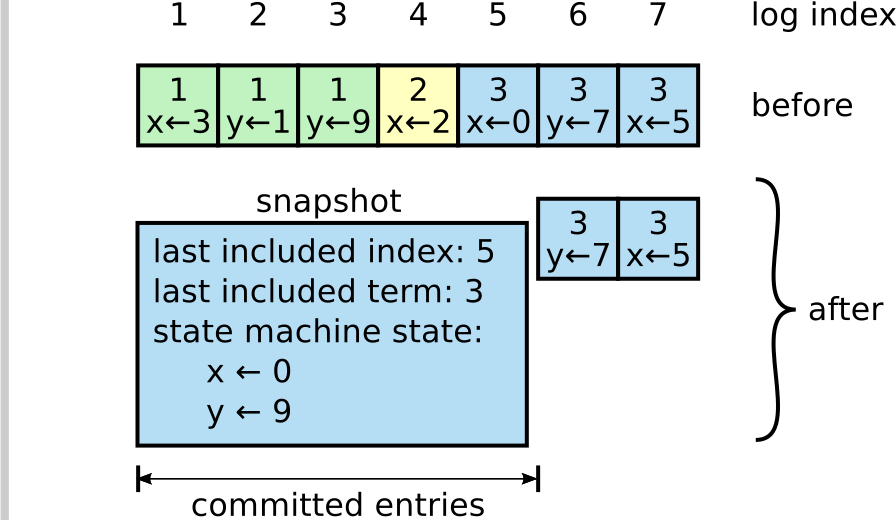

**Figure 12: A server replaces the committed entries in its log (indexes 1 through 5) with a new snapshot, which stores just the current state (variables x and y in this example). The snapshot’s last included index and term serve to position the snapshot in the log preceding entry 6.｜图：服务器用新快照替换日志中已提交的条目（索引 1 至 5）；快照只保存当前状态（本例中的变量 x 和 y）。快照的最后纳入索引和任期用于把快照定位到日志中条目 6 之前。**

> **图表中文解读：** 快照把索引 1–5 执行后的状态折叠成 `x ← 0, y ← 9`，并记录 `last included index: 5` 与 `last included term: 3`；索引 6、7 仍保留为快照之后的日志后缀。

**In-figure text:** log index 1 2 3 4 5 6 7; before; snapshot; last included index: 5; last included term: 3; state machine state: `x ← 0`, `y ← 9`; after; committed entries. Entries: `1/x←3`, `1/y←1`, `1/y←9`, `2/x←2`, `3/x←0`, `3/y←7`, `3/x←5`.

Incremental approaches to compaction, such as log cleaning [36] and log-structured merge trees [30, 5], are also possible. These operate on a fraction of the data at once, so they spread the load of compaction more evenly over time. They first select a region of data that has accumulated many deleted and overwritten objects, then they rewrite the live objects from that region more compactly and free the region. This requires significant additional mechanism and complexity compared to snapshotting, which simplifies the problem by always operating on the entire data set. While log cleaning would require modifications to Raft, state machines can implement LSM trees using the same interface as snapshotting.

> **图内文字：** 日志索引 1–7；之前；快照；最后纳入索引：5；最后纳入任期：3；状态机状态：`x ← 0`、`y ← 9`；之后；已提交条目。各日志条目依原图照录于上一英文块。
>
> 也可以采用日志清理 [36]、日志结构合并树 [30, 5] 等增量压缩方法。它们每次只处理一部分数据，因此能把压缩负载更均匀地分摊到时间轴上。它们先选择积累了许多已删除、已覆盖对象的数据区域，再更紧凑地重写其中仍存活的对象，并释放该区域。与始终处理完整数据集、因而简化问题的快照相比，这需要大量额外机制和复杂性。日志清理需要修改 Raft，但状态机可使用与快照相同的接口实现 LSM 树。

Figure 12 shows the basic idea of snapshotting in Raft. Each server takes snapshots independently, covering just the committed entries in its log. Most of the work consists of the state machine writing its current state to the snapshot. Raft also includes a small amount of metadata in the snapshot: the last included index is the index of the last entry in the log that the snapshot replaces (the last entry the state machine had applied), and the last included term is the term of this entry. These are preserved to support the AppendEntries consistency check for the first log entry following the snapshot, since that entry needs a previous log index and term. To enable cluster membership changes (Section 6), the snapshot also includes the latest configuration in the log as of last included index. Once a server completes writing a snapshot, it may delete all log entries up through the last included index, as well as any prior snapshot.

> 图 12 展示 Raft 快照的基本思想。每台服务器独立生成快照，只覆盖日志中的已提交条目。主要工作是由状态机把当前状态写入快照。Raft 还在快照中加入少量元数据：`last included index` 是快照所替换的最后一个日志条目（状态机已应用的最后条目）的索引，`last included term` 是该条目的任期。之所以保留它们，是为了支持快照后首个日志条目的 AppendEntries 一致性检查，因为该条目需要前一个日志索引和任期。为支持集群成员变更（第 6 节），快照还包含截至 `last included index` 时日志中的最新配置。服务器写完快照后，可以删除直至 `last included index` 的所有日志条目及任何更早快照。

Although servers normally take snapshots independently, the leader must occasionally send snapshots to followers that lag behind. This happens when the leader has already discarded the next log entry that it needs to send to a follower. Fortunately, this situation is unlikely in normal operation: a follower that has kept up with the leader would already have this entry. However, an exceptionally slow follower or a new server joining the cluster (Section 6) would not. The way to bring such a follower up-to-date is for the leader to send it a snapshot over the network.

> 虽然服务器通常独立生成快照，但领导者偶尔必须把快照发送给落后的跟随者。这发生在领导者已经丢弃原本需要发给跟随者的下一日志条目时。幸运的是，正常运行中这种情况不太可能出现：一直跟上领导者的跟随者早已有该条目。但特别缓慢的跟随者或新加入集群的服务器（第 6 节）则未必如此。要让这种跟随者追上进度，领导者需要通过网络向它发送快照。

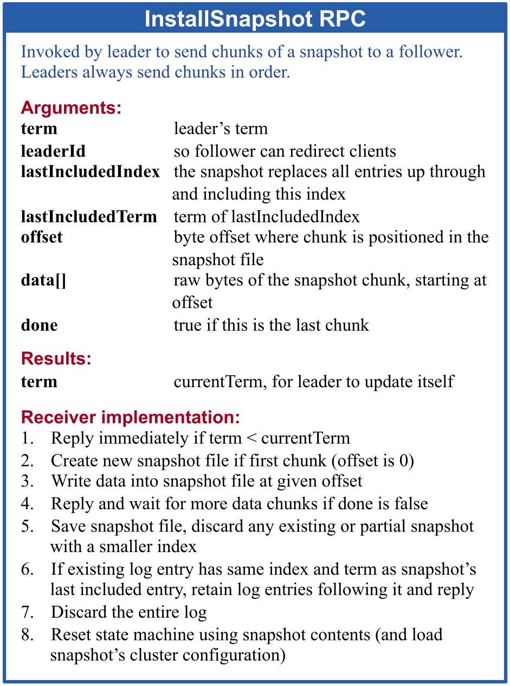

### InstallSnapshot RPC｜InstallSnapshot RPC

Invoked by leader to send chunks of a snapshot to a follower. Leaders always send chunks in order.

**Arguments:**

> 由领导者调用，向跟随者发送快照分块。领导者始终按顺序发送分块。
>
> **参数：**

| English field       | English description                                                   |
| ------------------- | --------------------------------------------------------------------- |
| `term`              | leader’s term                                                         |
| `leaderId`          | so follower can redirect clients                                      |
| `lastIncludedIndex` | the snapshot replaces all entries up through and including this index |
| `lastIncludedTerm`  | term of `lastIncludedIndex`                                           |
| `offset`            | byte offset where chunk is positioned in the snapshot file            |
| `data[]`            | raw bytes of the snapshot chunk, starting at offset                   |
| `done`              | true if this is the last chunk                                        |

> | 字段                | 说明                                   |
> | ------------------- | -------------------------------------- |
> | `term`              | 领导者任期                             |
> | `leaderId`          | 使跟随者能够重定向客户端               |
> | `lastIncludedIndex` | 快照替换直至并包括该索引在内的全部条目 |
> | `lastIncludedTerm`  | `lastIncludedIndex` 的任期             |
> | `offset`            | 分块在快照文件中的字节偏移             |
> | `data[]`            | 从 `offset` 开始的快照分块原始字节     |
> | `done`              | 若为最后一个分块则为 `true`            |

**Results:**

> **结果：**

| English field | English description                      |
| ------------- | ---------------------------------------- |
| `term`        | currentTerm, for leader to update itself |

> | 字段   | 说明                            |
> | ------ | ------------------------------- |
> | `term` | `currentTerm`，供领导者更新自身 |

**Receiver implementation:**

> **接收方实现：**

1. Reply immediately if `term < currentTerm`
2. Create new snapshot file if first chunk (`offset` is 0)
3. Write data into snapshot file at given offset
4. Reply and wait for more data chunks if `done` is false
5. Save snapshot file, discard any existing or partial snapshot with a smaller index
6. If existing log entry has same index and term as snapshot’s last included entry, retain log entries following it and reply
7. Discard the entire log
8. Reset state machine using snapshot contents (and load snapshot’s cluster configuration)

> 1. 若 `term < currentTerm`，立即回复。
> 2. 若为首个分块（`offset` 为 0），创建新快照文件。
> 3. 在给定偏移处把数据写入快照文件。
> 4. 若 `done` 为 `false`，回复并等待更多数据分块。
> 5. 保存快照文件；丢弃索引更小的任何现有或不完整快照。
> 6. 若现有日志条目的索引和任期与快照最后纳入条目相同，保留其后的日志条目并回复。
> 7. 丢弃整个日志。
> 8. 用快照内容重置状态机（并加载快照的集群配置）。

**Figure 13: A summary of the InstallSnapshot RPC. Snapshots are split into chunks for transmission; this gives the follower a sign of life with each chunk, so it can reset its election timer.｜图：InstallSnapshot RPC 概要。快照被拆成多个分块传输；跟随者每收到一个分块都能知道对方仍然存活，从而重置选举定时器。**

> **图表中文解读：** RPC 以 `offset` 和 `done` 对快照分块、顺序传输；接收方边收边写。完成后，它依据快照边界是否与现有日志匹配，决定保留后续日志还是全部丢弃，并用快照恢复状态机与集群配置。

The leader uses a new RPC called InstallSnapshot to send snapshots to followers that are too far behind; see Figure 13. When a follower receives a snapshot with this RPC, it must decide what to do with its existing log entries. Usually the snapshot will contain new information not already in the recipient’s log. In this case, the follower discards its entire log; it is all superseded by the snapshot and may possibly have uncommitted entries that conflict with the snapshot. If instead the follower receives a snapshot that describes a prefix of its log (due to retransmission or by mistake), then log entries covered by the snapshot are deleted but entries following the snapshot are still valid and must be retained.

This snapshotting approach departs from Raft’s strong leader principle, since followers can take snapshots without the knowledge of the leader. However, we think this departure is justified. While having a leader helps avoid conflicting decisions in reaching consensus, consensus has already been reached when snapshotting, so no decisions conflict. Data still only flows from leaders to followers, just followers can now reorganize their data.

> 领导者使用名为 InstallSnapshot 的新 RPC，把快照发送给落后太多的跟随者；见图 13。跟随者通过该 RPC 收到快照时，必须决定如何处理现有日志条目。通常，快照包含接收者日志中尚无的新信息。此时跟随者丢弃整个日志；日志已全部被快照取代，而且其中可能存在与快照冲突的未提交条目。反之，如果跟随者收到的快照描述了本地日志的一个前缀（因为重传或误传），则删除快照覆盖的日志条目，但快照之后的条目仍然有效，必须保留。
>
> 这种快照方法偏离了 Raft 的强领导者原则，因为跟随者可以在领导者不知情的情况下生成快照。不过，我们认为这种偏离是合理的。领导者有助于避免达成共识时出现相互冲突的决定，但生成快照时共识已经达成，因此不会有决定冲突。数据依然只从领导者流向跟随者，只是跟随者现在可以重组自己的数据。

We considered an alternative leader-based approach in which only the leader would create a snapshot, then it would send this snapshot to each of its followers. However, this has two disadvantages. First, sending the snapshot to each follower would waste network bandwidth and slow the snapshotting process. Each follower already has the information needed to produce its own snapshots, and it is typically much cheaper for a server to produce a snapshot from its local state than it is to send and receive one over the network. Second, the leader’s implementation would be more complex. For example, the leader would need to send snapshots to followers in parallel with replicating new log entries to them, so as not to block new client requests.

There are two more issues that impact snapshotting performance. First, servers must decide when to snapshot. If a server snapshots too often, it wastes disk bandwidth and energy; if it snapshots too infrequently, it risks exhausting its storage capacity, and it increases the time required to replay the log during restarts. One simple strategy is to take a snapshot when the log reaches a fixed size in bytes. If this size is set to be significantly larger than the expected size of a snapshot, then the disk bandwidth overhead for snapshotting will be small.

> 我们考虑过另一种基于领导者的方法：只由领导者创建快照，再把快照发送给每个跟随者。但它有两个缺点。第一，向每个跟随者发送快照会浪费网络带宽，并拖慢快照过程。每个跟随者已经拥有创建自己快照所需的信息；服务器从本地状态生成快照通常远比通过网络收发快照便宜。第二，领导者实现会更复杂。例如，为避免阻塞新客户端请求，领导者必须在向跟随者复制新日志条目的同时并行发送快照。
>
> 还有两个问题会影响快照性能。第一，服务器必须决定何时生成快照。过于频繁会浪费磁盘带宽和能源；过于稀少则可能耗尽存储容量，并增加重启时重放日志所需时间。一种简单策略是在日志达到固定字节数时生成快照。如果该阈值显著大于快照预期大小，快照的磁盘带宽开销就会很小。

The second performance issue is that writing a snapshot can take a significant amount of time, and we do not want this to delay normal operations. The solution is to use copy-on-write techniques so that new updates can be accepted without impacting the snapshot being written. For example, state machines built with functional data structures naturally support this. Alternatively, the operating system’s copy-on-write support (e.g., fork on Linux) can be used to create an in-memory snapshot of the entire state machine (our implementation uses this approach).

> 第二个性能问题是，写快照可能耗时很长，而我们不希望它延迟正常操作。解决办法是使用写时复制技术，使系统能够接受新更新而不影响正在写入的快照。例如，以函数式数据结构构建的状态机天然支持这种做法。也可以利用操作系统的写时复制支持（如 Linux 上的 `fork`）创建整个状态机的内存快照（我们的实现采用这种方法）。

## 8 Client interaction｜客户端交互

This section describes how clients interact with Raft, including how clients find the cluster leader and how Raft supports linearizable semantics [10]. These issues apply to all consensus-based systems, and Raft’s solutions are similar to other systems.

Clients of Raft send all of their requests to the leader. When a client first starts up, it connects to a randomly-chosen server. If the client’s first choice is not the leader, that server will reject the client’s request and supply information about the most recent leader it has heard from (AppendEntries requests include the network address of the leader). If the leader crashes, client requests will time out; clients then try again with randomly-chosen servers.

Our goal for Raft is to implement linearizable semantics (each operation appears to execute instantaneously, exactly once, at some point between its invocation and its response). However, as described so far Raft can execute a command multiple times: for example, if the leader crashes after committing the log entry but before responding to the client, the client will retry the command with a new leader, causing it to be executed a second time. The solution is for clients to assign unique serial numbers to every command. Then, the state machine tracks the latest serial number processed for each client, along with the associated response. If it receives a command whose serial number has already been executed, it responds immediately without re-executing the request.

> 本节介绍客户端如何与 Raft 交互，包括客户端如何找到集群领导者，以及 Raft 如何支持线性一致语义 [10]。这些问题适用于所有基于共识的系统，Raft 的解决方案与其他系统类似。
>
> Raft 客户端把所有请求发给领导者。客户端首次启动时连接一台随机选择的服务器。若首选服务器不是领导者，该服务器会拒绝客户端请求，并提供它最近听说的领导者信息（AppendEntries 请求包含领导者的网络地址）。若领导者崩溃，客户端请求会超时；客户端随后再次尝试随机选择的服务器。
>
> 我们希望 Raft 实现线性一致语义（每个操作看起来都在调用与响应之间的某个时刻瞬间、且恰好一次地执行）。然而，到目前为止所述的 Raft 可能多次执行一条命令：例如，领导者提交日志条目后、响应客户端前崩溃，客户端会向新领导者重试命令，导致命令执行第二次。解决办法是让客户端为每条命令分配唯一序列号。状态机随后为每个客户端跟踪已处理的最新序列号及其对应响应。若收到序列号已经执行过的命令，它会立即响应，而不再次执行请求。

Read-only operations can be handled without writing anything into the log. However, with no additional measures, this would run the risk of returning stale data, since the leader responding to the request might have been superseded by a newer leader of which it is unaware. Linearizable reads must not return stale data, and Raft needs two extra precautions to guarantee this without using the log. First, a leader must have the latest information on which entries are committed. The Leader Completeness Property guarantees that a leader has all committed entries, but at the start of its term, it may not know which those are. To find out, it needs to commit an entry from its term. Raft handles this by having each leader commit a blank no-op entry into the log at the start of its term. Second, a leader must check whether it has been deposed before processing a read-only request (its information may be stale if a more recent leader has been elected). Raft handles this by having the leader exchange heartbeat messages with a majority of the cluster before responding to read-only requests. Alternatively, the leader could rely on the heartbeat mechanism to provide a form of lease [9], but this would rely on timing for safety (it assumes bounded clock skew).

> 只读操作可以在不向日志写入任何内容的情况下处理。但如果不采取额外措施，就可能返回陈旧数据，因为响应请求的领导者可能已被一个它不知道的新领导者取代。线性一致读取不得返回陈旧数据；为在不使用日志的情况下保证这一点，Raft 需要两项额外预防措施。第一，领导者必须掌握哪些条目已经提交的最新信息。领导者完整性性质保证领导者拥有全部已提交条目，但任期刚开始时，它可能不知道哪些条目已经提交。为确认这一点，它需要提交当前任期的一个条目。Raft 让每位领导者在任期开始时向日志提交一个空的无操作条目。第二，领导者处理只读请求前必须检查自己是否已被罢免（若已选出更新的领导者，它的信息可能过时）。Raft 让领导者在响应只读请求前与集群多数交换心跳消息。或者，领导者可以依赖心跳机制提供一种租约 [9]，但这会让安全性依赖时序（它假定时钟偏差有界）。

## 9 Implementation and evaluation｜实现与评估

We have implemented Raft as part of a replicated state machine that stores configuration information for RAMCloud [33] and assists in failover of the RAMCloud coordinator. The Raft implementation contains roughly 2000 lines of C++ code, not including tests, comments, or blank lines. The source code is freely available [23]. There are also about 25 independent third-party open source implementations [34] of Raft in various stages of development, based on drafts of this paper. Also, various companies are deploying Raft-based systems [34].

The remainder of this section evaluates Raft using three criteria: understandability, correctness, and performance.

> 我们已将 Raft 实现为一套复制状态机的一部分；该状态机为 RAMCloud [33] 保存配置信息，并协助 RAMCloud 协调器进行故障转移。Raft 实现约含 2000 行 C++ 代码，不包括测试、注释和空行。源代码可免费获得 [23]。另有约 25 个独立的第三方开源 Raft 实现 [34]，它们基于本文草稿，处于不同开发阶段。多家公司也在部署基于 Raft 的系统 [34]。
>
> 本节余下部分将从可理解性、正确性和性能三个标准评估 Raft。

### 9.1 Understandability｜可理解性

To measure Raft’s understandability relative to Paxos, we conducted an experimental study using upper-level undergraduate and graduate students in an Advanced Operating Systems course at Stanford University and a Distributed Computing course at U.C. Berkeley. We recorded a video lecture of Raft and another of Paxos, and created corresponding quizzes. The Raft lecture covered the content of this paper except for log compaction; the Paxos lecture covered enough material to create an equivalent replicated state machine, including single-decree Paxos, multi-decree Paxos, reconfiguration, and a few optimizations needed in practice (such as leader election). The quizzes tested basic understanding of the algorithms and also required students to reason about corner cases. Each student watched one video, took the corresponding quiz, watched the second video, and took the second quiz.

About half of the participants did the Paxos portion first and the other half did the Raft portion first in order to account for both individual differences in performance and experience gained from the first portion of the study. We compared participants’ scores on each quiz to determine whether participants showed a better understanding of Raft.

> 为衡量 Raft 相对于 Paxos 的可理解性，我们开展了一项实验研究，参与者是斯坦福大学高级操作系统课程和加州大学伯克利分校分布式计算课程的高年级本科生与研究生。我们分别录制了 Raft 和 Paxos 的视频讲座，并设计相应测验。Raft 讲座覆盖本文除日志压缩以外的内容；Paxos 讲座覆盖足以构建等价复制状态机的材料，包括单决议 Paxos、多决议 Paxos、重配置和实践所需的少数优化（如领导者选举）。测验既考查对算法的基本理解，也要求学生推理边界情况。每位学生观看一个视频、完成相应测验，再观看第二个视频并完成第二份测验。
>
> 约一半参与者先做 Paxos 部分，另一半先做 Raft 部分，以同时控制个体表现差异和研究第一部分所获经验的影响。我们比较参与者在两份测验中的成绩，以判断他们是否表现出对 Raft 更好的理解。

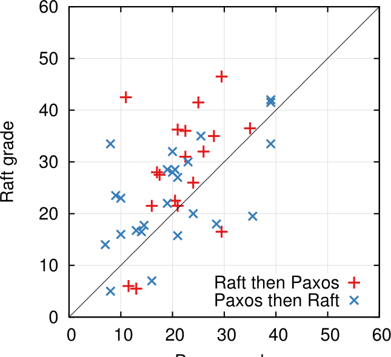

**Figure 14: A scatter plot comparing 43 participants’ performance on the Raft and Paxos quizzes. Points above the diagonal (33) represent participants who scored higher for Raft.｜图：比较 43 名参与者在 Raft 与 Paxos 测验中表现的散点图。对角线上方的点（33 个）表示参与者的 Raft 得分更高。**

> **图表中文解读：** 横轴是 Paxos 成绩，纵轴是 Raft 成绩；对角线表示两者得分相同。多数点位于线上方，且无论先学 Raft 还是先学 Paxos，都能观察到 Raft 得分更高的总体趋势。

**In-figure text:** Raft grade; Paxos grade; Raft then Paxos; Paxos then Raft; axis values 0, 10, 20, 30, 40, 50, 60.

We tried to make the comparison between Paxos and Raft as fair as possible. The experiment favored Paxos in two ways: 15 of the 43 participants reported having some prior experience with Paxos, and the Paxos video is 14% longer than the Raft video. As summarized in Table 1, we have taken steps to mitigate potential sources of bias. All of our materials are available for review [28, 31].

On average, participants scored 4.9 points higher on the Raft quiz than on the Paxos quiz (out of a possible 60 points, the mean Raft score was 25.7 and the mean Paxos score was 20.8); Figure 14 shows their individual scores. A paired t-test states that, with 95% confidence, the true distribution of Raft scores has a mean at least 2.5 points larger than the true distribution of Paxos scores.

> **图内文字：** Raft 成绩；Paxos 成绩；先 Raft 后 Paxos；先 Paxos 后 Raft；坐标刻度 0、10、20、30、40、50、60。
>
> 我们尽量让 Paxos 与 Raft 的比较公平。实验在两方面偏向 Paxos：43 名参与者中有 15 人报告以前接触过 Paxos，而且 Paxos 视频比 Raft 视频长 14%。如表 1 所概括，我们采取措施缓解潜在偏差来源。全部材料均可供审阅 [28, 31]。
>
> 平均而言，参与者的 Raft 测验得分比 Paxos 高 4.9 分（满分 60 分，Raft 平均分 25.7，Paxos 平均分 20.8）；图 14 展示个人成绩。配对 t 检验表明，在 95% 置信度下，Raft 成绩真实分布的均值至少比 Paxos 成绩真实分布高 2.5 分。

We also created a linear regression model that predicts a new student’s quiz scores based on three factors: which quiz they took, their degree of prior Paxos experience, and the order in which they learned the algorithms. The model predicts that the choice of quiz produces a 12.5-point difference in favor of Raft. This is significantly higher than the observed difference of 4.9 points, because many of the actual students had prior Paxos experience, which helped Paxos considerably, whereas it helped Raft slightly less. Curiously, the model also predicts scores 6.3 points lower on Raft for people that have already taken the Paxos quiz; although we don’t know why, this does appear to be statistically significant.

> 我们还建立了线性回归模型，根据三项因素预测新学生的测验得分：所做测验、既往 Paxos 经验程度，以及学习两种算法的顺序。模型预测，测验选择会带来偏向 Raft 的 12.5 分差异。这显著高于实际观察到的 4.9 分，因为许多学生此前接触过 Paxos，这对 Paxos 帮助很大，对 Raft 的帮助稍小。令人好奇的是，模型还预测已经做过 Paxos 测验的人，其 Raft 成绩会低 6.3 分；我们虽不知道原因，但这一结果似乎具有统计显著性。

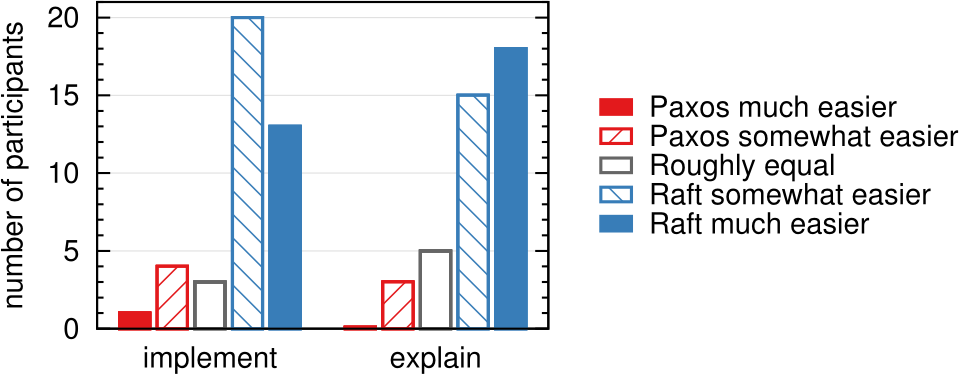

**Figure 15: Using a 5-point scale, participants were asked (left) which algorithm they felt would be easier to implement in a functioning, correct, and efficient system, and (right) which would be easier to explain to a CS graduate student.｜图：参与者使用五点量表回答：（左）他们认为在可运行、正确、高效的系统中哪种算法更容易实现；（右）哪种算法更容易向计算机科学研究生解释。**

> **图表中文解读：** 两组问题的蓝色柱都占压倒性多数：参与者普遍认为 Raft “稍容易”或“容易得多”。实现问题中“Raft 稍容易”人数最多，解释问题中“Raft 容易得多”人数最多。

**In-figure text:** number of participants; implement; explain; Paxos much easier; Paxos somewhat easier; Roughly equal; Raft somewhat easier; Raft much easier; axis values 0, 5, 10, 15, 20.

We also surveyed participants after their quizzes to see which algorithm they felt would be easier to implement or explain; these results are shown in Figure 15. An overwhelming majority of participants reported Raft would be easier to implement and explain (33 of 41 for each question). However, these self-reported feelings may be less reliable than participants’ quiz scores, and participants may have been biased by knowledge of our hypothesis that Raft is easier to understand.

A detailed discussion of the Raft user study is available at [31].

> **图内文字：** 参与者人数；实现；解释；Paxos 容易得多；Paxos 稍容易；大致相同；Raft 稍容易；Raft 容易得多；坐标刻度 0、5、10、15、20。
>
> 测验后，我们还调查参与者认为哪种算法更容易实现或解释；结果见图 15。绝大多数参与者报告 Raft 更容易实现和解释（两个问题均为 41 人中的 33 人）。不过，这些自我报告感受可能不如测验成绩可靠；参与者也可能因知道我们的假设是 Raft 更易理解而产生偏差。
>
> 文献 [31] 提供了 Raft 用户研究的详细讨论。

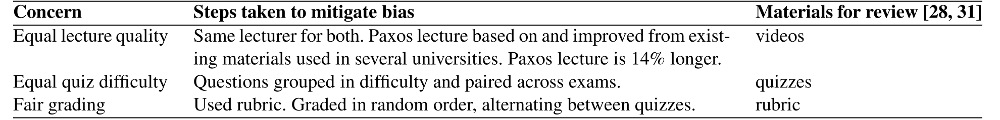

| Concern               | Steps taken to mitigate bias                                                                                                                   | Materials for review [28, 31] |
| --------------------- | ---------------------------------------------------------------------------------------------------------------------------------------------- | ----------------------------- |
| Equal lecture quality | Same lecturer for both. Paxos lecture based on and improved from existing materials used in several universities. Paxos lecture is 14% longer. | videos                        |
| Equal quiz difficulty | Questions grouped in difficulty and paired across exams.                                                                                       | quizzes                       |
| Fair grading          | Used rubric. Graded in random order, alternating between quizzes.                                                                              | rubric                        |

> | 关注点       | 为缓解偏差所采取的措施                                                                       | 供审阅的材料 [28, 31] |
> | ------------ | -------------------------------------------------------------------------------------------- | --------------------- |
> | 讲座质量相同 | 两者由同一位讲师授课。Paxos 讲座以多所大学使用的现有材料为基础并加以改进。Paxos 讲座长 14%。 | 视频                  |
> | 测验难度相同 | 按难度分组问题，并在两份试卷之间配对。                                                       | 测验                  |
> | 评分公平     | 使用评分细则。以随机次序评分，在两份测验之间交替。                                           | 评分细则              |

**Table 1: Concerns of possible bias against Paxos in the study, steps taken to counter each, and additional materials available.｜表：研究中可能对 Paxos 不利的偏差顾虑、针对每项顾虑采取的措施，以及可获得的补充材料。**

> **图表中文解读：** 表格从讲座、测验、评分三环节控制偏差；Paxos 不仅沿用并改进成熟教学材料，视频还更长；两份试卷按难度配对，评分则使用统一细则并随机交替进行。

### 9.2 Correctness｜正确性

We have developed a formal specification and a proof of safety for the consensus mechanism described in Section 5. The formal specification [31] makes the information summarized in Figure 2 completely precise using the TLA+ specification language [17]. It is about 400 lines long and serves as the subject of the proof. It is also useful on its own for anyone implementing Raft. We have mechanically proven the Log Completeness Property using the TLA proof system [7]. However, this proof relies on invariants that have not been mechanically checked (for example, we have not proven the type safety of the specification). Furthermore, we have written an informal proof [31] of the State Machine Safety property which is complete (it relies on the specification alone) and relatively precise (it is about 3500 words long).

> 我们为第 5 节所述共识机制建立了形式化规约和安全性证明。形式化规约 [31] 使用 TLA+ 规约语言 [17] 将图 2 概括的信息完全精确化。它约 400 行，是证明的对象；对于 Raft 实现者，它本身也很有用。我们使用 TLA 证明系统 [7] 机械证明了日志完整性性质。不过，该证明依赖尚未机械检查的不变量（例如，我们尚未证明规约的类型安全性）。此外，我们还撰写了状态机安全性质的非形式化证明 [31]，它是完整的（只依赖规约）且相对精确（约 3500 词）。

> **译注：** 本段 PDF 原文同样写作 “Log Completeness Property”；与图 3 中的 “Leader Completeness Property” 命名不一致，本文保留原文。

### 9.3 Performance｜性能

Raft’s performance is similar to other consensus algorithms such as Paxos. The most important case for performance is when an established leader is replicating new log entries. Raft achieves this using the minimal number of messages (a single round-trip from the leader to half the cluster). It is also possible to further improve Raft’s performance. For example, it easily supports batching and pipelining requests for higher throughput and lower latency. Various optimizations have been proposed in the literature for other algorithms; many of these could be applied to Raft, but we leave this to future work.

We used our Raft implementation to measure the performance of Raft’s leader election algorithm and answer two questions. First, does the election process converge quickly? Second, what is the minimum downtime that can be achieved after leader crashes?

To measure leader election, we repeatedly crashed the leader of a cluster of five servers and timed how long it took to detect the crash and elect a new leader (see Figure 16). To generate a worst-case scenario, the servers in each trial had different log lengths, so some candidates were not eligible to become leader. Furthermore, to encourage split votes, our test script triggered a synchronized broadcast of heartbeat RPCs from the leader before terminating its process (this approximates the behavior of the leader replicating a new log entry prior to crashing). The leader was crashed uniformly randomly within its heartbeat interval, which was half of the minimum election timeout for all tests. Thus, the smallest possible downtime was about half of the minimum election timeout.

> Raft 性能与 Paxos 等其他共识算法相近。对性能最重要的情形，是已确立的领导者复制新日志条目。Raft 使用最少的消息完成这一点（从领导者到半个集群的一次往返）。Raft 性能还可以进一步提升。例如，它很容易支持请求批处理和流水线化，以提高吞吐量、降低延迟。文献为其他算法提出了多种优化，其中许多可用于 Raft，但我们将其留待未来工作。
>
> 我们使用自己的 Raft 实现测量 Raft 领导者选举算法的性能，并回答两个问题。第一，选举过程是否快速收敛？第二，领导者崩溃后的最短停机时间可以做到多少？
>
> 为测量领导者选举，我们反复让五服务器集群的领导者崩溃，并计时检测崩溃和选出新领导者所需时长（见图 16）。为制造最坏情形，每次试验中各服务器日志长度不同，因此一些候选者没有资格成为领导者。此外，为促进票数分裂，测试脚本在终止领导者进程前触发它同步广播心跳 RPC（这近似于领导者在崩溃前复制新日志条目的行为）。领导者在其心跳间隔内均匀随机地崩溃；所有测试中心跳间隔都是最小选举超时的一半。因此，可能的最短停机时间约为最小选举超时的一半。

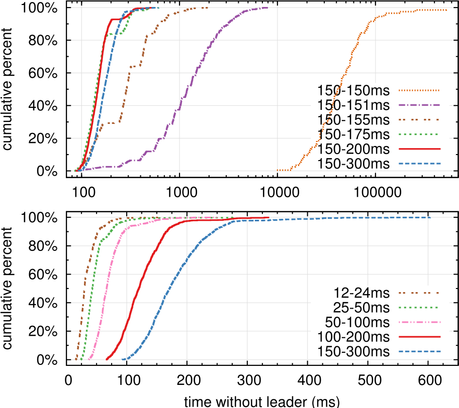

**Figure 16: The time to detect and replace a crashed leader. The top graph varies the amount of randomness in election timeouts, and the bottom graph scales the minimum election timeout. Each line represents 1000 trials (except for 100 trials for “150–150ms”) and corresponds to a particular choice of election timeouts; for example, “150–155ms” means that election timeouts were chosen randomly and uniformly between 150ms and 155ms. The measurements were taken on a cluster of five servers with a broadcast time of roughly 15ms. Results for a cluster of nine servers are similar.｜图：检测并替换崩溃领导者所需时间。上图改变选举超时中的随机量，下图缩放最小选举超时。每条曲线代表 1000 次试验（“150–150ms”为 100 次），对应一种特定选举超时选择；例如，“150–155ms”表示选举超时在 150ms 与 155ms 之间均匀随机选择。测量在五服务器集群上进行，广播时间约 15ms。九服务器集群的结果相似。**

> **图表中文解读：** 上图显示完全无随机性时尾部极长，加入仅 5ms 抖动便显著改善，随机范围继续扩大可收紧最坏情况；下图显示缩短超时能降低无领导时间，但过短会接近广播耗时，破坏稳定心跳与选举超时之间应有的数量级间隔。

**In-figure text:** cumulative percent; time without leader (ms); `150–150ms`; `150–151ms`; `150–155ms`; `150–175ms`; `150–200ms`; `150–300ms`; `12–24ms`; `25–50ms`; `50–100ms`; `100–200ms`; percentage ticks 0%, 20%, 40%, 60%, 80%, 100%; upper-axis ticks 100, 1000, 10000, 100000; lower-axis ticks 0, 100, 200, 300, 400, 500, 600.

The top graph in Figure 16 shows that a small amount of randomization in the election timeout is enough to avoid split votes in elections. In the absence of randomness, leader election consistently took longer than 10 seconds in our tests due to many split votes. Adding just 5ms of randomness helps significantly, resulting in a median downtime of 287ms. Using more randomness improves worst-case behavior: with 50ms of randomness the worst-case completion time (over 1000 trials) was 513ms.

The bottom graph in Figure 16 shows that downtime can be reduced by reducing the election timeout. With an election timeout of 12–24ms, it takes only 35ms on average to elect a leader (the longest trial took 152ms). However, lowering the timeouts beyond this point violates Raft’s timing requirement: leaders have difficulty broadcasting heartbeats before other servers start new elections. This can cause unnecessary leader changes and lower overall system availability. We recommend using a conservative election timeout such as 150–300ms; such timeouts are unlikely to cause unnecessary leader changes and will still provide good availability.

> **图内文字：** 累计百分比；无领导者时间（ms）；各超时区间及全部坐标刻度依上一英文块照录。
>
> 图 16 上图表明，选举超时中只需少量随机化就足以避免选举票数分裂。没有随机性时，由于大量票数分裂，我们的领导者选举测试始终超过 10 秒。仅加入 5ms 随机量就有显著帮助，使停机时间中位数降至 287ms。更多随机性会改善最坏情况：随机范围为 50ms 时，1000 次试验中的最坏完成时间为 513ms。
>
> 图 16 下图表明，缩短选举超时可以减少停机时间。选举超时为 12–24ms 时，选出领导者平均只需 35ms（最长一次试验为 152ms）。但若进一步降低超时，就会违反 Raft 时序要求：领导者难以在其他服务器开始新选举前广播心跳。这会造成不必要的领导者更换，降低系统整体可用性。我们建议使用 150–300ms 这样的保守选举超时；它不太会造成不必要的领导者更换，同时仍能提供良好可用性。

## 10 Related work｜相关工作

There have been numerous publications related to consensus algorithms, many of which fall into one of the following categories:

> 已有大量关于共识算法的出版物，其中许多属于以下类别之一：

- Lamport’s original description of Paxos [15], and attempts to explain it more clearly [16, 20, 21].
- Elaborations of Paxos, which fill in missing details and modify the algorithm to provide a better foundation for implementation [26, 39, 13].
- Systems that implement consensus algorithms, such as Chubby [2, 4], ZooKeeper [11, 12], and Spanner [6]. The algorithms for Chubby and Spanner have not been published in detail, though both claim to be based on Paxos. ZooKeeper’s algorithm has been published in more detail, but it is quite different from Paxos.
- Performance optimizations that can be applied to Paxos [18, 19, 3, 25, 1, 27].
- Oki and Liskov’s Viewstamped Replication (VR), an alternative approach to consensus developed around the same time as Paxos. The original description [29] was intertwined with a protocol for distributed transactions, but the core consensus protocol has been separated in a recent update [22]. VR uses a leader-based approach with many similarities to Raft.

> - Lamport 对 Paxos 的原始描述 [15]，以及试图更清晰地解释它的工作 [16, 20, 21]。
> - 对 Paxos 的补充阐发：补全缺失细节并修改算法，为实现提供更好基础 [26, 39, 13]。
> - 实现共识算法的系统，如 Chubby [2, 4]、ZooKeeper [11, 12] 和 Spanner [6]。Chubby 与 Spanner 的算法虽都声称基于 Paxos，却未详细发表。ZooKeeper 的算法发表得更详细，但与 Paxos 很不相同。
> - 可应用于 Paxos 的性能优化 [18, 19, 3, 25, 1, 27]。
> - Oki 与 Liskov 的 Viewstamped Replication（VR）：一种与 Paxos 大约同时发展出的替代共识方法。原始描述 [29] 与分布式事务协议交织在一起，但最近的更新 [22] 已将核心共识协议分离出来。VR 采用基于领导者的方法，与 Raft 有许多相似之处。

The greatest difference between Raft and Paxos is Raft’s strong leadership: Raft uses leader election as an essential part of the consensus protocol, and it concentrates as much functionality as possible in the leader. This approach results in a simpler algorithm that is easier to understand. For example, in Paxos, leader election is orthogonal to the basic consensus protocol: it serves only as a performance optimization and is not required for achieving consensus. However, this results in additional mechanism: Paxos includes both a two-phase protocol for basic consensus and a separate mechanism for leader election. In contrast, Raft incorporates leader election directly into the consensus algorithm and uses it as the first of the two phases of consensus. This results in less mechanism than in Paxos.

Like Raft, VR and ZooKeeper are leader-based and therefore share many of Raft’s advantages over Paxos. However, Raft has less mechanism that VR or ZooKeeper because it minimizes the functionality in non-leaders. For example, log entries in Raft flow in only one direction: outward from the leader in AppendEntries RPCs. In VR log entries flow in both directions (leaders can receive log entries during the election process); this results in additional mechanism and complexity. The published description of ZooKeeper also transfers log entries both to and from the leader, but the implementation is apparently more like Raft [35].

> Raft 与 Paxos 最大的区别是 Raft 的强领导方式：Raft 将领导者选举作为共识协议的必要组成部分，并尽可能把功能集中到领导者上。这种方法产生更简单、更易理解的算法。例如，在 Paxos 中，领导者选举与基础共识协议正交：它只是一项性能优化，达成共识并不需要它。但这会引入额外机制：Paxos 既包含基础共识的两阶段协议，又有独立的领导者选举机制。相比之下，Raft 直接把领导者选举纳入共识算法，并将其用作共识两个阶段中的第一阶段，因此机制少于 Paxos。
>
> 与 Raft 一样，VR 和 ZooKeeper 都基于领导者，因此共享 Raft 相对于 Paxos 的许多优势。不过，Raft 的机制少于 VR 或 ZooKeeper，因为它尽量减少非领导者的功能。例如，Raft 日志条目只沿一个方向流动：在 AppendEntries RPC 中从领导者向外流动。VR 的日志条目双向流动（领导者可在选举期间接收日志条目），这会带来额外机制和复杂性。ZooKeeper 的公开描述也在领导者两个方向上传输日志条目，但实现显然更像 Raft [35]。

> **译注：** 本段 PDF 原文写作 “Raft has less mechanism **that** VR or ZooKeeper”；按语义应为 “**than**”。英文依可见原文保留，译文按其明确语义处理。

Raft has fewer message types than any other algorithm for consensus-based log replication that we are aware of. For example, we counted the message types VR and ZooKeeper use for basic consensus and membership changes (excluding log compaction and client interaction, as these are nearly independent of the algorithms). VR and ZooKeeper each define 10 different message types, while Raft has only 4 message types (two RPC requests and their responses). Raft’s messages are a bit more dense than the other algorithms’, but they are simpler collectively. In addition, VR and ZooKeeper are described in terms of transmitting entire logs during leader changes; additional message types will be required to optimize these mechanisms so that they are practical.

Raft’s strong leadership approach simplifies the algorithm, but it precludes some performance optimizations. For example, Egalitarian Paxos (EPaxos) can achieve higher performance under some conditions with a leaderless approach [27]. EPaxos exploits commutativity in state machine commands. Any server can commit a command with just one round of communication as long as other commands that are proposed concurrently commute with it. However, if commands that are proposed concurrently do not commute with each other, EPaxos requires an additional round of communication. Because any server may commit commands, EPaxos balances load well between servers and is able to achieve lower latency than Raft in WAN settings. However, it adds significant complexity to Paxos.

> 据我们所知，Raft 的消息类型少于任何其他基于共识的日志复制算法。例如，我们统计了 VR 和 ZooKeeper 用于基础共识与成员变更的消息类型（不含日志压缩和客户端交互，因为它们几乎独立于算法）。VR 和 ZooKeeper 各定义 10 种不同消息类型，而 Raft 只有 4 种（两个 RPC 请求及其响应）。Raft 单条消息比其他算法稍密集，但整体更简单。此外，VR 和 ZooKeeper 的描述会在领导者更换期间传输完整日志；要把这些机制优化到实用程度，还需增加消息类型。
>
> Raft 的强领导方法简化了算法，却排除了一些性能优化。例如，无领导者的 Egalitarian Paxos（EPaxos）在某些条件下可实现更高性能 [27]。EPaxos 利用状态机命令的交换性。只要并发提出的其他命令与某命令可交换，任何服务器都能用一轮通信提交该命令。但若并发提出的命令彼此不可交换，EPaxos 就需要额外一轮通信。因为任何服务器都可以提交命令，EPaxos 能在服务器间良好均衡负载，并在广域网环境中取得比 Raft 更低的延迟。不过，它给 Paxos 增加了显著复杂性。

Several different approaches for cluster membership changes have been proposed or implemented in other work, including Lamport’s original proposal [15], VR [22], and SMART [24]. We chose the joint consensus approach for Raft because it leverages the rest of the consensus protocol, so that very little additional mechanism is required for membership changes. Lamport’s α-based approach was not an option for Raft because it assumes consensus can be reached without a leader. In comparison to VR and SMART, Raft’s reconfiguration algorithm has the advantage that membership changes can occur without limiting the processing of normal requests; in contrast, VR stops all normal processing during configuration changes, and SMART imposes an α-like limit on the number of outstanding requests. Raft’s approach also adds less mechanism than either VR or SMART.

> 其他工作已提出或实现多种集群成员变更方法，包括 Lamport 的原始方案 [15]、VR [22] 和 SMART [24]。我们为 Raft 选择联合共识，是因为它能利用共识协议的其余部分，使成员变更只需很少额外机制。Lamport 基于 α 的方法不适用于 Raft，因为它假定没有领导者也能达成共识。与 VR 和 SMART 相比，Raft 重配置算法的优势是成员变更不会限制正常请求处理；相比之下，VR 在配置变更期间停止所有正常处理，SMART 则对未完成请求数量施加类似 α 的限制。Raft 的方法所增加的机制也少于 VR 或 SMART。

## 11 Conclusion｜结论

Algorithms are often designed with correctness, efficiency, and/or conciseness as the primary goals. Although these are all worthy goals, we believe that understandability is just as important. None of the other goals can be achieved until developers render the algorithm into a practical implementation, which will inevitably deviate from and expand upon the published form. Unless developers have a deep understanding of the algorithm and can create intuitions about it, it will be difficult for them to retain its desirable properties in their implementation.

In this paper we addressed the issue of distributed consensus, where a widely accepted but impenetrable algorithm, Paxos, has challenged students and developers for many years. We developed a new algorithm, Raft, which we have shown to be more understandable than Paxos. We also believe that Raft provides a better foundation for system building. Using understandability as the primary design goal changed the way we approached the design of Raft; as the design progressed we found ourselves reusing a few techniques repeatedly, such as decomposing the problem and simplifying the state space. These techniques not only improved the understandability of Raft but also made it easier to convince ourselves of its correctness.

> 算法设计常以正确性、效率和/或简洁性为首要目标。尽管这些都值得追求，我们认为可理解性同样重要。只有开发者把算法变成实用实现后，其他目标才可能实现，而实现必然会偏离并扩展已发表形式。除非开发者深刻理解算法并能形成关于它的直觉，否则很难在实现中保留算法的理想性质。
>
> 本文处理的是分布式共识问题；广受认可却晦涩难懂的 Paxos 多年来一直挑战学生与开发者。我们开发了新算法 Raft，并已证明它比 Paxos 更易理解。我们也相信 Raft 为系统构建提供了更好基础。把可理解性作为首要设计目标，改变了我们设计 Raft 的方式；随着设计推进，我们发现自己反复使用少数几项技术，例如分解问题、简化状态空间。这些技术不仅提升了 Raft 的可理解性，也让我们更容易确信其正确性。

## 12 Acknowledgments｜致谢

The user study would not have been possible without the support of Ali Ghodsi, David Mazières, and the students of CS 294-91 at Berkeley and CS 240 at Stanford. Scott Klemmer helped us design the user study, and Nelson Ray advised us on statistical analysis. The Paxos slides for the user study borrowed heavily from a slide deck originally created by Lorenzo Alvisi. Special thanks go to David Mazières and Ezra Hoch for finding subtle bugs in Raft. Many people provided helpful feedback on the paper and user study materials, including Ed Bugnion, Michael Chan, Hugues Evrard, Daniel Giffin, Arjun Gopalan, Jon Howell, Vimalkumar Jeyakumar, Ankita Kejriwal, Aleksandar Kracun, Amit Levy, Joel Martin, Satoshi Matsushita, Oleg Pesok, David Ramos, Robbert van Renesse, Mendel Rosenblum, Nicolas Schiper, Deian Stefan, Andrew Stone, Ryan Stutsman, David Terei, Stephen Yang, Matei Zaharia, 24 anonymous conference reviewers (with duplicates), and especially our shepherd Eddie Kohler. Werner Vogels tweeted a link to an earlier draft, which gave Raft significant exposure. This work was supported by the Gigascale Systems Research Center and the Multiscale Systems Center, two of six research centers funded under the Focus Center Research Program, a Semiconductor Research Corporation program, by STARnet, a Semiconductor Research Corporation program sponsored by MARCO and DARPA, by the National Science Foundation under Grant No. 0963859, and by grants from Facebook, Google, Mellanox, NEC, NetApp, SAP, and Samsung. Diego Ongaro is supported by The Junglee Corporation Stanford Graduate Fellowship.

> 若无 Ali Ghodsi、David Mazières 以及伯克利 CS 294-91 和斯坦福 CS 240 课程学生的支持，这项用户研究不可能完成。Scott Klemmer 协助我们设计用户研究，Nelson Ray 就统计分析提供建议。用户研究中的 Paxos 幻灯片大量借鉴 Lorenzo Alvisi 最初制作的一套幻灯片。特别感谢 David Mazières 和 Ezra Hoch 发现 Raft 中的微妙缺陷。许多人对论文和用户研究材料提出了有益反馈，包括 Ed Bugnion、Michael Chan、Hugues Evrard、Daniel Giffin、Arjun Gopalan、Jon Howell、Vimalkumar Jeyakumar、Ankita Kejriwal、Aleksandar Kracun、Amit Levy、Joel Martin、Satoshi Matsushita、Oleg Pesok、David Ramos、Robbert van Renesse、Mendel Rosenblum、Nicolas Schiper、Deian Stefan、Andrew Stone、Ryan Stutsman、David Terei、Stephen Yang、Matei Zaharia、24 位匿名会议评审（有重复），尤其是我们的 shepherd Eddie Kohler。Werner Vogels 在 Twitter 上分享了早期草稿链接，让 Raft 获得了广泛关注。本工作得到 Gigascale Systems Research Center 和 Multiscale Systems Center 的支持；它们是 Semiconductor Research Corporation 的 Focus Center Research Program 所资助六个研究中心中的两个；还得到由 MARCO 与 DARPA 赞助的 Semiconductor Research Corporation 项目 STARnet、美国国家科学基金会第 0963859 号资助，以及 Facebook、Google、Mellanox、NEC、NetApp、SAP 和 Samsung 的资助。Diego Ongaro 获得 The Junglee Corporation Stanford Graduate Fellowship 支持。

## References｜参考文献

[1] BOLOSKY, W. J., BRADSHAW, D., HAAGENS, R. B., KUSTERS, N. P., AND LI, P. Paxos replicated state machines as the basis of a high-performance data store. In Proc. NSDI’11, USENIX Conference on Networked Systems Design and Implementation (2011), USENIX, pp. 141–154.

> [1] BOLOSKY, W. J.、BRADSHAW, D.、HAAGENS, R. B.、KUSTERS, N. P.、LI, P.。《以 Paxos 复制状态机为高性能数据存储的基础》。载于 NSDI’11：USENIX 网络系统设计与实现会议论文集，2011，USENIX，第 141–154 页。

[2] BURROWS, M. The Chubby lock service for loosely-coupled distributed systems. In Proc. OSDI’06, Symposium on Operating Systems Design and Implementation (2006), USENIX, pp. 335–350.

> [2] BURROWS, M.《面向松耦合分布式系统的 Chubby 锁服务》。载于 OSDI’06：操作系统设计与实现研讨会论文集，2006，USENIX，第 335–350 页。

[3] CAMARGOS, L. J., SCHMIDT, R. M., AND PEDONE, F. Multicoordinated Paxos. In Proc. PODC’07, ACM Symposium on Principles of Distributed Computing (2007), ACM, pp. 316–317.

> [3] CAMARGOS, L. J.、SCHMIDT, R. M.、PEDONE, F.《多协调者 Paxos》。载于 PODC’07：ACM 分布式计算原理研讨会论文集，2007，ACM，第 316–317 页。

[4] CHANDRA, T. D., GRIESEMER, R., AND REDSTONE, J. Paxos made live: an engineering perspective. In Proc. PODC’07, ACM Symposium on Principles of Distributed Computing (2007), ACM, pp. 398–407.

> [4] CHANDRA, T. D.、GRIESEMER, R.、REDSTONE, J.《让 Paxos 真正运行：工程视角》。载于 PODC’07：ACM 分布式计算原理研讨会论文集，2007，ACM，第 398–407 页。

[5] CHANG, F., DEAN, J., GHEMAWAT, S., HSIEH, W. C., WALLACH, D. A., BURROWS, M., CHANDRA, T., FIKES, A., AND GRUBER, R. E. Bigtable: a distributed storage system for structured data. In Proc. OSDI’06, USENIX Symposium on Operating Systems Design and Implementation (2006), USENIX, pp. 205–218.

> [5] CHANG, F.、DEAN, J.、GHEMAWAT, S.、HSIEH, W. C.、WALLACH, D. A.、BURROWS, M.、CHANDRA, T.、FIKES, A.、GRUBER, R. E.《Bigtable：面向结构化数据的分布式存储系统》。载于 OSDI’06：USENIX 操作系统设计与实现研讨会论文集，2006，USENIX，第 205–218 页。

[6] CORBETT, J. C., DEAN, J., EPSTEIN, M., FIKES, A., FROST, C., FURMAN, J. J., GHEMAWAT, S., GUBAREV, A., HEISER, C., HOCHSCHILD, P., HSIEH, W., KANTHAK, S., KOGAN, E., LI, H., LLOYD, A., MELNIK, S., MWAURA, D., NAGLE, D., QUINLAN, S., RAO, R., ROLIG, L., SAITO, Y., SZYMANIAK, M., TAYLOR, C., WANG, R., AND WOODFORD, D. Spanner: Google’s globally-distributed database. In Proc. OSDI’12, USENIX Conference on Operating Systems Design and Implementation (2012), USENIX, pp. 251–264.

> [6] CORBETT, J. C. 等。《Spanner：Google 的全球分布式数据库》。载于 OSDI’12：USENIX 操作系统设计与实现会议论文集，2012，USENIX，第 251–264 页。作者依原文完整列为 CORBETT、DEAN、EPSTEIN、FIKES、FROST、FURMAN、GHEMAWAT、GUBAREV、HEISER、HOCHSCHILD、HSIEH、KANTHAK、KOGAN、LI、LLOYD、MELNIK、MWAURA、NAGLE、QUINLAN、RAO、ROLIG、SAITO、SZYMANIAK、TAYLOR、WANG、WOODFORD。

[7] COUSINEAU, D., DOLIGEZ, D., LAMPORT, L., MERZ, S., RICKETTS, D., AND VANZETTO, H. TLA+ proofs. In Proc. FM’12, Symposium on Formal Methods (2012), D. Giannakopoulou and D. Méry, Eds., vol. 7436 of Lecture Notes in Computer Science, Springer, pp. 147–154.

> [7] COUSINEAU, D.、DOLIGEZ, D.、LAMPORT, L.、MERZ, S.、RICKETTS, D.、VANZETTO, H.《TLA+ 证明》。载于 FM’12：形式化方法研讨会论文集，2012；D. Giannakopoulou、D. Méry 编；《计算机科学讲义》第 7436 卷，Springer，第 147–154 页。

[8] GHEMAWAT, S., GOBIOFF, H., AND LEUNG, S.-T. The Google file system. In Proc. SOSP’03, ACM Symposium on Operating Systems Principles (2003), ACM, pp. 29–43.

> [8] GHEMAWAT, S.、GOBIOFF, H.、LEUNG, S.-T.《Google 文件系统》。载于 SOSP’03：ACM 操作系统原理研讨会论文集，2003，ACM，第 29–43 页。

[9] GRAY, C., AND CHERITON, D. Leases: An efficient fault-tolerant mechanism for distributed file cache consistency. In Proceedings of the 12th ACM Ssymposium on Operating Systems Principles (1989), pp. 202–210.

> [9] GRAY, C.、CHERITON, D.《租约：面向分布式文件缓存一致性的高效容错机制》。载于第 12 届 ACM 操作系统原理研讨会论文集，1989，第 202–210 页。

> **译注：** 原文将 “Symposium” 拼作 “Ssymposium”，此处英文照录。

[10] HERLIHY, M. P., AND WING, J. M. Linearizability: a correctness condition for concurrent objects. ACM Transactions on Programming Languages and Systems 12 (July 1990), 463–492.

> [10] HERLIHY, M. P.、WING, J. M.《线性一致性：并发对象的一项正确性条件》。《ACM 程序设计语言与系统汇刊》第 12 卷，1990 年 7 月，第 463–492 页。

[11] HUNT, P., KONAR, M., JUNQUEIRA, F. P., AND REED, B. ZooKeeper: wait-free coordination for internet-scale systems. In Proc ATC’10, USENIX Annual Technical Conference (2010), USENIX, pp. 145–158.

> [11] HUNT, P.、KONAR, M.、JUNQUEIRA, F. P.、REED, B.《ZooKeeper：面向互联网规模系统的无等待协调》。载于 ATC’10：USENIX 年度技术会议论文集，2010，USENIX，第 145–158 页。

[12] JUNQUEIRA, F. P., REED, B. C., AND SERAFINI, M. Zab: High-performance broadcast for primary-backup systems. In Proc. DSN’11, IEEE/IFIP Int’l Conf. on Dependable Systems & Networks (2011), IEEE Computer Society, pp. 245–256.

> [12] JUNQUEIRA, F. P.、REED, B. C.、SERAFINI, M.《Zab：面向主备系统的高性能广播》。载于 DSN’11：IEEE/IFIP 可靠系统与网络国际会议论文集，2011，IEEE Computer Society，第 245–256 页。

[13] KIRSCH, J., AND AMIR, Y. Paxos for system builders. Tech. Rep. CNDS-2008-2, Johns Hopkins University, 2008.

> [13] KIRSCH, J.、AMIR, Y.《面向系统构建者的 Paxos》。技术报告 CNDS-2008-2，约翰斯·霍普金斯大学，2008。

[14] LAMPORT, L. Time, clocks, and the ordering of events in a distributed system. Commununications of the ACM 21, 7 (July 1978), 558–565.

> [14] LAMPORT, L.《分布式系统中的时间、时钟与事件排序》。《ACM 通讯》第 21 卷第 7 期，1978 年 7 月，第 558–565 页。

> **译注：** 原文将 “Communications” 拼作 “Commununications”，此处英文照录。

[15] LAMPORT, L. The part-time parliament. ACM Transactions on Computer Systems 16, 2 (May 1998), 133–169.

> [15] LAMPORT, L.《兼职议会》。《ACM 计算机系统汇刊》第 16 卷第 2 期，1998 年 5 月，第 133–169 页。

[16] LAMPORT, L. Paxos made simple. ACM SIGACT News 32, 4 (Dec. 2001), 18–25.

> [16] LAMPORT, L.《Paxos 简明讲解》。《ACM SIGACT News》第 32 卷第 4 期，2001 年 12 月，第 18–25 页。

[17] LAMPORT, L. Specifying Systems, The TLA+ Language and Tools for Hardware and Software Engineers. Addison-Wesley, 2002.

> [17] LAMPORT, L.《系统规约：面向硬件与软件工程师的 TLA+ 语言和工具》。Addison-Wesley，2002。

[18] LAMPORT, L. Generalized consensus and Paxos. Tech. Rep. MSR-TR-2005-33, Microsoft Research, 2005.

> [18] LAMPORT, L.《广义共识与 Paxos》。技术报告 MSR-TR-2005-33，Microsoft Research，2005。

[19] LAMPORT, L. Fast paxos. Distributed Computing 19, 2 (2006), 79–103.

> [19] LAMPORT, L.《Fast Paxos》。《Distributed Computing》第 19 卷第 2 期，2006，第 79–103 页。

[20] LAMPSON, B. W. How to build a highly available system using consensus. In Distributed Algorithms, O. Baboaglu and K. Marzullo, Eds. Springer-Verlag, 1996, pp. 1–17.

> [20] LAMPSON, B. W.《如何利用共识构建高可用系统》。载于《分布式算法》，O. Baboaglu、K. Marzullo 编，Springer-Verlag，1996，第 1–17 页。

[21] LAMPSON, B. W. The ABCD’s of Paxos. In Proc. PODC’01, ACM Symposium on Principles of Distributed Computing (2001), ACM, pp. 13–13.

> [21] LAMPSON, B. W.《Paxos 的 ABCD》。载于 PODC’01：ACM 分布式计算原理研讨会论文集，2001，ACM，第 13–13 页。

[22] LISKOV, B., AND COWLING, J. Viewstamped replication revisited. Tech. Rep. MIT-CSAIL-TR-2012-021, MIT, July 2012.

> [22] LISKOV, B.、COWLING, J.《再论 Viewstamped Replication》。技术报告 MIT-CSAIL-TR-2012-021，MIT，2012 年 7 月。

[23] LogCabin source code. http://github.com/logcabin/logcabin.

> [23] LogCabin 源代码。http://github.com/logcabin/logcabin。

[24] LORCH, J. R., ADYA, A., BOLOSKY, W. J., CHAIKEN, R., DOUCEUR, J. R., AND HOWELL, J. The SMART way to migrate replicated stateful services. In Proc. EuroSys’06, ACM SIGOPS/EuroSys European Conference on Computer Systems (2006), ACM, pp. 103–115.

> [24] LORCH, J. R.、ADYA, A.、BOLOSKY, W. J.、CHAIKEN, R.、DOUCEUR, J. R.、HOWELL, J.《迁移复制有状态服务的 SMART 方法》。载于 EuroSys’06：ACM SIGOPS/EuroSys 欧洲计算机系统会议论文集，2006，ACM，第 103–115 页。

[25] MAO, Y., JUNQUEIRA, F. P., AND MARZULLO, K. Mencius: building efficient replicated state machines for WANs. In Proc. OSDI’08, USENIX Conference on Operating Systems Design and Implementation (2008), USENIX, pp. 369–384.

> [25] MAO, Y.、JUNQUEIRA, F. P.、MARZULLO, K.《Mencius：为广域网构建高效复制状态机》。载于 OSDI’08：USENIX 操作系统设计与实现会议论文集，2008，USENIX，第 369–384 页。

[26] MAZIÈRES, D. Paxos made practical. http://www.scs.stanford.edu/˜dm/home/papers/paxos.pdf, Jan. 2007.

> [26] MAZIÈRES, D.《让 Paxos 走向实用》。http://www.scs.stanford.edu/˜dm/home/papers/paxos.pdf，2007 年 1 月。

[27] MORARU, I., ANDERSEN, D. G., AND KAMINSKY, M. There is more consensus in egalitarian parliaments. In Proc. SOSP’13, ACM Symposium on Operating System Principles (2013), ACM.

> [27] MORARU, I.、ANDERSEN, D. G.、KAMINSKY, M.《平等议会中有更多共识》。载于 SOSP’13：ACM 操作系统原理研讨会论文集，2013，ACM。

[28] Raft user study. http://ramcloud.stanford.edu/˜ongaro/userstudy/.

> [28] Raft 用户研究。http://ramcloud.stanford.edu/˜ongaro/userstudy/。

[29] OKI, B. M., AND LISKOV, B. H. Viewstamped replication: A new primary copy method to support highly-available distributed systems. In Proc. PODC’88, ACM Symposium on Principles of Distributed Computing (1988), ACM, pp. 8–17.

> [29] OKI, B. M.、LISKOV, B. H.《Viewstamped Replication：支持高可用分布式系统的新主副本方法》。载于 PODC’88：ACM 分布式计算原理研讨会论文集，1988，ACM，第 8–17 页。

[30] O’NEIL, P., CHENG, E., GAWLICK, D., AND ONEIL, E. The log-structured merge-tree (LSM-tree). Acta Informatica 33, 4 (1996), 351–385.

> [30] O’NEIL, P.、CHENG, E.、GAWLICK, D.、ONEIL, E.《日志结构合并树（LSM-tree）》。《Acta Informatica》第 33 卷第 4 期，1996，第 351–385 页。

[31] ONGARO, D. Consensus: Bridging Theory and Practice. PhD thesis, Stanford University, 2014 (work in progress). http://ramcloud.stanford.edu/˜ongaro/thesis.pdf.

> [31] ONGARO, D.《共识：连接理论与实践》。斯坦福大学博士论文，2014（进行中）。http://ramcloud.stanford.edu/˜ongaro/thesis.pdf。

[32] ONGARO, D., AND OUSTERHOUT, J. In search of an understandable consensus algorithm. In Proc ATC’14, USENIX Annual Technical Conference (2014), USENIX.

> [32] ONGARO, D.、OUSTERHOUT, J.《寻找一种易于理解的共识算法》。载于 ATC’14：USENIX 年度技术会议论文集，2014，USENIX。

[33] OUSTERHOUT, J., AGRAWAL, P., ERICKSON, D., KOZYRAKIS, C., LEVERICH, J., MAZIÈRES, D., MITRA, S., NARAYANAN, A., ONGARO, D., PARULKAR, G., ROSENBLUM, M., RUMBLE, S. M., STRATMANN, E., AND STUTSMAN, R. The case for RAMCloud. Communications of the ACM 54 (July 2011), 121–130.

> [33] OUSTERHOUT, J.、AGRAWAL, P.、ERICKSON, D.、KOZYRAKIS, C.、LEVERICH, J.、MAZIÈRES, D.、MITRA, S.、NARAYANAN, A.、ONGARO, D.、PARULKAR, G.、ROSENBLUM, M.、RUMBLE, S. M.、STRATMANN, E.、STUTSMAN, R.《为何需要 RAMCloud》。《ACM 通讯》第 54 卷，2011 年 7 月，第 121–130 页。

[34] Raft consensus algorithm website. http://raftconsensus.github.io.

> [34] Raft 共识算法网站。http://raftconsensus.github.io。

[35] REED, B. Personal communications, May 17, 2013.

> [35] REED, B. 个人通信，2013 年 5 月 17 日。

[36] ROSENBLUM, M., AND OUSTERHOUT, J. K. The design and implementation of a log-structured file system. ACM Trans. Comput. Syst. 10 (February 1992), 26–52.

> [36] ROSENBLUM, M.、OUSTERHOUT, J. K.《日志结构文件系统的设计与实现》。《ACM 计算机系统汇刊》第 10 卷，1992 年 2 月，第 26–52 页。

[37] SCHNEIDER, F. B. Implementing fault-tolerant services using the state machine approach: a tutorial. ACM Computing Surveys 22, 4 (Dec. 1990), 299–319.

> [37] SCHNEIDER, F. B.《使用状态机方法实现容错服务：教程》。《ACM 计算综述》第 22 卷第 4 期，1990 年 12 月，第 299–319 页。

[38] SHVACHKO, K., KUANG, H., RADIA, S., AND CHANSLER, R. The Hadoop distributed file system. In Proc. MSST’10, Symposium on Mass Storage Systems and Technologies (2010), IEEE Computer Society, pp. 1–10.

> [38] SHVACHKO, K.、KUANG, H.、RADIA, S.、CHANSLER, R.《Hadoop 分布式文件系统》。载于 MSST’10：大容量存储系统与技术研讨会论文集，2010，IEEE Computer Society，第 1–10 页。

[39] VAN RENESSE, R. Paxos made moderately complex. Tech. rep., Cornell University, 2012.

> [39] VAN RENESSE, R.《Paxos：适度复杂版》。技术报告，康奈尔大学，2012。

_1 2 3 4 5 6 7 8 9 10 11 12 13 14 15 16 17 18_

> _PDF 可见页脚页码依次为 1–18。_
