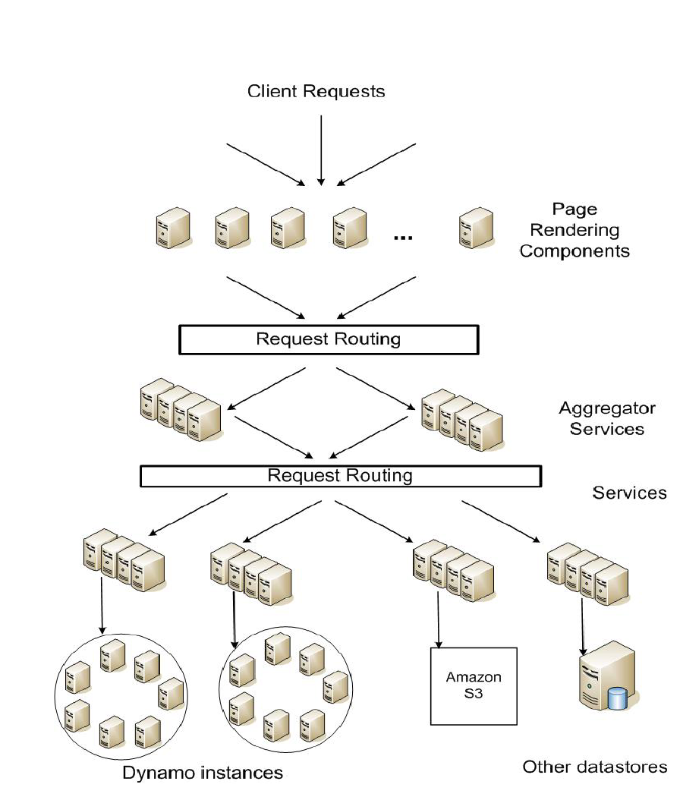
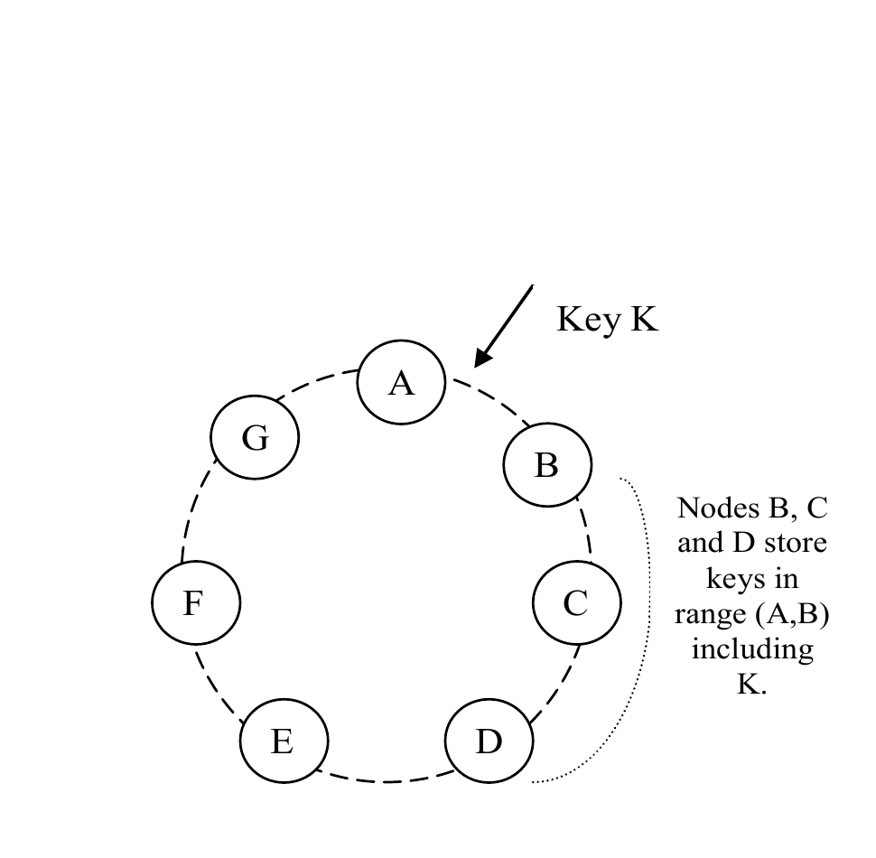
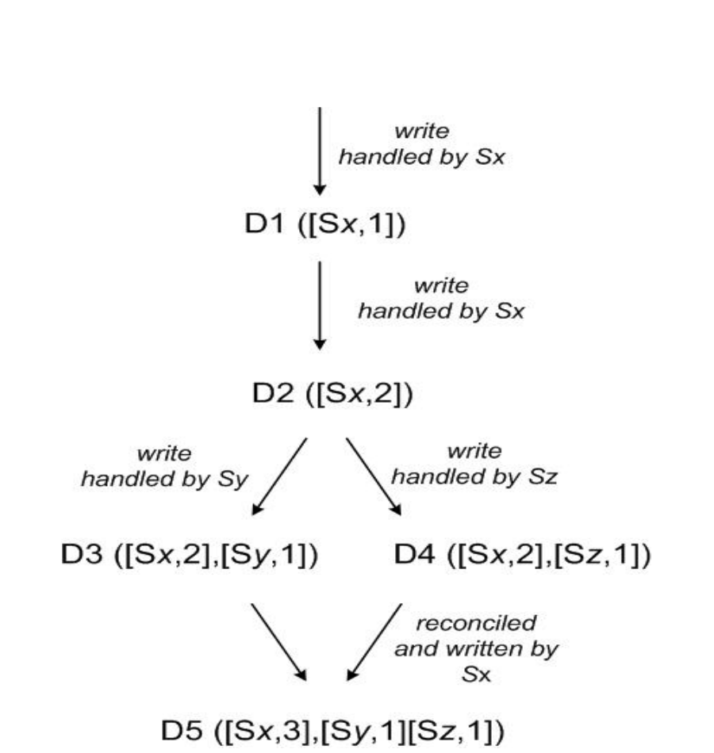
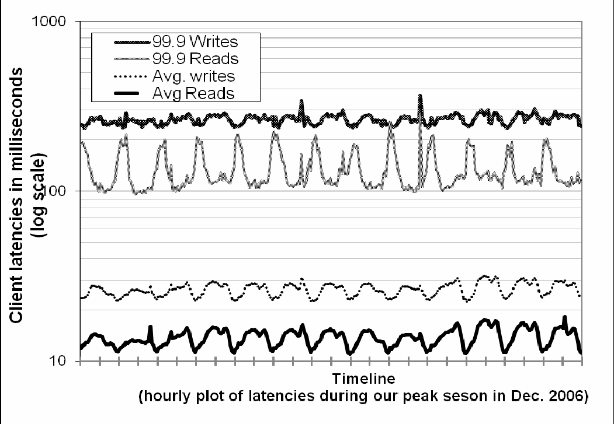
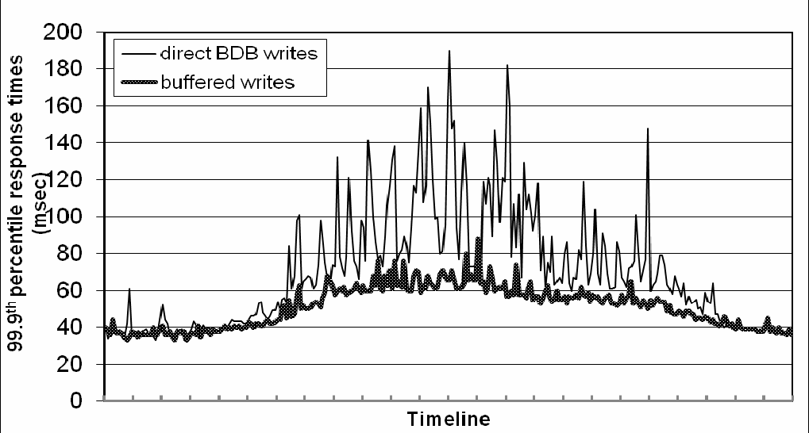
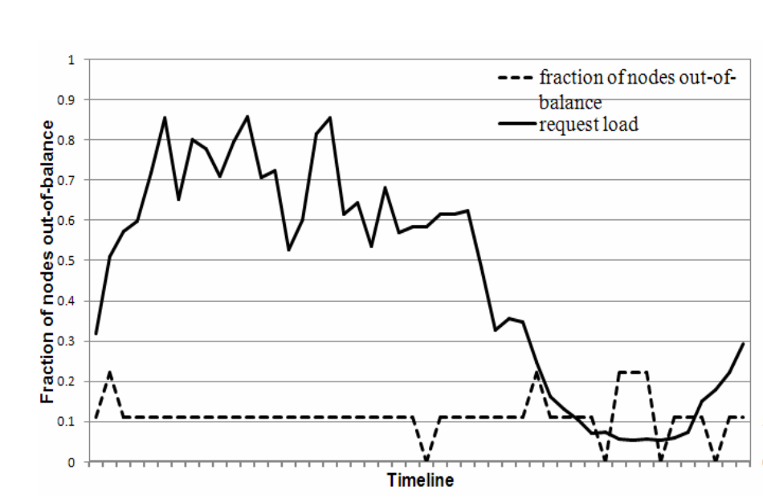
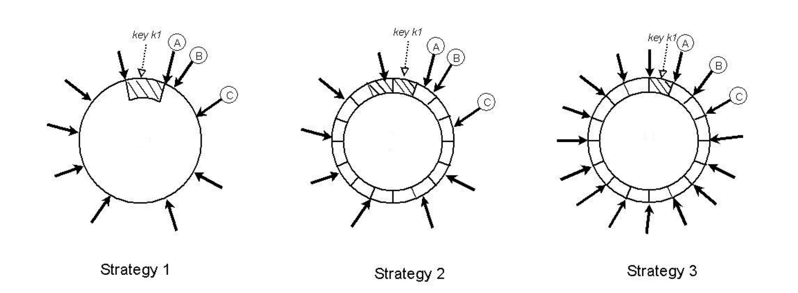
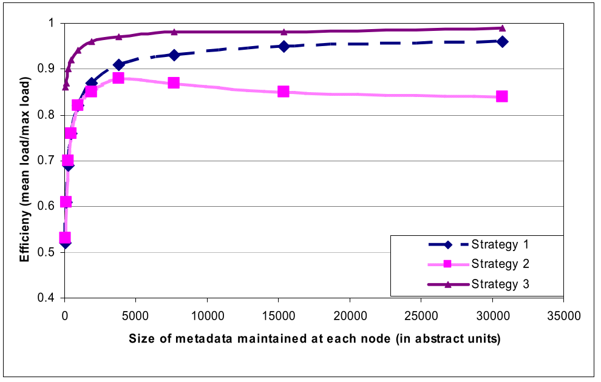

**Dynamo: Amazon’s Highly Available Key-value Store｜Dynamo：亚马逊的高可用键值存储**

Giuseppe DeCandia, Deniz Hastorun, Madan Jampani, Gunavardhan Kakulapati, Avinash Lakshman, Alex Pilchin, Swaminathan Sivasubramanian, Peter Vosshall and Werner Vogels

Amazon.com

> Giuseppe DeCandia、Deniz Hastorun、Madan Jampani、Gunavardhan Kakulapati、Avinash Lakshman、Alex Pilchin、Swaminathan Sivasubramanian、Peter Vosshall 与 Werner Vogels
>
> 亚马逊公司

## ABSTRACT｜摘要

Reliability at massive scale is one of the biggest challenges we face at Amazon.com, one of the largest e-commerce operations in the world; even the slightest outage has significant financial consequences and impacts customer trust. The Amazon.com platform, which provides services for many web sites worldwide, is implemented on top of an infrastructure of tens of thousands of servers and network components located in many datacenters around the world. At this scale, small and large components fail continuously and the way persistent state is managed in the face of these failures drives the reliability and scalability of the software systems.

This paper presents the design and implementation of Dynamo, a highly available key-value storage system that some of Amazon’s core services use to provide an “always-on” experience. To achieve this level of availability, Dynamo sacrifices consistency under certain failure scenarios. It makes extensive use of object versioning and application-assisted conflict resolution in a manner that provides a novel interface for developers to use.

> 超大规模下的可靠性，是我们在 Amazon.com 面临的最大挑战之一。Amazon.com 是全球最大的电子商务运营商之一，即使最轻微的停机也会造成重大的经济后果并影响客户信任。Amazon.com 平台为全球许多网站提供服务，它构建在由数万台服务器及网络组件组成、分布于世界各地众多数据中心的基础设施之上。在这一规模下，大小组件不断发生故障；面对这些故障时如何管理持久状态，决定了软件系统的可靠性与可扩展性。
>
> 本文介绍 Dynamo 的设计与实现。Dynamo 是一种高可用键值存储系统，亚马逊的一些核心服务借助它提供“始终在线”的体验。为达到这种可用性，Dynamo 在某些故障场景中牺牲了一致性。它广泛使用对象版本控制和应用程序辅助的冲突解决，并以此向开发者提供一种新颖的接口。

### Categories and Subject Descriptors｜类别与主题描述符

D.4.2 [Operating Systems]: Storage Management; D.4.5 [Operating Systems]: Reliability; D.4.2 [Operating Systems]: Performance;

> D.4.2［操作系统］：存储管理；D.4.5［操作系统］：可靠性；D.4.2［操作系统］：性能；

### General Terms｜通用术语

Algorithms, Management, Measurement, Performance, Design, Reliability.

> 算法、管理、度量、性能、设计、可靠性。

## 1. INTRODUCTION｜引言

Amazon runs a world-wide e-commerce platform that serves tens of millions customers at peak times using tens of thousands of servers located in many data centers around the world. There are strict operational requirements on Amazon’s platform in terms of performance, reliability and efficiency, and to support continuous growth the platform needs to be highly scalable. Reliability is one of the most important requirements because even the slightest outage has significant financial consequences and impacts customer trust. In addition, to support continuous growth, the platform needs to be highly scalable.

> 亚马逊运营着一个全球电子商务平台，在高峰期利用分布于世界各地许多数据中心的数万台服务器，为数千万客户提供服务。亚马逊平台在性能、可靠性与效率方面有严格的运营要求；为支持持续增长，平台还必须具备高度可扩展性。可靠性是最重要的要求之一，因为即使最轻微的停机也会造成重大的经济后果并影响客户信任。此外，为支持持续增长，平台必须具备高度可扩展性。

> **译注：** 原文 “tens of millions customers” 疑缺 “of”；英文照录，译文按句意处理。

One of the lessons our organization has learned from operating Amazon’s platform is that the reliability and scalability of a system is dependent on how its application state is managed. Amazon uses a highly decentralized, loosely coupled, service oriented architecture consisting of hundreds of services. In this environment there is a particular need for storage technologies that are always available. For example, customers should be able to view and add items to their shopping cart even if disks are failing, network routes are flapping, or data centers are being destroyed by tornados. Therefore, the service responsible for managing shopping carts requires that it can always write to and read from its data store, and that its data needs to be available across multiple data centers.

Dealing with failures in an infrastructure comprised of millions of components is our standard mode of operation; there are always a small but significant number of server and network components that are failing at any given time. As such Amazon’s software systems need to be constructed in a manner that treats failure handling as the normal case without impacting availability or performance.

> 我们在运营亚马逊平台中学到的一条经验是：系统的可靠性和可扩展性取决于其应用状态的管理方式。亚马逊采用高度去中心化、松耦合的面向服务架构，由数百项服务组成。在这种环境中，尤其需要始终可用的存储技术。例如，即使磁盘发生故障、网络路由反复震荡，或数据中心被龙卷风摧毁，客户仍应能够查看购物车并向其中添加商品。因此，负责管理购物车的服务必须始终能读写其数据存储，而且数据必须跨多个数据中心可用。
>
> 在由数百万个组件构成的基础设施中应对故障，是我们的常规运行方式；任何时刻总有少量但不可忽视的服务器和网络组件正在发生故障。因此，亚马逊的软件系统必须把故障处理视为常态来构建，同时不能影响可用性或性能。

To meet the reliability and scaling needs, Amazon has developed a number of storage technologies, of which the Amazon Simple Storage Service (also available outside of Amazon and known as Amazon S3), is probably the best known. This paper presents the design and implementation of Dynamo, another highly available and scalable distributed data store built for Amazon’s platform. Dynamo is used to manage the state of services that have very high reliability requirements and need tight control over the tradeoffs between availability, consistency, cost-effectiveness and performance. Amazon’s platform has a very diverse set of applications with different storage requirements. A select set of applications requires a storage technology that is flexible enough to let application designers configure their data store appropriately based on these tradeoffs to achieve high availability and guaranteed performance in the most cost effective manner.

> 为满足可靠性与扩展需求，亚马逊开发了多种存储技术，其中最著名的大概是 Amazon Simple Storage Service（它也向亚马逊外部开放，即 Amazon S3）。本文介绍为亚马逊平台构建的另一种高可用、可扩展的分布式数据存储 Dynamo 的设计与实现。Dynamo 用于管理那些可靠性要求极高、并且需要严格掌控可用性、一致性、成本效益和性能之间权衡的服务状态。亚马逊平台包含极其多样、存储需求各异的应用。有一类特定应用需要足够灵活的存储技术，让应用设计者能依据这些权衡恰当地配置数据存储，以最具成本效益的方式实现高可用和有保障的性能。

There are many services on Amazon’s platform that only need primary-key access to a data store. For many services, such as those that provide best seller lists, shopping carts, customer preferences, session management, sales rank, and product catalog, the common pattern of using a relational database would lead to inefficiencies and limit scale and availability. Dynamo provides a simple primary-key only interface to meet the requirements of these applications.

Dynamo uses a synthesis of well known techniques to achieve scalability and availability: Data is partitioned and replicated using consistent hashing [10], and consistency is facilitated by object versioning [12]. The consistency among replicas during updates is maintained by a quorum-like technique and a decentralized replica synchronization protocol. Dynamo employs a gossip based distributed failure detection and membership protocol. Dynamo is a completely decentralized system with minimal need for manual administration. Storage nodes can be added and removed from Dynamo without requiring any manual partitioning or redistribution.

> 亚马逊平台上的许多服务只需通过主键访问数据存储。对畅销榜、购物车、客户偏好、会话管理、销售排名和商品目录等许多服务而言，惯常采用关系数据库的模式会造成低效，并限制规模和可用性。Dynamo 提供简单的纯主键接口，以满足这些应用的需求。
>
> Dynamo 综合运用多种众所周知的技术来实现可扩展性和可用性：使用一致性哈希［10］对数据进行分区和复制，并借助对象版本控制［12］促进一致性。更新期间副本间的一致性由一种类似法定人数的技术以及去中心化的副本同步协议来维持。Dynamo 采用基于 gossip 的分布式故障检测和成员协议。Dynamo 是一个完全去中心化的系统，几乎不需要人工管理。存储节点可以加入或移出 Dynamo，无须任何手工分区或重新分布。

In the past year, Dynamo has been the underlying storage technology for a number of the core services in Amazon’s e-commerce platform. It was able to scale to extreme peak loads efficiently without any downtime during the busy holiday shopping season. For example, the service that maintains shopping cart (Shopping Cart Service) served tens of millions requests that resulted in well over 3 million checkouts in a single day and the service that manages session state handled hundreds of thousands of concurrently active sessions.

The main contribution of this work for the research community is the evaluation of how different techniques can be combined to provide a single highly-available system. It demonstrates that an eventually-consistent storage system can be used in production with demanding applications. It also provides insight into the tuning of these techniques to meet the requirements of production systems with very strict performance demands.

> 在过去一年里，Dynamo 一直是亚马逊电子商务平台多项核心服务的底层存储技术。在繁忙的假日购物季，它能高效扩展到极端峰值负载而没有任何停机。例如，维护购物车的服务（Shopping Cart Service）一天内处理了数千万次请求，产生了远超 300 万次结账；管理会话状态的服务则处理了数十万个并发活跃会话。
>
> 本工作对研究界的主要贡献，是评估如何组合不同技术来提供一个统一的高可用系统。它证明，最终一致的存储系统可以用于要求严苛的生产应用；同时也提供了如何调优这些技术，以满足有着极严格性能要求的生产系统的经验见解。

The paper is structured as follows. Section 2 presents the background and Section 3 presents the related work. Section 4 presents the system design and Section 5 describes the implementation. Section 6 details the experiences and insights gained by running Dynamo in production and Section 7 concludes the paper. There are a number of places in this paper where additional information may have been appropriate but where protecting Amazon’s business interests require us to reduce some level of detail. For this reason, the intra- and inter-datacenter latencies in section 6, the absolute request rates in section 6.2 and outage lengths and workloads in section 6.3 are provided through aggregate measures instead of absolute details.

> 本文结构如下：第 2 节介绍背景，第 3 节介绍相关工作；第 4 节介绍系统设计，第 5 节描述实现；第 6 节详述 Dynamo 生产运行中获得的经验与见解，第 7 节总结全文。本文有多处本可提供更多信息，但为保护亚马逊的商业利益，我们必须减少某些细节。因此，第 6 节的数据中心内外延迟、第 6.2 节的绝对请求率，以及第 6.3 节的中断时长和工作负载，均以汇总度量而非绝对细节给出。

Permission to make digital or hard copies of all or part of this work for personal or classroom use is granted without fee provided that copies are not made or distributed for profit or commercial advantage and that copies bear this notice and the full citation on the first page. To copy otherwise, or republish, to post on servers or to redistribute to lists, requires prior specific permission and/or a fee.

> 准许为个人或课堂用途免费制作本作品全部或部分内容的数字或纸质副本，前提是副本不为营利或商业利益而制作或分发，且副本在首页载有本声明和完整引文。以其他方式复制或再版、发布到服务器或向列表再分发，须事先取得明确许可并／或缴费。

SOSP’07, October 14–17, 2007, Stevenson, Washington, USA.

> SOSP’07，2007 年 10 月 14—17 日，美国华盛顿州史蒂文森。

Copyright 2007 ACM 978-1-59593-591-5/07/0010...\$5.00.

> 版权所有 © 2007 ACM，978-1-59593-591-5/07/0010……5.00 美元。

## 2. BACKGROUND｜背景

Amazon’s e-commerce platform is composed of hundreds of services that work in concert to deliver functionality ranging from recommendations to order fulfillment to fraud detection. Each service is exposed through a well defined interface and is accessible over the network. These services are hosted in an infrastructure that consists of tens of thousands of servers located across many data centers world-wide. Some of these services are stateless (i.e., services which aggregate responses from other services) and some are stateful (i.e., a service that generates its response by executing business logic on its state stored in persistent store).

Traditionally production systems store their state in relational databases. For many of the more common usage patterns of state persistence, however, a relational database is a solution that is far from ideal. Most of these services only store and retrieve data by primary key and do not require the complex querying and management functionality offered by an RDBMS. This excess functionality requires expensive hardware and highly skilled personnel for its operation, making it a very inefficient solution. In addition, the available replication technologies are limited and typically choose consistency over availability. Although many advances have been made in the recent years, it is still not easy to scale-out databases or use smart partitioning schemes for load balancing.

> 亚马逊电子商务平台由数百项协同工作的服务组成，提供从推荐、订单履约到欺诈检测的各种功能。每项服务都通过定义良好的接口对外提供，并可经由网络访问。这些服务托管在一套基础设施中，其中包含分布于全球多个数据中心的数万台服务器。部分服务是无状态的（即汇总其他服务响应的服务），另一些则有状态（即通过对持久存储中的自身状态执行商业逻辑来生成响应的服务）。
>
> 传统上，生产系统把状态存入关系数据库。然而，对许多最常见的状态持久化使用模式而言，关系数据库远非理想方案。这些服务大多只按主键存取数据，并不需要 RDBMS 提供的复杂查询与管理功能。多余的功能需要昂贵硬件和高技能人员来运维，因而效率很低。此外，现有复制技术选择有限，通常更重视一致性而非可用性。尽管近年来已有许多进展，数据库横向扩展或利用智能分区方案实现负载均衡仍非易事。

This paper describes Dynamo, a highly available data storage technology that addresses the needs of these important classes of services. Dynamo has a simple key/value interface, is highly available with a clearly defined consistency window, is efficient in its resource usage, and has a simple scale out scheme to address growth in data set size or request rates. Each service that uses Dynamo runs its own Dynamo instances.

> 本文描述 Dynamo，一种满足这些重要服务类别需求的高可用数据存储技术。Dynamo 具有简单的键／值接口，在明确界定的一致性窗口下高度可用，资源使用高效，并提供简单的横向扩展方案来应对数据集规模或请求率增长。每项使用 Dynamo 的服务都运行自己的 Dynamo 实例。

### 2.1 System Assumptions and Requirements｜系统假设与要求

The storage system for this class of services has the following requirements:

**Query Model:** simple read and write operations to a data item that is uniquely identified by a key. State is stored as binary objects (i.e., blobs) identified by unique keys. No operations span multiple data items and there is no need for relational schema. This requirement is based on the observation that a significant portion of Amazon’s services can work with this simple query model and do not need any relational schema. Dynamo targets applications that need to store objects that are relatively small (usually less than 1 MB).

**ACID Properties:** ACID (Atomicity, Consistency, Isolation, Durability) is a set of properties that guarantee that database transactions are processed reliably. In the context of databases, a single logical operation on the data is called a transaction. Experience at Amazon has shown that data stores that provide ACID guarantees tend to have poor availability. This has been widely acknowledged by both the industry and academia [5]. Dynamo targets applications that operate with weaker consistency (the “C” in ACID) if this results in high availability. Dynamo does not provide any isolation guarantees and permits only single key updates.

> 此类服务对存储系统有以下要求：
>
> **查询模型：** 对由键唯一标识的数据项执行简单读写操作。状态存为由唯一键标识的二进制对象（即 blob）。没有跨越多个数据项的操作，也不需要关系模式。这一要求基于如下观察：亚马逊相当一部分服务能够使用这种简单查询模型，并不需要任何关系模式。Dynamo 面向需要存储相对较小对象（通常小于 1 MB）的应用。
>
> **ACID 属性：** ACID（原子性、一致性、隔离性、持久性）是一组保证数据库事务可靠处理的属性。在数据库语境中，对数据的一次逻辑操作称为事务。亚马逊的经验表明，提供 ACID 保证的数据存储往往可用性较差。这一点已获业界与学界广泛认可［5］。如果较弱的一致性（ACID 中的“C”）能够换来高可用性，Dynamo 便面向能在这种一致性下工作的应用。Dynamo 不提供任何隔离性保证，并且只允许单键更新。

**Efficiency:** The system needs to function on a commodity hardware infrastructure. In Amazon’s platform, services have stringent latency requirements which are in general measured at the 99.9th percentile of the distribution. Given that state access plays a crucial role in service operation the storage system must be capable of meeting such stringent SLAs (see Section 2.2 below). Services must be able to configure Dynamo such that they consistently achieve their latency and throughput requirements. The tradeoffs are in performance, cost efficiency, availability, and durability guarantees.

**Other Assumptions:** Dynamo is used only by Amazon’s internal services. Its operation environment is assumed to be non-hostile and there are no security related requirements such as authentication and authorization. Moreover, since each service uses its distinct instance of Dynamo, its initial design targets a scale of up to hundreds of storage hosts. We will discuss the scalability limitations of Dynamo and possible scalability related extensions in later sections.

> **效率：** 系统需要运行在通用硬件基础设施上。在亚马逊平台中，服务有严格的延迟要求，通常以分布的第 99.9 百分位衡量。鉴于状态访问在服务运行中至关重要，存储系统必须能够满足如此严格的 SLA（见下文第 2.2 节）。服务必须能够配置 Dynamo，使其持续达到延迟和吞吐量要求。需要权衡的是性能、成本效益、可用性与持久性保证。
>
> **其他假设：** Dynamo 仅供亚马逊内部服务使用。其运行环境假定为非敌对环境，因此没有身份认证和授权等安全相关要求。此外，由于每项服务使用各自独立的 Dynamo 实例，其初始设计目标规模至多为数百台存储主机。后文将讨论 Dynamo 的可扩展性局限及可能的相关扩展。

### 2.2 Service Level Agreements (SLA)｜服务级别协议（SLA）

To guarantee that the application can deliver its functionality in a bounded time, each and every dependency in the platform needs to deliver its functionality with even tighter bounds. Clients and services engage in a Service Level Agreement (SLA), a formally negotiated contract where a client and a service agree on several system-related characteristics, which most prominently include the client’s expected request rate distribution for a particular API and the expected service latency under those conditions. An example of a simple SLA is a service guaranteeing that it will provide a response within 300ms for 99.9% of its requests for a peak client load of 500 requests per second.

In Amazon’s decentralized service oriented infrastructure, SLAs play an important role. For example a page request to one of the e-commerce sites typically requires the rendering engine to construct its response by sending requests to over 150 services. These services often have multiple dependencies, which frequently are other services, and as such it is not uncommon for the call graph of an application to have more than one level. To ensure that the page rendering engine can maintain a clear bound on page delivery each service within the call chain must obey its performance contract.

> 为保证应用能在有界时间内交付功能，平台中的每一项依赖都必须在更严格的时限内交付功能。客户端与服务之间订立服务级别协议（SLA），这是一份经正式协商的合同，双方就若干系统相关特性达成一致，其中最主要的是客户端对特定 API 的预期请求率分布，以及该条件下的预期服务延迟。一个简单的 SLA 示例是：某服务保证在客户端峰值负载每秒 500 个请求时，99.9% 的请求能在 300 ms 内获得响应。
>
> 在亚马逊去中心化的面向服务基础设施中，SLA 发挥着重要作用。例如，向某个电子商务站点发起一次页面请求，通常需要渲染引擎向 150 多项服务发送请求来构造响应。这些服务常有多个依赖，且依赖往往也是其他服务，因此应用调用图超过一层并不少见。为确保页面渲染引擎能维持明确的页面交付时限，调用链内的每项服务都必须遵守其性能契约。

Figure 1: Service-oriented architecture of Amazon’s platform｜图：亚马逊平台的面向服务架构。

> **图表中文解读：** 客户端请求先进入页面渲染组件，经请求路由分派到聚合器服务与下游服务。每项服务在自身边界内使用独立数据存储，可选择 Dynamo 实例、Amazon S3 或其他存储；这种分层依赖说明端到端页面延迟为何受众多下游 SLA 共同约束。

Figure 1 shows an abstract view of the architecture of Amazon’s platform, where dynamic web content is generated by page rendering components which in turn query many other services. A service can use different data stores to manage its state and these data stores are only accessible within its service boundaries. Some services act as aggregators by using several other services to produce a composite response. Typically, the aggregator services are stateless, although they use extensive caching.

A common approach in the industry for forming a performance oriented SLA is to describe it using average, median and expected variance. At Amazon we have found that these metrics are not good enough if the goal is to build a system where all customers have a good experience, rather than just the majority. For example if extensive personalization techniques are used then customers with longer histories require more processing which impacts performance at the high-end of the distribution. An SLA stated in terms of mean or median response times will not address the performance of this important customer segment. To address this issue, at Amazon, SLAs are expressed and measured at the 99.9th percentile of the distribution. The choice for 99.9% over an even higher percentile has been made based on a cost-benefit analysis which demonstrated a significant increase in cost to improve performance that much. Experiences with Amazon’s production systems have shown that this approach provides a better overall experience compared to those systems that meet SLAs defined based on the mean or median.

> 图 1 给出了亚马逊平台架构的抽象视图：动态 Web 内容由页面渲染组件生成，而这些组件又会查询许多其他服务。服务可以使用不同的数据存储管理其状态，这些数据存储只能在服务边界内访问。一些服务充当聚合器，通过使用若干其他服务来生成复合响应。聚合器服务通常无状态，不过会大量使用缓存。
>
> 业界制定面向性能的 SLA 时，常用平均值、中位数和预期方差来描述。亚马逊发现，如果目标是让所有客户而非仅让大多数客户都获得良好体验，这些指标并不足够。例如，大量采用个性化技术时，历史记录更长的客户需要更多处理，这会影响分布高端的性能。以平均或中位响应时间表述的 SLA 无法涵盖这一重要客户群的性能。为解决此问题，亚马逊以分布的第 99.9 百分位来表述和衡量 SLA。选择 99.9% 而不是更高百分位，是基于成本收益分析：若要把性能再提高到那种程度，成本会显著增加。亚马逊生产系统的经验表明，相比只满足基于平均值或中位数定义之 SLA 的系统，这种做法能提供更好的整体体验。

In this paper there are many references to this 99.9th percentile of distributions, which reflects Amazon engineers’ relentless focus on performance from the perspective of the customers’ experience. Many papers report on averages, so these are included where it makes sense for comparison purposes. Nevertheless, Amazon’s engineering and optimization efforts are not focused on averages. Several techniques, such as the load balanced selection of write coordinators, are purely targeted at controlling performance at the 99.9th percentile.

Storage systems often play an important role in establishing a service’s SLA, especially if the business logic is relatively lightweight, as is the case for many Amazon services. State management then becomes the main component of a service’s SLA. One of the main design considerations for Dynamo is to give services control over their system properties, such as durability and consistency, and to let services make their own tradeoffs between functionality, performance and cost-effectiveness.

> 本文多次提到分布的第 99.9 百分位，体现了亚马逊工程师从客户体验角度对性能的不懈关注。许多论文报告平均值，因此在适合比较时本文也会纳入平均值。不过，亚马逊的工程和优化工作并不以平均值为重点。若干技术——例如通过负载均衡选择写协调器——完全是为了控制第 99.9 百分位的性能。
>
> 存储系统常在确立服务 SLA 时扮演重要角色，尤其当业务逻辑较为轻量时——许多亚马逊服务正是如此。此时，状态管理便成为服务 SLA 的主要组成部分。Dynamo 的一项主要设计考量，是让服务能够控制持久性、一致性等系统属性，并自行权衡功能、性能与成本效益。

### 2.3 Design Considerations｜设计考量

Data replication algorithms used in commercial systems traditionally perform synchronous replica coordination in order to provide a strongly consistent data access interface. To achieve this level of consistency, these algorithms are forced to tradeoff the availability of the data under certain failure scenarios. For instance, rather than dealing with the uncertainty of the correctness of an answer, the data is made unavailable until it is absolutely certain that it is correct. From the very early replicated database works, it is well known that when dealing with the possibility of network failures, strong consistency and high data availability cannot be achieved simultaneously [2, 11]. As such systems and applications need to be aware which properties can be achieved under which conditions.

For systems prone to server and network failures, availability can be increased by using optimistic replication techniques, where changes are allowed to propagate to replicas in the background, and concurrent, disconnected work is tolerated. The challenge with this approach is that it can lead to conflicting changes which must be detected and resolved. This process of conflict resolution introduces two problems: when to resolve them and who resolves them. Dynamo is designed to be an eventually consistent data store; that is all updates reach all replicas eventually.

> 商业系统采用的数据复制算法，传统上通过同步协调副本来提供强一致的数据访问接口。为达到这种一致性水平，这些算法不得不在某些故障场景下牺牲数据可用性。例如，它们不去应对答案正确性的不确定，而是让数据暂时不可用，直到能绝对确定答案正确。早期复制数据库研究早已表明，在必须考虑网络故障可能性时，强一致性与高数据可用性无法同时实现［2，11］。因此，系统和应用需要明确在何种条件下能够实现哪些属性。
>
> 对容易发生服务器和网络故障的系统，可以利用乐观复制技术提高可用性：允许变更在后台传播到副本，并容忍并发且断连的工作。这种方法的挑战在于，它可能产生必须检测并解决的冲突变更。冲突解决过程带来两个问题：何时解决，以及由谁解决。Dynamo 被设计为最终一致的数据存储；也就是说，所有更新最终都会到达所有副本。

An important design consideration is to decide when to perform the process of resolving update conflicts, i.e., whether conflicts should be resolved during reads or writes. Many traditional data stores execute conflict resolution during writes and keep the read complexity simple [7]. In such systems, writes may be rejected if the data store cannot reach all (or a majority of) the replicas at a given time. On the other hand, Dynamo targets the design space of an “always writeable” data store (i.e., a data store that is highly available for writes). For a number of Amazon services, rejecting customer updates could result in a poor customer experience. For instance, the shopping cart service must allow customers to add and remove items from their shopping cart even amidst network and server failures. This requirement forces us to push the complexity of conflict resolution to the reads in order to ensure that writes are never rejected.

> 一项重要设计考量，是决定何时执行更新冲突的解决过程，即在读取时还是写入时解决冲突。许多传统数据存储在写入时执行冲突解决，从而保持读取逻辑简单［7］。在这类系统中，如果某一时刻数据存储无法联系所有（或多数）副本，写入就可能被拒绝。Dynamo 则瞄准“始终可写”数据存储的设计空间（即写入高度可用的数据存储）。对亚马逊的一些服务而言，拒绝客户更新会造成糟糕的客户体验。例如，即使发生网络和服务器故障，购物车服务也必须允许客户添加或移除商品。这项要求迫使我们把冲突解决的复杂性推到读取路径，以确保写入永不被拒绝。

The next design choice is who performs the process of conflict resolution. This can be done by the data store or the application. If conflict resolution is done by the data store, its choices are rather limited. In such cases, the data store can only use simple policies, such as “last write wins” [22], to resolve conflicting updates. On the other hand, since the application is aware of the data schema it can decide on the conflict resolution method that is best suited for its client’s experience. For instance, the application that maintains customer shopping carts can choose to “merge” the conflicting versions and return a single unified shopping cart. Despite this flexibility, some application developers may not want to write their own conflict resolution mechanisms and choose to push it down to the data store, which in turn chooses a simple policy such as “last write wins”.

Other key principles embraced in the design are:

> 下一项设计选择是谁来执行冲突解决：可以由数据存储完成，也可以由应用完成。若由数据存储解决，其选择相当有限；它只能采用“最后写入者胜”［22］之类的简单策略来解决冲突更新。另一方面，应用了解数据模式，因此可以选择最适合其客户体验的冲突解决方法。例如，维护客户购物车的应用可以选择“合并”冲突版本，返回一个统一购物车。尽管如此灵活，一些应用开发者可能不愿自行编写冲突解决机制，便会选择把它下推到数据存储；后者再选用“最后写入者胜”之类的简单策略。
>
> 设计还遵循以下关键原则：

**Incremental scalability:** Dynamo should be able to scale out one storage host (henceforth, referred to as “node”) at a time, with minimal impact on both operators of the system and the system itself.

**Symmetry:** Every node in Dynamo should have the same set of responsibilities as its peers; there should be no distinguished node or nodes that take special roles or extra set of responsibilities. In our experience, symmetry simplifies the process of system provisioning and maintenance.

**Decentralization:** An extension of symmetry, the design should favor decentralized peer-to-peer techniques over centralized control. In the past, centralized control has resulted in outages and the goal is to avoid it as much as possible. This leads to a simpler, more scalable, and more available system.

> **增量可扩展性：** Dynamo 应能每次增加一台存储主机（下文称“节点”）进行横向扩展，并尽量减少对系统运维人员及系统本身的影响。
>
> **对称性：** Dynamo 中每个节点都应承担与对等节点相同的一组职责；不应存在承担特殊角色或额外职责的特殊节点。根据我们的经验，对称性简化了系统配置与维护过程。
>
> **去中心化：** 作为对称性的延伸，设计应优先采用去中心化的点对点技术，而不是集中式控制。过去，集中式控制曾导致停机；我们的目标是尽量避免它，从而得到更简单、更可扩展、可用性更高的系统。

**Heterogeneity:** The system needs to be able to exploit heterogeneity in the infrastructure it runs on. e.g. the work distribution must be proportional to the capabilities of the individual servers. This is essential in adding new nodes with higher capacity without having to upgrade all hosts at once.

> **异构性：** 系统需要能够利用其运行基础设施的异构性。例如，工作分配必须与各台服务器的能力成比例。这对于加入容量更高的新节点、又不必一次升级所有主机至关重要。

## 3. RELATED WORK｜相关工作

### 3.1 Peer to Peer Systems｜点对点系统

There are several peer-to-peer (P2P) systems that have looked at the problem of data storage and distribution. The first generation of P2P systems, such as Freenet and Gnutella¹, were predominantly used as file sharing systems. These were examples of unstructured P2P networks where the overlay links between peers were established arbitrarily. In these networks, a search query is usually flooded through the network to find as many peers as possible that share the data. P2P systems evolved to the next generation into what is widely known as structured P2P networks. These networks employ a globally consistent protocol to ensure that any node can efficiently route a search query to some peer that has the desired data. Systems like Pastry [16] and Chord [20] use routing mechanisms to ensure that queries can be answered within a bounded number of hops. To reduce the additional latency introduced by multi-hop routing, some P2P systems (e.g., [14]) employ O(1) routing where each peer maintains enough routing information locally so that it can route requests (to access a data item) to the appropriate peer within a constant number of hops.

> 一些点对点（P2P）系统研究过数据存储与分发问题。Freenet 和 Gnutella¹ 等第一代 P2P 系统主要用于文件共享。它们属于非结构化 P2P 网络，节点之间的覆盖链路任意建立；搜索查询通常泛洪全网，以找到尽可能多共享所需数据的节点。下一代 P2P 系统演化为广为人知的结构化 P2P 网络。这类网络采用全局一致的协议，确保任意节点都能把搜索查询高效路由到持有所需数据的某个对等节点。Pastry［16］和 Chord［20］等系统使用路由机制，保证查询在有界跳数内得到回答。为减少多跳路由引入的额外延迟，一些 P2P 系统（如［14］）采用 O(1) 路由：每个节点在本地维护足够的路由信息，从而在常数跳数内把访问数据项的请求路由到适当节点。

¹ http://freenetproject.org/, http://www.gnutella.org

> ¹ 原文脚注所列网址：http://freenetproject.org/、http://www.gnutella.org。

Various storage systems, such as Oceanstore [9] and PAST [17] were built on top of these routing overlays. Oceanstore provides a global, transactional, persistent storage service that supports serialized updates on widely replicated data. To allow for concurrent updates while avoiding many of the problems inherent with wide-area locking, it uses an update model based on conflict resolution. Conflict resolution was introduced in [21] to reduce the number of transaction aborts. Oceanstore resolves conflicts by processing a series of updates, choosing a total order among them, and then applying them atomically in that order. It is built for an environment where the data is replicated on an untrusted infrastructure. By comparison, PAST provides a simple abstraction layer on top of Pastry for persistent and immutable objects. It assumes that the application can build the necessary storage semantics (such as mutable files) on top of it.

> Oceanstore［9］和 PAST［17］等多种存储系统构建在这些路由覆盖层之上。Oceanstore 提供全局、事务性、持久的存储服务，支持对广泛复制的数据执行串行化更新。为允许并发更新并避免广域锁固有的诸多问题，它使用基于冲突解决的更新模型。文献［21］引入冲突解决以减少事务中止次数。Oceanstore 通过处理一系列更新、为其选择全序，再按该顺序原子应用来解决冲突；它面向数据复制在不可信基础设施上的环境。相比之下，PAST 在 Pastry 之上为持久、不可变对象提供简单抽象层，并假定应用可在其上构建所需的存储语义（如可变文件）。

### 3.2 Distributed File Systems and Databases｜分布式文件系统与数据库

Distributing data for performance, availability and durability has been widely studied in the file system and database systems community. Compared to P2P storage systems that only support flat namespaces, distributed file systems typically support hierarchical namespaces. Systems like Ficus [15] and Coda [19] replicate files for high availability at the expense of consistency. Update conflicts are typically managed using specialized conflict resolution procedures. The Farsite system [1] is a distributed file system that does not use any centralized server like NFS. Farsite achieves high availability and scalability using replication. The Google File System [6] is another distributed file system built for hosting the state of Google’s internal applications. GFS uses a simple design with a single master server for hosting the entire metadata and where the data is split into chunks and stored in chunkservers. Bayou is a distributed relational database system that allows disconnected operations and provides eventual data consistency [21].

> 为获得性能、可用性和持久性而分发数据，已在文件系统与数据库系统领域得到广泛研究。仅支持扁平命名空间的 P2P 存储系统不同，分布式文件系统通常支持层次化命名空间。Ficus［15］和 Coda［19］等系统复制文件，以牺牲一致性换取高可用；更新冲突通常由专门的冲突解决过程管理。Farsite［1］是不采用 NFS 那样集中式服务器的分布式文件系统，借助复制实现高可用与可扩展。Google File System［6］是另一个用于托管 Google 内部应用状态的分布式文件系统。GFS 设计简单：用单一主服务器承载全部元数据，把数据切分为块并存入块服务器。Bayou 是允许断连操作并提供最终数据一致性的分布式关系数据库系统［21］。

Among these systems, Bayou, Coda and Ficus allow disconnected operations and are resilient to issues such as network partitions and outages. These systems differ on their conflict resolution procedures. For instance, Coda and Ficus perform system level conflict resolution and Bayou allows application level resolution. All of them, however, guarantee eventual consistency. Similar to these systems, Dynamo allows read and write operations to continue even during network partitions and resolves updated conflicts using different conflict resolution mechanisms.

Distributed block storage systems like FAB [18] split large size objects into smaller blocks and stores each block in a highly available manner. In comparison to these systems, a key-value store is more suitable in this case because: (a) it is intended to store relatively small objects (size < 1M) and (b) key-value stores are easier to configure on a per-application basis. Antiquity is a wide-area distributed storage system designed to handle multiple server failures [23]. It uses a secure log to preserve data integrity, replicates each log on multiple servers for durability, and uses Byzantine fault tolerance protocols to ensure data consistency. In contrast to Antiquity, Dynamo does not focus on the problem of data integrity and security and is built for a trusted environment.

> 这些系统中，Bayou、Coda 和 Ficus 允许断连操作，并能抵御网络分区与中断等问题；其冲突解决过程各不相同。例如，Coda 和 Ficus 在系统层解决冲突，Bayou 则允许应用层解决。不过它们都保证最终一致性。与之类似，即使发生网络分区，Dynamo 仍允许读写继续，并利用不同的冲突解决机制处理更新冲突。
>
> FAB［18］等分布式块存储系统把大型对象拆成较小的数据块，再以高可用方式存储每一块。相比这些系统，键值存储更适合当前场景，因为：（a）它旨在存储相对较小的对象（大小 < 1M）；（b）键值存储更易按应用分别配置。Antiquity 是为处理多服务器故障而设计的广域分布式存储系统［23］；它用安全日志保持数据完整性，在多台服务器上复制每份日志以保证持久性，并用拜占庭容错协议确保数据一致性。与 Antiquity 不同，Dynamo 不关注数据完整性与安全问题，而是为可信环境构建。

Bigtable is a distributed storage system for managing structured data. It maintains a sparse, multi-dimensional sorted map and allows applications to access their data using multiple attributes [2]. Compared to Bigtable, Dynamo targets applications that require only key/value access with primary focus on high availability where updates are not rejected even in the wake of network partitions or server failures.

Traditional replicated relational database systems focus on the problem of guaranteeing strong consistency to replicated data. Although strong consistency provides the application writer a convenient programming model, these systems are limited in scalability and availability [7]. These systems are not capable of handling network partitions because they typically provide strong consistency guarantees.

> Bigtable 是管理结构化数据的分布式存储系统。它维护稀疏、多维、有序映射，允许应用使用多个属性访问数据［2］。与 Bigtable 相比，Dynamo 面向只需键／值访问的应用，首要目标是高可用：即使发生网络分区或服务器故障，也不拒绝更新。
>
> 传统复制式关系数据库系统专注于保证复制数据的强一致性。虽然强一致性为应用编写者提供了便利的编程模型，但这些系统的可扩展性和可用性受限［7］。由于通常提供强一致性保证，它们无法处理网络分区。

### 3.3 Discussion｜讨论

Dynamo differs from the aforementioned decentralized storage systems in terms of its target requirements. First, Dynamo is targeted mainly at applications that need an “always writeable” data store where no updates are rejected due to failures or concurrent writes. This is a crucial requirement for many Amazon applications. Second, as noted earlier, Dynamo is built for an infrastructure within a single administrative domain where all nodes are assumed to be trusted. Third, applications that use Dynamo do not require support for hierarchical namespaces (a norm in many file systems) or complex relational schema (supported by traditional databases). Fourth, Dynamo is built for latency sensitive applications that require at least 99.9% of read and write operations to be performed within a few hundred milliseconds. To meet these stringent latency requirements, it was imperative for us to avoid routing requests through multiple nodes (which is the typical design adopted by several distributed hash table systems such as Chord and Pastry). This is because multi-hop routing increases variability in response times, thereby increasing the latency at higher percentiles. Dynamo can be characterized as a zero-hop DHT, where each node maintains enough routing information locally to route a request to the appropriate node directly.

> Dynamo 与上述去中心化存储系统的区别在于目标要求。第一，它主要面向需要“始终可写”数据存储的应用，不能因故障或并发写入而拒绝更新；这对许多亚马逊应用至关重要。第二，如前所述，Dynamo 为单一管理域内的基础设施构建，假定所有节点可信。第三，使用 Dynamo 的应用不需要层次命名空间（许多文件系统的常规能力），也不需要复杂关系模式（传统数据库所支持）。第四，Dynamo 面向延迟敏感应用，要求至少 99.9% 的读写操作在几百毫秒内完成。为满足严格延迟要求，必须避免让请求经过多个节点路由——这是 Chord、Pastry 等多种分布式哈希表系统的典型设计——因为多跳路由会增加响应时间的波动，进而抬高高百分位延迟。Dynamo 可视为零跳 DHT：每个节点在本地维护足够路由信息，把请求直接路由到适当节点。

## 4. SYSTEM ARCHITECTURE｜系统架构

The architecture of a storage system that needs to operate in a production setting is complex. In addition to the actual data persistence component, the system needs to have scalable and robust solutions for load balancing, membership and failure detection, failure recovery, replica synchronization, overload handling, state transfer, concurrency and job scheduling, request marshalling, request routing, system monitoring and alarming, and configuration management. Describing the details of each of the solutions is not possible, so this paper focuses on the core distributed systems techniques used in Dynamo: partitioning, replication, versioning, membership, failure handling and scaling.

Table 1 presents a summary of the list of techniques Dynamo uses and their respective advantages.

> 需要在生产环境中运行的存储系统，其架构十分复杂。除实际的数据持久化组件外，系统还需要为负载均衡、成员与故障检测、故障恢复、副本同步、过载处理、状态迁移、并发与作业调度、请求编组、请求路由、系统监控与告警以及配置管理提供可扩展且稳健的方案。本文无法详述每种方案，因而重点讨论 Dynamo 使用的核心分布式系统技术：分区、复制、版本控制、成员管理、故障处理和扩展。
>
> 表 1 汇总了 Dynamo 所用技术及各自优势。

**Table 1: Summary of techniques used in Dynamo and their advantages.｜表：Dynamo 所用技术及其优势概览。**

| Problem                            | Technique                                               | Advantage                                                                                                         |
| ---------------------------------- | ------------------------------------------------------- | ----------------------------------------------------------------------------------------------------------------- |
| Partitioning                       | Consistent Hashing                                      | Incremental Scalability                                                                                           |
| High Availability for writes       | Vector clocks with reconciliation during reads          | Version size is decoupled from update rates.                                                                      |
| Handling temporary failures        | Sloppy Quorum and hinted handoff                        | Provides high availability and durability guarantee when some of the replicas are not available.                  |
| Recovering from permanent failures | Anti-entropy using Merkle trees                         | Synchronizes divergent replicas in the background.                                                                |
| Membership and failure detection   | Gossip-based membership protocol and failure detection. | Preserves symmetry and avoids having a centralized registry for storing membership and node liveness information. |

> | 问题           | 技术                             | 优势                                                     |
> | -------------- | -------------------------------- | -------------------------------------------------------- |
> | 分区           | 一致性哈希                       | 增量可扩展性                                             |
> | 写入高可用     | 向量时钟，并在读取时协调         | 版本大小与更新速率解耦。                                 |
> | 处理临时故障   | 宽松法定人数与提示移交           | 部分副本不可用时仍提供高可用和持久性保证。               |
> | 从永久故障恢复 | 使用 Merkle 树的反熵             | 在后台同步产生分歧的副本。                               |
> | 成员与故障检测 | 基于 gossip 的成员协议和故障检测 | 保持对称性，并避免用集中式注册表存储成员与节点存活信息。 |

> **图表中文解读：** 表中把 Dynamo 的五类核心问题与机制逐项对应：一致性哈希负责增量扩展，向量时钟与读时协调支持始终可写，宽松法定人数和提示移交跨越短暂故障，Merkle 树修复长期副本分歧，gossip 则在不引入中心注册表的前提下维护成员与存活视图。

### 4.1 System Interface｜系统接口

Dynamo stores objects associated with a key through a simple interface; it exposes two operations: get() and put(). The get(key) operation locates the object replicas associated with the key in the storage system and returns a single object or a list of objects with conflicting versions along with a context. The put(key, context, object) operation determines where the replicas of the object should be placed based on the associated key, and writes the replicas to disk. The context encodes system metadata about the object that is opaque to the caller and includes information such as the version of the object. The context information is stored along with the object so that the system can verify the validity of the context object supplied in the put request.

Dynamo treats both the key and the object supplied by the caller as an opaque array of bytes. It applies a MD5 hash on the key to generate a 128-bit identifier, which is used to determine the storage nodes that are responsible for serving the key.

> Dynamo 通过简单接口存储与键关联的对象，公开两个操作：get() 与 put()。get(key) 在存储系统中定位与键关联的对象副本，并返回单个对象，或返回带有冲突版本的对象列表及一个上下文。put(key, context, object) 根据关联键决定对象副本应放置在哪里，并把副本写入磁盘。上下文编码对调用者不透明的对象系统元数据，包括对象版本等信息。上下文信息与对象一同存储，使系统能验证 put 请求所提供上下文对象的有效性。
>
> Dynamo 把调用者提供的键和对象都视为不透明字节数组。它对键应用 MD5 哈希，生成一个 128 位标识符，用于确定负责服务该键的存储节点。

### 4.2 Partitioning Algorithm｜分区算法

One of the key design requirements for Dynamo is that it must scale incrementally. This requires a mechanism to dynamically partition the data over the set of nodes (i.e., storage hosts) in the system. Dynamo’s partitioning scheme relies on consistent hashing to distribute the load across multiple storage hosts. In consistent hashing [10], the output range of a hash function is treated as a fixed circular space or “ring” (i.e. the largest hash value wraps around to the smallest hash value). Each node in the system is assigned a random value within this space which represents its “position” on the ring. Each data item identified by a key is assigned to a node by hashing the data item’s key to yield its position on the ring, and then walking the ring clockwise to find the first node with a position larger than the item’s position.

> Dynamo 的关键设计要求之一是必须能够增量扩展，因此需要一种机制，在系统节点（即存储主机）集合上动态划分数据。Dynamo 的分区方案依赖一致性哈希，把负载分布到多台存储主机。在一致性哈希［10］中，哈希函数的输出范围被视为固定的环形空间或“环”（即最大哈希值回绕到最小哈希值）。系统中每个节点在该空间内被赋予一个随机值，代表它在环上的“位置”。由键标识的每个数据项通过对键求哈希得到环上位置，再顺时针行走，找到位置大于该数据项位置的第一个节点，从而被分配给该节点。

Figure 2: Partitioning and replication of keys in Dynamo ring.｜图：Dynamo 环上的键分区与复制。

> **图表中文解读：** 键 K 的哈希位置落在区间 (A,B]，顺时针遇到的第一个节点 B 是协调器；在 N=3 的示意中，B、C、D 三个物理节点共同保存该范围内（含 K）的键。

Thus, each node becomes responsible for the region in the ring between it and its predecessor node on the ring. The principle advantage of consistent hashing is that departure or arrival of a node only affects its immediate neighbors and other nodes remain unaffected.

> 因而，每个节点负责环上它与其前驱节点之间的区域。一致性哈希的主要优势是，节点离开或加入只影响紧邻节点，其他节点不受影响。

> **译注：** 原文 “principle advantage” 疑应为 “principal advantage”；英文照录。

The basic consistent hashing algorithm presents some challenges. First, the random position assignment of each node on the ring leads to non-uniform data and load distribution. Second, the basic algorithm is oblivious to the heterogeneity in the performance of nodes. To address these issues, Dynamo uses a variant of consistent hashing (similar to the one used in [10, 20]): instead of mapping a node to a single point in the circle, each node gets assigned to multiple points in the ring. To this end, Dynamo uses the concept of “virtual nodes”. A virtual node looks like a single node in the system, but each node can be responsible for more than one virtual node. Effectively, when a new node is added to the system, it is assigned multiple positions (henceforth, “tokens”) in the ring. The process of fine-tuning Dynamo’s partitioning scheme is discussed in Section 6.

Using virtual nodes has the following advantages:

> 基本一致性哈希算法存在若干挑战。首先，在环上随机分配节点位置会导致数据和负载分布不均。其次，基本算法不了解节点性能的异构性。为解决这些问题，Dynamo 使用一致性哈希的一种变体（类似［10，20］）：每个节点不是映射到环上单点，而是分配到多个点。为此，Dynamo 使用“虚拟节点”概念。虚拟节点在系统中看似单个节点，但每个物理节点可负责多个虚拟节点。实际上，新节点加入系统时会被赋予环上的多个位置（下文称“令牌”）。第 6 节讨论 Dynamo 分区方案的细调过程。
>
> 使用虚拟节点有以下优势：

- If a node becomes unavailable (due to failures or routine maintenance), the load handled by this node is evenly dispersed across the remaining available nodes.

> 节点因故障或日常维护不可用时，其负载会均匀分散到其余可用节点。

- When a node becomes available again, or a new node is added to the system, the newly available node accepts a roughly equivalent amount of load from each of the other available nodes.

> 节点重新可用或新节点加入系统时，这个新可用节点从其他各可用节点接收大致等量的负载。

- The number of virtual nodes that a node is responsible can decided based on its capacity, accounting for heterogeneity in the physical infrastructure.

> 可依据节点容量决定其负责的虚拟节点数量，从而考虑物理基础设施的异构性。

> **译注：** 原文第三项为 “can decided”，语法上疑缺 “be”；这里保留英文原貌，按其显然语义译为“可决定”。

### 4.3 Replication｜复制

To achieve high availability and durability, Dynamo replicates its data on multiple hosts. Each data item is replicated at N hosts, where N is a parameter configured “per-instance”. Each key, k, is assigned to a coordinator node (described in the previous section). The coordinator is in charge of the replication of the data items that fall within its range. In addition to locally storing each key within its range, the coordinator replicates these keys at the N-1 clockwise successor nodes in the ring. This results in a system where each node is responsible for the region of the ring between it and its Nth predecessor. In Figure 2, node B replicates the key k at nodes C and D in addition to storing it locally. Node D will store the keys that fall in the ranges (A, B], (B, C], and (C, D].

The list of nodes that is responsible for storing a particular key is called the preference list. The system is designed, as will be explained in Section 4.8, so that every node in the system can determine which nodes should be in this list for any particular key. To account for node failures, preference list contains more than N nodes. Note that with the use of virtual nodes, it is possible that the first N successor positions for a particular key may be owned by less than N distinct physical nodes (i.e. a node may hold more than one of the first N positions). To address this, the preference list for a key is constructed by skipping positions in the ring to ensure that the list contains only distinct physical nodes.

> 为实现高可用和持久性，Dynamo 在多台主机上复制数据。每个数据项在 N 台主机上复制，N 是按“实例”配置的参数。每个键 k 被分配给一个协调器节点（见上一节），协调器负责复制落在其范围内的数据项。除在本地保存范围内每个键外，协调器还把这些键复制到环上顺时针方向后继的 N−1 个节点。于是，每个节点负责环上从自身到其第 N 个前驱之间的区域。图 2 中，节点 B 除本地保存键 k 外，还把它复制到节点 C 和 D；节点 D 将保存落在 (A,B]、(B,C] 与 (C,D] 范围内的键。
>
> 负责存储特定键的节点列表称为偏好列表。系统的设计使每个节点都能确定任意特定键的列表应包含哪些节点，第 4.8 节将对此说明。为应对节点故障，偏好列表包含多于 N 个节点。注意，采用虚拟节点后，特定键的前 N 个后继位置可能归属于少于 N 个不同的物理节点（即一个物理节点可能占据前 N 个位置中的多个）。为解决这一点，构建键的偏好列表时会跳过环上的某些位置，确保列表只含不同物理节点。

### 4.4 Data Versioning｜数据版本控制

Dynamo provides eventual consistency, which allows for updates to be propagated to all replicas asynchronously. A put() call may return to its caller before the update has been applied at all the replicas, which can result in scenarios where a subsequent get() operation may return an object that does not have the latest updates.. If there are no failures then there is a bound on the update propagation times. However, under certain failure scenarios (e.g., server outages or network partitions), updates may not arrive at all replicas for an extended period of time.

> Dynamo 提供最终一致性，允许更新异步传播到所有副本。put() 调用可能在更新尚未应用到全部副本时便返回调用者，因此后续 get() 操作可能返回不含最新更新的对象。若无故障，更新传播时间有界；但在某些故障场景（如服务器中断或网络分区）下，更新可能长期无法到达所有副本。

> **译注：** 原文 “updates..” 有连续两个句点；英文照录，译文不重复标点。

There is a category of applications in Amazon’s platform that can tolerate such inconsistencies and can be constructed to operate under these conditions. For example, the shopping cart application requires that an “Add to Cart” operation can never be forgotten or rejected. If the most recent state of the cart is unavailable, and a user makes changes to an older version of the cart, that change is still meaningful and should be preserved. But at the same time it shouldn’t supersede the currently unavailable state of the cart, which itself may contain changes that should be preserved. Note that both “add to cart” and “delete item from cart” operations are translated into put requests to Dynamo. When a customer wants to add an item to (or remove from) a shopping cart and the latest version is not available, the item is added to (or removed from) the older version and the divergent versions are reconciled later.

> 亚马逊平台有一类应用能够容忍这种不一致，并可构建为在这些条件下运行。例如，购物车应用要求“加入购物车”操作绝不能被遗忘或拒绝。若购物车最新状态不可用，而用户修改了较旧版本，这项修改依然有意义，应予保留；但它也不应取代当前不可用的购物车状态，因为后者本身可能包含应保留的修改。注意，“加入购物车”和“从购物车删除商品”都会转换为对 Dynamo 的 put 请求。当客户想添加（或移除）商品但最新版本不可用时，商品会在旧版本上添加（或移除），有分歧的版本稍后再协调。

In order to provide this kind of guarantee, Dynamo treats the result of each modification as a new and immutable version of the data. It allows for multiple versions of an object to be present in the system at the same time. Most of the time, new versions subsume the previous version(s), and the system itself can determine the authoritative version (syntactic reconciliation). However, version branching may happen, in the presence of failures combined with concurrent updates, resulting in conflicting versions of an object. In these cases, the system cannot reconcile the multiple versions of the same object and the client must perform the reconciliation in order to collapse multiple branches of data evolution back into one (semantic reconciliation). A typical example of a collapse operation is “merging” different versions of a customer’s shopping cart. Using this reconciliation mechanism, an “add to cart” operation is never lost. However, deleted items can resurface.

> 为提供这种保证，Dynamo 把每次修改的结果视为一个新的不可变数据版本，允许对象的多个版本同时存在。多数情况下，新版本涵盖旧版本，系统自身可以确定权威版本（语法协调）。但在故障与并发更新同时发生时，版本可能分支，产生相互冲突的对象版本。此时系统无法协调同一对象的多个版本，必须由客户端执行协调，把多条数据演化分支重新合并为一条（语义协调）。典型的合并操作是“合并”客户购物车的不同版本。采用这种机制，“加入购物车”操作永不丢失；但已删除商品可能重新出现。

It is important to understand that certain failure modes can potentially result in the system having not just two but several versions of the same data. Updates in the presence of network partitions and node failures can potentially result in an object having distinct version sub-histories, which the system will need to reconcile in the future. This requires us to design applications that explicitly acknowledge the possibility of multiple versions of the same data (in order to never lose any updates).

Dynamo uses vector clocks [12] in order to capture causality between different versions of the same object. A vector clock is effectively a list of (node, counter) pairs. One vector clock is associated with every version of every object. One can determine whether two versions of an object are on parallel branches or have a causal ordering, by examine their vector clocks. If the counters on the first object’s clock are less-than-or-equal to all of the nodes in the second clock, then the first is an ancestor of the second and can be forgotten. Otherwise, the two changes are considered to be in conflict and require reconciliation.

> 必须理解，某些故障模式可能使系统拥有同一数据的不止两个、而是多个版本。网络分区和节点故障期间的更新，可能让对象形成不同的版本子历史，系统以后必须予以协调。这要求我们设计的应用明确承认同一数据可能存在多个版本（从而绝不丢失任何更新）。
>
> Dynamo 使用向量时钟［12］捕获同一对象不同版本之间的因果关系。向量时钟实际上是一个（节点，计数器）对列表；每个对象的每个版本都关联一个向量时钟。检查两个版本的向量时钟，可以判断它们位于并行分支还是具有因果顺序。如果第一个对象时钟中的计数器对第二个时钟中所有相应节点都小于或等于，那么前者是后者的祖先，可以丢弃；否则两次变更被视为冲突，需要协调。

> **译注：** 原文 “by examine” 疑应为 “by examining”；英文照录，按上下文翻译。

In Dynamo, when a client wishes to update an object, it must specify which version it is updating. This is done by passing the context it obtained from an earlier read operation, which contains the vector clock information. Upon processing a read request, if Dynamo has access to multiple branches that cannot be syntactically reconciled, it will return all the objects at the leaves, with the corresponding version information in the context. An update using this context is considered to have reconciled the divergent versions and the branches are collapsed into a single new version.

To illustrate the use of vector clocks, let us consider the example shown in Figure 3. A client writes a new object. The node (say Sx) that handles the write for this key increases its sequence number and uses it to create the data's vector clock. The system now has the object D1 and its associated clock [(Sx, 1)]. The client updates the object. Assume the same node handles this request as well. The system now also has object D2 and its associated clock [(Sx, 2)]. D2 descends from D1 and therefore over-writes D1, however there may be replicas of D1 lingering at nodes that have not yet seen D2. Let us assume that the same client updates the object again and a different server (say Sy) handles the request. The system now has data D3 and its associated clock [(Sx, 2), (Sy, 1)].

> 在 Dynamo 中，客户端要更新对象时必须指明所更新的版本，方法是传入先前读取操作得到、含有向量时钟信息的上下文。处理读请求时，如果 Dynamo 能访问多个无法进行语法协调的分支，它会返回所有叶子对象，并在上下文中附上相应版本信息。使用该上下文的更新被认为已协调分歧版本，各分支将合并为单个新版本。
>
> 为说明向量时钟的用法，考虑图 3 的例子。客户端写入新对象。处理该键写入的节点（设为 Sx）递增序列号，并用它创建数据的向量时钟。系统现有对象 D1 及关联时钟 [(Sx, 1)]。客户端更新对象；假定仍由同一节点处理，系统又有 D2 及其时钟 [(Sx, 2)]。D2 派生自 D1，因而覆盖 D1，但尚未见到 D2 的节点上可能仍残留 D1 副本。再假定同一客户端再次更新对象，而由不同服务器 Sy 处理；系统现有 D3 及其时钟 [(Sx, 2), (Sy, 1)]。

Next assume a different client reads D2 and then tries to update it, and another node (say Sz) does the write. The system now has D4 (descendant of D2) whose version clock is [(Sx, 2), (Sz, 1)]. A node that is aware of D1 or D2 could determine, upon receiving D4 and its clock, that D1 and D2 are overwritten by the new data and can be garbage collected. A node that is aware of D3 and receives D4 will find that there is no causal relation between them. In other words, there are changes in D3 and D4 that are not reflected in each other. Both versions of the data must be kept and presented to a client (upon a read) for semantic reconciliation.

Now assume some client reads both D3 and D4 (the context will reflect that both values were found by the read). The read's context is a summary of the clocks of D3 and D4, namely [(Sx, 2), (Sy, 1), (Sz, 1)]. If the client performs the reconciliation and node Sx coordinates the write, Sx will update its sequence number in the clock. The new data D5 will have the following clock: [(Sx, 3), (Sy, 1), (Sz, 1)].

> 接着假定另一个客户端读取 D2 后尝试更新，并由节点 Sz 执行写入。系统现有 D4（D2 的后代），版本时钟为 [(Sx, 2), (Sz, 1)]。知晓 D1 或 D2 的节点收到 D4 及其时钟后，可以判定 D1、D2 已被新数据覆盖，可进行垃圾回收。知晓 D3 的节点收到 D4 后则会发现二者没有因果关系；换言之，D3 和 D4 各自包含对方未反映的变更。两个版本都必须保留，并在读取时提交给客户端进行语义协调。
>
> 现在假定某客户端同时读取 D3 和 D4（上下文会反映读取发现了两个值）。读取上下文汇总 D3 与 D4 的时钟，即 [(Sx, 2), (Sy, 1), (Sz, 1)]。若客户端执行协调并由节点 Sx 协调写入，Sx 将更新时钟中的序列号。新数据 D5 的时钟为 [(Sx, 3), (Sy, 1), (Sz, 1)]。

Figure 3: Version evolution of an object over time.｜图：对象随时间的版本演化。

> **图表中文解读：** D1→D2 是同一节点 Sx 上的因果链；从 D2 分别经 Sy、Sz 写入得到并行的 D3、D4，二者必须同时保留；客户端读取并语义协调后，由 Sx 写出 D5，其时钟合并了三节点的因果历史。

A possible issue with vector clocks is that the size of vector clocks may grow if many servers coordinate the writes to an object. In practice, this is not likely because the writes are usually handled by one of the top N nodes in the preference list. In case of network partitions or multiple server failures, write requests may be handled by nodes that are not in the top N nodes in the preference list causing the size of vector clock to grow. In these scenarios, it is desirable to limit the size of vector clock. To this end, Dynamo employs the following clock truncation scheme: Along with each (node, counter) pair, Dynamo stores a timestamp that indicates the last time the node updated the data item. When the number of (node, counter) pairs in the vector clock reaches a threshold (say 10), the oldest pair is removed from the clock. Clearly, this truncation scheme can lead to inefficiencies in reconciliation as the descendant relationships cannot be derived accurately. However, this problem has not surfaced in production and therefore this issue has not been thoroughly investigated.

> 若许多服务器协调同一对象的写入，向量时钟大小可能增长，这是其潜在问题。实践中不太可能发生，因为写入通常由偏好列表前 N 个节点之一处理。但发生网络分区或多服务器故障时，写请求可能由不在前 N 名的节点处理，致使向量时钟增长。此时需要限制时钟大小。Dynamo 的截断方案是：为每个（节点，计数器）对同时保存一个时间戳，表示该节点最后更新数据项的时间。当向量时钟中的配对数量达到阈值（如 10）时，移除最旧配对。显然，这会因无法准确推导后代关系而降低协调效率。不过该问题尚未在生产中出现，因此没有得到深入研究。

### 4.5 Execution of get () and put () operations｜get () 与 put () 操作的执行

Any storage node in Dynamo is eligible to receive client get and put operations for any key. In this section, for sake of simplicity, we describe how these operations are performed in a failure-free environment and in the subsequent section we describe how read and write operations are executed during failures.

Both get and put operations are invoked using Amazon’s infrastructure-specific request processing framework over HTTP. There are two strategies that a client can use to select a node: (1) route its request through a generic load balancer that will select a node based on load information, or (2) use a partition-aware client library that routes requests directly to the appropriate coordinator nodes. The advantage of the first approach is that the client does not have to link any code specific to Dynamo in its application, whereas the second strategy can achieve lower latency because it skips a potential forwarding step.

> Dynamo 中任何存储节点都可接收客户端针对任意键的 get 和 put 操作。为简明起见，本节说明无故障环境中的执行方式，下一节再说明故障期间如何执行读写。
>
> get 与 put 都经 HTTP、使用亚马逊基础设施专用的请求处理框架调用。客户端可用两种策略选节点：（1）请求经过通用负载均衡器，由其依据负载信息选节点；（2）使用感知分区的客户端库，把请求直接路由到适当协调器节点。前者无需在应用中链接 Dynamo 专用代码；后者跳过潜在转发步骤，延迟更低。

A node handling a read or write operation is known as the coordinator. Typically, this is the first among the top N nodes in the preference list. If the requests are received through a load balancer, requests to access a key may be routed to any random node in the ring. In this scenario, the node that receives the request will not coordinate it if the node is not in the top N of the requested key’s preference list. Instead, that node will forward the request to the first among the top N nodes in the preference list.

Read and write operations involve the first N healthy nodes in the preference list, skipping over those that are down or inaccessible. When all nodes are healthy, the top N nodes in a key’s preference list are accessed. When there are node failures or network partitions, nodes that are lower ranked in the preference list are accessed.

To maintain consistency among its replicas, Dynamo uses a consistency protocol similar to those used in quorum systems. This protocol has two key configurable values: R and W. R is the minimum number of nodes that must participate in a successful read operation. W is the minimum number of nodes that must participate in a successful write operation. Setting R and W such that R + W > N yields a quorum-like system. In this model, the latency of a get (or put) operation is dictated by the slowest of the R (or W) replicas. For this reason, R and W are usually configured to be less than N, to provide better latency.

> 处理读写操作的节点称为协调器，通常是偏好列表前 N 个节点中的第一个。若请求经负载均衡器接收，对键的访问可能被路由到环上任意节点；若该节点不在目标键偏好列表前 N 名，它不会协调请求，而会转发给前 N 名中的第一个节点。
>
> 读写操作涉及偏好列表中前 N 个健康节点，会跳过宕机或不可访问的节点。全部健康时访问键偏好列表的前 N 个节点；发生节点故障或网络分区时，则访问排名更后的节点。
>
> 为维持副本一致性，Dynamo 使用类似法定人数系统的协议。两个关键可配置值是 R 与 W：R 是成功读取至少须参与的节点数，W 是成功写入至少须参与的节点数。令 R+W>N 可得到类似法定人数的系统。在该模型中，get（或 put）延迟由 R 个（或 W 个）副本中最慢者决定，因此 R、W 通常配置为小于 N，以获得更低延迟。

Upon receiving a put() request for a key, the coordinator generates the vector clock for the new version and writes the new version locally. The coordinator then sends the new version (along with the new vector clock) to the N highest-ranked reachable nodes. If at least W-1 nodes respond then the write is considered successful.

Similarly, for a get() request, the coordinator requests all existing versions of data for that key from the N highest-ranked reachable nodes in the preference list for that key, and then waits for R responses before returning the result to the client. If the coordinator ends up gathering multiple versions of the data, it returns all the versions it deems to be causally unrelated. The divergent versions are then reconciled and the reconciled version superseding the current versions is written back.

> 协调器收到键的 put() 请求后，为新版本生成向量时钟并在本地写入；再把新版本连同新时钟发给排名最高的 N 个可达节点。至少 W−1 个节点响应即视为写入成功。
>
> 类似地，对 get() 请求，协调器向键偏好列表中排名最高的 N 个可达节点请求该键的全部现有数据版本，等待 R 个响应后向客户端返回结果。若收集到多个版本，则返回它认为因果无关的全部版本；随后协调分歧版本，并回写取代当前各版本的协调后版本。

### 4.6 Handling Failures: Hinted Handoff｜处理故障：提示移交

If Dynamo used a traditional quorum approach it would be unavailable during server failures and network partitions, and would have reduced durability even under the simplest of failure conditions. To remedy this it does not enforce strict quorum membership and instead it uses a “sloppy quorum”; all read and write operations are performed on the first N healthy nodes from the preference list, which may not always be the first N nodes encountered while walking the consistent hashing ring.

Consider the example of Dynamo configuration given in Figure 2 with N=3. In this example, if node A is temporarily down or unreachable during a write operation then a replica that would normally have lived on A will now be sent to node D. This is done to maintain the desired availability and durability guarantees. The replica sent to D will have a hint in its metadata that suggests which node was the intended recipient of the replica (in this case A). Nodes that receive hinted replicas will keep them in a separate local database that is scanned periodically. Upon detecting that A has recovered, D will attempt to deliver the replica to A. Once the transfer succeeds, D may delete the object from its local store without decreasing the total number of replicas in the system.

> 若采用传统法定人数方法，Dynamo 会在服务器故障和网络分区期间不可用，即便最简单故障也会降低持久性。为此它不强制严格法定人数成员，而采用“宽松法定人数”：所有读写都在偏好列表最前面的 N 个健康节点上执行，它们不一定是沿一致性哈希环行走时遇到的前 N 个节点。
>
> 考虑图 2 中 N=3 的配置。若写入时 A 暂时宕机或不可达，通常应存于 A 的副本会改发到 D，以维持所需可用性和持久性保证。发给 D 的副本元数据带有提示，指出原定接收者（此处为 A）。接收提示副本的节点把它们保存在定期扫描的独立本地数据库中。检测到 A 恢复后，D 尝试把副本交付给 A；成功后可从本地删除对象，而不减少系统副本总数。

Using hinted handoff, Dynamo ensures that the read and write operations are not failed due to temporary node or network failures. Applications that need the highest level of availability can set W to 1, which ensures that a write is accepted as long as a single node in the system has durably written the key it to its local store. Thus, the write request is only rejected if all nodes in the system are unavailable. However, in practice, most Amazon services in production set a higher W to meet the desired level of durability. A more detailed discussion of configuring N, R and W follows in section 6.

> 借助提示移交，Dynamo 确保读写不会因临时节点或网络故障而失败。要求最高可用性的应用可把 W 设为 1，只要系统中一个节点已把键持久写入本地存储，就接受写入；只有所有节点均不可用时才拒绝。不过实践中，多数亚马逊生产服务会设置更高的 W，以达到所需持久性。第 6 节将详述 N、R、W 的配置。

> **译注：** 原文 “written the key it to its local store” 中的 “it” 疑属赘词；英文照录，译文按句意处理。

It is imperative that a highly available storage system be capable of handling the failure of an entire data center(s). Data center failures happen due to power outages, cooling failures, network failures, and natural disasters. Dynamo is configured such that each object is replicated across multiple data centers. In essence, the preference list of a key is constructed such that the storage nodes are spread across multiple data centers. These datacenters are connected through high speed network links. This scheme of replicating across multiple datacenters allows us to handle entire data center failures without a data outage.

> 高可用存储系统必须能处理整个数据中心的故障。断电、冷却故障、网络故障和自然灾害都可能导致数据中心故障。Dynamo 配置为每个对象跨多个数据中心复制；实质上，键的偏好列表会让存储节点分散在多个由高速网络链路连接的数据中心。这种跨中心复制方案使我们能应对整个数据中心故障而不发生数据中断。

### 4.7 Handling permanent failures: Replica synchronization｜处理永久故障：副本同步

Hinted handoff works best if the system membership churn is low and node failures are transient. There are scenarios under which hinted replicas become unavailable before they can be returned to the original replica node. To handle this and other threats to durability, Dynamo implements an anti-entropy (replica synchronization) protocol to keep the replicas synchronized.

To detect the inconsistencies between replicas faster and to minimize the amount of transferred data, Dynamo uses Merkle trees [13]. A Merkle tree is a hash tree where leaves are hashes of the values of individual keys. Parent nodes higher in the tree are hashes of their respective children. The principal advantage of Merkle tree is that each branch of the tree can be checked independently without requiring nodes to download the entire tree or the entire data set. Moreover, Merkle trees help in reducing the amount of data that needs to be transferred while checking for inconsistencies among replicas. For instance, if the hash values of the root of two trees are equal, then the values of the leaf nodes in the tree are equal and the nodes require no synchronization. If not, it implies that the values of some replicas are different. In such cases, the nodes may exchange the hash values of children and the process continues until it reaches the leaves of the trees, at which point the hosts can identify the keys that are “out of sync”. Merkle trees minimize the amount of data that needs to be transferred for synchronization and reduce the number of disk reads performed during the anti-entropy process.

> 系统成员变动少且节点故障短暂时，提示移交效果最佳。但提示副本有时会在返回原副本节点前变得不可用。为处理这种情况及其他持久性威胁，Dynamo 实现反熵（副本同步）协议来保持副本同步。
>
> 为更快检测副本不一致并尽量减少传输数据，Dynamo 使用 Merkle 树［13］。Merkle 树是哈希树，叶子是各键值的哈希，上层父节点是相应子节点的哈希。其主要优势是每个分支可独立检查，无须下载整棵树或整个数据集；同时减少检查副本不一致时的数据传输量。若两棵树根哈希相同，叶节点值就相同，无须同步；否则说明某些副本值不同，节点可逐层交换子节点哈希直到叶子，从而识别“不同步”的键。Merkle 树既减少同步数据量，也减少反熵过程的磁盘读取。

Dynamo uses Merkle trees for anti-entropy as follows: Each node maintains a separate Merkle tree for each key range (the set of keys covered by a virtual node) it hosts. This allows nodes to compare whether the keys within a key range are up-to-date. In this scheme, two nodes exchange the root of the Merkle tree corresponding to the key ranges that they host in common. Subsequently, using the tree traversal scheme described above the nodes determine if they have any differences and perform the appropriate synchronization action. The disadvantage with this scheme is that many key ranges change when a node joins or leaves the system thereby requiring the tree(s) to be recalculated. This issue is addressed, however, by the refined partitioning scheme described in Section 6.2.

> Dynamo 用 Merkle 树反熵：每个节点为其托管的每个键范围（一个虚拟节点覆盖的键集合）维护独立 Merkle 树，以比较范围内的键是否最新。两个节点交换它们共同托管范围所对应的树根，再按上述树遍历判断差异并执行同步。缺点是节点加入或离开会改变许多键范围，导致重新计算树；第 6.2 节的改进分区方案解决了这个问题。

### 4.8 Membership and Failure Detection｜成员与故障检测

#### 4.8.1 Ring Membership｜环成员

In Amazon’s environment node outages (due to failures and maintenance tasks) are often transient but may last for extended intervals. A node outage rarely signifies a permanent departure and therefore should not result in rebalancing of the partition assignment or repair of the unreachable replicas. Similarly, manual error could result in the unintentional startup of new Dynamo nodes. For these reasons, it was deemed appropriate to use an explicit mechanism to initiate the addition and removal of nodes from a Dynamo ring. An administrator uses a command line tool or a browser to connect to a Dynamo node and issue a membership change to join a node to a ring or remove a node from a ring. The node that serves the request writes the membership change and its time of issue to persistent store. The membership changes form a history because nodes can be removed and added back multiple times. A gossip-based protocol propagates membership changes and maintains an eventually consistent view of membership. Each node contacts a peer chosen at random every second and the two nodes efficiently reconcile their persisted membership change histories.

> 在亚马逊环境中，节点因故障或维护而中断通常是暂时的，但可能持续很久。中断很少意味着永久离开，因此不应触发分区分配再平衡或不可达副本修复；人工失误也可能意外启动新 Dynamo 节点。因此采用显式机制发起节点加入或移出环。管理员用命令行工具或浏览器连接 Dynamo 节点，发出成员变更；服务该请求的节点把变更及发出时间写入持久存储。节点可能多次移除又加入，所以变更构成历史。基于 gossip 的协议传播变更并维护最终一致的成员视图；每个节点每秒随机联系一个对等节点，双方高效协调各自持久化的变更历史。

When a node starts for the first time, it chooses its set of tokens (virtual nodes in the consistent hash space) and maps nodes to their respective token sets. The mapping is persisted on disk and initially contains only the local node and token set. The mappings stored at different Dynamo nodes are reconciled during the same communication exchange that reconciles the membership change histories. Therefore, partitioning and placement information also propagates via the gossip-based protocol and each storage node is aware of the token ranges handled by its peers. This allows each node to forward a key’s read/write operations to the right set of nodes directly.

> 节点首次启动时选择令牌集合（一致性哈希空间中的虚拟节点），并把节点映射到相应令牌集。映射持久化于磁盘，初始仅含本地节点及其令牌集。不同节点存储的映射会在协调成员变更历史的同一次通信交换中协调。因此，分区与放置信息也经 gossip 传播，每个存储节点都知道对等节点负责的令牌范围，从而能把键的读写直接转发给正确节点集合。

#### 4.8.2 External Discovery｜外部发现

The mechanism described above could temporarily result in a logically partitioned Dynamo ring. For example, the administrator could contact node A to join A to the ring, then contact node B to join B to the ring. In this scenario, nodes A and B would each consider itself a member of the ring, yet neither would be immediately aware of the other. To prevent logical partitions, some Dynamo nodes play the role of seeds. Seeds are nodes that are discovered via an external mechanism and are known to all nodes. Because all nodes eventually reconcile their membership with a seed, logical partitions are highly unlikely. Seeds can be obtained either from static configuration or from a configuration service. Typically seeds are fully functional nodes in the Dynamo ring.

> 上述机制可能暂时造成逻辑分区的 Dynamo 环。例如管理员先联系 A 让其入环，再联系 B 入环；A、B 都认为自己是成员，却不会立即知道对方。为防逻辑分区，一些节点充当种子。种子由外部机制发现且为所有节点所知；所有节点最终都与种子协调成员信息，因此逻辑分区极少发生。种子可来自静态配置或配置服务，通常也是环中功能完整的节点。

#### 4.8.3 Failure Detection｜故障检测

Failure detection in Dynamo is used to avoid attempts to communicate with unreachable peers during get() and put() operations and when transferring partitions and hinted replicas. For the purpose of avoiding failed attempts at communication, a purely local notion of failure detection is entirely sufficient: node A may consider node B failed if node B does not respond to node A’s messages (even if B is responsive to node C's messages). In the presence of a steady rate of client requests generating inter-node communication in the Dynamo ring, a node A quickly discovers that a node B is unresponsive when B fails to respond to a message; Node A then uses alternate nodes to service requests that map to B's partitions; A periodically retries B to check for the latter's recovery. In the absence of client requests to drive traffic between two nodes, neither node really needs to know whether the other is reachable and responsive.

> Dynamo 的故障检测用于在 get()、put() 及迁移分区和提示副本时避免与不可达节点通信。为避免失败通信，纯本地故障观已完全足够：若 B 不响应 A，即使 B 响应 C，A 也可认为 B 故障。在稳定客户端请求不断产生节点间通信时，B 不响应消息会使 A 很快发现；A 改用其他节点服务映射到 B 分区的请求，并定期重试 B 检查恢复。若没有客户端请求驱动两节点间流量，它们其实都无须知道对方是否可达并响应。

Decentralized failure detection protocols use a simple gossip-style protocol that enable each node in the system to learn about the arrival (or departure) of other nodes. For detailed information on decentralized failure detectors and the parameters affecting their accuracy, the interested reader is referred to [8]. Early designs of Dynamo used a decentralized failure detector to maintain a globally consistent view of failure state. Later it was determined that the explicit node join and leave methods obviates the need for a global view of failure state. This is because nodes are notified of permanent node additions and removals by the explicit node join and leave methods and temporary node failures are detected by the individual nodes when they fail to communicate with others (while forwarding requests).

> 去中心化故障检测协议使用简单的 gossip 风格协议，让各节点获知其他节点加入或离开；细节及影响准确性的参数见［8］。Dynamo 早期设计用去中心化检测器维护全局一致的故障状态视图，后来发现显式加入／离开方法使全局视图不再必要：永久增删由显式方法通知，临时故障则由各节点在转发请求时无法通信而自行检测。

> **译注：** 原文 “methods obviates” 存在主谓一致疑误；英文照录。

### 4.9 Adding/Removing Storage Nodes｜添加／移除存储节点

When a new node (say X) is added into the system, it gets assigned a number of tokens that are randomly scattered on the ring. For every key range that is assigned to node X, there may be a number of nodes (less than or equal to N) that are currently in charge of handling keys that fall within its token range. Due to the allocation of key ranges to X, some existing nodes no longer have to some of their keys and these nodes transfer those keys to X. Let us consider a simple bootstrapping scenario where node X is added to the ring shown in Figure 2 between A and B. When X is added to the system, it is in charge of storing keys in the ranges (F, G], (G, A] and (A, X]. As a consequence, nodes B, C and D no longer have to store the keys in these respective ranges. Therefore, nodes B, C, and D will offer to and upon confirmation from X transfer the appropriate set of keys. When a node is removed from the system, the reallocation of keys happens in a reverse process.

> 新节点 X 加入时，会获得随机散布在环上的若干令牌。对分配给 X 的每个键范围，当前可能有不超过 N 个节点负责其中的键。键范围改分给 X 后，一些现有节点不再需要保留部分键，便将其迁给 X。以图 2 中 X 加在 A、B 之间为例，X 负责 (F,G]、(G,A]、(A,X]；B、C、D 不再保存相应范围的键，会先提出迁移，并在 X 确认后传送适当键集。移除节点时按相反过程重新分配。

> **译注：** 原文 “no longer have to some of their keys” 疑缺 “store”；英文照录，译文按上下文处理。

Operational experience has shown that this approach distributes the load of key distribution uniformly across the storage nodes, which is important to meet the latency requirements and to ensure fast bootstrapping. Finally, by adding a confirmation round between the source and the destination, it is made sure that the destination node does not receive any duplicate transfers for a given key range.

> 运营经验表明，该方法把键分布负载均匀分散到存储节点，有助于满足延迟要求并确保快速引导。源与目的节点之间增加确认轮次，还可确保目的节点不会对某键范围收到重复迁移。

## 5. IMPLEMENTATION｜实现

In Dynamo, each storage node has three main software components: request coordination, membership and failure detection, and a local persistence engine. All these components are implemented in Java.

Dynamo’s local persistence component allows for different storage engines to be plugged in. Engines that are in use are Berkeley Database (BDB) Transactional Data Store², BDB Java Edition, MySQL, and an in-memory buffer with persistent backing store. The main reason for designing a pluggable persistence component is to choose the storage engine best suited for an application’s access patterns. For instance, BDB can handle objects typically in the order of tens of kilobytes whereas MySQL can handle objects of larger sizes. Applications choose Dynamo’s local persistence engine based on their object size distribution. The majority of Dynamo’s production instances use BDB Transactional Data Store.

> 每个 Dynamo 存储节点有三大软件组件：请求协调、成员与故障检测、本地持久化引擎，全部用 Java 实现。
>
> Dynamo 的本地持久化组件允许插接不同存储引擎。实际使用的有 Berkeley Database（BDB）Transactional Data Store²、BDB Java Edition、MySQL，以及带持久后备存储的内存缓冲区。可插拔设计的主要原因是选择最适合应用访问模式的引擎：例如 BDB 通常处理数十 KB 的对象，MySQL 可处理更大对象。应用依据对象大小分布选择引擎；多数生产实例使用 BDB Transactional Data Store。

² http://www.oracle.com/database/berkeley-db.html

> ² 原文脚注网址：http://www.oracle.com/database/berkeley-db.html。

The request coordination component is built on top of an event-driven messaging substrate where the message processing pipeline is split into multiple stages similar to the SEDA architecture [24]. All communications are implemented using Java NIO channels. The coordinator executes the read and write requests on behalf of clients by collecting data from one or more nodes (in the case of reads) or storing data at one or more nodes (for writes). Each client request results in the creation of a state machine on the node that received the client request. The state machine contains all the logic for identifying the nodes responsible for a key, sending the requests, waiting for responses, potentially doing retries, processing the replies and packaging the response to the client. Each state machine instance handles exactly one client request.

For instance, a read operation implements the following state machine: (i) send read requests to the nodes, (ii) wait for minimum number of required responses, (iii) if too few replies were received within a given time bound, fail the request, (iv) otherwise gather all the data versions and determine the ones to be returned and (v) if versioning is enabled, perform syntactic reconciliation and generate an opaque write context that contains the vector clock that subsumes all the remaining versions. For the sake of brevity the failure handling and retry states are left out.

> 请求协调组件构建在事件驱动消息底层之上，消息处理流水线像 SEDA 架构［24］一样分为多个阶段；通信均使用 Java NIO 通道。协调器代表客户端执行读写：读取时从一个或多个节点收集数据，写入时在一个或多个节点存储。每个客户端请求都会在接收节点创建状态机，其中包含识别键负责节点、发送请求、等待响应、必要时重试、处理答复及封装响应的全部逻辑；每个状态机实例恰好处理一个请求。
>
> 例如，读取状态机：（i）向节点发读请求；（ii）等待最低所需响应数；（iii）在给定时限内响应过少则请求失败；（iv）否则收集全部数据版本并确定返回哪些；（v）若启用版本控制，执行语法协调并生成不透明写上下文，其中含有涵盖所有剩余版本的向量时钟。为简洁起见，省略故障处理与重试状态。

After the read response has been returned to the caller the state machine waits for a small period of time to receive any outstanding responses. If stale versions were returned in any of the responses, the coordinator updates those nodes with the latest version. This process is called read repair because it repairs replicas that have missed a recent update at an opportunistic time and relieves the anti-entropy protocol from having to do it.

As noted earlier, write requests are coordinated by one of the top N nodes in the preference list. Although it is desirable always to have the first node among the top N to coordinate the writes thereby serializing all writes at a single location, this approach has led to uneven load distribution resulting in SLA violations. This is because the request load is not uniformly distributed across objects. To counter this, any of the top N nodes in the preference list is allowed to coordinate the writes. In particular, since each write usually follows a read operation, the coordinator for a write is chosen to be the node that replied fastest to the previous read operation which is stored in the context information of the request. This optimization enables us to pick the node that has the data that was read by the preceding read operation thereby increasing the chances of getting “read-your-writes” consistency. It also reduces variability in the performance of the request handling which improves the performance at the 99.9 percentile.

> 读响应返回调用者后，状态机短暂等待未决响应。若任何响应返回陈旧版本，协调器以最新版更新相应节点。该过程称为读修复，因为它择机修复漏掉近期更新的副本，减轻反熵协议负担。
>
> 如前所述，写请求由偏好列表前 N 个节点之一协调。始终让其中第一个节点协调、把写入串行化在单一位置虽很理想，却会因请求负载在对象间分布不均而导致负载失衡和 SLA 违约。为此允许前 N 个任意节点协调。由于写入通常紧随读取，写协调器选为上次读取响应最快的节点，该信息存于请求上下文。这样可选中拥有上次所读数据的节点，提高获得“读己之写”一致性的概率，也降低请求处理性能波动，改善第 99.9 百分位性能。

## 6. EXPERIENCES & LESSONS LEARNED｜经验与教训

Dynamo is used by several services with different configurations. These instances differ by their version reconciliation logic, and read/write quorum characteristics. The following are the main patterns in which Dynamo is used:

> 多项服务以不同配置使用 Dynamo，各实例的版本协调逻辑和读写法定人数特性不同。主要模式如下：

- **Business logic specific reconciliation:** This is a popular use case for Dynamo. Each data object is replicated across multiple nodes. In case of divergent versions, the client application performs its own reconciliation logic. The shopping cart service discussed earlier is a prime example of this category. Its business logic reconciles objects by merging different versions of a customer’s shopping cart.

> **业务逻辑专用协调：** 常见模式。每个对象跨多节点复制，出现分歧版本时客户端执行自身协调逻辑；购物车服务通过合并客户购物车不同版本来协调，是典型例子。

- **Timestamp based reconciliation:** This case differs from the previous one only in the reconciliation mechanism. In case of divergent versions, Dynamo performs simple timestamp based reconciliation logic of “last write wins”; i.e., the object with the largest physical timestamp value is chosen as the correct version. The service that maintains customer’s session information is a good example of a service that uses this mode.

> **基于时间戳的协调：** 仅协调机制不同。Dynamo 对分歧版本执行简单的“最后写入者胜”，选择物理时间戳最大的对象为正确版本；维护客户会话信息的服务使用此模式。

- **High performance read engine:** While Dynamo is built to be an “always writeable” data store, a few services are tuning its quorum characteristics and using it as a high performance read engine. Typically, these services have a high read request rate and only a small number of updates. In this configuration, typically R is set to be 1 and W to be N. For these services, Dynamo provides the ability to partition and replicate their data across multiple nodes thereby offering incremental scalability. Some of these instances function as the authoritative persistence cache for data stored in more heavy weight backing stores. Services that maintain product catalog and promotional items fit in this category.

> **高性能读引擎：** 尽管 Dynamo 为“始终可写”而建，少数服务调节法定人数特性，把它用作高性能读引擎。这些服务通常读取率高、更新少，常设 R=1、W=N。Dynamo 将数据跨节点分区复制，提供增量扩展；一些实例充当更重量级后备存储中数据的权威持久缓存。商品目录与促销项目服务属此类。

The main advantage of Dynamo is that its client applications can tune the values of N, R and W to achieve their desired levels of performance, availability and durability. For instance, the value of N determines the durability of each object. A typical value of N used by Dynamo’s users is 3.

The values of W and R impact object availability, durability and consistency. For instance, if W is set to 1, then the system will never reject a write request as long as there is at least one node in the system that can successfully process a write request. However, low values of W and R can increase the risk of inconsistency as write requests are deemed successful and returned to the clients even if they are not processed by a majority of the replicas. This also introduces a vulnerability window for durability when a write request is successfully returned to the client even though it has been persisted at only a small number of nodes.

> Dynamo 的主要优势是客户端可调节 N、R、W，达到所需性能、可用性和持久性。例如 N 决定对象持久性，典型取值为 3。
>
> W、R 影响对象可用性、持久性和一致性。若 W=1，只要至少一个节点能成功处理，系统便不拒绝写入。但较低的 W、R 会增加不一致风险：即使多数副本尚未处理，写入也被视为成功并返回；若仅少量节点已持久化便成功返回，还会产生持久性脆弱窗口。

Traditional wisdom holds that durability and availability go hand-in-hand. However, this is not necessarily true here. For instance, the vulnerability window for durability can be decreased by increasing W. This may increase the probability of rejecting requests (thereby decreasing availability) because more storage hosts need to be alive to process a write request.

The common (N,R,W) configuration used by several instances of Dynamo is (3,2,2). These values are chosen to meet the necessary levels of performance, durability, consistency, and availability SLAs.

All the measurements presented in this section were taken on a live system operating with a configuration of (3,2,2) and running a couple hundred nodes with homogenous hardware configurations. As mentioned earlier, each instance of Dynamo contains nodes that are located in multiple datacenters. These datacenters are typically connected through high speed network links. Recall that to generate a successful get (or put) response R (or W) nodes need to respond to the coordinator. Clearly, the network latencies between datacenters affect the response time and the nodes (and their datacenter locations) are chosen such that the applications target SLAs are met.

> 传统观点认为持久性与可用性相辅相成，此处却未必如此。提高 W 可缩短持久性脆弱窗口，却要求更多存储主机存活，可能增加拒绝请求的概率，从而降低可用性。
>
> 多个 Dynamo 实例常用 (N,R,W)=(3,2,2)，以满足性能、持久性、一致性和可用性 SLA。
>
> 本节测量来自 (3,2,2) 配置、数百个同构硬件节点的在线系统。每实例节点分布于多个以高速链路连接的数据中心。成功 get（或 put）须 R（或 W）节点响应协调器，因此跨中心网络延迟影响响应时间，节点及所在中心须据此选择以满足目标 SLA。

### 6.1 Balancing Performance and Durability｜平衡性能与持久性

While Dynamo’s principle design goal is to build a highly available data store, performance is an equally important criterion in Amazon’s platform. As noted earlier, to provide a consistent customer experience, Amazon’s services set their performance targets at higher percentiles (such as the 99.9th or 99.99th percentiles). A typical SLA required of services that use Dynamo is that 99.9% of the read and write requests execute within 300ms.

> Dynamo 的主要设计目标虽是高可用存储，性能在亚马逊平台同样重要。为提供一致体验，服务以第 99.9 或 99.99 百分位等高百分位定目标；典型 SLA 要求 99.9% 读写在 300 ms 内执行。

> **译注：** 原文 “principle design goal” 疑应为 “principal design goal”；英文照录。

Since Dynamo is run on standard commodity hardware components that have far less I/O throughput than high-end enterprise servers, providing consistently high performance for read and write operations is a non-trivial task. The involvement of multiple storage nodes in read and write operations makes it even more challenging, since the performance of these operations is limited by the slowest of the R or W replicas. Figure 4 shows the average and 99.9th percentile latencies of Dynamo’s read and write operations during a period of 30 days. As seen in the figure, the latencies exhibit a clear diurnal pattern which is a result of the diurnal pattern in the incoming request rate (i.e., there is a significant difference in request rate between the daytime and night). Moreover, the write latencies are higher than read latencies obviously because write operations always results in disk access. Also, the 99.9th percentile latencies are around 200 ms and are an order of magnitude higher than the averages. This is because the 99.9th percentile latencies are affected by several factors such as variability in request load, object sizes, and locality patterns.

> Dynamo 运行于 I/O 吞吐远低于高端企业服务器的通用硬件，持续提供高读写性能并非易事；多节点参与又使性能受 R 或 W 个副本中最慢者限制。图 4 展示 30 天平均与第 99.9 百分位延迟：延迟随请求率呈明显昼夜模式；写入因总会访问磁盘而更慢；第 99.9 百分位约 200 ms，比平均值高一个数量级，受请求负载波动、对象大小与局部性模式等影响。

Figure 4: Average and 99.9 percentiles of latencies for read and write requests during our peak request season of December 2006. The intervals between consecutive ticks in the x-axis correspond to 12 hours. Latencies follow a diurnal pattern similar to the request rate and 99.9 percentile latencies are an order of magnitude higher than averages｜图：2006 年 12 月请求高峰季的读写请求平均延迟与第 99.9 百分位延迟。x 轴相邻刻度间隔为 12 小时。延迟与请求率类似地呈昼夜模式，第 99.9 百分位延迟比平均值高一个数量级。

> **图表中文解读：** 读写平均延迟约为十几到数十毫秒，高百分位约百至数百毫秒；四条曲线都呈周期波动，尾延迟远比均值敏感。

While this level of performance is acceptable for a number of services, a few customer-facing services required higher levels of performance. For these services, Dynamo provides the ability to trade-off durability guarantees for performance. In the optimization each storage node maintains an object buffer in its main memory. Each write operation is stored in the buffer and gets periodically written to storage by a writer thread. In this scheme, read operations first check if the requested key is present in the buffer. If so, the object is read from the buffer instead of the storage engine.

This optimization has resulted in lowering the 99.9th percentile latency by a factor of 5 during peak traffic even for a very small buffer of a thousand objects (see Figure 5). Also, as seen in the figure, write buffering smoothes out higher percentile latencies. Obviously, this scheme trades durability for performance. In this scheme, a server crash can result in missing writes that were queued up in the buffer. To reduce the durability risk, the write operation is refined to have the coordinator choose one out of the N replicas to perform a “durable write”. Since the coordinator waits only for W responses, the performance of the write operation is not affected by the performance of the durable write operation performed by a single replica.

> 该性能对许多服务足够，但少数面向客户的服务要求更高。Dynamo 允许以持久性保证换性能：每节点在内存维护对象缓冲区，写入先存缓冲区，由写线程定期落盘；读取先查缓冲区，命中即不访问存储引擎。
>
> 即使缓冲区仅容纳一千对象，该优化也在峰值流量下把第 99.9 百分位延迟降至五分之一（图 5），并平滑高百分位写延迟。代价是服务器崩溃可能丢失排队写入。为降低风险，协调器从 N 个副本选一个执行“持久写”；因协调器仅等待 W 个响应，单副本持久写性能不影响整体写性能。

Figure 5: Comparison of performance of 99.9th percentile latencies for buffered vs. non-buffered writes over a period of 24 hours. The intervals between consecutive ticks in the x-axis correspond to one hour.｜图：24 小时内缓冲写与非缓冲写的第 99.9 百分位延迟性能比较。x 轴相邻刻度间隔为一小时。

> **图表中文解读：** 直接 BDB 写在高峰出现约 100—190 ms 尖峰；缓冲写大体维持约 35—70 ms，显著削弱尾延迟尖峰。

### 6.2 Ensuring Uniform Load distribution｜确保均匀负载分布

Dynamo uses consistent hashing to partition its key space across its replicas and to ensure uniform load distribution. A uniform key distribution can help us achieve uniform load distribution assuming the access distribution of keys is not highly skewed. In particular, Dynamo’s design assumes that even where there is a significant skew in the access distribution there are enough keys in the popular end of the distribution so that the load of handling popular keys can be spread across the nodes uniformly through partitioning. This section discusses the load imbalance seen in Dynamo and the impact of different partitioning strategies on load distribution.

To study the load imbalance and its correlation with request load, the total number of requests received by each node was measured for a period of 24 hours - broken down into intervals of 30 minutes. In a given time window, a node is considered to be “in-balance”, if the node’s request load deviates from the average load by a value a less than a certain threshold (here 15%). Otherwise the node was deemed “out-of-balance”. Figure 6 presents the fraction of nodes that are “out-of-balance” (henceforth, “imbalance ratio”) during this time period. For reference, the corresponding request load received by the entire system during this time period is also plotted. As seen in the figure, the imbalance ratio decreases with increasing load. For instance, during low loads the imbalance ratio is as high as 20% and during high loads it is close to 10%. Intuitively, this can be explained by the fact that under high loads, a large number of popular keys are accessed and due to uniform distribution of keys the load is evenly distributed. However, during low loads (where load is 1/8th of the measured peak load), fewer popular keys are accessed, resulting in a higher load imbalance.

> Dynamo 用一致性哈希在副本间划分键空间并确保负载均匀。若键访问分布不过度倾斜，均匀键分布有助于均匀负载。即便访问显著倾斜，设计也假定热门端有足够多键，可经分区把热门键负载均匀摊到节点。本节讨论实际不均衡及不同分区策略的影响。
>
> 为研究不均衡与请求负载的相关性，连续 24 小时按 30 分钟窗口测量每节点请求总数。若某节点请求负载偏离平均值小于阈值（15%），视为“平衡”，否则为“不平衡”。图 6 绘制“不平衡比例”及系统总请求负载。负载越高，不平衡比例越低：低负载最高 20%，高负载接近 10%。高负载访问大量热门键，均匀键分布使负载摊开；低负载仅峰值的八分之一，访问热门键更少，故更不均衡。

Figure 6: Fraction of nodes that are out-of-balance (i.e., nodes whose request load is above a certain threshold from the average system load) and their corresponding request load. The interval between ticks in x-axis corresponds to a time period of 30 minutes.｜图：不平衡节点（即请求负载与系统平均负载之差超过某阈值的节点）比例及对应请求负载。x 轴刻度间隔为 30 分钟。

> **图表中文解读：** 实线请求负载高时，虚线不平衡比例多在约 10%；负载降到低谷后，比例短时升至约 20%，支持“高负载下更多热门键使分区更均匀”的解释。

This section discusses how Dynamo’s partitioning scheme has evolved over time and its implications on load distribution.

**Strategy 1: T random tokens per node and partition by token value:** This was the initial strategy deployed in production (and described in Section 4.2). In this scheme, each node is assigned T tokens (chosen uniformly at random from the hash space). The tokens of all nodes are ordered according to their values in the hash space. Every two consecutive tokens define a range. The last token and the first token form a range that "wraps" around from the highest value to the lowest value in the hash space. Because the tokens are chosen randomly, the ranges vary in size. As nodes join and leave the system, the token set changes and consequently the ranges change. Note that the space needed to maintain the membership at each node increases linearly with the number of nodes in the system.

> 以下讨论 Dynamo 分区方案的演化及其对负载分布的影响。
>
> **策略 1：每节点 T 个随机令牌，按令牌值分区。** 初始生产策略（第 4.2 节）。每节点从哈希空间均匀随机选 T 个令牌；所有令牌按值排序，相邻两个定义范围，首尾令牌形成从最大值“回绕”到最小值的范围。随机令牌使范围大小不等；节点进出会改变令牌集与范围。每节点维护成员信息所需空间随系统节点数线性增长。

While using this strategy, the following problems were encountered. First, when a new node joins the system, it needs to “steal” its key ranges from other nodes. However, the nodes handing the key ranges off to the new node have to scan their local persistence store to retrieve the appropriate set of data items. Note that performing such a scan operation on a production node is tricky as scans are highly resource intensive operations and they need to be executed in the background without affecting the customer performance. This requires us to run the bootstrapping task at the lowest priority. However, this significantly slows the bootstrapping process and during busy shopping season, when the nodes are handling millions of requests a day, the bootstrapping has taken almost a day to complete. Second, when a node joins/leaves the system, the key ranges handled by many nodes change and the Merkle trees for the new ranges need to be recalculated, which is a non-trivial operation to perform on a production system. Finally, there was no easy way to take a snapshot of the entire key space due to the randomness in key ranges, and this made the process of archival complicated. In this scheme, archiving the entire key space requires us to retrieve the keys from each node separately, which is highly inefficient.

> 问题有三：新节点须从其他节点“窃取”范围，交出方必须扫描本地持久存储；生产扫描耗资源，只能最低优先级后台运行，购物旺季引导几乎需一天。节点进出还改变许多范围，须重算 Merkle 树。随机范围也使全键空间快照困难，归档必须逐节点取键，极其低效。

The fundamental issue with this strategy is that the schemes for data partitioning and data placement are intertwined. For instance, in some cases, it is preferred to add more nodes to the system in order to handle an increase in request load. However, in this scenario, it is not possible to add nodes without affecting data partitioning. Ideally, it is desirable to use independent schemes for partitioning and placement. To this end, following strategies were evaluated:

**Strategy 2: T random tokens per node and equal sized partitions:** In this strategy, the hash space is divided into Q equally sized partitions/ranges and each node is assigned T random tokens. Q is usually set such that Q >> N and Q >> S*T, where S is the number of nodes in the system. In this strategy, the tokens are only used to build the function that maps values in the hash space to the ordered lists of nodes and not to decide the partitioning. A partition is placed on the first N unique nodes that are encountered while walking the consistent hashing ring clockwise from the end of the partition. Figure 7 illustrates this strategy for N=3. In this example, nodes A, B, C are encountered while walking the ring from the end of the partition that contains key k1. The primary advantages of this strategy are: (i) decoupling of partitioning and partition placement, and (ii) enabling the possibility of changing the placement scheme at runtime.

> 根本问题是数据分区与数据放置彼此纠缠。例如为应对请求增长而加节点时，无法不影响分区。理想情况应采用彼此独立的分区与放置方案，因此评估了以下策略。
>
> **策略 2：每节点 T 个随机令牌，等大小分区。** 哈希空间划为 Q 个等大范围，每节点分配 T 个随机令牌，通常 Q≫N 且 Q≫S*T，S 为节点数。令牌仅构造从哈希值到有序节点列表的映射函数，不决定分区。自分区末端顺时针行走遇到的前 N 个不同节点承载该分区。图 7 的 N=3 示例中，从含 k1 分区末端行走依次遇 A、B、C。优势是分区与放置解耦，且可运行时改变放置方案。

**Strategy 3: Q/S tokens per node, equal-sized partitions:** Similar to strategy 2, this strategy divides the hash space into Q equally sized partitions and the placement of partition is decoupled from the partitioning scheme. Moreover, each node is assigned Q/S tokens where S is the number of nodes in the system. When a node leaves the system, its tokens are randomly distributed to the remaining nodes such that these properties are preserved. Similarly, when a node joins the system it "steals" tokens from nodes in the system in a way that preserves these properties.

The efficiency of these three strategies is evaluated for a system with S=30 and N=3. However, comparing these different strategies in a fair manner is hard as different strategies have different configurations to tune their efficiency. For instance, the load distribution property of strategy 1 depends on the number of tokens (i.e., T) while strategy 3 depends on the number of partitions (i.e., Q). One fair way to compare these strategies is to evaluate the skew in their load distribution while all strategies use the same amount of space to maintain their membership information. For instance, in strategy 1 each node needs to maintain the token positions of all the nodes in the ring and in strategy 3 each node needs to maintain the information regarding the partitions assigned to each node.

> **策略 3：每节点 Q/S 个令牌，等大小分区。** 同策略 2 把空间划为 Q 个等大分区并将放置与分区解耦；每节点分配 Q/S 个令牌。节点离开时令牌随机分给其余节点，加入时以保持这些属性的方式从现有节点“窃取”令牌。
>
> 在 S=30、N=3 的系统评估三策略。因各自调优参数不同，公平比较很难：策略 1 分布依赖 T，策略 3 依赖 Q。一种公平方法是令成员信息空间相同，再评估负载偏斜；策略 1 每节点维护全环令牌位置，策略 3 维护分配给各节点的分区信息。

In our next experiment, these strategies were evaluated by varying the relevant parameters (T and Q). The load balancing efficiency of each strategy was measured for different sizes of membership information that needs to be maintained at each node, where Load balancing efficiency is defined as the ratio of average number of requests served by each node to the maximum number of requests served by the hottest node.

> 下一实验改变 T、Q，在不同每节点成员信息大小下测量负载均衡效率；其定义为每节点平均服务请求数与最热节点最大请求数之比。

Figure 7: Partitioning and placement of keys in the three strategies. A, B, and C depict the three unique nodes that form the preference list for the key k1 on the consistent hashing ring (N=3). The shaded area indicates the key range for which nodes A, B, and C form the preference list. Dark arrows indicate the token locations for various nodes.｜图：三种策略的键分区与放置。A、B、C 表示一致性哈希环上构成键 k1 偏好列表的三个不同节点（N=3）。阴影表示以 A、B、C 为偏好列表的键范围；深色箭头表示各节点令牌位置。

> **图表中文解读：** 策略 1 的随机令牌直接决定不等长范围；策略 2 保留随机令牌但改用固定等分区；策略 3 同时使用等分区和按 Q/S 均分的令牌，元数据更紧凑且迁移单位固定。

The results are given in Figure 8. As seen in the figure, strategy 3 achieves the best load balancing efficiency and strategy 2 has the worst load balancing efficiency. For a brief time, Strategy 2 served as an interim setup during the process of migrating Dynamo instances from using Strategy 1 to Strategy 3. Compared to Strategy 1, Strategy 3 achieves better efficiency and reduces the size of membership information maintained at each node by three orders of magnitude. While storage is not a major issue the nodes gossip the membership information periodically and as such it is desirable to keep this information as compact as possible. In addition to this, strategy 3 is advantageous and simpler to deploy for the following reasons: (i) Faster bootstrapping/recovery: Since partition ranges are fixed, they can be stored in separate files, meaning a partition can be relocated as a unit by simply transferring the file (avoiding random accesses needed to locate specific items). This simplifies the process of bootstrapping and recovery. (ii) Ease of archival: Periodical archiving of the dataset is a mandatory requirement for most of Amazon storage services. Archiving the entire dataset stored by Dynamo is simpler in strategy 3 because the partition files can be archived separately. By contrast, in Strategy 1, the tokens are chosen randomly and, archiving the data stored in Dynamo requires retrieving the keys from individual nodes separately and is usually inefficient and slow. The disadvantage of strategy 3 is that changing the node membership requires coordination in order to preserve the properties required of the assignment.

> 图 8 显示策略 3 效率最佳、策略 2 最差；策略 2 曾作为从 1 迁到 3 的过渡。策略 3 比 1 更高效，并把每节点成员信息缩小三个数量级；成员信息须定期 gossip，越紧凑越好。固定分区还可独立存文件，以整文件迁移，避免随机访问，从而加速引导／恢复；也可逐分区文件归档。策略 1 则须逐节点取键，低效且慢。策略 3 的缺点是成员变更需要协调以保持分配属性。

Figure 8: Comparison of the load distribution efficiency of different strategies for system with 30 nodes and N=3 with equal amount of metadata maintained at each node. The values of the system size and number of replicas are based on the typical configuration deployed for majority of our services.｜图：在每节点维护等量元数据时，30 节点、N=3 系统的不同策略负载分布效率比较。系统规模与副本数取自多数服务的典型部署配置。

> **图表中文解读：** 随元数据增加，策略 3 很快逼近 1.0；策略 1 稍低；策略 2 在约 0.88 达峰后反而下降到约 0.84，显示其等分区加随机令牌组合的负载效果最差。

### 6.3 Divergent Versions: When and How Many?｜分歧版本：何时出现、有多少？

As noted earlier, Dynamo is designed to tradeoff consistency for availability. To understand the precise impact of different failures on consistency, detailed data is required on multiple factors: outage length, type of failure, component reliability, workload etc. Presenting these numbers in detail is outside of the scope of this paper. However, this section discusses a good summary metric: the number of divergent versions seen by the application in a live production environment.

Divergent versions of a data item arise in two scenarios. The first is when the system is facing failure scenarios such as node failures, data center failures, and network partitions. The second is when the system is handling a large number of concurrent writers to a single data item and multiple nodes end up coordinating the updates concurrently. From both a usability and efficiency perspective, it is preferred to keep the number of divergent versions at any given time as low as possible. If the versions cannot be syntactically reconciled based on vector clocks alone, they have to be passed to the business logic for semantic reconciliation. Semantic reconciliation introduces additional load on services, so it is desirable to minimize the need for it.

> Dynamo 以一致性换可用性。精确理解不同故障对一致性的影响需中断时长、故障类型、组件可靠性、工作负载等详细数据，超出本文范围。本节采用良好汇总指标：应用在在线生产环境看到的分歧版本数。
>
> 分歧来自两类场景：节点／数据中心故障或网络分区；大量写者并发更新同一数据项且多节点同时协调。出于易用性和效率，应尽量减少分歧版本。仅凭向量时钟无法语法协调时须交业务逻辑语义协调，会增加服务负载，故应减少其需要。

In our next experiment, the number of versions returned to the shopping cart service was profiled for a period of 24 hours. During this period, 99.94% of requests saw exactly one version; 0.00057% of requests saw 2 versions; 0.00047% of requests saw 3 versions and 0.00009% of requests saw 4 versions. This shows that divergent versions are created rarely.

Experience shows that the increase in the number of divergent versions is contributed not by failures but due to the increase in number of concurrent writers. The increase in the number of concurrent writes is usually triggered by busy robots (automated client programs) and rarely by humans. This issue is not discussed in detail due to the sensitive nature of the story.

> 对购物车服务连续 24 小时分析：99.94% 请求恰见一个版本；0.00057% 见 2 个；0.00047% 见 3 个；0.00009% 见 4 个。分歧版本极少产生。
>
> 经验显示，分歧版本增加并非故障造成，而是并发写者增多；后者通常由繁忙机器人（自动客户端程序）触发，人类很少触发。因事涉敏感，本文不详述。

### 6.4 Client-driven or Server-driven Coordination｜客户端驱动还是服务器驱动协调

As mentioned in Section 5, Dynamo has a request coordination component that uses a state machine to handle incoming requests. Client requests are uniformly assigned to nodes in the ring by a load balancer. Any Dynamo node can act as a coordinator for a read request. Write requests on the other hand will be coordinated by a node in the key’s current preference list. This restriction is due to the fact that these preferred nodes have the added responsibility of creating a new version stamp that causally subsumes the version that has been updated by the write request. Note that if Dynamo’s versioning scheme is based on physical timestamps, any node can coordinate a write request.

An alternative approach to request coordination is to move the state machine to the client nodes. In this scheme client applications use a library to perform request coordination locally. A client periodically picks a random Dynamo node and downloads its current view of Dynamo membership state. Using this information the client can determine which set of nodes form the preference list for any given key. Read requests can be coordinated at the client node thereby avoiding the extra network hop that is incurred if the request were assigned to a random Dynamo node by the load balancer. Writes will either be forwarded to a node in the key’s preference list or can be coordinated locally if Dynamo is using timestamps based versioning.

> 第 5 节所述请求协调组件以状态机处理请求。负载均衡器把客户端请求均匀分给环上节点；任意节点可协调读取，写入则由键当前偏好列表内节点协调，因为这些节点还负责创建因果涵盖被更新版本的新版本戳。若版本方案基于物理时间戳，则任意节点都可协调写入。
>
> 替代方法是把状态机移到客户端，应用用库在本地协调。客户端定期随机选 Dynamo 节点下载其成员视图，据此确定任意键偏好列表。读取可在客户端协调，避免负载均衡器随机分配产生的额外网络跳；写入转发给偏好节点，若采用时间戳版本控制也可本地协调。

An important advantage of the client-driven coordination approach is that a load balancer is no longer required to uniformly distribute client load. Fair load distribution is implicitly guaranteed by the near uniform assignment of keys to the storage nodes. Obviously, the efficiency of this scheme is dependent on how fresh the membership information is at the client. Currently clients poll a random Dynamo node every 10 seconds for membership updates. A pull based approach was chosen over a push based one as the former scales better with large number of clients and requires very little state to be maintained at servers regarding clients. However, in the worst case the client can be exposed to stale membership for duration of 10 seconds. In case, if the client detects its membership table is stale (for instance, when some members are unreachable), it will immediately refresh its membership information.

> 客户端驱动无需负载均衡器均匀分流，键近似均匀分配已隐含保证公平负载。效率取决于客户端成员信息新鲜度；客户端目前每 10 秒随机轮询节点。拉取比推送更适合大量客户端，服务器需维护的客户端状态很少，但最坏会陈旧 10 秒。客户端若检测成员表陈旧（如成员不可达），会立即刷新。

> **译注：** 原文 “In case, if” 表达冗余；英文照录。

Table 2 shows the latency improvements at the 99.9th percentile and averages that were observed for a period of 24 hours using client-driven coordination compared to the server-driven approach. As seen in the table, the client-driven coordination approach reduces the latencies by at least 30 milliseconds for 99.9th percentile latencies and decreases the average by 3 to 4 milliseconds. The latency improvement is because the client-driven approach eliminates the overhead of the load balancer and the extra network hop that may be incurred when a request is assigned to a random node. As seen in the table, average latencies tend to be significantly lower than latencies at the 99.9th percentile. This is because Dynamo’s storage engine caches and write buffer have good hit ratios. Moreover, since the load balancers and network introduce additional variability to the response time, the gain in response time is higher for the 99.9th percentile than the average.

> 表 2 比较 24 小时客户端驱动与服务器驱动：客户端驱动把第 99.9 百分位至少降低 30 ms，平均值降低 3—4 ms，因消除了负载均衡器开销和随机节点的额外网络跳。平均延迟远低于第 99.9 百分位，缘于引擎缓存与写缓冲命中率良好；负载均衡器和网络又增加响应波动，所以尾延迟收益大于平均收益。

**Table 2: Performance of client-driven and server-driven coordination approaches.｜表：客户端驱动与服务器驱动协调方法的性能。**

|               | 99.9th percentile read latency (ms) | 99.9th percentile write latency (ms) | Average read latency (ms) | Average write latency (ms) |
| ------------- | ----------------------------------: | -----------------------------------: | ------------------------: | -------------------------: |
| Server-driven |                                68.9 |                                 68.5 |                       3.9 |                       4.02 |
| Client-driven |                                30.4 |                                 30.4 |                      1.55 |                        1.9 |

> |            | 第 99.9 百分位读延迟（ms） | 第 99.9 百分位写延迟（ms） | 平均读延迟（ms） | 平均写延迟（ms） |
> | ---------- | -------------------------: | -------------------------: | ---------------: | ---------------: |
> | 服务器驱动 |                       68.9 |                       68.5 |              3.9 |             4.02 |
> | 客户端驱动 |                       30.4 |                       30.4 |             1.55 |              1.9 |

> **图表中文解读：** 客户端驱动将读写尾延迟从约 69 ms 降到 30.4 ms，平均延迟也分别从 3.9/4.02 ms 降到 1.55/1.9 ms，尾延迟改善尤为明显。

### 6.5 Balancing background vs. foreground tasks｜平衡后台与前台任务

Each node performs different kinds of background tasks for replica synchronization and data handoff (either due to hinting or adding/removing nodes) in addition to its normal foreground put/get operations. In early production settings, these background tasks triggered the problem of resource contention and affected the performance of the regular put and get operations. Hence, it became necessary to ensure that background tasks ran only when the regular critical operations are not affected significantly. To this end, the background tasks were integrated with an admission control mechanism. Each of the background tasks uses this controller to reserve runtime slices of the resource (e.g. database), shared across all background tasks. A feedback mechanism based on the monitored performance of the foreground tasks is employed to change the number of slices that are available to the background tasks.

> 每节点除前台 put/get 外，还执行副本同步与数据移交后台任务。早期生产中它们争用资源，影响常规操作，因此后台任务须仅在关键操作不受显著影响时运行。为此集成准入控制：各后台任务用控制器预留由所有后台任务共享的资源运行时片，并依据监控到的前台性能反馈调整可用时片数。

The admission controller constantly monitors the behavior of resource accesses while executing a "foreground" put/get operation. Monitored aspects include latencies for disk operations, failed database accesses due to lock-contention and transaction timeouts, and request queue wait times. This information is used to check whether the percentiles of latencies (or failures) in a given trailing time window are close to a desired threshold. For example, the background controller checks to see how close the 99th percentile database read latency (over the last 60 seconds) is to a preset threshold (say 50ms). The controller uses such comparisons to assess the resource availability for the foreground operations. Subsequently, it decides on how many time slices will be available to background tasks, thereby using the feedback loop to limit the intrusiveness of the background activities. Note that a similar problem of managing background tasks has been studied in [4].

> 准入控制器持续监控前台 put/get 的资源访问：磁盘延迟、锁竞争与事务超时造成的数据库访问失败、请求队列等待时间。它检查滚动时间窗内延迟（或失败）百分位是否接近阈值，例如过去 60 秒第 99 百分位数据库读延迟距 50 ms 阈值多近，以评估前台资源可用性，再决定后台可用时片数，用反馈环限制侵扰。类似问题见［4］。

### 6.6 Discussion｜讨论

This section summarizes some of the experiences gained during the process of implementation and maintenance of Dynamo. Many Amazon internal services have used Dynamo for the past two years and it has provided significant levels of availability to its applications. In particular, applications have received successful responses (without timing out) for 99.9995% of its requests and no data loss event has occurred to date.

Moreover, the primary advantage of Dynamo is that it provides the necessary knobs using the three parameters of (N,R,W) to tune their instance based on their needs.. Unlike popular commercial data stores, Dynamo exposes data consistency and reconciliation logic issues to the developers. At the outset, one may expect the application logic to become more complex. However, historically, Amazon’s platform is built for high availability and many applications are designed to handle different failure modes and inconsistencies that may arise. Hence, porting such applications to use Dynamo was a relatively simple task. For new applications that want to use Dynamo, some analysis is required during the initial stages of the development to pick the right conflict resolution mechanisms that meet the business case appropriately.

> 本节总结 Dynamo 实现维护经验。过去两年许多亚马逊内部服务使用它，获得极高可用性：99.9995% 请求收到成功响应（未超时），迄今未发生数据丢失。
>
> Dynamo 的首要优势还在于以 (N,R,W) 三个参数提供调优旋钮。它不同于流行商业存储，会向开发者暴露数据一致性与协调逻辑问题，看似增加复杂性；但亚马逊平台历来为高可用构建，许多应用本就处理不同故障模式与不一致，迁移相对简单。新应用则须在开发初期分析并选择符合业务的冲突解决机制。

> **译注：** 原文 “needs..” 有连续两个句点；英文照录，译文不重复标点。

Finally, Dynamo adopts a full membership model where each node is aware of the data hosted by its peers. To do this, each node actively gossips the full routing table with other nodes in the system. This model works well for a system that contains couple of hundreds of nodes. However, scaling such a design to run with tens of thousands of nodes is not trivial because the overhead in maintaining the routing table increases with the system size. This limitation might be overcome by introducing hierarchical extensions to Dynamo. Also, note that this problem is actively addressed by O(1) DHT systems(e.g., [14]).

> 最后，Dynamo 采用全成员模型，每节点知道对等节点托管的数据，并主动与其他节点 gossip 完整路由表。它适用于数百节点，但扩展到数万节点并不容易，因为路由表维护开销随规模增长。可引入层次扩展克服；O(1) DHT 系统（如［14］）也在积极处理该问题。

> **译注：** 原文 “systems(e.g.” 在左括号前缺空格；英文照录。

## 7. CONCLUSIONS｜结论

This paper described Dynamo, a highly available and scalable data store, used for storing state of a number of core services of Amazon.com’s e-commerce platform. Dynamo has provided the desired levels of availability and performance and has been successful in handling server failures, data center failures and network partitions. Dynamo is incrementally scalable and allows service owners to scale up and down based on their current request load. Dynamo allows service owners to customize their storage system to meet their desired performance, durability and consistency SLAs by allowing them to tune the parameters N, R, and W.

The production use of Dynamo for the past year demonstrates that decentralized techniques can be combined to provide a single highly-available system. Its success in one of the most challenging application environments shows that an eventual-consistent storage system can be a building block for highly-available applications.

> 本文描述高可用、可扩展的数据存储 Dynamo，它保存 Amazon.com 电子商务平台多项核心服务的状态。Dynamo 提供了所需可用性与性能，成功应对服务器故障、数据中心故障和网络分区；它可增量扩展，允许服务所有者按当前请求负载伸缩，并调节 N、R、W 定制存储系统，以满足性能、持久性和一致性 SLA。
>
> Dynamo 过去一年的生产使用证明，去中心化技术可组合成统一的高可用系统。它在最具挑战性的应用环境之一取得成功，表明最终一致的存储系统可以成为高可用应用的构建模块。

## ACKNOWLEDGEMENTS｜致谢

The authors would like to thank Pat Helland for his contribution to the initial design of Dynamo. We would also like to thank Marvin Theimer and Robert van Renesse for their comments. Finally, we would like to thank our shepherd, Jeff Mogul, for his detailed comments and inputs while preparing the camera ready version that vastly improved the quality of the paper.

> 作者感谢 Pat Helland 对 Dynamo 初始设计的贡献，也感谢 Marvin Theimer 与 Robert van Renesse 的意见。最后感谢论文指导人 Jeff Mogul 在准备最终付印稿期间提出的详细意见与建议，它们极大提高了论文质量。

## REFERENCES｜参考文献

[1] Adya, A., Bolosky, W. J., Castro, M., Cermak, G., Chaiken, R., Douceur, J. R., Howell, J., Lorch, J. R., Theimer, M., and Wattenhofer, R. P. 2002. Farsite: federated, available, and reliable storage for an incompletely trusted environment. SIGOPS Oper. Syst. Rev. 36, SI (Dec. 2002), 1-14.

> ［1］Adya、Bolosky、Castro、Cermak、Chaiken、Douceur、Howell、Lorch、Theimer 与 Wattenhofer，2002。《Farsite：面向不完全可信环境的联邦式、可用且可靠的存储》。SIGOPS Oper. Syst. Rev. 36，SI，1—14。

[2] Bernstein, P.A., and Goodman, N. An algorithm for concurrency control and recovery in replicated distributed databases. ACM Trans. on Database Systems, 9(4):596-615, December 1984

> ［2］Bernstein 与 Goodman。《复制式分布式数据库中的并发控制与恢复算法》。ACM Trans. on Database Systems，9(4):596—615，1984 年 12 月。

[3] Chang, F., Dean, J., Ghemawat, S., Hsieh, W. C., Wallach, D. A., Burrows, M., Chandra, T., Fikes, A., and Gruber, R. E. 2006. Bigtable: a distributed storage system for structured data. In Proceedings of the 7th Conference on USENIX Symposium on Operating Systems Design and Implementation - Volume 7 (Seattle, WA, November 06 - 08, 2006). USENIX Association, Berkeley, CA, 15-15.

> ［3］Chang、Dean、Ghemawat、Hsieh、Wallach、Burrows、Chandra、Fikes 与 Gruber，2006。《Bigtable：结构化数据的分布式存储系统》。第 7 届 USENIX OSDI 会议论文集，第 7 卷，15—15。

[4] Douceur, J. R. and Bolosky, W. J. 2000. Process-based regulation of low-importance processes. SIGOPS Oper. Syst. Rev. 34, 2 (Apr. 2000), 26-27.

> ［4］Douceur 与 Bolosky，2000。《基于进程的低重要性进程调节》。SIGOPS Oper. Syst. Rev. 34(2)，26—27。

[5] Fox, A., Gribble, S. D., Chawathe, Y., Brewer, E. A., and Gauthier, P. 1997. Cluster-based scalable network services. In Proceedings of the Sixteenth ACM Symposium on Operating Systems Principles (Saint Malo, France, October 05 - 08, 1997). W. M. Waite, Ed. SOSP '97. ACM Press, New York, NY, 78-91.

> ［5］Fox、Gribble、Chawathe、Brewer 与 Gauthier，1997。《基于集群的可扩展网络服务》。SOSP ’97，78—91。

[6] Ghemawat, S., Gobioff, H., and Leung, S. 2003. The Google file system. In Proceedings of the Nineteenth ACM Symposium on Operating Systems Principles (Bolton Landing, NY, USA, October 19 - 22, 2003). SOSP '03. ACM Press, New York, NY, 29-43.

> ［6］Ghemawat、Gobioff 与 Leung，2003。《Google 文件系统》。SOSP ’03，29—43。

[7] Gray, J., Helland, P., O'Neil, P., and Shasha, D. 1996. The dangers of replication and a solution. In Proceedings of the 1996 ACM SIGMOD international Conference on Management of Data (Montreal, Quebec, Canada, June 04 - 06, 1996). J. Widom, Ed. SIGMOD '96. ACM Press, New York, NY, 173-182.

> ［7］Gray、Helland、O'Neil 与 Shasha，1996。《复制的危险及一种解决方案》。SIGMOD ’96，173—182。

[8] Gupta, I., Chandra, T. D., and Goldszmidt, G. S. 2001. On scalable and efficient distributed failure detectors. In Proceedings of the Twentieth Annual ACM Symposium on Principles of Distributed Computing (Newport, Rhode Island, United States). PODC '01. ACM Press, New York, NY, 170-179.

> ［8］Gupta、Chandra 与 Goldszmidt，2001。《论可扩展且高效的分布式故障检测器》。PODC ’01，170—179。

[9] Kubiatowicz, J., Bindel, D., Chen, Y., Czerwinski, S., Eaton, P., Geels, D., Gummadi, R., Rhea, S., Weatherspoon, H., Wells, C., and Zhao, B. 2000. OceanStore: an architecture for global-scale persistent storage. SIGARCH Comput. Archit. News 28, 5 (Dec. 2000), 190-201.

> ［9］Kubiatowicz、Bindel、Chen、Czerwinski、Eaton、Geels、Gummadi、Rhea、Weatherspoon、Wells 与 Zhao，2000。《OceanStore：全球规模持久存储架构》。SIGARCH Comput. Archit. News 28(5)，190—201。

[10] Karger, D., Lehman, E., Leighton, T., Panigrahy, R., Levine, M., and Lewin, D. 1997. Consistent hashing and random trees: distributed caching protocols for relieving hot spots on the World Wide Web. In Proceedings of the Twenty-Ninth Annual ACM Symposium on theory of Computing (El Paso, Texas, United States, May 04 - 06, 1997). STOC '97. ACM Press, New York, NY, 654-663.

> ［10］Karger、Lehman、Leighton、Panigrahy、Levine 与 Lewin，1997。《一致性哈希与随机树：缓解万维网热点的分布式缓存协议》。STOC ’97，654—663。

[11] Lindsay, B.G., et. al., “Notes on Distributed Databases”, Research Report RJ2571(33471), IBM Research, July 1979

> ［11］Lindsay 等。《分布式数据库札记》。IBM Research 研究报告 RJ2571(33471)，1979 年 7 月。

[12] Lamport, L. Time, clocks, and the ordering of events in a distributed system. ACM Communications, 21(7), pp. 558-565, 1978.

> ［12］Lamport。《分布式系统中的时间、时钟与事件排序》。ACM Communications 21(7)，558—565，1978。

[13] Merkle, R. A digital signature based on a conventional encryption function. Proceedings of CRYPTO, pages 369–378. Springer-Verlag, 1988.

> ［13］Merkle。《基于传统加密函数的数字签名》。CRYPTO 论文集，369—378，Springer-Verlag，1988。

[14] Ramasubramanian, V., and Sirer, E. G. Beehive: O(1)lookup performance for power-law query distributions in peer-to-peer overlays. In Proceedings of the 1st Conference on Symposium on Networked Systems Design and Implementation, San Francisco, CA, March 29 - 31, 2004.

> ［14］Ramasubramanian 与 Sirer。《Beehive：点对点覆盖层中幂律查询分布的 O(1) 查找性能》。第 1 届 NSDI，2004。

[15] Reiher, P., Heidemann, J., Ratner, D., Skinner, G., and Popek, G. 1994. Resolving file conflicts in the Ficus file system. In Proceedings of the USENIX Summer 1994 Technical Conference on USENIX Summer 1994 Technical Conference - Volume 1 (Boston, Massachusetts, June 06 - 10, 1994). USENIX Association, Berkeley, CA, 12-12..

> ［15］Reiher、Heidemann、Ratner、Skinner 与 Popek，1994。《解决 Ficus 文件系统中的文件冲突》。USENIX Summer 1994，第 1 卷，12—12。

> **译注：** 原文条目末尾为连续两个句点，英文照录。

[16] Rowstron, A., and Druschel, P. Pastry: Scalable, decentralized object location and routing for large-scale peer-to-peer systems. Proceedings of Middleware, pages 329-350, November, 2001.

> ［16］Rowstron 与 Druschel。《Pastry：面向大规模点对点系统的可扩展去中心化对象定位与路由》。Middleware，329—350，2001 年 11 月。

[17] Rowstron, A., and Druschel, P. Storage management and caching in PAST, a large-scale, persistent peer-to-peer storage utility. Proceedings of Symposium on Operating Systems Principles, October 2001.

> ［17］Rowstron 与 Druschel。《PAST：大规模持久点对点存储设施中的存储管理与缓存》。SOSP，2001 年 10 月。

[18] Saito, Y., Frølund, S., Veitch, A., Merchant, A., and Spence, S. 2004. FAB: building distributed enterprise disk arrays from commodity components. SIGOPS Oper. Syst. Rev. 38, 5 (Dec. 2004), 48-58.

> ［18］Saito、Frølund、Veitch、Merchant 与 Spence，2004。《FAB：用通用组件构建分布式企业磁盘阵列》。SIGOPS Oper. Syst. Rev. 38(5)，48—58。

[19] Satyanarayanan, M., Kistler, J.J., Siegel, E.H. Coda: A Resilient Distributed File System. IEEE Workshop on Workstation Operating Systems, Nov. 1987.

> ［19］Satyanarayanan、Kistler 与 Siegel。《Coda：弹性分布式文件系统》。IEEE Workshop on Workstation Operating Systems，1987 年 11 月。

[20] Stoica, I., Morris, R., Karger, D., Kaashoek, M. F., and Balakrishnan, H. 2001. Chord: A scalable peer-to-peer lookup service for internet applications. In Proceedings of the 2001 Conference on Applications, Technologies, Architectures, and Protocols For Computer Communications (San Diego, California, United States). SIGCOMM '01. ACM Press, New York, NY, 149-160.

> ［20］Stoica、Morris、Karger、Kaashoek 与 Balakrishnan，2001。《Chord：面向互联网应用的可扩展点对点查找服务》。SIGCOMM ’01，149—160。

[21] Terry, D. B., Theimer, M. M., Petersen, K., Demers, A. J., Spreitzer, M. J., and Hauser, C. H. 1995. Managing update conflicts in Bayou, a weakly connected replicated storage system. In Proceedings of the Fifteenth ACM Symposium on Operating Systems Principles (Copper Mountain, Colorado, United States, December 03 - 06, 1995). M. B. Jones, Ed. SOSP '95. ACM Press, New York, NY, 172-182.

> ［21］Terry、Theimer、Petersen、Demers、Spreitzer 与 Hauser，1995。《在弱连接复制存储系统 Bayou 中管理更新冲突》。SOSP ’95，172—182。

[22] Thomas, R. H. A majority consensus approach to concurrency control for multiple copy databases. ACM Transactions on Database Systems 4 (2): 180-209, 1979.

> ［22］Thomas。《多副本数据库并发控制的多数一致方法》。ACM Transactions on Database Systems 4(2)，180—209，1979。

[23] Weatherspoon, H., Eaton, P., Chun, B., and Kubiatowicz, J. 2007. Antiquity: exploiting a secure log for wide-area distributed storage. SIGOPS Oper. Syst. Rev. 41, 3 (Jun. 2007), 371-384.

> ［23］Weatherspoon、Eaton、Chun 与 Kubiatowicz，2007。《Antiquity：利用安全日志实现广域分布式存储》。SIGOPS Oper. Syst. Rev. 41(3)，371—384。

[24] Welsh, M., Culler, D., and Brewer, E. 2001. SEDA: an architecture for well-conditioned, scalable internet services. In Proceedings of the Eighteenth ACM Symposium on Operating Systems Principles (Banff, Alberta, Canada, October 21 - 24, 2001). SOSP '01. ACM Press, New York, NY, 230-243.

> ［24］Welsh、Culler 与 Brewer，2001。《SEDA：行为良好、可扩展互联网服务的架构》。SOSP ’01，230—243。
