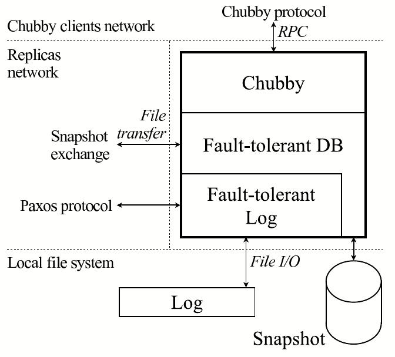
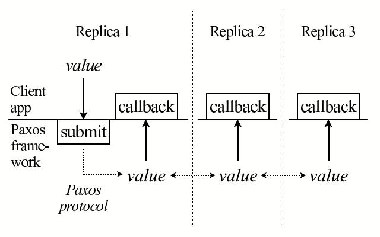
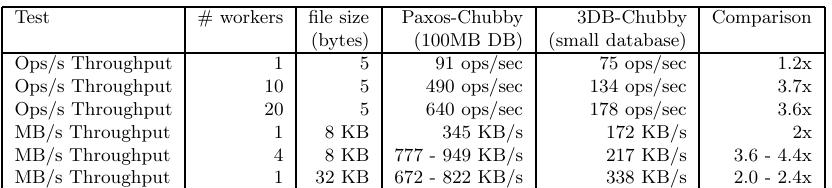

> 让 Paxos 真正运行起来：工程实践视角

**Tushar Chandra · Robert Griesemer · Joshua Redstone** 
**June 26, 2007**

> **Tushar Chandra · Robert Griesemer · Joshua Redstone** 
> **2007 年 6 月 26 日**

## Abstract

> 摘要

We describe our experience building a fault-tolerant data-base using the Paxos consensus algorithm. Despite the existing literature in the field, building such a database proved to be non-trivial. We describe selected algorithmic and engineering problems encountered, and the solutions we found for them. Our measurements indicate that we have built a competitive system.

> 我们介绍了运用 Paxos 共识算法构建容错数据库的实践经验。尽管这一领域已有大量文献，真正建成这样的数据库仍绝非易事。本文选取若干实际遇到的算法与工程问题，说明我们找到的解决方案。测量结果表明，我们构建的系统具备相当的竞争力。

## 1 Introduction

> 1 引言

It is well known that fault-tolerance on commodity hardware can be achieved through replication [17, 18]. A common approach is to use a consensus algorithm [7] to ensure that all replicas are mutually consistent [8, 14, 17]. By repeatedly applying such an algorithm on a sequence of input values, it is possible to build an identical log of values on each replica. If the values are operations on some data structure, application of the same log on all replicas may be used to arrive at mutually consistent data structures on all replicas. For instance, if the log contains a sequence of database operations, and if the same sequence of operations is applied to the (local) database on each replica, eventually all replicas will end up with the same database content (provided that they all started with the same initial database state).

> 众所周知，通过复制可在商用硬件上实现容错 [17, 18]。常见做法是使用共识算法 [7]，确保所有副本彼此一致 [8, 14, 17]。把这类算法反复应用于一系列输入值，便可在每个副本上构造内容相同的值日志。如果这些值是对某种数据结构的操作，那么在所有副本上应用同一日志，就能使各副本的数据结构彼此一致。例如，若日志包含一系列数据库操作，并且每个副本都对其（本地）数据库应用相同的操作序列，那么所有副本最终都会得到相同的数据库内容（前提是它们均从相同的初始数据库状态开始）。

This general approach can be used to implement a wide variety of fault-tolerant primitives, of which a fault-tolerant database is just an example. As a result, the consensus problem has been studied extensively over the past two decades. There are several well-known consensus algorithms that operate within a multitude of settings and which tolerate a variety of failures. The Paxos consensus algorithm [8] has been discussed in the theoretical [16] and applied community [10, 11, 12] for over a decade.

> 这种一般方法可以实现种类繁多的容错原语，容错数据库只是其中一例。因此，过去二十年间，共识问题一直受到广泛研究。人们已提出若干著名的共识算法，它们适用于多种环境，也能容忍不同类型的故障。十多年来，理论界 [16] 与应用界 [10, 11, 12] 都在持续讨论 Paxos 共识算法 [8]。

We used the Paxos algorithm (“Paxos”) as the base for a framework that implements a fault-tolerant log. We then relied on that framework to build a fault-tolerant database. Despite the existing literature on the subject, building a production system turned out to be a non-trivial task for a variety of reasons:

> 我们以 Paxos 算法（下文简称“Paxos”）为基础，实现了一套容错日志框架，随后又依托该框架构建容错数据库。尽管已有相关文献，事实证明，出于以下种种原因，构建生产系统绝非易事：

- While Paxos can be described with a page of pseudo-code, our complete implementation contains several thousand lines of C++ code. The blow-up is not due simply to the fact that we used C++ instead of pseudo notation, nor because our code style may have been verbose. Converting the algorithm into a practical, production-ready system involved implementing many features and optimizations – some published in the literature and some not.

  > Paxos 虽然一页伪代码即可描述，但我们的完整实现却有数千行 C++ 代码。这种规模膨胀不只是因为我们用 C++ 取代了伪代码，也不只是因为代码风格可能较为冗长。要把算法变成切实可用、达到生产就绪水平的系统，需要实现许多功能与优化——其中一部分见于文献，另一部分则未曾发表。

- The fault-tolerant algorithms community is accustomed to proving short algorithms (one page of pseudo code) correct. This approach does not scale to a system with thousands of lines of code. To gain confidence in the “correctness” of a real system, different methods had to be used.

  > 容错算法研究界习惯于证明短小算法（一页伪代码）的正确性，但这种方法无法扩展到拥有数千行代码的系统。要对现实系统的“正确性”建立信心，必须采用其他方法。

- Fault-tolerant algorithms tolerate a limited set of carefully selected faults. However, the real world exposes software to a wide variety of failure modes, including errors in the algorithm, bugs in its implementation, and operator error. We had to engineer the software and design operational procedures to robustly handle this wider set of failure modes.

  > 容错算法所容忍的是经过精心选择的一组有限故障。然而，现实世界会让软件遭遇五花八门的失效模式，包括算法本身的错误、实现中的缺陷以及操作人员失误。我们必须从工程上完善软件并设计运维流程，以稳健地应对范围更广的失效模式。

- A real system is rarely specified precisely. Even worse, the specification may change during the implementation phase. Consequently, an implementation should be malleable. Finally, a system might “fail” due to a misunderstanding that occurred during its specification phase.

  > 现实系统很少有精确无误的规格说明；更糟的是，规格还可能在实现阶段发生变化。因此，实现必须具有可塑性。最后，系统还可能因为规格制定阶段产生的误解而“失败”。

©ACM 2007. This is a minor revision of the work that will be published in the proceedings of ACM PODC 2007.

> ©ACM 2007。本文是将发表于 ACM PODC 2007 论文集之工作的一个小幅修订版本。

This paper discusses a selection of the algorithmic and engineering challenges we encountered in moving Paxos from theory to practice. This exercise took more R&D efforts than a straightforward translation of pseudo-code to C++ might suggest.

> 本文选取并讨论我们在推动 Paxos 从理论走向实践时遇到的一些算法与工程挑战。与人们从“把伪代码直接翻译成 C++”这一表面印象所作的估计相比，这项工作耗费了更多研发投入。

The rest of this paper is organized as follows. The next two sections expand on the motivation for this project and describe the general environment into which our system was built. We then provide a quick refresher on Paxos. We divide our experiences into three categories and discuss each in turn: algorithmic gaps in the literature, software engineering challenges, and unexpected failures. We conclude with measurements of our system, and some broader observations on the state of the art in our field.

> 本文其余部分安排如下。接下来的两节进一步阐述项目动机，并介绍系统所处的整体环境。随后，我们简要回顾 Paxos。我们把实践经验分成三类并逐一讨论：文献中的算法空白、软件工程挑战，以及意外故障。最后，我们给出系统测量结果，并就本领域的技术现状提出一些更宏观的观察。

## 2 Background

> 2 背景

Chubby [1] is a fault-tolerant system at Google that provides a distributed locking mechanism and stores small files. Typically there is one Chubby instance, or “cell”, per data center. Several Google systems – such as the Google Filesystem (GFS) [4] and Bigtable [2] – use Chubby for distributed coordination and to store a small amount of metadata.

> Chubby [1] 是 Google 的一套容错系统，提供分布式锁机制，并可存储小文件。通常每个数据中心部署一个 Chubby 实例，即一个“cell”。Google 文件系统（GFS）[4]、Bigtable [2] 等多个 Google 系统都使用 Chubby 进行分布式协调，并存储少量元数据。

Chubby achieves fault-tolerance through replication. A typical Chubby cell consists of five replicas, running the same code, each running on a dedicated machine. Every Chubby object (e.g., a Chubby lock, or file) is stored as an entry in a database. It is this database that is replicated. At any one time, one of these replicas is considered to be the “master”.

> Chubby 通过复制实现容错。一个典型的 Chubby cell 由五个运行相同代码的副本组成，每个副本独占一台机器。每个 Chubby 对象（例如 Chubby 锁或文件）都作为一条记录存储在数据库中；真正被复制的正是这个数据库。在任意时刻，其中一个副本被视为“主副本”（master）。

Chubby clients (such as GFS and Bigtable) contact a Chubby cell for service. The master replica serves all Chubby requests. If a Chubby client contacts a replica that is not the master, the replica replies with the master’s network address. The Chubby client may then contact the master. If the master fails, a new master is automatically elected, which will then continue to serve traffic based on the contents of its local copy of the replicated database. Thus, the replicated database ensures continuity of Chubby state across master failover.

> Chubby 客户端（如 GFS 与 Bigtable）通过联系 Chubby cell 获取服务。所有 Chubby 请求均由主副本处理。若 Chubby 客户端联系到非主副本，该副本会回复主副本的网络地址，客户端随后便可联系主副本。若主副本发生故障，系统会自动选出新的主副本；新主副本依据本地的复制数据库副本继续处理流量。因此，复制数据库保证了 Chubby 状态在主副本故障切换前后的连续性。

The first version of Chubby was based on a commercial, third-party, fault-tolerant database; we will refer to this database as “3DB” for the rest of this paper. This database had a history of bugs related to replication. In fact, as far as we know, the replication mechanism was not based on a proven replication algorithm and we do not know if it is correct. Given the history of problems associated with that product and the importance of Chubby, we eventually decided to replace 3DB with our own solution based on the Paxos algorithm.

> 第一版 Chubby 建立在某款商业第三方容错数据库之上，本文以下称其为“3DB”。该数据库过去曾反复出现与复制相关的缺陷。事实上，据我们所知，它的复制机制并非基于经过证明的复制算法，我们也不知道它是否正确。鉴于该产品以往的问题以及 Chubby 的重要性，我们最终决定用自己基于 Paxos 算法的方案替换 3DB。

## 3 Architecture outline

> 3 架构概览

Figure 1 illustrates the architecture of a single Chubby replica. A fault-tolerant replicated log based on the Paxos algorithm sits at the bottom of the protocol stack. Each replica maintains a local copy of the log. The Paxos algorithm is run repeatedly as required to ensure that all replicas have identical sequences of entries in their local logs. Replicas communicate with each other through a Paxos-specific protocol.

> 图 1 展示了单个 Chubby 副本的架构。协议栈最底层是一份基于 Paxos 算法的容错复制日志。每个副本都维护日志的本地副本。系统按需反复运行 Paxos 算法，确保所有副本的本地日志都拥有相同的记录序列。副本之间通过 Paxos 专用协议通信。

The next layer is a fault-tolerant replicated database which includes a local copy of the database at each replica. The database consists of a local snapshot and a replay-log of database operations. New database operations are submitted to the replicated log. When a database operation appears at a replica, it is applied on that replica’s local database copy.

> 上一层是容错复制数据库，每个副本都保存一份数据库本地副本。数据库由本地快照和数据库操作的重放日志构成。新的数据库操作会提交到复制日志；当某项数据库操作出现在某个副本上时，该操作就会应用到这个副本的本地数据库副本。

Finally, Chubby uses the fault-tolerant database to store its state. Chubby clients communicate with a single Chubby replica through a Chubby-specific protocol.

> 最上层，Chubby 使用容错数据库存储自身状态。Chubby 客户端通过 Chubby 专用协议与某一个 Chubby 副本通信。

**Figure 1: A single Chubby replica.**

> **图 1：单个 Chubby 副本。**

> **图表中文解读：** 图中以两条虚线划分三个区域：顶部是 Chubby 客户端网络，中部是副本网络，底部是本地文件系统。单个副本内部由 Chubby、容错数据库和容错日志逐层叠置；Chubby 通过 RPC 服务客户端，副本间用 Paxos 协议复制日志，并通过文件传输交换快照。日志与快照最终落在本地文件系统中。这一分层把“共识日志”“数据库状态”和“协调服务语义”清晰隔离开来。

We devoted effort to designing clean interfaces separating the Paxos framework, the database, and Chubby. We did this partly for clarity while developing this system, but also with the intention of reusing the replicated log layer in other applications. We anticipate future systems at Google that seek fault-tolerance through replication. We believe that a fault-tolerant log is a powerful primitive on which to build such systems.

> 我们投入精力设计清晰的接口，将 Paxos 框架、数据库与 Chubby 分隔开来。这样做一方面是为了在系统开发过程中保持清晰，另一方面也是希望在其他应用中复用复制日志层。我们预期 Google 未来还会构建通过复制实现容错的系统。我们相信，容错日志是构建此类系统的一种强大原语。

Our fault-tolerant log’s API is depicted in Figure 2. It contains a call to submit a new value to the log. Once a submitted value enters the fault-tolerant log, our system invokes a callback to the client application at each replica and passes the submitted value.

> 图 2 展示了容错日志的 API，其中包含一个把新值提交到日志的调用。一旦所提交的值进入容错日志，我们的系统便会在每个副本上调用客户端应用的回调，并传入该值。

Our system is multi-threaded and multiple values can be submitted concurrently on different threads. The replicated log does not create its own threads but can be invoked concurrently by any number of threads. This approach to threading helps in testing the system, as we will show in more detail later in the paper.

> 我们的系统是多线程的，不同线程可并发提交多个值。复制日志本身不创建线程，但可以由任意数量的线程并发调用。正如本文后面将进一步说明的，这种线程设计有利于系统测试。

**Figure 2: API for fault-tolerant log.**

> **图 2：容错日志的 API。**

> **图表中文解读：** 客户端应用在副本 1 上通过 `submit` 把一个值交给 Paxos 框架。Paxos 协议使该值在副本 1、2、3 之间达成共识；随后，每个副本都通过 `callback` 把同一个值向上交付给本地客户端应用。图中虚线横向箭头表示副本间协议传播，向上的实线箭头表示日志提交完成后的本地回调。

## 4 On Paxos

> 4 关于 Paxos

In this section we give an informal overview of the basic Paxos algorithm and outline how to chain together multiple executions of it (Multi-Paxos). We refer the reader to the literature for more formal descriptions and correctness proofs [8, 9, 16]. Readers who are familiar with Paxos may skip directly to the next section.

> 本节非形式化地概述基本 Paxos 算法，并说明如何把多次 Paxos 执行串联起来（Multi-Paxos）。更正式的描述与正确性证明请参阅文献 [8, 9, 16]。熟悉 Paxos 的读者可以直接跳到下一节。

### 4.1 Paxos Basics

> 4.1 Paxos 基础

Paxos is a consensus algorithm executed by a set of processes, termed replicas, to agree on a single value in the presence of failures. Replicas may crash and subseqently recover. The network may drop messages between replicas. Replicas have access to persistent storage that survives crashes. Some replicas may submit values for consensus. If eventually a majority of the replicas run for long enough without crashing and there are no failures, all running replicas are guaranteed to agree on one of the values that was submitted. In our system, the value to be agreed upon is the next entry in a (replicated) log as described in the introduction.

> Paxos 是一种共识算法，由一组称为副本的进程执行，目标是在存在故障时就单个值达成一致。副本可能崩溃，随后恢复；网络可能丢弃副本之间的消息。副本可以访问能够经受崩溃的持久存储。某些副本可以提交候选值以寻求共识。只要最终有多数副本在没有故障的情况下持续运行足够长时间，所有正在运行的副本就一定会对某个已提交值达成一致。在我们的系统中，如引言所述，需要达成一致的值是（复制）日志中的下一条记录。

The algorithm consists of three phases, which may be repeated (because of failures):

> 该算法包含三个阶段；由于故障，这些阶段可能重复执行：

1. Elect a replica to be the coordinator.

   > 选举一个副本担任协调者。

2. The coordinator selects a value and broadcasts it to all replicas in a message called the accept message. Other replicas either acknowledge this message or reject it.

   > 协调者选择一个值，并以称为 accept 消息的形式将其广播给所有副本。其他副本要么确认该消息，要么拒绝它。

3. Once a majority of the replicas acknowledge the coordinator, consensus has been reached, and the coordinator broadcasts a commit message to notify replicas.

   > 一旦多数副本向协调者发出确认，共识即告达成；协调者随后广播 commit 消息通知各副本。

To provide some intuition about how the algorithm works, consider first the case in which there is only a single coordinator and no failures. Consensus is reached once a majority of replicas receive the accept message from the coordinator and acknowledge it. Subsequently, if any minority of the replicas fail, we are still guaranteed that at least one replica will be alive that received the consensus value.

> 为直观理解算法如何工作，先考虑只有一个协调者且不存在故障的情形。多数副本收到并确认协调者的 accept 消息后，共识便告达成。此后，即便任意少数副本发生故障，也仍能保证至少有一个收到共识值的副本存活。

In reality the coordinator may fail. Paxos does not require that only one replica act as coordinator at a time. Multiple replicas may decide to become coordinators and execute the algorithm at any time. Typically the system is engineered to limit coordinator turnover, as it can delay reaching consensus.

> 在现实中，协调者可能发生故障。Paxos 并不要求任一时刻只能有一个副本充当协调者；多个副本可能随时决定成为协调者并执行算法。工程上通常会限制协调者更替，因为频繁更替可能延迟共识的达成。

This flexible election policy means there may be multiple replicas who simultaneously believe they are the coordinator. Further, these coordinators may select different values. Paxos ensures consensus can be reached on a single value (it can be from any coordinator) by introducing two extra mechanisms: 1) assigning an ordering to the successive coordinators; and 2) restricting each coordinator’s choice in selecting a value.

> 这种灵活的选举策略意味着，可能有多个副本同时认为自己是协调者，而且这些协调者还可能选择不同的值。Paxos 通过引入两项额外机制，确保最终能对单个值达成共识（这个值可以来自任一协调者）：1）为相继出现的协调者规定次序；2）限制每个协调者对值的选择。

Ordering the coordinators allows each replica to distinguish between the current coordinator and previous coordinators. In this way, replicas can reject messages from old coordinators and prevent them from disrupting consensus once it is reached. Paxos orders the coordinators by assigning them an increasing sequence number as follows. Each replica keeps track of the most recent sequence number it has seen so far. When a replica wants to become coordinator, it generates a unique[^1] sequence number higher than any it has seen, and broadcasts it to all replicas in a propose message. If a majority of replicas reply and indicate they have not seen a higher sequence number, then the replica acts as a coordinator. These replies are called promise messages since replicas promise henceforth to reject messages from old coordinators. This propose/promise message exchange constitutes step 1 listed above.

> 为协调者排序，使每个副本都能区分当前协调者与以往协调者。这样，副本便可拒绝旧协调者的消息，防止它们在共识达成后造成干扰。Paxos 按如下方式为协调者分配递增的序号，从而建立次序。每个副本都记录迄今见过的最新序号。一个副本想成为协调者时，会生成一个大于其所见任何序号的唯一[^1]序号，并通过 propose 消息把它广播给所有副本。如果多数副本回复并表明自己没有见过更大的序号，该副本便充当协调者。这些回复称为 promise 消息，因为副本承诺从此拒绝旧协调者的消息。上述 propose/promise 消息交换构成前面所列的第 1 步。

Once consensus is reached on a value, Paxos must force future coordinators to select that same value in order to ensure continued agreement. To guarantee this, the promise messages from replicas include the most recent value they have heard, if any, along with the sequence number of the coordinator from whom they heard it. The new coordinator chooses the value from the most recent coordinator. If none of the promise messages contain a value, the coordinator is free to choose a submitted value.

> 一旦某个值已达成共识，为保证一致性延续，Paxos 必须迫使未来的协调者仍选择同一个值。为此，副本发出的 promise 消息会携带它最近听到的值（如果有），以及发出该值的协调者序号。新协调者选择来自最新协调者的值。如果所有 promise 消息都不含值，协调者便可自由选择一个已提交值。

The reasoning why this works is subtle, but proceeds roughly as follows. The new coordinator requires a response to the propose message from a majority of replicas. Therefore, if consensus was achieved by a previous coordinator, the new coordinator is guaranteed to hear about the value decided upon from at least one replica. By induction, that value will have the highest sequence number of all responses received, and so will be selected by the new coordinator.

> 这套机制为何成立，其推理颇为微妙，大致如下：新协调者必须收到多数副本对 propose 消息的回复。因此，如果之前的协调者已经达成共识，新协调者必然会从至少一个副本得知已决定的值。由归纳可知，该值在收到的全部回复中对应最高的序号，因而会被新协调者选中。

[^1]:
    For example, in a system with $n$ replicas, assign each replica $r$ a unique id $i_r$ between $0$ and $n - 1$. Replica $r$ picks the smallest sequence number $s$ larger than any it has seen such that $s \bmod n = i_r$.

    > 例如，在一个包含 $n$ 个副本的系统中，为每个副本 $r$ 分配一个介于 $0$ 与 $n-1$ 之间的唯一标识 $i_r$。副本 $r$ 选择它所见过的序号中更大的、且满足 $s \bmod n = i_r$ 的最小序号 $s$。

### 4.2 Multi-Paxos

> 4.2 Multi-Paxos

Practical systems use Paxos as a building block to achieve consensus on a sequence of values, such as in a replicated log. The simple way to implement this is to repeatedly execute the Paxos algorithm. We term each execution an instance of Paxos. We refer to submitting a value to Paxos (or equivalently, to the log) to mean executing an instance of Paxos while submitting that value.

> 实际系统把 Paxos 当作构件，用来对一系列值达成共识，复制日志便是一例。最简单的实现方式是反复执行 Paxos 算法。我们把每次执行称为一个 Paxos 实例。所谓向 Paxos（等价地，向日志）提交一个值，是指在提交该值的同时执行一个 Paxos 实例。

In Multi-Paxos some slow (lagging) replicas might not have participated in recent Paxos instances. We use a catch-up mechanism to enable lagging replicas to catch up with leading replicas.

> 在 Multi-Paxos 中，一些较慢（落后）的副本可能没有参与最近的 Paxos 实例。我们使用追赶机制，让落后副本赶上领先副本。

Each replica maintains a locally persistent log to record all Paxos actions. When a replica crashes and subsequently recovers, it replays the persistent log to reconstruct its state prior to crashing. Replicas also use this log when helping lagging replicas to catch up. The Paxos algorithm as described thus far requires all message senders to log their state before sending messages – thus the algorithm requires a sequence of five writes (for each of the propose, promise, accept, acknowledgment, and commit messages) to disk on its critical path. Note that all writes have to be flushed to disk immediately before the system can proceed any further. In a system where replicas are in close network proximity, disk flush time can dominate the overall latency of the implementation.

> 每个副本都维护一份本地持久日志，记录所有 Paxos 动作。副本崩溃后恢复时，会重放持久日志，重建崩溃前的状态。副本帮助落后副本追赶时也会使用这份日志。按照目前描述的 Paxos 算法，所有消息发送者都必须先记录自身状态再发送消息；因此，算法的关键路径上需要连续执行五次磁盘写入，分别对应 propose、promise、accept、acknowledgment 和 commit 消息。请注意，系统每一步继续之前都必须立即把相应写入刷到磁盘。在副本网络距离很近的系统中，磁盘刷写时间可能主导整个实现的延迟。

There is a well-known optimization to reduce the number of messages involved by chaining together multiple Paxos instances [9]. Propose messages may be omitted if the coordinator identity does not change between instances. This does not interfere with the properties of Paxos because any replica at any time can still try to become coordinator by broadcasting a propose message with a higher sequence number. In order to avail itself of this optimization, a Multi-Paxos algorithm may be designed to pick a coordinator for long periods of time, trying not to let the coordinator change. We refer to this coordinator as the master. With this optimization, the Paxos algorithm only requires a single write to disk per Paxos instance on each replica, executed in parallel with each other. The master writes to disk immediately after sending its accept message and other replicas write to disk prior to sending their acknowledge message.

> 有一种著名优化：把多个 Paxos 实例串联起来，以减少所需消息数量 [9]。如果实例之间协调者身份不变，便可省略 propose 消息。这不会损害 Paxos 的性质，因为任一副本在任意时刻仍可广播序号更高的 propose 消息，尝试成为协调者。为利用这一优化，可把 Multi-Paxos 设计成长期选用同一个协调者，尽量避免协调者变化。我们把这个协调者称为主副本。采用这一优化后，每个 Paxos 实例在每个副本上只需写盘一次，而且各副本可以并行写入。主副本发送 accept 消息后立即写盘，其他副本则在发送 acknowledge 消息前写盘。

In order to get additional throughput in a concurrent system, it is possible to batch a collection of values submitted by different application threads into a single Paxos instance.

> 为进一步提高并发系统的吞吐量，可以把不同应用线程提交的一批值合并到同一个 Paxos 实例中。

## 5 Algorithmic challenges

> 5 算法挑战

While the core Paxos algorithm is well-described, implementing a fault-tolerant log based on it is a non-trivial endeavor. Some of the complications are due to imperfections found in the real world (such as hard disk failures, or finite resources), and some are due to additional requirements (for instance, “master leases”). Many of these challenges have algorithmic solutions that are intimately connected with the core Paxos algorithm. In the following we describe a number of mechanisms that we introduced.

> 尽管 Paxos 核心算法已有清楚描述，实现基于它的容错日志却绝非易事。部分复杂性源于现实世界的不完美（例如硬盘故障或资源有限），另一部分则源于额外需求（例如“主副本租约”）。其中许多挑战需要用与 Paxos 核心算法紧密相连的算法方案解决。下面介绍我们引入的若干机制。

### 5.1 Handling disk corruption

> 5.1 处理磁盘损坏

Replicas witness disk corruption from time to time. A disk may be corrupted due to a media failure or due to an operator error (an operator may accidentally erase critical data). When a replica’s disk is corrupted and it loses its persistent state, it may renege on promises it has made to other replicas in the past. This violates a key assumption in the Paxos algorithm. We use the following mechanism to address this problem [14].

> 副本偶尔会遇到磁盘损坏。介质故障或操作人员失误（例如误删关键数据）都可能损坏磁盘。当副本的磁盘受损、持久状态丢失时，它可能违背过去向其他副本作出的承诺，而这会破坏 Paxos 算法的一项关键假设。我们采用如下机制处理这一问题 [14]。

Disk corruptions manifest themselves in two ways. Either file(s) contents may change or file(s) may become inaccessible. To detect the former, we store the checksum of the contents of each file in the file[^2]. The latter may be indistinguishable from a new replica with an empty disk – we detect this case by having a new replica leave a marker in GFS after start-up. If this replica ever starts again with an empty disk, it will discover the GFS marker and indicate that it has a corrupted disk.

> 磁盘损坏有两种表现：文件内容发生改变，或者文件变得无法访问。为检测前一种情况，我们把每个文件内容的校验和存入该文件本身[^2]。后一种情况可能与新副本使用空磁盘启动无法区分——我们的检测方法是让新副本启动后在 GFS 中留下一个标记。如果该副本日后再次以空磁盘启动，它会发现 GFS 标记，进而判定自己的磁盘已损坏。

A replica with a corrupted disk rebuilds its state as follows. It participates in Paxos as a non-voting member; meaning that it uses the catch-up mechanism to catch up but does not respond with promise or acknowledgment messages. It remains in this state until it observes one complete instance of Paxos that was started after the replica started rebuilding its state. By waiting for the extra instance of Paxos, we ensure that this replica could not have reneged on an earlier promise.

> 磁盘损坏的副本按如下方式重建状态。它以无投票权成员的身份参与 Paxos：使用追赶机制赶上进度，但不回复 promise 或 acknowledgment 消息。它会保持这一状态，直到观察到一个完整的 Paxos 实例，而该实例是在它开始重建状态之后才启动的。通过额外等待这个 Paxos 实例，我们可以保证该副本不可能违背此前作出的承诺。

This mechanism enables the following optimization to improve the latency of the system. Since the system can now deal with occasional disk corruption, under some circumstances it may be acceptable not to flush writes to disk immediately[^3]. While we have considered schemes to exploit this observation, we have not implemented them yet.

> 这一机制还使下面这种降低系统延迟的优化成为可能。既然系统现在能够应对偶发磁盘损坏，那么在某些情况下，不立即把写入刷到磁盘也可能是可以接受的[^3]。我们曾考虑过利用这一观察的方案，但尚未实现。

[^2]:
    This mechanism will not detect files that roll back to an old state. We believe this is an unlikely scenario and chose not to handle it explicitly. Our distributed checksum mechanism, described later, may detect this type of problem.

    > 这一机制无法检测回滚到旧状态的文件。我们认为这种情形不太可能发生，因此选择不作显式处理。后文介绍的分布式校验和机制可能会检测出这类问题。

[^3]:
    For example, if the operating system and the hardware underlying each replica rarely fail and failures at different replicas are independent of each other, it is possible to modify our system so it does not need to flush writes to disk.

    > 例如，如果每个副本所依赖的操作系统和硬件都极少发生故障，而且不同副本的故障彼此独立，那么就可以修改系统，使其不必把写入刷到磁盘。

### 5.2 Master leases

> 5.2 主副本租约

When the basic Paxos algorithm is used to implement a replicated data structure, reads of the data structure require executing an instance of Paxos. This serializes the read with respect to updates and ensures that the current state is read. In particular, read operations cannot be served out of the master’s copy of the data structure because it is possible that other replicas have elected another master and modified the data structure without notifying the old master. In this case, the read operation at the master runs the risk of returning stale data. Since read operations usually comprise a large fraction of all operations, serializing reads through Paxos is expensive.

> 使用基本 Paxos 算法实现复制数据结构时，读取该数据结构也需要执行一个 Paxos 实例。这样会使读取与更新串行化，确保读到当前状态。尤其不能直接用主副本上的数据结构副本服务读操作，因为其他副本可能已经选出另一主副本，并在未通知旧主副本的情况下修改了数据结构。此时，旧主副本上的读操作可能返回陈旧数据。由于读操作通常占全部操作的很大比例，让读操作经由 Paxos 串行化的代价十分高昂。

The workaround is to implement master leases [5] with the following semantics: as long as the master has the lease, it is guaranteed that other replicas cannot successfully submit values to Paxos. Thus a master with the lease has up-to-date information in its local data structure which can be used to serve a read operation purely locally. By making the master attempt to renew its lease before it expires we can ensure that a master has a lease most of the time. With our system, masters successfully maintain leases for several days at a time.

> 解决办法是实现具有如下语义的主副本租约 [5]：只要主副本持有租约，就能保证其他副本无法成功向 Paxos 提交值。因此，持有租约的主副本在其本地数据结构中拥有最新信息，可以完全在本地处理读操作。让主副本在租约过期前尝试续约，便可确保它在绝大多数时间内都持有租约。在我们的系统中，主副本能够连续数天成功维持租约。

In our implementation, all replicas implicitly grant a lease to the master of the previous Paxos instance and refuse to process Paxos messages from any other replica while the lease is held. The master maintains a shorter timeout for the lease than the replicas – this protects the system against clock drift. The master periodically submits a dummy “heartbeat” value to Paxos to refresh its lease.

> 在我们的实现中，所有副本都会隐式地把租约授予上一个 Paxos 实例的主副本，并在租约有效期间拒绝处理其他任何副本发来的 Paxos 消息。主副本采用的租约超时时间比其他副本更短，以此保护系统免受时钟漂移影响。主副本会周期性地向 Paxos 提交一个虚拟“心跳”值，以刷新租约。

The Multi-Paxos optimization exhibits the following stability problem when there are intermittent network outages. When a master temporarily disconnects, Paxos will elect a new master. The new master will maintain a fixed sequence number across instances of Paxos. In the mean time, when the disconnected old master tries to run the Paxos algorithm, if it manages to connect with another replica, it may increase its sequence number. When it reconnects, it may have a higher sequence number than the new master and be able to replace the new master. Later it may disconnect again, and the cycle can repeat itself.

> 遇到间歇性网络中断时，Multi-Paxos 优化会暴露如下稳定性问题。主副本暂时断开连接后，Paxos 会选出新的主副本。新主副本会在多个 Paxos 实例间维持固定序号。与此同时，断开的旧主副本若试图运行 Paxos 算法，并设法连接到另一个副本，就可能提高自己的序号。重新连回系统时，它的序号可能高于新主副本，从而取代后者。之后它又可能再次断开，于是这一循环反复发生。

This behavior is undesirable as Chubby master changes have a negative impact on some of its users. Furthermore, this behavior can degenerate into rapid master changes in a network with poor connectivity.

> 这种行为并不可取，因为 Chubby 主副本变更会对部分用户造成负面影响。而且，在连通性较差的网络中，这种行为还可能恶化为主副本快速更替。

In our implementation the master periodically boosts its sequence number by running a full round of the Paxos algorithm, including sending propose messages[^4]. Boosting with the right frequency avoids this type of master churn in most cases.

> 在我们的实现中，主副本会周期性执行一轮完整的 Paxos 算法（包括发送 propose 消息），以提高自己的序号[^4]。采用适当的提高频率，在大多数情况下都能避免这类主副本抖动。

Note that it is possible to extend the concept of leases to all replicas. This will allow any replica with a lease to serve read requests from its local data structure. This extended lease mechanism is useful when read traffic significantly exceeds write traffic. We have examined algorithms for replica leases, but have not implemented them yet.

> 请注意，租约概念还可以扩展到所有副本。这样，任何持有租约的副本都可使用本地数据结构服务读请求。当读流量显著高于写流量时，这种扩展租约机制很有用。我们研究过副本租约算法，但尚未实现。

[^4]:
    In a loaded system, under one percent of the Paxos instances run the full Paxos algorithm.

    > 在有负载的系统中，运行完整 Paxos 算法的实例不足百分之一。

### 5.3 Epoch numbers

> 5.3 纪元编号

Requests (by a Chubby client) submitted to a Chubby cell are directed to the current Chubby master replica. From the time when the master replica receives the request to the moment the request causes an update of the underlying database, the replica may have lost its master status. It may even have lost master status and regained it again. Chubby requires an incoming request to be aborted if mastership is lost and/or re-acquired during the handling of the request. We needed a mechanism to reliably detect master turnover and abort operations if necessary.

> Chubby 客户端提交给 Chubby cell 的请求会被导向当前 Chubby 主副本。从主副本收到请求，到该请求实际更新底层数据库之间，这个副本可能已经失去主副本身份；它甚至可能先失去身份，而后又重新取得。Chubby 要求：如果请求处理期间主副本身份曾经丢失和/或重新获得，就必须中止该请求。为此，我们需要一种能够可靠检测主副本更替、并在必要时中止操作的机制。

We solved this problem by introducing a global epoch number with the following semantics. Two requests for the epoch number at the master replica receive the same value iff that replica was master continuously for the time interval between the two requests. The epoch number is stored as an entry in the database, and all database operations are made conditional on the value of the epoch number.

> 我们引入一个具有如下语义的全局纪元编号来解决这一问题：在主副本上两次读取纪元编号得到相同值，当且仅当该副本在两次请求之间的整个时间区间内始终担任主副本。纪元编号作为一条记录存储在数据库中，所有数据库操作都以纪元编号的取值为执行条件。

### 5.4 Group membership

> 5.4 组成员关系

Practical systems must be able to handle changes in the set of replicas. This is referred to as the group membership problem in the literature [3]. Some Paxos papers point out that the Paxos algorithm itself can be used to implement group membership [8]. While group membership with the core Paxos algorithm is straightforward, the exact details are non-trivial when we introduce Multi-Paxos, disk corruptions, etc. Unfortunately the literature does not spell this out, nor does it contain a proof of correctness for algorithms related to group membership changes using Paxos. We had to fill in these gaps to make group membership work in our system. The details – though relatively minor – are subtle and beyond the scope of this paper.

> 实际系统必须能够处理副本集合的变化，文献中称之为组成员关系问题 [3]。一些 Paxos 论文指出，Paxos 算法本身可以用来实现组成员关系 [8]。利用核心 Paxos 算法处理组成员关系固然直接，但引入 Multi-Paxos、磁盘损坏等因素后，具体细节便不再简单。遗憾的是，文献既未详述这些内容，也没有给出使用 Paxos 变更组成员关系之相关算法的正确性证明。为了让组成员关系机制在我们的系统中工作，我们不得不填补这些空白。相关细节虽相对琐碎，却颇为微妙，已经超出本文范围。

### 5.5 Snapshots

> 5.5 快照

As described thus far, the repeated application of a consensus algorithm to create a replicated log will lead to an ever growing log. This has two problems: it requires unbounded amounts of disk space; and perhaps worse, it may result in unbounded recovery time since a recovering replica has to replay a potentially long log before it has fully caught up with other replicas. Since the log is typically a sequence of operations to be applied to some data structure, and thus implicitly (through replay) represents a persistent form of that data structure, the problem is to find an alternative persistent representation for the data structure at hand. An obvious mechanism is to persist – or snapshot – the data structure directly, at which point the log of operations leading to the current state of the data structure is no longer needed. For example, if the data structure is held in memory, we take a snapshot by serializing it on disk. If the data structure is kept on disk, a snapshot may just be an on-disk copy of it.

> 按照此前的描述，反复应用共识算法来构造复制日志，会使日志不断增长。这会带来两个问题：一是需要无限增长的磁盘空间；更糟的是，恢复时间也可能无限增长，因为正在恢复的副本必须先重放一份可能很长的日志，才能完全赶上其他副本。日志通常是要应用于某种数据结构的操作序列，因而通过重放隐式表示了该数据结构的一种持久化形态；所以问题就在于，为手头的数据结构找到另一种持久表示。一个显而易见的机制是直接持久化数据结构——即为它制作快照；此时，导向数据结构当前状态的操作日志便不再需要。例如，若数据结构位于内存中，我们可把它序列化到磁盘来制作快照；若数据结构原本就在磁盘上，快照可能只是它的一份磁盘副本。

By itself, the Paxos framework does not know anything about the data structure we are trying to replicate; its only concern is the consistency of the replicated log. It is the particular application using the Paxos framework that has all the knowledge about the replicated data structure. Thus the application must be responsible for taking snapshots. Our framework provides a mechanism that allows client applications, e.g. our fault-tolerant database, to inform the framework that a snapshot was taken; the client application is free to take a snapshot at any point. When the Paxos framework is informed about a snapshot, it will truncate its log by deleting log entries that precede the snapshot. Should the replica fail, during subsequent recovery it will simply install the latest snapshot and then replay the truncated log to rebuild its state. Snapshots are not synchronized across replicas; each replica independently decides when to create a snapshot.

> Paxos 框架本身对我们试图复制的数据结构一无所知；它只关心复制日志的一致性。只有使用 Paxos 框架的具体应用才掌握复制数据结构的全部知识，因此快照必须由应用负责制作。我们的框架提供了一种机制，允许客户端应用（例如我们的容错数据库）通知框架快照已完成；客户端应用可以自行选择任何时点制作快照。Paxos 框架收到快照通知后，会删除快照之前的日志记录，从而截断日志。若副本发生故障，后续恢复时只需安装最新快照，再重放截断后的日志，即可重建状态。各副本之间的快照并不同步；每个副本独立决定何时创建快照。

This mechanism appears straightforward at first and is mentioned briefly in the literature [8]. However, it introduces a fair amount of complexity into the system: the persistent state of a replica now comprises a log and a snapshot that have to be maintained consistently. The log is fully under the framework’s control, while the snapshot format is application-specific. Some aspects of the snapshot machinery are of particular interest:

> 这一机制初看简单，文献 [8] 中也曾简要提及。然而，它会给系统引入相当多的复杂性：副本的持久状态现在同时包含日志与快照，二者必须保持一致。日志完全由框架控制，快照格式却取决于应用。快照机制的以下几个方面尤其值得关注：

- The snapshot and log need to be mutually consistent. Each snapshot needs to have information about its contents relative to the fault-tolerant log. In our framework we introduced the concept of a snapshot handle for this purpose. The snapshot handle contains all the Paxos-specific information related to a particular snapshot. When creating a snapshot (which is under control of the application) the corresponding snapshot handle (provided by the framework) needs to be stored by the application as well. When recovering a snapshot, the application must return the snapshot handle to the framework, which in turn will use the information in the handle to coordinate the snapshot with the log.

  > 快照与日志必须彼此一致。每份快照都需要携带信息，说明其内容在容错日志中对应的位置。为此，我们在框架中引入了“快照句柄”概念。快照句柄包含与特定快照有关的全部 Paxos 专用信息。创建快照（由应用控制）时，应用还必须一并存储框架提供的相应快照句柄。恢复快照时，应用必须把快照句柄交还框架，框架随后利用句柄中的信息协调快照与日志。

  Note that the handle is really a snapshot of the Paxos state itself. In our system, it contains the Paxos instance number corresponding to the (log) snapshot and the group membership at that point.

  > 请注意，这个句柄实际上就是 Paxos 状态本身的一份快照。在我们的系统中，它包含与（日志）快照对应的 Paxos 实例编号，以及当时的组成员关系。

- Taking a snapshot takes time and in some situations we cannot afford to freeze a replica’s log while it is taking a snapshot. In our framework, taking a snapshot is split into three phases. First, when the client application decides to take a snapshot, it requests a snapshot handle. Next, the client application takes its snapshot. It may block the system while taking the snapshot, or – more likely – spawn a thread that takes a snapshot while the replica continues to participate in Paxos. The snapshot must correspond to the client state at the log position when the handle was obtained. Thus if the replica continues to participate in Paxos while taking a snapshot, special precautions may have to be taken to snapshot the client’s data structure while it is actively updated.[^5] Finally, when the snapshot has been taken, the client application informs the framework about the snapshot and passes the corresponding snapshot handle. The framework then truncates the log appropriately.

  > 制作快照需要时间；在某些情况下，我们承受不起制作快照期间冻结副本日志的代价。在我们的框架中，制作快照分为三个阶段。首先，客户端应用决定制作快照时，会请求一个快照句柄。其次，客户端应用制作快照。它可以在此期间阻塞系统；但更常见的做法是创建一个线程来制作快照，同时让副本继续参与 Paxos。快照必须对应于取得句柄时那个日志位置上的客户端状态。因此，如果副本在制作快照期间仍继续参与 Paxos，就可能需要采取特殊防范措施，在客户端数据结构仍被主动更新时为其制作快照。[^5] 最后，快照制作完成后，客户端应用通知框架，并传入相应的快照句柄。框架随后适当地截断日志。

- Taking a snapshot may fail. Our framework only truncates the log when it is informed that a snapshot has been taken and has received the corresponding snapshot handle. Thus, as long as the client application does not inform the framework, from the framework’s viewpoint, no snapshot has been taken. This allows the client application to verify a snapshot’s integrity and discard it if necessary. If there is a problem with the snapshot, the client doesn’t ask the framework to truncate its log. A client application may even attempt to take several snapshots at the same time using this mechanism.

  > 制作快照可能失败。只有收到快照已完成的通知并取得相应快照句柄后，我们的框架才会截断日志。因此，只要客户端应用不通知框架，从框架的角度看就没有制作过快照。这使客户端应用能够验证快照的完整性，并在必要时将其丢弃。快照若有问题，客户端就不会要求框架截断日志。借助这一机制，客户端应用甚至可以同时尝试制作多份快照。

- While in catch-up, a replica will attempt to obtain missing log records. If it cannot obtain them (because no replica has old-enough log entries readily available), the replica will be told to obtain a snapshot from another replica. This snapshot’s handle contains information about the Paxos instance up to which the snapshot captured the state. Once the snapshot has been received and installed, under most circumstances the lagging replica will be close to the leading replica. In order to completely catch-up, the lagging replica asks for and receives the remaining log records from the leading replica to bring it fully up-to-date.

  > 处于追赶状态时，副本会尝试取得缺失的日志记录。如果无法取得（因为没有任何副本还保有足够旧且可立即提供的日志记录），系统就会要求该副本从另一个副本获取快照。快照句柄包含快照捕获状态所截止的 Paxos 实例信息。快照接收并安装完毕后，在大多数情况下，落后副本与领先副本之间已经相差无几。为了彻底追赶上去，落后副本会向领先副本请求并接收余下的日志记录，使自己完全更新到最新状态。

  Note that a leading replica may even create a new snapshot while a lagging replica is installing an older snapshot – in a fault-tolerant system this cannot be avoided. In this scenario, the lagging replica may not be able to obtain any outstanding log records because the snapshot provider (and any other replicas) may have moved ahead in the meantime. The lagging replica will need to obtain a more recent snapshot.

  > 请注意，落后副本安装较旧快照时，领先副本甚至可能已经创建了一份新快照——在容错系统中，这无可避免。在这种情况下，落后副本可能无法取得任何尚缺的日志记录，因为快照提供者（以及其他副本）可能已在此期间进一步推进。落后副本将需要获取更新的快照。

  Furthermore, the leading replica may fail after sending its snapshot. The catch-up mechanism must be able to recover from such problems by having the lagging replica contact another leading replica.

  > 此外，领先副本还可能在发送快照后发生故障。追赶机制必须让落后副本联系另一个领先副本，以便从此类问题中恢复。

- We needed a mechanism to locate recent snapshots. Some applications may choose to transfer snapshots directly between leading and lagging replicas while others may ask a lagging replica to look up a snapshot on GFS. We implemented a general mechanism that allows an application to pass snapshot location information between leading and lagging replicas.

  > 我们还需要一种定位近期快照的机制。有些应用可能选择在领先副本与落后副本之间直接传输快照，另一些应用则可能要求落后副本在 GFS 上查找快照。我们实现了一种通用机制，使应用能够在领先副本与落后副本之间传递快照位置信息。

[^5]:
    Our first implementation of the fault-tolerant database blocked the system very briefly while making an in-memory copy of the (small) database. It then stored the copied data on disk via a separate thread. Subsequently we implemented virtually pause-less snapshots. We now use a “shadow” data structure to track updates while the underlying database is serialized to disk.

    > 我们的第一版容错数据库实现会在内存中复制这个（较小的）数据库，并在复制期间让系统短暂阻塞，之后再由单独线程把副本写入磁盘。后来，我们实现了近乎无停顿的快照；如今会在底层数据库序列化到磁盘期间，使用“影子”数据结构跟踪更新。

### 5.6 Database transactions

> 5.6 数据库事务

The database requirements imposed by Chubby are simple: the database needs to store key-value pairs (with keys and values being arbitrary strings), and support common operations such as insert, delete, lookup, an atomic compare and swap (cas), and iteration over all entries. We implemented a log-structured design using a snapshot of the full database, and a log of database operations to be applied to that snapshot. The log of operations is the Paxos log. The implementation periodically takes a snapshot of the database state and truncates the log accordingly.

> Chubby 对数据库的要求很简单：数据库需要存储键值对（键和值均为任意字符串），并支持插入、删除、查找、原子比较并交换（cas），以及遍历全部记录等常见操作。我们实现了一种日志结构化设计，使用整个数据库的快照，以及要应用于该快照的数据库操作日志。这份操作日志就是 Paxos 日志。实现会周期性地为数据库状态制作快照，并据此截断日志。

The cas operation needed to be atomic with respect to other database operations (potentially issued by a different replica). This was easily achieved by submitting all cas-related data as a single “value” to Paxos. We realized that we could extend this mechanism to provide transaction-style support without having to implement true database transactions. We describe our solution in more detail because we believe it to be useful in other contexts.

> cas 操作相对于其他数据库操作（后者可能由不同副本发出）必须具有原子性。把所有与 cas 有关的数据作为单个“值”提交给 Paxos，就很容易实现这一点。我们意识到，可以扩展该机制来提供事务式支持，而无须实现真正的数据库事务。我们认为这一方案在其他场景也有用，因此下面对其作更详细的介绍。

Our implementation hinges around a powerful primitive which we call MultiOp. All other database operations except for iteration are implemented as a single call to MultiOp. A MultiOp is applied atomically and consists of three components:

> 我们的实现以一种称为 MultiOp 的强大原语为核心。除遍历之外，所有其他数据库操作都实现为一次 MultiOp 调用。MultiOp 以原子方式应用，由三个部分组成：

1. A list of tests called guard. Each test in guard checks a single entry in the database. It may check for the absence or presence of a value, or compare with a given value. Two different tests in the guard may apply to the same or different entries in the database. All tests in the guard are applied and MultiOp returns the results. If all tests are true, MultiOp executes t op (see item 2 below), otherwise it executes f op (see item 3 below).

   > 一份称为 `guard` 的测试列表。`guard` 中每项测试检查数据库中的一条记录，可以检查某个值是否存在，也可以与给定值比较。`guard` 中两项不同测试可以作用于数据库中的相同记录，也可以作用于不同记录。系统会执行 `guard` 中的全部测试，并由 MultiOp 返回结果。如果所有测试均为真，MultiOp 执行 `t op`（见下文第 2 项）；否则执行 `f op`（见下文第 3 项）。

2. A list of database operations called t op. Each operation in the list is either an insert, delete, or lookup operation, and applies to a single database entry. Two different operations in the list may apply to the same or different entries in the database. These operations are executed[^6] if guard evaluates to true.

   > 一份称为 `t op` 的数据库操作列表。列表中的每个操作都是插入、删除或查找之一，并作用于一条数据库记录。列表中两项不同操作可以作用于数据库中的相同记录，也可以作用于不同记录。如果 `guard` 求值为真，就执行[^6]这些操作。

3. A list of database operations called f op. Like t op, but executed if guard evaluates to false.

   > 一份称为 `f op` 的数据库操作列表。它与 `t op` 类似，但在 `guard` 求值为假时执行。

Late in our development (and after we had implemented the database and MultiOp), we realized that we also needed epoch numbers to implement database operations for Chubby. With this additional requirement, all Chubby operations became associated with an epoch number and were required to fail if the Paxos epoch number changed. MultiOp proved useful in accomodating this new requirement. After we incorporated the Paxos epoch as a database entry, we were able to modify all previous calls to our database to include an additional guard to check for the epoch number.

> 开发后期（数据库与 MultiOp 均已实现之后），我们才意识到，为 Chubby 实现数据库操作还需要纪元编号。加上这一要求后，所有 Chubby 操作都与一个纪元编号关联；如果 Paxos 纪元编号发生变化，操作就必须失败。事实证明，MultiOp 很适合容纳这一新要求。我们把 Paxos 纪元作为数据库记录纳入之后，就能修改先前所有数据库调用，为其增加一项检查纪元编号的 `guard`。

[^6]:
    Each MultiOp operation is serialized atomically with respect to other operations. The individual operations in the list are executed sequentially on the database.

    > 每次 MultiOp 操作都相对于其他操作以原子方式串行化；列表中的各项操作则在数据库上依次执行。

## 6 Software Engineering

> 6 软件工程

Fault-tolerant systems are expected to run continuously for long periods of time. Users are much less likely to tolerate bugs than in other systems. For instance, a layout bug exhibited by a document editor may be annoying to a user, but often it is possible to “work around” the issue, even though the bug is really at the core of what the software is supposed to do. A bug of similar gravity in a fault-tolerant system may make the system unusable.

> 人们期望容错系统能够长时间连续运行，因此用户对其中缺陷的容忍度远低于其他系统。例如，文档编辑器中的排版缺陷可能令人烦恼，但即使这一缺陷恰好位于软件本职功能的核心，用户往往仍有办法“绕过去”。同等严重程度的缺陷一旦出现在容错系统中，却可能让整个系统无法使用。

We adopted several software engineering methods to give us confidence in the robustness of our implementation. We describe some of the methods we used in this section.

> 为了对实现的稳健性建立信心，我们采用了若干软件工程方法。本节将介绍其中一部分。

### 6.1 Expressing the algorithm effectively

> 6.1 有效表达算法

Fault-tolerant algorithms are notoriously hard to express correctly, even as pseudo-code. This problem is worse when the code for such an algorithm is intermingled with all the other code that goes into building a complete system. It becomes harder to see the core algorithm, to reason about it, or to debug it when a bug is present. It also makes it difficult to change the core algorithm in response to a requirement change.

> 众所周知，容错算法即使写成伪代码也很难准确表达。如果算法代码与构建完整系统所需的其他代码混杂在一起，问题还会更加严重：核心算法变得难以辨识、难以推理，有缺陷时也难以调试；需求变化后，修改核心算法同样会变得困难。

We addressed this problem by coding the core algorithm as two explicit state machines. For that purpose, we designed a simple state machine specification language and built a compiler to translate such specifications into C++. The language was designed to be terse so that a full algorithm can be rendered on a single screen. As an additional benefit, the state machine compiler also automatically generates code to log state transitions and measure code coverage to assist in debugging and testing.

> 我们把核心算法编码为两个显式状态机，以解决这一问题。为此，我们设计了一种简单的状态机规约语言，并构建编译器，将这类规约转换为 C++。该语言刻意设计得十分精炼，使完整算法可以在一个屏幕内呈现。作为额外收益，状态机编译器还能自动生成记录状态转移和测量代码覆盖率的代码，以辅助调试与测试。

We believe that choosing a specification language makes it easier to reason about and modify our state machines than an explicitly coded implementation that is intermingled with the rest of the system. This is illustrated by the following experience. Towards the end of our development of the fault-tolerant log, we had to make a fundamental change in our group membership algorithm. Prior to this change, a replica roughly went through three states. Initially it waited to join the group, then it joined the group, and finally it left the group. Once a replica left the group, it was not allowed to rejoin the group. We felt this approach was best because an intermittently failing replica would not be able to join the group and disrupt it for long. Intermittent failure turned out to be more common than originally anticipated because normal replicas exhibit intermittent failures from time to time. Thus, we needed to change the algorithm to have two states. Either a replica was in the group or it was out. A replica could switch between these two states often during the lifetime of the system. It took us about one hour to make this change and three days to modify our tests accordingly. Had we intermingled our state machines with the rest of the system, this change would have been more difficult to make.

> 我们相信，与把显式编码的实现混入系统其余部分相比，选用一门规约语言能让状态机更易于推理和修改。以下经历便说明了这一点。容错日志开发接近尾声时，我们不得不对组成员关系算法作出根本性改变。改变之前，一个副本大致会经历三个状态：先等待加入组，然后进入组，最后离开组；一旦离组，就不允许重新加入。我们原以为这种方式最好，因为间歇性故障副本将无法加入组并长期干扰它。然而，事实证明间歇性故障比最初预想的更常见，因为正常副本也会不时出现间歇性故障。因此，我们需要把算法改成两个状态：副本要么在组内，要么在组外；在系统生命周期内，它可以频繁地在这两个状态间切换。完成这一改变大约花了一小时，而相应修改测试花了三天。如果状态机与系统其余部分混杂在一起，这项改动将困难得多。

### 6.2 Runtime consistency checking

> 6.2 运行时一致性检查

The chance for inconsistencies increases with the size of the code base, the duration of a project, and the number of people working simultaneously on the same code. We used various active self-checking mechanisms such as the liberal use of assert statements, and explicit verification code that tests data structures for consistency.

> 随着代码库规模增大、项目周期延长，以及同时修改同一份代码的人员增多，出现不一致的概率也会升高。我们采用了多种主动自检机制，例如广泛使用 assert 语句，以及编写显式验证代码来检查数据结构的一致性。

For example, we used the following database consistency check. The master periodically submits a checksum request to the database log. On receipt of this request, each replica computes a checksum of its local database[^7]. Since the Paxos log serializes all operations identically on all replicas, we expect all replicas to compute the same checksum. After the master completes a checksum computation, it sends its checksum to all replicas which compare the master’s checksum with their computed checksum.

> 例如，我们采用了如下数据库一致性检查。主副本周期性地向数据库日志提交校验和请求。每个副本收到请求后，计算其本地数据库的校验和[^7]。由于 Paxos 日志以完全相同的顺序在所有副本上串行化全部操作，我们预期所有副本都会算出相同的校验和。主副本完成计算后，把自己的校验和发送给所有副本；各副本再把它与自身算出的校验和进行比较。

We have had three database inconsistency incidents thus far:

> 到目前为止，我们遇到过三次数据库不一致事件：

- The first incident was due to an operator error.

  > 第一次事件源于操作人员失误。

- We have not found an explanation for the second incident. On replaying the faulty replica’s log we found that it was consistent with the other replicas. Thus it is possible that this problem was caused by a random hardware memory corruption.

  > 第二次事件至今没有找到解释。重放故障副本的日志后，我们发现它与其他副本一致。因此，问题可能由随机的硬件内存损坏引起。

- We suspect the third was due to an illegal memory access from errant code in the included codebase (which is of considerable size). To protect against this possibility in the future, we maintain a second database of checksums and double-check every database access against the database of checksums.

  > 我们怀疑第三次事件源于所包含代码库（规模相当可观）中的错误代码进行了非法内存访问。为防范日后再次出现这种可能，我们额外维护了一个校验和数据库，并根据该数据库对每次数据库访问进行复核。

In all three cases manual intervention appeared to resolve the problem before it became visible to Chubby.

> 在这三次事件中，人工干预似乎都赶在问题影响 Chubby 之前解决了它。

[^7]:
    We use a shadow datastructure to handle database operations concurrently with the checksum computation.

    > 我们使用影子数据结构，使数据库操作能够与校验和计算并发进行。

### 6.3 Testing

> 6.3 测试

Given the current state of the art, it is unrealistic to prove a real system such as ours correct. To achieve robustness, the best practical solution in addition to meticulous software engineering is to test a system thoroughly. Our system was designed to be testable from the onset and now contains an extensive suite of tests. In this section we describe two tests that take the system through a long sequence of random failures and verify that it behaves as expected. Both tests can run in one of two modes:

> 就目前的技术水平而言，要证明我们这样的现实系统正确并不切实际。为了实现稳健性，除一丝不苟的软件工程外，最佳现实方案就是彻底测试系统。我们的系统从一开始就以可测试性为设计目标，如今已拥有广泛的测试套件。本节介绍两种测试：它们让系统经历一长串随机故障，并验证系统行为是否符合预期。两种测试都可以运行在以下两种模式之一：

1. Safety mode. In this mode, the test verifies that the system is consistent. However, the system is not required to make any progress. For example, it is acceptable for an operation to fail to complete or to report that the system is unavailable.

   > 安全性模式。在该模式下，测试验证系统是否一致，但不要求系统取得任何进展。例如，某项操作未能完成，或报告系统不可用，都是可以接受的。

2. Liveness mode. In this mode, the test verifies that the system is consistent and is making progress. All operations are expected to complete and the system is required to be consistent.

   > 活性模式。在该模式下，测试验证系统既保持一致，又在不断取得进展。所有操作都应完成，并且系统必须保持一致。

Our tests start in safety mode and inject random failures into the system. After running for a predetermined period of time, we stop injecting failures and give the system time to fully recover. Then we switch the test to liveness mode. The purpose for the liveness test is to verify that the system does not deadlock after a sequence of failures.

> 测试从安全性模式开始，向系统注入随机故障。运行预定时间后，我们停止注入故障，并给系统留出充分恢复的时间，随后再把测试切换到活性模式。活性测试的目的，是验证系统经历一系列故障后不会发生死锁。

One of our tests verifies the fault-tolerant log. It simulates a distributed system consisting of a random number of replicas and takes our fault-tolerant log through a random sequence of network outages, message delays, timeouts, process crashes and recoveries, file corruptions, schedule interleavings, etc. We wanted this test to be repeatable to aid in debugging. To this end, we use a random number generator to determine the schedule of failures. The seed for the random number generator is given at the beginning of the test run. We ensure that two test runs with the same random number seed are identical by running the test in a single thread to remove unwanted non-determinism from multi-threading. This is possible because the fault-tolerant log does not create its own threads and can run in a single-threaded environment (even though it normally runs in a multi-threaded environment).

> 其中一项测试用于验证容错日志。它模拟一个由随机数量副本构成的分布式系统，让容错日志经历随机排列的网络中断、消息延迟、超时、进程崩溃与恢复、文件损坏、调度交错等事件。为了便于调试，我们希望测试可以重复。为此，故障调度由随机数生成器决定，测试运行开始时会给出其种子。我们让测试在单线程中运行，消除多线程带来的非预期非确定性，从而保证使用相同随机数种子的两次测试运行完全相同。之所以能够这样做，是因为容错日志并不创建自己的线程，可以在单线程环境中运行（尽管正常情况下它运行在多线程环境中）。

Each test execution reports success or failure. If a test fails, we rerun that test with the failing random number seed and with detailed logging turned on in a debugger to determine what went wrong. This is possible because these tests are repeatable.

> 每次测试执行都会报告成功或失败。测试失败后，我们会使用触发失败的随机数种子重新运行，并在调试器中开启详细日志，以判断出了什么问题。测试的可重复性使这一做法成为可能。

This test proved useful in finding various subtle protocol errors, including errors in our group membership implementation, and our modifications to deal with corrupted disks. In order to measure the strength of this test, we left some protocol bugs found during code and design reviews in the system, and verified that our test system detected these bugs. After a number of bug fixes, the test became very stable. In order to improve its bug yield, we started running this test on a farm of several hundred Google machines at a time. We found additional bugs, some of which took weeks of simulated execution time (at extremely high failure rates) to find.

> 事实证明，这项测试很适合发现各种微妙的协议错误，包括组成员关系实现中的错误，以及为处理磁盘损坏所作修改中的错误。为了衡量测试的能力，我们特意在系统中保留了一些代码评审和设计评审时发现的协议缺陷，并验证测试系统能够检出它们。修复若干缺陷后，测试变得非常稳定。为提高缺陷产出率，我们开始同时在由数百台 Google 机器组成的机群上运行这项测试。我们又发现了一些缺陷，其中一些即使在极高故障率下，也需要数周模拟执行时间才会显现。

Another test verifies robustness of the new Chubby system against lower-level system and hardware failures. We implemented several hooks in our fault-tolerant log to inject failures. The test randomly invokes these hooks and verifies that higher levels of the system can cope. Our hooks can be used to crash a replica, disconnect it from other replicas for a period of time or force a replica to pretend that it is no longer the master. This test found five subtle bugs in Chubby related to master failover in its first two weeks. In the same vein, we built a filesystem with hooks to programmatically inject failures and are using it to test our ability to deal with filesystem failures.

> 另一项测试用于验证新 Chubby 系统抵御底层系统与硬件故障的稳健性。我们在容错日志中实现了若干用于注入故障的钩子。测试随机调用这些钩子，并验证系统较高层能否妥善应对。钩子可以让某个副本崩溃、使其与其他副本断开一段时间，或迫使它假装自己已不再是主副本。这项测试运行头两周便发现了 Chubby 中五个与主副本故障切换有关的微妙缺陷。沿用同样思路，我们还构建了一个带有可编程故障注入钩子的文件系统，用它测试系统处理文件系统故障的能力。

In closing we point out a challenge that we faced in testing our system for which we have no systematic solution. By their very nature, fault-tolerant systems try to mask problems. Thus they can mask bugs or configuration problems while insidiously lowering their own fault-tolerance. For example, we have observed the following scenario. We once started a system with five replicas, but misspelled the name of one of the replicas in the initial group. The system appeared to run correctly as the four correctly configured replicas were able to make progress. Further, the fifth replica continunously ran in catch-up mode[^8] and therefore appeared to run correctly as well. However in this configuration the system only tolerates one faulty replica instead of the expected two. We now have processes in place to detect this particular type of problem. We have no way of knowing if there are other bugs/misconfigurations that are masked by fault-tolerance.

> 最后要指出，我们在系统测试中遇到一个至今没有系统化解决方案的挑战。容错系统天生就会努力掩盖问题，因此它们可能在掩盖缺陷或配置问题的同时，暗中降低自身的容错能力。例如，我们曾观察到如下情形：我们启动过一个包含五个副本的系统，但在初始组配置中拼错了其中一个副本的名称。四个配置正确的副本仍能取得进展，因此系统看起来运行正常；而第五个副本始终在追赶模式下运行[^8]，看起来同样正常。然而，在这种配置下，系统只能容忍一个副本故障，而不是预期的两个。如今我们已有流程检测这一特定问题，但我们无法知道是否还有其他缺陷或错误配置被容错机制掩盖起来。

[^8]:
    In our implementation, a replica that is not (yet) a group member runs in catch-up mode to stay up-to-date. This allows us to keep a future group member “warm” so it can become an active member immediately after joining the group.

    > 在我们的实现中，尚未成为组成员的副本会以追赶模式运行，以保持最新状态。这样，未来的组成员便能一直处于“热备”状态，在加入组后立即成为活跃成员。

### 6.4 Concurrency

> 6.4 并发

At the onset of the project we were concerned about the problem of testing concurrent fault-tolerant code. In particular, we wanted our tests to be repeatable. As described earlier, our fault-tolerant log doesn’t contain any of its own threads (even though it can handle concurrent requests on different threads). Threading is introduced at the edges of the code – where we receive calls from the networking layer. By making our tests repeatable, we were able to hunt down several obscure protocol errors during testing.

> 项目伊始，我们就担心如何测试并发容错代码，尤其希望测试能够重复。如前所述，容错日志本身不包含任何自有线程（尽管它可以处理不同线程上的并发请求）。线程机制只在代码边缘——接收网络层调用之处——引入。让测试具备可重复性，使我们能够在测试过程中追查出若干隐蔽的协议错误。

As the project progressed, we had to make several subsystems more concurrent than we had intended and sacrifice repeatability. Chubby is multi-threaded at its core, thus we cannot run repeatable tests against the complete system. Next we had to make our database multi-threaded so it could take snapshots, compute checksums and process iterators while concurrently serving database requests. Finally, we were forced to make the code that handles the local copy of the log multi-threaded as well (the exact reason why is beyond the scope of this paper).

> 随着项目推进，我们不得不让若干子系统比原计划具有更高的并发度，并牺牲可重复性。Chubby 的核心是多线程的，所以我们无法针对完整系统运行可重复测试。随后，我们又不得不把数据库改成多线程，使其可以一边服务数据库请求，一边制作快照、计算校验和、处理迭代器。最后，我们甚至被迫让处理日志本地副本的代码也变成多线程（确切原因超出本文范围）。

In summary, we believe that we set ourselves the right goals for repeatability of executions by constraining concurrency. Unfortunately, as the product needs grew we were unable to adhere to these goals.

> 总而言之，我们相信，通过约束并发来追求执行可重复性，是一开始为自己设定的正确目标。遗憾的是，随着产品需求增长，我们未能始终坚持这些目标。

## 7 Unexpected failures

> 7 意外故障

So far, our system has logged well over 100 machine years of execution in production. In this period we have witnessed the following unexpected failure scenarios:

> 到目前为止，我们的系统在生产环境中累计运行已远超 100 机器年。在此期间，我们目睹过以下意外故障情形：

- Our first release shipped with ten times the number of worker threads as the original Chubby system. We hoped this change would enable us to handle more requests. Unfortunately, under load, the worker threads ended up starving some other key threads and caused our system to time out frequently. This resulted in rapid master failover, followed by en-masse migrations of large numbers of clients to the new master which caused the new master to be overwhelmed, followed by additional master failovers, and so on.

  > 我们的第一个发布版本所配置的工作线程数量是原 Chubby 系统的十倍。我们希望这一改变能让系统处理更多请求。不幸的是，在负载下，工作线程最终使其他一些关键线程陷入饥饿，导致系统频繁超时。其结果是主副本迅速故障切换，继而大批客户端集体迁移到新主副本，使其不堪重负，随后再次发生主副本故障切换，如此循环。

  When this problem first appeared, the precise cause was unknown and we had to protect ourselves from a potentially dangerous bug in our system. We decided to err on the side of caution and to rollback our system to the old version of Chubby (based on 3DB) in one of our data centers. At that point, the rollback mechanism was not properly documented (because we never expected to use it), its use was non-intuitive, the operator performing the roll-back had no experience with it, and when the rollback was performed, no member of the development team was present. As a result, an old snapshot was accidentally used for the rollback. By the time we discovered the error, we had lost 15 hours of data and several key datasets had to be rebuilt.

  > 问题首次出现时，确切原因尚不清楚，我们必须防范系统中可能存在的危险缺陷。出于谨慎，我们决定把某个数据中心的系统回滚到旧版 Chubby（基于 3DB）。当时，回滚机制没有得到适当文档化（因为我们从未预期会用到它），使用方式也不直观；执行回滚的操作人员毫无相关经验，而且回滚时没有任何开发团队成员在场。结果，回滚误用了旧快照。待我们发现错误时，15 小时的数据已经丢失，若干关键数据集不得不重新构建。

- When we tried to upgrade this Chubby cell again a few months later, our upgrade script failed because we had omitted to delete files generated by the failed upgrade from the past. The cell ended up running with a months-old snapshot for a few minutes before we discovered the problem. This caused us to lose about 30 minutes of data. Fortunately all of Chubby’s clients recovered from this outage.

  > 几个月后，我们再次尝试升级这个 Chubby cell；由于先前失败的升级所生成的文件没有删除，升级脚本再度失败。在我们发现问题之前，该 cell 用数月前的旧快照运行了几分钟，导致约 30 分钟的数据丢失。所幸，Chubby 的所有客户端都从这次中断中恢复了过来。

- A few months after our initial release, we realized that the semantics provided by our database were different from what Chubby expected. If Chubby submitted an operation to the database, and the database lost its master status, Chubby expected the operation to fail. With our system, a replica could be re-installed as master during the database operation and the operation could succeed. The fix required a substantial rework of the integration layer between Chubby and our framework (we needed to implement epoch numbers). MultiOp proved to be helpful in solving this unexpected problem – an indication that MultiOp is a powerful primitive.

  > 初始版本发布几个月后，我们才意识到，数据库提供的语义与 Chubby 的预期不同。Chubby 向数据库提交操作后，如果数据库失去主副本身份，Chubby 期望该操作失败。但在我们的系统中，一个副本可能在数据库操作进行期间被重新确立为主副本，操作因而可能成功。修复这一问题需要大幅改造 Chubby 与框架之间的集成层（我们必须实现纪元编号）。事实证明，MultiOp 对解决这一意外问题很有帮助——这表明 MultiOp 是一种强大的原语。

- As mentioned before, on three occasions we discovered that one of the database replicas was different from the others in that Chubby cell. We found this problem because our system periodically takes checksums of all replicas and then compares them.

  > 如前所述，我们曾三次发现某个 Chubby cell 中有一个数据库副本与其他副本不同。之所以能发现，是因为系统会周期性地计算所有副本的校验和，并相互比较。

- Our upgrade script which is responsible for migrating cells from the 3DB version of Chubby to the Paxos version has failed several times for a variety of reasons. For example, it once failed because a basic Google program was not installed on one of our cells.

  > 负责把 cell 从 3DB 版 Chubby 迁移到 Paxos 版本的升级脚本，曾因各种原因多次失败。例如，有一次失败是因为某个 cell 没有安装一个基础 Google 程序。

- We have encountered failures due to bugs in the underlying operating system. For example in our version of the Linux 2.4 kernel, when we try to flush a small file to disk, the call can hang for a long time if there are a lot of buffered writes to other files. This happens immediately after we write a database snapshot to disk. In this case, we observed that it could take several seconds for the kernel to flush an unrelated small write to the Paxos log. Our workaround is to write all large files in small chunks, with a flush to disk after each small chunk. While this hurts the performance of the write slightly, it protects the more critical log writes from unexpected delays.

  > 我们还遇到过底层操作系统缺陷导致的故障。例如，在我们使用的 Linux 2.4 内核版本中，如果其他文件积压了大量缓冲写入，那么把一个小文件刷到磁盘的调用可能长时间挂起。这种情况会在我们刚把数据库快照写入磁盘后发生。我们观察到，此时内核把另一项不相关的小写入刷入 Paxos 日志，可能要花费数秒。我们的规避方法是把所有大文件分成小块写入，每写完一小块就刷盘一次。这会略微损害写入性能，却能保护更关键的日志写入不受意外延迟影响。

A small number of failures in 100 machine years would be considered excellent behavior for most production systems. However, we consider the current failure rate too high for Chubby and we have determined that we need to reduce it further.

> 对多数生产系统而言，100 机器年内只发生少数几次故障，已经堪称优异。然而，我们认为 Chubby 当前的故障率仍然过高，必须进一步降低。

Three of the failures occurred during upgrade (or rollback). Every time we encountered a problem during upgrade, we updated our upgrade script accordingly. Once a cell is upgraded, this type of failure will disappear.

> 其中三次故障发生在升级（或回滚）过程中。每次升级遇到问题，我们都会相应更新升级脚本。一个 cell 升级完成后，这类故障便不再出现。

Two of the failures were from bugs that have since been fixed. To reduce the probability of other bugs, we continue to improve and run the Chubby verification test outlined earlier.

> 另有两次故障来自后来已修复的缺陷。为了降低其他缺陷出现的概率，我们持续改进并运行前文所述的 Chubby 验证测试。

Two of our unexpected problems relate to operator error during rollout of a new release and caused us to lose data. At Google, the day-to-day monitoring and management of our systems is done by system operators. While they are very competent, they are usually not part of the development team that built the system, and therefore not familiar with its intricate details. This may lead to the occasional operator error in unforseen situations. We now rely on carefully written and well-tested scripts to automate rollout and minimize operator involvement. As a result our most recent major release of Chubby was rolled out across hundreds of machines without incident, while serving life traffic.

> 我们遇到的两个意外问题都与新版本上线期间的操作人员失误有关，并且都造成了数据丢失。在 Google，系统的日常监控与管理由系统操作人员负责。他们虽然能力很强，但通常不是构建系统的开发团队成员，因而不了解系统错综复杂的细节。这可能导致他们在未曾预料的情形下偶尔操作失误。如今，我们依靠精心编写、充分测试的脚本来自动执行上线流程，尽可能减少人工介入。因此，Chubby 最近一次主要版本发布在数百台机器上完成了无事故上线，其间还持续服务着实时流量。

One of the failures was due to memory corruption. Because our system is log-structured and maintains several days of log data and snapshots, it was possible to replay the database upto the exact point at which the problem appears. We were able to verify that our logs were correct and conclude that the memory corruption occurred from errant software or due to hardware problems. We added additional checksum data to detect this type of problem in the future and will crash a replica when it detects this problem.

> 其中一次故障源于内存损坏。我们的系统采用日志结构，并保留数日的日志数据与快照，因此可以把数据库精确重放到问题出现的时点。我们得以确认日志无误，并推断内存损坏来自错误软件或硬件问题。我们增加了额外校验和数据，以便日后检测这类问题；副本一旦检测到问题，便会主动崩溃。

## 8 Measurements

> 8 测量结果

The initial goal of our system was to replace 3DB with our own database. Thus our system had to demonstrate equal or superior performance relative to 3DB. We measured the performance of a complete Chubby system (clients, server, including network latency) using our fault-tolerant replicated database. We also benchmarked this system against an identical system based on 3DB (see Table 1). For our tests, we ran two copies of Chubby on the same set of 5 servers (typical Pentium®-class machines). One copy of Chubby used our database while the other copy used 3DB. We ran Chubby clients on workstations to generate load on the servers. For our tests, we measured total system throughput. Each call includes the Chubby client, the network, the Chubby server and our fault-tolerant database. While this test underestimates the performance of our database, it gives a sense of the full system throughput of a system based on Paxos.

> 我们系统最初的目标，是用自研数据库替换 3DB。因此，系统必须证明其性能不逊于乃至优于 3DB。我们测量了使用自研容错复制数据库的完整 Chubby 系统性能（包括客户端、服务器与网络延迟），还将其与结构相同但基于 3DB 的系统作了基准比较（见表 1）。测试中，我们在同一组五台服务器（典型的 Pentium® 级机器）上运行两套 Chubby：一套使用我们的数据库，另一套使用 3DB。我们在工作站上运行 Chubby 客户端，为服务器生成负载。测试测量的是系统总体吞吐量；每次调用都经过 Chubby 客户端、网络、Chubby 服务器和我们的容错数据库。这项测试虽然低估了数据库本身的性能，却能体现基于 Paxos 的完整系统大致可达到的吞吐量。

**Table 1: Comparing our system with 3DB (higher numbers are better).**

> **表 1：我们的系统与 3DB 的比较（数值越高越好）。**

| Test             | # workers | file size (bytes) | Paxos-Chubby (100MB DB) | 3DB-Chubby (small database) | Comparison |
| ---------------- | --------: | ----------------: | ----------------------: | --------------------------: | ---------: |
| Ops/s Throughput |         1 |                 5 |              91 ops/sec |                  75 ops/sec |       1.2x |
| Ops/s Throughput |        10 |                 5 |             490 ops/sec |                 134 ops/sec |       3.7x |
| Ops/s Throughput |        20 |                 5 |             640 ops/sec |                 178 ops/sec |       3.6x |
| MB/s Throughput  |         1 |              8 KB |                345 KB/s |                    172 KB/s |         2x |
| MB/s Throughput  |         4 |              8 KB |          777 - 949 KB/s |                    217 KB/s | 3.6 - 4.4x |
| MB/s Throughput  |         1 |             32 KB |          672 - 822 KB/s |                    338 KB/s | 2.0 - 2.4x |

> | 测试             | 工作线程数 | 文件大小（字节） | Paxos-Chubby（100MB 数据库） | 3DB-Chubby（小型数据库） |     对比倍数 |
> | ---------------- | ---------: | ---------------: | ---------------------------: | -----------------------: | -----------: |
> | 每秒操作数吞吐量 |          1 |                5 |                 91 次操作/秒 |             75 次操作/秒 |       1.2 倍 |
> | 每秒操作数吞吐量 |         10 |                5 |                490 次操作/秒 |            134 次操作/秒 |       3.7 倍 |
> | 每秒操作数吞吐量 |         20 |                5 |                640 次操作/秒 |            178 次操作/秒 |       3.6 倍 |
> | MB/s 吞吐量      |          1 |             8 KB |                     345 KB/s |                 172 KB/s |         2 倍 |
> | MB/s 吞吐量      |          4 |             8 KB |               777 - 949 KB/s |                 217 KB/s | 3.6 - 4.4 倍 |
> | MB/s 吞吐量      |          1 |            32 KB |               672 - 822 KB/s |                 338 KB/s | 2.0 - 2.4 倍 |

> **图表中文解读：** Paxos-Chubby 在全部六项测试中均胜过 3DB-Chubby。单工作线程、小文件场景主要反映延迟，优势为 1.2 倍；并发工作线程使 Paxos-Chubby 能通过批处理把优势扩大到约 3.6–3.7 倍。大文件吞吐测试中，Paxos-Chubby 的优势为 2.0–4.4 倍。后两项给出区间，是因为系统每当复制日志超过 100 MB 就制作快照，快照期间性能会暂时下降。

Even though read requests to Chubby dominate in practice, we designed our tests to be write intensive. This is because read requests are completely handled on the master, which typically has a lease, and do not exercise the Paxos algorithm.

> 虽然实际运行中 Chubby 以读请求为主，我们却把测试设计成写密集型。原因在于，读请求完全由通常持有租约的主副本处理，不会用到 Paxos 算法。

In our test, each worker repeatedly creates a file in Chubby and waits for Chubby to return before creating the file again. Thus each operation makes one write call to the underlying database. If the contents of the file are small and there is a single worker, the test measures the latency of the system. If the contents of the file are large, the test measures the throughput of the system in MB/s. By using multiple concurrent workers, we were also able to measure the throughput of the system in submissions/s.

> 测试中，每个工作线程都反复在 Chubby 中创建文件，每次都等待 Chubby 返回后再创建下一个文件。因此，每项操作都会对底层数据库执行一次写调用。文件内容较小且只有一个工作线程时，测试测量的是系统延迟；文件内容较大时，测试测量的是系统以 MB/s 计的吞吐量；使用多个并发工作线程，还可以测量系统以每秒提交数计的吞吐量。

All tests with more than one worker show the effect of batching a collection of submitted values. It should be possible to achieve some speedup with 3DB by bundling a collection of updates in a database transaction. The last two throughput tests show the effect of taking snapshots. This system was configured to take a snapshot whenever the replicated log size exceeded 100 MB. In these two tests, the system takes snapshots roughly every 100 seconds. When taking a snapshot, the system makes another copy of the database and writes it to disk. As a result, its performance temporarily drops off.

> 所有使用多个工作线程的测试都体现了批量处理一组提交值的效果。如果把一组更新合并进一个数据库事务，3DB 应该也能获得一定加速。最后两项吞吐量测试体现了制作快照的影响。系统被配置为每当复制日志超过 100 MB 就制作快照；在这两项测试中，系统大约每 100 秒制作一次快照。制作快照时，系统会另外复制一份数据库并写入磁盘，因而性能会暂时下降。

Our system is by no means optimized for performance, and we believe that there is a lot of room to make it faster. However, given the performance improvement over 3DB, further optimizations are not a priority at this time.

> 我们的系统远谈不上已经针对性能作了充分优化，我们相信仍有很大提速空间。不过，考虑到它相对于 3DB 已有显著的性能提升，进一步优化目前并非优先事项。

## 9 Summary and open problems

> 9 总结与开放问题

We have described our implementation of a fault-tolerant database, based on the Paxos consensus algorithm. Despite the large body of literature in the field, algorithms dating back more then 15 years, and experience of our team (one of us has designed a similar system before and the others have built other types of complex systems in the past), it was significantly harder to build this system then originally anticipated. We attribute this to several shortcomings in the field:

> 我们介绍了基于 Paxos 共识算法实现容错数据库的过程。尽管该领域已有大量文献，相关算法可追溯到十五年以前，而且团队经验丰富（我们当中一人曾设计过类似系统，其他人过去也构建过不同类型的复杂系统），真正构建这一系统仍比最初预想困难得多。我们认为原因在于本领域存在以下几项不足：

- There are significant gaps between the description of the Paxos algorithm and the needs of a real-world system. In order to build a real-world system, an expert needs to use numerous ideas scattered in the literature and make several relatively small protocol extensions. The cumulative effort will be substantial and the final system will be based on an unproven protocol.

  > Paxos 算法的描述与现实系统的需求之间存在显著鸿沟。为构建现实系统，专家必须运用散见于各类文献中的众多思想，并对协议作出若干相对较小的扩展。这些工作的累积投入相当可观，而最终系统仍会建立在未经证明的协议之上。

- The fault-tolerance computing community has not developed the tools to make it easy to implement their algorithms.

  > 容错计算研究界尚未开发出能让其算法易于实现的工具。

- The fault-tolerance computing community has not paid enough attention to testing, a key ingredient for building fault-tolerant systems.

  > 容错计算研究界没有对测试给予足够重视，而测试正是构建容错系统的关键要素。

As a result, the core algorithms work remains relatively theoretical and is not as accessible to a larger computing community as it could be. We believe that in order to make a greater impact, researchers in the field should focus on addressing these shortcomings.

> 因此，核心算法工作仍然较为理论化，未能像本可做到的那样，惠及更广泛的计算机领域从业者。我们认为，本领域研究人员若想产生更大影响，就应集中精力弥补这些不足。

In contrast, consider the field of compiler construction. Though concepts in that field are complex, they have been made accessible to a wide audience. Industrial-strength parsing tools such yacc [6] appeared not too long after the theory of parsing was well-understood. Not only are there now many front-end tools such as ANTLR [15] or CoCo/R [13]; but there are also tree-rewriting tools helping with optimizations and instruction selection, assemblers helping with binary code generation, and so forth. Thus, in this area of software engineering, an entire family of tools has emerged, making the construction of a compiler significantly easier or at least less error-prone. Disciplines within the field of compiler construction, such as parsing, which were once at the cutting edge of research, are now considered “solved” and are routinely taught at the undergraduate level in many schools.

> 与之对照，不妨看看编译器构造领域。尽管该领域的概念同样复杂，人们却已让广大受众能够掌握它们。解析理论得到充分理解后不久，yacc [6] 这类工业级解析工具便随之问世。如今不仅有 ANTLR [15]、CoCo/R [13] 等众多前端工具，还有辅助优化与指令选择的树重写工具、辅助生成二进制代码的汇编器，等等。于是，在软件工程的这一领域，完整的工具家族已经形成，使编译器构造显著简化，或至少更不容易出错。编译器构造中的解析等分支，曾经位于研究最前沿，如今却已被视为“解决了”的问题，并在许多学校作为本科课程常规讲授。

It appears that the fault-tolerant distributed computing community has not developed the tools and know-how to close the gaps between theory and practice with the same vigor as for instance the compiler community. Our experience suggests that these gaps are non-trivial and that they merit attention by the research community.

> 看来，容错分布式计算研究界尚未像编译器领域那样，以同等力度发展弥合理论与实践鸿沟所需的工具与专门知识。我们的经验表明，这些鸿沟绝非无足轻重，值得研究界认真关注。

## 10 Acknowledgments

> 10 致谢

Many people at Google helped us with this project. Mike Burrows who implemented Chubby suggested that we replace 3DB with a Paxos-based system. He and Sharon Perl reviewed our designs and provided excellent feedback. They introduced us to the mechanism for handling disk corruptions and suggested that we implement master leases. Michal Cierniak ported the original state machine compiler from Perl to C++ and made substantial modifications (it is now being used elsewhere at Google as well). Vadim Furman helped us write the Chubby verification test. Salim Virji and his team were responsible for the roll-out of our system across Google data centers.

> Google 的许多同事都曾帮助本项目。Chubby 的实现者 Mike Burrows 建议我们用基于 Paxos 的系统替换 3DB。他与 Sharon Perl 评审了我们的设计，并提出极有价值的反馈。他们向我们介绍了处理磁盘损坏的机制，还建议我们实现主副本租约。Michal Cierniak 把最初的状态机编译器从 Perl 移植到 C++，并作了大量修改（如今该编译器也用于 Google 的其他项目）。Vadim Furman 帮助我们编写 Chubby 验证测试。Salim Virji 及其团队负责在 Google 各数据中心上线我们的系统。

Mike Burrows, Bill Coughran, Gregory Eitzman, Peter Mckenzie, Sharon Perl, Rob Pike, David Presotto, Sean Quinlan, and Salim Virji reviewed earlier versions of this paper and provided valuable feedback.

> Mike Burrows、Bill Coughran、Gregory Eitzman、Peter Mckenzie、Sharon Perl、Rob Pike、David Presotto、Sean Quinlan 与 Salim Virji 评审了本文的早期版本，并提出了宝贵意见。

## References

> 参考文献

[1] Burrows, M. The Chubby lock service for loosely-coupled distributed systems. In Proceedings of the 7th USENIX Symposium on Operating Systems Design and Implementation, pp. 335-350

> [1] Burrows, M. 松耦合分布式系统的 Chubby 锁服务。载于第 7 届 USENIX 操作系统设计与实现研讨会论文集，第 335–350 页。

[2] Chang, F., Dean, J., Ghemawat, S., Hsieh, W. C., Wallach, D. A., Burrows, M., Chandra, T., Fikes, A., and Gruber, R. E. Bigtable: A distributed storage system for structured data. In Proceedings of the 7th USENIX Symposium on Operating Systems Design and Implementation, pp. 205-218

> [2] Chang, F.、Dean, J.、Ghemawat, S.、Hsieh, W. C.、Wallach, D. A.、Burrows, M.、Chandra, T.、Fikes, A. 与 Gruber, R. E. Bigtable：面向结构化数据的分布式存储系统。载于第 7 届 USENIX 操作系统设计与实现研讨会论文集，第 205–218 页。

[3] Cristian, F. Reaching agreement on processor-group membership in synchronous distributed systems. Distributed Computing 4, 4 (1991), 175–188.

> [3] Cristian, F. 在同步分布式系统中就处理器组成员关系达成一致。《Distributed Computing》4 卷 4 期（1991），第 175–188 页。

[4] Ghemawat, S., Gobioff, H., and Leung, S.-T. The Google file system. In Proceedings of the 19th ACM Symposium on Operating Systems Principles (Dec. 2003), pp. 29–43.

> [4] Ghemawat, S.、Gobioff, H. 与 Leung, S.-T. Google 文件系统。载于第 19 届 ACM 操作系统原理研讨会论文集（2003 年 12 月），第 29–43 页。

[5] Gray, C., Cheriton, D. Leases: An efficient fault-tolerant mechanism for distributed file cache consistency. In Proceedings of the 12th ACM Symposium on Operating Systems Principles (1989), pp. 202–210.

> [5] Gray, C.、Cheriton, D. 租约：一种用于分布式文件缓存一致性的高效容错机制。载于第 12 届 ACM 操作系统原理研讨会论文集（1989），第 202–210 页。

[6] Johnson, S. C. Yacc: Yet another compiler-compiler.

> [6] Johnson, S. C. Yacc：又一个编译器的编译器。

[7] Lamport, Shostak, and Pease. The byzantine generals problem. In Advances in Ultra-Dependable Distributed Systems, N. Suri, C. J. Walter, and M. M. Hugue (Eds.), IEEE Computer Society Press. 1995.

> [7] Lamport、Shostak 与 Pease. 拜占庭将军问题。载于《超高可靠分布式系统进展》，N. Suri、C. J. Walter 与 M. M. Hugue 编，IEEE Computer Society Press，1995。

[8] Lamport, L. The part-time parliament. ACM Transactions on Computer Systems 16, 2 (1998), 133–169.

> [8] Lamport, L. 兼职议会。《ACM Transactions on Computer Systems》16 卷 2 期（1998），第 133–169 页。

[9] Lamport, L. Paxos made simple. ACM SIGACT News 32, 4 (Dec. 2001), 18–25.

> [9] Lamport, L. Paxos 如此简单。《ACM SIGACT News》32 卷 4 期（2001 年 12 月），第 18–25 页。

[10] Lampson, B. W. How to build a highly available system using consensus. In 10th International Workshop on Distributed Algorithms (WDAG 96) (1996), Babaoglu and Marzullo, Eds., vol. 1151, Springer-Verlag, Berlin Germany, pp. 1–17.

> [10] Lampson, B. W. 如何使用共识构建高可用系统。载于第 10 届分布式算法国际研讨会（WDAG 96）（1996），Babaoglu 与 Marzullo 编，第 1151 卷，Springer-Verlag，德国柏林，第 1–17 页。

[11] Lee, E. K., and Thekkath, C. A. Petal: Distributed virtual disks. In Proceedings of the Seventh International Conference on Architectural Support for Programming Languages and Operating Systems (Cambridge, MA, 1996), pp. 84–92.

> [11] Lee, E. K. 与 Thekkath, C. A. Petal：分布式虚拟磁盘。载于第七届编程语言与操作系统体系结构支持国际会议论文集（马萨诸塞州剑桥，1996），第 84–92 页。

[12] MacCormick, J., Murphy, N., Najork, M., Thekkath, C. A., and Zhou, L. Boxwood: Abstractions as the foundation for storage infrastructure. In Proceedings of the 6th Symposium on Operating Systems Design and Implementation (2004), pp. 105–120.

> [12] MacCormick, J.、Murphy, N.、Najork, M.、Thekkath, C. A. 与 Zhou, L. Boxwood：以抽象作为存储基础设施的根基。载于第 6 届操作系统设计与实现研讨会论文集（2004），第 105–120 页。

[13] Moessenboeck, H. A generator for production quality compilers. In Proceedings of the 3rd International Workshop on Compiler Compilers - Lecture Notes in Computer Science 477 (Berlin, Heidelberg, New York, Tokyo, 1990), Springer-Verlag, pp. 42–55.

> [13] Moessenboeck, H. 生产级编译器生成器。载于第三届编译器编译器国际研讨会论文集——计算机科学讲义 477（柏林、海德堡、纽约、东京，1990），Springer-Verlag，第 42–55 页。

[14] Oki, Brian M., and Liskov, Barbara H. Viewstamped Replication: A New Primary Copy Method to Support Highly-Available Distributed Systems. In Proceedings of the 7th annual ACM Symposium on Principles of Distributed Computing (1988), pp. 8–17.

> [14] Oki, Brian M. 与 Liskov, Barbara H. 视图戳复制：一种支持高可用分布式系统的新型主副本方法。载于第 7 届 ACM 分布式计算原理年度研讨会论文集（1988），第 8–17 页。

[15] Parr, T. J., and QUONG, R. W. Antlr: A predicated-ll(k) parser generator. Software–Practice and Experience 25, 7 (JULY 1995), 789–810.

> [15] Parr, T. J. 与 QUONG, R. W. Antlr：带谓词的 LL(k) 解析器生成器。《Software–Practice and Experience》25 卷 7 期（1995 年 7 月），第 789–810 页。

[16] Prisco, R. D., Lampson, B. W., and Lynch, N. A. Revisiting the paxos algorithm. In 11th International Workshop on Distributed Algorithms (WDAG 96) (1997), pp. 111–125.

> [16] Prisco, R. D.、Lampson, B. W. 与 Lynch, N. A. 重访 Paxos 算法。载于第 11 届分布式算法国际研讨会（WDAG 96）（1997），第 111–125 页。

[17] Schneider, F. B. Implementing fault-tolerant services using the state machine approach: A tutorial. ACM Computing Surveys 22, 4 (1990), 299–319.

> [17] Schneider, F. B. 使用状态机方法实现容错服务：教程。《ACM Computing Surveys》22 卷 4 期（1990），第 299–319 页。

[18] von Neumann, J. Probabilistic logics and synthesis of reliable organisms from unreliable components. Automata Studies (1956), 43–98.

> [18] von Neumann, J. 概率逻辑与由不可靠部件合成可靠机体。《Automata Studies》（1956），第 43–98 页。
