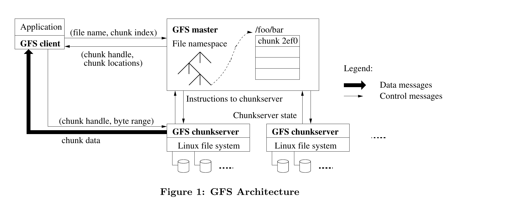
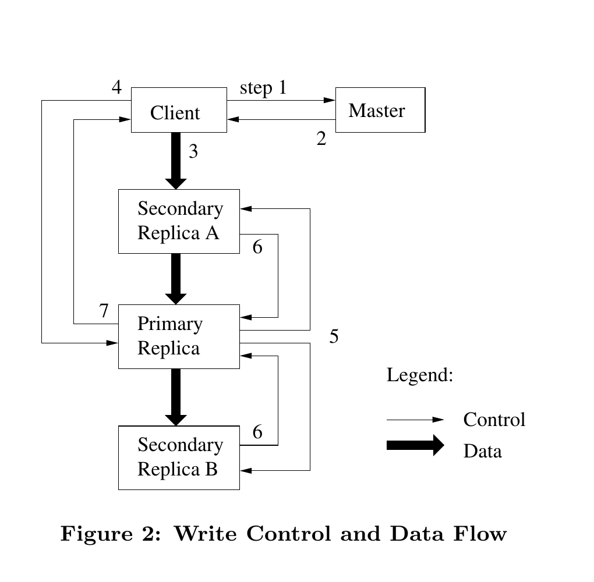
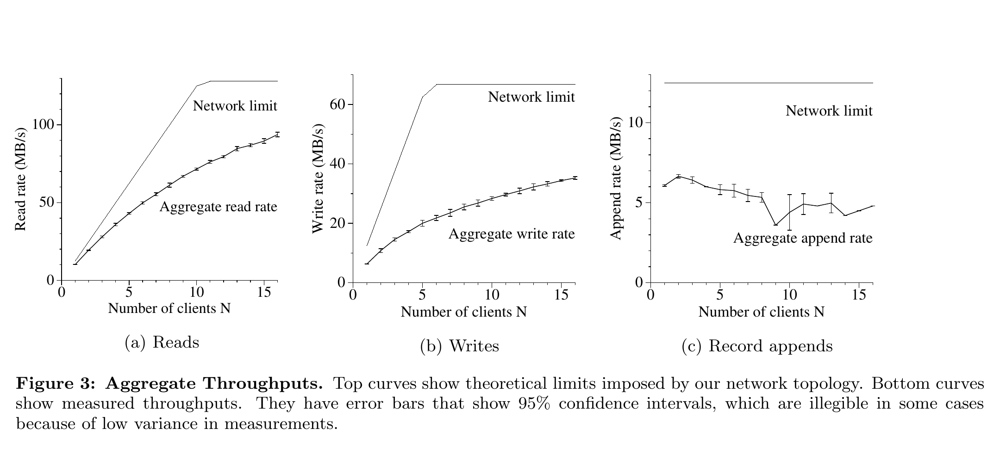

> Google 文件系统

Sanjay Ghemawat, Howard Gobioff, and Shun-Tak Leung 
Google∗

> Sanjay Ghemawat、Howard Gobioff 与 Shun-Tak Leung 
> Google∗

## ABSTRACT

> 摘要

We have designed and implemented the Google File System, a scalable distributed file system for large distributed data-intensive applications. It provides fault tolerance while running on inexpensive commodity hardware, and it delivers high aggregate performance to a large number of clients.

> 我们设计并实现了 Google 文件系统（Google File System，GFS），这是一种面向大规模分布式数据密集型应用、具有可扩展性的分布式文件系统。它运行在廉价的商用硬件上，既能容忍故障，又能为大量客户端提供很高的聚合性能。

While sharing many of the same goals as previous distributed file systems, our design has been driven by observations of our application workloads and technological environment, both current and anticipated, that reflect a marked departure from some earlier file system assumptions. This has led us to reexamine traditional choices and explore radically different design points.

> 尽管 GFS 与以往的分布式文件系统有许多共同目标，但我们的设计由对当前及未来应用工作负载和技术环境的观察所驱动；这些观察显著偏离了早期文件系统赖以成立的一些假设。因此，我们重新审视了传统选择，并探索了截然不同的设计取舍。

The file system has successfully met our storage needs. It is widely deployed within Google as the storage platform for the generation and processing of data used by our service as well as research and development efforts that require large data sets. The largest cluster to date provides hundreds of terabytes of storage across thousands of disks on over a thousand machines, and it is concurrently accessed by hundreds of clients.

> 该文件系统已成功满足我们的存储需求。它在 Google 内部得到广泛部署，既作为本公司服务所用数据的生成与处理平台，也支撑需要大规模数据集的研发工作。截至当时，最大的集群由一千多台机器上的数千块磁盘提供数百 TB 的存储，并由数百个客户端并发访问。

In this paper, we present file system interface extensions designed to support distributed applications, discuss many aspects of our design, and report measurements from both micro-benchmarks and real world use.

> 本文介绍为支持分布式应用而设计的文件系统接口扩展，讨论设计的诸多方面，并报告微基准测试和实际使用中的测量结果。

### Categories and Subject Descriptors

> 分类与主题描述词

D [4]: 3—Distributed file systems

> D [4]：3——分布式文件系统

### General Terms

> 通用术语

Design, reliability, performance, measurement

> 设计、可靠性、性能、测量

### Keywords

> 关键词

Fault tolerance, scalability, data storage, clustered storage

> 容错、可扩展性、数据存储、集群存储

∗ The authors can be reached at the following addresses: {sanjay,hgobioff,shuntak}@google.com.

> ∗ 可通过以下地址联系作者：{sanjay,hgobioff,shuntak}@google.com。

Permission to make digital or hard copies of all or part of this work for personal or classroom use is granted without fee provided that copies are not made or distributed for profit or commercial advantage and that copies bear this notice and the full citation on the first page. To copy otherwise, to republish, to post on servers or to redistribute to lists, requires prior specific permission and/or a fee.

> 允许免费制作本作品全部或部分内容的数字或纸质副本，供个人或课堂使用，但前提是不得为获利或商业利益而制作或分发这些副本，且副本首页须保留本声明及完整引文。以其他方式复制、再版、发布到服务器或分发到邮件列表，须事先取得明确许可并且／或者付费。

SOSP’03, October 19–22, 2003, Bolton Landing, New York, USA.

> SOSP’03，2003 年 10 月 19—22 日，美国纽约州博尔顿兰丁。

Copyright 2003 ACM 1-58113-757-5/03/0010 ...\$5.00.

> 版权所有 © 2003 ACM，1-58113-757-5/03/0010……5.00 美元。

## 1. INTRODUCTION

> 1. 引言

We have designed and implemented the Google File System (GFS) to meet the rapidly growing demands of Google’s data processing needs. GFS shares many of the same goals as previous distributed file systems such as performance, scalability, reliability, and availability. However, its design has been driven by key observations of our application workloads and technological environment, both current and anticipated, that reflect a marked departure from some earlier file system design assumptions. We have reexamined traditional choices and explored radically different points in the design space.

> 为满足 Google 快速增长的数据处理需求，我们设计并实现了 Google 文件系统（GFS）。GFS 与以往的分布式文件系统有许多共同目标，例如性能、可扩展性、可靠性和可用性。然而，其设计由我们对当前及未来应用工作负载和技术环境的若干关键观察所驱动；这些观察显著偏离了早期文件系统设计的一些假设。我们重新审视了传统选择，并探索了设计空间中截然不同的取舍点。

First, component failures are the norm rather than the exception. The file system consists of hundreds or even thousands of storage machines built from inexpensive commodity parts and is accessed by a comparable number of client machines. The quantity and quality of the components virtually guarantee that some are not functional at any given time and some will not recover from their current failures. We have seen problems caused by application bugs, operating system bugs, human errors, and the failures of disks, memory, connectors, networking, and power supplies. Therefore, constant monitoring, error detection, fault tolerance, and automatic recovery must be integral to the system.

> 第一，组件故障是常态，而非例外。文件系统由数百乃至数千台采用廉价商用部件构成的存储机器组成，并由数量相当的客户端机器访问。组件的数量与品质几乎注定了：任一时刻都会有部分组件无法工作，而且其中一些无法从当前故障中恢复。我们见过由应用程序缺陷、操作系统缺陷、人为错误，以及磁盘、内存、连接器、网络和电源故障引发的问题。因此，持续监控、错误检测、容错和自动恢复必须成为系统的内在组成部分。

Second, files are huge by traditional standards. Multi-GB files are common. Each file typically contains many application objects such as web documents. When we are regularly working with fast growing data sets of many TBs comprising billions of objects, it is unwieldy to manage billions of approximately KB-sized files even when the file system could support it. As a result, design assumptions and parameters such as I/O operation and block sizes have to be revisited.

> 第二，按传统标准衡量，文件极其庞大。数 GB 的文件十分常见。每个文件通常包含许多应用对象，例如网页文档。当日常处理由数十亿个对象组成且迅速增长到数 TB 的数据集时，即便文件系统能够支持，管理数十亿个约为 KB 量级的文件也会极其笨重。因此，I/O 操作大小、块大小等设计假设和参数必须重新审视。

Third, most files are mutated by appending new data rather than overwriting existing data. Random writes within a file are practically non-existent. Once written, the files are only read, and often only sequentially. A variety of data share these characteristics. Some may constitute large repositories that data analysis programs scan through. Some may be data streams continuously generated by running applications. Some may be archival data. Some may be intermediate results produced on one machine and processed on another, whether simultaneously or later in time. Given this access pattern on huge files, appending becomes the focus of performance optimization and atomicity guarantees, while caching data blocks in the client loses its appeal.

> 第三，大多数文件通过追加新数据来修改，而不是覆盖已有数据；文件内部几乎不存在随机写入。文件一经写成便只再读取，而且往往只是顺序读取。多种数据都具有这些特征：有些构成由数据分析程序扫描的大型资料库；有些是运行中应用持续生成的数据流；有些是归档数据；还有些是一台机器产生、由另一台机器同时或稍后处理的中间结果。面对超大文件上的这种访问模式，追加成为性能优化与原子性保证的重点，而在客户端缓存数据块则失去了吸引力。

Fourth, co-designing the applications and the file system API benefits the overall system by increasing our flexibility.

> 第四，协同设计应用程序与文件系统 API 能提高我们的灵活性，从而使整个系统受益。

For example, we have relaxed GFS’s consistency model to vastly simplify the file system without imposing an onerous burden on the applications. We have also introduced an atomic append operation so that multiple clients can append concurrently to a file without extra synchronization between them. These will be discussed in more details later in the paper.

> 例如，我们放宽了 GFS 的一致性模型，从而在不给应用程序施加沉重负担的前提下大幅简化文件系统。我们还引入了原子追加操作，使多个客户端可以并发向同一文件追加，而无须在彼此之间进行额外同步。本文稍后将更详细地讨论这些内容。

Multiple GFS clusters are currently deployed for different purposes. The largest ones have over 1000 storage nodes, over 300 TB of disk storage, and are heavily accessed by hundreds of clients on distinct machines on a continuous basis.

> 当时已有多个 GFS 集群部署于不同用途。最大的集群拥有 1000 多个存储节点和 300 TB 以上的磁盘存储，并持续承受来自数百台不同机器上的客户端的大量访问。

## 2. DESIGN OVERVIEW

> 2. 设计概览

### 2.1 Assumptions

> 2.1 假设

In designing a file system for our needs, we have been guided by assumptions that offer both challenges and opportunities. We alluded to some key observations earlier and now lay out our assumptions in more details.

> 在设计满足自身需求的文件系统时，我们以一组既带来挑战又创造机会的假设为指导。前文已提及若干关键观察，下面更详细地列出这些假设。

- The system is built from many inexpensive commodity components that often fail. It must constantly monitor itself and detect, tolerate, and recover promptly from component failures on a routine basis.

  > 系统由大量廉价且经常发生故障的商用组件构成。它必须持续自我监控，并把检测、容忍组件故障及从中迅速恢复作为日常工作。

- The system stores a modest number of large files. We expect a few million files, each typically 100 MB or larger in size. Multi-GB files are the common case and should be managed efficiently. Small files must be supported, but we need not optimize for them.

  > 系统存储数量适中但体积很大的文件。我们预计会有数百万个文件，每个通常为 100 MB 或更大。数 GB 的文件是常态，应得到高效管理。小文件必须得到支持，但无须针对它们优化。

- The workloads primarily consist of two kinds of reads: large streaming reads and small random reads. In large streaming reads, individual operations typically read hundreds of KBs, more commonly 1 MB or more. Successive operations from the same client often read through a contiguous region of a file. A small random read typically reads a few KBs at some arbitrary offset. Performance-conscious applications often batch and sort their small reads to advance steadily through the file rather than go back and forth.

  > 工作负载主要包含两类读取：大规模流式读取和小规模随机读取。在大规模流式读取中，单次操作通常读取数百 KB，更常见的是 1 MB 或更多；同一客户端的连续操作往往贯穿文件中的一段连续区域。一次小规模随机读取通常从任意偏移处读取数 KB。注重性能的应用常将小读取批量化并排序，使访问在文件中稳定向前推进，而不是来回跳转。

- The workloads also have many large, sequential writes that append data to files. Typical operation sizes are similar to those for reads. Once written, files are seldom modified again. Small writes at arbitrary positions in a file are supported but do not have to be efficient.

  > 工作负载中也有许多向文件追加数据的大规模顺序写入，典型操作大小与读取相近。文件写成后很少再被修改。系统支持在文件任意位置进行小写入，但无须使其高效。

- The system must efficiently implement well-defined semantics for multiple clients that concurrently append to the same file. Our files are often used as producer-consumer queues or for many-way merging. Hundreds of producers, running one per machine, will concurrently append to a file. Atomicity with minimal synchronization overhead is essential. The file may be read later, or a consumer may be reading through the file simultaneously.

  > 系统必须高效实现定义明确的语义，以支持多个客户端并发追加同一文件。我们的文件经常用作生产者—消费者队列或多路合并的载体。数百个生产者各自在一台机器上运行，并发向同一文件追加。以最低同步开销保证原子性至关重要。该文件可以稍后读取，也可以由消费者同时读取。

- High sustained bandwidth is more important than low latency. Most of our target applications place a premium on processing data in bulk at a high rate, while few have stringent response time requirements for an individual read or write.

  > 高持续带宽比低延迟更重要。我们的目标应用大多看重高速批量处理数据，只有少数应用对单次读写的响应时间有严格要求。

### 2.2 Interface

> 2.2 接口

GFS provides a familiar file system interface, though it does not implement a standard API such as POSIX. Files are organized hierarchically in directories and identified by pathnames. We support the usual operations to create, delete, open, close, read, and write files.

> GFS 提供人们熟悉的文件系统接口，但并不实现 POSIX 之类的标准 API。文件按目录分层组织，并由路径名标识。系统支持创建、删除、打开、关闭、读取和写入文件等常规操作。

Moreover, GFS has snapshot and record append operations. Snapshot creates a copy of a file or a directory tree at low cost. Record append allows multiple clients to append data to the same file concurrently while guaranteeing the atomicity of each individual client’s append. It is useful for implementing multi-way merge results and producer-consumer queues that many clients can simultaneously append to without additional locking. We have found these types of files to be invaluable in building large distributed applications. Snapshot and record append are discussed further in Sections 3.4 and 3.3 respectively.

> 此外，GFS 还提供快照和记录追加操作。快照能够以低成本创建文件或目录树的副本。记录追加允许多个客户端并发向同一文件追加数据，同时保证每个客户端单次追加的原子性。它适合实现多路合并结果和生产者—消费者队列，许多客户端无需额外加锁即可同时向其中追加。实践表明，这类文件对构建大型分布式应用极为宝贵。第 3.4 节和第 3.3 节将分别进一步讨论快照与记录追加。

### 2.3 Architecture

> 2.3 架构

A GFS cluster consists of a single master and multiple chunkservers and is accessed by multiple clients, as shown in Figure 1. Each of these is typically a commodity Linux machine running a user-level server process. It is easy to run both a chunkserver and a client on the same machine, as long as machine resources permit and the lower reliability caused by running possibly flaky application code is acceptable.

> 如图 1 所示，一个 GFS 集群由单个主控节点和多个块服务器组成，并由多个客户端访问。它们通常都是运行用户级服务器进程的商用 Linux 机器。只要机器资源允许，并且可以接受运行可能不稳定的应用代码所带来的可靠性下降，就很容易在同一台机器上同时运行块服务器与客户端。

Files are divided into fixed-size chunks. Each chunk is identified by an immutable and globally unique 64 bit chunk handle assigned by the master at the time of chunk creation. Chunkservers store chunks on local disks as Linux files and read or write chunk data specified by a chunk handle and byte range. For reliability, each chunk is replicated on multiple chunkservers. By default, we store three replicas, though users can designate different replication levels for different regions of the file namespace.

> 文件被划分为固定大小的块。每个块由主控节点在创建时分配一个不可变、全局唯一的 64 位块句柄来标识。块服务器把块作为 Linux 文件存放在本地磁盘上，并根据块句柄和字节范围读取或写入块数据。为保证可靠性，每个块会复制到多个块服务器；默认保存三个副本，但用户可以为文件命名空间的不同区域指定不同的复制级别。

The master maintains all file system metadata. This includes the namespace, access control information, the mapping from files to chunks, and the current locations of chunks. It also controls system-wide activities such as chunk lease management, garbage collection of orphaned chunks, and chunk migration between chunkservers. The master periodically communicates with each chunkserver in HeartBeat messages to give it instructions and collect its state.

> 主控节点维护文件系统的全部元数据，包括命名空间、访问控制信息、文件到块的映射，以及块的当前位置。它还控制块租约管理、孤儿块垃圾回收、块在服务器之间迁移等全系统活动。主控节点定期通过 HeartBeat 消息与每个块服务器通信，向其下达指令并收集其状态。

GFS client code linked into each application implements the file system API and communicates with the master and chunkservers to read or write data on behalf of the application. Clients interact with the master for metadata operations, but all data-bearing communication goes directly to the chunkservers. We do not provide the POSIX API and therefore need not hook into the Linux vnode layer.

> 链接进各应用程序的 GFS 客户端代码实现文件系统 API，并代表应用程序与主控节点和块服务器通信以读写数据。客户端为元数据操作与主控节点交互，但所有承载数据的通信都直接发往块服务器。由于不提供 POSIX API，我们无须接入 Linux 的 vnode 层。

Neither the client nor the chunkserver caches file data. Client caches offer little benefit because most applications stream through huge files or have working sets too large to be cached. Not having them simplifies the client and the overall system by eliminating cache coherence issues. (Clients do cache metadata, however.) Chunkservers need not cache file data because chunks are stored as local files and so Linux’s buffer cache already keeps frequently accessed data in memory.

> 客户端和块服务器都不缓存文件数据。客户端缓存收益甚微，因为多数应用要么以流式方式遍历超大文件，要么工作集大到无法缓存。不设置这种缓存消除了缓存一致性问题，从而简化客户端和整个系统。（不过，客户端确实会缓存元数据。）块服务器也无须缓存文件数据，因为块以本地文件形式存储，Linux 的缓冲区缓存已经会把频繁访问的数据保留在内存中。

**Figure 1: GFS Architecture**

> **图 1：GFS 架构。**

> **图表中文解读：** 应用通过 GFS 客户端访问文件。客户端先以“文件名＋块索引”向主控节点查询块句柄和副本位置，之后以“块句柄＋字节范围”直接同块服务器传输数据；主控节点不在数据通路上，只维护命名空间、调度块服务器并收集状态。粗箭头表示数据消息，细箭头表示控制消息。这种控制面与数据面的分离，是单主控节点仍能支撑高聚合吞吐的关键。

### 2.4 Single Master

> 2.4 单一主控节点

Having a single master vastly simplifies our design and enables the master to make sophisticated chunk placement and replication decisions using global knowledge. However, we must minimize its involvement in reads and writes so that it does not become a bottleneck. Clients never read and write file data through the master. Instead, a client asks the master which chunkservers it should contact. It caches this information for a limited time and interacts with the chunkservers directly for many subsequent operations.

> 采用单一主控节点大幅简化了设计，并使主控节点可以利用全局信息做出精细的块放置和复制决策。然而，我们必须尽量减少它对读写操作的参与，以免其成为瓶颈。客户端从不经由主控节点读写文件数据；相反，客户端向主控节点询问应联系哪些块服务器，将所得信息缓存一段有限时间，并在后续许多操作中直接同这些块服务器交互。

Let us explain the interactions for a simple read with reference to Figure 1. First, using the fixed chunk size, the client translates the file name and byte offset specified by the application into a chunk index within the file. Then, it sends the master a request containing the file name and chunk index. The master replies with the corresponding chunk handle and locations of the replicas. The client caches this information using the file name and chunk index as the key.

> 下面结合图 1 说明一次简单读取中的交互。首先，客户端利用固定块大小，把应用程序指定的文件名和字节偏移换算为文件内的块索引。随后，它向主控节点发送包含文件名和块索引的请求。主控节点返回相应的块句柄与各副本位置。客户端以文件名和块索引为键缓存这些信息。

The client then sends a request to one of the replicas, most likely the closest one. The request specifies the chunk handle and a byte range within that chunk. Further reads of the same chunk require no more client-master interaction until the cached information expires or the file is reopened. In fact, the client typically asks for multiple chunks in the same request and the master can also include the information for chunks immediately following those requested. This extra information sidesteps several future client-master interactions at practically no extra cost.

> 客户端随后向某个副本——通常是最近的副本——发送请求。请求指定块句柄以及块内的一个字节范围。在缓存信息过期或文件被重新打开之前，后续读取同一块都不再需要客户端与主控节点交互。事实上，客户端通常会在同一请求中查询多个块，主控节点也可以一并返回紧随所请求块之后的块信息。这些额外信息几乎不增加成本，却能省去未来数次客户端—主控节点交互。

### 2.5 Chunk Size

> 2.5 块大小

Chunk size is one of the key design parameters. We have chosen 64 MB, which is much larger than typical file system block sizes. Each chunk replica is stored as a plain Linux file on a chunkserver and is extended only as needed. Lazy space allocation avoids wasting space due to internal fragmentation, perhaps the greatest objection against such a large chunk size.

> 块大小是关键设计参数之一。我们选择了 64 MB，远大于典型文件系统的块大小。每个块副本在块服务器上存为普通 Linux 文件，并且仅在需要时扩展。延迟分配空间避免了因内部碎片而浪费容量；内部碎片或许正是反对如此大块尺寸的最主要理由。

A large chunk size offers several important advantages. First, it reduces clients’ need to interact with the master because reads and writes on the same chunk require only one initial request to the master for chunk location information. The reduction is especially significant for our workloads because applications mostly read and write large files sequentially. Even for small random reads, the client can comfortably cache all the chunk location information for a multi-TB working set. Second, since on a large chunk, a client is more likely to perform many operations on a given chunk, it can reduce network overhead by keeping a persistent TCP connection to the chunkserver over an extended period of time. Third, it reduces the size of the metadata stored on the master. This allows us to keep the metadata in memory, which in turn brings other advantages that we will discuss in Section 2.6.1.

> 大块尺寸带来若干重要优势。第一，它减少了客户端与主控节点交互的需求，因为对同一块的多次读写，只需最初向主控节点请求一次块位置信息。对我们的工作负载而言，这种减少尤其显著，因为应用大多顺序读写大文件。即使进行小规模随机读取，客户端也能轻松缓存一个数 TB 工作集的全部块位置信息。第二，在大块上，客户端更可能对同一块执行多次操作，因而可以长期保持同块服务器的持久 TCP 连接，降低网络开销。第三，它缩小了主控节点上存储的元数据规模，使我们能够把元数据保存在内存中，并由此获得第 2.6.1 节将讨论的其他好处。

On the other hand, a large chunk size, even with lazy space allocation, has its disadvantages. A small file consists of a small number of chunks, perhaps just one. The chunkservers storing those chunks may become hot spots if many clients are accessing the same file. In practice, hot spots have not been a major issue because our applications mostly read large multi-chunk files sequentially.

> 另一方面，即使采用延迟空间分配，大块尺寸也有缺点。一个小文件只包含少量块，甚至可能只有一个。如果许多客户端访问同一文件，保存这些块的块服务器可能成为热点。实践中，热点并非主要问题，因为我们的应用大多顺序读取包含许多块的大文件。

However, hot spots did develop when GFS was first used by a batch-queue system: an executable was written to GFS as a single-chunk file and then started on hundreds of machines at the same time. The few chunkservers storing this executable were overloaded by hundreds of simultaneous requests. We fixed this problem by storing such executables with a higher replication factor and by making the batch-queue system stagger application start times. A potential long-term solution is to allow clients to read data from other clients in such situations.

> 不过，GFS 最初用于某批处理队列系统时确实出现了热点：一个可执行文件作为单块文件写入 GFS，随后在数百台机器上同时启动。保存该可执行文件的少数几台块服务器被数百个并发请求压垮。我们通过提高此类可执行文件的复制因子，并让批处理队列系统错开应用启动时间，解决了这一问题。一个可能的长期方案，是在此类情形下允许客户端从其他客户端读取数据。

### 2.6 Metadata

> 2.6 元数据

The master stores three major types of metadata: the file and chunk namespaces, the mapping from files to chunks, and the locations of each chunk’s replicas. All metadata is kept in the master’s memory. The first two types (namespaces and file-to-chunk mapping) are also kept persistent by logging mutations to an operation log stored on the master’s local disk and replicated on remote machines. Using a log allows us to update the master state simply, reliably, and without risking inconsistencies in the event of a master crash. The master does not store chunk location information persistently. Instead, it asks each chunkserver about its chunks at master startup and whenever a chunkserver joins the cluster.

> 主控节点存储三大类元数据：文件和块命名空间、文件到块的映射，以及每个块的副本位置。所有元数据都保存在主控节点内存中。前两类（命名空间和文件到块的映射）还会持久化：其变更被记入主控节点本地磁盘上的操作日志，并复制到远程机器。使用日志使我们能够简单、可靠地更新主控节点状态，且不会在主控节点崩溃时冒不一致的风险。主控节点不持久保存块位置信息；它会在自身启动时，以及每当有块服务器加入集群时，向各块服务器询问其持有的块。

#### 2.6.1 In-Memory Data Structures

> 2.6.1 内存数据结构

Since metadata is stored in memory, master operations are fast. Furthermore, it is easy and efficient for the master to periodically scan through its entire state in the background. This periodic scanning is used to implement chunk garbage collection, re-replication in the presence of chunkserver failures, and chunk migration to balance load and disk space usage across chunkservers. Sections 4.3 and 4.4 will discuss these activities further.

> 元数据存于内存，因此主控节点操作很快。此外，主控节点可以轻松而高效地在后台定期扫描其全部状态。这种周期性扫描用于实现块垃圾回收、块服务器发生故障时的重新复制，以及为平衡各块服务器的负载和磁盘空间使用而进行的块迁移。第 4.3 节和第 4.4 节将进一步讨论这些活动。

One potential concern for this memory-only approach is that the number of chunks and hence the capacity of the whole system is limited by how much memory the master has. This is not a serious limitation in practice. The master maintains less than 64 bytes of metadata for each 64 MB chunk. Most chunks are full because most files contain many chunks, only the last of which may be partially filled. Similarly, the file namespace data typically requires less then 64 bytes per file because it stores file names compactly using prefix compression.

> 这种纯内存方案的一个潜在顾虑，是块的数量乃至整个系统的容量会受主控节点内存大小限制。实践中这并非严重限制。主控节点为每个 64 MB 的块维护不到 64 字节元数据。大多数块都是满的，因为多数文件包含许多块，通常只有最后一个块可能没有填满。同样，文件命名空间数据通常每个文件所需不到 64 字节，因为文件名以使用前缀压缩的紧凑形式存储。

If necessary to support even larger file systems, the cost of adding extra memory to the master is a small price to pay for the simplicity, reliability, performance, and flexibility we gain by storing the metadata in memory.

> 如有必要支持更大的文件系统，为主控节点增加内存的成本，相较于把元数据存入内存所换来的简洁性、可靠性、性能和灵活性，只是很小的代价。

#### 2.6.2 Chunk Locations

> 2.6.2 块位置

The master does not keep a persistent record of which chunkservers have a replica of a given chunk. It simply polls chunkservers for that information at startup. The master can keep itself up-to-date thereafter because it controls all chunk placement and monitors chunkserver status with regular HeartBeat messages.

> 主控节点不持久记录哪些块服务器持有某个给定块的副本；它只是在启动时向块服务器轮询这些信息。此后，由于它控制所有块的放置，并通过定期 HeartBeat 消息监控块服务器状态，因而能够使自身信息保持最新。

We initially attempted to keep chunk location information persistently at the master, but we decided that it was much simpler to request the data from chunkservers at startup, and periodically thereafter. This eliminated the problem of keeping the master and chunkservers in sync as chunkservers join and leave the cluster, change names, fail, restart, and so on. In a cluster with hundreds of servers, these events happen all too often.

> 起初我们曾尝试在主控节点持久保存块位置信息，后来发现，在启动时及之后定期向块服务器索取这些数据要简单得多。这样便消除了一个难题：当块服务器加入或离开集群、更名、故障、重启等情况发生时，如何保持主控节点与块服务器同步。在拥有数百台服务器的集群里，这些事件实在太常见了。

Another way to understand this design decision is to realize that a chunkserver has the final word over what chunks it does or does not have on its own disks. There is no point in trying to maintain a consistent view of this information on the master because errors on a chunkserver may cause chunks to vanish spontaneously (e.g., a disk may go bad and be disabled) or an operator may rename a chunkserver.

> 理解这一设计决策的另一种方式，是认识到某块服务器自己的磁盘上究竟有哪些块，最终应以该块服务器为准。试图让主控节点维护一份与之完全一致的视图没有意义，因为块服务器上的错误可能使块突然消失（例如磁盘损坏并被停用），操作员也可能为块服务器改名。

#### 2.6.3 Operation Log

> 2.6.3 操作日志

The operation log contains a historical record of critical metadata changes. It is central to GFS. Not only is it the only persistent record of metadata, but it also serves as a logical time line that defines the order of concurrent operations. Files and chunks, as well as their versions (see Section 4.5), are all uniquely and eternally identified by the logical times at which they were created.

> 操作日志保存关键元数据变更的历史记录，是 GFS 的核心。它不仅是元数据唯一的持久记录，还充当一条定义并发操作顺序的逻辑时间线。文件和块及其版本（见第 4.5 节）都由创建时的逻辑时间进行唯一且永久的标识。

Since the operation log is critical, we must store it reliably and not make changes visible to clients until metadata changes are made persistent. Otherwise, we effectively lose the whole file system or recent client operations even if the chunks themselves survive. Therefore, we replicate it on multiple remote machines and respond to a client operation only after flushing the corresponding log record to disk both locally and remotely. The master batches several log records together before flushing thereby reducing the impact of flushing and replication on overall system throughput.

> 操作日志至关重要，因此必须可靠存储，并且在元数据变更持久化之前不能让客户端看到这些变更。否则，即使块本身幸存，我们实际上也可能丢失整个文件系统或近期的客户端操作。因此，我们把日志复制到多台远程机器，只有当相应日志记录在本地和远程均刷写到磁盘后，才响应客户端操作。主控节点会先将若干日志记录批在一起再刷写，从而减轻刷盘与复制对系统总体吞吐的影响。

The master recovers its file system state by replaying the operation log. To minimize startup time, we must keep the log small. The master checkpoints its state whenever the log grows beyond a certain size so that it can recover by loading the latest checkpoint from local disk and replaying only the limited number of log records after that. The checkpoint is in a compact B-tree like form that can be directly mapped into memory and used for namespace lookup without extra parsing. This further speeds up recovery and improves availability.

> 主控节点通过重放操作日志恢复文件系统状态。为缩短启动时间，日志必须保持精简。每当日志增长到一定大小，主控节点就为其状态建立检查点；恢复时只需从本地磁盘加载最新检查点，再重放其后的少量日志记录。检查点采用紧凑的类 B 树形式，可以直接映射进内存并用于命名空间查找，无需额外解析。这进一步加快了恢复并提高可用性。

Because building a checkpoint can take a while, the master’s internal state is structured in such a way that a new checkpoint can be created without delaying incoming mutations. The master switches to a new log file and creates the new checkpoint in a separate thread. The new checkpoint includes all mutations before the switch. It can be created in a minute or so for a cluster with a few million files. When completed, it is written to disk both locally and remotely.

> 由于构建检查点可能耗时较长，主控节点内部状态采用了能在不延迟新到变更的情况下创建新检查点的结构。主控节点切换到新的日志文件，并在独立线程中创建新检查点。新检查点包含切换前的全部变更。对于拥有数百万文件的集群，创建过程大约需要一分钟；完成后，检查点会同时写入本地和远程磁盘。

Recovery needs only the latest complete checkpoint and subsequent log files. Older checkpoints and log files can be freely deleted, though we keep a few around to guard against catastrophes. A failure during checkpointing does not affect correctness because the recovery code detects and skips incomplete checkpoints.

> 恢复只需要最新的完整检查点及其后的日志文件。更早的检查点和日志文件可以随意删除，不过我们会保留少数几份以防灾难。检查点创建期间发生故障不会影响正确性，因为恢复代码会检测并跳过不完整的检查点。

<table>
  <thead>
    <tr><th></th><th>Write</th><th>Record Append</th></tr>
  </thead>
  <tbody>
    <tr><td>Serial success</td><td><em>defined</em></td><td rowspan="2"><em>defined</em> interspersed with <em>inconsistent</em></td></tr>
    <tr><td>Concurrent successes</td><td><em>consistent</em> but <em>undefined</em></td></tr>
    <tr><td>Failure</td><td colspan="2"><em>inconsistent</em></td></tr>
  </tbody>
</table>

> <table>
>   <thead>
>     <tr><th></th><th>写入</th><th>记录追加</th></tr>
>   </thead>
>   <tbody>
>     <tr><td>串行成功</td><td><em>已定义</em></td><td rowspan="2"><em>已定义</em> 其间夹杂 <em>不一致</em>区域</td></tr>
>     <tr><td>并发成功</td><td><em>一致</em> 但<em>未定义</em></td></tr>
>     <tr><td>失败</td><td colspan="2"><em>不一致</em></td></tr>
>   </tbody>
> </table>

**Table 1: File Region State After Mutation**

> **表 1：变更之后的文件区域状态。**

> **图表中文解读：** 表中区分了“写入”和“记录追加”在串行成功、并发成功及失败三种条件下的结果。普通写入只有在无并发干扰地成功时才“已定义”；并发成功虽能让所有副本一致，却未必对应任何一次写入的完整内容。记录追加成功时，每条记录都落在“已定义”区域，但重复记录或填充可能形成夹在其间的“不一致”区域。任何失败都可能留下不一致区域。

### 2.7 Consistency Model

> 2.7 一致性模型

GFS has a relaxed consistency model that supports our highly distributed applications well but remains relatively simple and efficient to implement. We now discuss GFS’s guarantees and what they mean to applications. We also highlight how GFS maintains these guarantees but leave the details to other parts of the paper.

> GFS 采用一种宽松的一致性模型，既能很好地支持高度分布式的应用，又保持实现相对简单高效。下面讨论 GFS 提供的保证及其对应用程序的含义，并概述 GFS 如何维持这些保证；具体细节留待本文其他部分展开。

#### 2.7.1 Guarantees by GFS

> 2.7.1 GFS 提供的保证

File namespace mutations (e.g., file creation) are atomic. They are handled exclusively by the master: namespace locking guarantees atomicity and correctness (Section 4.1); the master’s operation log defines a global total order of these operations (Section 2.6.3).

> 文件命名空间变更（例如创建文件）是原子的。它们完全由主控节点处理：命名空间锁保证原子性与正确性（第 4.1 节），主控节点的操作日志则定义这些操作的全局全序（第 2.6.3 节）。

The state of a file region after a data mutation depends on the type of mutation, whether it succeeds or fails, and whether there are concurrent mutations. Table 1 summarizes the result. A file region is consistent if all clients will always see the same data, regardless of which replicas they read from. A region is defined after a file data mutation if it is consistent and clients will see what the mutation writes in its entirety. When a mutation succeeds without interference from concurrent writers, the affected region is defined (and by implication consistent): all clients will always see what the mutation has written. Concurrent successful mutations leave the region undefined but consistent: all clients see the same data, but it may not reflect what any one mutation has written. Typically, it consists of mingled fragments from multiple mutations. A failed mutation makes the region inconsistent (hence also undefined): different clients may see different data at different times. We describe below how our applications can distinguish defined regions from undefined regions. The applications do not need to further distinguish between different kinds of undefined regions.

> 数据变更后某文件区域的状态，取决于变更类型、成败以及是否存在并发变更。表 1 概括了结果。如果所有客户端无论从哪个副本读取，都始终看到相同数据，则该文件区域是“一致的”。若某区域在一次文件数据变更后既保持一致，且客户端能完整看到该变更写入的内容，则该区域是“已定义的”。当一次变更成功且未受并发写入者干扰时，受影响区域是已定义的（因而也是一致的）：所有客户端始终能看到该变更写入的内容。多个并发变更都成功时，区域保持一致但未定义：所有客户端看到相同数据，但这些数据未必反映其中任何一次变更所写的内容；通常它由多次变更的片段交织而成。一次失败的变更会使区域不一致（因而也未定义）：不同客户端在不同时刻可能看到不同数据。下文将说明应用如何区分已定义区域和未定义区域；应用无需进一步辨别不同种类的未定义区域。

Data mutations may be writes or record appends. A write causes data to be written at an application-specified file offset. A record append causes data (the “record”) to be appended atomically at least once even in the presence of concurrent mutations, but at an offset of GFS’s choosing (Section 3.3). (In contrast, a “regular” append is merely a write at an offset that the client believes to be the current end of file.) The offset is returned to the client and marks the beginning of a defined region that contains the record. In addition, GFS may insert padding or record duplicates in between. They occupy regions considered to be inconsistent and are typically dwarfed by the amount of user data.

> 数据变更可以是写入或记录追加。写入会在应用指定的文件偏移处写入数据。记录追加即使面对并发变更，也会把数据（即“记录”）至少原子地追加一次，但偏移由 GFS 选择（第 3.3 节）。（相比之下，“常规”追加只是在客户端认为是当前文件末尾的偏移处执行写入。）GFS 将该偏移返回客户端；它标志着包含此记录的一个已定义区域的起点。此外，GFS 可能在记录之间插入填充或重复记录。它们占据的区域被视为不一致，不过其规模通常远小于用户数据量。

After a sequence of successful mutations, the mutated file region is guaranteed to be defined and contain the data written by the last mutation. GFS achieves this by (a) applying mutations to a chunk in the same order on all its replicas (Section 3.1), and (b) using chunk version numbers to detect any replica that has become stale because it has missed mutations while its chunkserver was down (Section 4.5). Stale replicas will never be involved in a mutation or given to clients asking the master for chunk locations. They are garbage collected at the earliest opportunity.

> 一系列成功变更完成后，发生变更的文件区域保证处于已定义状态，并包含最后一次变更写入的数据。GFS 通过以下方式做到这一点：（a）在一个块的所有副本上按相同顺序应用变更（第 3.1 节）；（b）利用块版本号检测因所在块服务器停机、错过变更而陈旧的副本（第 4.5 节）。陈旧副本绝不会参与变更，也不会返回给向主控节点查询块位置的客户端；它们会尽早被垃圾回收。

Since clients cache chunk locations, they may read from a stale replica before that information is refreshed. This window is limited by the cache entry’s timeout and the next open of the file, which purges from the cache all chunk information for that file. Moreover, as most of our files are append-only, a stale replica usually returns a premature end of chunk rather than outdated data. When a reader retries and contacts the master, it will immediately get current chunk locations.

> 由于客户端缓存块位置，在这些信息刷新之前，它们可能从陈旧副本读取。该时间窗口受缓存项超时限制；此外，下次打开文件时会从缓存中清除该文件的全部块信息。而且，我们的大多数文件都只做追加，因此陈旧副本通常会过早返回“块结束”，而不是返回过期数据。当读取者重试并联系主控节点时，会立刻得到当前的块位置。

Long after a successful mutation, component failures can of course still corrupt or destroy data. GFS identifies failed chunkservers by regular handshakes between master and all chunkservers and detects data corruption by checksumming (Section 5.2). Once a problem surfaces, the data is restored from valid replicas as soon as possible (Section 4.3). A chunk is lost irreversibly only if all its replicas are lost before GFS can react, typically within minutes. Even in this case, it becomes unavailable, not corrupted: applications receive clear errors rather than corrupt data.

> 当然，即使一次变更成功很久以后，组件故障仍可能破坏或摧毁数据。GFS 通过主控节点与所有块服务器之间的定期握手识别故障块服务器，并通过校验和检测数据损坏（第 5.2 节）。问题一经暴露，系统便尽快从有效副本恢复数据（第 4.3 节）。只有在 GFS 来得及响应之前——通常是几分钟内——某块的全部副本都丢失，该块才会不可逆地丢失。即使在这种情况下，它也只是不可用，而非悄然损坏：应用会收到明确错误，而不是损坏的数据。

#### 2.7.2 Implications for Applications

> 2.7.2 对应用程序的影响

GFS applications can accommodate the relaxed consistency model with a few simple techniques already needed for other purposes: relying on appends rather than overwrites, checkpointing, and writing self-validating, self-identifying records.

> GFS 应用可以借助几种原本就因其他目的而需要的简单技术，适应这种宽松的一致性模型：依靠追加而非覆盖、建立检查点，以及写入能够自我校验和自我标识的记录。

Practically all our applications mutate files by appending rather than overwriting. In one typical use, a writer generates a file from beginning to end. It atomically renames the file to a permanent name after writing all the data, or periodically checkpoints how much has been successfully written. Checkpoints may also include application-level checksums. Readers verify and process only the file region up to the last checkpoint, which is known to be in the defined state. Regardless of consistency and concurrency issues, this approach has served us well. Appending is far more efficient and more resilient to application failures than random writes. Checkpointing allows writers to restart incrementally and keeps readers from processing successfully written file data that is still incomplete from the application’s perspective.

> 我们几乎所有应用都通过追加而非覆盖来修改文件。一种典型用法是，写入者从头到尾生成一个文件；写完全部数据后，将文件原子地重命名为永久名称，或者定期建立检查点，记录已成功写入多少内容。检查点也可以包含应用级校验和。读取者只验证和处理截至最后一个检查点的文件区域，而该区域已知处于已定义状态。无论存在何种一致性与并发问题，这一方法都运行良好。追加比随机写入高效得多，也更能抵御应用故障。检查点使写入者能够增量重启，并防止读取者处理虽已成功写入、但从应用角度看仍不完整的文件数据。

In the other typical use, many writers concurrently append to a file for merged results or as a producer-consumer queue. Record append’s append-at-least-once semantics preserves each writer’s output. Readers deal with the occasional padding and duplicates as follows. Each record prepared by the writer contains extra information like checksums so that its validity can be verified. A reader can identify and discard extra padding and record fragments using the checksums. If it cannot tolerate the occasional duplicates (e.g., if they would trigger non-idempotent operations), it can filter them out using unique identifiers in the records, which are often needed anyway to name corresponding application entities such as web documents. These functionalities for record I/O (except duplicate removal) are in library code shared by our applications and applicable to other file interface implementations at Google. With that, the same sequence of records, plus rare duplicates, is always delivered to the record reader.

> 另一种典型用法，是许多写入者为了合并结果，或把文件当作生产者—消费者队列，而并发向同一文件追加。记录追加的“至少追加一次”语义会保留每个写入者的输出。读取者按如下方式处理偶尔出现的填充和重复：写入者准备的每条记录都包含校验和之类的附加信息，以便验证其有效性；读取者可以利用校验和识别并丢弃额外填充和记录片段。如果应用不能容忍偶发重复（例如重复会触发非幂等操作），便可利用记录中的唯一标识符将其滤除；而为了给网页文档等相应应用实体命名，这类标识符往往本来就需要。上述记录 I/O 功能（去重除外）位于我们各应用共享的库代码中，也适用于 Google 内部其他文件接口实现。借助这些功能，记录读取者始终会收到相同的记录序列，外加极少量重复记录。

## 3. SYSTEM INTERACTIONS

> 3. 系统交互

We designed the system to minimize the master’s involvement in all operations. With that background, we now describe how the client, master, and chunkservers interact to implement data mutations, atomic record append, and snapshot.

> 我们设计系统时，力求把主控节点对一切操作的参与降到最低。在此背景下，下面说明客户端、主控节点与块服务器如何交互，以实现数据变更、原子记录追加和快照。

### 3.1 Leases and Mutation Order

> 3.1 租约与变更顺序

A mutation is an operation that changes the contents or metadata of a chunk such as a write or an append operation. Each mutation is performed at all the chunk’s replicas. We use leases to maintain a consistent mutation order across replicas. The master grants a chunk lease to one of the replicas, which we call the primary. The primary picks a serial order for all mutations to the chunk. All replicas follow this order when applying mutations. Thus, the global mutation order is defined first by the lease grant order chosen by the master, and within a lease by the serial numbers assigned by the primary.

> 变更是改变块内容或元数据的操作，例如写入或追加。每次变更都会在该块的所有副本上执行。我们使用租约来维持各副本之间一致的变更顺序。主控节点把某个块的租约授予其中一个副本，我们称之为主副本。主副本为针对该块的全部变更选定串行顺序，所有副本都按此顺序应用变更。因此，全局变更顺序首先由主控节点选择的租约授予顺序定义；在每段租约期内，则由主副本分配的序号定义。

The lease mechanism is designed to minimize management overhead at the master. A lease has an initial timeout of 60 seconds. However, as long as the chunk is being mutated, the primary can request and typically receive extensions from the master indefinitely. These extension requests and grants are piggybacked on the HeartBeat messages regularly exchanged between the master and all chunkservers. The master may sometimes try to revoke a lease before it expires (e.g., when the master wants to disable mutations on a file that is being renamed). Even if the master loses communication with a primary, it can safely grant a new lease to another replica after the old lease expires.

> 租约机制旨在尽量降低主控节点的管理开销。租约初始超时时间为 60 秒。不过，只要该块仍在发生变更，主副本便可请求续期，而且通常能够从主控节点无限期续租。续期请求与授权搭载在主控节点和所有块服务器定期交换的 HeartBeat 消息上。有时，主控节点会尝试在租约到期前撤销它（例如主控节点想禁止正在重命名的文件继续发生变更时）。即使主控节点与某个主副本失去通信，也可以在旧租约到期后安全地把新租约授予另一个副本。

In Figure 2, we illustrate this process by following the control flow of a write through these numbered steps.

> 图 2 通过下列编号步骤追踪一次写入的控制流，以说明这一过程。

1. The client asks the master which chunkserver holds the current lease for the chunk and the locations of the other replicas. If no one has a lease, the master grants one to a replica it chooses (not shown).

   > 客户端询问主控节点：哪个块服务器持有该块的当前租约，以及其他副本位于何处。如果尚无副本持有租约，主控节点会把租约授予其选定的某个副本（图中未画出）。

2. The master replies with the identity of the primary and the locations of the other (secondary) replicas. The client caches this data for future mutations. It needs to contact the master again only when the primary becomes unreachable or replies that it no longer holds a lease.

   > 主控节点返回主副本的身份，以及其他（次副本）的位置。客户端缓存这些数据以供后续变更使用。只有主副本不可达，或回复称自己已不再持有租约时，客户端才需要再次联系主控节点。

3. The client pushes the data to all the replicas. A client can do so in any order. Each chunkserver will store the data in an internal LRU buffer cache until the data is used or aged out. By decoupling the data flow from the control flow, we can improve performance by scheduling the expensive data flow based on the network topology regardless of which chunkserver is the primary. Section 3.2 discusses this further.

   > 客户端把数据推送到全部副本，顺序可以任意。每个块服务器会将数据存入内部 LRU 缓冲区缓存，直至数据被使用或因老化而淘汰。通过将数据流与控制流解耦，我们可以不受哪个块服务器是主副本的限制，依据网络拓扑来调度昂贵的数据流，从而改善性能。第 3.2 节将进一步讨论这一点。

4. Once all the replicas have acknowledged receiving the data, the client sends a write request to the primary. The request identifies the data pushed earlier to all of the replicas. The primary assigns consecutive serial numbers to all the mutations it receives, possibly from multiple clients, which provides the necessary serialization. It applies the mutation to its own local state in serial number order.

   > 全部副本确认收到数据后，客户端向主副本发送写请求。该请求标识先前推送给所有副本的数据。主副本为收到的所有变更——它们可能来自多个客户端——分配连续序号，由此提供必要的串行化；随后按序号顺序把变更应用到自身本地状态。

5. The primary forwards the write request to all secondary replicas. Each secondary replica applies mutations in the same serial number order assigned by the primary.

   > 主副本把写请求转发给所有次副本。每个次副本都按主副本分配的相同序号顺序应用变更。

6. The secondaries all reply to the primary indicating that they have completed the operation.

   > 所有次副本回复主副本，表明操作已经完成。

7. The primary replies to the client. Any errors encountered at any of the replicas are reported to the client. In case of errors, the write may have succeeded at the primary and an arbitrary subset of the secondary replicas. (If it had failed at the primary, it would not have been assigned a serial number and forwarded.) The client request is considered to have failed, and the modified region is left in an inconsistent state. Our client code handles such errors by retrying the failed mutation. It will make a few attempts at steps (3) through (7) before falling back to a retry from the beginning of the write.

   > 主副本回复客户端。任一副本遇到的任何错误都会报告给客户端。发生错误时，写入可能已在主副本及任意一部分次副本上成功。（如果它在主副本上失败，就不会被分配序号并转发。）该客户端请求被视为失败，发生修改的区域则处于不一致状态。我们的客户端代码会通过重试失败变更来处理此类错误；它先多次尝试步骤（3）到（7），若仍不成功，再退回到从写入起点重新尝试。

**Figure 2: Write Control and Data Flow**

> **图 2：写入的控制流与数据流。**

> **图表中文解读：** 细箭头是控制流：客户端向主控节点取得租约持有者信息，再由主副本为写请求排序并转发给次副本；粗箭头是数据流：客户端把数据沿副本链依次推送。编号 1—7 与正文步骤一一对应。把数据传播与变更排序分开后，系统既能按网络拓扑高效传输数据，又能由主副本保证所有副本以同一顺序应用变更。

If a write by the application is large or straddles a chunk boundary, GFS client code breaks it down into multiple write operations. They all follow the control flow described above but may be interleaved with and overwritten by concurrent operations from other clients. Therefore, the shared file region may end up containing fragments from different clients, although the replicas will be identical because the individual operations are completed successfully in the same order on all replicas. This leaves the file region in consistent but undefined state as noted in Section 2.7.

> 如果应用的一次写入很大或跨越块边界，GFS 客户端代码会把它拆分成多次写操作。这些写操作都遵循上述控制流，却可能与其他客户端的并发操作交错，甚至被其覆盖。因此，共享文件区域最终可能包含来自不同客户端的片段；不过，由于各次操作在所有副本上均以相同顺序成功完成，各副本仍然完全一致。正如第 2.7 节所述，这会使文件区域处于一致但未定义的状态。

### 3.2 Data Flow

> 3.2 数据流

We decouple the flow of data from the flow of control to use the network efficiently. While control flows from the client to the primary and then to all secondaries, data is pushed linearly along a carefully picked chain of chunkservers in a pipelined fashion. Our goals are to fully utilize each machine’s network bandwidth, avoid network bottlenecks and high-latency links, and minimize the latency to push through all the data.

> 为高效利用网络，我们将数据流与控制流解耦。控制流从客户端到主副本，再到所有次副本；数据则以流水线方式，沿一条精心选择的块服务器链线性推送。我们的目标是充分利用每台机器的网络带宽，避开网络瓶颈和高延迟链路，并把推送全部数据的延迟降到最低。

To fully utilize each machine’s network bandwidth, the data is pushed linearly along a chain of chunkservers rather than distributed in some other topology (e.g., tree). Thus, each machine’s full outbound bandwidth is used to transfer the data as fast as possible rather than divided among multiple recipients.

> 为充分利用每台机器的网络带宽，数据沿块服务器链线性推送，而不是按其他拓扑（例如树）分发。这样，每台机器的全部出站带宽都用于尽快传输数据，而不会在多个接收者之间分摊。

To avoid network bottlenecks and high-latency links (e.g., inter-switch links are often both) as much as possible, each machine forwards the data to the “closest” machine in the network topology that has not received it. Suppose the client is pushing data to chunkservers S1 through S4. It sends the data to the closest chunkserver, say S1. S1 forwards it to the closest chunkserver S2 through S4 closest to S1, say S2. Similarly, S2 forwards it to S3 or S4, whichever is closer to S2, and so on. Our network topology is simple enough that “distances” can be accurately estimated from IP addresses.

> 为尽量避开网络瓶颈和高延迟链路（交换机间链路往往二者兼具），每台机器都会把数据转发给网络拓扑中尚未收到数据且与自己“最近”的机器。假设客户端要把数据推送给块服务器 S1 到 S4，它先把数据发送给最近的块服务器，例如 S1；S1 再从 S2 到 S4 中选出离自己最近的，例如 S2，向其转发。类似地，S2 再转发给 S3 或 S4 中离自己更近的一个，依此类推。我们的网络拓扑足够简单，可以根据 IP 地址准确估算这种“距离”。

Finally, we minimize latency by pipelining the data transfer over TCP connections. Once a chunkserver receives some data, it starts forwarding immediately. Pipelining is especially helpful to us because we use a switched network with full-duplex links. Sending the data immediately does not reduce the receive rate. Without network congestion, the ideal elapsed time for transferring B bytes to R replicas is B/T + RL where T is the network throughput and L is latency to transfer bytes between two machines. Our network links are typically 100 Mbps (T), and L is far below 1 ms. Therefore, 1 MB can ideally be distributed in about 80 ms.

> 最后，我们通过在 TCP 连接上以流水线方式传输数据来缩短延迟。块服务器一收到部分数据便立刻开始转发。由于我们采用具有全双工链路的交换式网络，流水线尤其有用：立即发送数据不会降低接收速率。在没有网络拥塞时，把 $B$ 字节传到 $R$ 个副本的理想耗时为 $B/T + RL$，其中 $T$ 是网络吞吐，$L$ 是两台机器之间传输字节的延迟。我们的网络链路通常为 100 Mbps（$T$），而 $L$ 远低于 1 ms。因此，理想情况下可在约 80 ms 内分发 1 MB 数据。

### 3.3 Atomic Record Appends

> 3.3 原子记录追加

GFS provides an atomic append operation called record append. In a traditional write, the client specifies the offset at which data is to be written. Concurrent writes to the same region are not serializable: the region may end up containing data fragments from multiple clients. In a record append, however, the client specifies only the data. GFS appends it to the file at least once atomically (i.e., as one continuous sequence of bytes) at an offset of GFS’s choosing and returns that offset to the client. This is similar to writing to a file opened in O_APPEND mode in Unix without the race conditions when multiple writers do so concurrently.

> GFS 提供一种称为“记录追加”的原子追加操作。在传统写入中，客户端指定数据写入的偏移。同一区域上的并发写入无法串行化：该区域最终可能包含多个客户端的数据片段。而在记录追加中，客户端只指定数据；GFS 在自己选择的偏移处，把数据至少原子地追加到文件一次（即作为一段连续字节序列），并将该偏移返回客户端。这类似于向 Unix 中以 `O_APPEND` 模式打开的文件写入，但没有多个写入者并发操作时的竞态条件。

Record append is heavily used by our distributed applications in which many clients on different machines append to the same file concurrently. Clients would need additional complicated and expensive synchronization, for example through a distributed lock manager, if they do so with traditional writes. In our workloads, such files often serve as multiple-producer/single-consumer queues or contain merged results from many different clients.

> 记录追加被我们的分布式应用大量使用；在这些应用中，许多位于不同机器上的客户端并发向同一文件追加。如果改用传统写入，客户端就需要额外、复杂且昂贵的同步，例如借助分布式锁管理器。在我们的工作负载中，此类文件往往充当多生产者／单消费者队列，或保存来自许多不同客户端的合并结果。

Record append is a kind of mutation and follows the control flow in Section 3.1 with only a little extra logic at the primary. The client pushes the data to all replicas of the last chunk of the file Then, it sends its request to the primary. The primary checks to see if appending the record to the current chunk would cause the chunk to exceed the maximum size (64 MB). If so, it pads the chunk to the maximum size, tells secondaries to do the same, and replies to the client indicating that the operation should be retried on the next chunk. (Record append is restricted to be at most one-fourth of the maximum chunk size to keep worst-case fragmentation at an acceptable level.) If the record fits within the maximum size, which is the common case, the primary appends the data to its replica, tells the secondaries to write the data at the exact offset where it has, and finally replies success to the client.

> 记录追加是一种变更，遵循第 3.1 节的控制流，只在主副本上增加少量逻辑。客户端先把数据推送给文件最后一个块的全部副本，然后向主副本发送请求。主副本检查把记录追加到当前块是否会使块超过最大尺寸（64 MB）。如果会，它便用填充把该块补到最大尺寸，要求各次副本也照做，并回复客户端应在下一个块上重试。（为把最坏情况下的碎片控制在可接受水平，记录追加的大小被限制为最多不超过最大块尺寸的四分之一。）如果记录不会超出最大尺寸——通常都是如此——主副本就把数据追加到自身副本，要求各次副本在与自己完全相同的偏移处写入数据，最后向客户端回复成功。

If a record append fails at any replica, the client retries the operation. As a result, replicas of the same chunk may contain different data possibly including duplicates of the same record in whole or in part. GFS does not guarantee that all replicas are bytewise identical. It only guarantees that the data is written at least once as an atomic unit. This property follows readily from the simple observation that for the operation to report success, the data must have been written at the same offset on all replicas of some chunk. Furthermore, after this, all replicas are at least as long as the end of record and therefore any future record will be assigned a higher offset or a different chunk even if a different replica later becomes the primary. In terms of our consistency guarantees, the regions in which successful record append operations have written their data are defined (hence consistent), whereas intervening regions are inconsistent (hence undefined). Our applications can deal with inconsistent regions as we discussed in Section 2.7.2.

> 如果记录追加在任一副本上失败，客户端就会重试。因此，同一个块的不同副本可能包含不同数据，其中或许有同一记录的完整或部分重复。GFS 不保证所有副本逐字节相同；它只保证数据至少作为一个原子单元写入一次。这一性质可以由一个简单事实直接推出：操作要报告成功，数据就必须已经在某个块的所有副本上写入相同偏移。此外，此后所有副本的长度至少都达到该记录末尾，所以即使后来由另一个副本成为主副本，任何后续记录也会被分配到更高偏移或另一个块。就一致性保证而言，成功记录追加写入数据的区域是已定义的（因而一致），而其间的区域则不一致（因而未定义）。应用可以像第 2.7.2 节所述那样处理不一致区域。

### 3.4 Snapshot

> 3.4 快照

The snapshot operation makes a copy of a file or a directory tree (the “source”) almost instantaneously, while minimizing any interruptions of ongoing mutations. Our users use it to quickly create branch copies of huge data sets (and often copies of those copies, recursively), or to checkpoint the current state before experimenting with changes that can later be committed or rolled back easily.

> 快照操作几乎可以瞬时复制一个文件或目录树（“源”），同时尽量不打断正在进行的变更。用户借此迅速创建超大数据集的分支副本（而且常常递归地再复制这些副本），或者在试验某些变更之前为当前状态建立检查点，以便日后轻松提交或回滚。

Like AFS [5], we use standard copy-on-write techniques to implement snapshots. When the master receives a snapshot request, it first revokes any outstanding leases on the chunks in the files it is about to snapshot. This ensures that any subsequent writes to these chunks will require an interaction with the master to find the lease holder. This will give the master an opportunity to create a new copy of the chunk first.

> 与 AFS [5] 一样，我们使用标准的写时复制技术实现快照。主控节点收到快照请求后，首先撤销即将快照的文件中各块尚未到期的租约。这确保了随后对这些块的任何写入都必须与主控节点交互，以查找租约持有者，从而让主控节点有机会先创建该块的新副本。

After the leases have been revoked or have expired, the master logs the operation to disk. It then applies this log record to its in-memory state by duplicating the metadata for the source file or directory tree. The newly created snapshot files point to the same chunks as the source files.

> 租约撤销或到期后，主控节点把该操作记入磁盘日志，再通过复制源文件或目录树的元数据，将这条日志记录应用到内存状态。新建的快照文件与源文件指向相同的块。

The first time a client wants to write to a chunk C after the snapshot operation, it sends a request to the master to find the current lease holder. The master notices that the reference count for chunk C is greater than one. It defers replying to the client request and instead picks a new chunk handle C’. It then asks each chunkserver that has a current replica of C to create a new chunk called C’. By creating the new chunk on the same chunkservers as the original, we ensure that the data can be copied locally, not over the network (our disks are about three times as fast as our 100 Mb Ethernet links). From this point, request handling is no different from that for any chunk: the master grants one of the replicas a lease on the new chunk C’ and replies to the client, which can write the chunk normally, not knowing that it has just been created from an existing chunk.

> 快照操作后，客户端第一次想写入块 $C$ 时，会向主控节点请求查找当前租约持有者。主控节点发现块 $C$ 的引用计数大于一，于是暂缓回复客户端，改为选取一个新的块句柄 $C'$。随后，它要求每个持有 $C$ 当前副本的块服务器创建一个名为 $C'$ 的新块。把新块建在与原块相同的块服务器上，便能保证数据在本地复制，而无须经网络传输（我们的磁盘速度约为 100 Mb 以太网链路的三倍）。从此刻起，请求处理与普通块毫无区别：主控节点把新块 $C'$ 的租约授予某个副本并回复客户端；客户端可照常写入该块，并不知道它刚由一个已有块复制而来。

## 4. MASTER OPERATION

> 4. 主控节点操作

The master executes all namespace operations. In addition, it manages chunk replicas throughout the system: it makes placement decisions, creates new chunks and hence replicas, and coordinates various system-wide activities to keep chunks fully replicated, to balance load across all the chunkservers, and to reclaim unused storage. We now discuss each of these topics.

> 主控节点执行所有命名空间操作。此外，它还管理整个系统中的块副本：做出放置决策、创建新块及其副本，并协调各种全系统活动，使块保持足额复制、平衡所有块服务器上的负载，以及回收闲置存储。下面逐一讨论这些主题。

### 4.1 Namespace Management and Locking

> 4.1 命名空间管理与加锁

Many master operations can take a long time: for example, a snapshot operation has to revoke chunkserver leases on all chunks covered by the snapshot. We do not want to delay other master operations while they are running. Therefore, we allow multiple operations to be active and use locks over regions of the namespace to ensure proper serialization.

> 许多主控节点操作可能耗时较长。例如，快照操作必须撤销快照所覆盖全部块上的块服务器租约。我们不希望这些操作执行时拖延其他主控节点操作，因此允许多个操作同时活跃，并使用命名空间区域上的锁来确保恰当的串行化。

Unlike many traditional file systems, GFS does not have a per-directory data structure that lists all the files in that directory. Nor does it support aliases for the same file or directory (i.e, hard or symbolic links in Unix terms). GFS logically represents its namespace as a lookup table mapping full pathnames to metadata. With prefix compression, this table can be efficiently represented in memory. Each node in the namespace tree (either an absolute file name or an absolute directory name) has an associated read-write lock.

> 与许多传统文件系统不同，GFS 没有为每个目录维护列出其中全部文件的数据结构，也不支持同一文件或目录的别名（用 Unix 术语说，即硬链接或符号链接）。在逻辑上，GFS 用一张把完整路径名映射到元数据的查找表表示命名空间。借助前缀压缩，该表可以高效地表示在内存中。命名空间树中的每个节点（绝对文件名或绝对目录名）都关联一把读写锁。

Each master operation acquires a set of locks before it runs. Typically, if it involves /d1/d2/.../dn/leaf, it will acquire read-locks on the directory names /d1, /d1/d2, ..., /d1/d2/.../dn, and either a read lock or a write lock on the full pathname /d1/d2/.../dn/leaf. Note that leaf may be a file or directory depending on the operation.

> 每个主控节点操作运行前都会取得一组锁。通常，如果操作涉及 `/d1/d2/.../dn/leaf`，它会对目录名 `/d1`、`/d1/d2`、……、`/d1/d2/.../dn` 取得读锁，并对完整路径名 `/d1/d2/.../dn/leaf` 取得读锁或写锁。请注意，`leaf` 是文件还是目录取决于具体操作。

We now illustrate how this locking mechanism can prevent a file /home/user/foo from being created while /home/user is being snapshotted to /save/user. The snapshot operation acquires read locks on /home and /save, and write locks on /home/user and /save/user. The file creation acquires read locks on /home and /home/user, and a write lock on /home/user/foo. The two operations will be serialized properly because they try to obtain conflicting locks on /home/user. File creation does not require a write lock on the parent directory because there is no “directory”, or inode-like, data structure to be protected from modification. The read lock on the name is sufficient to protect the parent directory from deletion.

> 下面说明这种加锁机制如何阻止在 `/home/user` 被快照到 `/save/user` 的同时创建文件 `/home/user/foo`。快照操作对 `/home` 和 `/save` 取得读锁，对 `/home/user` 和 `/save/user` 取得写锁。文件创建操作对 `/home` 和 `/home/user` 取得读锁，并对 `/home/user/foo` 取得写锁。由于两个操作试图在 `/home/user` 上取得相冲突的锁，它们会被正确地串行化。文件创建无须对父目录取得写锁，因为并不存在需要防止修改的“目录”或类 inode 数据结构；对该名称的读锁已足以保护父目录不被删除。

One nice property of this locking scheme is that it allows concurrent mutations in the same directory. For example, multiple file creations can be executed concurrently in the same directory: each acquires a read lock on the directory name and a write lock on the file name. The read lock on the directory name suffices to prevent the directory from being deleted, renamed, or snapshotted. The write locks on file names serialize attempts to create a file with the same name twice.

> 这种加锁方案的一项优良性质，是允许同一目录内并发发生变更。例如，可以在同一目录中并发执行多个文件创建操作：每个操作都对目录名取得读锁，对文件名取得写锁。目录名上的读锁足以防止目录被删除、重命名或创建快照；文件名上的写锁则把两次创建同名文件的尝试串行化。

Since the namespace can have many nodes, read-write lock objects are allocated lazily and deleted once they are not in use. Also, locks are acquired in a consistent total order to prevent deadlock: they are first ordered by level in the namespace tree and lexicographically within the same level.

> 由于命名空间可能包含许多节点，读写锁对象按需延迟分配，不再使用时即被删除。此外，为防止死锁，系统按一致的全序取得锁：先按命名空间树中的层级排序，同一层级内再按字典序排序。

### 4.2 Replica Placement

> 4.2 副本放置

A GFS cluster is highly distributed at more levels than one. It typically has hundreds of chunkservers spread across many machine racks. These chunkservers in turn may be accessed from hundreds of clients from the same or different racks. Communication between two machines on different racks may cross one or more network switches. Additionally, bandwidth into or out of a rack may be less than the aggregate bandwidth of all the machines within the rack. Multi-level distribution presents a unique challenge to distribute data for scalability, reliability, and availability.

> GFS 集群在不止一个层次上高度分布。它通常有数百台块服务器，散布在许多机架中；同一机架或不同机架上的数百个客户端又可能访问这些块服务器。不同机架中两台机器之间的通信，可能跨越一个或多个网络交换机。此外，进出一个机架的带宽可能低于该机架内所有机器的聚合带宽。多层次分布为如何分发数据以实现可扩展性、可靠性和可用性带来了独特挑战。

The chunk replica placement policy serves two purposes: maximize data reliability and availability, and maximize network bandwidth utilization. For both, it is not enough to spread replicas across machines, which only guards against disk or machine failures and fully utilizes each machine’s network bandwidth. We must also spread chunk replicas across racks. This ensures that some replicas of a chunk will survive and remain available even if an entire rack is damaged or offline (for example, due to failure of a shared resource like a network switch or power circuit). It also means that traffic, especially reads, for a chunk can exploit the aggregate bandwidth of multiple racks. On the other hand, write traffic has to flow through multiple racks, a tradeoff we make willingly.

> 块副本放置策略有两个目的：最大化数据可靠性与可用性，以及最大化网络带宽利用率。要达到这两个目的，只把副本分散到不同机器上还不够；那只能防范磁盘或机器故障，并充分利用各台机器的网络带宽。我们还必须把块副本分散到不同机架。这样，即使整个机架损坏或离线（例如网络交换机或供电回路等共享资源发生故障），一个块仍会有部分副本幸存并保持可用。这也意味着块流量——尤其是读取——可以利用多个机架的聚合带宽。代价是写流量必须穿越多个机架，而这是我们乐意接受的权衡。

### 4.3 Creation, Re-replication, Rebalancing

> 4.3 创建、重新复制与再平衡

Chunk replicas are created for three reasons: chunk creation, re-replication, and rebalancing.

> 创建块副本有三个原因：创建块、重新复制和再平衡。

When the master creates a chunk, it chooses where to place the initially empty replicas. It considers several factors. (1) We want to place new replicas on chunkservers with below-average disk space utilization. Over time this will equalize disk utilization across chunkservers. (2) We want to limit the number of “recent” creations on each chunkserver. Although creation itself is cheap, it reliably predicts imminent heavy write traffic because chunks are created when demanded by writes, and in our append-once-read-many workload they typically become practically read-only once they have been completely written. (3) As discussed above, we want to spread replicas of a chunk across racks.

> 主控节点创建一个块时，需要选择把初始的空副本放到何处。它会考虑几个因素。（1）把新副本放在磁盘空间利用率低于平均水平的块服务器上，从而随时间推移使各块服务器的磁盘利用率趋于均衡。（2）限制每台块服务器上“近期”创建操作的数量。创建本身虽然廉价，却能可靠预示即将到来的高写流量，因为块是应写入需求而创建的；在我们“一次追加、多次读取”的工作负载中，块写满后通常就近乎只读。（3）如上所述，把一个块的副本分散到不同机架。

The master re-replicates a chunk as soon as the number of available replicas falls below a user-specified goal. This could happen for various reasons: a chunkserver becomes unavailable, it reports that its replica may be corrupted, one of its disks is disabled because of errors, or the replication goal is increased. Each chunk that needs to be re-replicated is prioritized based on several factors. One is how far it is from its replication goal. For example, we give higher priority to a chunk that has lost two replicas than to a chunk that has lost only one. In addition, we prefer to first re-replicate chunks for live files as opposed to chunks that belong to recently deleted files (see Section 4.4). Finally, to minimize the impact of failures on running applications, we boost the priority of any chunk that is blocking client progress.

> 一旦可用副本数量低于用户指定的目标，主控节点便重新复制该块。这可能由多种原因造成：块服务器不可用、块服务器报告其副本可能损坏、某块磁盘因错误被停用，或复制目标被调高。系统根据若干因素为每个需要重新复制的块确定优先级。其中一个因素是它距离复制目标有多远。例如，丢失两个副本的块优先级高于只丢失一个副本的块。此外，相较于属于最近删除文件的块，我们优先重新复制仍然存活的文件所对应的块（见第 4.4 节）。最后，为尽量减轻故障对运行中应用的影响，任何阻碍客户端取得进展的块都会被提高优先级。

The master picks the highest priority chunk and “clones” it by instructing some chunkserver to copy the chunk data directly from an existing valid replica. The new replica is placed with goals similar to those for creation: equalizing disk space utilization, limiting active clone operations on any single chunkserver, and spreading replicas across racks. To keep cloning traffic from overwhelming client traffic, the master limits the numbers of active clone operations both for the cluster and for each chunkserver. Additionally, each chunkserver limits the amount of bandwidth it spends on each clone operation by throttling its read requests to the source chunkserver.

> 主控节点选择优先级最高的块，并指示某台块服务器直接从已有的有效副本复制块数据，以“克隆”该块。放置新副本时的目标与创建时相似：均衡磁盘空间利用率、限制任一块服务器上活跃克隆操作的数量，并把副本分散到不同机架。为防止克隆流量压倒客户端流量，主控节点会同时限制整个集群和每台块服务器上的活跃克隆操作数量。此外，每台块服务器还通过节流其向源块服务器发出的读取请求，限制每次克隆操作占用的带宽。

Finally, the master rebalances replicas periodically: it examines the current replica distribution and moves replicas for better disk space and load balancing. Also through this process, the master gradually fills up a new chunkserver rather than instantly swamps it with new chunks and the heavy write traffic that comes with them. The placement criteria for the new replica are similar to those discussed above. In addition, the master must also choose which existing replica to remove. In general, it prefers to remove those on chunkservers with below-average free space so as to equalize disk space usage.

> 最后，主控节点定期对副本进行再平衡：它检查当前副本分布，并迁移副本以改善磁盘空间与负载均衡。通过这一过程，主控节点还会逐步填充一台新块服务器，而不会瞬间用大量新块及其伴随的高写流量将其淹没。新副本的放置标准与前述标准相似。此外，主控节点还必须选择删除哪个已有副本。总体而言，它倾向于删除位于空闲空间低于平均水平的块服务器上的副本，从而均衡磁盘空间使用。

### 4.4 Garbage Collection

> 4.4 垃圾回收

After a file is deleted, GFS does not immediately reclaim the available physical storage. It does so only lazily during regular garbage collection at both the file and chunk levels. We find that this approach makes the system much simpler and more reliable.

> 文件被删除后，GFS 不会立即回收释放出的物理存储，而只在文件与块两个层次的常规垃圾回收期间延迟回收。我们发现，这种方法使系统简单、可靠得多。

#### 4.4.1 Mechanism

> 4.4.1 机制

When a file is deleted by the application, the master logs the deletion immediately just like other changes. However instead of reclaiming resources immediately, the file is just renamed to a hidden name that includes the deletion timestamp. During the master’s regular scan of the file system namespace, it removes any such hidden files if they have existed for more than three days (the interval is configurable). Until then, the file can still be read under the new, special name and can be undeleted by renaming it back to normal. When the hidden file is removed from the namespace, its in-memory metadata is erased. This effectively severs its links to all its chunks.

> 应用删除文件时，主控节点像处理其他变更一样，立即记录该删除操作。但它不会马上回收资源，而只是把文件重命名为一个包含删除时间戳的隐藏名称。主控节点定期扫描文件系统命名空间时，会移除存在时间超过三天的此类隐藏文件（该间隔可配置）。在此之前，仍可用新的特殊名称读取该文件，也可以把它重命名回普通名称来撤销删除。隐藏文件从命名空间移除时，其内存元数据也会被擦除，这实际上切断了它与所有块之间的链接。

In a similar regular scan of the chunk namespace, the master identifies orphaned chunks (i.e., those not reachable from any file) and erases the metadata for those chunks. In a HeartBeat message regularly exchanged with the master, each chunkserver reports a subset of the chunks it has, and the master replies with the identity of all chunks that are no longer present in the master’s metadata. The chunkserver is free to delete its replicas of such chunks.

> 在对块命名空间进行的类似定期扫描中，主控节点识别孤儿块（即无法从任何文件到达的块）并擦除其元数据。每个块服务器会在与主控节点定期交换的 HeartBeat 消息中，报告自己持有的一部分块；主控节点则回复所有已不再出现在自身元数据中的块标识。块服务器可以自行删除这些块的副本。

#### 4.4.2 Discussion

> 4.4.2 讨论

Although distributed garbage collection is a hard problem that demands complicated solutions in the context of programming languages, it is quite simple in our case. We can easily identify all references to chunks: they are in the file-to-chunk mappings maintained exclusively by the master. We can also easily identify all the chunk replicas: they are Linux files under designated directories on each chunkserver. Any such replica not known to the master is “garbage.”

> 在编程语言领域，分布式垃圾回收是个需要复杂方案的难题；但在我们的场景中，它相当简单。所有对块的引用都很容易识别：它们位于完全由主控节点维护的文件到块映射中。全部块副本同样容易识别：它们是各块服务器指定目录下的 Linux 文件。主控节点不知道的任何此类副本都是“垃圾”。

The garbage collection approach to storage reclamation offers several advantages over eager deletion. First, it is simple and reliable in a large-scale distributed system where component failures are common. Chunk creation may succeed on some chunkservers but not others, leaving replicas that the master does not know exist. Replica deletion messages may be lost, and the master has to remember to resend them across failures, both its own and the chunkserver’s. Garbage collection provides a uniform and dependable way to clean up any replicas not known to be useful. Second, it merges storage reclamation into the regular background activities of the master, such as the regular scans of namespaces and handshakes with chunkservers. Thus, it is done in batches and the cost is amortized. Moreover, it is done only when the master is relatively free. The master can respond more promptly to client requests that demand timely attention. Third, the delay in reclaiming storage provides a safety net against accidental, irreversible deletion.

> 与立即删除相比，以垃圾回收方式收回存储有若干优势。第一，在组件故障频发的大规模分布式系统中，它简单而可靠。创建块可能在一些块服务器上成功、在另一些上失败，从而遗留主控节点并不知道存在的副本。删除副本的消息可能丢失，主控节点还得记住在自身或块服务器经历故障后重发。垃圾回收提供了一种统一、可靠的方法，清理所有未知有用的副本。第二，它把存储回收融入主控节点的常规后台活动，例如定期扫描命名空间以及与块服务器握手。因此，回收会批量执行，成本得以摊销；而且只在主控节点相对空闲时进行，使主控节点能更及时地响应需要立即处理的客户端请求。第三，延迟回收存储为意外且不可逆的删除提供了一张安全网。

In our experience, the main disadvantage is that the delay sometimes hinders user effort to fine tune usage when storage is tight. Applications that repeatedly create and delete temporary files may not be able to reuse the storage right away. We address these issues by expediting storage reclamation if a deleted file is explicitly deleted again. We also allow users to apply different replication and reclamation policies to different parts of the namespace. For example, users can specify that all the chunks in the files within some directory tree are to be stored without replication, and any deleted files are immediately and irrevocably removed from the file system state.

> 根据经验，主要缺点是存储紧张时，这种延迟有时会妨碍用户精细调节用量。反复创建和删除临时文件的应用，可能无法立即复用存储。对此，如果用户显式地再次删除一个已删除文件，我们就加速回收其存储。我们也允许用户对命名空间的不同部分采用不同的复制与回收策略。例如，用户可以指定某目录树中文件的所有块都不做复制，并让任何被删除文件立即且不可撤销地从文件系统状态中移除。

### 4.5 Stale Replica Detection

> 4.5 陈旧副本检测

Chunk replicas may become stale if a chunkserver fails and misses mutations to the chunk while it is down. For each chunk, the master maintains a chunk version number to distinguish between up-to-date and stale replicas.

> 如果块服务器发生故障，并在停机期间错过对块的变更，其块副本可能变得陈旧。主控节点为每个块维护一个块版本号，用以区分最新副本与陈旧副本。

Whenever the master grants a new lease on a chunk, it increases the chunk version number and informs the up-to-date replicas. The master and these replicas all record the new version number in their persistent state. This occurs before any client is notified and therefore before it can start writing to the chunk. If another replica is currently unavailable, its chunk version number will not be advanced. The master will detect that this chunkserver has a stale replica when the chunkserver restarts and reports its set of chunks and their associated version numbers. If the master sees a version number greater than the one in its records, the master assumes that it failed when granting the lease and so takes the higher version to be up-to-date.

> 每当主控节点为一个块授予新租约时，都会递增块版本号并通知最新副本。主控节点和这些副本都把新版本号记入持久状态。此事发生在通知任何客户端之前，因而也发生在客户端可以开始写入该块之前。如果另一个副本此时不可用，其块版本号便不会前进。该块服务器重启并报告自己持有的块及相应版本号时，主控节点就会检测出它持有陈旧副本。若主控节点看到一个高于自身记录的版本号，便假定自己曾在授予租约时发生故障，因此把较高版本视为最新版本。

The master removes stale replicas in its regular garbage collection. Before that, it effectively considers a stale replica not to exist at all when it replies to client requests for chunk information. As another safeguard, the master includes the chunk version number when it informs clients which chunkserver holds a lease on a chunk or when it instructs a chunkserver to read the chunk from another chunkserver in a cloning operation. The client or the chunkserver verifies the version number when it performs the operation so that it is always accessing up-to-date data.

> 主控节点会在常规垃圾回收中移除陈旧副本。在此之前，当它回复客户端对块信息的请求时，实际上会把陈旧副本视为根本不存在。作为另一重保障，当主控节点告知客户端哪个块服务器持有块租约，或在克隆操作中指示一台块服务器从另一台读取块时，都会附带块版本号。客户端或块服务器执行操作时会验证版本号，从而确保访问的始终是最新数据。

## 5. FAULT TOLERANCE AND DIAGNOSIS

> 5. 容错与诊断

One of our greatest challenges in designing the system is dealing with frequent component failures. The quality and quantity of components together make these problems more the norm than the exception: we cannot completely trust the machines, nor can we completely trust the disks. Component failures can result in an unavailable system or, worse, corrupted data. We discuss how we meet these challenges and the tools we have built into the system to diagnose problems when they inevitably occur.

> 设计该系统面临的最大挑战之一，是应对频繁的组件故障。组件的品质与数量共同使这类问题成为常态而非例外：机器无法完全信任，磁盘也无法完全信任。组件故障可能导致系统不可用，甚至更糟——数据损坏。下面讨论我们如何应对这些挑战，以及为诊断必然发生的问题而内置于系统中的工具。

### 5.1 High Availability

> 5.1 高可用性

Among hundreds of servers in a GFS cluster, some are bound to be unavailable at any given time. We keep the overall system highly available with two simple yet effective strategies: fast recovery and replication.

> 在 GFS 集群的数百台服务器中，任一时刻都必然有一些不可用。我们依靠两种简单而有效的策略维持整个系统的高可用性：快速恢复与复制。

#### 5.1.1 Fast Recovery

> 5.1.1 快速恢复

Both the master and the chunkserver are designed to restore their state and start in seconds no matter how they terminated. In fact, we do not distinguish between normal and abnormal termination; servers are routinely shut down just by killing the process. Clients and other servers experience a minor hiccup as they time out on their outstanding requests, reconnect to the restarted server, and retry. Section 6.2.2 reports observed startup times.

> 无论以何种方式终止，主控节点和块服务器都被设计为能在数秒内恢复状态并启动。事实上，我们不区分正常与异常终止；日常关闭服务器就是直接杀掉进程。客户端和其他服务器只会经历一次轻微停顿：未完成请求超时，重新连接已重启的服务器，然后重试。第 6.2.2 节报告了实际观察到的启动时间。

#### 5.1.2 Chunk Replication

> 5.1.2 块复制

As discussed earlier, each chunk is replicated on multiple chunkservers on different racks. Users can specify different replication levels for different parts of the file namespace. The default is three. The master clones existing replicas as needed to keep each chunk fully replicated as chunkservers go offline or detect corrupted replicas through checksum verification (see Section 5.2). Although replication has served us well, we are exploring other forms of cross-server redundancy such as parity or erasure codes for our increasing read-only storage requirements. We expect that it is challenging but manageable to implement these more complicated redundancy schemes in our very loosely coupled system because our traffic is dominated by appends and reads rather than small random writes.

> 如前所述，每个块都会复制到位于不同机架的多台块服务器。用户可以为文件命名空间的不同部分指定不同复制级别，默认值为三。当块服务器离线，或通过校验和验证发现损坏副本时（见第 5.2 节），主控节点会按需克隆已有副本，使每个块保持足额复制。复制一直效果良好，但为满足不断增长的只读存储需求，我们也在探索奇偶校验或纠删码等其他跨服务器冗余形式。由于我们的流量由追加和读取主导，而非小规模随机写入，预计在这种高度松耦合系统中实现更复杂的冗余方案虽有挑战，但仍可驾驭。

#### 5.1.3 Master Replication

> 5.1.3 主控节点复制

The master state is replicated for reliability. Its operation log and checkpoints are replicated on multiple machines. A mutation to the state is considered committed only after its log record has been flushed to disk locally and on all master replicas. For simplicity, one master process remains in charge of all mutations as well as background activities such as garbage collection that change the system internally. When it fails, it can restart almost instantly. If its machine or disk fails, monitoring infrastructure outside GFS starts a new master process elsewhere with the replicated operation log. Clients use only the canonical name of the master (e.g. gfs-test), which is a DNS alias that can be changed if the master is relocated to another machine.

> 为保证可靠性，主控节点状态会被复制。其操作日志和检查点均复制到多台机器。只有当某项状态变更的日志记录在本地及所有主控副本上都已刷写到磁盘，该变更才算提交。为保持简单，仍由一个主控进程负责全部变更，以及垃圾回收等会改变系统内部状态的后台活动。它发生故障后几乎能立即重启。如果其机器或磁盘发生故障，GFS 外部的监控基础设施会在其他位置利用已复制的操作日志启动新主控进程。客户端只使用主控节点的规范名称（例如 `gfs-test`），这是一个 DNS 别名；主控节点迁移到另一台机器时可以更改它。

Moreover, “shadow” masters provide read-only access to the file system even when the primary master is down. They are shadows, not mirrors, in that they may lag the primary slightly, typically fractions of a second. They enhance read availability for files that are not being actively mutated or applications that do not mind getting slightly stale results. In fact, since file content is read from chunkservers, applications do not observe stale file content. What could be stale within short windows is file metadata, like directory contents or access control information.

> 此外，即使主主控节点停机，“影子”主控节点仍能提供对文件系统的只读访问。之所以称为影子而非镜像，是因为它们可能略微落后于主节点，通常只有几分之一秒。对于没有频繁变更的文件，或不介意获得稍旧结果的应用，它们提高了读取可用性。事实上，由于文件内容从块服务器读取，应用不会看到陈旧的文件内容；短时间窗口内可能陈旧的是目录内容或访问控制信息等文件元数据。

To keep itself informed, a shadow master reads a replica of the growing operation log and applies the same sequence of changes to its data structures exactly as the primary does. Like the primary, it polls chunkservers at startup (and infrequently thereafter) to locate chunk replicas and exchanges frequent handshake messages with them to monitor their status. It depends on the primary master only for replica location updates resulting from the primary’s decisions to create and delete replicas.

> 为保持信息更新，影子主控节点读取不断增长的操作日志的一个副本，并像主节点一样，把完全相同的变更序列应用到自身数据结构。与主节点相同，它在启动时（以及此后不频繁地）轮询块服务器以定位块副本，并与其频繁交换握手消息来监控状态。只有因主主控节点做出创建或删除副本的决策而产生的副本位置更新，它才依赖主节点。

### 5.2 Data Integrity

> 5.2 数据完整性

Each chunkserver uses checksumming to detect corruption of stored data. Given that a GFS cluster often has thousands of disks on hundreds of machines, it regularly experiences disk failures that cause data corruption or loss on both the read and write paths. (See Section 7 for one cause.) We can recover from corruption using other chunk replicas, but it would be impractical to detect corruption by comparing replicas across chunkservers. Moreover, divergent replicas may be legal: the semantics of GFS mutations, in particular atomic record append as discussed earlier, does not guarantee identical replicas. Therefore, each chunkserver must independently verify the integrity of its own copy by maintaining checksums.

> 每台块服务器都使用校验和检测存储数据损坏。一个 GFS 集群往往在数百台机器上拥有数千块磁盘，因而经常遭遇磁盘故障，导致读写路径上的数据损坏或丢失。（第 7 节给出了一种原因。）我们可以利用其他块副本从损坏中恢复，但通过跨块服务器比较副本来检测损坏并不现实。而且，副本存在差异有时是合法的：GFS 变更语义——尤其是前文讨论的原子记录追加——并不保证副本完全相同。因此，每台块服务器必须通过维护校验和，独立验证自身副本的完整性。

A chunk is broken up into 64 KB blocks. Each has a corresponding 32 bit checksum. Like other metadata, checksums are kept in memory and stored persistently with logging, separate from user data.

> 一个块被分割成若干 64 KB 子块，每个子块对应一个 32 位校验和。与其他元数据一样，校验和保存在内存中，并通过日志持久存储，与用户数据分离。

For reads, the chunkserver verifies the checksum of data blocks that overlap the read range before returning any data to the requester, whether a client or another chunkserver. Therefore chunkservers will not propagate corruptions to other machines. If a block does not match the recorded checksum, the chunkserver returns an error to the requestor and reports the mismatch to the master. In response, the requestor will read from other replicas, while the master will clone the chunk from another replica. After a valid new replica is in place, the master instructs the chunkserver that reported the mismatch to delete its replica.

> 对于读取，块服务器在向请求方——无论客户端还是另一台块服务器——返回任何数据之前，先验证与读取范围重叠的数据块校验和。因此，块服务器不会把损坏传播到其他机器。若某子块与记录的校验和不符，块服务器便向请求方返回错误，并把不匹配报告给主控节点。请求方随后改从其他副本读取，主控节点则从另一副本克隆该块。有效的新副本就位后，主控节点指示报告不匹配的块服务器删除其副本。

Checksumming has little effect on read performance for several reasons. Since most of our reads span at least a few blocks, we need to read and checksum only a relatively small amount of extra data for verification. GFS client code further reduces this overhead by trying to align reads at checksum block boundaries. Moreover, checksum lookups and comparison on the chunkserver are done without any I/O, and checksum calculation can often be overlapped with I/Os.

> 校验和对读取性能影响很小，原因有几方面。我们的大多数读取至少跨越数个子块，因此为验证而额外读取和计算校验和的数据量相对很少。GFS 客户端代码还会尽量把读取对齐到校验和子块边界，进一步降低开销。此外，块服务器上的校验和查找与比较不需要任何 I/O，而校验和计算通常还能与 I/O 重叠进行。

Checksum computation is heavily optimized for writes that append to the end of a chunk (as opposed to writes that overwrite existing data) because they are dominant in our workloads. We just incrementally update the checksum for the last partial checksum block, and compute new checksums for any brand new checksum blocks filled by the append. Even if the last partial checksum block is already corrupted and we fail to detect it now, the new checksum value will not match the stored data, and the corruption will be detected as usual when the block is next read.

> 我们针对在块末尾追加的写入（相对于覆盖已有数据的写入）大幅优化了校验和计算，因为它们在工作负载中占主导。只需增量更新最后一个未满校验和子块的校验和，并为此次追加填满的全新校验和子块计算新值。即使最后一个未满子块已经损坏而此次没有检测出来，新校验和值也会与存储数据不匹配；下次读取该子块时，损坏仍会照常被检测出来。

In contrast, if a write overwrites an existing range of the chunk, we must read and verify the first and last blocks of the range being overwritten, then perform the write, and finally compute and record the new checksums. If we do not verify the first and last blocks before overwriting them partially, the new checksums may hide corruption that exists in the regions not being overwritten.

> 相比之下，若一次写入覆盖块的已有范围，我们必须先读取并验证被覆盖范围的首尾子块，再执行写入，最后计算并记录新的校验和。如果不在局部覆盖首尾子块前验证它们，新校验和可能掩盖未覆盖区域中原有的损坏。

During idle periods, chunkservers can scan and verify the contents of inactive chunks. This allows us to detect corruption in chunks that are rarely read. Once the corruption is detected, the master can create a new uncorrupted replica and delete the corrupted replica. This prevents an inactive but corrupted chunk replica from fooling the master into thinking that it has enough valid replicas of a chunk.

> 在空闲期间，块服务器可以扫描并验证不活跃块的内容，从而检测很少被读取的块中的损坏。一旦发现损坏，主控节点便可创建一个新的未损坏副本并删除损坏副本。这样可以避免一个不活跃却已损坏的块副本误导主控节点，使其以为该块拥有足够多的有效副本。

### 5.3 Diagnostic Tools

> 5.3 诊断工具

Extensive and detailed diagnostic logging has helped immeasurably in problem isolation, debugging, and performance analysis, while incurring only a minimal cost. Without logs, it is hard to understand transient, non-repeatable interactions between machines. GFS servers generate diagnostic logs that record many significant events (such as chunkservers going up and down) and all RPC requests and replies. These diagnostic logs can be freely deleted without affecting the correctness of the system. However, we try to keep these logs around as far as space permits.

> 广泛而细致的诊断日志在问题隔离、调试和性能分析方面提供了难以估量的帮助，而成本极低。没有日志，就很难理解机器之间短暂、不可复现的交互。GFS 服务器生成诊断日志，记录许多重大事件（例如块服务器上线和下线）以及全部 RPC 请求与回复。这些诊断日志可以任意删除，不会影响系统正确性；不过，只要空间允许，我们都会尽量保留。

The RPC logs include the exact requests and responses sent on the wire, except for the file data being read or written. By matching requests with replies and collating RPC records on different machines, we can reconstruct the entire interaction history to diagnose a problem. The logs also serve as traces for load testing and performance analysis.

> RPC 日志包含在线路上传输的确切请求和响应，唯独不含正在读写的文件数据。通过匹配请求与回复，并汇总不同机器上的 RPC 记录，我们可以重建完整的交互历史来诊断问题。这些日志还可作为负载测试与性能分析的追踪记录。

The performance impact of logging is minimal (and far outweighed by the benefits) because these logs are written sequentially and asynchronously. The most recent events are also kept in memory and available for continuous online monitoring.

> 日志按顺序异步写入，因此对性能的影响极小（而收益远远超过这点影响）。最近发生的事件还会保存在内存中，可供持续在线监控。

## 6. MEASUREMENTS

> 6. 测量

In this section we present a few micro-benchmarks to illustrate the bottlenecks inherent in the GFS architecture and implementation, and also some numbers from real clusters in use at Google.

> 本节给出若干微基准测试，用以说明 GFS 架构与实现固有的瓶颈，并提供 Google 实际使用中若干集群的数据。

### 6.1 Micro-benchmarks

> 6.1 微基准测试

We measured performance on a GFS cluster consisting of one master, two master replicas, 16 chunkservers, and 16 clients. Note that this configuration was set up for ease of testing. Typical clusters have hundreds of chunkservers and hundreds of clients.

> 我们在一个由一个主控节点、两个主控副本、16 台块服务器和 16 个客户端组成的 GFS 集群上测量性能。请注意，这一配置只是为了便于测试；典型集群拥有数百台块服务器和数百个客户端。

All the machines are configured with dual 1.4 GHz PIII processors, 2 GB of memory, two 80 GB 5400 rpm disks, and a 100 Mbps full-duplex Ethernet connection to an HP 2524 switch. All 19 GFS server machines are connected to one switch, and all 16 client machines to the other. The two switches are connected with a 1 Gbps link.

> 所有机器均配备双 1.4 GHz PIII 处理器、2 GB 内存、两块 80 GB 5400 rpm 磁盘，并通过 100 Mbps 全双工以太网连接到 HP 2524 交换机。19 台 GFS 服务器机器全部连接一台交换机，16 台客户端机器全部连接另一台；两台交换机之间以 1 Gbps 链路相连。

#### 6.1.1 Reads

> 6.1.1 读取

$N$ clients read simultaneously from the file system. Each client reads a randomly selected 4 MB region from a 320 GB file set. This is repeated 256 times so that each client ends up reading 1 GB of data. The chunkservers taken together have only 32 GB of memory, so we expect at most a 10% hit rate in the Linux buffer cache. Our results should be close to cold cache results.

> $N$ 个客户端同时从文件系统读取。每个客户端从一个 320 GB 文件集合中随机选择一个 4 MB 区域来读；重复 256 次后，每个客户端总计读取 1 GB 数据。全部块服务器合计只有 32 GB 内存，因此我们预计 Linux 缓冲区缓存的命中率最多为 10%。测量结果应当接近冷缓存结果。

Figure 3(a) shows the aggregate read rate for $N$ clients and its theoretical limit. The limit peaks at an aggregate of 125 MB/s when the 1 Gbps link between the two switches is saturated, or 12.5 MB/s per client when its 100 Mbps network interface gets saturated, whichever applies. The observed read rate is 10 MB/s, or 80% of the per-client limit, when just one client is reading. The aggregate read rate reaches 94 MB/s, about 75% of the 125 MB/s link limit, for 16 readers, or 6 MB/s per client. The efficiency drops from 80% to 75% because as the number of readers increases, so does the probability that multiple readers simultaneously read from the same chunkserver.

> 图 3(a) 展示 $N$ 个客户端的聚合读取速率及其理论上限。上限取以下两者中适用的一项：两台交换机之间的 1 Gbps 链路饱和时，聚合速率峰值为 125 MB/s；某客户端的 100 Mbps 网络接口饱和时，每客户端为 12.5 MB/s。只有一个客户端读取时，观测速率为 10 MB/s，即每客户端上限的 80%。16 个读取者时，聚合读取速率达到 94 MB/s，约为 125 MB/s 链路上限的 75%，即每客户端 6 MB/s。效率从 80% 降至 75%，因为读取者越多，多个读取者同时从同一块服务器读取的概率也越高。

#### 6.1.2 Writes

> 6.1.2 写入

$N$ clients write simultaneously to $N$ distinct files. Each client writes 1 GB of data to a new file in a series of 1 MB writes. The aggregate write rate and its theoretical limit are shown in Figure 3(b). The limit plateaus at 67 MB/s because we need to write each byte to 3 of the 16 chunkservers, each with a 12.5 MB/s input connection.

> $N$ 个客户端同时向 $N$ 个不同文件写入。每个客户端通过一系列 1 MB 写操作，向一个新文件写入 1 GB 数据。图 3(b) 展示聚合写入速率及其理论上限。由于每个字节都要写入 16 台块服务器中的 3 台，而每台的输入连接带宽为 12.5 MB/s，因此该上限在 67 MB/s 处进入平台期。

The write rate for one client is 6.3 MB/s, about half of the limit. The main culprit for this is our network stack. It does not interact very well with the pipelining scheme we use for pushing data to chunk replicas. Delays in propagating data from one replica to another reduce the overall write rate.

> 单个客户端的写入速率为 6.3 MB/s，约为上限的一半。罪魁祸首是我们的网络栈：它与我们用来向块副本推送数据的流水线方案配合得不够好。数据从一个副本传播到另一个副本时的延迟，降低了总体写入速率。

Aggregate write rate reaches 35 MB/s for 16 clients (or 2.2 MB/s per client), about half the theoretical limit. As in the case of reads, it becomes more likely that multiple clients write concurrently to the same chunkserver as the number of clients increases. Moreover, collision is more likely for 16 writers than for 16 readers because each write involves three different replicas.

> 16 个客户端时，聚合写入速率达到 35 MB/s（即每客户端 2.2 MB/s），约为理论上限的一半。与读取情形相同，随着客户端数量增加，多个客户端并发写入同一块服务器的可能性也会上升。此外，16 个写入者比 16 个读取者更容易发生冲突，因为每次写入涉及三个不同副本。

Writes are slower than we would like. In practice this has not been a major problem because even though it increases the latencies as seen by individual clients, it does not significantly affect the aggregate write bandwidth delivered by the system to a large number of clients.

> 写入速度低于我们的期望。实践中这并非重大问题，因为它虽然增加了单个客户端所感知的延迟，却不会显著影响系统向大量客户端提供的聚合写带宽。

#### 6.1.3 Record Appends

> 6.1.3 记录追加

Figure 3(c) shows record append performance. $N$ clients append simultaneously to a single file. Performance is limited by the network bandwidth of the chunkservers that store the last chunk of the file, independent of the number of clients. It starts at 6.0 MB/s for one client and drops to 4.8 MB/s for 16 clients, mostly due to congestion and variances in network transfer rates seen by different clients.

> 图 3(c) 展示记录追加性能。$N$ 个客户端同时向同一文件追加。性能受保存文件最后一块的块服务器网络带宽限制，与客户端数量无关。速率从单客户端时的 6.0 MB/s 降至 16 个客户端时的 4.8 MB/s，主要原因是拥塞，以及不同客户端所见网络传输速率存在差异。

Our applications tend to produce multiple such files concurrently. In other words, $N$ clients append to $M$ shared files simultaneously where both $N$ and $M$ are in the dozens or hundreds. Therefore, the chunkserver network congestion in our experiment is not a significant issue in practice because a client can make progress on writing one file while the chunkservers for another file are busy.

> 我们的应用往往并发生成多个此类文件。换言之，$N$ 个客户端同时向 $M$ 个共享文件追加，$N$ 与 $M$ 都有数十乃至数百。因此，实验中的块服务器网络拥塞在实践中并非重大问题：当某个文件的块服务器繁忙时，客户端仍可继续写入另一个文件。

### 6.2 Real World Clusters

> 6.2 真实集群

We now examine two clusters in use within Google that are representative of several others like them. Cluster A is used regularly for research and development by over a hundred engineers. A typical task is initiated by a human user and runs up to several hours. It reads through a few MBs to a few TBs of data, transforms or analyzes the data, and writes the results back to the cluster. Cluster B is primarily used for production data processing. The tasks last much longer and continuously generate and process multi-TB data sets with only occasional human intervention. In both cases, a single “task” consists of many processes on many machines reading and writing many files simultaneously.

> 下面考察 Google 内部正在使用的两个集群，它们可以代表其他几个类似集群。集群 A 供一百多名工程师日常研发使用。典型任务由用户发起，最长运行数小时；它读取数 MB 到数 TB 数据，对其转换或分析，再把结果写回集群。集群 B 主要用于生产数据处理，任务持续时间更长，不断生成和处理数 TB 的数据集，只偶尔需要人工干预。在两种情形中，单个“任务”都由许多机器上的许多进程组成，同时读写许多文件。

| Cluster | A | B |
|---|---:|---:|
| Chunkservers | 342 | 227 |
| Available disk space | 72 TB | 180 TB |
| Used disk space | 55 TB | 155 TB |
| Number of Files | 735 k | 737 k |
| Number of Dead files | 22 k | 232 k |
| Number of Chunks | 992 k | 1550 k |
| Metadata at chunkservers | 13 GB | 21 GB |
| Metadata at master | 48 MB | 60 MB |

> | 集群 | A | B |
> |---|---:|---:|
> | 块服务器数 | 342 | 227 |
> | 可用磁盘空间 | 72 TB | 180 TB |
> | 已用磁盘空间 | 55 TB | 155 TB |
> | 文件数 | 735 k | 737 k |
> | 已删除文件数 | 22 k | 232 k |
> | 块数 | 992 k | 1550 k |
> | 块服务器上的元数据 | 13 GB | 21 GB |
> | 主控节点上的元数据 | 48 MB | 60 MB |

**Table 2: Characteristics of two GFS clusters**

> **表 2：两个 GFS 集群的特征。**

> **图表中文解读：** 集群 A 有更多块服务器但总磁盘较少，面向研发；集群 B 块服务器较少而容量更大，面向生产。两者文件数几乎相同，但 B 的块数和待回收已删除文件数明显更多。即便管理近百万到一百五十多万个块，主控节点元数据也只有 48—60 MB，印证了纯内存元数据设计的可行性。

#### 6.2.1 Storage

> 6.2.1 存储

As shown by the first five entries in the table, both clusters have hundreds of chunkservers, support many TBs of disk space, and are fairly but not completely full. “Used space” includes all chunk replicas. Virtually all files are replicated three times. Therefore, the clusters store 18 TB and 52 TB of file data respectively.

> 如表中前五项所示，两个集群都有数百台块服务器，支持数十乃至上百 TB 的磁盘空间，而且已经相当满，但尚未完全填满。“已用空间”包括全部块副本。几乎所有文件都保存三个副本，因此两个集群实际分别存储 18 TB 和 52 TB 文件数据。

The two clusters have similar numbers of files, though B has a larger proportion of dead files, namely files which were deleted or replaced by a new version but whose storage have not yet been reclaimed. It also has more chunks because its files tend to be larger.

> 两个集群的文件数量相近，不过 B 中已删除文件所占比例更高；所谓已删除文件，是指已经删除或被新版本替换，但其存储尚未回收的文件。B 的块也更多，因为其中的文件往往更大。

#### 6.2.2 Metadata

> 6.2.2 元数据

The chunkservers in aggregate store tens of GBs of metadata, mostly the checksums for 64 KB blocks of user data. The only other metadata kept at the chunkservers is the chunk version number discussed in Section 4.5.

> 所有块服务器合计存储数十 GB 元数据，其中大部分是用户数据每 64 KB 子块的校验和。块服务器保存的其他元数据只有第 4.5 节讨论的块版本号。

The metadata kept at the master is much smaller, only tens of MBs, or about 100 bytes per file on average. This agrees with our assumption that the size of the master’s memory does not limit the system’s capacity in practice. Most of the per-file metadata is the file names stored in a prefix-compressed form. Other metadata includes file ownership and permissions, mapping from files to chunks, and each chunk’s current version. In addition, for each chunk we store the current replica locations and a reference count for implementing copy-on-write.

> 主控节点保存的元数据要小得多，只有数十 MB，平均每个文件约 100 字节。这符合我们的假设：实践中，主控节点的内存大小不会限制系统容量。每文件元数据大部分是以前缀压缩形式存储的文件名；其他元数据包括文件所有权与权限、文件到块的映射以及每个块的当前版本。此外，我们还为每个块存储当前副本位置，以及用于实现写时复制的引用计数。

Each individual server, both chunkservers and the master, has only 50 to 100 MB of metadata. Therefore recovery is fast: it takes only a few seconds to read this metadata from disk before the server is able to answer queries. However, the master is somewhat hobbled for a period – typically 30 to 60 seconds – until it has fetched chunk location information from all chunkservers.

> 每台服务器——无论块服务器还是主控节点——都只有 50 到 100 MB 元数据，因此恢复很快：从磁盘读取这些元数据只需数秒，之后服务器即可响应查询。不过，在从所有块服务器取得块位置信息之前，主控节点会有一段功能受限期，通常持续 30 到 60 秒。

#### 6.2.3 Read and Write Rates

> 6.2.3 读写速率

Table 3 shows read and write rates for various time periods. Both clusters had been up for about one week when these measurements were taken. (The clusters had been restarted recently to upgrade to a new version of GFS.)

> 表 3 展示不同时间区间的读写速率。采集这些测量值时，两个集群都已运行约一周。（为升级到新版 GFS，这些集群不久前刚重启过。）

The average write rate was less than 30 MB/s since the restart. When we took these measurements, B was in the middle of a burst of write activity generating about 100 MB/s of data, which produced a 300 MB/s network load because writes are propagated to three replicas.

> 自重启以来，平均写入速率低于 30 MB/s。测量时，B 正处在一次突发写活动中，生成数据的速率约为 100 MB/s；由于写入要传播到三个副本，由此产生了 300 MB/s 的网络负载。

**Figure 3: Aggregate Throughputs. Top curves show theoretical limits imposed by our network topology. Bottom curves show measured throughputs. They have error bars that show 95% confidence intervals, which are illegible in some cases because of low variance in measurements.**

> **图 3：聚合吞吐。上方曲线表示网络拓扑施加的理论上限，下方曲线表示测得的吞吐。曲线带有表示 95% 置信区间的误差棒；在某些情况下，由于测量方差很低，误差棒难以辨认。**

> **图表中文解读：** (a) 聚合读吞吐随客户端数上升而接近跨交换机链路上限，16 客户端时约 94 MB/s；(b) 聚合写吞吐同样上升，但受三副本传播与网络栈流水线效率影响，只有理论上限约一半；(c) 所有客户端追加同一文件时，瓶颈固定在最后一块的副本网络带宽，吞吐约为 4.8—6.0 MB/s，增加客户端并不会提高总吞吐。细小误差棒反映测量结果较稳定。

| Cluster | A | B |
|---|---:|---:|
| Read rate (last minute) | 583 MB/s | 380 MB/s |
| Read rate (last hour) | 562 MB/s | 384 MB/s |
| Read rate (since restart) | 589 MB/s | 49 MB/s |
| Write rate (last minute) | 1 MB/s | 101 MB/s |
| Write rate (last hour) | 2 MB/s | 117 MB/s |
| Write rate (since restart) | 25 MB/s | 13 MB/s |
| Master ops (last minute) | 325 Ops/s | 533 Ops/s |
| Master ops (last hour) | 381 Ops/s | 518 Ops/s |
| Master ops (since restart) | 202 Ops/s | 347 Ops/s |

> | 集群 | A | B |
> |---|---:|---:|
> | 读取速率（最近一分钟） | 583 MB/s | 380 MB/s |
> | 读取速率（最近一小时） | 562 MB/s | 384 MB/s |
> | 读取速率（自重启以来） | 589 MB/s | 49 MB/s |
> | 写入速率（最近一分钟） | 1 MB/s | 101 MB/s |
> | 写入速率（最近一小时） | 2 MB/s | 117 MB/s |
> | 写入速率（自重启以来） | 25 MB/s | 13 MB/s |
> | 主控操作（最近一分钟） | 325 次/秒 | 533 次/秒 |
> | 主控操作（最近一小时） | 381 次/秒 | 518 次/秒 |
> | 主控操作（自重启以来） | 202 次/秒 | 347 次/秒 |

**Table 3: Performance Metrics for Two GFS Clusters**

> **表 3：两个 GFS 集群的性能指标。**

> **图表中文解读：** 集群 A 在最近一分钟和一小时都以约 560—580 MB/s 持续重读，写入很少；集群 B 当时处于突发写入阶段，最近一小时写入约 117 MB/s，同时保持约 384 MB/s 读取。主控节点每秒只处理约 200—533 次操作，远低于其能力，表明数据面绕过主控的架构有效避免了中心瓶颈。

The read rates were much higher than the write rates. The total workload consists of more reads than writes as we have assumed. Both clusters were in the middle of heavy read activity. In particular, A had been sustaining a read rate of 580 MB/s for the preceding week. Its network configuration can support 750 MB/s, so it was using its resources efficiently. Cluster B can support peak read rates of 1300 MB/s, but its applications were using just 380 MB/s.

> 读取速率远高于写入速率。正如我们的假设，总体工作负载中读取多于写入。两个集群都处于高强度读取活动中。特别是 A 在此前一周一直维持 580 MB/s 的读取速率；其网络配置可支持 750 MB/s，因而资源利用颇为高效。集群 B 可支持 1300 MB/s 的峰值读取速率，但其应用当时只使用了 380 MB/s。

#### 6.2.4 Master Load

> 6.2.4 主控节点负载

Table 3 also shows that the rate of operations sent to the master was around 200 to 500 operations per second. The master can easily keep up with this rate, and therefore is not a bottleneck for these workloads.

> 表 3 还表明，发送给主控节点的操作速率约为每秒 200 到 500 次。主控节点可以轻松跟上，因此不是这些工作负载的瓶颈。

In an earlier version of GFS, the master was occasionally a bottleneck for some workloads. It spent most of its time sequentially scanning through large directories (which contained hundreds of thousands of files) looking for particular files. We have since changed the master data structures to allow efficient binary searches through the namespace. It can now easily support many thousands of file accesses per second. If necessary, we could speed it up further by placing name lookup caches in front of the namespace data structures.

> 在较早版本的 GFS 中，主控节点偶尔会成为某些工作负载的瓶颈。它把大部分时间花在顺序扫描大型目录（其中包含数十万个文件）以寻找特定文件上。此后，我们修改了主控节点数据结构，使其能在命名空间中高效进行二分查找。如今它可以轻松支持每秒数千次文件访问。如有必要，还可在命名空间数据结构前设置名称查找缓存，进一步提速。

#### 6.2.5 Recovery Time

> 6.2.5 恢复时间

After a chunkserver fails, some chunks will become under-replicated and must be cloned to restore their replication levels. The time it takes to restore all such chunks depends on the amount of resources. In one experiment, we killed a single chunkserver in cluster B. The chunkserver had about 15,000 chunks containing 600 GB of data. To limit the impact on running applications and provide leeway for scheduling decisions, our default parameters limit this cluster to 91 concurrent clonings (40% of the number of chunkservers) where each clone operation is allowed to consume at most 6.25 MB/s (50 Mbps). All chunks were restored in 23.2 minutes, at an effective replication rate of 440 MB/s.

> 块服务器发生故障后，一些块的副本数会不足，必须克隆以恢复复制级别。恢复所有此类块所需的时间取决于资源量。在一次实验中，我们杀掉集群 B 的一台块服务器；它保存约 15,000 个块，共含 600 GB 数据。为限制对运行中应用的影响，并给调度决策留出余地，默认参数把该集群的并发克隆数限制为 91（块服务器数量的 40%），且每次克隆操作最多使用 6.25 MB/s（50 Mbps）。全部块在 23.2 分钟内恢复，有效复制速率为 440 MB/s。

In another experiment, we killed two chunkservers each with roughly 16,000 chunks and 660 GB of data. This double failure reduced 266 chunks to having a single replica. These 266 chunks were cloned at a higher priority, and were all restored to at least 2x replication within 2 minutes, thus putting the cluster in a state where it could tolerate another chunkserver failure without data loss.

> 在另一项实验中，我们杀掉了两台块服务器，每台大约有 16,000 个块、660 GB 数据。这次双重故障使 266 个块只剩一个副本。这 266 个块以更高优先级克隆，并在 2 分钟内全部恢复到至少两个副本，使集群重新进入即使再有一台块服务器故障也不会丢失数据的状态。

### 6.3 Workload Breakdown

> 6.3 工作负载细分

In this section, we present a detailed breakdown of the workloads on two GFS clusters comparable but not identical to those in Section 6.2. Cluster X is for research and development while cluster Y is for production data processing.

> 本节详细分解两个 GFS 集群的工作负载；它们与第 6.2 节中的集群相近但并不相同。集群 X 用于研发，集群 Y 用于生产数据处理。

#### 6.3.1 Methodology and Caveats

> 6.3.1 方法与注意事项

These results include only client originated requests so that they reflect the workload generated by our applications for the file system as a whole. They do not include inter-server requests to carry out client requests or internal background activities, such as forwarded writes or rebalancing.

> 这些结果只包括客户端发起的请求，因而反映应用对整个文件系统产生的工作负载。它们不包括为执行客户端请求而产生的服务器间请求，也不包括转发写入或再平衡等内部后台活动。

Statistics on I/O operations are based on information heuristically reconstructed from actual RPC requests logged by GFS servers. For example, GFS client code may break a read into multiple RPCs to increase parallelism, from which we infer the original read. Since our access patterns are highly stylized, we expect any error to be in the noise. Explicit logging by applications might have provided slightly more accurate data, but it is logistically impossible to recompile and restart thousands of running clients to do so and cumbersome to collect the results from as many machines.

> I/O 操作统计基于从 GFS 服务器记录的实际 RPC 请求中启发式重建的信息。例如，GFS 客户端代码可能为提高并行度而把一次读取拆成多个 RPC，我们再据此推断原始读取。由于我们的访问模式高度规律，预计任何误差都只会淹没在噪声中。让应用显式记录日志或许能提供略微准确的数据，但为此重新编译并启动数千个运行中的客户端，在组织实施上不可行；从同样多的机器收集结果也十分繁琐。

One should be careful not to overly generalize from our workload. Since Google completely controls both GFS and its applications, the applications tend to be tuned for GFS, and conversely GFS is designed for these applications. Such mutual influence may also exist between general applications and file systems, but the effect is likely more pronounced in our case.

> 不应把我们的工作负载过度泛化。Google 同时完全控制 GFS 及其应用，因此应用往往针对 GFS 调优，反过来 GFS 也为这些应用而设计。一般应用与文件系统之间或许也存在这种相互影响，但在我们的场景中可能更加显著。

<table>
  <thead>
    <tr><th>Operation</th><th colspan="2">Read</th><th colspan="2">Write</th><th colspan="2">Record Append</th></tr>
    <tr><th>Cluster</th><th>X</th><th>Y</th><th>X</th><th>Y</th><th>X</th><th>Y</th></tr>
  </thead>
  <tbody>
    <tr><td>0K</td><td>0.4</td><td>2.6</td><td>0</td><td>0</td><td>0</td><td>0</td></tr>
    <tr><td>1B..1K</td><td>0.1</td><td>4.1</td><td>6.6</td><td>4.9</td><td>0.2</td><td>9.2</td></tr>
    <tr><td>1K..8K</td><td>65.2</td><td>38.5</td><td>0.4</td><td>1.0</td><td>18.9</td><td>15.2</td></tr>
    <tr><td>8K..64K</td><td>29.9</td><td>45.1</td><td>17.8</td><td>43.0</td><td>78.0</td><td>2.8</td></tr>
    <tr><td>64K..128K</td><td>0.1</td><td>0.7</td><td>2.3</td><td>1.9</td><td>&lt; .1</td><td>4.3</td></tr>
    <tr><td>128K..256K</td><td>0.2</td><td>0.3</td><td>31.6</td><td>0.4</td><td>&lt; .1</td><td>10.6</td></tr>
    <tr><td>256K..512K</td><td>0.1</td><td>0.1</td><td>4.2</td><td>7.7</td><td>&lt; .1</td><td>31.2</td></tr>
    <tr><td>512K..1M</td><td>3.9</td><td>6.9</td><td>35.5</td><td>28.7</td><td>2.2</td><td>25.5</td></tr>
    <tr><td>1M..inf</td><td>0.1</td><td>1.8</td><td>1.5</td><td>12.3</td><td>0.7</td><td>2.2</td></tr>
  </tbody>
</table>

> <table>
>   <thead>
>     <tr><th>操作</th><th colspan="2">读取</th><th colspan="2">写入</th><th colspan="2">记录追加</th></tr>
>     <tr><th>集群</th><th>X</th><th>Y</th><th>X</th><th>Y</th><th>X</th><th>Y</th></tr>
>   </thead>
>   <tbody>
>     <tr><td>0K</td><td>0.4</td><td>2.6</td><td>0</td><td>0</td><td>0</td><td>0</td></tr>
>     <tr><td>1B..1K</td><td>0.1</td><td>4.1</td><td>6.6</td><td>4.9</td><td>0.2</td><td>9.2</td></tr>
>     <tr><td>1K..8K</td><td>65.2</td><td>38.5</td><td>0.4</td><td>1.0</td><td>18.9</td><td>15.2</td></tr>
>     <tr><td>8K..64K</td><td>29.9</td><td>45.1</td><td>17.8</td><td>43.0</td><td>78.0</td><td>2.8</td></tr>
>     <tr><td>64K..128K</td><td>0.1</td><td>0.7</td><td>2.3</td><td>1.9</td><td>&lt; .1</td><td>4.3</td></tr>
>     <tr><td>128K..256K</td><td>0.2</td><td>0.3</td><td>31.6</td><td>0.4</td><td>&lt; .1</td><td>10.6</td></tr>
>     <tr><td>256K..512K</td><td>0.1</td><td>0.1</td><td>4.2</td><td>7.7</td><td>&lt; .1</td><td>31.2</td></tr>
>     <tr><td>512K..1M</td><td>3.9</td><td>6.9</td><td>35.5</td><td>28.7</td><td>2.2</td><td>25.5</td></tr>
>     <tr><td>1M..inf</td><td>0.1</td><td>1.8</td><td>1.5</td><td>12.3</td><td>0.7</td><td>2.2</td></tr>
>   </tbody>
> </table>

**Table 4: Operations Breakdown by Size (%). For reads, the size is the amount of data actually read and transferred, rather than the amount requested.**

> **表 4：按大小划分的操作构成（%）。对于读取，大小是实际读取并传输的数据量，而非请求量。**

> **图表中文解读：** 读取呈明显双峰：X 的读取主要集中在 1—8 KB 和 8—64 KB，Y 也以 64 KB 以下为主，同时有少量 512 KB 以上的大读取。写入则更多集中在 8—64 KB、128—256 KB 和 512 KB 以上。记录追加的形态因集群而异：X 有 78% 落在 8—64 KB，Y 则大量落在 256 KB—1 MB，反映生产系统更积极地为 GFS 进行缓冲调优。

#### 6.3.2 Chunkserver Workload

> 6.3.2 块服务器工作负载

Table 4 shows the distribution of operations by size. Read sizes exhibit a bimodal distribution. The small reads (under 64 KB) come from seek-intensive clients that look up small pieces of data within huge files. The large reads (over 512 KB) come from long sequential reads through entire files.

> 表 4 展示不同大小操作的分布。读取大小呈双峰分布。小读取（低于 64 KB）来自寻址密集型客户端，它们在超大文件中查找小片数据；大读取（高于 512 KB）来自贯穿完整文件的长距离顺序读取。

A significant number of reads return no data at all in cluster Y. Our applications, especially those in the production systems, often use files as producer-consumer queues. Producers append concurrently to a file while a consumer reads the end of file. Occasionally, no data is returned when the consumer outpaces the producers. Cluster X shows this less often because it is usually used for short-lived data analysis tasks rather than long-lived distributed applications.

> 集群 Y 中相当数量的读取完全不返回数据。我们的应用——尤其是生产系统中的应用——常把文件用作生产者—消费者队列。生产者并发向文件追加，消费者则读取文件末尾；当消费者偶尔跑在生产者前面时，就不会返回数据。集群 X 较少出现这种情况，因为它通常用于短时数据分析任务，而非长时间运行的分布式应用。

Write sizes also exhibit a bimodal distribution. The large writes (over 256 KB) typically result from significant buffering within the writers. Writers that buffer less data, checkpoint or synchronize more often, or simply generate less data account for the smaller writes (under 64 KB).

> 写入大小同样呈双峰分布。大写入（高于 256 KB）通常源于写入者内部的大量缓冲。缓冲数据较少、建立检查点或同步更频繁，或者本来生成数据就较少的写入者，则构成小写入（低于 64 KB）。

As for record appends, cluster Y sees a much higher percentage of large record appends than cluster X does because our production systems, which use cluster Y, are more aggressively tuned for GFS.

> 至于记录追加，集群 Y 中大记录追加的比例远高于集群 X，因为使用集群 Y 的生产系统针对 GFS 做了更积极的调优。

Table 5 shows the total amount of data transferred in operations of various sizes. For all kinds of operations, the larger operations (over 256 KB) generally account for most of the bytes transferred. Small reads (under 64 KB) do transfer a small but significant portion of the read data because of the random seek workload.

> 表 5 展示各种大小操作传输的数据总量。对所有类型的操作而言，较大操作（高于 256 KB）通常贡献了大部分传输字节。由于存在随机寻址工作负载，小读取（低于 64 KB）也确实传输了占比不大但不可忽视的读取数据。

<table>
  <thead>
    <tr><th>Operation</th><th colspan="2">Read</th><th colspan="2">Write</th><th colspan="2">Record Append</th></tr>
    <tr><th>Cluster</th><th>X</th><th>Y</th><th>X</th><th>Y</th><th>X</th><th>Y</th></tr>
  </thead>
  <tbody>
    <tr><td>1B..1K</td><td>&lt; .1</td><td>&lt; .1</td><td>&lt; .1</td><td>&lt; .1</td><td>&lt; .1</td><td>&lt; .1</td></tr>
    <tr><td>1K..8K</td><td>13.8</td><td>3.9</td><td>&lt; .1</td><td>&lt; .1</td><td>&lt; .1</td><td>0.1</td></tr>
    <tr><td>8K..64K</td><td>11.4</td><td>9.3</td><td>2.4</td><td>5.9</td><td>2.3</td><td>0.3</td></tr>
    <tr><td>64K..128K</td><td>0.3</td><td>0.7</td><td>0.3</td><td>0.3</td><td>22.7</td><td>1.2</td></tr>
    <tr><td>128K..256K</td><td>0.8</td><td>0.6</td><td>16.5</td><td>0.2</td><td>&lt; .1</td><td>5.8</td></tr>
    <tr><td>256K..512K</td><td>1.4</td><td>0.3</td><td>3.4</td><td>7.7</td><td>&lt; .1</td><td>38.4</td></tr>
    <tr><td>512K..1M</td><td>65.9</td><td>55.1</td><td>74.1</td><td>58.0</td><td>.1</td><td>46.8</td></tr>
    <tr><td>1M..inf</td><td>6.4</td><td>30.1</td><td>3.3</td><td>28.0</td><td>53.9</td><td>7.4</td></tr>
  </tbody>
</table>

> <table>
>   <thead>
>     <tr><th>操作</th><th colspan="2">读取</th><th colspan="2">写入</th><th colspan="2">记录追加</th></tr>
>     <tr><th>集群</th><th>X</th><th>Y</th><th>X</th><th>Y</th><th>X</th><th>Y</th></tr>
>   </thead>
>   <tbody>
>     <tr><td>1B..1K</td><td>&lt; .1</td><td>&lt; .1</td><td>&lt; .1</td><td>&lt; .1</td><td>&lt; .1</td><td>&lt; .1</td></tr>
>     <tr><td>1K..8K</td><td>13.8</td><td>3.9</td><td>&lt; .1</td><td>&lt; .1</td><td>&lt; .1</td><td>0.1</td></tr>
>     <tr><td>8K..64K</td><td>11.4</td><td>9.3</td><td>2.4</td><td>5.9</td><td>2.3</td><td>0.3</td></tr>
>     <tr><td>64K..128K</td><td>0.3</td><td>0.7</td><td>0.3</td><td>0.3</td><td>22.7</td><td>1.2</td></tr>
>     <tr><td>128K..256K</td><td>0.8</td><td>0.6</td><td>16.5</td><td>0.2</td><td>&lt; .1</td><td>5.8</td></tr>
>     <tr><td>256K..512K</td><td>1.4</td><td>0.3</td><td>3.4</td><td>7.7</td><td>&lt; .1</td><td>38.4</td></tr>
>     <tr><td>512K..1M</td><td>65.9</td><td>55.1</td><td>74.1</td><td>58.0</td><td>.1</td><td>46.8</td></tr>
>     <tr><td>1M..inf</td><td>6.4</td><td>30.1</td><td>3.3</td><td>28.0</td><td>53.9</td><td>7.4</td></tr>
>   </tbody>
> </table>

**Table 5: Bytes Transferred Breakdown by Operation Size (%). For reads, the size is the amount of data actually read and transferred, rather than the amount requested. The two may differ if the read attempts to read beyond end of file, which by design is not uncommon in our workloads.**

> **表 5：按操作大小划分的传输字节构成（%）。对于读取，大小是实际读取并传输的数据量，而非请求量。如果读取试图越过文件末尾，二者可能不同；按设计，这在我们的工作负载中并不少见。**

> **图表中文解读：** 尽管表 4 显示小操作在次数上很多，按字节统计时，256 KB 以上的大操作占据绝大多数流量。尤其是 512 KB—1 MB 区间贡献了 X/Y 读取的 65.9%/55.1% 和写入的 74.1%/58.0%；Y 的记录追加字节则主要落在 256 KB—1 MB。表 4 与表 5 合看，揭示了“操作次数由小请求主导、传输流量由大请求主导”的典型双峰特征。

#### 6.3.3 Appends versus Writes

> 6.3.3 追加与写入的对比

Record appends are heavily used especially in our production systems. For cluster X, the ratio of writes to record appends is 108:1 by bytes transferred and 8:1 by operation counts. For cluster Y, used by the production systems, the ratios are 3.7:1 and 2.5:1 respectively. Moreover, these ratios suggest that for both clusters record appends tend to be larger than writes. For cluster X, however, the overall usage of record append during the measured period is fairly low and so the results are likely skewed by one or two applications with particular buffer size choices.

> 记录追加得到大量使用，在生产系统中尤其如此。对集群 X，按传输字节计，写入与记录追加之比为 108:1；按操作次数计为 8:1。对生产系统使用的集群 Y，两项比例分别为 3.7:1 和 2.5:1。这些比例还表明，两个集群中的记录追加都往往大于写入。不过，在测量期间，集群 X 对记录追加的总体使用量相当低，因此结果可能被一两个采用特定缓冲区大小的应用所偏斜。

As expected, our data mutation workload is dominated by appending rather than overwriting. We measured the amount of data overwritten on primary replicas. This approximates the case where a client deliberately overwrites previous written data rather than appends new data. For cluster X, overwriting accounts for under 0.0001% of bytes mutated and under 0.0003% of mutation operations. For cluster Y, the ratios are both 0.05%. Although this is minute, it is still higher than we expected. It turns out that most of these overwrites came from client retries due to errors or timeouts. They are not part of the workload per se but a consequence of the retry mechanism.

> 不出所料，我们的数据变更工作负载由追加而非覆盖主导。我们测量了主副本上被覆盖的数据量，它近似代表客户端故意覆盖先前写入数据、而不是追加新数据的情形。对集群 X，覆盖占变更字节数不到 0.0001%，占变更操作数不到 0.0003%；对集群 Y，两项比例都是 0.05%。这些比例虽极低，却仍高于预期。事实证明，大多数覆盖源于客户端因错误或超时而重试；严格说来，它们并非工作负载本身的一部分，而是重试机制的结果。

| Cluster | X | Y |
|---|---:|---:|
| Open | 26.1 | 16.3 |
| Delete | 0.7 | 1.5 |
| FindLocation | 64.3 | 65.8 |
| FindLeaseHolder | 7.8 | 13.4 |
| FindMatchingFiles | 0.6 | 2.2 |
| All other combined | 0.5 | 0.8 |

> | 集群 | X | Y |
> |---|---:|---:|
> | Open | 26.1 | 16.3 |
> | Delete | 0.7 | 1.5 |
> | FindLocation | 64.3 | 65.8 |
> | FindLeaseHolder | 7.8 | 13.4 |
> | FindMatchingFiles | 0.6 | 2.2 |
> | 其他请求合计 | 0.5 | 0.8 |

**Table 6: Master Requests Breakdown by Type (%)**

> **表 6：按类型划分的主控节点请求构成（%）。**

> **图表中文解读：** 两个集群中，查询块位置的 `FindLocation` 都占约三分之二，是最主要的主控请求；`Open` 次之。生产集群 Y 的 `FindLeaseHolder`、`Delete` 和 `FindMatchingFiles` 比例均高于研发集群 X，分别对应更密集的数据变更、周期性替换生产数据集，以及自动化任务对全局文件系统状态的检查。

#### 6.3.4 Master Workload

> 6.3.4 主控节点工作负载

Table 6 shows the breakdown by type of requests to the master. Most requests ask for chunk locations (FindLocation) for reads and lease holder information (FindLeaseLocker) for data mutations.

> 表 6 展示发送给主控节点的请求按类型划分的构成。大多数请求要么为读取查询块位置（FindLocation），要么为数据变更查询租约持有者信息（FindLeaseLocker）。

Clusters X and Y see significantly different numbers of Delete requests because cluster Y stores production data sets that are regularly regenerated and replaced with newer versions. Some of this difference is further hidden in the difference in Open requests because an old version of a file may be implicitly deleted by being opened for write from scratch (mode “w” in Unix open terminology).

> 集群 X 与 Y 的 Delete 请求数量差异显著，因为集群 Y 存储生产数据集，而这些数据集会定期重新生成并由较新版本替换。这种差异有一部分又隐藏在 Open 请求的差异中，因为从头开始以写方式打开文件（Unix `open` 术语中的模式“w”）可能隐式删除旧版本。

FindMatchingFiles is a pattern matching request that supports “ls” and similar file system operations. Unlike other requests for the master, it may process a large part of the namespace and so may be expensive. Cluster Y sees it much more often because automated data processing tasks tend to examine parts of the file system to understand global application state. In contrast, cluster X’s applications are under more explicit user control and usually know the names of all needed files in advance.

> FindMatchingFiles 是支持“ls”及类似文件系统操作的模式匹配请求。与发给主控节点的其他请求不同，它可能处理命名空间的一大部分，因此开销可观。集群 Y 中这类请求频繁得多，因为自动化数据处理任务往往需要检查文件系统的某些部分，以理解全局应用状态。相比之下，集群 X 的应用受用户更直接的控制，通常事先就知道所需全部文件的名称。

## 7. EXPERIENCES

> 7. 实践经验

In the process of building and deploying GFS, we have experienced a variety of issues, some operational and some technical.

> 在构建和部署 GFS 的过程中，我们遇到过各种问题，其中既有运维问题，也有技术问题。

Initially, GFS was conceived as the backend file system for our production systems. Over time, the usage evolved to include research and development tasks. It started with little support for things like permissions and quotas but now includes rudimentary forms of these. While production systems are well disciplined and controlled, users sometimes are not. More infrastructure is required to keep users from interfering with one another.

> GFS 最初被设想为生产系统的后端文件系统。随着时间推移，其用途扩展到研发任务。起初，它几乎不支持权限、配额之类的功能，如今则已具备这些功能的初步形式。生产系统纪律严明、控制严格，用户有时却并非如此；需要更多基础设施来防止用户相互干扰。

Some of our biggest problems were disk and Linux related. Many of our disks claimed to the Linux driver that they supported a range of IDE protocol versions but in fact responded reliably only to the more recent ones. Since the protocol versions are very similar, these drives mostly worked, but occasionally the mismatches would cause the drive and the kernel to disagree about the drive’s state. This would corrupt data silently due to problems in the kernel. This problem motivated our use of checksums to detect data corruption, while concurrently we modified the kernel to handle these protocol mismatches.

> 我们遇到的一些最大问题与磁盘和 Linux 有关。许多磁盘向 Linux 驱动声称自己支持一系列 IDE 协议版本，实际上却只对较新的版本响应可靠。由于不同协议版本非常相似，这些磁盘多数时候可以工作；但偶尔版本不匹配会使磁盘与内核对磁盘状态产生分歧，继而由于内核问题悄无声息地损坏数据。这个问题促使我们使用校验和检测数据损坏；与此同时，我们也修改了内核来处理这类协议不匹配。

Earlier we had some problems with Linux 2.2 kernels due to the cost of fsync(). Its cost is proportional to the size of the file rather than the size of the modified portion. This was a problem for our large operation logs especially before we implemented checkpointing. We worked around this for a time by using synchronous writes and eventually migrated to Linux 2.4.

> 早期，我们因 `fsync()` 的开销而在 Linux 2.2 内核上遇到一些问题。它的开销与文件大小成正比，而不是与修改部分的大小成正比。这对我们的大型操作日志构成问题，尤其是在实现检查点之前。我们一度以同步写入绕过该问题，最终迁移到了 Linux 2.4。

Another Linux problem was a single reader-writer lock which any thread in an address space must hold when it pages in from disk (reader lock) or modifies the address space in an mmap() call (writer lock). We saw transient timeouts in our system under light load and looked hard for resource bottlenecks or sporadic hardware failures. Eventually, we found that this single lock blocked the primary network thread from mapping new data into memory while the disk threads were paging in previously mapped data. Since we are mainly limited by the network interface rather than by memory copy bandwidth, we worked around this by replacing mmap() with pread() at the cost of an extra copy.

> 另一个 Linux 问题是单一读写锁：地址空间中的任何线程从磁盘调页进入时都必须持有其读锁，通过 `mmap()` 调用修改地址空间时则必须持有其写锁。我们曾在轻负载下观察到系统出现短暂超时，并费力寻找资源瓶颈或偶发硬件故障。最终发现，当磁盘线程把先前映射的数据调页进入时，这把单一锁会阻塞主网络线程把新数据映射到内存。由于主要限制来自网络接口，而非内存复制带宽，我们用 `pread()` 取代 `mmap()`，以多一次复制为代价绕过了问题。

Despite occasional problems, the availability of Linux code has helped us time and again to explore and understand system behavior. When appropriate, we improve the kernel and share the changes with the open source community.

> 尽管偶尔出现问题，能够取得 Linux 源代码仍一次又一次帮助我们探索和理解系统行为。时机合适时，我们会改进内核，并与开源社区分享这些修改。

## 8. RELATED WORK

> 8. 相关工作

Like other large distributed file systems such as AFS [5], GFS provides a location independent namespace which enables data to be moved transparently for load balance or fault tolerance. Unlike AFS, GFS spreads a file’s data across storage servers in a way more akin to xFS [1] and Swift [3] in order to deliver aggregate performance and increased fault tolerance.

> 与 AFS [5] 等其他大型分布式文件系统一样，GFS 提供位置无关的命名空间，使数据可为负载均衡或容错而透明迁移。不同于 AFS，GFS 以更接近 xFS [1] 和 Swift [3] 的方式，把一个文件的数据分散到多台存储服务器，以提供聚合性能并增强容错能力。

As disks are relatively cheap and replication is simpler than more sophisticated RAID [9] approaches, GFS currently uses only replication for redundancy and so consumes more raw storage than xFS or Swift.

> 由于磁盘相对廉价，复制又比更复杂的 RAID [9] 方法简单，GFS 当时只使用复制提供冗余，因此消耗的原始存储多于 xFS 或 Swift。

In contrast to systems like AFS, xFS, Frangipani [12], and Intermezzo [6], GFS does not provide any caching below the file system interface. Our target workloads have little reuse within a single application run because they either stream through a large data set or randomly seek within it and read small amounts of data each time.

> 与 AFS、xFS、Frangipani [12] 和 Intermezzo [6] 等系统不同，GFS 不在文件系统接口之下提供任何缓存。我们的目标工作负载在单次应用运行中很少复用数据，因为它们要么以流式方式遍历大型数据集，要么在其中随机寻址且每次只读取少量数据。

Some distributed file systems like Frangipani, xFS, Minnesota’s GFS[11] and GPFS [10] remove the centralized server and rely on distributed algorithms for consistency and management. We opt for the centralized approach in order to simplify the design, increase its reliability, and gain flexibility. In particular, a centralized master makes it much easier to implement sophisticated chunk placement and replication policies since the master already has most of the relevant information and controls how it changes. We address fault tolerance by keeping the master state small and fully replicated on other machines. Scalability and high availability (for reads) are currently provided by our shadow master mechanism. Updates to the master state are made persistent by appending to a write-ahead log. Therefore we could adapt a primary-copy scheme like the one in Harp [7] to provide high availability with stronger consistency guarantees than our current scheme.

> Frangipani、xFS、明尼苏达的 GFS[11] 和 GPFS [10] 等分布式文件系统去掉了中心服务器，依靠分布式算法实现一致性与管理。我们选择中心化方法，以简化设计、提高可靠性并获得灵活性。尤其是，中心化主控节点使复杂的块放置和复制策略更容易实现，因为主控节点已经拥有大多数相关信息，并控制这些信息如何变化。我们通过保持主控节点状态精简，并将其完整复制到其他机器来实现容错。可扩展性和（读取的）高可用性当时由影子主控机制提供。主控节点状态的更新通过追加到预写日志而持久化。因此，我们可以采用类似 Harp [7] 的主副本方案，提供高可用性以及比当时方案更强的一致性保证。

We are addressing a problem similar to Lustre [8] in terms of delivering aggregate performance to a large number of clients. However, we have simplified the problem significantly by focusing on the needs of our applications rather than building a POSIX-compliant file system. Additionally, GFS assumes large number of unreliable components and so fault tolerance is central to our design.

> 在向大量客户端提供聚合性能这一点上，我们解决的问题与 Lustre [8] 类似。然而，我们专注于自身应用的需求，而不是构建符合 POSIX 的文件系统，因而大幅简化了问题。此外，GFS 假设存在大量不可靠组件，所以容错是设计的核心。

GFS most closely resembles the NASD architecture [4]. While the NASD architecture is based on network-attached disk drives, GFS uses commodity machines as chunkservers, as done in the NASD prototype. Unlike the NASD work, our chunkservers use lazily allocated fixed-size chunks rather than variable-length objects. Additionally, GFS implements features such as rebalancing, replication, and recovery that are required in a production environment.

> GFS 与 NASD 架构 [4] 最为相似。NASD 架构基于网络附加磁盘驱动器，而 GFS 像 NASD 原型那样使用商用机器作为块服务器。不同于 NASD 的工作，我们的块服务器使用延迟分配的固定大小块，而非可变长度对象。此外，GFS 还实现了生产环境所需的再平衡、复制与恢复等功能。

Unlike Minnesota’s GFS and NASD, we do not seek to alter the model of the storage device. We focus on addressing day-to-day data processing needs for complicated distributed systems with existing commodity components.

> 与明尼苏达的 GFS 和 NASD 不同，我们并不试图改变存储设备模型，而是专注于使用现有商用组件满足复杂分布式系统的日常数据处理需求。

The producer-consumer queues enabled by atomic record appends address a similar problem as the distributed queues in River [2]. While River uses memory-based queues distributed across machines and careful data flow control, GFS uses a persistent file that can be appended to concurrently by many producers. The River model supports m-to-n distributed queues but lacks the fault tolerance that comes with persistent storage, while GFS only supports m-to-1 queues efficiently. Multiple consumers can read the same file, but they must coordinate to partition the incoming load.

> 原子记录追加所支持的生产者—消费者队列，与 River [2] 的分布式队列解决相似问题。River 使用分散在多台机器上的内存队列和精细的数据流控制，GFS 则使用一个可由许多生产者并发追加的持久文件。River 模型支持 m 对 n 分布式队列，却不具备持久存储带来的容错能力；GFS 则只能高效支持 m 对 1 队列。多个消费者可以读取同一文件，但它们必须协调分割传入负载。

## 9. CONCLUSIONS

> 9. 结论

The Google File System demonstrates the qualities essential for supporting large-scale data processing workloads on commodity hardware. While some design decisions are specific to our unique setting, many may apply to data processing tasks of a similar magnitude and cost consciousness.

> Google 文件系统展现了在商用硬件上支撑大规模数据处理工作负载所必需的特质。虽然某些设计决策针对我们独特的环境，但其中许多也适用于规模相近、同样注重成本的数据处理任务。

We started by reexamining traditional file system assumptions in light of our current and anticipated application workloads and technological environment. Our observations have led to radically different points in the design space. We treat component failures as the norm rather than the exception, optimize for huge files that are mostly appended to (perhaps concurrently) and then read (usually sequentially), and both extend and relax the standard file system interface to improve the overall system.

> 我们首先根据当前及预期的应用工作负载和技术环境，重新审视传统文件系统假设。这些观察把我们引向设计空间中截然不同的取舍点。我们把组件故障视为常态而非例外；针对以追加为主（可能并发追加）、随后读取（通常顺序读取）的超大文件进行优化；并同时扩展和放宽标准文件系统接口，以改善整个系统。

Our system provides fault tolerance by constant monitoring, replicating crucial data, and fast and automatic recovery. Chunk replication allows us to tolerate chunkserver failures. The frequency of these failures motivated a novel online repair mechanism that regularly and transparently repairs the damage and compensates for lost replicas as soon as possible. Additionally, we use checksumming to detect data corruption at the disk or IDE subsystem level, which becomes all too common given the number of disks in the system.

> 系统通过持续监控、复制关键数据以及快速自动恢复来提供容错。块复制使我们能够容忍块服务器故障。此类故障的频繁发生催生了一种新颖的在线修复机制：它定期、透明地修复损害，并尽快补回丢失副本。此外，我们利用校验和检测磁盘或 IDE 子系统层面的数据损坏；考虑到系统中的磁盘数量，这种损坏实在过于常见。

Our design delivers high aggregate throughput to many concurrent readers and writers performing a variety of tasks. We achieve this by separating file system control, which passes through the master, from data transfer, which passes directly between chunkservers and clients. Master involvement in common operations is minimized by a large chunk size and by chunk leases, which delegates authority to primary replicas in data mutations. This makes possible a simple, centralized master that does not become a bottleneck. We believe that improvements in our networking stack will lift the current limitation on the write throughput seen by an individual client.

> 我们的设计为执行各种任务的大量并发读取者和写入者提供高聚合吞吐。实现手段是把经过主控节点的文件系统控制，与直接在块服务器和客户端之间进行的数据传输分离。大块尺寸与块租约把数据变更中的权力委托给主副本，从而把主控节点对常规操作的参与降到最低。这使一个简单、中心化却不成为瓶颈的主控节点成为可能。我们相信，改进网络栈将消除当时单个客户端所见写入吞吐的限制。

GFS has successfully met our storage needs and is widely used within Google as the storage platform for research and development as well as production data processing. It is an important tool that enables us to continue to innovate and attack problems on the scale of the entire web.

> GFS 已成功满足我们的存储需求，并在 Google 内部广泛用作研发与生产数据处理的存储平台。它是一项重要工具，使我们能够持续创新，攻克整个 Web 规模上的问题。

## ACKNOWLEDGMENTS

> 致谢

We wish to thank the following people for their contributions to the system or the paper. Brain Bershad (our shepherd) and the anonymous reviewers gave us valuable comments and suggestions. Anurag Acharya, Jeff Dean, and David desJardins contributed to the early design. Fay Chang worked on comparison of replicas across chunkservers. Guy Edjlali worked on storage quota. Markus Gutschke worked on a testing framework and security enhancements. David Kramer worked on performance enhancements. Fay Chang, Urs Hoelzle, Max Ibel, Sharon Perl, Rob Pike, and Debby Wallach commented on earlier drafts of the paper. Many of our colleagues at Google bravely trusted their data to a new file system and gave us useful feedback. Yoshka helped with early testing.

> 感谢以下人员对系统或论文做出的贡献。Brain Bershad（我们的论文指导人）和匿名评审者提出了宝贵意见与建议。Anurag Acharya、Jeff Dean 和 David desJardins 参与了早期设计。Fay Chang 负责比较不同块服务器上的副本。Guy Edjlali 负责存储配额。Markus Gutschke 负责测试框架与安全增强。David Kramer 负责性能增强。Fay Chang、Urs Hoelzle、Max Ibel、Sharon Perl、Rob Pike 和 Debby Wallach 对论文早期稿件提出了意见。Google 的许多同事勇敢地把自己的数据托付给一个新的文件系统，并给予我们有益反馈。Yoshka 协助了早期测试。

## REFERENCES

> 参考文献

1. Thomas Anderson, Michael Dahlin, Jeanna Neefe, David Patterson, Drew Roselli, and Randolph Wang. Serverless network file systems. In *Proceedings of the 15th ACM Symposium on Operating System Principles*, pages 109–126, Copper Mountain Resort, Colorado, December 1995.

   > Thomas Anderson、Michael Dahlin、Jeanna Neefe、David Patterson、Drew Roselli 与 Randolph Wang。无服务器网络文件系统。载于《第 15 届 ACM 操作系统原理研讨会论文集》，第 109—126 页，美国科罗拉多州 Copper Mountain Resort，1995 年 12 月。

2. Remzi H. Arpaci-Dusseau, Eric Anderson, Noah Treuhaft, David E. Culler, Joseph M. Hellerstein, David Patterson, and Kathy Yelick. Cluster I/O with River: Making the fast case common. In *Proceedings of the Sixth Workshop on Input/Output in Parallel and Distributed Systems (IOPADS ’99)*, pages 10–22, Atlanta, Georgia, May 1999.

   > Remzi H. Arpaci-Dusseau、Eric Anderson、Noah Treuhaft、David E. Culler、Joseph M. Hellerstein、David Patterson 与 Kathy Yelick。使用 River 的集群 I/O：让快速情形成为常态。载于《第六届并行与分布式系统输入／输出研讨会（IOPADS ’99）论文集》，第 10—22 页，美国佐治亚州亚特兰大，1999 年 5 月。

3. Luis-Felipe Cabrera and Darrell D. E. Long. Swift: Using distributed disk striping to provide high I/O data rates. *Computer Systems*, 4(4):405–436, 1991.

   > Luis-Felipe Cabrera 与 Darrell D. E. Long。Swift：利用分布式磁盘条带化提供高 I/O 数据速率。《Computer Systems》，4(4):405—436，1991。

4. Garth A. Gibson, David F. Nagle, Khalil Amiri, Jeff Butler, Fay W. Chang, Howard Gobioff, Charles Hardin, Erik Riedel, David Rochberg, and Jim Zelenka. A cost-effective, high-bandwidth storage architecture. In *Proceedings of the 8th Architectural Support for Programming Languages and Operating Systems*, pages 92–103, San Jose, California, October 1998.

   > Garth A. Gibson、David F. Nagle、Khalil Amiri、Jeff Butler、Fay W. Chang、Howard Gobioff、Charles Hardin、Erik Riedel、David Rochberg 与 Jim Zelenka。一种高性价比、高带宽的存储架构。载于《第 8 届编程语言与操作系统体系结构支持会议论文集》，第 92—103 页，美国加利福尼亚州圣何塞，1998 年 10 月。

5. John Howard, Michael Kazar, Sherri Menees, David Nichols, Mahadev Satyanarayanan, Robert Sidebotham, and Michael West. Scale and performance in a distributed file system. *ACM Transactions on Computer Systems*, 6(1):51–81, February 1988.

   > John Howard、Michael Kazar、Sherri Menees、David Nichols、Mahadev Satyanarayanan、Robert Sidebotham 与 Michael West。分布式文件系统中的规模与性能。《ACM Transactions on Computer Systems》，6(1):51—81，1988 年 2 月。

6. InterMezzo. http://www.inter-mezzo.org, 2003.

   > InterMezzo。http://www.inter-mezzo.org，2003。

7. Barbara Liskov, Sanjay Ghemawat, Robert Gruber, Paul Johnson, Liuba Shrira, and Michael Williams. Replication in the Harp file system. In *13th Symposium on Operating System Principles*, pages 226–238, Pacific Grove, CA, October 1991.

   > Barbara Liskov、Sanjay Ghemawat、Robert Gruber、Paul Johnson、Liuba Shrira 与 Michael Williams。Harp 文件系统中的复制。载于《第 13 届操作系统原理研讨会》，第 226—238 页，美国加利福尼亚州 Pacific Grove，1991 年 10 月。

8. Lustre. http://www.lustreorg, 2003.

   > Lustre。http://www.lustreorg，2003。

9. David A. Patterson, Garth A. Gibson, and Randy H. Katz. A case for redundant arrays of inexpensive disks (RAID). In *Proceedings of the 1988 ACM SIGMOD International Conference on Management of Data*, pages 109–116, Chicago, Illinois, September 1988.

   > David A. Patterson、Garth A. Gibson 与 Randy H. Katz。廉价磁盘冗余阵列（RAID）的论证。载于《1988 ACM SIGMOD 数据管理国际会议论文集》，第 109—116 页，美国伊利诺伊州芝加哥，1988 年 9 月。

10. Frank Schmuck and Roger Haskin. GPFS: A shared-disk file system for large computing clusters. In *Proceedings of the First USENIX Conference on File and Storage Technologies*, pages 231–244, Monterey, California, January 2002.

    > Frank Schmuck 与 Roger Haskin。GPFS：面向大型计算集群的共享磁盘文件系统。载于《第一届 USENIX 文件与存储技术会议论文集》，第 231—244 页，美国加利福尼亚州蒙特雷，2002 年 1 月。

11. Steven R. Soltis, Thomas M. Ruwart, and Matthew T. O’Keefe. The Gobal File System. In *Proceedings of the Fifth NASA Goddard Space Flight Center Conference on Mass Storage Systems and Technologies*, College Park, Maryland, September 1996.

    > Steven R. Soltis、Thomas M. Ruwart 与 Matthew T. O’Keefe。Gobal 文件系统。载于《第五届 NASA 戈达德航天飞行中心大容量存储系统与技术会议论文集》，美国马里兰州 College Park，1996 年 9 月。

12. Chandramohan A. Thekkath, Timothy Mann, and Edward K. Lee. Frangipani: A scalable distributed file system. In *Proceedings of the 16th ACM Symposium on Operating System Principles*, pages 224–237, Saint-Malo, France, October 1997.

    > Chandramohan A. Thekkath、Timothy Mann 与 Edward K. Lee。Frangipani：一种可扩展的分布式文件系统。载于《第 16 届 ACM 操作系统原理研讨会论文集》，第 224—237 页，法国圣马洛，1997 年 10 月。
