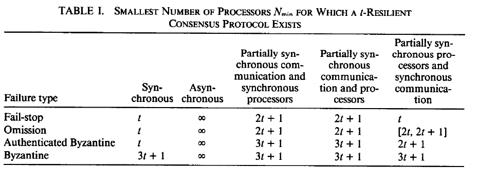
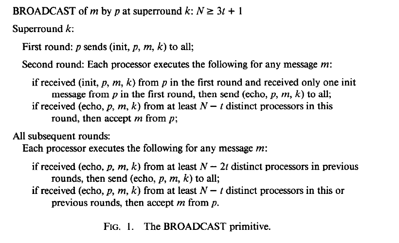
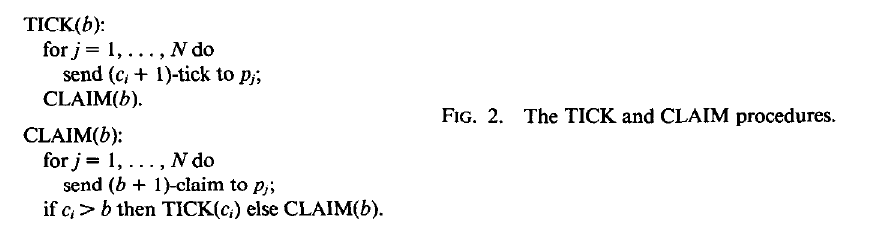

**Consensus in the Presence of Partial Synchrony｜部分同步环境中的共识**

**CYNTHIA DWORK AND NANCY LYNCH**

_Massachusetts Institute of Technology, Cambridge, Massachusetts_

**AND**

> **辛西娅·德沃克、南希·林奇**
>
> _马萨诸塞理工学院，马萨诸塞州剑桥市_
>
> **以及**

**LARRY STOCKMEYER**

_IBM Almaden Research Center, San Jose, California_

**Abstract.** The concept of partial synchrony in a distributed system is introduced. Partial synchrony lies between the cases of a synchronous system and an asynchronous system. In a synchronous system, there is a known fixed upper bound $\Delta$ on the time required for a message to be sent from one processor to another and a known fixed upper bound $\Phi$ on the relative speeds of different processors. In an asynchronous system no fixed upper bounds $\Delta$ and $\Phi$ exist. In one version of partial synchrony, fixed bounds $\Delta$ and $\Phi$ exist, but they are not known a priori. The problem is to design protocols that work correctly in the partially synchronous system regardless of the actual values of the bounds $\Delta$ and $\Phi$. In another version of partial synchrony, the bounds are known, but are only guaranteed to hold starting at some unknown time $T$, and protocols must be designed to work correctly regardless of when time $T$ occurs. Fault-tolerant consensus protocols are given for various cases of partial synchrony and various fault models. Lower bounds that show in most cases that our protocols are optimal with respect to the number of faults tolerated are also given. Our consensus protocols for partially synchronous processors use new protocols for fault-tolerant “distributed clocks” that allow partially synchronous processors to reach some approximately common notion of time.

> **拉里·斯托克迈耶**
>
> _IBM 阿尔马登研究中心，加利福尼亚州圣何塞市_
>
> **摘要。** 本文引入分布式系统中的部分同步概念。部分同步介于同步系统与异步系统之间。在同步系统中，消息从一个处理器传到另一个处理器所需的时间有一个已知的固定上界 $\Delta$，不同处理器相对速度也有一个已知的固定上界 $\Phi$。在异步系统中，则不存在固定上界 $\Delta$ 和 $\Phi$。部分同步的一种形式是：固定界 $\Delta$ 和 $\Phi$ 确实存在，但事先未知。此时的问题是，无论 $\Delta$ 和 $\Phi$ 的实际取值为何，都要设计出能在部分同步系统中正确工作的协议。另一种形式是：这些界已知，但只保证从某个未知时刻 $T$ 起成立；无论 $T$ 何时出现，协议都必须正确工作。本文针对部分同步的多种情形和多种故障模型给出容错共识协议，并给出下界，表明在大多数情形中，这些协议就可容忍的故障数而言是最优的。我们面向部分同步处理器的共识协议采用新的容错“分布式时钟”协议，使部分同步处理器能够获得某种近似共同的时间观念。

**Categories and Subject Descriptors:** C.2.4 [Computer-Communication Networks]: Distributed Systems—_distributed applications; distributed databases; network operating systems_; C.4 [Computer Systems Organization]: Performance of Systems—_reliability, availability, and serviceability_; H.2.4 [Database Management]: Systems—_distributed systems_

**General Terms:** Algorithms, Performance, Reliability, Theory, Verification

**Additional Key Words and Phrases:** Agreement problem, Byzantine Generals problem, commit problem, consensus problem, distributed clock, distributed computing, fault tolerance, partially synchronous system

> **类别与主题描述符：** C.2.4［计算机通信网络］：分布式系统——_分布式应用；分布式数据库；网络操作系统_；C.4［计算机系统组织］：系统性能——_可靠性、可用性与可维护性_；H.2.4［数据库管理］：系统——_分布式系统_
>
> **通用术语：** 算法、性能、可靠性、理论、验证
>
> **附加关键词与短语：** 一致性问题、拜占庭将军问题、提交问题、共识问题、分布式时钟、分布式计算、容错、部分同步系统

A preliminary version of this paper appears in _Proceedings of the 3rd ACM Symposium on Principles of Distributed Computing_ (Vancouver, B.C., Canada, Aug. 27–29). ACM, New York, 1984, pp. 103–118.

The work of C. Dwork was supported by a Bantrell postdoctoral Fellowship. The work of N. Lynch was supported in part by the Defense Advance Research Projects Agency under contract N00014-83-K-0125, the National Science Foundation under grants DCR 83-02391 and MCS 83-06854, the Office of Army Research under Contract DAAG29-84-K-0058, and the Office of Naval Research under contract N00014-85-K-0168.

Authors’ addresses: C. Dwork and L. Stockmeyer, Department K53/802, IBM Almaden Research Center, 650 Harry Road, San Jose, CA 95120; N. Lynch, Laboratory for Computer Science, Massachusetts Institute of Technology, 545 Technology Square, Cambridge, MA 02139.

> 本文的初步版本发表于 _第三届 ACM 分布式计算原理研讨会论文集_（加拿大不列颠哥伦比亚省温哥华，8 月 27—29 日）。ACM，纽约，1984 年，第 103—118 页。
>
> C. Dwork 的工作得到 Bantrell 博士后奖学金资助。N. Lynch 的工作部分得到国防高级研究计划局合同 N00014-83-K-0125、国家科学基金会项目 DCR 83-02391 与 MCS 83-06854、陆军研究办公室合同 DAAG29-84-K-0058，以及海军研究办公室合同 N00014-85-K-0168 的资助。
>
> 作者地址：C. Dwork 与 L. Stockmeyer，IBM 阿尔马登研究中心 K53/802 部门，650 Harry Road, San Jose, CA 95120；N. Lynch，马萨诸塞理工学院计算机科学实验室，545 Technology Square, Cambridge, MA 02139。

Permission to copy without fee all or part of this material is granted provided that the copies are not made or distributed for direct commercial advantage, the ACM copyright notice and the title of the publication and its date appear, and notice is given that copying is by permission of the Association for Computing Machinery. To copy otherwise, or to republish, requires a fee and/or specific permission.

> 在复制件并非为直接商业利益而制作或分发、复制件载有 ACM 版权声明以及出版物标题和日期，并注明复制已获计算机协会许可的前提下，准许免费复制本材料的全部或部分内容。以其他方式复制或再版，须付费和／或获得特别许可。

© 1988 ACM 0004-5411/88/0400-0288 \$01.50

> © 1988 ACM 0004-5411/88/0400-0288 \$01.50

## 1. Introduction｜引言

### 1.1 Background｜背景

The role of synchronism in distributed computing has recently received considerable attention [1, 4, 10]. One method of comparing two models with differing amounts or types of synchronism is to examine a specific problem in both models. Because of its fundamental role in distributed computing, the problem chosen is often that of reaching agreement. (See [8] for a survey; see also [6], [11], [12], and [18] for example.) One version of this problem considers a collection of $N$ processors, $p_1, \ldots, p_N$, which communicate by sending messages to one another. Initially each processor $p_i$ has a value $v_i$ drawn from some domain $V$ of values, and the correct processors must all decide on the same value; moreover, if the initial values are all the same, say $v$, then $v$ must be the common decision. In addition, the consensus protocol should operate correctly if some of the processors are faulty, for example, if they crash (fail-stop faults), fail to send or receive messages when they should (omission faults), or send erroneous messages (Byzantine faults).

> 同步性在分布式计算中的作用近来受到广泛关注［1, 4, 10］。比较同步程度或同步类型不同的两个模型，一种方法是在两个模型中考察同一个具体问题。由于达成一致在分布式计算中地位根本，所选问题往往就是一致性问题。（综述见［8］；例子另见［6］、［11］、［12］和［18］。）该问题的一种形式考察 $N$ 个处理器 $p_1, \ldots, p_N$；它们通过相互发送消息通信。起初，每个处理器 $p_i$ 都持有取自值域 $V$ 的值 $v_i$，所有正确处理器必须决定同一个值；而且，如果所有初始值都相同，例如都是 $v$，则共同决定必须是 $v$。此外，即使某些处理器发生故障，共识协议也应正确运行；例如处理器可能崩溃（停机故障）、未在应当发送或接收消息时这样做（遗漏故障），或者发送错误消息（拜占庭故障）。

Fix a particular type of fault. Given assumptions about the synchronism of the message system and the processors, one can characterize the model by its _resiliency_, the maximum number of faults that can be tolerated in any protocol in the given model. For example, it might be assumed that there is a fixed upper bound $\Delta$ on the time for messages to be delivered (_communication is synchronous_) and a fixed upper bound $\Phi$ on the rate at which one processor’s clock can run faster than another’s (_processors are synchronous_), and that these bounds are known a priori and can be “built into” the protocol. In this case $N$-resilient consensus protocols exist for Byzantine failures with authentication [3, 15] and, therefore, also for fail-stop and omission failures; in other words, any number of faults can be tolerated. For Byzantine faults without authentication, $t$-resilient consensus is possible iff $N \geq 3t + 1$ [14, 15].

> 固定一种特定的故障类型。在给定消息系统与处理器同步性假设后，可以用模型的*弹性*来刻画它，即该模型中任一协议能够容忍的最大故障数。例如，可以假设消息递送时间有固定上界 $\Delta$（_通信是同步的_），一个处理器的时钟相对另一个处理器快出的比例有固定上界 $\Phi$（_处理器是同步的_），并且这些界事先已知，能够“内置”进协议。在这种情况下，对带认证的拜占庭故障存在 $N$-弹性共识协议［3, 15］，因而对停机故障和遗漏故障也存在；换言之，可以容忍任意数量的故障。对于不带认证的拜占庭故障，当且仅当 $N \geq 3t + 1$ 时，$t$-弹性共识才有可能［14, 15］。

Recent work has shown that the existence of both bounds $\Delta$ and $\Phi$ is necessary to achieve any resiliency, even under the weakest type of faults. Dolev et al. [4], building on earlier work of Fischer et al. [10], prove that if either a fixed upper bound $\Delta$ on message delivery time does not exist (_communication is asynchronous_) or a fixed upper bound $\Phi$ on relative processor speeds does not exist (_processors are asynchronous_), then there is no consensus protocol resilient to even one fail-stop fault.

In this paper we define and study practically motivated models that lie between the completely synchronous and completely asynchronous cases.

> 最近的工作表明，即使面对最弱的一类故障，要获得任何弹性，$\Delta$ 和 $\Phi$ 两个界都必须存在。Dolev 等人［4］在 Fischer 等人［10］早期工作的基础上证明：如果消息递送时间不存在固定上界 $\Delta$（_通信是异步的_），或者处理器相对速度不存在固定上界 $\Phi$（_处理器是异步的_），那么连容忍一个停机故障的共识协议也不存在。
>
> 本文定义并研究由实际需求所推动、介于完全同步与完全异步之间的模型。

### 1.2 Partially Synchronous Communication｜部分同步通信

We first consider the case in which processors are completely synchronous (i.e., $\Phi = 1$) and communication lies “between” synchronous and asynchronous. There are at least two natural ways in which communication might be partially synchronous.

One reasonable situation could be that an upper bound $\Delta$ on message delivery time exists, but we do not know what it is a priori. On the one hand, the impossibility results of [4] and [10] do not apply since communication is, in fact, synchronous. On the other hand, participating processors in the known consensus protocols need to know $\Delta$ in order to know how long to wait during each round of message exchange. Of course, it is possible to pick some arbitrary $\Delta$ to use in designing the protocol, and say that, whenever a message takes longer than this $\Delta$, then either the sender or the receiver is considered to be faulty. This is not an acceptable solution to the problem since, if we picked $\Delta$ too small, all the processors could soon be considered faulty, and by definition the decisions of faulty processors do not have to be consistent with the decision of any other processor. What we would like is a protocol that does not have $\Delta$ “built in.” Such a protocol would operate correctly whenever it is executed in a system where some fixed upper bound $\Delta$ exists. It should also be mentioned that we do not assume any probability distribution on message transmission time that would allow $\Delta$ to be estimated by doing experiments.

> 我们首先考察处理器完全同步（即 $\Phi = 1$）、而通信介于同步与异步“之间”的情形。通信成为部分同步至少有两种自然方式。
>
> 一种合理情形是：消息递送时间的上界 $\Delta$ 存在，但我们事先不知道它是多少。一方面，因为通信事实上是同步的，［4］和［10］的不可能性结果并不适用。另一方面，在已知的共识协议中，参与处理器需要知道 $\Delta$，才能知道每轮消息交换中应等待多久。当然，也可以任意选择一个 $\Delta$ 来设计协议，并规定凡消息耗时超过该 $\Delta$，就把发送方或接收方视为故障。但这不是可接受的解决方案，因为如果所选 $\Delta$ 太小，所有处理器很快都可能被视为故障；而按照定义，故障处理器的决定无须与任何其他处理器的决定一致。我们希望得到的是不把 $\Delta$“内置”其中的协议。只要系统中存在某个固定上界 $\Delta$，这样的协议便能在该系统中正确运行。还应指出，我们不对消息传输时间假设任何可供实验估计 $\Delta$ 的概率分布。

Another situation could be that we know $\Delta$, but the message system is sometimes unreliable, delivering messages late or not at all. As noted above, we do not want to consider a late or lost message as a processor fault. However, without any further constraint on the message system, this “unreliable” message system is at least as bad as a completely asynchronous one, and the impossibility results of [4] apply. Therefore, we impose an additional constraint: For each execution there is a _global stabilization time_ (GST), unknown to the processors, such that the message system respects the upper bound $\Delta$ from time GST onward.

This constraint might at first seem too strong: In realistic situations, the upper bound cannot reasonably be expected to hold forever after GST, but perhaps only for a limited time. However, any good solution to the consensus problem in this model would have an upper bound $L$ on the amount of time after GST required for consensus to be reached; in this case it is not really necessary that the bound $\Delta$ hold forever after time GST, but only up to time $\mathrm{GST} + L$. We find it technically convenient to avoid explicit mention of the interval length $L$ in the model, but will instead present the appropriate upper bounds on time for each of our algorithms.

> 另一种情形是：我们知道 $\Delta$，但消息系统有时并不可靠，会延迟递送消息，甚至完全不递送。如前所述，我们不愿把迟到或丢失的消息视为处理器故障。然而，若不再对消息系统施加任何约束，这种“不可靠”消息系统至少与完全异步系统一样糟，［4］的不可能性结果便会适用。因此，我们增加一个约束：对每次执行，都存在处理器未知的一个*全局稳定时间*（GST），从 GST 起，消息系统遵守上界 $\Delta$。
>
> 这个约束乍看之下或许过强：在现实情形中，不能合理指望该上界在 GST 之后永远成立，也许只能维持有限时间。然而，本模型中任何良好的共识问题解法，都应当有一个上界 $L$，限制 GST 后达成共识所需的时间；如此一来，上界 $\Delta$ 实际无须在 GST 之后永远成立，只须持续到 $\mathrm{GST} + L$。出于技术上的便利，我们在模型中避免显式提及区间长度 $L$，而改为给出各算法相应的时间上界。

Instead of requiring that the consensus problem be solvable in the GST model, we might think of separating the correctness conditions into _safety_ and _termination_ properties. The safety conditions are that no two correct processors should ever reach disagreement, and that no correct processor should ever make a decision that is contrary to the specified validity conditions. The termination property is just that each correct processor should eventually make a decision. Then we might require an algorithm to satisfy the safety conditions no matter how asynchronously the message system behaves, that is, even if $\Delta$ does not hold eventually. On the other hand, we might only require termination in case $\Delta$ holds eventually. It is easy to see that these safety and termination conditions are equivalent to our GST condition: If an algorithm solves the consensus problem when $\Delta$ holds from time GST onward, then that algorithm cannot possibly violate a safety property even if the message system is completely asynchronous. This is because safety violations must occur at some finite point in time, and there would be some continuation of the violating execution in which $\Delta$ eventually holds.

> 与其要求 GST 模型中的共识问题可解，我们也可以把正确性条件拆分为*安全性*与*终止性*。安全性条件是：任何两个正确处理器都绝不能产生分歧，任何正确处理器都绝不能作出违背指定有效性条件的决定。终止性则只是每个正确处理器最终都应作出决定。于是，可以要求算法无论消息系统表现得多么异步都满足安全性，即使 $\Delta$ 最终也不成立；另一方面，只在 $\Delta$ 最终成立时要求终止。不难看出，这些安全性和终止性条件与我们的 GST 条件等价：如果算法能在 $\Delta$ 从 GST 起成立时解决共识问题，那么即使消息系统完全异步，该算法也不可能违反安全性。这是因为安全性违规必然发生在某个有限时刻，而该违规执行总能有一个后续延伸，使 $\Delta$ 最终成立。

Thus, the condition that $\Delta$ holds from some time GST onward provides a second reasonable definition for partial communication synchrony. Once again, it is not clear how we could apply previously known consensus protocols to this model. For example, the same argument as for the case of the unknown bound shows that we cannot treat lost or delayed messages in the same way as processor faults.

For succinctness, we say that communication is _partially synchronous_ if one of these two situations holds: $\Delta$ exists but is not known, or $\Delta$ is known and has to hold from some unknown point on.

Our results determine precisely, for four interesting fault models, the maximum resiliency possible in cases where communication is partially synchronous. For fail-stop or omission faults we show that $t$-resilient consensus is possible iff $N \geq 2t + 1$. For Byzantine faults with authentication, we show that $t$-resilient consensus is possible iff $N \geq 3t + 1$. Also, for Byzantine faults without authentication, we show that $t$-resilient consensus is possible iff $N \geq 3t + 1$. (The “only if” direction in this case follows immediately from the result for the completely synchronous case in [15].) For all four types of faults, the time required for all correct processors to reach consensus is (1) a polynomial in $N$ and $\Delta$, for the model in which $\Delta$ is unknown; and (2) GST plus a polynomial in $N$ and $\Delta$, for the GST model. All of our protocols that reach consensus within time polynomial in parameters such as $N$, $\Delta$, and GST also have the property that the total number of message bits sent is also bounded above by a polynomial in the same parameters.

> 因此，$\Delta$ 从某个 GST 时刻起成立这一条件，为通信的部分同步提供了第二种合理定义。同样，如何把既有共识协议用于这个模型并不明显。例如，与上界未知情形相同的论证表明，我们不能把丢失或延迟的消息当作处理器故障来处理。
>
> 简言之，如果下列两种情形之一成立，我们就称通信是*部分同步的*：$\Delta$ 存在但未知；或者 $\Delta$ 已知，但只须从某个未知时刻起成立。
>
> 我们的结果精确确定了四种重要故障模型中，当通信部分同步时所能达到的最大弹性。对于停机或遗漏故障，我们证明当且仅当 $N \geq 2t + 1$ 时，$t$-弹性共识可行。对于带认证的拜占庭故障，我们证明当且仅当 $N \geq 3t + 1$ 时可行；对于不带认证的拜占庭故障也同样如此。（后一情形中“仅当”方向立即来自［15］对完全同步情形的结果。）对四类故障而言，所有正确处理器达成共识所需的时间，在 $\Delta$ 未知的模型中是 $N$ 和 $\Delta$ 的多项式；在 GST 模型中则是 GST 加上 $N$ 和 $\Delta$ 的多项式。凡我们的协议能在 $N$、$\Delta$、GST 等参数的多项式时间内达成共识，其发送的消息总比特数也由相同参数的多项式从上方界定。

**TABLE I. SMALLEST NUMBER OF PROCESSORS $N_{\min}$ FOR WHICH A $t$-RESILIENT CONSENSUS PROTOCOL EXISTS｜表. 存在 $t$-弹性共识协议所需的最少处理器数 $N_{\min}$**

| Failure type            | Synchronous | Asynchronous | Partially synchronous communication and synchronous processors | Partially synchronous communication and processors | Partially synchronous processors and synchronous communication |
| ----------------------- | ----------: | -----------: | -------------------------------------------------------------: | -------------------------------------------------: | -------------------------------------------------------------: |
| Fail-stop               |         $t$ |     $\infty$ |                                                       $2t + 1$ |                                           $2t + 1$ |                                                            $t$ |
| Omission                |         $t$ |     $\infty$ |                                                       $2t + 1$ |                                           $2t + 1$ |                                                 $[2t, 2t + 1]$ |
| Authenticated Byzantine |         $t$ |     $\infty$ |                                                       $3t + 1$ |                                           $3t + 1$ |                                                       $2t + 1$ |
| Byzantine               |    $3t + 1$ |     $\infty$ |                                                       $3t + 1$ |                                           $3t + 1$ |                                                       $3t + 1$ |

> | 故障类型       |     同步 |     异步 | 部分同步通信与同步处理器 | 部分同步通信与处理器 | 部分同步处理器与同步通信 |
> | -------------- | -------: | -------: | -----------------------: | -------------------: | -----------------------: |
> | 停机           |      $t$ | $\infty$ |                 $2t + 1$ |             $2t + 1$ |                      $t$ |
> | 遗漏           |      $t$ | $\infty$ |                 $2t + 1$ |             $2t + 1$ |           $[2t, 2t + 1]$ |
> | 带认证的拜占庭 |      $t$ | $\infty$ |                 $3t + 1$ |             $3t + 1$ |                 $2t + 1$ |
> | 拜占庭         | $3t + 1$ | $\infty$ |                 $3t + 1$ |             $3t + 1$ |                 $3t + 1$ |

> **图表中文解读：** 表中每个单元给出相应模型存在 $t$-弹性协议时所需的最小处理器数。完全异步列均为 $\infty$，表示任意有限规模都不能容忍哪怕一个所述故障；部分同步通信下，停机和遗漏故障的门槛为 $2t+1$，两类拜占庭故障均为 $3t+1$。当通信同步而只有处理器部分同步时，停机与带认证拜占庭情形的弹性有所提高。

Table I shows the maximum resiliency in various cases and compares our results with previous work. The results where communication is partially synchronous and processors are synchronous are shown in column 3 of the table; the results in columns 4 and 5 will be explained shortly. In each case, the table gives $N_{\min}$, the smallest value of $N$ ($N \geq 2$) for which there is a $t$-resilient protocol ($t \geq 1$). (Some of the lower bounds on $N_{\min}$ in the last column of the table have slightly stronger constraints on $t$ and $N$, which are given in the formal statements of the theorems.) Results in the synchronous column are due to [3], [5], and [15], and those in the asynchronous column are due to [4] and [10]. The table entry that is the closed interval $[2t, 2t + 1]$ means that $2t \leq N_{\min} \leq 2t + 1$.

It is interesting to note that, for fail-stop, omission, and Byzantine faults with authentication, the maximum resiliency for partially synchronous communication lies strictly between the maximum resiliency for the synchronous and asynchronous cases. It is also interesting to note that, for partially synchronous communication, authentication does not improve resiliency.

> 表 I 展示了各种情形的最大弹性，并把我们的结果与以往工作作了比较。通信部分同步而处理器同步的结果列于表中第 3 列；第 4、5 列的结果稍后说明。在每种情形中，表格给出 $N_{\min}$，即存在 $t$-弹性协议（$t \geq 1$）时 $N$（$N \geq 2$）的最小值。（表格最后一列中，某些关于 $N_{\min}$ 的下界对 $t$ 和 $N$ 有稍强的约束；这些约束见相应定理的正式陈述。）同步列的结果来自［3］、［5］和［15］，异步列的结果来自［4］和［10］。表中闭区间 $[2t, 2t + 1]$ 表示 $2t \leq N_{\min} \leq 2t + 1$。
>
> 值得注意的是，对于停机、遗漏以及带认证的拜占庭故障，部分同步通信的最大弹性严格介于同步情形与异步情形的最大弹性之间。另一个有趣之处是，在部分同步通信下，认证并不能提高弹性。

Our protocols use variations on a common method: A processor $p$ tries to get other processors to change to some value $v$ that $p$ has found to be “acceptable”; $p$ decides $v$ if it receives sufficiently many acknowledgments from others that they have changed their value to $v$, so that a value different from $v$ will never be found acceptable at a later time. Similar methods have already appeared in the literature (e.g., see [2], [19]). Reischuk [17] and Pinter [16] have also obtained consensus results that treat message and processor faults separately.

> 我们的协议是同一种方法的若干变体：处理器 $p$ 试图让其他处理器改用某个由 $p$ 判定为“可接受”的值 $v$；若 $p$ 收到足够多确认，表明其他处理器已把值改为 $v$，从而以后再也不会有异于 $v$ 的值被判定为可接受，那么 $p$ 就决定 $v$。类似方法已见于文献（例如［2］、［19］）。Reischuk［17］和 Pinter［16］也得出了把消息故障与处理器故障分开处理的共识结果。

### 1.3 Partially Synchronous Communication and Processors｜部分同步通信与处理器

It is easy to extend the models described in Section 1.2 to allow processors, as well as communication, to be partially synchronous. That is, $\Phi$ (the upper bound on relative processor speed) can exist but be unknown, or $\Phi$ can be known but actually hold only from some time GST onward. We obtain results that completely characterize the resiliency in cases in which both communication and processors are partially synchronous, for all four classes of faults. In such cases we assume that communication and processors possess the same type of partial synchrony; that is, either both $\Phi$ and $\Delta$ are unknown, or both hold from some time GST on.

Surprisingly, the bounds we obtain are exactly the same as for the case in which communication alone is partially synchronous; see column 4 of Table I. (The only difference is that in this case the polynomial bounds on time depend on $N$, $\Delta$, and $\Phi$.) In the earlier case the fact that $\Phi$ was equal to 1 implied that each processor could maintain a local time that was guaranteed to be perfectly synchronized with the local times of other processors. In this case no such notion of time is available. We give two new protocols allowing processors to simulate _distributed clocks_. (These are fault-tolerant variations on the clock used by Lamport in [13].) One uses $2t + 1$ processors and tolerates $t$ fail-stop, omission, or authenticated Byzantine faults, while the other uses $3t + 1$ processors and tolerates $t$ unauthenticated Byzantine faults. When the appropriate clock is combined with each of our protocols for the case where only communication is partially synchronous, the result is a new protocol for the case in which both communication and processors are partially synchronous.

> 很容易扩展第 1.2 节的模型，使处理器和通信都可以是部分同步的。也就是说，$\Phi$（处理器相对速度的上界）可能存在但未知，或者 $\Phi$ 已知但实际上只从某个 GST 时刻起成立。对于四类故障，我们得到的结果完整刻画了通信与处理器都部分同步时的弹性。在这些情形中，我们假设通信与处理器具有同一种部分同步性：要么 $\Phi$ 和 $\Delta$ 都未知，要么二者都从某个 GST 时刻起成立。
>
> 出人意料的是，我们得到的界与仅通信部分同步时完全相同，见表 I 第 4 列。（唯一差别是，此时时间的多项式界依赖于 $N$、$\Delta$ 和 $\Phi$。）在先前情形中，$\Phi=1$ 意味着每个处理器都能维护一个本地时间，并保证它与其他处理器的本地时间完全同步；而此时没有这样的时间观念可用。我们给出两个新协议，使处理器能够模拟*分布式时钟*。（它们是 Lamport 在［13］中所用时钟的容错变体。）其中一个使用 $2t+1$ 个处理器，可容忍 $t$ 个停机、遗漏或带认证拜占庭故障；另一个使用 $3t+1$ 个处理器，可容忍 $t$ 个不带认证拜占庭故障。把适当的时钟同我们针对“仅通信部分同步”情形的各个协议结合起来，便得到通信与处理器都部分同步时的新协议。

### 1.4 Partially Synchronous Processors｜部分同步处理器

In analogy to our treatment of partial communication synchrony, it is easy to define models where processors are partially synchronous and communication is synchronous ($\Delta$ exists and is known a priori). The last column of Table I summarizes our results for this case. Once again, time is polynomial (this time in $N$, $\Delta$ and $\Phi$). The basic strategy used in constructing the protocols for this case also involves combining a consensus protocol that assumes processor synchrony with a distributed clock protocol. For fail-stop faults and Byzantine faults with authentication, either the distributed clock or the consensus protocol can tolerate more failures than the corresponding clock or consensus protocol used for the case in which both communication and processors are partially synchronous, so we obtain better resiliencies.

_Technical Remarks_

(1) Our protocols assume that an atomic step of a processor is either to receive messages or to send a message to a single processor, but not both; there is neither an atomic receive/send operation nor an atomic broadcast operation. We adopt this rather weak definition of a processor’s atomic step in this paper because it is realistic in practice and seems consistent with assumptions made in much of the previous work on distributed agreement. However, our lower bound arguments are still valid if a processor can receive messages and broadcast a message to all processors in a single atomic step.

> 仿照我们对部分通信同步性的处理，很容易定义处理器部分同步而通信同步（$\Delta$ 存在且事先已知）的模型。表 I 最后一列概括了这种情形的结果。时间仍为多项式（这次是 $N$、$\Delta$ 和 $\Phi$ 的多项式）。构造此类协议的基本策略同样是，把假设处理器同步的共识协议与分布式时钟协议结合起来。对于停机故障和带认证的拜占庭故障，分布式时钟或共识协议能容忍的故障数高于通信与处理器都部分同步时所用的对应时钟或共识协议，因此我们获得了更好的弹性。
>
> _技术说明_
>
> （1）我们的协议假设，处理器的一个原子步骤要么接收消息，要么向单个处理器发送一条消息，但不能同时做二者；既不存在原子的接收／发送操作，也不存在原子的广播操作。本文采用这种相当弱的处理器原子步骤定义，是因为它在实践中较为现实，也似乎与以往大量分布式一致研究中的假设相符。不过，即使处理器能在单个原子步骤中接收消息并向所有处理器广播一条消息，我们的下界论证仍然有效。

(2) The strong unanimity condition requires that, if all initial values are the same, say $v$, then $v$ must be the common decision. Weak unanimity requires this condition to hold only if no processor is faulty. Unless noted otherwise, our consensus protocols achieve strong unanimity, and our lower bounds hold even for weak unanimity. In the case, however, of Byzantine faults with authentication and partially synchronous processors, the upper bound $2t + 1$ in the last column of Table I holds for strong unanimity only if the initial values are signed by a distinguished “sender.” This assumption is also used in the algorithm of [3] for the completely synchronous case. (For weak unanimity, the upper bound $2t + 1$ in the last column holds even without signed initial values.) We discuss this further in Section 6, which is the first place where the issue of whether the initial values are signed has any effect on our results.

> （2）强全体一致条件要求：如果所有初始值都相同，例如都是 $v$，那么共同决定必须是 $v$。弱全体一致则只要求该条件在没有处理器故障时成立。除非另有说明，我们的共识协议达到强全体一致，而我们的下界即便对弱全体一致也成立。不过，对于带认证的拜占庭故障和部分同步处理器，表 I 最后一列的上界 $2t+1$ 只有在初始值由一个特定“发送者”签名时才对强全体一致成立。［3］针对完全同步情形的算法也采用了这一假设。（对于弱全体一致，即使初始值没有签名，最后一列的上界 $2t+1$ 仍成立。）第 6 节将进一步讨论此事；直到那里，初始值是否签名才首次影响我们的结果。

(3) Our consensus protocols are designed for an arbitrary value domain $V$, whereas our lower bounds hold even for the case $|V| = 2$.

The remainder of this paper is organized as follows: Section 2 contains definitions. Section 3 contains our basic protocols, presented in a basic round model, which has more power than the models in which we are really interested. Section 4 contains our results for the model in which processors are synchronous and communication is partially synchronous. In particular, the protocols of Section 3 are adapted to this model. The distributed clocks are defined in Section 5, where we also discuss how to combine the results of Section 3 with the clocks to produce protocols for the model in which both processors and communication are partially synchronous. Section 6 contains our results for the case in which processors are partially synchronous and communication is synchronous.

> （3）我们的共识协议面向任意值域 $V$ 设计，而我们的下界即使在 $|V|=2$ 时也成立。
>
> 本文其余部分安排如下：第 2 节给出定义。第 3 节在基本轮次模型中给出基础协议；该模型比我们真正关心的模型能力更强。第 4 节给出处理器同步、通信部分同步模型的结果，尤其把第 3 节协议适配到该模型。第 5 节定义分布式时钟，并讨论如何把第 3 节结果与时钟结合起来，为处理器和通信都部分同步的模型构造协议。第 6 节给出处理器部分同步、通信同步情形的结果。

## 2. Definitions｜定义

### 2.1 Model of Computation｜计算模型

Our formal model of computation is based on the models of [4] and [10]. Here we review the basic features of the model informally. The communication system is modeled as a collection of $N$ sets of messages, called _buffers_, one for each processor. The buffer of $p_i$ represents messages that have been sent to $p_i$, but not yet received. Each processor follows a deterministic protocol involving the receipt and sending of messages. Each processor $p_i$ can perform one of the following instructions in each step of its protocol:

> 我们的形式计算模型以［4］和［10］的模型为基础。这里先非正式地回顾模型的基本特征。通信系统被建模为 $N$ 个消息集合，称为*缓冲区*，每个处理器一个。$p_i$ 的缓冲区表示已发送给 $p_i$、但尚未接收的消息。每个处理器遵循一个涉及消息收发的确定性协议。处理器 $p_i$ 在协议的每一步可执行下列指令之一：

$$
\begin{aligned}
\operatorname{Send}(m,p_j):&\quad \text{places message }m\text{ in }p_j\text{’s buffer};\\
\operatorname{Receive}(p_i):&\quad \text{removes some (possibly empty) set }S\text{ of messages from }p_i\text{’s buffer}\\
&\quad \text{and delivers the messages to }p_i.
\end{aligned}
$$

> $\operatorname{Send}(m,p_j)$：把消息 $m$ 放入 $p_j$ 的缓冲区；$\operatorname{Receive}(p_i)$：从 $p_i$ 的缓冲区中移除某个（可能为空的）消息集合 $S$，并把这些消息递送给 $p_i$。

In the $\operatorname{Send}(m,p_j)$ instruction, $p_j$ can be any processor; that is, the communication network is completely connected. A processor’s protocol is specified by a state transition diagram; the number of states can be infinite. The instruction to be executed next depends on the current state, and the execution causes a state transition. For a Send instruction, the next state depends only on the current state, whereas, for a Receive instruction, the next state depends also on the set $S$ of delivered messages. The initial state of a processor $p_i$ is determined by its initial value $v_i$ in $V$. At some point in its computation, a processor can irreversibly decide on a value in $V$.

For subsequent definitions, it is useful to imagine that there is a real-time clock outside the system that measures time in discrete integer-numbered steps. At each tick of real time, some processors take one step of their protocols. A _run_ of the system is described by specifying the initial states for all processors and by specifying, for each real-time step,

> 在 $\operatorname{Send}(m,p_j)$ 指令中，$p_j$ 可以是任意处理器；也就是说，通信网络完全连通。处理器协议由状态转移图指定，状态数可以是无限的。下一条执行指令取决于当前状态，执行会引起状态转移。对于 Send 指令，下一状态只依赖当前状态；而对于 Receive 指令，下一状态还依赖所递送的消息集合 $S$。处理器 $p_i$ 的初始状态由其取自 $V$ 的初始值 $v_i$ 决定。在计算的某个时刻，处理器可以不可逆地决定 $V$ 中的一个值。
>
> 为了后续定义，不妨设想系统外有一个实时时钟，以离散、整数编号的步来度量时间。实时时钟每跳动一次，某些处理器就执行协议的一步。系统的一次*运行*由所有处理器的初始状态，以及每个实时步中的下列事项来描述：

(1) which processors take steps,

(2) the instruction that each processor executes, and

(3) for each Receive instruction, the set of messages delivered.

> （1）哪些处理器执行步骤；
>
> （2）每个处理器执行哪条指令；以及
>
> （3）对每条 Receive 指令，递送哪一消息集合。

Runs can be finite or infinite. Given an infinite run $R$, the message $m$ is _lost_ in run $R$ if $m$ is sent by some $\operatorname{Send}(m,p_j)$, $p_j$ executes infinitely many Receive instructions in $R$, and $m$ is never delivered by any $\operatorname{Receive}(p_j)$.

> 运行可以是有限的，也可以是无限的。给定无限运行 $R$，若消息 $m$ 由某个 $\operatorname{Send}(m,p_j)$ 发出，$p_j$ 在 $R$ 中执行了无穷多条 Receive 指令，但任何 $\operatorname{Receive}(p_j)$ 都从未递送 $m$，则称消息 $m$ 在运行 $R$ 中*丢失*。

### 2.2 Failures｜故障

A processor _executes correctly_ if it always performs instructions of its protocol (transition diagram) correctly. A processor is _correct_ if it executes correctly and takes infinitely many steps in any infinite run. We consider four types of increasingly destructive faulty behavior of processor $p_i$:

_Fail-stop:_ Processor $p_i$ executes correctly, but can stop at any time. Once stopped it cannot restart.

_Omission:_ Faulty processor $p_i$ follows its protocol correctly, but $\operatorname{Send}(m,p_j)$, when executed by $p_i$, might not place $m$ in $p_j$’s buffer and $\operatorname{Receive}(p_i)$ might cause only a subset of the delivered messages to be actually received by $p_i$. In other words, an omission fault on reception occurs when some set $S$ of messages is delivered to $p_i$ and all messages in $S$ are removed from $p_i$’s buffer, but $p_i$ follows a state transition as though some (possibly empty) subset $S'$ of $S$ were delivered.

> 若处理器始终正确执行其协议（转移图）的指令，就称它*正确执行*。若处理器正确执行，并在任一无限运行中执行无穷多个步骤，就称它是*正确处理器*。我们考察处理器 $p_i$ 四种破坏性依次增强的故障行为：
>
> _停机：_ 处理器 $p_i$ 正确执行，但可在任何时刻停止；一旦停止便不能重启。
>
> _遗漏：_ 故障处理器 $p_i$ 正确遵循其协议，但当 $p_i$ 执行 $\operatorname{Send}(m,p_j)$ 时，可能没有把 $m$ 放入 $p_j$ 的缓冲区；$\operatorname{Receive}(p_i)$ 也可能只让 $p_i$ 实际收到已递送消息的一个子集。换言之，接收遗漏故障是指：某个消息集合 $S$ 被递送给 $p_i$，$S$ 中所有消息都从 $p_i$ 的缓冲区移除，但 $p_i$ 所遵循的状态转移却如同只递送了 $S$ 的某个（可能为空的）子集 $S'$。

_Authenticated Byzantine:_ Arbitrary behavior, but messages can be signed with the name of the sending processor in such a way that this signature cannot be forged by any other processor.

_Byzantine:_ Arbitrary behavior and no mechanism for signatures, but we assume that the receiver of a message knows the identity of the sender.

> _带认证的拜占庭：_ 行为可以任意，但消息能够以发送处理器之名签名，且任何其他处理器都不能伪造该签名。
>
> _拜占庭：_ 行为可以任意，且没有签名机制，但我们假设消息接收者知道发送者的身份。

### 2.3 Partial Synchrony｜部分同步

Let $I$ be an interval of real time and $R$ be a run. We say that the communication bound $\Delta$ _holds in $I$ for run $R$_ provided that, if message $m$ is placed in $p_j$’s buffer by some $\operatorname{Send}(m,p_j)$ at a time $s_1$ in $I$, and if $p_j$ executes a $\operatorname{Receive}(p_j)$ at a time $s_2$ in $I$ with $s_2 \geq s_1 + \Delta$, then $m$ must be delivered to $p_j$ at time $s_2$ or earlier. This says intuitively that $\Delta$ is an upper bound on message transmission time in the interval $I$. The processor bound $\Phi$ _holds in $I$ for $R$_ provided that, in any contiguous subinterval of $I$ containing $\Phi$ real-time steps, every correct processor must take at least one step. This implies that no correct processor can run more than $\Phi$ times slower than another in the interval $I$.

The following conditions, which define varying degrees of communication synchrony, place constraints on the kinds of runs that are allowed. In these definitions, $\Delta$ denotes some particular positive integer:

> 令 $I$ 为一个实时时间区间，$R$ 为一次运行。若消息 $m$ 在 $I$ 中的时刻 $s_1$ 由某个 $\operatorname{Send}(m,p_j)$ 放入 $p_j$ 的缓冲区，且 $p_j$ 在 $I$ 中满足 $s_2 \geq s_1+\Delta$ 的时刻 $s_2$ 执行 $\operatorname{Receive}(p_j)$ 时，$m$ 必须在 $s_2$ 或更早递送给 $p_j$，我们就称通信界 $\Delta$ _在运行 $R$ 的区间 $I$ 中成立_。直观而言，这表示 $\Delta$ 是区间 $I$ 内消息传输时间的上界。若在 $I$ 的任一包含 $\Phi$ 个实时步的连续子区间中，每个正确处理器都至少执行一步，则称处理器界 $\Phi$ _在 $R$ 的区间 $I$ 中成立_。这意味着在区间 $I$ 中，任一正确处理器都不会比另一处理器慢超过 $\Phi$ 倍。
>
> 下列条件定义不同程度的通信同步性，并对允许的运行类型施加约束。在这些定义中，$\Delta$ 表示某个特定正整数：

(1) $\Delta$ _is known:_ The communication bound $\Delta$ holds in $[1,\infty)$ for every run $R$.

_Delta is known:_ $\Delta$ is known for some fixed $\Delta$. This is the usual definition of _synchronous communication_.

(2) _Delta is unknown:_ For every run $R$, there is a $\Delta$ that holds in $[1,\infty)$.

> （1）$\Delta$ _已知：_ 对每次运行 $R$，通信界 $\Delta$ 都在 $[1,\infty)$ 中成立。
>
> _$\Delta$ 已知：_ 对某个固定的 $\Delta$，$\Delta$ 已知。这就是*同步通信*的通常定义。
>
> （2）_$\Delta$ 未知：_ 对每次运行 $R$，都存在一个在 $[1,\infty)$ 中成立的 $\Delta$。

(3) $\Delta$ _holds eventually:_ For every run $R$, there is a time $T$ such that $\Delta$ holds in $[T,\infty)$. Such a time $T$ is called the _Global Stabilization Time_ (GST).

_Delta holds eventually:_ $\Delta$ holds eventually for some fixed $\Delta$.

If either (2) or (3) holds, we say that _communication is partially synchronous_.

> （3）$\Delta$ _最终成立：_ 对每次运行 $R$，都存在时刻 $T$，使 $\Delta$ 在 $[T,\infty)$ 中成立。这样的时刻 $T$ 称为*全局稳定时间*（GST）。
>
> _$\Delta$ 最终成立：_ 对某个固定的 $\Delta$，$\Delta$ 最终成立。
>
> 若（2）或（3）成立，我们称*通信是部分同步的*。

It is helpful to view each situation as a game between a protocol designer and an adversary. If delta is known, the adversary names an integer $\Delta$, and the protocol designer must supply a consensus protocol that is correct if $\Delta$ always holds. If delta is unknown, the protocol designer supplies the consensus protocol first, then the adversary names a $\Delta$, and the protocol must be correct if that $\Delta$ always holds. If delta holds eventually, the adversary picks $\Delta$, the designer (knowing $\Delta$) supplies a consensus protocol, and the adversary picks a time $T$ when $\Delta$ must start holding.

By replacing $\Delta$ by $\Phi$ and “delta” by “phi” above, (1) defines _synchronous processors_, and (2) and (3) define two types of _partially synchronous processors_.

> 把每种情形看成协议设计者与对手之间的博弈会很有帮助。如果 $\Delta$ 已知，对手先指定一个整数 $\Delta$，协议设计者必须提供一个在 $\Delta$ 始终成立时正确的共识协议。如果 $\Delta$ 未知，协议设计者先提供共识协议，然后对手指定 $\Delta$，而只要该 $\Delta$ 始终成立，协议就必须正确。如果 $\Delta$ 最终成立，对手选择 $\Delta$，设计者在知道 $\Delta$ 的情况下提供共识协议，随后对手再选择 $\Delta$ 必须开始成立的时刻 $T$。
>
> 在以上定义中用 $\Phi$ 替换 $\Delta$、用“$\Phi$”替换“$\Delta$”，则（1）定义*同步处理器*，（2）和（3）定义两类*部分同步处理器*。

### 2.4 Correctness of a Consensus Protocol｜共识协议的正确性

Given assumptions $A$ about processor and communication synchrony, a fault type $F$, and a number $N$ of processors and an integer $t$ with $0 \leq t \leq N$, correctness of a $t$-resilient consensus protocol is defined as follows:

For any set $C$ containing at least $N-t$ processors and any run $R$ satisfying $A$ and in which the processors in $C$ are correct and the behavior of the processors not in $C$ is allowed by the fault type $F$, the protocol achieves:

—_Consistency._ No two different processors in $C$ decide differently.

> 给定关于处理器和通信同步性的假设 $A$、故障类型 $F$、处理器数 $N$，以及满足 $0 \leq t \leq N$ 的整数 $t$，$t$-弹性共识协议的正确性定义如下：
>
> 对任何至少包含 $N-t$ 个处理器的集合 $C$，以及任何满足 $A$、其中 $C$ 内处理器正确且 $C$ 外处理器行为为故障类型 $F$ 所允许的运行 $R$，协议都达到：
>
> ——_一致性。_ $C$ 中任意两个不同处理器都不会作出不同决定。

—_Termination._ If $R$ is infinite, then every processor in $C$ makes a decision.

—_Unanimity._ There are two types:

_Strong unanimity:_ If all initial values are $v$ and if any processor in $C$ decides, then it decides $v$.

> ——_终止性。_ 若 $R$ 是无限运行，则 $C$ 中每个处理器都作出决定。
>
> ——_全体一致。_ 有两种类型：
>
> _强全体一致：_ 若所有初始值都是 $v$，且 $C$ 中任何处理器作出决定，则其决定为 $v$。

_Weak unanimity:_ If all initial values are $v$, if $C$ contains all processors, and if any processor decides, then it decides $v$.

In models where messages cannot be lost, such as the models where delta is unknown, our protocols can be easily modified so that all correct processors can halt soon after sufficiently many correct processors have decided. However, we do not require halting explicitly in the termination condition because, as can be easily shown, if messages can be lost before GST in the model where delta holds eventually and if the protocol is 1-resilient to fail-stop faults, then there is some execution in which some correct processor does not halt. Further discussion of the issue of halting is given in Section 4.2, Remark 2, after the protocols have been described.

> _弱全体一致：_ 若所有初始值都是 $v$，$C$ 包含全部处理器，且任何处理器作出决定，则其决定为 $v$。
>
> 在消息不会丢失的模型中，例如 $\Delta$ 未知的模型，我们很容易修改协议，使所有正确处理器在足够多正确处理器作出决定后不久便可停机。不过，我们没有在终止性条件中显式要求停机，因为不难证明：如果在 $\Delta$ 最终成立的模型中，消息可在 GST 前丢失，而协议能容忍一个停机故障，那么存在某次执行，其中某个正确处理器不会停机。协议介绍完毕后，第 4.2 节注 2 将进一步讨论停机问题。

## 3. The Basic Round Model｜基本轮次模型

In this section we define the basic round model and present preliminary versions of our algorithms in this model. In the following sections we show how each of our models can simulate the basic model.

> 本节定义基本轮次模型，并给出算法在该模型中的初步版本。后续各节将说明我们的各个模型如何模拟基本模型。

### 3.1 Definition of the Model｜模型定义

In the basic round model, processing is divided into synchronous _rounds_ of message exchange. Each round consists of a _Send subround_, a _Receive subround_, and a _computation subround_. In a Send subround, each processor sends messages to any subset of the processors. In a Receive subround, some subset of the messages sent to the processor during the corresponding Send subround is delivered. In a computation subround, each processor executes a state transition based on the set of messages just received. Not all messages that are sent need arrive; some can be lost. However, we assume that there is some round GST, such that all messages sent from correct processors to correct processors at round GST or afterward are delivered during the round at which they were sent. As explained in the Introduction, loss of a message _before_ GST does not necessarily make the sender or the receiver faulty. Although all processors have a common numbering for the rounds, they do not know when round GST occurs. The various kinds of faults are defined for the basic model as for the earlier models.

> 在基本轮次模型中，处理被划分为同步的消息交换*轮次*。每轮由一个*发送子轮次*、一个*接收子轮次*和一个*计算子轮次*组成。在发送子轮次中，每个处理器向处理器的任意子集发送消息；在接收子轮次中，对应发送子轮次内发给该处理器的消息有某个子集被递送；在计算子轮次中，每个处理器根据刚收到的消息集合执行状态转移。发出的消息不必全部到达，有些可以丢失。不过，我们假设存在某一轮 GST，使得在 GST 轮或以后由正确处理器发给正确处理器的所有消息，都在其发送轮次内递送。如引言所述，消息在 GST *之前*丢失，并不一定意味着发送者或接收者发生故障。尽管所有处理器共用同一轮次编号，但它们不知道 GST 轮何时出现。基本模型中的各类故障定义与前述模型相同。

### 3.2 Protocols in the Basic Round Model｜基本轮次模型中的协议

In the remainder of this section, we show how the consensus problem can be solved for the basic model, for each of the fault types. To argue that our protocols achieve strong unanimity, we use the notion of a _proper value_ defined as follows: If all processors start with the same value $v$, then $v$ is the only proper value; if there are at least two different initial values, then all values in $V$ are proper. In all protocols, each processor will maintain a local variable PROPER, which contains a set of values that the processor knows to be proper. Processors will always piggyback their current PROPER sets on all messages. The way of updating the PROPER sets will vary from algorithm to algorithm. If only weak unanimity is desired, the PROPER sets are not needed, and the protocols can be simplified somewhat; we leave these simplifications to the interested reader.

> 本节余下部分说明如何针对每种故障类型，在基本模型中解决共识问题。为了论证协议达到强全体一致，我们使用如下定义的*合宜值*概念：如果所有处理器以同一值 $v$ 开始，则 $v$ 是唯一合宜值；如果至少有两个不同的初始值，则 $V$ 中所有值都是合宜值。在所有协议中，每个处理器都维护一个局部变量 PROPER，其中包含该处理器已知为合宜的一组值。处理器总在所有消息上捎带其当前 PROPER 集。不同算法更新 PROPER 集的方式有所不同。若只要求弱全体一致，则不需要 PROPER 集，协议也可有所简化；这些简化留给感兴趣的读者。

#### 3.2.1 Fail-Stop and Omission Faults｜停机故障与遗漏故障

The first algorithm is used for either fail-stop or omission faults. It achieves strong unanimity for an arbitrary value domain $V$.

_Algorithm 1. $N \geq 2t + 1$_

Initially, each processor’s set PROPER contains just its own initial value. Each processor attaches its current value of PROPER to every message that it sends. Whenever a processor $p$ receives a PROPER set from another processor that contains a particular value $v$, then $p$ puts $v$ into its own PROPER set. It is easy to check that each PROPER set always contains only proper values.

> 第一个算法可用于停机故障或遗漏故障，并对任意值域 $V$ 达到强全体一致。
>
> _算法 1．$N \geq 2t + 1$_
>
> 初始时，每个处理器的 PROPER 集只包含自己的初始值。每个处理器在发送的每条消息上附带当前 PROPER 值。处理器 $p$ 每当从另一处理器收到一个含有特定值 $v$ 的 PROPER 集，便把 $v$ 加入自己的 PROPER 集。不难验证，每个 PROPER 集始终只含合宜值。

The rounds are organized into alternating _trying_ and _lock-release_ phases, where each trying phase consists of three rounds and each lock-release phase consists of one round. Each pair of corresponding phases is assigned an integer, starting with 1. We say that phase $h$ _belongs to_ processor $p_i$ if $h \equiv i \pmod N$.

At various times during the algorithm, a processor may _lock_ a value $v$. A _phase number_ is associated with every lock. If $p$ locks $v$ with associated phase number $k \equiv i \pmod N$, it means that $p$ thinks that processor $p_i$ might decide $v$ at phase $k$. Processor $p$ only releases a lock if it learns its supposition was false. A value $v$ is _acceptable_ to $p$ if $p$ does not have a lock on any value except possibly $v$. Initially, no value is locked.

We now describe the processing during a particular trying phase $k$. Let $s = 4k - 3$ be the number of the first round in phase $k$, and assume $k \equiv i \pmod N$. At round $s$ each processor (including $p_i$) sends a list of all its acceptable values that are also in its proper set to processor $p_i$ (in the form of a $(\mathrm{list},k)$ message). (If $V$ is very large, it is more efficient to send a list of proper values and a list of unacceptable values. Given these lists, the proper acceptable values are easily deduced.) Just after round $s$, that is, during the computation subround between rounds $s$ and $s+1$, processor $p_i$ attempts to choose a value to propose. In order for processor $p_i$ to propose $v$, it must have heard that at least $N-t$ processors (possibly including itself) find value $v$ acceptable and proper at the beginning of phase $k$. There might be more than one possible value that processor $p_i$ might propose; in this case processor $p_i$ will choose one arbitrarily. Processor $p_i$ then broadcasts a message $(\mathrm{lock}\ v,k)$ at round $s+1$.

> 轮次被组织为交替出现的*尝试*阶段和*解锁*阶段；每个尝试阶段含三轮，每个解锁阶段含一轮。从 1 开始，每一对相应阶段都赋予一个整数。若 $h \equiv i \pmod N$，则称阶段 $h$ *属于*处理器 $p_i$。
>
> 算法运行期间，处理器可在不同时间*锁定*值 $v$。每个锁都关联一个*阶段号*。若 $p$ 锁定 $v$，关联阶段号为 $k \equiv i \pmod N$，就表示 $p$ 认为处理器 $p_i$ 可能在阶段 $k$ 决定 $v$。只有得知这一推测不成立时，处理器 $p$ 才释放锁。若 $p$ 除了可能锁定 $v$ 以外没有锁定任何值，则称 $v$ 对 $p$ _可接受_。初始时没有值被锁定。
>
> 下面说明特定尝试阶段 $k$ 的处理。令 $s=4k-3$ 为阶段 $k$ 第一轮的编号，并假设 $k \equiv i \pmod N$。在第 $s$ 轮，每个处理器（包括 $p_i$）都把其既可接受又位于合宜集中的全部值组成列表，发送给处理器 $p_i$（消息形式为 $(\mathrm{list},k)$）。（如果 $V$ 很大，更高效的做法是发送合宜值列表和不可接受值列表；给定二者即可轻易推出合宜且可接受的值。）第 $s$ 轮刚结束，也就是 $s$ 与 $s+1$ 轮之间的计算子轮次，处理器 $p_i$ 尝试选择一个提议值。要让 $p_i$ 提议 $v$，它必须获悉至少 $N-t$ 个处理器（可能包括自身）在阶段 $k$ 开始时认为 $v$ 可接受且合宜。$p_i$ 可能有多个可提议值，此时任意选择一个。随后，$p_i$ 在第 $s+1$ 轮广播消息 $(\mathrm{lock}\ v,k)$。

If any processor receives a $(\mathrm{lock}\ v,k)$ message at round $s+1$, it locks $v$, associating the phase number $k$ with the lock, and sends an acknowledgment to processor $p_i$ (in the form of an $(\mathrm{ack},k)$ message), at round $s+2$. In this case any earlier lock on $v$ is released. (Any locks on other values are not released at this time.)

If processor $p_i$ receives acknowledgments from at least $t+1$ processors at round $s+2$, then processor $p_i$ decides $v$. After deciding $v$, processor $p_i$ continues to participate in the algorithm.

Lock-release phase $k$ occurs at round $s+3=4k$. At round $s+3$, each processor $p$ broadcasts the message $(v,h)$ for all $v$ and $h$ such that $p$ has a lock on $v$ with associated phase $h$. If any processor has a lock on some value $v$ with associated phase $h$, and receives a message $(w,h')$ with $w \neq v$ and $h' \geq h$, then the processor releases its lock on $v$.

> 若任一处理器在第 $s+1$ 轮收到消息 $(\mathrm{lock}\ v,k)$，它便锁定 $v$，将阶段号 $k$ 与该锁关联，并在第 $s+2$ 轮向处理器 $p_i$ 发送确认（形式为消息 $(\mathrm{ack},k)$）。此时会释放先前对 $v$ 的任何锁。（此时不释放对其他值的锁。）
>
> 若处理器 $p_i$ 在第 $s+2$ 轮收到至少 $t+1$ 个处理器的确认，$p_i$ 就决定 $v$。决定 $v$ 之后，$p_i$ 继续参与算法。
>
> 解锁阶段 $k$ 出现在第 $s+3=4k$ 轮。在第 $s+3$ 轮，每个处理器 $p$ 对所有满足“$p$ 锁定 $v$ 且关联阶段为 $h$”的 $v,h$ 广播消息 $(v,h)$。如果某处理器锁定某个值 $v$、关联阶段为 $h$，并收到满足 $w\neq v$ 且 $h'\geq h$ 的消息 $(w,h')$，则该处理器释放对 $v$ 的锁。

**LEMMA 3.1.** _It is impossible for two distinct values to acquire locks with the same associated phase._

**PROOF.** In order for two values $v$ and $w$ to acquire a lock at trying phase $k$, the processor to which phase $k$ belongs must send conflicting $(\mathrm{lock}\ v,k)$ and $(\mathrm{lock}\ w,k)$ messages, which it will never do in this fault model. $\square$

**LEMMA 3.2.** _Suppose that some processor decides $v$ at phase $k$, and $k$ is the smallest numbered phase at which a decision is made. Then at least $t+1$ processors lock $v$ at phase $k$. Moreover, each of the processors that locks $v$ at phase $k$ will, from that time onward, always have a lock on $v$ with associated phase number at least $k$._

> **引理 3.1。** _两个不同的值不可能获得关联阶段相同的锁。_
>
> **证明。** 要让值 $v$ 和 $w$ 在尝试阶段 $k$ 获得锁，阶段 $k$ 所属的处理器必须发送相互冲突的 $(\mathrm{lock}\ v,k)$ 和 $(\mathrm{lock}\ w,k)$ 消息；在本故障模型中它绝不会这样做。$\square$
>
> **引理 3.2。** _假设某处理器在阶段 $k$ 决定 $v$，且 $k$ 是作出决定的最小编号阶段。则至少 $t+1$ 个处理器在阶段 $k$ 锁定 $v$。而且，从那时起，每个在阶段 $k$ 锁定 $v$ 的处理器都将始终持有一个对 $v$ 的锁，其关联阶段号至少为 $k$。_

**PROOF.** It is clear that at least $t+1$ processors lock $v$ at phase $k$. Assume that the second conclusion is false. Then let $l$ be the first phase at which one of the locks on $v$ set at phase $k$ is released without immediately being replaced by another, higher numbered lock on $v$. In this case the lock is released during lock-release phase $l$, when it is learned that some processor has a lock on some $w \neq v$ with associated phase $h$, where $k \leq h \leq l$. Lemma 3.1 implies that no processor has a lock on any $w \neq v$ with associated phase $k$. Therefore, some processor has a lock on $w$ with associated phase $h$, where $k<h\leq l$. Thus, it must be that $w$ is found acceptable to at least $N-t$ processors at the first round of some phase numbered $h$, $k<h\leq l$, which means that at least $N-t$ processors do not have $v$ locked at the beginning of that phase. Since $t+1$ processors have $v$ locked at least through the first round of $l$, this is impossible. $\square$

> **证明。** 显然至少 $t+1$ 个处理器在阶段 $k$ 锁定 $v$。假设第二个结论不成立。令 $l$ 为这样的第一个阶段：某个在阶段 $k$ 设置的 $v$ 锁被释放，却没有立即被另一个阶段号更高的 $v$ 锁取代。在这种情况下，该锁在解锁阶段 $l$ 被释放；处理器此时得知某个处理器锁定了某个 $w\neq v$，其关联阶段 $h$ 满足 $k\leq h\leq l$。引理 3.1 表明，没有处理器持有任何关联阶段为 $k$ 的 $w\neq v$ 锁。因此，某个处理器持有 $w$ 锁，其关联阶段 $h$ 满足 $k<h\leq l$。于是必有：在某个编号为 $h$、$k<h\leq l$ 的阶段首轮，至少 $N-t$ 个处理器认为 $w$ 可接受；这意味着该阶段开始时至少 $N-t$ 个处理器没有锁定 $v$。但至少到阶段 $l$ 的第一轮为止，仍有 $t+1$ 个处理器锁定 $v$，故不可能如此。$\square$

**LEMMA 3.3.** _Immediately after any lock-release phase that occurs at or after GST, the set of values locked by correct processors contains at most one value._

**PROOF.** Straightforward from the lock-release rule. $\square$

**THEOREM 3.1.** _Assume the basic model with fail-stop or omission faults. Assume $N \geq 2t+1$. Then Algorithm 1 achieves consistency, strong unanimity, and termination for an arbitrary value domain._

> **引理 3.3。** _在 GST 时或之后发生的任何解锁阶段刚结束时，正确处理器所锁定的值至多有一个。_
>
> **证明。** 直接由解锁规则可得。$\square$
>
> **定理 3.1。** _假设采用带停机故障或遗漏故障的基本模型，并假设 $N\geq 2t+1$。则算法 1 对任意值域达到一致性、强全体一致和终止性。_

**PROOF.** First, we show consistency. Suppose that some correct processor $p_i$ decides $v$ at phase $k$, and this is the smallest numbered phase at which a decision is made. Then Lemma 3.2 implies that, at all times after phase $k$, at least $t+1$ processors have $v$ locked. Consequently, at no later phase can any value other than $v$ ever be acceptable to $N-t$ processors, so no processor will ever decide any value other than $v$.

Next, we argue strong unanimity. If all the initial values are $v$, then $v$ is the only value that is ever in the PROPER set of any processor. Thus, $v$ is the only possible decision value.

Finally, we argue termination. Consider any trying phase $k$ belonging to a correct processor $p_i$ that is executed after a lock-release phase, both occurring at or after round GST. We claim that processor $p_i$ will reach a decision at trying phase $k$ (if it has not done so already). By Lemma 3.3, there is at most one value locked by correct processors at the start of trying phase $k$. If there is such a locked value, $v$, then sufficient communication has occurred by the beginning of trying phase $k$ so that $v$ is in the PROPER set of each correct processor. Moreover, any initial value of a correct processor is in the PROPER set of each correct processor at the beginning of trying phase $k$. Since there are at least $N-t\geq t+1$ correct processors, it follows that a proper, acceptable value will be found for processor $p_i$ to propose, and that the proposed value will be decided on by processor $p_i$ at trying phase $k$. $\square$

> **证明。** 首先证明一致性。假设某个正确处理器 $p_i$ 在阶段 $k$ 决定 $v$，且这是作出决定的最小编号阶段。由引理 3.2，在阶段 $k$ 之后的所有时刻，至少有 $t+1$ 个处理器锁定 $v$。因此，在此后的任何阶段，异于 $v$ 的值都不可能被 $N-t$ 个处理器视为可接受，所以任何处理器都不会决定异于 $v$ 的值。
>
> 接着论证强全体一致。若所有初始值都是 $v$，则 $v$ 是任何处理器的 PROPER 集中曾经出现的唯一值。因此，$v$ 是唯一可能的决定值。
>
> 最后论证终止性。考察属于正确处理器 $p_i$、且在某个解锁阶段之后执行的任意尝试阶段 $k$，二者都发生在 GST 轮或之后。我们断言处理器 $p_i$ 会在尝试阶段 $k$ 作出决定（如果此前尚未决定）。由引理 3.3，尝试阶段 $k$ 开始时，正确处理器至多锁定一个值。若存在这样一个锁定值 $v$，则到尝试阶段 $k$ 开始时已经发生了充分通信，使每个正确处理器的 PROPER 集都包含 $v$。此外，尝试阶段 $k$ 开始时，任一正确处理器的初始值都在每个正确处理器的 PROPER 集中。由于至少有 $N-t\geq t+1$ 个正确处理器，故一定能找到一个合宜且可接受的值供 $p_i$ 提议，并由 $p_i$ 在尝试阶段 $k$ 决定该值。$\square$

It is easy to see that all correct processors make decisions by round $\mathrm{GST}+4(N+1)$.

> 不难看出，所有正确处理器最迟在第 $\mathrm{GST}+4(N+1)$ 轮作出决定。

#### 3.2.2 Byzantine Faults with Authentication｜带认证的拜占庭故障

The second algorithm achieves strong unanimity for an arbitrary value set $V$, in the case of Byzantine faults with authentication.

_Algorithm 2. $N \geq 3t+1$_

Initially, each processor’s PROPER set contains just its own initial value. Each processor attaches its PROPER set and its initial value to every message it sends. If a processor $p$ ever receives $2t+1$ initial values from different processors, among which there are not $t+1$ with the same value, then $p$ puts all of $V$ (the total value domain) into its PROPER set. (Of course, $p$ would actually just set a bit indicating that PROPER contains all of $V$.) When a processor $p$ receives claims from at least $t+1$ other processors that a particular value $v$ is in their PROPER sets, then $p$ puts $v$ into its own PROPER set. It is not difficult to check that each PROPER set for a correct processor always contains only proper values.

> 在带认证拜占庭故障的情形下，第二个算法对任意值集 $V$ 达到强全体一致。
>
> _算法 2．$N \geq 3t+1$_
>
> 初始时，每个处理器的 PROPER 集只含自己的初始值。每个处理器在发送的每条消息上附带自己的 PROPER 集和初始值。如果处理器 $p$ 曾从不同处理器收到 $2t+1$ 个初始值，而其中不存在 $t+1$ 个相同值，那么 $p$ 把整个 $V$（完整值域）放入自己的 PROPER 集。（实际实现中，$p$ 当然只会设置一个比特，表示 PROPER 包含整个 $V$。）如果 $p$ 收到至少 $t+1$ 个其他处理器的声明，称某个特定值 $v$ 位于它们的 PROPER 集中，$p$ 就把 $v$ 加入自己的 PROPER 集。不难验证，正确处理器的每个 PROPER 集始终只含合宜值。

Processing is again divided into alternating trying and lock-release phases, with phases numbered as before and of the same length as before. At various times during the algorithm, processors may lock values. In Algorithm 2, not only is a phase number associated with every lock, but also a proof of acceptability of the locked value, in the form of a set of signed messages, sent by $N-t$ processors, saying that the locked value is acceptable and in their PROPER sets at the beginning of the given phase. A value $v$ is acceptable to $p$ if $p$ does not have a lock on any value except possibly $v$.

We now describe the processing during a particular trying phase $k$. Let $s=4k-3$ be the first round of phase $k$, and assume $k\equiv i\pmod N$. At round $s$, each processor $p_j$ (including $p_i$) sends a list of all its acceptable values that are also in its PROPER set to processor $p_i$, in the form $E_j(\mathrm{list},k)$, where $E_j$ is an authentication function. Just after round $s$, processor $p_i$ attempts to choose a value to propose. In order for processor $p_i$ to propose $v$, it must have heard that at least $N-t$ processors find value $v$ acceptable and proper at phase $k$. Again, if there is more than one possible value that processor $p_i$ might propose, then it will choose one arbitrarily. Processor $p_i$ then broadcasts a message $E_i(\mathrm{lock}\ v,k,\mathrm{proof})$, where the proof consists of the set of signed messages $E_j(\mathrm{list},k)$ received from the $N-t$ processors that found $v$ acceptable and proper.

> 处理仍划分为交替的尝试阶段和解锁阶段，编号方式和长度均与前述相同。算法执行期间，处理器可在不同时间锁定值。在算法 2 中，每个锁不仅关联阶段号，还关联被锁值可接受性的证明；该证明是一组由 $N-t$ 个处理器发送的签名消息，说明在给定阶段开始时，被锁值可接受且位于其 PROPER 集中。若 $p$ 除了可能锁定 $v$ 以外不锁定任何值，则 $v$ 对 $p$ 可接受。
>
> 下面说明特定尝试阶段 $k$ 的处理。令 $s=4k-3$ 为阶段 $k$ 的第一轮，并假设 $k\equiv i\pmod N$。在第 $s$ 轮，每个处理器 $p_j$（包括 $p_i$）以 $E_j(\mathrm{list},k)$ 的形式，把既可接受又位于其 PROPER 集中的所有值组成列表发送给 $p_i$，其中 $E_j$ 是认证函数。第 $s$ 轮刚结束，$p_i$ 尝试选择一个提议值。要提议 $v$，$p_i$ 必须获悉至少 $N-t$ 个处理器在阶段 $k$ 认为 $v$ 可接受且合宜。若有多个可提议值，仍任意选择一个。随后 $p_i$ 广播消息 $E_i(\mathrm{lock}\ v,k,\mathrm{proof})$；其中证明由来自那 $N-t$ 个认为 $v$ 可接受且合宜的处理器的签名消息 $E_j(\mathrm{list},k)$ 构成。

If any processor receives an $E_i(\mathrm{lock}\ v,k,\mathrm{proof})$ message at round $s+1$, it decodes the proof to check that $N-t$ processors find $v$ acceptable and proper at phase $k$. If the proof is valid, it locks $v$, associating the phase number $k$ and the message $E_i(\mathrm{lock}\ v,k,\mathrm{proof})$ with the lock, and sends an acknowledgment to processor $p_i$. In this case any earlier lock on $v$ is released. (Any locks on other values are not released at this time.) If the processor should receive such messages for more than one value $v$, it handles each one similarly. The entire message $E_i(\mathrm{lock}\ v,k,\mathrm{proof})$ is said to be a _valid lock_ on $v$ at phase $k$.

If processor $p_i$ receives acknowledgments from at least $2t+1$ processors, then processor $p_i$ decides $v$. After deciding $v$, processor $p_i$ continues to participate in the algorithm.

Lock-release phase $k$ occurs at round $s+3=4k$. Processors broadcast messages of the form $E_i(\mathrm{lock}\ v,h,\mathrm{proof})$, indicating that the sender has a lock on $v$ with associated phase $h$ and the given associated proof, and that processor $p_i$ sent the message at phase $h$, which caused the lock to be placed. If any processor has a lock on some value $v$ with associated phase $h$ and receives a properly signed message $E_{i'}(\mathrm{lock}\ w,h',\mathrm{proof}')$ with $w\neq v$ and $h'\geq h$, then the processor releases its lock on $v$.

> 若任一处理器在第 $s+1$ 轮收到消息 $E_i(\mathrm{lock}\ v,k,\mathrm{proof})$，它就解码证明，核验是否有 $N-t$ 个处理器在阶段 $k$ 认为 $v$ 可接受且合宜。若证明有效，它就锁定 $v$，把阶段号 $k$ 和消息 $E_i(\mathrm{lock}\ v,k,\mathrm{proof})$ 与该锁关联，并向 $p_i$ 发送确认。此时释放先前对 $v$ 的任何锁。（此时不释放对其他值的锁。）若处理器收到针对多个值 $v$ 的此类消息，则逐一作同样处理。完整消息 $E_i(\mathrm{lock}\ v,k,\mathrm{proof})$ 称为阶段 $k$ 对 $v$ 的一个*有效锁*。
>
> 若 $p_i$ 收到至少 $2t+1$ 个处理器的确认，$p_i$ 就决定 $v$；决定后继续参与算法。
>
> 解锁阶段 $k$ 出现在第 $s+3=4k$ 轮。处理器广播形如 $E_i(\mathrm{lock}\ v,h,\mathrm{proof})$ 的消息，表明发送者持有一个对 $v$ 的锁，关联阶段为 $h$ 并附带给定证明，而且处理器 $p_i$ 在阶段 $h$ 发送了导致该锁建立的消息。如果某处理器持有对 $v$ 的锁、关联阶段为 $h$，并收到正确签名的消息 $E_{i'}(\mathrm{lock}\ w,h',\mathrm{proof}')$，其中 $w\neq v$ 且 $h'\geq h$，则释放对 $v$ 的锁。

**LEMMA 3.4.** _It is impossible for two distinct values to acquire valid locks at the same trying phase if that phase belongs to a correct processor._

**PROOF.** In order for different values $v$ and $w$ to acquire valid locks at trying phase $k$, the processor $p_i$ to which phase $k$ belongs must send conflicting $E_i(\mathrm{lock}\ v,k,\mathrm{proof})$ and $E_i(\mathrm{lock}\ w,k,\mathrm{proof}')$ messages, which correct processors can never do. $\square$

**LEMMA 3.5.** _Suppose that some correct processor decides $v$ at phase $k$, and $k$ is the smallest numbered phase at which a decision is made by a correct processor. Then at least $t+1$ correct processors lock $v$ at phase $k$. Moreover, each of the correct processors that locks $v$ at phase $k$ will, from that time onward, always have a lock on $v$ with associated phase number at least $k$._

> **引理 3.4。** _如果某尝试阶段属于正确处理器，则两个不同值不可能在该阶段获得有效锁。_
>
> **证明。** 要让不同值 $v$ 和 $w$ 在尝试阶段 $k$ 获得有效锁，阶段 $k$ 所属的处理器 $p_i$ 必须发送相互冲突的消息 $E_i(\mathrm{lock}\ v,k,\mathrm{proof})$ 和 $E_i(\mathrm{lock}\ w,k,\mathrm{proof}')$；正确处理器绝不会这样做。$\square$
>
> **引理 3.5。** _假设某个正确处理器在阶段 $k$ 决定 $v$，且 $k$ 是正确处理器作出决定的最小编号阶段。则至少 $t+1$ 个正确处理器在阶段 $k$ 锁定 $v$。而且从那时起，每个在阶段 $k$ 锁定 $v$ 的正确处理器都始终持有一个对 $v$ 的锁，其关联阶段号至少为 $k$。_

**PROOF.** Since at least $2t+1$ processors send an acknowledgment that they locked $v$ at phase $k$, it is clear that at least $t+1$ correct processors lock $v$ at phase $k$. Assuming that the second conclusion is false, the remaining proof by contradiction is identical to the proof of Lemma 3.2. $\square$

**LEMMA 3.6.** _Immediately after any lock-release phase that occurs at or after GST, the set of values locked by correct processors contains at most one value._

**PROOF.** Straightforward from the lock-release rule. $\square$

> **证明。** 至少 $2t+1$ 个处理器发送确认，表示它们在阶段 $k$ 锁定了 $v$，故显然至少 $t+1$ 个正确处理器在该阶段锁定 $v$。若假设第二个结论不成立，余下的反证与引理 3.2 的证明相同。$\square$
>
> **引理 3.6。** _在 GST 时或之后发生的任何解锁阶段刚结束时，正确处理器所锁定的值至多有一个。_
>
> **证明。** 直接由解锁规则可得。$\square$

**THEOREM 3.2.** _Assume the basic model with Byzantine faults and authentication. Assume $N\geq 3t+1$. Then Algorithm 2 achieves consistency, strong unanimity, and termination for an arbitrary value domain._

**PROOF.** The proofs of consistency and strong unanimity are as in the proof of Theorem 3.1. To argue termination, consider any trying phase $k$ belonging to a correct processor $p_i$ that is executed after a lock-release phase, both occurring at or after GST. We claim that processor $p_i$ will reach a decision at trying phase $k$ (if it has not done so already). By Lemma 3.6, there is at most one value locked by correct processors at the start of trying phase $k$. If there is such a locked value $v$, then $v$ was found to be proper to at least $N-t$ processors, of which $N-2t\geq t+1$ must be correct. Therefore, by the beginning of trying phase $k$, these $t+1$ correct processors have communicated to all correct processors that $v$ is proper, so by the way the set PROPER is augmented every correct processor will have $v$ in its PROPER set by the beginning of trying phase $k$. Next, consider the case in which no value is locked at the beginning of trying phase $k$ (so all values are acceptable). If there are at least $t+1$ correct processors with the same initial value $v$, then $v$ is in the PROPER set of each correct processor at the beginning of trying phase $k$. On the other hand, if this is not the case, then all values in the value set are in the PROPER set of all correct processors at the beginning of trying phase $k$. It follows that a proper, acceptable value will be found for processor $p_i$ to propose, and that the proposed value will be decided on by processor $p_i$ at trying phase $k$. $\square$

> **定理 3.2。** _假设采用带认证拜占庭故障的基本模型，并假设 $N\geq 3t+1$。则算法 2 对任意值域达到一致性、强全体一致和终止性。_
>
> **证明。** 一致性和强全体一致的证明与定理 3.1 相同。为论证终止性，考察属于正确处理器 $p_i$、且在某个解锁阶段之后执行的任意尝试阶段 $k$，二者都发生在 GST 时或之后。我们断言 $p_i$ 会在尝试阶段 $k$ 作出决定（如果此前尚未决定）。由引理 3.6，阶段 $k$ 开始时，正确处理器至多锁定一个值。若存在锁定值 $v$，则至少有 $N-t$ 个处理器认为 $v$ 合宜，其中至少 $N-2t\geq t+1$ 个必须正确。因此到阶段 $k$ 开始时，这 $t+1$ 个正确处理器已向所有正确处理器传达 $v$ 合宜；按照 PROPER 的扩充方式，每个正确处理器的 PROPER 集此时都含有 $v$。再考察阶段开始时无值被锁定（因而所有值都可接受）的情形。如果至少 $t+1$ 个正确处理器有相同初始值 $v$，则阶段 $k$ 开始时每个正确处理器的 PROPER 集都含有 $v$。反之，若并非如此，则此时所有正确处理器的 PROPER 集都包含值集中的所有值。因此，必能找到一个合宜且可接受的值供 $p_i$ 提议，并由 $p_i$ 在阶段 $k$ 决定。$\square$

As in the previous case, $\mathrm{GST}+4(N+1)$ is an upper bound on the number of rounds required for all the correct processors to reach decisions.

> 与前一种情形相同，所有正确处理器作出决定所需的轮数上界为 $\mathrm{GST}+4(N+1)$。

#### 3.2.3 Byzantine Faults without Authentication｜不带认证的拜占庭故障

In this section we modify Algorithm 2 to handle Byzantine faults without authentication, while maintaining the same requirement, $N\geq 3t+1$, on the number of processors and maintaining polynomial time complexity and polynomial message lengths. The modification is done by using a minor variation of a broadcast primitive, introduced by Srikanth and Toueg [20], which simulates the crucial properties of authentication. We first state these properties, then give the broadcast primitive, and finally describe the new agreement protocol.

The broadcast primitive (and hence the agreement algorithm that uses the broadcast primitive) is defined in terms of _superrounds_, where each superround consists of two normal Send-Receive rounds. Superround GST occurs at the earliest superround, when both of its Send-Receive rounds occur at or after round GST. The primitive gives an algorithm for a processor $p$ to BROADCAST a message $m$ at superround $k$ and also gives conditions under which a processor will _accept_ a message $m$ from $p$ (which is not to be confused with our definition of an “acceptable value”). The crucial properties of broadcasting that are used in the (authenticated) Algorithm 2 are as follows:

> 本节修改算法 2，使其处理不带认证的拜占庭故障，同时保持处理器数要求 $N\geq 3t+1$、多项式时间复杂度和多项式消息长度不变。修改采用 Srikanth 和 Toueg［20］提出的一个广播原语的小变体，以模拟认证的关键性质。我们先陈述这些性质，再给出广播原语，最后介绍新的协议。
>
> 广播原语（因而使用它的一致算法）以*超级轮次*定义，每个超级轮次由两个普通收发轮次组成。超级轮次 GST 是最早满足其两个收发轮次均发生在 GST 轮或之后的超级轮次。该原语给出处理器 $p$ 在超级轮次 $k$ 广播消息 $m$ 的算法，也给出处理器从 $p$ *接受*消息 $m$ 的条件（请勿与“可接受值”的定义混淆）。带认证算法 2 所用广播的关键性质如下：

(1) _Correctness._ If a correct processor $p$ BROADCASTS $m$ in superround $k\geq\mathrm{GST}$, then every correct processor accepts $m$ from $p$ in superround $k$.

(2) _Unforgeability._ If a correct processor $p$ does not BROADCAST $m$, then no correct processor ever accepts $m$ from $p$.

(3) _Relay._ If a correct processor accepts $m$ from $p$ in superround $r$, then every other correct processor accepts $m$ from $p$ in superround $\max(r+1,\mathrm{GST})$ or earlier.

> （1）_正确性。_ 如果正确处理器 $p$ 在超级轮次 $k\geq\mathrm{GST}$ 广播 $m$，则每个正确处理器都在超级轮次 $k$ 接受来自 $p$ 的 $m$。
>
> （2）_不可伪造性。_ 如果正确处理器 $p$ 没有广播 $m$，则任何正确处理器都绝不会接受来自 $p$ 的 $m$。
>
> （3）_中继性。_ 如果一个正确处理器在超级轮次 $r$ 接受来自 $p$ 的 $m$，则其他每个正确处理器最迟在超级轮次 $\max(r+1,\mathrm{GST})$ 接受来自 $p$ 的 $m$。

The description of the BROADCAST primitive is given in Figure 1. The proof that the primitive has the Correctness and Unforgeability properties is identical to the proof of Srikanth and Toueg [20]. We give the proof of the Relay property since it is slightly different than in [20].

Say the correct processor $q$ accepts $m$ from $p$ in superround $r$. Therefore, $q$ must have received $(\mathrm{echo},p,m,k)$ from at least $N-t$ processors by the end of the second round of superround $r$, so at least $N-2t$ correct processors sent $(\mathrm{echo},p,m,k)$. By definition of BROADCAST, if a correct processor sends $(\mathrm{echo},p,m,k)$ at some round $h$, it continues to send $(\mathrm{echo},p,m,k)$ at all rounds after $h$. Therefore, every correct processor will receive $(\mathrm{echo},p,m,k)$ from at least $N-2t$ processors by the end of the first round of superround $\max(r+1,\mathrm{GST})$. Hence, every correct processor will send $(\mathrm{echo},p,m,k)$ at the second round of $\max(r+1,\mathrm{GST})$. So every correct processor will receive $N-t$ $(\mathrm{echo},p,m,k)$ messages by superround $\max(r+1,\mathrm{GST})$ or earlier, and will accept $m$ from $p$.

> 图 1 给出 BROADCAST 原语。该原语具备正确性和不可伪造性的证明，与 Srikanth 和 Toueg［20］的证明相同。由于中继性的证明与［20］略有不同，这里予以给出。
>
> 设正确处理器 $q$ 在超级轮次 $r$ 接受来自 $p$ 的 $m$。于是，到超级轮次 $r$ 的第二轮结束时，$q$ 必已从至少 $N-t$ 个处理器收到 $(\mathrm{echo},p,m,k)$，故至少有 $N-2t$ 个正确处理器发送了该消息。按 BROADCAST 的定义，如果正确处理器在某轮 $h$ 发送 $(\mathrm{echo},p,m,k)$，它会在 $h$ 之后的每一轮继续发送。因此，到超级轮次 $\max(r+1,\mathrm{GST})$ 的第一轮结束时，每个正确处理器都将从至少 $N-2t$ 个处理器收到该消息，并在该超级轮次的第二轮发送它。于是，每个正确处理器最迟在超级轮次 $\max(r+1,\mathrm{GST})$ 收到 $N-t$ 条 $(\mathrm{echo},p,m,k)$，并接受来自 $p$ 的 $m$。

The only difference between the protocol of Figure 1 and that of Srikanth and Toueg [20] is in the relaying of an $(\mathrm{echo},p,m,k)$ message after $N-2t$ $(\mathrm{echo},p,m,k)$ messages have been received. In our case, the echo message continues to be sent at every round after the $N-2t$ echoes are received, whereas in [20] the echo is sent only once. Since messages can be lost before GST in our model, the resending seems to be needed to get the Relay property. Although resending the echoes makes message length grow proportionally to the round number (since a new invocation of BROADCAST could be started at each round), message length is still polynomial in $N$ and GST. In models where messages cannot be lost, such as the unknown delta model, each $(\mathrm{echo},p,m,k)$ need be sent only once by each correct processor, resulting in shorter messages.

Next follows the new algorithm for the unauthenticated Byzantine case in the basic model. It is patterned after the authenticated algorithm. In particular, handling of PROPER sets is done exactly as in Algorithm 2.

> 图 1 协议与 Srikanth 和 Toueg［20］协议的唯一区别，在于收到 $N-2t$ 条 $(\mathrm{echo},p,m,k)$ 后如何中继该消息。在我们的情形中，收到这 $N-2t$ 个 echo 后，后续每轮都继续发送 echo；［20］则只发送一次。由于本模型中消息可在 GST 前丢失，为取得中继性，重发似乎必不可少。尽管重发 echo 会使消息长度与轮次编号成比例增长（因为每轮都可能启动一次新的 BROADCAST 调用），消息长度仍是 $N$ 和 GST 的多项式。在消息不会丢失的模型中，例如 $\Delta$ 未知模型，每个正确处理器只须发送每条 $(\mathrm{echo},p,m,k)$ 一次，从而得到更短的消息。
>
> 下面给出基本模型中不带认证拜占庭情形的新算法。它仿照带认证算法，特别是对 PROPER 集的处理与算法 2 完全相同。

**FIG. 1. The BROADCAST primitive.**

> **图 1．BROADCAST 原语。**

**BROADCAST of $m$ by $p$ at superround $k$: $N\geq 3t+1$**

**Superround $k$:**

> **处理器 $p$ 在超级轮次 $k$ 广播 $m$：$N\geq 3t+1$。**
>
> **超级轮次 $k$：**

- **First round:** $p$ sends $(\mathrm{init},p,m,k)$ to all;
- **Second round:** Each processor executes the following for any message $m$:
  - if received $(\mathrm{init},p,m,k)$ from $p$ in the first round and received only one init message from $p$ in the first round, then send $(\mathrm{echo},p,m,k)$ to all;
  - if received $(\mathrm{echo},p,m,k)$ from at least $N-t$ distinct processors in this round, then accept $m$ from $p$;

> 第一轮，$p$ 向所有处理器发送 $(\mathrm{init},p,m,k)$。第二轮，每个处理器对任意消息 $m$ 执行：若第一轮从 $p$ 收到 $(\mathrm{init},p,m,k)$，且第一轮只从 $p$ 收到一条 init 消息，则向所有处理器发送 $(\mathrm{echo},p,m,k)$；若本轮从至少 $N-t$ 个不同处理器收到 $(\mathrm{echo},p,m,k)$，则接受来自 $p$ 的 $m$。

**All subsequent rounds:**

> **所有后续轮次：**

- Each processor executes the following for any message $m$:
  - if received $(\mathrm{echo},p,m,k)$ from at least $N-2t$ distinct processors in previous rounds, then send $(\mathrm{echo},p,m,k)$ to all;
  - if received $(\mathrm{echo},p,m,k)$ from at least $N-t$ distinct processors in this or previous rounds, then accept $m$ from $p$.

> 每个处理器对任意消息 $m$ 执行：若此前各轮从至少 $N-2t$ 个不同处理器收到 $(\mathrm{echo},p,m,k)$，则向所有处理器发送该消息；若本轮或此前各轮从至少 $N-t$ 个不同处理器收到该消息，则接受来自 $p$ 的 $m$。

> **图表中文解读：** 该原语以两轮为一个超级轮次。发送者先发 init，其他处理器用 echo 传播；收到 $N-t$ 个 echo 即接受，收到 $N-2t$ 个 echo 则持续中继。两个阈值在 $N\geq3t+1$ 下保证正确消息能扩散，而故障发送者又不能让两个冲突值被正确处理器共同接受。

_Algorithm 3. $N\geq 3t+1$_

Processing is again divided into trying and lock-release phases, with phases numbered as before. Each trying phase takes three superrounds, that is, six ordinary rounds. Lock-release phase $k$ is done during the third superround of trying phase $k$. As before, a value $v$ is acceptable to $p$ if $p$ does not have a lock on any value except possibly $v$.

We now describe the processing during a particular trying phase $k$. Let $s=3k-2$ be the first superround of phase $k$, and assume $k\equiv i\pmod N$. At superround $s$, each processor $p_j$ (including $p_i$) BROADCASTS a list of all its acceptable values that are also in its PROPER set in the form $(\mathrm{list},k)$. Just after superround $s$, processor $p_i$ attempts to choose a value to propose. In order for processor $p_i$ to propose $v$, it must have accepted messages from at least $N-t$ processors stating that they find value $v$ acceptable and proper at phase $k$. Again, if there is more than one possible value that processor $p_i$ might propose, then it will choose one arbitrarily. Processor $p_i$ then BROADCASTS a message $(\mathrm{lock}\ v,k)$ during superround $s+1$.

> _算法 3．$N\geq 3t+1$_
>
> 处理再次划分为尝试阶段和解锁阶段，阶段编号同前。每个尝试阶段占三个超级轮次，即六个普通轮次。解锁阶段 $k$ 在尝试阶段 $k$ 的第三个超级轮次中执行。与前面一样，若 $p$ 除了可能锁定 $v$ 外没有锁定任何值，则 $v$ 对 $p$ 可接受。
>
> 下面说明特定尝试阶段 $k$ 的处理。令 $s=3k-2$ 为阶段 $k$ 的第一个超级轮次，并假设 $k\equiv i\pmod N$。在超级轮次 $s$，每个处理器 $p_j$（包括 $p_i$）以 $(\mathrm{list},k)$ 的形式广播其既可接受又位于 PROPER 集中的所有值。超级轮次 $s$ 刚结束，$p_i$ 尝试选择提议值。要提议 $v$，$p_i$ 必须已接受至少 $N-t$ 个处理器的消息，表明它们在阶段 $k$ 认为 $v$ 可接受且合宜。若有多个可能值，仍任意选择。随后，$p_i$ 在超级轮次 $s+1$ 广播 $(\mathrm{lock}\ v,k)$。

If any processor $q$ has by superround $s+1$ accepted a message $(\mathrm{lock}\ v,k)$ from $p_i$ and also accepted messages $(\mathrm{list},k)$ from $N-t$ processors stating that they find $v$ acceptable and proper at the first superround of phase $k$, then $q$ locks $v$, associating the phase number $k$ with the lock, and sends an acknowledgment $(\mathrm{ack},k)$ to processor $p_i$. In this case any earlier lock on $v$ is released. (Any locks on other values are not released at this time.) If the processor should receive such messages for more than one value $v$, it handles each one similarly. We say that $q$ _accepts a valid lock_ on $v$ with phase $k$ if it has accepted a message $(\mathrm{lock}\ v,k)$ from $p_i$ and accepted $N-t$ messages $(\mathrm{list},k)$ as just described. These messages do not all have to be accepted at the same round.

If processor $p_i$ receives acknowledgments from at least $2t+1$ processors, then processor $p_i$ decides $v$. After deciding $v$, processor $p_i$ continues to participate in the algorithm.

> 如果截至超级轮次 $s+1$，处理器 $q$ 已接受来自 $p_i$ 的 $(\mathrm{lock}\ v,k)$，并已接受 $N-t$ 个处理器的 $(\mathrm{list},k)$，表明它们在阶段 $k$ 的第一个超级轮次认为 $v$ 可接受且合宜，那么 $q$ 锁定 $v$，将阶段号 $k$ 与锁关联，并向 $p_i$ 发送确认 $(\mathrm{ack},k)$。此时释放先前对 $v$ 的锁，但不释放对其他值的锁。若收到针对多个值的此类消息，则分别处理。若 $q$ 已接受来自 $p_i$ 的 $(\mathrm{lock}\ v,k)$，并接受上述 $N-t$ 条 $(\mathrm{list},k)$，就称 $q$ *接受了*阶段 $k$ 对 $v$ 的*有效锁*。这些消息不必在同一轮被接受。
>
> 如果 $p_i$ 收到至少 $2t+1$ 个处理器的确认，便决定 $v$；决定后继续参与算法。

Lock-release phase $k$ occurs at the end of the third superround of phase $k$. In this algorithm the lock-release phase does not send any messages. If a processor $q$ has a lock on some value $v$ with associated phase $h$ and $q$ has accepted, at this round or earlier, a valid lock on $w$ with associated phase $h'$, and if $w\neq v$ and $h'\geq h$, then $q$ releases its lock on $v$.

**LEMMA 3.7.** _It is impossible for correct processors to accept valid locks on two distinct values with associated phase $k$ if phase $k$ belongs to a correct processor._

**PROOF.** Suppose that the lemma is false. By the Unforgeability property, the processor $p_i$ to which phase $k$ belongs must BROADCAST conflicting $(\mathrm{lock}\ v,k)$ and $(\mathrm{lock}\ w,k)$ messages, which correct processors can never do. $\square$

> 解锁阶段 $k$ 发生在阶段 $k$ 第三个超级轮次结束时。本算法的解锁阶段不发送任何消息。如果处理器 $q$ 持有一个对 $v$ 的锁，关联阶段为 $h$，且 $q$ 在本轮或此前接受了一个对 $w$ 的有效锁，关联阶段为 $h'$，并且 $w\neq v$、$h'\geq h$，则 $q$ 释放对 $v$ 的锁。
>
> **引理 3.7。** _若阶段 $k$ 属于正确处理器，则正确处理器不可能接受两个不同值上关联阶段均为 $k$ 的有效锁。_
>
> **证明。** 假设引理不成立。由不可伪造性，阶段 $k$ 所属的处理器 $p_i$ 必须广播相互冲突的 $(\mathrm{lock}\ v,k)$ 与 $(\mathrm{lock}\ w,k)$，而正确处理器绝不会这样做。$\square$

**LEMMA 3.8.** _Suppose that some correct processor decides $v$ at phase $k$, and $k$ is the smallest numbered phase at which a decision is made by a correct processor. Then at least $t+1$ correct processors lock $v$ at phase $k$. Moreover, each of the correct processors that locks $v$ at phase $k$ will, from that time onward, always have a lock on $v$ with associated phase number at least $k$._

**PROOF.** Since at least $2t+1$ processors send an acknowledgment that they locked $v$ at phase $k$, it is clear that at least $t+1$ correct processors lock $v$ at phase $k$. The rest of the proof is similar to the proofs of Lemmas 3.2 and 3.5, using the Unforgeability property to argue that, if a correct processor $q$ accepts a valid lock on value $w\neq v$ with associated phase $h$, then $w$ is found acceptable to all but at most $t$ of the correct processors at the first round of phase $h$. $\square$

**LEMMA 3.9.** _Immediately after any lock-release phase that occurs at or after GST, the set of values locked by correct processors contains at most one value._

> **引理 3.8。** _假设某个正确处理器在阶段 $k$ 决定 $v$，且 $k$ 是正确处理器作出决定的最小编号阶段。则至少 $t+1$ 个正确处理器在阶段 $k$ 锁定 $v$。而且从那时起，每个在阶段 $k$ 锁定 $v$ 的正确处理器都始终持有一个对 $v$ 的锁，其关联阶段号至少为 $k$。_
>
> **证明。** 至少 $2t+1$ 个处理器确认其在阶段 $k$ 锁定 $v$，故至少 $t+1$ 个正确处理器锁定 $v$。余下证明类似引理 3.2 和 3.5；利用不可伪造性可知，若正确处理器 $q$ 接受了对 $w\neq v$、关联阶段为 $h$ 的有效锁，则在阶段 $h$ 的第一轮，除至多 $t$ 个正确处理器外，其余都认为 $w$ 可接受。$\square$
>
> **引理 3.9。** _在 GST 时或之后发生的任何解锁阶段刚结束时，正确处理器所锁定的值至多有一个。_

**PROOF.** Straightforward from the lock-release rule and the Relay property. $\square$

**THEOREM 3.3.** _Assume the basic model with Byzantine faults without authentication. Assume $N\geq 3t+1$. Then Algorithm 3 achieves consistency, strong unanimity, and termination for an arbitrary value domain._

**PROOF.** The proof is virtually identical to the proof of Theorem 3.2, using the Correctness and Relay properties after GST to argue termination. $\square$

> **证明。** 直接由解锁规则和中继性可得。$\square$
>
> **定理 3.3。** _假设采用不带认证拜占庭故障的基本模型，并假设 $N\geq3t+1$。则算法 3 对任意值域达到一致性、强全体一致和终止性。_
>
> **证明。** 证明与定理 3.2 几乎完全相同；终止性使用 GST 后的正确性和中继性来论证。$\square$

An upper bound on the number of rounds required is $\mathrm{GST}+6(N+1)$.

_Remark 1._ Algorithms 1–3 have the property that all correct processors make a decision within $O(N)$ rounds after GST. The time to reach agreement after GST can be improved to $O(t)$ rounds by some simple modifications. The bound $O(t)$ is optimal to within a constant factor, since $t+1$ rounds are necessary even if communication and processors are both synchronous and failures are fail-stop [7, 9]. A modification to all the algorithms is to have a processor repeatedly broadcast the message “Decide $v$” after it decides $v$. For Algorithm 1 (fail-stop and omission faults), a processor can decide $v$ when it receives any “Decide $v$” message. For Algorithms 2 and 3 (Byzantine faults), a processor can decide $v$ when it receives $t+1$ “Decide $v$” messages from different sources. Easy arguments show that the modified algorithms are still correct and that all correct processors make a decision within $O(t)$ rounds after GST; these arguments are left to the reader.

> 所需轮数的上界为 $\mathrm{GST}+6(N+1)$。
>
> _注 1。_ 算法 1—3 都具有这样的性质：所有正确处理器都在 GST 后 $O(N)$ 轮内作出决定。通过一些简单修改，可把 GST 后达成一致的时间改进为 $O(t)$ 轮。$O(t)$ 界在常数因子内最优，因为即使通信与处理器都同步且故障为停机故障，也必须有 $t+1$ 轮［7, 9］。对所有算法的一项修改是：处理器决定 $v$ 后反复广播“Decide $v$”。对于算法 1（停机与遗漏故障），处理器收到任意一条“Decide $v$”即可决定 $v$；对于算法 2 和 3（拜占庭故障），处理器从不同来源收到 $t+1$ 条“Decide $v$”时可决定 $v$。简单论证即可表明，修改后的算法仍然正确，且所有正确处理器都在 GST 后 $O(t)$ 轮内作出决定；这些论证留给读者。

## 4. Partially Synchronous Communication and Synchronous Processors｜部分同步通信与同步处理器

In this section we assume that processors are completely synchronous ($\Phi=1$) and communication is partially synchronous. We show how to use these models to simulate the basic model of Section 3.1 and thus to solve the same consensus problem.

Since processors operate in lock-step synchrony, it is useful to imagine that each (correct) processor has a clock that is perfectly synchronized with the clocks of other correct processors. Initially, the clock is 0, and a processor increments its clock by 1 every time it takes a step. The assumption $\Phi=1$ implies that the clocks of all correct processors are exactly the same at any real-time step.

As presented in Section 2, there are two different definitions of partially synchronous communication: (1) delta is unknown, and (2) delta holds eventually. We consider these two cases separately. Section 4.1 describes the upper bound results for the model in which delta holds eventually. Section 4.2 describes the upper bound results for delta unknown. Finally, Section 4.3 contains the lower bound results.

> 本节假设处理器完全同步（$\Phi=1$）而通信部分同步。我们说明如何用这些模型模拟第 3.1 节的基本模型，从而解决同一共识问题。
>
> 由于处理器以步调一致的同步方式运行，可以设想每个（正确）处理器都有一只与其他正确处理器时钟完全同步的时钟。时钟初值为 0，处理器每执行一步便将时钟加 1。假设 $\Phi=1$ 意味着在任一实时步，所有正确处理器的时钟都完全相同。
>
> 如第 2 节所述，部分同步通信有两种不同定义：（1）$\Delta$ 未知；（2）$\Delta$ 最终成立。我们分别考察二者。第 4.1 节给出 $\Delta$ 最终成立模型的上界结果，第 4.2 节给出 $\Delta$ 未知模型的上界结果，第 4.3 节给出下界结果。

### 4.1 Upper Bounds When Delta Holds Eventually｜$\Delta$ 最终成立时的上界

We first consider the model in which delta holds eventually. Fix any of the four possible fault models. We show that, if there is a $t$-resilient consensus protocol in the basic model, then there is one in the model in which delta holds eventually. To see the implication, fix $\Delta$ and assume algorithm $A$ works for the basic model. From $A$ we define an algorithm $A'$ for the model in which $\Delta$ holds eventually.

Let $R=N+\Delta$. Each processor divides its steps into groups of $R$, and uses each group to simulate its own actions in a single round of algorithm $A$. More specifically, the processor uses the first $N$ steps of group $r$ to send its round $r$ messages to the $N$ processors, sending to one processor at a time, and uses the last $\Delta$ steps to perform Receive operations. The state transition for round $r$ is simulated at the last step of group $r$. (The number $R$ is large enough to allow all processors to exchange messages within a single group of steps, once GST has been reached.) Each processor always attaches a round identifier (number) to messages, and any message sent during a round $r$ that arrives late during some round $r'>r$ is ignored. Thus, communication during each round is independent of communication during any other round.

> 先考察 $\Delta$ 最终成立的模型。固定四种可能故障模型中的任意一种。我们证明：若基本模型中存在 $t$-弹性共识协议，则 $\Delta$ 最终成立的模型中也存在。为说明这一蕴含，固定 $\Delta$，并假设算法 $A$ 适用于基本模型；由 $A$ 定义适用于 $\Delta$ 最终成立模型的算法 $A'$。
>
> 令 $R=N+\Delta$。每个处理器把自己的步骤分成每组 $R$ 步，并用每组模拟算法 $A$ 中一轮自己的动作。更具体地说，处理器用第 $r$ 组的前 $N$ 步把第 $r$ 轮消息逐一发送给 $N$ 个处理器，再用最后 $\Delta$ 步执行 Receive 操作；第 $r$ 轮的状态转移在第 $r$ 组最后一步模拟。（一旦到达 GST，$R$ 足以让所有处理器在单组步骤内交换消息。）处理器总在消息上附带轮次标识；若在轮次 $r$ 发送的消息迟至某个 $r'>r$ 的轮次到达，则忽略。因此，每轮通信独立于其他轮次的通信。

For any run $e'$ of $A'$, it is easy to show that there exists a corresponding run $e$ of $A$ with the following properties:

(1) All processors that are correct in $e'$ are also correct in $e$.

(2) The types of faults exhibited by the faulty processors are the same in $e'$ as in $e$.

> 对 $A'$ 的任一运行 $e'$，不难证明存在 $A$ 的对应运行 $e$，具有以下性质：
>
> （1）在 $e'$ 中正确的所有处理器在 $e$ 中也正确。
>
> （2）故障处理器在 $e'$ 与 $e$ 中表现的故障类型相同。

(3) Every state transition of a correct processor in $e$ is simulated by the corresponding correct processor in $e'$.

Since algorithm $A$ is assumed to be a $t$-resilient consensus protocol for the basic round model, consensus is eventually reached in $e$, and so in $e'$, as needed.

By applying the transformation just described to Algorithms 1–3, we obtain Algorithms $1^1$–$3^1$, respectively. We immediately obtain the following result:

> （3）$e$ 中正确处理器的每次状态转移，都由 $e'$ 中对应的正确处理器模拟。
>
> 因为假设算法 $A$ 是基本轮次模型的 $t$-弹性共识协议，$e$ 最终达成共识，故 $e'$ 也按要求达成共识。
>
> 把上述变换分别用于算法 1—3，得到算法 $1^1$—$3^1$，并立即得到如下结果：

**THEOREM 4.1.** _Assume that processors are completely synchronous ($\Phi=1$) and communication is partially synchronous ($\Delta$ holds eventually)._

(a) _For the fail-stop or omission fault model, if $N\geq 2t+1$, then Algorithm $1^1$ achieves consistency, strong unanimity, and termination for an arbitrary value domain._

(b) _For the authenticated Byzantine fault model, if $N\geq 3t+1$, then Algorithm $2^1$ achieves consistency, strong unanimity, and termination for an arbitrary value domain._

> **定理 4.1。** _假设处理器完全同步（$\Phi=1$），通信部分同步（$\Delta$ 最终成立）。_
>
> （a）_对于停机或遗漏故障模型，若 $N\geq2t+1$，则算法 $1^1$ 对任意值域达到一致性、强全体一致和终止性。_
>
> （b）_对于带认证拜占庭故障模型，若 $N\geq3t+1$，则算法 $2^1$ 对任意值域达到一致性、强全体一致和终止性。_

(c) _For the unauthenticated Byzantine fault model, if $N\geq 3t+1$, then Algorithm $3^1$ achieves consistency, strong unanimity, and termination for an arbitrary value domain._

It is easy to see that Algorithms $1^1$ and $2^1$ guarantee that decisions are reached by all correct processors within time $4(N+1)(N+\Delta)$ after GST. The corresponding bound for Algorithm $3^1$ is $6(N+1)(N+\Delta)$. Thus, the time for Algorithms $1^1$–$3^1$ is bounded above by GST plus a polynomial in $N$ and $\Delta$. Remark 1 at the end of Section 3 shows how these time bounds can be improved. As mentioned in the Introduction, these bounds also give the time after GST when $\Delta$ can stop holding again.

> （c）_对于不带认证拜占庭故障模型，若 $N\geq3t+1$，则算法 $3^1$ 对任意值域达到一致性、强全体一致和终止性。_
>
> 不难看出，算法 $1^1$ 和 $2^1$ 保证所有正确处理器在 GST 后 $4(N+1)(N+\Delta)$ 时间内作出决定；算法 $3^1$ 的对应界为 $6(N+1)(N+\Delta)$。所以算法 $1^1$—$3^1$ 的时间由 GST 加上 $N$ 和 $\Delta$ 的一个多项式从上方界定。第 3 节末注 1 说明如何改进这些时间界。如引言所述，这些界也给出 GST 后 $\Delta$ 可再次停止成立的时刻。

### 4.2 Upper Bounds for Delta Unknown｜$\Delta$ 未知时的上界

Now we consider the model in which delta is unknown. Fix any of the four possible fault models. We show that, if there is a $t$-resilient protocol in the basic model, then there is one in the model in which delta is unknown. Let algorithm $A$ work for the basic model. As before, we define $A'$ from $A$ so that every execution of $A'$ is a simulation of an execution of $A$.

Let $R_r=N+r$. Each processor in $A'$ divides its steps into groups so that its $r$th group contains exactly $R_r$ steps. As before, the processor uses each group to simulate its own actions in a single round of algorithm $A$. Thus, the processor uses the first $N$ steps of group $r$ to send its round $r$ messages to the $N$ processors, one processor at a time, and uses the last $r$ steps to perform Receive operations. The round $r$ state transition is simulated at the last step of group $r$. Again, each processor always attaches a round identifier (number) to messages, and any message sent during a round $r$ that arrives late during some round $r'>r$ is ignored.

> 现在考察 $\Delta$ 未知模型。固定四种可能故障模型中的任意一种。我们证明：若基本模型中存在 $t$-弹性协议，则 $\Delta$ 未知模型中也存在。令算法 $A$ 适用于基本模型；与前面一样，由 $A$ 定义 $A'$，使 $A'$ 的每次执行都模拟 $A$ 的一次执行。
>
> 令 $R_r=N+r$。$A'$ 中每个处理器把步骤分组，使第 $r$ 组恰含 $R_r$ 步。处理器仍用每组模拟算法 $A$ 的一轮自身动作：第 $r$ 组前 $N$ 步逐一向 $N$ 个处理器发送第 $r$ 轮消息，最后 $r$ 步执行 Receive；第 $r$ 轮状态转移在该组最后一步模拟。每条消息仍附带轮次标识，在轮次 $r$ 发送却迟至 $r'>r$ 到达的消息会被忽略。

Now consider any run $e'$ of $A'$, and assume that the communication bound $\Delta$ holds in $e'$. As before, it is easy to define a corresponding run $e$ of $A$. The number of steps in $e'$ that are allotted for the simulation of any round $r\geq\Delta$ is sufficient to allow all messages that are sent during round $r$ to get received. Thus, $e$ is an allowable run of $A$ (with $\Delta$ as its GST round). Since $A$ is assumed to be a $t$-resilient consensus protocol for the basic model, consensus is eventually reached in $e$, and so in $e'$, as needed.

By applying this transformation to Algorithms 1–3, we obtain Algorithms $1^2$–$3^2$, respectively, and immediately obtain the following result:

**THEOREM 4.2.** _In the model in which processors are completely synchronous ($\Phi=1$) and communication is partially synchronous (delta is unknown), claims (a)–(c) of Theorem 4.1 hold for Algorithms $1^2$–$3^2$, respectively._

> 考察 $A'$ 的任一运行 $e'$，并假设通信界 $\Delta$ 在其中成立。仍可轻易定义 $A$ 的对应运行 $e$。$e'$ 为模拟任一 $r\geq\Delta$ 的轮次所分配的步数，足以让该轮发出的所有消息被接收。因此 $e$ 是 $A$ 的允许运行（以 $\Delta$ 为 GST 轮）。由于 $A$ 是基本模型的 $t$-弹性共识协议，$e$ 最终达成共识，故 $e'$ 亦然。
>
> 把该变换分别用于算法 1—3，得到算法 $1^2$—$3^2$，并立即得到如下结果：
>
> **定理 4.2。** _在处理器完全同步（$\Phi=1$）、通信部分同步（$\Delta$ 未知）的模型中，定理 4.1 的（a）—（c）分别对算法 $1^2$—$3^2$ 成立。_

We now bound the time required by Algorithms $1^2$–$3^2$. Consider Algorithm $1^2$, for example, and fix any execution $e$ with corresponding message bound $\Delta$. Then round $\Delta$ is the GST for the execution of Algorithm 1 simulated by $e$. It requires at most time $\Delta(N+\Delta)$ for processors to complete their simulations of the first $\Delta$ rounds of Algorithm 1 ($\Delta$ rounds, with $N+\Delta$ as the maximum time to simulate a single round). Then an additional $4(N+1)$ rounds, at most, must be simulated. These additional rounds require at most time $4(N+1)(N+\Delta+4(N+1))$, where the term $(N+\Delta+4(N+1))$ represents the maximum time to simulate one of these rounds (the last and largest one). Thus the total time is bounded by $\Delta(N+\Delta)+4(N+1)(N+\Delta+4(N+1))$, or $O(N^2+\Delta^2)$. The same bound holds for Algorithm $2^2$. The corresponding bound for Algorithm $3^2$ is $\Delta(N+\Delta)+6(N+1)(N+\Delta+6(N+1))$. Thus the time for Algorithms $1^2$–$3^2$ is bounded above by a polynomial in $N$ and $\Delta$. Again, these bounds can be improved using the ideas in Remark 1 at the end of Section 3.

> 下面界定算法 $1^2$—$3^2$ 所需时间。以算法 $1^2$ 为例，固定任一对应消息界为 $\Delta$ 的执行 $e$。则 $e$ 所模拟算法 1 执行的 GST 是第 $\Delta$ 轮。处理器完成算法 1 前 $\Delta$ 轮的模拟至多需要 $\Delta(N+\Delta)$ 时间（共 $\Delta$ 轮，单轮模拟最长为 $N+\Delta$）。此后至多还须模拟 $4(N+1)$ 轮，至多耗时 $4(N+1)(N+\Delta+4(N+1))$；其中 $N+\Delta+4(N+1)$ 是这些轮中最后、最大一轮的最长模拟时间。故总时间由 $\Delta(N+\Delta)+4(N+1)(N+\Delta+4(N+1))$，即 $O(N^2+\Delta^2)$ 界定。算法 $2^2$ 也有相同界；算法 $3^2$ 的对应界为 $\Delta(N+\Delta)+6(N+1)(N+\Delta+6(N+1))$。所以算法 $1^2$—$3^2$ 的时间由 $N$ 和 $\Delta$ 的多项式从上方界定。仍可用第 3 节末注 1 的思想改进这些界。

_Remark 2._ If we strengthen the model where delta holds eventually to require that no messages are ever lost, but that messages sent before GST can arrive late, then we can modify Algorithms $1^1$–$3^1$ to allow processors to terminate. Specifically, we use the ideas described in Remark 1 at the end of Section 3. In the present case, however, each processor need only broadcast a single “Decide $v$” message, at the time when it decides $v$. This message is not tagged with a round number, and other processors should accept a “Decide $v$” message at any time. For fail-stop or omission faults, a processor can stop participating in the algorithm immediately after it broadcasts its “Decide $v$” message. Further, it can decide $v$ immediately after receiving a “Decide $v$” message. For Byzantine faults, a processor can decide $v$ after receiving $t+1$ “Decide $v$” messages, but it cannot stop participating in the algorithm until after it has broadcast its “Decide $v$” message and received “Decide $v$” messages from a total of $2t+1$ processors. If messages can be lost before GST, it is not hard to argue that, in any consensus protocol resilient to one fail-stop fault, there is some execution in which at least one correct processor must continue sending messages forever. The argument is similar to those for Theorems 4.3 and 4.4 in the next subsection. All that is needed to ensure halting in practice, however, is that each correct processor be able to reliably deliver a “Decide $v$” message to every other correct processor; in the absence of network partition, this could be done by repeated sending.

> _注 2。_ 若加强 $\Delta$ 最终成立模型，要求消息绝不丢失但 GST 前发送的消息可以迟到，则可修改算法 $1^1$—$3^1$，使处理器能够终止。具体采用第 3 节末注 1 的思想；但此时每个处理器只须在决定 $v$ 时广播一条“Decide $v$”。该消息不带轮次号，其他处理器应随时接受它。对于停机或遗漏故障，处理器广播该消息后即可立即停止参与算法，收到任意一条该消息也可立即决定 $v$。对于拜占庭故障，收到 $t+1$ 条该消息后可决定 $v$，但只有在自己广播该消息并总共从 $2t+1$ 个处理器收到该消息后，才可停止参与。若消息可在 GST 前丢失，不难论证：任何能容忍一个停机故障的共识协议都存在某次执行，使至少一个正确处理器必须永远继续发送消息；论证类似下一小节定理 4.3 和 4.4。实践中，要保证停机，只须让每个正确处理器能可靠地把“Decide $v$”递送给其他所有正确处理器；在没有网络分区时，可用反复发送做到。

_Remark 3._ All the results of this section have assumed $\Phi=1$. If processors are synchronous with $\Phi>1$ and communication is partially synchronous, we would hope to obtain the same results. We show that this extension holds by proving a more general set of results: In Section 5 we show that the resiliency achieved by the protocols of this section can also be achieved if both processors and communication are partially synchronous. These stronger results imply that the same resiliency is achievable if communication is partially synchronous and processors are synchronous with $\Phi>1$.

> _注 3。_ 本节所有结果都假设 $\Phi=1$。若处理器以 $\Phi>1$ 同步而通信部分同步，我们希望得到相同结果。我们通过证明一组更一般的结果来说明该扩展成立：第 5 节证明，即使处理器与通信都部分同步，本节协议的弹性仍可达到。这些更强结果意味着，当通信部分同步、处理器以 $\Phi>1$ 同步时，也可达到相同弹性。

### 4.3 Lower Bounds｜下界

In this section we give our lower bound results for partially synchronous communication and completely synchronous processors. The first lower bound shows that the resiliency of Theorems 4.1 and 4.2, part (a), cannot be improved, even for weak unanimity and a binary value domain.

**THEOREM 4.3.** _Assume the model with fail-stop or omission faults, where the processors are synchronous and communication is partially synchronous (either delta holds eventually or delta is unknown). Assume $2\leq N\leq2t$. Then there is no $t$-resilient consensus protocol that achieves weak unanimity for binary values._

**PROOF.** The proof is the same for both definitions of partially synchronous communication. Assume the contrary, that there is an algorithm immune to fail-stop faults satisfying the required properties. We shall derive a contradiction.

> 本节给出通信部分同步、处理器完全同步时的下界。第一个下界表明，即使只要求弱全体一致且值域为二元，定理 4.1 和 4.2（a）的弹性也不能提高。
>
> **定理 4.3。** _假设采用停机或遗漏故障模型，处理器同步而通信部分同步（$\Delta$ 最终成立或 $\Delta$ 未知）。若 $2\leq N\leq2t$，则不存在对二元值达到弱全体一致的 $t$-弹性共识协议。_
>
> **证明。** 对两种部分同步通信定义，证明相同。反设存在一个能够容忍停机故障且满足所需性质的算法；我们将导出矛盾。

Divide the processors into two groups, $P$ and $Q$, each with at least 1 and at most $t$ processors. First consider the following Scenario A: All initial values are 0, the processors in $Q$ are initially dead, and all messages sent from processors in $P$ to processors in $P$ are delivered in exactly time 1. By $t$-resiliency, the processors in $P$ must reach a decision; say that this occurs within time $T_A$. The decision must be 0. For if it were 1, we could modify the scenario to one in which the processors in $Q$ are alive but all messages sent from $Q$ to $P$ take more than time $T_A$ to be delivered. In the modified scenario, the processors in $P$ still decide 1, contradicting weak unanimity.

Consider Scenario B: All initial values are 1, the processors in $P$ are initially dead, and messages sent from $Q$ to $Q$ are delivered in exactly time 1. By a similar argument, the processors in $Q$ decide 1 within $T_B$ steps for some finite $T_B$.

> 把处理器分成 $P,Q$ 两组，每组至少 1 个、至多 $t$ 个。先考察场景 A：所有初始值为 0，$Q$ 中处理器初始即停机，从 $P$ 内处理器发给 $P$ 内处理器的所有消息恰在时间 1 递送。由 $t$-弹性，$P$ 中处理器必须作出决定，设在时间 $T_A$ 内完成。该决定必须是 0；否则可修改场景，使 $Q$ 中处理器存活，但从 $Q$ 到 $P$ 的所有消息递送都超过 $T_A$。修改后 $P$ 中处理器仍决定 1，与弱全体一致矛盾。
>
> 场景 B：所有初始值为 1，$P$ 中处理器初始即停机，从 $Q$ 到 $Q$ 的消息恰在时间 1 递送。由类似论证，$Q$ 中处理器在某个有限的 $T_B$ 步内决定 1。

Consider Scenario C (for Contradiction): Processors in $P$ have initial values 0, processors in $Q$ have initial values 1, all processors are alive, messages sent from $P$ to $P$ or from $Q$ to $Q$ are delivered in exactly time 1, and messages sent from $P$ to $Q$ or from $Q$ to $P$ take more than $\max(T_A,T_B)$ steps to be delivered. The processors in group $P$ (respectively, group $Q$) act exactly as they do in Scenario A (respectively, Scenario B). This yields a contradiction. $\square$

The following lower bound result again applies in the case of weak unanimity and a binary value domain. It shows that the resiliency of Theorems 4.1 and 4.2, part (b), cannot be improved, even for the case of weak unanimity and a binary value domain.

**THEOREM 4.4.** _Assume the model with Byzantine faults and authentication, in which the processors are synchronous and communication is partially synchronous (either delta holds eventually or delta is unknown). Assume $2\leq N\leq3t$. Then there is no $t$-resilient consensus protocol that achieves weak unanimity for binary values._

> 场景 C（用于导出矛盾）：$P$ 中处理器初始值为 0，$Q$ 中为 1，所有处理器都存活；$P$ 到 $P$ 或 $Q$ 到 $Q$ 的消息恰在时间 1 递送，而 $P$ 到 $Q$ 或 $Q$ 到 $P$ 的消息递送超过 $\max(T_A,T_B)$ 步。$P$ 组（相应地 $Q$ 组）处理器的行为与场景 A（相应地场景 B）完全相同，遂得矛盾。$\square$
>
> 下一个下界同样适用于弱全体一致和二元值域。它表明，即使在这一较弱情形下，定理 4.1 和 4.2（b）的弹性也不能提高。
>
> **定理 4.4。** _假设采用带认证拜占庭故障模型，处理器同步而通信部分同步（$\Delta$ 最终成立或 $\Delta$ 未知）。若 $2\leq N\leq3t$，则不存在对二元值达到弱全体一致的 $t$-弹性共识协议。_

**PROOF.** Again, the proof is the same for both definitions of partially synchronous communication. Assume the contrary. We shall derive a contradiction.

If $N=2$, then the theorem follows from the previous lower bound, Theorem 4.3. Assume then that $N\geq3$. Divide the processors into three groups, $P$, $Q$, and $R$, each with at least 1 and at most $t$ processors. First consider the following Scenario A: All initial values are 0, the processors in $R$ are initially dead, and all messages sent from processors in $P\cup Q$ to processors in $P\cup Q$ are delivered in exactly time 1. By $t$-resiliency, the processors in $P\cup Q$ must reach a decision; say that this occurs within time $T_A$. As in the previous lower bound proof, the decision must be 0.

Consider Scenario B: All initial values are 1, the processors in $P$ are initially dead, and messages sent from $Q\cup R$ to $Q\cup R$ are delivered in exactly time 1. By a similar argument, the processors in $Q\cup R$ decide 1 within $T_B$ steps for some finite $T_B$.

> **证明。** 对两种部分同步通信定义，证明仍相同。反设结论不成立；我们将导出矛盾。
>
> 若 $N=2$，定理由前一下界定理 4.3 得出。故设 $N\geq3$。把处理器分成 $P,Q,R$ 三组，每组至少 1 个、至多 $t$ 个。场景 A：所有初始值为 0，$R$ 中处理器初始停机，从 $P\cup Q$ 中处理器发给 $P\cup Q$ 中处理器的所有消息恰在时间 1 递送。由 $t$-弹性，$P\cup Q$ 中处理器必须作出决定，设在时间 $T_A$ 内完成。与前一下界证明相同，该决定必须是 0。
>
> 场景 B：所有初始值为 1，$P$ 中处理器初始停机，从 $Q\cup R$ 到 $Q\cup R$ 的消息恰在时间 1 递送。由类似论证，$Q\cup R$ 中处理器在某个有限的 $T_B$ 步内决定 1。

Consider Scenario C: Processors in $P$ have initial values 0, processors in $R$ have initial values 1, and processors in $Q$ are faulty. The processors in $Q$ behave with respect to those in $P$ exactly as they do in Scenario A, and with respect to those in $R$ exactly as they do in Scenario B. The messages sent from $P$ to $P\cup Q$ and from $R$ to $R\cup Q$ are delivered in exactly time 1, but all messages from $P$ to $R$ or from $R$ to $P$ take more than $\max(T_A,T_B)$ steps to be delivered. The processors in group $P$ (respectively, group $R$) act exactly as they do in Scenario A (respectively, Scenario B). This yields a contradiction. $\square$

The preceding lower bound is tight for the case of unauthenticated Byzantine faults (Theorems 4.1 and 4.2, part (c)).

> 场景 C：$P$ 中处理器初始值为 0，$R$ 中为 1，$Q$ 中处理器故障。$Q$ 对 $P$ 中处理器的行为与场景 A 完全相同，对 $R$ 中处理器的行为与场景 B 完全相同。从 $P$ 到 $P\cup Q$、从 $R$ 到 $R\cup Q$ 的消息恰在时间 1 递送，但 $P$ 到 $R$ 或 $R$ 到 $P$ 的所有消息都超过 $\max(T_A,T_B)$ 步才递送。$P$ 组（相应地 $R$ 组）处理器的行为与场景 A（相应地场景 B）完全相同，遂得矛盾。$\square$
>
> 对不带认证的拜占庭故障，前述下界是紧的（定理 4.1 和 4.2（c））。

## 5. Partially Synchronous Communication and Processors｜部分同步通信与处理器

In this section we consider the case in which both communication and processors are partially synchronous. We show the existence of protocols with the same resiliencies as in the previous section, where only communication was partially synchronous. Moreover, the algorithms for corresponding cases still require amounts of time (specifically, polynomial) similar to the earlier case. Again, we proceed by showing how to use the models of this section to simulate the basic model of Section 3.

In the previous section, the processors had a common notion of time that allowed time to be divided into rounds. In this case, where phi does not always hold or is unknown, no such common notion of time is available. Therefore, our first task is to describe protocols that give the processors some approximately common notion of time. We call such protocols _distributed clocks_.

Our distributed clocks do not use explicit knowledge of $\Delta$ or $\Phi$. They are designed to be used in either kind of partially synchronous model, delta and phi holding eventually or delta and phi unknown. However, the properties that the clocks exhibit do depend on the particular bounds $\Delta$ and $\Phi$ that hold (eventually) during the particular run.

> 本节考察通信与处理器都部分同步的情形。我们证明存在与上一节“仅通信部分同步”时具有相同弹性的协议，而且对应算法所需时间仍与先前情形相近，具体说仍为多项式时间。我们仍通过说明本节模型如何模拟第 3 节基本模型来展开。
>
> 上一节中，处理器拥有共同的时间观念，因而可把时间划分为轮次。在 $\Phi$ 不总成立或未知的当前情形中，没有这样的共同时间观念。因此首要任务是给出让处理器获得某种近似共同时间观念的协议，我们称之为*分布式时钟*。
>
> 我们的分布式时钟不显式使用 $\Delta$ 或 $\Phi$ 的知识，设计上可用于两类部分同步模型：$\Delta$ 与 $\Phi$ 最终成立，或 $\Delta$ 与 $\Phi$ 未知。不过，时钟呈现的性质确实依赖特定运行中（最终）成立的具体界 $\Delta$ 和 $\Phi$。

Each processor maintains a private (software) clock. The private clocks grow at a rate that is within some constant factor of real time and remain within a constant of each other. For the model with delta and phi unknown, these conditions hold at all times. For the GST model, however, these conditions are only guaranteed to hold after some constant amount of time after GST. The three “constants” here depend polynomially on $N$, $\Phi$, and $\Delta$. We have made no effort to optimize these constants, as this would obfuscate an already difficult and technical argument. In addition, the number of message bits sent by correct processors is polynomially bounded in $N$, $\Delta$, $\Phi$, and GST.

Once we have defined the distributed clocks, the protocols of Section 3 are simulated by letting each processor use its private clock to determine which round it is in. Several “ticks” of each private clock are used for the simulation of each round in the basic model. In order to use a distributed clock in such simulations, we need to interleave the steps of the distributed-clock algorithm with steps belonging to the underlying algorithm being simulated. Moreover, the distributed-clock algorithm itself is conveniently described as interleaving Receive steps, which increase the recipient’s knowledge of other processors’ local clocks, with Send steps, which allow the sender to inform others about its local clock. To be specific, we assume that processors alternately execute a Receive operation for the clock, a Send operation for the clock, and a step of the algorithm being simulated.

> 每个处理器维护一只私有（软件）时钟。私有时钟的增长率与实时时间相差不超过某个常数因子，彼此的差也保持在常数内。在 $\Delta$ 与 $\Phi$ 未知模型中，这些条件始终成立；在 GST 模型中，则只保证在 GST 后经过某个常数量的时间后成立。这里的三个“常数”以多项式方式依赖 $N$、$\Phi$ 和 $\Delta$。我们没有尝试优化它们，以免使本已艰深的技术论证更加晦涩。此外，正确处理器发送的消息比特数由 $N,\Delta,\Phi,$ GST 的多项式界定。
>
> 分布式时钟定义后，每个处理器用私有时钟判断自己所在轮次，从而模拟第 3 节协议。基本模型每一轮的模拟使用每只私有时钟的若干“滴答”。要在这种模拟中使用分布式时钟，需把时钟算法的步骤与底层被模拟算法的步骤交错执行。时钟算法本身也可方便地描述为 Receive 与 Send 步骤交错：Receive 增加接收者对其他处理器本地时钟的了解，Send 则让发送者向他者通报自己的本地时钟。具体假设处理器依次循环执行一次时钟 Receive、一次时钟 Send，以及被模拟算法的一步。

In this section we describe what happens during the clock maintenance steps for two different distributed clocks. The first, presented in Section 5.1, handles Byzantine faults without authentication and requires $N\geq3t+1$. The second, presented in Section 5.2, handles Byzantine faults with authentication and requires $N\geq2t+1$. This clock obviously handles fail-stop and omission faults as well. In Section 5.3 the upper bounds for the model in which delta and phi hold eventually are given. In Section 5.4 we present the upper bound results for the model in which delta and phi are unknown. We do not prove lower bounds in this section, since the lower bounds obtained in Section 4 apply to the current models.

> 本节说明两种不同分布式时钟的维护步骤。第 5.1 节的第一种处理不带认证拜占庭故障，要求 $N\geq3t+1$；第 5.2 节的第二种处理带认证拜占庭故障，要求 $N\geq2t+1$，显然也能处理停机和遗漏故障。第 5.3 节给出 $\Delta$ 与 $\Phi$ 最终成立模型的上界，第 5.4 节给出二者未知模型的上界。本节不再证明下界，因为第 4 节下界适用于当前模型。

### 5.1 A Distributed Clock for Byzantine Faults without Authentication｜面向不带认证拜占庭故障的分布式时钟

Throughout this section we assume that $N\geq3t+1$. We again assume that real times are numbered $0,1,2,\ldots$. Processors participate in our distributed clock protocols by sending ticks to one another. As an expositional convenience, we define a master clock whose value at any time $s$ depends on the past global behavior of the system and is a function of the ticks that have been sent before $s$. Even approximating the value of the master clock requires global information about what ticks have been sent to which processors. We therefore introduce a second type of message, called a _claim_, in which processors make assertions about the ticks they have sent.

An $i$-tick is the message $i$. An $i^+$-tick is a $j$-tick for any $j\geq i$. We say $p$ has _broadcast an $i$-tick_ if it has sent an $i^+$-tick to all $N$ processors.

An $i$-claim is the message “I have broadcast an $i$-tick.” An $i^+$-claim is a $j$-claim for any $j\geq i$. We say $p$ has _broadcast an $i$-claim_ if it has sent an $i^+$-claim to all $N$ processors.

> 本节始终假设 $N\geq3t+1$，并再次假设实时时刻编号为 $0,1,2,\ldots$。处理器通过相互发送滴答参与分布式时钟协议。为便于说明，我们定义一只主时钟；它在任意时刻 $s$ 的值依赖系统过去的全局行为，是 $s$ 之前已发送滴答的函数。即便近似主时钟值，也需要知道哪些滴答发给了哪些处理器的全局信息。因此引入第二类消息，称为*声明*，由处理器对自己发送过的滴答作出断言。
>
> $i$-滴答就是消息 $i$；对任意 $j\geq i$，$j$-滴答都是 $i^+$-滴答。若 $p$ 向全部 $N$ 个处理器发送了一个 $i^+$-滴答，则称 $p$ _广播了一个 $i$-滴答_。
>
> $i$-声明是消息“我已经广播了一个 $i$-滴答”。对任意 $j\geq i$，$j$-声明都是 $i^+$-声明。若 $p$ 向全部 $N$ 个处理器发送了一个 $i^+$-声明，则称 $p$ _广播了一个 $i$-声明_。

We adopt the convention that all processors have exchanged ticks and claims of size 0 before time 0. These messages are not actually sent, but they are considered to have been sent and received. When we say that a certain event, such as the receipt of a certain message, has occurred “by time $s$,” we mean that the event has occurred at some real-time step $\leq s$.

The master clock, $C:\mathbb N\to\mathbb N$, is defined at any real time $s$ by

> 我们约定所有处理器在时刻 0 前已交换大小为 0 的滴答和声明。这些消息并未实际发送，但视为已经收发。所谓某事件（例如收到某消息）“截至时刻 $s$”已经发生，是指它发生在某个实时步 $\leq s$。
>
> 主时钟 $C:\mathbb N\to\mathbb N$ 在任意实时时刻 $s$ 定义为

$$
C(s)=\max\{j:t+1\text{ correct processors have broadcast a }j\text{-tick by time }s\}.
$$

> 即：截至时刻 $s$，已有 $t+1$ 个正确处理器广播 $j$-滴答时，所有这类 $j$ 中的最大值。

Since all processors are assumed by convention to have broadcast a 0-tick before time 0, $C(0)=0$. Note that $C(s)$ is a nondecreasing function of $s$.

For each processor $p_i$, the private clock, $c_i:\mathbb N\to\mathbb N$, is defined by

> 按约定所有处理器在时刻 0 前都已广播 0-滴答，故 $C(0)=0$。注意 $C(s)$ 是 $s$ 的非递减函数。
>
> 对每个处理器 $p_i$，私有时钟 $c_i:\mathbb N\to\mathbb N$ 定义为

$$
\begin{aligned}
c_i(s)=\max\{j:\text{ by time }s, p_i\text{ has received either }&\\
(1)\;&\text{messages from }2t+1\text{ processors, where each message is a }j^+\text{-claim, or}\\
(2)\;&\text{messages from }t+1\text{ processors, where each message is either a }(j+1)^+\text{-tick}\\
&\text{or a }(j+1)^+\text{-claim}\}.
\end{aligned}
$$

> 即截至时刻 $s$，满足下列任一条件的最大 $j$：（1）$p_i$ 从 $2t+1$ 个处理器收到消息，每条都是 $j^+$-声明；或（2）$p_i$ 从 $t+1$ 个处理器收到消息，每条是 $(j+1)^+$-滴答或 $(j+1)^+$-声明。

Since $p_i$ is assumed to have received 0-claims from all $N$ processors before time 0, $c_i(0)=0$ for all correct $p_i$. Note that $c_i(s)$ is nondecreasing for all correct $p_i$.

Let $p_i$ be a correct processor. In sending ticks, $p_i$’s goal is to increment the master clock, so ideally we would like $p_i$ to send a $(C(s)+1)$-tick at time $s$. However, knowing $C(s)$ requires global information. Instead, $p_i$ uses $c_i$, its view of $C$, to compute its next tick, sending a $(c_i(s)+1)$-tick at time $s$. We show in Lemma 5.1 that $c_i(s)\leq C(s)$, so $p_i$ will never force the master clock to skip a value. We also show that, “soon” after GST for the GST model, the value of the master clock exceeds those of the private clocks by at most a constant amount, so that $p_i$ will not be pushing the master clock far ahead of the private clocks of the other processors.

> 因为假设 $p_i$ 在时刻 0 前已收到所有 $N$ 个处理器的 0-声明，所以对所有正确 $p_i$，$c_i(0)=0$。注意对所有正确 $p_i$，$c_i(s)$ 都非递减。
>
> 令 $p_i$ 为正确处理器。发送滴答的目标是推进主时钟，理想情况下希望它在时刻 $s$ 发送 $(C(s)+1)$-滴答。但获知 $C(s)$ 需要全局信息，因此 $p_i$ 改用自己对 $C$ 的视图 $c_i$ 计算下一滴答，在时刻 $s$ 发送 $(c_i(s)+1)$-滴答。引理 5.1 将证明 $c_i(s)\leq C(s)$，故 $p_i$ 不会迫使主时钟跳过某个值。我们还证明，在 GST 模型中 GST 后“不久”，主时钟超过私有时钟的量至多为常数，因此 $p_i$ 不会把主时钟推得远远领先于其他处理器的私有时钟。

Each processor $p_i$ repeatedly cycles through all $N$ processors, broadcasting, in different cycles, either ticks or claims. The private clock of $p_i$ is stored in a local variable $c_i$. Processor $p_i$ updates its private clock every time it executes a Receive operation in the clock protocol by considering all the ticks and claims it has received and updating its private clock according to the definition of the private clock given above (thus the private clock is updated every second clock step, i.e., every third step, that $p_i$ takes). The following two programs describe how ticks and claims are sent during the sending steps of the clock protocol. A processor begins the distributed clock protocol by setting $c_i$ to 0 and calling TICK(0), where TICK($b$) is the protocol shown in Figure 2. Note that the value of $c_i$ may change during an execution of TICK($b$), but only a $(b+1)$-claim (rather than a $(c_i+1)$-claim) is sent during execution of CLAIM($b$). This is consistent with our definition of what it means to have broadcast a $(b+1)$-tick.

> 每个处理器 $p_i$ 反复轮转全部 $N$ 个处理器，在不同轮转中广播滴答或声明。$p_i$ 的私有时钟存于局部变量 $c_i$。每当在时钟协议中执行 Receive，$p_i$ 就考察收到的所有滴答和声明，按上述定义更新私有时钟（所以每两个时钟步骤，即 $p_i$ 每三个总步骤更新一次）。下面两个程序说明时钟协议发送步骤如何发送滴答与声明。处理器把 $c_i$ 设为 0 并调用 TICK(0)，从而开始分布式时钟协议；TICK($b$) 见图 2。注意执行 TICK($b$) 期间 $c_i$ 可改变，但执行 CLAIM($b$) 时只发送 $(b+1)$-声明，而不是 $(c_i+1)$-声明；这与“广播一个 $(b+1)$-滴答”的定义一致。

**FIG. 2. The TICK and CLAIM procedures.**

> **图 2．TICK 与 CLAIM 过程。**

**TICK($b$):**

> **TICK($b$)：**

1. for $j=1,\ldots,N$ do
2. &nbsp;&nbsp;&nbsp;&nbsp;send $(c_i+1)$-tick to $p_j$;
3. CLAIM($b$).

> 对 $j=1,\ldots,N$，向 $p_j$ 发送 $(c_i+1)$-滴答；然后调用 CLAIM($b$)。

**CLAIM($b$):**

> **CLAIM($b$)：**

1. for $j=1,\ldots,N$ do
2. &nbsp;&nbsp;&nbsp;&nbsp;send $(b+1)$-claim to $p_j$;
3. if $c_i>b$ then TICK($c_i$) else CLAIM($b$).

> 对 $j=1,\ldots,N$，向 $p_j$ 发送 $(b+1)$-声明；若 $c_i>b$ 则调用 TICK($c_i$)，否则再次调用 CLAIM($b$)。

> **图表中文解读：** TICK 用当前私有时钟值向所有处理器逐一广播下一滴答，随后 CLAIM 持续逐一声明已经完成的滴答广播；一旦私有时钟已越过参数 $b$，就以新值开始下一轮 TICK。这里 CLAIM 固定声明 $b+1$，避免在尚未完成完整广播时宣称更大的滴答。

The following lemmas describe limitations on the rates of the master clock and the local clocks. The first three lemmas do not involve $\Delta$ and $\Phi$, and so apply to either partially synchronous model (delta and phi holding eventually or delta and phi unknown).

**LEMMA 5.1.** _For all $s\geq0$ and for all $i$ such that $p_i$ is correct, $c_i(s)\leq C(s)$._

**PROOF.** The proof is by induction on $s$. The basis $s=0$ is obvious since $c_i(0)=C(0)=0$ by definition.

> 下列引理描述主时钟和本地时钟速率的限制。前三个引理不涉及 $\Delta$ 和 $\Phi$，因而适用于两种部分同步模型。
>
> **引理 5.1。** _对所有 $s\geq0$ 及所有正确的 $p_i$，$c_i(s)\leq C(s)$。_
>
> **证明。** 对 $s$ 归纳。基例 $s=0$ 显然，因为按定义 $c_i(0)=C(0)=0$。

Fix some $s$ and some correct $p_i$, and assume that the statement of the lemma is true for all $s'<s$ and all correct $p_k$. Let $j=c_i(s)$. By the definition of the private clock, there are two possibilities:

(1) $p_i$ has received $j^+$-claims from $2t+1$ different processors. Since at least $t+1$ of these $j^+$-claims are from correct processors, $C(s)\geq j$ by definition of the master clock.

(2) $p_i$ has received messages from $t+1$ different processors, each of which is either a $(j+1)^+$-tick or a $(j+1)^+$-claim. Consider the earliest real time, $s'$, when some correct processor, say $p_k$, sends a $(j+1)^+$-tick. Note that $s'<s$, so $c_k(s')\leq C(s')$ by the inductive hypothesis. By definition of the protocol, $c_k(s')\geq j$. Therefore,

> 固定某个 $s$ 和正确 $p_i$，并假设结论对所有 $s'<s$ 及所有正确 $p_k$ 成立。令 $j=c_i(s)$。按私有时钟定义，有两种可能：
>
> （1）$p_i$ 从 $2t+1$ 个不同处理器收到 $j^+$-声明。其中至少 $t+1$ 个来自正确处理器，故按主时钟定义 $C(s)\geq j$。
>
> （2）$p_i$ 从 $t+1$ 个不同处理器收到消息，每条是 $(j+1)^+$-滴答或 $(j+1)^+$-声明。考察某个正确处理器（设为 $p_k$）发送 $(j+1)^+$-滴答的最早实时时刻 $s'$。注意 $s'<s$，由归纳假设 $c_k(s')\leq C(s')$；按协议定义 $c_k(s')\geq j$。因此

$$
j\leq c_k(s')\leq C(s')\leq C(s).\qquad\square
$$

> 即私有时钟值不超过当时主时钟值，而主时钟又非递减。$\square$

**LEMMA 5.2.** _For all $s\geq0$, the largest tick sent by a correct processor at real time $s$ has size at most $C(s)+1$._

**PROOF.** This proof is immediate from the protocol and Lemma 5.1. $\square$

**LEMMA 5.3.** _For all $s,x\geq0$, $C(s+x)\leq C(s)+x$._

> **引理 5.2。** _对所有 $s\geq0$，正确处理器在实时时刻 $s$ 发送的最大滴答至多为 $C(s)+1$。_
>
> **证明。** 直接由协议和引理 5.1 可得。$\square$
>
> **引理 5.3。** _对所有 $s,x\geq0$，$C(s+x)\leq C(s)+x$。_

**PROOF.** The proof is by induction on $x$. For the basis, let $x=1$. By Lemma 5.2 the largest tick sent by a correct processor by time $s$ has size at most $C(s)+1$, so the maximum tick that can be broadcast by $t+1$ processors by time $s+1$ is a $(C(s)+1)$-tick. Thus, $C(s+1)\leq C(s)+1$. Assume the lemma holds for some $x$. Then

> **证明。** 对 $x$ 归纳。基例令 $x=1$。由引理 5.2，截至 $s$ 时正确处理器发送的最大滴答至多为 $C(s)+1$，故截至 $s+1$ 能由 $t+1$ 个处理器广播的最大滴答是 $(C(s)+1)$-滴答。因此 $C(s+1)\leq C(s)+1$。假设引理对某个 $x$ 成立，则

$$
\begin{aligned}
C(s+(x+1))&=C((s+1)+x)\leq C(s+1)+x &&\text{(by the induction hypothesis)}\\
&\leq C(s)+(x+1) &&\text{(by the basis).}\qquad\square
\end{aligned}
$$

> 第一行使用归纳假设，第二行使用基例。$\square$

The preceding lemmas are independent of both communication and processor synchrony. Now we give several lemmas that assume such synchrony. We would like to state the lemmas in a way that applies to both kinds of partially synchronous models (delta and phi holding eventually and delta and phi unknown). So fix $\Delta$ and $\Phi$ (for either case). Also fix GST for the model in which $\Delta$ and $\Phi$ hold eventually. For the model in which delta and phi are unknown, define $\mathrm{GST}=0$, for uniformity.

The next few lemmas discuss the behavior of the clocks a short time after GST. Lemma 5.4 says that the private clocks increase at most a constant factor more slowly than real time. Lemmas 5.5 and 5.6 are technical lemmas used to prove the following lemma. Lemma 5.7 has two parts: The first says that, at any particular real time, the master clock exceeds the value of the private clocks by at most an additive constant. The second part of Lemma 5.7 says that the master clock runs at a rate at most a constant factor slower than real time.

> 前述引理与通信同步性和处理器同步性均无关。下面给出若干假设这些同步性的引理，并以同时适用于两类部分同步模型的方式陈述。故固定 $\Delta$ 和 $\Phi$；在二者最终成立的模型中再固定 GST。为统一起见，在 $\Delta$ 与 $\Phi$ 未知模型中定义 $\mathrm{GST}=0$。
>
> 下面几个引理讨论 GST 后不久的时钟行为。引理 5.4 说私有时钟至多比实时时间慢一个常数因子；引理 5.5 和 5.6 是证明后续引理所用的技术引理。引理 5.7 分两部分：第一部分说在任一特定实时时刻，主时钟超过私有时钟值至多一个加性常数；第二部分说主时钟至多比实时时间慢一个常数因子。

Let $D=\Delta+3\Phi$. Note that, if a message is sent to a correct processor $p$ at time $s\geq\mathrm{GST}$, then $p$ will receive the message by time $s+D$: The message will be delivered by time $s+\Delta$, and within an additional time $3\Phi$, $p$ will execute a Receive operation in the clock protocol.

**LEMMA 5.4.** _Assume $s\geq\mathrm{GST}$, and let $s'=s+12N\Phi+D$. Let $j$ be such that $c_i(s)\geq j$ for all correct $p_i$. Then $c_i(s')\geq j+1$ for all correct $p_i$._

**PROOF.** At time $s$, $p_i$ could be executing TICK($b$) for some $b<j$. However, within time $6N\Phi$ after $s$, $p_i$ will call TICK($b'$) or CLAIM($b'$) for some $b'\geq j$, and within an additional $6N\Phi$ steps, $p_i$ will broadcast a $(j+1)$-claim. Therefore, every correct processor will broadcast a $(j+1)$-claim by time $s+12N\Phi$. By time $s'$, each correct $p_i$ will receive at least $2t+1$ $(j+1)^+$-claims, so $c_i(s')\geq j+1$. $\square$

> 令 $D=\Delta+3\Phi$。若在 $s\geq\mathrm{GST}$ 时向正确处理器 $p$ 发送消息，则 $p$ 最迟在 $s+D$ 收到：消息在 $s+\Delta$ 前递送，再过至多 $3\Phi$ 时间，$p$ 会在时钟协议中执行一次 Receive。
>
> **引理 5.4。** _假设 $s\geq\mathrm{GST}$，令 $s'=s+12N\Phi+D$。若对所有正确 $p_i$ 都有 $c_i(s)\geq j$，则对所有正确 $p_i$ 都有 $c_i(s')\geq j+1$。_
>
> **证明。** 时刻 $s$，$p_i$ 可能正在执行某个 $b<j$ 的 TICK($b$)。但在其后 $6N\Phi$ 时间内，$p_i$ 会对某个 $b'\geq j$ 调用 TICK($b'$) 或 CLAIM($b'$)；再过 $6N\Phi$ 步内，它会广播 $(j+1)$-声明。因此每个正确处理器都在 $s+12N\Phi$ 前广播该声明；到 $s'$，每个正确 $p_i$ 都会收到至少 $2t+1$ 个 $(j+1)^+$-声明，故 $c_i(s')\geq j+1$。$\square$

**LEMMA 5.5.** _Assume $s\geq\mathrm{GST}$, and let $s'=s+39N\Phi+4D$. Then $C(s')\geq C(s)+2$._

**PROOF.** Let $j=C(s)$. By definition of the master clock, $t+1$ correct processors have broadcast a $j$-tick by time $s$. These $t+1$ processors send a tick or claim of size at least $j$ to every processor within the first $3N\Phi$ steps after time $s$. Since these messages are sent after GST, they are received within $D$ steps, so $c_i(s+3N\Phi+D)\geq j-1$ for all correct $p_i$. By three applications of Lemma 5.4, $c_i(s')\geq j+2$. So $C(s')\geq j+2$ by Lemma 5.1. $\square$

**LEMMA 5.6.** _Let $s_0$ be the minimum time such that $C(s_0)\geq C(\mathrm{GST})+2$. (Time $s_0$ exists by Lemma 5.5.) Let $s\geq s_0+D$. Then $c_i(s)\geq C(s-D)-1$ for all correct $p_i$._

> **引理 5.5。** _假设 $s\geq\mathrm{GST}$，令 $s'=s+39N\Phi+4D$。则 $C(s')\geq C(s)+2$。_
>
> **证明。** 令 $j=C(s)$。按主时钟定义，截至 $s$ 已有 $t+1$ 个正确处理器广播 $j$-滴答。它们在 $s$ 后前 $3N\Phi$ 步内向每个处理器发送大小至少为 $j$ 的滴答或声明。因消息在 GST 后发送，$D$ 步内可收到，故对所有正确 $p_i$，$c_i(s+3N\Phi+D)\geq j-1$。连续三次应用引理 5.4 得 $c_i(s')\geq j+2$，再由引理 5.1 得 $C(s')\geq j+2$。$\square$
>
> **引理 5.6。** _令 $s_0$ 为满足 $C(s_0)\geq C(\mathrm{GST})+2$ 的最早时刻（由引理 5.5，该时刻存在）。若 $s\geq s_0+D$，则对所有正确 $p_i$，$c_i(s)\geq C(s-D)-1$。_

**PROOF.** Let $j=C(s-D)$. Then $t+1$ correct processors broadcast a $j$-tick by $s-D$. By Lemma 5.2, the largest tick sent by a correct processor by GST is a $(C(\mathrm{GST})+1)$-tick. Since $j\geq C(\mathrm{GST})+2$, the $j$-ticks from correct processors are broadcast entirely after GST, so they are received by time $s$. Thus, for all correct $p_i$, $c_i(s)\geq j-1$. $\square$

**LEMMA 5.7.** _Let $s_0$ be the minimum time such that $C(s_0)\geq C(\mathrm{GST})+2$._

(a) _For all $s\geq s_0+D$ and for all correct processors $p_i$, $c_i(s)\geq C(s)-D-1$._

> **证明。** 令 $j=C(s-D)$，则截至 $s-D$，$t+1$ 个正确处理器已广播 $j$-滴答。由引理 5.2，正确处理器截至 GST 发送的最大滴答是 $(C(\mathrm{GST})+1)$-滴答。因 $j\geq C(\mathrm{GST})+2$，正确处理器的 $j$-滴答全都在 GST 后广播，故在 $s$ 前收到。因此所有正确 $p_i$ 都有 $c_i(s)\geq j-1$。$\square$
>
> **引理 5.7。** _令 $s_0$ 为满足 $C(s_0)\geq C(\mathrm{GST})+2$ 的最早时刻。_
>
> （a）_对所有 $s\geq s_0+D$ 和所有正确 $p_i$，$c_i(s)\geq C(s)-D-1$。_

(b) _For all $s\geq s_0$ and for $s'=s+24N\Phi+3D$, $C(s')\geq C(s)+1$._

**PROOF.**

(a) Lemma 5.6 implies $c_i(s)\geq C(s-D)-1$. By Lemma 5.3, $C(s)\leq C(s-D)+D\leq c_i(s)+1+D$. Thus, $c_i(s)\geq C(s)-D-1$.

> （b）_对所有 $s\geq s_0$，令 $s'=s+24N\Phi+3D$，则 $C(s')\geq C(s)+1$。_
>
> **证明。**
>
> （a）引理 5.6 给出 $c_i(s)\geq C(s-D)-1$。由引理 5.3，$C(s)\leq C(s-D)+D\leq c_i(s)+1+D$，故 $c_i(s)\geq C(s)-D-1$。

(b) Let $x=s+D$. Lemma 5.6 implies $c_i(x)\geq C(s)-1$ for all correct $p_i$. By two applications of Lemma 5.4, $c_i(s')\geq C(s)+1$. So $C(s')\geq C(s)+1$ by Lemma 5.1. $\square$

> （b）令 $x=s+D$。引理 5.6 表明对所有正确 $p_i$，$c_i(x)\geq C(s)-1$。两次应用引理 5.4 得 $c_i(s')\geq C(s)+1$，再由引理 5.1 得 $C(s')\geq C(s)+1$。$\square$

### 5.2 A Distributed Clock for Byzantine Faults with Authentication｜面向带认证拜占庭故障的分布式时钟

The new clock is very similar to the one just described. We only explain the differences. Here we assume $N\geq2t+1$.

An $i$-claim is a signed message “I have broadcast an $i$-tick.” An $i^+$-claim is a $j$-claim for any $j\geq i$. For $i\geq1$, an $i$-tick is the message “$(i,i\text{-proof})$,” where a 1-proof is the empty string and where an $i$-proof ($i>1$) is a list of $t+1$ $(i-1)^+$-claims each signed by a different processor. An $i^+$-tick is a $j$-tick for any $j\geq i$. The definitions of _broadcast an $i$-tick_ and _broadcast an $i$-claim_ are the same as before.

The master clock $C:\mathbb N\to\mathbb N$ is defined by

> 新时钟与刚才的时钟非常相似，只说明差异。这里假设 $N\geq2t+1$。
>
> $i$-声明是签名消息“我已经广播了一个 $i$-滴答”；对任意 $j\geq i$，$j$-声明是 $i^+$-声明。对 $i\geq1$，$i$-滴答是消息“$(i,i\text{-proof})$”；其中 1-proof 为空串，而当 $i>1$ 时，$i$-proof 是由 $t+1$ 个分别由不同处理器签名的 $(i-1)^+$-声明组成的列表。对任意 $j\geq i$，$j$-滴答是 $i^+$-滴答。“广播 $i$-滴答”和“广播 $i$-声明”的定义同前。
>
> 主时钟 $C:\mathbb N\to\mathbb N$ 定义为

$$
C(s)=\max\{j:\text{some correct processor has broadcast a }j\text{-tick by time }s\}.
$$

> 即截至时刻 $s$，已有某个正确处理器广播 $j$-滴答时，所有这类 $j$ 中的最大值。

The private clock $c_i:\mathbb N\to\mathbb N$ is defined by

> 私有时钟 $c_i:\mathbb N\to\mathbb N$ 定义为

$$
c_i(s)=\max\{j:p_i\text{ has received }t+1\ j^+\text{-claims (from different sources), either directly, or indirectly as part of a tick, by time }s\}.
$$

> 即截至时刻 $s$，$p_i$ 已从不同来源直接收到、或作为某个滴答的一部分间接收到 $t+1$ 个 $j^+$-声明时，所有这类 $j$ 中的最大值。

The definition of the clock protocol is the same as before with the addition that, whenever a processor sends a $(b+1)$-claim in the procedure CLAIM($b$), it attaches the largest size tick that it can construct (this will always be a $(b+1)^+$-tick). A correct processor will ignore any received $j$-claim if it does not come with an attached $j^+$-tick. The reason for this modification is so that correct processors will not accept claims that are much too large from faulty processors and incorporate these large claims into proofs.

**LEMMA 5.8.** _Lemmas 5.1–5.7 hold for the authenticated Byzantine clock._

**PROOF.** The proofs are virtually identical to the proofs for the unauthenticated Byzantine clock, and most details are omitted. The major differences are the following:

> 时钟协议定义同前，但增加一点：处理器在 CLAIM($b$) 中发送 $(b+1)$-声明时，附上它能构造的最大滴答（总是一个 $(b+1)^+$-滴答）。若收到的 $j$-声明未附 $j^+$-滴答，正确处理器会忽略它。这样可防止正确处理器接受故障处理器给出的过大声明，并把它们纳入证明。
>
> **引理 5.8。** _引理 5.1—5.7 对带认证拜占庭时钟成立。_
>
> **证明。** 证明与不带认证拜占庭时钟的证明几乎完全相同，故省略大部分细节。主要差异如下：

The proof of Lemma 5.1 is easier since there is only one case. Letting $j=c_i(s)$, processor $p_i$ has received $t+1$ $j^+$-claims from different processors, at least one of which must be correct. Since a correct processor sends a $j^+$-claim only after it has broadcast a $j$-tick, we have $C(s)\geq j$ by definition of the master clock.

The proofs of Lemmas 5.2 and 5.3 are unchanged.

In the proof of Lemma 5.4, change “$2t+1$” to “$t+1$.”

> 引理 5.1 的证明更简单，因为只有一种情形。令 $j=c_i(s)$；$p_i$ 已从不同处理器收到 $t+1$ 个 $j^+$-声明，其中至少一个必来自正确处理器。正确处理器只在广播 $j$-滴答后才发送 $j^+$-声明，故按主时钟定义 $C(s)\geq j$。
>
> 引理 5.2 和 5.3 的证明不变。
>
> 在引理 5.4 的证明中，把“$2t+1$”改为“$t+1$”。

In the proof of Lemma 5.5, letting $j=C(s)$, we can only say that at least one correct processor has broadcast a $j$-tick by time $s$. However, this $j$-tick contains a $j$-proof consisting of $t+1$ $(j-1)^+$-claims, so we can conclude that $c_i(s+3N\Phi+D)\geq j-1$ for all correct $p_i$ as before. The proof of Lemma 5.6 is changed similarly.

The proof of Lemma 5.7 follows from previous lemmas by calculations and is unchanged. $\square$

We need one more lemma to support our claim that the number of message bits sent by correct processors is bounded above by a polynomial in GST, $N$, $\Delta$, and $\Phi$.

> 在引理 5.5 的证明中，令 $j=C(s)$，只能说截至 $s$ 至少一个正确处理器广播了 $j$-滴答。但该滴答含有由 $t+1$ 个 $(j-1)^+$-声明组成的 $j$-proof，故仍可断定所有正确 $p_i$ 都满足 $c_i(s+3N\Phi+D)\geq j-1$。引理 5.6 的证明作类似修改。
>
> 引理 5.7 由前述引理经计算得出，证明不变。$\square$
>
> 还需一个引理支持如下主张：正确处理器发送的消息比特数由 GST、$N$、$\Delta$ 和 $\Phi$ 的多项式从上方界定。

**LEMMA 5.9.** _For all $s\geq0$, the largest tick sent by any processor (correct or faulty) at real time $s$ has size at most $C(s)+2$._

**PROOF.** A $j$-tick sent at time $s$ contains $t+1$ $(j-1)^+$-claims, at least one of which was sent by a correct processor. The conclusion now follows from Lemma 5.2. $\square$

From this lemma and the definition of the protocol, it follows easily that any tick or claim sent by a correct processor at time $s$ can be encoded in $O(t\log C(s))$ bits.

> **引理 5.9。** _对所有 $s\geq0$，任意处理器（正确或故障）在实时时刻 $s$ 发送的最大滴答至多为 $C(s)+2$。_
>
> **证明。** 时刻 $s$ 发送的 $j$-滴答含有 $t+1$ 个 $(j-1)^+$-声明，其中至少一个由正确处理器发送。结论由引理 5.2 得出。$\square$
>
> 由该引理和协议定义，不难得到：正确处理器在时刻 $s$ 发送的任一滴答或声明都可用 $O(t\log C(s))$ 比特编码。

_Remark 4._ The clocks of Sections 5.1 and 5.2 are similar to the one discovered independently by Attiya et al. [1].

> _注 4。_ 第 5.1 和 5.2 节的时钟类似 Attiya 等人［1］独立发现的时钟。

### 5.3 Upper Bounds When Delta and Phi Hold Eventually｜$\Delta$ 与 $\Phi$ 最终成立时的上界

We now present our upper bound results for partially synchronous communication and processors, for the model where delta and phi hold eventually. Fix any of the four possible fault models. We show that, if there is a $t$-resilient protocol in the basic model, then there is one in the model where delta and phi hold eventually. To see the implication, fix $\Delta$ and $\Phi$, and assume algorithm $A$ works for the basic model. We define $A'$ from $A$ as follows, so that $A'$ works for the model where $\Delta$ and $\Phi$ hold after GST.

As described above, two out of every three steps of each processor are used to maintain a distributed clock, and the other step is used to simulate algorithm $A$. For fail-stop or omission faults, we use the authenticated Byzantine clock, simplified appropriately because the signatures are not needed and because we cannot assume the authentication capability. Note that the consensus protocol and distributed clock protocol have the same constraint on the number of processors, $N\geq2t+1$. For unauthenticated Byzantine faults, we use the unauthenticated Byzantine clock. For authenticated Byzantine faults, either clock could be used.

> 下面给出通信与处理器部分同步、$\Delta$ 与 $\Phi$ 最终成立模型的上界。固定四种故障模型之一。我们证明，若基本模型中存在 $t$-弹性协议，则本模型中也存在。固定 $\Delta,\Phi$，假设算法 $A$ 适用于基本模型，并如下由 $A$ 定义 $A'$，使其适用于 $\Delta,\Phi$ 在 GST 后成立的模型。
>
> 如上所述，每个处理器每三步中两步维护分布式时钟，另一步模拟算法 $A$。对于停机或遗漏故障，适当简化带认证拜占庭时钟，因为既不需要签名，也不能假设认证能力。共识协议与时钟协议对处理器数有相同约束 $N\geq2t+1$。对不带认证拜占庭故障使用不带认证时钟；对带认证故障，两种时钟均可。

The Receive steps of algorithm $A'$ are designated as belonging to either the clock simulation or the algorithm simulation. However, each time a Receive step of $A'$ occurs, it is possible that messages for either or both simulations will be received. We assume that each processor maintains a pair of message buffers, one for each of the two simulations it is carrying out. When the processor does a Receive step that belongs to the clock simulation, it saves any messages for the algorithm simulation in the algorithm message buffer, and vice versa. Also, each time the processor does a Receive step that belongs to the clock simulation, it collects not only the new incoming messages, but all those in the clock message buffer, to use in its clock simulation step; analogous assumptions are made for the algorithm simulation.

Fix $R=3N\Phi+2D+2$, where, as before, $D=\Delta+3\Phi$. Each processor uses its private clock to determine the round of algorithm $A$ currently being simulated. Namely, if $(r-1)R\leq c_i(s)<rR$, then processor $p_i$ determines at real time $s$ that the current round is $r$. Processors label messages with round numbers. As long as a processor determines that the current round is $r$, it uses its protocol simulation steps to simulate steps of round $r$ in the basic model. The first $N$ protocol simulation steps are used for sending the round $r$ messages to all the processors, and the remaining steps are spent executing Receive operations. Unlike the simulations in Section 4, it is possible that there will be insufficient time for a processor to actually send all its round $r$ messages.

> 算法 $A'$ 的 Receive 步骤被指定属于时钟模拟或算法模拟之一，但每次执行都可能收到属于任一或两个模拟的消息。假设每个处理器维护一对消息缓冲区，分别服务两个模拟。执行属于时钟模拟的 Receive 时，把算法模拟消息保存到算法缓冲区，反之亦然；同时收集新到消息和时钟缓冲区全部消息供时钟模拟使用，算法模拟作对称处理。
>
> 固定 $R=3N\Phi+2D+2$，其中仍有 $D=\Delta+3\Phi$。每个处理器用私有时钟判断当前模拟算法 $A$ 的哪一轮：若 $(r-1)R\leq c_i(s)<rR$，则 $p_i$ 在实时时刻 $s$ 判定当前为第 $r$ 轮。消息标注轮次号。只要判定当前轮为 $r$，处理器便用协议模拟步骤模拟基本模型第 $r$ 轮；前 $N$ 个模拟步骤向所有处理器发送第 $r$ 轮消息，余下步骤执行 Receive。不同于第 4 节，此处处理器可能没有足够时间实际发送完全部第 $r$ 轮消息。

Processor $p_i$ simulates its state transition for round $r$ at its first algorithm simulation step at which it decides the current round is strictly greater than $r$. More specifically, assume that processor $p_i$ has reached an algorithm simulation step $s$, at which the current round is $k$, and assume that the round at processor $p_i$’s last algorithm simulation step was $h<k$. Then processor $p_i$ simulates its state transitions for rounds $h,h+1,\ldots,k-1$, all at the beginning of step $s$. In simulating these state transitions, processor $p_i$ simulates all of its sending steps for these rounds; that is, it makes the appropriate state transitions, but does not actually send any messages, and it simulates the receipt of all the messages that are in the algorithm message buffer.

For any run $e'$ of $A'$, it is easy to define a corresponding run $e$ of $A$. We see that all processors that are correct in $e'$ are also correct in $e$, and that the types of faults exhibited by the faulty processors are the same in both cases. We argue that, within a short time after GST, the number of ticks in $e'$ that are allotted for the simulation of any round $r$ is sufficient to allow all round $r$ messages to be sent and received. More precisely, the “short time after GST” is chosen so that parts (a) and (b) of Lemma 5.7 hold.

> 当 $p_i$ 首次在算法模拟步骤中判定当前轮严格大于 $r$ 时，它模拟第 $r$ 轮状态转移。具体地，若 $p_i$ 到达算法模拟步骤 $s$，此时当前轮为 $k$，而上一个算法模拟步骤的轮次为 $h<k$，则它在步骤 $s$ 开始时依次模拟第 $h,h+1,\ldots,k-1$ 轮状态转移。模拟这些转移时，也模拟各轮全部发送步骤：执行相应状态转移但不实际发送消息，并模拟接收算法消息缓冲区中的全部消息。
>
> 对 $A'$ 的任一运行 $e'$，易定义 $A$ 的对应运行 $e$。$e'$ 中正确的处理器在 $e$ 中也正确，故障处理器的故障类型相同。我们论证 GST 后不久，$e'$ 为模拟任一轮 $r$ 分配的滴答数足以发送并接收全部第 $r$ 轮消息；这里的“不久”选到使引理 5.7（a）、（b）成立。

We must first show that there is sufficient time for each correct processor $p_i$ to send all its round $r$ messages and then to do at least one Receive operation. Assume that $s$ is the first real time at which processor $p_i$’s private clock reaches or exceeds $(r-1)R$. Then processor $p_i$ would finish sending all its round $r$ messages and doing one Receive operation by real time $s+3(N+1)\Phi$. We must show that processor $p_i$’s clock up to real time $s+3(N+1)\Phi$ remains less than $rR$, that is, that

> 首先要证明，每个正确 $p_i$ 有足够时间发送全部第 $r$ 轮消息并至少执行一次 Receive。设 $s$ 是 $p_i$ 私有时钟首次达到或超过 $(r-1)R$ 的实时时刻。到 $s+3(N+1)\Phi$，$p_i$ 会完成发送并执行一次 Receive。必须证明截至该时刻，$p_i$ 的时钟仍小于 $rR$，即

$$
c_i(s+3(N+1)\Phi)<rR.\tag{5.1}
$$

> 式（5.1）保证 $p_i$ 仍处于第 $r$ 轮。

We must also show that there is sufficient time for all round $r$ messages sent by processor $p_i$ to be received. Fix a correct processor $p_j$. We show that processor $p_j$ has sufficient time to receive a round $r$ message from processor $p_i$ before going on to simulate round $r+1$. Again, letting $s$ be the first real time for which $c_i(s)\geq(r-1)R$, $p_i$ will send the message to $p_j$ by real time $s+3N\Phi$, and $p_j$ will receive the message by real time $s+3N\Phi+D$. Therefore, we must show that

> 还须证明 $p_i$ 的全部第 $r$ 轮消息都有足够时间被接收。固定正确 $p_j$，证明它在进入第 $r+1$ 轮模拟前有足够时间收到 $p_i$ 的第 $r$ 轮消息。仍令 $s$ 为 $c_i(s)\geq(r-1)R$ 首次成立的时刻；$p_i$ 会在 $s+3N\Phi$ 前向 $p_j$ 发送消息，$p_j$ 在 $s+3N\Phi+D$ 前收到。因此需证明

$$
c_j(s+3N\Phi+D)<rR.\tag{5.2}
$$

> 式（5.2）保证 $p_j$ 收到消息时尚未越过第 $r$ 轮。

Since $D\geq3\Phi$ and since clocks are nondecreasing, we can prove both (5.1) and (5.2) by showing that, for any correct processor $p_k$,

> 因 $D\geq3\Phi$ 且时钟非递减，只要对任一正确 $p_k$ 证明下式，即可同时证明（5.1）和（5.2）：

$$
c_k(s+3N\Phi+D)<rR.
$$

> 即任一正确处理器 $p_k$ 在时刻 $s+3N\Phi+D$ 的私有时钟仍小于 $rR$。

This follows because

> 这是因为

$$
\begin{aligned}
c_k(s+3N\Phi+D)&\leq C(s+3N\Phi+D) &&\text{(by Lemma 5.1)}\\
&\leq C(s-1)+3N\Phi+D+1 &&\text{(by Lemma 5.3)}\\
&\leq c_i(s-1)+3N\Phi+2D+2 &&\text{(by Lemma 5.7(a))}\\
&<(r-1)R+3N\Phi+2D+2 &&\text{(by assumption)}\\
&=rR.
\end{aligned}
$$

> 各步依次使用引理 5.1、引理 5.3、引理 5.7（a）、关于 $s$ 为首次越界时刻的假设，以及 $R$ 的定义。

Since $A$ is assumed to be a $t$-resilient consensus protocol for the basic model, consensus is eventually reached in $e$, and so in $e'$, as needed.

By applying the transformation just described to Algorithms 1–3, we obtain Algorithms $1^3$–$3^3$, respectively. We immediately obtain the following result:

**THEOREM 5.1.** _Assume that communication and processors are partially synchronous (delta and phi hold eventually)._

> 因 $A$ 是基本模型的 $t$-弹性共识协议，$e$ 最终达成共识，故 $e'$ 亦然。
>
> 把上述变换分别用于算法 1—3，得到算法 $1^3$—$3^3$，并立即有：
>
> **定理 5.1。** _假设通信与处理器部分同步（$\Delta$ 与 $\Phi$ 最终成立）。_

(a) _For the fail-step or omission fault model, if $N\geq2t+1$, then Algorithm $1^3$ achieves consistency, strong unanimity, and termination for an arbitrary value domain._

(b) _For the authenticated Byzantine fault model, if $N\geq3t+1$, then Algorithm $2^3$ achieves consistency, strong unanimity, and termination for an arbitrary value domain._

(c) _For the unauthenticated Byzantine fault model, if $N\geq3t+1$, then Algorithm $3^3$ achieves consistency, strong unanimity, and termination for an arbitrary value domain._

> （a）_对停机或遗漏故障模型，若 $N\geq2t+1$，则算法 $1^3$ 对任意值域达到一致性、强全体一致和终止性。_
>
> （b）_对带认证拜占庭故障模型，若 $N\geq3t+1$，则算法 $2^3$ 对任意值域达到一致性、强全体一致和终止性。_
>
> （c）_对不带认证拜占庭故障模型，若 $N\geq3t+1$，则算法 $3^3$ 对任意值域达到一致性、强全体一致和终止性。_

As before, we claim that Algorithms $1^3$–$3^3$ reach agreement within a polynomial (in $N$, $\Delta$, and $\Phi$) amount of time after GST. Our claims of polynomial-time performance follow from the fact that the master clock, a short time after GST, runs at a rate no slower than $1/(24N\Phi+3(\Delta+3\Phi))$ times real time (see Lemma 5.7(b)). Finally, the total number of message bits sent by correct processors is polynomially bounded in $N$, $\Delta$, $\Phi$, and GST, since the number of bits in each message sent by a correct processor is polynomially bounded in these quantities.

> 与前面一样，算法 $1^3$—$3^3$ 在 GST 后以 $N,\Delta,\Phi$ 的多项式时间达成一致。多项式时间性能来自如下事实：GST 后不久，主时钟速率不低于实时时间的 $1/(24N\Phi+3(\Delta+3\Phi))$（见引理 5.7（b））。又因正确处理器发送的每条消息的比特数由这些量的多项式界定，正确处理器发送的总消息比特数由 $N,\Delta,\Phi,$ GST 的多项式界定。

### 5.4 Upper Bounds When Delta and Phi Are Unknown｜$\Delta$ 与 $\Phi$ 未知时的上界

Next, we present our upper bound results for partially synchronous communication and processors, for the model where delta and phi are unknown. The ideas are a simple combination of ideas from Sections 4.2 and 5.3. The transformation of a consensus protocol for the basic model to one for the model where delta and phi are unknown is identical to the transformation described in Section 5.3 except that the bound $R_r=3Nr+8r+2$ is used to describe the number of ticks to be used for the simulation of round $r$. (This bound is obtained from the previous bound by replacing both $\Delta$ and $\Phi$ by $r$.) The proof of correctness is the same as before, since GST is reached when $r$ exceeds the (unknown) $\Delta$ and $\Phi$ that hold in the run. By applying this transformation to Algorithms 1–3, we obtain Algorithms $1^4$–$3^4$, respectively.

**THEOREM 5.2.** _Assume that communication and processors are partially synchronous (delta and phi are unknown). Then claims (a)–(c) of Theorem 5.1 hold for Algorithms $1^4$–$3^4$, respectively._

> 下面给出通信与处理器部分同步、$\Delta$ 与 $\Phi$ 未知模型的上界，其思想只是第 4.2 与 5.3 节的结合。从基本模型共识协议到本模型协议的变换与第 5.3 节相同，唯一区别是用 $R_r=3Nr+8r+2$ 表示模拟第 $r$ 轮所用滴答数。（该界由前一界同时以 $r$ 替换 $\Delta$ 和 $\Phi$ 得到。）当 $r$ 超过运行中成立的未知 $\Delta,\Phi$ 时即到达 GST，故正确性证明同前。把变换用于算法 1—3，分别得到算法 $1^4$—$3^4$。
>
> **定理 5.2。** _假设通信与处理器部分同步（$\Delta$ 与 $\Phi$ 未知），则定理 5.1 的（a）—（c）分别对算法 $1^4$—$3^4$ 成立。_

As before, it is easy to see that Algorithms $1^4$–$3^4$ reach agreement within a polynomial (in $N$, $\Delta$, and $\Phi$) amount of time.

_Remark 5._ In the simulation of the basic model described in Sections 5.3 and 5.4, if the round number of processor $p_i$’s last algorithm simulation step was $h$ and processor $p_i$ updates its clock and finds that it is now simulating some round $k>h$, then all state transitions in rounds $h$ through $k-1$ are simulated (except that no messages are sent). For a general simulation of the basic model, these transitions must all be simulated, since they may involve state transitions that processor $p_i$ must make in order that the simulation of the algorithm in the basic model be correct. However, it is not hard to see that, for the particular Algorithms 1–3 designed for the basic model in Section 3.2, processor $p_i$ can just simulate the state transition for round $h$ and continue the simulation at round $k$, without simulating the “missed” transitions in rounds $h+1$ through $k-1$. This can be done since the state information in Algorithms 1–3 (not including the current round number) consists of the PROPER sets, the values which are locked, and other information associated with each lock. Changes in this state information are caused only by the receipt of certain messages. Since we have shown consistency for Algorithms 1–3 even if messages are lost before GST, it follows that the algorithms remain consistent if processors, including correct ones, skip state transitions before GST.

> 与前面一样，不难看出算法 $1^4$—$3^4$ 在 $N,\Delta,\Phi$ 的多项式时间内达成一致。
>
> _注 5。_ 在第 5.3、5.4 节的基本模型模拟中，若 $p_i$ 上一个算法模拟步骤的轮次为 $h$，更新时钟后发现当前模拟 $k>h$，则会模拟第 $h$ 至 $k-1$ 轮所有状态转移（但不发送消息）。一般模拟必须如此，因为这些转移可能是保证基本模型算法模拟正确所必需的。然而，对第 3.2 节特定算法 1—3，不难看出 $p_i$ 可只模拟第 $h$ 轮转移，随后直接从第 $k$ 轮继续，而不模拟第 $h+1$ 至 $k-1$ 轮“错过”的转移。这是因为算法 1—3 的状态信息（不含当前轮次号）由 PROPER 集、被锁值及各锁关联信息组成，只在收到特定消息时改变。我们已证明，即使 GST 前消息丢失，算法 1—3 仍一致，故包括正确处理器在内的处理器即使跳过 GST 前状态转移，算法仍一致。

## 6. Partially Synchronous Processors and Synchronous Communication｜部分同步处理器与同步通信

In this section we consider models where processors are partially synchronous and communication is synchronous; that is, there is a fixed upper bound $\Delta$ on message transmission time that always holds (in particular, no messages are lost). Of course, the protocols of the previous section with their associated resiliencies work for such models, but by using the fact that communication is now synchronous, we can achieve higher resiliencies in some cases.

It is convenient to base our consensus algorithms on another basic model, which we call the _basic model with signals_. In Section 6.1 we define this new basic model and give consensus algorithms that are designed to work in the basic model with signals. We then show how to use the eventual phi and unknown phi models to simulate the basic model with signals. As in Section 5, we use distributed clocks to give the processors some approximately common notion of time. The clocks are discussed in Section 6.2. Section 6.3 contains algorithms for the case in which phi holds eventually, and Section 6.4 contains algorithms for phi unknown. Section 6.5 contains lower bounds.

> 本节考察处理器部分同步而通信同步的模型；也就是说，消息传输时间存在一个始终成立的固定上界 $\Delta$（尤其没有消息丢失）。上一节协议及其弹性当然适用，但利用通信现已同步这一事实，在某些情形下可以取得更高弹性。
>
> 共识算法适宜建立在另一基本模型之上，我们称之为*带信号的基本模型*。第 6.1 节定义该模型并给出为其设计的共识算法；随后说明如何用 $\Phi$ 最终成立和 $\Phi$ 未知模型模拟它。与第 5 节一样，使用分布式时钟赋予处理器某种近似共同的时间观念。第 6.2 节讨论时钟，第 6.3 节给出 $\Phi$ 最终成立时的算法，第 6.4 节给出 $\Phi$ 未知时的算法，第 6.5 节给出下界。

### 6.1 A Basic Model with Signals｜带信号的基本模型

The basic model with signals is just like the basic model, except that the Receive subround also includes the possible receipt of a _signal_ by each processor. In any round $r$, the receipt of a signal by processor $p_i$ implies that all correct processors receive the round $r$ messages sent to them by processor $p_i$. The nonreceipt of a signal does not imply anything. At round GST and afterward, we assume that all correct processors receive signals at each round. The next two subsections, 6.1.1 and 6.1.2, give consensus protocols for the basic model with signals that are resilient to two types of faults.

> 带信号基本模型与基本模型相同，唯一区别是每个处理器在 Receive 子轮次还可能收到一个*信号*。任一轮 $r$ 中，若处理器 $p_i$ 收到信号，就意味着所有正确处理器都收到 $p_i$ 在第 $r$ 轮发给它们的消息。未收到信号则不蕴含任何事情。假设从 GST 轮起，所有正确处理器每轮都收到信号。下面 6.1.1、6.1.2 节给出分别容忍两类故障的协议。

#### 6.1.1 Fail-Stop Faults｜停机故障

The next algorithm achieves strong unanimity for an arbitrary value domain $V$.

_Algorithm 4. $N\geq t$_

Each processor has a local variable VALUE, initialized at its initial value. We say that each round $k\equiv i\pmod N$ belongs to processor $p_i$. Processing in an arbitrary round $k$ is as follows:

> 下一个算法对任意值域 $V$ 达到强全体一致。
>
> _算法 4．$N\geq t$_
>
> 每个处理器有一个局部变量 VALUE，初始化为其初始值。若 $k\equiv i\pmod N$，则称第 $k$ 轮属于处理器 $p_i$。任意轮 $k$ 的处理如下：

**Processing for $p_i$, where round $k$ belongs to $p_i$:**

> **对轮次 $k$ 所属的 $p_i$：**

- Broadcast VALUE;
- If a signal is received, then decide on VALUE.

> 广播 VALUE；若收到信号，则决定 VALUE。

**Processing for $p_j$, where round $k$ does not belong to $p_j$:**

> **对轮次 $k$ 不属于的 $p_j$：**

- If a message is received with contents $v$, then set $\mathrm{VALUE}:=v$.

> 若收到内容为 $v$ 的消息，则设置 $\mathrm{VALUE}:=v$。

**LEMMA 6.1.** _Assume that processor $p_i$ decides $v$ at round $k$, and that this is the smallest numbered round at which a decision is made. Then no message containing value $w\neq v$ is ever sent at any round $\geq k$._

**PROOF.** Assume for the sake of contradiction that the lemma is false, and let $h$ be the smallest numbered round $\geq k$ when a message containing value $w\neq v$ is sent. It is clear that $h\neq k$, since faults are fail-stop. Let $p_j$ be the processor that owns round $h$.

Since processor $p_i$ receives a signal at round $k$, it must be the case that processor $p_j$ receives value $v$ from processor $p_i$ at round $k$ and therefore sets its VALUE to $v$. By assumption, no message with value different from $v$ is sent at rounds after $k$ and before $h$. Therefore, processor $p_j$’s VALUE remains equal to $v$ until the beginning of round $h$. This contradicts the assumption that processor $p_j$ sends $w$ at round $h$. $\square$

> **引理 6.1。** _假设处理器 $p_i$ 在第 $k$ 轮决定 $v$，且这是作出决定的最小编号轮次。则任何 $\geq k$ 的轮次都绝不会发送含 $w\neq v$ 的消息。_
>
> **证明。** 反设引理不成立，令 $h$ 为发送含 $w\neq v$ 消息的最小编号轮次，且 $h\geq k$。因故障是停机故障，显然 $h\neq k$。令 $p_j$ 为第 $h$ 轮的所有者。
>
> 因 $p_i$ 在第 $k$ 轮收到信号，$p_j$ 必在该轮收到 $p_i$ 的值 $v$，并把 VALUE 设为 $v$。按假设，第 $k$ 轮之后、第 $h$ 轮之前没有发送异于 $v$ 的消息，故 $p_j$ 的 VALUE 到第 $h$ 轮开始时仍为 $v$。这与 $p_j$ 在第 $h$ 轮发送 $w$ 的假设矛盾。$\square$

**THEOREM 6.1.** _Assume the basic model with signals, with fail-stop faults. Assume $N\geq t$. Then Algorithm 4 achieves consistency, strong unanimity, and termination for an arbitrary value domain._

**PROOF.** First, we show consistency. Suppose that some correct processor $p_i$ decides $v$ at round $k$, and this is the smallest numbered round at which a decision is made. Then Lemma 6.1 implies that no message containing value $w\neq v$ is ever sent at any round $\geq k$. But a processor can decide on a value $w$ only if it first sends out messages containing $w$. Therefore, no processor ever decides on a value $w\neq v$.

Strong unanimity is obvious, since a message with contents $v$ is only sent if $v$ was the initial value of some processor.

> **定理 6.1。** _假设采用带信号且有停机故障的基本模型，并假设 $N\geq t$。则算法 4 对任意值域达到一致性、强全体一致和终止性。_
>
> **证明。** 首先证明一致性。设正确处理器 $p_i$ 在最小决定轮次 $k$ 决定 $v$。由引理 6.1，任何 $\geq k$ 的轮次都不发送含 $w\neq v$ 的消息。而处理器只有先发送含 $w$ 的消息才能决定 $w$，故没有处理器会决定 $w\neq v$。
>
> 强全体一致显然，因为只有当 $v$ 是某个处理器的初始值时，才会发送内容为 $v$ 的消息。

Since a signal is received by each correct processor at every round on or after GST, by definition of the basic model with signals, it is obvious that each round on or after GST results in a decision for its owner if that owner has not already decided. $\square$

> 按带信号基本模型定义，每个正确处理器在 GST 或以后每轮都收到信号，故 GST 或以后的每一轮都会使该轮所有者作出决定，除非它已经决定。$\square$

#### 6.1.2 Authenticated Byzantine Faults｜带认证的拜占庭故障

The next algorithm, Algorithm 5, achieves weak unanimity for an arbitrary value domain.

_Algorithm 5. $N\geq2t+1$_

The protocol is similar to Algorithm 2 of Section 3.2.2, with a few changes as indicated below. Because we are only dealing with weak unanimity, the PROPER sets are not used. This time, the rounds are divided into trying phases of two rounds each and lock-release phases of one round each. A trying phase of Algorithm 5 is the same as the first two rounds of the corresponding trying phase of Algorithm 2, except that, if a processor, during one of its trying phases, is choosing a value to propose and if several values are acceptable, the processor chooses its own initial value if that value is acceptable or chooses arbitrarily otherwise. The third round is omitted; processor $p_i$ does not wait for messages from others claiming that they have responded to a message $E_i(\mathrm{lock}\ v,k,\mathrm{proof})$ by locking $v$. Instead, it checks that a signal has been received at the second round of the trying phase. If a signal is received, then processor $p_i$ decides $v$.

> 下一个算法 5 对任意值域达到弱全体一致。
>
> _算法 5．$N\geq2t+1$_
>
> 协议类似第 3.2.2 节算法 2，但有若干修改。因只处理弱全体一致，不使用 PROPER 集。轮次分为各含两轮的尝试阶段和各含一轮的解锁阶段。算法 5 的尝试阶段与算法 2 对应尝试阶段前两轮相同，唯一区别是：处理器选择提议值且有多个可接受值时，若自身初始值可接受就选它，否则任意选择。省去第三轮；$p_i$ 不再等待他者声明它们已通过锁定 $v$ 响应 $E_i(\mathrm{lock}\ v,k,\mathrm{proof})$，而是检查尝试阶段第二轮是否收到信号；收到即决定 $v$。

In Algorithm 2, processor $p_i$ needed at least $2t+1$ acknowledgment messages to conclude that at least $t+1$ correct processors actually locked $v$ at phase $k$. Now we can argue that, if a signal is received, then all correct processors will have actually locked $v$ at phase $k$, and since $N\geq2t+1$, there are at least $t+1$ correct processors.

The proof of the following theorem is very similar to that of Theorem 3.2 (the result about Algorithm 2), and details are left to the reader.

**THEOREM 6.2.** _Assume the basic model with signals, with authenticated Byzantine faults. Assume $N\geq2t+1$. Then Algorithm 5 achieves consistency, weak unanimity, and termination for an arbitrary value domain._

> 算法 2 中，$p_i$ 需要至少 $2t+1$ 条确认，才能断定至少 $t+1$ 个正确处理器在阶段 $k$ 真正锁定 $v$。现在可论证：若收到信号，则所有正确处理器都已在阶段 $k$ 真正锁定 $v$；又因 $N\geq2t+1$，正确处理器至少有 $t+1$ 个。
>
> 下述定理的证明与定理 3.2（关于算法 2 的结果）非常相似，细节留给读者。
>
> **定理 6.2。** _假设采用带信号且有带认证拜占庭故障的基本模型，并假设 $N\geq2t+1$。则算法 5 对任意值域达到一致性、弱全体一致和终止性。_

One version of the consensus problem studied in the literature supposes that a distinguished processor, called the “general,” gives the initial values $v_i$ to all processors. In the case of Byzantine faults with authentication, it is usually assumed that the general signs these initial values with its own unforgeable signature. Thus, if the general is correct, there is a single value $v$ such that the general gives a signed $v$ to every processor; in this case, strong unanimity requires that $v$ is the value decided by all correct processors. If the general is faulty, the general can give out different values and can even give two different values, both signed, to the same processor; in this case, strong unanimity does not require any particular value to be the decision value. This issue was not raised earlier because it is irrelevant to the results of Sections 3–5; that is, our protocols for the authenticated Byzantine case are designed to work even if the general does not sign the initial values, and our lower bound Theorem 4.4 is still valid if the general does sign the initial values. (If the general does sign the initial values, updating to the PROPER sets in Algorithm 2 can be simplified.) This distinction is important in the completely synchronous case: $N$-resilient strong unanimity is possible in the authenticated Byzantine case (column 1, row 3 of Table I) only if the general signs the initial values.

> 文献研究的一种共识问题假设一个称为“将军”的特定处理器把初始值 $v_i$ 交给所有处理器。在带认证拜占庭故障下，通常假设将军用自己不可伪造的签名签署这些值。若将军正确，则存在单一值 $v$，将军向每个处理器给出签名的 $v$；此时强全体一致要求所有正确处理器决定 $v$。若将军故障，它可给出不同值，甚至向同一处理器给出两个都带签名的不同值；此时强全体一致不要求特定决定值。此前未提出此问题，因为它与第 3—5 节结果无关：带认证拜占庭协议即使将军不签初始值也能工作；即使将军签名，下界定理 4.4 仍有效。（若签名，算法 2 更新 PROPER 集可简化。）在完全同步情形中这一差别很重要：带认证拜占庭情形只有在将军签署初始值时，才可能达到 $N$-弹性强全体一致（表 I 第 1 列第 3 行）。

This distinction also matters in this section of the paper. Consider the basic model with signals, with authenticated Byzantine faults, where the general signs the initial values and where $N\geq2t+1$. Then a slight variant of Algorithm 5 achieves consistency, strong unanimity, and termination for an arbitrary value domain.

_Algorithm 6. $N\geq2t+1$_

The algorithm is identical to Algorithm 5, except that PROPER sets are used. Initially, the PROPER set of processor $p_i$ contains its initial value $v_i$, which is signed by the general. Each processor piggybacks its initial value, signed by the general, on all messages. If $p_i$ ever receives a value different from $v_i$ that is also signed by the general, then $p_i$ puts all of $V$ in its PROPER set. It is clear that a correct processor’s PROPER set always contains proper values.

> 本节中这一差别同样重要。考虑带信号、有带认证拜占庭故障的基本模型，假设将军签署初始值且 $N\geq2t+1$。算法 5 的一个小变体可对任意值域达到一致性、强全体一致和终止性。
>
> _算法 6．$N\geq2t+1$_
>
> 算法与算法 5 相同，但使用 PROPER 集。初始时，$p_i$ 的 PROPER 集包含由将军签名的初始值 $v_i$。每个处理器在所有消息上捎带将军签名的初始值。若 $p_i$ 曾收到异于 $v_i$ 且同样由将军签名的值，便把整个 $V$ 加入 PROPER 集。显然，正确处理器的 PROPER 集始终包含合宜值。

### 6.2 Distributed Clocks｜分布式时钟

Recall that in this section there is some known communication bound $\Delta$ that always holds. Because the previous clocks have limited resiliency, we first describe a distributed clock that is resilient to any number of fail-stop faults. The general form of the clock is similar to the clocks of Sections 5.1 and 5.2.

As in Section 5.1, an $i$-tick is the message $i$, and an $i$-claim is the message “I have broadcast an $i$-tick.” The definitions of $i^+$-tick, $i^+$-claim, _broadcast an $i$-tick_, and _broadcast an $i$-claim_ are also the same as in Section 5.1. The clock protocol is given by TICK($b$) and CLAIM($b$), as in Figure 2.

The master clock is

> 回顾本节存在某个已知且始终成立的通信界 $\Delta$。因先前时钟弹性有限，先给出可容忍任意数量停机故障的分布式时钟。其一般形式类似第 5.1、5.2 节的时钟。
>
> 与第 5.1 节相同，$i$-滴答是消息 $i$，$i$-声明是“我已经广播了一个 $i$-滴答”。$i^+$-滴答、$i^+$-声明、“广播 $i$-滴答”和“广播 $i$-声明”的定义也相同。时钟协议仍由图 2 的 TICK($b$) 和 CLAIM($b$) 给出。
>
> 主时钟为

$$
C(s)=\max\{j:\text{some processor has broadcast a }j\text{-tick by time }s\}.
$$

> 即截至时刻 $s$，已有某个处理器广播 $j$-滴答时，所有这类 $j$ 中的最大值。

The private clock $c_i$ is

> 私有时钟 $c_i$ 为

$$
c_i(s)=\max\{j:p_i\text{ has received either a }j^+\text{-claim or a }(j+1)^+\text{-tick by time }s\}.
$$

> 即截至时刻 $s$，$p_i$ 已收到 $j^+$-声明或 $(j+1)^+$-滴答时，所有这类 $j$ 中的最大值。

We claim that the new fail-stop clock and the authenticated Byzantine clock of Section 5.2, when used in the model of this section, have the following properties:

(A1) For all $s$ and all correct $p_i$, $c_i(s)\leq C(s)$.

(A2) For all $s,x\geq0$, $C(s+x)\leq C(s)+x$.

> 我们断言，新停机时钟和第 5.2 节带认证拜占庭时钟用于本节模型时，具有如下性质：
>
> （A1）对所有 $s$ 和所有正确 $p_i$，$c_i(s)\leq C(s)$。
>
> （A2）对所有 $s,x\geq0$，$C(s+x)\leq C(s)+x$。

(A3) Consider a run in which the processor bound $\Phi$ holds after time GST (in the unknown phi model, $\mathrm{GST}=0$ for uniformity as explained before), and let $D=3\Phi+\Delta$. There are constants $a_1$ and $a_2$ depending polynomially on $N$, $\Delta$, and $\Phi$ such that

(A3.1) for all correct $p_i$ and all $s\geq\mathrm{GST}+a_1$, $c_i(s)\geq C(s)-D-1$;

(A3.2) for all $s\geq\mathrm{GST}+a_1$, $C(s+a_2)\geq C(s)+1$.

> （A3）考察处理器界 $\Phi$ 在 GST 后成立的运行（$\Phi$ 未知模型中仍令 $\mathrm{GST}=0$），并令 $D=3\Phi+\Delta$。存在以多项式方式依赖 $N,\Delta,\Phi$ 的常数 $a_1,a_2$，使得：
>
> （A3.1）对所有正确 $p_i$ 和所有 $s\geq\mathrm{GST}+a_1$，$c_i(s)\geq C(s)-D-1$；
>
> （A3.2）对所有 $s\geq\mathrm{GST}+a_1$，$C(s+a_2)\geq C(s)+1$。

(A4) For all $s$ at which the correct processor $p_i$ executes a Receive operation in the clock protocol,

> （A4）对正确处理器 $p_i$ 在时钟协议中执行 Receive 的所有时刻 $s$，

$$
C(s)-(\Delta+1)\leq c_i(s).
$$

> 即私有时钟落后主时钟不超过 $\Delta+1$。

To be technically precise, in the fail-stop case in Section 6 we consider a processor to be “correct” up until the time it fails (assuming that it does fail). In particular, the four properties above hold for all processors up until the time they fail.

For the authenticated Byzantine clock, we have already proved (A1), (A2), and (A3) in Lemmas 5.1, 5.3, and 5.7, respectively, with modifications as described in the proof of Lemma 5.8. To prove that these properties hold for the fail-stop clock, we first note that Lemmas 5.1–5.4 hold for the fail-stop clock; the proofs are very similar to the proofs given in Section 5.1 and are left to the reader. Lemma 5.5 is not needed. Since $\Delta$ always holds, we can prove a stronger version of Lemma 5.6 for the fail-stop clock.

**LEMMA 5.6′.** _For all $s\geq\mathrm{GST}+D$ and all correct $p_i$, $c_i(s)\geq C(s-D)-1$._

> 严格说来，在第 6 节停机情形中，我们把处理器视为“正确”直至其故障时刻（若确实故障）。特别地，以上四个性质对所有处理器都成立至其故障时刻。
>
> 对带认证拜占庭时钟，我们已分别在引理 5.1、5.3、5.7 中证明（A1）、（A2）、（A3），修改见引理 5.8 的证明。对停机时钟，先注意引理 5.1—5.4 成立；证明与第 5.1 节非常相似，留给读者。无需引理 5.5。因 $\Delta$ 始终成立，可对停机时钟证明更强版引理 5.6。
>
> **引理 5.6′。** _对所有 $s\geq\mathrm{GST}+D$ 和所有正确 $p_i$，$c_i(s)\geq C(s-D)-1$。_

**PROOF.** Let $j=C(s-D)$. By definition of the master clock, some processor has broadcast a $j$-tick by time $s-D$, so every correct processor will receive a $j^+$-tick by time $s$. Therefore, $c_i(s)\geq j-1$, by definition of the private clock. $\square$

Now Lemma 5.7 follows from Lemma 5.6′ and previous lemmas as before. (However, we only need $s\geq\mathrm{GST}+D$ for part (a) and $s\geq\mathrm{GST}$ for part (b)).

The proof of (A4) is similar for both clocks. Let $j=C(s-\Delta)$. A $j$-tick has been broadcast by time $s-\Delta$, so processor $p_i$, by time $s$, will receive a $j^+$-tick. For the authenticated Byzantine clock, this $j^+$-tick contains $t+1$ $(j-1)^+$-claims. For either clock, by definition of the private clock and by property (A2),

> **证明。** 令 $j=C(s-D)$。按主时钟定义，截至 $s-D$ 某处理器已广播 $j$-滴答，因此每个正确处理器在 $s$ 前会收到 $j^+$-滴答。按私有时钟定义，$c_i(s)\geq j-1$。$\square$
>
> 于是引理 5.7 仍由引理 5.6′ 和先前引理得出。（不过（a）只需 $s\geq\mathrm{GST}+D$，（b）只需 $s\geq\mathrm{GST}$。）
>
> 两种时钟的（A4）证明相似。令 $j=C(s-\Delta)$。截至 $s-\Delta$ 已广播 $j$-滴答，故 $p_i$ 在 $s$ 前收到 $j^+$-滴答。对带认证时钟，该滴答含 $t+1$ 个 $(j-1)^+$-声明。对任一时钟，由私有时钟定义和（A2），

$$
c_i(s)\geq j-1=C(s-\Delta)-1\geq C(s)-\Delta-1.
$$

> 因而（A4）成立。

### 6.3 Upper Bounds When Phi Holds Eventually｜$\Phi$ 最终成立时的上界

The only improvements over the case in which both phi and delta hold eventually are for fail-stop faults and authenticated Byzantine faults (the latter either for weak unanimity or for strong unanimity, with a general signing the initial values). Fix one of these fault models. We show that, if there is a $t$-resilient protocol in the basic model with signals, then there is one in the model where phi holds eventually. Fix $\Delta$ and $\Phi$, and assume algorithm $A$ works for the basic model with signals. Define $A'$ as follows.

Two out of every three steps of each processor are used to maintain a distributed clock, and the other step is used to simulate algorithm $A$. For fail-stop faults, we use the new fail-stop clock of Section 6.2, while for authenticated Byzantine faults we use the authenticated Byzantine clock. Message buffers are maintained as in Section 5.3.

Fix $R=3N\Phi+(2D+2)+(\Delta+1)$, where, as before $D=\Delta+3\Phi$. Each processor determines the current round being simulated and conducts the rest of the simulation exactly as in Section 5.3. We must describe how signals are simulated. If a processor $p_i$ has sent all its messages for a particular round $r$, performed a Receive operation in the clock protocol, and updated its private clock, and if the clock then satisfies

> 相比 $\Phi$ 与 $\Delta$ 都最终成立的情形，只有停机故障和带认证拜占庭故障有所改进（后者可以是弱全体一致，也可以是在将军签署初始值时的强全体一致）。固定其中一种故障模型。我们证明：若带信号基本模型存在 $t$-弹性协议，则 $\Phi$ 最终成立模型也存在。固定 $\Delta,\Phi$，假设算法 $A$ 适用于带信号基本模型，并如下定义 $A'$。
>
> 每个处理器每三步中两步维护分布式时钟，另一步模拟 $A$。停机故障使用第 6.2 节新停机时钟，带认证拜占庭故障使用相应认证时钟；消息缓冲区按第 5.3 节维护。
>
> 固定 $R=3N\Phi+(2D+2)+(\Delta+1)$，其中仍有 $D=\Delta+3\Phi$。每个处理器判断当前模拟轮次，并完全按第 5.3 节执行其余模拟。信号模拟如下：若 $p_i$ 已发送特定轮次 $r$ 的全部消息，在时钟协议中执行 Receive 并更新私有时钟，且此时时钟满足

$$
c_i<rR-(2\Delta+1),
$$

> 即 $p_i$ 的私有时钟仍低于第 $r$ 轮信号对应的阈值。

then $p_i$ acts in $A'$ as $p_i$ would act in $A$ if it had received a signal for round $r$.

For any run $e'$ of $A'$, we define a corresponding run $e$ of $A$. Again, faults are preserved. Since the $R$ in this section is larger than the $R$ used in Section 5.3, it follows as in Section 5.3 that, within a short time after GST, the number of ticks in $e'$ that are allotted for the simulation of any round $r$ is sufficient to allow all round $r$ messages to be sent and received. It remains to show that signals behave correctly:

(a) Whenever a correct processor $p_i$ receives a signal at any round $r$, it means that all of the messages sent by processor $p_i$ at round $r$ to correct processors actually get received.

> 则 $p_i$ 在 $A'$ 中按它在 $A$ 中收到第 $r$ 轮信号时的方式行动。
>
> 对 $A'$ 任一运行 $e'$，定义 $A$ 的对应运行 $e$，故障仍保持。因本节 $R$ 大于第 5.3 节的 $R$，同样可知 GST 后不久，$e'$ 为任一轮 $r$ 分配的滴答足以让全部第 $r$ 轮消息收发。只须再证明信号行为正确：
>
> （a）每当正确 $p_i$ 在任一轮 $r$ 收到信号，意味着它在该轮发给正确处理器的全部消息确实被接收。

(b) Within a short time after GST, all correct processors receive signals at all rounds.

We first show (a). Assume that correct processor $p_i$ receives a signal at round $r$, that $p_i$ sends a message to correct processor $p_j$ at round $r$, and that $s$ is the real time when the message is sent. Then the message arrives at processor $p_j$ by real time $s+\Delta$. Processor $p_j$ might not actually receive the message at this time, since it is not executing a Receive operation at this time. However, the key fact for the simulation is that the message will be received the next time that $p_j$ executes a Receive operation, and that, when this Receive occurs, $p_j$ has not yet started any round greater than $r$. That is, we must show that

> （b）GST 后不久，所有正确处理器每轮都收到信号。
>
> 先证（a）。假设正确 $p_i$ 在第 $r$ 轮收到信号，并于实时时刻 $s$ 向正确 $p_j$ 发送该轮消息。消息在 $s+\Delta$ 前到达 $p_j$；由于当时可能未执行 Receive，$p_j$ 未必立即实际接收。但模拟的关键是：$p_j$ 下次执行 Receive 时会收到消息，且那时尚未开始任何大于 $r$ 的轮次。即需证明

$$
c_j(s+\Delta)<rR.
$$

> 该不等式保证 $p_j$ 尚未越过第 $r$ 轮。

To show this, first note that, since processor $p_i$ receives a signal for round $r$, there must be a real time $s'$ with $s'>s$ such that $p_i$ executes a Receive operation in the clock protocol at time $s'$ and

> 为证明它，先注意：因 $p_i$ 收到第 $r$ 轮信号，必存在实时时刻 $s'>s$，使 $p_i$ 在时刻 $s'$ 于时钟协议中执行 Receive，且

$$
c_i(s')<rR-(2\Delta+1).
$$

> 即 $p_i$ 在时刻 $s'$ 更新后的私有时钟仍低于该阈值。

Now,

> 于是

$$
\begin{aligned}
c_j(s+\Delta)&\leq C(s+\Delta) &&\text{(by (A1))}\\
&\leq C(s'+\Delta) &&\text{(since }s'>s\text{)}\\
&\leq C(s')+\Delta &&\text{(by (A2))}\\
&\leq c_i(s')+2\Delta+1 &&\text{(by (A4))}\\
&<rR &&\text{(by the condition defining simulation of signaling).}
\end{aligned}
$$

> 各步依次使用（A1）、$s'>s$、（A2）、（A4）和信号模拟条件。

Next, we show (b). Fix some round $r$ after GST, and let $s$ be the earliest time at which $p_i$’s private clock reaches or exceeds $(r-1)R$. Processor $p_i$ can broadcast a message to all processors and execute a Receive operation in the clock protocol within $3(N+1)\Phi$ steps after $s$. Therefore, we must show that

> 再证（b）。固定 GST 后某轮 $r$，令 $s$ 为 $p_i$ 私有时钟首次达到或超过 $(r-1)R$ 的时刻。$p_i$ 可在 $s$ 后 $3(N+1)\Phi$ 步内向所有处理器广播消息并执行一次时钟 Receive。因此需证明

$$
c_i(s+3(N+1)\Phi)<rR-(2\Delta+1).
$$

> 这保证模拟会生成第 $r$ 轮信号。

This is true because

> 这是因为

$$
\begin{aligned}
c_i(s+3(N+1)\Phi)&\leq C(s+3(N+1)\Phi) &&\text{(by (A1))}\\
&\leq C(s-1)+3(N+1)\Phi+1 &&\text{(by (A2))}\\
&\leq c_i(s-1)+3(N+1)\Phi+D+2 &&\text{(by (A3.1))}\\
&<(r-1)R+3(N+1)\Phi+D+2 &&\text{(by assumption)}\\
&\leq rR-(2\Delta+1) &&\text{(by calculation).}
\end{aligned}
$$

> 各步依次使用（A1）、（A2）、（A3.1）、首次越界时刻的假设和代数计算。

By applying this transformation to Algorithms 4, 5, and 6, we obtain Algorithms $4^1$, $5^1$, and $6^1$, respectively.

**THEOREM 6.3.** _Assume that communication is synchronous and processors are partially synchronous (phi holds eventually)._

(a) _For the fail-stop model, if $N\geq t$, then Algorithm $4^1$ achieves consistency, strong unanimity, and termination for an arbitrary value domain._

> 把该变换分别用于算法 4、5、6，得到算法 $4^1$、$5^1$、$6^1$。
>
> **定理 6.3。** _假设通信同步而处理器部分同步（$\Phi$ 最终成立）。_
>
> （a）_对停机模型，若 $N\geq t$，则算法 $4^1$ 对任意值域达到一致性、强全体一致和终止性。_

(b) _For Byzantine faults with authentication, if $N\geq2t+1$, then Algorithm $5^1$ achieves consistency, weak unanimity, and termination for an arbitrary value domain._

(c) _For Byzantine faults with authentication, if $N\geq2t+1$ and if the general signs the initial values, then Algorithm $6^1$ achieves consistency, strong unanimity, and termination for an arbitrary value domain._

> （b）_对带认证拜占庭故障，若 $N\geq2t+1$，则算法 $5^1$ 对任意值域达到一致性、弱全体一致和终止性。_
>
> （c）_对带认证拜占庭故障，若 $N\geq2t+1$ 且将军签署初始值，则算法 $6^1$ 对任意值域达到一致性、强全体一致和终止性。_

### 6.4 Upper Bounds for Phi Unknown｜$\Phi$ 未知时的上界

The strategy is the same as in Sections 4.2 and 5.4. Namely, we use the algorithm of Section 6.3 where $R_r=3Nr+6r+3\Delta+3$ steps are allowed for the simulation of round $r$, where $R_r$ is obtained from the $R$ of Section 6.3 by replacing $\Phi$ by $r$. It is important to note that the verification of (a) in Section 6.3 (viz., that if a signal is received by $p_i$ at round $r$, then all messages sent by $p_i$ during round $r$ to correct processors arrive before the other processor starts any round greater than $r$) did not depend in any way on $\Phi$. Therefore, (a) holds even for rounds $r$, where $r$ is smaller than the actual (unknown) $\Phi$ that holds in the run. Applying this transformation to Algorithms 4, 5, and 6, we obtain Algorithms $4^2$, $5^2$, and $6^2$, respectively.

**THEOREM 6.4.** _Assume that communication is synchronous and processors are partially synchronous (phi is unknown). Then claims (a), (b), and (c) of Theorem 6.3 hold for Algorithms $4^2$, $5^2$, and $6^2$, respectively._

> 策略与第 4.2、5.4 节相同：使用第 6.3 节算法，但允许 $R_r=3Nr+6r+3\Delta+3$ 步模拟第 $r$ 轮；$R_r$ 由第 6.3 节的 $R$ 以 $r$ 替换 $\Phi$ 得到。须注意，第 6.3 节对（a）的验证完全不依赖 $\Phi$：即 $p_i$ 在第 $r$ 轮收到信号时，它在该轮发给正确处理器的全部消息都在对方开始大于 $r$ 的轮次前到达。因此，即使 $r$ 小于运行中成立的实际未知 $\Phi$，（a）仍成立。把变换用于算法 4、5、6，分别得到 $4^2$、$5^2$、$6^2$。
>
> **定理 6.4。** _假设通信同步而处理器部分同步（$\Phi$ 未知），则定理 6.3 的（a）、（b）、（c）分别对算法 $4^2$、$5^2$、$6^2$ 成立。_

Our claim of a polynomial time bound (after GST) for the algorithms of Sections 6.3 and 6.4 follows from clock property (A3.2), which states that the master clock runs fast enough after GST.

We should also mention that Remark 5 at the end of Section 5 does not apply to the simulations of Sections 6.3 and 6.4. Here, if a processor’s clock makes a big jump so that rounds are missed, all steps of the consensus protocol during the missed round(s) must be simulated. If the correct $p_i$ sends a message to a correct $p_j$ and receives a signal during round $r$, then $p_j$ must receive the message and make the appropriate state transition caused by this reception, even if $p_j$’s clock makes a large jump that causes it to miss round $r$.

> 第 6.3、6.4 节算法在 GST 后有多项式时间界的主张来自时钟性质（A3.2），它表明 GST 后主时钟运行得足够快。
>
> 还应指出，第 5 节末注 5 不适用于第 6.3、6.4 节模拟。此处若处理器时钟大幅跳跃而错过轮次，必须模拟被错过轮次中共识协议的全部步骤。若正确 $p_i$ 在第 $r$ 轮向正确 $p_j$ 发送消息并收到信号，则 $p_j$ 必须接收该消息并执行相应状态转移，即使 $p_j$ 的时钟大跳而错过第 $r$ 轮。

### 6.5 Lower Bounds｜下界

The following lower bound shows that the resiliency of Theorems 6.3 and 6.4, parts (b) and (c), cannot be improved. The method used to prove this lower bound was suggested by Dolev (personal communication).

**THEOREM 6.5.** _Assume the model with Byzantine faults with authentication, synchronous communication, and partially synchronous processors. Assume $4\leq N\leq2t$. Then there is no $t$-resilient consensus protocol that achieves weak unanimity for binary values, even if the general signs the initial values._

**PROOF.** Assume, to the contrary, that a consensus algorithm exists. The proof is identical for both variations of partially synchronous processors. In the following we assume, without loss of generality, that all messages are delivered in one real-time step. Divide the processors into four groups $P$, $Q$, $\{b\}$, and $\{r\}$, where groups $P$ and $Q$ each contain at least 1 and at most $t-1$ processors and where $b$ and $r$ are single processors. We say that a processor _wakes up_ at real time $s$ if it takes the first step of its protocol at real time $s$. We say that a processor _runs fast_ in the real-time interval $[s_1,s_2]$ if it takes a step of its protocol at each real-time step in the interval.

> 下述下界表明，定理 6.3、6.4 的（b）、（c）弹性不能提高。证明方法由 Dolev 建议（私人交流）。
>
> **定理 6.5。** _假设模型有带认证拜占庭故障、同步通信和部分同步处理器。若 $4\leq N\leq2t$，则即使将军签署初始值，也不存在对二元值达到弱全体一致的 $t$-弹性共识协议。_
>
> **证明。** 反设存在共识算法。对两种部分同步处理器变体，证明相同。不失一般性，假设所有消息在一个实时步内递送。把处理器分成四组 $P,Q,\{b\},\{r\}$；$P,Q$ 各至少 1 个、至多 $t-1$ 个，$b,r$ 各为单个处理器。若处理器在实时时刻 $s$ 执行协议第一步，称它在 $s$ _唤醒_；若它在实时区间 $[s_1,s_2]$ 的每个实时步都执行协议一步，称它在该区间*快速运行*。

Consider Scenario CP, where the processors in $P\cup\{b\}$ have initial values 0, wake up at time 1, and run fast in the interval $[1,\infty)$, and where the other processors are initially dead. By $t$-resiliency, the processors in $P$ make some decision within some finite time $T_P$. We claim the decision must be 0. For if it were 1, we could modify the scenario to one in which all initial values are 0, and the processors in $Q\cup\{r\}$ are correct but do not wake up until after time $T_P$. The processors in $P$ still decide 1 in the modified scenario, which contradicts weak unanimity.

Consider the analogous Scenario CQ where the processors in $P\cup\{r\}$ are initially dead, and the processors in $Q\cup\{b\}$ wake up at time 1 with initial values 1 and run fast in the interval $[1,\infty)$. Therefore, the processors in $Q$ decide 1 after some finite time $T_Q$.

> 场景 CP：$P\cup\{b\}$ 中处理器初始值为 0，在时刻 1 唤醒并于 $[1,\infty)$ 快速运行，其他处理器初始停机。由 $t$-弹性，$P$ 中处理器在某个有限时间 $T_P$ 内作出决定。决定必须是 0；否则把场景改为所有初始值为 0，$Q\cup\{r\}$ 中处理器正确但到 $T_P$ 后才唤醒，$P$ 仍决定 1，与弱全体一致矛盾。
>
> 类似的场景 CQ：$P\cup\{r\}$ 中处理器初始停机，$Q\cup\{b\}$ 中处理器初始值为 1，在时刻 1 唤醒并于 $[1,\infty)$ 快速运行。因此 $Q$ 中处理器在某个有限时间 $T_Q$ 后决定 1。

Consider the following Scenario BP: Processors in $P\cup\{b\}$ are Byzantine. The processors in $P$ have value 0, and $b$ has both 0 and 1 (so the general is Byzantine). They wake up at time 1, with $b$ acting as if its value is 0, and they run fast in the interval $[1,T_P]$. They send the same messages to $r$ as are sent in Scenario CP, but no messages are sent to $Q$. After time $T_P$, the processors in $P$ die. The processors in $Q$ are correct. They wake up at time $T_P+1$ and run fast thereafter. Starting at time $T_P+1$, the Byzantine processor $b$ starts behaving toward $Q$ and $r$ excactly as it does in Scenario CQ, as if its value were 1, except that a message sent at real time $s$ in Scenario CQ is sent at time $T_P+s$ in Scenario BP. Since $Q$ has received no messages from $P$, the processors in $Q$ decide 1 at time $T_P+T_Q$, and they all behave exactly as in Scenario CQ, except that everything happens $T_P$ real-time steps later. At time $T_P+T_Q+1$, the correct processor $r$ wakes up and runs fast thereafter. The initial value of $r$ is irrelevant. Note that at most $t$ processors are faulty in this run. In the model where phi is unknown, the processor bound $\Phi=T_P+T_Q+1$ holds in this run; in the model where phi holds eventually, the processor bound $\Phi=1$ holds after $\mathrm{GST}=T_P+T_Q+1$. Since the correct processors in $Q$ have already decided 1 before $r$ wakes up, $r$ must decide 1 at some real time $T_r$.

> 场景 BP：$P\cup\{b\}$ 中处理器为拜占庭故障。$P$ 中值为 0，$b$ 同时有 0 和 1（故将军为拜占庭）。它们在时刻 1 唤醒，$b$ 假装值为 0，并在 $[1,T_P]$ 快速运行；向 $r$ 发送与场景 CP 相同的消息，但不向 $Q$ 发送。$T_P$ 后 $P$ 中处理器停机。$Q$ 中处理器正确，在 $T_P+1$ 唤醒并持续快速运行。从 $T_P+1$ 起，$b$ 对 $Q,r$ 的行为与场景 CQ 完全相同，假装值为 1，只是 CQ 中实时时刻 $s$ 的消息在 BP 中于 $T_P+s$ 发送。因 $Q$ 未从 $P$ 收到消息，$Q$ 在 $T_P+T_Q$ 决定 1，其行为相当于场景 CQ 整体延后 $T_P$ 步。正确处理器 $r$ 在 $T_P+T_Q+1$ 唤醒并持续快速运行，其初始值无关。该运行至多 $t$ 个故障处理器。$\Phi$ 未知模型中处理器界 $\Phi=T_P+T_Q+1$ 成立；$\Phi$ 最终成立模型中，$\Phi=1$ 在 $\mathrm{GST}=T_P+T_Q+1$ 后成立。因 $r$ 唤醒前正确的 $Q$ 已决定 1，$r$ 必在某个实时时刻 $T_r$ 决定 1。

Consider now Scenario BQ: The processors in $P$ are correct and begin with value 0. They run fast in the interval $[1,T_P]$ but take no more steps until after time $T_r$. In the time interval $[1,T_P]$, the Byzantine processor $b$ behaves toward $P$ and $r$ exactly as it does in Scenario CP, acting as if it had initial value 0. Therefore, at time $T_P$ the processors in $P$ decide 0. The processors in $Q$ are Byzantine. They wake up at time $T_P+1$ with value 1 and behave with respect to $r$ exactly as they do in Scenario BP; that is, the messages that have been sent from $P$ to $Q$ during the interval $[1,T_P]$ are ignored by $Q$. At time $T_P+1$, $b$ starts acting toward $r$ exactly as it does in Scenario BP, as if it had initial value 1. The correct processor $r$ wakes up at time $T_P+T_Q+1$ and runs fast thereafter. It is easy to see that the messages received by $r$ between time $T_P+T_Q+1$ and time $T_r$ are exactly the same in Scenario BQ as in Scenario BP. Therefore, $r$ decides 1 at time $T_r$, which is a contradiction because the correct processors in $P$ decided 0. $\square$

> 场景 BQ：$P$ 中处理器正确，初始值为 0，在 $[1,T_P]$ 快速运行，此后直到 $T_r$ 后不再执行步骤。$[1,T_P]$ 中，拜占庭处理器 $b$ 对 $P,r$ 的行为与场景 CP 完全相同，假装初始值为 0，故 $P$ 在 $T_P$ 决定 0。$Q$ 中处理器为拜占庭故障，在 $T_P+1$ 以值 1 唤醒，对 $r$ 的行为与场景 BP 相同；即忽略 $[1,T_P]$ 中 $P$ 发给 $Q$ 的消息。$T_P+1$ 时，$b$ 开始像场景 BP 一样对 $r$ 假装初始值为 1。正确 $r$ 在 $T_P+T_Q+1$ 唤醒并持续快速运行。$r$ 在 $T_P+T_Q+1$ 至 $T_r$ 收到的消息在 BQ 与 BP 中完全相同，故在 $T_r$ 决定 1；这与正确的 $P$ 已决定 0 矛盾。$\square$

In the preceding proof, note that the processors in $P$ and $Q$ exhibit only omission faults: $P$ fails to send messages to $Q$ in Scenario BP, and $Q$ fails to receive messages from $P$ in Scenario BQ. Processor $b$ is the only one that exhibits Byzantine behavior stronger than omission faults. Therefore, it can be checked that the same proof can be carried out for omission faults with three groups of processors, $P$, $Q$, and $\{r\}$, where $P$ and $Q$ each contain at least 1 and at most $t-1$ processors. This proves the following, which shows that the resiliency of Theorems 5.1 and 5.2, part (a), when applied to the case of omission faults and partially synchronous processors, cannot be improved by more than 1.

**THEOREM 6.6.** _Assume the model with omission faults, synchronous communication, and partially synchronous processors. Assume $3\leq N\leq2t-1$. Then there is no $t$-resilient consensus algorithm that achieves weak unanimity for binary values._

> 前述证明中，$P,Q$ 仅表现遗漏故障：场景 BP 中 $P$ 不向 $Q$ 发送，场景 BQ 中 $Q$ 不接收 $P$ 的消息；只有 $b$ 表现出强于遗漏的拜占庭行为。因此可验证，同一证明可用于遗漏故障，只需三组 $P,Q,\{r\}$，其中 $P,Q$ 各至少 1 个、至多 $t-1$ 个处理器。这证明下述结果：定理 5.1、5.2（a）用于遗漏故障和部分同步处理器时，其弹性最多只能再改进 1。
>
> **定理 6.6。** _假设模型有遗漏故障、同步通信和部分同步处理器。若 $3\leq N\leq2t-1$，则不存在对二元值达到弱全体一致的 $t$-弹性共识算法。_

For the case of strong unanimity and Byzantine faults with authentication, but where the initial values are not signed by a general, Theorems 5.1 and 5.2, part (b), give consensus algorithms if $N\geq3t+1$. The following shows that this resiliency is the best possible for this case.

**THEOREM 6.7.** _Assume the model with Byzantine faults with authentication, synchronous communication, and partially synchronous processors. Assume $3\leq N\leq3t$. If the general does not sign the initial values, there is no $t$-resilient consensus protocol that achieves strong unanimity for binary values._

**PROOF.** Assume $N\leq3t$. Divide the processors into three groups, $P$, $Q$, and $R$, each containing at least 1 and at most $t$ processors.

> 对带认证拜占庭故障下的强全体一致，若初始值没有将军签名，定理 5.1、5.2（b）在 $N\geq3t+1$ 时给出共识算法。下述结果表明该弹性已是最优。
>
> **定理 6.7。** _假设模型有带认证拜占庭故障、同步通信和部分同步处理器。若 $3\leq N\leq3t$，且将军不签署初始值，则不存在对二元值达到强全体一致的 $t$-弹性共识协议。_
>
> **证明。** 假设 $N\leq3t$。把处理器分为 $P,Q,R$ 三组，每组至少 1 个、至多 $t$ 个。

Consider the following Scenario A: Processors in $P$ have initial values 0, processors in $Q$ have initial values 1, processors in $P\cup Q$ wake up at time 1 and run fast thereafter, and processors in $R$ are initially dead. Therefore, the processors in $P\cup Q$ must make some decision after some finite time. By symmetry we can assume, without loss of generality, that they decide 1 within time $T_A$.

Consider Scenario B: All processors have initial values 0, processors in $R$ are correct but do not wake up until after time $T_A$, and processors in $Q$ are Byzantine and behave with respect to $P$ exactly as they do in Scenario A. The processors in group $P$ act exactly as they do in Scenario A, so they decide 1. This contradicts strong unanimity. $\square$

> 场景 A：$P$ 中处理器初始值为 0，$Q$ 中为 1，$P\cup Q$ 在时刻 1 唤醒并持续快速运行，$R$ 初始停机。因此 $P\cup Q$ 必在某个有限时间后作出决定。由对称性，不失一般性地假设它们在 $T_A$ 内决定 1。
>
> 场景 B：所有处理器初始值为 0；$R$ 中处理器正确但在 $T_A$ 后才唤醒；$Q$ 中处理器为拜占庭故障，对 $P$ 的行为与场景 A 完全相同。$P$ 组行为与场景 A 完全相同，故决定 1，与强全体一致矛盾。$\square$

## 7. Open questions｜开放问题

(1) We have noted in Remark 1 at the end of Section 3 that the basic consensus Algorithms 1–3, with minor modifications, have the property that the number of rounds required to reach agreement after round GST is optimal to within constant factors (at most 12). We have not tried to reduce these constants. Some reduction is probably possible, say by overlapping trying phases with lock-release phases, although it would be surprising if the number of rounds could be made to match the known lower bound of $t+1$ rounds. On the other hand, partial synchrony might provide a model for which the lower bound $t+1$ could be strengthened to something larger.

(2) A general direction for future research is to study other distributed computing problems in partially synchronous models.

**ACKNOWLEDGMENTS.** Joe Halpern asked whether the impossibility results of [4] and [10] would continue to hold in case the parameters $\Phi$ or $\Delta$ exist but are not known a priori, and this led to the formulation of the version of partial synchrony where phi or delta are unknown. We are grateful to Jennifer Lundelius Welch who read a draft of this paper and provided many helpful comments.

> （1）第 3 节末注 1 已指出，基本共识算法 1—3 略作修改后，GST 轮后达成一致所需轮数在常数因子（至多 12）内最优。我们未尝试减小这些常数。或许可以通过重叠尝试阶段与解锁阶段等方式有所降低，但若轮数能恰好达到已知下界 $t+1$ 轮，反而令人惊讶。另一方面，部分同步可能提供一种模型，使 $t+1$ 下界能够加强为更大的数。
>
> （2）未来研究的一个一般方向，是在部分同步模型中研究其他分布式计算问题。
>
> **致谢。** Joe Halpern 曾问：若参数 $\Phi$ 或 $\Delta$ 存在但事先未知，［4］和［10］的不可能性结果是否仍成立；这一问题促成了 $\Phi$ 或 $\Delta$ 未知的部分同步形式。感谢 Jennifer Lundelius Welch 阅读本文草稿并提出许多有益意见。

## REFERENCES｜参考文献

1. ATTIYA, A., DOLEV, D., AND GIL, J. Asynchronous Byzantine consensus. In _Proceedings of the 3rd ACM Symposium on Principles of Distributed Computing_ (Vancouver, B.C., Canada, Aug. 27–29). ACM, New York, 1984, pp. 119–133.

> 1. ATTIYA, A.、DOLEV, D.、GIL, J. 异步拜占庭共识。载 _第三届 ACM 分布式计算原理研讨会论文集_（加拿大不列颠哥伦比亚省温哥华，8 月 27—29 日）。ACM，纽约，1984 年，第 119—133 页。

2. BRACHA, G., AND TOUEG, S. Asynchronous consensus and broadcast protocols. _J. ACM_ 32, 4 (Oct. 1985), 824–840.

> 2. BRACHA, G.、TOUEG, S. 异步共识与广播协议。_J. ACM_ 32 卷 4 期（1985 年 10 月），第 824—840 页。

3. DOLEV, D., AND STRONG, H. R. Authenticated algorithms for Byzantine agreement. _SIAM J. Comput._ 12 (1983), 656–666.

> 3. DOLEV, D.、STRONG, H. R. 拜占庭一致的认证算法。_SIAM J. Comput._ 12（1983），第 656—666 页。

4. DOLEV, D., DWORK, C., AND STOCKMEYER, L. On the minimal synchronism needed for distributed consensus. _J. ACM_ 34, 1 (Jan. 1987), 77–97.

> 4. DOLEV, D.、DWORK, C.、STOCKMEYER, L. 分布式共识所需的最小同步性。_J. ACM_ 34 卷 1 期（1987 年 1 月），第 77—97 页。

5. DOLEV, D., FISCHER, M. J., FOWLER, R., LYNCH, N. A., AND STRONG, H. R. Efficient Byzantine agreement without authentication. _Inf. Control_ 52 (1982), 257–274.

> 5. DOLEV, D.、FISCHER, M. J.、FOWLER, R.、LYNCH, N. A.、STRONG, H. R. 无认证的高效拜占庭一致。_Inf. Control_ 52（1982），第 257—274 页。

6. DOLEV, D., LYNCH, N. A., PINTER, S. S., STARK, E. W., AND WEIHL, W. E. Reaching approximate agreement in the presence of faults. _J. ACM_ 33, 3 (July 1986), 499–516.

> 6. DOLEV, D.、LYNCH, N. A.、PINTER, S. S.、STARK, E. W.、WEIHL, W. E. 存在故障时达成近似一致。_J. ACM_ 33 卷 3 期（1986 年 7 月），第 499—516 页。

7. DWORK, C., AND MOSES, Y. Knowledge and common knowledge in a Byzantine environment I: Crash failures. In _Proceedings of the 1986 Conference on Theoretical Aspects of Reasoning about Knowledge_ (Monterey, Calif., Mar. 19–22). Kaufmann, Los Altos, Calif., 1986, pp. 149–169.

> 7. DWORK, C.、MOSES, Y. 拜占庭环境中的知识与共同知识 I：崩溃故障。载 _1986 年知识推理理论方面会议论文集_（加利福尼亚州蒙特雷，3 月 19—22 日）。Kaufmann，加利福尼亚州洛斯阿尔托斯，1986 年，第 149—169 页。

8. FISCHER, M. J. The consensus problem in unreliable distributed systems (a brief survey). Rep. YALEU/DCS/RR-273. Dept. of Computer Science, Yale Univ., New Haven, Conn., June 1983.

> 8. FISCHER, M. J. 不可靠分布式系统中的共识问题（简要综述）。报告 YALEU/DCS/RR-273，耶鲁大学计算机科学系，康涅狄格州纽黑文，1983 年 6 月。

9. FISCHER, M. J., AND LAMPORT, L. Byzantine generals and transaction commit protocols. Tech. Rep. Op. 62, SRI International, Menlo Park, Calif., 1982.

> 9. FISCHER, M. J.、LAMPORT, L. 拜占庭将军与事务提交协议。技术报告 Op. 62，SRI International，加利福尼亚州门洛帕克，1982 年。

10. FISCHER, M. J., LYNCH, N. A., AND PATERSON, M. S. Impossibility of distributed consensus with one faulty process. _J. ACM_ 32, 2 (Apr. 1985), 374–382.

> 10. FISCHER, M. J.、LYNCH, N. A.、PATERSON, M. S. 存在一个故障进程时分布式共识的不可能性。_J. ACM_ 32 卷 2 期（1985 年 4 月），第 374—382 页。

11. GARCIA-MOLINA, H., PITTELLI, F., AND DAVIDSON, S. Is Byzantine agreement useful in a distributed database? In _Proceedings of the 3rd SIGACT-SIGMOD Symposium on Principles of Database Systems_ (Waterloo, Ont., Canada, Apr. 2–4). ACM, New York, 1984, pp. 61–69.

> 11. GARCIA-MOLINA, H.、PITTELLI, F.、DAVIDSON, S. 拜占庭一致对分布式数据库有用吗？载 _第三届 SIGACT-SIGMOD 数据库系统原理研讨会论文集_（加拿大安大略省滑铁卢，4 月 2—4 日）。ACM，纽约，1984 年，第 61—69 页。

12. GRAY, J. N. Notes on database operating systems. In _Operating Systems: An Advanced Course_. Lecture Notes in Computer Science, vol. 60. Springer-Verlag, New York, 1978, pp. 393–481.

> 12. GRAY, J. N. 数据库操作系统札记。载 _操作系统：高级课程_，计算机科学讲义第 60 卷。Springer-Verlag，纽约，1978 年，第 393—481 页。

13. LAMPORT, L. Time, clocks, and the ordering of events in a distributed system. _Commun. ACM_ 21, 7 (July 1978), 558–565.

> 13. LAMPORT, L. 分布式系统中的时间、时钟与事件次序。_Commun. ACM_ 21 卷 7 期（1978 年 7 月），第 558—565 页。

14. LAMPORT, L. The weak Byzantine generals problem. _J. ACM_ 30, 3 (July 1983), 668–676.

> 14. LAMPORT, L. 弱拜占庭将军问题。_J. ACM_ 30 卷 3 期（1983 年 7 月），第 668—676 页。

15. LAMPORT, L., SHOSTAK, R., AND PEASE, M. The Byzantine generals problem. _ACM Trans. Program. Lang. Syst._ 4, 3 (July 1982), 382–401.

> 15. LAMPORT, L.、SHOSTAK, R.、PEASE, M. 拜占庭将军问题。_ACM Trans. Program. Lang. Syst._ 4 卷 3 期（1982 年 7 月），第 382—401 页。

16. PINTER, S. Distributed computation systems: Modelling, verification and algorithms. Ph.D. dissertation. Dept. of Computer Science, Boston Univ., Boston, Mass., 1984.

> 16. PINTER, S. 分布式计算系统：建模、验证与算法。博士学位论文，波士顿大学计算机科学系，马萨诸塞州波士顿，1984 年。

17. REISCHUK, R. A new solution for the Byzantine generals problem. _Inf. Control_ 64 (1985), 23–42.

> 17. REISCHUK, R. 拜占庭将军问题的一种新解法。_Inf. Control_ 64（1985），第 23—42 页。

18. SCHNEIDER, F. B. Byzantine generals in action: Implementing fail-stop processors. _ACM Trans. Comput. Syst._ 2, 2 (May 1984), 145–154.

> 18. SCHNEIDER, F. B. 实践中的拜占庭将军：实现停机故障处理器。_ACM Trans. Comput. Syst._ 2 卷 2 期（1984 年 5 月），第 145—154 页。

19. SKEEN, D. A quorum based commit protocol. Tech. Rep. TR 82-483, Computer Science Dept., Cornell Univ., Ithaca, N.Y., Feb. 1982.

> 19. SKEEN, D. 基于法定人数的提交协议。技术报告 TR 82-483，康奈尔大学计算机科学系，纽约州伊萨卡，1982 年 2 月。

20. SRIKANTH, T. K., AND TOUEG, S. Simulating authenticated broadcasts to derive simple fault-tolerant algorithms. Rep. 84-623, Computer Science Dept., Cornell Univ., Ithaca, N.Y., 1984.

> 20. SRIKANTH, T. K.、TOUEG, S. 通过模拟认证广播推导简单容错算法。报告 84-623，康奈尔大学计算机科学系，纽约州伊萨卡，1984 年。

RECEIVED OCTOBER 1985; REVISED JULY 1986 AND MARCH 1987; ACCEPTED MARCH 1987

> 1985 年 10 月收到；1986 年 7 月及 1987 年 3 月修订；1987 年 3 月接受
