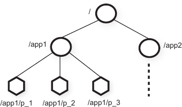
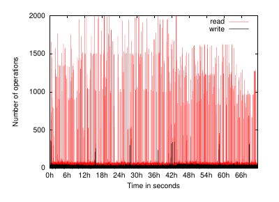
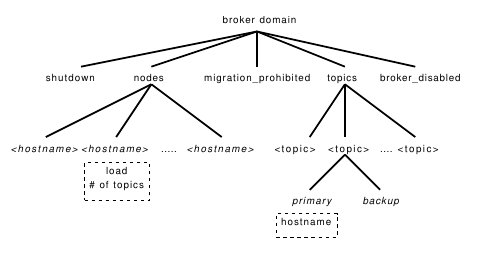
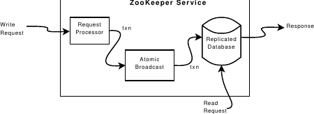
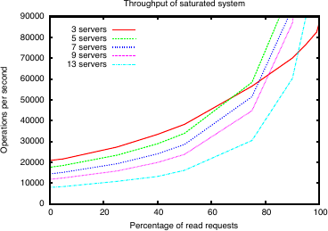
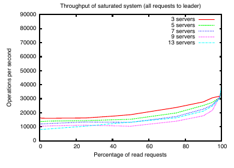
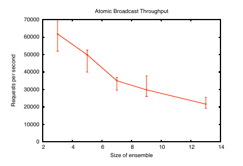
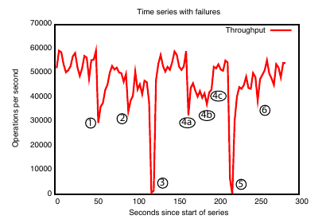

**ZooKeeper: Wait-free Coordination for Internet-scale Systems｜ZooKeeper：面向互联网规模系统的无等待协调**

**Patrick Hunt and Mahadev Konar**<br>
Yahoo! Grid<br>
{phunt,mahadev}@yahoo-inc.com

**Flavio P. Junqueira and Benjamin Reed**<br>
Yahoo! Research<br>
{fpj,breed}@yahoo-inc.com

> **Patrick Hunt 与 Mahadev Konar**<br>
> Yahoo! Grid<br>
> {phunt,mahadev}@yahoo-inc.com
>
> **Flavio P. Junqueira 与 Benjamin Reed**<br>
> Yahoo! Research<br>
> {fpj,breed}@yahoo-inc.com

## Abstract｜摘要

In this paper, we describe ZooKeeper, a service for coordinating processes of distributed applications. Since ZooKeeper is part of critical infrastructure, ZooKeeper aims to provide a simple and high performance kernel for building more complex coordination primitives at the client. It incorporates elements from group messaging, shared registers, and distributed lock services in a replicated, centralized service. The interface exposed by ZooKeeper has the wait-free aspects of shared registers with an event-driven mechanism similar to cache invalidations of distributed file systems to provide a simple, yet powerful coordination service.

The ZooKeeper interface enables a high-performance service implementation. In addition to the wait-free property, ZooKeeper provides a per client guarantee of FIFO execution of requests and linearizability for all requests that change the ZooKeeper state. These design decisions enable the implementation of a high performance processing pipeline with read requests being satisfied by local servers. We show for the target workloads, 2:1 to 100:1 read to write ratio, that ZooKeeper can handle tens to hundreds of thousands of transactions per second. This performance allows ZooKeeper to be used extensively by client applications.

> 本文介绍 ZooKeeper——一种用于协调分布式应用进程的服务。由于 ZooKeeper 属于关键基础设施，它力求提供一个简洁而高性能的内核，使客户端能够据此构建更复杂的协调原语。ZooKeeper 在一个经过复制的中心化服务中，融合了组消息、共享寄存器和分布式锁服务的若干要素。它所暴露的接口兼具共享寄存器的无等待特性，以及类似分布式文件系统缓存失效通知的事件驱动机制，由此形成一种简洁却强大的协调服务。
>
> ZooKeeper 的接口使服务得以实现高性能。除了无等待特性外，ZooKeeper 还保证每个客户端的请求按 FIFO 顺序执行，并保证所有改变 ZooKeeper 状态的请求均具备线性一致性。这些设计选择使系统可以采用高性能处理流水线，并由本地服务器满足读请求。我们表明，对于目标工作负载中 2:1 至 100:1 的读写比，ZooKeeper 每秒能够处理数万到数十万笔事务。这一性能使客户端应用能够广泛使用 ZooKeeper。

## 1 Introduction｜引言

Large-scale distributed applications require different forms of coordination. Configuration is one of the most basic forms of coordination. In its simplest form, configuration is just a list of operational parameters for the system processes, whereas more sophisticated systems have dynamic configuration parameters. Group membership and leader election are also common in distributed systems: often processes need to know which other processes are alive and what those processes are in charge of. Locks constitute a powerful coordination primitive that implement mutually exclusive access to critical resources.

One approach to coordination is to develop services for each of the different coordination needs. For example, Amazon Simple Queue Service [3] focuses specifically on queuing. Other services have been developed specifically for leader election [25] and configuration [27]. Services that implement more powerful primitives can be used to implement less powerful ones. For example, Chubby [6] is a locking service with strong synchronization guarantees. Locks can then be used to implement leader election, group membership, etc.

> 大规模分布式应用需要多种形式的协调。配置是最基本的协调形式之一：最简单时，配置只是系统进程运行参数的列表；更复杂的系统则拥有动态配置参数。组成员管理和领导者选举在分布式系统中也很常见——进程往往需要知道还有哪些进程存活，以及这些进程分别负责什么。锁是一种强大的协调原语，可实现对关键资源的互斥访问。
>
> 一种协调方案是针对每一类不同需求分别开发服务。例如，Amazon Simple Queue Service [3] 专注于排队；另有服务专门用于领导者选举 [25] 和配置管理 [27]。实现了较强原语的服务也可以用来实现较弱的原语。例如，Chubby [6] 是一种提供强同步保证的锁服务，而锁又可用于实现领导者选举、组成员管理等功能。

When designing our coordination service, we moved away from implementing specific primitives on the server side, and instead we opted for exposing an API that enables application developers to implement their own primitives. Such a choice led to the implementation of a coordination kernel that enables new primitives without requiring changes to the service core. This approach enables multiple forms of coordination adapted to the requirements of applications, instead of constraining developers to a fixed set of primitives.

When designing the API of ZooKeeper, we moved away from blocking primitives, such as locks. Blocking primitives for a coordination service can cause, among other problems, slow or faulty clients to impact negatively the performance of faster clients. The implementation of the service itself becomes more complicated if processing requests depends on responses and failure detection of other clients. Our system, Zookeeper, hence implements an API that manipulates simple wait-free data objects organized hierarchically as in file systems. In fact, the ZooKeeper API resembles the one of any other file system, and looking at just the API signatures, ZooKeeper seems to be Chubby without the lock methods, open, and close. Implementing wait-free data objects, however, differentiates ZooKeeper significantly from systems based on blocking primitives such as locks.

> 在设计协调服务时，我们没有在服务器端实现特定原语，而是选择暴露一组 API，让应用开发者自行实现所需原语。这一选择催生了一个协调内核：无需修改服务核心，便可支持新的原语。因此，开发者可以针对应用需求采用多种协调方式，而不会受限于一套固定原语。
>
> 在设计 ZooKeeper API 时，我们同样避开了锁一类阻塞原语。协调服务若采用阻塞原语，慢客户端或故障客户端可能拖累较快客户端的性能，这还只是问题之一。倘若请求处理依赖其他客户端的响应与故障检测，服务本身的实现也会更加复杂。因此，我们的系统 Zookeeper 提供了一组 API，用来操纵像文件系统那样按层次组织的简单无等待数据对象。事实上，ZooKeeper API 与一般文件系统的 API 相似；仅看 API 签名，ZooKeeper 就像是删掉了锁方法以及 `open`、`close` 的 Chubby。然而，无等待数据对象的实现使 ZooKeeper 与基于锁等阻塞原语的系统有了本质区别。

Although the wait-free property is important for performance and fault tolerance, it is not sufficient for coordination. We have also to provide order guarantees for operations. In particular, we have found that guaranteeing both FIFO client ordering of all operations and linearizable writes enables an efficient implementation of the service and it is sufficient to implement coordination primitives of interest to our applications. In fact, we can implement consensus for any number of processes with our API, and according to the hierarchy of Herlihy, ZooKeeper implements a universal object [14].

The ZooKeeper service comprises an ensemble of servers that use replication to achieve high availability and performance. Its high performance enables applications comprising a large number of processes to use such a coordination kernel to manage all aspects of coordination. We were able to implement ZooKeeper using a simple pipelined architecture that allows us to have hundreds or thousands of requests outstanding while still achieving low latency. Such a pipeline naturally enables the execution of operations from a single client in FIFO order. Guaranteeing FIFO client order enables clients to submit operations asynchronously. With asynchronous operations, a client is able to have multiple outstanding operations at a time. This feature is desirable, for example, when a new client becomes a leader and it has to manipulate metadata and update it accordingly. Without the possibility of multiple outstanding operations, the time of initialization can be of the order of seconds instead of sub-second.

> 无等待特性虽然对性能和容错至关重要，却不足以单独支撑协调；我们还必须为操作提供顺序保证。尤其是，我们发现，同时保证客户端全部操作的 FIFO 顺序和写操作的线性一致性，既能让服务高效实现，也足以实现应用所关心的协调原语。事实上，借助这组 API，我们可以为任意数量的进程实现共识；按照 Herlihy 的层级体系，ZooKeeper 实现了一个通用对象 [14]。
>
> ZooKeeper 服务由一组服务器组成，并通过复制获得高可用性和高性能。凭借这样的性能，包含大量进程的应用可以用这个协调内核管理各方面的协调工作。我们采用一种简单的流水线架构实现 ZooKeeper：即使同时有数百乃至数千个未完成请求，仍可保持低延迟。这样的流水线天然允许同一客户端的操作按 FIFO 顺序执行。客户端 FIFO 顺序保证又使客户端能够异步提交操作；借助异步操作，一个客户端可同时保有多个未完成操作。例如，新客户端成为领导者后，必须操纵元数据并进行相应更新，此时这一特性十分理想。若不能同时发出多个未完成操作，初始化时间可能达到数秒，而非不足一秒。

To guarantee that update operations satisfy linearizability, we implement a leader-based atomic broadcast protocol [23], called Zab [24]. A typical workload of a ZooKeeper application, however, is dominated by read operations and it becomes desirable to scale read throughput. In ZooKeeper, servers process read operations locally, and we do not use Zab to totally order them.

Caching data on the client side is an important technique to increase the performance of reads. For example, it is useful for a process to cache the identifier of the current leader instead of probing ZooKeeper every time it needs to know the leader. ZooKeeper uses a watch mechanism to enable clients to cache data without managing the client cache directly. With this mechanism, a client can watch for an update to a given data object, and receive a notification upon an update. Chubby manages the client cache directly. It blocks updates to invalidate the caches of all clients caching the data being changed. Under this design, if any of these clients is slow or faulty, the update is delayed. Chubby uses leases to prevent a faulty client from blocking the system indefinitely. Leases, however, only bound the impact of slow or faulty clients, whereas ZooKeeper watches avoid the problem altogether.

> 为保证更新操作满足线性一致性，我们实现了一种基于领导者的原子广播协议 [23]，称为 Zab [24]。然而，ZooKeeper 应用的典型工作负载以读操作为主，因此扩展读吞吐量尤为重要。在 ZooKeeper 中，服务器在本地处理读操作，并不使用 Zab 对读操作进行全序排序。
>
> 在客户端缓存数据是提升读取性能的重要技术。例如，进程可以缓存当前领导者的标识符，而不必每次需要知道领导者时都查询 ZooKeeper。ZooKeeper 使用 watch 机制，使客户端无需直接管理缓存即可缓存数据。借助该机制，客户端可以监视某个数据对象的更新，并在更新发生时收到通知。Chubby 则直接管理客户端缓存：为了让所有缓存了被修改数据的客户端缓存失效，它会阻塞更新。在这种设计下，只要其中一个客户端缓慢或发生故障，更新就会延迟。Chubby 用租约防止故障客户端无限期阻塞系统；但租约只能限制慢客户端或故障客户端的影响，ZooKeeper 的 watch 则从根本上避开了这个问题。

In this paper we discuss our design and implementation of ZooKeeper. With ZooKeeper, we are able to implement all coordination primitives that our applications require, even though only writes are linearizable. To validate our approach we show how we implement some coordination primitives with ZooKeeper.

To summarize, in this paper our main contributions are:

> 本文讨论 ZooKeeper 的设计与实现。尽管只有写操作具备线性一致性，ZooKeeper 仍能实现应用所需的全部协调原语。为了验证这一方案，我们将展示如何用 ZooKeeper 实现若干协调原语。
>
> 总而言之，本文的主要贡献如下：

- **Coordination kernel:** We propose a wait-free coordination service with relaxed consistency guarantees for use in distributed systems. In particular, we describe our design and implementation of a coordination kernel, which we have used in many critical applications to implement various coordination techniques.
- **Coordination recipes:** We show how ZooKeeper can be used to build higher level coordination primitives, even blocking and strongly consistent primitives, that are often used in distributed applications.
- **Experience with Coordination:** We share some of the ways that we use ZooKeeper and evaluate its performance.

> - **协调内核：** 我们提出一种适用于分布式系统、采用宽松一致性保证的无等待协调服务。具体而言，我们介绍了该协调内核的设计与实现；许多关键应用已经用它实现了各种协调技术。
> - **协调方案：** 我们说明如何用 ZooKeeper 构建分布式应用常用的更高层协调原语，其中甚至包括阻塞原语和强一致性原语。
> - **协调实践经验：** 我们分享 ZooKeeper 的若干使用方式，并评估其性能。

## 2 The ZooKeeper service｜ZooKeeper 服务

Clients submit requests to ZooKeeper through a client API using a ZooKeeper client library. In addition to exposing the ZooKeeper service interface through the client API, the client library also manages the network connections between the client and ZooKeeper servers.

In this section, we first provide a high-level view of the ZooKeeper service. We then discuss the API that clients use to interact with ZooKeeper.

**Terminology.** In this paper, we use client to denote a user of the ZooKeeper service, server to denote a process providing the ZooKeeper service, and znode to denote an in-memory data node in the ZooKeeper data, which is organized in a hierarchical namespace referred to as the data tree. We also use the terms update and write to refer to any operation that modifies the state of the data tree. Clients establish a session when they connect to ZooKeeper and obtain a session handle through which they issue requests.

> 客户端使用 ZooKeeper 客户端库，通过客户端 API 向 ZooKeeper 提交请求。客户端库除了通过客户端 API 暴露 ZooKeeper 服务接口外，还负责管理客户端与 ZooKeeper 服务器之间的网络连接。
>
> 本节首先从高层概述 ZooKeeper 服务，随后讨论客户端与 ZooKeeper 交互所使用的 API。
>
> **术语。** 本文以 _client_（客户端）指代 ZooKeeper 服务的使用者，以 _server_（服务器）指代提供 ZooKeeper 服务的进程，以 _znode_ 指代 ZooKeeper 数据中的内存数据节点。这些节点组织在一个称为数据树的层次化命名空间中。我们还用 _update_（更新）和 _write_（写）指代任何修改数据树状态的操作。客户端连接 ZooKeeper 时建立会话，并取得一个会话句柄，通过它发出请求。

### 2.1 Service overview｜服务概览

ZooKeeper provides to its clients the abstraction of a set of data nodes (znodes), organized according to a hierarchical name space. The znodes in this hierarchy are data objects that clients manipulate through the ZooKeeper API. Hierarchical name spaces are commonly used in file systems. It is a desirable way of organizing data objects, since users are used to this abstraction and it enables better organization of application meta-data. To refer to a given znode, we use the standard UNIX notation for file system paths. For example, we use `/A/B/C` to denote the path to znode C, where C has B as its parent and B has A as its parent. All znodes store data, and all znodes, except for ephemeral znodes, can have children.

> ZooKeeper 向客户端提供一组数据节点（znode）的抽象，这些节点按层次化命名空间组织。该层次结构中的 znode 是客户端通过 ZooKeeper API 操纵的数据对象。层次化命名空间在文件系统中十分常见；用户熟悉这种抽象，而且它有利于更好地组织应用元数据，因此很适合用来组织数据对象。我们使用标准 UNIX 文件系统路径记法引用某个 znode。例如，`/A/B/C` 表示 znode C 的路径，其中 C 的父节点是 B，B 的父节点是 A。所有 znode 都存储数据；除临时 znode 外，所有 znode 都可以拥有子节点。



_Figure 1: Illustration of ZooKeeper hierarchical name space._

> _图 1：ZooKeeper 层次化命名空间示意图。_

> **图表中文解读：** 根节点 `/` 下划分出应用各自的子树，如 `/app1` 与 `/app2`；应用 1 的成员进程分别创建 `/app1/p_1`、`/app1/p_2`、`/app1/p_3`。这说明 ZooKeeper 用类似文件系统的路径把不同应用的协调元数据隔离开来，并可自然表达组成员关系。

There are two types of znodes that a client can create:

> 客户端可以创建两类 znode：

- **Regular:** Clients manipulate regular znodes by creating and deleting them explicitly;
- **Ephemeral:** Clients create such znodes, and they either delete them explicitly, or let the system remove them automatically when the session that creates them terminates (deliberately or due to a failure).

> - **常规节点：** 客户端通过显式创建和删除来操纵常规 znode；
> - **临时节点：** 客户端创建这类 znode 后，可以显式删除它们，也可以在创建它们的会话终止时（主动终止或因故障终止），由系统自动将其删除。

Additionally, when creating a new znode, a client can set a sequential flag. Nodes created with the sequential flag set have the value of a monotonically increasing counter appended to its name. If $n$ is the new znode and $p$ is the parent znode, then the sequence value of $n$ is never smaller than the value in the name of any other sequential znode ever created under $p$.

ZooKeeper implements watches to allow clients to receive timely notifications of changes without requiring polling. When a client issues a read operation with a watch flag set, the operation completes as normal except that the server promises to notify the client when the information returned has changed. Watches are one-time triggers associated with a session; they are unregistered once triggered or the session closes. Watches indicate that a change has happened, but do not provide the change. For example, if a client issues a `getData("/foo", true)` before “/foo” is changed twice, the client will get one watch event telling the client that data for “/foo” has changed. Session events, such as connection loss events, are also sent to watch callbacks so that clients know that watch events may be delayed.

> 此外，客户端创建新 znode 时可以设置顺序标志。设置该标志所创建的节点，其名称末尾会追加一个单调递增计数器的值。如果 $n$ 是新 znode、$p$ 是其父 znode，那么 $n$ 的序号绝不会小于此前在 $p$ 下创建过的任何其他顺序 znode 名称中的序号。
>
> ZooKeeper 实现了 watch，使客户端无需轮询即可及时收到变更通知。客户端发出设置了 watch 标志的读操作时，该操作照常完成，只是服务器同时承诺：一旦所返回的信息发生变化，便通知该客户端。watch 是与会话关联的一次性触发器；一经触发或会话关闭，便会注销。watch 只表明发生了变更，并不携带变更内容。例如，客户端在 `/foo` 被连续修改两次之前发出 `getData("/foo", true)`，它只会收到一个 watch 事件，告知 `/foo` 的数据已经变化。连接丢失等会话事件也会发送给 watch 回调，使客户端知道 watch 事件可能延迟到达。

**Data model.** The data model of ZooKeeper is essentially a file system with a simplified API and only full data reads and writes, or a key/value table with hierarchical keys. The hierarchal namespace is useful for allocating subtrees for the namespace of different applications and for setting access rights to those subtrees. We also exploit the concept of directories on the client side to build higher level primitives as we will see in section 2.4.

Unlike files in file systems, znodes are not designed for general data storage. Instead, znodes map to abstractions of the client application, typically corresponding to meta-data used for coordination purposes. To illustrate, in Figure 1 we have two subtrees, one for Application 1 (`/app1`) and another for Application 2 (`/app2`). The subtree for Application 1 implements a simple group membership protocol: each client process $p_i$ creates a znode $p_i$ under `/app1`, which persists as long as the process is running.

> **数据模型。** ZooKeeper 的数据模型本质上可以看作一种 API 简化、只支持完整数据读写的文件系统，也可以看作一张键具有层次结构的键值表。层次化命名空间有利于为不同应用分配各自的命名空间子树，并为这些子树设置访问权限。正如第 2.4 节将展示的，我们也在客户端利用“目录”概念构建更高层原语。
>
> 与文件系统中的文件不同，znode 并非为通用数据存储而设计。它们映射到客户端应用的抽象，通常对应协调所需的元数据。例如，图 1 中有两棵子树：应用 1 使用 `/app1`，应用 2 使用 `/app2`。应用 1 的子树实现了一种简单的组成员协议：每个客户端进程 $p_i$ 都在 `/app1` 下创建一个 znode $p_i$，只要该进程仍在运行，该节点就持续存在。

Although znodes have not been designed for general data storage, ZooKeeper does allow clients to store some information that can be used for meta-data or configuration in a distributed computation. For example, in a leader-based application, it is useful for an application server that is just starting to learn which other server is currently the leader. To accomplish this goal, we can have the current leader write this information in a known location in the znode space. Znodes also have associated meta-data with time stamps and version counters, which allow clients to track changes to znodes and execute conditional updates based on the version of the znode.

**Sessions.** A client connects to ZooKeeper and initiates a session. Sessions have an associated timeout. ZooKeeper considers a client faulty if it does not receive anything from its session for more than that timeout. A session ends when clients explicitly close a session handle or ZooKeeper detects that a clients is faulty. Within a session, a client observes a succession of state changes that reflect the execution of its operations. Sessions enable a client to move transparently from one server to another within a ZooKeeper ensemble, and hence persist across ZooKeeper servers.

> 尽管 znode 并非面向通用数据存储，ZooKeeper 仍允许客户端存入少量信息，作为分布式计算中的元数据或配置。例如，在基于领导者的应用中，刚启动的应用服务器需要知道当前哪台服务器是领导者。为此，可以让当前领导者把该信息写入 znode 空间中的一个约定位置。znode 还关联着带时间戳和版本计数器的元数据，客户端由此可以跟踪 znode 的变化，并依据 znode 版本执行条件更新。
>
> **会话。** 客户端连接 ZooKeeper 并发起会话。每个会话都有一个关联的超时时间；如果超过该时限仍未从会话收到任何消息，ZooKeeper 就认为客户端发生故障。客户端显式关闭会话句柄，或 ZooKeeper 检测到客户端故障时，会话结束。在一个会话内，客户端会观察到一连串反映其操作执行结果的状态变化。会话使客户端能够在 ZooKeeper 服务器集合中的不同服务器之间透明迁移，因而可以跨 ZooKeeper 服务器持续存在。

### 2.2 Client API｜客户端 API

We present below a relevant subset of the ZooKeeper API, and discuss the semantics of each request.

> 下面给出 ZooKeeper API 中与本文相关的一个子集，并讨论每种请求的语义。

- `create(path, data, flags)`: Creates a znode with path name `path`, stores `data[]` in it, and returns the name of the new znode. `flags` enables a client to select the type of znode: regular, ephemeral, and set the sequential flag;
- `delete(path, version)`: Deletes the znode `path` if that znode is at the expected version;
- `exists(path, watch)`: Returns true if the znode with path name `path` exists, and returns false otherwise. The watch flag enables a client to set a watch on the znode;
- `getData(path, watch)`: Returns the data and meta-data, such as version information, associated with the znode. The watch flag works in the same way as it does for `exists()`, except that ZooKeeper does not set the watch if the znode does not exist;
- `setData(path, data, version)`: Writes `data[]` to znode `path` if the version number is the current version of the znode;
- `getChildren(path, watch)`: Returns the set of names of the children of a znode;
- `sync(path)`: Waits for all updates pending at the start of the operation to propagate to the server that the client is connected to. The path is currently ignored.

> - `create(path, data, flags)`：创建路径名为 `path` 的 znode，将 `data[]` 存入其中，并返回新 znode 的名称。客户端通过 `flags` 选择 znode 类型（常规或临时）并设置顺序标志；
> - `delete(path, version)`：如果路径为 `path` 的 znode 正处于预期版本，则将其删除；
> - `exists(path, watch)`：如果路径名为 `path` 的 znode 存在则返回 true，否则返回 false。watch 标志允许客户端在该 znode 上设置 watch；
> - `getData(path, watch)`：返回与 znode 关联的数据和元数据，例如版本信息。watch 标志的行为与 `exists()` 相同，不同之处是：如果 znode 不存在，ZooKeeper 不会设置 watch；
> - `setData(path, data, version)`：如果版本号等于该 znode 的当前版本，则把 `data[]` 写入路径为 `path` 的 znode；
> - `getChildren(path, watch)`：返回某个 znode 的子节点名称集合；
> - `sync(path)`：等待本操作开始时尚未完成的所有更新传播到客户端当前连接的服务器。当前实现忽略 `path` 参数。

All methods have both a synchronous and an asynchronous version available through the API. An application uses the synchronous API when it needs to execute a single ZooKeeper operation and it has no concurrent tasks to execute, so it makes the necessary ZooKeeper call and blocks. The asynchronous API, however, enables an application to have both multiple outstanding ZooKeeper operations and other tasks executed in parallel. The ZooKeeper client guarantees that the corresponding callbacks for each operation are invoked in order.

Note that ZooKeeper does not use handles to access znodes. Each request instead includes the full path of the znode being operated on. Not only does this choice simplifies the API (no `open()` or `close()` methods), but it also eliminates extra state that the server would need to maintain.

Each of the update methods take an expected version number, which enables the implementation of conditional updates. If the actual version number of the znode does not match the expected version number the update fails with an unexpected version error. If the version number is $-1$, it does not perform version checking.

> API 为所有方法同时提供同步版本和异步版本。应用需要执行单个 ZooKeeper 操作、且没有其他并发任务时，可使用同步 API：发起所需的 ZooKeeper 调用后阻塞等待。异步 API 则使应用既能同时保有多个未完成的 ZooKeeper 操作，也能并行执行其他任务。ZooKeeper 客户端保证各操作对应的回调按顺序调用。
>
> 请注意，ZooKeeper 不使用句柄访问 znode；每个请求都直接包含目标 znode 的完整路径。这一选择不仅简化了 API（无需 `open()` 或 `close()` 方法），还消除了服务器原本必须维护的额外状态。
>
> 每种更新方法都接受一个预期版本号，从而支持条件更新。如果 znode 的实际版本号与预期版本号不匹配，更新就会失败，并返回“非预期版本”错误；若版本号为 $-1$，则不进行版本检查。

### 2.3 ZooKeeper guarantees｜ZooKeeper 的保证

ZooKeeper has two basic ordering guarantees:

> ZooKeeper 提供两项基本顺序保证：

- **Linearizable writes:** all requests that update the state of ZooKeeper are serializable and respect precedence;
- **FIFO client order:** all requests from a given client are executed in the order that they were sent by the client.

> - **线性一致写：** 所有更新 ZooKeeper 状态的请求都是可串行化的，并遵守先后关系；
> - **客户端 FIFO 顺序：** 来自同一客户端的全部请求，均按该客户端发出请求的顺序执行。

Note that our definition of linearizability is different from the one originally proposed by Herlihy [15], and we call it A-linearizability (asynchronous linearizability). In the original definition of linearizability by Herlihy, a client is only able to have one outstanding operation at a time (a client is one thread). In ours, we allow a client to have multiple outstanding operations, and consequently we can choose to guarantee no specific order for outstanding operations of the same client or to guarantee FIFO order. We choose the latter for our property. It is important to observe that all results that hold for linearizable objects also hold for A-linearizable objects because a system that satisfies A-linearizability also satisfies linearizability. Because only update requests are A-linearizable, ZooKeeper processes read requests locally at each replica. This allows the service to scale linearly as servers are added to the system.

> 请注意，我们对线性一致性的定义不同于 Herlihy 最初提出的定义 [15]，我们称之为 A-线性一致性（异步线性一致性）。在 Herlihy 的原始定义中，一个客户端（即一个线程）一次只能有一个未完成操作；在我们的定义中，一个客户端可以同时拥有多个未完成操作。因此，我们既可以不规定同一客户端未完成操作之间的具体顺序，也可以保证 FIFO 顺序；这里选择后者作为系统性质。必须指出：凡是对线性一致对象成立的结论，对 A-线性一致对象同样成立，因为满足 A-线性一致性的系统也满足线性一致性。由于只有更新请求具备 A-线性一致性，ZooKeeper 可以在每个副本本地处理读请求；这样一来，服务即可随服务器的增加近似线性扩展。

To see how these two guarantees interact, consider the following scenario. A system comprising a number of processes elects a leader to command worker processes. When a new leader takes charge of the system, it must change a large number of configuration parameters and notify the other processes once it finishes. We then have two important requirements:

> 为理解这两项保证如何协同作用，请考虑如下场景。一个由多个进程组成的系统选出一名领导者来指挥工作进程。新领导者接管系统时，必须修改大量配置参数，并在全部修改完成后通知其他进程。于是产生两项重要需求：

- As the new leader starts making changes, we do not want other processes to start using the configuration that is being changed;
- If the new leader dies before the configuration has been fully updated, we do not want the processes to use this partial configuration.

> - 新领导者开始修改配置后，其他进程不应开始使用这份正在变更的配置；
> - 如果新领导者在配置尚未全部更新时死亡，其他进程不应使用这份不完整配置。

Observe that distributed locks, such as the locks provided by Chubby, would help with the first requirement but are insufficient for the second. With ZooKeeper, the new leader can designate a path as the ready znode; other processes will only use the configuration when that znode exists. The new leader makes the configuration change by deleting ready, updating the various configuration znodes, and creating ready. All of these changes can be pipelined and issued asynchronously to quickly update the configuration state. Although the latency of a change operation is of the order of 2 milliseconds, a new leader that must update 5000 different znodes will take 10 seconds if the requests are issued one after the other; by issuing the requests asynchronously the requests will take less than a second. Because of the ordering guarantees, if a process sees the ready znode, it must also see all the configuration changes made by the new leader. If the new leader dies before the ready znode is created, the other processes know that the configuration has not been finalized and do not use it.

> Chubby 所提供的分布式锁之类机制有助于满足第一项需求，却不足以满足第二项。使用 ZooKeeper 时，新领导者可以指定一条路径作为 ready znode；其他进程只有在该节点存在时才使用配置。新领导者通过删除 ready、更新各个配置 znode、再创建 ready 来完成配置变更。这些变更都可以流水线化并异步发出，从而迅速更新配置状态。尽管单次变更操作的延迟约为 2 毫秒，如果新领导者要更新 5000 个不同 znode，并逐一串行发出请求，仍需 10 秒；异步发出则不到 1 秒。由于存在顺序保证，只要进程看见 ready znode，就必然也能看见新领导者做出的全部配置变更。如果新领导者在创建 ready znode 前死亡，其他进程便知道配置尚未定稿，因而不会使用它。

The above scheme still has a problem: what happens if a process sees that ready exists before the new leader starts to make a change and then starts reading the configuration while the change is in progress. This problem is solved by the ordering guarantee for the notifications: if a client is watching for a change, the client will see the notification event before it sees the new state of the system after the change is made. Consequently, if the process that reads the ready znode requests to be notified of changes to that znode, it will see a notification informing the client of the change before it can read any of the new configuration.

Another problem can arise when clients have their own communication channels in addition to ZooKeeper. For example, consider two clients A and B that have a shared configuration in ZooKeeper and communicate through a shared communication channel. If A changes the shared configuration in ZooKeeper and tells B of the change through the shared communication channel, B would expect to see the change when it re-reads the configuration. If B’s ZooKeeper replica is slightly behind A’s, it may not see the new configuration. Using the above guarantees B can make sure that it sees the most up-to-date information by issuing a write before re-reading the configuration. To handle this scenario more efficiently ZooKeeper provides the `sync` request: when followed by a read, constitutes a slow read. `sync` causes a server to apply all pending write requests before processing the read without the overhead of a full write. This primitive is similar in idea to the flush primitive of ISIS [5].

> 上述方案仍有一个问题：如果某个进程在新领导者开始变更前看见 ready 存在，随后又在变更过程中读取配置，会发生什么？通知的顺序保证解决了这一问题：如果客户端正在 watch 某项变更，那么在看见变更后的系统新状态之前，它一定先看见通知事件。因此，读取 ready znode 的进程只要请求接收该节点变更通知，就会在读到任何新配置之前，先收到告知变更已经发生的通知。
>
> 如果客户端除了 ZooKeeper 之外还有自己的通信信道，还会出现另一个问题。设客户端 A 和 B 在 ZooKeeper 中共享一份配置，并通过一条共享通信信道交流。若 A 修改 ZooKeeper 中的共享配置，再通过共享信道告知 B，B 自然期望重新读取配置时能看到这次修改。然而，如果 B 所连接的 ZooKeeper 副本略微落后于 A 的副本，B 可能看不到新配置。借助上述保证，B 可以在重新读取配置之前先发出一次写操作，以确保读到最新信息。为更高效地处理这一场景，ZooKeeper 提供 `sync` 请求：它后接一次读取，便构成一次“慢读”。`sync` 让服务器在处理读取之前先应用所有待处理写请求，同时免去执行完整写操作的开销。其思想类似 ISIS 的 flush 原语 [5]。

ZooKeeper also has the following two liveness and durability guarantees: if a majority of ZooKeeper servers are active and communicating the service will be available; and if the ZooKeeper service responds successfully to a change request, that change persists across any number of failures as long as a quorum of servers is eventually able to recover.

> ZooKeeper 还提供以下两项活性与持久性保证：只要多数 ZooKeeper 服务器处于活动且彼此可通信的状态，服务就可用；一旦 ZooKeeper 服务成功响应某个变更请求，只要最终有一个服务器法定人数能够恢复，该变更就能跨任意次数的故障持续存在。

### 2.4 Examples of primitives｜原语示例

In this section, we show how to use the ZooKeeper API to implement more powerful primitives. The ZooKeeper service knows nothing about these more powerful primitives since they are entirely implemented at the client using the ZooKeeper client API. Some common primitives such as group membership and configuration management are also wait-free. For others, such as rendezvous, clients need to wait for an event. Even though ZooKeeper is wait-free, we can implement efficient blocking primitives with ZooKeeper. ZooKeeper’s ordering guarantees allow efficient reasoning about system state, and watches allow for efficient waiting.

**Configuration Management** ZooKeeper can be used to implement dynamic configuration in a distributed application. In its simplest form configuration is stored in a znode, $z_c$. Processes start up with the full pathname of $z_c$. Starting processes obtain their configuration by reading $z_c$ with the watch flag set to true. If the configuration in $z_c$ is ever updated, the processes are notified and read the new configuration, again setting the watch flag to true.

> 本节展示如何使用 ZooKeeper API 实现更强大的原语。由于这些原语完全由客户端借助 ZooKeeper 客户端 API 实现，ZooKeeper 服务本身对此一无所知。组成员管理、配置管理等常用原语同样可以做到无等待；对于会合（rendezvous）等另一些原语，客户端则需要等待事件。尽管 ZooKeeper 本身是无等待的，我们仍能用它实现高效的阻塞原语。ZooKeeper 的顺序保证让系统状态易于高效推理，watch 则使等待能够高效完成。
>
> **配置管理** ZooKeeper 可用于在分布式应用中实现动态配置。最简单的做法是把配置存放在 znode $z_c$ 中；进程启动时持有 $z_c$ 的完整路径名，并通过读取 $z_c$ 获取配置，同时将 watch 标志设为 true。一旦 $z_c$ 中的配置被更新，进程就会收到通知并读取新配置，同时再次把 watch 标志设为 true。

Note that in this scheme, as in most others that use watches, watches are used to make sure that a process has the most recent information. For example, if a process watching $z_c$ is notified of a change to $z_c$ and before it can issue a read for $z_c$ there are three more changes to $z_c$, the process does not receive three more notification events. This does not affect the behavior of the process, since those three events would have simply notified the process of something it already knows: the information it has for $z_c$ is stale.

**Rendezvous** Sometimes in distributed systems, it is not always clear a priori what the final system configuration will look like. For example, a client may want to start a master process and several worker processes, but the starting processes is done by a scheduler, so the client does not know ahead of time information such as addresses and ports that it can give the worker processes to connect to the master. We handle this scenario with ZooKeeper using a rendezvous znode, $z_r$, which is an node created by the client. The client passes the full pathname of $z_r$ as a startup parameter of the master and worker processes. When the master starts it fills in $z_r$ with information about addresses and ports it is using. When workers start, they read $z_r$ with watch set to true. If $z_r$ has not been filled in yet, the worker waits to be notified when $z_r$ is updated. If $z_r$ is an ephemeral node, master and worker processes can watch for $z_r$ to be deleted and clean themselves up when the client ends.

> 请注意，与多数采用 watch 的方案一样，这里的 watch 用于确保进程拥有最新信息。例如，某进程在 watch $z_c$ 时收到 $z_c$ 的变更通知，但在它来得及读取 $z_c$ 之前，$z_c$ 又发生三次变化；该进程不会再收到三个通知事件。这并不影响进程行为，因为那三个事件只会重复告知一件它已经知道的事：自己持有的 $z_c$ 信息已经过时。
>
> **会合** 在分布式系统中，最终系统配置有时无法预先确定。例如，客户端可能要启动一个主进程和若干工作进程，但进程实际由调度器启动，所以客户端事先并不知道可交给工作进程、供其连接主进程使用的地址和端口等信息。ZooKeeper 通过客户端创建的会合 znode $z_r$ 处理这一场景。客户端把 $z_r$ 的完整路径名作为主进程和工作进程的启动参数。主进程启动时，将自己使用的地址和端口信息填入 $z_r$；工作进程启动时读取 $z_r$，并将 watch 设为 true。若 $z_r$ 尚未填入内容，工作进程就等待 $z_r$ 更新通知。如果 $z_r$ 是临时节点，主进程与工作进程还可以 watch $z_r$ 的删除事件，并在客户端结束时自行清理。

**Group Membership** We take advantage of ephemeral nodes to implement group membership. Specifically, we use the fact that ephemeral nodes allow us to see the state of the session that created the node. We start by designating a znode, $z_g$ to represent the group. When a process member of the group starts, it creates an ephemeral child znode under $z_g$. If each process has a unique name or identifier, then that name is used as the name of the child znode; otherwise, the process creates the znode with the SEQUENTIAL flag to obtain a unique name assignment. Processes may put process information in the data of the child znode, addresses and ports used by the process, for example.

After the child znode is created under $z_g$ the process starts normally. It does not need to do anything else. If the process fails or ends, the znode that represents it under $z_g$ is automatically removed.

Processes can obtain group information by simply listing the children of $z_g$. If a process wants to monitor changes in group membership, the process can set the watch flag to true and refresh the group information (always setting the watch flag to true) when change notifications are received.

> **组成员管理** 我们利用临时节点实现组成员管理。具体而言，临时节点可以反映创建该节点的会话状态。首先指定一个代表组的 znode $z_g$。组内进程启动时，在 $z_g$ 下创建一个临时子 znode。如果每个进程都有唯一名称或标识符，就以它作为子 znode 名称；否则，进程创建 znode 时设置 `SEQUENTIAL` 标志，由系统分配唯一名称。进程还可以在子 znode 的数据中存入自身信息，例如所使用的地址和端口。
>
> 在 $z_g$ 下创建子 znode 后，进程即可正常启动，无需再做其他工作。如果该进程发生故障或结束，$z_g$ 下代表它的 znode 会被自动删除。
>
> 进程只需列出 $z_g$ 的子节点即可取得组信息。若希望监视组成员变化，进程可以把 watch 标志设为 true，并在收到变更通知时刷新组信息（每次仍将 watch 标志设为 true）。

**Simple Locks** Although ZooKeeper is not a lock service, it can be used to implement locks. Applications using ZooKeeper usually use synchronization primitives tailored to their needs, such as those shown above. Here we show how to implement locks with ZooKeeper to show that it can implement a wide variety of general synchronization primitives.

The simplest lock implementation uses “lock files”. The lock is represented by a znode. To acquire a lock, a client tries to create the designated znode with the EPHEMERAL flag. If the create succeeds, the client holds the lock. Otherwise, the client can read the znode with the watch flag set to be notified if the current leader dies. A client releases the lock when it dies or explicitly deletes the znode. Other clients that are waiting for a lock try again to acquire a lock once they observe the znode being deleted.

While this simple locking protocol works, it does have some problems. First, it suffers from the herd effect. If there are many clients waiting to acquire a lock, they will all vie for the lock when it is released even though only one client can acquire the lock. Second, it only implements exclusive locking. The following two primitives show how both of these problems can be overcome.

> **简单锁** ZooKeeper 虽然不是锁服务，却可以用来实现锁。使用 ZooKeeper 的应用通常会采用针对自身需求定制的同步原语，例如上面展示的几种。这里用 ZooKeeper 实现锁，以说明它能够实现多种通用同步原语。
>
> 最简单的锁实现使用“锁文件”：一个 znode 代表一把锁。客户端尝试用 `EPHEMERAL` 标志创建指定 znode 来获取锁；创建成功即持有锁，否则可读取该 znode 并设置 watch，以便在当前领导者死亡时收到通知。客户端死亡或显式删除该 znode 时释放锁。其他等待锁的客户端观察到该 znode 被删除后，再次尝试获取锁。
>
> 这套简单锁协议虽然可用，却存在若干问题。第一，它会遭遇惊群效应：若许多客户端正在等待获取一把锁，锁释放时它们会同时争抢，尽管最终只有一个客户端能够获得锁。第二，它只实现了排他锁。下面两种原语将说明如何克服这两个问题。

**Simple Locks without Herd Effect** We define a lock znode $l$ to implement such locks. Intuitively we line up all the clients requesting the lock and each client obtains the lock in order of request arrival. Thus, clients wishing to obtain the lock do the following:

> **无惊群效应的简单锁** 我们定义一个锁 znode $l$ 来实现这种锁。直观而言，所有请求锁的客户端排成队列，每个客户端按请求到达顺序获得锁。因此，希望获得锁的客户端执行以下步骤：

**Lock**

```text
1 n = create(l + “/lock-”, EPHEMERAL|SEQUENTIAL)
2 C = getChildren(l, false)
3 if n is lowest znode in C, exit
4 p = znode in C ordered just before n
5 if exists(p, true) wait for watch event
6 goto 2
```

> **加锁**
>
> ```text
> 1 n = create(l + “/lock-”, EPHEMERAL|SEQUENTIAL)
> 2 C = getChildren(l, false)
> 3 若 n 是 C 中序号最小的 znode，则退出
> 4 p = C 中顺序紧邻 n 之前的 znode
> 5 若 exists(p, true)，则等待 watch 事件
> 6 转到第 2 行
> ```

**Unlock**

```text
1 delete(n)
```

> **解锁**
>
> ```text
> 1 delete(n)
> ```

The use of the SEQUENTIAL flag in line 1 of Lock orders the client’s attempt to acquire the lock with respect to all other attempts. If the client’s znode has the lowest sequence number at line 3, the client holds the lock. Otherwise, the client waits for deletion of the znode that either has the lock or will receive the lock before this client’s znode. By only watching the znode that precedes the client’s znode, we avoid the herd effect by only waking up one process when a lock is released or a lock request is abandoned. Once the znode being watched by the client goes away, the client must check if it now holds the lock. (The previous lock request may have been abandoned and there is a znode with a lower sequence number still waiting for or holding the lock.)

Releasing a lock is as simple as deleting the znode $n$ that represents the lock request. By using the EPHEMERAL flag on creation, processes that crash will automatically cleanup any lock requests or release any locks that they may have.

> `Lock` 第 1 行使用 `SEQUENTIAL` 标志，把该客户端的获取锁尝试与其他所有尝试排出顺序。到第 3 行时，如果客户端 znode 的序号最小，该客户端便持有锁；否则，它等待这样一个 znode 被删除：该节点当前持有锁，或会在本客户端 znode 之前获得锁。每个客户端只 watch 自己前驱 znode，因此锁释放或锁请求放弃时只会唤醒一个进程，从而避免惊群效应。客户端所 watch 的 znode 消失后，必须检查自己此时是否已经持有锁。（前一个锁请求可能已被放弃，而仍有一个序号更小的 znode 正在等待或持有锁。）
>
> 释放锁只需删除代表该锁请求的 znode $n$。创建时使用 `EPHEMERAL` 标志，进程崩溃后就会自动清理自己的锁请求，或释放自己可能持有的锁。

In summary, this locking scheme has the following advantages:

> 总之，这套锁方案具有以下优点：

1. The removal of a znode only causes one client to wake up, since each znode is watched by exactly one other client, so we do not have the herd effect;
2. There is no polling or timeouts;
3. Because of the way we have implemented locking, we can see by browsing the ZooKeeper data the amount of lock contention, break locks, and debug locking problems.

> 1. 每个 znode 恰好只被另一个客户端 watch，因此删除一个 znode 只会唤醒一个客户端，不会产生惊群效应；
> 2. 无需轮询或超时机制；
> 3. 得益于这种锁实现方式，我们可以通过浏览 ZooKeeper 数据观察锁竞争程度、强制解除锁，并调试锁问题。

**Read/Write Locks** To implement read/write locks we change the lock procedure slightly and have separate read lock and write lock procedures. The unlock procedure is the same as the global lock case.

> **读写锁** 为实现读写锁，我们对加锁过程稍作修改，分别采用读锁过程和写锁过程。解锁过程与全局锁情形相同。

**Write Lock**

```text
1 n = create(l + “/write-”, EPHEMERAL|SEQUENTIAL)
2 C = getChildren(l, false)
3 if n is lowest znode in C, exit
4 p = znode in C ordered just before n
5 if exists(p, true) wait for event
6 goto 2
```

> **写锁**
>
> ```text
> 1 n = create(l + “/write-”, EPHEMERAL|SEQUENTIAL)
> 2 C = getChildren(l, false)
> 3 若 n 是 C 中序号最小的 znode，则退出
> 4 p = C 中顺序紧邻 n 之前的 znode
> 5 若 exists(p, true)，则等待事件
> 6 转到第 2 行
> ```

**Read Lock**

```text
1 n = create(l + “/read-”, EPHEMERAL|SEQUENTIAL)
2 C = getChildren(l, false)
3 if no write znodes lower than n in C, exit
4 p = write znode in C ordered just before n
5 if exists(p, true) wait for event
6 goto 3
```

> **读锁**
>
> ```text
> 1 n = create(l + “/read-”, EPHEMERAL|SEQUENTIAL)
> 2 C = getChildren(l, false)
> 3 若 C 中没有序号小于 n 的写 znode，则退出
> 4 p = C 中顺序紧邻 n 之前的写 znode
> 5 若 exists(p, true)，则等待事件
> 6 转到第 3 行
> ```

This lock procedure varies slightly from the previous locks. Write locks differ only in naming. Since read locks may be shared, lines 3 and 4 vary slightly because only earlier write lock znodes prevent the client from obtaining a read lock. It may appear that we have a “herd effect” when there are several clients waiting for a read lock and get notified when the “write-” znode with the lower sequence number is deleted; in fact, this is a desired behavior, all those read clients should be released since they may now have the lock.

**Double Barrier** Double barriers enable clients to synchronize the beginning and the end of a computation. When enough processes, defined by the barrier threshold, have joined the barrier, processes start their computation and leave the barrier once they have finished. We represent a barrier in ZooKeeper with a znode, referred to as $b$. Every process $p$ registers with $b$ – by creating a znode as a child of $b$ – on entry, and unregisters – removes the child – when it is ready to leave. Processes can enter the barrier when the number of child znodes of $b$ exceeds the barrier threshold. Processes can leave the barrier when all of the processes have removed their children. We use watches to efficiently wait for enter and exit conditions to be satisfied. To enter, processes watch for the existence of a ready child of $b$ that will be created by the process that causes the number of children to exceed the barrier threshold. To leave, processes watch for a particular child to disappear and only check the exit condition once that znode has been removed.

> 这一加锁过程与前面的锁略有不同。写锁只在命名上不同。由于读锁可以共享，第 3、4 行需要稍作变化：只有排在前面的写锁 znode 才会阻止客户端获得读锁。多个客户端等待读锁，并在序号较小的 `write-` znode 被删除时同时收到通知，看起来可能产生“惊群效应”；但这恰恰是期望行为——这些读客户端现在都可能获得锁，理应全部放行。
>
> **双重屏障** 双重屏障使客户端能够同步一项计算的开始与结束。当加入屏障的进程数量达到屏障阈值后，各进程开始计算，完成后离开屏障。我们在 ZooKeeper 中以一个记作 $b$ 的 znode 表示屏障。每个进程 $p$ 进入时通过在 $b$ 下创建子 znode 向 $b$ 注册；准备离开时通过删除该子节点注销。当 $b$ 的子 znode 数量超过屏障阈值时，进程即可进入屏障；当所有进程都删除自己的子节点后，进程即可离开屏障。我们利用 watch 高效等待进入与退出条件满足。进入时，各进程 watch $b$ 下 ready 子节点是否存在；令子节点数超过屏障阈值的那个进程会创建 ready。离开时，各进程 watch 某个特定子节点消失，并且只在该 znode 被删除后检查退出条件。

## 3 ZooKeeper Applications｜ZooKeeper 应用

We now describe some applications that use ZooKeeper, and explain briefly how they use it. We show the primitives of each example in bold.

**The Fetching Service** Crawling is an important part of a search engine, and Yahoo! crawls billions of Web documents. The Fetching Service (FS) is part of the Yahoo! crawler and it is currently in production. Essentially, it has master processes that command page-fetching processes. The master provides the fetchers with configuration, and the fetchers write back informing of their status and health. The main advantages of using ZooKeeper for FS are recovering from failures of masters, guaranteeing availability despite failures, and decoupling the clients from the servers, allowing them to direct their request to healthy servers by just reading their status from ZooKeeper. Thus, FS uses ZooKeeper mainly to manage **configuration metadata**, although it also uses ZooKeeper to elect masters (**leader election**).

> 下面介绍若干使用 ZooKeeper 的应用，并简要说明其用法。每个示例所采用的原语均以粗体标出。
>
> **抓取服务** 抓取是搜索引擎的重要组成部分，Yahoo! 要抓取数十亿份 Web 文档。Fetching Service（FS）是 Yahoo! 爬虫的一部分，目前已投入生产。它本质上由主进程指挥页面抓取进程：主进程向抓取器提供配置，抓取器则回写自己的状态和健康信息。FS 使用 ZooKeeper 的主要优势是：能够从主进程故障中恢复，在发生故障时仍保证可用性，以及解除客户端与服务器的耦合——客户端只需从 ZooKeeper 读取服务器状态，就能把请求发往健康服务器。因此，FS 主要用 ZooKeeper 管理**配置元数据**，也用它选举主进程（**领导者选举**）。



_Figure 2: Workload for one ZK server with the Fetching Service. Each point represents a one-second sample._

> _图 2：一台供抓取服务使用的 ZK 服务器的工作负载。每个点代表一秒采样值。_

> **图表中文解读：** 横轴为三天内的时间，纵轴为每秒操作数。红色读流量长期显著高于黑色写流量，并呈现强烈波动；该生产轨迹印证了 ZooKeeper 面向“读多写少”协调元数据负载进行优化的必要性。

Figure 2 shows the read and write traffic for a ZooKeeper server used by FS through a period of three days. To generate this graph, we count the number of operations for every second during the period, and each point corresponds to the number of operations in that second. We observe that the read traffic is much higher compared to the write traffic. During periods in which the rate is higher than 1,000 operations per second, the read:write ratio varies between 10:1 and 100:1. The read operations in this workload are `getData()`, `getChildren()`, and `exists()`, in increasing order of prevalence.

**Katta** Katta [17] is a distributed indexer that uses ZooKeeper for coordination, and it is an example of a non-Yahoo! application. Katta divides the work of indexing using shards. A master server assigns shards to slaves and tracks progress. Slaves can fail, so the master must redistribute load as slaves come and go. The master can also fail, so other servers must be ready to take over in case of failure. Katta uses ZooKeeper to track the status of slave servers and the master (**group membership**), and to handle master failover (**leader election**). Katta also uses ZooKeeper to track and propagate the assignments of shards to slaves (**configuration management**).

> 图 2 展示了 FS 所用一台 ZooKeeper 服务器在三天内的读写流量。生成该图时，我们统计这段时间内每一秒的操作数，每个点对应当秒的操作数量。可以看到，读流量远高于写流量。在速率高于每秒 1,000 次操作的时段，读写比在 10:1 到 100:1 之间变化。按出现频率由低到高排列，该工作负载中的读操作依次为 `getData()`、`getChildren()` 和 `exists()`。
>
> **Katta** Katta [17] 是一个使用 ZooKeeper 进行协调的分布式索引器，也是一个非 Yahoo! 应用的示例。Katta 用分片划分索引工作；主服务器把分片分配给从服务器并跟踪进度。从服务器可能故障，因此主服务器必须随从服务器的加入与离开重新分配负载；主服务器也可能故障，所以其他服务器必须随时准备接管。Katta 使用 ZooKeeper 跟踪从服务器与主服务器的状态（**组成员管理**），并处理主服务器故障转移（**领导者选举**）；它还使用 ZooKeeper 跟踪并传播分片到从服务器的分配关系（**配置管理**）。

**Yahoo! Message Broker** Yahoo! Message Broker (YMB) is a distributed publish-subscribe system. The system manages thousands of topics that clients can publish messages to and receive messages from. The topics are distributed among a set of servers to provide scalability. Each topic is replicated using a primary-backup scheme that ensures messages are replicated to two machines to ensure reliable message delivery. The servers that makeup YMB use a shared-nothing distributed architecture which makes coordination essential for correct operation. YMB uses ZooKeeper to manage the distribution of topics (**configuration metadata**), deal with failures of machines in the system (**failure detection** and **group membership**), and control system operation.

> **Yahoo! Message Broker** Yahoo! Message Broker（YMB）是一种分布式发布—订阅系统。它管理数千个主题，客户端可以向主题发布消息或从中接收消息。为获得可扩展性，主题分布在一组服务器之间。每个主题采用主—备方案复制到两台机器，以保证消息可靠送达。构成 YMB 的服务器采用无共享分布式架构，因此协调是系统正确运行的关键。YMB 使用 ZooKeeper 管理主题分布（**配置元数据**）、应对系统中的机器故障（**故障检测**和**组成员管理**），并控制系统运行。



_Figure 3: The layout of Yahoo! Message Broker (YMB) structures in ZooKeeper_

> _图 3：Yahoo! Message Broker（YMB）结构在 ZooKeeper 中的布局。_

> **图表中文解读：** 每个 broker domain 下分设 `shutdown`、`nodes`、`migration_prohibited`、`topics` 与 `broker_disabled` 等 znode。`nodes` 的临时子节点记录活跃服务器及负载；`topics` 的子树记录各主题及其 primary/backup 主机。这一棵树同时承载成员状态、运维控制、主题配置和主备选举信息。

Figure 3 shows part of the znode data layout for YMB. Each broker domain has a znode called `nodes` that has an ephemeral znode for each of the active servers that compose the YMB service. Each YMB server creates an ephemeral znode under `nodes` with load and status information providing both group membership and status information through ZooKeeper. Nodes such as `shutdown` and `migration_prohibited` are monitored by all of the servers that make up the service and allow centralized control of YMB. The `topics` directory has a child znode for each topic managed by YMB. These topic znodes have child znodes that indicate the primary and backup server for each topic along with the subscribers of that topic. The `primary` and `backup` server znodes not only allow servers to discover the servers in charge of a topic, but they also manage leader election and server crashes.

> 图 3 展示了 YMB znode 数据布局的一部分。每个 broker domain 都有一个名为 `nodes` 的 znode；组成 YMB 服务的每台活动服务器都在其下对应一个临时 znode。每台 YMB 服务器在 `nodes` 下创建临时 znode，写入负载和状态信息，从而通过 ZooKeeper 同时提供组成员与状态信息。组成该服务的全部服务器都会监视 `shutdown`、`migration_prohibited` 等节点，使 YMB 可以接受集中控制。`topics` 目录为 YMB 管理的每个主题设置一个子 znode；这些主题 znode 又有子节点，记录各主题的主服务器、备份服务器以及订阅者。`primary` 和 `backup` 服务器 znode 不仅让服务器能够发现负责某主题的服务器，还负责管理领导者选举和服务器崩溃。

## 4 ZooKeeper Implementation｜ZooKeeper 的实现

ZooKeeper provides high availability by replicating the ZooKeeper data on each server that composes the service. We assume that servers fail by crashing, and such faulty servers may later recover. Figure 4 shows the high-level components of the ZooKeeper service. Upon receiving a request, a server prepares it for execution (request processor). If such a request requires coordination among the servers (write requests), then they use an agreement protocol (an implementation of atomic broadcast), and finally servers commit changes to the ZooKeeper database fully replicated across all servers of the ensemble. In the case of read requests, a server simply reads the state of the local database and generates a response to the request.

> ZooKeeper 在组成服务的每台服务器上复制 ZooKeeper 数据，以此提供高可用性。我们假设服务器以崩溃方式故障，故障服务器以后可能恢复。图 4 展示 ZooKeeper 服务的高层组件。服务器收到请求后，先为执行请求做准备（请求处理器）。如果请求需要服务器之间协调（即写请求），服务器便采用一致性协议（原子广播的一种实现），最终把变更提交到在集合所有服务器上完整复制的 ZooKeeper 数据库。对于读请求，服务器只需读取本地数据库状态并生成响应。



_Figure 4: The components of the ZooKeeper service._

> _图 4：ZooKeeper 服务的组成部分。_

> **图表中文解读：** 写请求先进入请求处理器，转化为事务（txn），再经原子广播达成副本间一致并写入复制数据库；响应从数据库返回。读请求则绕过原子广播，直接访问本地复制数据库。该分流正是 ZooKeeper 写有序、读高吞吐架构的核心。

The replicated database is an in-memory database containing the entire data tree. Each znode in the tree stores a maximum of 1MB of data by default, but this maximum value is a configuration parameter that can be changed in specific cases. For recoverability, we efficiently log updates to disk, and we force writes to be on the disk media before they are applied to the in-memory database. In fact, as Chubby [8], we keep a replay log (a write-ahead log, in our case) of committed operations and generate periodic snapshots of the in-memory database.

Every ZooKeeper server services clients. Clients connect to exactly one server to submit its requests. As we noted earlier, read requests are serviced from the local replica of each server database. Requests that change the state of the service, write requests, are processed by an agreement protocol.

As part of the agreement protocol write requests are forwarded to a single server, called the leader[^1]. The rest of the ZooKeeper servers, called followers, receive message proposals consisting of state changes from the leader and agree upon state changes.

> 复制数据库是一个包含整棵数据树的内存数据库。默认情况下，树中每个 znode 最多存储 1MB 数据，不过该上限是配置参数，在特殊情况下可以修改。为支持恢复，我们把更新高效地记录到磁盘，并强制要求写入落到磁盘介质后才能应用于内存数据库。事实上，与 Chubby [8] 类似，我们保留已提交操作的重放日志（在这里即预写日志），并定期生成内存数据库快照。
>
> 每台 ZooKeeper 服务器都为客户端提供服务。客户端恰好连接一台服务器并提交请求。如前所述，读请求由各服务器数据库的本地副本处理；改变服务状态的请求，即写请求，则由一致性协议处理。
>
> 作为一致性协议的一部分，写请求被转发到一台称为领导者的服务器[^1]。其余 ZooKeeper 服务器称为跟随者；它们接收领导者发来的、由状态变更组成的消息提案，并就状态变更达成一致。

[^1]: Details of leaders and followers, as part of the agreement protocol, are out of the scope of this paper.

> [^1] 领导者与跟随者作为一致性协议组成部分的细节，不在本文讨论范围内。

### 4.1 Request Processor｜请求处理器

Since the messaging layer is atomic, we guarantee that the local replicas never diverge, although at any point in time some servers may have applied more transactions than others. Unlike the requests sent from clients, the transactions are idempotent. When the leader receives a write request, it calculates what the state of the system will be when the write is applied and transforms it into a transaction that captures this new state. The future state must be calculated because there may be outstanding transactions that have not yet been applied to the database. For example, if a client does a conditional `setData` and the version number in the request matches the future version number of the znode being updated, the service generates a `setDataTXN` that contains the new data, the new version number, and updated time stamps. If an error occurs, such as mismatched version numbers or the znode to be updated does not exist, an `errorTXN` is generated instead.

> 由于消息传递层是原子的，我们保证本地副本永不分歧，尽管任一时刻某些服务器可能比其他服务器应用了更多事务。与客户端发来的请求不同，事务具有幂等性。领导者收到写请求后，会计算该写入应用后系统将处于什么状态，并把请求转换为一个刻画这一新状态的事务。之所以必须计算未来状态，是因为系统中可能还有尚未应用到数据库的未完成事务。例如，客户端执行条件 `setData`，且请求中的版本号与待更新 znode 的未来版本号匹配时，服务会生成一个 `setDataTXN`，其中包含新数据、新版本号和更新后的时间戳。如果出现版本号不匹配、待更新 znode 不存在等错误，则改为生成 `errorTXN`。

### 4.2 Atomic Broadcast｜原子广播

All requests that update ZooKeeper state are forwarded to the leader. The leader executes the request and broadcasts the change to the ZooKeeper state through Zab [24], an atomic broadcast protocol. The server that receives the client request responds to the client when it delivers the corresponding state change. Zab uses by default simple majority quorums to decide on a proposal, so Zab and thus ZooKeeper can only work if a majority of servers are correct (i.e., with $2f + 1$ server we can tolerate $f$ failures).

To achieve high throughput, ZooKeeper tries to keep the request processing pipeline full. It may have thousands of requests in different parts of the processing pipeline. Because state changes depend on the application of previous state changes, Zab provides stronger order guarantees than regular atomic broadcast. More specifically, Zab guarantees that changes broadcast by a leader are delivered in the order they were sent and all changes from previous leaders are delivered to an established leader before it broadcasts its own changes.

> 所有更新 ZooKeeper 状态的请求都会转发给领导者。领导者执行请求，并通过原子广播协议 Zab [24] 广播 ZooKeeper 状态变更。接收客户端请求的服务器交付对应状态变更时，向客户端作出响应。Zab 默认使用简单多数法定人数决定是否接受提案，因此 Zab 乃至 ZooKeeper 只有在多数服务器正确时才能运行（即 $2f+1$ 台服务器可容忍 $f$ 台故障）。
>
> 为获得高吞吐量，ZooKeeper 尽量让请求处理流水线始终充满；流水线不同阶段可能同时存在数千个请求。由于状态变更依赖此前状态变更的应用结果，Zab 提供比普通原子广播更强的顺序保证。具体而言，Zab 保证领导者广播的变更按发送顺序交付，并保证既往领导者的全部变更先交付给已经确立的新领导者，然后新领导者才广播自己的变更。

There are a few implementation details that simplify our implementation and give us excellent performance. We use TCP for our transport so message order is maintained by the network, which allows us to simplify our implementation. We use the leader chosen by Zab as the ZooKeeper leader, so that the same process that creates transactions also proposes them. We use the log to keep track of proposals as the write-ahead log for the in-memory database, so that we do not have to write messages twice to disk.

During normal operation Zab does deliver all messages in order and exactly once, but since Zab does not persistently record the id of every message delivered, Zab may redeliver a message during recovery. Because we use idempotent transactions, multiple delivery is acceptable as long as they are delivered in order. In fact, ZooKeeper requires Zab to redeliver at least all messages that were delivered after the start of the last snapshot.

> 若干实现细节既简化了系统，又带来优异性能。我们使用 TCP 传输，消息顺序由网络维持，从而可以简化实现。Zab 选出的领导者同时担任 ZooKeeper 领导者，因此创建事务与提出事务提案的是同一进程。我们用同一份日志跟踪提案，并将其作为内存数据库的预写日志，从而不必把消息写入磁盘两次。
>
> 正常运行时，Zab 确实会按顺序且恰好一次地交付所有消息；但它不会持久记录每条已交付消息的标识符，因此恢复期间可能重复交付。由于事务具有幂等性，只要仍按顺序交付，多次交付便可以接受。事实上，ZooKeeper 要求 Zab 至少重新交付上一次快照开始后曾经交付的全部消息。

### 4.3 Replicated Database｜复制数据库

Each replica has a copy in memory of the ZooKeeper state. When a ZooKeeper server recovers from a crash, it needs to recover this internal state. Replaying all delivered messages to recover state would take prohibitively long after running the server for a while, so ZooKeeper uses periodic snapshots and only requires redelivery of messages since the start of the snapshot. We call ZooKeeper snapshots fuzzy snapshots since we do not lock the ZooKeeper state to take the snapshot; instead, we do a depth first scan of the tree atomically reading each znode’s data and meta-data and writing them to disk. Since the resulting fuzzy snapshot may have applied some subset of the state changes delivered during the generation of the snapshot, the result may not correspond to the state of ZooKeeper at any point in time. However, since state changes are idempotent, we can apply them twice as long as we apply the state changes in order.

> 每个副本都在内存中保存一份 ZooKeeper 状态。ZooKeeper 服务器从崩溃中恢复时，需要恢复这份内部状态。服务器运行一段时间后，若重放所有已交付消息来恢复状态，耗时将长得无法接受。因此，ZooKeeper 定期制作快照，只要求重新交付快照开始之后的消息。我们称 ZooKeeper 快照为模糊快照，因为制作快照时并不锁定 ZooKeeper 状态；系统改为深度优先扫描整棵树，原子地读取每个 znode 的数据与元数据，并写入磁盘。生成快照期间交付的一部分状态变更可能已被纳入快照，因此最终的模糊快照未必对应 ZooKeeper 在任何一个时刻的真实状态。不过，状态变更具有幂等性；只要按顺序应用，即使应用两次也无妨。

For example, assume that in a ZooKeeper data tree two nodes `/foo` and `/goo` have values $f_1$ and $g_1$ respectively and both are at version 1 when the fuzzy snapshot begins, and the following stream of state changes arrive having the form $\langle transactionType, path, value, new\text{-}version\rangle$:

> 例如，假设模糊快照开始时，ZooKeeper 数据树中 `/foo` 与 `/goo` 两个节点的值分别为 $f_1$ 和 $g_1$，版本均为 1；随后到达如下状态变更流，每项格式均为 ⟨`事务类型`, `路径`, `值`, `新版本`⟩：

```text
⟨SetDataTXN, /foo, f2, 2⟩
⟨SetDataTXN, /goo, g2, 2⟩
⟨SetDataTXN, /foo, f3, 3⟩
```

> ```text
> ⟨SetDataTXN, /foo, f2, 2⟩
> ⟨SetDataTXN, /goo, g2, 2⟩
> ⟨SetDataTXN, /foo, f3, 3⟩
> ```

After processing these state changes, `/foo` and `/goo` have values $f_3$ and $g_2$ with versions 3 and 2 respectively. However, the fuzzy snapshot may have recorded that `/foo` and `/goo` have values $f_3$ and $g_1$ with versions 3 and 1 respectively, which was not a valid state of the ZooKeeper data tree. If the server crashes and recovers with this snapshot and Zab redelivers the state changes, the resulting state corresponds to the state of the service before the crash.

> 处理这些状态变更后，`/foo` 与 `/goo` 的值分别为 $f_3$ 和 $g_2$，版本分别为 3 和 2。然而，模糊快照可能记录 `/foo` 的值为 $f_3$、版本为 3，同时 `/goo` 的值仍为 $g_1$、版本为 1；这种组合从未是 ZooKeeper 数据树的有效状态。即使服务器随后崩溃并用该快照恢复，只要 Zab 重新交付这些状态变更，所得状态仍会与服务崩溃前的状态一致。

### 4.4 Client-Server Interactions｜客户端—服务器交互

When a server processes a write request, it also sends out and clears notifications relative to any watch that corresponds to that update. Servers process writes in order and do not process other writes or reads concurrently. This ensures strict succession of notifications. Note that servers handle notifications locally. Only the server that a client is connected to tracks and triggers notifications for that client.

Read requests are handled locally at each server. Each read request is processed and tagged with a zxid that corresponds to the last transaction seen by the server. This zxid defines the partial order of the read requests with respect to the write requests. By processing reads locally, we obtain excellent read performance because it is just an in-memory operation on the local server, and there is no disk activity or agreement protocol to run. This design choice is key to achieving our goal of excellent performance with read-dominant workloads.

> 服务器处理写请求时，还会发出并清除与该更新对应的所有 watch 通知。服务器按顺序处理写入，不会并发处理其他写入或读取，从而保证通知具有严格的先后次序。请注意，服务器在本地处理通知；只有客户端当前连接的那台服务器会跟踪并触发该客户端的通知。
>
> 读请求由每台服务器在本地处理。每个读请求处理后都会标记一个 zxid，它对应服务器看见的最后一笔事务；这个 zxid 定义了读请求相对于写请求的偏序。由于读取在本地处理，它只是本地服务器上的内存操作，无需磁盘活动，也无需运行一致性协议，因而读性能极佳。这一设计选择是我们在读主导工作负载下实现卓越性能的关键。

One drawback of using fast reads is not guaranteeing precedence order for read operations. That is, a read operation may return a stale value, even though a more recent update to the same znode has been committed. Not all of our applications require precedence order, but for applications that do require it, we have implemented `sync`. This primitive executes asynchronously and is ordered by the leader after all pending writes to its local replica. To guarantee that a given read operation returns the latest updated value, a client calls `sync` followed by the read operation. The FIFO order guarantee of client operations together with the global guarantee of `sync` enables the result of the read operation to reflect any changes that happened before the `sync` was issued.

In our implementation, we do not need to atomically broadcast `sync` as we use a leader-based algorithm, and we simply place the `sync` operation at the end of the queue of requests between the leader and the server executing the call to `sync`. In order for this to work, the follower must be sure that the leader is still the leader. If there are pending transactions that commit, then the server does not suspect the leader. If the pending queue is empty, the leader needs to issue a null transaction to commit and orders the `sync` after that transaction. This has the nice property that when the leader is under load, no extra broadcast traffic is generated. In our implementation, timeouts are set such that leaders realize they are not leaders before followers abandon them, so we do not issue the null transaction.

> 快速读取的一个缺点，是不保证读操作的先后次序。换言之，即使同一 znode 上已经提交了更新的值，一次读取仍可能返回旧值。并非所有应用都要求先后次序；对于确有此要求的应用，我们实现了 `sync`。该原语异步执行，由领导者排在其本地副本所有待处理写入之后。为保证某次读取返回最新更新值，客户端先调用 `sync`，再执行读操作。客户端操作的 FIFO 顺序保证与 `sync` 的全局保证相结合，使读取结果能够反映 `sync` 发出前发生的所有变更。
>
> 我们采用基于领导者的算法，因此实现中无需对 `sync` 做原子广播；只要把 `sync` 操作放到领导者与执行该调用的服务器之间请求队列的末尾即可。为使其正确工作，跟随者必须确信领导者仍然是领导者。若有待处理事务正在提交，服务器便不会怀疑领导者；若待处理队列为空，领导者需要发出一笔空事务并提交，再把 `sync` 排在其后。这样做有一个优点：领导者承受负载时不会产生额外广播流量。在我们的实现中，超时设置使领导者会先于跟随者放弃它之前认识到自己已不再是领导者，所以无需发出空事务。

ZooKeeper servers process requests from clients in FIFO order. Responses include the zxid that the response is relative to. Even heartbeat messages during intervals of no activity include the last zxid seen by the server that the client is connected to. If the client connects to a new server, that new server ensures that its view of the ZooKeeper data is at least as recent as the view of the client by checking the last zxid of the client against its last zxid. If the client has a more recent view than the server, the server does not reestablish the session with the client until the server has caught up. The client is guaranteed to be able to find another server that has a recent view of the system since the client only sees changes that have been replicated to a majority of the ZooKeeper servers. This behavior is important to guarantee durability.

To detect client session failures, ZooKeeper uses timeouts. The leader determines that there has been a failure if no other server receives anything from a client session within the session timeout. If the client sends requests frequently enough, then there is no need to send any other message. Otherwise, the client sends heartbeat messages during periods of low activity. If the client cannot communicate with a server to send a request or heartbeat, it connects to a different ZooKeeper server to re-establish its session. To prevent the session from timing out, the ZooKeeper client library sends a heartbeat after the session has been idle for $s/3$ ms and switch to a new server if it has not heard from a server for $2s/3$ ms, where $s$ is the session timeout in milliseconds.

> ZooKeeper 服务器按 FIFO 顺序处理客户端请求。响应中包含该响应所对应的 zxid；即便系统空闲时发送的心跳消息，也包含客户端所连接服务器看见的最后一个 zxid。如果客户端连接新服务器，新服务器会把客户端的最后一个 zxid 与自己的最后一个 zxid 比较，以保证自身对 ZooKeeper 数据的视图至少与客户端视图一样新。如果客户端视图更新，服务器在追赶完成前不会与该客户端重建会话。客户端必然能够找到另一台拥有较新系统视图的服务器，因为客户端只能看见已经复制到多数 ZooKeeper 服务器的变更。这一行为对于保证持久性至关重要。
>
> ZooKeeper 使用超时检测客户端会话故障。如果在一个会话超时周期内，没有任何其他服务器从某客户端会话收到消息，领导者便判定发生故障。客户端若足够频繁地发送请求，就无需另发消息；否则，它会在低活动期发送心跳。若客户端无法与某服务器通信以发送请求或心跳，就连接另一台 ZooKeeper 服务器并重建会话。为防止会话超时，ZooKeeper 客户端库在会话空闲 $s/3$ 毫秒后发送心跳；若长达 $2s/3$ 毫秒未收到服务器消息，就切换到新服务器，其中 $s$ 是以毫秒计的会话超时时间。

## 5 Evaluation｜评估

We performed all of our evaluation on a cluster of 50 servers. Each server has one Xeon dual-core 2.1GHz processor, 4GB of RAM, gigabit ethernet, and two SATA hard drives. We split the following discussion into two parts: throughput and latency of requests.

> 全部评估均在一个由 50 台服务器组成的集群上进行。每台服务器配备一颗 2.1GHz Xeon 双核处理器、4GB 内存、千兆以太网和两块 SATA 硬盘。下面分别讨论请求吞吐量与延迟。

### 5.1 Throughput｜吞吐量

To evaluate our system, we benchmark throughput when the system is saturated and the changes in throughput for various injected failures. We varied the number of servers that make up the ZooKeeper service, but always kept the number of clients the same. To simulate a large number of clients, we used 35 machines to simulate 250 simultaneous clients.

We have a Java implementation of the ZooKeeper server, and both Java and C clients[^2]. For these experiments, we used the Java server configured to log to one dedicated disk and take snapshots on another. Our benchmark client uses the asynchronous Java client API, and each client has at least 100 requests outstanding. Each request consists of a read or write of 1K of data. We do not show benchmarks for other operations since the performance of all the operations that modify state are approximately the same, and the performance of non-state modifying operations, excluding `sync`, are approximately the same. (The performance of `sync` approximates that of a light-weight write, since the request must go to the leader, but does not get broadcast.) Clients send counts of the number of completed operations every 300ms and we sample every 6s. To prevent memory overflows, servers throttle the number of concurrent requests in the system. ZooKeeper uses request throttling to keep servers from being overwhelmed. For these experiments, we configured the ZooKeeper servers to have a maximum of 2,000 total requests in process.

> 为评估系统，我们测量系统饱和时的吞吐量，以及注入不同故障时吞吐量的变化。实验改变组成 ZooKeeper 服务的服务器数量，但客户端数量始终不变。为模拟大量客户端，我们使用 35 台机器模拟 250 个并发客户端。
>
> 我们用 Java 实现 ZooKeeper 服务器，并同时提供 Java 与 C 客户端[^2]。这些实验使用 Java 服务器，并配置为在一块专用磁盘上写日志、在另一块磁盘上制作快照。基准客户端采用异步 Java 客户端 API，每个客户端始终至少有 100 个未完成请求。每个请求读取或写入 1K 数据。本文不展示其他操作的基准结果，因为所有修改状态的操作性能大致相同；除 `sync` 外，不修改状态的操作性能也大致相同。（`sync` 的性能接近轻量级写入，因为请求必须到达领导者，但不会被广播。）客户端每 300ms 发送一次已完成操作计数，我们每 6s 采样一次。为防止内存溢出，服务器会限制系统中的并发请求数；ZooKeeper 通过请求节流防止服务器过载。在这些实验中，我们把 ZooKeeper 服务器配置为最多同时处理 2,000 个请求。

[^2]: The implementation is publicly available at <http://hadoop.apache.org/zookeeper>.

> [^2] 该实现已公开发布于 <http://hadoop.apache.org/zookeeper>。



_Figure 5: The throughput performance of a saturated system as the ratio of reads to writes vary._

> _图 5：读写比变化时，饱和系统的吞吐性能。_

> **图表中文解读：** 横轴为读请求百分比，纵轴为每秒操作数；曲线分别对应 3、5、7、9、13 台服务器。读占比越高，吞吐量越大，因为本地读取不走原子广播；但写占比较高时，副本数增多会加重广播成本。3 节点曲线约在读占比 60% 后被更多节点配置反超，体现本地读并行度开始主导。

| Servers | 100% Reads | 0% Reads |
| ------: | ---------: | -------: |
|      13 |       460k |       8k |
|       9 |       296k |      12k |
|       7 |       257k |      14k |
|       5 |       165k |      18k |
|       3 |        87k |      21k |

_Table 1: The throughput performance of the extremes of a saturated system._

> _表 1：饱和系统在两种极端读负载下的吞吐性能。_

> **图表中文解读：** 纯读时，服务器越多，总吞吐越高（13 台达到 460k）；纯写时，趋势相反（3 台达到 21k，而 13 台仅 8k）。原因是读可由每个副本本地并行处理，而写必须跨副本执行原子广播，副本越多协调开销越大。

In Figure 5, we show throughput as we vary the ratio of read to write requests, and each curve corresponds to a different number of servers providing the ZooKeeper service. Table 1 shows the numbers at the extremes of the read loads. Read throughput is higher than write throughput because reads do not use atomic broadcast. The graph also shows that the number of servers also has a negative impact on the performance of the broadcast protocol. From these graphs, we observe that the number of servers in the system does not only impact the number of failures that the service can handle, but also the workload the service can handle. Note that the curve for three servers crosses the others around 60%. This situation is not exclusive of the three-server configuration, and happens for all configurations due to the parallelism local reads enable. It is not observable for other configurations in the figure, however, because we have capped the maximum y-axis throughput for readability.

> 图 5 展示读写请求比例变化时的吞吐量，每条曲线对应提供 ZooKeeper 服务的一种服务器数量。表 1 给出读负载两个极端处的数值。读吞吐高于写吞吐，因为读取不使用原子广播。图中还表明，服务器数量会对广播协议性能产生负面影响。由这些结果可知，系统服务器数量不仅影响服务能容忍的故障数，也影响服务能够承载的工作负载。请注意，3 台服务器的曲线在约 60% 处与其他曲线相交。这种现象并非 3 服务器配置独有；由于本地读取带来的并行性，所有配置都会出现。只是为了可读性，图中限制了 y 轴最大吞吐量，所以其他配置的交点没有显示出来。

There are two reasons for write requests taking longer than read requests. First, write requests must go through atomic broadcast, which requires some extra processing and adds latency to requests. The other reason for longer processing of write requests is that servers must ensure that transactions are logged to non-volatile store before sending acknowledgments back to the leader. In principle, this requirement is excessive, but for our production systems we trade performance for reliability since ZooKeeper constitutes application ground truth. We use more servers to tolerate more faults. We increase write throughput by partitioning the ZooKeeper data into multiple ZooKeeper ensembles. This performance trade off between replication and partitioning has been previously observed by Gray et al. [12].

ZooKeeper is able to achieve such high throughput by distributing load across the servers that makeup the service. We can distribute the load because of our relaxed consistency guarantees. Chubby clients instead direct all requests to the leader. Figure 6 shows what happens if we do not take advantage of this relaxation and forced the clients to only connect to the leader. As expected the throughput is much lower for read-dominant workloads, but even for write-dominant workloads the throughput is lower. The extra CPU and network load caused by servicing clients impacts the ability of the leader to coordinate the broadcast of the proposals, which in turn adversely impacts the overall write performance.

> 写请求比读请求耗时更长有两个原因。第一，写请求必须经过原子广播，需要额外处理并增加请求延迟。第二，服务器必须确保事务已经记录到非易失存储，才能向领导者回送确认。原则上这一要求有些过度，但 ZooKeeper 构成应用的权威事实来源，因此生产系统选择以性能换可靠性。我们用更多服务器容忍更多故障；若要提升写吞吐，则把 ZooKeeper 数据分区到多个 ZooKeeper 服务器集合中。Gray 等人此前已经观察到复制与分区之间的这种性能权衡 [12]。
>
> ZooKeeper 将负载分散到组成服务的各台服务器上，因而能够取得如此高的吞吐量。我们之所以能分散负载，得益于较为宽松的一致性保证；Chubby 客户端则会把所有请求都发往领导者。图 6 展示了不利用这种宽松性、强制客户端只连接领导者时的结果。不出所料，读主导工作负载的吞吐量大幅降低；但即便是写主导工作负载，吞吐量也更低。服务客户端所增加的 CPU 与网络负载，会影响领导者协调提案广播的能力，进而损害整体写性能。



_Figure 6: Throughput of a saturated system, varying the ratio of reads to writes when all clients connect to the leader._

> _图 6：所有客户端都连接领导者时，饱和系统随读写比例变化的吞吐量。_

> **图表中文解读：** 横轴为读请求百分比，纵轴为每秒操作数，五条曲线对应 3、5、7、9、13 台服务器。与图 5 相比，所有客户端集中连接领导者后，各配置的吞吐量都明显受限，尤其无法随读比例提高而充分利用跟随者的本地读取能力；客户端服务开销还会争用领导者用于协调写广播的 CPU 和网络资源。

The atomic broadcast protocol does most of the work of the system and thus limits the performance of ZooKeeper more than any other component. Figure 7 shows the throughput of the atomic broadcast component. To benchmark its performance we simulate clients by generating the transactions directly at the leader, so there is no client connections or client requests and replies. At maximum throughput the atomic broadcast component becomes CPU bound. In theory the performance of Figure 7 would match the performance of ZooKeeper with 100% writes. However, the ZooKeeper client communication, ACL checks, and request to transaction conversions all require CPU. The contention for CPU lowers ZooKeeper throughput to substantially less than the atomic broadcast component in isolation. Because ZooKeeper is a critical production component, up to now our development focus for ZooKeeper has been correctness and robustness. There are plenty of opportunities for improving performance significantly by eliminating things like extra copies, multiple serializations of the same object, more efficient internal data structures, etc.

> 原子广播协议承担了系统中的大部分工作，因此它对 ZooKeeper 性能的限制也超过其他任何组件。图 7 展示原子广播组件的吞吐量。为测量其性能，我们直接在领导者上生成事务来模拟客户端，因此不存在客户端连接，也没有客户端请求与应答。达到最大吞吐量时，原子广播组件受 CPU 限制。理论上，图 7 的性能应当与 ZooKeeper 在 100% 写负载下的性能一致。然而，ZooKeeper 的客户端通信、ACL 检查以及从请求到事务的转换都需要 CPU。对 CPU 的争用使 ZooKeeper 的吞吐量显著低于单独运行的原子广播组件。由于 ZooKeeper 是关键生产组件，迄今为止，我们的开发重点一直是正确性和健壮性。通过消除额外复制、避免同一对象的多次序列化、采用更高效的内部数据结构等方式，性能仍有很大的提升空间。



_Figure 7: Average throughput of the atomic broadcast component in isolation. Error bars denote the minimum and maximum values._

> _图 7：原子广播组件独立运行时的平均吞吐量。误差棒表示最小值与最大值。_

> **图表中文解读：** 横轴为集合规模，纵轴为每秒请求数。集合从 3 台扩大到 13 台时，平均吞吐量整体下降，说明参与副本越多，广播达成多数确认的通信与处理成本越高；各点误差棒给出了测试期间的吞吐波动范围。

To show the behavior of the system over time as failures are injected we ran a ZooKeeper service made up of 5 machines. We ran the same saturation benchmark as before, but this time we kept the write percentage at a constant 30%, which is a conservative ratio of our expected workloads. Periodically we killed some of the server processes. Figure 8 shows the system throughput as it changes over time. The events marked in the figure are the following:

> 为展示注入故障后系统行为如何随时间变化，我们运行了一个由 5 台机器组成的 ZooKeeper 服务。实验仍采用此前的饱和基准，但这一次把写请求比例恒定设为 30%，这是对预期工作负载较为保守的估计。我们周期性地终止若干服务器进程。图 8 展示系统吞吐量随时间的变化，图中标注的事件如下：

1. Failure and recovery of a follower;
2. Failure and recovery of a different follower;
3. Failure of the leader;
4. Failure of two followers (a, b) in the first two marks, and recovery at the third mark (c);
5. Failure of the leader.
6. Recovery of the leader.

> 1. 一台跟随者发生故障并恢复；
> 2. 另一台跟随者发生故障并恢复；
> 3. 领导者发生故障；
> 4. 前两个标记点（a、b）分别有一台跟随者发生故障，第三个标记点（c）两台跟随者恢复；
> 5. 领导者发生故障；
> 6. 领导者恢复。



_Figure 8: Throughput upon failures._

> _图 8：发生故障时的吞吐量。_

> **图表中文解读：** 横轴为实验开始后的秒数，纵轴为每秒操作数。单个跟随者故障（事件 1、2）只造成与其原先承担读流量大致相当的吞吐损失；领导者故障（事件 3、5）会触发快速选举，但在秒级采样下未出现可见的零吞吐；两台跟随者相继故障（4a、4b）时吞吐继续下降，恢复（4c、6）后又明显回升。

There are a few important observations from this graph. First, if followers fail and recover quickly, then ZooKeeper is able to sustain a high throughput despite the failure. The failure of a single follower does not prevent servers from forming a quorum, and only reduces throughput roughly by the share of read requests that the server was processing before failing. Second, our leader election algorithm is able to recover fast enough to prevent throughput from dropping substantially. In our observations, ZooKeeper takes less than 200ms to elect a new leader. Thus, although servers stop serving requests for a fraction of second, we do not observe a throughput of zero due to our sampling period, which is on the order of seconds. Third, even if followers take more time to recover, ZooKeeper is able to raise throughput again once they start processing requests. One reason that we do not recover to the full throughput level after events 1, 2, and 4 is that the clients only switch followers when their connection to the follower is broken. Thus, after event 4 the clients do not redistribute themselves until the leader fails at events 3 and 5. In practice such imbalances work themselves out over time as clients come and go.

> 从图中可以得出几点重要观察。第一，如果跟随者能很快恢复，那么即使发生故障，ZooKeeper 仍能维持较高吞吐量。单个跟随者故障不会妨碍服务器组成法定人数，只会使吞吐量大致减少该服务器故障前所处理的那部分读请求。第二，我们的领导者选举算法恢复得足够快，能够避免吞吐量大幅下降。据观察，ZooKeeper 选出新领导者所需时间不到 200ms。因此，尽管服务器会在不足一秒的时间里停止服务请求，但由于采样周期为数秒量级，图中看不到吞吐量降为零。第三，即使跟随者需要更长时间才能恢复，只要它们重新开始处理请求，ZooKeeper 仍可再次提升吞吐量。事件 1、2 和 4 后没有恢复到完整吞吐水平，一个原因是客户端只有在与跟随者的连接断开时才会切换跟随者。因此，在事件 4 之后，客户端直到事件 3 和 5 的领导者故障发生时才重新分布。实际运行中，随着客户端加入和离开，这种不均衡会逐渐自行消解。

### 5.2 Latency of requests｜请求延迟

To assess the latency of requests, we created a benchmark modeled after the Chubby benchmark [6]. We create a worker process that simply sends a create, waits for it to finish, sends an asynchronous delete of the new node, and then starts the next create. We vary the number of workers accordingly, and for each run, we have each worker create 50,000 nodes. We calculate the throughput by dividing the number of create requests completed by the total time it took for all the workers to complete.

> 为评估请求延迟，我们仿照 Chubby 基准测试 [6] 创建了一个基准。工作进程只需发送一次创建请求，等待请求完成，再异步发送对新节点的删除请求，然后开始下一次创建。我们相应改变工作进程数量；每轮测试中，每个工作进程创建 50,000 个节点。吞吐量以完成的创建请求数除以所有工作进程完成操作所用的总时间计算。

| Workers | 3 servers | 5 servers | 7 servers | 9 servers |
| ------: | --------: | --------: | --------: | --------: |
|       1 |       776 |       748 |       758 |       711 |
|      10 |     2,074 |     1,832 |     1,572 |     1,540 |
|      20 |     2,740 |     2,336 |     1,934 |     1,890 |

_Table 2: Create requests processed per second._

> _表 2：每秒处理的创建请求数。_

> **图表中文解读：** 增加工作进程可通过并发提高吞吐量，但服务器集合越大，创建请求的处理速率越低，因为每次创建都是需要原子广播的写操作。20 个工作进程、3 台服务器时最高达到每秒 2,740 次创建；同等并发下，9 台服务器为每秒 1,890 次。

Table 2 show the results of our benchmark. The create requests include 1K of data, rather than 5 bytes in the Chubby benchmark, to better coincide with our expected use. Even with these larger requests, the throughput of ZooKeeper is more than 3 times higher than the published throughput of Chubby. The throughput of the single ZooKeeper worker benchmark indicates that the average request latency is 1.2ms for three servers and 1.4ms for 9 servers.

> 表 2 给出了基准测试结果。创建请求包含 1K 数据，而不是 Chubby 基准中的 5 字节，以便更贴近我们的预期用法。即使请求更大，ZooKeeper 的吞吐量仍比 Chubby 已发表的吞吐量高出三倍以上。ZooKeeper 单工作进程基准的吞吐量表明，3 台服务器时平均请求延迟为 1.2ms，9 台服务器时为 1.4ms。

### 5.3 Performance of barriers｜屏障性能

In this experiment, we execute a number of barriers sequentially to assess the performance of primitives implemented with ZooKeeper. For a given number of barriers $b$, each client first enters all $b$ barriers, and then it leaves all $b$ barriers in succession. As we use the double-barrier algorithm of Section 2.4, a client first waits for all other clients to execute the `enter()` procedure before moving to next call (similarly for `leave()`).

We report the results of our experiments in Table 3. In this experiment, we have 50, 100, and 200 clients entering a number $b$ of barriers in succession, $b \in \{200, 400, 800, 1600\}$. Although an application can have thousands of ZooKeeper clients, quite often a much smaller subset participates in each coordination operation as clients are often grouped according to the specifics of the application.

> 本实验顺序执行若干屏障，以评估用 ZooKeeper 实现的原语性能。给定屏障数 $b$，每个客户端先依次进入全部 $b$ 个屏障，然后再依次离开全部 $b$ 个屏障。由于采用第 2.4 节的双重屏障算法，客户端必须先等待其他所有客户端执行完 `enter()` 过程，才能进入下一次调用（`leave()` 同理）。
>
> 表 3 给出了实验结果。实验分别使用 50、100 和 200 个客户端，依次进入 $b$ 个屏障，其中 $b \in \{200, 400, 800, 1600\}$。一个应用虽然可以拥有数千个 ZooKeeper 客户端，但每次协调操作通常只有小得多的一个子集参与，因为客户端往往会依照应用的具体情况分组。

| # of barriers | 50 clients | 100 clients | 200 clients |
| ------------: | ---------: | ----------: | ----------: |
|           200 |        9.4 |        19.8 |        41.0 |
|           400 |       16.4 |        34.1 |        62.0 |
|           800 |       28.9 |        55.9 |       112.1 |
|         1,600 |       54.0 |       102.7 |       234.4 |

_Table 3: Barrier experiment with time in seconds. Each point is the average of the time for each client to finish over five runs._

> _表 3：屏障实验的耗时，单位为秒。每个数据点是五轮运行中各客户端完成时间的平均值。_

> **图表中文解读：** 屏障总数翻倍时，完成时间大致随之线性增加；客户端从 50 增至 100、200 时，耗时也近似成比例增长。即使许多客户端同步访问数据树的同一部分，也未出现超线性的异常延迟。

Two interesting observations from this experiment are that the time to process all barriers increase roughly linearly with the number of barriers, showing that concurrent access to the same part of the data tree did not produce any unexpected delay, and that latency increases proportionally to the number of clients. This is a consequence of not saturating the ZooKeeper service. In fact, we observe that even with clients proceeding in lock-step, the throughput of barrier operations (enter and leave) is between 1,950 and 3,100 operations per second in all cases. In ZooKeeper operations, this corresponds to throughput values between 10,700 and 17,000 operations per second. As in our implementation we have a ratio of reads to writes of 4:1 (80% of read operations), the throughput our benchmark code uses is much lower compared to the raw throughput ZooKeeper can achieve (over 40,000 according to Figure 5). This is due to clients waiting on other clients.

> 这个实验有两点值得注意。其一，处理全部屏障的时间随屏障数量大致线性增长，说明并发访问数据树的同一部分并未造成意外延迟；其二，延迟随客户端数量成比例增加。这是 ZooKeeper 服务没有达到饱和的结果。事实上，我们观察到，即使客户端步调完全一致，所有情况下屏障操作（进入与离开）的吞吐量仍在每秒 1,950 至 3,100 次之间；换算为 ZooKeeper 操作，相当于每秒 10,700 至 17,000 次。由于我们的实现中读写比为 4:1（读操作占 80%），基准代码实际使用的吞吐量远低于 ZooKeeper 能够达到的原始吞吐量（据图 5 超过每秒 40,000 次）。这是因为客户端需要相互等待。

## 6 Related work｜相关工作

ZooKeeper has the goal of providing a service that mitigates the problem of coordinating processes in distributed applications. To achieve this goal, its design uses ideas from previous coordination services, fault tolerant systems, distributed algorithms, and file systems.

We are not the first to propose a system for the coordination of distributed applications. Some early systems propose a distributed lock service for transactional applications [13], and for sharing information in clusters of computers [19]. More recently, Chubby proposes a system to manage advisory locks for distributed applications [6]. Chubby shares several of the goals of ZooKeeper. It also has a file-system-like interface, and it uses an agreement protocol to guarantee the consistency of the replicas. However, ZooKeeper is not a lock service. It can be used by clients to implement locks, but there are no lock operations in its API. Unlike Chubby, ZooKeeper allows clients to connect to any ZooKeeper server, not just the leader. ZooKeeper clients can use their local replicas to serve data and manage watches since its consistency model is much more relaxed than Chubby. This enables ZooKeeper to provide higher performance than Chubby, allowing applications to make more extensive use of ZooKeeper.

> ZooKeeper 旨在提供一种服务，缓解分布式应用中的进程协调问题。为实现这一目标，它的设计吸收了以往协调服务、容错系统、分布式算法和文件系统中的思想。
>
> 我们并非最早提出分布式应用协调系统的人。早期系统曾为事务应用提出分布式锁服务 [13]，也曾为计算机集群中的信息共享提出这类服务 [19]。较近的 Chubby 则提出一种为分布式应用管理咨询锁的系统 [6]。Chubby 与 ZooKeeper 有多个共同目标：它同样提供类似文件系统的接口，并以一致性协议保证副本一致。然而，ZooKeeper 并不是锁服务。客户端可以用它实现锁，但其 API 中没有锁操作。与 Chubby 不同，ZooKeeper 允许客户端连接任意 ZooKeeper 服务器，而非只能连接领导者。由于 ZooKeeper 的一致性模型比 Chubby 宽松得多，客户端可以利用本地副本提供数据并管理 watch。这使 ZooKeeper 能提供比 Chubby 更高的性能，应用也因而能更广泛地使用 ZooKeeper。

There have been fault-tolerant systems proposed in the literature with the goal of mitigating the problem of building fault-tolerant distributed applications. One early system is ISIS [5]. The ISIS system transforms abstract type specifications into fault-tolerant distributed objects, thus making fault-tolerance mechanisms transparent to users. Horus [30] and Ensemble [31] are systems that evolved from ISIS. ZooKeeper embraces the notion of virtual synchrony of ISIS. Finally, Totem guarantees total order of message delivery in an architecture that exploits hardware broadcasts of local area networks [22]. ZooKeeper works with a wide variety of network topologies which motivated us to rely on TCP connections between server processes and not assume any special topology or hardware features. We also do not expose any of the ensemble communication used internally in ZooKeeper.

One important technique for building fault-tolerant services is state-machine replication [26], and Paxos [20] is an algorithm that enables efficient implementations of replicated state-machines for asynchronous systems. We use an algorithm that shares some of the characteristics of Paxos, but that combines transaction logging needed for consensus with write-ahead logging needed for data tree recovery to enable an efficient implementation. There have been proposals of protocols for practical implementations of Byzantine-tolerant replicated state-machines [7, 10, 18, 1, 28]. ZooKeeper does not assume that servers can be Byzantine, but we do employ mechanisms such as checksums and sanity checks to catch non-malicious Byzantine faults. Clement et al. discuss an approach to make ZooKeeper fully Byzantine fault-tolerant without modifying the current server code base [9]. To date, we have not observed faults in production that would have been prevented using a fully Byzantine fault-tolerant protocol. [29].

> 文献中已有多种容错系统，目标是缓解构建容错分布式应用的困难。ISIS 是其中较早的系统之一 [5]。ISIS 把抽象类型规约转换为容错分布式对象，从而让容错机制对用户透明。Horus [30] 与 Ensemble [31] 都由 ISIS 演化而来。ZooKeeper 接纳了 ISIS 的虚拟同步概念。最后，Totem 在一种利用局域网硬件广播的架构中保证消息交付全序 [22]。ZooKeeper 需要适应多种网络拓扑，因此我们选择依赖服务器进程间的 TCP 连接，不对特殊拓扑或硬件特性作任何假设；同时也不暴露 ZooKeeper 内部使用的任何集合通信机制。
>
> 构建容错服务的一项重要技术是状态机复制 [26]；Paxos [20] 则是一种能在异步系统中高效实现复制状态机的算法。我们采用的算法具有 Paxos 的部分特征，但它把共识所需的事务日志与数据树恢复所需的预写日志结合起来，从而实现得更为高效。已有研究提出了多种可实际实现拜占庭容错复制状态机的协议 [7, 10, 18, 1, 28]。ZooKeeper 不假设服务器可能表现出拜占庭故障，但仍采用校验和、合理性检查等机制来捕获非恶意的拜占庭式故障。Clement 等人讨论了一种无需修改现有服务器代码库、便可让 ZooKeeper 完全具备拜占庭容错能力的方法 [9]。迄今为止，我们还未在生产环境中观察到任何本可由完全拜占庭容错协议阻止的故障 [29]。

Boxwood [21] is a system that uses distributed lock servers. Boxwood provides higher-level abstractions to applications, and it relies upon a distributed lock service based on Paxos. Like Boxwood, ZooKeeper is a component used to build distributed systems. ZooKeeper, however, has high-performance requirements and is used more extensively in client applications. ZooKeeper exposes lower-level primitives that applications use to implement higher-level primitives.

ZooKeeper resembles a small file system, but it only provides a small subset of the file system operations and adds functionality not present in most file systems such as ordering guarantees and conditional writes. ZooKeeper watches, however, are similar in spirit to the cache callbacks of AFS [16].

Sinfonia [2] introduces mini-transactions, a new paradigm for building scalable distributed systems. Sinfonia has been designed to store application data, whereas ZooKeeper stores application metadata. ZooKeeper keeps its state fully replicated and in memory for high performance and consistent latency. Our use of file system like operations and ordering enables functionality similar to mini-transactions. The znode is a convenient abstraction upon which we add watches, a functionality missing in Sinfonia. Dynamo [11] allows clients to get and put relatively small (less than 1M) amounts of data in a distributed key-value store. Unlike ZooKeeper, the key space in Dynamo is not hierarchal. Dynamo also does not provide strong durability and consistency guarantees for writes, but instead resolves conflicts on reads.

> Boxwood [21] 是一个使用分布式锁服务器的系统。它向应用提供较高层抽象，并依赖一种基于 Paxos 的分布式锁服务。与 Boxwood 一样，ZooKeeper 也是构建分布式系统的组件；不过 ZooKeeper 有高性能要求，并且在客户端应用中使用得更为广泛。ZooKeeper 暴露较低层原语，供应用实现更高层的原语。
>
> ZooKeeper 类似一个小型文件系统，但它只提供文件系统操作的一小部分，同时增加了大多数文件系统所不具备的功能，例如顺序保证与条件写入。不过，ZooKeeper 的 watch 在理念上与 AFS 的缓存回调相似 [16]。
>
> Sinfonia [2] 引入了微型事务，这是一种构建可扩展分布式系统的新范式。Sinfonia 设计用于存储应用数据，ZooKeeper 则存储应用元数据。为获得高性能和稳定延迟，ZooKeeper 把完整复制的状态保存在内存中。我们采用类似文件系统的操作并提供顺序保证，从而实现了类似微型事务的功能。znode 是一种便于扩展的抽象，我们在其上加入了 Sinfonia 所缺少的 watch 功能。Dynamo [11] 允许客户端在分布式键值存储中读取和写入较少量的数据（小于 1M）。与 ZooKeeper 不同，Dynamo 的键空间不是层次化的。Dynamo 也不为写入提供强持久性与一致性保证，而是在读取时解决冲突。

DepSpace [4] uses a tuple space to provide a Byzantine fault-tolerant service. Like ZooKeeper DepSpace uses a simple server interface to implement strong synchronization primitives at the client. While DepSpace’s performance is much lower than ZooKeeper, it provides stronger fault tolerance and confidentiality guarantees.

> DepSpace [4] 使用元组空间提供拜占庭容错服务。与 ZooKeeper 一样，DepSpace 使用简单的服务器接口，在客户端实现强同步原语。尽管 DepSpace 的性能远低于 ZooKeeper，但它提供了更强的容错与机密性保证。

## 7 Conclusions｜结论

ZooKeeper takes a wait-free approach to the problem of coordinating processes in distributed systems, by exposing wait-free objects to clients. We have found ZooKeeper to be useful for several applications inside and outside Yahoo!. ZooKeeper achieves throughput values of hundreds of thousands of operations per second for read-dominant workloads by using fast reads with watches, both of which served by local replicas. Although our consistency guarantees for reads and watches appear to be weak, we have shown with our use cases that this combination allows us to implement efficient and sophisticated coordination protocols at the client even though reads are not precedence-ordered and the implementation of data objects is wait-free. The wait-free property has proved to be essential for high performance.

Although we have described only a few applications, there are many others using ZooKeeper. We believe such a success is due to its simple interface and the powerful abstractions that one can implement through this interface. Further, because of the high-throughput of ZooKeeper, applications can make extensive use of it, not only course-grained locking.

> ZooKeeper 采用无等待方式解决分布式系统中的进程协调问题，向客户端暴露无等待对象。我们发现，ZooKeeper 对 Yahoo! 内外的多种应用都很有用。对于读主导工作负载，ZooKeeper 采用快速读取与 watch，并由本地副本为两者提供服务，从而实现每秒数十万次操作的吞吐量。尽管我们对读取与 watch 的一致性保证看似较弱，但这些用例表明，即使读取不保证先后次序、数据对象采用无等待实现，两者的结合仍使我们能够在客户端实现高效而精巧的协调协议。事实证明，无等待特性对于高性能至关重要。
>
> 尽管本文只介绍了少数应用，但还有许多其他应用也在使用 ZooKeeper。我们认为，这种成功源自它简洁的接口，以及人们能够借助该接口实现的强大抽象。此外，ZooKeeper 吞吐量很高，应用可以广泛使用它，而不必局限于粗粒度锁。

## Acknowledgements｜致谢

We would like to thank Andrew Kornev and Runping Qi for their contributions to ZooKeeper; Zeke Huang and Mark Marchukov for valuable feedback; Brian Cooper and Laurence Ramontianu for their early contributions to ZooKeeper; Brian Bershad and Geoff Voelker made important comments on the presentation.

> 我们感谢 Andrew Kornev 与 Runping Qi 对 ZooKeeper 所作的贡献；感谢 Zeke Huang 与 Mark Marchukov 提供宝贵反馈；感谢 Brian Cooper 与 Laurence Ramontianu 对 ZooKeeper 的早期贡献；Brian Bershad 与 Geoff Voelker 对本文的呈现方式提出了重要意见。

## References｜参考文献

[1] M. Abd-El-Malek, G. R. Ganger, G. R. Goodson, M. K. Reiter, and J. J. Wylie. Fault-scalable byzantine fault-tolerant services. In _SOSP ’05: Proceedings of the twentieth ACM symposium on Operating systems principles_, pages 59–74, New York, NY, USA, 2005. ACM.

> [1] M. Abd-El-Malek、G. R. Ganger、G. R. Goodson、M. K. Reiter 与 J. J. Wylie。《可随故障数扩展的拜占庭容错服务》。载于 _SOSP ’05：第 20 届 ACM 操作系统原理研讨会论文集_，第 59–74 页，美国纽约州纽约市，2005 年。ACM。

[2] M. Aguilera, A. Merchant, M. Shah, A. Veitch, and C. Karamanolis. Sinfonia: A new paradigm for building scalable distributed systems. In _SOSP ’07: Proceedings of the 21st ACM symposium on Operating systems principles_, New York, NY, 2007.

> [2] M. Aguilera、A. Merchant、M. Shah、A. Veitch 与 C. Karamanolis。《Sinfonia：构建可扩展分布式系统的新范式》。载于 _SOSP ’07：第 21 届 ACM 操作系统原理研讨会论文集_，美国纽约州纽约市，2007 年。

[3] Amazon. Amazon simple queue service. <http://aws.amazon.com/sqs/>, 2008.

> [3] Amazon。《Amazon 简单队列服务》。<http://aws.amazon.com/sqs/>，2008 年。

[4] A. N. Bessani, E. P. Alchieri, M. Correia, and J. da Silva Fraga. Depspace: A byzantine fault-tolerant coordination service. In _Proceedings of the 3rd ACM SIGOPS/EuroSys European Systems Conference - EuroSys 2008_, Apr. 2008.

> [4] A. N. Bessani、E. P. Alchieri、M. Correia 与 J. da Silva Fraga。《DepSpace：一种拜占庭容错协调服务》。载于 _第 3 届 ACM SIGOPS/EuroSys 欧洲系统会议——EuroSys 2008 论文集_，2008 年 4 月。

[5] K. P. Birman. Replication and fault-tolerance in the ISIS system. In _SOSP ’85: Proceedings of the 10th ACM symposium on Operating systems principles_, New York, USA, 1985. ACM Press.

> [5] K. P. Birman。《ISIS 系统中的复制与容错》。载于 _SOSP ’85：第 10 届 ACM 操作系统原理研讨会论文集_，美国纽约，1985 年。ACM Press。

[6] M. Burrows. The Chubby lock service for loosely-coupled distributed systems. In _Proceedings of the 7th ACM/USENIX Symposium on Operating Systems Design and Implementation (OSDI)_, 2006.

> [6] M. Burrows。《面向松耦合分布式系统的 Chubby 锁服务》。载于 _第 7 届 ACM/USENIX 操作系统设计与实现研讨会（OSDI）论文集_，2006 年。

[7] M. Castro and B. Liskov. Practical byzantine fault tolerance and proactive recovery. _ACM Transactions on Computer Systems_, 20(4), 2002.

> [7] M. Castro 与 B. Liskov。《实用拜占庭容错与主动恢复》。_ACM 计算机系统汇刊_，20(4)，2002 年。

[8] T. Chandra, R. Griesemer, and J. Redstone. Paxos made live: An engineering perspective. In _Proceedings of the 26th annual ACM symposium on Principles of distributed computing (PODC)_, Aug. 2007.

> [8] T. Chandra、R. Griesemer 与 J. Redstone。《让 Paxos 真正运行起来：工程视角》。载于 _第 26 届 ACM 分布式计算原理年度研讨会（PODC）论文集_，2007 年 8 月。

[9] A. Clement, M. Kapritsos, S. Lee, Y. Wang, L. Alvisi, M. Dahlin, and T. Riche. UpRight cluster services. In _Proceedings of the 22nd ACM Symposium on Operating Systems Principles (SOSP)_, Oct. 2009.

> [9] A. Clement、M. Kapritsos、S. Lee、Y. Wang、L. Alvisi、M. Dahlin 与 T. Riche。《UpRight 集群服务》。载于 _第 22 届 ACM 操作系统原理研讨会（SOSP）论文集_，2009 年 10 月。

[10] J. Cowling, D. Myers, B. Liskov, R. Rodrigues, and L. Shira. Hq replication: A hybrid quorum protocol for byzantine fault tolerance. In _SOSP ’07: Proceedings of the 21st ACM symposium on Operating systems principles_, New York, NY, USA, 2007. ACM Press.

> [10] J. Cowling、D. Myers、B. Liskov、R. Rodrigues 与 L. Shira。《HQ 复制：用于拜占庭容错的混合法定人数协议》。载于 _SOSP ’07：第 21 届 ACM 操作系统原理研讨会论文集_，美国纽约州纽约市，2007 年。ACM Press。

[11] G. DeCandia, D. Hastorun, M. Jampani, G. Kakulapati, A. Lakshman, A. Pilchin, S. Sivasubramanian, P. Vosshall, and W. Vogels. Dynamo: Amazons highly available key-value store. In _SOSP ’07: Proceedings of the 21st ACM symposium on Operating systems principles_, New York, NY, USA, 2007. ACM Press.

> [11] G. DeCandia、D. Hastorun、M. Jampani、G. Kakulapati、A. Lakshman、A. Pilchin、S. Sivasubramanian、P. Vosshall 与 W. Vogels。《Dynamo：Amazon 的高可用键值存储》。载于 _SOSP ’07：第 21 届 ACM 操作系统原理研讨会论文集_，美国纽约州纽约市，2007 年。ACM Press。

[12] J. Gray, P. Helland, P. O’Neil, and D. Shasha. The dangers of replication and a solution. In _Proceedings of SIGMOD ’96_, pages 173–182, New York, NY, USA, 1996. ACM.

> [12] J. Gray、P. Helland、P. O’Neil 与 D. Shasha。《复制的危险及一种解决方案》。载于 _SIGMOD ’96 论文集_，第 173–182 页，美国纽约州纽约市，1996 年。ACM。

[13] A. Hastings. Distributed lock management in a transaction processing environment. In _Proceedings of IEEE 9th Symposium on Reliable Distributed Systems_, Oct. 1990.

> [13] A. Hastings。《事务处理环境中的分布式锁管理》。载于 _IEEE 第 9 届可靠分布式系统研讨会论文集_，1990 年 10 月。

[14] M. Herlihy. Wait-free synchronization. _ACM Transactions on Programming Languages and Systems_, 13(1), 1991.

> [14] M. Herlihy。《无等待同步》。_ACM 程序设计语言与系统汇刊_，13(1)，1991 年。

[15] M. Herlihy and J. Wing. Linearizability: A correctness condition for concurrent objects. _ACM Transactions on Programming Languages and Systems_, 12(3), July 1990.

> [15] M. Herlihy 与 J. Wing。《线性一致性：并发对象的正确性条件》。_ACM 程序设计语言与系统汇刊_，12(3)，1990 年 7 月。

[16] J. H. Howard, M. L. Kazar, S. G. Menees, D. A. Nichols, M. Satyanarayanan, R. N. Sidebotham, and M. J. West. Scale and performance in a distributed file system. _ACM Trans. Comput. Syst._, 6(1), 1988.

> [16] J. H. Howard、M. L. Kazar、S. G. Menees、D. A. Nichols、M. Satyanarayanan、R. N. Sidebotham 与 M. J. West。《分布式文件系统的规模与性能》。_ACM 计算机系统汇刊_，6(1)，1988 年。

[17] Katta. Katta - distribute lucene indexes in a grid. <http://katta.wiki.sourceforge.net/>, 2008.

> [17] Katta。《Katta——在网格中分布 Lucene 索引》。<http://katta.wiki.sourceforge.net/>，2008 年。

[18] R. Kotla, L. Alvisi, M. Dahlin, A. Clement, and E. Wong. Zyzzyva: speculative byzantine fault tolerance. _SIGOPS Oper. Syst. Rev._, 41(6):45–58, 2007.

> [18] R. Kotla、L. Alvisi、M. Dahlin、A. Clement 与 E. Wong。《Zyzzyva：推测式拜占庭容错》。_SIGOPS 操作系统评论_，41(6)：45–58，2007 年。

[19] N. P. Kronenberg, H. M. Levy, and W. D. Strecker. Vaxclusters (extended abstract): a closely-coupled distributed system. _SIGOPS Oper. Syst. Rev._, 19(5), 1985.

> [19] N. P. Kronenberg、H. M. Levy 与 W. D. Strecker。《VAXcluster（扩展摘要）：一种紧耦合分布式系统》。_SIGOPS 操作系统评论_，19(5)，1985 年。

[20] L. Lamport. The part-time parliament. _ACM Transactions on Computer Systems_, 16(2), May 1998.

> [20] L. Lamport。《兼职议会》。_ACM 计算机系统汇刊_，16(2)，1998 年 5 月。

[21] J. MacCormick, N. Murphy, M. Najork, C. A. Thekkath, and L. Zhou. Boxwood: Abstractions as the foundation for storage infrastructure. In _Proceedings of the 6th ACM/USENIX Symposium on Operating Systems Design and Implementation (OSDI)_, 2004.

> [21] J. MacCormick、N. Murphy、M. Najork、C. A. Thekkath 与 L. Zhou。《Boxwood：以抽象作为存储基础设施的根基》。载于 _第 6 届 ACM/USENIX 操作系统设计与实现研讨会（OSDI）论文集_，2004 年。

[22] L. Moser, P. Melliar-Smith, D. Agarwal, R. Budhia, C. Lingley-Papadopoulos, and T. Archambault. The totem system. In _Proceedings of the 25th International Symposium on Fault-Tolerant Computing_, June 1995.

> [22] L. Moser、P. Melliar-Smith、D. Agarwal、R. Budhia、C. Lingley-Papadopoulos 与 T. Archambault。《Totem 系统》。载于 _第 25 届国际容错计算研讨会论文集_，1995 年 6 月。

[23] S. Mullender, editor. _Distributed Systems, 2nd edition_. ACM Press, New York, NY, USA, 1993.

> [23] S. Mullender，编。_《分布式系统（第 2 版）》_。ACM Press，美国纽约州纽约市，1993 年。

[24] B. Reed and F. P. Junqueira. A simple totally ordered broadcast protocol. In _LADIS ’08: Proceedings of the 2nd Workshop on Large-Scale Distributed Systems and Middleware_, pages 1–6, New York, NY, USA, 2008. ACM.

> [24] B. Reed 与 F. P. Junqueira。《一种简单的全序广播协议》。载于 _LADIS ’08：第 2 届大规模分布式系统与中间件研讨会论文集_，第 1–6 页，美国纽约州纽约市，2008 年。ACM。

[25] N. Schiper and S. Toueg. A robust and lightweight stable leader election service for dynamic systems. In _DSN_, 2008.

> [25] N. Schiper 与 S. Toueg。《面向动态系统的健壮轻量级稳定领导者选举服务》。载于 _DSN_，2008 年。

[26] F. B. Schneider. Implementing fault-tolerant services using the state machine approach: A tutorial. _ACM Computing Surveys_, 22(4), 1990.

> [26] F. B. Schneider。《使用状态机方法实现容错服务：教程》。_ACM 计算综述_，22(4)，1990 年。

[27] A. Sherman, P. A. Lisiecki, A. Berkheimer, and J. Wein. ACMS: The Akamai configuration management system. In _NSDI_, 2005.

> [27] A. Sherman、P. A. Lisiecki、A. Berkheimer 与 J. Wein。《ACMS：Akamai 配置管理系统》。载于 _NSDI_，2005 年。

[28] A. Singh, P. Fonseca, P. Kuznetsov, R. Rodrigues, and P. Maniatis. Zeno: eventually consistent byzantine-fault tolerance. In _NSDI’09: Proceedings of the 6th USENIX symposium on Networked systems design and implementation_, pages 169–184, Berkeley, CA, USA, 2009. USENIX Association.

> [28] A. Singh、P. Fonseca、P. Kuznetsov、R. Rodrigues 与 P. Maniatis。《Zeno：最终一致的拜占庭容错》。载于 _NSDI’09：第 6 届 USENIX 网络系统设计与实现研讨会论文集_，第 169–184 页，美国加利福尼亚州伯克利，2009 年。USENIX Association。

[29] Y. J. Song, F. Junqueira, and B. Reed. BFT for the skeptics. <http://www.net.t-labs.tu-berlin.de/~petr/BFTW3/abstracts/talk-abstract.pdf>.

> [29] Y. J. Song、F. Junqueira 与 B. Reed。《写给怀疑者的 BFT》。<http://www.net.t-labs.tu-berlin.de/~petr/BFTW3/abstracts/talk-abstract.pdf>。

[30] R. van Renesse and K. Birman. Horus, a flexible group communication systems. _Communications of the ACM_, 39(16), Apr. 1996.

> [30] R. van Renesse 与 K. Birman。《Horus：灵活的组通信系统》。_ACM 通讯_，39(16)，1996 年 4 月。

[31] R. van Renesse, K. Birman, M. Hayden, A. Vaysburd, and D. Karr. Building adaptive systems using ensemble. _Software - Practice and Experience_, 28(5), July 1998.

> [31] R. van Renesse、K. Birman、M. Hayden、A. Vaysburd 与 D. Karr。《使用 Ensemble 构建自适应系统》。_软件：实践与经验_，28(5)，1998 年 7 月。
