> 可靠分布式系统中的不可靠故障检测器

Tushar Deepak Chandra  
I.B.M Thomas J. Watson Research Center, Hawthorne, New York  
and  
Sam Toueg  
Cornell University, Ithaca, New York

> Tushar Deepak Chandra  
> IBM Thomas J. Watson 研究中心，美国纽约州霍桑  
> 与  
> Sam Toueg  
> 康奈尔大学，美国纽约州伊萨卡

<!-- PDF page 1 -->

We introduce the concept of unreliable failure detectors and study how they can be used to solve Consensus in asynchronous systems with crash failures. We characterise unreliable failure detectors in terms of two properties — completeness and accuracy. We show that Consensus can be solved even with unreliable failure detectors that make an infinite number of mistakes, and determine which ones can be used to solve Consensus despite any number of crashes, and which ones require a majority of correct processes. We prove that Consensus and Atomic Broadcast are reducible to each other in asynchronous systems with crash failures; thus the above results also apply to Atomic Broadcast. A companion paper shows that one of the failure detectors introduced here is the weakest failure detector for solving Consensus [Chandra et al. 1992].

> 我们介绍了不可靠故障检测器的概念，并研究它们如何用于解决含崩溃故障的异步系统中的共识问题。我们用完备性和准确性两项性质来刻画不可靠故障检测器。我们证明，即使故障检测器会犯无限多次错误，共识仍然可解；同时辨明了哪些故障检测器能在任意数量的进程崩溃下求解共识，哪些则要求正确进程占多数。我们还证明，在含崩溃故障的异步系统中，共识与原子广播可以相互归约，因而上述结果同样适用于原子广播。一篇配套论文进一步证明，本文引入的某种故障检测器，正是求解共识所需的最弱故障检测器 [Chandra et al. 1992]。

Categories and Subject Descriptors: C.2.4 [Computer-Communication Networks]: Distributed Systems—distributed applications; distributed databases; network operating systems; C.4 [Performance of Systems]: reliability, availability, and serviceability; D.1.3 [Programming Techniques]: Concurrent programming—distributed programming; D.4.5 [Operating Systems]: Reliability—fault-tolerance; F.1.1 [Computation by Abstract Devices]: Models of Computation—automata; relations among models; F.1.2 [Computation by Abstract Devices]: Modes of Computation—parallelism and concurrency; H.2.4 [Database Management]: Systems—concurrency; distributed systems; transaction processing

> 分类与主题词：C.2.4 [计算机通信网络]：分布式系统——分布式应用、分布式数据库、网络操作系统；C.4 [系统性能]：可靠性、可用性和可维护性；D.1.3 [编程技术]：并发编程——分布式编程；D.4.5 [操作系统]：可靠性——容错；F.1.1 [抽象设备进行的计算]：计算模型——自动机、模型间的关系；F.1.2 [抽象设备进行的计算]：计算方式——并行性与并发性；H.2.4 [数据库管理]：系统——并发、分布式系统、事务处理

General Terms: Algorithms, Reliability, Theory

> 一般术语：算法、可靠性、理论

Additional Key Words and Phrases: agreement problem, asynchronous systems, atomic broadcast, Byzantine Generals’ problem, commit problem, consensus problem, crash failures, failure detection, fault-tolerance, message passing, partial synchrony, processor failures

> 其他关键词与短语：一致性问题、异步系统、原子广播、拜占庭将军问题、提交问题、共识问题、崩溃故障、故障检测、容错、消息传递、部分同步、处理器故障

A preliminary version of this paper appeared in Proceedings of the Tenth ACM Symposium on Principles of Distributed Computing, pages 325–340. ACM press, August 1991.

> 本文的初步版本刊载于第十届 ACM 分布式计算原理研讨会论文集，第 325–340 页，ACM Press，1991 年 8 月。

Research supported by an IBM graduate fellowship, NSF grants CCR-8901780, CCR-9102231, and CCR-940286, and DARPA/NASA Ames Grant NAG-2-593.

> 本研究得到 IBM 研究生奖学金、NSF 项目 CCR-8901780、CCR-9102231 和 CCR-940286，以及 DARPA/NASA Ames 项目 NAG-2-593 的支持。

Authors’ present addresses: Tushar Deepak Chandra, I.B.M T.J. Watson Research Center, 30 Saw Mill Road, Hawthorne, NY 10532; Sam Toueg, Department of Computer Science, Upson Hall, Cornell University, Ithaca, NY 14853.

> 作者现址：Tushar Deepak Chandra，IBM T. J. Watson 研究中心，30 Saw Mill Road, Hawthorne, NY 10532；Sam Toueg，康奈尔大学计算机科学系，Upson Hall, Cornell University, Ithaca, NY 14853。

Permission to make digital or hard copies of part or all of this work for personal or classroom use is granted without fee provided that copies are not made or distributed for profit or direct commercial advantage and that copies show this notice on the first page or initial screen of a display along with the full citation. Copyrights for components of this work owned by others than ACM must be honored. Abstracting with credit is permitted. To copy otherwise, to republish, to post on servers, to redistribute to lists, or to use any component of this work in other works, requires prior specific permission and/or a fee. Permissions may be requested from Publications Dept, ACM Inc., 1515 Broadway, New York, NY 10036 USA, fax +1 (212) 869-0481, or permissions@acm.org.

> 允许免费制作本作品部分或全部内容的数字版或纸质副本，供个人或课堂使用；但副本不得以谋利或获取直接商业利益为目的制作或分发，且必须在首页或显示的初始屏幕上同时载明本通知及完整引文。对本作品中由 ACM 以外主体享有版权的部分，必须尊重其版权。允许在注明来源的前提下作摘要。若要以其他方式复制、再版、发布到服务器、转发到邮件列表，或在其他作品中使用本作品的任何组成部分，须事先获得专门许可并/或缴费。可向 ACM Inc. 出版部（Publications Dept, ACM Inc., 1515 Broadway, New York, NY 10036 USA）申请许可；传真：+1 (212) 869-0481；电子邮件：permissions@acm.org。

© 1995 by the Association for Computing Machinery, Inc.

> © 1995 Association for Computing Machinery, Inc.

Journal of the Association for Computing Machinery, Vol. 43, No. 2, March 1996, pp. ??-??

> 《计算机协会学报》，第 43 卷第 2 期，1996 年 3 月，页码 ??–??。

<!-- PDF page 2 -->

## 1. INTRODUCTION

> 1. 引言

The design and verification of fault-tolerant distributed applications is widely viewed as a complex endeavour. In recent years, several paradigms have been identified which simplify this task. Key among these are Consensus and Atomic Broadcast. Roughly speaking, Consensus allows processes to reach a common decision, which depends on their initial inputs, despite failures. Consensus algorithms can be used to solve many problems that arise in practice, such as electing a leader or agreeing on the value of a replicated sensor. Atomic Broadcast allows processes to reliably broadcast messages, so that they agree on the set of messages they deliver and the order of message deliveries. Applications based on these paradigms include SIFT [Wensley et al. 1978], State Machines [Lamport 1978; Schneider 1990], Isis [Birman and Joseph 1987; Birman et al. 1990], Psync [Peterson et al. 1989], Amoeba [Mullender 1987], Delta-4 [Powell 1991], Transis [Amir et al. 1991], HAS [Cristian 1987], FAA [Cristian et al. 1990], and Atomic Commitment.

> 容错分布式应用的设计与验证，普遍被认为是一项复杂任务。近年来，人们找到了若干能简化这项任务的范式，其中最重要的是共识与原子广播。粗略地说，共识使进程能在发生故障时仍做出共同决定，而决定取决于它们的初始输入。共识算法可以解决许多实际问题，例如选举领导者，或就某个复制传感器的值取得一致。原子广播使进程能可靠地广播消息，并对所交付的消息集合及消息的交付顺序达成一致。基于这些范式的应用包括 SIFT [Wensley et al. 1978]、状态机 [Lamport 1978; Schneider 1990]、Isis [Birman and Joseph 1987; Birman et al. 1990]、Psync [Peterson et al. 1989]、Amoeba [Mullender 1987]、Delta-4 [Powell 1991]、Transis [Amir et al. 1991]、HAS [Cristian 1987]、FAA [Cristian et al. 1990] 和原子提交。

Given their wide applicability, Consensus and Atomic Broadcast have been extensively studied by both theoretical and experimental researchers for over a decade. In this paper, we focus on solutions to Consensus and Atomic Broadcast in the asynchronous model of distributed computing. Informally, a distributed system is asynchronous if there is no bound on message delay, clock drift, or the time necessary to execute a step. Thus, to say that a system is asynchronous is to make no timing assumptions whatsoever. This model is attractive and has recently gained much currency for several reasons: It has simple semantics; applications programmed on the basis of this model are easier to port than those incorporating specific timing assumptions; and in practice, variable or unexpected workloads are sources of asynchrony—thus synchrony assumptions are at best probabilistic.

> 由于适用面广，十多年来，共识与原子广播一直是理论和实验研究者广泛研究的对象。本文关注如何在分布式计算的异步模型中解决共识和原子广播问题。通俗地说，若消息延迟、时钟漂移以及执行一个步骤所需的时间都没有上界，分布式系统就是异步的。也就是说，异步系统完全不作时序假设。这一模型很有吸引力，近年来也广受重视，原因有几点：它的语义简单；依据该模型编写的应用，比纳入特定时序假设的应用更容易移植；而且实际系统中可变或意外的工作负载本就会造成异步性，因而同步性假设至多只能是概率意义上的。

Although the asynchronous model of computation is attractive for the reasons outlined above, it is well known that Consensus and Atomic Broadcast cannot be solved deterministically in an asynchronous system that is subject to even a single crash failure [Fischer et al. 1985; Dolev et al. 1987].1 Essentially, the impossibility results for Consensus and Atomic Broadcast stem from the inherent difficulty of determining whether a process has actually crashed or is only “very slow”.

> 异步计算模型虽有上述优点，但众所周知：在可能发生哪怕一次崩溃故障的异步系统中，共识和原子广播都不可能以确定性方式求解 [Fischer et al. 1985; Dolev et al. 1987]。1 这两个不可能性结果的根源，在于无法确切判断一个进程究竟已经崩溃，还是只是“非常慢”。

To circumvent these impossibility results, previous research focused on the use of randomisation techniques [Chor and Dwork 1989], the definition of some weaker problems and their solutions [Dolev et al. 1986; Attiya et al. 1987; Bridgland and Watro 1987; Biran et al. 1988], or the study of several models of partial synchrony [Dolev et al. 1987; Dwork et al. 1988]. Nevertheless, the impossibility of deterministic solutions to many agreement problems (such as Consensus and Atomic Broadcast) remains a major obstacle to the use of the asynchronous model of computation for fault-tolerant distributed computing.

> 为了绕过这些不可能性结果，以往研究主要走三条路线：采用随机化技术 [Chor and Dwork 1989]；定义并求解一些较弱的问题 [Dolev et al. 1986; Attiya et al. 1987; Bridgland and Watro 1987; Biran et al. 1988]；或者研究若干部分同步模型 [Dolev et al. 1987; Dwork et al. 1988]。尽管如此，许多一致性问题（如共识和原子广播）不存在确定性解法，仍是将异步计算模型用于容错分布式计算的一大障碍。

In this paper, we propose an alternative approach to circumvent such impossibility results, and to broaden the applicability of the asynchronous model of computation. Since impossibility results for asynchronous systems stem from the inherent difficulty of determining whether a process has actually crashed or is only “very slow”, we propose to augment the asynchronous model of computation with a model of an external failure detection mechanism that can make mistakes. In particular, we model the concept of unreliable failure detectors for systems with crash failures. In the rest of this introduction, we informally describe this concept and summarise our results.

> 本文提出另一种绕过这类不可能性结果的方法，以扩大异步计算模型的适用范围。既然异步系统的不可能性源自无法准确判断进程是已经崩溃还是仅仅“很慢”，我们就在异步计算模型上增加一种可能犯错的外部故障检测机制模型。具体而言，我们对崩溃故障系统中的不可靠故障检测器这一概念建模。在本节余下的部分，我们将非形式地介绍这一概念，并概述所得结果。

1 Roughly speaking, a crash failure occurs when a process that has been executing correctly, stops prematurely. Once a process crashes, it does not recover.

> 1 粗略地说，当一个一直正确执行的进程过早停止时，就会发生崩溃故障。一旦进程崩溃，它就无法恢复。

<!-- PDF page 3 -->

We consider distributed failure detectors: each process has access to a local failure detector module. Each local module monitors a subset of the processes in the system, and maintains a list of those that it currently suspects to have crashed. We assume that each failure detector module can make mistakes by erroneously adding processes to its list of suspects: i.e, it can suspect that a process p has crashed even though p is still running. If this module later believes that suspecting p was a mistake, it can remove p from its list. Thus, each module may repeatedly add and remove processes from its list of suspects. Furthermore, at any given time the failure detector modules at two different processes may have different lists of suspects.

> 我们考虑分布式故障检测器：每个进程都能访问一个本地故障检测器模块。每个本地模块监视系统中的一部分进程，并维护一张列表，列出它当前怀疑已经崩溃的进程。我们允许每个故障检测器模块犯错，即将进程错误地加入被怀疑进程列表：例如，进程 p 明明仍在运行，模块却可能怀疑它已崩溃。若该模块后来认定此前对 p 的怀疑是错误的，就可从列表中移除 p。因此，每个模块都可能反复将进程加入或移出被怀疑进程列表。而且，在任一时刻，位于不同进程的两个故障检测器模块，所维护的列表也可能不同。

It is important to note that the mistakes made by an unreliable failure detector should not prevent any correct process from behaving according to specification even if that process is (erroneously) suspected to have crashed by all the other processes. For example, consider an algorithm that uses a failure detector to solve Atomic Broadcast in an asynchronous system. Suppose all the failure detector modules wrongly (and permanently) suspect that correct process p has crashed. The Atomic Broadcast algorithm must still ensure that p delivers the same set of messages, in the same order, as all the other correct processes. Furthermore, if p broadcasts a message m, all correct processes must deliver m.2

> 需要强调的是，不可靠故障检测器犯下的错误，不应妨碍任何正确进程按规范行事，哪怕所有其他进程都（错误地）怀疑该进程已经崩溃。例如，考虑一个借助故障检测器在异步系统中求解原子广播的算法。假设所有故障检测器模块都错误地、且永久地怀疑正确进程 p 已经崩溃，原子广播算法仍须保证：p 交付的消息集合及交付顺序，都与其他所有正确进程相同。而且，若 p 广播消息 m，所有正确进程都必须交付 m。2

We define failure detectors in terms of abstract properties as opposed to giving specific implementations; the hardware or software implementation of failure detectors is not the concern of this paper. This approach allows us to design applications and prove their correctness relying solely on these properties, without referring to low-level network parameters (such as the exact duration of time-outs that are used to implement failure detectors). This makes the presentation of applications and their proof of correctness more modular. Our approach is well-suited to model many existing systems that decouple the design of fault-tolerant applications from the underlying failure detection mechanisms, such as the Isis Toolkit [Birman et al. 1990] for asynchronous fault-tolerant distributed computing.

> 我们用抽象性质定义故障检测器，而不给出具体实现；故障检测器的硬件或软件实现不在本文讨论范围内。这种方式使我们可以只依赖这些性质设计应用并证明其正确性，不必涉及底层网络参数（例如实现故障检测器时所用超时期间的确切长度），从而让应用的描述和正确性证明更具模块性。我们的方法特别适合对现有的这类系统建模：它们将容错应用的设计与底层故障检测机制解耦，比如用于异步容错分布式计算的 Isis Toolkit [Birman et al. 1990]。

We characterise a class of failure detectors by specifying the completeness and accuracy properties that failure detectors in this class must satisfy. Roughly speaking, completeness requires that a failure detector eventually suspects every process that actually crashes,3 while accuracy restricts the mistakes that a failure detector can make. We define two completeness and four accuracy properties, which gives rise to eight classes of failure detectors, and consider the problem of solving Consensus using failure detectors from each class.4

> 我们通过指定此类故障检测器必须满足的完备性和准确性属性来表征一类故障检测器。粗略地说，完备性要求故障检测器最终怀疑每个实际崩溃的进程3，而准确性则限制故障检测器可能犯的错误。我们定义了两个完备性和四个准确性属性，从而产生了八类故障检测器，并考虑使用每个类的故障检测器解决共识问题。 4

2 A different approach was taken by the Isis system [Ricciardi and Birman 1991]: a correct process that is wrongly suspected to have crashed, is forced to crash itself. In other words, the Isis failure detector forces the system to conform to its view. To applications such a failure detector makes no mistakes. For a more detailed discussion on this, see Section 9.3.

> 2 Isis 系统 [Ricciardi and Birman 1991] 采取了另一种做法：一个被错误怀疑已崩溃的正确进程，会被迫使自己崩溃。换言之，Isis 故障检测器强制系统与它的判断保持一致。从应用的角度看，这种故障检测器不会犯错。更详细的讨论见第 9.3 节。

3 In this introduction, we say that the failure detector suspects that a process p has crashed if any local failure detector module suspects that p has crashed.

> 3 在本节中，若任一本地故障检测器模块怀疑进程 p 已经崩溃，我们就称该故障检测器怀疑 p 已经崩溃。

4 We later show that Consensus and Atomic Broadcast are equivalent in asynchronous systems: any Consensus algorithm can be transformed into an Atomic Broadcast algorithm and vice versa. Thus, we can focus on solving Consensus since all our results will automatically apply to Atomic Broadcast as well.

> 4 我们稍后将证明，共识与原子广播在异步系统中等价：任何共识算法都可转换为原子广播算法，反之亦然。因此，我们可以专注于求解共识，因为所有结果都会自动适用于原子广播。

<!-- PDF page 4 -->

To do so, we introduce the concept of “reducibility” among failure detectors. Informally, a failure detector D′ is reducible to failure detector D if there is a distributed algorithm that can transform D into D′. We also say that D′ is weaker than D: Given this reduction algorithm, anything that can be done using failure detector D′, can be done using D instead. Two failure detectors are equivalent if they are reducible to each other. Using the concept of reducibility (extended to classes of failure detectors), we show how to reduce our eight classes of failure detectors to four, and consider how to solve Consensus for each class.

> 为此，我们在故障检测器之间引入“可归约性”概念。非形式地，若存在一个分布式算法能把 D 变换为 D′，则故障检测器 D′ 可归约为故障检测器 D。我们也称 D′ 弱于 D：有了这一归约算法，凡是能用 D′ 完成的事情，也能改用 D 完成。若两个故障检测器可相互归约，则二者等价。把可归约性扩展到故障检测器类别后，我们说明如何把八个类别归并为四个，并考察如何用每一类求解共识。

We show that certain failure detectors can be used to solve Consensus in systems with any number of process failures, while others require a majority of correct processes. In order to better understand where the majority requirement becomes necessary, we study an infinite hierarchy of failure detector classes and determine exactly where in this hierarchy the majority requirement becomes necessary.

> 我们证明，某些故障检测器可在任意数量进程发生故障时求解共识，而另一些则要求正确进程占多数。为弄清这项多数要求究竟从哪里开始不可或缺，我们研究了一个故障检测器类别的无限层次，并精确找出了该层次中的分界位置。

Of special interest is ◇W, the weakest class of failure detectors considered in this paper. Informally, a failure detector is in ◇W if it satisfies the following two properties:

> 特别值得关注的是 ◇W，它是本文所考察的最弱故障检测器类。非形式地说，若一个故障检测器满足下列两项性质，它就属于 ◇W：

Completeness. There is a time after which every process that crashes is permanently suspected by some correct process. Accuracy. There is a time after which some correct process is never suspected by any correct process. Such a failure detector can make an infinite number of mistakes: Each local failure detector module can repeatedly add and then remove correct processes from its list of suspects (this reflects the inherent difficulty of determining whether a process is just slow or whether it has crashed). Moreover, some correct processes may be erroneously suspected to have crashed by all the other processes throughout the entire execution.

> 完备性。存在某个时刻，此后每个崩溃的进程都被某个正确进程永久怀疑。准确性。存在某个时刻，此后有某个正确进程永远不会被任何正确进程怀疑。这种故障检测器可以犯无限多次错误：每个本地故障检测器模块都可反复把正确进程加入被怀疑进程列表，然后再移除（这正反映了判断一个进程究竟只是运行缓慢，还是已经崩溃的固有困难）。此外，某些正确进程甚至可能在整次执行中，一直被所有其他进程错误地怀疑已经崩溃。

The two properties of ◇W state that eventually some conditions must hold forever; of course this cannot be achieved in a real system. However, in practice it is not really required that these conditions hold forever. When solving a problem that “terminates”, such as Consensus, it is enough that they hold for a “sufficiently long” period of time: This period should be long enough for the algorithm to achieve its goal (e.g., for correct processes to decide). When solving a problem that does not terminate, such as Atomic Broadcast, it is enough that these properties hold for “sufficiently long” periods of time: Each period should be long enough for some progress to occur (e.g., for correct processes to deliver some messages). However, in an asynchronous system it is not possible to quantify “sufficiently long”, since even a single process step is allowed to take an arbitrarily long amount of time. Thus, it is convenient to state the properties of ◇W in the stronger form given above.5

> ◇W 的两项性质都要求，有些条件从某一时刻起必须永久成立；当然，真实系统无法做到这一点。但在实践中，其实并不需要这些条件永久成立。对共识这类“会终止”的问题，条件只要成立“足够长”的一段时间即可；这段时间只需足以让算法达成目标（例如，让正确进程做出决定）。对原子广播这类不会终止的问题，这些性质只要反复成立一段段“足够长”的时间便可；每一段只需足以产生一些进展（例如，让正确进程交付一些消息）。不过，在异步系统中，“足够长”无法量化，因为即使一个进程步骤也可能耗时任意之久。所以，将 ◇W 的性质写成前述更强的形式，在表述上更为方便。5

Another desirable feature of ◇W is the following. If an application assumes a failure detector with the properties of ◇W, but the failure detector that it actually <!-- PDF page 5 --> uses “malfunctions” and continuously fails to meet these properties — for example, there is a crash that no process ever detects, and all correct processes are repeatedly (and forever) falsely suspected — the application may lose liveness but not safety. For example, if a Consensus algorithm assumes the properties of ◇W, but the failure detector that it actually uses misbehaves continuously, processes may be prevented from deciding, but they never decide different values (or a value that is not allowed). Similarly, with an Atomic Broadcast algorithm, processes may stop delivering messages, but they never deliver messages out-of-order.

> ◇W 还有一项值得期待的特性。假设一个应用所依赖的故障检测器应当满足 ◇W 的性质，但它实际上“发生失灵”，持续不满足这些性质——例如，某次崩溃始终未被任何进程发现，而所有正确进程又不断地（且永远）被错误怀疑——那么该应用可能失去活性，却不会失去安全性。例如，一个共识算法虽然假设故障检测器满足 ◇W，实际使用的检测器却持续失常，进程可能因而无法做出决定，但它们绝不会决定不同的值（或不允许的值）。同样，在原子广播算法中，进程可能停止交付消息，但绝不会不按顺序交付消息。

5 Solving a problem with the assumption that certain properties hold for sufficiently long has been done previously, see [Dwork et al. 1988].

> 5 之前已经完成了假设某些属性保持足够长的时间来解决问题，请参阅 [Dwork et al. 1988]。

The failure detector abstraction is a clean extension to the asynchronous model of computation that allows us to solve many problems that are otherwise unsolvable. Naturally, the question arises of how to support such an abstraction in an actual system. Since we specify failure detectors in terms of abstract properties, we are not committed to a particular implementation. For instance, one could envision specialised hardware to support this abstraction. However, most implementations of failure detectors are based on time-out mechanisms. For the purpose of illustration, we now outline one such implementation based on an idea in [Dwork et al. 1988] (a more detailed description of this implementation and of its properties is given in Section 9.1).

> 故障检测器抽象是对异步计算模型的一项简洁扩展，借此可以求解许多原本无解的问题。自然而然地，接下来的问题是如何在实际系统中支持这种抽象。由于我们以抽象性质规定故障检测器，因而并不限定具体实现方式；例如，可以设想由专用硬件提供这项抽象。不过，大多数故障检测器都基于超时机制实现。为便于说明，下面概述一种源自 [Dwork et al. 1988] 所用思路的实现（第 9.1 节将更详细地介绍该实现及其性质）。

Every process q periodically sends a “q-is-alive” message to all. If a process p times-out on some process q, it adds q to its list of suspects. If p later receives a “q-is-alive” message, p recognises that it made a mistake by prematurely timing out on q: p removes q from its list of suspects, and increases the length of its timeout period for q in an attempt to prevent a similar mistake in the future.

> 每个进程 q 定期向所有进程发送“q-is-alive”消息。若进程 p 等待某个进程 q 超时，p 就把 q 加入自己的被怀疑进程列表。如果 p 此后收到“q-is-alive”消息，它便会意识到，之前过早判定 q 超时是一次误判：p 会把 q 从列表中移除，并延长针对 q 的超时期间，以尽量避免今后再犯同类错误。

In an asynchronous system, this scheme does not implement a failure detector with the properties of ◇W:6 an unbounded sequence of premature time-outs may cause every correct process to be repeatedly added and then removed from the list of suspects of every correct process, thereby violating the accuracy property of ◇W. Nevertheless, in many practical systems, increasing the timeout period after each mistake ensures that eventually there are no premature time-outs on at least one correct process p. This gives the accuracy property of ◇W: there is a time after which p is permanently removed from all the lists of suspects. Recall that, in practice, it is not necessary for this to hold permanently; it is sufficient that it holds for periods that are “long enough” for the application using the failure detector to make sufficient progress or to complete its task. Accordingly, it is not necessary for the premature time-outs on p to cease permanently: it is sufficient that they cease for “long enough” periods of time.

> 在异步系统中，这套方案并不能实现满足 ◇W 性质的故障检测器：6 一个无界的过早超时序列，可能使每个正确进程都在每个正确进程维护的被怀疑进程列表中被反复加入、移除，从而违反 ◇W 的准确性。尽管如此，在许多实际系统中，每次误判后都延长超时期间，可以保证至少对某个正确进程 p 而言，过早超时最终会消失。这就得到了 ◇W 的准确性：从某一时刻起，p 会被永久移出所有被怀疑进程列表。请记住，在实践中该条件无须永久成立；它只要成立一段“足够长”的时间，足以让使用故障检测器的应用取得足够进展或完成任务即可。相应地，针对 p 的过早超时也无须永久消失；只要它们一次次消失“足够长”的时间便可。

Having made the point that in practical systems one can use time-outs to implement a failure detector with the properties of ◇W, we reiterate that all reasoning about failure detectors (and algorithms that use them) should be done in terms of their abstract properties and not in terms of any particular implementation. This is an important feature of this approach, and the reader should refrain from thinking of failure detectors in terms of specific time-out mechanisms.

> 在说明真实系统可以利用超时实现具有 ◇W 性质的故障检测器之后，我们再次强调：对故障检测器（以及使用它的算法）的所有推理，都应依据抽象性质，而不是依据某种具体实现。这是本方法的一项重要特点；读者不应将故障检测器等同于某一种具体超时机制。

Any failure detector that satisfies the completeness and accuracy properties of <!-- PDF page 6 -->◇W provides sufficient information about failures to solve Consensus. But is this information necessary? Indeed, what it is the “weakest” failure detector for solving Consensus?

> 任何满足 ◇W 完备性与准确性性质的故障检测器，都能提供足以求解共识的故障信息。但这些信息是必需的吗？换言之，求解共识所需的“最弱”故障检测器究竟是什么？

6 Indeed, no algorithm can implement such a failure detector in an asynchronous system: as we show in Section 6.2, this implementation could be used to solve Consensus in such a system, contradicting the impossibility result of [Fischer et al. 1985].

> 6 事实上，没有算法可以在异步系统中实现这样的故障检测器：正如我们在第 6.2 节所示，这种实现可用于在该系统中求解共识，从而与 [Fischer et al. 1985] 的不可能性结果矛盾。

[Chandra et al. 1992] answer this question by considering ◇W₀, the weakest failure detector in ◇W. Roughly speaking, ◇W₀ satisfies the properties of ◇W, and no other properties. [Chandra et al. 1992] show that ◇W₀ is the weakest failure detector that can be used to solve Consensus in asynchronous systems (with a majority of correct processes). More precisely, [Chandra et al. 1992] show that if a failure detector D can be used to solve Consensus, then there is a distributed algorithm that transforms D into ◇W₀. Thus, in a precise sense, ◇W₀ is necessary and sufficient for solving Consensus in asynchronous systems (with a majority of correct processes). This result is further evidence to the importance of ◇W for fault-tolerant distributed computing in asynchronous systems.

> [Chandra et al. 1992] 通过考察 ◇W 中最弱的故障检测器 ◇W₀ 回答了这个问题。粗略地说，◇W₀ 只满足 ◇W 所要求的性质，不再具有其他性质。[Chandra et al. 1992] 证明，在正确进程占多数的异步系统中，◇W₀ 是可用于求解共识的最弱故障检测器。更精确地说，若故障检测器 D 能用来求解共识，就存在一个可将 D 变换为 ◇W₀ 的分布式算法。因此，在一种精确的意义上，对正确进程占多数的异步系统而言，◇W₀ 既是求解共识的必要条件，又是充分条件。这一结果进一步显示了 ◇W 对异步系统容错分布式计算的重要性。

In our discussion so far, we focused on the Consensus problem. In Section 7, we show that Consensus is equivalent to Atomic Broadcast in asynchronous systems with crash failures. This is shown by reducing each problem to the other.7 In other words, a solution for one automatically yields a solution for the other. Thus, Atomic Broadcast can be solved using the unreliable failure detectors described in this paper. Furthermore, ◇W₀ is the weakest failure detector that can be used to solve Atomic Broadcast.

> 以上讨论一直围绕共识问题展开。在第 7 节，我们将证明，在发生崩溃故障的异步系统中，共识与原子广播等价。证明方法是将两个问题各自归约到对方。7 也就是说，任一问题的解都会自动导出另一问题的解。所以，本文所述的不可靠故障检测器也能用来求解原子广播；而且，◇W₀ 同样是求解原子广播所需的最弱故障检测器。

A different tack on circumventing the unsolvability of Consensus is pursued in [Dolev et al. 1987] and [Dwork et al. 1988]. The approach of those papers is based on the observation that between the completely synchronous and completely asynchronous models of distributed systems there lie a variety of intermediate partially synchronous models. In particular, those two papers consider at least 34 different models of partial synchrony and for each model determine whether or not Consensus can be solved. In this paper, we argue that partial synchrony assumptions can be encapsulated in the unreliability of failure detectors. For example, in the models of partial synchrony considered in [Dwork et al. 1988] it is easy to implement a failure detector that satisfies the properties of ◇W. This immediately implies that Consensus and Atomic Broadcast can be solved in these models. Thus, our approach can be used to unify several seemingly unrelated models of partial synchrony.8

> [Dolev et al. 1987] 和 [Dwork et al. 1988] 则从另一个方向绕过共识的不可求解性。这两项工作注意到，在完全同步和完全异步的分布式系统模型之间，还存在各种中间的部分同步模型。具体而言，它们考察了至少 34 种不同的部分同步模型，并对每种模型分别判定共识是否可解。本文主张，部分同步假设可以封装在故障检测器的不可靠性之中。例如，在 [Dwork et al. 1988] 考察的部分同步模型里，很容易实现满足 ◇W 性质的故障检测器，于是立即可知，这些模型中的共识和原子广播都可解。因此，我们的方法可将若干看似无关的部分同步模型纳入一个统一框架。8

As we argued earlier, using the asynchronous model of computation is highly desirable in many applications: it results in code that is simple, portable and robust. However, the fact that fundamental problems such as Consensus and Atomic Broadcast have no (deterministic) solutions in this model is a major obstacle to its use in fault-tolerant distributed computing. Our model of unreliable failure detectors provides a natural and simple extension of the asynchronous model of computation, in which Consensus and Atomic Broadcast can be solved deterministically. Thus, this extended model retains the advantages of asynchrony without inheriting its disadvantages.

> 正如我们之前所讨论的，在许多应用程序中使用异步计算模型是非常理想的：它会产生简单、可移植且健壮的代码。然而，共识和原子广播等基本问题在该模型中没有（确定性）解决方案，这一事实是其在容错分布式计算中使用的主要障碍。我们的不可靠故障检测器模型提供了异步计算模型的自然而简单的扩展，其中可以确定性地解决共识和原子广播。因此，这个扩展模型保留了异步的优点，而没有继承它的缺点。

Finally, even though this paper is concerned with solvability rather than effi<!-- PDF page 7 -->ciency, one of our algorithms (the one assuming a failure detector with the properties of ◇W) appears to be quite efficient: We have recently implemented a slightly modified version that achieves Consensus within two “asynchronous rounds” in most runs. Thus, we believe that unreliable failure detectors can be used to bridge the gap between known impossibility results and the need for practical solutions for fault-tolerant asynchronous systems.

> 最后，本文虽然关注的是可求解性而非效率，但我们的其中一个算法（它假设故障检测器满足 ◇W 的性质）似乎相当高效：我们最近实现了一个略作修改的版本，在大多数运行中都能在两个“异步轮次”内达成共识。因此我们相信，不可靠故障检测器可以弥合已知不可能性结果与容错异步系统对实用解法的需求之间的鸿沟。

7 They are actually equivalent even in asynchronous systems with arbitrary, i.e., “Byzantine”, failures. However, that reduction is more complex and is omitted from this paper.

> 7 即使在具有任意（即“拜占庭”）故障的异步系统中，它们实际上也是等价的。不过，这种归约更为复杂，本文将其省略。

8 The relation between our approach and partial synchrony is discussed in more detail in Section 9.1.

> 8 第 9.1 节将更详细地讨论本文方法与部分同步之间的关系。

The remainder of this paper is organised as follows. In Section 2, we describe our model and introduce eight classes of failure detectors defined in terms of properties. In Section 3, we use the concept of reduction to show that we can focus on four classes of failure detectors rather than eight. In Section 4, we present Reliable Broadcast, a communication primitive for asynchronous systems used by several of our algorithms. In Section 5, we define the Consensus problem. In Section 6, we show how to solve Consensus for each one of the four equivalence classes of failure detectors. In Section 7, we show that Consensus and Atomic Broadcast are equivalent to each other in asynchronous systems. In Section 8, we complete our comparison of the failure detector classes defined in this paper. In Section 9, we discuss related work, and in particular, we describe an implementation of a failure detector with the properties of ◇W in several models of partial synchrony. Finally, in the Appendix we define an infinite hierarchy of failure detector classes, and determine exactly where in this hierarchy a majority of correct processes is required to solve Consensus.

> 本文其余部分安排如下。第 2 节描述系统模型，并按性质定义八类故障检测器。第 3 节借助归约说明，我们只需考察其中四类。第 4 节介绍可靠广播，这是若干算法使用的一种异步系统通信原语。第 5 节定义共识问题。第 6 节分别说明如何使用四个等价类中的故障检测器求解共识。第 7 节证明共识与原子广播在异步系统中等价。第 8 节完成对本文各故障检测器类别的比较。第 9 节讨论相关工作，重点给出如何在若干部分同步模型中实现具有 ◇W 性质的故障检测器。最后，附录定义一个无限的故障检测器类别层次，并精确找出在该层次中，求解共识开始需要多数正确进程的位置。

## 2. THE MODEL

> 2. 模型

We consider asynchronous distributed systems in which there is no bound on message delay, clock drift, or the time necessary to execute a step. Our model of asynchronous computation with failure detection is patterned after the one in [Fischer et al. 1985]. The system consists of a set of n processes, Π = {p1, p2,..., pn }. Every pair of processes is connected by a reliable communication channel.

> 我们考虑异步分布式系统，消息延迟、时钟漂移以及执行一个步骤所需的时间均无上界。这个带故障检测的异步计算模型以 [Fischer et al. 1985] 的模型为范本。系统包含 n 个进程，它们构成集合 Π = {p1, p2,..., pn }；任意两个进程之间都有可靠通信通道相连。

To simplify the presentation of our model, we assume the existence of a discrete global clock. This is merely a fictional device: the processes do not have access to it. We take the range T of the clock’s ticks to be the set of natural numbers.

> 为简化模型的表述，我们假定存在一只离散全局时钟。它只是一种虚构的建模工具，各进程都无法访问。时钟刻度的取值范围 T 取为自然数集。

### 2.1 Failures and failure patterns

> 2.1 故障与故障模式

Processes can fail by crashing, i.e., by prematurely halting. A failure pattern F is a function from T to 2^Π, where F(t) denotes the set of processes that have crashed through time t. Once a process crashes, it does not “recover”, i.e., ∀t: F(t) ⊆ F(t + 1). We define crashed(F) = ∪_{t∈T} F(t) and correct(F) = Π − crashed(F). If p ∈ crashed(F) we say p crashes in F and if p ∈ correct(F) we say p is correct in F. We consider only failure patterns F such that at least one process is correct, i.e., correct(F) ≠ ∅.

> 进程可能因崩溃（即过早停止）而失效。故障模式 F 是从 T 到 2^Π 的函数，其中 F(t) 表示截至时刻 t 已崩溃的进程集合。进程一旦崩溃便不会“恢复”，即 ∀t: F(t) ⊆ F(t + 1)。定义 crashed(F) = ∪_{t∈T} F(t)，并定义 correct(F) = Π − crashed(F)。若 p ∈ crashed(F)，则称 p 在 F 中崩溃；若 p ∈ correct(F)，则称 p 在 F 中正确。我们只考虑至少有一个正确进程的故障模式 F，即 correct(F) ≠ ∅。

### 2.2 Failure detectors

> 2.2 故障检测器

Each failure detector module outputs the set of processes that it currently suspects to have crashed.9 A failure detector history H is a function from Π×T to 2^Π. H(p, t) is the value of the failure detector module of process p at time t. If q ∈ H(p, t), we say that p suspects q at time t in H. We omit references to H when it is obvious from the context. Note that the failure detector modules of two different processes need not agree on the list of processes that are suspected to have crashed, i.e., if p ≠ q then H(p, t) ≠ H(q, t) is possible.

> 每个故障检测器模块都输出它当前怀疑已经崩溃的进程集合。9 故障检测器历史 H 是从 Π×T 到 2^Π（Π 的幂集）的函数，H(p, t) 表示时刻 t 进程 p 的故障检测器模块的值。若 q ∈ H(p, t)，则称在历史 H 中，p 在时刻 t 怀疑 q。上下文明确时，我们将省略对 H 的指明。请注意，位于不同进程的故障检测器模块，对哪些进程已崩溃的怀疑无须一致；也就是说，当 p ≠ q 时，完全可能出现 H(p, t) ≠ H(q, t)。

9 In [Chandra et al. 1992] failure detectors can output values from an arbitrary range.

> 9 在 [Chandra et al. 1992] 中，故障检测器可以输出任意范围的值。

<!-- PDF page 8 -->

Informally, a failure detector D provides (possibly incorrect) information about the failure pattern F that occurs in an execution. Formally, failure detector D is a function that maps each failure pattern F to a set of failure detector histories D(F). This is the set of all failure detector histories that could occur in executions with failure pattern F and failure detector D.10

> 非形式地说，故障检测器 D 会针对一次执行中出现的故障模式 F 提供信息，这些信息可能有误。形式地说，故障检测器 D 是一个函数，它将每个故障模式 F 映射到一个故障检测器历史集合 D(F)。该集合包含在采用故障检测器 D、且故障模式为 F 的执行中，所有可能出现的故障检测器历史。10

In this paper, we do not define failure detectors in terms of specific implementations. Such implementations would have to refer to low-level network parameters, such as the network topology, the message delays, and the accuracy of the local clocks. To avoid this problem, we specify a failure detector in terms of two abstract properties that it must satisfy: completeness and accuracy. This allows us to design applications and prove their correctness relying solely on these properties.

> 在本文中，我们没有根据具体实现来定义故障检测器。此类实现必须参考低级网络参数，例如网络拓扑、消息延迟和本地时钟的准确性。为了避免这个问题，我们根据故障检测器必须满足的两个抽象属性来指定故障检测器：完备性和准确性。这使我们能够仅依靠这些属性来设计应用程序并证明其正确性。

### 2.3 Failure detector properties

> 2.3 故障检测器属性

We now state two completeness properties and four accuracy properties that a failure detector D may satisfy. Completeness. We consider two completeness properties:

> 我们现在陈述故障检测器 D 可以满足的两个完备性属性和四个准确性属性。完备性。我们考虑两个完备性属性：

Strong completeness. Eventually every process that crashes is permanently suspected by every correct process. Formally, D satisfies strong completeness if:

> 强完备性。最终，每个崩溃的进程都会被每个正确进程永久怀疑。形式上，如果满足以下条件，D 满足强完备性：

```text
∀F, ∀H ∈ D(F), ∃t ∈ T, ∀p ∈ crashed(F), ∀q ∈ correct(F), ∀t′ ≥ t: p ∈ H(q, t′)
```

> ∀F, ∀H ∈ D(F), ∃t ∈ T, ∀p ∈ crashed(F), ∀q ∈ correct(F), ∀t′ ≥ t: p ∈ H(q, t′)

Weak completeness. Eventually every process that crashes is permanently suspected by some correct process. Formally, D satisfies weak completeness if:

> 弱完备性。最终，每个崩溃的进程都会被某个正确进程永久怀疑。形式上，如果满足以下条件，D 满足弱完备性：

```text
∀F, ∀H ∈ D(F), ∃t ∈ T, ∀p ∈ crashed(F), ∃q ∈ correct(F), ∀t′ ≥ t: p ∈ H(q, t′)
```

> ∀F, ∀H ∈ D(F), ∃t ∈ T, ∀p ∈ crashed(F), ∃q ∈ correct(F), ∀t′ ≥ t: p ∈ H(q, t′)

However, completeness by itself is not a useful property. To see this, consider a failure detector which causes every process to permanently suspect every other process in the system. Such a failure detector trivially satisfies strong completeness but is clearly useless since it provides no information about failures. To be useful, a failure detector must also satisfy some accuracy property that restricts the mistakes that it can make. We now consider such properties. Accuracy. Consider the following two accuracy properties:

> 不过，完备性本身并没有用。举例说，设有一个故障检测器，它让每个进程永久怀疑系统中的所有其他进程。它当然满足强完备性，但显然毫无用处，因为它丝毫没有提供故障信息。故障检测器要真正有用，还必须满足某种能约束其误判的准确性。下面考察这类性质。准确性。首先考察下列两项准确性：

Strong accuracy. No process is suspected before it crashes. Formally, D satisfies strong accuracy if:

> 强准确性。任何进程在崩溃之前都不会被怀疑。形式上，如果满足以下条件，D 满足强准确性：

```text
∀F, ∀H ∈ D(F), ∀t ∈ T, ∀p, q ∈ Π − F (t): p ∉ H(q, t)
```

> ∀F, ∀H ∈ D(F), ∀t ∈ T, ∀p, q ∈ Π − F (t): p ∉ H(q, t)

Since it is difficult (if not impossible) to achieve strong accuracy in many practical systems, we also define:

> 由于许多实际系统很难（甚至不可能）达到强准确性，我们还定义了：

10 In general, there are many executions with the same failure pattern F (e.g, these executions may differ by the pattern of their message exchange). For each such execution, D may have a different failure detector history.

> 10 一般来说，有许多执行具有相同的故障模式 F（例如，这些执行可能因消息交换的模式而异）。对于每次这样的执行，D 可能具有不同的故障检测器历史记录。

<!-- PDF page 9 -->

Weak accuracy. Some correct process is never suspected. Formally, D satisfies weak accuracy if:

> 弱准确性。至少有一个正确进程永远不会被怀疑。形式上，如果满足以下条件，D 满足弱准确性：

```text
∀F, ∀H ∈ D(F), ∃p ∈ correct(F), ∀t ∈ T, ∀q ∈ Π − F (t): p ∉ H(q, t)
```

> ∀F, ∀H ∈ D(F), ∃p ∈ correct(F), ∀t ∈ T, ∀q ∈ Π − F (t): p ∉ H(q, t)

Even weak accuracy guarantees that at least one correct process is never suspected. Since this type of accuracy may be difficult to achieve, we consider failure detectors that may suspect every process at one time or another. Informally, we only require that strong accuracy or weak accuracy are eventually satisfied. The resulting properties are called eventual strong accuracy and eventual weak accuracy, respectively.

> 即使是弱准确性，也保证至少有一个正确进程从不被怀疑。由于连这种准确性都可能难以实现，我们进一步考虑一类可以在某个时刻怀疑任一进程的故障检测器。非形式地说，我们只要求强准确性或弱准确性最终能够成立。所得性质分别称为最终强准确性与最终弱准确性。

For example, eventual strong accuracy requires that there is a time after which strong accuracy holds. Formally, D satisfies eventual strong accuracy if:

> 例如，最终强准确性要求，存在某一时刻，此后强准确性一直成立。形式地说，若满足下式，则 D 满足最终强准确性：

```text
∀F, ∀H ∈ D(F), ∃t ∈ T, ∀t′ ≥ t, ∀p, q ∈ Π − F (t′): p ∉ H(q, t′)
```

> ∀F, ∀H ∈ D(F), ∃t ∈ T, ∀t′ ≥ t, ∀p, q ∈ Π − F (t′): p ∉ H(q, t′)

An observation is now in order. Since all faulty processes will crash after some finite time, we have:

> 此处需要注意一点。所有故障进程都会在有限时间内崩溃，因而有：

```text
∀F, ∃t ∈ T, ∀t′ ≥ t: Π − F (t′) = correct(F)
```

> ∀F, ∃t ∈ T, ∀t′ ≥ t: Π − F (t′) = correct(F)

Thus, an equivalent and simpler formulation of eventual strong accuracy is:

> 因此，最终强准确性的等效且更简单的公式是：

Eventual strong accuracy. There is a time after which correct processes are not suspected by any correct process. Formally, D satisfies eventual strong accuracy if:

> 最终强准确性。存在某一时刻，此后没有正确进程会被任何正确进程怀疑。形式地说，若满足下式，则 D 满足最终强准确性：

```text
∀F, ∀H ∈ D(F), ∃t ∈ T, ∀t′ ≥ t, ∀p, q ∈ correct(F): p ∉ H(q, t′)
```

> ∀F, ∀H ∈ D(F), ∃t ∈ T, ∀t′ ≥ t, ∀p, q ∈ correct(F): p ∉ H(q, t′)

Similarly, we specify eventual weak accuracy as follows:

> 同样，我们指定最终弱准确性如下：

Eventual weak accuracy. There is a time after which some correct process is never suspected by any correct process. Formally, D satisfies eventual weak accuracy if:

> 最终弱准确性。存在某一时刻，此后有某个正确进程永远不会被任何正确进程怀疑。形式地说，若满足下式，则 D 满足最终弱准确性：

```text
∀F, ∀H ∈ D(F), ∃t ∈ T, ∃p ∈ correct(F), ∀t′ ≥ t, ∀q ∈ correct(F): p ∉ H(q, t′)
```

> ∀F, ∀H ∈ D(F), ∃t ∈ T, ∃p ∈ correct(F), ∀t′ ≥ t, ∀q ∈ correct(F): p ∉ H(q, t′)

We will refer to eventual strong accuracy and eventual weak accuracy as eventual accuracy properties, and strong accuracy and weak accuracy as perpetual accuracy properties.

> 我们把最终强准确性和最终弱准确性统称为最终准确性性质，把强准确性和弱准确性统称为永久准确性性质。

### 2.4 Failure detector classes

> 2.4 故障检测器类别

A failure detector is said to be Perfect if it satisfies strong completeness and strong accuracy. The set of all such failure detectors, called the class of Perfect failure detectors, is denoted by P. Similar definitions arise for each pair of completeness and accuracy properties. There are eight such pairs, obtained by selecting one of the two completeness properties and one of the four accuracy properties introduced in the previous section. The resulting definitions and corresponding notation are given in Figure 1.

> 若一个故障检测器同时满足强完备性与强准确性，就称它是完美（Perfect）的。所有这类故障检测器的集合称为完美故障检测器类，记为 P。其他每一对完备性与准确性的组合也有类似定义。从上节的两项完备性中任选一项，再从四项准确性中任选一项，共得八种组合。图 1 给出了相应定义与记号。

### 2.5 Algorithms and runs

> 2.5 算法与运行

In this paper, we focus on algorithms that use unreliable failure detectors. To describe such algorithms, we only need informal definitions of algorithms and runs, based on the formal definitions given in [Chandra et al. 1992].11

> 本文关注使用不可靠故障检测器的算法。要描述这类算法，只需基于 [Chandra et al. 1992] 的形式化定义，给出算法与运行的非形式定义。11

<!-- PDF page 10 -->

| Completeness \ Accuracy | Strong | Weak | Eventual Strong | Eventual Weak |
|---|---|---|---|---|
| Strong | Perfect P | Strong S | Eventually Perfect ◇P | Eventually Strong ◇S |
| Weak | Q | Weak W | ◇Q | Eventually Weak ◇W |

> | 完备性 \ 准确性 | 强 | 弱 | 最终强 | 最终弱 |
> |---|---|---|---|---|
> | 强 | 完美 P | 强 S | 最终完美 ◇P | 最终强 ◇S |
> | 弱 | Q | 弱 W | ◇Q | 最终弱 ◇W |

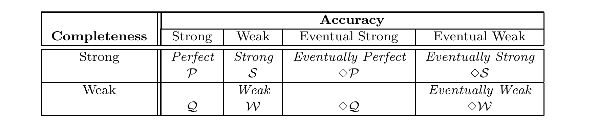

Fig. 1. Eight classes of failure detectors defined in terms of accuracy and completeness.

> 图 1. 按准确性与完备性定义的八类故障检测器。

> **图表中文解读：** 该矩阵用“完备性”与“准确性”两个维度组合出八类故障检测器。行决定崩溃进程最终会被所有正确进程怀疑（强完备性），还是至少被某个正确进程怀疑（弱完备性）；列则依次放宽对误判的限制，从永不误判任何未崩溃进程，到最终只保证至少一个正确进程不再被误判。P、S、◇P、◇S 具有强完备性，Q、W、◇Q、◇W 具有弱完备性。

An algorithm A is a collection of n deterministic automata, one for each process in the system. Computation proceeds in steps of A. In each step, a process (1) may receive a message that was sent to it, (2) queries its failure detector module, (3) undergoes a state transition, and (4) may send a message to a single process.12 Since we model asynchronous systems, messages may experience arbitrary (but finite) delays. Furthermore, there is no bound on relative process speeds.

> 算法 A 由 n 个确定性自动机组成，系统中每个进程对应一个自动机。计算通过执行 A 的步骤向前推进。每个步骤中，一个进程（1）可能收到一条发给它的消息，（2）查询本地故障检测器模块，（3）完成一次状态转移，并（4）可能向某一个进程发送一条消息。12 由于所建模的系统是异步的，消息可能遇到任意长（但仍然有限）的延迟，各进程的相对速度也没有上界。

A run of algorithm A using a failure detector D is a tuple R = ⟨F, H_D, I, S, T⟩ where F is a failure pattern, H_D ∈ D(F) is a history of failure detector D for failure pattern F, I is an initial configuration of A, S is an infinite sequence of steps of A, and T is a list of increasing time values indicating when each step in S occurred. A run must satisfy certain well-formedness and fairness properties. In particular, (1) a process cannot take a step after it crashes, (2) when a process takes a step and queries its failure detector module, it gets the current value output by its local failure detector module, and (3) every process that is correct in F takes an infinite number of steps in S and eventually receives every message sent to it.

> 算法 A 使用故障检测器 D 的一次运行是元组 R = ⟨F, H_D, I, S, T⟩，其中 F 是故障模式，H_D ∈ D(F) 是故障检测器 D 对应故障模式 F 的一段历史，I 是 A 的初始配置，S 是 A 的无限步骤序列，T 是一个递增的时刻序列，指出 S 中各步骤发生的时间。一次运行必须满足若干良构性和公平性条件。尤其是：（1）进程崩溃后不能再执行步骤；（2）进程执行步骤并查询故障检测器模块时，取得本地模块当前输出的值；（3）在 F 中正确的每个进程都在 S 中执行无限多个步骤，并最终收到发给它的每条消息。

Informally, a problem P is defined by a set of properties that runs must satisfy. An algorithm A solves a problem P using a failure detector D if all the runs of A using D satisfy the properties required by P. Let C be a class of failure detectors. Algorithm A solves problem P using C if for all D ∈ C, A solves P using D. Finally, we say that problem P can be solved using C if for all failure detectors D ∈ C, there is an algorithm A that solves P using D.

> 非正式地，问题 P 由运行必须满足的一组属性定义。如果使用 D 的 A 的所有运行都满足 P 所需的属性，则算法 A 使用故障检测器 D 解决问题 P。令 C 为一类故障检测器。如果对于所有 D ∈ C，A 使用 D 解决 P，则算法 A 使用 C 解决问题 P。最后，如果对于所有故障检测器 D ∈ C，存在一个使用 D 解决 P 的算法 A，则我们说问题 P 可以使用 C 解决。

We use the following notation. Let v be a variable in algorithm A. We denote by v_p process p’s copy of v. The history of v in run R is denoted by v^R, i.e., v^R(p, t) is the value of v_p at time t in run R. We denote by D_p process p’s local failure detector module. Thus, the value of D_p at time t in run R = ⟨F, H_D, I, S, T⟩ is H_D(p, t).

> 我们使用如下记号。令 v 为算法 A 中的一个变量，以 v_p 表示进程 p 所持有的 v 的副本。v 在运行 R 中的历史记为 v^R；也就是说，v^R(p, t) 是运行 R 的时刻 t 上 v_p 的值。以 D_p 表示进程 p 的本地故障检测器模块。因此，在运行 R = ⟨F, H_D, I, S, T⟩ 中，D_p 在时刻 t 的值是 H_D(p, t)。

### 2.6 Reducibility

> 2.6 可归约性

We now define what it means for an algorithm TD→D′ to transform a failure detector D into another failure detector D′ (TD→D′ is called a reduction algorithm). Algorithm TD→D′ uses D to maintain a variable outputp at every process p. This variable, which is part of the local state of p, emulates the output of D′ at p. Algorithm TD→D′ transforms D into D′ if and only if for every run R = ⟨F, H_D, I, S, T⟩ of TD→D′ using D, output^R ∈ D′(F). Note that TD→D′ need not emulate all the failure detector histories of D′; what we do require is that all the failure detector histories it emulates be histories of D′.

> 下面定义算法 TD→D′ 将故障检测器 D 变换为另一故障检测器 D′ 的含义；TD→D′ 称为归约算法。TD→D′ 利用 D，在每个进程 p 上维护变量 outputp。该变量属于 p 的局部状态，用来模拟 D′ 在 p 处的输出。TD→D′ 将 D 变换为 D′，当且仅当 TD→D′ 使用 D 的每次运行 R = ⟨F,H_D,I,S,T⟩ 都满足 output^R ∈ D′(F)。注意，TD→D′ 无须模拟 D′ 的全部故障检测器历史；我们要求的是，它模拟出的每一段历史都是 D′ 的历史。

11 Formal definitions are necessary in [Chandra et al. 1992] to prove a subtle lower bound.

> 11 [Chandra et al. 1992] 中需要正式定义来证明微妙的下界。

12 [Chandra et al. 1992] assume that each step is atomic, i.e., indivisible with respect to failures. Furthermore, each process can send a message to all processes during such a step. These assumptions were made to strengthen the lower bound result of [Chandra et al. 1992].

> 12 [Chandra et al. 1992] 假设每个步骤都是原子的，即故障不会把一个步骤分割开来；此外，每个进程可在这一步中向所有进程发送消息。这些假设是为了加强 [Chandra et al. 1992] 的下界结果。

<!-- PDF page 11 -->

D

> D

D′ emulated

> 模拟出的 D′

TD→D′

> TD→D′

Algorithm A uses D′

> 算法 A 使用 D′

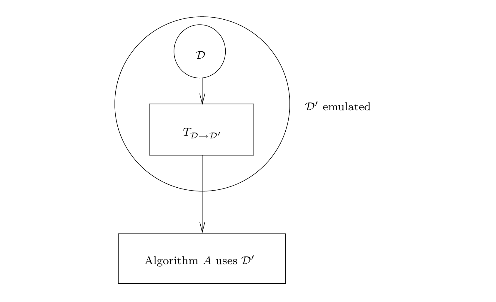

Fig. 2. Transforming D into D′.

> 图 2. 将 D 转换为 D′。

> **图表中文解读：** 归约算法 $T_{D\to D'}$ 把各进程本地可访问的故障检测器 D 包装成对 D′ 的仿真。因而，任何原本依赖 D′ 的算法 A，都可以在只有 D 的系统中运行：先由转换层持续生成 D′ 的输出，再把这些输出交给 A。若存在这样的转换，就称 D 至少与 D′ 一样强，即 D ⪰ D′。

Given a reduction algorithm TD→D′, any problem that can be solved using failure detector D′, can be solved using D instead. To see this, suppose a given algorithm A requires failure detector D′, but only D is available. We can still execute A as follows. Concurrently with A, processes run TD→D′ to transform D into D′. We modify algorithm A at process p as follows: whenever A requires that p queries its failure detector module, p reads the current value of outputp (which is concurrently maintained by TD→D′) instead. This is illustrated in Figure 2.

> 给定归约算法 TD→D′，凡是能借助故障检测器 D′ 求解的问题，改用 D 也能求解。设算法 A 需要 D′，但当前只有 D 可用，仍可按以下方式执行 A：各进程在运行 A 的同时，运行 TD→D′ 将 D 变换为 D′。对进程 p 处的算法 A 作如下改动：每当 A 要求 p 查询故障检测器模块时，p 改为读取由 TD→D′ 并发维护的 outputp 当前值。图 2 展示了这一过程。

Intuitively, since TD→D′ is able to use D to emulate D′, D must provide at least as much information about process failures as D′ does. Thus, if there is an algorithm TD→D′ that transforms D into D′, we write D ⪰ D′ and say that D′ is reducible to D; we also say that D′ is weaker than D. Clearly, ⪰ is a transitive relation. If D ⪰ D′ and D′ ⪰ D, we write D ≅ D′ and say that D and D′ are equivalent.

> 直观地说，既然 TD→D′ 能用 D 模拟 D′，D 对进程故障提供的信息就至少与 D′ 同样多。因此，若存在将 D 变换为 D′ 的算法 TD→D′，则写作 D ⪰ D′，称 D′ 可归约到 D，也称 D′ 弱于 D。显然，⪰ 具有传递性。若 D ⪰ D′ 且 D′ ⪰ D，则写作 D ≅ D′，并称 D 与 D′ 等价。

Similarly, given two classes of failure detectors C and C′, if for each failure detector D ∈ C there is a failure detector D′ ∈ C′ such that D ⪰ D′, we write C ⪰ C′ and say that C′ is weaker than C (note that if C ⪰ C′, then if a problem is solvable using C′, it is also solvable using C). From this definition, ⪰ is clearly transitive. If C ⪰ C′ and C′ ⪰ C, we write C ≅ C′ and say that C and C′ are equivalent.

> 类似地，给定两个故障检测器类别 C、C′，若对每个 D ∈ C，都存在 D′ ∈ C′ 使 D ⪰ D′，则写作 C ⪰ C′，并称 C′ 弱于 C（注意，若 C ⪰ C′，则凡能使用 C′ 求解的问题，也能使用 C 求解）。由定义，⪰ 显然具有传递性。若 C ⪰ C′ 且 C′ ⪰ C，则写作 C ≅ C′，称 C 与 C′ 等价。

Consider the trivial reduction algorithm in which each process p periodically writes the current value output by its local failure detector module into outputp. From this trivial reduction the following relations between classes of failure detectors are immediate:

> 考虑如下平凡归约算法：每个进程 p 定期将本地故障检测器模块当前输出的值写入 outputp。由这个平凡归约立即可得下列故障检测器类别之间的关系：

**Observation 1.** P ⪰ Q, S ⪰ W, ◇P ⪰ ◇Q, ◇S ⪰ ◇W.

> **观察 1。** P ⪰ Q, S ⪰ W, ◇P ⪰ ◇Q, ◇S ⪰ ◇W.

<!-- PDF page 12 -->

```text
Every process p executes the following:
```

> 每个进程 p 执行以下操作：

```text
output_p ← ∅
```

> output_p ← ∅

```text
cobegin
|| Task 1: repeat forever
{p queries its local failure detector module D_p}
suspects_p ← D_p
send (p, suspects_p) to all
```

> cobegin
> \|\| 任务 1：永久重复
> {p 查询本地故障检测器模块 D_p}
> suspects_p ← D_p
> 向所有进程发送 (p, suspects_p)

```text
|| Task 2: when receive (q, suspects_q) for some q
output_p ← (output_p ∪ suspects_q) − {q} {output_p emulates D′_p}
coend
```

> \|\| 任务 2：当收到某个 q 发来的 (q, suspects_q) 时
> output_p ← (output_p ∪ suspects_q) − {q}
> {output_p 模拟 D′_p}
> coend

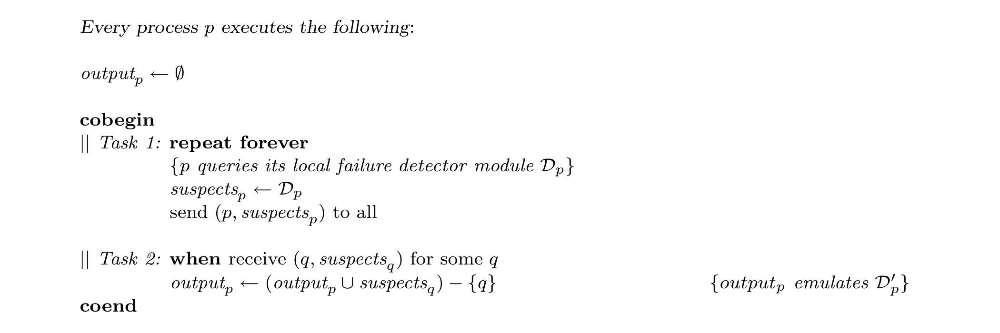

Fig. 3. $T_{D\to D'}$: From Weak Completeness to Strong Completeness.

> 图 3. $T_{D\to D'}$：从弱完备性到强完备性。

> **图表中文解读：** 每个进程 p 不断读取自己的怀疑集合并广播给所有进程；收到 q 的集合后，p 把其中条目并入输出，但排除 q 本身。这样，弱完备性所保证的“至少一个正确进程会永久怀疑每个崩溃进程”会经消息传播放大为“所有正确进程都会永久怀疑它”，同时排除 q 可避免破坏原故障检测器的准确性保证。

## 3. FROM WEAK COMPLETENESS TO STRONG COMPLETENESS

> 3. 从弱完备性到强完备性

In Figure 3, we give a reduction algorithm TD→D′ that transforms any given failure detector D that satisfies weak completeness, into a failure detector D′ that satisfies strong completeness. Furthermore, if D satisfies one of the four accuracy properties that we defined in Section 2.3 then D′ also does so. In other words, TD→D′ strengthens completeness while preserving accuracy.

> 图 3 给出归约算法 TD→D′：它可把任意满足弱完备性的故障检测器 D，变换为满足强完备性的故障检测器 D′。而且，若 D 满足第 2.3 节定义的四项准确性之一，D′ 也满足同一项性质。换言之，TD→D′ 在保留准确性的同时强化了完备性。

This result allows us to focus on the four classes of failure detectors defined in the first row of Figure 1, i.e., those with strong completeness. This is because, TD→D′ (together with Observation 1) shows that every failure detector class in the second row of Figure 1 is actually equivalent to the class above it in that figure.

> 由此，我们只需关注图 1 第一行的四个类，也就是满足强完备性的类。因为 TD→D′ 与观察 1 一起表明，图 1 第二行的每个故障检测器类，实际上都与它正上方的类等价。

Informally, TD→D′ works as follows. Every process p periodically sends (p, suspectsp) — where suspectsp denotes the set of processes that p suspects according to its local failure detector module D_p — to every process. When p receives a message of the form (q, suspectsq), it adds suspectsq to outputp and removes q from outputp (recall that outputp is the variable emulating the output of the failure detector module D_p′).

> 非形式地说，TD→D′ 的工作方式如下。每个进程 p 定期向所有进程发送 (p, suspectsp)，其中 suspectsp 是 p 根据本地故障检测器模块 D_p 所怀疑的进程集合。当 p 收到形如 (q, suspectsq) 的消息时，它把 suspectsq 并入 outputp，再从 outputp 中移除 q（outputp 正是用来模拟故障检测器模块 D_p′ 输出的变量）。

In our algorithms, we use the notation “send m to all” as a short-hand for “for all q ∈ Π: send m to q.” If a process p crashes while executing this “for loop”, it is possible that some processes receive the message m while others do not.

> 在算法中，我们以“向所有进程发送 m”作为“对所有 q ∈ Π：向 q 发送 m”的简写。若进程 p 在执行这个 for 循环时崩溃，某些进程可能收到消息 m，另一些则收不到。

Let R = ⟨F, H_D, I, S, T⟩ be an arbitrary run of TD→D′ using failure detector D. In the following, the run R and its failure pattern F are fixed. Thus, when we say that a process crashes we mean that it crashes in F. Similarly, when we say that a process is correct, we mean that it is correct in F. We will show that output^R satisfies the following properties:

> 令 R = ⟨F, H_D, I, S, T⟩ 为 TD→D′ 使用故障检测器 D 的任意运行。下文固定运行 R 及其故障模式 F。因此，说一个进程崩溃，是指它在 F 中崩溃；说一个进程正确，是指它在 F 中正确。我们将证明 output^R 满足下列性质：

P1 (Transforming weak completeness into strong completeness). Let p be any process that crashes. If eventually some correct process permanently suspects p in H_D, then eventually all correct processes permanently suspect p in output^R. More formally:

> P1（把弱完备性变换为强完备性）。令 p 为任意崩溃的进程。若最终有某个正确进程在 H_D 中永久怀疑 p，则最终所有正确进程都在 output^R 中永久怀疑 p。形式化地：

```text
∀p ∈ crashed(F):
    ∃t ∈ T, ∃q ∈ correct(F), ∀t′ ≥ t: p ∈ H_D(q, t′)
⇒   ∃t ∈ T, ∀q ∈ correct(F), ∀t′ ≥ t: p ∈ output^R(q, t′)
```

> ∀p ∈ crashed(F):  
> &nbsp;&nbsp;&nbsp;&nbsp;∃t ∈ T, ∃q ∈ correct(F), ∀t′ ≥ t: p ∈ H_D(q, t′)  
> ⇒ &nbsp;∃t ∈ T, ∀q ∈ correct(F), ∀t′ ≥ t: p ∈ output^R(q, t′)

<!-- PDF page 13 -->

P2 (Preserving perpetual accuracy). Let p be any process. If no process suspects p in H_D before time t, then no process suspects p in output^R before time t. More formally:

> P2（保持永久准确性）。令 p 为任意进程。若时刻 t 以前没有进程在 H_D 中怀疑 p，则时刻 t 以前也没有进程在 output^R 中怀疑 p。形式化地：

```text
∀p ∈ Π, ∀t ∈ T:
    ∀t′ < t, ∀q ∈ Π − F(t′): p ∉ H_D(q, t′)
⇒   ∀t′ < t, ∀q ∈ Π − F(t′): p ∉ output^R(q, t′)
```

> ∀p ∈ Π, ∀t ∈ T:  
> &nbsp;&nbsp;&nbsp;&nbsp;∀t′ < t, ∀q ∈ Π − F(t′): p ∉ H_D(q, t′)  
> ⇒ &nbsp;∀t′ < t, ∀q ∈ Π − F(t′): p ∉ output^R(q, t′)

P3 (Preserving eventual accuracy). Let p be any correct process. If there is a time after which no correct process suspects p in H_D, then there is a time after which no correct process suspects p in output^R. More formally:

> P3（保持最终准确性）。令 p 为任意正确进程。若存在一个时刻，此后没有正确进程在 H_D 中怀疑 p，则也存在一个时刻，此后没有正确进程在 output^R 中怀疑 p。形式化地：

```text
∀p ∈ correct(F):
    ∃t ∈ T, ∀q ∈ correct(F), ∀t′ ≥ t: p ∉ H_D(q, t′)
⇒   ∃t ∈ T, ∀q ∈ correct(F), ∀t′ ≥ t: p ∉ output^R(q, t′)
```

> ∀p ∈ correct(F):  
> &nbsp;&nbsp;&nbsp;&nbsp;∃t ∈ T, ∀q ∈ correct(F), ∀t′ ≥ t: p ∉ H_D(q, t′)  
> ⇒ &nbsp;∃t ∈ T, ∀q ∈ correct(F), ∀t′ ≥ t: p ∉ output^R(q, t′)

**Lemma 1.** TD→D′ satisfies P1.

> **引理 1。** TD→D′ 满足 P1。

**Proof.** Let p be any process that crashes. Suppose that there is a time t after which some correct process q permanently suspects p in H_D. We must show that there is a time after which every correct process suspects p in output^R.

> 证明。任取一个崩溃进程 p。假设存在时刻 t，此后某个正确进程 q 在 H_D 中永久怀疑 p。我们需证明，存在某一时刻，此后每个正确进程都在 output^R 中怀疑 p。

Since p crashes, there is a time t′ after which no process receives a message from p. Consider the execution of Task 1 by process q after time tp = max(t, t′). Process q sends a message of the type (q, suspectsq) with p ∈ suspectsq to all processes. Eventually, every correct process receives (q, suspectsq) and adds p to output (in Task 2). Since no correct process receives any messages from p after time t′ and tp ≥ t′, no correct process removes p from output after time tp. Thus, there is a time after which every correct process permanently suspects p in output^R.

> p 崩溃后，存在某个时刻 t′，此后没有进程再收到来自 p 的消息。考察时刻 tp = max(t, t′) 之后 q 的一次任务 1 执行。q 向所有进程发送形如 (q, suspectsq) 的消息，且 p ∈ suspectsq。最终，每个正确进程都会收到该消息，并在任务 2 中把 p 加入 output。又因为 tp ≥ t′，而时刻 t′ 以后任何正确进程都不会再收到 p 的消息，所以在 tp 之后，没有正确进程会从 output 中移除 p。因而，最终每个正确进程都会在 output^R 中永久怀疑 p。

**Lemma 2.** TD→D′ satisfies P2.

> **引理 2。** TD→D′ 满足 P2。

**Proof.** Let p be any process. Suppose there is a time t before which no process suspects p in H_D. No process sends a message of the type (−, suspects) with p ∈ suspects before time t. Thus, no process q adds p to outputq before time t.

> 证明。任取进程 p。假设在时刻 t 以前，没有进程在 H_D 中怀疑 p。那么在 t 以前，就没有进程发送满足 p ∈ suspects 的 (−, suspects) 消息。因此，时刻 t 以前不会有任何进程 q 把 p 加入 outputq。

**Lemma 3.** TD→D′ satisfies P3.

> **引理 3。** TD→D′ 满足 P3。

**Proof.** Let p be any correct process. Suppose that there is a time t after which no correct process suspects p in H_D. Thus, all processes that suspect p after time t eventually crash. Thus, there is a time t′ after which no correct process receives a message of the type (−, suspects) with p ∈ suspects.

> 证明。任取正确进程 p。假设存在时刻 t，此后没有正确进程在 H_D 中怀疑 p。所以，t 以后仍怀疑 p 的进程最终都会崩溃。因而存在时刻 t′，此后没有正确进程会再收到满足 p ∈ suspects 的 (−, suspects) 消息。

Let q be any correct process. We must show that there is a time after which q does not suspect p in output^R. Consider the execution of Task 1 by process p after time t′. Process p sends a message m = (p, suspectsp) to q. When q receives m, it removes p from outputq (see Task 2). Since q does not receive any messages of the type (−, suspects) with p ∈ suspects after time t′, q does not add p to outputq after time t′. Thus, there is a time after which q does not suspect p in output^R.

> 任取正确进程 q。我们需证明，存在某一时刻，此后 q 不再在 output^R 中怀疑 p。考察 t′ 以后 p 的一次任务 1 执行：p 向 q 发送 m = (p, suspectsp)。q 收到 m 时，会在任务 2 中把 p 从 outputq 移除。又因为 t′ 以后 q 不再收到满足 p ∈ suspects 的 (−, suspects) 消息，它也不会再把 p 加入 outputq。所以，q 最终不再在 output^R 中怀疑 p。

**Theorem 1.** Q ⪰ P, W ⪰ S, ◇Q ⪰ ◇P, and ◇W ⪰ ◇S.

> 定理 1。Q ⪰ P、W ⪰ S、◇Q ⪰ ◇P，且 ◇W ⪰ ◇S。

**Proof.** Let D be any failure detector in Q, W, ◇Q, or ◇W. We show that TD→D′ transforms D into a failure detector D′ in P, S, ◇P, or ◇S, respectively.

> 证明。任取 Q、W、◇Q 或 ◇W 中的故障检测器 D。我们证明，TD→D′ 会把 D 分别变换为 P、S、◇P 或 ◇S 中的故障检测器 D′。

Since D satisfies weak completeness, by Lemma 1, D′ satisfies strong completeness.

> 由于 D 满足弱完备性，由引理 1，D′ 满足强完备性。

<!-- PDF page 14 -->

```text
Every process p executes the following:
```

> 每个进程 p 执行以下操作：

```text
To execute R-broadcast(m):
send m to all (including p)
```

> 执行R-broadcast(m)：
> 向所有进程发送 m（包括 p 自身）

```text
R-deliver(m) occurs as follows:
when receive m for the first time
if sender(m) ≠ p then send m to all
R-deliver(m)
```

> R-deliver(m) 按如下方式发生：
> 第一次收到 m 时
> 若 sender(m) ≠ p，则向所有进程发送 m
> R-deliver(m)

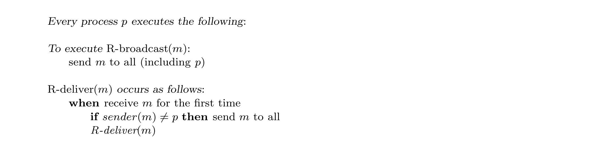

Fig. 4. Reliable Broadcast by message diffusion.

> 图 4. 通过消息扩散实现可靠广播。

> **图表中文解读：** 发送者把消息发给包括自己在内的所有进程；任一进程第一次收到该消息时，若自己不是原发送者，便先把消息再次扩散给所有进程，再执行 R-deliver。即使原发送者或部分中继者随后崩溃，只要有正确进程收到消息，扩散机制就会使所有正确进程最终收到并交付同一消息；“仅在首次收到时处理”则保证不会重复交付。

We now show that D and D′ have the same accuracy property. If D is in Q or W, this follows from Lemma 2. If D is in ◇Q or ◇W, this follows from Lemma 3. By Theorem 1 and Observation 1, we have:

> 下面证明 D 与 D′ 具有相同的准确性。若 D ∈ Q 或 D ∈ W，由引理 2 可得；若 D ∈ ◇Q 或 D ∈ ◇W，则由引理 3 可得。结合定理 1 与观察 1，得到：

**Corollary 1.** P ≅ Q, S ≅ W, ◇P ≅ ◇Q, and ◇S ≅ ◇W. The relations given in Corollary 1 are sufficient for the purposes of this paper. A complete enumeration of the relations between the eight failure detectors classes defined in Figure 1 is given in Section 8.

> 推论 1。P ≅ Q、S ≅ W、◇P ≅ ◇Q，且 ◇S ≅ ◇W。推论 1 给出的关系已足以满足本文需要。第 8 节将完整列出图 1 所定义八类故障检测器之间的关系。

## 4. Reliable Broadcast

> 4. 可靠广播

We now define Reliable Broadcast, a communication primitive for asynchronous systems that we use in our algorithms.13 Informally, Reliable Broadcast guarantees that (1) all correct processes deliver the same set of messages, (2) all messages broadcast by correct processes are delivered, and (3) no spurious messages are ever delivered. Formally, Reliable Broadcast is defined in terms of two primitives, R-broadcast(m) and R-deliver(m) where m is a message drawn from a set of possible messages. When a process executes R-broadcast(m), we say that it R-broadcasts m, and when a process executes R-deliver(m), we say that it R-delivers m. We assume that every message m includes a field denoted sender(m) that contains the identity of the sender, and a field with a sequence number; these two fields make every message unique. Reliable Broadcast satisfies the following properties [Hadzilacos and Toueg 1994]:

> 下面定义可靠广播，这是本文算法使用的一种异步系统通信原语。13 非形式地说，可靠广播保证：（1）所有正确进程交付同一个消息集合；（2）正确进程广播的每条消息都会被交付；（3）任何并未广播的消息都不会被交付。形式上，可靠广播由原语 R-broadcast(m) 与 R-deliver(m) 定义，m 取自一个可能消息的集合。进程执行 R-broadcast(m) 时，我们称它“R-broadcast 消息 m”；执行 R-deliver(m) 时，称它“R-deliver 消息 m”。假设每条消息 m 都有一个记为 sender(m) 的字段，存放发送者标识，并有一个存放序列号的字段；两者一起使每条消息都是唯一的。可靠广播满足下列性质 [Hadzilacos and Toueg 1994]：

Validity. If a correct process R-broadcasts a message m, then it eventually R-delivers m.

> 有效性。若正确进程 R-broadcast 消息 m，则它最终会 R-deliver m。

Agreement. If a correct process R-delivers a message m, then all correct processes eventually R-deliver m.

> 一致性。若某个正确进程 R-deliver 消息 m，则所有正确进程最终都会 R-deliver m。

Uniform integrity. For any message m, every process R-delivers m at most once, and only if m was previously R-broadcast by sender(m). In Figure 4, we give a simple Reliable Broadcast algorithm for asynchronous systems. Informally, when a process receives a message for the first time, it relays the message to all processes and then R-delivers it. This algorithm satisfies validity, <!-- PDF page 15 --> agreement and uniform integrity in asynchronous systems with up to n − 1 crash failures. The proof is obvious and therefore omitted.

> 统一完整性。对任意消息 m，每个进程至多 R-deliver m 一次，且只有当 sender(m) 此前已 R-broadcast m 时才会如此。图 4 给出了适用于异步系统的一个简单可靠广播算法。非形式地说，进程第一次收到消息时，先将它中继给所有进程，然后再 R-deliver 它。在最多发生 n − 1 次崩溃故障的异步系统中，该算法满足有效性、一致性与统一完整性。证明是显然的，故略。

13 This is a crash-failure version of the asynchronous broadcast primitive defined in [Bracha and Toueg 1985] for “Byzantine” failures.

> 13 这是 [Bracha and Toueg 1985] 针对“拜占庭”故障定义的异步广播原语的崩溃故障版本。

## 5. THE CONSENSUS PROBLEM

> 5. 共识问题

In the Consensus problem, all correct processes propose a value and must reach a unanimous and irrevocable decision on some value that is related to the proposed values [Fischer 1983]. We define the Consensus problem in terms of two primitives, propose(v) and decide(v), where v is a value drawn from a set of possible proposed values. When a process executes propose(v), we say that it proposes v; similarly, when a process executes decide(v), we say that it decides v. The Consensus problem is specified as follows:

> 在共识问题中，所有正确进程都要提议一个值，并必须对某个与这些提议值相关的值，做出全体一致且不可撤销的决定 [Fischer 1983]。我们用两个原语 propose(v) 与 decide(v) 定义共识，v 取自可能提议值的集合。进程执行 propose(v) 时，称它提议 v；执行 decide(v) 时，称它决定 v。共识的规范如下：

Termination. Every correct process eventually decides some value.

> 终止性。每个正确进程最终都会决定某个值。

Uniform integrity. Every process decides at most once.

> 统一完整性。每个进程至多做出一次决定。

Agreement. No two correct processes decide differently. Uniform validity. If a process decides v, then v was proposed by some process.14 It is well-known that Consensus cannot be solved in asynchronous systems that are subject to even a single crash failure [Fischer et al. 1985; Dolev et al. 1987].

> 一致性。任意两个正确进程都不会决定不同的值。统一有效性。若某个进程决定 v，则 v 曾被某个进程提议过。14 众所周知，在哪怕可能发生一次崩溃故障的异步系统中，共识也不可求解 [Fischer et al. 1985; Dolev et al. 1987]。

## 6. SOLVING CONSENSUS USING UNRELIABLE FAILURE DETECTORS

> 6. 使用不可靠故障检测器求解共识

We now show how to solve Consensus using each one of the eight classes of failure detectors defined in Figure 1. By Corollary 1, we only need to show how to solve Consensus using each one of the four classes of failure detectors that satisfy strong completeness, namely, P, S, ◇P, and ◇S.

> 现在，我们展示如何使用图 1 中定义的八类故障检测器中的每一类来解决共识。根据推论 1，我们只需要展示如何使用满足强完备性的四类故障检测器中的每一类（即 P、S、◇P 和 ◇S）来解决共识。

In Section 6.1, we present an algorithm that solves Consensus using S. Since P ⪰ S, this algorithm also solves Consensus using P. In Section 6.2, we give a Consensus algorithm that uses ◇S. Since ◇P ⪰ ◇S, this algorithm also solves Consensus using ◇P. Our Consensus algorithms actually solve a stronger form of Consensus than the one specified in Section 5: They ensure that no two processes, whether correct or faulty, decide differently — a property called uniform agreement [Neiger and Toueg 1990].

> 第 6.1 节给出一个使用 S 求解共识的算法。由于 P ⪰ S，该算法同样能使用 P 求解共识。第 6.2 节则给出一个使用 ◇S 的共识算法；由于 ◇P ⪰ ◇S，该算法也适用于 ◇P。这些算法实际求解了一种比第 5 节规定的共识更强的形式：无论进程正确还是故障，任意两个进程都不会决定不同的值。这项性质称为统一一致性 [Neiger and Toueg 1990]。

The Consensus algorithm that uses S tolerates any number of failures. In contrast, the one that uses ◇S requires a majority of correct processes. We show that to solve Consensus this requirement is necessary even if one uses ◇P, a class of failure detectors that is stronger than ◇S. Thus, our algorithm for solving Consensus using ◇S (or ◇P) is optimal with respect to the number of failures that it tolerates.

> 使用 S 的共识算法可容忍任意数量的故障。相比之下，使用 ◇S 的算法要求正确进程占多数。我们还将证明，即使使用比 ◇S 更强的故障检测器类 ◇P，这项多数要求仍是求解共识的必要条件。所以，就能容忍的故障数量而言，使用 ◇S（或 ◇P）的共识算法是最优的。

### 6.1 Solving Consensus using S

> 6.1 使用 S 求解共识

The algorithm in Figure 5 solves Consensus using any Strong failure detector D ∈ S. In other words, it works with any failure detector D that satisfies strong completeness and weak accuracy. This algorithm tolerates up to n − 1 faulty processes (in asynchronous systems with n processes).

> 图 5 的算法可借助任意强（Strong）故障检测器 D ∈ S 求解共识。也就是说，它适用于任意同时满足强完备性与弱准确性的故障检测器 D。在有 n 个进程的异步系统中，该算法最多可容忍 n − 1 个故障进程。

14 The validity property captures the relation between the decision value and the proposed values.

> 14 有效性刻画了决定值与提议值之间的关系。

Changing this property results in other types of Consensus [Fischer 1983].

> 更改此属性会导致其他类型的共识 [Fischer 1983]。

<!-- PDF page 16 -->

```text
Every process p executes the following:
```

> 每个进程 p 执行以下操作：

```text
procedure propose(vp)
Vp ← ⟨⊥, ⊥,..., ⊥⟩ {p’s estimate of the proposed values}
Vp [p] ← vp
Δp ← Vp
```

> 过程 propose(vp)
> Vp ← ⟨⊥, ⊥,..., ⊥⟩ {p 对各进程提议值的估计}
> Vp [p] ← vp
> Δp ← Vp

```text
Phase 1: {asynchronous rounds rp, 1 ≤ rp ≤ n − 1}
for rp ← 1 to n − 1
send (rp, Δp, p) to all
wait until [∀q: received (rp, Δq, q) or q ∈ D_p ] {query the failure detector}
msgsp [rp ] ← {(rp, Δq, q) | received (rp, Δq, q)}
Δp ← ⟨⊥, ⊥,..., ⊥⟩
for k ← 1 to n
if Vp [k] = ⊥ and ∃(rp, Δq, q) ∈ msgsp [rp ] with Δq [k] ≠ ⊥ then
Vp [k] ← Δq [k]
Δp [k] ← Δq [k]
```

> 阶段 1：{异步轮 rp, 1 ≤ rp ≤ n − 1}
> for rp ← 1 to n − 1
> 向所有进程发送 (rp, Δp, p)
> 等待直到 [∀q: 收到 (rp, Δq, q) 或 q ∈ D_p ] {查询故障检测器}
> msgsp [rp ] ← {(rp, Δq, q) |收到 (rp, Δq, q)}
> Δp ← ⟨⊥, ⊥,..., ⊥⟩
> 对于 k ← 1 到 n
> 如果 Vp [k] = ⊥ 且 ∃(rp, Δq, q) ∈ msgsp [rp ] 且 Δq [k] ≠ ⊥ 则
> Vp [k] ← Δq [k]
> Δp [k] ← Δq [k]

```text
Phase 2: send Vp to all
wait until [∀q: received Vq or q ∈ D_p ] {query the failure detector}
lastmsgsp ← {Vq | received Vq }
for k ← 1 to n
if ∃Vq ∈ lastmsgsp with Vq [k] = ⊥ then Vp [k] ← ⊥
```

> 第 2 阶段：向所有进程发送 Vp
> 等待直到 [∀q: 收到 Vq 或 q ∈ D_p ] {查询故障检测器}
> lastmsgsp ← {Vq | 已收到 Vq}
> for k ← 1 to n
> 如果 ∃Vq ∈ lastmsgsp 且 Vq [k] = ⊥ 则 Vp [k] ← ⊥

```text
Phase 3: decide(first non-⊥ component of Vp)
```

> 第 3 阶段：decide(Vp 的第一个非 ⊥ 分量)

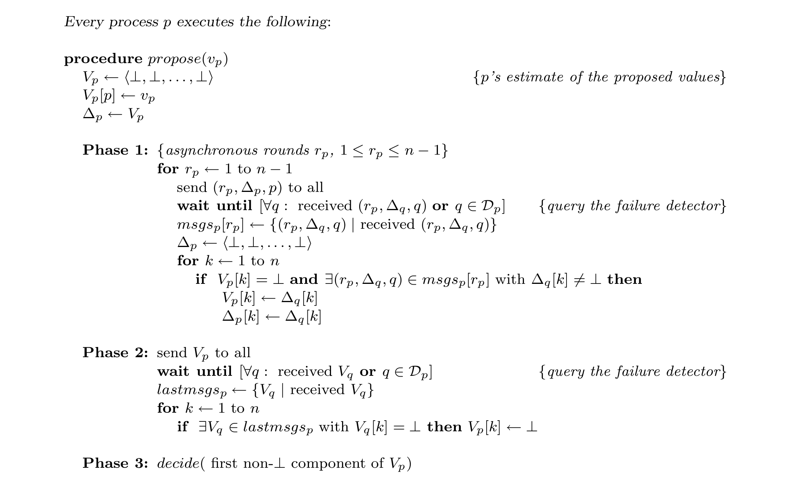

Fig. 5. Solving Consensus using any D ∈ S.

> 图 5. 使用任意 D ∈ S 求解共识。

> **图表中文解读：** 算法先用 n−1 个异步轮次传播各进程的提议值，使未发生故障检测误判的正确进程能够把信息扩散到全体；随后各进程再次交换向量，并把任何一方仍未知的分量统一置为 ⊥。强完备性保证等待不会被崩溃进程永久阻塞，弱准确性则保证至少有一个正确进程始终不被怀疑，从而留下一个所有正确进程都能一致看到的非 ⊥ 值，最终按固定位置作出相同决定。

The algorithm runs through 3 phases. In Phase 1, processes execute n − 1 asynchronous rounds (rp denotes the current round number of process p) during which they broadcast and relay their proposed values. Each process p waits until it receives a round r message from every process that is not in D_p, before proceeding to round r + 1. Note that while p is waiting for a message from q in round r, it is possible that q is added to D_p. If this occurs, p stops waiting for q’s message and proceeds to round r + 1.

> 算法分为 3 个阶段。第 1 阶段中，各进程执行 n − 1 个异步轮次（rp 表示进程 p 的当前轮次），期间广播并中继它们的提议值。在第 r 轮，进程 p 要等到每个不在 D_p 中的进程所发的第 r 轮消息，才进入第 r + 1 轮。注意，p 在第 r 轮等待 q 的消息时，q 可能被加入 D_p；一旦发生这种情况，p 就停止等待 q 的消息，进入第 r + 1 轮。

By the end of Phase 2, correct processes agree on a vector based on the proposed values of all processes. The ith element of this vector either contains the proposed value of process pi or ⊥. We will show that this vector contains the proposed value of at least one process. In Phase 3, correct processes decide the first non-trivial component of this vector.

> 第 2 阶段结束时，正确进程会就一个以所有进程的提议值为基础的向量取得一致。该向量的第 i 个分量要么是进程 pi 的提议值，要么是 ⊥。我们将证明，向量中至少包含一个进程的提议值。在第 3 阶段，正确进程会决定该向量中第一个非 ⊥ 分量。

Let R = ⟨F, H_D, I, S, T⟩ be any run of the algorithm in Figure 5 using D ∈ S in which all correct processes propose a value. We have to show that the termination, uniform validity, agreement and uniform integrity properties of Consensus hold.

> 令 R = ⟨F, H_D, I, S, T⟩ 为图 5 中使用 D ∈ S 的算法的任意运行，其中所有正确进程都提出一个值。我们必须证明共识的终止性、统一有效性、一致性和统一完整性属性成立。

Note that Vp [q] is p’s current estimate of q’s proposed value. Furthermore, Δp [q] = vq at the end of round r if and only if p receives vq, the value proposed by q, for the first time in round r.

> 注意，Vp[q] 是 p 当前对 q 的提议值所作的估计。此外，第 r 轮结束时 Δp[q] = vq，当且仅当 p 在第 r 轮第一次收到 q 的提议值 vq。

**Lemma 4.** For all p and q, and in all phases, Vp [q] is either vq or ⊥.

> 引理 4. 对于所有 p 和 q，以及在所有阶段中，Vp [q] 是 vq 或 ⊥。

**Proof.** Obvious from the algorithm.

> 证明。由算法直接可知。

**Lemma 5.** Every correct process eventually reaches Phase 3.

> 引理 5. 每个正确进程最终都会到达阶段 3。

<!-- PDF page 17 -->

**Proof (sketch).** The only way a correct process p can be prevented from reaching Phase 3 is by blocking forever at one of the two wait statements (in Phase 1 and 2, respectively). This can happen only if p is waiting forever for a message from a process q and q never joins D_p. There are two cases to consider: (1) q crashes. Since D satisfies strong completeness, there is a time after which q ∈ D_p. (2) q does not crash. In this case, we can show (by an easy but tedious induction on the round number) that q eventually sends the message p is waiting for. In both cases p is not blocked forever and reaches Phase 3. Since D satisfies weak accuracy there is a correct process c that is never suspected by any process, i.e., ∀t ∈ T, ∀p ∈ Π − F (t): c ∉  H_D (p, t). Let Π_1 denote the set of processes that complete all n − 1 rounds of Phase 1, and Π_2 denote the set of processes that complete Phase 2. We say Vp ≤ Vq if and only if for all k ∈ Π, Vp [k] is either Vq [k] or ⊥.

> 证明（概要）。正确进程 p 只可能因为永久阻塞在两个 wait 语句之一（分别位于第 1、2 阶段），而无法到达第 3 阶段。这又只会发生在 p 一直等待进程 q 的某条消息、而 q 始终没有进入 D_p 时。分两种情况：（1）q 崩溃。因 D 满足强完备性，从某一时刻起 q 会属于 D_p。（2）q 没有崩溃。此时可通过对轮次号作一个简单但繁琐的归纳，证明 q 最终会发送 p 正在等待的消息。两种情形下，p 都不会永久阻塞，因而会到达第 3 阶段。又因 D 满足弱准确性，存在一个从不被任何进程怀疑的正确进程 c，即 ∀t ∈ T, ∀p ∈ Π − F(t): c ∉ H_D(p, t)。以 Π_1 表示完成第 1 阶段全部 n − 1 个轮次的进程集合，以 Π_2 表示完成第 2 阶段的进程集合。定义 Vp ≤ Vq 当且仅当，对所有 k ∈ Π，Vp[k] 要么等于 Vq[k]，要么等于 ⊥。

**Lemma 6.** In every round r, 1 ≤ r ≤ n−1, all processes p ∈ Π_1 receive (r, Δc, c) from process c, i.e., (r, Δc, c) is in msgsp [r].

> 引理 6. 在每一轮 r, 1 ≤ r ≤ n−1 中，所有进程 p ∈ Π_1 从进程 c 接收 (r, Δc, c)，即 (r, Δc, c) 在 msgsp [r] 中。

**Proof.** Since p ∈ Π_1, p completes all n − 1 rounds of Phase 1. At each round r, since c ∉ D_p, p waits for and receives the message (r, Δc, c) from c.

> 证明。由于 p ∈ Π_1，p 完成阶段 1 的所有 n − 1 轮。在每一轮 r，由于 c ∉ D_p，p 等待并接收来自 c 的消息 (r, Δc, c)。

**Lemma 7.** For all p ∈ Π_1, Vc ≤ Vp at the end of Phase 1.

> 引理 7. 对于所有 p ∈ Π_1，在第 1 阶段结束时 Vc ≤ Vp。

**Proof.** Suppose for some process q, Vc [q] ≠ ⊥ at the end of Phase 1. From Lemma 4, Vc [q] = vq. Consider any p ∈ Π_1. We must show that Vp [q] = vq at the end of Phase 1. This is obvious if p = c, thus we consider the case where p ≠ c. Let r be the first round in which c received vq (if c = q, we define r to be 0). From the algorithm, it is clear that Δc [q] = vq at the end of round r. There are two cases to consider: (1) r ≤ n − 2. In round r + 1 ≤ n − 1, c relays vq by sending the message (r + 1, Δc, c) with Δc [q] = vq to all. From Lemma 6, p receives (r + 1, Δc, c) in round r + 1. From the algorithm, it is clear that p sets Vp [q] to vq by the end of round r + 1. (2) r = n − 1. In this case, c received vq for the first time in round n − 1. Since each process relays vq (in its vector Δ) at most once, it is easy to see that vq was relayed by all n − 1 processes in Π − {c}, including p, before being received by c. Since p sets Vp [q] = vq before relaying vq, it follows that Vp [q] = vq at the end of Phase 1.

> 证明。假设第 1 阶段结束时，某个进程 q 满足 Vc[q] ≠ ⊥。由引理 4，Vc[q] = vq。取任意 p ∈ Π_1；我们须证明第 1 阶段结束时 Vp[q] = vq。p = c 时结论显然，以下设 p ≠ c。令 r 为 c 首次收到 vq 的轮次（若 c = q，则定义 r = 0）。由算法，第 r 轮结束时 Δc[q] = vq。分两种情形：（1）r ≤ n − 2。在第 r + 1 轮（不超过 n − 1）中，c 向所有进程发送 (r + 1, Δc, c)，其中 Δc[q] = vq，从而中继 vq。由引理 6，p 在第 r + 1 轮收到该消息；由算法，至该轮结束时 p 已令 Vp[q] = vq。（2）r = n − 1。此时 c 到第 n − 1 轮才首次收到 vq。每个进程至多在其向量 Δ 中中继 vq 一次，因此在 c 收到 vq 之前，Π − {c} 中的其余 n − 1 个进程（包括 p）必已全部中继过 vq。p 在中继 vq 之前会先令 Vp[q] = vq，故第 1 阶段结束时仍有 Vp[q] = vq。

**Lemma 8.** For all p ∈ Π_2, Vc = Vp at the end of Phase 2.

> 引理 8. 对于所有 p ∈ Π_2，在第 2 阶段结束时 Vc = Vp。

**Proof.** Consider any p ∈ Π_2 and q ∈ Π. We have to show that Vp [q] = Vc [q] at the end of Phase 2. There are two cases to consider: (1) Vc [q] = vq at the end of Phase 1. From Lemma 7, for all processes p′ ∈ Π_1 (including p and c), Vp′ [q] = vq at the end of Phase 1. Thus, for all the vectors

> 证明。考虑任意 p ∈ Π_2 和 q ∈ Π。我们必须证明在第 2 阶段结束时 Vp [q] = Vc [q]。需要考虑两种情况： (1) 在第 1 阶段结束时 Vc [q] = vq。根据引理 7，对于所有进程 p′ ∈ Π_1（包括 p 和 c），在第 1 阶段结束时 Vp′ [q] = vq。因此，对于所有向量

V sent in Phase 2, V [q] = vq. Hence, both Vp [q] and Vc [q] remain equal to vq throughout Phase 2.

> 第 2 阶段发送的每个向量 V 都满足 V[q] = vq。因此，在整个第 2 阶段，Vp[q] 与 Vc[q] 始终都等于 vq。

<!-- PDF page 18 -->

(2) Vc [q] = ⊥ at the end of Phase 1. Since c ∉ D_p, p waits for and receives Vc in Phase 2. Since Vc [q] = ⊥, p sets Vp [q] ← ⊥ at the end of Phase 2.

> (2) 在第 1 阶段结束时 Vc [q] = ⊥。由于 c ∉ D_p，因此 p 在第 2 阶段等待并接收 Vc。由于 Vc [q] = ⊥，因此 p 在第 2 阶段结束时设置 Vp [q] ← ⊥。

**Lemma 9.** (Uniform agreement) No two processes decide differently.

> **引理 9。**（统一一致性）任意两个进程都不会决定不同的值。

**Proof.** From Lemma 8, all processes that reach Phase 3 have the same vector V. Thus, all processes that decide, decide the same value.

> 证明。根据引理 8，到达阶段 3 的所有进程都具有相同的向量 V。因此，所有做出决定的进程都决定相同的值。

**Lemma 10.** For all p ∈ Π_2, Vp [c] = vc at the end of Phase 2.

> 引理 10. 对于所有 p ∈ Π_2，在第 2 阶段结束时 Vp [c] = vc。

**Proof.** From the algorithm, Vc [c] = vc at the end of Phase 1. From Lemma 7, for all q ∈ Π_1, Vq [c] = vc at the end of Phase 1. Thus, no process sends V with V [c] = ⊥ in Phase 2. From the algorithm, it is clear that for all p ∈ Π_2, Vp [c] = vc at the end of Phase 2.

> 证明。从算法来看，在第 1 阶段结束时 Vc [c] = vc。根据引理 7，对于所有 q ∈ Π_1，在第 1 阶段结束时 Vq [c] = vc。因此，在第 2 阶段没有进程发送带有 V [c] = ⊥ 的 V。从算法中可以清楚地看出，对于所有 p ∈ Π_2，在第 2 阶段结束时 Vp [c] = vc。

**Theorem 2.** The algorithm in Figure 5 solves Consensus using S in asynchronous systems.

> 定理 2。图 5 中的算法在异步系统中使用 S 解决了共识问题。

**Proof.** From the algorithm in Figure 5, it is clear that no process decides more than once, and this satisfies the uniform integrity requirement of Consensus. By Lemma 9, the (uniform) agreement property of Consensus holds. From Lemma 5, every correct process eventually reaches Phase 3. From Lemma 10, the vector Vp of every correct process has at least one non-⊥ component in Phase 3 (namely, Vp [c] = vc). From the algorithm, every process p that reaches Phase 3 decides on the first non-⊥ component of Vp. Thus, every correct process decides some non-⊥ value in Phase 3—and this satisfies termination of Consensus. From Lemma 4, this non-⊥ decision value is the proposed value of some process. Thus, uniform validity of Consensus is also satisfied. By Theorems 1 and 2, we have:

> 证明。由图 5 的算法，每个进程至多决定一次，故满足共识的统一完整性。引理 9 给出（统一）一致性。由引理 5，每个正确进程最终到达第 3 阶段；由引理 10，此时每个正确进程的向量 Vp 至少有一个非 ⊥ 分量（即 Vp[c] = vc）。算法规定，凡到达第 3 阶段的进程 p 都决定 Vp 的第一个非 ⊥ 分量，因此每个正确进程都会决定某个非 ⊥ 值，满足终止性。由引理 4，这个非 ⊥ 决定值必是某个进程的提议值，故统一有效性也成立。结合定理 1 与定理 2，得到：

**Corollary 2.** Consensus is solvable using W in asynchronous systems.

> 推论 2. 在异步系统中使用 W 可以解决共识问题。

### 6.2 Solving Consensus using ◇S

> 6.2 使用 ◇S 求解共识

In the previous section, we showed how to solve Consensus using S, a class of failure detectors that satisfy weak accuracy: at least one correct process is never suspected. That solution tolerates any number of process failures. If we assume that the maximum number of faulty processes is less than half then we can solve Consensus using ◇S, a class of failure detectors that satisfy only eventual weak accuracy. With such failure detectors, all processes may be erroneously added to the lists of suspects at one time or another. However, there is a correct process and a time after which that process is not suspected to have crashed. (Note that at any given time t, processes cannot determine whether any specific process is correct, or whether some correct process will never be suspected after time t.)

> 上节说明了如何利用 S 求解共识。S 的故障检测器满足弱准确性：至少有一个正确进程从不被怀疑。该解法可容忍任意数量的进程故障。若假定故障进程最多不足一半，则可利用仅满足最终弱准确性的故障检测器类 ◇S 求解共识。使用这类故障检测器时，每个进程都可能曾在某一时刻被错误地加入被怀疑进程列表。但必定存在一个正确进程和一个时刻，此后该进程不再被怀疑已经崩溃。（注意，在任意给定时刻 t，进程都无法判定某个具体进程是否正确，也无法判定是否有某个正确进程从 t 之后永远不再被怀疑。）

Let f denote the maximum number of processes that may crash.15 Consider asynchronous systems with f < ⌈n/2⌉, i.e., where at least ⌈(n + 1)/2⌉ processes are correct. In such systems, the algorithm in Figure 6 solves Consensus using any Eventual Strong failure detector D ∈ ◇S. In other words, it works with any failure detector D that satisfies strong completeness and eventual weak accuracy.

> 以 f 表示可能崩溃的进程数上限。15 考虑满足 f < ⌈n/2⌉ 的异步系统，即至少有 ⌈(n + 1)/2⌉ 个正确进程。在这种系统中，图 6 的算法可借助任意最终强（Eventual Strong）故障检测器 D ∈ ◇S 求解共识。也就是说，它适用于任意同时满足强完备性与最终弱准确性的故障检测器 D。

15 In the literature, t is often used instead of f, the notation adopted here. In this paper, we reserve t to denote real-time.

> 15 文献中常用 t，而非本文采用的 f。本文保留 t 表示实时间。

<!-- PDF page 19 -->

This algorithm uses the rotating coordinator paradigm [Reischuk 1982; Chang and Maxemchuk 1984; Dwork et al. 1988; Berman et al. 1989; Chandra and Toueg 1990], and it proceeds in asynchronous “rounds”. We assume that all processes have a priori knowledge that during round r, the coordinator is process c = (r mod n)+1. All messages are either to or from the “current” coordinator. Every time a process becomes a coordinator, it tries to determine a consistent decision value. If the current coordinator is correct and is not suspected by any surviving process, then it will succeed, and it will R-broadcast this decision value.

> 该算法采用旋转协调者范式 [Reischuk 1982; Chang and Maxemchuk 1984; Dwork et al. 1988; Berman et al. 1989; Chandra and Toueg 1990]，按异步“轮次”推进。所有进程预先知道，第 r 轮的协调者是进程 c = (r mod n)+1。每条消息都发往或发自“当前”协调者。一个进程每次担任协调者时，都会尝试确定一个一致的决定值；如果当前协调者正确，且未被任何仍在运行的进程怀疑，它就会成功，并 R-broadcast 该决定值。

The algorithm in Figure 6 goes through three asynchronous epochs, each of which may span several asynchronous rounds. In the first epoch, several decision values are possible. In the second epoch, a value gets locked: no other decision value is possible. In the third epoch, processes decide the locked value.16

> 图 6 的算法经历三个异步时期，每个时期都可能跨越若干异步轮次。第一个时期可能存在多个决定值；第二个时期会锁定一个值，此后不再可能决定其他值；第三个时期，各进程决定这个已锁定的值。16

Each round of this Consensus algorithm is divided into four asynchronous phases. In Phase 1, every process sends its current estimate of the decision value timestamped with the round number in which it adopted this estimate, to the current coordinator, c. In Phase 2, c gathers ⌈(n + 1)/2⌉ such estimates, selects one with the largest timestamp, and sends it to all the processes as their new estimate, estimatec. In Phase 3, for each process p there are two possibilities:

> 该共识算法的每一轮分为四个异步阶段。第 1 阶段，每个进程把当前的决定值估计发送给协调者 c，并以自己采用该估计时的轮次号作为时间戳。第 2 阶段，c 收集 ⌈(n + 1)/2⌉ 个这样的估计，选择其中时间戳最大的一个，并把它作为新的估计 estimatec 发送给所有进程。第 3 阶段，对每个进程 p 有两种可能：

(1) p receives estimatec from c and sends an ack to c to indicate that it adopted estimatec as its own estimate; or (2) upon consulting its failure detector module D_p, p suspects that c crashed, and sends a nack to c.

> （1）p 从 c 收到 estimatec，并向 c 发送 ack，表示已把 estimatec 采用为自己的估计；或者（2）p 查询故障检测器模块 D_p 后怀疑 c 已崩溃，并向 c 发送 nack。

In Phase 4, c waits for ⌈(n + 1)/2⌉ replies (acks or nacks). If all replies are acks, then c knows that a majority of processes changed their estimates to estimatec, and thus estimatec is locked. Consequently, c R-broadcasts a request to decide estimatec. At any time, if a process R-delivers such a request, it decides accordingly. This algorithm relies on the assumption that f < ⌈n/2⌉, i.e., that at least ⌈(n + 1)/2⌉ processes are correct. Note that processes do not have to know the value of f. But they do need to have a priori knowledge of the list of (potential) coordinators. Let R be any run of the algorithm in Figure 6 using D ∈ ◇S in which all correct processes propose a value. We have to show that the termination, uniform validity, agreement and uniform integrity properties of Consensus hold.

> 第 4 阶段，c 等待 ⌈(n + 1)/2⌉ 个回复（ack 或 nack）。若这些回复全是 ack，c 就知道多数进程已将估计改为 estimatec，因而 estimatec 已被锁定。随后，c R-broadcast 一条请求决定 estimatec 的消息。任何进程无论何时 R-deliver 这类请求，都会据此作出决定。算法依赖 f < ⌈n/2⌉，即至少有 ⌈(n + 1)/2⌉ 个正确进程；进程无须知道 f 的值，但须预先知道（潜在）协调者的名单。令 R 为图 6 算法使用 D ∈ ◇S 的任意运行，且所有正确进程都提议一个值。我们须证明共识的终止性、统一有效性、一致性与统一完整性。

**Lemma 11.** (Uniform agreement) No two processes decide differently.

> **引理 11。**（统一一致性）任意两个进程都不会决定不同的值。

**Proof.** If no process ever decides, the lemma is trivially true. If any process decides, it must have previously R-delivered a message of the type (−, −, −, decide). By the uniform integrity property of Reliable Broadcast and the algorithm, a coordinator previously R-broadcast this message. This coordinator must have received ⌈(n + 1)/2⌉ messages of the type (−, −, ack) in Phase 4. Let r be the smallest round number in which ⌈(n + 1)/2⌉ messages of the type (−, r, ack) are sent to a coordinator in Phase 3. Let c denote the coordinator of round r, i.e., c = (r mod n) + 1. Let estimatec denote c’s estimate at the end of Phase 2 of round r. We claim that for all rounds r ′ ≥ r, if a coordinator c′ sends estimatec′ in Phase 2 of round r ′, then estimatec′ = estimatec.

> 证明。若没有进程决定，结论显然成立。若有进程决定，它此前必已 R-deliver 一条形如 (−, −, −, decide) 的消息。由可靠广播的统一完整性与本算法，某个协调者此前必曾 R-broadcast 该消息，而该协调者在第 4 阶段必已收到 ⌈(n + 1)/2⌉ 条形如 (−, −, ack) 的消息。令 r 为第 3 阶段曾向某协调者发送 ⌈(n + 1)/2⌉ 条 (−, r, ack) 消息的最小轮次号，令 c 为第 r 轮协调者，即 c = (r mod n) + 1；以 estimatec 表示第 r 轮第 2 阶段结束时 c 的估计。我们断言：对所有 r′ ≥ r，若第 r′ 轮协调者 c′ 在该轮第 2 阶段发送 estimatec′，则 estimatec′ = estimatec。

16 Many Consensus algorithms in the literature have the property that a value gets locked before processes decide, e.g. [Reischuk 1982; Dwork et al. 1988].

> 16 文献中的许多共识算法都具有在进程决定之前锁定值的属性，例如[Reischuk 1982; Dwork et al. 1988]。

<!-- PDF page 20 -->

```text
Every process p executes the following:
```

> 每个进程 p 执行以下操作：

```text
procedure propose(vp)
estimatep ← vp {estimatep is p’s estimate of the decision value}
statep ← undecided
rp ← 0 {rp is p’s current round number}
tsp ← 0 {tsp is the last round in which p updated estimatep, initially 0}
```

> 过程 propose(vp)
> estimatep ← vp {estimatep 是 p 对决策值的估计}
> statep ← 未定
> rp ← 0 {rp 为 p 当前轮数}
> tsp ← 0 {tsp是p更新estimatep的最后一轮，最初为0}

```text
{Rotate through coordinators until decision is reached}
```

> {轮换协调者，直至做出决定}

```text
while statep = undecided
rp ← rp + 1
cp ← (rp mod n) + 1 {cp is the current coordinator}
```

> while statep = 未决定
> rp ← rp + 1
> cp ← (rp mod n) + 1 {cp 是当前协调者}

```text
Phase 1: {All processes p send estimatep to the current coordinator}
send (p, rp, estimatep, tsp) to cp
```

> 第 1 阶段：{所有进程 p 将 estimatep 发送给当前协调者}
> 向 cp 发送 (p, rp, estimatep, tsp)

```text
Phase 2: {The current coordinator gathers ⌈(n+1)/2⌉ estimates and proposes a new estimate}
if p = c_p then
    wait until [for ⌈(n+1)/2⌉ processes q: received (q, r_p, estimate_q, ts_q) from q]
    msgs_p[r_p] ← {(q, r_p, estimate_q, ts_q) | p received (q, r_p, estimate_q, ts_q) from q}
    t ← largest ts_q such that (q, r_p, estimate_q, ts_q) ∈ msgs_p[r_p]
    estimate_p ← select one estimate_q such that (q, r_p, estimate_q, t) ∈ msgs_p[r_p]
    send (p, r_p, estimate_p) to all
```

> 第 2 阶段：{当前协调者收集 ⌈(n+1)/2⌉ 个估计并提出新估计}
> 如果 p = c_p 那么
>     等待，直到[对 ⌈(n+1)/2⌉ 个进程 q：已从 q 收到 (q, r_p, estimate_q, ts_q)]
>     msgs_p[r_p] ← {（q，r_p，estimate_q，ts_q）| p 从 q 收到（q，r_p，estimate_q，ts_q）}
>     t ← 最大 ts_q 使得 (q, r_p,estimate_q, ts_q) ∈ msgs_p[r_p]
>     estimate_p ← 选择一个estimate_q，使得 (q, r_p,estimate_q, t) ∈ msgs_p[r_p]
>     向所有进程发送 (p, r_p, estimate_p)

```text
Phase 3: {All processes wait for the new estimate proposed by the current coordinator}
wait until [received (c_p, r_p, estimate_cp) from c_p or c_p ∈ D_p] {Query the failure detector}
if [received (c_p, r_p, estimate_cp) from c_p] then {p received estimate_cp from c_p}
    estimate_p ← estimate_cp
    ts_p ← r_p
    send (p, r_p, ack) to c_p
else send (p, r_p, nack) to c_p {p suspects that c_p crashed}
Phase 4: {The current coordinator waits for ⌈(n+1)/2⌉ replies. If they indicate that ⌈(n+1)/2⌉
          processes adopted its estimate, the coordinator R-broadcasts a decide message}
if p = c_p then
    wait until [for ⌈(n+1)/2⌉ processes q: received (q, r_p, ack) or (q, r_p, nack)]
    if [for ⌈(n+1)/2⌉ processes q: received (q, r_p, ack)] then
        R-broadcast(p, r_p, estimate_p, decide)
```

> 第 3 阶段：{所有进程等待当前协调者提出的新估计}
> 等待直到[从 c_p 收到 (c_p, r_p, estimate_cp) 或 c_p ∈ D_p] {查询故障检测器}
> if [从 c_p 收到 (c_p, r_p, estimate_cp)] 则 {p 从 c_p 收到 estimate_cp}
>     estimate_p ← estimate_cp
>     ts_p ← r_p
>     发送 (p, r_p, ack) 到 c_p
> else 发送 (p, r_p, nack) 到 c_p {p 怀疑 c_p 崩溃了}
> 第 4 阶段：{当前协调者等待 ⌈(n+1)/2⌉ 个回复。若回复表明有 ⌈(n+1)/2⌉ 个
>           进程采用了它的估计，协调者便 R-broadcast 一条决定消息}
> 如果 p = c_p 那么
>     等待直到[对于 ⌈(n+1)/2⌉ 进程 q: 收到 (q, r_p, ack) 或 (q, r_p, nack)]
>     if [对 ⌈(n+1)/2⌉ 个进程 q：已收到 (q, r_p, ack)] then
>         R-broadcast(p, r_p, estimate_p, decide)

```text
{If p R-delivers a decide message, p decides accordingly}
```

> {若 p R-deliver 一条决定消息，则 p 据此做出决定}

```text
when R-deliver(q, rq, estimateq, decide)
if statep = undecided then
decide(estimateq)
statep ← decided
```

> 当 R-deliver(q, rq, estimateq, decide) 时
> 如果 statep = 未决定则
> decide(estimateq)
> statep ← decided

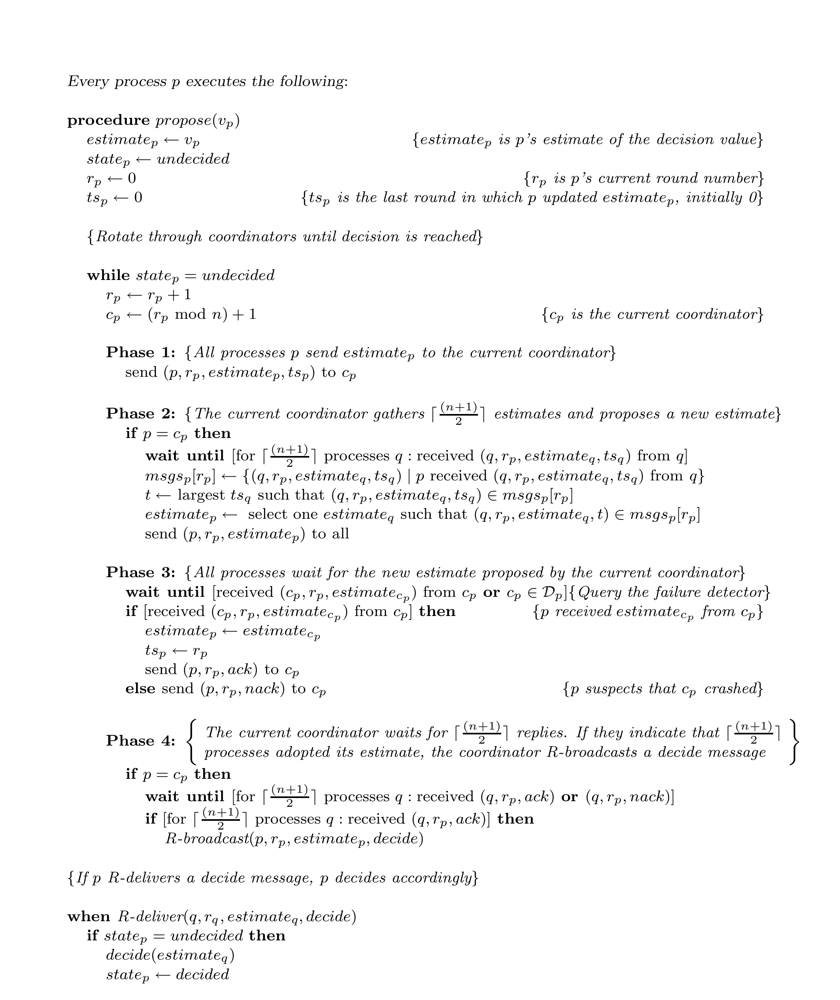

Fig. 6. Solving Consensus using any D ∈ ◇S.

> 图 6. 使用任意 D ∈ ◇S 求解共识。

> **图表中文解读：** 算法按轮次轮换协调者。每轮中，协调者先从多数进程收集带时间戳的估计，选择最新估计并广播；进程若收到该估计就确认，否则在怀疑协调者时否认。协调者获得多数确认后，才通过可靠广播宣布决定。多数集合必有交集，保证已经获得足够确认的值不会被后续轮次替换；最终弱准确性又保证某个正确协调者最终不再被怀疑，使某一轮必然完成并终止。

<!-- PDF page 21 -->

The proof is by induction on the round number. The claim trivially holds for r ′ = r. Now assume that the claim holds for all r ′, r ≤ r ′ < k. Let ck be the coordinator of round k, i.e., ck = (k mod n) + 1. We will show that the claim holds for r ′ = k, i.e., if ck sends estimateck in Phase 2 of round k, then estimateck = estimatec.

> 对轮次号作归纳即可证明该断言。r′ = r 时结论显然成立。现假设对所有满足 r ≤ r′ < k 的 r′，断言都成立。令 ck 为第 k 轮协调者，即 ck = (k mod n) + 1。我们证明 r′ = k 时亦成立：若 ck 在第 k 轮第 2 阶段发送 estimateck，则 estimateck = estimatec。

From the algorithm it is clear that if ck sends estimateck in Phase 2 of round k then it must have received estimates from at least ⌈(n + 1)/2⌉ processes. Thus, there is some process p such that (1) p sent a (p, r, ack) message to c in Phase 3 of round r, and (2) (p, k, estimatep, tsp) is in msgsck [k] in Phase 2 of round k. Since p sent (p, r, ack) to c in Phase 3 of round r, tsp = r at the end of Phase 3 of round r. Since tsp is non-decreasing, tsp ≥ r in Phase 1 of round k. Thus in Phase 2 of round k, (p, k, estimatep, tsp) is in msgsck [k] with tsp ≥ r. It is easy to see that there is no message (q, k, estimateq, tsq) in msgsck [k] for which tsq ≥ k. Let t be the largest tsq such that (q, k, estimateq, tsq) is in msgsck [k]. Thus r ≤ t < k.

> 若 ck 在第 k 轮第 2 阶段发送 estimateck，由算法可知，它必已收到至少 ⌈(n + 1)/2⌉ 个进程的估计。因此存在某个进程 p，使得：（1）p 在第 r 轮第 3 阶段向 c 发送过 (p,r,ack)；（2）第 k 轮第 2 阶段有 (p,k,estimatep,tsp) ∈ msgsck[k]。由（1），第 r 轮第 3 阶段结束时 tsp = r。tsp 单调不减，故第 k 轮第 1 阶段 tsp ≥ r；于是第 k 轮第 2 阶段，msgsck[k] 含一条时间戳至少为 r 的消息 (p,k,estimatep,tsp)。同时，msgsck[k] 不可能含任何 tsq ≥ k 的消息 (q,k,estimateq,tsq)。令 t 为满足 (q,k,estimateq,tsq) ∈ msgsck[k] 的最大 tsq，则 r ≤ t < k。

In Phase 2 of round k, ck executes estimateck ← estimateq where (q, k, estimateq, t) is in msgsck [k]. From Figure 6, it is clear that q adopted estimateq as its estimate in Phase 3 of round t. Thus, the coordinator of round t sent estimateq to q in Phase 2 of round t. Since r ≤ t < k, by the induction hypothesis, estimateq = estimatec. Thus, ck sets estimateck ← estimatec in Phase 2 of round k. This concludes the proof of the claim.

> 在第 k 轮第 2 阶段，ck 执行 estimateck ← estimateq，其中 (q, k, estimateq, t) ∈ msgsck[k]。由图 6，q 是在第 t 轮第 3 阶段采用 estimateq 的；因此，第 t 轮协调者曾在该轮第 2 阶段把 estimateq 发给 q。由于 r ≤ t < k，由归纳假设 estimateq = estimatec，故 ck 在第 k 轮第 2 阶段令 estimateck ← estimatec，断言得证。

We now show that if a process decides a value, then it decides estimatec. Suppose that some process p R-delivers (q, rq, estimateq, decide), and thus decides estimateq. By the uniform integrity property of Reliable Broadcast and the algorithm, process q must have R-broadcast (q, rq, estimateq, decide) in Phase 4 of round rq. From Figure 6, q must have received ⌈(n + 1)/2⌉ messages of the type (−, rq, ack) in Phase 4 of round rq. By the definition of r, r ≤ rq. From the above claim, estimateq = estimatec.

> 下面证明，任何进程一旦决定，其决定值必为 estimatec。设进程 p R-deliver (q, rq, estimateq, decide)，因而决定 estimateq。由可靠广播的统一完整性与本算法，q 必曾在第 rq 轮第 4 阶段 R-broadcast (q, rq, estimateq, decide)。由图 6，q 在该阶段必已收到 ⌈(n + 1)/2⌉ 条形如 (−, rq, ack) 的消息。按 r 的定义，r ≤ rq；由上述断言，estimateq = estimatec。

**Lemma 12.** (Termination) Every correct process eventually decides some value.

> 引理 12。（终止性）每个正确进程最终都会决定某个值。

**Proof.** There are two possible cases: (1) Some correct process decides. It must have R-delivered some message of the type (−, −, −, decide). By the agreement property of Reliable Broadcast, all correct processes eventually R-deliver this message and decide. (2) No correct process decides. We claim that no correct process remains blocked forever at one of the wait statements. The proof is by contradiction. Let r be the smallest round number in which some correct process blocks forever at one of the wait statements. Thus, all correct processes reach the end of Phase 1 of round r: they all send a message of the type (−, r, estimate, −) to the current coordinator c = (r mod n) + 1. Since a majority of the processes are correct, at least ⌈(n + 1)/2⌉ such messages are sent to c. There are two cases to consider: (a) Eventually, c receives those messages and replies by sending (c, r, estimatec). Thus, c does not block forever at the wait statement in Phase 2. (b) c crashes.

> 证明。分两种情形：（1）某个正确进程作出决定。它必已 R-deliver 一条形如 (−, −, −, decide) 的消息。由可靠广播的一致性，所有正确进程最终都会 R-deliver 该消息并作出决定。（2）没有正确进程作出决定。我们先断言，没有正确进程会永久阻塞在某个 wait 语句上。反设不然，令 r 为最小的、存在正确进程永久阻塞于 wait 的轮次号。于是所有正确进程均已到达第 r 轮第 1 阶段末尾，并向当前协调者 c = (r mod n) + 1 发送形如 (−, r, estimate, −) 的消息。正确进程占多数，因此至少有 ⌈(n + 1)/2⌉ 条此类消息发往 c。分两种情况：（a）c 最终收到这些消息，并以 (c, r, estimatec) 回复，因此 c 不会永久阻塞在第 2 阶段的 wait 上；（b）c 崩溃。

<!-- PDF page 22 -->

In the first case, every correct process eventually receives (c, r, estimatec). In the second case, since D satisfies strong completeness, for every correct process p there is a time after which c is permanently suspected by p, i.e., c ∈ D_p. Thus in either case, no correct process blocks at the second wait statement (Phase 3). So every correct process sends a message of the type (−, r, ack) or (−, r, nack) to c in Phase 3. Since there are at least ⌈(n + 1)/2⌉ correct processes, c cannot block at the wait statement of Phase 4. This shows that all correct processes complete round r—a contradiction that completes the proof of our claim. Since D satisfies eventual weak accuracy, there is a correct process q and a time t such that no correct process suspects q after t. Let t′ ≥ t be a time such that all faulty processes crash. Note that after time t′ no process suspects q. From this and the above claim, there must be a round r such that: (a) All correct processes reach round r after time t′ (when no process suspects q). (b) q is the coordinator of round r (i.e., q = (r mod n) + 1). In Phase 1 of round r, all correct processes send their estimates to q. In Phase 2, q receives ⌈(n + 1)/2⌉ such estimates, and sends (q, r, estimateq) to all processes. In Phase 3, since q is not suspected by any correct process after time t, every correct process waits for q’s estimate, eventually receives it, and replies with an ack to q. Furthermore, no process sends a nack to q (that can only happen when a process suspects q). Thus in Phase 4, q receives ⌈(n + 1)/2⌉ messages of the type (−, r, ack) (and no messages of the type (−, r, nack)), and q R-broadcasts (q, r, estimateq, decide). By the validity and agreement properties of Reliable Broadcast, eventually all correct processes R-deliver q’s message and decide—a contradiction. Thus case 2 is impossible, and this concludes the proof of the lemma.

> 情形（a）中，每个正确进程最终都会收到 (c, r, estimatec)。情形（b）中，由于 D 满足强完备性，对每个正确进程 p，最终 c 都会被 p 永久怀疑，即 c ∈ D_p。因此两种情况下，都没有正确进程会阻塞在第二个 wait（第 3 阶段）上；每个正确进程都会在第 3 阶段向 c 发送 (−, r, ack) 或 (−, r, nack)。正确进程至少有 ⌈(n + 1)/2⌉ 个，故 c 也不会阻塞在第 4 阶段的 wait 上。于是所有正确进程均完成第 r 轮，与 r 的选取矛盾，断言得证。又因 D 满足最终弱准确性，存在正确进程 q 和时刻 t，使 t 之后没有正确进程怀疑 q。取 t′ ≥ t，使所有故障进程到 t′ 时都已崩溃；则 t′ 之后没有任何仍在运行的进程怀疑 q。结合上述断言，必存在一轮 r，使得：（a）所有正确进程都在 t′ 之后到达第 r 轮；（b）q 是第 r 轮协调者，即 q = (r mod n) + 1。第 1 阶段，所有正确进程把估计发给 q；第 2 阶段，q 收到 ⌈(n + 1)/2⌉ 个估计，并向所有进程发送 (q, r, estimateq)。第 3 阶段，由于 t 之后没有正确进程怀疑 q，每个正确进程都会等待并最终收到 q 的估计，然后向 q 回复 ack；同时没有进程向 q 发送 nack，因为只有怀疑 q 时才会发送 nack。因此第 4 阶段，q 收到 ⌈(n + 1)/2⌉ 条 (−, r, ack)，且收不到任何 (−, r, nack)，遂 R-broadcast (q, r, estimateq, decide)。由可靠广播的有效性与一致性，所有正确进程最终都会 R-deliver q 的消息并决定，这与情形（2）的假设矛盾。因此情形（2）不可能，引理得证。

**Theorem 3.** The algorithm in Figure 6 solves Consensus using ◇S in asynchronous systems with f < ⌈n/2⌉.

> 定理 3。图 6 的算法在 f < ⌈n/2⌉ 的异步系统中使用 ◇S 求解共识。

**Proof.** Lemma 11 and Lemma 12 show that the algorithm in Figure 6 satisfies the (uniform) agreement and termination properties of Consensus, respectively. From the algorithm, it is clear that no process decides more than once, and hence the uniform integrity property holds. From the algorithm it is also clear that all the estimates that a coordinator receives in Phase 2 are proposed values. Therefore, the decision value that a coordinator selects from these estimates must be the value proposed by some process. Thus, uniform validity of Consensus is also satisfied. By Theorems 1 and 3, we have:

> 证明。引理 11 与引理 12 分别表明图 6 的算法满足共识的（统一）一致性与终止性。由算法，每个进程至多决定一次，故统一完整性成立。协调者在第 2 阶段收到的估计全都源自提议值，所以从中选出的决定值必是某个进程的提议值，统一有效性也成立。结合定理 1 与定理 3，得到：

**Corollary 3.** Consensus is solvable using ◇W in asynchronous systems with f < ⌈n/2⌉. Thus, Consensus can be solved in asynchronous systems using any failure detector in ◇W, the weakest class of failure detectors considered in this paper. This leads to the following question: What is the weakest failure detector for solving Consensus? The answer to this question, given in a companion paper [Chandra et al. 1992], is summarised below.

> 推论 3。在 f < ⌈n/2⌉ 的异步系统中，可使用 ◇W 求解共识。因此，使用 ◇W 中任一故障检测器——即本文所考察的最弱故障检测器类别——都能在异步系统中求解共识。这引出一个问题：求解共识所需的最弱故障检测器是什么？配套论文 [Chandra et al. 1992] 给出了答案，概述如下。

Let ◇W₀ be the “weakest” failure detector in ◇W. Roughly speaking, ◇W₀ is the failure detector that exhibits all the failure detector behaviours allowed by the properties that define ◇W. More precisely, ◇W₀ consists of all the failure detector histories that satisfy weak completeness and eventual weak accuracy (for a formal definition see [Chandra et al. 1992]). [Chandra et al. 1992] show that ◇W₀ is the weakest failure detector for solving Consensus in asynchronous systems with a majority of correct processes.

> 令 ◇W₀ 为 ◇W 中“最弱”的故障检测器。粗略地说，◇W₀ 会呈现 ◇W 的定义性质所允许的全部故障检测器行为。更精确地，◇W₀ 由所有满足弱完备性与最终弱准确性的故障检测器历史组成（形式化定义见 [Chandra et al. 1992]）。[Chandra et al. 1992] 证明，在正确进程占多数的异步系统中，◇W₀ 是求解共识所需的最弱故障检测器。

<!-- PDF page 23 -->

**Theorem 4.** [Chandra et al. 1992] If a failure detector D can be used to solve Consensus in an asynchronous system, then D ⪰ ◇W₀ in that system. By Corollary 3 and Theorem 4, we have:

> 定理 4。[Chandra et al. 1992] 若故障检测器 D 可用于在某异步系统中求解共识，则在该系统中 D ⪰ ◇W₀。结合推论 3 与定理 4，得到：

**Corollary 4.** ◇W₀ is the weakest failure detector for solving Consensus in asynchronous systems with f < ⌈n/2⌉.

> 推论 4。◇W₀ 是在 f < ⌈n/2⌉ 的异步系统中求解共识所需的最弱故障检测器。

### 6.3 A lower bound on fault-tolerance

> 6.3 容错能力的下界

In Section 6.1, we showed that failure detectors with perpetual accuracy (i.e., in P, Q, S, or W) can be used to solve Consensus in asynchronous systems with any number of failures. In contrast, with failure detectors with eventual accuracy (i.e., in ◇P, ◇Q, ◇S, or ◇W), our Consensus algorithms require a majority of the processes to be correct. It turns out that this requirement is necessary: Using ◇P to solve Consensus requires a majority of correct processes. Since ◇P ⪰ ◇S, the algorithm in Figure 6 is optimal with respect to fault-tolerance.

> 第 6.1 节表明，具有永久准确性（即属于 P、Q、S 或 W）的故障检测器，可在故障数任意的异步系统中用来求解共识。相比之下，对只有最终准确性的故障检测器（即属于 ◇P、◇Q、◇S 或 ◇W），我们的共识算法要求正确进程占多数。这个要求实际上是必要的：使用 ◇P 求解共识，必须有多数正确进程。由于 ◇P ⪰ ◇S，图 6 的算法在容错能力上是最优的。

The proof of this result (Theorem 5) uses standard “partitioning” techniques (e.g., [Ben-Or 1983; Bracha and Toueg 1985]). It is also a corollary of Theorem 4.3 in [Dwork et al. 1988] together with Theorem 9 in Section 9.1.

> 该结果（定理 5）的证明采用标准“分区”技术（例如 [Ben-Or 1983; Bracha and Toueg 1985]）。该结果也可由 [Dwork et al. 1988] 的定理 4.3 与本文第 9.1 节的定理 9 推出。

**Theorem 5.** Consensus cannot be solved using ◇P in asynchronous systems with f ≥ ⌈n/2⌉.

> 定理 5。在 f ≥ ⌈n/2⌉ 的异步系统中，无法使用 ◇P 求解共识。

**Proof.** We give a failure detector D ∈ ◇P such that no algorithm can solve Consensus using D in asynchronous systems with f ≥ ⌈n/2⌉. Informally D is the weakest Eventually Perfect failure detector: it consists of all failure detector histories that satisfy strong completeness and eventual strong accuracy. More precisely, for every failure pattern F, D(F) consists of all failure detector histories H such that ∃t ∈ T, ∀t′ ≥ t, ∀p ∈ correct(F): q ∈ crashed(F) ⇐⇒ q ∈ H(p, t′).

> 证明。我们给出一个故障检测器 D ∈ ◇P，使任何算法都无法在 f ≥ ⌈n/2⌉ 的异步系统中使用 D 求解共识。非形式地，D 是最弱的最终完美故障检测器：它包含所有满足强完备性与最终强准确性的故障检测器历史。更精确地，对每个故障模式 F，D(F) 包含所有满足下式的故障检测器历史 H：∃t ∈ T, ∀t′ ≥ t, ∀p ∈ correct(F): q ∈ crashed(F) ⇐⇒ q ∈ H(p, t′)。

The proof is by contradiction. Suppose algorithm A solves Consensus using D in asynchronous systems with f ≥ ⌈n/2⌉. Partition the processes into two sets Π_0 and Π_1 such that Π_0 contains ⌈n/2⌉ processes, and Π_1 contains the remaining ⌊n/2⌋ processes. Consider the following two runs of A using D:

> 反证。假设算法 A 在 f ≥ ⌈n/2⌉ 的异步系统中使用 D 求解共识。将进程划分为 Π_0 与 Π_1 两组，其中 Π_0 含 ⌈n/2⌉ 个进程，Π_1 含其余 ⌊n/2⌋ 个进程。考虑 A 使用 D 的如下两次运行：

Run R_0 = ⟨F_0, H_0, I_0, S_0, T_0⟩. All processes propose 0. All processes in Π_0 are correct in F_0, while those in Π_1 crash in F_0 at the beginning of the run, i.e., ∀t ∈ T: F_0(t) = Π_1 (this is possible since f ≥ ⌈n/2⌉). Every process in Π_0 permanently suspects every process in Π_1, i.e., ∀t ∈ T, ∀p ∈ Π_0: H_0(p, t) = Π_1. Clearly, H_0 ∈ D(F_0) as required.

> 运行 R_0 = ⟨F_0, H_0, I_0, S_0, T_0⟩。所有进程提议 0。Π_0 中的所有进程在 F_0 中正确，而 Π_1 中的进程在运行开始时就在 F_0 中崩溃，即 ∀t ∈ T: F_0(t) = Π_1（这是可能的，因为 f ≥ ⌈n/2⌉）。Π_0 中每个进程永久怀疑 Π_1 中每个进程，即 ∀t ∈ T, ∀p ∈ Π_0: H_0(p, t) = Π_1。显然，按要求有 H_0 ∈ D(F_0)。

Run R_1 = ⟨F_1, H_1, I_1, S_1, T_1⟩. All processes propose 1. All processes in Π_1 are correct in F_1, while those in Π_0 crash in F_1 at the beginning of the run, i.e., ∀t ∈ T: F_1(t) = Π_0. Every process in Π_1 permanently suspects every process in Π_0, i.e., ∀t ∈ T, ∀p ∈ Π_1: H_1(p, t) = Π_0. Clearly, H_1 ∈ D(F_1) as required.

> 运行 R_1 = ⟨F_1, H_1, I_1, S_1, T_1⟩。所有进程提议 1。Π_1 中的所有进程在 F_1 中正确，而 Π_0 中的进程在运行开始时就在 F_1 中崩溃，即 ∀t ∈ T: F_1(t) = Π_0。Π_1 中每个进程永久怀疑 Π_0 中每个进程，即 ∀t ∈ T, ∀p ∈ Π_1: H_1(p, t) = Π_0。显然，按要求有 H_1 ∈ D(F_1)。

<!-- PDF page 24 -->

Since R_0 and R_1 are runs of A using D, these runs satisfy the specification of Consensus — in particular, all correct processes decide 0 in R_0, and 1 in R_1. Let q_0 ∈ Π_0, q_1 ∈ Π_1, t_0 be the time at which q_0 decides 0 in R_0, and t_1 be the time at which q_1 decides 1 in R_1. We now construct a run R_A = ⟨F_A, H_A, I_A, S_A, T_A⟩ of algorithm A using D such that R_A violates the specification of Consensus — a contradiction.

> 由于 R_0 和 R_1 都是 A 使用 D 的运行，它们满足共识规范；特别地，所有正确进程在 R_0 中决定 0，在 R_1 中决定 1。令 q_0 ∈ Π_0、q_1 ∈ Π_1，令 t_0 为 q_0 在 R_0 中决定 0 的时刻，令 t_1 为 q_1 在 R_1 中决定 1 的时刻。现在构造算法 A 使用 D 的一次运行 R_A = ⟨F_A, H_A, I_A, S_A, T_A⟩，使 R_A 违反共识规范，从而得到矛盾。

In R_A all processes in Π_0 propose 0 and all processes in Π_1 propose 1. No process crashes in F_A, i.e., ∀t ∈ T: F_A (t) = ∅. All messages from processes in Π_0 to those in Π_1 and vice-versa, are delayed until time max(t_0, t_1). Until time max(t_0, t_1), every process in Π_0 suspects every process in Π_1, and every process in Π_1 suspects every process in Π_0. After time max(t_0, t_1), no process suspects any other process. More precisely: ∀t ≤ max(t_0, t_1): ∀p ∈ Π_0: H_A (p, t) = Π_1 ∀p ∈ Π_1: H_A (p, t) = Π_0 ∀t > max(t_0, t_1), ∀p ∈ Π: H_A (p, t) = ∅ Note that H_A ∈ D(F_A) as required. Until time max(t_0, t_1), R_A is indistinguishable from R_0 for processes in Π_0, and R_A is indistinguishable from R_1 for processes in Π_1. Thus in R_A, q_0 decides 0 at time t_0, while q_1 decides 1 at time t_1. This violates the agreement property of Consensus. In the appendix, we refine the result of Theorem 5: We first define an infinite hierarchy of failure detector classes ordered by the maximum number of mistakes that failure detectors can make, and then we show exactly where in this hierarchy the majority requirement becomes necessary for solving Consensus (this hierarchy contains all the eight failure detector classes defined in Figure 1).

> 在 R_A 中，Π_0 中所有进程提议 0，Π_1 中所有进程提议 1。F_A 中没有进程崩溃，即 ∀t ∈ T: F_A(t) = ∅。Π_0 与 Π_1 之间双向发送的全部消息，都延迟到时刻 max(t_0, t_1) 才交付。在此时刻之前，Π_0 中每个进程都怀疑 Π_1 中每个进程，Π_1 中每个进程也都怀疑 Π_0 中每个进程；此后任何进程都不再怀疑其他进程。更精确地：∀t ≤ max(t_0, t_1): ∀p ∈ Π_0: H_A(p,t) = Π_1，且 ∀p ∈ Π_1: H_A(p,t) = Π_0；∀t > max(t_0,t_1), ∀p ∈ Π: H_A(p,t) = ∅。注意，所需的 H_A ∈ D(F_A) 确实成立。到时刻 max(t_0,t_1) 为止，对 Π_0 中的进程而言，R_A 与 R_0 不可区分；对 Π_1 中的进程而言，R_A 与 R_1 不可区分。因此在 R_A 中，q_0 于 t_0 决定 0，而 q_1 于 t_1 决定 1，违反共识的一致性。附录将进一步细化定理 5：先按故障检测器最多会犯多少次错误，定义一个无限的故障检测器类别层次，再精确确定在该层次的何处，求解共识开始必须要求正确进程占多数（该层次包含图 1 定义的全部八类故障检测器）。

## 7. ON ATOMIC BROADCAST

> 7. 关于原子广播

We now consider Atomic Broadcast, another fundamental problem in fault tolerant distributed computing, and show that our results on Consensus also apply to Atomic Broadcast. Informally, Atomic Broadcast requires that all correct processes deliver the same messages in the same order. Formally, Atomic Broadcast is a Reliable Broadcast that satisfies:

> 下面考察容错分布式计算中的另一项基本问题——原子广播，并证明关于共识的结果同样适用于原子广播。非形式地说，原子广播要求所有正确进程以相同顺序交付相同消息。形式上，原子广播是在可靠广播基础上再满足下列性质：

Total order. If two correct processes p and q deliver two messages m and m′, then p delivers m before m′ if and only if q delivers m before m′. The total order and agreement properties of Atomic Broadcast ensure that all correct processes deliver the same sequence of messages. Atomic Broadcast is a powerful communication paradigm for fault-tolerant distributed computing [Chang and Maxemchuk 1984; Cristian et al. 1985; Birman and Joseph 1987; Pittelli and Garcia-Molina 1989; Budhiraja et al. 1990; Gopal et al. 1990; Schneider 1990]. We now show that Consensus and Atomic Broadcast are equivalent in asynchronous systems with crash failures. This is shown by reducing each to the other.17

> 全序性。若两个正确进程 p 和 q 都交付了消息 m 与 m′，则 p 先于 m′ 交付 m，当且仅当 q 也先于 m′ 交付 m。原子广播的全序性与一致性一起保证，所有正确进程都交付同一条消息序列。原子广播是容错分布式计算中一种功能强大的通信范式 [Chang and Maxemchuk 1984; Cristian et al. 1985; Birman and Joseph 1987; Pittelli and Garcia-Molina 1989; Budhiraja et al. 1990; Gopal et al. 1990; Schneider 1990]。下面通过把两个问题各自归约到对方，证明在崩溃故障的异步系统中，共识与原子广播等价。17

17 They are actually equivalent even in asynchronous systems with arbitrary failures. However, the reduction is more complex and is omitted here.

> 17 即使在具有任意故障的异步系统中，它们实际上也是等效的。但归约比较复杂，这里不再赘述。

<!-- PDF page 25 -->

In other words, a solution for one automatically yields a solution for the other. Both reductions apply to any asynchronous system (in particular, they do not require the assumption of a failure detector). This equivalence has important consequences regarding the solvability of Atomic Broadcast in asynchronous systems: (1) Atomic Broadcast cannot be solved by a deterministic algorithm in asynchronous systems, even if we assume that at most one process may fail, and it may only fail by crashing. This is because Consensus has no deterministic solution in such systems [Fischer et al. 1985]. (2) Atomic Broadcast can be solved using randomisation or unreliable failure detectors in asynchronous systems. This is because Consensus is solvable using these techniques in such systems (for a survey of randomised Consensus algorithms, see [Chor and Dwork 1989]). Consensus can be easily reduced to Atomic Broadcast as follows [Dolev et al. 1987]. To propose a value, a process atomically broadcasts it. To decide a value, a process picks the value of the first message that it atomically delivers.18 By total order of Atomic Broadcast, all correct processes deliver the same first message. Hence they choose the same value and agreement of Consensus is satisfied. The other properties of Consensus are also easy to verify. In the next section, we reduce Atomic Broadcast to Consensus.

> 换言之，任一问题的解都会自动给出另一问题的解。两种归约适用于任意异步系统，尤其不要求存在故障检测器。这项等价性对异步系统中原子广播的可求解性有重要含义：（1）即便假设最多只有一个进程会出故障，且故障方式仅为崩溃，也不存在求解原子广播的确定性异步算法，因为这类系统中的共识没有确定性解 [Fischer et al. 1985]。（2）可以利用随机化或不可靠故障检测器，在异步系统中求解原子广播，因为这些技术都能求解共识（随机共识算法综述见 [Chor and Dwork 1989]）。共识很容易按如下方法归约到原子广播 [Dolev et al. 1987]：进程要提议值时，将其 A-broadcast；要决定值时，选择自己 A-deliver 的第一条消息所携带的值。18 由原子广播的全序性，所有正确进程 A-deliver 的第一条消息相同，因而选择相同值，满足共识的一致性。共识的其他性质也容易验证。下一节把原子广播归约到共识。

### 7.1 Reducing Atomic Broadcast to Consensus

> 7.1 将原子广播归约为共识

In Figure 7, we show how to transform any Consensus algorithm into an Atomic Broadcast algorithm in asynchronous systems. The resulting Atomic Broadcast algorithm tolerates as many faulty processes as the given Consensus algorithm.

> 在图 7 中，我们展示了如何将任何共识算法转换为异步系统中的原子广播算法。由此产生的原子广播算法可以容忍与给定共识算法一样多的故障进程。

Our Atomic Broadcast algorithm uses repeated (possibly concurrent, but completely independent) executions of Consensus. Intuitively, the kth execution of Consensus is used to decide on the kth batch of messages to be atomically delivered. Processes disambiguate between these executions by tagging all the messages pertaining to the k th execution of Consensus with the counter k. Tagging each message with this counter constitutes a minor modification to any given Consensus algorithm. The propose and decide primitives corresponding to the k th execution of Consensus are denoted by propose(k, −) and decide(k, −).

> 该原子广播算法反复执行多个共识实例；这些实例可以并发，但彼此完全独立。直观地说，第 k 个共识实例用于决定第 k 批要原子交付的消息。为区分各实例，进程用计数器 k 标记所有与第 k 个共识实例相关的消息。为每条消息加上这一标记，只需对任意给定的共识算法作微小修改。第 k 个共识实例的提议与决定原语分别记为 propose(k, −) 和 decide(k, −)。

Our Atomic Broadcast algorithm also uses the R-broadcast(m) and R-deliver(m) primitives of Reliable Broadcast. To avoid possible ambiguities between Atomic Broadcast and Reliable Broadcast, we say that a process A-broadcasts or A-delivers to refer to a broadcast or a delivery associated with Atomic Broadcast; and R-broadcasts or R-delivers to refer to a broadcast or delivery associated with Reliable Broadcast.

> 该原子广播算法还使用可靠广播的 R-broadcast(m) 与 R-deliver(m) 原语。为避免两种广播混淆，我们用 A-broadcast 和 A-deliver 指原子广播的广播与交付，用 R-broadcast 和 R-deliver 指可靠广播的广播与交付。

The Atomic Broadcast algorithm described in Figure 7 consists of three tasks, Task 1, Task 2, and Task 3, such that: (1) any task that is enabled is eventually executed, and (2) Task i can execute concurrently with Task j provided i ≠ j.

> 图 7 的原子广播算法由任务 1、任务 2 和任务 3 组成，并满足：（1）任何已启用的任务最终都会执行；（2）只要 i ≠ j，任务 i 与任务 j 就可并发执行。

When a process wishes to A-broadcast a message m, it R-broadcasts m (Task 1). When a process p R-delivers m, it adds m to the set R deliveredp (Task 2). When p A-delivers a message m, it adds m to the set A deliveredp (Task 3). Thus, R deliveredp − A deliveredp, denoted A undeliveredp, is the set of messages that p R-delivered but did not yet A-deliver. Intuitively, these are the messages that were submitted for Atomic Broadcast but are not yet A-delivered, according to p.

> 进程要 A-broadcast 消息 m 时，会在任务 1 中 R-broadcast m。进程 p R-deliver m 时，会在任务 2 中把 m 加入集合 R deliveredp；p A-deliver 消息 m 时，会在任务 3 中把 m 加入集合 A deliveredp。因此，R deliveredp − A deliveredp（记为 A undeliveredp）就是 p 已 R-deliver、但尚未 A-deliver 的消息集合。直观地说，在 p 看来，这些消息已经提交给原子广播，却还没有原子交付。

18 Note that this reduction does not require the assumption of a failure detector.

> 18 注意，这一归约不要求存在故障检测器。

<!-- PDF page 26 -->

```text
Every process p executes the following:
```

> 每个进程 p 执行以下操作：

```text
Initialisation:
```

> 初始化：

```text
R_delivered_p ← ∅
A_delivered_p ← ∅
k ← 0
```

> R_delivered_p ← ∅
> A_delivered_p ← ∅
> k ← 0

```text
To execute A-broadcast(m): { Task 1 }
R-broadcast(m)
```

> 执行 A-broadcast(m)：{任务 1}
> R-broadcast(m)

A-deliver(−) occurs as follows:

> A-deliver(−) 发生如下：

```text
when R-deliver(m) { Task 2 }
R_delivered_p ← R_delivered_p ∪ {m}
```

> 当 R-deliver(m) 时 {任务 2}
> R_delivered_p ← R_delivered_p ∪ {m}

```text
when R_delivered_p − A_delivered_p ≠ ∅ { Task 3 }
k ← k + 1
A_undelivered_p ← R_delivered_p − A_delivered_p
propose(k, A_undelivered_p)
wait until decide(k, msgSet^k)
A_deliver_p^k ← msgSet^k − A_delivered_p
atomically deliver all messages in A_deliver_p^k in some deterministic order
A_delivered_p ← A_delivered_p ∪ A_deliver_p^k
```

> 当 R_delivered_p − A_delivered_p ≠ ∅ 时 {任务 3}
> k ← k + 1
> A_undelivered_p ← R_delivered_p − A_delivered_p
> propose(k, A_undelivered_p)
> 等待，直到 decide(k, msgSet^k)
> A_deliver_p^k ← msgSet^k − A_delivered_p
> 按某种确定性顺序，原子地交付 A_deliver_p^k 中的所有消息
> A_delivered_p ← A_delivered_p ∪ A_deliver_p^k

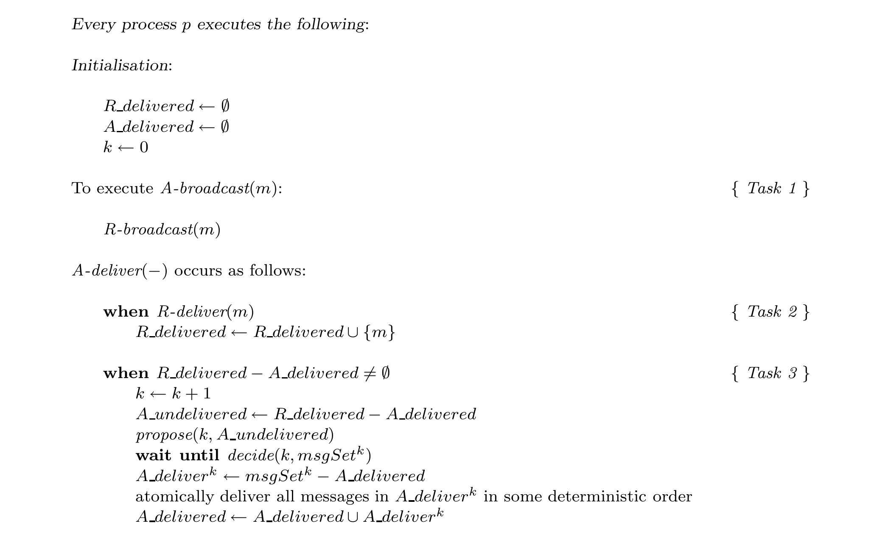

Fig. 7. Using Consensus to solve Atomic Broadcast.

> 图 7. 使用共识求解原子广播。

> **图表中文解读：** 待原子广播的消息先通过可靠广播传播，并进入 R_delivered。只要还有尚未原子交付的消息，进程就启动编号为 k 的共识实例，以当前待交付集合为提议；共识决定第 k 批消息后，各进程再按同一确定性顺序交付该批。逐批共识保证所有正确进程选择相同批次，批内确定性排序则保证全局交付顺序一致。

In Task 3, process p periodically checks whether A undeliveredp contains messages. If so, p enters its next execution of Consensus, say the kth one, by proposing A undeliveredp as the next batch of messages to be A-delivered. Process p then waits for the kth Consensus decision, denoted msgSetk. Finally, p A-delivers all the messages in msgSetk except those it already A-delivered. More precisely, p A-delivers all the messages in the set A deliverpk = msgSetk − A deliveredp, and it does so in some deterministic order that was agreed a priori by all processes, e.g., in lexicographical order.

> 任务 3 中，进程 p 定期检查 A undeliveredp 是否包含消息。若包含，p 就进入下一个共识实例（设为第 k 个），把 A undeliveredp 作为下一批待 A-deliver 的消息加以提议。然后 p 等待第 k 个共识决定 msgSetk。最后，p 对 msgSetk 中自己尚未 A-deliver 的所有消息执行 A-deliver。更精确地说，p 会 A-deliver 集合 A deliverpk = msgSetk − A deliveredp 中的所有消息，顺序采用全体进程事先约定的某种确定性顺序，例如字典序。

**Lemma 13.** For any two correct processes p and q, and any message m, if m ∈ R deliveredp then eventually m ∈ R deliveredq.

> 引理 13。对任意两个正确进程 p、q 及任意消息 m，若 m ∈ R deliveredp，则最终 m ∈ R deliveredq。

**Proof.** If m ∈ R deliveredp then p R-delivered m (in Task 2). Since p is correct, by the agreement property of Reliable Broadcast q eventually R-delivers m, and inserts m into R deliveredq.

> 证明。若 m ∈ R deliveredp，则 p 已在任务 2 中 R-deliver m。因 p 正确，由可靠广播的一致性，q 最终也会 R-deliver m，并把 m 加入 R deliveredq。

**Lemma 14.** For any two correct processes p and q, and all k ≥ 1: (1) If p executes propose(k, −), then q eventually executes propose(k, −). (2) If p A-delivers messages in A deliverpk, then q eventually A-delivers messages in A deliverqk, and A deliverpk = A deliverqk.

> 引理 14。对任意两个正确进程 p、q 以及所有 k ≥ 1：（1）若 p 执行 propose(k, −)，则 q 最终也会执行 propose(k, −)。（2）若 p A-deliver A deliverpk 中的消息，则 q 最终也会 A-deliver A deliverqk 中的消息，且 A deliverpk = A deliverqk。

<!-- PDF page 27 -->

**Proof.** The proof is by simultaneous induction on (1) and (2). For k = 1, we first show that if p executes propose(1, −), then q eventually executes propose(1, −). When p executes propose(1, −), R deliveredp must contain some message m. By Lemma 13, m is eventually in R deliveredq. Since A deliveredq is initially empty, eventually R deliveredq − A deliveredq ≠ ∅. Thus, q eventually executes Task 3 and propose(1, −).

> 证明。对（1）与（2）同时归纳。先看 k = 1。若 p 执行 propose(1, −)，则 R deliveredp 中必含某条消息 m。由引理 13，m 最终会进入 R deliveredq。由于 A deliveredq 初始为空，最终有 R deliveredq − A deliveredq ≠ ∅，因此 q 最终会执行任务 3 和 propose(1, −)。

We now show that if p A-delivers messages in A deliverp1, then q eventually A-delivers messages in A deliverq1, and A deliverp1 = A deliverq1. From the algorithm, if p A-delivers messages in A deliverp1, it previously executed propose(1, −). From part (1) of the lemma, all correct processes eventually execute propose(1, −). By termination and uniform integrity of Consensus, every correct process eventually executes decide(1, −) and it does so exactly once. By agreement of Consensus, all correct processes eventually execute decide(1, msgSet1) with the same msgSet1. Since A deliveredp and A deliveredq are initially empty, and msgSet1p = msgSet1q, we have A deliverp1 = A deliverq1.

> 再证明：若 p A-deliver A deliverp1 中的消息，则 q 最终也会 A-deliver A deliverq1 中的消息，且 A deliverp1 = A deliverq1。由算法，p 在 A-deliver A deliverp1 之前已执行 propose(1, −)。由本引理第（1）部分，所有正确进程最终都会执行 propose(1, −)。由共识的终止性与统一完整性，每个正确进程最终恰好执行一次 decide(1, −)；由共识的一致性，它们都会以同一 msgSet1 执行 decide(1, msgSet1)。由于 A deliveredp 与 A deliveredq 初始均为空，且 msgSet1p = msgSet1q，故 A deliverp1 = A deliverq1。

Now assume that the lemma holds for all k, 1 ≤ k < l. We first show that if p executes propose(l, −), then q eventually executes propose(l, −). When p executes propose(l, −), R deliveredp must contain some message m that is not in A deliveredp. Thus, m is not in ⋃_{k=1}^{l−1} A deliverpk. By the induction hypothesis, A deliverpk = A deliverqk for all 1 ≤ k ≤ l − 1. So m is not in ⋃_{k=1}^{l−1} A deliverqk. Since m is in R deliveredp, by Lemma 13, m is eventually in R deliveredq. Thus, there is a time after q A-delivers A deliverq,l−1 such that there is a message in R deliveredq − A deliveredq. So q eventually executes Task 3 and propose(l, −).

> 现假设对所有满足 1 ≤ k < l 的 k，引理均成立。先证：若 p 执行 propose(l, −)，则 q 最终也会执行 propose(l, −)。p 执行 propose(l, −) 时，R deliveredp 必含某条不在 A deliveredp 中的消息 m，故 m ∉ ⋃_{k=1}^{l−1} A deliverpk。由归纳假设，对所有 1 ≤ k ≤ l − 1 都有 A deliverpk = A deliverqk，所以 m ∉ ⋃_{k=1}^{l−1} A deliverqk。又因 m ∈ R deliveredp，由引理 13，m 最终会进入 R deliveredq。因此，在 q A-deliver A deliverq,l−1 之后，R deliveredq − A deliveredq 中会出现一条消息；于是 q 最终执行任务 3 和 propose(l, −)。

We now show that if p A-delivers messages in A deliverpl, then q A-delivers messages in A deliverql, and A deliverpl = A deliverql. Since p A-delivers messages in A deliverpl, it must have executed propose(l, −). By part (1) of this lemma, all correct processes eventually execute propose(l, −). By termination and uniform integrity of Consensus, every correct process eventually executes decide(l, −) and it does so exactly once. By agreement of Consensus, all correct processes eventually execute decide(l, msgSetl) with the same msgSetl. Note that A deliverpl = msgSetlp − ⋃_{k=1}^{l−1} A deliverpk, and A deliverql = msgSetlq − ⋃_{k=1}^{l−1} A deliverqk. By the induction hypothesis, A deliverpk = A deliverqk for all 1 ≤ k ≤ l − 1. Since msgSetlp = msgSetlq, A deliverpl = A deliverql.

> 再证：若 p A-deliver A deliverpl 中的消息，则 q 也会 A-deliver A deliverql 中的消息，且 A deliverpl = A deliverql。p 既已 A-deliver A deliverpl，就必曾执行 propose(l, −)。由本引理第（1）部分，所有正确进程最终都会执行 propose(l, −)。由共识的终止性与统一完整性，每个正确进程最终恰好执行一次 decide(l, −)；由共识的一致性，它们都以同一 msgSetl 执行 decide(l, msgSetl)。注意，A deliverpl = msgSetlp − ⋃_{k=1}^{l−1} A deliverpk，A deliverql = msgSetlq − ⋃_{k=1}^{l−1} A deliverqk。归纳假设给出所有 1 ≤ k ≤ l − 1 上 A deliverpk = A deliverqk；又有 msgSetlp = msgSetlq，故 A deliverpl = A deliverql。

**Lemma 15.** The algorithm in Figure 7 satisfies the agreement and total order properties of A-broadcast.

> 引理 15。图 7 的算法满足 A-broadcast 的一致性与全序性。

**Proof.** Immediate from Lemma 14, and the fact that correct processes A-deliver messages in each batch in the same deterministic order.

> 证明。由引理 14，再加上正确进程会按相同的确定性顺序 A-deliver 每一批消息，立即可得。

**Lemma 16.** (Validity) If a correct process A-broadcasts m, then it eventually A-delivers m.

> 引理 16。（有效性）若正确进程 A-broadcast m，则它最终会 A-deliver m。

**Proof.** The proof is by contradiction. Suppose a correct process p A-broadcasts m but never A-delivers m. By Lemma 15, no correct process A-delivers m. By Task 1 of Figure 7, p R-broadcasts m. By the validity and agreement properties of Reliable Broadcast, every correct process q eventually R-delivers m, and inserts m in R deliveredq (Task 2). Since correct processes never A-deliver m, they never insert m in A delivered. Thus, for every correct process q, there is a time after which m is permanently in R deliveredq − A deliveredq. From Figure 7 and Lemma 14, there is a k1, such that for all l ≥ k1, all correct processes execute propose(l, −), and they do so with sets that always include m. Since all faulty processes eventually crash, there is a k2 such that no faulty process executes propose(l, −) with l ≥ k2. Let k = max(k1, k2). Since all correct processes execute propose(k, −), by termination and agreement of Consensus, all correct processes execute decide(k, msgSetk) with the same msgSetk. By uniform validity of Consensus, some process q executed propose(k, msgSetk). From our definition of k, q is correct and msgSetk contains m. Thus all correct processes, including p, A-deliver m—a contradiction that concludes the proof.

> 证明。反设某个正确进程 p 已 A-broadcast m，却从不 A-deliver m。由引理 15，没有正确进程会 A-deliver m。由图 7 的任务 1，p R-broadcast m；由可靠广播的有效性与一致性，每个正确进程 q 最终都会 R-deliver m，并在任务 2 中把 m 加入 R deliveredq。正确进程既不 A-deliver m，就不会把 m 加入 A delivered。因此，对每个正确进程 q，最终 m 会永久属于 R deliveredq − A deliveredq。由图 7 与引理 14，存在 k1，使对所有 l ≥ k1，所有正确进程都会执行 propose(l, −)，且提议集合总含 m。所有故障进程最终都会崩溃，故存在 k2，使得没有故障进程会对 l ≥ k2 执行 propose(l, −)。令 k = max(k1,k2)。所有正确进程都执行 propose(k, −)，由共识的终止性与一致性，它们都会以同一 msgSetk 执行 decide(k, msgSetk)。由共识的统一有效性，某个进程 q 曾执行 propose(k, msgSetk)。按 k 的定义，q 正确，且 msgSetk 含 m。于是包括 p 在内的所有正确进程都会 A-deliver m，产生矛盾，证明完成。

<!-- PDF page 28 -->

**Lemma 17.** (Uniform integrity) For any message m, each process A-delivers m at most once, and only if m was previously A-broadcast by sender(m).

> 引理 17。（统一完整性）对任意消息 m，每个进程至多 A-deliver m 一次，且只有 sender(m) 此前 A-broadcast m 时才会如此。

**Proof.** Suppose a process p A-delivers m. After p A-delivers m, it inserts m in A deliveredp. From the algorithm, it is clear that p cannot A-deliver m again. From the algorithm, p executed decide(k, msgSetk) for some k and some msgSetk that contains m. By uniform validity of Consensus, some process q must have executed propose(k, msgSetk). So q previously R-delivered all the messages in msgSetk, including m. By the uniform integrity property of Reliable Broadcast, process sender(m) R-broadcast m. So, sender(m) A-broadcast m.

> 证明。设进程 p A-deliver m。此后 p 把 m 加入 A deliveredp；由算法，p 不可能再次 A-deliver m。又由算法，对某个 k 及某个含 m 的 msgSetk，p 曾执行 decide(k, msgSetk)。由共识的统一有效性，必有某个进程 q 曾执行 propose(k, msgSetk)，所以 q 此前已 R-deliver msgSetk 中包括 m 在内的所有消息。由可靠广播的统一完整性，sender(m) 曾 R-broadcast m，因而 sender(m) 曾 A-broadcast m。

**Theorem 6.** Consider any system (synchronous or asynchronous) subject to crash failures and where Reliable Broadcast can be implemented. The algorithm in Figure 7 transforms any algorithm for Consensus into an Atomic Broadcast algorithm.

> 定理 6. 考虑任何可能发生崩溃故障并且可以实现可靠广播的系统（同步或异步）。图 7 中的算法将任何共识算法转换为原子广播算法。

**Proof.** Immediate from Lemmata 15, 16, and 17.

> 证明。由引理 15、16 和 17 立即可得。

Since Reliable Broadcast can be implemented in asynchronous systems with crash failures (Section 4), the above theorem shows that Atomic Broadcast is reducible to Consensus in such systems. As we showed earlier, the converse is also true. Thus:19

> 可靠广播可在发生崩溃故障的异步系统中实现（第 4 节），所以上述定理表明，在这类系统中原子广播可归约到共识。前文已经证明反向归约也成立。因此：19

**Corollary 5.** Consensus and Atomic Broadcast are equivalent in asynchronous systems. This equivalence immediately implies that our results regarding Consensus (in particular Corollaries 2 and 4, and Theorem 5) also hold for Atomic Broadcast:

> 推论 5。共识与原子广播在异步系统中等价。这一等价性立即意味着，我们关于共识的结果（特别是推论 2、推论 4 与定理 5）同样适用于原子广播：

**Corollary 6.** Atomic Broadcast is solvable using W in asynchronous systems with f < n, and using ◇W in asynchronous systems with f < ⌈n/2⌉.

> 推论 6。原子广播在 f < n 的异步系统中可使用 W 求解，在 f < ⌈n/2⌉ 的异步系统中可使用 ◇W 求解。

**Corollary 7.** ◇W₀ is the weakest failure detector for solving Atomic Broadcast in asynchronous systems with f < ⌈n/2⌉.

> 推论 7。◇W₀ 是在 f < ⌈n/2⌉ 的异步系统中求解原子广播所需的最弱故障检测器。

**Corollary 8.** Atomic Broadcast cannot be solved using ◇P in asynchronous systems with f ≥ ⌈n/2⌉. Furthermore, Theorem 6 shows that by “plugging in” any randomised Consensus algorithm (such as the ones in [Chor and Dwork 1989]) into the algorithm of <!-- PDF page 29 -->Figure 7, we automatically get a randomised algorithm for Atomic Broadcast in asynchronous systems.

> 推论 8。在 f ≥ ⌈n/2⌉ 的异步系统中，无法使用 ◇P 求解原子广播。此外，定理 6 表明，只要把任意随机共识算法（如 [Chor and Dwork 1989] 中的算法）“插入”图 7 的算法，就会自动得到一个用于异步系统的随机原子广播算法。

19 All the results stated henceforth in this section are for systems with crash failures.

> 19 本节以下陈述的全部结果均针对崩溃故障系统。

**Corollary 9.** Atomic Broadcast can be solved by randomised algorithms in asynchronous systems with f < ⌈n/2⌉.

> 推论 9。在 f < ⌈n/2⌉ 的异步系统中，随机算法可以求解原子广播。

## 8. COMPARING FAILURE DETECTOR CLASSES

> 8. 比较故障检测器类别

We already saw some relations between the eight failure detector classes that we defined in this paper (Figure 1). In particular, in Section 3 (Corollary 1), we determined that P ≅ Q, S ≅ W, ◇P ≅ ◇Q, and ◇S ≅ ◇W. This result allowed us to focus on four classes of failure detectors, namely P, S, ◇P, and ◇S, rather than all eight. It is natural to ask whether these four classes (which require Strong Completeness and span the four different types of accuracy) are really distinct or whether some pairs are actually equivalent. More generally, how are P, S, ◇P, and ◇S related under the ⪰ relation? This section answers these questions.20 Clearly, P ⪰ S, ◇P ⪰ ◇S, P ⪰ ◇P, S ⪰ ◇S, and P ⪰ ◇S. Are these relations “strict”? For example, it is conceivable that S ⪰ P. If this was true, P would be equivalent to S (and the relation P ⪰ S would not be strict). Also, how are S and ◇P related? Is S ⪰ ◇P or ◇P ⪰ S? To answer these questions, we begin with some simple definitions. Let C and C′ be two classes of failure detectors. If C ⪰ C′, and C is not equivalent to C′, we say that C′ is strictly weaker than C, and write C ≻ C′. The following holds:

> 我们已经看到本文定义的八类故障检测器之间的一些关系（图 1）。特别地，第 3 节推论 1 给出 P ≅ Q、S ≅ W、◇P ≅ ◇Q 与 ◇S ≅ ◇W。因此，我们只需关注 P、S、◇P、◇S 四类，而非全部八类。自然要问：这四类——它们都要求强完备性，并覆盖四种不同准确性——是否确实互不相同，还是其中某些类别实际上等价？更一般地，P、S、◇P、◇S 在 ⪰ 关系下如何排列？本节回答这些问题。20 显然有 P ⪰ S、◇P ⪰ ◇S、P ⪰ ◇P、S ⪰ ◇S 与 P ⪰ ◇S。这些关系是否都是“严格”的？例如，也许 S ⪰ P；若如此，P 与 S 等价，P ⪰ S 就不是严格关系。S 与 ◇P 又有何关系？究竟是 S ⪰ ◇P，还是 ◇P ⪰ S？为回答这些问题，先给出简单定义。设 C 与 C′ 是两个故障检测器类别。若 C ⪰ C′，但 C 与 C′ 不等价，就称 C′ 严格弱于 C，记作 C ≻ C′。于是有：

**Theorem 7.** P ≻ S, ◇P ≻ ◇S, P ≻ ◇P, S ≻ ◇S, and P ≻ ◇S. Furthermore, S and ◇P are incomparable, i.e., neither S ⪰ ◇P nor ◇P ⪰ S.

> 定理 7。P ≻ S、◇P ≻ ◇S、P ≻ ◇P、S ≻ ◇S 且 P ≻ ◇S。此外，S 与 ◇P 不可比，即 S ⪰ ◇P 与 ◇P ⪰ S 均不成立。

The above theorem and Corollary 1 completely characterise the relationship between the eight failure detector classes (defined in Figure 1) under the reducibility relation. Figure 8 illustrates these relations as follows: there is an undirected edge between equivalent failure detector classes, and there is a directed edge from failure detector class C to class C′ if C′ is strictly weaker than C.

> 上述定理与推论 1 完整刻画了图 1 所定义的八类故障检测器在可归约性关系下的相互关系。图 8 的表示方式如下：等价类别之间用无向边相连；若 C′ 严格弱于 C，则有一条从 C 指向 C′ 的有向边。

Even though ◇S is strictly weaker than P, S, and ◇P, it is “strong enough” to solve Consensus and Atomic Broadcast, two powerful paradigms of fault-tolerant computing. This raises an interesting question: Are there any “natural” problems that require classes of failure detectors that are stronger than ◇S?

> 虽然 ◇S 严格弱于 P、S 与 ◇P，但它已经“足够强”，能求解共识与原子广播这两种功能强大的容错计算范式。这引出一个有趣的问题：是否存在某种“自然”问题，必须使用强于 ◇S 的故障检测器类别？

To answer this question, consider the problem of Terminating Reliable Broadcast, abbreviated here as TRB [Hadzilacos and Toueg 1994]. With TRB there is a distinguished process, the sender s, that is supposed to broadcast a single message from a set M of possible messages. TRB is similar to Reliable Broadcast, except that it requires that every correct process always deliver a message — even if the sender s is faulty and, say, crashes before broadcasting. For this requirement to be satisfiable, processes must be allowed to deliver a message that was not actually broadcast. Thus, TRB allows the delivery of a special message Fs ∉ M which states that the sender s is faulty (by convention, sender(Fs) = s).

> 为回答这个问题，考虑终止可靠广播（Terminating Reliable Broadcast，简称 TRB）[Hadzilacos and Toueg 1994]。TRB 指定一个特殊进程作为发送者 s；s 应从可能消息集合 M 中广播一条消息。TRB 与可靠广播相似，但它要求每个正确进程无论如何都要交付一条消息——即使发送者 s 有故障，例如尚未广播就已崩溃。为使这一要求可满足，必须允许进程交付一条实际未曾广播的消息。因此，TRB 允许交付特殊消息 Fs ∉ M，用它表示发送者 s 有故障（约定 sender(Fs) = s）。

With TRB for sender s, s can broadcast any message m ∈ M, processes can deliver any message m ∈ M ∪ {Fs }, and the following hold:

> 在以 s 为发送者的 TRB 中，s 可广播任意 m ∈ M；进程可交付任意 m ∈ M ∪ {Fs}，并满足下列性质：

20 The results presented here are not central to this paper, hence the proofs are omitted.

> 20 这里给出的结果不是本文的核心，因此省略了证明。

<!-- PDF page 30 -->

Q ◇Q

> Q ◇Q

P ◇P

> P ◇P

W ◇W

> W ◇W

S ◇S C C′: C′ is strictly weaker than C C C′: C is equivalent to C′

> S ◇S C C′：C′ 严格弱于 C C C′：C 等价于 C′

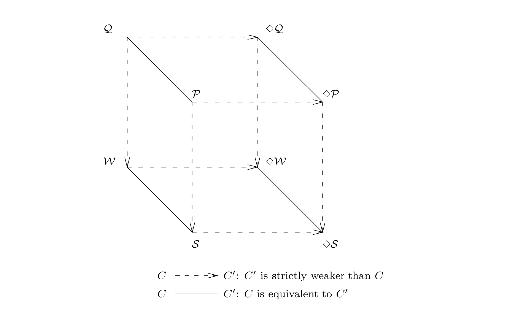

Fig. 8. Comparing the eight failure detector classes by reducibility.

> 图 8. 按可归约性比较八类故障检测器。

> **图表中文解读：** 实线连接可相互归约、因而等价的类别：P≅Q、S≅W、◇P≅◇Q、◇S≅◇W。虚线箭头从较强类别指向严格较弱类别；例如 P 可仿真 S 与 ◇P，即 S 和 ◇P 都可归约到 P，而二者又都可仿真 ◇S。图中不存在从 S 到 ◇P 或从 ◇P 到 S 的有向路径，表示这两类不可比：它们分别放宽了不同维度的准确性约束。

Termination. Every correct process eventually delivers exactly one message.

> 终止性。每个正确进程最终恰好交付一条消息。

Validity. If s is correct and broadcasts a message m, then it eventually delivers m.

> 有效性。若 s 正确并广播消息 m，则 s 最终会交付 m。

Agreement. If a correct process delivers a message m, then all correct processes eventually deliver m.

> 一致性。若某个正确进程交付消息 m，则所有正确进程最终都会交付 m。

Integrity. If a correct process delivers a message m then sender(m) = s. Furthermore, if m ≠ Fs then m was previously broadcast by s. The reader should verify that the specification of TRB for sender s implies that a correct process delivers the special message Fs only if s is indeed faulty.

> 完整性。若某个正确进程交付消息 m，则 sender(m) = s。此外，若 m ≠ Fs，则 s 此前必已广播 m。读者不难验证：以 s 为发送者的 TRB 规范蕴含，正确进程只有在 s 确实有故障时才会交付特殊消息 Fs。

TRB is a well-known and studied problem, usually known under the name of the Byzantine Generals’ Problem [Pease et al. 1980; Lamport et al. 1982].21 It turns out that in order to solve TRB in asynchronous systems one needs to use the strongest class of failure detectors that we defined in this paper. Specifically:

> TRB 是一个广为人知且研究充分的问题，通常称为拜占庭将军问题 [Pease et al. 1980; Lamport et al. 1982]。21 事实证明，要在异步系统中求解 TRB，必须使用本文定义的最强故障检测器类别。具体而言：

**Theorem 8.** (1) TRB can be solved using P in asynchronous systems with any number of crashes. (2) TRB cannot be solved using either S, ◇P, or ◇S in asynchronous systems. This impossibility result holds even under the assumption that at most one crash may occur.

> 定理 8。（1）在崩溃数任意的异步系统中，可使用 P 求解 TRB。（2）在异步系统中，使用 S、◇P 或 ◇S 均无法求解 TRB。即使假设最多只发生一次崩溃，这一不可能性结果仍然成立。

21 We refrain from using this name because it is often associated with Byzantine failures, while we consider only crash failures here.

> 21 我们避免使用这个名称，因为它通常与拜占庭故障相关，而我们在这里只考虑崩溃故障。

<!-- PDF page 31 -->

clock synchronisation Set of problems solvable in:

> 时钟同步　　　　　　　　　　　　各类系统可解的问题集合：

TRB Synchronous systems non-blocking atomic commit

> TRB　　　　　　　　　　　　　　同步系统
> 非阻塞原子提交

Asynchronous systems using P Consensus Atomic Broadcast Asynchronous systems using ◇W

> 共识　　　　　　　　　　　　　　使用 P 的异步系统
> 原子广播　　　　　　　　　　　　使用 ◇W 的异步系统

Reliable Asynchronous systems Broadcast

> 可靠广播　　　　　　　　　　　　异步系统

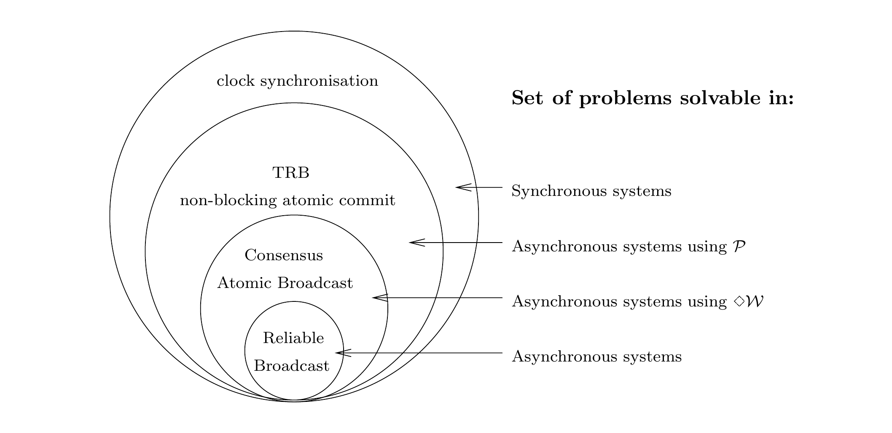

Fig. 9. Problem solvability in different distributed computing models.

> 图 9. 不同分布式计算模型中的问题可解性。

> **图表中文解读：** 同心区域表示模型能力逐级增强时可解问题集合随之扩大：纯异步系统已能实现可靠广播；加入 ◇W 后可进一步求解共识与原子广播；使用最强的完美故障检测器 P 后，还可求解 TRB 与非阻塞原子提交；完全同步系统还能处理时钟同步。内层问题在外层模型中仍然可解，反向则通常不成立。

In fact, P is the weakest failure detector class that can be used to solve repeated instances of TRB (multiple instances for each process as the distinguished sender). TRB is not the only “natural” problem that can be solved using P but cannot be solved using ◇W. Other examples include the non-blocking atomic commitment problem [Chandra and Larrea 1994; Guerraoui 1995], and a form of leader election [Sabel and Marzullo 1995]. Figure 9 summarises these results.

> 事实上，P 是可用于求解重复 TRB 实例的最弱故障检测器类别（每个进程都作为指定发送者参与多个实例）。TRB 并非唯一一个可用 P、但不能用 ◇W 求解的“自然”问题。其他例子包括非阻塞原子提交 [Chandra and Larrea 1994; Guerraoui 1995]，以及一种领导者选举问题 [Sabel and Marzullo 1995]。图 9 汇总了这些结果。

## 9. RELATED WORK

> 9. 相关工作

### 9.1 Partial synchrony

> 9.1 部分同步

Fischer, Lynch and Paterson showed that Consensus cannot be solved in an asynchronous system subject to crash failures [Fischer et al. 1985]. The fundamental reason why Consensus cannot be solved in completely asynchronous systems is the fact that, in such systems, it is impossible to reliably distinguish a process that has crashed from one that is merely very slow. In other words, Consensus is unsolvable because accurate failure detection is impossible. On the other hand, it is well-known that Consensus is solvable (deterministically) in completely synchronous systems — that is, systems where clocks are perfectly synchronised, all processes take steps at the same rate and each message arrives at its destination a fixed and known amount of time after it is sent. In such a system we can use timeouts to implement a “perfect” failure detector — i.e., one in which no process is ever wrongly suspected, and every faulty process is eventually suspected. Thus, the ability to solve Consensus in a given system is intimately related to the failure detection capabilities of that system. This realisation led us to augment the asynchronous model of computation with unreliable failure detectors as described in this paper.

> Fischer、Lynch 与 Paterson 证明，发生崩溃故障的异步系统无法求解共识 [Fischer et al. 1985]。完全异步系统中共识不可解的根本原因是：无法可靠地区分已经崩溃的进程与只是运行很慢的进程。换言之，准确的故障检测不可能实现，因而共识不可解。另一方面，众所周知，共识在完全同步系统中可以确定性求解——这类系统的时钟完全同步，所有进程以相同速率执行步骤，每条消息都在发送后的某个固定且已知的时长内抵达目的地。在这类系统中，可以用超时实现“完美”故障检测器：它从不错误怀疑任何进程，并最终怀疑每个故障进程。因此，一个系统能否求解共识，与该系统的故障检测能力密切相关。正是这一认识，促使我们如本文所述，用不可靠故障检测器扩充异步计算模型。

A different tack on circumventing the unsolvability of Consensus is pursued in [Dolev et al. 1987] and [Dwork et al. 1988]. The approach of those papers is based on the observation that between the completely synchronous and completely asynchronous models of distributed systems there lie a variety of intermediate “partially synchronous” models.

> [Dolev et al. 1987] 与 [Dwork et al. 1988] 采用另一条路径绕过共识不可解性。它们注意到，在分布式系统的完全同步模型与完全异步模型之间，还存在多种中间的“部分同步”模型。

<!-- PDF page 32 -->

In particular, [Dolev et al. 1987] define a space of 32 models by considering five key parameters, each of which admits a “favourable” and an “unfavourable” setting. For instance, one of the parameters is whether the maximum message delay is bounded and known (favourable setting) or unbounded (unfavourable setting). Each of the 32 models corresponds to a particular setting of the 5 parameters. [Dolev et al. 1987] identify four “minimal” models in which Consensus is solvable. These are minimal in the sense that the weakening of any parameter from favourable to unfavourable would yield a model of partial synchrony where Consensus is unsolvable. Thus, within the space of the models considered, [Dolev et al. 1987] delineate precisely the boundary between solvability and unsolvability of Consensus, and provides an answer to the question “What is the least amount of synchrony sufficient to solve Consensus?”.

> 具体而言，[Dolev et al. 1987] 考察五个关键参数，每个参数都可取一种“有利”设定或一种“不利”设定，由此定义了包含 32 个模型的空间。例如，一个参数是最大消息延迟有界且界已知（有利设定），还是无界（不利设定）。32 个模型分别对应五个参数的一种具体组合。[Dolev et al. 1987] 找出其中四个可解共识的“极小”模型。这里的极小是指：只要把任一参数从有利设定弱化为不利设定，就会得到一个共识不可解的部分同步模型。因此，在所考察的模型空间内，[Dolev et al. 1987] 精确划定了共识可解与不可解的边界，并回答了“求解共识至少需要多少同步性？”这一问题。

[Dwork et al. 1988] consider two models of partial synchrony. Roughly speaking, the first model (denoted M1 here) stipulates that in every execution there are bounds on relative process speeds and on message transmission times, but these bounds are not known. In the second model (denoted M2) these bounds are known, but they hold only after some unknown time (called GST for Global Stabilisation Time). In each one of these two models (with crash failures), it is easy to implement an Eventually Perfect failure detector D ∈ ◇P. In fact, we can implement such a failure detector in a weaker model of partial synchrony (denoted M3): one in which bounds exist but they are not known and they hold only after some unknown time GST.22 Since ◇P ⪰ ◇W, by Corollaries 3 and 6, this implementation immediately gives Consensus and Atomic Broadcast solutions for M3 and, a fortiori, for M1 and M2.

> [Dwork et al. 1988] 考察两种部分同步模型。粗略地说，第一种模型（本文记为 M1）规定：每次执行中，相对进程速度与消息传输时间都有界，但这些界未知。第二种模型（记为 M2）中，这些界已知，却只在某个未知时刻之后才开始成立；该时刻称为全局稳定时间（Global Stabilisation Time，GST）。在这两种含崩溃故障的模型中，都很容易实现一个最终完美故障检测器 D ∈ ◇P。事实上，在更弱的部分同步模型 M3 中也能实现这种检测器：各项界存在但未知，且只在某个未知的 GST 之后成立。22 因 ◇P ⪰ ◇W，由推论 3 与推论 6，这一实现立即给出 M3 中的共识与原子广播解，自然也给出 M1、M2 中的解。

The implementation of D ∈ ◇P for M3, which uses an idea found in [Dwork et al. 1988], works as follows (see Figure 10). To measure elapsed time, each process p maintains a local clock, say by counting the number of steps that it takes. Each process p periodically sends a “p-is-alive” message to all the processes. If p does not receive a “q-is-alive” message from some process q for Δp (q) time units on its clock, p adds q to its list of suspects. If p receives “q-is-alive” from some process q that it currently suspects, p knows that its previous time-out on q was premature. In this case, p removes q from its list of suspects and increases its time-out period Δp (q).

> M3 中 D ∈ ◇P 的实现采用 [Dwork et al. 1988] 的一个思路，工作方式如下（见图 10）。为度量经过的时间，每个进程 p 维护一个本地时钟，例如通过统计自己执行的步骤数。p 定期向所有进程发送“p-is-alive”消息。若 p 在自己的时钟经过 Δp(q) 个时间单位后，仍未收到某个进程 q 的“q-is-alive”消息，便将 q 加入被怀疑进程列表。若 p 后来收到当前正被其怀疑的 q 发来的“q-is-alive”，就知道此前对 q 的超时过早；此时，p 从被怀疑进程列表中移除 q，并增大针对 q 的超时期间 Δp(q)。

**Theorem 9.** Consider a partially synchronous system S that conforms to M3, i.e., for every run of S there is a Global Stabilisation Time (GST) after which some bounds on relative process speeds and message transmission times hold (the values of GST and these bounds are not known). The algorithm in Figure 10 implements an Eventually Perfect failure detector D ∈ ◇P in S.

> 定理 9。考虑符合 M3 的部分同步系统 S：S 的每次运行都存在一个全局稳定时间 GST，此后相对进程速度与消息传输时间的某些界成立，但 GST 及这些界的值均未知。图 10 的算法在 S 中实现一个最终完美故障检测器 D ∈ ◇P。

**Proof (sketch).** We first show that strong completeness holds, i.e., eventually every process that crashes is permanently suspected by every correct process. Suppose a process q crashes. Clearly, q eventually stops sending “q-is-alive” messages,

> 证明（草图）。我们首先证明强完备性成立，即最终每个崩溃的进程都会被每个正确进程永久怀疑。假设进程 q 崩溃了。显然，q 最终停止发送“q-is-alive”消息，

22 Note that every system that conforms to M1 or M2 also conforms to M3.

> 22 注意，任何符合 M1 或 M2 的系统也都符合 M3。

<!-- PDF page 33 -->

```text
Every process p executes the following:
```

> 每个进程 p 执行以下操作：

```text
outputp ← ∅
for all q ∈ Π {Δp (q) denotes the duration of p’s time-out interval for q}
Δp (q) ← default time-out interval
```

> outputp ← ∅
> 对所有 q ∈ Π {Δp(q) 表示 p 针对 q 的超时期间长度}
> Δp(q) ← 默认超时期间

```text
cobegin
|| Task 1: repeat periodically
send “p-is-alive” to all
```

> cobegin
> || 任务 1：定期重复
> 向所有进程发送“p-is-alive”

```text
|| Task 2: repeat periodically
for all q ∈ Π
if q ∉ outputp and p did not receive “q-is-alive” during the last Δp (q) ticks of p’s clock
outputp ← outputp ∪ {q} {p times-out on q: it now suspects q has crashed}
```

> || 任务 2：定期重复
> 对所有 q ∈ Π
> 若 q ∉ outputp，且在 p 的时钟最近 Δp(q) 个滴答内未收到“q-is-alive”
> outputp ← outputp ∪ {q} {p 针对 q 超时：现在怀疑 q 已崩溃}

```text
|| Task 3: when receive “q-is-alive” for some q
if q ∈ outputp {p knows that it prematurely timed-out on q}
outputp ← outputp − {q} {1. p repents on q, and}
Δp (q) ← Δp (q) + 1 {2. p increases its time-out period for q}
coend
```

> || 任务 3：收到某个 q 的“q-is-alive”时
> 若 q ∈ outputp {p 知道此前针对 q 的超时过早}
> outputp ← outputp − {q} {1. p 对 q 撤回怀疑，并且}
> Δp(q) ← Δp(q) + 1 {2. p 增大针对 q 的超时期间}
> coend

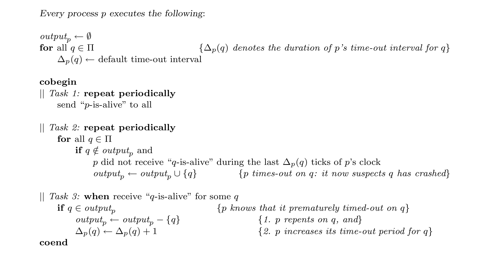

Fig. 10. A time-out based implementation of D ∈ ◇P in models of partial synchrony.

> 图 10. 在部分同步模型中基于超时实现 D ∈ ◇P。

> **图表中文解读：** 每个进程周期性发送心跳，并为其他每个进程维护独立超时 Δp(q)。心跳逾期就把 q 加入怀疑集合；若稍后又收到 q 的心跳，则撤销怀疑并增大该超时。全局稳定时间之后，正确进程间的处理与通信延迟有界，超时会逐步增长到足够大，因而正确进程最终不再被误判；崩溃进程停止心跳后则会被永久怀疑，恰好得到 ◇P 的强完备性与最终强准确性。

and there is a time after which no correct process receives such a message. Thus, there is a time t′ after which: (1) all correct processes time-out on q (Task 2), and (2) they do not receive any message from q after this time-out. From the algorithm, it is clear that after time t′, all correct processes will permanently suspect q. Thus, strong completeness is satisfied.

> 并且从某个时刻起，不再有正确进程收到这类消息。因此存在时刻 t′，此后：（1）所有正确进程都会针对 q 超时（任务 2）；（2）在此次超时后，它们不再收到 q 的任何消息。由算法，t′ 之后所有正确进程都会永久怀疑 q，故强完备性成立。

We now show that eventual strong accuracy is satisfied. That is, for any correct processes p and q, there is a time after which p will not suspect q. There are two possible cases: (1) Process p times-out on q finitely often (in Task 2). Since q is correct and keeps sending “q-is-alive” messages forever, eventually p receives one such message after its last time-out on q. At this point, q is permanently removed from p’s list of suspects (Task 3). (2) Process p times-out on q infinitely often (in Task 2). Note that p times-out on q (and so p adds q to outputp) only if q is not already in outputp. Thus, q is added to and removed from outputp infinitely often. Process q is removed from outputp only in Task 3, and every time this occurs p’s time-out period Δp (q) is increased. Since this occurs infinitely often, Δp (q) grows unbounded. Thus, eventually (1) the bounds on relative process speeds and message transmission times hold, and (2) Δp (q) is larger than the correct time-out based on these bounds. After this point, p cannot time-out on q any more—a contradiction to our assumption that p times-out on q infinitely often. Thus Case 2 cannot occur.

> 下面证明最终强准确性成立。也就是说，对任意正确进程 p、q，都存在某个时刻，此后 p 不再怀疑 q。分两种情形：（1）p 在任务 2 中针对 q 只超时有限次。q 正确且会一直发送“q-is-alive”，所以 p 在最后一次针对 q 超时后，最终会收到一条这样的消息。此时，任务 3 将 q 从 p 的被怀疑进程列表中永久移除。（2）p 在任务 2 中针对 q 超时无限次。p 只有在 q 尚不属于 outputp 时才会针对 q 超时并将 q 加入 outputp，因此 q 会被无限次加入和移出 outputp。q 只会在任务 3 中从 outputp 移除，而每次移除时，p 都会增大针对 q 的超时期间 Δp(q)。既然这种情况发生无限次，Δp(q) 就会无界增长。于是最终：（1）相对进程速度与消息传输时间的界已经成立；（2）Δp(q) 大于依据这些界计算出的正确超时值。此后 p 不可能再针对 q 超时，与情形（2）假设的无限次超时矛盾。因此情形（2）不可能发生。

In this paper we have not considered communication failures. In the second model of partial synchrony of [Dwork et al. 1988], where bounds are known but hold only after GST, messages sent before GST can be lost. We now re-define M2 and M3 analogously — messages that are sent before GST can be lost — and examine how this affects our results so far.23 The failure detector algorithm in Figure 10 still implements an Eventually Perfect failure detector D ∈ ◇P in M3, despite initial message losses now allowed by this model. On the other hand, these initial message losses invalidate the Consensus algorithm in Figure 6. It is easy to modify this algorithm, however, so that it does work in M3: One can adopt the techniques used in [Dwork et al. 1988] to mask the loss of messages that are sent before GST.

> 本文此前未考虑通信故障。[Dwork et al. 1988] 的第二种部分同步模型中，各项界已知但只在 GST 后成立，因而 GST 前发送的消息可能丢失。现在以相同方式重新定义 M2 与 M3——GST 前发送的消息可丢失——并考察这会怎样影响此前结果。23 即使模型允许初始消息丢失，图 10 的故障检测算法仍能在 M3 中实现最终完美故障检测器 D ∈ ◇P。另一方面，这些初始消息丢失会使图 6 的共识算法失效。不过，只要采用 [Dwork et al. 1988] 的技术屏蔽 GST 前发送的消息丢失，就很容易把该算法改成适用于 M3 的版本。

<!-- PDF page 34 -->

Failure detectors can be viewed as a more abstract and modular way of incorporating partial synchrony assumptions into the model of computation. Instead of focusing on the operational features of partial synchrony (such as the parameters that define M1, M2, and M3, or the five parameters considered in [Dolev et al. 1987]), we can consider the axiomatic properties that failure detectors must have in order to solve Consensus. The problem of implementing a certain type of failure detector in a specific model of partial synchrony becomes a separate issue; this separation affords greater modularity.

> 故障检测器可视为一种更抽象、更模块化的方式，用来把部分同步假设纳入计算模型。我们无须聚焦部分同步的操作性特征（如定义 M1、M2、M3 的参数，或 [Dolev et al. 1987] 考察的五个参数），而可考察故障检测器为求解共识必须具备哪些公理化性质。在某个具体部分同步模型中实现某类故障检测器，则成为独立问题；这种分离带来了更好的模块性。

Studying failure detectors rather than various models of partial synchrony has other advantages as well. By showing that Consensus is solvable using a certain type of failure detector we show that Consensus is solvable in all systems in which this type of failure detector can be implemented. An algorithm that relies on the axiomatic properties of a failure detector is more general, more modular, and simpler to understand than one that relies directly on specific operational features of partial synchrony (that can be used to implement this failure detector).

> 研究故障检测器，而非逐一研究各种部分同步模型，还有其他优点。证明某类故障检测器能够求解共识，就等于证明：凡是能实现这类检测器的系统，都能求解共识。依赖故障检测器公理化性质的算法，比直接依赖部分同步具体操作特征（这些特征可用来实现该检测器）的算法更通用、更模块化，也更容易理解。

From this more abstract point of view, the question “What is the least amount of synchrony sufficient to solve Consensus?” translates to “What is the weakest failure detector sufficient to solve Consensus?”. In contrast to [Dolev et al. 1987], which identified a set of minimal models of partial synchrony in which Consensus is solvable, [Chandra et al. 1992] exhibit a single minimum failure detector, ◇W₀, that can be used to solve Consensus. The technical device that makes this possible is the notion of reduction between failure detectors.

> 从这一更抽象的视角看，“求解共识至少需要多少同步性？”转化为“求解共识所需的最弱故障检测器是什么？”[Dolev et al. 1987] 找到的是一组可解共识的极小部分同步模型；与之不同，[Chandra et al. 1992] 给出了一个单一的最小故障检测器 ◇W₀，可用于求解共识。使这一结果成为可能的技术工具，正是故障检测器之间的归约概念。

### 9.2 Unreliable failure detection in shared memory systems

> 9.2 共享内存系统中的不可靠故障检测

Loui and Abu-Amara showed that in asynchronous shared memory systems with atomic read/write registers, Consensus cannot be solved even if at most one process may crash [Loui and Abu-Amara 1987].24 This raises the following question: can we use unreliable failure detectors to circumvent this impossibility result?

> Loui 与 Abu-Amara 证明，在带有原子读写寄存器的异步共享内存系统中，即使至多一个进程可能崩溃，共识仍然不可解 [Loui and Abu-Amara 1987]。24 这引出一个问题：能否用不可靠故障检测器绕过这一不可能性结果？

Lo and Hadzilacos [Lo and Hadzilacos 1994] showed that this is indeed possible: They gave an algorithm that solves Consensus using ◇W (in shared memory systems with registers). This algorithm tolerates any number of faulty processes — in contrast to our result showing that in message-passing systems ◇W can be used to solve Consensus only if there is a majority of correct processes. Recently, Neiger extended the work of Lo and Hadzilacos by studying the conditions under which unreliable failure detectors boost the Consensus power of shared objects [Neiger <!-- PDF page 35 -->1995].

> Lo 与 Hadzilacos [Lo and Hadzilacos 1994] 证明这确实可行：他们给出一种在带寄存器的共享内存系统中使用 ◇W 求解共识的算法。该算法能容忍任意数量的故障进程；相比之下，我们的结果表明，在消息传递系统中，只有正确进程占多数时才能用 ◇W 求解共识。随后，Neiger 研究了不可靠故障检测器在何种条件下能提升共享对象的共识能力，从而扩展了 Lo 与 Hadzilacos 的工作 [Neiger 1995]。

23 Note that model M3 is now strictly weaker than models M1 and M2: there exist systems that conform to M3 but not to M1 or M2.

> 23 注意，此时模型 M3 严格弱于 M1 与 M2：存在符合 M3、却不符合 M1 或 M2 的系统。

24 The proof in [Loui and Abu-Amara 1987] is similar to the proof that Consensus is impossible in message-passing systems when send and receive are not part of the same atomic step [Dolev et al. 1987].

> 24 [Loui and Abu-Amara 1987] 的证明，与消息传递系统中发送和接收不属于同一原子步骤时，共识不可能实现的证明 [Dolev et al. 1987] 相似。

### 9.3 The Isis toolkit

> 9.3 Isis 工具包

With our approach, even if a correct process p is repeatedly suspected to have crashed by the other processes, it is still required to behave like every other correct process in the system. For example, with Atomic Broadcast, p is still required to A-deliver the same messages, in the same order, as all the other correct processes. Furthermore, p is not prevented from A-broadcasting messages, and these messages must eventually be A-delivered by all correct processes (including those processes whose local failure detector modules permanently suspect p to have crashed). In summary, application programs that use unreliable failure detection are aware that the information they get from the failure detector may be incorrect: they only take this information as an imperfect “hint” about which processes have really crashed. Furthermore, processes are never “discriminated against” if they are falsely suspected to have crashed.

> 在本文的方法中，即使正确进程 p 一再被其他进程怀疑已经崩溃，它仍必须与系统中的其他正确进程表现一致。例如，对原子广播而言，p 仍须以与其他所有正确进程相同的顺序 A-deliver 相同消息；而且 p 仍可 A-broadcast 消息，这些消息最终必须由所有正确进程 A-deliver——包括本地故障检测器模块永久怀疑 p 已崩溃的进程。总之，使用不可靠故障检测的应用程序知道，故障检测器给出的信息可能不正确；它们只把这些信息当作判断哪些进程真正崩溃的不完美“提示”。进程即使被错误怀疑，也绝不会受到“区别对待”。

Isis takes an alternative approach based on the assumption that failure detectors rarely make mistakes [Ricciardi and Birman 1991]. In those cases in which a correct process p is falsely suspected by the failure detector, p is effectively forced “to crash” (via a group membership protocol that removes p from all the groups that it belongs to). An application using such a failure detector cannot distinguish between a faulty process that really crashed, and a correct one that was forced to do so. Essentially, the Isis failure detector forces the system to conform to its view. From the application’s point of view, this failure detector looks “perfect”: it never makes visible mistakes.

> Isis 采取另一种方法，其前提是故障检测器很少出错 [Ricciardi and Birman 1991]。若故障检测器错误怀疑正确进程 p，p 实际上会被迫“崩溃”：组成员关系协议将 p 从其所属的全部组中移除。使用这类故障检测器的应用程序，无法区分真正崩溃的故障进程与被迫崩溃的正确进程。实质上，Isis 的故障检测器迫使系统服从它的判断。从应用程序视角看，该检测器显得“完美”：它不会犯任何可见错误。

For the Isis approach to work, the low-level time-outs used to detect crashes must be set very conservatively: Premature time-outs are costly (each results in the removal of a process), and too many of them can lead to system shutdown.25 In contrast, with our approach, premature time-outs (e.g., failure detector mistakes) are not so deleterious: they can only delay an application. In other words, premature time-outs can affect the liveness but not the safety of an application. For example, consider the Atomic Broadcast algorithm that uses ◇W. If the given failure detector “malfunctions”, some messages may be delayed, but no message is ever delivered out of order, and no correct process is forced to crash. If the failure detector stops malfunctioning, outstanding messages are eventually delivered. Thus, we can set time-out periods more aggressively than a system like Isis: in practice, we would set our failure detector time-out periods closer to the average case, while systems like Isis must set time-outs closer to the worst-case.

> 为使 Isis 的方法有效，用于检测崩溃的底层超时必须设得十分保守：过早超时代价高昂——每次都会导致一个进程被移除——而过多的过早超时会使系统停摆。25 相比之下，在本文的方法中，过早超时（即故障检测器误判）的危害较小：它们只能拖延应用。换言之，过早超时会影响应用的活性，却不会影响安全性。例如，考虑使用 ◇W 的原子广播算法。若故障检测器“失常”，某些消息可能被延迟，但绝不会有消息乱序交付，也不会有正确进程被迫崩溃。故障检测器一旦停止失常，尚未交付的消息最终都会交付。因此，我们可以比 Isis 一类系统更激进地设置超时期间：实践中，本文的故障检测器可把超时设得更接近平均情况，而 Isis 一类系统则必须设得更接近最坏情况。

### 9.4 Other work

> 9.4 其他工作

Several works in fault-tolerant computing used time-outs primarily or exclusively for the purpose of failure detection. An example of this approach is given by an algorithm in [Attiya et al. 1991], which, as pointed out by the authors, “can be viewed as an asynchronous algorithm that uses a fault detection (e.g., timeout) mechanism.” Recent work shows that the Group Membership problem cannot be solved in asynchronous systems with crash failures, even if one adopts the Isis approach of crashing processes that are suspected to be faulty but are actually correct [Chandra et al. 1995]. As with Consensus and Atomic Broadcast, this impossibility result can be circumvented by the addition of unreliable failure detectors.

> 容错计算领域已有若干工作主要、甚至完全依靠超时进行故障检测。[Attiya et al. 1991] 的算法就是一例；正如作者所说，它“可视为一种使用故障检测（例如超时）机制的异步算法”。近期研究表明，在发生崩溃故障的异步系统中，即使采用 Isis 的做法，强制那些被怀疑有故障、实际却正确的进程崩溃，组成员关系问题仍不可解 [Chandra et al. 1995]。与共识和原子广播一样，加入不可靠故障检测器可以绕过这一不可能性结果。

25 For example, the time-out period in the current version of Isis is greater than 10 seconds.

> 25 例如，当前版本的 Isis 中的超时时间大于 10 秒。

<!-- PDF page 36 -->

## ACKNOWLEDGMENTS

> 致谢

We are deeply grateful to Vassos Hadzilacos for his crucial help in revising this paper. The comments and suggestions of the anonymous referees, Navin Budhiraja, and Bernadette Charron-Bost, were also instrumental in improving the paper. Finally, we would like to thank Prasad Jayanti for greatly simplifying the algorithm in Figure 3.

> Vassos Hadzilacos 在本文修订过程中给予关键帮助，我们对此深表感谢。匿名审稿人、Navin Budhiraja 与 Bernadette Charron-Bost 的评论和建议，也对改进本文至关重要。最后，感谢 Prasad Jayanti 极大简化了图 3 的算法。

## APPENDIX

> 附录

## A hierarchy of failure detector classes and bounds on fault-tolerance

> 故障检测器类别层次与容错能力界限

In the preceding sections, we introduced the concept of unreliable failure detectors that could make mistakes, and showed how to use them to solve Consensus despite such mistakes. Informally, a mistake occurs when a correct process is erroneously added to the list of processes that are suspected to have crashed. In this appendix, we formalise this concept and study a related property that we call repentance. Informally, if a process p learns that its failure detector module D_p made a mistake, repentance requires D_p to take corrective action. Based on mistakes and repentance, we define a hierarchy of failure detector classes that will be used to unify some of our results, and to refine the lower bound on fault-tolerance given in Section 6.3. This infinite hierarchy consists of a continuum of repentant failure detectors ordered by the maximum number of mistakes that each one can make.

> 前文引入了可能犯错的不可靠故障检测器，并说明即便它们会犯错，仍可利用它们求解共识。非形式地说，把一个正确进程错误加入被怀疑已崩溃的进程列表，就是一次错误。本附录将形式化这一概念，并研究一个称为悔改性的相关性质。直观地说，若进程 p 得知自己的故障检测器模块 D_p 犯了错误，悔改性就要求 D_p 采取纠正措施。基于错误与悔改性，我们定义一个故障检测器类别层次，用它统一前文若干结果，并细化第 6.3 节给出的容错能力下界。这个无限层次由一系列悔改型故障检测器组成，按各自最多可犯多少次错误排序。

**Mistakes and Repentance** We now define a mistake. Let R = ⟨F, H, I, S, T⟩ be any run using a failure detector D. D makes a mistake in R at time t at process p about process q if at time t, p begins to suspect that q has crashed even though q ∉ F(t). Formally:

> **错误与悔改** 我们现在定义一次错误。令 R = ⟨F, H, I, S, T⟩ 为使用故障检测器 D 的任意运行。如果在时刻 t，进程 p 开始怀疑进程 q 已崩溃，而实际上 q ∉ F(t)，则称 D 在运行 R 的时刻 t、进程 p 处对进程 q 犯了一次错误。形式化地：

```text
[q ∉ F(t), q ∈ H(p, t)] and [q ∉ H(p, t − 1)]
```

> [q ∉ F(t), q ∈ H(p, t)] 且 [q ∉ H(p, t − 1)]

Such a mistake is denoted by the tuple ⟨R, p, q, t⟩. The set of mistakes made by D in R is denoted by M(R).

> 这样的一次错误用元组 ⟨R, p, q, t⟩ 表示。D 在 R 中所犯错误的集合记为 M(R)。

Note that only the erroneous addition of q into D_p is counted as a mistake at p. The continuous retention of q into D_p does not count as additional mistakes. Thus, a failure detector can make multiple mistakes at a process p about another process q only by repeatedly adding and then removing q from the set D_p. In practice, mistakes are caused by premature time-outs.

> 注意，只有错误地把 q 加入 D_p 才计作 p 处的一次错误；持续把 q 保留在 D_p 中不计作额外错误。因此，故障检测器只有反复把 q 加入 D_p、再从中移除，才会在进程 p 处对另一进程 q 犯多次错误。在实践中，错误由过早超时引起。

We define the following four types of accuracy properties for a failure detector D based on the mistakes made by D: Strongly k−mistaken. D makes at most k mistakes. Formally, D is strongly k−mistaken if:

> 我们根据 D 所犯的错误，为故障检测器 D 定义以下四类准确性性质。强 k−错误：D 最多犯 k 次错误。形式化地，若满足下式，则 D 为强 k−错误：

```text
∀R using D: |M(R)| ≤ k
```

> ∀R using D: |M(R)| ≤ k

<!-- PDF page 37 -->

Weakly k−mistaken. There is a correct process p such that D makes at most k mistakes about p. Formally, D is weakly k−mistaken if:

> 弱 k−错误：存在一个正确进程 p，使 D 对 p 最多犯 k 次错误。形式化地，若满足下式，则 D 为弱 k−错误：

```text
∀R = ⟨F, H, I, S, T⟩ using D, ∃p ∈ correct(F): |{⟨R, q, p, t⟩ : ⟨R, q, p, t⟩ ∈ M(R)}| ≤ k
```

> ∀R = ⟨F, H, I, S, T⟩ using D, ∃p ∈ correct(F): |{⟨R, q, p, t⟩ : ⟨R, q, p, t⟩ ∈ M(R)}| ≤ k

Strongly finitely mistaken. D makes a finite number of mistakes. Formally, D is strongly finitely mistaken if:

> 强有限错误：D 犯有限次错误。形式化地，若满足下式，则 D 为强有限错误：

```text
∀R using D: M(R) is finite.
```

> ∀R using D: M(R) is finite.

In this case, it is clear that there is a time t after which D stops making mistakes (it may, however, continue to give incorrect information).

> 在这种情况下，显然存在一个时刻 t，此后 D 不再犯错误（但仍可能继续给出不正确的信息）。

Weakly finitely mistaken. There is a correct process p such that D makes a finite number of mistakes about p. Formally, D is weakly finitely mistaken if:

> 弱有限错误：存在一个正确进程 p，使 D 对 p 只犯有限次错误。形式化地，若满足下式，则 D 为弱有限错误：

```text
∀R = ⟨F, H, I, S, T⟩ using D, ∃p ∈ correct(F): {⟨R, q, p, t⟩ : ⟨R, q, p, t⟩ ∈ M(R)} is finite.
```

> ∀R = ⟨F, H, I, S, T⟩ using D, ∃p ∈ correct(F): {⟨R, q, p, t⟩ : ⟨R, q, p, t⟩ ∈ M(R)} is finite.

In this case, there is a time t after which D stops making mistakes about p (it may, however, continue to give incorrect information even about p).

> 此时存在一个时刻 t，此后 D 不再对 p 犯新的错误（但仍可能继续给出关于 p 的错误信息）。

For most values of k, the properties mentioned above are not powerful enough to be useful. For example, suppose every process permanently suspects every other process. In this case, the failure detector makes at most n(n − 1) mistakes, but it is clearly useless since it does not provide any information.

> 对大多数 k 值而言，上述性质还不够强，不能发挥实际作用。例如，假设每个进程都永久怀疑其余所有进程。此时故障检测器至多犯 n(n − 1) 次错误，却显然毫无用处，因为它没有提供任何信息。

The core of this problem is that such failure detectors are not forced to reverse a mistake, even when a mistake becomes “obvious” (say, after a process q replies to an inquiry that was sent to q after q was suspected to have crashed). However, we can impose a natural requirement to circumvent this problem. Consider the following scenario. The failure detector module at process p erroneously adds q to D_p at time t. Subsequently, p sends a message to q and receives a reply. This reply is a proof that q had not crashed at time t. Thus, p knows that its failure detector module made a mistake about q. It is reasonable to require that, given such irrefutable evidence of a mistake, the failure detector module at p takes the corrective action of removing q from D_p. In general, we can require the following property:

> 问题的核心在于，即使错误已经变得“显而易见”（例如，在进程 q 被怀疑崩溃之后，q 对发给它的询问作出了答复），这种故障检测器也不必撤销错误。不过，我们可以施加一个自然的要求来规避这一问题。考虑如下情形：进程 p 的故障检测器模块在时刻 t 错误地把 q 加入 D_p；随后 p 向 q 发送消息并收到答复。这个答复证明 q 在时刻 t 尚未崩溃，因而 p 知道自己的故障检测器模块对 q 犯了错误。既然已有这种无可辩驳的证据，要求 p 的故障检测器模块采取纠正动作、把 q 从 D_p 中移除，是合理的。一般而言，我们可以要求如下性质：

**Repentance.** If a correct process p eventually knows that q ∉ F(t), then at some time after t, q ∉ D_p. Formally, D is repentant if:

> **悔改性。** 如果一个正确进程 p 最终知道 q ∉ F(t)，那么在 t 之后的某个时刻，q ∉ D_p。形式化地，若满足下式，则 D 具有悔改性：

```text
∀R = ⟨F, H, I, S, T⟩ using D, ∀t, ∀p, q ∈ Π:
[∃t′ : (R, t′) |= Kp(q ∉ F(t))] ⇒ [∃t′′ ≥ t : q ∉ H(p, t′′)]
```

> ∀R = ⟨F, H, I, S, T⟩ using D, ∀t, ∀p, q ∈ Π:  
> [∃t′ : (R, t′) |= Kp(q ∉ F(t))] ⇒ [∃t′′ ≥ t : q ∉ H(p, t′′)]

The knowledge theoretic operator Kp can be defined formally [Halpern and Moses 1990]. Informally, (R, t) |= φ iff in run R at time t, predicate φ holds. We say (R, t) ∼p (R′, t′) iff the run R at time t and the run R′ at time t′ are indistinguishable to p. Finally, (R, t) |= Kp(φ) ⇐⇒ [∀(R′, t′) ∼p (R, t): (R′, t′) |= φ]. For a detailed treatment of Knowledge Theory as applied to distributed systems, the reader should refer to the seminal work done in [Moses et al. 1986; Halpern and Moses 1990].

> 知识论算子 Kp 可按 [Halpern and Moses 1990] 作形式化定义。非形式地，(R,t) |= φ 当且仅当在运行 R 的时刻 t 谓词 φ 成立。若运行 R 的时刻 t 与运行 R′ 的时刻 t′ 对 p 而言不可区分，则记作 (R,t) ∼p (R′,t′)。最后，(R,t) |= Kp(φ) ⇐⇒ [∀(R′,t′) ∼p (R,t): (R′,t′) |= φ]。有关知识理论在分布式系统中的详细应用，请参阅 [Moses et al. 1986; Halpern and Moses 1990] 的奠基性工作。

<!-- PDF page 38 -->

```text
SF(0) ≅ P ≅ Q (strongest).....Consensus solvable for all f < n
SF(1).....Consensus solvable iff f < n
SF(2).....Consensus solvable iff f < n − 1
SF(n − f − 1)
WF(0) ≅ S ≅ W                         Consensus solvable for all f < n
SF(⌊n/2⌋ − 1).....Consensus solvable iff f < ⌈n/2⌉ + 2
SF(⌊n/2⌋).....Consensus solvable iff f < ⌈n/2⌉ + 1
SF(⌊n/2⌋ + 1)
WF(1)          SF(⌊n/2⌋ + 2)
WF(2)
Consensus solvable iff f < ⌈n/2⌉
SF ≅ ◇P ≅ ◇Q
WF ≅ ◇S ≅ ◇W (weakest)
```

> SF(0) ≅ P ≅ Q（最强）……对所有 f < n，共识均可解  
> SF(1)……共识可解当且仅当 f < n  
> SF(2)……共识可解当且仅当 f < n − 1  
> SF(n − f − 1)  
> WF(0) ≅ S ≅ W　　对所有 f < n，共识均可解  
> SF(⌊n/2⌋ − 1)……共识可解当且仅当 f < ⌈n/2⌉ + 2  
> SF(⌊n/2⌋)……共识可解当且仅当 f < ⌈n/2⌉ + 1  
> SF(⌊n/2⌋ + 1)  
> WF(1)　　SF(⌊n/2⌋ + 2)  
> WF(2)  
> 共识可解当且仅当 f < ⌈n/2⌉  
> SF ≅ ◇P ≅ ◇Q  
> WF ≅ ◇S ≅ ◇W（最弱）

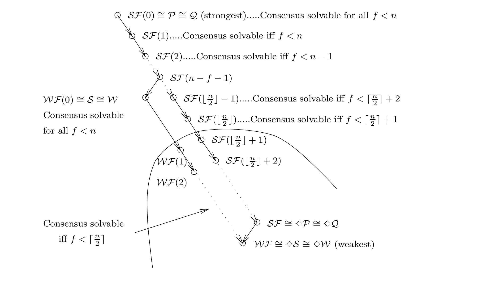

Fig. 11. Classes of repentant failure detectors ordered by reducibility. For each class C, the maximum number of faulty processes for which Consensus can be solved using C is given.

> 图 11. 按可归约性排列的悔改型故障检测器类别；图中给出使用各类别求解共识时所能容忍的最大故障进程数。

> **图表中文解读：** 该层次按允许的误判次数排列“悔改型”故障检测器，箭头由较强类别指向可由其仿真的较弱类别。顶部 SF(0)≅P≅Q 不允许误判，底部 WF≅◇S≅◇W 只保证最终至少有一个正确进程不再被任何正确进程怀疑。当正确进程占多数时，最弱类别已足以求解共识；正确进程不占多数时，SF(m) 可容忍的故障数随允许误判次数 m 增大而下降，而 WF(m) 只有 m=0 时仍足够。

Recall that in Section 2.2 we defined a failure detector to be a function that maps each failure pattern to a set of failure detector histories. Thus, the specification of a failure detector depends solely on the failure pattern actually encountered. In contrast, the definition of repentance depends on the knowledge (about mistakes) at each process. This in turn depends on the algorithm being executed, and the communication pattern actually encountered. Thus, repentant failure detectors cannot be specified solely in terms of the failure pattern actually encountered. Nevertheless, repentance is an important property that we would like many failure detectors to satisfy.

> 回想第 2.2 节：故障检测器被定义为把每个故障模式映射到一组故障检测器历史的函数，所以其规格只取决于实际遇到的故障模式。与此不同，悔改性的定义取决于各进程掌握的（关于错误的）知识，而这种知识又取决于所执行的算法和实际通信模式。因此，悔改型故障检测器不能只由实际故障模式来规定。尽管如此，悔改性仍是我们希望许多故障检测器满足的重要性质。

We now informally define a hierarchy of repentant failure detectors that differ by the maximum number of mistakes they can make. As we just noted, such failure detectors cannot be specified solely in terms of the failure pattern actually encountered, and thus they do not fit the formal definition of failure detectors given in Section 2.2.

> 下面非形式地定义一个悔改型故障检测器层次；各层的区别在于允许犯错的最大次数。如前所述，这类故障检测器不能仅由实际故障模式来规定，因而不符合第 2.2 节给出的故障检测器形式化定义。

**A hierarchy of repentant failure detectors**

> **悔改型故障检测器的层次**

Consider the failure detectors that satisfy weak completeness, one of the four types of accuracy that we defined in the previous section, and repentance. These failure detectors can be grouped into four classes according to the actual accuracy property that they satisfy:

> 考虑同时满足弱完备性、上一节定义的四种准确性性质之一，以及悔改性的故障检测器。按其实际满足的准确性性质，可将它们分为四类：

<!-- PDF page 39 -->

```text
SF(k): the class of Strongly k-Mistaken failure detectors,
```

> SF(k)：强 k 错误故障检测器类别，

SF: the class of Strongly Finitely Mistaken failure detectors,

> SF：强有限错误故障检测器类别，

```text
WF(k): the class of Weakly k-Mistaken failure detectors, and
```

> WF(k)：弱 k 错误故障检测器类别，以及

WF: the class of Weakly Finitely Mistaken failure detectors.

> WF：弱有限错误故障检测器类别。

Clearly, SF(0) ⪰ SF(1) ⪰ ... ⪰ SF(k) ⪰ SF(k + 1) ⪰ ... ⪰ SF. A similar order holds for the WFs. Consider a system of n processes of which at most f may crash. In this system, there are at least n − f correct processes. Since any failure detector D ∈ SF((n − f) − 1) makes fewer mistakes than the number of correct processes, there is at least one correct process that D never suspects. Thus, D is also weakly 0-mistaken, and we conclude that SF((n − f) − 1) ⪰ WF(0). Furthermore, it is clear that SF ⪰ WF.

> 显然，SF(0) ⪰ SF(1) ⪰ ... ⪰ SF(k) ⪰ SF(k + 1) ⪰ ... ⪰ SF；WF 类也有类似次序。考虑一个含 n 个进程、至多 f 个进程会崩溃的系统，其中至少有 n − f 个正确进程。任意 D ∈ SF((n − f) − 1) 所犯错误数少于正确进程数，故至少存在一个从未被 D 怀疑的正确进程。因此 D 也是弱 0−错误的，遂有 SF((n − f) − 1) ⪰ WF(0)。此外，显然 SF ⪰ WF。

These classes of repentant failure detectors can be ordered by reducibility into an infinite hierarchy, which is illustrated in Figure 11 (an edge → represents the ⪰ relation). Each failure detector class defined in Section 2.4 is equivalent to some class in this hierarchy. In particular, it is easy to show that:

> 这些悔改型故障检测器类别可按可归约性排成图 11 所示的无限层次（边 → 表示 ⪰ 关系）。第 2.4 节定义的每个故障检测器类别都等价于该层次中的某个类别。特别地，不难证明：

**Observation 2.** P ≅ Q ≅ SF(0), S ≅ W ≅ WF(0), ◇P ≅ ◇Q ≅ SF, and ◇S ≅ ◇W ≅ WF. For example, it is easy to see that the algorithm in Figure 3 transforms any failure detector in WF into one in ◇W. Other conversions are similar or straightforward and are therefore omitted. Note that P and ◇W are the strongest and weakest failure detector classes in this hierarchy, respectively. From Corollaries 2 and 6, and Observation 2 we have:

> 观察 2。P ≅ Q ≅ SF(0)、S ≅ W ≅ WF(0)、◇P ≅ ◇Q ≅ SF，且 ◇S ≅ ◇W ≅ WF。例如，图 3 的算法显然可把 WF 中任一故障检测器变换为 ◇W 中的检测器。其余变换与此类似，或可直接得到，故省略。注意，P 与 ◇W 分别是该层次中最强与最弱的故障检测器类别。结合推论 2、推论 6 与观察 2，得到：

**Corollary 10.** Consensus and Atomic Broadcast are solvable using WF(0) in asynchronous systems with f < n. Similarly, from Corollaries 3 and 6, and Observation 2 we have:

> 推论 10。在 f < n 的异步系统中，可使用 WF(0) 求解共识与原子广播。类似地，由推论 3、推论 6 与观察 2，得到：

**Corollary 11.** Consensus and Atomic Broadcast are solvable using WF in asynchronous systems with f < ⌈n/2⌉.

> 推论 11。在 f < ⌈n/2⌉ 的异步系统中，可使用 WF 求解共识与原子广播。

Tight bounds on fault-tolerance Since Consensus and Atomic Broadcast are equivalent in asynchronous systems with any number of faulty processes (Corollary 5), we can focus on establishing fault-tolerance bounds for Consensus. In Section 6, we showed that failure detectors with perpetual accuracy (i.e., in P, Q, S, or W) can be used to solve Consensus in asynchronous systems with any number of failures. In contrast, with failure detectors with eventual accuracy (i.e., in ◇P, ◇Q, ◇S, or ◇W), Consensus can be solved if and only if a majority of the processes are correct. We now refine this result by considering each failure detector class C in our infinite hierarchy, and determining how many correct processes are necessary to solve Consensus using C. The results are illustrated in Figure 11. There are two cases depending on whether we assume that the system has a majority of correct processes or not. If a majority of the processes are correct, Consensus can be solved with ◇W, the weakest failure detector class in the hierarchy. Thus:

> 容错能力的紧确界。由于在异步系统中，无论故障进程数多少，共识与原子广播都等价（推论 5），我们可集中建立共识的容错界限。第 6 节表明，具有永久准确性的故障检测器（P、Q、S 或 W）能在任意故障数下求解共识；具有最终准确性的故障检测器（◇P、◇Q、◇S 或 ◇W）则仅当正确进程占多数时才能求解共识。现在，对无限层次中的每个故障检测器类别 C，确定使用 C 求解共识需要多少正确进程，从而细化该结果。结论见图 11。根据系统是否假定正确进程占多数，可分两种情况。若正确进程占多数，则可用层次中最弱的类别 ◇W 求解共识。因此：

<!-- PDF page 40 -->

**Observation 3.** In asynchronous systems with f < ⌈n/2⌉, Consensus can be solved using any failure detector class in the hierarchy of Figure 11.

> 观察 3. 在 f < ⌈n/2⌉ 的异步系统中，可使用图 11 层次中的任意故障检测器类别求解共识。

We now consider the solvability of Consensus in systems that do not have a majority of correct processes. For these systems, we determine the maximum m for which Consensus is solvable using SF(m) or WF(m). We first show that Consensus is solvable using SF(m) if and only if m, the number of mistakes, is less than or equal to n − f, the number of correct processes. We then show that Consensus is solvable using WF(m) if and only if m = 0.

> 下面考察正确进程不占多数的系统中共识的可解性。对这类系统，我们分别确定使用 SF(m) 或 WF(m) 能求解共识的最大 m。先证明：使用 SF(m) 求解共识，当且仅当错误数 m 不大于正确进程数 n − f；再证明：使用 WF(m) 求解共识，当且仅当 m = 0。

**Theorem 10.** In asynchronous systems with f ≥ ⌈n/2⌉, if m > n − f then Consensus cannot be solved using SF(m).

> 定理 10。在 f ≥ ⌈n/2⌉ 的异步系统中，若 m > n − f，则无法使用 SF(m) 求解共识。

**Proof (sketch).** Consider an asynchronous system with f ≥ ⌈n/2⌉ and assume m > n − f. We show that there is a failure detector D ∈ SF(m) such that no algorithm solves Consensus using D. We do so by describing the behaviour of a Strongly m-Mistaken failure detector D such that for every algorithm A, there is a run R_A of A using D that violates the specification of Consensus. Since 1 ≤ n − f ≤ ⌊n/2⌋, we can partition the processes into three sets Π_0, Π_1 and Π_crashed, such that Π_0 and Π_1 are non-empty sets containing n − f processes each, and Π_crashed is a (possibly empty) set containing the remaining n − 2(n − f) processes. Henceforth, we only consider runs in which all processes in Π_crashed crash at the beginning of the run. Let q_0 ∈ Π_0 and q_1 ∈ Π_1. Consider the following two runs of A using D:

> 证明（概要）。考虑 f ≥ ⌈n/2⌉ 的异步系统，并设 m > n − f。我们将给出 D ∈ SF(m)，使任何算法都无法借助 D 求解共识。具体做法是描述一个强 m−错误故障检测器 D 的行为，使对每个算法 A，都存在 A 使用 D 的一次运行 R_A 违反共识规范。由于 1 ≤ n − f ≤ ⌊n/2⌋，可把进程划分为 Π_0、Π_1、Π_crashed 三组，其中 Π_0 与 Π_1 都是含 n − f 个进程的非空集合，Π_crashed 则包含其余 n − 2(n − f) 个进程，可能为空。以下只考虑 Π_crashed 中所有进程均在运行开始时崩溃的运行。取 q_0 ∈ Π_0、q_1 ∈ Π_1，考察 A 使用 D 的如下两次运行：

Run R_0 = ⟨F_0, H_0, I_0, S_0, T_0⟩. All processes propose 0. All processes in Π_0 are correct in F_0, while all the f processes in Π_1 ∪Π_crashed crash in F_0 at the beginning of the run, i.e., ∀t ∈ T: F_0 (t) = Π_1 ∪ Π_crashed. Process q_0 ∈ Π_0 permanently suspects every process in Π_1 ∪ Π_crashed, i.e., ∀t ∈ T: H_0 (q_0, t) = Π_1 ∪ Π_crashed = F_0 (t). No other process suspects any process, i.e., ∀t ∈ T, ∀q ≠ q_0: H_0 (q, t) = ∅. Clearly, D satisfies the specification of a Strongly m-Mistaken failure detector in R_0.

> 运行 R_0 = ⟨F_0,H_0,I_0,S_0,T_0⟩。所有进程提议 0。Π_0 中进程在 F_0 中均正确；Π_1 ∪ Π_crashed 中全部 f 个进程在运行开始时崩溃，即 ∀t ∈ T: F_0(t) = Π_1 ∪ Π_crashed。进程 q_0 ∈ Π_0 永久怀疑 Π_1 ∪ Π_crashed 中所有进程，即 ∀t ∈ T: H_0(q_0,t) = Π_1 ∪ Π_crashed = F_0(t)。其他进程不怀疑任何进程，即 ∀t ∈ T, ∀q ≠ q_0: H_0(q,t) = ∅。显然，D 在 R_0 中满足强 m−错误故障检测器的规范。

Run R_1 = ⟨F_1, H_1, I_1, S_1, T_1⟩. All processes propose 1. All processes in Π_1 are correct in F_1, while all the f processes in Π_0 ∪ Π_crashed crash in F_1 at the beginning of the run, i.e., ∀t ∈ T: F_1 (t) = Π_0 ∪ Π_crashed. Process q_1 ∈ Π_1 permanently suspects every process in Π_0 ∪ Π_crashed, and no other process suspects any process. D satisfies the specification of a Strongly m-Mistaken failure detector in R_1. If R_0 or R_1 violates the specification of Consensus, A does not solve Consensus using D, as we wanted to show. Now assume that both R_0 and R_1 satisfy the specification of Consensus. In this case, all correct processes decide 0 in R_0 and 1 in R_1. Let t_0 be the time at which q_0 decides 0 in R_0, and let t_1 be the time at which q_1 decides 1 in R_1. We now describe the behaviour of D and a run R_A = ⟨F_A, H_A, I_A, S_A, T_A⟩ of A using D that violates the specification of Consensus. In R_A all processes in Π_0 propose 0 and all processes in Π_1 ∪ Π_crashed propose 1. All processes in Π_crashed crash in F_A at the beginning of the run. All messages from processes in Π_0 to those in Π_1 and vice-versa, are delayed until time t_0 + t_1. Until time t_0, (i) D behaves as in R_0, and (ii) all the processes in Π_1 are “very slow”: they do not take any steps. Thus, until time t_0, no process in Π_0 can distinguish between R_0 and R_A, and all processes in Π_0 execute exactly as in R_0. In particular, q_0 decides 0 at time t_0 in R_A (as it did in R_0). Note that by time t_0, D made n − f mistakes in R_A: q_0 erroneously suspected that all processes in Π_1 crashed (while they were only slow). From time t_0, the behaviour of D and run R_A continue as follows: (1) At time t_0, all processes in Π_0, except q_0, crash in F_A. (2) From time t_0 to time t_0 + t_1, q_1 suspects all processes in Π_0 ∪ Π_crashed, i.e., ∀t, t_0 ≤ t ≤ t_0 + t_1: H_A (q_1, t) = Π_0 ∪ Π_crashed, and no other process suspects any process. By suspecting all the processes in Π_0, including q_0, D makes one mistake at process q_1 (about q_0). Thus, by time t_0 + t_1, D has made a total of (n − f) + 1 mistakes in R_A. Since m > n − f, D has made at most m mistakes in R_A until time t_0 + t_1. (3) At time t_0, processes in Π_1 “wake up.” From time t_0 to time t_0 + t_1 they execute exactly as they did in R_1 from time 0 to time t_1 (they cannot perceive this real-time shift of t_0). Thus, at time t_0 + t_1 in run R_A, q_1 decides 1 (as it did at time t_1 in R_1). Since q_0 previously decided 0, R_A violates the agreement property of Consensus. (4) From time t_0 +t_1 onwards, no more processes crash and every correct process suspects exactly all the processes that have crashed. Thus, D satisfies weak completeness, repentance, and makes no further mistakes. By (2) and (4), D satisfies the specification of a Strongly m-Mistaken failure detector, i.e., D ∈ SF(m). From (3), A does not solve Consensus using D. We now show that the above lower bound is tight:

> 运行 R_1 = ⟨F_1,H_1,I_1,S_1,T_1⟩。所有进程提议 1。Π_1 中进程在 F_1 中均正确；Π_0 ∪ Π_crashed 中全部 f 个进程在运行开始时崩溃，即 ∀t ∈ T: F_1(t) = Π_0 ∪ Π_crashed。进程 q_1 ∈ Π_1 永久怀疑 Π_0 ∪ Π_crashed 中所有进程，其他进程则不怀疑任何进程。D 在 R_1 中满足强 m−错误故障检测器的规范。若 R_0 或 R_1 已违反共识规范，就已证明 A 不能用 D 求解共识。以下假设两次运行都满足共识规范；于是 R_0 中所有正确进程都决定 0，R_1 中都决定 1。令 t_0 为 q_0 在 R_0 中决定 0 的时刻，t_1 为 q_1 在 R_1 中决定 1 的时刻。下面描述 D 的行为，并构造 A 使用 D 的运行 R_A = ⟨F_A,H_A,I_A,S_A,T_A⟩，使其违反共识规范。在 R_A 中，Π_0 中所有进程提议 0，Π_1 ∪ Π_crashed 中所有进程提议 1；Π_crashed 中所有进程均在运行开始时崩溃。Π_0 与 Π_1 之间双向发送的所有消息都延迟到时刻 t_0 + t_1。到 t_0 为止：（i）D 的行为与 R_0 中相同；（ii）Π_1 中全部进程都“非常慢”，不执行任何步骤。因此到 t_0 为止，Π_0 中进程无法区分 R_0 与 R_A，并完全按 R_0 执行；特别地，q_0 在 R_A 的 t_0 时刻决定 0。此时 D 已在 R_A 中犯 n − f 次错误：q_0 错误怀疑 Π_1 中全部进程都已崩溃，而它们其实只是很慢。从 t_0 起，D 与 R_A 如下继续：（1）在 t_0，Π_0 中除 q_0 外的全部进程在 F_A 中崩溃。（2）从 t_0 到 t_0 + t_1，q_1 怀疑 Π_0 ∪ Π_crashed 中全部进程，即 ∀t, t_0 ≤ t ≤ t_0 + t_1: H_A(q_1,t) = Π_0 ∪ Π_crashed；其他进程不怀疑任何进程。由于 q_1 怀疑 Π_0 中包括 q_0 在内的全部进程，D 在 q_1 处对 q_0 又犯一次错误。因此到 t_0 + t_1，D 在 R_A 中共犯 (n − f) + 1 次错误。因 m > n − f，这不超过 m。（3）在 t_0，Π_1 中进程“醒来”；从 t_0 到 t_0 + t_1，它们完全照 R_1 中时刻 0 到 t_1 的方式执行，因为它们感知不到 t_0 的实时间平移。因此在 R_A 的 t_0 + t_1 时刻，q_1 决定 1；而 q_0 此前已决定 0，故 R_A 违反共识的一致性。（4）从 t_0 + t_1 起，不再有进程崩溃，每个正确进程恰好怀疑所有已崩溃进程。因此 D 满足弱完备性与悔改性，并且不再犯错。由（2）与（4），D 符合强 m−错误故障检测器规范，即 D ∈ SF(m)；由（3），A 无法使用 D 求解共识。下面证明上述下界是紧确的：

<!-- PDF page 41 -->

**Theorem 11.** In asynchronous systems with m ≤ n−f, Consensus can be solved using SF(m).

> 定理 11。在 m ≤ n − f 的异步系统中，可使用 SF(m) 求解共识。

**Proof.** Suppose m < n−f, and consider any failure detector D ∈ SF(m). Since m, the number of mistakes made by D, is less than the number of correct processes, there is at least one correct process that D never suspects. Thus, D satisfies weak accuracy. By the definition of SF(m), D also satisfies weak completeness. So D ∈ W, and it can be used to solve Consensus (Corollary 2).

> 证明。先设 m < n − f，取任意 D ∈ SF(m)。D 所犯的 m 次错误少于正确进程数，故至少有一个正确进程从未被 D 怀疑。因此 D 满足弱准确性；按 SF(m) 的定义，D 也满足弱完备性。于是 D ∈ W，可用来求解共识（推论 2）。

Suppose m = n − f. Even though D can now make a mistake about every correct process, it can still be used to solve Consensus (even if a majority of the processes are faulty). The corresponding algorithm uses rotating coordinators, and is similar to the one for ◇W given in Figure 6. Because of this similarity, we omit the details. From the above two theorems:

> 再设 m = n − f。此时 D 虽可能对每个正确进程都犯一次错误，但仍能用来求解共识，即使故障进程占多数也不例外。相应算法采用旋转协调者，与图 6 给出的 ◇W 算法相似，故省略细节。由以上两条定理得到：

**Corollary 12.** In asynchronous systems with f ≥ ⌈n/2⌉, Consensus can be solved using SF(m) if and only if m ≤ n − f. We now turn our attention to solving Consensus using WF(m).

> 推论 12。在 f ≥ ⌈n/2⌉ 的异步系统中，当且仅当 m ≤ n − f 时，可使用 SF(m) 求解共识。下面转而考察使用 WF(m) 求解共识。

**Theorem 12.** In asynchronous systems with f ≥ ⌈n/2⌉, Consensus cannot be solved using WF(m) with m > 0.

> 定理 12。在 f ≥ ⌈n/2⌉ 的异步系统中，若 m > 0，则无法使用 WF(m) 求解共识。

**Proof.** In Theorem 10, we described a failure detector D that cannot be used to solve Consensus in asynchronous systems with f ≥ ⌈n/2⌉. It is easy to verify that D makes at most one mistake about each correct process, and thus D ∈ WF(1).

> 证明。定理 10 描述了一个故障检测器 D，它不能在 f ≥ ⌈n/2⌉ 的异步系统中用来求解共识。容易验证，D 对每个正确进程至多犯一次错误，故 D ∈ WF(1)。

<!-- PDF page 42 -->

From Corollary 10 and the above theorem, we have:

> 由推论 10 与上述定理，得到：

**Corollary 13.** In asynchronous systems with f ≥ ⌈n/2⌉, Consensus can be solved using WF(m) if and only if m = 0.

> 推论 13。在 f ≥ ⌈n/2⌉ 的异步系统中，当且仅当 m = 0 时，可使用 WF(m) 求解共识。

## References

> 参考文献

Amir, Y., Dolev, D., Kramer, S., and Malki, D. 1991. Transis: A communication sub-system for high availability. Technical Report CS91-13 (Nov.), Computer Science Department, The Hebrew University of Jerusalem.

> Amir, Y.、Dolev, D.、Kramer, S. 和 Malki, D. 1991。Transis：面向高可用性的通信子系统。技术报告 CS91-13（11 月），耶路撒冷希伯来大学计算机科学系。

Attiya, H., Bar-Noy, A., Dolev, D., Koller, D., Peleg, D., and Reischuk, R. 1987. Achievable cases in an asynchronous environment. In Proceedings of the Twenty-Eighth Symposium on Foundations of Computer Science (Oct. 1987), pp. 337–346. IEEE Computer Society Press.

> Attiya, H.、Bar-Noy, A.、Dolev, D.、Koller, D.、Peleg, D. 和 Reischuk, R. 1987。异步环境中的可解情形。收录于《第二十八届计算机科学基础研讨会论文集》（1987 年 10 月），第 337–346 页。IEEE Computer Society Press。

Attiya, H., Dwork, C., Lynch, N., and Stockmeyer, L. 1991. Bounds on the time to reach agreement in the presence of timing uncertainity. In Proceedings of the Twenty third ACM Symposium on Theory of Computing (May 1991), pp. 359–369. ACM Press.

> Attiya, H.、Dwork, C.、Lynch, N. 和 Stockmeyer, L. 1991。时序不确定时达成一致所需时间的界。收录于《第二十三届 ACM 计算理论研讨会论文集》（1991 年 5 月），第 359–369 页。ACM Press。

Ben-Or, M. 1983. Another advantage of free choice: Completely asynchronous agreement protocols. In Proceedings of the Second ACM Symposium on Principles of Distributed Computing (Aug. 1983), pp. 27–30. ACM Press.

> Ben-Or, M. 1983。自由选择的另一项优势：完全异步一致性协议。收录于《第二届 ACM 分布式计算原理研讨会论文集》（1983 年 8 月），第 27–30 页。ACM Press。

Berman, P., Garay, J. A., and Perry, K. J. 1989. Towards optimal distributed consensus. In Proceedings of the Thirtieth Symposium on Foundations of Computer Science (Oct. 1989), pp. 410–415. IEEE Computer Society Press.

> Berman, P.、Garay, J. A. 和 Perry, K. J. 1989。走向最优分布式共识。收录于《第三十届计算机科学基础研讨会论文集》（1989 年 10 月），第 410–415 页。IEEE Computer Society Press。

Biran, O., Moran, S., and Zaks, S. 1988. A combinatorial characterization of the distributed tasks that are solvable in the presence of one faulty processor. In Proceedings of the Seventh ACM Symposium on Principles of Distributed Computing (Aug. 1988), pp. 263–275. ACM Press.

> Biran, O.、Moran, S. 和 Zaks, S. 1988。单个处理器故障时可解分布式任务的组合学刻画。收录于《第七届 ACM 分布式计算原理研讨会论文集》（1988 年 8 月），第 263–275 页。ACM Press。

Birman, K. P., Cooper, R., Joseph, T. A., Kane, K. P., and Schmuck, F. B. 1990. Isis - A Distributed Programming Environment.

> Birman, K. P.、Cooper, R.、Joseph, T. A.、Kane, K. P. 和 Schmuck, F. B. 1990。Isis——一种分布式编程环境。

Birman, K. P. and Joseph, T. A. 1987. Reliable communication in the presence of failures. ACM Transactions on Computer Systems 5, 1 (Feb.), 47–76.

> Birman, K. P. 和 Joseph, T. A. 1987。故障环境下的可靠通信。《ACM 计算机系统汇刊》5(1)（2 月），47–76。

Bracha, G. and Toueg, S. 1985. Asynchronous consensus and broadcast protocols. Journal of the ACM 32, 4 (Oct.), 824–840.

> Bracha, G. 和 Toueg, S. 1985。异步共识与广播协议。《ACM 学报》32(4)（10 月），824–840。

Bridgland, M. and Watro, R. 1987. Fault-tolerant decision making in totally asynchronous distributed systems. In Proceedings of the Sixth ACM Symposium on Principles of Distributed Computing (August 1987), pp. 52–63. ACM Press.

> Bridgland, M. 和 Watro, R. 1987。完全异步分布式系统中的容错决策。收录于《第六届 ACM 分布式计算原理研讨会论文集》（1987 年 8 月），第 52–63 页。ACM Press。

Budhiraja, N., Gopal, A., and Toueg, S. 1990. Early-stopping distributed bidding and applications. In Proceedings of the Fourth International Workshop on Distributed Algorithms (Sept. 1990), pp. 301–320. Springer-Verlag.

> Budhiraja, N.、Gopal, A. 和 Toueg, S. 1990。早停型分布式竞标及其应用。收录于《第四届国际分布式算法研讨会论文集》（1990 年 9 月），第 301–320 页。Springer-Verlag。

Chandra, T. D., Hadzilacos, V., and Toueg, S. 1992. The weakest failure detector for solving consensus. Technical Report 92-1293 (July), Department of Computer Science, Cornell University. Available from ftp://ftp.cs.cornell.edu/pub/chandra/failure.detectors.weakest.dvi.Z. A preliminary version appeared in the Proceedings of the Eleventh ACM Symposium on Principles of Distributed Computing, pages 147–158. ACM Press, August 1992.

> Chandra, T. D.、Hadzilacos, V. 和 Toueg, S. 1992。求解共识所需的最弱故障检测器。技术报告 92-1293（7 月），康奈尔大学计算机科学系。可从 ftp://ftp.cs.cornell.edu/pub/chandra/failure.detectors.weakest.dvi.Z 获取。初版收录于《第十一届 ACM 分布式计算原理研讨会论文集》，第 147–158 页。ACM Press，1992 年 8 月。

Chandra, T. D., Hadzilacos, V., and Toueg, S. 1995. Impossibility of group membership in asynchronous systems. Technical Report 95-1533 (August), Computer Science Department, Cornell University, Ithaca, New York 14853.

> Chandra, T. D.、Hadzilacos, V. 和 Toueg, S. 1995。异步系统中组成员关系问题的不可求解性。技术报告 95-1533（8 月），康奈尔大学计算机科学系，纽约州伊萨卡 14853。

Chandra, T. D. and Larrea, M. 1994. E-mail correspondence. Showed that ◇W cannot be used to solve non-blocking atomic commit.

> Chandra, T. D. 和 Larrea, M. 1994。电子邮件往来。证明 ◇W 不能用于求解非阻塞原子提交。

Chandra, T. D. and Toueg, S. 1990. Time and message efficient reliable broadcasts. In Proceedings of the Fourth International Workshop on Distributed Algorithms (Sept. 1990), pp. 289–300. Springer-Verlag.

> Chandra, T. D. 和 Toueg, S. 1990。时间与消息均高效的可靠广播。收录于《第四届国际分布式算法研讨会论文集》（1990 年 9 月），第 289–300 页。Springer-Verlag。

Chang, J. and Maxemchuk, N. 1984. Reliable broadcast protocols. ACM Transactions on Computer Systems 2, 3 (Aug.), 251–273.

> Chang, J. 和 Maxemchuk, N. 1984。可靠广播协议。《ACM 计算机系统汇刊》2(3)（8 月），251–273。

<!-- PDF page 43 -->

Chor, B. and Dwork, C. 1989. Randomization in byzantine agreement. Advances in Computer Research 5, 443–497.

> Chor, B. 和 Dwork, C. 1989。拜占庭一致性中的随机化。《计算机研究进展》5，443–497。

Cristian, F. 1987. Issues in the design of highly available computing services. In Annual Symposium of the Canadian Information Processing Society (July 1987), pp. 9–16. Also IBM Research Report RJ5856, July 1987.

> Cristian, F. 1987。高可用计算服务的设计问题。收录于《加拿大信息处理协会年度研讨会论文集》（1987 年 7 月），第 9–16 页。另见 IBM 研究报告 RJ5856，1987 年 7 月。

Cristian, F., Aghili, H., Strong, R., and Dolev, D. 1985. Atomic broadcast: From simple message diffusion to Byzantine agreement. In Proceedings of the Fifteenth International Symposium on Fault-Tolerant Computing (June 1985), pp. 200–206. A revised version appears as IBM Research Laboratory Technical Report RJ5244 (April 1989).

> Cristian, F.、Aghili, H.、Strong, R. 和 Dolev, D. 1985。原子广播：从简单消息扩散到拜占庭一致性。收录于《第十五届国际容错计算研讨会论文集》（1985 年 6 月），第 200–206 页。修订版见 IBM 研究实验室技术报告 RJ5244（1989 年 4 月）。

Cristian, F., Dancey, R. D., and Dehn, J. 1990. Fault-tolerance in the advanced automation system. Technical Report RJ 7424 (April), IBM Research Laboratory.

> Cristian, F.、Dancey, R. D. 和 Dehn, J. 1990。先进自动化系统中的容错。技术报告 RJ 7424（4 月），IBM 研究实验室。

Dolev, D., Dwork, C., and Stockmeyer, L. 1987. On the minimal synchronism needed for distributed consensus. Journal of the ACM 34, 1 (Jan.), 77–97.

> Dolev, D.、Dwork, C. 和 Stockmeyer, L. 1987。分布式共识所需的最低同步程度。《ACM 学报》34(1)（1 月），77–97。

Dolev, D., Lynch, N. A., Pinter, S. S., Stark, E. W., and Weihl, W. E. 1986. Reaching approximate agreement in the presence of faults. Journal of the ACM 33, 3 (July), 499–516.

> Dolev, D.、Lynch, N. A.、Pinter, S. S.、Stark, E. W. 和 Weihl, W. E. 1986。故障环境下达成近似一致。《ACM 学报》33(3)（7 月），499–516。

Dwork, C., Lynch, N. A., and Stockmeyer, L. 1988. Consensus in the presence of partial synchrony. Journal of the ACM 35, 2 (April), 288–323.

> Dwork, C.、Lynch, N. A. 和 Stockmeyer, L. 1988。部分同步条件下的共识。《ACM 学报》35(2)（4 月），288–323。

Fischer, M. J. 1983. The consensus problem in unreliable distributed systems (a brief survey). Technical Report 273 (June), Department of Computer Science, Yale University.

> Fischer, M. J. 1983。不可靠分布式系统中的共识问题（简要综述）。技术报告 273（6 月），耶鲁大学计算机科学系。

Fischer, M. J., Lynch, N. A., and Paterson, M. S. 1985. Impossibility of distributed consensus with one faulty process. Journal of the ACM 32, 2 (April), 374–382.

> Fischer, M. J.、Lynch, N. A. 和 Paterson, M. S. 1985。存在一个故障进程时分布式共识的不可能性。《ACM 学报》32(2)（4 月），374–382。

Gopal, A., Strong, R., Toueg, S., and Cristian, F. 1990. Early-delivery atomic broadcast. In Proceedings of the Ninth ACM Symposium on Principles of Distributed Computing (Aug. 1990), pp. 297–310. ACM Press.

> Gopal, A.、Strong, R.、Toueg, S. 和 Cristian, F. 1990。提前交付原子广播。收录于《第九届 ACM 分布式计算原理研讨会论文集》（1990 年 8 月），第 297–310 页。ACM Press。

Guerraoui, R. 1995. Revisiting the relationship between non blocking atomic commitment and consensus. In Proceedings of the Ninth International Workshop on Distributed Algorithms (September 1995), pp. 87–100. Springer-Verlag.

> Guerraoui, R. 1995。重新审视非阻塞原子提交与共识之间的关系。收录于《第九届国际分布式算法研讨会论文集》（1995 年 9 月），第 87–100 页。Springer-Verlag。

Hadzilacos, V. and Toueg, S. 1993. Fault-tolerant broadcasts and related problems. In S. J. Mullender Ed., Distributed Systems, Chapter 5, pp. 97–145. Addison-Wesley.

> Hadzilacos, V. 和 Toueg, S. 1993。容错广播及相关问题。见 S. J. Mullender 编《分布式系统》第 5 章，第 97–145 页。Addison-Wesley。

Hadzilacos, V. and Toueg, S. 1994. A modular approach to fault-tolerant broadcasts and related problems. Technical Report 94-1425 (May), Computer Science Department, Cornell University, Ithaca, New York 14853. Available by anonymous ftp from ftp://ftp.db.toronto.edu/pub/vassos/fault.tolerant.broadcasts.dvi.Z. An earlier version is also available in [Hadzilacos and Toueg 1993].

> Hadzilacos, V. 和 Toueg, S. 1994。容错广播及相关问题的模块化方法。技术报告 94-1425（5 月），康奈尔大学计算机科学系，纽约州伊萨卡 14853。可通过匿名 FTP 从 ftp://ftp.db.toronto.edu/pub/vassos/fault.tolerant.broadcasts.dvi.Z 获取。早期版本亦见 [Hadzilacos and Toueg 1993]。

Halpern, J. Y. and Moses, Y. 1990. Knowledge and common knowledge in a distributed environment. Journal of the ACM 37, 3 (July), 549–587.

> Halpern, J. Y. 和 Moses, Y. 1990。分布式环境中的知识与公共知识。《ACM 学报》37(3)（7 月），549–587。

Lamport, L. 1978. The implementation of reliable distributed multiprocess systems. Computer Networks 2, 95–114.

> Lamport, L. 1978。可靠分布式多处理器系统的实现。《计算机网络》2，95–114。

Lamport, L., Shostak, R., and Pease, M. 1982. The Byzantine generals problem. ACM Trans. on Programm. Lang. Syst. 4, 3 (July), 382–401.

> Lamport, L.、Shostak, R. 和 Pease, M. 1982。拜占庭将军问题。《ACM 程序设计语言与系统汇刊》4(3)（7 月），382–401。

Lo, W. K. and Hadzilacos, V. 1994. Using failure detectors to solve consensus in asynchronous shared-memory systems. In Proceedings of the Eighth International Workshop on Distributed Algorithms (Sept. 1994), pp. 280–295. Springer-Verlag. Available from ftp://ftp.db.toronto.edu/pub/vassos/failure.detectors.shared.memory.ps.Z.

> Lo, W. K. 和 Hadzilacos, V. 1994。利用故障检测器求解异步共享内存系统中的共识。收录于《第八届国际分布式算法研讨会论文集》（1994 年 9 月），第 280–295 页。Springer-Verlag。可从 ftp://ftp.db.toronto.edu/pub/vassos/failure.detectors.shared.memory.ps.Z 获取。

Loui, M. and Abu-Amara. 1987. Memory requirements for agreement among unreliable asynchronous processes. Advances in computing research 4, 163–183.

> Loui, M. 和 Abu-Amara 1987。不可靠异步进程间达成一致所需的内存。《计算研究进展》4，163–183。

Moses, Y., Dolev, D., and Halpern, J. Y. 1986. Cheating husbands and other stories: a case study of knowledge, action, and communication. Distributed Computing 1, 3, 167–176.

> Moses, Y.、Dolev, D. 和 Halpern, J. Y. 1986。欺瞒的丈夫及其他故事：知识、行动与通信的案例研究。《分布式计算》1(3)，167–176。

Mullender, S. J. Ed. 1987. The Amoeba distributed operating system: Selected papers 1984 - 1987. Centre for Mathematics and Computer Science.

> Mullender, S. J. 编。1987。Amoeba 分布式操作系统：1984–1987 年论文选集。数学与计算机科学中心。

Neiger, G. 1995. Failure detectors and the wait-free hierarchy. In Proceedings of the Fourteenth ACM Symposium on Principles of Distributed Computing (Aug. 1995), pp. 100–109. ACM Press.

> Neiger, G. 1995。故障检测器与无等待层次。收录于《第十四届 ACM 分布式计算原理研讨会论文集》（1995 年 8 月），第 100–109 页。ACM Press。

<!-- PDF page 44 -->

Neiger, G. and Toueg, S. 1990. Automatically increasing the fault-tolerance of distributed algorithms. Journal of Algorithms 11, 3 (Sept.), 374–419.

> Neiger, G. 和 Toueg, S. 1990。自动提高分布式算法的容错能力。《算法杂志》11(3)（9 月），374–419。

Pease, M., Shostak, R., and Lamport, L. 1980. Reaching agreement in the presence of faults. Journal of the ACM 27, 2 (April), 228–234.

> Pease, M.、Shostak, R. 和 Lamport, L. 1980。故障环境下达成一致。《ACM 学报》27(2)（4 月），228–234。

Peterson, L. L., Bucholz, N. C., and Schlichting, R. D. 1989. Preserving and using context information in interprocess communication. ACM Transactions on Computer Systems 7, 3 (Aug.), 217–246.

> Peterson, L. L.、Bucholz, N. C. 和 Schlichting, R. D. 1989。在进程间通信中保存并使用上下文信息。《ACM 计算机系统汇刊》7(3)（8 月），217–246。

Pittelli, F. and Garcia-Molina, H. 1989. Reliable scheduling in a tmr database system. ACM Transactions on Computer Systems 7, 1 (Feb.), 25–60.

> Pittelli, F. 和 Garcia-Molina, H. 1989。TMR 数据库系统中的可靠调度。《ACM 计算机系统汇刊》7(1)（2 月），25–60。

Powell, D. Ed. 1991. Delta-4: A Generic Architecture for Dependable Distributed Computing. Springer-Verlag.

> Powell, D. 编。1991。《Delta-4：可信分布式计算的通用体系结构》。Springer-Verlag。

Reischuk, R. 1982. A new solution for the Byzantine general’s problem. Technical Report RJ 3673 (Nov.), IBM Research Laboratory.

> Reischuk, R. 1982。拜占庭将军问题的一种新解法。技术报告 RJ 3673（11 月），IBM 研究实验室。

Ricciardi, A. and Birman, K. P. 1991. Using process groups to implement failure detection in asynchronous environments. In Proceedings of the Tenth ACM Symposium on Principles of Distributed Computing (Aug. 1991), pp. 341–351. ACM Press.

> Ricciardi, A. 和 Birman, K. P. 1991。利用进程组在异步环境中实现故障检测。收录于《第十届 ACM 分布式计算原理研讨会论文集》（1991 年 8 月），第 341–351 页。ACM Press。

Sabel, L. and Marzullo, K. 1995. Election vs. consensus in asynchronous systems. Technical Report TR95-411 (Feb.), University of California at San Diego. Available at ftp://ftp.cs.cornell.edu/pub/sabel/tr94-1413.ps.

> Sabel, L. 和 Marzullo, K. 1995。异步系统中的选举与共识。技术报告 TR95-411（2 月），加利福尼亚大学圣迭戈分校。可从 ftp://ftp.cs.cornell.edu/pub/sabel/tr94-1413.ps 获取。

Schneider, F. B. 1990. Implementing fault-tolerant services using the state machine approach: A tutorial. ACM Computing Surveys 22, 4 (Dec.), 299–319.

> Schneider, F. B. 1990。用状态机方法实现容错服务：教程。《ACM 计算综述》22(4)（12 月），299–319。

Wensley, J. H., Lamport, L., Goldberg, J., Green, M. W., Levitt, K. N., Melliar-Smith, P., Shostak, R. E., and Weinstock, C. B. 1978. SIFT: Design and analysis of a fault-tolerant computer for aircraft control. Proceedings of the IEEE 66, 10 (Oct.), 1240–1255.

> Wensley, J. H.、Lamport, L.、Goldberg, J.、Green, M. W.、Levitt, K. N.、Melliar-Smith, P.、Shostak, R. E. 和 Weinstock, C. B. 1978。SIFT：飞机控制用容错计算机的设计与分析。《IEEE 会刊》66(10)（10 月），1240–1255。
