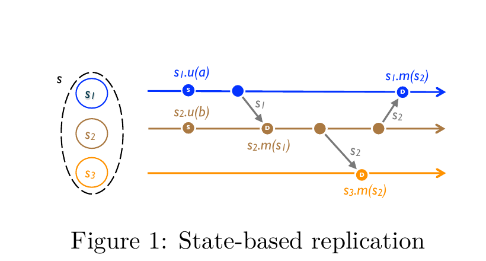
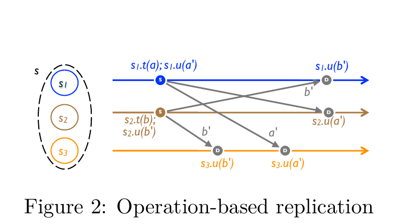
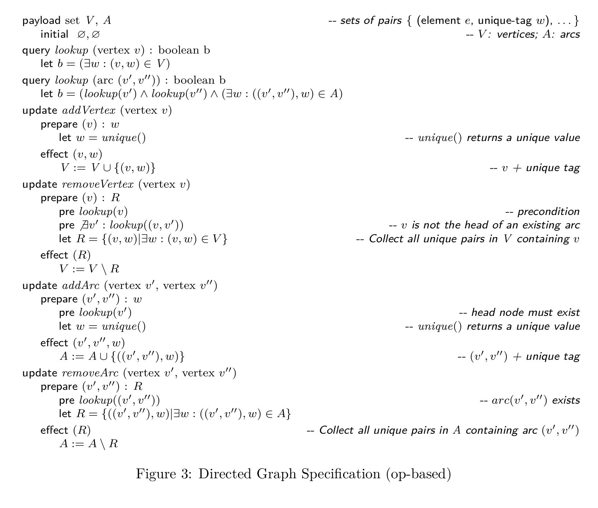

**Conflict-free Replicated Data Types｜无冲突复制数据类型**

INSTITUT NATIONAL DE RECHERCHE EN INFORMATIQUE ET EN AUTOMATIQUE

Marc Shapiro, INRIA & LIP6, Paris, France  
Nuno Preguiça, CITI, Universidade Nova de Lisboa, Portugal  
Carlos Baquero, Universidade do Minho, Portugal  
Marek Zawirski, INRIA & UPMC, Paris, France

N° 7687 — version 2  
version initiale 19 juillet 2011 — version révisée 25 août 2011  
Thème COM

> 法国国家信息与自动化研究所
>
> Marc Shapiro（法国 INRIA 与 LIP6，巴黎）、Nuno Preguiça（葡萄牙新里斯本大学 CITI）、Carlos Baquero（葡萄牙米尼奥大学）、Marek Zawirski（法国 INRIA 与 UPMC，巴黎）
>
> 第 7687 号——第 2 版  
> 初版：2011 年 7 月 19 日——修订版：2011 年 8 月 25 日  
> COM 主题

ISRN INRIA/RR--7687--FR+ENG  
ISSN 0249-6399

> ISRN INRIA/RR--7687--FR+ENG  
> ISSN 0249-6399

Rapport de recherche

> 研究报告

## Conflict-free Replicated Data Types ∗｜无冲突复制数据类型 ∗

Marc Shapiro, INRIA & LIP6, Paris, France  
Nuno Preguiça, CITI, Universidade Nova de Lisboa, Portugal  
Carlos Baquero, Universidade do Minho, Portugal  
Marek Zawirski, INRIA & UPMC, Paris, France

Thème COM — Systèmes communicants  
Projet Regal

Rapport de recherche n° 7687 — version 2† — version initiale 19 juillet 2011 — version révisée 25 août 2011 — 18 pages

> Marc Shapiro（法国 INRIA 与 LIP6，巴黎）、Nuno Preguiça（葡萄牙新里斯本大学 CITI）、Carlos Baquero（葡萄牙米尼奥大学）、Marek Zawirski（法国 INRIA 与 UPMC，巴黎）
>
> COM 主题——通信系统  
> Regal 项目
>
> 第 7687 号研究报告——第 2 版†——初版 2011 年 7 月 19 日——修订版 2011 年 8 月 25 日——18 页

### Abstract｜摘要

Replicating data under Eventual Consistency (EC) allows any replica to accept updates without remote synchronisation. This ensures performance and scalability in large-scale distributed systems (e.g., clouds). However, published EC approaches are ad-hoc and error-prone. Under a formal Strong Eventual Consistency (SEC) model, we study sufficient conditions for convergence. A data type that satisfies these conditions is called a Conflict-free Replicated Data Type (CRDT). Replicas of any CRDT are guaranteed to converge in a self-stabilising manner, despite any number of failures. This paper formalises two popular approaches (state- and operation-based) and their relevant sufficient conditions. We study a number of useful CRDTs, such as sets with clean semantics, supporting both add and remove operations, and consider in depth the more complex Graph data type. CRDT types can be composed to develop large-scale distributed applications, and have interesting theoretical properties.

> 在最终一致性（Eventual Consistency，EC）下复制数据，允许任一副本无须与远端同步便接受更新。这保证了大型分布式系统（例如云）的性能与可扩展性。然而，已发表的 EC 方法大多是特设的且容易出错。我们在形式化的强最终一致性（Strong Eventual Consistency，SEC）模型下研究保证收敛的充分条件。满足这些条件的数据类型称为无冲突复制数据类型（Conflict-free Replicated Data Type，CRDT）。无论发生多少故障，任何 CRDT 的副本都能以自稳定方式保证收敛。本文形式化两种常用方法（基于状态和基于操作）及各自相关的充分条件。我们研究若干实用的 CRDT，例如语义清晰且同时支持 add 与 remove 操作的集合，并深入考察更复杂的 Graph 数据类型。CRDT 类型可以组合起来开发大型分布式应用，并具有有趣的理论性质。

**Key-words:** Eventual consistency, replicated shared objects, large-scale distributed systems

∗ This research is supported in part by ANR project ConcoRDanT (ANR-10-BLAN 0208). Marek Zawirski is supported in part by his Google Europe Fellowship in Distributed Computing 2010. Carlos Baquero is partially supported by FCT project Castor (PTDC/EIA-EIA/104022/2008).

† French-language title, abstract and keywords

> **关键词：** 最终一致性、复制共享对象、大型分布式系统
>
> ∗ 本研究部分由 ANR ConcoRDanT 项目（ANR-10-BLAN 0208）资助。Marek Zawirski 部分得到 2010 年 Google Europe 分布式计算奖学金资助。Carlos Baquero 部分得到 FCT Castor 项目（PTDC/EIA-EIA/104022/2008）资助。
>
> † 法文标题、摘要与关键词

Unité de recherche INRIA Rocquencourt  
Domaine de Voluceau, Rocquencourt, BP 105, 78153 Le Chesnay Cedex (France)  
Téléphone : +33 1 39 63 55 11 — Télécopie : +33 1 39 63 53 30

> INRIA Rocquencourt 研究中心  
> Domaine de Voluceau, Rocquencourt, BP 105, 78153 Le Chesnay Cedex（法国）  
> 电话：+33 1 39 63 55 11——传真：+33 1 39 63 53 30

## Types de données sans conflit｜无冲突数据类型

**Résumé :** La réplication selon la politique de cohérence à terme (Eventual Consistency ou EC) autorise toute réplique à accepter des mises à jour sans se synchroniser avec les autres. Cette approche ne bride pas les performances et permet le passage à l’échelle dans les systèmes distribués, par ex. dans l’informatique en nuage. Cependant, les algorithmes EC précédemment publiés sont ad-hoc et sujets aux erreurs. Nous proposons un modèle formel, la cohérence à terme forte (Strong Eventual Consistency ou SEC), dans lequel nous étudions des conditions suffisantes de converegence. Un type de données satisfaisant ces conditions sera dit sans conflit (Conflict-free Replicated Data Type ou CRDT). Les répliques d’un CRDT convergent de façon auto-stabilisante, quel que soit le nombre de fautes. Cet article formalise deux approches courantes, celle basée sur les états et celle basée sur les données, et les conditions suffisantes correspondantes. Nous étudions un certain nombre de CRDT génériques, comme des ensembles, avec une sémantique appropriée pour les opérations add et remove, et approfondissons un type plus complexe, le graphe. Les CRDT peuvent être composés, de façon à développer des applications réparties à grande échelle, et ont des propriétés théoriques intéressantes.

> **摘要：** 按最终一致性（Eventual Consistency，EC）策略进行复制时，任一副本都可以在不与其他副本同步的情况下接受更新。这种方法不会限制性能，并使分布式系统（例如云计算）能够横向扩展。然而，此前发表的 EC 算法大多是特设的且容易出错。我们提出形式化的强最终一致性（Strong Eventual Consistency，SEC）模型，并在其中研究保证收敛的充分条件。满足这些条件的数据类型称为无冲突复制数据类型（Conflict-free Replicated Data Type，CRDT）。无论发生多少故障，CRDT 的副本都会以自稳定方式收敛。本文形式化两种常用方法——基于状态的方法和基于数据的方法——以及各自相应的充分条件。我们研究若干通用 CRDT，例如为 add 与 remove 操作提供恰当语义的集合，并深入考察更复杂的图类型。CRDT 可以组合起来开发大型分布式应用，并具有有趣的理论性质。

> **译注：** 法文原文 `converegence` 疑为 `convergence`；此处照录。

**Mots-clés :** Cohérence à terme, objets partagés répliqués, système réparti de grande échelle

> **关键词：** 最终一致性、复制共享对象、大型分布式系统

## 1 Introduction｜引言

Replication and consistency are essential features of any large distributed system, such as the WWW, peer-to-peer, or cloud computing platforms. The standard “strong consistency” approach serialises updates in a global total order [10]. This constitutes a performance and scalability bottleneck. Furthermore, strong consistency conflicts with availability and partition-tolerance [8].

When network delays are large or partitioning is an issue, as in delay-tolerant networks, disconnected operation, cloud computing, or P2P systems, eventual consistency promises better availability and performance [17, 20]. An update executes at some replica, without synchronisation; later, it is sent to the other replicas. All updates eventually take effect at all replicas, asynchronously and possibly in different orders. Concurrent updates may conflict; conflict arbitration may require a consensus and a roll-back.¹

This weaker consistency is considered acceptable for some classes of applications. However, conflict resolution is hard. The literature offers little guidance on designing a correct optimistic system. Ad-hoc approaches are brittle and error-prone; witness for instance the concurrency anomalies of the Amazon Shopping Cart [3].

> 复制与一致性是任何大型分布式系统——例如万维网、点对点系统或云计算平台——的基本特性。标准的“强一致性”方法按全局全序串行化更新［10］，这会成为性能与可扩展性的瓶颈。此外，强一致性还与可用性和分区容错性相冲突［8］。
>
> 当网络延迟很大或网络分区成为问题时——例如在延迟容忍网络、断连操作、云计算或 P2P 系统中——最终一致性有望提供更好的可用性与性能［17，20］。更新在某个副本上无须同步便可执行，随后再发送给其他副本。所有更新最终都会在全部副本上生效，但这一过程是异步的，次序也可能不同。并发更新可能发生冲突；冲突裁决可能需要达成共识并执行回滚。¹
>
> 对某些应用类别而言，这种较弱的一致性可以接受。然而，冲突解决十分困难。已有文献几乎没有为如何设计正确的乐观系统提供指导。特设方法既脆弱又容易出错；Amazon Shopping Cart 的并发异常便是一例［3］。

We propose a simple, theoretically-sound approach to eventual consistency. Our system model, Strong Eventual Consistency or SEC, avoids the complexity of conflict resolution and of roll-back. Conflict-freedom ensures safety and liveness despite any number of failures. It leverages simple mathematical properties that ensure absence of conflict, i.e., monotonicity in a semi-lattice and/or commutativity. A trivial example is a replicated counter, which (assuming no overflow) converges because its increment and decrement operations commute. In our conflict-free replicated data types (CRDTs), an update does not require synchronisation, and CRDT replicas provably converge to a correct common state. CRDTs remain responsive, available and scalable despite high network latency, faults, or disconnection.

Non-trivial CRDTs are known to exist: for instance, we previously published Treedoc, a sequence CRDT for co-operative text editing [14]. Our aim here is to expand our knowledge of the principles and practice of CRDTs. We claim the following contributions for this paper:

> 我们提出一种简单且有坚实理论依据的最终一致性方法。我们的系统模型——强最终一致性（SEC）——避开了冲突解决与回滚的复杂性。无冲突性确保系统无论遭遇多少故障仍具备安全性和活性。它利用可保证不存在冲突的简单数学性质，即半格上的单调性和／或交换律。复制计数器就是一个简单例子：假设不会溢出，它之所以收敛，是因为递增与递减操作满足交换律。在我们的无冲突复制数据类型（CRDT）中，更新无须同步，而 CRDT 副本可以被证明会收敛到一个正确的共同状态。即使网络延迟很高、发生故障或断连，CRDT 仍保持响应性、可用性与可扩展性。
>
> 已知存在非平凡的 CRDT：例如，我们此前发表过 Treedoc，一种用于协作文本编辑的序列 CRDT［14］。本文旨在扩展我们对 CRDT 原理与实践的认识。本文声称作出如下贡献：

- A solution to the CAP problem, Strong Eventual Consistency (SEC).

> - CAP 问题的一种解法：强最终一致性（SEC）。

- Formal definitions of Strong Eventual Consistency (SEC) and of CRDTs.

> - 强最终一致性（SEC）与 CRDT 的形式化定义。

- Two sufficient conditions for SEC.

> - SEC 的两个充分条件。

- A strong equivalence between the two conditions.

> - 两个条件之间的强等价关系。

- We show that SEC is incomparable to sequential consistency.

> - 证明 SEC 与顺序一致性互不可比。

- Description of basic CRDTs, including integer vectors and counters.

> - 描述基本 CRDT，包括整数向量与计数器。

- More advanced CRDTs, including sets and graphs.

> - 描述更高级的 CRDT，包括集合与图。

¹ A conflict is a combination of concurrent updates, which may be individually correct, but that, taken together, would violate some invariant.

> ¹ 冲突是若干并发更新的组合；这些更新各自可能都正确，但合在一起会违反某项不变式。



Figure 1: State-based replication｜图：基于状态的复制

> **图表中文解读：** 三个副本从状态 $s$ 出发。更新仅改变执行它的副本，副本之间传递的是完整状态；收到远端状态后执行 merge。图中 $s_2$ 先并入 $s_1$，$s_3$ 再并入 $s_2$，最终 $s_1$ 又并入 $s_2$，展示更新如何通过直接或间接的状态传播抵达各副本。



Figure 2: Operation-based replication｜图：基于操作的复制

> **图表中文解读：** 源副本先执行无副作用的 prepare-update $t$，紧接着在本地执行 effect-update $u$，再把 effect-update 发送到下游副本。灰色箭头表示操作传播；因果相关操作保持次序，而并发操作 $a'$、$b'$ 可按不同次序到达，只要它们满足交换律，各副本仍会得到等价状态。

We refer the interested reader to a separate technical report [18] for a comprehensive portfolio of CRDT designs.

> 若读者有兴趣，可参阅另一份技术报告［18］，其中全面汇集了各种 CRDT 设计。

## 2 System model｜系统模型

We consider a system of processes interconnected by an asynchronous network. The network can partition and recover. We assume a finite set $\Pi = \{p_0, \ldots, p_{n-1}\}$ of non-byzantine processes. Processes in $\Pi$ may crash silently; a crashed process may remain crashed forever, or may recover with its memory intact. A non-crashed process is said *correct*.

> 我们考虑由异步网络互连的一组进程。网络可能发生分区，也可能恢复。假设存在一个由非拜占庭进程组成的有限集合 $\Pi = \{p_0, \ldots, p_{n-1}\}$。$\Pi$ 中的进程可能静默崩溃；崩溃的进程可能永远保持崩溃，也可能在内存完好的情况下恢复。未崩溃的进程称为*正确进程*。

### 2.1 State-based object｜基于状态的对象

In this section we specify replicated objects in the so-called *state-based* style. The intuition is illustrated in Figure 1. Executing an update modifies the state of a single replica. Every replica occasionally sends its local state to some other replica, which *merges* the state thus received into its own state. In this way, every update eventually reaches every replica, either directly or indirectly.

With no loss of generality, we consider a single object with one replica at each process. An object is a tuple $(S, s^0, q, u, m)$. The replica at process $p_i$ has state $s_i \in S$, called its *payload*; the initial state is $s^0$. A client of the object may read the state of the object via query method $q$ and modify it via update method $u$. Method $m$ serves to *merge* the state from a remote replica. A method (whether $q$, $u$ or $m$) executes at a single replica.

Systems that deliver every update to every replica eventually in a fault-tolerant manner are well-known in the literature, for instance gossip or anti-entropy approaches [5, 13]. For simplicity, we will assume hereafter a fully connected communication graph, where every arc is a fair-lossy channel. Infinitely often, the replica at $p_i$ sends (if it is correct) its current state to $p_j$; replica $p_j$ (if it is correct) merges the received state into its local state by executing method $m$.

> 本节以所谓的*基于状态*风格规定复制对象，其直观过程见图 1。执行更新只会修改一个副本的状态。每个副本不时把本地状态发送给其他某个副本，后者把收到的状态*合并*进自己的状态。这样，每项更新最终都会直接或间接抵达每个副本。
>
> 不失一般性，我们考虑单个对象，并令每个进程各持有一个副本。对象是一个元组 $(S, s^0, q, u, m)$。进程 $p_i$ 上副本的状态为 $s_i \in S$，称为其*载荷*；初始状态为 $s^0$。对象的客户端可通过查询方法 $q$ 读取对象状态，通过更新方法 $u$ 修改它。方法 $m$ 用于*合并*来自远端副本的状态。任一方法（$q$、$u$ 或 $m$）都只在一个副本上执行。
>
> 文献中早已存在以容错方式把每项更新最终送达每个副本的系统，例如 gossip 或反熵方法［5，13］。为简化讨论，下文假设通信图完全连通，其中每条弧都是公平有损信道。进程 $p_i$ 上的副本若正确，便会无限多次地把其当前状态发送给 $p_j$；进程 $p_j$ 上的副本若正确，则通过执行方法 $m$ 把收到的状态合并进本地状态。

A method whose precondition is satisfied is said *enabled*. We assume that an enabled method executes as soon as it is invoked. Method executions at some replica are numbered sequentially from 1. The $k$th method execution at replica $i$ will be noted $f_i^k(a)$, where $f$ is either $q$, $u$ or $m$, and $a$ denotes the arguments. We note $K_i(f)$ the ordinal of execution $f$ at replica $i$, i.e., $K_i(f_j^k(a)) = k$ for $i = j$, and is undefined otherwise. (Abusing notation somewhat, we may drop subscripts, superscripts and/or arguments when there is no ambiguity.)

The states of a replica are numbered sequentially incrementing with each method execution. Thus, replica $i$ has initial state $s_i^0 = s^0$. Before its $k$th execution of a method it has state $s_i^{k-1}$, and $s_i^k$ afterwards. We note the transition $s_i^{k-1} \bullet f_i^k(a) = s_i^k$.

We define state equivalence $s \equiv s'$ if all queries return the same result for $s$ and $s'$. A query has no side-effects, i.e., $(s \bullet q) \equiv s$.

> 前置条件得到满足的方法称为*已启用*。我们假设，已启用的方法一经调用就会执行。某个副本上的方法执行从 1 起依次编号。副本 $i$ 上第 $k$ 次方法执行记作 $f_i^k(a)$，其中 $f$ 是 $q$、$u$ 或 $m$ 之一，$a$ 表示参数。$K_i(f)$ 表示 $f$ 在副本 $i$ 上执行的序号，即当 $i=j$ 时 $K_i(f_j^k(a)) = k$，否则未定义。（在不产生歧义时，我们会略微滥用记法，省略下标、上标和／或参数。）
>
> 副本的状态依次编号，并随每次方法执行而递增。因此，副本 $i$ 的初始状态为 $s_i^0 = s^0$。第 $k$ 次执行方法之前，它处于状态 $s_i^{k-1}$，之后处于状态 $s_i^k$。这一转移记作 $s_i^{k-1} \bullet f_i^k(a) = s_i^k$。
>
> 若所有查询在 $s$ 与 $s'$ 上都返回相同结果，则定义二者状态等价，记作 $s \equiv s'$。查询没有副作用，即 $(s \bullet q) \equiv s$。

**Definition 2.1 (Causal History (state-based)).** *We define the object’s causal history $C = [c_1, \ldots, c_n]$ (where $c_i$ goes through a sequence of states $c_i^0, \ldots, c_i^k, \ldots$) as follows. Initially, $c_i^0 = \varnothing$, for all $i$. If the $k$th method execution at $i$ is: (i) a query $q$: the causal history does not change, i.e., $c_i^k = c_i^{k-1}$; (ii) an update (noted $u_i^k(a)$): it is added to the causal history, i.e., $c_i^k = c_i^{k-1} \cup \{u_i^k(a)\}$; (iii) a merge $m_i^k(s_{i'}^{k'})$, then the local and remote histories are unioned together: $c_i^k = c_i^{k-1} \cup c_{i'}^{k'}$.*

We say that an update is *delivered* at some replica when it is included in the causal history at that replica. An update $u$ *happened-before* $u'$ iff $u$ is delivered when $u'$ executes: $u \to u' \stackrel{\mathrm{def}}{=} u \in c_j^{k-1}$, where $u'$ executes at replica $p_j$ and $K_j(u') = k$. Updates are *concurrent* if neither happened-before the other: $u \parallel u' \stackrel{\mathrm{def}}{=} u \not\to u' \land u' \not\to u$. Note that the causal history is a formal reasoning device, which is normally not needed in a concrete implementation.

> **定义 2.1（因果历史（基于状态））。** *对象的因果历史定义为 $C = [c_1, \ldots, c_n]$（其中 $c_i$ 依次经历状态 $c_i^0, \ldots, c_i^k, \ldots$）。初始时，对所有 $i$ 都有 $c_i^0 = \varnothing$。若 $i$ 上第 $k$ 次方法执行是：（i）查询 $q$：因果历史不变，即 $c_i^k = c_i^{k-1}$；（ii）更新（记作 $u_i^k(a)$）：把它加入因果历史，即 $c_i^k = c_i^{k-1} \cup \{u_i^k(a)\}$；（iii）合并 $m_i^k(s_{i'}^{k'})$：把本地与远端历史并集起来，即 $c_i^k = c_i^{k-1} \cup c_{i'}^{k'}$。*
>
> 当一项更新被纳入某副本的因果历史时，我们称该更新已在该副本上*送达*。当且仅当 $u'$ 执行时 $u$ 已送达，更新 $u$ 才*发生在* $u'$ *之前*：$u \to u' \stackrel{\mathrm{def}}{=} u \in c_j^{k-1}$，其中 $u'$ 在副本 $p_j$ 上执行，且 $K_j(u') = k$。若任一更新都没有发生在另一项之前，则两项更新*并发*：$u \parallel u' \stackrel{\mathrm{def}}{=} u \not\to u' \land u' \not\to u$。请注意，因果历史是一种形式化推理工具，具体实现通常无须维护它。

Given our communication assumptions, we can conclude that, in a state-based object, every update is eventually delivered to all replicas. However, this is not sufficient to ensure that replicas converge. For instance, if the merge method $m$ is a no-op, an update executed at some replica has no effect on other replicas, and they will never converge.

> 根据上述通信假设，可以断定：在基于状态的对象中，每项更新最终都会送达所有副本。然而，这不足以保证副本收敛。例如，若合并方法 $m$ 是空操作，则在某副本上执行的更新不会影响其他副本，它们也就永远不会收敛。

### 2.2 Strong Eventual Consistency｜强最终一致性

Informally, eventual consistency means that replicas eventually reach the same final value if clients stop submitting updates. We capture this intuition as follows:

**Definition 2.2 (Eventual Consistency (EC)).**

**Eventual delivery:** *An update delivered at some correct replica is eventually delivered to all correct replicas:* $\forall i,j : f \in c_i \Rightarrow \Diamond f \in c_j$.

> 非形式地说，最终一致性意味着：若客户端停止提交更新，各副本最终会达到相同的最终值。我们把这一直觉形式化如下：
>
> **定义 2.2（最终一致性（EC））。**
>
> **最终送达：** *在某个正确副本上送达的更新，最终会送达所有正确副本：* $\forall i,j : f \in c_i \Rightarrow \Diamond f \in c_j$。

**Convergence:** *Correct replicas that have delivered the same updates eventually reach equivalent state:* $\forall i,j : \Box c_i = c_j \Rightarrow \Diamond \Box s_i \equiv s_j$.

**Termination:** *All method executions terminate.*

Several EC systems will execute an update immediately, only to discover later that it conflicts with another, and to roll back to resolve this conflict [19]. This constitutes a waste of resources, and in general requires a consensus to ensure that all replicas arbitrate conflicts in the same way. To avoid this, we require a stronger condition:

> **收敛：** *送达了相同更新的正确副本最终会达到等价状态：* $\forall i,j : \Box c_i = c_j \Rightarrow \Diamond \Box s_i \equiv s_j$。
>
> **终止性：** *所有方法执行都会终止。*
>
> 一些 EC 系统会立即执行更新，却在稍后才发现它与另一项更新冲突，继而通过回滚解决冲突［19］。这会浪费资源，而且通常需要共识来确保所有副本以相同方式裁决冲突。为避免这一问题，我们要求一个更强的条件：

**Definition 2.3 (Strong eventual consistency (SEC)).** *An object is Strongly Eventually Consistent if it is Eventually Consistent and:*

**Strong Convergence:** *Correct replicas that have delivered the same updates have equivalent state:* $\forall i,j : c_i = c_j \Rightarrow s_i \equiv s_j$.

> **定义 2.3（强最终一致性（SEC））。** *若对象具有最终一致性，并且还满足下列条件，则称它具有强最终一致性：*
>
> **强收敛：** *送达了相同更新的正确副本具有等价状态：* $\forall i,j : c_i = c_j \Rightarrow s_i \equiv s_j$。

### 2.3 State-based Convergent Replicated Data Type (CvRDT)｜基于状态的收敛复制数据类型（CvRDT）

We now propose a sufficient condition for strong convergence in state-based objects. A join semilattice (or just semilattice hereafter) is a partial order $\leq$ equipped with a least upper bound (LUB) $\sqcup$ for all pairs: $m = x \sqcup y$ is a Least Upper Bound of $\{x,y\}$ under $\leq$ iff $\forall m', x \leq m' \land y \leq m' \Rightarrow x \leq m \land y \leq m \land m \leq m'$. It follows that $\sqcup$ is: commutative: $x \sqcup y = y \sqcup x$; idempotent: $x \sqcup x = x$; and associative: $(x \sqcup y) \sqcup z = x \sqcup (y \sqcup z)$.

**Definition 2.4 (Monotonic semilattice object).** *A state-based object, equipped with partial order $\leq$, noted $(S, \leq, s^0, q, u, m)$, that has the following properties, is called a monotonic semi-lattice: (i) Set $S$ of payload values forms a semilattice ordered by $\leq$. (ii) Merging state $s$ with remote state $s'$ computes the LUB of the two states, i.e., $s \bullet m(s') = s \sqcup s'$. (iii) State is monotonically non-decreasing across updates, i.e., $s \leq s \bullet u$.*

> 下面给出基于状态对象实现强收敛的一个充分条件。并半格（下文也简称半格）是在偏序 $\leq$ 上为每一对元素配备最小上界（least upper bound，LUB）$\sqcup$ 的结构：当且仅当 $\forall m', x \leq m' \land y \leq m' \Rightarrow x \leq m \land y \leq m \land m \leq m'$ 时，$m = x \sqcup y$ 才是 $\{x,y\}$ 在 $\leq$ 下的最小上界。由此可知，$\sqcup$ 满足交换律：$x \sqcup y = y \sqcup x$；幂等律：$x \sqcup x = x$；以及结合律：$(x \sqcup y) \sqcup z = x \sqcup (y \sqcup z)$。
>
> **定义 2.4（单调半格对象）。** *一个配备偏序 $\leq$、记作 $(S, \leq, s^0, q, u, m)$ 的基于状态对象，若具有以下性质，则称为单调半格：（i）载荷值集合 $S$ 在 $\leq$ 的排序下构成半格。（ii）将状态 $s$ 与远端状态 $s'$ 合并，会计算两状态的最小上界，即 $s \bullet m(s') = s \sqcup s'$。（iii）状态随更新单调不减，即 $s \leq s \bullet u$。*

**Theorem 2.1 (Convergent Replicated Data Type (CvRDT)).** *Assuming eventual delivery and termination, any state-based object that satisfies the monotonic semilattice property is SEC.*

**Proof.** As we assumed earlier a fully connected communication graph and that replicas transmit and merge state infinitely often, the conditions for eventual delivery are fulfilled. With no loss of generality, we assume that every operation is enabled (otherwise its invocation reduces to a no-op); furthermore we already assumed that an operation executes at a single replica. Under these conditions, an operation terminates if it has no infinite loops or recursion, which we assume to be true.

We now focus on proving strong convergence. We first note that Definition 2.4 precludes spontaneous state changes or roll-backs: when a replica is in some state $s$, it can change state only by executing an update $u$ or a merge $m$.

> **定理 2.1（收敛复制数据类型（CvRDT））。** *假设最终送达与终止性成立，则任何满足单调半格性质的基于状态对象都具有 SEC。*
>
> **证明。** 前文已经假设通信图完全连通，且各副本会无限多次地传输并合并状态，因此满足最终送达的条件。不失一般性，我们假设每项操作均已启用（否则其调用退化为空操作）；此外，我们已经假设操作在单个副本上执行。在这些条件下，只要操作不存在无限循环或递归便会终止，而我们假设这一点成立。
>
> 下面集中证明强收敛。首先注意，定义 2.4 排除了自发状态变化或回滚：副本处于某状态 $s$ 时，只能通过执行更新 $u$ 或合并 $m$ 来改变状态。

Consider replicas $i$ and $j$. The proof assumption is $c_i = c_j$. Since updates are unique, these replicas can only have delivered the same updates in the following conditions:

> 考虑副本 $i$ 与 $j$。证明的假设是 $c_i = c_j$。由于更新是唯一的，这两个副本只能在以下情形中送达相同的更新：

- They are in the initial state, and therefore $s_i \equiv s_j$.

> - 两者都处于初始状态，因而 $s_i \equiv s_j$。

- During the execution, there was a point $p,q$ when $c_i^p \subset c_j^q$. In $p_i$, for $k > p$ there is a merge that included a state $s : s = s_j^q$ and all $f_i^k$ operations are non mutating or merges with $s \subseteq s_j^q$. In $p_j$, for $k > q$, all operations $f_j^k$ are non mutating or merges with $s \subseteq s_j^q$. Therefore, since $\sqcup$ is a LUB, one has $s_i \equiv s_j$ $(\equiv s_j^q)$.

> - 执行期间曾存在时点 $p,q$，使 $c_i^p \subset c_j^q$。在 $p_i$ 中，当 $k > p$ 时，存在一次合并纳入了状态 $s : s = s_j^q$，并且所有 $f_i^k$ 操作要么不改变状态，要么只合并满足 $s \subseteq s_j^q$ 的状态。在 $p_j$ 中，当 $k > q$ 时，所有 $f_j^k$ 操作也要么不改变状态，要么只合并满足 $s \subseteq s_j^q$ 的状态。因此，由于 $\sqcup$ 是最小上界，有 $s_i \equiv s_j$（$\equiv s_j^q$）。

- During the execution, there was a point $p,q$ when $c_j^q \subset c_i^p$. Proved by simmetry with the previous case.

> - 执行期间曾存在时点 $p,q$，使 $c_j^q \subset c_i^p$。由与上一情形的对称性可证。

> **译注：** 原文 `simmetry` 疑为 `symmetry`；此处照录。

- During the execution, there was a point $p,q$ when $c_i^p \not\subset c_j^q$ and $c_j^q \not\subset c_i^p$. In $p_i$, for $k > p$ there is a merge that included a state $s : s_j^q \subseteq s \subseteq s_j^q \cup s_i^p$ and all $f_i^k$ operations are non mutating or merges with $s \subseteq s_j^q \cup s_i^p$. Converselly in $p_j$, for $k > q$ there is a merge that included a state $s : s_i^p \subseteq s \subseteq s_j^q \cup s_i^p$ and all $f_j^k$ operations are non mutating or merges with $s \subseteq s_j^q \cup s_i^p$. In these conditions, $c_i = c_j = c_i^p \cup c_j^q$ and due to the LUB properties of $\sqcup$ we have $s_i \equiv s_j$ $(\equiv s_i^p \sqcup s_j^q \equiv s_j^q \sqcup s_i^p)$.

> - 执行期间曾存在时点 $p,q$，使 $c_i^p \not\subset c_j^q$ 且 $c_j^q \not\subset c_i^p$。在 $p_i$ 中，当 $k > p$ 时，存在一次合并纳入了状态 $s : s_j^q \subseteq s \subseteq s_j^q \cup s_i^p$，并且所有 $f_i^k$ 操作要么不改变状态，要么只合并满足 $s \subseteq s_j^q \cup s_i^p$ 的状态。对称地，在 $p_j$ 中，当 $k > q$ 时，存在一次合并纳入了状态 $s : s_i^p \subseteq s \subseteq s_j^q \cup s_i^p$，并且所有 $f_j^k$ 操作要么不改变状态，要么只合并满足 $s \subseteq s_j^q \cup s_i^p$ 的状态。在这些条件下，$c_i = c_j = c_i^p \cup c_j^q$；由 $\sqcup$ 的最小上界性质，有 $s_i \equiv s_j$（$\equiv s_i^p \sqcup s_j^q \equiv s_j^q \sqcup s_i^p$）。

> **译注：** 原文 `Converselly` 疑为 `Conversely`；此处照录。

Since replicas transmit and merge state infinitly often, these conditions will occur infinitly often. Finally, by $\sqcup$ transitivity all replicas that deliver the same updates will depict equivalent states.

> 由于副本会无限多次地传输并合并状态，这些条件也会无限多次地出现。最后，由 $\sqcup$ 的传递性，送达相同更新的所有副本都将呈现等价状态。

> **译注：** 原文两处 `infinitly` 疑为 `infinitely`；此处照录。原文称“$\sqcup$ transitivity”，按上下文指半格序关系／合并所得等价性的传递推导，英文照录。

A CvRDT converges towards the LUB of the most recent updates. We require that $x \leq y \land y \leq x \Rightarrow x \equiv y$.

> CvRDT 朝最新更新的最小上界收敛。我们要求 $x \leq y \land y \leq x \Rightarrow x \equiv y$。

### 2.4 Op-based Commutative Replicated Data Type (CmRDT)｜基于操作的交换复制数据类型（CmRDT）

Alternatively to the state-based style, a replicated object may be specified in the operation-based (or op-based) style. An op-based object is a tuple $(S, s^0, q, t, u, P)$, where $S$, $s^0$ and $q$ have the same meaning as above (respectively state domain, initial state and query method). An op-based object has no merge method; instead an update is split into a pair $(t,u)$, where $t$ is a side-effect-free prepare-update method and $u$ is an effect-update method. (their arguments may differ, e.g., $t(a)$ and $u(a')$ in Figure 2). The prepare-update executes at the single replica where the operation is invoked (its source). At the source, prepare-update method $t$ is followed immediately by effect-update method $u$, i.e., $f_i^{k-1} = t \Rightarrow f_i^k = u$. (If this were not true, there would be no causality between successive updates.)

> 除基于状态的风格外，复制对象也可以用基于操作（简称 op-based）的风格来规定。基于操作的对象是元组 $(S, s^0, q, t, u, P)$，其中 $S$、$s^0$ 与 $q$ 的含义同上（依次为状态域、初始状态与查询方法）。基于操作的对象没有合并方法；更新被拆分为一对 $(t,u)$，其中 $t$ 是无副作用的预备更新（prepare-update）方法，$u$ 是效果更新（effect-update）方法。（二者参数可以不同，例如图 2 中的 $t(a)$ 与 $u(a')$。）预备更新只在调用操作的单个副本（即源副本）上执行。在源副本上，预备更新方法 $t$ 之后立即执行效果更新方法 $u$，即 $f_i^{k-1} = t \Rightarrow f_i^k = u$。（若非如此，连续更新之间便不存在因果关系。）

> **译注：** 括号内英文原句以小写 `their` 起首；此处照录。

The effect-update method executes at all replicas (said downstream). The source replica delivers the effect-update to downstream replicas using a communication protocol specified by the delivery relation $P$, explained below.

We use the same notations for states and causal history as above, except that now $f$ can refer to any of $q$, $t$ or $u$. Both queries and prepare-update methods are side-effect-free, i.e., $s \bullet q \equiv s \bullet t \equiv s$.

**Definition 2.5 (Causal History (op-based)).** *An object’s causal history $C = \{c_1, \ldots, c_n\}$ is defined as follows. Initially, $c_i^0 = \varnothing$, for all $i$. If the $k$th method execution at $i$ is: (i) a query $q$ or a prepare-update $t$, the causal history does not change, i.e., $c_i^k = c_i^{k-1}$; (ii) an effect-update $u_i^k(a)$, then $c_i^k = c_i^{k-1} \cup \{u_i^k(a)\}$.*

> 效果更新方法会在所有副本（称为下游副本）上执行。源副本使用由下文所述送达关系 $P$ 规定的通信协议，把效果更新送达下游副本。
>
> 状态与因果历史沿用上文记法，只是现在 $f$ 可以指 $q$、$t$ 或 $u$ 中任意一个。查询和预备更新方法都没有副作用，即 $s \bullet q \equiv s \bullet t \equiv s$。
>
> **定义 2.5（因果历史（基于操作））。** *对象的因果历史 $C = \{c_1, \ldots, c_n\}$ 定义如下。初始时，对所有 $i$ 都有 $c_i^0 = \varnothing$。若 $i$ 上第 $k$ 次方法执行是：（i）查询 $q$ 或预备更新 $t$，则因果历史不变，即 $c_i^k = c_i^{k-1}$；（ii）效果更新 $u_i^k(a)$，则 $c_i^k = c_i^{k-1} \cup \{u_i^k(a)\}$。*

An update is said delivered at a replica when the update is included in the replica’s causal history. Update $(t,u)$ happened-before $(t',u')$ iff the former is delivered when the latter executes: $(t,u) \to (t',u') \Leftrightarrow u \in c_j^{k-1}$, where $t'$ executes at $p_j$ and $k = K_j(t')$. The definition of concurrent updates remains as above.

We assume an underlying reliable causally-ordered broadcast communication protocol, i.e., one that delivers every message to every recipient exactly once and in an order consistent with happened-before. Such protocols are a standard feature of distributed systems; they do not require consensus and they deliver to all correct processes as long as any network partition eventually recovers (as we assumed earlier). It follows that two updates that are related by happened-before execute at all replicas in the same sequential order: $(t,u) \to (t',u') \Rightarrow \forall i, K_i(u) < K_i(u')$. However, concurrent updates may be delivered in any order.

> 当一项更新被纳入副本的因果历史时，称该更新已在此副本上送达。当且仅当前一项更新在后一项执行时已送达，更新 $(t,u)$ 才发生在 $(t',u')$ 之前：$(t,u) \to (t',u') \Leftrightarrow u \in c_j^{k-1}$，其中 $t'$ 在 $p_j$ 上执行，且 $k = K_j(t')$。并发更新的定义与上文相同。
>
> 我们假设底层采用可靠的因果有序广播通信协议，即每条消息恰好一次送达每个接收者，且送达次序与 happened-before 关系一致。这类协议是分布式系统的标准功能；它们不要求共识，而且只要网络分区最终恢复（如前文所假设），就能把消息送达所有正确进程。因此，具有 happened-before 关系的两项更新会在所有副本上按同一顺序执行：$(t,u) \to (t',u') \Rightarrow \forall i, K_i(u) < K_i(u')$。不过，并发更新可以按任意次序送达。

**Definition 2.6 (Commutativity).** *Updates $(t,u)$ and $(t',u')$ commute, iff for any reachable replica state $s$ where both $u$ and $u'$ are enabled, $u$ (resp. $u'$) remains enabled in state $s \bullet u'$ (resp. $s \bullet u$), and $s \bullet u \bullet u' \equiv s \bullet u' \bullet u$.*

Clearly, a sufficient condition for convergence of an op-based object is that all its concurrent operations commute. An object satisfying this condition is called a Commutative Replicated Data Type (CmRDT).

$P$ is a delivery precondition, i.e., effect-update method $u$ is enabled only if the precondition is satisfied. We interpret this temporally, i.e., delivery of $u$ at replica $i$ may delayed, until $P(s_i,u)$ is true. Therefore, for liveness, we now have the added obligation to prove that delivery is eventually enabled. Therefore we restrict our scope to preconditions for which causally-ordered broadcast is sufficient to ensure $P$.

> **定义 2.6（交换律）。** *当且仅当对任一可达副本状态 $s$，只要 $u$ 与 $u'$ 均已启用，$u$（相应地，$u'$）在状态 $s \bullet u'$（相应地，$s \bullet u$）中仍保持启用，且 $s \bullet u \bullet u' \equiv s \bullet u' \bullet u$，更新 $(t,u)$ 与 $(t',u')$ 才满足交换律。*
>
> 显然，基于操作对象收敛的一个充分条件，是它的所有并发操作都满足交换律。满足这一条件的对象称为交换复制数据类型（Commutative Replicated Data Type，CmRDT）。
>
> $P$ 是送达前置条件，即效果更新方法 $u$ 只有在该前置条件满足时才启用。我们从时间角度解释它：$u$ 在副本 $i$ 上的送达可以延迟，直至 $P(s_i,u)$ 为真。因此，为保证活性，现在还必须证明送达最终会被启用。故我们把范围限制为仅靠因果有序广播便足以保证 $P$ 的前置条件。

> **译注：** 原文 `may delayed` 疑缺 `be`；此处照录。

**Theorem 2.2 (Commutative Replicated Data Type (CmRDT)).** *Assuming causal delivery of updates and method termination, any op-based object that satisfies the commutativity property for all concurrent updates, and whose delivery precondition is satisfied by causal delivery, is SEC.*

**Proof.** We assume delivery of updates to all correct replicas by reliable causal broadcast, which fullfils their delivery specification $P$. Once delivered operations cannot be undelivered. We also assume that the all CmRDT methods are well formed and terminate. Thus, we now focus on proving strong convergence.

> **定理 2.2（交换复制数据类型（CmRDT））。** *假设更新按因果顺序送达且方法会终止，则任何对所有并发更新都满足交换律、并且其送达前置条件可由因果送达满足的基于操作对象，都具有 SEC。*
>
> **证明。** 假设通过可靠因果广播把更新送达所有正确副本，这满足了更新的送达规范 $P$。操作一经送达便不能撤销送达。我们还假设所有 CmRDT 方法都具有良好形式并会终止。因此，下面集中证明强收敛。

> **译注：** 原文 `fullfils` 疑为 `fulfils`，且 `the all CmRDT methods` 语序疑误；此处均照录。

Consider any two correct replicas $p_i$ and $p_j$. Under the assumptions, eventually the the two replicas will deliver the same operations (if no new operations are generated), and we have $c_i = c_j$. For any two updates $f(a)$, $f'(a')$ in $c_i$: (i) If $f(a) \to f'(a')$, then by causal delivery assumption, $\forall p_i$ the apply order is consistent with causality $K_i(f(a)) < K_i(f'(a'))$; (ii) If they are not causally related, $f(a) \parallel f'(a')$, then they must commute and can be delivered in any relative order. In any replica $p_i$, both apply orders, $K_i(f(a)) < K_i(f'(a'))$ and $K_i(f(a)) > K_i(f'(a'))$, lead to the same effect. In all cases an equivalent abstract state $s_i \equiv s_j$ is reached in the two replicas.

> 任取两个正确副本 $p_i$ 与 $p_j$。在上述假设下，若不再生成新操作，这两个副本最终会送达相同操作，因而有 $c_i = c_j$。对 $c_i$ 中任意两项更新 $f(a)$、$f'(a')$：（i）若 $f(a) \to f'(a')$，则根据因果送达假设，对所有 $p_i$，应用次序都与因果关系一致，即 $K_i(f(a)) < K_i(f'(a'))$；（ii）若二者没有因果关系，即 $f(a) \parallel f'(a')$，则二者必须满足交换律，并可以按任意相对次序送达。在任一副本 $p_i$ 上，两种应用次序 $K_i(f(a)) < K_i(f'(a'))$ 与 $K_i(f(a)) > K_i(f'(a'))$ 都产生相同效果。在所有情形中，两个副本都会达到等价的抽象状态 $s_i \equiv s_j$。

> **译注：** 原文 `the the two replicas` 重复一个 `the`；此处照录。

By transitivity, $\forall i,j : c_i = c_j \Rightarrow s_i \equiv s_j$.

> 由传递性，$\forall i,j : c_i = c_j \Rightarrow s_i \equiv s_j$。

## 3 Some results｜若干结果

### 3.1 Fault-tolerance and the CAP theorem｜容错性与 CAP 定理

The CAP theorem states that it is impossible to simultaneously ensure strong consistency (C), availability (A) and tolerate network partition (P) [8]. As, network faults unavoidably occur in a large-scale environment, a real system must sacrifice either consistency or availability. Availability is often the top priority in practice [3]: does this mean giving up all consistency guarantees?

> CAP 定理指出，系统不可能同时保证强一致性（C）、可用性（A）和网络分区容错性（P）［8］。由于网络故障在大型环境中不可避免，现实系统必须牺牲一致性或可用性之一。实践中，可用性往往是最高优先级［3］：这是否意味着必须放弃所有一致性保证？

> **译注：** 原文 `As, network faults` 中 `As` 后的逗号疑为误植；此处照录。

No: SEC provides a solution. A SEC replica is always available for both reads and writes, independently of network conditions. Any communicating subset of replicas of a SEC object eventually converges, even if partitioned from the rest of the network. SEC is weaker than strong consistency but nonetheless provides the well-defined guarantee of strong eventual convergence.

SEC provides an extreme form of fault tolerance, as a SEC object tolerates up to $n-1$ simultaneous crashes. Remarkably, SEC does not require to solve consensus.

> 不必如此：SEC 提供了一种解法。SEC 副本始终可供读写，不受网络状况影响。SEC 对象中任意能够相互通信的副本子集最终都会收敛，即使它们与网络其余部分相分隔也是如此。SEC 弱于强一致性，但仍提供定义明确的强最终收敛保证。
>
> SEC 提供了一种极强的容错能力：SEC 对象最多可容忍 $n-1$ 个进程同时崩溃。值得注意的是，SEC 无须解决共识问题。

### 3.2 CvRDTs and CmRDTs are equivalent｜CvRDT 与 CmRDT 等价

#### 3.2.1 Operation-based emulation of a state-based object｜用基于操作的对象仿真基于状态的对象

**Theorem 3.1 (CmRDT emulation).** *Any SEC state-based object can be emulated by a SEC op-based object of a corresponding interface.*

**Proof.** Given a CvRDT represented by tuple $(S, \leq, s^0, q, u, m)$, we emulate it by a CmRDT object $(S, s^0, q, t, u', P)$, which we specify hereby.

State and query of CvRDT can be directly stored and processed by emulating CmRDT using the same definitions. A prepare-update $t(a)$ has the same interface (accepts the same domain of arguments and returns the same domain of value) as an update $u(a)$. It records the result of applying update $u(a)$ on a copy of current replica state $s$: $s' = s \bullet u(a)$; return value of $u(a)$ is passed to the client. Recorded state $s'$ is used as an argument of an actual effect-update $u'(s')$, which is delivered to all replicas by the underlying protocol of CmRDT. Precondition $P$ is unrestricted and enables delivery at any time. Effect-update $u'(s')$ merges received state using original CvRDT method: $s \bullet u'(s') \stackrel{\mathrm{def}}{=} s \bullet m(s')$.

> **定理 3.1（CmRDT 仿真）。** *任何具有 SEC 的基于状态对象，都可以由一个接口对应且具有 SEC 的基于操作对象来仿真。*
>
> **证明。** 给定以元组 $(S, \leq, s^0, q, u, m)$ 表示的 CvRDT，我们用 CmRDT 对象 $(S, s^0, q, t, u', P)$ 仿真它，具体规定如下。
>
> 仿真用的 CmRDT 可以沿用相同定义，直接存储并处理 CvRDT 的状态与查询。预备更新 $t(a)$ 与更新 $u(a)$ 具有相同接口（接受相同参数域，并返回相同值域）。它记录把更新 $u(a)$ 应用于当前副本状态 $s$ 的一个副本所得的结果：$s' = s \bullet u(a)$；$u(a)$ 的返回值传给客户端。所记录的状态 $s'$ 用作实际效果更新 $u'(s')$ 的参数，而 CmRDT 的底层协议把该效果更新送达所有副本。前置条件 $P$ 不作限制，允许在任意时刻送达。效果更新 $u'(s')$ 使用原 CvRDT 方法合并收到的状态：$s \bullet u'(s') \stackrel{\mathrm{def}}{=} s \bullet m(s')$。

Since merge always commutes, then updates $u'(s')$ commute and since the communication is reliable, we have a CmRDT with strong eventual consistency, which propagates all updates of emulated CvRDT.

> 由于合并总满足交换律，所以各更新 $u'(s')$ 也满足交换律；又由于通信可靠，我们便得到一个具有强最终一致性的 CmRDT，它会传播被仿真 CvRDT 的全部更新。

#### 3.2.2 State-based emulation of an operation-based object｜用基于状态的对象仿真基于操作的对象

State-based emulation of an operation-based object essentially formalises the mechanics of an epidemic reliable causal broadcast.

**Theorem 3.2 (CvRDT emulation).** *Any SEC op-based object can be emulated by a SEC state-based object of a corresponding interface.*

**Proof.** Given a CmRDT represented by tuple $(S, s^0, q, t, u, P)$, we emulate it by a CvRDT object $((S \times U \times U), \leq, (s^0, \varnothing, \varnothing), q', u', m)$, which we specify hereby.

> 用基于状态的对象仿真基于操作的对象，本质上是把流行病式可靠因果广播的机制形式化。
>
> **定理 3.2（CvRDT 仿真）。** *任何具有 SEC 的基于操作对象，都可以由一个接口对应且具有 SEC 的基于状态对象来仿真。*
>
> **证明。** 给定以元组 $(S, s^0, q, t, u, P)$ 表示的 CmRDT，我们用 CvRDT 对象 $((S \times U \times U), \leq, (s^0, \varnothing, \varnothing), q', u', m)$ 仿真它，具体规定如下。

Without loss of generality, we assume that each invocation $u_i^k$ is unique across replicas and set $U$ denotes all possible updates. CvRDT’s state is then defined as a triple $(s_m, M, D)$, where $s_m$ is a state of emulated CmRDT, $M$ and $D$ are two add-only sets of, respectively, known and delivered updates. A relation $\leq$ is defined as following:

$$
(s_m,M,D) \leq (s'_m,M',D') \stackrel{\mathrm{def}}{=} M \subseteq M' \land D \subseteq D'.
$$

> 不失一般性，假设每次调用 $u_i^k$ 在所有副本间都是唯一的，集合 $U$ 表示所有可能的更新。于是 CvRDT 的状态定义为三元组 $(s_m, M, D)$，其中 $s_m$ 是被仿真 CmRDT 的一个状态，$M$ 与 $D$ 是两个只增集合，分别存放已知更新和已送达更新。关系 $\leq$ 定义如下：
>
> $$
> (s_m,M,D) \leq (s'_m,M',D') \stackrel{\mathrm{def}}{=} M \subseteq M' \land D \subseteq D'.
> $$

A query $q'(a)$ has the same interface as $q(a)$; we define it as a trivial delegation to $q(a)$ on the CmRDT, $s_m \bullet q(a)$. An update $u'(a)$ has the same interface as prepare-update $t(a)$. It first delegates the invocation to prepare-update $t(a)$ of the CmRDT that in turn triggers effect-update $u(a)$, which becomes a locally known update. Finally, $u'(a)$ uses a recursive function $d$ to process updates:

$$
d(s_m,M,D) \stackrel{\mathrm{def}}{=}
\begin{cases}
d(s_m \bullet u(a), M, D \cup \{u(a)\}) & \text{if } \exists u(a) \in M \setminus D : P(s_m,u(a)) \\
(s_m,M,D) & \text{otherwise.}
\end{cases}
$$

> 查询 $q'(a)$ 与 $q(a)$ 具有相同接口；我们把它定义为直接委托给 CmRDT 上的 $q(a)$，即 $s_m \bullet q(a)$。更新 $u'(a)$ 与预备更新 $t(a)$ 具有相同接口。它先把调用委托给 CmRDT 的预备更新 $t(a)$，后者继而触发效果更新 $u(a)$，使其成为本地已知更新。最后，$u'(a)$ 使用递归函数 $d$ 处理更新：
>
> $$
> d(s_m,M,D) \stackrel{\mathrm{def}}{=}
> \begin{cases}
> d(s_m \bullet u(a), M, D \cup \{u(a)\}) & \text{若 } \exists u(a) \in M \setminus D : P(s_m,u(a)) \\
> (s_m,M,D) & \text{否则。}
> \end{cases}
> $$

Hence, $u'(a)$ is defined as: $(s_m,M,D) \bullet u'(a) \stackrel{\mathrm{def}}{=} d(s_m \bullet t(a), M \cup \{u(a)\}, D)$.

> 因而，$u'(a)$ 定义为：$(s_m,M,D) \bullet u'(a) \stackrel{\mathrm{def}}{=} d(s_m \bullet t(a), M \cup \{u(a)\}, D)$。

Finally, merge $m$ takes a union of known messages and processes available updates:

$$
(s_m,M,D) \bullet m(s'_m,M',D') \stackrel{\mathrm{def}}{=} d(s_m, M \cup M', D).
$$

> 最后，合并 $m$ 对已知消息取并集，并处理可用更新：
>
> $$
> (s_m,M,D) \bullet m(s'_m,M',D') \stackrel{\mathrm{def}}{=} d(s_m, M \cup M', D).
> $$

Since the emulation ensures that messages are delivered exactly once to each replica’s embedded object, in the appropriate order, and since the CvRDT conforms to SEC criteria, the embedded CmRDT instance is also SEC.

Note that the emulating object forms a monotonic semilattice over domain $S \times U \times U$. Calling or delivering an operation adds it to the relevant message set, and therefore advances the state in the partial order. The merge method $m$ is defined to take the union of the $M$ sets and (possibly) updating $D$, and is thus a LUB operation. This construction is similar to Wuu and Bernstein’s log covered in Section 4.2.

> 由于该仿真保证消息按适当次序恰好一次送达每个副本的嵌入对象，而且 CvRDT 符合 SEC 判据，所以嵌入的 CmRDT 实例也具有 SEC。
>
> 请注意，仿真对象在域 $S \times U \times U$ 上构成单调半格。调用或送达操作会把它加入相关消息集合，从而使状态沿偏序前进。合并方法 $m$ 被定义为对各 $M$ 集合取并集，并（可能）更新 $D$，因此是一个最小上界操作。这一构造类似于第 4.2 节介绍的 Wuu 与 Bernstein 日志。

### 3.3 SEC is incomparable to sequential consistency｜SEC 与顺序一致性互不可比

A state-based replica executes a sequence of query, update, and merge methods. In addition to its sequential behaviour, a CRDT specifies concurrent behaviours that must satisfy the strong convergence property. As we show now, this permits executions that would be impossible in a sequentially-consistent system.

Consider a Set CRDT $S$ with operations $add(e)$ and $remove(e)$. Immediately after $add(e)$, the state will satisfy $e \in S$; after $remove(e)$ the state satisfies $e \notin S$. In a sequential execution, the last update wins, e.g., after $remove(e) \to add(e)$ the state satisfies $e \in S$. Concurrent adds or removes of different elements are independent, e.g., after $add(e) \parallel remove(e')$ the state satisfies $e \in S \land e' \notin S$.

There is a choice of alternative semantics for concurrent updates of the same element. When concurrently adding and removing the same element, the add could win, or the remove could win, or the update of the replica with the highest IP address could win, or the state might be reset to a distinguished state $\bot$, and so on. All these alternatives satisfy the strong convergence condition, and any of them may be reasonable for some application.

> 基于状态的副本执行一系列查询、更新与合并方法。除顺序行为外，CRDT 还规定必须满足强收敛性质的并发行为。如下文所示，这允许出现顺序一致系统中不可能发生的执行。
>
> 考虑带有 $add(e)$ 与 $remove(e)$ 操作的集合 CRDT $S$。紧接 $add(e)$ 之后，状态满足 $e \in S$；紧接 $remove(e)$ 之后，状态满足 $e \notin S$。在顺序执行中，最后一项更新胜出，例如 $remove(e) \to add(e)$ 之后，状态满足 $e \in S$。针对不同元素的并发添加或删除彼此独立，例如 $add(e) \parallel remove(e')$ 之后，状态满足 $e \in S \land e' \notin S$。
>
> 对同一元素的并发更新可以选择不同语义。当同时添加和删除同一元素时，可以让添加胜出、让删除胜出、让 IP 地址最高的副本所作更新胜出，或把状态重置为特定状态 $\bot$，等等。所有这些选择都满足强收敛条件，其中任一种都可能适合某类应用。

Let us consider the add-wins alternative: after $add(e) \parallel remove(e)$ the state satisfies $e \in S$. Now consider the following scenario. Replica $p_0$ executes the sequence $add(e); remove(e')$. Concurrently, replica $p_1$ executes $add(e'); remove(e)$. Then, replica $p_3$ merges the state from $p_0$ and $p_1$. According to the concurrent specification, the final state at $p_3$ satisfies $e \in S \land e' \in S$. Such a state would never occur in a sequentially-consistent execution, in which either $remove(e)$ or $remove(e')$ must be last. Thus, there is a SEC object that is not sequentially consistent.

Now consider the converse. In the absence of crashes, a sequentially-consistent object is SEC. Indeed, sequential consistency is defined by a single order of operations, after which all replicas must terminate with the same state. However, in the general case, sequential consistency requires consensus, which cannot be solved in the presence of $n-1$ crashes. Therefore, SEC is incomparable with sequential consistency.

> 考虑添加胜出的选择：在 $add(e) \parallel remove(e)$ 之后，状态满足 $e \in S$。再考虑以下场景。副本 $p_0$ 执行序列 $add(e); remove(e')$；与此同时，副本 $p_1$ 执行 $add(e'); remove(e)$。随后，副本 $p_3$ 合并来自 $p_0$ 和 $p_1$ 的状态。根据并发规范，$p_3$ 的最终状态满足 $e \in S \land e' \in S$。这种状态绝不会出现在顺序一致的执行中，因为 $remove(e)$ 或 $remove(e')$ 必有一个最后执行。因此，存在不具备顺序一致性的 SEC 对象。
>
> 再看反向关系。在没有崩溃时，顺序一致对象具有 SEC。顺序一致性确实由单一操作次序定义，执行完该次序后，所有副本都必须以相同状态终止。然而在一般情形下，顺序一致性要求共识，而存在 $n-1$ 个崩溃时无法解决共识。因此，SEC 与顺序一致性互不可比。

## 4 Example CRDTs｜CRDT 示例

We now recall some basic CRDTs that are known in the existing literature, which we will later compose to build higher-level objects. We will use state- or op-based specifications as most convenient. Generally, we find the state-based style more compact and easier to reason about formally, whereas the op-based style is often convenient for implementation.

> 下面回顾已有文献中的一些基本 CRDT，稍后将组合它们以构建更高层对象。我们会按便利程度选用基于状态或基于操作的规范。一般而言，我们认为基于状态的风格更紧凑，也更便于形式化推理；基于操作的风格则往往更便于实现。

### 4.1 Integer vectors and counters｜整数向量与计数器

Consider the state-oriented specification of a vector-of-integers object: $(\mathbb{N}^n, [0, \ldots, 0], \leq^n, [0, \ldots, 0], value, inc, \max^n)$. Vectors $v,v' \in \mathbb{N}^n$ are (partially) ordered by $v \leq^n v' \Leftrightarrow \forall j \in [0..n-1], v[i] \leq v'[i]$. A query invocation $value()$ returns a copy of the local payload. An update $inc(i)$ increments the payload entry at index $i$, that is, $s \bullet inc(i) = [s'[0], \ldots, s'[n-1]]$ where $s'[j] = s[j]+1$ if $i=j$ and $s'[j]=s[j]$ otherwise. Merging two vectors takes the per-index maximum, i.e., $s \bullet \max^n(s') = [\max(s[0],s'[0]), \ldots, \max(s[n-1],s'[n-1])]$. We omit the proof that it is a CRDT.

> 考虑整数向量对象的面向状态规范：$(\mathbb{N}^n, [0, \ldots, 0], \leq^n, [0, \ldots, 0], value, inc, \max^n)$。向量 $v,v' \in \mathbb{N}^n$ 按如下关系（偏）排序：$v \leq^n v' \Leftrightarrow \forall j \in [0..n-1], v[i] \leq v'[i]$。查询调用 $value()$ 返回本地载荷的副本。更新 $inc(i)$ 把载荷中索引 $i$ 处的条目加一，即 $s \bullet inc(i) = [s'[0], \ldots, s'[n-1]]$，其中若 $i=j$，则 $s'[j] = s[j]+1$，否则 $s'[j]=s[j]$。合并两个向量时逐索引取最大值，即 $s \bullet \max^n(s') = [\max(s[0],s'[0]), \ldots, \max(s[n-1],s'[n-1])]$。我们省略它是 CRDT 的证明。

> **译注：** 对象元组在原文中含两个 `[0, \ldots, 0]`；偏序公式量化索引 `j`，却在比较式中使用 `i`。二者均按可见原文照录。

If each process $p_i$ is restricted to incrementing its own index $inc(i)$, this is the well-known vector clock [11].

An increment-only integer counter is very similar; the only difference being that query invocation $value()$ of a vector in state $v$ returns $|v| \stackrel{\mathrm{def}}{=} \sum_j v[j]$. We construct an integer counter that can be both incremented and decremented, by basically associating two increment-only counters $I$ and $D$, where incrementing increments $I$ and decrementing increments $D$, whereas $value()$ returns $|I|-|D|$. The ordering method $\leq$ is defined as $(I,D) \leq (I',D') \stackrel{\mathrm{def}}{=} I \leq^n I' \land D \leq^n D'$.

> 若限制每个进程 $p_i$ 只能递增自己的索引 $inc(i)$，这就是众所周知的向量时钟［11］。
>
> 只增整数计数器与此非常相似；唯一区别在于，对状态为 $v$ 的向量调用查询 $value()$ 时，返回 $|v| \stackrel{\mathrm{def}}{=} \sum_j v[j]$。我们把两个只增计数器 $I$ 与 $D$ 组合起来，构造既可递增也可递减的整数计数器：递增操作递增 $I$，递减操作递增 $D$，而 $value()$ 返回 $|I|-|D|$。排序方法 $\leq$ 定义为 $(I,D) \leq (I',D') \stackrel{\mathrm{def}}{=} I \leq^n I' \land D \leq^n D'$。

### 4.2 U-Set, map and log｜U-Set、映射与日志

Another simple CRDT construct is an add-only set object $(S, \subseteq, \varnothing, value, add(e), \cup)$. The payload is any set; sets are ordered by inclusion. A query $value()$ returns a copy of the local payload. Update $add(e)$ adds element $e$ to the set, i.e., $s \bullet add(e) = s \cup \{e\}$. It is well-known that sets ordered by $\subseteq$ form a semi-lattice with $\cup$ as the LUB operator. It is clearly monotonic by the definition of $add$. Therefore, the add-only set is a CRDT.

Wuu and Bernstein build further CRDTs by combination of these basic components [22]. They propose a set with both add and remove operations by associating two add-only sets $A$ and $R$; adding an element adds it to $A$, removing it adds it to $R$; query $value()$ returns the set difference $A \setminus R$. ($R$ is often called the tombstone set. A client is allowed to remove only an element that is currently in $A$). Note that they assume that every element is unique and added only once; we call their construct U-Set [18]. Wuu and Bernstein derive their Dictionary data type from U-Set in the obvious way.

> 另一个简单的 CRDT 构造是只增集合对象 $(S, \subseteq, \varnothing, value, add(e), \cup)$。载荷可以是任意集合；集合按包含关系排序。查询 $value()$ 返回本地载荷的副本。更新 $add(e)$ 把元素 $e$ 加入集合，即 $s \bullet add(e) = s \cup \{e\}$。众所周知，按 $\subseteq$ 排序的集合以 $\cup$ 为最小上界运算，构成半格。根据 $add$ 的定义，它显然具有单调性。因此，只增集合是 CRDT。
>
> Wuu 与 Bernstein 通过组合这些基本组件构建更多 CRDT［22］。他们把两个只增集合 $A$ 与 $R$ 组合起来，提出同时具有 add 与 remove 操作的集合：添加元素时把它加入 $A$，删除元素时把它加入 $R$；查询 $value()$ 返回集合差 $A \setminus R$。（$R$ 通常称为墓碑集合。客户端只允许删除当前位于 $A$ 中的元素。）请注意，他们假设每个元素都是唯一的，且只添加一次；我们把这一构造称为 U-Set［18］。Wuu 与 Bernstein 以显然的方式从 U-Set 推导出 Dictionary 数据类型。

A Log is a replicated object, whose payload contains a set (initially empty) of (event, timestamp) pairs. It assumes that each process maintains a vector clock in the usual manner [11]. When an event $e$ occurs at process $i$, the process invokes update $add(e)$; the update method updates the vector clock (say, to state $v$) and adds the pair $(e,v)$ to the set. The timestamp ensures that each entry is unique. The merge method takes the union of the local and a remote set.

To avoid unbounded growth, Wuu and Bernstein propose a distributed garbage collection algorithm that discards unneeded entries. In order to tolerate $n-1$ crashes, only an entry that has been delivered to all processes may be discarded. If vector clock entry $v_i[j] = k$, this implies that process $i$ has delivered all $k$ first events of process $p_j$. Each replica maintains in its payload a copy of all remote vector clocks; for each remote site, the merge procedure keeps the largest version. Then, a replica may discard a log entry as soon as its timestamp is less than all the remote vector clocks. This algorithm does not require a consensus, but it is live only if no process is crashed. However, this may be acceptable, since the liveness of garbage collection does not impact the correctness of the main algorithm.

> Log 是一种复制对象，其载荷包含一个由（事件，时间戳）对组成的集合，初始为空。它假设每个进程按通常方式维护一个向量时钟［11］。当事件 $e$ 在进程 $i$ 上发生时，该进程调用更新 $add(e)$；更新方法更新向量时钟（设新状态为 $v$），并把二元组 $(e,v)$ 加入集合。时间戳保证每个条目唯一。合并方法对本地集合与远端集合取并集。
>
> 为避免无限增长，Wuu 与 Bernstein 提出一种分布式垃圾回收算法，用于丢弃不再需要的条目。为容忍 $n-1$ 个崩溃，只有已经送达所有进程的条目才可丢弃。若向量时钟条目 $v_i[j] = k$，这意味着进程 $i$ 已送达进程 $p_j$ 的前 $k$ 个事件。每个副本在其载荷中维护所有远端向量时钟的副本；对每个远端站点，合并过程保留最大的版本。于是，一旦某日志条目的时间戳小于所有远端向量时钟，副本就可以丢弃它。该算法不需要共识，但只有在没有进程崩溃时才具有活性。不过，这或许可以接受，因为垃圾回收的活性不影响主算法的正确性。

This algorithm may be adapted to other data types, for instance to discarding the $A$ and $R$ entries of a removed element in the U-Set.

> 该算法可以改用于其他数据类型，例如丢弃 U-Set 中已删除元素在 $A$ 与 $R$ 中的条目。

## 5 Directed Graph CRDT｜有向图 CRDT

Now let us examine how one would design a more complex data type: a Directed Graph CRDT. Graphs are an important general-purpose data structure. Some important applications and algorithms work on graphs, e.g., shortest-path or web page-rank.

> 下面考察如何设计一种更复杂的数据类型：有向图 CRDT。图是一种重要的通用数据结构，一些重要应用与算法以图为基础，例如最短路径或网页 PageRank。

### 5.1 Thought experiment｜思想实验

To motivate our graph design, consider the “thought experiment” of designing a web search engine. The search engine uses a directed graph representing the web structure. This graph may be used, among other things, to compute page rank. Such an application processes large amounts of data and performs many updates. For efficiency and scalability, processing should be asynchronous; for responsiveness, processing should be incremental, as fast as each page is crawled. Processing should not require any synchronisation, e.g., transactions. A CRDT could be ideal.

We start with a Set CRDT containing some initial URLs to be crawled. A number of crawler processes run in parallel; each one removes some URL from the set and downloads it. (It might happen that the same page is downloaded twice but this does not impact correctness.)

When a crawler finds a new page, it executes the corresponding $addVertex$. For every page, it parses the links that it contains, comparing it with the page’s previous version, if any, and executes the corresponding $addArc$ and $removeArc$ invocations. Finally, the URLs of the linked pages are added to the set to be crawled. Note that $addArc$ must work even if the page at the tail of the arc has not yet been found (it might not even exist), but such an arc is not functional; a lookup of the corresponding arc should fail. Similarly if a node has been removed, all arcs incident to the node disappear. In this way, the behaviour of our CRDT will be consistent with that of web pages, which are allowed to contain non-functional URLs. Once the linked page is created, the link become relevant, e.g., for navigation and for page-rank computation.

> 为说明图设计的动机，不妨设想一个设计 Web 搜索引擎的“思想实验”。搜索引擎使用有向图表示 Web 结构；该图可以用于计算网页排名等任务。这类应用要处理大量数据并执行许多更新。为保证效率与可扩展性，处理应当异步；为保证响应性，处理应当增量进行，每抓取一个页面就尽快处理。处理过程不应要求任何同步，例如事务。CRDT 可能是理想选择。
>
> 我们从一个包含若干待抓取初始 URL 的集合 CRDT 开始。多个爬虫进程并行运行；每个进程从集合中移除某个 URL 并下载它。（同一页面可能被下载两次，但这不影响正确性。）
>
> 爬虫发现新页面时，执行相应的 $addVertex$。对每个页面，它解析其中的链接，与该页面先前版本（若有）比较，并执行相应的 $addArc$ 与 $removeArc$ 调用。最后，把被链接页面的 URL 加入待抓取集合。请注意，即使弧尾所对应的页面尚未发现（甚至可能根本不存在），$addArc$ 也必须工作；但这样的弧不具备功能，对相应弧的查找应当失败。类似地，若节点已被移除，与该节点关联的所有弧都会消失。这样，我们的 CRDT 行为便与允许包含失效 URL 的网页行为一致。一旦被链接页面创建，该链接便变得有意义，例如可用于导航和 PageRank 计算。

> **译注：** 原文 `the link become relevant` 主谓一致疑误；此处照录。

In the web application, the graph is very large; sending the state between replicas and merging would be very costly. Therefore, we choose an op-based approach.

> 在 Web 应用中，图非常庞大；在副本之间发送并合并状态代价很高。因此，我们选择基于操作的方法。

### 5.2 Design alternatives for arc removal｜弧删除的设计选择

A directed graph is a pair of sets $(V,A)$, called vertices and arcs respectively, such that $A \subseteq V \times V$. Updates must maintain the invariant that the head and tail vertices of an arc both exist. Therefore, adding an arc to $A$ has the precondition that its two vertices are in $V$; conversely, a vertex may be removed only if it supports no arc; these are preconditions to prepare-update. Furthermore, the system must ensure that concurrent $addArc(v',v'') \parallel removeVertex(v')$ do not violate the invariant. Several alternatives may be considered: (i) Give precedence to $removeVertex(v')$: all edges to or from $v'$ are removed as a side effect. This is easy to implement, by hiding any arc that includes a removed vertex. (ii) Give precedence to $addArc(v',v'')$: if either $v'$ or $v''$ has been removed, it is restored. This requires recreating nodes that have being explicitly deleted. (iii) $removeVertex(v')$ is delayed until all concurrent $addArc$ operations have executed. This requires synchronisation which violates the goals of asynchrony and fault tolerance. There is no perfect choice. Hereafter, we choose Option (i) because it is adequate in our application scenario.

> 有向图是一对集合 $(V,A)$，分别称为顶点集与弧集，并满足 $A \subseteq V \times V$。更新必须维持一项不变式：弧的首、尾顶点都存在。因此，向 $A$ 添加弧的前置条件是它的两个顶点都在 $V$ 中；反过来，只有当顶点不支撑任何弧时才能删除它；这些都是预备更新的前置条件。此外，系统必须确保并发的 $addArc(v',v'') \parallel removeVertex(v')$ 不会违反不变式。可以考虑几种选择：（i）让 $removeVertex(v')$ 优先：把所有指向或发自 $v'$ 的边作为副作用删除。实现很简单，只须隐藏包含已删除顶点的任何弧。（ii）让 $addArc(v',v'')$ 优先：若 $v'$ 或 $v''$ 已被删除，就将其恢复。这要求重新创建已经被显式删除的节点。（iii）延迟 $removeVertex(v')$，直至所有并发 $addArc$ 操作都已执行。这需要同步，违背了异步性与容错性的目标。不存在完美选择。下文选择方案（i），因为它适合我们的应用场景。

> **译注：** 原文 `have being explicitly deleted` 疑为 `have been explicitly deleted`；此处照录。

### 5.3 Graph specification｜图规范

Figure 3 shows our specification for a Directed-Graph CRDT. In the next section, we prove that this object is indeed a CmRDT.

> 图 3 给出了有向图 CRDT 的规范。下一节将证明该对象确实是 CmRDT。



Figure 3: Directed Graph Specification (op-based)｜图：有向图规范（基于操作）

> **图表中文解读：** 内部载荷由顶点对集合 $V$ 和弧对集合 $A$ 构成，每次添加都附上 `unique()` 生成的唯一标签。删除的预备阶段只收集源副本当时已观察到的全部标签，效果阶段再从集合中删除这些标签，因此并发的新添加不会被误删，形成 add-wins 语义。弧查询还要求两个端点均可见，从而屏蔽悬空弧；效果更新本身始终可启用。

The specification in Figure 3 reads:

> 图 3 的规范如下：

```text
payload set V, A                         -- sets of pairs { (element e, unique-tag w), . . . }
   initial ∅, ∅                          -- V : vertices; A: arcs
query lookup (vertex v) : boolean b
   let b = (∃w : (v,w) ∈ V)
query lookup (arc (v′,v″)) : boolean b
   let b = (lookup(v′) ∧ lookup(v″) ∧ (∃w : ((v′,v″),w) ∈ A)
update addVertex (vertex v)
   prepare (v) : w
      let w = unique()                   -- unique() returns a unique value
   effect (v,w)
      V := V ∪ {(v,w)}                   -- v + unique tag
update removeVertex (vertex v)
   prepare (v) : R
      pre lookup(v)                      -- precondition
      pre ∄v′ : lookup((v,v′))           -- v is not the head of an existing arc
      let R = {(v,w)|∃w : (v,w) ∈ V}     -- Collect all unique pairs in V containing v
   effect (R)
      V := V \ R
update addArc (vertex v′, vertex v″)
   prepare (v′,v″) : w
      pre lookup(v′)                     -- head node must exist
      let w = unique()                   -- unique() returns a unique value
   effect (v′,v″,w)
      A := A ∪ {((v′,v″),w)}             -- (v′,v″) + unique tag
update removeArc (vertex v′, vertex v″)
   prepare (v′,v″) : R
      pre lookup((v′,v″))                -- arc(v′,v″) exists
      let R = {((v′,v″),w)|∃w : ((v′,v″),w) ∈ A}
   effect (R)                            -- Collect all unique pairs in A containing arc (v′,v″)
      A := A \ R
```

> ```text
> 载荷：集合 V、A                       -- 二元组集合 {（元素 e，唯一标签 w），...}
>    初始值 ∅、∅                        -- V：顶点；A：弧
> 查询 lookup（顶点 v）：布尔值 b
>    令 b = (∃w : (v,w) ∈ V)
> 查询 lookup（弧 (v′,v″)）：布尔值 b
>    令 b = (lookup(v′) ∧ lookup(v″) ∧ (∃w : ((v′,v″),w) ∈ A)
> 更新 addVertex（顶点 v）
>    预备 (v)：w
>       令 w = unique()                  -- unique() 返回唯一值
>    效果 (v,w)
>       V := V ∪ {(v,w)}                 -- v + 唯一标签
> 更新 removeVertex（顶点 v）
>    预备 (v)：R
>       前置 lookup(v)                   -- 前置条件
>       前置 ∄v′ : lookup((v,v′))        -- v 不是现有弧的首端
>       令 R = {(v,w)|∃w : (v,w) ∈ V}    -- 收集 V 中包含 v 的所有唯一二元组
>    效果 (R)
>       V := V \ R
> 更新 addArc（顶点 v′，顶点 v″）
>    预备 (v′,v″)：w
>       前置 lookup(v′)                  -- 首节点必须存在
>       令 w = unique()                  -- unique() 返回唯一值
>    效果 (v′,v″,w)
>       A := A ∪ {((v′,v″),w)}           -- (v′,v″) + 唯一标签
> 更新 removeArc（顶点 v′，顶点 v″）
>    预备 (v′,v″)：R
>       前置 lookup((v′,v″))             -- 弧 (v′,v″) 存在
>       令 R = {((v′,v″),w)|∃w : ((v′,v″),w) ∈ A}
>    效果 (R)                            -- 收集 A 中包含弧 (v′,v″) 的所有唯一二元组
>       A := A \ R
> ```

> **译注：** 图中弧查询的 `let b = ...` 可见原文括号并未完全配平；无障碍转录按图照录。

This CRDT maintains two sets internally, one for the vertices and one for the arcs. To add a vertex $v$, the prepare-update method creates a unique identifier, $w$, and the effect-update method adds the pair $(v,w)$ to the set of vertices. With this approach, each vertex has an unique internal identifier. If the same vertex is added twice, the two additions will be distinguished by their two unique identifiers. A lookup will mask the duplicates.

> 该 CRDT 在内部维护两个集合，一个存顶点，另一个存弧。添加顶点 $v$ 时，预备更新方法创建唯一标识符 $w$，效果更新方法把二元组 $(v,w)$ 加入顶点集合。采用这种方法，每个顶点都有唯一的内部标识符。若同一顶点被添加两次，这两次添加会由各自的唯一标识符区分。查询会屏蔽重复项。

> **译注：** 原文 `an unique internal identifier` 中冠词疑应为 `a`；此处照录。

To remove vertex $v$, the prepare-update computes the set $R$ of pairs that contain $v$, i.e., all copies known in the source replica; the effect-update method removes this same set $R$ from the set of vertices in all replicas. As operations are delivered in causal order, when the effect-update method executes in some replica, for each pair in $R$, the correspondent $addVertex$ operations has already executed. Thus, unlike the state-based solution of Section 4.2, a set need not keep tombstones.

> 删除顶点 $v$ 时，预备更新计算包含 $v$ 的二元组集合 $R$，也就是源副本已知的 $v$ 的全部带标签实例；效果更新方法从所有副本的顶点集合中删除同一个集合 $R$。由于操作按因果次序送达，当效果更新方法在某个副本执行时，对 $R$ 中的每个二元组，相应的 $addVertex$ 操作都已经执行。因此，与第 4.2 节的基于状态方案不同，集合无须保留墓碑。

> **译注：** 原文 `the correspondent addVertex operations has` 在用词和主谓一致上疑误；此处照录。

If the same vertex is removed and added concurrently, the $addVertex$ wins, as the new unique identifier is not included in the set computed by the remove’s prepare-update. This approach is consistent with a sequential execution, as the a vertex can removed only if it is observed. The same approach is used for arcs.

> 若同一顶点被并发删除与添加，则 $addVertex$ 胜出，因为新的唯一标识符不在删除操作的预备更新所计算的集合中。这种方法与顺序执行一致，因为只有观察到顶点时才能删除它。弧也采用相同方法。

> **译注：** 原文 `as the a vertex can removed` 多出 `the` 且 `can` 后疑缺 `be`；此处照录。

To remove a vertex, the source replica checks that the vertex is observed, and also that it is not the head of any existing arc. Conversely, to add an arc, its head node must exist, but there is no check for existence of the tail. The lookup method will mask the existence of such an arc. However, if the tail is added later, then the arc becomes visible. Similarly, concurrent updates may remove a vertex that is the head of an arc. However, the lookup method will mask such an arc.

> 删除顶点时，源副本检查该顶点已被观察到，而且它不是任何现有弧的首端。反过来，添加弧时其首节点必须存在，但不检查尾端是否存在。查询方法会屏蔽这种弧；不过，若尾端稍后被添加，该弧就会变得可见。类似地，并发更新可能删除作为某条弧首端的顶点；查询方法也会屏蔽这种弧。

### 5.4 Proof that Directed Graph is a CRDT｜有向图是 CRDT 的证明

In this section, we prove that the specification of Figure 3 represents a CRDT. As effect-updates are always enabled, and as inspection of the code shows that every method execution terminates, termination follows.

**Lemma 5.1.** $addVertex(v')$ and $addVertex(v'')$ commute.

**Proof.** $addVertex(v')$ generates a unique identifier $u'$; $addVertex(v'')$ generates unique identifier $u''$. For any initial state $S=(V,A)$, whatever order both operations are executed, the final state is the same $S \bullet addVertex(v') \bullet addVertex(v'') = (V \cup \{(v',u')\} \cup \{(v'',u'')\},A) \equiv S \bullet addVertex(v'') \bullet addVertex(v') = (V \cup \{(v'',u'')\} \cup \{(v',u')\},A)$.

> 本节证明图 3 的规范表示一个 CRDT。效果更新始终启用，而且检查代码可知每次方法执行都会终止，故终止性成立。
>
> **引理 5.1。** $addVertex(v')$ 与 $addVertex(v'')$ 满足交换律。
>
> **证明。** $addVertex(v')$ 生成唯一标识符 $u'$；$addVertex(v'')$ 生成唯一标识符 $u''$。对任意初始状态 $S=(V,A)$，无论两个操作按何种次序执行，最终状态都相同：$S \bullet addVertex(v') \bullet addVertex(v'') = (V \cup \{(v',u')\} \cup \{(v'',u'')\},A) \equiv S \bullet addVertex(v'') \bullet addVertex(v') = (V \cup \{(v'',u'')\} \cup \{(v',u')\},A)$。

**Lemma 5.2.** $removeVertex(v')$ and $removeVertex(v'')$ commute.

**Proof.** $removeVertex(v')$ computes a set, $R'$, of pairs to be removed; $removeVertex(v'')$ computes set $R''$. For any initial state $S=(V,A)$, whatever order both operations are executed, the final state is the same $S \bullet removeVertex(v') \bullet removeVertex(v'') = (V \setminus R' \setminus R'',A) \equiv S \bullet removeVertex(v'') \bullet removeVertex(v') = (V \setminus R'' \setminus R',A)$.

**Lemma 5.3.** Concurrent $addVertex(v')$ and $removeVertex(v'')$ commute.

> **引理 5.2。** $removeVertex(v')$ 与 $removeVertex(v'')$ 满足交换律。
>
> **证明。** $removeVertex(v')$ 计算待删除二元组集合 $R'$；$removeVertex(v'')$ 计算集合 $R''$。对任意初始状态 $S=(V,A)$，无论两个操作按何种次序执行，最终状态都相同：$S \bullet removeVertex(v') \bullet removeVertex(v'') = (V \setminus R' \setminus R'',A) \equiv S \bullet removeVertex(v'') \bullet removeVertex(v') = (V \setminus R'' \setminus R',A)$。
>
> **引理 5.3。** 并发的 $addVertex(v')$ 与 $removeVertex(v'')$ 满足交换律。

**Proof.** $addVertex(v')$ generates unique identifier $u'$; $removeVertex(v'')$ generates set $R''$. $(v',u') \notin R''$ as $u'$ is a fresh unique identifier. Thus, for any initial state $S=(V,A)$, whatever order both operations are executed, the final state is the same $S \bullet addVertex(v') \bullet removeVertex(v'') = (V \cup \{(v',u')\} \setminus R'',A) \equiv S \bullet removeVertex(v'') \bullet addVertex(v') = (V \setminus R'' \cup \{(v',u')\},A)$.

Proofs for arcs are similar, so we omit them. We finally need to prove that any operation on vertices and arcs commute. However, as operation on vertices and operation on arcs modify disjoint internal sets, it is immediate that executing both operations in any order will lead to the same state.

**Theorem 5.1.** *Specification of Figure 3 represents a CmRDT.*

> **证明。** $addVertex(v')$ 生成唯一标识符 $u'$；$removeVertex(v'')$ 生成集合 $R''$。由于 $u'$ 是新生成的唯一标识符，$(v',u') \notin R''$。因此，对任意初始状态 $S=(V,A)$，无论两个操作按何种次序执行，最终状态都相同：$S \bullet addVertex(v') \bullet removeVertex(v'') = (V \cup \{(v',u')\} \setminus R'',A) \equiv S \bullet removeVertex(v'') \bullet addVertex(v') = (V \setminus R'' \cup \{(v',u')\},A)$。
>
> 弧的证明与此类似，故略去。最后还须证明顶点上的任一操作与弧上的任一操作满足交换律。不过，顶点操作与弧操作修改互不相交的内部集合，因此显然可知，以任意次序执行二者都会得到相同状态。
>
> **定理 5.1。** *图 3 的规范表示一个 CmRDT。*

**Proof.** Effect-update methods are always enabled, and any pair of concurrent operations commute, per the lemmas above.

> **证明。** 效果更新方法始终启用，并且根据上述引理，任意一对并发操作都满足交换律。

## 6 Comparison with previous work｜与既有工作的比较

Eventual consistency has been an active topic of research in highly-available, large-scale asynchronous systems [17, 20]. Contrary to much previous work [3, for instance], we take a formal approach grounded in the theory of commutativity and semilattices.

The state-based approach was invented for register-like objects, where the only update operation is assignment. It is in wide use in file systems such as NFS, AFS or Coda, and in key-value stores such as Dynamo [3] and Riak. Op-based approaches are used when the cost of transferring state is too high, e.g., databases, and when operation semantics are important, e.g., cooperative systems such as Bayou [13] or IceCube [15].

Although the CRDT concept was identified only recently, related designs have been published before. Johnson and Thomas invented the LWW-Register [9]. They propose a database of registers that can be created, updated and deleted, using the last-writer-wins (LWW) rule to arbitrate between concurrent changes. LWW ensures a total order of operations, at the cost of losing concurrent updates.

> 最终一致性一直是高可用大型异步系统中的活跃研究主题［17，20］。与大量既有工作（例如［3］）不同，我们采用以交换律和半格理论为基础的形式化方法。
>
> 基于状态的方法最初是为类似寄存器的对象发明的，这类对象唯一的更新操作是赋值。该方法广泛用于 NFS、AFS、Coda 等文件系统，以及 Dynamo［3］和 Riak 等键值存储。若传输状态的成本过高（例如数据库），或操作语义十分重要（例如 Bayou［13］或 IceCube［15］等协作系统），则会使用基于操作的方法。
>
> 虽然 CRDT 概念直到最近才被识别出来，但相关设计此前已有发表。Johnson 与 Thomas 发明了 LWW-Register［9］。他们提出一个由可创建、更新和删除的寄存器组成的数据库，并使用最后写者胜出（last-writer-wins，LWW）规则裁决并发更改。LWW 保证操作全序，代价是丢失并发更新。

Concurrent editing uses the related concept of Operational Transformation (OT), due to Ellis and Gibbs [7]. To ensure responsiveness, a local operation executes immediately. Operations are not designed to commute; however, a replica receiving an update transforms it against previously-executed concurrent updates to achieve a similar result. OT algorithms for a decentralised architecture have been proposed; Oster et al. show that most of them are incorrect [12]. We believe that designing for commutativity from the start is cleaner and simpler.

The foundations of CvRDTs were introduced by Baquero and Moura [1]. We extend their work with CmRDTs and with a number of new results. The CRDT concept was invented by Shapiro and Preguiça on their work on Treedoc, a Sequence CRDT for concurrent editing [14]. Logoot is another Sequence CRDT that supports an undo mechanism based on a CRDT Counter [21].

Roh et al. [16] independently developed the related concept of Replicated Abstract Data Type. They generalise LWW to a partial order of updates, which they leverage to build several LWW-style classes.

> 并发编辑使用由 Ellis 与 Gibbs 提出的相关概念——操作变换（Operational Transformation，OT）［7］。为保证响应性，本地操作立即执行。操作并非按满足交换律来设计；不过，副本收到更新时，会相对于先前已执行的并发更新对其进行变换，以得到相似结果。已有面向去中心化架构的 OT 算法；Oster 等人证明其中大多数并不正确［12］。我们认为，从一开始就围绕交换律进行设计更加清晰、简单。
>
> CvRDT 的基础由 Baquero 与 Moura 提出［1］。我们以 CmRDT 和若干新结果扩展了他们的工作。Shapiro 与 Preguiça 在研究 Treedoc——一种用于并发编辑的序列 CRDT——时发明了 CRDT 概念［14］。Logoot 是另一种序列 CRDT，它支持基于 CRDT Counter 的撤销机制［21］。
>
> Roh 等人［16］独立发展了复制抽象数据类型这一相关概念。他们把 LWW 推广为更新上的偏序，并借此构建了若干 LWW 风格的类。

Burckhardt and Leijen propose the Concurrent Revisions programming model for shared abstract data types, in which a forked revision runs in isolation until it joins again. Join is based on a three-way merge function [2]. They show that simple sequential merge functions exist for ADTs built upon Abelian groups. We have also demonstrated the relation between CRDTs and sequential consistency in a similar, but more loosely-coupled, replication model.

Ducourthial et al. study algebraic structures with specific properties in order to solve self-stabilisation problems [6]. They propose the so-called r-operator for “silent” tasks [4]. Strong convergence can be seen as as a silent task, given a limited number of disturbing updates. However, there are differences between the two approaches. Whereas a self-stabilising system must tolerate arbitrary memory corruption, a shared mutable object should change state durably only by executing update operations. Furthermore, whereas CvRDT states constitute a monotonic semi-lattice, the r-operator requries a total order.

> Burckhardt 与 Leijen 为共享抽象数据类型提出 Concurrent Revisions 编程模型，其中分叉出的修订版本隔离运行，直至重新汇合。汇合基于三方合并函数［2］。他们证明，对于建立在阿贝尔群上的 ADT，存在简单的顺序合并函数。我们也在一个类似但耦合更松的复制模型中，说明了 CRDT 与顺序一致性之间的关系。
>
> Ducourthial 等人为解决自稳定问题，研究了具有特定性质的代数结构［6］。他们为“静默”任务提出所谓的 r-算子［4］。若扰动更新数量有限，强收敛可以视为一项静默任务。不过，两种方法存在差异。自稳定系统必须容忍任意内存损坏，而共享可变对象则应当只有在执行更新操作时才持久地改变状态。此外，CvRDT 状态构成单调半格，而 r-算子要求全序。

> **译注：** 原文 `as as` 重复一个 `as`，`requries` 疑为 `requires`；此处照录。

## 7 Conclusion｜结论

We presented the concept of a CRDT, a replicated data type for which some simple mathematical properties guarantee eventual consistency. In the state-based style, the successive states of an object should form a monotonic semilattice, with merge computing a least upper bound. In the op-based style, concurrent operations should commute. Assuming only that the communication subsystem ensures eventual delivery (in causal order for op-based objects), CRDTs are guaranteed to converge towards a common, correct state, without requiring any synchronisation.

We presented some simple CRDT examples, such as sets, and detailed how to create a directed Graph CRDT, which might be used in a large-scale web search engine. Our data types have a clean and deterministic semantics in the presence of concurrent updates.

Eventual consistency is a critical technique in many large-scale distributed systems, including delay-tolerant networks, sensor networks, peer-to-peer networks, collaborative computing, cloud computing, and so on. However, work on eventual consistency was mostly ad-hoc so far. Although some of our CRDTs were known before in the literature or in the folklore, this is the first work to engage in a systematic study. We believe this is required if eventual consistency is to gain a solid theoretical and practical foundation.

> 我们提出了 CRDT 的概念：它是一种由若干简单数学性质保证最终一致性的复制数据类型。在基于状态的风格中，对象的连续状态应构成单调半格，合并负责计算最小上界。在基于操作的风格中，并发操作应满足交换律。只需假设通信子系统保证最终送达（对基于操作的对象还须按因果次序送达），CRDT 就能保证收敛到一个共同且正确的状态，而无须任何同步。
>
> 我们给出了集合等简单 CRDT 示例，并详细说明如何创建可用于大型 Web 搜索引擎的有向 Graph CRDT。面对并发更新时，我们的数据类型具有清晰且确定性的语义。
>
> 最终一致性是许多大型分布式系统中的关键技术，包括延迟容忍网络、传感器网络、点对点网络、协同计算、云计算等。然而，迄今关于最终一致性的工作大多是特设的。尽管我们的一些 CRDT 早已见于文献或业内经验，但本文是首项系统性研究。我们认为，若要让最终一致性获得坚实的理论与实践基础，这种研究不可或缺。

Future work is both theoretical and practical. On the theory side, this will include understanding the class of computations that can be accomplished by CRDTs, the complexity classes of CRDTs, the classes of invariants that can be supported by a CRDT, the relations between CRDTs and concepts such as self-stabilisation and aggregation, and so on. On the practical side, we plan to implement the data types specified herein as a library, to use them in practical applications, and to evaluate their performance analytically and experimentally. Another direction is to support support infrequent, non-critical synchronous operations, such as committing a state or performing a global reset. We will also look into stronger global invariants, possibly using probabilistic or heuristic techniques.

> 未来工作兼具理论与实践方向。理论方面包括：理解 CRDT 能完成的计算类别、CRDT 的复杂度类别、CRDT 能支持的不变式类别、CRDT 与自稳定和聚合等概念之间的关系，等等。实践方面，我们计划把本文规定的数据类型实现为一个库，将其用于实际应用，并以分析和实验方法评估其性能。另一个方向是支持不频繁且非关键的同步操作，例如提交状态或执行全局重置。我们还将研究更强的全局不变式，或可采用概率或启发式技术。

> **译注：** 原文 `support support` 重复一个 `support`；此处照录。

## References｜参考文献

[1] Carlos Baquero and Francisco Moura. Specification of convergent abstract data types for autonomous mobile computing. Technical report, Departamento de Informática, Universidade do Minho, October 1997.

> ［1］Carlos Baquero 与 Francisco Moura。《面向自主移动计算的收敛抽象数据类型规范》。技术报告，米尼奥大学信息学系，1997 年 10 月。

[2] Sebastian Burckhardt and Daan Leijen. Semantics of concurrent revisions. Programming Languages and Systems, pages 116–135, 2011.

> ［2］Sebastian Burckhardt 与 Daan Leijen。《并发修订的语义》。*Programming Languages and Systems*，第 116—135 页，2011 年。

[3] Giuseppe DeCandia, Deniz Hastorun, Madan Jampani, Gunavardhan Kakulapati, Avinash Lakshman, Alex Pilchin, Swaminathan Sivasubramanian, Peter Vosshall, and Werner Vogels. Dynamo: Amazon’s highly available key-value store. In Symp. on Op. Sys. Principles (SOSP), volume 41 of Operating Systems Review, pages 205–220, Stevenson, Washington, USA, October 2007. Assoc. for Computing Machinery.

> ［3］Giuseppe DeCandia、Deniz Hastorun、Madan Jampani、Gunavardhan Kakulapati、Avinash Lakshman、Alex Pilchin、Swaminathan Sivasubramanian、Peter Vosshall 与 Werner Vogels。《Dynamo：Amazon 的高可用键值存储》。载于操作系统原理研讨会（SOSP），*Operating Systems Review* 第 41 卷，第 205—220 页，美国华盛顿州 Stevenson，2007 年 10 月。美国计算机协会。

[4] S. Delaët, Bertrand Ducourthial, and S. Tixeuil. Self-stabilization with R-operators revisited. Self-Stabilizing Systems, pages 68–80, 2005.

> ［4］S. Delaët、Bertrand Ducourthial 与 S. Tixeuil。《重访使用 R-算子的自稳定》。*Self-Stabilizing Systems*，第 68—80 页，2005 年。

[5] Alan J. Demers, Daniel H. Greene, Carl Hauser, Wes Irish, and John Larson. Epidemic algorithms for replicated database maintenance. In Symp. on Principles of Dist. Comp. (PODC), pages 1–12, Vancouver, BC, Canada, August 1987. Also appears Op. Sys. Review 22(1): 8-32 (1988).

> ［5］Alan J. Demers、Daniel H. Greene、Carl Hauser、Wes Irish 与 John Larson。《用于复制数据库维护的流行病算法》。载于分布式计算原理研讨会（PODC），第 1—12 页，加拿大不列颠哥伦比亚省温哥华，1987 年 8 月。亦刊于 *Op. Sys. Review* 22(1)：8—32（1988）。

[6] Bertrand Ducourthial. R-semi-groups: a generic approach for designing stabilizing silent tasks. In Int. Conf. on Stabilization, Safety, and Security of Distributed Systems (SSS), pages 281–295, Berlin, Heidelberg, 2007. Springer-Verlag.

> ［6］Bertrand Ducourthial。《R-半群：设计稳定静默任务的通用方法》。载于分布式系统稳定性、安全与保障国际会议（SSS），第 281—295 页，柏林、海德堡，2007 年。Springer-Verlag。

[7] C. A. Ellis and S. J. Gibbs. Concurrency control in groupware systems. In Int. Conf. on the Mgt. of Data (SIGMOD), pages 399–407, Portland, OR, USA, 1989. Assoc. for Computing Machinery.

> ［7］C. A. Ellis 与 S. J. Gibbs。《群件系统中的并发控制》。载于数据管理国际会议（SIGMOD），第 399—407 页，美国俄勒冈州波特兰，1989 年。美国计算机协会。

[8] Seth Gilbert and Nancy Lynch. Brewer’s conjecture and the feasibility of consistent, available, partition-tolerant web services. SIGACT News, 33(2):51–59, 2002.

> ［8］Seth Gilbert 与 Nancy Lynch。《Brewer 猜想及一致、可用、分区容错 Web 服务的可行性》。*SIGACT News*，33(2)：51—59，2002 年。

[9] Paul R. Johnson and Robert H. Thomas. The maintenance of duplicate databases. Internet Request for Comments RFC 677, Information Sciences Institute, January 1976.

> ［9］Paul R. Johnson 与 Robert H. Thomas。《重复数据库的维护》。互联网意见征求文档 RFC 677，Information Sciences Institute，1976 年 1 月。

[10] Leslie Lamport. Time, clocks, and the ordering of events in a distributed system. Communications of the ACM, 21(7):558–565, July 1978.

> ［10］Leslie Lamport。《分布式系统中的时间、时钟与事件次序》。*Communications of the ACM*，21(7)：558—565，1978 年 7 月。

[11] Friedmann Mattern. Virtual time and global states of distributed systems. In Int. W. on Parallel and Distributed Algorithms, pages 215–226. Elsevier Science Publishers B.V. (North-Holland), 1989.

> ［11］Friedmann Mattern。《分布式系统中的虚拟时间与全局状态》。载于并行与分布式算法国际研讨会，第 215—226 页。Elsevier Science Publishers B.V.（North-Holland），1989 年。

[12] Gérald Oster, Pascal Urso, Pascal Molli, and Abdessamad Imine. Proving correctness of transformation functions in collaborative editing systems. Rapport de recherche RR-5795, LORIA – INRIA Lorraine, December 2005.

> ［12］Gérald Oster、Pascal Urso、Pascal Molli 与 Abdessamad Imine。《证明协同编辑系统中变换函数的正确性》。研究报告 RR-5795，LORIA – INRIA Lorraine，2005 年 12 月。

[13] K. Petersen, M. J. Spreitzer, D. B. Terry, M. M. Theimer, and A. J. Demers. Flexible update propagation for weakly consistent replication. In Symp. on Op. Sys. Principles (SOSP), pages 288–301, Saint Malo, October 1997. ACM SIGOPS.

> ［13］K. Petersen、M. J. Spreitzer、D. B. Terry、M. M. Theimer 与 A. J. Demers。《弱一致复制中的灵活更新传播》。载于操作系统原理研讨会（SOSP），第 288—301 页，Saint Malo，1997 年 10 月。ACM SIGOPS。

[14] Nuno Preguiça, Joan Manuel Marquès, Marc Shapiro, and Mihai Leţia. A commutative replicated data type for cooperative editing. In Int. Conf. on Distributed Comp. Sys. (ICDCS), pages 395–403, Montréal, Canada, June 2009.

> ［14］Nuno Preguiça、Joan Manuel Marquès、Marc Shapiro 与 Mihai Leţia。《用于协作编辑的交换复制数据类型》。载于分布式计算系统国际会议（ICDCS），第 395—403 页，加拿大 Montréal，2009 年 6 月。

[15] Nuno Preguiça, Marc Shapiro, and Caroline Matheson. Semantics-based reconciliation for collaborative and mobile environments. In Int. Conf. on Coop. Info. Sys. (CoopIS), volume 2888 of Lecture Notes in Comp. Sc., pages 38–55, Catania, Sicily, Italy, November 2003. Springer-Verlag GmbH.

> ［15］Nuno Preguiça、Marc Shapiro 与 Caroline Matheson。《面向协作与移动环境的基于语义的协调》。载于协作信息系统国际会议（CoopIS），*Lecture Notes in Comp. Sc.* 第 2888 卷，第 38—55 页，意大利西西里 Catania，2003 年 11 月。Springer-Verlag GmbH。

[16] Hyun-Gul Roh, Myeongjae Jeon, Jin-Soo Kim, and Joonwon Lee. Replicated abstract data types: Building blocks for collaborative applications. Journal of Parallel and Dist. Comp., (To appear) 2011.

> ［16］Hyun-Gul Roh、Myeongjae Jeon、Jin-Soo Kim 与 Joonwon Lee。《复制抽象数据类型：协作应用的构件》。*Journal of Parallel and Dist. Comp.*，（待刊）2011 年。

[17] Yasushi Saito and Marc Shapiro. Optimistic replication. ACM Computing Surveys, 37(1):42–81, March 2005.

> ［17］Yasushi Saito 与 Marc Shapiro。《乐观复制》。*ACM Computing Surveys*，37(1)：42—81，2005 年 3 月。

[18] Marc Shapiro, Nuno Preguiça, Carlos Baquero, and Marek Zawirski. A comprehensive study of Convergent and Commutative Replicated Data Types. Rapport de recherche 7506, Institut Nat. de la Recherche en Informatique et Automatique (INRIA), Rocquencourt, France, January 2011.

> ［18］Marc Shapiro、Nuno Preguiça、Carlos Baquero 与 Marek Zawirski。《收敛与交换复制数据类型的综合研究》。研究报告 7506，法国国家信息与自动化研究所（INRIA），法国 Rocquencourt，2011 年 1 月。

[19] Douglas B. Terry, Marvin M. Theimer, Karin Petersen, Alan J. Demers, Mike J. Spreitzer, and Carl H. Hauser. Managing update conflicts in Bayou, a weakly connected replicated storage system. In 15th Symp. on Op. Sys. Principles (SOSP), pages 172–182, Copper Mountain, CO, USA, December 1995. ACM SIGOPS, ACM Press.

> ［19］Douglas B. Terry、Marvin M. Theimer、Karin Petersen、Alan J. Demers、Mike J. Spreitzer 与 Carl H. Hauser。《在弱连接复制存储系统 Bayou 中管理更新冲突》。载于第 15 届操作系统原理研讨会（SOSP），第 172—182 页，美国科罗拉多州 Copper Mountain，1995 年 12 月。ACM SIGOPS，ACM Press。

[20] Werner Vogels. Eventually consistent. ACM Queue, 6(6):14–19, October 2008.

> ［20］Werner Vogels。《最终一致》。*ACM Queue*，6(6)：14—19，2008 年 10 月。

[21] Stephane Weiss, Pascal Urso, and Pascal Molli. Logoot-undo: Distributed collaborative editing system on P2P networks. IEEE Trans. on Parallel and Dist. Sys. (TPDS), 21:1162–1174, 2010.

> ［21］Stephane Weiss、Pascal Urso 与 Pascal Molli。《Logoot-undo：P2P 网络上的分布式协同编辑系统》。*IEEE Trans. on Parallel and Dist. Sys.*（TPDS），21：1162—1174，2010 年。

[22] Gene T. J. Wuu and Arthur J. Bernstein. Efficient solutions to the replicated log and dictionary problems. In Symp. on Principles of Dist. Comp. (PODC), pages 233–242, Vancouver, BC, Canada, August 1984.

> ［22］Gene T. J. Wuu 与 Arthur J. Bernstein。《复制日志与字典问题的高效解法》。载于分布式计算原理研讨会（PODC），第 233—242 页，加拿大不列颠哥伦比亚省温哥华，1984 年 8 月。

---

Unité de recherche INRIA Rocquencourt  
Domaine de Voluceau - Rocquencourt - BP 105 - 78153 Le Chesnay Cedex (France)

> INRIA Rocquencourt 研究中心  
> Domaine de Voluceau - Rocquencourt - BP 105 - 78153 Le Chesnay Cedex（法国）

Unité de recherche INRIA Futurs : Parc Club Orsay Université - ZAC des Vignes  
4, rue Jacques Monod - 91893 ORSAY Cedex (France)

> INRIA Futurs 研究中心：Parc Club Orsay Université - ZAC des Vignes  
> 4, rue Jacques Monod - 91893 ORSAY Cedex（法国）

Unité de recherche INRIA Lorraine : LORIA, Technopôle de Nancy-Brabois - Campus scientifique  
615, rue du Jardin Botanique - BP 101 - 54602 Villers-lès-Nancy Cedex (France)

> INRIA Lorraine 研究中心：LORIA, Technopôle de Nancy-Brabois - Campus scientifique  
> 615, rue du Jardin Botanique - BP 101 - 54602 Villers-lès-Nancy Cedex（法国）

Unité de recherche INRIA Rennes : IRISA, Campus universitaire de Beaulieu - 35042 Rennes Cedex (France)

> INRIA Rennes 研究中心：IRISA, Campus universitaire de Beaulieu - 35042 Rennes Cedex（法国）

Unité de recherche INRIA Rhône-Alpes : 655, avenue de l’Europe - 38334 Montbonnot Saint-Ismier (France)

> INRIA Rhône-Alpes 研究中心：655, avenue de l’Europe - 38334 Montbonnot Saint-Ismier（法国）

Unité de recherche INRIA Sophia Antipolis : 2004, route des Lucioles - BP 93 - 06902 Sophia Antipolis Cedex (France)

> INRIA Sophia Antipolis 研究中心：2004, route des Lucioles - BP 93 - 06902 Sophia Antipolis Cedex（法国）

**Éditeur**  
INRIA - Domaine de Voluceau - Rocquencourt, BP 105 - 78153 Le Chesnay Cedex (France)  
http://www.inria.fr  
ISSN 0249-6399

> **出版者**  
> INRIA - Domaine de Voluceau - Rocquencourt, BP 105 - 78153 Le Chesnay Cedex（法国）  
> http://www.inria.fr  
> ISSN 0249-6399
