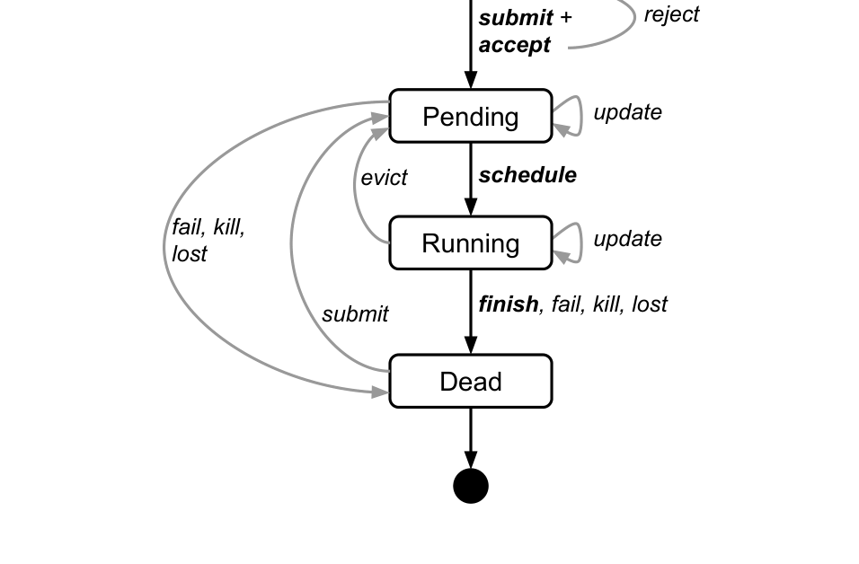
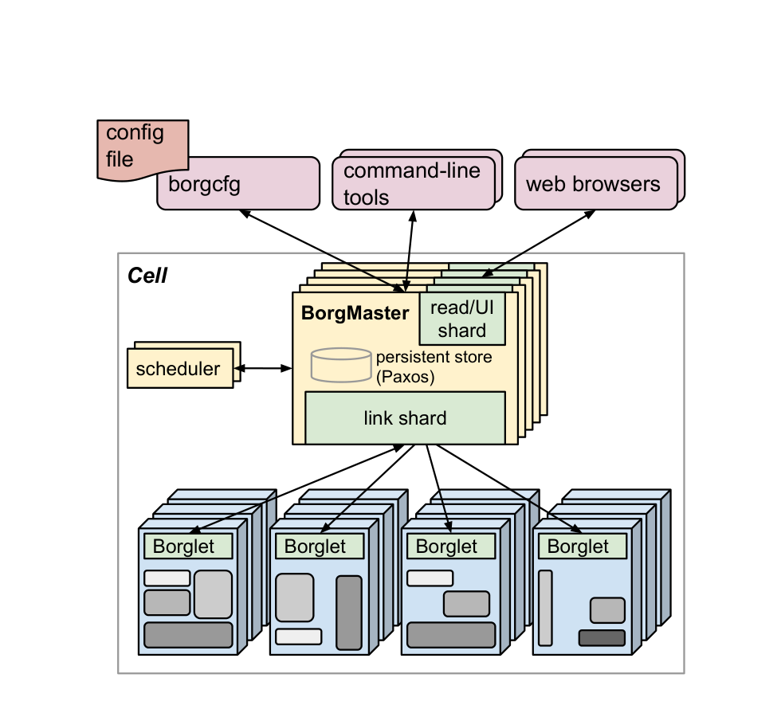
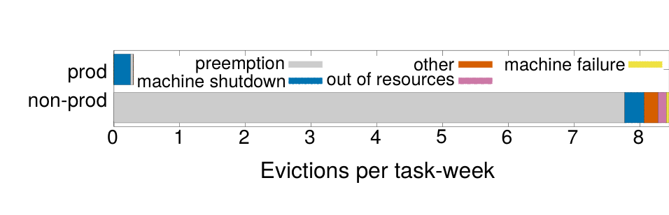
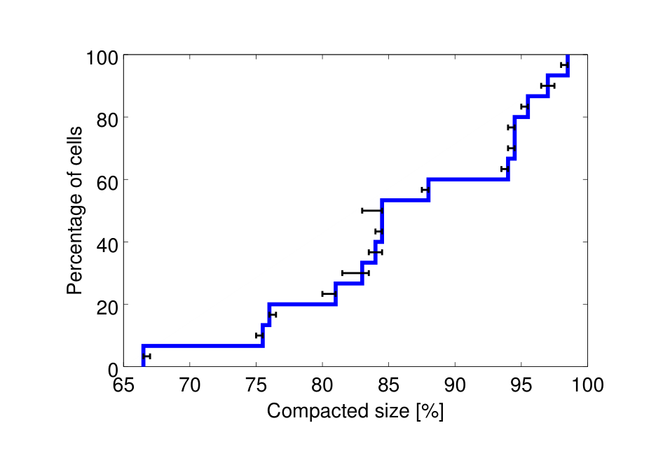
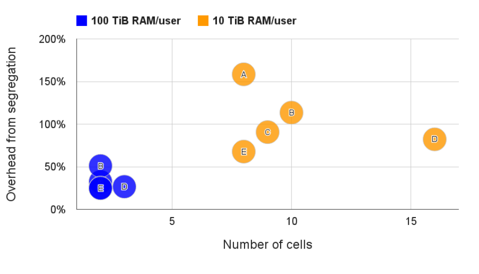
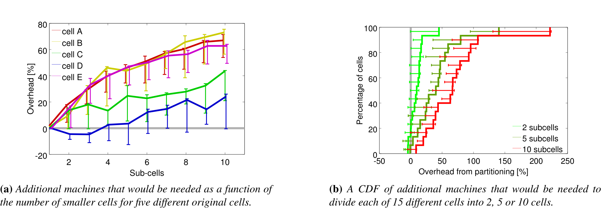
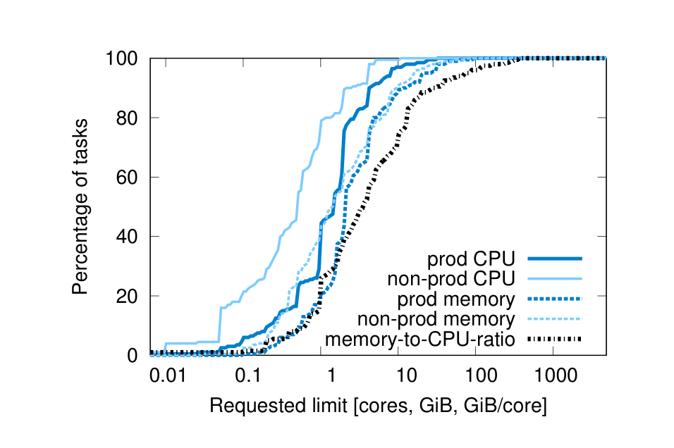
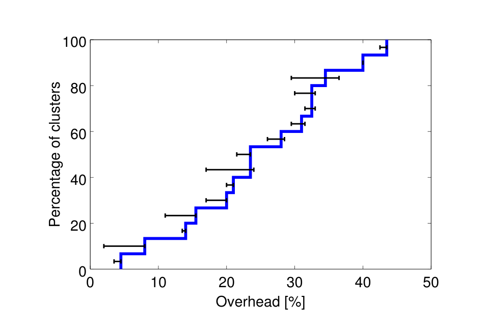

> **Source and translation basis｜来源与翻译依据**
>
> [Large-scale Cluster Management at Google with Borg](https://research.google/pubs/large-scale-cluster-management-at-google-with-borg/), published at EuroSys 2015. Archived PDF SHA-256: `2fdacd3b69f8af91477412fc91d1d858a43e764929a4edb646bd517ededdad94`.
>
> 原文来自 Google Research，并以本地归档 PDF 为唯一正文、图表与参考文献依据。本文按论文阅读顺序重建双栏内容，完整保留版权、脚注、图表题注和参考文献；中文翻译按语义段落紧随英文原文。
>
> **Reading context｜阅读背景：** 本文阅读时间安排在 2025 年 1 月，对应存算分离云原生数据库项目的 Kubernetes、Longhorn 与资源管理实践。阅读重点是追溯 Kubernetes 调度、容错、资源超卖和高利用率机制在 Borg 生产系统中的来源。

---

Abhishek Verma†, Luis Pedrosa‡, Madhukar Korupolu, David Oppenheimer, Eric Tune, John Wilkes — Google Inc.

> Abhishek Verma†、Luis Pedrosa‡、Madhukar Korupolu、David Oppenheimer、Eric Tune、John Wilkes——Google Inc.（谷歌公司）

† Work done while author was at Google. ‡ Currently at University of Southern California.

> † 作者在 Google 期间完成的工作。‡ 目前在南加州大学。

Permission to make digital or hard copies of part or all of this work for personal or classroom use is granted without fee provided that copies are not made or distributed for profit or commercial advantage and that copies bear this notice and the full citation on the first page. Copyrights for third-party components of this work must be honored. For all other uses, contact the owner/author(s). EuroSys’15, April 21–24, 2015, Bordeaux, France. Copyright is held by the owner/author(s). ACM 978-1-4503-3238-5/15/04. http://dx.doi.org/10.1145/2741948.2741964

> 允许免费制作部分或全部本作品的数字或硬拷贝供个人或课堂使用，前提是制作或分发副本不是为了盈利或商业利益，并且副本在首页上附有此通知和完整引用。必须尊重本作品第三方组件的版权。对于所有其他用途，请联系所有者/作者。EuroSys’15，2015 年 4 月 21-24 日，法国波尔多。版权归所有者/作者所有。ACM 978-1-4503-3238-5/15/04。http://dx.doi.org/10.1145/2741948.2741964

## Abstract｜摘要

Google’s Borg system is a cluster manager that runs hundreds of thousands of jobs, from many thousands of different applications, across a number of clusters each with up to tens of thousands of machines.

> 谷歌的 Borg 系统是一个集群管理器，它运行来自数千个不同应用程序的数十万个作业，跨多个集群，每个集群最多有数万台机器。

It achieves high utilization by combining admission control, efficient task-packing, over-commitment, and machine sharing with process-level performance isolation. It supports high-availability applications with runtime features that minimize fault-recovery time, and scheduling policies that reduce the probability of correlated failures. Borg simplifies life for its users by offering a declarative job specification language, name service integration, real-time job monitoring, and tools to analyze and simulate system behavior.

> 它通过将准入控制、高效任务装箱、超额分配、机器共享与进程级性能隔离相结合来实现高利用率。它支持高可用性应用程序，具有可最大限度缩短故障恢复时间的运行时功能，以及可降低相关故障概率的调度策略。Borg 通过提供声明式作业规范语言、名称服务集成、实时作业监控以及分析和模拟系统行为的工具，降低了用户的使用负担。

We present a summary of the Borg system architecture and features, important design decisions, a quantitative analysis of some of its policy decisions, and a qualitative examination of lessons learned from a decade of operational experience with it.

> 我们总结了 Borg 系统架构和功能、重要的设计决策、对其一些策略决策的定量分析，以及对十年运营经验教训的定性审查。

## 1 Introduction｜引言

The cluster management system we internally call Borg admits, schedules, starts, restarts, and monitors the full range of applications that Google runs. This paper explains how.

> 我们内部称为 Borg 的集群管理系统可以接纳、调度、启动、重新启动和监控 Google 运行的所有应用程序。本文解释其实现方式。

Borg provides three main benefits: it (1) hides the details of resource management and failure handling so its users can focus on application development instead; (2) operates with very high reliability and availability, and supports applications that do the same; and (3) lets us run workloads across tens of thousands of machines effectively. Borg is not the first system to address these issues, but it’s one of the few operating at this scale, with this degree of resiliency and completeness. This paper is organized around these topics, concluding with a set of qualitative observations we have made from operating Borg in production for more than a decade.

> Borg 提供了三个主要好处：(1) 隐藏资源管理和故障处理的细节，因此用户可以专注于应用程序开发；(2) 以非常高的可靠性和可用性运行，并支持具有相同功能的应用程序；(3) 让我们能够在数万台机器上有效运行工作负载。Borg 并不是第一个解决这些问题的系统，但它是少数几个以如此规模运行、具备如此强韧性与完备性的系统之一。本文围绕这些主题进行组织，最后总结了我们十多年来在生产中运行 Borg 时获得的一系列定性观察结果。

## 2 The user perspective｜用户视角

Borg’s users are Google developers and system administrators (site reliability engineers or SREs) that run Google’s applications and services. Users submit their work to Borg in the form of jobs, each of which consists of one or more tasks that all run the same program (binary). Each job runs in one Borg cell, a set of machines that are managed as a unit. The remainder of this section describes the main features exposed in the user view of Borg.

> Borg 的用户是运行 Google 应用程序和服务的 Google 开发人员和系统管理员（站点可靠性工程师或 SRE）。用户以作业的形式向 Borg 提交工作，每个作业都包含一个或多个运行相同程序（二进制）的任务。每个作业都在一个 Borg Cell 中运行，这是一组作为一个 Cell 进行管理的机器。本节的其余部分描述了 Borg 用户视图中公开的主要功能。

### 2.1 The workload｜工作负载

Borg cells run a heterogenous workload with two main parts. The first is long-running services that should “never” go down, and handle short-lived latency-sensitive requests (a few µs to a few hundred ms). Such services are used for end-user-facing products such as Gmail, Google Docs, and web search, and for internal infrastructure services (e.g., BigTable). The second is batch jobs that take from a few seconds to a few days to complete; these are much less sensitive to short-term performance fluctuations. The workload mix varies across cells, which run different mixes of applications depending on their major tenants (e.g., some cells are quite batch-intensive), and also varies over time: batch jobs come and go, and many end-user-facing service jobs see a diurnal usage pattern. Borg is required to handle all these cases equally well.

> Borg Cell 运行包含两个主要部分的异构工作负载。第一个是长期运行的服务，“永远”不应该停机，并处理短暂的延迟敏感请求（几微秒到几百毫秒）。此类服务用于面向最终用户的产品，例如 Gmail、Google Docs 和网络搜索，以及内部基础设施服务（例如 BigTable）。第二个是批处理作业，需要几秒到几天才能完成；它们对短期性能波动的敏感度要低得多。各个 Cell 的工作负载组合各不相同，这些 Cell 根据其主要租户运行不同的应用程序组合（例如，某些 Cell 是批处理密集型的），并且也随着时间的推移而变化：批处理作业来来去去，许多面向最终用户的服务作业呈现昼夜使用模式。Borg 必须同样妥善地处理所有这些情况。

A representative Borg workload can be found in a publicly-available month-long trace from May 2011 [80], which has been extensively analyzed (e.g., [68] and [1, 26, 27, 57]).

> 具有代表性的 Borg 工作负载可以在 2011 年 5 月公开的长达一个月的跟踪中找到，该跟踪已被广泛分析（例如，[68] 和 [1,26,27,57]）。

Many application frameworks have been built on top of Borg over the last few years, including our internal MapReduce system [23], FlumeJava [18], Millwheel [3], and Pregel [59]. Most of these have a controller that submits a master job and one or more worker jobs; the first two play a similar role to YARN’s application manager [76]. Our distributed storage systems such as GFS [34] and its successor CFS, Bigtable [19], and Megastore [8] all run on Borg.

> 在过去的几年里，许多应用程序框架都是建立在 Borg 之上的，包括我们内部的 MapReduce 系统 [23]、FlumeJava [18]、Millwheel [3] 和 Pregel [59]。其中大多数都有一个提交主作业和一个或多个辅助作业的控制器；前两个与 YARN 的应用程序管理器[76]的作用类似。我们的分布式存储系统，如 GFS [34] 及其后继者 CFS、Bigtable [19] 和 Megastore [8] 都运行在 Borg 上。

For this paper, we classify higher-priority Borg jobs as “production” (prod) ones, and the rest as “non-production” (non-prod). Most long-running server jobs are prod; most batch jobs are non-prod. In a representative cell, prod jobs are allocated about 70% of the total CPU resources and represent about 60% of the total CPU usage; they are allocated about 55% of the total memory and represent about 85% of the total memory usage. The discrepancies between allocation and usage will prove important in §5.5.

> 在本文中，我们将优先级较高的 Borg 作业分类为“生产”（prod）作业，其余分类为“非生产”（non-prod）作业。大多数长时间运行的服务器作业都是生产作业；大多数批处理作业都是非生产的。在代表性 Cell 中，生产作业获分配大约 70% 的总 CPU 资源，并且约占总 CPU 使用率的 60%；它们还获分配约 55% 的总内存，并约占总内存用量的 85%。这些分配量与实际用量的差异将在 §5.5 中发挥重要作用。

### 2.2 Clusters and cells｜集群与 Cell

The machines in a cell belong to a single cluster, defined by the high-performance datacenter-scale network fabric that connects them. A cluster lives inside a single datacenter building, and a collection of buildings makes up a site.1 A cluster usually hosts one large cell and may have a few smaller-scale test or special-purpose cells. We assiduously avoid any single point of failure.

> Cell 中的机器属于单个集群，由连接它们的高性能数据中心规模的网络结构定义。集群位于单个数据中心建筑物内，一组建筑物构成一个站点。1 集群通常托管一个大型 Cell，并且可能有一些较小规模的测试或特殊用途 Cell。我们努力避免任何单点故障。

1 There are a few exceptions for each of these relationships.

> 1 这些关系都有一些例外。

Our median cell size is about 10 k machines after excluding test cells; some are much larger. The machines in a cell are heterogeneous in many dimensions: sizes (CPU, RAM, disk, network), processor type, performance, and capabilities such as an external IP address or flash storage. Borg isolates users from most of these differences by determining where in a cell to run tasks, allocating their resources, installing their programs and other dependencies, monitoring their health, and restarting them if they fail.

> 排除测试 Cell 后，我们的 Cell 大小中值约为 10 k 台机器；有些要大得多。Cell 中的机器在许多方面都是异构的：大小（CPU、RAM、磁盘、网络）、处理器类型、性能以及外部 IP 地址或闪存等功能。Borg 通过确定 Cell 中运行任务的位置、分配资源、安装程序和其他依赖项、监控运行状况以及在失败时重新启动任务，将用户与大多数差异隔离开来。

### 2.3 Jobs and tasks｜作业与任务

A Borg job’s properties include its name, owner, and the number of tasks it has. Jobs can have constraints to force its tasks to run on machines with particular attributes such as processor architecture, OS version, or an external IP address. Constraints can be hard or soft; the latter act like preferences rather than requirements. The start of a job can be deferred until a prior one finishes. A job runs in just one cell.

> Borg 作业的属性包括其名称、所有者及其拥有的任务数量。作业可以设置约束，要求其任务在具有特定属性（例如处理器架构、操作系统版本或外部 IP 地址）的计算机上运行。约束可以是硬约束，也可以是软约束；后者更像是偏好而不是要求。一个作业的开始可以推迟到前一个作业完成为止。一项作业仅在一个 Cell 中运行。

Each task maps to a set of Linux processes running in a container on a machine [62]. The vast majority of the Borg workload does not run inside virtual machines (VMs), because we don’t want to pay the cost of virtualization. Also, the system was designed at a time when we had a considerable investment in processors with no virtualization support in hardware.

> 每个任务都映射到一组在机器上的容器中运行的 Linux 进程 [62]。绝大多数 Borg 工作负载不在虚拟机 (VM) 内运行，因为我们不愿承担虚拟化开销。此外，系统设计之初，我们已大量部署不支持硬件虚拟化的处理器。

A task has properties too, such as its resource requirements and the task’s index within the job. Most task properties are the same across all tasks in a job, but can be overridden – e.g., to provide task-specific command-line flags. Each resource dimension (CPU cores, RAM, disk space, disk access rate, TCP ports,2 etc.) is specified independently at fine granularity; we don’t impose fixed-sized buckets or slots (§5.4). Borg programs are statically linked to reduce dependencies on their runtime environment, and structured as packages of binaries and data files, whose installation is orchestrated by Borg.

> 任务也有属性，例如其资源需求和任务在作业中的索引。大多数任务属性在作业中的所有任务中都是相同的，但可以被覆盖——例如，提供特定于任务的命令行标志。每个资源维度（CPU 核、RAM、磁盘空间、磁盘访问速率、TCP 端口、2等）都是细粒度独立指定的；我们不强加固定大小的桶或槽（§5.4）。Borg 程序是静态链接的，以减少对其运行时环境的依赖，并组织成二进制文件与数据文件组成的包，由 Borg 负责安装编排。

2 Borg manages the available ports on a machine and allocates them to tasks.

> 2 Borg 管理机器上的可用端口并将它们分配给任务。

Users operate on jobs by issuing remote procedure calls (RPCs) to Borg, most commonly from a command-line tool, other Borg jobs, or our monitoring systems (§2.6). Most job descriptions are written in the declarative configuration language BCL. This is a variant of GCL [12], which generates protobuf files [67], extended with some Borg-specific keywords. GCL provides lambda functions to allow calculations, and these are used by applications to adjust their configurations to their environment; tens of thousands of BCL files are over 1 k lines long, and we have accumulated tens of millions of lines of BCL. Borg job configurations have similarities to Aurora configuration files [6].

> 用户通过向 Borg 发出远程过程调用 (RPC) 来操作作业，最常见的是从命令行工具、其他 Borg 作业或我们的监控系统（第 2.6 节）。大多数作业描述都是用声明式配置语言 BCL 编写的。这是 GCL [12] 的一个变体，它生成 protobuf 文件 [67]，并使用一些 Borg 特定的关键字进行扩展。GCL 提供 lambda 函数来允许计算，应用程序使用这些函数来调整其配置以适应其环境；数万个BCL文件长度超过1k行，我们已经积累了数千万行BCL。Borg 作业配置与 Aurora 配置文件 [6] 相似。

Figure 2 illustrates the states that jobs and tasks go through during their lifetime.

> 图 2 说明了作业和任务在其生命周期中经历的状态。

**Figure 2: The state diagram for both jobs and tasks. Users can trigger submit, kill, and update transitions.**

> **图 2：作业与任务共用的状态图。用户可以触发提交、终止和更新状态转换。**
>
> **图表中文解读：** 作业和任务都经过 Pending、Running、Dead 三个核心状态。调度、驱逐、失败、终止与滚动更新都被表达为可恢复的状态转换。

A user can change the properties of some or all of the tasks in a running job by pushing a new job configuration to Borg, and then instructing Borg to update the tasks to the new specification. This acts as a lightweight, non-atomic transaction that can easily be undone until it is closed (committed). Updates are generally done in a rolling fashion, and a limit can be imposed on the number of task disruptions (reschedules or preemptions) an update causes; any changes that would cause more disruptions are skipped.

> 用户可以通过将新的作业配置推送到 Borg，然后指示 Borg 将任务更新为新规范，来更改正在运行的作业中的部分或全部任务的属性。这充当轻量级、非原子事务，可以轻松撤消，直到关闭（提交）为止。更新通常以滚动方式完成，并且可以对更新导致的任务中断（重新调度或抢占）的数量施加限制；任何会造成更多中断的更改都会被跳过。

Some task updates (e.g., pushing a new binary) will always require the task to be restarted; some (e.g., increasing resource requirements or changing constraints) might make the task no longer fit on the machine, and cause it to be stopped and rescheduled; and some (e.g., changing priority) can always be done without restarting or moving the task.

> 某些任务更新（例如，推送新的二进制文件）始终需要重新启动任务；有些（例如，增加资源需求或改变约束）可能会使任务不再适合机器，并导致其停止和重新安排；有些（例如，更改优先级）始终可以在不重新启动或移动任务的情况下完成。

Tasks can ask to be notified via a Unix SIGTERM signal before they are preempted by a SIGKILL, so they have time to clean up, save state, finish any currently-executing requests, and decline new ones. The actual notice may be less if the preemptor sets a delay bound. In practice, a notice is delivered about 80% of the time.

> 任务在被 SIGKILL 抢占之前可以要求通过 Unix SIGTERM 信号获得通知，这样它们就有时间清理、保存状态、完成任何当前正在执行的请求并拒绝新请求。如果抢占者设置了延迟界限，则实际提前通知时间可能更短。实际上，大约 80% 的时间都会发出通知。

### 2.4 Allocs｜Alloc

A Borg alloc (short for allocation) is a reserved set of resources on a machine in which one or more tasks can be run; the resources remain assigned whether or not they are used. Allocs can be used to set resources aside for future tasks, to retain resources between stopping a task and starting it again, and to gather tasks from different jobs onto the same machine – e.g., a web server instance and an associated logsaver task that copies the server’s URL logs from the local disk to a distributed file system. The resources of an alloc are treated in a similar way to the resources of a machine; multiple tasks running inside one share its resources. If an alloc must be relocated to another machine, its tasks are rescheduled with it.

> Borg alloc（allocation 的缩写）是机器上的一组保留资源，可以在其中运行一个或多个任务；无论是否使用资源，资源都保持分配状态。alloc 可用于为未来任务预留资源，在停止任务和重新启动任务之间保留资源，以及将来自不同作业的任务收集到同一台机器上——例如，Web 服务器实例和关联的 logsaver 任务，将服务器的 URL 日志从本地磁盘复制到分布式文件系统。alloc 资源的处理方式与机器资源类似；在同一个 alloc 中运行的多个任务共享这些资源。如果必须把 alloc 迁移到另一台机器，则其任务将随之重新安排。

An alloc set is like a job: it is a group of allocs that reserve resources on multiple machines. Once an alloc set has been created, one or more jobs can be submitted to run in it. For brevity, we will generally use “task” to refer to an alloc or a top-level task (one outside an alloc) and “job” to refer to a job or alloc set.

> alloc set 类似于作业：它由一组在多台机器上预留资源的 alloc 构成。创建 alloc set 后，可以提交一个或多个作业在其中运行。为了简洁起见，我们通常使用“任务”来指代 alloc 或顶级任务（alloc 之外的任务），使用“作业”来指代作业或 alloc set。

### 2.5 Priority, quota, and admission control｜优先级、配额与准入控制

What happens when more work shows up than can be accommodated? Our solutions for this are priority and quota.

> 当出现的工作量超出了可容纳的量时会发生什么？我们对此的解决方案是优先级和配额。

Every job has a priority, a small positive integer. A high-priority task can obtain resources at the expense of a lower-priority one, even if that involves preempting (killing) the latter. Borg defines non-overlapping priority bands for different uses, including (in decreasing-priority order): monitoring, production, batch, and best effort (also known as testing or free). For this paper, prod jobs are the ones in the monitoring and production bands.

> 每个作业都有一个优先级，一个小的正整数。高优先级任务可以以牺牲低优先级任务为代价来获取资源，即使这涉及抢占（杀死）后者。Borg 为不同用途定义了不重叠的优先级范围，包括（按优先级递减顺序）：监控、生产、批量和尽力而为（也称为测试或免费）。在本文中，prod 作业是监控与生产优先级带中的作业。

Although a preempted task will often be rescheduled elsewhere in the cell, preemption cascades could occur if a high-priority task bumped out a slightly lower-priority one, which bumped out another slightly-lower priority task, and so on. To eliminate most of this, we disallow tasks in the production priority band to preempt one another. Fine-grained priorities are still useful in other circumstances – e.g., MapReduce master tasks run at a slightly higher priority than the workers they control, to improve their reliability.

> 尽管被抢占的任务通常会在 Cell 中的其他地方重新安排，但如果一个高优先级任务淘汰了一个优先级稍低的任务，而优先级稍低的任务又淘汰了另一个优先级稍低的任务，则可能会发生抢占级联，依此类推。为了消除其中大部分问题，我们不允许生产优先级范围内的任务相互抢占。细粒度的优先级在其他情况下仍然有用——例如，MapReduce 主任务以比它们控制的工作线程稍高的优先级运行，以提高其可靠性。

Priority expresses relative importance for jobs that are running or waiting to run in a cell. Quota is used to decide which jobs to admit for scheduling. Quota is expressed as a vector of resource quantities (CPU, RAM, disk, etc.) at a given priority, for a period of time (typically months). The quantities specify the maximum amount of resources that a user’s job requests can ask for at a time (e.g., “20 TiB of RAM at prod priority from now until the end of July in cell xx”). Quota-checking is part of admission control, not scheduling: jobs with insufficient quota are immediately rejected upon submission.

> 优先级表示 Cell 中正在运行或等待运行的作业的相对重要性。配额用于决定允许哪些作业进行调度。配额表示为一段时间内（通常为几个月）给定优先级的资源数量（CPU、RAM、磁盘等）的向量。这些数量指定用户的作业请求一次可以请求的最大资源量（例如，“从现在到 7 月底，Cell xx 中的产品优先级为 20 TiB RAM”）。配额检查是准入控制的一部分，而不是调度的一部分：配额不足的作业在提交后会立即被拒绝。

Higher-priority quota costs more than quota at lower-priority. Production-priority quota is limited to the actual resources available in the cell, so that a user who submits a production-priority job that fits in their quota can expect it to run, modulo fragmentation and constraints. Even though we encourage users to purchase no more quota than they need, many users overbuy because it insulates them against future shortages when their application’s user base grows. We respond to this by over-selling quota at lower-priority levels: every user has infinite quota at priority zero, although this is frequently hard to exercise because resources are oversubscribed. A low-priority job may be admitted but remain pending (unscheduled) due to insufficient resources.

> 较高优先级配额的成本高于较低优先级配额的成本。生产优先级配额仅限于 Cell 中的实际可用资源，因此提交适合其配额的生产优先级作业的用户可以期望该作业运行，模碎片和约束。尽管我们鼓励用户购买的配额不超过他们需要的数量，但许多用户还是过度购买，因为这样可以使他们在应用程序用户群增长时免受未来配额短缺的影响。我们通过超额销售较低优先级的配额来应对这一问题：每个用户在优先级为零时都拥有无限配额，尽管这通常很难行使，因为资源被超额认购。低优先级作业可能会被接纳，但由于资源不足而保持待定（未安排）。

Quota allocation is handled outside of Borg, and is intimately tied to our physical capacity planning, whose results are reflected in the price and availability of quota in different datacenters. User jobs are admitted only if they have sufficient quota at the required priority. The use of quota reduces the need for policies like Dominant Resource Fairness (DRF) [29, 35, 36, 66].

> 配额分配在 Borg 外部处理，与我们的物理容量规划密切相关，其结果反映在不同数据中心的配额价格和可用性中。仅当用户作业具有所需优先级的足够配额时，才会被允许。配额的使用减少了对主导资源公平（DRF）等策略的需求[29,35,36,66]。

Borg has a capability system that gives special privileges to some users; for example, allowing administrators to delete or modify any job in the cell, or allowing a user to access restricted kernel features or Borg behaviors such as disabling resource estimation (§5.5) on their jobs.

> Borg有一个能力系统，赋予某些用户特殊的权限；例如，允许管理员删除或修改 Cell 中的任何作业，或者允许用户访问受限的内核功能或 Borg 行为，例如在其作业上禁用资源估计（第 5.5 节）。

### 2.6 Naming and monitoring｜命名与监控

It’s not enough to create and place tasks: a service’s clients and other systems need to be able to find them, even after they are relocated to a new machine. To enable this, Borg creates a stable “Borg name service” (BNS) name for each task that includes the cell name, job name, and task number. Borg writes the task’s hostname and port into a consistent, highly-available file in Chubby [14] with this name, which is used by our RPC system to find the task endpoint. The BNS name also forms the basis of the task’s DNS name, so the fiftieth task in job jfoo owned by user ubar in cell cc would be reachable via 50.jfoo.ubar.cc.borg.google.com. Borg also writes job size and task health information into Chubby whenever it changes, so load balancers can see where to route requests to.

> 创建和放置任务是不够的：服务的客户端和其他系统需要能够找到它们，即使它们被重新定位到新机器之后也是如此。为了实现这一点，Borg 为每个任务创建一个稳定的“Borg 名称服务”(BNS) 名称，其中包括 Cell 名称、作业名称和任务编号。Borg 使用该名称将任务的主机名和端口写入 Chubby [14] 中一致的、高可用的文件中，我们的 RPC 系统使用该文件来查找任务端点。BNS 名称还构成了任务 DNS 名称的基础，因此 Cell cc 中用户 ubar 拥有的作业 jfoo 中的第 50 个任务可以通过 50.jfoo.ubar.cc.borg.google.com 访问。Borg 还会在作业大小和任务运行状况信息发生变化时将其写入 Chubby，因此负载均衡器可以了解将请求路由到何处。

Almost every task run under Borg contains a built-in HTTP server that publishes information about the health of the task and thousands of performance metrics (e.g., RPC latencies). Borg monitors the health-check URL and restarts tasks that do not respond promptly or return an HTTP error code. Other data is tracked by monitoring tools for dashboards and alerts on service level objective (SLO) violations.

> 几乎每个在 Borg 下运行的任务都包含一个内置的 HTTP 服务器，该服务器发布有关任务运行状况和数千个性能指标（例如 RPC 延迟）的信息。Borg 监视健康检查 URL 并重新启动未及时响应或返回 HTTP 错误代码的任务。其他数据通过仪表板监控工具进行跟踪，并针对服务级别目标 (SLO) 违规发出警报。

A service called Sigma provides a web-based user interface (UI) through which a user can examine the state of all their jobs, a particular cell, or drill down to individual jobs and tasks to examine their resource behavior, detailed logs, execution history, and eventual fate. Our applications generate voluminous logs; these are automatically rotated to avoid running out of disk space, and preserved for a while after the task’s exit to assist with debugging. If a job is not running Borg provides a “why pending?” annotation, together with guidance on how to modify the job’s resource requests to better fit the cell. We publish guidelines for “conforming” resource shapes that are likely to schedule easily.

> 名为 Sigma 的服务提供了一个基于 Web 的用户界面 (UI)，用户可以通过该界面检查所有作业、特定 Cell 的状态，或者深入到各个作业和任务以检查其资源行为、详细日志、执行历史记录和最终命运。我们的应用程序会生成大量日志；它们会自动轮换以避免磁盘空间不足，并在任务退出后保留一段时间以协助调试。如果作业没有运行，Borg 会提供“为什么待处理？”注释，以及有关如何修改作业的资源请求以更好地适应 Cell 的指导。我们发布了“符合”资源形状的指南，这些资源形状可以轻松调度。

Borg records all job submissions and task events, as well as detailed per-task resource usage information in Infrastore, a scalable read-only data store with an interactive SQL-like interface via Dremel [61]. This data is used for usage-based charging, debugging job and system failures, and long-term capacity planning. It also provided the data for the Google cluster workload trace [80].

> Borg 在 Infrastore 中记录所有作业提交和任务事件，以及详细的每个任务资源使用信息，Infrastore 是一个可扩展的只读数据存储，通过 Dremel [61] 具有交互式类似 SQL 的界面。该数据用于基于使用情况的计费、调试作业和系统故障以及长期容量规划。它还提供了 Google 集群工作负载跟踪的数据 [80]。

All of these features help users to understand and debug the behavior of Borg and their jobs, and help our SREs manage a few tens of thousands of machines per person.

> 所有这些功能都可以帮助用户理解和调试 Borg 的行为及其工作，并帮助我们的 SRE 管理每人数万台机器。

## 3 Borg architecture｜Borg 架构

A Borg cell consists of a set of machines, a logically centralized controller called the Borgmaster, and an agent process called the Borglet that runs on each machine in a cell (see Figure 1). All components of Borg are written in C++.

> 一个 Borg Cell 由一组机器、一个称为 Borgmaster 的逻辑集中式控制器以及一个称为 Borglet 的代理进程组成，该代理进程在 Cell 中的每台机器上运行（参见图 1）。Borg 的所有组件都是用 C++ 编写的。

**Figure 1: The high-level architecture of Borg. Only a tiny fraction of the thousands of worker nodes are shown.**

> **图 1：Borg 的高层架构。图中只画出了数千个工作节点中的极少一部分。**
>
> **图表中文解读：** 客户端把声明式作业配置交给 Borgmaster；Borgmaster 的持久状态由 Paxos 复制，调度器作出放置决策，各机器上的 Borglet 执行并上报任务状态。

### 3.1 Borgmaster｜Borgmaster

Each cell’s Borgmaster consists of two processes: the main Borgmaster process and a separate scheduler (§3.2). The main Borgmaster process handles client RPCs that either mutate state (e.g., create job) or provide read-only access to data (e.g., lookup job). It also manages state machines for all of the objects in the system (machines, tasks, allocs, etc.), communicates with the Borglets, and offers a web UI as a backup to Sigma.

> 每个 Cell 的 Borgmaster 由两个进程组成：主 Borgmaster 进程和一个单独的调度器（第 3.2 节）。主 Borgmaster 进程处理客户端 RPC，这些 RPC 要么改变状态（例如，创建作业），要么提供对数据的只读访问（例如，查找作业）。它还管理系统中所有对象（机器、任务、分配等）的状态机，与 Borglet 通信，并提供 Web UI 作为 Sigma 的备份。

The Borgmaster is logically a single process but is actually replicated five times. Each replica maintains an in-memory copy of most of the state of the cell, and this state is also recorded in a highly-available, distributed, Paxos-based store [55] on the replicas’ local disks. A single elected master per cell serves both as the Paxos leader and the state mutator, handling all operations that change the cell’s state, such as submitting a job or terminating a task on a machine. A master is elected (using Paxos) when the cell is brought up and whenever the elected master fails; it acquires a Chubby lock so other systems can find it. Electing a master and failing-over to the new one typically takes about 10 s, but can take up to a minute in a big cell because some in-memory state has to be reconstructed. When a replica recovers from an outage, it dynamically re-synchronizes its state from other Paxos replicas that are up-to-date.

> Borgmaster 逻辑上是一个进程，但实际上被复制了五次。每个副本都在内存中维护 Cell 大部分状态的副本，并且该状态也记录在副本本地磁盘上的高可用、分布式、基于 Paxos 的存储中 [55]。每个 Cell 选出的一个 Master 既充当 Paxos 领导者又充当状态变更器，处理所有改变 Cell 状态的操作，例如提交作业或终止机器上的任务。当 Cell 启动时以及每当当选的主节点失败时，就会选举主节点（使用 Paxos）；它获取一个 Chubby 锁，以便其他系统可以找到它。选择主节点并故障转移到新主节点通常需要大约 10 秒，但在大型 Cell 中可能最多需要一分钟，因为必须重建某些内存状态。当副本从中断中恢复时，它会动态地从其他最新的 Paxos 副本中重新同步其状态。

The Borgmaster’s state at a point in time is called a checkpoint, and takes the form of a periodic snapshot plus a change log kept in the Paxos store. Checkpoints have many uses, including restoring a Borgmaster’s state to an arbitrary point in the past (e.g., just before accepting a request that triggered a software defect in Borg so it can be debugged); fixing it by hand in extremis; building a persistent log of events for future queries; and offline simulations.

> Borgmaster 在某个时间点的状态称为检查点，采用定期快照加上保存在 Paxos 存储中的更改日志的形式。检查点有很多用途，包括将 Borgmaster 的状态恢复到过去的任意点（例如，在接受触发 Borg 中软件缺陷的请求之前，以便对其进行调试）；在极端情况下用手固定它；为将来的查询建立持久的事件日志；和离线模拟。

A high-fidelity Borgmaster simulator called Fauxmaster can be used to read checkpoint files, and contains a complete copy of the production Borgmaster code, with stubbed-out interfaces to the Borglets. It accepts RPCs to make state machine changes and perform operations, such as “schedule all pending tasks”, and we use it to debug failures, by interacting with it as if it were a live Borgmaster, with simulated Borglets replaying real interactions from the checkpoint file. A user can step through and observe the changes to the system state that actually occurred in the past. Fauxmaster is also useful for capacity planning (“how many new jobs of this type would fit?”), as well as sanity checks before making a change to a cell’s configuration (“will this change evict any important jobs?”).

> 名为 Fauxmaster 的高保真 Borgmaster 模拟器可用于读取检查点文件，并包含生产 Borgmaster 代码的完整副本，以及与 Borglet 的存根接口。它接受 RPC 来更改状态机并执行操作，例如“安排所有挂起的任务”，我们用它来调试故障，就像它是实时 Borgmaster 一样与它交互，并使用模拟 Borglet 重放检查点文件中的真实交互。用户可以单步执行并观察过去实际发生的系统状态的变化。Fauxmaster 对于容量规划（“适合多少个此类新作业？”）以及更改 Cell 配置之前的健全性检查（“此更改是否会驱逐任何重要作业？”）也很有用。

### 3.2 Scheduling｜调度

When a job is submitted, the Borgmaster records it persistently in the Paxos store and adds the job’s tasks to the pending queue. This is scanned asynchronously by the scheduler, which assigns tasks to machines if there are sufficient available resources that meet the job’s constraints. (The scheduler primarily operates on tasks, not jobs.) The scan proceeds from high to low priority, modulated by a round-robin scheme within a priority to ensure fairness across users and avoid head-of-line blocking behind a large job. The scheduling algorithm has two parts: feasibility checking, to find machines on which the task could run, and scoring, which picks one of the feasible machines.

> 当提交作业时，Borgmaster 将其永久记录在 Paxos 存储中，并将作业的任务添加到待处理队列中。这是由调度器异步扫描的，如果有足够的可用资源来满足作业的限制，调度器会将任务分配给机器。（调度器主要对任务进行操作，而不是作业。）扫描从高优先级到低优先级进行，并通过优先级内的循环方案进行调整，以确保用户之间的公平性并避免大型作业后面的队头阻塞。调度算法有两个部分：可行性检查，寻找可以运行任务的机器，以及评分，选择可行的机器之一。

In feasibility checking, the scheduler finds a set of machines that meet the task’s constraints and also have enough “available” resources – which includes resources assigned to lower-priority tasks that can be evicted. In scoring, the scheduler determines the “goodness” of each feasible machine. The score takes into account user-specified preferences, but is mostly driven by built-in criteria such as minimizing the number and priority of preempted tasks, picking machines that already have a copy of the task’s packages, spreading tasks across power and failure domains, and packing quality including putting a mix of high and low priority tasks onto a single machine to allow the high-priority ones to expand in a load spike.

> 在可行性检查中，调度器会找到一组满足任务约束并且具有足够“可用”资源的机器，其中包括分配给可以驱逐的较低优先级任务的资源。在评分时，调度器确定每个可行机器的“优度”。该分数考虑了用户指定的偏好，但主要由内置标准驱动，例如最小化抢占任务的数量和优先级、挑选已经拥有任务包副本的机器、跨电源和故障域分散任务以及打包质量，包括将高优先级和低优先级任务混合到一台机器上，以允许高优先级任务在负载峰值中扩展。

Borg originally used a variant of E-PVM [4] for scoring, which generates a single cost value across heterogeneous resources and minimizes the change in cost when placing a task. In practice, E-PVM ends up spreading load across all the machines, leaving headroom for load spikes – but at the expense of increased fragmentation, especially for large tasks that need most of the machine; we sometimes call this “worst fit”.

> Borg 最初使用 E-PVM [4] 的一种变体进行评分，它跨异构资源生成单一成本值，并在放置任务时最小化成本变化。在实践中，E-PVM 最终将负载分散到所有机器上，为负载峰值留出空间，但代价是碎片增加，特别是对于需要大部分机器的大型任务；我们有时称其为“最适合”。

The opposite end of the spectrum is “best fit”, which tries to fill machines as tightly as possible. This leaves some machines empty of user jobs (they still run storage servers), so placing large tasks is straightforward, but the tight packing penalizes any mis-estimations in resource requirements by users or Borg. This hurts applications with bursty loads, and is particularly bad for batch jobs which specify low CPU needs so they can schedule easily and try to run opportunistically in unused resources: 20% of non-prod tasks request less than 0.1 CPU cores.

> 频谱的另一端是“最适合”，它试图尽可能紧密地填充机器。这使得一些机器没有用户作业（它们仍然运行存储服务器），因此放置大型任务很简单，但紧密的包装会惩罚用户或 Borg 对资源需求的任何错误估计。这会损害具有突发负载的应用程序，对于指定低 CPU 需求的批处理作业尤其不利，以便它们可以轻松调度并尝试在未使用的资源中伺机运行：20% 的非生产任务请求少于 0.1 个 CPU 核心。

Our current scoring model is a hybrid one that tries to reduce the amount of stranded resources – ones that cannot be used because another resource on the machine is fully allocated. It provides about 3–5% better packing efficiency (defined in [78]) than best fit for our workloads.

> 我们当前的评分模型是一种混合模型，试图减少滞留资源的数量——由于机器上的另一个资源已完全分配而无法使用的资源。与best fit 在我们工作负载上的装箱效率（在[78]中定义）相比，它把装箱效率提高了约 3–5%。

If the machine selected by the scoring phase doesn’t have enough available resources to fit the new task, Borg preempts (kills) lower-priority tasks, from lowest to highest priority, until it does. We add the preempted tasks to the scheduler’s pending queue, rather than migrate or hibernate them.3 Task startup latency (the time from job submission to a task running) is an area that has received and continues to receive significant attention. It is highly variable, with the median typically about 25 s. Package installation takes about 80% of the total: one of the known bottlenecks is contention for the local disk where packages are written to. To reduce task startup time, the scheduler prefers to assign tasks to machines that already have the necessary packages (programs and data) installed: most packages are immutable and so can be shared and cached. (This is the only form of data locality supported by the Borg scheduler.) In addition, Borg distributes packages to machines in parallel using treeand torrent-like protocols.

> 如果评分阶段选择的机器没有足够的可用资源来适应新任务，Borg 会抢占（杀死）优先级较低的任务，从最低优先级到最高优先级，直到它满足为止。我们将抢占的任务添加到调度器的待处理队列中，而不是迁移或休眠它们。3 任务启动延迟（从作业提交到任务运行的时间）是一个已经受到并将继续受到高度关注的领域。它变化很大，中位数通常约为 25 秒。软件包安装大约占总数的 80%：已知的瓶颈之一是对写入软件包的本地磁盘的争用。为了减少任务启动时间，调度器更愿意将任务分配给已经安装了必要包（程序和数据）的机器：大多数包是不可变的，因此可以共享和缓存。（这是 Borg 调度器支持的唯一数据局部性形式。）此外，Borg 使用树和类似 torrent 的协议将包并行分发到机器。

3 Exception: tasks that provide virtual machines for Google Compute Engine users are migrated.

> 3 例外：为 Google Compute Engine 用户提供虚拟机的任务将被迁移。

Additionally, the scheduler uses several techniques to let it scale up to cells with tens of thousands of machines (§3.4).

> 此外，调度器使用多种技术使其扩展到具有数万台机器的 Cell（第 3.4 节）。

### 3.3 Borglet｜Borglet

The Borglet is a local Borg agent that is present on every machine in a cell. It starts and stops tasks; restarts them if they fail; manages local resources by manipulating OS kernel settings; rolls over debug logs; and reports the state of the machine to the Borgmaster and other monitoring systems.

> Borglet 是一个本地 Borg 代理，存在于 Cell 中的每台机器上。它启动和停止任务；如果失败则重新启动它们；通过操纵操作系统内核设置来管理本地资源；滚动调试日志；并向 Borgmaster 和其他监控系统报告机器的状态。

The Borgmaster polls each Borglet every few seconds to retrieve the machine’s current state and send it any outstanding requests. This gives Borgmaster control over the rate of communication, avoids the need for an explicit flow control mechanism, and prevents recovery storms [9].

> Borgmaster 每隔几秒轮询每个 Borglet，以检索机器的当前状态并向其发送任何未完成的请求。这使得 Borgmaster 可以控制通信速率，避免需要显式的流量控制机制，并防止恢复风暴 [9]。

The elected master is responsible for preparing messages to send to the Borglets and for updating the cell’s state with their responses. For performance scalability, each Borgmaster replica runs a stateless link shard to handle the communication with some of the Borglets; the partitioning is recalculated whenever a Borgmaster election occurs. For resiliency, the Borglet always reports its full state, but the link shards aggregate and compress this information by reporting only differences to the state machines, to reduce the update load at the elected master.

> 当选的 master 负责准备发送给 Borglet 的消息，并用它们的响应更新 cell 的状态。为了性能可扩展性，每个 Borgmaster 副本都运行一个无状态链接分片来处理与某些 Borglet 的通信；每当 Borgmaster 选举发生时，分区就会重新计算。为了实现弹性，Borglet 始终报告其完整状态，但链接分片通过仅向状态机报告差异来聚合和压缩此信息，以减少所选主节点的更新负载。

If a Borglet does not respond to several poll messages its machine is marked as down and any tasks it was running are rescheduled on other machines. If communication is restored the Borgmaster tells the Borglet to kill those tasks that have been rescheduled, to avoid duplicates. A Borglet continues normal operation even if it loses contact with the Borgmaster, so currently-running tasks and services stay up even if all Borgmaster replicas fail.

> 如果 Borglet 没有响应多个轮询消息，则其计算机将被标记为关闭，并且它正在运行的任何任务都会重新安排在其他计算机上。如果通信恢复，Borgmaster 会告诉 Borglet 终止那些已重新安排的任务，以避免重复。即使 Borglet 与 Borgmaster 失去联系，它也会继续正常运行，因此即使所有 Borgmaster 副本都发生故障，当前运行的任务和服务也会保持正常运行。

### 3.4 Scalability｜可扩展性

We are not sure where the ultimate scalability limit to Borg’s centralized architecture will come from; so far, every time we have approached a limit, we’ve managed to eliminate it. A single Borgmaster can manage many thousands of machines in a cell, and several cells have arrival rates above 10 000 tasks per minute. A busy Borgmaster uses 10–14 CPU cores and up to 50 GiB RAM. We use several techniques to achieve this scale.

> 我们不确定 Borg 中心化架构的最终可扩展性限制来自哪里；到目前为止，每当我们接近极限时，我们都会设法消除它。单个 Borgmaster 可以管理一个 Cell 中的数千台机器，并且多个 Cell 的到达率超过每分钟 10000 个任务。繁忙的 Borgmaster 使用 10-14 个 CPU 内核和高达 50 GiB RAM。我们使用多种技术来实现这一规模。

Early versions of Borgmaster had a simple, synchronous loop that accepted requests, scheduled tasks, and communicated with Borglets. To handle larger cells, we split the scheduler into a separate process so it could operate in parallel with the other Borgmaster functions that are replicated for failure tolerance. A scheduler replica operates on a cached copy of the cell state. It repeatedly: retrieves state changes from the elected master (including both assigned and pending work); updates its local copy; does a scheduling pass to assign tasks; and informs the elected master of those assignments. The master will accept and apply these assignments unless they are inappropriate (e.g., based on out of date state), which will cause them to be reconsidered in the scheduler’s next pass. This is quite similar in spirit to the optimistic concurrency control used in Omega [69], and indeed we recently added the ability for Borg to use different schedulers for different workload types.

> Borgmaster 的早期版本有一个简单的同步循环，用于接受请求、计划任务并与 Borglet 进行通信。为了处理更大的 Cell，我们将调度器分成一个单独的进程，以便它可以与其他为了容错而复制的 Borgmaster 函数并行运行。调度器副本对 Cell 状态的缓存副本进行操作。它重复：从当选的主节点检索状态更改（包括已分配的工作和待处理的工作）；更新其本地副本；进行调度以分配任务；并把这些分配通知当选的主节点。主节点会接受并应用这些分配，除非它们不合适（例如，基于过时的状态），这将导致它们在调度器的下一次传递中重新考虑。这在本质上与 Omega [69] 中使用的乐观并发控制非常相似，事实上，我们最近添加了 Borg 针对不同工作负载类型使用不同调度器的功能。

To improve response times, we added separate threads to talk to the Borglets and respond to read-only RPCs. For greater performance, we sharded (partitioned) these functions across the five Borgmaster replicas §3.3. Together, these keep the 99%ile response time of the UI below 1 s and the 95%ile of the Borglet polling interval below 10 s.

> 为了缩短响应时间，我们添加了单独的线程来与 Borglet 通信并响应只读 RPC。为了获得更好的性能，我们将这些功能分片（分区）到五个 Borgmaster 副本§3.3 中。总之，这些使 UI 的 99%ile 响应时间低于 1 秒，Borglet 轮询间隔的 95%ile 响应时间低于 10 秒。

Several things make the Borg scheduler more scalable:

> 有几个因素使 Borg 调度器更具可扩展性：

**Score caching:** Evaluating feasibility and scoring a machine is expensive, so Borg caches the scores until the properties of the machine or task change – e.g., a task on the machine terminates, an attribute is altered, or a task’s requirements change. Ignoring small changes in resource quantities reduces cache invalidations.

> **分数缓存：** 评估可行性并对机器评分的成本很高，因此 Borg 会缓存分数，直到机器或任务的属性发生变化——例如，机器上的任务终止、属性更改或任务的要求发生变化。忽略资源数量的微小变化可以减少缓存失效。

**Equivalence classes:** Tasks in a Borg job usually have identical requirements and constraints, so rather than determining feasibility for every pending task on every machine, and scoring all the feasible machines, Borg only does feasibility and scoring for one task per equivalence class – a group of tasks with identical requirements.

> **等价类：** Borg 作业中的任务通常具有相同的要求和约束，因此 Borg 不会确定每台机器上每个待处理任务的可行性并对所有可行的机器进行评分，而是只对每个等价类的一个任务（一组具有相同要求的任务）进行可行性和评分。

**Relaxed randomization:** It is wasteful to calculate feasibility and scores for all the machines in a large cell, so the scheduler examines machines in a random order until it has found “enough” feasible machines to score, and then selects the best within that set. This reduces the amount of scoring and cache invalidations needed when tasks enter and leave the system, and speeds up assignment of tasks to machines. Relaxed randomization is somewhat akin to the batch sampling of Sparrow [65] while also handling priorities, preemptions, heterogeneity and the costs of package installation.

> **宽松的随机化：**计算大型 Cell 中所有机器的可行性和分数是浪费的，因此调度器以随机顺序检查机器，直到找到“足够”的可行机器进行评分，然后选择该集合中最好的机器。这减少了任务进入和离开系统时所需的评分和缓存失效量，并加快了将任务分配给机器的速度。宽松的随机化有点类似于 Sparrow [65] 的批量采样，同时还处理优先级、抢占、异质性和软件包安装的成本。

In our experiments (§5), scheduling a cell’s entire workload from scratch typically took a few hundred seconds, but did not finish after more than 3 days when the above techniques were disabled. Normally, though, an online scheduling pass over the pending queue completes in less than half a second.

> 在我们的实验（第 5 节）中，从头开始调度 Cell 的整个工作负载通常需要几百秒，但在禁用上述技术时超过 3 天后仍未完成。不过，通常情况下，在线调度对待处理队列的一轮遍历会在不到半秒的时间内完成。

## 4 Availability｜可用性

Failures are the norm in large scale systems [10, 11, 22]. Figure 3 provides a breakdown of task eviction causes in 15 sample cells. Applications that run on Borg are expected to handle such events, using techniques such as replication, storing persistent state in a distributed file system, and (if appropriate) taking occasional checkpoints. Even so, we try to mitigate the impact of these events. For example, Borg:

> 故障是大型系统中的常态[10,11,22]。图 3 提供了 15 个样本 Cell 中任务驱逐原因的细分。在 Borg 上运行的应用程序需要使用复制、在分布式文件系统中存储持久状态以及（如果适用）按需制作检查点等技术来处理此类事件。即便如此，我们仍尽力减轻这些事件的影响。例如，Borg 会：

**Figure 3: Task-eviction rates and causes for production and non-production workloads. Data from August 1st 2013.**

> **图 3：生产与非生产工作负载的任务驱逐率及其原因。数据采自 2013 年 8 月 1 日。**
>
> **图表中文解读：** 生产任务很少被驱逐；非生产任务的大部分驱逐来自机器维护或关机，其次才是资源不足与抢占，这体现了优先级隔离策略。

- automatically reschedules evicted tasks, on a new machine if necessary;
- reduces correlated failures by spreading tasks of a job across failure domains such as machines, racks, and power domains;
- limits the allowed rate of task disruptions and the number of tasks from a job that can be simultaneously down during maintenance activities such as OS or machine upgrades;
- uses declarative desired-state representations and idempotent mutating operations, so that a failed client can harmlessly resubmit any forgotten requests;
- rate-limits finding new places for tasks from machines that become unreachable, because it cannot distinguish between large-scale machine failure and a network partition;
- avoids repeating task::machine pairings that cause task or machine crashes; and
- recovers critical intermediate data written to local disk by repeatedly re-running a logsaver task (§2.4), even if the alloc it was attached to is terminated or moved to another machine. Users can set how long the system keeps trying; a few days is common.

> - 必要时在新机器上自动重新调度被驱逐的任务；
> - 把同一作业的任务分散到机器、机架和供电域等不同故障域，以降低相关故障风险；
> - 限制任务中断速率，以及维护期间同一作业可同时停机的任务数量；
> - 使用声明式期望状态和幂等变更操作，使失败的客户端可以安全重提遗忘的请求；
> - 对失联机器上的任务重新选址实施限速，因为系统无法立即区分大规模机器故障与网络分区；
> - 避免再次采用曾导致任务或机器崩溃的 task::machine 配对；
> - 即使 alloc 已终止或迁移，也会反复重跑 logsaver 任务以恢复写入本地磁盘的关键中间数据（§2.4）。用户可以指定系统持续尝试的时长，通常会设为数天。

A key design feature in Borg is that already-running tasks continue to run even if the Borgmaster or a task’s Borglet goes down. But keeping the master up is still important because when it is down new jobs cannot be submitted or existing ones updated, and tasks from failed machines cannot be rescheduled.

> Borg 的一个关键设计功能是，即使 Borgmaster 或任务的 Borglet 宕机，已经运行的任务也会继续运行。但保持主节点可用仍然很重要，因为当它关闭时，无法提交新作业或更新现有作业，并且无法重新安排来自故障机器的任务。

Borgmaster uses a combination of techniques that enable it to achieve 99.99% availability in practice: replication for machine failures; admission control to avoid overload; and deploying instances using simple, low-level tools to minimize external dependencies. Each cell is independent of the others to minimize the chance of correlated operator errors and failure propagation. These goals, not scalability limitations, are the primary argument against larger cells.

> Borgmaster 使用了多种技术组合，使其在实践中实现了 99.99% 的可用性：通过复制容忍机器故障；准入控制以避免过载；使用简单的低级工具部署实例以最大程度地减少外部依赖性。每个 Cell 都独立于其他 Cell，以最大限度地减少相关运维人员失误和故障传播的机会。这些目标，而不是可扩展性限制，是反对更大 Cell 的主要论点。

## 5 Utilization｜利用率

One of Borg’s primary goals is to make efficient use of Google’s fleet of machines, which represents a significant financial investment: increasing utilization by a few percentage points can save millions of dollars. This section discusses and evaluates some of the policies and techniques that Borg uses to do so.

> Borg 的主要目标之一是高效利用 Google 的机器群，这代表着一项重大的财务投资：将利用率提高几个百分点可以节省数百万美元。本节讨论并评估 Borg 为此使用的一些策略和技术。

### 5.1 Evaluation methodology｜评估方法

Our jobs have placement constraints and need to handle rare workload spikes, our machines are heterogenous, and we run batch jobs in resources reclaimed from service jobs. So, to evaluate our policy choices we needed a more sophisticated metric than “average utilization”. After much experimentation we picked cell compaction: given a workload, we found out how small a cell it could be fitted into by removing machines until the workload no longer fitted, repeatedly re-packing the workload from scratch to ensure that we didn’t get hung up on an unlucky configuration. This provided clean termination conditions and facilitated automated comparisons without the pitfalls of synthetic workload generation and modeling [31]. A quantitative comparison of evaluation techniques can be found in [78]: the details are surprisingly subtle.

> 我们的作业有放置限制，需要处理罕见的工作负载峰值，我们的机器是异构的，并且我们在从服务作业回收的资源中运行批处理作业。因此，为了评估我们的策略选择，我们需要一个比“平均利用率”更复杂的指标。经过大量实验，我们选择了 Cell 压实：给定一个工作负载，我们通过移除机器直到工作负载不再适合为止，确定该工作负载最小能装入多大的 Cell，然后反复从头重新装箱工作负载，以确保我们不会陷入不幸的配置中。这提供了明确的终止条件并促进了自动比较，并避开合成工作负载生成和建模的陷阱[31]。评估技术的定量比较可以在[78]中找到：细节令人惊讶地微妙。

It wasn’t possible to perform experiments on live production cells, but we used Fauxmaster to obtain high-fidelity simulation results, using data from real production cells and workloads, including all their constraints, actual limits, reservations, and usage data (§5.5). This data came from Borg checkpoints taken on Wednesday 2014-10-01 14:00 PDT. (Other checkpoints produced similar results.) We picked 15 Borg cells to report on by first eliminating special-purpose, test, and small (< 5000 machines) cells, and then sampled the remaining population to achieve a roughly even spread across the range of sizes.

> 不可能在实时生产 Cell 上进行实验，但我们使用 Fauxmaster 来获得高保真模拟结果，使用来自真实生产 Cell 和工作负载的数据，包括所有约束、实际限制、预留和使用数据（第 5.5 节）。该数据来自太平洋夏令时 2014 年 10 月 1 日星期三 14:00 采集的Borg 检查点。（其他检查点也产生了类似的结果。）我们首先消除了特殊用途、测试和小型（< 5000 台机器）Cell，然后对剩余群体进行了采样，以在大小范围内实现大致均匀的分布，从而选择了 15 个 Borg Cell 进行报告。

To maintain machine heterogeneity in the compacted cell we randomly selected machines to remove. To maintain workload heterogeneity, we kept it all, except for server and storage tasks tied to a particular machine (e.g., the Borglets). We changed hard constraints to soft ones for jobs larger than half the original cell size, and allowed up to 0.2% tasks to go pending if they were very “picky” and could only be placed on a handful of machines; extensive experiments showed that this produced repeatable results with low variance. If we needed a larger cell than the original we cloned the original cell a few times before compaction; if we needed more cells, we just cloned the original.

> 为了保持压缩 Cell 中机器的异质性，我们随机选择要移除的机器。为了保持工作负载异构性，我们保留了所有内容，除了与特定机器（例如 Borglet）相关的服务器和存储任务。对于大于原始 Cell 大小一半的作业，我们将硬约束改为软约束，并且如果任务非常“挑剔”并且只能放置在少数机器上，则允许最多 0.2% 的任务处于待处理状态；大量实验表明，这产生了低方差的可重复结果。如果我们需要比原始 Cell 更大的 Cell，我们会在压缩之前克隆原始 Cell 几次；如果我们需要更多 Cell，我们只需克隆原始 Cell 即可。

Each experiment was repeated 11 times for each cell with different random-number seeds. In the graphs, we use an error bar to display the min and max of the number of machines needed, and select the 90%ile value as the “result” – the mean or median would not reflect what a system administrator would do if they wanted to be reasonably sure that the workload would fit. We believe cell compaction provides a fair, consistent way to compare scheduling policies, and it translates directly into a cost/benefit result: better policies require fewer machines to run the same workload.

> 每个 Cell 的每个实验用不同的随机数种子重复 11 次。在图表中，我们使用误差条来显示所需机器数量的最小值和最大值，并选择 90%ile 值作为“结果”——平均值或中位数不会反映系统管理员在合理确定工作负载适合的情况下会采取的措施。我们相信 Cell 压实提供了一种公平、一致的方式来比较调度策略，并且它直接转化为成本/收益结果：更好的策略需要更少的机器来运行相同的工作负载。

Our experiments focused on scheduling (packing) a workload from a point in time, rather than replaying a long-term workload trace. This was partly to avoid the difficulties of coping with open and closed queueing models [71, 79], partly because traditional time-to-completion metrics don’t apply to our environment with its long-running services, partly to provide clean signals for making comparisons, partly because we don’t believe the results would be significantly different, and partly a practical matter: we found ourselves consuming 200 000 Borg CPU cores for our experiments at one point—even at Google’s scale, this is a non-trivial investment.

> 我们的实验侧重于从某个时间点调度（打包）工作负载，而不是重播长期工作负载跟踪。这部分是为了避免应对开放式和封闭式队列模型的困难 [71, 79]，部分是因为传统的完成时间指标不适用于我们的长期运行服务的环境，部分是为了提供清晰的信号进行比较，部分是因为我们不相信结果会有显著差异，部分是一个实际问题：我们发现自己在实验中曾经消耗了 200 000 个 Borg CPU 核心——即使在 Google 的规模下，这个是一笔不可忽视的投入。

In production, we deliberately leave significant headroom for workload growth, occasional “black swan” events, load spikes, machine failures, hardware upgrades, and large-scale partial failures (e.g., a power supply bus duct). Figure 4 shows how much smaller our real-world cells would be if we were to apply cell compaction to them. The baselines in the graphs that follow use these compacted sizes.

> 在生产中，我们故意为工作负载增长、偶尔的“黑天鹅”事件、负载峰值、机器故障、硬件升级和大规模部分故障（例如电源母线槽）留出很大的空间。图 4 显示了如果我们对真实世界的 Cell 应用 Cell 压实，它们会小多少。下图中的基线使用这些压缩尺寸。

**Figure 4: The effects of compaction. A CDF of the percentage of original cell size achieved after compaction, across 15 cells.**

> **图 4：压实的效果。该图给出 15 个 Cell 压实后规模占原始规模比例的累积分布函数（CDF）。**
>
> **图表中文解读：** 压实会重新打包任务、估计一个 Cell 实际需要多少机器。多数 Cell 可压缩到原规模的约 80%–100%，说明放置碎片确实存在但差异较大。

### 5.2 Cell sharing｜Cell 共享

Nearly all of our machines run both prod and non-prod tasks at the same time: 98% of the machines in shared Borg cells, 83% across the entire set of machines managed by Borg. (We have a few dedicated cells for special uses.) Since many other organizations run user-facing and batch jobs in separate clusters, we examined what would happen if we did the same. Figure 5 shows that segregating prod and non-prod work would need 20–30% more machines in the median cell to run our workload. That’s because prod jobs usually reserve resources to handle rare workload spikes, but don’t use these resources most of the time. Borg reclaims the unused resources (§5.5) to run much of the non-prod work, so we need fewer machines overall.

> 几乎我们所有的机器都同时运行生产和非生产任务：98% 的机器位于共享 Borg Cell 中，83% 位于 Borg 管理的整套机器中。（我们有一些用于特殊用途的专用 Cell。）由于许多其他组织在单独的集群中运行面向用户的批处理作业，因此我们研究了如果我们这样做会发生什么。图 5 显示，隔离生产和非生产工作将需要中间 Cell 中多 20-30% 的机器来运行我们的工作负载。这是因为生产作业通常会保留资源来处理罕见的工作负载峰值，但大多数时候并不使用这些资源。Borg 回收未使用的资源（第 5.5 节）来运行大部分非生产工作，因此我们总体上需要的机器更少。

![Figure 5: Segregating prod and non-prod work into different cells would need more machines. Both graphs show how many extra machines would be needed if the prod and non-prod workloads were sent to separate cells, expressed as a percentage of the minimum number of machines required to run the workload in a single cell. In this, and subsequent CDF plots, the value shown for each cell is derived from the 90%ile of the different cell sizes our experiment trials produced; the error bars show the complete range of values from the trials.](./figure-05.png)

**Figure 5: Segregating prod and non-prod work into different cells would need more machines. Both graphs show how many extra machines would be needed if the prod and non-prod workloads were sent to separate cells, expressed as a percentage of the minimum number of machines required to run the workload in a single cell. In this, and subsequent CDF plots, the value shown for each cell is derived from the 90%ile of the different cell sizes our experiment trials produced; the error bars show the complete range of values from the trials.**

> **图 5：把 prod 与 non-prod 工作放入不同 Cell 会需要更多机器。两幅图都以单一 Cell 运行该工作负载所需的最少机器数为基准，给出拆分后增加的机器比例；本图及后续 CDF 图中，每个 Cell 的值取多次试验结果的第 90 百分位，误差线表示完整取值范围。**
>
> **图表中文解读：** prod 与 non-prod 混部能够共享互补的资源峰谷；把二者硬拆开会显著增加总机器数，这是 Borg 追求混部的直接容量依据。

Most Borg cells are shared by thousands of users. Figure 6 shows why. For this test, we split off a user’s workload into a new cell if they consumed at least 10 TiB of memory (or 100 TiB). Our existing policy looks good: even with the larger threshold, we would need 2–16× as many cells, and 20–150% additional machines. Once again, pooling resources significantly reduces costs.

> 大多数 Borg Cell 由数千名用户共享。图 6 显示了原因。对于此测试，如果用户消耗至少 10 TiB（或 100 TiB）内存，我们会将用户的工作负载拆分到一个新 Cell 中。我们现有的策略看起来不错：即使阈值更大，我们也需要 2-16 倍的 Cell 和 20-150% 的额外机器。集中资源再次显著降低了成本。

**Figure 6: Segregating users would need more machines. The total number of cells and the additional machines that would be needed if users larger than the threshold shown were given their own private cells, for 5 different cells.**

> **图 6：按用户隔离会需要更多机器。图中针对 5 个 Cell，给出当规模超过所示阈值的用户分别获得私有 Cell 时所需的 Cell 总数与额外机器数。**
>
> **图表中文解读：** 为大用户单建 Cell 会同时增加 Cell 数和容量冗余。隔离边界越多，跨用户统计复用机会越少。

But perhaps packing unrelated users and job types onto the same machines results in CPU interference, and so we would need more machines to compensate? To assess this, we looked at how the CPI (cycles per instruction) changed for tasks in different environments running on the same machine type with the same clock speed. Under these conditions, CPI values are comparable and can be used as a proxy for performance interference, since a doubling of CPI doubles the runtime of a CPU-bound program. The data was gathered from ∼12000 randomly selected prod tasks over a week, counting cycles and instructions over a 5 minute interval using the hardware profiling infrastructure described in [83], and weighting samples so that every second of CPU time is counted equally. The results were not clear-cut.

> 但也许将不相关的用户和作业类型打包到同一台机器上会导致 CPU 干扰，因此我们需要更多的机器来补偿？为了评估这一点，我们研究了在具有相同时钟速度的相同机器类型上运行的不同环境中的任务的 CPI（每条指令的周期）如何变化。在这些条件下，CPI 值具有可比性，并且可以用作性能干扰的代理，因为 CPI 加倍会使 CPU 密集型程序的运行时间加倍。数据是从一周内随机选择的约 12000 个生产任务中收集的，使用[83]中描述的硬件分析基础设施对 5 分钟间隔内的周期和指令进行计数，并对样本进行加权，以便平等地计算每一秒的 CPU 时间。结果并不明确。

(1) We found that CPI was positively correlated with two measurements over the same time interval: the overall CPU usage on the machine, and (largely independently) the number of tasks on the machine; adding a task to a machine increases the CPI of other tasks by 0.3% (using a linear model fitted to the data); increasing machine CPU usage by 10% increases CPI by less than 2%. But even though the correlations are statistically significant, they only explain 5% of the variance we saw in CPI measurements; other factors dominate, such as inherent differences in applications and specific interference patterns [24, 83].

> (1) 我们发现 CPI 与同一时间间隔内的两个测量值呈正相关：机器上的总体 CPU 使用率，以及（很大程度上独立地）机器上的任务数量；向机器添加一项任务会使其他任务的 CPI 增加 0.3%（使用拟合数据的线性模型）；机器 CPU 使用率增加 10%，CPI 增加不到 2%。但即使相关性在统计上显著，它们也只能解释我们在 CPI 测量中看到的 5% 的方差；其他因素占主导地位，例如应用的固有差异和特定的干扰模式 [24, 83]。

(2) Comparing the CPIs we sampled from shared cells to ones from a few dedicated cells with less diverse applications, we saw a mean CPI of 1.58 (σ = 0.35) in shared cells and a mean of 1.53 (σ = 0.32) in dedicated cells – i.e., CPU performance is about 3% worse in shared cells.

> (2) 比较我们从共享 Cell 中采样的 CPI 与应用程序多样性较低的一些专用 Cell 中的 CPI，我们发现共享 Cell 中的平均 CPI 为 1.58 (σ = 0.35)，而专用 Cell 中的平均值为 1.53 (σ = 0.32) – 即，共享 Cell 中的 CPU 性能大约差 3%。

(3) To address the concern that applications in different cells might have different workloads, or even suffer selection bias (maybe programs that are more sensitive to interference had been moved to dedicated cells), we looked at the CPI of the Borglet, which runs on all the machines in both types of cell. We found it had a CPI of 1.20 (σ = 0.29) in dedicated cells and 1.43 (σ = 0.45) in shared ones, suggesting that it runs 1.19× as fast in a dedicated cell as in a shared one, although this over-weights the effect of lightly loaded machines, slightly biasing the result in favor of dedicated cells.

> (3) 为了解决不同 Cell 中的应用程序可能有不同的工作负载，甚至遭受选择偏差（可能对干扰更敏感的程序已移至专用 Cell）的问题，我们查看了 Borglet 的 CPI，它运行在两种类型 Cell 的所有机器上。我们发现，专用 Cell 中的 CPI 为 1.20 (σ = 0.29)，共享 Cell 中的 CPI 为 1.43 (σ = 0.45)，这表明专用 Cell 中的运行速度是共享 Cell 中的 1.19 倍，尽管这会过度加权轻负载机器的影响，使结果稍微偏向于专用 Cell。

These experiments confirm that performance comparisons at warehouse-scale are tricky, reinforcing the observations in [51], and also suggest that sharing doesn’t drastically increase the cost of running programs.

> 这些实验证实，仓库规模的性能比较很棘手，强化了[51]中的观察结果，并且还表明共享不会大幅增加运行程序的成本。

But even assuming the least-favorable of our results, sharing is still a win: the CPU slowdown is outweighed by the decrease in machines required over several different partitioning schemes, and the sharing advantages apply to all resources including memory and disk, not just CPU.

> 但即使假设我们的结果最不利，共享仍然是一种胜利：CPU 速度的下降被几种不同分区方案所需机器的减少所抵消，并且共享优势适用于所有资源，包括内存和磁盘，而不仅仅是 CPU。

### 5.3 Large cells｜大型 Cell

Google builds large cells, both to allow large computations to be run, and to decrease resource fragmentation. We tested the effects of the latter by partitioning the workload for a cell across multiple smaller cells – by first randomly permuting the jobs and then assigning them in a round-robin manner among the partitions. Figure 7 confirms that using smaller cells would require significantly more machines.

> Google 构建大型 Cell，既可以运行大型计算，又可以减少资源碎片。我们通过将一个 Cell 的工作负载划分到多个较小的 Cell 来测试后者的效果——首先随机排列作业，然后在分区之间以循环方式分配它们。图 7 证实，使用较小的 Cell 将需要更多的机器。

**Figure 7: Subdividing cells into smaller ones would require more machines. The additional machines (as a percentage of the single-cell case) that would be needed if we divided these particular cells into a varying number of smaller cells.**

> **图 7：把 Cell 划分为更小的 Cell 会需要更多机器。图中给出把指定 Cell 拆成不同数量的小 Cell 后，相对于单 Cell 情况增加的机器比例。**
>
> **图表中文解读：** 大 Cell 提供更大的装箱搜索空间与统计复用池；拆得越细，额外机器开销总体越高。

### 5.4 Fine-grained resource requests｜细粒度资源请求

Borg users request CPU in units of milli-cores, and memory and disk space in bytes. (A core is a processor hyperthread, normalized for performance across machine types.) Figure 8 shows that they take advantage of this granularity: there are few obvious “sweet spots” in the amount of memory or CPU cores requested, and few obvious correlations between these resources. These distributions are quite similar to the ones presented in [68], except that we see slightly larger memory requests at the 90%ile and above.

> Borg 用户请求 CPU 以毫核为单位，内存和磁盘空间以字节为单位。（核心是处理器超线程，针对不同机器类型的性能进行标准化。）图 8 显示它们利用了这种粒度：在请求的内存或 CPU 核心数量方面几乎没有明显的“最佳点”，而且这些资源之间也几乎没有明显的相关性。这些分布与 [68] 中提出的分布非常相似，除了我们在 90%ile 及以上看到稍大的内存请求。

**Figure 8: No bucket sizes fit most of the tasks well. CDF of requested CPU and memory requests across our sample cells. No one value stands out, although a few integer CPU core sizes are somewhat more popular.**

> **图 8：没有一种桶大小能够很好地适配大多数任务。图中给出样本 Cell 内 CPU 与内存请求量的 CDF；没有哪个值格外突出，只有少数整数 CPU 核数略受欢迎。**
>
> **图表中文解读：** 资源请求分布连续而分散，不存在少数天然规格可以覆盖大部分任务，因此 Borg 不采用固定大小的资源槽。

Offering a set of fixed-size containers or virtual machines, although common among IaaS (infrastructure-as-a-service) providers [7, 33], would not be a good match to our needs. To show this, we “bucketed” CPU core and memory resource limits for prod jobs and allocs (§2.4) by rounding them up to the next nearest power of two in each resource dimension, starting at 0.5 cores for CPU and 1 GiB for RAM. Figure 9 shows that doing so would require 30–50% more resources in the median case. The upper bound comes from allocating an entire machine to large tasks that didn’t fit after quadrupling the original cell before compaction began; the lower bound from allowing these tasks to go pending. (This is less than the roughly 100% overhead reported in [37] because we supported more than 4 buckets and permitted CPU and RAM capacity to scale independently.)

> 提供一组固定大小的容器或虚拟机虽然在 IaaS（基础设施即服务）提供商中很常见 [7, 33]，但并不能很好地满足我们的需求。为了说明这一点，我们通过将每个资源维度中的下一个最接近的 2 的幂四舍五入，对生产作业和分配（第 2.4 节）的 CPU 核心和内存资源限制进行“分桶”处理，从 CPU 0.5 核心和 RAM 1 GiB 开始。图 9 显示，在中值情况下，这样做将需要多 30-50% 的资源。上限来自于将整个机器分配给在压缩开始之前将原始 Cell 四倍放大后不适合的大型任务；允许这些任务挂起的下限。（这低于 [37] 中报告的大约 100% 的开销，因为我们支持超过 4 个存储桶，并允许 CPU 和 RAM 容量独立扩展。）

**Figure 9: “Bucketing” resource requirements would need more machines. A CDF of the additional overheads that would result from rounding up CPU and memory requests to the next nearest powers of 2 across 15 cells. The lower and upper bounds straddle the actual values (see the text).**

> **图 9：对资源需求量“分桶”会需要更多机器。图中给出把 15 个 Cell 的 CPU 与内存请求向上取整到最近的 2 的幂后产生的额外开销 CDF；上下界包围实际值。**
>
> **图表中文解读：** 把请求向上取整到固定桶会把内部碎片转化成真实容量成本；桶越粗，CPU 与内存的联合浪费越明显。

### 5.5 Resource reclamation｜资源回收

A job can specify a resource limit – an upper bound on the resources that each task should be granted. The limit is used by Borg to determine if the user has enough quota to admit the job, and to determine if a particular machine has enough free resources to schedule the task. Just as there are users who buy more quota than they need, there are users who request more resources than their tasks will use, because Borg will normally kill a task that tries to use more RAM or disk space than it requested, or throttle CPU to what it asked for. In addition, some tasks occasionally need to use all their resources (e.g., at peak times of day or while coping with a denial-of-service attack), but most of the time do not.

> 作业可以指定资源限制——每个任务应授予的资源上限。Borg 使用该限制来确定用户是否有足够的配额来接受作业，并确定特定计算机是否有足够的可用资源来调度任务。正如有些用户购买的配额超出了他们的需要一样，有些用户请求的资源超过了他们的任务使用的资源，因为 Borg 通常会终止尝试使用比其请求更多的 RAM 或磁盘空间的任务，或者将 CPU 限制在其请求的范围内。此外，某些任务偶尔需要使用所有资源（例如，在一天的高峰时间或应对拒绝服务攻击时），但大多数时间不需要。

Rather than waste allocated resources that are not currently being consumed, we estimate how many resources a task will use and reclaim the rest for work that can tolerate lower-quality resources, such as batch jobs. This whole process is called resource reclamation. The estimate is called the task’s reservation, and is computed by the Borgmaster every few seconds, using fine-grained usage (resource-consumption) information captured by the Borglet. The initial reservation is set equal to the resource request (the limit); after 300 s, to allow for startup transients, it decays slowly towards the actual usage plus a safety margin. The reservation is rapidly increased if the usage exceeds it.

> 我们不会浪费当前未消耗的已分配资源，而是估计任务将使用多少资源，并将剩余资源回收用于可以容忍较低质量资源的工作（例如批处理作业）。这整个过程称为资源回收。该估计称为任务的预留，由 Borgmaster 每隔几秒使用 Borglet 捕获的细粒度使用（资源消耗）信息进行计算。初始预留设置等于资源请求（限制）；300 秒后，为了允许启动瞬变，它会缓慢衰减到实际使用情况加上安全裕度。如果使用量超过，预留量会迅速增加。

The Borg scheduler uses limits to calculate feasibility (§3.2) for prod tasks,4 so they never rely on reclaimed resources and aren’t exposed to resource oversubscription; for non-prod tasks, it uses the reservations of existing tasks so the new tasks can be scheduled into reclaimed resources.

> Borg 调度器使用限制来计算生产任务 4 的可行性（第 3.2 节），因此它们从不依赖回收的资源，也不会面临资源超额订阅的情况；对于非生产任务，它使用现有任务的预留，以便可以将新任务安排到回收的资源中。

4 To be precise, high-priority latency-sensitive ones – see §6.2.

> 4 准确地说，是高优先级的延迟敏感型——请参阅第 6.2 节。

A machine may run out of resources at runtime if the reservations (predictions) are wrong – even if all tasks use less than their limits. If this happens, we kill or throttle non-prod tasks, never prod ones.

> 如果预留（预测）错误，机器可能会在运行时耗尽资源——即使所有任务使用的资源都低于其限制。如果发生这种情况，我们会杀死或限制非生产任务，而不是生产任务。

Figure 10 shows that many more machines would be required without resource reclamation. About 20% of the workload (§6.2) runs in reclaimed resources in a median cell.

> 图 10 显示，如果不进行资源回收，将需要更多的机器。大约 20% 的工作负载（第 6.2 节）在中值 Cell 中的回收资源中运行。

**Figure 10: Resource reclamation is quite effective. A CDF of the additional machines that would be needed if we disabled it for 15 representative cells.**

> **图 10：资源回收非常有效。图中给出在 15 个代表性 Cell 中禁用资源回收后所需额外机器数的 CDF。**
>
> **图表中文解读：** 若只按请求上限而不回收未用资源，代表性 Cell 需要明显增加机器。资源回收是 Borg 高利用率的核心来源。

We can see more details in Figure 11, which shows the ratio of reservations and usage to limits. A task that exceeds its memory limit will be the first to be preempted if resources are needed, regardless of its priority, so it is rare for tasks to exceed their memory limit. On the other hand, CPU can readily be throttled, so short-term spikes can push usage above reservation fairly harmlessly.

> 我们可以在图 11 中看到更多详细信息，它显示了预留和使用与限制的比率。超出内存限制的任务无论其优先级如何，如果需要资源，都会最先被抢占，因此任务超出内存限制的情况很少见。另一方面，CPU 很容易受到限制，因此短期峰值可以相当无害地推动使用量超过预留。

**Figure 11: Resource estimation is successful at identifying unused resources. The dotted lines shows CDFs of the ratio of CPU and memory usage to the request (limit) for tasks across 15 cells. Most tasks use much less than their limit, although a few use more CPU than requested. The solid lines show the CDFs of the ratio of CPU and memory reservations to the limits; these are closer to 100%. The straight lines are artifacts of the resource-estimation process.**

> **图 11：资源估算能够成功识别未使用资源。虚线表示 15 个 Cell 内任务的 CPU、内存实际用量与请求上限之比，实线表示预留量与上限之比；直线段是资源估算过程造成的形态。**
>
> **图表中文解读：** 任务通常远未用满请求上限；Borg 用保守的预留量承诺可用资源，再把上限与实际用量之间的空间用于超卖。

Figure 11 suggests that resource reclamation may be unnecessarily conservative: there is significant area between the reservation and usage lines. To test this, we picked a live production cell and adjusted the parameters of its resource estimation algorithm to an aggressive setting for a week by reducing the safety margin, and then to an medium setting that was mid-way between the baseline and aggressive settings for the next week, and then reverted to the baseline.

> 图 11 表明资源回收可能过于保守：预留线和使用线之间存在很大的区域。为了测试这一点，我们选择了一个实时生产 Cell，并通过降低安全裕度将其资源估计算法的参数调整为激进设置一周，然后在下周调整为介于基线和激进设置之间的中等设置，然后恢复到基线。

Figure 12 shows what happened. Reservations are clearly closer to usage in the second week, and somewhat less so in the third, with the biggest gaps shown in the baseline weeks (1st and 4th). As anticipated, the rate of out-of-memory (OOM) events increased slightly in weeks 2 and 3.5 After reviewing these results, we decided that the net gains outweighed the downsides, and deployed the medium resource reclamation parameters to other cells.

> 图 12 显示了发生的情况。第二周的预订量显然更接近使用量，而第三周的预订量则有所下降，其中最大的差距出现在基准周（第一周和第四周）。正如预期的那样，内存不足 (OOM) 事件的发生率在第 2 周和第 3 周略有增加。5 在审查这些结果后，我们认为净收益超过了缺点，并将中等资源回收参数部署到其他 Cell。

5 The anomaly at the end of week 3 is unrelated to this experiment.

> 5 第 3 周结束时的异常与本实验无关。

**Figure 12: More aggressive resource estimation can reclaim more resources, with little effect on out-of-memory events (OOMs). A timeline (starting on 2013-11-11) for one production cell of usage, reservation and limit averaged over 5-minute windows and cumulative out-of-memory events; the slope of the latter is the aggregate rate of OOMs. Vertical bars separate weeks with different resource estimation settings.**

> **图 12：更激进的资源估算可以回收更多资源，而对内存不足事件影响很小。时间线展示一个生产 Cell 的用量、预留量、上限和累计 OOM；竖线分隔采用不同估算设置的周。**
>
> **图表中文解读：** 逐步调低安全余量后，预留量明显下降而 OOM 斜率变化有限，说明基于历史用量的估算能在风险可控时释放容量。

## 6 Isolation｜隔离

50% of our machines run 9 or more tasks; a 90%ile machine has about 25 tasks and will be running about 4500 threads [83]. Although sharing machines between applications increases utilization, it also requires good mechanisms to prevent tasks from interfering with one another. This applies to both security and performance.

> 我们 50% 的机器运行 9 个或更多任务；90%ile 的机器大约有 25 个任务，并且将运行大约 4500 个线程 [83]。虽然应用程序之间共享机器可以提高利用率，但也需要良好的机制来防止任务相互干扰。这适用于安全性和性能。

### 6.1 Security isolation｜安全隔离

We use a Linux chroot jail as the primary security isolation mechanism between multiple tasks on the same machine. To allow remote debugging, we used to distribute (and rescind) ssh keys automatically to give a user access to a machine only while it was running tasks for the user. For most users, this has been replaced by the borgssh command, which collaborates with the Borglet to construct an ssh connection to a shell that runs in the same chroot and cgroup as the task, locking down access even more tightly.

> 我们使用 Linux chroot Jail 作为同一台机器上多个任务之间的主要安全隔离机制。为了允许远程调试，我们过去常常自动分发（和撤销）ssh 密钥，以便仅在计算机为用户运行任务时才允许用户访问计算机。对于大多数用户来说，它已被 borgssh 命令取代，该命令与 Borglet 协作构建到 shell 的 ssh 连接，该 shell 与任务在相同的 chroot 和 cgroup 中运行，从而更紧密地锁定访问。

VMs and security sandboxing techniques are used to run external software by Google’s AppEngine (GAE) [38] and Google Compute Engine (GCE). We run each hosted VM in a KVM process [54] that runs as a Borg task.

> Google 的 AppEngine (GAE) [38] 和 Google Compute Engine (GCE) 使用虚拟机和安全沙箱技术来运行外部软件。我们在作为 Borg 任务运行的 KVM 进程 [54] 中运行每个托管 VM。

### 6.2 Performance isolation｜性能隔离

Early versions of Borglet had relatively primitive resource isolation enforcement: post-hoc usage checking of memory, disk space and CPU cycles, combined with termination of tasks that used too much memory or disk and aggressive application of Linux’s CPU priorities to rein in tasks that used too much CPU. But it was still too easy for rogue tasks to affect the performance of other tasks on the machine, so some users inflated their resource requests to reduce the number of tasks that Borg could co-schedule with theirs, thus decreasing utilization. Resource reclamation could claw back some of the surplus, but not all, because of the safety margins involved. In the most extreme cases, users petitioned to use dedicated machines or cells.

> Borglet 的早期版本具有相对原始的资源隔离实施：内存、磁盘空间和 CPU 周期的事后使用情况检查，结合终止使用过多内存或磁盘的任务，以及积极应用 Linux 的 CPU 优先级来控制使用过多 CPU 的任务。但流氓任务仍然很容易影响机器上其他任务的性能，因此一些用户夸大了他们的资源请求，以减少 Borg 可以与他们共同调度的任务数量，从而降低利用率。由于涉及安全边际，资源回收可以收回部分盈余，但不是全部。在最极端的情况下，用户请求使用专用机器或 Cell。

Now, all Borg tasks run inside a Linux cgroup-based resource container [17, 58, 62] and the Borglet manipulates the container settings, giving much improved control because the OS kernel is in the loop. Even so, occasional low-level resource interference (e.g., memory bandwidth or L3 cache pollution) still happens, as in [60, 83].

> 现在，所有 Borg 任务都在基于 Linux cgroup 的资源容器内运行 [17,58,62]，并且 Borglet 操纵容器设置，从而大大改进了控制，因为操作系统内核处于循环中。即便如此，偶尔的低级资源干扰（例如内存带宽或 L3 缓存污染）仍然会发生，如[60, 83]中所示。

To help with overload and overcommitment, Borg tasks have an application class or appclass. The most important distinction is between the latency-sensitive (LS) appclasses and the rest, which we call batch in this paper. LS tasks are used for user-facing applications and shared infrastructure services that require fast response to requests. High-priority LS tasks receive the best treatment, and are capable of temporarily starving batch tasks for several seconds at a time.

> 为了帮助解决过载和过度使用问题，Borg 任务有一个应用程序类或应用程序类。最重要的区别是延迟敏感 (LS) 应用程序类与其他应用程序类（在本文中我们将其称为批处理）之间的区别。LS 任务用于需要快速响应请求的面向用户的应用程序和共享基础设施服务。高优先级 LS 任务会得到最好的处理，并且能够一次暂时使批处理任务饥饿几秒钟。

A second split is between compressible resources (e.g., CPU cycles, disk I/O bandwidth) that are rate-based and can be reclaimed from a task by decreasing its quality of service without killing it; and non-compressible resources (e.g., memory, disk space) which generally cannot be reclaimed without killing the task. If a machine runs out of non-compressible resources, the Borglet immediately terminates tasks, from lowest to highest priority, until the remaining reservations can be met. If the machine runs out of compressible resources, the Borglet throttles usage (favoring LS tasks) so that short load spikes can be handled without killing any tasks. If things do not improve, Borgmaster will remove one or more tasks from the machine.

> 第二种划分是可压缩资源（例如 CPU 周期、磁盘 I/O 带宽）之间的划分，这些资源是基于速率的，可以通过降低任务的服务质量而不杀死它来从任务中回收；不可压缩资源（例如内存、磁盘空间），通常在不终止任务的情况下无法回收。如果机器用完不可压缩资源，Borglet 会立即终止任务（从最低优先级到最高优先级），直到满足剩余的预留。如果机器用完可压缩资源，Borglet 会限制使用（有利于 LS 任务），以便可以在不终止任何任务的情况下处理短负载峰值。如果情况没有改善，Borgmaster 将从机器中删除一项或多项任务。

A user-space control loop in the Borglet assigns memory to containers based on predicted future usage (for prod tasks) or on memory pressure (for non-prod ones); handles Out-of-Memory (OOM) events from the kernel; and kills tasks when they try to allocate beyond their memory limits, or when an over-committed machine actually runs out of memory. Linux’s eager file-caching significantly complicates the implementation because of the need for accurate memory-accounting.

> Borglet 中的用户空间控制循环根据预测的未来使用情况（对于生产任务）或内存压力（对于非生产任务）将内存分配给容器；处理来自内核的内存不足 (OOM) 事件；当任务试图分配超出其内存限制时，或者当过度使用的机器实际上耗尽内存时，就会终止任务。由于需要精确的内存统计，Linux 急切的文件缓存使实现变得非常复杂。

To improve performance isolation, LS tasks can reserve entire physical CPU cores, which stops other LS tasks from using them. Batch tasks are permitted to run on any core, but they are given tiny scheduler shares relative to the LS tasks. The Borglet dynamically adjusts the resource caps of greedy LS tasks in order to ensure that they do not starve batch tasks for multiple minutes, selectively applying CFS bandwidth control when needed [75]; shares are insufficient because we have multiple priority levels.

> 为了提高性能隔离，LS 任务可以保留整个物理 CPU 核心，从而阻止其他 LS 任务使用它们。批处理任务可以在任何核心上运行，但相对于 LS 任务，它们的调度器份额很小。Borglet 动态调整贪婪 LS 任务的资源上限，以确保它们不会使批处理任务饿死多分钟，并在需要时选择性地应用 CFS 带宽控制 [75]；份额不足，因为我们有多个优先级。

Like Leverich [56], we found that the standard Linux CPU scheduler (CFS) required substantial tuning to support both low latency and high utilization. To reduce scheduling delays, our version of CFS uses extended per-cgroup load history [16], allows preemption of batch tasks by LS tasks, and reduces the scheduling quantum when multiple LS tasks are runnable on a CPU. Fortunately, many of our applications use a thread-per-request model, which mitigates the effects of persistent load imbalances. We sparingly use cpusets to allocate CPU cores to applications with particularly tight latency requirements. Some results of these efforts are shown in Figure 13. Work continues in this area, adding thread placement and CPU management that is NUMA-, hyperthreading-, and power-aware (e.g., [81]), and improving the control fidelity of the Borglet.

> 与 Leverich [56] 一样，我们发现标准 Linux CPU 调度器 (CFS) 需要大量调整才能支持低延迟和高利用率。为了减少调度延迟，我们的 CFS 版本使用扩展的每 cgroup 负载历史记录 [16]，允许 LS 任务抢占批处理任务，并在多个 LS 任务在 CPU 上运行时减少调度时间片。幸运的是，我们的许多应用程序都使用每个请求一个线程的模型，这可以减轻持续负载不平衡的影响。我们很少使用 cpuset 将 CPU 核心分配给延迟要求特别严格的应用程序。这些努力的一些结果如图 13 所示。该领域的工作仍在继续，添加了 NUMA、超线程和功耗感知的线程放置和 CPU 管理（例如，[81]），并提高了 Borglet 的控制保真度。

![Figure 13: Scheduling delays as a function of load. A plot of how often a runnable thread had to wait longer than 1ms to get access to a CPU, as a function of how busy the machine was. In each pair of bars, latency-sensitive tasks are on the left, batch ones on the right. In only a few percent of the time did a thread have to wait longer than 5 ms to access a CPU (the white bars); they almost never had to wait longer (the darker bars). Data from a representative cell for the month of December 2013; error bars show day-to-day variance.](./figure-13.png)

**Figure 13: Scheduling delays as a function of load. A plot of how often a runnable thread had to wait longer than 1ms to get access to a CPU, as a function of how busy the machine was. In each pair of bars, latency-sensitive tasks are on the left, batch ones on the right. In only a few percent of the time did a thread have to wait longer than 5 ms to access a CPU (the white bars); they almost never had to wait longer (the darker bars). Data from a representative cell for the month of December 2013; error bars show day-to-day variance.**

> **图 13：负载变化下的调度延迟。每组柱中左侧为延迟敏感任务、右侧为批处理任务；即使机器很忙，线程等待 CPU 超过 5 ms 的情况也只占很小比例。**
>
> **图表中文解读：** CPU 竞争会随机器利用率上升而增加，但延迟敏感任务受到更强保护；大部分等待仍低于 1 ms 或 5 ms 阈值。

Tasks are permitted to consume resources up to their limit. Most of them are allowed to go beyond that for compressible resources like CPU, to take advantage of unused (slack) resources. Only 5% of LS tasks disable this, presumably to get better predictability; fewer than 1% of batch tasks do. Using slack memory is disabled by default, because it increases the chance of a task being killed, but even so, 10% of LS tasks override this, and 79% of batch tasks do so because it’s a default setting of the MapReduce framework. This complements the results for reclaimed resources (§5.5). Batch tasks are willing to exploit unused as well as reclaimed memory opportunistically: most of the time this works, although the occasional batch task is sacrificed when an LS task needs resources in a hurry.

> 允许任务消耗资源至其限制。它们中的大多数都被允许超出 CPU 等可压缩资源的范围，以利用未使用的（闲置）资源。只有 5% 的 LS 任务禁用此功能，大概是为了获得更好的可预测性；只有不到 1% 的批处理任务会这样做。默认情况下，使用松弛内存是禁用的，因为它会增加任务被杀死的机会，但即便如此，10% 的 LS 任务会覆盖这一点，79% 的批处理任务会这样做，因为这是 MapReduce 框架的默认设置。这补充了回收资源的结果（§5.5）。批处理任务愿意机会性地利用未使用和回收的内存：大多数情况下这是有效的，尽管当 LS 任务急需资源时偶尔会牺牲批处理任务。

## 7 Related work｜相关工作

Resource scheduling has been studied for decades, in contexts as varied as wide-area HPC supercomputing Grids, networks of workstations, and large-scale server clusters. We focus here on only the most relevant work in the context of large-scale server clusters.

> 资源调度的研究已经有几十年了，其背景多种多样，例如广域 HPC 超级计算网格、工作站网络和大型服务器集群。我们在这里只关注大规模服务器集群环境中最相关的工作。

Several recent studies have analyzed cluster traces from Yahoo!, Google, and Facebook [20, 52, 63, 68, 70, 80, 82], and illustrate the challenges of scale and heterogeneity inherent in these modern datacenters and workloads. [69] contains a taxonomy of cluster manager architectures.

> 最近的几项研究分析了来自 Yahoo!、Google 和 Facebook [20、52、63、68、70、80、82] 的集群跟踪，并说明了这些现代数据中心和工作负载固有的规模和异构性挑战。[69]包含集群管理器架构的分类。

Apache Mesos [45] splits the resource management and placement functions between a central resource manager (somewhat like Borgmaster minus its scheduler) and multiple “frameworks” such as Hadoop [41] and Spark [73] using an offer-based mechanism. Borg mostly centralizes these functions using a request-based mechanism that scales quite well. DRF [29, 35, 36, 66] was initially developed for Mesos; Borg uses priorities and admission quotas instead. The Mesos developers have announced ambitions to extend Mesos to include speculative resource assignment and reclamation, and to fix some of the issues identified in [69].

> Apache Mesos [45] 使用基于报价的机制，在中央资源管理器（有点像 Borgmaster 减去其调度器）和多个“框架”（例如 Hadoop [41] 和 Spark [73]）之间分割资源管理和放置功能。Borg 主要使用可扩展性良好的基于​​请求的机制来集中这些功能。DRF [29,35,36,66]最初是为Mesos开发的；Borg 使用优先级和准入配额来代替。Mesos 开发人员已经宣布了扩展 Mesos 的雄心，以包括推测性资源分配和回收，并解决 [69] 中确定的一些问题。

YARN [76] is a Hadoop-centric cluster manager. Each application has a manager that negotiates for the resources it needs with a central resource manager; this is much the same scheme that Google MapReduce jobs have used to obtain resources from Borg since about 2008. YARN’s resource manager only recently became fault tolerant. A related open-source effort is the Hadoop Capacity Scheduler [42] which provides multi-tenant support with capacity guarantees, hierarchical queues, elastic sharing and fairness. YARN has recently been extended to support multiple resource types, priorities, preemptions, and advanced admission control [21]. The Tetris research prototype [40] supports makespan-aware job packing.

> YARN [76] 是一个以 Hadoop 为中心的集群管理器。每个应用程序都有一个管理器，负责与中央资源管理器协商所需的资源；这与 Google MapReduce 作业自 2008 年左右以来从 Borg 获取资源的方案大致相同。YARN 的资源管理器最近才变得具有容错能力。一个相关的开源项目是 Hadoop Capacity Scheduler [42]，它提供多租户支持，包括容量保证、分层队列、弹性共享和公平性。YARN 最近已扩展为支持多种资源类型、优先级、抢占和高级准入控制 [21]。俄罗斯方块研究原型 [40] 支持 makespan 感知的作业打包。

Facebook’s Tupperware [64], is a Borg-like system for scheduling cgroup containers on a cluster; only a few details have been disclosed, although it seems to provide a form of resource reclamation. Twitter has open-sourced Aurora [5], a Borg-like scheduler for long running services that runs on top of Mesos, with a configuration language and state machine similar to Borg’s.

> Facebook 的 Tupperware [64] 是一个类似 Borg 的系统，用于在集群上调度 cgroup 容器；虽然它似乎提供了一种资源回收的形式，但只披露了一些细节。Twitter 开源了 Aurora [5]，这是一个类似 Borg 的调度器，用于在 Mesos 之上运行的长期运行服务，具有与 Borg 类似的配置语言和状态机。

The Autopilot system from Microsoft [48] provides “automating software provisioning and deployment; system monitoring; and carrying out repair actions to deal with faulty software and hardware” for Microsoft clusters. The Borg ecosystem provides similar features, but space precludes a discussion here; Isaard [48] outlines many best practices that we adhere to as well.

> 微软的 Autopilot 系统[48]为微软集群提供“自动化软件配置和部署；系统监控；并执行修复操作以处理有故障的软件和硬件”。Borg 生态系统提供了类似的功能，但篇幅有限，无法在此讨论；Isaard [48] 概述了我们也遵循的许多最佳实践。

Quincy [49] uses a network flow model to provide fairness and data locality-aware scheduling for data-processing DAGs on clusters of a few hundred nodes. Borg uses quota and priorities to share resources among users and scales to tens of thousands of machines. Quincy handles execution graphs directly while this is built separately on top of Borg.

> Quincy [49] 使用网络流模型为数百个节点的集群上的数据处理 DAG 提供公平性和数据局部性感知调度。Borg 使用配额和优先级在用户之间共享资源，并可扩展到数万台机器。Quincy 直接处理执行图，而它是在 Borg 之上单独构建的。

Cosmos [44] focuses on batch processing, with an emphasis on ensuring that its users get fair access to resources they have donated to the cluster. It uses a per-job manager to acquire resources; few details are publicly available.

> Cosmos [44] 专注于批处理，重点是确保其用户能够公平地访问他们捐赠给集群的资源。它使用每个作业管理器来获取资源；公开的细节很少。

Microsoft’s Apollo system [13] uses per-job schedulers for short-lived batch jobs to achieve high throughput on clusters that seem to be comparably-sized to Borg cells. Apollo uses opportunistic execution of lower-priority background work to boost utilization to high levels at the cost of (sometimes) multi-day queueing delays. Apollo nodes provide a prediction matrix of starting times for tasks as a function of size over two resource dimensions, which the schedulers combine with estimates of startup costs and remote-data-access to make placement decisions, modulated by random delays to reduce collisions. Borg uses a central scheduler for placement decisions based on state about prior allocations, can handle more resource dimensions, and focuses on the needs of high-availability, long-running applications; Apollo can probably handle a higher task arrival rate.

> 微软的 Apollo 系统 [13] 使用每作业调度器来执行短期批处理作业，以在与 Borg Cell 大小相当的集群上实现高吞吐量。Apollo 利用低优先级后台工作的机会执行来将利用率提高到高水平，但代价是（有时）多天的排队延迟。Apollo 节点提供任务启动时间的预测矩阵，作为两个资源维度大小的函数，调度器将其与启动成本和远程数据访问的估计相结合以做出放置决策，并通过随机延迟进行调制以减少冲突。Borg 使用中央调度器根据先前分配的状态进行放置决策，可以处理更多资源维度，并专注于高可用性、长时间运行的应用程序的需求；Apollo 或许可以处理更高的任务到达率。

Alibaba’s Fuxi [84] supports data-analysis workloads; it has been running since 2009. Like Borgmaster, a central FuxiMaster (replicated for failure-tolerance) gathers resource-availability information from nodes, accepts requests from applications, and matches one to the other. The Fuxi incremental scheduling policy is the inverse of Borg’s equivalence classes: instead of matching each task to one of a suitable set of machines, Fuxi matches newly-available resources against a backlog of pending work. Like Mesos, Fuxi allows “virtual resource” types to be defined. Only synthetic workload results are publicly available.

> 阿里巴巴的伏羲[84]支持数据分析工作负载；它自 2009 年以来一直在运行。与 Borgmaster 一样，中央 FuxiMaster（为了容错而进行复制）从节点收集资源可用性信息，接受来自应用程序的请求，并将其与另一个进行匹配。Fuxi增量调度策略与Borg的等价类相反：Fuxi不是将每个任务与一组合适的机器匹配，而是将新可用的资源与积压的待处理工作进行匹配。与 Mesos 一样，Fuxi 允许定义“虚拟资源”类型。仅公开综合工作负载结果。

Omega [69] supports multiple parallel, specialized “verticals” that are each roughly equivalent to a Borgmaster minus its persistent store and link shards. Omega schedulers use optimistic concurrency control to manipulate a shared representation of desired and observed cell state stored in a central persistent store, which is synced to/from the Borglets by a separate link component. The Omega architecture was designed to support multiple distinct workloads that have their own application-specific RPC interface, state machines, and scheduling policies (e.g., long-running servers, batch jobs from various frameworks, infrastructure services like cluster storage systems, virtual machines from the Google Cloud Platform). On the other hand, Borg offers a “one size fits all” RPC interface, state machine semantics, and scheduler policy, which have grown in size and complexity over time as a result of needing to support many disparate workloads, and scalability has not yet been a problem (§3.4).

> Omega [69] 支持多个并行的、专门的“垂直领域”，每个垂直领域大致相当于 Borgmaster 减去其持久存储和链接分片。Omega 调度器使用乐观并发控制来操作存储在中央持久存储中的所需和观察到的 Cell 状态的共享表示，该存储通过单独的链接组件与 Borglet 同步。Omega 架构旨在支持多种不同的工作负载，这些工作负载拥有自己的特定于应用程序的 RPC 接口、状态机和调度策略（例如，长时间运行的服务器、来自各种框架的批处理作业、集群存储系统等基础设施服务、来自 Google Cloud Platform 的虚拟机）。另一方面，Borg 提供了“一刀切”的 RPC 接口、状态机语义和调度器策略，由于需要支持许多不同的工作负载，这些接口、状态机语义和调度器策略的规模和复杂性随着时间的推移而增长，并且可扩展性尚未成为问题（第 3.4 节）。

Google’s open-source Kubernetes system [53] places applications in Docker containers [28] onto multiple host nodes. It runs both on bare metal (like Borg) and on various cloud hosting providers, such as Google Compute Engine. It is under active development by many of the same engineers who built Borg. Google offers a hosted version called Google Container Engine [39]. We discuss how lessons from Borg are being applied to Kubernetes in the next section.

> 谷歌的开源 Kubernetes 系统 [53] 将 Docker 容器 [28] 中的应用程序放置到多个主机节点上。它既可以在裸机（如 Borg）上运行，也可以在各种云托管提供商（如 Google Compute Engine）上运行。许多建造 Borg 的工程师正在积极开发它。Google 提供了一个名为 Google Container Engine [39] 的托管版本。我们将在下一节讨论如何将 Borg 的经验教训应用到 Kubernetes。

The high-performance computing community has a long tradition of work in this area (e.g., Maui, Moab, Platform LSF [2, 47, 50]); however the requirements of scale, workloads and fault tolerance are different from those of Google’s cells. In general, such systems achieve high utilization by having large backlogs (queues) of pending work.

> 高性能计算社区在该领域有着悠久的工作传统（例如，Maui、Moab、Platform LSF [2,47,50]）；然而，规模、工作负载和容错能力的要求与谷歌的 Cell 不同。一般来说，此类系统通过大量待处理工作积压（队列）来实现高利用率。

Virtualization providers such as VMware [77] and data-center solution providers such as HP and IBM [46] provide cluster management solutions that typically scale to O(1000) machines. In addition, several research groups have prototyped systems that improve the quality of scheduling decisions in certain ways (e.g., [25, 40, 72, 74]).

> VMware [77] 等虚拟化提供商和 HP 和 IBM [46] 等数据中心解决方案提供商提供的集群管理解决方案通常可扩展到 O(1000) 台机器。此外，一些研究小组已经建立了原型系统，可以通过某些方式提高调度决策的质量（例如，[25,40,72,74]）。

And finally, as we have indicated, another important part of managing large scale clusters is automation and “operator scaleout”. [43] describes how planning for failures, multi-tenancy, health checking, admission control, and restartability are necessary to achieve high numbers of machines per operator. Borg’s design philosophy is similar and allows us to support tens of thousands of machines per operator (SRE).

> 最后，正如我们所指出的，管理大规模集群的另一个重要部分是自动化和“操作员横向扩展”。[43]描述了如何需要规划故障、多租户、运行状况检查、准入控制和可重新启动性，以实现每个操作员拥有大量机器。Borg 的设计理念类似，使我们能够支持每个操作员数万台机器 (SRE)。

## 8 Lessons and future work｜经验与未来工作

In this section we recount some of the qualitative lessons we’ve learned from operating Borg in production for more than a decade, and describe how these observations have been leveraged in designing Kubernetes [53].

> 在本节中，我们将回顾十多年来我们从生产中运行 Borg 中学到的一些定性经验教训，并描述如何在设计 Kubernetes 时利用这些观察结果 [53]。

### 8.1 Lessons learned: the bad｜经验教训：不足之处

We begin with some features of Borg that serve as cautionary tales, and informed alternative designs in Kubernetes.

> 我们从 Borg 的一些功能开始，这些功能可以作为警示故事，并为 Kubernetes 中的替代设计提供参考。

Jobs are restrictive as the only grouping mechanism for tasks. Borg has no first-class way to manage an entire multi-job service as a single entity, or to refer to related instances of a service (e.g., canary and production tracks). As a hack, users encode their service topology in the job name and build higher-level management tools to parse these names. At the other end of the spectrum, it’s not possible to refer to arbitrary subsets of a job, which leads to problems like inflexible semantics for rolling updates and job resizing.

> 作业作为任务的唯一分组机制是有限制的。Borg 没有一流的方法来将整个多作业服务作为单个实体进行管理，或者引用服务的相关实例（例如，金丝雀和生产轨道）。作为一种黑客，用户将其服务拓扑编码在作业名称中，并构建更高级别的管理工具来解析这些名称。另一方面，不可能引用作业的任意子集，这会导致诸如滚动更新和作业调整大小的语义不灵活等问题。

To avoid such difficulties, Kubernetes rejects the job notion and instead organizes its scheduling units (pods) using labels – arbitrary key/value pairs that users can attach to any object in the system. The equivalent of a Borg job can be achieved by attaching a job:jobname label to a set of pods, but any other useful grouping can be represented too, such as the service, tier, or release-type (e.g., production, staging, test). Operations in Kubernetes identify their targets by means of a label query that selects the objects that the operation should apply to. This approach gives more flexibility than the single fixed grouping of a job.

> 为了避免此类困难，Kubernetes 拒绝了作业概念，而是使用标签（用户可以附加到系统中任何对象的任意键/值对）来组织其调度单元 (pod)。相当于 Borg 作业的功能可以通过将 job:jobname 标签附加到一组 Pod 来实现，但也可以表示任何其他有用的分组，例如服务、层或发布类型（例如生产、登台、测试）。Kubernetes 中的操作通过标签查询来识别其目标，该标签查询选择操作应应用于的对象。这种方法比单个固定的作业分组具有更大的灵活性。

One IP address per machine complicates things. In Borg, all tasks on a machine use the single IP address of their host, and thus share the host’s port space. This causes a number of difficulties: Borg must schedule ports as a resource; tasks must pre-declare how many ports they need, and be willing to be told which ones to use when they start; the Borglet must enforce port isolation; and the naming and RPC systems must handle ports as well as IP addresses.

> 每台机器只有一个 IP 地址会使事情变得复杂。在 Borg 中，机器上的所有任务都使用其主机的单个 IP 地址，从而共享主机的端口空间。这导致了许多困难：Borg 必须将端口作为资源进行调度；任务必须预先声明它们需要多少个端口，并愿意在启动时被告知要使用哪些端口；Borglet 必须强制执行端口隔离；命名和 RPC 系统必须处理端口和 IP 地址。

Thanks to the advent of Linux namespaces, VMs, IPv6, and software-defined networking, Kubernetes can take a more user-friendly approach that eliminates these complications: every pod and service gets its own IP address, allowing developers to choose ports rather than requiring their software to adapt to the ones chosen by the infrastructure, and removes the infrastructure complexity of managing ports.

> 由于 Linux 命名空间、虚拟机、IPv6 和软件定义网络的出现，Kubernetes 可以采取一种更加用户友好的方法来消除这些复杂性：每个 Pod 和服务都有自己的 IP 地址，允许开发人员选择端口，而不是要求他们的软件适应基础设施选择的端口，并消除管理端口的基础设施复杂性。

Optimizing for power users at the expense of casual ones. Borg provides a large set of features aimed at “power users” so they can fine-tune the way their programs are run (the BCL specification lists about 230 parameters): the initial focus was supporting the largest resource consumers at Google, for whom efficiency gains were paramount. Unfortunately the richness of this API makes things harder for the “casual” user, and constrains its evolution. Our solution has been to build automation tools and services that run on top of Borg, and determine appropriate settings from experimentation. These benefit from the freedom to experiment afforded by failure-tolerant applications: if the automation makes a mistake it is a nuisance, not a disaster.

> 以牺牲临时用户为代价来针对高级用户进行优化。Borg 提供了大量针对“高级用户”的功能，以便他们可以微调程序的运行方式（BCL 规范列出了大约 230 个参数）：最初的重点是支持 Google 最大的资源消耗者，对他们来说，效率提升至关重要。不幸的是，这个 API 的丰富性让“临时”用户的事情变得更加困难，并限制了它的发展。我们的解决方案是构建在 Borg 之上运行的自动化工具和服务，并通过实验确定适当的设置。这些受益于容错应用程序提供的实验自由：如果自动化犯了错误，那只是麻烦，而不是灾难。

### 8.2 Lessons learned: the good｜经验教训：成功之处

On the other hand, a number of Borg’s design features have been remarkably beneficial and have stood the test of time.

> 另一方面，Borg的许多设计功能非常有益，并且经受住了时间的考验。

Allocs are useful. The Borg alloc abstraction spawned the widely-used logsaver pattern (§2.4) and another popular one in which a simple data-loader task periodically updates the data used by a web server. Allocs and packages allow such helper services to be developed by separate teams. The Kubernetes equivalent of an alloc is the pod, which is a resource envelope for one or more containers that are always scheduled onto the same machine and can share resources. Kubernetes uses helper containers in the same pod instead of tasks in an alloc, but the idea is the same.

> 分配很有用。Borg alloc 抽象催生了广泛使用的日志保护模式（第 2.4 节）和另一种流行的模式，其中简单的数据加载器任务定期更新 Web 服务器使用的数据。分配和包允许由单独的团队开发此类帮助服务。在 Kubernetes 中，pod 相当于 alloc，它是一个或多个容器的资源包络，这些容器始终调度到同一台机器上并可以共享资源。Kubernetes 在同一个 pod 中使用辅助容器，而不是分配中的任务，但想法是相同的。

Cluster management is more than task management. Although Borg’s primary role is to manage the lifecycles of tasks and machines, the applications that run on Borg benefit from many other cluster services, including naming and load balancing. Kubernetes supports naming and load balancing using the service abstraction: a service has a name and a dynamic set of pods defined by a label selector. Any container in the cluster can connect to the service using the service name. Under the covers, Kubernetes automatically load-balances connections to the service among the pods that match the label selector, and keeps track of where the pods are running as they get rescheduled over time due to failures.

> 集群管理不仅仅是任务管理。尽管 Borg 的主要作用是管理任务和机器的生命周期，但在 Borg 上运行的应用程序受益于许多其他集群服务，包括命名和负载平衡。Kubernetes 使用服务抽象支持命名和负载平衡：服务具有名称和由标签选择器定义的一组动态 pod。集群中的任何容器都可以使用服务名称连接到服务。在幕后，Kubernetes 会自动在与标签选择器匹配的 pod 之间对服务的连接进行负载平衡，并跟踪 pod 的运行位置，因为它们随着时间的推移会因故障而重新安排。

Introspection is vital. Although Borg almost always “just works,” when something goes wrong, finding the root cause can be challenging. An important design decision in Borg was to surface debugging information to all users rather than hiding it: Borg has thousands of users, so “self-help” has to be the first step in debugging. Although this makes it harder for us to deprecate features and change internal policies that users come to rely on, it is still a win, and we’ve found no realistic alternative. To handle the enormous volume of data, we provide several levels of UI and debugging tools, so users can quickly identify anomalous events related to their jobs, and then drill down to detailed event and error logs from their applications and the infrastructure itself.

> 内省至关重要。尽管Borg几乎总是“正常工作”，但当出现问题时，找到根本原因可能具有挑战性。Borg 的一个重要设计决策是向所有用户公开调试信息而不是隐藏它：Borg 拥有数千名用户，因此“自助”必须是调试的第一步。尽管这使我们更难弃用功能并更改用户依赖的内部策略，但这仍然是一个胜利，而且我们没有找到现实的替代方案。为了处理大量数据，我们提供了多个级别的 UI 和调试工具，以便用户可以快速识别与其作业相关的异常事件，然后深入了解应用程序和基础设施本身的详细事件和错误日志。

Kubernetes aims to replicate many of Borg’s introspection techniques. For example, it ships with tools such as cAdvisor [15] for resource monitoring, and log aggregation based on Elasticsearch/Kibana [30] and Fluentd [32]. The master can be queried for a snapshot of its objects’ state. Kubernetes has a unified mechanism that all components can use to record events (e.g., a pod being scheduled, a container failing) that are made available to clients.

> Kubernetes 的目标是复制 Borg 的许多自省技术。例如，它附带了用于资源监控的 cAdvisor [15] 等工具，以及基于 Elasticsearch/Kibana [30] 和 Fluentd [32] 的日志聚合。可以查询 master 来获取其对象状态的快照。Kubernetes 有一个统一的机制，所有组件都可以使用该机制来记录可供客户端使用的事件（例如，pod 正在调度、容器发生故障）。

The master is the kernel of a distributed system. Borgmaster was originally designed as a monolithic system, but over time, it became more of a kernel sitting at the heart of an ecosystem of services that cooperate to manage user jobs. For example, we split off the scheduler and the primary UI (Sigma) into separate processes, and added services for admission control, vertical and horizontal auto-scaling, re-packing tasks, periodic job submission (cron), workflow management, and archiving system actions for off-line querying. Together, these have allowed us to scale up the workload and feature set without sacrificing performance or maintainability.

> Master是分布式系统的核心。Borgmaster 最初被设计为一个整体系统，但随着时间的推移，它更像是一个位于服务生态系统核心的内核，这些服务合作管理用户作业。例如，我们将调度器和主 UI (Sigma) 拆分为单独的进程，并添加了准入控制、垂直和水平自动缩放、重新打包任务、定期作业提交 (cron)、工作流管理以及用于离线查询的归档系统操作的服务。总之，这些使我们能够在不牺牲性能或可维护性的情况下扩展工作负载和功能集。

The Kubernetes architecture goes further: it has an API server at its core that is responsible only for processing requests and manipulating the underlying state objects. The cluster management logic is built as small, composable micro-services that are clients of this API server, such as the replication controller, which maintains the desired number of replicas of a pod in the face of failures, and the node controller, which manages the machine lifecycle.

> Kubernetes 架构更进一步：它的核心有一个 API 服务器，仅负责处理请求和操作底层状态对象。集群管理逻辑被构建为小型、可组合的微服务，它们是该 API 服务器的客户端，例如复制控制器（在出现故障时维护 Pod 所需数量的副本）和节点控制器（管理机器生命周期）。

### 8.3 Conclusion｜结论

Virtually all of Google’s cluster workloads have switched to use Borg over the past decade. We continue to evolve it, and have applied the lessons we learned from it to Kubernetes.

> 在过去十年中，几乎所有 Google 集群工作负载都已转而使用 Borg。我们不断发展它，并将从中学到的经验教训应用到 Kubernetes 中。

## Acknowledgments｜致谢

The authors of this paper performed the evaluations and wrote the paper, but the dozens of engineers who designed, implemented, and maintained Borg’s components and ecosystem are the key to its success. We list here just those who participated most directly in the design, implementation, and operation of the Borgmaster and Borglets. Our apologies if we missed anybody.

> 本文的作者进行了评估并撰写了论文，但设计、实施和维护 Borg 组件和生态系统的数十名工程师才是其成功的关键。我们在此仅列出最直接参与 Borgmaster 和 Borglet 的设计、实现和操作的人员。如果我们错过了任何人，我们深表歉意。

The initial Borgmaster was primarily designed and implemented by Jeremy Dion and Mark Vandevoorde, with Ben Smith, Ken Ashcraft, Maricia Scott, Ming-Yee Iu, and Monika Henzinger. The initial Borglet was primarily designed and implemented by Paul Menage.

> 最初的 Borgmaster 主要由 Jeremy Dion 和 Mark Vandevoorde 设计并实现；Ben Smith、Ken Ashcraft、Maricia Scott、Ming-Yee Iu 和 Monika Henzinger 也参与其中。最初的 Borglet 主要由 Paul Menage 设计并实现。

Subsequent contributors include Abhishek Rai, Abhishek Verma, Andy Zheng, Ashwin Kumar, Beng-Hong Lim, Bin Zhang, Bolu Szewczyk, Brian Budge, Brian Grant, Brian Wickman, Chengdu Huang, Cynthia Wong, Daniel Smith, Dave Bort, David Oppenheimer, David Wall, Dawn Chen, Eric Haugen, Eric Tune, Ethan Solomita, Gaurav Dhiman, Geeta Chaudhry, Greg Roelofs, Grzegorz Czajkowski, James Eady, Jarek Kusmierek, Jaroslaw Przybylowicz, Jason Hickey, Javier Kohen, Jeremy Lau, Jerzy Szczepkowski, John Wilkes, Jonathan Wilson, Joso Eterovic, Jutta Degener, Kai Backman, Kamil Yurtsever, Kenji Kaneda, Kevan Miller, Kurt Steinkraus, Leo Landa, Liza Fireman, Madhukar Korupolu, Mark Logan, Markus Gutschke, Matt Sparks, Maya Haridasan, Michael Abd-El-Malek, Michael Kenniston, Mukesh Kumar, Nate Calvin, Onufry Wojtaszczyk, Patrick Johnson, Pedro Valenzuela, Piotr Witusowski, Praveen Kallakuri, Rafal Sokolowski, Richard Gooch, Rishi Gosalia, Rob Radez, Robert Hagmann, Robert Jardine, Robert Kennedy, Rohit Jnagal, Roy Bryant, Rune Dahl, Scott Garriss, Scott Johnson, Sean Howarth, Sheena Madan, Smeeta Jalan, Stan Chesnutt, Temo Arobelidze, Tim Hockin, Todd Wang, Tomasz Blaszczyk, Tomasz Wozniak, Tomek Zielonka, Victor Marmol, Vish Kannan, Vrigo Gokhale, Walfredo Cirne, Walt Drummond, Weiran Liu, Xiaopan Zhang, Xiao Zhang, Ye Zhao, and Zohaib Maya.

> 后续贡献者包括 Abhishek Rai, Abhishek Verma, Andy Zheng, Ashwin Kumar, Beng-Hong Lim, Bin Zhang, Bolu Szewczyk, Brian Budge, Brian Grant, Brian Wickman, Chengdu Huang, Cynthia Wong, Daniel Smith, Dave Bort, David Oppenheimer, David Wall, Dawn Chen, Eric Haugen, Eric Tune, Ethan Solomita, Gaurav Dhiman, Geeta Chaudhry, Greg Roelofs, Grzegorz Czajkowski, James Eady, Jarek Kusmierek, Jaroslaw Przybylowicz, Jason Hickey, Javier Kohen, Jeremy Lau, Jerzy Szczepkowski, John Wilkes, Jonathan Wilson, Joso Eterovic, Jutta Degener, Kai Backman, Kamil Yurtsever, Kenji Kaneda, Kevan Miller, Kurt Steinkraus, Leo Landa, Liza Fireman, Madhukar Korupolu, Mark Logan, Markus Gutschke, Matt Sparks, Maya Haridasan, Michael Abd-El-Malek, Michael Kenniston, Mukesh Kumar, Nate Calvin, Onufry Wojtaszczyk, Patrick Johnson, Pedro Valenzuela, Piotr Witusowski, Praveen Kallakuri, Rafal Sokolowski, Richard Gooch, Rishi Gosalia, Rob Radez, Robert Hagmann, Robert Jardine, Robert Kennedy, Rohit Jnagal, Roy Bryant, Rune Dahl, Scott Garriss, Scott Johnson, Sean Howarth, Sheena Madan, Smeeta Jalan, Stan Chesnutt, Temo Arobelidze, Tim Hockin, Todd Wang, Tomasz Blaszczyk, Tomasz Wozniak, Tomek Zielonka, Victor Marmol, Vish Kannan, Vrigo Gokhale, Walfredo Cirne, Walt Drummond, Weiran Liu, Xiaopan Zhang, Xiao Zhang, Ye Zhao, and Zohaib Maya.

The Borg SRE team has also been crucial, and has included Adam Rogoyski, Alex Milivojevic, Anil Das, Cody Smith, Cooper Bethea, Folke Behrens, Matt Liggett, James Sanford, John Millikin, Matt Brown, Miki Habryn, Peter Dahl, Robert van Gent, Seppi Wilhelmi, Seth Hettich, Torsten Marek, and Viraj Alankar. The Borg configuration language (BCL) and borgcfg tool were originally developed by Marcel van Lohuizen and Robert Griesemer.

> Borg SRE 团队同样至关重要，其成员包括 Adam Rogoyski、Alex Milivojevic、Anil Das、Cody Smith、Cooper Bethea、Folke Behrens、Matt Liggett、James Sanford、John Millikin、Matt Brown、Miki Habryn、Peter Dahl、Robert van Gent、Seppi Wilhelmi、Seth Hettich、Torsten Marek 和 Viraj Alankar。Borg 配置语言（BCL）和 borgcfg 工具最初由 Marcel van Lohuizen 与 Robert Griesemer 开发。

We thank our reviewers (especially Eric Brewer, Malte Schwarzkopf and Tom Rodeheffer), and our shepherd, Christos Kozyrakis, for their feedback on this paper.

> 我们感谢审稿人（尤其是 Eric Brewer、Malte Schwarzkopf 和 Tom Rodeheffer）以及论文指导人（shepherd）Christos Kozyrakis 对本文提出的意见。

## References｜参考文献

[1] O. A. Abdul-Rahman and K. Aida. Towards understanding the usage behavior of Google cloud users: the mice and elephants phenomenon. In Proc. IEEE Int’l Conf. on Cloud Computing Technology and Science (CloudCom), pages 272–277, Singapore, Dec. 2014.

> [1] O. A. Abdul-Rahman and K. Aida. 理解谷歌云用户的使用行为：老鼠和大象现象。载于：IEEE 国际会议云计算技术与科学 (CloudCom)，第 272-277 页，新加坡，2014 年 12 月。

[2] Adaptive Computing Enterprises Inc., Provo, UT. Maui Scheduler Administrator’s Guide, 3.2 edition, 2011.

> [2] Adaptive Computing Enterprises Inc., Provo, UT. Maui Scheduler 管理员指南，3.2 版，2011 年。

[3] T. Akidau, A. Balikov, K. Bekiroğlu, S. Chernyak, J. Haberman, R. Lax, S. McVeety, D. Mills, P. Nordstrom, and S. Whittle. MillWheel: fault-tolerant stream processing at internet scale. In Proc. Int’l Conf. on Very Large Data Bases (VLDB), pages 734–746, Riva del Garda, Italy, Aug. 2013.

> [3] T. Akidau, A. Balikov, K. Bekiroğlu, S. Chernyak, J. Haberman, R. Lax, S. McVeety, D. Mills, P. Nordstrom, and S. Whittle. MillWheel：互联网规模的容错流处理。载于：超大型数据库国际会议 (VLDB)，第 734-746 页，意大利加尔达湖滨，2013 年 8 月。

[4] Y. Amir, B. Awerbuch, A. Barak, R. S. Borgstrom, and A. Keren. An opportunity cost approach for job assignment in a scalable computing cluster. IEEE Trans. Parallel Distrib. Syst., 11(7):760–768, July 2000.

> [4] Y. Amir, B. Awerbuch, A. Barak, R. S. Borgstrom, and A. Keren. 可扩展计算集群中作业分配的机会成本方法。IEEE Transactions on Parallel and Distributed Systems，11(7)：760–768，2000 年 7 月。

[5] Apache Aurora. http://aurora.incubator.apache.org/, 2014.

> [5] Apache Aurora. http://aurora.incubator.apache.org/，2014 年。

[6] Aurora Configuration Tutorial. https://aurora.incubator.apache.org/ documentation/latest/configuration-tutorial/, 2014.

> [6] Aurora Configuration Tutorial. https://aurora.incubator.apache.org/documentation/latest/configuration-tutorial/，2014 年。

[7] AWS. Amazon Web Services VM Instances. http://aws.amazon.com/ec2/instance-types/, 2014.

> [7] AWS. Amazon Web 服务 VM 实例。http://aws.amazon.com/ec2/instance-types/，2014 年。

[8] J. Baker, C. Bond, J. Corbett, J. Furman, A. Khorlin, J. Larson, J.-M. Leon, Y. Li, A. Lloyd, and V. Yushprakh. Megastore: Providing scalable, highly available storage for interactive services. In Proc. Conference on Innovative Data Systems Research (CIDR), pages 223–234, Asilomar, CA, USA, Jan. 2011.

> [8] J. Baker, C. Bond, J. Corbett, J. Furman, A. Khorlin, J. Larson, J.-M. Leon, Y. Li, A. Lloyd, and V. Yushprakh. Megastore：为交互式服务提供可扩展、高度可用的存储。载于：创新数据系统研究会议 (CIDR)，第 223–234 页，美国加利福尼亚州阿西洛玛，2011 年 1 月。

[9] M. Baker and J. Ousterhout. Availability in the Sprite distributed file system. Operating Systems Review, 25(2):95–98, Apr. 1991.

> [9] M. Baker and J. Ousterhout. Sprite 分布式文件系统中的可用性。操作系统评论，25(2):95–98，1991 年 4 月。

[10] L. A. Barroso, J. Clidaras, and U. Hölzle. The datacenter as a computer: an introduction to the design of warehouse-scale machines. Morgan Claypool Publishers, 2nd edition, 2013.

> [10] L. A. Barroso, J. Clidaras, and U. Hölzle. 作为计算机的数据中心：仓库规模机器的设计简介。摩根克莱普尔出版社，第 2 版，2013 年。

[11] L. A. Barroso, J. Dean, and U. Holzle. Web search for a planet: the Google cluster architecture. In IEEE Micro, pages 22–28, 2003.

> [11] L. A. Barroso, J. Dean, and U. Holzle. 网络搜索行星：Google 集群架构。IEEE Micro，第 22-28 页，2003 年。

[12] I. Bokharouss. GCL Viewer: a study in improving the understanding of GCL programs. Technical report, Eindhoven Univ. of Technology, 2008. MS thesis.

> [12] I. Bokharouss. GCL Viewer：一项旨在提高对 GCL 程序理解的研究。技术报告，埃因霍温大学。技术，2008 年。硕士论文。

[13] E. Boutin, J. Ekanayake, W. Lin, B. Shi, J. Zhou, Z. Qian, M. Wu, and L. Zhou. Apollo: scalable and coordinated scheduling for cloud-scale computing. In Proc. USENIX Symp. on Operating Systems Design and Implementation (OSDI), Oct. 2014.

> [13] E. Boutin, J. Ekanayake, W. Lin, B. Shi, J. Zhou, Z. Qian, M. Wu, and L. Zhou. Apollo：云规模计算的可扩展和协调调度。载于：USENIX 操作系统设计与实现研讨会 (OSDI)，2014 年 10 月。

[14] M. Burrows. The Chubby lock service for loosely-coupled distributed systems. In Proc. USENIX Symp. on Operating Systems Design and Implementation (OSDI), pages 335–350, Seattle, WA, USA, 2006.

> [14] M. Burrows. 用于松耦合分布式系统的 Chubby 锁服务。载于：USENIX 操作系统设计与实现研讨会 (OSDI)，第 335-350 页，美国华盛顿州西雅图，2006 年。

[15] cAdvisor. https://github.com/google/cadvisor, 2014.

> [15] cAdvisor. https://github.com/google/cadvisor，2014 年。

[16] CFS per-entity load patches. http://lwn.net/Articles/531853, 2013.

> [16] CFS per-entity load patches. http://lwn.net/Articles/531853，2013。

[17] cgroups. http://en.wikipedia.org/wiki/Cgroups, 2014.

> [17] cgroups. http://en.wikipedia.org/wiki/Cgroups，2014 年。

[18] C. Chambers, A. Raniwala, F. Perry, S. Adams, R. R. Henry, R. Bradshaw, and N. Weizenbaum. FlumeJava: easy, efficient data-parallel pipelines. In Proc. ACM SIGPLAN Conf. on Programming Language Design and Implementation (PLDI), pages 363–375, Toronto, Ontario, Canada, 2010.

> [18] C. Chambers, A. Raniwala, F. Perry, S. Adams, R. R. Henry, R. Bradshaw, and N. Weizenbaum. FlumeJava：简单、高效的数据并行管道。载于：ACM SIGPLAN 会议关于编程语言设计和实现 (PLDI)，第 363-375 页，加拿大安大略省多伦多，2010 年。

[19] F. Chang, J. Dean, S. Ghemawat, W. C. Hsieh, D. A. Wallach, M. Burrows, T. Chandra, A. Fikes, and R. E. Gruber. Bigtable: a distributed storage system for structured data. ACM Trans. on Computer Systems, 26(2):4:1–4:26, June 2008.

> [19] F. Chang, J. Dean, S. Ghemawat, W. C. Hsieh, D. A. Wallach, M. Burrows, T. Chandra, A. Fikes, and R. E. Gruber. Bigtable：结构化数据的分布式存储系统。ACM Transactions on Computer Systems，26(2):4:1–4:26，2008 年 6 月。

[20] Y. Chen, S. Alspaugh, and R. H. Katz. Design insights for MapReduce from diverse production workloads. Technical Report UCB/EECS–2012–17, UC Berkeley, Jan. 2012.

> [20] Y. Chen, S. Alspaugh, and R. H. Katz. 从不同的生产工作负载中获得 MapReduce 的设计见解。技术报告 UCB/EECS–2012–17，加州大学伯克利分校，2012 年 1 月。

[21] C. Curino, D. E. Difallah, C. Douglas, S. Krishnan, R. Ramakrishnan, and S. Rao. Reservation-based scheduling: if you’re late don’t blame us! In Proc. ACM Symp. on Cloud Computing (SoCC), pages 2:1–2:14, Seattle, WA, USA, 2014.

> [21] C. Curino, D. E. Difallah, C. Douglas, S. Krishnan, R. Ramakrishnan, and S. Rao. 基于预留的调度：若作业延迟，请勿归咎于我们！载于：ACM 云计算研讨会 (SoCC)，第 2:1–2:14 页，美国华盛顿州西雅图，2014 年。

[22] J. Dean and L. A. Barroso. The tail at scale. Communications of the ACM, 56(2):74–80, Feb. 2012.

> [22] J. Dean and L. A. Barroso. 规模化系统的长尾延迟。ACM 通讯，56(2):74–80，2012 年 2 月。

[23] J. Dean and S. Ghemawat. MapReduce: simplified data processing on large clusters. Communications of the ACM, 51(1):107–113, 2008.

> [23] J. Dean and S. Ghemawat. MapReduce：简化大型集群上的数据处理。ACM 通讯，51(1):107–113, 2008。

[24] C. Delimitrou and C. Kozyrakis. Paragon: QoS-aware scheduling for heterogeneous datacenters. In Proc. Int’l Conf. on Architectural Support for Programming Languages and Operating Systems (ASPLOS), Mar. 201.

> [24] C. Delimitrou and C. Kozyrakis. Paragon：异构数据中心的 QoS 感知调度。载于：编程语言与操作系统架构支持国际会议 (ASPLOS)，201 年 3 月。

[25] C. Delimitrou and C. Kozyrakis. Quasar: resource-efficient and QoS-aware cluster management. In Proc. Int’l Conf. on Architectural Support for Programming Languages and Operating Systems (ASPLOS), pages 127–144, Salt Lake City, UT, USA, 2014.

> [25] C. Delimitrou and C. Kozyrakis. Quasar：资源高效且 QoS 感知的集群管理。载于：编程语言与操作系统架构支持国际会议 (ASPLOS)，第 127-144 页，美国犹他州盐湖城，2014 年。

[26] S. Di, D. Kondo, and W. Cirne. Characterization and comparison of cloud versus Grid workloads. In International Conference on Cluster Computing (IEEE CLUSTER), pages 230–238, Beijing, China, Sept. 2012.

> [26] S. Di, D. Kondo, and W. Cirne. 云与网格工作负载的表征和比较。国际集群计算会议 (IEEE CLUSTER)，第 230-238 页，中国北京，2012 年 9 月。

[27] S. Di, D. Kondo, and C. Franck. Characterizing cloud applications on a Google data center. In Proc. Int’l Conf. on Parallel Processing (ICPP), Lyon, France, Oct. 2013.

> [27] S. Di, D. Kondo, and C. Franck. 描述 Google 数据中心上的云应用程序的特征。载于：国际会议并行处理 (ICPP)，法国里昂，2013 年 10 月。

[28] Docker Project. https://www.docker.io/, 2014.

> [28] Docker Project. https://www.docker.io/，2014 年。

[29] D. Dolev, D. G. Feitelson, J. Y. Halpern, R. Kupferman, and N. Linial. No justified complaints: on fair sharing of multiple resources. In Proc. Innovations in Theoretical Computer Science (ITCS), pages 68–75, Cambridge, MA, USA, 2012.

> [29] D. Dolev, D. G. Feitelson, J. Y. Halpern, R. Kupferman, and N. Linial. 没有合理的抱怨：关于公平共享多种资源。载于：理论计算机科学创新 (ITCS)，第 68-75 页，美国马萨诸塞州剑桥，2012 年。

[30] ElasticSearch. http://www.elasticsearch.org, 2014.

> [30] ElasticSearch. http://www.elasticsearch.org，2014 年。

[31] D. G. Feitelson. Workload Modeling for Computer Systems Performance Evaluation. Cambridge University Press, 2014.

> [31] D. G. Feitelson. 计算机系统性能评估的工作负载建模。剑桥大学出版社，2014。

[32] Fluentd. http://www.fluentd.org/, 2014.

> [32] Fluentd. http://www.fluidd.org/，2014 年。

[33] GCE. Google Compute Engine. http: //cloud.google.com/products/compute-engine/, 2014.

> [33] GCE. 谷歌计算引擎。http://cloud.google.com/products/compute-engine/，2014 年。

[34] S. Ghemawat, H. Gobioff, and S.-T. Leung. The Google File System. In Proc. ACM Symp. on Operating Systems Principles (SOSP), pages 29–43, Bolton Landing, NY, USA, 2003. ACM.

> [34] S. Ghemawat, H. Gobioff, and S.-T. Leung. 谷歌文件系统。载于：ACM 操作系统原理研讨会 (SOSP)，第 29-43 页，美国纽约博尔顿兰丁，2003 年。ACM。

[35] A. Ghodsi, M. Zaharia, B. Hindman, A. Konwinski, S. Shenker, and I. Stoica. Dominant Resource Fairness: fair allocation of multiple resource types. In Proc. USENIX Symp. on Networked Systems Design and Implementation (NSDI), pages 323–326, 2011.

> [35] A. Ghodsi, M. Zaharia, B. Hindman, A. Konwinski, S. Shenker, and I. Stoica. 主导资源公平：多种资源类型的公平分配。载于：USENIX 研讨会网络系统设计和实现 (NSDI)，第 323-326 页，2011 年。

[36] A. Ghodsi, M. Zaharia, S. Shenker, and I. Stoica. Choosy: max-min fair sharing for datacenter jobs with constraints. In Proc. European Conf. on Computer Systems (EuroSys), pages 365–378, Prague, Czech Republic, 2013.

> [36] A. Ghodsi, M. Zaharia, S. Shenker, and I. Stoica. Choosy：有限制的数据中心作业的最大-最小公平共享。载于：欧洲会议计算机系统 (EuroSys)，第 365-378 页，捷克共和国布拉格，2013 年。

[37] D. Gmach, J. Rolia, and L. Cherkasova. Selling T-shirts and time shares in the cloud. In Proc. IEEE/ACM Int’l Symp. on Cluster, Cloud and Grid Computing (CCGrid), pages 539–546, Ottawa, Canada, 2012.

> [37] D. Gmach, J. Rolia, and L. Cherkasova. 在云中销售 T 恤和分时度假。载于：IEEE/ACM 国际研讨会。关于集群、云和网格计算 (CCGrid)，第 539-546 页，加拿大渥太华，2012 年。

[38] Google App Engine. http://cloud.google.com/AppEngine, 2014.

> [38] Google App Engine. http://cloud.google.com/AppEngine，2014 年。

[39] Google Container Engine (GKE). https://cloud.google.com/container-engine/, 2015.

> [39] Google Container Engine (GKE). https://cloud.google.com/container-engine/，2015 年。

[40] R. Grandl, G. Ananthanarayanan, S. Kandula, S. Rao, and A. Akella. Multi-resource packing for cluster schedulers. In Proc. ACM SIGCOMM, Aug. 2014.

> [40] R. Grandl, G. Ananthanarayanan, S. Kandula, S. Rao, and A. Akella. 集群调度器的多资源打包。载于：ACM SIGCOMM，2014 年 8 月。

[41] Apache Hadoop Project. http://hadoop.apache.org/, 2009.

> [41] Apache Hadoop Project. http://hadoop.apache.org/，2009 年。

[42] Hadoop MapReduce Next Generation – Capacity Scheduler. http: //hadoop.apache.org/docs/r2.2.0/hadoop-yarn/ hadoop-yarn-site/CapacityScheduler.html, 2013.

> [42] Hadoop MapReduce Next Generation – Capacity Scheduler. http://hadoop.apache.org/docs/r2.2.0/hadoop-yarn/hadoop-yarn-site/CapacityScheduler.html，2013 年。

[43] J. Hamilton. On designing and deploying internet-scale services. In Proc. Large Installation System Administration Conf. (LISA), pages 231–242, Dallas, TX, USA, Nov. 2007.

> [43] J. Hamilton. 关于设计和部署互联网规模的服务。载于：大型安装系统管理会议(LISA)，第 231–242 页，美国德克萨斯州达拉斯，2007 年 11 月。

[44] P. Helland. Cosmos: big data and big challenges. http://research.microsoft.com/en-us/events/ fs2011/helland\_cosmos\_big\_data\_and\_big\ _challenges.pdf, 2011.

> [44] P. Helland. Cosmos：大数据和大挑战。http://research.microsoft.com/en-us/events/fs2011/helland\_cosmos\_big\_data\_and\_big\_challenges.pdf，2011 年。

[45] B. Hindman, A. Konwinski, M. Zaharia, A. Ghodsi, A. Joseph, R. Katz, S. Shenker, and I. Stoica. Mesos: a platform for fine-grained resource sharing in the data center. In Proc. USENIX Symp. on Networked Systems Design and Implementation (NSDI), 2011.

> [45] B. Hindman, A. Konwinski, M. Zaharia, A. Ghodsi, A. Joseph, R. Katz, S. Shenker, and I. Stoica. Mesos：数据中心细粒度资源共享的平台。载于：USENIX 研讨会网络系统设计和实现 (NSDI)，2011 年。

[46] IBM Platform Computing. http://www-03.ibm.com/ systems/technicalcomputing/platformcomputing/ products/clustermanager/index.html.

> [46] IBM Platform Computing. http://www-03.ibm.com/systems/technicalcomputing/platformcomputing/products/clustermanager/index.html。

[47] S. Iqbal, R. Gupta, and Y.-C. Fang. Planning considerations for job scheduling in HPC clusters. Dell Power Solutions, Feb. 2005.

> [47] S. Iqbal, R. Gupta, and Y.-C. Fang. HPC 集群中作业调度的规划注意事项。戴尔电源解决方案，2005 年 2 月。

[48] M. Isaard. Autopilot: Automatic data center management. ACM SIGOPS Operating Systems Review, 41(2), 2007.

> [48] M. Isaard. 自动驾驶仪：自动数据中心管理。ACM SIGOPS 操作系统评论，41(2)，2007。

[49] M. Isard, V. Prabhakaran, J. Currey, U. Wieder, K. Talwar, and A. Goldberg. Quincy: fair scheduling for distributed computing clusters. In Proc. ACM Symp. on Operating Systems Principles (SOSP), 2009.

> [49] M. Isard, V. Prabhakaran, J. Currey, U. Wieder, K. Talwar, and A. Goldberg. Quincy：分布式计算集群的公平调度。载于：ACM 研讨会操作系统原理 (SOSP)，2009 年。

[50] D. B. Jackson, Q. Snell, and M. J. Clement. Core algorithms of the Maui scheduler. In Proc. Int’l Workshop on Job Scheduling Strategies for Parallel Processing, pages 87–102. Springer-Verlag, 2001.

> [50] D. B. Jackson, Q. Snell, and M. J. Clement. Maui 调度器的核心算法。载于：并行处理作业调度策略国际研讨会，第 87-102 页。施普林格出版社，2001 年。

[51] M. Kambadur, T. Moseley, R. Hank, and M. A. Kim. Measuring interference between live datacenter applications. In Proc. Int’l Conf. for High Performance Computing, Networking, Storage and Analysis (SC), Salt Lake City, UT, Nov. 2012.

> [51] M. Kambadur, T. Moseley, R. Hank, and M. A. Kim. 测量实时数据中心应用程序之间的干扰。载于：国际会议高性能计算、网络、存储和分析 (SC)，犹他州盐湖城，2012 年 11 月。

[52] S. Kavulya, J. Tan, R. Gandhi, and P. Narasimhan. An analysis of traces from a production MapReduce cluster. In Proc. IEEE/ACM Int’l Symp. on Cluster, Cloud and Grid Computing (CCGrid), pages 94–103, 2010.

> [52] S. Kavulya, J. Tan, R. Gandhi, and P. Narasimhan. 对生产 MapReduce 集群的跟踪分析。载于：IEEE/ACM 国际研讨会。关于集群、云和网格计算 (CCGrid)，第 94-103 页，2010 年。

[53] Kubernetes. http://kubernetes.io, Aug. 2014.

> [53] Kubernetes. http://kubernetes.io，2014 年 8 月。

[54] Kernel Based Virtual Machine. http://www.linux-kvm.org.

> [54] Kernel Based Virtual Machine. http://www.linux-kvm.org.

[55] L. Lamport. The part-time parliament. ACM Trans. on Computer Systems, 16(2):133–169, May 1998.

> [55] L. Lamport. The part-time parliament. ACM Transactions on Computer Systems，16(2):133–169，1998 年 5 月。

[56] J. Leverich and C. Kozyrakis. Reconciling high server utilization and sub-millisecond quality-of-service. In Proc. European Conf. on Computer Systems (EuroSys), page 4, 2014.

> [56] J. Leverich and C. Kozyrakis. 协调高服务器利用率和亚毫秒级服务质量。载于：欧洲会议计算机系统 (EuroSys)，第 4 页，2014 年。

[57] Z. Liu and S. Cho. Characterizing machines and workloads on a Google cluster. In Proc. Int’l Workshop on Scheduling and Resource Management for Parallel and Distributed Systems (SRMPDS), Pittsburgh, PA, USA, Sept. 2012.

> [57] Z. Liu and S. Cho. 表征 Google 集群上的机器和工作负载。载于：并行和分布式系统调度和资源管理国际研讨会 (SRMPDS)，美国宾夕法尼亚州匹兹堡，2012 年 9 月。

[58] Google LMCTFY project (let me contain that for you). http://github.com/google/lmctfy, 2014.

> [58] Google LMCTFY project (let me contain that for you). http://github.com/google/lmctfy, 2014.

[59] G. Malewicz, M. H. Austern, A. J. Bik, J. C. Dehnert, I. Horn, N. Leiser, and G. Czajkowski. Pregel: a system for large-scale graph processing. In Proc. ACM SIGMOD Conference, pages 135–146, Indianapolis, IA, USA, 2010.

> [59] G. Malewicz, M. H. Austern, A. J. Bik, J. C. Dehnert, I. Horn, N. Leiser, and G. Czajkowski. Pregel：大规模图形处理系统。载于：ACM SIGMOD 会议，第 135–146 页，美国爱荷华州印第安纳波利斯，2010 年。

[60] J. Mars, L. Tang, R. Hundt, K. Skadron, and M. L. Soffa. Bubble-Up: increasing utilization in modern warehouse scale computers via sensible co-locations. In Proc. Int’l Symp. on Microarchitecture (Micro), Porto Alegre, Brazil, 2011.

> [60] J. Mars, L. Tang, R. Hundt, K. Skadron, and M. L. Soffa. Bubble-Up：通过合理的托管提高现代仓库规模计算机的利用率。载于：国际研讨会关于微架构（Micro），阿雷格里港，巴西，2011 年。

[61] S. Melnik, A. Gubarev, J. J. Long, G. Romer, S. Shivakumar, M. Tolton, and T. Vassilakis. Dremel: interactive analysis of web-scale datasets. In Proc. Int’l Conf. on Very Large Data Bases (VLDB), pages 330–339, Singapore, Sept. 2010.

> [61] S. Melnik, A. Gubarev, J. J. Long, G. Romer, S. Shivakumar, M. Tolton, and T. Vassilakis. Dremel：网络规模数据集的交互式分析。载于：超大型数据库国际会议 (VLDB)，第 330-339 页，新加坡，2010 年 9 月。

[62] P. Menage. Linux control groups. http://www.kernel. org/doc/Documentation/cgroups/cgroups.txt, 2007–2014.

> [62] P. Menage. Linux 控制组。http://www.kernel. org/doc/Documentation/cgroups/cgroups.txt，2007–2014。

[63] A. K. Mishra, J. L. Hellerstein, W. Cirne, and C. R. Das. Towards characterizing cloud backend workloads: insights from Google compute clusters. ACM SIGMETRICS Performance Evaluation Review, 37:34–41, Mar. 2010.

> [63] A. K. Mishra, J. L. Hellerstein, W. Cirne, and C. R. Das. 描绘云后端工作负载的特征：来自 Google 计算集群的见解。ACM SIGMETRICS 性能评估回顾，37:34–41，2010 年 3 月。

[64] A. Narayanan. Tupperware: containerized deployment at Facebook. http://www.slideshare.net/dotCloud/ tupperware-containerized-deployment-at-facebook, June 2014.

> [64] A. Narayanan. Tupperware：Facebook 的容器化部署。http://www.slideshare.net/dotCloud/tupperware-containerized-deployment-at-facebook，2014 年 6 月。

[65] K. Ousterhout, P. Wendell, M. Zaharia, and I. Stoica. Sparrow: distributed, low latency scheduling. In Proc. ACM Symp. on Operating Systems Principles (SOSP), pages 69–84, Farminton, PA, USA, 2013.

> [65] K. Ousterhout, P. Wendell, M. Zaharia, and I. Stoica. Sparrow：分布式、低延迟调度。载于：ACM 研讨会操作系统原理 (SOSP)，第 69-84 页，美国宾夕法尼亚州法明顿，2013 年。

[66] D. C. Parkes, A. D. Procaccia, and N. Shah. Beyond Dominant Resource Fairness: extensions, limitations, and indivisibilities. In Proc. Electronic Commerce, pages 808–825, Valencia, Spain, 2012.

> [66] D. C. Parkes, A. D. Procaccia, and N. Shah. 超越主导资源公平：扩展、限制和不可分割性。载于：电子商务，第 808–825 页，西班牙巴伦西亚，2012 年。

[67] Protocol buffers. https: //developers.google.com/protocol-buffers/, and https://github.com/google/protobuf/., 2014.

> [67] Protocol buffers. https://developers.google.com/protocol-buffers/ 和 https://github.com/google/protobuf/.，2014 年。

[68] C. Reiss, A. Tumanov, G. Ganger, R. Katz, and M. Kozuch. Heterogeneity and dynamicity of clouds at scale: Google trace analysis. In Proc. ACM Symp. on Cloud Computing (SoCC), San Jose, CA, USA, Oct. 2012.

> [68] C. Reiss, A. Tumanov, G. Ganger, R. Katz, and M. Kozuch. 大规模云的异质性和动态性：谷歌跟踪分析。载于：ACM 云计算研讨会 (SoCC)，美国加利福尼亚州圣何塞，2012 年 10 月。

[69] M. Schwarzkopf, A. Konwinski, M. Abd-El-Malek, and J. Wilkes. Omega: flexible, scalable schedulers for large compute clusters. In Proc. European Conf. on Computer Systems (EuroSys), Prague, Czech Republic, 2013.

> [69] M. Schwarzkopf, A. Konwinski, M. Abd-El-Malek, and J. Wilkes. Omega：适用于大型计算集群的灵活、可扩展的调度器。载于：欧洲会议计算机系统 (EuroSys)，布拉格，捷克共和国，2013 年。

[70] B. Sharma, V. Chudnovsky, J. L. Hellerstein, R. Rifaat, and C. R. Das. Modeling and synthesizing task placement constraints in Google compute clusters. In Proc. ACM Symp. on Cloud Computing (SoCC), pages 3:1–3:14, Cascais, Portugal, Oct. 2011.

> [70] B. Sharma, V. Chudnovsky, J. L. Hellerstein, R. Rifaat, and C. R. Das. 在 Google 计算集群中建模和综合任务放置约束。载于：ACM 云计算研讨会 (SoCC)，第 3:1–3:14 页，葡萄牙卡斯卡伊斯，2011 年 10 月。

[71] E. Shmueli and D. G. Feitelson. On simulation and design of parallel-systems schedulers: are we doing the right thing? IEEE Trans. on Parallel and Distributed Systems, 20(7):983–996, July 2009.

> [71] E. Shmueli and D. G. Feitelson. 关于并行系统调度器的模拟和设计：我们做的事情正确吗？IEEE Transactions on Parallel and Distributed Systems，20(7):983–996，2009 年 7 月。

[72] A. Singh, M. Korupolu, and D. Mohapatra. Server-storage virtualization: integration and load balancing in data centers. In Proc. Int’l Conf. for High Performance Computing, Networking, Storage and Analysis (SC), pages 53:1–53:12, Austin, TX, USA, 2008.

> [72] A. Singh, M. Korupolu, and D. Mohapatra. 服务器存储虚拟化：数据中心的集成和负载平衡。载于：国际会议高性能计算、网络、存储和分析 (SC)，第 53:1–53:12 页，美国德克萨斯州奥斯汀，2008 年。

[73] Apache Spark Project. http://spark.apache.org/, 2014.

> [73] Apache Spark Project. http://spark.apache.org/，2014 年。

[74] A. Tumanov, J. Cipar, M. A. Kozuch, and G. R. Ganger. Alsched: algebraic scheduling of mixed workloads in heterogeneous clouds. In Proc. ACM Symp. on Cloud Computing (SoCC), San Jose, CA, USA, Oct. 2012.

> [74] A. Tumanov, J. Cipar, M. A. Kozuch, and G. R. Ganger. Alsched：异构云中混合工作负载的代数调度。载于：ACM 云计算研讨会 (SoCC)，美国加利福尼亚州圣何塞，2012 年 10 月。

[75] P. Turner, B. Rao, and N. Rao. CPU bandwidth control for CFS. In Proc. Linux Symposium, pages 245–254, July 2010.

> [75] P. Turner, B. Rao, and N. Rao. CFS 的 CPU 带宽控制。载于：Linux 研讨会，第 245-254 页，2010 年 7 月。

[76] V. K. Vavilapalli, A. C. Murthy, C. Douglas, S. Agarwal, M. Konar, R. Evans, T. Graves, J. Lowe, H. Shah, S. Seth, B. Saha, C. Curino, O. O’Malley, S. Radia, B. Reed, and E. Baldeschwieler. Apache Hadoop YARN: Yet Another Resource Negotiator. In Proc. ACM Symp. on Cloud Computing (SoCC), Santa Clara, CA, USA, 2013.

> [76] V. K. Vavilapalli, A. C. Murthy, C. Douglas, S. Agarwal, M. Konar, R. Evans, T. Graves, J. Lowe, H. Shah, S. Seth, B. Saha, C. Curino, O. O’Malley, S. Radia, B. Reed, and E. Baldeschwieler. Apache Hadoop YARN：又一个资源谈判者。载于：ACM 云计算研讨会 (SoCC)，美国加利福尼亚州圣克拉拉，2013 年。

[77] VMware VCloud Suite. http://www.vmware.com/products/vcloud-suite/.

> [77] VMware VCloud Suite. http://www.vmware.com/products/vcloud-suite/。

[78] A. Verma, M. Korupolu, and J. Wilkes. Evaluating job packing in warehouse-scale computing. In IEEE Cluster, pages 48–56, Madrid, Spain, Sept. 2014.

> [78] A. Verma, M. Korupolu, and J. Wilkes. 评估仓库规模计算中的作业打包。IEEE Cluster，第 48-56 页，西班牙马德里，2014 年 9 月。

[79] W. Whitt. Open and closed models for networks of queues. AT&T Bell Labs Technical Journal, 63(9), Nov. 1984.

> [79] W. Whitt. 队列网络的开放和封闭模型。AT&T 贝尔实验室技术期刊，63(9)，1984 年 11 月。

[80] J. Wilkes. More Google cluster data. http://googleresearch.blogspot.com/2011/11/ more-google-cluster-data.html, Nov. 2011.

> [80] J. Wilkes. 更多 Google 集群数据。http://googleresearch.blogspot.com/2011/11/more-google-cluster-data.html，2011 年 11 月。

[81] Y. Zhai, X. Zhang, S. Eranian, L. Tang, and J. Mars. HaPPy: Hyperthread-aware power profiling dynamically. In Proc. USENIX Annual Technical Conf. (USENIX ATC), pages 211–217, Philadelphia, PA, USA, June 2014. USENIX Association.

> [81] Y. Zhai, X. Zhang, S. Eranian, L. Tang, and J. Mars. HaPPy：超线程感知的动态功率分析。载于：USENIX 年度技术会议(USENIX ATC)，第 211–217 页，美国宾夕法尼亚州费城，2014 年 6 月。USENIX 协会。

[82] Q. Zhang, J. Hellerstein, and R. Boutaba. Characterizing task usage shapes in Google’s compute clusters. In Proc. Int’l Workshop on Large-Scale Distributed Systems and Middleware (LADIS), 2011.

> [82] Q. Zhang, J. Hellerstein, and R. Boutaba. 表征 Google 计算集群中的任务使用形状。载于：大规模分布式系统和中间件国际研讨会 (LADIS)，2011 年。

[83] X. Zhang, E. Tune, R. Hagmann, R. Jnagal, V. Gokhale, and J. Wilkes. CPI2: CPU performance isolation for shared compute clusters. In Proc. European Conf. on Computer Systems (EuroSys), Prague, Czech Republic, 2013.

> [83] X. Zhang, E. Tune, R. Hagmann, R. Jnagal, V. Gokhale, and J. Wilkes. CPI2：共享计算集群的 CPU 性能隔离。载于：欧洲会议计算机系统 (EuroSys)，布拉格，捷克共和国，2013 年。

[84] Z. Zhang, C. Li, Y. Tao, R. Yang, H. Tang, and J. Xu. Fuxi: a fault-tolerant resource management and job scheduling system at internet scale. In Proc. Int’l Conf. on Very Large Data Bases (VLDB), pages 1393–1404. VLDB Endowment Inc., Sept. 2014.

> [84] Z. Zhang, C. Li, Y. Tao, R. Yang, H. Tang, and J. Xu. Fuxi：互联网规模的容错资源管理和作业调度系统。载于：超大型数据库国际会议 (VLDB)，第 1393-1404 页。VLDB 基金会，2014 年 9 月。

## Errata｜勘误

Large-scale cluster management at Google with Borg: errata

> Google 使用 Borg 进行大规模集群管理：勘误表

2015-04-23 After the camera-ready copy was finalized, we noticed a few inadvertent omissions and ambiguities.

> 2015-04-23 相机准备的副本最终确定后，我们注意到一些无意的遗漏和含糊之处。

### The user perspective｜用户视角

SREs do much more than system administration: they are the engineers responsible for Google’s production services. They design and implement software, including automation systems, and manage applications, service infrastructure and platforms to ensure high performance and reliability at Google scale.

> SRE 所做的不仅仅是系统管理：他们是负责 Google 生产服务的工程师。他们设计和实施软件，包括自动化系统，并管理应用程序、服务基础设施和平台，以确保 Google 规模的高性能和可靠性。

### Related work｜相关工作

Borg leveraged much from its internal predecessor, the Global Work Queue system, which was initially developed by Jeff Dean, Olcan Sercinoglu, and Percy Liang. Condor [1] has been widely used for aggregating collections of idle resources, and its ClassAds mechanism [2] supports declarative statements and automated attribute/property matching.

> Borg 充分利用了其内部前身 Global Work Queue 系统，该系统最初由 Jeff Dean、Olcan Sercinoglu 和 Percy Liang 开发。Condor [1] 已广泛用于聚合空闲资源的集合，其 ClassAds 机制 [2] 支持声明式语句和自动属性/属性匹配。

### Acknowledgements｜致谢

We accidentally omitted Brad Strand, Chris Colohan, Divyesh Shah, Eric Wilcox, and Pavanish Nirula.

> 我们不小心遗漏了 Brad Strand、Chris Colohan、Divyesh Shah、Eric Wilcox 和 Pavanish Nirula。

### References｜参考文献

[1] Michael Litzkow, Miron Livny, and Matt Mutka. "Condor - A Hunter of Idle Workstations". In Proc. Int'l Conf. on Distributed Computing Systems (ICDCS)​ , pages 104-111, June 1988.

> [1] Michael Litzkow, Miron Livny, and Matt Mutka. “Condor——闲置工作站的猎人”。载于：国际会议分布式计算系统 (ICDCS)​，第 104-111 页，1988 年 6 月。

[2] Rajesh Raman, Miron Livny, and Marvin Solomon. "Matchmaking: Distributed Resource Management for High Throughput Computing". In ​ Proc. Int'l Symp. on High Performance Distributed Computing (HPDC)​ , Chicago, IL, USA, July 1998.

> [2] Rajesh Raman, Miron Livny, and Marvin Solomon. “匹配：高吞吐量计算的分布式资源管理”。载于：国际研讨会关于高性能分布式计算 (HPDC)​，美国伊利诺伊州芝加哥，1998 年 7 月。
