> **Source and translation basis｜来源与翻译依据**
>
> [Omega: Flexible, Scalable Schedulers for Large Compute Clusters](https://research.google/pubs/omega-flexible-scalable-schedulers-for-large-compute-clusters/), published at EuroSys 2013. Archived PDF SHA-256: `41457f149c2cad8ea6e858707fb0bb38370595bd4abd918c2f17a0cb3a28823f`.
>
> 原文来自 Google Research，并以本地归档 PDF 为唯一正文、图表与参考文献依据。本文按论文阅读顺序重建双栏内容，完整保留版权、脚注、图表题注和参考文献；中文翻译按语义段落紧随英文原文。
>
> **Reading context｜阅读背景：** 本文阅读时间安排在 2025 年 2 月，对应存算分离云原生数据库项目后期的 Kubernetes 调度与资源编排实践。它解释共享集群状态、乐观并发控制与多调度器并行如何从 Borg 的单体架构演进而来。

---

Malte Schwarzkopf†*, Andy Konwinski‡*, Michael Abd-El-Malek§, John Wilkes§ — †University of Cambridge Computer Laboratory; ‡University of California, Berkeley; §Google, Inc.

> Malte Schwarzkopf†*、Andy Konwinski‡*、Michael Abd-El-Malek§、John Wilkes§——†剑桥大学计算机实验室；‡加州大学伯克利分校；§Google Inc.（谷歌公司）

∗Work done while interning at Google, Inc.

> ＊在 Google, Inc. 实习期间完成的工作

Permission to make digital or hard copies of all or part of this work for personal or classroom use is granted without fee provided that copies are not made or distributed for profit or commercial advantage and that copies bear this notice and the full citation on the first page. To copy otherwise, to republish, to post on servers or to redistribute to lists, requires prior specific permission and/or a fee. EuroSys’13 April 15-17, 2013, Prague, Czech Republic Copyright c⃝2013 ACM 978-1-4503-1994-2/13/04...$15.00

> 允许免费制作本作品全部或部分内容的数字或硬拷贝以供个人或课堂使用，前提是制作或分发副本不是为了盈利或商业利益，并且副本在首页上附有此通知和完整引用。以其他方式复制、重新发布、在服务器上发布或重新分发到列表，需要事先获得特定许可和/或付费。EuroSys’13 2013 年 4 月 15-17 日，捷克共和国布拉格版权所有 c⃝2013 ACM 978-1-4503-1994-2/13/04...$15.00

## Abstract｜摘要

Increasing scale and the need for rapid response to changing requirements are hard to meet with current monolithic cluster scheduler architectures. This restricts the rate at which new features can be deployed, decreases efficiency and utilization, and will eventually limit cluster growth. We present a novel approach to address these needs using parallelism, shared state, and lock-free optimistic concurrency control.

> 当前的单体集群调度器架构很难满足不断扩大的规模和快速响应不断变化的需求。这限制了新功能的部署速度，降低了效率和利用率，并最终限制了集群的增长。我们提出了一种新颖的方法来使用并行性、共享状态和无锁乐观并发控制来满足这些需求。

We compare this approach to existing cluster scheduler designs, evaluate how much interference between schedulers occurs and how much it matters in practice, present some techniques to alleviate it, and finally discuss a use case highlighting the advantages of our approach – all driven by real-life Google production workloads.

> 我们将此方法与现有的集群调度器设计进行比较，评估调度器之间发生的干扰程度及其在实践中的重要性，提出一些缓解干扰的技术，最后讨论一个强调我们方法优势的用例——所有这些都是由Google 真实生产工作负载驱动的。

Categories and Subject Descriptors D.4.7 [Operating Systems]: Organization and Design—Distributed systems; K.6.4 [Management of computing and information systems]: System Management—Centralization/decentralization

> 类别和主题描述符 D.4.7 [操作系统]：组织和设计——分布式系统；K.6.4【计算和信息系统的管理】：系统管理——集中/分散

Keywords Cluster scheduling, optimistic concurrency control

> 关键词集群调度，乐观并发控制

## 1 Introduction｜引言

Large-scale compute clusters are expensive, so it is important to use them well. Utilization and efficiency can be increased by running a mix of workloads on the same machines: CPU- and memory-intensive jobs, small and large ones, and a mix of batch and low-latency jobs – ones that serve end user requests or provide infrastructure services such as storage, naming or locking. This consolidation reduces the amount of hardware required for a workload, but it makes the scheduling problem (assigning jobs to machines) more complicated: a wider range of requirements and policies have to be taken into account. Meanwhile, clusters and their workloads keep growing, and since the scheduler’s workload is roughly proportional to the cluster size, the scheduler is at risk of becoming a scalability bottleneck.

> 大规模计算集群价格昂贵，因此用好它们非常重要。通过在同一台机器上运行混合工作负载可以提高利用率和效率：CPU 和内存密集型作业、小型和大型作业，以及批处理和低延迟作业的混合作业（服务于最终用户请求或提供存储、命名或锁定等基础设施服务的作业）。这种整合减少了工作负载所需的硬件数量，但它使调度问题（将作业分配给机器）变得更加复杂：必须考虑更广泛的要求和策略。同时，集群及其工作负载不断增长，并且由于调度器的工作负载大致与集群大小成正比，因此调度器面临成为可扩展性瓶颈的风险。

Google’s production job scheduler has experienced all of this. Over the years, it has evolved into a complicated, sophisticated system that is hard to change. As part of a rewrite of this scheduler, we searched for a better approach.

> Google 的生产作业调度器经历了这一切。多年来，它已经演变成一个复杂、精密的系统，很难改变。作为重写此调度器的一部分，我们寻找更好的方法。

We identified the two prevalent scheduler architectures shown in Figure 1. Monolithic schedulers use a single, centralized scheduling algorithm for all jobs (our existing scheduler is one of these). Two-level schedulers have a single active resource manager that offers compute resources to multiple parallel, independent “scheduler frameworks”, as in Mesos [13] and Hadoop-on-Demand [4].

> 我们确定了图 1 中所示的两种流行的调度器架构。单体调度器对所有作业使用单一的集中式调度算法（我们现有的调度器就是其中之一）。两级调度器有一个活动资源管理器，为多个并行、独立的“调度器框架”提供计算资源，如 Mesos [13] 和 Hadoop-on-Demand [4]。

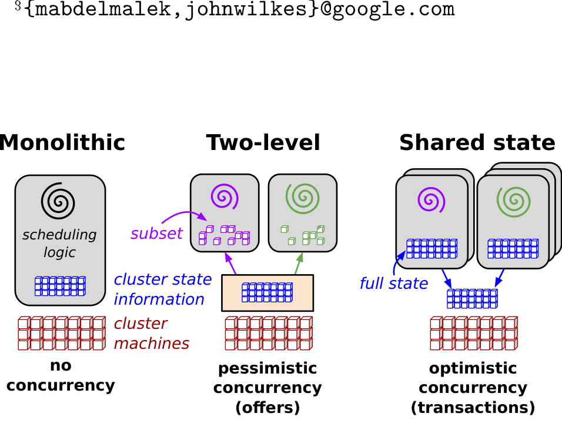

**Figure 1: Schematic overview of the scheduling architectures explored in this paper.**

> **图 1：本文考察的三类调度架构示意图：单体、两级和共享状态。**
>
> **图表中文解读：** 三种架构的根本差异在并发控制：单体调度器不并行，两级架构通过资源 offer 悲观分割状态，Omega 则让多个调度器共享完整状态并用事务乐观解决冲突。

Neither of these models satisfied our needs. Monolithic schedulers do not make it easy to add new policies and specialized implementations, and may not scale up to the cluster sizes we are planning for. Two-level scheduling architectures do appear to provide flexibility and parallelism, but in practice their conservative resource-visibility and locking algorithms limit both, and make it hard to place difficult-to-schedule “picky” jobs or to make decisions that require access to the state of the entire cluster.

> 这些模型都不能满足我们的需求。单体调度器无法轻松添加新策略和专门实现，并且可能无法扩展到我们计划的集群大小。两级调度架构似乎确实提供了灵活性和并行性，但实际上，它们保守的资源可见性和锁定算法限制了两者，并且很难放置难以调度的“挑剔”作业或做出需要访问整个集群状态的决策。

Our solution is a new parallel scheduler architecture built around shared state, using lock-free optimistic concurrency control, to achieve both implementation extensibility and performance scalability. This architecture is being used in Omega, Google’s next-generation cluster management system.

> 我们的解决方案是围绕共享状态构建的新并行调度器架构，使用无锁乐观并发控制，以同时实现工程可扩展性与性能可扩展性。该架构正在 Google 的下一代集群管理系统 Omega 中使用。

### 1.1 Contributions｜主要贡献

The contributions of this paper are as follows. We: 1. present a lightweight taxonomy of the option space for cluster scheduler development (§3); 2. introduce a new scheduler architecture using shared state and lock-free optimistic concurrency control (§3.4); 3. compare the performance of monolithic, two-level and shared-state scheduling using simulations and synthetic workloads (§4); 4. explore the behavior of the shared-state approach in more detail using code based on a production scheduler and driven by real-world workload traces (§5); and 5. demonstrate the flexibility of the shared-state approach by means of a use case: we add a scheduler that uses knowledge of the global cluster utilization to adjust the resources given to running MapReduce jobs (§6).

> 本文的贡献如下。我们：1. 提出集群调度器开发选项空间的轻量级分类法（§3）；2.引入使用共享状态和无锁乐观并发控制的新调度器架构（§3.4）；3. 使用模拟和合成工作负载比较单体、两级和共享状态调度的性能（§4）；4. 使用基于生产调度器并由实际工作负载跟踪驱动的代码更详细地探索共享状态方法的行为（§5）；5. 通过用例展示共享状态方法的灵活性：我们添加一个调度器，该调度器使用全局集群利用率的知识来调整为运行 MapReduce 作业提供的资源（§6）。

We find that the Omega shared-state architecture can deliver performance competitive with or superior to other architectures, and that interference in real-world settings is low. The ability to access the entire cluster state in a scheduler brings other benefits, too, and we demonstrate this by showing how MapReduce jobs can be accelerated by using spare resources.

> 我们发现 Omega 共享状态架构可以提供可与其他架构媲美甚至更优的性能，并且在真实环境中的调度器间干扰很低。在调度器中访问整个集群状态的能力还带来了其他好处，我们通过展示如何使用备用资源来加速 MapReduce 作业来演示这一点。

## 2 Requirements｜需求

Cluster schedulers must meet a number of goals simultaneously: high resource utilization, user-supplied placement constraints, rapid decision making, and various degrees of “fairness” and business importance – all while being robust and always available. These requirements evolve over time, and, in our experience, it becomes increasingly difficult to add new policies to a single monolithic scheduler. This is not just due to accumulation of code as functionality grows over time, but also because some of our users have come to rely on a detailed understanding of the internal behavior of the system to get their work done, which makes both its functionality and structure difficult to change.

> 集群调度器必须同时满足多个目标：高资源利用率、用户提供的放置约束、快速决策以及不同程度的“公平性”和业务重要性——同时保持稳健且始终可用。这些要求随着时间的推移而发展，根据我们的经验，向单个单体调度器添加新策略变得越来越困难。这不仅是由于随着时间的推移，功能不断增长而导致代码的积累，还因为我们的一些用户已经开始依赖对系统内部行为的详细理解来完成他们的工作，这使得其功能和结构都难以改变。

### 2.1 Workload heterogeneity｜工作负载异构性

One important driver of complexity is the hardware and workload heterogeneity that is commonplace in large compute clusters [24].

> 复杂性的一个重要驱动因素是大型计算集群中常见的硬件和工作负载异构性[24]。

To demonstrate this, we examine the workload mix on three Google production compute clusters that we believe to be representative. Cluster A is a medium-sized, fairly busy one, while cluster B is one of the larger clusters currently in use at Google, and cluster C is the one for which a scheduler workload trace was recently published [24, 27]. The workloads are from May 2011. All the clusters run a wide variety of jobs; some are configured by hand; some by automated systems such as MapReduce [8], Pregel [19] and Percolator [23].

> 为了证明这一点，我们检查了我们认为具有代表性的三个 Google 生产计算集群的工作负载组合。集群 A 是一个中等规模、相当繁忙的集群，而集群 B 是 Google 目前使用的较大集群之一，集群 C 是最近发布了调度器工作负载跟踪的集群 [24, 27]。工作负载来自 2011 年 5 月。所有集群都运行各种各样的作业；有些是手动配置的；有些是通过自动化系统实现的，例如 MapReduce [8]、Pregel [19] 和 Percolator [23]。

There are many ways of partitioning a cluster’s workload between different schedulers. Here, we pick a simple two-way split between long-running service jobs that provide end-user operations (e.g., web services) and internal infrastructure services (e.g., BigTable [5]), and batch jobs which perform a computation and then finish. Although many other splits are possible, for simplicity we put all low priority jobs1 and those marked as “best effort” or “batch” into the batch category, and the rest into the service category.

> 有多种方法可以在不同的调度器之间划分集群的工作负载。在这里，我们在提供最终用户操作（例如 Web 服务）和内部基础设施服务（例如 BigTable [5]）的长时间运行的服务作业和执行计算然后完成的批处理作业之间选择了一种简单的双向划分。尽管可以进行许多其他拆分，但为了简单起见，我们将所有低优先级作业 1 以及标记为“尽力而为”或“批处理”的作业放入批处理类别中，并将其余作业放入服务类别中。

1 In the public trace for cluster C, these are priority bands 0–8 [27].

> 1 在集群 C 的公共跟踪中，这些是优先级带 0-8 [27]。

A job is made up of one or more tasks – sometimes thousands of tasks. Most (>80%) jobs are batch jobs, but the majority of resources (55–80%) are allocated to service jobs (Figure 2); the latter typically run for much longer (Figure 3), and have fewer tasks than batch jobs (Figure 4). These results are broadly similar to other analyses of cluster traces from Yahoo [17], Facebook [7] and Google [20, 24, 25, 29].

> 一个作业由一个或多个任务组成，有时是数千项任务。大多数 (>80%) 作业都是批处理作业，但大多数资源 (55–80%) 分配给服务作业（图 2）；后者通常运行时间更长（图 3），并且任务比批处理作业少（图 4）。这些结果与 Yahoo [17]、Facebook [7] 和 Google [20,24,25,29] 的集群跟踪的其他分析大致相似。

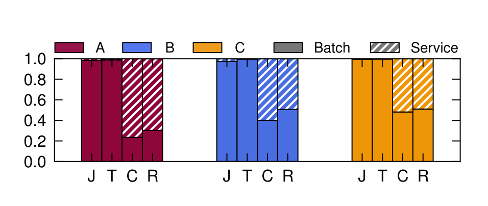

**Figure 2: Batch and service workloads for the clusters A, B, and C: normalized numbers of jobs (J) and tasks (T), and aggregate requests for CPU-core-seconds (C) and RAM GB-seconds (R). The striped portion is the service jobs; the rest is batch jobs.**

> **图 2：集群 A、B、C 的批处理与服务工作负载，包括归一化作业数、任务数以及 CPU 核秒和 RAM GB 秒总请求量；斜线部分为服务作业。**
>
> **图表中文解读：** 批处理作业数量占多数，服务作业却消耗大部分长期资源。调度器必须同时服务“数量多而短”和“数量少而长”的两种负载。

**Figure 3: Cumulative distribution functions (CDFs) of job runtime and job inter-arrival times for clusters A, B, and C. Where the lines do not meet 1.0, some of the jobs ran for longer than the 30-day range. In this and subsequent graphs, solid lines represent batch jobs, and dashed lines are for service jobs.**

> **图 3：集群 A、B、C 的作业运行时间与到达间隔 CDF。实线表示批处理作业，虚线表示服务作业；曲线未到 1.0 表示存在运行超过 30 天范围的作业。**
>
> **图表中文解读：** 批处理与服务作业在运行时间和到达模式上存在数量级差异，这解释了为何单一调度策略难以兼顾低延迟与高利用率。

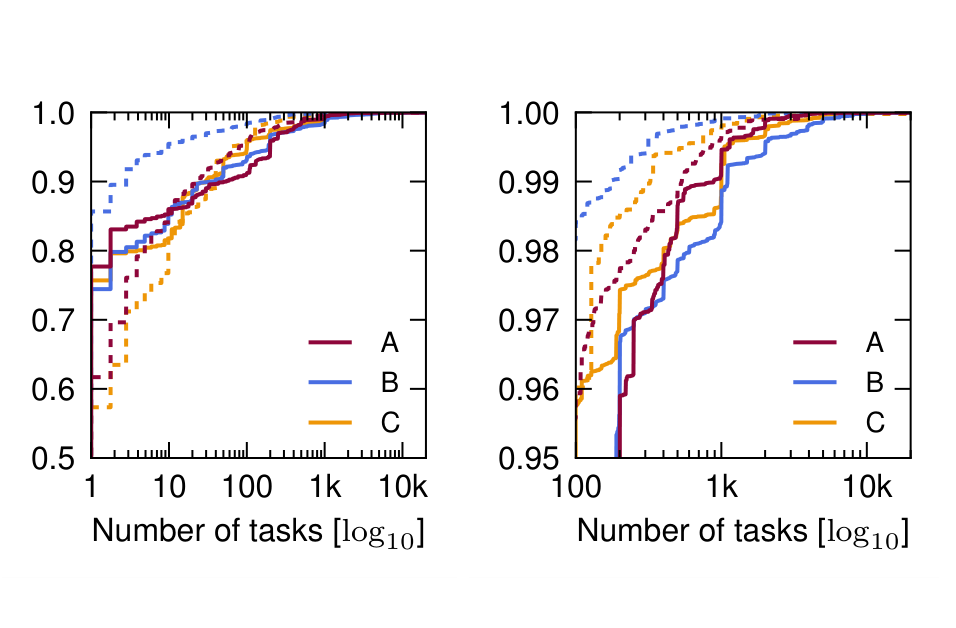

**Figure 4: CDF of the number of tasks in a job for clusters A, B, and C. The right hand graph is an expansion of the tail of the left-hand one, looking at ≥95th percentile, ≥100 tasks.**

> **图 4：集群 A、B、C 中每个作业所含任务数的 CDF；右图放大左图第 95 百分位以上、任务数不少于 100 的尾部。**
>
> **图表中文解读：** 多数作业任务数很少，但尾部存在超大作业。尾部规模决定了成组放置、调度吞吐和冲突概率。

Why does this matter? Many batch jobs are short, and fast turnaround is important, so a lightweight, low-quality approach to placement works just fine. But long-running, high-priority service jobs (20–40% of them run for over a month) must meet stringent availability and performance targets, meaning that careful placement of their tasks is needed to maximize resistance to failures and provide good performance. Indeed, the Omega service scheduler will try to place tasks to resist both independent and coordinated failures, which is an NP-hard chance-constrained optimization problem with tens of failure domains that nest and overlap. Our previous implementation could take tens of seconds to do this. While it is very reasonable to spend a few seconds making a decision whose effects last for several weeks, it can be problematic if an interactive batch job has to wait for such a calculation. This problem is typically referred to as “head of line blocking”, and can be avoided by introducing parallelism.

> 为什么这很重要？许多批处理作业都很短，并且快速周转很重要，因此采用轻量、近似的放置方法便已足够。但长期运行的高优先级服务作业（其中 20-40% 运行超过一个月）必须满足严格的可用性和性能目标，这意味着需要仔细安排其任务，以最大限度地提高容错能力并提供良好的性能。事实上，Omega 服务调度器将尝试放置任务来抵抗独立故障与相关故障，这是一个 NP 困难的机会约束优化问题，具有数十个嵌套和重叠的故障域。我们之前的实现可能需要数十秒才能完成此操作。虽然花几秒钟做出一个影响持续数周的决定是非常合理的，但如果交互式批处理作业必须等待这样的计算，则可能会出现问题。这个问题通常被称为“队头阻塞”，可以通过引入并行性来避免。

In summary, what we require is a scheduler architecture that can accommodate both types of jobs, flexibly support job-specific policies, and also scale to an ever-growing amount of scheduling work. The next section examines some of these requirements in greater detail, as well as some approaches to meeting them.

> 总而言之，我们需要的是一个能够容纳两种类型的作业、灵活支持特定于作业的策略、并且还可以扩展到不断增长的调度工作量的调度器架构。下一节将更详细地研究其中一些要求，以及满足这些要求的一些方法。

## 3 Taxonomy｜架构分类

We begin with a short survey of the design issues cluster schedulers must address, followed by an examination of some different scheduler architectures that might meet them.

> 我们首先对集群调度器必须解决的设计问题作简要概览，然后检查可能满足这些问题的一些不同的调度器架构。

Partitioning the scheduling work. Work can be spread across schedulers by (1) load-balancing that is oblivious to workload type; (2) dedicating specialized schedulers to different parts of the workload; or (3) a combination of the two. Some systems use multiple job queues to hold the job requests (e.g., for different priorities), but that does not affect the scheduling parallelism: we are more interested in how many schedulers are assigned to process the queues.

> 划分调度工作。可以通过以下方式将工作分散到调度器中：(1) 不考虑工作负载类型的负载平衡；(2) 将专门的调度器专门用于工作负载的不同部分；或（3）两者的组合。一些系统使用多个作业队列来保存作业请求（例如，针对不同的优先级），但这并不影响调度并行性：我们更感兴趣的是分配了多少个调度器来处理队列。

Choice of resources. Schedulers can be allowed to select from all of the cluster resources, or limited to a subset to streamline decision making. The former increases the opportunity to make better decisions, and is important when “picky” jobs need to be placed into a nearly-full cluster, or when decisions rely on overall state, such as the total amount of unused resources. Schedulers can have greater flexibility in placing tasks if they can preempt existing assignments, as opposed to merely considering idle resources, but this comes at the cost of wasting some work in the preempted tasks.

> 资源的选择。可以允许调度器从所有集群资源中进行选择，或者限制为一个子集以简化决策。前者增加了做出更好决策的机会，并且当需要将“挑剔”的作业放置到几乎满的集群中时，或者当决策依赖于整体状态（例如未使用的资源总量）时，它很重要。如果调度器能够抢占现有分配，而不是仅仅考虑闲置资源，那么调度器在放置任务时可以具有更大的灵活性，但这是以在抢占任务中浪费一些工作为代价的。

Interference. If schedulers compete for resources, multiple schedulers may attempt to claim the same resource simultaneously. A pessimistic approach avoids the issue by ensuring that a particular resource is only made available to one scheduler at a time; an optimistic one detects the (hopefully rare) conflicts, and undoes one or more of the conflicting claims. The optimistic approach increases parallelism, but potentially increases the amount of wasted scheduling work if conflicts occur too frequently.

> 干扰。如果调度器竞争资源，则多个调度器可能会尝试同时声明相同的资源。悲观方法通过确保特定资源一次仅可供一个调度器使用来避免此问题。乐观方法会检测（希望很少见）冲突，并撤消一项或多项相互冲突的资源申请。乐观方法会增加并行性，但如果冲突发生得太频繁，则可能会增加浪费的调度工作量。

Allocation granularity. Since jobs typically contain many tasks, schedulers can have different policies for how to schedule them: at one extreme is atomic all-or-nothing gang scheduling of the tasks in a job, at the other is incremental placement of tasks as resources are found for them. An all-or-nothing policy can be approximated by incrementally acquiring resources and hoarding them until the job can be started, at the cost of wasting those resources in the meantime.

> 分配粒度。由于作业通常包含许多任务，因此调度器可以采用不同的策略来调度它们：一种极端是作业中任务的原子全有或全无成成组调度，另一种是在为任务找到资源时增量放置任务。一种全有或全无的策略可以通过逐步获取资源并囤积它们直到工作开始为止来近似，但同时会浪费这些资源。

All have downsides: gang scheduling may be needed by some jobs (e.g., MPI programs), but can unnecessarily delay the start of others that can make progress with only a fraction of their requested resources (e.g., MapReduce jobs). Incremental resource acquisition can lead to deadlock if no backoff mechanism is provided, while hoarding reduces cluster utilization and can also cause deadlock.

> 所有这些都有缺点：某些作业（例如，MPI 程序）可能需要成组调度，但可能会不必要地延迟其他作业的启动，而这些作业只获得所请求资源的一小部分也能（例如，MapReduce 作业）取得进展。如果不提供退避机制，增量资源获取可能会导致死锁，而囤积会降低集群利用率，也会导致死锁。

Cluster-wide behaviors. Some behaviors span multiple schedulers. Examples include achieving various types of fairness, and a common agreement on the relative importance of work, especially if one scheduler can preempt others’ tasks. Strict enforcement of these behaviors can be achieved with centralized control, but it is also possible to rely on emergent behaviors to approximate the desired behavior. Techniques such as limiting the range of priorities that a scheduler can wield can provide partial enforcement of desired behaviors, and compliance to cluster-wide policies can be audited post facto to eliminate the need for checks in a scheduler’s critical code path.

> 集群范围内的行为。有些行为跨越多个调度器。例子包括实现各种类型的公平，以及就工作的相对重要性达成共识，特别是如果一个调度器可以抢占其他任务的任务。这些行为的严格执行可以通过集中控制来实现，但也可以依靠涌现行为来近似期望的行为。限制调度器可以使用的优先级范围等技术可以部分强制执行所需的行为，并且可以事后审核对集群范围策略的遵守情况，以消除在调度器的关键代码路径中进行检查的需要。

This space is obviously larger than can be explored in a single paper; we focus on the combinations that are summarized in Table 1, and described in greater detail in the next few sections.

> 这个空间显然比单篇论文所能探索的要大；我们重点关注表 1 中总结的组合，并在接下来的几节中更详细地描述。

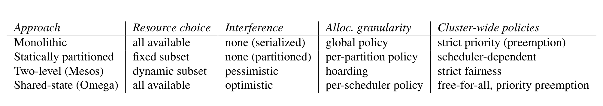

**Table 1: Comparison of parallelized cluster scheduling approaches.**

> **表 1：并行化集群调度方法的比较。**
>
> **图表中文解读：** 单体、静态分区、Mesos 与 Omega 在资源选择、干扰控制、分配粒度和集群级策略上各有取舍；Omega 以乐观事务换取最完整的状态可见性。

### 3.1 Monolithic schedulers｜单体调度器

Our baseline for comparisons is a monolithic scheduler that has but a single instance, no parallelism, and must implement all the policy choices in a single code base. This approach is common in the high-performance computing (HPC) world, where a monolithic scheduler usually runs a single instance of the scheduling code, and applies the same algorithm for all incoming jobs. HPC schedulers such as Maui [16] and its successor Moab, as well as Platform LSF [14], support different policies by means of a complicated calculation involving multiple weighting factors to calculate an overall priority, after which “the scheduler can roughly fulfill site objectives by starting the jobs in priority order” [1].

> 我们的比较基准是一个单体调度器，它只有一个实例，没有并行性，并且必须在单个代码库中实现所有策略选择。这种方法在高性能计算 (HPC) 领域很常见，其中单体调度器通常运行调度代码的单个实例，并对所有传入作业应用相同的算法。HPC 调度器，例如 Maui [16] 及其后继者 Moab，以及 Platform LSF [14]，通过涉及多个权重因子的复杂计算来支持不同的策略，以计算总体优先级，之后“调度器可以通过按优先级顺序启动作业来大致实现站点目标”[1]。

Another way to support different scheduling policies is to provide multiple code paths in the scheduler, running separate scheduling logic for different job types. But this is harder than it might appear. Google’s current cluster scheduler is effectively monolithic, although it has acquired many optimizations over the years to provide internal parallelism and multi-threading to address head-of-line blocking and scalability. This complicates an already difficult job: the scheduler has to minimize the time a job spends waiting before it starts running, while respecting priorities, per-job constraints [20, 25], and a number of other policy goals such as failure-tolerance and scaling to workloads that fill many thousands of machines. Although it has been hugely successful, our scheduler has experienced several years of evolution and organic software growth, and we have found that it is surprisingly difficult to support a wide range of policies in a sustainable manner using a single-algorithm implementation. In the end, this kind of software engineering consideration, rather than performance scalability, was our primary motivation to move to an architecture that supported concurrent, independent scheduling components.

> 支持不同调度策略的另一种方法是在调度器中提供多个代码路径，为不同的作业类型运行单独的调度逻辑。但这比看上去要困难。谷歌当前的集群调度器实际上仍是单体架构，尽管多年来它已经进行了许多优化以提供内部并行性和多线程来解决队头阻塞和可扩展性。这使本来就很困难的工作变得更加复杂：调度器必须最大限度地减少作业在开始运行之前等待的时间，同时尊重优先级、每个作业的限制 [20, 25] 以及许多其他策略目标，例如容错和扩展到填充数千台机器的工作负载。尽管取得了巨大成功，但我们的调度器经历了几年的演变和软件的自然增长，我们发现使用单一算法实现以可持续的方式支持广泛的策略是非常困难的。最后，这类软件工程考量，而不是性能可扩展性，是我们转向支持并发、独立调度组件的架构的主要动机。

### 3.2 Statically partitioned schedulers｜静态分区调度器

Most “cloud computing” schedulers (e.g., Hadoop [28], and Dryad’s Quincy [15]) assume they have complete control over a set of resources, as they are typically deployed onto dedicated, statically-partitioned clusters of machines; or by partitioning a single cluster into different parts that support different behaviors [6]. This leads to fragmentation and suboptimal utilization, which is not viable for us, and so we did not explore this option any further.

> 大多数“云计算”调度器（例如 Hadoop [28] 和 Dryad 的 Quincy [15]）假设它们完全控制一组资源，因为它们通常部署到专用的、静态分区的机器集群上；或者将单个集群划分为支持不同行为的不同部分[6]。这会导致碎片和次优利用率，这对我们来说不可行，因此我们没有进一步探索此选项。

### 3.3 Two-level scheduling｜两级调度

An obvious fix to the issues of static partitioning is to adjust the allocation of resources to each scheduler dynamically, using a central coordinator to decide how many resources each sub-cluster can have. This two-level scheduling approach is used by a number of systems, including Mesos [13] and Hadoop-on-Demand (HOD) [4].

> 解决静态分区问题的一个明显方法是动态调整每个调度器的资源分配，使用中央协调器来决定每个子集群可以拥有多少资源。许多系统都使用这种两级调度方法，包括 Mesos [13] 和 Hadoop-on-Demand (HOD) [4]。

In Mesos, a centralized resource allocator dynamically partitions a cluster, allocating resources to different scheduler frameworks.2 Resources are distributed to the frameworks in the form of offers, which contain only “available” resources – ones that are currently unused. The allocator avoids conflicts by only offering a given resource to one framework at a time, and attempts to achieve dominant resource fairness (DRF) [11] by choosing the order and the sizes of its offers.3 Because only one framework is examining a resource at a time, it effectively holds a lock on that resource for the duration of a scheduling decision. In other words, concurrency control is pessimistic.

> 在 Mesos 中，集中式资源分配器动态划分集群，将资源分配给不同的调度器框架。2 资源以 offer 的形式分配给框架，其中仅包含“可用”资源——当前未使用的资源。分配器通过每次只向一个框架 offer 给定资源来避免冲突，并尝试通过选择offer 的顺序与大小来实现主导资源公平性 (DRF) [11]。3 由于一次只有一个框架正在检查资源，因此它在调度决策期间有效地持有对该资源的锁定。换句话说，并发控制是悲观的。

2 We describe the most recently released version of Mesos at the time we did this work: 0.9.0-incubating from May 8, 2012.

> 2 我们描述了我们进行这项工作时最新发布的 Mesos 版本：2012 年 5 月 8 日的 0.9.0-incubating。

3 The Mesos “simple allocator” offers all available resources to a framework every time it makes an offer, and does not limit the amount of resources that a framework can accept. This negatively impacts Mesos as framework decision times grow; see §4.2.

> 3 Mesos“简单分配器”每次生成 offer 时都会向框架给出所有可用资源，并且不限制框架可以接受的资源量。随着框架决策时间的增长，这会对 Mesos 产生负面影响；参见第 4.2 节。

Mesos works best when tasks are short-lived and relinquish resources frequently, and when job sizes are small compared to the size of the cluster. As we explained in §2.1, our cluster workloads do not have these properties, especially in the case of service jobs, and §4.2 will show that this makes an offer-based two-level scheduling approach unsuitable for our needs.

> 当任务是短暂的并且经常放弃资源时，以及当作业大小与集群大小相比较小时，Mesos 效果最佳。正如我们在第 2.1 节中所解释的，我们的集群工作负载不具有这些属性，特别是在服务作业的情况下，第 4.2 节将表明，这使得基于 offer的两级调度方法不适合我们的需求。

While a Mesos framework can use “filters” to describe the kinds of resources that it would like to be offered, it does not have access to a view of the overall cluster state – just the resources it has been offered. As a result, it cannot support preemption or policies requiring access to the whole cluster state: a framework simply does not have any knowledge of resources that have been allocated to other schedulers. Mesos uses resource hoarding to achieve gang scheduling, and can potentially deadlock as a result.

> 虽然 Mesos 框架可以使用“过滤器”来描述它希望获得哪些类别的资源，但它无法访问整个集群状态的视图——只能看到 offer 给它的资源。因此，它无法支持抢占或需要访问整个集群状态的策略：框架根本不了解已分配给其他调度器的资源。Mesos 使用资源囤积来实现成组调度，并可能因此导致死锁。

It might appear that YARN [21] is a two-level scheduler, too. In YARN, resource requests from per-job application masters are sent to a single global scheduler in the resource master, which allocates resources on various machines, subject to application-specified constraints. But the application masters provide job-management services, not scheduling, so YARN is effectively a monolithic scheduler architecture. At the time of writing, YARN only supports one resource type (fixed-sized memory chunks). Our experience suggests that it will eventually need a rich API to the resource master in order to cater for diverse application requirements, including multiple resource dimensions, constraints, and placement choices for failure-tolerance. Although YARN application masters can request resources on particular machines, it is unclear how they acquire and maintain the state needed to make such placement decisions.

> YARN [21] 似乎也是一个两级调度器。在 YARN 中，来自每个作业应用程序主机的资源请求被发送到资源主机中的单个全局调度器，该调度器根据应用程序指定的约束在各种机器上分配资源。但应用程序主机提供作业管理服务，而不是调度服务，因此 YARN 实际上是一个单体调度器架构。在撰写本文时，YARN 仅支持一种资源类型（固定大小的内存块）。我们的经验表明，资源管理器最终需要一个丰富的 API 来满足不同的应用程序需求，包括多个资源维度、约束和容错的放置选择。尽管 YARN 应用程序主机可以请求特定机器上的资源，但尚不清楚它们如何获取和维护做出此类放置决策所需的状态。

### 3.4 Shared-state scheduling｜共享状态调度

The alternative used by Omega is the shared state approach: we grant each scheduler full access to the entire cluster, allow them to compete in a free-for-all manner, and use optimistic concurrency control to mediate clashes when they update the cluster state. This immediately eliminates two of the issues of the two-level scheduler approach – limited parallelism due to pessimistic concurrency control, and restricted visibility of resources in a scheduler framework – at the potential cost of redoing work when the optimistic concurrency assumptions are incorrect. Exploring this tradeoff is the primary purpose of this paper.

> Omega 使用的替代方案是共享状态方法：我们授予每个调度器对整个集群的完全访问权限，允许它们以自由竞争的方式进行竞争，并在更新集群状态时使用乐观并发控制来调解冲突。这立即消除了两级调度器方法的两个问题——由于悲观并发控制而导致的有限并行性，以及调度器框架中资源的可见性有限——当乐观并发假设不正确时，可能会导致重做工作的成本。探索这种权衡是本文的主要目的。

There is no central resource allocator in Omega; all of the resource-allocation decisions take place in the schedulers. We maintain a resilient master copy of the resource allocations in the cluster, which we call cell state.4 Each scheduler is given a private, local, frequently-updated copy of cell state that it uses for making scheduling decisions. The scheduler can see the entire state of the cell and has complete freedom to lay claim to any available cluster resources provided it has the appropriate permissions and priority – even ones that another scheduler has already acquired. Once a scheduler makes a placement decision, it updates the shared copy of cell state in an atomic commit. At most one such commit will succeed in the case of conflict: effectively, the time from state synchronization to the commit attempt is a transaction. Whether or not the transaction succeeds, the scheduler resyncs its local copy of cell state afterwards and, if necessary, re-runs its scheduling algorithm and tries again.

> Omega 中没有中央资源分配器；所有资源分配决策都在调度器中进行。我们维护集群中资源分配的弹性主副本，我们将其称为Cell状态。4 每个调度器都会获得一个私有的、本地的、频繁更新的Cell状态副本，用于做出调度决策。调度器可以看到Cell的整个状态，并且可以完全自由地声明任何可用的集群资源，前提是它具有适当的权限和优先级——甚至是另一个调度器已经获得的权限和优先级。一旦调度器做出放置决策，它就会在原子提交中更新Cell状态的共享副本。在冲突的情况下，最多一次这样的提交会成功：实际上，从状态同步到提交尝试的时间是一个事务。无论事务是否成功，调度器都会在之后重新同步其Cell状态的本地副本，并在必要时重新运行其调度算法并重试。

4 A cell is the management unit for part of a physical cluster; a cluster may support more than one cell. Cells do not overlap.

> 4 小区是物理集群一部分的管理单位；一个簇可以支持多个小区。Cell格不重叠。

Omega schedulers operate completely in parallel and do not have to wait for jobs in other schedulers, and there is no inter-scheduler head of line blocking. To prevent conflicts from causing starvation, Omega schedulers typically choose to use incremental transactions, which accept all but the conflicting changes (i.e., the transaction provides atomicity but not independence). A scheduler can instead use an all-or-nothing transaction to achieve gang scheduling: either all tasks of a job are scheduled together, or none are, and the scheduler must try to schedule the entire job again. This helps to avoid resource hoarding, since a gang-scheduled job can preempt lower-priority tasks once sufficient resources are available and its transaction commits, and allow other schedulers’ jobs to use the resources in the meantime.

> Omega 调度器完全并行运行，无需等待其他调度器中的作业，并且不存在调度器间的队头阻塞。为了防止冲突导致饥饿，Omega 调度器通常选择使用增量事务，它接受除冲突之外的所有更改（即事务提供原子性但不提供独立性）。调度器可以使用全有或全无事务来实现成组调度：要么将作业的所有任务一起调度，要么没有任务一起调度，并且调度器必须尝试再次调度整个作业。这有助于避免资源囤积，因为一旦有足够的资源可用并且其事务提交，成成组调度的作业可以抢占优先级较低的任务，并允许其他调度器的作业同时使用这些资源。

Different Omega schedulers can implement different policies, but all must agree on what resource allocations are permitted (e.g., a common notion of whether a machine is full), and a common scale for expressing the relative importance of jobs, called precedence. These rules are deliberately kept to a minimum. The two-level scheme’s centralized resource allocator component is thus simplified to a persistent data store with validation code that enforces these common rules. Since there is no central policy-enforcement engine for high-level cluster-wide goals, we rely on these showing up as emergent behaviors that result from the decisions of individual schedulers. In this, it helps that fairness is not a primary concern in our environment: we are driven more by the need to meet business requirements. In support of these, individual schedulers have configuration settings to limit the total amount of resources they may claim, and to limit the number of jobs they admit. Finally, we also rely on post-facto enforcement, since we are monitoring the system’s behavior anyway.

> 不同的 Omega 调度器可以实施不同的策略，但都必须就允许的资源分配（例如，机器是否已满的常见概念）以及表示作业相对重要性的通用尺度（称为优先序（precedence））达成一致。这些规则被故意保持在最低限度。因此，两级方案的集中式资源分配器组件被简化为带有强制执行这些通用规则的验证代码的持久数据存储。由于没有用于高级集群范围目标的中央策略执行引擎，因此我们依赖于由各个调度器的决策所产生的涌现行为。在这一点上，公平不是我们环境中的主要关注点，这很有帮助：我们更多地受到满足业务要求的需要的驱动。为了支持这些，各个调度器具有配置设置来限制它们可以申请的资源总量，并限制它们准入的作业数量。最后，我们还依赖事后执行，因为无论如何我们都会监控系统的行为。

The performance viability of the shared-state approach is ultimately determined by the frequency at which transactions fail and the costs of such failures. The rest of this paper explores these issues for typical cluster workloads at Google.

> 共享状态方法的性能可行性最终取决于事务失败的频率以及此类失败的成本。本文的其余部分将探讨 Google 典型集群工作负载的这些问题。

## 4 Design comparisons｜设计比较

To understand the tradeoffs between the different approaches described before (monolithic, two-level and shared-state schedulers), we built two simulators:

> 为了理解前面描述的不同方法（单体、两级和共享状态调度器）之间的权衡，我们构建了两个模拟器：

1. A lightweight simulator driven by synthetic workloads using parameters drawn from empirical workload distributions. We use this to compare the behaviour of all three architectures under the same conditions and with identical workloads. By making some simplifications, this lightweight simulator allows us to sweep across a broad range of operating points within a reasonable runtime. The lightweight simulator also does not contain any proprietary Google code and is available as open source software.5 2. A high-fidelity simulator that replays historic workload traces from Google production clusters, and reuses much of the Google production scheduler’s code. This gives us behavior closer to the real system, at the price of only supporting the Omega architecture and running a lot more slowly than the lightweight simulator: a single run can take days.

> 1. 由合成工作负载驱动的轻量级模拟器，使用从经验工作负载分布中提取的参数。我们用它来比较所有三种架构在相同条件和相同工作负载下的行为。通过进行一些简化，这个轻量级模拟器使我们能够在合理的运行时间内扫描广泛的操作点。该轻量级模拟器也不包含任何专有的 Google 代码，可作为开源软件提供。5 2. 高保真模拟器，可重放 Google 生产集群的历史工作负载跟踪，并重用 Google 生产调度器的大部分代码。这使我们的行为更接近真实系统，但代价是仅支持 Omega 架构，并且运行速度比轻量级模拟器慢得多：单次运行可能需要几天时间。

5 https://code.google.com/p/cluster-scheduler-simulator/.

> 5 https://code.google.com/p/cluster-scheduler-simulator/。

The rest of this section describes the simulators and our experimental setup.

> 本节的其余部分描述了模拟器和我们的实验设置。

Simplifications in the lightweight simulator. In the lightweight simulator, we trade speed and flexibility for accuracy by making some simplifying assumptions, summarized in Table 2.

> 轻量级模拟器的简化。在轻量级模拟器中，我们通过做出一些简化的假设来牺牲速度和灵活性来换取准确性，如表 2 所示。

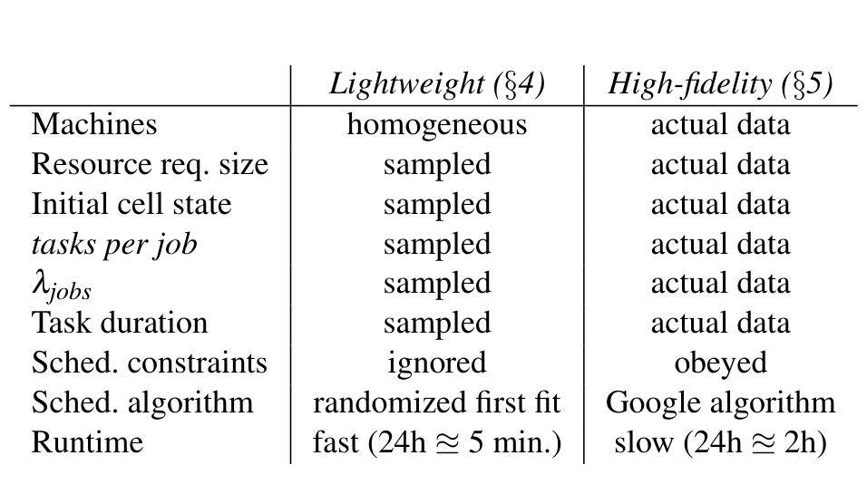

**Table 2: Comparison of the two simulators; “actual data” refers to use of information found in a detailed workload-execution trace taken from a production cluster.**

> **表 2：两种模拟器的比较；“实际数据”表示使用生产集群详细工作负载执行跟踪中的信息。**
>
> **图表中文解读：** 轻量模拟器以采样和齐次机器换取速度；高保真模拟器使用真实机器、请求、初始状态、约束和 Google 调度算法，运行更慢但更接近生产。

The simulator is driven by a workload derived from from real workloads that ran on the same clusters and time periods discussed in §2.1. While the high-fidelity simulator is driven by the actual workload traces, for the lightweight simulator we analyze the workloads to obtain distributions of parameter values such as the number of tasks per job, the task duration, the per-task resources and job inter-arrival times, and then synthesize jobs and tasks that conform to these distributions.

> 模拟器由源自真实工作负载的工作负载驱动，这些工作负载在第 2.1 节中讨论的相同集群和时间段上运行。虽然高保真模拟器是由实际工作负载轨迹驱动的，但对于轻量级模拟器，我们分析工作负载以获得参数值的分布，例如每个作业的任务数量、任务持续时间、每个任务的资源和作业间隔时间，然后合成符合这些分布的作业和任务。

At the start of a simulation, the lightweight simulator initializes cluster state using task-size data extracted from the relevant trace, but only instantiates sufficiently many tasks to utilize about 60% of cluster resources, which is comparable to the utilization level described in [24]. In production, Google speculatively over-commits resources, but the mechanisms and policies for this are too complicated to be replicated in the lightweight simulator.

> 在模拟开始时，轻量级模拟器使用从相关跟踪中提取的任务大小数据来初始化集群状态，但仅实例化足够多的任务以利用大约 60% 的集群资源，这与 [24] 中描述的利用率水平相当。在生产中，谷歌推测会过度分配资源，但其机制和策略过于复杂，无法在轻量级模拟器中复制。

The simulator can support multiple scheduler types, but initially we consider just two: batch and service. The two types of job have different parameter distributions, summarized in §2.1.

> 模拟器可以支持多种调度器类型，但最初我们只考虑两种：批处理和服务。两种类型的作业具有不同的参数分布，如第 2.1 节中所总结。

To improve simulation runtime in pathological situations, we limit any single job to 1,000 scheduling attempts, and the simulator abandons the job at this point if some tasks are still unscheduled. In practice, this only matters for the two-level scheduler (see §4.2), and is rarely triggered by the others.

> 为了改善病态情况下的模拟运行时间，我们将任何单个作业的调度尝试限制为 1,000 次，如果某些任务仍未调度，则模拟器此时会放弃该作业。在实践中，这仅对两级调度器重要（参见§4.2），并且很少被其他调度器触发。

Parameters. We model the scheduler decision time as a linear function of the form $t_{\mathrm{decision}}$ = $t_{\mathrm{job}}$ + $t_{\mathrm{task}}$ × tasks per job, where $t_{\mathrm{job}}$ is a per-job overhead and $t_{\mathrm{task}}$ represents the incremental cost to place each task. This turns out to be a reasonable approximation of Google’s current cluster scheduling logic because most jobs in our real-life workloads have tasks with identical requirements [24]. Our values for $t_{\mathrm{job}}$ and $t_{\mathrm{task}}$ are based on somewhat conservative6 estimates from measurements of our current production system’s behavior: $t_{\mathrm{job}}$ = 0.1s and $t_{\mathrm{task}}$ = 5ms.

> 参数。我们将调度器决策时间建模为 $t_{\mathrm{decision}}$ = $t_{\mathrm{job}}$ + $t_{\mathrm{task}}$ × 每个作业的任务数的线性函数，其中 $t_{\mathrm{job}}$ 是每个作业的开销，$t_{\mathrm{task}}$ 表示放置每个任务的增量成本。事实证明，这是 Google 当前集群调度逻辑的合理近似，因为我们现实工作负载中的大多数作业都具有相同要求的任务 [24]。我们对 $t_{\mathrm{job}}$ 和 $t_{\mathrm{task}}$ 的值基于对当前生产系统行为的测量得出的较为保守的 6 估计：$t_{\mathrm{job}}$ = 0.1s 和 $t_{\mathrm{task}}$ = 5ms。

6 In the sense that they are approximations least favorable to the Omega architecture.

> 6 从某种意义上说，它们是最不利于 Omega 架构的近似值。

Many of our experiments explore the effects of varying $t_{\mathrm{decision}}(\mathrm{service})$ for the service scheduler because we are interested in exploring how Omega is affected by the longer decision times needed for sophisticated placement algorithms. We also vary the job arrival rate, $\lambda_{\mathrm{jobs}}$, to model changes to the cluster workload level.

> 我们的许多实验都探讨了服务调度器的不同 $t_{\mathrm{decision}}(\mathrm{service})$ 的影响，因为我们有兴趣探索 Omega 如何受到复杂放置算法所需的较长决策时间的影响。我们还改变作业到达率 $\lambda_{\mathrm{jobs}}$，以对集群工作负载水平的变化进行建模。

Metrics. Typically, users evaluate the perceived quality of cluster scheduling by considering the time until their jobs start running, as well as their runtime to completion. We refer to the former metric as job wait time, which we define as the difference between the job submission time and the beginning of the job’s first scheduling attempt. Our schedulers process one request at a time, so a busy scheduler will cause enqueued jobs to be delayed. Job wait time thus measures the depth of scheduler queues, and will increase as the scheduler is busy for longer – either because it receives more jobs, or because they take longer to schedule. A common production service level objective (SLO) for job wait time is 30s.

> 指标。通常，用户通过考虑作业开始运行之前的时间以及完成时的运行时间来评估集群调度的感知质量。我们将前一个指标称为作业等待时间，我们将其定义为作业提交时间与作业第一次调度尝试开始之间的差值。我们的调度器一次处理一个请求，因此繁忙的调度器将导致排队作业延迟。因此，作业等待时间衡量调度器队列的深度，并且随着调度器繁忙时间的延长而增加——要么因为它接收更多作业，要么因为它们需要更长的时间来调度。作业等待时间的常见生产服务级别目标 (SLO) 是 30 秒。

Job wait time depends on the scheduler busyness: the fraction of time in which the scheduler is busy making scheduling decisions. It increases with the per-job decision time, and, in the shared-state approach, if scheduling work must be redone because of conflicts. To assess how much of the latter is occurring, we measure the conflict fraction, which denotes the average number of conflicts per successful transaction. A value of 0 means no conflicts took place; a value of 3 indicates that the average job experiences three conflicts, and thus requires four scheduling attempts.

> 作业等待时间取决于调度器繁忙度：调度器忙于做出调度决策的时间比例。它随着每个作业的决策时间的增加而增加，并且在共享状态方法中，如果由于冲突而必须重做调度工作。为了评估后者发生的程度，我们测量冲突比例，它表示每个成功事务的平均冲突数。值为0表示没有发生冲突；值为 3 表示平均作业会经历 3 次冲突，因此需要四次调度尝试。

Our values for scheduler busyness and conflict fraction are medians of the daily values, and wait time values are overall averages. Where present, error bars indicate how much variation exists across days in the experiment: they show the median absolute deviation (MAD) from the median value of the per-day averages. All experiments simulate seven days of cluster operation, except for the Mesos ones, which simulate only one day, as they take much longer to run because of the failed scheduling attempts that result from insufficient available resources (see §4.2).

> 我们的调度器繁忙度和冲突比例的值是每日值的中值，等待时间值是总体平均值。如果存在误差条，则表明实验中各天存在多少变化：它们显示与每日平均值中值的中值绝对偏差 (MAD)。所有实验都模拟 7 天的集群运行，但 Mesos 实验除外，它仅模拟一天，因为由于可用资源不足导致调度尝试失败，因此运行时间要长得多（请参阅第 4.2 节）。

### 4.1 Monolithic schedulers｜单体调度器

Our baseline for comparison is a serial monolithic scheduler with the same decision time for batch and service jobs, to reflect the need to run much of the same code for every job type (a single-path implementation). We also consider a monolithic scheduler with a fast code path for batch jobs; we refer to this as a multi-path monolithic scheduler, since it still schedules only one job at a time. The current monolithic Google cluster scheduler is somewhere in between these pure designs: it does run some job-specific logic, but mostly applies identical scheduling logic for all jobs.

> 我们的比较基准是串行单体调度器，对于批处理和服务作业具有相同的决策时间，以反映为每种作业类型运行大部分相同代码的需要（单路径实现）。我们还考虑使用具有用于批处理作业的快速代码路径的单体调度器；我们将其称为多路径单体调度器，因为它仍然一次只调度一项作业。当前的整体 Google 集群调度器介于这些纯粹的设计之间：它确实运行一些特定于作业的逻辑，但大多数情况下对所有作业应用相同的调度逻辑。

In the baseline case, we vary the scheduler decision time on the x-axis by changing $t_{\mathrm{job}}$. In the multi-path case, we split the workload into batch and service workloads and use the defaults for the batch scheduler decision time while we vary $t_{\mathrm{job}}(\mathrm{service})$.

> 在基线情况下，我们通过更改 $t_{\mathrm{job}}$ 来改变 x 轴上的调度器决策时间。在多路径情况下，我们将工作负载分为批处理和服务工作负载，并使用批处理调度器决策时间的默认值，同时改变 $t_{\mathrm{job}}(\mathrm{service})$。

The results are not surprising: in the single-path baseline case, the scheduler busyness is low as long as scheduling is quick, but scales linearly with increased $t_{\mathrm{job}}$ (Figure 6a). As a consequence, job wait time increases at a similar rate until the scheduler is saturated, at which point it cannot keep up with the incoming workload any more. The wait time curves for service jobs closely track the ones for batch jobs, since all jobs take the same time to schedule (Figure 5a).

> 结果并不令人惊讶：在单路径基线情况下，只要调度速度快，调度器繁忙度就会很低，但会随着 $t_{\mathrm{job}}$ 的增加而线性扩展（图 6a）。因此，作业等待时间以类似的速度增加，直到调度器饱和，此时它无法再跟上传入的工作负载。服务作业的等待时间曲线与批处理作业的等待时间曲线密切相关，因为所有作业的调度时间都相同（图 5a）。

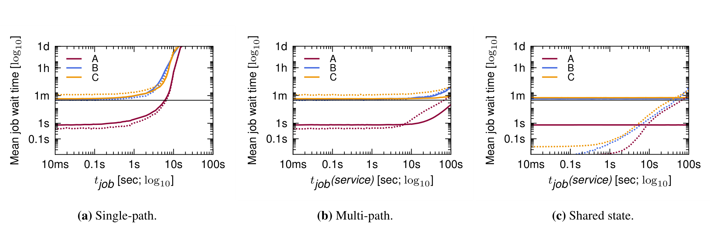

**Figure 5: Schedulers’ job wait time, as a function of $t_{\mathrm{job}}$ in the monolithic single-path case, $t_{\mathrm{job}}(\mathrm{service})$ in the monolithic multi-path and shared-state cases. The SLO (horizontal bar) is 30s.**

> **图 5：不同架构下，调度器的作业等待时间随相应的每作业调度时间变化；横向 SLO 线为 30 秒。**
>
> **图表中文解读：** 单体多路径与共享状态模型能通过并行降低等待时间；当每次调度计算变慢时，架构差异会迅速放大。

**Figure 6: Schedulers’ busyness, as a function of $t_{\mathrm{job}}$ in the monolithic single-path case, $t_{\mathrm{job}}(\mathrm{service})$ in the monolithic multi-path and shared-state cases. The value is the median daily busyness over the 7-day experiment, and error bars are one ± median absolute deviation (MAD), i.e. the median deviation from the median value, a robust estimator of typical value dispersion.**

> **图 6：不同架构下，调度器忙碌度随相应的每作业调度时间变化；数值为 7 天实验的每日忙碌度中位数，误差线为一个中位绝对偏差。**
>
> **图表中文解读：** 忙碌度接近 1 表示调度器饱和。共享状态并行提高处理能力，但也必须付出事务冲突与重试成本。

With a fast path for batch jobs in the multi-path case, both average job wait time and scheduler busyness decrease significantly even at long decision times for service jobs, since the majority of jobs are batch ones. But batch jobs can still get stuck in a queue behind the slow-to-schedule service jobs, and head-of-line blocking occurs: scalability is still limited by the processing capacity of a single scheduler (Figures 5b and 6b). To avoid this, we need some form of parallel processing.

> 在多路径情况下，通过批处理作业的快速路径，即使服务作业的决策时间较长，平均作业等待时间和调度器繁忙度也会显著减少，因为大多数作业都是批处理作业。但批处理作业仍然可能卡在调度缓慢的服务作业后面的队列中，并且会发生队头阻塞：可扩展性仍然受到单个调度器处理能力的限制（图 5b 和 6b）。为了避免这种情况，我们需要某种形式的并行处理。

### 4.2 Two-level scheduling: Mesos｜两级调度：Mesos

Our two-level scheduler experiments are modeled on the offer-based Mesos design. We simulate a single resource manager and two scheduler frameworks, one handling batch jobs and one handling service jobs. To keep things simple, we assume that a scheduler only looks at the set of resources available to it when it begins a scheduling attempt for a job (i.e., any offers that arrive during the attempt are ignored). Resources not used at the end of scheduling a job are returned to the allocator; they may be re-offered again if the framework is the one furthest below its fair share. The DRF algorithm used by Mesos’s centralized resource allocator is quite fast, so we assume it takes 1 ms to make a resource offer.

> 我们的两级调度器实验以基于 offer的 Mesos 设计为模型。我们模拟一个资源管理器和两个调度器框架，一个处理批处理作业，一个处理服务作业。为了简单起见，我们假设调度器仅在开始对作业进行调度尝试时查看可用的资源集（即，忽略尝试期间到达的任何提供）。调度作业结束时未使用的资源将返回给分配器；如果该框架远远低于其公平份额，则可能会再次重新提供它们。Mesos 的集中式资源分配器使用的 DRF 算法非常快，因此我们假设提供资源需要 1 毫秒。

Since we now have two schedulers, we keep the decision time for the batch scheduler constant, and vary the decision time for the service scheduler by adjusting $t_{\mathrm{job}}(\mathrm{service})$. However, the batch scheduler busyness (Figure 7b) turns out to be much higher than in the monolithic multi-path case. This is a consequence of an interaction between the Mesos offer model and the service scheduler’s long scheduling decision times. Mesos achieves fairness by alternately offering all available cluster resources to different schedulers, predicated on assumptions that resources become available frequently and scheduler decisions are quick. As a result, a long scheduler decision time means that nearly all cluster resources are locked down for a long time, inaccessible to other schedulers. The only resources available for other schedulers in this situation are the few becoming available while the slow scheduler is busy. These are often insufficient to schedule an above-average size batch job, meaning that the batch scheduler cannot make progress while the service scheduler holds an offer. It nonetheless keeps trying, and as a consequence, we find that a number of jobs are abandoned because they did not finish scheduling their tasks by the 1,000-attempt retry limit in the Mesos case (Figure 7c).

> 由于我们现在有两个调度器，因此我们保持批处理调度器的决策时间不变，并通过调整 $t_{\mathrm{job}}(\mathrm{service})$ 来改变服务调度器的决策时间。然而，批处理调度器的繁忙度（图 7b）比单体多路径情况要高得多。这是 Mesos 提供模型与服务调度器的长调度决策时间之间相互作用的结果。Mesos 通过交替向不同的调度器提供所有可用的集群资源来实现公平性，前提是资源频繁可用并且调度器决策很快。因此，较长的调度器决策时间意味着几乎所有集群资源都被长时间锁定，其他调度器无法访问。在这种情况下，其他调度器唯一可用的资源是在慢速调度器繁忙时可用的资源。这些通常不足以调度高于平均大小的批处理作业，这意味着批处理调度器在服务调度器持有 offer时无法取得进展。尽管如此，它仍然不断尝试，结果，我们发现许多作业被放弃，因为它们没有在 Mesos 情况下的 1,000 次尝试重试限制内完成任务调度（图 7c）。

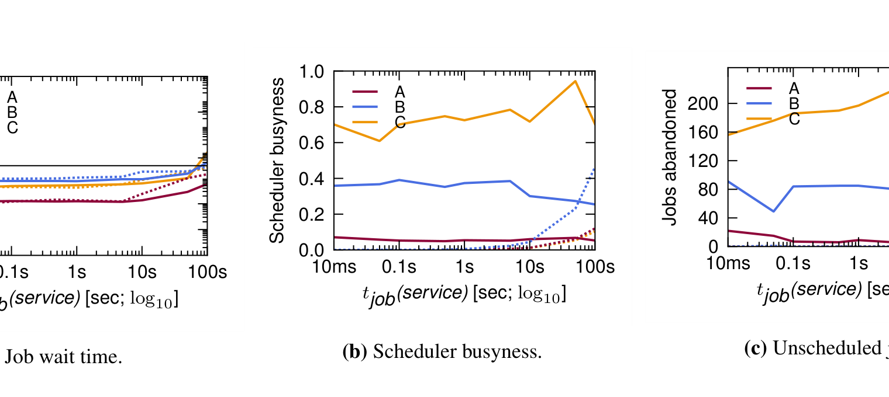

**Figure 7: Two-level scheduling (Mesos): performance as a function of $t_{\mathrm{job}}(\mathrm{service})$.**

> **图 7：两级调度（Mesos）的性能随服务作业调度时间变化。**
>
> **图表中文解读：** Mesos 的资源 offer 会让服务框架长时间持有资源；计算越慢，批处理调度器越容易得不到合适资源并出现未调度作业。

This pathology occurs because of Mesos’s assumption of quick scheduling decisions, small jobs and high resource churn, which do not hold for our service jobs. Mesos could be extended to make only fair-share offers, although this would complicate the resource allocator logic, and the quality of the placement decisions for big or picky jobs would likely decrease, since each scheduler could only see a smaller fraction of the available resources. We have raised this point with the Mesos team; they agree about the limitation and are considering to address it in future work.

> 出现这种病态是因为 Mesos 假设快速调度决策、小作业和高资源流失，而这不适用于我们的服务作业。Mesos 可以扩展为仅提供公平份额 offer，尽管这会使资源分配器逻辑复杂化，并且大型或挑剔作业的放置决策的质量可能会下降，因为每个调度器只能看到可用资源的一小部分。我们已经向 Mesos 团队提出了这一点；他们同意这一限制，并考虑在未来的工作中解决这个问题。

### 4.3 Shared-state scheduling: Omega｜共享状态调度：Omega

Finally, we use the lightweight simulator to explore the Omega shared-state approach. We again simulate two schedulers: one handling the batch workload, one handling the service workload. Both schedulers refresh their local copy of cell state by synchronizing it with the shared one when they start looking at a job, and work on their local copy for the duration of the decision time. Assuming at least one task got scheduled, a transaction to update the shared cell state is issued once finished. If there are no conflicts, then the entire transaction is accepted; otherwise only those changes that do not result in an overcommitted machine are accepted.

> 最后，我们使用轻量级模拟器来探索 Omega 共享状态方法。我们再次模拟两个调度器：一个处理批处理工作负载，一个处理服务工作负载。两个调度器在开始查看作业时都会通过将Cell状态的本地副本与共享Cell同步来刷新Cell状态的本地副本，并在决策时间内处理其本地副本。假设至少安排了一项任务，一旦完成就会发出更新共享Cell状态的事务。如果没有冲突，则接受整个交易；否则，仅接受那些不会导致机器过度使用的更改。

Figure 5c shows that the average job wait times for the Omega approach are comparable to those for multi-path monolithic (Figure 5b). This suggests that conflicts and interference are relatively rare, and this is confirmed by the graph of scheduler busyness (Figure 6c). Unlike Mesos (Figure 7c), the Omega-style scheduler manages to schedule all jobs in the workload. Unlike the monolithic multi-path implementation, it does not suffer from head-of-line blocking: the lines for batch and service jobs are independent.

> 图 5c 显示 Omega 方法的平均作业等待时间与多路径单体方法的平均作业等待时间相当（图 5b）。这表明冲突和干扰相对较少，调度器繁忙度图也证实了这一点（图 6c）。与 Mesos（图 7c）不同，Omega 风格的调度器能够调度工作负载中的所有作业。与整体多路径实现不同，它不会受到队头阻塞的影响：批处理和服务作业的线路是独立的。

We also investigate at how the Omega approach scales as the workload changes. For this purpose, we increase the job arrival rate of the batch scheduler, $\lambda_{\mathrm{jobs}}(\mathrm{batch})$. Figure 8 shows that both job wait time and scheduler busyness increase. In the batch case, this is due to the higher job arrival rate, while in the service case, it is due to additional conflicts. As indicated by the dashed vertical lines, cluster A scales to about 2.5× the original workload before failing to keep up, while clusters B and C scale to 6× and 9.5×, respectively.

> 我们还研究了 Omega 方法如何随着工作负载的变化进行扩展。为此，我们提高了批处理调度器 $\lambda_{\mathrm{jobs}}(\mathrm{batch})$ 的作业到达率。图 8 显示作业等待时间和调度器繁忙度都增加。在批处理情况下，这是由于较高的作业到达率，而在服务情况下，这是由于额外的冲突。如垂直虚线所示，集群 A 在无法跟上之前扩展到原始工作负载的约 2.5 倍，而集群 B 和 C 分别扩展至 6 倍和 9.5 倍。

**Figure 8: Shared-state scheduling (Omega): varying the arrival rate for the batch workload, $\lambda_{\mathrm{jobs}}(\mathrm{batch})$, for cluster B. Dashed vertical lines indicate points of scheduler saturation; i.e., only partial scheduling of the workload to their right.**

> **图 8：共享状态调度（Omega）在集群 B 中随批处理作业到达率变化的表现；竖直虚线标出调度器饱和点，右侧工作负载只能被部分调度。**
>
> **图表中文解读：** 批处理到达率超过饱和点后，等待时间与未调度比例陡增；Omega 的扩展极限可由调度计算和冲突共同决定。

Since the batch scheduler is the main scalability bottleneck, we repeat the same scaling experiment with multiple batch schedulers in order to test the ability of the Omega model to scale to larger loads. The batch scheduling work is load-balanced across the schedulers using a simple hashing function. As expected, the conflict fraction increases with more schedulers as more opportunities for conflict exist (Figure 9a), but this is compensated – at least up to 32 batch schedulers – by the better per-scheduler busyness with more schedulers (Figure 9b). Similar results are seen with the job wait times (not shown here). This is an encouraging result: the Omega model can scale to a high batch workload while still providing good behavior for service jobs.

> 由于批处理调度器是主要的可扩展性瓶颈，因此我们使用多个批处理调度器重复相同的扩展实验，以测试 Omega 模型扩展到更大负载的能力。批量调度工作使用简单的散列函数在调度器之间进行负载平衡。正如预期的那样，随着更多调度器存在更多冲突机会，冲突比例也会增加（图 9a），但这可以通过更多调度器更好的每个调度器繁忙度得到补偿（至少最多 32 个批处理调度器）（图 9b）。作业等待时间也有类似的结果（此处未显示）。这是一个令人鼓舞的结果：Omega 模型可以扩展到高批量工作负载，同时仍然为服务作业提供良好的行为。

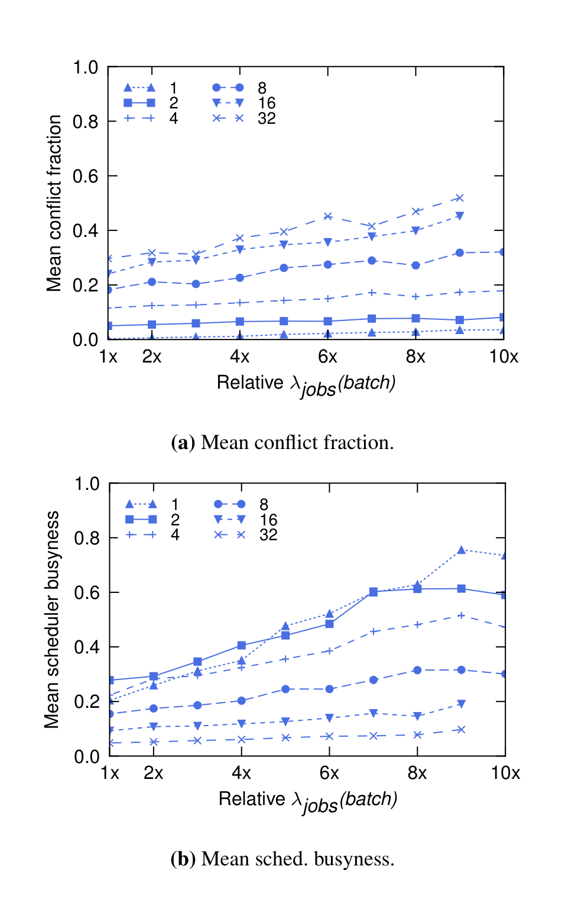

**Figure 9: Shared-state scheduling (Omega): varying the arrival rate for the batch workload ($\lambda_{\mathrm{jobs}}(\mathrm{batch})$) for cluster B; 1.0 is the default rate. Each line represents a different number of batch schedulers.**

> **图 9：共享状态调度（Omega）在集群 B 中随批处理作业到达率变化的表现；每条曲线对应不同数量的批处理调度器。**
>
> **图表中文解读：** 增加批处理调度器能摊薄单个调度器的工作，但也提高并发事务冲突率；扩容收益并非无限。

### 4.4 Summary｜小结

The lightweight simulator is a useful tool for comparing the different scheduler architectures. Figure 10 summarizes the results graphically, considering the impact of scaling $t_{\mathrm{task}}$ as an additional dimension.

> 轻量级模拟器是比较不同调度器架构的有用工具。图 10 以图形方式总结了结果，考虑了缩放 $t_{\mathrm{task}}$ 作为附加维度的影响。

**Figure 10: Lightweight simulator: impact of varying $t_{\mathrm{job}}(\mathrm{service})$ (right axis) and $t_{\mathrm{task}}(\mathrm{service})$ (left axis) on scheduler busyness (z-axis) in different scheduling schemes, on cluster B. Red shading of a 3D graph means that part of the workload remained unscheduled.**

> **图 10：轻量级模拟器中，服务作业调度时间与单任务调度时间对不同调度方案忙碌度的影响；三维图中的红色区域表示仍有工作负载未被调度。**
>
> **图表中文解读：** 三维曲面同时揭示每作业固定成本与每任务成本。不同架构在这两个维度的瓶颈位置不同，红区表示已无法消化全部输入。

In short, the monolithic scheduler is not scalable. Although adding the multi-path feature reduces the average scheduling decision time, head-of-line blocking is still a problem for batch jobs, and means that this model may not be able to scale to the workloads we project for large clusters. The two-level model of Mesos can support independent scheduler implementations, but it is hampered by pessimistic locking, does not handle long decision times well, and could not schedule much of the heterogeneous load we offered it.

> 简而言之，单体调度器是不可扩展的。尽管添加多路径功能可以减少平均调度决策时间，但队头阻塞仍然是批处理作业的一个问题，并且意味着该模型可能无法扩展到我们为大型集群规划的工作负载。Mesos 的两级模型可以支持独立的调度器实现，但它受到悲观锁定的阻碍，不能很好地处理长决策时间，并且无法调度我们提供的大部分异构负载。

The shared-state Omega approach seems to offer competitive, scalable performance with little interference at realistic operating points, supports independent scheduler implementations, and exposes the entire allocation state to the schedulers. We show how this is helpful in §6. Our results indicate that Omega can scale to many schedulers, as well as to challenging workloads.

> 共享状态 Omega 方法似乎提供了有竞争力的、可扩展的性能，在实际操作点几乎没有干扰，支持独立的调度器实现，并向调度器公开整个分配状态。我们将在第 6 节中展示这有何帮助。我们的结果表明，Omega 可以扩展到许多调度器以及具有挑战性的工作负载。

## 5 Trace-driven simulation｜跟踪驱动模拟

Having compared the different scheduler architectures using the lightweight simulator, we use the high-fidelity simulator to explore some of the properties of the Omega shared-state approach in greater detail and without the simplifying assumptions made by the lightweight simulator. The core of the high-fidelity simulator is the code used in Google’s production scheduling system. It respects task placement constraints, uses the same algorithms as the production version, and can be given initial cell descriptions and detailed workload traces obtained from live production cells. It lets us evaluate the shared-state design with high confidence on real-world workloads. We use it to answer the following questions:

> 使用轻量级模拟器比较了不同的调度器架构后，我们使用高保真模拟器更详细地探索 Omega 共享状态方法的一些属性，并且没有轻量级模拟器所做的简化假设。高保真模拟器的核心是谷歌生产调度系统中使用的代码。它尊重任务放置约束，使用与生产版本相同的算法，并且可以提供初始Cell描述和从实时生产Cell获得的详细工作负载跟踪。它让我们能够对现实工作负载充满信心地评估共享状态设计。我们用它来回答以下问题：

1. How much scheduling interference is present in real-world workloads and what scheduler decision times can we afford in production (§5.1)?

> 1. 实际工作负载中存在多少调度干扰以及我们在生产中可以承受的调度器决策时间是多少（第 5.1 节）？

2. What are the effects of different conflict detection and resolution techniques on real workloads (§5.2)?

> 2. 不同的冲突检测和解决技术对实际工作负载有何影响（第 5.2 节）？

3. Can we take advantage of having access to the entire state of the cell in a scheduler? (§6)

> 3. 我们可以利用在调度器中访问Cell的整个状态吗？（§6）

Large-scale production systems are enormously complicated, and thus even the high-fidelity simulator employs a few simplifications. It does not model machine failures (as these only generate a small load on the scheduler); it does not model the disparity between resource requests and the actual usage of those resources in the traces (further discussed elsewhere [24]); it fixes the allocations at the initially-requested sizes (a consequence of limitations in the trace data); and it disables preemptions, because we found that they make little difference to the results, but significantly slow down the simulations.

> 大规模生产系统非常复杂，因此即使是高保真模拟器也进行了一些简化。它不会对机器故障进行建模（因为这些故障只会在调度器上产生很小的负载）；它没有对资源请求与跟踪中这些资源的实际使用之间的差异进行建模（在其他地方进一步讨论[24]）；它将分配固定为最初请求的大小（跟踪数据限制的结果）；它会禁用抢占，因为我们发现它们对结果影响不大，但会显著减慢模拟速度。

As expected, the outputs of the two simulators generally agree. The main difference is that the lightweight simulator runs experience less interference, which is likely a result of the lightweight simulator’s lack of support for placement constraints (which makes “picky” jobs seem easier to schedule than they are), and its simpler notion of when a machine is considered full (which means it sees fewer conflicts with fine-grained conflict detection, cf. §5.2).

> 正如预期的那样，两个模拟器的输出基本一致。主要区别在于，轻量级模拟器运行时受到的干扰较少，这可能是由于轻量级模拟器缺乏对放置约束的支持（这使得“挑剔”的作业看起来比实际情况更容易安排），而且它的机器何时被视为满的概念更简单（这意味着它与细粒度冲突检测的冲突较少，参见§5.2）。

We can nonetheless confirm all the trends the lightweight simulator demonstrates for the Omega shared-state model using the high-fidelity simulator. We believe this confirms that the lightweight simulator experiments provide plausible comparisons between different scheduling architectures under a common set of assumptions.

> 尽管如此，我们仍然可以使用高保真模拟器确认轻量级模拟器为 Omega 共享状态模型展示的所有趋势。我们相信这证实了轻量级模拟器实验在一组通用假设下提供了不同调度架构之间的合理比较。

### 5.1 Scheduling performance｜调度性能

Figure 11 shows how service scheduler busyness varies as a function of both $t_{\mathrm{job}}(\mathrm{service})$ and $t_{\mathrm{task}}(\mathrm{service})$ for a month-long trace of cluster C (covering the same workload as the public trace). Encouragingly, the scheduler busyness remains low across almost the entire range for both, which means that the Omega architecture scales well to long decision times for service jobs.

> 图 11 显示了集群 C 长达一个月的跟踪（涵盖与公共跟踪相同的工作负载）的服务调度器繁忙度如何随 $t_{\mathrm{job}}(\mathrm{service})$ 和 $t_{\mathrm{task}}(\mathrm{service})$ 的函数变化。令人鼓舞的是，调度器的繁忙度在几乎整个范围内都保持在较低水平，这意味着 Omega 架构可以很好地扩展到服务作业的长决策时间。

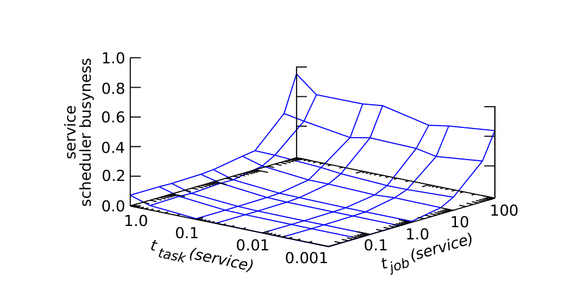

**Figure 11: Shared-state scheduling (Omega): effect on service scheduler busyness of varying $t_{\mathrm{job}}(\mathrm{service})$ and $t_{\mathrm{task}}(\mathrm{service})$, using the high-fidelity simulator and a 29-day trace from cluster C.**

> **图 11：使用高保真模拟器和集群 C 的 29 天跟踪，观察服务作业调度时间与单任务调度时间对服务调度器忙碌度的影响。**
>
> **图表中文解读：** 高保真模拟确认，服务调度器的可扩展性同时受作业级计算和任务级计算影响，并非只取决于作业到达率。

Scaling the workload. We also investigate the performance of the shared-state architecture using a 7-day trace from cluster B, which is one of the largest and busiest Google clusters. Again, we vary $t_{\mathrm{job}}(\mathrm{service})$. In Figure 12b, once $t_{\mathrm{job}}(\mathrm{service})$ reaches about 10s, the conflict fraction increases beyond 1.0, so that scheduling a service job requires at least one retry, on average.

> 扩展工作负载。我们还使用集群 B（最大、最繁忙的 Google 集群之一）的 7 天跟踪来研究共享状态架构的性能。再次，我们改变$t_{\mathrm{job}}(\mathrm{service})$。在图 12b 中，一旦 $t_{\mathrm{job}}(\mathrm{service})$ 达到约 10 秒，冲突比例就会增加到超过 1.0，因此调度服务作业平均需要至少一次重试。

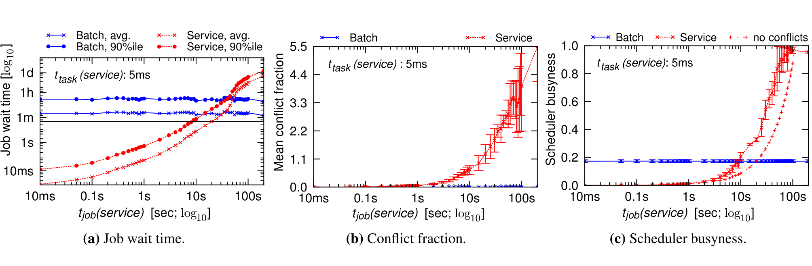

**Figure 12: Shared-state scheduling (Omega): performance effects of varying $t_{\mathrm{job}}(\mathrm{service})$ on a 7-day trace from cluster B.**

> **图 12：使用集群 B 的 7 天跟踪，观察服务作业调度时间变化对共享状态调度性能的影响。**
>
> **图表中文解读：** 当服务调度算法变慢，作业等待时间、调度器忙碌度和冲突都会上升；假设无冲突的对照线量化了乐观并发税。

At around the same point, we fail to meet the 30s job wait time SLO for the service scheduler (Figure 12a), even though the scheduler itself is not yet saturated: the additional wait time is purely due to the impact of conflicts. To confirm this, we approximate the time that the scheduler would have taken if it had experienced no conflicts or retries (the “no conflict” case in Figure 12c), and find that the service scheduler busyness with conflicts is about 40% higher than in the no-conflict case. This is a higher level of interference compared to cluster C, most likely because of a much higher batch load in cluster B.

> 大约在同一点，我们无法满足服务调度器的 30 秒作业等待时间 SLO（图 12a），即使调度器本身尚未饱和：额外的等待时间纯粹是由于冲突的影响。为了证实这一点，我们估算了调度器在没有经历冲突或重试的情况下所花费的时间（图 12c 中的“无冲突”情况），并发现有冲突的服务调度器繁忙度比无冲突情况高出约 40%。与集群 C 相比，这是更高级别的干扰，很可能是因为集群 B 中的批量负载要高得多。

Despite these relatively high conflict rates, our experiments show that the shared-state Omega architecture can support service schedulers that take several seconds to make a decision. We also investigate scaling the per-task decision time, and found that we can support $t_{\mathrm{task}}(\mathrm{service})$ of 1 second (at a $t_{\mathrm{job}}(\mathrm{service})$ of 0.1s), resulting in a conflict fraction ≤ 0.2. This means that we can support schedulers with a high one-off per-job decision time, and ones with a large per-task decision time.

> 尽管冲突率相对较高，但我们的实验表明，共享状态 Omega 架构可以支持需要几秒钟才能做出决定的服务调度器。我们还研究了扩展每个任务的决策时间，发现我们可以支持 1 秒的 $t_{\mathrm{task}}(\mathrm{service})$（$t_{\mathrm{job}}(\mathrm{service})$ 为 0.1 秒），导致冲突比例 ≤ 0.2。这意味着我们可以支持每个作业一次性决策时间较长的调度器，以及每个任务决策时间较长的调度器。

Load-balancing the batch scheduler. With the monolithic single-path scheduler (§4.1), the high batch job arrival rate requires the use of basic, simple scheduling algorithms: it simply is not possible to use smarter, more time-consuming scheduling algorithms for these jobs as we already miss the SLO on cluster B due to the high load. Batch jobs want to survive failures, too, and the placement quality would doubtless improve if a scheduler could be given a little more time to make a decision. Fortunately, the Omega architecture can easily achieve this by load-balancing the scheduling of batch jobs across multiple batch schedulers.

> 负载平衡批处理调度器。使用单体单路径调度器（第 4.1 节），高批处理作业到达率需要使用基本、简单的调度算法：根本不可能对这些作业使用更智能、更耗时的调度算法，因为由于高负载，我们已经错过了集群 B 上的 SLO。批处理作业也希望能够在失败中幸存下来，如果可以给调度器更多的时间来做出决定，那么放置质量无疑会提高。幸运的是，Omega 架构可以通过跨多个批处理调度器对批处理作业的调度进行负载平衡来轻松实现这一点。

To test this, we run an experiment with three parallel batch schedulers, partitioning the workload across them by hashing the job identifiers, akin to the earlier experiment with the simple simulator. We achieve an increase in scalability of ≃3×, moving the saturation point from $t_{\mathrm{job}}(\mathrm{batch})$ of about 4s to 15s (Figure 13a). At the same time, the conflict rate remains low (around 0.1), and all schedulers meet the 30s job wait time SLO until the saturation point (Figure 13b).

> 为了测试这一点，我们使用三个并行批处理调度器进行实验，通过散列作业标识符来划分它们之间的工作负载，类似于之前使用简单模拟器进行的实验。我们实现了 ≃3× 的可扩展性提高，将饱和点从大约 4 秒的 $t_{\mathrm{job}}(\mathrm{batch})$ 移动到 15 秒（图 13a）。同时，冲突率仍然很低（大约 0.1），并且所有调度器都满足 30 秒的作业等待时间 SLO，直到饱和点（图 13b）。

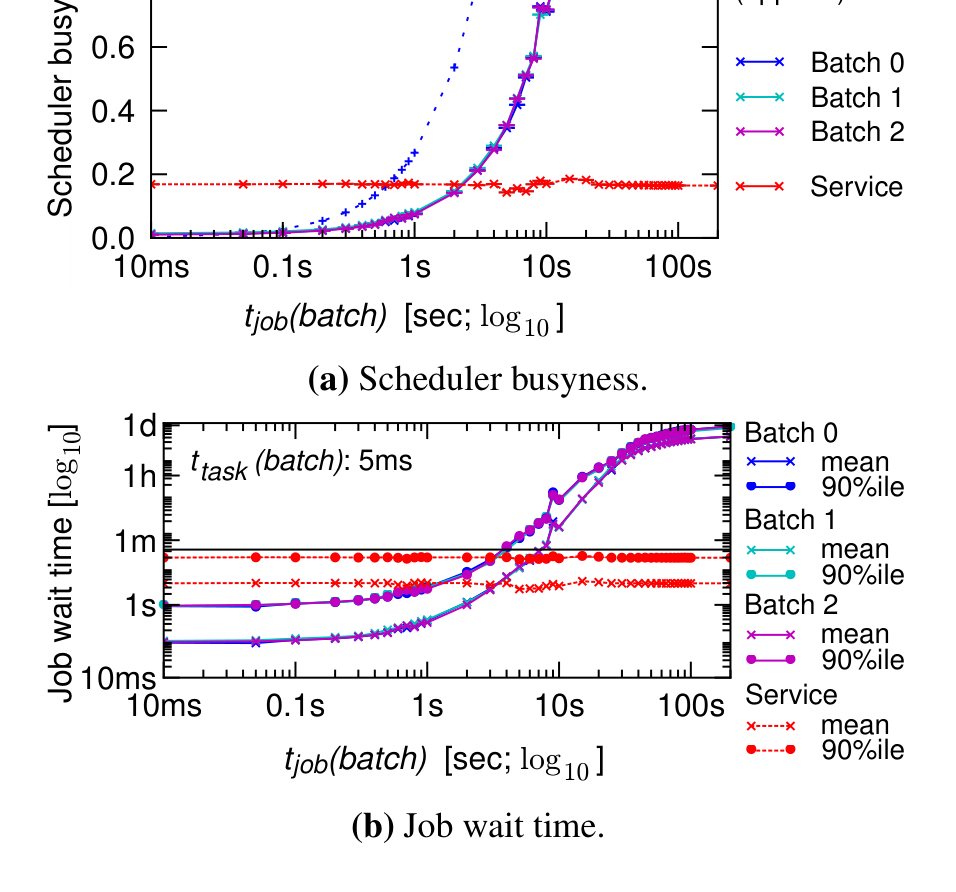

**Figure 13: Shared-state scheduling (Omega): performance effects of splitting the batch workload across 3 batch schedulers, varying $t_{\mathrm{job}}(\mathrm{batch})$ in a 24h trace from cluster C.**

> **图 13：使用集群 C 的 24 小时跟踪，把批处理工作负载拆给 3 个调度器后，批处理作业调度时间变化带来的性能影响。**
>
> **图表中文解读：** 把批处理负载分给多个调度器改善吞吐，但并行度提升也增加冲突；结果展示了共享状态架构的横向扩展边界。

In short, load-balancing across multiple schedulers can increase scalability to increasing job arrival rates. Of course, the scale-up must be sub-linear due to of the overhead of maintaining and updating the local copies of cell state, and this approach will not easily handle hundreds of schedulers. Our comparison point, however, is a single monolithic scheduler, so even a single-digit speedup is helpful.

> 简而言之，跨多个调度器的负载平衡可以提高可扩展性，从而提高作业到达率。当然，由于维护和更新Cell状态的本地副本的开销，扩展必须是次线性的，并且这种方法无法轻松处理数百个调度器。然而，我们的比较点是单个单体调度器，因此即使是个位数的加速也是有帮助的。

In summary, the Omega architecture scales well, and tolerates large decision times on real cluster workloads.

> 总之，Omega 架构具有良好的可扩展性，并且可以容忍实际集群工作负载上的大量决策时间。

### 5.2 Dealing with conflicts｜冲突处理

We also use the high-fidelity simulator to explore two implementation choices we were considering for Omega.

> 我们还使用高保真模拟器来探索我们为 Omega 考虑的两种实施选择。

In the first, coarse-grained conflict detection, a scheduler’s placement choice would be rejected if any changes had been made to the target machine since the local copy of cell state was synchronized at the beginning of the transaction. This can be implemented with a simple sequence number in the machine’s state object.

> 在第一个粗粒度冲突检测中，如果对目标机器进行任何更改，则调度器的放置选择将被拒绝，因为Cell状态的本地副本在事务开始时已同步。这可以通过机器状态对象中的简单序列号来实现。

In the second, all-or-nothing scheduling, an entire cell state transaction would be rejected if it would cause any machine to be over-committed. The goal here was to support jobs that require gang scheduling, or that cannot perform any useful work until all their tasks are running.7 Not surprisingly, both alternatives lead to additional conflicts and higher scheduler busyness (Figure 14). While turning on all-or-nothing scheduling for all jobs only leads to a minor increase in scheduler busyness when using fine-grained conflict detection (Figure 14a), it does increase conflict fraction by about 2× as retries now must re-place all tasks, increasing their chance of failing again (Figure 14a). Thus, this option should only be used on a job-level granularity. Relying on coarse-grained conflict detection makes things even worse: spurious conflicts lead to increases in conflict rate, and consequently scheduler busyness, by 2–3×. Clearly, incremental transactions should be the default.

> 在第二种全有或全无的调度中，如果整个Cell状态事务会导致任何机器过度提交，则整个Cell状态事务将被拒绝。这里的目标是支持需要成成组调度的作业，或者在所有任务运行之前无法执行任何有用工作的作业。7 毫不奇怪，这两种替代方案都会导致额外的冲突和更高的调度器繁忙度（图 14）。虽然在使用细粒度冲突检测时，对所有作业启用全有或全无调度只会导致调度器繁忙度略有增加（图 14a），但它确实使冲突比例增加了约 2 倍，因为重试现在必须重新放置所有任务，从而增加了再次失败的机会（图 14a）。因此，此选项只能在作业级别粒度上使用。依赖粗粒度的冲突检测会让事情变得更糟：虚假冲突导致冲突率增加，从而导致调度器繁忙度增加 2-3 倍。显然，增量事务应该是默认的。

7 This is supported by Google’s current scheduler, but it is only rarely used due to the expectation of machine failures, which disrupt jobs anyway.

> 7 Google 当前的调度器支持此功能，但由于机器故障的预期而很少使用，无论如何都会中断作业。

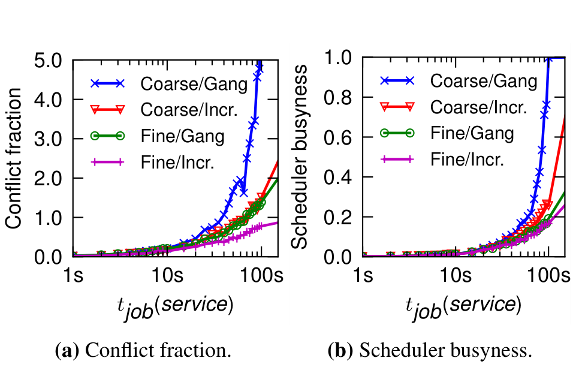

**Figure 14: Shared-state scheduling (Omega): effect of gang scheduling and coarse-grained conflict detection as a function of $t_{\mathrm{job}}(\mathrm{service})$ (cluster C, 29 days); mean daily values.**

> **图 14：在集群 C 的 29 天跟踪上，成组调度与粗粒度冲突检测随服务作业调度时间变化而产生的影响；图中为每日均值。**
>
> **图表中文解读：** 成组调度或把整个作业视作一个冲突单元都会放大事务范围，导致冲突率和忙碌度上升；增量事务应是默认选择。

## 6 Flexibility: a MapReduce scheduler｜灵活性：MapReduce 调度器

Finally, we explore how well we can meet two additional design goals of the Omega shared-state model: supporting specialized schedulers, and broadening the kinds of decisions that schedulers can perform compared to the two-level approach. This is somewhat challenging to evaluate quantitatively, so we proceed by way of a case study that adds a specialized scheduler for MapReduce jobs.

> 最后，我们探讨了如何更好地满足 Omega 共享状态模型的两个额外设计目标：支持专门的调度器，以及与两级方法相比，扩大调度器可以执行的决策的类别。定量评估有些困难，因此我们通过案例研究来进行，为 MapReduce 作业添加专门的调度器。

Cluster users at Google currently specify the number of workers for a MapReduce job and their resource requirements at job submission time, and the MapReduce framework schedules map and reduce activities8 onto these workers. Because the available resources vary over time and between clusters, most users pick the number of workers based on a combination of intuition, trial-and-error and experience: data from a month’s worth of MapReduce jobs run at Google showed that frequently observed values were 5, 11, 200 and 1,000 workers.

> Google 的集群用户当前指定 MapReduce 作业的工作人员数量及其在作业提交时的资源要求，并且 MapReduce 框架将映射和减少活动 8 安排到这些工作人员上。由于可用资源随时间以及集群之间的变化而变化，因此大多数用户根据直觉、反复试验和经验的结合来选择工作人员数量：Google 运行的一个月 MapReduce 作业的数据显示，经常观察到的值为 5、11、200 和 1,000 个工作人员。

8 These are typically called “tasks” in literature, but we have renamed them to avoid confusion with the cluster-scheduler level tasks that substantiate MapReduce “workers”.

> 8 这些在文献中通常被称为“任务”，但我们已将它们重命名，以避免与证实 MapReduce“工作人员”的集群调度器级别任务混淆。

What if the number of workers could be chosen automatically if additional resources were available, so that jobs could complete sooner? Our specialized MapReduce scheduler does just this by opportunistically using idle cluster resources to speed up MapReduce jobs. It observes the overall resource utilization in the cluster, predicts the benefits of scaling up current and pending MapReduce jobs, and apportions some fraction of the unused resources across those jobs according to some policy.

> 如果有额外的资源可用，可以自动选择工人数量，以便作业可以更快完成，结果会怎样呢？我们专门的 MapReduce 调度器通过机会性地使用空闲集群资源来加速 MapReduce 作业来实现这一点。它观察集群中的整体资源利用率，预测扩展当前和待处理的 MapReduce 作业的好处，并根据某些策略在这些作业之间分配部分未使用的资源。

MapReduce jobs are particularly well-suited to this approach because it is possible to build reasonably accurate models of how a job’s resource allocation affects its running time [12, 26]. About 20% of jobs in Google are MapReduce ones, and many of them are run repeatedly, so historical data is available to build models. Many of the jobs are low-priority, “best effort” computations that have to make way for higher-priority service jobs, and so may benefit from exploiting spare resources in the meantime [3].

> MapReduce 作业特别适合这种方法，因为可以建立相当准确的模型来了解作业的资源分配如何影响其运行时间 [12, 26]。Google 大约 20% 的作业是 MapReduce 作业，其中许多作业是重复运行的，因此可以使用历史数据来构建模型。许多作业都是低优先级、“尽力而为”的计算，必须为更高优先级的服务作业让路，因此可能会从同时利用闲置资源中受益 [3]。

### 6.1 Implementation｜实现

Since our goal is to investigate scheduler flexibility rather than demonstrate accurate MapReduce modelling, we deliberately use a simple performance model that only relies on historical data about the job’s average map and reduce activity duration. It assumes that adding more workers results in an idealized linear speedup (modulo dependencies between mappers and reducers), up to the point where map activities and all reduce activities respectively run in parallel. Since large MapReduce jobs typically have many more of these activities than configured workers, we usually run out of available resources before this point.

> 由于我们的目标是研究调度器的灵活性，而不是演示准确的 MapReduce 建模，因此我们特意使用一个简单的性能模型，该模型仅依赖于有关作业平均映射的历史数据并减少活动持续时间。它假设添加更多工作线程会导致理想化的线性加速（映射器和化简器之间的模依赖关系），直到映射活动和所有化简活动分别并行运行。由于大型 MapReduce 作业通常比配置的工作线程具有更多的此类活动，因此我们通常会在此之前耗尽可用资源。

We consider three different policies for adding resources: max-parallelism, which keeps on adding workers as long as benefit is obtained, global cap, which stops the MapReduce scheduler using idle resources if the total cluster utilization is above a target value, and relative job size, which limits the maximum number of workers to four times as many as it initially requested. In each case, a set of resource allocations to be investigated is run through the predictive model, and the allocation leading to the earliest possible finish time is used. More elaborate approaches and objective functions, such as used in deadline-based schedulering [10], are certainly possible, but not the focus of this case study.

> 我们考虑三种不同的添加资源策略：最大并行度（只要获得收益就不断添加工作线程）、全局上限（如果集群总利用率高于目标值则停止使用空闲资源的 MapReduce 调度器）以及相对作业大小（将最大工作线程数限制为最初请求的四倍）。在每种情况下，都会通过预测模型运行一组要调查的资源分配，并使用导致最早可能完成时间的分配。更复杂的方法和目标函数，例如用于基于截止日期的调度[10]，当然是可能的，但不是本案例研究的重点。

### 6.2 Evaluation｜评估

We evaluate the three different resource-allocation policies using traces from clusters A and C, plus cluster D, which is a small, lightly-loaded cluster that is about a quarter of the size of cluster C. Our results suggest that 50–70% of MapReduce jobs can benefit from acceleration using opportunistic resources (Figure 15). The huge speedups seen in the tail should be taken with a pinch of salt due to our simple linear speedup model, but we have more confidence in the values for the 80th percentile, and here, our simulations predict a speedup of 3–4× using the eager max-parallelism policy.

> 我们使用集群 A 和 C 以及集群 D 的跟踪来评估三种不同的资源分配策略，集群 D 是一个小型轻负载集群，大小约为集群 C 的四分之一。我们的结果表明，50-70% 的 MapReduce 作业可以从使用机会资源的加速中受益（图 15）。由于我们简单的线性加速模型，我们对尾部看到的巨大加速应该持保留态度，但我们对第 80 个百分位数的值更有信心，在这里，我们的模拟预测使用急切最大并行策略可以实现 3-4 倍的加速。

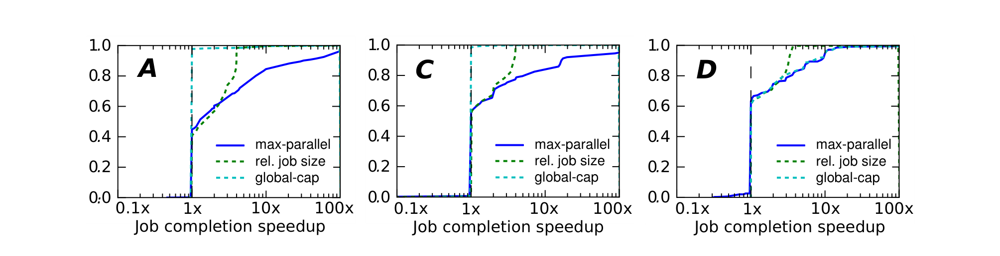

**Figure 15: CDF of potential per-job speedups using different policies on clusters A, C and D (a small, lightly-utilized cluster).**

> **图 15：在集群 A、C、D 上采用不同策略时，每个作业潜在加速比的 CDF。**
>
> **图表中文解读：** 利用全局空闲资源动态提高作业并行度，能显著缩短部分作业的完成时间；尾部收益尤其明显。

Although the max-parallelism policy produces the largest improvements, the relative job size policy also does quite well, and its speedups probably have a higher likelihood of being achieved because it requires fewer new MapReduce workers to be constructed: the time to set up a worker on a new machine is not fully accounted for in the simple model. The global cap policy performs almost as well as max-parallelism in the small, under-utilized cluster D, but achieves little or no benefit elsewhere, since the cluster utilization is usually above the threshold, which was set at 60%.

> 尽管最大并行度策略产生了最大的改进，但相对作业大小策略也表现得相当好，并且其加速实现的可能性可能更高，因为它需要构建更少的新 MapReduce 工作程序：在简单模型中没有完全考虑在新机器上设置工作程序的时间。全局上限策略在小型、未充分利用的集群 D 中的性能几乎与最大并行度一样好，但在其他地方几乎没有或没有任何好处，因为集群利用率通常高于阈值（设置为 60%）。

Adding resources to a MapReduce job will cause the cluster’s resource utilization to increase, and should result in the job completing sooner, at which point all of the job’s resources will free up. An effect of this is an increase in the variability of the cluster’s resource utilization (Figure 16).

> 向 MapReduce 作业添加资源将导致集群的资源利用率增加，并且应该会导致作业更快完成，此时作业的所有资源都将被释放。这样做的结果是集群资源利用率的可变性增加（图 16）。

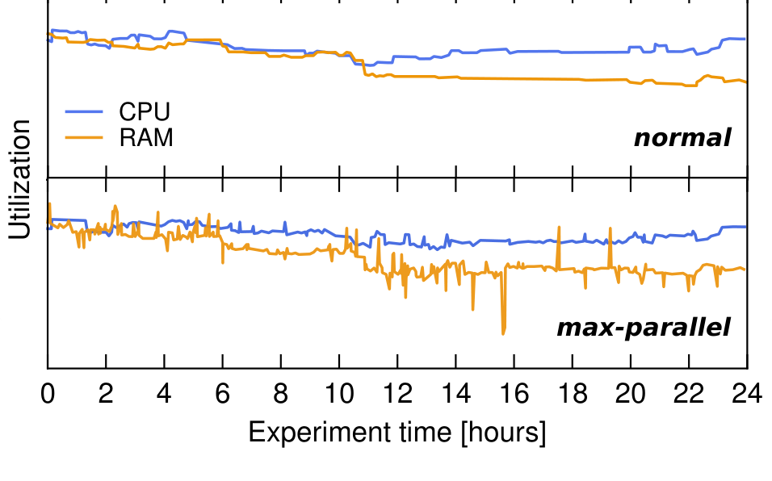

**Figure 16: Time series of normalized cluster utilization on cluster C without the specialized Omega MapReduce scheduler (top), and in max-parallelism mode (bottom).**

> **图 16：集群 C 不使用专用 Omega MapReduce 调度器时（上）与采用最大并行度模式时（下）的归一化集群利用率时间序列。**
>
> **图表中文解读：** 专用 MapReduce 调度器让作业在空闲资源出现时扩张、资源紧张时收缩，从而提高 CPU/RAM 利用率而不改变共享状态核心。

To do its work, the MapReduce scheduler relies on being able to see the entire cluster’s state, which is straightforward in the Omega architecture. A similar argument can be made for a specialized service scheduler for highly-constrained, high-priority jobs. Scheduling them requires determining which machines are applicable, and deciding how best to place the new job while minimizing the number of preemptions caused to lower-priority jobs. The shared-state model is ideally suited to this. Our prototype MapReduce scheduler demonstrates that adding a specialized functionality to the Omega system is straightforward (unlike with our current production scheduler).

> 为了完成其工作，MapReduce 调度器依赖于能够查看整个集群的状态，这在 Omega 架构中非常简单。对于高度受限、高优先级作业的专用服务调度器也可以提出类似的论点。调度它们需要确定哪些机器适用，并决定如何最好地放置新作业，同时最大限度地减少对低优先级作业造成的抢占次数。共享状态模型非常适合于此。我们的原型 MapReduce 调度器表明，向 Omega 系统添加专门的功能非常简单（与我们当前的生产调度器不同）。

## 7 Additional related work｜补充相关工作

Large-scale cluster resource scheduling is not a novel challenge. Many researchers have considered this problem before, and different solutions have been proposed in the HPC, middleware and “cloud” communities. We discussed several examples in §3, and further discussed the relative merits of these approaches in §4.

> 大规模集群资源调度并不是一个新的挑战。许多研究人员之前已经考虑过这个问题，并且在高性能计算、中间件和“云”社区中提出了不同的解决方案。我们在第 3 节中讨论了几个示例，并在第 4 节中进一步讨论了这些方法的相对优点。

The Omega approach builds on many prior ideas. Scheduling using shared state is an example of optimistic concurrency control, which has been explored by the database community for a long time [18], and, more recently, considered for general memory access in the transactional memory community [2].

> Omega 方法建立在许多先前的想法之上。使用共享状态的调度是乐观并发控制的一个例子，数据库社区已经对此进行了很长时间的探索[18]，并且最近在事务内存社区中考虑用于一般内存访问[2]。

Exposing the entire cluster state to each scheduler is not unlike the Exokernel approach of removing abstractions and exposing maximal information to applications [9]. The programming language and OS communities have recently revisited application level scheduling as an alternative to general-purpose thread and process schedulers, arguing that a single, global OS scheduler is neither scalable, nor flexible enough for modern multi-core applications’ demands [22].

> 将整个集群状态暴露给每个调度器与移除抽象并向应用程序暴露最大信息的 Exokernel 方法没有什么不同 [9]。编程语言和操作系统社区最近重新审视了应用程序级调度，作为通用线程和进程调度器的替代方案，认为单个全局操作系统调度器既不具有可扩展性，也不够灵活，无法满足现代多核应用程序的需求[22]。

Amoeba [3] implements opportunistic allocation of spare resources to jobs, with motivation similar to our MapReduce scheduler use-case. However, it achieves this by complex communication between resource and application managers, whereas Omega naturally lends itself to such designs as it exposes the entire cluster state to all schedulers.

> Amoeba [3] 实现了将备用资源机会分配给作业，其动机类似于我们的 MapReduce 调度器用例。然而，它通过资源和应用程序管理器之间的复杂通信来实现这一点，而 Omega 自然适合这种设计，因为它将整个集群状态暴露给所有调度器。

## 8 Conclusions and future work｜结论与未来工作

This investigation is part of a wider effort to build Omega, Google’s next-generation cluster management platform. Here, we specifically focused on a cluster scheduling architecture that uses parallelism, shared state, and optimistic concurrency control. Our performance evaluation of the Omega model using both lightweight simulations with synthetic workloads, and high-fidelity, trace-based simulations of production workloads at Google, shows that optimistic concurrency over shared state is a viable, attractive approach to cluster scheduling.

> 这项研究是构建 Google 下一代集群管理平台 Omega 的更广泛努力的一部分。在这里，我们特别关注使用并行性、共享状态和乐观并发控制的集群调度架构。我们使用合成工作负载的轻量级模拟以及 Google 生产工作负载的高保真、基于跟踪的模拟对 Omega 模型进行性能评估，结果表明共享状态上的乐观并发是一种可行且有吸引力的集群调度方法。

Although this approach will do strictly more work than a pessimistic locking scheme as work may need to be re-done, we found the overhead to be acceptable at reasonable operating points, and the resulting benefits in eliminating head-of-line blocking and better scalability to often outweigh it. We also found that Omega’s approach offers an attractive platform for development of specialized schedulers, and illustrated its flexibility by adding a MapReduce scheduler with opportunistic resource adjustment.

> 尽管这种方法会比悲观锁定方案做更多的工作，因为工作可能需要重新完成，但我们发现在合理的操作点上，开销是可以接受的，并且消除队头阻塞和更好的可扩展性所带来的好处常常超过它。我们还发现 Omega 的方法为开发专用调度器提供了一个有吸引力的平台，并通过添加具有机会资源调整功能的 MapReduce 调度器来展示其灵活性。

Future work could usefully focus on ways to provide global guarantees (fairness, starvation avoidance, etc.) in the Omega model: this is an area where centralized control makes life easier. Furthermore, we believe there are some techniques from the database community that could be applied to reduce the likelihood and effects of interference for schedulers with long decision times. We hope to explore some of these in the future.

> 未来的工作可以有效地关注在 Omega 模型中提供全局保证（公平、避免饥饿等）的方法：这是一个集中控制使生活变得更轻松的领域。此外，我们相信数据库社区有一些技术可以用来减少决策时间长的调度器受到干扰的可能性和影响。我们希望将来能够探索其中的一些。

## Acknowledgements｜致谢

Many people contributed to the work described in this paper. Members of the Omega team at Google who contributed to this design include Brian Grant, David Oppenheimer, Jason Hickey, Jutta Degener, Rune Dahl, Todd Wang and Walfredo Cirne. We would like to thank the Mesos team at UC Berkeley for many fruitful and interesting discussions about Mesos, and Joseph Hellerstein for his early work on modeling scheduler interference in Omega. Derek Murray, Steven Hand and Alexey Tumanov provided valuable feedback on draft versions of this paper. The final version was much improved by comments from the anonymous reviewers.

> 许多人对本文所述的工作做出了贡献。对此设计做出贡献的 Google Omega 团队成员包括 Brian Grant、David Oppenheimer、Jason Hickey、Jutta Degener、Rune Dahl、Todd Wang 和 Walfredo Cirne。我们要感谢加州大学伯克利分校的 Mesos 团队对 Mesos 进行了许多富有成效和有趣的讨论，并感谢 Joseph Hellerstein 在 Omega 中对调度器干扰进行建模的早期工作。Derek Murray、Steven Hand 和 Alexey Tumanov 对本文的草稿版本提供了宝贵的反馈。根据匿名审稿人的意见，最终版本得到了很大的改进。

## References｜参考文献

[1] ADAPTIVE COMPUTING ENTERPRISES INC. Maui Scheduler Administrator’s Guide, 3.2 ed. Provo, UT, 2011.

> [1] ADAPTIVE COMPUTING ENTERPRISES INC. Maui Scheduler 管理员指南，3.2 版。犹他州普罗沃，2011 年。

[2] ADL-TABATABAI, A.-R., LEWIS, B. T., MENON, V., MUR- PHY, B. R., SAHA, B., AND SHPEISMAN, T. Compiler and runtime support for efficient software transactional memory. In Proceedings of PLDI (2006), pp. 26–37.

> [2] ADL-TABATABAI, A.-R., LEWIS, B. T., MENON, V., MUR- PHY, B. R., SAHA, B., AND SHPEISMAN, T. 编译器和运行时支持高效的软件事务内存。PLDI 会议记录（2006 年），第 26-37 页。

[3] ANANTHANARAYANAN, G., DOUGLAS, C., RAMAKRISH- NAN, R., RAO, S., AND STOICA, I. True elasticity in multi-tenant data-intensive compute clusters. In Proceedings of SoCC (2012), p. 24.

> [3] ANANTHANARAYANAN, G., DOUGLAS, C., RAMAKRISH- NAN, R., RAO, S., AND STOICA, I. 多租户数据密集型计算集群的真正弹性。SoCC 会议记录（2012 年），第 24 页。

[4] APACHE. Hadoop On Demand. http://goo.gl/px8Yd, 2007. Accessed 20/06/2012.

> [4] APACHE. Hadoop 按需。http://goo.gl/px8Yd，2007 年。访问时间：2012 年 6 月 20 日。

[5] CHANG, F., DEAN, J., GHEMAWAT, S., HSIEH, W. C., WALLACH, D. A., BURROWS, M., CHANDRA, T., FIKES, A., AND GRUBER, R. E. Bigtable: A Distributed Storage System for Structured Data. ACM Transactions on Computer Systems 26, 2 (June 2008), 4:1–4:26.

> [5] CHANG, F., DEAN, J., GHEMAWAT, S., HSIEH, W. C., WALLACH, D. A., BURROWS, M., CHANDRA, T., FIKES, A., AND GRUBER, R. E. Bigtable：结构化数据的分布式存储系统。ACM 计算机系统学报 26, 2（2008 年 6 月），4:1–4:26。

[6] CHEN, Y., ALSPAUGH, S., BORTHAKUR, D., AND KATZ, R. Energy efficiency for large-scale MapReduce workloads with significant interactive analysis. In Proceedings of EuroSys (2012).

> [6] CHEN, Y., ALSPAUGH, S., BORTHAKUR, D., AND KATZ, R. 面向包含大量交互式分析的大规模 MapReduce 工作负载的能效。EuroSys 会议记录（2012 年）。

[7] CHEN, Y., GANAPATHI, A. S., GRIFFITH, R., AND KATZ, R. H. Design insights for MapReduce from diverse production workloads. Tech. Rep. UCB/EECS–2012–17, UC Berkeley, Jan. 2012.

> [7] CHEN, Y., GANAPATHI, A. S., GRIFFITH, R., AND KATZ, R. H. 从不同的生产工作负载中获得 MapReduce 的设计见解。技术报告 UCB/EECS–2012–17，加州大学伯克利分校，2012 年 1 月。

[8] DEAN, J., AND GHEMAWAT, S. MapReduce: Simplified data processing on large clusters. CACM 51, 1 (2008), 107–113.

> [8] DEAN, J., AND GHEMAWAT, S. MapReduce：简化大型集群上的数据处理。CACM 51, 1 (2008), 107–113。

[9] ENGLER, D. R., KAASHOEK, M. F., AND O’TOOLE, JR., J. Exokernel: an operating system architecture for application-level resource management. In Proceedings of SOSP (1995), pp. 251–266.

> [9] ENGLER, D. R., KAASHOEK, M. F., AND O’TOOLE, JR., J. Exokernel：用于应用程序级资源管理的操作系统架构。《SOSP 会议录》（1995 年），第 251-266 页。

[10] FERGUSON, A. D., BODIK, P., KANDULA, S., BOUTIN, E., AND FONSECA, R. Jockey: guaranteed job latency in data parallel clusters. In Proceedings of EuroSys (2012), pp. 99– 112.

> [10] FERGUSON, A. D., BODIK, P., KANDULA, S., BOUTIN, E., AND FONSECA, R. Jockey：保证数据并行集群中的作业延迟。《EuroSys 会议记录》（2012 年），第 99-112 页。

[11] GHODSI, A., ZAHARIA, M., HINDMAN, B., KONWINSKI, A., SHENKER, S., AND STOICA, I. Dominant resource fairness: fair allocation of multiple resource types. In Proceedings of NSDI (2011), pp. 323–336.

> [11] GHODSI, A., ZAHARIA, M., HINDMAN, B., KONWINSKI, A., SHENKER, S., AND STOICA, I. 主导资源公平：多种资源类型的公平分配。NSDI 会议记录（2011 年），第 323-336 页。

[12] HERODOTOU, H., DONG, F., AND BABU, S. No one (cluster) size fits all: automatic cluster sizing for data-intensive analytics. In Proceedings of SoCC (2011).

> [12] HERODOTOU, H., DONG, F., AND BABU, S. 没有一种（集群）大小适合所有情况：用于数据密集型分析的自动集群大小调整。SoCC 会议记录（2011 年）。

[13] HINDMAN, B., KONWINSKI, A., ZAHARIA, M., GHODSI, A., JOSEPH, A., KATZ, R., SHENKER, S., AND STOICA, I. Mesos: a platform for fine-grained resource sharing in the data center. In Proceedings of NSDI (2011).

> [13] HINDMAN, B., KONWINSKI, A., ZAHARIA, M., GHODSI, A., JOSEPH, A., KATZ, R., SHENKER, S., AND STOICA, I. Mesos：数据中心细粒度资源共享的平台。NSDI 会议记录（2011 年）。

[14] IQBAL, S., GUPTA, R., AND FANG, Y.-C. Planning considerations for job scheduling in HPC clusters. Dell Power Solutions (Feb. 2005).

> [14] IQBAL, S., GUPTA, R., AND FANG, Y.-C. HPC 集群中作业调度的规划注意事项。戴尔电源解决方案（2005 年 2 月）。

[15] ISARD, M., PRABHAKARAN, V., CURREY, J., WIEDER, U., TALWAR, K., AND GOLDBERG, A. Quincy: fair scheduling for distributed computing clusters. In Proceedings of SOSP (2009).

> [15] ISARD, M., PRABHAKARAN, V., CURREY, J., WIEDER, U., TALWAR, K., AND GOLDBERG, A. Quincy：分布式计算集群的公平调度。SOSP 会议记录（2009 年）。

[16] JACKSON, D. AND SNELL, Q. AND CLEMENT, M. Core algorithms of the Maui scheduler. In Job Scheduling Strategies for Parallel Processing. 2001, pp. 87–102.

> [16] JACKSON, D. AND SNELL, Q. AND CLEMENT, M. Maui 调度器的核心算法。在并行处理的作业调度策略中。2001 年，第 87-102 页。

[17] KAVULYA, S., TAN, J., GANDHI, R., AND NARASIMHAN, P. An analysis of traces from a production MapReduce cluster. In Proceedings of CCGrid (2010), pp. 94–103.

> [17] KAVULYA, S., TAN, J., GANDHI, R., AND NARASIMHAN, P. 对生产 MapReduce 集群的跟踪分析。CCGrid 会议记录 (2010)，第 94-103 页。

[18] KUNG, H. T., AND ROBINSON, J. T. On optimistic methods for concurrency control. ACM Transactions on Database Systems 6, 2 (June 1981), 213–226.

> [18] KUNG, H. T., AND ROBINSON, J. T. 并发控制的乐观方法。ACM 数据库系统交易 6, 2（1981 年 6 月）, 213–226。

[19] MALEWICZ, G., AUSTERN, M., BIK, A., DEHNERT, J., HORN, I., LEISER, N., AND CZAJKOWSKI, G. Pregel: a system for large-scale graph processing. In Proceedings of SIGMOD (2010), pp. 135–146.

> [19] MALEWICZ, G., AUSTERN, M., BIK, A., DEHNERT, J., HORN, I., LEISER, N., AND CZAJKOWSKI, G. Pregel：大规模图形处理系统。SIGMOD 会议记录 (2010)，第 135–146 页。

[20] MISHRA, A. K., HELLERSTEIN, J. L., CIRNE, W., AND DAS, C. R. Towards characterizing cloud backend workloads: insights from Google compute clusters. SIGMETRICS Performance Evaluation Review 37 (Mar. 2010), 34–41.

> [20] MISHRA, A. K., HELLERSTEIN, J. L., CIRNE, W., AND DAS, C. R. 描绘云后端工作负载的特征：来自 Google 计算集群的见解。SIGMETRICS 性能评估回顾 37（2010 年 3 月），34-41。

[21] MURTHY, A. C., DOUGLAS, C., KONAR, M., O’MALLEY, O., RADIA, S., AGARWAL, S., AND K V, V. Architecture of next generation Apache Hadoop MapReduce framework. Tech. rep., Apache Hadoop, 2011.

> [21] MURTHY, A. C., DOUGLAS, C., KONAR, M., O’MALLEY, O., RADIA, S., AGARWAL, S., AND K V, V. 下一代 Apache Hadoop MapReduce 框架的架构。技术。代表，Apache Hadoop，2011 年。

[22] PAN, H., HINDMAN, B., AND ASANOVIĆ, K. Lithe: enabling efficient composition of parallel libraries. In Proceedings of HotPar (2009).

> [22] PAN, H., HINDMAN, B., AND ASANOVIĆ, K. Lithe：实现并行库的高效组合。《HotPar 会议记录》（2009 年）。

[23] PENG, D., AND DABEK, F. Large-scale incremental processing using distributed transactions and notifications. In Proceedings of OSDI (2010).

> [23] PENG, D., AND DABEK, F. 使用分布式事务和通知进行大规模增量处理。OSDI 会议记录（2010 年）。

[24] REISS, C., TUMANOV, A., GANGER, G. R., KATZ, R. H., AND KOZUCH, M. A. Heterogeneity and dynamicity of clouds at scale: Google trace analysis. In Proceedings of SoCC (2012).

> [24] REISS, C., TUMANOV, A., GANGER, G. R., KATZ, R. H., AND KOZUCH, M. A. 大规模云的异质性和动态性：谷歌跟踪分析。SoCC 会议记录（2012 年）。

[25] SHARMA, B., CHUDNOVSKY, V., HELLERSTEIN, J., RI- FAAT, R., AND DAS, C. Modeling and synthesizing task placement constraints in Google compute clusters. In Proceedings of SoCC (2011).

> [25] SHARMA, B., CHUDNOVSKY, V., HELLERSTEIN, J., RI- FAAT, R., AND DAS, C. 在 Google 计算集群中建模和综合任务放置约束。SoCC 会议记录（2011 年）。

[26] VERMA, A., CHERKASOVA, L., AND CAMPBELL, R. SLO-driven right-sizing and resource provisioning of MapReduce jobs. In Proceedings of LADIS (2011).

> [26] VERMA, A., CHERKASOVA, L., AND CAMPBELL, R. SLO 驱动的 MapReduce 作业规模调整和资源配置。LADIS 会议记录（2011 年）。

[27] WILKES, J. More Google cluster data. Google research blog, Nov. 2011. Posted at http://goo.gl/9B7PA.

> [27] WILKES, J. 更多 Google 集群数据。Google 研究博客，2011 年 11 月。发布于 http://goo.gl/9B7PA。

[28] ZAHARIA, M., BORTHAKUR, D., SEN SARMA, J., ELMELEEGY, K., SHENKER, S., AND STOICA, I. Delay scheduling: A simple technique for achieving locality and fairness in cluster scheduling. In Proceedings of EuroSys (2010), pp. 265–278.

> [28] ZAHARIA, M., BORTHAKUR, D., SEN SARMA, J., ELMELEEGY, K., SHENKER, S., AND STOICA, I. 延迟调度：一种在集群调度中实现局部性和公平性的简单技术。《EuroSys 会议记录》（2010 年），第 265-278 页。

[29] ZHANG, Q., HELLERSTEIN, J., AND BOUTABA, R. Characterizing task usage shapes in Google’s compute clusters. In Proceedings of LADIS (2011).

> [29] ZHANG, Q., HELLERSTEIN, J., AND BOUTABA, R. 表征 Google 计算集群中的任务使用形状。LADIS 会议记录（2011 年）。
