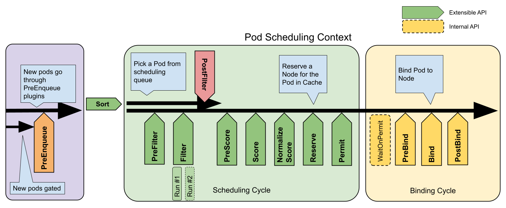

> **Source and translation basis｜来源与翻译依据**
>
> - [Scheduling Framework](https://kubernetes.io/docs/concepts/scheduling-eviction/scheduling-framework/)
>
> The English source and the official Simplified Chinese source were frozen at Kubernetes website commit [`890b36a496fb`](https://github.com/kubernetes/website/commit/890b36a496fb93c68efedc06385293ee35326df7) (2024-08-24). Kubernetes documentation content is licensed under [CC BY 4.0](https://creativecommons.org/licenses/by/4.0/); code samples are licensed under [Apache 2.0](https://www.apache.org/licenses/LICENSE-2.0).
>
> 英文原文与简体中文官方译文均固定于 Kubernetes 网站提交 [`890b36a496fb`](https://github.com/kubernetes/website/commit/890b36a496fb93c68efedc06385293ee35326df7)（2024-08-24）。本文逐个语义单元核对两种语言，并把官网构建时动态注入的术语定义、特性状态、示例代码与插图还原为可独立阅读的 Markdown。Kubernetes 文档内容采用 [CC BY 4.0](https://creativecommons.org/licenses/by/4.0/) 许可，代码示例采用 [Apache 2.0](https://www.apache.org/licenses/LICENSE-2.0/) 许可。

---

reviewers:
- ahg-g
title: Scheduling Framework
content_type: concept
weight: 60

**Feature state: Kubernetes v1.19 [stable]｜特性状态：Kubernetes v1.19 [stable]**

The _scheduling framework_ is a pluggable architecture for the Kubernetes scheduler.
It consists of a set of "plugin" APIs that are compiled directly into the scheduler.
These APIs allow most scheduling features to be implemented as plugins,
while keeping the scheduling "core" lightweight and maintainable. Refer to the
[design proposal of the scheduling framework][kep] for more technical information on
the design of the framework.

> **调度框架**是面向 Kubernetes 调度器的一种插件架构，
> 它由一组直接编译到调度程序中的“插件” API 组成。
> 这些 API 允许大多数调度功能以插件的形式实现，同时使调度“核心”保持简单且可维护。
> 请参考[调度框架的设计提案](https://github.com/kubernetes/enhancements/blob/master/keps/sig-scheduling/624-scheduling-framework/README.md)
> 获取框架设计的更多技术信息。
>
> [kep]: https://github.com/kubernetes/enhancements/blob/master/keps/sig-scheduling/624-scheduling-framework/README.md

## Framework workflow｜框架工作流程

The Scheduling Framework defines a few extension points. Scheduler plugins
register to be invoked at one or more extension points. Some of these plugins
can change the scheduling decisions and some are informational only.

> 调度框架定义了一些扩展点。调度器插件注册后在一个或多个扩展点处被调用。
> 这些插件中的一些可以改变调度决策，而另一些仅用于提供信息。

Each attempt to schedule one Pod is split into two phases, the
**scheduling cycle** and the **binding cycle**.

> 每次调度一个 Pod 的尝试都分为两个阶段，即**调度周期**和**绑定周期**。

### Scheduling Cycle & Binding Cycle｜调度周期和绑定周期

The scheduling cycle selects a node for the Pod, and the binding cycle applies
that decision to the cluster. Together, a scheduling cycle and binding cycle are
referred to as a "scheduling context".

> 调度周期为 Pod 选择一个节点，绑定周期将该决策应用于集群。
> 调度周期和绑定周期一起被称为“调度上下文”。

Scheduling cycles are run serially, while binding cycles may run concurrently.

> 调度周期是串行运行的，而绑定周期可能是同时运行的。

A scheduling or binding cycle can be aborted if the Pod is determined to
be unschedulable or if there is an internal error. The Pod will be returned to
the queue and retried.

> 如果确定 Pod 不可调度或者存在内部错误，则可以终止调度周期或绑定周期。
> Pod 将返回队列并重试。

## Interfaces｜接口

The following picture shows the scheduling context of a Pod and the interfaces
that the scheduling framework exposes.

> 下图显示了一个 Pod 的调度上下文以及调度框架公开的接口。

One plugin may implement multiple interfaces to perform more complex or
stateful tasks.

> 一个插件可能实现多个接口，以执行更为复杂或有状态的任务。

Some interfaces match the scheduler extension points which can be configured through
[Scheduler Configuration](https://kubernetes.io/docs/reference/scheduling/config/#extension-points).

> 某些接口与可以通过[调度器配置](https://kubernetes.io/zh-cn/docs/reference/scheduling/config/#extension-points)来设置的调度器扩展点匹配。



**Figure: Scheduling framework extension points｜图：调度框架扩展点**

> **图解：** 一次 Pod 调度被拆成调度周期与绑定周期。扩展点按执行顺序分布在队列、预过滤、过滤、打分、保留、许可、预绑定、绑定和后处理等阶段；插件只需实现对应接口即可介入流程，而调度器框架负责调用顺序、状态传递与失败处理。

### PreEnqueue｜PreEnqueue

These plugins are called prior to adding Pods to the internal active queue, where Pods are marked as
ready for scheduling.

Only when all PreEnqueue plugins return `Success`, the Pod is allowed to enter the active queue.
Otherwise, it's placed in the internal unschedulable Pods list, and doesn't get an `Unschedulable` condition.

For more details about how internal scheduler queues work, read
[Scheduling queue in kube-scheduler](https://github.com/kubernetes/community/blob/f03b6d5692bd979f07dd472e7b6836b2dad0fd9b/contributors/devel/sig-scheduling/scheduler_queues.md).

> 这些插件在将 Pod 被添加到内部活动队列之前被调用，在此队列中 Pod 被标记为准备好进行调度。
>
> 只有当所有 PreEnqueue 插件返回 `Success` 时，Pod 才允许进入活动队列。
> 否则，它将被放置在内部无法调度的 Pod 列表中，并且不会获得 `Unschedulable` 状态。
>
> 要了解有关内部调度器队列如何工作的更多详细信息，请阅读
> [kube-scheduler 调度队列](https://github.com/kubernetes/community/blob/f03b6d5692bd979f07dd472e7b6836b2dad0fd9b/contributors/devel/sig-scheduling/scheduler_queues.md)。
>
### EnqueueExtension｜EnqueueExtension

EnqueueExtension is the interface where the plugin can control
whether to retry scheduling of Pods rejected by this plugin, based on changes in the cluster.
Plugins that implement PreEnqueue, PreFilter, Filter, Reserve or Permit should implement this interface.

> EnqueueExtension 作为一个接口，插件可以在此接口之上根据集群中的变化来控制是否重新尝试调度被此插件拒绝的
> Pod。实现 PreEnqueue、PreFilter、Filter、Reserve 或 Permit 的插件应实现此接口。
>
### QueueingHint｜QueueingHint

**Feature state: Kubernetes v1.28 [beta]｜特性状态：Kubernetes v1.28 [beta]**

QueueingHint is a callback function for deciding whether a Pod can be requeued to the active queue or backoff queue.
It's executed every time a certain kind of event or change happens in the cluster.
When the QueueingHint finds that the event might make the Pod schedulable,
the Pod is put into the active queue or the backoff queue
so that the scheduler will retry the scheduling of the Pod.

> QueueingHint 作为一个回调函数，用于决定是否将 Pod 重新排队到活跃队列或回退队列。
> 每当集群中发生某种事件或变化时，此函数就会被执行。
> 当 QueueingHint 发现事件可能使 Pod 可调度时，Pod 将被放入活跃队列或回退队列，
> 以便调度器可以重新尝试调度 Pod。
>
> **Note｜说明**
QueueingHint evaluation during scheduling is a beta-level feature.
The v1.28 release series initially enabled the associated feature gate; however, after the
discovery of an excessive memory footprint, the Kubernetes project set that feature gate
to be disabled by default. In Kubernetes 1.31, this feature gate is
disabled and you need to enable it manually.
You can enable it via the
`SchedulerQueueingHints` [feature gate](https://kubernetes.io/docs/reference/command-line-tools-reference/feature-gates/).

> 在调度过程中对 QueueingHint 求值是一个 Beta 级别的特性。
> v1.28 的系列小版本最初都开启了这个特性的门控；但是发现了内存占用过多的问题，
> 于是 Kubernetes 项目将该特性门控设置为默认禁用。
> 在 Kubernetes 的 1.31 版本中，这个特性门控被禁用，你需要手动开启它。
> 你可以通过 `SchedulerQueueingHints`
> [特性门控](https://kubernetes.io/zh-cn/docs/reference/command-line-tools-reference/feature-gates/)来启用它。

### QueueSort｜队列排序

These plugins are used to sort Pods in the scheduling queue. A queue sort plugin
essentially provides a `Less(Pod1, Pod2)` function. Only one queue sort
plugin may be enabled at a time.

> 这些插件用于对调度队列中的 Pod 进行排序。
> 队列排序插件本质上提供 `Less(Pod1, Pod2)` 函数。
> 一次只能启动一个队列插件。

### PreFilter｜PreFilter

These plugins are used to pre-process info about the Pod, or to check certain
conditions that the cluster or the Pod must meet. If a PreFilter plugin returns
an error, the scheduling cycle is aborted.

> 这些插件用于预处理 Pod 的相关信息，或者检查集群或 Pod 必须满足的某些条件。
> 如果 PreFilter 插件返回错误，则调度周期将终止。

### Filter｜Filter

These plugins are used to filter out nodes that cannot run the Pod. For each
node, the scheduler will call filter plugins in their configured order. If any
filter plugin marks the node as infeasible, the remaining plugins will not be
called for that node. Nodes may be evaluated concurrently.

> 这些插件用于过滤出不能运行该 Pod 的节点。对于每个节点，
> 调度器将按照其配置顺序调用这些过滤插件。如果任何过滤插件将节点标记为不可行，
> 则不会为该节点调用剩下的过滤插件。节点可以被同时进行评估。

### PostFilter｜PostFilter

These plugins are called after the Filter phase, but only when no feasible nodes
were found for the pod. Plugins are called in their configured order. If
any postFilter plugin marks the node as `Schedulable`, the remaining plugins
will not be called. A typical PostFilter implementation is preemption, which
tries to make the pod schedulable by preempting other Pods.

> 这些插件在 Filter 阶段后调用，但仅在该 Pod 没有可行的节点时调用。
> 插件按其配置的顺序调用。如果任何 PostFilter 插件标记节点为 "Schedulable"，
> 则其余的插件不会调用。典型的 PostFilter 实现是抢占，试图通过抢占其他 Pod
> 的资源使该 Pod 可以调度。

### PreScore｜PreScore

These plugins are used to perform "pre-scoring" work, which generates a sharable
state for Score plugins to use. If a PreScore plugin returns an error, the
scheduling cycle is aborted.

> 这些插件用于执行“前置评分（pre-scoring）”工作，即生成一个可共享状态供 Score 插件使用。
> 如果 PreScore 插件返回错误，则调度周期将终止。

### Score｜Score

These plugins are used to rank nodes that have passed the filtering phase. The
scheduler will call each scoring plugin for each node. There will be a well
defined range of integers representing the minimum and maximum scores. After the
[NormalizeScore](#normalize-scoring) phase, the scheduler will combine node
scores from all plugins according to the configured plugin weights.

> 这些插件用于对通过过滤阶段的节点进行排序。调度器将为每个节点调用每个评分插件。
> 将有一个定义明确的整数范围，代表最小和最大分数。
> 在[标准化评分](#normalize-scoring)阶段之后，
> 调度器将根据配置的插件权重合并所有插件的节点分数。

### NormalizeScore｜NormalizeScore

These plugins are used to modify scores before the scheduler computes a final
ranking of Nodes. A plugin that registers for this extension point will be
called with the [Score](#scoring) results from the same plugin. This is called
once per plugin per scheduling cycle.

> 这些插件用于在调度器计算 Node 排名之前修改分数。
> 在此扩展点注册的插件被调用时会使用同一插件的 [Score](#scoring)
> 结果。每个插件在每个调度周期调用一次。

For example, suppose a plugin `BlinkingLightScorer` ranks Nodes based on how
many blinking lights they have.

> 例如，假设一个 `BlinkingLightScorer` 插件基于具有的闪烁指示灯数量来对节点进行排名。
>
```go
func ScoreNode(_ *v1.pod, n *v1.Node) (int, error) {
    return getBlinkingLightCount(n)
}
```

However, the maximum count of blinking lights may be small compared to
`NodeScoreMax`. To fix this, `BlinkingLightScorer` should also register for this
extension point.

> 然而，最大的闪烁灯个数值可能比 `NodeScoreMax` 小。要解决这个问题，
> `BlinkingLightScorer` 插件还应该注册该扩展点。
>
```go
func NormalizeScores(scores map[string]int) {
    highest := 0
    for _, score := range scores {
        highest = max(highest, score)
    }
    for node, score := range scores {
        scores[node] = score*NodeScoreMax/highest
    }
}
```

If any NormalizeScore plugin returns an error, the scheduling cycle is
aborted.

> 如果任何 NormalizeScore 插件返回错误，则调度阶段将终止。
>
> **Note｜说明**
Plugins wishing to perform "pre-reserve" work should use the
NormalizeScore extension point.

> 希望执行“预保留”工作的插件应该使用 NormalizeScore 扩展点。

>
### Reserve｜Reserve {#reserve}

A plugin that implements the Reserve interface has two methods, namely `Reserve`
and `Unreserve`, that back two informational scheduling phases called Reserve
and Unreserve, respectively. Plugins which maintain runtime state (aka "stateful
plugins") should use these phases to be notified by the scheduler when resources
on a node are being reserved and unreserved for a given Pod.

> 实现了 Reserve 接口的插件，拥有两个方法，即 `Reserve` 和 `Unreserve`，
> 他们分别支持两个名为 Reserve 和 Unreserve 的信息传递性质的调度阶段。
> 维护运行时状态的插件（又称"有状态插件"）应该使用这两个阶段，
> 以便在节点上的资源被保留和解除保留给特定的 Pod 时，得到调度器的通知。

The Reserve phase happens before the scheduler actually binds a Pod to its
designated node. It exists to prevent race conditions while the scheduler waits
for the bind to succeed. The `Reserve` method of each Reserve plugin may succeed
or fail; if one `Reserve` method call fails, subsequent plugins are not executed
and the Reserve phase is considered to have failed. If the `Reserve` method of
all plugins succeed, the Reserve phase is considered to be successful and the
rest of the scheduling cycle and the binding cycle are executed.

> Reserve 阶段发生在调度器实际将一个 Pod 绑定到其指定节点之前。
> 它的存在是为了防止在调度器等待绑定成功时发生竞争情况。
> 每个 Reserve 插件的 `Reserve` 方法可能成功，也可能失败；
> 如果一个 `Reserve` 方法调用失败，后面的插件就不会被执行，Reserve 阶段被认为失败。
> 如果所有插件的 `Reserve` 方法都成功了，Reserve 阶段就被认为是成功的，
> 剩下的调度周期和绑定周期就会被执行。

The Unreserve phase is triggered if the Reserve phase or a later phase fails.
When this happens, the `Unreserve` method of **all** Reserve plugins will be
executed in the reverse order of `Reserve` method calls. This phase exists to
clean up the state associated with the reserved Pod.

> 如果 Reserve 阶段或后续阶段失败了，则触发 Unreserve 阶段。
> 发生这种情况时，**所有** Reserve 插件的 `Unreserve` 方法将按照
> `Reserve` 方法调用的相反顺序执行。
> 这个阶段的存在是为了清理与保留的 Pod 相关的状态。
>
> **Caution｜注意**
The implementation of the `Unreserve` method in Reserve plugins must be
idempotent and may not fail.

> Reserve 插件中 `Unreserve` 方法的实现必须是幂等的，并且不能失败。

This is the last step in a scheduling cycle. Once a Pod is in the reserved
state, it will either trigger [Unreserve](#unreserve) plugins (on failure) or
[PostBind](#post-bind) plugins (on success) at the end of the binding cycle.

> 这个是调度周期的最后一步。
> 一旦 Pod 处于保留状态，它将在绑定周期结束时触发 [Unreserve](#unreserve) 插件（失败时）或
> [PostBind](#post-bind) 插件（成功时）。

### Permit｜Permit

_Permit_ plugins are invoked at the end of the scheduling cycle for each Pod, to
prevent or delay the binding to the candidate node. A permit plugin can do one of
the three things:

> **Permit** 插件在每个 Pod 调度周期的最后调用，用于防止或延迟 Pod 的绑定。
> 一个允许插件可以做以下三件事之一：

1.  **approve** \
    Once all Permit plugins approve a Pod, it is sent for binding.

> 1.  **批准** \
>     一旦所有 Permit 插件批准 Pod 后，该 Pod 将被发送以进行绑定。

1.  **deny** \
    If any Permit plugin denies a Pod, it is returned to the scheduling queue.
    This will trigger the Unreserve phase in [Reserve plugins](#reserve).

> 2.  **拒绝** \
>     如果任何 Permit 插件拒绝 Pod，则该 Pod 将被返回到调度队列。
>     这将触发 [Reserve 插件](#reserve)中的 Unreserve 阶段。

1.  **wait** (with a timeout) \
    If a Permit plugin returns "wait", then the Pod is kept in an internal "waiting"
    Pods list, and the binding cycle of this Pod starts but directly blocks until it
    gets approved. If a timeout occurs, **wait** becomes **deny**
    and the Pod is returned to the scheduling queue, triggering the
    Unreserve phase in [Reserve plugins](#reserve).

> 3. **等待**（带有超时）\
>     如果一个 Permit 插件返回“等待”结果，则 Pod 将保持在一个内部的“等待中”
>     的 Pod 列表，同时该 Pod 的绑定周期启动时即直接阻塞直到得到批准。
>     如果超时发生，**等待**变成**拒绝**，并且 Pod 将返回调度队列，从而触发
>     [Reserve 插件](#reserve)中的 Unreserve 阶段。
>
> **Note｜说明**
While any plugin can access the list of "waiting" Pods and approve them
(see [`FrameworkHandle`](https://git.k8s.io/enhancements/keps/sig-scheduling/624-scheduling-framework#frameworkhandle)),
we expect only the permit plugins to approve binding of reserved Pods that are in "waiting" state.
Once a Pod is approved, it is sent to the [PreBind](#pre-bind) phase.

> 尽管任何插件可以访问“等待中”状态的 Pod 列表并批准它们
> （查看 [`FrameworkHandle`](https://git.k8s.io/enhancements/keps/sig-scheduling/624-scheduling-framework#frameworkhandle)）。
> 我们期望只有允许插件可以批准处于“等待中”状态的预留 Pod 的绑定。
> 一旦 Pod 被批准了，它将发送到 [PreBind](#pre-bind) 阶段。

### PreBind｜PreBind

These plugins are used to perform any work required before a Pod is bound. For
example, a pre-bind plugin may provision a network volume and mount it on the
target node before allowing the Pod to run there.

> 这些插件用于执行 Pod 绑定前所需的所有工作。
> 例如，一个 PreBind 插件可能需要制备网络卷并且在允许 Pod
> 运行在该节点之前将其挂载到目标节点上。

If any PreBind plugin returns an error, the Pod is [rejected](#reserve) and
returned to the scheduling queue.

> 如果任何 PreBind 插件返回错误，则 Pod 将被[拒绝](#reserve)并且退回到调度队列中。

### Bind｜Bind

These plugins are used to bind a Pod to a Node. Bind plugins will not be called
until all PreBind plugins have completed. Each bind plugin is called in the
configured order. A bind plugin may choose whether or not to handle the given
Pod. If a bind plugin chooses to handle a Pod, **the remaining bind plugins are
skipped**.

> Bind 插件用于将 Pod 绑定到节点上。直到所有的 PreBind 插件都完成，Bind 插件才会被调用。
> 各 Bind 插件按照配置顺序被调用。Bind 插件可以选择是否处理指定的 Pod。
> 如果某 Bind 插件选择处理某 Pod，**剩余的 Bind 插件将被跳过**。

### PostBind｜PostBind

This is an informational interface. Post-bind plugins are called after a
Pod is successfully bound. This is the end of a binding cycle, and can be used
to clean up associated resources.

> 这是个信息传递性质的接口。
> PostBind 插件在 Pod 成功绑定后被调用。这是绑定周期的结尾，可用于清理相关的资源。

## Plugin API｜插件 API

There are two steps to the plugin API. First, plugins must register and get
configured, then they use the extension point interfaces. Extension point
interfaces have the following form.

> 插件 API 分为两个步骤。首先，插件必须完成注册并配置，然后才能使用扩展点接口。
> 扩展点接口具有以下形式。
>
```go
type Plugin interface {
    Name() string
}

type QueueSortPlugin interface {
    Plugin
    Less(*v1.pod, *v1.pod) bool
}

type PreFilterPlugin interface {
    Plugin
    PreFilter(context.Context, *framework.CycleState, *v1.pod) error
}

// ...
```

## Plugin configuration｜插件配置

You can enable or disable plugins in the scheduler configuration. If you are using
Kubernetes v1.18 or later, most scheduling
[plugins](https://kubernetes.io/docs/reference/scheduling/config/#scheduling-plugins) are in use and
enabled by default.

> 你可以在调度器配置中启用或禁用插件。
> 如果你在使用 Kubernetes v1.18 或更高版本，
> 大部分调度[插件](https://kubernetes.io/zh-cn/docs/reference/scheduling/config/#scheduling-plugins)都在使用中且默认启用。

In addition to default plugins, you can also implement your own scheduling
plugins and get them configured along with default plugins. You can visit
[scheduler-plugins](https://github.com/kubernetes-sigs/scheduler-plugins) for more details.

> 除了默认的插件，你还可以实现自己的调度插件并且将它们与默认插件一起配置。
> 你可以访问 [scheduler-plugins](https://github.com/kubernetes-sigs/scheduler-plugins)
> 了解更多信息。

If you are using Kubernetes v1.18 or later, you can configure a set of plugins as
a scheduler profile and then define multiple profiles to fit various kinds of workload.
Learn more at [multiple profiles](https://kubernetes.io/docs/reference/scheduling/config/#multiple-profiles).

> 如果你正在使用 Kubernetes v1.18 或更高版本，你可以将一组插件设置为一个调度器配置文件，
> 然后定义不同的配置文件来满足各类工作负载。
> 了解更多关于[多配置文件](https://kubernetes.io/zh-cn/docs/reference/scheduling/config/#multiple-profiles)。
