> **Source and translation basis｜来源与翻译依据**
>
> Sheng Yang, *Volumes as a Micro-Service: Distributed Block Storage Enabled by Docker*, Storage Developer Conference 2017. [SNIA source page](https://www.snia.org/educational-library/volumes-microservice-distributed-block-storage-enabled-docker-2017) and [source PDF](https://www.snia.org/sites/default/files/SDC/2017/presentations/Containers/Yang_Sheng_Volumes_as_a_Micro-service.pdf). The 20-slide PDF was released on September 14, 2017; its SHA-256 is `40ff02ec9dad92bc474fffdaf1088da1d06519022b3bdea2be6dd2b13f3068c7`.
>
> 本文以 SNIA 保存的 20 页演讲 PDF 为唯一正文依据，按照幻灯片顺序完整保留原页，并在英文转录后给出中文翻译。页码和每页重复出现的会议版权页脚不再抄入正文；其他可见标题、列表、图示标签、命令路径和文件布局均予以保留。文末的版本补注是译者为辨别 2017 年设计与当前 Longhorn 所加，不属于演讲原文。

## Slide 1 — Volumes as a Micro-Service｜第 1 页——卷即微服务

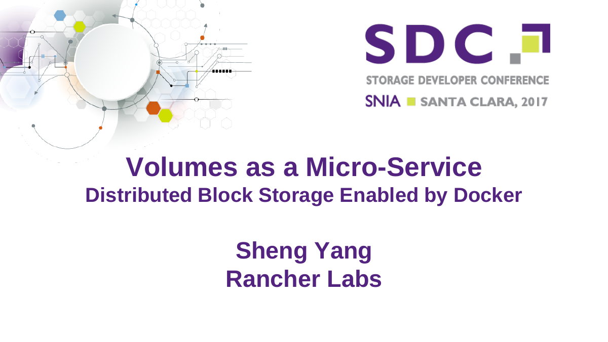

**Volumes as a Micro-Service**<br>
**Distributed Block Storage Enabled by Docker**<br>
Sheng Yang<br>
Rancher Labs

> **卷即微服务**
>
> **由 Docker 实现的分布式块存储**
>
> Sheng Yang<br>
> Rancher Labs

## Slide 2 — About me - Sheng Yang｜第 2 页——关于我：Sheng Yang

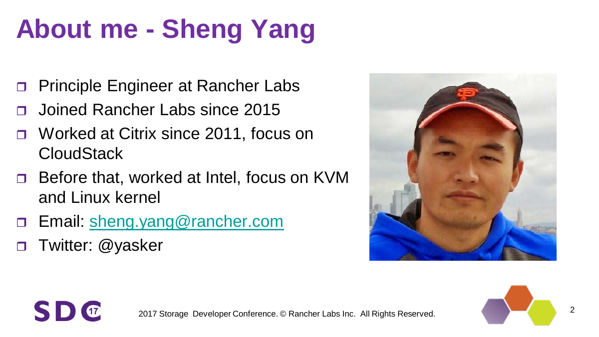

- Principle Engineer at Rancher Labs
- Joined Rancher Labs since 2015
- Worked at Citrix since 2011, focus on CloudStack
- Before that, worked at Intel, focus on KVM and Linux kernel
- Email: sheng.yang@rancher.com
- Twitter: @yasker

> - Rancher Labs 首席工程师
> - 2015 年加入 Rancher Labs
> - 2011 年起就职于 Citrix，主要从事 CloudStack 相关工作
> - 在此之前就职于 Intel，主要从事 KVM 和 Linux 内核相关工作
> - 电子邮箱：sheng.yang@rancher.com
> - Twitter：@yasker

## Slide 3 — Agenda｜第 3 页——议程

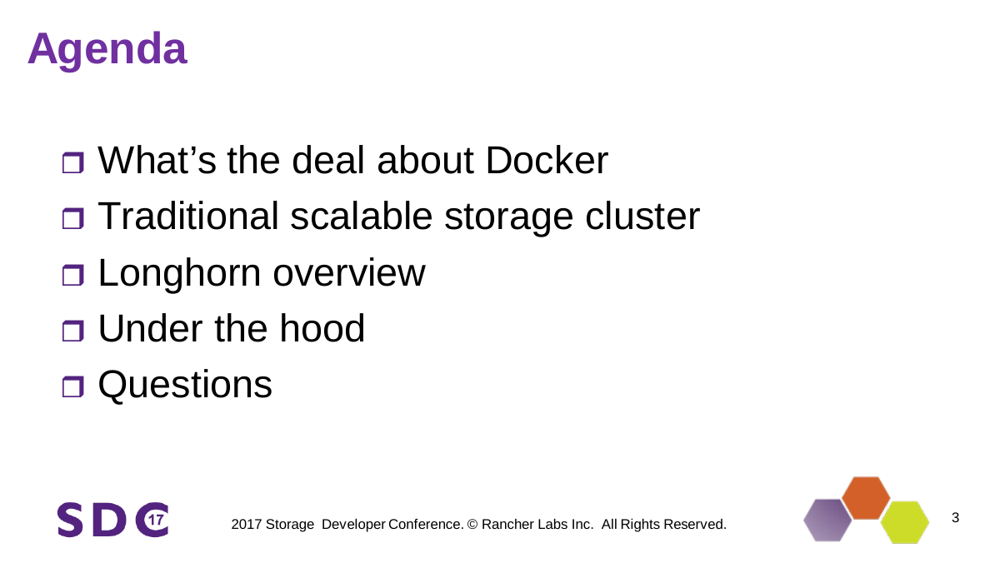

- What’s the deal about Docker
- Traditional scalable storage cluster
- Longhorn overview
- Under the hood
- Questions

> - Docker 到底有什么特别之处
> - 传统的可扩展存储集群
> - Longhorn 概览
> - 内部实现
> - 提问

## Slide 4 — What’s the deal about Docker｜第 4 页——Docker 到底有什么特别之处

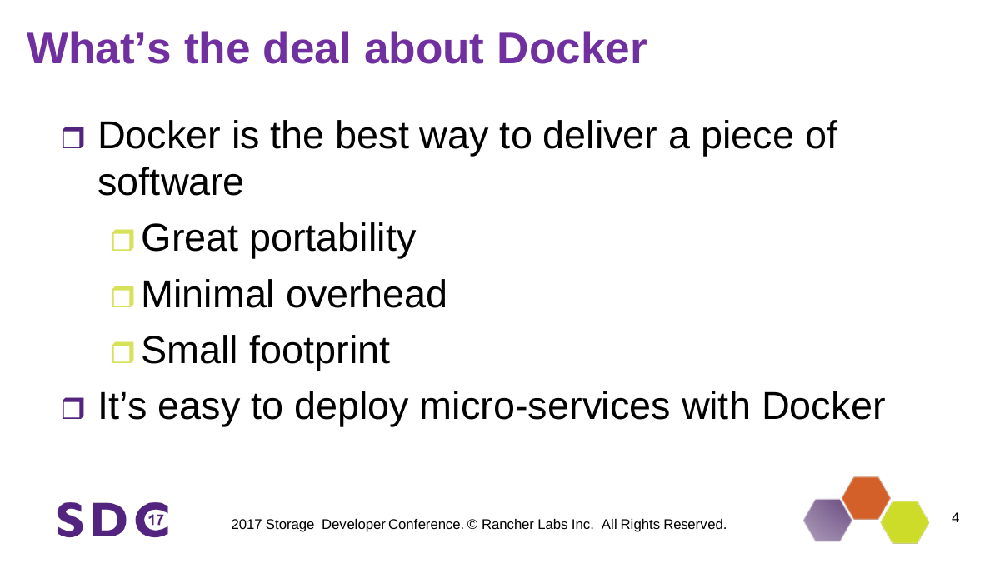

- Docker is the best way to deliver a piece of software
  - Great portability
  - Minimal overhead
  - Small footprint
- It’s easy to deploy micro-services with Docker

> - Docker 是交付软件的最佳方式
>   - 出色的可移植性
>   - 极低的额外开销
>   - 很小的资源占用
> - 使用 Docker 很容易部署微服务

## Slide 5 — Traditional scalable storage cluster｜第 5 页——传统的可扩展存储集群

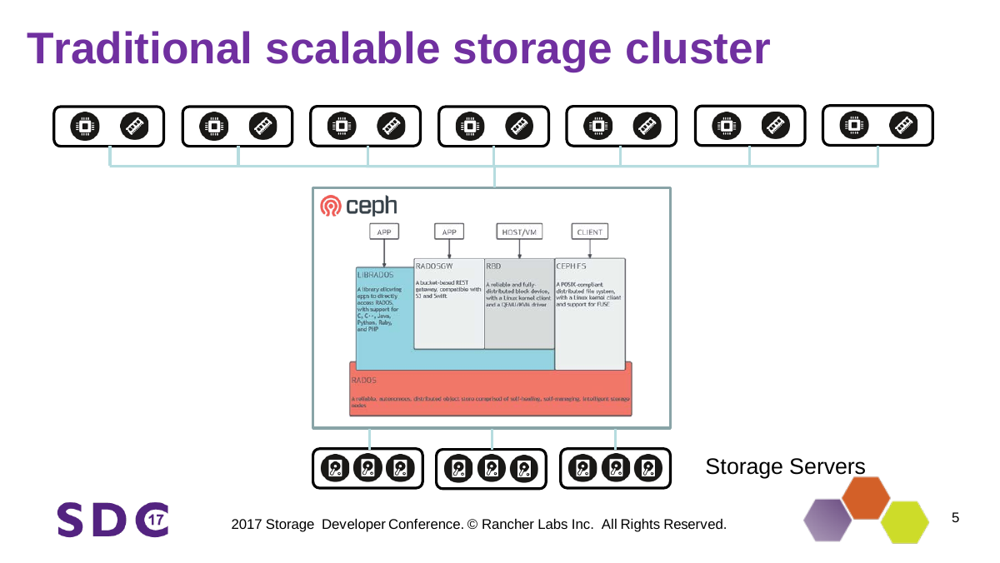

**Storage Servers**

> **存储服务器**

## Slide 6 — One controller for 100 volumes｜第 6 页——一百个卷共用一个控制器

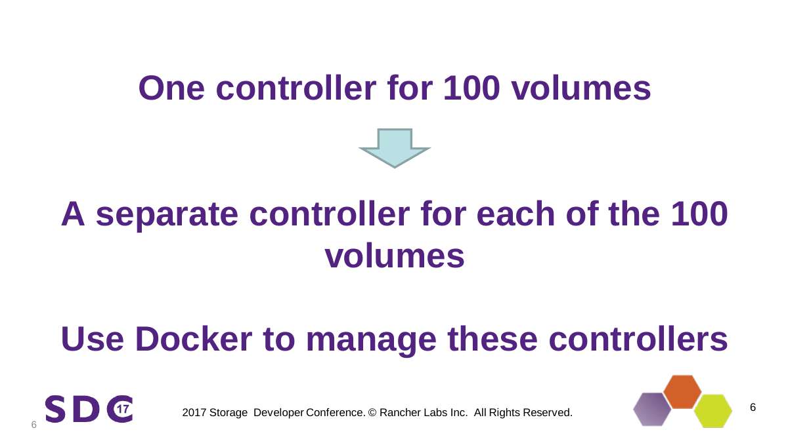

One controller for 100 volumes

> 一百个卷共用一个控制器

A separate controller for each of the 100 volumes

> 为这一百个卷中的每一个卷分别设置独立控制器

Use Docker to manage these controllers

> 使用 Docker 管理这些控制器

## Slide 7 — Longhorn Overview｜第 7 页——Longhorn 概览

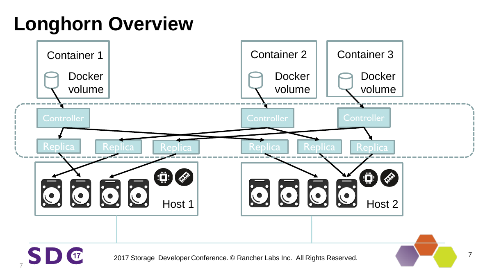

- Container 1 / Container 2 / Container 3
- Docker volume
- Controller
- Replica
- Host 1 / Host 2

> - 容器 1／容器 2／容器 3
> - Docker 卷
> - 控制器
> - 副本
> - 主机 1／主机 2

## Slide 8 — Focus on simplicity, reliability, and performance｜第 8 页——专注于简单性、可靠性与性能

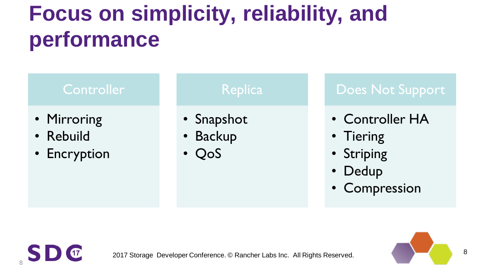

**Controller**

- Mirroring
- Rebuild
- Encryption

**Replica**

- Snapshot
- Backup
- QoS

**Does Not Support**

- Controller HA
- Tiering
- Striping
- Dedup
- Compression

> **控制器**
>
> - 镜像复制
> - 重建
> - 加密
>
> **副本**
>
> - 快照
> - 备份
> - 服务质量控制（QoS）
>
> **不支持**
>
> - 控制器高可用
> - 分层存储
> - 条带化
> - 数据去重
> - 压缩

## Slide 9 — Project Longhorn｜第 9 页——Longhorn 项目

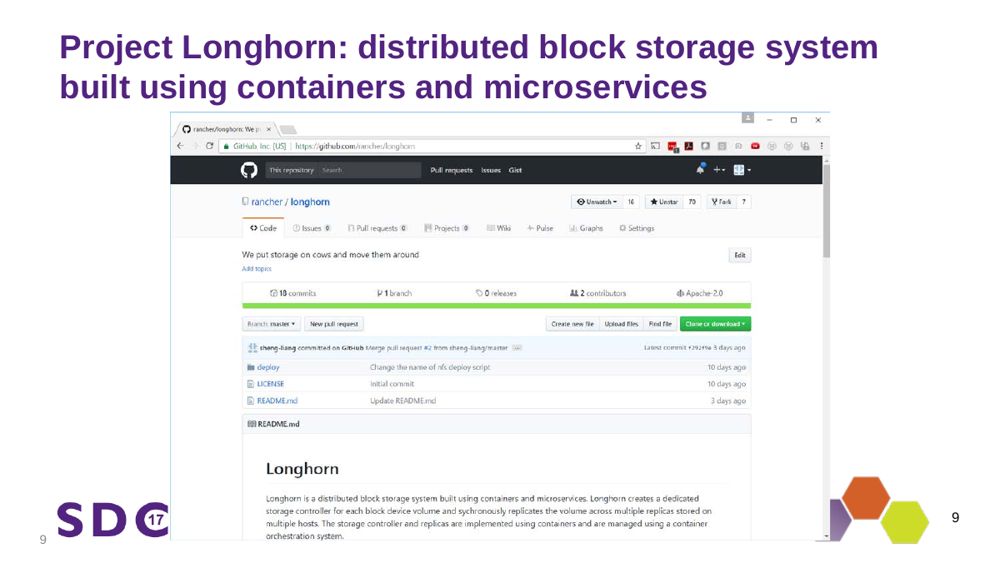

Project Longhorn: distributed block storage system built using containers and microservices

> Longhorn 项目：使用容器和微服务构建的分布式块存储系统

## Slide 10 — Longhorn Under the Hood｜第 10 页——Longhorn 内部实现

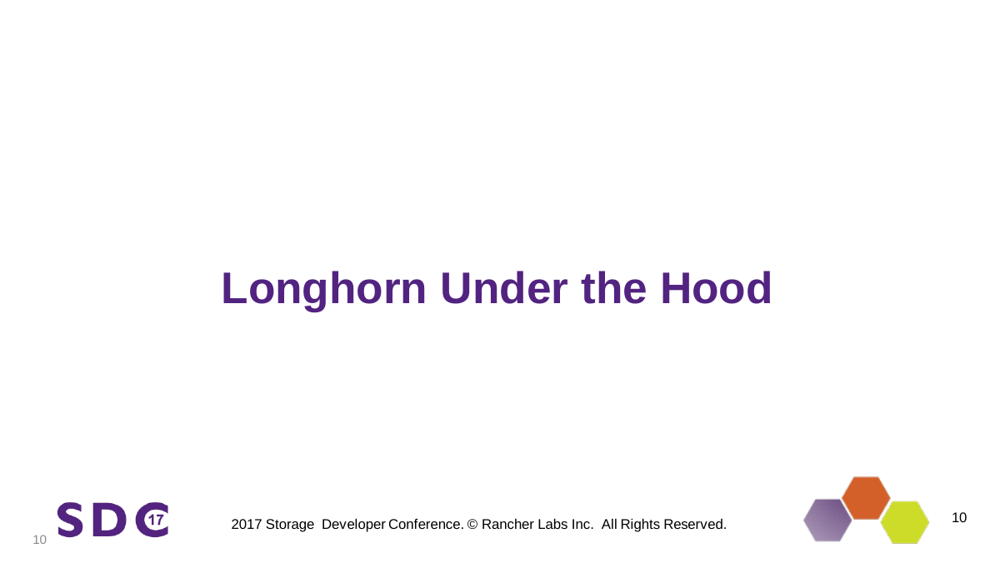

Longhorn Under the Hood

> Longhorn 内部实现

## Slide 11 — Read index｜第 11 页——读取索引

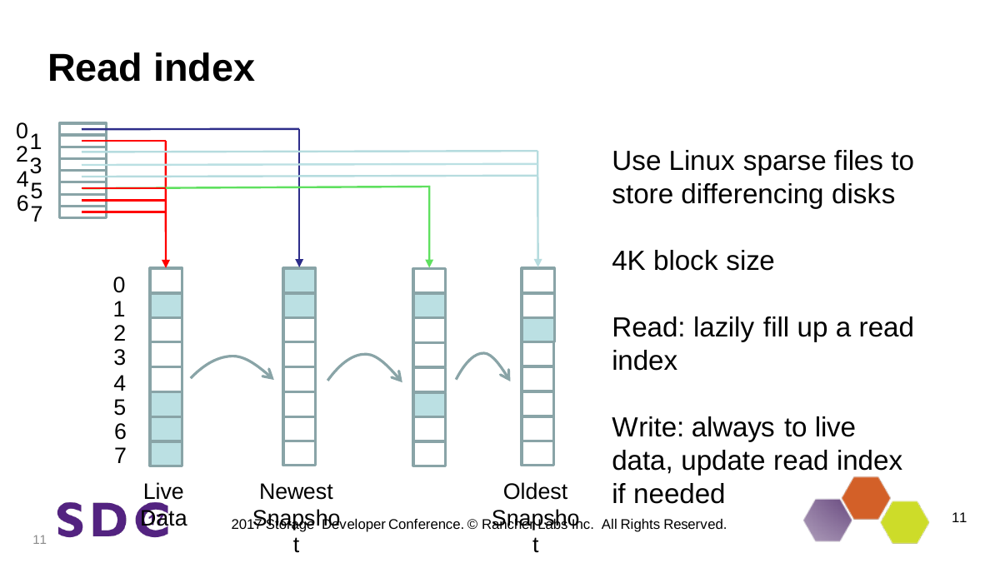

**Read index**

> **读取索引**

- Use Linux sparse files to store differencing disks
- 4K block size
- Read: lazily fill up a read index
- Write: always to live data, update read index if needed

> - 使用 Linux 稀疏文件保存差分磁盘
> - 块大小为 4K
> - 读取：以惰性方式填充读取索引
> - 写入：始终写入活动数据，并在需要时更新读取索引

**Diagram labels:** Live Data; Newest Snapshot; Oldest Snapshot

> **图中标签：**活动数据；最新快照；最旧快照

## Slide 12 — Backup｜第 12 页——备份

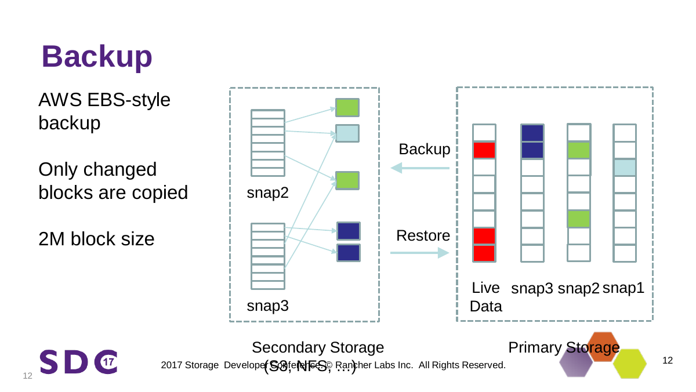

- AWS EBS-style backup
- Only changed blocks are copied
- 2M block size

> - AWS EBS 风格的备份
> - 只复制发生变化的数据块
> - 块大小为 2M

**Diagram labels:** Backup; Restore; Secondary Storage (S3, NFS, …); Primary Storage; Live Data; snap3; snap2; snap1

> **图中标签：**备份；恢复；二级存储（S3、NFS 等）；主存储；活动数据；snap3；snap2；snap1

## Slide 13 — How backups are stored｜第 13 页——备份如何存放

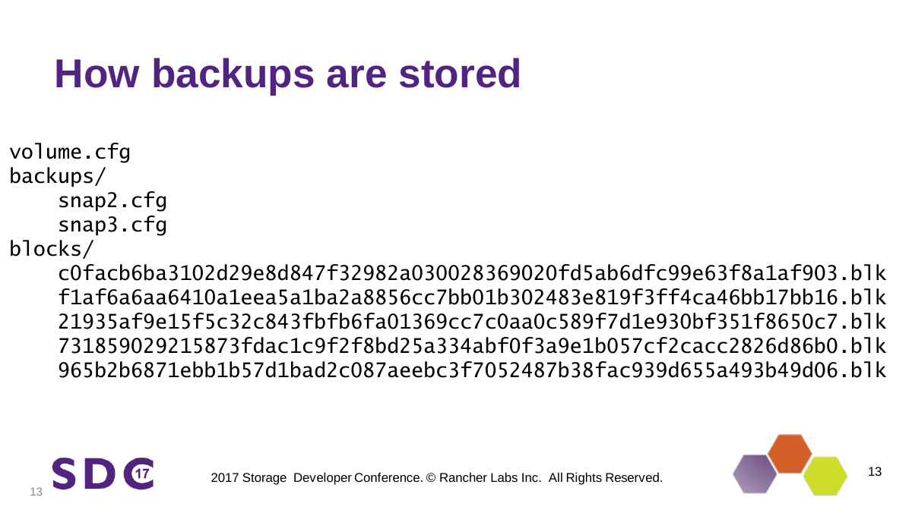

```text
volume.cfg
backups/
    snap2.cfg
    snap3.cfg
blocks/
    c0facb6ba3102d29e8d847f32982a030028369020fd5ab6dfc99e63f8a1af903.blk
    f1af6a6aa6410a1eea5a1ba2a8856cc7bb01b302483e819f3ff4ca46bb17bb16.blk
    21935af9e15f5c32c843fbfb6fa01369cc7c0aa0c589f7d1e930bf351f8650c7.blk
    731859029215873fdac1c9f2f8bd25a334abf0f3a9e1b057cf2cacc2826d86b0.blk
    965b2b6871ebb1b57d1bad2c087aeebc3f7052487b38fac939d655a493b49d06.blk
```

> `volume.cfg` 保存卷配置；`backups/` 目录保存各次备份的配置；`blocks/` 目录则以内容哈希命名的 `.blk` 文件保存备份数据块。

## Slide 14 — Add a new replica (replica rebuild)｜第 14 页——添加新副本（副本重建）

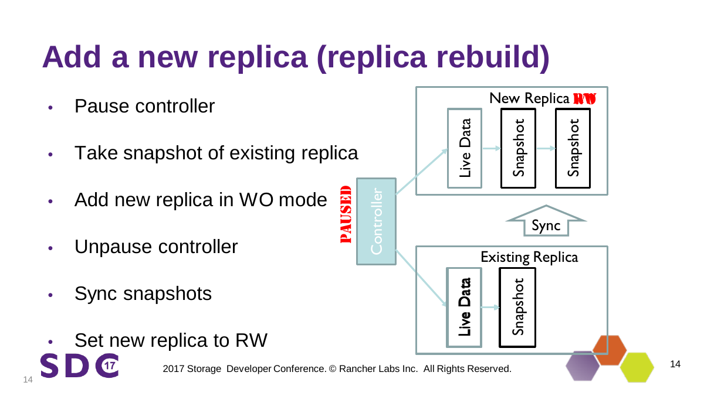

- Pause controller
- Take snapshot of existing replica
- Add new replica in WO mode
- Unpause controller
- Sync snapshots
- Set new replica to RW

> - 暂停控制器
> - 为现有副本创建快照
> - 以 WO 模式添加新副本
> - 解除控制器暂停状态
> - 同步快照
> - 将新副本设置为 RW

**Diagram labels:** PAUSED; Controller; Existing Replica; New Replica; Live Data; Snapshot; New Replica Snapshot; Sync; WO; RW

> **图中标签：**已暂停；控制器；现有副本；新副本；活动数据；快照；新副本快照；同步；WO（仅写）；RW（读写）

## Slide 15 — Live upgrade｜第 15 页——无中断升级

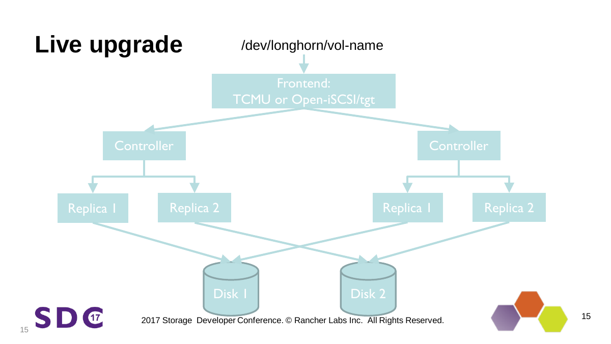

- `/dev/longhorn/vol-name`
- Frontend: TCMU or Open-iSCSI/tgt
- Controller
- Replica 1 / Replica 2
- Disk 1 / Disk 2

> - `/dev/longhorn/vol-name`
> - 前端：TCMU 或 Open-iSCSI/tgt
> - 控制器
> - 副本 1／副本 2
> - 磁盘 1／磁盘 2

## Slide 16 — Two deployment models｜第 16 页——两种部署模式

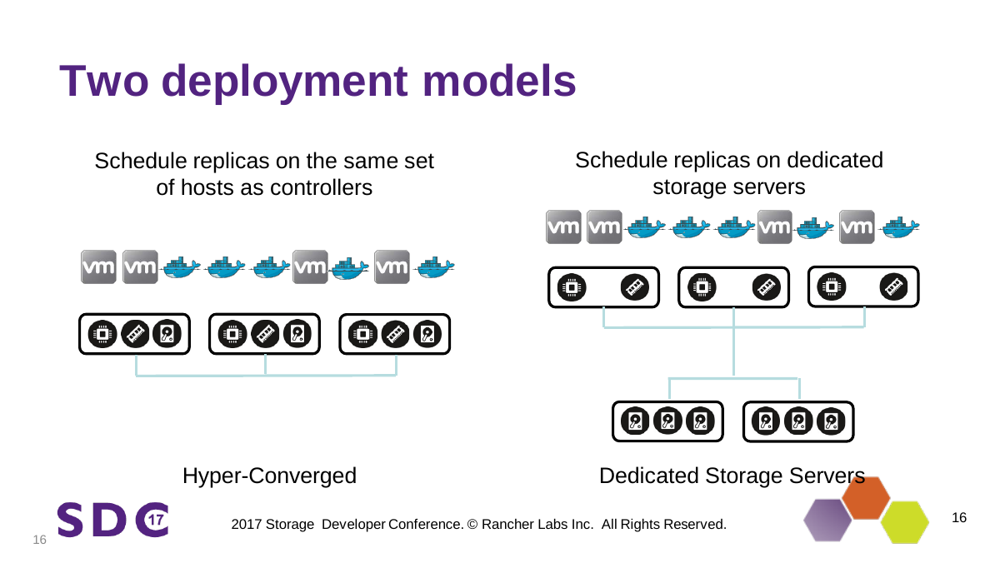

**Schedule replicas on the same set of hosts as controllers**

> **将副本调度到运行控制器的同一组主机上**

Hyper-Converged

> 超融合

**Schedule replicas on dedicated storage servers**

> **将副本调度到专用存储服务器上**

Dedicated Storage Servers

> 专用存储服务器

## Slide 17 — What works now｜第 17 页——当前已经实现的功能

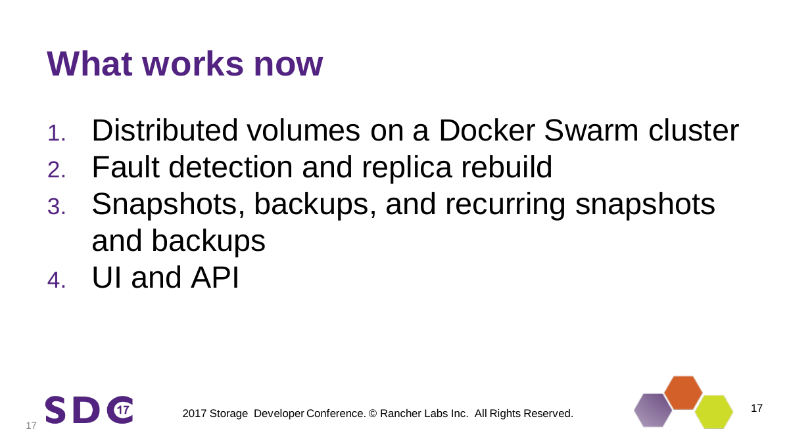

1. Distributed volumes on a Docker Swarm cluster
2. Fault detection and replica rebuild
3. Snapshots, backups, and recurring snapshots and backups
4. UI and API

> 1. Docker Swarm 集群上的分布式卷
> 2. 故障检测与副本重建
> 3. 快照、备份，以及定期快照与定期备份
> 4. UI 与 API

## Slide 18 — Upcoming work｜第 18 页——后续工作

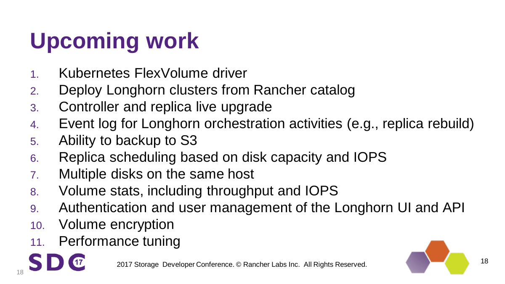

1. Kubernetes FlexVolume driver
2. Deploy Longhorn clusters from Rancher catalog
3. Controller and replica live upgrade
4. Event log for Longhorn orchestration activities (e.g., replica rebuild)
5. Ability to backup to S3
6. Replica scheduling based on disk capacity and IOPS
7. Multiple disks on the same host
8. Volume stats, including throughput and IOPS
9. Authentication and user management of the Longhorn UI and API
10. Volume encryption
11. Performance tuning

> 1. Kubernetes FlexVolume 驱动
> 2. 从 Rancher 应用商店部署 Longhorn 集群
> 3. 控制器与副本的无中断升级
> 4. 记录 Longhorn 编排活动（例如副本重建）的事件日志
> 5. 备份到 S3 的能力
> 6. 根据磁盘容量和 IOPS 调度副本
> 7. 支持同一主机上的多块磁盘
> 8. 卷统计信息，包括吞吐量和 IOPS
> 9. Longhorn UI 与 API 的身份认证和用户管理
> 10. 卷加密
> 11. 性能调优

## Slide 19 — Questions?｜第 19 页——有问题吗？

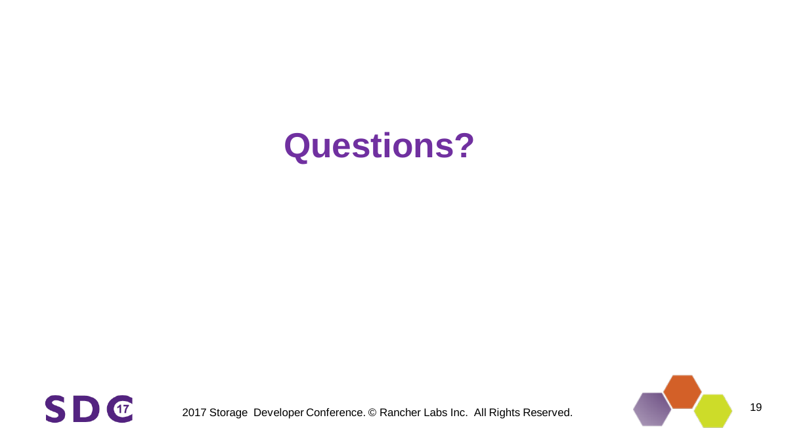

Questions?

> 有问题吗？

## Slide 20 — Thank you!｜第 20 页——谢谢！

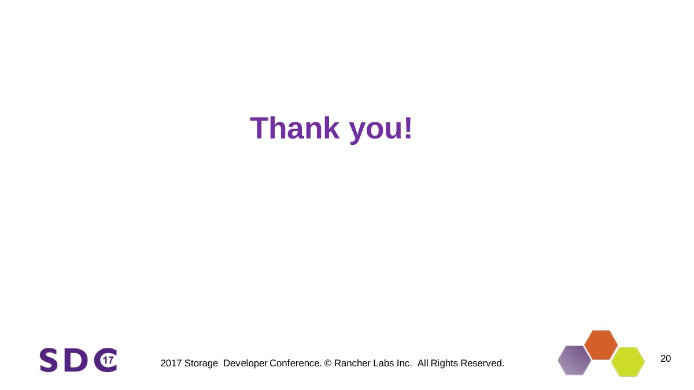

Thank you!

> 谢谢！

---

## Version notes added by the translator｜译者补充的版本说明

The following notes are not part of the 2017 presentation.

> 以下内容不是 2017 年演讲原文。

Longhorn’s official repository listed v1.11.2 as the current stable release when this translation was completed in August 2026. The product shown in the slides is the early Docker Swarm-era Project Longhorn. The current Longhorn is built for Kubernetes and provides storage through CSI. The “Kubernetes FlexVolume driver” listed as upcoming work on Slide 18 therefore belongs to an earlier stage of the project.

> 本文于 2026 年 8 月完成翻译时，Longhorn 官方仓库列出的当前稳定版本是 v1.11.2。幻灯片展示的是 Docker Swarm 时代的早期 Project Longhorn；今天的 Longhorn 面向 Kubernetes 构建，并通过 CSI 提供存储。因此，第 18 页列入“后续工作”的 Kubernetes FlexVolume 驱动，属于项目早期阶段的计划。

The core idea on Slide 6 remains useful: give each volume its own engine/controller and keep the failure domain small. The implementation details have changed. The V1 Data Engine uses an iSCSI frontend and file-based replicas, while the V2 Data Engine in the v1.11 documentation is based on SPDK and supports newer frontends such as ublk. Read the slide deck as a record of where Longhorn’s architecture came from, not as a current operations manual.

> 第 6 页的核心想法至今仍有理解价值：让每个卷拥有自己的引擎／控制器，把故障影响范围控制在单个卷内。不过，具体实现已经发生变化。V1 Data Engine 使用 iSCSI 前端和基于文件的副本；v1.11 文档中的 V2 Data Engine 则以 SPDK 为基础，并支持 ublk 等较新的前端。因而，这套幻灯片适合用来理解 Longhorn 架构从哪里来，不应被当作当前版本的运维手册。

Current references: [Longhorn repository and release table](https://github.com/longhorn/longhorn), [Longhorn v1.11 concepts](https://longhorn.io/docs/1.11.0/concepts/), and [Longhorn v1.11 V2 Data Engine documentation](https://longhorn.io/docs/1.11.0/v2-data-engine/).

> 当前版本核对资料：[Longhorn 仓库与版本表](https://github.com/longhorn/longhorn)、[Longhorn v1.11 概念说明](https://longhorn.io/docs/1.11.0/concepts/)，以及 [Longhorn v1.11 V2 Data Engine 文档](https://longhorn.io/docs/1.11.0/v2-data-engine/)。
