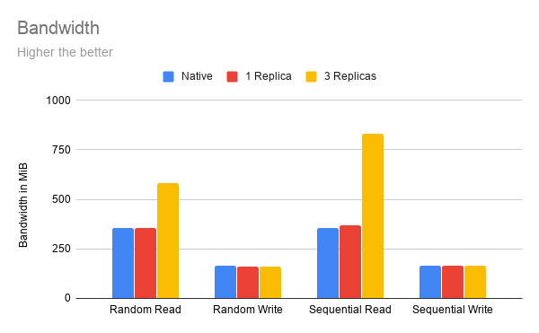
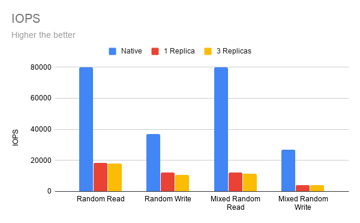
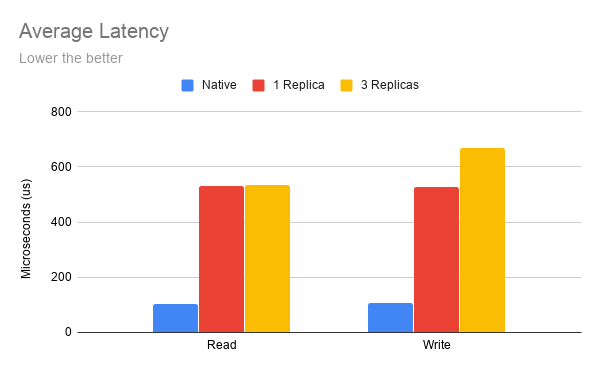
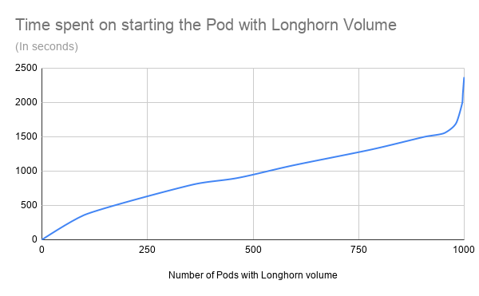

> **Source and translation basis｜来源与翻译依据**
>
> Sheng Yang, *Performance and Scalability Report for Longhorn v1.0*, August 12, 2020. [Official article](https://longhorn.io/blog/performance-scalability-report-aug-2020/) and [Markdown source](https://github.com/longhorn/website/blob/ef14f68b3ffa9579d63eab2e1bdacb1272709163/content/blog/performance-scalability-report-aug-2020.md), frozen at `longhorn/website` commit [`ef14f68b3ffa`](https://github.com/longhorn/website/commit/ef14f68b3ffa9579d63eab2e1bdacb1272709163). The source Markdown SHA-256 is `0472eb7586aae3e7d26f9f46f843e935a523274b84ef260914ecfacdad68dc68`.
>
> 本文按照官方 Markdown 源文件的顺序逐段保留英文，并紧接着给出中文翻译。原文的 4 张图表均取自同一提交。除本说明和一处明确标出的译注外，没有增删正文内容。

## Introduction｜简介

Longhorn is an official CNCF project that delivers a powerful cloud-native distributed storage platform for Kubernetes that can run anywhere. Longhorn makes the deployment of highly available persistent block storage in your Kubernetes environment easy, fast, and reliable.

> Longhorn 是 CNCF 的正式项目，为 Kubernetes 提供一套能够在任何地方运行的强大云原生分布式存储平台。Longhorn 让用户可以在 Kubernetes 环境中轻松、快速、可靠地部署高可用持久块存储。

Since the Longhorn v1.0.0 release, we've received many queries regarding the performance and scalability aspects of Longhorn. We're glad to share some results here.

> 自 Longhorn v1.0.0 发布以来，我们收到了许多有关 Longhorn 性能与扩展性的询问。我们很高兴在这里分享一些测试结果。

## Performance｜性能

### Environment setup｜环境设置

#### Benchmark software｜基准测试软件

We're using [a forked version of dbench](https://github.com/longhorn/dbench), which uses [fio](https://github.com/axboe/fio) to benchmark Kubernetes persistent disk volumes. It collects the data regarding `read/write IOPS`, `bandwidth` and `latency`.

> 我们使用的是一个 [dbench 的分支版本](https://github.com/longhorn/dbench)。它通过 [fio](https://github.com/axboe/fio) 对 Kubernetes 持久磁盘卷进行基准测试，收集的数据包括`读写 IOPS`、`带宽`和`延迟`。

#### Hardware Environment｜硬件环境

We built a Kubernetes cluster using AWS EC2 instances.

> 我们使用 AWS EC2 实例搭建了一个 Kubernetes 集群。

One note on the disks: we're using the EC2 [instance store](https://docs.aws.amazon.com/AWSEC2/latest/UserGuide/InstanceStorage.html) for the benchmark, which is located on disks that are physically attached to the host computer. It can provide better performance in comparison to EBS volume, especially in terms of IOPS.

> 关于磁盘需要说明一点：这次基准测试使用的是 EC2 [实例存储](https://docs.aws.amazon.com/AWSEC2/latest/UserGuide/InstanceStorage.html)，其磁盘以物理方式连接到宿主机。与 EBS 卷相比，它能提供更好的性能，尤其是在 IOPS 方面。

##### Instance spec｜实例规格

**c5d.2xlarge**

- Disk: 200 GiB NVMe SSD as the instance store.
- CPU: 8 vCPUs (Intel(R) Xeon(R) Platinum 8124M CPU @ 3.00GHz)
- Memory: 16 GB
- Network: Up to 10Gbps

> - 磁盘：200 GiB NVMe SSD，用作实例存储
> - CPU：8 个 vCPU（Intel(R) Xeon(R) Platinum 8124M CPU @ 3.00GHz）
> - 内存：16 GB
> - 网络：最高 10 Gbps

##### Kubernetes setup｜Kubernetes 配置

3 nodes.

> 3 个节点。

All nodes are both master and worker nodes.

> 所有节点同时作为主节点和工作节点。

##### Software Environment｜软件环境

- Kubernetes: v1.17.5.
- Node OS: 5.3.0-1023-aws #25~18.04.1-Ubuntu SMP
- Longhorn: v1.0.1

> - Kubernetes：v1.17.5
> - 节点操作系统：5.3.0-1023-aws #25~18.04.1-Ubuntu SMP
> - Longhorn：v1.0.1

### Benchmark Result｜基准测试结果

#### Bandwidth｜带宽

As you can see in the diagram above:

> 从上图可以看到：

With 1 replica, Longhorn provides the same bandwidth as the native disk.

> 使用 1 个副本时，Longhorn 提供的带宽与原生磁盘相同。

With 3 replicas, Longhorn provides **1.5 times to 2+ times** performance compared to a single native disk. This is because Longhorn uses multiple replicas on different nodes and disks in response to the workload's request.

> 使用 3 个副本时，Longhorn 提供的性能是单块原生磁盘的 **1.5 倍至 2 倍以上**。这是因为 Longhorn 会使用分布在不同节点和磁盘上的多个副本来响应工作负载的请求。

#### IOPS and Latency｜IOPS 与延迟

As you can see in the IOPS diagram above, Longhorn provides **20% to 30%** IOPS of the native disk.

> 从上面的 IOPS 图可以看到，Longhorn 提供的 IOPS 是原生磁盘的 **20% 到 30%**。

One of the reasons for the lower IOPS is because Longhorn is designed to be **crash consistent across the cluster**. The data sent to a Longhorn volume will be replicated to replicas on different nodes in a **synchronized** way. Longhorn will wait for the confirmation that the data has been written to every replica's disk before continuing. This makes sure in the event of losing any replica, the other replicas will still have the up-to-date data.

> IOPS 较低的原因之一，是 Longhorn 在设计上要求**整个集群保持崩溃一致性**。发送到 Longhorn 卷的数据会以**同步**方式复制到不同节点上的副本。Longhorn 会等到确认数据已经写入每个副本的磁盘后才继续处理。这样可以保证，即使丢失任何一个副本，其他副本仍然保有最新数据。

As you can see from the latency diagram, the native disk’s IO latency is about 100 microseconds per IO operation in our benchmark. Longhorn adds another 400 microseconds to 500 microseconds on top of it, depending on how many replicas are used and if the operation is read or write.

> 从延迟图可以看到，在我们的基准测试中，原生磁盘每次 IO 操作的延迟大约为 100 微秒。在此基础上，Longhorn 会增加 400 到 500 微秒，具体取决于所用副本数量以及操作是读还是写。

We continue working on the performance optimization to reduce the latency introduced by the Longhorn stack.

> 我们会继续进行性能优化，降低 Longhorn 软件栈引入的延迟。

## Scalability｜扩展性

### Environment Setup｜环境设置

#### Hardware Environment｜硬件环境

We built a Kubernetes cluster using AWS EC2 instances for the benchmark.

> 我们使用 AWS EC2 实例搭建了一个 Kubernetes 集群用于基准测试。

##### Instance spec｜实例规格

**m5.2xlarge**

- CPU: 8 vCPUs
- Memory: 32 GB Memory

> - CPU：8 个 vCPU
> - 内存：32 GB

##### Kubernetes setup｜Kubernetes 配置

Master nodes: 3 
Worker nodes: 100

> 主节点：3 个 
> 工作节点：100 个

#### Software Environment｜软件环境

- Kubernetes: v1.18.6, installed using Rancher
- Longhorn v1.0.1

> - Kubernetes：v1.18.6，使用 Rancher 安装
> - Longhorn：v1.0.1

### Benchmark Method｜基准测试方法

We created 100 StatefulSets with a VolumeClaimTemplate that uses Longhorn.

> 我们创建了 100 个 StatefulSet，每个都带有一个使用 Longhorn 的 VolumeClaimTemplate。

Each of the 100 Nodes had one StatefulSet bound to it using a nodeSelector.

> 通过 nodeSelector，在 100 个节点中的每个节点上绑定一个 StatefulSet。

During the test, we scaled each StatefulSet to 10. Both the total Pod count and Longhorn Volume count at the end of testing was 1000.

> 测试期间，我们把每个 StatefulSet 扩容到 10。测试结束时，Pod 总数和 Longhorn 卷总数都是 1000。

Then every two minutes we checked how many Pods had been successfully started. All the Pods contain a LivenessProbe to guarantee the functionality of the Longhorn Volume.

> 随后，我们每两分钟检查一次成功启动的 Pod 数量。所有 Pod 都带有 LivenessProbe，以保证 Longhorn 卷能够正常工作。

### Result｜结果

#### Result Analysis｜结果分析

As you can see from the diagram above, except for the first 100 nodes (which needs a bit more ramp-up time due to the image pull), the scalability of Longhorn is near-linear, until when we hit about 950 pods.

> 从上图可以看到，除了最初 100 个节点因为拉取镜像而需要多一点启动时间外，在达到约 950 个 Pod 之前，Longhorn 的扩展过程接近线性。

> **译注：** 原文这里写的是 “the first 100 nodes”。结合图表和测试方法，它可能是指前 100 个 Pod；译文仍保留原文的“节点”。

For the first 950 Pods with Longhorn Volumes, Kubernetes and Longhorn only spent about 1500 seconds (25 minutes) to spin them all up. However, for the remaining 50 Pods, it took another 1000 seconds (~17 minutes), which means the last 5% of the pods took about 40% of the time of the whole scalability test. We're still looking into the reason. We haven't determined if it's a Kubernetes or Longhorn issue.

> Kubernetes 和 Longhorn 只用了大约 1500 秒（25 分钟），就启动了前 950 个使用 Longhorn 卷的 Pod。然而，剩余 50 个 Pod 又花了 1000 秒左右（约 17 分钟）。也就是说，最后 5% 的 Pod 用掉了整个扩展性测试约 40% 的时间。我们仍在调查原因，还不能确定这是 Kubernetes 的问题还是 Longhorn 的问题。

### Other Issues during the Scalability Test｜扩展性测试期间遇到的其他问题

We encountered a couple of Kubernetes and Longhorn issues during the scalability testing:

> 在扩展性测试期间，我们遇到了几个 Kubernetes 和 Longhorn 问题：

1. During a test run, we found that we cannot scale well after hitting 200 volumes in the cluster. After digging deeper into it, we found that it took minutes to tens of minutes for Kubernetes to recognize a newly attached volume after the cluster had more than 200 volumes. In the end, we found this was a Kubernetes bug and has been fixed in v1.17.8 and v1.18.5. See [here](https://github.com/longhorn/longhorn/issues/1463#issuecomment-664679380) for the full analysis.
2. During the installation of Longhorn v1.0.1 in the cluster, we encountered a Longhorn issue that blocked the installation process. The issue will likely occur if the cluster is bigger than 20 nodes, and requires a manual workaround. We're releasing a fix for the issue in v1.0.2 release. See [here](https://github.com/longhorn/longhorn/issues/1646) for the details.

> 1. 在一次测试中，我们发现集群达到 200 个卷后便无法良好扩展。进一步调查后发现，当集群中的卷超过 200 个时，Kubernetes 需要几分钟甚至几十分钟才能识别新挂载的卷。最后我们确认这是一个 Kubernetes 缺陷，并且已经在 v1.17.8 和 v1.18.5 中修复。完整分析见[这里](https://github.com/longhorn/longhorn/issues/1463#issuecomment-664679380)。
> 2. 在集群中安装 Longhorn v1.0.1 时，我们遇到了一个会阻塞安装过程的 Longhorn 问题。集群规模超过 20 个节点时很可能出现这个问题，并且需要手动绕过。我们会在 v1.0.2 版本中发布修复。详情见[这里](https://github.com/longhorn/longhorn/issues/1646)。
