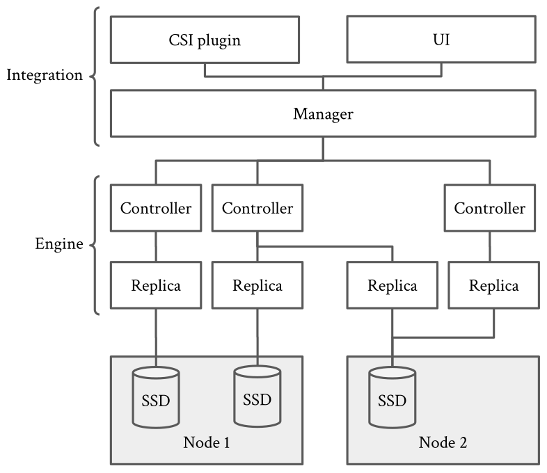
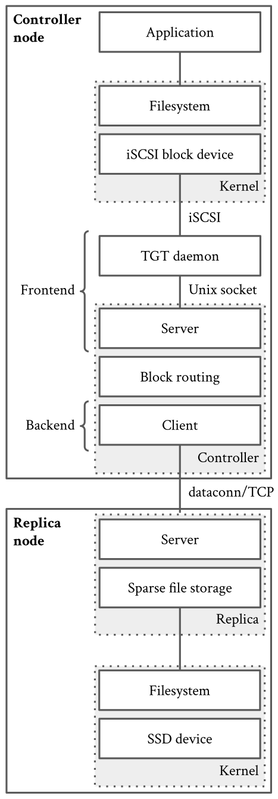
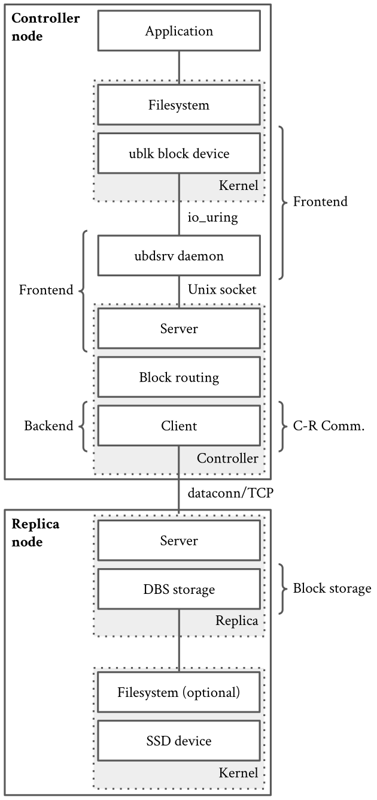
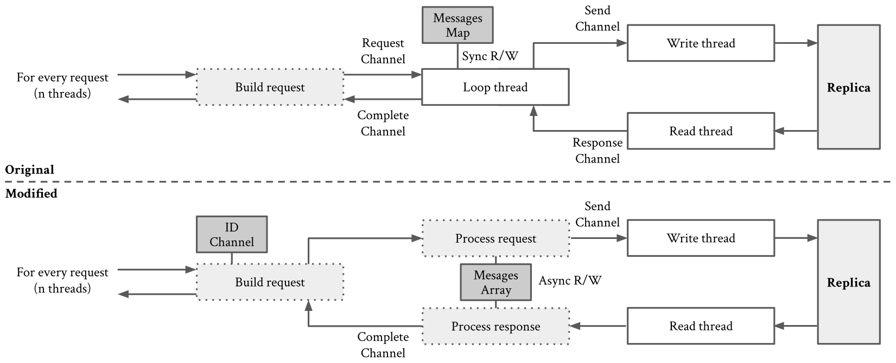
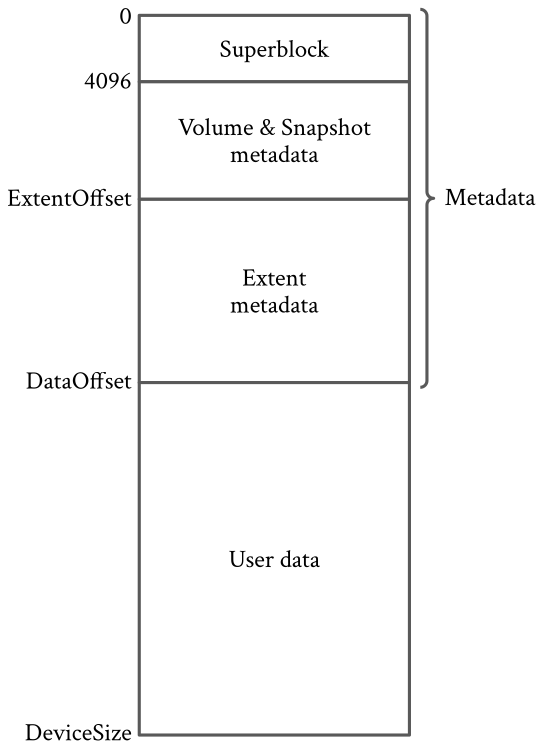

> **Source and translation basis｜来源与翻译依据**
>
> Konstantinos Kampadais, Antony Chazapis, and Angelos Bilas, *Optimizing the Longhorn Cloud-native Software Defined Storage Engine for High Performance*, arXiv:2502.14419v1, submitted February 20, 2025. [Abstract page](https://arxiv.org/abs/2502.14419), [PDF](https://arxiv.org/pdf/2502.14419), and [TeX source](https://arxiv.org/e-print/2502.14419). The PDF SHA-256 is `22e63ec7178e734f75f4cc7d300ab0dc643fc3361bf2579b25ec4b580c1a2002`; the source archive SHA-256 is `2dc42559a414b56d0d642acbfa61e3ae73ce4036a63d38ee35550ac601ad68e2`.
>
> 本文以 arXiv v1 的 LaTeX 源码为正文依据，保留全部非注释正文、图、表、致谢和参考文献。英文段落之后紧接中文翻译；LaTeX 的交叉引用改成正文中的图号、表号和数字引用，5 张矢量图转为本地 PNG。

**Optimizing the Longhorn Cloud-native Software Defined Storage Engine for High Performance**

> **面向高性能的 Longhorn 云原生软件定义存储引擎优化**

Konstantinos Kampadais, Antony Chazapis, and Angelos Bilas 
Institute of Computer Science, Foundation for Reasearch and Technology - Hellas, Heraklion, Crete 
{kampadais, chazapis, bilas}@ics.forth.gr 
Konstantinos Kampadais and Angelos Bilas are also with the Department of Computer Science, University of Crete.

> Konstantinos Kampadais、Antony Chazapis、Angelos Bilas 
> 希腊研究与技术基金会计算机科学研究所，克里特岛伊拉克利翁 
> {kampadais, chazapis, bilas}@ics.forth.gr 
> Konstantinos Kampadais 和 Angelos Bilas 同时任职于克里特大学计算机科学系。

## Abstract｜摘要

Longhorn is an open-source, cloud-native software-defined storage (SDS) engine that delivers distributed block storage management in Kubernetes environments. This paper explores performance optimization techniques for Longhorn’s core component, the Longhorn engine, to overcome limitations in leveraging high-performance server hardware, such as solid-state NVMe disks and low-latency, high-bandwidth networking. By integrating ublk at the frontend, to expose the virtual block device to the operating system, restructuring the communication protocol, and employing DBS, our simplified, direct-to-disk storage scheme, the system achieves significant performance improvements with respect to the default I/O path. Our results contribute to enhancing Longhorn’s applicability in both cloud and on-premises setups, as well as provide insights for the broader SDS community.

> Longhorn 是一个开源的云原生软件定义存储（SDS）引擎，在 Kubernetes 环境中提供分布式块存储管理。本文研究 Longhorn 核心组件 Longhorn engine 的性能优化方法，以突破它在利用高性能服务器硬件时受到的限制，这类硬件包括固态 NVMe 磁盘以及低延迟、高带宽网络。我们在前端集成 ublk，向操作系统暴露虚拟块设备；重构通信协议；并采用 DBS，也就是我们简化的直写磁盘存储方案。与默认 I/O 路径相比，系统由此获得了显著的性能提升。我们的结果既能增强 Longhorn 对云端和本地部署场景的适用性，也能为更广泛的 SDS 社区提供参考。

**Keywords:** Longhorn, Software-defined storage, Distributed storage, Kubernetes, Cloud-native

> **关键词：** Longhorn、软件定义存储、分布式存储、Kubernetes、云原生

## 1. Introduction｜引言

In cloud-native software architectures, the storage setup plays a significant role in determining the scalability and reliability properties of the whole system. Some core backend microservices, such as database engines, may handle this independently, by offering deployment options that distribute I/O operations across multiple instances, while automatically reacting to failures by exploiting internal data redundancies. However, all other microservices that require storage expect respective facilities to be provided by third-party software. For this reason, the cloud-native ecosystem is abundant with volume management solutions that either interface Linux-native or custom-built software defined storage (SDS) platforms to the APIs and deployment strategies of container orchestration environments. Implementing a cloud-native SDS has several benefits over choosing a similar product already available from a cloud provider, as it provides vendor independence, usually greater flexibility and cost efficiency, as well as advanced features that may not be part of standard offerings.

> 在云原生软件架构中，存储配置对整个系统的扩展性和可靠性有重要影响。数据库引擎等部分核心后端微服务可以自行处理存储：它们提供将 I/O 操作分散到多个实例的部署方式，同时利用内部数据冗余自动应对故障。然而，其他需要存储的微服务都希望由第三方软件提供相应能力。正因如此，云原生生态中存在大量卷管理方案。这些方案把 Linux 原生或自行构建的软件定义存储（SDS）平台接入容器编排环境的 API 和部署策略。与选择云服务商已经提供的同类产品相比，实现一套云原生 SDS 有多项好处：它不受单一厂商约束，通常更灵活、更具成本效益，还能提供标准产品中可能没有的高级功能。

Longhorn [1] is a popular open-source, cloud-native volume manager, which implements its own distributed block storage system. It is a complete and independent SDS, handling internally all aspects related to capacity management, performance, fault tolerance, as well as interfacing with both Kubernetes and the end user. Longhorn is an actively developed and mature software, part of the CNCF software catalogue [2], however our installations have revealed that it currently lacks the ability to take advantage of the hardware performance available in servers that feature high-speed solid-state disks and high-bandwidth network connectivity. This limits the applicability of Longhorn on setups with high I/O capabilities, as is often the case with the on-premise clouds or private systems colocated in a data center.

> Longhorn [1] 是一种流行的开源云原生卷管理器，实现了自己的分布式块存储系统。它是一套完整且独立的 SDS，在内部处理容量管理、性能和容错相关的各个方面，同时连接 Kubernetes 与最终用户。Longhorn 是 CNCF 软件目录 [2] 中一款持续活跃开发且已经成熟的软件。不过，我们的安装实践表明，它目前还无法充分利用配有高速固态磁盘和高带宽网络连接的服务器所能提供的硬件性能。这限制了 Longhorn 在高 I/O 能力环境中的适用性，而本地云或托管在数据中心的私有系统往往正是这样的环境。

In this paper, we investigate a series of performance optimizations that collectively allow the system to achieve an order of magnitude better IOPS and bandwidth. We implement these optimizations in Longhorn's core, called the Longhorn engine [3] (hereafter referenced simply as *engine*), which is separately deployed in full for each managed volume. Each engine setup, consists of a *controller* (data aggregator) and several *replicas* (data storage endpoints). We remodel three points of the engine architecture, which we find to be the most critical to resulting performance:

> 本文研究一系列性能优化方法，它们共同使系统的 IOPS 和带宽提高了一个数量级。我们在 Longhorn 的核心组件 Longhorn engine [3] 中实现这些优化，后文简称 *engine*。每个受管卷都会单独完整部署一套 engine。每套 engine 由一个*控制器*（数据聚合器）和若干*副本*（数据存储端点）组成。我们重新设计了 engine 架构中对最终性能最关键的三个位置：

1. the connectivity between the controller and the host operating system, where we use the *ublk* framework [4] instead of the current solution based on *iSCSI/tgt* [5],
2. the communication between the controller and the replicas, where we employ a strategy that minimizes locks among involved threads, and
3. the data storage scheme used by the replicas, which utilizes our custom direct-to-disk block management layer, named *Direct Block Store* (DBS), instead of the default file-based implementation.

> 1. 控制器与宿主操作系统之间的连接：使用 *ublk* 框架 [4]，替换当前基于 *iSCSI/tgt* [5] 的方案；
> 2. 控制器与副本之间的通信：采用尽量减少相关线程之间锁竞争的策略；
> 3. 副本使用的数据存储方案：采用我们定制的直写磁盘块管理层 *Direct Block Store*（DBS），替换默认的文件实现。

Our contributions in this work are:

> 本文的贡献如下：

1. we present how new operating system technologies, such as ublk, can be integrated into SDS designs,
2. our implementation analysis offers a comprehensive methodology to diagnose performance bottlenecks and assess their impact in SDS stacks, and
3. we introduce DBS, which may not use novel design concepts, but as an open source solution can serve as a useful utility to solve similar problems in related projects.

> 1. 说明如何把 ublk 等新的操作系统技术集成到 SDS 设计中；
> 2. 通过实现分析，给出一套完整的方法，用于诊断性能瓶颈并评估它们对 SDS 软件栈的影响；
> 3. 介绍 DBS。它采用的设计概念未必新颖，但作为一种开源方案，可以成为相关项目解决类似问题的实用工具。

As we have practically affected all parts of the engine excluding the simplistic replication and data routing mechanisms, our modified system can facilitate future work by allowing for further performance analysis and optimizations.

> 除了简单的复制和数据路由机制，我们的改动实际影响了 engine 的几乎所有部分。因此，这套修改后的系统能够支持进一步的性能分析和优化，为后续工作提供便利。

## 2. Related work｜相关工作

Kubernetes provides an abstract API for specifying the storage requirements of services, through the use of *PersistentVolumeClaim* objects. Such storage claims are monitored and served by storage plugins that implement the actual *PersistentVolumes* which are then attached to running containers (in the Kubernetes nomenclature, the unit of execution is the *Pod*, which may consist of one or more containers running in the same network namespace at the OS level). The details of the volume orchestration process in Kubernetes are defined in the Container Storage Interface (CSI) [6]. Actually, Kubernetes does not ship with a default CSI plugin as part of its installation, thus it is necessary for the administrator to add a compatible storage component for a fully working system.

> Kubernetes 通过 *PersistentVolumeClaim* 对象提供一套抽象 API，用来声明服务的存储需求。存储插件监视并满足这些存储声明，创建实际的 *PersistentVolume*，再把它们挂载到正在运行的容器上。在 Kubernetes 的术语中，执行单元是 *Pod*；一个 Pod 可以包含一个或多个在操作系统层面共享同一网络命名空间的容器。Kubernetes 中卷编排过程的细节由容器存储接口（CSI）[6] 规定。实际上，Kubernetes 安装时并不附带默认 CSI 插件，因此管理员必须添加兼容的存储组件，系统才能完整工作。

Longhorn is one of several such CSI-compliant solutions, which has become favorable for its ease of deployment and use. Other popular CSI plugins include Rook [7], which integrates with an SDS layer powered by Ceph [8], OpenEBS [9], which exposes the functionality of internal “storage drivers” that, in turn, implement distributed replicated storage, or can provision node-local storage from existing filesystem subdirectories, full or partitioned devices, or logical volumes via LVM or ZFS. All above systems are CNCF projects; the CNCF ecosystem also includes Piraeus [10], a CSI-compliant interface to DRBD and Carina [11] that manages local RAID device groups. Beyond the CNCF, there are also numerous SDS commercial offerings compatible with Kubernetes, for which unfortunately limited technical background is publicly available, so they are outside the scope of this paper.

> Longhorn 是多种符合 CSI 规范的方案之一，并因易于部署和使用而受到欢迎。其他常见 CSI 插件包括 Rook [7] 和 OpenEBS [9]。Rook 接入由 Ceph [8] 驱动的 SDS 层；OpenEBS 则暴露内部“存储驱动”的能力，这些驱动既可以实现分布式复制存储，也可以从现有文件系统子目录、完整设备、设备分区，或通过 LVM、ZFS 创建的逻辑卷中供应节点本地存储。上述系统都是 CNCF 项目。CNCF 生态还包括 Piraeus [10] 和 Carina [11]：前者是符合 CSI 规范的 DRBD 接口，后者用于管理本地 RAID 设备组。CNCF 之外还有许多兼容 Kubernetes 的商业 SDS 产品，但遗憾的是，公开可得的技术背景有限，因此不在本文讨论范围内。

From a technical perspective, cloud-native volume managers can be categorized to broad groups, depending on (i) whether they implement their own SDS stack, or they provide an interface to an existing volume management software, and (ii) whether they distribute data across nodes (usually managing redundancies, so to handle outages), or they confine their volumes on a single node. Longhorn and OpenEBS fall in the first group of both criteria.

> 从技术角度看，可以按两个标准对云原生卷管理器作宽泛分类：（i）它们是自行实现 SDS 软件栈，还是为现有卷管理软件提供接口；（ii）它们是把数据分布到多个节点上（通常还要管理冗余以应对停机），还是把卷限制在单个节点上。按这两个标准，Longhorn 和 OpenEBS 都属于前一类。

An important part of these systems is how the SDS stack is exported to the OS. Longhorn, OpenEBS/cStor, and OpenEBS/Jiva incorporate a compatible iSCSI target at the top of the stack, and, in fact, share many similarities at the architectural level (iSCSI frontend, a controller acting as an I/O router, and distributed storage endpoints at different ndoes). iSCSI had been a common option to provide a virtual block device several years ago, however, newer technologies like NVMe-oF and ublk offer superior performance and efficiency, due to less overheads and kernel-bypass capabilities.

> 这类系统有一个重要问题：如何把 SDS 软件栈导出给操作系统。Longhorn、OpenEBS/cStor 和 OpenEBS/Jiva 都在软件栈顶层集成兼容的 iSCSI target。事实上，它们在架构层面有许多相似之处：iSCSI 前端、充当 I/O 路由器的控制器，以及位于不同节点上的分布式存储端点。几年前，iSCSI 是提供虚拟块设备的常见选择；而 NVMe-oF 和 ublk 等新技术由于开销更低并具备内核旁路能力，能够提供更好的性能和效率。

NVMe-oF is commonly used via SPDK (Storage Performance Development Kit) [12] that provides userspace NVMe libraries and tools for efficient, low-latency storage operations. SPDK also includes bdev (block device), which uses a plugin architecture for implementing custom block drivers. On the other hand, ublk is a framework specifically made for creating block devices in userspace, which leverages the technology of io_uring, a high-performance Linux kernel system call interface that uses ring buffers shared between the kernel and user space to submit and complete I/O requests efficiently, making it ideal for applications requiring scalable and fast I/O. Ublk and io_uring, are offered in the latest Linux kernel (6.x) and included by default as part of most major Linux distributions (*i.e.*, available in Ubuntu 24.10).

> NVMe-oF 通常通过 SPDK（Storage Performance Development Kit，存储性能开发套件）[12] 使用。SPDK 提供用户态 NVMe 库和工具，用于执行高效、低延迟的存储操作。SPDK 还包含 bdev（块设备）组件，它采用插件架构实现定制块驱动。另一方面，ublk 是专门用于在用户态创建块设备的框架。它利用 io_uring：这是一套高性能 Linux 内核系统调用接口，通过内核与用户空间共享的环形缓冲区高效提交和完成 I/O 请求，非常适合需要可扩展、高速 I/O 的应用。最新的 Linux 6.x 内核提供 ublk 和 io_uring，并且大多数主要 Linux 发行版默认包含它们，例如 Ubuntu 24.10 已经提供。

The NVME-oF solution has already been selected for the “v2” release of the Longhorn engine (currently in “experimental” status). OpenEBS follows a similar approach with the Mayastor driver [13] (currently under development). In both cases, NVME-oF—actually SPDK—requires a complete refactoring of the SDS code. In this work, we consider a solution based on ublk that is simpler and easier to integrate with an existing SDS. While ublk does not offer the same feature set (*i.e.*, separating the block device point and the controller on different nodes and use RDMA for communication), experimental results suggest that the performance of the exported block device easily surpasses NVME-oF in the same setup [14].

> Longhorn engine 的“v2”版本已经选择 NVMe-oF 方案，当时仍处于“实验性”状态。OpenEBS 的 Mayastor 驱动 [13] 采用类似路径，当时也还在开发中。这两种情况下，NVMe-oF——实际也就是 SPDK——都要求彻底重构 SDS 代码。本文考虑的是基于 ublk 的方案，它更简单，也更容易与现有 SDS 集成。ublk 提供的功能集不完全相同，例如它不能把块设备端点和控制器分开放在不同节点上，再用 RDMA 通信；但实验结果表明，在相同配置下，它导出的块设备性能可以轻松超过 NVMe-oF [14]。

## 3. Longhorn architecture｜Longhorn 架构

Longhorn components form a small web of microservices that provide distributed block storage for Kubernetes environments (Fig. 1). At the core is the Longhorn engine, responsible for managing data replication and ensuring high availability across multiple replicas. Each Longhorn engine instance—a controller with associated replicas—implements a single volume. The Longhorn manager acts as the control plane, orchestrating the lifecycle of storage volumes, snapshots, and backups while interfacing with the Kubernetes API via the Longhorn CSI plugin. Additionally, the Longhorn UI provides a user-friendly dashboard for managing and monitoring storage operations. This work focuses on the engine service, which is the only component critical to performance since it implements the actual I/O path.

> Longhorn 的各个组件构成一张小型微服务网络，为 Kubernetes 环境提供分布式块存储（图 1）。其核心是 Longhorn engine，负责管理数据复制，并通过多个副本保证高可用。每个 Longhorn engine 实例——一个控制器及其关联副本——实现一个卷。Longhorn manager 充当控制平面，编排存储卷、快照和备份的生命周期，同时通过 Longhorn CSI 插件与 Kubernetes API 交互。此外，Longhorn UI 提供易于使用的仪表盘，用来管理和监控存储操作。本文关注 engine 服务，因为实际 I/O 路径由它实现，所以它是唯一对性能至关重要的组件。

*Fig. 1. Longhorn components.*

> *图 1：Longhorn 组件。*

**Figure labels:** CSI plugin; UI; Integration; Manager; Controller; Engine; Replica; SSD; Node 1; Node 2.

> **图中标签：** CSI 插件；用户界面；集成层；管理器；控制器；engine；副本；SSD；节点 1；节点 2。

Longhorn developers refer to the engine as “world's smallest storage controller”. Indeed its design is simple and lightweight, consisting of three basic components (Fig. 2):

> Longhorn 开发者把 engine 称为“世界上最小的存储控制器”。它的设计确实简单而轻量，由三个基本组件构成（图 2）：

1. the *frontend*, which is responsible for interfacing with the OS, so the controller's block API can be accessed seamlessly by applications over a virtual block device,
2. the *controller*, which routes I/Os to the replicas, functioning as a simple RAID controller (although only supporting mirroring), and
3. the *replica*, which stores the volumes' blocks in an actual device (the current implementation uses sparse files for storage).

> 1. *前端*：负责与操作系统连接，使应用能够通过虚拟块设备无缝访问控制器的块 API；
> 2. *控制器*：把 I/O 路由到各个副本，作用类似简单的 RAID 控制器，不过只支持镜像；
> 3. *副本*：把卷的数据块存放到实际设备中，当前实现使用稀疏文件存储。

In the distributed environment of Kubernetes, all these components are deployed in containers and communicate over the network. The frontend and controller are grouped together and run on the same node, while the replicas typically run on different nodes (one replica can be colocated with the frontend/controller).

> 在 Kubernetes 分布式环境中，这些组件全部部署在容器里，通过网络通信。前端与控制器组合在一起并运行于同一个节点，而各副本通常运行在不同节点上，其中一个副本可以与前端和控制器同机部署。

*Fig. 2. Original architecture of the Longhorn engine.*

> *图 2：Longhorn engine 的原始架构。*

**Figure labels:** Controller node; Application; Filesystem; iSCSI block device; Kernel; iSCSI; TGT daemon; Frontend; Unix socket; Server; Block routing; Backend; Client; Controller; dataconn/TCP; Replica node; Sparse file storage; Replica; SSD device.

> **图中标签：** 控制器节点；应用；文件系统；iSCSI 块设备；内核；iSCSI；TGT 守护进程；前端；Unix socket；服务端；块路由；后端；客户端；控制器；dataconn/TCP；副本节点；稀疏文件存储；副本；SSD 设备。

The frontend creates a block device using the kernel iSCSI driver, by leveraging TGT, a third-party project that implements iSCSI targets in userspace. TGT has a plugin architecture that allows developers to materialize I/O operations using custom methods. In order to connect TGT with the engine, the Longhorn TGT plugin uses a Unix socket and forwards each I/O request to the controller (the controller acts as the server, the TGT plugin as the client). Thus, each read and write issued in the exposed virtual iSCSI block device is redirected by the kernel to TGT, which, in turn, uses the Longhorn plugin to forward the request to the controller over a Unix socket. TGT deployment is done by the controller. TGT is packaged along the controller, in the same container, and the controller includes a Golang wrapper that executes CLI commands on volume startup, which start TGT after the Unix socket from the controller's side is ready to accept connections.

> 前端利用 TGT 和内核 iSCSI 驱动创建块设备。TGT 是一个在用户态实现 iSCSI target 的第三方项目，采用插件架构，允许开发者用自定义方式具体实现 I/O 操作。为了连接 TGT 与 engine，Longhorn TGT 插件使用 Unix socket，把每个 I/O 请求转发给控制器；控制器是服务端，TGT 插件是客户端。因此，在暴露出来的虚拟 iSCSI 块设备上发出的每次读写，都会先由内核重定向到 TGT，再由 TGT 使用 Longhorn 插件通过 Unix socket 把请求转发给控制器。TGT 由控制器负责部署。它和控制器一起打包在同一个容器中。控制器还包含一个 Golang 包装器，在卷启动时执行 CLI 命令；等到控制器一侧的 Unix socket 准备好接受连接后，这些命令就会启动 TGT。

The controller's basic responsibility is to accept the requests issued from the frontend, forward them to the replicas, and vice versa. The controller also employs a secondary out-of-band communication mechanism to receive management commands from the Longhorn manager. Such commands include volume start and stop, snapshot, and backup operations.

> 控制器的基本职责是接收前端发出的请求，把它们转发到副本，并沿反方向传回响应。控制器还通过另一套带外通信机制接收 Longhorn manager 的管理命令，包括卷启动与停止、快照和备份操作。

The layer of the controller that communicates with the replicas is internally called the *backend*. Between the frontend and backend, the controller does not process requests (*i.e.*, performs no erasure coding or deduplication). Each write is replicated to all replicas, and each read is served by one replica in round robin fashion. Note that each write creates multiple messages to replicas that all need to be executed before the command completes and the final response is sent back to the frontend.

> 控制器中负责与副本通信的一层在内部称为*后端*。在前端和后端之间，控制器不处理请求，也就是说不做纠删码或去重。每次写入都会复制到所有副本；每次读取则由一个按轮询方式选出的副本提供服务。需要注意的是，每次写入会为多个副本生成多条消息，只有这些消息全部执行完毕，命令才算完成，最终响应才会返回前端。

The replica is the last componenent of the engine, responsible for storing the data in a physical medium. replicas consist of two basic layers: replica-to-controller communication and the storage mechanism. The communication part is implemented similarly to the controller's Unix socket server (albeit over TCP); the replica acts as the server, using multiple threads to serve TCP connections and handle received requests. The protocol used for exchanging commands and results is custom to Longhorn, internally called “dataconn”.

> 副本是 engine 的最后一个组件，负责把数据保存到物理介质中。副本由两个基本层次组成：副本与控制器之间的通信，以及存储机制。通信部分的实现与控制器的 Unix socket 服务端相似，只不过使用 TCP。副本作为服务端，以多个线程服务 TCP 连接并处理收到的请求。用于交换命令和结果的协议是 Longhorn 自定义协议，内部称为“dataconn”。

The replica backing store receives read and write block requests that should be persisted to a physical medium. The default Longhorn implementation uses Linux sparse files for data storage, which effectively delegates space allocation to the filesystem and abstracts the underlying physical device, allowing it to write to diverse backends such as block devices, local storage, or cloud volumes. Sparse files efficiently manage storage by only allocating space for blocks that have been written to. This reduces storage overhead for volumes with significant unused capacity, which is particularly useful in cloud environments where applications may allocate large volumes but only use a fraction of the space.

> 副本后端存储接收需要持久化到物理介质的块读写请求。Longhorn 默认实现使用 Linux 稀疏文件保存数据，实际把空间分配交给文件系统处理，同时抽象底层物理设备，因此可以写入块设备、本地存储或云卷等多种后端。稀疏文件只为实际写过的数据块分配空间，从而高效管理存储。对于大量容量尚未使用的卷，这能降低存储开销。在云环境中，应用可能分配很大的卷却只使用其中一小部分，因此这种方式尤其有用。

The engine supports snapshots, by creating a new sparse file for each snapshot that only records changes. The latest snapshot and “version” of each replica's storage is kept in a separate metadata file, in order to identify that replicas are consistent among each other. In the case of a faulty replica, the controller is responsible for identifying it and rebuilding it using data from the most up-to-date copy.

> engine 通过为每个快照创建一个只记录变更的新稀疏文件来支持快照。每个副本存储的最新快照和“版本”保存在单独的元数据文件中，用来判断各副本是否彼此一致。如果某个副本发生故障，控制器负责识别它，并使用最新副本中的数据重建。

The engine is fully implemented in Golang. At the implementation level, the controller and replicas make heavy use of Golang channels as queues for assigning requests to connections and routing back responses. However, the code is very flexible and modular, allowing developers to easily change parts or build and integrate new functionality.

> engine 完全使用 Golang 实现。在实现层面，控制器和副本大量使用 Golang channel 作为队列，把请求分配给连接并路由返回的响应。不过，这套代码非常灵活且模块化，开发者可以轻松修改其中一部分，或者构建并集成新功能。

## 4. Design and implementation｜设计与实现

### 4.1 Methodology｜方法

To work on the engine, we deploy it in a development setup of a single Linux server (Intel Core i7-10700 CPU, 16 GB RAM) with a local NVMe device (Samsung PM9A1). All components are built locally and run as native binaries (not in containers). Evaluation of different layers is done in a top-down approach by replacing I/O operations with no-ops at various places:

> 为了开发 engine，我们把它部署在由一台 Linux 服务器组成的开发环境中。这台服务器配有 Intel Core i7-10700 CPU、16 GB 内存和一块本地 NVMe 设备（三星 PM9A1）。所有组件都在本地构建，以原生二进制程序运行，而不是放在容器中。我们采用自顶向下的方法评估不同层次，在多个位置用空操作替换 I/O 操作：

- To measure the performance of the frontend, we replace the controller's backend read and write commands, so instead of routing to replicas, I/Os are immediately completed (*null backend*).
- Once the frontend bottleneck is reduced, the impact of controller-replica communication is evaluated similarly, by modifying the replica's dataconn server to reply as soon as requests are received (*null storage*).

> - 为了测量前端性能，我们替换控制器的后端读写命令，使 I/O 不再路由到副本，而是立即完成，也就是使用*空后端*。
> - 前端瓶颈缓解后，以类似方式评估控制器与副本之间通信的影响：修改副本的 dataconn 服务端，让它一收到请求就立即响应，也就是使用*空存储*。

For measuring IOPS and bandwidth, we use the *fio* utility, configured to perform direct I/Os on the resulting block device. In our—fairly recent—development server, the full system running a single controller and a single replica reading and writing in the filesystem over an NVMe disk (no volume snapshots), cannot achieve a performance greater that 50k/25k read/write IOPS. In comparison, running fio directly on the filesystem yields about 400k read/write IOPS. The elements of the modified design (Fig. 3) are described in the following sections.

> 我们使用 *fio* 工具测量 IOPS 和带宽，并把它配置为在最终得到的块设备上执行直接 I/O。在这台还算新的开发服务器上，完整系统运行一个控制器和一个副本，在 NVMe 磁盘上的文件系统中读写且不使用卷快照时，读写性能无法超过 50k/25k IOPS。相比之下，直接在文件系统上运行 fio，读写都能达到约 400k IOPS。下面几节将介绍修改后设计中的各个要素（图 3）。

*Fig. 3. Modified architecture of the Longhorn engine. Changes described in the text are shown on the right.*

> *图 3：Longhorn engine 的修改后架构。正文所述改动标在右侧。*

**Figure labels:** Controller node; Application; Filesystem; ublk block device; Kernel; io_uring; ublksrv daemon; Frontend; Unix socket; Server; Block routing; Backend; Client; C-R Comm.; Controller; dataconn/TCP; Replica node; DBS storage; Block storage; Replica; Filesystem (optional); SSD device.

> **图中标签：** 控制器节点；应用；文件系统；ublk 块设备；内核；io_uring；ublksrv 守护进程；前端；Unix socket；服务端；块路由；后端；客户端；控制器—副本通信；控制器；dataconn/TCP；副本节点；DBS 存储；块存储；副本；文件系统（可选）；SSD 设备。

### 4.2 Frontend｜前端

Using the null backend, we measured that the stand-alone frontend could not surpass 60k read/write IOPS, which is a number too low compared to modern I/O standards. This lead us to assume that the TGT-based implementation imposes a significant bottleneck. After analyzing the code and exploring the capabilities of this frontend option, we traced the issue largely to the fact that all communication is done synchronously.

> 使用空后端测量后，我们发现独立前端的读写性能无法超过 60k IOPS。按现代 I/O 标准看，这个数字太低了。因此我们推断，基于 TGT 的实现构成了显著瓶颈。分析代码并研究这一前端方案的能力后，我们确认问题在很大程度上源自所有通信都以同步方式完成。

While a different approach over iSCSI may have provided a viable solution, there are several other technologies available for exposing userspace block devices more efficiently and easier to integrate with the rest of the engine. We also considered “legacy” options such as NBD (Network Block Device) [15] that minimizes the stack to only the essential components, as the kernel can directly connect to the controller. NBD can be configured to utilize multiple client-server threads, which also helped in raising overall performance. A test deployment with an NBD server in Golang incorporated directly in the controller, allowed us to reach over 100k IOPS at the frontend.

> 改用另一种 iSCSI 实现或许也能得到可行方案，但还有多种技术可以更高效地暴露用户态块设备，也更容易与 engine 的其他部分集成。我们还考虑了 NBD（Network Block Device，网络块设备）[15] 这样的“传统”选项。因为内核可以直接连接控制器，NBD 能把软件栈缩减到必要组件。NBD 还可以配置为使用多个客户端—服务端线程，这同样有助于提升整体性能。我们做了一次测试部署，把用 Golang 编写的 NBD 服务端直接集成到控制器中，使前端达到 100k IOPS 以上。

Next we considered NVMe-oF and ublk, both of which had already been discussed by Longhorn’s development team. NVME-oF will be part of Longhorn v2. The ublk path had been suggested as an option for the current version of the engine and a proof-of-concept (PoC) implementation already existed. We used this PoC as a foundation and tailored it to work with the latest version of Longhorn.

> 接着，我们考虑了 NVMe-oF 和 ublk，Longhorn 开发团队此前已经讨论过这两种技术。NVMe-oF 将成为 Longhorn v2 的组成部分。ublk 路径则曾被提议作为当时 engine 版本的一种选择，并且已经有概念验证（PoC）实现。我们以这个 PoC 为基础，对其进行调整，使它能够配合最新版本的 Longhorn 工作。

In the ublk framework, there are two basic components: ublk_drv and ublksrv. The ublk_drv is the Linux kernel module, responsible for IO command communication, copying of pages and various administrative tasks regarding the exposed block device, such as add, delete, and recover. Ublksrv is the userspace application that serves the I/Os via a driver module (similar to TGT). The Longhorn ublk PoC already included a compatible driver. Another powerful ublk feature is multiple frontend queues. This increases the queue-depth of incoming I/Os, providing significant performance gains. Multiple queues were not enabled in the original PoC, however our implementation includes it as a configurable option. Enabling the option allows the frontend to serve just over 500k IOPS in our development setup.

> ublk 框架包含两个基本组件：`ublk_drv` 和 `ublksrv`。`ublk_drv` 是 Linux 内核模块，负责 I/O 命令通信、页面复制，以及暴露块设备的添加、删除和恢复等多种管理任务。`ublksrv` 是用户态应用，通过驱动模块服务 I/O，方式与 TGT 类似。Longhorn ublk PoC 已经包含兼容驱动。ublk 还有一项强大功能：多前端队列。它能增加传入 I/O 的队列深度，带来显著性能收益。原始 PoC 没有启用多队列，而我们的实现把它作为可配置选项纳入其中。在开发环境中启用这一选项后，前端可以处理略高于 500k IOPS。

### 4.3 Controller-replica communication｜控制器与副本通信

Having alleviated the issue at the frontend, the next bottleneck was identified at the path that forwards the I/O requests to the underlying replicas. Sending the requests to the replica (null storage) drops the performance to approximately 100k read/write IOPS. This practically means that the communication mechanism (plus a negligible routing overhead) imposes a 4x performance penalty.

> 缓解前端问题后，下一个瓶颈出现在把 I/O 请求转发给底层副本的路径上。把请求发送到副本并使用空存储时，读写性能降至约 100k IOPS。实际上，这意味着通信机制再加上可以忽略不计的路由开销，使性能降到了原来的四分之一。

In the controller, each request issued on the frontend creates a thread that handles it. The implementation takes advantage of Golang channels and their thread-safe mechanisms. The controller manages dual TCP connections to each replica. Each connection uses two threads (send/recv) responsible for data transport, while a common thread (loop) implements a loop function that handles both incoming requests from the frontend and responses from the replicas.

> 在控制器中，前端发出的每个请求都会创建一个线程来处理。该实现利用 Golang channel 及其线程安全机制。控制器为每个副本管理两条 TCP 连接。每条连接使用两个负责数据传输的线程，分别发送和接收；另有一个公共线程 `loop` 运行循环函数，同时处理前端传入的请求和副本返回的响应。

*Fig. 4. Original vs. modified controller-replica communication implementation.*

> *图 4：原始与修改后的控制器—副本通信实现。*

**Figure labels:** Original; Modified; For every request (n threads); Build request; Request Channel; Complete Channel; Messages Map; Sync R/W; Loop thread; Send Channel; Write thread; Response Channel; Read thread; Replica; ID Channel; Process request; Messages Array; Async R/W; Process response.

> **图中标签：** 原始实现；修改后实现；每个请求（n 个线程）；构造请求；请求 channel；完成 channel；消息 map；同步读写；循环线程；发送 channel；写线程；响应 channel；读线程；副本；ID channel；处理请求；消息数组；异步读写；处理响应。

After some experiments and code analysis, we found that this data path has limited potential. Although it is simple in design and uses most of the Golang features to its advantage, it fails to scale when multiple parallel requests are issued. The full data path is described as follows (Fig. 4):

> 经过一些实验和代码分析，我们发现这条数据路径的潜力有限。尽管它设计简单，并且充分利用了 Golang 的多数特性，但在同时发出多个并行请求时无法扩展。完整数据路径如下（图 4）：

1. Each request targeting a replica is translated into the appropriate form for controller-replica communication and inserted in the replica's Request Channel. The issuing thread sleeps until it is notified that the request is completed.
2. The loop function identifies that there is an issued request and reads it from the Request Channel, marks the message with a unique ID, and stores the message in a Golang map (Messages Map). The loop function forwards the message to the Send Channel.
3. A send communication thread reads from the Send Channel the request and sends the data over the TCP connection.
4. From the replica's side a thread receives the data and serves the request. After the replica finishes serving, it sends the response back to the controller.
5. A receive communication thread receives the response and forwards the response to the Response Channel.
6. The loop function reads from the Response Channel and identifies the request that matches the received response using the ID as an index to the messages map. It changes any fields needed in the request and marks the request as completed, waking its corresponding thread.
7. The issuing thread finishes its execution, notifying the frontend about the result.

> 1. 每个发往副本的请求都被转换成适合控制器—副本通信的格式，并插入该副本的 Request Channel。发出请求的线程进入休眠，直到收到请求已经完成的通知。
> 2. 循环函数发现有请求发出后，从 Request Channel 读取请求，为消息标记唯一 ID，并把消息保存到一个 Golang map，也就是 Messages Map。随后，循环函数把消息转发到 Send Channel。
> 3. 一个发送通信线程从 Send Channel 读取请求，通过 TCP 连接发送数据。
> 4. 在副本一侧，一个线程接收数据并处理请求。副本处理完毕后，把响应发回控制器。
> 5. 一个接收通信线程收到响应，再把响应转发到 Response Channel。
> 6. 循环函数从 Response Channel 读取响应，以 ID 作为消息 map 的索引，找到与收到的响应匹配的请求。它根据需要修改请求中的字段，把请求标记为完成，并唤醒对应线程。
> 7. 发出请求的线程结束执行，把结果通知前端。

We have traced the scalability problem to the use of a single thread running the loop function. This thread is responsible for handling all I/O operations, requests, and replies, creating a bottleneck. While its tasks are lightweight, the high volume of incoming requests and responses overwhelms the system, limiting performance to the capacity of a single thread. However, this implementation is necessary as the whole process is coordinated via a single Golang map (Messages Map). Maps are unable to do concurrent reads/writes, which is why requests and replies have to be processed sequentially (this also avoids locking to get the next available ID). In the default Longhorn implementation, the controller-replica communication performance is adequate because of the frontend bottleneck. Since our ublk-based frontend has significantly raised the number of I/Os that reach the controller, we need a new approach that avoids the single loop function.

> 我们把扩展性问题定位到运行循环函数的单一线程。这个线程负责处理全部 I/O 操作、请求和响应，从而形成瓶颈。虽然每项任务都很轻量，但大量传入请求和响应仍会压垮系统，把性能限制在单线程的处理能力以内。然而，这种实现又是必要的，因为整个流程通过一个 Golang map，也就是 Messages Map 协调。map 无法并发读写，所以请求与响应必须串行处理，这也避免了为了获取下一个可用 ID 而加锁。Longhorn 默认实现受前端瓶颈限制，因此控制器—副本通信的性能原本已经足够。我们的 ublk 前端显著增加了到达控制器的 I/O 数量，所以需要一种不依赖单一循环函数的新方法。

Therefore, we have replaced the Messages Map with a simple fixed-size array (Messages Array) that holds a large predetermined number of IDs and a Golang integer channel. The Messages Array is sized equal to the maximum number of in-flight I/O operations we allow. The integer channel is initialized by populating it with the indexes of the Messages Array. These indexes act as unique request tokens. The modified data path now works as follows:

> 因此，我们用一个简单的定长数组 Messages Array 和一个 Golang 整数 channel 替换 Messages Map。数组预先容纳大量 ID，其大小等于系统允许的最大在途 I/O 操作数。初始化整数 channel 时，把 Messages Array 的各个索引填入其中。这些索引充当唯一请求令牌。修改后的数据路径如下：

1. Each request targeting a replica is translated into the appropriate form for controller-replica communication.
2. The issuing thread acquires the next available ID from the Available IDs channel and stores the request's data in the Messages Array using the ID as an index. It then forwards the message to the Send Channel, and then sleeps until it is notified that the request is completed.
3. A send communication thread reads from the Send Channel the request and sends the data over the TCP connection.
4. From the replica's side a thread receives the data and serves the request. After the replica finishes serving, it sends the response back to the controller.
5. A receive communication thread receives the response and matches it to the corresponding request using the reply's ID as an index in the Messages Array. It changes any fields needed in the request and marks the request as completed, waking its corresponding thread.
6. The issuing thread finishes its execution, reinserts the request's ID into the Available IDs channel, and notifies the frontend about the result.

> 1. 每个发往副本的请求都被转换成适合控制器—副本通信的格式。
> 2. 发出请求的线程从 Available IDs channel 中取得下一个可用 ID，以该 ID 为索引，把请求数据存入 Messages Array。随后它把消息转发到 Send Channel，再进入休眠，直到收到请求完成的通知。
> 3. 一个发送通信线程从 Send Channel 读取请求，通过 TCP 连接发送数据。
> 4. 在副本一侧，一个线程接收数据并处理请求。副本处理完毕后，把响应发回控制器。
> 5. 一个接收通信线程收到响应，以响应的 ID 为 Messages Array 的索引，把它与对应请求匹配。该线程根据需要修改请求中的字段，将请求标记为完成，并唤醒对应线程。
> 6. 发出请求的线程结束执行，把请求 ID 重新插入 Available IDs channel，并把结果通知前端。

The Golang channel guarantees that only one thread will acquire each unique ID. Since this ID is used as the index in the Messages Array, there are also no inconsistent read/write operations on the array, as each thread manipulates at most one index.

> Golang channel 保证每个唯一 ID 只会被一个线程取得。由于这个 ID 同时作为 Messages Array 的索引，数组上也不会出现不一致的读写操作，因为每个线程最多只操作一个索引位置。

This approach eliminates the need for a loop function and scales up communication to handle much more incoming I/Os from the frontend. We also increased the number of concurrent connections to each replica from two to six; six was found to be the optimal number in our setup, effectively balancing system resource efficiency while maximizing the performance benefits of the new implementation. Now sending the requests to the replica (null storage) achieves almost double the IOPS (about 200k).

> 这种方法不再需要循环函数，并能扩展通信路径，处理多得多的前端传入 I/O。我们还把每个副本的并发连接数从两条增加到六条。在我们的环境中，六条是最优数量，可以在有效利用系统资源的同时，最大限度发挥新实现的性能收益。此时，把请求发送到使用空存储的副本，得到的 IOPS 几乎翻倍，达到约 200k。

### 4.4 Block storage｜块存储

Enabling the full path of I/Os to the device now reveals that another bottleneck is present at the replica's backing store, which is capped at 128k/38k read/write IOPS with all the refactoring done in the controller. This is expected, as the default storage scheme has several shortcomings: Sparse files require a filesystem optimized for sparse file usage, as the latter has to maintain block allocation metadata and handle underlying fragmentation. Furthermore, each replica maintains a separate metadata file per volume with overall volume information, including the name and “version” of the latest data file. Management of such metadata in external files introduces overheads; we have verified that disabling write versioning raises the write IOPS significantly, almost to the level of reads. In addition, the performance degrades severely as the number of snapshots grows, as each snapshot is based on a new sparse file that only records new blocks in respect to the previous. Reads in volumes with many snapshots may have to go through the whole chain of sparse files in order to find the actual data block.

> 此时启用通往设备的完整 I/O 路径，就会发现副本后端存储中还存在一个瓶颈：即使已经完成控制器中的所有重构，读写 IOPS 仍分别受限于 128k 和 38k。这并不意外，因为默认存储方案有几项不足。稀疏文件要求文件系统针对它的使用方式做过优化，因为文件系统必须维护块分配元数据，并处理底层碎片。此外，每个副本还会为每个卷维护一份单独的元数据文件，其中包含卷的总体信息，包括最新数据文件的名称和“版本”。在外部文件中管理这类元数据会引入开销；我们已经验证，禁用写版本管理后，写 IOPS 会显著提高，几乎达到读 IOPS 的水平。另外，随着快照数量增加，性能会严重下降，因为每个快照都以新的稀疏文件为基础，只记录相对于前一个快照新增的数据块。读取拥有大量快照的卷时，可能必须遍历整条稀疏文件链，才能找到实际数据块。

*Fig. 5. Internal structure of storage space managed by DBS.*

> *图 5：DBS 所管理存储空间的内部结构。*

**Figure labels:** Superblock; Volume & Snapshot metadata; Extent metadata; User data; Metadata; ExtentOffset; DataOffset; DeviceSize.

> **图中标签：** 超级块；卷与快照元数据；extent 元数据；用户数据；元数据区；ExtentOffset；DataOffset；DeviceSize。

To minimize the software layers involved in actual block storage and address the performance problem with multiple snapshots, we chose to redesign the block storage functionality, by introducing a custom, light-weight, direct-to-disk block storage implementation, offering a comprehensive framework for managing virtual volumes and snapshots on top of a physical block device or file. Each storage medium is managed by a low-level device layer and can contain multiple volumes, each having multiple snapshots. For interfacing, Direct Block Store (DBS) exposes an extensive API that provides high-level functionality for querying, managing, and manipulating volumes in a storage medium, as well as block-level I/O (read, write, unmap) for embedding into other applications. Additionally, DBS comes with a user-friendly command-line utility for device initialization, volume and snapshot management, and metadata queries. This allows performing operations such as adding, deleting, or renaming volumes, creating and cloning snapshots, and retrieving detailed information about the system's state outside Longhorn's context.

> 为了减少实际块存储所涉及的软件层次，并解决多快照场景下的性能问题，我们决定重新设计块存储功能，引入一种定制、轻量、直写磁盘的块存储实现。它在物理块设备或文件之上提供一套完整框架，用来管理虚拟卷和快照。每种存储介质由底层设备层管理，可以容纳多个卷，而每个卷又可以有多个快照。在接口方面，Direct Block Store（DBS）暴露一套范围广泛的 API，既提供查询、管理和操作存储介质中卷的高级功能，也提供可以嵌入其他应用的块级 I/O，包括读、写和 unmap。此外，DBS 还附带一个易用的命令行工具，用于设备初始化、卷与快照管理和元数据查询。这样，即使脱离 Longhorn，也可以添加、删除或重命名卷，创建和克隆快照，并获取系统状态的详细信息。

Logically, DBS divides the storage medium in fixed-size extents which correspond to the unit of allocation and management for each snapshot. Each 1 MB extent holds 32 4 KB blocks (which may or may not be all allocated) and belongs to a specific snapshot. Every volume is associated with a single snapshot; the latest in a volume-specific series of snapshots. A new volume always starts with a new snapshot; either empty or a clone of an existing one of any other volume (useful to restore data from a snapshot). Any volume can be deleted, which results in deleting the respective snapshot chain and deallocating all relevant extents. Any non top-level snapshot can be deleted; unique extents in that snapshot are merged with the next snapshot in the chain to maintain data integrity.

> 从逻辑上说，DBS 把存储介质划分成固定大小的 extent，它们是每个快照的分配和管理单元。每个 1 MB extent 包含 32 个 4 KB 数据块，这些块可以全部分配，也可以只分配一部分；每个 extent 归属于一个特定快照。每个卷都关联一个快照，也就是该卷快照序列中的最新快照。新卷总是从新快照开始，这个快照可以为空，也可以克隆自任意其他卷的现有快照，后者适合从快照恢复数据。任何卷都可以删除，这会删除相应的快照链，并释放所有相关 extent。任何非顶层快照也都可以删除；该快照独有的 extent 会与链中的下一个快照合并，以保持数据完整性。

> **译注：** 原文写的是“每个 1 MB extent 包含 32 个 4 KB 数据块”，两组数字并不相等。这里按原文保留，没有自行更正。

Internally, the storage medium is split into four regions (Fig. 5): a superblock, a fixed-size region for volume and snapshot metadata, a variable-sized region for tracking the status of extents, and the remainder of the device, which stores actual user data. The snapshot extent maps (list of extents in order of position in snapshot) are not stored on the device, but are rather reconstructed at startup and kept in memory for maximum efficiency. Volume operations that only use in-memory extent metadata can proceed independently and are issued to the device in parallel to boost performance. Only writes to unallocated space require serialization, as they also update the superblock with the latest allocation mark. This also includes writes on previous snapshots extents, that are copied-on-write to new ones. DBS extensively utilizes bitmaps to quickly identify allocated regions for performance and—as in Longhorn's default storage scheme—uses direct I/O to bypass the OS cache when writing.

> 在内部，存储介质划分为四个区域（图 5）：一个超级块；一个保存卷和快照元数据的定长区域；一个跟踪 extent 状态的变长区域；以及设备中剩余的部分，用来保存实际用户数据。快照 extent map，也就是按 extent 在快照中的位置排序的列表，并不存储在设备上，而是在启动时重建并保存在内存中，以获得最高效率。只使用内存中 extent 元数据的卷操作可以独立进行，并以并行方式下发给设备，从而提升性能。只有写入尚未分配的空间时才需要串行化，因为这类操作还会使用最新分配标记更新超级块。这也包括写入旧快照 extent 的情况，这些 extent 会通过写时复制生成新的 extent。为了提高性能，DBS 大量使用位图快速识别已分配区域；并且与 Longhorn 默认存储方案一样，在写入时使用直接 I/O 绕过操作系统缓存。

Overall, DBS is designed to deliver a stand-alone, high-performance block-level storage solution. It is written in Golang (using about 1000 lines of code) to be easily integrated into Longhorn, but may also prove suitable for other applications requiring direct access to raw storage with features that include volumes, as independent data domains, supporting point-in-time snapshots. In our development setup, DBS (deployed over the same filesystem) allows us to achieve end-to-end Longhorn performance of approximately 150k read/write IOPS, which corresponds to a 3x/6x improvement compared to the unmodified software.

> 总体而言，DBS 的设计目标是提供一套独立、高性能的块级存储方案。它使用大约 1000 行 Golang 代码编写，便于集成进 Longhorn；同时也可能适合其他需要直接访问裸存储的应用。这些应用可以把卷作为彼此独立的数据域，并支持时间点快照。在我们的开发环境中，把 DBS 部署在同一个文件系统之上后，Longhorn 端到端读写性能都达到约 150k IOPS；与未经修改的软件相比，读性能提高 3 倍，写性能提高 6 倍。

## 5. Evaluation｜评估

### 5.1 Setup｜环境

To evaluate the system we deploy the controller and replica on separate nodes. In contrast to our development setup, this allows us to account for any effects related to the physical network. We use two identical nodes from our local cluster equipped with dual Intel Xeon E5-2620v2 CPUs, 128 GB RAM, connected via 10 Gbps Ethernet. Data is stored in a Samsung PM1733 NVMe drive. These machines have limited CPU core counts compared to state-of-the-art technology, however their specifications and performance is better aligned with typical VM offerings currently available in the cloud.

> 为了评估系统，我们把控制器和副本部署在不同节点上。这与开发环境不同，可以把物理网络产生的影响计算在内。我们使用本地集群中的两台相同节点，每台都配有两颗 Intel Xeon E5-2620v2 CPU、128 GB 内存，并通过 10 Gbps 以太网连接。数据保存在三星 PM1733 NVMe 硬盘中。与最先进的技术相比，这些机器的 CPU 核心数有限，但它们的规格和性能更接近目前云端常见的虚拟机产品。

Actually, we initially evaluated our system in AWS, using two c5d.2xlarge EC2 instances, a cost-efficient option also used by Longhorn developers for publishing their benchmarks [16]. However, EC2 instances have limited maximum provisioned IOPS, regardless of the hard drive used. As expected, the software performed to the machine's limit, reaching AWS's 40k IOPS cap. Overcoming these limitations in AWS requires using significantly more expensive EC2 instances. To harness the performance of the features described in this work, deployments must use instances and volumes at least 5 times more expensive than c5d.2xlarge. In any case, the behavior of the system on higher-performance cloud nodes is similar to the one we observe in our local setup.

> 实际上，我们最初在 AWS 上评估系统，使用了两台 c5d.2xlarge EC2 实例。这是一种成本较低的选择，Longhorn 开发者发布自己的基准测试时也使用过 [16]。然而，无论使用什么硬盘，EC2 实例所能预置的最大 IOPS 都有限。和预期一样，软件达到了机器上限，也就是 AWS 的 40k IOPS 限制。要在 AWS 中突破这些限制，需要使用贵得多的 EC2 实例。若想发挥本文所述功能的性能，部署所用实例和卷的价格至少要达到 c5d.2xlarge 的 5 倍。无论如何，系统在更高性能云节点上的行为，与我们在本地环境中观察到的情况相似。

### 5.2 Results｜结果

The results for IOPS and bandwidth are presented in Tables I and II respectively. As in the previous section, in each experiment we do multiple runs to measure (shown as table rows):

> IOPS 和带宽结果分别列在表 I 和表 II 中。与上一节相同，每项实验都会进行多轮测试，测量以下三种情况，对应表格中的各行：

1. the *full engine* performance, end-to-end, which includes writing blocks to the disk,
2. the performance up to the replica *without storage* using a null storage drive, where I/Os are immediately completed at the replica, and
3. the *frontend only* using a null backend, where I/Os are immediately completed at the controller.

> 1. *完整 engine* 的端到端性能，包括把数据块写入磁盘；
> 2. 到达使用空存储驱动、*不含存储*的副本为止的性能，此时 I/O 在副本处立即完成；
> 3. 使用空后端时的*纯前端*性能，此时 I/O 在控制器处立即完成。

We follow the same top-down approach, starting from upstream Longhorn and integrating each new feature in the same progression (shown as table columns). This indicates where the bottleneck is in each step and highlights how each solution (ublk frontend, controller-replica communication, DBS) contributes to the performance of the whole system. For our experiments we use fio to measure IOPS (4k, random) and bandwidth (1 MB, sequential). All I/Os are direct to the virtual block device, bypassing kernel caches.

> 我们采用同样的自顶向下方法，从上游 Longhorn 开始，按相同顺序逐项集成新功能，对应表格中的各列。这样既能看出每一步的瓶颈所在，也能说明每种方案——ublk 前端、控制器—副本通信和 DBS——对整个系统性能的贡献。实验使用 fio 测量 IOPS（4 KB、随机）和带宽（1 MB、顺序）。所有 I/O 都直接访问虚拟块设备，绕过内核缓存。

#### Table I. IOPS Results｜表 I：IOPS 结果

| Path | Upstream Read | Upstream Write | Ublk Frontend Read | Ublk Frontend Write | C-R Comm. Read | C-R Comm. Write | DBS Read | DBS Write |
| --- | ---: | ---: | ---: | ---: | ---: | ---: | ---: | ---: |
| Full engine | **17k** | **13k** | 95k | 27k | 110k | 27k | **112k** | **115k** |
| Without storage | 19k | 19.5k | 100k | 100k | **129k** | **115k** | → | → |
| Frontend only | 20k | 20k | **280k** | **255k** | → | → | → | → |

#### Table II. Bandwidth Results (MB/s)｜表 II：带宽结果（MB/s）

| Path | Upstream Read | Upstream Write | Ublk Frontend Read | Ublk Frontend Write | C-R Comm. Read | C-R Comm. Write | DBS Read | DBS Write |
| --- | ---: | ---: | ---: | ---: | ---: | ---: | ---: | ---: |
| Full engine | **300** | **275** | 1000 | 1000 | 1250 | 1250 | **1250** | **1250** |
| Without storage | 670 | 415 | 1250 | 1250 | **1250** | **1250** | → | → |
| Frontend only | 750 | 415 | **2000** | **2000** | → | → | → | → |

Starting with 17k/13k read/write IOPS when running the full stack, we isolate the first bottleneck at the frontend and measure it cannot achieve more than 20k IOPS using the upstream TGT-based solution. Integrating the ublk frontend yields a 28x boost, that allows the next layers of the engine to perform better, except for write IOPS, where the storage scheme of Longhorn fails to take advantage of the faster frontend. The bandwidth is also largely affected by the new frontend (almost 2.5x/4.8x for reads/writes compared to upstream), which enables the system to almost saturate the 10 Gbps links. In general, these numbers support the general consensus among the community that ublk is an ideal framework to export SDS stacks to applications.

> 完整软件栈起初只能达到 17k/13k 读写 IOPS。我们把第一个瓶颈隔离到前端，并测得上游基于 TGT 的方案无法超过 20k IOPS。集成 ublk 前端后，性能提升 28 倍，使 engine 的后续层次也能获得更好表现；写 IOPS 是例外，因为 Longhorn 的存储方案无法利用更快的前端。新前端对带宽也有很大影响：与上游相比，读写带宽分别提高近 2.5 倍和 4.8 倍，使系统几乎跑满 10 Gbps 链路。总体来看，这些数字支持了社区的一项普遍共识：ublk 是把 SDS 软件栈导出给应用的理想框架。

> **译注：** 原文称前端 IOPS 提升 28 倍；表 I 给出的纯前端数据是读从 20k 增至 280k、写从 20k 增至 255k，分别约为 14 倍和 12.75 倍。译文保留原文的“28 倍”说法。

The next step is to evaluate the improved controller-replica communication implementation. Even with the ublk frontend, upstream Longhorn cannot achieve over 100k IOPS going up to the replica (null storage). Our modified communication scheme boosts performance by 29%/15% for reads/writes. There is still room for improvement, as we would ideally like to match the frontend performance, however it is enough for the engine to reach the full 10 Gbps bandwidth even with the default storage backend. The updated controller-replica communication also boosts random read IOPS to storage by 17%. Write IOPS are not affected, which indicates that the bottleneck is in the storage backend itself (other runs have proved that this limitation is caused by write versioning). Lastly, integration of the DBS backend raises write IOPS to the level of reads; the whole modified system now performs an order of magnitude better than the default. Note that DBS is designed to keep the same performance level regardless of the number of volume snapshots.

> 下一步是评估改进后的控制器—副本通信实现。即使使用 ublk 前端，上游 Longhorn 到达副本这一段在空存储条件下也无法超过 100k IOPS。修改后的通信方案使读写性能分别提高 29% 和 15%。这里仍有改进空间，因为理想情况是与前端性能相当；不过，即使使用默认存储后端，它也足以让 engine 达到完整的 10 Gbps 带宽。更新后的控制器—副本通信还使到达存储的随机读 IOPS 提高 17%。写 IOPS 没有变化，表明瓶颈就在存储后端本身；其他测试已经证明，这项限制由写版本管理造成。最后，集成 DBS 后端使写 IOPS 提高到与读 IOPS 相当的水平；修改后的完整系统现在比默认方案快一个数量级。需要注意，DBS 的设计目标是不受卷快照数量影响，始终保持相同的性能水平。

## 6. Conclusion and future work｜结论与未来工作

This paper demonstrates how we have overcome the limits of Longhorn’s engine in environments that feature high-speed storage and networking hardware, by making key modifications while maintaining compatibility with the existing system's architecture. By replacing the iSCSI-based frontend with a state-of-the-art ublk implementation, optimizing controller-replica communication, and introducing Direct Block Store (DBS) for efficient block storage at the replica layer, our version of the engine achieves up to an order-of-magnitude better IOPS performance in our evaluation setup.

> 本文说明了如何在保持现有系统架构兼容性的同时，通过几项关键改动，突破 Longhorn engine 在高速存储和网络硬件环境中的限制。我们用先进的 ublk 实现替换基于 iSCSI 的前端，优化控制器—副本通信，并在副本层引入 Direct Block Store（DBS）以实现高效块存储。评估结果表明，我们的 engine 版本最多可使 IOPS 性能提高一个数量级。

Furthermore, the detailed analysis of each change's impact helps in understanding the accumulative effect the optimizations have in overall performance, which may be of interest to developers of similar systems; the technologies we use and the methodology we follow should be equally applicable to other SDS stacks.

> 此外，对每项改动影响的详细分析有助于理解这些优化对整体性能产生的累积作用，这可能会引起类似系统开发者的兴趣；我们使用的技术和遵循的方法也应当同样适用于其他 SDS 软件栈。

All proposed enhancements have been submitted as pull requests to the upstream Longhorn repository, paving the way for integration into future releases and wider adoption by the cloud-native storage community.

> 所有提出的改进都已经以 pull request 形式提交到 Longhorn 上游仓库，为它们集成进未来版本并被云原生存储社区更广泛采用铺平道路。

Future work is planned to focus on identifying further areas of improvement in the controller, targeting both performance gains, as well as integration of advanced features at the level of replication and data routing.

> 未来工作计划继续寻找控制器中的改进空间，目标既包括性能提升，也包括在复制和数据路由层集成高级功能。

DBS is also under active development; the roadmap includes inline compression and encryption to enhance the system’s utility for both cloud and on-premises deployments.

> DBS 也在积极开发中；其路线图包括内联压缩和加密，以增强系统在云端和本地部署中的实用性。

## Acknowledgments｜致谢

The authors thankfully acknowledge the support of the European Commission under the Horizon Europe Programme through project DaFab (GA-101128693), as well as the European Commission and the Greek General Secretariat for Research and Innovation through project REBECCA (GA-101097224); REBECCA is managed by the Chips Joint Undertaking. Credits for using Amazon Web Services were kindly provided by the National Infrastructures for Research and Technology (GRNET), under the Open Clouds for Research Environments (OCRE) Framework.

> 作者衷心感谢欧盟委员会通过“地平线欧洲”计划下的 DaFab 项目（GA-101128693）提供支持，也感谢欧盟委员会与希腊研究与创新总秘书处通过 REBECCA 项目（GA-101097224）提供支持；REBECCA 由 Chips Joint Undertaking 管理。希腊国家研究与技术基础设施（GRNET）通过 Open Clouds for Research Environments（OCRE）框架，为使用 Amazon Web Services 慷慨提供了额度。

## References｜参考文献

1. “Longhorn: Cloud native distributed block storage for Kubernetes.” [Online]. Available: <https://longhorn.io>
2. “Cloud Native Computing Foundation.” [Online]. Available: <https://www.cncf.io>
3. “Longhorn engine: World's smallest storage controller.” [Online]. Available: <https://github.com/longhorn/longhorn-engine>
4. “Ublk: Userspace block device driver.” [Online]. Available: <https://docs.kernel.org/block/ublk.html>
5. “Tgt: User-space iSCSI target daemon.” [Online]. Available: <https://github.com/fujita/tgt>
6. “Kubernetes Container Storage Interface (CSI) documentation.” [Online]. Available: <https://kubernetes-csi.github.io/docs/>
7. “Rook: Open-source, cloud-native storage for Kubernetes.” [Online]. Available: <https://rook.io>
8. S. A. Weil, S. A. Brandt, E. L. Miller, D. D. E. Long, and C. Maltzahn, “Ceph: a scalable, high-performance distributed file system,” in *Proceedings of the 7th Symposium on Operating Systems Design and Implementation*, ser. OSDI '06. USA: USENIX Association, 2006, pp. 307–320.
9. “OpenEBS: Kubernetes storage simplified.” [Online]. Available: <https://openebs.io>
10. “Piraeus: An easy-using cloud native datastore for Kubernetes.” [Online]. Available: <https://piraeus.io>
11. “Carina: A high performance and ops-free local storage for Kubernetes.” [Online]. Available: <https://github.com/carina-io/carina>
12. “SPDK: Storage Performance Development Kit.” [Online]. Available: <https://spdk.io>
13. “Mayastor: Cloud-native declarative data plane written in Rust.” [Online]. Available: <https://github.com/openebs/mayastor>
14. “Longhorn performance investigation.” [Online]. Available: <https://github.com/longhorn/longhorn/wiki/Longhorn-Performance-Investigation>
15. “NBD: Network Block Device.” [Online]. Available: <https://github.com/NetworkBlockDevice/nbd>
16. S. Yang, “Performance and scalability report for Longhorn v1.0,” 2020. [Online]. Available: <https://longhorn.io/blog/performance-scalability-report-aug-2020/>

> 以上参考文献按论文原文保留，在线地址改为可直接访问的 Markdown 链接。
