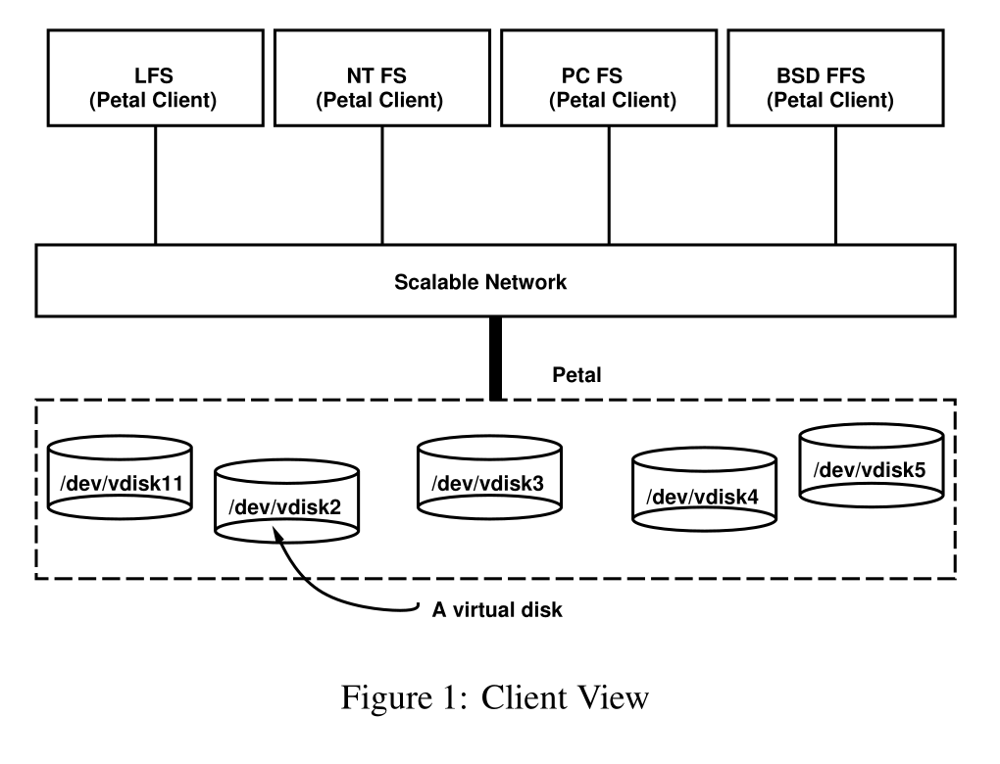
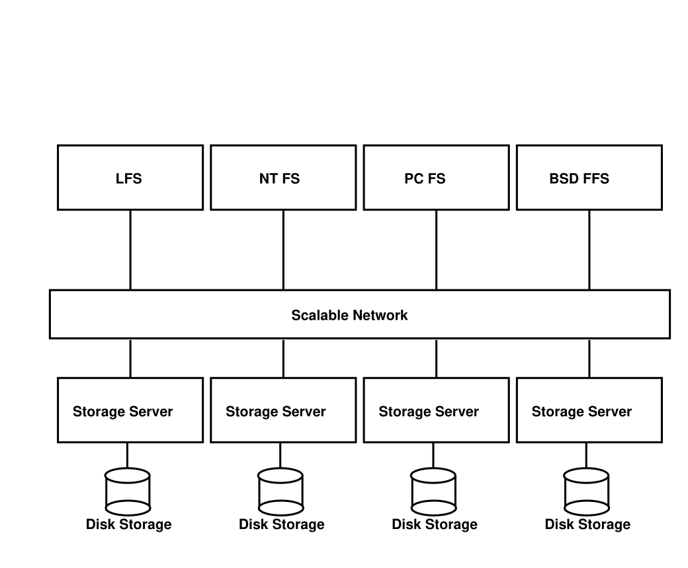
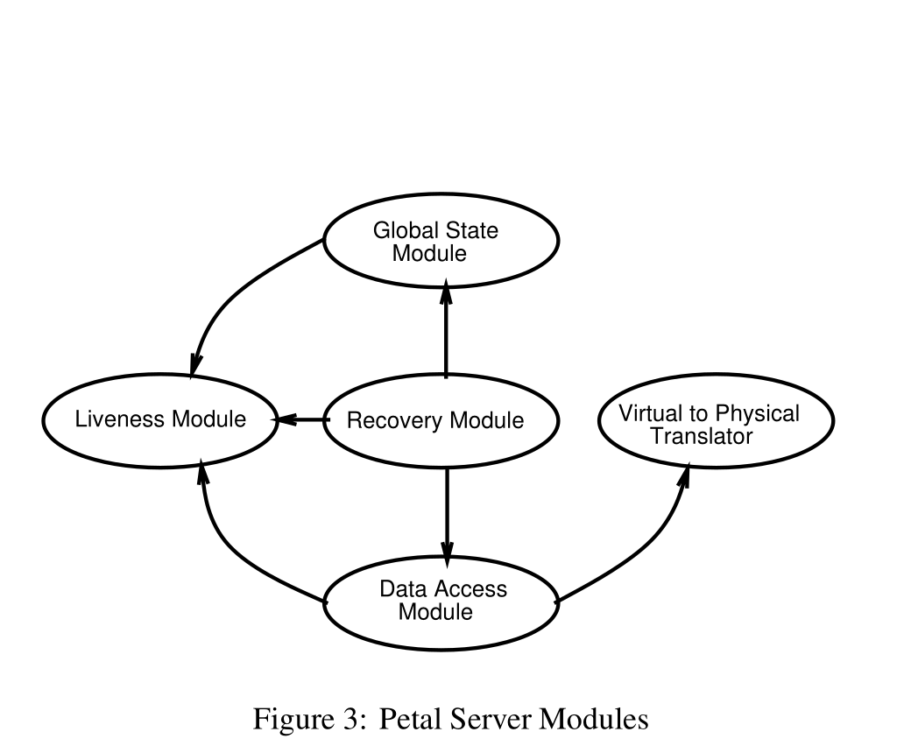
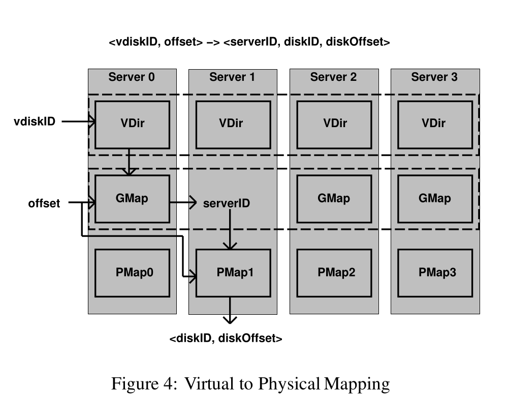
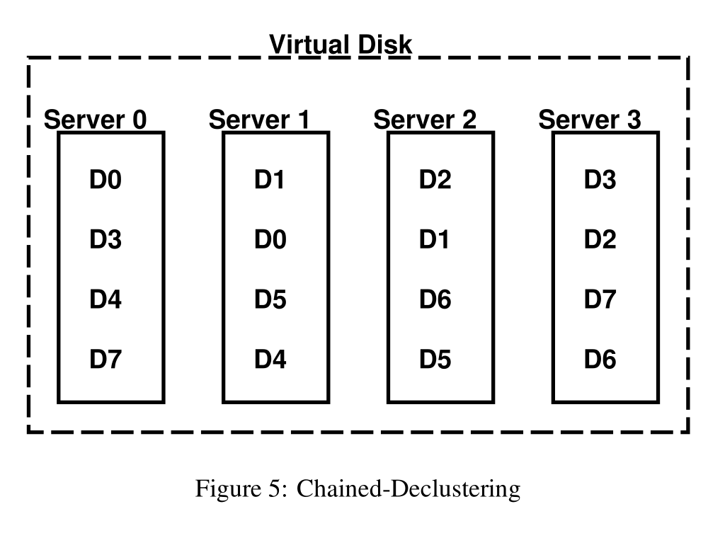
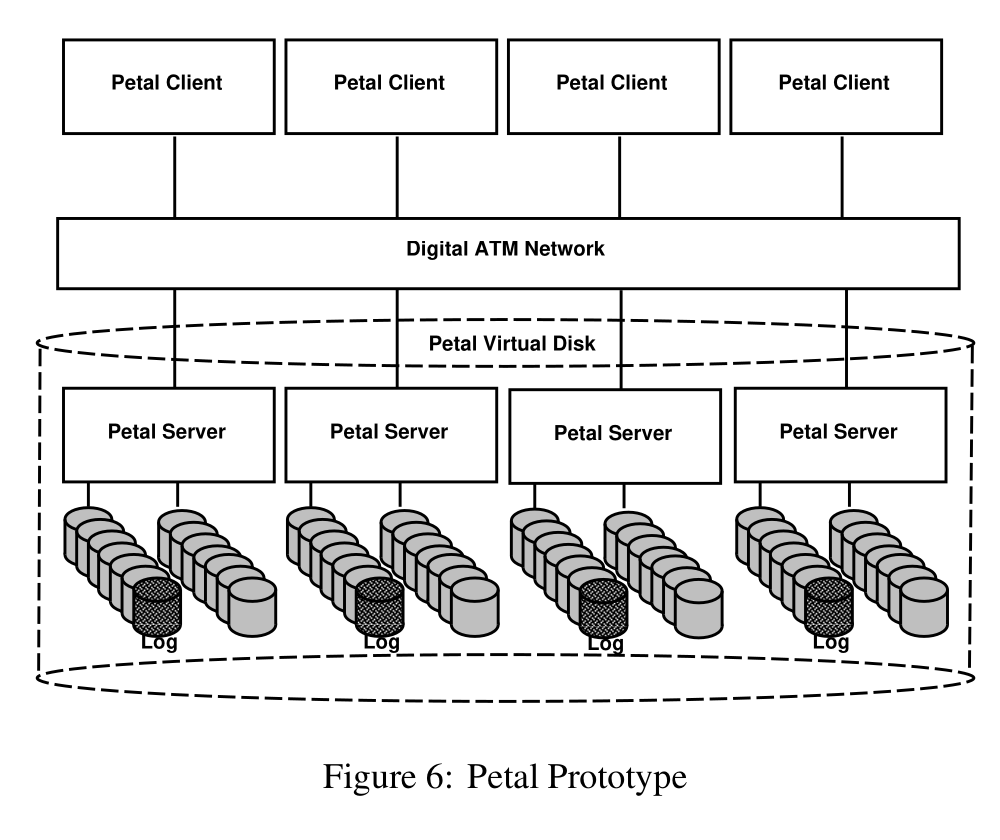
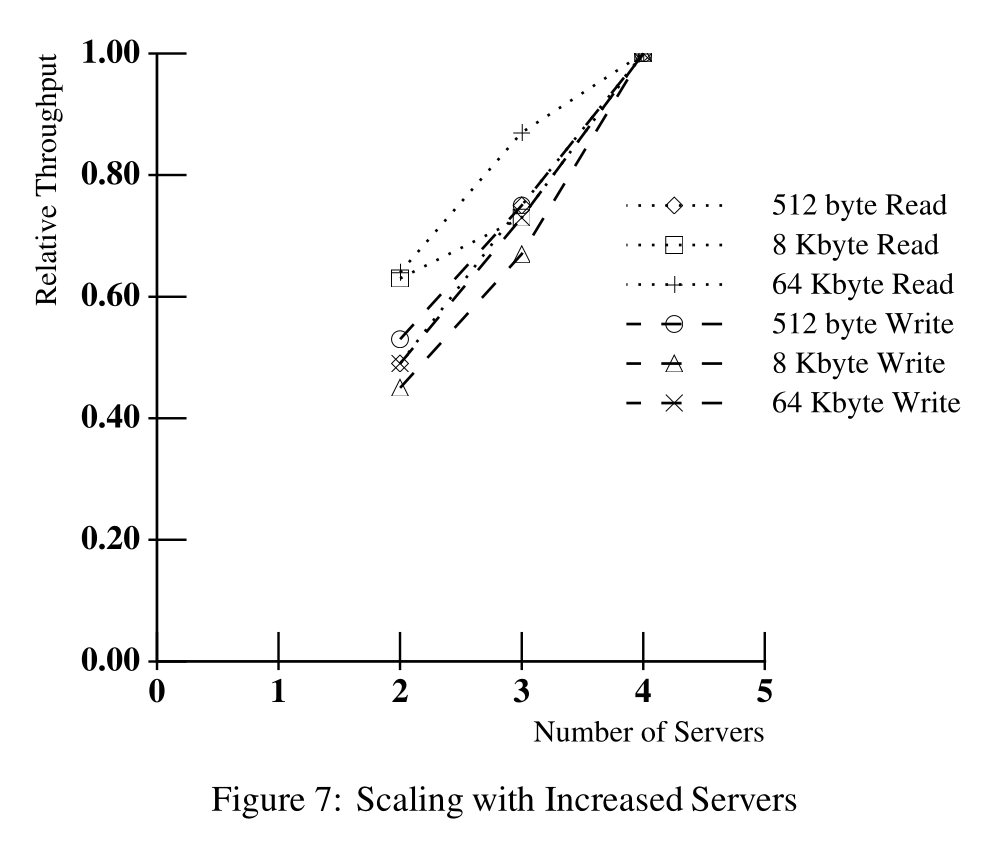

> **Source and translation basis｜来源与翻译依据**
>
> Edward K. Lee and Chandramohan A. Thekkath, *Petal: Distributed Virtual Disks*, Proceedings of the 7th International Conference on Architectural Support for Programming Languages and Operating Systems (ASPLOS VII), pages 84–92, October 1996. [DOI](https://doi.org/10.1145/237090.237157), [author publication page](https://www.thekkath.org/publications), [author PDF](https://thekkath.sharepoint.com/Documents/petal.pdf), and [Princeton archive PDF](https://www.cs.princeton.edu/courses/archive/spr99/cs598e/papers/petal.pdf). The author PDF SHA-256 is `45edb562de85c8142361b445fe5c6ea14ff1c3dd6aa9f6e2381424f800eabce0`; the Princeton archive PDF SHA-256 is `2922e8ac9b0e738b6c81c7752918ee345c30ab8edfacd36c1d3282aa5279fe22`.
>
> 本文以作者公开的论文版本为依据，并用普林斯顿课程存档中的同篇论文校对正文和提取插图。英文段落之后紧接中文翻译，保留论文的 7 幅图、3 张表、致谢和 19 条参考文献。图中英文标签不改动，在图下另列中文对照。

**Petal: Distributed Virtual Disks**

> **Petal：分布式虚拟磁盘**

Edward K. Lee and Chandramohan A. Thekkath 
Systems Research Center 
Digital Equipment Corporation 
130 Lytton Ave, Palo Alto, CA 94301

> Edward K. Lee、Chandramohan A. Thekkath 
> 系统研究中心 
> Digital Equipment Corporation 
> 130 Lytton Ave, Palo Alto, CA 94301

## Abstract｜摘要

The ideal storage system is globally accessible, always available, provides unlimited performance and capacity for a large number of clients, and requires no management. This paper describes the design, implementation, and performance of Petal, a system that attempts to approximate this ideal in practice through a novel combination of features. Petal consists of a collection of network-connected servers that cooperatively manage a pool of physical disks. To a Petal client, this collection appears as a highly available block-level storage system that provides large abstract containers called virtual disks. A virtual disk is globally accessible to all Petal clients on the network. A client can create a virtual disk on demand to tap the entire capacity and performance of the underlying physical resources. Furthermore, additional resources, such as servers and disks, can be automatically incorporated into Petal.

> 理想的存储系统应当能够从全局访问、始终可用，为大量客户端提供无限的性能与容量，而且不需要管理。本文介绍 Petal 的设计、实现和性能。Petal 通过一种新颖的功能组合，尝试在实际系统中接近这一理想状态。Petal 由一组通过网络连接的服务器组成，它们协同管理一个物理磁盘池。在 Petal 客户端看来，这组服务器是一个高可用的块级存储系统，提供称为虚拟磁盘的大型抽象容器。网络中的所有 Petal 客户端都能访问虚拟磁盘。客户端可以按需创建虚拟磁盘，从而使用底层物理资源的全部容量和性能。此外，服务器和磁盘等新增资源可以自动并入 Petal。

We have an initial Petal prototype consisting of four 225 MHz DEC 3000/700 workstations running Digital Unix and connected by a 155 Mbit/s ATM network. The prototype provides clients with virtual disks that tolerate and recover from disk, server, and network failures. Latency is comparable to a locally attached disk, and throughput scales with the number of servers. The prototype can achieve I/O rates of up to 3150 requests/sec and bandwidth up to 43.1 Mbytes/sec.

> 我们已经做出一个初始 Petal 原型：四台运行 Digital Unix 的 225 MHz DEC 3000/700 工作站，通过 155 Mbit/s ATM 网络连接。该原型向客户端提供虚拟磁盘，能够容忍磁盘、服务器和网络故障并从中恢复。其延迟与本地连接的磁盘相当，吞吐量则随服务器数量扩展。该原型的 I/O 速率最高可达每秒 3150 次请求，带宽最高可达 43.1 Mbytes/s。

## 1. Introduction｜引言

Currently, managing large storage systems is an expensive and complicated process. Often a single component failure can halt the entire system, and requires considerable time and effort to resume operation. Moreover, the capacity and performance of individual components in the system must be periodically monitored and balanced to reduce fragmentation and eliminate hot spots. This usually requires manually moving, partitioning, or replicating files and directories.

> 当时，管理大型存储系统既昂贵又复杂。一个组件发生故障，常常就会使整个系统停机，而且恢复运行需要投入大量时间和精力。此外，还必须定期监控并平衡系统中各个组件的容量和性能，以减少碎片并消除热点。这通常需要手工移动、分区或复制文件和目录。

This paper describes the design, implementation, and performance of Petal, an easy-to-manage distributed storage system. Clients, such as file systems and databases, view Petal as a collection of virtual disks as shown in Figure 1. A Petal virtual disk is a container that provides a sparse 64-bit byte storage space. As with ordinary magnetic disks, data are read and written to Petal virtual disks in blocks. In addition, it has the following novel combination of characteristics, which we believe will reduce the complexity of managing large storage systems:

> 本文介绍 Petal 的设计、实现和性能。Petal 是一套易于管理的分布式存储系统。文件系统和数据库等客户端把 Petal 看成一组虚拟磁盘，如图 1 所示。Petal 虚拟磁盘是一个提供稀疏 64 位字节地址空间的容器。与普通磁盘一样，Petal 虚拟磁盘也按块读写数据。此外，它还组合了下面这些新特性。我们认为，这些特性能够降低大型存储系统的管理复杂度：

Published in *The Proceedings of the 7th International Conference on Architectural Support for Programming Languages and Operating Systems*. Copyright © 1996 by the Association for Computing Machinery. All rights reserved. Republished by permission.

> 发表于第 7 届编程语言与操作系统体系结构支持国际会议论文集。© 1996 Association for Computing Machinery。保留所有权利。经许可重新发表。

- It can tolerate and recover from any single component failure such as disk, server, or network.
- It can be geographically distributed to tolerate site failures such as power outages and natural disasters.
- It transparently reconfigures to expand in performance and capacity as new servers and disks are added.
- It uniformly balances load and capacity throughout the servers in the system.
- It provides fast, efficient support for backup and recovery in environments with multiple types of clients, such as file servers and databases.

> - 它能够容忍磁盘、服务器或网络等任一单个组件的故障，并从故障中恢复。
> - 它可以跨地域部署，从而容忍停电、自然灾害等站点故障。
> - 随着新服务器和磁盘加入，它会透明地重新配置，以扩展性能和容量。
> - 它在整个系统的服务器之间均匀地平衡负载和容量。
> - 在文件服务器、数据库等多类客户端共存的环境里，它能为备份与恢复提供快速、高效的支持。

*Figure 1: Client View.*

> *图 1：客户端视图。*

**Figure labels:** LFS (Petal Client); NT FS (Petal Client); PC FS (Petal Client); BSD FFS (Petal Client); Scalable Network; Petal; `/dev/vdisk11`; `/dev/vdisk2`; `/dev/vdisk3`; `/dev/vdisk4`; `/dev/vdisk5`; A virtual disk.

> **图中标签：** LFS（Petal 客户端）；NT FS（Petal 客户端）；PC FS（Petal 客户端）；BSD FFS（Petal 客户端）；可扩展网络；Petal；`/dev/vdisk11`；`/dev/vdisk2`；`/dev/vdisk3`；`/dev/vdisk4`；`/dev/vdisk5`；一个虚拟磁盘。

Petal’s virtual disks allow us to cleanly separate a client’s view of storage from the physical resources that are used to implement it. This allows us to share the physical resources more flexibly among many clients, and to offer important services such as “snapshots” and incremental expandability in an efficient manner.

> Petal 的虚拟磁盘让我们能够把客户端看到的存储与实现这些存储的物理资源清楚地分开。因此，我们可以在许多客户端之间更灵活地共享物理资源，并高效地提供“快照”和增量扩展等重要服务。

The disk-like interface offered by Petal provides a lower-level service than a distributed file system; however, we believe that a distributed file system can be efficiently implemented on top of Petal, and that the resulting system as a whole will be as cost effective as a comparable distributed file system implementation that accesses local disks directly. By separating the system cleanly into a block-level storage system and a file system, and by handling many of the distributed systems problems in the block-level storage system, we have an overall system that is easier to model, design, implement, and tune. This simplicity is particularly important when the design is expected to scale to a large size and provide reliable data storage over a long period of time. An additional benefit is that the block-level interface is useful for supporting heterogeneous clients and client applications; that is, we can easily support many different types of file systems and databases.

> Petal 提供的类磁盘接口，服务层次低于分布式文件系统。不过，我们认为，可以在 Petal 之上高效地实现分布式文件系统，而且最终整个系统的成本效益，不会逊于直接访问本地磁盘的同类分布式文件系统实现。我们把系统清楚地拆成块级存储系统和文件系统，并在块级存储系统中处理许多分布式系统问题，由此得到的整体系统更容易建模、设计、实现和调优。当设计需要扩展到很大规模，并在很长时间内可靠保存数据时，这种简单性尤其重要。块级接口还有一个好处：它适合支持异构客户端及其应用，也就是说，我们可以轻松支持许多不同类型的文件系统和数据库。

*Figure 2: Physical View.*

> *图 2：物理视图。*

**Figure labels:** LFS; NT FS; PC FS; BSD FFS; Scalable Network; Storage Server; Disk Storage.

> **图中标签：** LFS；NT FS；PC FS；BSD FFS；可扩展网络；存储服务器；磁盘存储。

We have implemented Petal servers on Alpha workstations running Digital Unix connected by the Digital ATM network [2]. A Petal client interface exists for Digital Unix and is implemented as a kernel device driver, allowing all standard Unix applications, utilities, and file systems to run unmodified when using Petal. Our implementation exhibits graceful scaling and provides performance that is comparable to local disks while providing significant new functionality.

> 我们在运行 Digital Unix、通过 Digital ATM 网络 [2] 连接的 Alpha 工作站上实现了 Petal 服务器。Digital Unix 上的 Petal 客户端接口以一种内核设备驱动实现，因此所有标准 Unix 应用、工具和文件系统都无需修改即可使用 Petal。我们的实现能够平稳扩展，在提供大量新功能的同时，性能仍与本地磁盘相当。

## 2. Design of Petal｜Petal 的设计

As shown in Figure 2, Petal consists of a pool of distributed storage servers that cooperatively implement a single, block-level storage system. Clients view the storage system as a collection of virtual disks and access Petal services via a remote procedure call (RPC) [3] interface. A basic principle in the design of the Petal RPC interface was to maintain all state needed for ensuring the integrity of the storage system in the servers, and maintain only hints in the clients. Clients maintain only a small amount of high-level mapping information that is used to route read and write requests to the “most appropriate” server. If a request is sent to an inappropriate server, the server returns an error code, causing the client to update its hints and retry the request.

> 如图 2 所示，Petal 由一个分布式存储服务器池组成，这些服务器协同实现一套统一的块级存储系统。客户端把这套存储系统看成一组虚拟磁盘，通过远程过程调用（RPC）[3] 接口访问 Petal 服务。Petal RPC 接口设计的一项基本原则是：保证存储系统完整性所需的全部状态都放在服务器中，客户端只保留提示信息。客户端只保存少量高层映射信息，用来把读写请求路由到“最合适”的服务器。如果请求被发往不合适的服务器，该服务器会返回错误码，客户端随后更新提示并重试请求。

Figure 3 illustrates the software structure of Petal. Each of the ovals represents a software module. Arrows indicate the use of one module by another. Two modules, the liveness module and the global state module, manage much of the distributed system aspect of Petal. The liveness module ensures that all servers in the system will agree on the operational status, whether running or crashed, of each other. This service is used by the other modules, notably the global state manager, to guarantee continuous, consistent operation of the system as a whole in the face of server and communication failures. The operation of the liveness module is based on majority consensus and the periodic exchange of “I’m alive” and “You’re alive” messages between the servers. These message exchanges must be done in a timely manner to ensure progress but can be arbitrarily delayed or reordered without affecting correctness.

> 图 3 展示了 Petal 的软件结构。每个椭圆代表一个软件模块，箭头表示一个模块对另一个模块的调用。存活性模块和全局状态模块承担了 Petal 中大部分分布式系统管理工作。存活性模块保证系统中的所有服务器，对彼此是正在运行还是已经崩溃得出一致判断。其他模块，尤其是全局状态管理器，利用这项服务，在服务器或通信发生故障时保证整个系统持续、一致地运行。存活性模块依靠多数派共识，以及服务器之间周期性交换“我还活着”和“你还活着”消息。为了保证系统继续向前推进，这些消息必须及时交换；但任意延迟或乱序都不会影响正确性。

*Figure 3: Petal Server Modules.*

> *图 3：Petal 服务器模块。*

**Figure labels:** Global State Module; Liveness Module; Recovery Module; Data Access Module; Virtual to Physical Translator.

> **图中标签：** 全局状态模块；存活性模块；恢复模块；数据访问模块；虚拟到物理地址转换器。

Petal maintains information that describes the current members of the storage system and the currently supported virtual disks. This information is replicated across all Petal servers in the system. The global state manager is responsible for consistently maintaining this information, which is less than a megabyte in our current implementation. Our algorithm for maintaining global state is based on Leslie Lamport’s Paxos, or “part-time parliament” algorithm [14] for implementing distributed, replicated state machines. The algorithm assumes that servers fail by ceasing to operate and that networks can reorder and lose messages. The algorithm ensures correctness in the face of arbitrary combinations of server and communication failures and recoveries, and guarantees progress as long as a majority of servers can communicate with each other. This ensures that management operations in Petal, such as creating, deleting, or snapshotting virtual disks, or adding and deleting servers, are fault tolerant.

> Petal 保存着描述存储系统当前成员和当前受支持虚拟磁盘的信息。系统中所有 Petal 服务器都复制了这些信息。全局状态管理器负责一致地维护它们；在我们当前的实现中，信息总量不足一兆字节。我们维护全局状态的算法，以 Leslie Lamport 的 Paxos 算法，也就是实现分布式复制状态机的“兼职议会”算法 [14] 为基础。该算法假设服务器以停止运行为故障方式，网络则可能使消息乱序或丢失。面对服务器和通信任意组合的故障与恢复，该算法都能保证正确性；只要多数服务器能够彼此通信，就能保证继续推进。因此，Petal 中创建、删除虚拟磁盘、为虚拟磁盘制作快照，以及添加、删除服务器等管理操作都具备容错能力。

The other three modules deal with servicing the read and write requests issued by Petal clients. The data access and recovery modules control how client data is distributed and stored in the Petal storage system. A different set of data access and recovery modules exists for each type of redundancy scheme supported by the system. We currently support simple data striping without redundancy and a replication-based redundancy scheme called chained-declustering [13]. The desired redundancy scheme for a virtual disk is specified when the virtual disk is created. Subsequently, the redundancy scheme, and other attributes, can be transparently changed via a process called virtual disk reconfiguration. The virtual-to-physical address translation module contains common routines used by the various data access and recovery modules. These routines translate the virtual disk offsets to physical disk addresses. The rest of this section will examine specific aspects of the system in greater detail.

> 另外三个模块负责处理 Petal 客户端发出的读写请求。数据访问模块和恢复模块控制客户端数据在 Petal 存储系统中的分布与保存方式。系统支持的每一种冗余方案，都有一组对应的数据访问和恢复模块。当前我们支持不带冗余的简单数据条带化，以及一种称为链式去簇（chained-declustering）[13]、以复制为基础的冗余方案。创建虚拟磁盘时要指定所需的冗余方案。之后，可以通过称为虚拟磁盘重配置的过程，透明地修改冗余方案及其他属性。虚拟到物理地址转换模块包含各类数据访问和恢复模块共用的例程，它们把虚拟磁盘偏移转换成物理磁盘地址。本节余下部分将更详细地介绍系统的几个具体方面。

### 2.1 Virtual to Physical Translation｜虚拟到物理地址转换

This section describes how Petal translates the virtual disk addresses used by clients into physical disk addresses. The basic problem is to translate virtual addresses of the form &lt;virtual-disk-identifier, offset&gt; to physical addresses of the form &lt;server-identifier, disk-identifier, disk-offset&gt;. This translation must be done consistently and efficiently in a distributed system where events that alter virtual disk address translation, such as server failure or recovery, can occur unexpectedly.

> 本节说明 Petal 如何把客户端使用的虚拟磁盘地址转换成物理磁盘地址。基本问题是，把形如 &lt;虚拟磁盘标识符, 偏移&gt; 的虚拟地址，转换成形如 &lt;服务器标识符, 磁盘标识符, 磁盘偏移&gt; 的物理地址。在分布式系统中，服务器故障或恢复等改变虚拟磁盘地址转换关系的事件可能随时发生，因此这种转换必须保持一致而且高效。

*Figure 4: Virtual to Physical Mapping.*

> *图 4：虚拟到物理地址映射。*

**Figure labels:** &lt;vdiskID, offset&gt; → &lt;serverID, diskID, diskOffset&gt;; Server 0–3; VDir; GMap; PMap0–3; vdiskID; offset; serverID; &lt;diskID, diskOffset&gt;.

> **图中标签：** &lt;虚拟磁盘 ID, 偏移&gt; → &lt;服务器 ID, 磁盘 ID, 磁盘偏移&gt;；服务器 0–3；虚拟磁盘目录（VDir）；全局映射（GMap）；物理映射 PMap0–3；虚拟磁盘 ID；偏移；服务器 ID；&lt;磁盘 ID, 磁盘偏移&gt;。

Figure 4 illustrates the basic data structures and the steps in the translation procedure. There are three important data structures: a virtual disk directory (VDir), a global map (GMap), and a physical map (PMap). The dotted lines around the virtual disk directory and the global map indicate that these are global data structures that are replicated and consistently updated on all the servers by the global state manager. Each server also has a physical map that is local to that server. Translating a client-supplied virtual disk identifier and offset into a particular disk offset occurs in three steps as shown in Figure 4.

> 图 4 展示了基本数据结构和转换步骤。其中有三种重要的数据结构：虚拟磁盘目录（VDir）、全局映射（GMap）和物理映射（PMap）。虚拟磁盘目录和全局映射周围的虚线表示它们是全局数据结构，由全局状态管理器复制到所有服务器并进行一致更新。每台服务器还有一份只属于本机的物理映射。如图 4 所示，把客户端给出的虚拟磁盘标识符和偏移转换为某块磁盘上的具体偏移，需要三个步骤。

1. The virtual disk directory translates the client-supplied virtual disk identifier into a global map identifier.
2. The specified global map determines the server responsible for translating the given offset.
3. The physical map at the specified server translates the global map identifier and the offset to a physical disk and an offset within that disk.

> 1. 虚拟磁盘目录把客户端给出的虚拟磁盘标识符转换为全局映射标识符。
> 2. 指定的全局映射决定由哪台服务器负责转换给定偏移。
> 3. 指定服务器上的物理映射，把全局映射标识符和偏移转换成一块物理磁盘及该磁盘内的偏移。

To minimize communication, in almost all cases, the server that performs the translation in Step 2 will be the same server that performs the translation in Step 3. Thus, if a client has initially sent the request to the appropriate server, that server can perform all three steps in the translation locally without communicating with any other server.

> 为了尽量减少通信，几乎在所有情况下，执行第 2 步转换的服务器也会执行第 3 步。因此，如果客户端一开始就把请求发给了合适的服务器，该服务器无需与其他服务器通信，就能在本地完成全部三步转换。

There is one global map per virtual disk that specifies the tuple of servers spanned by the virtual disk and the redundancy scheme used to protect client data stored on the virtual disk. To tolerate server failures, a secondary server can be assigned responsibility for mapping the same offset when the primary is not available. Global maps are immutable; to change a virtual disk’s tuple of servers or redundancy scheme, the virtual disk must be assigned a new global map. Section 2.3 describing reconfiguration provides more details about this process.

> 每个虚拟磁盘都有一份全局映射，其中指定该虚拟磁盘跨越的服务器元组，以及保护虚拟磁盘中客户端数据所用的冗余方案。为了容忍服务器故障，主服务器不可用时，可以由一台辅助服务器负责映射同一偏移。全局映射是不可变的；如果要改变虚拟磁盘的服务器元组或冗余方案，就必须给它分配一份新的全局映射。介绍重配置的 2.3 节会更详细地说明这个过程。

The physical map is the actual data structure used to translate an offset within a virtual disk to a physical disk and an offset within that disk. It is similar to a page table in a virtual memory system and each physical map entry translates a 64 Kbyte region of physical disk. The server that performs the translation will usually also perform the disk operations needed to service the original client request. The separation of the translation data structures into global and local physical maps allows us to keep the bulk of the mapping information local. Doing so minimizes the amount of information that must be kept in global data structures that are replicated and, therefore, expensive to update.

> 物理映射才是把虚拟磁盘内的偏移转换成某块物理磁盘及其盘内偏移的实际数据结构。它类似虚拟内存系统中的页表，每个物理映射条目转换一段 64 Kbyte 的物理磁盘区域。执行转换的服务器通常也会执行处理原始客户端请求所需的磁盘操作。把转换数据结构拆成全局映射和本地物理映射，使我们能够把绝大部分映射信息留在本地。这样就能尽量减少必须放进全局数据结构的信息量；全局数据结构需要复制，更新成本因而较高。

### 2.2 Support for Backup｜备份支持

Petal attempts to simplify a client’s backup procedure by providing a common mechanism that can be applied by clients to automate the backup and recovery of all data stored on the system. The mechanism Petal provides is fast efficient snapshots of virtual disks. By using copy-on-write techniques, Petal can quickly create an exact copy of a virtual disk at a specified point in time. A client treats the snapshot like any other virtual disk, except that it cannot be modified.

> Petal 提供一种通用机制，客户端可以用它自动备份和恢复系统中保存的全部数据，从而简化客户端的备份流程。这项机制就是快速、高效的虚拟磁盘快照。Petal 采用写时复制技术，能够迅速创建虚拟磁盘在指定时刻的精确副本。客户端可以像使用其他虚拟磁盘一样使用快照，唯一的区别是快照不能修改。

Supporting snapshots requires a slightly more complicated virtual-to-physical translation procedure than described in the previous section. In particular, the virtual disk directory does not translate a virtual disk identifier to a global map identifier, but rather to the tuple &lt;global-map-identifier, epoch-number&gt;. The epoch-number is a monotonically increasing version number that distinguishes data stored at the same virtual disk offset at different points in time. The tuple &lt;global-map-identifier, epoch-number&gt; is then used by the physical map in the last step of the translation.

> 为了支持快照，虚拟到物理地址转换过程要比上一节所述稍微复杂一些。具体来说，虚拟磁盘目录不是把虚拟磁盘标识符转换成一个全局映射标识符，而是转换成元组 &lt;全局映射标识符, 纪元号&gt;。纪元号是单调递增的版本号，用来区分不同时刻保存在同一虚拟磁盘偏移处的数据。在转换的最后一步，物理映射会使用这个 &lt;全局映射标识符, 纪元号&gt; 元组。

When the system creates a snapshot of a virtual disk, a new tuple with a later epoch number is created in the virtual disk directory. All accesses to the original virtual disk are then made using the new epoch number. The older epoch number is used by the newly created snapshot. This ensures that any new data written to the original virtual disk will create new entries in the new epoch rather than overwriting the data in the previous epoch. Also, read requests can find the data most recently written to a particular offset by looking for the most recent epoch.

> 系统为虚拟磁盘创建快照时，会在虚拟磁盘目录中建立一个带有更大纪元号的新元组。此后，对原虚拟磁盘的所有访问都使用新的纪元号；新建快照则使用较旧的纪元号。这样，写入原虚拟磁盘的任何新数据都会在新纪元中建立新条目，而不会覆盖上一纪元的数据。读请求也可以通过查找最新纪元，找到最近一次写入某个偏移的数据。

Creating a snapshot that is consistent at the client application level requires pausing the application for the brief time, less than one second, it takes to create a Petal snapshot. An alternative approach would not require pausing the application and would create a “crash-consistent” snapshot, that is, the snapshot would be similar to the disk image that would be left after an application crashed. Such snapshots could later be made consistent at the application level by running an application-dependent recovery program such as fsck in the case of Unix file systems. We are considering implementing crash-consistent snapshots, but they are currently not supported.

> 要创建在客户端应用层面保持一致的快照，需要暂停应用，暂停时间就是 Petal 创建快照所需的短暂时间，不到一秒。另一种方法不必暂停应用，它会创建“崩溃一致”的快照，也就是说，快照类似应用崩溃后留下的磁盘映像。之后可以运行与应用有关的恢复程序，让这种快照达到应用层一致；对于 Unix 文件系统，这类程序就是 fsck。我们正在考虑实现崩溃一致快照，但当前尚不支持。

Snapshots can be kept on-line and facilitate the recovery of accidentally deleted files. Also, since a snapshot behaves exactly like a read-only local disk, a Petal client can use it to create consistent archives of data using utilities such as tar.

> 快照可以一直在线保存，便于恢复误删文件。此外，因为快照的行为与只读本地磁盘完全相同，Petal 客户端可以使用 tar 等工具，借助快照创建一致的数据归档。

### 2.3 Incremental Reconfiguration｜增量重配置

Occasionally, it is desirable to change a virtual disk’s redundancy scheme or the set of servers over which it is mapped. Such a change is often precipitated by the addition or removal of disks and servers. This section describes how Petal incorporates new disks and servers, and how existing virtual disks can be reconfigured to take advantage of these new resources. The former processes are described only from the point of view of adding new resources but are easily generalized to the removal of resources. The latter process is referred to as virtual disk reconfiguration and is the primary focus of this section.

> 有时需要改变虚拟磁盘的冗余方案，或改变它所映射到的服务器集合。添加或移除磁盘和服务器，往往会引出这种变化。本节说明 Petal 如何接纳新磁盘和新服务器，以及如何重配置已有虚拟磁盘，使其利用这些新资源。对于前一个过程，本文只从添加新资源的角度叙述，不过很容易推广到资源移除。后一个过程称为虚拟磁盘重配置，是本节的重点。

The addition of a disk to a server is handled locally by the given server. Subsequent storage allocation requests automatically take the new disk into consideration. However, for load balance, it is desirable to redistribute previously allocated storage to the new disk as well. This redistribution is most easily accomplished as part of a local background process that periodically moves data among disks. We have not yet implemented such a background process in Petal. Nonetheless, existing data is redistributed to newly added disks as a side-effect of the virtual disk reconfiguration.

> 向服务器添加磁盘由该服务器在本地处理。后续的存储分配请求会自动考虑新磁盘。不过，为了平衡负载，最好也把此前已经分配的存储重新分布到新磁盘上。最简单的做法，是由一个本地后台进程定期在磁盘之间移动数据。我们还没有在 Petal 中实现这样的后台进程。不过，虚拟磁盘重配置会附带地把现有数据重新分布到新加入的磁盘上。

The addition of a Petal server is a global operation composed of several steps involving the global state management module and the liveness module. First, the new server is added to the membership of the Petal storage system. Thereafter, the new server will participate in any future global operations. Next, the sets of servers used by the liveness module for determining whether a particular server is up or down is adjusted to incorporate the new server. Finally, existing virtual disks are reconfigured to take advantage of the new server, using the process described below.

> 添加 Petal 服务器是一项全局操作，由涉及全局状态管理模块和存活性模块的多个步骤组成。首先，把新服务器加入 Petal 存储系统的成员集合，此后它会参与所有后续全局操作。接着，调整存活性模块用于判断某台服务器是在线还是离线的服务器集合，把新服务器包括进来。最后，按照下文所述过程重配置现有虚拟磁盘，使它们利用新服务器。

Given the virtual-to-physical translation procedure already described in Section 2.1, and in the absence of any other activity in the system, virtual disk reconfiguration can be trivially implemented as follows:

> 在采用 2.1 节所述虚拟到物理地址转换过程，而且系统没有其他活动的前提下，可以很简单地按以下方式实现虚拟磁盘重配置：

1. Create a new global map with the desired redundancy scheme and server mapping.
2. Change all virtual disk directory entries that refer to the old global map to refer to the new one.
3. Redistribute the data to the servers according to the translations specified in the new global map. This data distribution could potentially require substantial amounts of network and disk traffic.

> 1. 使用所需冗余方案和服务器映射，创建一份新的全局映射。
> 2. 修改所有引用旧全局映射的虚拟磁盘目录条目，使其引用新映射。
> 3. 按照新全局映射指定的转换关系，把数据重新分布到各台服务器。这个数据分布过程可能需要大量网络和磁盘流量。

The challenge is to perform reconfiguration incrementally and concurrently with the processing of normal client requests. We find it acceptable if the procedure takes a few hours but it must not degrade the performance of the system significantly. For example, if a virtual disk is reconfigured because a new server has been added, the performance of the virtual disk should gradually increase during reconfiguration from its level before reconfiguration to its level after reconfiguration. We will describe our reconfiguration algorithm in two steps. First, we describe the basic algorithm and then a refinement to that algorithm. The refined algorithm is what is actually implemented in our system.

> 难点在于，要以增量方式完成重配置，同时照常处理客户端请求。即使整个过程持续数小时，我们也可以接受，但它不能显著降低系统性能。例如，因为添加了一台新服务器而重配置虚拟磁盘时，虚拟磁盘的性能应当在重配置期间逐渐提升，从重配置前的水平过渡到重配置后的水平。下面分两步介绍重配置算法：先说明基本算法，再说明对它的改进。系统中实际实现的是改进后的算法。

In the basic algorithm, steps one and two, described above, are first executed. Next, starting with the translations in the most recent epoch that have not yet been moved, data is transferred to the new collection of servers as specified by the new global map. Because of the amount of data that may need to be moved, reconfiguration can take a long time to complete. In the meantime, clients will wish to read and write data to a virtual disk that is being reconfigured. To accommodate such requests, our read and write procedures are designed to function as follows. When a client read request is serviced, the old global map is tried if an appropriate translation is not found in the new global map. This ensures that translations that have not yet been moved will still be found in the old global map. Any client write requests will always access only the new global map. Also, since we move data starting with the most recent epoch, we ensure that read requests will not return data from an older epoch than that requested by the client.

> 基本算法先执行上面所述的第一步和第二步。接下来，从最新纪元中尚未移动的转换条目开始，按照新全局映射的规定，把数据传送到新的服务器集合。由于可能需要移动的数据很多，重配置需要较长时间才能完成。在此期间，客户端仍要读写正在重配置的虚拟磁盘。为了处理这些请求，我们把读写过程设计成下面这样：处理客户端读请求时，如果在新全局映射中找不到合适的转换，就尝试旧全局映射，从而保证尚未迁移的转换仍能在旧映射中找到。客户端的任何写请求都只访问新全局映射。此外，因为移动数据时从最新纪元开始，所以能保证读请求不会返回比客户端所请求纪元更早的数据。

The main limitation of the basic algorithm is that server mappings for an entire virtual disk are changed before any data is moved. This means that almost every client read request submitted that is based on the new global map will miss in the new global map and will have to be forwarded to the old one. This will usually require additional communication between servers and has the potential to seriously degrade the performance of the system.

> 基本算法的主要限制是，在移动任何数据之前，就改变了整个虚拟磁盘的服务器映射。这意味着，客户端按新全局映射提交的读请求几乎都会在新映射中查找失败，只得转交旧映射处理。这通常需要服务器之间增加通信，并可能严重降低系统性能。

The refined algorithm solves the limitation of the basic algorithm by relocating only small portions of a virtual disk at a time. The basic idea is to break up a virtual disk’s address range into three regions: old, new, and fenced. Requests to the old and new regions simply use the old and new global maps, respectively. Requests to the fenced region, however, use the basic algorithm we have described above. Once we have relocated everything in the fenced region, it becomes a new region and we fence another part of the old region. We repeat until we have moved all the data in the old region into the new region.

> 改进算法每次只迁移虚拟磁盘的一小部分，从而解决基本算法的限制。它的基本思路是把虚拟磁盘的地址范围划成三个区域：旧区域、新区域和围栏区域。发往旧区域和新区域的请求分别直接使用旧全局映射和新全局映射；发往围栏区域的请求则使用上面介绍的基本算法。围栏区域中的全部内容迁移完毕后，它就成为新区域，然后再从旧区域划出一部分作为围栏。不断重复这个过程，直到旧区域中的全部数据都移入新区域。

By keeping the relative size of the fenced region small, roughly one to ten percent of the entire range, we minimize the forwarding overhead. To help guard against fencing off a heavily used subrange of the virtual disk, we construct the fenced region by collecting small non-contiguous ranges distributed throughout the virtual disk, instead of a single contiguous region.

> 我们把围栏区域的相对大小控制在整个地址范围的约 1% 到 10%，以尽量降低转发开销。为了避免恰好围住虚拟磁盘中使用频繁的一段子范围，围栏区域不是一个连续区域，而是由分布在整个虚拟磁盘中的多个不连续小范围拼成。

### 2.4 Data Access and Recovery｜数据访问与恢复

This section describes Petal’s chained-declustered [13] data access and recovery modules. These modules give clients highly available access to data by automatically bypassing failed components. Dynamic load balancing eliminates system bottlenecks by ensuring uniform load distribution even in the face of component failures. We start by describing the basic idea behind chained-declustering and then move into detailed descriptions of exactly what happens on each read and write operation.

> 本节介绍 Petal 采用链式去簇 [13] 的数据访问和恢复模块。这些模块自动绕过故障组件，使客户端能够高可用地访问数据。即使有组件发生故障，动态负载均衡也能保证负载均匀分布，从而消除系统瓶颈。我们先介绍链式去簇的基本思想，再详细说明每次读写操作究竟会发生什么。

*Figure 5: Chained-Declustering.*

> *图 5：链式去簇。*

**Figure labels:** Virtual Disk; Server 0–3; D0–D7.

> **图中标签：** 虚拟磁盘；服务器 0–3；数据块 D0–D7。

Figure 5 illustrates the chained-declustered data placement scheme. The dotted rectangle emphasizes that the data on the storage servers appear as a single virtual disk to clients. Each sequence of letters represents a block of data stored in the storage system. Note that the two copies of each block of data are always stored on neighboring servers. Furthermore, every pair of neighboring servers has data blocks in common. Because of this arrangement, if Server 1 fails, servers 0 and 2 will automatically share Server 1’s read load; however, Server 3 will not experience any load increase. By performing dynamic load balancing, we can do better. For example, since Server 3 has copies of some data from servers 0 and 2, servers 0 and 2 can offload some of their normal read load on Server 3 and achieve uniform load balancing.

> 图 5 展示了链式去簇的数据放置方案。虚线矩形强调：对客户端来说，存储服务器上的数据表现为一个虚拟磁盘。每个字母和数字的组合代表存储系统中的一个数据块。可以看到，每个数据块的两个副本总是放在相邻服务器上，而且任意一对相邻服务器都有共同的数据块。按照这种布局，如果服务器 1 故障，服务器 0 和服务器 2 会自动分担它的读负载；但服务器 3 的负载不会增加。通过动态负载均衡，我们还能做得更好。例如，服务器 3 保存着服务器 0 和服务器 2 的部分数据副本，所以后二者可以把一部分常规读负载转移给服务器 3，从而使负载分布均匀。

Chaining the data placement allows each server to offload some of its read load to the server either immediately following or preceding the given server. By cascading the offloading across multiple servers, a uniform load can be maintained across all surviving servers. In contrast, with a simple mirrored redundancy scheme that replicates all the data stored on two servers, the failure of either would result in a 100% load increase at the other with no opportunities for dynamic load balancing. In a system that stripes over many mirrored servers, the 100% load increase at this single server would reduce the overall system throughput by 50%.

> 链式数据放置允许每台服务器把一部分读负载转移给紧邻其前或其后的服务器。让这种转移在多台服务器间级联，就能使所有仍在运行的服务器保持均匀负载。相比之下，在简单镜像冗余方案中，两台服务器保存完全相同的数据；其中一台故障，另一台的负载就会增加 100%，而且没有动态负载均衡的余地。在一个跨多组镜像服务器做条带化的系统中，单台服务器负载增加 100%，会使整个系统的吞吐量降低 50%。

Our current prototype implements a simple dynamic load balancing scheme. Each client keeps track of the number of requests it has pending at each server and always sends read requests to the server with the shorter queue length. This works well if most of the requests are generated by a few clients but, obviously, would not work well if most requests are generated by many clients that only occasionally issue I/O requests. The choice of load balancing algorithm is currently an active area of research within the Petal project.

> 当前原型实现了一种简单的动态负载均衡方案。每个客户端记录自己在各台服务器上等待处理的请求数，总是把读请求发往队列更短的服务器。如果大多数请求由少数客户端产生，这种方法效果很好；但如果请求主要来自许多只偶尔发起 I/O 的客户端，效果显然就不会好。如何选择负载均衡算法，当时仍是 Petal 项目正在积极研究的问题。

An additional advantage with chained-declustering is that by placing all the even-numbered servers at one site and all the odd-numbered servers at another site, we can tolerate site failures. A disadvantage of chained-declustering relative to simple mirroring is that it is less reliable. With simple mirroring, if a server failed, only the failure of its mirror server would result in data becoming unavailable. With chained-declustering, if a server fails, the failure of either one of its two neighboring servers will result in data becoming unavailable.

> 链式去簇还有一个优点：把所有偶数编号服务器放在一个站点，把所有奇数编号服务器放在另一个站点，就能容忍站点故障。与简单镜像相比，链式去簇的缺点是可靠性较低。在简单镜像中，一台服务器故障以后，只有它的镜像服务器也故障才会使数据不可用；而在链式去簇中，一台服务器故障以后，与它相邻的两台服务器中任意一台再故障，都会使数据不可用。

In our implementation of chained-declustering, one of the two copies of each data block is denoted the primary and the other is denoted the secondary. Read requests can be serviced from either the primary or the secondary copy but the servicing of write requests must always start at the primary, unless the server containing the primary is down in which case it may start at the secondary. Because we lock copies of the data blocks before reading or writing them to guarantee consistency, this ordering guarantee is necessary to avoid deadlocks.

> 在链式去簇的实现中，每个数据块的两个副本，一个记作主副本，另一个记作辅助副本。读请求可以由主副本或辅助副本处理；但写请求必须从主副本开始处理，除非保存主副本的服务器已经停机，这时才能从辅助副本开始。为了保证一致性，我们在读写数据块副本之前会先锁定它们，因此必须保证这个处理次序，才能避免死锁。

On a read request, the server that receives the request attempts to read the requested data. If successful, the server returns the requested data, otherwise it returns an error code and the client tries another server. If a request times out due to network congestion or because a server is down, the client will alternately retry the primary and secondary servers until either the request succeeds or both servers return error codes indicating that it is not possible to satisfy the request. Currently, this happens only if both disks containing copies of the requested data have been destroyed.

> 处理读请求时，收到请求的服务器会尝试读取所需数据。读取成功就返回数据，否则返回错误码，让客户端尝试另一台服务器。如果请求因网络拥塞或服务器停机而超时，客户端会交替重试主服务器和辅助服务器，直到请求成功，或者两台服务器都返回错误码，表明请求无法完成。当前只有保存该数据两个副本的磁盘都损坏时，才会出现后一种情况。

On a write request, the server that receives the request first checks to see if it is the primary for the specified data element. If it is the primary, it first marks this data element as busy on stable storage. It then simultaneously sends write requests to its local copy and the secondary copy. When both requests complete, the busy bit is cleared and the client that issued the request is sent a status code indicating the success or failure of the operation. If the primary crashes while performing the update, the busy bits are used during crash recovery to ensure that the primary and secondary copies are consistent. Write-ahead-logging with group commits makes updating the busy bits efficient. As a further optimization, the clearing of busy bits is done lazily and we maintain a cache of the most recently set busy bits. Thus, if write requests display locality, a given busy bit will already be set on disk and will not require additional I/O.

> 处理写请求时，收到请求的服务器首先检查自己是不是指定数据元素的主服务器。如果是，它先在稳定存储上把该数据元素标为忙，然后同时向本地副本和辅助副本发送写请求。两个请求都完成以后，清除忙位，并向发起请求的客户端发送状态码，说明操作成功还是失败。如果主服务器在更新过程中崩溃，崩溃恢复时会利用忙位保证主副本与辅助副本一致。采用带组提交的预写日志，可以高效更新忙位。作为进一步优化，系统会延迟清除忙位，并缓存最近设置的忙位。因此，如果写请求具有局部性，给定忙位在磁盘上已经处于设置状态，就不需要额外 I/O。

If the server that received the write request is the secondary for the specified data element, then it will service the request only if it can determine that the server containing the primary copy is down. In this case, the secondary marks the data element as stale on stable storage before writing it to its local disk. The server containing the primary copy will eventually have to bring all data elements marked stale up-to-date during its recovery process. A similar procedure is used by the primary if the secondary dies.

> 如果收到写请求的服务器是指定数据元素的辅助服务器，那么只有在它能够确认主副本所在服务器已经停机时，才会处理该请求。这时，辅助服务器先在稳定存储上把数据元素标为陈旧，再写入本地磁盘。主副本所在服务器最终恢复时，必须把所有标为陈旧的数据元素更新到最新状态。辅助服务器故障时，主服务器也采用类似过程。

## 3. Implementation and Performance｜实现与性能

*Figure 6: Petal Prototype.*

> *图 6：Petal 原型。*

**Figure labels:** 4 Petal Client; Digital ATM Network; Petal Virtual Disk; 4 Petal Server; Log.

> **图中标签：** 4 个 Petal 客户端；Digital ATM 网络；Petal 虚拟磁盘；4 个 Petal 服务器；日志。

Our Petal prototype is illustrated in Figure 6. Four 225 MHz DEC 3000/700s running Digital Unix act as server machines. Each runs a single Petal server, which is a user-level process that accesses the physical disks using the Unix raw disk interface, and the network using UDP/IP Unix sockets. Each server machine is configured with 14 Digital RZ29 disks, each of which is a 3.5 inch SCSI device with a 4.3 Gbyte capacity. Each machine uses one of the disks for write-ahead logging and the remaining to store client data. The disks are connected to the server machine via two 10 Mbyte/s fast SCSI strings using the Digital PMZAA-C host bus adapter.

> Petal 原型如图 6 所示。四台运行 Digital Unix 的 225 MHz DEC 3000/700 充当服务器。每台机器运行一个 Petal 服务器；它是用户态进程，通过 Unix 裸磁盘接口访问物理磁盘，通过 UDP/IP Unix socket 访问网络。每台服务器配置 14 块 Digital RZ29 磁盘，每块都是容量 4.3 Gbyte 的 3.5 英寸 SCSI 设备。每台机器拿出一块磁盘做预写日志，其余磁盘保存客户端数据。磁盘通过 Digital PMZAA-C 主机总线适配器，以两条 10 Mbyte/s 的 Fast SCSI 链路连接服务器。

Four additional machines running Digital Unix are configured as Petal clients to generate load on the servers. Each client’s kernel is loaded with the Petal device driver for accessing Petal virtual disks. This allows clients to access Petal virtual disks just like local disks. Both the servers and clients are connected to each other via 155 Mbit/s ATM links over a Digital ATM network.

> 另外四台运行 Digital Unix 的机器被配置为 Petal 客户端，用来给服务器施加负载。每个客户端的内核都加载了访问 Petal 虚拟磁盘所需的 Petal 设备驱动，因此客户端可以像访问本地磁盘一样访问 Petal 虚拟磁盘。服务器和客户端都通过 Digital ATM 网络上的 155 Mbit/s ATM 链路彼此连接。

The entire Petal RPC interface has 24 calls and many of these calls are devoted to management functions, such as creating and deleting virtual disks, making snapshots, reconfiguring a virtual disk, and adding and deleting servers. These calls are typically used by user-level utilities to perform tasks such as virtual disk creation and monitoring the physical resource pools in the system to determine when additional servers or disks should be added.

> Petal 的完整 RPC 接口包含 24 个调用，其中许多用于管理功能，例如创建和删除虚拟磁盘、制作快照、重配置虚拟磁盘，以及添加和删除服务器。用户态工具通常利用这些调用完成虚拟磁盘创建等任务，也会监控系统中的物理资源池，判断何时应当添加服务器或磁盘。

Petal RPC calls that implement management functions are infrequently executed and generally take less than a second to complete. In particular, create and snapshot operations take about 650 milliseconds. Delete and reconfiguration take about 650 milliseconds to initiate, but their total execution time is dependent on the actual amount of physical storage associated with the specified virtual disk.

> 实现管理功能的 Petal RPC 调用执行得并不频繁，一般不到一秒即可完成。其中，创建和快照操作大约需要 650 毫秒。删除和重配置操作大约需要 650 毫秒来启动，但总执行时间取决于指定虚拟磁盘实际关联的物理存储量。

In the remainder of the section, we will report on the performance of accessing a Petal virtual disk and the behavior of file systems built on Petal. Our primary performance goals are to provide latency roughly comparable to a locally attached disk, throughput that scales with the number of servers, and performance that gracefully degrades as servers fail.

> 本节余下部分将报告访问 Petal 虚拟磁盘的性能，以及构建在 Petal 之上的文件系统表现。我们的主要性能目标是：延迟与本地连接的磁盘大致相当；吞吐量随服务器数量扩展；服务器发生故障时，性能能够平稳下降。

### 3.1 Petal Performance｜Petal 的性能

This section examines the read and write performance of a Petal chained-declustered virtual disk. For a read request, the client makes an RPC to a Petal server that simply returns the data from its local disk. When a server receives a write request, it first writes a small log entry that is used to recover to a consistent state after a server crash. Next, the server simultaneously writes the data to its local disk and a second disk on a mirror server. When both disk writes complete, the first, or primary, server replies to the client. The read and write procedures used by Petal are described in greater detail in Section 2.4.

> 本节考察采用链式去簇的 Petal 虚拟磁盘的读写性能。对于读请求，客户端向 Petal 服务器发起 RPC，服务器直接返回本地磁盘中的数据。服务器收到写请求后，先写入一条小日志记录，以便服务器崩溃后恢复到一致状态。接着，服务器同时把数据写入本地磁盘和镜像服务器上的第二块磁盘。两次磁盘写入都完成以后，第一台服务器，也就是主服务器，向客户端返回响应。2.4 节对 Petal 使用的读写过程有更详细的介绍。

#### Table 1: Latency of a Chained-Declustered Virtual Disk｜表 1：链式去簇虚拟磁盘的延迟

| Request | Local Disk RZ29 | Petal RZ29 Log | Petal NVRAM Log |
| --- | ---: | ---: | ---: |
| 512 byte Read | 9 ms | 10 ms | 10 ms |
| 8 Kbyte Read | 11 ms | 12 ms | 12 ms |
| 64 Kbyte Read | 21 ms | 28 ms | 28 ms |
| 512 byte Write | 10 ms | 19 ms | 12 ms |
| 8 Kbyte Write | 12 ms | 22 ms | 16 ms |
| 64 Kbyte Write | 20 ms | 40 ms | 33 ms |

> | 请求 | 本地磁盘 RZ29 | Petal RZ29 日志 | Petal NVRAM 日志 |
> | --- | ---: | ---: | ---: |
> | 512 字节读 | 9 ms | 10 ms | 10 ms |
> | 8 Kbyte 读 | 11 ms | 12 ms | 12 ms |
> | 64 Kbyte 读 | 21 ms | 28 ms | 28 ms |
> | 512 字节写 | 10 ms | 19 ms | 12 ms |
> | 8 Kbyte 写 | 12 ms | 22 ms | 16 ms |
> | 64 Kbyte 写 | 20 ms | 40 ms | 33 ms |

Table 1 compares the read and write latency of a chained-declustered Petal virtual disk with a local RZ29 disk. For this experiment, a single client generates requests of the specified size to random disk offsets. We show Petal performance with two kinds of write-ahead-logging devices, an RZ29 disk and an NVRAM device simulated using RAM. The log device is used only to service write requests and does not affect read performance. Logging to NVRAM improves write latency by approximately 7 ms.

> 表 1 比较了链式去簇 Petal 虚拟磁盘和本地 RZ29 磁盘的读写延迟。在这项实验中，一个客户端向随机磁盘偏移发出指定大小的请求。表中给出 Petal 使用两种预写日志设备时的性能：一种是 RZ29 磁盘，另一种是用 RAM 模拟的 NVRAM 设备。日志设备只用于处理写请求，不影响读性能。把日志写入 NVRAM，能让写延迟减少约 7 ms。

For read requests of 512 bytes and 8 Kbytes, the Petal latency is only slightly worse than an RZ29. For 64 Kbyte reads, the latency gap widens to 7 ms. Most of the increased latency is due to the additional delay in transmitting the data over the network and includes the Unix socket, UDP/IP, and ATM hardware overheads, which accounts for over 6 ms. The Petal server software and the client interface overheads are negligible. If we overlapped the reading of data from disks with the transfer of data over the network, we could eliminate much of this 7 ms overhead.

> 对 512 字节和 8 Kbyte 读请求，Petal 的延迟只比 RZ29 稍高。到了 64 Kbyte 读，延迟差距扩大到 7 ms。增加的延迟大部分来自通过网络传输数据时的额外等待，包括 Unix socket、UDP/IP 和 ATM 硬件开销，这些合计超过 6 ms。Petal 服务器软件和客户端接口的开销可以忽略。如果让磁盘读数据与网络传输数据重叠执行，就能消除这 7 ms 开销中的大部分。

Even with an NVRAM log device, Petal write performance is worse than a local RZ29 disk. In addition to the network delay in sending the data to the primary server, there is an additional delay because the primary has to send the data to the mirror server and wait for an acknowledgment before returning to the client. The latencies due to the network transmissions are approximately 1 ms, 3 ms, and 12 ms for 512 byte, 8 Kbyte, and 64 Kbyte write requests respectively. Also, the arms and the spindles of the primary and secondary disks are unsynchronized. This lack of synchronization causes write requests to wait for the slower of the primary and secondary disk writes.

> 即使采用 NVRAM 日志设备，Petal 的写性能仍低于本地 RZ29 磁盘。除了把数据发送给主服务器的网络延迟外，还有一段额外延迟：主服务器必须把数据发送给镜像服务器，等到确认后才能向客户端返回。对于 512 字节、8 Kbyte 和 64 Kbyte 写请求，网络传输带来的延迟分别约为 1 ms、3 ms 和 12 ms。此外，主磁盘与辅助磁盘的磁臂和主轴并不同步。这种不同步使写请求不得不等待两次磁盘写入中较慢的那一次。

The second column of Table 2 shows the peak throughput of a chained-declustered Petal virtual disk using an RZ29 as a log device. (The peak write throughput is about 10% higher if we use an NVRAM log device.) For small request sizes, we express throughput as the number of requests per second, while for larger request sizes, it is shown in megabytes per second. To measure peak throughput, each of the four Petal clients shown in Figure 6 make random requests to a single Petal virtual disk.

> 表 2 的第二列给出链式去簇 Petal 虚拟磁盘以 RZ29 作为日志设备时的峰值吞吐量。（如果使用 NVRAM 日志设备，写入峰值吞吐量会提高约 10%。）请求较小时，吞吐量以每秒请求数表示；请求较大时，则以每秒兆字节表示。测量峰值吞吐量时，图 6 中的四个 Petal 客户端都向同一个 Petal 虚拟磁盘发出随机请求。

#### Table 2: Normal and Failed Throughput of a Chained-Declustered Virtual Disk｜表 2：链式去簇虚拟磁盘在正常和故障状态下的吞吐量

| Request | Normal | Failed | % of Normal |
| --- | ---: | ---: | ---: |
| 512 byte Read | 3150 req/s | 2310 req/s | 73% |
| 8 Kbyte Read | 20 Mbytes/s | 14.6 Mbytes/s | 73% |
| 64 Kbyte Read | 43.1 Mbytes/s | 33.7 Mbytes/s | 78% |
| 512 byte Write | 1030 req/s | 1055 req/s | 102% |
| 8 Kbyte Write | 6.6 Mbytes/s | 6.6 Mbytes/s | 100% |
| 64 Kbyte Write | 12.3 Mbytes/s | 12.5 Mbytes/s | 101% |

> | 请求 | 正常状态 | 故障状态 | 正常状态的百分比 |
> | --- | ---: | ---: | ---: |
> | 512 字节读 | 3150 请求/秒 | 2310 请求/秒 | 73% |
> | 8 Kbyte 读 | 20 Mbytes/s | 14.6 Mbytes/s | 73% |
> | 64 Kbyte 读 | 43.1 Mbytes/s | 33.7 Mbytes/s | 78% |
> | 512 字节写 | 1030 请求/秒 | 1055 请求/秒 | 102% |
> | 8 Kbyte 写 | 6.6 Mbytes/s | 6.6 Mbytes/s | 100% |
> | 64 Kbyte 写 | 12.3 Mbytes/s | 12.5 Mbytes/s | 101% |

Throughput is mostly limited by CPU overheads. In all cases, each server’s CPU is approximately 90–100% utilized with a significant fraction of the time spent in copying and checksumming data for network access. Our Petal servers run at user-level and we use the standard UNIX socket interface and UDP/IP protocol stacks. Techniques for streamlining these network accesses are well understood [9, 18]. As an experiment, we eliminated copying and checksums at the network layer for large read requests. For 64 Kbyte read requests, this optimization reduced CPU utilization to 48% and increased throughput from 43.1 Mbytes/s to 48.5 Mbytes/s. In this case, the throughput was limited by the disk controller.

> 吞吐量主要受 CPU 开销限制。在所有测试中，每台服务器的 CPU 利用率约为 90%–100%，其中相当多的时间花在网络访问所需的数据复制和校验和计算上。Petal 服务器运行在用户态，使用标准 UNIX socket 接口和 UDP/IP 协议栈。简化这些网络访问的技术已经得到充分研究 [9, 18]。我们做了一项实验，对大块读请求取消网络层的复制和校验和计算。对于 64 Kbyte 读请求，这项优化把 CPU 利用率降到 48%，并把吞吐量从 43.1 Mbytes/s 提升到 48.5 Mbytes/s。此时，吞吐量受磁盘控制器限制。

The third column of Table 2 shows the performance of a chained-declustered Petal disk when one of the four servers has crashed. For read requests, the performance is 73–78% of normal, that is, with three-quarters of the servers, we get about three-quarters of the normal performance. This indicates that the data placement and dynamic load balancing schemes are working effectively to redistribute load. The write performance under failure is about the same as the normal case. This is because, when servers fail, the virtual disk addresses managed by those servers are no longer mirrored. This reduces the number of disk writes in the system by the fraction of failed servers. Therefore, the load seen by each surviving server before and after a server failure is nearly the same.

> 表 2 的第三列给出四台服务器中有一台崩溃时，链式去簇 Petal 磁盘的性能。读请求性能为正常状态的 73%–78%；也就是说，只剩四分之三的服务器时，可以得到大约四分之三的正常性能。这表明，数据放置和动态负载均衡方案确实有效地重新分布了负载。发生故障时的写性能与正常状态大致相同。这是因为服务器故障后，由这些服务器管理的虚拟磁盘地址不再有镜像。系统中的磁盘写入次数会按故障服务器所占比例减少。因此，服务器故障前后，每台存活服务器看到的负载几乎相同。

*Figure 7: Scaling with Increased Servers.*

> *图 7：增加服务器时的扩展情况。*

**Figure labels:** Relative Throughput; Number of Servers; 512 byte Read; 8 Kbyte Read; 64 Kbyte Read; 512 byte Write; 8 Kbyte Write; 64 Kbyte Write.

> **图中标签：** 相对吞吐量；服务器数量；512 字节读；8 Kbyte 读；64 Kbyte 读；512 字节写；8 Kbyte 写；64 Kbyte 写。

Figure 7 shows the effect of scaling Petal from two to four servers. The throughput for each request type is normalized with respect to the maximum throughput for that request type. The system configurations measured are not large enough to determine if the scaling is likely to remain linear, but the observed scaling is promising.

> 图 7 展示了 Petal 从两台服务器扩展到四台服务器的效果。每种请求类型的吞吐量都以该类型的最大吞吐量做了归一化。接受测量的系统规模还不够大，无法判断扩展关系能否保持线性，但观察到的扩展表现很有希望。

### 3.2 File System Performance｜文件系统性能

Petal provides clients with a large virtual disk that is available to all clients on the network. “Cluster file systems” such as the xFS [1] and parallel databases such as the Oracle Parallel Server may be able to take advantage of this fact by concurrently accessing a single virtual disk from multiple machines. However, because such systems are not widely available, we will restrict our attention to Digital’s UNIX File System (UFS) and Advanced File System (AdvFS).

> Petal 为客户端提供一个大型虚拟磁盘，网络中的所有客户端都能访问它。xFS [1] 等“集群文件系统”和 Oracle Parallel Server 等并行数据库，可以从多台机器并发访问同一个虚拟磁盘，因而或许能利用这一特点。不过，由于当时这类系统并不普及，本文只考察 Digital 的 UNIX File System（UFS）和 Advanced File System（AdvFS）。

#### Table 3: Modified Andrew Benchmark｜表 3：改进版 Andrew 基准测试

| Phase | UFS RZ29 | UFS Petal | AdvFS RZ29 | AdvFS Petal |
| --- | ---: | ---: | ---: | ---: |
| Create Directories | 0.9 s | 1.4 s | 0.28 s | 0.28 s |
| Copy Files | 4.1 s | 4.4 s | 3.6 s | 3.7 s |
| Directory Status | 4.3 s | 4.1 s | 4.2 s | 4.6 s |
| Scan Files | 5.1 s | 5.2 s | 5.2 s | 5.3 s |
| Compile | 41.1 s | 41.8 s | 40.0 s | 40.6 s |

> | 阶段 | UFS RZ29 | UFS Petal | AdvFS RZ29 | AdvFS Petal |
> | --- | ---: | ---: | ---: | ---: |
> | 创建目录 | 0.9 s | 1.4 s | 0.28 s | 0.28 s |
> | 复制文件 | 4.1 s | 4.4 s | 3.6 s | 3.7 s |
> | 目录状态 | 4.3 s | 4.1 s | 4.2 s | 4.6 s |
> | 扫描文件 | 5.1 s | 5.2 s | 5.2 s | 5.3 s |
> | 编译 | 41.1 s | 41.8 s | 40.0 s | 40.6 s |

Table 3 compares the performance of the Modified Andrew Benchmark on four configurations: the UFS on a locally attached disk, the UFS on a Petal virtual disk, the AdvFS on a collection of 14 locally attached disks, and the AdvFS on a Petal virtual disk. The Petal virtual disk is configured to use the chained-declustered data placement and an RZ29 disk for logging.

> 表 3 比较改进版 Andrew 基准测试在四种配置上的性能：本地连接磁盘上的 UFS、Petal 虚拟磁盘上的 UFS、14 块本地连接磁盘组成的集合上的 AdvFS，以及 Petal 虚拟磁盘上的 AdvFS。Petal 虚拟磁盘采用链式去簇数据放置，并以 RZ29 磁盘记录日志。

The Modified Andrew Benchmark has five phases. The first phase recursively creates subdirectories. The second phase measures the file system’s data transfer capabilities. The third phase recursively examines the status of directories and the files contained therein. The fourth phase scans the contents of data stored in each file. The final phase is indicative of the program development phase and is somewhat computationally intensive.

> 改进版 Andrew 基准测试分为五个阶段。第一阶段递归创建子目录；第二阶段测量文件系统的数据传输能力；第三阶段递归检查目录及其中所含文件的状态；第四阶段扫描各个文件中保存的数据内容；最后一个阶段代表程序开发过程，计算量相对较大。

In all cases but one, the file system level performance of the Petal virtual disk is comparable to locally attached disks. The only exception is in the first phase of the benchmark using the UFS, which generates many synchronous writes. As we mentioned earlier, writes to a chained-declustered Petal virtual disk can incur logging and other overheads that increase the synchronous write latency. The AdvFS, which journals metadata updates to reduce the number of synchronous writes, does not suffer from these overheads when running on Petal, and achieves much higher performance than the UFS in the first phase of the benchmark.

> 除一种情况外，Petal 虚拟磁盘在文件系统层面的性能都与本地连接磁盘相当。唯一例外是使用 UFS 时的第一阶段，这个阶段会产生许多同步写。前面已经提到，向链式去簇 Petal 虚拟磁盘写入时会产生日志和其他开销，从而增加同步写延迟。AdvFS 会记录元数据更新日志，以减少同步写次数；它在 Petal 上运行时不会受到这些开销的明显影响，在基准测试第一阶段的性能远高于 UFS。

In the local disk measurements, although the UFS uses only a single disk while the AdvFS uses 14 disks, they achieve very similar performance. This is because the Modified Andrew Benchmark primarily stresses the latency rather than the throughput of the storage system. In the case of the compilation phase, performance is primarily limited by the speed of the CPU.

> 在本地磁盘测量中，UFS 只使用一块磁盘，AdvFS 使用 14 块磁盘，但二者的性能非常接近。这是因为改进版 Andrew 基准测试主要考察存储系统的延迟，而不是吞吐量。对于编译阶段，性能则主要受 CPU 速度限制。

## 4. Discussion｜讨论

The availability of cost-effective scalable networks is the driving force behind our work. By thinking of the network as the primary system-level interconnect, we can build incrementally expandable distributed storage systems with availability, capacity, and performance far beyond those of current centralized storage systems. Unfortunately, such distributed storage systems pose several difficult management and consistency problems. Petal is an experiment in trying to address these problems.

> 具有成本效益的可扩展网络逐渐可用，是推动这项工作的主要力量。把网络视为系统级的主要互连方式，我们就能构建可增量扩展的分布式存储系统，其可用性、容量和性能远远超过当时的集中式存储系统。遗憾的是，这类分布式存储系统会带来若干棘手的管理和一致性问题。Petal 正是一次解决这些问题的尝试。

Petal uses virtual disks to hide the distributed nature of the system from its clients. It allows independent applications to share the performance and capacity of the physical storage resources in the system. It can transparently incorporate new storage components and provide convenient management features such as snapshots. We currently do not provide any special support for protecting a client’s data from other clients; however, it would not be difficult to provide security on a per virtual disk basis.

> Petal 用虚拟磁盘向客户端隐藏系统的分布式性质。不同应用可以共享系统中物理存储资源的性能和容量。Petal 能够透明地接纳新的存储组件，并提供快照等方便的管理功能。我们当前没有提供任何专门机制，防止其他客户端访问某个客户端的数据；不过，以虚拟磁盘为单位提供安全保护并不困难。

Petal’s use of the virtual disk abstraction adds an additional level of overhead, and can prevent application-specific disk optimizations that rely on careful placement of data. We believe that this is not a serious problem and is a reasonable tradeoff for the benefits that Petal can provide. We view the virtualization as another example of the current trend towards sophisticated disk array controllers, and SCSI disks that obscure the physical disk geometry. In fact, each Petal server is of approximately the same complexity as a RAID controller and has very similar hardware resource requirements.

> Petal 使用虚拟磁盘抽象，会增加一层开销，也可能妨碍那些依靠精心安排数据位置的应用专用磁盘优化。我们认为这不是严重问题；相对于 Petal 带来的好处，这是一项合理取舍。复杂磁盘阵列控制器和隐藏物理磁盘几何结构的 SCSI 磁盘在当时已经成为趋势，我们把虚拟化看作这一趋势的又一个例子。事实上，每台 Petal 服务器的复杂度与 RAID 控制器大致相当，对硬件资源的要求也非常相似。

Petal provides a disk-like interface that allows clients to read and write blocks of data. We chose this interface because it can be easily integrated into any existing computer system and can transparently support most existing file systems and databases. One alternative to Petal is to design distributed storage with a richer interface that is more like a file system as is being done in the CMU NASD project [11]. This could potentially result in a system that is more efficient overall; however, we currently believe that the simpler Petal interface is adequate and that higher level services can be efficiently built on top of it.

> Petal 提供类磁盘接口，允许客户端按块读写数据。我们选择这种接口，是因为它可以轻松集成到任何现有计算机系统中，并透明支持大多数已有文件系统和数据库。Petal 的一种替代方案，是像 CMU NASD 项目 [11] 那样设计接口更丰富、更接近文件系统的分布式存储。这种方案可能得到整体效率更高的系统；不过，我们目前认为，更简单的 Petal 接口已经足够，而且可以在它上面高效构建更高层服务。

Petal’s framework is sufficiently general to incorporate other classes of redundancy schemes such as those based on parity [5, 17]. However, we have chosen to concentrate on replication-based redundancy schemes like chained-declustering, even though they impose a higher capacity overhead, because they are more readily applicable for tolerating site failures, present opportunities for dynamic load balancing, and are easier to implement efficiently in distributed systems.

> Petal 的框架足够通用，也能纳入以校验为基础的其他冗余方案 [5, 17]。不过，我们选择重点研究链式去簇这类以复制为基础的冗余方案。尽管它们带来的容量开销更大，但更容易用于容忍站点故障，能提供动态负载均衡的机会，也更容易在分布式系统中高效实现。

## 5. Related Work｜相关工作

This section describes work related to Petal in terms of four primary characteristics: type of abstraction (block-level or file-system-level), degree of distribution, level of fault tolerance, and support for incremental expandability.

> 本节从四项主要特征出发介绍与 Petal 有关的工作：抽象类型（块级或文件系统级）、分布程度、容错级别，以及对增量扩展的支持。

Related block-level storage systems include RAID-II [7], TickerTAIP [5], Logical Disk [8], Loge [10], Mime [6], AutoRAID [19], and Swift [4]. Some of these systems support only simple algorithmic mappings between the address space seen by a client and the underlying physical disks. This mapping is usually completely specified when the system is configured. In contrast, AutoRAID, Logical Disk, Loge, and Mime, like Petal, support more flexible mappings by using index data structures. Except for AutoRAID and Petal, none of these systems support the creation of multiple virtual disks.

> 相关块级存储系统包括 RAID-II [7]、TickerTAIP [5]、Logical Disk [8]、Loge [10]、Mime [6]、AutoRAID [19] 和 Swift [4]。其中一部分系统只支持客户端所见地址空间与底层物理磁盘之间的简单算法映射。这种映射通常在系统配置时就完全确定。相比之下，AutoRAID、Logical Disk、Loge 和 Mime 与 Petal 一样，使用索引数据结构支持更灵活的映射。在这些系统中，只有 AutoRAID 和 Petal 支持创建多个虚拟磁盘。

Most of the block-level systems, including AutoRAID, do not support distribution across multiple nodes or over geographically distributed sites. Two exceptions are TickerTAIP and Swift, both of which provide support for distributing data over multiple nodes. However, both assume that the communication interconnect is reliable and therefore do not deal with the full range of distributed systems issues addressed by Petal. Although many of the systems above can tolerate disk failures, TickerTAIP is the only one that can tolerate node failures. In contrast, Petal supports wider distribution and can tolerate both node and network failures.

> 包括 AutoRAID 在内，大多数块级系统都不支持跨多个节点或跨地域站点分布。TickerTAIP 和 Swift 是两个例外，二者都支持把数据分布到多个节点上。不过，它们都假设通信互连是可靠的，因此没有处理 Petal 所面对的全部分布式系统问题。上述许多系统可以容忍磁盘故障，但只有 TickerTAIP 能够容忍节点故障。相比之下，Petal 支持范围更广的分布，既能容忍节点故障，也能容忍网络故障。

The most closely related file systems include xFS [1], Zebra [12], Echo [15], and AFS [16]. All these systems except xFS use a single metadata server for a given partial subtree of the file system namespace; ultimately limiting their scalability. Because xFS can distribute the management of metadata across multiple nodes on an object-by-object basis, it is one of the few file systems that we know of that does not suffer from this problem.

> 关系最密切的文件系统包括 xFS [1]、Zebra [12]、Echo [15] 和 AFS [16]。除 xFS 外，这些系统都为文件系统命名空间中的某个局部子树使用单一元数据服务器，最终限制了扩展能力。xFS 能以对象为单位，把元数据管理分散到多个节点，因此它是我们所知少数没有这个问题的文件系统之一。

All the file and disk systems above can be considered incrementally expandable in the sense that data can be first dumped to tape and then later restored after adding extra components and reconfiguring the system. Some of these systems go a step further. Both Zebra and AutoRAID allow new disks to be incorporated into the system dynamically and transparently with respect to its clients. AFS allows new nodes to be added and volumes, corresponding to partial subtrees of the file system namespace, to be moved between nodes transparently; however, AFS does not allow a volume to span more than a single node. This is in contrast with Petal where a virtual disk can span multiple nodes. A goal of the xFS design is to be able to change the management node for a particular file dynamically for load balancing or in response to node additions or deletions. However, this functionality has not yet been implemented.

> 从一种意义上说，上述所有文件系统和磁盘系统都可以增量扩展：先把数据转储到磁带，添加组件并重新配置系统以后，再恢复数据。其中一些系统更进一步。Zebra 和 AutoRAID 都允许动态地把新磁盘并入系统，而且对客户端透明。AFS 允许添加新节点，也允许在节点之间透明迁移卷；这里的卷对应文件系统命名空间中的局部子树。不过，AFS 不允许一个卷跨越多个节点，Petal 则允许虚拟磁盘跨越多个节点。xFS 的一项目标，是为了负载均衡，或者为了响应节点的添加与删除，动态改变某个文件的管理节点；但这个功能当时还没有实现。

Petal supports the addition and deletion of nodes from the system in the face of arbitrary node and network failures, and a Petal virtual disk, which can span multiple nodes, can be transparently reconfigured to take advantage of the additional nodes. This reconfiguration is transparent to Petal clients. To the best of our knowledge, Petal is the first distributed block-level storage system that supports virtual “containers.” Because managing physical resources becomes more difficult as the storage system becomes larger and more distributed, we have found that distribution and virtual containers are particularly powerful when combined. Distribution allows the system to scale to large sizes and virtual containers make it easier to allocate physical resources efficiently in large-scale systems. Petal is also the first storage system that supports transparent addition and deletion of nodes to existing “storage containers” in the face of arbitrary component and network failures. This allows the system-level performance of a single container to scale gracefully as additional nodes are added.

> 面对任意节点和网络故障，Petal 仍支持向系统添加节点或从系统删除节点。跨越多个节点的 Petal 虚拟磁盘，也可以透明地重新配置，从而利用新增节点。整个重配置过程对 Petal 客户端透明。据我们所知，Petal 是第一个支持虚拟“容器”的分布式块级存储系统。随着存储系统规模扩大、分布程度提高，物理资源会越来越难管理；我们发现，把分布式设计与虚拟容器结合起来格外有效。分布式设计使系统能扩展到很大规模，虚拟容器则让大规模系统更容易高效分配物理资源。Petal 也是第一个在面对任意组件和网络故障时，仍支持向现有“存储容器”透明添加节点或删除节点的存储系统。随着节点增加，单个容器的系统级性能由此可以平稳扩展。

## 6. Summary and Conclusions｜总结与结论

Petal is a distributed block-level storage system that tolerates and recovers from any single component failure, dynamically balances load between servers, and transparently expands in performance and capacity. Our principal goal has been to design a storage system for heterogeneous environments that is easy to manage and that can scale gracefully in capacity and performance without significantly increasing the cost of managing the system. We believe that we have found a novel combination of features that allow us to achieve this goal; however, only the actual use of the system over a significant period of time can conclusively prove this assertion.

> Petal 是一套分布式块级存储系统，能够容忍任意单个组件故障并从中恢复，在服务器之间动态平衡负载，还能透明扩展性能和容量。我们的主要目标，是为异构环境设计一套易于管理的存储系统，使其容量和性能能够平稳扩展，而不会显著增加系统管理成本。我们认为，已经找到了一种可以达成这一目标的新颖功能组合；不过，只有在较长时间内实际使用这套系统，才能最终证明这一判断。

In designing Petal, we decided to use distributed software solutions rather than hardware solutions whenever applicable. One example of this software/hardware tradeoff is Petal’s strategy for fault tolerance, which uses distributed mirroring rather than providing redundant hardware paths to each disk. This approach makes it easier to geographically distribute the system and to scale to larger system sizes. Another tradeoff is the use of distributed algorithms to determine when servers have failed, or more generally to achieve consensus, rather than using reliable communication hardware or specialized hardware for synchronization.

> 设计 Petal 时，只要条件允许，我们就选择分布式软件方案，而不是硬件方案。Petal 的容错策略就是这种软硬件取舍的一例：它采用分布式镜像，没有为每块磁盘提供冗余硬件路径。这种方法更容易让系统跨地域分布，也更容易扩展到较大规模。另一个取舍，是使用分布式算法来判断服务器何时发生故障，或者更一般地说，用它来达成共识，而不是依赖可靠的通信硬件或专门的同步硬件。

Petal provides a block-level rather than a file-level interface. This allows Petal to handle heterogeneous client file systems gracefully. The choice of a block-level interface has greatly simplified our work without adversely limiting the functionality that we can provide. It also opens the possibility of encapsulating the Petal server software into a disk array controller in much the same way RAID software is encapsulated into disk array controllers today.

> Petal 提供块级接口，而不是文件级接口，因此能够妥善处理异构的客户端文件系统。选择块级接口大大简化了我们的工作，又没有不利地限制系统可以提供的功能。这还带来一种可能：把 Petal 服务器软件封装进磁盘阵列控制器，就像当时把 RAID 软件封装进磁盘阵列控制器一样。

Petal’s virtual disks have proved invaluable in separating a client’s view of storage from the physical resources in the system. Virtualization makes it easier to allocate physical resources among many heterogeneous clients and has enabled useful features such as snapshots and transparent incremental expandability.

> 实践证明，Petal 虚拟磁盘在分离客户端所见存储与系统物理资源方面非常有价值。虚拟化让物理资源更容易在许多异构客户端之间分配，也使快照和透明增量扩展等实用功能成为可能。

We are generally satisfied with the performance of our prototype. The read and write latencies for a chained-declustered Petal virtual disk are somewhat larger than that for a locally attached disk. We can achieve I/O rates up to 3150 requests/sec for small read requests and bandwidth up to 43.1 Mbytes/sec for large read requests. The throughput for write request is less but we believe that we understand how to improve their significantly performance. The performance of Petal degrades gracefully as a fraction of the number of failed servers and the throughput of the system scales well with the number of servers. We have not measured a sufficiently large system to determine whether the performance scaling is linear, but we feel confident that it will be. The prototype has been running for the past several months and we are currently working on building a larger production system for deployment and day-to-day use at our laboratory.

> 总体来说，我们对原型的性能感到满意。链式去簇 Petal 虚拟磁盘的读写延迟略高于本地连接的磁盘。对于小块读请求，我们能够达到每秒 3150 次请求；对于大块读请求，带宽最高可达 43.1 Mbytes/s。写请求的吞吐量较低，但我们认为已经知道如何显著提升其性能。Petal 的性能会按故障服务器数量所占比例平稳下降，系统吞吐量也会随服务器数量良好扩展。我们还没有测量过足够大的系统，无法判断性能扩展是否为线性，但我们相信它会是线性的。这个原型已经运行了数月，我们正在构建规模更大的生产系统，准备部署到实验室中日常使用。

## Acknowledgments｜致谢

The authors would like to thank Roger Needham, Mike Schroeder, Bill Weihl, and the anonymous referees for their comments on earlier drafts of the paper. Cynthia Hibbard provided valuable editorial assistance.

> 作者感谢 Roger Needham、Mike Schroeder、Bill Weihl 和匿名审稿人对论文早期稿件提出的意见。Cynthia Hibbard 提供了宝贵的编辑帮助。

## References｜参考文献

1. Thomas E. Anderson, Michael D. Dahlin, Jeanna M. Neefe, David A. Patterson, Drew S. Roselli, and Randolph Y. Wang. Serverless network file systems. *ACM Transactions on Computer Systems*, 14(1):41–79, February 1996.
2. Thomas E. Anderson, Susan S. Owicki, James B. Saxe, and Charles P. Thacker. High-speed switch scheduling for local-area networks. *ACM Transactions on Computer Systems*, 11(4):319–352, November 1993.
3. Andrew D. Birrell and Bruce Jay Nelson. Implementing remote procedure calls. *ACM Transactions on Computer Systems*, 2(1):39–59, February 1984.
4. Luis-Felipe Cabrera and Darrel D. E. Long. Swift: Using distributed disk striping to provide high I/O data rates. *ACM Computing Systems*, 4:405–436, Fall 1991.
5. Pei Cao, Swee Boon Lim, Shivakumar Venkataraman, and John Wilkes. The TickerTAIP parallel RAID architecture. *ACM Transactions on Computer Systems*, 12(3):236–269, August 1994.
6. C. Chao, R. English, D. Jacobson, A. Stepanov, and J. Wilkes. Mime: A high performance parallel storage device with strong recovery guarantees. Technical Report HPL-CSP-92-9, Hewlett-Packard Laboratories, November 1992.
7. Peter M. Chen, Edward K. Lee, Ann L. Drapeau, Ken Lutz, Ethan L. Miller, Srinivasan Seshan, Ken Shirriff, David A. Patterson, and Randy H. Katz. Performance and design evaluation of the RAID-II storage server. *Journal of Distributed and Parallel Databases*, 2(3):243–260, July 1994.
8. Wiebren de Jonge, M. Frans Kaashoek, and Wilson C. Hsieh. The logical disk: A new approach to improving file systems. In *Proceedings of the 14th ACM Symposium on Operating Systems Principles*, pages 15–28, December 1989.
9. Peter Druschel, Larry L. Peterson, and Bruce S. Davie. Experiences with a high-speed network adaptor: A software perspective. In *Proceedings of the 1994 SIGCOMM Symposium on Communications Architectures, Protocols and Applications*, pages 2–13, August 1994.
10. R. M. English and A. A. Stepanov. Loge: A self-organizing disk controller. In *Proceedings of the Winter 1992 USENIX Conference*, pages 237–251, January 1992.
11. Garth A. Gibson, David F. Nagle, Khalil Amiri, Fay W. Chang, Eugene Feinberg, Howard Gobioff, Chen Lee, Berend Ozceri, Erik Riedel, and David Rochberg. A case for network-attached secure disks. Technical Report CMU-CS-96-142, Department of Electrical and Computer Engineering, Carnegie-Mellon University, June 1996.
12. John H. Hartman and John K. Ousterhout. The Zebra striped network file system. *ACM Transactions on Computer Systems*, 13(3):274–310, August 1995.
13. Hui-I Hsiao and David J. DeWitt. Chained declustering: A new availability strategy for multiprocessor database machines. Technical Report CS TR 854, University of Wisconsin, Madison, June 1989.
14. Leslie Lamport. The Part-Time Parliament. Technical Report 49, Digital Equipment Corporation, Systems Research Center, 130 Lytton Ave., Palo Alto, CA 94301-1044, September 1989.
15. Timothy Mann, Andrew D. Birrell, Andy Hisgen, Chuck Jerian, and Garret Swart. A coherent distributed file cache with directory write-behind. *ACM Transactions on Computer Systems*, 12(2):123–164, May 1994.
16. M. Satyanarayanan. Scalable, secure, and highly available distributed file access. *IEEE Computer*, 23(5):9–21, May 1990.
17. Daniel Stodolsky, Mark Holland, William V. Courtright II, and Garth A. Gibson. Parity-logging disk arrays. *ACM Transactions on Computer Systems*, 12(3):206–235, August 1994.
18. Chandramohan A. Thekkath and Henry M. Levy. Limits to low-latency communication on high-speed networks. *ACM Transactions on Computer Systems*, 11(2):179–203, May 1993.
19. John Wilkes, Richard Golding, Carl Staelin, and Tim Sullivan. The HP AutoRAID hierarchical storage system. In *Proceedings of the 15th ACM Symposium on Operating Systems Principles*, pages 96–108, December 1995.

> 以上参考文献按论文原文保留。
