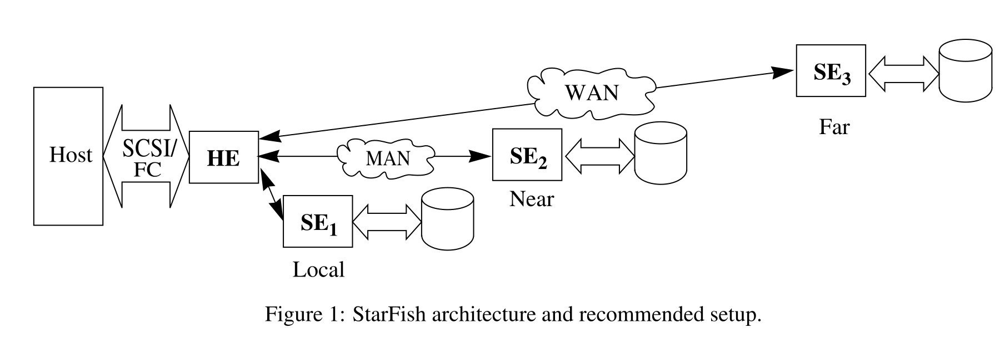
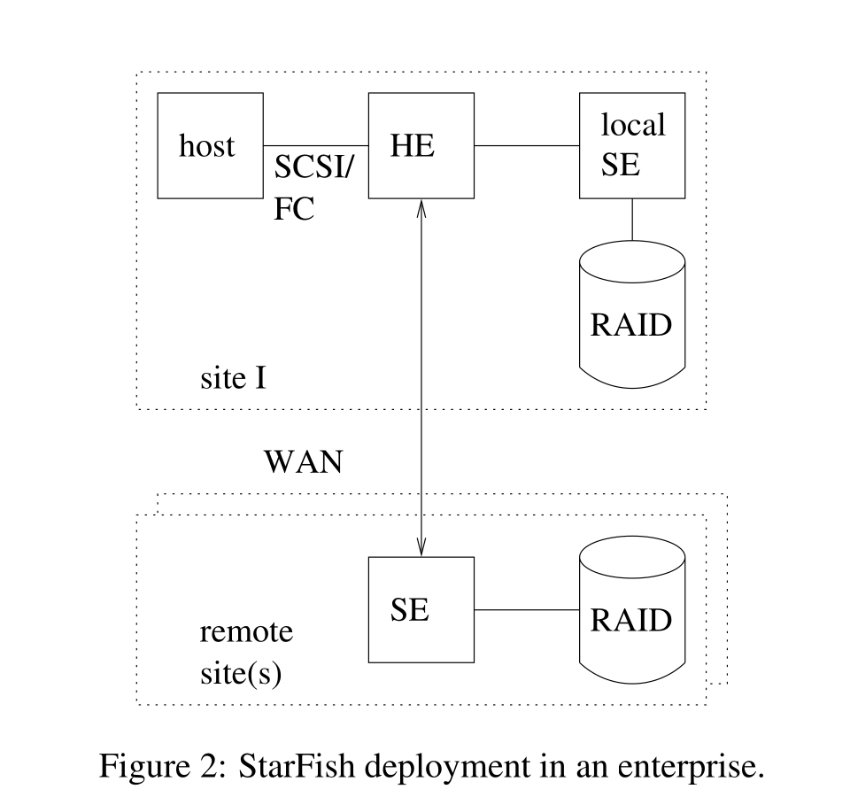
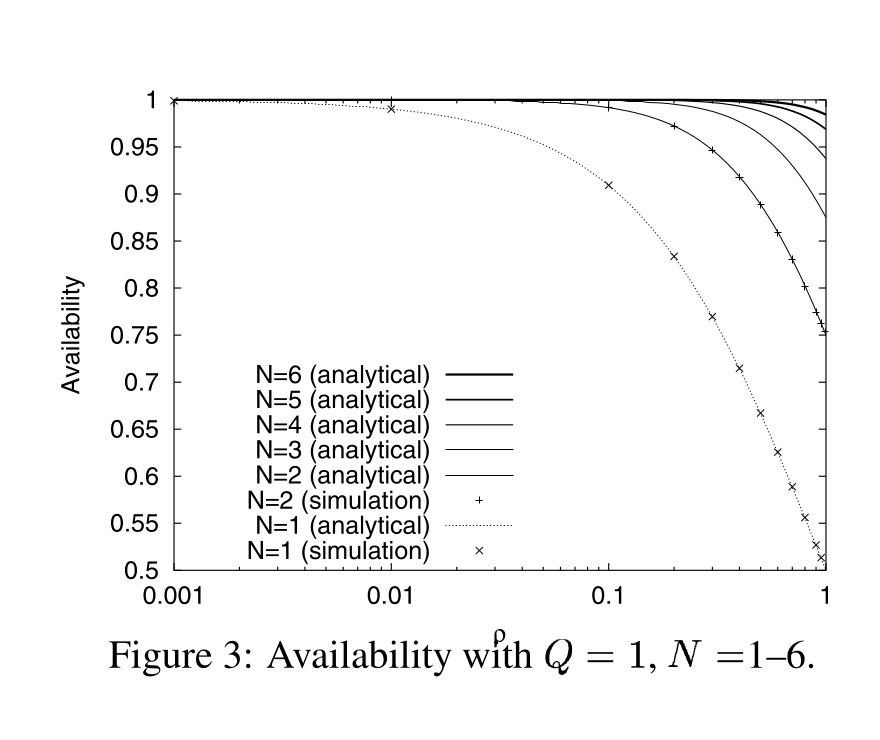
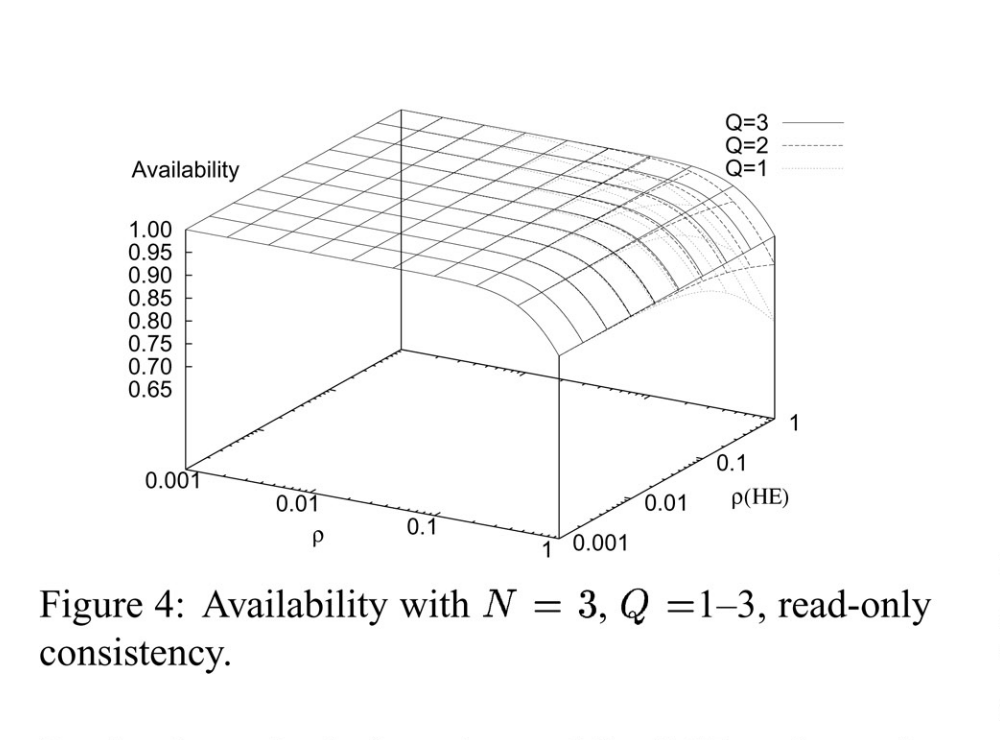
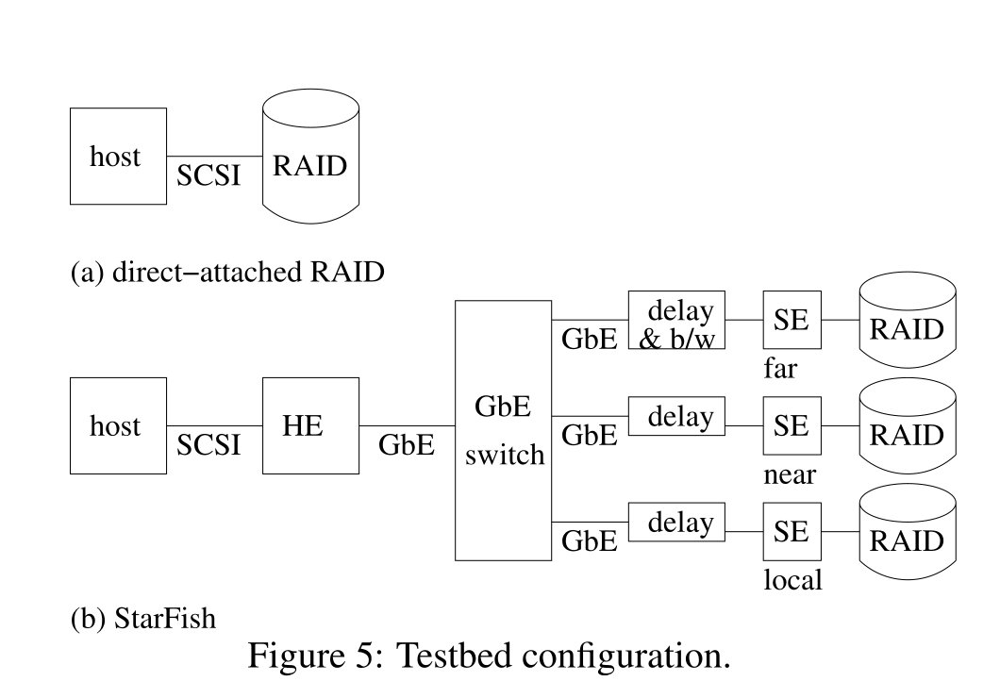
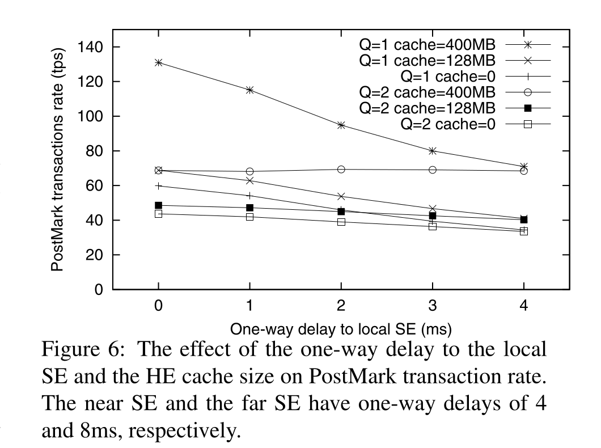
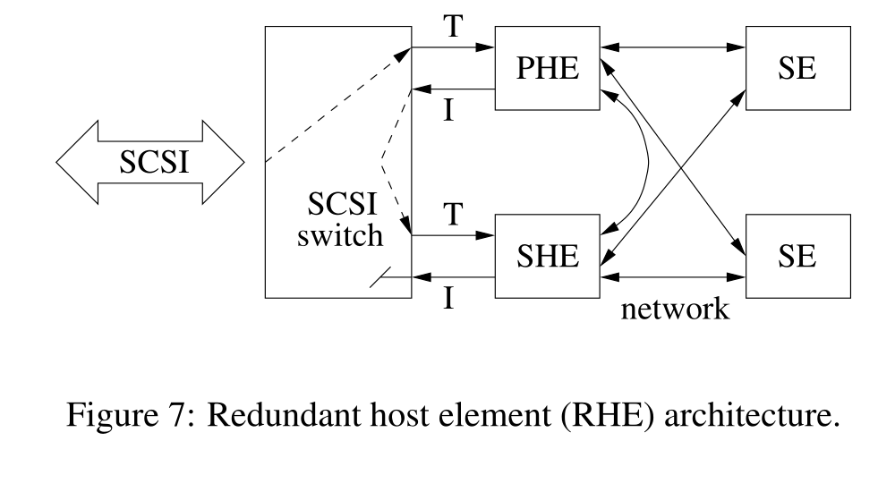

> **Source and translation basis｜来源与翻译依据**
>
> Eran Gabber, Jeff Fellin, Michael Flaster, Fengrui Gu, Bruce Hillyer, Wee Teck Ng, Banu Özden, and Elizabeth Shriver, *StarFish: Highly Available Block Storage*, 2003 USENIX Annual Technical Conference, FREENIX Track, pages 151–164, June 2003. [USENIX paper page](https://www.usenix.org/conference/2003-usenix-annual-technical-conference/starfish-highly-available-block-storage), [PDF](https://www.usenix.org/publications/library/proceedings/usenix03/tech/freenix03/gabber/gabber.pdf), and [official HTML full text](https://www.usenix.org/publications/library/proceedings/usenix03/tech/freenix03/gabber/gabber_html/index.html). The PDF SHA-256 is `836b722ea078f7a00c87bbed45b39f77c7395644fef03b0663930faf7bbb0b58`; the HTML SHA-256 is `58c72f1cff0a6b198526565af28b942cd1b98b839ad4926e512f7243d45d0991`.
>
> 本文以 USENIX 官方 HTML 全文整理正文，以官方 PDF 核对版面、公式、图表和页码。英文段落之后紧接中文翻译，保留论文的 7 幅图、8 张表、2 个公式、源代码可用性说明、致谢和 25 条参考文献。

**StarFish: Highly Available Block Storage**

> **StarFish：高可用块存储**

Eran Gabber, Jeff Fellin, Michael Flaster, Fengrui Gu, Bruce Hillyer, Wee Teck Ng, Banu Özden, and Elizabeth Shriver<br>
Information Sciences Research Center<br>
Lucent Technologies – Bell Laboratories<br>
600 Mountain Avenue, Murray Hill, NJ 07974<br>
{eran, jkf, mflaster, fgu, bruce, weeteck, ozden, shriver}@research.bell-labs.com

> Eran Gabber、Jeff Fellin、Michael Flaster、Fengrui Gu、Bruce Hillyer、Wee Teck Ng、Banu Özden、Elizabeth Shriver<br>
> 信息科学研究中心<br>
> Lucent Technologies – Bell Laboratories<br>
> 600 Mountain Avenue, Murray Hill, NJ 07974<br>
> {eran, jkf, mflaster, fgu, bruce, weeteck, ozden, shriver}@research.bell-labs.com

## Abstract｜摘要

In this paper we present StarFish, a highly-available geographically-dispersed block storage system built from commodity servers running FreeBSD, which are connected by standard high-speed IP networking gear. StarFish achieves high availability by transparently replicating data over multiple storage sites. StarFish is accessed via a host-site appliance that masquerades as a host-attached storage device, hence it requires no special hardware or software in the host computer. We show that a StarFish system with 3 replicas and a write quorum size of 2 is a good choice, based on a formal analysis of data availability and reliability: 3 replicas with individual availability of 99%, a write quorum of 2, and read-only consistency gives better than 99.9999% data availability. Although StarFish increases the per-request latency relative to a direct-attached RAID, we show how to design a highly-available StarFish configuration that provides most of the performance of a direct-attached RAID on an I/O-intensive benchmark, even during the recovery of a failed replica. Moreover, the third replica may be connected by a link with long delays and limited bandwidth, which alleviates the necessity of dedicated communication links to all replicas.

> 本文介绍 StarFish：一套高可用、跨地域分布的块存储系统。它由运行 FreeBSD 的普通服务器构成，服务器之间使用标准高速 IP 网络设备连接。StarFish 把数据透明复制到多个存储站点，从而实现高可用。主机通过部署在本地站点的一台设备访问 StarFish；这台设备把自己伪装成主机直连存储，因此主机不需要任何专用硬件或软件。我们正式分析了数据可用性和可靠性，结果表明，3 个副本、写入法定人数为 2 是一种很好的选择：如果每个副本的可用性为 99%，采用 3 个副本、写入法定人数 2 和只读一致性，数据可用性可以超过 99.9999%。与直连 RAID 相比，StarFish 会增加单次请求延迟；但我们说明了如何设计一种高可用 StarFish 配置，使它在 I/O 密集型基准测试中获得直连 RAID 的大部分性能，即使正在恢复故障副本也一样。此外，第三个副本可以通过高延迟、低带宽链路连接，因而不必为所有副本都配置专用通信线路。

## 1. Introduction｜引言

It is well understood that important data need to be protected from catastrophic site failures. High-end and mid-range storage systems, such as EMC SRDF [4] and NetApp SnapMirror [17], copy data to remote sites both to reduce the amount of data lost in a failure, and to decrease the time required to recover from a catastrophic site failure. Given the plummeting prices of disk drives and of high-speed networking infrastructure, we see the possibility of extending the availability and reliability advantages of on-the-fly replication beyond the realm of expensive, high-end storage systems. Moreover, we demonstrate advantages to having more than one remote replica of the data.

> 重要数据需要防范灾难性的站点故障，这一点早已得到普遍认可。EMC SRDF [4]、NetApp SnapMirror [17] 等高端和中端存储系统会把数据复制到远程站点，既减少故障造成的数据损失，也缩短灾难性站点故障后的恢复时间。随着磁盘和高速网络基础设施的价格迅速下降，我们看到一种可能：把即时复制带来的可用性和可靠性优势，从昂贵的高端存储系统扩展到更广的范围。我们还会说明，保存一个以上的远程副本有什么好处。



*Figure 1: StarFish architecture and recommended setup.*

> *图 1：StarFish 架构及推荐配置。*

**Figure labels:** Host; SCSI/FC; HE; SE1 Local; MAN; SE2 Near; WAN; SE3 Far.

> **图中标签：** 主机；SCSI/FC；主机元素（HE）；本地存储元素 SE1；城域网（MAN）；近端存储元素 SE2；广域网（WAN）；远端存储元素 SE3。

In this paper, we describe the StarFish system, which provides host-transparent geographically-replicated block storage. The StarFish architecture consists of multiple replicas called storage elements (SEs), and a host element (HE) that enables a host to transparently access data stored in the SEs, as shown in Figure 1. StarFish is a software package for commodity servers running FreeBSD that communicate by TCP/IP over high-speed IP networks. There is no custom hardware needed to run StarFish. StarFish is mostly OS and machine independent, although it requires two device drivers (SCSI/FC target-mode driver and NVRAM driver) that we have implemented only for FreeBSD.

> 本文介绍 StarFish 系统，它提供一种对主机透明、跨地域复制的块存储。如图 1 所示，StarFish 架构由多个称为存储元素（SE）的副本和一个主机元素（HE）组成；主机元素让主机能够透明访问保存在各个存储元素中的数据。StarFish 是一套运行在普通 FreeBSD 服务器上的软件，服务器通过高速 IP 网络上的 TCP/IP 通信。运行 StarFish 不需要定制硬件。StarFish 基本不依赖操作系统和机器，不过需要两个设备驱动：SCSI/FC target mode 驱动和 NVRAM 驱动。我们当时只为 FreeBSD 实现了这两个驱动。

The StarFish project is named after the sea creature, since StarFish is designed to provide robust data recovery capabilities, which are reminiscent of the ability of a starfish to regenerate its rays after they are cut off.

> StarFish 项目以海洋动物海星命名，因为它的设计目标是提供强健的数据恢复能力，让人联想到海星在腕部被切断后重新长出的能力。

StarFish is not a SAN (Storage Area Network), since SAN commonly refers to a Fibre Channel network with a limited geographical reach (a few tens of kilometers).

> StarFish 不是 SAN（存储区域网络），因为 SAN 通常是指覆盖地域有限，通常只有几十公里的 Fibre Channel 网络。

StarFish has several key achievements. First, we show that a StarFish system with the recommended configuration of 3 replicas (see Section 4) achieves good performance even when the third replica is connected by a communication line with a large delay and a limited bandwidth—a highly-available StarFish system does not require expensive dedicated communication lines to all replicas. Second, we show that StarFish achieves good performance during recovery from a replica failure, despite the heavy resource consumption of the data restoration activity. Generally, StarFish performance is close to that of a direct-attached RAID unit. Moreover, we present a general analysis that quantifies how the data availability and reliability depend on several system parameters (such as number of replicas, write quorum size, site failure rates, and site recovery speeds). This analysis leads to the suggestion that practical systems use 3 replicas and a write quorum size of 2.

> StarFish 有几项主要成果。第一，我们说明，采用推荐的 3 副本配置（见第 4 节）时，即使第三个副本通过高延迟、低带宽通信线路连接，系统仍能获得良好性能——高可用 StarFish 不要求所有副本都使用昂贵的专用通信线路。第二，我们说明，即使数据恢复活动消耗大量资源，StarFish 在副本故障恢复期间仍有良好性能。总体来说，StarFish 的性能接近直连 RAID。我们还给出一套通用分析，量化数据可用性和可靠性如何取决于副本数量、写入法定人数、站点故障率和站点恢复速度等系统参数。分析结果建议，实际系统使用 3 个副本，写入法定人数设为 2。

In many real-world computing environments, a remote-replication storage system would be disqualified from consideration if it were to require special hardware in the host computer, or software changes in the operating system or applications. Replicating storage at the block level rather than at the file system level is general and transparent: it works with any host software and hardware that is able to access a hard disk. In particular, the host may use any local file system or a database that requires access to a hard disk, and not just a remote file system, such as NFS. The StarFish system design includes a host-site appliance that we call the host element (HE), which connects to a standard I/O bus on the host computer, as shown in Figure 1. The host computer detects the HE to be a pool of directly-attached disk drives; the HE transparently encapsulates all the replication and recovery mechanisms. In our prototype implementation, the StarFish HE connects to an Ultra-2 SCSI port (or alternately, to a Fibre Channel port) on the host computer.

> 在许多真实计算环境中，如果远程复制存储系统要求主机安装专用硬件，或者要求修改操作系统和应用，它就不会被纳入考虑。相比文件系统级复制，块级存储复制通用而且透明：任何能够访问硬盘的主机软硬件都能使用它。具体来说，主机可以使用任何本地文件系统，也可以使用需要访问硬盘的数据库，不必局限于 NFS 这类远程文件系统。如图 1 所示，StarFish 的设计包含一台部署在主机站点的设备，我们称它为主机元素（HE），它连接主机上的标准 I/O 总线。主机把 HE 识别成一组直连磁盘；HE 在内部透明封装全部复制和恢复机制。在原型实现中，StarFish HE 连接主机上的 Ultra-2 SCSI 端口，也可以连接 Fibre Channel 端口。

If an application can use host-attached storage, it can equally well use StarFish. Thus, the StarFish architecture is broadly applicable—to centralized applications, to data servers or application servers on a SAN, and to servers that are accessed by numerous client machines in a multi-tier client/server architecture.

> 只要应用能使用主机直连存储，它就同样能使用 StarFish。因此，StarFish 架构适用范围很广，包括集中式应用、SAN 上的数据服务器或应用服务器，以及多层客户端／服务器架构中供大量客户端机器访问的服务器。

StarFish implements single-owner access semantics. In other words, only one host element can write to a particular logical volume. This host element may be connected to a single host or to a cluster of hosts by several SCSI buses. If we require the ability for several hosts to write to a single logical volume, this could be implemented by clustering software that prevents concurrent modifications from corrupting the data.

> StarFish 实现单一所有者访问语义。换句话说，一个特定逻辑卷只能由一个主机元素写入。这个主机元素可以连接一台主机，也可以通过多条 SCSI 总线连接一个主机集群。如果需要多台主机写入同一个逻辑卷，可以通过集群软件实现，由它防止并发修改损坏数据。

Large classes of data are owned (at least on a quasi-static basis) by a single server, for example in shared-nothing database architectures, and in centralized computing architectures, and for large web server clusters that partition the data over a pool of servers. The benefits that motivate the single-owner restriction are the clean serial I/O semantics combined with quick recovery/failover performance (since there is no need for distributed algorithms such as leader election, group membership, recovery of locks held by failed sites, etc.). By contrast, multiple-writer distributed replication incurs unavoidable tradeoffs among performance, strong consistency, and high reliability as explained by Yu and Vahdat [25].

> 很多类别的数据都由一台服务器拥有，至少在准静态意义上如此。无共享数据库架构、集中式计算架构，以及把数据分区到一组服务器的大型 Web 服务器集群都是例子。单一所有者限制带来的好处，是清晰的串行 I/O 语义与快速恢复／故障切换性能相结合，因为系统不需要领导者选举、组成员管理、恢复故障站点持有的锁等分布式算法。相比之下，正如 Yu 和 Vahdat [25] 所解释的，多写入者分布式复制不可避免地要在性能、强一致性和高可靠性之间取舍。

To protect against a site failure, a standby host and a standby HE should be placed in a different site, and they could commence processing within seconds using an up-to-date image of the data, provided that StarFish was configured with an appropriate number of replicas and a corresponding write quorum size. See Section 3 for details.

> 为防范站点故障，应把备用主机和备用 HE 放在另一个站点。只要 StarFish 配置了适当的副本数量和对应的写入法定人数，它们就能使用最新数据映像，在数秒内开始处理请求。细节见第 3 节。

The remainder of this paper is organized as follows. Section 2 compares and contrasts StarFish with related distributed and replicated storage systems. Section 3 describes the StarFish architecture and its recommended configuration. Section 4 analyzes availability and reliability. Section 5 describes the StarFish implementation, and Section 6 contains performance measurements. We encountered several unexpected hurdles and dead ends during the development of StarFish, which are listed in Section 7. The paper concludes with a discussion of future work in Section 8 and concluding remarks in Section 9.

> 本文余下部分安排如下：第 2 节比较 StarFish 与相关的分布式复制存储系统；第 3 节介绍 StarFish 架构和推荐配置；第 4 节分析可用性与可靠性；第 5 节介绍 StarFish 的实现；第 6 节给出性能测量。开发 StarFish 时，我们遇到了一些意料之外的障碍，也走过一些死路，第 7 节会列出这些经历。最后，第 8 节讨论未来工作，第 9 节给出结语。

## 2. Related Work｜相关工作

Many previous projects have established a broad base of knowledge on general techniques for distributed systems (e.g., ISIS [2]), and specific techniques applicable to distributed storage systems and distributed file systems. Our work is indebted to a great many of these; space limitations permit us to mention only a few.

> 许多先前项目已经在分布式系统通用技术（例如 ISIS [2]），以及适用于分布式存储系统和分布式文件系统的具体技术方面积累了广泛知识。我们的工作受益于其中许多成果；受篇幅限制，这里只能提到少数几项。

The EMC SRDF software [4] is similar to StarFish in several respects. SRDF uses distribution to increase reliability, and it performs on-the-fly replication and updating of logical volumes from one EMC system to another, using synchronous remote writes to favor safety, or using asynchronous writes to favor performance. The first EMC system owns the data, and is the *primary* for the classic primary copy replication algorithm. By comparison, the StarFish *host* owns the data, and the HE implements primary copy replication to *multiple* SEs. StarFish typically uses synchronous updates to a subset of the SEs for safety, with asynchronous updates to additional SEs to increase availability. Note that this comparison is not intended as a claim that StarFish has features, performance, or price equivalent to an EMC Symmetrix.

> EMC SRDF 软件 [4] 在多个方面与 StarFish 相似。SRDF 通过分布式部署提高可靠性，并在两套 EMC 系统之间即时复制和更新逻辑卷：同步远程写偏重安全，异步写则偏重性能。第一套 EMC 系统拥有数据，是经典主副本复制算法中的*主节点*。相比之下，StarFish 由*主机*拥有数据，HE 向*多个* SE 实现主副本复制。StarFish 通常为了安全而同步更新一部分 SE，再异步更新其余 SE，以提高可用性。需要说明，这项比较不是在声称 StarFish 的功能、性能或价格与 EMC Symmetrix 相当。

Petal [11] is a distributed storage system from Compaq SRC that addresses several problems, including scaling up and reliability. Petal’s network-based servers pool their physical storage to form a set of virtual disks. Each block on a virtual disk is replicated on two Petal servers. The Petal servers maintain mappings and other state via distributed consensus protocols. By contrast, StarFish uses $N$-way replication rather than 2-way replication, and uses an all-or-none assignment of the blocks of a logical volume to SEs, rather than a declustering scheme. StarFish uses a single HE (on a quasi-static basis) to manage any particular logical volume, and thereby avoids distributed consensus.

> Petal [11] 是 Compaq SRC 开发的分布式存储系统，用于解决扩展和可靠性等问题。Petal 的网络服务器汇集各自的物理存储，形成一组虚拟磁盘。虚拟磁盘上的每个块都复制到两台 Petal 服务器，服务器通过分布式共识协议维护映射和其他状态。相比之下，StarFish 不是两路复制，而是 $N$ 路复制；逻辑卷的全部数据块要么都分配给某个 SE，要么都不分配，而不是采用去簇方案。StarFish 以准静态方式使用单个 HE 管理某个特定逻辑卷，由此避开分布式共识。

Network Appliance SnapMirror [17] generates periodic snapshots of the data on the primary filer, and copies them asynchronously to a backup filer. This process maintains a slightly out-of-date snapshot on the backup filer. By contrast, StarFish copies all updates on-the-fly to all replicas.

> Network Appliance SnapMirror [17] 周期性地为主 filer 上的数据制作快照，再异步复制到备用 filer。备用 filer 上保留的是略微落后的快照。相比之下，StarFish 会把所有更新即时复制到全部副本。

The iSCSI draft protocol [19] is an IETF work that encapsulates SCSI I/O commands and data for transmission over TCP/IP. It enables a host to access a remote storage device as if it were local, but does not address replication, availability, and system scaling.

> iSCSI 协议草案 [19] 是 IETF 的工作，它封装 SCSI I/O 命令和数据，通过 TCP/IP 传输。主机由此可以像访问本地设备一样访问远程存储设备，但该协议不处理复制、可用性和系统扩展问题。

StarFish can provide replicated storage for a file system that is layered on top of it. This configuration is similar but not equivalent to a distributed file system (see surveys in [24] and [12]). By contrast with distributed file systems, StarFish is focused on replication for availability of data managed by a single host, rather than on unreplicated data that are shared across an arbitrarily scalable pool of servers. StarFish considers network disconnection to be a failure (handled by failover in the case of the HE, and recovery in case of an SE), rather than a normal operating condition.

> StarFish 可以为构建在它上面的文件系统提供复制存储。这种配置与分布式文件系统相似，但并不等同，相关综述见 [24] 和 [12]。分布式文件系统关注的是让任意扩展的服务器池共享未复制数据；StarFish 则关注通过复制，提高由单台主机管理的数据的可用性。StarFish 把网络断开视为故障，而不是正常运行状态：HE 断开时通过故障切换处理，SE 断开时通过恢复处理。

Finally, Gibson and van Meter [6] give an interesting comparison of network-attached storage appliances, NASD, Petal, and iSCSI.

> 最后，Gibson 和 van Meter [6] 对网络附加存储设备、NASD、Petal 和 iSCSI 做了一项很有意思的比较。

## 3. StarFish Architecture｜StarFish 架构

As explained in Section 1, the StarFish architecture consists of multiple storage elements (SEs), and a host element (HE). The HE enables the host to access the data stored on the SEs, in addition to providing storage virtualization and read caching. In general, one HE can serve multiple logical volumes and can have multiple connections to several hosts. The HE is a commodity server with an appropriate SCSI or FC controller that can function in target mode, which means that the controller can receive commands from the I/O bus. The HE has to run an appropriate target mode driver, as explained in Section 5.

> 如第 1 节所述，StarFish 架构由多个存储元素（SE）和一个主机元素（HE）组成。HE 让主机能够访问 SE 中的数据，同时提供存储虚拟化和读缓存。通常，一个 HE 可以服务多个逻辑卷，也可以通过多条连接接入多台主机。HE 是普通服务器，配有能够在 target mode 下工作的 SCSI 或 FC 控制器，也就是能够从 I/O 总线接收命令的控制器。HE 必须运行合适的 target mode 驱动，详见第 5 节。

We replicate the data in $N$ SEs to achieve high availability and reliability; redundancy is a standard technique to build highly-available systems from unreliable components [21]. For good write performance, we use a quorum technique. In particular, the HE returns a success indication to the host after $Q$ SEs have acknowledged the write, where $Q$ is the *write quorum size*. In other words, StarFish performs synchronous updates to a quorum of $Q$ SEs, with asynchronous updates to additional SEs for performance and availability.

> 为实现高可用和高可靠，我们把数据复制到 $N$ 个 SE；利用冗余组件从不可靠组件构建高可用系统，是一种标准技术 [21]。为了获得良好写性能，我们采用 quorum 技术。具体来说，在 $Q$ 个 SE 确认写入后，HE 就向主机返回成功，其中 $Q$ 是*写入法定人数*。换句话说，StarFish 同步更新构成 quorum 的 $Q$ 个 SE，再为了性能和可用性异步更新其余 SE。

Since StarFish implements single-owner access to the data, it can enforce consistency among the replicas by serialization: the HE assigns global sequence numbers to I/O requests, and the SEs perform the I/Os in this order to ensure data consistency. Moreover, to ensure that the highest update sequence number is up to date, the HE does not delay or coalesce write requests. To simplify failure recovery, each SE keeps the highest update sequence number (per logical volume) in NVRAM. This simple scheme has clear semantics and nice recovery properties, and our performance measurements in Section 6 indicate that it is fast.

> StarFish 对数据实行单一所有者访问，因此可以通过串行化保证副本一致：HE 给 I/O 请求分配全局序列号，各个 SE 按这个顺序执行 I/O，从而保证数据一致。为了确保最高更新序列号始终是最新的，HE 不延迟也不合并写请求。为了简化故障恢复，每个 SE 都在 NVRAM 中保存每个逻辑卷的最高更新序列号。这套简单方案语义清楚，恢复性质良好；第 6 节的性能测量也表明它速度很快。

Figure 1 shows a recommended StarFish setup with 3 SEs. The “local” StarFish replica is co-located with the host and the HE to provide low-latency storage. The second replica is “near” (e.g., connected by a dedicated high-speed, low-latency link in a metro area) to enable data to be available with high performance even during a failure and recovery of the local replica. A third replica is “far” from the host, to provide robustness in the face of a regional catastrophe. The availability of this arrangement is studied in Section 4, and the performance is examined in Section 6.

> 图 1 给出了包含 3 个 SE 的推荐 StarFish 配置。“本地”副本与主机和 HE 部署在一起，提供低延迟存储。第二个副本位于“近端”，例如在同一都市区域内，通过专用的高速低延迟链路连接；即使本地副本发生故障并正在恢复，数据仍能以较高性能使用。第三个副本位于离主机较“远”的地方，用来抵御区域性灾难。第 4 节研究这种布局的可用性，第 6 节考察其性能。

The HE and the SEs communicate via TCP/IP sockets. We chose TCP/IP over other reliable transmission protocols, such as SCTP [23], since TCP/IP stacks are widely available, optimized, robust, and amenable to hardware acceleration. Since many service providers sell Virtual Private Network (VPN) services, the HE may communicate with the far SE StarFish via a VPN, which provides communication security and ensures predictable latency and throughput. StarFish does not deal with communication security explicitly.

> HE 与各个 SE 通过 TCP/IP socket 通信。我们没有选择 SCTP [23] 等其他可靠传输协议，而选择 TCP/IP，因为 TCP/IP 软件栈随处可得，经过优化，十分稳健，也适合硬件加速。许多服务商提供虚拟专用网络（VPN）服务，因此 HE 可以通过 VPN 与远端 StarFish SE 通信；VPN 能保证通信安全，并提供可预测的延迟和吞吐量。StarFish 本身不专门处理通信安全。



*Figure 2: StarFish deployment in an enterprise.*

> *图 2：StarFish 在企业中的部署。*

**Figure labels:** host; SCSI/FC; HE; local SE; RAID; site I; WAN; remote site(s); SE.

> **图中标签：** 主机；SCSI/FC；主机元素（HE）；本地存储元素；RAID；站点 I；广域网；远程站点；存储元素。

StarFish could be deployed in several configurations depending on its intended use. Figure 2 shows a deployment by an enterprise that has multiple sites. Note that in this configuration the local SE is co-located with the host and the HE. A storage service provider (SSP) may deploy StarFish in a configuration similar to Figure 1, in which all of the SEs are located in remote sites belonging to the SSP. In this configuration the local SE may not be co-located with the host, but it should be nearby for good performance.

> StarFish 可以按预期用途采用多种部署配置。图 2 展示一家拥有多个站点的企业如何部署它。在这个配置中，本地 SE 与主机和 HE 部署在一起。存储服务提供商（SSP）则可以采用类似图 1 的配置，把全部 SE 放在 SSP 自己的远程站点。此时所谓本地 SE 不一定与主机同机部署，但为了获得良好性能，它应当离主机较近。

StarFish is designed to protect against SE failures, network failure to some SEs, and HE failure. When an SE (or its RAID or network connection) fails, the HE continues to serve I/Os to the affected logical volumes, provided that $Q$ copies are still in service. When the failed SE comes back up, it reconnects to the HE and reports the highest update sequence number of its logical volumes. This gives the HE complete information about what updates the SE missed. For each logical volume, the HE maintains a circular buffer of recent writes (the “write queue”). If an SE fails and recovers quickly (in seconds), it gets the missed writes from the HE. This recovery is called “quick recovery.” Also, each SE maintains a circular buffer of recent writes on a log disk. If an SE fails and recovers within a moderate amount of time (in hours—benchmark measurements from Section 6 suggest that the log disk may be written at the rate of several GB per hour), the HE tells the SE to retrieve the missed writes from the log disk of a peer SE. This recovery is called “replay recovery.” Finally, after a long failure, or upon connection of a new SE, the HE commands it to perform a whole-volume copy from a peer SE. This recovery is called “full recovery.” During recovery, the SE also receives current writes from the HE, and uses sequence number information to avoid overwriting these with old data. To retain consistency, the HE does not ask a recovering SE to service reads.

> StarFish 的设计要防范 SE 故障、连接部分 SE 的网络故障，以及 HE 故障。当某个 SE，或者它的 RAID、网络连接发生故障时，只要仍有 $Q$ 个副本在服务，HE 就会继续处理受影响逻辑卷的 I/O。故障 SE 恢复上线后，会重新连接 HE，并报告各逻辑卷的最高更新序列号，HE 因而能够完整判断它漏掉了哪些更新。HE 为每个逻辑卷维护一个保存近期写入的环形缓冲区，也就是“写队列”。如果 SE 在数秒内迅速恢复，它会直接从 HE 取得漏掉的写入，这称为“快速恢复”。每个 SE 还会在日志磁盘上维护一个保存近期写入的环形缓冲区。如果 SE 在几小时内恢复——第 6 节的基准测量表明，日志磁盘的写入量可能达到每小时数 GB——HE 会让它从同伴 SE 的日志磁盘取回漏掉的写入，这称为“重放恢复”。最后，如果故障持续很久，或者接入了一个新 SE，HE 会命令它从同伴 SE 完整复制整个卷，这称为“完整恢复”。恢复期间，SE 同时接收 HE 发来的当前写入，并利用序列号避免用旧数据覆盖这些新写入。为了保持一致性，HE 不会让正在恢复的 SE 处理读请求。

The fixed-size write queue in the HE serves a second purpose. When an old write is about to be evicted from this queue, the HE first checks that it has been acknowledged by all SEs. If not, the HE waits a short time (throttling), and if no acknowledgment comes, declares the SE that did not acknowledge as failed. The size of the write queue is an upper bound on the amount of data loss, because the HE will not accept new writes from the host until there is room in the write queue.

> HE 中固定大小的写队列还有第二项用途。一条旧写入即将被逐出队列时，HE 先检查它是否已经得到所有 SE 的确认。如果没有，HE 会短暂等待，也就是节流；仍收不到确认，就把没有确认的 SE 判为故障。写队列的大小是数据损失量的上界，因为在队列腾出空间以前，HE 不会接受主机的新写入。

In normal operation (absent failures), congestion cannot cause data loss. If any SE falls behind or any internal queue in the HE or the SE becomes full, the HE will stop accepting new SCSI I/O requests from the host.

> 正常运行且没有故障时，拥塞不会造成数据丢失。如果任何 SE 落后，或者 HE、SE 内的任一队列已满，HE 就会停止接受主机发来的新 SCSI I/O 请求。

The HE is a critical resource. We initially implemented a redundant host element using a SCSI switch, which would have provided automatic failure detection and transparent failover from the failed HE to a standby HE. However, our implementation encountered many subtle problems as explained in Section 7, so we decided to eliminate the redundant host element from the released code.

> HE 是一项关键资源。我们最初利用 SCSI 交换机实现了冗余主机元素，它本可以自动检测故障，并把故障 HE 透明切换到备用 HE。不过，如第 7 节所述，实现中遇到许多细微问题，因此我们决定从发布代码中移除冗余主机元素。

The current version of StarFish has a manually-triggered failover mechanism to switch to a standby HE when necessary. This mechanism sends an SNMP command to the SEs to connect to the standby HE. The standby HE can resume I/O activity within a few seconds, as explained in Section 6.4. The standby HE will assume the same Fibre Channel or SCSI ID of the failed HE. The manually-triggered failover mechanism can be replaced by an automatic failure detection and reconfiguration mechanism external to StarFish. One challenge in implementing such an automatic mechanism is the correct handling of network partitions and other communication errors. We can select one of the existing distributed algorithms for leader election for this purpose. If the HE connects to the host with Fibre Channel, the failover is transparent except for a timeout of the commands in transit. However, starting the standby HE on the same SCSI bus as the failed HE without a SCSI switch will cause a visible bus reset.

> 当前版本的 StarFish 提供手工触发的故障切换机制，需要时可以切到备用 HE。该机制向各个 SE 发送 SNMP 命令，让它们连接备用 HE。如 6.4 节所述，备用 HE 可以在数秒内恢复 I/O 活动，并接管故障 HE 的同一个 Fibre Channel 或 SCSI ID。可以用 StarFish 外部的自动故障检测和重配置机制，替代这种手工触发方式。实现自动机制的一项难点，是正确处理网络分区和其他通信错误；为此可以选择一种已有的分布式领导者选举算法。如果 HE 通过 Fibre Channel 连接主机，除了在途命令超时之外，故障切换是透明的。但如果没有 SCSI 交换机，在故障 HE 所在的同一条 SCSI 总线上启动备用 HE，会引发主机可见的总线重置。

Since the HE acknowledges write completions only after it receives $Q$ acknowledgments from the SEs, the standby HE can find the last acknowledged write request by receiving the highest update sequence number of each volume from $Q$ SEs. If any SE missed some updates, the standby HE instructs it to recover from a peer SE.

> HE 只有收到 SE 发来的 $Q$ 个确认后，才会确认写入完成。因此，备用 HE 从 $Q$ 个 SE 收到各卷的最高更新序列号以后，就能找到最后一条已经确认的写请求。如果某个 SE 漏掉了一些更新，备用 HE 会让它从同伴 SE 恢复。

## 4. Availability and Reliability Analysis｜可用性与可靠性分析

In this section we evaluate the availability and reliability of StarFish with respect to various system parameters. This enables us to make intelligent trade-offs between performance and availability in system design. Our main objectives are to quantify the availability of our design and to develop general guidelines for a highly available and reliable system.

> 本节根据不同系统参数评估 StarFish 的可用性和可靠性，使我们能在系统设计中合理权衡性能与可用性。主要目标是量化这套设计的可用性，并为高可用、高可靠系统形成一般性准则。

The availability of StarFish depends on the SE failure ($\lambda(t)$) and recovery ($\mu(t)$) processes, the number of SEs ($N$), the quorum size ($Q$), and the permitted probability of data loss. The latter two parameters also bear on StarFish reliability. We assume that the failure and recovery processes of the network links and storage elements are independent identically distributed Poisson processes [3] with combined (i.e., network + SE) *mean* failure and recovery rates of $\lambda$ and $\mu$ failures and recoveries per second, respectively. Similarly, the HE has Poisson-distributed $\lambda_{he}$ and $\mu_{he}$. Section 9 suggests ways to achieve independent failures in practice.

> StarFish 的可用性取决于 SE 的故障过程 $\lambda(t)$ 和恢复过程 $\mu(t)$、SE 数量 $N$、法定人数 $Q$，以及允许的数据丢失概率。后两个参数也影响 StarFish 的可靠性。我们假设网络链路和存储元素的故障与恢复过程，是相互独立、同分布的泊松过程 [3]；把网络与 SE 合在一起计算，其每秒*平均*故障率和恢复率分别为 $\lambda$ 和 $\mu$。同样，HE 的 $\lambda_{he}$ 和 $\mu_{he}$ 也服从泊松分布。第 9 节会说明如何在实际部署中实现独立故障。

At time $t$, a component SE or HE is available if it is capable of serving data. We define the availability of StarFish as the steady-state probability that at least $Q$ SEs are available. For example, a system that experiences a 1-day outage every 4 months is 99% available. We assume that if the primary HE fails, we can always reach the available SEs via a backup HE.

> 在时刻 $t$，如果一个 SE 或 HE 能够提供数据服务，就认为该组件可用。我们把 StarFish 的可用性定义为至少有 $Q$ 个 SE 可用的稳态概率。例如，一个每 4 个月停机 1 天的系统，其可用性为 99%。我们假设，主 HE 故障后，总能通过备用 HE 访问仍然可用的 SE。

We define the reliability of a system as the probability of no data loss. For example, a system that is 99.9% reliable has a 0.1% probability of data loss.

> 我们把系统可靠性定义为不发生数据丢失的概率。例如，可靠性为 99.9% 的系统，数据丢失概率为 0.1%。

### 4.1 Availability Results｜可用性结果

The steady-state availability of StarFish, $A(Q,N)$, is derived from the standard machine repairman model [3] with the addition of a quorum. It is the steady-state probability that at most $Q$ SEs are down and at least $(N-Q)$ SEs are up. Thus, the steady-state availability can be expressed as

> StarFish 的稳态可用性 $A(Q,N)$，是在标准机器修理工模型 [3] 中加入 quorum 后得到的。它表示至多 $Q$ 个 SE 停机，同时至少 $(N-Q)$ 个 SE 在线的稳态概率。因此，稳态可用性可写为：

$$
A(Q,N)=\frac{\displaystyle\sum_{i=0}^{N-Q}\binom{N}{i}\rho^i}{(1+\rho)^N}.
$$

*(1)*

where $\rho = \lambda/\mu$ is called the load, and $1 \le Q \le N\ \forall Q,N$. Equation 1 is valid for $0 < \rho < 1$ (i.e., when the failure rate is less than the recovery rate). Typical values of $\rho$ range from 0.1 to 0.001, which correspond to hardware availability of 90% to 99.9%. See [5] for derivation of Equation 1.

> 其中，$\rho = \lambda/\mu$ 称为负载，且对所有 $Q,N$ 都有 $1 \le Q \le N$。公式 1 在 $0 < \rho < 1$ 时成立，也就是故障率低于恢复率时。$\rho$ 的典型取值范围是 0.1 到 0.001，对应硬件可用性 90% 到 99.9%。公式 1 的推导见 [5]。



*Figure 3: Availability with $Q=1$, $N=1$–$6$.*

> *图 3：$Q=1$、$N=1$–$6$ 时的可用性。*

**Figure labels:** Availability; $\rho$; $N=1$–$6$ analytical; $N=1$–$2$ simulation.

> **图中标签：** 可用性；$\rho$；$N=1$–$6$ 的解析结果；$N=1$–$2$ 的仿真结果。

Figure 3 shows the availability of StarFish using Equation 1 with a quorum size of 1 and increasing number of SEs. We validate the analytical model up to $N=3$ with an event-driven simulation written using the `smpl` simulation library [13]. Because the analytical results are in close agreement with the simulation results, we will not present our simulation results in the rest of this paper.

> 图 3 根据公式 1 展示写入法定人数为 1、SE 数量逐渐增加时 StarFish 的可用性。我们用 `smpl` 仿真库 [13] 编写事件驱动仿真，对解析模型验证到 $N=3$。解析结果与仿真结果非常接近，因此本文余下部分不再给出仿真结果。

We observe from Figure 3 that availability increases with $N$. This can also be seen from Equation 1, which is strictly monotonic and converges to 1 as $N \rightarrow \infty$. We also note that availability $\rightarrow 1$ as $\rho \rightarrow 0$. This is because the system becomes highly available when each SE seldom fails or recovers quickly.

> 从图 3 可以看到，可用性随 $N$ 增大而提高。公式 1 也能说明这一点：该公式严格单调，并在 $N \rightarrow \infty$ 时收敛到 1。还可以看到，当 $\rho \rightarrow 0$ 时，可用性也趋近于 1。这是因为每个 SE 很少故障或能够快速恢复时，系统就会达到高可用。

#### Table 1: Availability of StarFish for Typical Configurations｜表 1：典型配置下 StarFish 的可用性

| SE availability | $Q=1,N=2$ | $Q=1,N=3$ | $Q=1,N=4$ | $Q=2,N=3$ | $Q=2,N=4$ | $Q=2,N=5$ | $Q=3,N=3$ | $Q=3,N=5$ | $Q=3,N=6$ | $Q=3,N=7$ |
| --- | ---: | ---: | ---: | ---: | ---: | ---: | ---: | ---: | ---: | ---: |
| 90.00% ($1\star9$) | $2\star9$ | $3\star9$ | $4\star9$ | $1\star9$ | $2\star9$ | $3\star9$ | $0\star9$ | $2\star9$ | $3\star9$ | $3\star9$ |
| 99.00% ($2\star9$) | $4\star9$ | $6\star9$ | $8\star9$ | $3\star9$ | $5\star9$ | $7\star9$ | $1\star9$ | $5\star9$ | $6\star9$ | $8\star9$ |
| 99.90% ($3\star9$) | $6\star9$ | $9\star9$ | $12\star9$ | $5\star9$ | $8\star9$ | $11\star9$ | $2\star9$ | $8\star9$ | $10\star9$ | $13\star9$ |
| 99.99% ($4\star9$) | $8\star9$ | $12\star9$ | $16\star9$ | $7\star9$ | $11\star9$ | $15\star9$ | $3\star9$ | $11\star9$ | $14\star9$ | $18\star9$ |

> 表中“SE availability”指单个 SE 的可用性；$x\star9$ 表示可用性中连续出现 $x$ 个 9。数值按论文原表保留。

We now examine the system availability for *typical* configurations. Table 1 shows StarFish’s availability in comparison with a single SE. We use a concise availability metric widely used in the industry, which counts the number of 9s in an availability measure. For example, a system that is 99.9% available is said to have three 9s, which we denote $3\star9$. We use a standard design technique to build a highly available system out of redundant unreliable components [21]. The SE is built from commodity components and its availability ranges from 90% [14] to 99.9% [7]. StarFish combines SEs to achieve a much higher system availability when $N = 2Q+1$. For example, Table 1 indicates that if the SEs are at least 99% available, StarFish with a quorum size of 1 and 3 SEs is 99.9999% available ($6\star9$).

> 现在考察*典型*配置下的系统可用性。表 1 把 StarFish 的可用性与单个 SE 做了比较。我们采用业界广泛使用的一种简洁指标，计算可用性数值中有几个 9。例如，可用性为 99.9% 的系统称为有三个 9，记作 $3\star9$。我们采用一种标准设计技术，用冗余的不可靠组件构建高可用系统 [21]。SE 使用普通组件构成，可用性从 90% [14] 到 99.9% [7] 不等。当 $N = 2Q+1$ 时，StarFish 把多个 SE 组合起来，能得到高得多的系统可用性。例如，表 1 表明，如果每个 SE 的可用性至少为 99%，采用 3 个 SE、法定人数为 1 的 StarFish 可用性可达 99.9999%，也就是 $6\star9$。

We also notice from Table 1 that, for fixed $N$, StarFish’s availability *decreases* with larger quorum size. In fact, for $Q=N=3$, StarFish is less available than a single SE, because the probability of keeping all SEs concurrently available is lower than the probability that a single one is available. Increasing quorum size trades off availability for reliability. We quantify this trade-off next.

> 表 1 还表明，$N$ 固定时，StarFish 的可用性会随法定人数增大而*下降*。事实上，当 $Q=N=3$ 时，StarFish 的可用性甚至低于单个 SE，因为所有 SE 同时可用的概率，低于任意一个 SE 可用的概率。提高法定人数是在用可用性换取可靠性。下面量化这种取舍。

### 4.2 Reliability Results｜可靠性结果

StarFish can potentially lose data under certain failure scenarios. Specifically, when $Q \le \lfloor N/2 \rfloor$, StarFish can lose data if the HE and $Q$ SEs containing up-to-date data fail. The *amount* of data loss is bounded by the HE write queue size as defined in Section 3. This queue-limited exposure to data loss is similar to the notion of time-limited exposure to data loss widely used in file systems [20]. We make this trade-off to achieve higher performance and availability at the expense of a slight chance of data loss. The *probability* of data loss is bounded by $1/4^Q$, which occurs when $\rho=1$ and $\rho_{he}=0$. This implies that the lowest reliability occurs when $Q=1$, and the reliability increases with larger $Q$.

> 在某些故障场景中，StarFish 可能丢失数据。具体来说，当 $Q \le \lfloor N/2 \rfloor$ 时，如果 HE 和保存最新数据的 $Q$ 个 SE 同时故障，StarFish 就可能丢失数据。数据损失的*数量*以第 3 节定义的 HE 写队列大小为上界。这种由队列限制的数据损失暴露，类似文件系统中广泛采用的限时数据损失暴露概念 [20]。我们做出这项取舍，以很小的数据丢失可能性为代价，换取更高性能和可用性。数据丢失*概率*的上界为 $1/4^Q$，它出现在 $\rho=1$ 且 $\rho_{he}=0$ 时。这意味着 $Q=1$ 时可靠性最低，可靠性随 $Q$ 增大而提高。

We note that there is no possibility of data loss if $Q > \lfloor N/2 \rfloor$ and at least $Q$ SEs are available. This is because when we have a quorum size which requires the majority of SEs to have up-to-date data when available, failures in the remaining SEs do not affect system reliability as we still have up-to-date data in the $Q$ remaining SEs. However, this approach can reduce availability (see Table 1) and performance (see Section 6.3).

> 如果 $Q > \lfloor N/2 \rfloor$，而且至少有 $Q$ 个 SE 可用，就不可能丢失数据。原因在于，这种法定人数要求多数 SE 在可用时都保存最新数据；其余 SE 发生故障不会影响系统可靠性，因为剩下的 $Q$ 个 SE 仍有最新数据。不过，这种做法会降低可用性（见表 1）和性能（见 6.3 节）。

Another approach is to trade off the system functionality while still maintaining the performance *and* reliability requirements. For example, we may allow StarFish to be available in a *read-only* mode during failure, which we call StarFish with *read-only consistency*. Read-only mode obviates the need for $Q$ SEs to be available to handle updates. This increases the availability of the system, as it is available for reads when the HE and at least 1 SE is available, or if any SE with up-to-date data is available and we fail over to a standby HE as described in Section 3. With read-only consistency, StarFish has steady-state availability $A_{\mathrm{ReadOnly}}(Q,N)$ of

> 另一种做法是在保持性能与可靠性要求的同时，牺牲一部分系统功能。例如，可以允许 StarFish 在故障期间以*只读*模式保持可用，我们称之为采用*只读一致性*的 StarFish。只读模式不再要求有 $Q$ 个 SE 可用于处理更新。这样能提高系统可用性：只要 HE 和至少 1 个 SE 可用，系统就能读；或者，只要任意一个保存最新数据的 SE 可用，就可以按第 3 节所述切换到备用 HE。采用只读一致性时，StarFish 的稳态可用性 $A_{\mathrm{ReadOnly}}(Q,N)$ 为：

$$
A_{\mathrm{ReadOnly}}(Q,N)=
  \frac{\displaystyle\sum_{i=0}^{N-1}\binom{N}{i}\rho^i}{(1+\rho_{he})(1+\rho)^N} +
  \frac{\displaystyle\rho_{he}\sum_{i=0}^{Q-1}\binom{Q}{i}\rho^i}{(1+\rho_{he})(1+\rho)^Q}.
$$

*(2)*

Equation 2 is derived using Bayes Theorem [3]. We assume that the HE and SEs fail independently. The availability of StarFish with read-only consistency is the union of two disjoint events: the HE and *any Q* SEs are alive; the HE fails and *Q distinct* SEs with current updates are alive.

> 公式 2 用贝叶斯定理 [3] 推导。我们假设 HE 与各个 SE 独立故障。采用只读一致性的 StarFish 可用，等于两个互斥事件的并集：HE 和*任意 $Q$ 个* SE 存活；或者 HE 故障，但保存当前更新的*另外 $Q$ 个* SE 存活。



*Figure 4: Availability with $N=3$, $Q=1$–$3$, read-only consistency.*

> *图 4：$N=3$、$Q=1$–$3$ 且采用只读一致性时的可用性。*

**Figure labels:** Availability; $\rho$; $\rho(HE)$; $Q=1$–$3$.

> **图中标签：** 可用性；SE 负载 $\rho$；HE 负载 $\rho(HE)$；$Q=1$–$3$。

#### Table 2: Availability with Read-only Consistency｜表 2：采用只读一致性时的 StarFish 可用性

| SE availability | $Q=1,N=2$ | $Q=1,N=3$ | $Q=1,N=4$ | $Q=2,N=3$ | $Q=2,N=4$ | $Q=2,N=5$ | $Q=3,N=3$ | $Q=3,N=4$ | $Q=3,N=5$ |
| --- | ---: | ---: | ---: | ---: | ---: | ---: | ---: | ---: | ---: |
| 90.00% ($1\star9$) | $2\star9$ | $3\star9$ | $4\star9$ | $3\star9$ | $4\star9$ | $5\star9$ | $3\star9$ | $4\star9$ | $5\star9$ |
| 99.00% ($2\star9$) | $4\star9$ | $5\star9$ | $6\star9$ | $6\star9$ | $7\star9$ | $8\star9$ | $6\star9$ | $8\star9$ | $9\star9$ |
| 99.90% ($3\star9$) | $5\star9$ | $6\star9$ | $7\star9$ | $8\star9$ | $9\star9$ | $10\star9$ | $9\star9$ | $11\star9$ | $12\star9$ |
| 99.99% ($4\star9$) | $7\star9$ | $8\star9$ | $8\star9$ | $11\star9$ | $12\star9$ | $12\star9$ | $12\star9$ | $15\star9$ | $16\star9$ |

> 表中数值按论文原表保留。

Figure 4 shows the availability of StarFish with read-only consistency with respect to the SE load, $\rho$, and HE load (i.e., $\rho(HE)$ in Figure 4). We observe that when the HE is always available (i.e., $\rho(HE)=0$), StarFish’s availability is independent of the quorum size since it can always recover from the HE. When the HE becomes less available, we observe that StarFish’s availability *increases* with larger quorum size. Moreover, the largest increase occurs from $Q=1$ to $Q=2$ and is bounded by 3/16 when $\rho=1$. This implies a diminishing gain in availability beyond $Q=2$, and we recommend using a quorum size of 2 for StarFish with read-only consistency. Table 2 shows StarFish’s availability with read-only consistency for typical failure and recovery rates.

> 图 4 展示采用只读一致性时，StarFish 的可用性如何随 SE 负载 $\rho$ 和 HE 负载变化，后者在图中记作 $\rho(HE)$。当 HE 始终可用，即 $\rho(HE)=0$ 时，StarFish 的可用性与法定人数无关，因为系统总能从 HE 恢复。随着 HE 的可用性下降，StarFish 的可用性反而会随法定人数增大而*提高*。其中，从 $Q=1$ 增加到 $Q=2$ 的提升最大；当 $\rho=1$ 时，提升上界为 3/16。这说明超过 $Q=2$ 后，可用性收益会递减，因此我们建议采用只读一致性的 StarFish 把法定人数设为 2。表 2 给出典型故障率和恢复率下的可用性。

We suggest that practical systems select $Q=2$, since a larger $Q$ offers diminishing improvements in availability. To prevent data loss, $N$ must be $< 2Q$. Thus we suggest that $N=3$ and $Q=2$ is a reasonable choice. In this configuration, StarFish with SE availability of 99% and read-only consistency is 99.9999% available ($6\star9$).

> 我们建议实际系统选择 $Q=2$，因为再增大 $Q$，可用性的提升会逐渐变小。为了防止数据丢失，$N$ 必须小于 $2Q$。因此，$N=3$、$Q=2$ 是一项合理选择。在这个配置中，如果 SE 可用性为 99%，采用只读一致性的 StarFish 可用性为 99.9999%，也就是 $6\star9$。

Increasing $N$ in general reduces the performance, since it increases the load on the HE. The only way that a large $N$ can improve performance is by having more than one local SE. In this configuration the local SEs can divide the load of read requests without incurring transmission delays. Alternately, all local SEs may receive the same set of read requests, and the response from the first SE is sent to the host.

> 一般来说，增大 $N$ 会降低性能，因为 HE 的负载随之增加。较大的 $N$ 只有一种方式可以提升性能：配置一个以上的本地 SE。在这种配置下，本地 SE 可以分摊读请求负载，不会产生传输延迟。另一种做法是让所有本地 SE 接收同一批读请求，再把最先返回的响应发送给主机。

Although StarFish may lose data with $Q=1$ after a single failure, the $Q=1$ configuration may be useful for applications requiring read-only consistency, and applications that can tolerate data inconsistency like newsgroup and content distribution. Note that $Q=1$ is the current operating state for commercial systems that are not using synchronous remote copy mechanisms, so this configuration is useful as a reference.

> 尽管 $Q=1$ 时一次故障就可能让 StarFish 丢失数据，这种配置对要求只读一致性的应用，以及新闻组、内容分发等可以容忍数据不一致的应用仍有用。需要注意，当时未采用同步远程复制机制的商业系统，实际运行状态就是 $Q=1$，因此这项配置也有参考价值。

## 5. Implementation｜实现

Table 3 shows the number of source lines and language for various components of StarFish. The “common code” includes library functions and objects that are used by both the HE and SE. The HE and SE are user-level processes, which provide better portability and simplify debugging relative to kernel-level servers. The main disadvantage of user-level processes is extra data copies to/from user buffers, which is avoided by kernel-level servers. Since the main bottleneck of the HE is the TCP/IP processing overhead (see Section 9), this is a reasonable tradeoff.

> 表 3 给出 StarFish 各组件的源码行数和编程语言。“公共代码”包括 HE 与 SE 共用的库函数和对象。HE 与 SE 都是用户态进程；与内核级服务器相比，这样可移植性更好，调试也更简单。用户态进程的主要缺点，是数据进出用户缓冲区时会多做复制，内核级服务器可以避免这些复制。HE 的主要瓶颈是 TCP/IP 处理开销（见第 9 节），所以这是一项合理取舍。

### Table 3: StarFish Code Size｜表 3：StarFish 代码规模

| Component | Language | Source lines |
| --- | --- | ---: |
| Host element (HE) | C++ | 9,400 |
| Storage element (SE) | C++ | 8,700 |
| Common code | C/C++ | 18,000 |
| SCSI target mode driver | C | 5,700 |
| NVRAM driver | C | 700 |
| Total |  | 42,500 |

> | 组件 | 语言 | 源码行数 |
> | --- | --- | ---: |
> | 主机元素（HE） | C++ | 9,400 |
> | 存储元素（SE） | C++ | 8,700 |
> | 公共代码 | C/C++ | 18,000 |
> | SCSI target mode 驱动 | C | 5,700 |
> | NVRAM 驱动 | C | 700 |
> | 合计 |  | 42,500 |

The HE and SE are multi-threaded. They use the LinuxThreads package, which is largely compatible with Pthreads [16]. LinuxThreads creates a separate process for each thread with the `rfork()` system call, enabling the child process to share memory with its parent.

> HE 和 SE 都采用多线程。它们使用与 Pthreads [16] 基本兼容的 LinuxThreads 软件包。LinuxThreads 通过 `rfork()` 系统调用为每个线程创建独立进程，并让子进程与父进程共享内存。

StarFish maintains a collection of log files. There is a separate log file per StarFish component (HE or SE). StarFish closes all active log files once a day and opens new ones, so that long-running components have a sequence of log files, one per day. We found that StarFish initially suffered from many bugs and transient problems that caused failure and recovery of one component without causing a global failure. Scanning the log files once a day for failure and recovery messages was invaluable for detecting and correcting these problems.

> StarFish 维护一组日志文件，每个组件，也就是每个 HE 或 SE，都有自己的日志。StarFish 每天关闭全部活动日志文件并打开新文件，因此长期运行的组件会形成每天一份的日志序列。我们发现，StarFish 早期存在许多 bug 和瞬态问题，它们会让单个组件故障后又恢复，却不会引发全局故障。每天扫描一次日志中的故障与恢复消息，对发现和改正这些问题非常有价值。

StarFish code expects and handles failures of every operation. Every routine and method returns a success or failure indication. The calling code has the opportunity to recover or propagate the failure. The following code excerpt illustrates StarFish’s error handling.

> StarFish 代码预期每项操作都可能失败，并为此做了处理。每个例程和方法都返回成功或失败标志，调用方可以选择恢复，也可以继续向上传播故障。下面的代码片段展示了 StarFish 的错误处理方式。

```c
if ((code = operation(args)) != OK) {
   // log the failure
   user_report(severity,
      "operation failed due to %s",
      get_error_text(code));
   // propagate the error
   return code;
}
```

> ```c
> if ((code = operation(args)) != OK) {
>    // 记录故障
>    user_report(severity,
>       "operation failed due to %s",
>       get_error_text(code));
>    // 传播错误
>    return code;
> }
> ```

There are several reasons for choosing this coding style over exceptions. First and foremost, this coding style is applicable for C and C++. Second, it encourages precise handling of failures at the place they occurred, instead of propagating them to an exception handler in a routine higher in the calling chain. Third, failures are the rule rather than the exception in a distributed system. Handling failures close to the place they occur enables StarFish to recover gracefully from many transient failures.

> 选择这种编码方式而不使用异常，有几个原因。首先，也是最重要的一点，这种方式同时适用于 C 和 C++。其次，它鼓励在故障发生的位置精确处理，而不是把故障传播到调用链上层例程的异常处理器。第三，在分布式系统中，故障是常态而不是例外。在靠近故障发生的位置处理它们，使 StarFish 能从许多瞬态故障中平稳恢复。

StarFish has two new device drivers: a SCSI target mode driver, and an NVRAM driver. These drivers are the only part of the project that is operating-system dependent. The drivers are written in C for FreeBSD versions 4.x and 5.x.

> StarFish 新增了两个设备驱动：SCSI target mode 驱动和 NVRAM 驱动。它们是整个项目中仅有的操作系统相关部分，使用 C 编写，支持 FreeBSD 4.x 和 5.x。

The SCSI target mode driver enables a user-level server to receive incoming SCSI requests from the SCSI bus and to send responses. In this way, the server emulates the operation of a SCSI disk. The target driver uses the FreeBSD CAM [8] subsystem to access Adaptec and Qlogic SCSI controllers. It can also be used to access any other target mode controllers that have a CAM interface, such as Qlogic Fibre Channel controllers.

> SCSI target mode 驱动使用户态服务器能够从 SCSI 总线接收传入的 SCSI 请求并发送响应，服务器由此模拟 SCSI 磁盘的运行。该驱动通过 FreeBSD CAM 子系统 [8] 访问 Adaptec 和 Qlogic SCSI 控制器，也能访问其他提供 CAM 接口的 target mode 控制器，例如 Qlogic Fibre Channel 控制器。

As a side note, we could not use Justin Gibbs’ target mode driver since it was not sufficient for our needs when we started the project. By the time Nate Lawson’s target mode driver [10] was available, our driver implementation was completed. In addition, our driver supports tagged queuing, which does not appear to be supported by Lawson’s driver.

> 顺便说明，项目开始时，Justin Gibbs 的 target mode 驱动还不能满足我们的需求，因此无法采用。等 Nate Lawson 的 target mode 驱动 [10] 可用时，我们自己的驱动已经完成。此外，我们的驱动支持带标签队列，而 Lawson 的驱动似乎不支持。

The NVRAM driver maps the memory of Micro Memory MM5415 and MM5420 non-volatile memory (NVRAM) PCI cards to the user’s address space. The HE and the SE store persistent information that is updated frequently in the NVRAM, such as update sequence numbers.

> NVRAM 驱动把 Micro Memory MM5415 和 MM5420 非易失性内存 PCI 卡的内存，映射到用户地址空间。HE 和 SE 把更新序列号等需要频繁更新的持久信息保存在 NVRAM 中。

## 6. Performance Measurements｜性能测量

This section describes the performance of StarFish for representative network configurations and compares it to a direct-attached RAID unit. We present the performance of the system under normal operation (when all SEs are active), and during recoveries. We also investigate the performance implications of changing the parameters of the recommended StarFish configuration.

> 本节介绍 StarFish 在几种代表性网络配置下的性能，并与直连 RAID 比较。我们会给出系统在正常运行，也就是所有 SE 都在线时的性能，以及恢复期间的性能；还会考察修改推荐 StarFish 配置中的参数会怎样影响性能。

### 6.1 Network Configurations, Workloads, and Testbed｜网络配置、工作负载与测试平台

We measure the performance of StarFish in a configuration of 3 SEs (local, near, and far), under two emulated network configurations: a dark-fiber network, and a combination of Internet and dark fiber. In our testbed, the dark-fiber links are modeled by gigabit Ethernet (GbE) with the FreeBSD `dummynet` [18] package to add fixed propagation delays. The Internet links are also modeled by GbE, with `dummynet` applying both delays and bandwidth limitations. We have not studied the effects of packet losses, since we assume that a typical StarFish configuration would use a VPN to connect to the far SE for security and guaranteed performance. This is also the reason we have not studied the effects of Internet transient behavior.

> 我们使用 3 个 SE，也就是本地、近端和远端 SE，在两种模拟网络配置下测量 StarFish 的性能：一种是暗光纤网络，另一种是互联网与暗光纤的组合。在测试平台中，暗光纤链路由千兆以太网（GbE）模拟，并通过 FreeBSD `dummynet` 软件包 [18] 添加固定传播延迟。互联网链路同样由 GbE 模拟，再由 `dummynet` 同时施加延迟和带宽限制。我们没有研究丢包的影响，因为假设典型 StarFish 配置会通过 VPN 连接远端 SE，以获得安全和有保证的性能。同样因为这个原因，我们没有研究互联网瞬态行为的影响。

Since the speed of light in optical fiber is approximately 200 km per millisecond, a one-way delay of 1 ms represents the distance between New York City and a back office in New Jersey, and a delay of 8 ms represents the distance between New York City and Saint Louis, Missouri. The delay values for the far SE when it is connected by Internet rather than dark fiber (values from the AT&T backbone [1]) are 23 ms (New York to Saint Louis), 36 ms (continental US average), and 65 ms (New York to Los Angeles). We use Internet link bandwidths that are 20%, 33%, 40%, 60%, and 80% of an OC-3 line, i.e., 31 Mb/s, 51 Mb/s, 62 Mb/s, 93 Mb/s, and 124 Mb/s.

> 光在光纤中的速度约为每毫秒 200 公里，所以 1 ms 单向延迟代表纽约市到新泽西州后台办公室的距离，8 ms 则代表纽约市到密苏里州圣路易斯的距离。远端 SE 不使用暗光纤而通过互联网连接时，采用的延迟值来自 AT&T 骨干网 [1]：纽约到圣路易斯为 23 ms，美国大陆平均为 36 ms，纽约到洛杉矶为 65 ms。互联网链路带宽分别取 OC-3 线路的 20%、33%、40%、60% 和 80%，也就是 31 Mb/s、51 Mb/s、62 Mb/s、93 Mb/s 和 124 Mb/s。

#### Table 4: PostMark Parameters｜表 4：PostMark 参数

| Parameter | Value |
| --- | ---: |
| Number of files | 40,904 |
| Number of transactions | 204,520 |
| Median working set size (MB) | 256 |
| Host VM cache size (MB) | 64 |
| HE cache size (MB) | 128 |

> | 参数 | 值 |
> | --- | ---: |
> | 文件数 | 40,904 |
> | 事务数 | 204,520 |
> | 工作集大小中位数（MB） | 256 |
> | 主机 VM 缓存大小（MB） | 64 |
> | HE 缓存大小（MB） | 128 |

We measure the performance of StarFish with a set of micro-benchmarks (see Section 6.3) and PostMark version 1.5. PostMark [9] is a single-threaded synthetic benchmark that models the I/O workload seen by a large email server. The email files are stored in a UNIX file system with soft updates disabled. (Disabling soft updates is a conservative choice, since soft updates increase concurrency, thereby masking the latency of write operations.) We used the PostMark parameters depicted in Table 4. Initial file size is uniformly distributed between 500 and 10,000 bytes, and files never grow larger than 10,000 bytes. In all of the following experiments, we measured only performance of the transactions phase of the PostMark benchmark.

> 我们用一组微基准测试（见 6.3 节）和 PostMark 1.5 测量 StarFish 的性能。PostMark [9] 是一种单线程合成基准，用来模拟大型邮件服务器看到的 I/O 工作负载。邮件文件保存在关闭 soft updates 的 UNIX 文件系统中。（关闭 soft updates 是一种保守选择，因为 soft updates 会提高并发度，从而掩盖写操作延迟。）我们采用表 4 所列 PostMark 参数。初始文件大小在 500 到 10,000 字节之间均匀分布，文件永远不会增长到超过 10,000 字节。后续全部实验只测量 PostMark 基准事务阶段的性能。

In FreeBSD, the VM cache holds clean file system data pages, whereas the buffer cache holds dirty data [15, Section 4.3.1]. The host VM cache size and the HE cache size are chosen to provide 25% and 50% read hit probability, respectively. Because the workload is larger than the host VM cache, it generates a mixture of physical reads and writes. We control the VM cache size by changing the kernel’s physical memory size prior to system reboot. We verified the size of the host VM cache for every set of parameters to account for the memory that is taken by the OS kernel and other system processes that are running during the measurements.

> 在 FreeBSD 中，VM 缓存保存干净的文件系统数据页，buffer cache 保存脏数据 [15，第 4.3.1 节]。主机 VM 缓存和 HE 缓存的大小，分别选成能提供 25% 和 50% 的读命中概率。工作负载大于主机 VM 缓存，因此会产生物理读写混合。我们在系统重启前改变内核可用物理内存大小，以控制 VM 缓存大小。每组参数下都实际核对主机 VM 缓存的大小，把测量期间操作系统内核和其他系统进程占用的内存考虑在内。

Figure 5 depicts our testbed configuration of a single host computer connected to either (a) a direct-attached RAID unit, or (b) a StarFish system with 3 SEs. All RAID units in all configurations are RaidWeb Arena II with 128 MB write-back cache and eight IBM Deskstar 75GXP 75 GB 7,200 RPM EIDE disks and an external Ultra-2 SCSI connection. The HE and SEs are connected via an Alteon 180e gigabit Ethernet switch. The host computer running benchmarks is a Dell PowerEdge 2450 server with dual 733 MHz Pentium III processors running FreeBSD 4.5. The HE is a SuperMicro 6040 server with dual 1 GHz Pentium III processors running FreeBSD 4.4. The SEs are Dell PowerEdge 2450 servers with dual 866 MHz Pentium III processors running FreeBSD 4.3.

> 图 5 展示测试平台配置：一台主机连接（a）一套直连 RAID，或者（b）一套包含 3 个 SE 的 StarFish 系统。所有配置中的 RAID 都是 RaidWeb Arena II，带 128 MB 回写缓存、8 块 IBM Deskstar 75GXP 75 GB 7,200 RPM EIDE 磁盘，以及外部 Ultra-2 SCSI 连接。HE 和各个 SE 通过 Alteon 180e 千兆以太网交换机连接。运行基准测试的主机是一台 Dell PowerEdge 2450 服务器，配两颗 733 MHz Pentium III，运行 FreeBSD 4.5。HE 是一台 SuperMicro 6040 服务器，配两颗 1 GHz Pentium III，运行 FreeBSD 4.4。各个 SE 是 Dell PowerEdge 2450 服务器，配两颗 866 MHz Pentium III，运行 FreeBSD 4.3。



*Figure 5: Testbed configuration.*

> *图 5：测试平台配置。*

**Figure labels:** host; SCSI; RAID; direct-attached RAID; StarFish; HE; GbE; GbE switch; delay; delay & bandwidth; SE local/near/far.

> **图中标签：** 主机；SCSI；RAID；直连 RAID；StarFish；主机元素；千兆以太网；千兆以太网交换机；延迟；延迟与带宽限制；本地／近端／远端存储元素。

### 6.2 Effects of Network Delays and HE Cache Size on Performance｜网络延迟与 HE 缓存大小对性能的影响



*Figure 6: The effect of the one-way delay to the local SE and the HE cache size on PostMark transaction rate. The near SE and the far SE have one-way delays of 4 and 8 ms, respectively.*

> *图 6：本地 SE 的单向延迟和 HE 缓存大小对 PostMark 事务率的影响。近端 SE 和远端 SE 的单向延迟分别为 4 ms 和 8 ms。*

**Figure labels:** PostMark transactions rate (tps); One-way delay to local SE (ms); $Q=1$ or $Q=2$; cache = 0, 128 MB, or 400 MB.

> **图中标签：** PostMark 事务率（tps）；本地 SE 单向延迟（ms）；$Q=1$ 或 $Q=2$；缓存为 0、128 MB 或 400 MB。

In this section we investigate variations from the recommended setup to see the effect of delay to the local SE and the effect of the HE cache. Figure 6 shows the effects of placing the local SE farther away from the HE, and the effects of changing the HE cache size. In this graph the near SE and the far SE have one-way delays of 4 and 8 ms, respectively. If the HE cache size is 400 MB, all read requests hit the HE cache for this workload. The results of Figure 6 are not surprising. A larger cache improves PostMark performance, since the HE can respond to more read requests without communicating with any SE. A large cache is especially beneficial when the local SE has significant delays. The benefits of using a cache to hide network latency have been established before (see, for instance, [15]).

> 本节改变推荐配置，考察本地 SE 延迟和 HE 缓存的影响。图 6 展示把本地 SE 放到离 HE 更远的位置，以及改变 HE 缓存大小的效果。图中近端 SE 和远端 SE 的单向延迟分别为 4 ms 和 8 ms。HE 缓存为 400 MB 时，这项工作负载的所有读请求都会命中 HE 缓存。图 6 的结果并不意外：缓存越大，HE 无需与任何 SE 通信就能响应的读请求越多，PostMark 性能因而越好。本地 SE 延迟较大时，大缓存尤其有用。用缓存隐藏网络延迟的好处，先前已经得到证明，例如见 [15]。

However, a larger cache does not change the response time of write requests, since write requests must receive responses from $Q$ SEs and not from the cache. This is the reason PostMark performance drops with increasing latency to the local SE for $Q=1$. When $Q=2$, the limiting delay for writes is caused by the near SE, rather than the local SE. The performance of $Q=2$ also depends on the read latency, which is a function of the cache hit rate and the delay to the local SE for cache misses.

> 不过，增大缓存不会改变写请求的响应时间，因为写请求必须收到 $Q$ 个 SE 的响应，缓存不能替代这些响应。因此，$Q=1$ 时，本地 SE 延迟越高，PostMark 性能越低。$Q=2$ 时，限制写入的延迟来自近端 SE，而不是本地 SE。$Q=2$ 的性能也取决于读延迟；读延迟又取决于缓存命中率，以及缓存未命中时访问本地 SE 的延迟。

All configurations in Figure 6 but one show decreasing transaction rate with increasing delay to the local SE. The performance of the configuration $Q=2$ and 400 MB cache size is not influenced by the delay to the local SE, because read requests are served by the cache, and write requests are completed only after both the local and the near SE acknowledge them.

> 图 6 中除一种配置外，其他配置的事务率都随本地 SE 延迟增加而下降。$Q=2$、缓存 400 MB 的配置不受本地 SE 延迟影响，因为读请求由缓存处理，写请求则只有在本地 SE 和近端 SE 都确认后才完成。

In summary, the performance measurements in Figure 6 indicate that with $Q=1$ StarFish needs the local SE to be co-located with the HE; with $Q=2$ StarFish needs a low delay to the near SE; and the HE cache significantly improves performance.

> 总结来说，图 6 的性能测量表明：$Q=1$ 时，StarFish 需要让本地 SE 与 HE 同机部署；$Q=2$ 时，需要保证近端 SE 的延迟较低；HE 缓存能显著提升性能。

### 6.3 Normal Operation and Placement of the Far SE｜正常运行与远端 SE 的放置

To examine the performance of StarFish during normal operation, we use micro-benchmarks to reveal details of StarFish’s performance, and PostMark to show performance under a realistic workload.

> 为考察 StarFish 正常运行时的性能，我们用微基准揭示性能细节，再用 PostMark 展示真实工作负载下的性能。

The 3 micro-benchmarks are as follows. **Read hit:** after the HE cache has been warmed, the host sends 50,000 random 8 KB reads to a 100 MB range of disk addresses. All reads hit the HE cache (in the StarFish configuration), and hit the RAID cache (in the host-attached RAID measurements). **Read miss:** the host sends 10,000 random 8 KB reads to a 2.5 GB range of disk addresses. The HE’s cache is disabled to ensure no HE cache hits. **Write:** the host sends 10,000 random 8 KB writes to a 2.5 GB range of disk addresses.

> 三项微基准如下。**读命中：** HE 缓存预热以后，主机向一段 100 MB 磁盘地址范围发出 50,000 次随机 8 KB 读取。在 StarFish 配置中，所有读取都命中 HE 缓存；在主机直连 RAID 测量中，则命中 RAID 缓存。**读未命中：** 主机向一段 2.5 GB 磁盘地址范围发出 10,000 次随机 8 KB 读取，并关闭 HE 缓存，保证不会命中。**写：** 主机向一段 2.5 GB 磁盘地址范围发出 10,000 次随机 8 KB 写入。

We run a variety of network configurations. There are 10 different dark-fiber network configurations: every combination of one-way delay to the near SE that is one of 1, 2, or 4 ms, and one-way delay to the far SE that is one of 4, 8, or 12 ms. The 10th configuration has one-way delay of 8 ms to both the near and far SEs. In all configurations, the one-way delay to the near SE is 0. We also present the measurements of the Internet configurations which are every combination of one-way delay to the far SE that is one of 23, 36, or 65 ms, and bandwidth limit to the far SE that is one of 31, 51, 62, 93, or 124 Mbps. In all of the Internet configurations the one-way delay to the local and near SEs are 0 and 1 ms, respectively.

> 我们运行多种网络配置。暗光纤网络共有 10 种配置：近端 SE 的单向延迟取 1、2 或 4 ms，远端 SE 的单向延迟取 4、8 或 12 ms，测试二者的所有组合；第 10 种配置中，近端和远端 SE 的单向延迟都为 8 ms。原文接着写，在所有配置中，近端 SE 的单向延迟都是 0。我们还给出互联网配置的测量结果：远端 SE 单向延迟取 23、36 或 65 ms，带宽限制取 31、51、62、93 或 124 Mbps，测试全部组合。在所有互联网配置中，本地 SE 和近端 SE 的单向延迟分别为 0 和 1 ms。

> **译注：** 上一段原文的 “the one-way delay to the near SE is 0” 与同段前文、表 5 及后一句矛盾，按上下文应为本地 SE；这里仍照录原文并如实指出。

#### Table 5: Average Write Latency｜表 5：平均写延迟

| Configuration | $Q$ | Near SE delay (ms) | Far SE delay/bandwidth | Configurations | Write latency (ms) |
| --- | ---: | ---: | --- | ---: | ---: |
| RAID | — | — | — | 1 | 2.6 |
| Dark fiber | 1 | 1–8 | 4–12 ms | 10 | 2.6 |
| Dark fiber | 2 | 1 | 4–12 ms | 3 | 3.4 |
| Dark fiber | 2 | 2 | 4–12 ms | 3 | 5.3 |
| Dark fiber | 2 | 4 | 4–12 ms | 3 | 9.2 |
| Dark fiber | 2 | 8 | 8 ms | 1 | 17.2 |
| Internet | 1 | 1 | 23–65 ms / 31–124 Mb/s | 4 | 2.6 |
| Internet | 2 | 1 | 23–65 ms / 31–124 Mb/s | 4 | 3.4 |

> *StarFish 在暗光纤和互联网配置下的平均写延迟，$N=3$。所有配置中，本地 SE 的单向延迟都为 0。互联网配置中，远端 SE 的单向延迟范围为 23–65 ms，带宽限制范围为 31–124 Mb/s。与平均值的最大差异为 5%。*

Table 5 shows the write latency of the single-threaded micro-benchmark on dark-fiber network configurations. The write latency with $Q=1$ is independent of the network configuration, since the acknowledgment from the local SE is sufficient to acknowledge the entire operation to the host. However, the write latency with $Q=2$ is dependent on the delay to the near SE, which is needed to acknowledge the operation. For every millisecond of additional one-way delay to the near SE, the write latency with $Q=2$ increases by about 2 ms, which is the added round-trip time. The write latency on the Internet configurations is the same as the corresponding dark-fiber configurations, since the local SE (for $Q=1$) and near SE (for $Q=2$) have the same delay as in the dark-fiber configuration.

> 表 5 给出暗光纤网络配置下，单线程微基准的写延迟。$Q=1$ 时，写延迟与网络配置无关，因为本地 SE 的确认已经足以让系统向主机确认整个操作。$Q=2$ 时则不同，写延迟取决于近端 SE 的延迟，因为它的确认是完成操作所必需的。近端 SE 的单向延迟每增加 1 ms，$Q=2$ 的写延迟就增加约 2 ms，也就是增加的往返时间。互联网配置的写延迟与对应暗光纤配置相同，因为本地 SE（$Q=1$ 时）和近端 SE（$Q=2$ 时）的延迟与暗光纤配置相同。

#### Table 6: StarFish Micro-benchmarks｜表 6：StarFish 微基准

| Configuration | Configurations | Read-miss latency (ms) | Read-hit latency (ms) | Write latency (ms) | Read-miss throughput (MB/s) | Read-hit throughput (MB/s) |
| --- | ---: | ---: | ---: | ---: | ---: | ---: |
| RAID | 1 | 7.2 | 0.4 | 3.0 | 4.9 | 25.6 |
| $Q=1$ | 10 | 9.4 | 0.4 | 3.0 | 4.6 | 26.3 |
| $Q=2$ | 10 | 9.4 | 0.4 | 3.0 | 4.6 | 26.3 |

> *$N=3$ 时，StarFish 在暗光纤网络上的微基准结果。与平均值的最大差异为 7%。互联网网络配置的结果与对应暗光纤配置相同。前三项性能列是单线程延迟，后两项是多线程吞吐量。*

Table 6 shows the micro-benchmark results on the same 10 dark-fiber network configurations as in Table 5. Table 6 shows that the read miss latency is independent of the delays and bandwidth to the non-local SEs because StarFish reads from the closest SE. The read hit latency is fixed in all dark-fiber configurations, since read hits are always handled by the HE. The latency of the Internet configurations is equivalent to the dark-fiber configurations since no read requests are sent to the far SE. Tables 5 and 6 indicate that as long as there is an SE close to the host, StarFish’s latency with $Q=1$ nearly equals a direct-attached RAID.

> 表 6 给出与表 5 相同的 10 种暗光纤配置下的微基准结果。读未命中延迟与非本地 SE 的延迟和带宽无关，因为 StarFish 总是从最近的 SE 读取。所有暗光纤配置的读命中延迟都相同，因为读命中始终由 HE 处理。互联网配置的延迟与暗光纤配置相同，因为读请求不会发往远端 SE。表 5 和表 6 表明，只要主机附近有一个 SE，$Q=1$ 时 StarFish 的延迟就几乎等于直连 RAID。

To examine the throughput of concurrent workloads, we used 8 threads in our micro-benchmarks, as seen in Table 6. StarFish throughput is constant across all ten dark-fiber network configurations and both write quorum sizes. The reason is that read requests are handled by either the HE (read hits) or the local SE (read misses) regardless of the write quorum size. Write throughput is the same for both write quorum sizes since it is determined by the throughput of the slowest SE and not by the latency of individual write requests. For all tested workloads, StarFish throughput is within 7% of the performance of a direct-attached RAID.

> 为考察并发工作负载的吞吐量，表 6 的微基准使用 8 个线程。在全部 10 种暗光纤配置和两种写入法定人数下，StarFish 吞吐量都保持不变。原因是无论法定人数多大，读请求要么由 HE 处理（读命中），要么由本地 SE 处理（读未命中）。两种法定人数下的写吞吐量也相同，因为它由最慢 SE 的吞吐量决定，而不是由单个写请求的延迟决定。在所有测试工作负载中，StarFish 吞吐量与直连 RAID 的性能差距不超过 7%。

It is important to note that StarFish resides between the host and the RAID. Although there are no significant performance penalties in the tests described above, the HE imposes an upper bound on the throughput of the system because it copies data multiple times. This upper bound is close to 25.7 MB/s, which is the throughput of reading data from the SE cache by 8 concurrent threads with the HE cache turned off. The throughput of a direct-attached RAID for the same workload is 52.7 MB/s.

> 需要注意，StarFish 位于主机与 RAID 之间。虽然上述测试没有出现显著性能损失，但 HE 会多次复制数据，因此给系统吞吐量加上了一个上界。这个上界接近 25.7 MB/s，也就是关闭 HE 缓存时，8 个并发线程从 SE 缓存读取数据的吞吐量。同一工作负载下，直连 RAID 的吞吐量为 52.7 MB/s。

#### Table 7: Average PostMark Performance｜表 7：PostMark 平均性能

| Configuration | $Q$ | Near SE delay (ms) | Far SE delay/bandwidth | Configurations | PostMark (tps) |
| --- | ---: | ---: | --- | ---: | ---: |
| RAID | — | — | — | 1 | 73.12 |
| Dark fiber, $N=2$ | 1 | 1 | — | 1 | 71.01 |
| Dark fiber, $N=2$ | 2 | 1 | — | 1 | 65.64 |
| Dark fiber, $N=3$ | 1 | 1–8 | 4–12 ms | 10 | 68.80 |
| Dark fiber, $N=3$ | 2 | 1 | 4–12 ms | 3 | 63.85 |
| Dark fiber, $N=3$ | 2 | 2 | 4–12 ms | 3 | 57.97 |
| Dark fiber, $N=3$ | 2 | 4 | 4–12 ms | 3 | 48.57 |
| Dark fiber, $N=3$ | 2 | 8 | 8 ms | 1 | 35.53 |
| Internet, $N=3$ | 1 | 1 | {23,65} ms / {51,124} Mb/s | 4 | 67.98 |
| Internet, $N=3$ | 2 | 1 | {23,65} ms / {51,124} Mb/s | 4 | 62.46 |

> *2 个和 3 个 SE 在暗光纤与互联网中的 PostMark 平均性能。所有配置中，本地 SE 的单向延迟都为 0。互联网配置的远端 SE 单向延迟为 23 或 65 ms，带宽限制为 51 或 124 Mbps。与平均值的最大差异为 2%。在这项工作负载中，PostMark 写入占 85%。*

Table 7 shows that PostMark performance is influenced mostly by two parameters: the write quorum size, and the delay to the SE that completes the write quorum. In all cases the local SE has a delay of 0, and it responds to all read requests. The lowest bandwidth limit to the far SE is 51 Mbps and not 31 Mbps as in the previous tests, since PostMark I/O is severely bounded at 31 Mbps. When $Q=1$, the local SE responds first and completes the write quorum. This is why the performance of all network configurations with $N=3$ and $Q=1$ is essentially the same. When $Q=2$, the response of the near SE completes the write quorum. This is why the performance of all network configurations with $N=3$ and $Q=2$ and with the same delay to the near SE is essentially the same.

> 表 7 表明，PostMark 性能主要受两个参数影响：写入法定人数，以及完成写 quorum 的那个 SE 的延迟。在所有配置中，本地 SE 的延迟都是 0，并处理全部读请求。远端 SE 的最低带宽限制取 51 Mbps，而不是先前测试中的 31 Mbps，因为 PostMark I/O 在 31 Mbps 下受到严重限制。$Q=1$ 时，本地 SE 最先响应并满足写 quorum，因此所有 $N=3$、$Q=1$ 网络配置的性能基本相同。$Q=2$ 时，近端 SE 的响应满足写 quorum，因此只要近端 SE 延迟相同，所有 $N=3$、$Q=2$ 网络配置的性能也基本相同。

An important observation of Table 7 is that there is no performance reason to prefer $N=2$ over $N=3$, and $N=3$ provides higher availability than $N=2$. As expected, the performance of $N=2$ is better than the corresponding $N=3$ configuration. However, the performance of $N=3$ and $Q=2$ with a high delay and limited bandwidth to the far SE is at least 85% of the performance of a direct-attached RAID. Another important observation is that StarFish can provide adequate performance when one of the SEs is placed in a remote location, without the need for a dedicated dark-fiber connection to that location.

> 表 7 有一项重要结论：性能方面没有理由偏好 $N=2$ 而不是 $N=3$，而 $N=3$ 的可用性更高。与预期相同，$N=2$ 的性能确实优于对应的 $N=3$ 配置；但是，即使远端 SE 的连接延迟高、带宽有限，$N=3$、$Q=2$ 的性能仍至少达到直连 RAID 的 85%。另一个重要结论是，StarFish 可以把一个 SE 放在远程位置，同时保持足够的性能，不需要为该位置提供专用暗光纤连接。

### 6.4 Recoveries｜恢复

As explained in Section 3, StarFish implements a manual failover. We measured the failover time by running a script that kills the HE process, and then sends SNMP messages to 3 SEs to tell them to reconnect to a backup HE process (on a different machine). The SEs report their current sequence numbers for all the logical volumes to the backup HE. This HE initiates replay recoveries to bring all logical volumes up to date. With $N=3$, $Q=2$, and one logical volume, the elapsed time to complete the failover ranges from 2.1 to 2.2 seconds (4 trials), and the elapsed time with four logical volumes ranges from 2.1 to 3.2 seconds (9 trials), which varies with the amount of data that needs to be recovered.

> 如第 3 节所述，StarFish 实现了手工故障切换。我们运行脚本杀死 HE 进程，然后向 3 个 SE 发送 SNMP 消息，让它们重新连接另一台机器上的备用 HE 进程，由此测量切换时间。各个 SE 向备用 HE 报告所有逻辑卷的当前序列号，备用 HE 随后发起重放恢复，让全部逻辑卷更新到最新状态。当 $N=3$、$Q=2$ 且只有一个逻辑卷时，完成故障切换需要 2.1–2.2 秒，共测试 4 次；有四个逻辑卷时需要 2.1–3.2 秒，共测试 9 次，具体时间取决于需要恢复的数据量。

#### Table 8: Average PostMark Performance During Recovery｜表 8：恢复期间的 PostMark 平均性能

| $Q$ | Far SE delay/bandwidth | Recovering SE | Configurations | Replay PostMark (tps) | Replay rate (MB/s) | Full PostMark (tps) | Full rate (MB/s) | No-recovery PostMark (tps) |
| ---: | --- | --- | ---: | ---: | ---: | ---: | ---: | ---: |
| 1 | 8 ms | local, near, far | 3 | 60.65 | 8.28–9.89 | 53.24 | 7.99–10.12 | 68.80 |
| 1 | {23,65} ms / {51,124} Mb/s | far | 4 | 63.92 | 2.52–5.62 | 60.09 | 2.97–6.32 | 67.98 |
| 2 | 8 ms | local, near, far | 3 | 58.41 | 7.53–9.02 | 49.64 | 8.64–9.22 | 63.85 |
| 2 | {23,65} ms / {51,124} Mb/s | far | 4 | 59.92 | 2.53–5.79 | 56.85 | 2.68–6.64 | 62.46 |

> *所有配置中，本地和近端 SE 的单向延迟分别为 0 和 1 ms。互联网配置的远端 SE 单向延迟为 23 或 65 ms，带宽限制为 51 或 124 Mbps。平均事务率的最大差异为 7.3%。直连 RAID 的 PostMark 事务率为 73.12 tps。Replay 表示重放恢复，Full 表示完整恢复。*

Table 8 shows the performance of the PostMark benchmark in a system where one SE is continuously recovering. There is no idle time between successive recoveries. The replay recovery recovers the last 100,000 write requests, and the full recovery copies a 3 GB logical volume. Table 8 shows that the PostMark transaction rate during recovery is within 74–98% of the performance of an equivalent system that is not in recovery, or 67–90% of the performance of a direct-attached RAID.

> 表 8 给出一个 SE 持续恢复时的 PostMark 性能，连续两次恢复之间没有空闲时间。重放恢复会恢复最近 100,000 个写请求，完整恢复则复制一个 3 GB 逻辑卷。表 8 表明，恢复期间的 PostMark 事务率相当于同等但未在恢复的系统的 74%–98%，或者直连 RAID 的 67%–90%。

The duration of a recovery is dependent on the recovery type (full or replay). Table 8 shows that on a dark-fiber network, replay recovery transfers 7.53–9.89 MB/s. If the far SE recovers over a 51 Mbps Internet link, the average replay recovery rate is about 2.7 MB/s. When the Internet bandwidth is 124 Mbps and one-way delay is 65 ms, our TCP window size of 512 KB becomes the limiting factor for recovery speed, because it limits the available bandwidth to *window_size*/*round-trip time* ($512/0.130 = 3938$ KB/s). A separate set of experiments for dark fiber show that replay recovery lasts about 17% of the outage time in the transaction phase of the PostMark benchmark. I.e., a 60 second outage recovers in about 10 seconds.

> 恢复持续时间取决于恢复类型，也就是完整恢复还是重放恢复。表 8 表明，在暗光纤网络上，重放恢复传输速率为 7.53–9.89 MB/s。如果远端 SE 通过 51 Mbps 互联网链路恢复，平均重放恢复速率约为 2.7 MB/s。当互联网带宽为 124 Mbps、单向延迟为 65 ms 时，512 KB 的 TCP 窗口会成为恢复速度的限制因素，因为可用带宽被限制在*窗口大小*／*往返时间*，即 $512/0.130 = 3938$ KB/s。另一组暗光纤实验表明，在 PostMark 事务阶段，重放恢复持续时间约为停机时间的 17%；也就是说，停机 60 秒大约需要 10 秒恢复。

The duration of full recovery is relative to the size of the logical volume. Table 8 shows that on a dark-fiber network, the full recovery transfer rate is 7.99–10.12 MB/s. (Experiments show this rate to be independent of logical volume size.) If the SE recovers over a 51 Mbps Internet link, the average full recovery rate is 2.9 MB/s, which is similar to the replay recovery rate for the same configuration. When the bandwidth to the recovering SE increases, as seen before, the TCP window becomes the limiting factor.

> 完整恢复时间与逻辑卷大小有关。表 8 表明，暗光纤网络上的完整恢复传输速率为 7.99–10.12 MB/s。（实验表明，该速率与逻辑卷大小无关。）如果 SE 通过 51 Mbps 互联网链路恢复，平均完整恢复速率为 2.9 MB/s，与同一配置的重放恢复速率接近。通往恢复中 SE 的带宽增大后，TCP 窗口会像前面看到的那样成为限制因素。

Table 8 indicates that PostMark performance degrades more during full recovery than during replay recovery. The reason is that the data source for full recovery is an SE RAID that is also handling PostMark I/O, whereas replay recovery reads the contents of the replay log, which is stored on a separate disk.

> 表 8 表明，完整恢复期间的 PostMark 性能下降幅度大于重放恢复。原因在于，完整恢复的数据源是一套同时还在处理 PostMark I/O 的 SE RAID，而重放恢复读取的是保存在独立磁盘上的重放日志。

## 7. Surprises and Dead Ends｜意外与走过的弯路

Here are some of the noteworthy unexpected hurdles that we encountered during the development of StarFish:

> 下面是开发 StarFish 时遇到的一些值得记录的意外障碍：

- The required set of SCSI commands varies by device and operating system. For example, Windows NT requires the `WRITE AND VERIFY` command, whereas Solaris requires the `START/STOP UNIT` command, although both commands are optional.
- We spent considerable effort to reduce TCP/IP socket latency. We fixed problems ranging from intermittent 200 ms delays caused by TCP’s Nagle algorithm [22, Section 19.4], to delays of several seconds caused by buffer overflows in our memory-starved Ethernet switch.
- Spurious hardware failures occurred. Most SCSI controllers would return error codes or have intermittent errors. However, some controllers indicated success yet failed to send data on the SCSI bus.
- For a long time the performance of StarFish with multiple SEs was degraded due to a shared lock mistakenly held in the HE. The shared lock caused the HE to write data on one socket at a time, instead of writing data on all sockets concurrently. This problem could have been solved earlier if we had a tool that could detect excessive lock contention.

> - 不同设备和操作系统所需的 SCSI 命令集合不同。例如，Windows NT 要求 `WRITE AND VERIFY` 命令，Solaris 要求 `START/STOP UNIT` 命令，尽管这两个命令都是可选命令。
> - 我们花了大量精力降低 TCP/IP socket 延迟。修复的问题有时是 TCP Nagle 算法 [22，第 19.4 节] 造成的间歇性 200 ms 延迟，有时是内存不足的以太网交换机缓冲区溢出造成的数秒延迟。
> - 出现过虚假的硬件故障。大多数 SCSI 控制器会返回错误码或间歇出错；但有些控制器会报告成功，却没有在 SCSI 总线上发送数据。
> - 很长一段时间里，多 SE StarFish 的性能都被 HE 中一把误持有的共享锁拖慢。这把锁使 HE 每次只能向一个 socket 写数据，不能并发写入所有 socket。如果当时有工具能够检测过度的锁竞争，这个问题本可以更早解决。



*Figure 7: Redundant host element (RHE) architecture.*

> *图 7：冗余主机元素（RHE）架构。*

**Figure labels:** SCSI; SCSI switch; PHE; SHE; SE; network; T; I.

> **图中标签：** SCSI；SCSI 交换机；主主机元素（PHE）；辅助主机元素（SHE）；存储元素（SE）；网络；T；I。

There was a major portion of the project that we did not complete, and thus removed it from the released code. We have designed and implemented a redundant host element (RHE) configuration to eliminate the HE as a single point of failure, as depicted in Figure 7. It consists of a primary host element (PHE), which communicates with the host and the SEs, and a secondary host element (SHE), which is a hot standby. The SHE backs up the important state of the PHE, and takes over if the PHE should fail. We use a BlackBox SW487A SCSI switch to connect the PHE or SHE to the host in order to perform a transparent recovery of the host element without any host-visible error condition (except for a momentary delay). After spending several months debugging the code, we still encountered unexplained errors, probably due to the fact that the combination of the SCSI switch and the target mode driver was never tested before. In retrospect, we should have implemented the redundant host element with a Fibre Channel connection instead of a SCSI connection, since Fibre Channel switches are more common and more robust than a one-of-a-kind SCSI switch.

> 项目有一个主要部分没有完成，因此从发布代码中移除了。我们曾设计并实现冗余主机元素（RHE）配置，以消除 HE 这个单点故障，如图 7 所示。它由主主机元素（PHE）和辅助主机元素（SHE）组成：PHE 与主机和各个 SE 通信，SHE 是热备。SHE 备份 PHE 的重要状态，并在 PHE 故障时接管。我们用 BlackBox SW487A SCSI 交换机把 PHE 或 SHE 连接到主机，希望透明恢复主机元素，除了短暂延迟外不让主机看到任何错误。花了几个月调试代码后，我们仍遇到无法解释的错误，可能是因为此前从未有人测试过 SCSI 交换机与 target mode 驱动的这种组合。回头看，我们本该用 Fibre Channel 连接实现冗余主机元素，而不是 SCSI 连接，因为 Fibre Channel 交换机更常见，也比这种独一无二的 SCSI 交换机更稳健。

## 8. Future Work｜未来工作

Measurements show that the CPU in the HE is the performance bottleneck of our prototype. The CPU overhead of the TCP/IP stack and the Ethernet driver reaches 60% with 3 SEs. (StarFish does not use a multicast protocol; it sends updates to every SE separately.) A promising future addition could be using a TCP accelerator in the HE, which is expected to alleviate this bottleneck and increase the system peak performance.

> 测量表明，HE 中的 CPU 是原型的性能瓶颈。配置 3 个 SE 时，TCP/IP 软件栈和以太网驱动的 CPU 开销达到 60%。（StarFish 不使用组播协议，而是分别向每个 SE 发送更新。）一项很有希望的后续改进，是在 HE 中使用 TCP 加速器；预计它能缓解这个瓶颈，提高系统峰值性能。

Other future additions to StarFish include a block-level snapshot facility with branching, and a mechanism to synchronize updates from the same host to different logical volumes. The latter capability is essential to ensure correct operations of databases that write on multiple logical volumes (e.g., write transactions on a redo log and then modify the data).

> StarFish 未来还可以加入支持分支的块级快照，以及一种同步同一主机对不同逻辑卷所做更新的机制。后一项能力对保证多逻辑卷数据库正确运行至关重要，例如数据库先把事务写入 redo log，再修改数据。

The only hurdle we anticipate in porting StarFish to Linux is the target mode driver, which may take some effort.

> 我们预计，把 StarFish 移植到 Linux 的唯一障碍是 target mode 驱动，这可能需要投入一些工作。

## 9. Concluding Remarks｜结语

It is known that the reliability and availability of local data storage can be improved by maintaining a remote replica. The StarFish system reveals significant benefits from a third copy of the data at an intermediate distance. The third copy improves safety by providing replication even when another copy crashes, and protects performance when the local copy is out of service.

> 已经知道，维护远程副本能够提高本地数据存储的可靠性和可用性。StarFish 表明，在距离适中的地方保存第三份数据能带来显著好处。另一个副本崩溃时，第三份数据仍能提供复制保护，从而提高安全性；本地副本停止服务时，它也能保护性能。

A StarFish system with 3 replicas, a write quorum size of 2, and read-only consistency yields better than 99.9999% availability assuming individual Storage Element availability of 99%. The PostMark benchmark performance of this configuration is at least 85% of a comparable direct-attached RAID unit when all components of the system are in service, even if one of the replicas is connected by a communication link with long delays and a limited bandwidth. During recovery from a replica failure, the PostMark performance is still 67–90% of a direct-attached RAID. For many applications, the improved data reliability and availability may justify the modest extra cost of the commodity storage and servers that run the StarFish software.

> 如果单个存储元素的可用性为 99%，采用 3 个副本、写入法定人数 2 和只读一致性的 StarFish，可用性可以超过 99.9999%。系统所有组件都在服务时，即使有一个副本通过高延迟、低带宽通信链路连接，这项配置的 PostMark 基准性能也至少达到同类直连 RAID 的 85%。从副本故障中恢复时，PostMark 性能仍有直连 RAID 的 67%–90%。对许多应用来说，数据可靠性和可用性的提升，可能足以证明普通存储设备和运行 StarFish 软件的服务器所增加的这部分有限成本是值得的。

Although we report measurements of StarFish with a SCSI host interface, StarFish also works with a Qlogic ISP 1280 Fibre-Channel host interface.

> 虽然本文报告的是采用 SCSI 主机接口的 StarFish 测量结果，但 StarFish 也能使用 Qlogic ISP 1280 Fibre Channel 主机接口。

The availability analysis in Section 4 assumes independent failures. However, a StarFish system may suffer from *correlated* failures due to common OS or application bugs. One way to alleviate it is to deploy StarFish on a heterogeneous collection of servers from different vendors running different OSes (e.g., FreeBSD and Linux).

> 第 4 节的可用性分析假设故障彼此独立。但是，共同的操作系统或应用 bug 可能使 StarFish 遭遇*相关*故障。一种缓解办法，是把 StarFish 部署到由不同厂商、运行不同操作系统（例如 FreeBSD 和 Linux）的服务器构成的异构集合上。

### Source Code Availability｜源代码可用性

StarFish source is available from <https://www.bell-labs.com/topic/swdist/>.

> StarFish 源代码发布在 <https://www.bell-labs.com/topic/swdist/>。

### Acknowledgments｜致谢

We would like to thank our shepherd, Robert Watson, and the anonymous referees for their valuable comments. We would also like to thank Justin Gibbs for his help in the development of the Adaptec target-mode driver for FreeBSD and for his help in problem isolation, and Matthew Jacob for his help in enhancing the Qlogic target-mode driver for FreeBSD.

> 我们感谢论文指导人 Robert Watson 和匿名审稿人提出的宝贵意见。还要感谢 Justin Gibbs 协助开发 FreeBSD 的 Adaptec target mode 驱动，并帮助定位问题；感谢 Matthew Jacob 协助增强 FreeBSD 的 Qlogic target mode 驱动。

## Bibliography｜参考文献

1. AT&T. AT&T data & IP services: Backbone delay and loss, Mar. 2002. Available at `https://ipnetwork.bgtmo.ip.att.net/delay_and_loss.shtml`.
2. K. P. Birman. Replication and fault-tolerance in the ISIS system. In *Proceedings of the Tenth ACM Symposium on Operating Systems Principles*, pages 79–86, Dec. 1985.
3. G. Bolch et al. *Queueing Networks and Markov Chains*. John Wiley & Sons, New York, 1998.
4. EMC Corporation. Symmetrix remote data facility product description guide, 2000. Available at `www.emc.com/products/networking/srdf.jsp`.
5. E. Gabber et al. Starfish: highly-available block storage. Technical Report Internal Technical Document number ITD-02-42977P, Lucent Technologies, Bell Labs, April 2002.
6. G. Gibson and R. V. Meter. Network attached storage architecture. *Communications of the ACM*, 32(11):37–45, Nov. 2000.
7. IBM Corporation. IBM 99.9% availability guarantee program. Available at `www.pc.ibm.com/ww/eserver/xseries/999guarantee.html`.
8. A. N. S. Institute. The SCSI-2 common access method transport and SCSI interface module, ANSI x3.232-1996 specification, 1996.
9. J. Katcher. PostMark: A new file system benchmark. Technical Report TR3022, Network Appliance, 1997. Available at `www.netapp.com/tech_library/3022.html`.
10. N. Lawson. SCSI target mode driver. A part of FreeBSD 5.0-RELEASE, 2003. See `targ(4)` man page.
11. E. K. Lee and C. A. Thekkath. Petal: Distributed shared disks. In *Proceedings of the 7th Intl. Conference on Arch. Support for Prog. Lang. and Operating Systems*, pages 84–92, Oct. 1996.
12. E. Levy and A. Silberschatz. Distributed file systems: concepts and examples. *ACM Computing Surveys*, 22(4):321–374, Dec. 1990.
13. M. MacDougall. *Simulating Computer Systems*. The MIT Press, Cambridge, Massachusetts, 1987.
14. A. McEvoy. PC reliability & service: Things fall apart. *PC World*, July 2000. Available at `www.pcworld.com/resource/article.asp?aid=16808`.
15. W. T. Ng et al. Obtaining high performance for storage outsourcing. In *Proceedings of the USENIX Conference on File and Storage Systems*, pages 145–158, Jan. 2002.
16. B. Nicols, D. Buttlar, and J. P. Farrel. *Pthreads Programming*. O’Reilly & Associates, 1996.
17. H. Patterson et al. SnapMirror: File system based asynchronous mirroring for disaster recovery. In *Proceedings of the UESNIX Conference on File and Storage Systems*, pages 117–129, Jan. 2002.
18. L. Rizzo. *dummynet*. Dipartimento di Ingegneria dell’Informazione – Univ. di Pisa. `www.iet.unipi.it/~luigi/ip_dummynet/`.
19. J. Satran et al. *iSCSI*. Internet Draft, Sept. 2002. Available at `www.ietf.org/internet-drafts/draft-ietf-ips-iscsi-16.txt`.
20. S. Savage and J. Wilkes. AFRAID – a frequently redundant array of independent disks. In *Proceedings of the Winter 1996 USENIX Conference*, pages 27–39, Jan. 1996.
21. D. P. Siewiorek. *Reliable Computer Systems: Design and Evaluation*. A K Peters, 1998.
22. W. R. Stevens. *TCP/IP Illustrated, Volume 1, The Protocols*. Addison-Wesley, 1994.
23. R. Stewart et al. *Stream Control Transmission Protocol*. The Internet Engineering Task Force (IETF), RFC2960, Oct. 2000. Available at `www.ietf.org/rfc/rfc2960.txt`.
24. L. Svobodova. File services for network-based distributed systems. *ACM Computing Surveys*, 16(4):353–368, Dec. 1984.
25. H. Yu and A. Vahdat. Design and evaluation of a continuous consistency model for replicated services. In *Proceedings of the 4th Symposium on Operating System Design and Implementation*, pages 305–318, Oct. 2000.

> 以上参考文献按论文原文保留；原文中的书名、会议名、拼写和失效网址均未改写。
