> **Source and translation basis｜来源与翻译依据**
>
> Yasushi Saito, Svend Frølund, Alistair Veitch, Arif Merchant, and Susan Spence, *FAB: Building Distributed Enterprise Disk Arrays from Commodity Components*, ASPLOS 2004, pages 48–58. [Google Research publication page](https://research.google/pubs/fab-building-distributed-enterprise-disk-arrays-from-commodity-components/), [DOI 10.1145/1024393.1024400](https://doi.org/10.1145/1024393.1024400), and [Princeton course archive PDF](https://www.cs.princeton.edu/courses/archive/fall07/cos518/papers/fab.pdf). The archived PDF has 11 pages and SHA-256 `8f4fab32435a2017bdcdd497dc0de69663c304e64adc87eb8f0df08a3d31d662`.
>
> 本文以 Princeton 课程存档的完整 PDF 整理正文和图表，用 DOI 与 Google Research 出版页核对书目信息。英文段落之后紧接中文翻译，保留论文的 18 幅图、1 张表、3 段算法伪代码、注释、致谢和 35 条参考文献。

**FAB: Building Distributed Enterprise Disk Arrays from Commodity Components**

> **FAB：用普通硬件构建分布式企业磁盘阵列**

Yasushi Saito, Svend Frølund, Alistair Veitch, Arif Merchant, Susan Spence<br>
Hewlett-Packard Laboratories<br>
firstname.lastname@hp.com

> Yasushi Saito、Svend Frølund、Alistair Veitch、Arif Merchant、Susan Spence<br>
> 惠普实验室<br>
> firstname.lastname@hp.com

## Abstract｜摘要

This paper describes the design, implementation, and evaluation of a Federated Array of Bricks (FAB), a distributed disk array that provides the reliability of traditional enterprise arrays with lower cost and better scalability. FAB is built from a collection of bricks, small storage appliances containing commodity disks, CPU, NVRAM, and network interface cards. FAB deploys a new majority-voting-based algorithm to replicate or erasure-code logical blocks across bricks and a reconfiguration algorithm to move data in the background when bricks are added or decommissioned. We argue that voting is practical and necessary for reliable, high-throughput storage systems such as FAB. We have implemented a FAB prototype on a 22-node Linux cluster. This prototype sustains 85MB/second of throughput for a database workload, and 270MB/second for a bulk-read workload. In addition, it can outperform traditional master-slave replication through performance decoupling and can handle brick failures and recoveries smoothly without disturbing client requests.

> 本文介绍了“砖块联合阵列”（Federated Array of Bricks，FAB）的设计、实现与评估。FAB 是一种分布式磁盘阵列，它以更低成本和更好的可扩展性，提供传统企业级阵列的可靠性。FAB 由一组“砖块”构成；每块砖块都是小型存储设备，内含普通磁盘、CPU、NVRAM 和网卡。FAB 采用一种新的基于多数投票的算法，在多块砖块之间复制逻辑块或对其做纠删编码；它还采用重配置算法，在增加或退役砖块时于后台迁移数据。我们认为，对 FAB 这类可靠、高吞吐的存储系统来说，投票既切实可行，也很有必要。我们在一个 22 节点的 Linux 集群上实现了 FAB 原型。该原型在数据库工作负载下可维持 85MB/s 的吞吐量，在批量读取负载下可达 270MB/s。此外，它还能借助性能解耦超过传统的主从复制，并能平稳处理砖块故障与恢复，不干扰客户端请求。

**Categories and Subject Descriptors**

> **分类与主题词**

D.4.5 [Software]: Operating systems—Reliability; C.5.5 [Computer system implementation]: Servers; H.3.4 [Information storage and retrieval]: Systems and software—Distributed systems

> D.4.5［软件］：操作系统—可靠性；C.5.5［计算机系统实现］：服务器；H.3.4［信息存储与检索］：系统与软件—分布式系统

**General Terms:** Algorithms, Management, Performance, Reliability

> **通用术语：**算法、管理、性能、可靠性

**Keywords:** Storage, disk array, replication, erasure coding, voting, consensus

> **关键词：**存储、磁盘阵列、复制、纠删码、投票、共识

## 1. Introduction｜引言

A Federated Array of Bricks (FAB) is a distributed disk array that provides reliable accesses to logical volumes using only commodity hardware. It solves the two problems, scalability and cost, associated with traditional monolithic disk arrays.

> 砖块联合阵列（FAB）是一种分布式磁盘阵列，它只用普通硬件便能可靠地访问逻辑卷。它解决了传统单体磁盘阵列的两个问题：可扩展性和成本。

Traditional disk arrays drive collections of disks using centralized controllers. They achieve reliability via highly customized, redundant and hot swappable hardware components. They do not scale well, because there is a high up-front cost for even a minimally configured array, and a single system can only grow to a limited size. These limitations force manufacturers to develop multiple products for different system scales, which multiplies the engineering efforts required. These issues, coupled with relatively low manufacturing volumes, drive up their cost—high-end arrays retail for many millions of dollars, at least 20 times more than the price of consumer-class systems with equivalent capacity.

> 传统磁盘阵列用集中式控制器驱动一组磁盘。它们靠高度定制、冗余且可热插拔的硬件组件来保证可靠性。这类系统的扩展性不好：即使是最小配置的阵列，前期成本也很高；而单套系统能扩展到的规模又有限。这些限制迫使制造商为不同规模开发多个产品，成倍增加工程投入。再加上生产规模相对较小，成本便被推高：高端阵列的零售价可达数百万美元，至少是同容量消费级系统的 20 倍。

FAB consists of a collection of bricks—small rack-mounted computers built from commodity disks, CPU, and NVRAM—connected by standard networks such as Ethernet. Bricks autonomously distribute data and functionality across the system to present a highly available set of logical volumes to clients through standard disk-access interfaces such as iSCSI [32]. FAB can scale incrementally, starting from just a few bricks and adding more bricks as demand grows, up to several hundred bricks. It is also cheaper than traditional arrays: due to the economies of scale inherent in high-volume production, a brick with 12 SATA disks and 1GB of NVRAM can be built for less than $2000, with a total system cost of about 20% to 80% of traditional arrays, even with three-way replication.

> FAB 由一组砖块构成。这些砖块是小型机架式计算机，使用普通磁盘、CPU 和 NVRAM，通过以太网等标准网络连接。砖块自主地在系统内分布数据和功能，再通过 iSCSI [32] 等标准磁盘访问接口，向客户端提供一组高可用逻辑卷。FAB 可以增量扩展：起初只需几块砖块，之后随需求增长继续添加，最多可扩展到数百块。它也比传统阵列便宜：大规模生产带来的规模经济，使一块配有 12 块 SATA 磁盘和 1GB NVRAM 的砖块能以不到 2000 美元制成。即使采用三副本，整套系统的成本也只有传统阵列的约 20% 到 80%。

Commodity hardware is, of course, far less reliable than its enterprise counterparts. Using the reliability figures reported in [4, 3], we expect the mean time between failures of a typical network switch to be 4 years, and that of a typical brick to be 4 to 30 years, depending on the quality of disks and the internal disk organization (e.g., RAID-5 is more reliable than RAID-0). FAB inevitably faces frequent changes to the system, including brick failures or additions, and network partitioning.

> 当然，普通硬件的可靠性远不如企业级硬件。根据 [4, 3] 报告的可靠性数据，我们预计典型网络交换机的平均故障间隔时间为 4 年，典型砖块则为 4 到 30 年，具体取决于磁盘质量和内部磁盘组织方式（例如 RAID-5 比 RAID-0 更可靠）。因此，FAB 不可避免地要面对频繁的系统变化，包括砖块故障、砖块加入和网络分区。

The FAB project tries to achieve two goals in such environments. First, FAB should provide continuous service, masking failures transparently and ensuring stable performance over diverse workloads. Second, it should ensure high reliability, comparable to that of today’s high-end disk arrays: 10,000+ mean years before the first data loss, tolerating the failures of disks, CPUs, or networks.

> FAB 项目试图在这种环境中实现两个目标。第一，FAB 应当持续提供服务，透明遮蔽故障，并在各种工作负载下保持稳定性能。第二，它应当保证与当时高端磁盘阵列相当的高可靠性：在首次数据丢失前，平均可运行 10,000 年以上，并能容忍磁盘、CPU 或网络故障。

The key idea behind FAB to achieve these goals is replication and erasure coding by voting. Acting on behalf of a client, a read or write request coordinator communicates with a subset (quorum) of bricks that store the data. Voting allows FAB to tolerate failed bricks and network partitioning safely without blocking. It also enables performance decoupling [24]—tolerating overloaded bricks by simply ignoring them, as long as others are responsive. This is especially effective in systems like FAB, in which brick response times fluctuate due to the randomness inherent in disk-head mechanisms. Voting-based replication is not new, but it has seen little use in high-throughput systems, because of concerns about inefficiency, as reading data must involve multiple remote nodes [35]. In this paper, we show that voting is indeed practical and often necessary for reliable, high-throughput storage systems. Specifically, our contributions are:

> FAB 实现这些目标的核心思路，是通过投票完成复制和纠删编码。读写请求的协调器代表客户端，与保存数据的部分砖块（即一个 quorum，法定人数集合）通信。投票使 FAB 可以安全地容忍砖块故障和网络分区，而不会阻塞。它还能实现性能解耦 [24]：只要其他砖块能响应，系统便可以忽略过载的砖块。这对 FAB 这样的系统特别有效，因为磁头机械运动固有的随机性，会让砖块响应时间不断波动。基于投票的复制并不新鲜，但它很少用在高吞吐系统中，原因是人们担心效率：读取数据必须涉及多个远程节点 [35]。本文说明，对可靠、高吞吐的存储系统而言，投票确实可行，并且往往必不可少。具体来说，我们的贡献包括：

- **New replication and erasure-coding algorithms:** We present asynchronous voting-based algorithms that ensure strictly linearizable accesses [17, 2] to replicated or erasure-coded data. They can handle any non-Byzantine failures, including brick failures, network partitioning, and slow bricks. Existing algorithms [5, 27], in contrast, not only lack erasure-coding support, but also could break consistency when a brick that coordinates a request crashes in the middle.
- **A new dynamic quorum reconfiguration algorithm:** FAB can adjust quorum configurations dynamically, while allowing I/O requests from clients to proceed unimpeded. It improves reliability by allowing the system to tolerate more failures than in a system with fixed-quorum voting, and by adding a new brick after another brick is decommissioned.
- **Efficient implementation and evaluation of FAB:** We present several techniques that improve the efficiency of these algorithms and implement them in FAB.

> - **新的复制与纠删码算法：**我们提出了基于异步投票的算法，保证对复制数据或纠删编码数据的访问严格可线性化 [17, 2]。它们可以处理任何非拜占庭故障，包括砖块故障、网络分区和慢砖块。相比之下，现有算法 [5, 27] 不仅不支持纠删码，还可能在请求协调砖块中途崩溃时破坏一致性。
> - **新的动态 quorum 重配置算法：**FAB 可以动态调整 quorum 配置，同时不阻碍客户端 I/O 请求继续执行。它用两种方式提高可靠性：让系统比固定 quorum 投票系统能容忍更多故障；在一块砖块退役后，加入新砖块。
> - **FAB 的高效实现与评估：**我们介绍了几种提高这些算法效率的技术，并将它们实现在 FAB 中。

We have implemented a FAB prototype on a 22-node Linux cluster. As we show in Section 7, this prototype sustains 85MB/second of throughput for a database workload, and 270MB/second for a bulk-read workload. In addition, it can outperform traditional master-slave replication through performance decoupling and can handle brick failures and recoveries smoothly without disturbing client requests.

> 我们在一个 22 节点的 Linux 集群上实现了 FAB 原型。如第 7 节所示，该原型在数据库工作负载下可维持 85MB/s 的吞吐量，在批量读取负载下可达 270MB/s。此外，它还能通过性能解耦超过传统主从复制，并平稳地处理砖块故障和恢复，不干扰客户端请求。

> **Permission notice in the original｜原文授权说明**
>
> Permission to make digital or hard copies of all or part of this work for personal or classroom use is granted without fee provided that copies are not made or distributed for profit or commercial advantage and that copies bear this notice and the full citation on the first page. To copy otherwise, to republish, to post on servers or to redistribute to lists, requires prior specific permission and/or a fee. ASPLOS’04 October 7–13, 2004, Boston, Massachusetts, USA. Copyright 2004 ACM 1-58113-804-0/04/0010 ...$5.00.
>
> 只要副本不是为盈利或商业优势而制作或分发，并且首页保留本说明和完整引用信息，便可免费制作本作品全部或部分内容的数字或纸质副本，用于个人或课堂使用。其他复制、再版、发布到服务器或转发到邮件列表的行为，需事先获得明确许可，并且可能需要付费。ASPLOS’04，2004 年 10 月 7–13 日，美国马萨诸塞州波士顿。Copyright 2004 ACM 1-58113-804-0/04/0010 ...$5.00。

## 2. Related Work｜相关工作

Today’s standard solution for building reliable storage systems is centralized disk arrays employing RAID [7], such as EMC Symmetrix, Hitachi Lightning, HP EVA, and IBM ESS. To ensure reliability, these systems incorporate tightly synchronized, hardware-level redundancy at each layer of the system’s functionality, including processing, cache, disk controllers and RAID control. As reviewed in the previous section, this architecture limits their capacity, throughput, and availability. FAB distributes the functionality of array controllers across bricks while maintaining the consistency semantics of a single disk.

> 当时构建可靠存储系统的标准方案，是采用 RAID [7] 的集中式磁盘阵列，例如 EMC Symmetrix、Hitachi Lightning、HP EVA 和 IBM ESS。为保证可靠性，这些系统在处理、缓存、磁盘控制器和 RAID 控制等每一层功能上，都加入紧密同步的硬件级冗余。如上一节所述，这种架构限制了它们的容量、吞吐量和可用性。FAB 将阵列控制器的功能分散到各块砖块上，同时保持单块磁盘的一致性语义。

The idea of distributed, composable disk arrays was pioneered by TickerTAIP [6] and Petal [22]. Petal uses a master-slave replication protocol, which cannot tolerate network partitioning. In addition, it has a period (~30 seconds) of unavailability during fail-over, which can cause clients to take disruptive recovery actions, such as database-log or file-system scanning. In contrast, FAB can mask failures safely and instantaneously using voting, and it supports Reed-Solomon erasure coding in addition to replication. Recently, LeftHand Networks [23] and IBM [19] have proposed FAB-like storage systems, but no details about them have been published.

> 分布式、可组合磁盘阵列的思路由 TickerTAIP [6] 和 Petal [22] 开创。Petal 采用主从复制协议，无法容忍网络分区。此外，它在故障切换时还会有一段不可用时间（约 30 秒），可能使客户端采取会干扰服务的恢复操作，比如扫描数据库日志或文件系统。相比之下，FAB 可以用投票安全而立即地遮蔽故障，并且除复制外还支持 Reed-Solomon 纠删码。近期，LeftHand Networks [23] 和 IBM [19] 也提出了类似 FAB 的存储系统，但尚未公开具体细节。

Network-attached secure disks (NASD) [13] let clients access network-attached disks directly and safely. Both FAB and NASD try to build scalable distributed storage, but with different emphases: FAB focuses on availability and reliability through redundancy, whereas NASD focuses on safety through access-control mechanisms. These systems complement each other.

> 网络附加安全磁盘（NASD）[13] 让客户端可以直接、安全地访问联网磁盘。FAB 和 NASD 都试图构建可扩展的分布式存储，但重点不同：FAB 通过冗余关注可用性与可靠性，NASD 则通过访问控制机制关注安全性。两类系统可以互相补充。

The ability of voting algorithms to tolerate failures or slow nodes has led to their recent adoption in storage systems. FarSite [1] is a distributed serverless file system that uses voting-based algorithms to tolerate Byzantine failures. Self-* is also a serverless file system that uses quorum-based erasure-coding algorithms [12, 16]. OceanStore [31] is a wide-area file system that uses voting to tolerate Byzantine failures and erasure coding for long-term, space-efficient data storage. Unlike these systems, FAB is designed as a high-throughput local-area storage system. It tolerates only stopping failures, but it ensures consistent data accesses without changing the clients or exploiting file-system semantics. Ling [24] and Huang [18] use voting to build a high-throughput storage system, but they support only replication, with only single-client accesses, and require a special protocol to run on each client.

> 投票算法能够容忍故障节点和慢节点，因而近来开始用于存储系统。FarSite [1] 是一种分布式无服务器文件系统，它用基于投票的算法容忍拜占庭故障。Self-* 也是无服务器文件系统，采用基于 quorum 的纠删码算法 [12, 16]。OceanStore [31] 是广域文件系统，用投票容忍拜占庭故障，用纠删码实现长期、节省空间的数据存储。与这些系统不同，FAB 的定位是高吞吐的局域存储系统。它只容忍停止故障，但无需修改客户端，也不依赖文件系统语义，即可保证一致的数据访问。Ling [24] 和 Huang [18] 也用投票构建高吞吐存储系统，但它们只支持复制和单客户端访问，而且要求每个客户端运行一种专用协议。

Consistent reconfiguration has been studied in viewstamped replication [29], which uses two-phase commits for updating data and Paxos [20, 21] for transitioning views. More recently, RAMBO [27] proposed the idea of concurrent active views and background state synchronization. This idea is used in FAB as well, but whereas RAMBO is based on single-register (logical-block) emulation, FAB runs more efficient voting algorithms over multiple logical blocks.

> 视图空制复制 [29] 已经研究过一致性重配置：用两阶段提交更新数据，用 Paxos [20, 21] 切换视图。后来，RAMBO [27] 提出了并发活动视图与后台状态同步的思路。FAB 也采用了这一思路，不过 RAMBO 基于单寄存器（逻辑块）模拟，FAB 则在多个逻辑块上运行更高效的投票算法。

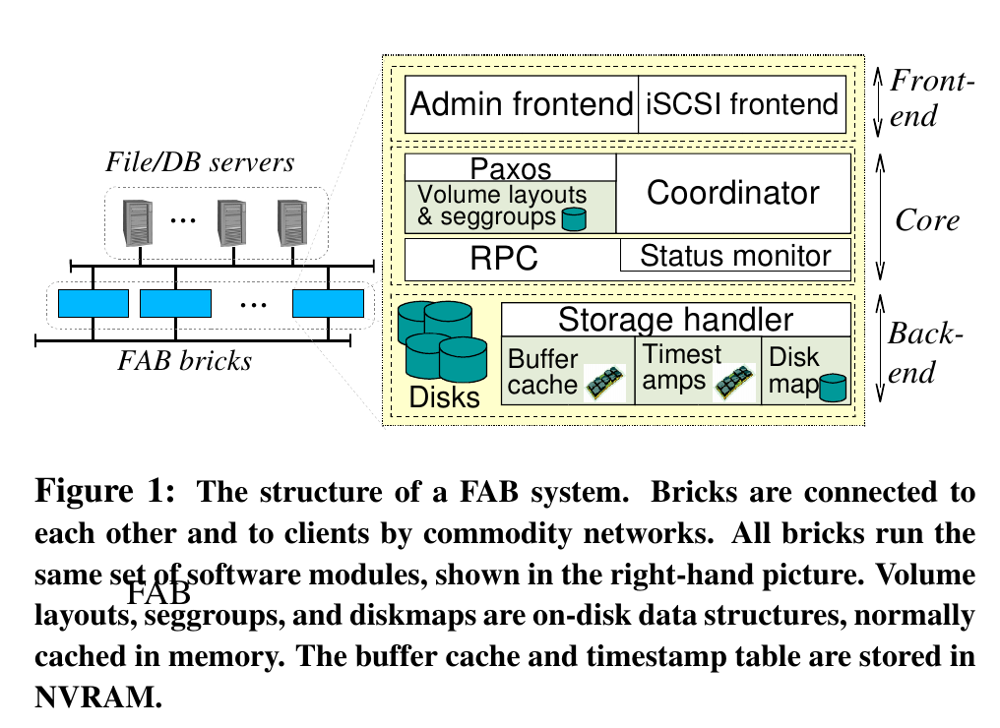

*Figure 1: The structure of a FAB system. Bricks are connected to each other and to clients by commodity networks. All bricks run the same set of software modules, shown in the right-hand picture. Volume layouts, seggroups, and diskmaps are on-disk data structures, normally cached in memory. The buffer cache and timestamp table are stored in NVRAM.*

> *图 1：FAB 系统的结构。砖块通过普通网络互相连接，并连接到客户端。所有砖块运行同一组软件模块，如右图所示。卷布局、段组和磁盘映射都是磁盘上的数据结构，通常会缓存到内存中。缓冲区缓存与时间戳表存放在 NVRAM 中。*

## 3. Overview｜概览

Figure 1 shows the structure of a FAB system. FAB is a symmetrically distributed system—each brick runs the same set of software modules and manages the same types of data structures. FAB clients, usually file or database servers, use iSCSI [32] for reading and writing logical blocks, and a proprietary protocol for administrative tasks, such as creating and deleting logical volumes. At a high level, a read or write request is processed as follows:

> 图 1 展示了 FAB 系统的结构。FAB 是对称分布式系统：每块砖块都运行同一组软件模块，管理同类数据结构。FAB 客户端通常是文件服务器或数据库服务器，它们用 iSCSI [32] 读写逻辑块，用一种专有协议执行创建、删除逻辑卷等管理任务。从高层看，一个读或写请求按下列步骤处理：

1. The client sends an iSCSI request of the form ⟨volume-id, offset, length⟩ to a coordinator, that is, a brick that acts as a gateway for the request. Because of FAB’s symmetric structure, the client can choose any brick as the coordinator to access any logical volume. Different requests, even from the same client, can be coordinated by different bricks. In practice, the client uses either hard-wired knowledge or a protocol such as iSNS [33] (a name service for iSCSI) to pick a coordinator.
2. The coordinator finds the set of bricks that store the requested blocks. These are the storage bricks for the request.
3. The coordinator runs the replication or erasure-coding protocol against the storage bricks, passing the tuple ⟨volume-id, offset, length⟩ to them.
4. Each storage brick converts the tuple ⟨volume-id, offset, length⟩ to physical disk offsets and accesses the requested data.

> 1. 客户端向某个协调器发送形如 ⟨volume-id, offset, length⟩ 的 iSCSI 请求。协调器就是充当该请求网关的砖块。由于 FAB 的结构对称，客户端可以选任意砖块作为协调器，访问任意逻辑卷。不同请求即使来自同一客户端，也可以由不同砖块协调。实际上，客户端会用固化的已知信息，或者 iSNS [33]（iSCSI 命名服务）这样的协议选择协调器。
> 2. 协调器找到保存所请求数据块的砖块集合。这些就是该请求的存储砖块。
> 3. 协调器针对这些存储砖块运行复制或纠删码协议，并把元组 ⟨volume-id, offset, length⟩ 传给它们。
> 4. 每块存储砖块把元组 ⟨volume-id, offset, length⟩ 转换为物理磁盘偏移，再访问所请求的数据。

### 3.1 Key Data Structures and Software Modules｜关键数据结构与软件模块

The steps described above are carried out using the following key data structures:

> 上述步骤借助下列关键数据结构完成：

- **Volume layout** maps a logical offset to a seggroup at segment granularity for each volume. A segment, set to 256MB, is the unit of data distribution.
- **Seggroup** describes the layout of a segment, including the set of bricks that store the segment. The volume layout and seggroups are used in step 2 to locate the set of storage bricks for a request. A seggroup is also the unit of reconfiguration, as we discuss further in Section 5.
- **Diskmap** maps a logical offset to the tuple ⟨disk-number, disk-offset⟩ at page granularity for each logical volume. A page, set to 8MB, is the unit of disk allocation. Diskmap contents are unique to each brick. Diskmaps are used in step 4.
- **Timestamp table** stores timestamp information for recently modified blocks. The contents of this table are unique to each brick. This data structure is used in steps 3 and 4 to access replicated or erasure-coded blocks in a consistent fashion. We discuss FAB’s replication and erasure-coding algorithms and their use of timestamp tables in more detail in Section 4.

> - **卷布局（volume layout）**按段粒度把每个卷的逻辑偏移映射到段组。段的大小设为 256MB，是数据分布单位。
> - **段组（seggroup）**描述某个段的布局，包括保存该段的砖块集合。在步骤 2 中，卷布局和段组用来定位处理某个请求的存储砖块集合。段组也是重配置单位，第 5 节会进一步讨论。
> - **磁盘映射（diskmap）**按页粒度，把每个逻辑卷的逻辑偏移映射到元组 ⟨disk-number, disk-offset⟩。页的大小设为 8MB，是磁盘分配单位。每块砖块的磁盘映射内容都不同。步骤 4 使用磁盘映射。
> - **时间戳表（timestamp table）**保存近期修改过的数据块的时间戳信息。每块砖块的表内容都不同。步骤 3 和 4 使用该数据结构，以一致的方式访问复制块或纠删编码块。第 4 节将更详细地讨论 FAB 的复制与纠删码算法，以及这些算法如何使用时间戳表。

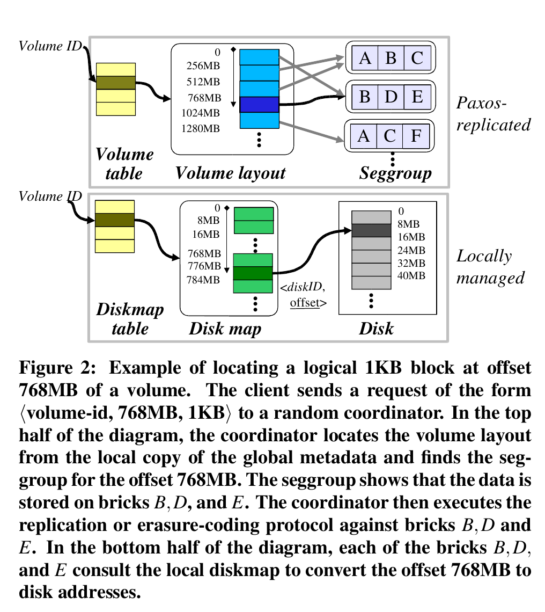

*Figure 2: Example of locating a logical 1KB block at offset 768MB of a volume. The client sends a request of the form ⟨volume-id, 768MB, 1KB⟩ to a random coordinator. In the top half of the diagram, the coordinator locates the volume layout from the local copy of the global metadata and finds the seggroup for the offset 768MB. The seggroup shows that the data is stored on bricks B, D, and E. The coordinator then executes the replication or erasure-coding protocol against bricks B, D, and E. In the bottom half of the diagram, each of the bricks B, D, and E consults the local diskmap to convert the offset 768MB to disk addresses.*

> *图 2：定位卷中偏移为 768MB 的一个 1KB 逻辑块的例子。客户端向随机选择的协调器发送形如 ⟨volume-id, 768MB, 1KB⟩ 的请求。在图的上半部分，协调器从全局元数据的本地副本找到卷布局，再找到偏移 768MB 所属的段组。该段组表明，数据保存在砖块 B、D 和 E 上。随后，协调器针对 B、D、E 执行复制或纠删码协议。在图的下半部分，B、D、E 分别查询本地磁盘映射，把偏移 768MB 转换为磁盘地址。*

Figure 2 shows an example of I/O request processing. Volume layouts and seggroups are called the global metadata, because they are replicated on every brick and are read by the request coordinator. Following the approach pioneered by Petal [22], we use Paxos [20, 21], an atomic broadcast protocol, to maintain the consistency of the global metadata across bricks. Paxos allows bricks to receive exactly the same sequence of metadata updates, even when updates are issued concurrently and bricks fail and recover. Thus, by letting bricks initially boot from the same (empty) global metadata and use Paxos for updates, they can keep their metadata consistent. As discussed further in Section 5.2, FAB is designed to withstand stale global metadata, so long as bricks eventually receive metadata updates. As such, reading global metadata is done directly against the local copy.

> 图 2 给出了处理 I/O 请求的例子。卷布局和段组被称为全局元数据，因为它们被复制到每块砖块上，并由请求协调器读取。沿用 Petal [22] 开创的做法，我们使用原子广播协议 Paxos [20, 21] 维持各块砖块之间全局元数据的一致性。即使更新并发发出，或者砖块发生故障和恢复，Paxos 也能让所有砖块收到完全相同的元数据更新序列。因此，只要让砖块最初从同一份（空的）全局元数据启动，再用 Paxos 更新，它们就能保持元数据一致。如第 5.2 节将进一步讨论的，FAB 在设计上可以容忍过时的全局元数据，只要砖块最终能收到元数据更新即可。因此，系统直接从本地副本读取全局元数据。

These data structures are managed by software modules that are roughly divided into three groups. The frontend receives requests from clients (step 1). The core contains modules needed to locate logical blocks and maintain data consistency (steps 2 and 3). In particular, the coordinator module is responsible for communicating with the backend modules of remote bricks to access blocks consistently. The status monitor keeps track of the disk usage and load of other bricks. It is used to assign less-utilized segment groups to volumes while creating volumes (Section 3.2), and to pick a brick in the quorum that reads data from disk (Section 4.4). It currently deploys two mechanisms. First, the status information is piggybacked on every message exchanged between bricks; this gives a timely view of the status of a small set of bricks. Second, we use a variation of the gossip-based failure detector [?] to advertise the status to a random brick every three seconds; this gives an older, but more comprehensive, view of the system. Finally, the backend modules are responsible for managing and accessing NVRAM and physical disks (step 4).

> 管理这些数据结构的软件模块大致分为三组。前端接收客户端请求（步骤 1）。核心层包含定位逻辑块和维持数据一致性所需的模块（步骤 2 和 3）。其中，协调器模块负责与远程砖块的后端模块通信，以一致的方式访问数据块。状态监视器跟踪其他砖块的磁盘使用情况和负载。创建卷时，它用来把磁盘利用率较低的段组分配给卷（第 3.2 节）；读取时，它用来从 quorum 中挑选一块真正从磁盘读数据的砖块（第 4.4 节）。状态监视器当时使用两种机制。第一，砖块间交换的每条消息都携带状态信息；这能及时掌握少量砖块的状态。第二，我们采用一种基于 gossip 的故障检测器变体 [?]，每三秒向随机砖块通告一次状态；这种信息较旧，但能更全面地反映系统状态。最后，后端模块负责管理和访问 NVRAM 与物理磁盘（步骤 4）。

### 3.2 Data Layout and Load Balancing｜数据布局与负载均衡

All the segments assigned to a seggroup must use the same redundancy policy: replication of the same degree or erasure coding with the same layout. FAB’s policy is to create, for each redundancy policy, an average of four seggroups that contain a specific brick. Logical volume segments are assigned to seggroups semi-randomly when the volume is created, favoring seggroups containing bricks with less utilized disks (the status monitor is consulted for this purpose). The assignment of physical disk blocks to pages (i.e., diskmap) is done randomly by each brick when the page is written for the first time.

> 分配给同一段组的所有段，必须使用相同的冗余策略：或者使用副本数相同的复制，或者使用布局相同的纠删编码。FAB 的策略是：对每一种冗余策略，平均创建四个包含某块特定砖块的段组。创建卷时，逻辑卷的段会以半随机方式分配到各段组，优先选择包含磁盘利用率较低砖块的段组（为此会查询状态监视器）。物理磁盘块到页的分配（即磁盘映射），由每块砖块在页第一次写入时随机完成。

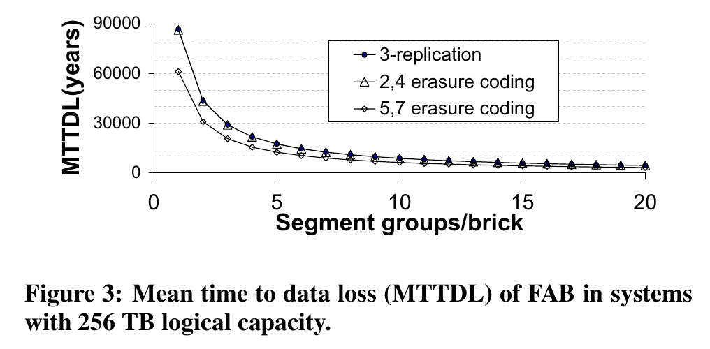

*Figure 3: Mean time to data loss (MTTDL) of FAB in systems with 256TB logical capacity.*

> *图 3：逻辑容量为 256TB 的 FAB 系统中，发生数据丢失前的平均时间（MTTDL）。*

The choice of number of seggroups per brick reveals a tension between load balancing and reliability. After a brick *b* fails, the “read” requests normally handled by *b* are now served by the other bricks in the seggroups that *b* belongs to. Thus, the more seggroups per brick, the more evenly the extra load is spread. Creating too many seggroups, however, reduces the system’s reliability, since this increases the number of combinations of brick failures that can lead to data loss. Figure 3 shows how the reliability changes with the number of seggroups per brick. This analysis is based on a Markov model assuming bricks with twelve 256GB SATA disks. Failures are assumed to be independent. We assume a disk mean time to failure (MTTF) of 57 years, based on manufacturers’ specifications, and a brick (enclosure) MTTF of 30 years, based on data from [4]. The time to repair a failure depends on the failure type and is based on the time required to copy the data to spare space—we assume that spare space is always available. Based on this, we pick an average of four seggroups per brick because this meets our goal of a 10,000-year MTTDL, while still allowing the load to be spread evenly.

> 每块砖块应有多少个段组，体现了负载均衡与可靠性之间的张力。砖块 *b* 故障后，原本由 *b* 处理的“读”请求，改由 *b* 所属段组中的其他砖块服务。因此，每块砖块所属的段组越多，额外负载就分散得越均匀。但创建太多段组会降低系统可靠性，因为可能导致数据丢失的砖块故障组合会增多。图 3 展示可靠性如何随每块砖块的段组数变化。该分析基于 Markov 模型，假设每块砖块包含 12 块 256GB SATA 磁盘，且各故障相互独立。我们根据制造商规格，假设磁盘的平均故障时间（MTTF）为 57 年；根据 [4] 的数据，假设砖块（机箱）的 MTTF 为 30 年。修复时间取决于故障类型，以把数据复制到备用空间所需的时间为准；我们假设备用空间始终可用。据此，我们选择让每块砖块平均属于四个段组：这既能达到 MTTDL 为 10,000 年的目标，又能让负载均匀分散。

The choice of segment and page sizes involves several trade-offs. A larger segment size reduces the global-metadata management overhead, but at the cost of less storage-allocation freedom, because bricks in a seggroup must store all its segments. The page is chosen to be smaller than the segment to reduce the storage waste for erasure-coded volumes (Section 4.2), or for logical volumes whose size is not segment-aligned. Too small a page size, however, could also hurt performance by increasing disk-head movement. We find that the current setting of 256MB segments and 8MB pages offers a good balance for the next few years—even with bricks with 10TB raw capacity and one thousand 1TB logical volumes in the system, the size of the global metadata and diskmaps would be only 5MB and 10MB, respectively.

> 段与页的大小选择涉及几项取舍。较大的段可减少全局元数据管理开销，代价是存储分配的自由度降低，因为一个段组中的砖块必须保存该组的所有段。页要比段小，以减少纠删编码卷（第 4.2 节）或大小未按段对齐的逻辑卷所浪费的存储空间。但页太小也可能因增加磁头移动而损害性能。我们发现，当前的 256MB 段和 8MB 页配置，在未来几年内可以较好地平衡这些因素：即使砖块原始容量达到 10TB，系统中有 1000 个 1TB 逻辑卷，全局元数据和磁盘映射的大小也分别只有 5MB 和 10MB。

## 4. Voting-Based Replication and Erasure Coding｜基于投票的复制与纠删编码

FAB provides two redundancy mechanisms, replication and erasure coding. Both are based on the idea of voting: each request makes progress after receiving replies from a (random) quorum of storage bricks. Our protocols require no persistent state on the request coordinator. This feature allows any brick to act as a coordinator and helps FAB become truly decentralized without changing clients. Section 4.1 describes our basic replication protocol for a single logical block, and Section 4.2 describes how it can be extended for erasure coding. Multi-block requests are logically handled by running multiple instances of these algorithms in parallel, but in practice, we batch and run them as efficiently as single-block requests. We discuss this and other implementation-related issues in later sections.

> FAB 提供两种冗余机制：复制和纠删编码。两者都以投票为基础：每个请求收到一个（随机）存储砖块 quorum 的回复后，便可继续执行。我们的协议不要求请求协调器保存持久状态。因此，任何砖块都能充当协调器，FAB 也得以在不改动客户端的前提下真正去中心化。第 4.1 节介绍单个逻辑块的基本复制协议，第 4.2 节说明如何将其扩展到纠删码。在逻辑上，多块请求通过并行运行多个算法实例处理；实际实现中，我们会把这些实例批量处理，使其效率与单块请求相当。后文还会讨论这个问题和其他实现问题。

### 4.1 Replication｜复制

The task of a request coordinator is straightforward in theory: when writing, it generates a new unique timestamp and writes the new block value and timestamp to a majority of storage bricks; when reading, it reads from a majority and returns the value with the newest timestamp. The challenge lies in the handling of the failure of the participants in the middle of a “write” request: the new value may end up on only a minority of bricks. A storage system must ensure strict linearizability [2, 17]—it must present a single global ordering of (either successful or failed) I/O requests, even when they are coordinated by different bricks. Put another way, after a “write” coordinator fails, future “read” requests to the same block must all return the old block value or all return the new value, until the block is overwritten by a newer “write” request. Prior approaches, e.g., Gifford’s use of two-phase commits [14], cannot ensure a quick fail-over, and Ling et al.’s use of end-to-end consistency checking [24] conflicts with our goal of leaving the client interface (iSCSI) unchanged.

> 从理论上看，请求协调器的任务很直接。写入时，它生成新的唯一时间戳，把新块值和时间戳写入多数存储砖块；读取时，它从多数砖块读取，返回时间戳最新的值。难点在于处理参与者在“写”请求中途发生故障的情况：新值最终可能只落在少数砖块上。存储系统必须保证严格可线性化 [2, 17]：即使 I/O 请求由不同砖块协调，无论请求成功还是失败，系统都必须呈现唯一的全局顺序。换句话说，“写”协调器故障后，之后针对同一块的“读”请求，必须要么全部返回旧值，要么全部返回新值，直到更新的“写”覆盖该块。早期方案无法同时满足要求：例如 Gifford 使用的两阶段提交 [14] 不能保证快速故障切换；Ling 等人使用的端到端一致性检查 [24]，又与我们不改变客户端接口（iSCSI）的目标相冲突。

FAB takes an alternative approach, performing recovery lazily when a client tries to read the block after an incomplete write. Figure 4 shows the pseudocode of FAB’s algorithm. Each replicated block keeps two persistent timestamps: `valTs` is the timestamp of the block currently stored, and `ordTs` is the timestamp of the newest ongoing “write” request. An incomplete “write” request is indicated by `ordTs > valTs` on some brick. A “write” runs in two phases. First, in the Order phase, the replicas update their `ordTs` to indicate a new ongoing update and ensure that no request with an older timestamp is accepted. In the second, Write, phase, the replicas update the actual disk block and `valTs`. A “read” request usually runs in one phase, but takes two additional phases when it detects an incomplete past “write”—the coordinator first discovers the value with the newest timestamp from a majority, and then writes that value back to a majority with a timestamp greater than that of any previous writes. In this protocol, a “write” request still tries to write to all the bricks in the seggroup; the coordinator just does not wait for all the replies. Thus, a read-recovery phase usually happens only when there is an actual failure. Figure 5 shows an example of I/Os using this algorithm.

> FAB 采取了另一种办法：不完整写入发生后，等客户端尝试读取该块时，再延迟执行恢复。图 4 给出了 FAB 算法的伪代码。每个复制块保存两个持久时间戳：`valTs` 是当前所存数据块的时间戳，`ordTs` 是正在进行的最新“写”请求的时间戳。如果某块砖块上出现 `ordTs > valTs`，就表示之前有一个未完成的“写”请求。“写”分两阶段运行。第一阶段是 Order，副本更新自己的 `ordTs`，表明有一项新更新正在进行，并保证不再接受时间戳更旧的请求。第二阶段是 Write，副本更新实际磁盘块和 `valTs`。“读”请求通常只需一个阶段；如果它发现之前有未完成的“写”，则还要多执行两个阶段：协调器先从多数砖块中找出时间戳最新的值，再用大于以前所有写入的时间戳，把该值写回多数砖块。在这个协议中，“写”仍会尝试写入段组内所有砖块，只是协调器不等待所有回复。因此，读恢复阶段通常只在真正发生故障时才会出现。图 5 给出了使用该算法执行 I/O 的例子。

```text
// I/O coordinator code.
proc write(val)
  ts ← NewTimestamp()
  send [Order, {}, ts] to bricks in the seggroup
  if a majority reply "yes"
    send [Write, val, ts] to bricks in the seggroup
    if a majority reply "yes" return OK
  return ABORTED
proc read()
  send [Read] to bricks in the seggroup
  if a majority reply "yes" and all timestamps are equal
    return the val in a reply.
  ts ← NewTimestamp() // Slow "recover" path starts
  send [Order, "all", ts] to bricks in the seggroup
  if a majority reply "yes"
    val ← the value with highest valTs from replies
    send [Write, val, ts] to bricks in the seggroup
    if a majority reply "yes" return val
  return ABORTED
// Storage handler code. Variable val stores the block contents.
when Receive [Read]
  status ← (valTs ≥ ordTs)
  reply [status, valTs, val]
when Receive [Order, targets, ts]
  status ← (ts > max(valTs, ordTs))
  if status ordTs ← ts
  if targets = "all" or this block ∈ targets
    reply [valTs, val, status]
  else reply [valTs, status]
when Receive [Write, newVal, ts]
  status ← (ts > valTs and ts ≥ ordTs)
  if status val ← newVal; valTs ← ts
  reply [status]
```

> ```text
> // I/O 协调器代码。
> 过程 write(val)
>   ts ← NewTimestamp()
>   向段组内砖块发送 [Order, {}, ts]
>   如果多数砖块回复“yes”
>     向段组内砖块发送 [Write, val, ts]
>     如果多数砖块回复“yes”，返回 OK
>   返回 ABORTED
>
> 过程 read()
>   向段组内砖块发送 [Read]
>   如果多数砖块回复“yes”，且所有时间戳相同
>     返回某个回复中的 val。
>   ts ← NewTimestamp() // 进入慢速“恢复”路径
>   向段组内砖块发送 [Order, "all", ts]
>   如果多数砖块回复“yes”
>     val ← 回复中 valTs 最大的值
>     向段组内砖块发送 [Write, val, ts]
>     如果多数砖块回复“yes”，返回 val
>   返回 ABORTED
>
> // 存储处理器代码。变量 val 保存块内容。
> 收到 [Read] 时
>   status ← (valTs ≥ ordTs)
>   回复 [status, valTs, val]
>
> 收到 [Order, targets, ts] 时
>   status ← (ts > max(valTs, ordTs))
>   如果 status，ordTs ← ts
>   如果 targets = "all" 或本块 ∈ targets
>     回复 [valTs, val, status]
>   否则回复 [valTs, status]
>
> 收到 [Write, newVal, ts] 时
>   status ← (ts > valTs 且 ts ≥ ordTs)
>   如果 status，val ← newVal; valTs ← ts
>   回复 [status]
> ```

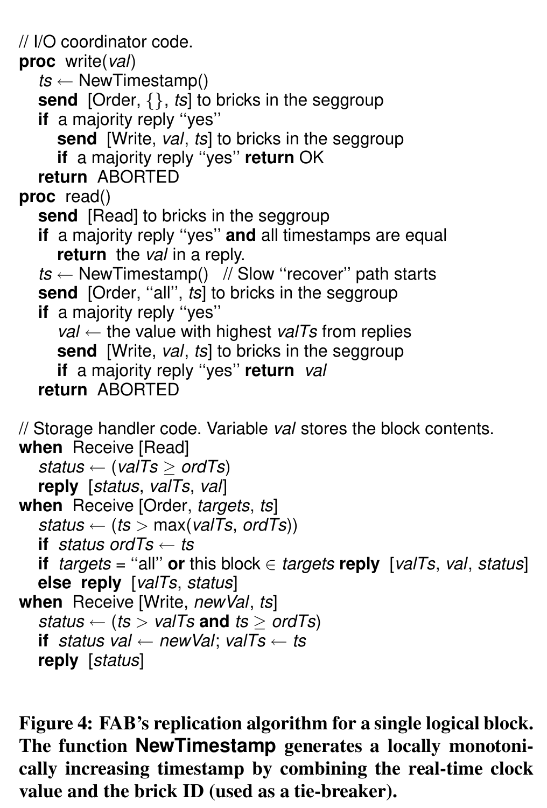

*Figure 4: FAB’s replication algorithm for a single logical block. The function `NewTimestamp` generates a locally monotonically increasing timestamp by combining the real-time clock value and the brick ID (used as a tie-breaker).*

> *图 4：FAB 的单逻辑块复制算法。函数 `NewTimestamp` 把实时时钟值与砖块 ID（用于破平局）组合起来，生成在本地单调递增的时间戳。*

One unusual feature of our protocol is that a request may abort when it encounters a concurrent request with a newer timestamp. In this case it is up to the client or the coordinator to retry. In practice, abortion is rare, given that protocols such as NTP can synchronize clocks with sub-millisecond precision [28, 10]. Being able to abort requests, however, offers two benefits. First, it allows for an efficient protocol—a “read” request can complete in a single round as opposed to two in previous algorithms [5, 27], skipping the round to discover the latest timestamp. Second, abortion enables strict linearizability—that is, only by sometimes aborting requests can an algorithm properly linearize requests whose coordinators could crash in the middle. A theoretical treatment of this issue appears in separate papers [11, 2].

> 我们的协议有一个不寻常的特性：当请求遇到时间戳更新的并发请求时，它可能中止。此时由客户端或协调器负责重试。在实际中，请求很少中止，因为 NTP 等协议可以以亚毫秒精度同步时钟 [28, 10]。不过，允许中止请求带来两项好处。第一，它能实现高效协议：“读”请求只需一轮即可完成，不像以前的算法 [5, 27] 那样需要两轮，因为它可以跳过查找最新时间戳的那一轮。第二，中止使严格可线性化成为可能：对于协调器可能中途崩溃的请求，算法只有偶尔中止请求，才能正确地将它们线性化。另外两篇论文 [11, 2] 对这个问题做了理论处理。

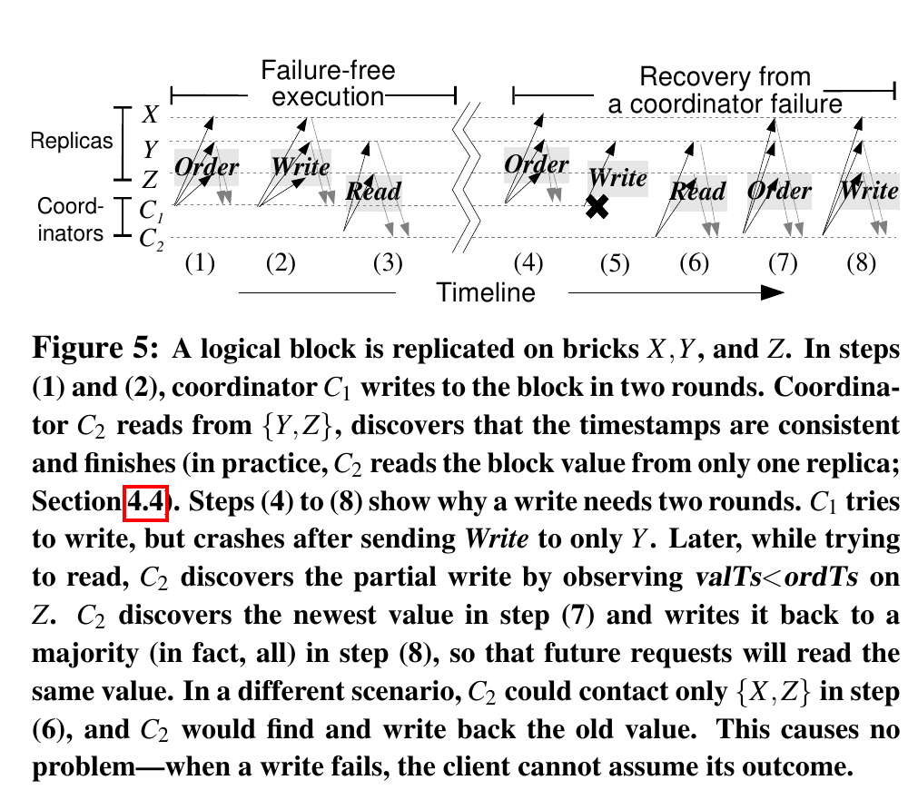

*Figure 5: A logical block is replicated on bricks X, Y, and Z. In steps (1) and (2), coordinator C1 writes to the block in two rounds. Coordinator C2 reads from {Y,Z}, discovers that the timestamps are consistent and finishes (in practice, C2 reads the block value from only one replica; Section 4.4). Steps (4) to (8) show why a write needs two rounds. C1 tries to write, but crashes after sending Write to only Y. Later, while trying to read, C2 discovers the partial write by observing `valTs < ordTs` on Z. C2 discovers the newest value in step (7) and writes it back to a majority (in fact, all) in step (8), so that future requests will read the same value. In a different scenario, C2 could contact only {X,Z} in step (6), and C2 would find and write back the old value. This causes no problem—when a write fails, the client cannot assume its outcome.*

> *图 5：一个逻辑块复制在砖块 X、Y 和 Z 上。在步骤 (1) 和 (2) 中，协调器 C1 用两轮写入该块。协调器 C2 从 {Y,Z} 读取，发现时间戳一致，于是结束（实际上，C2 只从一个副本读取块值；见第 4.4 节）。步骤 (4) 到 (8) 说明了写入为什么需要两轮。C1 尝试写入，但它只向 Y 发出 Write 就崩溃了。之后 C2 尝试读取，它在 Z 上观察到 `valTs < ordTs`，因而发现这次部分写入。C2 在步骤 (7) 找到最新值，并在步骤 (8) 把它写回多数砖块（实际上是全部砖块），使以后的请求都会读到同一个值。在另一种情况下，C2 在步骤 (6) 可能只联系 {X,Z}，那么它会找到并写回旧值。这没有问题：写入失败时，客户端不能对结果作出假设。*

### 4.2 Erasure Coding｜纠删编码

FAB also supports generic *m,n* Reed-Solomon erasure coding. Reed-Solomon codes have two characteristics. First, they generate *n-m* parity blocks out of *m* data blocks, and can reconstruct the original data blocks from any *m* out of *n* blocks. Second, they provide a simple function, which we call `Delta`, that enables incremental update of parity blocks [30]. Using this function, when writing to a logical block *X*, the new value of any parity block can be computed by `xor(old-parity, Delta(old-x, new-x))`, where `old-parity` is the old parity block value, and `old-x` and `new-x` are the old and new values of block *X*.

> FAB 还支持通用的 *m,n* Reed-Solomon 纠删码。Reed-Solomon 码有两个特点。第一，它用 *m* 个数据块生成 *n-m* 个校验块，并能从 *n* 个块中的任意 *m* 个重建原始数据块。第二，它提供一个我们称为 `Delta` 的简单函数，可用来增量更新校验块 [30]。用该函数写入逻辑块 *X* 时，任意校验块的新值可通过 `xor(old-parity, Delta(old-x, new-x))` 计算。其中，`old-parity` 是校验块的旧值，`old-x` 和 `new-x` 分别是块 *X* 的旧值和新值。

Figure 7 shows our data-access algorithm for erasure-coded volumes. Supporting erasure-coded data requires three key changes to the basic replication protocol: segment layout, quorum size, and update logging.

> 图 7 给出了纠删编码卷的数据访问算法。为支持纠删编码数据，需要对基本复制协议做三项关键修改：段布局、quorum 大小和更新日志。

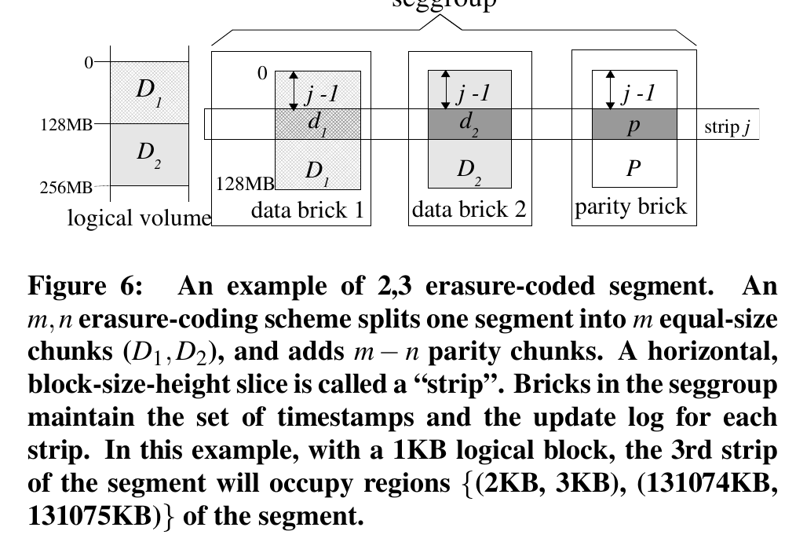

*Figure 6: An example of a 2,3 erasure-coded segment. An m,n erasure-coding scheme splits one segment into m equal-size chunks (D1,D2), and adds m-n parity chunks. A horizontal, block-size-height slice is called a “strip”. Bricks in the seggroup maintain the set of timestamps and the update log for each strip. In this example, with a 1KB logical block, the 3rd strip of the segment will occupy regions {(2KB, 3KB), (131074KB, 131075KB)} of the segment.*

> *图 6：一个 2,3 纠删编码段的例子。一种 m,n 纠删编码方案把一个段分为 m 个大小相同的分块（D1、D2），再增加 m-n 个校验分块（原文如此；按定义应为 n-m）。高度为一个块大小的水平切片称为“条带（strip）”。段组内的砖块为每个条带维护时间戳集合和更新日志。在这个例子中，逻辑块大小为 1KB，段的第 3 个条带占用该段中的 {(2KB, 3KB), (131074KB, 131075KB)} 区域。*

We currently use the entire segment as the erasure-code chunk, as shown in Figure 6, unlike typical RAID systems that use smaller chunk sizes such as 64KB. We chose this layout because it lets a large logical sequential request be translated into a large sequential disk I/O at each brick. The downside is that it may abort writes spuriously, when two blocks that happen to be in the same strip are updated concurrently. With a database transaction workload (Section 7.3), however, the conflict rate is measured to be < 0.001%, and we consider that the benefits outweigh the downsides.

> 如图 6 所示，我们当时把整个段作为纠删码分块，不同于典型 RAID 系统使用 64KB 等较小的分块大小。选择这种布局，是因为它可以把一次较大的逻辑顺序请求，转换为每块砖块上的较大顺序磁盘 I/O。缺点是，当恰好位于同一条带的两个块被并发更新时，它可能会无谓地中止写入。不过，在数据库事务工作负载（第 7.3 节）下，测得的冲突率低于 0.001%，我们认为这种布局利大于弊。

As in replication, each request contacts a subset of the bricks that store the segment. However, with *m,n* erasure coding, a coordinator must collect replies from $m+\lceil(n-m)/2\rceil$ bricks—that is, the intersection of any two quorums must contain at least *m* bricks—to be able to reconstruct the strip value during a future “read”. We call this quorum system an *m-quorum*. For instance, the *m-quorum* size is 3 for a 2,4 erasure code, and 8 for a 6,10 erasure code.

> 与复制一样，每个请求只联系保存该段的一部分砖块。但对 *m,n* 纠删码来说，协调器必须收集 $m+\lceil(n-m)/2\rceil$ 块砖块的回复——也就是说，任意两个 quorum 的交集必须至少包含 *m* 块砖块——才能在以后的“读”操作中重建条带值。我们把这种 quorum 系统称为 *m-quorum*。例如，2,4 纠删码的 *m-quorum* 大小为 3，6,10 纠删码则为 8。

The final change involves the need for strip recovery. Suppose that a “write” coordinator crashes after writing the new value to fewer than *m* bricks in the second round. The subsequent “read” request must recover the old value, which might become impossible if the “write” request simply overwrote the blocks and if $n < 2m$ (which is a rather common setting). We solve this situation by update logging—a storage brick merely logs the new value in the second round of the “write”. A read request, when recovering the old value, scans the log on an *m-quorum* of bricks and finds the newest strip value that can be fully reconstructed. The “write” coordinator, after it replies to the client, instructs the bricks to overwrite the old block value, and thus compress their log, in an asynchronous Commit phase. In practice, the log is implemented in each brick’s NVRAM cache, and the third round—replacing the block value with the log entry—is performed simply by modifying the cache index. Thus, logging does not create any additional disk I/O or memory-copying traffic in the common case when no brick fails during request processing.

> 最后一项修改来自条带恢复的需要。假设“写”协调器在第二轮把新值写入少于 *m* 块砖块后崩溃。之后的“读”请求必须恢复旧值。如果“写”只是直接覆盖各块，而且 $n < 2m$（这是很常见的设置），恢复旧值可能变得不可能。我们用更新日志解决这个问题：存储砖块在“写”的第二轮只记录新值。读请求恢复旧值时，会扫描一个 *m-quorum* 中各块砖块的日志，找出能完整重建的最新条带值。“写”协调器回复客户端后，会在异步 Commit 阶段指示砖块覆盖旧块值，从而压缩日志。在实际实现中，日志放在每块砖块的 NVRAM 缓存里；第三轮用日志条目替换块值时，只需修改缓存索引。因此，在请求处理过程中没有砖块故障的常见情况下，记日志不会带来额外磁盘 I/O 或内存复制流量。

```text
// I/O coordinator code. "idx" is the block number within the strip.
proc write(val, idx)
  ts ← NewTimestamp()
  send [Order, {idx}, ts] to bricks in the seggroup
  if an m-quorum reply "yes" and idx'th brick replies with oldval
    delta ← Delta(oldval, val, idx)
    send [Write-EC, val, ts] to the idx'th brick.
    send [Write-EC, NULL, ts] to other data bricks.
    send [Write-EC, delta, ts] to parity bricks
    if an m-quorum reply "yes"
      send [Commit, ts] to bricks in the seggroup
      return OK
  return ABORTED
proc read(idx)
  send [Read] to bricks in the seggroup
  if an m-quorum and idx reply "yes" and all timestamps are equal
    return the val returned by idx'th brick.
  ts ← NewTimestamp() // Slow recovery path begins
  send [Order&ReadLog, ts] to bricks in the seggroup
  ts' ← Pick the largest timestamp that appears in at least m replies.
  strip ← Reconstruct the original strip for ts'
  send [Write, strip[i], ts] to i'th brick, for each i in the seggroup
  if an m-quorum returns "yes"
    send [Commit, ts] to bricks in the seggroup
    return strip[idx]
  return ABORTED
// Storage handler code
when Receive [Write-EC, newval, ts]
  status ← (ts > valTs and ts ≥ ordTs)
  if status
    if this brick is for parity, add [xor(newval, val), ts] to the log.
    elseif newval ≠ NULL, add [newval, ts] to the log.
    else add [val, ts] to the log
  reply status
when Receive [Order&ReadLog, ts]
  status ← (ts > max(valTs, ordTs))
  reply [status, all the log entries]
when Receive [Commit, ts]
  Wait for a while to reject requests with stale timestamps.
  if there is a log entry for ts
    val ← the associated log value.
  Remove log entries with timestamps ts or smaller.
```

> ```text
> // I/O 协调器代码。“idx”是块在条带中的编号。
> 过程 write(val, idx)
>   ts ← NewTimestamp()
>   向段组内砖块发送 [Order, {idx}, ts]
>   如果一个 m-quorum 回复“yes”，且第 idx 块砖块回复 oldval
>     delta ← Delta(oldval, val, idx)
>     向第 idx 块砖块发送 [Write-EC, val, ts]。
>     向其他数据砖块发送 [Write-EC, NULL, ts]。
>     向校验砖块发送 [Write-EC, delta, ts]
>     如果一个 m-quorum 回复“yes”
>       向段组内砖块发送 [Commit, ts]
>       返回 OK
>   返回 ABORTED
>
> 过程 read(idx)
>   向段组内砖块发送 [Read]
>   如果一个 m-quorum 和第 idx 块砖块回复“yes”，且所有时间戳相同
>     返回第 idx 块砖块返回的 val。
>   ts ← NewTimestamp() // 进入慢速恢复路径
>   向段组内砖块发送 [Order&ReadLog, ts]
>   ts' ← 选择至少出现在 m 个回复中的最大时间戳。
>   strip ← 重建 ts' 对应的原始条带
>   对段组中每个 i，向第 i 块砖块发送 [Write, strip[i], ts]
>   如果一个 m-quorum 回复“yes”
>     向段组内砖块发送 [Commit, ts]
>     返回 strip[idx]
>   返回 ABORTED
>
> // 存储处理器代码
> 收到 [Write-EC, newval, ts] 时
>   status ← (ts > valTs 且 ts ≥ ordTs)
>   如果 status
>     如果本砖块是校验砖块，向日志加入 [xor(newval, val), ts]。
>     否则如果 newval ≠ NULL，向日志加入 [newval, ts]。
>     否则向日志加入 [val, ts]
>   回复 status
>
> 收到 [Order&ReadLog, ts] 时
>   status ← (ts > max(valTs, ordTs))
>   回复 [status, 全部日志条目]
>
> 收到 [Commit, ts] 时
>   等待一段时间，以拒绝携带过时时间戳的请求。
>   如果存在 ts 对应的日志条目
>     val ← 相关的日志值。
>   删除时间戳小于或等于 ts 的日志条目。
> ```

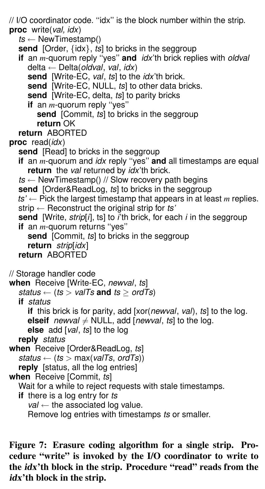

*Figure 7: Erasure-coding algorithm for a single strip. Procedure “write” is invoked by the I/O coordinator to write to the idx’th block in the strip. Procedure “read” reads from the idx’th block in the strip.*

> *图 7：单条带的纠删码算法。I/O 协调器调用过程“write”，写入条带中的第 idx 个块。过程“read”从条带中的第 idx 个块读取。*

### 4.3 Reducing the Overhead of Timestamp Management｜减少时间戳管理开销

One challenge of FAB is the timestamp-management overhead: for every 1TB of data, with 24-byte timestamps recorded for every 512B block, 48GB of space could be required for timestamps. This information must be kept persistently, yet this amount of NVRAM is infeasible. We employ two techniques to reduce the overhead of timestamp management.

> FAB 的一项挑战是时间戳管理开销：每 1TB 数据中，如果每个 512B 块都记录 24 字节的时间戳，时间戳可能需要 48GB 空间。这些信息必须持久保存，但如此大量的 NVRAM 并不现实。我们采用两种技术减少时间戳管理开销。

First, we observe that timestamps are used only to disambiguate concurrent updates and to recover from previous failures. Thus, when all replicas of a logical block are functional, timestamps can be discarded after all of them have acknowledged an update. Replies to the client are made as soon as a majority of the replicas have acknowledged an update. The coordinator, in the background, sends a GC (garbage collect) message to bricks only after all bricks in the seggroup reply; for erasure-coded volumes, this message is piggybacked onto the Commit message when possible. Each recipient of this message removes the corresponding entry in the timestamp table after waiting for a short period (10 seconds), just long enough to detect out-of-order requests with older timestamps. This period is conservatively chosen to be larger than the maximum clock skew plus the maximum possible scheduling delay on any brick [25].

> 第一，我们注意到，时间戳只用来区分并发更新，以及从以前的故障中恢复。因此，当一个逻辑块的所有副本都正常工作时，只要它们全部确认了更新，便可丢弃时间戳。一旦多数副本确认更新，系统就向客户端回复。但协调器要等段组内所有砖块都回复后，才在后台向砖块发送 GC（垃圾回收）消息；对纠删编码卷，只要可能，就把该消息附带在 Commit 消息上。收到该消息的砖块等待一小段时间（10 秒）后，从时间戳表中删除对应条目。这段时间刚好足以检测携带旧时间戳的乱序请求。为保守起见，该时间被设为大于最大时钟偏差与任意砖块上可能出现的最大调度延迟之和 [25]。

Another improvement can be made by observing that a single “write” request usually updates multiple blocks, and that each of the blocks affected will have the same timestamp. We thus organize the timestamp table as an ordered tree, with a set of timestamps kept for a range of blocks rather than per block. When a new request arrives for a part of an existing range in the timestamp table, we then split the range into two (or three) and replace only the part overwritten by the new request.

> 另一项改进来自如下观察：一次“写”请求通常会更新多个块，而所有受影响的块都具有相同的时间戳。因此，我们把时间戳表组织为有序树，为一段块范围保存一组时间戳，而不是每个块分别保存。当新请求针对时间戳表中某个现有范围的一部分到达时，我们将该范围拆分成两段（或三段），只替换被新请求覆盖的部分。

The combination of these techniques can reduce the timestamp overhead substantially. In the non-failure case, a brick needs to keep timestamps only for blocks that are actively updated. Steady-state size of the timestamp table per brick is measured to be 10KB, which can easily be kept in NVRAM. When a brick fails, the timestamps need to be kept until the reconfiguration protocol removes it from the segment group, usually in less than an hour (Section 5). However, simulation results with real workloads show that the timestamp-table size increases by at most 4MB per brick per hour even after brick failure [10]. It is extremely unlikely that the number of timestamps will exceed what a brick can store in memory.

> 这些技术结合使用，可以大幅减少时间戳开销。在没有故障的情况下，砖块只需为正在活跃更新的块保存时间戳。测得每块砖块的时间戳表稳态大小为 10KB，很容易放入 NVRAM。砖块故障时，必须保留时间戳，直到重配置协议将故障砖块从段组中移除；这通常不到一小时（第 5 节）。不过，用真实工作负载做的模拟表明，即使砖块故障，每块砖块的时间戳表每小时最多也只增加 4MB [10]。时间戳数量超过砖块内存容量的可能性极低。

### 4.4 Improving the Efficiency of Voting｜提高投票效率

One of the criticisms of majority voting is its inefficiency, because “read” requests must contact multiple remote nodes [35]. This problem, however, does not apply to FAB for two reasons. First, we apply an “optimistic read” technique for the common-case scenario of reading from a logical block that is already consistent. Here, the coordinator reads the actual block contents (`val`) from an idle, live replica and reads only timestamps from others in the quorum. This technique, in effect, reduces the number of disk accesses to one per “read” request, as timestamps are kept in NVRAM. Second, FAB is naturally a disk-I/O-bound system; the CPU spends much of the time waiting for disk I/Os to complete, so the CPU overhead of timestamp processing does not slow the system down.

> 对多数投票的一项批评是效率低，因为“读”请求必须联系多个远程节点 [35]。但这个问题并不适用于 FAB，原因有两个。第一，对从已经一致的逻辑块读取这种常见情况，我们采用“乐观读”技术。协调器从一个空闲、存活的副本读取实际块内容（`val`），只从 quorum 中的其他副本读时间戳。由于时间戳存在 NVRAM 中，这项技术实际上把每个“读”请求的磁盘访问数减到一次。第二，FAB 天然是受磁盘 I/O 限制的系统；CPU 大部分时间都在等待磁盘 I/O 完成，所以处理时间戳的 CPU 开销不会拖慢系统。

### 4.5 Handling Coordinator Failures｜处理协调器故障

When a coordinator fails, it is up to the client to connect to a different coordinator and retry. Most enterprise-class storage clients already have such a fail-over capability. Moreover, because of FAB’s strict linearizability guarantee, a client can fail over as quickly as it wishes—in fact, it allows a single client to use multiple coordinators concurrently, e.g., in a round-robin fashion.

> 协调器故障时，由客户端连接另一个协调器并重试。大多数企业级存储客户端已经具备这种故障切换能力。此外，FAB 的严格可线性化保证让客户端可以按自己希望的速度完成切换。实际上，它允许单个客户端同时使用多个协调器，例如以轮询方式使用。

## 5. Reconfiguration｜重配置

FAB’s reconfiguration protocol changes the quorum configuration of segment groups. It is activated, for example, when a brick failure, recovery, decommissioning, or addition is detected. This protocol and the data-access protocol complement each other—the data-access protocol enables transparent masking of failures or slow bricks, whereas the reconfiguration protocol enables long-term improvement of the system’s reliability by allowing the system to tolerate more failures than would otherwise be possible using a fixed-quorum algorithm. For example, Figure 8 shows how a three-way replicated seggroup can handle two failures over time using the reconfiguration protocol.

> FAB 的重配置协议会改变段组的 quorum 配置。例如，当系统检测到砖块故障、恢复、退役或新增时，该协议就会启动。它与数据访问协议互相补充：数据访问协议用来透明遮蔽故障砖块或慢砖块；重配置协议则让系统比使用固定 quorum 算法时能够容忍更多故障，从而长期提高系统可靠性。例如，图 8 展示了一个三副本段组如何通过重配置协议，随时间先后处理两次故障。

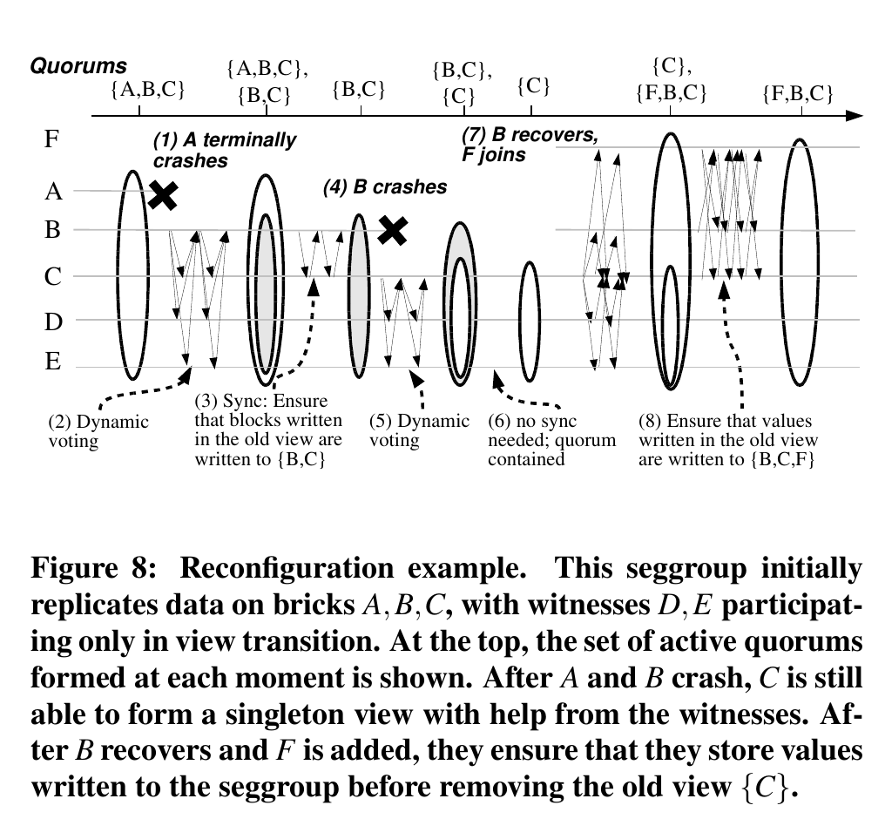

*Figure 8: Reconfiguration example. This seggroup initially replicates data on bricks A, B, C, with witnesses D, E participating only in view transition. At the top, the set of active quorums formed at each moment is shown. After A and B crash, C is still able to form a singleton view with help from the witnesses. After B recovers and F is added, they ensure that they store values written to the seggroup before removing the old view {C}.*

> *图 8：重配置示例。该段组最初把数据复制到砖块 A、B、C，见证砖块 D、E 只参与视图切换。图的上方显示了每个时刻形成的活动 quorum 集合。A 和 B 崩溃后，C 在见证者帮助下仍能形成单成员视图。B 恢复且 F 加入后，它们会先保证已保存之前写入段组的值，然后再移除旧视图 {C}。*

This protocol runs independently for each seggroup in the system. The list of live bricks agreed upon by the members of the seggroup forms a *view*; until the view changes, read and write requests that happen in the view must contact an *m-quorum* of the bricks in the view. Figure 8 overviews the reconfiguration protocol. First, a view-agreement protocol lets bricks agree on a new view after brick failure or addition (step (2)). A new view is superposed on the existing view (step (3)), forcing all new requests to collect replies from an *m-quorum* of each of the old and new views. The old view is removed after ensuring that values written in the old view are also written to an *m-quorum* of the bricks in the new view (state synchronization; steps (4) and (5)). In the rare event in which more than two views are formed in a short period, they are removed in FIFO order. By decoupling view formation and state synchronization from foreground request processing, FAB allows client requests to be processed undisturbed. The following sections describe these steps in more detail.

> 该协议针对系统中每个段组独立运行。段组成员共同认定的存活砖块列表构成一个*视图（view）*。在视图发生变化前，其中的读写请求必须联系该视图中的一个 *m-quorum*。图 8 概括了重配置协议。首先，砖块故障或加入后，视图协商协议让各砖块就新视图达成一致（步骤 (2)）。新视图叠加在现有视图上（步骤 (3)），强制所有新请求分别从旧视图和新视图的一个 *m-quorum* 收集回复。系统确保旧视图中写入的值也已写入新视图中的一个 *m-quorum* 后，再移除旧视图（状态同步；步骤 (4) 和 (5)）。少数情况下，短时间内会形成两个以上的视图，此时系统按先进先出顺序移除它们。FAB 把视图形成和状态同步与前台请求处理解耦，因而可在不受干扰的情况下处理客户端请求。下面几节会更详细地介绍这些步骤。

### 5.1 View Agreement via Dynamic Voting｜用动态投票达成视图一致

FAB’s view-agreement protocol lets bricks in a seggroup agree on a single sequence of primary views; i.e., it ensures that disjoint, concurrent views (a “split-brain” situation) never happen. We use dynamic voting [26]<sup>1</sup>—a protocol similar to Paxos [20, 21], but optimized for view agreement—for this purpose.

> FAB 的视图协商协议让段组内的砖块就唯一的主视图序列达成一致；也就是说，它保证不会出现互不相交的并发视图（“脑裂”情况）。为此，我们使用动态投票 [26]<sup>1</sup>。它是一种与 Paxos [20, 21] 相似、但专门针对视图协商做了优化的协议。

The participants of the dynamic-voting protocol are the set of bricks that store blocks in the seggroup, plus at least two additional witness bricks that participate only in the view-agreement protocol (witnesses are chosen randomly when the seggroup is created). Witnesses allow the seggroup to transition views safely, in particular when there are only two storage bricks in the view. We use the phrase *vote view* to refer to this extended set of bricks to distinguish them from a *view*, which is a subset that contains only storage bricks.

> 动态投票协议的参与者，包括在该段组中保存数据块的砖块集合，以及至少两块只参与视图协商协议的额外见证砖块（创建段组时随机选择见证者）。见证者让段组可以安全切换视图，尤其是在视图中只有两块存储砖块时。我们用*投票视图（vote view）*称呼这个扩展后的砖块集合，以便与只包含存储砖块的子集——*视图*——区分开。

This protocol consists of three phases. First, a brick that detects the failure or recovery of another brick becomes a leader and computes a new “candidate” vote view. FAB uses a three-round membership protocol [8] because it settles a new view quickly, but alternatives, e.g., pairwise heartbeats, could also be used. The rest of the protocol ensures that the candidate view indeed ensures a global total order. This is done by having each brick keep the list of ambiguous views that are attempted, but not yet fully formed. In the second phase, the leader proposes the candidate view to its members. A recipient accepts the view only if it is a majority of the current view as well as each of the ambiguous views. The recipient also adds the candidate view to the ambiguous-view list. Upon receiving acceptance from all bricks in the candidate view, the leader sends another message to let them update their current view and empty the ambiguous-view lists. When the leader or any other participant dies during this process, another brick becomes a leader and re-runs the protocol.

> 该协议分为三个阶段。首先，检测到另一块砖块故障或恢复的砖块成为领导者，并计算新的“候选”投票视图。FAB 使用三轮成员协议 [8]，因为它能快速确定新视图；不过也可以使用成对心跳等替代方案。协议的其余部分用来确保候选视图确实能保证全局全序。为此，每块砖块都会保存一份歧义视图列表，记录已经尝试、但尚未完全形成的视图。在第二阶段，领导者向候选视图成员提议该视图。只有当候选视图同时占当前视图和每个歧义视图的多数时，接收者才会接受它。接收者还会把候选视图加入歧义视图列表。收到候选视图内所有砖块的接受回复后，领导者再发一条消息，让它们更新当前视图，并清空歧义视图列表。如果领导者或其他参与者在此过程中停止运行，另一块砖块会成为领导者并重新运行协议。

*1. Caution: The dynamic voting protocol is unrelated to FAB’s voting-based data-access protocols.*

> *1. 注意：动态投票协议与 FAB 基于投票的数据访问协议没有关系。*

### 5.2 Logical-Block Synchronization｜逻辑块同步

Just forming a new view is not sufficient to ensure consistent accesses to volumes. Before removing the old view, bricks must perform state synchronization. Consider a seggroup replicated on five bricks, $b_1$ to $b_5$ (witnesses are immaterial in this scenario). The initial view contains all five bricks. Write request $W$ completes, storing the value on bricks $b_3$, $b_4$ and $b_5$. Bricks $b_4$ and $b_5$ then fail simultaneously, and a new view {$b_1$,$b_2$,$b_3$} is formed. Here, the value of $W$ must be written to at least a majority of the new view before the old view is discarded. Otherwise, a read request might contact only $b_1$ and $b_2$ and miss $W$.

> 仅仅形成新视图，还不足以保证对卷的一致访问。移除旧视图前，各砖块必须执行状态同步。考虑一个复制在五块砖块 $b_1$ 到 $b_5$ 上的段组（见证者在这个场景中无关紧要）。初始视图包含全部五块砖块。写请求 $W$ 完成，把值保存在 $b_3$、$b_4$ 和 $b_5$ 上。随后 $b_4$ 与 $b_5$ 同时故障，系统形成新视图 {$b_1$,$b_2$,$b_3$}。在这种情况下，丢弃旧视图前，必须把 $W$ 的值至少写入新视图的多数成员。否则，读请求可能只联系 $b_1$ 和 $b_2$，从而遗漏 $W$。

Figure 9 shows the basic state-synchronization algorithm (due to space constraints, we show it only for replicated volumes). This protocol resembles the “recovery read” that runs after an incomplete write is found (Figure 4), with one difference: it leaves `ordTs` unchanged in the first phase, because this operation itself need not be linearized. This change also avoids aborting new I/O requests by clients.

> 图 9 给出了基本状态同步算法（由于篇幅有限，只展示复制卷）。该协议很像发现不完整写入后执行的“恢复读”（图 4），但有一个不同：它在第一阶段不改变 `ordTs`，因为这个操作本身无需线性化。这项改动也避免了中止客户端的新 I/O 请求。

```text
proc synchronize(sgid, newView, oldView)
  blocks ← findBlocksInTimestampTable(sgid)
  foreach block in blocks
    send [SyncPoll, block] to bricks in oldView
    Wait until an m-quorum in the oldView reply
    maxValTs, maxVal ← Pick the maximum valTs
      and corresponding value from the replies
    maxOrdTs ← Pick the maximum ordTs from the replies.
    send [SyncWrite, block, maxValTs, maxOrdTs, maxVal]
      to bricks in newView
    Wait until an m-quorum in newView reply.
proc findBlocksInTimestampTable(sgid, oldView)
  send [FindBlocks, sgid] to bricks in oldView
  Wait until an m-quorum in the oldView reply
  return the union of all blocks in the replies
when Receive [SyncPoll, block]
  return [valTs, ordTs, val] for the block
when Receive [SyncWrite, newValTs, newVal, newOrdTs]
  if newOrdTs > ordTs then ordTs ← newOrdTs
  if newValTs > valTs then
    valTs ← newValTs
    val ← newVal
when Receive [FindBlocks, sgid]
  return block numbers in the timestamp table for seggroup sgid.
```

> ```text
> 过程 synchronize(sgid, newView, oldView)
>   blocks ← findBlocksInTimestampTable(sgid)
>   对 blocks 中每个 block
>     向 oldView 内砖块发送 [SyncPoll, block]
>     等待 oldView 内一个 m-quorum 回复
>     maxValTs, maxVal ← 从回复中选择最大 valTs
>       和对应的值
>     maxOrdTs ← 从回复中选择最大 ordTs。
>     向 newView 内砖块发送
>       [SyncWrite, block, maxValTs, maxOrdTs, maxVal]
>     等待 newView 内一个 m-quorum 回复。
>
> 过程 findBlocksInTimestampTable(sgid, oldView)
>   向 oldView 内砖块发送 [FindBlocks, sgid]
>   等待 oldView 内一个 m-quorum 回复
>   返回所有回复中块的并集
>
> 收到 [SyncPoll, block] 时
>   返回该块的 [valTs, ordTs, val]
>
> 收到 [SyncWrite, newValTs, newVal, newOrdTs] 时
>   如果 newOrdTs > ordTs，则 ordTs ← newOrdTs
>   如果 newValTs > valTs，则
>     valTs ← newValTs
>     val ← newVal
>
> 收到 [FindBlocks, sgid] 时
>   返回段组 sgid 在时间戳表中的块编号。
> ```

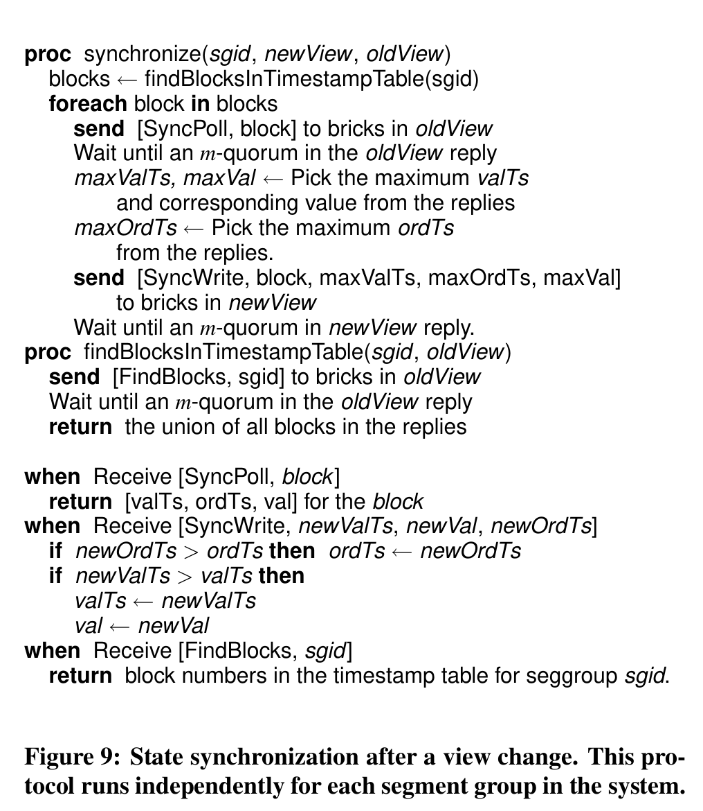

*Figure 9: State synchronization after a view change. This protocol runs independently for each segment group in the system.*

> *图 9：视图变更后的状态同步。该协议针对系统中每个段组独立运行。*

After the state synchronization finishes, the reconfiguration leader sends out a `RemoveView` message to let bricks discard the old view. When the reconfiguration leader dies during state synchronization, another brick will restart the view-agreement protocol. However, the blocks already synchronized by the former leader need not be re-synchronized again, and the total amount of synchronization needed after a failure stays constant even when the protocol restarts.

> 状态同步完成后，重配置领导者发出 `RemoveView` 消息，让砖块丢弃旧视图。如果重配置领导者在状态同步期间停止运行，另一块砖块会重新启动视图协商协议。不过，前一位领导者已经同步的块无需再同步。因此，即使协议重启，故障后需要执行的同步总量仍保持不变。

An I/O coordinator learns the list of active views in the seggroup by initially assuming that all bricks in the seggroup are alive. When a storage brick notices that the coordinator’s knowledge of the views is stale, it piggybacks its own view list on the reply. The coordinator updates its active-view list transitively, until it receives replies for the I/O request from an *m-quorum* of every view in the list.

> I/O 协调器最初假设段组内所有砖块都存活，并以此获得段组的活动视图列表。当存储砖块发现协调器对视图的认识已过时时，它会在回复上附带自己的视图列表。协调器传递式地更新活动视图列表，直到它针对这次 I/O 请求，收到列表中每个视图的一个 *m-quorum* 的回复。

### 5.3 Streamlining Synchronization｜精简同步

The basic algorithm described so far can, in fact, be vastly optimized in many of the common situations. We describe two techniques used in FAB.

> 在很多常见情况下，前面介绍的基本算法其实可以大幅优化。下面介绍 FAB 使用的两种技术。

#### 5.3.1 Exploiting the Quorum-Containment Property｜利用 quorum 包含性质

Quorum containment happens when every quorum in the old view is a superset of another quorum in the new view. We can skip block synchronization altogether if this condition is satisfied. This happens, in particular, when a brick fails in a two-brick view, as exemplified in step (6) of Figure 8.

> 如果旧视图中的每个 quorum 都是新视图中某个 quorum 的超集，就出现了 quorum 包含。满足这个条件时，我们可以完全跳过块同步。尤其是在两砖块视图中有一块砖块故障时，就会出现这种情况，如图 8 的步骤 (6) 所示。

#### 5.3.2 Embedding the Respondents in the Timestamp Table｜在时间戳表中嵌入响应者

We piggyback additional information on the optional third background phase of the “write” request (Section 4.3) to let each storage brick remember the set of bricks that have successfully executed the second Write phase. This set is stored in the timestamp table, in-line with the timestamps for the block.

> 我们在“写”请求可选的第三个后台阶段（第 4.3 节）中附带额外信息，让每块存储砖块记住成功执行第二个 Write 阶段的砖块集合。该集合与块的时间戳内联存放在时间戳表中。

This information can be used to distinguish blocks in the timestamp table that need to be synchronized before the old view can be removed (called the “must” blocks), and those blocks that could wait (“may” blocks). Specifically, in the `FindBlocks` phase in Figure 9, each brick returns a block as “must” only when the respondents set is not a quorum of the new view. If the set is a quorum of, but not the superset of, the new view, then the block is returned as “may” (“may” blocks are still synchronized so that bricks can remove entries from the timestamp tables; Section 4.3). Otherwise, the block need not be synchronized at all. This technique often allows the system to remove an old view very quickly and then synchronize “may” blocks at a leisurely speed. We will examine the effect of this technique in Section 7.5.

> 这些信息可用来区分时间戳表中的两类块：一类必须在移除旧视图前同步，称为“必须（must）”块；另一类可以等待，称为“可以（may）”块。具体来说，在图 9 的 `FindBlocks` 阶段，只有当响应者集合不是新视图的 quorum 时，砖块才会把某个块标记为“must”返回。如果该集合是新视图的 quorum，但不是新视图的超集，则把块标记为“may”返回（仍会同步“may”块，以便砖块能删除时间戳表条目；见第 4.3 节）。其他情况下，该块完全无需同步。这项技术往往能让系统很快移除旧视图，之后再不紧不慢地同步“may”块。第 7.5 节将检验这项技术的效果。

### 5.4 Handling Permanent Changes｜处理永久变更

The mechanisms described in the previous section can also be used to remove bricks permanently or add bricks to the system. To handle such events, the system administrator chooses a random brick as the reconfiguration leader and informs it that a failed brick has no hope of recovering. For each affected seggroup, the leader runs the dynamic-voting protocol and creates a new view that excludes the dead brick and adds a new brick. After the old view is removed, the leader issues a Paxos update to change the seggroup entry of the global metadata. The newly added brick performs the whole-seggroup synchronization, copying every block, not just those in the timestamp tables.

> 上一节介绍的机制也可以用来永久移除砖块，或向系统加入砖块。为处理这类事件，系统管理员随机选择一块砖块作为重配置领导者，并通知它，某块故障砖块已经不可能恢复。对每个受影响的段组，领导者运行动态投票协议，创建一个排除已死砖块、加入新砖块的新视图。移除旧视图后，领导者发出一次 Paxos 更新，修改全局元数据中的段组条目。新加入的砖块会对整个段组执行同步，复制每个块，而不只是时间戳表中的块。

## 6. Choosing the Right Redundancy Schemes｜选择合适的冗余方案

The main trade-offs between replication and erasure coding involve reliability, capacity efficiency, and performance. Figure 10 compares the expected mean time to data loss (MTTDL) of a cluster composed of bricks with 3TB capacity each. In order to achieve our goal of 10,000 years MTTDL, we need at least 3 bricks per logical block using replication. The primary reasons the system requires such a high degree of replication are the use of failure-prone commodity components [4, 3], and the size of the system. A FAB system with a 256TB logical capacity can have over 100 bricks, and the number of combinations of brick failures that can lead to data loss increases with the number of bricks.

> 复制与纠删码之间的主要取舍涉及可靠性、容量效率和性能。图 10 比较了一个集群的预期数据丢失前平均时间（MTTDL），该集群中每块砖块的容量为 3TB。为实现 MTTDL 达到 10,000 年的目标，采用复制时，每个逻辑块至少需要 3 块砖块。系统需要如此高复制度的主要原因，是它使用了容易故障的普通组件 [4, 3]，而且系统规模很大。一个逻辑容量为 256TB 的 FAB 系统可以有 100 块以上的砖块；砖块越多，可能导致数据丢失的砖块故障组合数也越多。

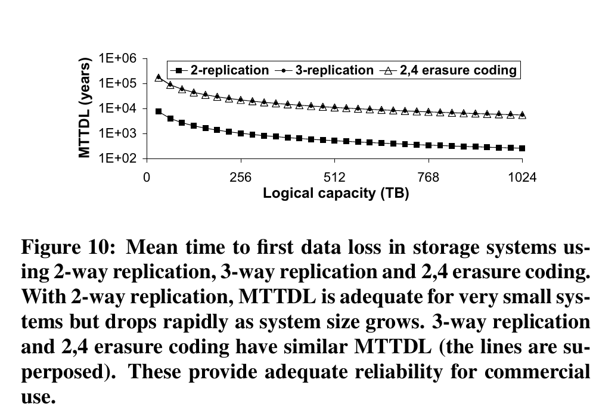

*Figure 10: Mean time to first data loss in storage systems using two-way replication, three-way replication and 2,4 erasure coding. With two-way replication, MTTDL is adequate for very small systems but drops rapidly as system size grows. Three-way replication and 2,4 erasure coding have similar MTTDL (the lines are superposed). These provide adequate reliability for commercial use.*

> *图 10：采用两副本、三副本和 2,4 纠删码的存储系统，首次发生数据丢失前的平均时间。采用两副本时，MTTDL 对很小的系统足够，但会随系统规模增长迅速下降。三副本和 2,4 纠删码的 MTTDL 相近（曲线重合），都可为商用提供足够的可靠性。*

Erasure coding can gain higher capacity efficiency than replication, since an *m,n* erasure coding provides reliability similar to $(n-m+1)$-way replication. For example, a system based on 2,4 erasure coding provides similar reliability to three-way replication, but uses the same raw capacity as two-way replication. The capacity efficiency of erasure-coding-based systems comes at some cost in performance for four main reasons. First, Reed-Solomon encoding and decoding itself consumes CPU cycles. Second, there are fewer disk spindles per logical capacity. Third, a small (strip) write engenders $2(n-m+1)$ disk I/Os in *m,n* erasure coding, as opposed to $(n-m+1)$ I/Os for the comparable $(n-m+1)$-way replication. Fourth, each request must collect replies from an *m-quorum*, and the latency is determined by the slowest bricks in the quorum. We will quantify the erasure-coding overhead in the next section.

> 纠删码可以比复制获得更高的容量效率，因为 *m,n* 纠删码的可靠性与 $(n-m+1)$ 副本相近。例如，基于 2,4 纠删码的系统与三副本具有相近的可靠性，但使用的原始容量与两副本相同。纠删码系统的容量效率要付出一定性能代价，主要有四个原因。第一，Reed-Solomon 编码和解码本身会消耗 CPU 周期。第二，每单位逻辑容量可用的磁盘轴数较少。第三，*m,n* 纠删码中的一次小型（条带）写入会产生 $2(n-m+1)$ 次磁盘 I/O，而可比的 $(n-m+1)$ 副本只产生 $(n-m+1)$ 次 I/O。第四，每个请求必须从一个 *m-quorum* 收集回复，延迟由 quorum 中最慢的砖块决定。下一节将对纠删码开销进行定量分析。

## 7. Evaluation｜评估

We have implemented FAB on Linux. The prototype consists of 80,000 lines of C++ code, of which 25,000 lines are for the core replication, erasure-coding, and reconfiguration protocols. The global metadata and diskmap tables are implemented as in-memory tables backed up by Berkeley DB. We emulate NVRAM using a memory-mapped file. This simulated NVRAM is used for two purposes: the timestamp table (Section 4), and the write-back buffer cache. The buffer-cache size is set to 512MB.

> 我们在 Linux 上实现了 FAB。该原型由 80,000 行 C++ 代码构成，其中 25,000 行用于核心的复制、纠删码和重配置协议。全局元数据和磁盘映射表实现为内存表，后端由 Berkeley DB 备份。我们用内存映射文件模拟 NVRAM。这份模拟 NVRAM 有两个用途：保存时间戳表（第 4 节），以及充当回写缓冲区缓存。缓冲区缓存大小设为 512MB。

FAB is a user-space single-threaded program. It uses non-blocking I/O (`poll`) and the SCSI-generic driver [15] to multiplex low-level network and disk-I/O requests. This design can control resource usage more precisely than, say, using kernel threads. In particular, we run a lottery scheduler [34] for disk-request queue management to ensure that potentially bursty state-synchronization traffic uses only a fraction (5%) of the disk throughput. With our hardware, FAB is disk-bound; thus, ensuring fair-share accesses to disks suffices to ensure end-to-end fair share between different classes of traffic. We examine the effect of this mechanism in Section 7.5.

> FAB 是一个用户空间单线程程序。它使用非阻塞 I/O（`poll`）和 SCSI 通用驱动 [15]，对底层网络与磁盘 I/O 请求进行多路复用。与使用内核线程等做法相比，这种设计可以更精确地控制资源使用。具体来说，我们用抽签调度器 [34] 管理磁盘请求队列，保证可能呈突发状的状态同步流量只占磁盘吞吐量的一小部分（5%）。在我们的硬件上，FAB 受磁盘限制；因此，只要保证各类流量公平分享磁盘访问，就足以保证它们在端到端层面公平分享资源。第 7.5 节会检验这项机制的效果。

### 7.1 System Configurations｜系统配置

A cluster of PCs is used as bricks. Each machine is equipped with two 1GHz Pentium 3 CPUs,<sup>2</sup> 2GB of memory, three Seagate Cheetah 32GB SCSI disks (15K rpm, 3.6ms average seek time), and two Intel Gigabit Ethernet interfaces. They run Debian 3.0 with the Linux 2.4.24 kernel. On each brick, the first 6GB of one disk is used by the host Linux file system, and the remaining 90GB is used for FAB data. Up to 22 machines are used as FAB bricks, and an additional 7 machines are used to generate workloads.

> 实验用一个 PC 集群充当砖块。每台机器配有两颗 1GHz Pentium 3 CPU、<sup>2</sup> 2GB 内存、3 块 Seagate Cheetah 32GB SCSI 磁盘（15K rpm，平均寻道时间 3.6ms），以及两个 Intel 千兆以太网接口。它们运行 Debian 3.0 和 Linux 2.4.24 内核。在每块砖块上，其中一块磁盘的前 6GB 由主机 Linux 文件系统使用，剩余 90GB 用于 FAB 数据。实验最多使用 22 台机器作为 FAB 砖块，另外使用 7 台机器生成工作负载。

*2. Only one CPU per brick is actively used during the evaluation, because FAB is single-threaded.*

> *2. 由于 FAB 是单线程程序，评估期间每块砖块只有一颗 CPU 被实际使用。*

### 7.2 Application Performance｜应用性能

We first examine FAB’s baseline performance by running applications on a single client on seven different storage platforms. A run of the benchmark consists of three phases: (1) “untar” the Linux 2.6.1 source code, 177MB in size, to a target (ext3) file system [bulk write]; (2) “tar” the files back to the local file system [bulk read]; and (3) compile Linux on the target file system [a mix of computation, reads and writes]. To exclude the effect of the client-side buffer cache, we unmounted the target volume after each step (the unmount latency is included in the numbers).

> 我们先在七种不同存储平台上，用单个客户端运行应用，检查 FAB 的基线性能。一轮基准测试分为三个阶段：(1) 把 177MB 的 Linux 2.6.1 源代码“untar”到目标 ext3 文件系统［批量写］；(2) 把文件“tar”回本地文件系统［批量读］；(3) 在目标文件系统上编译 Linux［计算、读和写的混合负载］。为排除客户端缓冲区缓存的影响，我们在每个步骤后卸载目标卷（数据中包含卸载延迟）。

Table 1 shows the results. Overall, the performance of FAB with three-way replication is comparable with iSCSI+raw disk, proving that FAB’s extra protocol processing adds only a marginal overhead to end-to-end performance. Erasure-coded volumes are slower than replication for the reasons discussed in Section 6. The 2,4 code is slower than the 4,5 code because of the cost of erasure encoding and decoding: whereas the 4,5 (i.e., RAID-5) code is a simple bitwise XOR, the 2,4 code involves $GF(2^8)$ arithmetic that requires multiple table lookups for each byte. On our hardware, encoding or decoding 1KB of 2,4 erasure-coded blocks consumes 50μs of CPU time. Bulk reading (`tar`) over iSCSI is significantly slower than local disks. We believe that this is because the iSCSI client on Linux (we use the Cisco iSCSI initiator) does not prefetch data aggressively enough to keep reading disks sequentially.

> 表 1 给出了结果。总体来看，采用三副本的 FAB 性能与 iSCSI+裸磁盘相当，证明 FAB 额外的协议处理对端到端性能只增加了很小的开销。由于第 6 节讨论的原因，纠删编码卷比复制卷慢。2,4 码又比 4,5 码慢，原因是纠删编码和解码的成本：4,5 码（即 RAID-5）只需做简单的按位 XOR，2,4 码则涉及 $GF(2^8)$ 运算，每个字节都要查表多次。在我们的硬件上，对 1KB 的 2,4 纠删编码块做编码或解码，需消耗 50μs CPU 时间。通过 iSCSI 批量读取（`tar`）明显慢于本地磁盘。我们认为，原因是 Linux 上的 iSCSI 客户端（我们使用 Cisco iSCSI initiator）没有足够积极地预取数据，无法让磁盘保持顺序读取。

#### Table 1: End-to-End Application Latency｜表 1：应用程序端到端延迟

| Storage platform / 存储平台 | Untar | Tar | Compile |
| --- | ---: | ---: | ---: |
| Local disk | 21.76 | 14.80 | 318.9 |
| Local RAID 1 | 22.32 | 14.64 | 319.2 |
| iSCSI+raw disk | 24.21 | 24.32 | 323.9 |
| FAB (3-way replication) | 21.57 | 24.61 | 316.0 |
| FAB (2,4 erasure code) | 38.22 | 27.81 | 322.0 |
| FAB (4,5 erasure code) | 33.33 | 26.22 | 319.5 |
| FAB (3-way replication, no cache) | 28.34 | 26.13 | 327.0 |

*Table 1: End-to-end latency of application programs. The numbers are an average over three runs. “Local disk” and “Local RAID-1” use disks locally attached to the client. “iSCSI+raw disk” uses a remote iSCSI server accessing a local raw disk. “FAB” accesses data through FAB’s iSCSI gateway. “FAB (no cache)” shows FAB with its NVRAM buffer cache turned off.*

> *表 1：应用程序的端到端延迟。数值是三次运行的平均值。“Local disk”和“Local RAID-1”使用直接连接到客户端的磁盘。“iSCSI+raw disk”使用远程 iSCSI 服务器访问其本地裸磁盘。“FAB”通过 FAB 的 iSCSI 网关访问数据。“FAB (no cache)”表示关闭 NVRAM 缓冲区缓存的 FAB。*

### 7.3 Scalability｜可扩展性

To study how FAB’s throughput grows with size, we ran three types of synthetic workloads, because none of the real-world applications that we have can exert enough stress on FAB. The workload DB, modeled after SPC-1 [9],<sup>3</sup> simulates a database-transaction workload. DB uses three volumes. The first two are data volumes that receive uniformly random as well as database-index-accessing 4KB reads and writes. The third volume, whose size is 1/3 of the other two, receives sequential log writes of size 8KB to 64KB. Overall, DB issues requests with a read:write ratio of 4:6 and an average size of 8KB. We scaled the total logical-volume size to be $10N$ GB ($N$ is the number of bricks in the cluster)—e.g., in a 22-brick cluster, the two data volumes are 94GB each, and the log volume is 32GB. The other two workloads, r64k and w64k, are random 64KB read and write requests over a volume of size $25N$ GB. The request size of 64KB is taken from SPC-2’s proposed data-mining and video-on-demand workloads [9]. Each workload is generated by a total of $30N$ threads running in a closed queue with zero think time on seven client machines.

> 为研究 FAB 的吞吐量如何随规模增长，我们运行了三类合成工作负载，因为手头没有任何现实应用能给 FAB 施加足够压力。工作负载 DB 仿照 SPC-1 [9]<sup>3</sup> 设计，模拟数据库事务工作负载。DB 使用三个卷。前两个是数据卷，接收均匀随机和数据库索引访问式的 4KB 读写。第三个卷的大小是前两者的 1/3，接收大小从 8KB 到 64KB 的顺序日志写入。总体上，DB 发出的请求读写比为 4:6，平均大小为 8KB。我们把逻辑卷总大小按 $10N$ GB 伸缩（$N$ 为集群中的砖块数）。例如，在 22 块砖块的集群中，两个数据卷各为 94GB，日志卷为 32GB。另两种工作负载 r64k 和 w64k，会在大小为 $25N$ GB 的卷上发出随机 64KB 读、写请求。64KB 请求大小取自 SPC-2 提议的数据挖掘和视频点播工作负载 [9]。每种工作负载都由 7 台客户端机器上共计 $30N$ 个线程生成；线程在封闭队列中运行，思考时间为零。

*3. The primary difference between DB and SPC-1 is that SPC-1 defines an open-queue workload with a fixed request-arrival rate. DB changes it to run in a closed queue with zero think time to stress the system.*

> *3. DB 与 SPC-1 的主要区别是，SPC-1 定义了请求到达率固定的开放队列工作负载；DB 改为在封闭队列中运行，思考时间为零，以向系统施加压力。*

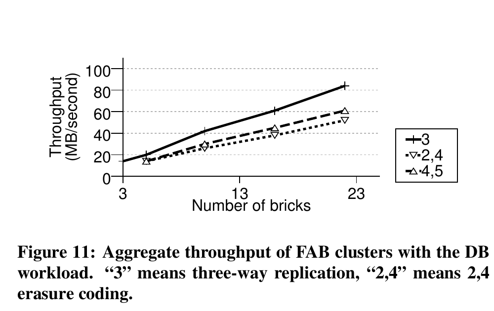

*Figure 11: Aggregate throughput of FAB clusters with the DB workload. “3” means three-way replication, “2,4” means 2,4 erasure coding.*

> *图 11：FAB 集群在 DB 工作负载下的聚合吞吐量。“3”表示三副本，“2,4”表示 2,4 纠删码。*

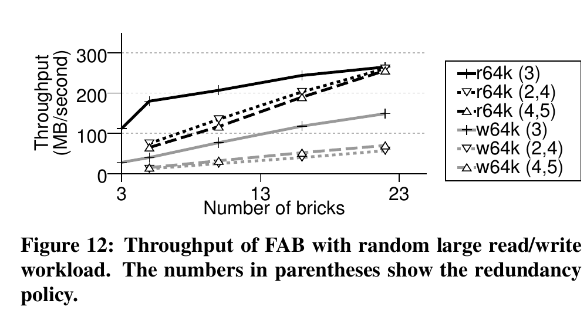

*Figure 12: Throughput of FAB with random large read/write workload. The numbers in parentheses show the redundancy policy.*

> *图 12：FAB 在随机大块读写工作负载下的吞吐量。括号内的数字表示冗余策略。*

Figures 11 and 12 show the results. Overall, as expected, FAB’s throughput scales linearly with the cluster size. The exception is 64KB random reads, which hit a ceiling due to the capacity limits of our Ethernet switches. Erasure-coded volumes sustain much lower throughput than their replicated counterparts, for the reasons discussed in Section 6.

> 图 11 和图 12 给出了结果。总体上，正如预期，FAB 吞吐量随集群规模线性扩展。例外是 64KB 随机读：它受到我们以太网交换机的容量限制，碰到了上限。由于第 6 节讨论的原因，纠删编码卷维持的吞吐量明显低于对应的复制卷。

### 7.4 Performance Decoupling｜性能解耦

This section compares our replication protocol to the master-slave protocol, the traditional method for replicating data across a network. We have built a variation of FAB that runs a master-slave protocol similar to Petal’s [22]. In this protocol, the dynamic-voting protocol is used to let bricks agree on the single master for each seggroup. Each I/O coordinator forwards the request to this master. For read requests, the master simply reads its local disk and returns the data to the coordinator. For write requests, the master broadcasts the new value to the replicas in the current view, waits for the replies from all of them, and then returns control back to the coordinator. Freed from timestamp maintenance, this protocol is far simpler than FAB’s.

> 本节把我们的复制协议与主从协议做比较，后者是通过网络复制数据的传统方法。我们构建了一个 FAB 变体，运行与 Petal [22] 类似的主从协议。在该协议中，动态投票协议用来让砖块就每个段组的唯一主节点达成一致。每个 I/O 协调器都把请求转发给该主节点。对读请求，主节点只需读本地磁盘，再把数据返回协调器。对写请求，主节点把新值广播给当前视图内的各副本，等待所有副本回复，再把控制权交还协调器。由于无需维护时间戳，该协议比 FAB 的协议简单得多。

Figure 13 shows the throughput of the two systems on the 22-brick cluster with three-way replication. Interestingly, for both DB and 64KB-random-write workloads, FAB outperforms the master-slave protocol. This is due to the performance-decoupling effect of the voting protocols [24]—specifically, FAB can ignore slow bricks by collecting replies only from a majority. Performance decoupling is especially effective in a disk-bound system like FAB in which disk accesses, especially NVRAM flushing, often generate bursty disk traffic that slows the brick down for a short period of time. The performance-decoupling effect is visible especially for smaller clusters, in which a single overloaded brick can have a large impact on the overall performance. On the other hand, for 64KB-random-read workloads, the master-slave protocol slightly outperforms FAB in a large cluster due to its simplicity, although this is offset by FAB’s ability to read blocks from idle bricks (Section 4.4). These effects can also be observed in the latency distribution as shown in Figure 14.

> 图 13 展示了两种系统在 22 砖块、三副本集群上的吞吐量。有意思的是，在 DB 和 64KB 随机写工作负载下，FAB 都超过了主从协议。原因是投票协议的性能解耦效应 [24]：具体来说，FAB 只从多数砖块收集回复，因而可以忽略慢砖块。在 FAB 这种受磁盘限制的系统中，性能解耦特别有效：磁盘访问，尤其是 NVRAM 刷新，常常会产生突发磁盘流量，使砖块短时间变慢。在较小的集群中，单块过载砖块可能对整体性能产生很大影响，所以性能解耦效果尤为明显。另一方面，对 64KB 随机读工作负载，由于主从协议更简单，它在大型集群中的性能略高于 FAB；不过 FAB 能从空闲砖块读取数据块（第 4.4 节），抵消了这一劣势。这些效应在图 14 所示的延迟分布中也能看到。

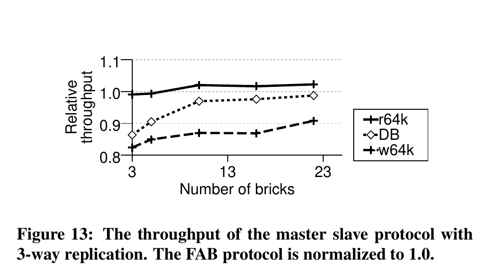

*Figure 13: The throughput of the master-slave protocol with three-way replication. The FAB protocol is normalized to 1.0.*

> *图 13：三副本下主从协议的吞吐量。FAB 协议归一化为 1.0。*

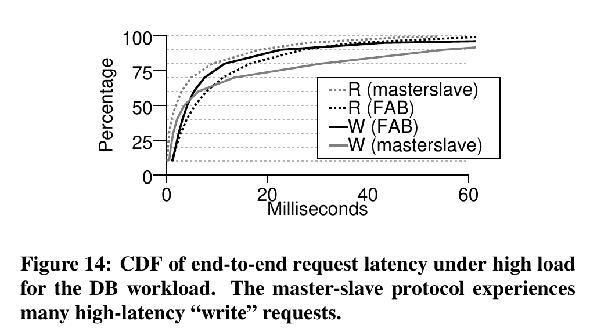

*Figure 14: CDF of end-to-end request latency under high load for the DB workload. The master-slave protocol experiences many high-latency “write” requests.*

> *图 14：DB 工作负载在高负载下的端到端请求延迟累积分布函数。主从协议出现了许多高延迟“写”请求。*

### 7.5 Handling Changes｜处理变更

This section studies how FAB handles changes to the system. We start a 22-brick cluster with three-way replication, run the DB workload, and artificially introduce brick failures or recoveries. Figure 15 shows the throughput transition when one brick fails and recovers three minutes later. The brick failure causes a reconfiguration protocol to run, which causes bricks in the affected seggroup to scan their timestamp tables. The CPU overhead of this timestamp-table scan is the reason for the small drop in throughput. No state synchronization is required, however, because for every seggroup affected by the failure, the two bricks that form the new view are already consistent. The system throughput does not decrease noticeably during the crash period, because DB is a write-intensive workload—each remaining brick handles the same amount of write traffic per request. After the recovery, another timestamp-table scan happens. Virtually no “must” blocks (Section 5.3.2) will be found, however, as the “write” requests issued during the crash period to an affected seggroup will be written to the remaining two, and these two form a quorum in the new, full view. Thus, the old-view removal happens nearly instantaneously after recovery. The synchronization of the “may” blocks, i.e., copying blocks written during the crash period to the recovered brick, happens slowly in the background over the next 2.5 minutes, due to the lottery scheduling. Overall, no client-visible I/O error happens during the run. Note that our current client software cannot handle session termination gracefully; thus, for the experiments in this section, we set up the clients not to use failed brick(s) as I/O coordinators.

> 本节研究 FAB 如何处理系统变更。我们启动一个有 22 块砖块、采用三副本的集群，运行 DB 工作负载，并人为引入砖块故障或恢复。图 15 展示了一块砖块故障、三分钟后恢复时的吞吐量变化。砖块故障会触发重配置协议，让受影响段组中的砖块扫描时间戳表。扫描时间戳表的 CPU 开销，导致吞吐量小幅下降。但系统无需执行状态同步，因为对每个受故障影响的段组来说，组成新视图的两块砖块已经一致。崩溃期间，系统吞吐量没有明显下降，因为 DB 是写密集型工作负载，每个请求在剩余每块砖块上产生的写流量不变。砖块恢复后，系统会再扫描一次时间戳表。但几乎不会找到“must”块（第 5.3.2 节），因为崩溃期间向受影响段组发出的“写”请求，会写入剩下的两块砖块，而这两块在新的完整视图中构成一个 quorum。因此，恢复后几乎能立即移除旧视图。由于抽签调度，“may”块的同步——即把崩溃期间写入的块复制到已恢复的砖块——在随后 2.5 分钟里于后台慢慢进行。整个运行过程中没有发生客户端可见的 I/O 错误。需要注意，我们当时的客户端软件无法妥善处理会话终止；因此，在本节的实验中，我们配置客户端，使其不使用故障砖块作为 I/O 协调器。

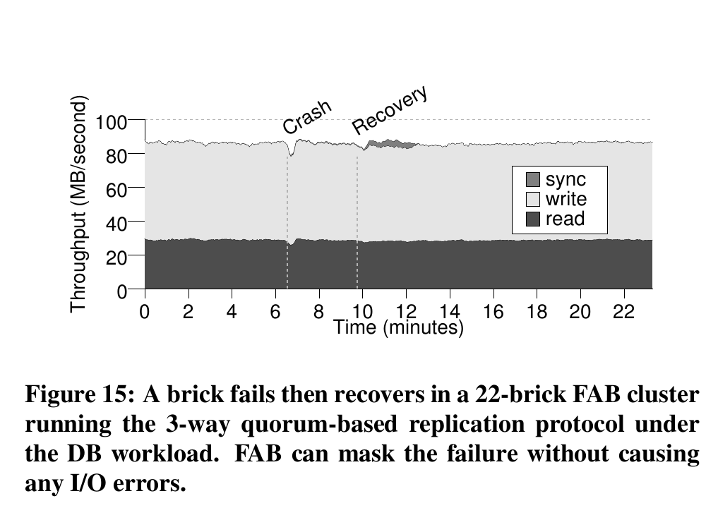

*Figure 15: A brick fails then recovers in a 22-brick FAB cluster running the three-way quorum-based replication protocol under the DB workload. FAB can mask the failure without causing any I/O errors.*

> *图 15：一个 22 砖块 FAB 集群在 DB 工作负载下运行基于 quorum 的三副本协议，其中一块砖块先故障、后恢复。FAB 可以遮蔽该故障，不产生任何 I/O 错误。*

In contrast, Figure 16 shows the same scenario, but using the master-slave replication protocol. After the failure and recovery, the throughput drops, not because of timestamp scanning but because “write” requests to seggroups that contain the failed brick abort until the new view is formed 10 seconds later. This is evident from the “error” marks in the graph. The performance drop is suppressed in this graph, because our DB workload generator does not initiate the recovery activities, e.g., device resetting and database-log recovery, that usually happen after I/O failures—the clients simply retry after waiting for a second.

> 相比之下，图 16 展示了使用主从复制协议的同一场景。故障和恢复后，吞吐量下降，原因并不是扫描时间戳，而是针对包含故障砖块的段组的“写”请求，都会中止，直到 10 秒后新视图形成。图中的“error”标记清楚地显示了这一点。这张图中的性能降幅其实被压低了，因为我们的 DB 工作负载生成器不会启动 I/O 故障后常见的恢复活动，例如重置设备和恢复数据库日志；客户端只是等待一秒后重试。

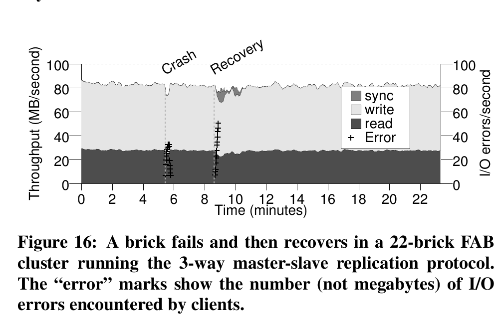

*Figure 16: A brick fails and then recovers in a 22-brick FAB cluster running the three-way master-slave replication protocol. The “error” marks show the number (not megabytes) of I/O errors encountered by clients.*

> *图 16：一个 22 砖块 FAB 集群运行三副本主从复制协议，其中一块砖块先故障、后恢复。“error”标记显示客户端遇到的 I/O 错误数量（不是兆字节数）。*

Figure 17 shows a double-failure scenario for FAB’s quorum protocol. Two bricks fail within two minutes and then recover. After the second failure, there is a single seggroup in the system whose view size changes from two to one. This causes requests to this seggroup to abort until the new view is formed (the quorum size of a two-brick view is always two). Recovery causes a little more disruption, because the amount of state that needs to be synchronized doubles. However, after about 5 minutes, state synchronization finishes and the throughput is restored back to the original level.

> 图 17 展示了 FAB quorum 协议的双重故障场景。两块砖块在两分钟内先后故障，然后恢复。第二次故障后，系统中有一个段组的视图大小从 2 变为 1。在新视图形成前，针对该段组的请求都会中止（两砖块视图的 quorum 大小始终为 2）。恢复造成的干扰略大，因为需要同步的状态量增加了一倍。不过，约 5 分钟后，状态同步完成，吞吐量恢复到原来的水平。

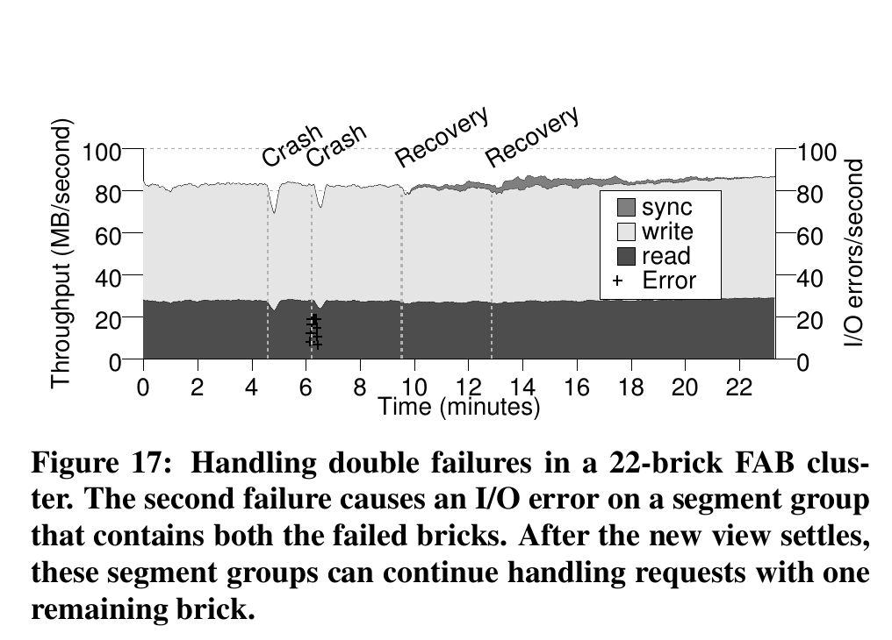

*Figure 17: Handling double failures in a 22-brick FAB cluster. The second failure causes an I/O error on a segment group that contains both the failed bricks. After the new view settles, these segment groups can continue handling requests with one remaining brick.*

> *图 17：在 22 砖块 FAB 集群中处理双重故障。第二次故障使同时包含两块故障砖块的某个段组出现 I/O 错误。新视图稳定后，这些段组可以用剩下的一块砖块继续处理请求。*

Figure 18 shows FAB’s reaction to permanent failures. A brick fails, and is declared permanently dead four minutes later. For each seggroup that includes the dead brick, another brick replaces the dead one. These newly added bricks need to copy the existing data, which consumes a steady portion of the disk traffic. No I/O errors occur during this scenario. With DB running at full speed, as in this picture, it takes about 1.5 hours to fully bring the new bricks up to date. Without any foreground traffic, the disk synchronization finishes after 25 minutes.

> 图 18 展示了 FAB 对永久故障的反应。一块砖块故障，四分钟后被宣告永久死亡。对每个包含该死亡砖块的段组，系统都用另一块砖块替换它。这些新加入的砖块需要复制现有数据，持续占用一部分磁盘流量。在这个场景中没有发生 I/O 错误。如图所示，当 DB 以全速运行时，让新砖块完全追平数据大约需要 1.5 小时。如果没有任何前台流量，磁盘同步可在 25 分钟后完成。

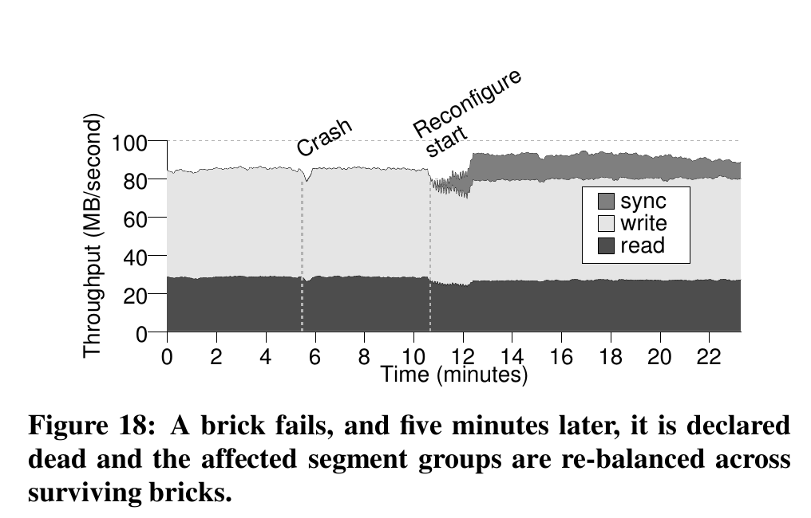

*Figure 18: A brick fails, and five minutes later, it is declared dead and the affected segment groups are re-balanced across surviving bricks.*

> *图 18：一块砖块故障，五分钟后被宣告死亡，受影响的段组随后在存活砖块之间重新平衡。*

## 8. Conclusion｜结论

This paper has described the design, implementation, and evaluation of FAB. FAB achieves two key requirements of enterprise storage systems, stable, continuous service and high reliability, using two new mechanisms. First, it uses a voting-based protocol to guarantee linearizable accesses to replicated or erasure-coded logical blocks. This protocol transparently masks failures, and offers better throughput than traditional master-slave replication by masking temporary overload conditions. Second, FAB deploys a dynamic quorum-reconfiguration protocol to allow the system to react to brick additions or decommissioning without disrupting clients.

> 本文介绍了 FAB 的设计、实现与评估。FAB 通过两种新机制，满足企业存储系统的两项关键要求：稳定、持续的服务，以及高可靠性。第一，它使用基于投票的协议，保证对复制或纠删编码逻辑块的访问可线性化。该协议透明遮蔽故障，还能通过遮蔽临时过载状态，提供比传统主从复制更高的吞吐量。第二，FAB 部署了动态 quorum 重配置协议，让系统能对砖块加入或退役作出反应，而不干扰客户端。

## Acknowledgements｜致谢

We thank Marcos Aguilera, Minwen Ji, Beth Keer, Hernan Laffitte, Craig Soules, and John Wilkes for their help and input to the project.

> 我们感谢 Marcos Aguilera、Minwen Ji、Beth Keer、Hernan Laffitte、Craig Soules 和 John Wilkes 对本项目的帮助与投入。

## 9. References｜参考文献

1. Atul Adya, William J. Bolosky, Miguel Castro, Gerald Cermak, Ronnie Chaiken, John R. Douceur, Jon Howell, Jacob R. Lorch, Marvin Theimer, and Roger P. Wattenhofer. FARSITE: Federated, available, and reliable storage for an incompletely trusted environment. In *5th Symp. on Op. Sys. Design and Impl. (OSDI)*, Boston, MA, USA, December 2002.
2. Marcos K. Aguilera and Svend Frølund. Strict linearizability and the power of aborting. Technical Report HPL-2003-241, HP Labs, December 2003.
3. Dave Anderson, John Dykes, and Erik Riedel. More than an interface—SCSI vs. ATA. In *USENIX Conf. on File and Storage Technologies (FAST)*, San Francisco, CA, March 2003.
4. Satoshi Asami. Reducing the cost of system administration of a disk storage system built from commodity components. PhD thesis, University of California, Berkeley, May 2000. Tech. Report no. UCB-CSD-00-1100.
5. Hagit Attiya, Amotz Bar-Noy, and Danny Dolev. Sharing memory robustly in message-passing systems. *Journal of the ACM (JACM)*, 42(1):124–142, 1995.
6. Pei Cao, Swee Boon Lin, Shivakumar Venkataraman, and John Wilkes. The TickerTAIP parallel RAID architecture. *ACM Trans. on Comp. Sys. (TOCS)*, 12(3):236–269, 1994.
7. Peter M. Chen, Edward K. Lee, Garth A. Gibson, Randy H. Katz, and David A. Patterson. RAID: High-performance, reliable secondary storage. *ACM Computing Surveys*, 26(2):145–185, 1994.
8. Flaviu Christian and Frank Schmuck. Agreeing on processor group membership in asynchronous distributed systems. Technical Report CSE95-428, UC San Diego, 1995.
9. Storage Performance Council. SPC Benchmark 1 specification. <http://www.storageperformance.org/>, 2003.
10. S. Frølund, A. Merchant, Y. Saito, S. Spence, and A. Veitch. FAB: Enterprise storage systems on a shoestring. In *8th Workshop on Hot Topics in Operating Systems (HOTOS-VIII)*, pages 169–174, Kauai, HI, USA, May 2003.
11. Svend Frølund, Arif Merchant, Yasushi Saito, Susan Spence, and Alistair Veitch. A decentralized algorithm for erasure-coded virtual disks. In *Int. Conf. on Dependable Systems and Networks (DSN)*, pages 125–134, Florence, Italy, June 2004.
12. Gregory R. Ganger, John D. Strunk, and Andrew J. Klosterman. Self-* storage: Brick-based storage with automated administration. Technical Report CMU-CS-03-178, Carnegie Mellon University, August 2003.
13. Garth A. Gibson, David F. Nagle, Khalil Amiri, Jeff Butler, Fay W. Chang, Howard Gobioff, Charles Hardin, Erik Riedel, David Rochberg, and Jim Zelenka. A cost-effective, high-bandwidth storage architecture. In *8th Int. Conf. on Arch. Support for Prog. Lang. and Op. Sys. (ASPLOS-VIII)*, pages 92–103, San Jose, CA, USA, October 1998.
14. David Gifford. Weighted voting for replicated data. In *7th Symp. on Op. Sys. Principles (SOSP)*, pages 150–162, Pacific Grove, CA, USA, December 1979.
15. Douglas Gilbert. The Linux SCSI generic HOWTO. <http://www.torque.net/sg/p/sg_v3_ho.html>, 2003.
16. Garth R. Goodson, Jay J. Wylie, Gregory R. Ganger, and Michael K. Reiter. Efficient consistency for erasure-coded data via versioning servers. Technical Report CMU-CS-03-127, Carnegie Mellon University, April 2003.
17. Maurice P. Herlihy and Jeannette M. Wing. Linearizability: a correctness condition for concurrent objects. *ACM Trans. on Prog. Lang. and Sys. (TOPLAS)*, 12(3):463–492, July 1990.
18. Andy Huang and Armando Fox. Dstore: self-managing, crash-only persistent hash table. <http://swig.stanford.edu/public/projects/dstore/>, 2004.
19. IBM. IceCube: storage server for the Internet age. <http://www.almaden.ibm.com/cs/storagesystems/IceCube/>, 2003.
20. Leslie Lamport. The part-time parliament. *ACM Trans. on Comp. Sys. (TOCS)*, 16(2):133–169, 1998.
21. Leslie Lamport. Paxos made simple. *ACM SIGACT News*, 32(4):18–25, December 2001.
22. Edward K. Lee and Chandramohan A. Thekkath. Petal: distributed virtual disks. In *7th Int. Conf. on Arch. Support for Prog. Lang. and Op. Sys. (ASPLOS-VII)*, pages 84–92, Cambridge, MA, USA, October 1996.
23. LeftHand Networks. IP-based storage area networks. <http://www.lefthandnetworks.com/downloads/ip-san_wp.pdf>, 2002.
24. Benjamin C. Ling, Emre Kiciman, and Armando Fox. Session state: beyond soft state. In *1st Symp. on Network Sys. Design and Impl. (NSDI)*, pages 295–308, San Francisco, CA, USA, March 2004.
25. Barbara Liskov, Liuba Shrira, and John Wroclawski. Efficient at-most-once messages based on synchronized clocks. *ACM Trans. on Comp. Sys. (TOCS)*, 9(2):125–142, 1991.
26. Esti Yeger Lotem, Idit Keidar, and Danny Dolev. Dynamic voting for consistent primary components. In *16th Symp. on Princ. of Distr. Comp. (PODC)*, pages 63–71, Santa Barbara, CA, USA, August 1997.
27. Nancy A. Lynch and Alex A. Shvartsman. RAMBO: A reconfigurable atomic memory service for dynamic networks. In *16th Int. Conf. on Dist. Computing (DISC)*, pages 173–190, Toulouse, France, October 2002.
28. David L. Mills. Improved algorithms for synchronizing computer network clocks. In *ACM SIGCOMM*, pages 317–327, London, United Kingdom, September 1994.
29. Brian Oki and Barbara Liskov. Viewstamped replication: A new primary copy method to support highly available distrbuted systems. In *7th Symp. on Princ. of Distr. Comp. (PODC)*, pages 8–17, Toronto, ON, Canada, August 1988.
30. James S. Plank. A tutorial on Reed-Solomon coding for fault-tolerance in RAID-like systems. *Software—Practice and Experience*, 27(9):995–1012, 1997.
31. Sean Reah, Patrik Eaton, Dennis Geels, Hakim Weatherspoon, Ben Zhao, and John Kubiatowicz. Pond: the OceanStore prototype. In *USENIX Conf. on File and Storage Technologies (FAST)*, pages 1–14, San Francisco, CA, March 2003.
32. Julian Satran, Kalman Meth, Constantine Sapuntzakis, Mallikarjun Chadalapaka, and Efri Zeidner. RFC3720: Internet small computer systems interface (iSCSI). <http://www.faqs.org/rfcs/rfc3720.html>, 2004.
33. Josh Tseng, Kevin Gibbons, Franco Travostino, Curt Du Laney, and Joe Souza. Internet storage name service (iSNS), draft version 18. <http://www.diskdrive.com/reading-room/standards.html>, March 2003.
34. Carl A. Waldspurger and William E. Weihl. Lottery scheduling: Flexible propotional-share resource management. In *1st Symp. on Op. Sys. Design and Impl. (OSDI)*, pages 1–11, Monterey, CA, USA, November 1994.
35. Avishai Wool. Quorum systems in replicated databases: science or fiction? *Bull. IEEE Technical Committee on Data Engineering*, 21(4):3–11, December 1998.

> 以上参考文献按论文原文保留；原文中的书名、会议名、拼写和网址均未改写。
