## 阅读须知

严格地说，下面的内容并不处于同一逻辑层级，不能一律称为"公理"：

- 有些是经过严格证明的**不可能性定理**（FLP、CAP、两将军）；
- 有些是"何时可以不协调"的**充要刻画**（CALM、I-Confluence）；
- 有些是带明确模型前提的**下界与权衡**（SNOW、Attiya–Welch、共识数层级）；
- 有些是**可实现性构造**（ABD、Paxos、CRDT）；
- 有些是帮助理解问题的**思想实验**（拜占庭将军、哲学家就餐）；
- 有些是长期工程实践沉淀的**设计原则与戒律**（端到端原则、八大谬误）；
- 有些只是**轶事与事故公案**（阿尔巴尼亚将军、闰秒、僵尸领导者）。
---

## 〇、元层：三件工具，读懂后面所有条目

这一节不是结论，而是**读懂结论所需的语法**。跳过它，后面的定理会被误读成口号。

### 0.1 安全性—活性分解：坏事不能发生，好事最终要发生

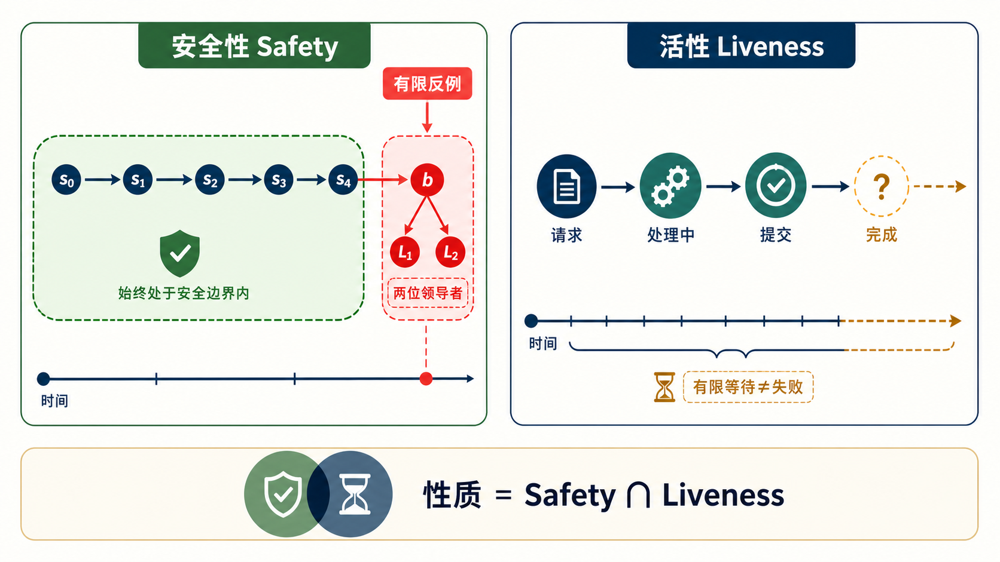

**出处**：Bowen Alpern 与 Fred Schneider[《Defining Liveness》](https://doi.org/10.1016/0020-0190(85)90056-0)，*Information Processing Letters* 21(4):181–185，1985；[《Recognizing Safety and Liveness》](https://doi.org/10.1007/BF01782772)，*Distributed Computing* 2(3):117–126，1987。

**内容**：**安全性（Safety）**断言"坏事永不发生"——不会出现两个合法 Leader、不会重复扣款、事务不会提交一半。它的反例是**有限执行前缀**：一旦发生，当场可判定被违反。**活性（Liveness）**断言"好事最终发生"——请求最终返回、Leader 最终选出、事务最终结束。任何有限时间的等待都**不足以**证明活性已永久失败。Alpern–Schneider 进一步证明：在相应形式化框架中，任何性质都可分解为一个安全性性质与一个活性性质的交。

**思考**：这是本文最重要的一条前置词汇。**FLP 限制的是终止性（活性），而不是说系统连一致性（安全性）都维持不住。** 所有严肃的协议说明都应分别记账：哪些安全性质**无条件**成立，哪些活性性质**在什么条件下**最终成立。把两者混为一谈，是"CAP 三选二""FLP 说共识不可能"这类误读的总源头。

### 0.2 不可区分性论证：局部观察相同，就不能要求作出不同决定

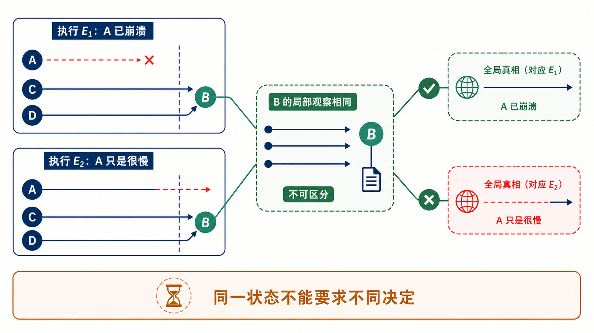

**出处**：作为方法论的系统总结见 Nancy Lynch[《A Hundred Impossibility Proofs for Distributed Computing》](https://dblp.org/rec/conf/podc/Lynch89)，PODC 1989 特邀综述——该文梳理了当时约一百个不可能性与下界结果，并指出它们共享同一内核：**局部知识的局限**。

**内容**：构造两个全局真相不同的执行 E₁、E₂：在 E₁ 中节点 A 已崩溃，在 E₂ 中 A 只是很慢。若节点 B 截至此刻收到的消息、经历的状态、本地时钟读数**完全相同**，则这两个执行对 B 而言**不可区分**。确定性算法不能要求 B 在相同本地状态下一次判"死"、一次判"活"。于是：无论 B 怎么决定，总会在其中一个执行里出错。

**思考**：如果只记一个词来理解整个第一类，就记 **indistinguishability(不可区分性)**。两将军（分不清消息丢没丢）、FLP（分不清慢还是死）、拜占庭（分不清谁在撒谎）、完美故障检测器（同 FLP）、exactly-once（分不清丢的是请求还是响应）、匿名选主（分不清我和对称的你）——**六条看似独立的不可能性，是同一句话的六个投影**。分布式的根本困难通常不是"消息不够多"，而是**局部观察不足以唯一确定全局事实**。

### 0.3 公共知识与知识前提原则：要做什么动作，就必须知道什么事实

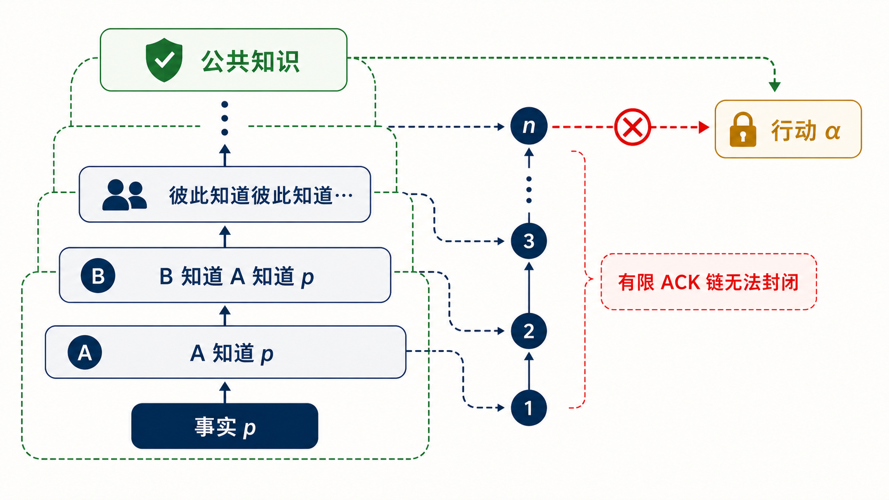

**出处**：Joseph Halpern 与 Yoram Moses[《Knowledge and Common Knowledge in a Distributed Environment》](https://dblp.org/rec/journals/jacm/HalpernM90)，JACM 37(3):549–587，1990（PODC 1984 首发），1997 年 Gödel 奖；知识前提原则见 Yoram Moses[《Relating Knowledge and Coordinated Action: The Knowledge of Preconditions Principle》](https://dblp.org/rec/conf/tark/Moses15)，TARK 2015。

**内容**："所有人都知道 p"与"p 是**公共知识**"不是一回事。公共知识要求：每个人知道 p，且每个人知道每个人知道 p，且……无限递归。**知识前提原则**：若事实 φ 是正确执行动作 α 的必要条件，则"执行者知道 φ"也必须是执行 α 的必要条件。当动作要求多节点严格同时或相互依赖地执行时，所需知识往往上升为公共知识。

**思考**：它把"为什么协调这么贵"从直觉变成可推导的命题。协调成本本质上是在**购买知识**：ACK 购买"对方已收到"，quorum 购买"新旧历史必然相交"，共识日志购买"全局决定序列"，fencing token 购买"权限世代"，TrueTime 等待购买"真实时间顺序"。两将军之所以无解，根本原因不是 ACK 层数不够，而是**不可靠通信无法通过有限轮次建立公共知识**。

---

## 一、不可能性结果

### 1.1 两将军问题

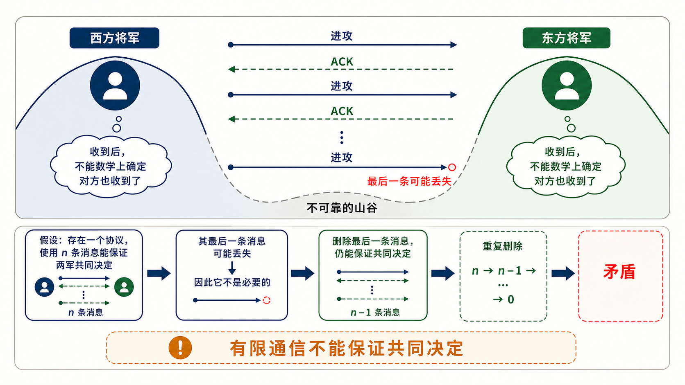

**出处**：最早见于 E. A. Akkoyunlu、K. Ekanadham、R. V. Huber[《Some Constraints and Trade-offs in the Design of Network Communications》](https://dblp.org/rec/conf/sosp/AkkoyunluEH75)，SOSP 1975（原始场景是两伙黑帮约定作案时间）；Jim Gray 在《Notes on Data Base Operating Systems》（1978）中将其命名为 "Two Generals Paradox"。

> **订正**：本条常被误挂在 Leslie Lamport 名下。两将军**不是** Lamport 的工作，与拜占庭将军问题（1980/1982）没有作者关系。

**内容**：两军必须同时进攻方能取胜，通信靠信使穿越敌区，可能被截。A 发"明日进攻"后无法确认 B 收到；B 回 ACK 后无法确认 A 收到 ACK……确认链无限递归。结论：**在可能丢消息的信道上，不存在经有限次交换即可保证双方达成一致的确定性协议**。归纳证明：若 n 条消息的协议可行，则最后一条（可能丢失）必非必需，可删；递降至 0 条仍可行——矛盾。

**思考**：TCP 三次握手、重试、超时都没有推翻它——它们提供的是工程概率、状态机边界与资源管理语义，而非数学意义上的无限层级共同确认。它是所有"网络不可靠"类不可能性的母题。

这个论证的逻辑大白话来讲是这样的，我们把“进攻“和“同意进攻“都抽象为ACK。那么在两侧，就只有“发送方“和“接收方“两种角色，左右两将军轮流扮演发送方和接收方。当左将军发出最后一条ACK，也就是第n条ACK后无需回应，即可进攻的时候。那么第n条消息对于左将军来说，是无意义的消息，不必发，因为这个时候无论右将军无论收到没收到，左右将军都将进攻(这个源于题干假设，n条发送后，达成共识)。那么，即说明n-1条消息，也是可行的。这个时候就是右将军是发送方，左将军是接受方了。这样最终递推的结论就是一条消息都不用发，二者立刻即共同发起进攻。也就是两将军心有灵犀，但这是不可能的。所以不存在一个n条消息的可行协议。

### 1.2 拜占庭将军问题与 n ≥ 3f+1

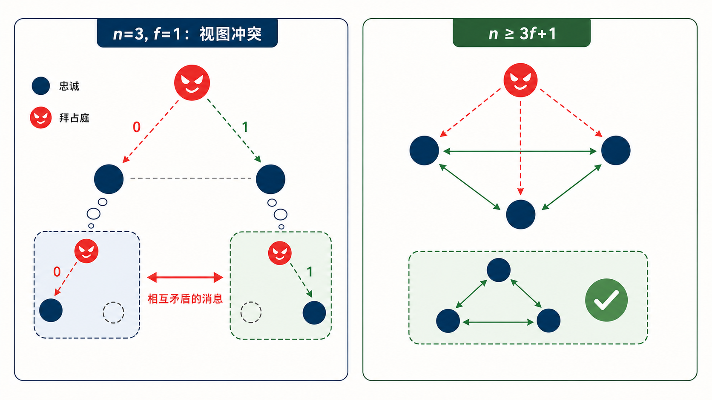

**出处**：理论源头是 M. Pease、R. Shostak、L. Lamport[《Reaching Agreement in the Presence of Faults》](https://doi.org/10.1145/322186.322188)，JACM 27(2):228–234，1980（证明了紧致的 n > 3m 下界）；寓言版本是 L. Lamport、R. Shostak、M. Pease[《The Byzantine Generals Problem》](https://doi.org/10.1145/357172.357176)，ACM TOPLAS 4(3):382–401，1982。

**内容**：拜占庭故障节点可任意行动——伪造消息、对不同节点说不同的话、与其他恶意节点串通、在关键阶段选择性沉默、伪装正常直到最有破坏力的时刻。在**同步、口头消息（不可认证）**模型下，容忍 f 个拜占庭节点需 **n ≥ 3f+1**。n=3、f=1 是经典反例：忠诚者无法分辨"司令说撤退而同僚谎报进攻"与"司令说进攻而同僚谎报撤退"。

> **订正**：流传的"有了签名就能容忍任意多数叛徒"不准确。1982 年论文的签名算法 SM(m) 条件是 **n ≥ m+2**（至少要有两名忠诚将军），叛徒数不受 n/3 约束，但不是"任意多数"。更重要的是该结论限定于**同步 + 可认证**模型下的**将军问题**；换到共识/状态机复制语境仍需 **n ≥ 2f+1**（见 2.8）。

**思考**：**3f+1 不是脱离模型的宇宙常数。** 数字签名、认证信道、同步性假设、随机化、以及不同的安全目标都会移动这条边界。它真正留下的公案是：当参与者可以撒谎并制造不一致视图时，**仅增加重试与 ACK 不够，协议必须验证来源、证明链与集合交叠**。

### 1.3 FLP 不可能性

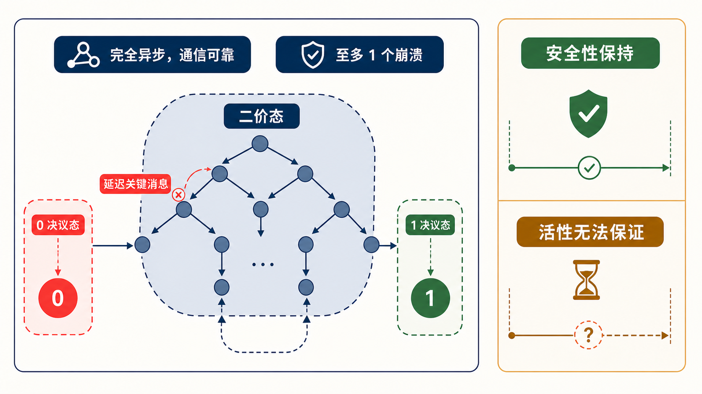

**出处**：M. Fischer、N. Lynch、M. Paterson[《Impossibility of Distributed Consensus with One Faulty Process》](https://doi.org/10.1145/3149.214121)，JACM 32(2):374–382，1985（PODC 1983 首发；[作者主页存档 PDF](https://groups.csail.mit.edu/tds/papers/Lynch/jacm85.pdf)）。2001 年 Dijkstra 奖。

**内容**：在**完全异步**（进程速度与消息时延均无上界）、**通信完全可靠**、至多**一个**进程可能**崩溃**的系统中，不存在确定性共识算法能在所有合法执行中同时保证共识安全性与**必然终止**。证明构造"二价（bivalent）"配置，并证明总存在一条调度使系统永远停留在尚不能安全决定的状态。

**思考**：两个关键澄清。其一，**FLP 假设网络是可靠的**——不可靠只会更糟，所以它比"因为会丢包所以做不到"强得多。其二，用 0.1 的语法说：**它限制的是活性，不是安全性**。Paxos、Raft 都不是反例：它们的安全性在任意异步下成立，活性只在系统最终稳定后成立。

### 1.4 公共知识不可达

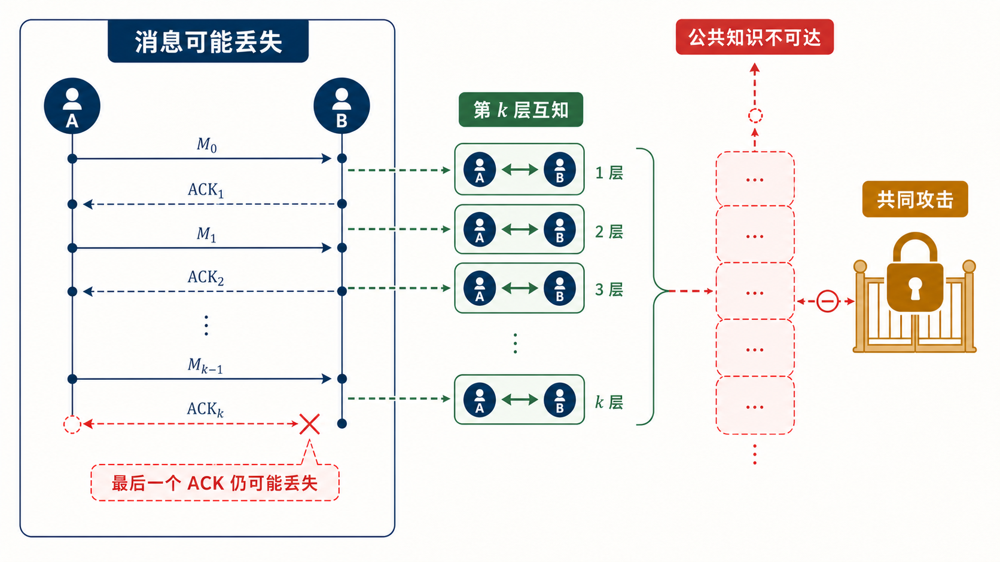

**出处**：同 0.3（[Halpern & Moses, JACM 37(3), 1990](https://dblp.org/rec/journals/jacm/HalpernM90)）。

**内容**：在消息可能丢失或时延无保证的系统中，**公共知识永远无法达成**；而协同行动（coordinated attack）恰恰需要公共知识。这是两将军的知识论形式化，并给出了"为什么无限递归无法封闭"的严格答案。

**思考**：工程含义是**任何确认链条都必须在某一层被人为剪断**，剩余风险交给补偿机制。TCP 的 ACK 不确认应用处理成功，HTTP 200 不保证下游落库，支付回调必须靠对账兜底。设计的实质不是"消除剩余风险"，而是"决定在哪里剪断，并为剪断处备好兜底"。

这一条非常重要，是非常重要的底层逻辑。

### 1.5 原子提交的阻塞性

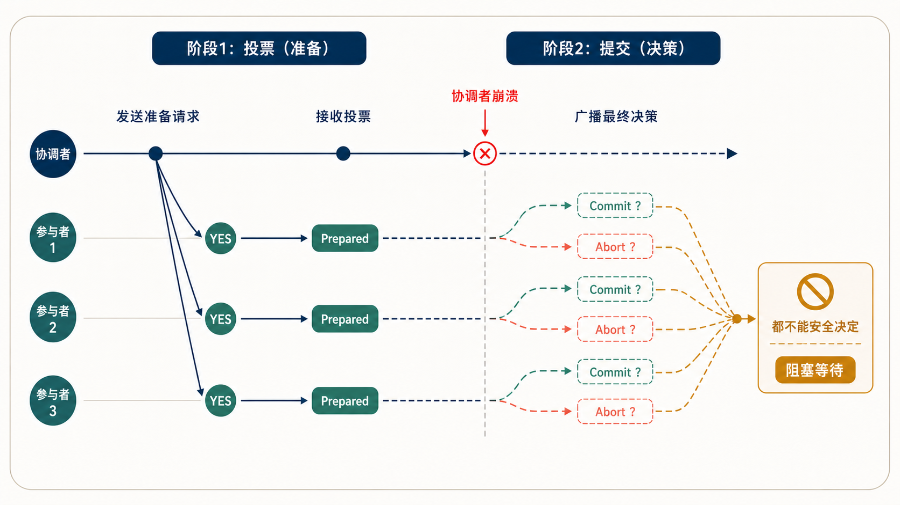

**出处**：Dale Skeen[《Nonblocking Commit Protocols》](https://doi.org/10.1145/582318.582339)，SIGMOD 1981；精确陈述见 Ö. Babaoğlu 与 S. Toueg[《Understanding Non-Blocking Atomic Commitment》](https://dblp.org/search?q=Understanding+Non-Blocking+Atomic+Commitment)（1993，收录于 *Distributed Systems*, 2nd ed., Addison-Wesley）。

**内容**：参与者回复 YES 后进入 **Prepared** 状态，此时已承诺"协调者说 Commit 就提交、说 Abort 就回滚"，**失去了单方面决定权**。若协调者此刻宕机而参与者无法获知全局决定，它既不能安全提交（可能有人投了 no），也不能安全回滚（可能有人已提交），只能阻塞持锁等待。Skeen 引入 PRE-COMMIT 得到非阻塞的 3PC，但正确性依赖同步假设，此处的同步假设是分布式理论语境下的同步，即消息传输时延有界，消息处理时延有界，始终漂移时延有界；根本限制是：**通信不可靠时不存在非阻塞的原子提交协议**。

**思考**：阻塞不是实现粗糙造成的偶然缺陷，而是**参与者本地信息不足**的必然结果——它知道自己愿意提交，却不知道别人是否都愿意，也不知道协调者是否已向他人宣布了决定。这正是两将军在数据库语境下的化身，也是 Gray 当年为两将军命名的动机。两条出路见 4.13（Paxos Commit）与 5.4（Saga）。

### 1.6 完美故障检测器不可实现：超时只是怀疑，不是证明

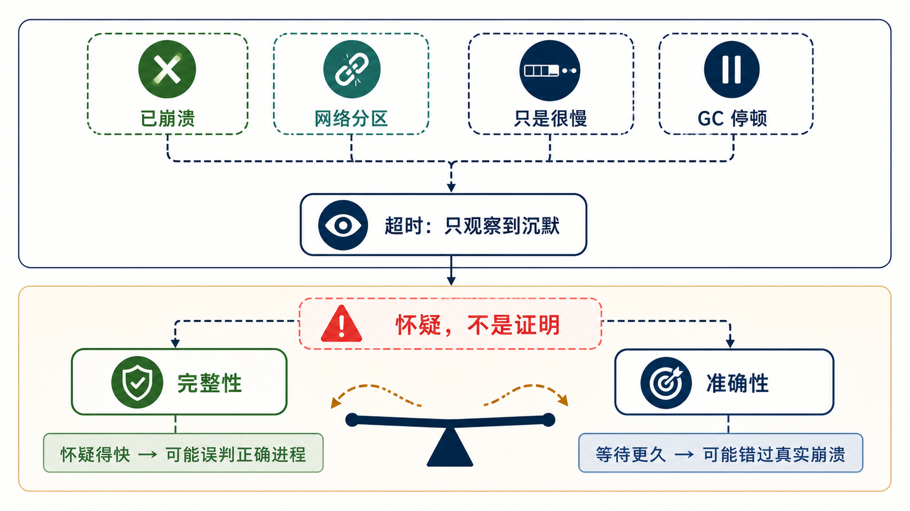

**出处**：作为 FLP 的等价推论，精确刻画见 T. Chandra 与 S. Toueg[《Unreliable Failure Detectors for Reliable Distributed Systems》](https://doi.org/10.1145/226643.226647)，JACM 43(2):225–267，1996。

**内容**：异步系统中不存在同时满足**强完整性**（崩溃者最终都被怀疑）与**强准确性**（正确者从不被冤枉）的故障检测器。一个节点长时间沉默，可能是崩溃、分区、排队、长暂停，或只是很慢；观察者仅凭沉默无法区分。因此超时只能产生"在当前时限与假设下，我怀疑它失败了"，而不能产生"我已从逻辑上证明它永久失败"。

**思考**：这条推论的工程分量甚至超过 FLP 本身——它意味着**误判必然发生**。正确目标不是"消灭误判"，而是"让误判无害化"：epoch/term 编号、fencing token、租约到期即失效（见 5.5）。

### 1.7 消息时延不确定性导致的时钟同步误差下界

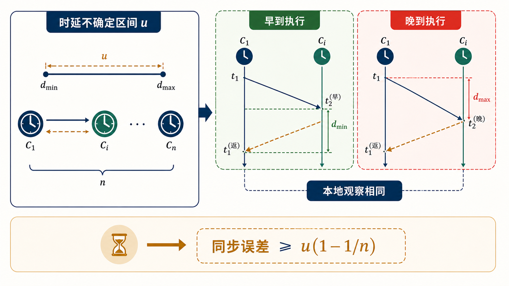

**出处**：Jennifer Lundelius 与 Nancy Lynch[《An Upper and Lower Bound for Clock Synchronization》](https://doi.org/10.1016/S0019-9958(84)80033-9)，*Information and Control* 62(2–3):190–204，1984。

**内容**：这里被约束的是**时钟同步误差**，消息时延不确定性是产生下界的原因。设每条消息的单向时延位于已知区间 `[d_min, d_max]`，令 `u = d_max − d_min`；`u` 表示时延区间的**宽度**，不是最大时延。即使完全没有故障、所有物理时钟都以与真实时间完全相同的速率运行，任何算法完成同步后，仍存在某个合法执行，使 n 个节点中某对节点在同一真实时刻的本地时间差至少为 **u(1 − 1/n)**。换言之，最坏时钟偏差不可能小于该值；原论文同时给出了达到此界的算法，因此这是紧下界。

**直觉**：A 发出的时间戳是 0 ms，B 在自己的 20 ms 时收到，而单向时延只知道位于 10～14 ms。若实际时延为 10 ms，B 比 A 快 10 ms；若为 14 ms，B 只比 A 快 6 ms。两种执行对 B 的观察完全相同。B 最好只能取中点 8 ms，最坏仍误差 2 ms，恰好等于二节点情形的 `u/2`。

**思考**：真正妨碍同步的不是**时延大**，而是**时延究竟多大不可知**。若消息始终精确延迟 10 秒，则 `u = 0`，在该论文的理想假设下仍可精确同步；若时延在 10～14 ms 间变化，则无法区分“消息走得更慢”与“对方时钟更落后”。该结果讨论的是节点在同一真实时刻的**内部时钟偏差**，不是它们距离 UTC 的误差，也不是 Lamport 逻辑时钟；存在时钟漂移或故障时，还会引入额外误差。任何以墙上时钟排序作为正确性依据的设计——用 `now()` 生成有序 ID、用时间戳做 LWW 冲突解决——都必须显式承担这种不确定性。

### 1.8 向量时钟的维度下界

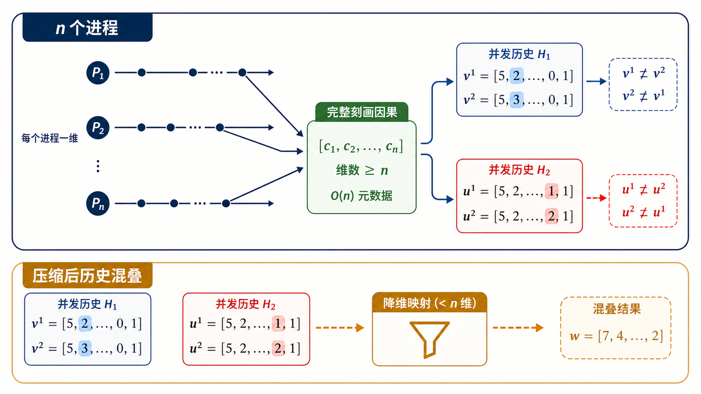

**出处**：Bernadette Charron-Bost[《Concerning the Size of Logical Clocks in Distributed Systems》](https://dblp.org/rec/journals/ipl/Charron-Bost91)，*Information Processing Letters* 39(1):11–16，1991。

**内容**：要用时间戳**完整刻画** n 个进程间的因果偏序（做到 a→b ⟺ V(a)<V(b)），维数**必须等于 n**，不存在更紧凑的编码。

**思考**：因果元数据开销随规模**线性增长且不可优化**。这是因果一致系统（COPS、Eiger）在大规模下总被元数据拖垮的根因，也是工业界普遍退向版本向量剪枝、DVV、或混合逻辑时钟（3.7）的原因。它体现的普遍规律是：**想更精确地知道事件来自哪些历史分支，就必须携带更多历史摘要。**

### 1.9 "恰好一次投递"的不可能性

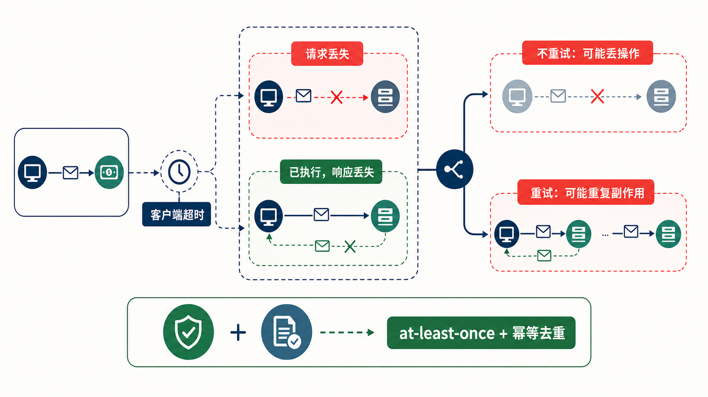

**出处**：无单篇定理论文——它是两将军的直接推论，属领域共识。系统论述见 Tyler Treat[《You Cannot Have Exactly-Once Delivery》](https://bravenewgeek.com/you-cannot-have-exactly-once-delivery/)（2015）；工程语境的权威说明见 Apache Kafka 事务设计文档 [KIP-98](https://cwiki.apache.org/confluence/display/KAFKA/KIP-98+-+Exactly+Once+Delivery+and+Transactional+Messaging)（2017），其中明确定位为"exactly-once **处理语义**"而非"投递"。

**内容**：客户端超时后看到的只是沉默，无法区分三种情况：请求未到达、已到达未执行、已执行但响应丢失。不重试可能丢操作，直接重试可能重复操作。因此**不存在 exactly-once 投递**，只能在 at-most-once 与 at-least-once 间二选一。

**思考**：正确表述是——"全系统、任意外部副作用的天然 exactly-once"不可得；"**在明确定义的事务与去重边界内实现 exactly-once 效果**"完全可以做到。手段是：稳定请求 ID + 幂等操作 + 去重记录 + 业务状态与消费位点原子提交。它把不可能性从传输层转移到了应用层（见 7.2）。

### 1.10 匿名网络中的选主不可能性：没有差异，就产生不了唯一者

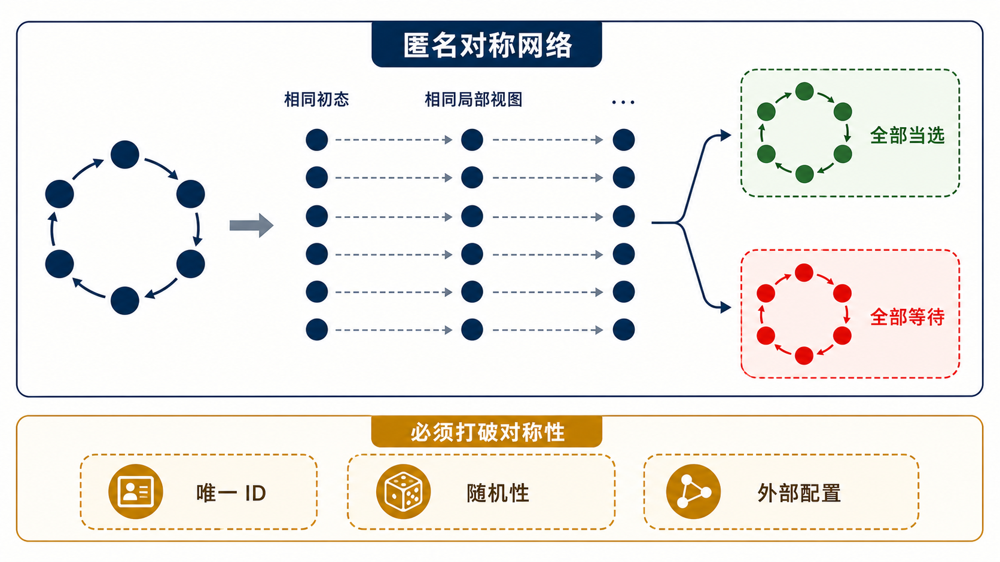

**出处**：Dana Angluin[《Local and Global Properties in Networks of Processors》](https://doi.org/10.1145/800141.804655)，STOC 1980, pp. 82–93。

> **订正**：本条常被误挂到近年的 SPAA/PODC 论文（如 2021 年 *Four Shades of Deterministic Leader Election in Anonymous Networks*）名下——那是引用该经典结果的后续工作，不是原始出处。

**内容**：若网络完全对称——所有节点无唯一 ID、执行相同确定性程序、从相同初态出发、拥有相同局部拓扑视图——则对称节点必然经历相同状态转移。一个节点决定"我是 Leader"，其对称节点也会作出同样决定；一个等待，则全体等待。因此**确定性选主必须依赖某种对称性破坏来源**：唯一 ID、不对称拓扑、不同初始输入、随机数、或外部成员配置。

**思考**：可浓缩为一句——**系统不会凭空产生唯一性。** 唯一 Leader 最终必然来自某种预先存在或随机生成的不对称。这解释了为什么每个共识系统的第一件事都是分配节点 ID，也解释了随机化（4.5）为何能同时破解 FLP 与对称性两个问题。

### 1.11 k-集合一致性与异步可计算性拓扑：不可能性谱系比 FLP 深得多

- [ ] 这个有点难理解，不过我最终还是可以理解的。

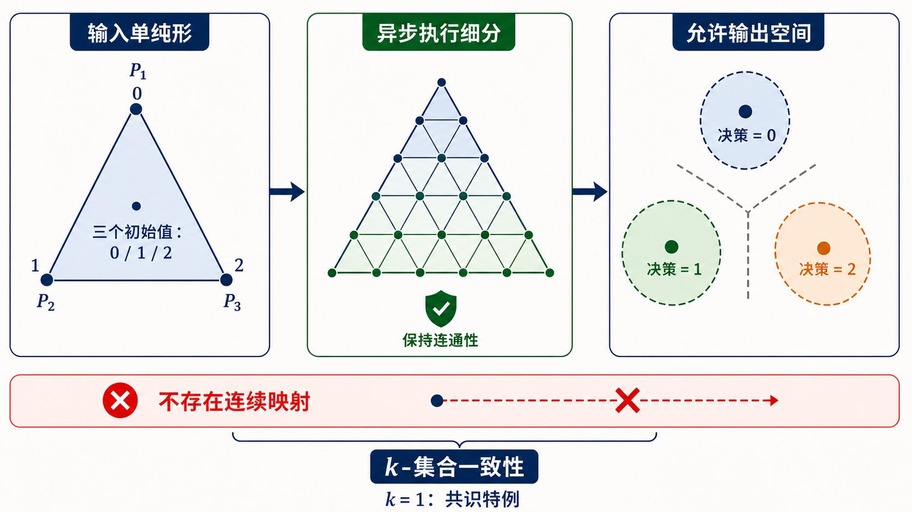

**出处**：k-集合一致性由 Soma Chaudhuri 提出，[《More Choices Allow More Faults: Set Consensus Problems in Totally Asynchronous Systems》](https://doi.org/10.1006/inco.1993.1043)，*Information and Computation* 105(1):132–158，1993；不可能性由三组人于 STOC 1993 独立证明——Herlihy & Shavit、Borowsky & Gafni、Saks & Zaharoglou；拓扑刻画见 M. Herlihy 与 N. Shavit[《The Topological Structure of Asynchronous Computability》](https://doi.org/10.1145/331524.331529)，JACM 46(6):858–923，1999。2004 年 Gödel 奖。

**先说人话**：普通共识要求所有活着的进程最后给出**同一个答案**；k-集合一致性允许放宽为**全系统最多出现 k 种答案**。`k = 1` 就是普通共识，k 越大，要求越宽松。但“多允许几个答案”只能多容忍有限数量的崩溃，不能无限绕过异步系统的信息缺失。

**任务规则**：n 个进程各自拿到一个输入值，随后只通过异步读写共享内存通信。算法必须同时满足三件事：① **有效性**——决定值必须来自某个进程的输入；② **终止性**——每个持续运行的正确进程最终都要决定，不能永远等慢进程；③ **k-一致性**——所有决定值合起来至多有 k 种。若算法承诺容忍至多 f 个进程崩溃，那么当 **f ≥ k** 时，确定性的 k-集合一致性仍然不可解。所谓**无等待（wait-free）**，就是即使其余 `n−1` 个进程全部停下，每个仍在运行的进程也必须独自完成；此时 `f = n−1`，所以对任何非平凡的 `k < n`，都不存在确定性的无等待读写协议。

**三进程例子**：令 A、B、C 三个进程分别提出红、绿、蓝，要求 2-集合一致性——允许最后出现两种颜色，但禁止三种颜色同时出现。若某个进程独自运行，它看不到另外两人的输入；为了在所有可能输入下保持有效，它只能决定自己的颜色。因此存在“只有 A 推进并决定红”“只有 B 推进并决定绿”“只有 C 推进并决定蓝”三种合法执行。困难在于，调度器还能让三个进程以各种先后顺序交错执行，使相邻执行只差一个尚未被别人观察到的读写步骤。算法必须在这些彼此不可区分的执行之间连续地安排决定，却又要保证任何一次完整执行最多出现两种颜色；拓扑证明说明这两项要求无法同时满足。

**拓扑直觉**：把红、绿、蓝三个单独运行的极端情况画成一个三角形的三个角；不同的异步交错顺序会把三角形不断切成更小的三角形，每个小三角形代表一组可以同时出现、彼此相容的局部状态。算法给每个局部状态标上最终决定的颜色。有效性固定了三角形边界应如何标色，而 2-集合一致性要求任何小三角形都不能同时出现红、绿、蓝。Sperner 引理（等价地，无收缩定理）却保证：只要边界标色满足有效性，内部必然至少出现一个三色小三角形——它对应一次合法执行，其中三个进程作出三种不同决定，恰好违反 2-一致性。一般的 k-集合一致性只是这个图景在更高维单纯形上的推广。

**思考**：这里的“拓扑”不是凭空给算法套几何比喻，而是把**哪些局部状态能在同一次执行中并存、哪些执行对某个进程不可区分**编码成几何邻接关系。FLP 沿着一条精心挑选的调度路径，让系统永远保持未决定；拓扑方法则把所有可能调度形成的状态空间整体拿来检查。所谓“比 FLP 深”，不是说它在同一模型下简单加强了 FLP，而是说它给出了一套更一般的语言，能够统一证明包括 k-集合一致性在内的一整族任务为什么无解。

---

## 二、权衡定理与下界

### 2.1 CAP 定理

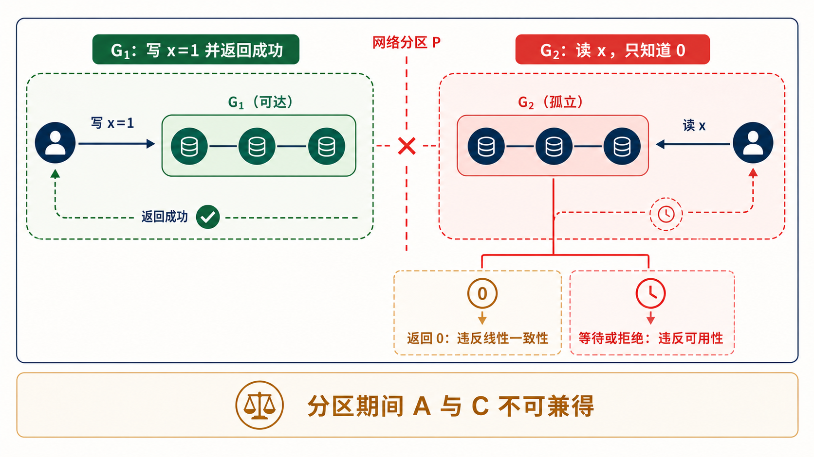

**出处**：Eric Brewer 在 PODC 2000 特邀报告[《Towards Robust Distributed Systems》](https://dblp.org/rec/conf/podc/Brewer00)中以猜想提出；形式化与证明见 Seth Gilbert 与 Nancy Lynch[《Brewer's Conjecture and the Feasibility of Consistent, Available, Partition-Tolerant Web Services》](https://doi.org/10.1145/564585.564601)，SIGACT News 33(2):51–59，2002。思想雏形见 S. Davidson、H. Garcia-Molina、D. Skeen[《Consistency in Partitioned Networks》](https://dblp.org/rec/journals/csur/DavidsonGS85)，ACM Computing Surveys 17(3):341–370，1985。

**内容**：Gilbert–Lynch 定理 1：在异步网络模型下，不存在能在所有公平执行（含消息丢失）中同时保证**可用性**与**原子（线性）一致性**的读写数据对象。证明极简：令 G₁、G₂ 两组节点间消息全丢，G₁ 的写与 G₂ 的读都因可用性必须返回，则读必返回旧值。

**思考**：**P 不是选项而是事实**——网络分区一定会发生（见 6.6）。所以更准确的表述是："当分区真实发生并持续时，系统必须在继续响应与维持强一致之间作出选择。"Brewer 本人在[《CAP Twelve Years Later: How the "Rules" Have Changed》](https://doi.org/10.1109/MC.2012.37)（IEEE Computer 45(2):23–29，2012）中明确澄清了这一点，并强调现实选择是**细粒度、按操作、按时间窗**的。另需注意：CAP 里的 C 指线性一致性（3.4），**不是 ACID 里的 C**——同一个单词，两个层次的问题。

### 2.2 Harvest 与 Yield

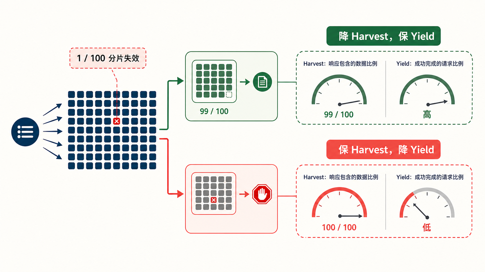

**出处**：Armando Fox 与 Eric Brewer[《Harvest, Yield, and Scalable Tolerant Systems》](https://radlab.cs.berkeley.edu/people/fox/static/pubs/pdf/c18.pdf)，HotOS-VII，1999，DOI：[10.1109/HOTOS.1999.798396](https://doi.org/10.1109/HOTOS.1999.798396)。

**原文定义**：论文先假定客户端向服务器发出查询，然后给出两个指标。**Yield** 是“一个请求能够完成的概率”；**Harvest** 是“响应所反映的数据占完整答案所需数据的比例”，也就是该次查询答案的完整度。发生故障时，系统可以不回答，从而降低 Yield；也可以返回不完整答案，从而维持 Yield、降低 Harvest。

**两者的统计层级不同**：

- 对**一次已经发生的请求**，首先观察它是否完成：完成或未完成是一个二元结果，不存在“这次请求完成了 99% 所以 Yield 是 99%”的说法。若请求完成并返回了答案，才可以讨论这个响应的 Harvest，例如完整答案所需的数据中有 99% 被响应反映，则该响应的 Harvest 为 99%。在本文讨论的降级模型中，“没有响应”记为 Yield 损失，而不是擅自给该请求的 Harvest 记 0。
- Yield 的定义本身是面向**请求分布的完成概率**。在实际观测中，通常用一个明确统计窗口内“完成的请求数 / 收到的请求数”估计；因此它是系统在某类请求和某段时间上的总体指标，不是健康节点比例，也不等同于按时间统计的 uptime。必须先定义什么算“完成”，原论文没有为所有系统规定统一超时。
- Harvest 的基本对象是**一个响应的完整度**，但也可以形成系统级指标。原论文只说明 Inktomi 的 overall harvest 通常跨较长时间衡量，并未规定所有应用都必须采用某一种平均或加权公式。因此报告“系统 Harvest”时，必须另外说明统计窗口、请求集合、完整答案的基准，以及如何汇总各响应；否则这个数字没有唯一含义。

**100 节点例子**：论文中的 Inktomi 搜索引擎把数据随机、近似等比例地分布到节点，并用每节点超时让查询在个别节点失效时仍返回。按论文采用的比例模型，100 个节点失效 1 个，会在故障持续期间移除约 1% 的搜索数据库，所以 **overall harvest 约降至 99%**；这不是“存活节点率天然等于 Harvest”，也不保证每一个具体查询都恰好得到 99% 的理想答案。由于查询仍以不完整答案完成，这个节点故障本身被映射为 Harvest 损失，**整体 Yield 保持在故障前的水平**；若暂时忽略网络和其他故障、假定所有请求均能返回，理想化观测值才是 100%。论文同时明确提醒，依赖尽力而为网络的真实服务不可能据此宣称绝对 100% Yield。

反过来，如果应用坚持“少一个分片就不回答”，同一次节点故障就会降低 Yield 而不是 Harvest。究竟降低多少，取决于哪些请求需要该节点、是否有副本、重试和故障转移，以及怎样定义请求完成；**仅凭“100 台挂 1 台”无法推出 Yield，也无法无条件推出 Harvest。**

**思考**：Harvest/Yield 的价值不是把机器存活率换个名字，而是迫使设计者明确选择：故障时究竟返回一个较不完整但仍有用的答案，还是拒绝回答以守住完整性。搜索可以少返回部分候选结果；计费等不接受残缺语义的操作则只能让相关请求失败。比较两个系统的数字前，必须先对齐请求类型、完成判定、完整答案基准、统计窗口和汇总方法。

### 2.3 PACELC

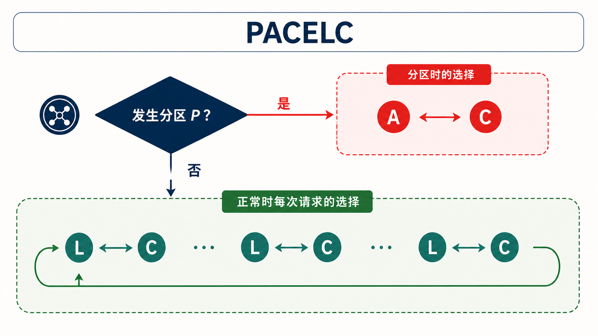

**出处**：Daniel Abadi [2010 年博文](https://dbmsmusings.blogspot.com/2010/04/problems-with-cap-and-yahoos-little.html)首提；正式发表为[《Consistency Tradeoffs in Modern Distributed Database System Design: CAP is Only Part of the Story》](https://doi.org/10.1109/MC.2012.33)，IEEE Computer 45(2):37–42，2012——与 Brewer 的十二年反思同期同刊。

**内容**：**if P**artition → 在 **A** 与 **C** 间取舍；**E**lse → 在 **L**atency 与 **C** 间取舍。即使网络没断，强一致操作仍需等待远端副本、Leader、法定人数或时钟不确定区间。分类示例：Dynamo/Cassandra/Riak 为 PA/EL，VoltDB/Megastore 为 PC/EC，MongoDB 为 PA/EC，Spanner 为 PC/EC。

**思考**：它戳破了"没分区就不用权衡"的幻觉——分区是罕见事件，L 与 C 的取舍**每次请求都在发生**。形象地说，CAP 描述了系统约 0.001% 时间的行为，PACELC 描述了另外 99.999%（此处比例为示意性修辞，非文献实测数据）。**需要说明的是**：PACELC 本身更接近架构分析框架，而非 FLP 那样单一模型下的不可能性定理；其背后的硬支撑是下一条。

### 2.4 强一致性的延迟下界

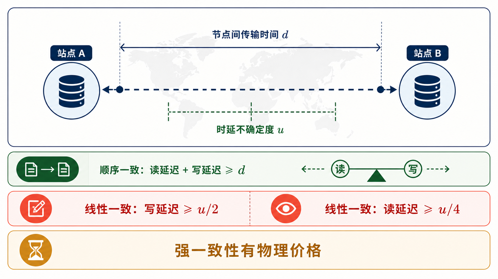

**出处**：Richard Lipton 与 Jonathan Sandberg[《PRAM: A Scalable Shared Memory》](https://dblp.org/search?q=PRAM+A+Scalable+Shared+Memory+Lipton+Sandberg)，Princeton 技术报告 TR-180-88，1988；Hagit Attiya 与 Jennifer Welch[《Sequential Consistency versus Linearizability》](https://dblp.org/rec/journals/tocs/AttiyaW94)，ACM TOCS 12(2):91–122，1994。

**内容**：Lipton–Sandberg 证明，对顺序一致的共享存储，**读延迟 + 写延迟 ≥ 节点间传输时间 d**——读写不可能都是本地的。Attiya–Welch 对线性一致给出更强分离：在时延不确定度为 u 的网络中，写延迟 ≥ u/2、读延迟 ≥ u/4；而顺序一致允许把全部代价压到读或写的一侧。

**思考**：这是**给强一致性明码标价的定理**——代价由光速与地理距离决定。跨洲部署的线性一致数据库，单次操作至少吃一个跨洋 RTT。它也是 PACELC 中那个 "EL vs EC" 的数学依据。RTT，Round-Trip Time，往返时延。

### 2.5 SNOW 定理

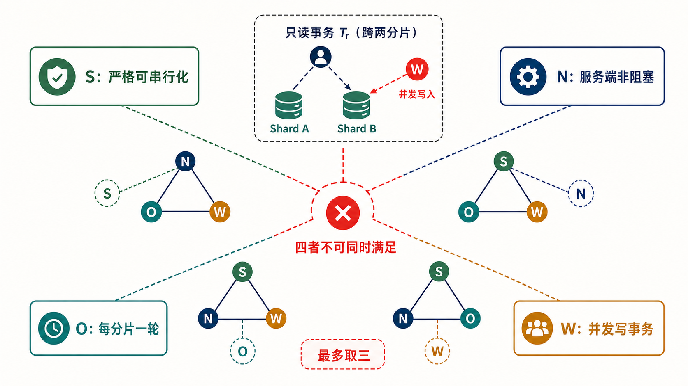

**出处**：Haonan Lu、Christopher Hodsdon、Khiem Ngo、Shuai Mu、Wyatt Lloyd[《The SNOW Theorem and Latency-Optimal Read-Only Transactions》](https://www.usenix.org/conference/osdi16/technical-sessions/presentation/lu)，OSDI 2016（USENIX，无 ACM DOI）。

> **订正**：本条常被误引至 TOSEM 2022 的《All in One: Design, Verification, and Implementation of SNOW-optimal Read Atomic Transactions》——那是遵循 SNOW 原则提出 LORA 算法的后续应用论文，不是定理原文。

**内容**：只读事务无法同时具备四性质——**S**（严格可串行化）、**N**（服务端非阻塞）、**O**（每分片一轮请求—响应）、**W**（系统同时支持并发写事务）。四者最多得三，且边界是**紧的**。论文据此提出 SNOW-optimal 目标，并给出 COPS-SNOW、Rococo-SNOW。

**思考**：它揭示了比 CAP 更具体的读事务代价：**即使没有网络分区**，只要存在并发写与跨分片读，要维持严格串行化就必须在阻塞、额外交互、语义削弱三者中付出至少一种。设计者的任务不是"优化"，而是明确选择放弃哪一个。

### 2.6 NOCS 定理与 PORT

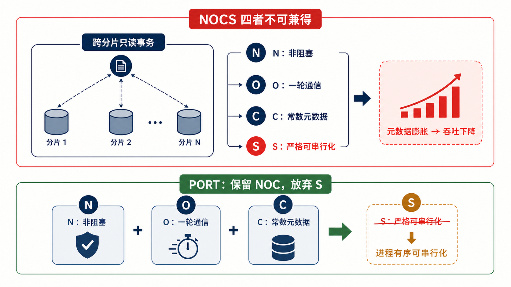

**出处**：Haonan Lu、Siddhartha Sen、Wyatt Lloyd[《Performance-Optimal Read-Only Transactions》](https://www.usenix.org/conference/osdi20/presentation/lu)，OSDI 2020。

**内容**：SNOW 的姊妹结果，补上吞吐维度。只读事务无法同时满足 **N**（非阻塞）、**O**（一轮通信）、**C**（常数大小元数据）、**S**（严格可串行化）。关键洞察：为达到 SNOW-optimal 而携带的海量元数据会摧毁吞吐——延迟最优反而使系统整体更慢。PORT 用 version clock 放弃 S（退到 process-ordered serializability）换取 NOC。

**思考**：**性能优化也有守恒律。** SNOW 说"延迟有边界"，NOCS 说"为了触碰那个边界，你会在吞吐上付更多"。两条合起来才是完整的只读事务设计空间地图。

### 2.7 Herlihy 共识数与无等待层级

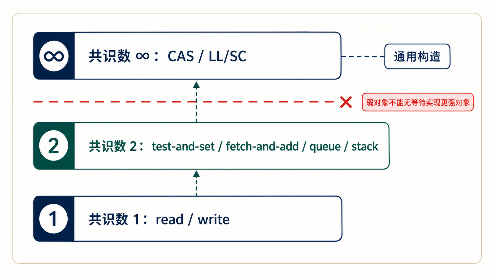

**出处**：Maurice Herlihy[《Wait-Free Synchronization》](https://doi.org/10.1145/114005.102808)，ACM TOPLAS 13(1):124–149，1991（[作者存档 PDF](https://cs.brown.edu/~mph/Herlihy91/p124-herlihy.pdf)，定义见 §3）。其会议版（PODC 1988）获 2003 年 Dijkstra 奖。

**这里的“共识”**：指一个**一次性决定任务**（one-shot decision task），不是“副本最终收敛”、“多数派投票”，也不是完整的 Paxos/Raft 日志复制。设有 $n$ 个异步进程 $p_1,\ldots,p_n$，每个进程带着一个输入（或“提议”）$x_i\in V$ 启动，只通过共享的线性一致对象通信；进程若完成任务，就输出一个不可撤回的决定值 $y_i$ 并停止。对所有允许的异步执行，协议必须同时满足：

1. **一致性（consistency/agreement）**：任意两个已决定的进程不能决定不同的值，即 $p_i,p_j$ 若都决定，则 $y_i=y_j$。这条约束所有已作出的决定，包括进程决定后又崩溃的情形。
2. **无等待终止（wait-free termination）**：任一没有停止、继续获得执行步的进程，都必须在自己的有限个步骤后决定，不论其他进程的速度、是否暂停或崩溃。因此，$n$ 进程的无等待共识实际上允许其他 $n-1$ 个进程停止；这里按该进程的**自身步数**计，不是墙上时间。论文的 wait-free 也不要求存在适用于所有执行的统一步数上界 $N$；后者是更强的 bounded wait-free。
3. **有效性（validity）**：决定值必须是某个进程的输入，即若有进程决定 $y$，则必有某个 $p_j$ 使 $y=x_j$。它不要求“票数最多的值获胜”；只要是被提议过的值，都可能成为唯一决定。

这里的故障边界是：进程可以任意慢或停止，但不会偏离算法作恶，因而不是拜占庭共识。上述性质要对**每一条**允许的执行成立；只保证以概率 1 或在期望有限步数内终止的随机化共识，不是这个无等待层级所采用的终止定义。

Herlihy 进一步把这个任务封装成只有一个操作的**共识对象** `decide(input) -> value`：它的顺序规范是，线性化顺序中第一个 `decide(v)` 将结果固定为 $v$，以后所有 `decide` 都返回同一个 $v$。“第一个”指**线性化顺序**，不一定是墙上时间上最早发起的并发调用。这个对象的无等待、线性一致实现，就是论文所谓的**共识协议**。

**二进程例子**：A 提议 0，B 提议 1。两者都决定 0，或都决定 1，均合法；A 决定 0 而 B 决定 1 违反一致性，两者都决定 2 违反有效性，B 必须等 A 再走一步才能返回则违反无等待终止。

**内容**：在上述定义下，为每种共享对象定义**共识数**——该对象（配合任意数量的原子读/写寄存器）能无等待解决共识的最大进程数；若没有有限的最大值，则共识数为 **∞**。原子读/写寄存器为 **1**（连两进程共识都做不到，是 FLP 在共享内存中的翻版）；test-and-set、fetch-and-add、queue、stack 为 **2**；compare-and-swap、LL/SC、memory-to-memory swap 为 **∞**。共识数低的对象无法无等待实现共识数更高的对象。论文还证明：在不超过 $n$ 个进程的系统中，共识数至少为 $n$ 的对象是**通用的**，可通过 universal construction 无等待实现任意线性一致对象。

**思考**：FLP 说"做不到"，Herlihy 把它量化成"差多少"——**并非所有"原子操作"能力相同，底层原语提供多强的冲突裁决能力，决定了上层能实现多强的协调语义**。这是现代 CPU 必须提供 CAS 的理由。（[Jayanti 1997](https://dblp.org/rec/journals/jacm/Jayanti97) 证明该层级并不"健壮"：弱对象的组合可能越级，故层级是关于单一对象类型的判定，不能简单外推。）

### 2.8 同步模型下的轮次下界

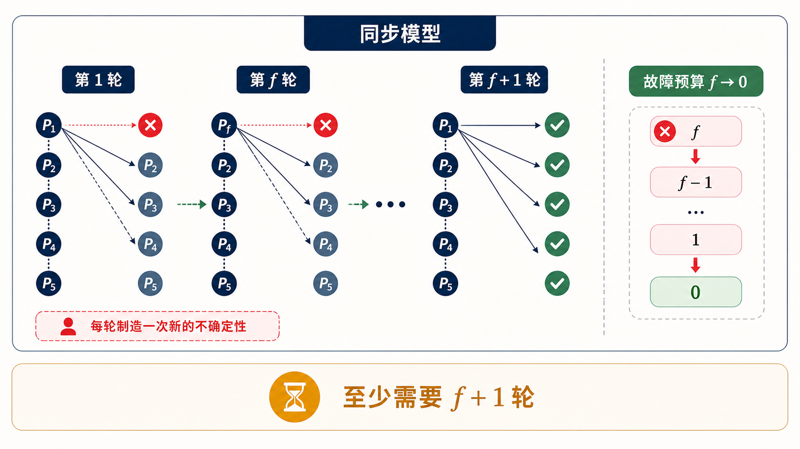

**出处**：M. Fischer 与 N. Lynch[《A Lower Bound for the Time to Assure Interactive Consistency》](https://dblp.org/rec/journals/ipl/FischerL82)，*Information Processing Letters* 14(4):183–186，1982；认证模型的紧配对见 D. Dolev 与 H. R. Strong[《Authenticated Algorithms for Byzantine Agreement》](https://dblp.org/rec/journals/siamcomp/DolevS83)，*SIAM Journal on Computing* 12(4):656–666，1983。

**内容**：**同步**系统中容忍 f 个故障的共识**至少需要 f+1 轮**。直觉：对手每轮都可让某节点"发到一半就崩溃"，制造新的不确定局面，耗尽 f 次作恶预算后才收敛。Dolev–Strong 给出认证拜占庭下匹配该下界的 f+1 轮协议（n ≥ f+2），并把用于状态机复制的门槛降到 n ≥ 2f+1。

**思考**：即使在最理想的同步世界里，**容错也有确定的时间价格，且与容错度成正比**。天下没有零成本容错。

### 2.9 高可用事务（HAT）

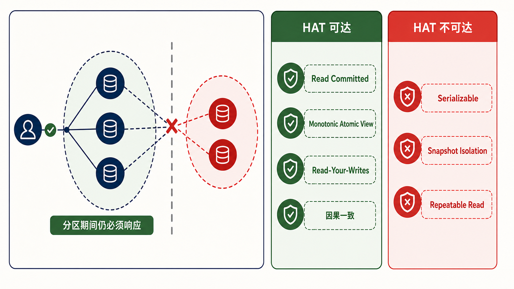

**出处**：P. Bailis、A. Davidson、A. Fekete、A. Ghodsi、J. Hellerstein、I. Stoica[《Highly Available Transactions: Virtues and Limitations》](https://doi.org/10.14778/2732232.2732237)，PVLDB 7(3):181–192，2014（[开放获取 PDF](https://www.vldb.org/pvldb/vol7/p181-bailis.pdf)）。

**内容**：把 CAP 从单对象读写细化到**事务隔离级别**：当客户端只能访问部分副本时，哪些事务保证仍能在不等待失联节点的前提下实现？结论是逐项分类——Read Committed、Monotonic Atomic View、Read-Your-Writes、因果一致等属 HAT 可达；Serializable、Snapshot Isolation、Repeatable Read 属**不可能高可用**。

**思考**：它促使设计者回答一个更精确的问题：**你要求的究竟是哪一项隔离性质？它是否依赖全局尚未可知的信息？** 把讨论从"要不要事务"的口号拉回到可查表的工程决策。

### 2.10 协调的超线性成本（Amdahl / USL）

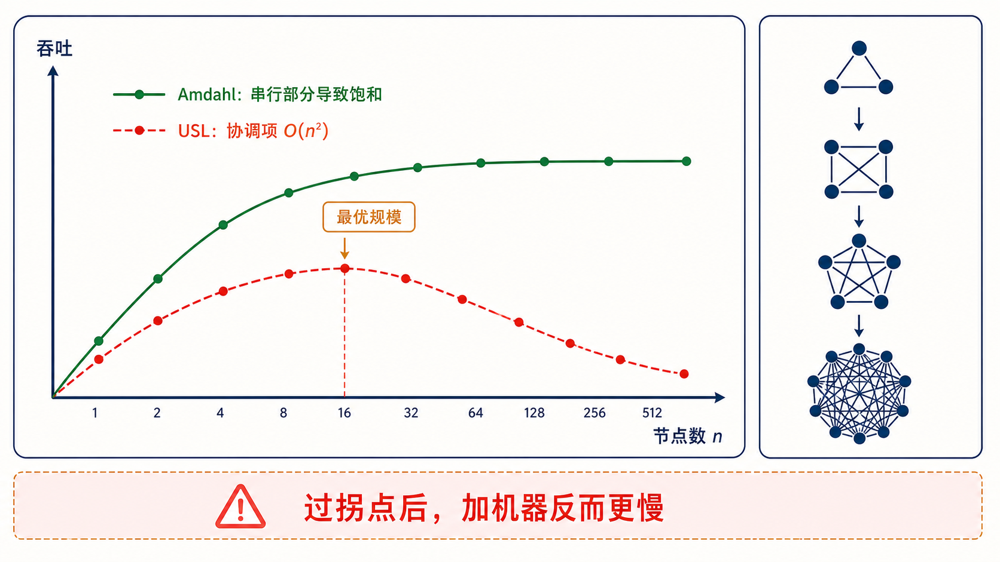

**出处**：Gene Amdahl，[AFIPS Spring Joint Computer Conference，1967](https://doi.org/10.1145/1465482.1465560)；通用可扩展性定律见 Neil Gunther[《Guerrilla Capacity Planning》](https://link.springer.com/book/10.1007/978-3-540-31010-5)，Springer，2007。（注意：USL 是容量规划的**经验拟合模型**，其协调惩罚项并非紧致理论下界，性质与本文其他定理不同。）

**内容**：Amdahl 定律指出加速比受限于串行部分。USL 加入第二个惩罚项——**一致性/协调开销**，随节点数呈 **O(n²)** 增长。结果是吞吐曲线不只是趋于平缓，而会**先升后降**：过了拐点，加机器反而更慢。

**思考**：这从性能角度给出与 CALM（5.1）殊途同归的结论——**"少协调"比"更快地协调"更根本**。分片、CRDT、无协调设计的价值不在省下几毫秒，而在把系统从 n² 那一项里救出来。

---

## 三、时间、因果与一致性语义

### 3.1 Happened-Before 与逻辑时钟：可以尊重因果，但不能反推因果

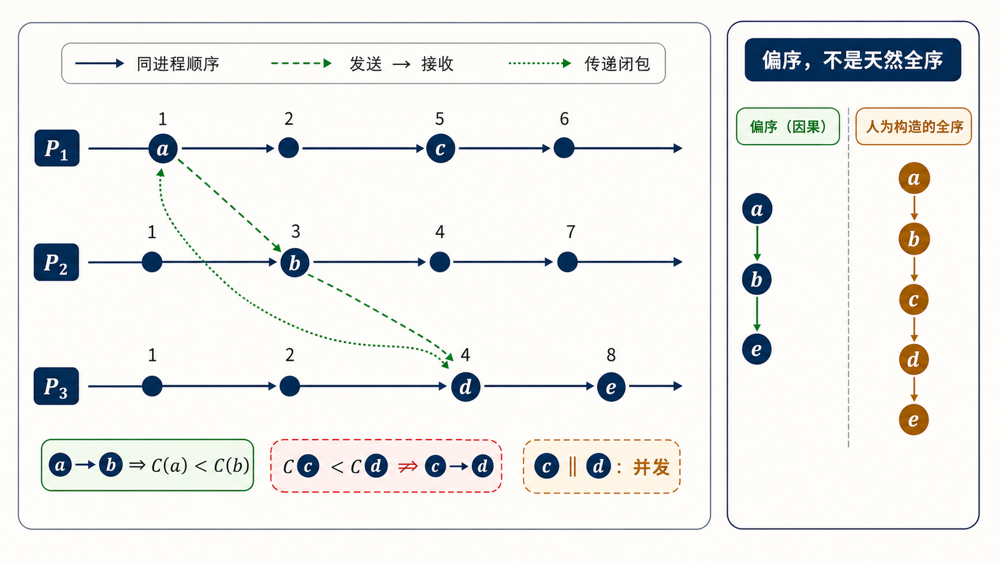

**出处**：Leslie Lamport[《Time, Clocks, and the Ordering of Events in a Distributed System》](https://doi.org/10.1145/359545.359563)，CACM 21(7):558–565，1978（[作者主页存档 PDF](https://lamport.azurewebsites.net/pubs/time-clocks.pdf)）。分布式领域被引最多的论文，首届 Dijkstra 奖（2000）。

**内容**：事件之间只存在**偏序** a→b，由三条规则定义：同进程内先后、发送先于对应接收、传递闭包。无法由 → 关联的事件是**并发**的。逻辑时钟满足 a→b ⟹ C(a)<C(b)，但**反之不成立**——两个完全并发的事件也可能因节点编号或排序规则获得不同时间戳。因此标量时间戳可用于构造与因果兼容的排序，但**不能仅凭它判断两事件是否有真正因果关系**。论文同时给出了状态机复制的雏形思想。

**思考**：Lamport 自述灵感来自狭义相对论。对互不通信的两个节点，"哪个事件先发生"可能根本没有系统语义上的答案。因此，**任何全局全序都不是从宇宙中读取出来的，而是协议为了复制、仲裁或展示而额外构造出来的秩序。**

### 3.2 向量时钟

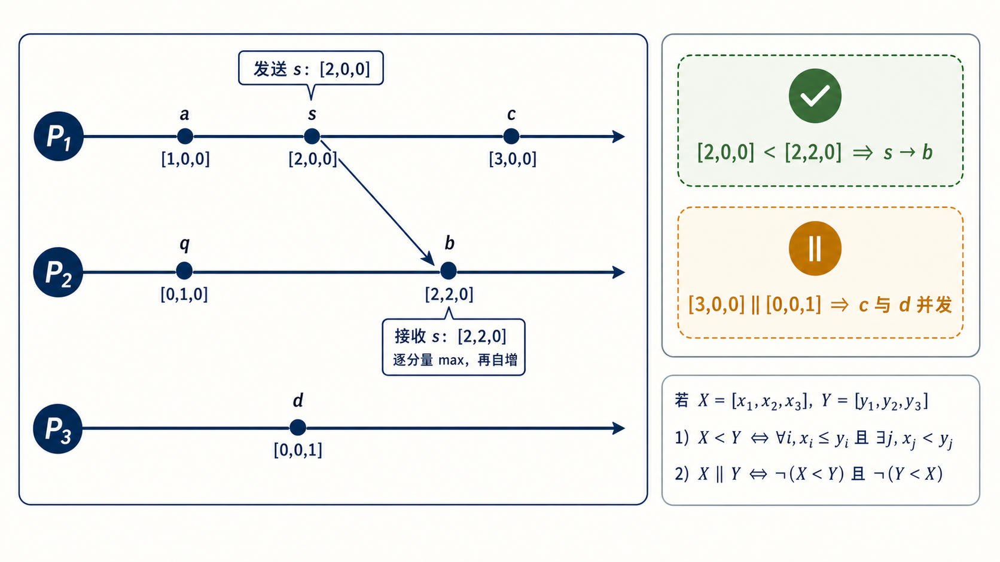

**出处**：Colin Fidge[《Timestamps in Message-Passing Systems That Preserve the Partial Ordering》](https://dblp.org/rec/conf/acsc/Fidge88)，Australian Computer Science Conference (ACSC), 1988；Friedemann Mattern[《Virtual Time and Global States of Distributed Systems》](https://dblp.org/search?q=Virtual+Time+and+Global+States+of+Distributed+Systems)，Workshop on Parallel and Distributed Algorithms, 1989。

**内容**：每个进程维护一个 n 维向量。若 V(a) 每个分量都不大于 V(b) 且至少一个严格小于，则 a 因果先于 b；若两向量互有较大分量，则并发。做到 **a→b ⟺ V(a)<V(b)**，能准确区分"先后"与"并发"。

**思考**：代价是 O(n) 元数据且不可压缩（1.8）。Dynamo 的版本向量、Riak 的 DVV 是它的系统化身与妥协形态。

### 3.3 Chandy–Lamport 分布式快照

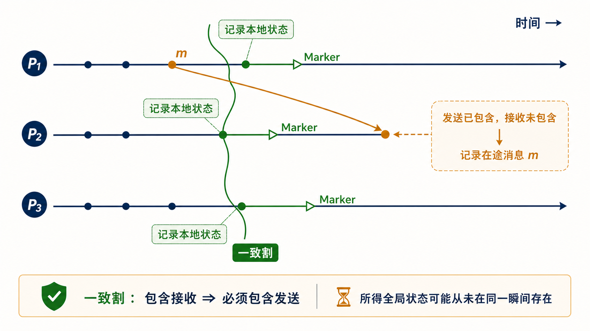

**出处**：K. Mani Chandy 与 Leslie Lamport[《Distributed Snapshots: Determining Global States of Distributed Systems》](https://doi.org/10.1145/214451.214456)，ACM TOCS 3(1):63–75，1985。

**内容**：在可靠 FIFO 信道模型下，用 **marker 消息**在每条信道上划线，同时记录**每个进程的本地状态**与**信道中已发送未接收的在途消息**，得到一个**一致割**：若切面包含某消息的接收事件，就必须包含其发送事件。关键性质是——**得到的全局状态可能从未真实存在过**，但它与某个合法执行不可区分，对检测稳定属性（死锁、终止、垃圾回收）足够。

**公案**：Lamport 在《My Writings》中自述——Chandy 在晚餐时提出这个问题，两人喝多了没想出来；**次日他在淋浴时想出解法，到办公室发现 Chandy 也独立想出了同一个解法**。Flink 的 checkpoint barrier 是它的工程直系后裔。

**思考**：全局状态不是所有本地状态的随意拼接，**还必须把节点之间正在传输的因果信息计算进去**。它是"全局视图是构造出来的推论、不是可读取的事实"这一命题的算法证明。

### 3.4 线性一致性

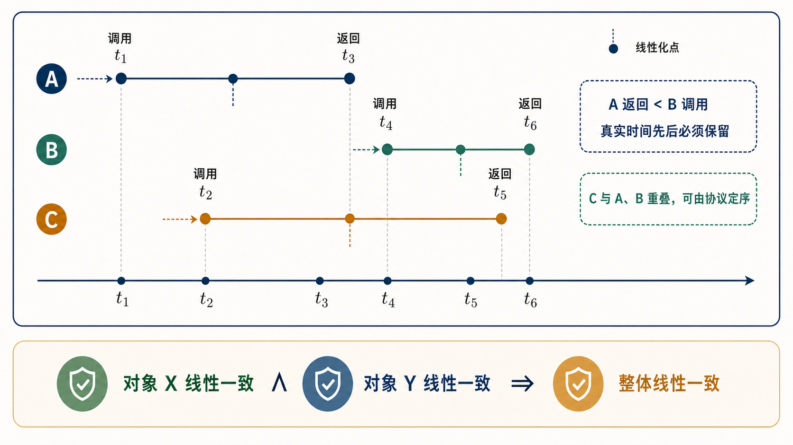

**出处**：Maurice Herlihy 与 Jeannette Wing[《Linearizability: A Correctness Condition for Concurrent Objects》](https://doi.org/10.1145/78969.78972)，ACM TOPLAS 12(3):463–492，1990（[作者存档 PDF](https://cs.brown.edu/~mph/HerlihyW90/p463-herlihy.pdf)，locality 见 §3.1）。2004 年 Dijkstra 奖（授予其会议版 [PODC 1987《Axioms for Concurrent Objects》](https://dblp.org/rec/conf/podc/HerlihyW87)）。

**内容**：每个操作看似在其**调用与返回之间的某个瞬间**原子生效，且该顺序尊重真实时间先后：若 A 返回后 B 才开始，则线性化顺序中 A 必在 B 前；若二者重叠，顺序由协议决定。

它还有一个很实用的优点：**可以逐个对象验收**，这就是**可组合性（locality）**。假设系统里有一个队列、一个计数器和一把锁，只要分别证明它们线性一致，把它们放进同一个系统后，整体仍然线性一致；验证时不必把所有操作收集起来，再寻找一个同时解释所有对象的全局顺序。

顺序一致性和可串行化没有这个保证：每个对象单独看都可能“排得通”，合在一起时，各自选择的顺序却可能互相矛盾，形成无法满足的环。因此，线性一致对象可以独立实现、验证和运行，这也是线性一致性常被当作并发对象正确性“黄金标准”的重要原因之一。但要注意：“可组合”不表示跨对象操作会自动变成原子事务；例如同时修改两个账户，仍然需要事务或其他协调协议。

**思考**：CAP 的 C、Raft 的"线性一致读"、etcd 的保证，说的都是这个。**必须区分两条正交的轴**：线性一致是关于**单对象 + 实时性**，可串行化是关于**多对象 + 事务顺序**；严格可串行化 = 两者兼得，代价见 2.4 与 2.5。

### 3.5 会话保证

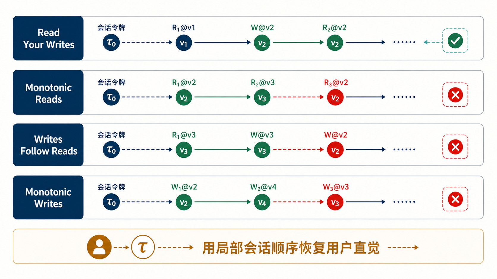

**出处**：D. Terry、A. Demers、K. Petersen、M. Spreitzer、M. Theimer、B. Welch[《Session Guarantees for Weakly Consistent Replicated Data》](https://dblp.org/search?q=Session+Guarantees+for+Weakly+Consistent+Replicated+Data)，PDIS 1994（Bayou 项目）。

**内容**：四条**以客户端会话为单位**的保证：**Read Your Writes**（读得到自己刚写的）、**Monotonic Reads**（不会读到比之前更旧的）、**Writes Follow Reads**（写入排在自己读到的版本之后）、**Monotonic Writes**（自己的写按序生效）。

**思考**：这是**在弱一致系统里恢复"人类直觉"的最小工具集**，成本远低于全局强一致。今天几乎所有云数据库的"会话一致性"（Cosmos DB、MongoDB causal session、MySQL 读写分离的 GTID 等待）都源自这四条。

### 3.6 因果一致性是"始终可用"下的最强模型

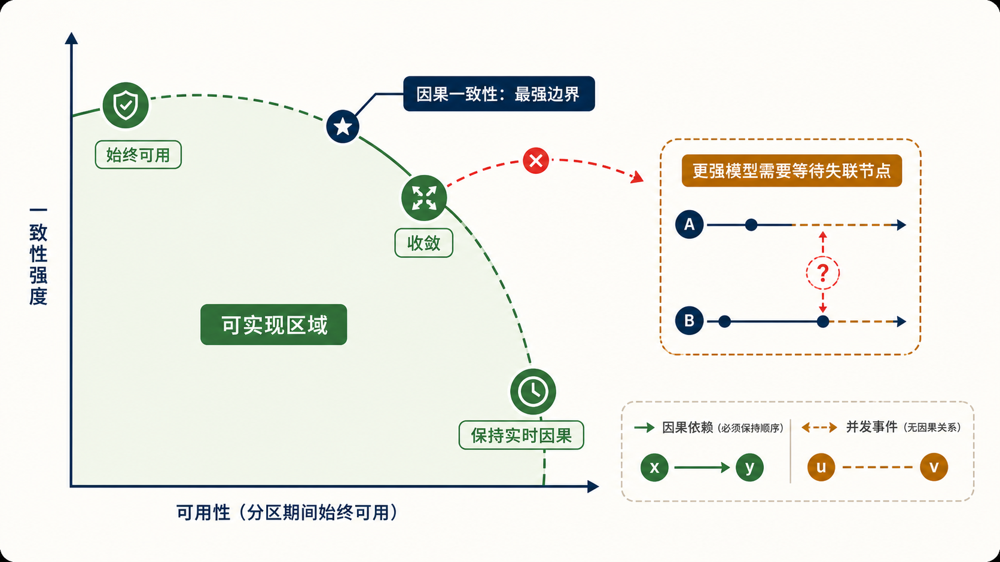

**出处**：Prince Mahajan、Lorenzo Alvisi、Mike Dahlin[《Consistency, Availability, and Convergence》](https://dblp.org/search?q=Consistency+Availability+and+Convergence+Mahajan+Alvisi)，University of Texas at Austin 技术报告 TR-11-22，2011。

**内容**：在要求**始终可用**（分区期间仍响应）且单向收敛的系统中，**实时因果一致性是可实现的最强一致性模型**——任何更强的模型都会违反可用性。

**思考**：这条常被忽略的定理，是"因果一致性为何值得单独占一个生态位"的正式答案。它把 COPS、Eiger、Bayou 一类系统的设计目标从"折中"提升为"该区域的最优解"。与 HAT（2.9）互为事务侧与对象侧的两张地图。

### 3.7 混合逻辑时钟（HLC）

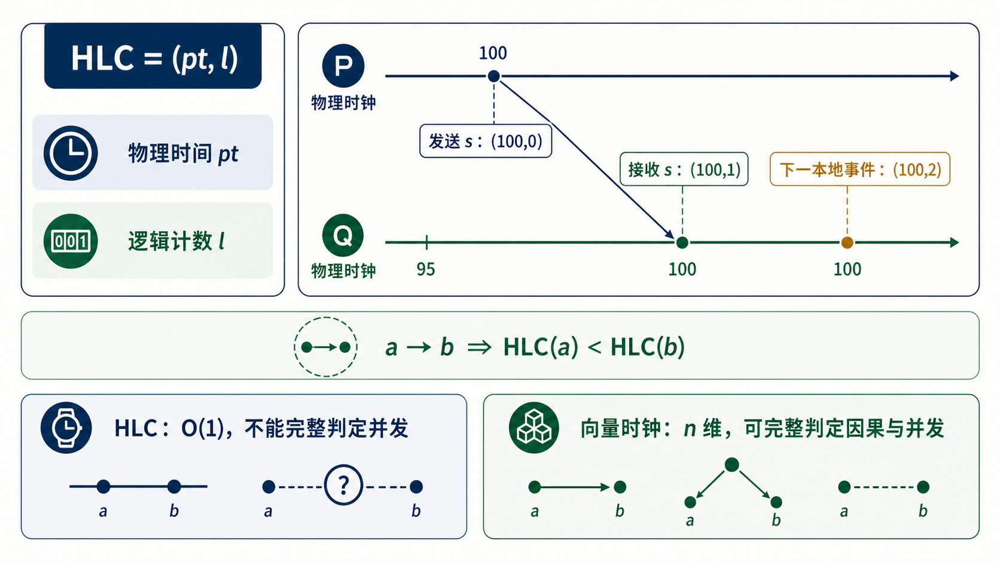

**出处**：S. Kulkarni、M. Demirbas、D. Madappa、B. Avva、M. Leone[《Logical Physical Clocks and Consistent Snapshots in Globally Distributed Databases》](https://dblp.org/rec/conf/opodis/KulkarniDMAL14)，OPODIS 2014。

**内容**：把 Lamport 逻辑时钟与 NTP 物理时钟融合成单个常数大小的时间戳：既保证 a→b ⟹ HLC(a)<HLC(b)，又保证时间戳始终接近物理时钟（可支持"一小时前的快照"这类查询），且无向量时钟的 O(n) 开销。

**思考**：这是**在 Charron-Bost 下界与 Lundelius–Lynch 下界的夹缝中做出的工程折中**——放弃"完整刻画因果"（不能判定并发），换取常数空间与物理时间语义。CockroachDB、MongoDB、YugabyteDB 均采用。

---

## 四、共识与复制：在不可能性内侧把能要的要到

本节全部属于"正面构造"路线：不回避全局决定，而是通过增加假设把它变得可解。

### 4.1 部分同步（DLS）——改时序模型

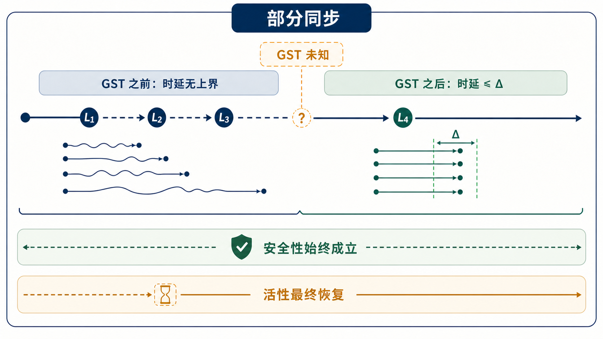

**出处**：Cynthia Dwork、Nancy Lynch、Larry Stockmeyer[《Consensus in the Presence of Partial Synchrony》](https://doi.org/10.1145/42282.42283)，JACM 35(2):288–323，1988（[作者主页存档 PDF](https://groups.csail.mit.edu/tds/papers/Lynch/jacm88.pdf)）。2007 年 Dijkstra 奖。

**内容**：在纯同步与纯异步之间刻画了**部分同步**家族，两种表达：①存在时延与速度上界，但算法事先不知道；②算法知道上界，但上界只在某个未知的**全局稳定时间（GST）**之后成立。在这些模型下确定性共识**可解**。

**思考**：这是绕过 FLP 的第一条康庄大道。**部分同步不是"网络大约比较快"的含糊说法，而是把"安全性无条件、活性有条件"明确写进模型。** 协议哲学可概括为：异步期间不做危险决定，最终同步之后恢复进展。

### 4.2 故障检测器：◇W 与 Ω——改信息假设

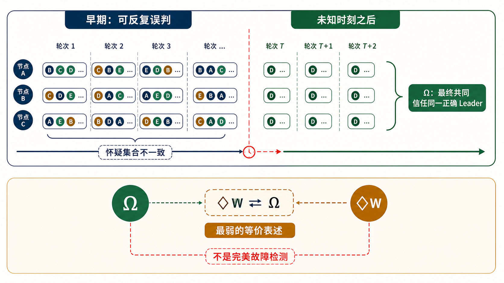

**出处**：T. Chandra 与 S. Toueg[《Unreliable Failure Detectors for Reliable Distributed Systems》](https://doi.org/10.1145/226643.226647)，JACM 43(2):225–267，1996；T. Chandra、V. Hadzilacos、S. Toueg[《The Weakest Failure Detector for Solving Consensus》](https://doi.org/10.1145/234533.234549)，JACM 43(4):685–722，1996。2010 年 Dijkstra 奖。

**内容**：把"关于故障的信息"抽象成一个允许犯错的外挂模块。Chandra–Toueg 证明：即使允许犯**无穷多次**错误的 **◇W（最终弱）**检测器也足以解共识（需 n > 2f）。CHT 进一步给出"最弱"的精确答案，论文主定理以 ◇W 陈述；其关键中间构造 **Ω（最终领导者）**只要求"经过某个有限但未知的时间后，所有正确节点最终信任同一个正确节点作为领导者"——Ω 与 ◇W 可互相实现，因此二者**同为**"解决共识所需最弱检测器"的等价表述。论文同时证明共识与原子广播互相可归约（见 4.3）。

> **说明**："CHT 的最弱答案究竟是 ◇W 还是 Ω"在二手文献里常被各执一词。原文事实是：论文声明的主定理针对 ◇W（"we prove that ◇W is indeed the weakest failure detector for solving Consensus"），Ω 在证明中引入且与 ◇W 等价。两种说法都有依据，不存在谁推翻谁。

**思考**：它把"绕过 FLP"从时序假设翻译成**"缺多少信息"**的精确问题。Ω 的表述还揭示了 Leader 的理论作用：**Leader 不是为了拥有真理，而是为了最终打破提案竞争，使所有正确节点沿同一方向推进。** 收敛之前反复误判、反复换主都无所谓，只要最终不再分裂。

### 4.3 共识与原子广播等价

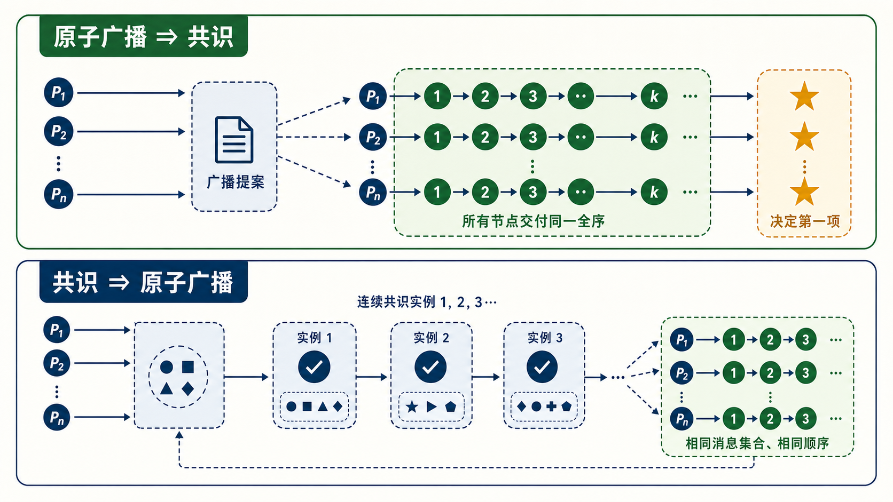

**出处**：等价性由 Chandra & Toueg（JACM 43(2), 1996）给出；系统综述见 X. Défago、A. Schiper、P. Urbán[《Total Order Broadcast and Multicast Algorithms: Taxonomy and Survey》](https://doi.org/10.1145/1041680.1041682)，ACM Computing Surveys 36(4):372–421，2004。

**内容**：原子（全序）广播要求所有正确节点交付相同的消息集合、以相同顺序交付、不重复不凭空产生。从原子广播构造共识：每个节点广播自己的提案，取全序中的第一项。反过来：连续运行共识实例，对下一批消息的顺序达成一致。在标准崩溃故障模型下两者可互相归约。

**思考**：这解释了为什么数据库复制强调**日志全序**、Paxos/Raft 表面强调**共识**、状态机复制强调**相同命令序列**——它们围绕的是同一个核心能力：**让多个节点认可同一条不可分叉的决定序列。**

### 4.4 状态机复制（SMR）

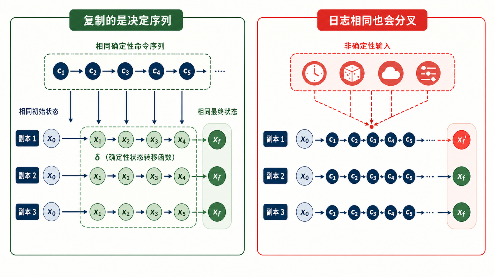

**出处**：思想雏形见 Lamport 1978（3.1）；系统化表述见 Fred Schneider[《Implementing Fault-Tolerant Services Using the State Machine Approach: A Tutorial》](https://doi.org/10.1145/98163.98167)，ACM Computing Surveys 22(4):299–319，1990。

**内容**：**相同初始状态 + 相同确定性命令序列 = 相同最终状态。** 因此复制系统不需持续交换完整状态，只需让所有副本对命令及其顺序达成一致，然后各自执行。日志不只是"数据备份"，而是各副本共同认可的**状态演化依据**。

**思考**：它要求严格控制非确定性来源——随机数、系统时间、外部服务返回、线程调度、遍历顺序。否则日志相同，副本状态仍可能分叉。这是工程实现中最常见、也最难排查的一类正确性事故。

### 4.5 随机化共识——改确定性

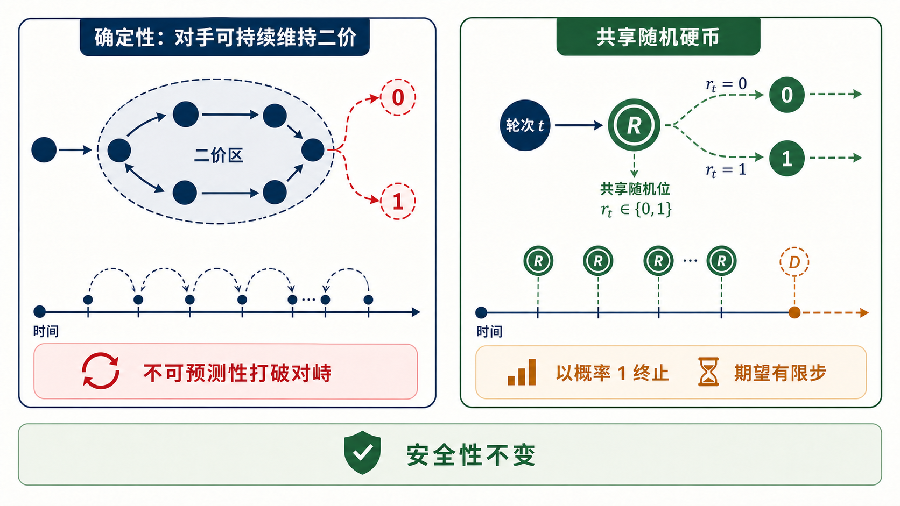

**出处**：Michael Ben-Or[《Another Advantage of Free Choice: Completely Asynchronous Agreement Protocols》](https://dblp.org/rec/conf/podc/Ben-Or83)，PODC 1983；Michael Rabin[《Randomized Byzantine Generals》](https://dblp.org/rec/conf/focs/Rabin83)，FOCS 1983。两文同获 **2015 年 Dijkstra 奖**。

**内容**：FLP 只排除**确定性**算法在所有调度下终止。引入随机化（共享硬币）后，异步共识可**以概率 1 终止**（期望有限步）——对手无法预知投掷结果，也就无法持续维持二价状态。Ben-Or 完全分布式但需指数期望轮数；Rabin 用密码学共享硬币做到常数期望轮数。

**思考**：思想不是"随机数比确定性更正确"，而是——**当对手能针对确定性行为精确安排调度时，引入不可预测性可以打破无限对峙。** 现代异步 BFT（HoneyBadgerBFT、Dumbo 系列）全部建立在此。它同时也是 1.10 中"对称性破坏"的一种来源。

### 4.6 Paxos 与《兼职议会》

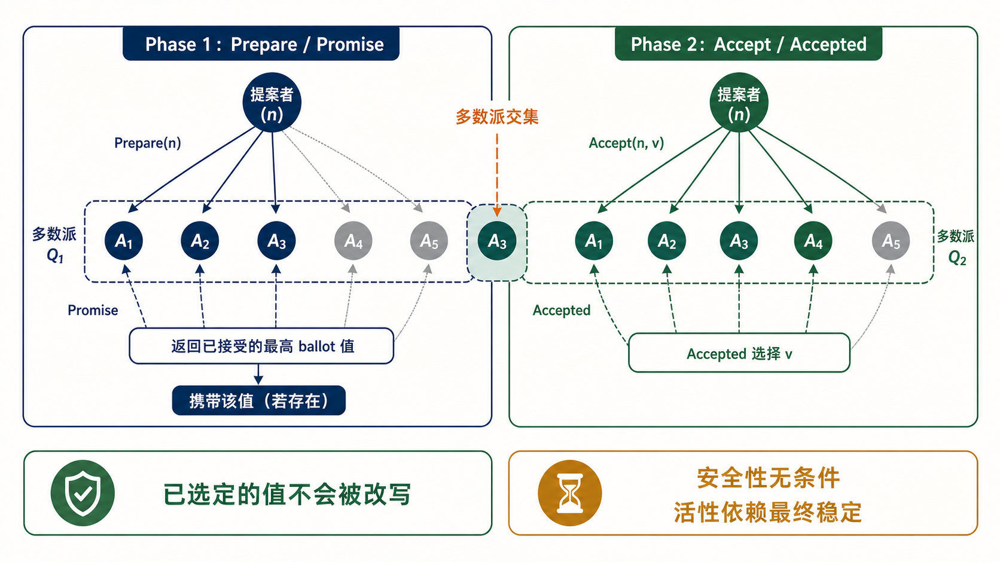

**出处**：Leslie Lamport[《The Part-Time Parliament》](https://doi.org/10.1145/279227.279229)，ACM TOCS 16(2):133–169，1998（初稿 1990 年提交）；通俗版[《Paxos Made Simple》](https://lamport.azurewebsites.net/pubs/paxos-simple.pdf)，SIGACT News 32(4):18–25，2001。

**内容**：单调递增的提案编号（ballot）+ 两阶段（Prepare/Promise、Accept/Accepted）+ 多数派——任意两个多数派必然相交，保证已被选定的值不会被改写。核心性质：**安全性不依赖任何时序假设**（任意异步下都不会选出两个不同的值），**活性依赖部分同步**——恰好落在 DLS 框架内。

**思考**：Paxos 不违反 FLP，它是"**在不违反不可能性的前提下把能要的全要到**"的典范。这也是判断任何共识协议是否靠谱的标尺：**安全性必须无条件，活性可以有条件。**

### 4.7 Raft：把可理解性当作一等目标

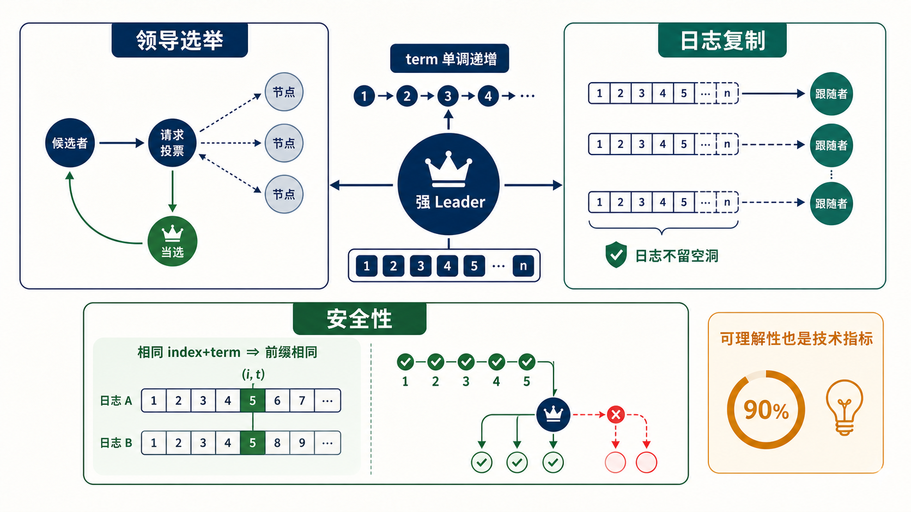

**出处**：Diego Ongaro 与 John Ousterhout[《In Search of an Understandable Consensus Algorithm》](https://raft.github.io/raft.pdf)，USENIX ATC 2014（最佳论文——经作者本人简历核实）。

**内容**：与 Paxos 等价的共识协议，通过**问题分解**（领导选举 / 日志复制 / 安全性）与**状态空间收缩**（强 leader、日志不允许空洞、term 单调）降低理解成本。论文包含一项少见的**用户研究**，以学生理解测验作为算法评价指标之一。

**思考**：这是对 Paxos 传播失败公案（6.2）的直接回应，也是一个方法论声明——**在工程领域，"可被正确实现"本身就是算法的技术指标**。etcd、Consul、TiKV 的选择说明了这一点。

### 4.8 法定人数交集：多数派不是魔法，交集才是本质

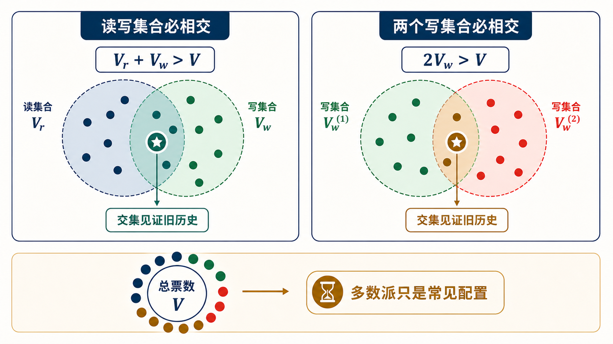

**出处**：Robert Thomas[《A Majority Consensus Approach to Concurrency Control for Multiple Copy Databases》](https://dblp.org/rec/journals/tods/Thomas79)，ACM TODS 4(2):180–209，1979；David Gifford[《Weighted Voting for Replicated Data》](https://dblp.org/rec/conf/sosp/Gifford79)，SOSP 1979, pp. 150–162。

**内容**：设总票数 V、读法定人数 $V_r$、写法定人数 $V_w$，要求 $V_r + V_w > V$（保证任意读集合与此前写集合相交）与 $2 \cdot V_w > V$（保证两个写集合相交）。集合相交的作用，是让后续操作**至少接触到某个携带先前决定、版本或锁定信息的节点**。

**思考**：多数派只是满足交集条件的一种对称且方便的配置。真正的协议基础是：**新决定必须与足够多的旧决定见证者相交，从而无法完全绕过已有历史。** Dynamo 把 N/R/W 做成可调旋钮，正是这条 1979 年原理的运维化。

### 4.9 Flexible Paxos：并非所有法定人数都必须彼此相交

Flexible的中文含义：灵活的、灵便的、有弹性的、可变通的。

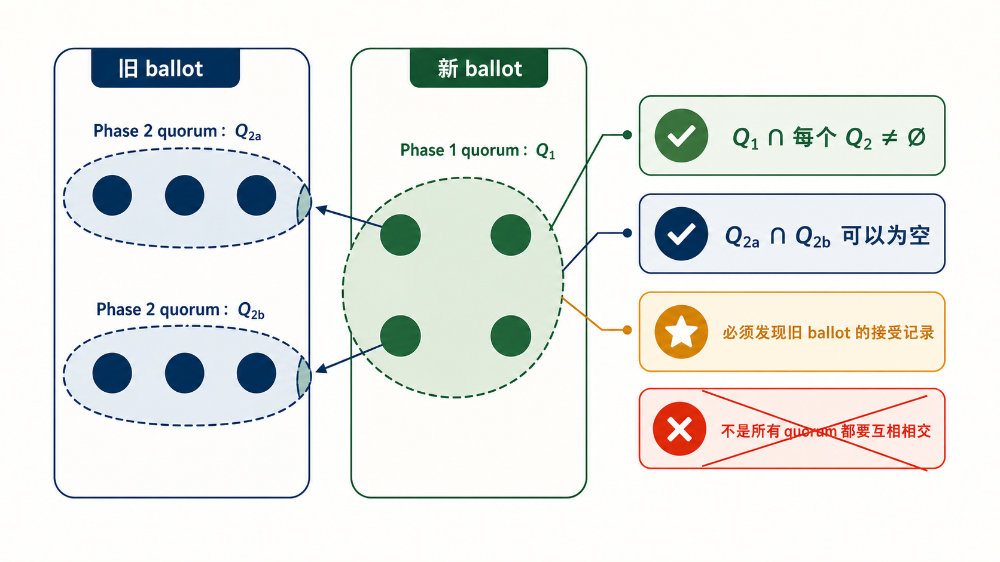

**出处**：Heidi Howard、Dahlia Malkhi、Alexander Spiegelman[《Flexible Paxos: Quorum Intersection Revisited》](https://arxiv.org/abs/1608.06696)，OPODIS 2016。

**内容**：安全性真正要求的只是——**第一阶段法定人数必须与可能使用过的第二阶段法定人数相交**。不同第二阶段法定人数之间不必直接相交，因为新一轮提案在进入第二阶段前，必须通过第一阶段接触到旧轮次的接受记录。由此可以做出如"写 quorum = 全部节点、读 quorum = 1 个节点"之类的非对称配置。

**思考**：它把 4.8 的直觉精确化，并破除了"必须过半"的迷信。正确的提问方式是：**哪些历史必须被新操作发现？哪两个阶段之间必须建立交集？哪些集合永远不会直接竞争？** 多数派是交集几何的一种实现，而不是 Paxos 安全性的定义。

### 4.10 ABD：线性一致存储比共识容易

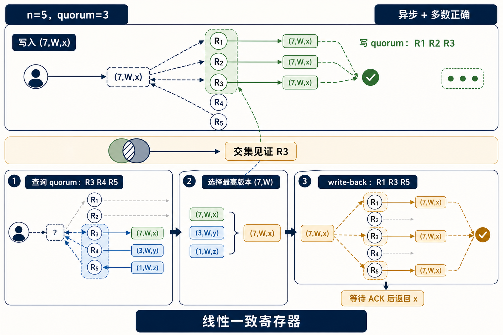

**出处**：Hagit Attiya、Amotz Bar-Noy、Danny Dolev[《Sharing Memory Robustly in Message-Passing Systems》](https://doi.org/10.1145/200836.200869)，JACM 42(1):124–142，1995（PODC 1990 首发）。

**内容**：在**异步**、崩溃故障、多数节点正确的消息传递系统中，可通过法定人数 + 版本号 + **读回写**实现无等待的**线性一致读写寄存器**——读操作不仅查找最高版本，必要时还把该版本重新传播到法定人数，使已被观察到的值不会在后续读中消失。

**思考**：这看似与 FLP 矛盾，其实不然：**原子寄存器的共识数是 1**（2.7），它比共识弱得多。**"异步下共识不能保证终止"不等于"异步下所有强一致对象都不可实现"。** 这解释了为什么 Cassandra 加个轻量事务就能做到线性一致读，而不必上完整的 Raft。

### 4.11 PBFT：把拜占庭容错拉进工程

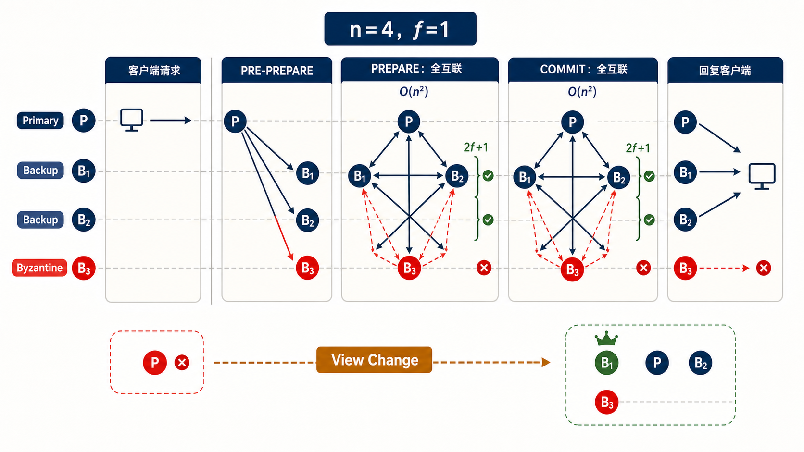

**出处**：Miguel Castro 与 Barbara Liskov[《Practical Byzantine Fault Tolerance》](https://dblp.org/rec/conf/osdi/CastroL99)，OSDI 1999。

**内容**：在 n ≥ 3f+1 下用三阶段协议（pre-prepare / prepare / commit）加视图切换，把 BFT 从指数级消息复杂度降到 **O(n²)**，并在实际系统上跑出可接受性能（相对无副本仅慢约 3%）。

**思考**：它证明了拜占庭容错**不是学术玩具**，直接催生了 HotStuff（线性复杂度 + 流水线）、Tendermint 等。O(n²) 也正是 BFT 系统规模上不去的根本原因。

### 4.12 中本聪共识——同时改故障模型、确定性与问题定义

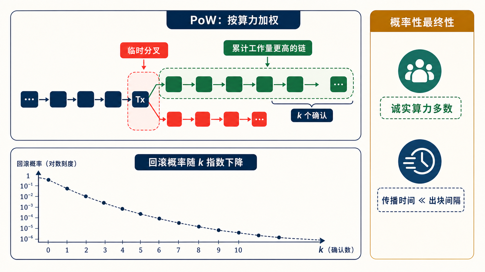

**出处**：中本聪[《Bitcoin: A Peer-to-Peer Electronic Cash System》](https://bitcoin.org/bitcoin.pdf)，2008；形式化分析见 J. Garay、A. Kiayias、N. Leonardos[《The Bitcoin Backbone Protocol: Analysis and Applications》](https://dblp.org/rec/conf/eurocrypt/GarayKL15)，EUROCRYPT 2015。

**内容**：不追求**确定性最终性**而追求**概率性最终性**（等待 k 个确认后被回滚的概率指数衰减）；不限定参与者集合，用 PoW 算力作为投票权重抵御女巫攻击。它不违反任何前述下界，而是**换了一套公理**：同步性假设（区块传播 ≪ 出块间隔）+ 诚实算力多数 + 弱化的一致性目标。

**思考**：理解它的正确方式不是"它打破了拜占庭下界"（并没有），而是"**它换了一个下界不适用的模型**"。这是"改问题定义"这条通道最激进也最成功的一次实践。

### 4.13 Paxos Commit：用共识复制每个参与者的提交意愿

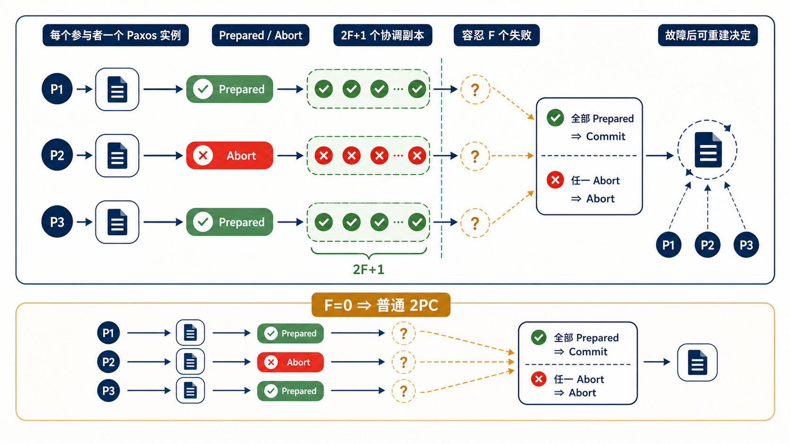

**出处**：Jim Gray 与 Leslie Lamport[《Consensus on Transaction Commit》](https://doi.org/10.1145/1132863.1132867)，ACM TODS 31(1):133–160，2006。

**内容**：不再把最终结果寄托在单个协调者的易失状态上，而是用 Paxos 对**各参与者的 Prepared/Abort 意愿**分别形成可恢复的决定。可配置 2F+1 个协调者，容忍其中 F 个失败。Gray 与 Lamport 指出：**普通 2PC 可视为 Paxos Commit 在 F=0 时的退化情形。**

**思考**：这并不意味着"换成 Paxos 就没有任何等待"，而是意味着——**把协调者的单点易失决定，提升为一个由法定人数保存、故障后可重建的共识状态。** 它是 1.5 阻塞问题在"正面构造"方向上的标准解，Spanner、TiDB 的事务协调器走的都是这条路。

---

## 五、不靠全局共识的路线：无协调、补偿、授权与自愈

上一节是"把全局决定做出来"，本节是"设法不需要全局决定，或让错误决定可恢复"。

### 5.1 CALM 定理：单调计算恰好是可无协调执行的计算

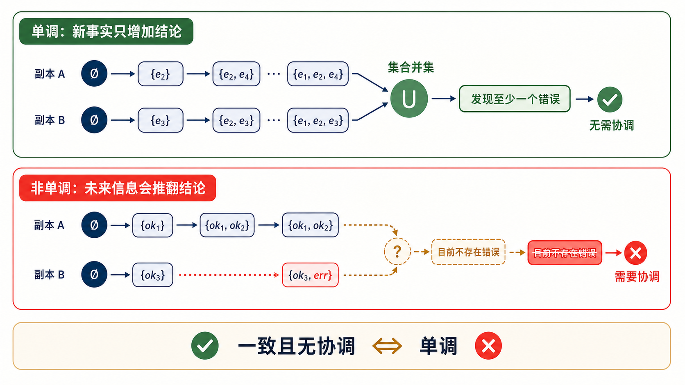

**出处**：Joseph Hellerstein 在 PODS 2010 特邀报告《The Declarative Imperative》中提出猜想；Ameloot、Neven、Van den Bussche 用 relational transducer 模型完成形式化（PODS 2011 / [JACM 60(2), 2013](https://dblp.org/rec/journals/jacm/AmelootNV13)）；综述见 J. Hellerstein 与 P. Alvaro[《Keeping CALM: When Distributed Consistency Is Easy》](https://arxiv.org/abs/1901.01930)，CACM 63(9):72–81，2020。

**内容**：**一个问题存在一致的、无协调的分布式实现，当且仅当它是单调的。** 单调 = 新事实加入后，已得出的结论不需撤回。"已经发现至少一个错误"是单调的；"目前不存在错误"通常不是——未来可能发现。集合并集单调；唯一性、全局最小值、计数的最终值往往非单调。

**思考**：这份清单里罕见的**正面定理**。它把"这里要不要加锁"从直觉判断变成可静态分析的程序性质，并给出了最深刻的解释：**真正迫使系统协调的，不是数据分布本身，而是"未来信息可能推翻当前结论"。**

### 5.2 I-Confluence：协调需求由业务不变量决定，不是数据库的固有属性

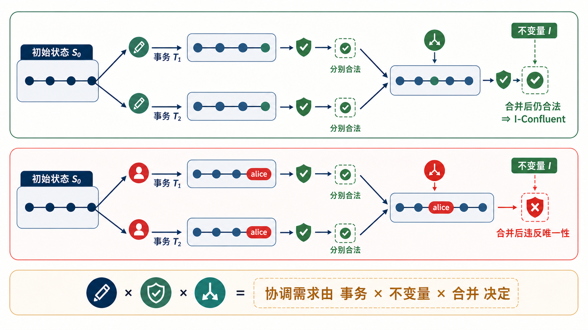

**出处**：P. Bailis、A. Fekete、M. Franklin、A. Ghodsi、J. Hellerstein、I. Stoica[《Coordination Avoidance in Database Systems》](https://www.vldb.org/pvldb/vol8/p185-bailis.pdf)，PVLDB 8(3):185–196，2014/2015。

**内容**：Invariant Confluence 不孤立判断某个数据库或某类事务，而研究**三者的组合**：初始状态、一组事务、需要保持的不变量。若两个节点从同一有效状态出发各自执行合法事务，合并后的状态仍满足不变量，则这组事务相对该不变量具有 I-Confluence，可以避免协调。例如"账户余额不得为负"与"用户名全局唯一"能否无协调实现，不取决于字段类型，而取决于事务如何修改状态、冲突如何合并、不变量如何定义。

**思考**：它是 CALM 的**业务侧对偶**——CALM 判断"计算是否单调"，I-Confluence 判断"事务与不变量的组合是否需要协调"，后者才是工程师每天真正面对的问题。核心结论：**协调需求不是数据库产品的固定属性，而是业务不变量与状态合并规则共同决定的。**

### 5.3 CRDT：把冲突设计成可交换的代数

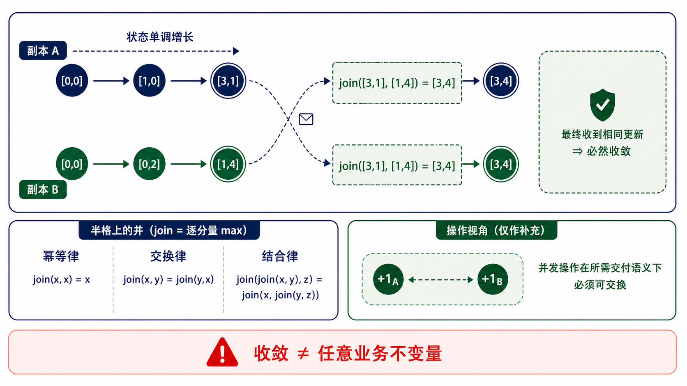

**出处**：M. Shapiro、N. Preguiça、C. Baquero、M. Zawirski[《Conflict-Free Replicated Data Types》](https://dblp.org/rec/conf/sss/ShapiroPBZ11)，SSS 2011；完整分类见 INRIA 研究报告[（HAL 开放存档）](https://hal.inria.fr/inria-00555588/document)，2011。

**内容**：状态型 CRDT 让状态在**半格**上单调增长并以 join 合并；操作型 CRDT 要求并发操作满足交换性并依赖规定的传播语义。在所有更新最终送达的前提下，收到相同更新的副本**必然收敛**到相同状态（强最终一致）。典型有 G-Counter、PN-Counter、OR-Set、LWW-Register、RGA（协同文本）。

**思考**：CRDT 是 CALM 的工程化身，但它**只自动解决"副本如何收敛"**，不自动保证线性一致、全局唯一、余额不透支或任意业务约束。公案可概括为：**不协调并不意味着随便冲突；必须预先把冲突设计成可交换、可合并、确定性的状态演算。**

### 5.4 Saga：用补偿语义代替物理撤销

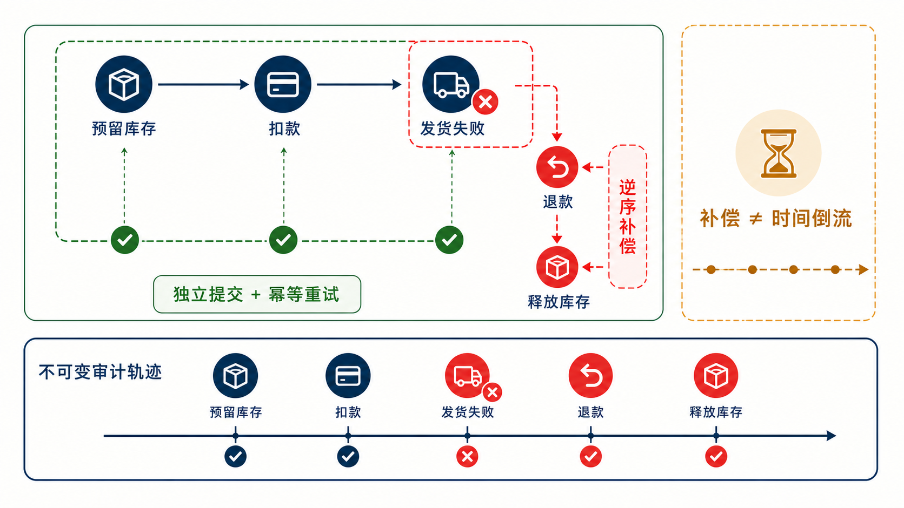

**出处**：Hector Garcia-Molina 与 Kenneth Salem[《Sagas》](https://doi.org/10.1145/38713.38742)，SIGMOD 1987, pp. 249–259。

**内容**：把长事务拆成多个可独立提交的子事务，后续步骤失败则按业务定义执行**补偿事务**。补偿不是数据库级的"时间倒流"：退款不等于付款从未发生，取消订单不保证用户从未收到通知，释放库存时该库存可能已被其他订单观察和使用。

**思考**：Saga 放弃的是长时间持锁与全局原子隔离，换取可扩展性与长流程恢复能力。它要求业务显式回答：哪些动作可补偿、补偿是否幂等、补偿失败如何重试、中间状态是否允许外部可见。**它的核心不是"没有事务"，而是把原子性从存储层问题转化为业务语义与工作流恢复问题。**

### 5.5 租约与 Fencing Token：拥有过锁，不等于现在仍有权写

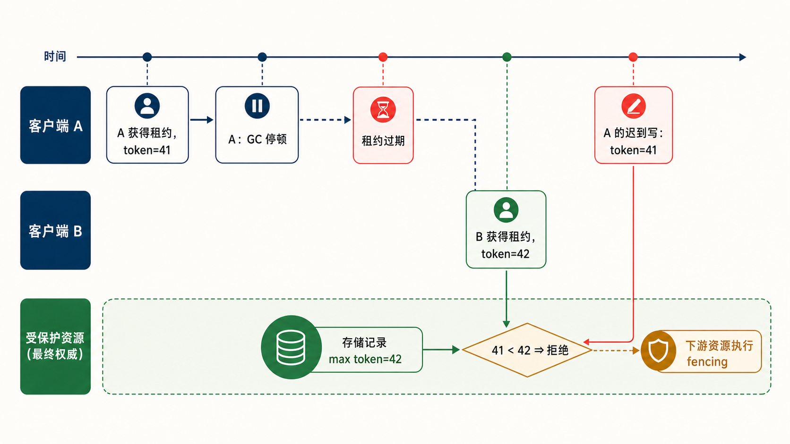

**出处**：租约见 Cary Gray 与 David Cheriton[《Leases: An Efficient Fault-Tolerant Mechanism for Distributed File Cache Consistency》](https://doi.org/10.1145/74851.74870)，SOSP 1989；工程实现（sequencer）见 Mike Burrows[《The Chubby Lock Service for Loosely-Coupled Distributed Systems》](https://research.google/archive/chubby-osdi06.pdf)，OSDI 2006；fencing token 的经典论述见 Martin Kleppmann[《How to do distributed locking》](https://martin.kleppmann.com/2016/02/08/how-to-do-distributed-locking.html)（2016）与[《DDIA》](https://dataintensive.net)第 8 章。

**内容**：**租约 = 带超时的锁**，用时间把分布式问题降级为本地判断。但典型失效序列是：A 获得租约 → A 因 GC/调度暂停停顿 → 租约过期、B 获得新租约 → A 恢复并仍以为自己有权 → A 的旧请求延迟到达存储。因此仅由客户端自检"我的租约是否过期"**不足以**阻止陈旧写入。必须为每次授权分配**单调递增的世代号（fencing token）**，由真正执行写入的资源拒绝小于当前世代的请求。

**思考**：这是"误判不可避免、所以让误判无害"（1.6）的最佳范例。它揭示了分布式锁的本质：**锁服务宣布谁拥有权利还不够，被保护的资源必须能够识别并拒绝过期权利。** 只有租约没有 fencing 的分布式锁是不安全的——包括绝大多数 Redis 锁的朴素实现。

### 5.6 Spanner TrueTime：把不确定性明码标价

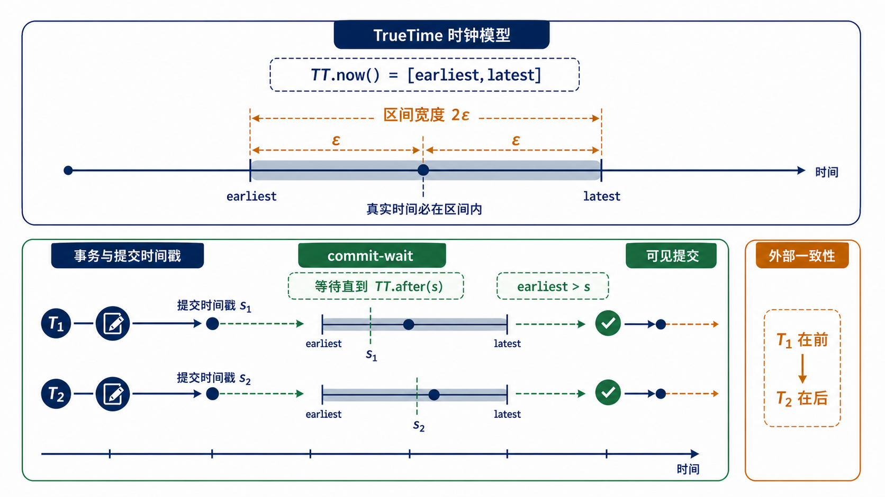

**出处**：James Corbett 等[《Spanner: Google's Globally-Distributed Database》](https://research.google/pubs/pub39966/)，OSDI 2012（最佳论文）；扩展版见 ACM TOCS 31(3), 2013。

**内容**：既然完美时钟不可能（1.7），就不假装精确：`TT.now()` 返回**区间** [earliest, latest]，保证真实时间必在其中（靠 GPS + 原子钟压到毫秒级）。事务提交执行 **commit-wait**——主动等待到 latest 过去才让事务可见，从而获得外部一致性。

**思考**：典型的工程思想——**无法消除的不确定性，不应伪装成精确值；应显式量化它，并让协议对不确定区间负责。** 它没有绕过 Attiya–Welch 下界，而是把代价从"每次读"转移到"每次写的固定尾部"。

### 5.7 自稳定：不要求永不出错，但要求最终自行恢复

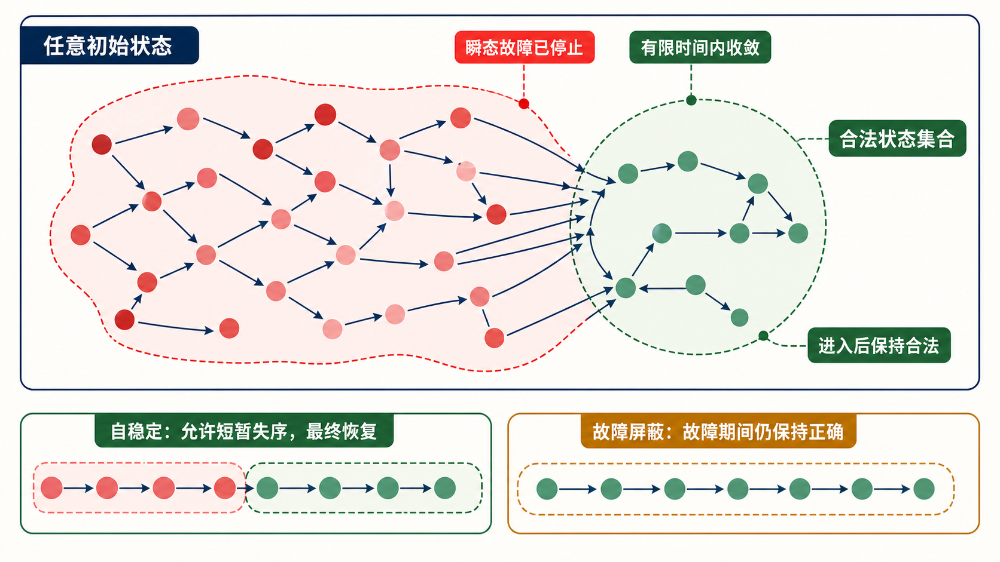

**出处**：Edsger Dijkstra[《Self-stabilizing Systems in Spite of Distributed Control》](https://doi.org/10.1145/361179.361202)，CACM 17(11):643–644，1974（手稿 [EWD391](https://www.cs.utexas.edu/~EWD/ewd03xx/EWD391.PDF) 写于 1973 年）。该文于 2002 年获 PODC 最具影响力论文奖（该奖次年更名为 Dijkstra 奖）。

**内容**：系统即使因瞬态故障进入**任意状态**（内存位翻转、计数器错乱、多个节点同时认为自己拥有某角色），只要故障停止，也能在有限时间后重新进入合法状态并此后保持。它与传统故障屏蔽是两套哲学：**故障屏蔽要求服务在故障期间仍然正确；自稳定允许短暂失序，但要求最终自行收敛。**

**思考**：它提供了第三种容错观——**不必证明系统永远不会进入坏状态，也可以证明无论它如何进入坏状态，最终都能离开。** 这条思路在实践中的化身是：无状态化 + 定期全量对账 + 幂等重放 + 周期性重建（而非试图枚举所有异常分支）。它是与 FLP 同级的基础性贡献。

---

## 六、公案与典故

### 6.1 拜占庭的命名史：原本叫"阿尔巴尼亚将军"

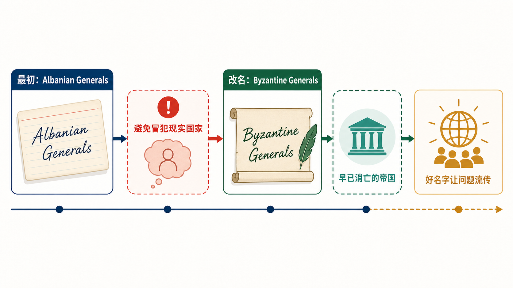

**出处**：Lamport 在个人主页[《My Writings》](https://lamport.azurewebsites.net/pubs/pubs.html)中对 1982 年论文的注解（作者本人书面记述）。

**内容**：Lamport 最初命名为"阿尔巴尼亚将军问题"，被同事劝阻——当时阿尔巴尼亚仍存在，恐有冒犯；遂改用一个早已灭亡的帝国。他后来写道：给问题起一个好名字，比证明本身更能让它流传。

**思考**：分布式领域**"叙事即传播力"**的第一个案例。同样的技术内容，包装成故事就能进入行业常识；下一条则是反面教材。

### 6.2 Paxos 的九年拒稿

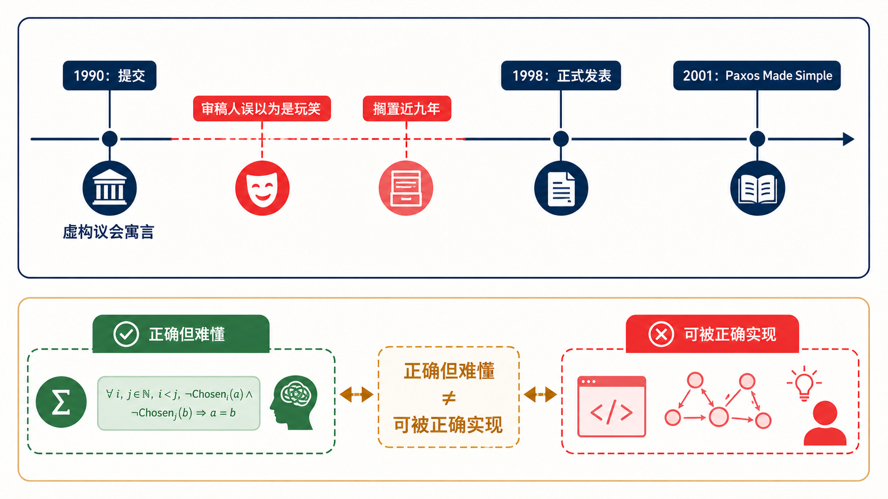

**出处**：Lamport[《My Writings》](https://lamport.azurewebsites.net/pubs/pubs.html)中对《The Part-Time Parliament》的注解；论文 1990 年提交，1998 年发表于 TOCS。

**内容**：Lamport 用虚构的古希腊议会寓言（议员随时离席、兼职立法、考古学家复原议事规程）讲述算法，审稿人认为是玩笑，论文被搁置近十年。之后因读者仍看不懂，他又写了《Paxos Made Simple》（2001），摘要只有一句话："The Paxos algorithm, when presented in plain English, is very simple."

**思考**：经典的**技术传播失败公案**。直接后果是十几年后 Raft 以"可理解性"为旗号问世（4.7）。教训是：**如果没人能正确实现你的算法，它的正确性就没有工程意义。**

### 6.3 Paxos Made Live：理论与工程之间的鸿沟

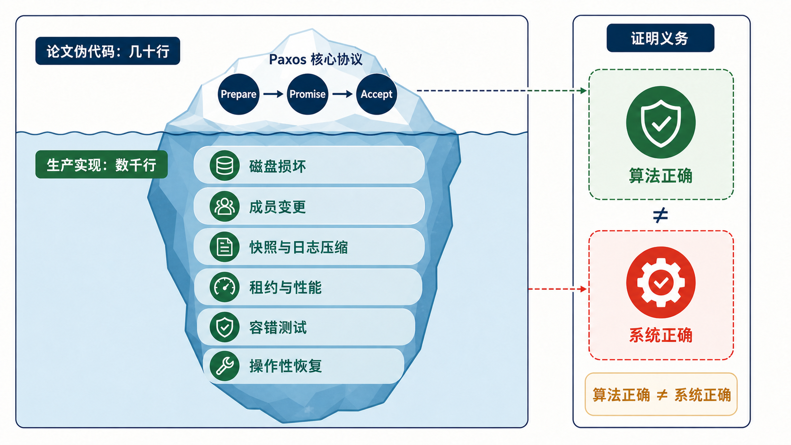

**出处**：Tushar Chandra、Robert Griesemer、Joshua Redstone[《Paxos Made Live — An Engineering Perspective》](https://dblp.org/rec/conf/podc/ChandraGR07)，PODC 2007（Google Chubby 团队）。

**内容**：伪代码几十行，实现却是数千行 C++；磁盘损坏、成员变更、快照、主节点租约、日志压缩、性能调优、以及如何测试——论文里"留给读者"的部分构成了工程的绝大部分。文中坦言他们最终依靠自建的状态机规约语言与容错测试来建立信心。

**思考**：**"算法是正确的"与"系统是正确的"是两个独立命题。** 它与 Chubby 论文（OSDI 2006）一起，构成了分布式工程实践最诚实的两份自述。

### 6.4 哲学家就餐问题：局部互斥正确，不代表全局有进展

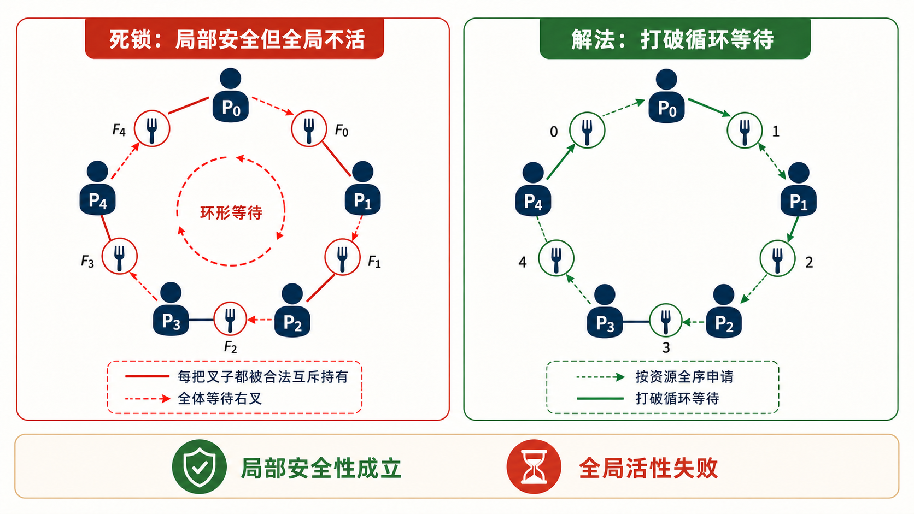

**出处**：Edsger Dijkstra，[EWD310《Hierarchical Ordering of Sequential Processes》](https://www.cs.utexas.edu/~EWD/ewd03xx/EWD310.PDF)，1971（发表于 *Acta Informatica* 1(2):115–138）；"哲学家"这一叙事包装由 Tony Hoare 定型。

**内容**：五位哲学家围坐，每人需同时拿到左右两把叉子才能进餐。若全体先拿左叉再等右叉，即形成环形等待：**每把叉子都被合法地互斥持有，没有任何局部规则被违反，但整个系统永久无法前进。** 破解手段是对资源全序编号后按序申请。

**思考**：用 0.1 的语法说——**每个组件都正确遵守局部互斥（安全性），推不出系统整体具有活性。** 这正是分布式多锁事务、资源预留、跨服务调用链死锁的原型。工程铁律"永远按固定顺序加锁"是它的直接推论。

### 6.5 Lamport 对分布式系统的定义

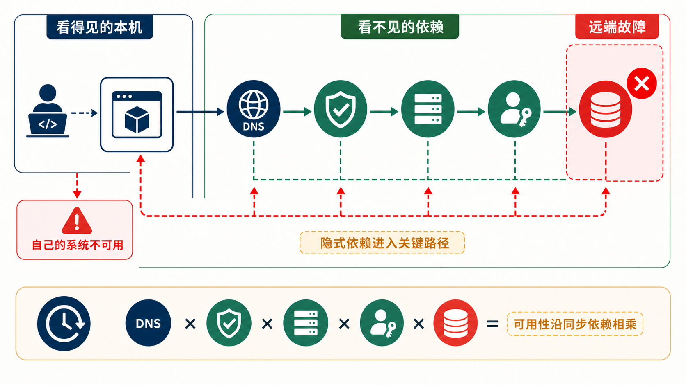

**出处**：Lamport 1987 年 5 月 28 日发给 DEC SRC 同事的一封内部邮件，原文至今挂在[他的个人主页](https://lamport.azurewebsites.net/pubs/pubs.html)上。

**内容**：

> "A distributed system is one in which the failure of a computer you didn't even know existed can render your own computer unusable."
> （分布式系统是这样一种系统：一台你压根不知道它存在的计算机坏了，竟能让你自己的计算机没法用。）

**思考**：这不是玩笑，而是最精炼的**可用性风险模型**——你的可用性 ≤ 所有**隐式**依赖的可用性之积（7.5）。现代注脚：2020 年 RavenDB 团队的真实事故中，一个无人知晓其存在的证书吊销列表（CRL）服务器宕机，导致客户端全线失败。

### 6.6 分布式计算八大谬误，与《网络是可靠的》

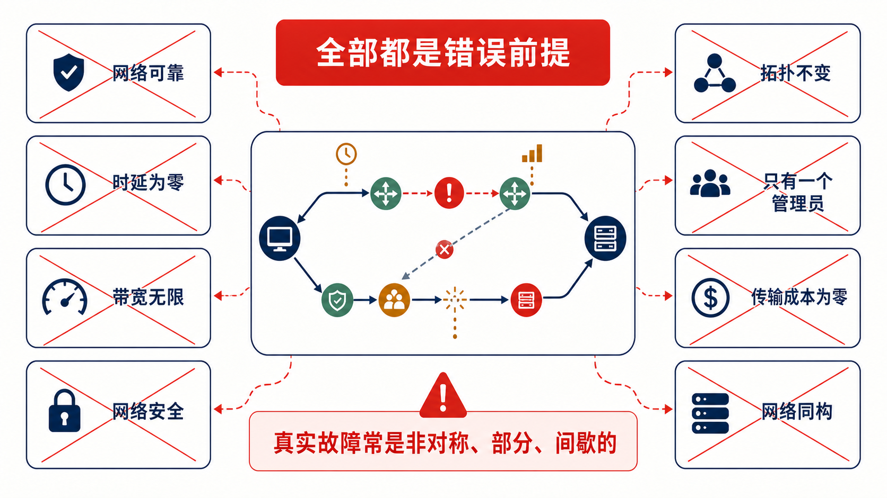

**出处**：业界公案，非论文。最初四条由 Sun 的 Bill Joy 与 Tom Lyon 于约 1991 年提出；Peter Deutsch 约 1994 年补至七条；James Gosling 约 1997 年加上第八条。

> **订正**：本条常被误引至 2010 年 MSDN Magazine 一篇关于 NHibernate 与 Rhino Service Bus 的文章——与出处完全无关。它没有权威论文来源，正确的做法是标注为口传公案。

**内容**：①网络是可靠的；②时延为零；③带宽无限；④网络是安全的；⑤拓扑不变；⑥只有一个管理员；⑦传输成本为零；⑧网络是同构的。

**思考**：Peter Bailis 与 Kyle Kingsbury 于 ACM Queue 发表[《The Network Is Reliable》](https://queue.acm.org/detail.cfm?id=2655736)（2014），标题直接反讽谬误①，用大量真实故障报告证明网络分区远比工程师想象中常见，且往往是**非对称的、部分的、间歇的**——比全断更难处理。这份清单是前面所有定理的"人话版"，可当作开工前检查表。

### 6.7 脑裂与 STONITH

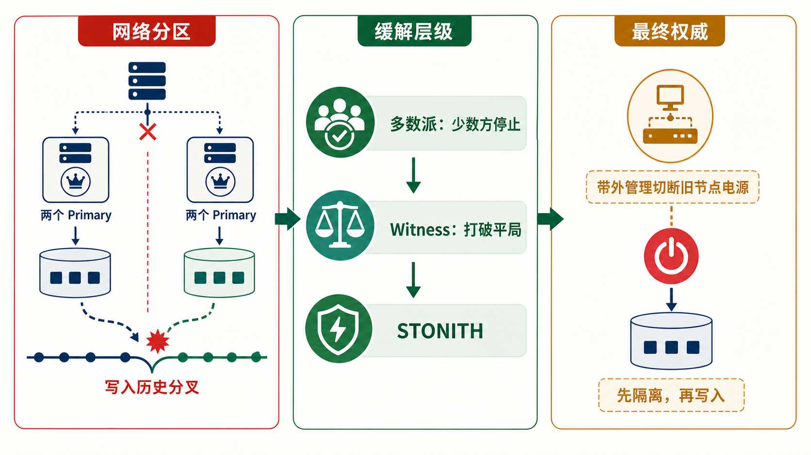

**出处**：术语源自高可用集群工程实践（Linux-HA / Pacemaker 项目文档），非学术论文，无链接。

**内容**：网络分区导致两个子集群各自选出主节点，都认为自己有权写入，数据永久分叉。对策：多数派仲裁（少数派自杀）、见证节点/仲裁盘打破对称、以及硬件级的 **STONITH**——Shoot The Other Node In The Head，通过 IPMI 或智能电源直接切断对方供电。

**思考**：这个粗暴的名字本身就是一句箴言：**当无法在软件层达成一致时，就用物理手段消除歧义。** 它是对 1.6 的另一种回应——既然无法确知对方是否还活着，那就确保它死了。

### 6.8 尾延迟放大（The Tail at Scale）

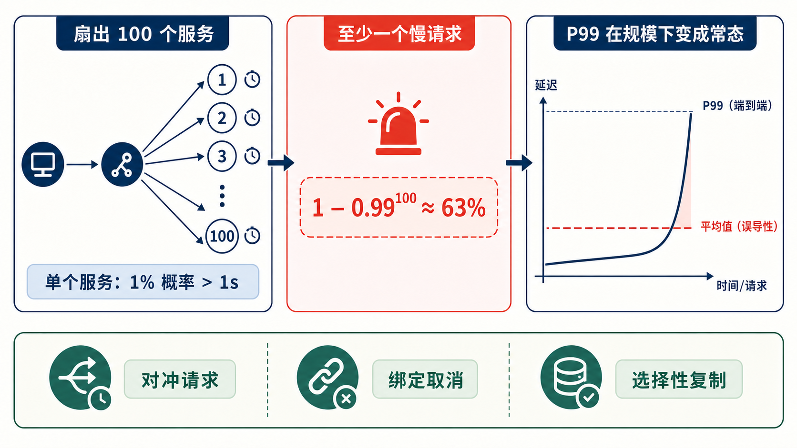

**出处**：Jeffrey Dean 与 Luiz André Barroso[《The Tail at Scale》](https://research.google/pubs/pub40801/)，CACM 56(2):74–80，2013。

**内容**：若一个用户请求需扇出到 100 个服务，每个服务 P99 延迟为 1 秒，则该请求约有 **63%** 的概率至少遇到一次 1 秒延迟——**P99 变成了常态**。对策：对冲请求（hedged requests）、绑定请求（tied requests）、微分区、选择性复制、请求优先级分层。

**思考**：**规模会把罕见事件变成必然事件。** 这是"平均延迟毫无意义"的数学依据，也是必须以分位数而非均值设定 SLO 的原因。

### 6.9 GC 停顿与"僵尸领导者"

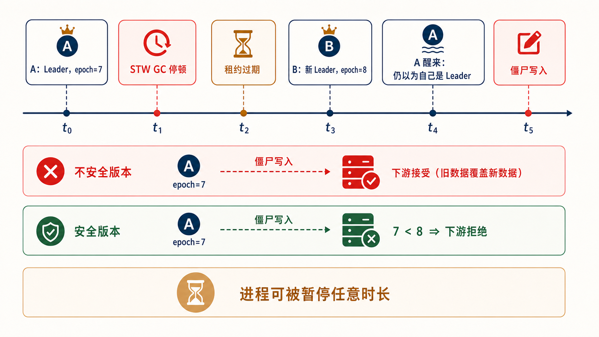

**出处**：Martin Kleppmann[《How to do distributed locking》](https://martin.kleppmann.com/2016/02/08/how-to-do-distributed-locking.html)（2016）中的核心论证；另见[《DDIA》](https://dataintensive.net)第 8 章"进程暂停"一节。

**内容**：持有租约的进程遭遇数十秒 STW GC，期间租约过期、新主选出；GC 结束后老主"醒来"，毫不知情地继续写入，造成数据损坏。这不是理论危险——JVM full GC、虚拟机热迁移、CPU 超卖抢占、swap 抖动、SIGSTOP 都能造成同等效果。

**思考**：**进程可以在任意时刻被暂停任意时长。** 因此任何"我刚检查过所以现在仍成立"的推理都是错的——检查与使用之间必然存在时间窗。唯一解法是把判定权交给下游（5.5）。

### 6.10 闰秒事故与 leap smear

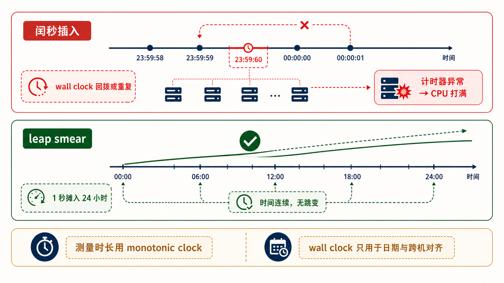

**出处**：2012 年 6 月 30 日闰秒引发的大规模故障（Linux 内核 futex/hrtimer 相关缺陷）；Google 的应对方案见其 2011 年博文[《Time, technology and leaping seconds》](https://developers.googleblog.com/2011/09/time-technology-and-leaping-seconds.html)。

**内容**：闰秒插入导致大量 Linux 服务器 CPU 打满，Reddit、Mozilla、Qantas 订票系统等接连故障。Google 的对策是 **leap smear**：不插入那一秒，而是把它摊到前后 24 小时内，让每一秒都稍微变长，对上层完全透明。

**思考**：**物理时钟不是单调的**——它可以回拨、跳变、被 NTP 强行拉齐。工程铁律：测量时长必须用 monotonic clock，wall clock 只用于展示与跨机器对齐（且需带误差）。

### 6.11 灰色故障（Gray Failure）

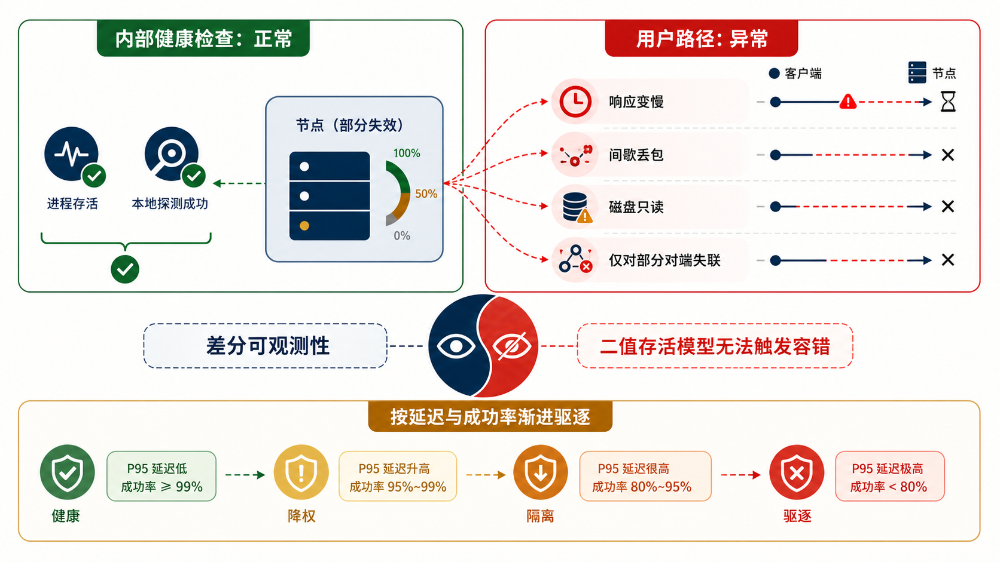

**出处**：Peng Huang、Chuanxiong Guo、Lidong Zhou、Jacob Lorch、Yingnong Dang、Murali Chintalapati、Randolph Yao[《Gray Failure: The Achilles' Heel of Cloud-Scale Systems》](https://dblp.org/rec/conf/hotos/HuangGLZDCY17)，HotOS 2017。

**内容**：节点没有崩溃，但"半死不活"：响应变慢、间歇丢包、磁盘转只读、只对部分对端失联。核心概念是**差分可观测性（differential observability）**——系统自身的健康检查认为它是好的，真实用户体验到的是坏的，于是容错机制根本不会被触发。

**思考**：**二值的存活/死亡模型过于粗糙**，而灰色故障的危害往往大于彻底宕机。现代系统因此转向基于延迟分位数与成功率的渐进式驱逐：异常点检测、慢节点降权、请求对冲（6.8）。

### 6.12 元稳定失效（Metastable Failure）

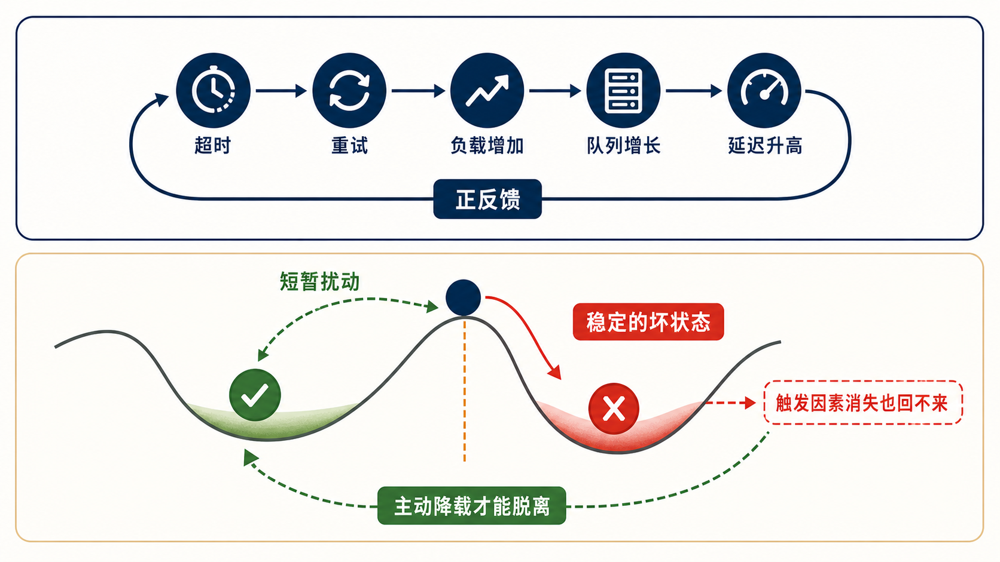

**出处**：Nathan Bronson、Abutalib Aghayev、Aleksey Charapko、Timothy Zhu[《Metastable Failures in Distributed Systems》](https://dblp.org/rec/conf/hotos/BronsonACZ21)，HotOS 2021。

**内容**：系统被一次短暂扰动推入一个**能自我维持的坏状态**——即使触发因素消失也回不来。典型机制是正反馈的工作放大：超时催生重试，重试增加负载，负载拉高延迟，延迟又制造更多超时。系统在"稳定的坏状态"里持续运转，重启单个节点无济于事，往往必须主动降载才能跳回好状态。

**思考**：**分布式系统的失效常常不是"崩溃"，而是"陷入了另一个稳定态"**——所有组件看起来都在正常工作，这是最难排查的一类故障。它也是无界重试与无界队列（7.6）成为头号反模式的原因。

### 6.13 Jepsen 与混沌工程

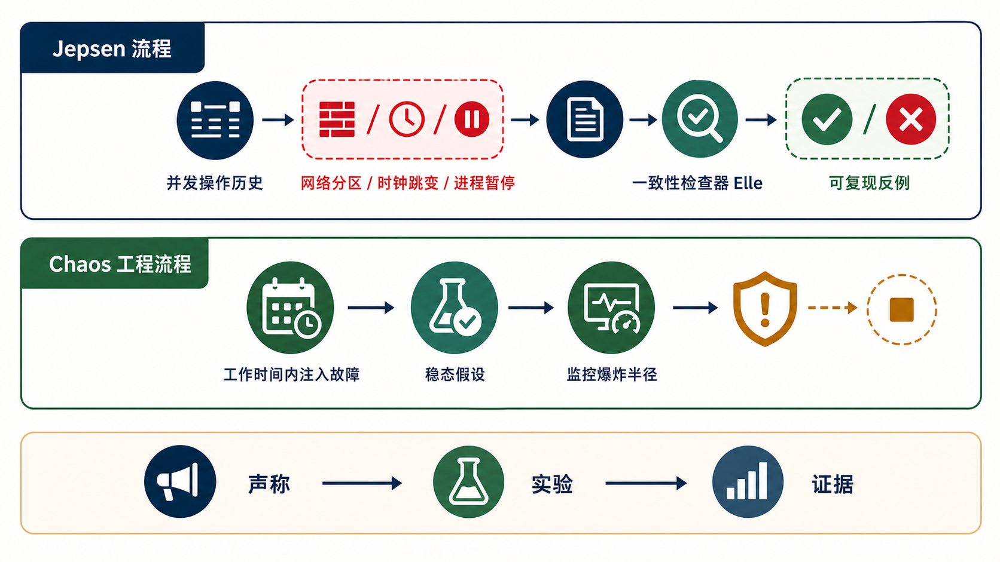

**出处**：Kyle Kingsbury 的 [Jepsen 系列分析](https://jepsen.io)（2013 至今）；混沌工程见 Netflix Chaos Monkey（2011 年随 Simian Army 公布、[2012 年开源](https://github.com/Netflix/chaosmonkey)）与[《Principles of Chaos Engineering》](https://principlesofchaos.org)（2015）。

**内容**：Jepsen 用可控的网络分区、时钟跳变、进程暂停对数据库做黑盒测试，并用一致性检查器（Knossos / Elle）验证历史记录，**几乎击穿了当时每一款主流分布式数据库宣称的一致性保证**。Chaos Monkey 走另一条路：在**工作时间内**随机杀生产实例，逼迫系统在工程师清醒时暴露弱点。

**思考**：两者共同完成了一次范式转移——把"容错能力"从**声称的属性**变成**被持续验证的属性**。在 Jepsen 之前，一致性是文档里的一句话；之后，它是一份可复现的测试报告。

---

## 七、工程箴言与经验法则

### 7.1 端到端论证

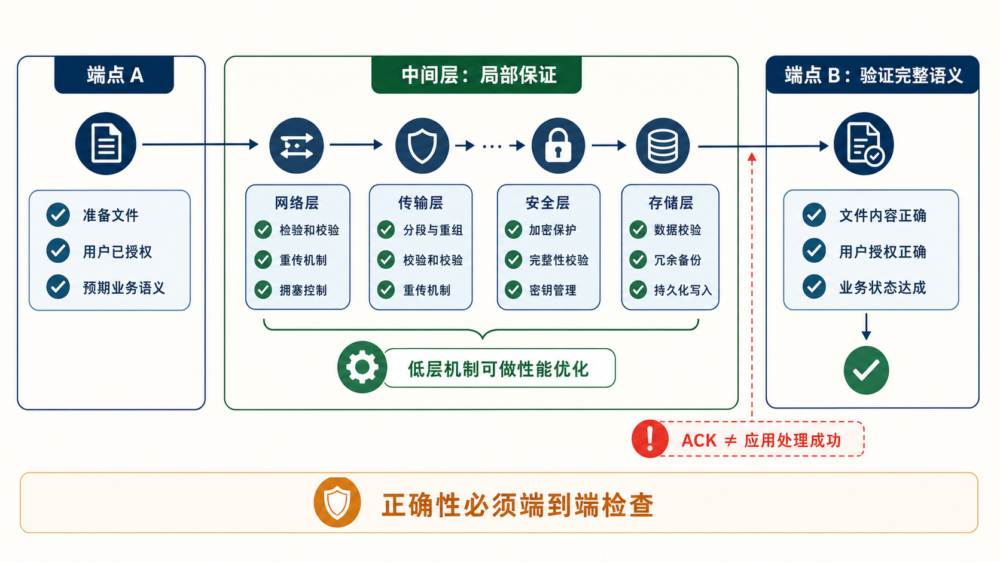

**出处**：J. Saltzer、D. Reed、D. Clark[《End-to-End Arguments in System Design》](https://doi.org/10.1145/357401.357402)，1981 年会议宣读，正式发表于 ACM TOCS 2(4):277–288，1984。

**内容**：许多功能（可靠传输、加密、去重、事务完整性）**只有在通信端点才能被完整、正确地实现**；放在低层做，相对其成本而言往往冗余或价值有限，因为端点应用无论如何都要自己再校验。低层机制应作为**性能优化**存在，而非正确性保证。

**思考**：网络的"笨"是有意为之。在 exactly-once 讨论中这条尤其关键：**消息中间件知道消息被投递，不等于业务知道外部效果已经正确完成**（1.9）。它是判断"这个保证该放在哪一层"的通用标尺。

### 7.2 幂等性：分布式的救生索

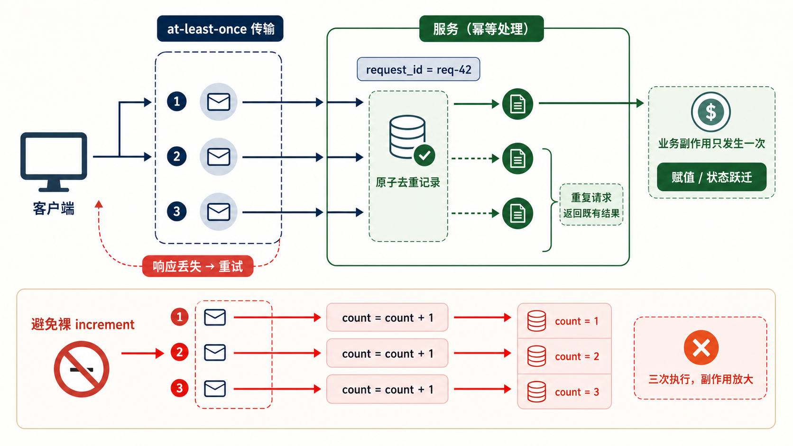

**出处**：领域共识；HTTP 语义中的形式化定义见 [RFC 7231 §4.2.2](https://www.rfc-editor.org/rfc/rfc7231#section-4.2.2)。

**内容**：既然 exactly-once 投递不可能，正确姿势是：**传输层做 at-least-once，业务层做幂等**。手段包括唯一请求 ID + 去重表、条件写（CAS / If-Match / 乐观版本号）、以及天然幂等的操作设计（赋值而非累加、状态机跃迁而非增量）。

**思考**：**幂等性不是优化，是分布式系统的基本卫生要求。** 不幂等的接口在重试面前等同于定时炸弹，而重试在分布式系统中不可避免。

### 7.3 Conway 定律与逆 Conway 策略
康威定律

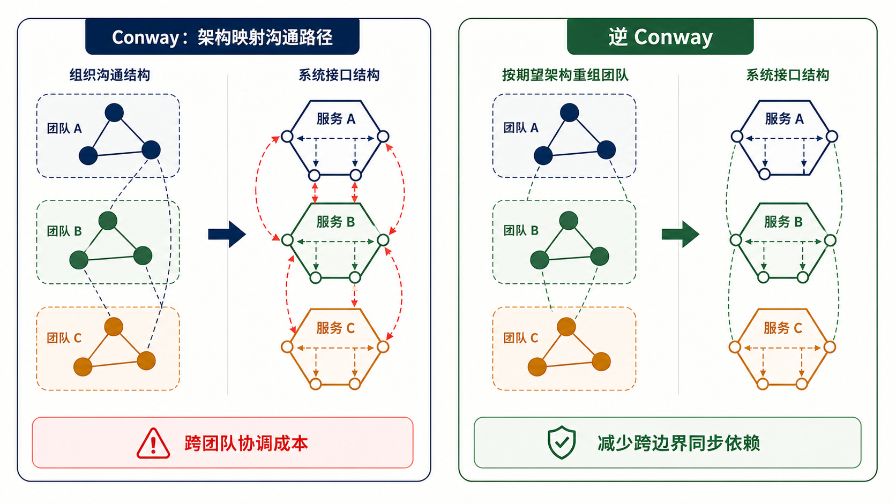

**出处**：Melvin Conway[《How Do Committees Invent?》](https://melconway.com/Home/pdf/committees.pdf)，*Datamation* 14(4):28–31，1968 年 4 月。

**内容**：**"设计系统的组织，其产出的设计等价于该组织的沟通结构。"** 推论：若服务边界不与团队边界对齐，跨团队协调成本会淹没技术收益，微服务退化为"分布式单体"。**逆 Conway 策略**：先按你想要的架构重组团队。

**思考**：**架构问题常常是组织问题的投影。** 很多"技术上讲不通"的系统边界，放在组织结构图上一看就通了。

### 7.4 Hyrum 定律
海勒姆定律

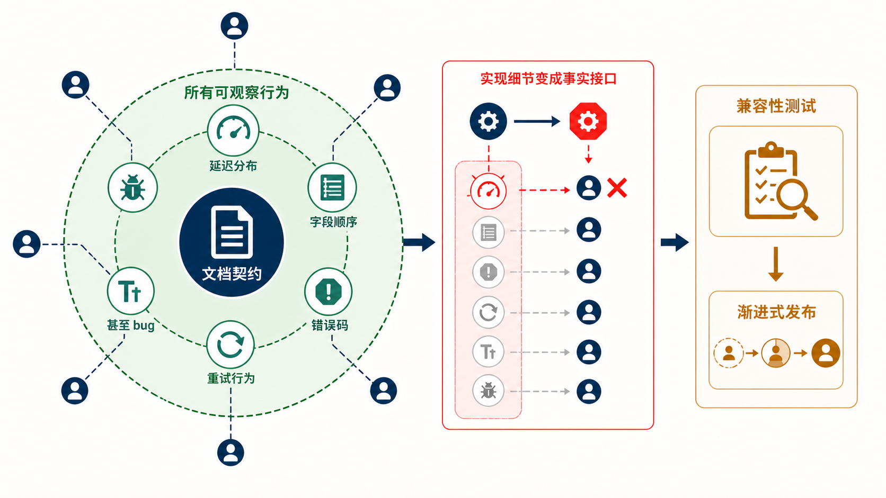

**出处**：Hyrum Wright 提出（[hyrumslaw.com](https://hyrumslaw.com)），收录于《Software Engineering at Google》，O'Reilly，2020。

**内容**：**"当一个 API 有足够多的用户时，你在契约中承诺什么并不重要：系统所有可观察的行为，都会被某个人依赖。"**

**思考**：在分布式系统中尤其致命——**你的实现细节就是你的接口**：响应时间分布、字段顺序、错误码、重试后的行为、甚至 bug，都已经是下游的依赖。这也是灰度发布、契约测试与"永不修复的兼容性 bug"存在的理由。

### 7.5 可用性的乘法效应

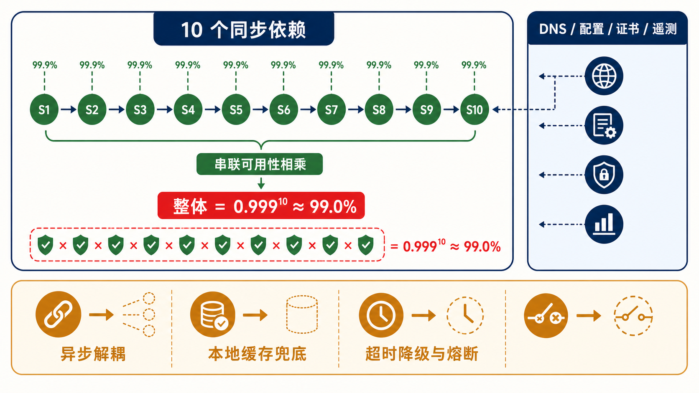

**出处**：领域经验法则，无单一出处；与 6.5 互为表里。

**内容**：串联的同步依赖，可用性相乘。10 个各自 99.9% 的服务串起来，整体只剩 **99.0%**——每月约 7 小时不可用。而依赖往往是**隐式的**：DNS、证书吊销列表、配置中心、日志上报、旁路监控探针，都可能在你不知情时进入关键路径。

**思考**：**减少同步依赖比提升单个组件的可用性更有效。** 异步化、超时降级、本地缓存兜底、熔断，本质上都是在打断这条乘法链。

### 7.6 Little 定律与背压

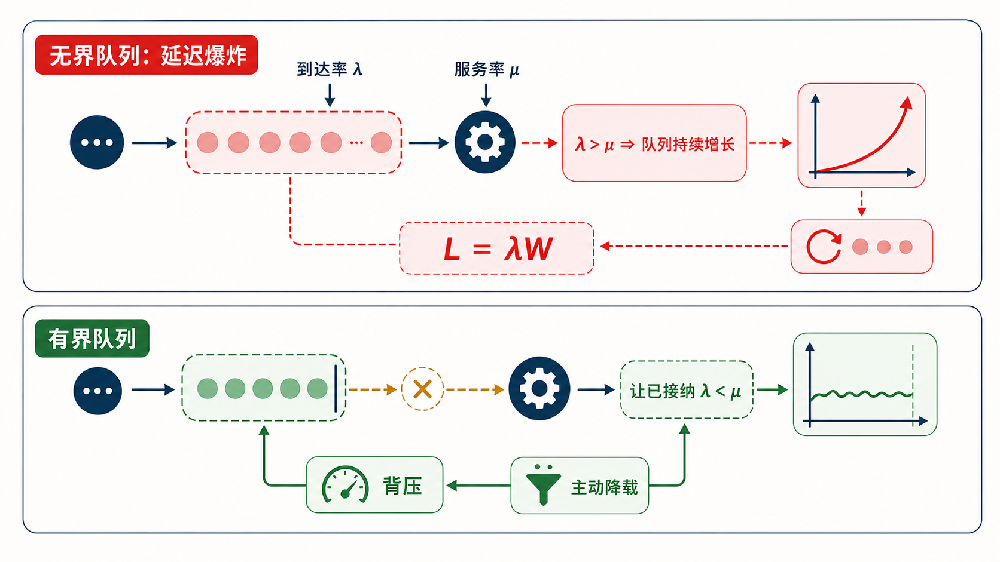

**出处**：John D. C. Little[《A Proof for the Queuing Formula L = λW》](https://dblp.org/rec/journals/ior/Little61)，*Operations Research* 9(3):383–387，1961。

**内容**：**L = λ × W**（在制品数 = 到达率 × 平均停留时间）。当到达率超过服务率，队列无限增长，延迟随之爆炸。因此**无界队列是分布式系统的头号反模式**：它把"拒绝服务"（快速、明确、可观测）悄悄转化为"延迟无限增长"（缓慢、隐蔽、级联）。正解是有界队列 + 背压 + 主动降载。

**思考**：排队论是分布式性能问题的第一性原理，也是元稳定失效（6.12）的数学解释。**一个塞满的无界队列，就是一台正在酝酿元稳定失效的机器。**

### 7.7 不要用分布式解决非分布式问题

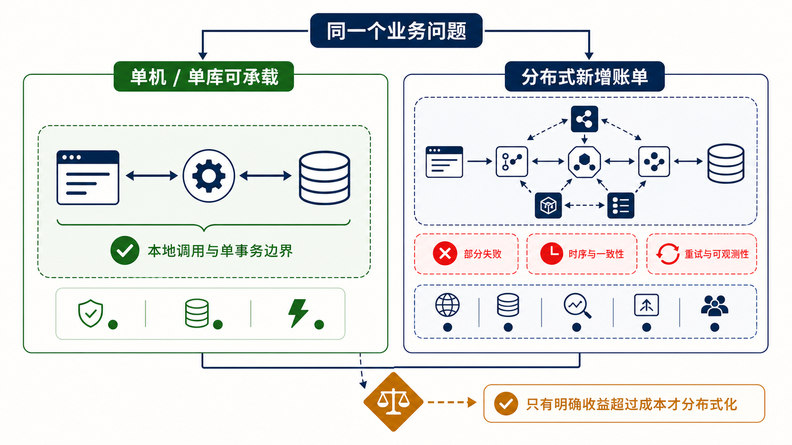

**出处**：领域共识；相关论述见 Martin Fowler[《MonolithFirst》](https://martinfowler.com/bliki/MonolithFirst.html)（2015）与大量关于"分布式单体"的工程复盘。

**内容**：分布式带来的不只是复杂度增加，而是**问题种类的变化**——从"逻辑 bug"变成"部分失败、时序、一致性、可观测性"。单机能解决的就不要分布式化，单库能承载的就不要分片。

**思考**：这是对本文全部内容最实用的推论：**上面这七十一条，全是你选择分布式之后才需要付的账。** 能不进这个场，就不进。

---

## 八、通览：三个物理约束、四条通道、十种购买

### 8.1 一切都源于三个物理事实

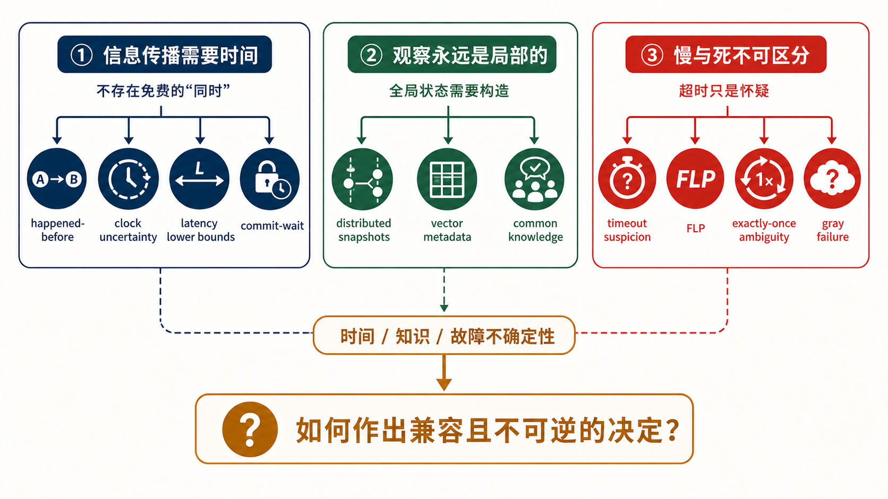

**一、信息传播需要时间 → 不存在"同时"。**
Lamport 偏序、Lundelius–Lynch 时钟下界、Attiya–Welch 延迟下界、Spanner 的 commit-wait，是同一件事的四种说法。你能看到的永远是过去的光。

**二、观察是局部的 → 不存在免费的全局状态。**
Chandy–Lamport 快照必须被"构造"、向量时钟维度不可压缩、公共知识不可达、异步可计算性的拓扑障碍——都在说同一句话：**全局视图是一个需要付费购买的推论，而不是一个可以直接读取的事实。**

**三、慢与死不可区分 → 一切故障检测都是猜测。**
两将军、FLP、完美故障检测器不可实现、exactly-once 不可能、匿名选主不可能、灰色故障的差分可观测性，全部收束于此。这也是为什么"超时"是分布式系统中最重要、也最危险的一个参数。

### 8.2 一切解法都走四条通道之一

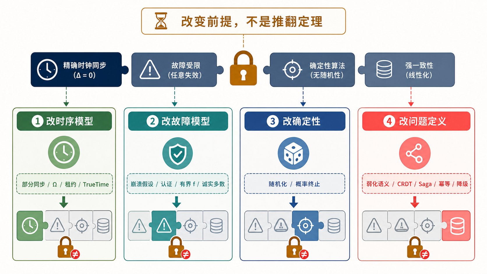

| 通道 | 打破的前提 | 代表结果 |
|---|---|---|
| **改时序模型** | "完全异步" | 部分同步 DLS、故障检测器 ◇W/Ω、租约、TrueTime |
| **改故障模型** | "任意作恶 / 任意多故障" | 崩溃-停止假设、n≥3f+1、诚实多数、认证消息 |
| **改确定性** | "确定性算法" | Ben-Or / Rabin 随机化共识、中本聪的概率最终性 |
| **改问题定义** | "必须要这么强的保证" | AP 选择、因果一致、CRDT/CALM/I-Confluence、Saga 补偿、at-least-once + 幂等、Harvest/Yield 降级、自稳定 |

### 8.3 每一种解法，本质上都在购买一种额外假设

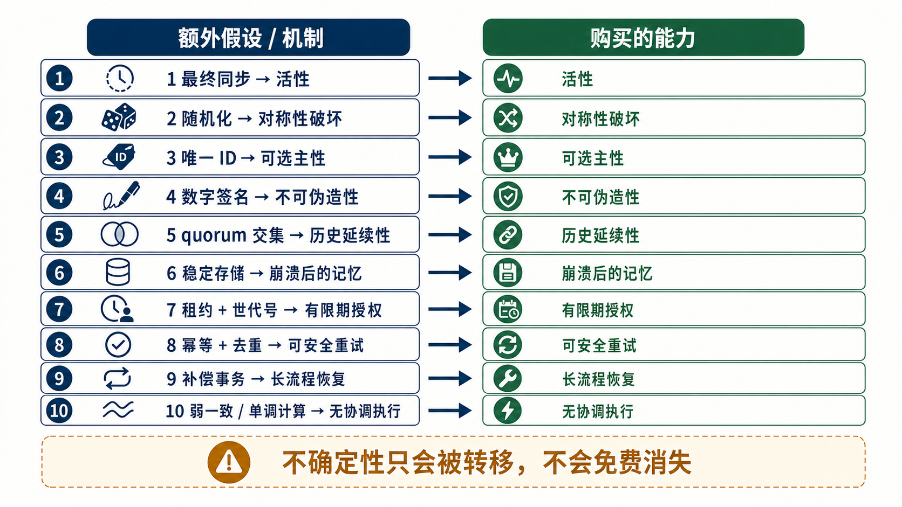

- 用**最终同步**购买活性；
- 用**随机化**购买对称性破坏；
- 用**唯一 ID**购买可选主性；
- 用**数字签名**购买不可伪造性；
- 用**法定人数与交集**购买历史延续性；
- 用**稳定存储**购买崩溃后的记忆；
- 用**租约与世代号**购买有限期授权；
- 用**幂等与去重**购买可安全重试；
- 用**补偿事务**购买长流程恢复；
- 用**弱一致或单调计算**购买无协调执行。

> **总规律**：**系统从来没有免费消除不确定性；它只能通过增加假设、增加协调、增加元数据、增加等待，或者降低语义要求，把不确定性转移到一个可以管理的位置。**

### 8.4 三条阅读纪律

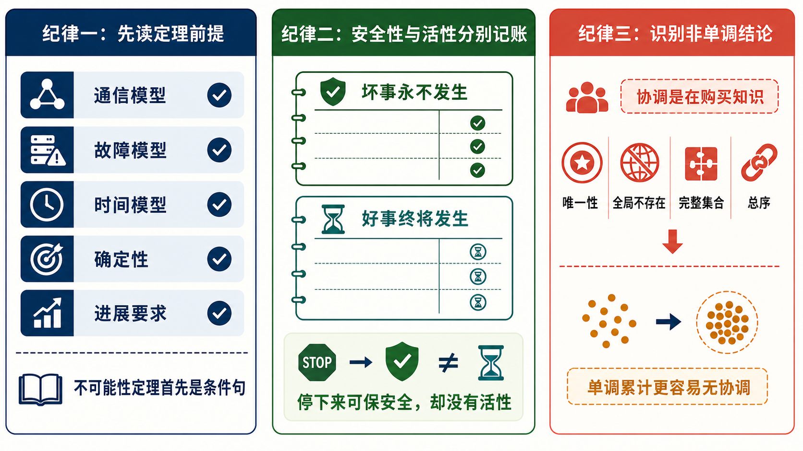

**第一，所有不可能性定理首先都是条件句。** 不要把 FLP、CAP、3f+1 背成无条件口号。正确的读法是："在什么通信模型、故障模型、时间模型、确定性条件和进展要求下，哪些性质不能同时实现？"所谓"突破不可能性"，通常不是推翻数学，而是**改变了定理的某个前提**。

**第二，安全性与活性必须分别记账。** "不会出现两个 Leader"是安全性，"最终能选出 Leader"是活性；"不会重复扣款"是安全性，"付款最终被处理"是活性。故障时系统常可通过**停下来**维持安全性，真正困难的是同时保证进展。严谨的协议说明不应只写"保证一致性"或"保证高可用"。

**第三，协调是用来购买"负面事实"和"非单调不变量"的。** 需要协调的问题有共同特征：谁是唯一 Leader、哪个事务先发生、某名称是否在全局尚未被使用、是否不存在更高版本、是否所有参与者都已 Prepared、余额在所有并发扣款后是否仍不为负——它们都涉及**全局排他、总序、完整集合、全局不存在性，或可能被未来信息推翻的判断**。相反，集合并集、累计观察、可交换更新更容易无协调执行。**协调不是因为"机器多了就必须协调"，而是因为应用要求系统得出某种不能仅凭局部信息安全得出的非单调结论。**

---

归根结底，这七十一条围绕的是同一个问题：

> **多个不共享瞬时状态、只能通过不确定通信交换局部知识的参与者，如何作出彼此兼容且不可逆的决定？**

FLP 讨论何时不能保证决定完成；CAP 讨论分区时必须牺牲什么；两将军讨论为什么确认无法封闭；拜占庭讨论信息本身可能不可信；Lamport 时钟讨论如何表达因果；法定人数讨论如何让新决定接触旧历史；CALM 与 I-Confluence 则进一步回答——**哪些问题根本不需要形成全局决定。**

而最后一层元认识是：一个分布式系统的成熟度，不体现在"它避免了故障"，而体现在**它对不可能性的态度**——是假装不存在（迟早在最坏的时刻出事），还是明码标价、显式设计、把代价放在自己选择承受的地方。

FLP 没有阻止 Raft 被造出来，CAP 也没有阻止 Spanner 提供全球强一致。这些定理只确保了一件事：**任何声称"全都要"的系统，一定在某个你还没注意到的地方偷偷付了账。**

---

## 附录 B：条目索引

| 分类 | 条目 |
| --- | --- |
| **〇、元层（3）** | 安全性—活性分解（0.1）/ 不可区分性论证（0.2）/ 公共知识与知识前提原则（0.3） |
| **一、不可能性（11）** | 两将军（1.1）/ 拜占庭 3f+1（1.2）/ FLP（1.3）/ 公共知识不可达（1.4）/ 原子提交阻塞性（1.5）/ 完美故障检测器（1.6）/ 时延不确定性与时钟同步误差下界（1.7）/ 向量时钟维度下界（1.8）/ exactly-once（1.9）/ 匿名选主（1.10）/ k-集合一致性与拓扑（1.11） |
| **二、权衡与下界（10）** | CAP（2.1）/ Harvest-Yield（2.2）/ PACELC（2.3）/ 一致性延迟下界（2.4）/ SNOW（2.5）/ NOCS（2.6）/ 共识数层级（2.7）/ f+1 轮下界（2.8）/ HAT（2.9）/ USL（2.10） |
| **三、时间与语义（7）** | Happened-before 与逻辑时钟（3.1）/ 向量时钟（3.2）/ 分布式快照（3.3）/ 线性一致性（3.4）/ 会话保证（3.5）/ 因果一致最强性（3.6）/ HLC（3.7） |
| **四、共识与复制（13）** | 部分同步（4.1）/ 故障检测器 ◇W 与 Ω（4.2）/ 共识≡原子广播（4.3）/ 状态机复制（4.4）/ 随机化共识（4.5）/ Paxos（4.6）/ Raft（4.7）/ 法定人数交集（4.8）/ Flexible Paxos（4.9）/ ABD（4.10）/ PBFT（4.11）/ 中本聪共识（4.12）/ Paxos Commit（4.13） |
| **五、非共识路线（7）** | CALM（5.1）/ I-Confluence（5.2）/ CRDT（5.3）/ Saga（5.4）/ 租约与 Fencing（5.5）/ TrueTime（5.6）/ 自稳定（5.7） |
| **六、公案典故（13）** | 阿尔巴尼亚将军（6.1）/ Paxos 拒稿（6.2）/ Paxos Made Live（6.3）/ 哲学家就餐（6.4）/ Lamport 的定义（6.5）/ 八大谬误（6.6）/ 脑裂与 STONITH（6.7）/ 尾延迟（6.8）/ 僵尸领导者（6.9）/ 闰秒（6.10）/ 灰色故障（6.11）/ 元稳定失效（6.12）/ Jepsen 与混沌工程（6.13） |
| **七、工程箴言（7）** | 端到端论证（7.1）/ 幂等性（7.2）/ Conway（7.3）/ Hyrum（7.4）/ 可用性乘法（7.5）/ Little 定律（7.6）/ 不要滥用分布式（7.7） |

**合计 71 条。**
