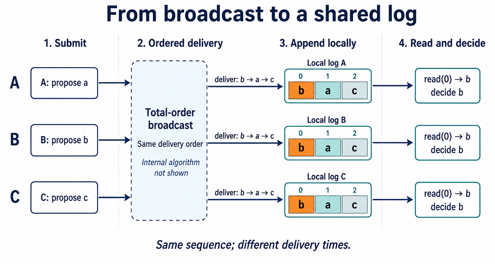

DDIA 第二版第十章说：共享日志可以用全序广播实现；每个节点把自己的提议加入日志，再选择第一条，就能解决共识问题。[DDIA 第 10 章](https://learning.oreilly.com/library/view/designing-data-intensive-applications/9781098119058/ch10.html)

先用一句话概括本文的简化模型：**搞一个中心化的服务，收集各节点的请求，排定顺序，再把排好序的请求发给所有参与节点。**

所有节点都按这个顺序交付请求，包括请求者自己。中心可以边接收、边排号、边发送，不必等所有人提交完。中心排序是全序广播的一种实现，并非它的定义；下面的例子先假设中心不会故障。

以 A、B、C 分别提出 a、b、c 为例，假设排出的顺序是 **b、a、c**。沿着“提交 → 排号 → 交付 → 记日志 → 读第一条”，看每一步读写什么。



*虚线框表示通信服务。图中三份日志已追齐；实际读到第一条就能决定，不必等后两条。*

## 1. 提交、接收、交付、读取

| 动作 | 执行方 | 读取什么 | 产生什么 |
| --- | --- | --- | --- |
| `broadcast(m)` | 提交方 | 消息 m | 向通信服务提交请求 |
| `receive(packet)` | 通信层 | 网络包 | 更新接收缓冲和协议状态 |
| `deliver(m)` | 通信层 | 满足交付条件的消息 | 按序通知上层 |
| `read(k)` | 应用 | 本地日志位置 k | 返回条目；尚无条目则等待 |

应用在 `deliver(m)` 回调中把 m 追加到本地日志。**收包顺序可以不同，交付顺序必须一致。** 提交也不等于追加：若 A 一提交就写 a，B 一提交就写 b，第一条便不一致。发送者同样要等交付。

## 2. 全序广播保证什么

为满足本书的共享日志要求，本文采用以下约定：

- 消息必须来自广播请求，且在每个节点最多交付一次。
- 未故障节点广播的消息最终会被交付。
- 任一节点已交付的消息，最终也会交付给所有未故障节点。
- 各节点已交付的序列互为前缀：可以是 `[b]` 和 `[b,a]`，不能是 `[b]` 和 `[a]`。

最后一条约束顺序，前几条保证消息不凭空出现、不重复、不因部分节点故障而失去后续交付。这里使用前缀顺序及上述故障语义；文献中的普通、uniform、prefix-order 版本并不完全相同。[全序广播综述 §2.3–2.5](https://dspace.jaist.ac.jp/dspace/bitstream/10119/4883/1/defago_et_al.pdf)

## 3. 具体流程：先排号，再按号交付

设排号节点为 S，串行处理请求。本节假设所有节点不故障，消息不丢失、不重复、最终到达，但允许乱序。这些假设下，单个 S 就能提供上述保证；容错问题留在本节末尾说明。

每条消息有唯一标识，例如 `mA=(A,1,a)`：a 是提议值，`(A,1)` 区分请求。相同值的两次提交仍是两条消息。

### 第一步：提交与排号

A 调用 `broadcast(mA)`：读取自己的提议，构造消息并发送给 S。B、C 同样提交；三份应用日志此时都为空。

S 维护计数器 `next=0`。每收到一个新请求，读取 next 作为位置编号，记录编号与消息的映射，再将 next 加一。若收到的顺序为 mB、mA、mC，就把以下消息发给 A、B、C：

```text
(0, mB)    # 值 b
(1, mA)    # 值 a
(2, mC)    # 值 c
```

S 写的是自己的编号状态和消息映射，没有修改其他节点的日志。编号表示排定顺序，不是消息产生时间。

### 第二步：缓冲与交付

每个节点维护 `pending` 缓冲，以及初值为 0 的 `nextToDeliver`。

A 若先收到 `(1,mA)`，就写入 `pending[1]`。检查发现 `nextToDeliver=0`，位置 0 尚缺，因此暂不交付。

收到 `(0,mB)` 后，A 写入 `pending[0]`，交付 mB，移除该缓冲条目，并将 nextToDeliver 加到 1。位置 1 已在缓冲中，便继续交付 mA，移除它并推进到 2。每次交付，上层都把消息追加到本地日志：

| A 上的事件 | 处理后的缓冲 | 交付 | 本地日志 |
| --- | --- | --- | --- |
| 初始 | 空 | 无 | `[]` |
| 收到 `(1,mA)` | `{1:mA}` | 无，等待位置 0 | `[]` |
| 收到 `(0,mB)`，处理位置 0 | `{1:mA}` | mB | `[b]` |
| 继续处理位置 1 | 空 | mA | `[b,a]` |
| 收到并处理 `(2,mC)` | 空 | mC | `[b,a,c]` |

B、C 即使收包顺序不同，也从位置 0 起连续交付。**S 给每个位置只安排一条消息，各节点又不跳号，因此交付序列相同。**

这个实现尚不能容错：S 停止，排号就可能停止；S 重启后若重复使用编号，还可能破坏顺序。后文的推导依赖第二节的完整保证，不能把这个无故障例子直接当成容错实现。

## 4. 按交付顺序追加，就得到共享日志

每个节点维护自己的 `localLog`，交付回调按序执行：

```text
requestAppend(message):
    TOB.broadcast(message)

on TOB.deliver(message):
    localLog.append(message)       # 写本节点日志
    notifyWaitingReaders()

read(k):
    wait until localLog contains position k
    return localLog[k]            # 读本节点日志
```

`requestAppend` 只提交请求。若接口还要返回“追加成功”和位置，须等对应条目已写入可读取的日志。

全序广播保证相同的交付顺序，回调保持这个顺序追加，三份本地日志便构成同一个逻辑日志。它们可以进度不同：

```text
A.localLog = [b,a]
B.localLog = [b]
C.localLog = []
```

C 调用 `read(0)` 会等待；等到交付后，它读到的也必须是 b。

| 共享日志要求 | 如何满足 |
| --- | --- |
| 最终追加 | 未故障请求者的消息最终交付，回调将其追加 |
| 可靠传递 | 已交付消息最终交付给其他未故障节点，后者也会记录 |
| 只追加 | 回调只写日志末尾，不覆盖已有条目 |
| 一致同意 | 相同交付顺序产生相同前缀 |
| 有效性 | 交付消息来自真实广播请求 |

这段代码按停止故障模型理解：节点可能停止，不处理重启；未故障节点继续执行，日志存储正常。若要满足书中的重启恢复要求，还需在条目可读前完成所需持久化，恢复日志位置，并处理重放和去重。

## 5. 各自读第一条，决定就相同

为这次共识准备一份独立、初始为空的共享日志，只接收本次的提议。每个节点执行：

```text
propose(value):
    requestAppend(messageWithUniqueId(value))
    first = read(0)
    decidedValue = first.value
    return decidedValue
```

读写链条是：读取自己的提议 → 提交消息 → 交付回调写本地日志 → 读取位置 0 → 保存决定值。

本例位置 0 是 b，所以三者都决定 b，时间可以不同。**第一条指日志位置 0，不是网卡最先收到的包。** A 即使先收到 mA，也要等位置 0 的 mB；一旦读到 b 就能决定，不必等自己的 a 被追加。后续日志增长不改变这次决定。

## 6. 为什么成立

前提是共享日志满足第四节的要求，且至少一个未故障参与者提出值并继续运行。

- **有效性：** 日志只接收本次提议，第一条必然是某个参与者提出的值。
- **一致性：** 所有节点读到的位置 0 相同；尚未读到的只能等待。
- **不可撤销：** 已读条目不变，程序只决定一次，后续追加不会改变决定。
- **终止性：** 至少一个未故障节点的提议最终入日志，使日志非空；可靠传递让所有未故障参与者最终读到第一条并决定。[Chandra 与 Toueg，§7](https://courses.csail.mit.edu/6.852/08/papers/CT96-JACM.pdf)

b 的提出者后来崩溃也不影响已确定的 b：后续传播由日志服务保证。若允许重启，节点必须保存决定，或从原日志位置 0 恢复，不能另开空日志重新选择。

**全序广播统一交付顺序；各节点按序追加，得到同一个逻辑日志；各自读取第一条，得到同一个决定。** 这就是 DDIA 两句话之间的推导。它继承了共享日志的安全性和进展条件，容错能力仍须由底层实现提供。
