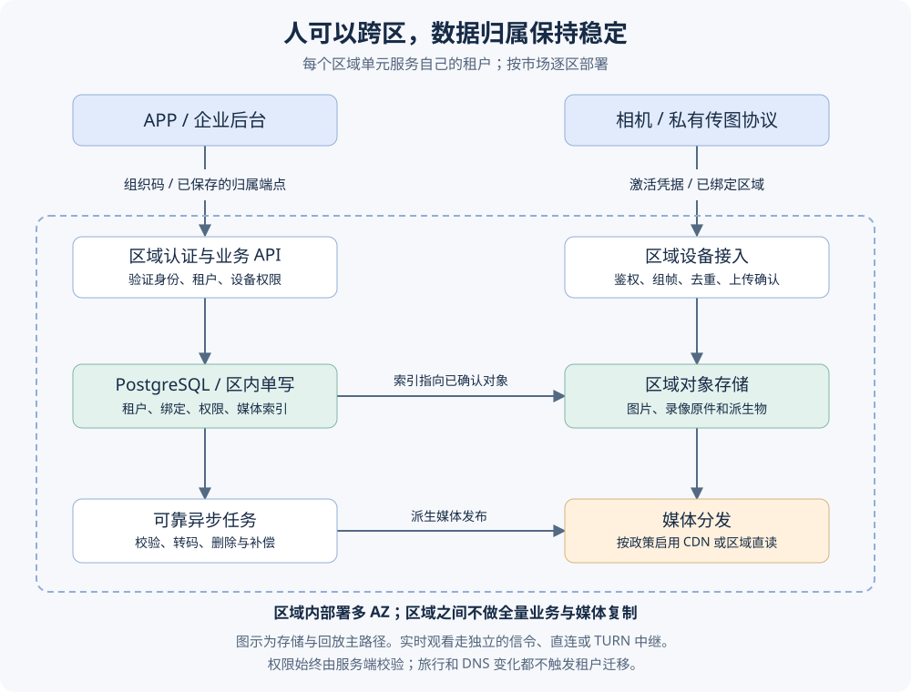

> [!QUOTE] 帖主原话（节选）
> 在北美注册的用户，在非洲得重新注册。这个体验不好，想还是实现全球化
>
> ——[V2EX 原帖](https://v2ex.com/t/1240266)

一家硬件公司准备建设自己的海外软件平台：北美注册的用户到了非洲，应该继续使用原账号；设备要上传图片和视频；公司又承担不起把整套服务和所有媒体复制到每个地区的成本。

这是 [V2EX 主题 1240266](https://v2ex.com/t/1240266#reply34) 提出的问题。本文把主帖作为需求材料，把评论作为方案评审意见，走一遍从需求分析到概要设计、验证和上线的过程。资料截点为 2026 年 9 月 8 日，覆盖当时网页可见的第 1–37 楼。评论作者没有参与本文的编写，也不代表认可最终方案。

**本文的决定是：租户固定归属区、区内单写、跨区访问原归属区、媒体按需分发。** 同一个账号出国后继续使用原数据，靠的是稳定身份和归属区路由，不必把用户表、业务库和录像复制到所有国家。

一期采用 AWS 托管数据库和对象存储，复用现有 Go 与 Kubernetes 能力。先打通一个区域，再按市场顺序扩展美国、法国和新加坡；非洲先测真实运营商网络，再决定增加接入点还是完整区域。

文章先明确需求、评审方案，再给出概要设计、容量与交付计划，末尾对照 DDIA V2 检查设计依据与保证边界。F 表示原帖陈述，R 表示整理后的需求，A 表示假设，D 表示设计决定，T 表示验收用例。

**这是一份基于公开资料的方案定稿。** 原帖没有流量样本、报价、完整设备协议和客户合同；因此性能、费用和恢复目标均标明假设与验证条件，不当作已经具备的生产能力。

## 一、需求分析：先确定要解决什么

### 1.1 原始问题

公司原来以硬件和合作厂商 APP 为主，现在建设自己的软件平台。它希望用户在不同地区使用同一个账号，又担心跨区延迟、音视频复制费用和海外运维成本。[主帖](https://v2ex.com/t/1240266)

这不是一个单纯的数据库同步问题。需要先回答：谁拥有设备和数据，谁有权查看，数据放在哪里，人在外地时如何访问，以及出故障时允许停多久、丢多少。

### 1.2 可追溯的事实

| 编号 | 原帖明确提供的信息 | 来源与限制 |
|---|---|---|
| F1 | 全球硬件公司，业务为 ToB；国内已有 Go、Kubernetes 架构 | 主帖；ToB 不代表没有终端个人用户 |
| F2 | 考虑北美、新加坡、法国、迪拜、非洲，非洲客户较多 | 主帖；这是候选部署点，不是已批准的五地部署要求 |
| F3 | 希望北美注册的账号在非洲继续使用 | 主帖；没有要求在非洲成为本地写入者 |
| F4 | 关注入口漂移、媒体同步带宽与空间，资金有限 | 主帖；没有预算数值 |
| F5 | 现有组件含自建流服务、TURN、PostgreSQL、Redis、MQTT、RocketMQ、MinIO | [#1](https://v2ex.com/t/1240266#r_18060370)；版本、依赖、HA 配置未知 |
| F6 | 年出货约 100 万台，按 10% 日活估计 | [#13](https://v2ex.com/t/1240266#r_18060609)；不是实测 DAU，也不是并发量 |
| F7 | 一款面向非洲的低成本设备采用非标准传图协议 | [#15](https://v2ex.com/t/1240266#r_18060655)；不能推断所有机型都是视频流 |
| F8 | 暂不考虑境内外互联 | [#27](https://v2ex.com/t/1240266#r_18061180) |

### 1.3 需求基线

P0 为海外试点必需，P1 为扩区前后完善。对应验收用例见第四部分。

| ID | 优先级 | 行为要求 | 来源/性质 | 验收 |
|---|---|---|---|---|
| R1 | P0 | 已注册账号跨国后能登录并访问原租户设备，不重复注册 | F3 | T1 |
| R2 | P0 | 入口变化、重连、重试不改变租户或设备的数据归属 | F4 的技术落实 | T2 |
| R3 | P0 | 设备可靠上报，APP 查看照片、录像；实时链路按机型分别支持 | F5、F7；具体媒体能力待样机确认 | T3、T4 |
| R4 | P0 | 媒体不做全球全量复制；支持按套餐保留、配额与费用归属 | F4；配额规则是设计补充 | T5 |
| R5 | P0 | 企业间数据隔离；设备绑定、分享和撤权均需校验权限 | ToB 场景的必要补充 | T6 |
| R6 | P0 | 凭据、私有媒体、运维访问和备份受地区政策控制 | #10、#35–37 提出的风险，经设计具体化 | T6、T7 |
| R7 | P0 | 单实例或单可用区故障可恢复，已确认业务写入有明确保障 | 设计补充，不是原帖已有 SLA | T8 |
| R8 | P0 | 兼容现有固件，迁移中不双绑设备、不重复记账 | 从合作 APP 转自研的交付补充 | T9 |
| R9 | P1 | 按租户、机型、地区计量容量、质量、成本，支持独立扩区 | F2、F4 | T10 |

### 1.4 先采用的假设，以及错了怎么办

| 假设 | 本方案采用的值/解释 | 若不成立 |
|---|---|---|
| A1 所有权 | 一个企业租户有一个归属区；一个设备在任一时刻只绑定一个租户 | 若一个集团必须多国驻留，拆成区域租户，以集团身份显式授权，不跨区共享一个数据库事务 |
| A2 登录入口 | APP 可保存组织码或邀请链接中的归属信息；新设备可获取签名配置 | 若必须“新手机只输邮箱全球唯一登录”，增加最小身份目录及跨区隐私评审，不能假称一期已支持 |
| A3 媒体 | 云端保存事件片段/图片，不默认全天录像；保留期可配置 | 若要求 24×7 连续录像，重新核算存储、上行、电量、流量套餐及售价 |
| A4 故障 | 一期优先区内高可用，不要求整区故障全球无感续写 | 若合同要求跨区自动接管，另立灾备设计，预算和一致性承诺一起调整 |
| A5 技术能力 | 团队能维护现有 Go/k8s 应用，但不应新增全球存储运维负担 | 若缺少值班能力，优先减少自管组件，而不是采购更多裸金属 |
| A6 试点 | 美国、法国、新加坡是基线单元；非洲国家分布尚不清楚 | 非洲探测可能要求优先南非或欧洲节点，不能仅凭洲名决定 |

一期不做全球多主数据库、不自动搬迁租户、不把所有云产品替换一遍、不建设跨境国内外统一账号、不承诺任何网络下的实时播放。支付若存在，需单独确定结算和幂等规则；原帖没有足够信息把它设计成既定需求。

### 1.5 服务目标草案

以下是工程验收候选值，不是已签 SLA，也不是从 10 万日活推导出来的。

- 区域核心 API 月成功率目标 99.9%，按合法请求计；同时记录客户端端到端成功率，不能靠排除故障美化数字。
- 健康区域内 API 服务端 p95 ≤ 300 ms；指定海外探测网的端到端 p95 ≤ 1 s。实时会话建立 p95 ≤ 3 s、回放首帧 p95 ≤ 3 s，只对约定码率与网络测试集成立。
- 单 AZ 故障：关键数据库已确认提交目标 RPO=0，业务恢复目标 RTO≤10 分钟，需故障演练验证。不能把数据库的承诺直接套到设备 RAM 中的数据。
- 整区故障：一期暂停该区写入，不向其他在线区盲目切换；已配置合规异地备份的关键元数据目标 RPO≤24 小时、RTO≤24 小时，必须实测。未配置异地区域备份时，不承诺整区毁损后的恢复目标。
- 云媒体只在存储确认且索引提交后报“已保存”；设备离线缓存能力、允许丢帧和断网时长按机型单独签定。

### 1.6 立项时必须补齐的输入

产品负责人补齐租户/终端用户关系、跨区频率、云套餐和保留期；设备负责人提供协议、认证能力、重试与离线缓存；SRE 获取主要销售国家及运营商、在线峰值、码率与 TURN 占比；财务提供月预算和每活跃设备毛利；隐私负责人确定控制者/处理者、客户合同、驻留与境外访问要求。

架构先按上述假设定稿。补齐的信息若推翻假设，就按后面的决策记录重审相关部分；未核准的服务目标不能写进客户合同。

## 二、方案评审：哪些建议采用，哪些不采用

### 2.1 评审规则

先检查正确性、客户数据边界和现有设备兼容性，再比较费用、开发量和运维量。不用“几票支持”代替论证，也不在没有报价和工作负载时编造加权总分。

评论楼层依据[原帖网页](https://v2ex.com/t/1240266)，评审覆盖当时可见的全部 37 楼。#34 是对 #4/#16 的赞同，没有新增需求。

### 2.2 讨论意见及处理

| 楼层 | 意见 | 评审结论 |
|---|---|---|
| #1 | 罗列现有中间件 | 作为兼容性输入，不能推导每个海外点都要复制整套组件 |
| #2、#8 | 新加坡统一注册，账户复制到各区，业务回源归属区 | 采纳稳定归属和业务回源。暂不采用全局凭据复制；注册时同步调用两个数据库存在半成功，需要状态机或可靠事件，不能当成跨库事务 |
| #3、#6 | 追问统一入口、媒体跨区同步 | 将入口发现、身份路由、回放分发分开设计；它们不是同一个同步问题 |
| #4、#16、#34 | 主数据、业务数据、媒体分开，网关路由，存储加 CDN | 采纳总体方向。进一步缩小全局数据：一期连用户表也无需全球复制；CDN 受权限与地区规则约束 |
| #5、#7 | 人不会瞬移，账户可慢慢同步，跨区可能很少 | 跨区少是待测假设。“人不会瞬移”不足以保证同步完成：VPN、移动网络、并行设备、出口变化可立即换入口。稳定路由比赌复制赶得上更可靠 |
| #9、#13 | 先确认日活；百万出货、10% 日活 | 采纳先测量。10 万日活只能是一个场景；还需存量、在线率、录像量、并发播放与峰值倍率 |
| #10、#14 | 提前考虑隐私；准备本地部署 | 采纳提前设计。选定云区域不等于合规完成，仍须处理日志、备份、远程运维和访问权限 |
| #11、#19 | 美区、欧区、其余全球区 | 可作初始服务单元，不可将其余国家视为统一法律区；“量小监管不管”不进入架构依据 |
| #12 | 单点写，可迁移写入点，读自己数据回写入点 | 采纳单写和关键读回主；否决按旅行自动迁移。迁移需复制检查、冻结和旧写者隔离，收益未证实前不做 |
| #15、#18 | 非标准传图协议，担心对象存储不支持 | 自研协议接入层将字节整理成对象，对象存储不要求这些字节必须是标准视频流。解码与播放兼容是另一层的问题 |
| #17、#20 | 自建存储运维贵，云可能更便宜 | 采纳计入运维和恢复成本；“量大必然自建”与“云必然便宜”均无充分依据 |
| #21 | 分区、账户归属、媒体 CDN；提到 GDPR 罚款 | 采纳归属路由。否决“北美欧洲一律必须独立部署”和“按营收 10%”的泛化；法律不能靠评论确定，见下文 |
| #22、#29 | 致谢、方案渐清晰 | 无新增技术要求 |
| #23、#24 | 全球网关代理单一中心，暂不谈合规 | 作为低复杂度候选；可供范围很小的试点，但单区故障面、媒体远距离传输和驻留限制使其不适合本次最终基线 |
| #25 | 推荐裸金属商家 | 仅作为供应商线索；附推广链接，没有可用性、恢复、国家覆盖与总成本证据，不据此选型 |
| #26 | 重复原问题 | 无新增方案 |
| #27 | 暂不考虑国内外互联 | 纳入范围边界 |
| #28 | 单套账户、多区同步；主动推 IP；S3/CDN | 存储方向可采纳。“GeoDNS 容易被打，所以推 IP”没有成立的因果关系；签名端点列表可作兜底，但不能替代 DNS、TLS 与防护 |
| #30、#33 | R2、非洲带宽、云存储收费 | R2 进入采购候选；需验证实际链路和驻留能力。费用应纳入套餐、配额和计量，不能由存储产品名推定利润 |
| #31 | 测延迟；双中心、读写分离、定时双向同步 | 采纳实测。否决未定义冲突规则的双向同步：账号撤权、设备绑定等不能简单按时间戳覆盖 |
| #32 | 认可帖子 | 无新增要求 |
| #35–37 | 地区隔离，远程运维和个人数据处理风险 | 采纳风险项；“欧洲数据绝不能在别处”“只有欧洲团队能操作”“未成年人信息不能存”的绝对表述均不能直接成为需求 |

### 2.3 三处容易带偏设计的判断

**对象存储与设备协议。** 相机可以通过自定义协议传图，接入服务把完整图片或分片写入对象存储。S3 存的是对象字节及元数据，并不是只接收某种流媒体协议。若 APP 不懂编码，则增加解析或转码；这不能推出需要自建 MinIO。[S3 官方说明](https://docs.aws.amazon.com/AmazonS3/latest/userguide/Welcome.html)

**数据驻留与跨境处理。** GDPR 有域外传输规则和可用机制，并非一概禁止数据离开欧洲；客户合同或具体监管可能另有更严格要求。远程运维、全球 CDN 缓存和日志导出也需纳入数据流评估，单选“欧洲机房”不够。本文采用区域存储和默认限制跨区处理，是保守的工程边界，不是对所有国家的法律裁决。[EDPB 指南](https://www.edpb.europa.eu/sme/be-compliant/international-data-transfers_en)

GDPR 第 83 条分列不同罚款上限，包括较高档的 2,000 万欧元或全球年营业额 4%（取较高者），不是评论所称的 10%。实际适用、义务和处罚不能从帖子推定。[法规原文，第 83 条](https://eur-lex.europa.eu/eli/reg/2016/679/oj/eng)

**DNS 与所有权。** GeoDNS 根据查询来源位置选择入口，并不认识企业、账号或设备。网络切换可能得到另一个入口，但不能因此更换数据的唯一写入区。应用使用明确的归属区信息，DNS 负责解析该区的可用入口。[Route 53 说明](https://docs.aws.amazon.com/Route53/latest/DeveloperGuide/routing-policy-geo.html)

### 2.4 备选架构

| 方案 | 能解决什么 | 代价/缺口 | 决定 |
|---|---|---|---|
| 单区后端，全球接入 | 部署少，天然单写 | 远端时延、单区故障面、驻留覆盖有限 | 仅限单市场试点，不作全球最终结构 |
| 多区完全独立账号 | 故障和数据边界简单 | 旅行重复注册，违背 R1 | 不采用 |
| 全球多主，全量媒体复制 | 读写都可就近 | 冲突、成本、复制滞后和地区限制；现有需求无必要 | 不采用 |
| 全局账户中心，区域业务库 | 支持纯邮箱发现、统一凭据 | 中心故障依赖、凭据同步或跨区认证、身份数据流增多 | A2 被推翻时重新评审 |
| 租户固定归属、区域认证、媒体按需分发 | 同账号旅行、单写、可控数据流 | 远端仍有跨区时延；新手机需组织码/归属信息 | **采用** |

### 2.5 定稿决策记录

| ADR | 决定 | 主要理由 | 何时重审 |
|---|---|---|---|
| D1 | 归属单位为租户，设备随租户；旅行不搬迁 | ToB 权限和数据所有权稳定 | 多国集团要求按设备国家驻留 |
| D2 | 区域身份服务，全球只分发无个人信息的静态配置 | 免去跨区用户表一致性和凭据复制 | 产品强制全球邮箱唯一、无组织码登录 |
| D3 | PostgreSQL 区内单写；业务与 outbox 同事务 | 保持绑定、权限与计费不变量 | 已有数据库无法满足实测容量 |
| D4 | 托管对象存储为媒体原件，CDN 按政策分发 | 去掉不必要的全量复制和存储运维 | 经真实账单证明替代方案有足够总成本收益 |
| D5 | 自研协议适配保留；TURN 与存储各自扩容 | 低端机兼容和实时链路具有独立要求 | 新固件统一协议或托管接入通过实机验证 |
| D6 | AWS 为一期实施基线，复用 Go/k8s；不同时铺多个云 | 减少运维矩阵，优先可靠交付 | 地区可达性、采购条款、预算验证不通过 |
| D7 | 三个区域模板，按需逐区上线；非洲先测后部署 | 缺少国家和运营商分布，不凭地理直觉铺点 | 非洲实测未达目标，或合同要求当地驻留 |
| D8 | 整区故障停写，受控恢复；不自动提升任意副本 | 一期没有无损跨区故障切换的需求与证明 | 合同新增跨区 RTO/RPO 要求 |

### 2.6 高、中、低预算如何选

高预算可增加同一允许地域内的异地区域灾备、专门的接入加速及托管 MQTT，但仍保留单写与数据边界。基线采用托管 PostgreSQL、S3、区域 k8s 和有限自管协议服务；减少首发区域和无用组件比降低数据可靠性更有效。

低预算先缩小市场和云套餐范围，控制录像保留及流量，保留托管数据库与存储。裸金属可以参与无状态转发/TURN 的对比测试，不承担一期唯一数据库或唯一媒体原件。R2 可作为对象存储候选，但 location hint 只是尽力提示，jurisdiction 才是单独的驻留约束；还需分别评估分发路径和产品功能。[R2 官方说明](https://developers.cloudflare.com/r2/reference/data-location/)

三档预算都应代入同一份负载表和当期报价比较，计算方法见第四部分。

## 三、最终方案与概要设计

### 3.1 系统边界

每个区域单元负责自己租户的认证、设备、权限、媒体索引和原始媒体。租户的所有权决定数据写入区，客户端所在位置只影响网络路径。

一期基线部署候选为美国 `us-east-1`、法国 `eu-west-3`、新加坡 `ap-southeast-1`，复用一套基础设施模板，按首发市场逐区开通。非洲以法国、新加坡、开普敦和中东候选点做运营商探测，再决定落点；不宣称南非可以代表整个非洲。采购前核对所选区域的产品、配额和合同。AWS 的区域和 AZ 是不同故障域，跨 AZ 部署不能替代跨区域灾备。[AWS 基础设施说明](https://aws.amazon.com/about-aws/global-infrastructure/regions_az/)

媒体传输、实时中继、业务 API 是独立的数据路径，不让全部媒体穿过 API 网关。

### 3.2 组件选择和部署职责

| 组件 | 一期选择 | 边界 |
|---|---|---|
| 应用 | 现有 Go 服务，EKS 区域集群，多 AZ 工作节点 | 不建立跨洲 k8s 集群；副本分散、连接池和重试均做故障测试 |
| 关系数据 | RDS PostgreSQL Multi-AZ 单主/备用部署 | 权限、绑定、配额及媒体索引的事实来源；备用不当读副本使用 |
| 媒体 | 区域 S3 私有桶，服务端加密，生命周期和版本策略 | 海外新增媒体不落自管 MinIO；旧 MinIO 通过适配层渐进迁移 |
| 分发 | CloudFront 私有内容分发，按租户策略启用 | 驻留/处理限制不满足时绕过全球 CDN，走允许端点 |
| Redis | 区内缓存，优先托管 | 缓存丢失可重建；关键授权不只依赖缓存 |
| MQTT | 复用现有实现，部署在本区并验证持久化/集群语义 | 客户端身份与 topic ACL 绑定到租户/设备；不跨洲拉一个集群 |
| RocketMQ | 仅在已有服务真实依赖时保留区内集群 | 新增少量异步工作用数据库 outbox+worker；不为了“全球化”再引入一种队列 |
| 私有协议接入 | Go 适配服务，按机型解析、鉴权、限流 | 接入缓冲不是默认永久存储 |
| 实时通信 | 现有信令和 TURN 实现；必要时在测得有收益的点增加中继 | 新增 TURN 只改善中继路径，不生成完整业务区 |
| 运维 | IaC、区域密钥、监控、发布流水线 | 全球仅聚合经许可的统计；日志不默认跨境汇总 |

RDS 此类 Multi-AZ 部署使用跨 AZ 同步备用，提供故障切换；这是区内数据库机制，不是全系统 RPO 的证明。[RDS 文档](https://docs.aws.amazon.com/AmazonRDS/latest/UserGuide/Concepts.MultiAZSingleStandby.html)

MQTT、TURN、RocketMQ 的现有具体项目与版本未知。实施前必须登记版本、支持状态、持久化设置和故障机制。

### 3.3 数据模型与不变量

| 实体 | 关键字段/约束 | 写入责任 |
|---|---|---|
| Tenant | `tenant_id, home_region, residency_policy, status, route_epoch` | 租户归属区；全局随机 ID，不以邮箱作 ID |
| Principal | `principal_id, issuer_region, credential_ref, status` | 身份发行区；一期与所属租户同区 |
| Membership | `tenant_id, principal_id, role, authz_version` | 租户归属区；撤权提交后敏感操作读取主库 |
| Device | `device_id, tenant_id, credential_ref, binding_version` | 绑定有唯一约束；生产库存的预分配避免跨区并发认领 |
| Media | `media_id, tenant_id, device_id, object_key, checksum, size, state` | 归属区；状态 `PENDING→READY→DELETING→DELETED` |
| Upload | `upload_id, idempotency_key, expires_at, expected_size` | 归属区；一个业务上传可有多个失败的传输尝试 |
| Command | `command_id, device_id, expires_at, state` | 归属区；投递成功不等于设备执行成功 |
| Outbox | `event_id, aggregate_id, version, payload, state` | 与业务修改同一数据库事务写入 |

必须始终成立：一个设备只有一个有效绑定；一个租户只有一个有效写入归属；跨租户资源访问被拒绝；READY 媒体能定位到经校验的对象；同一幂等请求不重复产生计费效果。数据库约束与事务负责本区不变量，不靠客户端或消息“恰好只发一次”。

一期邮箱唯一性限定在租户/身份域内，不承诺全球邮箱唯一。企业用户在外地访问同一身份域不需要重新注册；同一个人在不同企业拥有多个成员身份是另一项产品行为。

设备首次归属由企业交付清单或含区域信息的激活凭据确定。若库存允许任意地区自由认领，应增加有唯一权威的设备认领服务及数据政策评审；不能让各区分别判断同一序列号“尚未绑定”。一期不支持这种无预分配的全球自由认领。

### 3.4 登录和跨区访问

1. 企业开通时选定数据区域，系统生成组织码/邀请链接；IP 位置只提供建议，不能覆盖已签约的区域。
2. APP 读取组织信息和签名端点表，连接该区身份服务。端点表只含区域、域名、公钥和配置版本，不含全量用户数据。
3. 身份服务读取本区凭据与成员关系，签发短时 token，含 `issuer、subject、tenant_id、audience、expiry`。资源服务验证签名、发行者、用途和租户；路由字段不是授权证明。
4. APP 缓存归属区。手机从北美到非洲后仍连接美国租户 API；换网络、换 DNS、刷新 token 都不创建非洲账号。
5. 新手机通过组织码、企业域名或邀请链接找回区域，再认证。组织码不是密码，发现接口仍限流并避免泄漏成员存在性。
6. 旧 APP 若只能使用统一 API 域名，兼容网关依据经过校验的归属信息转发；新 APP 直接连接区域域名，减少一跳。敏感登录不对任意 URL 重定向，目标受签名配置与域名白名单限制。

GeoDNS 可用于公共配置和就近无状态入口，不用于为每次写请求重新选择数据库。HTTPS、MQTT、TURN 是不同协议；DNS 更新不会自动迁移已建立的 TCP/UDP 会话。重连使用缓存端点、退避和抖动，在原归属区内部找可用入口。

一期 access token 建议 5 分钟，refresh token 仅回发行区；敏感操作读取权威权限状态。普通缓存授权若允许延迟撤权，应明确上界，不能只写“最终一致”。设备凭据吊销还要主动断开长连接。

### 3.5 上传：什么时候可以告诉用户“已保存”

#### 标准 HTTPS 上传

1. 客户端请求 `POST /v1/uploads`，携带幂等键。API 读取权限、设备绑定和剩余额度；事务写入 PENDING 上传，预留容量。
2. API 返回限定对象、操作和有效期的上传凭据。客户端把字节直接写入 S3，不经普通业务网关。
3. 上传后调用 `POST /v1/uploads/{id}/complete`。服务端检查对象存在、大小和校验值；不能相信客户端报的“完成”。
4. 对象有效后，在本区事务中将媒体改为 READY、结算配额并写 outbox；此时才返回“云端已保存”。超时重试读同一结果，不重复扣费。
5. worker 读取 outbox，异步做缩略图或转码。任务按事件 ID 去重；失败可重试，不把中间产物误当原件。

存储写入和数据库提交不是同一个事务。对象成功、数据库失败会留下孤儿对象；由补偿扫描清理。数据库存在 PENDING、对象不存在则过期释放配额。扫描需留出传输宽限期，避免删除仍在进行的上传。

预签名 URL 在有效期内可能重复使用，不能称为一次性凭据。同名覆盖风险由唯一上传 key、桶版本和固定最终版本处理：READY 索引绑定校验通过的对象版本，或服务端复制到客户端不可写的最终 key；不把一个仍可覆盖的临时 key 当最终媒体。[S3 预签名 URL 文档](https://docs.aws.amazon.com/AmazonS3/latest/userguide/using-presigned-url.html)

#### 非标准传图设备

适配层读取设备帧，校验设备凭据、长度、序号和校验码；组装对象后复用上述提交流程。先提供协议 ACK 还是存储 ACK 必须区分：协议接收不代表永久保存。只有 RAM 缓冲时，进程崩溃会丢帧，不能承诺零丢失。

机型若支持重传，云端按 `device_id + boot/session_id + frame_seq` 去重；序号重启归零不能导致新图片被误丢。若设备只能单次发送，需在需求中接受损失，或增加可持久化接入缓冲并重新定义 ACK；不能用 MQTT QoS 的名字掩盖固件限制。

对象存储接受字节，不直接承担私有流协议解析。连续流需按时间或大小切片并保存索引；图像机型不强行转成直播系统。

### 3.6 回放与实时观看

回放时，API 先读取本区成员权限和 READY 索引，再发短时播放授权。CDN 命中则分发已缓存对象，未命中才回区域桶取数据；跨国观看不要求提前复制全部录像。私有桶只允许规定的源站访问，不能靠隐藏 URL 保护隐私。[CloudFront 私有内容授权](https://docs.aws.amazon.com/AmazonCloudFront/latest/DeveloperGuide/private-content-signed-urls.html)

按租户策略选择可用分发路径。若不能在全球边缘处理或缓存，直接访问允许区域端点；首次跨洋读取会慢，明确接受这一代价。缓存提高访问效率，不是备份，也不是数据驻留证明。

实时观看先由信令服务校验权限，再尝试设备与 APP 直连；无法直连时使用授权中继。TURN 负责 NAT 环境中的转发，不负责录像存储。[RFC 8656](https://www.rfc-editor.org/rfc/rfc8656.html) 不支持该实时协议的低端机型只提供适配后的图片/片段能力，不能承诺 WebRTC 全兼容。

TURN 使用短期凭据、租户速率/会话配额，禁止开放匿名中继。选点考虑设备到中继和 APP 到中继两段总路径，不能只测手机到节点的 ping。

### 3.7 接口和异步契约

| 接口/事件 | 输入与读取 | 写入或返回 |
|---|---|---|
| `GET /v1/regions` | 当前签名配置版本 | 区域端点、公钥、有效期；离线缓存可用 |
| 区域登录/刷新 | 组织信息、凭据；读区域身份库 | 短期 token；不全球复制凭据 |
| `POST /v1/device-bindings` | 激活凭据、用户权限、绑定版本 | 本区事务唯一绑定；重复请求返回原结果 |
| `POST /v1/uploads` | 设备、大小、幂等键 | PENDING 与受限上传凭据 |
| `POST /v1/uploads/{id}/complete` | 对象实际状态 | READY 或可重试状态 |
| `GET /v1/media/{id}/playback` | 最新权限、媒体状态、地区策略 | 受限播放 URL/清单 |
| `POST /v1/devices/{id}/commands` | 操作权限、命令 ID、过期时间 | 持久化命令再投递；明确 ACCEPTED/EXECUTED/FAILED |
| `DELETE /v1/media/{id}` | 所有权、保留要求 | 撤销可见性并排队删除对象、派生物、缓存 |
| outbox 事件 | `event_id, schema_version, aggregate_version` | 至少一次处理；消费者幂等；死信告警与人工回放 |

错误分清：401 身份无效、403 权限不足、409 状态/绑定冲突、429 配额或限流、503 暂不可用。超时表示结果未知，不代表服务端未执行；客户端使用原幂等键查询/重试。命令过期禁止补执行，尤其不能在设备离线数天后执行过时的控制动作。

### 3.8 故障、灾备与迁移

| 故障 | 行为 | 不承诺什么 |
|---|---|---|
| 单 Pod/节点 | 负载转到其他副本；客户端退避重试；上传按状态恢复 | 内存中的帧自动保全 |
| Redis 丢失 | 回读数据库、限制回源洪峰、逐步重建 | 缓存即事实来源 |
| 队列/worker 故障 | 事务 outbox 留存，恢复后续做；限制积压 | 后处理实时完成 |
| 数据库/AZ 故障 | 托管切换，连接重建，未知提交按幂等键确认 | 切换期间每个请求都成功 |
| 区域隔离 | 本区无法确认的写入失败/等待；其他租户区域继续 | 用异地旧副本无损续写 |
| CDN 故障 | 策略允许时回允许的区域源站，限流防击穿 | 绕过权限或驻留政策的任意回源 |
| 配置中心不可用 | 已绑定客户端使用签名缓存与固定区域端点 | 所有新设备都能完成首次发现 |

区内多 AZ、数据库备份、媒体保留分别配置。关键数据库自动备份/PITR 加独立权限域备份；允许时每日复制到指定灾备区域。媒体跨区副本按合同和套餐开启并计费，不是给五个在线区各放一份。S3 跨区域复制本身是异步的，不能据此宣称零 RPO。[S3 复制说明](https://docs.aws.amazon.com/AmazonS3/latest/userguide/replication.html)

租户迁移一期只走维护流程：预复制并校验 → 冻结写入并排空任务 → 补齐增量 → 撤销旧区写权限/停止旧服务 → 新区核对完成 → 更新路由版本并启用写入。旧区未能被可靠隔离时不得提升新写者。`route_epoch` 是校验信息，单靠递增一个数不能阻止孤立旧节点写入。

一旦新区开始写入，不能简单把 DNS 切回旧区；必须冻结、对账并回迁新增数据。该限制同样适用于灾备恢复。

### 3.9 安全与数据生命周期

每设备独立凭据，禁用通用出厂密码；低端机至少需要不可猜测的逐设备密钥、认证和重放保护。若机型不支持安全传输，先明确受控接入网关或固件补救，不直接暴露未经鉴权的公网上传。

权限隔离落到每条查询和对象授权；对象路径含租户 ID 只是命名，不是访问控制。数据库、对象桶、备份、签名密钥分权；生产媒体访问需限时授权并记录审计。日志不记录密码、完整 token、预签名 URL 或原始媒体。

删除先撤销可见性，停止签发新 URL，再删原件、版本与派生物，并按能力清缓存。已经发出的播放 URL 在到期前可能仍可用；一期建议最长 60 秒授权，若要求即时撤销，必须增加每次访问的在线授权，不能靠“短时”冒充即时。备份按保留期淘汰，恢复时重放删除清单，避免把已删数据重新上线。客户要求法定保留与删除冲突时采用经核准的策略。

## 四、容量、验证与上线

### 4.1 先把设备数变成工作负载

年出货 100 万台不等于平台存量 100 万台。存量取决于历年销售、激活、退役和合作 APP 迁移比例。即使假设 10 万日活，也不能得到在线连接数、QPS 或媒体量。

使用十进制 GB/TB；以下仅用于量级分析，均为**假设场景**，没有一个数是线上测量结果。

| 场景 | 假设 | 推导 |
|---|---|---|
| 图片上报 | 10 万活跃设备，每日 100 张，每张 100 KB | 1 TB/日；保留 30 天为 30 TB 原件，每日 1,000 万次对象写入（未合并时） |
| 事件视频 | 10 万活跃设备，每日 10 分钟，2 Mbps | 15 TB/日；30 天为 450 TB 原件 |
| 持续视频压力情景 | 10 万设备每天录像 24 小时，2 Mbps | 2.16 PB/日；30 天为 64.8 PB，不能拿图片业务预算支撑 |
| 心跳 | 10 万设备同时在线，每 60 秒一次 | 平均约 1,667 次/秒；断网恢复可能造成重连峰值 |
| 实时中继 | 同时 2,000 路，2 Mbps，30% 走 TURN | 单份媒体出口 1.2 Gbps；网卡收发合计约 2.4 Gbps，未含协议开销 |

并发数、在线数和中继比例是各自独立的假设，不能因为都写了“10 万”就当作同一口径。图片对象数可成为请求费和索引压力；合并对象可减少请求，却会增加检索、删除和读取放大，先测再做。

通用公式：

- 日上传 GB = 活跃设备 × 每日拍摄秒数 × Mbps ÷ 8 ÷ 1,000。
- 稳态原件 GB = 日上传 GB × 保留天数；另加缩略图、转码、未完成上传、版本和备份。
- 月媒体分发 GB = 日观看秒数总量 × Mbps ÷ 8 ÷ 1,000 × 当月天数。
- CDN 回源量 ≈ 分发量 ×（1 − **字节**命中率）；私有、低复看的录像可能很难命中。
- TURN 月出网量应对实际会话时长积分；不能将峰值 Gbps 直接当全天平均。

这些是容量算式，不是性能测试。实际计算时，应按机型和地区分别填写参数，再求和；不能用一种设备的日均值代表全部产品。

### 4.2 成本模型与采购证据

月总成本 = 各区固定计算/数据库/负载均衡 + 存储容量 + 对象请求 + CDN 分发 + CDN 回源/源站出口 + TURN 出网 + 跨区备份 + NAT/跨 AZ/公网 IP + 日志监控 + 支持与税费 + 运维人力。

对每个候选厂商使用同一个负载表，分别填写地区、币种、计费阶梯、折扣期限、最低消费、请求费、出口路线、支持响应与退出成本。不能把 CDN 免费出口与回源费用重复计算，也不能漏掉转码和 TURN。

| 路线 | 本次定位 | 通过条件 |
|---|---|---|
| AWS 托管存储/数据库 | 实施基线 | 实网、区域产品、合同和报价过关 |
| 同区域其他成熟云 | 采购替代 | 同样的备份恢复、权限、网络和总成本证据 |
| R2 等对象存储 | 特定媒体负载候选 | 区域政策可表达，兼容性、首字节、请求费与分发路径过关 |
| 裸金属 | 可选 TURN/无状态接入测试 | 实测带宽、故障替换、运维成本均有优势 |
| 自建对象存储 | 暂不实施 | 包含副本/纠删码、磁盘替换、机房故障、备份演练和人力后仍有稳定收益 |

正式预算必须由当期报价填入；本次没有采购，也没有宣称某厂商最便宜。经济性指标以“每租户/每活跃设备每月云成本”和毛利衡量，不只看服务器月租。

### 4.3 两个先行验证

**非洲实网验证。** 按销售名单选主要国家和运营商，覆盖固定网、移动网和常见 NAT；至少一周分时采样，记录 API p50/p95/p99、丢包、上传完成率、回放首帧和 TURN 会话成功率。从真实设备/当地探测端测，不以云机房互 ping 代替。比较法国、新加坡、开普敦、中东候选入口。若接入转发已达目标，不铺完整业务区；若持续不达目标且收益覆盖固定成本，再增加区域。国家级驻留要求可直接改变这个判断。

**低端机协议验证。** 用量产硬件验证认证、帧边界、最大包、断流、乱序、重传、序号重置、时钟错误、内存上限和离线缓存。验证“设备收到 ACK 后断电”究竟会丢什么。只有得出逐机型的数据保存契约，才能写云端的耐久性承诺。

验证产出应是原始数据、测试脚本、版本、网络条件和失败样本，不只是一张“通过”截图。

### 4.4 验收矩阵

| 用例 | 方法 | 通过标准 | 对应需求 |
|---|---|---|---|
| T1 跨区登录 | 美国租户在非洲探测端登录、读取及上传；新手机使用组织码 | 身份和租户不变，无新账号，权限正确 | R1 |
| T2 路由/重试 | 切网络、改变 DNS 回答、重复请求、缓存旧端点 | 不跨区误写，不重复绑定/扣费；长连接按约定重连 | R2 |
| T3 上传故障 | 断开对象写入、数据库提交、complete 响应各阶段 | 未保存不误报，重试幂等，孤儿可回收 | R3 |
| T4 实时与固件 | 逐机型测试直连、TURN、断网、重启序号 | 能力如实降级，无未授权会话；达到约定网络目标 | R3 |
| T5 媒体成本/保留 | 填满配额，执行过期删除，观测跨区流量 | 配额有效，无全量全球复制，删除覆盖版本与派生物 | R4 |
| T6 租户隔离 | 交换 token/设备 ID/对象 ID，撤销成员并复用旧 URL | 越权全拒；敏感权限即时生效，已有 URL 窗口≤约定值 | R5、R6 |
| T7 数据位置 | 核对桶、日志、备份、CDN、运维入口，执行导出和删除 | 所有实际流向符合租户政策；恢复不复活已删记录 | R6 |
| T8 故障恢复 | 杀 Pod、停缓存、模拟 AZ 故障；用备份建隔离恢复环境 | 达到草案 RTO/RPO；不能达到时修订配置或承诺 | R7 |
| T9 迁移 | 灰度租户迁移、旧设备重连、切换失败与回退 | 不双写、不双绑；对象校验及账务对账无差异 | R8 |
| T10 容量与费用 | 回放实际分布，测峰值及两倍预测峰值、模拟重连洪峰 | 既定延迟目标内无数据损坏；过载限流；账单与模型可解释 | R9 |

安全、正确性用例不允许靠重跑掩盖间歇失败。性能目标须附测试窗口、设备数、成功率、协议版本和服务端配置，避免只报平均值。

### 4.5 研发顺序与阶段出口

| 阶段 | 交付物 | 进入下一阶段的条件 |
|---|---|---|
| 0 需求基线 | 客户场景、国家清单、设备能力、预算、数据处理清单 | 产品、设备、财务、隐私责任人确认关键假设 |
| 1 技术验证 | 非洲实测、协议验证、报价表、数据库依赖盘点 | 能证明选定区域和设备链路可行；更新容量模型 |
| 2 一个区域纵向打通 | 邀请登录→绑定→上传→回放→删除；监控与基础设施模板 | T1/T3/T5/T6 通过，故障不误报保存 |
| 3 兼容与恢复 | 旧客户端路由适配、数据库演进、备份恢复、故障运行手册 | T2/T4/T7/T8/T9 通过 |
| 4 小租户试点 | 真实账单、支持工单、质量周报 | 连续观察一个完整业务周期，预算和服务目标可接受 |
| 5 扩区和扩量 | 同模板部署、逐租户灰度、值班与成本告警 | 每一区完成同样验收，不因“模板一样”跳过演练 |

完成阶段 1 后，再按实际人力估算各工作包的人日、并行条件和发布日期。

研发任务按纵向能力拆分：身份/路由、设备接入、媒体管线、基础设施/可观测性、迁移兼容五个工作包。每个包必须带接口契约、用例和运行说明，不能以“代码合并”为唯一完成标准。

### 4.6 发布与回退

数据库使用先扩展后收缩的兼容变更，旧客户端和新服务并存。先内部租户，再小批企业租户，再逐区扩量；灰度以租户和机型为单位。预设停止条件：越权、错误归属、保存误报、账务重复立即停；错误率、延迟或费用超过阈值暂停扩量。

应用版本可回退，数据库已产生的数据不能靠回退二进制撤销。迁移对象校验数量、大小、checksum 与索引；切写前备份，切写后不得将旧库当作可随时回退的完整副本。原合作 APP 的数据归属、导出授权和接口能力需先确认；不能假设公司拥有所有既有用户数据的迁移权。

### 4.7 运行责任

产品负责人维护需求和套餐；技术负责人维护 ADR 与数据不变量；设备负责人维护协议/固件兼容矩阵；后端负责幂等、权限和任务补偿；SRE 负责容量、部署、值班、恢复演练；测试负责人负责验收证据；隐私负责人核定地区数据流；财务负责预算与单位经济性。同一个人可兼任，但每一项必须有人负责。

监控至少包括：分区域/运营商请求成功率，设备在线与重连率，上传确认时延和失败阶段，READY 缺对象计数，outbox 积压年龄，数据库切换，权限拒绝异常，CDN 字节命中率，TURN 流量，租户每日费用和对象增长。告警应带影响租户与处理手册，不只报告 CPU。

每月检查预算、容量和误删恢复；每季度演练数据库恢复、区域不可用和凭据泄漏处置。故障复盘记录时间线、用户影响、数据损失边界与改进负责人。这里规定的是要做的工作，本次设计阶段尚未执行这些演练。

### 4.8 风险登记与变更触发

| 风险 | 信号 | 处理与负责人 |
|---|---|---|
| 真实产品要求全球纯邮箱登录 | 组织码流程不被业务接受 | 产品牵头重审 D2；增加身份目录前评估隐私与可用性 |
| 低端机无法鉴权/重传 | 实机测试失败 | 设备负责人补固件或网关；不能降低鉴权来“兼容” |
| 非洲目标网络质量不足 | 主要运营商连续不达目标 | SRE 比较接入点与完整区域收益，调整 D7 |
| 云服务成本侵蚀毛利 | 单设备云成本超过预算 | 财务与产品调整保留期、码率、配额；架构负责人评估存储替代 |
| 某客户要求更严格驻留或区域容灾 | 合同与 A4/A6 冲突 | 隐私与技术负责人重审地区单元和灾备，不扩大默认数据复制 |
| 原有组件未满足区内 HA | 依赖盘点或故障演练失败 | 平台负责人补配置/替代实现；暂缓对外承诺 RTO/RPO |
| 迁移后无法安全回退 | 新区产生独有写入 | 后端负责人使用冻结、对账、回迁流程，禁止仅切 DNS |
| 实际维护人数不足 | 无完整值班覆盖、告警积压 | 技术负责人缩小首发市场、减少自管组件，不新增海外运维面 |

## 五、对照 DDIA V2：这些设计从哪里来

这份方案与 DDIA 的关系，不只是用了书中提到的数据库和消息队列。更直接的对应是：**先确定数据归谁写、哪些操作必须一起成功，再规定故障时允许等待、重试或损失什么。** 下面按 DDIA 第二版的章节对照。

### 5.1 归属区：书中已有几乎相同的例子

第 6 章“避免冲突”讨论了这样一种安排：让一个用户的请求始终进入同一个 home region，由当地领导者读写。不同用户可以归属不同区域，但对单个用户而言仍是单领导者。书中紧接着提醒：一旦更换归属区，切换中的并发写入就可能重新产生冲突。[DDIA 第 6 章](https://learning.oreilly.com/library/view/designing-data-intensive-applications/9781098119058/ch06.html)

本文把归属单位从“用户”改成“企业租户”，因为设备、成员权限和配额属于企业。旅行不迁移，正是把“换网络入口”与“更换数据写入者”分开。这里采用的是书中的冲突避免方法，不意味着单领导者能消除本区事务内部的所有并发问题。

还要分清两个方向：**不同租户放在不同区域，是分片；同一租户的数据在区内保留多个副本，是复制。** 本方案使用应用层的粗粒度分片，并未建立一套跨洲分片数据库。若某个大租户成为热点，还需在本区进一步拆分，不能认为“按租户分片”天然均衡。

第 7 章“请求路由”列出了路由层转发、客户端直接找到分片等方式。本文的兼容网关与区域直连分别对应这两种方式。GeoDNS 只能帮助找到入口；请求还必须依据租户定位数据，正如负载均衡不能代替分片路由。[DDIA 第 7 章](https://learning.oreilly.com/library/view/designing-data-intensive-applications/9781098119058/ch07.html)

### 5.2 需求、数据和运行方式的对应

| 本文的需求或决定 | DDIA V2 对应内容 | 落到本系统意味着什么 |
| --- | --- | --- |
| 不能凭百万出货决定规模 | 第 2 章“理解负载”“平均值、中位数与百分位数” | 分别测在线连接、上传字节、对象数、播放并发和尾延迟；日活不能替代它们 |
| 原件保存，缓存按需生成 | 第 1 章“记录系统与派生数据” | PostgreSQL 保存业务事实，对象存储保存媒体原件；缩略图和缓存可从原件重建，各自有明确的权威来源 |
| 上传后立刻看到自己的录像 | 第 6 章“读取自己的写入” | READY 提交后的索引读取回本区主库，避免异步副本尚未跟上；这不等于整个系统具有线性一致性 |
| 设备只绑定一个租户，扣费不重复 | 第 8 章事务与并发控制 | 唯一约束、状态检查和相关写入置于同一事务；“使用 PostgreSQL”本身不能证明业务不变量成立 |
| 旧固件与新服务并存 | 第 5 章编码与演进 | 消息版本、缺省字段和错误码要兼容；数据库扩展先于依赖新字段的代码发布 |
| 区内 HA、备份、恢复分别验收 | 第 2 章可靠性与容错，第 9 章部分失效 | 明确保护的是进程、AZ 还是整个区域；复制、备份和恢复时间是不同问题 |
| 云服务优先，按单位成本决定是否自建 | 第 1 章“云服务与自托管”“云时代的运维” | 一起计算基础设施、人力、恢复和退出成本，不能只比较磁盘或服务器单价 |
| 地区政策覆盖日志、缓存和运维访问 | 第 1 章“数据系统、法律与社会”，第 14 章隐私与数据使用 | 技术上的可复制不等于业务上允许复制；数据流和访问者都要纳入设计 |

这几项分别对应 [第 1 章](https://learning.oreilly.com/library/view/designing-data-intensive-applications/9781098119058/ch01.html)、[第 2 章](https://learning.oreilly.com/library/view/designing-data-intensive-applications/9781098119058/ch02.html)、[第 5 章](https://learning.oreilly.com/library/view/designing-data-intensive-applications/9781098119058/ch05.html)、[第 8 章](https://learning.oreilly.com/library/view/designing-data-intensive-applications/9781098119058/ch08.html)和[第 14 章](https://learning.oreilly.com/library/view/designing-data-intensive-applications/9781098119058/ch14.html)。这些章节提供分析方法，不替本文的配置、合同或性能结果背书。

### 5.3 上传流程：事务边界之外怎么办

第 12 章讨论双写的两个问题：一次成功、另一次失败；并发请求在两个系统中的写入顺序不同。本文的对象存储与 PostgreSQL 也有这个边界，不能用一次数据库提交包住两者。[DDIA 第 12 章](https://learning.oreilly.com/library/view/designing-data-intensive-applications/9781098119058/ch12.html)

所以流程是：先保存对象并校验，再提交 READY 索引；外部只展示 READY。对象成功而索引失败时，留下可重试或清理的孤儿对象。**这是用状态和可见性规则处理半成功，并没有获得跨存储的原子提交。** 原件还须固定到校验过的版本，否则索引不变、对象被覆盖，READY 的含义仍会失效。

outbox 则把“业务状态修改”和“需要后续处理的事件”放进同一数据库事务，消除这两次写入的半成功。它保证任务有据可查，不保证 worker 只执行一次。若消费者修改数据库，去重记录与业务效果必须同事务提交；若调用外部服务，还需要对方支持幂等键，或设计可核对的补偿流程。

这对应第 8 章“再谈恰好一次的消息处理”和第 13 章“数据库的端到端论证”：请求超时不说明操作未成功，连接内去重也不能覆盖用户重新发起的业务请求。本文的上传 ID、幂等键和设备帧标识，都是把去重范围延伸到完整业务操作。[DDIA 第 8 章](https://learning.oreilly.com/library/view/designing-data-intensive-applications/9781098119058/ch08.html)、[第 13 章](https://learning.oreilly.com/library/view/designing-data-intensive-applications/9781098119058/ch13.html)

### 5.4 故障取舍：停写和切换各自要证明什么

归属区不可达时，本文选择暂停该租户写入。这与第 10 章讨论的一致性和可用性约束相符，但不能简写为“系统选 CP，所以正确”。要证明的是具体操作：设备不会双绑，配额不会被两地各扣一次，已确认结果不会被旧副本覆盖。CAP 中的可用性也不是本文月成功率 99.9% 的同义词。[DDIA 第 10 章](https://learning.oreilly.com/library/view/designing-data-intensive-applications/9781098119058/ch10.html)

允许接管时，还要分别证明两件事：**旧节点已失去写入权；新节点拥有承诺保留的数据。** 第 9 章的 fencing 解决前者，不能替代后者。递增 `route_epoch` 或切 DNS 都不够，接受写入的一端必须拒绝旧写者；恢复异步备份仍可能损失备份后的提交。[DDIA 第 9 章“隔离僵尸与延迟请求”](https://learning.oreilly.com/library/view/designing-data-intensive-applications/9781098119058/ch09.html#sec_distributed_fencing_tokens)

因此，本文区内故障的 RPO=0 目标不能延伸到整区灾难；按旧备份恢复也不能同时承诺保留所有已确认写入。这是明确接受的恢复边界。

权限也有类似边界：回主库查询只能消除副本滞后，不能自动解决“检查权限后、执行前发生撤权”的竞态。敏感数据库操作需将授权检查与写入置于适当的事务隔离或锁保护中，并定义撤权与在途操作的先后规则；已签发的媒体 URL 则有单独的有效期窗口。

### 5.5 有脱节吗？更准确地说，是条件有没有落实

这份方案没有发现与 DDIA 原理相矛盾的必要需求。相反，归属区、请求路由、双写、幂等和故障隔离，都有直接的书中对应。工程里最常见的落差，是把一个概念名称当成已经兑现的保证：用了事务就不会重复扣费，有了多副本就不会丢数据，设置了版本号就能安全切主。

但 DDIA 也不会唯一推出“选 AWS”“先上三个区域”“播放授权 60 秒”。这些是成本、产品和风险取舍；非洲线路、低端机协议和客户数据要求则需现场测试与合同核实。尚未验证的部分，是本方案的证据缺口，不能据此说理论脱离实际。

**理论给出条件和后果；工程要把条件落实为配置、代码和验收证据，再承担相应代价。** 这才是本方案与 DDIA 的实际对应。
