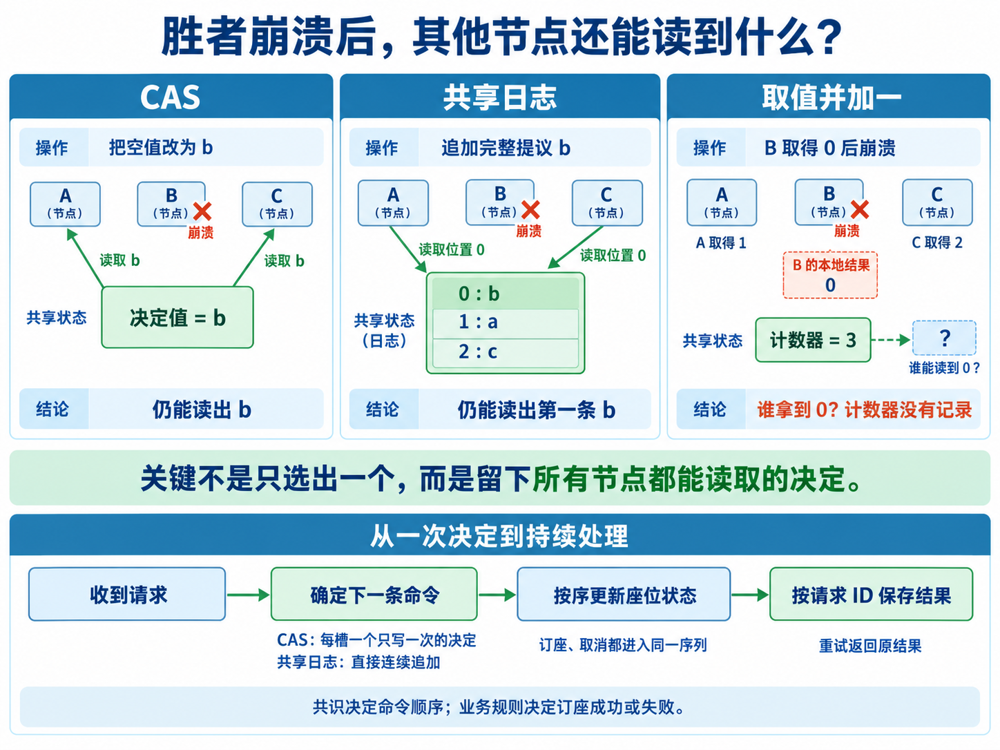

DDIA V2 的 10.6.1 说：取值并加一的共识数是 2，CAS 和共享日志则是无穷大。理由之一是：拿到 0 的节点如果崩溃，其他节点可能不知道谁赢了。那么，CAS 和共享日志为什么没有同样的问题？

**因为 CAS 把获胜提议写进了共享对象，共享日志把提议和位置一起记录下来；取值并加一只更新计数，谁拿到哪个数是调用者得到的结果。** 如果还要由调用者公布“0 号是我”，这个额外步骤就留下了故障窗口。

下面用一个订座系统，把“选出一个值”一直讲到“持续处理请求”。这里讨论怎样使用这些原语；它们底层如何容错，是另一层问题。[DDIA V2 第 10 章](https://learning.oreilly.com/library/view/designing-data-intensive-applications/9781098119058/ch10.html)

## 1. 场景：三个订座网关争抢同一座位

某场演出的 S12 座位还空着。三个网关分别收到请求：

| 网关 | 提议 | 完整命令 |
| --- | --- | --- |
| A | a | `Reserve(request=RA, seat=S12, buyer=甲)` |
| B | b | `Reserve(request=RB, seat=S12, buyer=乙)` |
| C | c | `Reserve(request=RC, seat=S12, buyer=丙)` |

网关可能崩溃，响应可能丢失，用户也可能重试。系统必须保证：同一时刻不能把 S12 订给两个人；已经确认的结果可查询；后续订座和取消请求还能继续处理。

先聚焦一个问题：**下一条处理哪个命令？** A、B、C 分别提出 a、b、c，共识从中确定一个。假设结果是 b，各网关就应读到同一个 b；不是只让 B 知道自己赢了。

这时还有两个不同的“成功”：b 被选入处理序列，是共识结果；乙是否订座成功，要按此前的座位状态执行 b 才能确定。S12 原本为空，所以本例乙成功。座位已经被占时，命令仍可进入序列，但业务结果是失败。

## 2. 比较前，固定原语和故障边界

三种方案都允许把提议预先放进可供其他节点读取的存储。不能让 CAS 使用可靠共享存储，却让取值并加一只能把数据留在本机。

本文分别假设可用的核心接口是：

- **CAS：** 线性一致地比较并更新共享对象，并能读取该对象。
- **共享日志：** 满足 DDIA 的最终追加、可靠传递、只追加、一致同意和有效性；读取者看到同一序列的不同长度前缀。
- **取值并加一：** `fetchAdd(counter, 1)` 线性一致地加一，返回旧值；可以读取计数，但没有“查询 0 号调用者”的接口。

调用者可以停止运行，但已经写入的共享状态仍能被其他调用者读取。原语服务自身不可达时，三种方案都可能停顿；下文不会用“计数器服务器宕机”解释取值并加一的不足。

**共识数说的是原语的协调能力，不是能承载的客户端数，也不是能容忍的存储副本故障数。** 经典定义考察：用这种对象及普通读写寄存器，能为多少个参与进程实现无等待共识——其他进程即使停住，继续执行的进程也能在有限个自身步骤内完成。无穷大指任意有限参与者数量，不是实际无限台机器。

这也不等于网络服务承诺固定响应时间。将原语部署成分布式服务后，进展仍取决于其网络、存储和容错条件。[Herlihy：Wait-Free Synchronization，§2–3](https://cs.brown.edu/~mph/Herlihy91/p124-herlihy.pdf)



*图中的取号结果分别属于各节点本地，不会自动共享；右栏强调计数器本身不保存对应关系。第五节给出其他节点停止后无法分辨胜者的具体历史。*

## 3. CAS：决定产生时，结果也已经留下

为这一次决定准备一个共享对象 `D=EMPTY`。每个网关尝试把它改成自己的完整命令：

```text
choose(command):
    CAS(D, EMPTY, command)
    return read(D)
```

本次决定后，D 不再修改，也不清回 EMPTY。

假设 B 的 CAS 先成功，D 就变成 b。A、C 的 CAS 因 D 已非空而失败，随后读取 D，都得到 b。即使 B 在 CAS 生效后、收到响应前崩溃，D 中的 b 也已可供其他节点读取。

反过来，B 若在操作生效前崩溃，就没有抢占 D，A 或 C 仍可填入自己的提议。**不存在“B 已占住这个决定，但 b 还必须等 B 另写一次”的中间状态。**

如果 B 只是超时，它也不能凭超时判断失败；恢复后读 D 即可。D=b 表示本次选中了 b，D=a 则表示选中了 a，无需找 A 或 B 当面确认。

生产中命令可能太大，CAS 只放命令 ID 或引用。这时必须先保存不可变的命令内容，再 CAS 引用；否则“D 指向 b，但 b 还在已崩溃节点的内存里”，就重新制造了故障窗口。

这套做法与参与者数量无关：只有第一次从 EMPTY 更新成功，其他人都读取同一结果。因此 CAS 能解决任意有限数量提议者的单值共识。

## 4. 共享日志：第一条既有位置，也有内容

为这一次共识准备独立的空日志，各网关提交完整命令，再读位置 0：

```text
choose(command):
    requestAppend(command)
    return readWhenAvailable(0)
```

若日志顺序为 `[b,a,c]`，三者都读到 b。这里的第一条是日志位置 0，不是网卡最先收到的包，也不是各自最先提交的命令。

B 在 b 确定入日志后崩溃，不影响别人读取它；B 在提交完成前崩溃，b 可能入日志，也可能没有入日志，但其他未故障节点的提交仍应最终使日志非空。未收到成功响应的客户端，通过请求 ID 查询或重试，不能自行宣布结果。

**日志的保证包含“位置 0 是 b”，不是仅仅告诉 B“你拿到了 0 号”。** 这正是它与编号器的区别。前一篇[全序广播与共享日志](https://quboliu.github.io/posts/0142/)解释了这些日志条目怎样由有序交付产生。

这里使用的是可保留和重读条目的共享日志，不是条目被某个消费者取走后别人就看不到的普通工作队列。两者的接口能力不同，不能因为都有先后顺序就混为一谈。

## 5. 取值并加一：有先后，但少了可读取的对应关系

设 `counter=0`，每个网关只调用一次：

```text
ticket = fetchAdd(counter, 1)
```

假设 B 得到 0，A 得到 1，C 得到 2。号码不重复，也确实存在一个线性一致的先后顺序。但是计数器最终只保存 3，没有保存 `0 → b`。

如果约定拿到 0 的人获胜，B 知道应该决定 b。它若在公布号码之前崩溃，A 只知道前面有一个人，C 只知道前面有两个人。即使 a、b、c 已经公开，它们仍不等于公开了谁拿到 0。

### 两段历史，留下相同的可见状态

先让三者都把提议写进各自的共享寄存器，再发号：

| C 看不到的先后 | 历史一 | 历史二 |
| --- | --- | --- |
| 第一个调用者 | A 得到 0，决定 a | B 得到 0，决定 b |
| 第二个调用者 | B 得到 1 | A 得到 1 |
| 公布号码之前 | A、B 都停止运行 | A、B 都停止运行 |
| C 随后调用 | 得到 2，计数器变为 3 | 得到 2，计数器变为 3 |
| C 能读到的提议 | a、b、c | a、b、c |

C 看到的状态相同，但为了不违背已有决定，历史一必须决定 a，历史二必须决定 b。它无法区分，只能等；而停止的节点可能永远不回来。

这说明“最小号码获胜、事后公布号码”的算法为什么失败。它本身不是对所有算法的不可能性证明；更强的结论来自 Herlihy 的共识层级：仅用普通读写和取值并加一，不能实现三进程无等待共识。换成多个计数器、分组比赛，也不能绕过这个结论。[Herlihy，§3.2](https://cs.brown.edu/~mph/Herlihy91/p124-herlihy.pdf)

### 为什么两个节点例外

如果本次只有已知的 A、B 两个提议者，先公布自己的提议，再发号：

```text
chooseTwo(i, command):
    write(proposal[i], command)       # 每人独立、不可覆盖的共享位置
    ticket = fetchAdd(counter, 1)     # 本次每人最多调用一次
    if ticket == 0:
        return command
    return read(proposal[other(i)])
```

拿到 1 的 A 知道，拿到 0 的只能是 B；B 又必须先公布 b，才能调用计数器，所以 A 一定能读取 b。B 此后即使停止也无妨。

这里**不等双方都到场才发号**。B 如果在公布或取号前停止，A 可以独自拿到 0 并决定 a。第三个提议者出现后，“不是我”就不能唯一确定是谁，这个推断不再成立。

伪代码要求每人每轮只取号一次；实际 RPC 超时后不能直接再取一个新号，调用恢复语义需要另行处理。

两个固定网关可以服务很多买家；共识数 2 限制的是并发参与协议的进程数量，不是售票用户总数。但增加第三个可独立接管的提议网关，就超出了这套构造的保证。

### 为什么“再加一张号码表”还不够

发号后再写 `ticket → command`，两步之间仍可崩溃；发号前公开 command，则还没有 ticket。若新增一个接口，原子地分配号码、保存完整命令，并让别人按号码查询，当然可以解决问题——但这已经增强为有序记录服务，不能再把能力归给裸取值并加一。

某个数据库可能用共识实现序列号。那说明它的内部实现更强，不表示只开放序列号接口时，调用者也获得了内部日志或 CAS 的能力。

## 6. 从一个决定，变成连续的命令序列

一次决定只解决“这一格放什么”。持续订座需要一串格子：`slot[0]、slot[1]、slot[2]……`，每格内容确定后不再改变。

### CAS：每个槽位运行一次共识

为每格准备一个初值为 EMPTY 的 CAS 对象。网关按以下顺序推进：

1. 读当前槽位。已有命令，就使用它；为空，就 CAS 放入一个已公开的待处理命令。
2. CAS 失败，读取该格已选中的命令；无论是谁提交，都按同一业务规则执行。
3. 记录执行结果和本地已执行位置，再处理下一格。自己的请求尚未出现，就继续争取后续槽位。
4. 只执行连续前缀；不能因为后面的格子有值，就跳过前面的空格。

**每一格只有一个获胜命令，但输掉这一格的请求可以进入下一格。** 不要把同一个 D 清空复用：重启节点或延迟请求可能把新一轮结果当成旧一轮。使用独立槽位和明确的演出/日志标识，回收旧槽位另行处理。

这就是用多次单值共识构造日志。它没有要求某个获胜网关永久负责后续排序；任何继续运行的网关都可读已定槽位、补齐状态、继续下一格。

### 共享日志：直接连续追加

共享日志已提供连续序列，不必每来一个请求都新建日志。持续向同一份日志追加，读取者从自己的 `lastApplied+1` 开始顺序执行。

前面的“读位置 0”只用于说明如何解决一次单值共识。系统运行起来后，位置 0、1、2 分别确定第 1、2、3 条命令；不可能所有后续请求还去读位置 0 当自己的结果。

### 取值并加一：连续发号不等于连续决定

常见尝试是：先取号 k，再把命令写入 `slot[k]`。若 B 取到 0 后崩溃，A、C 写好了位置 1、2，日志仍有一个位置 0 的洞。

不能无限等待 B，也不能擅自把洞当空操作：B 可能只是慢，随后还会写入。若用 CAS 在“填原命令”和“封为空操作”之间作决定，解决问题的是新增的 CAS。

两个已知提议者可以为每个槽位分别使用前面的双节点算法，持续构造决定序列；每格使用独立计数器和提议位置，且每人每格最多取号一次。三者及以上，仅靠这个原语无法获得同样的无等待保证。

## 7. 有序执行后，整个订座系统怎样工作

假设连续决定的命令如下。各网关都从相同初始状态开始，按相同顺序执行：

| 槽位 | 确定的命令 | 执行前 S12 | 业务结果 | 执行后 S12 |
| --- | --- | --- | --- | --- |
| 0 | RB：乙订 S12 | 空闲 | 成功 | 乙持有 |
| 1 | RA：甲订 S12 | 乙持有 | 已被占用 | 乙持有 |
| 2 | RC：丙订 S12 | 乙持有 | 已被占用 | 乙持有 |
| 3 | RD：乙取消自己的预订 | 乙持有 | 取消成功 | 空闲 |
| 4 | RE：甲重新订 S12 | 空闲 | 成功 | 甲持有 |

RA、RC 虽然订座失败，命令本身仍已进入共同序列，并有确定结果。甲在取消后重新尝试，是新的请求 RE；重试旧 RA 应返回旧失败结果，不能悄悄变成一次新订座。

每个状态副本的核心执行逻辑是：

```text
apply(k, command):
    begin local transaction
    require k == lastApplied + 1
    if result[command.requestId] does not exist:
        outcome = transition(seats, command)
        save result[command.requestId] = outcome
    save lastApplied = k
    commit
```

座位修改、请求结果和 lastApplied 一起提交。若提交前崩溃，恢复后重做；提交后崩溃，恢复后跳过。请求 ID 还要绑定原始命令内容，拒绝拿同一 ID 提交不同买家或座位。

日志里可能因重试再次出现同一个请求；它可以占两个位置，但只产生一次业务效果。用户收到的是自己 requestId 对应的执行结果，不是“排到了第几格”的通知。

### 崩溃恢复与查询

B 决定或执行 b 后失联，A、C 仍能从 CAS 槽位或共享日志读到 b，顺序执行后回答 RB。恢复节点从持久快照及对应位置继续重放，不能从空座位表接着消费中间位置。

成功响应只在命令已确定、执行结果已可靠记录后返回。重试可交给另一个追齐到该请求的网关。落后副本不能仅因本地查不到 RB 就宣布请求不存在；它需要追日志或查询足够新的结果。单次决定不自动解决所有读一致性问题。

快照应包含座位状态、去重结果和已执行位置。截断旧日志前，必须保证恢复节点能取得对应快照；去重记录保留多久，也应与客户端允许重试的期限一致。

取消若涉及预订版本，应携带 reservationId，避免旧取消命令释放后来创建的新预订。若增加超时释放，也应把明确的释放命令排入序列，各副本不能各看自己的墙上时钟自行删除座位。

### 内部状态与外部副作用

各副本可以重复计算同一个座位状态，不能各自向支付渠道扣一次款或各自发一张票。付款、出票等外部动作由受控执行流程处理，使用稳定业务 ID 和对方的幂等接口；状态事务可记录待执行事件，再可靠重试。

共识统一命令序列，状态机统一内部结果；外部效果只发生一次，还需要端到端的执行约束。[DDIA V2 第 13 章：数据库的端到端论证](https://learning.oreilly.com/library/view/designing-data-intensive-applications/9781098119058/ch13.html)

## 8. 持续推进，还要防止某个请求永远落选

“每一格都能选出一个命令”不等于“每个请求最终都会入日志”。若 A 在每一格的 CAS 都输，系统整体仍在前进，A 的请求却可能一直没被处理。不能把这个简单重试循环直接称为无等待日志实现。

一种补足方式是**公开待处理请求，并允许节点互相代提交**。设提议网关固定为 N 个，每个网关有一个共享公告位置，同一时刻保留一个尚未完成的命令；后续请求先在入口排队。

- 第 k 格优先处理编号 `k mod N` 的网关公告。它没有未完成命令时，再按固定轮转顺序检查其他公告。
- 任意网关都可以为该格 CAS 提交选中的公告，不必等公告发布者自己运行。
- 公告在命令被执行前保持不变；副本用已执行的 requestId 判断它是否还待处理。

不同节点检查公告的时刻可能不同，所以仍由 CAS 决定该格的最终命令。一个持续挂着的请求会反复遇到自己的优先槽位；先前读到旧公告的有限个在途尝试结束后，后续帮助者就会选择它。固定参与者、顺序推进和每人有限在途操作，是这个进展论证的条件。

这补上了公平推进的关键机制，不是生产代码的全部：动态成员、公告回收、请求撤销和有界存储还要另行设计。若入口已向用户确认受理，公告或入口队列必须先达到约定的持久性，不能只在本机内存里排队。

共享日志方案则直接依赖其“未故障提交者的请求最终入日志”保证。实际选型必须核实这条保证及适用条件，不能从产品名称里的 log 自行推断。

## 9. 三种方案究竟能做什么

| 能力 | CAS | DDIA 所要求的共享日志 | 取值并加一 |
| --- | --- | --- | --- |
| 单次确定一个提议 | 将 EMPTY 改成完整提议 | 选独立日志的第一条 | 两个已知提议者可用；三个及以上无一般无等待方案 |
| 获胜者停止后找回结果 | 读共享对象 | 读确定的条目 | 计数器没有号码与提议映射；两节点靠排除法和预公布提议 |
| 持续处理命令 | 每格 CAS，加顺序执行、帮助和去重 | 连续追加，加顺序执行和去重 | 可持续发唯一号码；两节点可逐格共识，不能凭号码为任意数量节点构造同等保证 |
| 自动保证每个订座成功 | 不能，由座位状态决定 | 不能，由座位状态决定 | 不能 |
| 自动保证付款、出票只执行一次 | 不能 | 不能 | 不能 |

CAS 可以用“读计数、CAS 加一、冲突后重试”实现取值并加一，但这个重试循环未必对每个参与者无等待。这也提醒我们：功能上能实现一个接口，与能兑现它的进展保证，是两件事。

无穷大的共识数同样不意味着 CAS 或日志能在任意网络故障下持续服务。单机原子指令不提供跨机器共享存储；多副本服务需要自己的复制、恢复和可用性条件。本例中的 A、B、C 是提议网关，不是底层存储的投票副本。

**CAS 留下决定值，共享日志留下有序的决定记录，取值并加一留下计数。** 前两者让其他节点不必依赖获胜者来说明结果；持续系统再把这些决定串成命令序列，按序执行、保存结果，并对重试和外部副作用分别负责。
