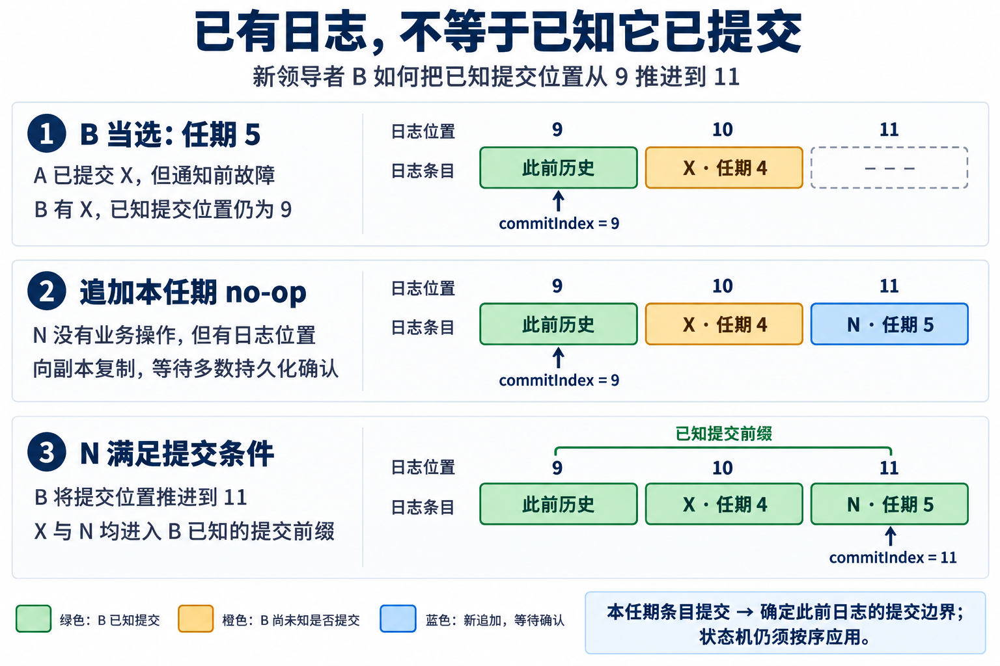

DDIA V2 的 10.6.2 将共识协议概括为两轮投票：一轮选领导者，另一轮确认领导者提出的日志条目。那么，新领导者当选后，是否必须立即发起写日志？

**etcd 的 Raft 实现确实会在当选后主动追加一条空操作日志，不等客户端请求。Raft 论文也有这个做法。原因是新领导者需要确定提交进度，不是“两轮投票必须紧挨着完成”。**

本文先解释 DDIA 的抽象，再对照 [Raft 扩展论文](https://raft.github.io/raft.pdf)和 [`etcd-io/raft@3cbf6a74be3f`](https://github.com/etcd-io/raft/tree/3cbf6a74be3fa392edd8b64253fcd11c3ce5649b)。代码分析针对 etcd 使用的 Raft 库，不将库函数调用等同于整个 etcd 服务已经完成磁盘和网络操作。

## 1. 两轮投票，不是每条日志都重新选举

[DDIA 10.6.2](https://learning.oreilly.com/library/view/designing-data-intensive-applications/9781098119058/ch10.html)概括的是两类决定：谁可以在本任期提出日志，以及哪些提议可以被确认。

```text
选举：确定本任期的领导者
    ↓
条目 A：复制并获得 quorum 确认
条目 B：复制并获得 quorum 确认
条目 C：复制并获得 quorum 确认
……
```

领导者可以在一个任期内连续提出许多条目，复制也可以批量、流水线进行。第二轮“投票”指对条目的接受与复制确认，不是领导者单独写自己的磁盘，更不是每次重新举办一场选举。

选举成功不会预先批准未来所有日志。条目仍要满足协议的提交条件；等待时间长短不能代替这些条件。

## 2. 当选时，有日志，不一定知道它已提交

考虑三个节点 A、B、C，初始提交位置均为 9：

1. A 在任期 4 担任领导者，将第 10 条日志 X 持久化到自己和 B。
2. A 收到 B 的确认，满足多数条件，将 X 提交。
3. A 尚未通知 B 新的提交位置，就发生故障。
4. B 在任期 5 当选。

此时 B 的状态可能是：

```text
本地日志：…… → 第 10 条 X，term = 4
已知提交位置：9
当前任期：5
```

X 已经提交，但 B 不知道 A 最后收到了哪些确认。B 持有 X，不等于它知道 X 已经提交。

Raft 的选举限制保证新领导者包含已提交历史，却不保证它当选瞬间就知道准确的提交边界。论文 §8 正是从这一区别引出 no-op。

## 3. 为什么要追加本任期的条目？

Raft 不允许新领导者仅凭副本数，把旧任期条目直接判为已提交。通过多数复制推进提交位置时，作为依据的条目必须属于当前任期；它之前的日志随之提交。这是论文 §5.4.2 的提交规则，Figure 8 展示了忽略该限制可能产生的覆盖问题。

因此，B 在 X 后追加一条本任期的空操作 N：

```text
位置 10：X，term = 4，业务操作
位置 11：N，term = 5，no-op
```

N 满足多数持久化等提交条件后，B 将提交位置推进到 11。因为日志复制要保持前缀匹配，确认 N 的副本也必须具有它之前的对应历史。X 因而包含在这个已提交前缀中。

**N 不改变业务数据，但它把“当前任期已经成功提交一条记录”这件事确定下来。** B 随后可以按序应用 X 和 N；若 X 尚未应用，它对数据的修改也在这时被执行。

要区分三个时刻：追加到本地日志、满足条件后提交、将已提交日志应用到状态机。它们不是同一步。



图中的颜色表示 **B 对提交状态的认知**：橙色的 X 在本例中已由 A 提交，只是 B 尚未得知。

## 4. 论文要求的是 no-op，还是本任期的一次提交？

论文 §8 写道：

> “Raft handles this by having each leader commit a blank no-op entry into the log at the start of its term.”

即每个领导者在任期开始时提交一条空操作。[Raft 论文 §8](https://raft.github.io/raft.pdf)

发挥作用的关键是“本任期条目成功提交”。正常业务条目也能满足这一条件，但它依赖客户端恰好发来请求。主动追加 no-op，就不必等业务写入才能推进提交进度。

这不是一个固定时限的安全要求。延迟发起 no-op，不会自动使日志分叉；但依赖本任期提交的操作必须继续等待。失去 quorum 时，no-op 同样无法凭空完成提交。

它也不同于空心跳：**no-op 是占据日志位置、具有任期、需要复制提交的条目；不携带新条目的心跳不会新增这样一个位置。**

## 5. etcd 的代码在哪一步发起？

固定版本的候选者处理选票时，真正赢得选举后执行：

```go
r.becomeLeader()
r.bcastAppend()
```

这是选举胜出分支的两行代码；预投票成功会先进入正式选举，而不是直接成为领导者。[raft.go：选举胜出路径](https://github.com/etcd-io/raft/blob/3cbf6a74be3fa392edd8b64253fcd11c3ce5649b/raft.go#L1695)

`becomeLeader()` 内部创建空条目并追加：

```go
emptyEnt := &pb.Entry{Data: nil}
if !r.appendEntry(emptyEnt) {
    r.logger.Panic("empty entry was dropped")
}
```

`appendEntry()` 为它填入当前任期和下一个日志位置。因此，`Data: nil` 只是没有业务载荷，条目仍有协议意义。[raft.go：创建空条目](https://github.com/etcd-io/raft/blob/3cbf6a74be3fa392edd8b64253fcd11c3ce5649b/raft.go#L959)、[填写任期与位置](https://github.com/etcd-io/raft/blob/3cbf6a74be3fa392edd8b64253fcd11c3ce5649b/raft.go#L815)

接着 `bcastAppend()` 发起复制。持久化和发送由库的宿主按接口约定完成；本地追加并不意味着多数副本已保存。源码还专门将领导者对自己条目的确认推迟到持久化之后。[raft.go：持久化后的自身确认](https://github.com/etcd-io/raft/blob/3cbf6a74be3fa392edd8b64253fcd11c3ce5649b/raft.go#L833)

所以，“立即”在这里有准确含义：**当选处理路径主动发起，不等待客户端；它不承诺磁盘、网络和多数确认在某个时间内完成。**

## 6. 提交 no-op 后，就能直接提供线性一致读吗？

还不够。no-op 帮助确定已有历史的提交进度，不会永久证明领导者仍然有效。

例如，B 提交 N 后与集群隔离，其他节点选出新领导者并提交更多修改。B 若继续只读自己的旧状态，仍可能返回过期结果。

在基于 quorum 的安全读路径中，需要区分：

| 条件 | 解决的问题 |
| --- | --- |
| 本任期已有条目提交 | 建立可用的提交边界 |
| 为读取确认领导者资格 | 避免已被替换的旧领导者直接返回旧数据 |
| 状态机应用到读取所需的位置 | 避免日志已提交、实际数据却还没更新 |

etcd Raft 的多投票成员路径也直接体现了第一项：尚未提交本任期条目时，将 ReadIndex 请求放入等待队列，而不是立即回答。单投票成员另有专门分支。[raft.go：延后 ReadIndex 请求](https://github.com/etcd-io/raft/blob/3cbf6a74be3fa392edd8b64253fcd11c3ce5649b/raft.go#L1355)

完整过程因此是：

```text
赢得选举
    ↓
追加本任期 no-op，发起复制
    ↓
满足提交条件，推进已提交前缀
    ↓
按序应用日志；读取还须满足相应的领导者确认条件
```

**DDIA 的“两轮投票”解释选举与日志确认的分工；Raft 的 no-op 解决新任期开始时的提交进度问题；etcd 则把它写进了当选后的直接执行路径。三者相关，但不是同一个层次的要求。**
