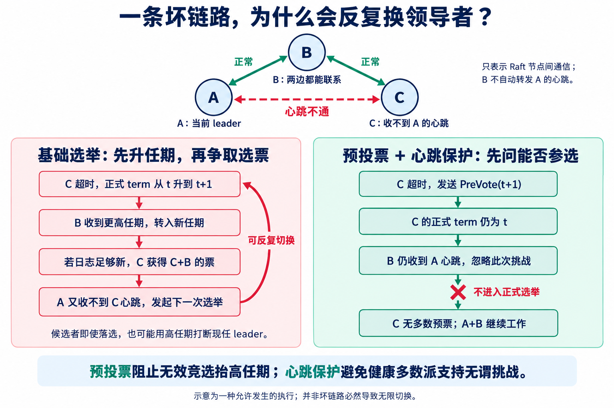

DDIA 在 10.7.1 前指出：即使只有一条链路持续不可靠，Raft 也可能不断切换领导者，或反复迫使当前领导者退位，导致系统难以推进。预投票是为处理这类问题引入的扩展。

**问题在于：节点仅凭自己收不到心跳，就能提高正式任期；更高任期又能迫使其他节点让位。一个局部通信故障，因而可能不断打断仍能工作的多数派。**

预投票把“我要竞选”与“正式提高任期”分开。配合近期心跳保护，它能阻断典型的无谓竞选，但不保证所有网络故障下都能稳定选主。

本文以 [DDIA 第 10 章](https://learning.oreilly.com/library/view/designing-data-intensive-applications/9781098119058/ch10.html)、[Raft 论文](https://raft.github.io/raft.pdf)和 [Ongaro 博士论文的预投票章节](https://github.com/ongardie/dissertation/blob/master/leaderelection/prevote.tex)解释原理。实现固定为截至 2026-09-08 查询到的最新发布版 [etcd v3.7.1](https://github.com/etcd-io/etcd/releases/tag/v3.7.1)，及其依赖的 Raft v3.7.0。

## 1. 一条坏链路，怎样引发两边轮流竞选？

先看没有预投票和近期心跳保护的基础选举规则。构造三个投票节点：

```text
A ↔ B：正常
B ↔ C：正常
A ↔ C：持续无法通信
```

这里表示节点之间的 Raft 通信能力，不是物理线路图。B 能分别联系 A、C，不代表 B 会在应用层自动转发 A 给 C 的心跳。

假设 A 是任期 10 的 leader。A+B 已构成多数派，本来可以处理请求；但 C 收不到 A 的心跳，于是可能发生下面的过程。

| 步骤 | 发生什么 | 为什么 |
| --- | --- | --- |
| 1 | C 超时，将正式任期提升到 11，向 B 请求选票 | 基础算法允许节点自行启动新任期 |
| 2 | B 进入任期 11；若 C 的日志满足新旧比较条件，就投给 C | 更高任期先被处理，再判断是否授票 |
| 3 | C 得到自己和 B 的票，当选 | C+B 是多数派 |
| 4 | A 从 B 的高任期响应获知任期已变，退位 | 基础算法要求服从更高任期 |
| 5 | A 收不到 C 的心跳，再超时，发起任期 12 的选举 | A、C 之间的坏链路仍在 |
| 6 | 若 A 的日志也符合条件，A+B 让 A 再次当选 | 同样的过程反向发生 |

这是一条**允许发生的执行路径**，不是说该拓扑必然永远震荡。双方轮流当选要求它们在相应轮次满足日志新旧条件，例如尚未产生让另一方失去资格的新日志。若 B 当选并稳定向两边发送心跳，这个循环可能结束。

随机选举超时能缓解同时竞选造成的分票，却没有消除这条坏链路。它不能把“我收不到心跳”变成“多数节点都认为应该换 leader”。DDIA 引用的 Coracle 研究展示了类似的非传递可达与单向通信问题。[Coracle，§2](https://conferences.sigcomm.org/sigcomm/2015/pdf/papers/p85.pdf)

## 2. 更严重的是：不必当选，也能打断别人

考虑 C 能向 A、B 发消息，却收不到它们的响应：

```text
C 收不到心跳 → 超时 → term 增加 → 发出 RequestVote
    ↑                                      ↓
    └──── 收不到足够选票，继续超时 ← 其他节点处理更高任期
```

C 永远收不齐选票，但正式任期不断增长。基础算法中，A 即使因为 C 的日志太旧而拒绝投票，也可能已经因消息携带更高任期而退位。

**“有资格迫使别人进入新任期”发生在“证明自己能够当选”之前。** 这才是机制上的薄弱点，不能只概括成“选举超时设得不好”。

完全隔离的 C 在隔离期间不能把消息送出去，因此不会持续干扰多数派；它可能在恢复连接时，把隔离期间累积的高任期带回来，触发一次不必要的重新选举。部分可达、单向可达或反复断连，则可能把一次干扰变成持续干扰。

这主要损害**活性与可用性**：能否持续提交操作。只要日志与投票安全规则仍然成立，频繁换主本身并不意味着已提交日志丢失。它不同于[非洁净选举](https://kafka.apache.org/34/design/design/)允许放弃已确认历史。

## 3. 预投票在哪一步切断循环？

基础路径是：

```text
超时 → 增加正式任期 → 请求投票 → 看能否得到多数
```

预投票路径变成：

```text
超时 → 试探能否获得多数支持，暂不增加正式任期
           ↓ 获得 quorum 的预票
       增加正式任期 → 发起真正选举 → 赢得选票后当选
```

预票不是正式票，预投票成功也不保证后面的正式选举必胜。两阶段之间可能出现新的故障或新的竞选者。

Ongaro 的预投票设计还要求投票方检查：候选日志足够新，并且自己至少一个基础选举超时时间没有收到有效 leader 的心跳。**不是只问“网络通不通”，还要问“现在是否有必要换 leader”。** [预投票原始说明](https://github.com/ongardie/dissertation/blob/master/leaderelection/prevote.tex)

回到 A—B—C：C 超时后只发送预投票请求，正式任期不变。B 持续收到 A 的心跳，因此不支持挑战；C 得不到多数预票，就不能进入正式选举。A+B 可以继续工作。



两项作用不能混淆：

| 机制 | 切断哪条因果链 |
| --- | --- |
| 预投票不先增加正式任期 | 收不到多数响应的节点，不能靠反复超时不断抬高任期 |
| 近期 leader 心跳保护 | 健康多数派不会仅因收到新挑战，就协助破坏仍在工作的 leader |

如果只加一轮探测，却让 B 无条件支持日志够新的 C，那么 C+B 仍可能完成预投票，再进入正式选举。**“多了一轮投票”不是效果保证，投票条件才是。**

## 4. 当前 etcd v3 实际怎么做？

答案是：**当前检查的 etcd v3.7.1 默认启用预投票，并同时启用 CheckQuorum。** 不是只实现基础 Raft。配置构造中有 `PreVote: true`；创建 Raft 配置时传入 `PreVote: cfg.PreVote`，并设置 `CheckQuorum: true`。[默认配置](https://github.com/etcd-io/etcd/blob/v3.7.1/server/embed/config.go#L557)、[Raft 配置](https://github.com/etcd-io/etcd/blob/v3.7.1/server/etcdserver/bootstrap.go#L540)

这不等于所有历史 v3 版本或所有部署都启用了它。`--pre-vote` 可以配置，实际行为必须看运行版本和配置。以下路径均来自 Raft v3.7.0。

### 超时后先进入 PreCandidate

处理 `MsgHup` 时，`r.preVote` 为真就调用 `campaignPreElection`。`becomePreCandidate()` 不增加 `r.Term`，也不改变正式投票记录 `r.Vote`。

随后发出的 `MsgPreVote` 携带拟议的 `r.Term + 1`。**消息里的拟议任期，比本地已经正式进入的任期多 1；不能看到消息中的数字就认定任期已经增加。** [超时分支](https://github.com/etcd-io/raft/blob/v3.7.0/raft.go#L1190)、[预候选状态](https://github.com/etcd-io/raft/blob/v3.7.0/raft.go#L917)、[发送预投票](https://github.com/etcd-io/raft/blob/v3.7.0/raft.go#L1025)

### 接收方先保护近期仍有效的 leader

收到更高任期的 Vote 或 PreVote 时，代码先检查：

```go
inLease := r.checkQuorum &&
    r.lead != None &&
    r.electionElapsed < r.electionTimeout
```

如果条件成立，且不是强制领导权转移，就直接忽略挑战，不先提高任期，也不授票。A—B—C 例子中的 B，正是在这里挡住 C。[Step：近期心跳保护](https://github.com/etcd-io/raft/blob/v3.7.0/raft.go#L1100)

`inLease` 是源码变量名，不能据此推断系统启用了租约式线性一致读。这里使用本地 tick 判断竞选是否过早；它与 ReadIndex 的读取保证是不同路径。

### 预投票不会把拟议任期传播成正式任期

更高任期的 PreVote 请求，以及批准它的 PreVoteResp，不触发常规的任期提升。授予预票也不写入正式 `Vote` 记录。[任期处理](https://github.com/etcd-io/raft/blob/v3.7.0/raft.go#L1115)、[只记录正式投票](https://github.com/etcd-io/raft/blob/v3.7.0/raft.go#L1251)

但不能简化成“所有预投票响应都不影响任期”。拒绝响应可能携带接收方真实的更高任期，代码仍会据此更新本地状态。被屏蔽的是试探产生的虚拟任期，不是真实的新任期信息。

### 获得多数预票后，才开始真正选举

当投票统计结果为 `VoteWon` 且当前是 `StatePreCandidate` 时，代码调用 `campaign(campaignElection)`。这才通过 `becomeCandidate()` 增加任期、投给自己，再发送正式 Vote 请求。

正式选举赢得 quorum 后，才调用 `becomeLeader()` 和 `bcastAppend()`。当选后的空日志与复制过程，见[前文 no-op 注解](/posts/0147/)。[选举胜出分支](https://github.com/etcd-io/raft/blob/v3.7.0/raft.go#L1696)

### CheckQuorum 还负责让失联 leader 退位

leader 定期检查近期活跃的投票成员能否构成 quorum；不能时主动退为 follower。这防止失去多数联系的 leader 长期占着领导者状态。[MsgCheckQuorum](https://github.com/etcd-io/raft/blob/v3.7.0/raft.go#L1281)

在这个实现中，近期心跳保护也受 `checkQuorum` 开关控制，但两项职责不同：一项抑制无谓挑战，另一项检查现任 leader 是否仍联系得到多数。

因此，关闭 `PreVote` 并不等于所有行为都退回论文的最简规则，因为 CheckQuorum 等机制仍在。不过，隔离节点因反复正式竞选而积累高任期的风险会重新出现。源码还专门处理低任期 leader 消息触发的高任期响应，不能只用“忽略 Vote”代替预投票。

## 5. 它是否彻底解决了问题？

**它解决的是特定干扰路径，不是“任何网络条件下稳定选主”。** 在健康多数派持续交换及时心跳、异常节点遵守协议的条件下，前面的无效挑战会被阻断。

仍然存在以下边界：

| 条件 | 为什么仍可能失败或换主 |
| --- | --- |
| 多数派无法完成双向通信 | 无法完成预投票、正式选举或日志提交 |
| 心跳频繁超过选举超时，或进程长时间停顿 | 多数节点也可能认为 leader 已失效，保护窗口到期 |
| 预投票后网络状态改变 | 预票不是对后续连通性和正式票的预约 |
| 新 leader 当选后又失去 quorum | CheckQuorum 会让它退位，新的选举可能继续发生 |
| 节点不遵守协议，伪造消息或任期 | 预投票没有把 Raft 变成拜占庭容错协议 |

允许任意长的消息延迟和不断变化的故障，就不能承诺固定时间内完成选举。实际可用性仍依赖足够稳定的通信、处理能力与合适的超时。

预投票还会给真正需要选举的路径增加一个阶段；近期心跳保护也可能推迟对真实故障的响应。etcd 对主动领导权转移有显式例外，避免正常交接被这层保护挡住。不能把所有高任期消息一律忽略，那会阻碍真正的恢复。

所以，称它为基础选举的**活性与故障隔离弱点**更准确。原始规则让局部怀疑过早改变整个集群的任期；预投票先要求获得支持，心跳保护避免健康多数派无谓改选。它改善的是“坏节点或坏链路能否打断好节点”，没有放弃日志安全规则，也没有消除分布式系统的通信条件。
