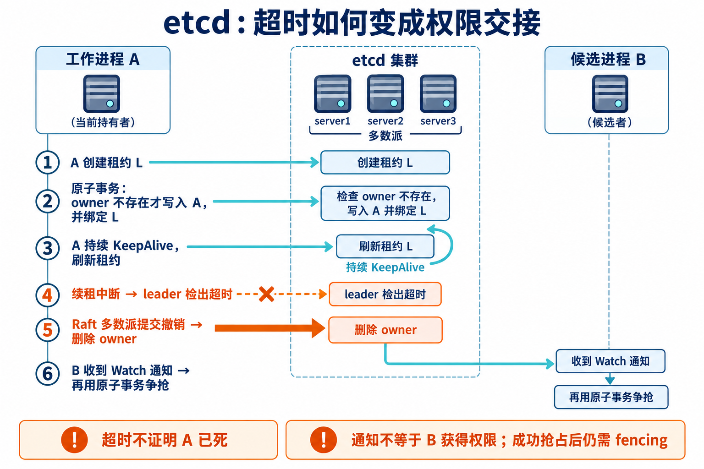
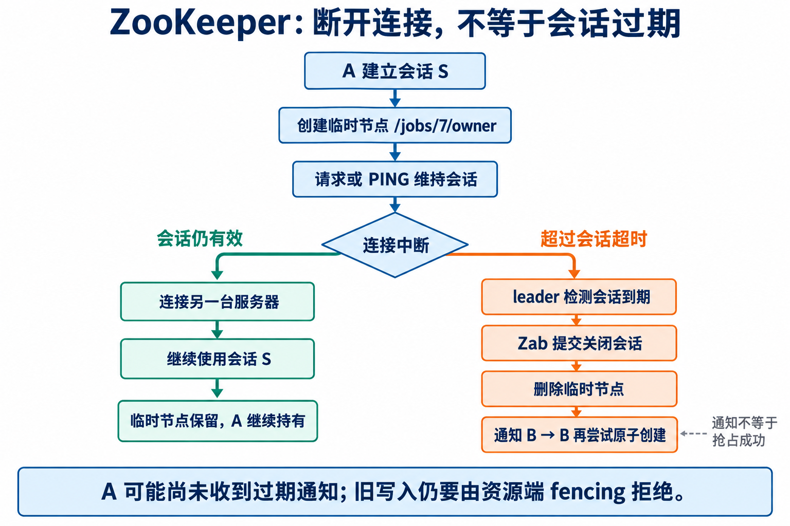

DDIA 10.7.1 描述了一种故障检测：客户端定期向协调服务发送心跳；长时间收不到心跳，协调服务就认为客户端失效，释放它持有的租约。随后又说，故障检测本身不需要共识，但与原子操作、fencing 结合起来，对分布式协调很有用。

这里有三个不同的问题：**旧进程是否还活着，谁现在拥有任务，以及旧进程还能不能写入。** 心跳、原子抢占、fencing 分别处理它们，不能互相替代。

本文对照 **etcd v3.7.1** 和 **ZooKeeper 3.9.4**。讨论的是应用进程与协调服务之间的故障检测，不是协调服务内部的领导者选举。

## 1. 先说清楚：不存在“超时当且仅当节点死亡”

假设 A 每隔几秒发送一次心跳，服务端已经 30 秒没有收到。至少有四种可能：A 崩溃了；A 暂停了；网络断了；接收方忙到没有及时处理心跳。

它们给接收方留下的观察结果相同：没有新心跳。因此，**在网络延迟和进程暂停没有已知上界的条件下，仅凭超时无法区分“已经死亡”和“暂时无法联系”。**

“超时”不是“死亡”的充分条件：活着的进程也会超时。它也不是“此刻已经死亡”的必要条件：进程可能刚发完心跳就崩溃，超时尚未发生。

故障检测理论通常用两个维度描述这种能力：**完整性**关心故障进程是否最终会被怀疑，**准确性**关心正常进程是否被误判。不同检测器对“哪些观察者”“从什么时候开始”还有不同要求；心跳超时并不会自动获得完美的两者。[Chandra 与 Toueg 的故障检测器论文](https://research.ibm.com/publications/unreliable-failure-detectors-for-reliable-distributed-systems)

### 怎样的条件才足以作出保证？

先区分三个目标，而不是找一个包办一切的“冲要条件”。

| 想保证什么 | 需要什么前提 |
| --- | --- |
| 正常进程不被超时误判 | 正常情况下，服务端接受相邻两次有效续约的间隔有已知上界 G；超时阈值 T 大于 G |
| 停止续约后最终被检测到 | 最终不再有有效续约到达；检测器的计时和调度继续推进；超时阈值有限 |
| 检测到之后能够完成接管 | 协调集群能提交释放和抢占操作，接管者能访问它，以及实际承接写入的存储 |

第一行的 G 必须覆盖发送周期、进程暂停、网络延迟、丢包重试和服务端排队，并按检测器的计时尺度计算。只有心跳周期有上界，远远不够。若时间界限只在系统稳定后成立，就只能讨论稳定之后的准确性。

这些是所述心跳方案作出相应保证的条件，**不是所有故障检测实现的普遍充要定理**。例如硬件断电信号可以提供额外信息；但即使知道机器断电，仍要处理它此前发出、尚在网络中的请求。

还要明确检测对象：如果业务线程死锁，但独立的续约线程仍正常运行，租约不会因此到期。心跳证明的至多是某条续约路径仍在工作，不能证明业务在持续取得进展。

### 租约把不确定的观察变成确定的权限规则

服务不必证明 A 已经死亡，才有资格撤回它的权限。它可以事先约定：**只有持续续约，才能保留这份权限；超过期限，就按协议撤销。**

于是，“A 是否死亡”仍不确定，“协调服务是否已经撤销 A 的租约”却可以成为确定的状态。后者必须以服务端完成的状态变更为准，不能由某个客户端自己的倒计时来代替。

短超时通常让接管更快，也更容易因短暂故障反复交接；长超时减少误判，却延长真正故障后的等待。超时值本身不能解决安全问题。

## 2. etcd：续租、撤销，再原子抢占

设 A 正在处理订单流的第 7 个分片。我们用 `/jobs/7/owner` 记录处理者。



### 建立持有关系

A 先调用 `LeaseGrant`，得到租约 L 和服务端授予的 TTL，再执行一个事务：

```text
IF Version("/jobs/7/owner") == 0
THEN Put("/jobs/7/owner", A 的本次运行标识, lease=L)
ELSE 抢占失败
```

比较和写入是一个原子操作。因此，即使 A、B 同时看到任务空闲，也只能有一个成功创建这个 owner 键。

**单独创建 etcd Lease 并不等于获得一把互斥锁。** A、B 可以各自创建租约；互斥来自针对同一个 owner 键的条件事务，租约负责让这个键能够自动过期。[etcd API：事务与租约](https://etcd.io/docs/v3.7/learning/api/)

### 正常运行时读写什么？

A 通过 `LeaseKeepAlive` 发送租约 ID。负责租约的 leader 读取租约状态，接受续约后刷新到期时间，再返回剩余生存期信息。这里不需要不断改写 owner 的业务值，也不能把普通 TCP 或 gRPC 连接保活当成租约续约。

在 v3.7.1 中，`lessor.Renew` 处理续约，`revokeExpiredLeases` 检查过期租约。常规续约主要更新租约管理状态，并非每个心跳都对应一条 Raft 日志；租约检查点等路径可以另外产生共识日志。[etcd 租约管理源码](https://github.com/etcd-io/etcd/blob/v3.7.1/server/lease/lessor.go)

### 续租中断后发生什么？

1. 短暂断连期间，owner 键不会仅因连接断开就立刻消失；及时恢复续约，可以继续持有。
2. leader 检测到过期，将租约交给撤销流程。
3. `LeaseRevoke` 通过 Raft 提交。应用撤销时，删除绑定在租约上的键，包括 owner。
4. 观察该键的客户端收到删除事件，然后重新尝试条件事务。

对应代码入口是服务端处理过期租约的循环，以及 `LeaseRevoke` 的提交接口。[server.go](https://github.com/etcd-io/etcd/blob/v3.7.1/server/etcdserver/server.go)、[v3_server.go](https://github.com/etcd-io/etcd/blob/v3.7.1/server/etcdserver/v3_server.go)

因此，TTL 不是“从现在起精确经过这些秒，另一个客户端必定接管”的承诺。检测调度、撤销提交和网络都需要时间；领导者切换还可能延长租约生存期。失去多数派时，也不能只凭本地超时完成安全的重新授权。[etcd 故障行为说明](https://etcd.io/docs/v3.7/op-guide/failures/)

## 3. ZooKeeper：连接可以换，会话未必失效

ZooKeeper 用**会话和临时节点**表达类似关系：A 建立会话，再以 `EPHEMERAL` 模式创建 `/jobs/7/owner`，数据写入 A 的本次运行标识。固定路径只能成功创建一次，其他竞争者会得到 `NodeExists`。



### 连接断开不等于会话过期

客户端连接集群中的一个服务器。正常请求及必要的 PING 维持会话；连接断开后，客户端库尝试连接其他服务器。如果在会话仍有效时恢复，就继续使用原会话，临时节点仍存在。

所以，客户端的 `Disconnected` 状态不能翻译成“我的任务已经被释放”。反过来，服务端已经判定会话过期时，断网中的客户端也可能尚未收到 `Expired` 通知。[ZooKeeper 会话说明](https://zookeeper.apache.org/doc/r3.9.4/zookeeperProgrammers.html#ch_zkSessions)

### 到期怎样成为集群状态？

对持有临时节点的全局会话，服务端跟踪存活信息，leader 负责全局到期处理。`SessionTrackerImpl` 刷新到期队列；检测到超时后调用 `expire`，由 `ZooKeeperServer` 提交 `closeSession` 请求。

在正常的集群写入路径中，关闭会话经 Zab 排序、提交，再由数据树应用事务，删除相关临时节点。普通的会话存活刷新并不逐次成为 Zab 事务。源码中可以沿着以下路径核对：[SessionTrackerImpl](https://github.com/apache/zookeeper/blob/release-3.9.4/zookeeper-server/src/main/java/org/apache/zookeeper/server/SessionTrackerImpl.java)、[ZooKeeperServer](https://github.com/apache/zookeeper/blob/release-3.9.4/zookeeper-server/src/main/java/org/apache/zookeeper/server/ZooKeeperServer.java)、[DataTree](https://github.com/apache/zookeeper/blob/release-3.9.4/zookeeper-server/src/main/java/org/apache/zookeeper/server/DataTree.java)。

其他客户端收到节点删除通知后，再尝试创建 owner。显式关闭会话、主动删除节点也能引起删除，所以删除事件同样不是“进程死亡证明”。

### 两种方案都不能把通知当授权

| 环节 | etcd | ZooKeeper |
| --- | --- | --- |
| 存活关系 | 显式 Lease，键绑定租约 | Session，临时节点属于会话 |
| 争抢同一任务 | 比较键不存在，再 Put | 原子创建同一个固定路径 |
| 释放记录 | 提交撤销，删除绑定键 | 提交会话关闭，删除临时节点 |
| 唤醒等待者 | Watch 键的删除事件 | Watch 节点变化 |
| 判定自己获胜 | 条件事务成功 | 创建节点成功 |

通知只是让竞争者及时重试。收到通知的人可能不止一个，收到时别人也可能已经抢到了。

抢占请求若超时，结果也可能不确定：操作可能已提交，只是响应丢了。客户端需要核实 owner 是否属于自己的这次运行及租约／会话，不能把超时直接当作成功，也不能盲目删除可能已属于别人的 owner。

等待逻辑还必须处理断线：etcd 可以按 revision 衔接读取与 Watch；历史被压缩后需要重新读取。ZooKeeper 的经典 Watch 是一次性的，需要重新读取并注册，不能假定断线期间每次变化都被逐条收到。正确性最终依赖原子抢占，不能依赖通知恰好按预期到达。[etcd 保证](https://etcd.io/docs/v3.7/learning/api_guarantees/)、[ZooKeeper 锁实现说明](https://zookeeper.apache.org/doc/r3.9.4/recipes.html#sc_recipes_Locks)

## 4. 一个完整例子：订单流分片如何安全接管

现在补上 owner 键之外的业务。订单事件保存在可重读的日志中；A 处理分片 7，把统计结果和处理进度写进同一个事务数据库。

数据库有一行任务状态：

```text
job_id = 7
fence  = 41       // 数据库目前接受的持有者代次
offset = 100      // 已完成事件的位置
```

这里的 fencing token 是**每次成功获得任务时，随这次授权取得的递增代次**。数字只需递增，不必连续。

本例用 etcd owner 键的 `create_revision`；换成 ZooKeeper，可以用成功创建临时节点那次事务的 `czxid`。必须取到属于自己这次成功创建的值，不能随便读一个“当前最新编号”。Lease ID、Session ID 都不应直接当作上述递增代次。[etcd KeyValue 定义](https://github.com/etcd-io/etcd/blob/v3.7.1/api/mvccpb/kv.proto)、[ZooKeeper Stat 定义](https://github.com/apache/zookeeper/blob/release-3.9.4/zookeeper-jute/src/main/resources/zookeeper.jute)

### 第一步：获得任务后，先让数据库接受新代次

假设 A 的代次是 41。每次获得任务，处理者都要先在数据库事务中锁住任务状态行：若新代次大于 `fence`，就更新 `fence`；相同代次允许幂等重试；更小的代次拒绝。

**安装代次成功后，才读取处理进度并开始干活。** 对于第一次运行，这就是初始化；对于接管，这是让旧写入失效的实际动作。

### 第二步：每次提交都检查代次，并一起提交结果和进度

下面是语义伪代码：

```text
BEGIN
  锁住 job_state 中 job_id=7 的行
  若请求 token != fence：拒绝并回滚
  若事件位置 <= offset：作为已完成的重试返回
  若事件不是下一条待处理事件：拒绝越序提交
  写入本次统计结果
  更新 offset
COMMIT
```

代次检查、业务写入、进度更新必须处于同一事务，并与安装新代次竞争同一把行锁。不能先查一次 token，退出事务，再单独写业务数据：两步之间可能已经发生接管。

### 第三步：A 失联，B 和 C 竞争接管

A 在完成第 100 条后长时间暂停，续约也停止。协调服务完成超时释放，B、C 被通知唤醒；二者同时抢占，只有 B 成功。B 得到更大的代次 58。

B 把数据库的 `fence` 从 41 更新成 58，然后读取 offset，再从下一条事件继续处理。C 抢占失败，继续等待。

| 时刻 | 协调服务 | 业务数据库 |
| --- | --- | --- |
| A 正常工作 | owner=A | fence=41，offset=100 |
| A 超时，释放已提交 | owner 不存在 | fence 仍为 41 |
| B 抢占成功 | owner=B，代次 58 | fence 暂时仍为 41 |
| B 安装新代次 | owner=B | fence=58 |
| A 恢复，携带 41 写入 | A 的旧授权已失效 | 41 不等于 58，拒绝写入 |
| B 提交下一条事件 | owner=B | 接受 58，结果与进度一起提交 |

**中间的空隙不能省略：协调服务撤销 A，并不会自动修改业务数据库。** 在 B 安装 58 之前，数据库仍可能接受 41。

这不会破坏本例的接管逻辑：若 A 的事务先取得行锁并提交，B 随后安装 58，再读取进度，就会看到 A 的结果；若 B 先安装 58，A 后来的事务就被拒绝。真正阻断旧写入的边界，是业务数据库接受新代次，而不是某台机器的计时器响起。

### 第四步：让这套流程能够反复运行

B 如果抢占后、开始工作前又崩溃，它的租约最终也会失效，由下一位处理者重复接管。若事务已经提交、响应却丢失，重试会通过 offset 识别已完成事件；若事务未提交，结果和进度一起回滚，下一位重新处理即可。

这里要求输入能重读，结果与进度在同一事务中提交，且所有相关写入都经过 fencing 检查。如果还要调用外部支付或发送邮件，就必须另外处理幂等和事务外副作用；一个 token 不会自动让外部调用“恰好执行一次”。

例子还假设协调存储的编号历史没有被重置或回滚，客户端按协议使用令牌。恢复旧备份、重建集群时，必须另行处理代次衔接；普通故障切换的保证不能直接套到历史重置上。

## 5. “故障检测不需要共识”到底指什么？

一个进程记录最后一次心跳时间，超过阈值就报告“我怀疑 A 失效”，无需征求多数派意见。发送变化通知也不天然需要共识。

但在容错协调服务中，**提交“撤销 A 的持有关系”、决定“B 和 C 谁抢占成功”、产生不会倒退的授权次序**，都需要维护一致的状态。实现这些状态的 etcd 使用 Raft，ZooKeeper 使用 Zab。它们不会通过投票证明 A 已死，而是就权限变更达成一致。

完整例子中，各部分的责任因此很明确：

- **故障检测**：让失去联系的持有者最终不再占着任务，触发交接。
- **通知**：让等待者及时来竞争，减少轮询。
- **原子抢占**：同一次交接只有一个竞争者获得授权。
- **Fencing**：新代次在资源端生效后，阻止旧持有者继续写入。
- **业务事务与进度记录**：让接管者知道已经完成什么，从哪里继续。

误判仍可能带来多余的交接，网络分区仍可能阻止系统推进。安全接管所依赖的，是即使旧进程还活着、甚至恢复运行，旧写入也无法越过已经生效的新代次。
