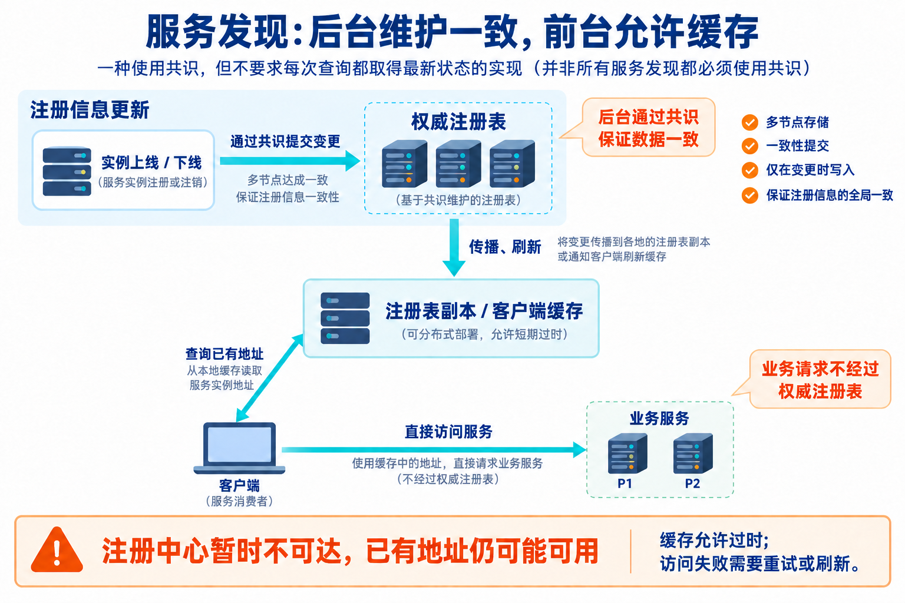

DDIA 在“服务发现”一节说，使用共识通常是大材小用；这个场景一般不需要线性一致性，更重要的是高可用和快速。

疑问也由此产生：高可用需要多节点，多节点需要复制，复制需要选主，选主需要共识——怎么又说不需要？

**问题出在“复制必然需要选主”。多节点可以同时提供服务，故障时也可以只切换请求目标，无须交接领导权。**

## 1. 高可用、容错、复制、共识，各自回答什么

| 概念 | 回答的问题 |
| --- | --- |
| 高可用 | 服务能否持续完成符合约定的请求？ |
| 容错 | 在指定的故障下，系统还能保持哪些保证？ |
| 复制 | 同一份数据怎样保存在多个节点上？ |
| 共识 | 多个节点怎样在故障下，对提议作出一致且不反悔的决定？ |

高可用是目标，容错是面对某类故障的能力，复制和共识是实现系统时可能使用的机制。它们不能画等号。

复制可以采用单领导者、多领导者或无领导者方式。无状态服务甚至不需要在实例之间复制可变状态。

共识也不自动保证可用：失去多数派时，Raft 这类系统无法继续提交新的决定。讨论高可用，必须同时说明**容忍什么故障，以及仍然提供什么语义**。

## 2. 请求切换不等于领导权交接

三台服务器 A、B、C 都保存相同的静态文件，都能回答查询。A 故障后，客户端改访问 B。

B 原本就有权服务，无须当选；A 恢复后也可以继续服务。这里切换的是请求目标，没有转移任何独占权限。

另一种情况是：只有数据库主节点 A 可以接受写入，A 故障后要让 B 接替。此时必须处理新旧主的权限、已提交数据的继承，以及旧主恢复后的行为。

| 场景 | 是否必须决定唯一持有者？ |
| --- | --- |
| 从一台静态文件服务器切换到另一台 | 不需要，两台原本都能服务 |
| 从一个注册表副本切换到另一个查询名单 | 通常不需要，多个副本都能回答 |
| 将唯一写入权限从 A 交给 B | 需要，必须避免冲突授权和历史分叉 |

最后一种场景通常需要共识，或依赖其他可靠的仲裁、隔离机制。不能把这种独占资源的接管要求，套到所有多节点服务上。

## 3. 服务发现为什么允许副本暂时不同

假设图片服务有 P1、P2、P3 三个实例。P3 刚上线，注册信息尚未传播完：

```text
注册表 R1：P1、P2、P3
注册表 R2：P1、P2
```

查询 R2 的客户端暂时不知道 P3，但仍然能访问 P1 或 P2。名单不同，并不意味着其中一个回答必然违反业务要求。

如果 P1 已经故障，旧名单仍包含它，客户端可以在连接失败后尝试 P2。代价是额外延迟和短暂的流量分配不均，而不是必然产生错误的业务结果。

**“返回一个可用实例”不要求所有客户端拿到完全相同、最新的实例集合。** 只要业务允许通过重试处理过时地址，就有理由放宽名单的新鲜度要求。

Eureka 就采用注册表对等复制。其官方说明明确允许网络故障期间不同客户端看到不同名单，并要求客户端能够应对不可用实例、尝试其他实例。[Eureka 对等通信说明](https://github.com/Netflix/eureka/wiki/Understanding-Eureka-Peer-to-Peer-Communication)

这有边界：若场景要求某次下线后绝不能再访问该实例，就不能仅靠允许陈旧的服务发现结果满足要求。访问控制或目标服务还需要执行相应限制。

## 4. 缓存让注册中心故障不必立刻拖垮业务

客户端已经缓存了 `P1、P2`。此时注册中心不可达，但 P1、P2 正常运行。

如果每次业务请求前都必须查询最新名单，注册中心故障会阻断原本可以成功的请求。允许使用缓存，客户端就能继续工作。

这就是 DDIA 推荐缓存、TTL 刷新和失败后重新查询的理由：**暂时拿不到最新名单，不应自动等于无法访问服务。**

缓存并非无限兜底。旧地址全部失效，又取不到新地址，业务仍会中断。即使查询是线性一致的，目标实例也可能在响应返回后立即故障，因此连接失败处理仍不可省。

## 5. 后台使用共识，不等于每次发现都依赖共识

服务发现完全可以采用这样的结构：



后台严格维护注册信息，查询路径允许使用旧副本或缓存，二者并不矛盾。Consul 的服务目录就由服务器通过 Raft 维护。[Consul 架构说明](https://docs.hashicorp.com/consul/docs/architecture)

DDIA 前一段也说，如果已经使用协调服务管理租约、锁或选主，顺便用它做服务发现很方便。

因此，“通常大材小用”说的是**服务发现通常不需要共识所能提供的那种严格语义**，并不是禁止实现中出现共识。

## 6. 发现主节点的地址，不等于授予主节点权限

当服务发现返回的是数据库主节点地址时，要分开两件事：

- **决定 B 成为新主**：交接写入权限，保护已提交历史，阻止旧主的不合法写入。
- **告诉客户端 B 在哪里**：传播地址，可以存在缓存和延迟。

客户端可能因为旧缓存仍访问 A。安全的系统必须让 A 拒绝、重定向请求，或由底层协议、fencing 阻止其不合法写入。不能靠“所有客户端都及时更新了地址”保证写入安全。

这与[故障检测和安全接管](/posts/0150/)中的边界相同：**地址告诉客户端去哪里，授权决定目标节点能做什么。**

判断是否需要共识，先问清楚：业务是否要求大家共同维护一个不可分叉的决定？“找一个可以服务的实例”和“决定谁拥有唯一写入权限”，需要的保证不同。节点数量本身不能回答这个问题。
