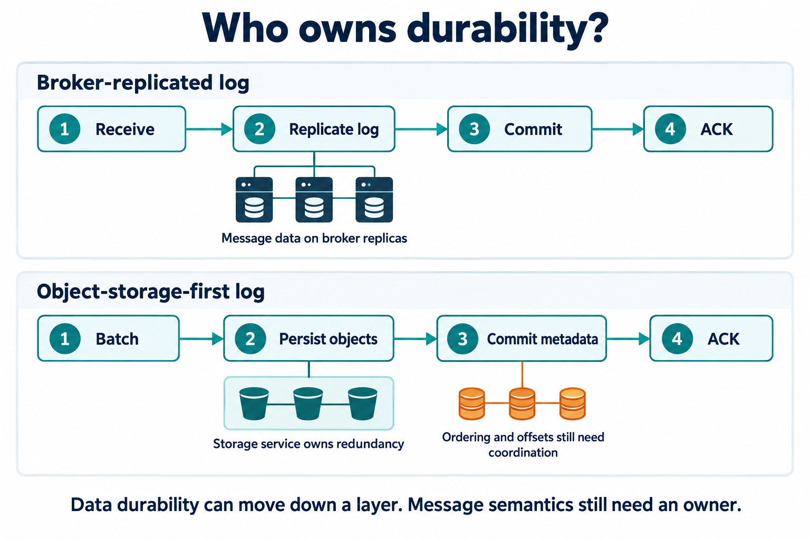

读 DDIA 第二版 Chapter 12 时，有一句话让我停了下来：

> 和数据库一样，持久性可能需要结合磁盘写入和/或复制。

常见的实现是：消息写入本地磁盘，再复制到其他节点，以承受进程崩溃、磁盘损坏或机器故障。但既然对象存储已经提供持久性和冗余保护，能不能直接把消息交给它，让消息系统省掉这套数据复制机制？

**可以。前提是把对象存储放进写入确认的关键路径，并明确哪些责任仍属于消息系统。**

*图中的多个存储图标表示存储服务内部的冗余保护，不要求应用自行写入多个 bucket。*

判断这种设计是否可靠，先看生产者什么时候收到成功确认，也就是 ACK。

如果消息节点先返回 ACK，再异步上传对象存储，那么上传前宕机，仍可能丢失已经确认的消息。要依靠对象存储兑现持久性承诺，就必须等消息持久化成功，并提交恢复、读取所需的元数据后，才能确认写入。Redpanda Cloud Topics 就采用这条路径：先上传消息，再通过 Raft 复制指向消息的元数据，最后返回 ACK。[架构说明](https://www.redpanda.com/blog/cloud-topics-architecture)

因此，“支持对象存储”还不足以回答问题。**历史消息卸载到对象存储，与新消息直接依靠对象存储获得持久性，是两种不同架构。**

| 系统／模式 | 对象存储承担什么 |
| --- | --- |
| Apache Kafka 分层存储 | 保存已封闭的日志段；新消息仍走原有存储和复制路径 |
| Apache Pulsar 分层存储 | 接收从 BookKeeper 卸载的旧日志段；新消息仍依赖 BookKeeper |
| WarpStream | 直接保存消息正文，Agent 无需本地持久化磁盘 |
| Redpanda Cloud Topics | 直接保存消息正文，元数据仍通过 Raft 复制 |

上述区别见 [Kafka](https://kafka.apache.org/43/operations/tiered-storage/)、[Pulsar](https://pulsar.apache.org/docs/3.1.x/concepts-tiered-storage/)、[WarpStream](https://docs.warpstream.com/warpstream/overview/architecture) 和 [Redpanda](https://www.redpanda.com/blog/cloud-topics-architecture) 官方文档。

这里还有一个容易漏掉的边界：**保存消息字节，不等于实现消息语义。**

对象存储可以保护消息正文，但分区内的顺序如何确定、哪些写入已经提交、offset 对应哪个对象、消费者读到了哪里，仍需要机制管理。Redpanda 保留了元数据的 Raft 复制；WarpStream 则使用独立的、具有复制机制的托管元数据服务。因此，省掉正文复制，并不意味着整个系统不再需要一致性协调。[WarpStream 架构说明](https://docs.warpstream.com/warpstream/overview/architecture)

代价主要落在延迟上。对象存储的小请求成本和访问延迟，促使系统把多条消息攒成一批再上传；既然 ACK 必须等持久化完成，攒批时间就会进入生产者的等待时间。WarpStream 为此将多个 topic、partition 的消息合并写入，以平衡成本和延迟。[设计说明](https://docs.warpstream.com/warpstream/overview/architecture)

回到 DDIA 的那句话，它并没有规定持久性必须由消息代理亲自实现。对象存储让我们可以重新划分职责：**把消息正文的持久性下移给存储服务，让消息系统负责顺序、提交和消费。** 选型时真正要问的是：省下的数据复制和运维成本，是否值得付出这部分写入延迟？

