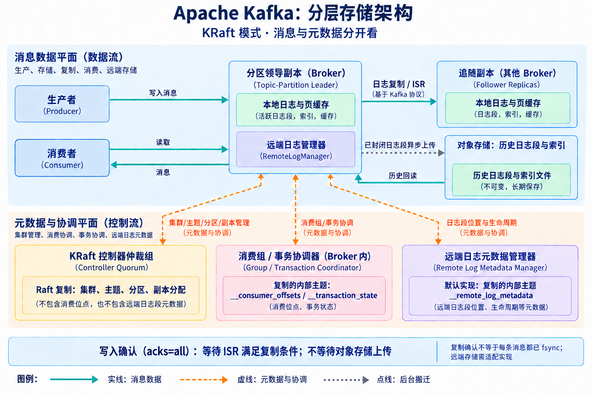
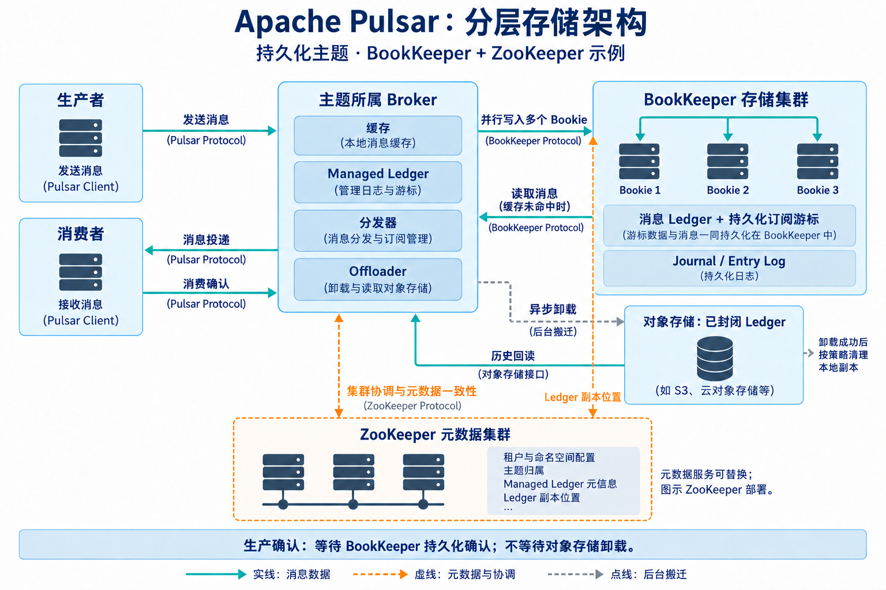
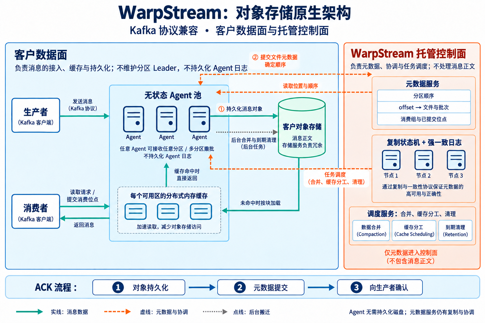
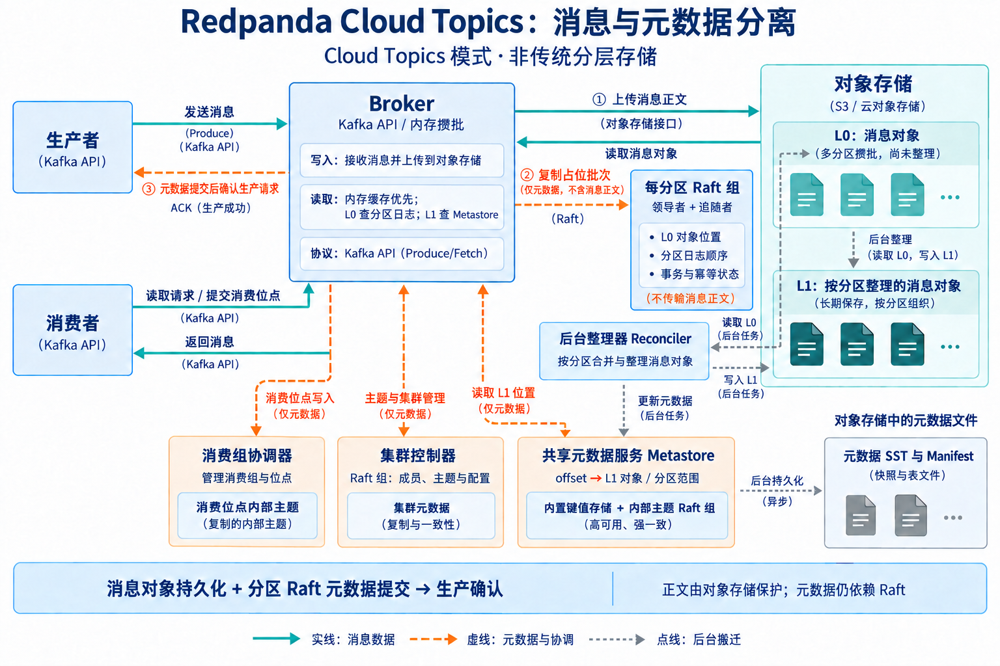

读 DDIA 第二版 Chapter 12 时，有一句话让我停了下来：

> 和数据库一样，持久性可能需要结合磁盘写入和/或复制。

常见的实现是：消息写入本地磁盘，再复制到其他节点，以承受进程崩溃、磁盘损坏或机器故障。但既然对象存储已经提供持久性和冗余保护，能不能直接把消息交给它，让消息系统省掉这套数据复制机制？

**可以。前提是把对象存储放进写入确认的关键路径，并明确哪些责任仍属于消息系统。**

判断这种设计是否可靠，先看生产者什么时候收到成功确认，也就是 ACK。

如果消息节点先返回 ACK，再异步上传对象存储，那么上传前宕机，仍可能丢失已经确认的消息。要依靠对象存储兑现持久性承诺，就必须等消息持久化成功，并提交恢复、读取所需的元数据后，才能确认写入。Redpanda Cloud Topics 就采用这条路径：先上传消息，再通过 Raft 复制指向消息的元数据，最后返回 ACK。[架构说明](https://www.redpanda.com/blog/cloud-topics-architecture)

因此，“支持对象存储”还不足以回答问题。**历史消息卸载到对象存储，与新消息直接依靠对象存储获得持久性，是两种不同架构。**

| 系统／模式 | 对象存储承担什么 |
| --- | --- |
| Apache Kafka 分层存储 | 保存已封闭的日志段；新消息仍走原有存储和复制路径 |
| Redpanda 分层存储 | 新消息先在 Broker 间复制，历史日志段异步卸载到对象存储 |
| Apache Pulsar 分层存储 | 接收从 BookKeeper 卸载的旧日志段；新消息仍依赖 BookKeeper |
| WarpStream | 直接保存消息正文，Agent 无需本地持久化磁盘 |
| Confluent Freight | Kora 引擎直接写入对象存储，省去消息正文在 Broker 间的复制 |
| Bufstream | 消息正文存入对象存储，独立元数据服务管理位置与协调；下文注明产品变更 |
| Redpanda Cloud Topics | 直接保存消息正文，元数据仍通过 Raft 复制 |

上述区别见 [Kafka](https://kafka.apache.org/43/operations/tiered-storage/)、[Pulsar](https://pulsar.apache.org/docs/3.1.x/concepts-tiered-storage/)、[WarpStream](https://docs.warpstream.com/warpstream/overview/architecture) 和 [Redpanda](https://www.redpanda.com/blog/cloud-topics-architecture) 官方文档。

DDIA Chapter 12 的 P700（本次阅读的双语排版版）列出了 **Apache Kafka、Redpanda、WarpStream、Confluent Freight、Bufstream**。上表覆盖了这五个产品，并额外保留 Pulsar 的对照。书中以 Kafka、Redpanda 举例说明分层存储，以另外三个说明消息正文直接存入对象存储；这里把 Redpanda 的两种模式单独列出，避免把产品名称当成唯一架构。Freight 与 Bufstream 的依据和实现差异见后文。

这里还有一个容易漏掉的边界：**保存消息字节，不等于实现消息语义。**

对象存储可以保护消息正文，但分区内的顺序如何确定、哪些写入已经提交、offset 对应哪个对象、消费者读到了哪里，仍需要机制管理。Redpanda 保留了元数据的 Raft 复制；WarpStream 则使用独立的、具有复制机制的托管元数据服务。因此，省掉正文复制，并不意味着整个系统不再需要一致性协调。[WarpStream 架构说明](https://docs.warpstream.com/warpstream/overview/architecture)

代价主要落在延迟上。对象存储的小请求成本和访问延迟，促使系统把多条消息攒成一批再上传；既然 ACK 必须等持久化完成，攒批时间就会进入生产者的等待时间。WarpStream 为此将多个 topic、partition 的消息合并写入，以平衡成本和延迟。[设计说明](https://docs.warpstream.com/warpstream/overview/architecture)

回到 DDIA 的那句话，它并没有规定持久性必须由消息代理亲自实现。对象存储让我们可以重新划分职责：**把消息正文的持久性下移给存储服务，让消息系统负责顺序、提交和消费。** 选型时真正要问的是：省下的数据复制和运维成本，是否值得付出这部分写入延迟？

## 不同系统，分别由谁保存消息和元数据？

以下是围绕持久性整理的端到端逻辑架构：覆盖生产、消费、消息副本、存储位置、主要元数据和确认路径。图中的组件可以部署在同一进程或不同节点，副本数量仅作示意；鉴权、监控和跨集群复制等外围功能未展开。

### Apache Kafka：本地复制在前，远端卸载在后

新消息先进入分区领导副本，并复制给追随副本；已封闭的日志段才由远端日志管理器异步上传。消费者通过 Broker 读取，本地保留范围之外的数据由 Broker 从远端回读。图示采用 KRaft 和分层存储的默认远端元数据实现。[分层存储文档](https://kafka.apache.org/41/operations/tiered-storage/)

元数据分成三类：KRaft 管集群与分区分配；消费组、事务协调器使用复制的内部主题保存位点与事务状态；远端日志元数据管理器记录日志段的位置与生命周期。消费位点通过协调器写入 `__consumer_offsets`，并不存入 KRaft 控制器。[KRaft 文档](https://kafka.apache.org/39/operations/kraft/)、[内部位点主题说明](https://cwiki.apache.org/confluence/spaces/KAFKA/pages/235838339/KIP-895%2BDynamically%2Brefresh%2Bpartition%2Bcount%2Bof%2B__consumer_offsets)

**确认边界：**使用 `acks=all` 时等待 ISR 的复制条件满足，不等待对象存储上传。它仍需要正确配置副本数、最小同步副本数等；复制确认也不表示每条消息都在每个副本上执行了一次 fsync。

### Apache Pulsar：Broker 服务请求，BookKeeper 保存消息和游标

Broker 内的 Managed Ledger 管理消息日志与订阅游标，通过 BookKeeper 客户端把消息写入多个 Bookie。消费确认推进订阅游标；持久化游标也保存在 BookKeeper。图示采用 ZooKeeper 保存配置、主题归属及 Ledger 等元信息，具体元数据后端随部署而异。[架构文档](https://pulsar.apache.org/docs/3.3.x/concepts-architecture-overview/)

已封闭的 Ledger 经 Offloader 卸载到对象存储，历史读取仍由 Broker 提供。卸载成功后，本地副本按策略删除。[分层存储文档](https://pulsar.apache.org/docs/3.1.x/concepts-tiered-storage/)

**确认边界：**BookKeeper 达到配置的持久化确认数后，Broker 向生产者返回成功。对象存储不在新消息的确认路径上。这里的生产确认与消费者处理后的消费确认，是两个不同的动作。

### WarpStream：正文进对象存储，顺序在元数据提交时确定

任意 Agent 都能接收任意分区的消息，将多个分区的数据攒成对象上传。随后由 Agent 向托管元数据服务提交文件信息，并在提交时确定分区内的顺序；对象上传的先后顺序本身不是消息顺序。[写入路径](https://docs.warpstream.com/warpstream/overview/architecture/write-path)

读取时，Agent 查询 offset 对应的有序文件与批次，再通过每个可用区的分布式缓存加载消息。消费者的位点提交也经 Agent 交给元数据服务。该服务使用复制状态机与强一致日志；控制面还调度 Agent 执行合并、缓存分工和清理任务。[读取路径](https://docs.warpstream.com/warpstream/overview/architecture/read-path)、[整体架构](https://docs.warpstream.com/warpstream/overview/architecture)

**确认边界：**对象持久化和元数据提交都成功，才返回生产确认。Agent 不需要持久化消息日志，但整个系统仍依赖元数据服务的复制与协调。

### Redpanda Cloud Topics：正文交给对象存储，元数据保留 Raft

先区分 P700 中的 **Redpanda 分层存储**：该模式下，新消息仍在 Broker 间通过 Raft 复制并保存在本地，旧日志段才异步卸载到对象存储；新消息的确认不依赖后续卸载完成。下面的图介绍的是 **Cloud Topics**，其正文直接进入对象存储。两者都是 Redpanda 的能力，但持久化路径不同。[Redpanda 分层存储文档](https://docs.redpanda.com/streaming/current/manage/tiered-storage/)

Broker 将消息攒批上传为 L0 对象，再向对应分区的 Raft 日志写入占位批次，记录对象位置并沿用事务、幂等与日志顺序机制。后台整理器将 L0 整理成按分区组织的 L1 对象。[Cloud Topics 架构](https://www.redpanda.com/blog/cloud-topics-architecture)

L1 的 offset 到对象位置映射由共享 Metastore 管理。它是内置的键值存储，使用内部主题的 Raft 组作为写前日志，并把 SST 与 Manifest 持久化到对象存储。消费组协调器另用 `__consumer_offsets` 保存消费位点，集群控制器管理成员与主题配置。[Metastore 设计](https://www.redpanda.com/blog/cloud-topics-metastore)、[消费位点文档](https://docs.redpanda.com/streaming/current/develop/consume-data/consumer-offsets/)

**确认边界：**L0 对象持久化、分区 Raft 元数据提交后，才返回生产确认；不需要等后台整理成 L1。Metastore 向对象存储刷新元数据是另一条后台路径，不能据此推断“只靠对象存储，就能零损失恢复整个集群”。

### Confluent Freight：托管 Kora 引擎直接写入对象存储

P700 中的 Confluent Freight，具体指 Confluent Cloud 的 Freight 集群类型。它使用 Kora 引擎的 direct write 模式，把消息正文直接写入 S3 等对象存储，绕过本地消息存储和 Kora Broker 之间的正文复制。这种设计面向高吞吐、可接受较高延迟的日志、监控和批量摄入负载，以对象存储访问延迟换取网络与存储成本的降低。[Freight 架构说明](https://www.confluent.io/blog/freight-clusters-are-generally-available/)

从职责划分看，客户端连接托管集群，消息正文由对象存储保护，主题管理、消费进度和协调仍由服务负责。官方上述资料没有披露足够细的元数据提交拓扑，因此不能据此把它画成 WarpStream 的元数据服务，也不能断言它使用某个指定数据库或完全没有元数据复制。**两者都直接写对象存储，不代表内部实现相同。**

截至本次更新，Confluent 官方文档明确列出 Freight **不支持幂等生产者和事务**。因此，它不能仅凭 Kafka 接口兼容就被当成可以直接运行 Kafka 事务性恰好一次处理的替代品；延迟之外，还要核对应用需要的协议能力。[Freight 集群限制](https://docs.confluent.io/cloud/current/clusters/cluster-types.html#freight-cluster-considerations)

### Bufstream：对象保存正文，元数据服务完成协调

按 Bufstream 原公开架构，任意 Broker 都能接收任意主题、分区的生产请求，没有固定的分区领导者。Broker 将不同分区的消息合并为 intake 文件，上传对象存储，再把文件内容和分区位置等信息写入元数据服务；**两个写入都成功，才确认生产请求。** 元数据后端曾提供 PostgreSQL、Cloud Spanner、etcd 等选择，消息正文则放在 S3、GCS 等对象存储中。[原 Kafka 数据流文档](https://buf.build/docs/bufstream/architecture/kafka-flow/)

它与 WarpStream 的共同点是把正文持久性下移；不同点是，Bufstream 的公开部署模型让对象存储与元数据服务成为部署中的明确依赖。省掉 Broker 消息副本，并不意味着元数据后端可以失去持久性或高可用保障。

**产品状态需要与书中的架构描述分开看：**Buf 于 2026 年 5 月 8 日宣布 CoreWeave 收购 Bufstream，并将其纳入 W&B Models、Weave 相关内部平台。截至本次更新，部分原 Bufstream 文档已经跳转到该公告；上面的实现说明来自其原公开文档，不能据此假设原产品仍按相同方式对外提供。[Buf 官方收购公告](https://buf.build/blog/coreweave-acquires-bufstream)

## P700 的另一个启发：对象存储还可以连接消息流与分析表

P700 接着讨论了 Iceberg：如果消息的存储布局同时适合分析查询，批处理和数据仓库就有机会复用数据，减少额外搬运。但这里还需要数据格式转换、表元数据和目录管理；**把 Kafka 日志段放进 S3，并不会自动把它变成 Iceberg 表。**

Bufstream 原文档提供了一个具体对照：**Iceberg Archives** 将归档数据写为 Parquet，Kafka 消费与 Iceberg 分析共用这些文件；**Iceberg Export** 则把数据持续复制到独立的 Iceberg 表。前者复用文件，但保留期与主题关联；后者保留独立的分析副本。因此，“对象存储”“Iceberg 集成”“零复制”需要分别判断，不能视为同一项能力。[原 Iceberg 集成文档](https://buf.build/docs/bufstream/iceberg/)

这些架构都需要明确回答同一个问题：**消息字节保存之后，谁来记录它属于哪里、排在什么位置，以及是否已经提交？** 对象存储接管的是一部分存储责任，消息语义和分析表语义仍需要各自的管理机制。
