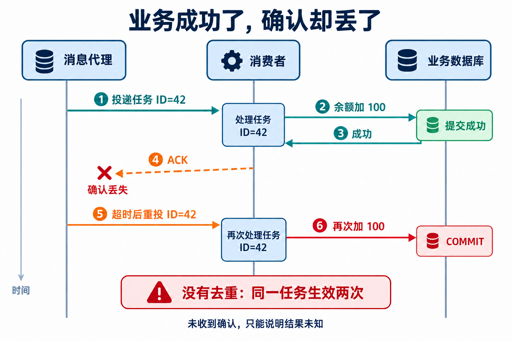
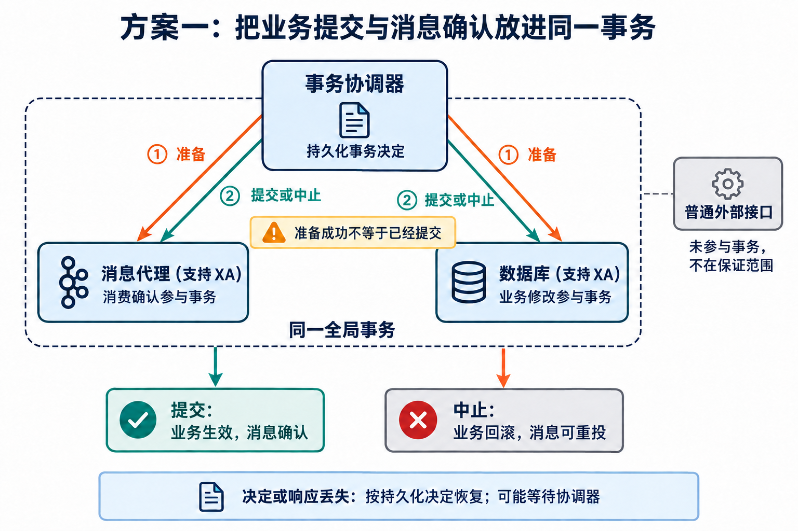
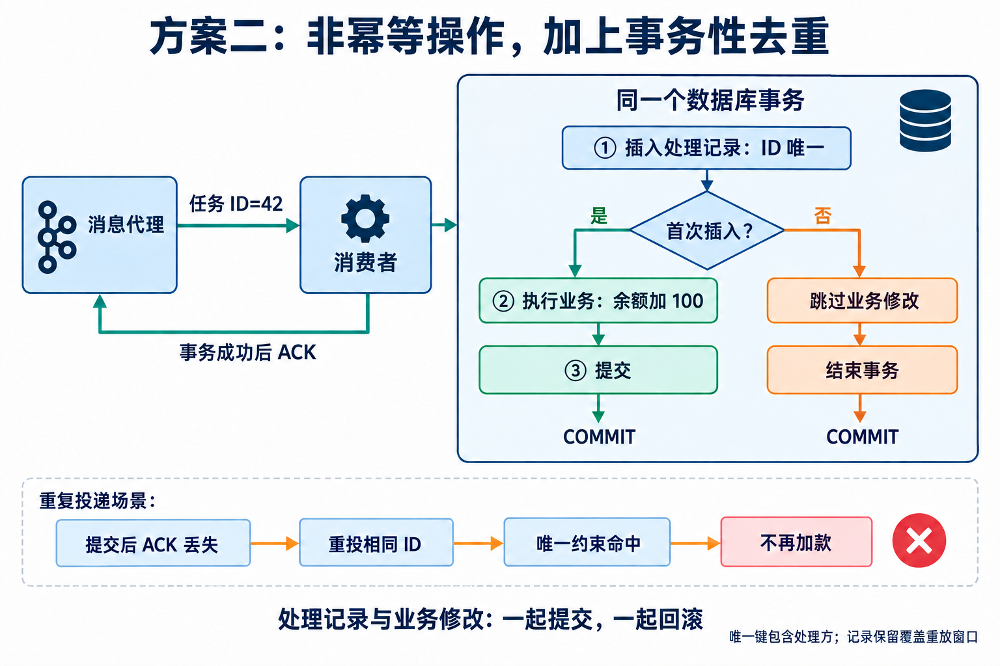
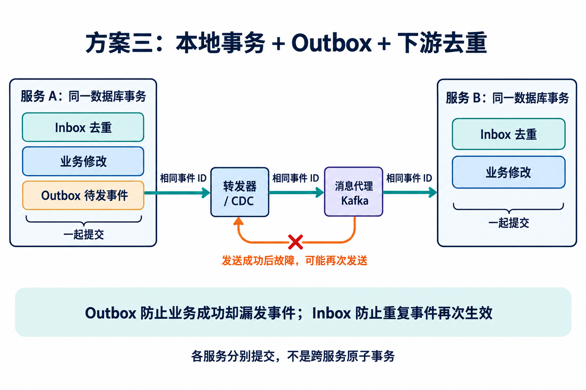
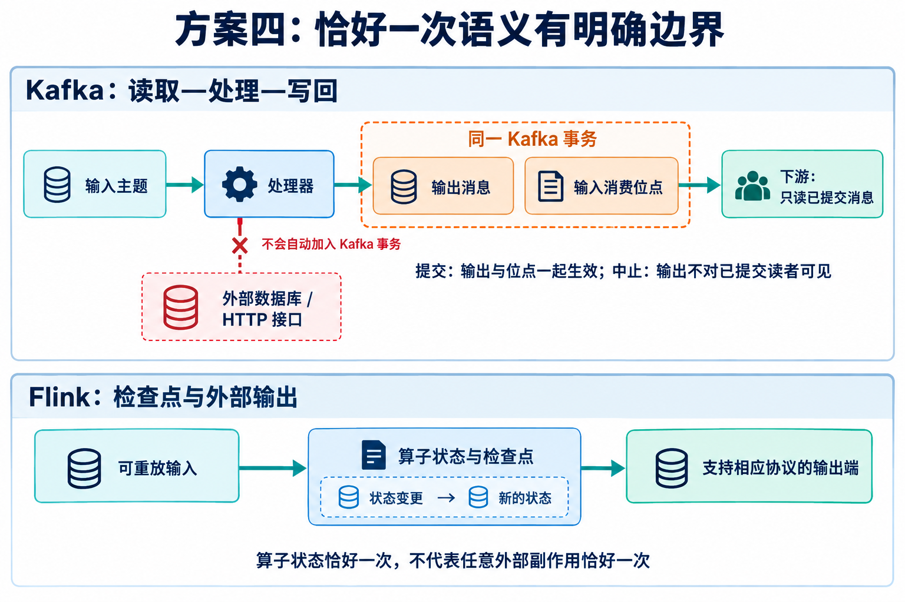
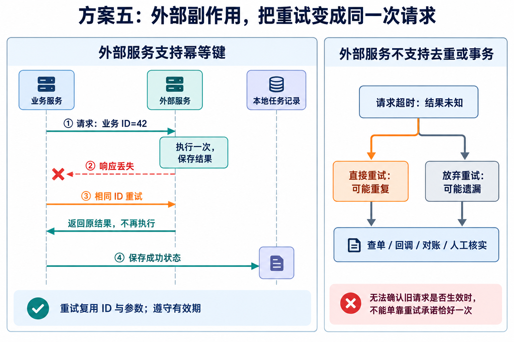

读 DDIA 第二版 Chapter 12 的 P692 时，我注意到一个容易被“失败就重试”掩盖的问题：

> 消息实际上可能已经被完整处理，只是确认在网络中丢失了。

书中接着指出：除非操作是幂等的，或不要求恰好一次语义，否则需要原子提交协议，并指向 Chapter 8 的“恰好一次消息处理”。

**这段引用确实在回答“业务已经成功，但 ACK 丢失怎么办”。不过，完整答案要连同 Chapter 8 后面的“再谈恰好一次的消息处理”一起看：跨系统事务是一条路，本地事务加去重是另一条路。**

## 先确定：究竟什么必须“恰好一次”？

假设消息要求给账户余额加 100。这是非幂等操作：执行两次就多加 100。



此时有两个独立的事实：

- 数据库知道：业务修改已经提交。
- 消息代理知道：这条消息还没有被确认。

网络异常让两者的认知分开了。ACK 丢失、消费者在提交后崩溃，都会形成这个窗口。把 ACK 提前也不行：确认之后、业务提交之前崩溃，会让消息被当成完成，业务却没有生效。RabbitMQ 的可靠性文档也要求消费者准备处理重投；确认机制本身不替应用证明业务副作用只发生一次。[RabbitMQ 可靠性文档](https://www.rabbitmq.com/docs/reliability)

这里要求的**恰好一次语义，是同一个逻辑业务请求最终只产生一次应有的、已提交的业务效果**。它允许消息重复投递、代码重复运行、事务失败后重试；不能重复的是受保证范围内的可观察效果。

这个承诺也有前提：任务不会被永久丢弃，系统能够恢复并继续重试，必要数据和去重证据仍然保留。只有“重复时不再执行”，得到的是不重复的安全性；还要有可靠投递和恢复，才能谈最终生效一次。

## 方案一：XA／2PC，把两个事实放进同一事务

Chapter 8 首次讨论“恰好一次消息处理”时，给出的办法是：**把消息消费确认与业务数据库修改，作为同一个分布式事务提交。**



协调器收集参与者的准备结果，然后持久化提交或中止决定。对于成功准备的事务，参与者按照同一个决定完成恢复：提交时业务生效、消息被确认；中止时业务修改回滚、消息可以重投。

这不是让网络永远不丢包。**协议把“这次到底提交了没有”的答案变成可恢复的持久化状态。** 准备后等待决定的参与者，不能因为超时就擅自假定失败并重新执行。

它要求消息代理、数据库、驱动和事务管理器都能参与同一协议。ActiveMQ 支持 XA 事务；Artemis 的文档明确说明，处于 prepared 状态的 XA 事务不会被代理自行回滚，而要等待事务管理器解决。这也体现了代价：额外协调、资源占用，以及故障期间可能阻塞。[ActiveMQ 事务说明](https://activemq.apache.org/components/classic/documentation/how-do-transactions-work)、[Artemis 事务恢复说明](https://artemis.apache.org/components/artemis/documentation/latest/transaction-config.html)

**适用边界：**受控、支持事务集成的资源之间，可以使用这种方案。普通 HTTP 调用、邮件发送或物理出货，如果不参与协议，就不受这个事务保护。“数据库回滚”无法收回已经发出的邮件。

## 方案二：本地事务＋唯一 ID，让非幂等业务安全重试

Chapter 8 的“再谈恰好一次的消息处理”给出了更小的事务边界：

**不必把数据库和消息代理绑成一个事务，只需把“业务修改”和“这个请求已处理”的记录放进同一个数据库事务。**



这里，“余额加 100”仍然非幂等。但完整处理过程变成了：

1. 用稳定的业务 ID 尝试插入处理记录。
2. 只有首次插入成功，才执行余额修改。
3. 两者一起提交，成功后再 ACK。
4. 重投时命中已有记录，跳过余额修改，再次 ACK。

这类处理记录常被称为 Inbox 或去重表。下面是基于 PostgreSQL 的**应用流程伪代码**，不是一段可以不加判断地顺序执行的 SQL：

```text
前提：processed 的主键为 (handler, operation_id)

BEGIN

INSERT INTO processed(handler, operation_id)
VALUES ('credit-account', :operation_id)
ON CONFLICT (handler, operation_id) DO NOTHING
RETURNING operation_id

如果确实插入了一行：
    UPDATE accounts
    SET balance = balance + :amount
    WHERE account_id = :account_id

    必须确认更新了一行；否则回滚并处理错误

如果没有插入：
    确认是同一业务请求的重复投递，跳过余额修改

COMMIT

只有确认事务提交成功，才向消息代理 ACK
```

关键是数据库唯一约束。不能只在应用中“先查一下，没有就处理”，否则两个消费者可能同时查到不存在，再各加一次。PostgreSQL 的 `ON CONFLICT DO NOTHING` 与 `RETURNING` 可以区分本次是否实际插入。[PostgreSQL INSERT 文档](https://www.postgresql.org/docs/current/sql-insert.html)

故障点逐一展开，逻辑就清楚了：

| 故障位置 | 重试时会发生什么 |
| --- | --- |
| 数据库提交前 | 未提交事务回滚；新尝试可以重新执行 |
| 数据库提交后、ACK 前 | 处理记录已经存在；不再重复业务修改 |
| ACK 已发出但丢失 | 即使再次投递，也会被处理记录拦住 |
| 两个消费者同时处理同一 ID | 唯一约束让它们竞争同一个键；失败或等待的一方不能再执行业务 |
| COMMIT 的响应丢失 | 结果未知；用相同 ID 恢复或重试，由数据库中的记录判断，不生成新 ID |

这里没有违反题设。**“业务动作天然非幂等”与“可以通过额外状态把处理过程做成幂等”是两回事。** 如果题设进一步禁止添加这种去重机制，那才需要寻找能覆盖全部副作用的事务方案。

这个方案只覆盖同一事务中的数据。把 Redis 去重标记和 PostgreSQL 余额修改分别提交，窗口仍然存在：先标记可能漏做，后标记可能重做。在数据库事务里调用外部服务，也不会让那个服务自动加入事务。

## 方案三：需要继续发消息时，再加 Outbox

一个消费者往往不只改数据库，还要向下游发布事件。此时仅有 Inbox 不够：数据库提交后、事件发出前崩溃，下游就可能永远收不到通知。

Outbox 的做法是把**待发事件和业务修改写入同一个数据库事务**，之后由转发器或 CDC 读取已提交事件并可靠发送。



转发器也会遇到确认丢失：消息已经发送成功，但发送进度没来得及保存，于是再次发送。因此，Outbox 通常还需要下游 Inbox 或等价的幂等处理。AWS 的方案文档同样指出，Outbox 的投递链路可能产生重复消息，消费者需要去重。[AWS Transactional Outbox](https://docs.aws.amazon.com/en_en/prescriptive-guidance/latest/cloud-design-patterns/transactional-outbox.html)

图中使用 Kafka 作为消息代理示例，这个模式不依赖 Kafka。

- **Inbox** 把接收端的去重证据与业务效果绑在一起。
- **Outbox** 把发送端的业务效果与发消息意图绑在一起。
- **重试与转发** 把各服务连接起来。

它可以让每个服务中的指定业务动作生效一次，**不意味着多个服务在同一时刻原子提交，也不保证整条业务流程不存在中间状态。**

## 方案四：Kafka／Flink 的恰好一次，要看输出落在哪里



对于“从 Kafka 读取、处理、再写回 Kafka”，可以把**输出消息与输入消费位点更新**放在同一 Kafka 事务中。事务中止时，配置为 `read_committed` 的下游不会读到中止事务的输出；输入位点没有随之推进，恢复后可以重新处理。[Kafka 消息交付语义](https://kafka.apache.org/41/design/design/)

但如果处理器顺便执行了外部数据库的 `balance += 100`，这次更新不会自动受 Kafka 事务保护。Kafka 内部的事务成功或中止，不能替外部数据库决定那 100 是否应该保留。

写外部数据库时，还可以把**输入位点和业务结果保存在同一个数据库事务里**，恢复时以数据库位点为准。此法需要正确处理分区内连续进度、重平衡和旧消费者隔离，不能把“最大的已完成 offset”误当成“此前所有消息都完成”。Kafka 官方文档明确描述了把位点与输出存放在一起的思路。[Kafka 外部输出协调](https://kafka.apache.org/41/design/design/)

Flink 的检查点则把可重放输入的位置与算子状态关联起来。端到端保证还取决于输出连接器：输出端需要配合检查点、事务提交，或提供合适的幂等写入。随意放进处理函数的 HTTP 调用，不会因为开启了检查点就获得恰好一次效果。[Flink 容错保证](https://nightlies.apache.org/flink/flink-docs-stable/docs/connectors/datastream/guarantees/)

## 方案五：外部支付等副作用，需要对方参与去重

更棘手的是：外部支付已经执行，本地还没保存成功状态，响应就丢了。这时本地 Inbox 最多能记录“我开始处理过”，不能证明远端究竟做了什么。



如果提供方支持幂等键，通常采用这样的流程：

1. 在发送前持久化任务和稳定的业务操作 ID。
2. 调用外部服务时携带该 ID。
3. 网络异常后，用**相同 ID 和相同参数**重试；对方负责识别同一次逻辑操作。
4. 确认最终结果后，事务性保存本地状态，再完成原任务。

Stripe 就提供这种接口能力：它保存同一幂等键首次执行请求的结果，后续请求返回已保存结果。这个机制有参数一致性和保留期限等约束，不能把一个键当成永久去重凭证；结果也可能是失败，而不是成功。[Stripe 幂等请求](https://docs.stripe.com/api/idempotent_requests)、[Stripe 错误恢复](https://docs.stripe.com/error-low-level)

回调、查单、对账用于把本地状态补齐；回调本身也需要去重，并防止迟到事件把已完成状态错误覆盖回处理中。

**如果对方既不提供幂等键，也不能参与事务，还无法可靠判断旧请求的结果，那么调用方无法仅靠重试保证恰好一次。** 同样的超时可能意味着“根本没执行”，也可能意味着“已经执行但响应丢了”。前者需要重试，后者禁止重复，调用方却无法区分。

商业系统会把这类任务保持为“结果未知”，通过查单、回调、对账或人工核实收敛。一次“未查到”不一定代表可安全重试：旧请求可能仍在执行，查询也可能存在延迟。这些措施帮助发现和修复问题，不能凭空创造提供方没有的原子性。

Saga 处理的是跨服务流程中的继续执行或补偿，不等于消除了重复。多扣一次再退款，与从未多扣过一次不是同一种可观察效果；补偿本身也要处理失败和重试。[AWS Saga 模式](https://docs.aws.amazon.com/prescriptive-guidance/latest/cloud-design-patterns/saga-patterns.html)

## 落地时，先找业务效果，再确定事务边界

| 业务效果发生在哪里 | 可选机制 | 必须守住的边界 |
| --- | --- | --- |
| 一次数据库事务内 | 唯一 ID＋Inbox＋业务修改 | 去重记录和效果原子提交 |
| 支持 XA 的代理与数据库 | XA／2PC | 全部副作用参加协议，并具备恢复能力 |
| 多服务各自修改数据库 | Inbox＋Outbox＋可靠转发 | 每个服务本地原子性；全局流程另行协调 |
| Kafka 到 Kafka | 事务性输出＋输入位点 | 下游只读已提交；外部副作用另行处理 |
| Flink 到支持相应保证的输出端 | 检查点＋配套输出协议 | 状态保证必须延伸至实际输出端 |
| 支持幂等键的外部接口 | 稳定业务 ID＋重试＋状态核对 | 参数、有效期、提供方去重语义 |
| 不支持事务、去重或可靠结果判定的外部系统 | 改造接口或处理不确定结果 | 不能宣称严格恰好一次 |

这些方案还共享三条容易遗漏的约束。

**ID 必须代表业务，而不是某次传输。** 用户请求重试、生产者重发、死信重放都要保留同一逻辑操作 ID；一个新生成的消息 ID 不一定能识别旧业务。反过来，不同业务操作也不能误用同一个键。实际设计通常把租户、处理方和业务 ID 纳入唯一性范围，并校验同键参数一致。

**去重记录的寿命必须覆盖可能的重复。** Chapter 8 在“代理确认后不会再投递”的假设下讨论删除处理记录；现实中还可能有生产者重复发布、死信恢复和人工回放，因此不能看到 ACK 就立刻清掉业务去重证据。记录一旦过期，旧请求可能重新生效。

**锁、队列去重和人工补偿都不能单独替代上述边界。** 锁可以减少并发，但进程可能在业务提交后、保存完成记录前崩溃。队列去重也不自动覆盖数据库副作用：例如 SQS FIFO 的发送去重有时间窗口，而消费后未成功删除的消息仍会重新可见。[SQS 发送去重](https://docs.aws.amazon.com/AWSSimpleQueueService/latest/SQSDeveloperGuide/FIFO-queues-exactly-once-processing.html)、[SQS 可见性超时](https://docs.aws.amazon.com/AWSSimpleQueueService/latest/SQSDeveloperGuide/sqs-visibility-timeout.html)

回到 P692，真正要消除的，是**业务已经生效，却没有一份可靠证据阻止它再次生效**的缝隙。XA 把消息确认纳入事务；Inbox 把去重证据纳入业务事务；外部幂等键把这份责任延伸到效果真正发生的一端。讨论“恰好一次”时，最有用的问题始终是：**哪一个业务效果，由谁、在什么边界内保证只提交一次？**

*原文依据：DDIA 第二版 Chapter 12 的“确认与重新投递”，Chapter 8 的“恰好一次消息处理”“再谈恰好一次的消息处理”，以及 Chapter 13 的“操作的恰好一次执行”。P692 对应本次阅读的双语排版版页码，其他版本页码可能不同。*

