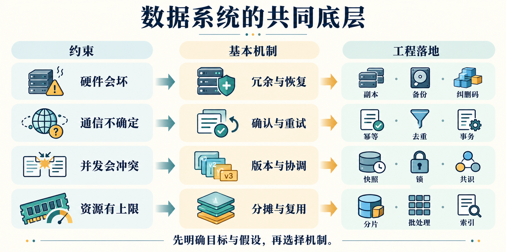
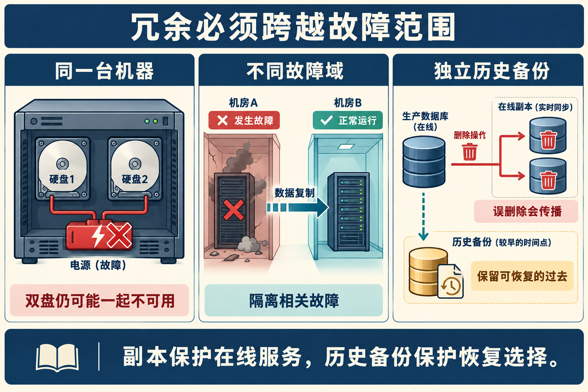
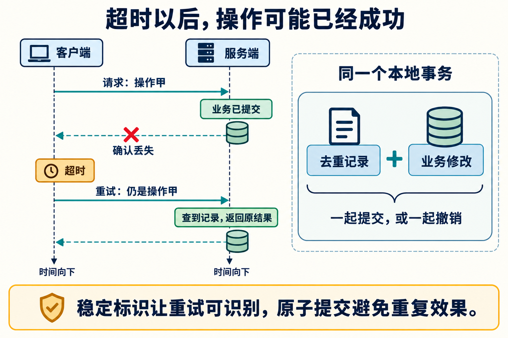
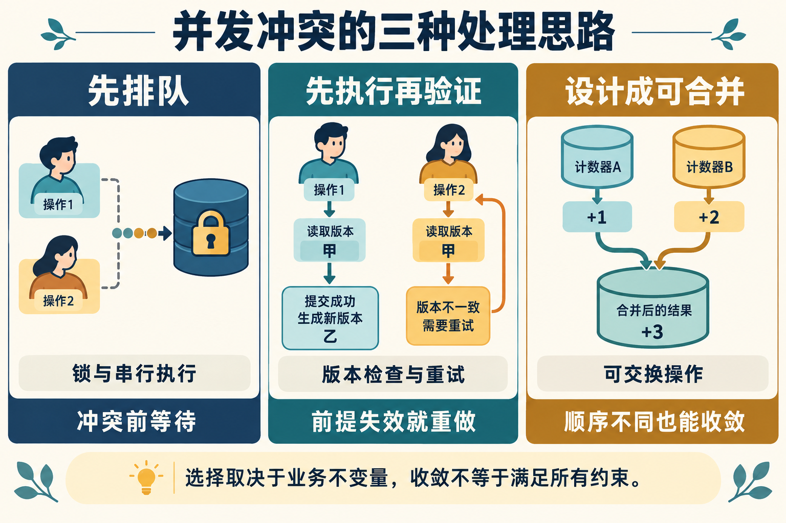
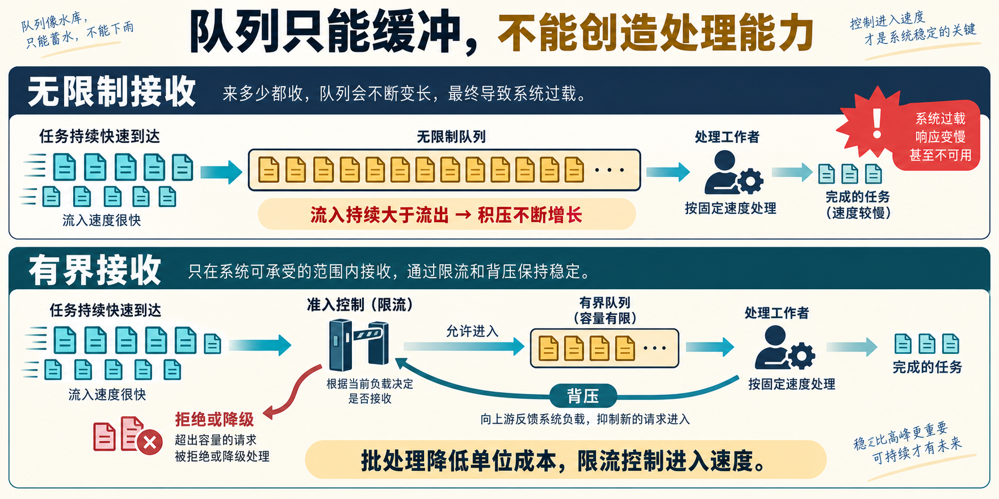
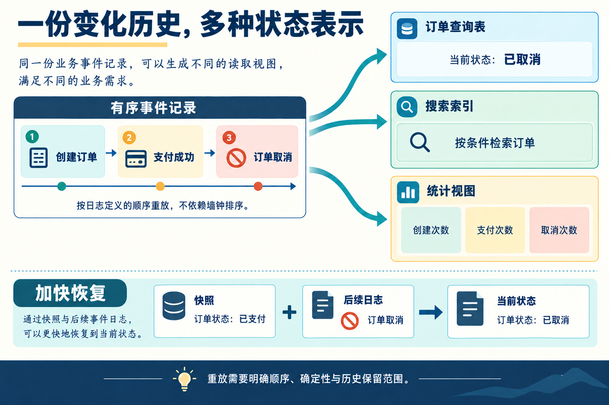
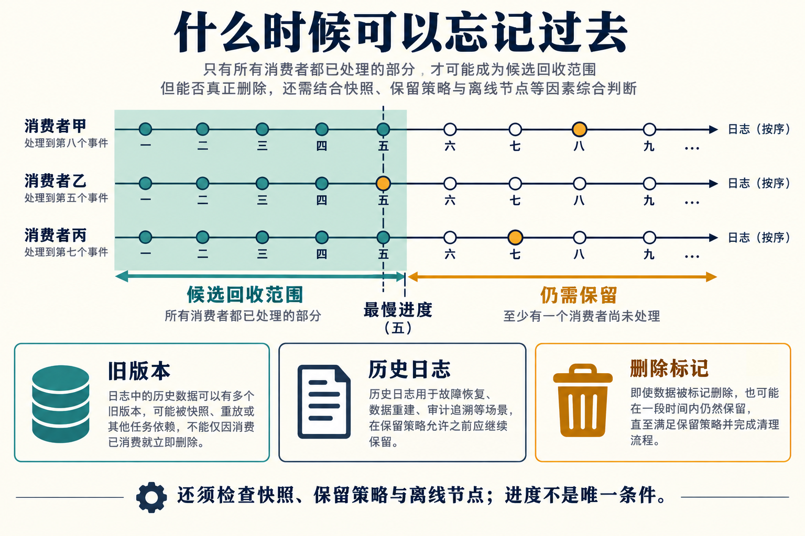

> **本篇为草稿。**

阅读 DDIA 时，一个现象越来越明显：数据库、消息队列、批处理、流处理、分布式协调，看上去各有自己的术语，深入实现以后，却不断遇到相似的东西——日志、复制、编号、确认、重试、版本、快照、分片。

这些重复有共同的来处。磁盘可能损坏，网络存在延迟，进程会在任意位置停止，多个执行者可能同时修改数据，内存和带宽总有上限。业务可以变化，但只要这些约束依然存在，系统就会反复需要某些基本机制。

这篇文章以 DDIA 第二版全书 14 章为材料，把其中的方案重新组织成 36 条工程思想。每条都回答四个问题：**什么约束导致了什么问题？机制如何解决它？在哪里实际使用？保证到哪里结束？** 章节依据标在各条末尾，便于回到原书继续阅读。

这些条目是跨章节归纳，并非作者在原书中给出的一份“36 条定律”。真实产品的具体行为，另以官方文档或原始论文核对。文中的业务案例与公式演算用于解释机制，不代表某家公司的内部实现。



*图 1：约束规定了必须面对的问题；业务目标和系统假设决定采用哪一种解法。箭头不表示每个问题只有唯一实现。*

## 先把“第一性原理”说准确

“机器会坏，所以必然多机复制”省略了几个关键条件。更完整的推导是：

> 如果要求某个故障范围内的信息全部丢失以后仍能恢复，就必须在该范围之外保留足够的恢复信息。

必要的是**可恢复的信息冗余**。完整副本、备份、纠删码都是实现途径；如果允许重算，而且输入仍然存在，计算结果也可以通过重算恢复。如果只要求承受一块磁盘故障，同机冗余可能够用；如果要求整台主机停机后持续服务，同机双盘就不够了。

因此，要区分三个层次：

| 层次 | 示例 | 应怎样理解 |
| --- | --- | --- |
| 物理与资源约束 | 传播需要时间，存储容量有限，设备可能失效 | 系统设计必须面对，但具体数值取决于环境 |
| 特定模型下的必要条件或不可能性 | 异步网络中无法仅靠超时准确区分宕机与延迟 | 必须连同模型、故障假设和目标一起陈述 |
| 工程机制与经验 | 主从复制、指数退避、LSM 树、检查点 | 在某组条件下有效，通常存在替代方案和成本 |

本文所说的“第一性原理”，就是反复沿着这三个层次向下追问。它不能从物理学推导出产品应该追求什么，也不能替我们决定多少延迟、多少成本或多少风险可以接受。

阅读时可以按这条路线走：**先明确承诺 → 保存与恢复 → 应对不确定通信 → 协调并发 → 分配有限资源 → 重建和推进状态 → 支持变化并验证结果。**

## 一、先明确系统究竟承诺什么

### 01．把正确性写成不变量，把故障写成假设

**约束与推导。** “高可用”“强一致”“可靠”都太宽泛，无法直接指导实现。一个系统可能一直返回答案，却悄悄丢数据；另一个系统可能在网络分区时暂停写入，以避免接受互相冲突的决定。先明确哪些事情永远不能发生，再明确什么条件下必须继续推进，才能判断方案是否正确。

**基本机制。** 区分安全性与活性。安全性描述“坏事不发生”，例如一张座位票不分配给两个人；活性描述“最终有进展”，例如恢复通信后请求能完成。另列故障模型：容忍进程崩溃，还是也要容忍磁盘丢失、网络分区乃至恶意节点？

**实际落地。** Raft 把状态机安全、日志匹配等性质与选举和进展条件分开讨论；业务设计可以把“库存不得为负”“同一业务操作不得重复入账”变成明确不变量，再用并发测试检查。[Raft 论文](https://raft.github.io/raft.pdf)

**边界。** 测试通过是证据，不是对所有执行历史的证明；模型检查的结论也只覆盖给定模型。一个“不丢已确认数据”的承诺必须解释“确认”对应的落盘、复制和故障范围。

*书中依据：第 2 章“可靠性与容错”；第 9 章“系统模型与现实”“区分安全性与活性”；第 13 章“追求正确性”。*

## 二、信息会丢失：保存什么，才能恢复什么

### 02．把冗余放到目标故障范围之外

**约束与推导。** 唯一的信息副本一旦永久丢失，算法不能凭空恢复它。要承受故障，就要让故障之后仍有足够的信息存在。

**基本机制。** 在不同故障域保存副本或编码后的冗余片段。这里的故障域可以是磁盘、机器、电源、机架、可用区或区域。复制不仅用于容错，也用于让读取靠近用户，以及分担读负载。

**实际落地。** HDFS 将文件块复制到不同机器；数据库维护在线副本；对象存储可以在底层使用复制或纠删码。使用对象存储的上层系统，可能把冗余责任交给了存储服务，但仍须保证恢复所需的元数据同样可靠。

**边界。** 三份数据不自动意味着三个独立故障域。同版本软件缺陷、同一错误配置、共享账号被误操作，都可能使大量副本一起受损。同步复制与异步复制也承诺不同：异步传播完成前失去主副本，可能丢失最近写入。

*书中依据：第 1 章“存储与计算分离”；第 2 章“通过冗余容忍硬件故障”；第 6 章“复制”“区域与可用区”；第 11 章“分布式文件系统”。*

### 03．在线副本保护当前状态，历史备份保留恢复选择

**约束与推导。** 复制会传播正确修改，也会传播错误修改。所有在线副本都执行了误删除之后，再多副本也不能直接给出删除前的数据。

**基本机制。** 保留独立历史状态、归档日志和恢复流程。副本主要回答“现在由谁接着服务”，备份主要回答“能回到哪个过去”。两者可以共享部分底层日志，但职责不同。

**实际落地。** PostgreSQL 的时间点恢复使用基础备份与归档 WAL，重放到指定位置或时间。运维上需要演练恢复，并确认恢复点目标和恢复时间目标，而不只是检查“备份任务成功”。[PostgreSQL WAL 与恢复](https://www.postgresql.org/docs/current/wal-intro.html)

**边界。** 能恢复不等于能立即恢复；备份副本若共享生产删除权限或加密密钥的失效风险，独立性也可能不足。数据保留还必须与删除要求一致。

*书中依据：第 6 章“备份与复制”“设置新的追随者”；第 13 章“信任，但要验证”。*



*图 2：复制和备份各有职责。中间的复制箭头表示正常运行时的传播关系；故障发生以后能否继续服务，还取决于副本进度、切换机制和客户端路由。*

### 04．先检测信息是否损坏，再谈修复

**约束与推导。** 故障不一定表现为“读不到”，也可能表现为“读到了错误的字节”。如果无法识别损坏，系统甚至可能把错误数据复制得更广。

**基本机制。** 加入可验证的冗余：校验和用于检测意外损坏，哈希树用于缩小差异比较范围，再结合可信副本、重传或纠错编码恢复。检测与修复是两个步骤。

**实际落地。** 存储页和日志记录可以带校验和；分布式存储的反熵修复可比较 Merkle 树，定位不一致的数据范围；文件传输可在接收端重新核对摘要。数据库之外，备份恢复后的完整性检查也使用同一思路。

**边界。** 校验和不能说明“这笔业务数据在语义上正确”，普通校验和也不是对抗恶意篡改的认证机制。所有副本一致，仍然可能只是一起保存了同一个错误结果。

*书中依据：第 4 章“让 B 树可靠”；第 6 章“追赶错过的写入”；第 9 章“较弱形式的撒谎”；第 13 章“在面对软件缺陷时维护完整性”。*

### 05．复杂状态难以一次写完，就先持久化恢复依据

**约束与推导。** 一个逻辑操作可能修改多个页。机器在中途断电，磁盘上就可能留下新旧状态的混合。要求底层把任意多处修改一次性原子写完，通常不现实。

**基本机制。** 预写日志先记录恢复所需的信息，再允许对应数据页持久化。提交时确保必要日志与提交依据达到承诺的持久性条件；崩溃恢复据此重做或清理未完成工作。不是把一句“准备写数据”记进普通文本日志就足够。

**实际落地。** PostgreSQL 使用 WAL 恢复数据页；LSM 存储引擎可用 WAL 保护尚未刷成 SSTable 的内存内容；文件系统日志也把复杂修改转化为可恢复的步骤。WAL 的顺序追加还允许多个事务共享一次刷盘。[PostgreSQL WAL 机制](https://www.postgresql.org/docs/current/wal-intro.html)

**边界。** 日志本身需要处理部分写入、持久化顺序和损坏；它与数据一起丢失时无法救场。WAL、业务事件日志、普通应用日志的内容和保证并不相同。写时复制加原子切换根指针是另一条实现路线。

*书中依据：第 4 章“让 B 树可靠”；第 6 章“预写式日志传送”；第 8 章“原子性”“持久性”。*

## 三、通信不确定：身份、确认、重试和效果

### 06．给逻辑对象稳定身份，才能跨尝试识别它

**约束与推导。** 两次收到相同内容，可能是同一请求重发，也可能是用户真的要做两次。只比较正文通常无法区分。

**基本机制。** 给逻辑操作分配稳定标识，并在重试、转发和恢复期间保持它。接收者据此关联尝试、记录结果和抑制重复。身份的唯一范围要明确，可以是“某租户内的某操作”，不必一律追求全世界唯一。

**实际落地。** 请求 ID 支持业务去重，事件 ID 标识消息，订单 ID 关联生命周期；TCP 用字节序号识别流中位置与重传数据。Debezium Outbox 的事件 ID 可供消费者去重，而聚合对象 ID 用作消息键以支持同一对象的分区内顺序。[Debezium Outbox 字段](https://debezium.io/documentation/reference/stable/transformations/outbox-event-router.html)

**边界。** 唯一 ID 不等于有序 ID，有序 ID 不等于全局实时顺序。重试时重新生成 ID，会把一次逻辑操作变成多次。相同 ID 却带不同参数，应当被拒绝或明确处理，不能静默覆盖。

*书中依据：第 10 章“ID 生成器与逻辑时钟”；第 13 章“唯一标识请求”。*

### 07．确认消息描述的是一个完成阶段

**约束与推导。** 发送者无法直接观察对方的内存、磁盘和业务提交。它需要反馈，但“成功”可能指收到字节、保存消息，也可能指完成业务。

**基本机制。** 为每个确认定义精确语义，再在达到那个阶段之后发出。确认把远端发生的事变成发送者可以使用的信息；其可信度依赖接收方是否正确实现了协议。

**实际落地。** RabbitMQ 的 publisher confirms 反馈发布端到消息代理的处理，consumer acknowledgements 反馈消费端的处理；两者独立，发布确认不能证明业务消费者已完成。数据库提交响应和复制确认也必须说明对应的阶段。[RabbitMQ 确认机制](https://www.rabbitmq.com/docs/confirms)

**边界。** TCP 确认不等于应用已读取，更不等于数据已持久化。消费者若在数据库事务提交前 ACK，崩溃后可能丢失业务处理；在提交后 ACK，则必须应对 ACK 丢失造成的重复投递。

*书中依据：第 6 章“同步复制与异步复制”；第 9 章“TCP 的局限性”；第 12 章“确认与重新投递”。*

### 08．超时代表缺少结果，需要重试策略而不是武断结论

**约束与推导。** 请求可能没送到、仍在执行、已经失败，或者已经成功但响应丢了。在延迟没有可靠上界的模型里，这些情况可以呈现相同的外部现象：等待超时。

**基本机制。** 把结果建模为成功、确定失败和未知。未知状态可以通过查询状态、使用同一操作 ID 重试或进入核对流程解决。重试使用次数或时间预算，并配退避和抖动，避免大量客户端同步放大故障。

**实际落地。** RPC 客户端重试暂时性错误；数据库遇到可重试的事务冲突时重跑整个事务；消息代理重新投递未确认消息；后台任务重新领取失去心跳的工作。

**边界。** 参数非法等确定性错误不会因为重试而变好。原请求超时后也可能仍占用服务器资源，层层重试会产生乘法式请求放大。重试必须与幂等或去重配套。

*书中依据：第 2 章“过载系统为何无法自行恢复”；第 5 章“远程过程调用的问题”；第 9 章“超时与无界延迟”。*

### 09．把重复尝试折叠为一次可观察的业务效果

**约束与推导。** 网络无法保证发送者永远知道结果，但业务可以保证：同一个逻辑操作无论尝试几次，其已提交效果只计算一次。

**基本机制。** 两条常见路线是操作本身幂等，或在持久化状态中去重。对非幂等操作，**去重记录与业务修改必须处于同一原子提交边界**，还要用唯一性约束处理两个重复请求同时到达的竞争。

**实际落地。** 业务可以在一个本地事务内插入带唯一键的操作记录、修改状态并保存结果。重复请求命中已提交记录后返回原结果。Stripe 的接口支持幂等键，并检查重复使用时参数是否一致；其具体保留规则属于接口契约的一部分。[Stripe 幂等请求](https://docs.stripe.com/api/idempotent_requests)

一个概念性流程是：

```text
开始本地事务
  尝试登记唯一的（调用方，操作ID）
  如果已登记：读取并返回已提交结果，不重复修改业务
  如果首次登记：检查业务条件，修改业务，保存结果
提交本地事务
提交成功之后发送确认
```

这里省略了具体数据库在唯一键冲突后的事务处理方式，不能直接把伪代码翻译成忽略错误的 SQL。若响应丢失，下一次仍使用相同操作 ID。

**边界。** `设置余额为 100` 对同一状态转移可能幂等，但迟到重试也可能覆盖之后的新余额；幂等性不自动解决乱序。去重记录过早删除后，旧请求可能再次生效。事务之外的发邮件、扣款等副作用也不会被本地回滚撤销。

*书中依据：第 8 章“再谈恰好一次的消息处理”；第 12 章“幂等性”；第 13 章“重复抑制”“唯一标识请求”。*



*图 3：这是“本地事务加去重”的一种实现。它假设去重记录仍在、并发重复受到唯一约束保护，且全部目标业务修改处于该事务内。*

### 10．端到端保证要覆盖真正产生效果的最后一跳

**约束与推导。** 每个组件各自可靠，不代表组合起来就可靠。数据库提交与消息发送之间、流处理状态与外部 API 之间，都可能存在未被某个原子边界覆盖的间隙。

**基本机制。** 沿着完整业务链追踪操作身份、持久化点、重试点和可观察效果。要么用共同事务覆盖相关修改，要么通过持久化意图、重试、去重和核对把跨系统流程闭合。

**实际落地。** Outbox 把业务修改和待发送事件放进一个数据库事务，再由发布器或 CDC 转发；下游继续去重。Temporal 可以依据历史恢复工作流，但 Activity 的外部副作用仍需幂等设计，不能从“工作流可恢复”推导出外部接口天然只执行一次。[Debezium Outbox](https://debezium.io/documentation/reference/stable/transformations/outbox-event-router.html)、[Temporal Activity 定义](https://docs.temporal.io/activity-definition)

**边界。** Outbox 不让所有系统同时可见，也不单独保证下游不重复。跨服务补偿是新的业务动作，不等于数据库回滚，可能失败，也可能无法消除已经发生的外部影响。

*书中依据：第 5 章“持久化执行与工作流”；第 8 章“跨不同系统的分布式事务”；第 12 章“变更数据捕获与数据库模式”；第 13 章“数据库的端到端论证”。*

## 四、并发会产生分歧：排序、版本和协调

### 11．只要操作不交换，就需要定义冲突语义

**约束与推导。** 对同一个状态，先“设为 10”再“乘以 2”，与反过来执行结果不同。多个执行者并发操作时，系统必须决定接受哪一种结果，或怎样保留和合并分歧。

**基本机制。** 给有冲突的操作确定顺序，或定义可收敛的冲突解决规则。单写者、锁、串行执行和有序日志，都通过缩小合法交错范围降低推理难度。

**实际落地。** 数据库领导者组织写入顺序；Actor 在自身状态范围内逐条处理消息；按订单 ID 分区的事件处理器可以顺序推进同一个订单。这里的共同思想是让相关修改经过一个明确的裁决边界。

**边界。** 分区内有序不等于跨分区全序；收到消息的顺序不等于实际事件发生的顺序。单线程也不自动保证跨异步调用的整段业务原子性。需要排序的是会影响目标不变量的操作，不必让全公司所有事件排成一条队。

*书中依据：第 5 章“分布式 Actor 框架”；第 6 章“单领导者复制”“处理冲突写入”；第 8 章“实际串行执行”；第 13 章“全序的局限”。*

### 12．利用相交的裁决集合，让新决定承接旧决定

**约束与推导。** 如果两组互不相交的节点都能独立确认相冲突的决定，它们可能分别认为自己正确。需要让关键决策集合之间具有交集，使已经承诺的信息能够约束后续决策。

**基本机制。** quorum 是满足协议要求的节点集合。在固定的 N 个副本内，读集合大小 R、写集合大小 W 满足 `R + W > N`，能保证集合相交；这只是集合论条件。共识协议还需要任期、持久化投票、日志新旧限制、提交规则和成员变更协议。

**实际落地。** Dynamo 风格系统用读写 quorum 调节一致性与可用性；Raft 使用多数派选举和日志复制，结合选举限制维持已提交日志的连续性。经典固定成员多数派配置中，`2f + 1` 个节点可在至多 f 个节点失效且其余节点能有效通信时继续推进。[Raft 论文](https://raft.github.io/raft.pdf)

**边界。** `R + W > N` 本身不等于线性一致性，sloppy quorum、并发写和部分失败都需要进一步分析。“有三副本”也不等于“用了共识”。发生分区时，如果要坚持线性一致性，就不能同时保证所有非故障节点都完成所有请求；CAP 不是平时任意“三选二”。

在完全异步、采用确定性算法且允许一个进程崩溃的模型中，FLP 表明不能保证共识在所有合法执行中都终止。工程协议通常在较弱的时间假设下维持安全性，再依靠足够长的通信稳定期等额外条件获得进展；仅仅加一个超时参数并没有消除这个限制。[FLP 原始论文](https://groups.csail.mit.edu/tds/papers/Lynch/jacm85.pdf)

*书中依据：第 6 章“使用法定人数读写”“理解法定人数一致性的局限”；第 10 章“共识的微妙之处”“CAP 定理”“共识的不可能性”。*

### 13．需要因果关系时，记录依赖而不是迷信墙上时钟

**约束与推导。** 两台机器显示的时间可能有偏差；即使时间接近，也不能仅据此知道一次操作是否看过另一次操作的结果。因果关系来自信息传播。

**基本机制。** Lamport 时钟沿消息传播更新计数，保证“如果 A 先发生于 B，则 A 的时间戳小于 B”；反过来不成立。向量类机制携带多个来源的进度，在相应模型下区分因果先后与并发。混合逻辑时钟把物理时间信息与逻辑推进结合。

**实际落地。** 复制系统用版本向量识别并发版本；聊天或协作系统可携带依赖，避免先展示回答再展示问题；分布式追踪通过父子关联表达调用关系。严格实时排序则还需要更强的协调或时间假设。[Lamport 原始论文](https://lamport.azurewebsites.net/pubs/time-clocks.pdf)

**边界。** Lamport 时间戳加节点 ID 可以排列事件，却不能仅凭排列证明已获知所有更早事件。单调时钟适合测本机时间间隔，并不天然支持跨机器比较。序号、因果顺序和实时顺序是三回事。

*书中依据：第 6 章“先发生关系与并发”“版本向量”；第 9 章“不可靠的时钟”；第 10 章“逻辑时钟”“线性一致的 ID 生成器”。*

### 14．权限会过期，就让资源端拒绝旧持有者

**约束与推导。** 一个进程拿到租约后暂停很久，恢复时可能不知道租约已过期。另一个进程已经接管工作，两者却都可能发出写请求。

**基本机制。** 每次授予所有权时发放更高的代际编号，即 fencing token。真正执行写入的资源端检查编号，并拒绝已经失效的旧一代请求。关键是检查发生在受保护的资源处，而不只是客户端自觉判断。

**实际落地。** 分布式锁保护文件写入时，由存储端验证 token；分片迁移、领导者切换、任务领取也可以用 epoch 或 generation 表达代际。协调服务提供所有权依据，资源服务负责执行隔离规则。

**边界。** 任期号不能脱离具体协议直接充当所有外部资源的 fencing token。单个资源记录“已见最大 token”时，至少要先观察到新 token 才能据此拒绝更小者；若要求交接瞬间失效，就须把交接与资源端验证规则一并设计。单纯增加锁超时无法解决任意长暂停。

*书中依据：第 9 章“进程暂停”“分布式锁与租约”“隔离僵尸与延迟请求”。*

### 15．把共同成立的修改放进同一个提交决定

**约束与推导。** “减少库存”和“生成订单”如果必须同时成立，就不能让中途故障留下其中一半。业务需要一个明确的提交或撤销决定。

**基本机制。** 用事务提供原子提交。单个数据库可通过日志与恢复实现；跨参与者的两阶段提交则先要求参与者持久化准备状态，再传播最终决定。准备阶段的承诺限制了参与者之后可以做什么。

**实际落地。** 本地数据库事务维护多行修改；XA 协调数据库和消息系统；一些分布式数据库在跨分片事务中将原子提交与副本共识结合。Outbox 是把必须原子的部分收进本地事务、让传播异步进行的另一种安排。

**边界。** 原子性不是隔离性，也不是线性一致性。两阶段提交与两阶段锁是不同机制。经典 2PC 在协调者故障且决定不可得时可能阻塞；已准备参与者不能只因超时就随意撤销，否则可能违背另一方已提交的决定。

*书中依据：第 8 章“原子性”“两阶段提交”“承诺体系”“协调者故障”；第 10 章“作为共识的原子提交”。*

### 16．不提前阻塞，也可以在提交时验证决策前提

**约束与推导。** 程序读到某个值，再据此写入；从读取到提交之间，另一个操作可能使原来的判断失效。并发错误常常来自“基于已经过时的前提继续执行”。

**基本机制。** 乐观并发控制先允许执行，再验证版本或依赖；失败就撤销并重试。与之相对，悲观控制先锁住冲突资源，再执行。二者是在不同阶段支付冲突成本。

**实际落地。** `UPDATE ... WHERE version = 7` 把读取时的版本变成写入前提；成功后增加版本。PostgreSQL 的可串行化快照隔离跟踪可能造成序列化异常的读写依赖，必要时中止事务，应用重试。[PostgreSQL 事务隔离](https://www.postgresql.org/docs/current/transaction-iso.html)

**边界。** 只检查一行版本，不能自动保护涉及多行或“不存在某条记录”的不变量。只比较值还可能漏掉“改走后又改回来”的 ABA 问题；不复用的版本可帮助识别。高冲突下，反复重做可能比排队更昂贵。

*书中依据：第 8 章“条件写入”“写偏差与幻读”“可串行化快照隔离”。*

### 17．保留多个版本，让读者使用稳定的过去

**约束与推导。** 长查询希望读到一致状态，短事务又希望持续更新。如果只有一份可变数据，读写很容易互相等待，或读到混合时刻的结果。

**基本机制。** MVCC 保存多个版本，通过事务可见性规则选择读者应该看到哪一个。它把一部分读写竞争转化成版本选择与空间管理问题。

**实际落地。** PostgreSQL 的快照隔离为事务提供稳定视图；数据库备份和分析查询也可以基于一致快照读取。写时复制的树或不可变文件清单，通过保留旧根和旧文件表达相似的“新写不破坏旧读”思想。[PostgreSQL 快照与隔离](https://www.postgresql.org/docs/current/transaction-iso.html)

**边界。** 看到稳定快照不等于整个并发执行可串行化，写偏差仍可能发生。长事务会阻止旧版本回收。可见性通常需要提交状态及活动事务信息，不是简单比较一个“当前最大事务 ID”。

*书中依据：第 8 章“多版本并发控制”“观察一致性快照的可见性规则”“写偏差”；第 9 章“用于全局快照的同步时钟”。*

### 18．能利用代数性质时，把协调变成合并

**约束与推导。** 协调需要等待。如果业务允许不同副本独立操作，就需要一种不依赖消息到达顺序的合并方法。

**基本机制。** 利用交换性、结合性和必要的幂等性。状态型 CRDT 的合并通常要求这些性质，并在规定的状态演进规则下收敛；操作型 CRDT 则对操作、投递和因果顺序有另一套要求。

**实际落地。** 可增长计数器让每个副本维护自己的分量，合并时逐分量取最大，读取时求和；复制集合、协作文本可以使用专门 CRDT。批处理中把局部计数相加，也利用了可组合计算，但并不因此就是完整的 CRDT 协议。

**边界。** 普通的“加一”可交换，却不幂等，重复投递两次仍会多加。副本最终收敛也不代表任何业务约束都满足：两个副本都卖出最后一件库存，简单合并不能让两个承诺同时兑现。可以通过预分配额度等方式减少运行时协调，但协调责任并没有凭空消失。

*书中依据：第 6 章“自动冲突解决”“无冲突复制数据类型与操作转换”；第 8 章“冲突解决与复制”；第 13 章“避免协调的数据系统”。*



*图 4：右侧加法只示意交换性。要抵御重复和故障，还需要副本分量、操作标识或投递约束，不能直接把普通计数器的相加当作完整 CRDT。*

## 五、资源总有上限：少搬运、少重复、合理分摊

### 19．让常一起访问的数据靠近，减少昂贵的数据移动

**约束与推导。** 查询消耗的不只是比较和加法，还有缓存未命中、存储读取、网络传输。数据放在哪里，往往比算法表面上的计算次数更重要。

**基本机制。** 按访问模式组织数据，减少读入无关内容。B 树通过高扇出减少页访问；列存让分析查询只读需要的列；倒排索引从词找到相关文档；共同分区让连接数据尽量在本地相遇。

**实际落地。** 第 3 章的文档模型把常一起读取的子结构放在一起；第 4 章的 Parquet 列式表示服务分析扫描；批处理的 map-side join 在适当的数据布局下减少 shuffle。[Parquet 概览](https://parquet.apache.org/docs/overview/)

**边界。** “靠近”取决于工作负载。适合读取整份文档的布局，不一定适合跨文档过滤；适合单列聚合的布局，也可能不擅长频繁修改整行。数据压缩和远端高速网络会改变成本，但不会取消数据移动的代价。

*书中依据：第 3 章“读写时的数据局部性”；第 4 章“B 树”“面向列的存储”“全文搜索”；第 11 章“连接与分组”。*

### 20．把固定开销摊给一批工作

**约束与推导。** 一次 RPC、系统调用、刷盘或解释执行都有固定成本。若每个小操作单独支付，吞吐量就容易被这些固定成本限制。

**基本机制。** 批处理、流水线和向量化把多个操作一起推进。若批次固定开销为 F，每条处理成本为 c，一批 B 条，则仅从成本摊销看，平均每条约为 `F/B + c`。等待凑批的时间需要另外计算。

**实际落地。** 数据库组提交让多个事务共享刷盘；消息生产者批量发送；列式查询批量处理值，减少逐行分派开销；LSM 树先缓冲写入，再批量形成有序 SSTable。RocksDB 的 memtable、WAL 与 SSTable 就体现这种组织方式。[RocksDB 架构](https://github.com/facebook/rocksdb/wiki/RocksDB-Overview)

**边界。** 批次越大，可能越占内存、等待越久、失败后重做越多。批处理优化吞吐，不自动优化尾延迟。LSM 把前台写入工作转移到后台合并，后者仍会消耗 I/O 并带来写放大。

*书中依据：第 4 章“构建与合并 SSTable”“查询执行：编译与向量化”；第 11 章“批处理模型”；第 12 章“微批处理与检查点”。*

### 21．用空间和更新成本，换取更便宜的读取

**约束与推导。** 相同结果反复计算，会浪费资源；但结果预存下来以后，源数据变化时就必须维护它。

**基本机制。** 缓存、索引、反规范化、物化视图和预聚合，都在不同程度上把读取工作前移到写入或后台。规范化则减少同一事实的重复存储，使修改更容易保持一致。

**实际落地。** 社交网络可以发帖时写入关注者时间线，也可以读取时现算，还可以对超大账号使用混合策略。搜索索引预存词到文档的对应关系；数据立方体预存常见聚合；查询缓存保存昂贵计算的结果。

**边界。** 不应只比较“查一次有多快”，还要计算写放大、存储成本、失效传播与重建成本。读取视图异步更新会引入陈旧数据；缓存雪崩则可能把平时隐藏的计算成本同时释放出来。

*书中依据：第 2 章“物化并更新时间线”；第 3 章“规范化、反规范化与连接”；第 4 章“物化视图与数据立方体”；第 13 章“物化视图与缓存”。*

### 22．用更紧凑的信息表示，减少必须处理的数据

**约束与推导。** 内存、I/O 和带宽有限，但任务未必需要原始数据的完整表示。可以减少冗余，也可以在允许的场景中减少精度。

**基本机制。** 无损压缩利用数据规律保留全部信息；概率摘要或近似索引只保留回答特定问题所需的信息。它们都减少资源消耗，但保证不同，不能混称。

**实际落地。** 列存使用字典编码、游程编码；Bloom filter 用少量比特快速判断某键一定不存在，从而避免不必要的 SSTable 读取；百分位摘要用于延迟监控；向量检索可用近似最近邻换取更低搜索成本。

**边界。** 标准 Bloom filter 在正确构建、维护且无损坏等假设下，没有假阴性，但有假阳性：“可能存在”还须实际查询。近似检索可能漏掉真正最近邻。压缩节省 I/O 却消耗 CPU，不能把所有近似算法都当作免费的优化。

*书中依据：第 2 章“计算百分位数”；第 4 章“布隆过滤器”“列压缩”“向量嵌入”。*

### 23．拆分工作，同时保留需要共同裁决的边界

**约束与推导。** 单机容量或吞吐不够时，可以把数据和工作分散到多个执行者。问题是：拆开以后，原本便宜的共同访问可能变成网络通信和跨节点协调。

**基本机制。** 按键范围、哈希或业务归属分片；把共享不变量和高频共同访问尽量放在同一分片。批处理的 shuffle 则在计算阶段重新按键聚集数据，让相同键交给同一处理者。

**实际落地。** 多租户系统可按租户分配数据；时间范围分区方便扫描和删除整段历史；MapReduce 按键汇聚记录；按文档分区与按词条分区的二级索引，分别把不同成本放到读取和写入路径。

**边界。** 分片不是副本：分片分摊不同数据，复制保存同一数据的冗余。哈希均匀不保证业务负载均匀。跨账户转账、全局唯一性或跨分片连接仍要额外机制。

*书中依据：第 7 章“键值数据的分片”“分片与二级索引”；第 8 章“分片”；第 11 章“数据混洗”“连接与分组”。*

### 24．优化瓶颈和尾部，而不是只优化平均值

**约束与推导。** 并行任务若必须等待全部子任务，结束时间由最慢者决定；热点键也不会因为增加很多空闲节点而自动消失。

**基本机制。** 识别倾斜、串行部分和尾延迟，再选择热点拆分、局部聚合、隔离大租户、重新调度或投机执行。以真实负载分布衡量效果。

**实际落地。** 大账号时间线使用不同于普通账号的扇出策略；分布式批处理可重跑拖后腿的任务并采用一个成功结果；对超热键加后缀拆散写入，再在读取时合并。

假设 100 个独立子请求各有 1% 的概率超过某个延迟阈值，则至少一个超过的概率为 `1 - 0.99^100`，约 63.4%。这只是独立同分布假设下的演算，却能说明为什么单个服务的 p99 不等于聚合请求的 p99。

**边界。** 投机副本和对冲请求会增加负载，过载时可能适得其反。非幂等任务也不能任意重复执行。真实尾延迟往往相关，不能把上述独立假设直接用于容量承诺。

*书中依据：第 2 章“响应时间指标的使用”；第 7 章“偏斜负载与消除热点”；第 11 章“处理故障”。*

### 25．有限缓冲必须配合流量控制

**约束与推导。** 若平均进入速度长期超过处理速度，有限队列迟早耗尽。排队只是把时间差储存起来。

**基本机制。** 有界队列、背压、准入控制、限流、超时预算和降级，共同控制系统中的在途工作。简化地说，在持续过载且没有丢弃时，积压增长速度约为 `进入速率 - 处理速率`。

**实际落地。** TCP 的接收窗口反馈接收端能力；消息消费者设置在途消息上限；流处理算子向上游传播背压；服务端拒绝超出处理预算的新请求；公平调度减少一个租户吞掉全部资源的机会。

**边界。** 背压可能把积压转移到上游，因此要沿整条链检查存储与延迟上限。长保留日志扩大缓冲容量，但不保证落后消费者永远追得上。重试不受控会让原有过载更严重。

*书中依据：第 2 章“过载系统为何无法自行恢复”；第 9 章“网络拥塞与排队”；第 11 章“资源分配”；第 12 章“消费者跟不上生产者时”。*



*图 5：突发流量可以被缓冲，持续超负荷需要降低进入速度、增加有效处理能力或减少工作量。图示不代表具体性能测量。*

### 26．用间接寻址隔离变化，把协调集中到必要元数据

**约束与推导。** 数据所在机器会变，计算实例会重启，服务会迁移。如果所有调用方都硬编码物理位置，每次变化都会扩散到整个系统。

**基本机制。** 在稳定名称与实际位置之间加映射，并为映射定义更新和失效规则。进一步把大规模数据搬运与少量所有权、路由、版本元数据分开，使不同工作可以独立扩展。

**实际落地。** 分片路由把键映射到负责节点；服务发现把服务名映射到实例；存算分离使计算节点从共享存储读取数据；协调服务管理任务归属。这里“把协调集中到必要元数据”是对多章实现的工程归纳，不是所有系统都采用的统一结构。

**边界。** 间接层增加查询、缓存失效和一致性问题。元数据虽小，却可能成为新的单点和吞吐瓶颈。把数据放到对象存储，不等于文件清单、消费进度和所有权也自动具备所需事务语义。

*书中依据：第 1 章“云服务的分层”“存储与计算分离”；第 5 章“负载均衡器、服务发现与服务网格”；第 7 章“请求路由”；第 10 章“协调服务”。*

## 六、状态不断变化：重建、增量、进度和遗忘

### 27．把变化记录与当前表示分开

**约束与推导。** 一份为当前查询优化的状态，未必保留形成它的过程。需求变化时，旧表示也可能无法支持新查询。

**基本机制。** 在合适的抽象层保留变化，再从变化派生当前状态。不同消费者可以生成不同视图。这样把“发生了什么”与“如何查询这些事实”部分解耦。

**实际落地。** 业务事件可以派生订单查询表、搜索索引和统计视图；CDC 将数据库变化传播到派生系统；Kafka 等日志型消息系统让多个消费者维护各自进度；CQRS 为读写提供不同表示。

**边界。** CDC 捕获存储变更，事件溯源记录业务语义，物理 WAL 服务存储恢复，三者不能互换。被压缩成“每个键最新值”的日志可帮助重建当前状态，却不能完整回答所有历史问题。异步视图还需要处理读己之写等体验要求。

*书中依据：第 1 章“记录系统与派生数据”；第 3 章“事件溯源与 CQRS”；第 12 章“数据库与流”“CDC 与事件溯源的比较”；第 13 章“推理数据流”。*



*图 6：以业务事件日志为例。顺序指系统定义的事件记录顺序，不应仅凭不同机器的墙钟决定。快照须与明确的日志位置对应；图中各类视图表示不同查询用途。*

### 28．让相同输入产生相同结果，才能可靠重放

**约束与推导。** 系统若希望失败后重算、让多个副本执行同一操作或复现缺陷，就必须控制结果的输入来源。时间、随机数、外部查询和线程调度都可能引入隐含输入。

**基本机制。** 把状态变化写成受控的状态转换，固定输入顺序，并记录必要的非确定性结果。只要初始状态、转换逻辑和相关输入一致，重放才有机会重建同样的状态。

**实际落地。** 状态机复制让副本执行同一日志；批处理以不可变输入重新计算派生数据；持久化工作流记录活动结果供工作流重放；确定性模拟测试保存随机种子和调度信息来复现失败。

**边界。** 不可变输入不自动带来确定性。重放时查询“今天的价格”，或把历史订单连接到“当前版本商品表”，都可能改变结果。历史维表需要版本或有效时间；外部副作用要单独控制。

*书中依据：第 6 章“基于语句的复制”；第 9 章“确定性的力量”；第 10 章“使用共享日志”；第 12 章“连接的时间依赖性”；第 13 章“面向可审计性设计”。*

### 29．保存一致的恢复边界，让状态与进度一起回到过去

**约束与推导。** 每次从最初事件重建会越来越慢。只保存当前状态，却不保存处理到哪里，也无法知道哪些输入需要重放。

**基本机制。** 检查点同时描述状态和输入进度；分布式检查点还须处理通道中在途的数据，使恢复边界在逻辑上自洽。恢复后从对应输入位置继续执行。

**实际落地。** Flink 通过检查点和屏障组织状态快照；数据库从基础备份加日志恢复；新副本先拷贝快照，再追赶快照对应位置之后的变更。[Flink 有状态流处理](https://nightlies.apache.org/flink/flink-docs-stable/docs/concepts/stateful-stream-processing/)

例如聚合状态是“已处理到第 100 条后的总和”，恢复位置却指向第 91 条，就会重算一部分；若恢复位置跳到第 111 条，则会跳过一部分。状态与进度必须共同解释。

**边界。** 不是把所有节点的文件随便各复制一次。内部检查点也不能撤销已经发出的外部邮件；输出端还要参与事务或提供幂等效果。快照越频繁，恢复工作通常越少，但正常运行的开销可能越高。

*书中依据：第 6 章“设置新的追随者”；第 12 章“初始快照”“微批处理与检查点”“重新审视原子提交”。*

### 30．输入只变一点，就尽量只更新受影响的结果

**约束与推导。** 每来一条新数据就重新计算整个数据集，浪费了之前已经完成的大量工作。

**基本机制。** 保存中间状态，并把输入增量转换为输出增量。若旧结果为 `f(D)`，新数据为 ΔD，希望用旧结果和必要辅助状态维护 `f(D + ΔD)`，而非总是从头计算。这里的加号表示变化，不一定是数值加法。

**实际落地。** 新增一笔订单时更新每日计数与总额；删除时撤回旧贡献；表与表连接维护受影响的匹配项。Materialize 将这种增量维护用于持续更新查询结果；电子表格按依赖重新计算单元格，也体现同一思想。[Materialize 概念说明](https://materialize.com/docs/fundamentals/concepts/)

**边界。** 平均值可以用总和与计数维护，删除当前最小值却可能需要更多状态或重新搜索。连接的少量输入变化也可能产生大量输出变化。增量维护节省重算，却增加状态、恢复和版本管理成本。

*书中依据：第 12 章“增量视图维护”“表—表连接”；第 13 章“维护派生状态”“围绕数据流设计应用”。*

### 31．要判断“已经齐了”，必须获得进度依据或声明等待策略

**约束与推导。** 批处理有输入结束标记，无界事件流没有天然终点。现在没收到更早事件，不能证明以后不会收到。

**基本机制。** 显式传播进度信息，或定义对迟到的等待与修正规则。事件时间水位线表达对某个时间范围内输入完整程度的判断，使窗口能够输出结果和清理状态。

**实际落地。** Flink 使用 watermark 推进事件时间；多输入算子的进度受各输入共同约束。业务可在首次结果后接受迟到更正、把迟到记录送到旁路，或按明确规则放弃迟到数据。[Flink 时间与水位线](https://nightlies.apache.org/flink/flink-docs-stable/docs/concepts/time/)

**边界。** 基于“允许迟到五分钟”生成的水位线是策略和假设，不是物理世界保证。闲置分区、断连设备、错误时间戳都要处理。日志 offset 表示记录位置，事件时间 watermark 表示时间进展，两者语义不同。

*书中依据：第 12 章“事件时间与处理时间”“处理迟到事件”“窗口类型”。*

### 32．安全删除历史，需要知道它已不再被依赖

**约束与推导。** 为恢复、并发读取和离线同步保留的历史不可能无限增长，但删除太早会让老读者失败，或让已经删除的数据从旧副本重新出现。

**基本机制。** 跟踪活跃读者、副本或任务的进度，并结合保留契约决定回收边界。删除本身往往先表示为一个带版本的事实，即 tombstone，再在满足条件后物理回收。

**实际落地。** PostgreSQL VACUUM 回收不再需要的旧行版本；Cassandra 的 tombstone 帮助将删除传播给副本，清理时要考虑修复与宽限期；日志段按恢复需求和保留策略清理。[PostgreSQL VACUUM](https://www.postgresql.org/docs/current/routine-vacuuming.html)、[Cassandra Tombstones](https://cassandra.apache.org/doc/latest/cassandra/managing/operating/compaction/tombstones.html)

**边界。** 不能一概说“所有消费者确认后才删除”：Kafka 日志保留可以独立于消费者进度，落后者可能失去历史数据。共同思想是**明确哪些依赖仍受保障，以及超过什么边界就不再保障**。离线无限久的节点，可能必须重新初始化，而不能携带任意旧状态重新加入。

*书中依据：第 6 章“捕获先发生关系”；第 8 章“多版本并发控制”；第 12 章“磁盘空间使用”“日志压缩”“不可变性的局限”。*



*图 7：示意“保留所有已登记消费者仍需的数据”这一契约下的判断方式。它不是 Kafka 默认删除算法；图中进度是最后已处理位置，实际接口也可能用下一待读取位置表示 offset。*

## 七、系统必须变化：兼容、组合、验证与责任

### 33．新旧版本必然有共存期，就把迁移设计成协议

**约束与推导。** 服务无法总在同一瞬间升级，磁盘上的旧数据也不会随进程部署自动换格式。时间上的共存与空间上的分布，都要求版本能互相理解。

**基本机制。** 明确写入者和读取者的模式，设计向后、向前兼容；复杂迁移采用扩展、迁移、收缩：先支持两种表示，再迁数据并切流，最后移除旧表示。

**实际落地。** Protobuf 用字段编号维持编码身份，并要求删除字段时保留编号，避免旧数据被误读成新字段；Avro 根据写入者与读取者 schema 解析；数据库字段迁移可以先新增可选列并回填，再切换读取路径。[Protobuf 模式演进](https://protobuf.dev/programming-guides/proto3/)

**边界。** “字段还解析得出来”不等于业务语义兼容。把金额单位从元改为分而保留字段类型，就是危险的语义变化。双写迁移也必须明确权威来源、修复方式、回填与增量衔接，以及何时可以安全回滚。

*书中依据：第 5 章“字段标签与模式演进”“写入者模式与读取者模式”；第 13 章“重新处理数据以实现应用演进”“铁路上的模式迁移”。*

### 34．把目标与执行方式分开，才能替换和组合实现

**约束与推导。** 如果业务代码同时规定结果、数据位置和执行顺序，底层每次优化都可能迫使上层改写。复杂系统需要稳定的语义接口。

**基本机制。** 声明需要的结果，把执行计划留给引擎；以明确输入输出组合组件。查询代数、数据模型和流协议，都可以成为这种边界。

**实际落地。** SQL 查询描述筛选、连接和聚合，由优化器选择扫描与连接方法；Unix 管道通过标准输入输出组合工具；DataFrame 引擎把转换组织成执行图。`EXPLAIN` 让声明式查询背后的选择可以被观察。[PostgreSQL EXPLAIN](https://www.postgresql.org/docs/current/using-explain.html)

**边界。** 抽象隐藏实现，不会取消成本。优化器可能估算失误，管道也可能因背压而等待。数据系统拆成多个专用组件以后，原来数据库内部负责的一致性、进度和恢复工作需要有人重新承担。

*书中依据：第 2 章“简单性：管理复杂性”；第 3 章“声明式查询语言”；第 11 章“命令链与自定义程序”“查询语言”；第 13 章“解耦数据库”。*

### 35．把验证和修复做成系统能力

**约束与推导。** 系统模型之外总可能存在软件缺陷、配置错误和数据损坏。仅靠前台写入时的一次检查，无法覆盖长期运行中的全部风险。

**基本机制。** 保存来源与转换依据，定期核对不变量、比较派生结果，发现差异后执行可重复的修复。预防、检测、定位和修复共同构成闭环。

**实际落地。** 反熵修复比较副本；业务核对订单与支付状态；数据流水线从源事件重算聚合与线上结果比较；确定性模拟测试注入丢包、崩溃和暂停；模型检查探索协议的状态空间。

**边界。** 两个使用同一错误逻辑的派生系统可能得出相同错误结果，因此验证需要考虑独立性。记录更多日志也不等于可审计：必须知道哪一个事件、哪版规则产生了哪一项结果。修复程序本身同样需要幂等性和并发保护。

*书中依据：第 9 章“形式化方法与随机化测试”；第 13 章“信任，但要验证”“面向可审计性设计”“再论端到端论证”。*

### 36．目标函数必须包括人的权益与系统外部后果

**约束与推导。** 算法可以正确执行一个目标，却让整体系统产生错误后果。预测结果会影响人的行为，新行为再成为训练数据；收集与复制数据也会扩大访问和泄露范围。

**基本机制。** 把反馈回路、访问控制、数据最小化、保留期限、可解释性和纠错渠道纳入设计。它们是社会与组织目标带来的工程约束，不能伪装成从硬件定律推导出的唯一答案。

**实际落地。** 推荐或决策系统记录模型与输入版本，支持追查错误；数据平台维护血缘，定位需要更正或删除的派生副本；审计记录避免无必要地复制完整敏感正文；产品提供纠正错误信息的流程。这些是从第 14 章问题意识延伸出的工程落地方式。

**边界。** 数据准确、模型整体指标较好，也不保证每个个体获得恰当对待。永久保留一切有利于重放，却可能与删除和最小化目标冲突。具体保留义务需要按实际场景另行确定，不能以“日志不可变”为由回避设计。

*书中依据：第 1 章“数据系统、法律与社会”；第 12 章“不可变性的局限”；第 14 章“责任与问责”“反馈回路”“隐私与数据使用”。*

## 八、把 36 条重新组合成推理链

单条机制值得理解，机制如何互相引出更值得掌握。

### 链一：从设备故障到旧主隔离

> 设备可能失效 → 跨故障域冗余 → 多副本需要传播变化 → 冲突写入需要排序或合并 → 单领导者需要故障切换 → 故障检测可能误判 → 旧主可能继续发请求 → 通过共识和资源端 fencing 约束所有权。

这里并非“复制必然需要领导者”。选择可合并数据结构或接受不同一致性语义，会走向另一条分支。推理的价值在于看清每次选择带来了什么新问题。

### 链二：从丢包到业务效果去重

> 发送不保证收到 → 需要确认 → 确认也会丢 → 超时后结果未知 → 为推进而重试 → 重复尝试需要稳定身份 → 非幂等效果需要去重 → 去重与业务修改需要原子提交 → 外部副作用需要继续延伸保证边界。

所以“加个消息 ID”没有结束问题。还要看 ID 是否跨重试稳定、去重如何处理并发、结果保存多久，以及去重保护是否一直延伸到真正产生效果的系统。

### 链三：从读写成本到安全回收

> 随机访问或重复计算昂贵 → 缓冲、追加、批处理与预计算 → 出现多个版本和多种派生状态 → 需要顺序、日志与恢复 → 从头重放太慢 → 加入快照和检查点 → 历史不断增长 → 跟踪依赖与进度 → 按明确契约回收旧版本和日志。

WAL、LSM、MVCC 和事件溯源因此共享一些思想，但不具备相同语义。观察相似性，是为了迁移推理方法，不能把实现细节直接套过去。

### 链四：从持续增长到有限协调

> 单机资源不足 → 分片与并行 → 数据和任务分散 → 跨分片访问变贵 → 调整布局、局部计算和共同分区 → 热点仍然存在 → 根据倾斜和尾延迟再分配 → 过载时用背压与准入限制在途工作。

扩容能增加一部分资源，却不能自动消除串行裁决、热点键或跨节点通信。因此，“再加几台机器”必须能解释它具体缓解了哪个瓶颈。

## 九、一个完整应用：订单事件进入查询与统计系统

下面是一个工程组合示例，用来检验这些思想能否一起工作。假设系统希望：订单创建不重复、库存约束得到保护、搜索和统计可以稍晚更新、失败后可恢复。

1. **先限定原子范围。** 让订单、相关库存和操作记录处于同一个可以执行所需事务的边界；若实际跨分片，就必须另外选择分布式事务、预留额度或明确补偿流程，不能略过。
2. **稳定标识。** 客户端在一次下单流程中复用同一个操作 ID；服务端检验相同 ID 的请求参数，防止误用。
3. **本地原子提交。** 事务内登记去重记录、检查并修改库存、创建订单、写入 Outbox 事件、保存响应。所选隔离级别、条件更新或锁必须确实保护库存不变量。
4. **按持久性承诺回复。** 数据库提交达到配置约定的持久性条件后，服务端才回复成功。若回复丢失，客户端用同一 ID 查询或重试。
5. **异步传播。** CDC 或发布器把 Outbox 事件送入日志。发布器失败后可以重试，消费者不能假设传输天然不重复。
6. **明确顺序与版本。** 同一订单的事件按约定进入同一有序处理范围；消费者利用事件身份和版本，避免重复事件或旧更新破坏新状态。
7. **更新派生结果。** 搜索消费者更新索引，统计消费者维护聚合。它们分别记录状态与进度，使用相应的事务、检查点或幂等输出机制。
8. **控制体验。** 订单确认页可读事务数据库，或者等待派生视图达到返回的版本标记；否则必须清楚表达“已受理，视图尚在更新”。
9. **控制资源。** 缓冲有上限，消费者积压可观测，重试受预算约束；历史日志保留覆盖承诺的恢复窗口。
10. **核对与演练。** 定期比较订单与派生数据，模拟提交后响应丢失、发布器崩溃、消费者重启、旧请求迟到，验证整个流程。

这个设计没有因为用了事务、日志或消息队列就自动正确。正确性来自各个承诺之间没有留下无人负责的间隙。

## 十、快速识别：这些相似的名词分别解决什么

| 经常被混淆的机制 | 真正区别 |
| --- | --- |
| 副本与分片 | 副本保存冗余信息；分片分摊数据或工作，二者可以同时存在 |
| 复制与备份 | 复制推进多个在线状态；备份保留独立恢复依据与历史选择 |
| 请求 ID、offset、版本号、epoch | 分别主要标识操作身份、日志位置、状态代际、所有权代际；具体协议也可能组合使用 |
| 确认、持久化、业务提交 | 分属不同完成阶段；必须通过协议说明它们何时相等 |
| 幂等与去重 | 前者是操作效果性质；后者依赖识别和保存历史来抑制重复 |
| 交换性与幂等性 | 交换性允许改变顺序；幂等性允许重复施加，互不蕴含 |
| 原子性、可串行化、线性一致性 | 分别关注提交整体性、事务交错效果、操作相对于真实时间的表现 |
| 2PL 与 2PC | 前者处理并发隔离；后者处理跨参与者原子提交 |
| quorum 与共识 | 集合相交是工具；共识还需要在故障下维护决定的完整协议 |
| 快照与检查点 | 快照描述状态；检查点通常还要定义恢复进度及与输入、在途数据的关系 |
| WAL、CDC 与业务事件日志 | 分别靠近物理恢复、数据变更传播和业务语义记录 |
| offset 与 watermark | 前者定位记录；后者表达事件时间进度及完整性判断 |
| 缓冲与背压 | 前者吸收暂时速度差；后者限制在途工作，影响上游进入速度 |
| 无损压缩与近似摘要 | 前者可恢复原信息；后者以受限信息回答特定问题 |

## 十一、全书覆盖索引

这是一份机制索引，不是逐项复述所有产品和 API 的百科。数据模型、体系结构与运维主题都回映到对应思想；第 14 章保留其社会技术性质，不强行归为硬件规律。

| DDIA 第二版章节 | 本文主要对应条目 | 重点联系 |
| --- | --- | --- |
| 1．数据系统架构中的权衡 | 02、26、27、36 | 单机与分布式、云服务分层、存算分离、记录与派生 |
| 2．定义非功能需求 | 01、02、21、24、25、34 | 负载、尾延迟、容错、时间线物化、复杂性 |
| 3．数据模型与查询语言 | 06、19、21、27、34 | 身份与引用、规范化、关系／文档／图、声明式查询、CQRS |
| 4．存储与检索 | 04、05、19、20、21、22 | B 树、LSM、索引、列存、向量化、压缩与近似 |
| 5．编码与演进 | 08、10、11、28、33、34 | RPC、工作流、Actor、模式和跨版本接口 |
| 6．复制 | 02、03、04、07、11、12、13、18、29 | 同步与异步、切换、会话保证、冲突、quorum、版本向量 |
| 7．分片 | 19、23、24、26 | 分片键、二级索引、热点、重平衡、路由 |
| 8．事务 | 05、09、15、16、17、18 | 原子性、并发异常、2PL、SSI、MVCC、2PC |
| 9．分布式系统的麻烦 | 01、04、08、13、14、25、28、35 | 部分失败、不可靠时钟、暂停、租约、模型与验证 |
| 10．一致性与共识 | 01、06、11、12、13、14、26、28 | 线性一致性、逻辑时钟、共识、协调服务 |
| 11．批处理 | 02、19、20、23、24、25、28、34 | 外部排序、shuffle、连接、调度、重算、数据流 |
| 12．流处理 | 07、09、10、25、27、28、29、30、31、32 | 消息确认、CDC、日志、视图、时间、恢复与回收 |
| 13．流系统的设计哲学 | 01、06、10、21、27、28、30、33、34、35 | 端到端、派生状态、数据库拆分、迁移、及时性与完整性 |
| 14．做正确的事 | 36 | 责任、反馈回路、隐私、数据的用途与权力 |

## 十二、读到一个新方案时，问这八个问题

1. 它面对的具体约束是什么？哪个资源有限，哪个环节可能失败？
2. 它需要保护哪个不变量？哪些延迟、陈旧或暂时不一致可以接受？
3. 权威状态在哪里？哪些数据可以重建，哪些一旦丢失就无法恢复？
4. 操作如何获得身份和顺序？旧版本、旧持有者和重复请求怎样被识别？
5. 成功确认代表什么？从确认到最终业务效果之间还有哪些边界？
6. 崩溃后从什么状态、什么位置恢复？重做是否会产生额外效果？
7. 它把成本从哪里转移到哪里？从读取转到写入，从前台转到后台，还是从存储转到计算？
8. 什么条件下可以删除历史？如何验证结果、纠正错误，并支持未来迁移？

当这些问题能够回答清楚，新技术的名字就不再是理解的起点。可以从约束出发，判断它为何采用这些机制，也可以在目标变化时，知道哪些部分应该随之改变。

---

*材料范围：本地 DDIA 第二版中英双语全校版的第 1—14 章，以及正文引用的补回小节。本文为跨章节归纳与工程解释；细节以所列章节和相邻的一手资料为依据。七幅中文插图使用 Image Gen 生成并检查，用于机制示意，不是性能测量或协议的完整形式化描述。*
