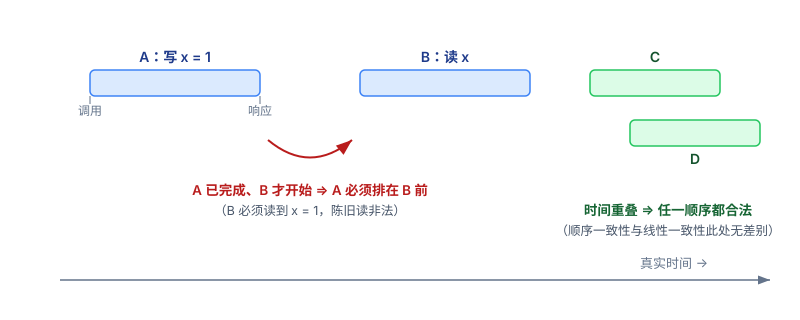
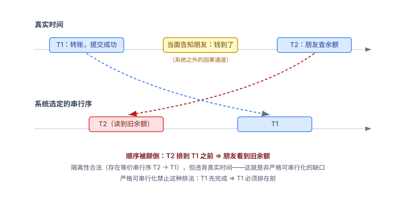
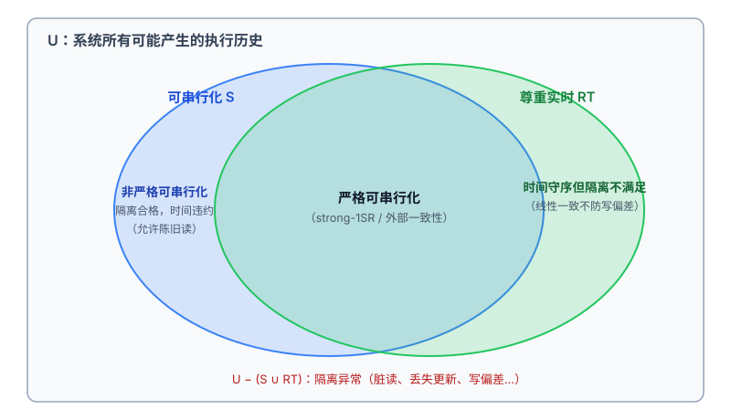

DDIA 第 10 章有一个专栏专门辨析"线性一致性与可串行化"——两个词看起来都在说"能排成一条顺序"，却是相当不同的保证。再加上"严格可串行化"，三个概念的关系常常搅成一团。这篇换个切入方式：**先把它们放到同一个全集里，再从各自的反面倒推回来**，概念边界自然就清晰了。

先校准一个前提：线性一致性是**单个对象（寄存器）上读写操作**的保证，不关涉事务；它需要的是"实时先后"的约束关系，而不是全局时钟（这一点在《顺序一致性与线性一致性，差的到底是什么？》里辨析过）。可串行化才是**事务**层面的隔离性保证：每个事务可读写多个对象，系统保证整体效果等价于按**某种**串行顺序逐个执行。

## 一、全集视角：每个模型都是"合法历史"的一个子集

把系统所有可能产生的执行历史（history）看成一个全集 U。一个一致性模型，就是给 U 画一个圈：**圈内的历史是合法的，圈外的是异常**。约束越强，圈越小。

- **可串行化（S）**：能找到一个串行顺序，使得各事务的效果与之等价。圈的边界是"是否存在这样的串行序"——至于这个顺序和事务真实发生的先后是否一致，**不关心**。书里原话："这个串行顺序可以不同于事务实际运行的顺序。"
- **线性一致性（L）**：单对象操作，每个操作的效果看起来在调用与响应之间的某个原子点发生；如果操作 A 在真实时间里先于操作 B 完成，A 必须排在 B 前面（新近性）。
- **严格可串行化（SS）**：事务粒度 + 实时约束：等价串行序不仅要存在，还必须尊重真实时间——T1 提交完成后 T2 才开始，则 T1 必须排在 T2 之前。

把"是否约束真实时间"和"操作粒度"摆成一张 2×2 矩阵，四个角各就各位，全集被整齐地切开：

| | 不约束真实时间 | 约束真实时间 |
|---|---|---|
| **单操作粒度** | 顺序一致性 | 线性一致性 |
| **事务粒度** | （非严格）可串行化 | 严格可串行化 |

*图 1：线性一致性只约束"不重叠"操作的顺序——A 完成后 B 才开始，则 B 必须看到 A 的结果；C 与 D 时间重叠，任一排序都合法。*

这张表同时回答了"为什么线性一致 + 可串行化 = 严格可串行化"：因为这两个维度本来就正交，严格可串行化就是把两个维度同时取最强的那一格——**既要求事务隔离（存在等价串行序），又要求这个顺序不得违背真实时间**。

## 二、"严格"是对什么严格？

严格的对象是**等价串行序的选择自由度**。

普通可串行化下，系统可以在所有"与冲突关系相容"的串行序中任选一个来解释执行结果——哪怕选出来的顺序和真实时间相反，也合法。严格可串行化把候选集收窄：只允许那些与真实时间相容的串行序。T1 已经完成、T2 尚未开始，就不许把 T2 排在 T1 前面。

所以"严格"严格在**时间**上。这里要消一个歧义：数据库教材里还有 strict 2PL（严格两阶段锁，持锁到提交），那里的"严格"是恢复性概念（防止级联中止），与严格可串行化的"严格"同名不同义——前者管的是锁放开的时机，后者管的是顺序与真实时间的关系。

## 三、非严格可串行化的缺口在哪？

缺口就是右上到左下的落差：**允许"后完成的事务被排到先完成的事务前面"**，最直观的后果是——可串行化允许陈旧读。

具体例子：你转账成功（T1 已提交确认），当面告诉朋友"钱到了"，朋友立刻查余额（T2 在 T1 完成后才开始）——在非严格可串行化下，系统可以合法地把 T2 序列化到 T1 之前，让朋友看到旧余额。隔离性没有任何问题（存在等价串行序：T2、T1），但外部世界的因果（你当面告诉了朋友）被系统违背了。

*图 2：真实时间里 T1 先提交（上），系统却选择把 T2 排在 T1 之前的串行序（下）——隔离合法，但违背了经由"当面告知"这条系统外通道传递的因果。*这正是第 10 章"跨通道时序依赖"讨论的问题：一旦因果经由系统之外的通道传递（一句话、一个电话），只有严格可串行化能兜住。

这不是理论洁癖，而是真实的工程分界：PostgreSQL 的 SSI 明确只保证可串行化、不保证严格可串行化；书里也指出 CockroachDB 提供可串行化和部分新近性保证，但不是严格可串行化——因为那需要事务间代价高昂的协调。反观 Spanner 和 FoundationDB 提供严格可串行化（Spanner 称之为外部一致性，靠 TrueTime + commit-wait 实现：提交时刻意等待，把时钟不确定性"熬"过去，换取时间上的绝对正确）。

## 四、反向思考：每个模型的反面长什么样

定义一个模型最锋利的办法，是看它**禁止什么**。先把全集画出来：

*图 3：全集 U 是系统所有可能的执行历史。两个集合的交集是严格可串行化；S 减去交集是非严格可串行化；RT 减去交集是"时间守序但隔离不满足"（线性一致性正属于此——它防不了写偏差）；两个集合之外是隔离异常。*

- **可串行化的反面（¬S）**：隔离异常——不存在任何串行序能解释观察到的结果。脏读、不可重复读、丢失更新、写偏差都在这个集合里。特征是：无论怎么重排事务，矛盾都消不掉。
- **线性一致性的反面（¬L）**：新近性违约——一个已完成的写之后，读到了更旧的值。读己之写失败、单调性破坏都在这里。特征是：顺序本身可能存在，但它与真实时间矛盾。
- **严格可串行化的反面（¬SS）**：注意这是关键一步——¬SS = ¬S ∪ ¬RT（实时违约）。也就是说，严格可串行化的反面包含**两类**历史：一类是连隔离性都不满足的（¬S），另一类是隔离满足但时间违约的（S ∩ ¬RT，即非严格可串行化）。

所以直接回答"严格可串行化的反面是非严格可串行化吗"：**不是。非严格可串行化只是反面的一半**——是"隔离合格、时间违约"的那一块；反面还包括"隔离都不合格"的整块。这个并集结构也说明了为什么"严格"是最难达到的：要同时躲开两类异常。

## 五、线性一致 + 可串行化，还有别的结果吗？

没有第二个标准答案。这个合取在文献里只有一个定义，但有三个名字：**严格可串行化**、**强单副本可串行化（strong-1SR）**、**外部一致性**（Spanner 的术语）。三者同义。

而且这两个维度的关系比"组合"更深一层：Herlihy 和 Wing 在定义线性一致性的原始论文里就指出，**线性一致性可以看作严格可串行化在"单操作、单对象事务"上的特例**。也就是说，严格可串行化是更一般的概念，线性一致性是它退化到寄存器语义的形态——不是两个东西相加出第三个，而是同一棵树的两个高度。

倒是另一个方向的自由度值得记住（第 10 章专栏的收尾）：一致性模型和隔离级别在很大程度上可以**独立选择**——弱隔离 + 线性一致、可串行化 + 弱一致性，都是合法组合。严格可串行化只是"两个维度同时取最强"的那个角点，不是唯一可能的组合。

## 结语

三个概念一句话各归其位：**可串行化承诺"存在一条串行序"，线性一致性承诺"顺序不违背真实时间"，严格可串行化承诺两者同时成立**。从全集看，它们是层层收窄的合法历史集合；从反面看，它们各自驱逐的异常互不重叠——隔离异常、时间违约、以及两者的并集。选型时的判断也因此变得直接：只要系统内部的因果，可串行化就够；因果会经由系统外的通道传播，就必须为严格付费。
