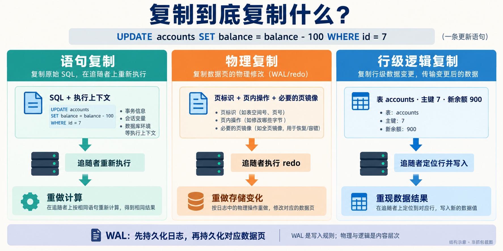
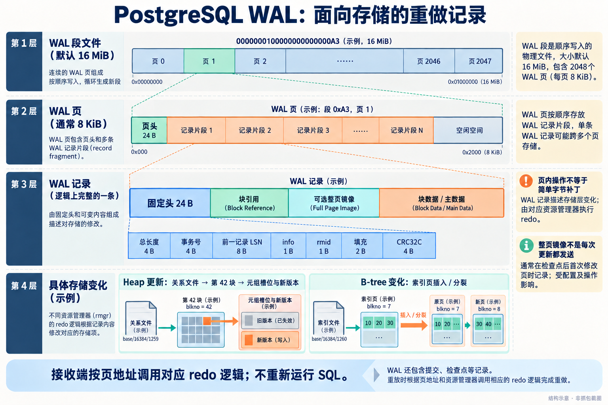
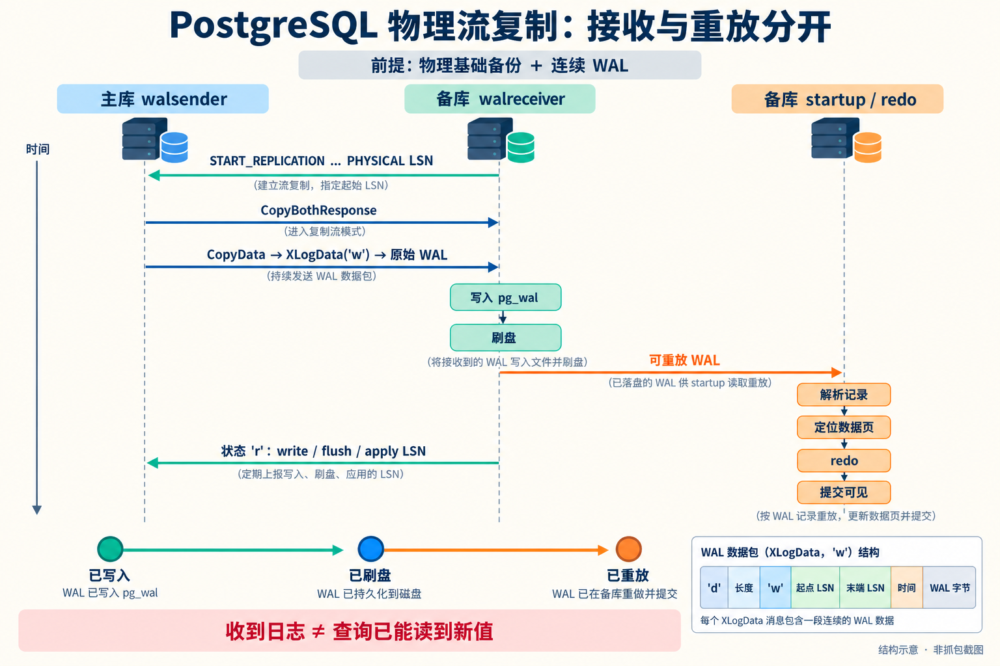
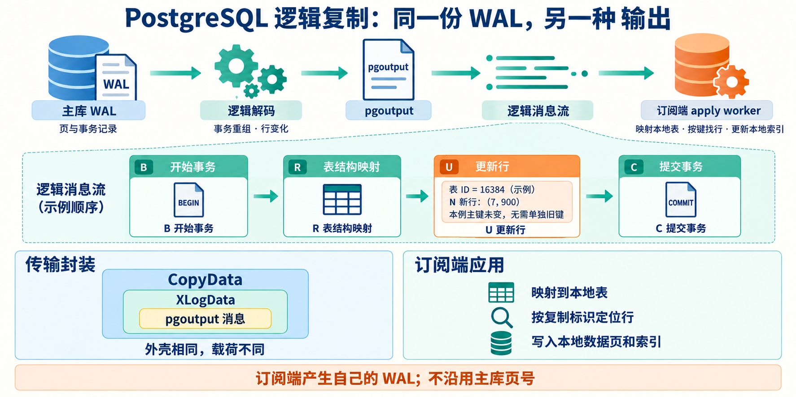
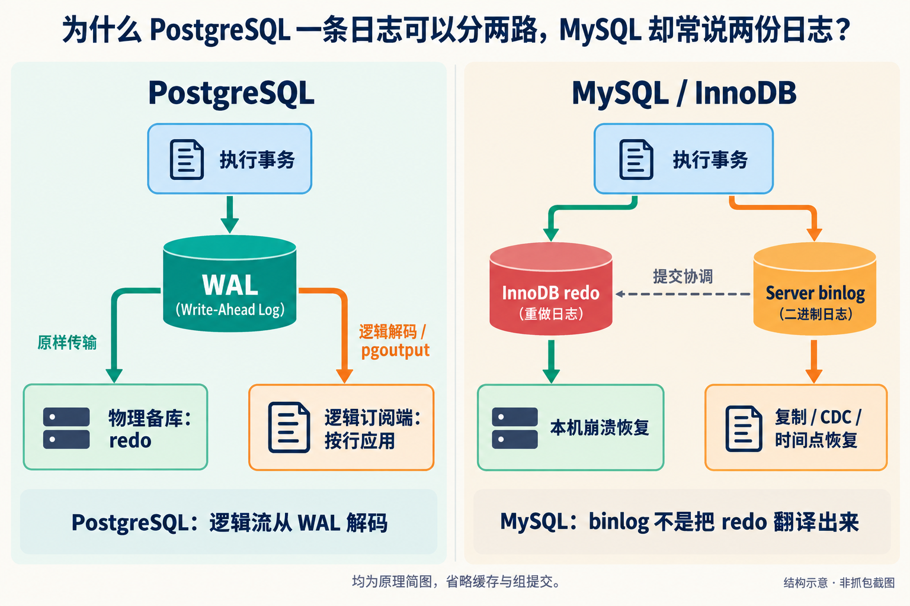
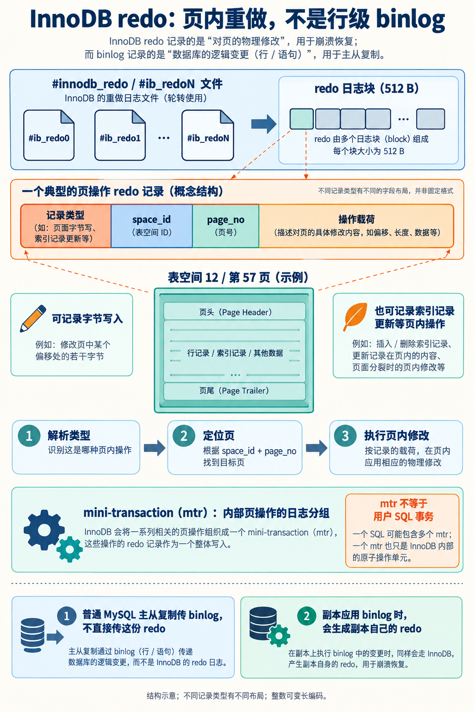
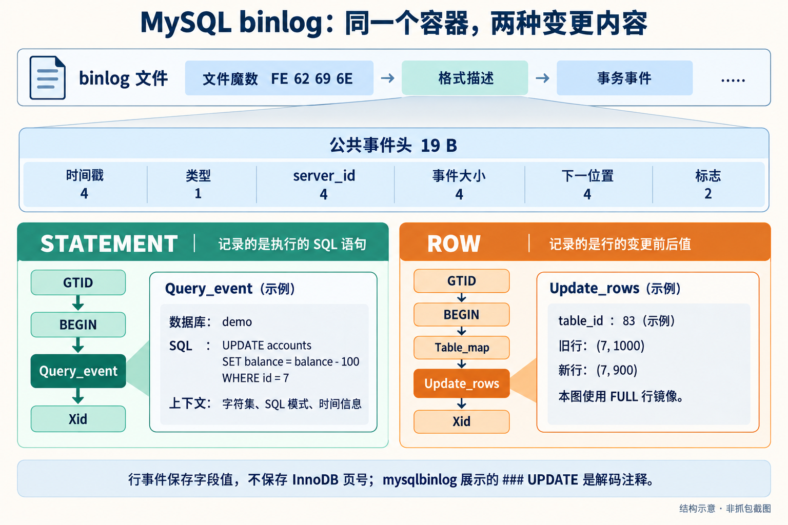
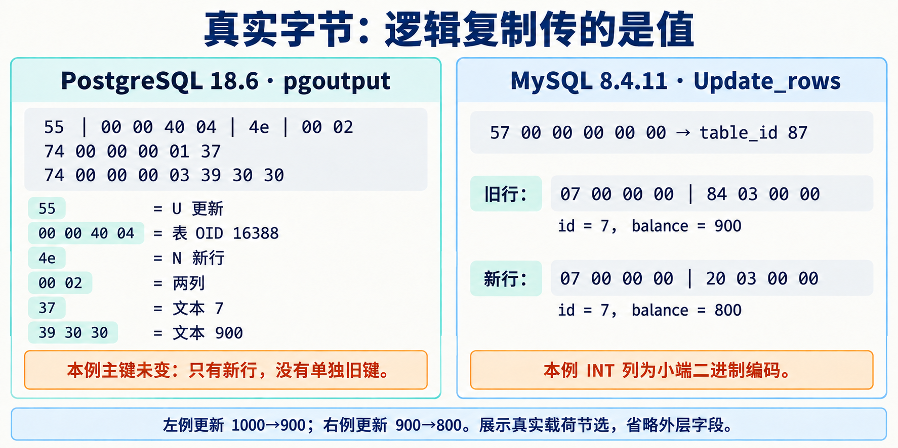
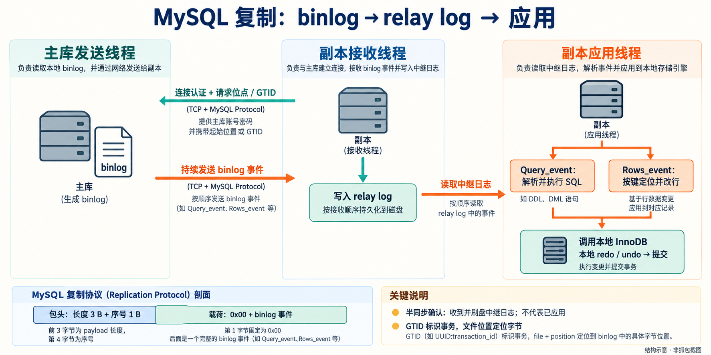

读 DDIA V2 第 6.3.2 节“复制日志的实现”，会遇到三个并列小节：基于语句的复制、预写式日志传送，以及逻辑（基于行的）日志复制。到了数据库文档和技术讨论里，又经常看到“物理复制”“逻辑复制”“流复制”“redo”“binlog”。它们似乎在说同一件事，分类却总对不上。

问题主要出在：**这些词回答的不是同一个问题，而且“逻辑复制”在不同语境中有宽窄两种含义。**

先给出本文的结论：在 DDIA 这一节的上下文里，可以把三条实现路线理解为“重放 SQL”“重放存储层日志”“应用行级变更”。PostgreSQL 的物理复制对应第二条，内置逻辑复制对应第三条；MySQL 常规主从复制用 binlog，其中 STATEMENT 对应第一条，ROW 对应第三条。**WAL 本身不是物理复制的同义词，binlog 也不是行复制的同义词。**

本文同时对照本地 DDIA V2 文本、数据库官方文档与源码，以及数据库厂商的工程用语。功能说明固定在 **PostgreSQL 18 与 MySQL 8.4 / InnoDB**；实测日志来自 PostgreSQL 18.6 和 MySQL 8.4.11，核对日期为 2026-09-10。云数据库的定制存储复制会单独说明。

图片用 Image Gen 生成并经过核对。流程图是原理示意；明确标注“实测”的文本与十六进制来自本文的隔离实验。网络消息结构依据官方协议，**不是本次实验的网络抓包**。原始样本见文末。

## 1. 先把 DDIA、官方文档和业界说法放在同一张桌上

### 1.1 DDIA 的三分法，分的是三条实现路线

本地第 6 章源文件在“复制日志的实现”下依次讨论：

| DDIA 的小节 | 日志要表达的东西 | 追随者主要做什么 |
|---|---|---|
| Statement-based replication | 执行过的写语句及必要上下文 | 重新解析、执行这些语句 |
| Write-ahead log shipping | 足以重建存储状态的底层日志 | 用存储引擎的恢复逻辑重放 |
| Logical (row-based) log replication | 哪张表的哪一行发生了什么变化 | 在本地找到对应行并写入结果 |

这是为解释工程取舍而组织的分类。三个标题并没有使用完全相同的命名轴：第一个强调语句粒度，第二个强调复用恢复日志，第三个强调表／行层面的表示。

所以，读这一节时，把“基于语句”和“逻辑（基于行）”当成并列路线是对的；把这个局部分类提升成“所有语境下语句复制都不属于逻辑复制”，就会产生误解。

### 1.2 业界的“物理／逻辑”，通常在区分存储表示与数据语义

一个常用的宽泛划分是：

```text
复制变更时，接收端需要理解哪一层？

物理层面：数据文件、页地址、页内结构、底层重做操作
逻辑层面：数据库对象、SQL 操作、表、行、字段值
```

按这个宽口径，SQL 语句和行变更都位于逻辑层，因此可以把逻辑复制进一步分成语句级和行级。这是本文为了对齐术语采用的**解释性归纳**，不是声称业界存在一张唯一、强制的标准分类树。

实际材料中也能看到这种宽口径：AWS 将 MySQL 通过 binlog 进行的复制称为逻辑数据复制，并与 Aurora 的存储层 redo 复制区分；而 PostgreSQL 官方的“Logical Replication”通常专指基于复制标识、通过发布／订阅传输对象与行变化的内置机制。[AWS 的复制层次说明](https://aws.amazon.com/blogs/database/selecting-the-right-encryption-options-for-amazon-rds-and-amazon-aurora-database-engines/)、[PostgreSQL 逻辑复制定义](https://www.postgresql.org/docs/18/logical-replication.html)

因此，“语句复制算不算逻辑复制”必须带语境回答：

| 说话的语境 | “逻辑复制”在这里通常指什么 | 语句复制放在哪里 |
|---|---|---|
| DDIA §6.3.2 的三条路线 | 该小节明确讨论行级逻辑日志 | 单列一条路线 |
| 宽泛的物理／逻辑二分 | 与存储页布局解耦的数据操作表示 | 可归入逻辑层面的复制 |
| PostgreSQL 官方功能名 | logical decoding、publication、subscription、pgoutput 等组成的机制 | 不属于内置 Logical Replication；SQL 中间件另列 |
| MySQL 官方格式名 | 更常明确说 SBR、RBR、MIXED 与 binlog | STATEMENT 是 binlog 的一种格式 |

PostgreSQL 官方的方案比较也把 WAL shipping、Logical Replication 和 SQL-based replication middleware 分开列出。这提醒我们：**产品功能分类与抽象层次分类，本来就可以同时存在。**[官方方案比较](https://www.postgresql.org/docs/18/different-replication-solutions.html)

### 1.3 WAL 是写入规则，不规定日志只能是物理格式

WAL，即 write-ahead logging，首先表达一个持久化顺序约束：

> 对应日志必须先到达持久存储，随后才能把依赖该日志的数据页修改持久化。

这不要求“先写日志才能改内存中的页”。数据库可以先后修改缓冲区、构造日志，真正必须守住的是日志与数据页**落盘**的先后关系。这样，数据页还没全部写回时机器就崩溃，也可以利用日志恢复。[PostgreSQL WAL 原理](https://www.postgresql.org/docs/18/wal-intro.html)

“物理／逻辑”则问：日志描述页内存储变化，还是表／行／操作语义？这是另一个维度。

在 PostgreSQL 日常运维中，“物理复制就是传 WAL”是可理解的简写。但完整表述应是：**PostgreSQL 的物理复制传输原始 WAL，并在备库重放；它的逻辑复制同样读取 WAL，不过先解码成逻辑消息，再发送。**

此外，存储块镜像、文件系统复制也属于物理层面的复制思路，却不必使用数据库的 WAL 传输协议。物理备份、快照与持续复制也不能混为一个过程。[PostgreSQL 不同复制方案](https://www.postgresql.org/docs/18/different-replication-solutions.html)

## 2. 同一条 UPDATE，三种日志各会留下什么

用一张最简单的表贯穿全文：

```sql
CREATE TABLE accounts (
    id      INTEGER PRIMARY KEY,
    balance INTEGER NOT NULL
);

INSERT INTO accounts VALUES (7, 1000);

BEGIN;
UPDATE accounts SET balance = balance - 100 WHERE id = 7;
COMMIT;
```

业务结果是账户 7 的余额从 1000 变成 900。三条路线保留的信息却不同。



*图 1：三种复制方式的差别首先是“传什么”和“接收端做什么”。图中物理路径以数据库 WAL／redo 重放为例，不穷举存储镜像方案。*

**语句复制**可以记录：

```text
BEGIN
执行上下文：当前数据库、字符集、SQL 模式、必要的时间／会话信息
UPDATE accounts SET balance = balance - 100 WHERE id = 7
COMMIT
```

追随者重新求值 `balance - 100`。如果追随者原来的余额错误地是 800，执行后就成了 700。相同命令只有作用在合适的相同前提上，才能得到相同结果。

**行复制**表达的是类似这样的变化：

```text
表：accounts
定位行：id = 7
新值：balance = 900
事务提交
```

追随者不必再计算减法。它需要识别目标表、找到目标行、写入传来的值。具体协议可能携带完整旧行、新行、旧键、列位图或“值未改变”标记，不能一概简化成完整的 before/after JSON。

**物理日志复制**则可能表达：

```text
某个关系文件的第 0 块：
  旧元组位于槽位 1
  新元组版本写入槽位 2
  设置相关事务信息
随后记录事务提交
```

这段是概念表示。真正 WAL 中有二进制记录头、块引用和操作载荷。它并不要求出现原来的 SQL，也不要求以业务主键 7 作为定位入口。

一个直接的工程后果是：语句复制会重新走查询执行路径；行复制省掉原始语句的计算，但仍要维护本地存储和索引；物理复制复用 redo 路径，却要求双方理解兼容的存储表示。

## 3. PostgreSQL 物理复制：把恢复流程延伸到另一台机器

### 3.1 磁盘上的 WAL 是分段的二进制记录流

PostgreSQL 的 WAL 位于数据目录的 `pg_wal/` 中，常见文件名类似：

```text
pg_wal/
  000000010000000000000001
  000000010000000000000002
  ...
```

默认 WAL 段大小为 16 MiB；WAL 页通常为 8 KiB。页有页头，记录可以跨页。**WAL 页是日志自己的组织单位，数据库数据页是被日志描述的对象，两者不是同一张“页”。**WAL 段大小可以在初始化时调整，不能把默认值当成协议永远不变的常量。[WAL 内部组织](https://www.postgresql.org/docs/18/wal-internals.html)



*图 2：WAL 的层次结构。第 3 层是语义分组图，不是完整的逐字节序列化布局；真实记录的多个块头、镜像与数据区需要按格式解析。示例普通 WAL 页头为 24 B，段首使用更长的页头。*

在本文对应的 PostgreSQL 源码中，`XLogRecord` 固定头共 24 字节：

| 字段 | 大小 | 意义 |
|---|---:|---|
| `xl_tot_len` | 4 B | 记录总长度 |
| `xl_xid` | 4 B | 相关事务号；有些记录不属于普通事务 |
| `xl_prev` | 8 B | 前一条 WAL 记录的位置 |
| `xl_info` | 1 B | 标志及资源管理器相关信息 |
| `xl_rmid` | 1 B | 资源管理器 ID |
| padding | 2 B | 对齐填充 |
| `xl_crc` | 4 B | CRC32C 校验 |

后续可变部分可以有块引用、整页镜像、块数据、主数据等。块引用能够指向关系文件、fork 和块号；资源管理器决定怎样解释载荷。Heap、B-tree、事务状态和检查点等记录各有不同含义。[PostgreSQL `xlogrecord.h`](https://github.com/postgres/postgres/blob/REL_18_STABLE/src/include/access/xlogrecord.h)

所以，“物理日志就是把某个地址的几个字节改成另外几个字节”可以帮助入门，但并不完整。实际 redo 也会执行“在指定页内插入某条索引记录”等结构化操作。恢复领域常把“物理定位页面、在页内描述操作”称为 **physiological logging**，可译为生理日志／物理逻辑日志。这里的“逻辑”是页内操作层面，不是 DDIA 所说的表行逻辑复制。[Franklin：Concurrency Control and Recovery](https://www.cs.cmu.edu/afs/cs/academic/class/15712-f08/www/readings/Franklin97.pdf)

“物理复制”仍然成立，因为追随者必须理解这些具体的页结构与存储操作。

### 3.2 实测：余额减 100，在 WAL 中是 HOT_UPDATE

本文在 PostgreSQL 18.6 上执行上面的更新，用 `pg_waldump` 读取对应范围。下面是实测记录节选，完整输出保存在附件：

```text
rmgr: Heap        len (rec/tot): 74/74, tx: 767,
lsn: 0/017EA8E0, prev 0/017EA870,
desc: HOT_UPDATE old_xmax: 767, old_off: 1,
old_infobits: [], flags: 0x10, new_xmax: 0, new_off: 2,
blkref #0: rel 1663/5/16388 blk 0

rmgr: Transaction len (rec/tot): 46/46, tx: 767,
lsn: 0/017EA930, prev 0/017EA8E0,
desc: COMMIT 2026-09-10 09:15:03.526791 UTC
```

这里能看到三件事：

1. `rel 1663/5/16388 blk 0` 指向存储对象和块，不是 `WHERE id = 7`。
2. `old_off: 1`、`new_off: 2` 描述旧、新元组的页内槽位。
3. 更新记录与提交记录分开存在。

本例只改非索引列，且同一页有空间，因此实际出现了 HOT 更新。不能据此推导“所有 UPDATE 都不更新索引”：如果改索引列、需要其他页或引发索引结构变化，日志组成就会不同。[Heap-Only Tuples](https://www.postgresql.org/docs/18/storage-hot.html)

实验范围内还出现了 `FPI_FOR_HINT` 记录。整页镜像是另一种必须认识的内容：开启相应配置时，检查点后的首次页修改通常需要记录页镜像，以处理页写入不完整等恢复问题。镜像还可能经过压缩、去除页内空洞，并非每次 UPDATE 都固定发送一张 8 KiB 原始页。[WAL 配置与整页写入](https://www.postgresql.org/docs/18/runtime-config-wal.html)

### 3.3 它怎样通过网络传过去

先有来自主库的物理基础备份，再从正确的 WAL 位置持续追赶。不能拿一个空数据库直接套用任意中途 WAL：日志是在已有存储状态上继续重做。

PostgreSQL 物理复制有两种常见交付方式：归档完整 WAL 段文件，或者通过长期连接流式发送 WAL。流复制不必等一个 16 MiB 段填满。[物理备库与流复制](https://www.postgresql.org/docs/18/warm-standby.html)



*图 3：备库发起连接，主库持续发送。接收、刷盘和重放是不同进度；图中展示一次典型推进顺序。*

一条典型连接的过程是：

```text
备库 → 主库：建立 PostgreSQL 连接并认证，startup 参数 replication=true
备库 → 主库：IDENTIFY_SYSTEM（核对集群与 timeline 等信息）
备库 → 主库：START_REPLICATION SLOT standby_slot PHYSICAL 0/1700000
主库 → 备库：CopyBothResponse
主库 → 备库：持续发送 CopyData 消息
备库 → 主库：持续反馈接收、持久化与应用位置
```

上面的 slot 名和 LSN 是命令结构示例。物理复制可以不使用 slot，但仍须通过归档或保留策略保证所需 WAL 没被回收。

数据包的层次可以写成：

```text
TCP 字节流
└─ PostgreSQL CopyData
   ├─ 'd'：消息类型，1 B
   ├─ 长度：4 B，包含长度字段自身，不包含前面的 'd'
   └─ XLogData
      ├─ 'w'：1 B
      ├─ 本次数据起点 LSN：8 B
      ├─ 发送端 WAL 末端 LSN：8 B
      ├─ 发送时间：8 B
      └─ 原始 WAL 数据
```

`CopyBothResponse` 表示进入双向 COPY 交换状态；实际数据随后放在 `CopyData` 中，不能把两者理解成“每批数据都套一个 CopyBothResponse”。网络消息也不等于 TCP 报文，一个协议消息可能跨多个 TCP 段。

发送端还会发 `'k'` keepalive；接收端的 `'r'` 状态消息包含 write、flush、apply 三个位置、时间及请求回复标志。这里的 LSN 是 WAL 字节流位置，不是时间戳或事务编号。主库切换后还需要 timeline 来区分日志历史分支。[流复制协议](https://www.postgresql.org/docs/18/protocol-replication.html)

### 3.4 备库怎么把它变回数据

备库的 `walreceiver` 接收 WAL 并写入本地 `pg_wal`；`startup` 进程负责恢复／重放，按记录类型调用相应 redo 逻辑。它使用日志中的存储定位信息修改页，不重新解析原来的 UPDATE，也不重新执行业务触发器。

物理 WAL 可以在源事务提交之前传到备库并被重放。页面上已经存在某个新元组版本，不代表它已经对查询可见；事务状态与查询快照仍然决定可见性。备库重放到提交记录后，适当的新快照才能看见已提交的变化。

因此，三个位置有不同含义：

| 进度 | 表示 | 尚不能保证什么 |
|---|---|---|
| write | 日志已写到备库文件／操作系统缓冲路径 | 不等于已持久化 |
| flush | 日志已完成持久化 | 不等于已重放 |
| apply / replay | 日志已在备库重放 | 不会改变已经建立的旧事务快照 |

配置了同步备库后，`synchronous_commit=on` 通常等待所选同步备库的 WAL flush；`remote_apply` 进一步等待重放。名称中出现“同步”也不能省略“同步到哪一步”。[同步复制](https://www.postgresql.org/docs/18/warm-standby.html#SYNCHRONOUS-REPLICATION)、[WAL 提交参数](https://www.postgresql.org/docs/18/runtime-config-wal.html)

物理备库按整个集群的 WAL 重建受支持的存储状态，一般需要相同大版本和兼容平台。在正常 standby 模式下供只读查询；要接受普通写入需要提升为主库。这里“物理一致”也不等于任意时刻整个数据目录逐字节完全相同：配置、临时状态、unlogged 数据等有各自规则。

## 4. PostgreSQL 逻辑复制：WAL 是来源，行事件才是载荷

### 4.1 一份 WAL，可以有两种消费者

启用逻辑解码需要 `wal_level=logical`，使 WAL 保留逻辑解码需要的附加信息。它不是“看到旧 WAL 就能随时还原出所有业务事件”的魔法。

核心路径是：

```text
WAL → 逻辑解码与事务重组 → 输出插件 pgoutput
    → 发布范围过滤 → 逻辑消息流 → 订阅端 apply worker
```

逻辑解码从存储日志中提取表与行变化；输出插件负责将变化编码成消费方所需格式。`pgoutput` 是内置发布／订阅复制使用的标准输出插件。`test_decoding` 提供易读文本用于观察，两者不是同一种线上载荷。[逻辑解码概念](https://www.postgresql.org/docs/18/logicaldecoding-explanation.html)、[逻辑复制架构](https://www.postgresql.org/docs/18/logical-replication-architecture.html)



*图 4：图中 OID 16384 是示意值，后面的实测对象 OID 是 16388。逻辑复制保留数据语义，订阅端自行决定本地存储布局。*

逻辑复制没有要求 PostgreSQL 先在磁盘上维护一个与 MySQL binlog 完全对应的独立永久逻辑日志文件。消息可以在读取 WAL 时生成；槽状态、解码所需保留信息，以及大事务的临时落盘又是其他层面的事情。

### 4.2 publication、slot、subscription 各管什么

这三个词经常一起出现，但职责不同：

| 对象 | 职责 |
|---|---|
| publication | 定义发布哪些表及操作，可配置行过滤、列列表等 |
| logical replication slot | 维护消费与解码所需状态，使源端知道哪些日志仍需要保留 |
| subscription | 在订阅端配置连接、所订阅的 publication，以及复制工作方式 |

一个 publication 可以被多个订阅使用；消费者通常需要各自的 slot 进度。slot 不是“额外复制一份完整 WAL 文件的目录”，而是影响保留和消费状态的机制。长期停滞的消费者可能导致 WAL 保留增加；配置保留上限后，槽也可能因所需 WAL 丢失而失效。[发布对象](https://www.postgresql.org/docs/18/logical-replication-publication.html)、[逻辑槽与状态](https://www.postgresql.org/docs/18/logicaldecoding-explanation.html)

### 4.3 实测：同一次更新，解码后只剩表、列和值

同一条 `HOT_UPDATE`，通过 `test_decoding` 观察得到：

```text
BEGIN 767
table public.accounts: UPDATE: id[integer]:7 balance[integer]:900
COMMIT 767
```

这是输出插件生成的文本，不是主库在磁盘上存储的原始 WAL，也不是内置复制的 pgoutput 格式。

通过 `pg_logical_slot_peek_binary_changes` 读取 `pgoutput`，使用协议版本 1、默认文本列编码，本次普通事务得到四条消息：

```text
B  Begin
R  Relation：public.accounts 的字段描述
U  Update
C  Commit
```

`R` 建立源端 relation OID 到表名、列名、类型及复制标识的映射，不是 `CREATE TABLE`。缓存建立以后，也不必为每一行反复发送 Relation。

实测 `U` 消息的完整载荷为 **22 字节**：

```text
55 00 00 40 04 4e 00 02 74 00 00 00 01 37 74 00 00 00 03 39 30 30
```

逐项拆开如下：

| 字节 | 解释 |
|---|---|
| `55` | ASCII `U`，更新消息 |
| `00 00 40 04` | 4 字节源端 relation OID，十进制 16388 |
| `4e` | ASCII `N`，接下来是新元组 |
| `00 02` | 两列 |
| `74 00 00 00 01 37` | `t` 文本编码，长度 1，内容 `7` |
| `74 00 00 00 03 39 30 30` | `t` 文本编码，长度 3，内容 `900` |

这里特意把“二进制协议”和“列值编码”分开：pgoutput 本身是结构化二进制消息，但列值可选择文本或二进制编码。文本字符 `900` 并不使整个复制协议变成 SQL 文本协议。[逻辑消息格式](https://www.postgresql.org/docs/18/protocol-logicalrep-message-formats.html)

### 4.4 为什么本例没有 before image 或旧主键

本例使用主键作为 replica identity，而且 UPDATE 没有改变主键。新元组中已有 `id=7`，足以定位，因此 `U` 中可以只有 `N` 新元组，不必单列旧键。

常见消息部分包括：

| 情形 | 常见表示 |
|---|---|
| INSERT | `I` + relation ID + `N` 新元组 |
| UPDATE 且复制标识未改变 | `U` + relation ID + `N` 新元组 |
| UPDATE 改变复制标识键 | `U` + 旧 `K` 键元组 + `N` 新元组 |
| 使用 `REPLICA IDENTITY FULL` 的 UPDATE | 可携带 `O` 旧元组 + `N` 新元组 |
| DELETE | `D` + relation ID + `K` 旧键或 `O` 旧元组 |

TupleData 还区分 NULL、未变化的外部 TOAST 值、文本值和二进制值。所以“PG 行复制永远发送完整 before/after”并不准确。[消息与 TupleData 格式](https://www.postgresql.org/docs/18/protocol-logicalrep-message-formats.html)

表没有主键时，也不会自动保证每次 UPDATE／DELETE 都可复制。可以设置适用的唯一索引为 replica identity，或者采用 `REPLICA IDENTITY FULL`；后者可能增加日志量与目标查找成本。只复制 INSERT 的要求又不同。[Replica Identity](https://www.postgresql.org/docs/18/logical-replication-publication.html#LOGICAL-REPLICATION-REPLICA-IDENTITY)

### 4.5 网络外壳相同，里面已经不是原始 WAL

逻辑复制连接使用 `replication=database`，并指定数据库。启动命令类似：

```text
START_REPLICATION SLOT demo_slot LOGICAL 0/1700000
    (proto_version '1', publication_names 'demo_pub')
```

之后同样进入双向 COPY 状态，继续使用 `CopyData / XLogData` 外壳。但内部是 pgoutput 的消息：

```text
物理：CopyData → XLogData → 原始 WAL 字节
逻辑：CopyData → XLogData → pgoutput 的 B / R / I / U / D / C 等消息
```

外壳仍携带源端 WAL 位置，供恢复消费进度使用；这不意味着逻辑消息本身就是可直接塞进订阅端 `pg_wal` 重放的源 WAL。[流复制协议](https://www.postgresql.org/docs/18/protocol-replication.html)、[逻辑流协议](https://www.postgresql.org/docs/18/protocol-logical-replication.html)

上面展示普通事务的基础流程。启用相应版本和选项后，大事务可以在提交前分段发送，使用 Stream Start／Stop／Commit／Abort 等消息，还可支持并行应用与两阶段事务。**提前收到未提交变化，不等于可以把这些变化提前作为已提交数据暴露。**[逻辑协议版本与流式事务](https://www.postgresql.org/docs/18/protocol-logical-replication.html)

### 4.6 订阅端真正执行的是本地写入

apply worker 根据 Relation 元数据映射本地表和列，按照 replica identity 查找本地行，再通过内部执行与表访问接口实施变更，维护本地索引、事务状态和本地 WAL。

可以用下面这句表达其效果：

```sql
UPDATE public.accounts SET balance = 900 WHERE id = 7;
```

但这只是等价效果描述，**不表示 pgoutput 传输了这句 SQL，也不表示 apply worker 必须拼 SQL 再交给解析器**。它也不重新计算主库的 `balance - 100`。

目标端的页号、元组位置、事务号及 WAL LSN 可以与源端不同。订阅端默认以 `session_replication_role=replica` 运行，普通触发器不会按正常客户端写入的规则再次触发；显式启用的 replica／always 触发器需要另行考虑。[应用进程架构](https://www.postgresql.org/docs/18/logical-replication-architecture.html)

初始同步则先复制现有表数据，再衔接复制期间的增量，最后交给常规 apply worker。复制流并不天然包含“从数据库诞生开始的一切历史”。

### 4.7 PostgreSQL 有没有原生语句复制

PostgreSQL 内置复制体系没有一个与 MySQL `binlog_format=STATEMENT` 对等的“记录原始 DML SQL，再原样重放”的开关。其内置主要路径是物理 WAL 复制与基于 WAL 解码的逻辑复制。

生态中存在 SQL 复制中间件；官方也专门讨论了这条路线。中间件拦截并分发查询，必须处理随机数、序列、时间函数以及各节点事务结果的一致性。不能因为能把 SQL 发给多台 PostgreSQL，就把它称为内置 logical replication。[SQL 复制中间件](https://www.postgresql.org/docs/18/different-replication-solutions.html)

另外，PostgreSQL 18 的内置逻辑复制**不自动复制一般 DDL、序列状态和 large objects**。已写入行内的 identity／serial 值会作为行值复制，但背后序列的当前位置不会因此自动同步；`TRUNCATE` 则有专门支持。这些限制说明“逻辑复制”是具体产品能力，不是“数据库所有逻辑对象都会自动同步”的承诺。[逻辑复制限制](https://www.postgresql.org/docs/18/logical-replication-restrictions.html)

## 5. MySQL：先分清 redo、binlog 和 relay log

### 5.1 三种日志处于三个不同位置

| 日志 | 谁管理／生成 | 内容与主要用途 | 常规复制是否直接传它 |
|---|---|---|---|
| InnoDB redo log | 存储引擎 | 重做存储修改，服务崩溃恢复 | 不直接传 |
| binary log / binlog | MySQL Server 层 | 事务、语句或行事件，用于复制及时间点恢复等 | 是 |
| relay log | 副本的复制接收端 | 保存收到的源端 binlog 事件，供应用端读取 | 是接收后的本地中转 |

undo 又是另一回事，主要承担回滚和 MVCC 等职责，不是普通主从链路直接传输的复制日志。



*图 5：PG 逻辑流从 WAL 解码；MySQL 的 binlog 在 Server 层记录，不是从 InnoDB redo 翻译出来。图中提交协调连接表示一致性协调，不表示 binlog 转换成 redo。*

InnoDB 与 binlog 必须协调提交，否则可能出现“本机恢复后有这笔交易，复制日志里却没有”，或者反过来。经典解释是内部两阶段提交：引擎 prepare、binlog 写入／同步、引擎 commit；实际还涉及组提交、刷盘配置和错误处理，不能把它简化成三个永远一事务一次的独立磁盘写入。[MySQL 事务不一致说明](https://dev.mysql.com/doc/refman/8.4/en/replication-features-transaction-inconsistencies.html)、[binlog 提交实现](https://dev.mysql.com/doc/dev/mysql-server/latest/classMYSQL__BIN__LOG.html)

### 5.2 InnoDB redo 底层是什么样

MySQL 8.4 的 redo 文件通常在 `#innodb_redo/` 下，名称为 `#ib_redoN` 一类。日志内容以 512 B 的 redo block 组织，包含块头、数据及校验等内容；这与通常更大的 InnoDB 数据页是两回事。[InnoDB redo 文档](https://dev.mysql.com/doc/refman/8.4/en/innodb-redo-log.html)、[redo 块格式](https://dev.mysql.com/doc/dev/mysql-server/latest/PAGE_INNODB_REDO_LOG_FORMAT.html)



*图 6：典型页操作的概念结构。不是所有 redo 记录都共享同一种字段布局，图中的 space/page 是示意地址。*

对于典型页操作，可以这样理解：

```text
record_type
space_id
page_no
该类型所需的操作载荷
```

比如，对某页特定偏移写入数值，或者在指定索引页执行记录修改。源码中既有写 1／2／4／8 字节的接口，也有处理索引记录的日志接口；整数还可能使用压缩编码，不能把概念上的整数类型宽度直接当成磁盘上的固定字节数。[InnoDB mini-transaction logging 接口](https://dev.mysql.com/doc/dev/mysql-server/8.4.10/mtr0log_8h.html)

redo 中还有 mini-transaction，简称 mtr，用于组织内部存储操作及其日志。一个用户事务可以涉及很多 mtr；mtr 的完成不等于 SQL 事务已经 COMMIT。

因此 InnoDB redo 也适合用“物理定位、页内重做”的角度理解。看到描述索引记录操作的字段，并不能把它误判成“按业务主键复制一行”的逻辑 binlog。

本文对 redo 的部分是官方文档与实现结构讲解，未声称使用 `mysqlbinlog` 解码了 redo；`mysqlbinlog` 读的是 binlog。

### 5.3 MySQL 有没有物理复制

精确回答是：**MySQL 8.4 常规 source–replica 主从复制，不像 PostgreSQL 物理流复制那样直接把 InnoDB redo 发给普通副本重放。它使用 binlog。**

但这不等于“MySQL 世界不存在物理数据传送”。例如 Clone 插件可以复制 InnoDB 物理数据来初始化实例；之后持续增量仍可接 binlog 复制。Aurora 等 MySQL 兼容系统则有定制的存储层复制架构，不能把其内部机制当成原生 MySQL 的通用主从协议。[MySQL Clone](https://dev.mysql.com/doc/refman/8.4/en/clone-plugin.html)、[Aurora 物理与逻辑复制的边界](https://aws.amazon.com/blogs/database/how-to-choose-the-best-disaster-recovery-option-for-your-amazon-aurora-mysql-cluster/)

这正是为什么需要同时说明“产品是什么”和“讨论的是初始化还是持续增量”。

## 6. MySQL binlog：一个容器，语句和行两种主要内容

### 6.1 STATEMENT、ROW、MIXED 是 binlog 的格式选择

MySQL 8.4 有三种格式名称：

| 配置 | DML 通常怎样记录 |
|---|---|
| `STATEMENT` | 记录语句及执行上下文 |
| `ROW` | 记录受影响行的数据变化 |
| `MIXED` | 能安全按语句记录时用语句，对规定的不安全情形切换行记录 |

8.4 的默认值是 **ROW**。格式切换及非 ROW 方向已被标为弃用，但在本版本仍可用于理解和实验。[MySQL 复制格式](https://dev.mysql.com/doc/refman/8.4/en/replication-formats.html)

这里要对本地 DDIA 文本补一个版本注释：书中概述 MySQL 在语句存在非确定性时会切到行复制，应结合 **MIXED 的选择规则**理解，不应据此认为现代 MySQL 默认配置就是 MIXED。本文实验查询 8.4.11，得到 `binlog_format=ROW`、`binlog_row_image=FULL`。

此外，ROW 不等于文件里没有 Query event。`BEGIN` 和许多 DDL 仍以 Query 事件出现。**ROW 中看见 `CREATE TABLE`，不能证明该事务的普通 DML 使用了 STATEMENT，也不能证明配置成了 MIXED。**[行与语句复制比较](https://dev.mysql.com/doc/refman/8.4/en/replication-sbr-rbr.html)

### 6.2 binlog 文件和事件头是什么样



*图 7：开启 GTID 的普通事务示例。不开 GTID、使用 XA、开启事务压缩或其他特性时，事件序列会有所不同。*

本文实测未加密的 binlog 文件以四字节魔数开始：

```text
FE 62 69 6E       # 0xFE + ASCII "bin"
```

随后是 Format_description、Previous_gtids（本例开启 GTID），以及一串事务事件。格式 v4 的常见事件公共头为 19 B：

```text
timestamp       4 B
event_type      1 B
server_id       4 B
event_size      4 B
next_log_pos    4 B
flags           2 B
```

后面跟事件特有头、载荷及配置对应的校验信息。`next_log_pos` 是源 binlog 下一事件位置；不是事务号，也不是副本 redo 的 LSN。[官方事件格式](https://dev.mysql.com/doc/dev/mysql-server/latest/page_protocol_replication_binlog_event.html)、[binlog 文件与网络流](https://dev.mysql.com/doc/dev/mysql-server/latest/page_protocol_replication.html)

官方源码文档的 `latest` 页面会滚动升级；本文只用其解释稳定的基础帧结构，实际示例字段和位置以 8.4.11 保存的二进制文件为准。

### 6.3 STATEMENT：真正有原始更新语句

本文先从 1000 扣减到 900，使用 STATEMENT。`SHOW BINLOG EVENTS` 实测显示：

```text
Pos 198   Gtid       ...:9
Pos 277   Query      BEGIN
Pos 368   Query      use `demo`; UPDATE accounts SET balance=balance-100 WHERE id=7
Pos 504   Xid        COMMIT /* xid=17 */
```

Query event 不只有 SQL 字符串。它还包含数据库名、状态变量、错误码等字段，使副本尽量重建执行环境；另有整数变量、随机数状态、用户变量等辅助事件类型。

因此“语句复制遇到 `NOW()` 一定不一致”也说得太绝对。MySQL 会传递必要的时间上下文，`NOW()` 有专门处理；`SYSDATE()`、`UUID()` 等又有各自限制和不安全判定。DDIA 用非确定性函数说明的是一般风险，不能替代具体数据库的安全规则表。[MySQL 系统函数与复制](https://dev.mysql.com/doc/refman/8.4/en/replication-features-functions.html)

语句复制的核心负担是重新执行：复杂 UPDATE 的扫描、连接、表达式计算，以及相应的触发器逻辑，可能都要在副本再做一次；执行上下文和数据前提也必须匹配。

### 6.4 ROW：Table_map 告诉你“哪张表”，Rows event 告诉你“哪些值”

接着在同一实验里从 900 扣减到 800，改用 ROW／FULL。实测事件序列是：

```text
Pos 198   Gtid         ...:10
Pos 277   Query        BEGIN
Pos 361   Table_map    table_id: 87 (demo.accounts)
Pos 416   Update_rows  table_id: 87 flags: STMT_END_F
Pos 470   Xid          COMMIT /* xid=23 */
```

Table_map 将流中的 `table_id=87` 映射到 `demo.accounts`，并提供列类型及相关元数据。这个 table_id 不是 InnoDB 的页号，也不应被当成跨重启永久不变的业务对象标识。

Update_rows 的语义是：

```text
旧行：id=7, balance=900
新行：id=7, balance=800
```

本例事件总长 54 B。去掉 19 B 公共头和末尾 4 B 校验后，关键载荷为：

```text
57 00 00 00 00 00     # table_id = 87，6 B，小端
01 00                 # 行事件标志：STMT_END_F
02 00                 # extra-data 长度=2，本例无额外内容
02                    # 列数=2
ff                    # before-image 的列存在位图
ff                    # after-image 的列存在位图

00                    # 旧行 NULL 位图：均非 NULL
07 00 00 00           # id=7
84 03 00 00           # balance=900

00                    # 新行 NULL 位图
07 00 00 00           # id=7
20 03 00 00           # balance=800
```

这里只有两列，所以列位图只解释低两位，其余位不代表额外列。`84 03 00 00` 按本例 INT 的小端整数解释是 900，不是字符串 `"900"`。列值如何编码取决于具体类型，不能据此说所有 binlog 字段都是固定 4 B 整数。



*图 8：真实载荷节选。PG 实验这次更新是 1000→900；MySQL FULL 实验接着上一笔做 900→800。两边的业务变化相似，编码完全不同。*

这张图也回答了一个常见误解：**二进制编码不等于物理复制。**MySQL 的行值即便用紧凑二进制表示，描述的仍是表与行，而不是源端页布局。

### 6.5 MINIMAL 不必发送完整旧行和完整新行

最后从 800 扣减到 700，保持 ROW，改用 `binlog_row_image=MINIMAL`。本例有主键，且只修改余额，于是只需要：

```text
before columns bitmap = 01    # 只携带 id
after  columns bitmap = 02    # 只携带 balance

旧键：07 00 00 00             # id=7
新值：bc 02 00 00             # balance=700
```

本次 Update_rows 总长 46 B，比上述 FULL 事件的 54 B 少 8 B。这里只是在这个两列小表上比较镜像载荷，不是完整复制开销或性能基准。

FULL、MINIMAL、NOBLOB 控制哪些行镜像字段进入日志；JSON 等类型又可能有进一步的部分更新表示。原始文件因此可能远比“before 整行 + after 整行”更复杂。[`binlog_row_image` 与相关选项](https://dev.mysql.com/doc/refman/8.4/en/replication-options-binary-log.html#sysvar_binlog_row_image)

一个 Rows event 也能装多行变化；基于行说的是表达粒度，不保证“一行一个日志事件”，更不保证“一行一个 TCP 包”。

### 6.6 mysqlbinlog 中的 `### UPDATE` 是解码注释

运行：

```bash
mysqlbinlog --base64-output=DECODE-ROWS -vv mysql-bin.000005
```

会把行事件显示成易读的伪 SQL 注释。用本文 FULL 样本的值表示，其形式类似：

```text
### UPDATE `demo`.`accounts`
### WHERE
###   @1=7
###   @2=900
### SET
###   @1=7
###   @2=800
```

这段是按工具显示约定整理的示意，不是本文容器的 `mysqlbinlog` 原样终端输出；该精简镜像未包含此工具。本次原始事件通过 `SHOW BINLOG EVENTS` 和保存的二进制字节核验。

这里的 `WHERE` 对应 before image，`SET` 对应 after image，`@1` 表示第 1 列。副本接收的是行事件，不是这些 `###` 注释；也不能把这段注释当作可直接执行的恢复脚本。[mysqlbinlog 行事件显示](https://dev.mysql.com/doc/refman/8.4/en/mysqlbinlog-row-events.html)

## 7. MySQL 的网络传输与副本应用

### 7.1 从哪里开始：文件位置或 GTID 集合

副本先有一个与复制进度匹配的一致性初始数据集，可以由逻辑备份、物理备份或 Clone 建立；随后通过 binlog 补齐增量。

传统坐标是文件名与位置，例如：

```text
mysql-bin.000005 : 198
```

启用 GTID 后，更常表达“我已经拥有这些事务，请发送我缺少的”。GTID 标识事务，常见形态为源 UUID 加事务序号；文件位置仍用于定位具体日志字节。

GTID 自动定位时，副本提供已经执行及已经接收等状态形成的事务集合，源端发送其缺失部分。已被源端清理的必要历史无法仅凭 GTID 重新变出来。[GTID 自动定位](https://dev.mysql.com/doc/refman/8.4/en/replication-gtids-auto-positioning.html)

### 7.2 复制流用的仍是 MySQL 协议连接



*图 9：展示普通成功数据包路径，省略握手细节、半同步扩展头、压缩以及超大消息拆包。图中“完整事件”是逻辑载荷意义，不保证落在单个物理网络包中。*

大体过程如下：

```text
副本 → 源端：TCP 连接，MySQL 握手与认证，可使用 TLS
副本 → 源端：复制参数协商，选择起点
副本 → 源端：COM_BINLOG_DUMP 或 COM_BINLOG_DUMP_GTID
源端 → 副本：持续发送 binlog 事件
副本：写入 relay log
副本：应用线程读取 relay log 并执行
```

`COM_BINLOG_DUMP` 按文件／位置请求，GTID 方式对应另一种请求结构。建立流以后，源端可以持续发送后续事件，不需要副本每条变更重新发 SQL 查询。[MySQL 复制网络协议](https://dev.mysql.com/doc/dev/mysql-server/latest/page_protocol_replication.html)、[COM_BINLOG_DUMP](https://dev.mysql.com/doc/dev/mysql-server/latest/page_protocol_com_binlog_dump.html)

普通成功事件的协议结构可以写成：

```text
MySQL packet header
  payload_length    3 B
  sequence_id       1 B

payload
  0x00              成功事件标识
  binlog event
    19 B common header
    event-specific header / body
    checksum（视配置）
```

这不是把整个磁盘文件包括魔数逐字节一口气传过去。事件流还会涉及 Rotate、格式描述、heartbeat 等消息；开启半同步会引入额外协议内容。TLS 和协议压缩改变线上封装，但不改变事件表达的是语句还是行这一分类。

### 7.3 relay log 把网络接收与数据应用解耦

源端的发送线程读取 binlog；副本接收线程收取事件写入 relay log；副本 applier 读取中继日志并执行。开启并行复制时，应用侧还有 coordinator 与多个 worker，需要遵守事务依赖和相关提交顺序设置。[复制线程](https://dev.mysql.com/doc/refman/8.4/en/replication-threads.html)

relay log 中依然是可解析的 binlog 事件。它不把 Query event 变成物理 redo，也不把 Rows event 自动转换成原始 SQL。

因此会出现两类不同的滞后：网络／接收滞后，或者应用滞后。接收线程已经追上源端，但 relay log 积压、工作线程被锁等待卡住时，查询仍然读不到最新数据。

### 7.4 Query event 与 Rows event 最终走不同应用路径

**应用语句事件**时，副本恢复必要的会话环境，解析执行 SQL，再由本地存储引擎完成修改。原始语句的条件匹配和表达式求值在副本重新发生。

**应用行事件**时，副本先用 Table_map 解析表与列，再用 before image 中的键／值定位旧行，将 after image 中携带的字段写入本地。它不需要重跑源端 SELECT／JOIN，也不需要重算减法；但仍需执行本地索引维护、锁与存储写入。

有合适主键或非空唯一索引时，定位通常可以使用索引。缺少合适索引时，可能需要辅助哈希和扫描；“记录了整行”并不代表定位代价会很小。[行事件的查找算法](https://dev.mysql.com/doc/refman/8.4/en/replication-features-row-searches.html)

MySQL RBR 不会为了重复同一业务动作而再次触发副本上的触发器；源端触发器造成的行变化已经写入行日志。SBR 则是副本执行语句时触发相应触发器，两个模式不能用同一套直觉判断副作用。[MySQL 触发器复制规则](https://dev.mysql.com/doc/refman/8.4/en/replication-features-triggers.html)

无论语句还是行，写入副本 InnoDB 时都会形成**副本自己的 redo／undo**。启用副本 binlog 和 `log_replica_updates` 时，还会记录到副本自己的 binlog，便于级联复制。它的文件位置不必与源端相同。[副本更新日志选项](https://dev.mysql.com/doc/refman/8.4/en/replication-options-binary-log.html#sysvar_log_replica_updates)

### 7.5 半同步确认的是持久接收，不是应用完成

MySQL 半同步的关键确认点是：副本已收到事务事件，并写入、刷盘 relay log。它不要求事务已经由应用线程执行完，所以不能据此保证“主库 COMMIT 返回后，随便读一个副本一定立即看到新值”。还需要考虑选择了哪个副本、同步配置、超时退化和读写一致性策略。[半同步复制](https://dev.mysql.com/doc/refman/8.4/en/replication-semisync.html)

不要把“行复制”“半同步复制”和“GTID 复制”看成互斥选项：它们分别描述**内容、确认条件和定位方法**，可以同时出现在同一条复制链路上。

## 8. 把常见工程判断重新落回这些区别

### 8.1 物理与行级逻辑复制，复制成本发生在不同地方

考虑两种负载。

第一种是一条 SQL 更新一百万行。语句日志可能非常紧凑，但每台副本都需要重新查找并更新一百万行；行日志可能很大，但源端已决定要改哪些行、写什么值。

第二种是一条复杂计算最终只更新一行。语句复制可能迫使每台副本重复昂贵计算；行复制只需传最终结果。物理复制的量又取决于实际页变化、索引变化与整页镜像等因素。

所以，不能推出“行复制总是比物理复制省流量”，也不能用“语句日志短”推导“复制总成本最低”。DDIA 强调的正是这些成本与耦合之间的取舍。[MySQL 对两种格式的工程比较](https://dev.mysql.com/doc/refman/8.4/en/replication-sbr-rbr.html)

### 8.2 逻辑解耦不等于任意版本、任意数据库都能互通

逻辑表示不依赖源端具体页号，确实更适合跨版本迁移、选择性同步和 CDC。可类型、字符集、排序规则、约束、对象映射、DDL 以及目标能力仍需兼容。

PostgreSQL 的 pgoutput 和 MySQL 的 Rows event 都表达行变化，二进制结构却不同，不能把一端的包直接发给另一端。连接它们需要理解双方类型与事务语义的消费／转换程序。

同理，订阅端自己维护索引可以允许不同物理布局，但“结构可以不同”不等于可以任意删掉用于识别行的键或改变值的含义。

### 8.3 行复制不会自动修复所有数据漂移

如果目标缺了待更新的行、已有冲突主键、约束不兼容，应用可能报错、暂停或按产品的特定冲突规则处理。尤其 MINIMAL 只传部分列，不会顺便校正未携带列的错误值。

前面“语句重新算减法、行事件写入结果”的例子用来解释语义差别，不是说可以随意修改副本而让复制系统自动修好。

### 8.4 “基于日志的 CDC”也不只有一种底层路径

PostgreSQL CDC 常消费 WAL 逻辑解码输出；MySQL CDC 常消费 ROW binlog。消费者最终可能输出 JSON、Avro 或消息队列记录，这些是下游封装，不应反推数据库磁盘日志原来就是 JSON。

DDIA 中“逻辑日志更适合被外部应用解析”的意思，是它提供了更贴近业务数据的变更接口。它不是说数据库已经免费提供了所有目标系统的模式迁移、去重、事务协调和数据修复。

## 9. 再回到最初的几个问题

| 问题 | 带上下文的回答 |
|---|---|
| 常说的物理复制就是 WAL 吗？ | PostgreSQL 的常用物理复制是原始 WAL 传送与重放；抽象概念上不能画等号，物理复制还可在存储块等层面实现。 |
| 基于行就是逻辑日志复制吗？ | 在 DDIA 本节和 PG 内置 logical replication 的讨论中，这样对应基本成立；具体日志还包含事务、表元数据等控制消息。 |
| 基于语句是不是单独一类？ | 在 DDIA 的三条实现路线里是；在宽泛的物理／逻辑二分里，它也可归入逻辑层。 |
| PostgreSQL 有没有这几种？ | 内置物理 WAL 复制和基于 WAL 解码的行级逻辑复制；语句分发主要是中间件路线。 |
| MySQL 有没有这几种？ | 常规 binlog 复制有 STATEMENT、ROW、MIXED；InnoDB redo 存在，但不是普通主从复制直接传送的日志。 |
| PG 和 MySQL 的“行日志”底层一样吗？ | 不一样。PG 通常是 pgoutput，MySQL 是 Table_map 与 Rows 等 binlog events。 |
| 逻辑复制是不是不用 WAL／redo？ | 不是。PG 源端从 WAL 解码；两种数据库的逻辑副本应用变更时都需要自己的恢复日志。 |
| 用 SQL 写 CREATE SUBSCRIPTION 算语句复制吗？ | 不算。管理命令的语言与数据复制载荷的粒度无关。 |
| binlog 是二进制，所以是物理日志？ | 不是。二进制说的是编码，物理／逻辑说的是语义层次。 |
| GTID、LSN、行复制、同步复制是几种并列模式？ | 不是。它们分别涉及事务身份／字节位置、变更表示、确认策略。 |

以后遇到一个新名称，可以先问四件事：**源端记录什么，线上发送什么，目标端怎么应用，什么时候返回确认。**这四个问题，比单独记住“物理”或“逻辑”更能说明系统实际会怎么工作。

## 附录：实测材料与复现入口

本文的日志样本取自两个临时 Docker 容器，未连接业务数据库。PostgreSQL 开启 `wal_level=logical`；MySQL 开启 binlog、GTID，使用 InnoDB，未加密 binlog，事务压缩关闭。MySQL 三次连续更新分别为 1000→900（STATEMENT）、900→800（ROW/FULL）、800→700（ROW/MINIMAL）。

- [PostgreSQL 完整 SQL 会话与两种解码结果](https://github.com/quboliu/quboliu.github.io/blob/main/src/content/posts/0178/evidence/postgres-session.txt)
- [PostgreSQL 实测 WAL 重做记录](https://github.com/quboliu/quboliu.github.io/blob/main/src/content/posts/0178/evidence/postgres-waldump.txt)
- [PostgreSQL pgoutput 原始十六进制](https://github.com/quboliu/quboliu.github.io/blob/main/src/content/posts/0178/evidence/postgres-pgoutput.hex)
- [MySQL SHOW BINLOG EVENTS 实测事件序列](https://github.com/quboliu/quboliu.github.io/blob/main/src/content/posts/0178/evidence/mysql-show-binlog-events.txt)
- [MySQL STATEMENT 原始 binlog](https://github.com/quboliu/quboliu.github.io/blob/main/src/content/posts/0178/evidence/mysql-statement.binlog)
- [MySQL ROW/FULL 原始 binlog](https://github.com/quboliu/quboliu.github.io/blob/main/src/content/posts/0178/evidence/mysql-row-full.binlog)
- [MySQL ROW/MINIMAL 原始 binlog](https://github.com/quboliu/quboliu.github.io/blob/main/src/content/posts/0178/evidence/mysql-row-minimal.binlog)
- [FULL 事件十六进制](https://github.com/quboliu/quboliu.github.io/blob/main/src/content/posts/0178/evidence/mysql-row-full-hex.txt)与[MINIMAL 事件十六进制](https://github.com/quboliu/quboliu.github.io/blob/main/src/content/posts/0178/evidence/mysql-row-minimal-hex.txt)
- [PostgreSQL 复现 SQL](https://github.com/quboliu/quboliu.github.io/blob/main/src/content/posts/0178/evidence/postgres-demo.sql)与[MySQL 复现 SQL](https://github.com/quboliu/quboliu.github.io/blob/main/src/content/posts/0178/evidence/mysql-demo.sql)
- [Image Gen 配图提示词](https://github.com/quboliu/quboliu.github.io/blob/main/src/content/posts/0178/evidence/figure-prompts.json)

协议与应用流程依据正文就近引用的官方资料；本文未声称完成了端到端双节点复制压测、故障切换验证或网络抓包。对于日志载荷，则同时提供了可核查的真实文本和二进制样本。
